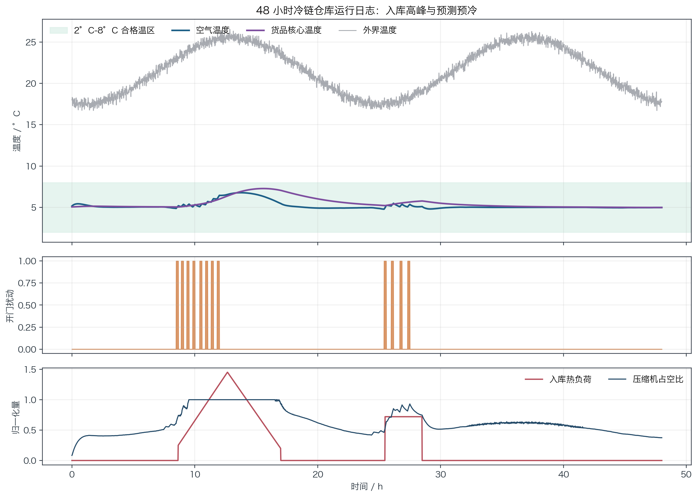
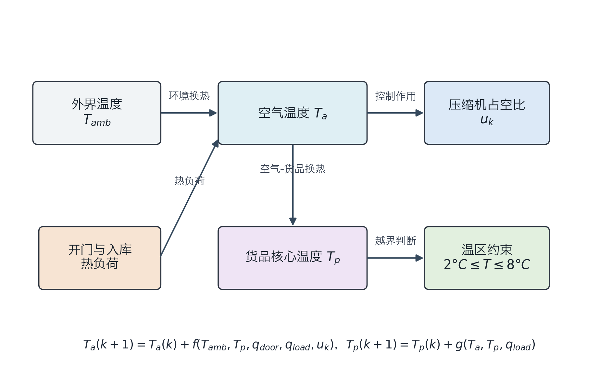
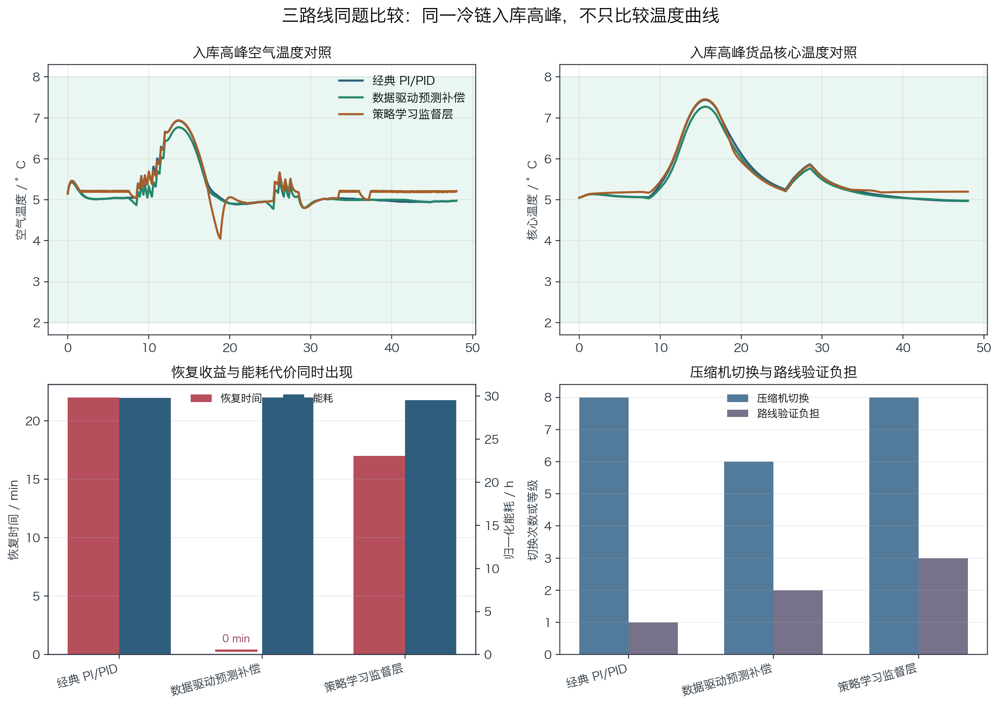
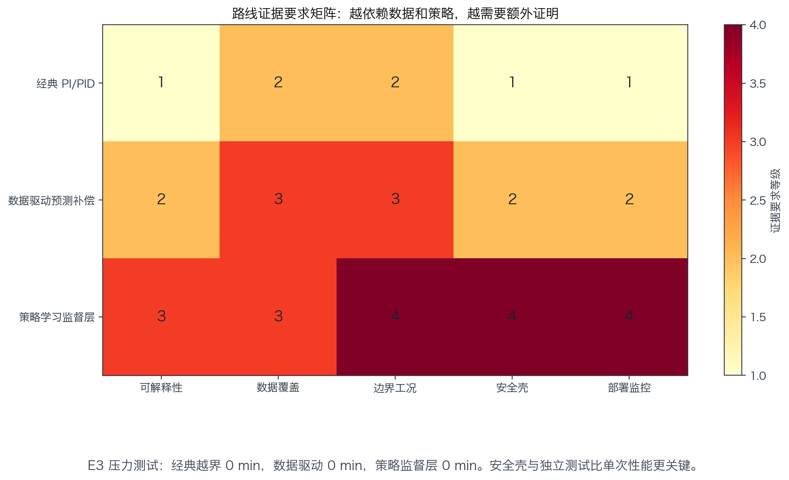

# 单元 5-6 | 方法迁移与前沿比较：经典控制、数据驱动与策略学习的同题比较

**课程**：自动控制原理
**课型**：实践
**学时**：90 分钟
**知识类型**：[D] 综合判断与方法迁移
**前置**：已理解线性主干边界、模型驱动到数据驱动的迁移逻辑，以及策略学习进入控制问题时的收益、样本代价、安全验证和部署风险。
**核心问题**：面对同一个工程控制任务，如何判断应继续采用经典控制，迁移到数据驱动方法，还是只把策略学习列为受限候选。

## 本次课程目标

完成本次课程后，学习者能够：

1. 从同一控制任务中提取模型可信度、数据覆盖、扰动来源、动作边界和安全后果五类证据。
2. 比较经典控制、数据驱动预测补偿和策略学习监督层在性能、可解释性、验证难度与工程责任上的差异。
3. 根据本地仿真日志和指标表，判断不同工况下优先采用哪条技术路线。
4. 写出方法选择说明卡，说明推荐路线、主要收益、关键风险、验证路径和暂不采用其他路线的依据。
5. 区分性能改善、部署可用和责任可审查三件事，避免用单一指标替代工程判断。

## 一、同一冷链任务中的方法选择压力

疫苗和生物制剂冷藏仓通常需要把储存温度维持在 $2^\circ\mathrm{C}$ 至 $8^\circ\mathrm{C}$，并通过连续监测、记录和异常处置降低失效风险。这个温区事实来自 CDC 疫苗储存处理资料；WHO 关于受控温度链的资料也强调，离开标准冷链条件必须有明确批准、条件和责任边界。本单元只借用这些事实确定任务约束，不把冷链管理扩展成法规课。

设一个单温区冷藏仓的控制设定点为 $5^\circ\mathrm{C}$。仓内有两类关键温度：

- 空气温度 $T_a$：传感器直接测得，响应快，受开门和压缩机动作影响明显。
- 货品核心温度 $T_p$：变化慢，更接近疫苗或生物制剂本体的热风险。

控制目标可以写成：

$$
2 \leq T_a(k) \leq 8,\qquad 2 \leq T_p(k) \leq 8,\qquad T_{\mathrm{set}} = 5.
$$

压缩机占空比 $u_k \in [0,1]$ 是底层执行量。任务中的主要扰动包括外界温度 $T_{\mathrm{amb},k}$、开门热负荷 $q_{\mathrm{door},k}$、入库货品热负荷 $q_{\mathrm{load},k}$。同一个冷链任务可以形成三条候选路线：

1. 经典 PI/PID 温控：用固定设定点、误差积分、抗积分饱和和压缩机限幅守住温区。
2. 数据驱动预测补偿：保留 PI/PID 主结构，根据历史开门、入库批次和环境温度预测热负荷，提前预冷并加入压缩机前馈项。
3. 策略学习监督层：不直接输出压缩机动作，只在上层选择“预冷、正常、节能、保守恢复”四种模式，并强制安全壳。

方法迁移判断不按算法新旧排序，核心证据是当前失效来源能否被解释和验证。常规日没有高热负荷时，经典控制已经足够；入库高峰导致热负荷可预测地集中出现时，数据驱动预冷有明确价值；训练覆盖不足或安全壳不完整时，策略学习只能停留在监督层候选位置。

{width=92%}

## 二、二状态热模型与可复现实验

本单元的数值结论来自本地固定种子仿真，随机种子为 `5606`，采样周期为 $1\ \mathrm{min}$，仿真长度为 $48\ \mathrm{h}$。外部资料只支撑温区与责任背景；曲线、模型、扰动、指标和结论均由本地数据生成。

模型保留两个温度状态：空气温度 $T_a(k)$ 和货品核心温度 $T_p(k)$。空气温度变化快，直接被传感器测到；货品核心温度变化慢，更能体现生物制剂本体的热风险。若只看 $T_a$，开门后空气已经恢复到设定点时，货品核心温度可能仍在上升。

本单元采用如下离散热模型：

$$
T_a(k+1)=T_a(k)
+\frac{T_{\mathrm{amb}}(k)-T_a(k)}{420}
+\frac{T_p(k)-T_a(k)}{92}
+0.040q_{\mathrm{door}}(k)
+0.030q_{\mathrm{load}}(k)
-0.080c(k)u(k),
$$

$$
T_p(k+1)=T_p(k)
+\frac{T_a(k)-T_p(k)}{250}
+0.0062q_{\mathrm{load}}(k).
$$

各变量含义如下。

| 符号 | 含义 | 取值或单位 |
| --- | --- | --- |
| $T_a(k)$ | 仓内空气温度 | $^\circ\mathrm{C}$ |
| $T_p(k)$ | 货品核心温度 | $^\circ\mathrm{C}$ |
| $T_{\mathrm{amb}}(k)$ | 外界环境温度 | $^\circ\mathrm{C}$ |
| $q_{\mathrm{door}}(k)$ | 开门热负荷强度 | 无量纲，开门时增大 |
| $q_{\mathrm{load}}(k)$ | 入库货品热负荷强度 | 无量纲，温热货品入库时增大 |
| $u(k)$ | 压缩机占空比 | $0\leq u(k)\leq 1$ |
| $c(k)$ | 制冷能力系数 | 正常为 1，能力下降时小于 1 |

模型中三个时间尺度决定了温度变化的快慢。外界通过仓体影响空气温度，对应 $420\ \mathrm{min}$ 的慢时间尺度；空气和货品之间换热，对应 $92\ \mathrm{min}$；货品核心本身更慢，对应 $250\ \mathrm{min}$。压缩机项 $-0.080c(k)u(k)$ 只直接作用在空气温度上，货品核心温度只能通过空气-货品换热间接下降。

这组参数不代表药品仓库的真实设计参数，只作为教学比较用的固定对象。它的作用是让三类方法面对完全相同的对象、扰动和评价指标。路线比较时，改变的是控制方法，不改变热模型。

{width=86%}

三个实验场景分别代表三种比较压力。

| 场景 | 扰动描述 | 方法比较重点 |
| --- | --- | --- |
| `E1` 常规日 | 少量开门，外界温度平稳，货品热负荷小 | 经典控制是否已经足够 |
| `E2` 入库高峰 | 连续开门，温热货品集中入库，热负荷可提前观察 | 数据驱动预测预冷是否带来实际收益 |
| `E3` 未见扰动 | 门封退化使 $q_{\mathrm{door}}$ 长期偏大，传感器读数偏低，制冷能力 $c(k)$ 降为 0.62 | 策略监督层离开训练覆盖后的验证压力 |

实验指标包括越界分钟数、最高空气温度、最高货品核心温度、恢复时间、能耗、压缩机切换次数、告警次数和路线验证负担。恢复时间的判定标准是：主要热负荷结束后，$T_a$ 和 $T_p$ 同时回到 $5.8^\circ\mathrm{C}$ 以下所需的分钟数。若热负荷结束的那个时刻已经满足 $T_a\leq 5.8^\circ\mathrm{C}$ 且 $T_p\leq 5.8^\circ\mathrm{C}$，恢复时间记为 $0\ \mathrm{min}$。能耗按 $\sum u(k)/60$ 计算，表示 48 小时内的归一化压缩机运行小时数。压缩机切换次数按 $u(k)>0.80$ 的高负荷状态进入和离开次数统计。告警次数按温度越界片段统计；本组仿真没有越界片段，所以告警次数均为 0。

## 三、三路线同题实验

三条路线使用相同的模型、扰动日志和评价指标。比较的关键不止是把三条曲线画在一起，更要弄清每条路线在闭环中实际做了什么。

### 3.1 经典 PI/PID：固定设定点与抗饱和闭环

经典路线使用空气温度误差驱动压缩机占空比。传感器测得的空气温度为

$$
T_m(k)=T_a(k)+b(k),
$$

其中 $b(k)$ 是传感器偏置；正常情况下 $b(k)=0$，E3 中后段存在负偏置。误差定义为

$$
e(k)=T_m(k)-T_{\mathrm{set}},\qquad T_{\mathrm{set}}=5.
$$

控制器候选输出为

$$
u^{\star}(k)=K_p e(k)+I(k)+K_d[e(k)-e(k-1)]+u_{\mathrm{ff}}(k),
$$

实际压缩机占空比经过限幅：

$$
u(k)=\mathrm{clip}(u^{\star}(k),0,1).
$$

这里的 $\mathrm{clip}(x,L,U)$ 表示限幅函数：

$$
\mathrm{clip}(x,L,U)=
\begin{cases}
L, & x<L,\\
x, & L\leq x\leq U,\\
U, & x>U.
\end{cases}
$$

因此 $u(k)=0$ 表示压缩机关闭，$u(k)=1$ 表示压缩机满占空比运行。$I(k)$ 是积分项，用来累积长期温度偏差。若温度长期偏高，$I(k)$ 会逐渐增大，压缩机平均占空比也随之提高；若温度长期偏低，$I(k)$ 会降低，避免过度制冷。

积分项按每分钟递推。先计算临时积分项：

$$
\tilde I(k+1)=\mathrm{clip}\left(I(k)+K_i e(k), I_{\min}, I_{\max}\right).
$$

若候选输出 $u^\star(k)$ 没有越过 $0$ 至 $1$ 的占空比边界，则采用 $\tilde I(k+1)$；若 $u^\star(k)$ 已经饱和，并且继续积分会让饱和更严重，则保持 $I(k+1)=I(k)$。写成规则就是：

$$
I(k+1)=
\begin{cases}
\tilde I(k+1), & 0<u^\star(k)<1,\\
\tilde I(k+1), & u^\star(k)\leq 0\ \text{且}\ e(k)>0,\\
\tilde I(k+1), & u^\star(k)\geq 1\ \text{且}\ e(k)<0,\\
I(k), & \text{其他情况}.
\end{cases}
$$

这个抗饱和规则的含义是：压缩机已经打到边界时，积分项只能朝“离开饱和”的方向变化，不能继续把控制器推向更深的饱和。经典路线没有前馈补偿，$u_{\mathrm{ff}}(k)=0$。参数为

| 参数 | 数值 | 作用 |
| --- | ---: | --- |
| $K_p$ | 0.42 | 温度偏高时立即增加制冷 |
| $K_i$ | 0.010 | 决定 $I(k)$ 每分钟随误差变化的速度 |
| $K_d$ | 0.08 | 抑制开门扰动后的快速变化 |
| $I_{\min}, I_{\max}$ | -0.35, 0.70 | 抗积分饱和边界 |

参数确定方式是保守整定：先在 E1 常规日上调 $K_p$，使空气温度峰值低于 $5.6^\circ\mathrm{C}$ 且压缩机不长期高负荷；再加入小积分项处理慢偏差；最后用 E2 入库高峰检查是否守住 $8^\circ\mathrm{C}$ 上限。确定后参数冻结，E1、E2、E3 都使用同一组经典参数。

### 3.2 数据驱动预测补偿：预测热负荷，不直接预测控制动作

数据驱动路线保留 PI/PID 闭环，只额外预测未来一小时热负荷等级。它不预测“应该开多少压缩机”，也不替代温区约束。

预测量为

$$
\hat H_{60}(k)=0.16\sum_{i=k}^{k+60}q_{\mathrm{door}}(i)
+0.09\sum_{i=k}^{k+60}q_{\mathrm{load}}(i)
+0.35\max\{0,\overline T_{\mathrm{amb},60}(k)-22\}.
$$

其中 $\hat H_{60}(k)$ 是未来一小时热负荷分数，数值越大，说明即将出现的开门、入库和高外温叠加越强。这个预测器使用三类可提前获得或可短时估计的信号：

| 输入量 | 获取方式 | 在预测中的作用 |
| --- | --- | --- |
| $q_{\mathrm{door}}(i)$ | 由仓门开关记录或入库作业计划得到；仿真中开门分钟取较大值，关门分钟为 0 | 表示外界热空气进入仓内的短时冲击 |
| $q_{\mathrm{load}}(i)$ | 由入库批次、货品初温、周转箱数量折算；仿真中用入库高峰曲线表示 | 表示温热货品把热量带入货架后的慢释放 |
| $\overline T_{\mathrm{amb},60}(k)$ | 由外界温度传感器和短时天气预报得到；仿真中取未来 60 分钟平均外温 | 表示仓体换热背景强弱 |

三个权重 $0.16$、$0.09$、$0.35$ 并非在线学习得到的神经网络参数，而是离线标定的透明线性系数。标定过程只使用 E1 常规日和 E2 入库高峰作为开发日志：先从热模型中选出“开门积分、入库热负荷积分、外温超出 $22^\circ\mathrm{C}$ 的平均量”三个候选特征，再调节权重，使 $\hat H_{60}(k)$ 能够提前标出未来一小时内温度峰值明显上升的时段。E3 的门封退化、传感器偏置和制冷能力下降不参与标定，它专门用于检查预测器离开开发覆盖后的风险。

补偿分两步进入控制器。

第一步是预冷设定点。若

$$
\hat H_{60}(k)>7.8,
$$

则临时把空气温度设定点从 $5^\circ\mathrm{C}$ 改为 $4.25^\circ\mathrm{C}$，让货品核心在高热负荷到来前获得温度余量。

第二步是压缩机前馈项：

$$
u_{\mathrm{ff}}(k)=\mathrm{clip}\{0.030\hat H_{60}(k)+0.020\max[0,T_{\mathrm{amb}}(k)-23],0,0.52\}.
$$

数据驱动路线的 PI/PID 参数略强于经典路线：

| 参数 | 数值 |
| --- | ---: |
| $K_p$ | 0.48 |
| $K_i$ | 0.011 |
| $K_d$ | 0.08 |

这条路线的实现细节说明了它为什么适合 E2：入库高峰并非随机噪声，它有开门、入库和外温信号可以提前观察。预测补偿解决的是“热量已经进入仓库后再追赶会慢”的问题。

### 3.3 策略学习监督层：四模式阈值策略，而不是黑箱控机

本单元的策略监督层没有训练一个直接控制压缩机的强化学习策略。当前实现是可解释的四模式监督策略，用于说明策略学习进入安全关键系统时应放在什么层级。它只能读取可观测量，状态向量为

$$
x(k)=\left[T_m(k),\,T_p(k),\,\hat H_{60}(k),\,T_{\mathrm{amb}}(k)\right].
$$

其中 $b(k)$ 是仿真中用于制造传感器偏置的隐藏故障量，不是监督层可直接读取的输入。这个区分很重要：若监督层已经知道传感器偏置，它就不应在 E3 中低估热风险；本单元正是用 E3 检查“读数看起来正常，但真实空气温度偏高”时策略监督层的覆盖缺口。

动作采用四种监督模式，而非连续占空比：

| 模式 | 触发条件 | 设定点和控制参数 |
| --- | --- | --- |
| 保守恢复 | $T_m>6.7$ 或 $T_p>6.3$ | $T_{\mathrm{set}}=4.10$，$K_p=0.58$，$K_i=0.014$，$K_d=0.10$，$u_{\mathrm{ff}}=0.22$ |
| 预冷 | $\hat H_{60}>9.0$ | $T_{\mathrm{set}}=4.35$，$K_p=0.52$，$K_i=0.012$，$u_{\mathrm{ff}}=0.24$ |
| 节能 | $\hat H_{60}<1.2$ 且 $T_m<5.2$ 且 $T_p<5.25$ | $T_{\mathrm{set}}=5.65$，$K_p=0.34$，$K_i=0.006$ |
| 正常 | 其他情况 | 回到经典 PI/PID 参数 |

所谓“训练”在这里必须讲实：它不是神经网络训练，也不是完整强化学习训练。它是用 E1 常规日和 E2 入库高峰作为开发场景，把明显状态标注成“正常、预冷、节能、保守恢复”四类，再把这些标签蒸馏成阈值策略。E3 的门封退化、传感器偏置和制冷能力下降不参与标定，专门作为未见扰动测试。

这个设计有两个教学含义。第一，策略学习不应直接接管压缩机，底层仍然要经过 PI/PID、限幅、回退和温区检查。第二，训练覆盖不足会暴露风险：E3 中传感器读数偏低时，监督层会低估真实热风险；仿真中用“前馈项乘以 0.78”表达这种覆盖缺口。

### 3.4 数据和结果如何得到

每次仿真按以下顺序执行：先生成 48 小时扰动日志，再让三条路线分别在同一扰动日志上闭环运行，最后从运行轨迹中计算指标。每条轨迹都记录分钟、空气温度、货品核心温度、压缩机占空比、开门热负荷、入库热负荷、外界温度和监督模式。这样可以保证三条路线面对的是同一任务，而非三组不同难度的案例。

下表读取自本课仿真输出。路线验证负担按“低、中、高”标记，它不由温度轨迹直接计算，含义是路线选择时需要补充多少证据。经典 PI/PID 的证据主要来自模型、参数、限幅和压力工况仿真，记为低；数据驱动预测补偿还需要证明训练日志覆盖、独立测试、预测误差和漂移监控，记为中；策略学习监督层还需要证明状态-动作标签、训练覆盖、安全壳、拒绝条件、故障注入和运行审计，记为高。三组实验的告警次数均为 0，说明三条路线在这些仿真设置中都没有触发温区越界告警；为避免表格过宽，告警列不单独列出。

E1 常规日：

| 路线 | 越界 / min | 空气峰值 / °C | 核心峰值 / °C | 恢复 / min | 能耗 | 切换 | 负担 |
| --- | ---: | ---: | ---: | ---: | ---: | ---: | --- |
| 经典 | 0 | 5.46 | 5.15 | 0 | 23.97 | 0 | 低 |
| 预测补偿 | 0 | 5.43 | 5.13 | 0 | 23.97 | 0 | 中 |
| 策略监督 | 0 | 5.47 | 5.20 | 0 | 23.53 | 0 | 高 |

E2 入库高峰：

| 路线 | 越界 / min | 空气峰值 / °C | 核心峰值 / °C | 恢复 / min | 能耗 | 切换 | 负担 |
| --- | ---: | ---: | ---: | ---: | ---: | ---: | --- |
| 经典 | 0 | 6.93 | 7.44 | 22 | 29.78 | 8 | 低 |
| 预测补偿 | 0 | 6.77 | 7.27 | 0 | 29.85 | 6 | 中 |
| 策略监督 | 0 | 6.94 | 7.45 | 17 | 29.51 | 8 | 高 |

E3 未见扰动：

| 路线 | 越界 / min | 空气峰值 / °C | 核心峰值 / °C | 恢复 / min | 能耗 | 切换 | 负担 |
| --- | ---: | ---: | ---: | ---: | ---: | ---: | --- |
| 经典 | 0 | 7.32 | 6.94 | 0 | 38.50 | 5 | 低 |
| 预测补偿 | 0 | 7.13 | 6.78 | 0 | 38.89 | 7 | 中 |
| 策略监督 | 0 | 7.31 | 6.94 | 0 | 38.78 | 9 | 高 |

{width=94%}

这张图只展示 E2 入库高峰，因为 E2 最能暴露“恢复速度”和“预冷收益”的差异。左下角把恢复时间和能耗放在同一子图中比较：红色柱表示热负荷结束后回到 $5.8^\circ\mathrm{C}$ 以下所需时间，蓝色柱表示 48 小时归一化能耗。恢复时间为 $0\ \mathrm{min}$ 时，图中用 $0\ \mathrm{min}$ 标注表示“热负荷结束时已经恢复到阈值以下”，不是缺失数据。右下角只保留压缩机切换次数和路线验证负担；告警次数本轮全部为 0，不能提供方法差异，因此不再绘制。

这些数字给出三条可审查结论。

第一，常规日的经典 PI/PID 已经把空气温度最高值控制在 $5.46^\circ\mathrm{C}$，货品核心最高值控制在 $5.15^\circ\mathrm{C}$，没有越界和恢复压力。数据驱动和策略学习没有带来实质改善，却提高了解释和验证负担。常规日优先采用经典控制。

第二，入库高峰中，经典 PI/PID 仍能守住 $2^\circ\mathrm{C}$ 至 $8^\circ\mathrm{C}$，但扰动结束后恢复时间为 $22\ \mathrm{min}$。数据驱动预测补偿这条组合路线同时使用预测预冷、前馈补偿和略强的 PI/PID 参数，把最高空气温度从 $6.93^\circ\mathrm{C}$ 降到 $6.77^\circ\mathrm{C}$，最高货品核心温度从 $7.44^\circ\mathrm{C}$ 降到 $7.27^\circ\mathrm{C}$，恢复时间降到 $0\ \mathrm{min}$。这组结果只能证明“当前组合实现”在 E2 中更合适，不能单独证明其中某一个机制独立贡献了全部改善。

第三，未见扰动中，三条路线都没有越界，但策略学习监督层没有优于数据驱动路线，能耗也不低于经典基线，切换次数还更高。这个场景包含门封退化、传感器偏置和压缩机制冷能力下降，说明训练覆盖和故障诊断比单次曲线更重要。策略学习可以继续作为监督层候选，但不应进入主闭环。

## 四、路线选择的证据结构

### 4.1 经典控制的优先入口

经典控制的优势是结构清楚、参数可解释、验证路径成熟。冷链温控任务中的 PI/PID 至少能清楚回答三件事：

- 误差从哪里来：$e(k)=T_m(k)-T_{\mathrm{set}}$，其中 $T_m(k)=T_a(k)+b(k)$ 是传感器测得的空气温度。
- 控制动作如何受限：$0\leq u_k\leq 1$，积分项通过抗饱和避免持续累积。
- 风险如何监测：直接检查 $T_a$、$T_p$ 是否离开 $2^\circ\mathrm{C}$ 至 $8^\circ\mathrm{C}$。

当模型结构、设定点、执行边界和扰动强度都清楚时，经典控制不需要被替换。它还应作为安全退路保留，因为任何更复杂路线都要证明自己在边界工况下至少不会破坏温区责任。

### 4.2 数据驱动的合理位置

数据驱动路线适合补足“模型结构大体可信，但某些热负荷难以固定”的部分。在冷链仓库中，开门记录、入库批次和外界温度能为短时热负荷提供可观察信号。数据模块不必替代 PI/PID，只需给出两类有限输出：

| 数据模块职责 | 输入证据 | 输出内容 | 保留的显式责任 |
| --- | --- | --- | --- |
| 热负荷预测 | 开门记录、入库批次、环境温度 | 未来一小时热负荷等级 | PI/PID 主结构、压缩机限幅、温区检查 |
| 提前预冷 | 热负荷等级和当前温度余量 | 临时把设定点从 $5^\circ\mathrm{C}$ 下调到约 $4.25^\circ\mathrm{C}$ | 预冷下限、恢复条件、异常回退 |
| 故障提示 | 预测误差持续偏大 | 门封退化、传感器偏置、制冷能力下降的排查提示 | 人工复核、独立测试、运行记录 |

这种路线的关键不在“用了数据”，而在数据是否覆盖了真正的热风险。若训练日志只覆盖常规开门，不覆盖集中入库、门封退化、传感器偏置和压缩机能力下降，数据模块不能给出部署结论。

### 4.3 策略学习的受限入口

策略学习监督层只在动作模式选择难以用固定规则表达时有价值。本单元把策略动作限制为四种上层模式：

| 模式 | 含义 | 可接受的输出边界 |
| --- | --- | --- |
| 预冷 | 热负荷到来前提前降低设定点 | 仍受最低安全温度和恢复条件约束 |
| 正常 | 保持 $5^\circ\mathrm{C}$ 附近控制 | 保留 PI/PID 主闭环 |
| 节能 | 热风险低时减少制冷动作 | 不允许牺牲温区监测 |
| 保守恢复 | 温度偏高或核心温度上升时快速恢复 | 触发告警、记录原因、可退回经典控制 |

策略学习不直接输出压缩机占空比，是因为安全关键系统需要可限制、可拒绝、可降级的动作边界。若策略缺少训练覆盖、独立测试、异常检测和安全壳，性能再高也不能作为主控制闭环依据。

{width=86%}

图中的“证据要求等级”不是自动控制领域的标准性能指标，也不是可以替代超调量、调节时间、能耗、鲁棒性裕度或越界时间的评价流程。它是本课为了比较方法迁移代价设置的证据审查维度：1 表示只需要基线模型、参数和边界说明即可复核；2 表示还需要说明数据来源、适用范围或额外约束；3 表示需要独立测试集、压力工况、故障注入或误差监控；4 表示需要安全壳、拒绝条件、上线监控和可回退机制。这个分级的思想来自控制系统模型验证、软件验证确认和 AI 风险管理中的共同要求：系统越依赖数据和策略选择，越需要证明数据覆盖、异常行为、部署监控和人工接管边界。它不能被写成“控制系统评价标准”，只能作为本案例的方法选择说明卡中的工程证据维度。

## 五、方法选择说明卡

本单元的实践产物是一张方法选择说明卡。它不要求写完整控制器代码，而要求把路线选择写成可审查的工程判断。

| 栏位 | 需要填写的内容 |
| --- | --- |
| 任务对象 | 冷藏对象、温区要求、采样周期、执行器、扰动来源和安全后果 |
| 主要证据 | 模型可信度、数据覆盖、热负荷来源、故障迹象、动作边界 |
| 推荐路线 | 经典控制 / 数据驱动预测补偿 / 策略学习监督层候选 / 混合路线 |
| 选择理由 | 为什么这条路线最匹配当前证据 |
| 主要收益 | 解决了哪个具体缺口，例如入库热负荷预判或恢复时间缩短 |
| 关键风险 | 新增的数据覆盖、泛化、安全壳、解释和部署监控负担 |
| 验证路径 | 本地仿真、压力工况、独立日志、故障注入、上线前监控 |
| 暂不采用其他路线 | 其他路线缺少什么条件，或为什么代价超过收益 |

对本单元冷链案例，说明卡可以这样写：

> 常规日采用经典 PI/PID 作为主路线。模型结构清楚，温区约束直接，固定设定点即可把空气温度和货品核心温度稳定在合格范围内。数据驱动和策略学习没有明显性能收益，反而增加验证负担。入库高峰采用“经典 PI/PID + 数据驱动预测预冷 + 前馈补偿”的混合路线，因为热负荷具有可提前观察的开门和入库信号，当前组合实现把恢复时间从 $22\ \mathrm{min}$ 降到 $0\ \mathrm{min}$。策略学习只保留为监督层候选，原因是未见扰动中的性能优势不足，且需要额外证明训练覆盖、安全壳、拒绝条件和部署监控。

## 六、分层实践任务

### 6.1 证据辨析

把下列现象分别归入“经典控制优先”“数据驱动补足”“策略学习候选”或“先诊断设备/链路”。

1. 常规日少量开门，PI/PID 已经把 $T_a$ 控制在 $5.5^\circ\mathrm{C}$ 以下。
2. 每天固定时段集中入库，入库批次、开门记录和外界温度都能提前获得。
3. 门封退化导致热负荷长期偏高，但控制日志没有相应故障标记。
4. 策略监督层在训练场景表现好，但没有覆盖传感器偏置和制冷能力下降。
5. 数据驱动预冷降低了核心温度峰值，却让能耗明显上升。

完成后说明每一项的证据来源。只写方法名不得分。

### 6.2 定量判断

根据第 3 节指标表回答：

1. E1 常规日为什么不需要迁移到数据驱动或策略学习？
2. E2 入库高峰中，数据驱动路线的收益具体体现在哪三个指标上？
3. E3 未见扰动中，为什么策略学习监督层仍只能作为候选？
4. 若医院要求降低能耗，哪些指标还需要重新加入评审？

答案必须同时讨论性能、验证负担和安全责任。

### 6.3 方法选择说明卡

阅读任务描述并填写说明卡。

> 某生物制剂冷藏仓每天上午有集中入库，下午只有零星出库。当前 PI/PID 在常规日稳定，但入库高峰后货品核心温度接近 $7.6^\circ\mathrm{C}$，恢复较慢。仓库已有两个月开门记录、入库批次和环境温度日志，没有系统记录门封退化、传感器偏置和压缩机故障。管理方希望缩短恢复时间，但不能提高冻伤风险，也不能引入无法解释的直接控机策略。

说明卡至少包含任务对象、主要证据、推荐路线、选择理由、主要收益、关键风险、验证路径和暂不采用其他路线的原因。

### 6.4 三分钟评审陈述

以小组为单位准备一段 3 分钟评审陈述，结构如下：

1. 冷链任务中最关键的控制风险是什么。
2. 经典 PI/PID 能解决哪一部分，在哪个场景中已经足够。
3. 数据驱动预测补偿解决了哪个具体缺口，新增什么验证负担。
4. 策略学习是否进入，进入到什么层级，为什么不直接接管压缩机。
5. 最终推荐路线和最小验证路径。

这项训练的重点是压缩判断链。方法比较的质量取决于证据、选择和责任是否清楚。

## 七、边界情况与常见误判

### 7.1 温度曲线更低不代表路线更适合

冷链控制并不追求温度越低越好。过度预冷可能增加冻伤风险和能耗，也可能掩盖传感器偏置。路线评审必须同时看上下限、核心温度、能耗、切换次数和异常处置。

### 7.2 数据量大不代表覆盖充分

两个月日志若都来自正常门封、正常传感器和正常压缩机，仍然不能证明数据模块能处理故障场景。数据驱动进入闭环前，应单独检查集中入库、门封退化、传感器偏置和制冷能力下降。

### 7.3 策略学习不能省略安全壳

策略监督层的每一次模式选择都可能改变设定点和压缩机动作节奏。它需要拒绝条件、回退路线、异常检测和运行审计。缺少这些证据时，策略学习不能进入主闭环。

### 7.4 更复杂的路线必须承担更重的说明责任

经典控制、数据驱动和策略学习都可以服务同一个任务，但它们的责任结构不同。经典控制说明模型和稳定性；数据驱动说明覆盖和泛化；策略学习还要说明状态、动作、回报、安全壳和部署监控。方法越复杂，说明责任越重。

## 八、总结与扩展思考

本单元的核心结论可以概括为四点。

1. 常规日冷链温控中，经典 PI/PID 已经能够稳定守住 $2^\circ\mathrm{C}$ 至 $8^\circ\mathrm{C}$，优先作为主路线和安全退路。
2. 入库高峰中，数据驱动组合路线的价值来自可提前观察的热负荷信号；在仿真中，这个组合实现把恢复时间从 $22\ \mathrm{min}$ 降到 $0\ \mathrm{min}$。
3. 策略学习更适合放在监督层，负责有限模式调度；训练覆盖、安全壳和独立测试不足时，不进入主控制闭环。
4. 方法选择必须同时报告收益、风险和验证路径。更前沿只表示工具空间扩大，不自动表示更适合当前任务。

扩展思考：

- 若数据驱动预冷降低了核心温度峰值，却提高能耗，应如何重写方法选择说明卡？
- 若传感器偏置导致测得空气温度偏低，三条路线分别会暴露什么风险？
- 若策略监督层只在仿真中测试过入库高峰，没有测试门封退化，它能否进入真实仓库的运行控制？

## 附录 A 参考文献与资料来源

[1] Centers for Disease Control and Prevention. *Vaccine Storage and Handling*. 2026 年访问。https://www.cdc.gov/vaccines/hcp/storage-handling/index.html

[2] Centers for Disease Control and Prevention. *Storage and Handling of Immunobiologics*. 2026 年访问。https://www.cdc.gov/vaccines/hcp/imz-best-practices/storage-handling-immunobiologics.html

[3] World Health Organization. *Controlled Temperature Chain*. 2026 年访问。https://www.who.int/teams/immunization-vaccines-and-biologicals/essential-programme-on-immunization/supply-chain/controlled-temperature-chain-%28ctc%29

[4] Ogata, K. *Modern Control Engineering*. 5th ed. Pearson, 2010.

[5] Åström, K. J., and Murray, R. M. *Feedback Systems: An Introduction for Scientists and Engineers*. Princeton University Press, 2008.

[6] Goodfellow, I., Bengio, Y., and Courville, A. *Deep Learning*. MIT Press, 2016.

[7] Sutton, R. S., and Barto, A. G. *Reinforcement Learning: An Introduction*. 2nd ed. MIT Press, 2018.

[8] National Institute of Standards and Technology. *Artificial Intelligence Risk Management Framework (AI RMF 1.0)*. NIST AI 100-1, 2023. https://www.nist.gov/publications/artificial-intelligence-risk-management-framework-ai-rmf-10

[9] U.S. Food and Drug Administration. *General Principles of Software Validation; Final Guidance for Industry and FDA Staff*. 2002. https://www.fda.gov/regulatory-information/search-fda-guidance-documents/general-principles-software-validation
