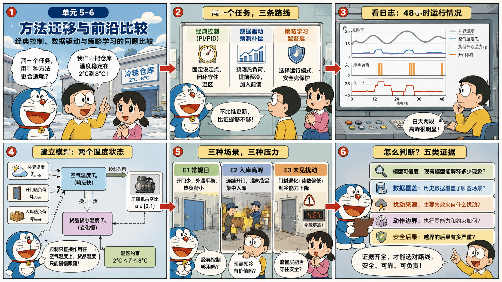
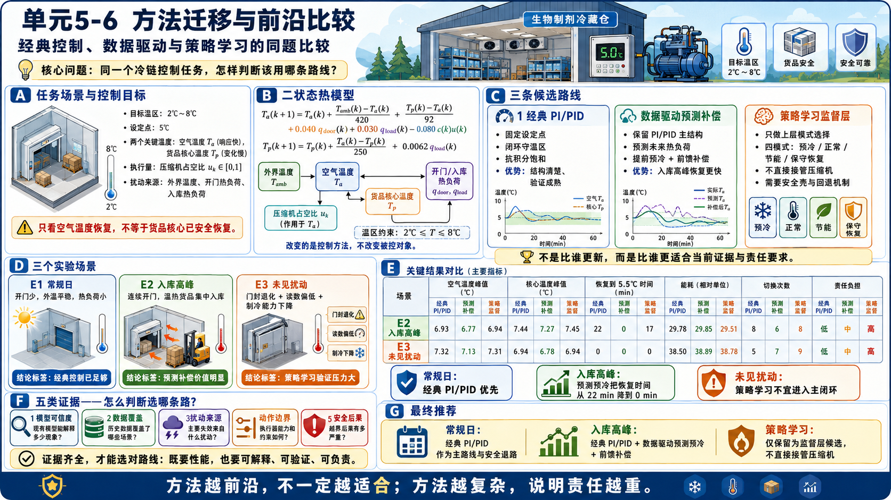

# 单元 5-6 | 方法迁移与前沿比较：经典控制、数据驱动与策略学习的同题比较

**课程**：自动控制原理
**课型**：实践
**学时**：90分钟
**知识类型**：[D] 综合判断与方法迁移
**前置**：已理解线性主干边界、MASS 系统链路、模型驱动到数据驱动的迁移逻辑，以及强化学习进入控制问题的条件与风险。
**核心问题**：面对同一个工程控制任务，如何判断应继续采用经典控制，迁移到数据驱动方法，还是只把策略学习列为候选方案。
**后续**：这些比较能力将用于期末综合题中的方法选择、风险解释和验证方案撰写。

## 本次课程目标

完成本次课程后，学习者能够：

1. 识别同一控制任务中模型可信度、数据覆盖、动作空间、安全后果和验证成本五类关键证据。
2. 比较经典控制、数据驱动与策略学习在信息来源、可解释性、性能潜力和工程责任上的差异。
3. 判断某一任务优先采用哪条技术路线，并说明暂不采用其他路线的依据。
4. 设计一份最小验证路径，覆盖仿真、边界工况、独立测试、安全监控和部署前证据。
5. 评估“更前沿”与“更适合”之间的差别，形成可审查的方法选择说明。

## 一、同一任务中的方法选择压力

设一艘自主水面船在近岸航道中执行航向保持与避碰调整任务。规划层给出参考航向 $\psi_d(t)$，控制层要让真实航向 $\psi(t)$ 平稳跟踪参考，同时限制舵角、舵速、能耗和近碰风险。环境中存在横流扰动、传感器噪声、目标船短时遮挡和航道边界约束。

这个任务可以用经典控制做，也可以加入数据驱动修正，还可以讨论策略学习。路线评审的核心标准是当前证据能否守住目标、边界和责任。若对象模型可信、任务目标明确、执行器约束清楚，经典控制或 MPC 往往仍是优先路线。若模型结构大体可信但参数随工况漂移，数据驱动可以补足模型中难以固定的部分。若动作选择空间非常大、显式规则难以枚举，并且样本、安全验证和部署监控均有证据支撑，策略学习才有合法入口。

三条路线共享同一个问题起点：

$$
e_\psi(t)=\psi_d(t)-\psi(t), \qquad |\delta(t)|\le \delta_{\max}, \qquad |\dot\delta(t)|\le \dot\delta_{\max}.
$$

其中 $e_\psi(t)$ 是航向误差，$\delta(t)$ 是舵角。若只看误差曲线，三条路线都可能让 $e_\psi(t)$ 变小；若同时看模型证据、数据覆盖、动作解释和部署风险，路线之间的差异才会显现。

表 1. 同一任务下三条路线的核心差异

| 比较维度 | 经典控制 | 数据驱动 | 策略学习 |
| --- | --- | --- | --- |
| 主要依据 | 物理模型、传递函数、状态空间、频域和时域证据 | 运行数据、实验样本、在线辨识和预测误差 | 状态、动作、回报、训练样本和策略验证 |
| 典型优势 | 结构清楚、可解释性强、验证路径成熟 | 能补足模型参数漂移或复杂扰动规律 | 能处理难以逐项写规则的高维序贯动作选择 |
| 主要代价 | 建模和结构选择受对象边界限制 | 数据覆盖、泛化和在线更新需要额外证据 | 样本、回报设计、安全验证和运行监控成本高 |
| 常见误判 | 把名义模型当成全工况真实对象 | 把样本误差下降当成闭环安全 | 把训练高分当成工程可靠 |
| 适合位置 | 首选基线、低风险控制层、可解释约束处理 | 模型补偿、参数更新、局部预测修正 | 高维动作选择、策略候选、受限部署前实验 |

方法比较的第一条原则是：先给经典控制一个认真成立的机会。经典控制不是因为“旧”而低级，它在模型、目标和边界清楚时往往是最可靠、最容易审查的路线。方法迁移只在证据显示原路线承担不了当前任务时发生。

## 二、比较证据来自任务、对象、数据和风险

### 2.1 任务结构决定是否需要迁移

任务结构清楚时，控制路线通常不需要急于迁移。例如参考航向平滑、扰动较小、对象参数经过辨识、舵角约束宽松，经典 PID、超前滞后、状态反馈或 MPC 可以直接给出稳定性、性能和约束解释。此时引入数据驱动或策略学习会增加验证负担，却未必带来可证明的收益。

任务结构复杂时，迁移压力开始出现。规划参考频繁改变、目标船行为不确定、感知置信度波动、环境扰动与航速耦合、执行器频繁接近边界，这些因素会让单一名义模型难以覆盖全部工况。此时要先判断复杂性出现在什么位置：对象参数漂移、扰动预测不足、参考生成不稳定，还是动作选择空间过大。不同位置对应不同迁移路线。

表 2. 复杂性位置与方法迁移方向

| 复杂性来源 | 典型证据 | 更合理的路线 |
| --- | --- | --- |
| 对象参数缓慢漂移 | 名义模型预测持续偏快或偏慢 | 数据驱动参数更新或自适应补偿 |
| 扰动规律难以建模 | 横流、风浪或载荷变化导致短时误差规律重复出现 | 数据驱动扰动预测或局部补偿 |
| 执行约束频繁触碰 | 舵角、舵速或功率长时间贴边 | 带约束 MPC 或保守重规划，不优先上 RL |
| 动作选择空间很大 | 避碰、规则、效率和安全长期耦合 | 先定义安全壳，再讨论策略学习候选 |
| 上游信息质量不稳定 | 感知丢帧、估计滞后、规划参考突变 | 优先修正链路责任，不把问题推给控制器 |

### 2.2 模型可信度决定经典控制的优先级

经典控制的强项是可解释。若对象能用可信模型描述，稳定性、裕度、时域指标和执行约束都能被逐项分析。典型航向对象可写成一阶 Nomoto 模型：

$$
T\dot r+r=K\delta+d_r,\qquad \dot\psi=r,
$$

其中 $r$ 是偏航角速度，$K$ 是舵效增益，$T$ 是时间常数，$d_r$ 是等效扰动。若 $K$ 和 $T$ 的变化范围已知，控制器可以按最不利参数整定，并通过仿真和实测验证裕度。

模型可信度下降时，也不必马上放弃模型。更合理的判断是把模型拆成两部分：结构是否可信，参数是否可信。结构可信、参数漂移时，数据驱动可以补足参数；结构本身不可信时，必须重新审视任务表达、对象分层和验证方式。若连状态、输入和安全边界都无法定义，策略学习也没有稳固入口。

### 2.3 数据覆盖决定数据驱动是否有证据

数据驱动方法的入口标准是“数据覆盖了关键边界”。航向保持任务至少要检查四类覆盖：状态覆盖、动作覆盖、扰动覆盖和约束覆盖。若训练数据只来自晴天、低流速、低交通密度和小舵角运行，即使样本量很大，也不能证明方法能处理强横流、目标船遮挡、舵角饱和和紧急避碰。

数据覆盖可以用一个最小清单描述。

表 3. 数据驱动进入闭环前的覆盖清单

| 覆盖对象 | 需要看到的证据 | 缺失后的风险 |
| --- | --- | --- |
| 状态范围 | 航向误差、偏航角速度、航速、环境等级覆盖任务边界 | 学到的规律只适合温和状态 |
| 动作范围 | 舵角、舵速、推进变化覆盖常见动作和边界动作 | 一到大动作就外推失效 |
| 扰动范围 | 横流、风浪、载荷和传感器噪声有代表样本 | 模型补偿在真实扰动下失效 |
| 约束事件 | 饱和、限速、近碰、安全距离不足等事件有验证样本 | 系统只会正常运行，不会处理边界 |
| 独立测试 | 训练外数据和压力场景单独评估 | 训练误差下降被误当成泛化能力 |

### 2.4 安全后果决定策略学习的门槛

策略学习最容易带来性能潜力，也最容易带来证明困难。若策略直接输出舵角，任何异常动作都会进入执行器；若策略只调度 PID 参数或给出参考航向修正，显式控制器和安全壳仍可保留一部分解释责任。实践中，越靠近执行器的动作越需要可解释、可限制、可降级。

强化学习是否进入任务，需要回答五个问题：

1. 显式控制器是否已经无法覆盖主要动作选择空间。
2. 状态、动作和回报是否能表达真实工程目标。
3. 仿真与实测样本是否覆盖关键边界和故障情形。
4. 独立测试是否能证明策略离开训练场景后仍可控。
5. 部署时是否有异常检测、拒绝条件、降级和接管机制。

这些问题中任意一项无法回答，策略学习都只能作为研究候选，不能作为默认控制方案。

## 三、方法选择矩阵与评审流程

### 3.1 六个评审维度

同题比较需要把性能放回更大的证据矩阵中。方法评审至少包含六个维度：性能、可解释性、模型依赖、数据依赖、验证难度和部署责任。若只比较误差积分、调节时间或能耗，结果会偏向看起来更激进的方法；若加入可解释性和验证成本，路线选择往往更接近工程实际。

表 4. 三路线评审矩阵

| 评审维度 | 经典控制 | 数据驱动 | 策略学习 |
| --- | --- | --- | --- |
| 性能潜力 | 中等到高，取决于模型与结构 | 高，适合补偿模型不足 | 高，适合复杂序贯动作 |
| 可解释性 | 高 | 中等，取决于数据模块位置 | 低到中等，取决于策略结构和解释工具 |
| 模型依赖 | 高 | 中等，可保留结构并用数据补参数 | 可低，但环境和安全模型仍不可缺 |
| 数据依赖 | 低到中等 | 高 | 很高 |
| 验证难度 | 低到中等 | 中等到高 | 高 |
| 部署责任 | 成熟，边界较清楚 | 需要监控数据覆盖和模型更新 | 需要安全壳、拒绝条件和运行审计 |

### 3.2 路线评审流程

方法评审不从“想用哪种算法”开始，而从任务证据开始。一个可执行的流程如下：

1. 写清任务目标：跟踪精度、响应速度、舵角限制、安全距离、能耗和舒适性。
2. 判断经典控制基线：模型是否可信，约束是否可处理，最坏工况是否还能满足主要指标。
3. 定位失效来源：失效来自参数漂移、扰动未知、参考不可实现、数据缺口，还是动作选择空间过大。
4. 检查迁移证据：数据覆盖、仿真可信度、独立测试、边界工况和安全后果是否足够。
5. 给出路线选择：选择一条主路线，同时说明其他路线暂不采用或只作为候选的原因。
6. 设计验证路径：最小仿真、压力测试、故障注入、离线审查、受限部署和运行监控。

这个流程可以压缩成一句判断：先看经典控制是否足够，再看数据能否补足具体缺口，最后才看策略学习是否有必要且有证据进入。

### 3.3 方法选择说明卡

本单元的实践产物是一张方法选择说明卡。它不要求写出完整控制器代码，而要求把方法选择写成可审查的工程判断。

表 5. 方法选择说明卡

| 栏位 | 需要填写的内容 |
| --- | --- |
| 任务对象 | 被控对象、参考输入、执行约束、环境扰动和安全后果 |
| 主要证据 | 模型可信度、数据覆盖、失效来源、动作空间、安全等级 |
| 推荐路线 | 经典控制 / 数据驱动 / 策略学习候选 / 混合路线 |
| 选择理由 | 为什么这条路线最适合当前证据 |
| 主要收益 | 该路线解决了哪一个具体缺口 |
| 关键风险 | 该路线新增了什么验证负担和部署风险 |
| 验证路径 | 仿真、边界工况、独立测试、安全监控和部署前证据 |
| 暂不采用其他路线 | 其他路线缺少什么条件，或为什么代价超过收益 |

## 四、近岸自主航行任务的案例头部

本单元用一个统一案例完成三路线比较。任务对象是一艘小型自主水面船，目标是在近岸航道中跟踪规划层给出的航向参考，并在目标船横穿时执行避碰调整。控制层接收参考航向 $\psi_d(t)$、当前航向 $\psi(t)$、偏航角速度 $r(t)$、环境扰动等级和感知置信度。执行器限制为

$$
|\delta|\le 18^\circ,\qquad |\dot \delta|\le 6^\circ/\mathrm{s}.
$$

任务指标包括：

| 指标 | 目标 |
| --- | --- |
| 航向均方根误差 | 不超过 $3^\circ$ |
| 最大航向误差 | 不超过 $10^\circ$ |
| 舵角使用 | 不长时间贴边，舵速不过度频繁切换 |
| 安全距离 | 避碰阶段不低于设定安全边界 |
| 可解释性 | 能说明动作来源、拒绝条件和降级条件 |
| 部署证据 | 至少经过独立仿真、边界工况和异常监控设计 |

案例中出现三条候选路线。

表 6. 案例中的三条候选路线

| 路线 | 控制结构 | 进入理由 | 主要疑点 |
| --- | --- | --- | --- |
| 经典控制基线 | 保守 PID 或带约束 MPC | 模型结构清楚，执行约束可写，验证成熟 | 参数漂移和横流扰动可能削弱性能 |
| 数据驱动补偿 | MPC 或 PID 保留，数据模块更新有效参数或扰动补偿 | 模型结构仍可信，但参数和扰动随工况变化 | 数据是否覆盖强横流、遮挡和大舵角工况 |
| 策略学习候选 | 策略输出参考航向修正或 PID 参数调度，外层保留安全壳 | 避碰动作选择受多目标和环境状态影响 | 样本、回报、安全验证和部署监控成本很高 |

案例分析的目标是训练同一任务下的证据组织能力。一个路线只有同时写清收益、风险和验证路径，才算完成方法选择。

## 五、航向控制路线选择示例

### 5.1 示例任务

某自主水面船在固定航道中运行。已通过实验辨识得到名义航向模型：

$$
T\dot r+r=K\delta,\qquad \dot\psi=r,
$$

其中 $T=9.0\ \mathrm{s}$，$K=0.16$。控制目标是跟踪规划层给出的缓慢变化参考航向，舵角限制为 $|\delta|\le 15^\circ$。最近一次运行日志显示，在普通海况下，保守 PID 控制可把航向均方根误差控制在 $2.4^\circ$，最大舵角约 $10^\circ$；在强横流时，均方根误差升至 $5.8^\circ$，舵角多次接近限制。日志中已有强横流样本 12 段，每段 3 分钟，但缺少目标船遮挡和紧急避碰工况。

需要在三条路线中选择一个下一阶段方案。

### 5.2 证据整理

先把现象翻译成证据。普通海况下 PID 已经满足目标，说明经典控制基线有效；强横流下误差升高，说明主要缺口来自扰动和有效参数变化，而不是动作选择空间过大。已有强横流样本，但缺少遮挡和紧急避碰样本，说明数据可以用于扰动补偿试验，却不足以支撑策略学习进入避碰动作选择。

表 7. 示例任务证据表

| 证据项 | 观察结果 | 对路线选择的含义 |
| --- | --- | --- |
| 模型结构 | 一阶 Nomoto 结构可解释普通海况响应 | 经典控制仍有基线价值 |
| 参数与扰动 | 强横流下误差升高，舵角接近边界 | 需要补偿扰动或更新有效模型 |
| 数据覆盖 | 有强横流样本，缺少遮挡和紧急避碰样本 | 数据驱动补偿可试验，策略学习证据不足 |
| 安全后果 | 舵角接近限制但未出现规则冲突和近碰 | 暂不需要高维策略直接接管动作 |
| 验证条件 | 可离线回放强横流日志，可做独立仿真 | 数据驱动路线具备最小验证入口 |

### 5.3 路线判断

推荐路线是“经典控制基线 + 数据驱动扰动补偿”。主控制器继续保留 PID 或 MPC 的显式结构，数据模块只承担局部职责：根据最近运行数据估计横流等效扰动或有效参数偏差，再把补偿量送入控制器。这样做的收益是明确的：它针对强横流下的主要失效来源，保留经典控制的可解释边界，并把新增风险限制在数据补偿模块。

暂不推荐策略学习，原因是当前证据不足。任务中尚未出现难以枚举的高维动作选择，已有数据也没有覆盖遮挡、近碰、规则冲突和紧急避碰。若此时训练策略，回报函数和样本覆盖都无法支撑部署结论，策略最多作为离线研究候选。

### 5.4 最小验证路径

数据驱动补偿进入闭环前，需要完成一条最小验证路径：

1. 离线回放普通海况和强横流日志，比较补偿前后的航向误差、舵角使用和舵速变化。
2. 在仿真中注入参数漂移、横流阶跃、传感器噪声和舵角限制，检查补偿模块是否诱发振荡或过度打舵。
3. 使用未参与拟合的强横流日志做独立测试，避免把训练误差下降误当成泛化能力。
4. 设置补偿量限幅和失效识别条件，一旦估计值跳变、数据窗口覆盖不足或舵角持续贴边，就退回保守经典控制。
5. 受限水域试运行时保留人工接管和运行审计记录，记录每一次补偿介入的原因、幅度和效果。

这个示例给出的结论并不复杂：当前任务不需要从经典控制直接跳到策略学习。更稳妥的迁移是保留可解释控制结构，让数据驱动承担有证据支撑的局部补偿。

## 六、近岸自主航行案例的完整分析

### 6.1 经典控制路线

经典控制路线以名义模型和执行约束为基础。可选方案包括保守 PID、带前馈扰动补偿的 PID、状态反馈或带约束 MPC。它的选择理由是模型结构清楚，控制目标和约束可以写成公式，稳定性和性能验证路径成熟。

在近岸自主航行案例中，经典控制至少应先完成三项工作。第一，用名义模型和最不利参数范围校准基线控制器。第二，在参考航向突变、横流扰动和舵角限制下检查稳定性、超调、调节时间和舵角使用。第三，把规划层参考的可实现性反馈给上游，避免控制层被迫跟踪不可执行轨迹。

经典控制的主要风险是过度相信名义模型。若强横流、载荷变化或低速操纵让 $K$ 和 $T$ 明显漂移，固定参数控制器可能留下较大误差。此时应先判断是否可以通过鲁棒整定、增益调度、扰动观测或 MPC 约束处理改善，而不是直接宣布经典控制失效。

### 6.2 数据驱动路线

数据驱动路线适合在模型结构仍可信、但某些关系难以固定时进入。它可以更新有效参数，预测短时扰动，补偿模型误差，或在 MPC 中提供更贴近当前工况的预测模型。它的价值来自“补足具体缺口”，不是替代控制目标和安全边界。

在近岸自主航行案例中，数据驱动更适合承担三类局部职责：

| 数据驱动职责 | 输入证据 | 输出内容 | 保留的显式责任 |
| --- | --- | --- | --- |
| 有效参数更新 | 最近一段航向、偏航角速度、舵角和环境等级 | 当前 $K$、$T$ 或离散模型参数 | 控制结构、舵角约束、稳定性检查 |
| 扰动补偿 | 横流、风浪、偏差残差和历史误差 | 前馈补偿量或扰动估计 | 补偿限幅、失效识别、回退条件 |
| 预测模型修正 | 闭环运行数据和参考变化 | 短时预测模型 | MPC 目标函数、约束和滚动优化结构 |

数据驱动路线的主要风险是样本覆盖不足。若数据来自温和水域，却部署到拥挤航道或强扰动水域，学习到的规律会在关键边界处失效。数据驱动进入闭环前，必须写清训练数据、独立测试数据和压力场景分别覆盖什么。

### 6.3 策略学习路线

策略学习路线适合在动作选择空间很大、显式规则难以枚举、长期后果需要通过序贯回报表达时作为候选。它不应直接替代整个控制系统。更合理的工程入口通常是策略输出参考航向修正、风险等级、局部动作建议或 PID 参数调度，底层仍保留显式控制器和安全壳。

在近岸自主航行案例中，策略学习只有在以下证据成立时才值得进入下一阶段：

1. 避碰动作选择已经明显超出固定规则或 MPC 代价函数的表达能力。
2. 仿真环境能够覆盖目标船行为、感知误差、横流、执行器限制和规则冲突。
3. 回报函数同时惩罚碰撞风险、规则违反、过度打舵、能耗和舒适性损失。
4. 策略输出受到安全壳限制，异常场景可拒绝动作或降级到经典控制。
5. 独立测试和故障注入证明策略不会把训练环境中的捷径带到真实系统。

若这些证据不成立，策略学习只能写成“暂不进入主控制闭环，可保留为离线候选”。这种判断体现了对控制系统安全后果的基本尊重。

### 6.4 推荐方案说明

对当前案例，更合理的推荐是分层混合路线：经典控制或 MPC 作为主控制器，数据驱动承担扰动补偿和有效参数更新，策略学习只作为受限场景下的离线候选。这个方案的收益是把每种方法放在证据最充分的位置：经典控制负责稳定和约束，数据驱动补足模型变化，策略学习暂不承担安全关键动作。

方法选择说明可写成：

> 推荐采用“经典控制主结构 + 数据驱动局部补偿”的路线。当前任务的主要缺口来自横流扰动和有效参数变化，而不是高维动作选择空间。经典控制基线已能在普通海况下满足主要指标，说明显式结构仍有价值；强横流样本能够支持扰动补偿试验，但缺少遮挡、近碰和规则冲突数据，暂不足以支撑策略学习进入主控制闭环。验证路径应覆盖日志回放、强扰动仿真、独立测试、补偿限幅、回退条件和受限水域试运行。

这段说明同时交代了选择路线、选择理由、主要收益、关键风险、验证路径和暂不采用策略学习的原因，因此具备可审查性。

## 七、分层实践任务

### 7.1 基础辨析：路线标签与证据匹配

把下列现象分别归入“经典控制优先”“数据驱动补足”“策略学习候选”或“先诊断系统链路”。

1. 航向模型结构可信，普通海况下 PID 满足指标，只在横流增强时稳态误差增大。
2. 规划层频繁输出急转弯参考，舵角长期贴边，控制器难以跟踪。
3. 避碰决策需要同时考虑多艘目标船、规则约束、未来风险和任务效率，固定规则难以枚举。
4. 训练数据来自固定晴天航道，部署目标包含夜间、强流和传感器遮挡。
5. 名义 MPC 预测偏快，运行数据能稳定估计当前有效时间常数。

完成后说明每一项的理由。只写方法名不得分，必须说明证据指向哪里。

### 7.2 定量判断：误差改善是否足以迁移

某航向控制系统在强横流下的评估结果如下。

| 方案 | 航向均方根误差 | 最大航向误差 | 舵角贴边时间比例 | 独立测试覆盖 |
| --- | ---: | ---: | ---: | --- |
| 保守 PID | $5.8^\circ$ | $13.2^\circ$ | $18\%$ | 已覆盖普通与强横流 |
| 数据驱动补偿 PID | $3.1^\circ$ | $8.6^\circ$ | $11\%$ | 只覆盖强横流，未覆盖遮挡 |
| 策略学习控舵 | $2.4^\circ$ | $7.2^\circ$ | $9\%$ | 仅训练环境验证 |

请判断哪条路线最适合作为下一阶段工程试验，并写出理由。答案应同时讨论性能、验证覆盖和部署风险。

### 7.3 迁移应用：填写方法选择说明卡

阅读下列任务描述，填写一张方法选择说明卡。

> 一艘无人艇需要在内河弯道中保持航迹，并在遇到低速障碍船时提前减速绕行。已有简化运动模型能解释正常航迹保持，但障碍船行为不稳定，感知置信度在桥区下降。历史数据覆盖普通弯道航行和少量低速障碍场景，没有覆盖多障碍拥堵和传感器短时失效。

说明卡至少包含：任务对象、主要证据、推荐路线、选择理由、主要收益、关键风险、验证路径、暂不采用其他路线的原因。

### 7.4 综合评审：三路线口头答辩准备

以小组为单位准备一段 3 分钟评审陈述。陈述结构固定为：

1. 任务中最关键的控制风险是什么。
2. 经典控制能解决哪一部分，解决不了哪一部分。
3. 数据驱动能补足什么，新增什么验证负担。
4. 策略学习是否进入，进入到什么层级，为什么不直接接管执行器。
5. 最终推荐路线和最小验证路径。

这项训练的重点是压缩判断链。方法比较的质量取决于证据、选择和责任是否清楚。

## 八、边界情况与常见误判

### 8.1 性能最好不等于路线最适合

某条路线在仿真中误差最小，只能说明它在该仿真条件下表现更好。若它缺少独立测试、安全壳、拒绝条件和部署监控，工程上仍可能不适合。控制系统的可靠性来自闭环证据，而不来自单一排行榜。

### 8.2 数据量大不等于数据覆盖充分

大量样本若都来自温和工况，仍然无法证明系统能处理强扰动、执行器边界、传感器异常和安全距离不足。比较数据驱动方案时，要优先问“覆盖了哪些边界”，再问“样本量有多少”。

### 8.3 策略学习不是取消控制器

策略学习输出的动作、参考或参数仍然属于控制系统的一部分。它需要目标、约束、回报、安全壳、监控和降级机制。若这些内容缺失，策略并没有让控制问题变简单，只是把困难藏进训练和部署风险中。

### 8.4 前沿方法不能替代责任说明

工程方法会随着问题而迁移。离散控制、MPC、数据驱动和策略学习都来自真实工程需求对旧工具的推动。方法迁移的意义在于更准确地处理对象、数据、约束和风险。路线越前沿，越需要把证据和责任写清。

## 九、总结与扩展思考

三路线同题比较的核心结论可以概括为四点。

1. 经典控制在模型、目标和边界清楚时仍是优先路线，尤其适合作为基线和安全退路。
2. 数据驱动适合补足具体缺口，特别是参数漂移、扰动预测和局部模型修正，但必须证明数据覆盖和泛化能力。
3. 策略学习只有在动作选择空间难以显式写出、样本与安全验证足够、部署监控可落地时才有合法入口。
4. 方法选择必须同时报告收益、风险和验证路径；更前沿不自动等于更适合。

扩展思考：

- 若一个策略学习方案性能显著优于经典控制，但无法解释失败边界，它能否进入安全关键闭环？需要补哪些证据？
- 若数据驱动补偿改善了平均误差，却增加了舵角高频动作，应如何修改评审矩阵？
- 若规划层给出的参考本身不可执行，控制层是否应继续优化控制器，还是先反馈规划可行域？

## 附录 A 方法选择说明卡模板

| 栏位 | 填写内容 |
| --- | --- |
| 任务对象 |  |
| 主要指标 |  |
| 模型证据 |  |
| 数据证据 |  |
| 安全后果 |  |
| 推荐路线 |  |
| 选择理由 |  |
| 主要收益 |  |
| 关键风险 |  |
| 验证路径 |  |
| 暂不采用其他路线的原因 |  |

## 附录 B 术语速查

| 术语 | 含义 |
| --- | --- |
| 经典控制 | 以明确模型、结构、参数和频域/时域证据为基础的控制方法集合 |
| 数据驱动控制 | 使用运行数据、实验样本或仿真数据补足对象规律并参与控制设计的方法集合 |
| 策略学习 | 通过状态、动作和回报形成动作生成策略的方法，强化学习是其中典型路线 |
| 安全壳 | 限制策略动作、识别异常并触发降级或接管的保护机制 |
| 独立测试 | 未参与训练、拟合或参数整定的数据和场景测试 |
| 方法选择说明卡 | 用证据、收益、风险和验证路径说明路线选择的简明工程文档 |
