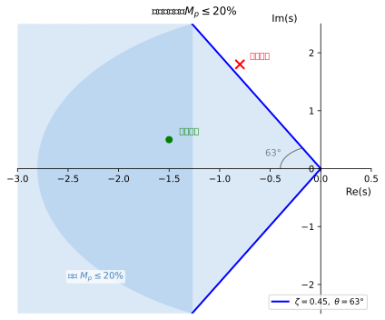
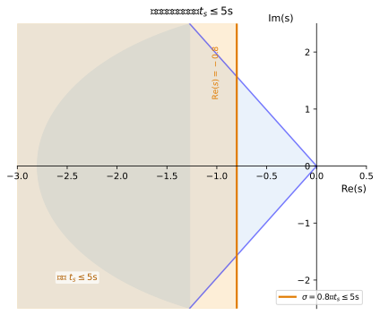
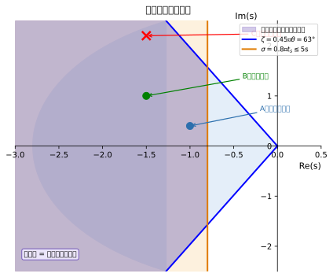
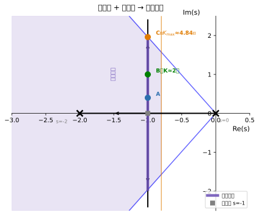
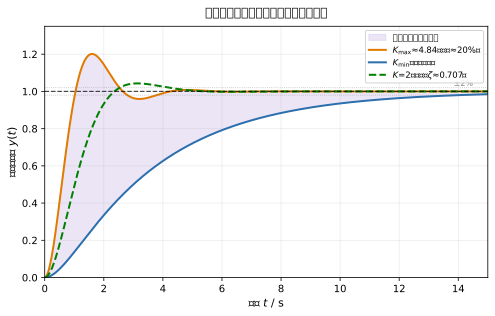
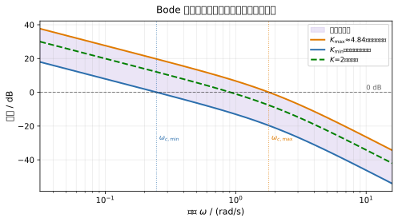
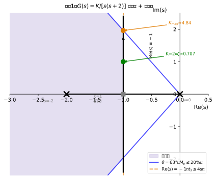
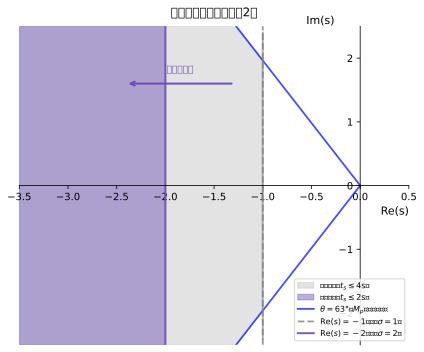

# 单元 L-∑ 讲义：设计可行域——让约束成为指南针

**课程**：自动控制原理
**单元编号**：L-∑
**标题**：设计可行域——让约束成为指南针
**层次**：层0 框架建构期 · 收束课
**学时**：2学时 | **知识类型**：[D] 设计型（直觉层）
**前置单元**：L-2a / L-2b / L-2c / L-2d（三域直觉速通 + 操作体验）
**后续单元**：层1（数学精化）；设计可行域精化见单元 3-1

> **速通说明**：本单元属于层0收束课，目标是将三域直觉整合为统一的"设计可行域"视角，建立从"给参数看性能"到"给性能找参数"的思维转换。几何关系不做推导，附录A给出关键约束关系式，完整推导见单元 2-1 和 3-1。

---

## 一、引入：工程师的真实处境

过去四节课，我们做的事情其实都是同一件事：

> **给定一个系统（确定的极点或增益K），观察它的行为。**

- L-2a：给定极点位置，看时域响应曲线是什么形状
- L-2b：让K从小变大，看极点沿根轨迹如何迁移
- L-2c：给定K，看Bode图如何呈现
- L-2d：拖动K，感受三域同步变化

这叫做**分析问题**——从参数出发，推算性能。

但真实的工程师面对的问题，往往是反过来的：

---

> **船长要求：转向时超调量不超过 20%，90秒内稳定。**
> **问题：你应该把控制器的增益 K 设置到多少？**

---

这就是**设计问题**——从性能需求出发，寻找满足条件的参数。

注意这个转变不只是"把问题倒过来"，而是思维方式的根本切换：分析问题有唯一答案，而设计问题往往有**一个允许的范围**，范围内的任何值都是可行的。工程师的任务，就是找到这个范围，再在范围内做出最优选择。

这个允许的参数范围，就叫做**设计可行域**。

---

## 二、复平面上的可行域：最直观的图景

设计可行域最容易在**复平面**上看清楚，因为极点的位置直接决定了性能。

### 2.1 两条约束线

工程师对船舶航向控制提出两类典型要求：

**要求一：不要冲太猛**（超调量约束）
> $M_p \leq 20\%$

超调量越小，阻尼比 $\zeta$ 越大，极点越靠近负实轴（夹角越小）。在复平面上，这个约束对应一条从原点出发、与负实轴夹角为 63° 的**射线**：极点必须落在这条线的**下方**（夹角更小的区域）。


*图1：从原点出发与负实轴成63°的射线，射线下方（夹角更小区域，含负实轴）为满足 $M_p \leq 20\%$ 的极点可行区域（浅蓝色填充）。标注角度63°，标注代表点：射线上方一点（超调超标）、射线下方一点（满足约束）。*

**要求二：不要拖太久**（调节时间约束）
> $t_s \leq 5\text{s}$

调节时间越短，极点实部的绝对值（衰减率 $\sigma$）越大，极点越靠左。在复平面上，这个约束对应一条平行于虚轴、位于 $\text{Re}(s) = -0.8$ 处的**垂线**：极点必须落在这条线的**左侧**。


*图2：在图1基础上，增加垂线 $\text{Re}(s) = -0.8$（对应 $t_s \leq 5\text{s}$），垂线左侧为满足调节时间约束的极点区域（浅橙色填充）。*

### 2.2 两线之间：可行域

两个约束同时满足，极点必须**同时落在两条线围成的交叉区域**内：


*图3：复平面可行域全图。两个约束区域的交集形成左下角的扇形区域（双重阴影叠加），标注：阻尼比射线（63°，$M_p$ 约束）、实部垂线（$\text{Re}(s)=-0.8$，$t_s$ 约束）、可行域（满足双重约束的区域）。在根轨迹上标注三个典型极点：A点（在可行域内，$K$ 偏小，慢但满足约束）、B点（在可行域内中部，最佳阻尼比附近）、C点（在根轨迹上但超出阻尼线，超调超标）。*

这个区域就是**复平面可行域**：所有能同时满足超调量和调节时间要求的极点，都必须落在这里。

> **几何直觉**：扇形越"深"（实部越负），系统越快；扇形越"窄"（夹角越小），系统越不超调。好的设计，就是把极点放进这个扇形里。

> 约束边界的精确计算关系 → 附录A；完整推导见单元 2-1。

---

## 三、同一可行域的三域投影

复平面可行域告诉我们极点应该在哪里。但工程师手里的旋钮是**开环增益 K**，而不是直接调极点。

从 L-2b 我们知道：K 变化时，极点沿根轨迹移动。因此：

> **复平面可行域 + 根轨迹 → K 的允许范围 $[K_{\min}, K_{\max}]$**

有了 K 的允许范围，再回到时域和频域，就能看到可行域在另外两张图上的投影。

### 3.1 根轨迹上的可行弧段

将复平面可行域叠加在根轨迹图上，根轨迹与可行域的交叉部分，就是**可行弧段**——对应满足约束的所有极点位置。


*图4：根轨迹图，叠加复平面可行域（阻尼比射线 + 实部垂线围成的扇形）。根轨迹与可行域的交叉部分加粗为"可行弧段"。在根轨迹上标注三个典型极点：A（$K$ 偏小，靠近垂线边界）、B（$K \approx 2$，可行域中部，最佳阻尼比附近）、C（$K$ 偏大，靠近阻尼线边界）。*

可行弧段的两个端点对应 $K_{\min}$ 和 $K_{\max}$：
- 根轨迹穿出**实部垂线**时，对应调节时间恰好等于上限 → $K_{\min}$（再小就太慢）
- 根轨迹穿出**阻尼比射线**时，对应超调量恰好等于上限 → $K_{\max}$（再大就超调过多）

### 3.2 时域上的响应包络

$K_{\min}$ 和 $K_{\max}$ 各自对应一条阶跃响应曲线。这两条曲线围成一个"管道"——**时域响应包络**：满足约束的所有系统，其阶跃响应曲线都在这个管道内。


*图5：时域响应包络图。横轴：时间（0~100s），纵轴：归一化输出（0~1.3）。目标值（1.0）和±2%稳定带（虚线）。$K_{\min}$ 对应的响应曲线（慢，刚好在 $t_s = 5\text{s}$ 前进入稳定带，无超调或超调极小）构成下边界；$K_{\max}$ 对应的响应曲线（超调约20%，较快）构成上边界。两曲线之间填浅色，标注"响应包络（可行域）"。包络内画一条 $K=2$ 的典型曲线。*

工程意义：这个管道就是对船长要求"不超调20%、5秒内稳定"的**时域画像**。任何落在管道内的响应曲线，都是满足要求的设计。

### 3.3 频域上的可行带

同样地，$K_{\min}$ 和 $K_{\max}$ 对应两条 Bode 幅频特性曲线，围成**频域可行带**。

开环增益 K 增大时，幅频曲线整体上移：穿越频率增大（系统变快），但相位裕度减小（稳定裕度降低）。K 的允许范围在 Bode 图上表现为幅频曲线的上下移动范围。


*图6：Bode幅频可行带图。横轴：频率（对数坐标），纵轴：幅值（dB）。$K_{\min}$ 对应的幅频曲线（下边界，穿越频率较低，相位裕度较大）与 $K_{\max}$ 对应的幅频曲线（上边界，穿越频率较高，相位裕度较小）之间填浅色，标注"频域可行带"。标注 $\omega_{c,\min}$ 和 $\omega_{c,\max}$，以及各自对应的相位裕度。*

> **频域可行带的工程意义**：可行带下边界（$K_{\min}$）保证系统足够快（带宽不太低），上边界（$K_{\max}$）保证稳定裕度不太小。本节只需建立"K越大曲线整体上移、穿越频率增大"的直觉；频域约束的精确计算见单元 2-3、2-4。

### 3.4 三域一张图：统一可行域视角

将三域放在一起，呈现完整的设计可行域图景：

```
性能约束
  Mp ≤ 20%，ts ≤ 5s
       │
       ▼
复平面可行域（扇形区域）
  ┌────────────┐
  │  可行弧段   │ ← 根轨迹与可行域的交集
  └────┬───────┘
       │  K ∈ [K_min, K_max]
  ┌────┴────────────────┐
  │                      │
时域响应包络         频域可行带
（响应"管道"）       （Bode上下限）
  │                      │
  └──────────────────────┘
        同一组K值的三域一致呈现
```

三域是**同一个设计可行域的不同面孔**，就像 L-2a 开篇说的"三张面孔，同一系统"——现在这个比喻有了设计层面的含义：同一组可行的 K 值，在三张图上各留下一片允许区域。

[AI融入点]
> **思考题（课后）**：给你一个新的约束——"超调量不超过5%，调节时间不超过3秒"，请先自己判断：这个约束比"$M_p \leq 20\%$，$t_s \leq 5\text{s}$"更严还是更松？对应的可行域是变大了还是变小了？把你的判断告诉AI，让它帮你在复平面上画出新的可行域，再和你的判断对比。

---

## 四、例题

### 例题1：读懂可行域边界

**题目**：某二阶船舶航向控制系统，开环传递函数为：

$$G(s) = \frac{K}{s(s+2)}$$

已知性能要求：超调量 $M_p \leq 20\%$，调节时间 $t_s \leq 4\text{s}$。根轨迹图如下（已给出）：


*图7：开环极点在 $s=0$ 和 $s=-2$，根轨迹从这两点出发，在 $s=-1$ 处分叉，之后沿实部恒为 $-1$ 的垂线上下延伸。叠加可行域：阻尼比射线（63°，$M_p \leq 20\%$）和实部垂线（$\text{Re}(s)=-1$，$t_s \leq 4\text{s}$）。根轨迹上标注三个点：$K=1$（分叉点，$s=-1$）、$K=2$（$s=-1\pm j1$，可行域内）、$K\approx4.84$（$s=-1\pm j1.96$，恰好在阻尼线上）。*

（1）从根轨迹图上判断：K 为何值时极点恰好位于阻尼比射线上（$M_p$ 约束的边界）？此时对应 $K_{\max}$ 还是 $K_{\min}$？

（2）该系统的根轨迹实部恒为 $-1$，判断 $t_s \leq 4\text{s}$ 的约束是否对本系统产生有效限制？

**解题思路**：

首先理解这个系统的根轨迹特征：开环极点 $s=0$ 和 $s=-2$，分叉点在 $s=-1$，分叉后根轨迹沿 $\text{Re}(s)=-1$ 的垂线上下延伸，**实部始终为 $-1$**，衰减率 $\sigma = 1$。

**(1) 阻尼比边界：**

$M_p \leq 20\%$ 对应 $\zeta \geq 0.45$（→ 附录A），几何上要求极点夹角 $\theta \leq 63°$。

极点在 $s = -1 \pm j\omega$ 时，夹角 $\theta = \arctan(\omega/1) = \arctan\omega$。

约束边界：$\theta = 63°$，即 $\omega = \tan 63° \approx 1.96$。

此时极点在 $s = -1 \pm j1.96$，对应：

$$s^2 + 2s + K = 0 \implies K = 1 + \omega^2 = 1 + 1.96^2 \approx 4.84$$

这是 $K_{\max}$——K 再大，极点夹角超过63°，超调量超标。

**(2) 调节时间约束：**

$t_s \leq 4\text{s}$ 要求 $\sigma \geq 4/4 = 1$（→ 附录A），即实部垂线位于 $\text{Re}(s) = -1$。本系统根轨迹实部恒为 $-1$，**恰好处于约束边界，全程满足**。

结论：**调节时间约束对本系统不构成有效限制**，起约束作用的只有超调量边界，给出 $K_{\max} \approx 4.84$。设计可行域为 $K \in (0,\ 4.84]$，工程上推荐取 $K \approx 2$（最佳阻尼比 $\zeta = 0.707$ 附近）。

---

### 例题2：可行域收窄的设计决策

**题目**：船长在例题1的基础上追加要求：

> "调节时间必须在 **2秒** 以内完成。"

新性能要求：$M_p \leq 20\%$，$t_s \leq 2\text{s}$。

（1）新约束下，复平面可行域如何变化？

（2）系统 $G(s) = K/[s(s+2)]$ 是否能满足新的约束？若不能，说明原因并提出改进方向。

**解题思路**：

**(1) 可行域变化：**

$t_s \leq 2\text{s}$ 要求 $\sigma \geq 4/2 = 2$（→ 附录A），实部垂线从 $\text{Re}(s) = -1$ **左移**到 $\text{Re}(s) = -2$。超调量约束不变。

可行域向左收窄——原来的可行扇形区域面积减小。


*图8：复平面上对比两个可行域。原可行域（$\text{Re}(s) \leq -1$，浅灰色）与新可行域（$\text{Re}(s) \leq -2$，深灰色），标注两条实部垂线位置（$-1$ 和 $-2$）。阻尼比射线（63°）不变。*

**(2) 系统能否满足：**

该系统根轨迹实部恒为 $-1$，新约束要求实部 $\leq -2$，根轨迹无法到达该区域。

结论：**原系统无论 K 取何值，均不满足 $t_s \leq 2\text{s}$ 的约束。**

**改进思路**：需要改变系统的根轨迹，使其能穿越新可行域。直觉方向——将开环极点向左移（例如将 $s=-2$ 改为更负的值），根轨迹的"中心"随之左移，实部也变得更负，从而进入新的可行域。这正是**极点配置**与**校正器设计**的出发点 → 完整方法见单元 3-1。

> **工程直觉**：性能约束收紧（可行域变小）不一定靠"换一个K值"解决，有时意味着需要改变系统结构本身。这正是工程设计区别于参数调节的根本之处。

---

## 五、本节小结与前后衔接

**核心要点**：

1. **思维转换**：设计问题是"给性能找参数"，而非"给参数看性能"——设计可行域是这一转换的核心工具
2. **复平面可行域**：超调量约束 → 阻尼比射线（极点必须在线下方），调节时间约束 → 实部垂线（极点必须在线左侧），两线围成的扇形区域即可行域
3. **根轨迹上的可行弧段**：根轨迹与可行域的交叉区域，对应允许的 K 值范围 $[K_{\min},\ K_{\max}]$
4. **三域一致**：同一组可行的 K 值，在时域表现为响应包络（管道），在频域表现为 Bode 幅频可行带——三张图描述同一个设计可行域
5. **约束收紧 → 可行域缩小**：有时意味着需要改变系统结构，而不只是调整参数

**在全局框架地图中的位置**：

层0 的最后一课。你现在看到的这幅图景——性能约束、极点分布、三域投影、可行参数范围——就是整门课程的终极拼图预览。层1 开始，我们将用数学语言来严格理解每一个关系。

**前衔接**：L-2a（时域直觉）→ L-2b（根轨迹/极点迁移）→ L-2c（频域直觉）→ L-2d（三域联动操作体验）→ **L-∑（设计可行域整合）**

**后铺垫**：
- 单元 2-1：复平面可行域的精确几何推导（$\zeta$-$M_p$ 公式、$\sigma$-$t_s$ 公式）
- 单元 3-1：在可行域内进行极点配置与校正器设计
- 层1：建立上述计算所需的数学工具（拉氏变换、传递函数、时域响应精化）

> **层次切换提示**：上一阶段，我们用直觉看到了控制系统的全貌——从反馈，到极点，到三域，到设计可行域。从下一节课开始，我们来理解它是**怎么来的**。

---

## 附录A：可行域边界的关键关系式

> 以下关系式供感兴趣的学生预览，本节不要求掌握计算，完整推导见单元 2-1。

| 约束 | 关系式 | 几何含义 |
|------|--------|----------|
| 超调量 $M_p$ 与阻尼比 $\zeta$ | $M_p = e^{-\pi\zeta/\sqrt{1-\zeta^2}} \times 100\%$ | 由 $M_p$ 上限反算 $\zeta$ 下限，确定阻尼比射线夹角 $\theta = \arccos\zeta$ |
| $M_p \leq 20\%$ | $\zeta \geq 0.456$（近似取 $0.45$），$\theta \leq 63°$ | 常用工程近似边界 |
| $t_s \leq T_0$（2%准则） | $\sigma \geq \dfrac{4}{T_0}$，即 $\text{Re}(s) \leq -\dfrac{4}{T_0}$ | 实部垂线位置 |
| $t_s = 5\text{s}$ | $\sigma \geq 0.8$ | $\text{Re}(s) \leq -0.8$ |
| $t_s = 4\text{s}$ | $\sigma \geq 1.0$ | $\text{Re}(s) \leq -1.0$ |
| $t_s = 2\text{s}$ | $\sigma \geq 2.0$ | $\text{Re}(s) \leq -2.0$ |
