<!-- source_pdf_page: 26 -->
## A

## Active Power Control of Wind Power Plants for Grid Integration

Lucy Y. Pao University of Colorado, Boulder, CO, USA

#### Abstract

Increasing penetrations of intermittent renewable energy sources, such as wind, on the utility grid have led to concerns over the reliability of the grid. One approach for improving grid reliability with increasing wind penetrations is to actively control the real power output of wind turbines and wind power plants. Providing a full range of responses requires derating wind power plants so that there is headroom to both increase and decrease power to provide grid balancing services and stabilizing responses. Initial results indicate that wind turbines may be able to provide primary frequency control and frequency regulation services more rapidly than conventional power plants.

## Keywords

Active power control; Automatic generation control; Frequency regulation; Grid balancing; Grid integration; Primary frequency control; Wind energy

## Balancing Electrical Generation and Load on the Grid

Wind penetration levels across the world have increased dramatically, with installed capacity growing at a mean annual rate of $25 \%$ over the last decade (Gsanger and Pitteloud 2013). Some nations in Western Europe, particularly Denmark, Portugal, Spain, and Germany, have seen wind provide more than $16 \%$ of their annual electrical energy needs (Wiser and Bolinger 2013). To maintain grid frequency at its nominal value, the electrical generation must equal the electrical load on the grid. This balancing has historically been left up to conventional utilities with synchronous generators, which can vary their active power output by simply varying their fuel input. Grid frequency control is performed across a number of regimes and time scales, with both manual and automatic control commands. Further details can be found in Rebours et al. (2007) and Ela et al. (2011).

Wind turbines and wind power plants are now being recognized as having the potential to meet demanding grid stabilizing requirements set by transmission system operators (Aho et al. 2013a,b; Buckspan et al. 2012; Ela et al. 2011; Miller et al. 2011). Recent grid code requirements have spurred the development of wind turbine active power control (APC) systems, which allow wind turbines to participate in grid frequency regulation and provide stabilizing responses to

<!-- source_pdf_page: 27 -->
sudden changes in grid frequency. The ability of wind turbines to provide APC services also allows them to follow forecast-based power production schedules.

For a wind turbine to fully participate in grid frequency control, it must be derated (to $P_{\text {derated }}$ ) with respect to the maximum power ( $P_{\text {max }}$ ) that can be generated given the available wind, allowing for both increases and decreases in power, if necessary. Wind turbines can derate their power output by pitching their blades to shed aerodynamic power or reducing their generator torque in order to operate at higher-than-optimal rotor speeds. Wind turbines can then respond at different time scales to provide more or less power through pitch control (which can provide a power response within seconds) and generator torque control (which can provide a power response within milliseconds).

## Wind Turbine Inertial and Primary Frequency Control

Inertial and primary frequency control is generally considered to be the first $5-10 \mathrm{~s}$ after a frequency event occurs. In this regime, the governors of capable utilities actuate, allowing for a temporary increase or decrease in the utilities' power outputs. The primary frequency control (PFC) response provided by conventional synchronous generators can be characterized by a droop curve, which relates fluctuations in grid frequency to a change in power from the utility. For example, a 3 \% droop curve means that a 3 \% change in grid frequency yields a $100 \%$ change in commanded power.

Although modern wind turbines do not inherently provide inertial or primary frequency control responses because their power electronics impart a buffer between their generators and the grid, such responses can be produced through careful design of the wind turbine control systems. While the physical properties of a conventional synchronous generator yield a static droop characteristic, a wind turbine can be controlled to provide a primary frequency response via either a static or time-varying droop curve.

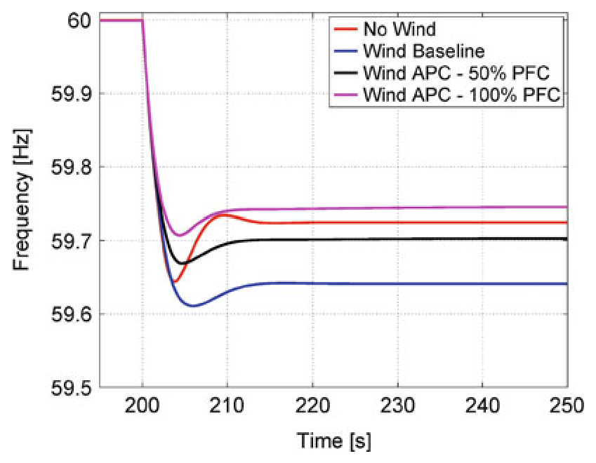

> Image description: This line graph illustrates the frequency response of a 3 GW small-scale grid model over time. The x-axis represents Time in seconds [s], ranging from 190 to 250, while the y-axis represents Frequency in Hertz [Hz], ranging from 59.5 to 60.0. The simulation begins with a stable frequency of 60 Hz. At $t = 200$ s, a frequency event occurs, causing a sudden drop. Four different scenarios are compared: 1. **No Wind (Red):** Represents the baseline system without wind penetration. 2. **Wind Baseline (Blue):** Represents 10% wind penetration where turbines do not provide APC services, resulting in the lowest frequency nadir (approximately 59.6 Hz). 3. **Wind APC - 50% PFC (Black):** Shows the effect of 50% of wind plants providing frequency control, mitigating the frequency drop. 4. **Wind APC - 100% PFC (Magenta):** Shows 100% of wind plants providing frequency control, resulting in the highest (best) frequency stability. The results demonstrate that Active Power Control (APC) via Power Frequency Control (PFC) improves frequency stability after a sudden generation loss.
Active Power Control of Wind Power Plants for Grid Integration, Fig. 1 Simulation results showing the capability of wind power plants to provide APC services on a small-scale grid model. The total grid size is 3 GW , and a frequency event is induced due to the sudden active power imbalance when $5 \%$ of generation is taken offline at time $=200 \mathrm{~s}$. Each wind power plant is derated to $90 \%$ of its rated capacity. The system response with all conventional generation (no wind) is compared to the cases when there are wind power plants on the grid at $10 \%$ penetration (i) with a baseline control system (wind baseline) where wind does not provide APC services and (ii) with an APC system (wind APC) that uses a 3 \% droop curve where either $50 \%$ or $100 \%$ of the wind power plants provide PFC

A time-varying droop curve can be designed to be more aggressive when the magnitude of the rate of change of frequency of the grid is larger.

Figure 1 shows a simulation of a grid response under different scenarios when $5 \%$ of the generating capacity suddenly goes offline. When the wind power plant ( $10 \%$ of the generation on the grid) is operating with its normal baseline control system that does not provide APC services, the frequency response is worse than the no-wind scenario, due to the reduced amount of conventional generation in the windbaseline scenario that can provide power control services. However, compared to both the no-wind and wind-baseline cases, using PFC with a droop curve results in the frequency decline being arrested at a minimum (nadir) frequency $f_{\text {nadir }}$ that is closer to the nominal $f_{\text {nom }}=60 \mathrm{~Hz}$ frequency level; further, the steady-state frequency $f_{\mathrm{ss}}$ after the PFC response is also closer to $f_{\text {nom }}$. It is important to prevent the difference $f_{\text {nom }}-f_{\text {nadir }}$

<!-- source_pdf_page: 28 -->
from exceeding a threshold that can lead to underfrequency load shedding (UFLS) or rolling blackouts. The particular threshold varies across utility grids, but the largest such threshold in North America is 1.5 Hz .

Stability issues arising from the altered control algorithms must be analyzed (Buckspan et al. 2013). The trade-offs between aggressive primary frequency control and resulting structural loads also need to be evaluated carefully. Initial research shows that potential grid support can be achieved while not causing any increases in structural loading and hence fatigue damage and operations and maintenance costs (Buckspan et al. 2012).

## Wind Turbine Automatic Generation Control

Secondary frequency control, also known as automatic generation control (AGC), occurs on a slower time scale than PFC. AGC commands can be generated from highly damped proportional integral (PI) controllers or logic controllers to regulate grid frequency and are used to control the power output of participating power plants. In many geographical regions, frequency regulation services are compensated through a competitive market, where power plants that provide faster and more accurate AGC command tracking are paid more.

An active power control system that combines both primary and secondary/AGC frequency control capabilities has recently been detailed in Aho et al. (2013a). Figure 2 presents initial experimental field test results of this active power controller, in response to prerecorded frequency events, showing how responsive wind turbines can be to both manual derating commands as well as rapidly changing automatic primary frequency control commands generated via a droop curve. Overall, results indicate that wind turbines can respond more rapidly than conventional power plants. However, increasing the power control and regulation performance of a wind turbine should be carefully considered due to a number of complicating factors, including coupling with
existing control loops, a desire to limit actuator usage and structural loading, and wind variability.

## Active Power Control of Wind Power Plants

A wind power plant, often referred to as a wind farm, consists of many wind turbines. In wind power plants, wake effects can reduce generation in downstream turbines to less than $60 \%$ of the lead turbine (Barthelmie et al. 2009; Porté-Agel et al. 2013). There are many emerging areas of active research, including the modeling of wakes and wake effects and how these models can then be used to coordinate the control of individual turbines so that the overall wind power plant can reliably track the desired power reference command. A wind farm controller can be interconnected with the utility grid, transmission system operator (TSO), and individual turbines as shown in Fig. 3. By properly accounting for the wakes, wind farm controllers can allocate appropriate power reference commands to the individual wind turbines. Individual turbine generator torque and blade pitch controllers, as discussed earlier, can be designed so that each turbine follows the power reference command issued by the wind farm controller. Methods for intelligent, distributed control of entire wind farms to rapidly respond to grid frequency disturbances could significantly reduce frequency deviations and improve recovery speed to such disturbances.

## Combining Techniques with Other Approaches for Balancing the Grid

Ultimately, active power control of wind turbines and wind power plants should be combined with both demand-side management and storage to provide a more comprehensive solution that enables balancing electrical generation and electrical load with large penetrations of wind energy on the grid. Demand-side management (Callaway and Hiskens 2011; Kowli and Meyn 2011; Palensky and Dietrich 2011)

<!-- source_pdf_page: 29 -->
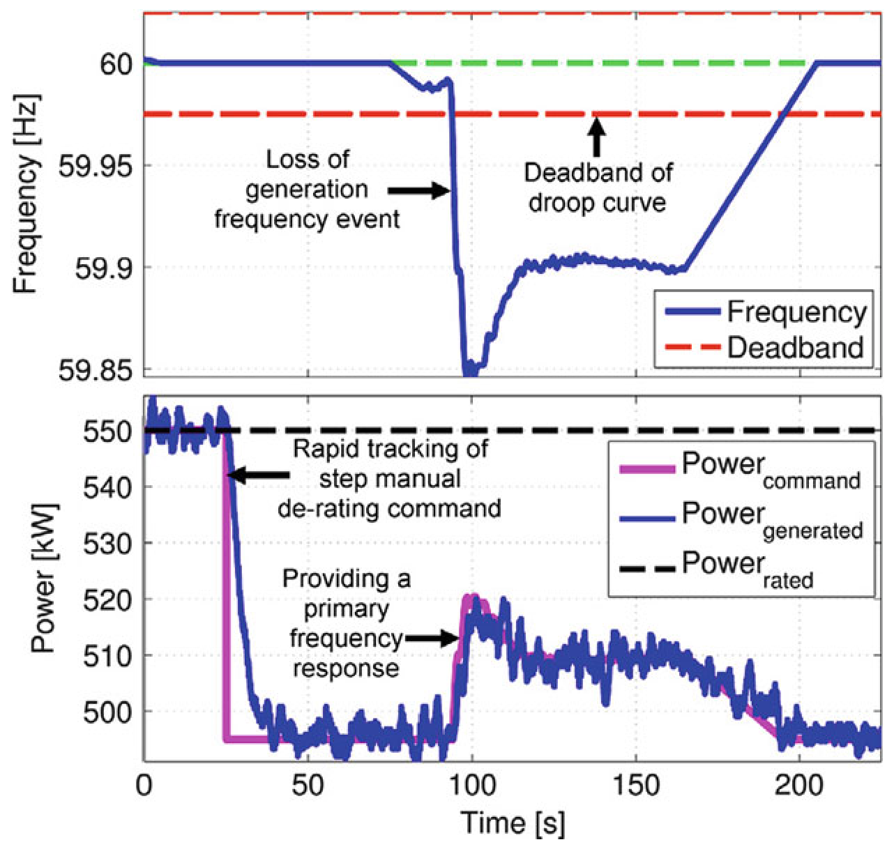

> Image description: This two-panel figure illustrates active power control of a 550 kW wind turbine during a field test. The top graph shows Frequency [Hz] versus Time [s]. A blue line represents the measured frequency, which stays at 60 Hz until a "Loss of generation frequency event" occurs near 85 seconds, causing frequency to drop toward 59.84 Hz. Dashed red and green horizontal lines indicate the "Deadband of droop curve." The bottom graph shows Power [kW] versus Time [s]. Three lines are plotted: a black dashed line for "Power_rated" at 550 kW, a magenta line for "Power_command," and a blue line for "Power_generated." At approximately 30 seconds, the "Power_command" drops sharply, demonstrating "Rapid tracking of step manual de-rating command." Following the frequency event at 85 seconds, the power increases to provide a "primary frequency response," with "Power_command" and "Power_generated" tracking each other closely.

Active Power Control of Wind Power Plants for Grid Integration, Fig. 2 The frequency data input and power that is commanded and generated during a field test with a 550 kW research wind turbine at the US National Renewable Energy Laboratory (NREL). The frequency data was recorded on the Electric Reliability Council of Texas (ERCOT) interconnection (data courtesy of Vahan

Gevorgian, NREL). The upper plot shows the grid frequency, which is passed through a $5 \%$ droop curve with a deadband to generate a power command. The highfrequency fluctuations in the generated power would be smoothed when aggregating the power output of an entire wind power plant
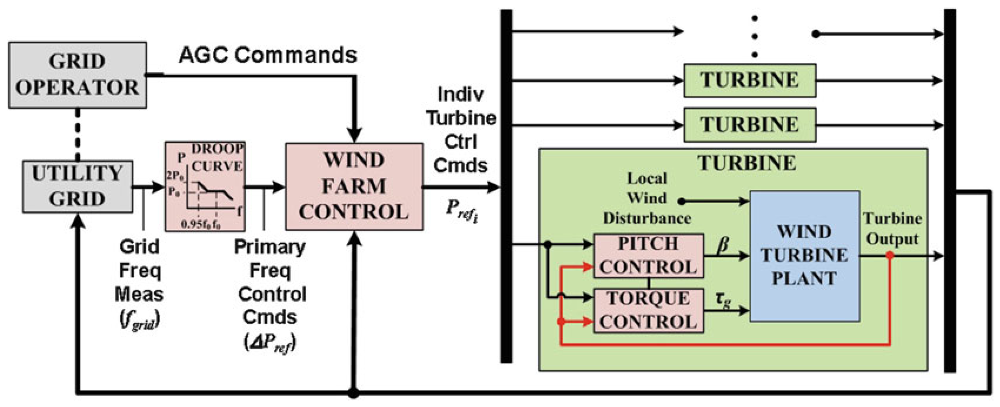

> Image description: A schematic diagram titled "Active Power Control of Wind Power Plants for Grid Integration" illustrates the control architecture for a wind farm connected to a utility grid. The system involves several hierarchical components: a **GRID OPERATOR** sends **AGC Commands** to the **WIND FARM CONTROL** block. This central controller receives **Grid Freq Meas ($f_{grid}$)** from the **UTILITY GRID** and passes **Primary Freq Control Cmds ($\Delta P_{ref}$)** via a **DROOP CURVE** (showing power $P$ versus frequency $f$ with a downward slope). The Wind Farm Control block issues **Indiv Turbine Ctrl Cmds ($P_{ref\_i}$)** to multiple parallel **TURBINE** units. Each turbine unit contains a **WIND TURBINE PLANT** subject to **Local Wind Disturbance**. Within the turbine, **PITCH CONTROL** (variable $\beta$) and **TORQUE CONTROL** (variable $\tau_g$) regulate the plant to generate the **Turbine Output**. The feedback loop connects the turbine output back to the grid frequency measurement point.

Active Power Control of Wind Power Plants for Grid Integration, Fig. 3 Schematic showing the communication and coupling between the wind farm control system, individual wind turbines, utility grid, and the grid operator.

The wind farm controller uses measurements of the utility grid frequency and automatic generation control power command signals from the grid operator to determine a power reference for each turbine in the wind farm

<!-- source_pdf_page: 30 -->
aims to alter the demand in order to mitigate peak electrical loads and hence to maintain sufficient control authority among generating units. As more effective and economical energy storage solutions (Pickard and Abbott 2012) at the power plant scale are developed, wind (and solar) energy can then be stored when wind (and solar) energy availability is not well matched with electrical demand. Advances in wind forecasting (Giebel et al. 2011) will also improve wind power forecasts to facilitate more accurate scheduling of larger amounts of wind power on the grid.

## Cross-References

- Control of Fluids and Fluid-Structure Interactions
- Control Structure Selection
- Coordination of Distributed Energy Resources for Provision of Ancillary Services: Architectures and Algorithms
- Electric Energy Transfer and Control via Power Electronics
- Networked Control Systems: Architecture and Stability Issues
- Power System Voltage Stability
- Small Signal Stability in Electric Power Systems

## Recommended Reading

A recent comprehensive report on active power control that covers topics ranging from control design to power system engineering to economics can be found in Ela et al. (2014) and the references therein.

## Bibliography

Aho J, Pao L, Buckspan A, Fleming P (2013a) An active power control system for wind turbines capable of primary and secondary frequency control for supporting grid reliability. In: Proceedings of the AIAA aerospace sciences meeting, Grapevine, Jan 2013
Aho J, Buckspan A, Dunne F, Pao LY (2013b) Controlling wind energy for utility grid reliability. ASME Dyn Syst Control Mag 1(3):4-12

Barthelmie RJ, Hansen K, Frandsen ST, Rathmann O, Schepers JG, Schlez W, Phillips J, Rados K, Zervos A, Politis ES, Chaviaropoulos PK (2009) Modelling and measuring flow and wind turbine wakes in large wind farms offshore. Wind Energy 12:431-444
Buckspan A, Aho J, Fleming P, Jeong Y, Pao L (2012) Combining droop curve concepts with control systems for wind turbine active power control. In: Proceedings of the IEEE symposium power electronics and machines in wind applications, Denver, July 2012
Buckspan A, Pao L, Aho J, Fleming P (2013) Stability analysis of a wind turbine active power control system. In: Proceedings of the American control conference, Washington, DC, June 2013, pp 1420-1425
Callaway DS, Hiskens IA (2011) Achieving controllability of electric loads. Proc IEEE 99(1): 184-199
Ela E, Milligan M, Kirby B (2011) Operating reserves and variable generation. Technical report, National Renewable Energy Laboratory, NREL/TP-5500-51928
Ela E, Gevorgian V, Fleming P, Zhang YC, Singh M, Muljadi E, Scholbrock A, Aho J, Buckspan A, Pao L, Singhvi V, Tuohy A, Pourbeik P, Brooks D, Bhatt N (2014) Active power controls from wind power: bridging the gaps. Technical report, National Renewable Energy Laboratory, NREL/TP-5D00-60574, Jan 2014
Giebel G, Brownsword R, Kariniotakis G, Denhard M, Draxl C (2011) The state-of-the-art in short-term prediction of wind power: a literature overview. Technical report, ANEMOS.plus/SafeWind, Jan 2011
Gsanger S, Pitteloud J-D (2013) World wind energy report 2012. The World Wind Energy Association, May 2013
Kowli AS, Meyn SP (2011) Supporting wind generation deployment with demand response. In: Proceedings of the IEEE power and energy society general meeting, Detroit, July 2011
Miller N, Clark K, Shao M (2011) Frequency responsive wind plant controls: impacts on grid performance. In: Proceedings of the IEEE power and energy society general meeting, Detroit, July 2011
Palensky P, Dietrich D (2011) Demand-side management: demand response, intelligent energy systems, and smart loads. IEEE Trans Ind Inform 7(3): 381-388
Pickard WF, Abbott D (eds) (2012) The intermittency challenge: massive energy storage in a sustainable future. Proc IEEE 100(2):317-321. Special issue
Porté-Agel F, Wu Y-T, Chen C-H (2013) A numerical study of the effects of wind direction on turbine wakes and power losses in a large wind farm. Energies 6:5297-5313
Rebours Y, Kirschen D, Trotignon M, Rossignol S (2007) A survey of frequency and voltage control ancillary services-part I: technical features. IEEE Trans Power Syst 22(1):350-357
Wiser R, Bolinger M (2013) 2012 Wind technologies market report. Lawrence Berkeley National Laboratory Report, Aug 2013

<!-- source_pdf_page: 31 -->
# Adaptive Control of Linear Time-Invariant Systems

Petros A. Ioannou University of Southern California, Los Angeles, CA, USA

#### Abstract

Adaptive control of linear time-invariant (LTI) systems deals with the control of LTI systems whose parameters are constant but otherwise completely unknown. In some cases, large norm bounds as to where the unknown parameters are located in the parameter space are also assumed to be known. In general, adaptive control deals with LTI plants which cannot be controlled with fixed gain controllers, i.e., nonadaptive control methods, and their parameters even though assumed constant for design and analysis purposes may change over time in an unpredictable manner. Most of the adaptive control approaches for LTI systems use the so-called certainty equivalence principle where a control law motivated from the known parameter case is combined with an adaptive law for estimating on line the unknown parameters. The control law could be associated with different control objectives and the adaptive law with different parameter estimation techniques. These combinations give rise to a wide class of adaptive control schemes. The two popular control objectives that led to a wide range of adaptive control schemes include model reference adaptive control (MRAC) and adaptive pole placement control (APPC). In MRAC, the control objective is for the plant output to track the output of a reference model, designed to represent the desired properties of the plant, for any reference input signal. APPC is more general and is based on control laws whose objective is to set the poles of the closed loop at desired locations chosen based on performance requirements. Another class of adaptive controllers for LTI systems that involves ideas from MRAC and APPC

is based on multiple models, search methods, and switching logic. In this class of schemes, the unknown parameter space is partitioned to smaller subsets. For each subset, a parameter estimator or a stabilizing controller is designed or a combination of the two. The problem then is to identify which subset in the parameter space the unknown plant model belongs to and/or which controller is a stabilizing one and meets the control objective. A switching logic is designed based on different considerations to identify the most appropriate plant model or controller from the list of candidate plant models and/or controllers. In this entry, we briefly describe the above approaches to adaptive control for LTI systems.

## Keywords

Adaptive pole placement control; Direct MRAC; Indirect MRAC; LTI systems; Model reference adaptive control; Robust adaptive control

## Model Reference Adaptive Control

In model reference control (MRC), the desired plant behavior is described by a reference model which is simply an LTI system with a transfer function $W_{m}(s)$ and is driven by a reference input. The controller transfer function $C\left(s, \theta^{*}\right)$, where $\theta^{*}$ is a vector with the coefficients of $C(s)$, is then developed so that the closed-loop plant has a transfer function equal to $W_{m}(s)$. This transfer function matching guarantees that the plant will match the reference model response for any reference input signal. In this case the plant transfer function $G_{p}\left(s, \theta_{p}^{*}\right)$, where $\theta_{p}^{*}$ is a vector with all the coefficients of $G_{p}(s)$, together with the controller transfer function $C\left(s, \theta^{*}\right)$ should lead to a closed-loop transfer function from the reference input $r$ to the plant output $y_{p}$ that is equal to $W_{m}(s)$, i.e.,

$$
\begin{equation*}
\frac{y_{p}(s)}{r(s)}=W_{m}(s)=\frac{y_{m}(s)}{r(s)}, \tag{1}
\end{equation*}
$$

<!-- source_pdf_page: 32 -->
where $y_{m}$ is the output of the reference model. For this transfer matching to be possible, $G_{p}(s)$ and $W_{m}(s)$ have to satisfy certain assumptions. These assumptions enable the calculation of the controller parameter vector $\theta^{*}$ as

$$
\begin{equation*}
\theta^{*}=F\left(\theta_{p}^{*}\right), \tag{2}
\end{equation*}
$$

where $F$ is a function of the plant parameters $\theta_{p}^{*}$, to satisfy the matching equation (1). The function in (2) has a special form in the case of MRC that allows the design of both direct and indirect MRAC. For more general classes of controller structures, this is not possible in general as the function $F$ is nonlinear. This transfer function matching guarantees that the tracking error $e_{1}=y_{p}-y_{m}$ converges to zero for any given reference input signal $r$. If the plant parameter vector $\theta_{p}^{*}$ is known, then the controller parameters $\theta^{*}$ can be calculated using (2), and the controller $C\left(s, \theta^{*}\right)$ can be implemented. We are considering the case where $\theta_{p}^{*}$ is unknown. In this case, the use of the certainty equivalence (CE) approach, (Astrom and Wittenmark 1995; Egardt 1979; Ioannou and Fidan 2006; Ioannou and Kokotovic 1983; Ioannou and Sun 1996; Landau 1979; Landau et al. 1998; Morse 1996; Narendra and Annaswamy 1989; Narendra and Balakrishnan 1997; Sastry and Bodson 1989; Stefanovic and Safonov 2011; Tao 2003) where the unknown parameters are replaced with their estimates, leads to the adaptive control scheme referred to as indirect $M R A C$, shown in Fig. 1a.

The unknown plant parameter vector $\theta_{p}^{*}$ is estimated at each time $t$ denoted by $\theta_{p}(t)$, using an online parameter estimator referred to as adaptive law. The plant parameter estimate $\theta_{p}(t)$ at each
time $t$ is then used to calculate the controller parameter vector $\theta(t)=F\left(\theta_{p}(t)\right)$ used in the controller $C(s, \theta)$. This class of MRAC is called indirect MRAC, because the controller parameters are not updated directly, but calculated at each time $t$ using the estimated plant parameters. Another way of designing MRAC schemes is to parameterize the plant transfer function in terms of the desired controller parameter vector $\theta^{*}$. This is possible in the MRC case, because the structure of the MRC law is such that we can use (2) to write

$$
\begin{equation*}
\theta_{p}^{*}=F^{-1}\left(\theta^{*}\right) \tag{3}
\end{equation*}
$$

where $F^{-1}$ is the inverse of the mapping $F(\cdot)$, and then express $G_{p}\left(s, \theta_{p}^{*}\right)= G_{p}\left(s, F^{-1}\left(\theta^{*}\right)\right)=\bar{G}_{p}\left(s, \theta^{*}\right)$. The adaptive law for estimating $\theta^{*}$ online can now be developed by using $y_{p}=\bar{G}_{p}\left(s, \theta^{*}\right) u_{p}$ to obtain a parametric model that is appropriate for estimating the controller vector $\theta^{*}$ as the unknown parameter vector. The MRAC can then be developed using the CE approach as shown in Fig. 1b. In this case, the controller parameter $\theta(t)$ is updated directly without any intermediate calculations, and for this reason, the scheme is called direct MRAC.

The division of MRAC to indirect and direct is, in general, unique to MRC structures, and it is possible due to the fact that the inverse maps in (2) and (3) exist which is a direct consequence of the control objective and the assumptions the plant and reference model are required to satisfy for the control law to exist. These assumptions are summarized below:
Plant Assumptions: $G_{p}(s)$ is minimum phase, i.e., has stable zeros, its relative degree, $n^{*}=$
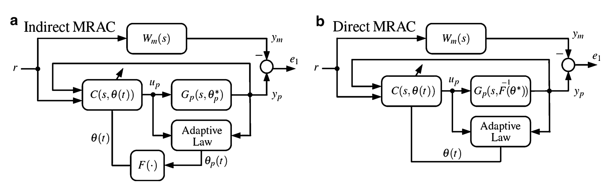

> Image description: This figure, titled "Adaptive Control of Linear Time-Invariant Systems," presents two control architectures: (a) Indirect MRAC and (b) Direct MRAC. In diagram (a), Indirect MRAC, the reference input $r$ is fed to both a reference model $W_m(s)$ and a plant $G_p(s, \theta_p^*)$. The plant output $y_p$ is compared with the model output $y_m$ to produce error $e_1$. An adaptive law uses $e_1$ and $\theta_p(t)$ to update parameters. A function block $F(\cdot)$ maps these parameters $\theta(t)$ to the controller $C(s, \theta(t))$, which generates control signal $u_p$. In diagram (b), Direct MRAC, the controller $C(s, \theta(t))$ is updated directly by the adaptive law using $e_1$. Here, $u_p$ is applied to the plant $G_p(s, F(\theta^*))$. The error $e_1$ is still derived from the difference between $y_m$ and $y_p$. In both cases, $\theta(t)$ represents time-varying parameters used to tune the controller.

Adaptive Control of Linear Time-Invariant Systems, Fig. 1 Structure of (a) indirect MRAC, (b) direct MRAC

<!-- source_pdf_page: 33 -->
number of poles-number of zeros, is known and an upper bound $n$ on its order is also known. In addition, the sign of its highfrequency gain is known even though it can be relaxed with additional complexity.
Reference Model Assumptions: $W_{m}(s)$ has stable poles and zeros, its relative degree is equal to $n^{*}$ that of the plant, and its order is equal or less to the one assumed for the plant, i.e., of $n$.
The above assumptions are also used to meet the control objective in the case of known parameters, and therefore the minimum phase and relative degree assumptions are characteristics of the control objective and do not arise because of adaptive control considerations. The relative degree matching is used to avoid the need to differentiate signals in the control law. The minimum phase assumption comes from the fact that the only way for the control law to force the closed-loop plant transfer function to be equal to that of the reference model is to cancel the zeros of the plant using feedback and replace them with those of the reference model using a feedforward term. Such zero pole cancelations are possible if the zeros are stable, i.e., the plant is minimum phase; otherwise stability cannot be guaranteed for nonzero initial conditions and/or inexact cancelations.

The design of MRAC in Fig. 1 has additional variations depending on how the adaptive law is designed. If the reference model is chosen to be strictly positive real (SPR) which limits its transfer function and that of the plant to have relative degree 1 , the derivation of adaptive law and stability analysis is fairly straightforward, and for this reason, this class of MRAC schemes attracted a lot of interest. As the relative degree changes to 2 , the design becomes more complex as in order to use the SPR property, the CE control law has to be modified by adding an extra nonlinear term. The stability analysis remains to be simple as a single Lyapunov function can be used to establish stability. As the relative degree increases further, the design complexity increases by requiring the addition of more nonlinear terms in the CE control law (Ioannou and Fidan 2006; Ioannou and Sun 1996). The simplicity of using a single Lyapunov function analysis for stability
remains however. This approach covers both direct and indirect MRAC and lead to adaptive laws which contain no normalization signals (Ioannou and Fidan 2006; Ioannou and Sun 1996). A more straightforward design approach is based on the CE principle which separates the control design from the parameter estimation part and leads to a much wider class of MRAC which can be direct or indirect. In this case, the adaptive laws need to be normalized for stability, and the analysis is far more complicated than the approach based on SPR with no normalization. An example of such a direct MRAC scheme for the case of known sign of the high-frequency gain which is assumed to be positive for both plant and reference model is listed below:

## Control law:

$$
\begin{align*}
u_{p}= & \theta_{1}^{T}(t) \frac{\alpha(s)}{\Lambda(s)} u_{p}+\theta_{2}^{T} \frac{\alpha(s)}{\Lambda(s)} y_{p}+\theta_{3}(t) y_{p} \\
& +c_{0}(t) r=\theta^{T}(t) \omega \tag{4}
\end{align*}
$$

where $\alpha \triangleq \alpha_{n-2}(s)=\left[s^{n-2}, s^{n-3}, \ldots, s, 1\right]^{T}$ for $n \geq 2$, and $\alpha(s) \triangleq 0$ for $n=1$, and $\Lambda(s)$ is a monic polynomial with stable roots and degree $n-1$ having numerator of $W_{m}(s)$ as a factor.
Adaptive law:

$$
\begin{equation*}
\dot{\theta}=\Gamma \varepsilon \phi, \tag{5}
\end{equation*}
$$

where $\Gamma$ is a positive definite matrix referred to as the adaptive gain and $\dot{\rho}=\gamma \varepsilon \xi, \varepsilon= \frac{e_{1}-\rho \xi}{m_{s}^{2}}, m_{s}^{2}=1+\phi^{T} \phi+u_{f}^{2}, \xi=\theta^{T} \phi+u_{f}$, $\phi=-W_{m}(s) \omega$, and $u_{f}=W_{m}(s) u_{p}$.
The stability properties of the above direct MRAC scheme which are typical for all classes of MRAC are the following (Ioannou and Fidan 2006; Ioannou and Sun 1996): (i) All signals in the closed-loop plant are bounded, and the tracking error $e_{1}$ converges to zero asymptotically and (ii) if the plant transfer function contains no zero pole cancelations and $r$ is sufficiently rich of order $2 n$, i.e., it contains at least $n$ distinct frequencies, then the parameter error $|\tilde{\theta}|= \left|\theta-\theta^{*}\right|$ and the tracking error $e_{1}$ converge to zero exponentially fast.

<!-- source_pdf_page: 34 -->
## Adaptive Pole Placement Control

Let us consider the SISO LTI plant:

$$
\begin{equation*}
y_{p}=G_{p}(s) u_{p}, \quad G_{p}(s)=\frac{Z_{p}(s)}{R_{p}(s)}, \tag{6}
\end{equation*}
$$

where $G_{p}(s)$ is proper and $R_{p}(s)$ is a monic polynomial. The control objective is to choose the plant input $u_{p}$ so that the closed-loop poles are assigned to those of a given monic Hurwitz polynomial $A^{*}(s)$, and $y_{p}$ is required to follow a certain class of reference signals $y_{m}$ assumed to satisfy $Q_{m}(s) y_{m}=0$ where $Q_{m}(s)$ is known as the internal model of $y_{m}$ and is designed to have all roots in $\operatorname{Re}\{s\} \leq 0$ with no repeated roots on the $j \omega$-axis. The polynomial $A^{*}(s)$, referred to as the desired closed-loop characteristic polynomial, is chosen based on the closed-loop performance requirements. To meet the control objective, we make the following assumptions about the plant:
$P 1$. $G_{p}(s)$ is strictly proper with known degree, and $R_{p}(s)$ is a monic polynomial whose degree $n$ is known and $Q_{m}(s) Z_{p}(s)$ and $R_{p}(s)$ are coprime.

Assumption P1 allows $Z_{p}$ and $R_{p}$ to be nonHurwitz in contrast to the MRAC case where $Z_{p}$ is required to be Hurwitz.

The design of the APPC scheme is based on the CE principle. The plant parameters are estimated at each time t and used to calculate the controller parameters that meet the control objective for the estimated plant as follows: Using (6) the plant equation can be expressed in a form convenient for parameter estimation via the model (Goodwin and Sin 1984; Ioannou and Fidan 2006; Ioannou and Sun 1996):

$$
z=\theta_{p}^{*} \phi,
$$

where $z=\frac{s^{n}}{\Lambda_{p}(s)} y_{p}, \theta_{p}^{*}=\left[\theta_{b}^{* T}, \theta_{a}^{* T}\right]^{T}$, $\phi=\left[\frac{\alpha_{n-1}^{T}(s)}{\Lambda_{p}(s)} u_{p},-\frac{\alpha_{n-1}^{T}(s)}{\Lambda_{p}(s)} y_{p}\right]^{T}, \alpha_{n-1}=\left[s^{n-1}\right.$, $\ldots, s, 1]^{T}, \theta_{a}^{*}=\left[a_{n-1}, \ldots, a_{0}\right]^{T}, \theta_{b}^{*}= \left[b_{n-1}, \ldots, b_{0}\right]^{T}$, and $\Lambda_{p}(s)$ is a Hurwitz monic design polynomial. As an example of a parameter estimation algorithm, we consider the gradient algorithm

$$
\begin{equation*}
\dot{\theta}_{p}=\Gamma \varepsilon \phi, \quad \varepsilon=\frac{z-\theta_{p}^{T} \phi}{m_{s}^{2}}, \quad m_{s}^{2}=1+\phi^{T} \phi, \tag{7}
\end{equation*}
$$

where $\Gamma=\Gamma^{T}>0$ is the adaptive gain and $\theta_{p}=\left[\hat{b}_{n-1}, \ldots, \hat{b}_{0}, \hat{a}_{n-1}, \ldots, \hat{a}_{0}\right]^{T}$ are the estimated plant parameters which can be used to form the estimated plant polynomials $\hat{R}_{p}(s, t)= s^{n}+\hat{a}_{n-1}(t) s^{n-1}+\ldots+\hat{a}_{1}(t) s+\hat{a}_{0}(t)$ and $\hat{Z}_{p}(s, t)=\hat{b}_{n-1}(t) s^{n-1}+\ldots+\hat{b}_{1}(t) s+\hat{b}_{0}(t)$ of $R_{p}(s)$ and $Z_{p}(s)$, respectively, at each time $t$. The adaptive control law is given as

$$
\begin{align*}
u_{p}= & \left(\Lambda(s)-\hat{L}(s, t) Q_{m}(s)\right) \frac{1}{\Lambda(s)} u_{p} \\
& -\hat{P}(s, t) \frac{1}{\Lambda(s)}\left(y_{p}-y_{m}\right) \tag{8}
\end{align*}
$$

where $\hat{L}(s, t)$ and $\hat{P}(s, t)$ are obtained by solving the polynomial equation $\hat{L}(s, t) \cdot Q_{m}(s) \cdot \hat{R}_{p}(s, t)+\hat{P}(s, t) \cdot \hat{Z}_{p}(s, t)=A^{*}(s)$ at each time $t$. The operation $X(s, t) \cdot Y(s, t)$ denotes a multiplication of polynomials where $s$ is simply treated as a variable. The existence and uniqueness of $\hat{L}(s, t)$ and $\hat{P}(s, t)$ is guaranteed provided $\hat{R}_{p}(s, t) \cdot Q_{m}(s)$ and $\hat{Z}_{p}(s, t)$ are coprime at each frozen time $t$. The adaptive laws that generate the coefficients of $\hat{R}_{p}(s, t)$ and $\hat{Z}_{p}(s, t)$ cannot guarantee this property, which means that at certain points in time, the solution $\hat{L}(s, t)$, $\hat{P}(s, t)$ may not exist. This problem is known as the stabilizability problem in indirect APPC and further modifications are needed in order to handle it (Goodwin and Sin 1984; Ioannou and Fidan 2006; Ioannou and Sun 1996). Assuming that the stabilizability condition holds at each time $t$, it can be shown (Goodwin and Sin 1984; Ioannou and Fidan 2006; Ioannou and Sun 1996) that all signals are bounded and the tracking error converges to zero with time. Other indirect adaptive pole placement control schemes include adaptive linear quadratic (Ioannou and Fidan 2006; Ioannou and Sun 1996). In principle any nonadaptive control scheme can be made adaptive by replacing the unknown parameters with their estimates in the calculation of the controller parameters. The design of direct APPC schemes is not possible in general as the map

<!-- source_pdf_page: 35 -->
between the plant and controller parameters is nonlinear, and the plant parameters cannot be expressed as a convenient function of the controller parameters. This prevents parametrization of the plant transfer function with respect to the controller parameters as done in the case of MRC. In special cases where such parametrization is possible such as in MRAC which can be viewed as a special case of APPC, the design of direct APPC is possible. Chapters on ▷ Adaptive Control, Overview, - Robust Adaptive Control, and - History of Adaptive Control provide additional information regarding MRAC and APPC.

## Search Methods, Multiple Models, and Switching Schemes

One of the drawbacks of APPC is the stabilizability condition which requires the estimated plant at each time $t$ to satisfy the detectability and stabilizability condition that is necessary for the controller parameters to exist. Since the adaptive law cannot guarantee such a property, an approach emerged that involves the pre-calculation of a set of controllers based on the partitioning of the plant parameter space. The problem then becomes one of identifying which one of the controllers is the most appropriate one. The switching to the "best" possible controller could be based on some logic that is driven by some cost index, multiple estimation models, and other techniques (Fekri et al. 2007; Hespanha et al. 2003; Kuipers and Ioannou 2010; Morse 1996; Narendra and Balakrishnan 1997; Stefanovic and Safonov 2011). One of the drawbacks of this approach is that it is difficult if at all possible to find a finite set of stabilizing controllers that cover the whole unknown parameter space especially for high-order plants. If found its dimension may be so large that makes it impractical. Another drawback that is present in all adaptive schemes is that in the absence of persistently exciting signals which guarantee that the input/output data have sufficient information about the unknown plant parameters, there is no guarantee that the controller the scheme converged to is indeed a stabilizing one. In other words, if switching is
disengaged or the adaptive law is switched off, there is no guarantee that a small disturbance will not drive the corresponding LTI scheme unstable. Nevertheless these techniques allow the incorporation of well-established robust control techniques in designing a priori the set of controller candidates. The problem is that if the plant parameters change in a way not accounted for a priori, no controller from the set may be stabilizing leading to an unstable system.

## Robust Adaptive Control

The MRAC and APPC schemes presented above are designed for LTI systems. Due to the adaptive law, the closed-loop system is no longer LTI but nonlinear and time varying. It has been shown using simple examples that the pure integral action of the adaptive law could cause parameter drift in the presence of small disturbances and/or unmodeled dynamics (Ioannou and Fidan 2006; Ioannou and Kokotovic 1983; Ioannou and Sun 1996) which could then excite the unmodeled dynamics and lead to instability. Modifications to counteract these possible instabilities led to the field of robust adaptive control whose focus was to modify the adaptive law in order to guarantee robustness with respect to disturbances, unmodeled dynamics, time-varying parameters, classes of nonlinearities, etc., by using techniques such as normalizing signals, projection, fixed and switching sigma modification, etc.

## Cross-References

- Adaptive Control, Overview
- History of Adaptive Control
- Model Reference Adaptive Control
- Robust Adaptive Control
- Switching Adaptive Control

## Bibliography

Astrom K, Wittenmark B (1995) Adaptive control. Addison-Wesley, Reading
Egardt B (1979) Stability of adaptive controllers. Springer, New York

<!-- source_pdf_page: 36 -->
Fekri S, Athans M, Pascoal A (2007) Robust multiple model adaptive control (RMMAC): a case study. Int J Adapt Control Signal Process 21(1): 1-30
Goodwin G, Sin K (1984) Adaptive filtering prediction and control. Prentice-Hall, Englewood Cliffs
Hespanha JP, Liberzon D, Morse A (2003) Hysteresisbased switching algorithms for supervisory control of uncertain systems. Automatica 39(2):263-272
Ioannou P, Fidan B (2006) Adaptive control tutorial. SIAM, Philadelphia
Ioannou P, Kokotovic P (1983) Adaptive systems with reduced models. Springer, Berlin/New York
Ioannou P, Sun J (1996) Robust adaptive control. PrenticeHall, Upper Saddle River
Kuipers M, Ioannou P (2010) Multiple model adaptive control with mixing. IEEE Trans Autom Control 55(8):1822-1836
Landau Y (1979) Adaptive control: the model reference approach. Marcel Dekker, New York
Landau I, Lozano R, M'Saad M (1998) Adaptive control. Springer, New York
Morse A (1996) Supervisory control of families of linear set-point controllers part I: exact matching. IEEE Trans Autom Control 41(10): 1413-1431
Narendra K, Annaswamy A (1989) Stable adaptive systems. Prentice Hall, Englewood Cliffs
Narendra K, Balakrishnan J (1997) Adaptive control using multiple models. IEEE Trans Autom Control 42(2):171-187
Sastry S, Bodson M (1989) Adaptive control: stability, convergence and robustness. Prentice Hall, Englewood Cliffs
Stefanovic M, Safonov M (2011) Safe adaptive control: data-driven stability analysis and robust synthesis. Lecture notes in control and information sciences, vol 405. Springer, Berlin
Tao G (2003) Adaptive control design and analysis. WileyInterscience, Hoboken

## Adaptive Control, Overview

Richard Hume Middleton
School of Electrical Engineering and Computer Science, The University of Newcastle, Callaghan, NSW, Australia

## Abstract

Adaptive control describes a range of techniques for altering control behavior using measured signals to achieve high control performance under uncertainty. The theory and practice of adaptive
control has matured in many areas. This entry gives an overview of adaptive control with pointers to more detailed specific topics.

## Keywords

Adaptive control; Estimation

## Introduction

## What Is Adaptive Control

Feedback control has a long history of using sensing, decision, and actuation elements to achieve an overall goal. The general structure of a control system may be illustrated in Fig. 1. It has long been known that high fidelity control relies on knowledge of the system to be controlled. For example, in most cases, knowledge of the plant gain and/or time constants (represented by $\theta_{p}$ in Fig. 1) is important in feedback control design. In addition, disturbance characteristics (e.g., frequency of a sinusoidal disturbance), $\theta_{d}$ in Fig. 1, are important in feedback compensator design.

Many control design and synthesis techniques are model based, using prior knowledge of both model structure and parameters. In other cases, a fixed controller structure is used, and the controller parameters, $\theta_{C}$ in Fig. 1, are tuned empirically during control system commissioning.

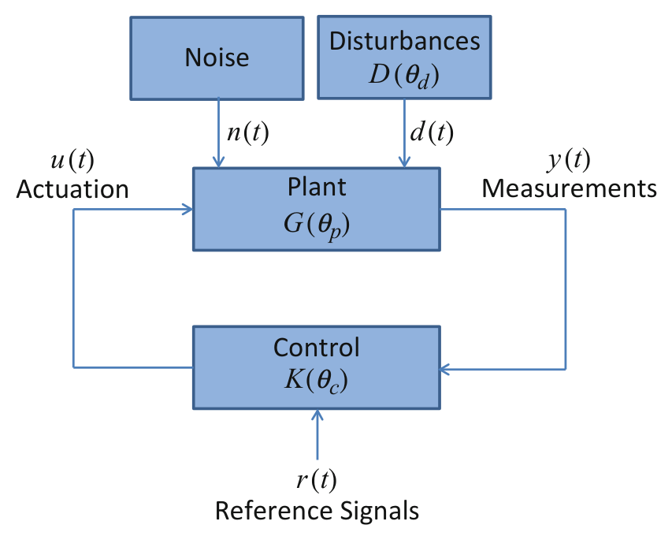

> Image description: A block diagram illustrating a closed-loop control system architecture. The system consists of four main functional blocks: **Noise**, **Disturbances** $D(\theta_d)$, **Plant** $G(\theta_p)$, and **Control** $K(\theta_c)$. The **Plant** is the central component. It receives input from the **Control** block, labeled as **Actuation** $u(t)$. The **Plant** also receives external inputs: **Noise** $n(t)$ and **Disturbances** $d(t)$. The output of the Plant is labeled as **Measurements** $y(t)$, which is fed back into the **Control** block. The **Control** block also receives a **Reference Signal** $r(t)$. The diagram represents a feedback loop where the controller $K(\theta_c)$ processes the reference signal and measured plant output to generate the actuation signal $u(t)$ to command the plant $G(\theta_p)$. The inclusion of noise and disturbances illustrates a realistic control environment where the plant is subject to external stochastic and deterministic influences.
Adaptive Control, Overview, Fig. 1 General control and adaptive control diagram

<!-- source_pdf_page: 37 -->
However, if the plant parameters vary widely with time or have large uncertainties, these approaches may be inadequate for high-performance control.

There are two main ways of approaching highperformance control with unknown plant and disturbance characteristics:

1. Robust control ( - Optimization Based Robust Control), wherein a controller is designed to perform adequately despite the uncertainties. Variable structure control may have very high levels of robustness in some cases and therefore is a special class of robust nonlinear control.
2. Adaptive control, where the controller learns and adjusts its strategy based on measured data. This frequently takes the form where the controller parameters, $\theta_{C}$, are time-varying functions that depend on the available data $(y(t), u(t)$, and $r(t))$. Adaptive control has close links to intelligent control (including neural control ( - Neural Control and Approximate Dynamic Programming), where specific types of learning are considered) and also to stochastic adaptive control ( ▷ Stochastic Adaptive Control).
Robust control is most useful when there are large unmodeled dynamics (i.e., structural uncertainties), relatively high levels of noise, or rapid and unpredictable parameter changes. Conversely, for slow or largely predictable parameter variations, with relatively well-known model structure and limited noise levels, adaptive control may provide a very useful tool for highperformance control (Åström and Wittenmark 2008).

## Varieties of Adaptive Control

One practical variant of adaptive control is controller auto-tuning ( ▷ Autotuning). Auto-tuning is particularly useful for PID and similar controllers and involves a specific phase of signal injection, followed by analysis, PID gain computation, and implementation. These techniques are an important aid to commissioning and maintenance of distributed control systems.

There are also large classes of adaptive controllers that are continuously monitoring the plant input-output signals to adjust the strategy. These adjustments are often parametrized by a relatively small number of coefficients, $\theta_{C}$. These include schemes where the controller parameters are directly adjusted using measureable data (also referred to as "implicit," since there is no explicit plant model generated). Early examples of this often included model reference adaptive control ( - Model Reference Adaptive Control). Other schemes (Middleton et al. 1988) explicitly estimate a plant model $\theta_{P}$; thereafter, performing online control design and, therefore, the adaptation of controller parameters $\theta_{C}$ are indirect. This then led on to a range of other adaptive control techniques applicable to linear systems ( - Adaptive Control of Linear Time-Invariant Systems).

There have been significant questions concerning the sensitivity of some adaptive control algorithms to unmodeled dynamics, time-varying systems, and noise (Ioannou and Kokotovic 1984; Rohrs et al. 1985). This prompted a very active period of research to analyze and redesign adaptive control to provide suitable robustness ( ↓ Robust Adaptive Control) (e.g., Anderson et al. 1986; Ioannou and Sun 2012) and parameter tracking for time-varying systems (e.g., Kreisselmeier 1986; Middleton and Goodwin 1988).

Work in this area further spread to nonparametric methods, such as switching, or supervisory adaptive control ( - Switching Adaptive Control) (e.g., Fu and Barmish 1986; Morse et al. 1992). In addition, there has been a great deal of work on the more difficult problem of adaptive control for nonlinear systems ( ▷ Nonlinear Adaptive Control).

A further adaptive control technique is extremum seeking control ( ± Extremum Seeking Control). In extremum seeking (or self optimizing) control, the desired reference for the system is unknown, instead we wish to maximize (or minimize) some variable in the system (Ariyur and Krstic 2003). These techniques have quite distinct modes of operation that have proven important in a range of applications.

<!-- source_pdf_page: 38 -->
A final control algorithm that has nonparametric features is iterative learning control ( ⊕ Iterative Learning Control) (Amann et al. 1996; Moore 1993). This control scheme considers a system with a highly structured, namely, repetitive finite run, control problem. In this case, by taking a nonparametric approach of utilizing information from previous run(s), in many cases, near-perfect asymptotic tracking can be achieved.

Adaptive control has a rich history ( ▷ History of Adaptive Control) and has been established as an important tool for some classes of control problems.

## Cross-References

- Adaptive Control of Linear Time-Invariant Systems
- Autotuning
- Extremum Seeking Control
- History of Adaptive Control
-Iterative Learning Control
- Model Reference Adaptive Control
- Neural Control and Approximate Dynamic Programming
- Nonlinear Adaptive Control
- Optimization Based Robust Control
- Robust Adaptive Control
- Stochastic Adaptive Control
- Switching Adaptive Control

## Bibliography

Amann N, Owens DH, Rogers E (1996) Iterative learning control using optimal feedback and feedforward actions. Int J Control 65(2):277-293
Anderson BDO, Bitmead RR, Johnson CR, Kokotovic PV, Kosut RL, Mareels IMY, Praly L, Riedle BD (1986) Stability of adaptive systems: passivity and averaging analysis. MIT, Cambridge
Ariyur KB, Krstic M (2003) Real-time optimization by extremum-seeking control. Wiley, New Jersey
Åström KJ, Wittenmark B (2008) Adaptive control. Courier Dover Publications, Mineola
Fu M, Barmish BR (1986) Adaptive stabilization of linear systems via switching control. IEEE Trans Autom Control 31(12): 1097-1103

Ioannou PA, Kokotovic PV (1984) Instability analysis and improvement of robustness of adaptive control. Automatica 20(5):583-594
Ioannou PA, Sun J (2012) Robust adaptive control. Dover Publications, Mineola/New York
Kreisselmeier G (1986) Adaptive control of a class of slowly time-varying plants. Syst Control Lett 8(2):97-103
Middleton RH, Goodwin GC (1988) Adaptive control of time-varying linear systems. IEEE Trans Autom Control 33(2):150-155
Middleton RH, Goodwin GC, Hill DJ, Mayne DQ (1988) Design issues in adaptive control. IEEE Trans Autom Control 33(1):50-58
Moore KL (1993) Iterative learning control for deterministic systems. Advances in industrial control series. Springer, London/New York
Morse AS, Mayne DQ, Goodwin GC (1992) Applications of hysteresis switching in parameter adaptive control. IEEE Trans Autom Control 37(9): 1343-1354
Rohrs C, Valavani L, Athans M, Stein G (1985) Robustness of continuous-time adaptive control algorithms in the presence of unmodeled dynamics. IEEE Trans Autom Control 30(9):881-889

## Adaptive Cruise Control

Rajesh Rajamani
Department of Mechanical Engineering, University of Minnesota, Twin Cities, Minneapolis, MN, USA

#### Abstract

This chapter discusses advanced cruise control automotive technologies, including adaptive cruise control (ACC) in which spacing control, speed control, and a number of transitional maneuvers must be performed. The ACC system must satisfy difficult performance requirements of vehicle stability and string stability. The technical challenges involved and the control design techniques utilized in ACC system design are presented.

\section*{Keywords}

Collision avoidance; String stability; Traffic stability; Vehicle following

<!-- source_pdf_page: 39 -->
## Introduction

Adaptive cruise control (ACC) is an extension of cruise control. An ACC vehicle includes a radar, a lidar, or other sensor that measures the distance to any preceding vehicle in the same lane on the highway. In the absence of preceding vehicles, the speed of the car is controlled to a driverdesired value. In the presence of a preceding vehicle, the controller determines whether the vehicle should switch from speed control to spacing control. In spacing control, the distance to the preceding car is controlled to a desired value.

A different form of advanced cruise control is a forward collision avoidance (FCA) system. An FCA system uses a distance sensor to determine if the vehicle is approaching a car ahead too quickly and will automatically apply brakes to minimize the chances of a forward collision. For the 2013 model year, $29 \%$ vehicles have forward collision warning as an available option and $12 \%$ include autonomous braking for a full FCA system. Examples of models in which an FCA system is standard are the Mercedes Benz G-class and the Volvo S-60, S-80, XC-60, and XC-70.

It should be noted that an FCA system does not involve steady-state vehicle following. An ACC system on the other hand involves control of speed and spacing to desired steady-state values.

ACC systems have been in the market in Japan since 1995, in Europe since 1998, and in the US since 2000. An ACC system provides enhanced driver comfort and convenience by allowing extended operation of the cruise control option even in the presence of other traffic.

## Controller Architecture

The ACC system has two modes of steady state operation: speed control and vehicle following (i.e., spacing control). Speed control is traditional cruise control and is a well-established technology. A proportional-integral controller based on feedback of vehicle speed (calculated from rotational wheel speeds) is used in cruise control (Rajamani 2012).

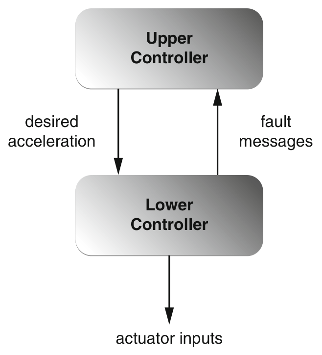

> Image description: A flowchart titled "Adaptive Cruise Control, Fig. 1 Structure of longitudinal control system" illustrates a hierarchical control architecture consisting of two main functional blocks. At the top is the "Upper Controller," which sends a signal labeled "desired acceleration" downward to the "Lower Controller." In response to system conditions, the "Lower Controller" sends "fault messages" upward to the "Upper Controller." The "Lower Controller" serves as the intermediate processing stage that receives the high-level objective (acceleration) and generates the necessary "actuator inputs," which are sent out via a downward arrow at the bottom of the diagram. This structure represents a two-layer control hierarchy where a high-level supervisory unit determines the desired physical motion, and a low-level control unit translates those requirements into specific hardware commands while providing feedback regarding system faults.
Adaptive Cruise Control, Fig. 1 Structure of longitudinal control system

Controller design for vehicle following is the primary topic of discussion in the sections titled "Vehicle Following Requirements" and "String Stability Analysis" in this chapter.

Transitional maneuvers and transitional control algorithms are discussed in the section titled "Transitional Maneuvers" in this chapter.

The longitudinal control system architecture for an ACC vehicle is typically designed to be hierarchical, with an upper-level controller and a lower-level controller, as shown in Fig. 1.

The upper-level controller determines the desired acceleration for the vehicle. The lower level controller determines the throttle and/or brake commands required to track the desired acceleration. Vehicle dynamic models, engine maps, and nonlinear control synthesis techniques are used in the design of the lower controller (Rajamani 2012). This chapter will focus only on the design of the upper controller, also known as the ACC controller.

As far as the upper-level controller is concerned, the plant model for control design is

$$
\begin{equation*}
\ddot{x}_{i}=u \tag{1}
\end{equation*}
$$

where the subscript $i$ denotes the $i$ th car in a string of consecutive ACC cars. The acceleration of the car is thus assumed to be the control input. However, due to the finite bandwidth associated

<!-- source_pdf_page: 40 -->
Adaptive Cruise Control,
Fig. 2 String of adaptive cruise control vehicles
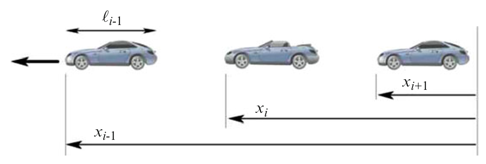

> Image description: A diagram titled "Fig. 2 String of adaptive cruise control vehicles" illustrates a sequence of three blue cars positioned on a roadway, representing a vehicle platoon. The cars are arranged from left to right, with the leftmost vehicle moving forward, indicated by a thick black arrow. The diagram uses vertical lines to define specific longitudinal positions for each vehicle. Labels denote spatial variables using subscripts. At the top, a double-headed arrow above the first car represents the vehicle length, labeled $\ell_{i-1}$. Below the cars, three horizontal arrows indicate distances between vehicles or boundaries. The longest arrow at the bottom, labeled $x_{i-1}$, spans the distance from the rear of the first car to the front of the third car. The middle arrow, $x_i$, spans from the center of the second car to the front of the third car. The shortest arrow, $x_{i+1}$, denotes the gap between the third car and the boundary line. These variables represent longitudinal spacing within a string of vehicles.

with the lower level controller, each car is actually expected to track its desired acceleration imperfectly. The objective of the upper level controller design is therefore stated as that of meeting required performance specifications robustly in the presence of a first order lag in the lower-level controller performance:

$$
\begin{equation*}
\ddot{x}_{i}=\frac{1}{\tau s+1} \ddot{x}_{i \_\mathrm{des}}=\frac{1}{\tau s+1} u_{i} . \tag{2}
\end{equation*}
$$

Equation (1) is thus assumed to be the nominal plant model while the performance specifications have to be met even if the actual plant model were given by Eq. (2). The lag $\tau$ typically has a value between 0.2 and 0.5 s (Rajamani 2012).

## Vehicle Following Requirements

In the vehicle following mode of operation, the ACC vehicle maintains a desired spacing from the preceding vehicle. The two important performance specifications that the vehicle following control system must satisfy are: individual vehicle stability and string stability.

## (a) Individual vehicle stability

Consider a string of vehicles on the highway using a longitudinal control system for vehicle following, as shown in Fig. 2. Let $x_{i}$ be the location of the $i$ th vehicle measured from an inertial reference. The spacing error for the $i$ th vehicle (the ACC vehicle under consideration) is then defined as

$$
\begin{equation*}
\delta_{i}=x_{i}-x_{i-1}+L_{\mathrm{des}} . \tag{3}
\end{equation*}
$$

Here, $L_{\text {des }}$ is the desired spacing and includes the preceding vehicle length $\ell_{i-1}$. $L_{\text {des }}$ could be chosen as a function of variables such as the
vehicle speed $\dot{x}_{i}$. The ACC control law is said to provide individual vehicle stability if the spacing error of the ACC vehicle converges to zero when the preceding vehicle is operating at constant speed:

$$
\begin{equation*}
\ddot{x}_{i-1} \rightarrow 0 \Rightarrow \delta_{i} \rightarrow 0 . \tag{4}
\end{equation*}
$$

## (b) String stability

The spacing error is expected to be non-zero during acceleration or deceleration of the preceding vehicle. It is important then to describe how the spacing error would propagate from vehicle to vehicle in a string of ACC vehicles during acceleration. The string stability of a string of ACC vehicles refers to a property in which spacing errors are guaranteed not to amplify as they propagate towards the tail of the string (Swaroop and Hedrick 1996).

## String Stability Analysis

In this section, mathematical conditions that ensure string stability are provided.

Let $\delta_{i}$ and $\delta_{i-1}$ be the spacing errors of consecutive ACC vehicles in a string. Let $\hat{H}(s)$ be the transfer function relating these errors:

$$
\begin{equation*}
\hat{H}(s)=\frac{\hat{\delta}_{i}}{\hat{\delta}_{i-1}}(s) \tag{5}
\end{equation*}
$$

The following two conditions can be used to determine if the system is string stable:
(a) The transfer function $\hat{H}(s)$ should satisfy

$$
\begin{equation*}
\|\hat{H}(s)\|_{\infty} \leq 1 . \tag{6}
\end{equation*}
$$

<!-- source_pdf_page: 41 -->
(b) The impulse response function $h(t)$ corresponding to $\hat{H}(s)$ should not change sign (Swaroop and Hedrick 1996), i.e.,

$$
\begin{equation*}
h(t)>0 \quad \forall t \geq 0 \tag{7}
\end{equation*}
$$

The reasons for these two requirements to be satisfied are described in Rajamani (2012). Roughly speaking, Eq. (6) ensures that $\left\|\delta_{i}\right\|_{2} \leq \left\|\delta_{i-1}\right\|_{2}$, which means that the energy in the spacing error signal decreases as the spacing error propagates towards the tail of the string. Equation (7) ensures that the steady state spacing errors of the vehicles in the string have the same sign. This is important because a positive spacing error implies that a vehicle is closer than desired while a negative spacing error implies that it is further apart than desired. If the steady state value of $\delta_{i}$ is positive while that of $\delta_{i-1}$ is negative, then this might be dangerous due to the vehicle being closer, even though in terms of magnitude $\delta_{i}$ might be smaller than $\delta_{i-1}$.

If conditions (6) and (7) are both satisfied, then $\left\|\delta_{i}\right\|_{\infty} \leq\left\|\delta_{i-1}\right\|_{\infty}$ (Rajamani 2012).

## Constant Inter-vehicle Spacing

The ACC system only utilizes on board sensors like radar and does not depend on inter-vehicle communication from other vehicles. Hence the only variables available as feedback for the upper controller are inter-vehicle spacing, relative velocity and the ACC vehicle's own velocity.

Under the constant spacing policy, the spacing error of the $i$ th vehicle was defined in Eq. (3).

If the acceleration of the vehicle can be instantaneously controlled, then it can be shown that a linear control system of the type

$$
\begin{equation*}
\ddot{x}_{i}=-k_{p} \delta_{i}-k_{v} \dot{\delta}_{i} \tag{8}
\end{equation*}
$$

results in the following closed-loop transfer function between consecutive spacing errors

$$
\begin{equation*}
\hat{H}(s)=\frac{\hat{\delta}_{i}}{\hat{\delta}_{i-1}}(s)=\frac{k_{p}+k_{v} s}{s^{2}+k_{v} s+k_{p}} . \tag{9}
\end{equation*}
$$

Equation (9) describes the propagation of spacing errors along the vehicle string.

All positive values of $k_{p}$ and $k_{v}$ guarantee individual vehicle stability. However, it can be shown that there are no positive values of $k_{p}$ and $k_{v}$ for which the magnitude of $G(s)$ can be guaranteed to be less than unity at all frequencies. The details of this proof are available in Rajamani (2012).

Thus, the constant spacing policy will always be string unstable.

## Constant Time-Gap Spacing

Since the constant spacing policy is unsuitable for autonomous control, a better spacing policy that can ensure both individual vehicle stability and string stability must be used. The constant time-gap (CTG) spacing policy is such a spacing policy. In the CTG spacing policy, the desired inter-vehicle spacing is not constant but varies with velocity. The spacing error is defined as

$$
\begin{equation*}
\delta_{i}=x_{i}-x_{i-1}+L_{\mathrm{des}}+h \dot{x}_{i} . \tag{10}
\end{equation*}
$$

The parameter $h$ is referred to as the time-gap.
The following controller based on the CTG spacing policy can be used to regulate the spacing error at zero (Swaroop et al. 1994):

$$
\begin{equation*}
\ddot{x}_{i \_\mathrm{des}}=-\frac{1}{h}\left(\dot{x}_{i}-\dot{x}_{i-1}+\lambda \delta_{i}\right) \tag{11}
\end{equation*}
$$

With this control law, it can be shown that the spacing errors of successive vehicles $\delta_{i}$ and $\delta_{i-1}$ are independent of each other:

$$
\begin{equation*}
\dot{\delta}_{i}=-\lambda \delta_{i} \tag{12}
\end{equation*}
$$

Thus, $\delta_{i}$ is independent of $\delta_{i-1}$ and is expected to converge to zero as long as $\lambda>0$. However, this result is only true if any desired acceleration can be instantaneously obtained by the vehicle i.e., if $\tau=0$.

In the presence of the lower controller and actuator dynamics given by Eq. (2), it can be shown that the dynamic relation between $\delta_{i}$ and $\delta_{i-1}$ in the transfer function domain is

<!-- source_pdf_page: 42 -->
$$
\begin{equation*}
\hat{H}(s)=\frac{s+\lambda}{h \tau s^{3}+h s^{2}+(1+\lambda h) s+\lambda} \tag{13}
\end{equation*}
$$

The string stability of this system can be analyzed by checking if the magnitude of the above transfer function is always less than or equal to 1. It can be shown that this is the case at all frequencies if and only if (Rajamani 2012)

$$
\begin{equation*}
h \geq 2 \tau . \tag{14}
\end{equation*}
$$

Further, if Eq.(14) is satisfied, then it is also guaranteed that one can find a value of $\lambda$ such that Eq. (7) is satisfied. Thus the condition (14) is necessary (Swaroop and Hedrick 1996) for string stability.

Since the typical value of $\tau$ is of the order of 0.5 s , Eq. (14) implies that ACC vehicles must maintain at least a 1 -s time gap between vehicles for string stability.

## Transitional Maneuvers

While under speed control, an ACC vehicle might suddenly encounter a new vehicle in its lane (either due to a lane change or due to a slower moving preceding vehicle). The ACC vehicle must then decide whether to continue to operate under the speed control mode or transition to the vehicle following mode or initiate hard braking. If a transition to vehicle following is required, a
transitional trajectory that will bring the ACC vehicle to its steady state following distance needs to be designed. Similarly, a decision on the mode of operation and design of a transitional trajectory are required when an ACC vehicle loses its target.

The regular CTG control law cannot directly be used to follow a newly encountered vehicle, see Rajamani (2012) for illustrative examples.

When a new target vehicle is encountered by the ACC vehicle, a "range - range rate" diagram can be used (Fancher and Bareket 1994) to decide if
(a) The vehicle should use speed control.
(b) The vehicle should use spacing control (with a defined transition trajectory in which desired spacing varies slowly with time)
(c) The vehicle should brake as hard as possible in order to avoid a crash.
The maximum allowable values for acceleration and deceleration need to be taken into account in making these decisions.

For the range - range rate ( $R-\dot{R}$ ) diagram, define range $R$ and range rate $\dot{R}$ as

$$
\begin{gather*}
R=x_{i-1}-x_{i}  \tag{15}\\
\dot{R}=\dot{x}_{i-1}-\dot{x}_{i}=V_{i-1}-V_{i} \tag{16}
\end{gather*}
$$

where $x_{i-1}, x_{i}, V_{i-1}$, and $V_{i}$ are inertial positions and velocities of the preceding vehicle and the ACC vehicle respectively.

A typical $R-\dot{R}$ diagram is shown in Fig. 3 (Fancher and Bareket 1994). Depending on the

Adaptive Cruise Control,

Fig. 3 Range vs.
range-rate diagram
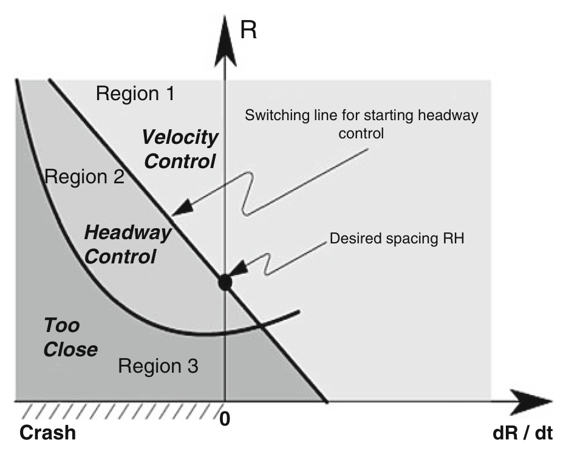

> Image description: This diagram, captioned "Fig. 3 Range vs. range-rate diagram," illustrates a state-space representation of a control system, likely for vehicle following or collision avoidance. The vertical axis represents range ($R$) and the horizontal axis represents range-rate ($\text{dR/dt}$). The diagram is divided into four distinct functional regions: * **Region 1:** Located in the upper-right quadrant, representing safe operating states. * **Region 2:** A central band separated from Region 1 by a "Switching line for starting headway control." Within this band, the system operates under "Velocity Control." * **Region 3:** A lower region labeled "Too Close," representing unsafe states near the "Crash" zone on the horizontal axis. * **Region 2 (lower part):** The area below the velocity control line is labeled "Headway Control." A specific point on the vertical axis is identified as the "Desired spacing RH." The thick curved black lines act as boundaries between these functional control regions.

<!-- source_pdf_page: 43 -->
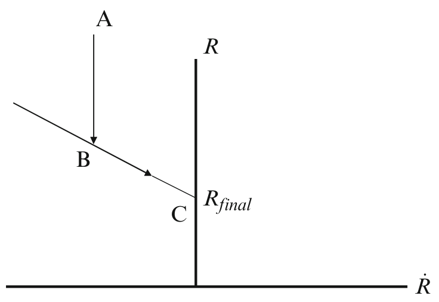

> Image description: A line graph titled "Adaptive Cruise Control, Fig. 4 Switching line for spacing control" depicts a coordinate system with horizontal and vertical axes. The horizontal axis is labeled with $\dot{R}$ and the vertical axis is labeled with $R$. A vertical switching line is drawn at a specific value on the $R$ axis, labeled as $R_{final}$. A single diagonal line descends from the upper left toward the switching line, indicating a relationship between the variables. An arrow labeled "A" points vertically downward from above, intersecting the diagonal line at point "B". An arrow follows the diagonal line from point "B" down to point "C", which lies directly on the vertical switching line at $R_{final}$. The diagram illustrates a control logic transition where a system state reaches a target threshold $R_{final}$, signaling a switch in control mode from a distance-based approach to a velocity-based approach.
Adaptive Cruise Control, Fig. 4 Switching line for spacing control

measured real-time values of $R$ and $\dot{R}$, and the $R-\dot{R}$ diagram in Fig. 3, the ACC system determines the mode of longitudinal control. For instance, in region 1, the vehicle continues to operate under speed control. In region 2, the vehicle operates under spacing control. In region 3 , the vehicle decelerates at the maximum allowed deceleration so as to try and avoid a crash.

The switching line from speed to spacing control is given by

$$
\begin{equation*}
R=-T \dot{R}+R_{\mathrm{final}} \tag{17}
\end{equation*}
$$

where $T$ is the slope of the switching line. When a slower vehicle is encountered at a distance larger than the desired final distance $R_{\text {final }}$, the switching line shown in Fig. 4 can be used to determine when and whether the vehicle should switch to spacing control. If the distance $R$ is greater than that given by the line, speed control should be used.

The overall strategy (shown by trajectory ABC) is to first reduce gap at constant $\dot{R}$ and then follow the desired spacing given by the switching line of Eq. (17).

The control law during spacing control on this transitional trajectory is as follows. Depending on the value of $\dot{R}$, determine $R$ from Eq. (17). Then use $R$ as the desired inter-vehicle spacing in the PD control law

$$
\begin{equation*}
\ddot{x}_{\mathrm{des}}=-k_{p}\left(x_{i}-R\right)-k_{d}\left(\dot{x}_{i}-\dot{R}\right) \tag{18}
\end{equation*}
$$

The trajectory of the ACC vehicle during constant deceleration is a parabola on the $R-\dot{R}$ diagram (Rajamani 2012).

The switching line should be such that travel along the line is comfortable and does not constitute high deceleration. The deceleration during coasting (zero throttle and zero braking) can be used to determine the slope of the switching line (Rajamani 2012).

Note that string stability is not a concern during transitional maneuvers (Rajamani 2012).

## Traffic Stability

In addition to individual vehicle stability and string stability, another type of stability analysis that has received significant interest in ACC literature is traffic flow stability. Traffic flow stability refers to the stable evolution of traffic velocity and traffic density on a highway section, for given inflow and outflow conditions. One well-known result in this regard in literature is that traffic flow is defined to be stable if $\frac{\partial q}{\partial \rho}$ is positive, i.e., as the density $\rho$ of traffic increases, traffic flow rate $q$ must increase (Swaroop and Rajagopal 1999). If this condition is not satisfied, the highway section would be unable to accommodate any constant inflow of vehicles from an oncoming ramp. The steady state traffic flow on the highway section would come to a stop, if the ramp inflow did not stop (Swaroop and Rajagopal 1999).

It has been shown that the constant timegap spacing policy used in ACC systems has a negative $q-\rho$ slope and thus does not lead to traffic flow stability (Swaroop and Rajagopal 1999). It has also been shown that it is possible to design other spacing policies (in which the desired spacing between vehicles is a nonlinear function of speed, instead of being proportional to speed) that can provide stable traffic flow (Santhanakrishnan and Rajamani 2003).

The importance of traffic flow stability has not been fully understood by the research community. Traffic flow stability is likely to become important when the number of ACC vehicles

<!-- source_pdf_page: 44 -->
on the highway increase and their penetration percentage into vehicles on the road becomes significant.

## Recent Automotive Market Developments

The latest versions of ACC systems on the market have been enhanced with collision warning, integrated brake support, and stop-and-go operation functionality.

The collision warning feature uses the same radar as the ACC system to detect moving vehicles ahead and determine whether driver intervention is required. In this case, visual and audio warnings are provided to alert the driver and brakes are pre-charged to allow quick deceleration. On Ford's ACC-equipped vehicles, brakes are also automatically applied when the driver lifts the foot off from the accelerator pedal in a detected collision warning scenario.

When enabled with stop-and-go functionality, the ACC system can also operate at low vehicle speeds in heavy traffic. The vehicle can be automatically brought to a complete stop when needed and restarted automatically. Stop-and-go is an expensive option and requires the use of multiple radar sensors on each car. For instance, the BMW ACC system uses two short range and one long range radar sensor for stop-and-go operation.

The 2013 versions of ACC on the Cadillac ATS and on the Mercedes Distronic systems are also being integrated with camera based lateral lane position measurement systems. On the Mercedes Distronic systems, a camera steering assist system provides automatic steering, while on the Cadillac ATS, a camera based system provides lane departure warnings.

## Future Directions

Current ACC systems use only on-board sensors and do not use wireless communication with
other vehicles. There is a likelihood of evolution of current systems into co-operative adaptive cruise control (CACC) systems which utilize wireless communication with other vehicles and highway infrastructure. This evolution could be facilitated by the dedicated shortrange communications (DSRC) capability being developed by government agencies in the US, Europe and Japan. In the US, DSRC is being developed with a primary goal of enabling communication between vehicles and with infrastructure to reduce collisions and support other safety applications. In CACC, wireless communication could provide acceleration signals from several preceding downstream vehicles. These signals could be used in better spacing policies and control algorithms to improve safety, ensure string stability, and improve traffic flow.

## Cross-References

- Lane Keeping
- Vehicle Dynamics Control
- Vehicular Chains

## Bibliography

Fancher P, Bareket Z (1994) Evaluating headway control using range versus range-rate relationships. Veh Syst Dyn 23(8):575-596
Rajamani R (2012) Vehicle dynamics and control, 2nd edn. Springer, New York. ISBN:978-1461414322
Santhanakrishnan K, Rajamani R (2003) On spacing policies for highway vehicle automation. IEEE Trans Intell Transp Syst 4(4):198-204
Swaroop D, Hedrick JK (1996) String stability of interconnected dynamic systems. IEEE Trans Autom Control 41(3):349-357
Swaroop D, Rajagopal KR (1999) Intelligent cruise control systems and traffic flow stability. Transp Res C Emerg Technol 7(6):329-352
Swaroop D, Hedrick JK, Chien CC, Ioannou P (1994) A comparison of spacing and headway control laws for automatically controlled vehicles. Veh Syst Dyn 23(8):597-625

<!-- source_pdf_page: 45 -->
# Advanced Manipulation for Underwater Sampling

Giuseppe Casalino University of Genoa, Genoa, Italy

#### Abstract

This entry deals with the kinematic selfcoordination aspects to be managed by parts of underwater floating manipulators, whenever employed for sample collections at the seafloor.

Kinematic self-coordination is here intended as the autonomous ability exhibited by the system in closed loop specifying the most appropriate reference velocities for its main constitutive parts (i.e., the supporting vehicle and the arm) in order to execute the sample collection with respect to both safety and best operability conditions for the system while also guaranteeing the needed "execution agility" in performing the task, particularly useful in case of underwater repeated collections. To this end, the devising and employment of a unifying control framework capable of guaranteeing the above properties will be outlined.

Such a framework is however intended to only represent the so-called Kinematic Control Layer (KCL) overlaying a Dynamic Control Layer (DCL), where the overall system dynamic and hydrodynamic effects are suitably accounted for, to the benefit of closed loop tracking of the reference system velocities. Since the DCL design is carried out in a way which is substantially independent from the system mission(s), it will not constitute a specific topic of this entry, even if some orienting references about it will be provided.

At this entry's end, as a follow-up of the resulting structural invariance of the devised KCL framework, future challenges addressing much wider and complex underwater applications will be foreseen, beyond the here-considered sample collection one.

## Keywords

Kinematic control law (KCL); Manipulator; Motion priorities

## Introduction

An automated system for underwater sampling is here intended to be an autonomous underwater floating manipulator (see Fig. 1) capable of collecting samples corresponding to an a priori assigned template. The snapshots of Fig. 1 outline the most recent realization of a system of this kind (completed in 2012 within the EU-funded project TRIDENT; Sanz et al. 2012) when in operation, which is characterized by a vehicle and an endowed 7-dof arm exhibiting comparable masses and inertia, thus resulting in potentially faster and more agile designs than the very few similar previous realizations.

Its general the operational mode consists in exploring an assigned area of the seafloor, while executing a collection each time a feature corresponding to the assigned template is recognized (by the vehicle endowed with a stereovision system) as a sample to be collected.

Thus the autonomous functionalities to be exhibited are the following (to be sequenced as they are listed on an event-driven basis): (1) explore an assigned seabed area while visually performing model-based sample recognitions, (2) suspend the exploration and grasping a recognized sample, (3) deposit the sample inside an endowed container, and (4) then restart exploring till the next recognized sample.

Functionalities (1) and (4), since they do not require the arm usage, naturally reenter within the topics of navigation, patrolling, visual mapping, etc., which are typical of traditional AUVs and consequently will not be discussed here. Only functionality (2) will be discussed, since it is most distinctive of the considered system (often termed as I-AUV, with "I" for "Intervention") and because functionality (3) can be established along the same lines of (2) as a particular simpler case.

<!-- source_pdf_page: 46 -->
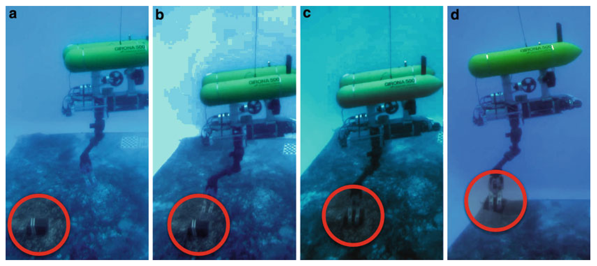

> Image description: A four-panel figure, labeled **a** through **d**, displays sequential snapshots of the underwater floating manipulator, TRIDENT, performing an autonomous sampling task. In each frame, a yellow cylindrical submersible is positioned above a rocky seafloor. In each panel, a red circle highlights the target object on the seabed. In panel **a**, the object is clearly visible as a small dark cylinder. As the sequence progresses through **b** and **c**, the manipulator arm extends toward the target. In panel **d**, the manipulator has successfully grasped the object, which is shown inside the red circle. The visual quality and clarity of the object vary across the frames, likely simulating different underwater visibility conditions or stages of the grasping process. The sequence illustrates the progression from identification to successful manipulation of a target object.
Advanced Manipulation for Underwater Sampling, Fig. 1 Snapshots showing the underwater floating manipulator TRIDENT when autonomously picking an identified object

By then focusing on functionality (2), we must note how the sample grasping ultimate objective, which translates into a specific position/attitude to be reached by the endeffector, must however be achieved within the preliminary fulfillment of also other objectives, each one reflecting the need of guaranteeing the system operating within both its safety and best operability conditions. For instance, the arm's joint limits must be respected and the arm singular postures avoided. Moreover, since the sample position is estimated via the vehicle with a stereo camera, the sample must stay grossly centered inside its visual cone, since otherwise the visual feedback would be lost and the sample search would need to start again. Also, the sample must stay within suitable horizontal and vertical distance limits from the camera frame, in order for the vision algorithm to be well performing. And furthermore, in these conditions the vehicle should be maintained with an approximately horizontal attitude, for energy savings.

With the exception of the objective of making the end-effector position/attitude reaching the grasping position, which is clearly an equality condition, its related safety/enabling objectives are instead represented by a set of inequality
conditions (involving various system variables) whose achievement (accordingly with their safety/enabling role) must therefore deserve the highest priority.

System motions guaranteeing such prioritized objective achievements should moreover allow for a concurrent management of them (i.e., avoiding a sequential motion management whenever possible), which means requiring each objective progressing toward its achievement, by at each time instant only exploiting the residual system mobility allowed by the current progresses of its higher priority objectives. Since the available system mobility will progressively increase during time, accordingly with the progressive achievement of all inequality objectives, this will guarantee the grasping objective to be also completed by eventually progressing within adequate system safety and best operability conditions. In this way the system will also exhibit the necessary "agility" in executing its maneuvers, in a way faster than in case they were executed on a sequential motion basis.

The devising of an effective way to incorporate all the inequality and equality objectives within a uniform and computationally efficient task-priority-based algorithmic framework for underwater floating manipulators has been the

<!-- source_pdf_page: 47 -->
result of the developments outlined in the next section.

The developed framework however solely represents the so-called Kinematic Control Layer (KCL) of the overall control architecture, that is, the one in charge of closed-loop real-time control generating the system velocity vector $y$ as a reference signal, to be in turn concurrently tracked, via the action of the arm joint torques and vehicle thrusters, by an adequate underlying Dynamic Control Layer (DCL), where the overall dynamic and hydrodynamic effects are kept into account to the benefit of such velocity tracking. Since the DCL can actually be designed in a way substantially independent from the system mission(s), it will not constitute a specific topic of this entry. Its detailed dynamic-hydrodynamic model-based structuring, also including a stability analysis, can be found in Casalino (2011), together with a more detailed description of the upper-lying KCL, while more general references on underwater dynamic control aspects can be found, for instance, in Antonelli (2006).

## Task-Priority-Based Control of Floating Manipulators

The above-outlined typical set of objectives (of inequality and/or equality types) to be achieved within a sampling mission are here formalized. Then some helpful generalizing definitions are given, prior to presenting the related unifying task-priority-based algorithmic framework to be used.

## Inequality and Equality Objectives

One of the objectives, of inequality type, related to both arm safety and its operability is that of maintaining each joint within corresponding minimum and maximum limits, that is,

$$
q_{1 m}<q_{i}<q_{i M} ; \quad i=1,2, \ldots, 7
$$

Moreover, in order to have the arm operating with dexterity, its manipulability measure (Nakamura 1991; Yoshikawa 1985) must ultimately stay above a minimum threshold value, thus also
requiring the achievement of the inequality type objective

$$
\mu>\mu_{m}
$$

While the above objectives arise from inherently scalar variables, other objectives instead arise as conditions to be achieved within the Cartesian space, where each one of them can be conveniently expressed in terms of the modulus associated to a corresponding Cartesian vector variable.

To be more specific, let us, for instance, refer to the need of avoiding the occlusions between the sample and the stereo camera, which might occasionally occur due to the arm link motions. Then such need can be, for instance, translated into the ultimate achievement of the following set of inequalities, for suitable chosen values of the boundaries

$$
\|l\|>l_{m} ; \quad\|\tau\|>\tau_{m} ; \quad\|\eta\|<\eta_{M}
$$

where $l$ is the vector lying on the vehicle $x-y$ plane, joining the arm elbow with the line parallel to the vehicle z-axis and passing through camera frame origin, as sketched in Fig. 2a. Moreover $\eta$ is the misalignment vector formed by vector $\tau$ also lying on the vehicle $\mathrm{x}-\mathrm{y}$ plane, joining the lines parallel to the vehicle z -axis and, respectively, passing through the elbow and the endeffector origin.

As for the vehicle, it must keep the object of interest grossly centered in the camera frame (see Fig. 2b), thus meaning that the modulus of the orientation error $\xi$, formed by the unit vector $n_{p}$ of vector $p$ from the sample to the camera frame and the unit vector $k_{c}$ of the z-axis of the camera frame itself, must ultimately satisfy the inequality

$$
\|\xi\|<\xi_{M}
$$

Furthermore, the camera must also be closer than a given horizontal distance $d_{M}$ to the vertical line passing through the sample, and it must lie between a maximum and minimum height with respect to the sample itself, thus implying the achievement of the following inequalities (Fig. 2c, d):

<!-- source_pdf_page: 48 -->
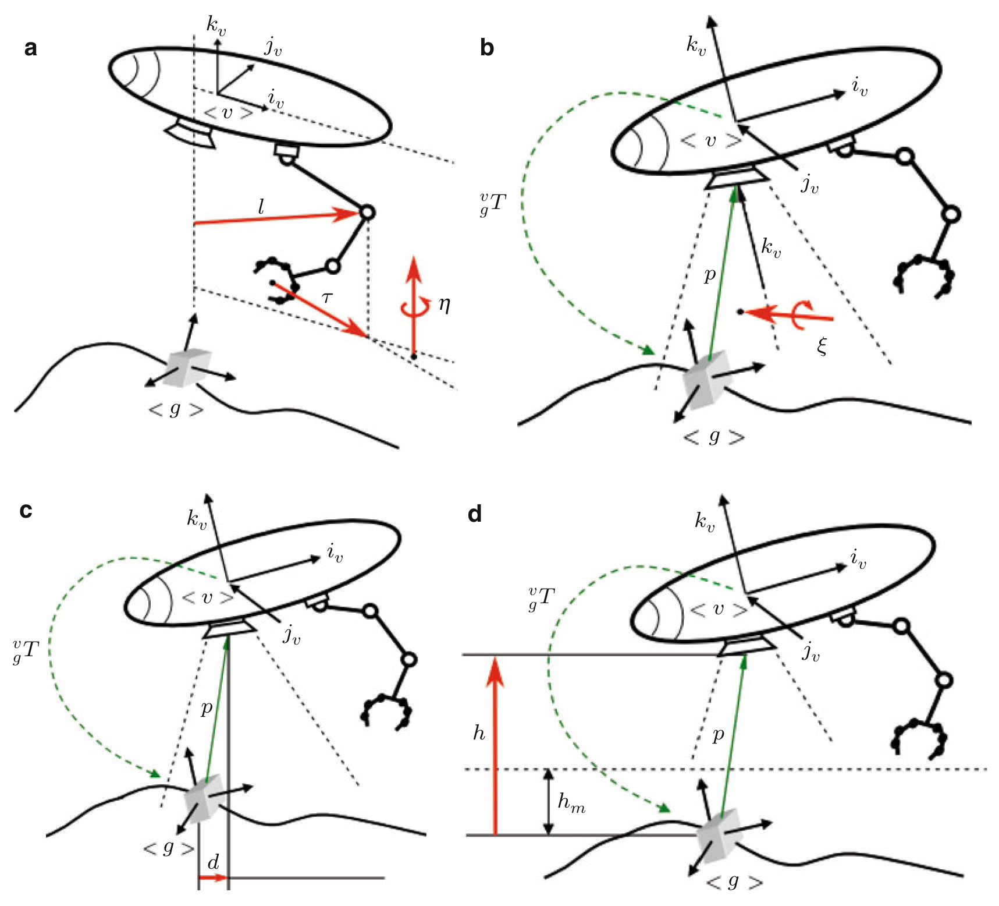

> Image description: A four-panel technical diagram (a–d) illustrates vector definitions for underwater sampling objectives. Each panel depicts an autonomous underwater vehicle (AUV) with a camera (oriented with axes $i_v, j_v, k_v$) observing a target object on the seabed (labeled with gravity vector $<g>$). * **(a) Camera Occlusion:** Shows a distance $l$ between the camera and the object, with an angle $\eta$ and a torque/offset vector $\tau$. * **(b) Camera Centering:** Illustrates the alignment between the camera's downward axis $k_v$ and the target vector $p$, with a rotational offset $\xi$ indicated near the object. A dashed green arrow ($^v gT$) represents a visual transformation. * **(c) Camera Distance:** Defines the distance $p$ between the camera and the object, with a horizontal offset $d$ relative to a vertical axis. * **(d) Camera Height:** Shows the vertical distance $h$ between the AUV and a reference plane, and $h_m$ between that plane and the object.

Advanced Manipulation for Underwater Sampling, Fig. 2 Vectors allowing for the defintion of some inequality objectives in the Cartesian space: (a) camera occlusion, (b) camera centering, (c) camera distance, (d) camera height

$$
\|d\|<d_{M} ; \quad h_{m}<\|h\|<h_{M}
$$

Also since the vehicle should exhibit an almost horizontal attitude, this further requires the achievement of the following additional inequality:

$$
\|\phi\|<\phi_{M}
$$

with $\phi$ the misalignment vector formed by the absolute vertical unit vector $k_{o}$ with the vehicle z -axis one $k_{v}$.

And finally the end-effector must eventually reach the sample, for then picking it. Thus the following, now of equality type, objectives must also be ultimately achieved, where $r$ is the position
error and $\theta$ the orientation one of the end-effector frame with respect to the sample frame

$$
\|r\|=0 ; \quad\|\vartheta\|=0
$$

As already repeatedly remarked, the achievement of the above inequality objectives (since related to the system safety and/or its best operability) must globally deserve a priority higher than the last equality.

## Basic Definitions

The following definitions only regard a generic vector $s \in R^{3}$ characterizing a corresponding generic objective defined in the Cartesian space

<!-- source_pdf_page: 49 -->
(for instance, with the exclusion of the joint and manipulability limits, all the other above-reported objectives). In this case the vector is termed to be the error vector of the objective, and it is assumed measured with components on the vehicle frame. Then its modulus

$$
\sigma \doteq\|s\|
$$

is termed to be the error, while its unit vector

$$
n \doteq s / \sigma ; \quad \sigma \neq 0
$$

is accordingly denoted as the unit error vector. Then the following differential Jacobian relationship can always be evaluated for each of them:

$$
\dot{s}=H y
$$

where $y \in R^{N}(N=(7+6)$ for the system of Fig. 1) is the stacked vector composed of the joint velocity vector $\dot{q} \in R^{7}$, plus the stacked vector $v \in R^{6}$ of the absolute vehicle velocities (linear and angular) with components on the vehicle frame and with $\dot{s}$ clearly representing the time derivative of vector $s$ itself, as seen from the vehicle frame and with components on it (see Casalino (2011) for details on the real-time evaluation of Jacobian matrices $H$ ).

Obviously, for the time derivative $\dot{\sigma}$ of the error, also the following differential relationship holds

$$
\dot{\sigma}=n^{T} H y
$$

Further, to each error variable $\sigma$, a so-called error reference rate is real time assigned of the form

$$
\dot{\bar{\sigma}}=-\gamma\left(\sigma-\sigma^{o}\right) \alpha(\sigma)
$$

where for equality objectives $\sigma^{o}$ is the target value and $\alpha(\sigma) \equiv 1$, while for inequality ones, $\sigma^{o}$ is the threshold value and $\alpha(\sigma)$ is a leftcutting or right-cutting (in correspondence of $\sigma^{o}$ ) smooth sigmoidal activation function, depending on whether the objective is to force $\sigma$ to be below or above $\sigma^{o}$, respectively.

In case $\dot{\bar{\sigma}}$ could be exactly assigned to its corresponding error rate $\dot{\sigma}$, it would consequently smoothly drive $\sigma$ toward the achievement of its associated objective. Note however that for inequality objectives, it would necessarily impose $\dot{\sigma}=0$ in correspondence of a point located inside the interval of validity of the inequality objective itself, while instead such an error rate zeroing effect should be relaxed, for allowing the helpful subsequent system mobility increase, which allows for further progress toward other lower priority control objectives. Such a relaxation aspect will be dealt with soon.

Furthermore, in correspondence of a reference error rate $\dot{\bar{\sigma}}$, the so-called reference error vector rate can also be defined as

$$
\dot{\overline{\bar{s}}} \doteq n \dot{\sigma}
$$

that for equality objectives requiring the zeroing of their error $\sigma$ simply becomes

$$
\dot{\bar{s}} \doteq-\gamma s
$$

whose evaluation, since not requiring its unit vector $n$, will be useful for managing equality objectives.

Finally note that for each objective not defined in the Cartesian space (like, for instance, the above joint limits and manipulability), the corresponding scalar error variable, its rate, and its reference error rate can instead be managed directly, since obviously they do not require any preliminary scalar reduction process.

## Managing the Higher Priority Inequality Objectives

A prioritized list of the various scalar inequality objectives, to be concurrently progressively achieved, is suitably established in a descending priority order.

Then, by starting to consider the highest priority one, we have that the linear manifold of the system velocity vector $y$ (i.e., the arm joints velocity vector $\dot{q}$ stacked with vector $v$ of the vehicle linear and angular velocities), capable of driving toward its achievement, results at each

<!-- source_pdf_page: 50 -->
time instant as the set of solution of the following minimization problem with scalar argument, with row vector $G_{1} \doteq \alpha_{1} n_{1}^{T} H_{1}$ and scalar $\alpha_{1}$ the same activation function embedded within the reference error rate $\dot{\bar{\sigma}}_{1}$

$$
\begin{align*}
S_{1} & \doteq\left\{\underset{y}{\operatorname{argmin}}\left\|\dot{\bar{\sigma}}_{1}-G_{1} y\right\|^{2}\right\} \Leftrightarrow \\
y & =G_{1}^{\#} \dot{\bar{\sigma}}_{1}+\left(I-G_{1}^{\#} G_{1}\right) z_{1} \doteq \rho_{1}+Q_{1} z_{1} ; \forall z_{1} \tag{1}
\end{align*}
$$

The above minimization, whose solution manifold appears at the right (also expressed in a concise notation with an obvious correspondence of terms) parameterized by the arbitrary vector $z_{1}$, has to be assumed executed without extracting the common factor $\alpha_{1}$, that is, by evaluating the pseudo-inverse matrix $G_{1}^{\#}$ via the regularized form

$$
G_{1}^{\#}=\left(\alpha_{1}^{2} n_{1}^{T} H_{1} H_{1}^{T} n_{1}+p_{1}\right)^{-1} \alpha_{1} H_{1}^{T} n_{1}
$$

with $p_{1}$, a suitably chosen bell-shaped, finite support and centered on zero, regularizing function of the norm of row vector $G_{1}$.

In the above solution manifold, when $\alpha_{1}=$ 1 (i.e., when the first inequality is still far to be achieved), the second arbitrary term $Q_{1} z_{1}$ is orthogonal to the first, thus having no influence on the generated $\dot{\sigma}_{1}=\dot{\bar{\sigma}}_{1}$ and consequently suitable to be used for also progressing toward the achievement of other lower priority objectives, without perturbing the current progressive achievement of the first one. Note however that, since in this condition the span of the second term results one dimension less than the whole system velocity space $y \in R^{N}$, this implies that the lower priority objectives can be progressed by only acting within a one-dimension reduced system velocity subspace.

When $\alpha_{1}=0$ (i.e., when the first inequality is achieved) since $G_{1}^{\#}=0$ (as granted by the regularization) and consequently $y=z_{1}$, the lower priority objectives can instead be progressed by now exploiting the whole system velocity space.

When instead $\alpha_{1}$ is within its transition zone $0<\alpha_{1}<1$ (i.e., when the first inequality is near to be achieved), since the two terms of the solution manifold now become only approximately orthogonal, this can make the usage of the second term for managing lower priority tasks, possibly counteracting the first, currently acting in favor of the highest priority one, but in any case without any possibility of making the primary error variable $\sigma_{1}$ getting out of its enlarged boundaries (i.e., the ones inclusive of the transition zone), thus meaning that once the primary variable $\sigma_{1}$ has entered within such larger boundaries, it will definitely never get out of them.

With the above considerations in mind, managing the remaining priority-descending sequence of inequality objectives can then be done by applying the same philosophy to each of them and within the mobility space left free by its preceding ones, that is, as the result of the following sequence of nested minimization problems:

$$
S_{i} \doteq\left\{\underset{y \in S_{i-1}}{\operatorname{argmin}}\left\|\dot{\bar{\sigma}}_{i}-G_{i} y\right\|^{2}\right\} ; \quad i=1,2, \ldots, k
$$

with $G_{i} \doteq \alpha_{i} n_{i}^{T} H_{i}$ and with $k$ indexing the lowest priority inequality objective and where the highest priority objective has been also included for the sake of completeness (upon letting $S_{o}= \left.R^{N}\right)$. In this way the procedure guarantees the concurrent prioritized convergence (actually occurring as a sort of "domino effect" scattering along the prioritized objective list) toward the ultimate fulfillment of all inequality objectives, each one within its enlarged bounds at worse and with no possibility of getting out of them, once reached.

Further, a simple algebra allows translating the above sequence of $k$ nested minimizations into the following algorithmic structure, with initialization $\rho_{0}=0 ; Q_{0}=I$ (see Casalino et al. 2012a,b for more details):

$$
\begin{gathered}
\hat{G}_{1} \doteq G_{i} Q_{i} \\
T_{i}=\left(I-Q_{i-1} G_{i}^{\#} G_{i}\right)
\end{gathered}
$$

<!-- source_pdf_page: 51 -->
$$
\begin{array}{r}
\rho_{i}=T_{i} \rho_{i-1}+Q_{i-1} G_{i}^{\#} \dot{\bar{\sigma}}_{i} \\
Q_{i}=Q_{i-1}\left(I-G_{i}^{\#} G_{i}\right)
\end{array}
$$

ending with the last $k$-th iteration with the solution manifold

$$
y=\rho_{k}+Q_{k} z_{k} ; \quad \forall z_{k}
$$

where the residual arbitrariness space $Q_{k} z_{z}$ has to be then used for managing the remaining equality objectives, as hereafter indicated.

## Managing the Lower Priority Equality Objectives and Subsystem Motion Priorities

For managing the lower priority equality objectives when these require the zeroing of their associated error $\sigma_{i}$ (as, for instance, for the end-effector sample reaching task), the following sequence of nested minimization problems has to be instead considered (with initialization $\rho_{k}$; $Q_{k}$ ):
$S_{i} \doteq\left\{\underset{y \in S_{i-1}}{\operatorname{argmin}}\left\|\dot{\bar{s}}_{i}-H_{i} y\right\|^{2}\right\} ; i=(k+1), \ldots, m$
with $m$ indexing the last priority equality objective and where the whole reference error vector rates $\dot{\bar{s}}_{i}$ and associated whole error vectors $\dot{s}_{i}$ have now to be used, since for $\alpha_{i} \equiv 1$ (as it is for any equality objective) the otherwise needed evaluation of unit vectors $n_{i}$ (which become ill defined for the relevant error $\sigma_{i}$ approaching zero) would most probably provoke unwanted chattering phenomena around $\sigma_{i}=0$, while instead the above avoids such risk (since $\dot{\bar{s}}_{i}$ and $\dot{s}_{i}$ can be evaluated without requiring $n_{i}$ ), even if at the cost of requiring, for each equality objective, three degrees of mobility instead of a sole one, as it instead is for each inequality objectives. However, note how the algorithmic translation of the above procedure remains structurally the same as the one for the inequality objectives (obviously with the substitutions $\dot{\bar{s}}_{i} \rightarrow \dot{\bar{\sigma}}_{i}, H_{i} \rightarrow G_{i}$, and with initialization $\rho_{k}, Q_{k}$ ), thus ending in correspondence of the $m$-th last equality objective with the solution manifold

$$
y=\rho_{m}+Q_{m} z_{m} ; \quad \forall z_{m}
$$

where the still possibly existing residual arbitrariness space $Q_{m} z_{m}$ can be further used for assigning motion priorities between the arm and the vehicle, for instance, via the following additional least-priority ending task

$$
y=\underset{y \in S_{m}}{\operatorname{argmin}}\|v\|^{2}=\rho_{m+1}
$$

whose solution $\rho_{m+1}$ (with no more arbitrariness required) finally assures (while respecting all previous priorities) a motion minimality of the vehicle, thus implicitly assigning to the arm a greater mobility, which in turn allows the exploitation of its generally higher motion precision, especially during the ultimate convergence toward the final grasping.

## Implementations

The recently realized TRIDENT system of Fig. 1, embedding the above introduced task-prioritybased control architecture, has been operating at sea in 2012 (Port Soller Harbor, Mallorca, Spain). A detailed presentation of the preliminary performed simulations, then followed by pool experiments, and finally followed by field trials executed within a true underwater sea environment can be found in Simetti et al. (2013). The related EU-funded TRIDENT project (Sanz et al. 2012) is the first one where agile manipulation could be effectively achieved by part of an underwater floating manipulator, not only as the consequence of the comparable masses and inertia exhibited by the vehicle and arm, but mainly due to the adopted unified task-priority-based control framework. Capabilities for autonomous underwater floating manipulation were however already achieved for the first time in 2009 at the University of Hawaii, within the SAUVIM project (Marani et al. 2009, 2014; Yuh et al. 1998) even if without effective agility (the related system was in fact a 6-t vehicle endowed with a less than 35 kg arm).

<!-- source_pdf_page: 52 -->
## Future Directions

The presented task-priority-based KCL structure is invariant with the addition, deletion, and substitution (even on-the-fly) of the various objectives, as well as invariant to changes in their priority ordering, thus constituting an invariant core potentially capable of supporting intervention tasks beyond the sole sample collection ones. On this basis, more complex systems and operational cases, such as, for instance, multi-arm systems and/or even cooperating ones, can be foreseen to be developed along the lines established by the roadmap of Fig. 3 (with case 0 the current development state).

The future availability of agile floating single-arm or multi-arm manipulators, also implementing cooperative interventions in force of a unified control and coordination structure (to this aim purposely extended), might in fact pave the way toward the realization of underwater hard-work robotized places, where different intervention agents might individually or cooperatively perform different object manipulation and transportation activities, also including assembly ones, thus far beyond the here considered case of sample collection. Such scenarios deserve the attention not only of the science community when needing to execute underwater works (excavation, coring, instrument handling, etc.,
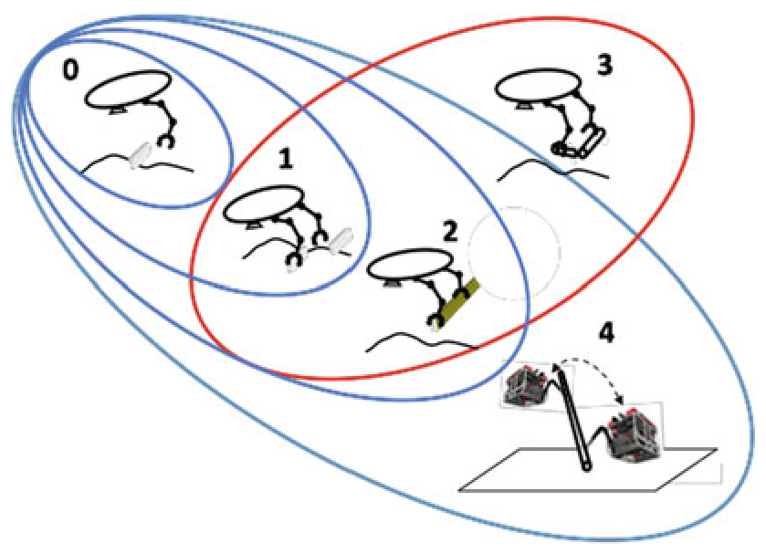

> Image description: A technical diagram labeled "Fig. 3 A sketch of the foreseen roadmap for future development of marine intervention robotics" illustrates five progressive stages of robotic development, numbered 0 through 4. The stages are represented by hand-drawn sketches enclosed in overlapping blue and red ellipses. Stage 0 and 1 show a robotic manipulator arm positioned above an uneven seabed, likely representing basic subsea manipulation. Stage 2 and 3 depict more complex configurations, with Stage 3 showing the arm interacting more deeply with the terrain. Stage 4, at the bottom, transitions to a more detailed schematic of two robotic end-effectors performing a precise task on a flat surface, connected by a dashed double-headed arrow indicating motion or interaction. The overlapping ellipses suggest a continuum of technological advancement, where early stages (0-1) lay the groundwork for increasingly sophisticated autonomous or highly precise intervention capabilities (2-4). The diagram maps a developmental trajectory from rudimentary underwater interaction toward advanced task execution.

Advanced Manipulation for Underwater Sampling,
Fig. 3 A sketch of the foreseen roadmap for future development of marine intervention robotics
other than sample collection) at increasing depths but obviously also those of the offshore industry.

Moreover, by exploiting the current and future developments on underwater exploration and survey mission performed by normal AUVs (i.e., nonmanipulative), a possible work scenario might also include the presence of these lasts, for accomplishing different service activities supporting the intervention ones, for instance, relays with the surface, then informative activities (for instance, the delivery of the area model built during a previous survey phase or the delivery of the intervention mission, both downloaded when in surface and then transferred to the intervention agents upon docking), or even when hovering on the work area (for instance, close to a wellrecognized feature) behaving as a local reference system for the self-localization of the operative agents via twin USBL devices.

## Cross-References

- Control of Networks of Underwater Vehicles
- Control of Ship Roll Motion
- Dynamic Positioning Control Systems for Ships and Underwater Vehicles
- Mathematical Models of Marine Vehicle-Manipulator Systems
- Mathematical Models of Ships and Underwater Vehicles
- Motion Planning for Marine Control Systems
- Redundant Robots
- Robot Grasp Control
- Robot Teleoperation
- Underactuated Marine Control Systems
- Underactuated Robots

## Bibliography

Antonelli G (2006) Underwater robotics. Springer tracts in advanced robotics. Springer, New York Casalino G (2011) Trident overall system modeling, including all needed variables for reactive coordination. Technical report ISME-2011. Available at http://www. grasal.dist.unige.it/files/89

<!-- source_pdf_page: 53 -->
Casalino G, Zereik E, Simetti E, Torelli S, Sperindè A, Turetta A (2012a) Agility for uunderwater floating manipulation task and subsystem priority based control strategies. In: International conference on intelligent robots and systems (IROS 2012), Vilamoura-Algarve
Casalino G, Zereik E, Simetti E, Torelli S, Sperindè A, Turetta A (2012b) A task and subsystem priority basedCcontrol strategy for underwater floating manipulators. In: IFAC workshop on navigation, guidance and control of underwater vehicles (NGCUV 2012), Porto
Marani G, Choi SK, Yuh J (2009) Underwater autonomous manipulation for intervention missions AUVs. Ocean Eng 36(1):15-23
Marani G, Yuh J (2014) Introduction to autonomous manipulation - case study with an underwater robot, SAUVIM. Springer Tracts in Advanced Robotics 102, Springer, pp. 1-156
Nakamura Y (1991) Advanced robotics: redundancy and optimization. Addison Wesley, Reading
Sanz P, Ridao P, Oliver G, Casalino G, Insurralde C, Silvestre C, Melchiorri M, Turetta A (2012) TRIDENT: recent I mprovements about autonomous underwater intervention missions. In: IFAC workshop on navigation, guidance and control of underwater vehicles (NGCUV 2012), Porto
Simetti E, Casalino G, Torelli S, Sperinde A, Turetta A (2013) Experimental results on task priority and dynamic programming based approach to underwater floating manipulation. In: OCEANS 2013, Bergen, June 2013
Yoshikawa T (1985) Manipulability of robotic mechanisms. Int J Robot Res 4(1):3-9. 1998
Yuh J, Cho SK, Ikehara C, Kim GH, McMurty G, Ghasemi-Nejhad M, Sarkar N, Sugihara K (1998) Design of a semi-autonomous underwater vehicle for intervention missions (SAUVIM). In: Proceedings of the 1998 international symposium on underwater technology, Tokyo, Apr 1998

## Air Traffic Management Modernization: Promise and Challenges

Christine Haissig
Honeywell International Inc., Minneapolis, MN, USA

## Synonyms

## ATM Modernization

The copyright holder of this entry is © Honeywell International Inc.

#### Abstract

This entry provides a broad overview of how air traffic for commercial air travel is scheduled and managed throughout the world. The major causes of delays and congestion are described, which include tight scheduling, safety restrictions, infrastructure limitations, and major disturbances. The technical and financial challenges to air traffic management are outlined, along with some of the promising developments for future modernization.

## Keywords

Air traffic management; Air traffic control; Airport capacity; Airspace management; Flight safety

## Introduction: How Does Air Traffic Management Work?

This entry focuses on air traffic management for commercial air travel, the passenger- and cargocarrying operations with which most of us are familiar. This is the air travel with a pressing need for modernization to address current and future congestion. Passenger and cargo traffic is projected to double over the next 20 years, with growth rates of $3-4 \%$ annually in developed markets such as the USA and Europe and growth rates of $6 \%$ and more in developing markets such as Asia Pacific and the Middle East.

In most of the world, air travel is a distributed, market-driven system. Airlines schedule flights based on when people want to fly and when it is optimal to transport cargo. Most passenger flights are scheduled during the day; most package carrier flights are overnight. Some airports limit how many flights can be scheduled by having a slot system, others do not. This decentralized schedule of flights to and from airports around the world is controlled by a network of air navigation service providers (ANSPs) staffed with air traffic controllers, who ensure that aircraft are separated safely.

<!-- source_pdf_page: 54 -->
The International Civil Aviation Organization (ICAO) has divided the world's airspace into flight information regions. Each region has a country that controls the airspace, and the ANSP for each country can be a government department, state-owned company, or private organization. For example, in the United States, the ANSP is the Federal Aviation Administration (FAA), which is a government department. The Canadian ANSP is NAV CANADA, which is a private company.

Each country is different in terms of the services provided by the ANSP, how the ANSP operates, and the tools available to the controllers. In the USA and Europe, the airspace is divided into sectors and areas around airports. An air traffic control center is responsible for traffic flow within its sector and rules and procedures are in place to cover transfer of control between sectors. The areas around busy airports are usually handled by a terminal radar approach control. The air traffic control tower personnel handle departing aircraft, landing aircraft, and the movement of aircraft on the airport surface.

Air traffic controllers in developed air travel markets like the USA and Europe have tools that help them with the business of controlling and separating aircraft. Tower controllers operating at airports can see aircraft directly through windows or on computer screens through surveillance technology such as radar and Automatic Dependent Surveillance-Broadcast (ADS-B). Tower controllers may have additional tools to help detect and prevent potential collisions on the airport surface. En route controllers can see aircraft on computer screens and may have additional tools to help detect potential losses of separation between aircraft. Controllers can communicate with aircraft via radio and some have datalink communication available such as Controller-Pilot Datalink Communications (CPDLC).

Flight crews have tools to help with navigating and flying the airplane. Autopilots and autothrottles off-load the pilot from having to continuously control the aircraft; instead the pilot can specify the speed, altitude, and heading and the autopilot and autothrottle will maintain those commands.

Flight management systems (FMS) assist in flight planning in addition to providing lateral and vertical control of the airplane. Many aircraft have special safety systems such as the Traffic Alert and Collision Avoidance System, which alerts the flight crew to potential collisions with other airborne aircraft, and the Terrain Avoidance Warning Systems (TAWS), which alert the flight crew to potential flight into terrain.

## Causes of Congestion and Delays

Congestion and delays are caused by multiple reasons. These include tight scheduling, safety limitations on how quickly aircraft can take off and land and how closely they can fly, infrastructure limitations such as the number of runways at an airport and the airway structure, and disturbances such as weather and unscheduled maintenance.

## Tight Scheduling

Tight scheduling is a major contributor to congestion and delays. The hub and spoke system that many major airlines operate with to minimize connection times means that aircraft arrive and depart in multiple banks during the day. During the arrival and departure banks, airports are very busy. As mentioned previously, passengers have preferred times to travel, which also increase demand at certain times. At airports that do not limit flight schedules by using slot scheduling, the number of flights scheduled can actually exceed the departure and arrival capacity of the airport even in best-case conditions. One of the reasons that airlines are asked to report on-time statistics is to make the published airline schedules more reflective of the average time from departure to arrival, not the best-case time.

Aircraft themselves are also tightly scheduled. Aircraft are an expensive capital asset. Since customers are very sensitive to ticket prices, airlines need to have their aircraft flying as many hours as possible per day. Airlines also limit the number of spare aircraft and flight crews available to fill in when operations are disrupted to control costs.

<!-- source_pdf_page: 55 -->
## Safety Restrictions

Safety restrictions contribute to congestion. There is a limit to how quickly aircraft can take off from and land on a runway. Sometimes runways are used for both departing and arriving aircraft; at other times a runway may be used for departures only or arrivals only. Either way, the rule that controllers follow for safety is that only one aircraft can occupy the runway at one time. Thus, a landing aircraft must turn off of the runway before another aircraft can take off or land. This limitation and other limitations like the ability of controllers to manage the arrival and departure aircraft propagate backwards from the airport. Aircraft need to be spaced in an orderly flow and separated no closer than what can be supported by airport arrival rates. The backward propagation can go all the way to the departure airports and cause aircraft to be held on the ground as a means to regulate the traffic flow into a congested airport or through a congested air traffic sector.

There is a limit on how close aircraft can fly. Aircraft produce a wake that can be dangerous for other aircraft that are following too closely behind. Pilots are aware of this limitation and space safely when doing visual separation. Rules that controllers apply for separation take into account wake turbulence limitations, surveillance limitations, and limitations on how well aircraft can navigate and conform to the required speed, altitude, and heading.

The human is a safety limitation. Controllers and pilots are human. Being human, they have excellent reasoning capability. However, they are limited as to the number of tasks they can perform and are subject to fatigue. The rules and procedures in place to manage and fly aircraft take into account human limitations.

## Infrastructure Limitations

Infrastructure limitations contribute to congestion and delays. Airport capacity is one infrastructure limitation. The number of runways combined with the available aircraft gates and capacity to process passengers through the terminal limit the airport capacity.

The airspace itself is a limitation. The airspace where controllers provide separation services is divided into an orderly structure of airways. The airways are like one-way, one-lane roads in the sky. They are stacked at different altitudes, which are usually separated by either $1,000 \mathrm{ft}$. or $2,000 \mathrm{ft}$. The width of the airways depends on how well aircraft can navigate. In the US domestic airspace where there are regular navigation aids and direct surveillance of aircraft, the airways have a plus or minus 4 NM width. Over the ocean, airways may need to be separated laterally by as much as 120 NM since there are fewer navigation aids and aircraft are not under direct control but separated procedurally. The limited number of airways that the airspace can support limits available capacity.

The airways themselves have capacity limitations just as traditional roads do. There are special challenges for airways since aircraft need a minimum separation distance, aircraft cannot slow down to a stop, and airways do not allow passing. So, although it may look like there is a lot of space in which aircraft can fly, there are actually a limited number of routes between a city pair or over oceanic airspace.

The radio that is used for pilots and controllers to communicate is another infrastructure limitation. At busy airports, there is significant radio congestion and pilots may need to wait to get an instruction or response from a controller.

## Disturbances

Weather is a significant disturbance in air traffic management. Weather acts negatively in many ways. Wet or icy pavement affects the braking ability of aircraft so they cannot vacate a runway as quickly as in dry conditions. Low cloud ceilings mean that all approaches must be instrument approaches rather than visual approaches, which also reduces runway arrival rates. Snow must be cleared from runways, closing them for some period of time. High winds can mean that certain approaches cannot be used because they are not safe. In extreme weather, an airport may need to close. Weather can block certain airways from use, requiring rerouting of aircraft. Rerouting increases demand on nearby airways, which may

<!-- source_pdf_page: 56 -->
or may not have the required additional capacity, so the rerouting cascades on both sides of the weather.

## Why Is Air Traffic Management Modernization So Hard?

Air traffic management modernization is difficult for financial and technical reasons. The air traffic management system operates around the clock. It cannot be taken down for a significant period of time without a major effect on commerce and the economy.

Financing is a significant challenge for air traffic management modernization. Governments worldwide are facing budgetary challenges and improvements to air travel are one of many competing financial interests. Local airport authorities have similar challenges in raising money for airport improvements. Airlines have competitive limitations on how much ticket prices can rise and therefore need to see a payback on investment in aircraft upgrades that can be as short as 2 years.

Another financial challenge is that the entity that needs to pay for the majority of an improvement may not be the entity that gets the majority of the benefit, at least near term. One example of this is the installation of ADS-B transmitters on aircraft. Buying and installing an ADS-B transmitter costs the aircraft owner money. It benefits the ANSPs, who can receive the transmissions and have them augment or replace expensive radar surveillance, but only if a large number of aircraft are equipped. Eventually the ANSP benefit will be seen by the aircraft operator through lower operating costs but it takes time. This is one reason that ADS-B transmitter equipage was mandated in the USA, Europe, and other parts of the world rather than letting market forces drive equipage.

All entities, whether governmental or private, need some sort of business case to justify investment, where it can be shown that the benefit of the improvement outweighs the cost. The same system complexity that makes congestion and delays in one region propagate throughout the system
makes it a challenge to accurately estimate benefits. It is complicated to understand if an improvement in one part of the system will really help or just shift where the congestion points are. Decisions need to be made on what improvements are the best to invest in. For government entities, societal benefits can be as important as financial payback, and someone needs to decide whose interests are more important. For example, the people living around an airport might want longer arrival paths at night to minimize noise while air travelers and the airline want the airline to fly the most direct route into an airport. A combination of subject matter expertise and simulation can provide a starting point to estimate benefit, but often only operational deployment will provide realistic estimates.

It is a long process to develop new technologies and operational procedures even when the benefit is clear and financing is available. The typical development steps include describing the operational concept; developing new controllers procedures, pilot procedures, or phraseology if needed; performing a safety and performance analysis to determine high level requirements; performing simulations that at some point may include controllers or pilots; designing and building equipment that can include software, hardware, or both; and field testing or flight testing the new equipment. Typically, new ground tools are field tested in a shadow mode, where controllers can use the tool in a mock situation driven by real data before the tool is made fully operational. Flight testing is performed on aircraft that are flying with experimental certificates so that equipment can be tested and demonstrated prior to formal certification.

Avionics need to be certified before operational use to meet the rules established to ensure that a high safety standard is applied to air travel. To support certification, standards are developed. Frequently the standards are developed through international cooperation and through consensus decision-making that includes many different organizations such as ANSPs, airlines, aircraft manufacturers, avionics suppliers, pilot associations, controller associations, and more. This is a slow process but an important one, since it

<!-- source_pdf_page: 57 -->
reduces development risk for avionics suppliers and helps ensure that equipment can be used worldwide.

Once new avionics or ground tools are available, it takes time for them to be deployed. For example, aircraft fleets are upgraded as aircraft come in for major maintenance rather than pulling them out of scheduled service. Flight crews need to be trained on new equipment before it can be used, and training takes time. Ground tools are typically deployed site by site, and the controllers also require training on new equipment and new procedures.

## Promise for the Future

Despite the challenges and complexity of air traffic management, there is a path forward for significant improvement in both developed and developing air travel markets. Developing air travel markets in countries like China and India can improve air traffic management using procedures, tools, and technology that is already used in developed markets such as the USA and Europe. Emerging markets like China are willing to make significant investments in improving air traffic management by building new airports, expanding existing airports, changing controller procedures, and investing in controller tools. In developed markets, new procedures, tools, and technologies will need to be implemented. In some regions, mandates and financial incentives may play a part in enabling infrastructure and equipment changes that are not driven by the marketplace.

The USA and Europe are both supporting significant research, development, and implementation programs to support air traffic management modernization. In the USA, the FAA has a program known as NextGen, the Next Generation Air Transportation System. In Europe, the European Commission oversees a program known as SESAR, the Single European Sky Air Traffic Management Research, which is a joint effort between the European Union, EUROCONTROL, and industry partners. Both programs have substantial support and
financing. Each program has organized its efforts differently but there are many similarities in the operational objectives and improvements being developed.

Airport capacity problems are being addressed in multiple ways. Controllers are being provided with advanced surface movement guidance and control systems that combine radar surveillance, ADS-B surveillance, and sensors installed at the airport with valued-added tools to assist with traffic control and alert controllers to potential collisions. Datalink communications between controllers and pilots will reduce radio-frequency congestion, reduce communication errors, and enable more complex communication. The USA and Europe have plans to develop a modernized datalink communication infrastructure between controllers and pilots that would include information like departure clearances and the taxiway route clearance. Aircraft on arrival to an airport will be controlled more precisely by equipping aircraft with capabilities such as the ability to fly to a required time of arrival and the ability to space with respect to another aircraft.

Domestic airspace congestion is being addressed in Europe by moving towards a single European sky where the ANSPs for the individual nations coordinate activities and airspace is structured not as 27 national regions but operated as larger blocks. Similar efforts are undergoing in the USA to improve the cooperation and coordination between the individual airspace sectors. In some countries, large blocks of airspace are reserved for special use by the military. In those countries, efforts are in place to have dynamic special use airspace that is reserved on an asneeded basis but otherwise available for civil use.

Oceanic airspace congestion is being addressed by leveraging the improved navigation performance of aircraft. Some route structures are available only to aircraft that can flight to a required navigation performance. These route structures have less required lateral separation, and thus more routes can be flown in the same airspace. Pilot tools that leverage ADS-B are allowing aircraft to make flight level changes with reduced separation and in the future

<!-- source_pdf_page: 58 -->
are expected to allow pilots to do additional maneuvering that is restricted today, such as passing slower aircraft.

Weather cannot be controlled but efforts are underway to do better prediction and provide more accurate and timely information to pilots, controllers, and aircraft dispatchers at airlines. On-board radars that pilots use to divert around weather are adding more sophisticated processing algorithms to better differentiate hazardous weather. Future flight management systems will have the capability to include additional weather information. Datalinks between the air and the ground or between aircraft may be updated to include information from the on-board radar systems, allowing aircraft to act as local weather sensors. Improved weather information for pilots, controllers, and dispatchers improves flight planning and minimizes the necessary size of deviations around hazardous weather while retaining safety.

Weather is also addressed by providing aircraft and airports with equipment to improve airport access in reduced visibility. Ground-based augmentation systems installed at airports provide aircraft with the capability to do precisionbased navigation for approaches to airports with low weather ceilings. Other technologies like enhanced vision and synthetic vision, which can be part of a combined vision system, provide the capability to land in poor visibility.

## Summary

Air traffic management is a complex and interesting problem. The expected increase in air travel worldwide is driving a need for improvements to the existing system so that more passengers can be handled while at the same time reducing congestion and delays. Significant research and development efforts are underway worldwide to develop safe and effective solutions that include controller tools, pilot tools, aircraft avionics, infrastructure improvements, and new procedures. Despite the technical and financial challenges, many promising technologies and new procedures will be implemented in the near, mid-,
and far term to support air traffic management modernization worldwide.

## Cross-References

- Aircraft Flight Control
- Pilot-Vehicle System Modeling

## Bibliography

Collinson R (2011) Introduction to avionics systems, 3rd edn. Springer, Dordrecht
http://www.faa.gov/nextgen/
http://www.sesarju.eu/
Nolan M (2011) Fundamentals of air traffic control, 5th edn. Cengage Learning, Clifton Park

## Aircraft Flight Control

Dale Enns
Honeywell International Inc., Minneapolis, MN, USA

#### Abstract

Aircraft flight control is concerned with using the control surfaces to change aerodynamic moments, to change attitude angles of the aircraft relative to the air flow, and ultimately change the aerodynamic forces to allow the aircraft to achieve the desired maneuver or steady condition. Control laws create the commanded control surface positions based on pilot and sensor inputs. Traditional control laws employ proportional and integral compensation with scheduled gains, limiting elements, and cross feeds between coupled feedback loops. Dynamic inversion is an approach to develop control laws that systematically addresses the equivalent of gain schedules and the multivariable cross feeds, can incorporate constrained optimization for the limiting elements, and maintains the use of proportional and integral compensation to achieve the benefits of feedback.

<!-- source_pdf_page: 59 -->
## Keywords

Control allocation; Control surfaces; Dynamic inversion; Proportional and integral control; Rigid body equations of motion; Zero dynamics

## Introduction

Flying is made possible by flight control and this applies to birds and the Wright Flyer, as well as modern flight vehicles. In addition to balancing lift and weight forces, successful flight also requires a balance of moments or torques about the mass center. Control is a means to adjust these moments to stay in equilibrium and to perform maneuvers. While birds use their feathers and the Wright Flyer warped its wings, modern flight vehicles utilize hinged control surfaces to adjust the moments. The control action can be open or closed loop, where closed loop refers to a feedback loop consisting of sensors, computer, and actuation. A direct connection between the cockpit pilot controls and the control surfaces without a feedback loop is open loop control. The computer in the feedback loop implements a control law (computer program). The development of the control law is discussed in this entry.

Although the following discussion is applicable to a wide range of flight vehicles including gliders, unmanned aerial vehicles, lifting bodies, missiles, rockets, helicopters, and satellites, the focus of this entry will be on fixed wing commercial and military aircraft with human pilots.

## Flight

Aircraft are maneuvered by changing the forces acting on the mass center, e.g., a steady level turn requires a steady force towards the direction of turn. The force is the aerodynamic lift force ( $L$ ) and it is banked or rotated into the direction of the turn. The direction can be adjusted with the bank angle ( $\mu$ ) and for a given airspeed ( $V$ ) and air density ( $\rho$ ), the magnitude of the force can be adjusted with the angle-of-attack ( $\alpha$ ). This is called bank-to-turn. Aircraft, e.g., missiles, can also skid-to-turn where the aerodynamic side force ( $Y$ ) is adjusted with the sideslip angle ( $\beta$ ) but this entry will focus on bank-to-turn.

Equations of motion (Enns et al. 1996; Stevens and Lewis 1992) can be used to relate the time rates of change of $\mu, \alpha$, and $\beta$ to roll ( $p$ ), pitch $(q)$, and yaw ( $r$ ) rate. See Fig. 1. Approximate relations (for near steady level flight with no wind) are

Aircraft Flight Control,
Fig. 1 Flight control variables
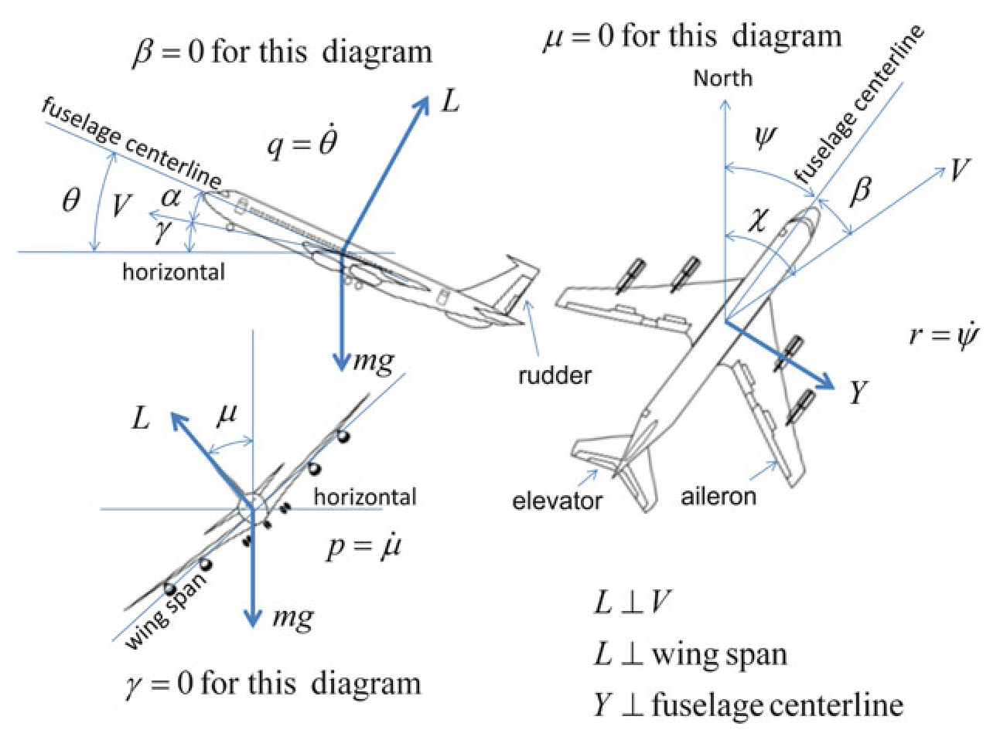

> Image description: Fig. 1 illustrates flight control variables and aerodynamic forces acting on an aircraft using multiple views. A side profile view shows the fuselage centerline, velocity vector $V$, and gravitational force $mg$. Angles include pitch angle $\theta$, flight path angle $\gamma$, and angle of attack $\alpha$. It also defines pitch rate $q = \dot{\theta}$. Note that for this view, $\beta = 0$. A top-down view shows the aircraft's orientation relative to North, including heading $\psi$ and bank angle $\chi$. It defines yaw rate $r = \dot{\psi}$ and sideslip angle $\beta$. A third view provides a planform perspective, displaying lift $L$, weight $mg$, and side force $Y$. It shows rolling moment $\mu$ and roll rate $p = \dot{\mu}$. The diagram specifies geometric relationships: $L \perp V$ (lift is perpendicular to velocity), $L \perp \text{wing span}$, and $Y \perp \text{fuselage centerline}$. Control surfaces labeled include rudder, elevator, and aileron. Note that for the planform view, $\gamma = 0$ and $\mu = 0$.

<!-- source_pdf_page: 60 -->
$$
\begin{aligned}
& \dot{\mu}=\mathrm{p} \\
& \dot{\alpha}=q+\frac{L-m \mathrm{~g}}{m V} \\
& \dot{\beta}=-r+\frac{Y}{m V}
\end{aligned}
$$

where $m$ is the aircraft mass, and $g$ is the gravitational acceleration. In straight and level flight conditions $L=m g$ and $Y=0$ so we think of these equations as kinematic equations where the rates of change of the angles $\mu, \alpha$, and $\beta$ are the angular velocities $p, q$, and $r$.

Three moments called roll, pitch, and yaw for angular motion to move the right wing up or down, nose up or down, and nose right or left, respectively create the angular accelerations to change $p, q$, and $r$, respectively. The equations are Newton's $2^{\text {nd }}$ law for rotational motion. The moments (about the mass center) are dominated by aerodynamic contributions and depend on $\rho$, $V, \alpha, \beta, p, q, r$, and the control surfaces. The control surfaces are aileron ( $\delta_{a}$ ), elevator ( $\delta_{e}$ ), and rudder ( $\delta_{r}$ ) and are arranged to contribute primarily roll, pitch, and yaw moments respectively.

The control surfaces ( $\delta_{a}, \delta_{e}, \delta_{r}$ ) contribute to angular accelerations which are integrated to obtain the angular rates ( $p, q, r$ ). The integral of angular rates contributes to the attitude angles $(\mu, \alpha, \beta)$. The direction and magnitude of aerodynamic forces can be adjusted with the attitude angles. The forces create the maneuvers or steady conditions for operation of the aircraft.

## Pure Roll Axis Example

Consider just the roll motion. The differential equation (Newton's $2^{\text {nd }}$ law for the roll degree-of-freedom) for this dynamical system is

$$
\dot{\mathrm{p}}=L_{\mathrm{p}} \mathrm{p}+L_{\delta_{a}} \delta_{a}
$$

where $L_{p}$ is the stability derivative and $L_{8 a}$ is the control derivative both of which can be regarded as constants for a given airspeed and air density.

## Pitch Axis or Short Period Example

Consider just the pitch and heave motion. The differential equations (Newton's $2^{\text {nd }}$ law for the
pitch and heave degrees-of-freedom) for this dynamical system are

$$
\begin{aligned}
& \dot{q}=M_{\alpha} \alpha+M_{q} q+M_{\delta_{e}} \delta_{e} \\
& \dot{\alpha}=Z_{\alpha} \alpha+q+Z_{\delta_{e}} \delta_{e}
\end{aligned}
$$

where $M_{\alpha}, M_{q}, Z_{\alpha}$ are stability derivatives, and $M_{\delta e}$ is the control derivative, all of which can be regarded as constants for a given airspeed and air density.

Although $Z_{\alpha}<0$ and $M_{q}<0$ are stabilizing, $M_{\alpha}>0$ makes the short period motion inherently unstable. In fact, the short period motion of the Wright Flyer was unstable. Some modern aircraft are also unstable.

## Lateral-Directional Axes Example

Consider just the roll, yaw, and side motion with four state variables ( $\mu, p, r, \beta$ ) and two inputs $\left(\delta_{a}, \delta_{r}\right)$. We will use the standard state space equations with matrices $A, B, C$ for this example.

The short period equations apply for yaw and side motion (or dutch roll motion) with appropriate replacements, e.g., $q$ with $r, \alpha$ with $-\beta$, $M$ with $N$. We add the term $\mathrm{V}^{-1} \mathrm{~g} \mu$ to the $\dot{\beta}$ equation. We include the kinematic equation $\dot{\mu}= p$ and add the term $\mathrm{L}_{\beta} \beta$ to the $\dot{p}$ equation. The dutch roll, like the short period, can be unstable if $N_{\beta}<0$, e.g., airplanes without a vertical tail.

There is coupling between the motions associated with stability derivatives $L_{r}, L_{\beta}, N_{p}$ and control derivatives $L_{\delta r}$ and $N_{\delta a}$. This is a fourth order multivariable coupled system where $\delta_{a}, \delta_{r}$ are the inputs and we can consider ( $p, r$ ) or $(\mu, \beta)$ as the outputs.

## Control

The control objectives are to provide stability, disturbance rejection, desensitization, and satisfactory steady state and transient response to commands. Specifications and guidelines for these objectives are assessed quantitatively with frequency, time, and covariance analyses and simulations.

<!-- source_pdf_page: 61 -->
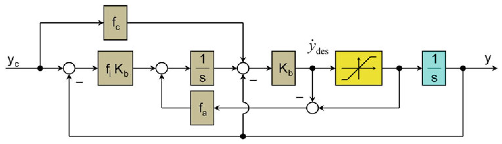

> Image description: This figure, titled "Aircraft Flight Control, Fig. 2 Closed loop feedback system and desired dynamics," illustrates a complex block diagram of a closed-loop control system. The system architecture consists of several functional blocks and summing junctions processing various signals. An input signal, $y_c$, enters the system and is routed to multiple paths. One path leads to a feedback block labeled $f_c$, while another enters a summing junction with a negative feedback loop. The error signal enters a block labeled $f_i K_b$ and proceeds through a summing junction with a feedback block $f_a$. The signals are further processed through integrators (labeled $1/s$) and gain blocks (labeled $K_b$). A central nonlinear block, represented with a saturation curve, processes the signal to produce the desired dynamics, denoted as $\dot{y}_{des}$. The final output of the system is $y$, which is the result of a final integration block $1/s$ and is fed back to the input summing junctions to close the control loop.
Aircraft Flight Control, Fig. 2 Closed loop feedback system and desired dynamics

## Integrator with P+I Control

The system to be controlled is the integrator for $y$ in Fig. 2 and the output of the integrator ( $y$ ) is the controlled variable. The proportional gain ( $K_{b}>0$ ) is a frequency and sets the bandwidth or crossover frequency of the feedback loop. The value of $K_{b}$ will be between 1 and $10 \mathrm{rad} / \mathrm{s}$ in most aircraft applications. Integral action can be included with the gain, $f_{i}>0$ with a value between 0 and 1.5 in most applications. The value of the command gain, $f_{c}>0$, is set to achieve a desired closed loop response from the command $y_{c}$ to the output $y$. Values of $f_{i}=0.25$ and $f_{c}=$ 0.5 are typical. In realistic applications, there is a limit that applies at the input to the integrator. In these cases, we are obligated to include an antiintegral windup gain, $f_{a}>0$ (typical value of 2) to prevent continued integration beyond the limit. The input to the limiter ( $\dot{y}_{\text {des }}$ ) is called the desired rate of change of the controlled variable (Enns et al. 1996).

The closed loop transfer function is

$$
\frac{y}{y_{c}}=\frac{K_{b}\left(f_{c} s+f_{i} K_{b}\right)}{s^{2}+K_{b} s+f_{i} K_{b}^{2}}
$$

and the pilot produces the commands, ( $y_{c}$ ) with cockpit inceptors, e.g., sticks, pedals.

The control system robustness can be adjusted with the choices made for $y, K_{b}, f_{i}$, and $f_{c}$.

These desired dynamics are utilized in all of the examples to follow. In the following, we use dynamic inversion (Enns et al. 1996; Wacker et al. 2001) to algebraically manipulate the equations of motion into the equivalent of the integrator for $y$ in Fig. 2.

## Pure Roll Motion Example

With algebraic manipulations called dynamic inversion we can use the pure integrator results in the previous section for the pure roll motion example. For the controlled variable $y=p$, given a measurement of the state $x=p$ and values for $L_{p}$ and $L_{\delta a}$, we simply solve for the input ( $u=\delta_{a}$ ) that gives the desired rate of change of the output $\dot{y}_{\text {des }}=\dot{\mathrm{p}}_{\text {des }}$. The solution is

$$
\delta_{a}=L_{\delta_{a}}^{-1}\left(\dot{\mathrm{p}}_{\mathrm{des}}-L_{\mathrm{p}} \mathrm{p}\right)
$$

Since $L_{\delta a}$ and $L_{p}$ vary with air density and airspeed, we are motivated to schedule these portions of the control law accordingly.

## Short Period Example

Similar algebraic manipulations use the general state space notation

$$
\begin{aligned}
& \dot{x}=A x+B u \\
& y=C x
\end{aligned}
$$

We want to solve for $u$ to achieve a desired rate of change of $y$, so we start with

$$
\dot{y}=C A x+C B u
$$

If we can invert $C B$, i.e., it is not zero, for the short period case, we solve for $u$ with

$$
u=(C B)^{-1}\left(\dot{y}_{\mathrm{des}}-C A x\right)
$$

Implementation requires a measurement of the state, $x$ and models for the matrices $C A$ and $C B$.

<!-- source_pdf_page: 62 -->
The closed loop poles include the open loop zeros of the transfer function $\frac{y(s)}{u(s)}$ (zero dynamics) in addition to the roots of the desired dynamics characteristic equation. Closed loop stability requires stable zero dynamics. The zero dynamics have an impact on control system robustness and can influence the precise choice of $y$.

When $y=q$, the control law includes the following dynamic inversion equation

$$
\delta_{e}=M_{\delta_{e}}^{-1}\left(\dot{q}_{\mathrm{des}}-M_{q} q-M_{\alpha} \alpha\right)
$$

and the open loop zero is $Z_{\alpha}-Z_{\delta_{e}} M_{\delta_{e}}^{-1} M_{\alpha}$, which in almost every case of interest is a negative number.

Note that there are no restrictions on the open loop poles. This control law is effective and practical in stabilization of an aircraft with an open loop unstable short period mode.

Since $M_{\delta e}, M_{q}$ and $M_{\alpha}$ vary with air density and airspeed we are motivated to schedule these portions of the control law accordingly.

When $y=\alpha$, the zero dynamics are not suitable as closed loop poles. In this case, the pitch rate controller described above is the inner loop and we apply dynamic inversion a second time as an outer loop (Enns and Keviczky 2006) where we approximate the angle-of-attack dynamics with the simplification that pitch rate has reached steady state, i.e., $\dot{q}=0$ and regard pitch rate as the input ( $u=q$ ) and angle-of-attack as the controlled variable $(y=\alpha)$. The approximate equation of motion is

$$
\begin{aligned}
\dot{\alpha}= & Z_{\alpha} \alpha+q-Z_{\delta_{e}} M_{\delta_{e}}^{-1}\left(M_{\alpha} \alpha+M_{q} q\right) \\
& =\left(Z_{\alpha}-Z_{\delta_{e}} M_{\delta_{e}}^{-1} M_{\alpha}\right) \alpha \\
& +\left(1-Z_{\delta_{e}} M_{\delta_{e}}^{-1} M_{q}\right) q
\end{aligned}
$$

This equation is inverted to give

$$
\begin{aligned}
q_{c}= & \left(1-Z_{\delta_{e}} M_{\delta_{e}}^{-1} M_{q}\right)^{-1} \\
& {\left[\dot{\alpha}_{\mathrm{des}}-\left(Z_{\alpha}-Z_{\delta_{e}} M_{\delta_{e}}^{-1} M_{\alpha}\right) \alpha\right] }
\end{aligned}
$$

$q_{c}$ obtained from this equation is passed to the inner loop as a command, i.e., $y_{c}$ of the inner loop.

## Lateral-Directional Example

If we choose the two angular rates as the controlled variables ( $p, r$ ), then the zero dynamics are favorable. We use the same proportional plus integral desired dynamics in Fig. 2 but there are two signals represented by each wire (one associated with $p$ and the other $r$ ).

The same state space equations are used for the dynamic inversion step but now $C A$ and $C B$ are $2 \times 4$ and $2 \times 2$ matrices, respectively instead of scalars. The superscript in $u=(C B)^{-1}\left(\dot{y}_{\text {des }}-\right. C A x)$ now means matrix inverse instead of reciprocal. The zero dynamics are assessed with the transmission zeros of the matrix transfer function $(p, r) /\left(\delta_{a}, \delta_{r}\right)$.

In the practical case where the aileron and rudder are limited, it is possible to place a higher priority on solving one equation vs. another if the equations are coupled, by proper allocation of the commands to the control surfaces which is called control allocation (Enns 1998). In these cases, we use a constrained optimization approach

$$
\min _{u_{\min } \leq u \leq u_{\max }}\left\|C B u-\left(\dot{y}_{\mathrm{des}}-C A x\right)\right\|
$$

instead of the matrix inverse followed by a limiter. In cases where there are redundant controls, i.e., the matrix $C B$ has more columns than rows, we introduce a preferred solution, $u_{p}$ and solve a different constrained optimization problem

$$
\min _{C B u+C A x=\dot{y}_{\mathrm{des}}}\left\|u-u_{p}\right\|
$$

to find the solution that solves the equations that is closest to the preferred solution. We utilize weighted norms to accomplish the desired priority.

An outer loop to control the attitude angles ( $\mu, \beta$ ) can be obtained with an approach analogous to the one used in the previous section.

## Nonlinear Example

Dynamic inversion can be used directly with the nonlinear equations of motion (Enns et al. 1996; Wacker et al. 2001). General equations of motion, e.g., 6 degree-of-freedom rigid body can be expressed with $\dot{x}=f(x, u)$ and the controlled

<!-- source_pdf_page: 63 -->
variable is given by $y=h(x)$. With the chain rule of calculus we obtain

$$
\dot{y}=\frac{\partial h}{\partial x}(x) f(x, u)
$$

and for a given $\dot{y}=\dot{y}_{\text {des }}$ and (measured) $x$ we can solve this equation for $u$ either directly or approximately. In practice, the first order Taylor Series approximation is effective

$$
\dot{y} \cong a\left(x, u_{0}\right)+b\left(x, u_{0}\right)\left(u-u_{0}\right)
$$

where $u_{0}$ is typically the past value of $u$, in a discrete implementation. As in the previous example, Fig. 2 can be used to obtain $\dot{y}_{\text {des }}$. The terms $a\left(x, u_{0}\right)-b\left(x, u_{0}\right) u_{0}$ and $b\left(x, u_{0}\right)$ are analogous to the terms $C A x$ and the matrix $C B$, respectively. Control allocation can be utilized in the same way as discussed above. The zero dynamics are evaluated with transmission zeros at the intended operating points. Outer loops can be employed in the same manner as discussed in the previous section.

The control law with this approach utilizes the equations of motion which can include table lookup for aerodynamics, propulsion, mass properties, and reference geometry as appropriate. The raw aircraft data or an approximation to the data takes the place of gain schedules with this approach.

## Summary and Future Directions

Flight control is concerned with tracking commands for angular rates. The commands may come directly from the pilot or indirectly from the pilot through an outer loop, where the pilot directly commands the outer loop. Feedback control enables stabilization of aircraft that are inherently unstable and provides disturbance rejection and insensitive closed-loop response in the face of uncertain or varying vehicle dynamics. Proportional and integral control provide these benefits of feedback. The aircraft dynamics are significantly different for low altitude and high speed compared to high altitude and low speed and so
portions of the control law are scheduled. Aircraft do exhibit coupling between axes and so multivariable feedback loop approaches are effective. Nonlinearities in the form of limits (noninvertible) and nonlinear expressions, e.g., trigonometric, polynomial, and table look-up (invertible) are present in flight control development. The dynamic inversion approach has been shown to include the traditional feedback control principles, systematically develops the equivalent of the gain schedules, applies to multivariable systems, applies to invertible nonlinearities, and can be used to avoid issues with noninvertible nonlinearities to the extent it is physically possible.

Future developments will include adaptation, reconfiguration, estimation, and nonlinear analyses. Adaptive control concepts will continue to mature and become integrated with approaches such as dynamic inversion to deal with unstructured or nonparameterized uncertainty or variations in the aircraft dynamics. Parameterized uncertainty will be incorporated with near real time reconfiguration of the aircraft model used as part of the control law, e.g., reallocation of control surfaces after an actuation failure. State variables used as measurements in the control law will be estimated as well as directly measured in nominal and sensor failure cases. Advances in nonlinear dynamical systems analyses will create improved intuition, understanding, and guidelines for control law development.

## Cross-References

- PID Control
- Satellite Control
- Tactical Missile Autopilots

## Bibliography

Enns DF (1998) Control allocation approaches. In: Proceedings of the AIAA guidance, navigation, and control conference, Boston
Enns DF, Keviczky T (2006) Dynamic inversion based flight control for autonomous RMAX helicopter. In: Proceedings of the 2006 American control conference, Minneapolis, 14-16 June 2006

<!-- source_pdf_page: 64 -->
Enns DF et al (1996) Application of multivariable control theory to aircraft flight control laws, final report: multivariable control design guidelines. Technical report WL-TR-96-3099, Flight Dynamics Directorate, Wright-Patterson Air Force Base, OH 45433-7562, USA
Stevens BL, Lewis FL (1992) Aircraft control and simulation. Wiley, New York
Wacker R, Enns DF, Bugajski DJ, Munday S, Merkle S (2001) X-38 application of dynamic inversion flight control. In: Proceedings of the 24th annual AAS guidance and control conference, Breckenridge, 31 Jan-4 Feb 2001

## Applications of Discrete-Event Systems

Spyros Reveliotis
School of Industrial \& Systems Engineering, Georgia Institute of Technology, Atlanta, GA, USA

#### Abstract

This entry provides an overview of the problems addressed by discrete-event systems (DES) theory, with an emphasis on their connection to various application contexts. The primary intentions are to reveal the caliber and the strengths of this theory and to direct the interested reader, through the listed citations, to the corresponding literature. The concluding part of the entry also identifies some remaining challenges and further opportunities for the area.

## Keywords

Applications; Discrete-event systems

## Introduction

Discrete-event systems (DES) theory ( - Models for Discrete Event Systems: An Overview) (Cassandras and Lafortune 2008) emerged in the late 1970s/early 1980s from the effort
of the controls community to address the control needs of applications concerning some complex production and service operations, like those taking place in manufacturing and other workflow systems, telecommunication and data-processing systems, and transportation systems. These operations were seeking the ability to support higher levels of efficiency and productivity and more demanding notions of quality of product and service. At the same time, the thriving computing technologies of the era, and in particular the emergence of the microprocessor, were cultivating, and to a significant extent supporting, visions of everincreasing automation and autonomy for the aforementioned operations. The DES community set out to provide a systematic and rigorous understanding of the dynamics that drive the aforementioned operations and their complexity, and to develop a control paradigm that would define and enforce the target behaviors for those environments in an effective and robust manner.

In order to address the aforementioned objectives, the controls community had to extend its methodological base, borrowing concepts, models, and tools from other disciplines. Among these disciplines, the following two played a particularly central role in the development of the DES theory: (i) the Theoretical Computer Science (TCS) and (ii) the Operations Research (OR). As a new research area, DES thrived on the analytical strength and the synergies that resulted from the rigorous integration of the modeling frameworks that were borrowed from TCS and OR. Furthermore, the DES community substantially extended those borrowed frameworks, bringing in them many of its control-theoretic perspectives and concepts.

In general, DES-based approaches are characterized by (i) their emphasis on a rigorous and formal representation of the investigated systems and the underlying dynamics; (ii) a double focus on time-related aspects and metrics that define traditional/standard notions of performance for the considered systems, but also on a more behaviorally oriented analysis that is necessary for ensuring fundamental notions of "correctness," "stability," and "safety" of the system operation,

<!-- source_pdf_page: 65 -->
especially in the context of the aspired levels of autonomy; (iii) the interplay between the two lines of analysis mentioned in item (ii) above and the further connection of this analysis to structural attributes of the underlying system; and (iv) an effort to complement the analytical characterizations and developments with design procedures and tools that will provide solutions provably consistent with the posed specifications and effectively implementable within the time and other resource constraints imposed by the "real-time" nature of the target applications.

The rest of this entry overviews the current achievements of DES theory with respect to (w.r.t.) the different classes of problems that have been addressed by it and highlights the potential that is defined by these achievements for a range of motivating applications. On the other hand, the constricted nature of this entry does not allow an expansive treatment of the aforementioned themes. Hence, the provided coverage is further supported and supplemented by an extensive list of references that will connect the interested reader to the relevant literature.

## A Tour of DES Problems and Applications

## DES-Based Behavioral Modeling, Analysis, and Control

The basic characterization of behavior in the DES-theoretic framework is through the various event sequences that can be generated by the underlying system. Collectively, these sequences are known as the (formal) language generated by the plant system, and the primary intention is to restrict the plant behavior within a subset of the generated event strings. The investigation of this problem is further facilitated by the introduction of certain mechanisms that act as formal representations of the studied systems, in the sense that they generate the same strings of events (i.e., the same formal language). Since these models are concerned with the representation of the event sequences that are generated by DES, and not by the exact timing of these events, they are
frequently characterized as untimed DES models. In the practical applications of DES theory, the most popular such models are the Finite State Automaton (FSA) (Cassandras and Lafortune 2008; Hopcroft and Ullman 1979; Supervisory Control of Discrete-Event Systems; - Diagnosis of Discrete Event Systems), and the Petri net (PN) (Cassandras and Lafortune 2008; Murata 1989; - Modeling, Analysis, and Control with Petri Nets).

In the context of DES applications, these modeling frameworks have been used to provide succinct characterizations of the underlying event-driven dynamics and to design controllers, in the form of supervisors, that will restrict these dynamics so that they abide to safety, consistency, fairness, and other similar considerations ( ✓ Supervisory Control of Discrete-Event Systems). As a more concrete example, in the context of contemporary manufacturing, DESbased behavioral control - frequently referred to as supervisory control (SC) - has been promoted as a systematic methodology for the synthesis and verification of the control logic that is necessary for the support of the, so-called, SCADA (Supervisory Control and Data Acquisition) function. This control function is typically implemented through the Programmable Logic Controllers (PLCs) that have been employed in contemporary manufacturing shop-floors, and DES SC theory can support it (i) by providing more rigor and specificity to the models that are employed for the underlying plant behavior and the imposed specifications and (ii) by offering the ability to synthesize control policies that are provably correct by construction. Some example works that have pursued the application of DES SC along these lines can be found in Balemi et al. (1993), Brandin (1996), Park et al. (1999), Chandra et al. (2003), Endsley et al. (2006), and Andersson et al. (2010).

On the other hand, the aforementioned activity has also defined a further need for pertinent interfaces that will translate (a) the plant structure and the target behavior to the necessary DEStheoretic models and (b) the obtained policies to PLC executables. This need has led to a line of research, in terms of representational models and

<!-- source_pdf_page: 66 -->
computational tools, that is complementary to the core DES developments described in the previous paragraphs. Indicatively we mention the development of GRAFCET (David and Alla 1992) and of the sequential function charts (SFCs) (Lewis 1998) from the earlier times, while some more recent endeavor along these lines is reported in Wightkin et al. (2011) and Alenljung et al. (2012) and the references cited therein.

Besides its employment in the manufacturing domain, DES SC theory has also been considered for the coordination of the communicating processes that take place in various embedded systems (Feng et al. 2007); the systematic validation of the embedded software that is employed in various control applications, ranging from power systems and nuclear plants to aircraft and automotive electronics (Li and Kumar 2012); the synthesis of the control logic in the electronic switches that are utilized in telecom and data networks; and the modeling, analysis, and control of the operations that take place in health-care systems (Sampath et al. 2008). Wassyng et al. (2011) gives a very interesting account of the gains, but also the extensive challenges, experienced by a team of researchers who have tried to apply formal methods, similar to those that have been promoted by the behavioral DES theory, to the development and certification of the software that manages some safety-critical operations for Canadian nuclear plants.

Apart from control, untimed DES models have also been employed for the diagnosis of critical events, like certain failures, that cannot be observed explicitly, but their occurrence can be inferred from some resultant behavioral patterns (Sampath et al. 1996; - Diagnosis of Discrete Event Systems). More recently, the relevant methodology has been extended with prognostic capability (Kumar and Takai 2010), while an interesting variation of it addresses the "dual" problem that concerns the design of systems where certain events or behavioral patterns must remain undetectable by an external observer who has only partial observation of the system behavior; this last requirement has been formally characterized by the notion of "opacity" in the relevant literature, and it finds application
in the design and operation of secure systems (Dubreil et al. 2010; Saboori and Hadjicostis 2012, 2014).

## Dealing with the Underlying Computational Complexity

As revealed from the discussion of the previous paragraphs, many of the applications of DES SC theory concern the integration and coordination of behavior that is generated by a number of interacting components. In these cases, the formal models that are necessary for the description of the underlying plant behavior may grow their size very fast, and the algorithms that are involved in the behavioral analysis and control synthesis may become practically intractable. Nevertheless, the rigorous methodological base that underlies DES theory provides also a framework for addressing these computational challenges in an effective and structured manner.

More specifically, DES SC theory provides conditions under which the control specifications can be decomposable to the constituent plant components while maintaining the integrity and correctness of the overall plant behavior ( ✓ Supervisory Control of Discrete-Event Systems; Wonham 2006). The aforementioned works of Brandin (1996) and Endsley et al. (2006) provide some concrete examples for the application of modular control synthesis. On the other hand, there are fundamental problems addressed by SC theory and practice that require a holistic view of the underlying plant and its operation, and thus, they are not amenable to modular solutions. For such cases, DES SC theory can still provide effective solutions through (i) the identification of special plant structure, of practical relevance, for which the target supervisors are implementable in a computationally efficient manner and (ii) the development of structured approaches that can systematically trade-off the original specifications for computational tractability.

A particular application that has benefited from, and, at the same time, has significantly promoted this last capability of DES SC theory, is that concerning the deadlock-free operation of many systems where a set of processes that execute concurrently and in a staged manner are

<!-- source_pdf_page: 67 -->
competing, at each of their processing stages, for the allocation of a finite set of reusable resources. In DES theory, this problem is known as the liveness-enforcing supervision of sequential resource allocation systems (RAS) (Reveliotis 2005), and it underlies the operation of many contemporary applications: from the resource allocation taking place in contemporary manufacturing shop floors, Ezpeleta et al. (1995), Reveliotis and Ferreira (1996), and Jeng et al. (2002), to the traveling and/or workspace negotiation in robotic systems (Reveliotis and Roszkowska 2011), automated railway (Giua et al. 2006), and other guidepath-based traffic systems (Reveliotis 2000); to Internetbased workflow management systems like those envisioned for e-commerce and certain banking and insurance claim processing applications (Van der Aalst 1997); and to the allocation of the semaphores that control the accessibility of shared resources by concurrently executing threads in parallel computer programs (Liao et al. 2013). A systematic introduction to the DES-based modeling of RAS and their livenessenforcing supervision is provided in Reveliotis (2005) and Zhou and Fanti (2004), while some more recent developments in the area are epitomized in Reveliotis (2007), Li et al. (2008) and Reveliotis and Nazeem (2013).

Closing the above discussion on the ability of DES theory to address effectively the complexity that underlies the DES SC problem, we should point out that the same merits of the theory have also enabled the effective management of the complexity that underlies problems related to the performance modeling and control of the various DES applications. We shall return to this capability in the next section that discusses the achievements of DES theory in this domain.

## DES Performance Control and the Interplay Among Structure, Behavior, and Performance

DES theory is also interested in the performance modeling, analysis, and control of its target applications w.r.t. time-related aspects like throughput, resource utilization, experienced latencies, and congestion patterns. To support
this type of analysis, the untimed DES behavioral models are extended to their timed versions. This extension takes place by endowing the original untimed models with additional attributes that characterize the experienced delays between the activation of an event and its execution (provided that it is not preempted by some other conflicting event). Timed models are further classified by the extent and the nature of the randomness that is captured by them. A basic such categorization is between deterministic models, where the aforementioned delays take fixed values for every event and stochastic models which admit more general distributions. From an application standpoint, timed DES models connect DES theory to the multitude of applications that have been addressed by Dynamic Programming, Stochastic Control, and scheduling theory (Bertsekas 1995; Meyn 2008; Pinedo 2002). Also, in their most general definition, stochastic DES models provide the theoretical foundation of discrete-event simulation (Banks et al. 2009).

Similar to the case of behavioral DES theory, a practical concern that challenges the application of timed DES models for performance modeling, analysis, and control is the very large size of these models, even for fairly small systems. DES theory has tried to circumvent these computational challenges through the development of methodology that enables the assessment of the system performance, over a set of possible configurations, from the observation of its behavior and the resultant performance at a single configuration. The required observations can be obtained through simulation, and in many cases, they can be collected from a single realization - or sample path - of the observed behavior; but then, the considered methods can also be applied on the actual system, and thus, they become a tool for real-time optimization, adaptation, and learning. Collectively, the aforementioned methods define a "sensitivity"-based approach to DES performance modeling, analysis, and control (Cassandras and Lafortune 2008; Perturbation Analysis of Discrete Event Systems). Historically, DES sensitivity analysis originated in the early 1980s in an effort to address the performance

<!-- source_pdf_page: 68 -->
analysis and optimization of queueing systems w.r.t. certain structural parameters like the arrival and processing rates (Ho and Cao 1991). But the current theory addresses more general stochastic DES models that bring it closer to broader endeavors to support incremental optimization, approximation, and learning in the context of stochastic optimal control (Cao 2007). Some particular applications of DES sensitivity analysis for the performance optimization of production, telecom, and computing systems can be found in Cassandras and Strickland (1988), Cassandras (1994), Panayiotou and Cassandras (1999), Homem-de Mello et al. (1999), Fu and Xie (2002), and Santoso et al. (2005).

Another interesting development in timebased DES theory is the theory of (max, + ) algebra (Baccelli et al. 1992). In its practical applications, this theory addresses the timed dynamics of systems that involve the synchronization of a number of concurrently executing processes with no conflicts among them, and it provides important structural results on the factors that determine the behavior of these systems in terms of the occurrence rates of various critical events and the experienced latencies among them. Motivational applications of (max,+) algebra can be traced in the design and control of telecommunication and data networks, manufacturing, and railway systems, and more recently the theory has found considerable practical application in the computation of repetitive/cyclical schedules that seek to optimize the throughput rate of automated robotic cells and of the cluster tools that are used in semiconductor manufacturing (Kim and Lee 2012; Lee 2008; Park et al. 1999).

Both sensitivity-based methods and the theory of (max,+) algebra that were discussed in the previous paragraphs are enabled by the explicit, formal modeling of the DES structure and behavior in the pursued performance analysis and control. This integrative modeling capability that is supported by DES theory also enables a profound analysis of the impact of the imposed behavioralcontrol policies upon the system performance and, thus, the pursuance of a more integrative approach to the synthesis of the behavioral and
the performance-oriented control policies that are necessary for any particular DES instantiation. This is a rather novel topic in the relevant DES literature, and some recent works in this direction can be found in Cao (2005), Li and Reveliotis (2013), Markovski and Su (2013), and DavidHenriet et al. (2013).

## The Roles of Abstraction and Fluidification

The notions of "abstraction" and "fluidification" play a significant role in mastering the complexity that arises in many DES applications. Furthermore, both of these concepts have an important role in defining the essence and the boundaries of DES-based modeling.

In general systems theory, abstraction can be broadly defined as the effort to develop simplified models for the considered dynamics that retain, however, adequate information to resolve the posed questions in an effective manner. In DES theory, abstraction has been pursued w.r.t. the modeling of both the timed and untimed behaviors, giving rise to hierarchical structures and models. A theory for hierarchical SC is presented in Wonham (2006), while some applications of hierarchical SC in the manufacturing domain are presented in Hill et al. (2010) and Schmidt (2012). In general, hierarchical SC relies on a "spatial" decomposition that tries to localize/encapsulate the plant behavior into a number of modules that interact through the communication structure that is defined by the hierarchy. On the other hand, when it comes to timed DES behavior and models, a popular approach seeks to define a hierarchical structure for the underlying decision-making process by taking advantage of the different time scales that correspond to the occurrence of the various event types. Some particular works that formalize and systematize this idea in the application context of production systems can be found in Gershwin (1994) and Sethi and Zhang (1994) and the references cited therein.

In fact, the DES models that have been employed in many application areas can be perceived themselves as abstractions of dynamics of a more continuous, time-driven nature, where the underlying plant undergoes some fundamental

<!-- source_pdf_page: 69 -->
(possibly structural) transition upon the occurrence of certain events that are defined either endogenously or exogenously w.r.t. these dynamics. The combined consideration of the discrete-event dynamics that are generated in the manner described above, with the continuous, time-driven dynamics that characterize the modalities of the underlying plant, has led to the extension of the original DES theory to the, so-called, hybrid systems theory. Hybrid systems theory is itself very rich, and it is covered in another section of this encyclopedia (see also - Discrete Event Systems and Hybrid Systems, Connections Between). From an application standpoint, it increases substantially the relevance of the DES modeling framework and brings this framework to some new and exciting applications. Some of the most prominent applications concern the coordination of autonomous vehicles and robotic systems, and a nice anthology of works concerning the application of hybrid systems theory in this particular application area can be found in the IEEE Robotics and Automation magazine of September 2011. These works also reveal the strong affinity that exists between hybrid systems theory and the DES modeling paradigm. Along similar lines, hybrid systems theory underlies also the endeavors for the development of the Automated Highway Systems that have been explored for the support of the future urban traffic needs (Horowitz and Varaiya 2000). Finally, hybrid systems theory and its DES component have been explored more recently as potential tools for the formal modeling and analysis of the molecular dynamics that are studied by systems biology (Curry 2012).

Fluidification, on the other hand, is the effort to represent as continuous flows, dynamics that are essentially of discrete-event type, in order to alleviate the computational challenges that typically result from discreteness and its combinatorial nature. The resulting models serve as approximations of the original dynamics, frequently they have the formal structure of hybrid systems, and they define a basis for developing "relaxations" for the originally addressed problems. Usually, their justification is of an ad hoc nature, and the quality of the established
approximations is empirically assessed on the basis of the delivered results (by comparing these results to some "baseline" performance). There are, however, a number of cases where the relaxed fluid model has been shown to retain important behavioral attributes of its original counterpart (Dai 1995). Furthermore, some recent works have investigated more analytically the impact of the approximation that is introduced by these models on the quality of the delivered results (Wardi and Cassandras 2013). Some more works regarding the application of fluidification in the DES-theoretic modeling frameworks, and of the potential advantages that it brings in various application contexts, can be found in Srikant (2004), Meyn (2008), David and Alla (2005), and Cassandras and Yao (2013).

## Summary and Future Directions

The discussion of the previous section has revealed the extensive application range and potential of DES theory and its ability to provide structured and rigorous solutions to complex and sometimes ill-defined problems. On the other hand, the same discussion has revealed the challenges that underlie many of the DES applications. The complexity that arises from the intricate and integrating nature of most DES models is perhaps the most prominent of these challenges. This complexity manifests itself in the involved computations, but also in the need for further infrastructure, in terms of modeling interfaces and computational tools, that will render DES theory more accessible to the practitioner.

The DES community is aware of this need, and the last few years have seen the development of a number of computational platforms that seek to implement and leverage the existing theory by connecting it to various application settings; indicatively, we mention DESUMA (Ricker et al. 2006), SUPREMICA (Akesson et al. 2006), and TCT (Feng and Wonham 2006) that support DES behavioral modeling, analysis, and control along the lines of DES SC theory, while the website entitled "The Petri Nets World" has an extensive database of tools that support modeling and

<!-- source_pdf_page: 70 -->
analysis through untimed and timed variations of the Petri net model. Model checking tools, like SMV and NuSpin, that are used for verification purposes are also important enablers for the practical application of DES theory, and, of course, there are a number of programming languages and platforms, like Arena, AutoMod, and Simio, that support discrete-event simulation. However, with the exception of the discrete-eventsimulation software, which is a pretty mature industry, the rest of the aforementioned endeavors currently evolve primarily within the academic and the broader research community. Hence, a remaining challenge for the DES community is the strengthening and expansion of the aforementioned computational platforms to robust and user-friendly computational tools. The availability of such industrial-strength computational tools, combined with the development of a body of control engineers well-trained in DES theory, will be catalytic for bringing all the developments that were described in the earlier parts of this document even closer to the industrial practice.

## Cross-References

- Diagnosis of Discrete Event Systems
- Discrete Event Systems and Hybrid Systems, Connections Between
- Modeling, Analysis, and Control with Petri Nets
- Models for Discrete Event Systems: An Overview
- Perturbation Analysis of Discrete Event Systems
- Supervisory Control of Discrete-Event Systems

## Bibliography

Akesson K, Fabian M, Flordal H, Malik R (2006) SUPREMICA-an integrated environment for verification, synthesis and simulation of discrete event systems. In: Proceedings of the 8th international workshop on discrete event systems, Ann Arbor. IEEE, pp 384-385
Alenljung T, Lennartson B, Hosseini MN (2012) Sensor graphs for discrete event modeling applied to formal verification of PLCs. IEEE Trans Control Syst Technol 20:1506-1521

Andersson K, Richardsson J, Lennartson B, Fabian M (2010) Coordination of operations by relation extraction for manufacturing cell controllers. IEEE Trans Control Syst Technol 18: 414-429
Baccelli F, Cohen G, Olsder GJ, Quadrat JP (1992) Synchronization and linearity: an algebra for discrete event systems. Wiley, New York
Balemi S, Hoffmann GJ, Wong-Toi PG, Franklin GJ (1993) Supervisory control of a rapid thermal multiprocessor. IEEE Trans Autom Control 38:1040-1059
Banks J, Carson II JS, Nelson BL, Nicol DM (2009) Discrete-event system simulation, 5th edn. Prentice Hall, Upper Saddle
Bertsekas DP (1995) Dynamic programming and optimal control, vols 1, 2. Athena Scientific, Belmont
Brandin B (1996) The real-time supervisory control of an experimental manufacturing cell. IEEE Trans Robot Autom 12:1-14
Cao X-R (2005) Basic ideas for event-based optimization of Markov systems. Discret Event Syst Theory Appl 15:169-197
Cao X-R (2007) Stochastic learning and optimization: a sensitivity approach. Springer, New York
Cassandras CG (1994) Perturbation analysis and "rapid learning" in the control of manufacturing systems. In: Leondes CT (ed) Dynamics of discrete event systems, vol 51. Academic, Boston, pp 243-284
Cassandras CG, Lafortune S (2008) Introduction to discrete event systems, 2nd edn. Springer, New York
Cassandras CG, Strickland SG (1988) Perturbation analytic methodologies for design and optimization of communication networks. IEEE J Sel Areas Commun 6:158-171
Cassandras CG, Yao C (2013) Hybrid models for the control and optimization of manufacturing systems. In: Campos J, Seatzu C, Xie X (eds) Formal methods in manufacturing. CRC/Taylor and Francis, Boca Raton
Chandra V, Huang Z, Kumar R (2003) Automated control synthesis for an assembly line using discrete event system theory. IEEE Trans Syst Man Cybern Part C 33:284-289
Curry JER (2012) Some perspectives and challenges in the (discrete) control of cellular systems. In: Proceedings of the WODES 2012, Guadalajar. IFAC, pp 1-3
Dai JG (1995) On positive Harris recurrence of multiclass queueing networks: a unified approach via fluid limit models. Ann Appl Probab 5:49-77
David R, Alla H (1992) Petri nets and Grafcet: tools for modelling discrete event systems. Prentice-Hall, Upper Saddle
David R, Alla H (2005) Discrete, continuous and hybrid Petri nets. Springer, Berlin
David-Henriet X, Hardouin L, Raisch J, Cottenceau B (2013) Optimal control for timed event graphs under partial synchronization. In: Proceedings of the 52nd IEEE conference on decision and control, Florence. IEEE
Dubreil J, Darondeau P, Marchand H (2010) Supervisory control for opacity. IEEE Trans Autom Control 55:1089-1100

<!-- source_pdf_page: 71 -->
Endsley EW, Almeida EE, Tilbury DM (2006) Modular finite state machines: development and application to reconfigurable manufacturing cell controller generation. Control Eng Pract 14:1127-1142
Ezpeleta J, Colom JM, Martinez J (1995) A Petri net based deadlock prevention policy for flexible manufacturing systems. IEEE Trans R\&A 11:173-184
Feng L, Wonham WM (2006) TCT: a computation tool for supervisory control synthesis. In: Proceedings of the 8th international workshop on discrete event systems, Ann Arbor. IEEE, pp 388-389
Feng L, Wonham WM, Thiagarajan PS (2007) Designing communicating transaction processes by supervisory control theory. Formal Methods Syst Design 30:117141
Fu M, Xie X (2002) Derivative estimation for buffer capacity of continuous transfer lines subject to operationdependent failures. Discret Event Syst Theory Appl 12:447-469
Gershwin SB (1994) Manufacturing systems engineering. Prentice Hall, Englewood Cliffs
Giua A, Fanti MP, Seatzu C (2006) Monitor design for colored Petri nets: an application to deadlock prevention in railway networks. Control Eng Pract 10:1231-1247
Hill RC, Cury JER, de Queiroz MH, Tilbury DM, Lafortune S (2010) Multi-level hierarchical interface-based supervisory control. Automatica 46:1152-1164
Ho YC, Cao X-R (1991) Perturbation analysis of discrete event systems. Kluwer Academic, Boston
Homem-de Mello T, Shapiro A, Spearman ML (1999) Finding optimal material release times using simulation-based optimization. Manage Sci 45:86-102
Hopcroft JE, Ullman JD (1979) Introduction to automata theory, languages and computation. Addison-Wesley, Reading
Horowitz R, Varaiya P (2000) Control design of automated highway system. Proc IEEE 88: 913-925
Jeng M, Xie X, Peng MY (2002) Process nets with resources for manufacturing modeling and their analysis. IEEE Trans Robot Autom 18:875-889
Kim J-H, Lee T-E (2012) Feedback control design for cluster tools with wafer residency time constraints. In: IEEE conference on systems, man and cybernetics, Seoul. IEEE, pp 3063-3068
Kumar R, Takai S (2010) Decentralized prognosis of failures in discrete event systems. IEEE Trans Autom Control 55:48-59
Lee T-E (2008) A review of cluster tool scheduling and control for semiconductor manufacturing. In: Proceedings of the winter simulation conference, Miami. INFORMS, pp 1-6
Lewis RW (1998) Programming industrial control systems using IEC 1131-3. Technical report, The Institution of Electrical Engineers
Li M, Kumar R (2012) Model-based automatic test generation for Simulink/Stateflow using extended finite automaton. In: Proceedings of the CASE, Seoul. IEEE
Li R, Reveliotis S (2013) Performance optimization for a class of generalized stochastic Petri nets.

In: Proceedings of the 52nd IEEE conference on decision and control, Florence. IEEE
Li Z, Zhou M, Wu N (2008) A survey and comparison of Petri net-based deadlock prevention policies for flexible manufacturing systems. IEEE Trans Syst Man Cybern Part C 38:173-188
Liao H, Wang Y, Cho HK, Stanley J, Kelly T, Lafortune S, Mahlke S, Reveliotis S (2013) Concurrency bugs in multithreaded software: modeling and analysis using Petri nets. Discret Event Syst Theory Appl 23:157-195
Markovski J, Su R (2013) Towards optimal supervisory controller synthesis of stochastic nondeterministic discrete event systems. In: Proceedings of the 52nd IEEE conference on decision and control, Florence. IEEE
Meyn S (2008) Control techniques for complex networks. Cambridge University Press, Cambridge
Murata T (1989) Petri nets: properties, analysis and applications. Proc IEEE 77:541-580
Panayiotou CG, Cassandras CG (1999) Optimization of kanban-based manufacturing systems. Automatica 35:1521-1533
Park E, Tilbury DM, Khargonekar PP (1999) Modular logic controllers for machining systems: formal representations and performance analysis using Petri nets. IEEE Trans Robot Autom 15:1046-1061
Pinedo M (2002) Scheduling. Prentice Hall, Upper Saddle River
Reveliotis SA (2000) Conflict resolution in AGV systems. IIE Trans 32(7):647-659
Reveliotis SA (2005) Real-time management of resource allocation systems: a discrete event systems approach. Springer, New York
Reveliotis SA (2007) Algebraic deadlock avoidance policies for sequential resource allocation systems. In: Lahmar M (ed) Facility logistics: approaches and solutions to next generation challenges. Auerbach Publications, Boca Raton, pp 235-289
Reveliotis SA, Ferreira PM (1996) Deadlock avoidance policies for automated manufacturing cells. IEEE Trans Robot Autom 12:845-857
Reveliotis S, Nazeem A (2013) Deadlock avoidance policies for automated manufacturing systems using finite state automata. In: Campos J, Seatzu C, Xie X (eds) Formal methods in manufacturing. CRC/Taylor and Francis
Reveliotis S, Roszkowska E (2011) Conflict resolution in free-ranging multi-vehicle systems: a resource allocation paradigm. IEEE Trans Robot 27:283-296
Ricker L, Lafortune S, Gene S (2006) DESUMA: a tool integrating giddes and umdes. In: Proceedings of the 8th international workshop on discrete event systems, Ann Arbor. IEEE, pp 392-393
Saboori A, Hadjicostis CN (2012) Opacity-enforcing supervisory strategies via state estimator constructions. IEEE Trans Autom Control 57:1155-1165
Saboori A, Hadjicostis CN (2014) Current-state opacity formulations in probabilistic finite automata. IEEE Trans Autom Control 59:120-133
Sampath M, Sengupta R, Lafortune S, Sinnamohideen K, Teneketzis D (1996) Failure diagnosis using disrcete

<!-- source_pdf_page: 72 -->
event models. IEEE Trans Control Syst Technol 4:105-124
Sampath R, Darabi H, Buy U, Liu J (2008) Control reconfiguration of discrete event systems with dynamic control specifications. IEEE Trans Autom Sci Eng 5:84-100
Santoso T, Ahmed S, Goetschalckx M, Shapiro A (2005) A stochastic programming approach for supply chain network design under uncertainty. Europ J Oper Res 167:96-115
Schmidt K (2012) Computation of supervisors for reconfigurable machine tools. In: Proceedings of the WODES 2012, Guadalajara. IFAC, pp 227-232
Sethi SP, Zhang Q (1994) Hierarchical decision making in stochastic manufacturing systems. Birkhäuser, Boston
Srikant R (2004) The mathematics of internet congestion control. Birkhäuser, Boston
Van der Aalst W (1997) Verification of workflow nets. In: Azema P, Balbo G (eds) Lecture notes in computer science, vol 1248. Springer, New York, pp 407-426
Wardi Y, Cassandras CG (2013) Approximate IPA: trading unbiasedness for simplicity. In: Proceedings of the 52nd IEEE conference on decision and control, Florence. IEEE
Wassyng A, Lawford M, Maibaum T (2011) Software certification experience in the Canadian muclear industry: lessons for the future. In: EMSOFT'11, Taipei
Wightkin N, Guy U, Darabi H (2011) Formal modeling of sequential function charts with time Petri nets. IEEE Trans Control Syst Technol 19:455-464
Wonham WM (2006) Supervisory control of discrete event systems. Technical report ECE 1636F/1637S 2006-07, Electrical \& Computer Eng., University of Toronto
Zhou M, Fanti MP (eds) (2004) Deadlock resolution in computer-integrated systems. Marcel Dekker, Singapore

## ATM Modernization

Air Traffic Management Modernization: Promise and Challenges

## Auctions

Bruce Hajek
University of Illinois, Urbana, IL, USA

## Abstract

Auctions are procedures for selling one or more items to one or more bidders. Auctions induce games among the bidders, so notions of
equilibrium from game theory can be applied to auctions. Auction theory aims to characterize and compare the equilibrium outcomes for different types of auctions. Combinatorial auctions arise when multiple-related items are sold simultaneously.

## Keywords

## Auction; Combinatorial auction; Game theory

## Introduction

Three commonly used types of auctions for the sale of a single item are the following:

- First price auction: Each bidder submits a bid one of the bidders submitting the maximum bid wins, and the payment for the item is the maximum bid. (In this context "wins" means receives the item, no matter what the payment.)
- Second price auction or Vickrey auction: Each bidder submits a bid, one of the bidders submitting the maximum bid wins, and the payment for the item is the second highest bid.
- English auction: The price for the item increases continuously or in some small increments, and bidders drop out at some points in time. Once all but one of the bidders has dropped out, the remaining bidder wins and the payment is the price at which the last of the other bidders dropped out.
A key goal of the theory of auctions is to predict how the bidders will bid, and predict the resulting outcomes of the auction: which bidder is the winner and what is the payment. For example, a seller may be interested in the expected payment (seller revenue). A seller may have the option to choose one auction format over another and be interested in revenue comparisons. Another item of interest is efficiency or social welfare. For sale of a single item, the outcome is efficient if the item is sold to the bidder with the highest value for the item. The book of V. Krishna (2002) provides an excellent introduction to the theory of auctions.

<!-- source_pdf_page: 73 -->
## Auctions Versus Seller Mechanisms

An important class of mechanisms within the theory of mechanism design are seller mechanisms, which implement the sale of one or more items to one or more bidders. Some authors would consider all such mechanisms to be auctions, but the definition of auctions is often more narrowly interpreted, with auctions being the subclass of seller mechanisms which do not depend on the fine details of the set of bidders. The rules of the three types of auction mentioned above do not depend on fine details of the bidders, such as the number of bidders or statistical information about how valuable the item is to particular bidders. In contrast, designing a procedure to sell an item to a known set of bidders under specific statistical assumptions about the bidders' preferences in order to maximize the expected revenue (as in Myerson (1981)) would be considered a problem of mechanism design, which is outside the more narrowly defined scope of auctions. The narrower definition of auctions was championed by R. Wilson (1987). An article on - Mechanism Design appears in this encyclopedia.

## Equilibrium Strategies in Auctions

An auction induces a noncooperative game among the bidders, and a commonly used predictor of the outcome of the auction is an equilibrium of the game, such as a Nash or Bayes-Nash equilibrium. For a risk neutral bidder $i$ with value $x_{i}$ for the item, if the bidder wins and the payment is $M_{i}$, the payoff of the bidder is $x_{i}-M_{i}$. If the bidder does not win, the payoff of the bidder is zero. If, instead, the bidder is risk averse with risk aversion measured by an increasing utility function $u_{i}$, the payoff of the bidder would be $u_{i}\left(x_{i}-M_{i}\right)$ if the bidder wins and $u_{i}(0)$ if the bidder does not win.

The second price auction format is characterized by simplicity of the bidding strategies. If bidder $i$ knows the value $x_{i}$ of the item to himself, then for the second price auction format, a weakly dominant strategy for the bidder is to truthfully report $x_{i}$ as his bid for the item. Indeed, if $y_{i}$ is
the highest bid of the other bidders, the payoff of bidder $i$ is $u_{i}\left(x_{i}-y_{i}\right)$ if he wins and $u_{i}(0)$ if he does not win. Thus, bidder $i$ would prefer to win whenever $u_{i}\left(x_{i}-y_{i}\right)>u_{i}(0)$ and not win whenever $u_{i}\left(x_{i}-y_{i}\right)<u_{i}(0)$. That is precisely what happens if bidder $i$ bids $x_{i}$, no matter what the bids of the other bidders are. That is, bidding $x_{i}$ is a weakly dominant strategy for bidder $i$.

Nash equilibrium can be found for the other types of auctions under a model with incomplete information, in which the type of each bidder $i$ is equal to the value of the object to the bidder and is modeled as a random variable $X_{i}$ with a density function $f_{i}$ supported by some interval $\left[a_{i}, b_{i}\right]$. A simple case is that the bidders are all risk neutral, the densities are all equal to some fixed density $f$, and the $X_{i}$ 's are mutually independent. The English auction in this context is equivalent to the second price auction: in an English auction, dropping out when the price reaches his true value is a weakly dominant strategy for a bidder, and for the weakly dominant strategy equilibrium, the outcome of the auction is the same as for the second price auction. For the first price auction in this symmetric case, there exists a symmetric Bayesian equilibrium. It corresponds to all bidders using the bidding function $\beta$ (so the bid of bidder $i$ is $\beta\left(X_{i}\right)$ ), where $\beta$ is given by $\beta(x)=E\left[Y_{1} \mid Y_{1} \leq x\right]$. The expected revenue to the seller in this case is $E\left[Y_{1} \mid Y_{1}<X_{1}\right]$, which is the same as the expected revenue for the second price auction and English auction.

## Equilibrium for Auctions with Interdependent Valuations

Seminal work of Milgrom and Weber (1982) addresses the performance of the above three auction formats in case the bidders do not know the value of the item, but each bidder $i$ has a private signal $X_{i}$ about the value $V_{i}$ of the item to bidder $i$. The values and signals $\left(X_{1}, \ldots X_{n}, V_{1}, \ldots, V_{n}\right)$ can be interdependent. Under the assumption of invariance of the joint distribution of $\left(X_{1}, \ldots X_{n}, V_{1}, \ldots, V_{n}\right)$ under permutation of the bidders and a strong form of positive correlation of the random

<!-- source_pdf_page: 74 -->
variables ( $X_{1}, \ldots X_{n}, V_{1}, \ldots, V_{n}$ ) (see Milgrom and Weber 1982 or Krishna 2002 for details), a symmetric Bayes-Nash equilibrium is identified for each of the three auction formats mentioned above, and the expected revenues for the three auction formats are shown to satisfy the ordering $R^{\text {(first price) }} \leq R^{\text {(second price) }} \leq R^{\text {(English) }}$. A significant extension of the theory of Milgrom and Weber due to DeMarzo et al. (2005) is the theory of security-bid auctions in which bidders compete to buy an asset and the final payment is determined by a contract involving the value of the asset as revealed after the auction.

## Combinatorial Auctions

Combinatorial auctions implement the simultaneous sale of multiple items. A simple version is the simultaneous ascending price auction with activity constraints (Cramton 2006; Milgrom 2004). Such an auction procedure was originally proposed by Preston, McAfee, Paul Milgrom, and Robert Wilson for the US FCC wireless spectrum auction in 1994 and was used for the vast majority of spectrum auctions worldwide since then Cramton (2013). The auction proceeds in rounds. In each round a minimum price is set for each item, with the minimum prices for the initial round being reserve prices set by the seller. A given bidder may place a bid on an item in a given round such that the bid is greater than or equal to the minimum price for the item. If one or more bidders bid on an item in a round, a provisional winner of the item is selected from among the bidders with the highest bid for the item in the round, with the new provisional price being the highest bid. The minimum price for the item is increased $10 \%$ (or some other small percentage) above the new provisional price. Once there is a round with no bids, the set of provisional winners is identified. Often constraints are placed on the bidders in the form of activity rules. An activity rule requires a bidder to maintain a history of bidding in order to continue bidding, so as to prevent bidders from not bidding in early rounds and bidding aggressively in later rounds. The motivation for activity rules is to promote price
discovery to help bidders select the packages (or bundles) of items most suitable for them to buy. A key is that complementarities may exist among the items for a given bidder. Complementarity means that a bidder may place a significantly higher value on a bundle of items than the sum of values the bidder would place on the items individually. Complementarities lead to the exposure problem, which occurs when a bidder wins only a subset of items of a desired bundle at a price which is significantly higher than the price paid. For example, a customer might place a high value on a particular pair of shoes, but little value on a single shoe alone.

A variation of simultaneous ascending price auctions for combinatorial auctions is auctions with package bidding (see, e.g., Ausubel and Milgrom 2002; Cramton 2013). A bidder will either win a package of items he bid for or no items, thereby eliminating the exposure problem. For example, in simultaneous clock auctions with package bidding, the price for each item increases according to a fixed schedule (the clock), and bidders report the packages of items they would prefer to purchase for the given prices. The price for a given item stops increasing when the number of bidders for that item drops to zero or one, and the clock phase of the auction is complete when the number of bidders for every item is zero or one. Following the clock phase, bidders can submit additional bids for packages of items. With the inputs from bidders acquired during the clock phase and supplemental bid phase, the auctioneer then runs a winner determination algorithm to select a set of bids for non-overlapping packages that maximizes the sum of the bids. This winner determination problem is NP hard, but is computationally feasible using integer programming or dynamic programming methods for moderate numbers of items (perhaps up to 30). In addition, the vector of payments charged to the winners is determined by a two-step process. First, the (generalized) Vickrey price for each bidder is determined, which is defined to be the minimum the bidder would have had to bid in order to be a winner. Secondly, the vector of Vickrey prices is projected onto the core of the reported prices. The second step insures that no coalition

<!-- source_pdf_page: 75 -->
consisting of a set of bidders and the seller can achieve a higher sum of payoffs (calculated using the bids received) for some different selection of winners than the coalition received under the outcome of the auction. While this is a promising family of auctions, the projection to the core introduces some incentive for bidders to deviate from truthful reporting, and much remains to be understood about such auctions.

## Summary and Future Directions

Auction theory provides a good understanding of the outcomes of the standard auctions for the sale of a single item. Recently emerging auctions, such as for the generation and consumption of electrical power, and for selection of online advertisements, are challenging to analyze and comprise a direction for future research. Much remains to be understood in the theory of combinatorial auctions, such as the degree of incentive compatibility offered by core projecting auctions.

## Cross-References

## - Game Theory: Historical Overview

## Bibliography

Ausubel LM, Milgrom PR (2002) Ascending auctions with package bidding. BE J Theor Econ 1(1):Article 1
Cramton P (2006) Simultaneous ascending auctions. In: Cramton P, Shoham Y, Steinberg R (eds) Combinatorial auctions, chapter 4. MIT, Cambridge, pp 99-114
Cramton P (2013) Spectrum auction design. Rev Ind Organ 42(4): 161-190
DeMarzo PM, Kremer I, Skrzypacz A (2005) Bidding with securities: auctions and security bidding with securities: auctions and security design. Am Econ Rev 95(4):936-959
Krishna V (2002) Auction theory. Academic, San Diego
Milgrom PR (2004) Putting auction theory to work. Cambridge University Press, Cambridge/ New York
Milgrom PR, Weber RJ (1982) A theory of auctions and competitive bidding. Econometrica 50(5):1089-1122
Myerson R (1981) Optimal auction design. Math Oper Res 6(1):58-73
Wilson R (1987) Game theoretic analysis of trading processes. In: Bewley T (ed) Advances in economic theory. Cambridge University Press, Cambridge/New York

## Autotuning

Tore Hägglund Lund University, Lund, Sweden

#### Abstract

Autotuning, or automatic tuning, means that the controller is tuned automatically. Autotuning is normally applied to PID controllers, but the technique can also be used to initialize more advanced controllers. The main approaches to autotuning are based on step response analysis or frequency response analysis obtained using relay feedback. Autotuning has been well received in industry, and today most distributed control systems have some kind of autotuning technique.

## Keywords

Automatic tuning; Gain scheduling; PID control; Process control; Proportional-integral-derivative control; Relay feedback

## Background

In the late 1970s and early 1980s, there was a quite rapid change of controller implementation in process control. The analog controllers were replaced by computer-based controllers and distributed control systems. The functionality of the new controllers was often more or less a copy of the old analog equipment, but new functions that utilized the computer implementation were gradually introduced. One of the first functions of this type was autotuning. Autotuning is a method to tune the controllers, normally PID controllers, automatically.

## What Is Autotuning?

A PID controller in its basic form has the structure

<!-- source_pdf_page: 76 -->
$$
u(t)=K\left(e(t)+\frac{1}{T_{i}} \int_{0}^{t} e(\tau) d \tau+T_{d} \frac{d}{d t} e(t)\right)
$$

where $u$ is the controller output and $e=y_{s p}-y$ is the control error, where $y_{s p}$ is the setpoint and $y$ is the process output. There are three parameters in the controller, gain $K$, integral time $T_{i}$, and derivative time $T_{d}$. These parameters have to be set by the user. Their values are dependent of the process dynamics and the specifications of the control loop.

A process control plant may have thousands of control loops, which means that maintaining high-performance controller tuning can be very time consuming. This was the main reason why procedures for automatic tuning were installed so rapidly in the computer-based controllers.

When a controller is to be tuned, the following steps are normally performed by the user:

1. To determine the process dynamics, a minor disturbance is injected by changing the control signal.
2. By studying the response in the process output, the process dynamics can be determined, i.e., a process model is derived.
3. The controller parameters are finally determined based on the process model and the specifications.
Autotuning means simply that these three steps are performed automatically. Instead of having a human to perform these tasks, they are performed automatically on demand from the user. Ideally, the autotuning should be fully automatic, which means that no information about the process dynamics is required from the user.

Automatic tuning can be performed in many ways. The process disturbance can take different forms, e.g., in the form of step changes or some kind of oscillatory excitation. The model obtained can be more or less accurate. There are also many ways to tune the controller based on the process model.

Here, we will discuss two main approaches for autotuning, namely, those that are based on step response analysis and those that are based on frequency response analysis.

## Methods Based on Step Response Analysis

Most methods for automatic tuning of PID controllers are based on step response analysis. When the operator wishes to tune the controller, an open-loop step response experiment is performed. A process model is then obtained from the step response, and controller parameters are determined. This is usually done using simple formulas or look-up tables.

The most common process model used for PID controller tuning based on step response experiments is the first-order plus dead-time model

$$
G(s)=\frac{K_{p}}{1+s T} e^{-s L}
$$

where $K_{p}$ is the static gain, $T$ is the apparent time constant, and $L$ is the apparent dead time. These three parameters can be obtained from a step response experiment according to Fig. 1.

Static gain $K_{p}$ is given by the ratio between the steady-state change in process output and the magnitude of the control signal step, $K_{p}= \Delta y / \Delta u$. Dead-time $L$ is determined from the time elapsed from the step change to the intersection of the largest slope of the process output with the level of the process output before the step change. Finally, time constant $T$ is the time when the process output has reached $63 \%$ of its final value, subtracted by $L$.

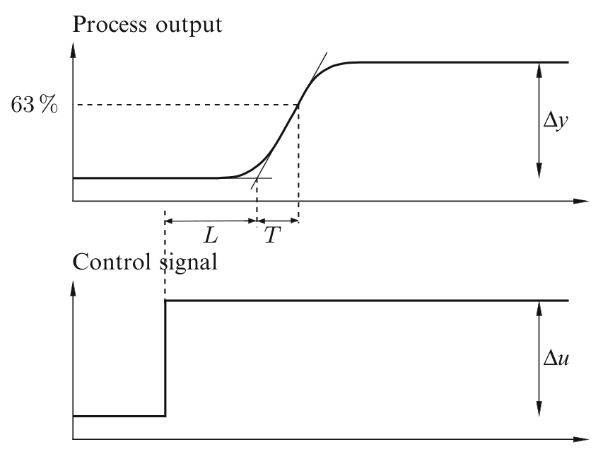

> Image description: This technical figure, titled "Autotuning, Fig. 1 Determination of $K_{p}$, $L$, and $T$ from a step response experiment," illustrates the relationship between a control signal and a process output during a step response. The bottom graph shows the "Control signal" undergoing a step change from an initial state to a higher level, with the magnitude of the change labeled $\Delta u$. The vertical axis represents the signal amplitude and the horizontal axis represents time. The top graph shows the "Process output," which exhibits a smooth, sigmoidal response following the step change in the control signal. A vertical dashed line connects the time of the control signal step to the process output response. Two parameters are identified on the time axis: $L$, representing the time delay (dead time), and $T$, representing the time constant. The output reaches a $63\%$ level of its final value at the end of period $T$. The total change in the process output is labeled $\Delta y$. These parameters allow for the calculation of the process gain $K_{p}$.
Autotuning, Fig. 1 Determination of $K_{p}, L$, and $T$ from a step response experiment

<!-- source_pdf_page: 77 -->
The greatest difficulty in carrying out tuning automatically is in selecting the amplitude of the step. The user naturally wants the disturbance to be as small as possible so that the process is not disturbed more than necessary. On the other hand, it is easier to determine the process model if the disturbance is large. The result of this dilemma is usually that the user has to decide how large the step in the control signal should be. Another problem is to determine when the step response has reached its final value.

## Methods Based on Frequency Response Analysis

Frequency-domain characteristics of the process can be obtained by adding sinusoidals to the control signal, but without knowing the frequency response of the process, the interesting frequency range and acceptable amplitudes are not known. A method that automatically provides a relevant frequency response can be determined from experiments with relay feedback according to Fig. 2. Notice that there is a switch that selects either relay feedback or ordinary PID feedback. When it is desired to tune the system, the PID function is disconnected and the system is connected to relay feedback control. Relay feedback control is the same as on/off control, but where the on and off levels are carefully chosen and not 0 and $100 \%$. The relay feedback makes the control loop oscillate. The period and the amplitude of the oscillation is determined when steady-state oscillation is obtained. This gives the ultimate period and the ultimate gain. The parameters of a PID controller can then be determined from these values. The PID controller is then automatically switched in again, and the control is executed with the new PID parameters.

For large classes of processes, relay feedback gives an oscillation with period close to the ultimate frequency $\omega_{u}$, as shown in Fig. 3, where the control signal is a square wave and the process output is close to a sinusoid. The gain of the transfer function at this frequency is also easy to obtain from amplitude measurements.

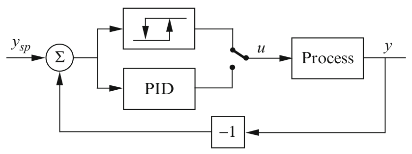

> Image description: A block diagram illustrates a control system architecture used for relay feedback testing. The diagram shows a closed-loop feedback configuration. A setpoint input, labeled $y_{sp}$, enters a summation junction ($\Sigma$). The error signal from the summation junction is fed into two parallel branches: one containing a relay block (represented by a hysteresis symbol) and the other containing a PID controller block. A switch selects between the output of the relay block and the PID controller, directing the control signal $u$ into a block labeled "Process." The process output, $y$, is fed back through a block with a gain of $-1$ and returns to the summation junction. The arrangement is designed to produce oscillations where the control signal is a square wave and the process output is a sinusoid. This structure is used to identify system characteristics, such as the ultimate frequency $\omega_{u}$ and process gain.
Autotuning, Fig. 2 The relay autotuner. In the tuning mode the process is connected to relay feedback

Describing function analysis can be used to determine the process characteristics. The describing function of a relay with hysteresis is

$$
N(a)=\frac{4 d}{\pi a}\left(\sqrt{1-\left(\frac{\epsilon}{a}\right)^{2}}-i \frac{\epsilon}{a}\right)
$$

where $d$ is the relay amplitude, $\epsilon$ the relay hysteresis, and $a$ the amplitude of the input signal. The negative inverse of this describing function is a straight line parallel to the real axis; see Fig. 4. The oscillation corresponds to the point where the negative inverse describing function crosses the Nyquist curve of the process, i.e., where

$$
G(i \omega)=-\frac{1}{N(a)}
$$

Since $N(a)$ is known, $G(i \omega)$ can be determined from the amplitude $a$ and the frequency $\omega$ of the oscillation.

Notice that the relay experiment is easily automated. There is often an initialization phase where the noise level in the process output is determined during a short period of time. The noise level is used to determine the relay hysteresis and a desired oscillation amplitude in the process output. After this initialization phase, the relay function is introduced. Since the amplitude of the oscillation is proportional to the relay output, it is easy to control it by adjusting the relay output.

## Different Adaptive Techniques

In the late 1970s, at the same time as autotuning procedures were developed and implemented in industrial controllers, there was a large academic interest in adaptive control. These two concepts

<!-- source_pdf_page: 78 -->
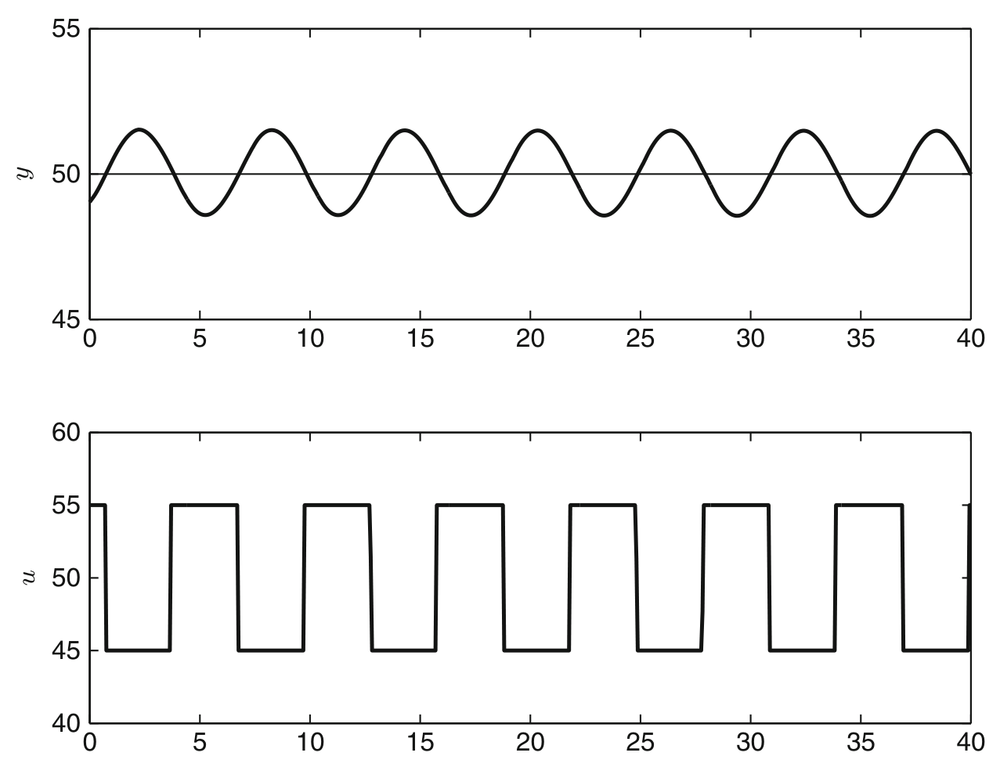

> Image description: This figure displays two time-series plots illustrating autotuning via relay feedback. The top plot shows the process output, variable $y$, over a time interval from 0 to 40 units. The waveform is a continuous sine-like oscillation centered around $y = 50$, with peaks reaching approximately 51.5 and troughs near 48.5. The bottom plot shows the corresponding control signal, variable $u$, over the same time interval. This signal is a square wave (relay output) alternating between a high state of 55 and a low state of 45. Each square pulse corresponds to the period of the output oscillation, representing the switching characteristic of a relay controller. The x-axes for both plots are synchronized, ranging from 0 to 40, showing the relationship between the discrete control input $u$ and the resulting continuous output $y$ in a feedback system.
Autotuning, Fig. 3 Process output $y$ and control signal $u$ during relay feedback

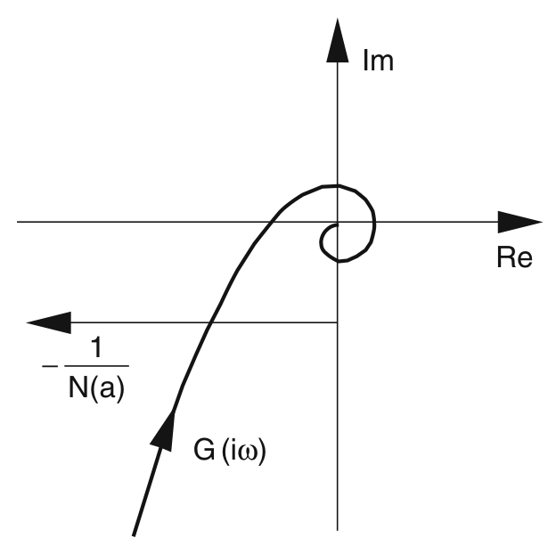

> Image description: A black and white technical diagram illustrates a complex plane with real (Re) and imaginary (Im) axes. A continuous, spiral-shaped curve originates from the origin and curves downward into the third quadrant. An arrow pointing along this curve indicates the direction of motion as frequency increases. Two horizontal lines intersect the vertical axis: one at the origin and one below it. The bottom horizontal line is marked with a left-pointing arrow and the label $-\frac{1}{N(a)}$, indicating a threshold or setpoint value. The spiral curve passes through the real axis and then descends towards the value $-\frac{1}{N(a)}$. Labels $G(i\omega)$ and $-\frac{1}{N(a)}$ represent key components in a control system analysis. This figure depicts the Nyquist plot of a system's transfer function $G(i\omega)$ during a relay feedback test, used for autotuning by observing the intersection of the plant's response with a relay-induced limit cycle.
Autotuning, Fig. 4 The negative inverse describing function of a relay with hysteresis $-1 / N(a)$ and a Nyquist curve $G(i \omega)$

are often mixed up with each other. Autotuning is sometimes called tuning on demand. An identification experiment is performed, controller parameters are determined, and the controller is then run with fixed parameters. An adaptive controller is, however, a controller where the controller parameters are adjusted online based on information from routine data. Automatic tuning and adaptive control have, however, one thing in common, namely, that they are methods to adapt the controller parameters to the actual process
dynamics. Therefore, they are both called adaptive techniques.

There is a third adaptive technique, namely, gain scheduling. Gain scheduling is a system where controller parameters are changed depending on measured operating conditions. The scheduling variable can, for instance, be the measurement signal, controller output, or an external signal. For historical reasons the word gain scheduling is used even if other parameters like integral time or derivative time are changed. Gain scheduling is a very effective way of controlling systems whose dynamics change with the operating conditions. Automatic tuning has made it possible to generate gain schedules automatically.

Although research on adaptive techniques has almost exclusively focused on adaptation, experience has shown that autotuning and gain scheduling have much wider industrial applicability. Figure 5 illustrates the appropriate use of the different techniques.

Controller performance is the first issue to consider. If requirements are modest, a controller with constant parameters and conservative tuning can be used. Other solutions should be considered when higher performance is required.

<!-- source_pdf_page: 79 -->
Autotuning, Fig. 5 When to use different adaptive techniques
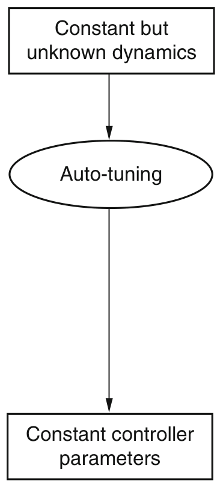

> Image description: A vertical flowchart illustrates an engineering process for control system design, titled "Autotuning, Fig. 5 When to use different adaptive techniques." The process begins at the top with a rectangular block containing the text "Constant but unknown dynamics," representing the initial system state or plant characteristics. A single downward-pointing arrow leads from this block to an oval-shaped central node labeled "Auto-tuning," which represents the computational or algorithmic method being applied. From the "Auto-tuning" oval, another downward-pointing arrow leads to a final rectangular block at the bottom containing the text "Constant controller parameters." The figure depicts a fundamental engineering workflow where an unknown but stable system is processed through an automated tuning algorithm to result in a set of fixed, optimized controller parameters. This flow characterizes a specific type of adaptive control strategy used when system dynamics do not change over time but their exact mathematical values are not initially known.

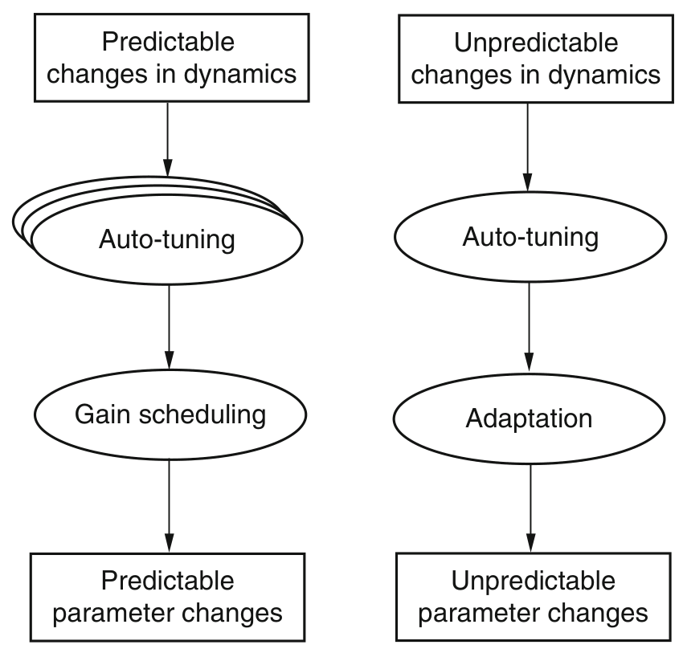

> Image description: This textbook figure, captioned "Fig. 5 When to use different adaptive techniques," presents a flowchart comparing two control strategies based on the nature of system changes. The left column outlines a approach for "Predictable changes in dynamics." The process begins with a rectangular block labeled "Predictable changes in dynamics." An arrow points down to a set of layered ovals representing "Auto-tuning." From there, an arrow leads to an oval labeled "Gain scheduling," which ultimately points down to a final rectangular block labeled "Predictable parameter changes." The right column outlines an approach for "Unpredictable changes in dynamics." It follows an identical vertical structure: starting with "Unpredictable changes in dynamics," leading through an "Auto-tuning" oval, and proceeding to an "Adaptation" oval. The process concludes at a final rectangular block labeled "Unpredictable parameter changes." In an engineering context, the figure illustrates that predictable variations are handled via gain scheduling, while unpredictable variations require an adaptation mechanism.

## Industrial Products

Commercial PID controllers with adaptive techniques have been available since the beginning of the late 1970s, both in single-station controllers and in distributed control systems.

Two important, but distinct, applications of PID autotuners are temperature controllers and process controllers. Temperature controllers are primarily designed for temperature control, whereas process controllers are supposed to work for a wide range of control loops in the process industry such as flow, pressure, level, temperature, and concentration control loops. Automatic tuning is easier to implement in temperature controllers, since most temperature control loops have several common features. This is the main reason why automatic tuning was introduced more rapidly in these controllers.

Since the processes that are controlled with process controllers may have large differences in their dynamics, tuning becomes more difficult compared to the pure temperature control loops.

Automatic tuning can also be performed by external devices which are connected to the control loop during the tuning phase. Since these devices are supposed to work together with controllers from different manufacturers, they must

If the process dynamics are constant, a controller with constant parameters should be used. The parameters of the controller can be obtained by autotuning.

If the process dynamics or the character of the disturbances are changing, it is useful to compensate for these changes by changing the controller. If the variations can be predicted from measured signals, gain scheduling should be used since it is simpler and gives superior and more robust performance than continuous adaptation. Typical examples are variations caused by nonlinearities in the control loop. Autotuning can be used to build up the gain schedules automatically.

There are also cases where the variations in process dynamics are not predictable. Typical examples are changes due to unmeasurable variations in raw material, wear, fouling, etc. These variations cannot be handled by gain scheduling but must be dealt with by adaptation. An autotuning procedure is often used to initialize the adaptive controller. It is then sometimes called pre-tuning or initial tuning.

To summarize, autotuning is a key component in all adaptive techniques and a prerequisite for their use in practice.

<!-- source_pdf_page: 80 -->
be provided with quite a lot of information about the controller structure and parameterization in order to provide appropriate controller parameters. Such information includes signal ranges, controller structure (series or parallel form), sampling rate, filter time constants, and units of the different controller parameters (gain or proportional band, minutes or seconds, time or repeats/time).

## Summary and Future Directions

Most of the autotuning methods that are available in industrial products today were developed about 30 years ago, when computer-based controllers started to appear. These autotuners are often based on simple models and simple tuning rules. With the computer power available today, and the increased knowledge about PID controller design, there is a potential for improving the autotuners, and more efficient autotuners will probably appear in industrial products quite soon.

## Cross-References

- Adaptive Control, Overview
- PID Control

## Bibliography

Åström KJ, Hägglund T (1995) PID controllers: theory, design, and tuning. ISA - The Instrumentation, Systems, and Automation Society, Research Triangle Park
Åström KJ, Hägglund T (2005) Advanced PID control. ISA - The Instrumentation, Systems, and Automation Society, Research Triangle Park
Vilanova R, Visioli A (eds) (2012) PID control in the third millennium. Springer, Dordrecht
Visioli A (2006) Practical PID control. Springer, London
Yu C-C (2006) Autotuning of PID controllers - a relay feedback approach. Springer, London

## Averaging Algorithms and Consensus

Wei Ren Department of Electrical Engineering, University of California, Riverside, CA, USA

#### Abstract

In this article, we overview averaging algorithms and consensus in the context of distributed coordination and control of networked systems. The two subjects are closely related but not identical. Distributed consensus means that a team of agents reaches an agreement on certain variables of interest by interacting with their neighbors. Distributed averaging aims at computing the average of certain variables of interest among multiple agents by local communication. Hence averaging can be treated as a special case of consensus - average consensus. For distributed consensus, we introduce distributed algorithms for agents with single-integrator, general linear, and nonlinear dynamics. For distributed averaging, we introduce static and dynamic averaging algorithms. The former is useful for computing the average of initial conditions (or constant signals), while the latter is useful for computing the average of time-varying signals. Future research directions are also discussed.

## Keywords

Cooperative control; Coordination; Distributed control; Multi-agent systems; Networked systems

## Introduction

In the area of control of networked systems, low cost, high adaptivity and scalability, great robustness, and easy maintenance are critical factors.

<!-- source_pdf_page: 81 -->
To achieve these factors, distributed coordination and control algorithms that rely on only local interaction between neighboring agents to achieve collective group behavior are more favorable than centralized ones. In this article, we overview averaging algorithms and consensus in the context of distributed coordination and control of networked systems.

Distributed consensus means that a team of agents reaches an agreement on certain variables of interest by interacting with their neighbors. A consensus algorithm is an update law that drives the variables of interest of all agents in the network to converge to a common value (Jadbabaie et al. 2003; Olfati-Saber et al. 2007; Ren and Beard 2008). Examples of the variables of interest include a local representation of the center and shape of a formation, the rendezvous time, the length of a perimeter being monitored, the direction of motion for a multi-vehicle swarm, and the probability that a target has been identified. Consensus algorithms have applications in rendezvous, formation control, flocking, attitude alignment, and sensor networks (Bai et al. 2011a; Bullo et al. 2009; Mesbahi and Egerstedt 2010; Qu 2009; Ren and Cao 2011). Distributed averaging algorithms aim at computing the average of certain variables of interest among multiple agents by local communication. Distributed averaging finds applications in distributed computing, distributed signal processing, and distributed optimization (Tsitsiklis et al. 1986). Hence the variables of interest are dependent on the applications (e.g., a sensor measurement or a network quantity). Consensus and averaging algorithms are closely connected and yet nonidentical. When all agents are able to compute the average, they essentially reach a consensus, the so-called average consensus. On the other hand, when the agents reach a consensus, the consensus value might or might not be the average value.

Graph Theory Notations. Suppose that there are $n$ agents in a network. A network topology (equivalently, graph) $\mathcal{G}$ consisting of a node set $\mathcal{V}=\{1, \ldots, n\}$ and an edge set $\mathcal{E} \subseteq \mathcal{V} \times \mathcal{V}$ will be used to model interaction (communication or sensing) between the $n$ agents. An edge ( $i, j$ ) in
a directed graph denotes that agent $j$ can obtain information from agent $i$, but not necessarily vice versa. In contrast, an edge ( $i, j$ ) in an undirected graph denotes that agents $i$ and $j$ can obtain information from each other. Agent $j$ is a (in-) neighbor of agent $i$ if $(j, i) \in \mathcal{E}$. Let $\mathcal{N}_{i}$ denote the neighbor set of agent $i$. We assume that $i \in \mathcal{N}_{i}$. A directed path is a sequence of edges in a directed graph of the form $\left(i_{1}, i_{2}\right),\left(i_{2}, i_{3}\right), \ldots$, where $i_{j} \in \mathcal{V}$. An undirected path in an undirected graph is defined analogously. A directed graph is strongly connected if there is a directed path from every agent to every other agent. An undirected graph is connected if there is an undirected path between every pair of distinct agents. A directed graph has a directed spanning tree if there exists at least one agent that has directed paths to all other agents. For example, Fig. 1 shows a directed graph that has a directed spanning but is not strongly connected. The adjacency matrix $\mathcal{A}=\left[a_{i j}\right] \in \mathbb{R}^{n \times n}$ associated with $\mathcal{G}$ is defined such that $a_{i j}$ (the weight of edge $(j, i)$ ) is positive if agent $j$ is a neighbor of agent $i$ while $a_{i j}=0$ otherwise. The (nonsymmetric) Laplacian matrix (Agaev and Chebotarev 2005) $\mathcal{L}=\left[\ell_{i j}\right] \in \mathbb{R}^{n \times n}$ associated with $\mathcal{A}$ and hence $\mathcal{G}$ is defined as $\ell_{i i}=\sum_{j \neq i} a_{i j}$ and $\ell_{i j}=-a_{i j}$ for all $i \neq j$. For an undirected graph, we assume that $a_{i j}=a_{j i}$. A graph is balanced if for every agent the total edge weights of its incoming links is equal to the total edge weights of its outgoing links $\left(\sum_{j=1}^{n} a_{i j}=\sum_{j=1}^{n} a_{j i}\right.$ for all $\left.i\right)$.
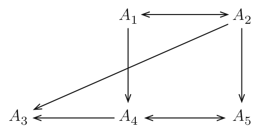

> Image description: A directed graph containing five labeled nodes, $A_1$ through $A_5$, is shown. The nodes are arranged in two rows: $A_1$ and $A_2$ on the top row, and $A_3$, $A_4$, and $A_5$ on the bottom row. The connections (edges) are represented by arrows indicating the direction of information flow: - A bidirectional (undirected) relationship exists between $A_1$ and $A_2$, as well as between $A_4$ and $A_5$, and between $A_3$ and $A_4$. - There is a directed edge from $A_1$ to $A_4$. - There is a directed edge from $A_2$ to $A_5$. - There is a directed edge from $A_2$ to $A_3$. According to the provided caption, this graph demonstrates a directed graph that has a directed spanning tree but is not strongly connected. The arrows indicate the direction in which agent $j$ can obtain information from agent $i$.

Averaging Algorithms and Consensus, Fig. 1 A directed graph that characterizes the interaction among five agents, where $A_{i}, i=1, \ldots, 5$, denotes agent $i$. An arrow from agent $j$ to agent $i$ indicates that agent $i$ receives information from agent $j$. The directed graph has a directed spanning tree but is not strongly connected. Here both agents 1 and 2 have directed paths to all other agents

<!-- source_pdf_page: 82 -->
## Consensus

Consensus has a long history in management science, statistical physics, and distributed computing and finds recent interests in distributed control. While in the area of distributed control of networked systems the term consensus was initially more or less dominantly referred to the case of a continuous-time version of a distributed linear averaging algorithm, such a term has been broadened to a great extent later on. Related problems to consensus include synchronization, agreement, and rendezvous. The study of consensus can be categorized in various manners. For example, in terms of the final consensus value, the agents could reach a consensus on the average, a weighted average, the maximum value, the minimum value, or a general function of their initial conditions, or even a (changing) state that serves as a reference. A consensus algorithm could be linear or nonlinear. Consensus algorithms can be designed for agents with linear or nonlinear dynamics. As the agent dynamics become more complicated, so do the algorithm design and analysis. Numerous issues are also involved in consensus such as network topologies (fixed vs. switching, deterministic vs. random, directed vs. undirected, asynchronous vs. synchronous), time delay, quantization, optimality, sampling effects, and convergence speed. For example, in real applications, due to nonuniform communication/sensing ranges or limited field of view of sensors, the network topology could be directed rather than undirected. Also due to unreliable communication/sensing and limited communication/sensing ranges, the network topology could be switching rather than fixed.

## Consensus for Agents with Single-Integrator Dynamics

We start with a fundamental consensus algorithm for agents with single-integrator dynamics. The results in this section follow from Jadbabaie et al. (2003), Olfati-Saber et al. (2007), Ren and Beard (2008), Moreau (2005), and Agaev and Chebotarev (2000). Consider agents with singleintegrator dynamics

$$
\begin{equation*}
\dot{x}_{i}(t)=u_{i}(t), \quad i=1, \ldots, n, \tag{1}
\end{equation*}
$$

where $x_{i}$ is the state and $u_{i}$ is the control input. A common consensus algorithm for (1) is

$$
\begin{equation*}
u_{i}(t)=\sum_{j \in \mathcal{N}_{i}(t)} a_{i j}(t)\left[x_{j}(t)-x_{i}(t)\right], \tag{2}
\end{equation*}
$$

where $\mathcal{N}_{i}(t)$ is the neighbor set of agent $i$ at time t and $a_{i j}(t)$ is the $(i, j)$ entry of the adjacency matrix $\mathcal{A}$ of the graph $\mathcal{G}$ at time $t$. A consequence of (2) is that the state $x_{i}(t)$ of agent $i$ is driven toward the states of its neighbors or equivalently toward the weighted average of its neighbors' states. The closed-loop system of (1) using (2) can be written in matrix form as

$$
\begin{equation*}
\dot{x}(t)=-\mathcal{L}(t) x(t), \tag{3}
\end{equation*}
$$

where $x$ is a column stack vector of all $x_{i}$ and $\mathcal{L}$ is the Laplacian matrix. Consensus is reached if for all initial states, the agents' states eventually become identical. That is, for all $x_{i}(0)$, $\left\|x_{i}(t)-x_{j}(t)\right\|$ approaches zero eventually.

The properties of the Laplacian matrix $\mathcal{L}$ play an important role in the analysis of the closedloop system (3). When the graph $\mathcal{G}$ (and hence the associated Laplacian matrix $\mathcal{L}$ ) is fixed, (3) can be analyzed by studying the eigenvalues and eigenvectors of $\mathcal{L}$. Due to its special structure, for any graph $\mathcal{G}$, the associated Laplacian matrix $\mathcal{L}$ has at least one zero eigenvalue with an associated right eigenvector $\mathbf{1}$ (column vector of all ones) and all other eigenvalues have positive real parts. To ensure consensus, it is equivalent to ensure that $\mathcal{L}$ has a simple zero eigenvalue. It can be shown that the following three statements are equivalent: (i) the agents reach a consensus exponentially for arbitrary initial states; (ii) the graph $\mathcal{G}$ has a directed spanning tree; and (iii) the Laplacian matrix $\mathcal{L}$ has a simple zero eigenvalue with an associated right eigenvector $\mathbf{1}$ and all other eigenvalues have positive real parts. When consensus is reached, the final consensus value is a weighted average of the initial states of those agents that have directed paths to all other agents (see Fig. 2 for an illustration).

<!-- source_pdf_page: 83 -->
Averaging Algorithms and Consensus, Fig. 2
Consensus for five agents using the algorithm (2) for (1). Here the graph $\mathcal{G}$ is given by Fig. 1. The initial states are chosen as $x_{i}(0)=2 i$, where $i=1, \ldots, 5$. Consensus is reached as $\mathcal{G}$ has a directed spanning tree. The final consensus value is a weighted average of the initial states of agents 1 and 2
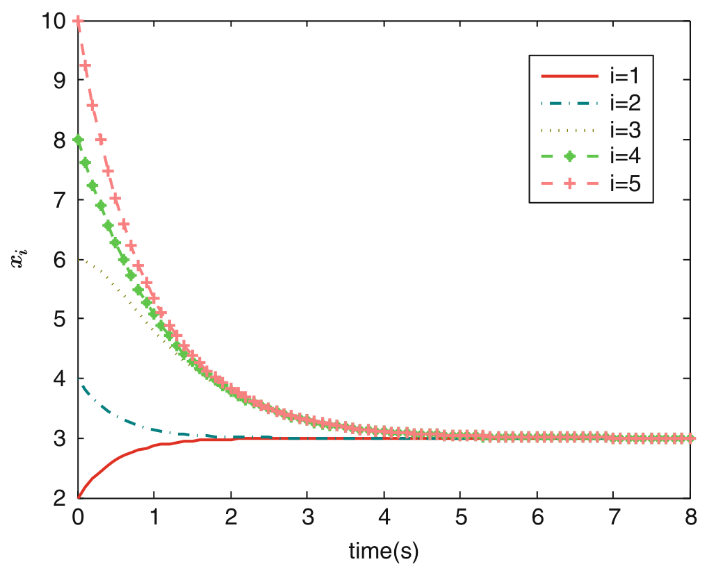

> Image description: A line graph titled "Consensus for five agents using the algorithm (2) for (1)" illustrates the state convergence of five agents over time. The vertical axis represents the state $x_i$ (ranging from 2 to 10), and the horizontal axis represents time in seconds (from 0 to 8). Five distinct curves, representing agents $i=1$ through $i=5$, are plotted. The legend identifies each curve by color and marker: agent 1 (red solid line), agent 2 (teal dashed line), agent 3 (olive dotted line), agent 4 (green dashed line with diamonds), and agent 5 (pink dashed line with pluses). The initial states follow the rule $x_i(0) = 2i$. As time progresses, all trajectories converge asymptotically toward a common consensus value of approximately 3. This equilibrium is reached as the agents' states stabilize after about 4 seconds, indicating that consensus is achieved due to the existence of a directed spanning tree in the communication graph $\mathcal{G}$.

When the graph $\mathcal{G}(t)$ is switching at time instants $t_{0}, t_{1}, \ldots$, the solution to the closed-loop system (3) is given by $x(t)=\Phi(t, 0) x(0)$, where $\Phi(t, 0)$ is the transition matrix corresponding to $-\mathcal{L}(t)$. Consensus is reached if $\Phi(t, 0)$ eventually converges to a matrix with identical rows. Here $\Phi(t, 0)=\Phi\left(t, t_{k}\right) \Phi\left(t_{k}, t_{k-1}\right) \cdots \Phi\left(t_{1}, 0\right)$, where $\Phi\left(t_{k}, t_{k-1}\right)$ is the transition matrix corresponding to $\mathcal{L}(t)$ at time interval $\left[t_{k-1}, t_{k}\right]$. It turns out that each transition matrix is a row-stochastic matrix with positive diagonal entries. A square matrix is row stochastic if all its entries are nonnegative and all of its row sums are one. The consensus convergence can be analyzed by studying the product of row-stochastic matrices. Another analysis technique is a Lyapunov approach (e.g., $\left.\max x_{i}-\min x_{i}\right)$. It can be shown that the agents' states reach a consensus if there exists an infinite sequence of contiguous, uniformly bounded time intervals, with the property that across each such interval, the union of the graphs $\mathcal{G}(t)$ has a directed spanning tree. That is, across each such interval, there exists at least one agent that can directly or indirectly influence all other agents. It is also possible to achieve certain nice features by designing nonlinear consensus algorithms of the form $u_{i}(t)=\sum_{j \in \mathcal{N}_{i}(t)} a_{i j}(t) \psi\left[x_{j}(t)-x_{i}(t)\right]$, where $\psi(\cdot)$ is a nonlinear function satisfying certain properties. One example is a continuous nondecreasing odd function. For example, a saturation type function could be introduced to
account for actuator saturation and a signum type function could be introduced to achieve finitetime convergence.

As shown above, for single-integrator dynamics, the consensus convergence is determined entirely by the network topologies. The primary reason is that the single-integrator dynamics are internally stable. However, when more complicated agent dynamics are involved, the consensus algorithm design and analysis become more complicated. On one hand, whether the graph is undirected (respectively, switching) or not has significant influence on the complexity of the consensus analysis. On the other hand, not only the network topology but also the agent dynamics themselves and the parameters in the consensus algorithm play important roles. Next we introduce consensus for agents with general linear and nonlinear dynamics.

## Consensus for Agents with General Linear Dynamics

In some circumstances, it is relevant to deal with agents with general linear dynamics, which can also be regarded as linearized models of certain nonlinear dynamics. The results in this section follow from Li et al. (2010). Consider agents with general linear dynamics

$$
\begin{equation*}
\dot{x}_{i}=A x_{i}+B u_{i}, \quad y_{i}=C x_{i}, \tag{4}
\end{equation*}
$$

<!-- source_pdf_page: 84 -->
where $x_{i} \in \mathbb{R}^{m}, u_{i} \in \mathbb{R}^{p}$, and $y_{i} \in \mathbb{R}^{q}$ are, respectively, the state, the control input, and the output of agent $i$ and $A, B, C$ are constant matrices with compatible dimensions.

When each agent has access to the relative states between itself and its neighbors, a distributed static consensus algorithm is designed for (4) as

$$
\begin{equation*}
u_{i}=c K \sum_{j \in \mathcal{N}_{i}} a_{i j}\left(x_{i}-x_{j}\right) \tag{5}
\end{equation*}
$$

where $c>0$ is a coupling gain, $K \in \mathbb{R}^{p \times m}$ is the feedback gain matrix, and $\mathcal{N}_{i}$ and $a_{i j}$ are defined as in (2). It can be shown that if the graph $\mathcal{G}$ has a directed spanning tree, consensus is reached using (5) for (4) if and only if all the matrices $A+c \lambda_{i}(\mathcal{L}) B K$, where $\lambda_{i}(\mathcal{L}) \neq 0$ are Hurwitz. Here $\lambda_{i}(\mathcal{L})$ denotes the $i$ th eigenvalue of the Laplacian matrix $\mathcal{L}$. A necessary condition for reaching a consensus is that the pair ( $A, B$ ) is stabilizable. The consensus algorithm (5) can be designed via two steps:
(a) Solve the linear matrix inequality $A^{T} P+ P A-2 B B^{T}<0$ to get a positive-definite solution $P$. Then let the feedback gain matrix $K=-B^{T} P^{-1}$.
(b) Select the coupling strength $c$ larger than the threshold value $1 / \min _{\lambda_{i}(\mathcal{L}) \neq 0} \operatorname{Re}\left[\lambda_{i}(\mathcal{L})\right]$, where $\operatorname{Re}(\cdot)$ denotes the real part.
Note that here the threshold value depends on the eigenvalues of the Laplacian matrix, which is in some sense global information. To overcome such a limitation, it is possible to introduce adaptive gains in the algorithm design. The gains could be updated dynamically using local information.

When the relative states between each agent and its neighbors are not available, one is motivated to make use of the output information and employ observer-based design to estimate the relative states. An observer-type consensus algorithm is designed for (4) as

$$
\begin{align*}
\dot{v}_{i}= & (A+B F) v_{i}+c L \sum_{j \in \mathcal{N}_{i}} a_{i j}\left[C\left(v_{i}-v_{j}\right)\right. \\
& \left.-\left(y_{i}-y_{j}\right)\right] \\
u_{i}= & F v_{i}, \quad i=1, \cdots, n \tag{6}
\end{align*}
$$

where $v_{i} \in \mathbb{R}^{m}$ are the observer states, $F \in \mathbb{R}^{p \times n}$ and $L \in \mathbb{R}^{m \times q}$ are the feedback gain matrices, and $c>0$ is a coupling gain. Here the algorithm (6) uses not only the relative outputs between each agent and its neighbors but also its own and neighbors' observer states. While relative outputs could be obtained through local measurements, the neighbors' observer states can only be obtained via communication. It can be shown that if the graph $\mathcal{G}$ has a directed spanning tree, consensus is reached using (6) for (4) if the matrices $A+B F$ and $A+c \lambda_{i}(\mathcal{L}) L C$, where $\lambda_{i}(\mathcal{L}) \neq 0$, are Hurwitz. The observertype consensus algorithm (6) can be seen as an extension of the single-system observer design to multi-agent systems. Here the separation principle of the traditional observer design still holds in the multi-agent setting in the sense that the feedback gain matrices $F$ and $L$ can be designed separately.

## Consensus for Agents with Nonlinear Dynamics

In multi-agent applications, agents usually represent physical vehicles with special dynamics, especially nonlinear dynamics for the most part. Examples include Lagrangian systems for robotic manipulators and autonomous robots, nonholonomic systems for unicycles, attitude dynamics for rigid bodies, and general nonlinear systems. Similar to the consensus algorithms for linear multi-agent systems, the consensus algorithms used for these nonlinear agents are often designed based on state differences between each agent and its neighbors. But due to the inherent nonlinearity, the problem is more complicated and additional terms might be required in the algorithm design. The main techniques used in the consensus analysis for nonlinear multi-agent systems are often Lyapunov-based techniques (Lyapunov functions, passivity theory, nonlinear contraction analysis, and potential functions).

Early results on consensus for agents with nonlinear dynamics primarily focus on undirected graphs to exploit the symmetry to facilitate the construction of Lyapunov function candidates. Unfortunately, the extension from an undirected graph to a directed one is nontrivial.

<!-- source_pdf_page: 85 -->
For example, the directed graph does not preserve the passivity properties in general. Moreover, the directed graph could cause difficulties in the design of (positive-definite) Lyapunov functions. One approach is to integrate the nonnegative left eigenvector of the Laplacian matrix associated with the zero eigenvalue into the Lyapunov function, which is valid for strongly connected graphs and has been applied in some problems. Another approach is based on sliding mode control. The idea is to design a sliding surface for reaching a consensus. Taking multiple Lagrangian systems as an example, the agent dynamics are represented by

$$
\begin{align*}
& M_{i}\left(q_{i}\right) \ddot{q}_{i}+C_{i}\left(q_{i}, \dot{q}_{i}\right) \dot{q}_{i}+g_{i}\left(q_{i}\right)=\tau_{i} \\
& \quad i=1, \cdots, n \tag{7}
\end{align*}
$$

where $q_{i} \in \mathbb{R}^{p}$ is the vector of generalized coordinates, $M_{i}\left(q_{i}\right) \in \mathbb{R}^{p \times p}$ is the symmetric positive-definite inertia matrix, $C_{i}\left(q_{i}, \dot{q}_{i}\right) \dot{q}_{i} \in \mathbb{R}^{p}$ is the vector of Coriolis and centrifugal torques, $g_{i}\left(q_{i}\right) \in \mathbb{R}^{p}$ is the vector of gravitational torque, and $\tau_{i} \in \mathbb{R}^{p}$ is the vector of control torque on the $i$ th agent. The sliding surface can be designed as

$$
\begin{equation*}
s_{i}=\dot{q}_{i}-\dot{q}_{r i}=\dot{q}_{i}+\alpha \sum_{j \in \mathcal{N}_{i}} a_{i j}\left(q_{i}-q_{j}\right) \tag{8}
\end{equation*}
$$

where $\alpha$ is a positive scalar. Note that when $s_{i}=0$, (8) is actually the closed-loop system of a consensus algorithm for single integrators. Then if the control torque $\tau_{i}$ can be designed using only local information from neighbors to drive $s_{i}$ to zero, consensus will be reached as $s_{i}$ can be treated as a vanishing disturbance to a system that reaches consensus exponentially.

It is generally very challenging to deal with general directed or switching graphs for agents with more complicated dynamics other than single-integrator dynamics. In some cases, the challenge could be overcome by introducing and updating additional auxiliary variables (often observer-based algorithms) and exchanging these variables between neighbors (see, e.g., (6)). In the algorithm design, the agents might use not only relative physical states between
neighbors but also local auxiliary variables from neighbors. While relative physical states could be obtained through sensing, the exchange of auxiliary variables can only be achieved by communication. Hence such generalization is obtained at the price of increased communication between the neighboring agents. Unlike some other algorithms, it is generally impossible to implement the algorithm relying on purely relative sensing between neighbors without the need for communication.

## Averaging Algorithms

Existing distributed averaging algorithms are primarily static averaging algorithms based on linear local average iterations or gossip iterations. These algorithms are capable of computing the average of the initial conditions of all agents (or constant signals) in a network. In particular, the linear local-average-iteration algorithms are usually synchronous, where at each iteration each agent repeatedly updates its state to be the average of those of its neighbors. The gossip algorithms are asynchronous, where at each iteration a random pair of agents are selected to exchange their states and update them to be the average of the two. Dynamic averaging algorithms are of significance when there exist time-varying signals. The objective is to compute the average of these timevarying signals in a distributed manner.

## Static Averaging

Take a linear local-average-iteration algorithm as an example. The results in this section follow from Tsitsiklis et al. (1986), Jadbabaie et al. (2003), and Olfati-Saber et al. (2007). Let $x_{i}$ be the information state of agent $i$. A linear local-average-iteration-type algorithm has the form
$x_{i}[k+1]=\sum_{j \in \mathcal{N}_{i}[k]} a_{i j}[k] x_{j}[k], \quad i=1, \ldots, n$,
where $k$ denotes a communication event, $\mathcal{N}_{i}[k]$ denotes the neighbor set of agent $i$, and $a_{i j}[k]$ is the ( $i, j$ ) entry of the adjacency matrix $\mathcal{A}$ of the graph $\mathcal{G}$ that represents the communication

<!-- source_pdf_page: 86 -->
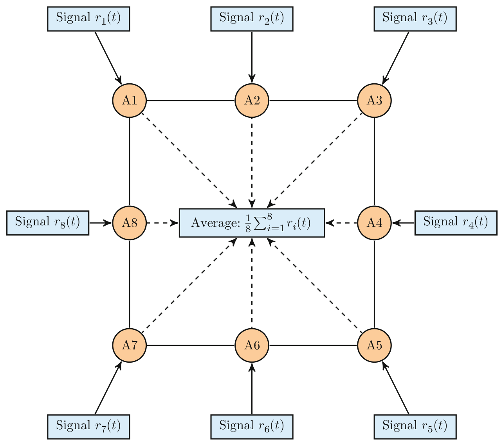

> Image description: This technical diagram illustrates a distributed averaging process among eight agents, labeled $A_1$ through $A_8$, arranged in a rectangular grid. Eight input signals, denoted as $r_1(t)$ through $r_8(t)$ in light blue rectangular blocks, are fed into their corresponding agents via solid black arrows. The agents are connected in a ring-like topology via solid black lines forming the perimeter of the rectangle. Additionally, dashed black arrows point from each agent toward a central rectangular block labeled "Average: $\frac{1}{8} \sum_{i=1}^{8} r_i(t)$". This central block represents the mathematical operation of calculating the arithmetic mean of all eight time-varying signals. The diagram visualizes a consensus mechanism where multiple independent signal sources are processed by a network of agents to achieve a global average.
Averaging Algorithms and Consensus, Fig. 3 Illustration of distributed averaging of multiple (time-varying) signals. Here $A_{i}$ denotes agent $i$ and $r_{i}(t)$ denotes a (time-

varying) signal associated with agent $i$. Each agent needs to compute the average of all agents' signals but can communicate with only its neighbors
topology at time $k$, with the additional assumption that $\mathcal{A}$ is row stochastic and $a_{i i}[k]>0$ for all $i=1, \ldots, n$. Intuitively, the information state of each agent is updated as the weighted average of its current state and the current states of its neighbors at each iteration. Note that an agent maintains its current state if it does not exchange information with other agents at that event instant. In fact, a discretized version of the closedloop system of (1) using (2) (with a sufficiently small sampling period) takes in the form of (9). The objective here is for all agents to compute the average of their initial states by communicating with only their neighbors. That is, each $x_{i}[k]$ approaches $\frac{1}{n} \sum_{j=1}^{n} x_{j}[0]$ eventually. To compute the average of multiple constant signals $c_{i}$, we could simply set $x_{i}[0]=c_{i}$. The algorithm (9) can be written in matrix form as $x[k+1]= \mathcal{A}[k] x[k]$, where $x$ is a column stack vector of all $x_{i}$ and $\mathcal{A}[k]=\left[a_{i j}[k]\right]$ is a row-stochastic matrix.

When the graph $\mathcal{G}$ (and hence the matrix $\mathcal{A}$ ) is fixed, the convergence of the algorithm (9)
can be analyzed by studying the eigenvalues and eigenvectors of the row-stochastic matrix $\mathcal{A}$. Because all diagonal entries of $\mathcal{A}$ are positive, Gershgorin's disc theorem implies that all eigenvalues of $\mathcal{A}$ are either within the open unit disk or at one. When the graph $\mathcal{G}$ is strongly connected, the Perron-Frobenius theorem implies that $\mathcal{A}$ has a simple eigenvalue at one with an associated right eigenvector 1 and an associated positive left eigenvector. Hence when $\mathcal{G}$ is strongly connected, it turns out that $\lim _{k \rightarrow \infty} \mathcal{A}^{k}=\mathbf{1} \nu^{T}$, where $\nu^{T}$ is a positive left eigenvector of $\mathcal{A}$ associated with the eigenvalue one and satisfies $v^{T} \mathbf{1}=1$. Note that $x[k]=\mathcal{A}^{k} x[0]$. Hence, each agent's state $x_{i}[k]$ approaches $v^{T} x[0]$ eventually. If it can be further ensured that $v=\frac{1}{n} \mathbf{1}$, then averaging is achieved. It can be shown that the agents' states converge to the average of their initial values if and only if the directed graph $\mathcal{G}$ is both strongly connected and balanced or the undirected graph $\mathcal{G}$ is connected. When the graph is switching, the convergence of the algorithm (9) can be analyzed by studying the

<!-- source_pdf_page: 87 -->
product of row-stochastic matrices. Such analysis is closely related to Markov chains. It can be shown that the agents' states converge to the average of their initial values if the directed graph $\mathcal{G}$ is balanced at each communication event and strongly connected in a joint manner or the undirected graph $\mathcal{G}$ is jointly connected.

## Dynamic Averaging

In a more general setting, there exist $n$ timevarying signals, $r_{i}(t), i=1, \ldots, n$, which could be an external signal or an output from a dynamical system. Here $r_{i}(t)$ is available to only agent $i$ and each agent can exchange information with only its neighbors. Each agent maintains a local estimate, denoted by $x_{i}(t)$, of the average of all the signals $\bar{r}(t) \triangleq \frac{1}{n} \sum_{k=1}^{n} r_{k}(t)$. The objective is to design a distributed algorithm for agent $i$ based on $r_{i}(t)$ and $x_{j}(t), j \in \mathcal{N}_{i}(t)$, such that all agents will finally track the average that changes over time. That is, $\left\|x_{i}(t)-\bar{r}(t)\right\|$, $i=1, \ldots, n$, approaches zero eventually. Such a dynamic averaging idea finds applications in distributed sensor fusion with time-varying measurements (Bai et al. 2011b; Spanos and Murray 2005) and distributed estimation and tracking (Yang et al. 2008).

Figure 3 illustrates the dynamic averaging idea. If there exists a central station that can always access the signals of all agents, then it is trivial to compute the average. Unfortunately, in a distributed context, where there does not exist a central station and each agent can only communicate with its local neighbors, it is challenging for each agent to compute the average that changes over time. While each agent could compute the average of its own and local neighbors' signals, this will not be the average of all signals.

When the signal $r_{i}(t)$ can be arbitrary but its derivative exists and is bounded almost everywhere, a distributed nonlinear nonsmooth algorithm is designed in Chen et al. (2012) as

$$
\begin{align*}
& \dot{\phi}_{i}(t)=\alpha \sum_{j \in \mathcal{N}_{i}} \operatorname{sgn}\left[x_{j}(t)-x_{i}(t)\right] \\
& x_{i}(t)=\phi_{i}(t)+r_{i}(t), \quad i=1, \ldots, n, \tag{10}
\end{align*}
$$

where $\alpha$ is a positive scalar, $\mathcal{N}_{i}$ denotes the neighbor set of agent $i, \operatorname{sgn}(\cdot)$ is the signum function defined componentwise, $\phi_{i}$ is the internal state of the estimator with $\phi_{i}(0)=0$, and $x_{i}$ is the estimate of the average $\bar{r}(t)$. Due to the existence of the discontinuous signum function, the solution of (10) is understood in the Filippov sense (Cortes 2008).

The idea behind the algorithm (10) is as follows. First, (10) is designed to ensure that $\sum_{i=1}^{n} x_{i}(t)=\sum_{i=1}^{n} r_{i}(t)$ holds for all time. Note that $\sum_{i=1}^{n} x_{i}(t)=\sum_{i=1}^{n} \phi_{i}(t)+\sum_{i=1}^{n} r_{i}(t)$. When the graph $\mathcal{G}$ is undirected and $\phi_{i}(0)=0$, it follows that $\sum_{i=1}^{n} \phi_{i}(t)=\sum_{i=1}^{n} \phi_{i}(0)+ \alpha \sum_{i=1}^{n} \sum_{j \in \mathcal{N}_{i}} \int_{0}^{t} \operatorname{sgn}\left[x_{j}(\tau)-x_{i}(\tau)\right] d \tau=0$. As a result, $\sum_{i=1}^{n} x_{i}(t)=\sum_{i=1}^{n} r_{i}(t)$ holds for all time. Second, when $\mathcal{G}$ is connected, if the algorithm (10) guarantees that all estimates $x_{i}$ approach the same value in finite time, then it can be guaranteed that each estimate approaches the average of all signals in finite time.

## Summary and Future Research Directions

Averaging algorithms and consensus play an important role in distributed control of networked systems. While there is significant progress in this direction, there are still numerous open problems. For example, it is challenging to achieve averaging when the graph is not balanced. It is generally not clear how to deal with a general directed or switching graph for nonlinear agents or nonlinear algorithms when the algorithms are based on only interagent physical state coupling without the need for communicating additional auxiliary variables between neighbors. The study of consensus for multiple underactuated agents remains a challenge. Furthermore, when the agents' dynamics are heterogeneous, it is challenging to design consensus algorithms. In addition, in the existing study, it is often assumed that the agents are cooperative. When there exist faulty or malicious agents, the problem becomes more involved.

<!-- source_pdf_page: 88 -->
## Cross-References

- Distributed Optimization
- Dynamic Graphs, Connectivity of
- Flocking in Networked Systems
- Graphs for Modeling Networked Interactions
- Networked Systems
- Oscillator Synchronization
- Vehicular Chains

## Bibliography

Agaev R, Chebotarev P (2000) The matrix of maximum out forests of a digraph and its applications. Autom Remote Control 61(9): 1424-1450
Agaev R, Chebotarev P (2005) On the spectra of nonsymmetric Laplacian matrices. Linear Algebra Appl 399:157-178
Bai H, Arcak M, Wen J (2011a) Cooperative control design: a systematic, passivity-based approach. Springer, New York
Bai H, Freeman RA, Lynch KM (2011b) Distributed Kalman filtering using the internal model average consensus estimator. In: Proceedings of the American control conference, San Francisco, pp 1500-1505
Bullo F, Cortes J, Martinez S (2009) Distributed control of robotic networks. Princeton University Press, Princeton
Chen F, Cao Y, Ren W (2012) Distributed average tracking of multiple time-varying reference signals with bounded derivatives. IEEE Trans Autom Control 57(12):3169-3174

Cortes J (2008) Discontinuous dynamical systems. IEEE Control Syst Mag 28(3):36-73
Jadbabaie A, Lin J, Morse AS (2003) Coordination of groups of mobile autonomous agents using nearest neighbor rules. IEEE Trans Autom Control 48(6):9881001
Li Z, Duan Z, Chen G, Huang L (2010) Consensus of multiagent systems and synchronization of complex networks: a unified viewpoint. IEEE Trans Circuits Syst I Regul Pap 57(1):213-224
Mesbahi M, Egerstedt M (2010) Graph theoretic methods for multiagent networks. Princeton University Press, Princeton
Moreau L (2005) Stability of multi-agent systems with time-dependent communication links. IEEE Trans Autom Control 50(2):169-182
Olfati-Saber R, Fax JA, Murray RM (2007) Consensus and cooperation in networked multi-agent systems. Proc IEEE 95(1):215-233
Qu Z (2009) Cooperative control of dynamical systems: applications to autonomous vehicles. Springer, London
Ren W, Beard RW (2008) Distributed consensus in multivehicle cooperative control. Springer, London
Ren W, Cao Y (2011) Distributed coordination of multiagent networks. Springer, London
Spanos DP, Murray RM (2005) Distributed sensor fusion using dynamic consensus. In: Proceedings of the IFAC world congress, Prague
Tsitsiklis JN, Bertsekas DP, Athans M (1986) Distributed asynchronous deterministic and stochastic gradient optimization algorithms. IEEE Trans Autom Control 31(9):803-812
Yang P, Freeman RA, Lynch KM (2008) Multi-agent coordination by decentralized estimation and control. IEEE Trans Autom Control 53(11):2480-2496
