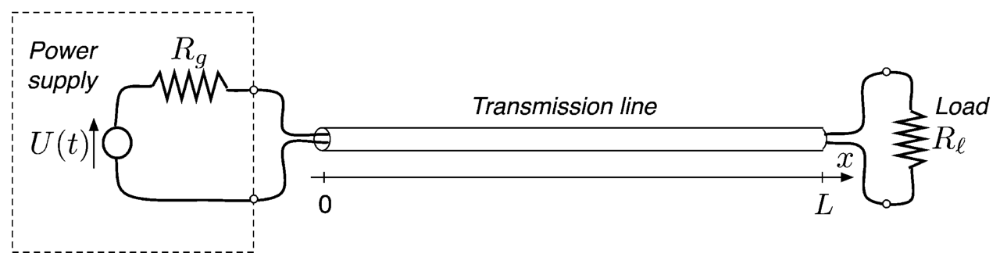
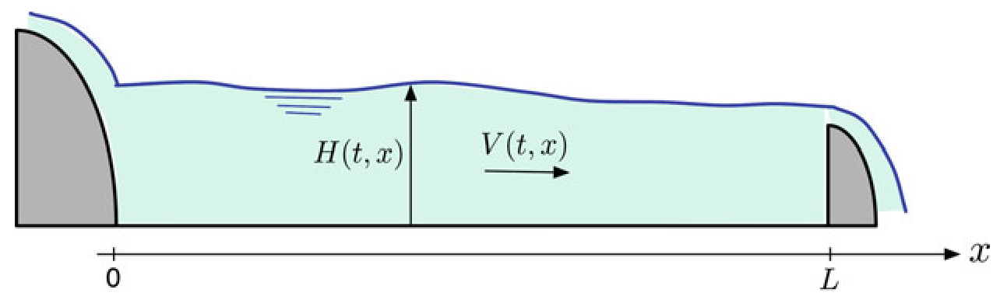
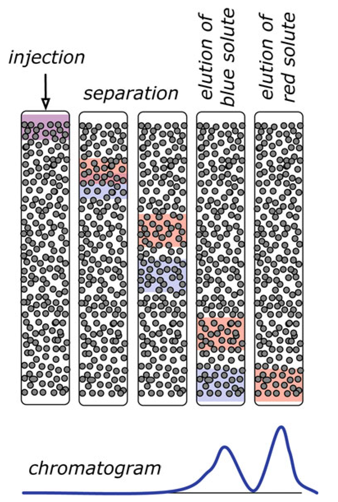
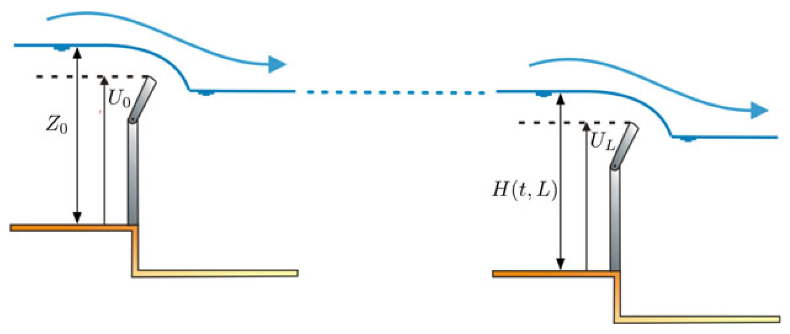
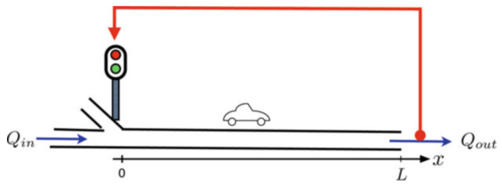
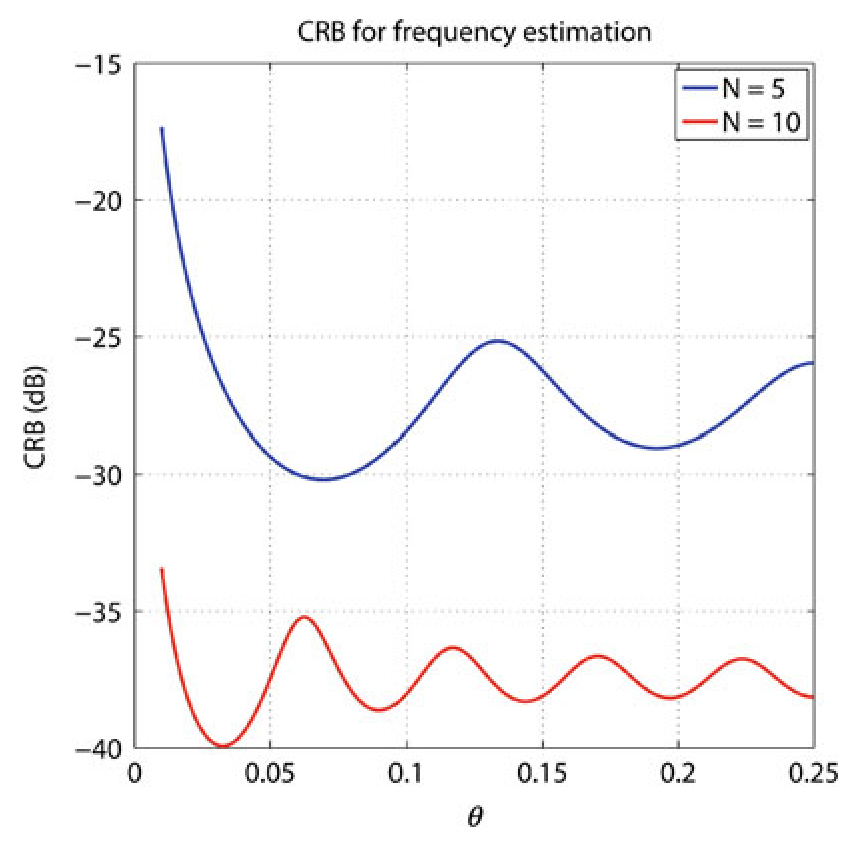
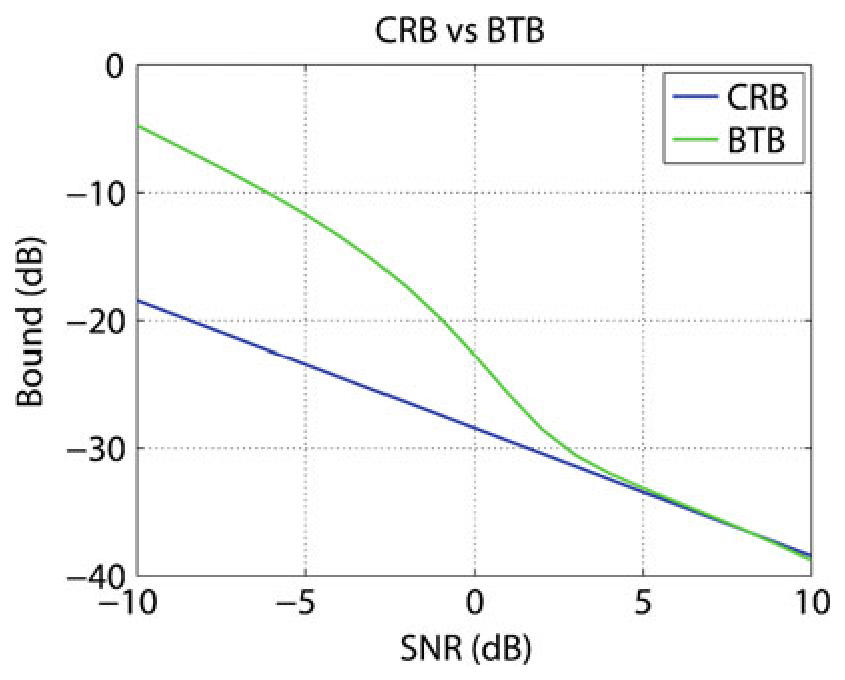
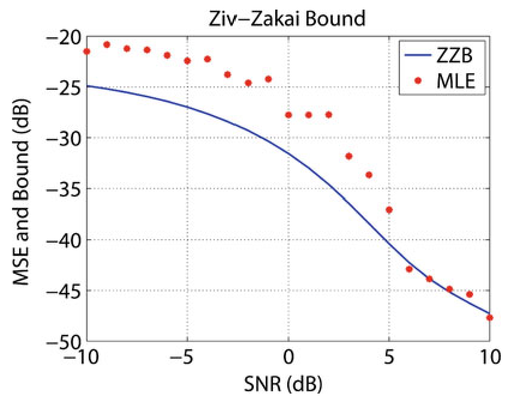
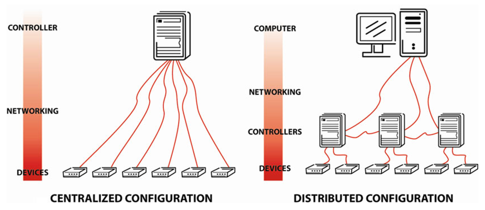
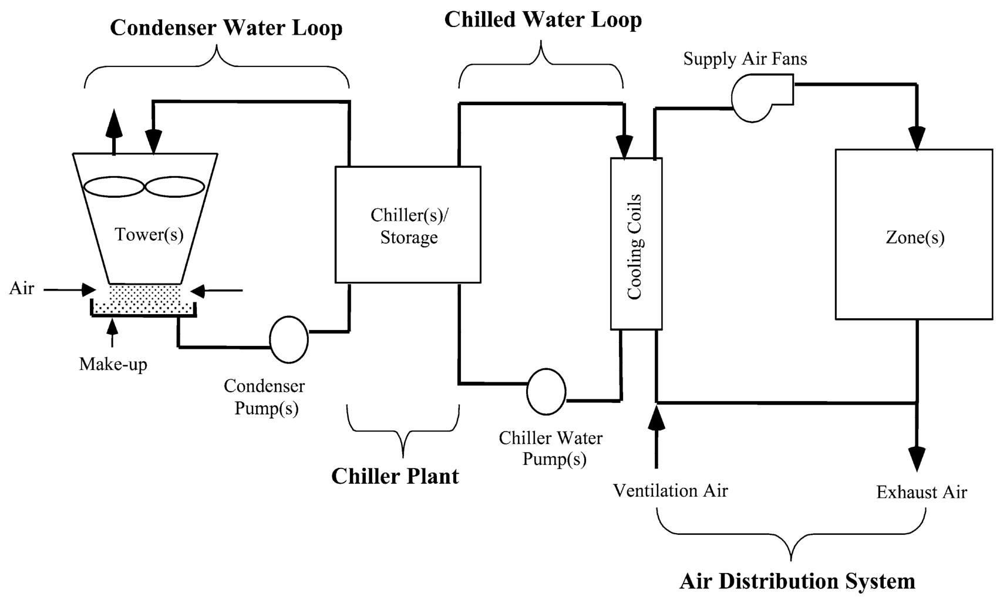

<!-- source_pdf_page: 89 -->
## B

## Backward Stochastic Differential Equations and Related Control Problems

Shige Peng
Shandong University, Jinan, Shandong Province, China

## Synonyms

BSDE

#### Abstract

A conditional expectation of the form $Y_{t}= E\left[\xi+\int_{t}^{T} f_{s} d s \mid \mathcal{F}_{t}\right]$ is regarded as a simple and typical example of backward stochastic differential equation (abbreviated by BSDE). BSDEs are widely applied to formulate and solve problems related to stochastic optimal control, stochastic games, and stochastic valuation.

## Keywords

Brownian motion; Feynman-Kac formula; Lipschitz condition; Optimal stopping

## Definition

A typical real valued backward stochastic differential equation defined on a time interval $[0, T]$
and driven by a $d$-dim. Brownian motion $B$ is

$$
\left\{\begin{aligned}
d Y_{t} & =-f\left(t, Y_{t}, Z_{t}\right) d t+Z_{t} d B_{t} \\
Y_{T} & =\xi
\end{aligned}\right.
$$

or its integral form

$$
\begin{equation*}
Y_{t}=\xi+\int_{t}^{T} f\left(s, \omega, Y_{s}, Z_{s}\right) d s-\int_{t}^{T} Z_{s} d B_{s} \tag{1}
\end{equation*}
$$

where $\xi$ is a given random variable depending on the (canonical) Brownian path $B_{t}(\omega)=\omega(t)$ on $[0, T], f(t, \omega, y, z)$ is a given function of the time $t$, the Brownian path $\omega$ on $[0, t]$, and the pair of variables $(y, z) \in \mathbb{R}^{m} \times \mathbb{R}^{m \times d}$. A solution of this BSDE is a pair of stochastic processes ( $Y_{t}, Z_{t}$ ), the solution of the above equation, on $[0, T]$ satisfying the following constraint: for each $t$, the value of $Y_{t}(\omega), Z_{t}(\omega)$ depends only on the Brownian path $\omega$ on $[0, t]$. Notice that, because of this constraint, the extra freedom $Z_{t}$ is needed. For simplicity we set $d=m=1$.

Often square-integrable conditions for $\xi$ and $f$ and Lipschitz condition for $f$ with respect to ( $y, z$ ) are assumed under which there exists a unique square-integrable solution $\left(Y_{t}, Z_{t}\right)$ on $[0, T]$ (existence and uniqueness theorem of BSDE). We can also consider a multidimensional process $Y$ and/or a multidimensional Brownian motion $B$, $L^{p}$-integrable conditions ( $p \geq 1$ ) for $\xi$ and $f$, as well as local Lipschitz conditions of $f$ with respect to $(y, z)$. If $Y_{t}$ is real valued, we often call the equation a real valued BSDE.

<!-- source_pdf_page: 90 -->
We compare this BSDE with the classical stochastic differential equation (SDE):

$$
d X_{s}=\sigma\left(X_{s}\right) d B_{s}+b\left(X_{s}\right) d s
$$

with given initial condition $\left.X_{s}\right|_{s=0}=x \in \mathbb{R}^{n}$. Its integral form is

$$
\begin{align*}
X_{t}(\omega)= & x+\int_{0}^{t} \sigma\left(X_{s}(\omega)\right) d B_{s}(\omega) \\
& +\int_{0}^{t} b\left(X_{s}(\omega)\right) d s \tag{2}
\end{align*}
$$

Linear backward stochastic differential equation was firstly introduced (Bismut 1973) in stochastic optimal control problems to solve the adjoint equation in the stochastic maximum principle of Pontryagin's type. The above existence and uniqueness theorem was obtained by Pardoux and Peng (1990). In the research domain of economics, this type of 1-dimensional BSDE was also independently derived by Duffie and Epstein (1992). Comparison theorem of BSDE was obtained in Peng (1992) and improved in El Karoui et al. (1997a). Nonlinear FeynmanKac formula was obtained in Peng $(1991,1992)$ and improved in Pardoux and Peng (1992). BSDE is applied as a nonlinear Black-Scholes option pricing formula in finance. This formulation was given in El Karoui et al. (1997b). We refer to a recent survey in Peng (2010) for more details.

## Hedging and Risk Measuring in Finance

Let us consider the following hedging problem in a financial market with a typical model of continuous time asset price: the basic securities consist of two assets, a riskless one called bond, and a risky security called stock. Their prices are governed by $d P_{t}^{0}=P_{t}^{0} r d t$, for the bond, and

$$
d P_{t}=P_{t}\left[b d t+\sigma d B_{t}\right], \text { for the stock. }
$$

Here we only consider the situation where the volatility rate $\sigma>0$. The case of
multidimensional stocks with degenerate volatility matrix $\sigma$ can be treated by constrained BSDE. Assume that a small investor whose investment behavior cannot affect market prices and who invests at time $t \in[0, T]$ the amount $\pi_{t}$ of his or her wealth $Y_{t}$ in the security and $\pi_{t}^{0}$ in the bond, thus $Y_{t}=\pi_{t}^{0}+\pi_{t}$. If his investment strategy is self-financing, then we have $d Y_{t}=\pi_{t}^{0} d P_{t}^{0} / P_{t}^{0}+\pi_{t} d P_{t} / P_{t}$, thus

$$
d Y_{t}=\left(r Y_{t}+\pi_{t} \sigma \theta\right) d t+\pi_{t} \sigma d B_{t},
$$

where $\theta=\sigma^{-1}(b-r)$. A strategy $\left(Y_{t}, \pi_{t}\right)_{t \in[0, T]}$ is said to be feasible if $Y_{t} \geq 0, t \in[0, T]$. A European path-dependent contingent claim settled at time $T$ is a given nonnegative function of path $\xi=\xi\left(\left(P_{t}\right)_{t \in[0, T]}\right)$. A feasible strategy $(Y, \pi)$ is called a hedging strategy against a contingent claim $\xi$ at the maturity $T$ if it satisfies

$$
d Y_{t}=\left(r Y_{t}+\pi_{t} \sigma \theta\right) d t+\pi_{t} \sigma d B_{t}, \quad Y_{T}=\xi
$$

This problem can be regarded as finding a stochastic control $\pi$ and an initial condition $Y_{0}$ such that the final state replicates the contingent claim $\xi$, i.e., $Y_{T}=\xi$. This type of replications is also called "exact controllability" in terms of stochastic control (see Peng 2005 for more general results).

Observe that ( $Y, \pi \sigma$ ) is the solution of the above BSDE. It is called a superhedging strategy if there exists an increasing process $K_{t}$, often called an accumulated consumption process, such that

$$
d Y_{t}=\left(r Y_{t}+\pi_{t} \sigma \theta\right) d t+\pi_{t} \sigma d B_{t}-d K_{t}, \quad Y_{T}=\xi
$$

This type of strategies is often applied in a constrained market in which certain constraint $\left(Y_{t}, \pi_{t}\right) \in \Gamma$ is imposed. In fact a real market has many frictions and constraints. An example is the common case where interest rate $R$ for borrowing money is higher than the bond rate $r$. The above equation for the hedging strategy becomes

$$
\begin{aligned}
d Y_{t}= & {\left[r Y_{t}+\pi_{t} \sigma \theta-(R-r)\left(\pi_{t}-Y_{t}\right)^{+}\right] } \\
& d t+\pi_{t} \sigma d B_{t}, Y_{T}=\xi
\end{aligned}
$$

<!-- source_pdf_page: 91 -->
where $[\alpha]^{+}=\max \{\alpha, 0\}$. A short selling constraint $\pi_{t} \geq 0$ is also a typical requirement in markets. The method of constrained BSDE can be applied to this type of problems. BSDE theory provides powerful tools to the robust pricing and risk measures for contingent claims (see El Karoui et al. 1997a). For the dynamic risk measure under Brownian filtration, see Rosazza Gianin (2006), Peng (2004), Barrieu and El Karoui (2005), Hu et al. (2005), and Delbaen et al. (2010).

## Comparison Theorem

The comparison theorem, for a real valued BSDE , tells us that, if ( $Y_{t}, Z_{t}$ ) and ( $\bar{Y}_{t}, \bar{Z}_{t}$ ) are two solutions of BSDE (1) with terminal condition $Y_{T}=\xi, \bar{Y}_{T}=\bar{\xi}$ such that $\xi(\omega) \geq \bar{\xi}(\omega), \omega \in \Omega$, then one has $Y_{t} \geq \bar{Y}_{t}$. This theorem holds if $f$ and $\xi, \bar{\xi}$ satisfy the abovementioned $L^{2}$-integrability condition and $f$ is a Lipschitz function in $(y, z)$. This theorem plays the same important role as the maximum principle in PDE theory. The theorem also has several very interesting generalizations (see Buckdahn et al. 2000).

## Stochastic Optimization and Two-Person Zero-Sum Stochastic Games

An important point of view is to regard an expectation value as a solution of a special type of BSDE. Consider an optimal control problem

$$
\min _{u} J(u): \quad J(u)=E\left[\int_{0}^{T} l\left(X_{s}, u_{s}\right) d s+h\left(X_{T}\right)\right] .
$$

Here the state process $X$ is controlled by the control process $u_{t}$ which is valued in a control (compact) domain $U$ through the following $d$ dimensional SDE

$$
d X_{s}=b\left(X_{s}, u_{s}\right) d s+\sigma\left(X_{s}\right) d B_{s}
$$

defined in a Wiener probability space ( $\Omega, \mathcal{F}, P$ ) with the Brownian motion $B_{t}(\omega)=\omega(t)$ which is the canonical process. Here we only discuss the case $\sigma \equiv I_{d}$ for simplicity. Observe that in fact the expected value $J(u)$ is $Y_{0}^{u}=E\left[Y_{0}^{u}\right]$, where $Y_{t}^{u}$ solves the BSDE

$$
Y_{t}^{u}=h\left(X_{T}\right)+\int_{t}^{T} l\left(X_{s}, u_{s}\right) d s-\int_{t}^{T} Z_{s}^{u} d B_{s}
$$

From Girsanov transformation, under the probability measure $\tilde{P}$ defined by

$$
\begin{aligned}
\left.\frac{d \tilde{P}}{d P}\right|_{T}= & \exp \left\{\int_{0}^{T} b\left(X_{s}, u_{s}\right) d B_{s}\right. \\
& \left.-\frac{1}{2} \int_{0}^{T}\left|b\left(X_{s}, u_{s}, v_{s}\right)\right|^{2} d s\right\}
\end{aligned}
$$

$X_{t}$ is a Brownian motion, and the above BSDE is changed to

$$
\begin{aligned}
Y_{t}^{u}= & h\left(X_{T}\right)+\int_{t}^{T}\left[l\left(X_{s}, u_{s}\right)+\left\langle Z_{s}^{u}, b\left(X_{s}, u_{s}\right)\right\rangle\right] d s \\
& -\int_{t}^{T} Z_{s}^{u} d X_{s}
\end{aligned}
$$

where $\langle\cdot, \cdot\rangle$ is the Euclidean scalar product in $\mathbb{R}^{d}$. Notice that $P$ and $\tilde{P}$ are absolutely continuous with each other. Compare this BSDE with the following one:

$$
\begin{equation*}
\hat{Y}_{t}=h\left(X_{T}\right)+\int_{t}^{T} H\left(X_{s}, \hat{Z}_{s}\right) d s-\int_{t}^{T} \hat{Z}_{s} d X_{s} \tag{3}
\end{equation*}
$$

where $H(x, z):=\inf _{u \in U}\{l(x, u)+\langle z, b(x, u)\rangle\}$. It is a direct consequence of the comparison theorem of BSDE that $\hat{Y}_{0} \leq Y_{0}^{u}=J(u)$, for any admissible control $u_{t}$. Moreover, one can find a feedback control $\hat{u}$ such that $\hat{Y}_{0}=J(\hat{u})$.

The above BSDE method has been introduced to solve the following two-person zero-sum game (Hamadèene and Lepeltier 1995):

$$
\begin{aligned}
& \max _{v} \min _{u} J(u, v), \quad J(u, v) \\
& \quad=E\left[\int_{0}^{T} l\left(X_{s}, u_{s}, v_{s}\right) d s+h\left(X_{T}\right)\right]
\end{aligned}
$$

with

$$
d X_{s}=b\left(X_{s}, u_{s}, v_{s}\right) d s+d B_{s}
$$

<!-- source_pdf_page: 92 -->
where ( $u_{s}, v_{s}$ ) is formulated as above with compact control domains $u_{s} \in U$ and $v_{s} \in V$. In this case the equilibrium of the game exists if the following Isaac condition is satisfied:

$$
\begin{aligned}
H(x, z): & =\max _{v \in V} \inf _{u \in U}\{l(x, u, v)+\langle z, b(x, u, v)\rangle\} \\
& =\inf _{u \in U} \max _{v \in V}\{l(x, u, v)+\langle z, b(x, u, v)\rangle\},
\end{aligned}
$$

and the equilibrium is also obtained through a BSDE (3) defined above.

## Nonlinear Feynman-Kac Formula

A very interesting situation is when $f=g\left(X_{t}, y, z\right)$ and $Y_{T}=\varphi\left(X_{T}\right)$ in BSDE (1). In this case we have the following relation, called "nonlinear Feynman-Kac formula,"

$$
Y_{t}=u\left(t, X_{t}\right), \quad Z_{t}=\sigma^{T}\left(X_{t}\right) \nabla u\left(t, X_{t}\right)
$$

where $u=u(t, x)$ is the solution of the following quasilinear parabolic PDE:

$$
\begin{gather*}
\partial_{t} u+\mathcal{L} u+g\left(x, u, \sigma^{T} \nabla u\right)=0,  \tag{4}\\
u(x, T)=\varphi(x), \tag{5}
\end{gather*}
$$

where $\mathcal{L}$ is the following, possibly degenerate, elliptic operator:

$$
\begin{aligned}
& \mathcal{L} \varphi(x)=\frac{1}{2} \sum_{i, j=1}^{d} a_{i j}(x) \partial_{x_{i} x_{j}}^{2} \varphi(x) \\
& \quad+\sum_{i=1}^{d} b_{i}(x) \partial_{x_{i}} \varphi(x), \quad a(x)=\sigma(x) \sigma^{T}(x) .
\end{aligned}
$$

Nonlinear Feynman-Kac formula can be used to solve a nonlinear PDE of form (4) to (5) by a BSDE (1) coupled with an SDE (2).

A general principle is, once we solve a BSDE driven by a Markov process $X$ for which the terminal condition $Y_{T}$ at time $T$ depends only on $X_{T}$ and the generator $f(t, \omega, y, z)$ also depends on the state $X_{t}$ at each time $t$, then the corresponding solution of the BSDE is also state dependent, namely, $Y_{t}=u\left(t, X_{t}\right)$, where $u$ is the solution
of the corresponding quasilinear PDE. Once $Y_{T}$ and $g$ are path functions of $X$, then the solution of the BSDE becomes also path dependent. In this sense, we can say that the PDE is in fact a "state-dependent BSDE," and BSDE gives us a new generalization of "path-dependent PDE" of parabolic and/or elliptic types. This principle was illustrated in Peng (2010) for both quasilinear and fully nonlinear situations.

Observe that BSDE (1) and forward SDE (2) are only partially coupled. A fully coupled system of SDE and BSDE is called a forwardbackward stochastic differential equation (FBSDE). It has the following form:

$$
\begin{aligned}
d X_{t}= & b\left(t, X_{t}, Y_{t}, Z_{t}\right) d t+\sigma\left(t, X_{t}, Y_{t}, Z_{t}\right) d B_{t} \\
& X_{0}=x \in \mathbb{R}^{n} \\
-d Y_{t}= & f\left(t, X_{t}, Y_{t}, Z_{t}\right) d t-Z_{t} d B_{t}, \quad Y_{T}=\varphi\left(X_{T}\right)
\end{aligned}
$$

In general the Lipschitz assumptions for $b, \sigma, f$, and $\varphi$ w. r. t. $(x, y, z)$ are not enough. Then Ma et al. (1994) have proposed a four-step scheme method of FBSDE for the nondegenerate Markovian case with $\sigma$ independent of $Z$. For the case $\operatorname{dim}(x)=\operatorname{dim}(y)=n$, Hu and Peng (1995) proposed a new type of monotonicity condition. This method does not need to assume the coefficients to be deterministic. Peng and Wu (1999) have weakened the monotonicity condition. Observe that in the case where $b=\nabla_{y} H(x, y, z), \sigma= \nabla_{z} H(x, y, z)$, and $f=\nabla_{x} H(x, y, z)$, for a given real valued function $H$ convex in $x$ concave in $(y, z)$, the above FBSDE is called the stochastic Hamilton equation associated to a stochastic optimal control problem. We also refer to the book of Ma and Yong (1999) for a systematic exposition on this subject. For time-symmetric forwardbackward stochastic differential equations and its relation with stochastic optimality, see Peng and Shi (2003) and Han et al. (2010).

## Reflected BSDE and Optimal Stopping

If $(Y, Z)$ solves the BSDE
$d Y_{s}=-g\left(s, Y_{s}, Z_{s}\right) d s+Z_{s} d B_{s}-d K_{s}, Y_{T}=\xi$,

<!-- source_pdf_page: 93 -->
where $K$ is a càdlàg and increasing process with $K_{0}=0$ and $K_{t} \in L_{P}^{2}\left(\mathcal{F}_{t}\right)$, then $Y$ or $(Y, Z, K)$ is called a supersolution of the BSDE, or $g$-supersolution. This notion is often used for constrained BSDEs. A typical situation is as follows: for a given continuous adapted process $\left(L_{t}\right)_{t \in[0, T]}$, find a smallest $g$-supersolution $(Y, Z, K)$ such that $Y_{t} \geq L_{t}$. This problem was initialed in El Karoui et al. (1997b). It is proved that this problem is equivalent to finding a triple ( $Y, Z, K$ ) satisfying (4) and the following reflecting condition of Skorohod type:

$$
\begin{equation*}
Y_{s} \geq L_{s}, \quad \int_{0}^{T}\left(Y_{s}-L_{s}\right) d K_{s}=0 \tag{7}
\end{equation*}
$$

In fact $\tau^{*}:=\inf \left\{t \in[0, T]: K_{t}>0\right\}$ is the optimal stopping time associated to this BSDE. A well-known example is the pricing of American option.

Moreover, a new type of nonlinear FeynmanKac formula was introduced: if all coefficients are given as in the formulation of the above nonlinear Feynman-Kac formula and $L_{s}=\Phi\left(X_{s}\right)$ where $\Phi$ satisfies the same condition as $\varphi$, then we have $Y_{s}=u\left(s, X_{s}\right)$, where $u=u(t, x)$ is the solution of the following variational inequality:

$$
\begin{array}{r}
\min \left\{\partial_{t} u+\mathcal{L} u+g\left(x, u, \sigma^{*} D u\right), u-\Phi\right\} \\
=0, \quad(t, x) \in[0, T] \times \mathbb{R}^{n} \tag{8}
\end{array}
$$

with terminal condition $\left.u\right|_{t=T}=\varphi$. They also demonstrated that this reflected BSDE is a powerful tool to deal with contingent claims of American types in a financial market with constraints.

BSDE reflected within two barriers, a lower one $L$ and an upper one $U$, was first investigated by Cvitanic and Karatzas (1996) where a type of nonlinear Dynkin games was formulated for a two-player model with zero-sum utility and each player chooses his own optimal exit time.

Stochastic optimal switching problems can be also solved by new types of oblique-reflected BSDEs.

A more general case of constrained BSDE is to find the smallest $g$-supersolution ( $Y, Z, K$ ) with constraint $\left(Y_{t}, Z_{t}\right) \in \Gamma_{t}$ where, for each $t \in$
$[0, T], \Gamma_{t}$ (El Karoui and Quenez 1995; Cvitanic and Karatzas 1993; El Karoui et al. 1997a) for the problem of superhedging in a market with convex constrained portfolios (Cvitanic et al. 1998). The case with an arbitrary closed constraint was proved in Peng (1999).

## Backward Stochastic Semigroup and $\boldsymbol{g}$-Expectations

Let $\mathcal{E}_{t, T}^{g}[\xi]=Y_{t}$ where $Y$ is the solution of BSDE (1). $\left(\mathcal{E}_{t, T}^{g}[\cdot]\right)_{0 \leq t \leq T<\infty}$ has the (backward) semigroup property (Peng 1997)

$$
\begin{aligned}
\mathcal{E}_{s, t}^{g}\left[\mathcal{E}_{t, T}^{g}[\xi]\right] & =\mathcal{E}_{s, T}^{g}[\xi], \quad \mathcal{E}_{T, T}^{g}[\xi] \\
& =\xi, \quad 0 \leq s \leq t \leq T
\end{aligned}
$$

For a real valued BSDE, by the comparison theorem, the semigroup is monotone: $\mathcal{E}_{t, T}^{g}[\xi] \geq \mathcal{E}_{t, T}^{g}[\bar{\xi}]$, if $\xi \geq \bar{\xi}$. If moreover $\left.g\right|_{z=0}=0$, then the semigroup is constant preserving: $\mathcal{E}_{t, T}^{g}[c] \equiv c$. Thus the semigroup forms in fact a nonlinear expectation called $g$-expectation (since this nonlinear expectation is totally determined by the generator $g$ ).

This notion allows us to establish a nonlinear $g$-martingale theory, e.g., $g$-supermartingale decomposition theorem. Peng (1999) claims that, if $Y$ is a square-integrable càdlàg $g$-supermartingale, then it has the unique decomposition: there exists a unique predictable, increasing, and càdlàg process $A$ such that $Y$ solves

$$
-d Y_{t}=g\left(t, Y_{t}, Z_{t}\right) d t+d A_{t}-Z_{t} d B_{t}
$$

A theoretically challenging and practically important problem is as follows: given an abstract family of expectations $\left(\mathcal{E}_{s, t}[\cdot]\right)_{s \leq t}$ satisfying the same backward semigroup properties as these of $g$-expectation, can we find a function $g$ such that $\mathcal{E}_{s, t} \equiv \mathcal{E}_{s, t}^{g}$ ? Coquet, Hu et al. (2005) proved that if $\mathcal{E}$ is dominated by $g_{\mu}$-expectation with $g_{\mu}(z)= \mu|z|$ for a large enough constant $\mu>0$, then there exists a unique function $g=g(t, \omega, z)$ satisfying $\mu$-Lipschitz condition such that $\left(\mathcal{E}_{s, t}[\cdot]\right)_{s \leq t}$ is in fact a $g$-expectation. For a concave dynamic expectation with an assumption much weaker than

<!-- source_pdf_page: 94 -->
the above domination condition, we can still find a function $g=g(t, z)$ with possibly singular values (Delbaen et al. 2010). For the case without the assumption of constant preservation, see Peng (2005). In practice, the above criterion is very useful to test whether a dynamic pricing mechanism of contingent contracts can be represented through a concrete function $g$.

A serious challenging problem in the stochastic control theory is as follows: it is based on a given probability space ( $\Omega, \mathcal{F}, P$ ). But in most practical situations, it is far from being true. In many risky situations, it is necessary to consider the uncertainty of the probability measures themselves, e.g., $\left\{P_{\theta}\right\}_{\theta \in \Theta}$, namely, the well-known Knightian uncertainty (Knight 1921). A new framework of $G$-expectation space $(\Omega, \mathcal{H}, \hat{\mathbb{E}})$ and the corresponding random and stochastic analysis (Itô's analysis) is introduced (see Peng 2007, 2010 and Soner et al. 2012) to replace the probability framework $(\Omega, \mathcal{F}, P)$. $g$-expectation is a special and typical case in this new theory.

## Cross-References

- Numerical Methods for Continuous-Time Stochastic Control Problems
- Risk-Sensitive Stochastic Control
- Stochastic Dynamic Programming
- Stochastic Linear-Quadratic Control
- Stochastic Maximum Principle

## Recommended Reading

BSDE theory applied in maximization of stochastic control can be found in the book of Yong and Zhou (1999); stochastic control problem in finance in El Karoui et al. (1997a); optimal stopping and reflected BSDE in El Karoui et al. (1997b); Maximization under Knightian uncertainty using nonlinear expectation can be found in Chen and Epstein (2002) and a survey paper in Peng (2010).

## Bibliography

Barrieu P, El Karoui N (2005) Inf-convolution of risk measures and optimal risk transfer. Financ Stoch 9: 269-298
Bismut JM (1973) Conjugate convex functions in optimal stochastic control. J Math Anal Apl 44: 384-404
Buckdahn R, Quincampoix M, Rascanu A (2000) Viability property for a backward stochastic differential equation and applications to partial differential equations. Probab Theory Relat Fields 116(4): 485-504
Chen Z, Epstein L (2002) Ambiguity, risk and asset returns in continuous time. Econometrica 70(4): 1403-1443
Coquet F, Hu Y, Memin J, Peng S (2002) Filtration consistent nonlinear expectations and related g -Expectations. Probab Theory Relat Fields 123: 1-27
Cvitanic J, Karatzas I (1993) Hedging contingent claims with constrained portfolios. Ann Probab 3(4):652-681
Cvitanic J, Karatzas I (1996) Backward stochastic differential equations with reflection and Dynkin games. Ann Probab 24(4):2024-2056
Cvitanic J, Karatzas I, Soner M (1998) Backward stochastic differential equations with constraints on the gainsprocess. Ann Probab 26(4):1522-1551
Delbaen F, Rosazza Gianin E, Peng S (2010) Representation of the penalty term of dynamic concave utilities. Finance Stoch 14:449-472
Duffie D, Epstein L (1992) Appendix C with costis skiadas, stochastic differential utility. Econometrica 60(2):353-394
El Karoui N, Quenez M-C (1995) Dynamic programming and pricing of contingent claims in an incomplete market. SIAM Control Optim 33(1): 29-66
El Karoui N, Peng S, Quenez M-C (1997a) Backward stochastic differential equation in finance. Math Financ 7(1):1-71
El Karoui N, Kapoudjian C, Pardoux E, Peng S, Quenez M-C (1997b) Reflected solutions of backward SDE and related obstacle problems for PDEs. Ann Probab 25(2):702-737
Hamadèene S, Lepeltier JP (1995) Zero-sum stochastic differential games and backward equations. Syst Control Lett 24(4):259-263
Han Y, Peng S, Wu Z (2010) Maximum principle for backward doubly stochastic control systems with applications. SIAM J Control 48(7):4224-4241
Hu Y, Peng S (1995) Solution of forward-backward stochastic differential-equations. Probab Theory Relat Fields 103(2):273-283
Hu Y, Imkeller P, Müller M (2005) Utility maximization in incomplete markets. Ann Appl Probab 15(3): 1691-1712
Knight F (1921) Risk, uncertainty and profit. Hougton Mifflin Company, Boston. (Dover, 2006)
Ma J, Yong J (1999) Forward-backward stochastic differential equations and their applications. Lecture notes in mathematics, vol 1702. Springer, Berlin/New York

<!-- source_pdf_page: 95 -->
Ma J, Protter P, Yong J (1994) Solving forwardbackward stochastic differential equations explicitly, a four step scheme. Probab Theory Relat Fields 98: 339-359
Pardoux E, Peng S (1990) Adapted solution of a backward stochastic differential equation. Syst Control Lett 14(1): 55-61
Pardoux E, Peng S (1992) Backward stochastic differential equations and quasilinear parabolic partial differential equations, Stochastic partial differential equations and their applications. In: Proceedings of the IFIP. Lecture notes in CIS, vol 176. Springer, pp 200-217
Peng S (1991) Probabilistic interpretation for systems of quasilinear parabolic partial differential equations. Stochastics 37:61-74
Peng S (1992) A generalized dynamic programming principle and hamilton-jacobi-bellmen equation. Stochastics 38:119-134
Peng S (1994) Backward stochastic differential equation and exact controllability of stochastic control systems. Prog Nat Sci 4(3):274-284
Peng S (1997) BSDE and stochastic optimizations. In: Yan J, Peng S, Fang S, Wu LM (eds) Topics in stochastic analysis. Lecture notes of xiangfan summer school, chap 2. Science Publication (in Chinese, 1995)
Peng S (1999) Monotonic limit theorem of BSDE and nonlinear decomposition theorem of Doob-Meyer's type. Probab Theory Relat Fields 113(4):473-499
Peng S (2004) Nonlinear expectation, nonlinear evaluations and risk measurs. In: Back K, Bielecki TR, Hipp C, Peng S, Schachermayer W (eds) Stochastic methods in finance lectures, C.I.M.E.-E.M.S. Summer School held in Bressanone/Brixen, LNM vol 1856. Springer, pp 143-217. (Edit. M. Frittelli and W. Runggaldier)
Peng S (2005) Dynamically consistent nonlinear evaluations and expectations. arXiv:math. PR/ 0501415 v1
Peng S (2007) $G$-expectation, $G$-Brownian motion and related stochastic calculus of Itô's type. In: Benth et al. (eds) Stochastic analysis and applications, The Abel Symposium 2005, Abel Symposia, pp 541-567. Springer
Peng S (2010) Backward stochastic differential equation, nonlinear expectation and their applications. In: Proceedings of the international congress of mathematicians, Hyderabad
Peng S, Shi Y (2003) A type of time-symmetric forwardbackward stochastic differential equations. CR Math Acad Sci Paris 336:773-778
Peng S, Wu Z (1999) Fully coupled forward-backward stochastic differential equations and applications to optimal control. SIAM J Control Optim 37(3): 825-843
Rosazza Gianin E (2006) Risk measures via G-expectations. Insur Math Econ 39:19-34
Soner M, Touzi N, Zhang J (2012) Wellposedness of second order backward SDEs. Probab Theory Relat Fields 153(1-2): 149-190
Yong J, Zhou X (1999) Stochastic control. Applications of mathematics, vol 43. Springer, New York

# Basic Numerical Methods and Software for Computer Aided Control Systems Design

Volker Mehrmann ${ }^{1}$ and Paul Van Dooren ${ }^{2} { }^{1}$ Institut für Mathematik MA 4-5, Technische Universität Berlin, Berlin, Germany ${ }^{2}$ ICTEAM: Department of Mathematical Engineering, Catholic University of Louvain, Louvain-la-Neuve, Belgium

#### Abstract

Basic principles for the development of computational methods for the analysis and design of linear time-invariant systems are discussed. These have been used in the design of the subroutine library SLICOT. The principles are illustrated on the basis of a method to check the controllability of a linear system.

## Keywords

Accuracy; Basic numerical methods; Benchmarking; Controllability; Documentation and implementation standards; Efficiency; Software design

## Introduction

Basic numerical methods for the analysis and design of dynamical systems are at the heart of most techniques in systems and control theory that are used to describe, control, or optimize industrial and economical processes. There are many methods available for all the different tasks in systems and control, but even though most of these methods are based on sound theoretical principles, many of them still fail when applied to real-life problems. The reasons for this may be quite diverse, such as the fact that the system dimensions are very large, that the underlying problem is very sensitive to small changes in the data, or that the method lacks numerical

<!-- source_pdf_page: 96 -->
robustness when implemented in a finite precision environment.

To overcome such failures, major efforts have been made in the last few decades to develop robust, well-implemented, and standardized software packages for computer-aided control systems design (Grübel 1983; Nag Slicot 1990; Wieslander 1977). Following the standards of modern software design, such packages should consist of numerically robust routines with known performance in terms of reliability and efficiency that can be used to form the basis of more complex control methods. Also to avoid duplication and to achieve efficiency and portability to different computational environments, it is essential to make maximal use of the established standard packages that are available for numerical computations, e.g., the Basic Linear Algebra Subroutines (BLAS) (Dongarra et al. 1990) or the Linear Algebra Packages (LAPACK) (Anderson et al. 1992). On the basis of such standard packages, the next layer of more complex control methods can then be built in a robust way.

In the late 1980s, a working group was created in Europe to coordinate efforts and integrate and extend the earlier software developments in systems and control. Thanks to the support of the European Union, this eventually led to the development of the Subroutine Library in Control Theory (SLICOT) (Benner et al. 1999; SLICOT 2012). This library contains most of the basic computational methods for control systems design of linear time-invariant control systems.

An important feature of this and similar kind of subroutine libraries is that the development of further higher level methods is not restricted by specific requirements of the languages or data structures used and that the routines can be easily incorporated within other more user-friendly software systems (Gomez et al. 1997; MATLAB 2013). Usually, this low-level reusability can only be achieved by using a general-purpose programming language like C or Fortran.

We cannot present all the features of the SLICOT library here. Instead, we discuss its general philosophy in section "The Control Subroutine Library SLICOT" and illustrate these concepts in
section "An Illustration" using one specific task, namely, checking the controllability of a system. We refer to SLICOT (2012) for more details on SLICOT and to Varga (2004) for a general discussion on numerical software for systems and control.

## The Control Subroutine Library SLICOT

When designing a subroutine library of basic algorithms, one should make sure that it satisfies certain basic requirements and that it follows a strict standardization in implementation and documentation. It should also contain standardized test sets that can be used for benchmarking, and it should provide means for maintenance and portability to new computing environments. The subroutine library SLICOT was designed to satisfy the following basic recommendations that are typically expected in this context (Benner et al. 1999).
Robustness: A subroutine must either return reliable results or it must return an error or warning indicator, if the problem has not been well posed or if the problem does not fall in the class to which the algorithm is applicable or if the problem is too ill-conditioned to be solved in a particular computing environment.
Numerical stability and accuracy: Subroutines are supposed to return results that are as good as can be expected when working at a given precision. They also should provide an option to return a parameter estimating the accuracy actually achieved.
Efficiency: An algorithm should never be chosen for its speed if it fails to meet the usual standards of robustness, numerical stability, and accuracy, as described above. Efficiency must be evaluated, e.g., in terms of the number of floating-point operations, the memory requirements, or the number and cost of iterations to be performed.
Modern computer architectures: The requirements of modern computer architectures must be taken into account, such as shared

<!-- source_pdf_page: 97 -->
or distributed memory parallel processors, which are the standard environments of today. The differences in the various architectures may imply different choices of algorithms.
Comprehensive functional coverage: The routines of the library should solve control systems relevant computational problems and try to cover a comprehensive set of routines to make it functional for a wide range of users. The SLICOT library covers most of the numerical linear algebra methods needed in systems analysis and synthesis problems for standard and generalized state space models, such as Lyapunov, Sylvester, and Riccati equation solvers, transfer matrix factorizations, similarity and equivalence transformations, structure exploiting algorithms, and condition number estimators.
The implementation of subroutines for a library should be highly standardized, and it should be accompanied by a well-written online documentation as well as a user manual (see, e.g., standard Denham and Benson 1981; Working Group Software 1996) which is compatible with that of the LAPACK library (Anderson et al. 1992). Although such highly restricted standards often put a heavy burden on the programmer, it has been observed that it has a high importance for the reusability of software and it also has turned out to be a very valuable tool in teaching students how to implement algorithms in the context of their studies.

## Benchmarking

In the validation of numerical software, it is extremely important to be able to test the correctness of the implementation as well as the performance of the method, which is one of the major steps in the construction of a software library. To achieve this, one needs a standardized set of benchmark examples that allows an evaluation of a method with respect to correctness, accuracy, and efficiency and to analyze the behavior of the method in extreme situations, i.e., on problems where the limit of the possible accuracy is reached. In the context of basic systems and control methods, several such
benchmark collections have been developed (see, e.g., Benner et al. 1997; Frederick 1998, or http:// www.slicot.org/index.php?site=benchmarks).

## Maintenance, Open Access, and Archives

It is a major challenge to maintain a welldeveloped library accessible and usable over time when computer architectures and operating systems are changing rapidly, while keeping the library open for access to the user community. This usually requires financial resources that either have to be provided by public funding or by licensing the commercial use.

In the SLICOT library, this challenge has been addressed by the formation of the Niconet Association (http://www.niconet-ev.info/en/) which provides the current versions of the codes and all the documentations. Those of Release 4.5 are available under the GNU General Public License or from the archives of http://www.slicot.org/.

## An Illustration

To give an illustration for the development of a basic control system routine, we consider the specific problem of checking controllability of a linear time-invariant control system. A linear time-invariant control problem has the form

$$
\begin{equation*}
\frac{d x}{d t}=A x+B u, t \in\left[t_{0}, \infty\right) \tag{1}
\end{equation*}
$$

Here $x$ denotes the state and $u$ the input function, and the system matrices are typically of the form $A \in \mathbb{R}^{n, n}, B \in \mathbb{R}^{n, m}$.

One of the most important topics in control is the question whether by an appropriate choice of input function $u(t)$ we can control the system from an arbitrary state to the null state. This property, called controllability, can be characterized by one of the following equivalent conditions (see Paige 1981).

<!-- source_pdf_page: 98 -->
Theorem 1 The following are equivalent:
(i) System (1) is controllable.
(ii) $\operatorname{Rank}\left[B, A B, A^{2} B, \cdots, A^{n-1} B\right]=n$.
(iii) $\operatorname{Rank}[B, A-\lambda I]=n \quad \forall \lambda \in \mathbb{C}$.
(iv) $\exists F$ such that $A$ and $A+B F$ have no common eigenvalues.

The conditions of Theorem 1 are nice for theoretical purposes, but none of them is really adequate for the implementation of an algorithm that satisfies the requirements described in the previous section. Condition (ii) creates difficulties because the controllability matrix $K=\left[B, A B, A^{2} B, \cdots, A^{n-1} B\right]$ will be highly corrupted by roundoff errors. Condition (iii) can simply not be checked in finite time. However, it is sufficient to check this condition only for the eigenvalues of $A$, but this is extremely expensive. And finally, condition (iv) will almost always give disjoint spectra between $A$ and $A+B F$ since the computation of eigenvalues is sensitive to roundoff.

To devise numerical procedures, one often resorts to the computation of canonical or condensed forms of the underlying system. To obtain such a form one employs controllability preserving linear transformations $x \mapsto P x, u \mapsto Q u$ with nonsingular matrices $P \in \mathbb{R}^{n, n}, Q \in \mathbb{R}^{m, m}$. The canonical form under these transformations is the Luenberger form (see Luenberger 1967). This form allows to check the controllability using the above criterion (iii) by simple inspection of the condensed matrices. This is ideal from a theoretical point of view but is very sensitive to small perturbations in the data, in particular because the transformation matrices may have arbitrary large norm, which may lead to large errors.

For the implementation as robust numerical software one uses instead transformations with real orthogonal matrices $P, Q$ that can be implemented in a backward stable manner, i.e., the resulting backward error is bounded by a small constant times the unit roundoff $\mathbf{u}$ of the finite precision arithmetic, and employs for reliable rank determinations the well-known singular value decomposition (SVD) (see, e.g., Golub and Van Loan 1996).

Theorem 2 (Singular value decomposition)
Given $A \in \mathbb{R}^{n, m}$, then there exist orthogonal matrices $U, V$ with $U \in \mathbb{R}^{n, n}, V \in \mathbb{R}^{m, m}$, such that $A=U \Sigma V^{T}$ and $\Sigma \in \mathbb{R}^{n, m}$ is quasidiagonal, i.e.,

$$
\Sigma=\left[\begin{array}{cc}
\Sigma_{r} & 0 \\
0 & 0
\end{array}\right] \text { where } \Sigma_{r}=\left[\begin{array}{ccc}
\sigma_{1} & & \\
& \ddots & \\
& & \sigma_{r}
\end{array}\right]
$$

and the nonzero singular values $\sigma_{i}$ are ordered as $\sigma_{1} \geq \sigma_{2} \geq \cdots \geq \sigma_{r}>0$.

The SVD presents the best way to determine (numerical) ranks of matrices in finite precision arithmetic by counting the number of singular values satisfying $\sigma_{j} \geq \mathbf{u} \sigma_{1}$ and by putting those for which $\sigma_{j}<\mathbf{u} \sigma_{1}$ equal to zero. The computational method for the SVD is well established and analyzed, and it has been implemented in the LAPACK routine SGESVD (see http://www. netlib.org/lapack/). A faster but less reliable alternative to compute the numerical rank of a matrix $A$ is its $Q R$ factorization with pivoting (see, e.g., Golub and Van Loan 1996).

Theorem 3 (QRE decomposition) Given $A \in \mathbb{R}^{n, m}$, then there exists an orthogonal matrix $Q \in \mathbb{R}^{n, n}$ and a permutation $E \in \mathbb{R}^{m, m}$, such that $A=Q R E^{T}$ and $R \in \mathbb{R}^{n, m}$ is trapezoidal, i.e.,

$$
R=\left[\begin{array}{ccccc}
r_{11} & \ldots & r_{1 l} & \ldots & r_{1 m} \\
& \ddots & & & \vdots \\
& & r_{l l} & \ldots & r_{l m} \\
0 & & & 0 &
\end{array}\right]
$$

and the nonzero diagonal entries $r_{i i}$ are ordered as $r_{11} \geq \cdots \geq r_{l l}>0$.

The (numerical) rank in this case is again obtained by counting the diagonal elements $r_{i i} \geq \mathbf{u} r_{11}$.

One can use such orthogonal transformations to construct the controllability staircase form (see Van Dooren 1981).

Theorem 4 (Staircase form) Given matrices $A \in R^{n, n}, B \in \mathbb{R}^{n, m}$, then there exist orthogonal matrices $P, Q$ with $P \in \mathbb{R}^{n, n}, Q \in \mathbb{R}^{m, m}$, so that

<!-- source_pdf_page: 99 -->
$$
\begin{align*}
& \operatorname{PAP}^{T}= {\left[\begin{array}{cccc|c}
A_{11} & \cdots & \cdots & A_{1, r-1} & A_{1, r} \\
A_{21} & \ddots & & \vdots & \vdots \\
& \ddots & \ddots & \vdots & \vdots \\
& & A_{r-1, r-2} & A_{r-1, r-1} & A_{r-1, r} \\
\hline 0 & \cdots & 0 & 0 & A_{r r}
\end{array}\right] \begin{array}{c}
n_{1} \\
n_{2} \\
\vdots \\
n_{r-1}
\end{array} } \\
& n_{r}  \tag{2}\\
& \operatorname{PBQ}= \\
& {\left[\begin{array}{cc}
B_{1} & 0 \\
0 & 0 \\
\vdots & \vdots \\
\vdots & \vdots \\
0 & 0
\end{array}\right] \begin{array}{c}
n_{1} \\
n_{2} \\
\vdots \\
n_{1} \\
m-n_{1} \\
\vdots \\
n_{r}
\end{array} }
\end{align*}
$$

where $n_{1} \geq n_{2} \geq \cdots \geq n_{r-1} \geq n_{r} \geq 0, n_{r-1}> 0, A_{i, i-1}=\left[\begin{array}{ll}\Sigma_{i, i-1} & 0\end{array}\right]$, with nonsingular blocks $\Sigma_{i, i-1} \in \mathbb{R}^{n_{i}, n_{i}}$ and $B_{1} \in \mathbb{R}^{n_{1}, n_{1}}$.

Notice that when using the reduced pair in condition (iii) of Theorem 1, the controllability condition is just $n_{r}=0$, which is simply checked by inspection. A numerically stable algorithm to compute the staircase form of Theorem 4 is given below. It is based on the use of the singular value decomposition, but one could also have used instead the $Q R$ decomposition with column pivoting.

## Staircase Algorithm

Input: $A \in \mathbb{R}^{n, n}, B \in \mathbb{R}^{n, m}$
Output: $P A P^{T}, P B Q$ in the form (2), $P, Q$ orthogonal
Step 0: Perform an SVD $B=U_{B}\left[\begin{array}{cc}\Sigma_{B} & 0 \\ 0 & 0\end{array}\right] V_{B}^{T}$ with nonsingular and diagonal $\Sigma_{B} \in \mathbb{R}^{n_{1}, n_{1}}$. Set $P:=U_{B}^{T}, Q:=V_{B}$, so that

$$
\begin{gathered}
A:=U_{B}^{T} A U_{B}=\left[\begin{array}{ll}
A_{11} & A_{12} \\
A_{21} & A_{22}
\end{array}\right], \\
B:=U_{B}^{T} B V_{B}=\left[\begin{array}{cc}
\Sigma_{B} & 0 \\
0 & 0
\end{array}\right]
\end{gathered}
$$

with $A_{11}$ of size $n_{1} \times n_{1}$.
Step 1: Perform an SVD $A_{21}=U_{21}\left[\begin{array}{cc}\Sigma_{21} & 0 \\ 0 & 0\end{array}\right] V_{21}^{T}$ with nonsingular and diagonal $\Sigma_{21} \in \mathbb{R}^{n_{2}, n_{2}}$. Set

$$
P_{2}:=\left[\begin{array}{cc}
V_{21}^{T} & 0 \\
0 & U_{21}^{T}
\end{array}\right], P:=P_{2} P
$$

so that

$$
\begin{gathered}
A:=P_{2} A P_{2}^{T}=:\left[\begin{array}{ccc}
A_{11} & A_{12} & A_{13} \\
A_{21} & A_{22} & A_{23} \\
0 & A_{32} & A_{33}
\end{array}\right] \\
B:=P_{2} B=:\left[\begin{array}{cc}
B_{1} & 0 \\
0 & 0 \\
0 & 0
\end{array}\right]
\end{gathered}
$$

where $A_{21}=\left[\begin{array}{ll}\Sigma_{21} & 0\end{array}\right]$, and $B_{1}:=V_{21}^{T} \Sigma_{B}$.
Step 2:
$\mathrm{i}=3$
DO WHILE ( $n_{i-1}>0 \quad$ AND $\quad A_{i, i-1} \neq 0$ ).
Perform an SVD of $A_{i, i-1}=U_{i, i-1}$
$\left[\begin{array}{cc}\Sigma_{i, i-1} & 0 \\ 0 & 0\end{array}\right] V_{i, i-1}^{T}$ with
$\Sigma_{i, i-1} \in \mathbb{R}^{n_{i}, n_{i}}$ nonsingular and diagonal.
Set

$$
P_{i}:=\left[\begin{array}{ccccc}
I_{n_{1}} & & & \\
& \ddots & & \\
& & I_{n_{i-2}} & & \\
& & & V_{i, i-1}^{T} & \\
& & & & U_{i, i-1}^{T}
\end{array}\right], P:=P_{i} P
$$

so that

$$
A:=P_{i} A P_{i}^{T}=:\left[\begin{array}{ccccc}
A_{11} & & \cdots & & A_{1, i+1} \\
A_{21} & \ddots & & & A_{2, i+1} \\
& \ddots & \ddots & & \vdots \\
& & & & \vdots \\
0 & & & A_{i, i-1} & A_{i, i} \\
A_{i+1, i} & A_{i+1, i+1}
\end{array}\right]
$$

where $A_{i, i-1}=\left[\begin{array}{ll}\Sigma_{i, i-1} & 0\end{array}\right]$.
$i:=i+1$
END
$r:=i$
It is clear that this algorithm will stop with $n_{i}=0$ or $A_{i, i-1}=0$. In every step, the remaining block shrinks at least by 1 row/column, as long as $\operatorname{Rank} A_{i, i-1}>1$, so that the algorithm stops after maximally $n-1$ steps. It has been shown in Van Dooren (1981) that system (1) is controllable if and only if in the staircase form of $(A, B)$ one has $n_{r}=0$.

<!-- source_pdf_page: 100 -->
It should be noted that the updating transformations $P_{i}$ of this algorithm will affect previously created "stairs" so that the blocks denoted as $\Sigma_{i, i-1}$ will not be diagonal anymore, but their singular values are unchanged. This is critical in the decision about the controllability of the pair ( $A, B$ ) since it depends on the numerical rank of the submatrices $A_{i, i-1}$ and $B$ (see Demmel and Kågström 1993). Based on this and a detailed error and perturbation analysis, the Staircase Algorithm has been implemented in the SLICOT routine AB010D, and it uses in the worst-case $\mathcal{O}\left(n^{4}\right)$ flops (a "flop" is an elementary floating-point operation,,$+- *$, or /). For efficiency reasons, the SLICOT routine AB010D does not use SVDs for rank decisions, but $Q R$ decompositions with column pivoting. When applying the corresponding orthogonal transformations to the system without accumulating them, the complexity can be reduced to $\mathcal{O}\left(n^{3}\right)$ flops. It has been provided with error bounds, condition estimates, and warning strategies.

## Summary and Future Directions

We have presented the SLICOT library and the basic principles for the design of such basic subroutine libraries. To illustrate these principles, we have presented the development of a method for checking controllability for a linear time-invariant control system. But the SLICOT library contains much more than that. It essentially covers most of the problems listed in the selected reprint volume (Patel et al. 1994). This volume contained in 1994 the state of the art in numerical methods for systems and control, but the field has strongly evolved since then. Examples of areas that were not in this volume but that are included in SLICOT are periodic systems, differential algebraic equations, and model reduction. Areas which still need new results and software are the control of largescale systems, obtained either from discretizations of partial differential equations or from the interconnection of a large number of interacting systems. But it is unclear for the moment
which will be the methods of choice for such problems. We still need to understand the numerical challenges in such areas, before we can propose numerically reliable software for these problems: the area is still quite open for new developments.

## Cross-References

- Computer-Aided Control Systems Design: Introduction and Historical Overview
- Interactive Environments and Software Tools for CACSD

## Bibliography

Anderson E, Bai Z, Bischof C, Demmel J, Dongarra J, Du Croz J, Greenbaum A, Hammarling S, McKenney A, Ostrouchov S, Sorensen D (1995) LAPACK users’ guide, 2nd edn. SIAM, Philadelphia. http:// www.netlib.org/lapack/
Benner P, Laub AJ, Mehrmann V (1997) Benchmarks for the numerical solution of algebraic Riccati equations. Control Syst Mag 17:18-28
Benner P, Mehrmann V, Sima V, Van Huffel S, Varga A (1999) SLICOT-A subroutine library in systems and control theory. Appl Comput Control Signals Circuits 1:499-532
Demmel JW, Kågström B (1993) The generalized Schur decomposition of an arbitrary pencil $A-\lambda B$ : robust software with error bounds and applications. Part I: theory and algorithms. ACM Trans Math Softw 19:160-174
Denham MJ, Benson CJ (1981) Implementation and documentation standards for the software library in control engineering (SLICE). Technical report 81/3, Kingston Polytechnic, Control Systems Research Group, Kingston
Dongarra JJ, Du Croz J, Duff IS, Hammarling S (1990) A set of level 3 basic linear algebra subprograms. ACM Trans Math Softw 16:1-17
Frederick DK (1988) Benchmark problems for computer aided control system design. In: Proceedings of the 4th IFAC symposium on computer-aided control systems design, Bejing, pp 1-6
Golub GH, Van Loan CF (1996) Matrix computations, 3rd edn. The Johns Hopkins University Press, Baltimore
Gomez C, Bunks C, Chancelior J-P, Delebecque F (1997) Integrated scientific computing with scilab. Birkhäuser, Boston. https://www.scilab.org/
Grübel G (1983) Die regelungstechnische Programmbibliothek RASP. Regelungstechnik 31: 75-81

<!-- source_pdf_page: 101 -->
Luenberger DG (1967) Canonical forms for linear multivariable systems. IEEE Trans Autom Control 12(3):290-293
Paige CC (1981) Properties of numerical algorithms related to computing controllability. IEEE Trans Autom Control AC-26: 130-138
Patel R, Laub A, Van Dooren P (eds) (1994) Numerical linear algebra techniques for systems and control. IEEE, Piscataway
The Control and Systems Library SLICOT (2012) The NICONET society. NICONET e.V. http://www. niconet-ev.info/en/
The MathWorks, Inc. (2013) MATLAB version 8.1. The MathWorks, Inc., Natick
The Numerical Algorithms Group (1993) NAG SLICOT library manual, release 2. The Numerical Algorithms Group, Wilkinson House, Oxford. Updates Release 1 of May 1990
The Working Group on Software (1996) SLICOT implementation and documentation standards 2.1. WGS-report 96-1. http://www.icm.tu-bs.de/ NICONET/reports.html
Van Dooren P (1981) The generalized eigenstructure problem in linear system theory. IEEE Trans Autom Control AC-26:111-129
Varga A (ed) (2004) Special issue on numerical awareness in control. Control Syst Mag 24-1: 14-17
Wieslander J (1977) Scandinavian control library. A subroutine library in the field of automatic control. Technical report, Department of Automatic Control, Lund Institute of Technology, Lund

## Bilinear Control of Schrödinger PDEs

Karine Beauchard ${ }^{1}$ and Pierre Rouchon ${ }^{2}$ ${ }^{1}$ CNRS, CMLS, Ecole Polytechnique, Palaiseau, France ${ }^{2}$ Centre Automatique et Systèmes, Mines ParisTech, Paris Cedex 06, France

#### Abstract

This entry is an introduction to modern issues about controllability of Schrödinger PDEs with bilinear controls. This model is pertinent for a quantum particle, controlled by an electric field. We review recent developments in the field, with discrimination between exact and approximate controllabilities, in finite or infinite time. We also underline the variety of mathematical tools used

by various teams in the last decade. The results are illustrated on several classical examples.

## Keywords

Approximate controllability; Global exact controllability; Local exact controllability; Quantum particles; Schrödinger equation; Small-time controllability

## Introduction

A quantum particle, in a space with dimension $N (N=1,2,3)$, in a potential $V=V(x)$, and in an electric field $u=u(t)$, is represented by a wave function $\psi:(t, x) \in \mathbb{R} \times \Omega \rightarrow \mathbb{C}$ on the $L^{2}(\Omega, \mathbb{C})$ sphere $\mathcal{S}$

$$
\int_{\Omega}|\psi(t, x)|^{2} d x=1, \quad \forall t \in \mathbb{R},
$$

where $\Omega \subset \mathbb{R}^{N}$ is a possibly unbounded open domain. In first approximation, the time evolution of the wave function is given by the Schrödinger equation,

$$
\left\{\begin{array}{l}
i \partial_{t} \psi(t, x)=(-\Delta+V) \psi(t, x)  \tag{1}\\
-u(t) \mu(x) \psi(t, x), \quad t \in(0,+\infty), x \in \Omega, \\
\psi(t, x)=0, \quad x \in \partial \Omega
\end{array}\right.
$$

where $\mu$ is the dipolar moment of the particle and $\hbar=1$ here. Sometimes, this equation is considered in the more abstract framework

$$
\begin{equation*}
i \frac{d}{d t} \psi=\left(H_{0}+u(t) H_{1}\right) \psi \tag{2}
\end{equation*}
$$

where $\psi$ lives on the unit sphere of a separable Hilbert space $\mathcal{H}$ and the Hamiltonians $H_{0}, H_{1}$ are Hermitian operators on $\mathcal{H}$. A natural question, with many practical applications, is the existence of a control $u$ that steers the wave function $\psi$ from a given initial state $\psi_{0}$, to a prescribed target $\psi_{f}$.

The goal of this survey is to present well-established results concerning exact and approximate controllabilities for the bilinear control system (1), with applications to relevant examples. The main difficulties are the infinite

<!-- source_pdf_page: 102 -->
dimension of $\mathcal{H}$ and the nonlinearity of the control system.

## Preliminary Results

When the Hilbert space $\mathcal{H}$ has finite dimension $n$, then controllability of Eq. (2) is well understood (D'Alessandro 2008). If, for example, the Lie algebra spanned by $H_{0}$ and $H_{1}$ coincides with $u(n)$, the set of skew-Hermitian matrices, then system (2) is globally controllable: for any initial and final states $\psi_{0}, \psi_{f} \in \mathcal{H}$ of length one, there exist $T>0$ and a bounded open-loop control $[0, T] \ni t \mapsto u(t)$ steering $\psi$ from $\psi(0)=\psi_{0}$ to $\psi(T)=\psi_{f}$.

In infinite dimension, this idea served to intuit a negative controllability result in Mirrahimi and Rouchon (2004), but the above characterization cannot be generalized because iterated Lie brackets of unbounded operators are not necessarily well defined. For example, the quantum harmonic oscillator

$$
\begin{align*}
i \partial_{t} \psi(t, x)= & -\partial_{x}^{2} \psi(t, x)+x^{2} \psi(t, x) \\
& -u(t) x \psi(t, x), \quad x \in \mathbb{R}, \tag{3}
\end{align*}
$$

is not controllable (in any reasonable sense) (Mirrahimi and Rouchon 2004) even if all its Galerkin approximations are controllable (Fu et al. 2001). Thus, much care is required in the use of Galerkin approximations to prove controllability in infinite dimension. This motivates the search of different methods to study exact controllability of bilinear PDEs of form (1).

In infinite dimension, the norms need to be specified. In this article, we use Sobolev norms. For $s \in \mathbb{N}$, the Sobolev space $H^{s}(\Omega)$ is the space of function $\psi: \Omega \rightarrow \mathbb{C}$ with square integrable derivatives $d^{k} \psi$ for $k=0, \ldots, s$ (derivatives are well defined in the distribution sense). $H^{s}(\Omega)$ is endowed with the norm $\|\psi\|_{H^{s}}:= \left(\sum_{k=0}^{s}\left\|d^{k} \psi\right\|_{L^{2}(\Omega)}^{2}\right)^{1 / 2}$. We also use the space $H_{0}^{1}(\Omega)$ which contains functions $\psi \in H^{1}(\Omega)$ that vanish on the boundary $\partial \Omega$ (in the trace sense) (Brézis 1999).

The first control result of the literature states the noncontrollability of system (1) in $\left(H^{2} \cap H_{0}^{1}\right)(\Omega) \cap \mathcal{S}$ with controls $u \in L^{2}((0$, T), $\mathbb{R}$ ) (Ball et al. 1982; Turinici 2000). More precisely, by applying $L^{2}(0, T)$ controls $u$, the reachable wave functions $\psi(T)$ form a subset of $\left(H^{2} \cap H_{0}^{1}\right)(\Omega) \cap \mathcal{S}$ with empty interior. This statement does not give obstructions for system (1) to be controllable in different functional spaces as we will see below, but it indicates that controllability issues are much more subtle in infinite dimension than in finite dimension.

## Local Exact Controllability

## In 1D and with Discrete Spectrum

This section is devoted to the 1D PDE:

$$
\left\{\begin{array}{l}
i \partial_{t} \psi(t, x)=-\partial_{x}^{2} \psi(t, x)  \tag{4}\\
-u(t) \mu(x) \psi(t, x), \quad x \in(0,1), t \in(0, T) \\
\psi(t, 0)=\psi(t, 1)=0
\end{array}\right.
$$

We call "ground state" the solution of the free system ( $u=0$ ) built with the first eigenvalue and eigenvector of $-\partial_{x}^{2}: \psi_{1}(t, x)= \sqrt{2} \sin (\pi x) e^{-i \pi^{2 t}}$. Under appropriate assumptions on the dipolar moment $\mu$, then system (4) is controllable around the ground state, locally in $H_{(0)}^{3}(0,1) \cap \mathcal{S}$, with controls in $L^{2}((0, T), \mathbb{R})$, as stated below.

Theorem 1 Assume $\mu \in H^{3}((0,1), \mathbb{R})$ and

$$
\begin{equation*}
\left|\int_{0}^{1} \mu(x) \sin (\pi x) \sin (k \pi x) d x\right| \geq \frac{c}{k^{3}}, \forall k \in \mathbb{N}^{*} \tag{5}
\end{equation*}
$$

for some constant $c>0$. Then, for every $T>0$, there exists $\delta>0$ such that for every $\psi_{0}, \psi_{f} \in \mathcal{S} \cap H_{(0)}^{3}((0,1), \mathbb{C})$ with $\left\|\psi_{0}-\psi_{1}(0)\right\|_{H^{3}}+\left\|\psi_{f}-\psi_{1}(T)\right\|_{H^{3}}<\delta$, there exists $u \in L^{2}((0, T), \mathbb{R})$ such that the solution of (4) with initial condition $\psi(0, x)= \psi_{0}(x)$ satisfies $\psi(T)=\psi_{f}$.

Here, $H_{(0)}^{3}(0,1):=\left\{\psi \in H^{3}((0,1), \mathbb{C}) ;\right. \psi=\psi^{\prime \prime}=0$ at $\left.x=0,1\right\}$. We refer to Beauchard

<!-- source_pdf_page: 103 -->
and Laurent (2010) and Beauchard et al. (2013) for proof and generalizations to nonlinear PDEs. The proof relies on the linearization principle, by applying the classical inverse mapping theorem to the endpoint map. Controllability of the linearized system around the ground state is a consequence of assumption (5) and classical results about trigonometric moment problems. A subtle smoothing effect allows to prove $C^{1}$ regularity of the endpoint map.

The assumption (5) holds for generic $\mu \in H^{3}((0,1), \mathbb{R})$ and plays a key role for local exact controllability to hold in small time $T$. In Beauchard and Morancey (2014), local exact controllability is proved under the weaker assumption, namely, $\mu^{\prime}(0) \pm \mu^{\prime}(1) \neq 0$, but only in large time $T$.

Moreover, under appropriate assumptions on $\mu$, references Coron (2006) and Beauchard and Morancey (2014) propose explicit motions that are impossible in small time $T$, with small controls in $L^{2}$. Thus, a positive minimal time is required for local exact controllability, even if information propagates at infinite speed. This minimal time is due to nonlinearities; its characterization is an open problem.

Actually, assumption $\mu^{\prime}(0) \pm \mu^{\prime}(1) \neq 0$ is not necessary for local exact controllability in large time. For instance, the quantum box, i.e.,

$$
\left\{\begin{array}{l}
i \partial_{t} \psi(t, x)=-\partial_{x}^{2} \psi(t, x)  \tag{6}\\
-u(t) x \psi(t, x), \quad x \in(0,1) \\
\psi(t, 0)=\psi(t, 1)=0
\end{array}\right.
$$

is treated in Beauchard (2005). Of course, these results are proved with additional techniques: power series expansions and Coron's return method (Coron 2007).

There is no contradiction between the negative result of section "Preliminary Results" and the positive result of Theorem 1. Indeed, the wave function cannot be steered between any two points $\psi_{0}, \psi_{f}$ of $H^{2} \cap H_{0}^{1}$, but it can be steered between any two points $\psi_{0}, \psi_{f}$ of $H_{(0)}^{3}$, which is smaller than $H^{2} \cap H_{0}^{1}$. In particular, $H_{(0)}^{3}((0,1), \mathbb{C})$ has an empty interior in $H_{(0)}^{2}((0,1), \mathbb{C})$. Thus, there is no incompatibility between the reachable set to have empty interior
in $H^{2} \cap H_{0}^{1}$ and the reachable set to coincide with $H_{(0)}^{3}$.

## Open Problems in Multi-D or with Continuous Spectrum

The linearization principle used to prove Theorem 1 does not work in multi-D: the trigonometric moment problem, associated to the controllability of the linearized system, cannot be solved. Indeed, its frequencies, which are the eigenvalues of the Dirichlet Laplacian operator, do not satisfy a required gap condition (Loreti and Komornik 2005).

The study of a toy model (Beauchard 2011) suggests that if local controllability holds in 2D (with a priori bounded $L^{2}$-controls) then a positive minimal time is required, whatever $\mu$ is. The appropriate functional frame for such a result is an open problem.

In 3D or in the presence of continuous spectrum, we conjecture that local exact controllability does not hold (with a priori bounded $L^{2}$-controls) because the gap condition in the spectrum of the Dirichlet Laplacian operator is violated (see Beauchard et al. (2010) for a toy model from nuclear magnetic resonance and ensemble controllability as originally stated in Li and Khaneja (2009)). Thus, exact controllability should be investigated with controls that are not a priori bounded in $L^{2}$; this requires new techniques. We refer to Nersesyan and Nersisyan (2012a) for precise negative results.

Finally, we emphasize that exact controllability in multi-D but in infinite time has been proved in Nersesyan and Nersisyan (2012a,b), with techniques similar to one used in the proof of Theorem 1.

## Approximate Controllability

Different approaches have been developed to prove approximate controllability.

## Lyapunov Techniques

Due to measurement effect and back action, closed-loop controls in the Schrödinger frame are

<!-- source_pdf_page: 104 -->
not appropriate. However, closed-loop controls may be computed via numerical simulations and then applied to real quantum systems in open loop, without measurement. Then, the strategy consists in designing damping feedback laws, thanks to a controlled Lyapunov function, which encodes the distance to the target. In finite dimension, the convergence proof relies on LaSalle invariance principle. In infinite dimension, this principle works when the trajectories of the closed-loop system are compact (in the appropriate space), which is often difficult to prove. Thus, two adaptations have been proposed: approximate convergence (Beauchard and Mirrahimi 2009; Mirrahimi 2009) and weak convergence (Beauchard and Nersesyan 2010) to the target.

## Variational Methods and Global Exact Controllability

The global approximate controllability of (1), in any Sobolev space, is proved in Nersesvan (2010), under generic assumptions on ( $V$, $\mu)$, with Lyapunov techniques and variational arguments.

Theorem 2 Let $V, \mu \in C^{\infty}(\bar{\Omega}, \mathbb{R})$ and $\left(\lambda_{j}\right)_{j \in N^{*}},\left(\phi_{j}\right)_{j \in N^{*}}$ be the eigenvalues and normalized eigenvectors of ( $-\Delta+V$ ). Assume $\left\langle\mu \phi_{j}, \phi_{1}\right\rangle \neq 0$, for all $j \geq 2$ and $\lambda_{1}-\lambda_{j} \neq \lambda_{p}-\lambda_{q}$ for all $j, p, q \in \mathbb{N}^{*}$ such that $\{1, j\} \neq\{p, q\} ; j \neq 1$. Then, for every $s>0$, the system (1) is globally approximately controllable in $H_{(V)}^{s}: D\left[(-\Delta+V)^{s / 2}\right]$, the domain of $(-\Delta+V)^{s / 2}:$ for every $\epsilon, \delta>0$ and $\psi_{0} \in \mathcal{S} \cap H_{(V)}^{s}$, there exist a time $T>0$ and a control $u \in C_{0}^{\infty}((0, T), \mathbb{R})$ such that the solution of (1) with initial condition $\psi(0)=\psi_{0}$ satisfies $\left\|\psi(T)-\phi_{1}\right\|_{H_{(V)}^{s-\delta}}<\epsilon$.

This theorem is of particular importance. Indeed, in 1D and for appropriate choices of ( $V$, $\mu)$, global exact controllability of (1) in $H^{3+}$ can be proved by combining the following:

- Global approximate controllability in $H^{3}$ given by Theorem 2,
- Local exact controllability in $H^{3}$ given by Theorem 1,
- Time reversibility of the Schrödinger equation (i.e., if $(\psi(t, x), u(t))$ is a trajectory, then so is $\left(\psi^{*}(T-t, x), u(T-t)\right)$ where $\psi^{*}$ is the complex conjugate of $\psi$ ).
Let us expose this strategy on the quantum box (6). First, one can check the assumptions of Theorem 2 with $V(x)=\gamma x$ and $\mu(x)=(1-\gamma) x$ when $\gamma>0$ is small enough. This means that, in (6), we consider controls $u(t)$ of the form $\gamma+u(t)$. Thus, an initial condition $\psi_{0} \in H_{(0)}^{3+}$ can be steered arbitrarily close to the first eigenvector $\varphi_{1, \gamma}$ of $\left(-\partial_{x}^{2}+\gamma x\right)$, in $H^{3}$ norm. Moreover, by a variant of Theorem 1, the local exact controllability of (6) holds in $H_{(0)}^{3}$ around $\phi_{1, \gamma}$. Therefore, the initial condition $\psi_{0} \in H_{(0)}^{3+}$ can be steered exactly to $\phi_{1, \gamma}$ in finite time. By the time reversibility of the Schrödinger equation, we can also steer exactly the solution from $\phi_{1, \gamma}$ to any target $\psi_{f} \in H^{3+}$. Therefore, the solution can be steered exactly from any initial condition $\psi_{0} \in H_{(0)}^{3+}$ to any target $\psi_{f} \in H_{(0)}^{3+}$ in finite time.

## Geometric Techniques Applied to Galerkin Approximations

In Boscain et al. $(2012,2013)$ and Chambrion et al. (2009) the authors study the control of Schrödinger PDEs, in the abstract form (2) and under technical assumptions on the (unbounded) operators $H_{0}$ and $H_{1}$ that ensure the existence of solutions with piecewise constant controls $u$ :

1. $H_{0}$ is skew-adjoint on its domain $D\left(H_{0}\right)$.
2. There exists a Hilbert basis $\left(\varphi_{k}\right)_{k \in N}$ of $\mathcal{H}$ made of eigenvectors of $H_{0}: H_{0} \phi_{k}=i \lambda_{k} \phi_{k}$ and $\phi_{k} \in D\left(H_{1}\right), \forall k \in \mathbb{N}$.
3. $H_{0}+u H_{1}$ is essentially skew-adjoint (not necessarily with domain $D\left(H_{0}\right)$ ) for every $u \in [0, \delta]$ for some $\delta>0$.
4. $\left\langle H_{1} \varphi_{j}, \varphi_{k}\right\rangle=0$ for every $j, k \in \mathbb{N}$ such that $\lambda_{j}=\lambda_{k}$ and $j \neq k$.

Theorem 3 Assume that, for every $j, k \in \mathbb{N}$, there exists a finite number of integers $p_{1}, \ldots, p_{r} \in \mathrm{~N}$ such that

$$
\begin{gathered}
p_{1}=j, \quad p_{r}=k,\left\langle H_{1} \varphi_{p_{l}}, \varphi_{p_{l+1}}\right\rangle \\
\neq 0, \forall l=1, \ldots, r-1
\end{gathered}
$$

<!-- source_pdf_page: 105 -->
$\left|\lambda_{L}-\lambda_{M}\right| \neq\left|\lambda_{p_{l}}-\lambda_{p_{l+1}}\right|, \forall 1 \leq l \leq r-1$, $L M \in \mathbb{N}$ with $\{L, M\} \neq\left\{p_{l}, p_{l+1}\right\}$.

Then for every $\epsilon>0$ and $\psi_{0}, \psi_{f}$ in the unit sphere of $\mathcal{H}$, there exists a piecewise constant function $u:\left[0, T_{\epsilon}\right] \rightarrow[0, \delta]$ such that the solution of (2) with initial condition $\psi(0)=\psi_{0}$ satisfies $\left\|\psi\left(T_{\epsilon}\right)-\psi_{f}\right\|_{\mathcal{H}}<\epsilon$.

We refer to Boscain et al. $(2012,2013)$ and Chambrion et al. (2009) for proof and additional results such as estimates on the $L^{1}$ norm of the control. Note that $H_{0}$ is not necessarily of the form $(-\Delta+V), H_{1}$ can be unbounded, $\delta$ may be arbitrary small, and the two assumptions are generic with respect to $\left(H_{0}, H_{1}\right)$. The connectivity and transition frequency conditions in Theorem 3 mean physically that each pair of $H_{0}$ eigenstates is connected via a finite number of first-order (one-photon) transitions and that the transition frequencies between pairs of eigenstates are all different.

Note that, contrary to Theorems 2, Theorem 3 cannot be combined with Theorem 1 to prove global exact controllability. Indeed, functional spaces are different: $\mathcal{H}=L^{2}(\Omega)$ in Theorem 3, whereas $H^{3}$-regularitv is required for Theorem 1.

This kind of results applies to several relevant examples such as the control of a particule in a quantum box by an electric field (6) and the control of the planar rotation of a linear molecule by means of two electric fields:

$$
\begin{aligned}
& i \partial_{t} \psi(t, \theta)=\left(-\partial_{0}^{2}+u_{1}(t) \cos (\theta)\right. \\
& \left.+u_{2}(t) \sin (\theta)\right) \psi(t, \theta), \quad \theta \in \mathbb{T}
\end{aligned}
$$

where $\mathbb{T}$ is the lD-torus. However, several other systems of physical interest are not covered by these results such as trapped ions modeled by two coupled quantum harmonic oscillators. In Ervedoza and Puel (2009), specific methods have been used to prove their approximate controllability.

## Concluding Remarks

The variety of methods developed by different authors to characterize controllability of Schrödinger PDEs with bilinear control is the
sign of a rich structure and subtle nature of control issues. New methods will probably be necessary to answer the remaining open problems in the field.

This survey is far from being complete. In particular, we do not consider numerical methods to derive the steering control such as those used in NMR (Nielsen et al. 2010) to achieve robustness versus parameter uncertainties or such as monotone algorithms (Baudouin and Salomon 2008; Liao et al. 2011) for optimal control (Cancès et al. 2000). We do not consider also open quantum systems where the state is then the density operator $\rho$, a nonnegative Hermitian operator with unit trace on H . The Schrödinger equation is then replaced by the Lindblad equation:

$$
\begin{aligned}
\frac{d}{d t} \rho= & -\iota\left[H_{0}+u H_{1}, \rho\right]+\sum_{v} L_{v} \rho L_{v}^{\dagger} \\
& -\frac{1}{2}\left(L_{v}^{\dagger} L_{v} \rho+\rho L_{v}^{\dagger} L_{v}\right)
\end{aligned}
$$

with operator $L_{v}$ related to the decoherence channel $v$. Even in the case of finite dimensional Hilbert space H, controllability of such system is not yet well understood and characterized (see Altafini (2003) and Kurniawan et al. (2012)).

## Cross-References

- Control of Quantum Systems
- Robustness Issues in Quantum Control

Acknowledgments The authors were partially supported by the "Agence Nationale de la Recherche" (ANR), Projet Blanc EMAQS number ANR-2011-BS01-017-01.

## Bibliography

Altafini C (2003) Controllability properties for finite dimensional quantum Markovian master equations. J Math Phys 44(6):2357-2372
Ball JM, Marsden JE, Slemrod M (1982) Controllability for distributed bilinear systems. SIAM J Control Optim 20:575-597
Baudouin L, Salomon J (2008) Constructive solutions of a bilinear control problem for a Schrödinger equation. Syst Control Lett 57(6):453-464

<!-- source_pdf_page: 106 -->
Beauchard K (2005) Local controllability of a 1-D Schrödinger equation. J Math Pures Appl 84:851-956
Beauchard K (2011) Local controllability and non controllability for a ID wave equation with bilinear control. J Diff Equ 250:2064-2098
Beauchard K, Laurent C (2010) Local controllability of 1D linear and nonlinear Schrödinger equations with bilinear control. J Math Pures Appl 94(5):520-554
Beauchard K, Mirrahimi M (2009) Practical stabilization of a quantum particle in a one-dimensional infinite square potential well. SIAM J Control Optim 48(2):1179-1205
Beauchard K, Morancey M (2014) Local controllability of 1D Schrödinger equations with bilinear control and minimal time, vol 4. Mathematical Control and Related Fields
Beauchard K, Nersesyan V (2010) Semi-global weak stabilization of bilinear Schrödinger equations. CRAS 348(19-20):1073-1078
Beauchard K, Coron J-M, Rouchon P (2010) Controllability issues for continuous spectrum systems and ensemble controllability of Bloch equations. Commun Math Phys 290(2):525-557
Beauchard K, Lange H, Teismann H (2013, preprint) Local exact controllability of a Bose-Einstein condensate in a 1D time-varying box. arXiv:1303.2713
Boscain U, Caponigro M, Chambrion T, Sigalotti M (2012) A weak spectral condition for the controllability of the bilinear Schrödinger equation with application to the control of a rotating planar molecule. Commun Math Phys 311(2):423-455
Boscain U, Chambrion T, Sigalotti M (2013) On some open questions in bilinear quantum control. arXiv:1304.7181
Brézis H (1999) Analyse fonctionnelles: théorie et applications. Dunod, Paris
Cancès E, Le Bris C, Pilot M (2000) Contrôle optimal bilinéaire d'une équation de Schrödinger. CRAS Paris 330:567-571
Chambrion T, Mason P, Sigalotti M, Boscain M (2009) Controllability of the discrete-spectrum Schrödinger equation driven by an external field. Ann Inst Henri Poincaré Anal Nonlinéaire 26(1):329-349
Coron J-M (2006) On the small-time local controllability of a quantum particule in a moving one-dimensional infinite square potential well. C R Acad Sci Paris I 342:103-108
Coron J-M (2007) Control and nonlinearity. Mathematical surveys and monographs, vol 136. American Mathematical Society, Providence
D'Alessandro D (2008) Introduction to quantum control and dynamics. Applied mathematics and nonlinear science. Chapman \& Hall/CRC, Boca Raton
Ervedoza S, Puel J-P (2009) Approximate controllability for a system of Schrödinger equations modeling a single trapped ion. Ann Inst Henri Poincaré Anal Nonlinéaire 26(6): 2111-2136
Fu H, Schirmer SG, Solomon AI (2001) Complete controllability of finite level quantum systems. J Phys A 34(8):1678-1690

Kurniawan I, Dirr G, Helmke U (2012) Controllability aspects of quantum dynamics: unified approach for closed and open systems. IEEE Trans Autom Control 57(8):1984-1996
Li JS, Khaneja N (2009) Ensemble control of Bloch equations. IEEE Trans Autom Control 54(3):528-536
Liao S-K, Ho T-S, Chu S-I, Rabitz HH (2011) Fast-kickoff monotonically convergent algorithm for searching optimal control fields. Phys Rev A 84(3):031401
Loreti P, Komornik V (2005) Fourier series in control theory. Springer, New York
Mirrahimi M (2009) Lyapunov control of a quantum particle in a decaying potential. Ann Inst Henri Poincaré (c) Nonlinear Anal 26:1743-1765

Mirrahimi M, Rouchon P (2004) Controllability of quantum harmonic oscillators. IEEE Trans Autom Control 49(5):745-747
Nersesvan V (2010) Global approximate controllability for Schrödinger equation in higher Sobolev norms and applications. Ann IHP Nonlinear Anal 27(3):901-915
Nersesyan V, Nersisyan H (2012a) Global exact controllability in infinite time of Schrödinger equation. J Math Pures Appl 97(4):295-317
Nersesyan V, Nersisyan H (2012b) Global exact controllability in infinite time of Schrödinger equation: multidimensional case. Preprint: arXiv:1201.3445
Nielsen NC, Kehlet C, Glaser SJ and Khaneja N (2010) Optimal Control Methods in NMR Spectroscopy. eMagRes
Turinici G (2000) On the controllability of bilinear quantum systems. In: Le Bris C, Defranceschi M (eds) Mathematical models and methods for ab initio quantum chemistry. Lecture notes in chemistry, vol 74. Springer

## Boundary Control of 1-D Hyperbolic Systems

Georges Bastin ${ }^{1}$ and Jean-Michel Coron ${ }^{2}$ ${ }^{1}$ Department of Mathematical Engineering, University Catholique de Louvain, Louvain-La-Neuve, Belgium ${ }^{2}$ Laboratoire Jacques-Louis Lions, University Pierre et Marie Curie, Paris, France

#### Abstract

One-dimensional hyperbolic systems are commonly used to describe the evolution of various physical systems. For many of these systems, controls are available on the boundary. There

<!-- source_pdf_page: 107 -->
are then two natural questions: controllability (steer the system from a given state to a desired target) and stabilization (construct feedback laws leading to a good behavior of the closed loop system around a given set point).

## Keywords

Chromatography; Controllability; Electrical lines; Hyperbolic systems; Open channels; Road traffic; Stabilization

## One-Dimensional Hyperbolic Systems

The operation of many physical systems may be represented by hyperbolic systems in one space dimension. These systems are described by the following partial differential equation:

$$
\begin{equation*}
Y_{t}+A(Y) Y_{x}=0, \quad t \in[0, T], \quad x \in[0, L], \tag{1}
\end{equation*}
$$

where:

- $t$ and $x$ are two independent variables: a time variable $t \in[0, T]$ and a space variable $x \in [0, L]$ over a finite interval.
- $Y:[0, T] \times[0, L] \rightarrow \mathbb{R}^{n}$ is the vector of state variables.
- $A: \mathbb{R}^{n} \rightarrow \mathcal{M}_{n, n}(\mathbb{R})$ with $\mathcal{M}_{n, n}(\mathbb{R})$ is the set of $n \times n$ real matrices.
- $Y_{t}$ and $Y_{x}$ denote the partial derivatives of $Y$ with respect to $t$ and $x$, respectively.
The system (1) is hyperbolic which means that $A(Y)$ has $n$ distinct real eigenvalues (called characteristic velocities) for all $Y$ in a domain of $\mathbb{R}^{n}$. Here are some typical examples of physical models having the form of a hyperbolic system.

## Electrical Lines

First proposed by Heaviside in (1885, 1886 and 1887), the equations of (lossless) electrical lines (also called telegrapher equations) describe the propagation of current and voltage along electrical transmission lines (see Fig. 1). It is a hyperbolic system of the following form:

$$
\binom{I_{t}}{V_{t}}+\left(\begin{array}{cc}
0 & L_{s}^{-1}  \tag{2}\\
C_{s}^{-1} & 0
\end{array}\right)\binom{I_{x}}{V_{x}}=0,
$$

where $I(t, x)$ is the current intensity, $V(t, x)$ is the voltage, $L_{s}$ is the self-inductance per unit length, and $C_{s}$ is the self-capacitance per unit length. The system has two characteristic velocities (which are the eigenvalues of the ma$\operatorname{trix} A$ ):

$$
\begin{equation*}
\lambda_{1}=\frac{1}{\sqrt{L_{s} C_{s}}}>0>\lambda_{2}=-\frac{1}{\sqrt{L_{s} C_{s}}} . \tag{3}
\end{equation*}
$$

## Saint-Venant Equation for Open Channels

First proposed by Barré de Saint-Venant in (1871), the Saint-Venant equations (also called shallow water equations) describe the propagation of water in open channels (see Fig. 2). In the case of a horizontal channel with rectangular cross section, unit width, and negligible friction, the Saint-Venant model is a hyperbolic system of the form

$$
\binom{H_{t}}{V_{t}}+\left(\begin{array}{ll}
V & H  \tag{4}\\
g & V
\end{array}\right)\binom{H_{x}}{V_{x}}=0,
$$

where $H(t, x)$ is the water depth, $V(t, x)$ is the water horizontal velocity, and $g$ is the gravity acceleration. Under subcritical flow conditions, the system is hyperbolic with characteristic velocities

$$
\begin{equation*}
\lambda_{1}=V+\sqrt{g H}>0>\lambda_{2}=V-\sqrt{g H} . \tag{5}
\end{equation*}
$$

## Aw-Rascle Equations for Fluid Models of Road Traffic

In the fluid paradigm for road traffic modeling, the traffic is described in terms of two basic macroscopic state variables: the density $\varrho(t, x)$ and the speed $V(t, x)$ of the vehicles at position $x$ along the road at time $t$. The following dynamical model for road traffic was proposed by Aw and Rascle in (2000):

$$
\binom{\varrho_{t}}{V_{t}}+F(Y)\left(\begin{array}{cc}
V & \varrho  \tag{6}\\
0 & V-Q(\varrho)
\end{array}\right)\binom{\varrho_{t}}{V_{t}}=0 .
$$

<!-- source_pdf_page: 108 -->

> Image description: A textbook diagram titled "Fig. 1 Transmission line connecting a power supply to a resistive load $R_{\ell}$" illustrates a fundamental electrical circuit configuration. On the left, enclosed in a dashed bounding box, a "Power supply" is represented by a Thevenin equivalent circuit consisting of a voltage source $U(t)$ in series with an internal resistance $R_g$. This power supply is connected to the input of a "Transmission line." The transmission line is depicted as a long cylinder of length $L$, with a spatial axis $x$ spanning from $0$ to $L$. At the far right end of the transmission line, a "Load" is connected, represented by a resistive component labeled $R_{\ell}$. The diagram uses standard circuit notation, including arrows to indicate the polarity of $U(t)$ and a coordinate axis to define the transmission line's physical extent. The system describes the relationship between a time-varying source and a resistive load via a physical medium.

Boundary Control of 1-D Hyperbolic Systems, Fig. 1 Transmission line connecting a power supply to a resistive load $R_{\ell}$; the power supply is represented by a Thevenin equivalent with $e f m(t)$ and internal resistance $R_{g}$

Boundary Control of 1-D Hyperbolic Systems, Fig. 2 Lateral view of a pool of a horizontal open channel

> Image description: A lateral view diagram illustrating a 1-D horizontal open channel of length $L$, representing a pool of liquid. The channel is bounded by two grey semi-circular walls located at $x=0$ and $x=L$. The $x$-axis is shown at the bottom, spanning from $0$ to $L$. The liquid level is defined by a blue wavy line representing the free surface. A vertical black arrow at an intermediate position indicates the height of the liquid, labeled $H(t, x)$. A horizontal black arrow pointing to the right represents the velocity of the fluid flow, labeled $V(t, x)$. The diagram depicts a physical system used to model fluid dynamics in a shallow water context. The variables $H(t, x)$ and $V(t, x)$ indicate that the height and velocity are functions of both space ($x$) and time ($t$), characterizing the state of the hyperbolic system within the domain $[0, L]$.

The system is hyperbolic with characteristic velocities

$$
\begin{equation*}
\lambda_{1}=V>\lambda_{2}=V-Q(\varrho) . \tag{7}
\end{equation*}
$$

In this model the first equation of (6) is a continuity equation that represents the conservation of the number of vehicles on the road. The second equation of (6) is a phenomenological model describing the speed variations induced by the driver's behavior.

## Chromatography

In chromatography, a mixture of species with different affinities is injected in the carrying fluid at the entrance of the process as illustrated in Fig. 3. The various substances travel at different propagation speeds and are ultimately separated in different bands. The dynamics of the mixture are described by a system of partial differential equations:

$$
\left(P_{i}+L_{i}(P)\right)_{t}+V\left(P_{i}\right)_{x}=0 \quad i=1, \ldots, n,
$$

$$
\begin{equation*}
L_{i}(P)=\frac{k_{i} P_{i}}{1+\sum_{j} k_{j} P_{j} / P_{\max }}, \tag{8}
\end{equation*}
$$

> Image description: A textbook diagram illustrates the principle of chromatography through a sequence of five vertical columns representing a time-series progression. The first column shows an "injection" at the top, indicated by a downward-pointing arrow, where a pink solute enters the column filled with gray particles. The subsequent columns depict the "separation" process. As time progresses, the pink solute splits into blue and red components that move down the column at different velocities. The blue solute travels faster, appearing further down the columns than the red solute. The fourth column is labeled "elution of blue solute," and the fifth is labeled "elution of red solute." At the bottom, a "chromatogram" plots intensity over time. It shows two distinct peaks: a smaller first peak corresponding to the faster-moving blue solute and a larger second peak corresponding to the slower red solute. The diagram demonstrates how different substances separate based on their differing migration rates through a stationary phase.
Boundary Control of 1-D Hyperbolic Systems, Fig. 3 Principle of chromatography

where $P_{i}(i=1, \ldots, n)$ denote the densities of the $n$ carried species. The function $L_{i}(P)$

<!-- source_pdf_page: 109 -->
(called the "Langmuir isotherm") was proposed by Langmuir in (1916).

## Boundary Control

Boundary control of 1-D hyperbolic systems refers to situations where manipulated control inputs are physically located at the boundaries. Formally, this means that the system (1) is considered under $n$ boundary conditions having the general form

$$
\begin{equation*}
B(Y(t, 0), Y(t, L), U(t))=0, \tag{9}
\end{equation*}
$$

with $B: \mathbb{R}^{n} \times \mathbb{R}^{n} \times \mathbb{R}^{q} \rightarrow \mathbb{R}^{n}$. The dependence of the map $B$ on ( $Y(t, 0), Y(t, L)$ ) refers to natural physical constraints on the system. The function $U(t) \in \mathbb{R}^{q}$ represents a set of $q$ exogenous control inputs. The following examples illustrate how the control boundary conditions (9) may be defined for some commonly used control devices:

1. Electrical lines. For the circuit represented in Fig. 1, the line model (2) is to be considered under the following boundary conditions:

$$
\begin{aligned}
& V(t, 0)+R_{g} I(t, 0)=U(t), \\
& V(t, L)-R_{\ell} I(t, L)=0 .
\end{aligned}
$$

The telegrapher equations (2) coupled with these boundary conditions constitute therefore a boundary control system with the voltage $U(t)$ as control input.
2. Open channels. A standard situation is when the boundary conditions are assigned by tunable hydraulic gates as in irrigation canals and navigable rivers; see Fig. 4.

The hydraulic model of mobile spillways gives the boundary conditions

$$
\begin{aligned}
& H(t, 0) V(t, 0)=k_{G} \sqrt{\left[Z_{0}(t)-U_{0}(t)\right]^{3}} \\
& H(t, L) V(t, L)=k_{G} \sqrt{\left[H(t, L)-U_{L}(t)\right]^{3}}
\end{aligned}
$$

where $H(t, 0)$ and $H(t, L)$ denote the water depth at the boundaries inside the pool, $Z_{0}(t)$ and $Z_{L}(t)$ are the water levels on the other side of the gate, $k_{G}$ is a constant gate shape parameter, and $U_{0}$ and $U_{L}$ represent the weir elevations. The Saint-Venant equations coupled to these boundary conditions constitute a boundary control system with $U_{0}(t)$ and $U_{L}(t)$ as command signals.
3. Ramp metering. Ramp metering is a strategy that uses traffic lights to regulate the flow of traffic entering freeways according to measured traffic conditions as illustrated in Fig. 5. For the stretch of motorway represented in this figure, the boundary conditions are

$$
\begin{array}{r}
\varrho(t, 0) V(t, 0)=Q_{\text {in }}(t)+U(t), \\
\varrho(t, L) V(t, L)=Q_{\text {out }}(t),
\end{array}
$$

where $U(t)$ is the inflow rate controlled by the traffic lights. The Aw-Rascle equations (6) coupled to these boundary conditions constitute a boundary control system with $U(t)$ as

> Image description: This technical schematic illustrates the boundary control of a 1-D hyperbolic system using two hydraulic gates at the input and output of a pool. The diagram shows a fluid flow, represented by blue arrows, moving from left to right through a channel. On the left, an input gate is positioned at height $Z_0$ relative to the bottom. The fluid velocity at the input is labeled $U_0$. On the right, an output gate is positioned at height $H(t, L)$ relative to the bottom, with the corresponding fluid velocity labeled $U_L$. The vertical grey bars represent the gate mechanisms, and the orange horizontal bars represent the channel bed. The dashed horizontal lines indicate the water surface levels. The diagram conceptually models how gate movements (control inputs) influence the fluid dynamics within the pool between the two boundaries.
Boundary Control of 1-D Hyperbolic Systems, Fig. 4 Hydraulic gates at the input and the output of a pool

<!-- source_pdf_page: 110 -->

> Image description: This figure illustrates a ramp metering system on a stretch of motorway, representing boundary control of a 1-D hyperbolic system. The road is depicted as a horizontal channel along an x-axis ranging from $0$ to $L$. A vehicle is shown traveling within this segment. At the left entrance ($x=0$), an inflow $Q_{in}$ enters the main motorway, merging with traffic from an on-ramp. A traffic light is positioned at this merge point to regulate flow. At the right exit ($x=L$), there is an outflow labeled $Q_{out}$. A red feedback loop connects the output end of the road back to the traffic light. This indicates that the control signal for the ramp meter is based on the state of the system at the boundary $L$. The diagram visually maps how downstream conditions ($Q_{out}$) are used to modulate upstream entry ($Q_{in}$) to manage traffic density.
Boundary Control of 1-D Hyperbolic Systems, Fig. 5 Ramp metering on a stretch of a motorway

the command signal. In a feedback implementation of the ramp metering strategy, $U(t)$ may be a function of the measured disturbances $Q_{\text {int }}(t)$ or $Q_{\text {out }}(t)$ that are imposed by the traffic conditions.
4. Simulated moving bed chromatography is a technology where several interconnected chromatographic columns are switched periodically against the fluid flow. This allows for a continuous separation with a better performance than the discontinuous single-column chromatography. An efficient operation of SMB chromatography requires a tight control of the process by manipulating the inflow rates in the columns. This process is therefore a typical example of a periodic boundary control hyperbolic system.

## Controllability

In this section and in the following one, $Y^{*} \in \mathbb{R}^{n}$ is such that none of the eigenvalues of $A\left(Y^{*}\right)$ are 0 . After an appropriate linear state transformation, the matrix $A\left(Y^{*}\right)$ can be assumed to be diagonal, with distinct and nonzero entries:

$$
\begin{align*}
A\left(Y^{*}\right) & =\operatorname{diag}\left(\lambda_{1}, \lambda_{2}, \ldots, \lambda_{n}\right),  \tag{10}\\
\lambda_{1}>\lambda_{2}>\cdots>\lambda_{m}>0>\lambda_{m+1}>\cdots>\lambda_{n} . &
\end{align*}
$$

Let $Y^{+} \in \mathbb{R}^{m}$ and $Y^{-} \in \mathbb{R}^{n-m}$ be such that $Y^{\mathrm{T}}= \left(Y^{+\mathrm{T}} Y^{-\mathrm{T}}\right)^{\mathrm{T}}$.

For the boundary control system (1), (9), the local controllability issue is to investigate if, starting from a given initial state $Y_{0}: x \in$
$[0, L] \mapsto Y_{0}(x) \in \mathbb{R}^{n}$, it is possible to reach in time $T$ a desired target state $Y_{1}: x \in[0, L] \mapsto Y_{1}(x) \in \mathbb{R}^{n}$, with $Y_{0}(x)$ and $Y_{1}(x)$ close to $Y^{*}$.

Theorem 4 (See Li and Rao 2003) If there exist control inputs $U^{+}(t)$ and $U^{-}(t)$ such that the boundary conditions (9) are equivalent to

$$
\begin{equation*}
Y^{+}(t, 0)=U^{+}(t), \quad Y^{-}(t, L)=U^{-}(t), \tag{11}
\end{equation*}
$$

then the boundary control system (1), (11) is locally controllable for the $C^{1}$-norm if and only if $T>T_{c}$ with

$$
T_{c}=\max \left\{\frac{L}{\left|\lambda_{1}\right|}, \ldots, \frac{L}{\left|\lambda_{n}\right|}\right\} .
$$

## Feedback Stabilization

For the boundary control system (1), (9), the problem of local boundary feedback stabilization is the problem of finding boundary feedback control actions

$$
\begin{gather*}
U(t)=F\left(Y(t, 0), Y(t, L), Y^{*}\right), \\
F: \mathbb{R}^{n} \times \mathbb{R}^{n} \times \mathbb{R}^{n} \rightarrow \mathbb{R}^{p}, \tag{12}
\end{gather*}
$$

such that the system trajectory exponentially converges to a desired steady-state $Y^{*}$ (called set point) from any initial condition $Y_{0}(x)$ close to $Y^{*}$. In such case, the set point is said to be exponentially stable.

Theorem 5 (See Coron et al. 2008) If there exists a boundary feedback $U(t)=$

<!-- source_pdf_page: 111 -->
$F\left(Y(t, 0), Y(t, L), Y^{*}\right)$ such that the boundary conditions (9) are written in the form

$$
\begin{equation*}
\binom{Y^{+}(t, 0)}{Y^{-}(t, L)}=G\binom{Y^{+}(t, L)}{Y^{-}(t, 0)}, \quad G\left(Y^{*}\right)=Y^{*}, \tag{13}
\end{equation*}
$$

then, for the boundary control system (1), (13), the set point $Y^{*}$ is locally exponentially stable for the $H^{2}$-norm if

$$
\operatorname{Inf}\left\{\left\|\Delta G^{\prime}\left(Y^{*}\right) \Delta^{-1}\right\| ; \Delta \in \mathcal{D}\right\}<1,
$$

where $\|\|$ denotes the usual 2-norm of $n \times n$ real matrices, $G^{\prime}\left(Y^{*}\right)$ denotes the Jacobian matrix of the map $G$ at $Y^{*}$, and $\mathcal{D}$ denotes the set of $n \times n$ diagonal real matrices with strictly positive diagonal entries.

For the stabilization in the $C^{1}$-norm, another sufficient condition is given in Li (1994).

## Summary and Future Directions

With suitable boundary controls, hyperbolic systems can be controlled and stabilized around a desired set point. However, in many situations the hyperbolic model is not sufficient: one needs to add a zero-order term and (1) has to be replaced by
$Y_{t}+A(Y) Y_{x}+C(Y)=0, t \in[0, T], x \in[0, L]$,
where $C: \mathbb{R}^{n} \rightarrow \mathbb{R}^{n}$. This is, for example, the case for the open channels when slope and friction cannot be neglected. Note that the set point $Y^{*}$ may now depend on $x$. For the controllability issue, the new term $C(Y)$ turns out to be not essential; see in particular Li (2010). The situation is not the same for the stabilization and only partial results are known. In particular, Coron et al. (2013) uses Krstic's backstepping approach (Krstic and Smyshlyaev 2008) to treat the case $n=2$ and $m=1$.

Another important issue for the system (1) is the observability problem: assume that the state is measured on the boundary during the interval of time $[0, T]$, can one recover the initial data?

As shown in Li (2010), this problem has strong connections with the controllability problem and the system (1) is observable if the time $T$ is large enough.

The above results are on smooth solutions of (1). However, the system (1) is known to be well posed in class of $B V$-solutions (Bounded Variations), with extra conditions (e.g., entropy type); see in particular Bressan (2000). There are partial results on the controllability in this class. See, in particular, Ancona and Marson (1998) and Horsin (1998) for $n=1$. For $n=2$, it is shown in Bressan and Coclite (2002) that Theorem 4 no longer holds in general in the $B V$ class. However, there are positive results for important physical systems; see, for example, Glass (2007) for the 1-D isentropic Euler equation.

## Cross-References

- Controllability and Observability
- Control of Fluids and Fluid-Structure Interactions
- Control of Linear Systems with Delays
- Feedback Stabilization of Nonlinear Systems
- Lyapunov's Stability Theory

## Bibliography

Ancona F, Marson A (1998) On the attainable set for scalar nonlinear conservation laws with boundary control. SIAM J Control Optim 36(1):290-312 (electronic)
Aw A, Rascle M (2000) Resurrection of "second order" models of traffic flow. SIAM J Appl Math 60(3):916938 (electronic)
Barré de Saint-Venant A-C (1871) Théorie du mouvement non permanent des eaux, avec application aux crues des rivières et à l'introduction des marées dans leur lit. Comptes rendus de l'Académie des Sciences de Paris, Série 1, Mathématiques, 53:147-154
Bressan A (2000) Hyperbolic systems of conservation laws. Volume 20 of Oxford lecture series in mathematics and its applications. Oxford University Press, Oxford. The one-dimensional Cauchy problem
Bressan A, Coclite GM (2002) On the boundary control of systems of conservation laws. SIAM J Control Optim 41(2):607-622 (electronic)
Coron J-M, Bastin G, d'Andréa Novel B (2008) Dissipative boundary conditions for one-dimensional

<!-- source_pdf_page: 112 -->
nonlinear hyperbolic systems. SIAM J Control Optim 47(3):1460-1498
Coron J-M, Vazquez R, Krstic M, Bastin G (2013) Local exponential $H^{2}$ stabilization of a $2 \times 2$ quasilinear hyperbolic system using backstepping. SIAM J Control Optim 51(3):2005-2035
Glass O (2007) On the controllability of the 1-D isentropic Euler equation. J Eur Math Soc (JEMS) 9(3):427-486
Heaviside O (1885, 1886 and 1887) Electromagnetic induction and its propagation. The Electrician, reprinted in Electrical Papers, 2 vols, London. Macmillan and co. 1892
Horsin T (1998) On the controllability of the Burgers equation. ESAIM Control Optim Calc Var 3:83-95 (electronic)
Krstic M, Smyshlyaev A (2008) Boundary control of PDEs. Volume 16 of advances in design and control. Society for Industrial and Applied Mathematics (SIAM), Philadelphia. A course on backstepping designs
Langmuir I (1916) The constitution and fundamental properties of solids and liquids. Part I. Solids. J Am Chem Soc 38:2221-2295
Li T (1994) Global classical solutions for quasilinear hyperbolic systems. Volume 32 of RAM: research in applied mathematics. Masson, Paris
Li T (2010) Controllability and observability for quasilinear hyperbolic systems. Volume 3 of AIMS series on applied mathematics. American Institute of Mathematical Sciences (AIMS), Springfield
Li T, Rao B-P (2003) Exact boundary controllability for quasi-linear hyperbolic systems. SIAM J Control Optim 41(6):1748-1755 (electronic)

## Boundary Control of Korteweg-de Vries and Kuramoto-Sivashinsky PDEs

Eduardo Cerpa Departamento de Matemática, Universidad Técnica Federico Santa María, Valparaiso, Chile

#### Abstract

The Korteweg-de Vries (KdV) and the KuramotoSivashinsky (KS) partial differential equations are used to model nonlinear propagation of onedimensional phenomena. The KdV equation is used in fluid mechanics to describe waves propagation in shallow water surfaces, while the KS equation models front propagation in reaction-diffusion systems. In this article, the boundary control of these equations is considered

when they are posed on a bounded interval. Different choices of controls are studied for each equation.

## Keywords

Controllability; Dispersive equations; Higherorder partial differential equations; Parabolic equations; Stabilizability

## Introduction

The Korteweg-de Vries (KdV) and the KuramotoSivashinsky (KS) equations have very different properties because they do not belong to the same class of partial differential equations (PDEs). The first one is a third-order nonlinear dispersive equation

$$
\begin{equation*}
y_{t}+y_{x}+y_{x x x}+y y_{x}=0, \tag{1}
\end{equation*}
$$

and the second one is a fourth-order nonlinear parabolic equation

$$
\begin{equation*}
u_{t}+u_{x x x x}+\lambda u_{x x}+u u_{x}=0, \tag{2}
\end{equation*}
$$

where $\lambda>0$ is called the anti-diffusion parameter. However, they have one important characteristic in common. They are both used to model nonlinear propagation phenomena in the space $x$-direction when the variable $t$ stands for time. The KdV equation serves as a model for waves propagation in shallow water surfaces (Korteweg and de Vries 1895), and the KS equation models front propagation in reaction-diffusion phenomena including some instability effects (Kuramoto and Tsuzuki 1975; Sivashinsky 1977).

From a control point of view, a new common characteristic arises. Because of the order of the spatial derivatives involved, when studying these equations on a bounded interval $[0, L]$, two boundary conditions have to be imposed at the same point, for instance, at $x=L$. Thus, we can consider control systems where we control one boundary condition but not all the boundary data at one endpoint of the interval. This

<!-- source_pdf_page: 113 -->
configuration is not possible for the classical wave and heat equations where at each extreme, only one boundary condition exists and therefore controlling one or all the boundary data at one point is the same.

The KdV equation being of third order in space, three boundary conditions have to be imposed: one at the left endpoint $x=0$ and two at the right endpoint $x=L$. For the KS equation, four boundary conditions are needed to get a well-posed system, two at each extreme. We will focus on the cases where Dirichlet and Neumann boundary conditions are considered because lack of controllability phenomena appears. This holds for some special values of the length of the interval for the KdV equation and depends on the anti-diffusion coefficient $\lambda$ for the KS equation.

The particular cases where the lack of controllability occurs can be seen as isolated anomalies. However, those phenomena give us important information on the systems. In particular, any method independent of the value of those constants cannot control or stabilize the system when acting from the corresponding control input where trouble appears. In all of these cases, for both the KdV and the KS equations, the space of uncontrollable states is finite dimensional, and therefore, some methods coming from the control of ordinary differential equations can be applied.

## General Definitions

Infinite-dimensional control systems described by PDEs have attracted a lot of attention since the 1970s. In this framework, the state of the control system is given by the solution of an evolution PDE. This solution can be seen as a trajectory in an infinite-dimensional Hilbert space $H$, for instance, the space of square integrable functions or some Sobolev space. Thus, for any time $t$, the state belongs to $H$. Concerning the control input, this is either an internal force distributed in the domain, or a punctual force localized within the domain, or some boundary data as considered in this article. For any time $t$, the control belongs to a control space $U$, which can be, for instance,
the space of bounded functions. The main control properties to be mentioned in this article are controllability, stability, and stabilization. A control system is said to be exactly controllable if the system can be driven from any initial state to another one in finite time. This kind of properties holds, for instance, for hyperbolic system as the wave equation. The notion of null-controllability means that the system can be driven to the origin from any initial state. The main example for this property is the heat equation, which presents regularizing effects. Even if the initial data is discontinuous, right after $t=0$, the solution of the heat equation becomes very smooth, and therefore, it is not possible to impose a discontinuous final state. A system is said to be asymptotically stable if the solutions of the system without any control converge as the time goes to infinity to a stationary solution of the PDE. When this convergence holds with a control depending at each time on the state of the system (feedback control), the system is said to be stabilizable by means of a feedback control law.

All these properties have local versions when a smallness condition for the initial and/or the final state is added. This local character is normally due to the nonlinearity of the system.

## The KdV Equation

The classical approach to deal with nonlinearities is first to linearize the system around a given state or trajectory, then to study the linear system and finally to go back to the nonlinear one by means of an inversion argument or a fixed-point theorem. Linearizing (1) around the origin, we get the equation

$$
\begin{equation*}
y_{t}+y_{x}+y_{x x x}=0 \tag{3}
\end{equation*}
$$

which can be studied on a finite interval $[0, L]$ under the following three boundary conditions:

$$
\begin{align*}
& y(t, 0)=h_{1}(t), \quad y(t, L)=h_{2}(t), \quad \text { and } \\
& \quad y_{x}(t, L)=h_{3}(t) \tag{4}
\end{align*}
$$

<!-- source_pdf_page: 114 -->
Thus, viewing $h_{1}(t), h_{2}(t), h_{3}(t) \in \mathbb{R}$ as controls and the solution $y(t, \cdot):[0, L] \rightarrow \mathbb{R}$ as the state, we can consider the linear control system (3)-(4) and the nonlinear one (1)-(4).

We will report on the role of each input control when the other two are off. The tools used are mainly the duality controllability-observability, Carleman estimates, the multiplier method, the compactness-uniqueness argument, the backstepping method, and fixed-point theorems. Surprisingly, the control properties of the system depend strongly on the location of the controls.

Theorem 1 The linear KdV system (3)-(4) is:

1. Null-controllable when controlled from $h_{1}$ (i.e., $h_{2}=h_{3}=0$ ) (Glass and Guerrero 2008).
2. Exactly controllable when controlled from $h_{2}$ (i.e., $h_{1}=h_{3}=0$ ) if and only if $L$ does not belong to a set $O$ of critical lengths defined in Glass and Guerrero (2010).
3. Exactly controllable when controlled from $h_{3}$ (i.e., $h_{1}=h_{2}=0$ ) if and only if $L$ does not belong to a set of critical lengths $N$ defined in Rosier (1997).
4. Asymptotically stable to the origin if $L \notin N$ and no control is applied (Perla Menzala et al. 2002).
5. Stabilizable by means of a feedback law using $h_{1}$ only (i.e., $h_{2}=h_{3}=0$ ) Cerpa and Coron (2013).

If $L \in N$ or $L \in O$, one says that $L$ is a critical length since the linear control system (3)-(4) loses controllability properties when only one control input is applied. In those cases, there exists a finite-dimensional subspace of $L^{2}(0, L)$ which is unreachable from 0 for the linear system. The sets $N$ and $O$ contain infinitely many critical lengths, but they are countable sets.

When one is allowed to use more than one boundary control input, there is no critical spatial domain, and the exact controllability holds for any $L>0$. This is proved in Zhang (1999) when three boundary controls are used. The case of two control inputs is solved in Rosier (1997), Glass and Guerrero (2010), and Cerpa et al. (2013).

Previous results concern the linearized control system. Considering the nonlinearity $y y_{x}$, we
obtain the original KdV control system and the following results.

Theorem 2 The nonlinear KdV system (1)(4) is:

1. Locally null-controllable when controlled from $h_{1}$ (i.e., $h_{2}=h_{3}=0$ ) (Glass and Guerrero 2008).
2. Locally exactly controllable when controlled from $h_{2}$ (i.e., $h_{1}=h_{3}=0$ ) if $L$ does not belong to the set $O$ of critical lengths (Glass and Guerrero 2010).
3. Locally exactly controllable when controlled from $h_{3}$ (i.e., $h_{1}=h_{2}=0$ ). If $L$ belongs to the set of critical lengths $N$, then a minimal time of control may be required (see Cerpa 2014).
4. Asymptotically stable to the origin if $L \notin N$ and no control is applied (Perla Menzala et al. 2002).
5. Locally stabilizable by means of a feedback law using $h_{1}$ only (i.e., $h_{2}=h_{3}=0$ ) (Cerpa and Coron 2013).

Item 3 in Theorem 2 is a truly nonlinear result obtained by applying a power series method introduced in Coron and Crépeau (2004). All other items are implied by perturbation arguments based on the linear control system. The related control system formed by (1) with boundary controls

$$
\begin{align*}
& y(t, 0)=h_{1}(t), \quad y_{x}(t, L)=h_{2}(t), \quad \text { and } \\
& \quad y_{x x}(t, L)=h_{3}(t), \tag{5}
\end{align*}
$$

is studied in Cerpa et al. (2013), and the same phenomenon of critical lengths appears.

## The KS Equation

Applying the same strategy than for KdV, we linearize (2) around the origin to get the equation

$$
\begin{equation*}
u_{t}+u_{x x x x}+\lambda u_{x x}=0, \tag{6}
\end{equation*}
$$

which can be studied on the finite interval $[0,1]$ under the following four boundary conditions:

<!-- source_pdf_page: 115 -->
$$
\begin{align*}
& u(t, 0)=v_{1}(t), \quad u_{x}(t, 0)=v_{2}(t), \\
& u(t, 1)=v_{3}(t), \quad \text { and } \quad u_{x}(t, 1)=v_{4}(t) . \tag{7}
\end{align*}
$$

Thus, viewing $v_{1}(t), v_{2}(t), v_{3}(t), v_{4}(t) \in \mathbb{R}$ as controls and the solution $u(t, \cdot):[0,1] \rightarrow \mathbb{R}$ as the state, we can consider the linear control system (6)-(7) and the nonlinear one (2)-(7). The role of the parameter $\lambda$ is crucial. The KS equation is parabolic and the eigenvalues of system (6)-(7) with no control $\left(v_{1}=v_{2}=v_{3}=v_{4}=0\right)$ go to $-\infty$. If $\lambda$ increases, then the eigenvalues move to the right. When $\lambda>4 \pi^{2}$, the system becomes unstable because there are a finite number of positive eigenvalues. In this unstable regime, the system loses control properties for some values of $\lambda$.

Theorem 3 The linear KS control system (6)-(7) is:

1. Null-controllable when controlled from $v_{1}$ and $v_{2}\left(\right.$ i.e. $\left.v_{3}=v_{4}=0\right)$. The same is true when controlling $v_{3}$ and $v_{4}$ (i.e., $v_{1}=v_{2}=0$ ) (Cerpa and Mercado 2011; Lin Guo 2002).
2. Null-controllable when controlled from $v_{2}$ (i.e., $v_{1}=v_{2}=v_{3}=0$ ) if and only if $\lambda$ does not belong to a countable set $M$ defined in Cerpa (2010).
3. Asymptotically stable to the origin if $\lambda< 4 \pi^{2}$ and no control is applied (Liu and Krstic 2001).
4. Stabilizable by means of a feedback law using $v_{2}$ only (i.e., $v_{2}=v_{3}=v_{4}=0$ ) if and only if $\lambda \notin M$ (Cerpa 2010).

In the critical case $\lambda \in M$, the linear system is not null-controllable anymore if we control $v_{2}$ only (item 2 in Theorem 3). The space of noncontrollable states is finite dimensional. To obtain the null-controllability of the linear system in these cases, we have to add another control. Controlling with $v_{2}$ and $v_{4}$ does not improve the situation in the critical cases. Unlike that, the system becomes null-controllable if we can act on $v_{1}$ and $v_{2}$. This result with two input controls has been proved in Lin Guo (2002) for the case $\lambda=0$ and in Cerpa and Mercado (2011) in the general case (item 1 in Theorem 3).

It is known from Liu and Krstic (2001) that if $\lambda<4 \pi^{2}$, then the system is exponentially stable in $L^{2}(0,1)$. On the other hand, if $\lambda=4 \pi^{2}$, then zero becomes an eigenvalue of the system, and therefore the asymptotic stability fails. When $\lambda>4 \pi^{2}$, the system has positive eigenvalues and becomes unstable. In order to stabilize this system, a finite-dimensional-based feedback law can be designed by using the pole placement method (item 4 in Theorem 3).

Previous results concern the linearized control system. If we add the nonlinearity $u u_{x}$, we obtain the original KS control system and the following results.

Theorem 4 The KS control system (2)-(7) is:

1. Locally null-controllable when controlled from $v_{1}$ and $v_{2}$ (i.e., $v_{3}=v_{4}=0$ ). The same is true when controlling $v_{3}$ and $v_{4}$ (i.e., $v_{1}=v_{2}=0$ ) (Cerpa and Mercado 2011).
2. Asymptotically stable to the origin if $\lambda< 4 \pi^{2}$ and no control is applied (Liu and Krstic 2001).

There are less results for the nonlinear systems than for the linear one. This is due to the fact that the spectral techniques used to study the linear system with only one control input are not robust enough to deal with perturbations in order to address the nonlinear control system.

## Summary and Future Directions

The KdV and the KS equations possess both noncontrol results when one boundary control input is applied. This is due to the fact that both are higher-order equations, and therefore, when posed on a bounded interval, more than one boundary condition should be imposed at the same point. The KdV equation is exactly controllable when acting from the right and nullcontrollable when acting from the left. On the other hand, the KS equation, being parabolic as the heat equation, is not exactly controllable but null-controllable. Most of the results are implied by the behaviors of the corresponding linear system, which are very well understood.

<!-- source_pdf_page: 116 -->
For the KdV equation, the main directions to investigate at this moment are the controllability and the stability for the nonlinear equation in critical domains. Among others, some questions concerning controllability, minimal time of control, and decay rates for the stability are open. Regarding the KS equation, there are few results for the nonlinear system with one control input even if we are not in a critical value of the anti-diffusion parameter. In the critical cases, the controllability and stability issues are wide open.

In general, for PDEs, there are few results about delay phenomena, output feedback laws, adaptive control, and other classical questions in control theory. The existing results on these topics mainly concern the more popular heat and wave equations. As KdV and KS equations are one dimensional in space, many mathematical tools are available to tackle those problems. For all that, to our opinion, the KdV and KS equations are excellent candidates to continue investigating these control properties in a PDE framework.

## Cross-References

- Boundary Control of 1-D Hyperbolic Systems
- Controllability and Observability
- Control of Fluids and Fluid-Structure Interactions
- Feedback Stabilization of Nonlinear Systems
- Stability: Lyapunov, Linear Systems

## Recommended Reading

The book Coron (2007) is a very good reference to study the control of PDEs. In Cerpa (2014), a tutorial presentation of the KdV control system is given. Control system for PDEs with boundary conditions and internal controls is considered in Rosier and Zhang (2009) and the references therein for the KdV equation and in Armaou and Christofides (2000) and Christofides and Armaou (2000) for the KS equation. Control topics as delay and adaptive control are studied in the framework of PDEs in Krstic (2009) and Smyshlyaev and Krstic (2010), respectively.

## Bibliography

Armaou A, Christofides PD (2000) Feedback control of the Kuramoto-Sivashinsky equation. Physica D 137:49-61
Cerpa E (2010) Null controllability and stabilization of a linear Kuramoto-Sivashinsky equation. Commun Pure Appl Anal 9:91-102
Cerpa E (2014) Control of a Korteweg-de Vries equation: a tutorial. Math Control Rel Fields 4:45-99
Cerpa E, Coron J-M (2013) Rapid stabilization for a Korteweg-de Vries equation from the left dirichlet boundary condition. IEEE Trans Autom Control 58:1688-1695
Cerpa E, Mercado A (2011) Local exact controllability to the trajectories of the 1-D Kuramoto-Sivashinsky equation. J Differ Equ 250:2024-2044
Cerpa E, Rivas I, Zhang B-Y (2013) Boundary controllability of the Korteweg-de Vries equation on a bounded domain. SIAM J Control Optim 51:2976-3010
Christofides PD, Armaou A (2000) Global stabilization of the Kuramoto-Sivashinsky equation via distributed output feedback control. Syst Control Lett 39:283-294
Coron JM (2007) Control and nonlinearity. American Mathematical Society, Providence
Coron J-M, Crépeau E (2004) Exact boundary controllability of a nonlinear KdV equation with critical lengths. J Eur Math Soc 6:367-398
Glass O, Guerrero S (2008) Some exact controllability results for the linear KdV equation and uniform controllability in the zero-dispersion limit. Asymptot Anal 60:61-100
Glass O, Guerrero S (2010) Controllability of the KdV equation from the right Dirichlet boundary condition. Syst Control Lett 59:390-395
Korteweg DJ, de Vries G (1895) On the change of form of long waves advancing in a rectangular canal, and on a new type of long stationary waves. Philos Mag 39:422-443
Krstic M (2009) Delay compensation for nonlinear, adaptive, and PDE systems. Birkhauser, Boston
Kuramoto Y, Tsuzuki T (1975) On the formation of dissipative structures in reaction-diffusion systems. Theor Phys 54:687-699
Lin Guo Y-J (2002) Null boundary controllability for a fourth order parabolic equation. Taiwan J Math 6: 421-431
Liu W-J, Krstic M (2001) Stability enhancement by boundary control in the Kuramoto-Sivashinsky equation. Nonlinear Anal Ser A Theory Methods 43: 485-507
Perla Menzala G, Vasconcellos CF, Zuazua E (2002) Stabilization of the Korteweg-de Vries equation with localized damping. Q Appl Math LX:111-129
Rosier L (1997) Exact boundary controllability for the Korteweg-de Vries equation on a bounded domain. ESAIM Control Optim Calc Var 2:33-55
Rosier L, Zhang B-Y (2009) Control and stabilization of the Korteweg-de Vries equation: recent progresses. J Syst Sci Complex 22:647-682

<!-- source_pdf_page: 117 -->
Sivashinsky GI (1977) Nonlinear analysis of hydrodynamic instability in laminar flames - I derivation of basic equations. Acta Astronaut 4:1177-1206
Smyshlyaev A, Krstic M (2010) Adaptive control of parabolic PDEs. Princeton University Press, Princeton
Zhang BY (1999) Exact boundary controllability of the Korteweg-de Vries equation. SIAM J Control Optim 37:543-565

## Bounds on Estimation

Arye Nehorai ${ }^{1}$ and Gongguo Tang ${ }^{2}$
${ }^{1}$ Preston M. Green Department of Electrical and Systems Engineering, Washington University in St. Louis, St. Louis, MO, USA
${ }^{2}$ Department of Electrical Engineering \& Computer Science, Colorado School of Mines, Golden, CO, USA

#### Abstract

We review several universal lower bounds on statistical estimation, including deterministic bounds on unbiased estimators such as CramérRao bound and Barankin-type bound, as well as Bayesian bounds such as Ziv-Zakai bound. We present explicit forms of these bounds, illustrate their usage for parameter estimation in Gaussian additive noise, and compare their tightness.

## Keywords

Barankin-type bound; Cramér-Rao bound; Mean-squared error; Statistical estimation; Ziv-Zakai bound

## Introduction

Statistical estimation involves inferring the values of parameters specifying a statistical model from data. The performance of a particular statistical algorithm is measured by the error between the
true parameter values and those estimated by the algorithm. However, explicit forms of estimation error are usually difficult to obtain except for the simplest statistical models. Therefore, performance bounds are derived as a way of quantifying estimation accuracy while maintaining tractability.

In many cases, it is beneficial to quantify performance using universal bounds that are independent of the estimation algorithms and rely only upon the model. In this regard, universal lower bounds are particularly useful as it provides means to assess the difficulty of performing estimation for a particular model and can act as benchmarks to evaluate the quality of any algorithm: the closer the estimation error of the algorithm to the lower bound, the better the algorithm. In the following, we review three widely used universal lower bounds on estimation: CramérRao bound (CRB), Barankin-type bound (BTB), and Ziv-Zakai bound (ZZB). These bounds find numerous applications in determining the performance of sensor arrays, radar, and nonlinear filtering; in benchmarking various algorithms; and in optimal design of systems.

## Statistical Model and Related Concepts

To formalize matters, we define a statistical model for estimation as a family of parameterized probability density functions in $\mathbb{R}^{N}:\{p(x ; \theta)$ : $\left.\theta \in \Theta \subset \mathbb{R}^{d}\right\}$. We observe a realization of $x \in \mathbb{R}^{N}$ generated from a distribution $p(x ; \theta)$, where $\theta \in \Theta$ is the true parameter to be estimated from data $x$. Though we assume a single observation $x$, the model is general enough to encompass multiple independent, identically distributed samples (i.i.d.) by considering the joint probability distribution.

An estimator of $\theta$ is a measurable function of the observation $\hat{\theta}(x): \mathbb{R}^{N} \rightarrow \Theta$. An unbiased estimator is one such that

$$
\begin{equation*}
\mathbb{E}_{\theta}\{\hat{\theta}(x)\}=\theta, \forall \theta \in \Theta . \tag{1}
\end{equation*}
$$

<!-- source_pdf_page: 118 -->
Here we used the subscript $\theta$ to emphasize that the expectation is taken with respect to $p(x ; \theta)$. We focus on the performance of unbiased estimators in this entry. There are various ways to measure the error of the estimator $\hat{\theta}(x)$. Two typical ones are the error covariance matrix:

$$
\begin{equation*}
\mathbb{E}_{\theta}\left\{(\hat{\theta}-\theta)(\hat{\theta}-\theta)^{T}\right\}=\operatorname{Cov}(\hat{\theta}) \tag{2}
\end{equation*}
$$

where the equation holds only for unbiased estimators, and the mean-squared error (MSE):

$$
\begin{align*}
\mathbb{E}_{\theta}\left\{\|\hat{\theta}(x)-\theta\|_{2}^{2}\right\}= & \operatorname{trace}\left(\mathbb{E}_{\theta}\{(\hat{\theta}-\theta)\right. \\
& \left.\left.(\hat{\theta}-\theta)^{T}\right\}\right) \tag{3}
\end{align*}
$$

Example 1 (Signal in additive Gaussian noise (SAGN)) To illustrate the usage of different estimation bounds, we use the following statistical model as a running example:

$$
\begin{equation*}
x_{n}=s_{n}(\theta)+w_{n}, n=0, \ldots, N-1 . \tag{4}
\end{equation*}
$$

Here $\theta \in \Theta \subset \mathbb{R}$ is a scalar parameter to be estimated and the noise $w_{n}$ follows i.i.d. Gaussian distribution with mean 0 and known variance $\sigma^{2}$. Therefore, the density function for $x$ is

$$
\begin{aligned}
& p(x ; \theta) \\
& \quad=\prod_{n=0}^{N-1} \frac{1}{\sqrt{2 \pi} \sigma} \exp \left\{-\frac{\left(x_{n}-s_{n}(\theta)\right)^{2}}{2 \sigma^{2}}\right\} \\
& \quad=\frac{1}{(\sqrt{2 \pi} \sigma)^{N}} \exp \left\{-\sum_{n=0}^{N-1} \frac{\left(x_{n}-s_{n}(\theta)\right)^{2}}{2 \sigma^{2}}\right\}
\end{aligned}
$$

In particular, we consider the frequency estimation problem where $s_{n}(\theta)=\cos (2 \pi n \theta)$ with $\Theta=\left[0, \frac{1}{4}\right)$.

## Cramér-Rao Bound

The Cramér-Rao bound (CRB) (Kay 2001a; Stoica and Nehorai 1989; Van Trees 2001) is arguably the most well-known lower bounds on
estimation. Define the Fisher information matrix $I(\theta)$ via

$$
\begin{aligned}
I_{i, j}(\theta) & =\mathbb{E}_{\theta}\left\{\frac{\partial}{\partial \theta_{i}} \log p(x ; \theta) \frac{\partial}{\partial \theta_{j}} \log p(x ; \theta)\right\} \\
& =-\mathbb{E}_{\theta}\left\{\frac{\partial^{2}}{\partial \theta_{i} \partial \theta_{j}} \log p(x ; \theta)\right\}
\end{aligned}
$$

Then for any unbiased estimator $\hat{\theta}$, the error covariance matrix is bounded by

$$
\begin{equation*}
\mathbb{E}_{\theta}\left\{(\hat{\theta}-\theta)(\hat{\theta}-\theta)^{T}\right\} \succeq[I(\theta)]^{-1} \tag{5}
\end{equation*}
$$

where $A \succeq B$ for two symmetric matrices means $A-B$ is positive semidefinite. The inverse of the Fisher information matrix $\operatorname{CRB}(\theta)=[I(\theta)]^{-1}$ is called the Cramér-Rao bound.

When $\theta$ is scalar, $I(\theta)$ measures the expected sensitivity of the density function with respect to changes in the parameter. A density family that is more sensitive to parameter changes (larger $I(\theta)$ ) will generate observations that look more different when the true parameter varies, making it easier to estimate (smaller error).

Example 2 For the SAGN model (4), the CRB is

$$
\begin{equation*}
\operatorname{CRB}(\theta)=I(\theta)^{-1}=\frac{\sigma^{2}}{\sum_{n=0}^{N-1}\left[\frac{\partial s_{n}(\theta)}{\partial \theta}\right]^{2}} . \tag{6}
\end{equation*}
$$

The inverse dependence on the $\ell_{2}$ norm of signal derivative suggests that signals more sensitive to parameter change are easier to estimate.

For the frequency estimation problem with $s_{n}(\theta)=\cos (2 \pi n \theta)$, the CRB as a function of $\theta$ is plotted in Fig. 1.

There are many modifications of the basic CRB such as the posterior CRB (Tichavsky et al. 1998; Van Trees 2001), the hybrid CRB (Rockah and Schultheiss 1987), the modified CRB (D'Andrea et al. 1994), the concentrated CRB (Hochwald and Nehorai 1994), and constrained CRB (Gorman and Hero 1990; Marzetta 1993; Stoica and Ng 1998). The posterior CRB takes into account the prior information of the parameters when they are modeled as random

<!-- source_pdf_page: 119 -->

> Image description: This figure shows the Cramér-Rao Bound (CRB) for frequency estimation, comparing two different sample sizes, $N=5$ (blue line) and $N=10$ (red line), as a function of the parameter $\theta$ on the x-axis. The y-axis represents the CRB measured in decibels (dB), ranging from -40 dB to -15 dB. The horizontal axis, $\theta$, spans from 0 to 0.25. The vertical axis, CRB (dB), shows that increasing the sample size from $N=5$ to $N=10$ significantly lowers the error bound, shifting the curve downward by approximately 10 dB. Both curves exhibit oscillatory behavior with respect to $\theta$. The $N=5$ curve shows broader oscillations with local minima near $\theta = 0.07$ and $\theta = 0.2$, while the $N=10$ curve shows more frequent, shallower oscillations with a global minimum near $\theta = 0.04$. This illustrates how increasing the number of samples improves the theoretical lower limit of frequency estimation variance.
Bounds on Estimation, Fig. 1 Cramér-Rao bound on frequency estimation: $N=5$ vs. $N=10$

variables, while the hybrid CRB considers the case that the parameters contain both random and deterministic parts. The modified CRB and the concentrated CRB focus on handling nuisance parameters in a tractable manner. The application of the these CRBs requires a regular parameter space (e.g., an open set in $\mathbb{R}^{d}$ ). However, in many case, the parameter space $\Theta$ is a low-dimensional manifolds in $\mathbb{R}^{d}$ specified by equalities and inequalities. In this case, the constrained CRB provides tighter lower bounds by incorporating knowledge of the constraints.

## Barankin Bound

CRB is a local bound in the sense that it involves only local properties (the first or second order derivatives) of the log-likelihood function. So if two families of log-likelihood functions coincide at a region near $\theta^{0}$, the CRB at $\theta^{0}$ would be the same, even if they are drastically different in other regions of the parameter space.

However, the entire parametric space should play a role in determining the difficulty of parameter estimation. To see this, imagine that there are two statistical models. In the first model there is another point $\theta^{1} \in \Theta$ such that the likelihood
family $p(x ; \theta)$ behaves similarly around $\theta^{0}$ and $\theta^{1}$, but these two points are not in neighborhoods of each other. Then it would be difficult to distinguish these two points for any estimation algorithm, and the estimation performance for the first statistical model would be bad (an extreme case is $p\left(x ; \theta^{0}\right) \equiv p\left(x ; \theta^{1}\right)$ in which case the model is non-identifiable; more discussions on identifiability and Fisher information matrix can be found in Hochwald and Nehorai (1997)). In the second model, we remove the point $\theta^{1}$ and its near neighborhood from $\Theta$, then the performance should get better. However, CRB for both models would remain the same whether we exclude $\theta^{1}$ from $\Theta$ or not. As a matter of fact, $\operatorname{CRB}\left(\theta^{0}\right)$ uses only the fact that the estimator is unbiased in a neighborhood of the true parameter $\theta^{0}$.

Barankin bound addresses CRB's shortcoming of not respecting the global structure of the statistical model by introducing finitely many test points $\left\{\theta^{i}, i=1, \ldots, M\right\}$ and ensures that the estimator is unbiased at the neighborhood of $\theta^{0}$ as well as these test points (Forster and Larzabal 2002). The original Barankin bound (Barankin 1949) is derived for scalar parameter $\theta \in \Theta \subset \mathbb{R}$ and any unbiased estimator $\widehat{g(\theta)}$ for a function $g(\theta)$ :

$$
\begin{array}{r}
\mathbb{E}_{\theta}(\widehat{g(\theta)}-g(\theta))^{2} \geq \sup _{M, \theta^{i}, a^{i}} \\
\frac{\left[\sum_{m=1}^{M} a^{i}\left(g\left(\theta^{i}\right)-g(\theta)\right)\right]^{2}}{\mathbb{E}_{\theta}\left[\sum_{m=1}^{M} a^{i} \frac{p\left(x ; \theta^{i}\right)}{p(x ; \theta)}\right]^{2}} \tag{7}
\end{array}
$$

Using (7), we can derive a Barankin-type bound on the error covariance matrix of any unbiased estimator $\hat{\theta}(x)$ for a vector parameter $\theta \in \Theta \subset \mathbb{R}^{d}$ (Forster and Larzabal 2002):

$$
\begin{equation*}
\mathbb{E}_{\theta}\left\{(\hat{\theta}-\theta)(\hat{\theta}-\theta)^{T}\right\} \geq \Phi\left(B-11^{T}\right)^{-1} \Phi^{T}, \tag{8}
\end{equation*}
$$

where the matrices are defined via

$$
\begin{aligned}
B_{i, j} & =\mathbb{E}_{\theta}\left\{\frac{p\left(x ; \theta^{i}\right)}{p(x ; \theta)} \frac{p\left(x ; \theta^{j}\right)}{p(x ; \theta)}\right\}, 1 \leq i, j \leq M \\
\Phi & =\left[\theta^{1}-\theta \cdots \theta^{M}-\theta\right]
\end{aligned}
$$

<!-- source_pdf_page: 120 -->

> Image description: This line graph, titled "CRB vs BTB," illustrates the relationship between the Cramér-Rao Bound (CRB) and the Barankin-type Bound (BTB) in decibels (dB) as a function of the Signal-to-Noise Ratio (SNR) in dB. The vertical y-axis represents the "Bound (dB)," ranging from 0 to -40 dB. The horizontal x-axis represents the "SNR (dB)," ranging from -10 to 10 dB. Two curves are plotted: 1. **CRB (blue line):** A linear, downward-sloping line that represents the theoretical lower limit for unbiased estimators. It starts at approximately -19 dB at -10 dB SNR and decreases steadily to -40 dB at 10 dB SNR. 2. **BTB (green line):** A non-linear curve that starts higher than the CRB at low SNR (approximately -5 dB at -10 dB SNR). As SNR increases, the BTB curves downward, eventually converging with the CRB line at approximately 5 dB SNR. The gap between the green and blue lines at low SNR represents the additional error inherent in non-linear estimation problems.
Bounds on Estimation, Fig. 2 Cramér-Rao bound vs. Barankin-type bound on frequency estimation when $\theta^{0}=$ 0.1. The BTB is obtained using $M=10$ uniform random points

and 1 is the vector in $\mathbb{R}^{M}$ with all ones. Note that we have used $\theta^{i}$ with a superscript to denote different points in $\Theta$, while $\theta_{i}$ with a subscript to denote the $i$ th component of a point $\theta$.

Since the bound (8) is valid for any $M$ and any choice of test points $\left\{\theta^{i}\right\}$, we obtain the tightest bound by taking the supremum over all finite families of test points. Note that when we have $d$ test points that approach $\theta$ in $d$ linearly independent directions, the Barankin-type bound (8) converges to the CRB. If we have more than $d$ test points, however, the Barankin-type bound is always not worse than the CRB. Particularly, the Barankin-type bound is much tighter in the regime of low signal-to-noise ratio (SNR) and small number of measurements, which allows one to investigate the "threshold" phenomena as shown in the next example.

Example 3 For the SAGN model, if we have $M$ test points, the elements of matrix $B$ are of the following form:

$$
\begin{gathered}
B_{i, j}=\exp \left\{\frac{1}{\sigma^{2}} \sum_{n=0}^{N-1}\left[s_{n}\left(\theta^{i}\right)-s_{n}(\theta)\right]\right. \\
\left.\left[s_{n}\left(\theta^{j}\right)-s_{n}(\theta)\right]\right\}
\end{gathered}
$$

In most cases, it is extremely difficult to derive an analytical form of the Barankin bound by optimizing with respect to $M$ and the test points $\left\{\theta^{j}\right\}$. In Fig. 2, we plot the Barankin-type bounds for $s_{n}(\theta)=\cos (2 \pi n \theta)$ for $M=10$ randomly selected test points. We observe that Barankintype bound is tighter than the CRB when SNR is small. There is a SNR region around 0 dB that the Brankin-type bound drops drastically. This is usually called the "threshold" phenomenon. Practical systems operate much better in the region above the threshold.

The basic CRB and BTB belong to the family of deterministic "covariance inequality" bounds in the sense that the unknown parameter is assumed to be a deterministic quantity (as opposed to a random quantity). Additionally, both bounds work only for unbiased estimators, making them inappropriate performance indicators for biased estimators such as many regularization-based estimators.

## Ziv-Zakai Bound

In this section, we introduce the Ziv-Zakai bound (ZZB) (Bell et al. 1997) that is applicable to any estimator (not necessarily unbiased). Unlike the CRB and BTB, the ZZB is a Bayesian bound and the errors are averaged by the prior distribution $p_{\theta}(\phi)$ of the parameter. For any $a \in \mathbb{R}^{d}$, the ZZB states that

$$
\begin{gathered}
a^{T} \mathbb{E}\left\{(\hat{\theta}(x)-\theta)(\hat{\theta}(x)-\theta)^{T}\right\} a \geq \\
\frac{1}{2} \int_{0}^{\infty} \mathcal{V}\left\{\operatorname { m a x } _ { \delta : a ^ { T } \delta = h } \left[\int_{\mathbb{R}^{d}}\left(p_{\theta}(\phi)+p_{\theta}(\phi+\delta)\right)\right.\right. \\
\text { times } \left.\left.P_{\text {min }}(\phi, \phi+\delta) d \phi\right]\right\} h d h,
\end{gathered}
$$

where the expectation is taken with respect to the joint disunity $p(x ; \theta) p_{\theta}(\phi), \mathcal{V}\{q(h)\}= \max _{r \geq 0} q(h+r)$ is the valley-filling function, and $P_{\text {min }}(\phi, \phi+\delta)$ is the minimal probability of error for the following binary hypothesis testing problem:

$$
H_{0}: \theta=\phi ; \quad x \sim p(x ; \phi)
$$

<!-- source_pdf_page: 121 -->
$$
H_{1}: \theta=\phi+\delta ; x \sim p(x ; \phi+\delta)
$$

with

$$
\begin{aligned}
\operatorname{Pr}\left(H_{0}\right) & =\frac{p_{\theta}(\phi)}{p_{\theta}(\phi)+p_{\theta}(\phi+\delta)} \\
\operatorname{Pr}\left(H_{1}\right) & =\frac{p_{\theta}(\phi+\delta)}{p_{\theta}(\phi)+p_{\theta}(\phi+\delta)} .
\end{aligned}
$$

Example 4 For the ASGN model, we assume a uniform prior probability, i.e., $p_{\theta}(\phi)=4, \phi \in [0,1 / 4)$. The ZZB simplifies to

$$
\begin{aligned}
& \mathbb{E}\left\{\|\hat{\theta}(x)-\theta\|_{2}^{2}\right\} \geq \\
& \frac{1}{2} \int_{0}^{\frac{1}{4}} \mathcal{V}\left\{\left[\int_{0}^{\frac{1}{4}-h} 8 P_{\min }(\phi, \phi+h) d \phi\right]\right\} h d h
\end{aligned}
$$

The binary hypothesis testing problem is to decide which one of two signals is buried in additive Gaussian noise. The optimal detector with minimal probability of error is the minimum distance receiver (Kay 2001b), and the associated probability of error is

$$
\begin{aligned}
& P_{\min }(\phi, \phi+h) \\
& \quad=Q\left(\frac{1}{2} \sqrt{\frac{\sum_{n=0}^{N-1}\left(s_{n}(\phi)-s_{n}(\phi+h)\right)^{2}}{\sigma^{2}}}\right)
\end{aligned}
$$

where $Q(h)=\int_{h}^{\infty} \frac{1}{\sqrt{2 \pi}} e^{-\frac{t^{2}}{2}} d t$. For the frequency estimation problem, we numerically estimate the integral and plot the resulting ZZB in Fig. 3 together with the mean-squared error for the maximum likelihood estimator (MLE).

## Summary and Future Directions

We have reviewed several important performance bounds on statistical estimation problems, particularly, the Cramér-Rao bound, the Barankin-type bound, and the Ziv-Zakai bound. These bounds provide a universal way to quantify

> Image description: A line graph titled "Ziv–Zakai Bound" illustrates the Mean Squared Error (MSE) in decibels (dB) against the Signal-to-Noise Ratio (SNR) in dB. The y-axis, labeled "MSE and Bound (dB)," ranges from -50 to -20 dB, and the x-axis, labeled "SNR (dB)," ranges from -10 to 10 dB. The plot contains two data series: a solid blue line representing the Ziv–Zakai Bound (ZZB) and red circular markers representing the Maximum Likelihood Estimator (MLE). At low SNR values (between -10 and 0 dB), the MLE performance is significantly higher than the ZZB, showing a distinct performance gap. As the SNR increases towards 10 dB, the MLE performance improves, asymptotically approaching the ZZB curve. At 10 dB SNR, the red markers and the blue line converge at approximately -47 dB. This plot compares the theoretical performance limit (ZZB) against a practical estimator (MLE) for frequency estimation across varying noise levels.
Bounds on Estimation, Fig. 3 Ziv-Zakai bound vs. maximum likelihood estimator for frequency estimation

the performance of statistically modeled physical systems that is independent of any specific algorithm.

Future directions of performance bounds on estimation include deriving tighter bounds, developing computational schemes to approximate existing bounds in a tractable way, and applying them to practical problems.

## Cross-References

- Estimation, Survey on
- Particle Filters

## Recommended Reading

Kay SM (2001a), Chapter 2 and 3; Stoica P, Nehorai A (1989); Van Trees HL (2001), Chapter 2.7; Forster and Larzabal (2002); Bell et al. (1997).

Acknowledgments This work was supported in part by NSF Grants CCF-1014908 and CCF-0963742, ONR Grant N000141310050, AFOSR Grant FA9550-11-10210.

## Bibliography

Barankin EW (1949) Locally best unbiased estimates. Ann Math Stat 20(4):477-501

<!-- source_pdf_page: 122 -->
Bell KL, Steinberg Y, Ephraim Y, Van Trees HL (1997) Extended Ziv-Zakai lower bound for vector parameter estimation. IEEE Trans Inf Theory 43(2):624637
D'Andrea AN, Mengali U, Reggiannini R (1994) The modified Cramér-Rao bound and its application to synchronization problems. IEEE Trans Commun 42(234):1391-1399
Forster P, Larzabal P (2002) On lower bounds for deterministic parameter estimation. In: IEEE international conference on acoustics, speech, and signal processing (ICASSP), 2002, Orlando, vol 2. IEEE, pp II-1141
Gorman JD, Hero AO (1990) Lower bounds for parametric estimation with constraints. IEEE Trans Inf Theory 36(6):1285-1301
Hochwald B, Nehorai A (1994) Concentrated CramérRao bound expressions. IEEE Trans Inf Theory 40(2): 363-371
Hochwald B, Nehorai A (1997) On identifiability and information-regularity in parametrized normal distributions. Circuits Syst Signal Process 16(1):83-89
Kay SM (2001a) Fundamentals of statistical signal processing, volume 1: estimation theory. Prentice Hall, Upper Saddle River, NJ
Kay SM (2001b) Fundamentals of statistical signal processing, volume 2: detection theory. Prentice Hall, Upper Saddle River, NJ
Marzetta TL (1993) A simple derivation of the constrained multiple parameter Cramér-Rao bound. IEEE Trans Signal Process 41(6):2247-2249
Rockah Y, Schultheiss PM (1987) Array shape calibration using sources in unknown locations - part I: far-field sources. IEEE Trans Acoust Speech Signal Process 35(3):286-299
Stoica P, Nehorai A (1989) MUSIC, maximum likelihood, and Cramér-Rao bound. IEEE Trans Acoust Speech Signal Process 37(5):720-741
Stoica P, Ng BC (1998) On the Cramér-Rao bound under parametric constraints. IEEE Signal Process Lett 5(7):177-179
Tichavsky P, Muravchik CH, Nehorai A (1998) Posterior Cramér-Rao bounds for discrete-time nonlinear filtering. IEEE Trans Signal Process 46(5):1386-1396
Van Trees HL (2001) Detection, estimation, and modulation theory: part 1 , detection, estimation, and linear modulation theory. Jhon Wiley \& Sons, Hoboken, NJ

## BSDE

Backward Stochastic Differential Equations and Related Control Problems

# Building Control Systems

James E. Braun Purdue University, West Lafayette, IN, USA

#### Abstract

This entry provides an overview of systems and issues related to providing optimized controls for commercial buildings. It includes a description of the evolution of the control systems over time, typical equipment and control variables, typical two-level hierarchal structure for feedback and supervisory control, definition of the optimal supervisory control problem, references to typical heuristic control approaches, and a description of current and future developments.

## Keywords

Building automation systems (BAS); Cooling plant optimization; Energy management and controls systems (EMCS); Intelligent building controls

## Introduction

Computerized control systems were developed in the 1980s for commercial buildings and are typically termed energy management and control systems (EMCS) or building automation systems (BAS). They have been most successfully applied to large commercial buildings that have hundreds of building zones and thousands of control points. Less than about $15 \%$ of commercial buildings have EMCS, but they serve about 40 \% of the floor area. Small commercial buildings tend not to have an EMCS, although there is a recent trend towards the use of wireless thermostats with cloud-based energy management solutions.

EMCS architectures for buildings have evolved from centralized to highly distributed systems as depicted in Fig. 1 in order to reduce

<!-- source_pdf_page: 123 -->

> Image description: This diagram, titled "Building Control Systems, Fig. 1 Evolution from centralized to distributed network architectures," illustrates the structural differences between centralized and distributed configurations. The left side depicts a **CENTRALIZED CONFIGURATION**. A single **CONTROLLER** at the top is connected via multiple red lines to a series of six **DEVICES** at the bottom. An vertical gradient axis on the left labels the hierarchy from **CONTROLLER** at the top, through **NETWORKING**, to **DEVICES** at the bottom. The right side depicts a **DISTRIBUTED CONFIGURATION**. A single **COMPUTER** at the top is connected to three intermediate **CONTROLLERS**. Each controller is then connected to multiple **DEVICES** at the bottom, totaling six devices. The vertical gradient axis on the right labels the hierarchy from **COMPUTER** at the top, through **NETWORKING**, then **CONTROLLERS**, and finally **DEVICES** at the bottom. This illustrates a transition from a single-point control hierarchy to a multi-tiered, hierarchical architecture.
Building Control Systems, Fig. 1 Evolution from centralized to distributed network architectures

wiring costs and provide more modular solutions. The development of open communications protocols, such as BACNet, has enabled the use of distributed control devices from different vendors and improved the cost-effectiveness of ECMS. There has also been a recent trend towards the use of existing enterprise networks to reduce system installed costs and to more easily allow remote access and control from any Internet accessible device.

An EMCS for a large commercial building can automate the control of many of the building and system functions, including scheduling of lights and zone thermostat settings according to occupancy patterns. Security and fire safety systems tend to be managed using separate systems. In addition to scheduling, an EMCS manages the control of individual equipment and subsystems that provide heating, ventilation, and air conditioning of the building (HVAC). This control is achieved using a two-level hierarchical structure of local-loop and supervisory control. Local-loop control of individual set points is typically implemented using individual proportional-integral (PI) feedback algorithms that manipulate individual actuators in response to deviations from the set points. For example, supply air temperature from a cooling coil is controlled by adjusting a valve opening that provides chilled water to the coil. The second level of supervisory control specifies the set points and other modes
of operation that depend on time and external conditions.

Each local-loop feedback controller acts independently, but their performance can be coupled to other local-loop controllers if not tuned appropriately. Adaptive tuning algorithms have been developed in recent years to enable controllers to automatically adjust to changing weather and load conditions. There are typically a number of degrees of freedom in adjusting supervisory control set points over a wide range while still achieving adequate comfort conditions. Optimal control of supervisory set points involves minimizing a cost function with respect to the free variables and subject to constraints. Although model-based, control optimization approaches are not typically employed in buildings, they have been used to inform the development and assessment of some heuristic control strategies. Most commonly, strategies for adjusting supervisory control variables are established at the control design phase based on some limited analysis of the HVAC system and specified as a sequence of operations that is programmed into the EMCS.

## Systems, Equipment, and Controls

The greatest challenges and opportunities for optimizing supervisory control variables exist for

<!-- source_pdf_page: 124 -->

> Image description: A schematic diagram illustrating a building's chilled water cooling system, divided into three main components: the Condenser Water Loop, the Chiller Plant, and the Air Distribution System. The **Condenser Water Loop** consists of a cooling tower and a condenser pump. External air enters the tower, where it meets water; "make-up" water is added to replace losses. A pump circulates the heated water from the tower back to the chiller. The **Chiller Plant** contains the Chiller(s)/Storage unit, which acts as the thermal interface between the two water loops. It transfers heat from the chilled water loop to the condenser water loop. A chiller water pump circulates water through this loop. The **Air Distribution System** includes cooling coils, supply air fans, and ventilation/exhaust airflow. Chilled water flows through the cooling coils, which cool the ventilation air. The supply air fan moves this cooled air into the "Zone(s)," while "exhaust air" is removed from the zones.
Building Control Systems, Fig. 2 Schematic of a chilled water cooling system

centralized cooling systems that are employed in large commercial buildings because of the large number of control variables and degrees of freedom along with utility rate incentives. A simplified schematic of a typical centralized cooling plant is shown in Fig. 2 with components grouped under air distribution, chilled water loop, chiller plant, and condenser water loop.

Typical air distribution systems include VAV (variable-air volume) boxes within the zones, air-handling units, ducts, and controls. An airhandling unit (AHU) provides the primary conditioning, ventilation, and flow of air and includes cooling and heating coils, dampers, fans, and controls. A single air handler typically serves many zones and several air handlers are utilized in a large commercial building. For each AHU, outdoor ventilation air is mixed with return air from the zones and fed to the cooling coil. Outdoor and return air dampers are typically controlled using an economizer control that selects between minimum and maximum ventilation air depending upon the condition of the outside air. The cooling coil provides both cooling and dehumidification of the process air. The air outlet temperature from
the coil is controlled with a local feedback controller that adjusts the flow of water using a valve. A supply fan and return fan (not shown in Fig. 2) provide the necessary airflow to and from the zones. With a VAV system, zone temperature set points are regulated using a feedback controller applied to dampers within the VAV boxes. The overall air flow provided by the AHU is typically controlled to maintain a duct static pressure set point within the supply duct.

The chilled water loop communicates between the cooling coils within the AHUs and chillers that provide the primary source for cooling. It consists of pumps, pipes, valves, and controls. Primary/secondary chilled water systems are commonly employed to accommodate variable-speed pumping. In the primary loop, fixed-speed pumps are used to provide relatively constant chiller flow rates to ensure good performance and reduce the risk of evaporator tube freezing. Individual pumps are typically cycled on and off with a chiller that it serves. The secondary loop incorporates one or more variable-speed pumps that are typically controlled to maintain a set point for chilled water

<!-- source_pdf_page: 125 -->
loop differential pressure between the building supplies and returns.

The primary source of cooling for the system is typically provided by one or more chillers that are arranged in parallel and have dedicated pumps. Each chiller has an on-board local-loop feedback controller that adjusts its cooling capacity to maintain a specified set point for chilled water supply temperature. Additional chiller control variables include the number of chillers operating and the relative loading for each chiller. The relative loading can be controlled for a given total cooling requirement by utilizing different chilled water supply set points for constant individual flow or by adjusting individual flows for identical set points. Chillers can be augmented with thermal storage to reduce the amount of chiller power required during occupied periods in order to reduce on-peak energy and power demand costs. The thermal storage medium is cooled during the unoccupied, nighttime period using the chillers when electricity is less expensive. During occupied times, a combination of the chillers and storage are used to meet cooling requirements. Control of thermal storage is defined by the manner in which the storage medium is charged and discharged over time.

The condenser water loop includes cooling towers, pumps, piping, and controls. Cooling towers reject energy to the ambient air through heat transfer and possibly evaporation (for wet towers). Larger systems tend to have multiple cooling towers with each tower having multiple cells that share a common sump with individual fans having two or more speed settings. The number of operating cells and tower fan speeds are often controlled using a local-loop feedback controller that maintains a set point for the water temperature leaving the cooling tower. Typically, condenser water pumps are dedicated to individual chillers (i.e., each pump is cycled on and off with a chiller that it serves).

In order to better understand building control variables, interactions, and opportunities, consider how controls change in response to increasing building cooling requirements for the system of Fig. 2. As energy gains to the zones increase, zone temperatures rise in the absence
of any control changes. However, zone feedback controllers respond to higher temperatures by increasing VAV box airflow through increased damper openings. This leads to reduced static pressure in the primary supply duct, which causes the AHU supply fan controller to create additional airflow. The greater airflow causes an increase in supply air temperatures leaving the cooling coils in the absence of any additional control changes. However, the supply air temperature feedback controllers respond by opening the cooling coil valves to increase water flow and the heat transfer to the chilled water (the cooling load). For variable-speed pumping, a feedback controller would respond to decreasing pressure differential by increasing the pump speed. The chillers would then experience increased loads due to higher return water temperature and/or flow rate that would lead to increases in chilled water supply temperatures. However, the chiller controllers would respond by increasing chiller cooling capacities in order to maintain the chilled water supply set points (and match the cooling coil loads). In turn, the heat rejection to the condenser water loop would increase to balance the increased energy removed by the chiller, which would increase the temperature of water leaving the condenser. The temperature of water leaving the cooling tower would then increase due to an increase in its energy water temperature. However, a feedback controller would respond to the higher condenser water supply temperature and increase the tower airflow. At some load, the current set of operating chillers would not be sufficient to meet the load (i.e., maintain the chilled water supply set points) and an additional chiller would need to be brought online.

This example illustrated how different localloop controllers might respond to load changes in order to maintain individual set points. Supervisory control might change these set points and modes of operation. At any given time, it is possible to meet the cooling needs with any number of different modes of operation and set points leading to the potential for control optimization to minimize an objective function.

The system depicted in Fig. 2 and described in the preceding paragraphs represents one of

<!-- source_pdf_page: 126 -->
many different types of systems employed in commercial buildings. Medium-sized commercial buildings often employ multiple direct expansion (DX) cooling systems where refrigerant flows between each AHU and an outdoor condensing unit that employs variable capacity compressors. The compressor capacity is typically controlled to maintain a supply air temperature set point, which is still available as a supervisory control variable. However, the other condensing unit controls (e.g., condensing fans, expansion valve) are typically prepackaged with the unit and not available to the EMCS. For smaller commercial buildings, rooftop units (RTUs) are typically employed that contain a prepackaged AHU, refrigeration cycle, and controls. Each RTU directly cools the air in a portion of the building in response to an individual thermostat. The capacity control is typically on/off staging of the compressor and constant volume air flow is mostly commonly employed. In this case, the only free supervisory control variables are the thermostat set points. In general, the degrees of freedom for supervisory control decrease in going from chilled water cooling plants to DX system to RTUs. In addition, the utility rate incentives for taking advantage of thermal storage and advanced controls are greater for large commercial building applications.

## Optimal Supervisory Control

In commercial buildings, it is common to have electric utility rates that have energy and demand charges that vary with time of use. The different rate periods can often include on-peak, off-peak, and mid-peak periods. For this type of rate structure, the time horizon necessary to truly minimize operating costs extends over the entire month. In order to better understand the control issues, consider the general optimal control problem for minimizing monthly electrical utility charges associated with operating an all-electric cooling system in the presence of time-of-use and demand charges. The dynamic optimization involves minimizing

$$
J=\sum_{p=1}^{\text {rate periods }} J_{p}+R_{d, a} \max \left[P_{k}\right]_{k=1 \text { to } N_{\text {month }}}
$$

with respect to a trajectory of controls $\vec{u}_{k}, k=$ 1 to $N_{\text {month }}, \vec{M}_{k}, k=1$ to $N_{\text {month }}$
where

$$
J_{p}=R_{e, p} \sum_{j=1}^{N_{p}} P_{p, j} \Delta t+R_{d, p} \max \left[P_{p, j}\right]_{j=1 \text { to } N_{p}}
$$

with the optimization subject to the following general constraints

$$
\begin{aligned}
& P_{k}=P\left(\vec{f}_{k}, \vec{u}_{k}, \vec{M}_{k}\right) \\
& \vec{x}_{k}=x\left(\vec{x}_{k-1}, \vec{f}_{k}, \vec{u}_{k}, \vec{M}_{k}\right) \\
& \vec{u}_{k, \min } \leq \vec{u}_{k} \leq \vec{u}_{k, \max } \\
& \mathbf{x}_{k, \min } \leq \mathbf{x}_{k} \leq \mathbf{x}_{k, \max } \vec{y}_{k}\left(\vec{f}_{k}, \vec{u}_{k}, \vec{M}_{k}\right) \leq \vec{y}_{k, \max } \\
& \left(\vec{f}_{k}, \vec{u}_{k}, \vec{M}_{k}\right)
\end{aligned}
$$

where $J$ is the monthly electrical cost (\$), the subscript $p$ denotes that a quantity is limited to a particular type of rate period $p$ (e.g., onpeak, off-peak, mid-peak), $R_{d, a}$ is an anytime demand charge ( $\$ / \mathrm{kW}$ ) that is applied to the maximum power consumption occurring over the month $P_{k}$ is average building power (kW) for stage $k$ within the month, $N_{\text {month }}$ is the number of stages in the month, $R_{e, p}$ is the unit cost of electrical energy ( $\$ / \mathrm{kWh}$ ) for rate period type $p, \Delta t$ is the length of the stage (h), $N_{p}$ is the number of stages within rate period type $p$ in the month, $R_{d, p}$ is a rate period specific demand charge ( $\$ / \mathrm{kW}$ ) that is applied to the maximum power consumption occurring during the month within rate period $p, \mathbf{f}_{k}$ is a vector of uncontrolled inputs that affect building power consumption (e.g., weather, internal gains), $\vec{u}_{k}$ is a vector of continuous supervisory control variables (e.g., supply air temperature set point), $\mathbf{M}_{k}$ is a vector of discrete supervisory control variables (chiller on/off controls), $\mathbf{x}_{k}$ is a vector of state variables, $\mathbf{y}_{k}$ is a vector of outputs, and subscripts min and max denote minimum and maximum allowable values.

The state variables could characterize the state of a storage device such as a chilled water or

<!-- source_pdf_page: 127 -->
ice storage tank. In this case, the states would be constrained between limits associated with the device's practical storage potential. When variations in zone temperature set points are considered within an optimization, then state variables associated with the distributed nature of energy storage within the building structure are important to consider. The outputs are additional quantities of interest, such as equipment cooling capacities, occupant comfort conditions, etc., that often need to be constrained. In order to implement a model-based predictive control scheme, it would be necessary to have models for the building power, state variables, and outputs in terms of the control and uncontrolled variables. The uncontrolled variables would generally include weather (temperature, humidity, solar radiation) and internal gains due to lights and occupants, etc., that would need to be forecasted over a prediction horizon.

It is not feasible to solve this type of monthly optimization problem for buildings for a variety of reasons, including that forecasting of uncontrolled inputs beyond a day is unreliable. Also, it is very costly to develop the models necessary to implement a model-based control approach of this scale for a particular building. However, it is instructive to consider some special cases that have led to some practical control approaches. First of all, consider the problem of optimizing only the cooling plant supervisory control variables when energy storage effects are not important. This is typically the case for typical systems that do not include ice or chilled water storage. For this scenario, the future does not matter and the problem can be reformulated as a static optimization problem, such that for each stage $k$ the goal is to minimize the building power consumption, $J=P_{k}$, with respect to the current supervisory control variables, $\vec{u}_{k}$ and $\mathbf{M}_{k}$, and subject to constraints. ASHRAE (2011) presents a number of heuristic approaches for adjusting supervisory control variables that have been developed through consideration of this type of optimization problem. This includes algorithms for adjusting cooling tower fan settings, chilled water supply air set points, and chiller sequencing and loading.

Other heuristic approaches have been developed (e.g., ASHRAE 2011; Braun 2007) for controlling the charging and discharging of ice or chilled water storage that were derived from a daily optimization formulation. For the case of real-time pricing of energy, heuristic charging and discharging strategies were derived from minimizing a daily cost function

$$
J_{\mathrm{day}}=\sum_{k=1}^{N_{\mathrm{day}}} R_{e, k} P_{k} \Delta t
$$

with respect to a trajectory of charging and discharging rates, subject to a constraint of equal beginning and ending storage states along with other constraints previously described. For the case of typical time-of-use (e.g., on-peak, offpeak) or real-time pricing energy charges with demand charges, heuristic strategies have been developed based on the same form of the daily cost function above with an added demand cost constraint $R_{d, k} P_{k} \leq T D C$ where $T D C$ is a target demand cost that is set heuristically at the beginning of each billing period and updated at each stage as $T D C_{k+1}=\max \left(T D C_{k}, R_{d, k} P_{k}\right)$. The heuristic storage control strategies can be readily combined with heuristic strategies for the cooling plant components.

There has been a lot of interest in developing practical methods for dynamic control of zone temperature set points within the bounds of comfort in order to minimize the utility costs. However, this is a very difficult problem and so this remains in the research realm for the time being with limited commercial success.

## Summary and Future Directions

Although there is great opportunity for reducing energy use and operating costs in buildings through optimal supervisory control, it is rarely implemented in practice because of high costs associated with engineering site-specific solutions. Current efforts are underway to develop scalable approaches that utilize general methods for configuring and learning models needed to implement model-based predictive control (MPC).

<!-- source_pdf_page: 128 -->
The current thinking is that solutions for optimal supervisory control will be implemented in the cloud and overlay on existing building automation systems (BMS) through the use of universal middleware. This will reduce the cost of implementation compared to programming within existing BMS. There is also a need to reduce the cost of the additional sensors needed to implement MPC. One approach involves the use of virtual sensors that employ models with low-cost sensor inputs to provide higher value information that would normally require expensive sensors to obtain.

## Cross-References

- Model-Predictive Control in Practice
- PID Control

## Bibliography

ASHRAE (2011) Supervisory control strategies and optimization. In: 2011 ASHRAE handbook of HVAC applications, chap 42. ASHRAE, Atlanta, GA
Braun JE (2007) A near-optimal control strategy for cool storage systems with dynamic electric rates. HVAC\&R Res 13(4):557-580
Li H, Yu D, Braun JE (2011) A review of virtual sensing technology and application in building systems. HVAC\&R Res 17(5):619-645
Mitchell JW, Braun JE (2013) Principles of heating ventilation and air conditioning in buildings. Wiley, Hoboken
Roth KW, Westphalen D, Feng MY, Llana P, Quartararo L (2005) Energy impact of commercial building controls and performance diagnostics: market characterization, energy impact of building faults, and energy savings potential. TIAX report no. D0180
Wang S, Ma Z (2008) Supervisory and optimal control of building HVAC systems: a review. HVAC\&R Res 14(1):3-32
