<!-- source_pdf_page: 129 -->
## C

## CACSD

- Computer-Aided Control Systems Design: Introduction and Historical Overview


## Cascading Network Failure in Power Grid Blackouts

Ian Dobson
Iowa State University, Ames, IA, USA


#### Abstract

Cascading failure consists of complicated sequences of dependent failures and can cause large blackouts. The emerging risk analysis, simulation, and modeling of cascading blackouts are briefly surveyed, and key references are suggested.


## Keywords

Branching process; Dependent failures; Outage; Power law; Risk; Simulation

## Introduction

The main mechanism for the rare and costly widespread blackouts of bulk power transmission systems is cascading failure. Cascading failure
can be defined as a sequence of dependent events that successively weaken the power system (IEEE PES CAMS Task Force on Cascading Failure 2008). The events and their dependencies are very varied and include outages or failures of many different parts of the power system and a whole range of possible physical, cyber, and human interactions. The events and dependencies tend to be rare or complicated, since the common and straightforward failures tend to be already mitigated by engineering design or operating practice.

Examples of a small initial outage cascading into a complicated sequence of dependent outages are the August 10, 1996, blackout of the Northwest United States that disconnected power to about 7.5 million customers (Kosterev et al. 1999) and the August 14, 2003 blackout of about 50 million customers in Northeastern United States and Canada (US-Canada Power System Outage Task Force 2004). Although such extreme events are rare, the direct costs run to billions of dollars and the disruption to society is substantial. Large blackouts also have a strong effect on shaping the way power systems are regulated and the reputation of the power industry. Moreover, some blackouts involve social disruptions that can multiply the economic damage. The hardship to people and possible deaths underscore the engineer's responsibility to work to avoid blackouts.

It is useful when analyzing cascading failure to consider cascading events of all sizes, including the short cascades that do not lead to interruption


<!-- source_pdf_page: 130 -->
of power to customers and cascades that involve events in other infrastructures, especially since loss of electricity can significantly impair other essential or economically important infrastructures. Note that in the context of interacting infrastructures, the term "cascading failure" sometimes has the more restrictive definition of events cascading between infrastructures (Rinaldi et al. 2001).

## Blackout Risk

Cascading failure is a sequence of dependent events that successively weaken the power system. At a given stage in the cascade, the previous events have weakened the power system so that further events are more likely. It is this dependence that makes the long series of cascading events that cause large blackouts likely enough to pose a substantial risk. (If the events were independent, then the probability of a large number of events would be the product of the small probabilities of individual events and would be vanishingly small.) The statistics for the distribution of sizes of blackouts have correspondingly "heavy tails" indicating that blackouts of all sizes, including large blackouts, can occur. Large blackouts are rare, but they are expected to happen occasionally, and they are not "perfect storms."

In particular, it has been observed in several developed countries that the probability distribution of blackout size has an approximate power law dependence (Carreras et al. 2004b; Dobson et al. 2007; Hines et al. 2009). (The power law is of course limited in extent because every grid has a largest possible blackout in which the entire grid blacks out.) The power law region can be explained using ideas from complex systems theory. The main idea is that over the long term, the power grid reliability is shaped by the engineering responses to blackouts and the slow load growth and tends to evolve towards the power law distribution of blackout size (Dobson et al. 2007; Ren et al. 2008).

Blackout risk can be defined as the product of blackout probability and blackout cost. One simple assumption is that blackout cost is
roughly proportional to blackout size, although larger blackouts may well have costs (especially indirect costs) that increase faster than linearly. In the case of the power law dependence, the larger blackouts can become rarer at a similar rate as costs increase, and then the risk of large blackouts is comparable to or even exceeding the risk of small blackouts. Mitigation of blackout risk should consider both small and large blackouts, because mitigating the small blackouts that are easiest to analyze may inadvertently increase the risk of large blackouts (Newman et al. 2011).

Approaches to quantify blackout risk are challenging and emerging, but there are also valuable approaches to mitigating blackout risk that do not quantify the blackout risk. The $\mathrm{n}-1$ criterion that requires the power system to survive any single component failure has the effect of reducing cascading failures. The individual mechanisms of dependence in cascades (overloads, protection failures, voltage collapse, transient stability, lack of situational awareness, human error, etc.) can be addressed individually by specialized analyses or simulations or by training and procedures. Credible initiating outages can be sampled and simulated, and those resulting in cascading can be mitigated (Hardiman et al. 2004). This can be thought of as a "defense in depth" approach in which mitigating a subset of credible contingencies is likely to mitigate other possible contingencies not studied. Moreover, when blackouts occur, a postmortem analysis of that particular sequence of events leads to lessons learned that can be implemented to mitigate the risk of some similar blackouts (US-Canada Power System Outage Task Force 2004).

## Simulation and Models

There are many simulations of cascading blackouts using Monte Carlo and other methods, for example, Hardiman et al. (2004), Carreras et al. (2004a), Chen et al. (2005), Kirschen et al. (2004), Anghel et al. (2007), and Bienstock and Mattia (2007). All these simulations select and approximate a modest subset of the many physical and engineering mechanisms of


<!-- source_pdf_page: 131 -->
cascading failure, such as line overloads, voltage collapse, and protection failures. In addition, operator actions or the effects of engineering the network may also be crudely represented. Some of the simulations give a set of credible cascades, and others approximately estimate blackout risk.

Except for describing the initial outages, where there is a wealth of useful knowledge, much of standard risk analysis and modeling does not easily apply to cascading failure in power systems because of the variety of dependencies and mechanisms, the combinatorial explosion of rare possibilities, and the heavy-tailed probability distributions. However, progress has been made in probabilistic models of cascading (Chen et al. 2006; Dobson 2012; Rahnamay-Naeini et al. 2012).

The goal of high-level probabilistic models is to capture salient features of the cascade without detailed models of the interactions and dependencies. They provide insight into cascading failure data and simulations, and parameters of the highlevel models can serve as metrics of cascading.

Branching process models are transient Markov probabilistic models in which, after some initial outages, the outages are produced in successive generations. Each outage in each generation (a "parent" outage) produces a probabilistic number of outages ("children" outages) in the next generation according to an offspring probability distribution. The children failures then become parents to produce the next generation and so on, until there is a generation with zero children and the cascade stops. As might be expected, a key parameter describing the cascading is its average propagation, which is the average number of children outages per parent outage. Branching processes have traditionally been applied to many cascading processes outside of risk analysis (Harris), but they have recently been validated and applied to estimate the distribution of the total number of outages from utility outage data (Dobson 2012). A probabilistic model that tracks the cascade as it progresses in time through lumped grid states is presented in Rahnamay-Naeini et al. (2012).

There is an extensive complex networks literature on cascading in abstract networks that is
largely motivated by idealized models of propagation of failures in the Internet. The way that failures propagate only along the network links is not realistic for power systems, which satisfy Kirchhoff's laws so that many types of failures propagate differently. For example, line overloads tend to propagate along cutsets of the network. However, the high-level qualitative results of phase transitions in the complex networks have provided inspiration for similar effects to be discovered in power system models (Dobson et al. 2007). There is also a possible research opportunity to elaborate the complex network models to incorporate some of the realities of power system and then validate them.

## Summary and Future Directions

One challenge for simulation is what selection of phenomena to model and in how much detail in order to get useful engineering results. Faster simulations would help to ease the requirements of sampling appropriately from all the sources of uncertainty. Better metrics of cascading in addition to average propagation need to be developed and extracted from real and simulated data in order to better quantify and understand blackout risk. There are many new ideas emerging to analyze and simulate cascading failure, and the next step is to validate and improve these new approaches by comparing them with observed blackout data. Overall, there is an exciting challenge to build on the more deterministic approaches to mitigate cascading failure and find ways to more directly quantify and mitigate cascading blackout risk by coordinated analysis of real data, simulation, and probabilistic models.

## Cross-References

- Hybrid Dynamical Systems, Feedback Control of
- Lyapunov Methods in Power System Stability
- Power System Voltage Stability
- Small Signal Stability in Electric Power Systems


<!-- source_pdf_page: 132 -->
## Bibliography

Anghel M, Werley KA, Motter AE (2007) Stochastic model for power grid dynamics. In: 40th Hawaii international conference on system sciences, Hawaii, Jan 2007
Bienstock D, Mattia S (2007) Using mixed-integer programming to solve power grid blackout problems. Discret Optim 4(1):115-141
Carreras BA, Lynch VE, Dobson I, Newman DE (2004a) Complex dynamics of blackouts in power transmission systems. Chaos 14(3):643-652
Carreras BA, Newman DE, Dobson I, Poole AB (2004b) Evidence for self-organized criticality in a time series of electric power system blackouts. IEEE Trans Circuits Syst Part I 51(9): 1733-1740
Chen J, Thorp JS, Dobson I (2005) Cascading dynamics and mitigation assessment in power system disturbances via a hidden failure model. Int J Electr Power Energy Syst 27(4):318-326
Chen Q, Jiang C, Qiu W, McCalley JD (2006) Probability models for estimating the probabilities of cascading outages in high-voltage transmission network. IEEE Trans Power Syst 21(3): 1423-1431
Dobson I, Carreras BA, Newman DE (2005) A loadingdependent model of probabilistic cascading failure. Probab Eng Inf Sci 19(1):15-32
Dobson I, Carreras BA, Lynch VE, Newman DE (2007) Complex systems analysis of series of blackouts: cascading failure, critical points, and self-organization. Chaos 17:026103
Dobson I (2012) Estimating the propagation and extent of cascading line outages from utility data with a branching process, IEEE Trans Power Systems 27(4): 2146-215
Hardiman RC, Kumbale MT, Makarov YV (2004) An advanced tool for analyzing multiple cascading failures. In: Eighth international conference on probability methods applied to power systems, Ames, Sept 2004
Harris TE (1989) Theory of branching processes. Dover, New York
Hines P, Apt J, Talukdar S (2009) Large blackouts in North America: historical trends and policy implications. Energy Policy 37(12):5249-5259
IEEE PES CAMS Task Force on Cascading Failure (2008) Initial review of methods for cascading failure analysis in electric power transmission systems. In: IEEE power and energy society general meeting, Pittsburgh, July 2008
Kirschen DS, Strbac G (2004) Why investments do not prevent blackouts. Electr J 17(2):29-36
Kirschen DS, Jawayeera D, Nedic DP, Allan RN (2004) A probabilistic indicator of system stress. IEEE Trans Power Syst 19(3): 1650-1657
Kosterev D, Taylor C, Mittelstadt W (1999) Model validation for the August 10, 1996 WSCC system outage. IEEE Trans Power Syst 14:967-979

Newman DE, Carreras BA, Lynch VE, Dobson I (2011) Exploring complex systems aspects of blackout risk and mitigation. IEEE Trans Reliab 60(1): 134-143
Rahnamay-Naeini M, Wang Z, Ghani N, Mammoli A, Hayat M.M (2014) Stochastic Analysis of CascadingFailure Dynamics in Power Grids, to appear in IEEE Transactions on Power Systems
Ren H, Dobson I, Carreras BA (2008) Long-term effect of the $\mathrm{n}-1$ criterion on cascading line outages in an evolving power transmission grid. IEEE Trans Power Syst 23(3):1217-1225
Rinaldi SM, Peerenboom JP, Kelly TK (2001) Identifying, understanding, and analyzing critical infrastructure interdependencies. IEEE Control Syst Mag 21:11-25
US-Canada Power System Outage Task Force (2004) Final report on the August 14, 2003 blackout in the United States and Canada

## Cash Management

Abel Cadenillas<br>University of Alberta, Edmonton, AB, Canada


#### Abstract

Cash on hand (or cash held in highly liquid form in a bank account) is needed for routine business and personal transactions. The problem of determining the right amount of cash to hold involves balancing liquidity against investment opportunity costs. This entry traces solutions using both discrete-time and continuous-time stochastic models.


## Keywords

Brownian motion; Inventory theory; Stochastic impulse control

## Definition

A firm needs to keep cash, either in the form of cash on hand or as a bank deposit, to meet its daily transaction requirements. Daily inflows


<!-- source_pdf_page: 133 -->
and outflows of cash are random. There is a finite target for the cash balance, which could be zero in some cases. The firm wants to select a policy that minimizes the expected total discounted cost for being far away from the target during some time horizon. This time horizon is usually infinity. The firm has an incentive to keep the cash level low, because each unit of positive cash leads to a holding cost since cash has alternative uses like dividends or investments in earning assets. The firm has an incentive to keep the cash level high, because penalty costs are generated as a result of delays in meeting demands for cash. The firm can increase its cash balance by raising new capital or by selling some earnings assets, and it can reduce its cash balance by paying dividends or investing in earning assets. This control of the cash balance generates fixed and proportional transaction costs. Thus, there is a cost when the cash balance is different from its target, and there is also a cost for increasing or reducing the cash reserve. The objective of the manager is to minimize the expected total discounted cost.

Hasbrouck (2007), Madhavan and Smidt (1993), and Manaster and Mann (1996) study inventories of stocks that are similar to the cash management problem.

## The Solution

The qualitative form of optimal policies of the cash management problem in discrete time was studied by Eppen and Fama (1968, 1969), Girgis (1968), and Neave (1970). However, their solutions were incomplete.

Many of the difficulties that they and other researchers encountered in a discrete-time framework disappeared when it was assumed that decisions were made continuously in time and that demand is generated by a Brownian motion with drift. Vial (1972) formulated the cash management problem in continuous time with fixed and proportional transaction costs, linear holding and penalty costs, and demand for cash generated by a Brownian motion with drift. Under very
strong assumptions, Vial (1972) proved that if an optimal policy exists, then it is of a simple form $(a, \alpha, \beta, b)$.

This means that the cash balance should be increased to level $\alpha$ when it reaches level $a$ and should be reduced to level $\beta$ when it reaches level $b$. Constantinides (1976) assumed that an optimal policy exists and it is of a simple form, and determined the above levels and discussed the properties of the optimal solution. Constantinides and Richard (1978) proved the main assumptions of Vial (1972) and therefore obtained rigorously a solution for the cash management problem.

Constantinides and Richard (1978) applied the theory of stochastic impulse control developed by Bensoussan and Lions (1973, 1975, 1982). He used a Brownian motion $W$ to model the uncertainty in the inventory. Formally, he considered a probability space ( $\Omega, \mathcal{F}, P$ ) together with a filtration $\left(\mathcal{F}_{t}\right)$ generated by a onedimensional Brownian motion $W$. He considered $X_{t}:=$ inventory level at time $t$, and assumed that $X$ is an adapted stochastic process given by

$$
X_{t}=x-\int_{0}^{t} \mu d s-\int_{0}^{t} \sigma d W_{s}+\sum_{i=1}^{\infty} I_{\left\{\tau_{i}<t\right\}} \xi_{i}
$$

Here, $\mu>0$ is the drift of the demand and $\sigma>$ 0 is the volatility of the demand. Furthermore, $\tau_{i}$ is the time of the $i$-th intervention and $\xi_{i}$ is the intensity of the $i$-th intervention.

A stochastic impulse control is a pair

$$
\begin{aligned}
& \left(\left(\tau_{n}\right) ;\left(\xi_{n}\right)\right) \\
& =\left(\tau_{0}, \tau_{1}, \tau_{2}, \ldots, \tau_{n}, \ldots ; \xi_{0}, \xi_{1}, \xi_{2}, \ldots, \xi_{n}, \ldots\right)
\end{aligned}
$$

where

$$
\tau_{0}=0<\tau_{1}<\tau_{2}<\cdots<\tau_{n}<\cdots
$$

is an increasing sequence of stopping times and $\left(\xi_{n}\right)$ is a sequence of random variables such that each $\xi_{n}: \Omega \mapsto \mathbf{R}$ is measurable with respect


<!-- source_pdf_page: 134 -->
to $\mathcal{F}_{\tau_{n}}$. We assume $\xi_{0}=0$. The management (the controller) decides to act at time

$$
X_{\tau_{i}^{+}}=X_{\tau_{i}}+\xi_{i}
$$

We note that $\xi_{i}$ and $X$ can also take negative values. The management wants to select the pair

$$
\left(\left(\tau_{n}\right) ;\left(\xi_{n}\right)\right)
$$

that minimizes the functional $J$ defined by

$$
\begin{aligned}
J\left(x ;\left(\left(\tau_{n}\right) ;\left(\xi_{n}\right)\right)\right) & :=E\left[\int_{0}^{\infty} e^{-\lambda t} f\left(X_{t}\right) d t\right. \\
& \left.+\sum_{n=1}^{\infty} e^{-\lambda \tau_{n}} g\left(\xi_{n}\right) I_{\left\{\tau_{n}<\infty\right\}}\right]
\end{aligned}
$$

where

$$
f(x)=\max (h x,-p x)
$$

and

$$
g(\xi)= \begin{cases}C+c \xi & \text { if } \xi>0 \\ \min (C, D) & \text { if } \xi=0 \\ D-d \xi & \text { if } \xi<0\end{cases}
$$

Furthermore, $\lambda>0, C, c, D, d \in(0, \infty)$, and $h, p \in(0, \infty)$. Here, $f$ represents the running cost incurred by deviating from the aimed cash level $0, C$ represents the fixed cost per intervention when the management pushes the cash level upwards, $D$ represents the fixed cost per intervention when the management pushes the cash level downwards, $c$ represents the proportional cost per intervention when the management pushes the cash level upwards, $d$ represents the proportional cost per intervention when the management pushes the cash level downwards, and $\lambda$ is the discount rate.

The results of Constantinides were complemented, extended, or improved by Cadenillas et al. (2010), Cadenillas and Zapatero (1999), Feng and Muthuraman (2010), Harrison et al. (1983), and Ormeci et al. (2008).

## Cross-References

Financial Markets Modeling
Inventory Theory

## Bibliography

Bensoussan A, Lions JL (1973) Nouvelle formulation de problemes de controle impulsionnel et applications. C R Acad Sci (Paris) Ser A 276:1189-1192
Bensoussan A, Lions JL (1975) Nouvelles methodes en controle impulsionnel. Appl Math Opt 1:289-312
Bensoussan A, Lions JL (1982) Controle impulsionnel et inequations quasi variationelles. Bordas, Paris
Cadenillas A, Zapatero F (1999) Optimal Central Bank intervention in the foreign exchange market. J Econ Theory 87:218-242
Cadenillas A, Lakner P, Pinedo M (2010) Optimal control of a mean-reverting inventory. Oper Res 58:16971710
Constantinides GM (1976) Stochastic cash management with fixed and proportional transaction costs. Manage Sci 22:1320-1331
Constantinides GM, Richard SF (1978) Existence of optimal simple policies for discounted-cost inventory and cash management in continuous time. Oper Res 26:620-636
Eppen GD, Fama EF (1968) Solutions for cash balance and simple dynamic portfolio problems. J Bus 41:94-112
Eppen GD, Fama EF (1969) Cash balance and simple dynamic portfolio problems with proportional costs. Int Econ Rev 10:119-133
Feng H, Muthuraman K (2010) A computational method for stochastic impulse control problems. Math Oper Res 35:830-850
Girgis NM (1968) Optimal cash balance level. Manage Sci 15:130-140
Harrison JM, Sellke TM, Taylor AJ (1983) Impulse control of Brownian motion. Math Oper Res 8:454-466
Hasbrouck J (2007) Empirical market microstructure. Oxford University Press, New York
Madhavan A, Smidt S (1993) An analysis of changes in specialist inventories and quotations. J Finance 48:1595-1628
Manaster S, Mann SC (1996) Life in the pits: competitive market making and inventory control. Rev Financ Stud 9:953-975
Neave EH (1970) The stochastic cash-balance problem with fixed costs for increases and decreases. Manage Sci 16:472-490
Ormeci M, Dai JG, Vande Vate J (2008) Impulse control of Brownian motion: the constrained average cost case. Oper Res 56:618-629
Vial JP (1972) A continuous time model for the cash balance problem. In: Szego GP, Shell C (eds) Mathematical methods in investment and finance. North Holland, Amsterdam


<!-- source_pdf_page: 135 -->
# Classical Frequency-Domain Design Methods

J. David Powell and Abbas Emami-Naeini<br>Stanford University, Stanford, CA, USA


#### Abstract

The design of feedback control systems in industry is probably accomplished using frequencyresponse (FR) methods more often than any other. Frequency-response design is popular primarily because it provides good designs in the face of uncertainty in the plant model ( $G(s)$ in Fig. 1). For example, for systems with poorly known or changing high-frequency resonances, we can temper the feedback design to alleviate the effects of those uncertainties. Currently, this tempering is carried out more easily using FR design than with any other method. The method is most effective for systems that are stable in open loop; however, it can also be applied to systems with instabilities. This section will introduce the reader to methods of design (i.e., finding $D(s)$ in Fig. 1) using lead and lag compensation. It will also cover the use of FR design to reduce steady-state errors and to improve robustness to uncertainties in highfrequency dynamics.


## Keywords

Amplitude stabilization; Bandwidth; Bode plot; Crossover frequency; Frequency response; Gain; Gain stabilization; Gain margin; Notch filter; Phase; Phase margin; Stability

## Introduction

Finding an appropriate compensation ( $D(s)$ in Fig. 1) using frequency response is probably the easiest of all feedback control design methods. Designs are achievable starting with the FR plots of both magnitude and phase of $G(s)$ then selecting $D(s)$ to achieve certain values of the
gain and/or phase margins and system bandwidth or error characteristics. This section will cover the design process for finding an appropriate $D(s)$.

## Design Specifications

As discussed in Section $X$, the gain margin (GM) is the factor by which the gain can be raised before instability results. The phase margin (PM) is the amount by which the phase of $D(j \omega) G(j \omega)$ exceeds $-180^{\circ}$ when $|D(j \omega) G(j \omega)|=1$, the crossover frequency. Performance requirements for control systems are often partially specified in terms of PM and/or GM. For example, a typical specification might include the requirement that $\mathrm{PM}>50^{\circ}$ and GM $>5$. It can be shown that the PM tends to correlate well with the damping ratio, $\zeta$, of the closed-loop roots. In fact, it is shown in Franklin et al. (2010), that

$$
\zeta \cong \frac{\mathrm{PM}}{100}
$$

for many systems; however, the actual resulting damping and/or response overshoot of the final closed-loop system will need to be verified if they are specified as well as the PM. A PM of $50^{\circ}$ would tend to yield a $\zeta$ of 0.5 for the closed-loop roots, which is a modestly damped system. The GM does not generally correlate directly with the damping ratio, but is a measure of the degree of stability and is a useful secondary specification to ensure stability.

Another design specification is the bandwidth, which was defined in Section X. The bandwidth is a direct measure of the frequency at which the closed-loop system starts to fail in following the input command. It is also a measure of the speed of response of a closed-loop system. Generally speaking, it correlates well with the step response rise time of the system.

In some cases, the steady-state error must be less than a certain amount. As discussed in Franklin et al. (2010), the steady-state error is a direct function of the low-frequency gain of


<!-- source_pdf_page: 136 -->
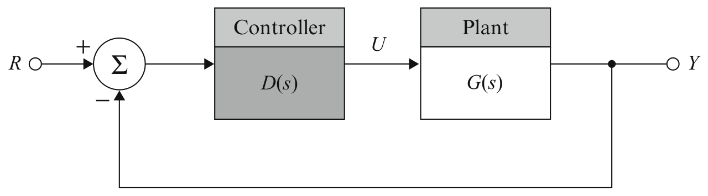

> Image description: A block diagram illustrating a closed-loop feedback control system, representing classical frequency-domain design methods. The system consists of a summing junction, a controller block, and a plant block. An input signal $R$ enters a summation junction labeled with a plus sign ($+$) at the top and a minus sign ($-$) at the bottom. The output from the junction flows into the "Controller" block, which is represented by a gray shaded rectangle with the transfer function $D(s)$. The controller output, $U$, serves as the input to the "Plant" block, represented by a white rectangle with the transfer function $G(s)$. The output of the plant is the system output $Y$. A feedback path connects the output $Y$ back to the negative input terminal of the summation junction. The diagram illustrates how the error between the reference $R$ and the feedback signal is processed by the controller to drive the plant toward the desired state.

Classical Frequency-Domain Design Methods, Fig. 1 Feedback system showing compensation, $D(s)$ (Source: Franklin et al. (2010, p-249), Reprinted by permission of Pearson Education, Inc., Upper Saddle River, NJ)
the FR magnitude plot. However, increasing the low-frequency gain typically will raise the entire magnitude plot upward, thus increasing the magnitude 1 crossover frequency and, therefore, increasing the speed of response and bandwidth of the system.

## Compensation Design

In some cases, the design of a feedback compensation can be accomplished by using proportional control only, i.e., setting $D(s)=K$ (see Fig. 1) and selecting a suitable value for $K$. This can be accomplished by plotting the magnitude and phase of $G(s)$, looking at $|G(j \omega)|$ at the frequency where $\angle G(j \omega)=-180^{\circ}$, and then selecting $K$ so that $|K G(j \omega)|$ yields the desired GM. Similarly, if a particular value of PM is desired, one can find the frequency where $\angle G(j \omega)=-180^{\circ}+$ the desired PM. The value of $|K G(j \omega)|$ at that frequency must equal 1 ; therefore, the value of $|G(j \omega)|$ must equal $1 / K$. Note that the $|K G(j \omega)|$ curve moves vertically based on the value of $K$; however the $\angle K G(j \omega)$ curve is not affected by the value of $K$. This characteristic simplifies the design process.

In more typical cases, proportional feedback alone is not sufficient. There is a need for a certain damping (i.e., PM) and/or speed of response (i.e., bandwidth) and there is no value of $K$ that will meet the specifications. Therefore, some increased damping from the compensation is required. Likewise, a certain steady-state error requirement and its resulting low-frequency gain will cause the $|D(j \omega) G(j \omega)|$ to be greater than desired for an acceptable PM, so more phase lead is required from the compensation. This is
typically accomplished by lead compensation. A phase increase (or lead) is accomplished by placing a zero in $D(s)$. However, that alone would cause an undesirable high-frequency gain which would amplify noise; therefore, a firstorder pole is added in the denominator at frequencies substantially higher than the zero break point of the compensator. Thus, the phase lead still occurs, but the amplification at high frequencies is limited. The resulting lead compensation has a transfer function of

$$
\begin{equation*}
D(s)=K \frac{T s+1}{\alpha T s+1}, \quad \alpha<1, \tag{1}
\end{equation*}
$$

where $1 / \alpha$ is the ratio between the pole/zero break-point frequencies. Figure 2 shows the frequency response of this lead compensation. The maximum amount of phase lead supplied is dependent on the ratio of the pole to zero and is shown in Fig. 3 as a function of that ratio.

For example, a lead compensator with a zero at $s=-2(T=0.5)$ and a pole at $s=-10(\alpha T=0.1)$ (and thus $\alpha=\frac{1}{5}$ ) would yield the maximum phase lead of $\phi_{\text {max }}=40^{\circ}$. Note from the figure that we could increase the phase lead almost up to $90^{\circ}$ using higher values of the lead ratio, $1 / \alpha$; however, Fig. 2 shows that increasing values of $1 / \alpha$ also produces higher amplifications at higher frequencies. Thus, our task is to select a value of $1 / \alpha$ that is a good compromise between an acceptable PM and acceptable noise sensitivity at high frequencies. Usually the compromise suggests that a lead compensation should contribute a maximum of $70^{\circ}$ to the phase. If a greater phase lead is needed, then a double-lead compensation would be suggested, where


<!-- source_pdf_page: 137 -->
## Classical Frequency-Domain Design Methods, Fig. 2

Lead-compensation frequency response with $1 / \alpha=10, K=1$
(Source: Franklin et al. (2010, p-349), Reprinted by permission of Pearson Education, Inc.)
and if $R(s)=1 / s^{2}$ for a unit ramp, Eq.(2) reduces to

Therefore, we find that $D(0)$, the steady-state gain of the compensation, cannot be less than 10 if it is to meet the error criterion, so we pick $K=10$. The frequency response of $K G(s)$ in Fig. 4 shows that the $\mathrm{PM}=20^{\circ}$ if no phase lead is added by compensation. If it were possible to simply add phase without affecting the magnitude, we would need an additional phase of only $25^{\circ}$ at the $K G(s)$ crossover frequency of $\omega=3 \mathrm{rad} / \mathrm{sec}$. However, maintaining the same low-frequency gain and adding a compensator zero will increase the crossover frequency; hence, more than a $25^{\circ}$ phase contribution will be required from the lead compensation. To be safe, we will design the lead compensator so that it supplies a maximum phase lead of $40^{\circ}$. Figure 3 shows that $1 / \alpha=5$ will accomplish that goal. We will derive the greatest benefit from the compensation if the maximum phase lead from the compensator occurs at the crossover frequency. With some trial and error, we determine
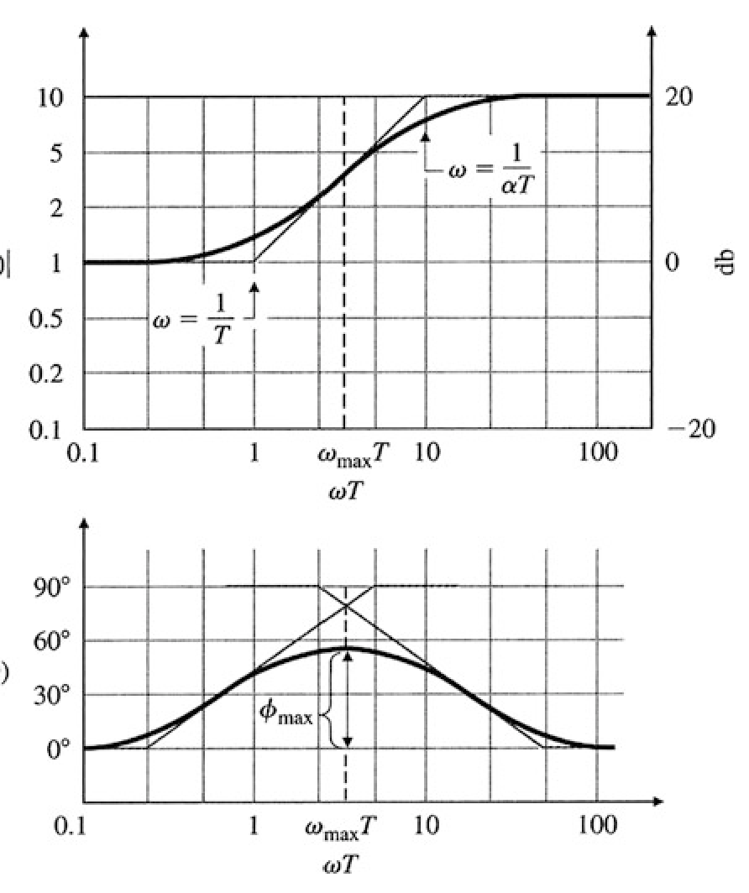

> Image description: Two related line graphs are displayed on a logarithmic scale, illustrating a frequency response analysis. The upper graph plots the magnitude $|G(j\omega)|$ on a logarithmic vertical axis (ranging from 0.1 to 10) and in decibels (db) on a secondary linear vertical axis (ranging from -20 to 20). The horizontal axis represents the normalized frequency $\omega T$ on a logarithmic scale (from 0.1 to 100). A curve rises from a magnitude of 1, passes through a point labeled $\omega = \frac{1}{T}$, and levels off at a magnitude of 10 at $\omega_{max}T$. A tangent line indicates a slope $\omega = \frac{1}{\alpha T}$ at the transition. The lower graph plots the phase $\angle G(j\omega)$ on a linear vertical axis (from $0^\circ$ to $90^\circ$) against the same logarithmic frequency $\omega T$. The curve rises to a peak labeled $\phi_{max}$ at $\omega_{max}T$ before returning to $0^\circ$.

q. (2)
"
and if $R(s)=1 / s^{2}$ for a unit ramp, Eq. (2)
reduces to

$$
e_{s s}=\lim _{s \rightarrow 0}\left\{\frac{1}{s+D(s)[1 /(s+1)]}\right\}=\frac{1}{D(0)}
$$

Therefore, we find that $D(0)$, the steady-state gain of the compensation, cannot be less than 10 if it is to meet the error criterion, so we pick Fig. 4 shows that the $\mathrm{PM}=20^{\circ}$ if no phase lead is added by compensation. If it were pos-
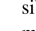 sible to simply add phase without affecting the of only $25^{\circ}$ at the $K G(s)$ crossover frequency
$\omega=3 \mathrm{rad} / \mathrm{sec}$. However, maintaining the same low-frequency gain and adding a compenhence, more than a $25^{\circ}$ phase contribution will safe, we will design the lead compensator so that it supplies a maximum phase lead of 40 . that goal. We will derive the greatest benefit from the compensation if the maximum phase lead fro quency. With some trial and error, we determine

$$
D(s)=K\left(\frac{T s+1}{\alpha T s+1}\right)^{2} .
$$

Even if a system had negligible amounts of noise present, the pole must exist at some point because of the impossibility of building a pure differentiator. No physical system - mechanical or electrical or digital - responds with infinite amplitude at infinite frequencies, so there will be a limit in the frequency range (or bandwidth) for which derivative information (or phase lead) can be provided.

As an example of designing a lead compensator, let us design compensation for a DC motor with the transfer function

$$
G(s)=\frac{1}{s(s+1)}
$$

We wish to obtain a steady-state error of less than 0.1 for a unit-ramp input and we desire a system bandwidth greater than $3 \mathrm{rad} / \mathrm{sec}$. Furthermore, we desire a PM of $45^{\circ}$. To accomplish the error requirement, Franklin et al. shows that

$$
\begin{equation*}
e_{s s}=\lim _{s \rightarrow 0} s\left[\frac{1}{1+D(s) G(s)}\right] R(s) \tag{2}
\end{equation*}
$$

的


<!-- source_pdf_page: 138 -->
Classical
Frequency-Domain Design Methods, Fig. 3
Maximum phase increase for lead compensation (Source: Franklin et al. (2010, p-350), Reprinted by permission of Pearson Education, Inc.)
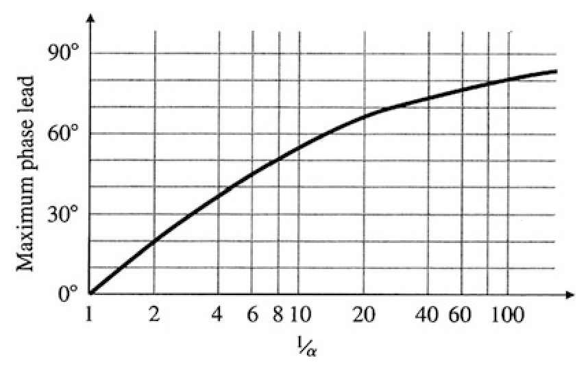

> Image description: A line graph titled "Maximum phase lead" illustrates the relationship between the compensation ratio ($1/\alpha$) and the maximum phase lead provided by a lead compensator. The vertical y-axis represents "Maximum phase lead" in degrees, ranging from $0^{\circ}$ to $90^{\circ}$ in increments of $30^{\circ}$. The horizontal x-axis represents the compensation ratio ($1/\alpha$) on a logarithmic scale, with labeled values at 1, 2, 4, 6, 8, 10, 20, 40, 60, and 100. The plot shows a monotonic, increasing curve starting at the origin $(1, 0^{\circ})$. As the value of $1/\alpha$ increases, the maximum phase lead increases, but the rate of increase diminishes, asymptotically approaching a limit (conceptually $90^{\circ}$). This relationship demonstrates how increasing the ratio between the critical frequencies of the lead compensator increases the phase margin, a key parameter in frequency-domain control design.

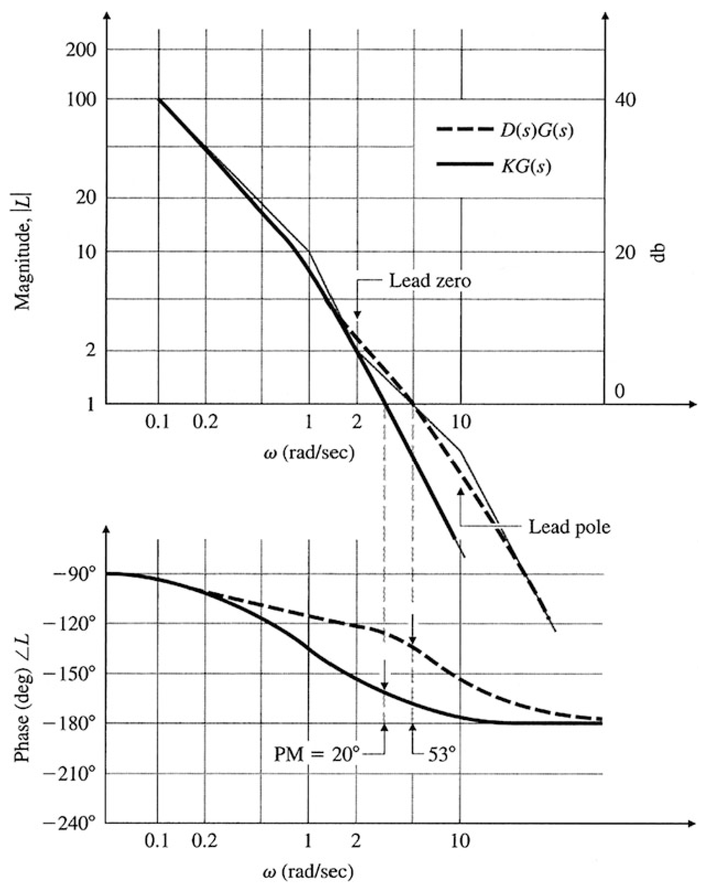

> Image description: This textbook figure, titled "Frequency-Domain Design Methods," illustrates the impact of lead compensation on a system's Bode plots. It consists of two stacked graphs sharing a common horizontal axis of angular frequency, $\omega$ (rad/sec), on a logarithmic scale. The top graph displays Magnitude $|L|$ (linear scale) and Magnitude in decibels (dB scale). It compares the uncompensated system $D(s)G(s)$ (dashed line) with the compensated system $KG(s)$ (solid line). Arrows indicate the locations of the "Lead zero" and "Lead pole" on the magnitude plot. The bottom graph displays Phase $\angle L$ (degrees). It shows the same two curves: $D(s)G(s)$ (dashed) and $KG(s)$ (solid). The phase of the compensated system $KG(s)$ shows an increase compared to the original. Two vertical dashed lines correspond to specific frequencies, marking a phase margin (PM) of $20^\circ$ for the original system and a maximized PM of $53^\circ$ for the compensated system.

Classical Frequency-Domain Design Methods, Fig. 4 Frequency response for lead-compensation design (Source: Franklin et al. (2010, p-352), Reprinted by permission of Pearson Education, Inc.)


<!-- source_pdf_page: 139 -->
that placing the zero at $\omega=2 \mathrm{rad} / \mathrm{sec}$ and the pole at $\omega=10 \mathrm{rad} / \mathrm{sec}$ causes the maximum phase lead to be at the crossover frequency. The compensation, therefore, is

$$
D(s)=10 \frac{s / 2+1}{s / 10+1} .
$$

The frequency-response characteristics of $L(s)=D(s) G(s)$ in Fig. 4 can be seen to yield a PM of $53^{\circ}$, which satisfies the PM and steadystate error design goals. In addition, the crossover frequency of $5 \mathrm{rad} / \mathrm{sec}$ will also yield a bandwidth greater than $3 \mathrm{rad} / \mathrm{sec}$, as desired.

Lag compensation is the same form as the lead compensation in Eq. (1) except that $\alpha>1$. Therefore, the pole is at a lower frequency than the zero and it produces higher gain at lower frequencies. The compensation is used primarily to reduce steady-state errors by raising the low-frequency gain but without increasing the crossover frequency and speed of response. This can be accomplished by placing the pole and zero of the lag compensation well below the crossover frequency. Alternatively, lag compensation can also be used to improve the PM by keeping the low frequency gain the same, but reducing the gain near crossover, thus reducing the crossover frequency. That will usually improve the PM since the phase of the uncompensated system typically is higher at lower frequencies.

Systems being controlled often have highfrequency dynamic phenomena, such as mechanical resonances, that could have an impact on the stability of a system. In very-high-performance designs, these high-frequency dynamics are included in the plant model, and a compensator is designed with a specific knowledge of those dynamics. However, a more robust approach for designing with uncertain high-frequency dynamics is to keep the highfrequency gain low, just as we did for sensornoise reduction. The reason for this can be seen from the gain-frequency relationship of a typical system, shown in Fig.5. The only way instability can result from high-frequency dynamics is if an unknown high-frequency resonance causes the magnitude to rise above 1 .

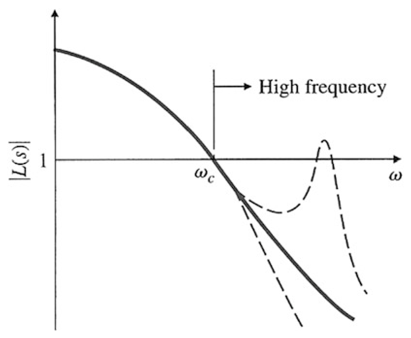

> Image description: A line graph titled "Fig. 5 Effect of high-frequency plant uncertainty" illustrates frequency-domain characteristics. The vertical axis is labeled $|L(s)|$, and the horizontal axis is labeled $\omega$ (frequency). A solid black curve starts at a high magnitude on the vertical axis and decreases monotonically as $\omega$ increases, passing through the value of $1$ at a specific frequency denoted as $\omega_c$. A dashed black curve follows a similar downward trend initially but exhibits a significant upward peak at a higher frequency, labeled "High frequency" with an accompanying vertical line and arrow pointing to the region. The solid curve represents a nominal system model, while the dashed curve represents the effect of plant uncertainty. The intersection of the solid curve with the horizontal line at magnitude $1$ defines the crossover frequency $\omega_c$.
Classical Frequency-Domain Design Methods, Fig. 5 Effect of high-frequency plant uncertainty (Source: Franklin et al. (2010, p-372), Reprinted by permission of Pearson Education, Inc.)

Conversely, if all unknown high-frequency phenomena are guaranteed to remain below a magnitude of 1 , stability can be guaranteed. The likelihood of an unknown resonance in the plant $G$ rising above 1 can be reduced if the nominal high-frequency loop gain $(L)$ is lowered by the addition of extra poles in $D(s)$. When the stability of a system with resonances is assured by tailoring the high-frequency magnitude never to exceed 1 , we refer to this process as amplitude or gain stabilization. Of course, if the resonance characteristics are known exactly and remain the same under all conditions, a specially tailored compensation, such as a notch filter at the resonant frequency, can be used to tailor the phase for stability even though the amplitude does exceed magnitude 1 as explained in Franklin et al. (2010). Design of a notch filter is more easily carried out using root locus or state-space design methods, all of which are discussed in Franklin et al. (2010). This method of stabilization is referred to as phase stabilization. A drawback to phase stabilization is that the resonance information is often not available with adequate precision or varies with time; therefore, the method is more susceptible to errors in the plant model used in the design. Thus, we see that sensitivity to plant uncertainty


<!-- source_pdf_page: 140 -->
and sensor noise are both reduced by sufficiently low gain at high-frequency.

## Summary and Future Directions

Before the common use of computers in design, frequency-response design was the only widely used method. While it is still the most widely used method for routine designs, complex systems and their design are being carried out using a multitude of methods. This section introduces just one of many possible methods.

## Cross-References

- Frequency-Response and Frequency-Domain Models
- Polynomial/Algebraic Design Methods
- Quantitative Feedback Theory
- Spectral Factorization


## Bibliography

Franklin GF, Powell JD, Workman M (1998) Digital control of dynamic systems, 3rd edn. Ellis-Kagle Press, Half Moon Bay
Franklin GF, Powell JD, Emami-Naeini A (2010) Feedback control of dynamic systems, 6th edn. Pearson, Upper Saddle River
Franklin GF, Powell JD, Emami-Naeini A (2015) Feedback control of dynamic systems, 7th edn. Pearson, Upper Saddle River

## Computational Complexity Issues in Robust Control

Onur Toker<br>Fatih University, Istanbul, Turkey

## Abstract

Robust control theory has introduced several new and challenging problems for researchers. Some of these problems have been solved by
innovative approaches and led to the development of new and efficient algorithms. However, some of the other problems in robust control theory had attracted significant amount of research, but none of the proposed algorithms were efficient, namely, had execution time bounded by a polynomial of the "problem size." Several important problems in robust control theory are either of decision type or of computation/approximation type, and one would like to have an algorithm which can be used to answer all or most of the possible cases and can be executed on a classical computer in reasonable amount of time. There is a branch of theoretical computer science, called theory of computation, which can be used to study the difficulty of problems in robust control theory. In the following, classical computer system, algorithm, efficient algorithm, unsolvability, tractability, $N P$-hardness, and $N P$-completeness will be introduced in a more rigorous fashion, with applications to problems from robust control theory.

## Keywords

Approximation complexity; Computational complexity; $N P$-complete; $N P$-hard; Unsolvability

## Introduction

The term algorithm is used to refer to different notions which are all somewhat consistent with our intuitive understanding. This ambiguity may sometimes generate significant confusion, and therefore, a rigorous definition is of extreme importance. One commonly accepted "intuitive" definition is a set of rules that a person can perform with paper and pencil. However, there are "algorithms" which involve random number generation, for example, finding a primitive root in $\mathbb{Z}_{p}$ (Knuth 1997). Based on this observation, one may ask whether a random number generationbased set of rules should be also considered as an algorithm, provided that it will terminate after finitely many steps for all instances of the


<!-- source_pdf_page: 141 -->
problem or for a significant majority of the cases. In a similar fashion, one may ask whether any real number, including irrational ones which cannot be represented on a digital computer without an approximation error, should be allowed as an input to an algorithm and, furthermore, should all calculations be limited to algebraic functions only or should exact calculation of nonalgebraic functions, e.g., trigonometric functions, the gamma function, etc., be acceptable in an algorithm. Although all of these seem acceptable with respect to our intuitive understanding of the algorithm, from a rigorous point of view, they are different notions. In the context of robust control theory, as well as many other engineering disciplines, there is a separate and widely accepted definition of algorithm, which is based on today's digital computers, more precisely the Turing machine (Turing 1936). Alan M. Turing defined a "hypothetical computation machine" to formally define the notions of algorithm and computability. A Turing machine is, in principle, quite similar to today's digital computers widely used in many engineering applications. The engineering community seems to widely accept the use of current digital computers and Turing's definitions of algorithm and computability.

However, depending on new scientific, engineering, and technological developments, superior computation machines may be constructed. For example, there is no guarantee that quantum computing research will not lead to superior computation machines (Chen et al. 2006; Kaye et al. 2007). In the future, the engineering community may feel the need to revise formal definitions of algorithm, computability, tractability, etc., if such superior computation machines can be constructed and used for scientific/engineering applications.

## Turing Machines and Unsolvability

Turing machine is basically a mathematical model of a simplified computation device. The original definition involves a tape-like device for memory. For an easy-to-read introduction to the Turing machine model, see Garey and Johnson (1979) and Papadimitriou (1995), and for more details, see Hopcroft et al. (2001),

Lewis and Papadimitriou (1998), and Sipser (2006). Despite this being a quite simple and low-performance "hardware" compared to today's engineering standards, the following two observations justify their use in the study of computational complexity of engineering problems. Anything which can be solved on today's current digital computers can be solved on a Turing machine. Furthermore, a polynomialtime algorithm on today's digital computers will correspond to again a polynomial-time algorithm on the original Turing machine, and vice versa. A widely accepted definition for an algorithm is a Turing machine with a program, which is guaranteed to terminate after finitely many steps.

For some mathematical and engineering problems, it can be shown that there can be no algorithm which can handle all possible cases. Such problems are called unsolvable. The condition "all cases" may be considered too tough, and one may argue that such negative results have only theoretical importance and have no practical implications. But such results do imply that we should concentrate our efforts on alternative research directions, like the development of algorithms only for cases which appear more frequently in real scientific/engineering applications, without asking the algorithm to work for the remaining cases as well.

Here is a famous unsolvable mathematical problem: Hilbert's tenth problem is basically the development of an algorithm for testing whether a Diophantine equation has an integer solution. However, in 1970, Matijasevich showed that there can be no such algorithm (Matiyasevich 1993). Therefore, we say that the problem of checking whether a Diophantine equation has an integer solution is unsolvable.

Several unsolvability results for dynamical systems can be proved by using the Post correspondence problem (Davis 1985) and the embedding of free semigroups into matrices. For example, the problem of checking the stability of saturated linear dynamical systems is proved to be undecidable (Blondel et al. 2001), meaning that no general stability test algorithm can be developed for such systems. A similar unsolvability result is reported in Blondel and


<!-- source_pdf_page: 142 -->
Tsitsiklis (2000a) for boundedness of switching systems of the type

$$
x(k+1)=A_{f(k)} x(k)
$$

where $f$ is assumed to be an arbitrary and unknown function from $\mathbb{N}$ into $\{0,1\}$. A closely related asymptotic stability problem is equivalent to testing whether the joint spectral radius (JSR) (Rota and Strang 1960) of a set of matrices is less than one. For a quite long period of time, there was a conjecture called the finiteness conjecture (FC) (Lagarias and Wang 1995), which was generally believed or hoped to be true, at least for a group of researchers. FC may be interpreted as "For asymptotic stability of $x(k+1)= A_{f(k)} x(k)$ type switching systems, it is enough to consider periodic switchings only." There was no known counterexample, and the truth of this conjecture would imply existence of an algorithm for the abovementioned JSR problem. However, it was shown in Bousch and Mairesse (2002) that FC is not true (see Blondel et al. (2003) for a simplified proof). There are numerous known computationally very valuable procedures related to JSR approximation, for example, see Blondel and Nesterov (2005) and references therein. However, the development of an algorithm to test whether JSR is less than one remains as an open problem.

For further results on unsolvability and unsolved problems in robust control, see Blondel et al. (1999), Blondel and Megretski (2004), and references therein.

## Tractability, NP-Hardness, and NP-Completeness

The engineering community is interested in not only solution algorithms but algorithms which are fast even in the worst case and if not on the average. Sometimes, this speed requirement may be relaxed to being fast for most of the cases and sometimes to only a significant percentage of the cases. Currently, the theory of computation is developed around the idea of algorithms which are polynomial time even in the worst case, namely, execution time bounded by a polynomial of the problem size (Garey and Johnson 1979;

Papadimitriou 1995). Such algorithms are also called efficient, and associated problems are classified as tractable. The term problem size means number of bits used in a suitable encoding of the problem (Garey and Johnson 1979; Papadimitriou 1995).

One may argue that this worst-case approach of being always polynomial time is a quite conservative requirement. In reality, a practicing engineer may consider being polynomial time on the average quite satisfactory for many applications. The same may be true for algorithms which are polynomial time for most of the cases. However, the existing computational complexity theory is developed around this idea of being polynomial time even in the worst case. Therefore, many of the computational complexity results proved in the literature do not imply the impossibility of algorithms which are neither polynomial time on the average nor polynomial time for most of the cases. Note that despite not being efficient, such algorithms may be considered quite valuable by a practicing engineer. Tractability and efficiency can be defined in several different ways, but the abovementioned polynomial-time solvability even in the worstcase approach is widely adopted by the engineering community.
$N P$-hardness and $N P$-completeness are originally defined to express the inherent difficulty of decision-type problems, not for approximationtype problems. Although approximation complexity is an important and active research area in the theory of computation (Papadimitriou 1995), most of the classical results are on decision-type problems. Many robust control-related problems can be formulated as "Check whether $\gamma<1$," which is a decision-type problem. Approximate value of $\gamma$ may not be always good enough to "solve" the problem, i.e., to decide about robust stability. For certain other engineering applications for which approximate values of optimization problems are good enough to "solve" the problem, the complexity of a decision problem may not be very relevant. For example, in a minimum effort control problem, usually there may be no point in computing the exact value of the minimum, because good approximations will


<!-- source_pdf_page: 143 -->
be just fine for most cases. However, for a robust control problem, a result like $\gamma=0.99 \pm 0.02$ may be not enough to decide about robust stability, although the approximation error is about 2 \% only. Basically, both the conservativeness of the current tractability definition and the differences between decision- and approximation-type problems should be always kept in mind when interpreting computational complexity results reported here as well as in the literature.

In this subsection, and in the next one, we will consider decision problems only. The class $P$ corresponds to decision problems which can be solved by a Turing machine with a suitable program in polynomial time (Garey and Johnson 1979). This is interpreted as decision problems which have polynomial-time solution algorithms. The definition of the class $N P$ is more technical and involves nondeterministic Turing machines (Garey and Johnson 1979). It may be interpreted as the class of decision problems for which the truth of the problem can be verified in polynomial time. It is currently unknown whether $P$ and $N P$ are equal or not. This is a major open problem, and the importance of it in the theory of computation is comparable to the importance of Riemann hypothesis in number theory.

A problem is $N P$-complete if it is $N P$ and every $N P$ problem polynomially reduces to it (Garey and Johnson 1979). For an $N P$-complete problem, being in $P$ is equivalent to $P=N P$. There are literally hundreds of such problems, and it is generally argued that since after several years of research nobody was able to develop a polynomial-time algorithm for these $N P$ complete problems, there is probably no such algorithm, and most likely $P \neq N P$. Although current evidence is more toward $P \neq N P$, this does not constitute a formal proof, and the history of mathematics and science is full of surprising discoveries.

A problem (not necessarily $N P$ ) is called $N P$ hard if and only if there is an $N P$-complete problem which is polynomial time reducible to it (Garey and Johnson 1979). Being NP-hard is sometimes called being intractable and means that unless $P=N P$, which is considered to be very unlikely by a group of researchers, no
polynomial-time solution algorithm can be developed. All $N P$-complete problems are also $N P$ hard, but they are only as "hard" as any other problem in the set of $N P$-complete problems.

The first known $N P$-complete problem is SATISFIABILITY (Cook 1971). In this problem, there is a single Boolean equation with several variables, and we would like to test whether there is an assignment to these variables which make the Boolean expression true. This important discovery enabled proofs of $N P$-completeness or $N P$-hardness of several other problems by using simple polynomial reduction techniques only (Garey and Johnson 1979). Among these, quadratic programming is an important one and led to the discovery of several other complexity results in robust control theory. The quadratic programming (QP) can be defined as

$$
q=\min _{A x \leq b} x^{T} Q x+c^{T} x
$$

more precisely testing whether $q<1$ or not (decision version). When the matrix $Q$ is positive definite, convex optimization techniques can be used; however, the general version of the problem is $N P$-hard.

A related problem is linear programming (LP)

$$
q=\min _{A x \leq b} c^{T} x
$$

which is used in certain robust control problems (Dahleh and Diaz-Bobillo 1994) and has a quite interesting status. Simplex method (Dantzig 1963) is a very popular computational technique for LP and is known to have polynomial-time complexity on the "average" (Smale 1983). However, there are examples where the simplex method requires exponentially growing number of steps with the problem size (Klee and Minty 1972). In 1979, Khachiyan proposed the ellipsoid algorithm for LP, which was the first known polynomial-time approximation algorithm (Schrijver 1998). Because of the nature of the problem, one can answer the decision version of LP in polynomial time by using the ellipsoid algorithm for approximation and stopping when the error is below a certain level.


<!-- source_pdf_page: 144 -->
But all of these results are for standard Turing machines with input parameters restricted to rational numbers. An interesting open problem is whether LP admits a polynomial algorithm in the real number model of computation.

## Complexity of Certain Robust Control Problems

There are several computational complexity results for robust control problems (see Blondel and Tsitsiklis (2000b) for a more detailed survey). Here we summarize some of the key results on interval matrices and structured singular values.

Kharitonov theorem is about robust Hurwitz stability of polynomials with coefficients restricted to intervals (Kharitonov 1978). The problem is known to have a surprisingly simple solution; however, the matrix version of the problem has a quite different nature. If we have a matrix family

$$
\begin{array}{r}
\mathcal{A}=\left\{A \in \mathbb{R}^{n \times n}: \alpha_{i, j} \leq A_{i, j} \leq \beta_{i, j}\right. \\
i, j=1, \ldots, n\} \tag{1}
\end{array}
$$

where $\alpha_{i, j}, \beta_{i, j}$ are given constants for $i, j= 1, \ldots, n$, then it is called an interval matrix. Such matrices do occur in descriptions of uncertain dynamical systems. The following two stability problems about interval matrices are known to be $N P$-hard:
Interval Matrix Problem 1 (IMP1): Decide whether a given interval matrix, $\mathcal{A}$, is robust Hur- witz stable or not. Namely, check whether all members of $\mathcal{A}$ are Hurwitz-stable matrices, i.e., all eigenvalues are in open left half plane.
Interval Matrix Problem 2 (IMP2): Decide whether a given interval matrix, $\mathcal{A}$, has a Hurwitz-stable matrix or not. Namely, check whether there exists at least one matrix in $\mathcal{A}$ which is Hurwitz stable.
For a proof of $N P$-hardness of IMP1, see Poljak and Rohn (1993) and Nemirovskii (1993), and for a proof of IMP2, see Blondel and Tsitsiklis (1997).
Another important problem is related to structured singular values (SSV) and linear
fractional transformations (LFT), which are mainly used to study systems which have component-level uncertainties (Packard and Doyle 1993). Basically, bounds on the component-level uncertainties are given, and we would like to check whether the system is robustly stable or not. This is known to be $N P$-hard.

## Structured Singular Value Problem (SSVP):

Given a matrix $M$ and uncertainty structure $\boldsymbol{\Delta}$, check whether the structured singular value $\mu_{\Delta}(M)<1$.
This is proved to be $N P$-hard for real, and mixed, uncertainty structures (Braatz et al. 1994), as well as for complex uncertainties with no repetitions (Toker and Ozbay 1996, 1998).

## Approximation Complexity

Decision version of QP is NP-hard, but approximation of QP is quite "difficult" as well. An approximation is called a $\mu$-approximation if the absolute value of the error is bounded by $\mu$ times the absolute value of max-min of the function. The following is a classical result on QP (Bellare and Rogaway 1995): Unless $P= N P$, QP does not admit a polynomial-time $\mu$ approximation algorithm even for $\mu<1 / 3$. This is sometimes informally stated as "QP is $N P$-hard to approximate." Much work is needed toward similar results on robustness margin and related optimization problems of the classical robust control theory.

An interesting case is the complex structured singular value computation with no repeated uncertainties. There is a convex relaxation of the problem, the standard upper bound $\bar{\mu}$, which is known to result in quite tight approximations for most cases of the original problem (Packard and Doyle 1993). However, despite strong numerical evidence, a formal proof of "good approximation for most cases" result is not available. We also do not have much theoretical information about how hard it is to approximate the complex structured singular value. For example, it is not known whether it admits a polynomial-time approximation algorithm with error bounded by, say, $5 \%$. In summary, much work needs to be done in these


<!-- source_pdf_page: 145 -->
directions for many other robust control problems whose decision versions are $N P$-hard.

## Summary and Future Directions

The study of the "Is $P \neq N P$ ?" question turned out to be a quite difficult one. Researchers agree that really new and innovative tools are needed to study this problem. On one other extreme, one can question whether we can really say something about this problem within the ZermeloFraenkel (ZF) set theory or will it have a status similar to axiom of choice (AC) and the continuum hypothesis (CH) where we can neither refute nor provide a proof (Aaronson 1995). Therefore, the question may be indeed much deeper than we thought, and standard axioms of today's mathematics may not be enough to provide an answer. As for any such problem, we can still hope that in the future, new "self-evident" axioms may be discovered, and with the help of them, we may provide an answer.

All of the complexity results mentioned here are with respect to the standard Turing machine which is a simplified model of today's digital computers. Depending on the progress in science, engineering, and technology, if superior computation machines can be constructed, then some of the abovementioned problems can be solved much faster on these devices, and current results/problems of the theory of computation may no longer be of great importance or relevance for engineering and scientific applications. In such a case, one may also need to revise definitions of the terms algorithm, tractable, etc., according to these new devices.

Currently, there are several $N P$-hardness results about robust control problems, mostly $N P$-hardness of decision problems about robustness. However, much work is needed on the approximation complexity and conservatism of various convex relaxations of these problems. Even if a robust stability problem is $N P$-hard, a polynomial-time algorithm to estimate robustness margin with, say, $5 \%$ error is not ruled out with the $N P$-hardness of the decision version of the problem. Indeed, a polynomial-time
and 5\% error-bounded result will be of great importance for practicing engineers. Therefore, such directions should also be studied, and various meaningful alternatives, like being polynomial time on the average or for most of cases or anything which makes sense for a practicing engineer, should be considered as an alternative direction.

In summary, computational complexity theory guides research on the development of algorithms, indicating which directions are dead ends and which directions are worth to investigate.

## Cross-References

- Optimization Based Robust Control
- Robust Control in Gap Metric
- Robust Fault Diagnosis and Control
- Robustness Issues in Quantum Control
- Structured Singular Value and Applications: Analyzing the Effect of Linear Time-Invariant Uncertainty in Linear Systems


## Bibliography

Aaronson S (1995) Is P versus NP formally independent? Technical report 81, EATCS
Bellare M, Rogaway P (1995) The complexity of approximating a nonlinear program. Math Program 69:429441
Blondel VD, Megretski A (2004) Unsolved problems in mathematical systems and control theory. Princeton University Press, Princeton
Blondel VD, Nesterov Y (2005) Computationally efficient approximations of the joint spectral radius. SIAM J Matrix Anal 27:256-272
Blondel VD, Tsitsiklis JN (1997) NP-hardness of some linear control design problems. SIAM J Control Optim 35:2118-2127
Blondel VD, Tsitsiklis JN (2000a) The boundedness of all products of a pair of matrices is undecidable. Syst Control Lett 41:135-140
Blondel VD, Tsitsiklis JN (2000b) A survey of computational complexity results in systems and control. Automatica 36:1249-1274
Blondel VD, Sontag ED, Vidyasagar M, Willems JC (1999) Open problems in mathematical systems and control theory. Springer, London
Blondel VD, Bournez O, Koiran P, Tsitsiklis JN (2001) The stability of saturated linear dynamical systems is undecidable. J Comput Syst Sci 62:442-462


<!-- source_pdf_page: 146 -->
Blondel VD, Theys J, Vladimirov AA (2003) An elementary counterexample to the finiteness conjecture. SIAM J Matrix Anal 24:963-970
Bousch T, Mairesse J (2002) Asymptotic height optimization for topical IFS, Tetris heaps and the finiteness conjecture. J Am Math Soc 15:77-111
Braatz R, Young P, Doyle J, Morari M (1994) Computational complexity of $\mu$ calculation. IEEE Trans Autom Control 39: 1000-1002
Chen G, Church DA, Englert BG, Henkel C, Rohwedder B, Scully MO, Zubairy MS (2006) Quantum computing devices. Chapman and Hall/CRC, Boca Raton
Cook $S$ (1971) The complexity of theorem proving procedures. In: Proceedings of the third annual ACM symposium on theory of computing, Shaker Heights, pp 151-158
Dahleh MA, Diaz-Bobillo I (1994) Control of uncertain systems. Prentice Hall, Englewood Cliffs
Dantzig G (1963) Linear programming and extensions. Princeton University Press, Princeton
Davis M (1985) Computability and unsolvability. Dover
Garey MR, Johnson DS (1979) Computers and intractability, a guide to the theory of NP-completeness. W. H. Freeman, San Francisco
Hopcroft JE, Motwani R, Ullman JD (2001) Introduction to automata theory, languages, and computation. Addison Wesley, Boston
Kaye P, Laflamme R, Mosca M (2007) An introduction to quantum computing. Oxford University Press, Oxford
Kharitonov VL (1978) Asymptotic stability of an equilibrium position of a family of systems of linear differential equations. Differentsial'nye Uravneniya 14: 2086-2088
Klee V, Minty GJ (1972) How good is the simplex algorithm? In: Inequalities III (proceedings of the third symposium on inequalities), Los Angeles. Academic, New York/London, pp 159-175
Knuth DE (1997) Art of computer programming, volume 2: seminumerical algorithms, 3rd edn. AddisonWesley, Reading
Lagarias JC, Wang Y (1995) The finiteness conjecture for the generalized spectral radius of a set of matrices. Linear Algebra Appl 214:17-42
Lewis HR, Papadimitriou CH (1998) Elements of the theory of computation. Prentice Hall, Upper Saddle River
Matiyasevich YV (1993) Quantum computing devices. MIT
Nemirovskii A (1993) Several NP-hard problems arising in robust stability analysis. Math Control Signals Syst 6:99-105
Packard A, Doyle J (1993) The complex structured singular value. Automatica 29:71-109
Papadimitriou $\mathbf{C H}$ (1995) Computational complexity. Addison-Wesley/Longman, Reading
Poljak S, Rohn J (1993) Checking robust nonsingularity is NP-hard. Math Control Signals Syst 6:1-9
Rota GC, Strang G (1960) A note on the joint spectral radius. Proc Neth Acad 22:379-381

Schrijver A (1998) Theory of linear and integer programming. Wiley, Chichester
Sipser M (2006) Introduction to the theory of computation. Thomson Course Technology, Boston
Smale S (1983) On the average number of steps in the simplex method of linear programming. Math Program 27:241-262
Toker O, Ozbay H (1996) Complexity issues in robust stability of linear delay differential systems. Math Control Signals Syst 9:386-400
Toker O, Ozbay H (1998) On the NP-hardness of the purely complex mu computation, analysis/synthesis, and some related problems in multidimensional systems. IEEE Trans Autom Control 43:409-414
Turing AM (1936) On computable numbers, with an application to the Entscheidungsproblem. Proc Lond Math Soc 42:230-265

# Computer-Aided Control Systems Design: Introduction and Historical Overview

Andreas Varga<br>Institute of System Dynamics and Control, German Aerospace Center, DLR<br>Oberpfaffenhofen, Wessling, Germany

## Synonyms

## CACSD


#### Abstract

Computer-aided control system design (CACSD) encompasses a broad range of Methods and tools and technologies for system modelling, control system synthesis and tuning, dynamic system analysis and simulation, as well as validation and verification. The domain of CACSD enlarged progressively over decades from simple collections of algorithms and programs for control system analysis and synthesis to comprehensive tool sets and userfriendly environments supporting all aspects of developing and deploying advanced control systems in various application fields. This entry gives a brief introduction to CACSD and reviews


<!-- source_pdf_page: 147 -->
the evolution of key concepts and technologies underlying the CACSD domain. Several cornerstone achievements in developing reliable numerical algorithms; implementing robust numerical software; and developing sophisticated integrated modelling, simulation, and design environments are highlighted.

## Keywords

CACSD; Modelling; Numerical analysis; Simulation; Software tools

## Introduction

To design a control system for a plant, a typical computer-aided control system design (CACSD) work flow comprises several interlaced activities.

Model building is often a necessary first step consisting in developing suitable mathematical models to accurately describe the plant dynamical behavior. High-fidelity physical plant models obtained, for example, by using the first principles of modelling, primarily serve for analysis and validation purposes using appropriate simulation techniques. These dynamic models are usually defined by a set of ordinary differential equations (ODEs), differential algebraic equation (DAEs), or partial differential equations (PDEs). However, for control system synthesis purposes simpler models are required, which are derived by simplifying high-fidelity models (e.g., by linearization, discretization, or model reduction) or directly determined in a specific form from input-output measurement data using system identification techniques. Frequently used synthesis models are continuous or discrete-time linear time-invariant (LTI) models describing the nominal behavior of the plant in a specific operating point. The more accurate linear parameter varying (LPV) models may serve to account for uncertainties due to various performed approximations, nonlinearities, or varying model parameters.

Simulation of dynamical systems is a closely related activity to modelling and is concerned
with performing virtual experiments on a given plant model to analyze and predict the dynamic behavior of a physical plant. Often, modelling and simulation are closely connected parts of dedicated environments, where specific classes of models can be built and appropriate simulation methods can be employed. Simulation is also a powerful tool for the validation of mathematical models and their approximations. In the context of CACSD, simulation is frequently used as a control system tuning-aid, as, for example, in an optimization-based tuning approach using timedomain performance criteria.

System analysis and synthesis are concerned with the investigation of properties of the underlying synthesis model and in the determination of a control system which fulfills basic requirements for the closed-loop controlled plant, such as stability or various time or frequency response requirements. The analysis also serves to check existence conditions for the solvability of synthesis problems, according to established design methodologies. An important synthesis goal is the guarantee of the performance robustness. To achieve this goal, robust control synthesis methodologies often employ optimization-based parameter tuning in conjunction with worst-case analysis techniques. A rich collection of reliable numerical algorithms are available to perform such analysis and synthesis tasks. These algorithms form the core of CACSD and their development represented one of the main motivations for CACSD-related research.

Performance robustness assessment of the resulting closed-loop control system is a key aspect of the verification and validation activity. For a reliable assessment, simulation-based worst-case analysis represents, often, the only way to prove the performance robustness of the synthesized control system in the presence of parametric uncertainties and variabilities.

## Development of CACSD Tools

The development of CACSD tools for system analysis and synthesis started around 1960, immediately after general-purpose digital


<!-- source_pdf_page: 148 -->
computers, and new programming languages became available for research and development purposes. In what follows, we give a historical survey of these developments in the main CACSD areas.

## Modelling and Simulation Tools

Among the first developments were modelling and simulation tools for continuous-time systems described by differential equations based on dedicated simulation languages. Over 40 continuoussystem simulation languages had been developed as of 1974 (Nilsen and Karplus 1974), which evolved out of attempts at digitally emulating the behavior of widely used analog computers before 1960. A notable development in this period was the CSSL standard (Augustin et al. 1967), which defined a system as an interconnection of blocks corresponding to operators which emulated the main analog simulation blocks and implied the integration of the underlying ODEs using suitable numerical methods. For many years, the ACSL preprocessor to Fortran (Mitchel and Gauthier 1976) was one of the most successful implementations of the CSSL standard.

A turning point was the development of graphical user interfaces allowing graphical block diagram-based modelling. The most important developments were SystemBuild (Shah et al. 1985) and SIMULAB (later marketed as Simulink) (Grace 1991). Both products used a customizable set of block libraries and were seamlessly integrated in, respectively, MATRIXx and MATLAB, two powerful interactive matrix computation environments (see below). SystemBuild provided several advanced features such as event management, code generation, and DAE-based modelling and simulation. Simulink excelled from the beginning with its intuitive, easy-to-use user interface. Recent extensions of Simulink allow the modelling and simulation of hybrid systems, code generation for real-time applications, and various enhancements of the model building process (e.g., object-oriented modelling).

The object-oriented paradigm for system modelling was introduced with Dymola (Elmqvist 1978) to support physical system modelling
based on interconnections of subsystems. The underlying modelling language served as the basis of the first version of Modelica (Elmquist et al. 1997), a modern equation-based modelling language which was the result of a coordinated effort for the unification and standardization of expertise gained over many years with objectoriented physical modelling. The latest developments in this area are comprehensive model libraries for different application domains such as mechanical, electrical, electronic, hydraulic, thermal, control, and electric power systems. Notable commercial front-ends for Modelica are Dymola, MapleSim, and SystemModeler, where the last two are tightly integrated in the symbolic computation environments Maple and Mathematica, respectively.

## Numerical Software Tools

The computational tools for CACSD rely on many numerical algorithms whose development and implementation in computer codes was the primary motivation of this research area since its beginnings. The Automatic Synthesis Program (ASP) developed in 1966 (Kalman and Englar 1966) was implemented in FAP (Fortran Assembly Program) and ran only on an IBM 7090-7094 machine. The Fortran II version of ASP (known as FASP) can be considered to be the first collection of computational CACSD tools ported to several mainframe computers. Interestingly, the linear algebra computations were covered by only three routines (diagonal decomposition, inversion, and pseudoinverse), and no routines were used for eigenvalue or polynomial roots computation. The main analysis and synthesis functions covered the sampled-data discretization (via matrix exponential), minimal realization, time-varying Riccati equation solution for quadratic control, filtering, and stability analysis. The FASP itself performed the required computational sequences by interpreting simple commands with parameters. The extensive documentation containing a detailed description of algorithmic approaches and many examples marked the starting point of an intensive research on algorithms and numerical software, which culminated in the development of the


<!-- source_pdf_page: 149 -->
high-performance control and systems library SLICOT (Benner et al. 1999; Huffel et al. 2004). In what follows, we highlight the main achievements along this development process.

The direct successor of FASP is the Variable Dimension Automatic Synthesis Program (VASP) (implemented in Fortran IV on IBM 360) (White and Lee 1971), while a further development was ORACLS (Armstrong 1978), which included several routines from the newly developed eigenvalue package EISPACK (Garbow et al. 1977; Smith et al. 1976) as well as solvers for linear (Lyapunov, Sylvester) and quadratic (Riccati) matrix equations. From this point, the mainstream development of numerical algorithms for linear system analysis and synthesis closely followed the development of algorithms and software for numerical linear algebra. A common feature of all subsequent developments was the extensive use of robust linear algebra software with the Basic Linear Algebra Subprograms (BLAS) (Lawson et al. 1979) and the Linear Algebra Package (LINPACK) for solving linear systems (Dongarra et al. 1979). Several control libraries have been developed almost simultaneously, relying on the robust numerical linear algebra core software formed of BLAS, LINPACK, and EISPACK. Notable examples are RASP (based partly on VASP and ORACLS) (Grübel 1983) - developed originally by the University of Bochum and later by the German Aerospace Center (DLR); BIMAS (Varga and Sima 1985) and BIMASC (Varga and Davidoviciu 1986) - two Romanian initiatives; and SLICOT (Boom et al. 1991) - a Benelux initiative of several universities jointly with the Numerical Algorithm Group (NAG).

The last development phase was marked by the availability of the Linear Algebra Package (LAPACK) (Anderson et al. 1992), whose declared goal was to make the widely used EISPACK and LINPACK libraries run efficiently on shared memory vector and parallel processors. To minimize the development efforts, several active research teams from Europe started, in the framework of the NICONET project, a concentrated effort to develop a high-performance numerical software library
for CACSD as a new significantly extended version of the original SLICOT. The goals of the new library were to cover the main computational needs of CACSD, by relying exclusively on LAPACK and BLAS, and to guarantee similar numerical performance as that of the LAPACK routines. The software development used rigorous standards for implementation in Fortran 77, modularization, testing, and documentation (similar to that used in LAPACK). The development of the latest versions of RASP and SLICOT eliminated practically any duplication of efforts and led to a library which contained the best software from RASP, SLICOT, BIMAS, and BIMASC. The current version of SLICOT is fully maintained by the NICONET association (http://www.niconetev.info/en/) and serves as basis for implementing advanced computational functions for CACSD in interactive environments as MATLAB (http:// www.mathworks.com), Maple (http://www. maplesoft.com/products/maple/), Scilab (http:// www.scilab.org/) and Octave (http://www.gnu. org/software/octave/).

## Interactive Tools

Early experiments during 1970-1985 included the development of several interactive CACSD tools employing menu-driven interaction, question-answer dialogues, or command languages. The April 1982 special issue of IEEE Control Systems Magazine was dedicated to CACSD environments and presented software summaries of 20 interactive CACSD packages. This development period was marked by the establishment of new standards for programming languages (Fortran 77, C), availability of highquality numerical software libraries (BLAS, EISPACK, LINPACK, ODEPACK), transition from mainframe computers to minicomputers, and finally to the nowadays-ubiquitous personal computers as computing platforms, spectacular developments in graphical display technologies, and application of sound programming paradigms (e.g., strong data typing).

A remarkable event in this period was the development of MATLAB, a command languagebased interactive matrix laboratory (Moler 1980).


<!-- source_pdf_page: 150 -->
The original version of MATLAB was written in Fortran 77. It was primarily intended as a student teaching tool and provided interactive access to selected subroutines from LINPACK and EISPACK. The tool circulated for a while in the public domain, and its high flexibility was soon recognized. Several CACSD-oriented commercial clones have been implemented in the C language, the most important among them being MATRIXx (Walker et al. 1982) and PCMATLAB (Moler et al. 1985).

The period after 1985 until around 2000 can be seen as a consolidation and expansion period for many commercial and noncommercial tools. In an inventory of CACSD-related software issued by the Benelux Working Group on Software (WGS) under the auspices of the IEEE Control Systems Society, there were in 1992 in active development 70 stand-alone CACSD packages, 21 tools based on or similar to MATLAB, and 27 modelling/simulation environments. It is interesting to look more closely at the evolutions of the two main players MATRIXx and MATLAB, which took place under harshly competitive conditions.

MATRIXx with its main components Xmath, SystemBuild, and AutoCode had over many years a leading role (especially among industrial customers), excelling with a rich functionality in domains such as system identification, control system synthesis, model reduction, modelling, simulation, and code generation. After 2003, MATRIXx (http://www.ni.com/ matrixx/) became a product of the National Instruments Corporation and complements its main product family LabView, a visual programming language-based system design platform and development environment (http:// www.ni.com/labview).

MATLAB gained broad academic acceptance by integrating many new methodological developments in the control field into several controlrelated toolboxes. MATLAB also evolved as a powerful programming language, which allows easy object-oriented manipulation of different system descriptions via operator overloading. At present, the CACSD tools of MATLAB and

Simulink represent the industrial and academic standard for CACSD. The existing CACSD tools are constantly extended and enriched with new model classes, new computational algorithms (e.g., structure-exploiting eigenvalue computations based on SLICOT), dedicated graphical user interfaces (e.g., tuning of PID controllers or control-related visualizations), advanced robust control system synthesis, etc. Also, many third-party toolboxes contribute to the wide usage of this tool.

Basic CACSD functionality incorporating symbolic processing techniques and higher precision computations is available in the Maple product MapleSim Control Design Toolbox as well as in the Mathematica Control Systems product. Free alternatives to MATLAB are the MATLAB-like environments Scilab, a French initiative pioneered by INRIA, and Octave, which has recently added some CACSD functionality.

## Summary and Future Directions

The development and maintenance of integrated CACSD environments, which provide support for all aspects of the CACSD cycle such as modelling, design, and simulation, involve sustained, strongly interdisciplinary efforts. Therefore, the CACSD tool development activities must rely on the expertise of many professionals covering such diverse fields as control system engineering, programming languages and techniques, manmachine interaction, numerical methods in linear algebra and control, optimization, computer visualization, and model building techniques. This may explain why currently only a few of the commercial developments of prior years are still in use and actively maintained/developed. Unfortunately, the number of actively developed noncommercial alternative products is even lower. The dominance of MATLAB, as a de facto standard for both industrial and academic usage of integrated tools covering all aspects of the broader area of computeraided control engineering (CACE), cannot be overseen.


<!-- source_pdf_page: 151 -->
The new trends in CACSD are partly related to handling more complex applications, involving time-varying (e.g., periodic, multirate sampled-data, and differential algebraic) linear dynamic systems, nonlinear systems with many parametric uncertainties, and large-scale models (e.g., originating from the discretization of PDEs). To address many computational aspects of model building (e.g., model reduction of large order systems), optimization-based robust controller tuning using multiple-model approaches, or optimization-based robustness assessment using global-optimization techniques, parallel computation techniques allow substantial savings in computational times and facilitate addressing computational problems for largescale systems. A topic which needs further research is the exploitation of the benefits of combining numerical and symbolic computations (e.g., in model building and manipulation).

## Cross-References

- Interactive Environments and Software Tools for CACSD
- Model Building for Control System Synthesis
- Model Order Reduction: Techniques and Tools
- Multi-domain Modeling and Simulation
- Optimization-Based Control Design Techniques and Tools
- Robust Synthesis and Robustness Analysis Techniques and Tools
- Validation and Verification Techniques and Tools


## Recommended Reading

The historical development of CACSD concepts and techniques was the subject of several articles in reference works Rimvall and Jobling (1995) and Schmid (2002). A selection of papers on numerical algorithms underlying the development of CACSD appeared in Patel et al. (1994). The special issue No. 2/2004 of the IEEE Control Systems Magazine on Numerical Awareness in Control presents several surveys on different
aspects of developing numerical algorithms and software for CACSD.

The main trends over the last three decades in CACSD-related research can be followed in the programs/proceedings of the biannual IEEE Symposia on CACSD from 1981 to 2013 (partly available at http://ieeexplore.ieee.org) as well as of the triennial IFAC Symposia on CACSD from 1979 to 2000. Additional information can be found in several CACSD-focused survey articles and special issues (e.g., No. 4/1982; No. 2/2000) of the IEEE Control Systems Magazine.

## Bibliography

Anderson E, Bai Z, Bishop J, Demmel J, Du Croz J, Greenbaum A, Hammarling S, McKenney A, Ostrouchov S, Sorensen D (1992) LAPACK user's guide. SIAM, Philadelphia
Armstrong ES (1978) ORACLS - a system for linearquadratic Gaussian control law design. Technical paper 1106 96-1, NASA
Augustin DC, Strauss JC, Fineberg MS, Johnson BB, Linebarger RN, Sansom FJ (1967) The SCi continuous system simulation language (CSSL). Simulation 9:281-303
Benner P, Mehrmann V, Sima V, Van Huffel S, Varga A (1999) SLICOT - a subroutine library in systems and control theory. In: Datta BN (ed) Applied and computational control, signals and circuits, vol 1. Birkhäuser, Boston, pp 499-539
Dongarra JJ, Moler CB, Bunch JR, Stewart GW (1979) LINPACK user's guide. SIAM, Philadelphia
Elmquist H et al (1997) Modelica - a unified objectoriented language for physical systems modeling (version 1). http://www.modelica.org/documents/ Modelica1.pdf
Elmqvist H (1978) A structured model language for large continuous systems. PhD thesis, Department of Automatic Control, Lund University, Sweden
Garbow BS, Boyle JM, Dongarra JJ, Moler CB (1977) Matrix eigensystem routines - EISPACK guide extension. Springer, Heidelberg
Grace ACW (1991) SIMULAB, an integrated environment for simulation and control. In: Proceedings of American Control Conference, Boston, pp 1015-1020
Grübel G (1983) Die regelungstechnische Programmbibliothek RASP. Regelungstechnik 31:75-81
Kalman RE, Englar TS (1966) A user's manual for the automatic synthesis program (program C). Technical report CR-475, NASA
Lawson CL, Hanson RJ, Kincaid DR, Krogh FT (1979) Basic linear algebra subprograms for Fortran usage. ACM Trans Math Softw 5:308-323


<!-- source_pdf_page: 152 -->
Mitchel EEL, Gauthier JS (1976) Advanced continuous simulation language (ACSL). Simulation 26: 72-78
Moler CB (1980) MATLAB users' guide. Technical report, Department of Computer Science, University of New Mexico, Albuquerque
Moler CB, Little J, Bangert S, Kleinman S (1985) PCMATLAB, users' guide, version 2.0. Technical report, The MathWorks Inc., Sherborn
Nilsen RN, Karplus WJ (1974) Continuous-system simulation languages: a state-of-the-art survey. Math Comput Simul 16:17-25. doi:http://dx.doi.org/10.1016/ S0378-4754(74)80003-0
Patel RV, Laub AJ, Van Dooren P (eds) (1994) Numerical linear algebra techniques for systems and control. IEEE, Piscataway
Rimvall C, Jobling CP (1995) Computer-aided control systems design. In: Levine WS (ed) The control handbook. CRC, Boca Raton, pp 429-442
Schmid C (2002) Computer-aided control system engineering tools. In: Unbehauen H (ed) Control systems, robotics and automation. http://www.eolss. net/outlinecomponents/Control-Systems-RoboticsAutomation.aspx
Shah CS, Floyd MA, Lehman LL (1985) MATRIXx: control design and model building CAE capabilities. In: Jamshidi M, Herget CJ (eds) Advances in computer aided control systems engineering. NorthHolland/Elsevier, Amsterdam, pp 181-207
Smith BT, Boyle JM, Dongarra JJ, Garbow BS, Ikebe Y, Klema VC, Moler CB (1976) Matrix eigensystem routines - EISPACK guide. Lecture notes in computer science, vol 6, 2nd edn. Springer, Berlin/New York
van den Boom A, Brown A, Geurts A, Hammarling S, Kool R, Vanbegin M, Van Dooren P, Van Huffel S (1991) SLICOT, a subroutine library in control and systems theory. In: Preprints of 5th IFAC/IMACS symposium of CADCS'91, Swansea. Pergamon Press, Oxford, pp 89-94
Van Huffel S, Sima V, Varga A, Hammarling S, Delebecque F (2004) High-performance numerical software for control. Control Syst Mag 24:60-76
Varga A, Davidoviciu A (1986) BIMASC - a package of Fortran subprograms for analysis, modelling, design and simulation of control systems. In: Hansen NE, Larsen PM (eds) Preprints of 3rd IFAC/IFIP International Symposium on Computer Aided Design in Control and Engineering (CADCE'85), Copenhagen. Pergamon Press, Oxford, pp 151-156
Varga A, Sima V (1985) BIMAS - a basic mathematical package for computer aided systems analysis and design. In: Gertler J, Keviczky L (eds) Preprints of 9th IFAC World Congress, Hungary, vol 8, pp 202-207
Walker R, Gregory C, Shah S (1982) MATRIXx: a data analysis, system identification, control design and simulation package. Control Syst Mag 2:30-37
White JS, Lee HQ (1971) Users manual for the variable automatic synthesis program (VASP). Technical memorandum TM X-2417, NASA

# Consensus of Complex Multi-agent Systems

Fabio Fagnani<br>Dipartimento di Scienze Matematiche 'G.L.<br>Lagrange', Politecnico di Torino, Torino, Italy


#### Abstract

This entry provides a broad overview of the basic elements of consensus dynamics. It describes the classical Perron-Frobenius theorem that provides the main theoretical tool to study the convergence properties of such systems. Classes of consensus models that are treated include simple random walks on grid-like graphs and in graphs with a bottleneck, consensus on graphs with intermittently randomly appearing edges between nodes (gossip models), and models with nodes that do not modify their state over time (stubborn agent models). Application to cooperative control, sensor networks, and socioeconomic models are mentioned.


## Keywords

Consensus; Electrical networks; Gossip model; Spectral gap; Stubborn agents

## Multi-agent Systems and Consensus

Multi-agent systems constitute one of the fundamental paradigms of science and technology of the present century (Castellano et al. 2009; Strogatz 2003). The main idea is that of creating complex dynamical evolutions from the interactions of many simple units. Indeed such collective behaviors are quite evident in biological and social systems and were indeed considered in earlier times. More recently, the digital revolution and the miniaturization in electronics have made possible the creation of man-made complex architectures of interconnected simple devices (computers, sensors, cameras). Moreover, the creation of the Internet has opened a totally


<!-- source_pdf_page: 153 -->
new form of social and economic aggregation. This has strongly pushed towards a systematic and deep study of multi-agent dynamical systems. Mathematically they typically consist of a graph where each node possesses a state variable; states are coupled at the dynamical level through dependences determined by the edges in the graph. One of the challenging problems in the field of multi-agent systems is to analyze the emergence of complex collective phenomena from the interactions of the units which are typically quite simple. Complexity is typically the outcome of the topology and the nature of interconnections.

Consensus dynamics (also known as average dynamics) (Carli et al. 2008; Jadbabaie et al. 2003) is one of the most popular and simplest multi-agent dynamics. One convenient way to introduce it is with the language of social sciences. Imagine that a number of independent units possess an information represented by a real number, for instance, such number can represent an opinion on a given fact. Units interact and change their opinion by averaging with the opinions of other units. Under certain assumptions, this will lead the all community to converge to a consensus opinion which takes into consideration all the initial opinion of the agents. In social sciences, empiric evidences (Galton 1907) have shown how such aggregate opinion may give a very good estimation of unknown quantities: such phenomenon has been proposed in the literature as wisdom of crowds (Surowiecki 2004).

## Consensus Dynamics, Graphs, and Stochastic Matrices

Mathematically, consensus dynamics are special linear dynamical systems of type

$$
\begin{equation*}
x(t+1)=P x(t) \tag{1}
\end{equation*}
$$

where $x(t) \in \mathbb{R}^{\mathcal{V}}$ and $P \in \mathbb{R}^{\mathcal{V} \times \mathcal{V}}$ is a stochastic matrix (e.g., a matrix with nonnegative elements such that every row sums to 1 ). $\mathcal{V}$ represents the finite set of units (agents) in the network and $x(t)_{v}$ is to be interpreted has the state (opinion) of agent $v$ at time $t$. Equation (1) implies that states of agents at time $t+1$ are convex
combinations of the components of $x(t)$ : this motivates the term averaging dynamics. Stochastic matrices owe their name to their use in probability: the term $P_{v w}$ can be interpreted as the probability of making a jump in the graph from state $v$ to state $w$. In this way you construct what is called a random walk on the graph $\mathcal{G}$.

The network structure is hidden in the nonzero pattern of $P$. Indeed we can associate to $P$ a graph: $\mathcal{G}_{P}=\left(\mathcal{V}, \mathcal{E}_{P}\right)$ where the set of edges is given by $\mathcal{E}_{P}:=\left\{(u, v) \in \mathcal{V} \times \mathcal{V} \mid P_{u v}>0\right\}$. Elements in $\mathcal{E}_{P}$ represent the communication edges among the units: if $(u, v) \in \mathcal{E}_{P}$, it means that unit $u$ has access to the state of unit $v$. Denote by $\mathbb{1} \in \mathbb{R}^{\mathcal{V}}$ the all 1's vector. Notice that $P \mathbb{1}=\mathbb{1}$ : this shows that once the states of units are at consensus, they will no longer evolve. Will the dynamics always converge to a consensus point?

Remarkably, some of the key properties of $P$ responsible for the transient and asymptotic behavior of the linear system (1) are determined by the connectivity properties of the underlying graph $\mathcal{G}_{P}$. We recall that, given two vertices $u, v \in \mathcal{V}$, a path (of length $l$ ) from $u$ to $v$ in $\mathcal{G}_{P}$ is any sequence of vertices $u=u_{1}, u_{2}, \ldots, u_{l+1}= v$ such that $\left(u_{i}, u_{i+1}\right) \in \mathcal{E}_{P}$ for every $i= 1, \ldots, s . \mathcal{G}_{P}$ is said to be strongly connected if for any pair of vertices $u \neq v$ in $\mathcal{V}$ there is a path in $\mathcal{G}_{P}$ connecting $u$ to $v$. The period of a node $u$ is defined as the greatest common divisor of the lengths of all closed paths from $u$ to $u$. In the strongly connected graph, all nodes have the same period, and the graph is called aperiodic if such a period is 1 . If $x$ is a vector, we will use the notation $x^{*}$ to denote its transpose. If $A$ is a finite set, $|A|$ denotes the number of elements in $A$. The following classical result holds true (Gantmacher 1959):

Theorem 1 (Perron-Frobenius) Assume that $P \in \mathbb{R}^{\mathcal{V} \times \mathcal{V}}$ is such that $\mathcal{G}_{P}$ is strongly connected and aperiodic. Then,

1. 1 is an algebraically simple eigenvalue of $P$.
2. There exists a (unique) probability vector $\pi \in \mathbb{R}^{\mathcal{V}}\left(\pi_{v}>0\right.$ for all $v$ and $\left.\sum_{v} \pi_{v}=1\right)$ which is a left eigenvector for $P$, namely, $\pi^{*} P=\pi^{*}$.
3. All the remaining eigenvalues of $P$ are of modulus strictly less than 1 .


<!-- source_pdf_page: 154 -->
A straightforward linear algebra consequence of this result is that $P^{t} \rightarrow \mathbb{1} \pi^{*}$ for $t \rightarrow+\infty$. This yields

$$
\begin{equation*}
\lim _{t \rightarrow+\infty} x(t)=\lim _{t \rightarrow+\infty} P^{t} x(0)=\mathbb{1}\left(\pi^{*} x(0)\right) \tag{2}
\end{equation*}
$$

All agents' state are thus converging to the common value $\pi^{*} x(0)$, called consensus point which is a convex combination of the initial states with weights given by the invariant probability components.

If $\pi$ is the uniform vector (i.e., $\pi_{v}=|\mathcal{V}|^{-1}$ for all units $v$ ), the common asymptotic value is simply the arithmetic mean of the initial states: all agents equally contribute to the final common state. A special case when this happens is when $P$ is symmetric. The distributed computation of the arithmetic mean is an important step to solve estimation problems for sensor networks. As a specific example, consider the situation where there are $N$ sensors deployed in a certain area and each of them makes a noisy measurement of a physical quantity $x$. Let $y_{v}=x+\omega_{v}$ be the measure obtained by sensor $v$, where $\omega_{v}$ is a zero mean Gaussian noise. It is well known that if noises are independent and identically distributed, the optimal mean square estimator of the quantity $x$ given the entire set of measurements $\left\{y_{v}\right\}$ is exactly given by $\hat{x}=N^{-1} \sum_{v} y_{v}$. Other fields of application is in the control of cooperative autonomous vehicles (Fax and Murray 2004; Jadbabaie et al. 2003).

Basic linear algebra allows to study the rate of convergence to consensus. Indeed, if $\mathcal{G}_{P}$ is strongly connected and aperiodic, the matrix $P$ has all its eigenvalues in the unit ball: 1 is the only eigenvalue with modulo equal to 1 , while all the others have modulo strictly less than one. If we denote by $\rho_{2}<1$ the largest modulo of such eigenvalues (different from 1), we can show that $x(t)-\mathbb{1}\left(\pi^{*} x(0)\right)$ converges exponentially to 0 as $\rho_{2}^{t}$. In the following, we will briefly refer to $\rho_{2}$ as to the second eigenvalue of $P$.

## Examples and Large-Scale Analysis

In this section, we present some classical examples. Consider a strongly connected graph $\mathcal{G}= (\mathcal{V}, \mathcal{E})$. The adjacency matrix of $\mathcal{G}$ is a square matrix $A_{\mathcal{G}} \in\{0,1\}^{\mathcal{V} \times \mathcal{V}}$ such that $\left(A_{\mathcal{G}}\right)_{u v}=1$ iff $(u, v) \in \mathcal{E} . \mathcal{G}$ is said to be symmetric if $A_{\mathcal{G}}$ is symmetric. Given a symmetric graph $\mathcal{G}=(\mathcal{V}, \mathcal{E})$, we can consider the stochastic matrix $P$ given by $P_{u v}=d_{u}^{-1}\left(A_{\mathcal{G}}\right)_{u v}$ where $d_{u}=\sum_{v}\left(A_{\mathcal{G}}\right)_{u v}$ is the degree of node $u . P$ is called the simple random walk ( $S R W$ ) on $\mathcal{G}$ : each agent gives the same weight to the state of its neighbors. Clearly, $\mathcal{G}_{P}=\mathcal{G}$. A simple check shows that $\pi_{v}=d_{v} /|\mathcal{E}|$ is the invariant probability for $P$. The consensus point is given by

$$
\pi^{*} x(0)=|\mathcal{E}|^{-1} \sum_{v} d_{v} x(0)_{v}
$$

Each node contributes with its initial state to this consensus with a weight which is proportional to the degree of the node. Notice that the SRW $P$ is symmetric iff the graph is regular, namely, all units have the same degree.

We now present a number of classical examples based on families of graphs with larger and larger number of nodes $N$. In this setting, particularly relevant is to understand the behavior of the second eigenvalue $\rho_{2}$ as a function of $N$. Typically, one considers $\epsilon>0$ fixed and solves the equation $\rho_{2}^{t}=\epsilon$. The solution $\tau= \left(\ln \rho_{2}^{-1}\right)^{-1} \ln \epsilon^{-1}$ will be called the convergence time: it essentially represents the time needed to shrink of a factor $\epsilon$ the distance to consensus. Dependence of $\rho_{2}$ on $N$ will also yield that $\tau$ will be a function of $N$. In the sequel, we will investigate such dependence for SRW's on certain classical families of graphs.

Example 1 (SRW on a complete graph) Consider the complete graph on the set $\mathcal{V}: K_{\mathcal{V}}:= (\mathcal{V}, \mathcal{V} \times V)$ (also self loops are present). The SRW on $K_{\mathcal{V}}$ is simply given by $P=N^{-1} \mathbb{1} \mathbb{1}^{*}$ where $N=|\mathcal{V}|$. Clearly, $\pi=N^{-1} \mathbb{1}$. Eigenvalues of $P$ are 1 with multiplicity 1 and 0 with multiplicity $N-1$. Therefore, $\rho_{2}=0$. Consensus in this case


<!-- source_pdf_page: 155 -->
is achieved in just one step: $x(t)=N^{-1} \mathbb{1} \mathbb{1}^{*} x(0)$ for all $t \geq 1$.

Example 2 (SRW on a cycle graph) Consider the symmetric cycle graph $C_{N}=(\mathcal{V}, \mathcal{E})$ where $\mathcal{V}= \{0, \ldots, N-1\}$ and $\mathcal{E}=\{(v, v+1),(v+1, v)\}$ where sum is $\bmod N$. The graph $C_{N}$ is clearly strongly connected and is also aperiodic if $N$ is odd. The corresponding SRW $P$ has eigenvalues

$$
\lambda_{k}=\cos \frac{2 \pi k}{N}
$$

Therefore, if $N$ is odd, the second eigenvalue is given by

$$
\begin{array}{r}
\rho_{2}=\cos \frac{2 \pi}{N}=1-2 \pi^{2} \frac{1}{N^{2}}+o\left(N^{-2}\right)  \tag{3}\\
\text { for } N \rightarrow+\infty
\end{array}
$$

while the corresponding convergence time is given by

$$
\tau=\left(\ln \rho_{2}^{-1}\right)^{-1} \ln \epsilon^{-1} \asymp N^{2} \quad \text { for } N \rightarrow+\infty
$$

Example 3 (SRW on toroidal grids) The toroidal $d$-grids $C_{n}^{d}$ is formally obtained as a product of cycle graphs. The number of nodes is $N= n^{d}$. It can be shown that the convergence time behaves as

$$
\tau \asymp N^{2 / d} \quad \text { for } N \rightarrow+\infty
$$

Convergence time exhibits a slower growth in $N$ as the dimension $d$ of the grid increases: this is intuitive since the increase in $d$ determines a better connectivity of the graph and a consequently faster diffusion of information.

For a general stochastic matrix (even for SRW on general graphs), the computation of the second eigenvalue is not possible in closed form and can actually be also difficult from a numerical point of view. It is therefore important to develop tools for efficient estimation. One of these is based on the concept of bottleneck: if a graph can be splitted into two loosely connected parts, then
consensus dynamics will necessarily exhibit a slow convergence.

Formally, given a symmetric graph $\mathcal{G}= (\mathcal{V}, \mathcal{E})$ and a subset of nodes $S \subseteq \mathcal{V}$, define $e_{S}$ as the number of edges with at least one node in $S$ and $e_{S S}$ as the number of edges with both nodes in $S$. The bottleneck of $S$ in $G$ is defined as $\Phi(S)=e_{S S} / e_{S}$. Finally, the bottleneck ratio of $\mathcal{G}$ is defined as

$$
\Phi_{*}:=\min _{S: e_{S} / e \leq 1 / 2} \Phi(S)
$$

where $e=|\mathcal{E}|$ is the number of edges in the graph.

Let $P$ be the SRW on $\mathcal{G}$ and let $\rho_{2}$ be its second eigenvalue. Then,

## Proposition 1 (Cheeger bound Levin et al. 2008) <br> $$
\begin{equation*} 1-\rho_{2} \leq 2 \Phi_{*} \tag{4} \end{equation*}
$$

Example 4 (Graphs with a bottleneck) Consider two complete graphs with $n$ nodes connected by just one edge. If $S$ is the set of nodes of one of the two complete graphs, we obtain

$$
\Phi(S)=\frac{1}{n^{2}+1}
$$

Bound (4) implies that the convergence time is at least of the order of $n^{2}$ in spite of the fact that in each complete graph convergence would be in finite time!

## Other Models

The systems studied so far are based on the assumptions that units all behave the same, and they share a common clock and update their state in a synchronous fashion. In this section, we discuss more general models.

## Random Consensus Models

Regarding the assumption of synchronicity, it turns out to be unfeasible in many contexts. For instance, in the opinion dynamics modeling, it


<!-- source_pdf_page: 156 -->
is not realistic to assume that all interactions happen at the same time: agents are embedded in a physical continuous time, and interactions can be imagined to take place at random, for instance, in a pairwise fashion.

One of the most famous random consensus model is the gossip model. Fix a real number $q \in(0,1)$ and a symmetric graph $\mathcal{G}=(\mathcal{V}, \mathcal{E})$. At every time instant $t$, an edge $(u, v) \in \mathcal{E}$ is activated with uniform probability $|\mathcal{E}|^{-1}$, and nodes $u$ and $v$ exchange their states and produce a new state according to the equations

$$
\begin{aligned}
& x_{u}(t+1)=(1-q) x_{u}(t)+q x_{v}(t) \\
& x_{v}(t+1)=q x_{u}(t)+(1-q) x_{v}(t)
\end{aligned}
$$

The states of the other units remain unchanged.
Will this dynamics lead to a consensus? If the same edge is activated at every time instant, clearly consensus will not be achieved. However, it can be shown that, with probability one, consensus will be reached (Boyd et al. 2006).

## Consensus Dynamics with Stubborn Agents

In this entry, we investigate consensus dynamics models where some of the agents do not modify their own state (stubborn agents). These systems are of interest in socioeconomic models (Acemoglu et al. 2013).

Consider a symmetric connected graph $\mathcal{G}= (\mathcal{V}, \mathcal{E})$. We assume a splitting $\mathcal{V}=\mathcal{S} \cup \mathcal{R}$ with the understanding that agents in $S$ are stubborn agents not changing their state, while those in $\mathcal{R}$ are regular agents whose state modifies in time according to a SRW consensus dynamics, namely,

$$
x_{u}(t+1)=\frac{1}{d_{u}} \sum_{v \in \mathcal{V}}\left(A_{\mathcal{G}}\right)_{u v} x_{v}(t), \quad \forall u \in \mathcal{R}
$$

By assembling the state of the regular and of the stubborn agents in vectors denoted, respectively, as $x^{\mathcal{R}}(t)$ and $x^{\mathcal{S}}(t)$, dynamics can be recasted in matrix form as

$$
\begin{align*}
x^{\mathcal{R}}(t+1) & =Q^{11} x^{\mathcal{R}}(t)+Q^{12} x^{\mathcal{S}}(t) \\
x^{\mathcal{S}}(t+1) & =x^{\mathcal{S}}(t) \tag{5}
\end{align*}
$$

It can be proven that $Q^{11}$ is asymptotically stable $\left(\left(Q^{11}\right)^{t} \rightarrow 0\right)$. Henceforth, $x^{\mathcal{R}}(t) \rightarrow x^{\mathcal{R}}(\infty)$ for $t \rightarrow+\infty$ with the limit opinions satisfying the relation

$$
\begin{equation*}
x^{\mathcal{R}}(\infty)=Q^{11} x^{\mathcal{R}}(\infty)+Q^{12} x^{\mathcal{S}}(0) \tag{6}
\end{equation*}
$$

If we define $\Xi:=\left(I-Q^{11}\right)^{-1} Q^{12}$, we can write $x^{\mathcal{R}}(\infty)=\Xi x^{\mathcal{S}}(0)$. It is easy to see that $\Xi$ has nonnegative elements and that $\sum_{s} \Xi_{u s}=1$ for all $u \in \mathcal{R}$ : asymptotic opinions of regular agents are thus convex combinations of the opinions of stubborn agents. If all stubborn agents are in the same state $x$, then, consensus is reached by all agents in the point $x$. However, typically, consensus is not reached in such a system: we will discuss an example below.

There is a useful alternative interpretation of the asymptotic opinions. Interpreting the graph $\mathcal{G}$ as an electrical circuit where edges are unit resistors, relation (6) can be seen as a Laplace-type equation on the graph $\mathcal{G}$ with boundary conditions given by assigning the voltage $x^{\mathcal{S}}(0)$ to the stubborn agents. In this way, $x^{\mathcal{R}}(\infty)$ can be interpreted as the vector of voltages of the regular agents when stubborn agents have fixed voltage $x^{\mathcal{S}}(0)$. Thanks to the electrical analogy, we can compute the asymptotic opinion of the agents by computing the voltages in the various nodes in the graph. We propose a concrete application in the following example.

Example 5 (Stubborn agents in a line graph) Consider the line graph $L_{N}=(\mathcal{V}, \mathcal{E})$ where $\mathcal{V}=\{1,2, \ldots, N\}$ and where $\mathcal{E}=\{(u, u+ 1),(u+1, u) \mid u=1, \ldots, N-1\}$. Assume that $\mathcal{S}=\{1, N\}$ and $\mathcal{R}=\mathcal{V} \backslash \mathcal{S}$. Consider the graph as an electrical circuit. Replacing the line with a single edge connecting 1 and $N$ having resistance $N-1$ and applying Ohm's law, we obtain that the current flowing from 1 to $N$ is equal to $\Phi=(N-1)^{-1}\left[x_{N}^{\mathcal{S}}(0)-x_{1}^{\mathcal{S}}(0)\right]$. If we now fix an arbitrary node $v \in \mathcal{V}$ and applying again the same arguments in the part of graph from 1 to $v$, we obtain that the voltage at $v, x_{v}^{\mathcal{R}}(\infty)$ satisfies the relation $x_{v}^{\mathcal{R}}(\infty)-x_{1}^{\mathcal{S}}(0)=\Phi(v-1)$. We thus obtain


<!-- source_pdf_page: 157 -->
$$
x_{v}^{\mathcal{R}}(\infty)=x_{1}^{\mathcal{S}}(0)+\frac{v-1}{N-1}\left[x_{N}^{\mathcal{S}}(0)-x_{1}^{\mathcal{S}}(0)\right] .
$$

In Acemoglu et al. (2013), further examples are discussed showing how, because of the topology of the graph, different asymptotic configurations may show up. While in graphs presenting bottlenecks polarization phenomena can be recorded, in graphs where the convergence rate is low, there will be a typical asymptotic opinion shared by most of the regular agents.

## Cross-References

- Averaging Algorithms and Consensus
- Information-Based Multi-Agent Systems


## Bibliography

Acemoglu D, Como G, Fagnani F, Ozdaglar A (2013) Opinion fluctuations and disagreement in social networks. Math Oper Res 38(1):1-27
Boyd S, Ghosh A, Prabhakar B, Shah D (2006) Randomized gossip algorithms. IEEE Trans Inf Theory 52(6): 2508-2530
Carli R, Fagnani F, Speranzon A, Zampieri S (2008) Communication constraints in the average consensus problem. Automatica 44(3):671-684
Castellano C, Fortunato S, Loreto V (2009) Statistical physics of social dynamics. Rev Modern Phys 81:591646
Fax JA, Murray RM (2004) Information flow and cooperative control of vehicle formations. IEEE Trans Autom Control 49(9):1465-1476
Galton F (1907) Vox populi. Nature 75:450-451
Gantmacher FR (1959) The theory of matrices. Chelsea Publishers, New York
Jadbabaie A, Lin J, Morse AS (2003) Coordination of groups of mobile autonomous agents using nearest neighbor rules. IEEE Trans Autom Control 48(6):9881001
Levin DA, Peres Y, Wilmer EL (2008) Markov chains and mixing times. AMS, Providence
Strogatz SH (2003) Sync: the emerging science of spontaneous order. Hyperion, New York
Surowiecki J (2004) The wisdom of crowds: why the many are smarter than the few and how collective wisdom shapes business, economies, societies and nations. Little, Brown. (Traduzione italiana: La saggezza della folla, Fusi Orari, 2007)

## Control and Optimization of Batch Processes

Dominique Bonvin<br>Laboratoire d'Automatique, École<br>Polytechnique Fédérale de Lausanne (EPFL), 1015 Lausanne, Switzerland


#### Abstract

A batch process is characterized by the repetition of time-varying operations of finite duration. Due to the repetition, there are two independent "time" variables, namely, the run time during a batch and the batch counter. Accordingly, the control and optimization objectives can be defined for a given batch or over several batches. This entry describes the various control and optimization strategies available for the operation of batch processes. These include conventional feedback control, predictive control, iterative learning control, and run-to-run control on the one hand and modelbased repeated optimization and model-free selfoptimizing schemes on the other.


## Keywords

Batch control; Batch process optimization; Dynamic optimization; Iterative learning control; Run-to-run control; Run-to-run optimization

## Introduction

Batch processing is widely used in the manufacturing of goods and commodity products, in particular in the chemical, pharmaceutical, and food industries. These industries account for several billion US dollars in annual sales. Batch operation differs significantly from continuous operation. While in continuous operation the process is maintained at an economically desirable operating point, the process evolves continuously from an initial to a final time in batch processing. In the chemical industry, for example, since the design of a continuous plant requires substantial engineering effort, continuous operation is rarely


<!-- source_pdf_page: 158 -->
| Implementation aspect | Control objectives |  |
| :--- | :--- | :--- |
|  | Run-time references $\mathrm{y}_{\text {ref }}(\mathrm{t})$ or $\mathrm{y}_{\text {ref }}\left[0, \mathrm{t}_{\mathrm{f}}\right]$ | Run-end references $\mathrm{z}_{\text {ref }}$ |
| Online (within-run) | 1 Feedback control $u_{k}(t) \rightarrow y_{k}(t) \rightarrow y_{k}\left[0, t_{f}\right]$ <br> △ FBC | 2 Predictive control $u_{k}(t) \rightarrow z_{\text {pred }, k}(t)$ <br> $\triangle$ MPC |
| Iterative (run-to-run) | 3 Iterative learning control $u_{k}\left[0, t_{f}\right] \rightarrow y_{k}\left[0, t_{f}\right]$ <br> ${ }^{\triangle}$ ILC with run delay | 4 Run-to-run control $\mathcal{U}\left(\pi_{k}\right)=u_{k}\left[0, t_{f}\right] \rightarrow z_{k}$ <br> ↑ R2R with run delay |

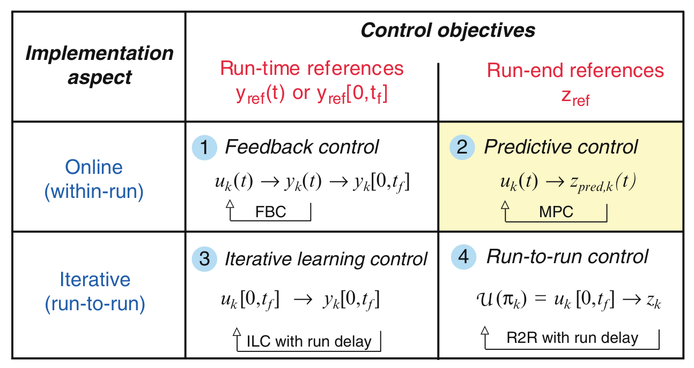

> Image description: This textbook figure illustrates control strategies for batch processes, organized by implementation aspect and control objectives. The vertical axis classifies strategies by implementation: **Online (within-run)** and **Iterative (run-to-run)**. The horizontal axis classifies them by control objectives: **Run-time references** ($y_{\text{ref}}(t)$ or $y_{\text{ref}}[0, t_f]$) and **Run-end references** ($z_{\text{ref}}$). Four numbered strategies are shown: 1. **Feedback control** (Online/Run-time): $u_k(t) \rightarrow y_k(t) \rightarrow y_k[0, t_f]$ via FBC. 2. **Predictive control** (Online/Run-end): $u_k(t) \rightarrow z_{\text{pred},k}(t)$ via MPC. 3. **Iterative learning control** (Iterative/Run-time): $u_k[0, t_f] \rightarrow y_k[0, t_f]$ via ILC with run delay. 4. **Run-to-run control** (Iterative/Run-end): $\mathcal{U}(\pi_k) = u_k[0, t_f] \rightarrow z_k$ via R2R with run delay. The diagram uses arrows to denote signal flow from input $u_k$ to output $y_k$ or $z_k$, and feedback loops to indicate how information informs control actions.

Control and Optimization of Batch Processes, Fig. 1 Control strategies for batch processes. The strategies are classified according to the control objectives (horizontal division) and the implementation aspect (vertical division). Each objective can be met either online or iteratively over several batches depending on the type of measurements available. $u_{k}$ represents the input vector for the
$k$ th batch, $u_{k}\left[0, t_{f}\right]$ the corresponding input trajectories, $y_{k}(t)$ the run-time outputs measured online, and $z_{k}$ the run-end outputs available at the final time. FBC stands for "feedback control," MPC for "model predictive control," ILC for "iterative learning control," and R2R for "run-torun control"
used for low-volume production. Discontinuous operations can be of the batch or semi-batch type. In batch operations, the products to be processed are loaded in a vessel and processed without material addition or removal. This operation permits more flexibility than continuous operation by allowing adjustment of the operating conditions and the final time. Additional flexibility is available in semi-batch operations, where products are continuously added by adjusting the feed rate profile. We use the term batch process to include semi-batch processes.

Batch processes dealing with reaction and separation operations include reaction, distillation, absorption, extraction, adsorption, chromatography, crystallization, drying, filtration, and centrifugation. The operation of batch processes involves recipes developed in the laboratory. A sequence of operations is performed in a prespecified order in specialized process equipment, yielding a fixed amount of product. The sequence of tasks to be carried out on each piece of equipment, such as heating, cooling, reaction, distillation, crystallization, and drying, is predefined. The desired production volume is then achieved by
repeating the processing steps on a predetermined schedule.

The main characteristics of batch process operations include the absence of steady state, the presence of constraints, and the repetitive nature. These characteristics bring both challenges and opportunities to the operation of batch processes (Bonvin 1998). The challenges are related to the fact that the available models are often poor and incomplete, especially since they need to represent a wider range of operating conditions than in the case of continuous processes. Furthermore, although product quality must be controlled, this variable is usually not available online but only at run end. On the other hand, opportunities stem from the fact that industrial chemical processes are often slow, which facilitates larger sampling periods and extensive online computations. In addition, the repetitive nature of batch processes opens the way to run-to-run process improvement (Bonvin et al. 2006). More information on batch processes and their operation can be found in Seborg et al. (2004) and Nagy and Braatz (2003). Next, we will successively address the control and the optimization of batch processes.


<!-- source_pdf_page: 159 -->
## Control of Batch Processes

Control of batch processes differs from control of continuous processes in two main ways. First, since batch processes have no steady-state operating point, at least some of the set points are time-varying profiles. Second, batch processes are repeated over time and are characterized by two independent variables, the run time $t$ and the run counter $k$. The independent variable $k$ provides additional degrees of freedom for meeting the control objectives when these objectives do not necessarily have to be completed in a single batch but can be distributed over several successive batches. This situation brings into focus the concept of run-end outputs, which need to be controlled but are only available at the completion of the batch. The most common runend output is product quality. Consequently, the control of batch processes encompasses four different strategies (Fig. 1):

1. Online control of run-time outputs. This control approach is similar to that used in continuous processing. However, although some controlled variables, such as temperature in isothermal operation, remain constant, the key process characteristics, such as process gain and time constants, can vary considerably because operation occurs along state trajectories rather than at a steady-state operating point. Hence, adaptation in run time $t$ is needed to handle the expected variations. Feedback control is implemented using PID techniques or more sophisticated alternatives (Seborg et al. 2004).
2. Online control of run-end outputs. In this case it is necessary to predict the run-end outputs $z$ based on measurements of the run-time outputs $y$. Model predictive control (MPC) is well suited to this task (Nagy and Braatz 2003). However, the process models available for prediction are often simplified and thus of limited accuracy.
3. Iterative control of run-time outputs. The manipulated variable profiles can be generated using iterative learning control (ILC), which exploits information from previous runs
(Moore 1993). This strategy exhibits the limitations of open-loop control with respect to the current run, in particular the fact that there is no feedback correction for run-time disturbances. Nevertheless, this scheme is useful for generating a time-varying feedforward input term.
4. Iterative control of run-end outputs. In this case the input profiles are parameterized as $u_{k}\left[0, t_{f}\right]=\mathcal{U}\left(\pi_{k}\right)$ using the input parameters $\pi_{k}$. The batch process is thus seen as a static map between the input parameters $\pi_{k}$ and the run-end outputs $z_{k}$ (Francois et al. 2005).
It is also possible to combine online and run-to-run control for both $y$ and $z$. However, in such a combined scheme, care must be taken so that the online and run-to-run corrective actions do not oppose each other. Stability during run time and convergence in run index must be guaranteed (Srinivasan and Bonvin 2007a).

## Optimization of Batch Processes

The process variables undergo significant changes during batch operation. Hence, the major objective in batch operations is not to keep the system at optimal constant set points but rather to determine input profiles that optimize an objective function expressing the system performance.

## Problem Formulation

A typical optimization problem in the context of batch processes is

$$
\begin{align*}
\min _{u_{k}\left[0, t_{f}\right]} J_{k}= & \phi\left(x_{k}\left(t_{f}\right)\right) \\
& +\int_{0}^{t_{f}} L\left(x_{k}(t), u_{k}(t), t\right) d t \tag{1}
\end{align*}
$$

subject to

$$
\begin{align*}
& \dot{x}_{k}(t)=F\left(x_{k}(t), u_{k}(t)\right), \quad x_{k}(0)=x_{k, 0}  \tag{2}\\
& S\left(x_{k}(t), u_{k}(t)\right) \leq 0, \quad T\left(x_{k}\left(t_{f}\right)\right) \leq 0, \tag{3}
\end{align*}
$$


<!-- source_pdf_page: 160 -->
where $x$ represents the state vector, $J$ the scalar cost to be minimized, $S$ the run-time constraints, $T$ the run-end constraints, and $t_{f}$ the final time.

In constrained optimal control problems, the solution often lies on the boundary of the feasible region. Batch processes involve run-time constraints on inputs and states as well as run-end constraints.

## Optimization Strategies

As can be seen from the cost objective (1), optimization requires information about the complete run and thus cannot be implemented in real time using only online measurements. Some information regarding the future of the run is needed in the form of either a process model capable of prediction or measurements from previous runs. Accordingly, measurement-based optimization methods can be classified depending on whether or not a process model is used explicitly for implementation, as illustrated in Fig. 2 and discussed next:

1. Online explicit optimization. This approach is similar to model predictive control (Nagy and Braatz 2003). Optimization uses a process model explicitly and is repeated whenever a new set of measurements becomes available. This scheme involves two steps, namely,
updating the initial conditions for the subsequent optimization (and optionally the parameters of the process model) and numerical optimization based on the updated process model (Abel et al. 2000). Since both steps are repeated as measurements become available, the procedure is also referred to as repeated online optimization. The weakness of this method is its reliance on the model; if the model is not updated, its accuracy plays a crucial role. However, when the model is updated, there is a conflict between parameter identification and optimization since parameter identification requires persistency of excitation, that is, the inputs must be sufficiently varied to uncover the unknown parameters, a condition that is usually not satisfied when near-optimal inputs are applied. Note that, instead of computing the input $u_{k}^{*}\left[t, t_{f}\right]$, it is also possible to use a receding horizon and compute only $u_{k}^{*}[t, t+T]$, with $T$ the control horizon (Abel et al. 2000).
2. Online implicit optimization. In this scenario, measurements are used to update the inputs directly, that is, without the intermediary of a process model. Two classes of techniques can be identified. In the first class, an update law that approximates the optimal solution

| Implementation aspect | Use of process model |  |
| :--- | :--- | :--- |
|  | Explicit optimization (with process model) | Implicit optimization (without process model) |
| Online (within-run) | 1 Repeated online optimization $y_{k}[0, t] \xrightarrow{\mathrm{EST}} \hat{x}_{k}(t) \xrightarrow{\mathrm{OPT}} u_{k}^{*}\left[t, t_{f}\right]$ <br> S repeat online | 2 Online input update using measurements <br> $y_{k}(\mathrm{t}) \xrightarrow{\text { Approx. of opt. solution }} u_{k}^{*}(\mathrm{t})$ $y_{k}[0, t] \xrightarrow{\mathrm{NCO} \text { prediction }} N C O \longrightarrow u_{k}^{*}(\mathrm{t})$ |
| Iterative (run-to-run) | 3 Repeated run-to-run optimization $y_{k}\left[0, t_{f}\right] \xrightarrow{\text { IDENT }} \hat{\theta}_{k} \xrightarrow{\text { OPT }} u_{k+1}^{*}\left[0, t_{f}\right]$ <br> â repeat with run delay | 4 Run-to-run input update using measurements $y_{k}\left[0, t_{f}\right] \xrightarrow{\mathrm{NCO} \text { evaluation }} N C O \longrightarrow u_{k+1}^{*}\left[0, t_{f}\right]$ <br> A repeat with run delay |

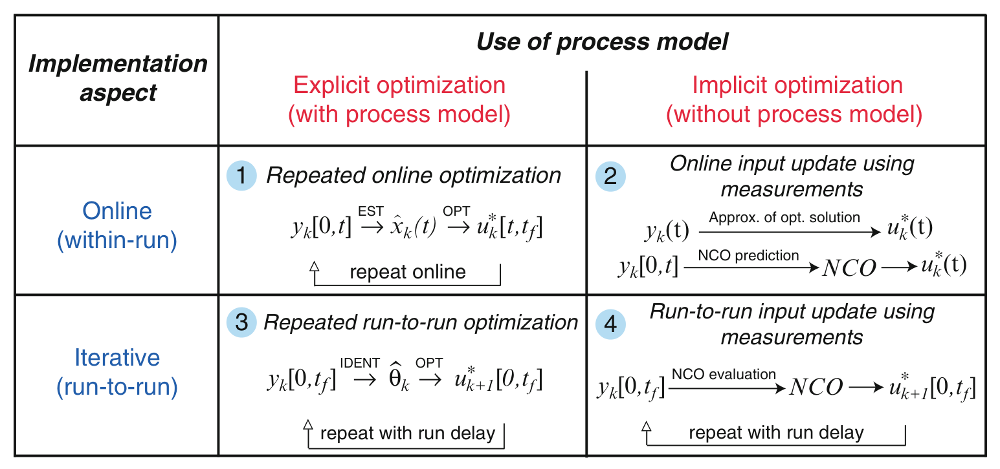

> Image description: This figure, titled "Optimization strategies for batch processes," presents a 2x2 matrix classifying control and optimization strategies based on two implementation aspects: the timing (Online vs. Iterative) and the use of a process model (Explicit vs. Implicit optimization). The vertical axis distinguishes between **Online (within-run)** and **Iterative (run-to-run)** implementation. The horizontal axis divides strategies into **Explicit optimization (with process model)** and **Implicit optimization (without process model)**. 1. **Repeated online optimization**: Uses an estimated model $\hat{x}_k(t)$ to find optimal inputs $u_k^*[t, t_f]$ based on measurements $y_k[0, t]$. It involves an "online repeat" loop. 2. **Online input update using measurements**: Uses measurement $y_k(t)$ to approximate an optimal solution $u_k^*(t)$ or uses NCO prediction for $u_k^*(t)$. 3. **Repeated run-to-run optimization**: Uses measurements $y_k[0, t_f]$ to identify model parameters $\hat{\theta}_k$ to determine optimal inputs $u_{k+1}^*[0, t_f]$. It involves a "repeat with run delay" loop. 4. **Run-to-run input update using measurements**: Uses NCO evaluation from $y_k[0, t_f]$ to determine $u_{k+1}^*[0, t_f]$ via a "repeat with run delay" loop.

Control and Optimization of Batch Processes, Fig. 2 Optimization strategies for batch processes. The strategies are classified according to whether or not a process model is used for implementation (horizontal division). Furthermore, each class can be implemented either online
or iteratively over several runs (vertical division). EST stands for "estimation," IDENT for "identification," OPT for "optimization," and NCO for "necessary conditions of optimality"


<!-- source_pdf_page: 161 -->
is sought. For example, a neural network is trained with data corresponding to optimal behavior for various uncertainty realizations and used to update the inputs (Rahman and Palanki 1996). The second class of techniques relies on transforming the optimization problem into a control problem that enforces the necessary conditions of optimality (NCO) (Srinivasan and Bonvin 2007b). The NCO involve constraints that need to be made active and sensitivities that need to be pushed to zero. Since some of these NCO are evaluated at run time and others at run end, the control problem involves both run-time and run-end outputs. The main issue is the measurement or estimation of the controlled variables, that is, the constraints and sensitivities that constitute the NCO.
3. Iterative explicit optimization. The steps followed in run-to-run explicit optimization are the same as in online explicit optimization. However, there is substantially more data available at the end of the run as well as sufficient computational time to refine the model by updating its parameters and, if needed, its structure. Furthermore, data from previous runs can be collected for model update (Rastogi et al. 1992). As with online explicit optimization, this approach suffers from the conflict between estimation and optimization.
4. Iterative implicit optimization. In this scenario, the optimization problem is transformed into a control problem, for which the control approaches in the second row of Fig. 1 are used to meet the run-time and run-end objectives (Francois et al. 2005). The approach, which is conceptually simple, might be experimentally expensive since it relies more on data.
These complementary measurement-based optimization strategies can be combined by implementing some aspects of the optimization online and others on a run-to-run basis. For instance, in explicit schemes, the states can be estimated online, while the model parameters can be estimated on a run-to-run basis. Similarly, in implicit optimization, approximate update
laws can be implemented online, leaving the responsibility for satisfying terminal constraints and sensitivities to run-to-run controllers.

## Summary and Future Directions

Batch processing presents several challenges. Since there is little time for developing appropriate dynamic models, there is a need for improved data-driven control and optimization approaches. These approaches require the availability of online concentration-specific measurements such as chromatographic and spectroscopic sensors, which are not yet readily available in production.

Technically, the main operational difficulty in batch process improvement lies in the presence of run-end outputs such as final quality, which cannot be measured during the run. Although model-based solutions are available, process models in the batch area tend to be poor. On the other hand, measurement-based optimization for a given batch faces the challenge of having to know about the future to act during the batch. Consequently, the main research push is in the area of measurement-based optimization and the use of data from both the current and previous batches for control and optimization purposes.

## Cross-References

- Industrial MPC of continuous processes
- Iterative Learning Control
- Multiscale Multivariate Statistical Process Control
- Scheduling of Batch Plants
- State Estimation for Batch Processes


## Bibliography

Abel O, Helbig A, Marquardt W, Zwick H, Daszkowski T (2000) Productivity optimization of an industrial semibatch polymerization reactor under safety constraints. J Process Control 10(4):351-362
Bonvin D (1998) Optimal operation of batch reactors - a personal view. J Process Control 8(5-6):355-368


<!-- source_pdf_page: 162 -->
Bonvin D, Srinivasan B, Hunkeler D (2006) Control and optimization of batch processes: improvement of process operation in the production of specialty chemicals. IEEE Control Syst Mag 26(6): 34-45
Francois G, Srinivasan B, Bonvin D (2005) Use of measurements for enforcing the necessary conditions of optimality in the presence of constraints and uncertainty. J Process Control 15(6):701-712
Moore KL (1993) Iterative learning control for deterministic systems. Advances in industrial control. Springer, London
Nagy ZK, Braatz RD (2003) Robust nonlinear model predictive control of batch processes. AIChE J 49(7):1776-1786
Rahman S, Palanki S (1996) State feedback synthesis for on-line optimization in the presence of measurable disturbances. AIChE J 42:2869-2882
Rastogi A, Fotopoulos J, Georgakis C, Stenger HG (1992) The identification of kinetic expressions and the evolutionary optimization of specialty chemical batch reactors using tendency models. Chem Eng Sci 47(9-11):2487-2492
Seborg DE, Edgar TF, Mellichamp DA (2004) Process dynamics and control. Wiley, New York
Srinivasan B, Bonvin D (2007a) Controllability and stability of repetitive batch processes. J Process Control 17(3):285-295
Srinivasan B, Bonvin D (2007b) Real-time optimization of batch processes by tracking the necessary conditions of optimality. Ind Eng Chem Res 46(2):492-504

## Control Applications in Audio Reproduction

Yutaka Yamamoto
Department of Applied Analysis and Complex Dynamical Systems, Graduate School of Informatics, Kyoto University, Kyoto, Japan


#### Abstract

This entry gives a brief overview of the recent developments in audio sound reproduction via modern sampled-data control theory. We first review basics in the current sound processing technology and then proceed to the new idea derived from sampled-data control theory, which is different from the conventional Shannon paradigm based on the perfect band-limiting hypothesis. The hybrid nature of sampled-data systems provides an optimal platform for dealing with signal


processing where the ultimate objective is to reconstruct the original analog signal one started with. After discussing some fundamental problems in the Shannon paradigm, we give our basic problem formulation that can be solved using modern sampled-data control theory. Examples are given to illustrate the results.

## Keywords

Digital signal processing; Multirate signal processing; Sampled-data control; Sampling theorem; Sound reconstruction

## Introduction: Status Quo

Consider the problem of reproducing sounds from recorded media such as compact discs. The current CD format is recorded at the sampling frequency 44.1 kHz . It is commonly claimed that the highest frequency for human audibility is 20 kHz , whereas the upper bound of reproduction in this format is believed to be the half of 44.1 kHz , i.e., 22.1 kHz , and hence, this format should have about $10 \%$ margin against the alleged audible limit of 20 kHz .

CD players of early days used to process such digital signals with the simple zero-order hold at this frequency, followed by an analog lowpass filter. This process requires a sharp lowpass characteristic to cut out unnecessary high frequency beyond 20 kHz . However, a sharp cutoff low-pass characteristic inevitably requires a high-order filter which in turn introduces a large amount of phase shift distortion around the cutoff frequency.

To circumvent this defect, there was introduced the idea of oversampling DA converter that is realized by the combination of a digital filter and a low-order analog filter (Zelniker and Taylor 1994). This is based on the following principle:

Let $\{f(n h)\}_{n=-\infty}^{\infty}$ be a discrete-time signal obtained from a continuous-time signal $f(\cdot)$ by sampling it with sampling period $h$. The upsampler appends the value $0, M-1$ times, between two adjacent sampling points:


<!-- source_pdf_page: 163 -->
Control Applications in Audio Reproduction, Fig. 1 Upsampler for $M=2$
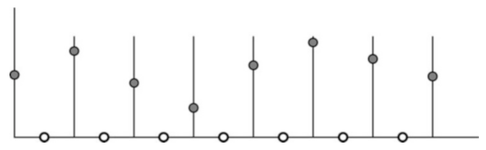

> Image description: A grayscale line graph titled "Control Applications in Audio Reproduction, Fig. 1 Upsampler for $M=2$" illustrates a discrete-time signal being upsampled. The horizontal axis represents time, while the vertical axis represents amplitude. The diagram shows a sequence of vertical stems. Some stems are topped with solid gray circles, representing non-zero sample values at specific intervals. Other positions on the time axis are marked by open circles at the baseline, representing zero values. The pattern shows that for every one original sample (represented by a solid gray circle on a stem), a second position (an open circle) is inserted between them. This doubling of the sample density effectively demonstrates an upsampling process where $M=2$, meaning each input sample is followed by a zero, increasing the sampling rate while maintaining the original signal information.

$$
(\uparrow M w)[k]:= \begin{cases}w(\ell), & k=M \ell  \tag{1}\\ 0, & \text { elsewhere. }\end{cases}
$$

See Fig. 1 for the case $M=2$. This has the effect of making the unit operational time $M$ times faster.

The bandwidth will also be expanded by $M$ times and the Nyquist frequency (i.e., half the sampling frequency) becomes $M \pi / h[\mathrm{rad} / \mathrm{sec}]$. As we see in the next section, the Nyquist frequency is often regarded as the true bandwidth of the discrete-time signal $\{f(n h)\}_{n=-\infty}^{\infty}$. But this upsampling process just insert zeros between sampling points, and the real information contents (the true bandwidth) is not really expanded. As a result, the copy of the frequency content for $[0, \pi / h)$ appears as a mirror image repeatedly over the frequency range above $\pi / h$. This distortion is called imaging. In order to avoid the effect of such mirrored frequency components, one often truncates the frequency components beyond the (original) Nyquist frequency via a digital low-pass filter that has a sharp roll-off characteristic. One can then complete the digital to analog (DA) conversion process by postposing a slowly decaying analog filter. This is the idea of an oversampling DA converter (Zelniker and Taylor 1994). The advantage here is that by allowing a much wider frequency range, the final analog filter can be a low-order filter and hence yields a relatively small amount of phase distortion supported in part by the linear-phase characteristic endowed on the digital filter preceding it.

## Signal Reconstruction Problem

As before, consider the sampled discretetime signal $\{f(n h)\}_{n=-\infty}^{\infty}$ obtained from a continuous-time signal $f$. The main question is how we can recover the original continuous-time
signal $f(\cdot)$ from sampled data. This is clearly an ill-posed problem without any assumption on $f$ because there are infinitely many functions that can match the sampled data $\{f(n h)\}_{n=-\infty}^{\infty}$. Hence, one has to impose a reasonable a priori assumption on $f$ to sensibly discuss this problem.

The following sampling theorem gives one answer to this question:

Theorem 1 Suppose that the signal $f \in L^{2}$ is perfectly band-limited, in the sense that there exists $\omega_{0} \leq \pi / h$ such that the Fourier transform $\hat{f}$ of $f$ satisfies

$$
\begin{equation*}
\hat{f}(\omega)=0, \quad|\omega| \geq \omega_{0}, . \tag{2}
\end{equation*}
$$

Then

$$
\begin{equation*}
f(t)=\sum_{n=-\infty}^{\infty} f(n h) \frac{\sin \pi(t / h-n)}{\pi(t / h-n)} \tag{3}
\end{equation*}
$$

This theorem states that if the signal $f$ does not contain any high-frequency components beyond the Nyquist frequency $\pi / h$, then the original signal $f$ can be uniquely reconstructed from its sampled-data $\{f(n h)\}_{n=-\infty}^{\infty}$. On the other hand, if this assumption does not hold, then the result does not necessarily hold. This is easy to see via a schematic representation in Fig. 2.

If we sample the sinusoid in the upper figure in Fig. 2, these sampled values would turn out to be compatible with another sinusoid with much lower frequency as the lower figure shows. In other words, this sampling period does not have enough resolution to distinguish these two sinusoids. The maximum frequency below where there does not occur such a phenomenon is the Nyquist frequency. The sampling theorem above asserts that it is half of the sampling frequency $2 \pi / h$, that is, $\pi / h[\mathrm{rad} / \mathrm{sec}]$. In other words, if


<!-- source_pdf_page: 164 -->
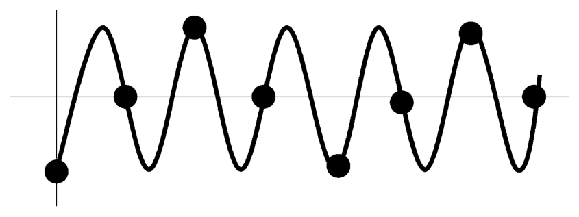

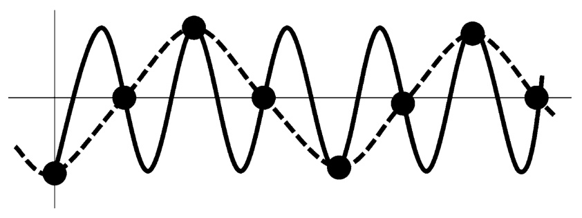

> Image description: A black and white line graph titled "Control Applications in Audio Reproduction, Fig. 2 Aliasing" illustrates the phenomenon of aliasing. The image features a Cartesian coordinate system with a horizontal x-axis and a vertical y-axis. Two distinct waveforms are plotted: a continuous solid line and a dashed line representing sampled data points. The solid line represents a high-frequency sine wave with multiple oscillations across the frame. The dashed line represents a lower-frequency sine wave that connects discrete black circular points. These points mark the intersections of the high-frequency wave and the horizontal axis, as well as its local extrema. The dashed line acts as an "alias," showing a much slower oscillation than the original solid waveform. This visual demonstrates how insufficient sampling of a high-frequency signal results in a reconstructed wave that is an incorrect, lower-frequency approximation.
Control Applications in Audio Reproduction, Fig. 2 Aliasing

we can assume that the original signal contains no frequency components beyond the Nyquist frequency, then one can uniquely reconstruct the original analog signal $f$ from its sampled-data $\{f(n h)\}_{n=-\infty}^{\infty}$. On the other hand, if this assumption does not hold, the distortion depicted in Fig. 2 occurs; this is called aliasing.

This is the content of the sampling theorem. It has been widely accepted as the basis for digital signal processing that bridges analog to digital. Concrete applications such as CD, MP3, or images are based on this principle in one way or another.

## Difficulties

However, this paradigm (hereafter the Shannon paradigm) of the perfect band-limiting hypothesis and the resulting sampling theorem renders several difficulties as follows:

- The reconstruction formula ( 3 ) is not causal, i.e., one needs future sampled values to reconstruct the present value $f(t)$. One can remedy this defect by allowing a certain amount of delay in reconstruction, but this delay can depend on how fast the formula converges.
- This formula is known to decay slowly; that is, we need many terms to approximate if we use this formula as it is.
- The perfect band-limiting hypothesis is hardly satisfied in reality. For example, for CDs, the

Nyquist frequency is 22.05 kHz , and the energy distribution of real sounds often extends way over 20 kHz .

- To remedy this, one often introduces a bandlimiting low-pass filter, but it can introduce distortions due to the Gibbs phenomenon, due to a required sharp decay in the frequency domain. See Fig. 3.
This is the Gibbs phenomenon well known in Fourier analysis. A sharp truncation in the frequency domain yields such a ringing effect.

In view of such drawbacks, there has been revived interest in the extension of the sampling theorem in various forms since the 1990s. There is by now a stream of papers that aim at studying signal reconstruction under the assumption of nonideal signal acquisition devices; an excellent survey is given in Unser (2000). In this research framework, the incoming signal is supposed to be acquired through a nonideal analog filter (acquisition device) and sampled, and then the reconstruction process attempts to recover the original signal. The idea is to place the problem into the framework of the (orthogonal or oblique) projection theorem in a Hilbert space (usually $L^{2}$ ) and then project the signal space to the subspace generated by the shifted reconstruction functions. It is often required that the process give a consistent result, i.e., if we subject the reconstructed signal to the whole process again, it should yield the same sampled values from which it was reconstructed (Unser and Aldroubi 1994).

In what follows, we take a similar viewpoint, that is, the incoming signals are acquired through a nonideal filter, but develop a methodology different from the projection method, relying on sampled-data control theory.

## The Signal Class

We have seen that the perfect band-limiting hypothesis is restrictive. Even if we adopt it, it is a fairly crude model for analog signals to allow for a more elaborate study.

Let us now pose the question: What class of functions should we process in such systems?


<!-- source_pdf_page: 165 -->
## Control Applications in Audio Reproduction,

Fig. 3 Ringing due to the Gibbs phenomenon
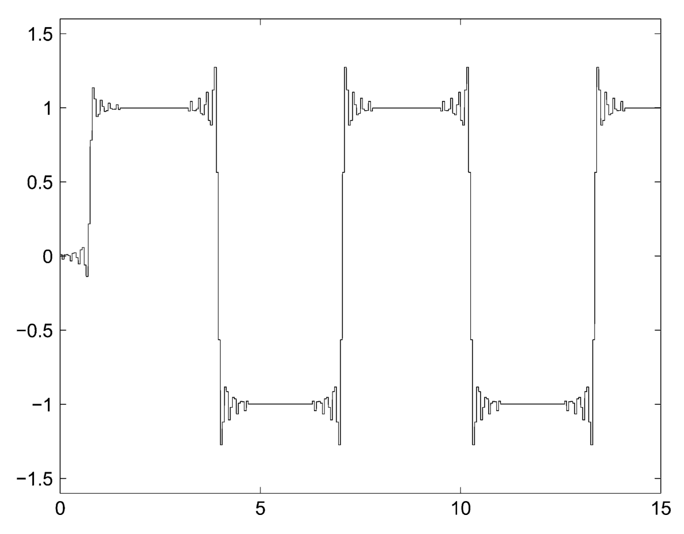

> Image description: A line graph titled "Fig. 3 Ringing due to the Gibbs phenomenon" displays a periodic square wave with significant oscillatory artifacts (ringing) at each transition point. The graph is plotted on a rectangular coordinate system where the horizontal x-axis represents time (implied) and ranges from 0 to 15. The vertical y-axis represents amplitude, ranging from -1.5 to 1.5, with major tick marks at intervals of 0.5. The signal oscillates between a high state near +1 and a low state near -1. The square wave transitions are characterized by sharp vertical jumps, but at every sudden step change, there is a series of diminishing oscillations or "ringing" that overshoots the target amplitude before stabilizing. This behavior is visually representative of the Gibbs phenomenon, illustrating the error inherent in approximating a discontinuous function using a finite sum of continuous trigonometric functions.

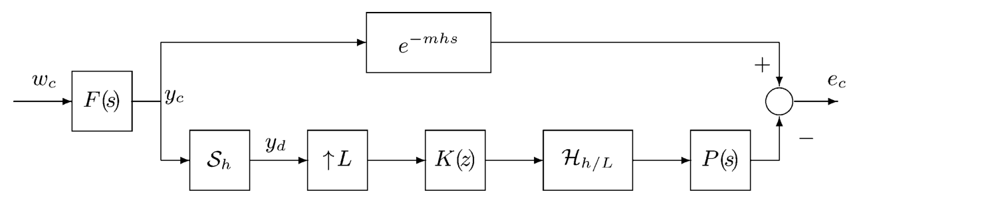

> Image description: This block diagram, titled "Fig. 3 Ringing due to the Gibbs phenomenon," illustrates a control system feedback loop used to analyze error signals. The diagram consists of two main signal paths. The upper path features a direct feedforward component where the signal $y_c$ passes through a delay operator $e^{-mhs}$ before entering a summation junction. The lower path represents a control loop where $y_c$ is first processed by a block labeled $S_h$, resulting in the signal $y_d$. This signal then passes through an upsampler $\uparrow L$, a discrete controller $K(z)$, and a multi-rate component $\mathcal{H}_{h/L}$, finally entering a plant $P(s)$. The output of the plant is subtracted from the delayed signal at the summation junction to produce the error signal $e_c$. Arrows indicate the unidirectional flow of signals through the various functional blocks, representing the mathematical relationship between the input $w_c$ and the resulting error $e_c$.
Control Applications in Audio Reproduction, Fig. 4 Error system for sampled-data design

Consider the situation where one plays a musical instrument, say, a guitar. A guitar naturally has a frequency characteristic. When one picks a string, it produces a certain tone along with its harmonics, as well as a characteristic transient response. All these are governed by a certain frequency decay curve, demanded by the physical characteristics of the guitar. Let us suppose that such a frequency decay is governed by a rational transfer function $F(s)$, and it is driven by varied exogenous inputs.

Consider Fig. 4. The exogenous analog signal $w_{c} \in L^{2}$ is applied to the analog filter $F(s)$. This $F(s)$ is not an ideal filter and hence its bandwidth is not limited below the Nyquist frequency. The signal $w_{c}$ drives $F(s)$ to produce the target analog signal $y_{c}$, which should be the signal to be reconstructed. It is then sampled by sampler $\mathcal{S}_{h}$ and becomes the recorded or transmitted digital signal $y_{d}$. The objective here is to reconstruct the target analog signal $y_{c}$ out of this sampled signal $y_{d}$. In order to recover
the frequency components beyond the Nyquist frequency, one needs a faster sampling period, so we insert the upsampler $\uparrow L$ to make the sampling period $h / L$. This upsampled signal is processed by digital filter $K(z)$ and then becomes a continuous-time signal again by going through the hold device $\mathcal{H}_{h / L}$. It will then be processed by analog filter $P(s)$ to be smoothed out. The obtained signal is then compared with delayed analog signal $y_{c}(t-m h)$ to form the delayed error signal $e_{c}$. The objective is then to make this error $e_{c}$ as small as possible. The reason for allowing delay $e^{-m h s}$ is to accommodate certain processing delays. This is the idea of the block diagram Fig. 4.

The performance index we minimize is the induced norm of the transfer operator $T_{e w}$ from $w_{c}$ to $e_{c}$ :

$$
\begin{equation*}
\left\|T_{e w}\right\|_{\infty}:=\sup _{w_{c} \neq 0} \frac{\left\|e_{c}\right\|_{2}}{\left\|w_{c}\right\|_{2}} . \tag{4}
\end{equation*}
$$


<!-- source_pdf_page: 166 -->
In other words, the $H^{\infty}$-norm of the sampleddata control system Fig.4. Our objective is then to solve the following problem:

## Filter Design Problem

Given the system specified by Fig. 4. For a given performance level $\gamma>0$, find a filter $K(z)$ such that

$$
\left\|T_{e w}\right\|_{\infty}<\gamma .
$$

This is a sampled-data $H^{\infty}$ (sub-)optimal control problem. This can be solved by using the standard solution method for sampled-data control systems (Chen and Francis 1995a; Yamamoto 1999; Yamamoto et al. 2012). The only anomaly here is that the system in Fig. 4 contains a delay element $e^{-m h s}$ which is infinite dimensional. However, by suitably approximating this delay by successive series of shift registers, one can convert the problem to an appropriate finite-dimensional discrete-time problem (Yamamoto et al. 1999, 2002, 2012).

This problem setting has the following features:

1. One can optimize the continuous-time performance under the constraint of discrete-time filters.
2. By setting the class of input functions as $L^{2}$ functions band-limited by $F(s)$, one can capture the continuous-time error signal $e_{c}$ and its worst-case norm in the sense of (4).
The first feature is due to the advantage of sampled-data control theory. It is a great advantage of sampled-data control theory that allows the mixture of continuous- and discretetime components. This is in marked contrast to the Shannon paradigm where continuous-time performance is really demanded by the artificial perfect band-limiting hypothesis.

The second feature is an advantage due to $H^{\infty}$ control theory. Naturally, we cannot have an access to each individual error signal $e_{c}$, but we can still control the overall performance from $w_{c}$ to $e_{c}$ in terms of the $H^{\infty}$ norm that guarantees the worst-case performance. This is in clear contrast with the classical case where only a representative response, e.g., impulse response
in the case of $H^{2}$, is targeted. Furthermore, since we can control the continuous-time performance of the worst-case error signal, the present method can indeed minimize (continuous-time) phase errors. This is an advantage usually not possible with conventional methods since they mainly discuss the gain characteristics of the designed filters only. By the very property of minimizing the $H^{\infty}$ norm of the continuoustime error signal $e_{c}$, the present method can even control the phase errors and yield much less phase distortion even around the cutoff frequency.

Figure 5 shows the response of the proposed sampled-data filter against a rectangular wave, with a suitable first- or second-order analog filter $F(s)$; see Yamamoto et al. (2012) for more details. Unlike Fig. 3, the overshoot is controlled to be minimum.

The present method has been patented (Fujiyama et al. 2008; Yamamoto 2006; Yamamoto and Nagahara 2006) and implemented into sound processing LSI chips as a core technology by Sanyo Semiconductors and successfully used in mobile phones, digital voice recorders, and MP3 players; their cumulative production has exceeded 40 million units as of the end of 2012.

## Summary and Future Directions

We have presented basic ideas of new signal processing theory derived from sampled-data control theory. The theory has the advantage that is not possible with the conventional projection methods, whether based on the perfect band-limiting hypothesis or not.

The application of sampled-data control theory to digital signal processing was first made by Chen and Francis (1995b) with performance measure in the discrete-time domain; see also Hassibi et al. (2006). The present author and his group have pursued the idea presented in this entry since 1996 (Khargonekar and Yamamoto 1996). See Yamamoto et al. (2012) and references therein. For the background of sampled-data


<!-- source_pdf_page: 167 -->
Control Applications in Audio Reproduction, Fig. 5 Response of the proposed sampled-data filter against a rectangular wave
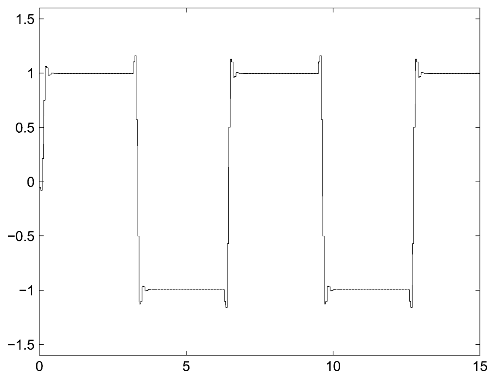

> Image description: A line graph titled "Fig. 5 Response of the proposed sampled-data filter against a rectangular wave" illustrates the output of a sampled-data filter when subjected to a rectangular wave input. The x-axis represents time, ranging from 0 to 15 units. The y-axis represents the response amplitude, ranging from -1.5 to 1.5 units. The plot displays a periodic, square-like waveform that alternates between a high state of approximately 1.0 and a low state of approximately -1.0. Each transition between the high and low levels occurs at specific time intervals (approximately at 3, 6, 9, and 12 units). Notably, the transitions show slight oscillations or "ringing" effects at the edges of the square wave, particularly visible at the vertical jumps. The waveform settles into stable plateaus at $y = 1$ and $y = -1$ between the switching points.

control theory, consult, e.g., Chen and Francis (1995a) and Yamamoto (1999).

The same philosophy of emphasizing the importance of analog performance was proposed and pursued recently by Unser and co-workers (1994), Unser (2005), and Eldar and Dvorkind (2006). The crucial difference is that they rely on $L^{2} / H^{2}$ type optimization and orthogonal or oblique projections, which are very different from our method here. In particular, such projection methods can behave poorly for signals outside the projected space. The response shown in Fig. 3 is a typical such example.

Applications to image processing is discussed in Yamamoto et al. (2012). An application to Delta-Sigma DA converters is studied in Nagahara and Yamamoto (2012). Again, the crux of the idea is to assume a signal generator model and then design an optimal filter in the sense of Fig. 4 or a similar diagram with the same idea. This idea should be applicable to a much wider class of problems in signal processing and should prove to have more impact.

Some processed examples of still and moving images are downloadable from the site: http:// www-ics.acs.i.kyoto-u.ac.jp/~yy/

For sampling theorem, see Shannon (1949), Unser (2000), and Zayed (1996), for example. Note, however, that Shannon himself (1949) did not claim originality on this theorem; hence, it is misleading to attribute this theorem solely to Shannon. See Unser (2000) and Zayed (1996) for some historical accounts. For a general background in signal processing, Vetterli et al. (2013) is useful.

## Cross-References

- H-Infinity Control
- Optimal Sampled-Data Control
- Sampled-Data Systems

Acknowledgments The author would like to thank Masaaki Nagahara and Masashi Wakaiki for their help with the numerical examples. Part of this entry is based on the exposition (Yamamoto 2007) written in Japanese.

## Bibliography

Chen T, Francis BA (1995a) Optimal sampled-data control systems. Springer, New York
Chen T, Francis BA (1995b) Design of multirate filter banks by $\mathcal{H}_{\infty}$ optimization. IEEE Trans Signal Process 43:2822-2830


<!-- source_pdf_page: 168 -->
Eldar YC, Dvorkind TG (2006) A minimum squarederror framework for generalized sampling. IEEE Trans Signal Process 54(6): 2155-2167
Fujiyama K, Iwasaki N, Hirasawa Y, Yamamoto Y (2008) High frequency compensator and reproducing device. US patent 7,324,024 B2, 2008
Hassibi B, Erdogan AT, Kailath T (2006) MIMO linear equalization with an $H^{\infty}$ criterion. IEEE Trans Signal Process 54(2):499-511
Khargonekar PP, Yamamoto Y (1996) Delayed signal reconstruction using sampled-data control. In: Proceedings of 35th IEEE CDC, Kobe, Japan, pp 12591263
Nagahara M, Yamamoto Y (2012) Frequency domain min-max optimization of noise-shaping delta-sigma modulators. IEEE Trans Signal Process 60(6):28282839
Shannon CE (1949) Communication in the presence of noise. Proc IRE 37(1):10-21
Unser M (2000) Sampling - 50 years after Shannon. Proc IEEE 88(4):569-587
Unser M (2005) Cardinal exponential splines: part II think analog, act digital. IEEE Trans Signal Process 53(4):1439-1449
Unser M, Aldroubi A (1994) A general sampling theory for nonideal acquisition devices. IEEE Trans Signal Process 42(11):2915-2925
Vetterli M, Kovacěvić J, Goyal V (2013) Foundations of signal processing. Cambridge University Press, Cambridge
Yamamoto Y (1999) Digital control. In: Webster JG (ed) Wiley encyclopedia of electrical and electronics engineering, vol 5. Wiley, New York, pp 445-457
Yamamoto Y (2006) Digital/analog converters and a design method for the pertinent filters. Japanese patent 3,820,331, 2006
Yamamoto Y (2007) New developments in signal processing via sampled-data control theory-continuous-time performance and optimal design. Meas Control (Jpn) 46:199-205
Yamamoto Y, Nagahara M (2006) Sample-rate converters. Japanese patent 3,851,757, 2006
Yamamoto Y, Madievski AG, Anderson BDO (1999) Approximation of frequency response for sampled-data control systems. Automatica 35(4): 729-734
Yamamoto Y, Anderson BDO, Nagahara M (2002) Approximating sampled-data systems with applications to digital redesign. In: Proceedings of the 41st IEEE CDC, Las Vegas, pp 3724-3729
Yamamoto Y, Nagahara M, Khargonekar PP (2012) Signal reconstruction via $H^{\infty}$ sampled-data control theorybeyond the Shannon paradigm. IEEE Trans Signal Process 60:613-625
Zayed AI (1996) Advances in Shannon's sampling theory. CRC Press, Boca Raton
Zelniker G, Taylor FJ (1994) Advanced digital signal processing: theory and applications. Marcel Dekker, New York

# Control for High-Speed Nanopositioning

S.O. Reza Moheimani<br>School of Electrical Engineering \& Computer Science, The University of Newcastle, Callaghan, NSW, Australia


#### Abstract

Over the last two and a half decades we have observed astonishing progress in the field of nanotechnology. This progress is largely due to the invention of Scanning Tunneling Microscope (STM) and Atomic Force Microscope (AFM) in the 1980s. Central to the operation of AFM and STM is a nanopositioning system that moves a sample or a probe, with extremely high precision, up to a fraction of an Angstrom, in certain applications. This note concentrates on the fundamental role of feedback, and the need for model-based control design methods in improving accuracy and speed of operation of nanopositioning systems.


## Keywords

Atomic force microscopy; High-precision mechatronic systems; Nanopositioining; Scanning probe microscopy

## Introduction

Controlling motion of an actuator to within a single atom, known as nanopositioning, may seem as an impossible task. Yet, it has become a key requirement in many systems to emerge in recent years. In scanning probe microscopy nanopositioning is needed to scan a probe over a sample surface for imaging and to control the interaction between the probe and the surface during interrogation and manipulation (Meyer et al. 2004). Nanopositioning is the enabling technology for mask-less lithography tools under development to replace optical lithography systems (Vettiger et al. 2002). Novel nanopositioning


<!-- source_pdf_page: 169 -->
tools are required for positioning of wafers and for mask alignment in the semiconductor industry (Verma et al. 2005). Nanopositioning systems are vital in molecular biology for imaging, alignment, and nanomanipulation in applications such as DNA analysis (Meldrum et al. 2001) and nanoassembly (Whitesides and Christopher Love 2001). Nanopositioning is an important technology in optical alignment systems (Krogmann 1999). In data storage systems, nanometer-scale precision is needed for emerging probe-storage devices, for dualstage hard-disk drives, and for next generation tape drives (Cherubini et al. 2012).

## The Need for High-Speed Nanopositioning

In all applications of nanopositioning, there is a significant and growing demand for high speeds. The ability to operate a nanopositioner at a bandwidth of tens of kHz , as opposed to today's hundreds of Hz, is the key to unlocking countless technological possibilities in the future (Gao et al. 2000; Pantazi et al. 2008; Salapaka 2003; Sebastian et al. 2008b; Yong et al. 2012). The atomic force microscope (AFM) is an example of such technologies. A typical commercial atomic force microscope is a slow device, taking up to a minute or longer to generate an image. Such imaging speeds are too slow to investigate phenomena with fast dynamics. For example, rapid biological processes that occur in seconds, such as rapid movement of cells or fast dehydration and denaturation of collagen, are too fast to be observed by a typical commercial AFM (Zou et al. 2004). A key obstacle in realizing high-speed and videorate atomic force microscopy is the limited speed of nanopositioners.

## The Vital Role of Feedback Control in High-Speed Nanopositioning

The systems described above depend on a precision mechatronic device, known as a nanopositioner, or a scanner for their operation.

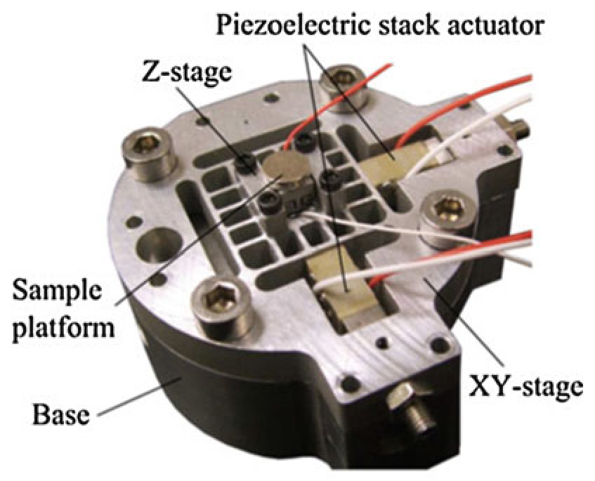

> Image description: A high-angle photograph shows a 3DoF flexure-guided high-speed nanopositioner against a plain background. The device consists of a heavy, black circular Base supporting a metallic, multi-part assembly. The assembly includes a central Sample platform mounted on a Z-stage, which is situated between two XY-stages positioned laterally. Each degree of freedom is driven by dedicated Piezoelectric stack actuators, connected to the stages via red and white electrical wires. The internal architecture features a series of precision-machined flexures that guide the movement of the stages. The assembly is secured with several hex-head bolts on the top surface. Labels with leader lines identify the Base, XY-stage, Piezoelectric stack actuator, Z-stage, and Sample platform. This configuration enables high-precision, independent movement across three orthogonal axes for nanopositioning applications.
Control for High-Speed Nanopositioning, Fig. 1 A 3DoF flexure-guided high-speed nanopositioner (Yong et al. 2013). The three axes are actuated independently using piezoelectric stack actuators. Movement of lateral axes is measured using capacitive sensors

A high-speed scanner is shown in Fig. 1. In all applications where nanopositioning is a necessity, the key objective is to make the scanner follow, or track, a given reference trajectory (Devasia et al. 2007). A large number of control design methods have been proposed for this purpose, including feedforward control (Clayton et al. 2009), feedback control (Salapaka 2003), and combinations of those (Yong et al. 2009). These control techniques are required in order to compensate for the mechanical resonances of the scanner as well as for various nonlinearities and uncertainties in the dynamics of the nanopositioner. At low speeds, feedforward techniques are usually sufficient to address many of the arising challenges. However, over a wide bandwidth, model uncertainties, sensor noise, and mechanical cross-couplings become significant, and hence feedback control becomes essential to achieve the requisite nanoscale accuracy and precision at high speeds (Devasia et al. 2007; Salapaka 2003).

## Control Design Challenges

A feedback loop typically encountered in nanopositioning is illustrated in Fig. 2. The purpose of the feedback controller is to control


<!-- source_pdf_page: 170 -->
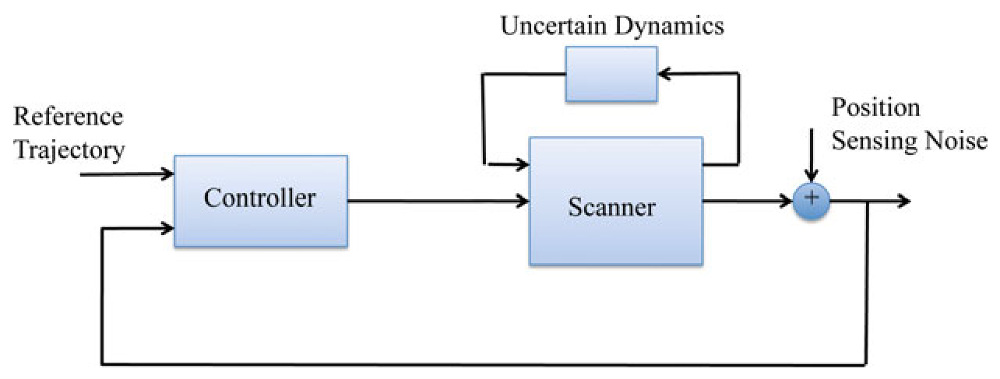

> Image description: A block diagram illustrates a feedback control loop for a nanopositioning system, titled "Control for High-Speed Nanopositioning, Fig. 2". The system architecture consists of several interconnected functional blocks. An input labeled "Reference Trajectory" enters the "Controller" block. The output of the controller serves as the input to the "Scanner" block. A feedback path is present, where the signal from the scanner output is fed back to the input of the controller. Additionally, a sub-loop is shown above the scanner, labeled "Uncertain Dynamics," which feeds back into the scanner's input, representing internal model uncertainties. At the final output stage, a summation point (indicated by a '+' sign) adds "Position Sensing Noise" to the scanner's output. The final system output represents the actual position of the scanner. The diagram depicts a standard closed-loop control structure designed to regulate a physical system (the scanner) despite internal dynamics uncertainties and external measurement noise.

Control for High-Speed Nanopositioning, Fig. 2 A feedback loop typically encountered in nanopositioning. Purpose of the controller is to control the position of
the scanner such that it follows the intended reference trajectory based on the position measurement obtained from a position sensor
the position of the scanner such that it follows a given reference trajectory based on the measurement provided by a displacement sensor. The resulting tracking error contains both deterministic and stochastic components. Deterministic errors are typically due to insufficient closed-loop bandwidth. They may also arise from excitation of mechanical resonant modes of the scanner or actuator nonlinearities such as piezoelectric hysteresis and creep (Croft et al. 2001). The factors that limit the achievable closed-loop bandwidth include phase delays and non-minimum phase zeros associated with the actuator and scanner dynamics (Devasia et al. 2007). The dynamics of the nanopositioner, the controller, and the reference trajectory selected for scanning play a key role in minimizing the deterministic component of the tracking error.

Tracking errors of a stochastic nature mostly arise from external noise and vibrations and from position measurement noise. External noise and vibrations can be significantly reduced by operating the nanopositioner in a controlled environment. However, dealing with the measurement noise is a significant challenge (Sebastian et al. 2008a). The feedback loop allows the sensing noise to generate a random positioning error that deteriorates the positioning precision. Increasing the closed-loop bandwidth (to decrease the deterministic errors) tends to worsen this effect. Low sensitivity to measurement noise is, therefore, a key requirement in feedback control design for high-speed nanopositioning and a very hard problem to address.

## Summary and Future Directions

While high-precision nanoscale positioning systems have been demonstrated at low speeds, despite an intensive international race spanning several years, the longstanding challenge remains to achieve high-speed motion and positioning with Ångstrom-level accuracy. Overcoming this barrier is believed to be the necessary catalyst for emergence of ground breaking innovations across a wide range of scientific and technological fields. Control is a critical technology to facilitate the emergence of such systems.

## Bibliography

Cherubini G, Chung CC, Messner WC, Moheimani SOR (2012) Control methods in data-storage systems. IEEE Trans Control Syst Technol 20(2):296-322
Clayton GM, Tien S, Leang KK, Zou Q, Devasia S (2009) A review of feedforward control approaches in nanopositioning for high-speed SPM. J Dyn Syst Meas Control Trans ASME 131(6): 1-19
Croft D, Shed G, Devasia S (2001) Creep, hysteresis, and vibration compensation for piezoactuators: atomic force microscopy application. ASME J Dyn Syst Control 123(1):35-43
Devasia S, Eleftheriou E, Moheimani SOR (2007) A survey of control issues in nanopositioning. IEEE Trans Control Syst Technol 15(5):802-823
Gao W, Hocken RJ, Patten JA, Lovingood J, Lucca DA (2000) Construction and testing of a nanomachining instrument. Precis Eng 24(4):320-328
Krogmann D (1999) Image multiplexing system on the base of piezoelectrically driven silicon microlens arrays. In: Proceedings of the 3rd international conference on micro opto electro mechanical systems (MOEMS), Mainz, pp 178-185


<!-- source_pdf_page: 171 -->
Meldrum DR, Pence WH, Moody SE, Cunningham DL, Holl M, Wiktor PJ, Saini M, Moore MP, Jang L, Kidd M, Fisher C, Cookson A (2001) Automated, integrated modules for fluid handling, thermal cycling and purification of DNA samples for high throughput sequencing and analysis. In: IEEE/ASME international conference on advanced intelligent mechatronics, AIM, Como, vol 2, pp 1211-1219
Meyer E, Hug HJ, Bennewitz R (2004) Scanning probe microscopy. Springer, Heidelberg
Pantazi A, Sebastian A, Antonakopoulos TA, Bachtold P, Bonaccio AR, Bonan J, Cherubini G, Despont M, DiPietro RA, Drechsler U, DurIg U, Gotsmann B, Haberle W, Hagleitner C, Hedrick JL, Jubin D, Knoll A, Lantz MA, Pentarakis J, Pozidis H, Pratt RC, Rothuizen H, Stutz R, Varsamou M, Weismann D, Eleftheriou E (2008) Probe-based ultrahighdensity storage technology. IBM J Res Dev 52(4-5): 493-511
Salapaka S (2003) Control of the nanopositioning devices. In: Proceedings of the IEEE conference on decision and control, Maui
Sebastian A, Pantazi A, Moheimani SOR, Pozidis H, Eleftheriou E (2008a) Achieving sub-nanometer precision in a MEMS storage device during self-servo write process. IEEE Trans Nanotechnol 7(5):586-595. doi:10.1109/TNANO.2008.926441
Sebastian A, Pantazi A, Pozidis H, Eleftheriou E (2008b) Nanopositioning for probe-based data storage [applications of control]. IEEE Control Syst Mag 28(4):2635
Verma S, Kim W, Shakir H (2005) Multi-axis maglev nanopositioner for precision manufacturing and manipulation applications. IEEE Trans Ind Appl 41(5):1159-1167
Vettiger P, Cross G, Despont M, Drechsler U, Durig U, Gotsmann B, Haberle W, Lantz MA, Rothuizen HE, Stutz R, Binnig GK (2002) The "millipede"nanotechnology entering data storage. IEEE Trans Nanotechnol 1(1):39-54
Whitesides GM, Christopher Love J (2001) The art of building small. Sci Am 285(3):38-47
Yong YK, Aphale S, Moheimani SOR (2009) Design, identification and control of a flexure-based XY stage for fast nanoscale positioning. IEEE Trans Nanotechnol 8(1):46-54
Yong YK, Moheimani SOR, Kenton BJ, Leang KK (2012) Invited review article: high-speed flexureguided nanopositioning: mechanical design and control issues. Rev Sci Instrum 83(12):121101
Yong YK, Bhikkaji B, Moheimani SOR (2013) Design, modeling and FPAA-based control of a high-speed atomic force microscope nanopositioner. IEEE/ASME Trans Mechatron 18(3):1060-1071. doi:10.1109/TMECH.2012.2194161
Zou Q, Leang KK, Sadoun E, Reed MJ, Devasia S (2004) Control issues in high-speed AFM for biological applications: collagen imaging example. Asian J Control Spec Issue Adv Nanotechnol Control 6(2): 164-178

## Control Hierarchy of Large Processing Plants: An Overview

Cesar de Prada
Departamento de Ingeniería de Sistemas y Automática, University of Valladolid, Valladolid, Spain


#### Abstract

This entry provides an overview of the so-called control pyramid, which organizes the different types of control tasks in a processing plant in a set of interconnected layers, from basic control and instrumentation to plant-wide economic optimization. These layers have different functions, all of them necessary for the optimal functioning of large processing plants.


## Keywords

Control hierarchy; Control pyramid; Modelpredictive control; Optimization; Plant-wide control; Real-time optimization

## Introduction

Operating a process plant is a complex task involving many different aspects ranging from the control of individual pieces of equipment and of process units to the management of the plant or factory as a whole, including relations with other plants or suppliers.

From the control point of view, the corresponding tasks are traditionally organized in several layers, placing in the bottom the ones closer to the physical processes and in the top those closer to plant-wide management, forming the socalled control pyramid represented in Fig. 1.

The process industry currently faces many challenges, originated from factors such as increased competition among companies and better global market information, new environmental regulations and safety standards, improved quality, or energy efficiency requirements. Many years ago, the main tasks were associated to the


<!-- source_pdf_page: 172 -->
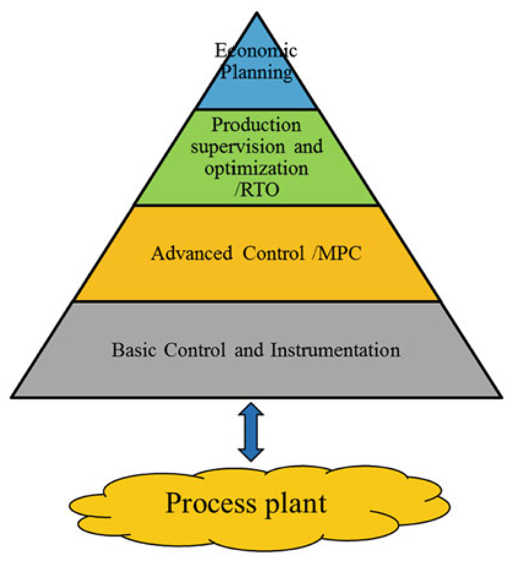

> Image description: A diagram titled "Control Hierarchy of Large Processing Plants: An Overview, Fig. 1 The control pyramid" illustrates a functional hierarchy depicted as a four-layered pyramid positioned above a cloud labeled "Process plant." A bidirectional blue arrow connects the bottom of the pyramid to the process plant, indicating two-way communication and control. The pyramid is divided into four horizontal sections: 1. **Base layer (Gray):** Labeled "Basic Control and Instrumentation," representing the foundational hardware and low-level control loops. 2. **Second layer (Yellow):** Labeled "Advanced Control / MPC" (Model Predictive Control), representing higher-level mathematical control strategies. 3. **Third layer (Green):** Labeled "Production supervision and optimization / RTO" (Real-Time Optimization), representing process oversight and efficiency maximization. 4. **Apex layer (Blue):** Labeled "Economic Planning," representing high-level business and economic objective setting. The hierarchy represents the descending flow of commands from high-level economic objectives down to physical plant instrumentation.
Control Hierarchy of Large Processing Plants: An Overview, Fig. 1 The control pyramid

correct and safe functioning of the individual process units and to the global management of the factory from the point of view of organization and economy. Therefore, only the lower and top layers of the control pyramid were realized by computer-based systems, whereas the intermediate tasks were largely performed by human operators and managers, but more and more the intermediate layers are gaining importance in order to face the abovementioned challenges.

Above the physical plant represented in Fig. 1, there is a layer related to instrumentation and basic control, devoted to obtaining direct process information and maintaining selected process variables close to their desired targets by means of local controllers. Motivated by the need for more efficient operation and better-quality assurance, an improvement of this basic control can be obtained using control structures such as cascades, feed forwards, ratios, and selectors. This is called advanced control in industry, but not in academia, where the word is reserved for more sophisticated controls.

A big step forward took place in the control field with the introduction of model-based predictive control (MBPC/MPC) in the late 1970s
and 1980s, ( ± Industrial MPC of Continuous Processes; Camacho and Bordóns (2004)). MPC aims at regulating a process unit as a whole considering all manipulated and controlled variables simultaneously. It handles all interactions, disturbances, and process constraints using a process model in order to compute the control actions that optimize a control performance index. MPC is built on top of the basic control loops and partly replaces the complex control structures of the advanced control layer adding new functionalities and better control performance. The improvements in control quality and the management of constraints and interactions of the modelpredictive controllers open the door for the implementation of local economic optimization. Linked to the MPC controller and taking advantage of its model, an optimizer may look for the best operating point of the unit by computing the controller set points that optimize an economic cost function of the process unit considering the operational constraints of the unit. This task is usually formulated and solved as a linear programming (LP) problem, i.e., based on linear or linearized economic models and cost function (see Fig. 2).

A natural extension of these ideas was to consider the interrelations among the different parts of the processing plants and to look for the steady-state operating point that provides the best economic return and minimum energy expense or optimizes any other economic criterion while satisfying the global production aims and constraints. These optimization tasks are known as real-time optimization (RTO) ( ▷ Real-Time Optimization of Industrial Processes) and form another layer of the control pyramid.

Finally, when we consider the whole plant operation, obvious links between the RTO and the planning and economic management of the company appear. In particular, the organization and optimization of the flows of raw materials, purchases, etc., involved in the supply chains present important challenges that are placed in the top layer of Fig. 1.

This entry provides an overview of the different layers and associated tasks so that the


<!-- source_pdf_page: 173 -->
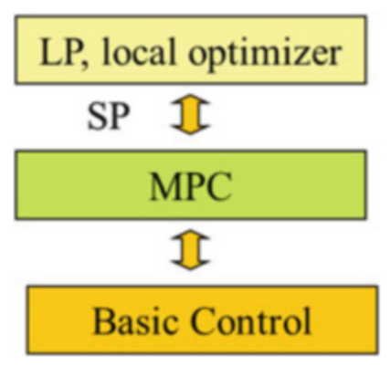

> Image description: A block diagram titled "Control Hierarchy of Large Processing Plants: An Overview" illustrates a three-tier control architecture. The diagram consists of three stacked rectangular blocks connected by bidirectional arrows, representing a hierarchical information exchange. At the top level is a yellow block labeled "LP, local optimizer." Below this is a green block labeled "MPC" (Model Predictive Control), and at the bottom is an orange block labeled "Basic Control." A bidirectional vertical arrow connects the "LP, local optimizer" and the "MPC" block, with the label "SP" (Setpoint) placed next to it, indicating that the local optimizer provides setpoints to the MPC layer. A second bidirectional arrow connects the "MPC" block to the "Basic Control" block, representing the coordination between the predictive model and the fundamental control layer. The structure demonstrates a cascaded control system where high-level optimization dictates setpoints for mid-level predictive control, which in turn interacts with basic process control.
Control Hierarchy of Large Processing Plants: An Overview, Fig. 2 MPC implementation with a local optimizer

reader can place in context the different controllers and related functionalities and tools, as well as appreciate the trends in process control focusing the attention toward the higher levels of the hierarchy and the optimal operation of largescale processes.

## An Alternative View

The implementation in a process factory of the tasks and layers previously mentioned is possible nowadays due to important advances in many fields, such as modeling and identification, control and estimation, optimization methods, and, in particular, software tools, communications, and computing power. Today it is rather common to find in many process plants an information network that follows also a pyramidal structure represented in Fig. 3.

At the bottom, there is the instrumentation layer that includes, besides sensors and actuators connected by the classical analog $4-20 \mathrm{~mA}$ signals, possibly enhanced by the transmission of information to and from the sensors by the HART protocol, digital field buses and smart transmitters and actuators that incorporate improved information and intelligence. New functionalities, such as remote calibration, filtering, self-test, and disturbance compensation, provide more accurate measurements that contribute to improving the functioning of local controllers, in the same way as that of new methods and tools available nowadays for instrument monitoring and fault detection and diagnosis. The increased
installation of wireless transmitters and the advances in analytical instrumentation will lead, without doubt, to the development of a stronger information base to support better decisions and operations in the plants.

Information from transmitters is collected in the control rooms that are the core of the second layer. Many of them are equipped with distributed control systems (DCS) that implement monitoring and control tasks. Field signals are received in the control cabinets where a large number of microprocessors execute the data acquisition and regulatory control tasks, sending signals back to the field actuators. Internal buses connect the controllers with the computers that support the displays of the human-machine interface (HMI) for the plant operators of the control room. In the past, DCS were mostly in charge of the regulatory control tasks, including basic control, alarm management, and historians, while interlocking systems related to safety and sequences related to batch operations were implemented either in the DCS or in programmable logic controllers (PLCs): ▷ Programmable Logic Controllers. Today, the bounds are not so clear, due to the increase of the computing power of the PLCs and the added functionalities of the DCS. Safety instrumented systems (SIS) for the maintenance of plant safety are usually implemented in dedicated PLCs, if not hard-wired, but for the rest of the functions, a combination of PLC-like processors with I/O cards and SCADAs (Supervision, Control, And Data Acquisition Systems) is the prevailing architecture. SCADAs act as HMI and information systems collecting large amounts of data that can be used at other levels with different purposes.

Above the basic and advanced control layer, using the information stored in the SCADA as well as other sources, there is an increased number of applications covering diverse fields. Figure 3 depicts the perspective of the computing and information flow architecture and includes a level called supervisory control, placed in direct connection with the control room and the production tasks. It includes, for instance, MPC with local optimizers, statistical process control (SPC) for quality and production


<!-- source_pdf_page: 174 -->
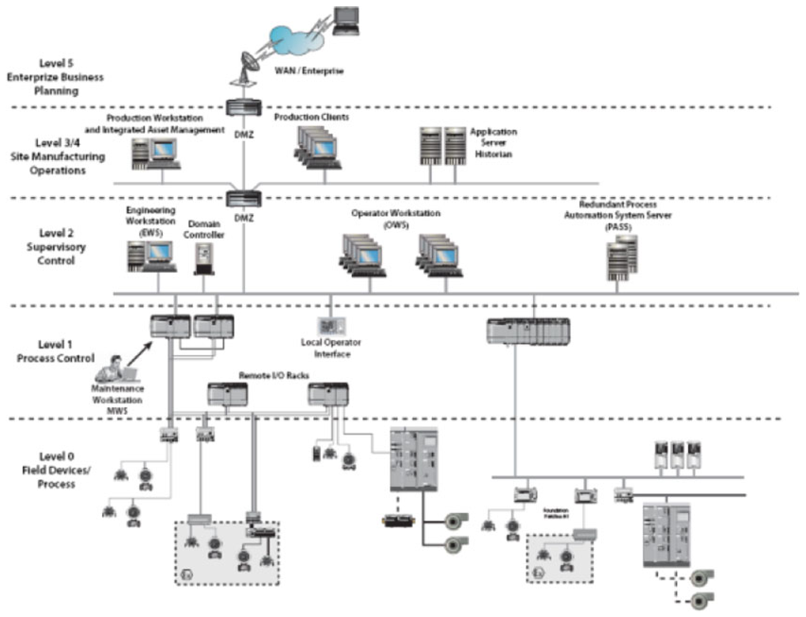

> Image description: This diagram, titled "Control Hierarchy of Large Processing Plants: An Overview," illustrates the information network architecture of a modern process plant, organized into five functional levels. **Level 5 (Enterprise Business Planning)** features a cloud icon representing the WAN/Enterprise connection. **Levels 3 and 4 (Site Manufacturing Operations)** include Production Workstations, Integrated Asset Management, Production Clients, Application Servers, and Historians, separated from the next level by a DMZ. **Level 2 (Supervisory Control)** contains the Engineering Workstation (EWS), Domain Controller, Operator Workstations (OWS), and Redundant Process Automation System Servers (PAPS), also separated by a DMZ. **Level 1 (Process Control)** consists of Maintenance Workstations (MWS), Local Operator Interfaces, and Remote I/O Racks. Finally, **Level 0 (Field Devices/Process)** depicts the physical hardware, including sensors, motors, and controllers. Arrows and connecting lines represent the data flow and hierarchical communication between different stages of the industrial control system, moving from physical field devices up to enterprise-level business planning.
Control Hierarchy of Large Processing Plants: An Overview, Fig. 3 Information network in a modern process plant

supervision ( ↽ Multiscale Multivariate Statistical Process Control), data reconciliation, inferences and estimation of unmeasured quantities, fault detection and diagnosis, or performance controller monitoring ( ↓ Controller Performance Monitoring) (CPM).

The information flow becomes more complex when we move up the basic control layer, looking more like a web than a pyramid when we enter the world of what can be called generally as asset (plant and equipment) management: a collection of different activities oriented to sustain performance and economic return, considering their entire cycle of life and, in particular, aspects such as maintenance, efficiency, or production organization. Above the supervisory layer, one can usually distinguish at least two levels denoted generically as manufacturing execution systems (MES) and enterprise resource planning (ERP) (Scholten 2009) as can be seen in Fig. 4.

MES are information systems that support the functions that a production department must perform in order to prepare and to manage work instructions, schedule production activities, monitor the correct execution of the production process, gather and analyze information about the production process, and optimize procedures. Notice that regarding the control of process units, up to this level no fundamental differences appear between continuous and batch processes. But at the MES level, which corresponds to RTO of Fig. 1, many process units may be involved, and the tools and problems are different, the main task in batch production being the optimal scheduling of those process units ( ✓ Scheduling of Batch Plants; Mendez et al. 2006).

MES are part of a larger class of systems called manufacturing operation management (MOM) that cover not only the management of production operations but also other functions


<!-- source_pdf_page: 175 -->
Control Hierarchy of Large Processing Plants: An Overview, Fig. 4
Software/hardware view
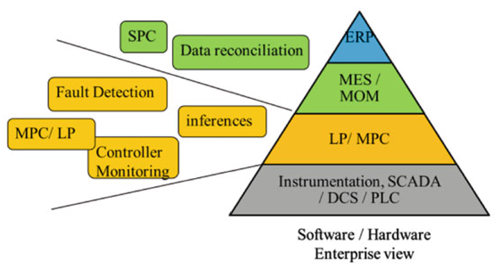

> Image description: This diagram, titled "Control Hierarchy of Large Processing Plants: An Overview, Fig. 4 Software/hardware view," presents a triangular hierarchy of industrial automation layers, categorized under an "Enterprise view." The pyramid is divided into four distinct horizontal layers: 1. **Top Layer (Blue):** Labeled "ERP" (Enterprise Resource Planning). 2. **Second Layer (Green):** Labeled "MES / MOM" (Manufacturing Execution System / Manufacturing Operations Management). 3. **Third Layer (Yellow):** Labeled "LP / MPC" (Linear Programming / Model Predictive Control). 4. **Base Layer (Grey):** Labeled "Instrumentation, SCADA / DCS / PLC." Extending from the sides of the pyramid are various functional blocks linked to specific layers: * Connected to the **top/second layers** are blocks for "SPC" (Statistical Process Control) and "Data reconciliation." * Connected to the **third layer** are blocks for "Fault Detection" and "inferences." * Connected to the **base/third layers** are blocks for "MPC / LP" and "Controller Monitoring." The diagram illustrates the integration of software and hardware across different organizational levels.

such as maintenance, quality, laboratory information systems, or warehouse management. One of their main tasks is to generate elaborate information, quite often in the form of key performance indicators (KPIs), with the purpose of facilitating the implementation of corrective actions.

ERP systems represent the top of the pyramid, corresponding to the enterprise business planning activities that allows assigning global targets to production scheduling. For many years, it has been considered to be out of the scope of the field of control, but nowadays, more and more, supply chain management is viewed and addressed as a control and optimization problem in research.

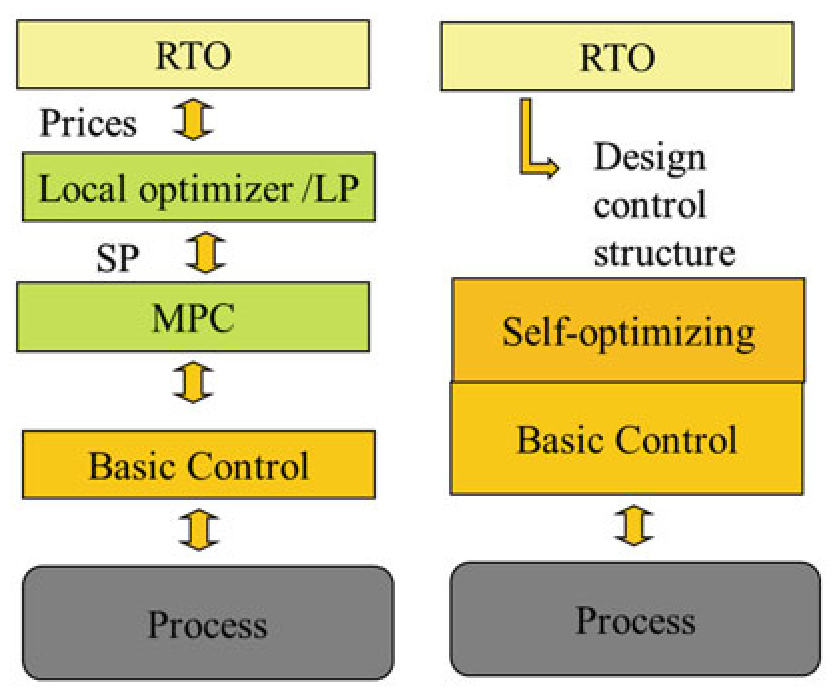

> Image description: A diagram titled "Control Hierarchy of Large Processing Plants: An Overview, Fig. 5 Two possible implementations of RTO" illustrates two different hierarchical control architectures. The left implementation shows a traditional multi-level hierarchy. At the top is **RTO** (Real-Time Optimization), which communicates via **Prices** to a **Local optimizer / LP** (Linear Programming). This optimizer passes **SP** (Setpoints) down to an **MPC** (Model Predictive Control) layer. The MPC communicates with the **Basic Control** layer, which interacts directly with the **Process**. All layers are connected by bidirectional vertical arrows, signifying feedback and command flows. The right implementation shows a more integrated approach. **RTO** is positioned at the top and directs the **Design control structure**. Below this, a combined block contains **Self-optimizing** and **Basic Control** functions, which interact directly with the **Process** via a bidirectional arrow. This signifies a streamlined control strategy where optimization is embedded within the control layer itself.
Control Hierarchy of Large Processing Plants: An Overview, Fig. 5 Two possible implementations of RTO

## Future Control and Optimization at Plant Scale

Going back to Fig. 1, the variety of control and optimization problems increases as we move up in the control hierarchy, entering the field of dynamic process operations and considering not only individual process units but also larger sets of equipment or whole plants. Examples at the RTO (or MES) level are optimal management of shared resources or utilities, production bottleneck avoidance, optimal energy use or maximum efficiency, smooth transitions against production changes, etc.

Above, we have mentioned RTO as the most common approach for plant-wide optimization. Normally, RTO systems perform the optimization of an economic cost function using a nonlinear
process model in steady state and the corresponding operational constraints to generate targets for the control systems on the lower layers. The implementation of RTO provides consistent benefits by looking at the optimal operation problem from a plant-wide perspective. Nevertheless, in practice, when MPCs with local optimizers are operating the process units, many coordination problems appear between these layers, due to differences in models and targets, so that driving the operation of these process units in a coherent way with the global economic targets is an additional challenge.

A different perspective is taken by the so-called self-optimizing control (Fig. 5 right, Skogestad 2000) that, instead of implementing the RTO solution online, uses it to design a control structure that assures a near optimum


<!-- source_pdf_page: 176 -->
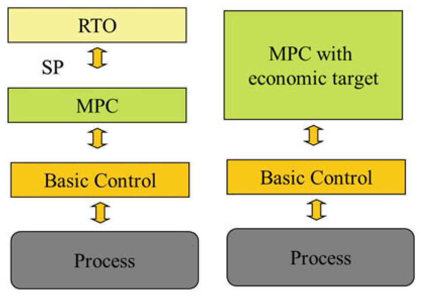

> Image description: This diagram, titled "Control Hierarchy of Large Processing Plants: An Overview, Fig. 6 Direct dynamic optimization," illustrates two different hierarchical control architectures for a chemical process. The left architecture shows a traditional, multi-layer hierarchical structure. At the top is the Real-Time Optimization (RTO) layer, which sends setpoints (SP) down to the Model Predictive Control (MPC) layer. The MPC layer interacts with the Basic Control layer, which directly regulates the Process. Each layer is connected to the one below it by bidirectional arrows, indicating information exchange. The right architecture depicts a simplified structure where the traditional RTO and MPC layers are collapsed into a single "MPC with economic target" layer. This layer connects directly to a Basic Control layer, which in turn regulates a Process. Like the left side, bidirectional arrows facilitate interaction between layers. The overall diagram compares a multi-level approach against a more direct dynamic optimization approach for managing large processing plants.
Control Hierarchy of Large Processing Plants: An Overview, Fig. 6 Direct dynamic optimization

operation if some specially chosen variables are maintained closed to their targets.

As in any model-based approach, the problem of how to implement or modify the theoretical optimum computed by RTO so that the optimum computed with the model and the real optimum of the process coincide in spite of model errors, disturbances, etc., emerges. A common choice to deal with this problem is to update periodically the model using parameter estimation methods or data reconciliation with plant data in steady state. Also, uncertainty can be explicitly taken into account by considering different scenarios and optimizing the worst case, but this is conservative and does not take advantage of the plant measurements. Along this line, there are proposals of other solutions such as modifieradaptation methods that use a fixed model and process measurements to modify the optimization problem so that the final result corresponds to the process optimum (Marchetti et al. 2009) or the use of stochastic optimization where several scenarios are taken into account and future decisions are used as recourse variables (Lucia et al. 2013).

RTO is formulated in steady state, but in practice, most of the time the plants are in transients, and there are many problems, such as start-up optimization, that require a dynamic formulation. A natural evolution in this direction is to combine nonlinear MPC with economic optimization so that the target of the NMPC is not set point following but direct economic optimization as in the right-hand side of Fig. 6: □ Economic Model

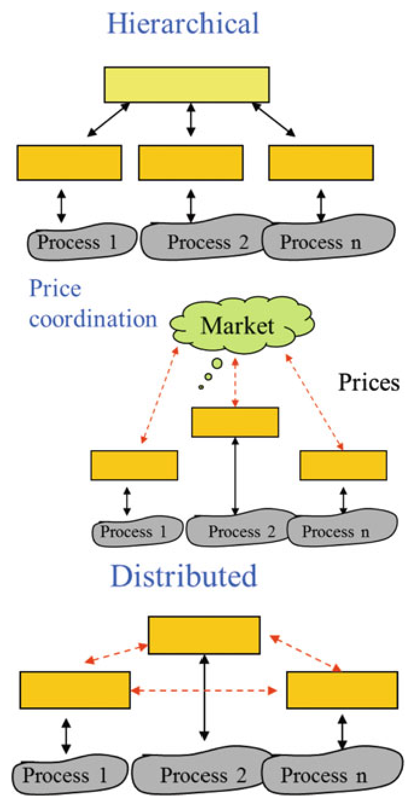

> Image description: This image illustrates three different architectural approaches for coordination, labeled "Hierarchical," "Price coordination," and "Distributed." In the **Hierarchical** structure, a single top-level block controls multiple intermediate blocks via downward arrows, which in turn communicate bidirectionally with bottom-level elements labeled "Process 1," "Process 2," and "Process n." The **Price coordination** section introduces a cloud-shaped "Market" element. Red dashed arrows indicate the flow of "Prices" between the Market and intermediate blocks. These intermediate blocks maintain bidirectional links to their respective processes. In the **Distributed** structure, there is no central controller or market. Instead, red dashed arrows show direct peer-to-peer communication between the intermediate blocks. Each block remains connected bidirectionally to its corresponding process (Process 1, 2, and n). The diagram uses colored rectangles and grey organic shapes to distinguish between control layers and physical processes.
Control Hierarchy of Large Processing Plants: An Overview, Fig. 7 Hierarchical, price coordination, and distributed approaches

Predictive Control and - Model-Based Performance Optimizing Control (Engell 2007).

The type of problems that can be formulated within this framework is very wide, as are the possible fields of application. Processes with distributed parameter structure or mixtures of real and on/off variables, batch and continuous units, statistical distribution of particle sizes or properties, etc., give rise to special type of NMPC problems (see, e.g., Lunze and Lamnabhi-Lagarrigue 2009), but a common characteristic of all of them is the fact that they are computational intensive and should be solved taking into account the different forms of uncertainty always present.

Control and optimization are nowadays inseparable essential parts of any advanced approach to dynamic process operation. Progress in the field and spreading of the


<!-- source_pdf_page: 177 -->
industrial applications are possible thanks to the advances in optimization methods and tools and computing power available on the plant level, but implementation is still a challenge from many points of view, not only technical. Few suppliers offer commercial products, and finding optimal operation policies for a whole factory is a complex task that requires taking into consideration many aspects and elaborate information not available directly as process measurements. Solving large NMPC problems in real time may require breaking the associated optimization problem in subproblems that can be solved in parallel. This leads to several local controllers/optimizers, each one solving one subproblem involving variables of a part of the process and linked by some type of coordination. This offers a new point of view of the control hierarchy. Typically, three types of architectures are mentioned for dealing with this problem, represented in Fig.7: In the hierarchical approach, coordination between local controllers is made by an upper layer that deals with the interactions, assigning targets to them. In price coordination, the coordination task is performed by a market-like mechanism that assigns different prices to the cost functions of every local controller/optimizer. Finally, in the distributed approach, the local controllers coordinate their actions by interchanging information about its decisions or states with neighbors (Scattolini 2009).

## Summary and Future Research

Process control is a key element in the operation of process plants. At the lowest layer, it can be considered a mature, well-proven technology, even if many problems such as control structure selection and controller tuning in reality are often not solved well. The range of problems under consideration is continuously expanding to the upper layers of the hierarchy, merging control with process operation and optimization, creating new challenges that range from modeling and estimation to efficient large-scale optimization
and robustness against uncertainty, and leading to new challenges and problems for research and possibly large improvements of plant operations.

## Cross-References

- Controller Performance Monitoring
- Economic Model Predictive Control
- Industrial MPC of Continuous Processes
- Model-Based Performance Optimizing Control
- Multiscale Multivariate Statistical Process Control
- Programmable Logic Controllers
- Real-Time Optimization of Industrial Processes
- Scheduling of Batch Plants


## Bibliography

Camacho EF, Bordóns C (2004) Model predictive control. Springer, London, pp 1-405. ISBN: 1-85233-694-3
de Prada C, Gutierrez G (2012) Present and future trends in process control. Ingeniería Química 44(505):38-42. Special edition ACHEMA, ISSN:0210-2064
Engell S (2007) Feedback control for optimal process operation. J Process Control 17:203-219
Engell S, Harjunkoski I (2012) Optimal operation: scheduling, advanced control and their integration. Comput Chem Eng 47:121-133
Lucia S, Finkler T, Engell S (2013) Multi-stage nonlinear model predictive control applied to a semi-batch polymerization reactor under uncertainty. J Process Control 23:1306-1319
Lunze J, Lamnabhi-Lagarrigue F (2009) HYCON handbook of hybrid systems control. Theory, tools, applications. Cambridge University Press, Boca Raton. ISBN:978-0-521-76505-3
Marchetti A, Chachuat B, Bonvin D (2009) Modifieradaptation methodology for real-time optimization. Ind Eng Chem Res 48(13):6022-6033
Mendez CA, Cerdá J, Grossmann I, Harjunkoski I, Fahl M (2006) State-of-the-art review of optimization methods for short-term scheduling of batch processes. Comput Chem Eng 30:913-946
Scattolini R (2009) Architectures for distributed and hierarchical model predictive control - a review. J Process Control 19:723-731
Scholten B (2009) MES guide for executives: why and how to select, implement, and maintain a manufacturing execution system. ISA, Research Triangle Park. ISBN:978-1-936007-03-5


<!-- source_pdf_page: 178 -->
Skogestad S (2000) Plantwide control: the search for the self-optimizing control structure. J Process Control 10:487-507

## Control of Biotechnological Processes

Rudibert King<br>Technische Universität Berlin, Berlin, Germany


#### Abstract

Closed-loop control can significantly improve the performance of bioprocesses, e.g., by an increase of the production rate of a target molecule or by guaranteeing reproducibility of the production with low variability. In contrast to the control of chemical reaction systems, the biological reactions take place inside cells which constitute highly regulated, i.e., internally controlled systems by themselves. As a result, through evolution, the same cell can and will mimic a system of first order in some situations and a highdimensional, highly nonlinear system in others. A complete mathematical description of the possible behaviors of the cell is still beyond reach and would be far too complicated as a basis for model-based process control. This makes supervision, control, and optimization of biosystems very demanding.


## Keywords

Bioprocess control; Control of uncertain systems; Optimal control; Parameter identification; State estimation; Structure identification; Structured models

## Introduction

Biotechnology offers solutions to a broad spectrum of challenges faced today, e.g., for health care, remediation of environmental pollution, new sources for energy supplies, sustainable food production, and the supply of
bulk chemicals. To explain the needs for control of bioprocesses, especially for the production of high-value and/or large-volume compounds, it is instructive to have a look on the development of a new process. If a potential strain is found or genetically engineered, the biologist will determine favorable environmental factors for the growth of and the production of the target product by the cells. These factors typically comprise the levels of temperature, pH , dissolved oxygen, etc. Moreover, concentration regions for the nutrients, precursors, and so-called trace elements are specified. Whereas for the former variables often "optimal" setpoints are provided which, at least in smaller scale reactors, can be easily maintained by independent classically designed controllers, information about the best nutrient supply is incomplete from a control engineering point of view. It is this dynamic nutrient supply which is most often not revealed in the biological laboratory and which, however, offers substantial room for production improvements by control.

Irrespective whether bacteria, yeasts, fungi, or animal cells are used for production, these cells will consist of thousands of different compounds which react with each other in hundreds or more reactions. All reactions are tightly regulated on a molecular and genetic basis; see ▷ Deterministic Description of Biochemical Networks. For socalled unlimited growth conditions, all cellular compartments will be built up with the same specific growth rate, meaning that the cellular composition will not change over time. In a mathematical model describing growth and production, only one state variable will be needed to describe the biotic phase. This will give rise to unstructured models; see below. Whenever a cell enters a limitation, which is often needed for production, the cell will start to reorganize its internal reaction pathways. Model-based approaches of supervision and control based on unstructured models are now bound to fail. More biotic state variables are needed. However, it is not clear which and how many. As a result, modeling of limiting behaviors is challenging and crucial for the control of biotechnological processes. It requires a large amount of process-specific information. Moreover, model-based estimates of


<!-- source_pdf_page: 179 -->
the state of the cell and of the environment are a key factor as online measurements of the internal processes in the cell and of the nutrient concentrations are usually impossible. Finally, as models used for process control have to be limited in size and thus only give an approximative description, robustness of the methods has to be addressed.

## Mathematical Models

For the production of biotechnical goods, many up- and downstream unit operations are involved besides the biological reactions. As these pose no typical bio-related challenges, we will concentrate here on the cultivation of the organisms only. This is mostly performed in aqueous solutions in special bioreactors through which air is sparged for a supply with oxygen. In some cases, other gases are supplied as well; see Fig. 1. Disregarding wastewater treatment plants, most cultivations are still performed in a fed-batch mode, meaning that a small amount of cells and part of the nutrients are put into the reactor initially. Then more nutrients and correcting fluids, e.g.,
for pH or antifoam control, are added with variable rates leading to an unsteady behavior. The system to be modeled consists of the gaseous, the liquid, and the biotic phase inside the reactor. For the former ones, balance equations can be formulated readily. The biotic phase can be modeled in a structured or unstructured way. Moreover, as not all cells behave similarly, this may give rise to a segregated model formulation which is omitted here for brevity.

## Unstructured Models

If the biotic phase is represented by just one state variable, $m_{X}$, a typical example of a simple unstructured model of the liquid phase would be

$$
\begin{aligned}
\dot{m}_{X} & =\mu_{X} m_{X} \\
\dot{m}_{P} & =\mu_{P} m_{X} \\
\dot{m}_{S} & =-a_{1} \mu_{X} m_{X}-a_{2} \mu_{P} m_{X}+c_{S, \text { feed }} u \\
\dot{m}_{O} & =a_{3}\left(a_{4}-c_{O}\right)-a_{5} \mu_{X} m_{X}-a_{6} \mu_{P} m_{X} \\
\dot{V} & =u
\end{aligned}
$$

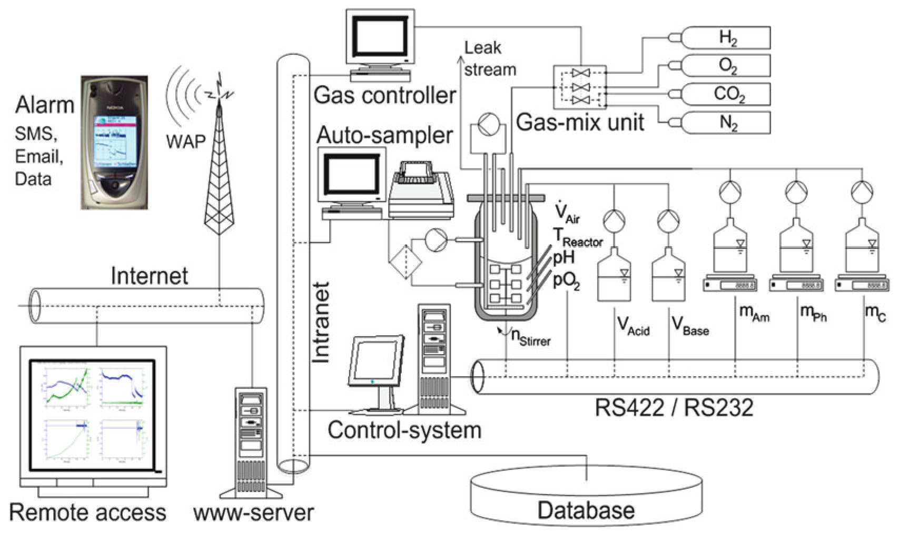

> Image description: This diagram illustrates a modern laboratory reactor platform for control-oriented biotechnological process development. The central element is a bioreactor vessel equipped with various sensors and actuators, including a stirrer ($n_{Stirrer}$), air inlet ($\dot{V}_{Air}$), and measurement probes for temperature ($T_{Reactor}$), $pH$, and dissolved oxygen ($pO_2$). Gas inputs ($H_2$, $O_2$, $CO_2$, $N_2$) flow through a gas-mix unit, with a potential leak stream outlet. Liquid additions include acid ($V_{Acid}$) and base ($V_{Base}$), alongside multiple sample containers ($m_{Am}$, $m_{Ph}$, $m_{C}$). The system architecture is highly integrated: a gas controller and auto-sampler connect to the reactor. A control system manages the process via an intranet/internet connection, communicating through RS422/RS232 protocols to a database. Remote monitoring is facilitated through a www-server and remote access terminal, providing real-time data and alarms (SMS, Email, Data) to mobile devices via WAP.
Control of Biotechnological Processes, Fig. 1 Modern laboratory reactor platform for control-oriented process development


<!-- source_pdf_page: 180 -->
Control of Biotechnological Processes, Table 1 Multiplicative rates depending on several concentrations $c_{1}, \ldots, c_{k}$ with possible kinetic terms

| $\mu_{i}=a_{i \max } \mu_{i 1}\left(c_{1}\right) \cdot \mu_{i 2}\left(c_{2}\right) \cdot \ldots \cdot \mu_{i k}\left(c_{k}\right)$ |  |  |  |
| :--- | :--- | :--- | :--- |
| $\mu_{i j}$ | $\frac{c_{j}}{c_{j}+a_{i j}}$ | $\frac{a_{i j}}{c_{j}+a_{i j}}$ | $\frac{c_{j}}{c_{j}^{2}+a_{i j}}$ |
|  | $\frac{c_{j}}{c_{j}+a_{i j}} e^{-c_{j} / a_{i j+1}}$ | $\frac{c_{j}}{a_{i j} c_{j}^{2}+c_{j}+a_{i j+1}}$ | ⋯ |

with the masses $m_{i}$ with $i=X, P, S, O$ for cells, product, substrate or nutrient, and dissolved oxygen, respectively. The volume is given by $V$, and the specific growth and production rates $\mu_{X}$ and $\mu_{P}$ depend on concentrations $c_{i}=m_{i} / V$, e.g., of the substrate $S$ or oxygen $O$ according to formal kinetics, e.g.,

$$
\begin{aligned}
\mu_{X} & =\frac{a_{7} c_{S} c_{O}}{\left(c_{S}+a_{8}\right)\left(c_{O}+a_{9}\right)} \\
\mu_{P} & =\frac{a_{10} c_{S}}{a_{11} c_{S}^{2}+c_{S}+a_{12}}
\end{aligned}
$$

The nutrient supply can be changed by the feed rate $u(t)$ as a control input, with inflow concentration $c_{S, \text { feed }}$. Very often, just one feed stream is considered in unstructured models. As all parameters $a_{i}$ have to be identified from noisy and infrequently sampled data, a low-dimensional nonlinear uncertain model results. All steps prior to the cultivation in which, e.g., from frozen cells, enough cells are produced to start the fermentation add to the uncertainty. Whereas the balance equations follow from first principlesbased modeling, the structure of the kinetics $\mu_{X}$ and $\mu_{P}$ is unknown, i.e., empirical relations are exploited. Many different kinetic expressions can be used here; see Bastin and Dochain (1990) or a small selection shown in Table 1.

It has to be pointed out that, most often, neither $c_{X}, c_{P}$, nor $c_{S}$ are measured online. As the measurement of $c_{O}$ might be unreliable, the exhaust gas concentration of the gaseous phase is the main online measurement which can be used by employing an additional balance equation for the gaseous phase. Infrequent at-line measurements, though, are sometimes available for $X, P, S$, especially at the lab-scale during process development.

## Structured Models

In structured models, the changing composition and reaction pathways of the cell is accounted for. As detailed information about the cell's complete metabolism including all regulations is missing for the majority if not all cells exploited in bioprocesses, an approximative description is used. Examples are models in which a part of the real metabolism is described on a mechanistic level, whereas the rest is lumped together into one or very few states (Goudar et al. 2006), cybernetic models (Varner and Ramkrishna 1998), or compartment models (King 1997). As an example, all compartment models can be written down as

$$
\begin{aligned}
\dot{m} & =\mathbf{A} \underline{\mu}(\underline{c})+\underline{f}_{i n}(\underline{u})+\underline{f}_{\text {out }}(\underline{u}) \\
\dot{V} & =\sum_{i} u_{i}
\end{aligned}
$$

with vectors of streams into and out of the reaction mixture, $\underline{f}_{\text {in }}$ and $\underline{f}_{\text {out }}$, which depend on control inputs $\underline{u}$; a matrix of (stoichiometric) parameters, $\mathbf{A}$; a vector of reaction rates $\underline{\mu}=\underline{\mu}(\underline{c})$; and, finally, a vector $\underline{m}$ comprising substrates, products, and more than one biotic state. These biotic states can be motivated, for example, by physiological arguments, describing the total amounts of macromolecules in the cell, such as the main building blocks DNA, RNA, and proteins. In very simple compartment models, the cell is only divided up into what is called active and inactive biomass. Again, all coefficients in $\mathbf{A}$ and the structure and the coefficients of all entries in $\underline{\mu}(\underline{c})$ (see Table 1) are unknown and have to be identified based on experimental data. Issues of structural and practical identifiability are of major concern. For models of system biology (see ▷ Deterministic Description of Biochemical Networks), algebraic equations are


<!-- source_pdf_page: 181 -->
added that describe the dependencies between individual fluxes. Then at least part of $\mathbf{A}$ is known.

Describing the biotic phase with a higher degree of granularity does not change the measurement situation in the laboratory or in the production scale, i.e., still only very few online measurements will be available for control.
a combinatorial explosion. Although approaches exist to support this modeling step (see Herold and King 2013 or Mangold et al. 2005) finally, the modeler will have to settle with a compromise with respect to the accuracy of the model found versus the number of fully identified model candidates. As a result, all control methods applied should be robust in some sense.

## Identification

Even if the growth medium initially "only" consists of some 10-20 different, chemically welldefined substances, from which only few are described in the model, this situation will change over the cultivation time as the organisms release further compounds from which only few may be known. If, for economic reasons, complex raw materials are used, even the initial composition is unknown. Hence, measuring the concentrations of some of the compounds of the large set of substances as a basis for modeling is not trivial. For structured models, intracellular substances have to be determined additionally. These are embedded in an even larger matrix of compounds making chemical analysis more difficult. Therefore, the basis for parameter and structure identification is uncertain.

As the expensive experiments and chemical analysis tasks are very time consuming, sometimes lasting up to several weeks, methods of optimal experimental design should always be considered in biotechnology; see ▷ Experiment Design and Identification for Control.

The models to be built up should possess some predictive capability for a limited range of environmental conditions. This rules out unstructured models for many practical situations. However, for process control, the models should still be of manageable complexity. Medium-sized structured models seem to be well suited for such a situation. The choice of biotic states in $\underline{m}$ and possible structures for the reaction rates $\mu_{i}$, however, is hardly supported by biological or chemical evidence. As a result, a combined structure and parameter identification problem has to be solved. The choices of possible terms $\mu_{i j}$ in all $\mu_{i}$ give rise to a problem that exhibits

## Soft Sensors

Despite many advantages in the development of online measurements (see Mandenius and Titchener-Hooker 2013) systems for supervision and control of biotechnical processes often include model-based estimations schemes, such as extended Kalman filters (EKF); see ▷ Kalman Filters. Concentration estimates are needed for unmeasured substances and for quantities which depend on these concentrations like the growth rate of the cells. In real applications, formulations have to be used which account for delays in laboratory analysis of up to several hours and for situations in which results from the laboratory will not be available in the same sequence as the samples were taken. An example from a real cultivation is shown in Fig. 2. Here, the atline measurement of the biomass concentration, $c_{X}=m_{X} / V$, is the only measurement available. The result of a single measurement is obtained about 30 min after sampling. For reference, unaccessible state variables, which were analyzed later, are shown as well along with the online estimates. The scatter of the data, especially of DNA and RNA, gives a qualitative impression of the measurement accuracy in biotechnology.

## Control

Beside the relatively simple control of physical parameters, such as temperature, pH , dissolved oxygen, or carbon dioxide concentration, only few biotic variables are typically controlled with respect to a setpoint. The most prominent example is the growth rate of the biomass with the goal to reach a high cell concentration


<!-- source_pdf_page: 182 -->
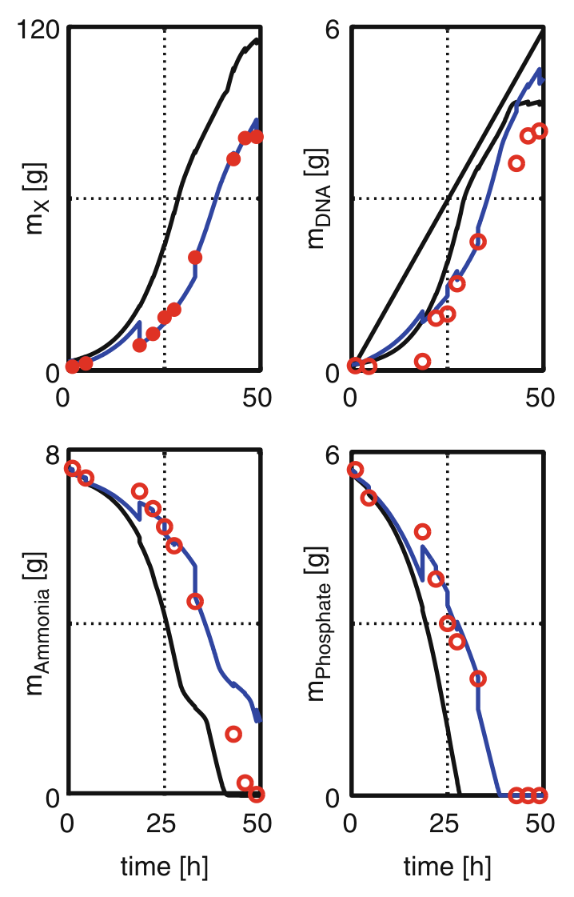

> Image description: A four-panel figure titled "Fig. 2 Estimation of states of a structured model with an EKF with an unexpected growth delay initially" displays the evolution of various biological states over time. The x-axis for all plots is "time [h]", ranging from 0 to 50 hours. The top-left plot shows $m_{X}$ [g], representing biomass, where a black line (prediction) rises faster than a blue line (estimated state), which follows a set of red filled circles (at-line measurements). The top-right plot shows $m_{DNA}$ [g], showing similar divergent patterns between the black prediction and the blue estimate/red circles. The bottom-left plot shows $m_{Ammonia}$ [g], and the bottom-right plot shows $m_{Phosphate}$ [g]. Both subplots show decreasing concentrations over time. In both, the black prediction line decreases more rapidly than the blue estimate and the red circles, which represent actual measurements. The vertical dashed line at approximately 30 hours indicates a point of divergence between the model prediction and the observed data.
Control of Biotechnological Processes, Fig. 2 Estimation of states of a structured model with an EKF with an unexpected growth delay initially. At-line measurement $m_{X}$ (red filled circles), initially predicted evolution of

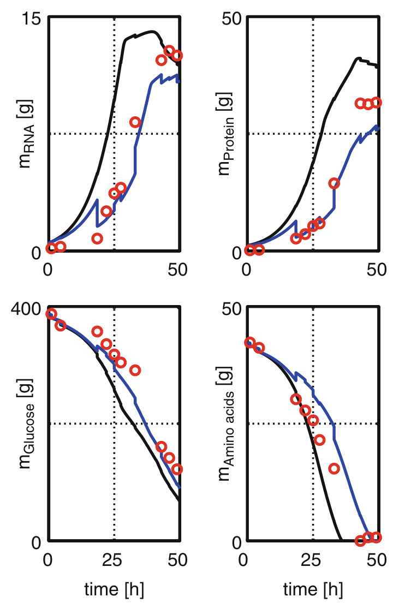

> Image description: This figure displays four line graphs arranged in a $2 \times 2$ grid, illustrating the estimation of different states in a biotechnological process over time. The x-axis for all graphs represents time in hours [h], ranging from 0 to 50. The y-axes represent masses in grams [g] for four variables: $m_{\text{RNA}}$, $m_{\text{Protein}}$, $m_{\text{Glucose}}$, and $m_{\text{Amino acids}}$. Each plot contains solid black and blue lines, representing different model predictions, and red circles, representing measured data points. - In the top row, $m_{\text{RNA}}$ and $m_{\text{Protein}}$ show increasing trends as time progresses, with the measurements (red circles) initially lagging behind the black prediction line, indicating a growth delay. - In the bottom row, $m_{\text{Glucose}}$ and $m_{\text{Amino acids}}$ show decreasing trends, representing substrate consumption. The vertical dotted line at 25 hours serves as a reference point across all plots. The figure demonstrates how an Extended Kalman Filter (EKF) estimates states despite an initial unexpected growth delay in the measurements compared to the model.
states (black), online estimated evolution (blue), off-line data analyzed after the experiment (open red circles) (Data obtained by T. Heine)

in the reactor as fast as possible. This is the predominant goal when the cells are the primary target as in baker's yeast cultivations or when the expression of the desired product is growth associated. For other non-growth-associated products, a high cell mass is desirable as well, as production is proportional to the amount of cells. If the nutrient supply is maintained above a certain level, unlimited growth behavior results, allowing the use of unstructured models for model-based control. An excess of nutrients has to be avoided, though, as some organisms, like baker's yeast, will initiate an overflow metabolism, with products which may be inhibitory in later stages of the cultivation. For some products, such as the antibiotic penicillin, the organism has to grow slowly to obtain a high production rate. For these so-called secondary metabolites, low but not vanishing concentrations for some limiting substrates are needed. If setpoints are given for these
concentrations instead, this can pose a rather challenging control problem. As the organisms try to grow exponentially, the controller must be able to increase the feed exponentially as well. The difficulty mainly arises from the inaccurate and infrequent measurements that the soft sensors/controller has to work with and from the danger that an intermediate shortage or oversupply with nutrients may switch the metabolism to an undesired state of low productivity.

For control of biotechnical processes, many methods explained in this encyclopedia including feedforward, feedback, model-based, optimal, adaptive, fuzzy, neural nets, etc., can be and have been used (cf. Dochain 2008; Gnoth et al. 2008; Rani and Rao 1999). As in other areas of application, (robust) model-predictive control schemes (MPC) (see - Industrial MPC of Continuous Processes) are applied with great success in biotechnology.


<!-- source_pdf_page: 183 -->
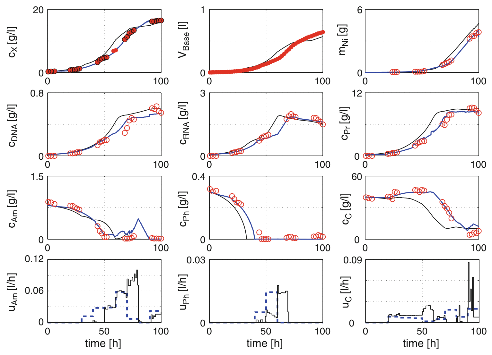

> Image description: This multi-panel figure displays the results of Model Predictive Control (MPC) and state estimation for a *S. tendae* cultivation process over 100 hours. The figure consists of twelve individual plots organized in a $4 \times 3$ grid. The top three rows present various process variables: biomass concentration ($c_X$), base volume ($V_{Base}$), nickel concentration ($m_{Ni}$), DNA concentration ($c_{DNA}$), RNA concentration ($c_{RNA}$), protein concentration ($c_{Pr}$), substrate concentration ($c_{Am}$), phosphate concentration ($c_{Ph}$), and calcium concentration ($c_{C}$). Each plot includes observed data (red circles) and model predictions (black and blue lines). The bottom row illustrates the control inputs (rates) for the substrates: $u_{Am}$, $u_{Ph}$, and $u_C$, measured in l/h. All plots share a common x-axis representing time in hours (h). The figure illustrates the ability of the controller to track reference trajectories and estimate internal states (biomass and molecular components) based on available measurements.

Control of Biotechnological Processes, Fig. 3 MPC control and state estimation of a cultivation with S. tendae. At-line measurement $m_{X}$ (red filled circles), initially predicted evolution of states (black), online estimated evo-
lution (blue), off-line data analyzed after the experiment (open red circles). Off-line optimal feeding profiles $u_{i}$ (blue broken line), MPC-calculated feeds (black, solid) (Data obtained by T. Heine)

For the antibiotic production shown in Fig. 3, optimal feeding profiles $u_{i}$ for ammonia (AM), phosphate (PH), and glucose (C) were calculated before the experiment was performed in a trajectory optimization such that the final mass of the desired antibiotic nikkomycin $(\mathrm{Ni})$ was maximized. This resulted in the blue broken lines for the feeds $u_{i}$. However, due to disturbances and model inaccuracies, an MPC scheme had to significantly change the feeding profiles, to actually obtain this high amount of nikkomycin; see the feeding profiles given in black solid lines. This example shows that, especially in biotechnology, off-line trajectory planning has to be complemented by closed-loop concepts.

On the other hand, the experimental data given in Fig. 2 shows that significant disturbances, such as an unexpected initial growth delay, may occur in real systems as well. For this reason, the classical receding horizon MPC with an off-line
determined optimal reference trajectory will not always be the best solution, and an online optimization over the whole horizon has a larger potential (cf. Kawohl et al. 2007).

## Summary and Future Directions

Advanced process control including soft sensors can significantly improve biotechnical processes. Using these techniques promotes quality and reproducibility of processes (Junker and Wang 2006). These methods should, however, not only be exploited in the production scale. For new pharmaceutical products, the time to market is the decisive factor. Methods of (modelbased) monitoring and control can help here to speed up process development. Since a few years, a clear trend can be seen in biotechnology to miniaturize and parallelize process development using multi-fermenter systems and robotic tech-


<!-- source_pdf_page: 184 -->
nologies. This trend gives rise to new challenges for modeling on the basis of huge data sets and for control in very small scales. At the same time, it is expected that a continued increase of information from bioinformatic tools will be available which has to be utilized for process control as well. Going to large-scale cultivations adds further spatial dimensions to the problem. Now, the assumption of a well-stirred, ideally mixed reactor does not longer hold. Substrate concentrations will be space dependent. Cells will experience changing good and bad nutrient environments frequently. Thus, mass transfer has to be accounted for, leading to partial differential equations as models for the process.

## Cross-References

- Control and Optimization of Batch Processes
- Deterministic Description of Biochemical Networks
- Extended Kalman Filters
- Experiment Design and Identification for Control
- Industrial MPC of Continuous Processes
- Nominal Model-Predictive Control
- Nonlinear System Identification: An Overview of Common Approaches


## Bibliography

Bastin G, Dochain D (2008) On-line estimation and adaptive control of bioreactors. Elsevier, Amsterdam
Dochain D (2008) Bioprocess control. ISTE, London
Gnoth S, Jentzsch M, Simutis R, Lübbert A (2008) Control of cultivation processes for recombinant protein production: a review. Bioprocess Biosyst Eng 31:21-39
Goudar C, Biener R, Zhang C, Michaels J, Piret J, Konstantinov K (2006) Towards industrial application of quasi real-time metabolic flux analysis for mammalian cell culture. Adv Biochem Eng Biotechnol 101:99118
Herold S, King R (2013) Automatic identification of structured process models based on biological phenomena detected in (fed-)batch experiments. Bioprocess Biosyst Eng. doi:10.1007/s00449-013-1100-6
Junker BH, Wang HY (2006) Bioprocess monitoring and computer control: key roots of the current PAT initiative. Biotechnol Bioeng 95:226-261

Kawohl M, Heine T, King R (2007) Model-based estimation and optimal control of fed-batch fermentation processes for the production of antibiotics. Chem Eng Process 11:1223-1241
King R (1997) A structured mathematical model for a class of organisms: part 1-2. J Biotechnol 52:219-244
Mandenius CF, Titchener-Hooker NJ (ed) (2013) Measurement, monitoring, modelling and control of bioprocesses. Advances in biochemical engineering biotechnology, vol 132. Springer, Heidelberg
Mangold M, Angeles-Palacios O, Ginkel M, Waschler R, Kinele A, Gilles ED (2005) Computer aided modeling of chemical and biological systems - methods, tools, and applications. Ind Eng Chem Res 44:2579-2591
Rani KY, Rao VSR (1999) Control of fermenters. Bioprocess Eng 21:77-88 31:21-39
Varner J, Ramkrishna D (1998) Application of cybernetic models to metabolic engineering: investigation of storage pathways. Biotech Bioeng 58:282-291; 31:21-39

## Control of Fluids and Fluid-Structure Interactions

Jean-Pierre Raymond
Institut de Mathématiques, Université Paul
Sabatier Toulouse III \& CNRS, Toulouse Cedex, France


#### Abstract

We introduce control and stabilization issues for fluid flows along with known results in the field. Some models coupling fluid flow equations and equations for rigid or elastic bodies are presented, together with a few controllability and stabilization results.


## Keywords

Control; Fluid flows; Fluid-structure systems; Stabilization

## Some Fluid Models

We consider a fluid flow occupying a bounded domain $\Omega_{F} \subset \mathbb{R}^{N}$, with $N=2$ or $N=3$, at the initial time $t=0$, and a domain $\Omega_{F}(t)$


<!-- source_pdf_page: 185 -->
at time $t>0$. Let us denote by $\rho(x, t) \in \mathbb{R}^{+}$ the density of the fluid at time $t$ at the point $x \in \Omega_{F}(t)$ and by $u(x, t) \in \mathbb{R}^{N}$ its velocity. The fluid flow equations are derived by writing the mass conservation

$$
\frac{\partial \rho}{\partial t}+\operatorname{div}(\rho u)=0 \quad \text { in } \Omega_{F}(t), \quad \text { for } t>0
$$

and the balance of momentum

$$
\begin{align*}
& \rho\left(\frac{\partial u}{\partial t}+(u \cdot \nabla) u\right)=\operatorname{div} \sigma+\rho f  \tag{2}\\
& \text { in } \Omega_{F}(t), \quad \text { for } t>0
\end{align*}
$$

where $\sigma$ is the so-called constraint tensor and $f$ represents a volumic force. For an isothermal fluid, there is no need to complete the system by the balance of energy. The physical nature of the fluid flow is taken into account in the choice of the constraint tensor $\sigma$. When the volume is preserved by the fluid flow transport, the fluid is called incompressible. The incompressibility condition reads as $\operatorname{div} u=0$ in $\Omega_{F}(t)$. The incompressible Navier-Stokes equations are the classical model to describe the evolution of isothermal incompressible and Newtonian fluid flows. When in addition the density of the fluid is assumed to be constant, $\rho(x, t)=\rho_{0}$, the equations reduce to

$$
\begin{align*}
& \operatorname{div} u=0 \\
& \rho_{0}\left(\frac{\partial u}{\partial t}+(u \cdot \nabla) u\right)=v \Delta u-\nabla p+\rho_{0} f \\
& \text { in } \Omega_{F}(t), \quad t>0 \tag{3}
\end{align*}
$$

which are obtained by setting

$$
\begin{equation*}
\sigma=v\left(\nabla u+(\nabla u)^{T}\right)+\left(\mu-\frac{2 v}{3}\right) \operatorname{div} u I-p I, \tag{4}
\end{equation*}
$$

in Eq. (2). When $\operatorname{div} u=0$, the expression of $\sigma$ simplifies. The coefficients $\nu>0$ and $\mu>0$ are the viscosity coefficients of the fluid, and $p(x, t)$ its pressure at the point $x \in \Omega_{F}(t)$ and at time $t>0$.

This model has to be completed with boundary conditions on $\partial \Omega_{F}(t)$ and an initial condition at time $t=0$.

The incompressible Euler equations with constant density are obtained by setting $\nu=0$ in the above system.

The compressible Navier-Stokes system is obtained by coupling the equation of conservation of mass Eq. (1) with the balance of momentum Eq. (2), where the tensor $\sigma$ is defined by Eq. (4), and by completing the system with a constitutive law for the pressure.

## Control Issues

There are unstable steady states of the NavierStokes equations which give rise to interesting control problems (e.g., to maximize the ratio "lift over drag"), but which cannot be observed in real life because of their unstable nature. In such situations, we would like to maintain the physical model close to an unstable steady state by the action of a control expressed in feedback form, that is, as a function either depending on an estimation of the velocity or depending on the velocity itself. The estimation of the velocity of the fluid may be recovered by using some realtime measurements. In that case, we speak of a feedback stabilization problem with partial information. Otherwise, when the control is expressed in terms of the velocity itself, we speak of a feedback stabilization problem with full information.

Another interesting issue is to maintain a fluid flow (described by the Navier-Stokes equations) in the neighborhood of a nominal trajectory (not necessarily a steady state) in the presence of perturbations. This is a much more complicated issue which is not yet solved.

In the case of a perturbation in the initial condition of the system (the initial condition at time $t=0$ is different from the nominal velocity held at time $t=0$ ), the exact controllability to the nominal trajectory consists in looking for controls driving the system in finite time to the desired trajectory.

Thus, control issues for fluid flows are those encountered in other fields. However there are


<!-- source_pdf_page: 186 -->
specific difficulties which make the corresponding problems challenging. When we deal with the incompressible Navier-Stokes system, the pressure plays the role of a Lagrange multiplier associated with the incompressibility condition. Thus, we have to deal with an infinite-dimensional nonlinear differential algebraic system. In the case of a Dirichlet boundary control, the elimination of the pressure, by using the so-called Leray or Helmholtz projector, leads to an unusual form of the corresponding control operator; see Raymond (2006). In the case of an internal control, the estimation of the pressure to prove observability inequalities is also quite tricky; see FernandezCara et al. (2004). From the numerical viewpoint, the approximation of feedback control laws leads to very large-size problems, and new strategies have to be found for tackling these issues.

Moreover, the issues that we have described for the incompressible Navier-Stokes equations may be studied for other models like the compressible Navier-Stokes equations, the Euler equations (describing nonviscous fluid flows) both for compressible and incompressible models, or even more complicated models.

## Feedback Stabilization of Fluid Flows

Let us now describe what are the known results for the incompressible Navier-Stokes equations in 2D or 3D bounded domains, with a control acting locally in a Dirichlet boundary condition. Let us consider a given steady state ( $u_{s}, p_{s}$ ) satisfying the equation

$$
\begin{aligned}
& -v \Delta u_{s}+\left(u_{s} \cdot \nabla\right) u_{s}+\nabla p_{s}=f_{s}, \\
& \text { and } \operatorname{div} u_{s}=0 \text { in } \Omega_{F},
\end{aligned}
$$

with some boundary conditions which may be of Dirichlet type or of mixed type (Dirichlet-Neumann-Navier type). For simplicity, we only deal with the case of Dirichlet boundary conditions

$$
u_{s}=g_{s} \quad \text { on } \partial \Omega_{F},
$$

where $g_{s}$ and $f_{s}$ are time-independent functions. In the case $\Omega_{F}(t)=\Omega_{F}$, not depending on $t$, the corresponding instationary model is

$$
\begin{align*}
& \frac{\partial u}{\partial t}-v \Delta u+(u \cdot \nabla) u+\nabla p=f_{s} \\
& \text { and } \quad \operatorname{div} u=0 \text { in } \Omega_{F} \times(0, \infty),  \tag{5}\\
& u=g_{s}+\sum_{i=1}^{N_{c}} f_{i}(t) g_{i}, \partial \Omega_{F} \times(0, \infty) \\
& u(0)=u_{0} \quad \text { on } \Omega_{F} .
\end{align*}
$$

In this model, we assume that $u_{0} \neq u_{s}, g_{i}$ are given functions with localized supports in $\partial \Omega_{F}$ and $f(t)=\left(f_{1}(t), \ldots, f_{N_{c}}(t)\right)$ is a finitedimensional control. Due to the incompressibility condition, the functions $g_{i}$ have to satisfy

$$
\int_{\partial \Omega_{F}} g_{i} \cdot n=0,
$$

where $n$ is the unit normal to $\partial \Omega_{F}$, outward $\Omega_{F}$.
The stabilization problem, with a prescribed decay rate $-\alpha<0$, consists in looking for a control $f$ in feedback form, that is, of the form

$$
\begin{equation*}
f(t)=K\left(u(t)-u_{s}\right), \tag{6}
\end{equation*}
$$

such that the solution to the Navier-Stokes system Eq. (5), with $f$ defined by Eq. (6), obeys

$$
\left\|e^{\alpha t}\left(u(t)-u_{s}\right)\right\|_{z} \leq \varphi\left(\left\|u_{0}-u_{s}\right\|_{z}\right),
$$

for some norm $Z$, provided $\left\|u_{0}-u_{s}\right\|_{z}$ is small enough and where $\varphi$ is a nondecreasing function. The mapping $K$, called the feedback gain, may be chosen linear.

The usual procedure to solve this stabilization problem consists in writing the system satisfied by $u-u_{s}$, in linearizing this system, and in looking for a feedback control stabilizing this linearized model. The issue is first to study the stabilizability of the linearized model and, when it is stabilizable, to find a stabilizing feedback gain. Among the feedback gains that stabilize the linearized model, we have to find one able to stabilize, at least locally, the nonlinear system too.

The linearized controlled system associated with Eq. (5) is


<!-- source_pdf_page: 187 -->
$\frac{\partial v}{\partial t}-v \Delta v+\left(u_{s} \cdot \nabla\right) v+(v \cdot \nabla) u_{s}+\nabla q=0$
and $\operatorname{div} v=0$ in $\Omega_{F} \times(0, \infty)$,
$v=\sum_{i=1}^{N_{c}} f_{i}(t) g_{i} \quad$ on $\quad \partial \Omega_{F} \times(0, \infty)$,
$v(0)=v_{0} \quad$ on $\Omega_{F}$.

The easiest way for proving the stabilizability of the controlled system Eq. (7) is to verify the Hautus criterion. It consists in proving the following unique continuation result. If ( $\phi_{j}, \psi_{j}, \lambda_{j}$ ) is the solution to the eigenvalue problem

$$
\begin{align*}
\lambda_{j} \phi_{j}- & v \Delta \phi_{j}-\left(u_{s} \cdot \nabla\right) \phi_{j}+\left(\nabla u_{s}\right)^{T} \phi_{j} \\
& +\nabla \psi_{j}=0 \quad \text { and } \quad \operatorname{div} \phi_{j}=0 \text { in } \Omega_{F}, \\
& \phi_{j}=0 \quad \text { on } \quad \partial \Omega_{F}, \quad \operatorname{Re} \lambda_{j} \geq-\alpha, \tag{8}
\end{align*}
$$

and if in addition ( $\phi_{j}, \psi_{j}$ ) satisfies

$$
\int_{\partial \Omega_{F}} g_{i} \cdot \sigma\left(\phi_{j}, \psi_{j}\right) n=0 \quad \text { for all } 1 \leq i \leq N_{c}
$$

then $\left(\phi_{j}, \psi_{j}\right)=0$. By using a unique continuation theorem due to Fabre and Lebeau (1996), we can explicitly determine the functions $g_{i}$ so that this condition is satisfied; see Raymond and Thevenet (2010). For feedback stabilization results of the Navier-Stokes equations in two or three dimensions, we refer to Fursikov (2004), Raymond (2006), Barbu et al. (2006), Raymond (2007), Badra (2009), and Vazquez and Krstic (2008).

## Controllability to Trajectories of Fluid Flows

If $(\tilde{u}(t), \tilde{p}(t))_{0 \leq t<\infty}$ is a solution to the NavierStokes system, the controllability problem to the trajectory $(\tilde{u}(t), \tilde{p}(t))_{0 \leq t<\infty}$, in time $T>0$, may be rewritten as a null controllability problem satisfied by $(v, q)=(u-\tilde{u}, p-\tilde{p})$. The local null controllability in time $T>0$ follows from the null controllability of the linearized system and from a fixed point argument. The linearized controlled system is
$\frac{\partial v}{\partial t}-v \Delta v+(\tilde{u}(t) \cdot \nabla) v+(v \cdot \nabla) \tilde{u}(t)+\nabla q=0$
and $\operatorname{div} v=0$ in $\Omega_{F} \times(0, T)$,
$v=m_{c} f \quad$ on $\partial \Omega_{F} \times(0, T)$,
$v(0)=v_{0} \in L^{2}\left(\Omega_{F} ; \mathbb{R}^{N}\right), \quad \operatorname{div} v_{0}=0$.

The nonnegative function $m_{c}$ is used to localize the boundary control $f$. The control $f$ is assumed to satisfy

$$
\begin{equation*}
\int_{\partial \Omega_{F}} m_{c} f \cdot n=0 \tag{10}
\end{equation*}
$$

As for general linear dynamical systems, the null controllability of the linearized system follows from an observability inequality for the solutions to the following adjoint system

$$
\begin{align*}
& -\frac{\partial \phi}{\partial t}-v \Delta \phi-(\tilde{u}(t) \cdot \nabla) \phi+(\nabla \tilde{u}(t))^{T} \phi+\nabla \psi=0 \\
& \text { and } \operatorname{div} \phi=0 \text { in } \Omega_{F} \times(0, T) \\
& \phi=0 \text { on } \partial \Omega_{F} \times(0, T) \\
& \phi(T) \in L^{2}\left(\Omega_{F} ; \mathbb{R}^{N}\right), \quad \operatorname{div} \phi(T)=0 \tag{11}
\end{align*}
$$

Contrary to the stabilization problem, the null controllability by a control of finite dimension seems to be out of reach and it will be impossible in general. We look for a control $f \in L^{2}\left(\partial \Omega_{F} ; \mathbb{R}^{N}\right)$, satisfying Eq.(10), driving the solution to system Eq. (9) in time $T$ to zero, that is, such that the solution $v_{v_{0}, f}$ obeys $v_{v_{0}, f}(T)=0$. The linearized system Eq. (9) is null controllable in time $T>0$ by a boundary control $f \in L^{2}\left(\partial \Omega_{F} ; \mathbb{R}^{N}\right)$ obeying Eq. (10), if and only if there exists $C>0$ such that

$$
\begin{equation*}
\int_{\Omega_{F}}|\phi(0)|^{2} d x \leq C \int_{\partial \Omega_{F}} m_{c}|\sigma(\phi, \psi) n|^{2} d x \tag{12}
\end{equation*}
$$

for all solution ( $\phi, \psi$ ) of Eq.(11). The observability inequality Eq. (12) may be proved by establishing weighted energy estimates called "Carleman-type estimates"; see Fernandez-Cara et al. (2004) and Fursikov and Imanuvilov (1996).


<!-- source_pdf_page: 188 -->
## Additional Controllability Results for Other Fluid Flow Models

The null controllability of the 2D incompressible Euler equation has been obtained by J.-M. Coron with the so-called Return Method (Coron 1996). See also Coron (2007) for additional references (in particular, the 3D case has been treated by O . Glass).

Some null controllability results for the one-dimensional compressible Navier-Stokes equations have been obtained in Ervedoza et al. (2012).

## Fluid-Structure Models

Fluid-structure models are obtained by coupling an equation describing the evolution of the fluid flow with an equation describing the evolution of the structure. The coupling comes from the balance of momentum and by writing that at the fluid-structure interface, the fluid velocity is equal to the displacement velocity of the structure.

The most important difficulty in studying those models comes from the fact that the domain occupied by the fluid at time $t$ evolves and depends on the displacement of the structure. In addition, when the structure is deformable, its evolution is usually written in Lagrangian coordinates while fluid flows are usually described in Eulerian coordinates.

The structure may be a rigid or a deformable body immersed into the fluid. It may also be a deformable structure located at the boundary of the domain occupied by the fluid.

## A Rigid Body Immersed in a Three-Dimensional Incompressible Viscous Fluid

In the case of a 3D rigid body $\Omega_{S}(t)$ immersed in a fluid flow occupying the domain $\Omega_{F}(t)$, the motion of the rigid body may be described by the position $h(t) \in \mathbb{R}^{3}$ of its center of mass and by a matrix of rotation $Q(t) \in \mathbb{R}^{3 \times 3}$.

The domain $\Omega_{S}(t)$ and the flow $X_{S}$ associated with the motion of the structure obey

$$
\begin{align*}
& X_{S}(y, t)=h(t)+Q(t) Q_{0}^{-1}(y-h(0)), \\
& \text { for } y \in \Omega_{S}(0)=\Omega_{S},  \tag{13}\\
& \Omega_{S}(t)=X_{S}\left(\Omega_{S}(0), t\right),
\end{align*}
$$

and the matrix $Q(t)$ is related to the angular velocity $\omega:(0, T) \mapsto \mathbb{R}^{3}$, by the differential equation

$$
\begin{equation*}
Q^{\prime}(t)=\omega(t) \times Q(t), \quad Q(0)=Q_{0} . \tag{14}
\end{equation*}
$$

We consider the case when the fluid flow satisfies the incompressible Navier-Stokes system Eq. (3) in the domain $\Omega_{F}(t)$ corresponding to Fig. 1. Denoting by $J(t) \in \mathbb{R}^{3 \times 3}$ the tensor of inertia at time $t$, and by $m$ the mass of the rigid body, the equations of the structure are obtained by writing the balance of linear and angular momenta

$$
\begin{align*}
m h^{\prime \prime} & =\int_{\partial \Omega_{S}(t)} \sigma(u, p) n d x \\
J \omega^{\prime} & =J \omega \times \omega+\int_{\partial \Omega_{S}(t)}(x-h) \times \sigma(u, p) n d x, \\
h(0) & =h_{0}, h^{\prime}(0)=h_{1}, \omega(0)=\omega_{0} \tag{15}
\end{align*}
$$

where $n$ is the normal to $\partial \Omega_{S}(t)$ outward $\Omega_{F}(t)$. The system Eqs. (3) and (13)-(15) has to be completed with boundary conditions. At the fluidstructure interface, the fluid velocity is equal to the displacement velocity of the rigid solid:

$$
\begin{equation*}
u(x, t)=h^{\prime}(t)+\omega(t) \times(x-h(t)), \tag{16}
\end{equation*}
$$

for all $x \in \partial \Omega_{S}(t), t>0$. The exterior boundary of the fluid domain is assumed to be fixed

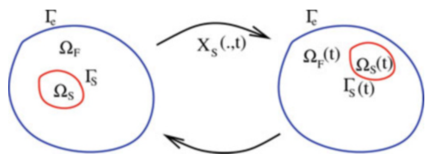

> Image description: This diagram, captioned "Control of Fluids and Fluid-Structure Interactions, Fig. 1," illustrates a time-dependent domain transformation typically used in fluid-structure interaction (FSI) modeling. The figure depicts two states of a physical system. On the left, the initial configuration shows a large blue domain, $\Omega_{\text{F}}$, bounded by $\Gamma_{\text{e}}$, containing a smaller red domain, $\Omega_{\text{S}}$, which is bounded by $\Gamma_{\text{S}}$. Two curved arrows represent the temporal evolution of the system. The top arrow, labeled with the displacement function $X_{\text{S}}(\cdot, t)$, points from the initial state to a second state on the right. In this second state, the domains are transformed into time-dependent sets: $\Omega_{\text{F}}(t)$, $\Omega_{\text{S}}(t)$, and $\Gamma_{\text{S}}(t)$. The bottom arrow curves back toward the initial state, indicating the reversible or continuous nature of the motion. The diagram geometrically represents how the movement of a solid structure ($\Omega_{\text{S}}$) affects the surrounding fluid domain ($\Omega_{\text{F}}$).
Control of Fluids and Fluid-Structure Interactions, Fig. 1


<!-- source_pdf_page: 189 -->
$\Gamma_{e}=\partial \Omega_{F}(t) \backslash \partial \Omega_{S}(t)$. The boundary condition on $\Gamma_{e} \times(0, T)$ may be of the form

$$
\begin{equation*}
u=m_{c} f \quad \text { on } \quad \Gamma_{e} \times(0, \infty) \tag{17}
\end{equation*}
$$

with $\int_{\Gamma_{e}} m_{c} f \cdot n=0, f$ is a control, and $m_{c}$ a localization function.

## An Elastic Beam Located at the Boundary of a Two-Dimensional Domain Filled by an Incompressible Viscous Fluid

When the structure is described by an infinitedimensional model (a partial differential equation or a system of p.d.e.), there are a few existence results for such systems and mainly existence of weak solutions (Chambolle et al. 2005). But for stabilization and control problems of nonlinear systems, we are usually interested in strong solutions. Let us describe a two-dimensional model in which a one-dimensional structure is located on a flat part $\Gamma_{S}=(0, L) \times\left\{y_{0}\right\}$ of the boundary of the reference configuration of the fluid domain $\Omega_{F}$. We assume that the structure is a EulerBernoulli beam with or without damping. The displacement $\eta$ of the structure in the direction normal to the boundary $\Gamma_{S}$ is described by the partial differential equation

$$
\begin{align*}
& \eta_{t t}-b \eta_{x x}-c \eta_{t x x}+a \eta_{x x x x}=F, \text { in } \Gamma_{S} \times(0, \infty), \\
& \eta=0 \quad \text { and } \quad \eta_{x}=0 \text { on } \partial \Gamma_{S} \times(0, \infty), \\
& \eta(0)=\eta_{1}^{0} \quad \text { and } \quad \eta_{t}(0)=\eta_{2}^{0} \text { in } \Gamma_{S}, \tag{18}
\end{align*}
$$

where $\eta_{x}, \eta_{x x}$, and $\eta_{x x x x}$ stand for the first, the second, and the fourth derivative of $\eta$ with respect to $x \in \Gamma_{S}$. The other derivatives are defined in a similar way. The coefficients $b$ and $c$ are nonnegative, and $a>0$. The term $c \eta_{t x x}$ is a structural damping term. At time $t$, the structure occupies the position $\Gamma_{S}(t)= \left\{(x, y) \mid x \in(0, L), y=y_{0}+\eta(x, t)\right\}$. When $\Omega_{F}$ is a two-dimensional model, $\Gamma_{S}$ is of dimension one, and $\partial \Gamma_{S}$ is reduced to the two extremities of $\Gamma_{S}$. The momentum balance is
obtained by writing that $F$ in Eq. (18) is given by $F=-\sqrt{1+\eta_{x}^{2}} \sigma(u, p) \tilde{n} \cdot n$, where $\tilde{n}(x, y)$ is the unit normal at $(x, y) \in \Gamma_{S}(t)$ to $\Gamma_{S}(t)$ outward $\Omega_{F}(t)$, and $n$ is the unit normal to $\Gamma_{S}$ outward $\Omega_{F}(0)=\Omega_{F}$. If in addition, a control $f$ acts as a distributed control in the beam equation, we shall have

$$
\begin{equation*}
F=-\sqrt{1+\eta_{x}^{2}} \sigma(u, p) \tilde{n} \cdot n+f \tag{19}
\end{equation*}
$$

The equality of velocities on $\Gamma_{S}(t)$ reads as

$$
\begin{align*}
& u\left(x, y_{0}+\eta(x, t)\right)=\left(0, \eta_{t}(x, t)\right) \\
& x \in(0, L), t>0 \tag{20}
\end{align*}
$$

## Control of Fluid-Structure Models

To control or to stabilize fluid-structure models, the control may act either in the fluid equation or in the structure equation or in both equations. There are a very few controllability and stabilization results for systems coupling the incompressible Navier-Stokes system with a structure equation. We state below two of those results. Some other results are obtained for simplified one-dimensional models coupling the viscous Burgers equation coupled with the motion of a mass; see Badra and Takahashi (2013) and the references therein.

We also have to mention here recent papers on control problems for systems coupling quasistationary Stokes equations with the motion of deformable bodies, modeling microorganism swimmers at low Reynolds number; see Alouges et al. (2008).

## Null Controllability of the Navier-Stokes System Coupled with the Motion of a Rigid Body

The system coupling the incompressible NavierStokes system Eq. (3) in the domain drawn in Fig. 1, with the motion of a rigid body


<!-- source_pdf_page: 190 -->
described by Eqs. (13)-(16), with the boundary control Eq. (17) is null controllable locally in a neighborhood of 0 . Before linearizing the system in a neighborhood of 0 , the fluid equations have to be rewritten in Lagrangian coordinates, that is, in the cylindrical domain $\Omega_{F} \times(0, \infty)$. The linearized system is the Stokes system coupled with a system of ordinary differential equations. The proof of this null controllability result relies on a Carleman estimate for the adjoint system; see, e.g., Boulakia and Guerrero (2013).

## Feedback Stabilization of the Navier-Stokes System Coupled with a Beam Equation

The system coupling the incompressible NavierStokes system Eq. (3) in the domain drawn in Fig. 2, with beam Eqs. (18)-(20), can be locally stabilized with any prescribed exponential decay rate $-\alpha<0$, by a feedback control $f$ acting in Eq. (18) via Eq. (19); see Raymond (2010). The proof consists in showing that the infinitesimal generator of the linearized model is an analytic semigroup (when $c>0$ ), that its resolvent is compact, and that the Hautus criterion is satisfied.

When the control acts in the fluid equation, the system coupling Eq. (3) in the domain drawn in Fig. 2, with the beam Eqs. (18)-(20), can be stabilized when $c>0$. To the best of our knowledge, there is no null controllability result for such systems, even with controls acting both in the structure and fluid equations. The case where the beam equation is approximated by a finite-dimensional model is studied in Lequeurre (2013).

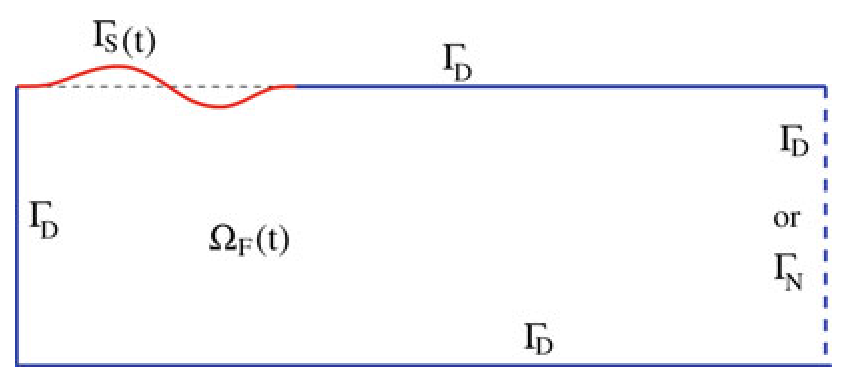

> Image description: A schematic diagram representing a fluid-structure interaction domain, denoted as $\Omega_{\text{F}}(t)$. The domain is bounded by several distinct boundary segments. The top boundary features a wavy red segment labeled $\Gamma_{\text{S}}(t)$, representing a moving or oscillating structure interface. The remaining boundaries are represented by solid blue lines and a dashed blue line on the right side. The solid boundaries are labeled as $\Gamma_{\text{D}}$, likely representing Dirichlet boundary conditions. The vertical dashed boundary on the right side is labeled with two options: $\Gamma_{\text{D}}$ or $\Gamma_{\text{N}}$, indicating either Dirichlet or Neumann boundary conditions. The labels $\Gamma_{\text{D}}$ and $\Gamma_{\text{N}}$ suggest a mathematical model for controlling fluid flow within the domain $\Omega_{\text{F}}(t)$ through specified boundary constraints. The figure illustrates the geometric setup for studying system coupling between a fluid domain and a structural interface.
Control of Fluids and Fluid-Structure Interactions, Fig. 2

## Cross-References

- Bilinear Control of Schrödinger PDEs
- Boundary Control of Korteweg-de Vries and Kuramoto-Sivashinsky PDEs
- Motion Planning for PDEs


## Bibliography

Alouges F, DeSimone A, Lefebvre A (2008) Optimal strokes for low Reynolds number swimmers: an example. J Nonlinear Sci 18:277-302
Badra M (2009) Lyapunov function and local feedback boundary stabilization of the Navier-Stokes equations. SIAM J Control Optim 48:1797-1830
Badra M, Takahashi T (2013) Feedback stabilization of a simplified 1d fluid-particle system. An. IHP, Analyse Non Lin. http://dx.doi.org/10.1016/j.anihpc.2013.03. 009
Barbu V, Lasiecka I, Triggiani R (2006) Tangential boundary stabilization of Navier-Stokes equations. Mem Am Math Soc 181 (852) 128
Boulakia M, Guerrero S (2013) Local null controllability of a fluid-solid interaction problem in dimension 3. J Eur Math Soc 15:825-856
Chambolle A, Desjardins B, Esteban MJ, Grandmont C (2005) Existence of weak solutions for unsteady fluid-plate interaction problem. J Math Fluid Mech 7:368-404
Coron J-M (1996) On the controllability of 2-D incompressible perfect fluids. J Math Pures Appl 75(9):155-188
Coron J-M (2007) Control and nonlinearity. American Mathematical Society, Providence
Ervedoza S, Glass O, Guerrero S, Puel J-P (2012) Local exact controllability for the one-dimensional compressible Navier-Stokes equation. Arch Ration Mech Anal 206:189-238
Fabre C, Lebeau G (1996) Prolongement unique des solutions de l'équation de Stokes. Comm. P. D. E. 21:573-596
Fernandez-Cara E, Guerrero S, Imanuvilov Yu O, Puel J-P (2004) Local exact controllability of the Navier-Stokes system. J Math Pures Appl 83:1501-1542
Fursikov AV (2004) Stabilization for the 3D NavierStokes system by feedback boundary control. Partial differential equations and applications. Discrete Contin Dyn Syst 10:289-314
Fursikov AV, Imanuvilov Yu O (1996) Controllability of evolution equations. Lecture notes series, vol 34 . Seoul National University, Research Institute of Mathematics, Global Analysis Research Center, Seoul
Lequeurre J (2013) Null controllability of a fluid-structure system. SIAM J Control Optim 51:1841-1872
Raymond J-P (2006) Feedback boundary stabilization of the two dimensional Navier-Stokes equations. SIAM J Control Optim 45:790-828


<!-- source_pdf_page: 191 -->
Raymond J-P (2007) Feedback boundary stabilization of the three-dimensional incompressible Navier-Stokes equations. J Math Pures Appl 87:627-669
Raymond J-P (2010) Feedback stabilization of a fluidstructure model. SIAM J Control Optim 48:5398-5443
Raymond J-P, Thevenet L (2010) Boundary feedback stabilization of the two dimensional Navier-Stokes equations with finite dimensional controllers. Discret Contin Dyn Syst A 27:1159-1187
Vazquez R, Krstic M (2008) Control of turbulent and magnetohydrodynamic channel flows: boundary stabilization and estimation. Birkhäuser, Boston

## Control of Linear Systems with Delays

Wim Michiels
KU Leuven, Leuven (Heverlee), Belgium


#### Abstract

The presence of time delays in dynamical systems may induce complex behavior, and this behavior is not always intuitive. Even if a system's equation is scalar, oscillations may occur. Time delays in control loops are usually associated with degradation of performance and robustness, but, at the same time, there are situations where time delays are used as controller parameters.


## Keywords

Delay differential equations; Delays as controller parameters; Functional differential equation

## Introduction

Time-delays are important components of many systems from engineering, economics, and the life sciences, due to the fact that the transfer of material, energy, and information is mostly not instantaneous. They appear, for instance, as computation and communication lags, they
model transport phenomena and heredity, and they arise as feedback delays in control loops. An overview of applications, ranging from traffic flow control and lasers with phase-conjugate feedback, over (bio)chemical reactors and cancer modeling, to control of communication networks and control via networks, is included in Sipahi et al. (2011).

The aim of this contribution is to describe some fundamental properties of linear control systems subjected to time-delays and to outline principles behind analysis and synthesis methods. Throughout the text, the results will be illustrated by means of the scalar system

$$
\begin{equation*}
\dot{x}(t)=u(t-\tau), \tag{1}
\end{equation*}
$$

which, controlled with instantaneous state feedback, $u(t)=-k x(t)$, leads to the closed-loop system

$$
\begin{equation*}
\dot{x}(t)=-k x(t-\tau) . \tag{2}
\end{equation*}
$$

Although this didactic example is extremely simple, we shall see that its dynamics are already very rich and shed a light on delay effects in control loops.

In some works, the analysis of (2) is called the hot shower problem, as it can be interpreted as a (over)simplified model for a human adjusting the temperature in a shower: $x(t)$ then denotes the difference between the water temperature and the desired temperature as felt by the person, the term $-k x(t)$ models the reaction of the person by further opening or closing taps, and the delay is due to the propagation with finite speed of the water in the ducts.

## Basis Properties of Time-Delay Systems

## Functional Differential Equation

We focus on a model for a time-delay system described by

$$
\begin{equation*}
\dot{x}(t)=A_{0} x(t)+A_{1} x(t-\tau), \quad x(t) \in \mathbb{R}^{n} . \tag{3}
\end{equation*}
$$


<!-- source_pdf_page: 192 -->
This is an example of a functional differential equation (FDE) of retarded type. The term FDE stems from the property that the right-hand side can be interpreted as a functional evaluated at a piece of trajectory. The term retarded expresses that the right-hand side does not explicitly depend on $\dot{x}$.

As a first difference with an ordinary differential equation, the initial condition of (3) at $t=0$ is a function $\phi$ from $[-\tau, 0]$ to $\mathbb{R}^{n}$. For all $\phi \in \mathcal{C}\left([-\tau, 0], \mathbb{R}^{n}\right)$, where $\mathcal{C}\left([-\tau, 0], \mathbb{R}^{n}\right)$ is the space of continuous functions mapping the interval $[-\tau, 0]$ into $\mathbb{R}^{n}$, a forward solution $x(\phi)$ exists and is uniquely defined. In Fig. 1, a solution of the scalar system (2) is shown.

The discontinuity in the derivative at $t=0$ stems from $A_{0} \phi(0)+A_{1} \phi(-\tau) \neq \lim _{\theta \rightarrow 0} \dot{\phi}$. Due to the smoothing property of an integrator, however, at $t=n \in \mathbb{N}$, the discontinuity will only be present in the $(n+1)$ th derivative. This illustrates a second property offunctional
differential equations of retarded type: solutions become smoother as time evolves. As a third major difference with ODEs, backward continuation of solutions is not always possible (Michiels and Niculescu 2007).

## Reformulation in a First-Order Form

The state of system (3) at time $t$ is the minimal information needed to continue the solution, which, once again, boils down to a function segment $x_{t}(\phi)$ where $x_{t}(\phi)(\theta)=x(t+\theta), \theta \in[-\tau, 0]$ (in Fig. 1, the function $x_{t}$ is shown in red for $t=5$ ). This suggests that (3) can be reformulated as a standard ordinary differential equation over the infinite-dimensional space $\mathcal{C}\left([-\tau, 0], \mathbb{R}^{n}\right)$. This equation takes the form

$$
\begin{equation*}
\frac{d}{d t} z(t)=\mathcal{A} z(t), z(t) \in \mathcal{C}\left([-\tau, 0], \mathbb{R}^{n}\right) \tag{4}
\end{equation*}
$$

where operator $\mathcal{A}$ is given by

$$
\begin{gather*}
\mathcal{D}(\mathcal{A})=\left\{\phi \in \mathcal{C}\left(\left[-\tau_{m}, 0\right], \mathbb{R}^{n}\right): \quad \begin{array}{l}
\dot{\phi} \in \mathcal{C}\left(\left[-\tau_{m}, 0\right], \mathbb{R}^{n}\right) \\
\dot{\phi}(0)=A_{0} \phi(0)+A_{1} \phi(-\tau)
\end{array}\right\}, \\
=\frac{d \phi}{d \theta} . \tag{5}
\end{gather*}
$$

The relation between solutions of (3) and (4) is given by $z(t)(\theta)=x(t+\theta), \theta \in[-\tau, 0]$. Note that all system information is concentrated in the nonlocal boundary condition describing the domain of $\mathcal{A}$. The representation (4) is closely related to a description by an advection PDE with a nonlocal boundary condition (Krstic 2009).

## Asymptotic Growth Rate of Solutions and Stability

The reformulation of (3) into the standard form (4) allows us to define stability notions and to generalize the stability theory for ordinary differential equations in a straightforward way, with the main change that the state space is $\mathcal{C}\left([-\tau, 0], \mathbb{R}^{n}\right)$. For example, the null solution of (3) is exponentially stable if and only if there exist constants $C>0$ and $\gamma>0$ such that

$$
\forall \phi \in \mathcal{C}\left(\left[-\tau_{m}, 0\right], \mathbb{R}^{n}\right)\left\|x_{t}(\phi)\right\|_{s} \leq C e^{-\gamma \mathrm{t}}\|\phi\|_{s},
$$

where $\|\cdot\|_{s}$ is the supremum norm and $\|\phi\|_{s}= \sup _{\theta \in[-\tau, 0]}\|\phi(\theta)\|_{2}$. As the system is linear,
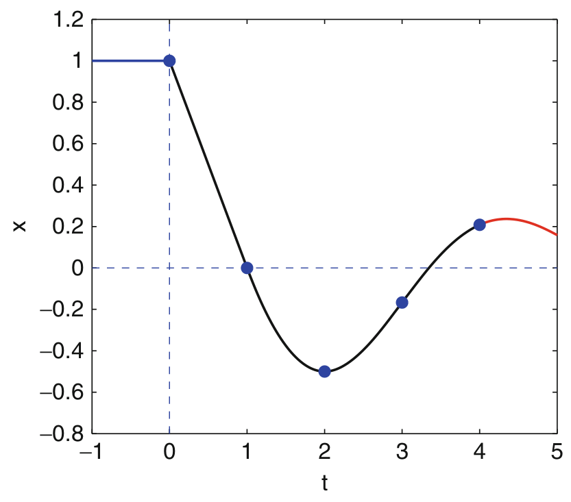

> Image description: A line graph from a textbook titled "Control of Linear Systems with Delays" illustrates the solution of a system equation over time $t$. The horizontal axis is labeled $t$ and ranges from $-1$ to $5$, while the vertical axis is labeled $x$ and ranges from $-0.8$ to $1.2$. The plot shows a piecewise function: for $t < 0$, the solution is a constant line at $x = 1$. At $t=0$, the trajectory begins to oscillate, crossing the x-axis (indicated by a blue dashed horizontal line) at $t=1$ and reaching a minimum near $t=2$. The curve then rises, passing through another point at $t=3$ and peaking at $t=4$. Blue dots mark specific points on the trajectory at integer intervals of $t$ from $0$ to $4$. From $t=4$ to $t=5$, the line changes color from black to red. The figure demonstrates a delayed system response given $\tau=1, k=1$, and initial condition $\phi \equiv 1$.

Control of Linear Systems with Delays, Fig. 1 Solution of (2) for $\tau=1, k=1$, and initial condition $\phi \equiv 1$


<!-- source_pdf_page: 193 -->
asymptotic stability and exponential stability are equivalent. A direct generalization of Lyapunov's second method yields:

Theorem 1 The null solution of linear system (3) is asymptotically stable if there exist a continuous functional $V: \mathcal{C}\left([-\tau, 0], \mathbb{R}^{n}\right) \rightarrow \mathbb{R}(a$ so-called Lyapunov-Krasovskii functional) and continuous nondecreasing functions $u, v, w: \mathbb{R}^{+} \rightarrow \mathbb{R}^{+}$with

$$
\begin{array}{r}
u(0)=v(0)=w(0)=0 \text { and } u(s)>0 \\
v(s)>0, w(s)>\text { for } s>0
\end{array}
$$

such that for all $\phi \in \mathcal{C}\left([-\tau, 0], \mathbb{R}^{n}\right)$

$$
\begin{array}{r}
u\left(\|\phi\|_{s}\right) \leq V(\phi) \leq v\left(\|\phi()\|_{2}\right), \\
\dot{V}(\phi) \leq-w\left(\|\phi()\|_{2}\right),
\end{array}
$$

where

$$
\dot{V}(\phi)=\limsup _{h \rightarrow 0+} \frac{1}{h}\left[V\left(x_{h}(\phi)\right)-V(\phi)\right]
$$

Converse Lyapunov theorems and the construction of the so-called complete-type Lyapunov-Krasovskii functionals are discussed in Kharitonov (2013). Imposing a particular structure on the functional, e.g., a form depending only on a finite number of free parameters, often leads to easy-to-check stability criteria (for instance, in the form of LMIs), yet as price to pay, the obtained results may be conservative in the sense that the sufficient stability conditions might not be close to necessary conditions. As an alternative to Lyapunov functionals, Lyapunov functions can be used as well, provided that the condition $\dot{V}<0$ is relaxed (the socalled Lyapunov-Razumikhin approach); see, for example, Gu et al. (2003).

## Delay Differential Equations as Perturbation of ODEs

Many results on stability, robust stability, and control of time-delay systems are explicitly or implicitly based on a perturbation point of view, where delay differential equations are seen as perturbations of ordinary differential equations. For instance, in the literature, a classification of stability criteria is often presented in terms
of delay-independent criteria (conditions holding for all values of the delays) and delay-dependent criteria (usually holding for all delays smaller than a bound). This classification has its origin at two different ways of seeing (3) as a perturbation of an ODE, with as nominal system $\dot{x}(t)= A_{0} x(t)$ and $\dot{x}(t)=\left(A_{0}+A_{1}\right) x(t)$ (system for zero delay), respectively. This observation is illustrated in Fig. 2 for results based on input-output- and Lyapunov-based approaches.

## The Spectrum of Linear Time-Delay Systems

## Two Eigenvalue Problems

The substitution of an exponential solution in (3) leads us to the nonlinear eigenvalue problem
$\left(\lambda I-A_{0}-A_{1} e^{-\lambda \tau}\right) v=0, \lambda \in \mathbb{C}, v \in \mathbb{C}^{n}, v \neq 0$.

The solutions of the equation $\operatorname{det}\left(\lambda I-A_{0}-\right. \left.A_{1} e^{-\lambda \tau}\right)=0$ are called characteristic roots. Similarly, formulation (4) leads to the equivalent infinite-dimensional linear eigenvalue problem

$$
\begin{equation*}
(\lambda I-\mathcal{A}) u=0, \lambda \in \mathbb{C}, u \in \mathcal{C}\left([-\tau, 0], \mathbb{C}^{n}\right), u \not \equiv 0 . \tag{7}
\end{equation*}
$$

The combination of these two viewpoints lays at the basis of most methods for computing characteristic roots; see Michiels (2012). On the one hand, discretizing (7), i.e., approximating $\mathcal{A}$ with a matrix, and solving the resulting standard eigenvalue problems allow to obtain global information, for example, estimates of all characteristic roots in a given compact set or in a given right half plane. On the other hand, the (finitely many) nonlinear equations (6) allow to make local corrections on characteristic root approximations up to the desired accuracy, e.g., using Newton's method or inverse residual iteration. Linear time-delay systems satisfy spectrum-determined growth properties of solutions. For instance, the zero solution of (3) is asymptotically stable if and only if all characteristic roots are in the open left half plane.


<!-- source_pdf_page: 194 -->
Delay-independent results Delay-dependent results

$$
\dot{x}(t)=A_{0} x(t)+A_{1} x(t-\tau) \quad \dot{x}(t)=\left(A_{0}+A 1\right) x(t)+A_{1}(x(t-\tau)-x(t))
$$

input-output setting:
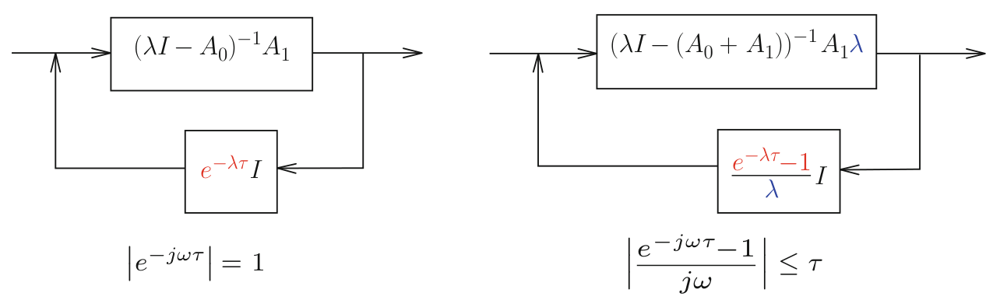

Lyapunov setting:

$$
\begin{array}{ll}
V=x^{T} P x+\int \ldots & V=x^{T} P x+\int \ldots \\
\text { where } & \text { where } \\
A_{0}{ }^{T} P+P A_{0}<0 & \left(A_{0}+A_{1}\right)^{T} P+P\left(A_{0}+A_{1}\right)<0
\end{array}
$$

Control of Linear Systems with Delays, Fig. 2 The classification of stability criteria in delay-independent results and delay-dependent results stems from two different perturbation viewpoints. Here, perturbation terms are printed in red
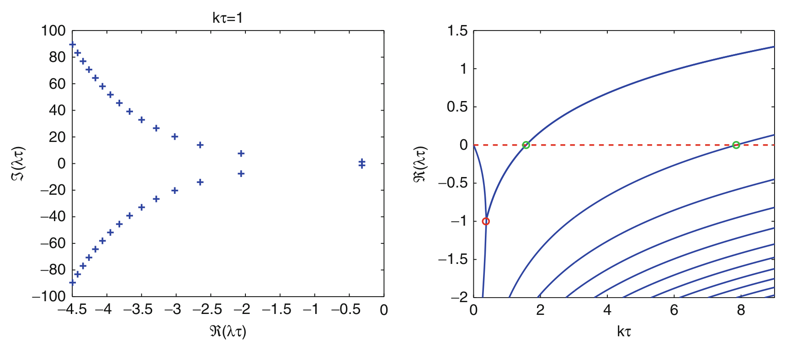

> Image description: Figure 2 consists of two side-by-side plots illustrating stability criteria for linear systems with delays, under the condition $k\tau=1$. The left plot shows a discrete set of blue '+' markers on a 2D plane. The horizontal axis is labeled $\Re(\lambda\tau)$ and the vertical axis is labeled $\Im(\lambda\tau)$. The points form a V-shaped distribution symmetric about the horizontal axis, extending from approximately $-4.5$ to $-0.3$ on the real axis and from $-90$ to $90$ on the imaginary axis. The right plot displays several blue continuous curves on a coordinate system where the horizontal axis is $k\tau$ and the vertical axis is $\Re(\lambda\tau)$. A horizontal dashed red line is drawn at $\Re(\lambda\tau) = 0$. This line intersects the curves at two points marked with green circles. Additionally, one curve features a single red circle at approximately $(0.5, -1)$. The curves generally trend upwards as $k\tau$ increases.

Control of Linear Systems with Delays, Fig. 3 (Left) Rightmost characteristic roots of (2) for $k \tau=1$. (Right) Real parts of rightmost characteristic roots as a function of $k \tau$

In Fig. 3 (left), the rightmost characteristic roots of (2) are depicted for $k \tau=1$. Note that since the characteristic equation can be written as $\lambda \tau+k \tau e^{-\lambda \tau}=0, k$ and $\tau$ can be combined into one parameter. In Fig. 3 (right), we show the real parts of the characteristic roots as a function of $k \tau$. The plots illustrate some important spectral properties of retarded-type FDEs. First, even though there are in general infinitely many characteristic roots, the number of them in any right half plane is always finite. Second, the individual characteristic roots, as well as the spectral
abscissa, i.e., the supremum of the real parts of all characteristic roots, continuously depend on parameters. Related to this, a loss or gain of stability is always associated with characteristic roots crossing the imaginary axis. Figure 3 (right) also illustrates the transition to a delay-free system as $k \tau \rightarrow 0^{+}$.

## Critical Delays: A Finite-Dimensional Characterization

Assume that for a given value of $k$, we are looking for values of the delay $\tau_{c}$ for which (2)


<!-- source_pdf_page: 195 -->
has a characteristic root $j \omega_{c}$ on the imaginary axis. From $j \omega=-k e^{-j \omega \tau}$, we get

$$
\begin{align*}
\omega_{c} & =k, \tau_{c}=\frac{\frac{\pi}{2}+l 2 \pi}{\omega_{c}}, l \\
& =0,1, \ldots, \Re\left\{\left.\frac{d \lambda}{d \tau}\right|_{\left(\tau_{c}, j \omega_{c}\right)}\right\}^{-1}=\frac{1}{\omega_{c}^{2}} . \tag{8}
\end{align*}
$$

Critical delay values $\tau_{c}$ are indicated with green circles on Fig. 3 (right). The above formulas first illustrate an invariance property of imaginary axis roots and their crossing direction with respect to delay shifts of $2 \pi / \omega_{c}$. Second, the number of possible values of $\omega_{c}$ is one and thus finite. More generally, substituting $\lambda=j \omega$ in (6) and treating $\tau$ as a free parameter lead to a twoparameter eigenvalue problem

$$
\begin{equation*}
\left(j \omega I-A_{0}-A_{1} z\right) v=0 \tag{9}
\end{equation*}
$$

with $\omega$ on the real axis and $z:=\exp (-j \omega \tau)$ on the unit circle. Most methods to solve such a problem boil down to an elimination of one of the independent variables $\omega$ or $z$. As an example of an elimination technique, we directly get from (9)

$$
\begin{aligned}
& j \omega \in \sigma\left(A_{0}+A_{1} z\right),-j \omega \in \sigma\left(A_{0}^{*}+A_{1}^{*} z^{-1}\right) \\
& \Rightarrow \operatorname{det}\left(\left(A_{0}+A_{1} z\right) \oplus\left(A_{0}^{*}+A_{1}^{*} z^{-1}\right)\right)=0
\end{aligned}
$$

where $\sigma(\cdot)$ denotes the spectrum and ⊕ the Kronecker sum. Clearly, the resulting eigenvalue problem in $z$ is finite dimensional.

## Control of Linear Time-Delay System

## Limitations Induced by Delays

It is well known that delays in control loop may lead to a significant degradation of performance and robustness and even to instability (Niculescu 2001; Richard 2003). Let us return to example (2). As illustrated with Fig. 3 and expressions (8), the system loses stability if $\tau$ reaches the value $\pi / 2 k$, while stability cannot be recovered for larger delays. The maximum achievable exponential decay rate of the solutions, which corresponds to the minimum of the
spectral abscissa, is given by $-1 / \tau$; hence, large delays can only be tolerated at the price of a degradation of the rate of convergence. It should be noted that the limitations induced by delays are even more stringent if the uncontrolled systems are exponentially unstable, which is not the case for (2).

The analysis in the previous sections gives a hint why control is difficult in the presence of delays: the system is inherently infinite dimensional. As a consequence, most control design problems which involve determining a finite number of parameters can be interpreted as reduced-order control design problems or as control design problems for under-actuated systems, which both are known to be hard problems.

## Fixed-Order Control

Most standard control design techniques lead to controllers whose dimension is larger or equal to the dimension of the system. For infinitedimensional time-delay system, such controllers might have a disadvantage of being complicated and hard to implement. To see this, for a system with delay in the state, the generalization of static state feedback, $u(t)=k(x)$, is given by $u(t)=\int_{-\tau}^{0} x(t+\theta) d \mu(\theta)$, where $\mu$ is a function of bounded variation. However, in the context of large-scale systems, it is known that reducedorder controllers often perform relatively well compared to full-order controllers, while they are much easier to implement.

Recently, new methods for the design of controllers with a prescribed order (dimension) or structure have been proposed (Michiels 2012). These methods rely on a direct optimization of appropriately defined cost functions (spectral abscissa, $\mathcal{H}_{2} / \mathcal{H}_{\infty}$ criteria). While $\mathcal{H}_{2}$ criteria can be addressed within a derivative-based optimization framework, $\mathcal{H}_{\infty}$ criteria and the spectral abscissa require targeted methods for non-smooth optimization problems. To illustrate the need for such methods, consider again Fig. 3 (right): minimizing the spectral abscissa for a given value of $\tau$ as a function of the controller gain $k$ leads to an optimum where the objective function is not differentiable, even not locally Lipschitz, as shown


<!-- source_pdf_page: 196 -->
by the red circle. In case of multiple controller parameters, the path of steepest descent in the parameter space typically has phases along a manifold characterized by the non-differentiability of the objective function.

## Using Delays as Controller Parameters

In contrast to the detrimental effects of delays, there are situations where delays have a beneficial effect and are even used as controller parameters; see Sipahi et al. (2011). For instance, delayed feedback can be used to stabilize oscillatory systems where the delay serves to adjust the phase in the control loop. Delayed terms in control laws can also be used to approximate derivatives in the control action. Control laws which depend on the difference $x(t)-x(t-\tau)$, the so-called Pyragas-type feedback, have the property that the position of equilibria and the shape of periodic orbits with period $\tau$ are not affected, in contrary to their stability properties. Last but not least, delays can be used in control schemes to generate predictions or to stabilize predictors, which allow to compensate delays and improve performance (Krstic 2009; Zhong 2006). Let us illustrate the main idea once more with system (1).

System (1) has a special structure, in the sense that the delay is only in the input, and it is advantageous to exploit this structure in the context of control. Coming back to the didactic example, the person who is taking a shower is - possibly after some bad experiences - aware about the delay and will take into account his/her prediction of the system's reaction when adjusting the cold and hot water supply. Let us, to conclude, formalize this. The uncontrolled system can be rewritten as $\dot{x}(t)=v(t)$, where $v(t)=u(t-\tau)$. We know $u$ up to the current time $t$; thus, we know $v$ up to time $t+\tau$, and if $x(t)$ is also known, we can predict the value of $x$ at time $t+\tau$,

$$
\begin{aligned}
x_{p}(t+\tau) & =x(t)+\int_{t}^{t+\tau} v(s) d s \\
& =x(t)+\int_{t-\tau}^{t} u(s) d s
\end{aligned}
$$

and use the predicted state for feedback. With the control law $u(t)=-k x_{p}(t+\tau)$, there is only
one closed-loop characteristic root at $\lambda=-k$, i.e., as long as the model used in the predictor is exact, the delay in the loop is compensated by the prediction. For further reading on predictionbased controllers, see, e.g., Krstic (2009) and the references therein.

## Conclusions

Time-delay systems, which appear in a large number of applications, are a class of infinitedimensional systems, resulting in rich dynamics and challenges from a control point of view. The different representations and interpretations and, in particular, the combination of viewpoints lead to a wide variety of analysis and synthesis tools.

## Cross-References

- Control of Nonlinear Systems with Delays
- H-Infinity Control
- $\mathrm{H}_{2}$ Optimal Control
- Optimization-Based Control Design Techniques and Tools


## Bibliography

Gu K, Kharitonov VL, Chen J (2003) Stability of timedelay systems. Birkhäuser, Basel
Kharitonov VL (2013) Time-delay systems. Lyapunov functionals and matrices. Birkhäuser, Basel
Krstic M (2009) Delay compensation for nonlinear, adaptive, and PDE systems. Birkhäuser, Basel
Michiels W (2012) Design of fixed-order stabilizing and $\mathcal{H}_{2}-\mathcal{H}_{\infty}$ optimal controllers: an eigenvalue optimization approach. In: Time-delay systems: methods, applications and new trends. Lecture notes in control and information sciences, vol 423. Springer, Berlin/Heidelberg, pp 201-216
Michiels W, Niculescu S-I (2007) Stability and stabilization of time-delay systems: an eigenvalue based approach. SIAM, Philadelphia
Niculescu S-I (2001) Delay effects on stability: a robust control approach. Lecture notes in control and information sciences, vol 269. Springer, Berlin/New York
Richard J-P (2003) Time-delay systems: an overview of recent advances and open problems. Automatica 39(10):1667-1694


<!-- source_pdf_page: 197 -->
Sipahi R, Niculescu S, Abdallah C, Michiels W, Gu K (2011) Stability and stabilization of systems with timedelay. IEEE Control Syst Mag 31(1):38-65
Zhong Q-C (2006) Robust control of time-delay systems. Springer, London

## Control of Machining Processes

Kaan Erkorkmaz
Department of Mechanical \& Mechatronics
Engineering, University of Waterloo, Waterloo, ON, Canada


#### Abstract

Control of machining processes encompasses a broad range of technologies and innovations, ranging from optimized motion planning and servo drive loop design to on-the-fly regulation of cutting forces and power consumption to applying control strategies for damping out chatter vibrations caused by the interaction of the chip generation mechanism with the machine tool structural dynamics. This article provides a brief introduction to some of the concepts and technologies associated with machining process control.


## Keywords

Adaptive control; Chatter vibrations; Feed drive control; Machining; Trajectory planning

## Introduction

Machining is used extensively in the manufacturing industry as a shaping process, where high product accuracy, quality, and strength are required. From automotive and aerospace components, to dies and molds, to biomedical implants, and even mobile device chassis, many manufactured products rely on the use of machining.

Machining is carried out on machine tools, which are multi-axis mechatronic systems designed to provide the relative motion between
the tool and workpiece, in order to facilitate the desired cutting operation. Figure 1 illustrates a single axis of a ball screw-driven machine tool, performing a milling operation. Here, the cutting process is influenced by the motion of the servo drive. The faster the part is fed in towards the rotating cutter, the larger the cutting forces become, following a typically proportional relationship that holds for a large class of milling operations (Altintas 2012). The generated cutting forces, in turn, are absorbed by the machine tool and feed drive structure. They cause mechanical deformation and may also excite the vibration modes, if their harmonic content is near the structural natural frequencies. This may, depending on the cutting speed and tool and workpiece engagement conditions, lead to forced vibrations or chatter (Altintas 2012).

The disturbance effect of cutting forces is also felt by the servo control loop, consisting of mechanical, electrical, and digital components. This disturbance may result in the degradation of tool positioning accuracy, thereby leading to part errors. Another input that influences the quality achieved in a machining operation is the commanded trajectory. Discontinuous or poorly designed motion commands, with acceleration discontinuity, lead typically to jerky motion, vibrations, and poor surface finish. Beyond motion controller design and trajectory planning, emerging trends in machining process control include regulating, by feedback, various outcomes of the machining process, such as peak resultant cutting force, spindle power consumption, and amplitude of vibrations caused by the machining process. In addition to using actuators and instrumentation already available on a machine tool, such as feed and spindle drives and current sensors, additional devices, such as dynamometers, accelerometers, as well as inertial or piezoelectric actuators, may need to be used in order to achieve the required level of feedback and control injection capability.

## Servo Drive Control

Stringent requirements for part quality, typically specified in microns, coupled with disturbance


<!-- source_pdf_page: 198 -->
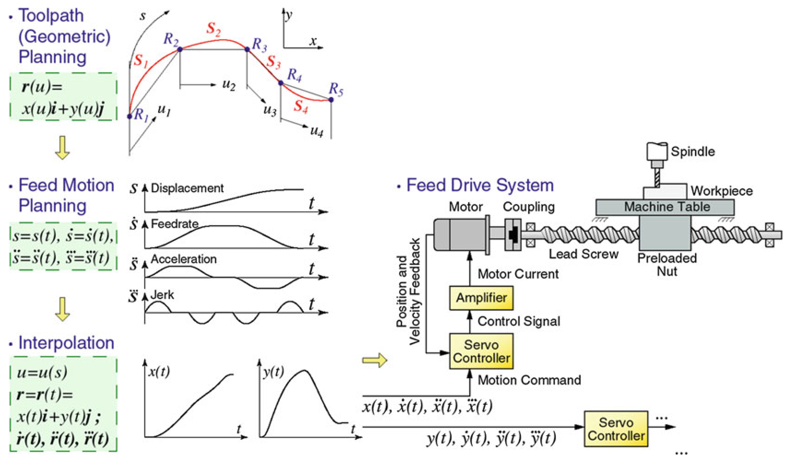

> Image description: An engineering diagram illustrating the hierarchical control architecture of a ball screw-driven machining process. The figure is divided into three main stages: planning, motion profiles, and the physical drive system. At the top, **Toolpath (Geometric) Planning** shows a 2D coordinate system with a parametric curve $\mathbf{r}(u) = [x(u), y(u)]^T$, defined by points $R_1$ through $R_5$ and parameters $u_1$ to $u_4$. Below this, **Feed Motion Planning** depicts time-series graphs for a parameter $s$ relative to time $t$. These include displacement ($s$), feedrate ($\dot{s}$), acceleration ($\ddot{s}$), and jerk ($\dddot{s}$). The bottom left shows **Interpolation**, mapping the parameter $s(t)$ to spatial coordinates $\mathbf{r}(t) = [x(t), y(t)]^T$ and their respective derivatives. Finally, the **Feed Drive System** block diagram shows a closed-loop control circuit where a **Servo Controller** sends a motion command through an **Amplifier** to a **Motor**. The motor drives a **Coupling**, **Lead Screw**, and **Preloaded Nut** to move a **Machine Table** holding a **Workpiece**. Position and velocity feedback from the motor returns to the controller.
Control of Machining Processes, Fig. 1 Single axis of a ball screw-driven machine tool performing milling

force inputs coming from the machining process, which can be in the order of tens to thousands of Newtons, require that the disturbance rejection of feed drives, which act as dynamic (i.e., frequency dependent) "stiffness" elements, be kept as strong as possible. In traditional machine design, this is achieved by optimizing the mechanical structure for maximum rigidity. Afterwards, the motion control loop is tuned to yield the highest possible bandwidth (i.e., responsive frequency range), without interfering with the vibratory modes of the machine tool in a way that can cause instability. The P-PI position velocity cascade control structure, shown in Fig. 2, is the most widely used technique in machine tool drives. Its tuning guidelines have been well established in the literature (Ellis 2004). To augment the command following accuracy, velocity and acceleration feedforward, and friction compensation terms are added. Increasing the closed-loop bandwidth yields better disturbance rejection and more accurate tracking of the commanded trajectory (Pritschow 1996), which is especially important in high-speed machining applications where elevated cutting speeds necessitate faster feed motion.

It can be seen in Fig. 3 that increased axis tracking errors ( $\mathrm{e}_{\mathrm{x}}$ and $\mathrm{e}_{\mathrm{y}}$ ) may result in increased contour error ( $\varepsilon$ ). A practical solution to mitigate this problem, in machine tool engineering, is to also match the dynamics of different motion axes, so that the tracking errors always assume an instantaneous proportion that brings the actual tool position as close as possible to the desired toolpath (Koren 1983). Sometimes, the control action can be designed to directly reduce the contour error as well, which leads to the structure known as "cross-coupling control" (Koren 1980).

## Trajectory Planning

Smooth trajectory planning with at least acceleration level continuity is required in machine tool control, in order to avoid inducing unwanted vibration or excessive tracking error during the machining process. For this purpose, computer numerical control (CNC) systems are equipped with various spline toolpath interpolation functions, such as B-splines, and NURBS. The feedrate (i.e., progression speed along the toolpath) is planned in the "look-ahead" function of the


<!-- source_pdf_page: 199 -->
Control of Machining Processes, Fig. 2 P-PI position velocity cascade control used in machine tool drives
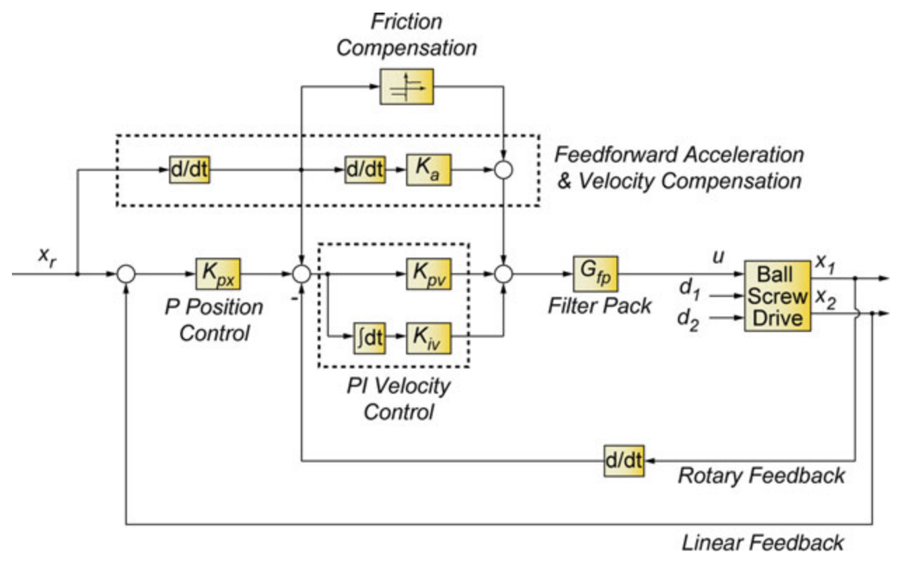

> Image description: This block diagram illustrates a P-PI position-velocity cascade control architecture for a machine tool drive. The system processes a reference input $x_r$ through a primary "P Position Control" block ($K_{px}$). A feedback loop labeled "Linear Feedback" returns signals to the initial summing junction. The error signal enters a "PI Velocity Control" inner loop, consisting of a proportional gain ($K_{pv}$) and an integral path ($\int dt$ with $K_{iv}$). Parallel to this, a "Feedforward Acceleration & Velocity Compensation" block utilizes derivative operators ($d/dt$) and a gain $K_a$. An additional "Friction Compensation" block provides a parallel feedforward signal. These paths converge and pass through a "Filter Pack" ($G_{fp}$) before reaching the "Ball Screw Drive" plant. The plant is subject to disturbances $d_1$ and $d_2$, yielding outputs $x_1$ and $x_2$. A "Rotary Feedback" loop provides velocity information via a $d/dt$ block to the velocity summing junction.

## Control of Machining Processes, Fig. 3

Formation of contour error ( $\varepsilon$ ), as a result of servo errors ( $\mathrm{e}_{\mathrm{x}}$ and $\mathrm{e}_{\mathrm{y}}$ ) in the individual axes
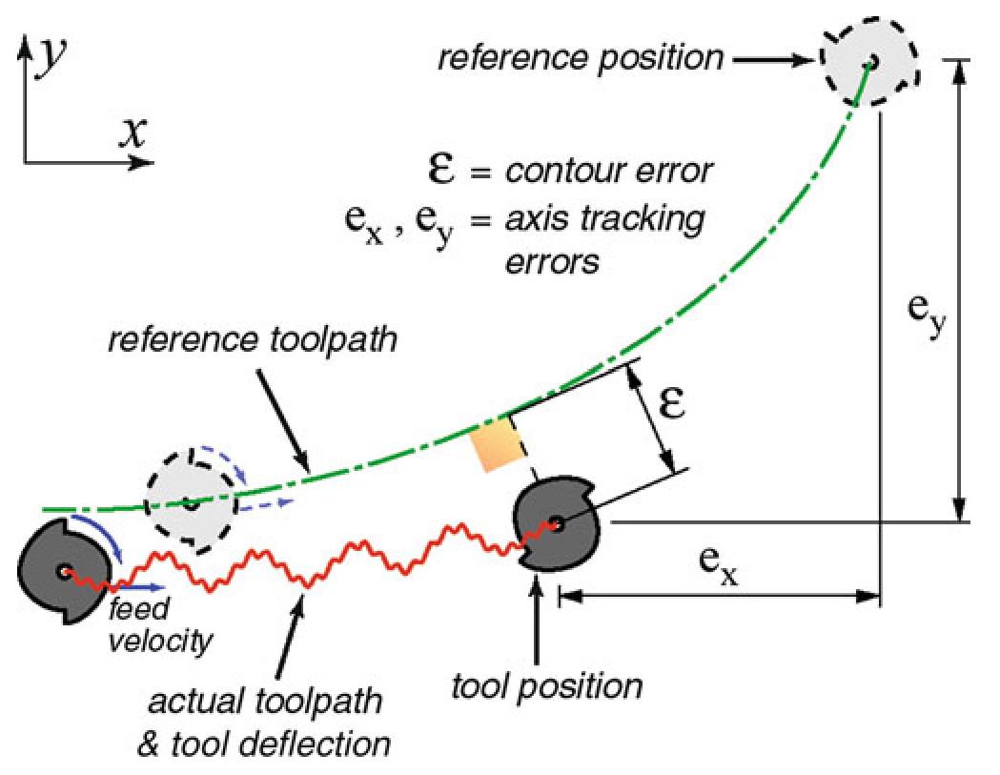

CNC so that the total machining cycle time is reduced as much as possible. This has to be done without violating the position-dependent feedrate limits already programmed into the numerical control (NC) code, which are specified by considering various constraints coming from the machining process.

In feedrate optimization, axis level trajectories have to stay within the velocity and torque limits of the drives, in order to avoid damaging the machine tool or causing actuator saturation. Moreover, as an indirect way of containing tracking errors, the practice of limiting axis level jerk (i.e., rate of change of acceleration) is applied (Gordon and Erkorkmaz 2013). This results in
reduced machining cycle time, while avoiding excessive vibration or positioning error due to "jerky" motion.

An example of trajectory planning using quintic (5th degree) polynomials for toolpath parameterization is shown in Fig. 4. Here, comparison is provided between unoptimized and optimized feedrate profiles subject to the same axis velocity, torque (i.e., control signal), and jerk limits. As can be seen, significant machining time reduction can be achieved through trajectory optimization, while retaining the dynamic tool position accuracy. While Fig. 4 shows the result of an elaborate nonlinear optimization approach (Altintas and Erkorkmaz 2003), practical look-ahead


<!-- source_pdf_page: 200 -->
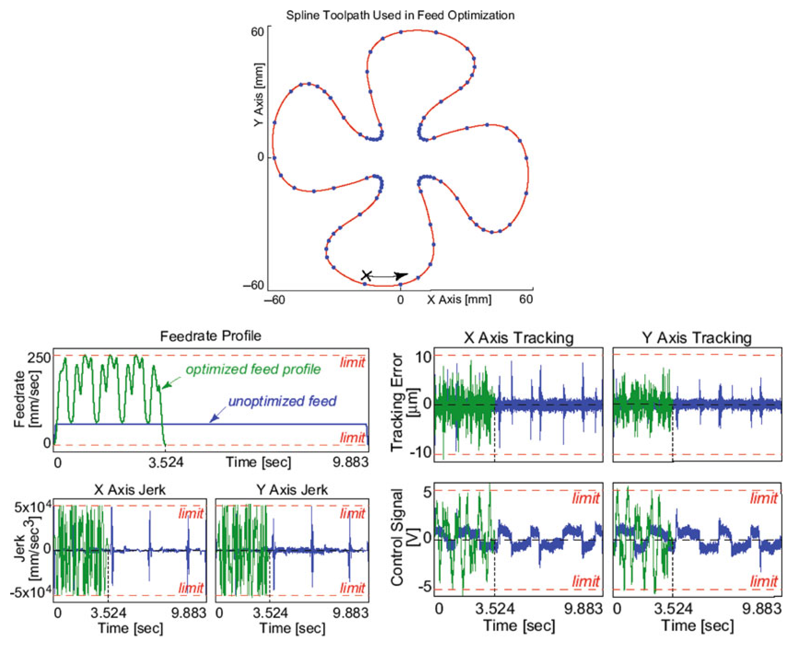

> Image description: This figure from a textbook on "Control of Machining Processes" compares machining performance with and without feedrate optimization using a quintic spline trajectory. The top graph shows the "Spline Toolpath Used in Feed Optimization" on an XY coordinate system in mm, illustrating a clover-like contour. Below, several time-series plots compare an "unoptimized feed" (blue) with an "optimized feed profile" (green) over a period of 9.883 seconds. The "Feedrate Profile" shows the optimized profile (green) varying significantly in speed to minimize jerk, whereas the unoptimized profile (blue) remains constant. Four performance metrics are displayed: "X Axis Tracking" and "Y Axis Tracking" (showing tracking error in $\mu$m), and "X Axis Jerk" and "Y Axis Jerk" (showing jerk in $\text{mm/sec}^3$). The bottom row also shows "Control Signal" in Volts. Dashed red lines indicate programmed "limit" thresholds. The plots demonstrate that optimization reduces tracking errors and jerks during high-curvature segments of the toolpath.
Control of Machining Processes, Fig. 4 Example of quintic spline trajectory planning without and with feedrate optimization

algorithms have also been proposed which lead to more conservative cycle times but are much better suited for real-time implementation inside a CNC (Weck et al. 1999).

## Adaptive Control of Machining

There are established mathematical methods for predicting cutting forces, torque, power, and even surface finish for a variety of machining operations like turning, boring, drilling, and milling (Altintas 2012). However, when machining complex components, such as gas turbine impellers, or dies and molds, the tool and workpiece engagement and workpiece geometry undergo continuous change. Hence, it may be difficult to apply such prediction models efficiently, unless
they are fully integrated inside a computer-aided process planning environment, as reported for 3-axis machining by Altintas and Merdol (2007).

An alternative approach, which allows the machining process to take place within safe and efficient operating bounds, is to use feedback from the machine tool during the cutting process. This measurement can be of the cutting forces using a dynamometer or the spindle power consumption. This measurement is then used inside a feedback control loop to override the commanded feedrate value, which has direct impact on the cutting forces and power consumption. This scheme can be used to ensure that the cutting forces do not exceed a certain limit for process safety or to increase the feed when the machining capacity is underutilized, thus boosting productivity. Since the geometry and tool engagement are generally


<!-- source_pdf_page: 201 -->
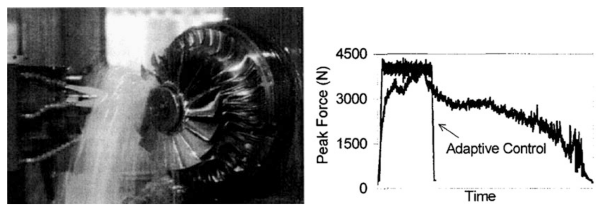

> Image description: A composite figure titled "Control of Machining Processes" illustrating an example of 5-axis impeller machining with adaptive force control. The left side features a black-and-white photograph of an impeller being machined, showing the rotating blades and the high-speed cutting action. The right side contains a line graph plotted with "Peak Force (N)" on the vertical y-axis and "Time" on the horizontal x-axis. The y-axis scale ranges from 0 to 4500. Two data series are visible: a high-amplitude, oscillating signal that plateaus near 4000 N before dropping sharply, and a second signal that follows the first but is regulated at a lower level. An arrow labeled "Adaptive Control" points to the lower signal, indicating the controlled force profile. This engineering data demonstrates how an adaptive control system modifies cutting forces in real-time to ensure stability during the complex geometry machining of the impeller.

Control of Machining Processes, Fig. 5 Example of 5-axis impeller machining with adaptive force control (Source: Budak and Kops (2000), courtesy of Elsevier)

## Control of Machining Processes, Fig. 6

Schematic of the chatter vibration mechanism for one degree of freedom (From: Altintas (2012), courtesy of Cambridge University Press)

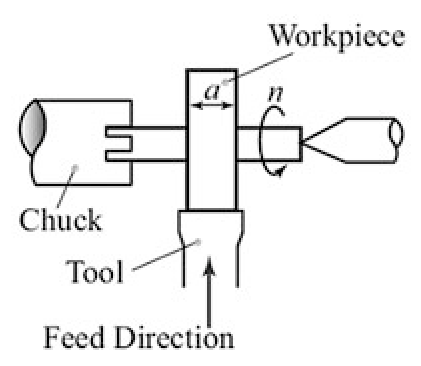
Orthogonal plunge turning

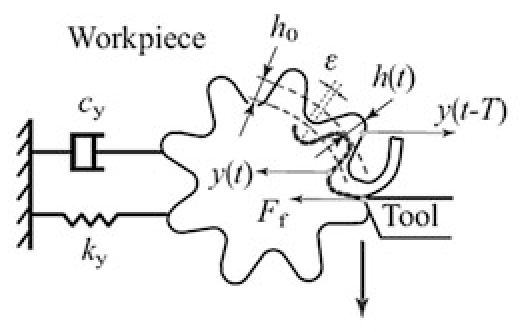
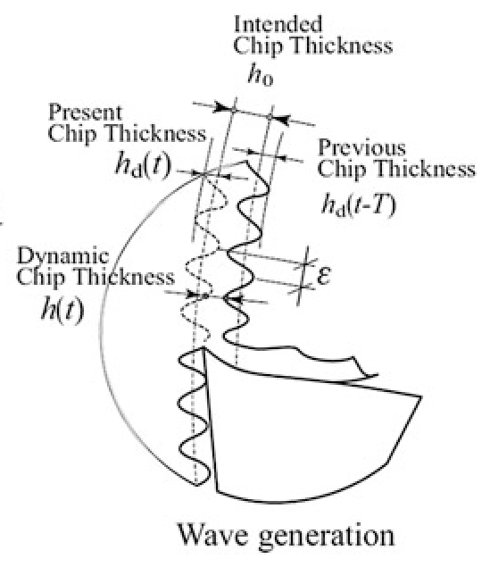
continuously varying, the coefficients of a model that relates the cutting force (or power) to the feed command are also time-varying. Furthermore, in CNC controllers, depending on the trajectory generation architecture, the execution latency of a feed override command may not always be deterministic. Due to these sources of variability, rather than using classical fixed gain feedback, machining control research has evolved around adaptive control techniques (Masory and Koren 1980; Spence and Altintas 1991), where changes in the cutting process dynamics are continuously tracked and the control law, which computes the proceeding feedrate override, is updated
accordingly. This approach has produced significant cycle time reduction in 5-axis machining of gas turbine impellers, as reported in Budak and Kops (2000) and shown in Fig. 5.

## Control of Chatter Vibrations

Chatter vibrations are caused by the interaction of the chip generation mechanism with the structural dynamics of the machine, tool, and workpiece assembly (see Fig.6). The relative vibration between the tool and workpiece generates a wavy surface finish. In the consecutive tool


<!-- source_pdf_page: 202 -->
pass, a new wave pattern, caused by the current instantaneous vibration, is generated on top of the earlier one. If the formed chip, which has an undulated geometry, displays a steady average thickness, then the resulting cutting forces and vibrations also remain bounded. This leads to a stable steady-state cutting regime, known as "forced vibration." On the other hand, if the chip thickness keeps increasing at every tool pass, resulting in increased cutting forces and vibrations, then chatter vibration is encountered. Chatter can be extremely detrimental to the machined part quality, tool life, and the machine tool.

Chatter has been reported in literature to be caused by two main phenomena: self-excitation through regeneration and mode coupling. For further information on chatter theory, the reader is referred to Altintas (2012) as an excellent starting point.

Various mitigation measures have been investigated and proposed in order to avoid and control chatter. One widespread approach is to select chatter-free cutting conditions through detailed modal testing and stability analyses. Recently, to achieve higher material removal rates, the application of active damping has started to receive interest. This has been realized through specially designed tools and actuators (Munoa et al. 2013; Pratt and Nayfeh 2001) and demonstrated productivity improvement in boring and milling operations. As another method for chatter suppression, modulation of the cutting (i.e., spindle) speed has been successfully applied as a means of interrupting the regeneration mechanism (Soliman and Ismail 1997; Zatarain et al. 2008).

## Summary and Future Directions

This article has presented an overview of various concepts and emerging technologies in the area of machining process control. The new generation of machine tools, designed to meet the evergrowing productivity and efficiency demands, will likely utilize advanced forms of these ideas and technologies in an integrated manner. As more computational power and better sensors
become available at lower cost, one can expect to see new features, such as more elaborate trajectory planning algorithms, active vibration damping techniques, and real-time process and machine simulation and control capability, beginning to appear in CNC units. No doubt that the dynamic analysis and controller design for such complicated systems will require higher levels of rigor, so that these new technologies can be utilized reliably and at their full potential.

## Cross-References

- Adaptive Control, Overview
- PID Control
- Robot Motion Control


## Bibliography

Altintas Y (2012) Manufacturing automation: metal cutting mechanics, machine tool vibrations, and CNC design, 2nd edn. Cambridge University Press, Cambridge
Altintas Y, Erkorkmaz K (2003) Feedrate optimization for spline interpolation in high speed machine tools. Ann CIRP 52(1):297-302
Altintas Y, Merdol DS (2007) Virtual High performance milling. Ann CIRP 55(1):81-84
Budak E, Kops L (2000) Improving productivity and part quality in milling of titanium based impellers by chatter suppression and force control. Ann CIRP 49(1):31-36
Ellis GH (2004) Control system design guide, 3rd edn. Elsevier Academic, New York
Gordon DJ, Erkorkmaz K (2013) Accurate control of ball screw drives using pole-placement vibration damping and a novel trajectory prefilter. Precis Eng 37(2):308-322
Koren Y (1980) Cross-coupled biaxial computer control for manufacturing systems. ASME J Dyn Syst Meas Control 102:265-272
Koren Y (1983) Computer control of manufacturing systems. McGraw-Hill, New York
Masory O, Koren Y (1980) Adaptive control system for turning. Ann CIRP 29(1):281-284
Munoa J, Mancisidor I, Loix N, Uriarte LG, Barcena R, Zatarain M (2013) Chatter suppression in ram type travelling column milling machines using a biaxial inertial actuator. Ann CIRP 62(1):407-410
Pratt JR, Nayfeh AH (2001) Chatter control and stability analysis of a cantilever boring bar under regenerative cutting conditions. Philos Trans R Soc 359:759-792
Pritschow G (1996) On the influence of the velocity gain factor on the path deviation. Ann CIRP 45/1:367-371


<!-- source_pdf_page: 203 -->
Soliman E, Ismail F (1997) Chatter suppression by adaptive speed modulation. Int J Mach Tools Manuf 37(3):355-369
Spence A, Altintas Y (1991) CAD assisted adaptive control for milling. ASME J Dyn Syst Meas Control 113(3):444-450
Weck M, Meylahn A, Hardebusch C (1999) Innovative algorithms for spline-based CNC controller. Ann Ger Acad Soc Prod Eng VI(1):83-86
Zatarain M, Bediaga I, Munoa J, Lizarralde R (2008) Stability of milling processes with continuous spindle speed variation: analysis in the frequency and time domains, and experimental correlation. Ann CIRP 57(1):379-384

## Control of Networks of Underwater Vehicles

Naomi Ehrich Leonard<br>Department of Mechanical and Aerospace<br>Engineering, Princeton University, Princeton, NJ, USA


#### Abstract

Control of networks of underwater vehicles is critical to underwater exploration, mapping, search, and surveillance in the multiscale, spatiotemporal dynamics of oceans, lakes, and rivers. Control methodologies have been derived for tasks including feature tracking and adaptive sampling and have been successfully demonstrated in the field despite the severe challenges of underwater operations.


## Keywords

Adaptive sampling; Feature tracking; Gliders; Mobile sensor arrays; Underwater exploration

## Introduction

The development of theory and methodology for control of networks of underwater vehicles is motivated by a multitude of underwater
applications and by the unique challenges associated with operating in the oceans, lakes, and rivers. Tasks include underwater exploration, mapping, search, and surveillance, associated with problems that include pollution monitoring, human safety, resource seeking, ocean science, and marine archeology. Vehicle networks collect data on underwater physics, biology, chemistry, and geology for improving the understanding and predictive modeling of natural dynamics and human-influenced changes in marine environments. Because the underwater environment is opaque, inhospitable, uncertain, and dynamic, control is critical to the performance of vehicle networks.

Underwater vehicles typically carry sensors to measure external environmental signals and fields, and thus a vehicle network can be regarded as a mobile sensor array. The underlying principle of control of networks of underwater vehicles leverages their mobility and uses an interacting dynamic among the vehicles to yield a highperforming collective behavior. If the vehicles can communicate their state or measure the relative state of others, then they can cooperate and coordinate their motion.

One of the major drivers of control of underwater mobile sensor networks is the multiscale, spatiotemporal dynamics of the environmental fields and signals. In Curtin et al. (1993), the concept of the autonomous oceanographic sampling network (AOSN), featuring a network of underwater vehicles, was introduced for dynamic measurement of the ocean environment and resolution of spatial and temporal gradients in the sampled fields. For example, to understand the coupled biological and physical dynamics of the ocean, data are required both on the small-scale dynamics of phytoplankton, which are major actors in the marine ecosystem and the global climate, and on the large-scale dynamics of the flow field, temperature, and salinity.

Accordingly, control laws are needed to coordinate the motion of networks of underwater vehicles to match the many relevant spatial and temporal scales. And for a network of underwater vehicles to perform complex missions reliably and efficiently, the control must address the many


<!-- source_pdf_page: 204 -->
uncertainties and real-world constraints including the influence of currents on the motion of the vehicles and the limitations on underwater communication.

## Vehicles

Control of networks of underwater vehicles is made possible with the availability of small (e.g., $1.5-2 \mathrm{~m}$ long), relatively inexpensive autonomous underwater vehicles (AUVs). Propelled AUVs such as the REMUS provide maneuverability and speed. These kinds of AUVs respond quickly and agilely to the needs of the network, and because of their speed, they can often power through strong ocean flows. However, propelled AUVs are limited by their batteries; for extended missions, they need docking stations or other means to recharge their batteries.

Buoyancy-driven autonomous underwater gliders, including the Slocum, the Spray, and the Seaglider, are a class of endurance AUVs designed explicitly for collecting data over large three-dimensional volumes continuously over periods of weeks or even months (Rudnick et al. 2004). They move slowly and steadily, and, as a result, they are particularly well suited to network missions of long duration.

Gliders propel themselves by alternately increasing and decreasing their buoyancy using either a hydraulic or a mechanical buoyancy engine. Lift generated by flow over fixed wings converts the vertical ascent/descent induced by the change in buoyancy into forward motion, resulting in a sawtooth-like trajectory in the vertical plane. Gliders can actively redistribute internal mass to control attitude, for example, they pitch by sliding their battery pack forward and aft. For heading control, they shift mass to roll, bank, and turn or deflect a rudder. Some gliders are designed for deep water, e.g., to $1,500 \mathrm{~m}$, while others for shallower water, e.g., to 200 m .

Gliders are typically operated at their maximum speed and thus they move at approximately constant speed relative to the flow. Because this is relatively slow, on the order of $0.3-0.5 \mathrm{~m} / \mathrm{s}$ in the horizontal direction and $0.2 \mathrm{~m} / \mathrm{s}$ in the vertical,
ocean currents can sometimes reach or even exceed the speed of the gliders. Unlike a propelled AUV, which typically has sufficient thrust to maintain course despite currents, a glider trying to move in the direction of a strong current will make no forward progress. This makes coordinated control of gliders challenging; for instance, two sensors that should stay sufficiently far apart may be pushed toward each other leading to less than ideal sampling conditions.

## Communication and Sensing

Underwater communication is one of the biggest challenges to the control of networks of underwater vehicles and one that distinguishes it from control of vehicles on land or in the air. Radio-frequency communication is not typically available underwater, and acoustic data telemetry has limitations including sensitivity to ambient noise, unpredictable propagation, limited bandwidth, and latency.

When acoustic communication is too limiting, vehicles can surface periodically and communicate via satellite. This method may be bandwidth limited and will require time and energy. However, in the case of profiling propelled AUVs or underwater gliders, they already move in the vertical plane in a sawtooth pattern and thus regularly come closer to the surface. When on the surface, vehicles can also get a GPS fix whereas there is no access to GPS underwater. The GPS fix is used for correcting onboard dead reckoning of the vehicle's absolute position and for updating onboard estimation of the underwater currents, both helpful for control.

Vehicles are typically equipped with conductivity-temperature-density (CTD) sensors to measure temperature, salinity, and density. From this pressure can be computed and thus depth and vertical speed. Attitude sensors provide measurements of pitch, roll, and heading. Position and velocity in the plane is estimated using dead reckoning. Many sensors for measuring the environment have been developed for use on underwater vehicles; these include chlorophyll fluorometers to estimate phytoplankton abundance, acoustic Doppler


<!-- source_pdf_page: 205 -->
profilers (ADPs) to measure variations in water velocity, and sensors to measure pH , dissolved oxygen, and carbon dioxide.

## Control

Described here are a selection of control methodologies designed to serve a variety of underwater applications and to address many of the challenges described above for both propelled AUVs and underwater gliders. Some of these methodologies have been successfully field tested in the ocean.

## Formations for Tracking Gradients, Boundaries, and Level Sets in Sampled Fields

While a small underwater vehicle can take only single-point measurements of a field, a network of $N$ vehicles employing cooperative control laws can move as a formation and estimate or track a gradient in the field. This can be done in a straightforward way in 2D with three vehicles and can be extended to 3D with additional vehicles. Consider $N=3$ vehicles moving together in an equilateral triangular formation and sampling a 2D field $T: \mathbb{R}^{2} \rightarrow \mathbb{R}$. The formation serves as a sensor array and the triangle side length defines the resolution of the array.

Let the position of the $i$ th vehicle be $\mathbf{x}_{i} \in \mathbb{R}^{2}$. Consider double integrator dynamics $\ddot{\mathbf{x}}_{i}=\mathbf{u}_{i}$, where $\mathbf{u}_{i} \in \mathbb{R}^{2}$ is the control force on the $i$ th vehicle. Suppose that each vehicle can measure the relative position of each of its neighbors, $\mathbf{x}_{i j}=\mathbf{x}_{i}-\mathbf{x}_{j}$. Decentralized control that derives from an artificial potential is a popular method for each of the three vehicles to stay in the triangular formation of prescribed resolution $d_{0}$. Consider the nonlinear interaction potential $V_{I}: \mathbb{R}^{2} \rightarrow \mathbb{R}$ defined as

$$
V_{I}\left(\mathbf{x}_{i j}\right)=k_{s}\left(\ln \left\|\mathbf{x}_{i j}\right\|+\frac{d_{0}}{\left\|\mathbf{x}_{i j}\right\|^{2}}\right)
$$

where $k_{s}>0$ is a scalar gain. The control law for the $i$ th vehicle derives as the gradient of this potential with respect to $\mathbf{x}_{i}$ as follows:

$$
\ddot{\mathbf{x}}_{i}=\mathbf{u}_{i}=-\sum_{j=1, j \neq i}^{N} \nabla V_{I}\left(\mathbf{x}_{i j}\right)-k_{d} \dot{\mathbf{x}}_{i}
$$

where a damping term is added with scalar gain $k_{d}>0$. Stability of the triangle of resolution $d_{0}$ is proved with the Lyapunov function

$$
V=\frac{1}{2} \sum_{i=1}^{N}\left\|\dot{\mathbf{x}}_{i}\right\|^{2}+\sum_{i=1}^{N-1} \sum_{j=i+1}^{N} V_{I}\left(\mathbf{x}_{i j}\right) .
$$

Now let each vehicle use the sequence of single-point measurements it takes along its path to compute the projection of the spatial gradient onto its normalized velocity, $\mathbf{e}_{\dot{\mathbf{x}}}=\dot{\mathbf{x}}_{i} /\left\|\dot{\mathbf{x}}_{i}\right\|$, i.e., $\nabla T_{P}\left(\mathbf{x}, \dot{\mathbf{x}}_{i}\right)=\left(\nabla T(\mathbf{x}) \cdot \mathbf{e}_{\dot{\mathbf{x}}}\right) \mathbf{e}_{\dot{\mathbf{x}}}$. Following Bachmayer and Leonard (2002), let
$\ddot{\mathbf{x}}_{i}=\mathbf{u}_{i}=\kappa \nabla T_{P}\left(\mathbf{x}, \dot{\mathbf{x}}_{i}\right)-\sum_{j=1, j \neq i}^{N} \nabla V_{I}\left(\mathbf{x}_{i j}\right)-k_{d} \dot{\mathbf{x}}_{i}$,
where $\kappa$ is a scalar gain. For $\kappa>0$, each vehicle will accelerate along its path when it measures an increasing $T$ and decelerates for a decreasing $T$. Each vehicle will also turn to keep up with the others so that the formation will climb the spatial gradient of $T$ to find a local maximum.

Alternative control strategies have been developed that add versatility in feature tracking. The virtual body and artificial potential (VBAP) multivehicle control methodology (Ögren et al. 2004) was demonstrated with a network of Slocum autonomous underwater gliders in the AOSN II field experiment in Monterey Bay, California, in August 2003 (Fiorelli et al. 2006). VBAP is well suited to the operational scenario described above in which vehicles surface asynchronously to establish communication with a base.

VBAP is a control methodology for coordinating the translation, rotation, and dilation of a group of vehicles. A virtual body is defined by a set of reference points that move according to dynamics that are computed centrally and made available to the vehicles in the group. Artificial potentials are used to couple the dynamics of vehicles and a virtual body so that control laws can be derived that stabilize desired formations of vehicles and a virtual body. When sampled


<!-- source_pdf_page: 206 -->
measurements of a scalar field can be communicated, the local gradients can be estimated. Gradient climbing algorithms prescribe virtual body direction, so that, for example, the vehicle network can be directed to head for the coldest water or the highest concentration of phytoplankton. Further, the formation can be dilated so that the resolution can be adapted to minimize error in estimates. Control of the speed of the virtual body ensures stability and convergence of the vehicle formation.

These ideas have been extended further to design provable control laws for cooperative level set tracking, whereby small vehicle groups cooperate to generate contour plots of noisy, unknown fields, adjusting their formation shape to provide optimal filtering of their noisy measurements (Zhang and Leonard 2010).

## Motion Patterns for Adaptive Sampling

A central objective in many underwater applications is to design provable and reliable mobile sensor networks for collecting the richest data set in an uncertain environment given limited resources. Consider the sampling of a single timeand space-varying scalar field, like temperature $T$, using a network of vehicles, where the control problem is to coordinate the motion of the network to maximize information on this field over a given area or volume.

The definition of the information metric will depend on the application. If the data are to be assimilated into a high-resolution dynamical ocean model, then the metric would be defined by uncertainty as computed by the model. A general-purpose metric, based on objective analysis (linear statistical estimation from given field statistics), specifies the statistical uncertainty of the field model as a function of where and when the data were taken (Bennett 2002). The posteriori error $A(\mathbf{r}, t)$ is the variance of $T$ about its estimate at location $\mathbf{r}$ and time $t$. Entropic information over a spatial domain of area $\mathcal{A}$ is

$$
\mathcal{I}(t)=-\log \left(\frac{1}{\sigma_{0} \mathcal{A}} \int d \mathbf{r} A(\mathbf{r}, t)\right),
$$

where $\sigma_{0}$ is a scaling factor (Grocholsky 2002).

Computing coordinated trajectories to maximize $\mathcal{I}(t)$ can in principle be addressed using optimal coverage control methods. However, this coverage problem is especially challenging since the uncertainty field is spatially nonuniform and it changes with time and with the motion of the sampling vehicles. Furthermore, the optimal trajectories may become quite complex so that controlling vehicles to them in the presence of dynamic disturbances and uncertainty may lead to suboptimal performance.

An alternative approach decouples the design of motion patterns to optimize the entropic information metric from the decentralized control laws that stabilize the network onto the motion patterns (see Leonard et al. 2007). This approach was demonstrated with a network of 6 Slocum autonomous underwater gliders in a 24 -day-long field experiment in Monterey Bay, California, in August 2006 (see Leonard et al. 2010). The coordinating feedback laws for the individual vehicles derive systematically from a control methodology that provides provable stabilization of a parameterized family of collective motion patterns (Sepulchre et al. 2008). These patterns consist of vehicles moving on a finite set of closed curves with spacing between vehicles defined by a small number of "synchrony" parameters. The feedback laws that stabilize a given motion pattern use the same synchrony parameters that distinguish the desired pattern.

Each vehicle moves in response to the relative position and direction of its neighbors so that it keeps moving, it maintains the desired spacing, and it stays close to its assigned curve. It has been observed in the ocean, for vehicles carrying out this coordinated control law, that "when a vehicle on a curve is slowed down by a strong opposing flow field, it will cut inside a curve to make up distance and its neighbor on the same curve will cut outside the curve so that it does not overtake the slower vehicle and compromise the desired spacing" (Leonard et al. 2010). The approach is robust to vehicle failure since there are no leaders in the network, and it is scalable since the control law for each vehicle can be defined in terms of the state of a few other vehicles, independent of the total number of vehicles.


<!-- source_pdf_page: 207 -->
The control methodology prescribes steering laws for vehicles operated at a constant speed. Assume that the $i$ th vehicle moves at unit speed in the plane in the direction $\theta_{i}(t)$ at time $t$. Then, the velocity of the $i$ th vehicle is $\dot{\mathbf{x}}_{i}=\left(\cos \theta_{i}, \sin \theta_{i}\right)$. The steering control $u_{i}$ is the component of the force in the direction normal to velocity, such that $\dot{\theta}_{i}=u_{i}$ for $i=1, \ldots, N$. Define

$$
U\left(\theta_{1}, \ldots, \theta_{N}\right)=\frac{N}{2}\left\|\mathbf{p}_{\theta}\right\|^{2}, \quad \mathbf{p}_{\theta}=\frac{1}{N} \sum_{j=1}^{N} \dot{\mathbf{x}}_{j}
$$

$U$ is a potential function that is maximal at 1 when all vehicle directions are synchronized and minimal at 0 when all vehicle directions are perfectly anti-synchronized. Let $\tilde{\mathbf{x}}_{i}=\left(\tilde{x}_{i}, \tilde{y}_{i}\right)= (1 / N) \sum_{j=1}^{N} \mathbf{x}_{i j}$ and let $\tilde{\mathbf{x}}_{i}^{\perp}=\left(-\tilde{y}_{i}, \tilde{x}_{i}\right)$. Define

$$
S\left(\mathbf{x}_{1}, \ldots, \mathbf{x}_{N}, \theta_{1}, \ldots, \theta_{N}\right)=\frac{1}{2} \sum_{i=1}^{N}\left\|\dot{\mathbf{x}}_{i}-\omega_{0} \tilde{\mathbf{x}}_{i}^{\perp}\right\|^{2},
$$

where $\omega_{0} \neq 0 . S$ is a potential function that is minimal at 0 for circular motion of the vehicles around their center of mass with radius $\rho_{0}= \left|\omega_{0}\right|^{-1}$.

Define the steering control as

$$
\dot{\theta}_{i}=\omega_{0}\left(1+K_{c}\left\langle\tilde{\mathbf{x}}_{i}, \dot{\mathbf{x}}_{i}\right\rangle\right)-K_{\theta} \sum_{j=1}^{N} \sin \left(\theta_{j}-\theta_{i}\right),
$$

where $K_{c}>0$ and $K_{\theta}$ are scalar gains. Then, circular motion of the network is a steady solution, with the phase-locked heading arrangement a minimum of $K_{\theta} U$, i.e., synchronized or perfectly anti-synchronized depending on the sign of $K_{\theta}$. Stability can be proved with the Lyapunov function $V_{c \theta}=K_{c} S+K_{\theta} U$. This steering control law depends only on relative position and relative heading measurements of the other vehicles.

The general form of the methodology extends the above control law to network interconnections defined by possibly time-varying graphs with limited sensing or communication links, and it provides systematic control laws to stabilize symmetric patterns of heading distributions about noncircular closed curves. It also allows
for multiple graphs to handle multiple scales. For example, in the 2006 field experiment, the default motion pattern was one in which six gliders moved in coordinated pairs around three closed curves; one graph defined the smallerscale coordination of each pair of gliders about its curve, while a second graph defined the largerscale coordination of gliders across the three curves.

## Implementation

Implementation of control of networks of underwater vehicles requires coping with the remote, hostile underwater environment. The control methodology for motion patterns and adaptive sampling, described above, was implemented in the field using a customized software infrastructure called the Glider Coordinated Control System (GCCS) (Paley et al. 2008). The GCCS combines a simple model for control planning with a detailed model of glider dynamics to accommodate the constant speed of gliders, relatively large ocean currents, waypoint tracking routines, communication only when gliders surface (asynchronously), other latencies, and more. Other approaches consider control design in the presence of a flow field, formal methods to integrate high-resolution models of the flow field, and design tailored to propelled AUVs.

## Summary and Future Directions

The multiscale, spatiotemporal dynamics of the underwater environment drive the need for wellcoordinated control of networks of underwater vehicles that can manage the significant operational challenges of the opaque, uncertain, inhospitable, and dynamic oceans, lakes, and rivers. Control theory and algorithms have been developed to enable networks of vehicles to successfully operate as adaptable sensor arrays in missions that include feature tracking and adaptive sampling. Future work will improve control in the presence of strong and unpredictable flow


<!-- source_pdf_page: 208 -->
fields and will leverage the latest in battery and underwater communication technologies. Hybrid vehicles and heterogeneous networks of vehicles will also promote advances in control. Future work will draw inspiration from the rapidly growing literature in decentralized cooperative control strategies and complex dynamic networks. Dynamics of decision-making teams of robotic vehicles and humans is yet another important direction of research that will impact the success of control of networks of underwater vehicles.

## Cross-References

- Motion Planning for Marine Control Systems

Underactuated Marine Control Systems

## Recommended Reading

In Bellingham and Rajan (2007), it is argued that cooperative control of robotic vehicles is especially useful for exploration in remote and hostile environments such as the deep ocean. A recent survey of robotics for environmental monitoring, including a discussion of cooperative systems, is provided in Dunbabin and Marques (2012). A survey of work on cooperative underwater vehicles is provided in Redfield (2013).

## Bibliography

Bachmayer R, Leonard NE (2002) Vehicle networks for gradient descent in a sampled environment. In: Proceedings of the 41st IEEE Conference on Decision and Control, Las Vegas, pp 112-117
Bellingham JG, Rajan K (2007) Robotics in remote and hostile environments. Science 318(5853):1098-1102
Bennett A (2002) Inverse modeling of the ocean and atmosphere. Cambridge University Press, Cambridge
Curtin TB, Bellingham JG, Catipovic J, Webb D (1993) Autonomous oceanographic sampling networks. Oceanography 6(3):86-94
Dunbabin M, Marques L (2012) Robots for environmental monitoring: significant advancements and applications. IEEE Robot Autom Mag 19(1):24-39
Fiorelli E, Leonard NE, Bhatta P, Paley D, Bachmayer R, Fratantoni DM (2006) Multi-AUV control and
adaptive sampling in Monterey Bay. IEEE J Ocean Eng 31(4):935-948
Grocholsky B (2002) Information-theoretic control of multiple sensor platforms. PhD thesis, University of Sydney
Leonard NE, Paley DA, Lekien F, Sepulchre R, Fratantoni DM, Davis RE (2007) Collective motion, sensor networks, and ocean sampling. Proc IEEE 95(1):48-74
Leonard NE, Paley DA, Davis RE, Fratantoni DM, Lekien F, Zhang F (2010) Coordinated control of an underwater glider fleet in an adaptive ocean sampling field experiment in Monterey Bay. J Field Robot 27(6):718-740
Ögren P, Fiorelli E, Leonard NE (2004) Cooperative control of mobile sensor networks: adaptive gradient climbing in a distributed environment. IEEE Trans Autom Control 49(8):1292-1302
Paley D, Zhang F, Leonard NE (2008) Cooperative control for ocean sampling: the glider coordinated control system. IEEE Trans Control Syst Technol 16(4):735-744
Redfield S (2013) Cooperation between underwater vehicles. In: Seto ML (ed) Marine robot autonomy. Springer, New York, pp 257-286
Rudnick D, Davis R, Eriksen C, Fratantoni D, Perry M (2004) Underwater gliders for ocean research. Mar Technol Soc J 38(1):48-59
Sepulchre R, Paley DA, Leonard NE (2008) Stabilization of planar collective motion with limited communication. IEEE Trans Autom Control 53(3):706-719
Zhang F, Leonard NE (2010) Cooperative filters and control for cooperative exploration. IEEE Trans Autom Control 55(3):650-663

## Control of Nonlinear Systems with Delays

Nikolaos Bekiaris-Liberis and Miroslav Krstic Department of Mechanical and Aerospace Engineering, University of California, San Diego, La Jolla, CA, USA


#### Abstract

The reader is introduced to the predictor feedback method for the control of general nonlinear systems with input delays of arbitrary length. The delays need not necessarily be constant but can be time-varying or state-dependent. The predictor feedback methodology employs a model-based construction of the (unmeasurable) future state of


<!-- source_pdf_page: 209 -->
the system. The analysis methodology is based on the concept of infinite-dimensional backstepping transformation - a transformation that converts the overall feedback system to a new, cascade "target system" whose stability can be studied with the construction of a Lyapunov function.

## Keywords

Distributed parameter systems; Delay systems; Backstepping; Lyapunov function

## Nonlinear Systems with Input Delay

Nonlinear systems of the form

$$
\begin{equation*}
\dot{X}(t)=f(X(t), U(t-D(t, X(t)))), \tag{1}
\end{equation*}
$$

where $t \in \mathbb{R}_{+}$is time, $f: \mathbb{R}^{n} \times \mathbb{R} \rightarrow \mathbb{R}^{n}$ is a vector field, $X \in \mathbb{R}^{n}$ is the state, $D$ : $\mathbb{R}_{+} \times \mathbb{R}^{n} \rightarrow \mathbb{R}_{+}$is a nonnegative function of the state of the system, and $U \in \mathbb{R}$ is the scalar input, are ubiquitous in applications. The starting point for designing a control law for (1), as well as for analyzing the dynamics of (1) is to consider the delay-free counterpart of (1), i.e., when $D=0$, for which a plethora of results exists dealing with its stabilization and Lyapunov-based analysis (Krstic et al 1995).

Systems of the form (1) constitute more realistic models for physical systems than delay-free systems. The reason is that often in engineering applications the control that is applied to the system does not immediately affect the system. This dead time until the controller can affect the system might be due to, among other things, the long distance of the controller from the system, such as, for example, in networked control systems, or due to finite-speed transport or flow phenomena, such as, for example, in additive manufacturing and cooling systems, or due to various after-effects, such as, for example, in population dynamics.

The first step toward control design and analysis for system (1) is to consider the special case in which $D=$ const. The next step is to consider the special case of system (1), in which $D=D(t)$, i.e., the delay is an a priori given function of time. Systems with time-varying delays model numerous real-world systems, such as, networked control systems, traffic systems, or irrigation channels. Assuming that the input delay is an a priori defined function of time is a plausible assumption for some applications. Yet, the time-variation of the delay might be the result of the variation of a physical quantity that has its own dynamics, such as, for example, in milling processes (due to speed variations), 3D printers (due to distance variations), cooling systems (due to flow rate variations), and population dynamics (due to population's size variations). Processes in this category can be modeled by systems with a delay that is a function of the state of the system, i.e., by (1) with $D= D(X)$.

In this article control designs are presented for the stabilization of nonlinear systems with input delays, with delays that are constant (Krstic 2009), time-varying (Bekiaris-Liberis and Krstic 2012) or state-dependent (Bekiaris-Liberis and Krstic 2013b), employing predictor feedback, i.e., employing a feedback law that uses the future rather than the current state of the system. Since one employs in the feedback law the future values of the state, the predictor feedback completely cancels (compensates) the input delay, i.e., after the control signal reaches the system, the state evolves as if there were no delay at all. Since the future values of the state are not a priori known, the main control challenge is the implementation of the predictor feedback law. Having determined the predictor, the control law is then obtained by replacing the current state in a nominal statefeedback law (which stabilizes the delay-free system) by the predictor.

A methodology is presented in the article for the stability analysis of the closed-loop system under predictor feedback by constructing Lyapunov functionals. The Lyapunov functionals are constructed for a transformed (rather than


<!-- source_pdf_page: 210 -->
the original) system. The transformed system is, in turn, constructed by transforming the original actuator state $U(\theta), \theta \in[t-D, t]$ to a transformed actuator state with the aid of an infinite-dimensional backstepping transformation. The overall transformed system is easier to analyze than the original system because it is a cascade, rather than a feedback system, consisting of a delay line with zero input, whose effect fades away in finite time, namely, after $D$ time units, cascaded with an asymptotically stable system.

## Predictor Feedback

The predictor feedback designs are based on a feedback law $U(t)=\kappa(X(t))$ that renders the closed-loop system $\dot{X}=f(X, \kappa(X))$ globally asymptotically stable. For stabilizing system (1), the following control law is employed instead

$$
\begin{equation*}
U(t)=\kappa(P(t)) \tag{2}
\end{equation*}
$$

where

$$
\begin{align*}
& P(\theta)=X(t)+\int_{t-D(t, X(t))}^{\theta} \frac{f(P(s), U(s))}{1-D_{t}(\sigma(s), P(s))-\nabla D(\sigma(s), P(s)) f(P(s), U(s))} d s  \tag{3}\\
& \sigma(\theta)=t+\int_{t-D(t, X(t))}^{\theta} \frac{1}{1-D_{t}(\sigma(s), P(s))-\nabla D(\sigma(s), P(s)) f(P(s), U(s))} d s \tag{4}
\end{align*}
$$

for all $t-D(t, X(t)) \leq \theta \leq t$. The signal $P$ is the predictor of $X$ at the appropriate prediction time $\sigma$, i.e., $P(t)=X(\sigma(t))$. This fact is explained in more detail in the next paragraphs of this section. The predictor employs the future values of the state $X$ which are not a priori available. Therefore, for actually implementing the feedback law (2) one has to employ (3). Relation (3) is a formula for the future values of the state that depends on the available measured quantities, i.e., the current state $X(t)$ and the history of the actuator state $U(\theta), \theta \in[t-D(t, X(t)), t]$. To make clear the definitions of the predictor $P$ and the prediction time $\sigma$, as well as their implementation through formulas (3) and (4), the constant delay case is discussed first.

The idea of predictor feedback is to employ in the control law the future values of the state at the appropriate future time, such that the effect of the input delay is completely canceled (compensated). Define the quantity $\phi(t)=t-D$, which from now on is referred to as the delayed time. This is the time instant at which the control signal that currently affects the system
was actually applied. To cancel the effect of this delay, the control law (2) is designed such that $U(\phi(t))=U(t-D)=\kappa(X(t))$, i.e., such that $U(t)=\kappa\left(X\left(\phi^{-1}(t)\right)\right)=\kappa(X(t+D))$. Define the prediction time $\sigma$ through the relation $\phi^{-1}(t)=\sigma(t)=t+D$. This is the time instant at which an input signal that is currently applied actually affects the system. In the case of a constant delay, the prediction time is simply $D$ time-units in the future. Next an implementable formula for $X(\sigma(t))=X(t+D)$ is derived. Performing a change of variables $t=\theta+D$, for all $t-D \leq \theta \leq t$ in $\dot{X}(t)=f(X(t), U(t-D))$ and integrating in $\theta$ starting at $\theta=t-D$, one can conclude that $P$ defined by (3) with $D_{t}= \nabla D f=0$ and $D=$ const is the $D$ time-units ahead predictor of $X$, i.e., $P(t)=X(\sigma(t))= X(t+D)$.

To better understand definition (3) the case of a linear system with a constant input delay $D$, i.e., a system of the form $\dot{X}(t)= A X(t)+B U(t-D)$, is considered next (see also ▷ Control of Linear Systems with Delays and Hale and Verduyn Lunel (1993)). In this case, the predictor $P(t)$ is given explicitly


<!-- source_pdf_page: 211 -->
using the variation of constants formula, with the initial condition $P(t-D)=X(t)$, as $P(t)=e^{A D} X(t)+\int_{t-D}^{t} e^{A(t-\theta)} B U(\theta) d \theta$. For systems that are nonlinear, $P(t)$ cannot be written explicitly, for the same reason that a nonlinear ODE cannot be solved explicitly. So $P(t)$ is represented implicitly using the nonlinear integral equation (3). The computation of $P(t)$ from (3) is straightforward with a discretized implementation in which $P(t)$ is assigned values based on the right-hand side of (3), which involves earlier values of $P$ and the values of the input $U$.

The case $D=D(t)$ is considered next. As in the case of constant delays the main goal is to implement the predictor $P$. One needs first to define the appropriate time interval over which the predictor of the state is needed, which, in the constant delay case is simply $D$ time-units in the future. The control law has to satisfy $U(\phi(t))=\kappa(X(t))$, or, $U(t)=\kappa(X(\sigma(t)))$. Hence, one needs to find an implementable formula for $P(t)=X(\sigma(t))$. In the constant delay case the prediction horizon over which one needs to compute the predictor can be determined based on the knowledge of the delay time since the prediction horizon and the delay time are both equal to $D$. This is not anymore true in the time-varying case in which the delayed time is defined as $\phi(t)=t-D(t)$, whereas the prediction time as $\phi^{-1}(t)=\sigma(t)=t+D(\sigma(t))$. Employing a change of variables in $\dot{X}(t)= f(X(t), U(t-D(t)))$ as $t=\sigma(\theta)$, for all $\phi(t) \leq \theta \leq t$ and integrating in $\theta$ starting at $\theta=\phi(t)$ one obtains the formula for $P$ given by (3) with $D_{t}=D^{\prime}(\sigma(t)), \nabla D f=0$ and $D=D(t)$.

Next the case $D=D(X(t))$ is considered. First one has to determine the predictor, i.e., the signal $P$ such that $P(t)=X(\sigma(t))$, where $\sigma(t)=\phi^{-1}(t)$ and $\phi(t)=t-D(X(t))$. In the case of state-dependent delay, the prediction time $\sigma(t)$ depends on the predictor itself, i.e., the time when the current control reaches the system depends on the value of the state at that time, namely, the following implicit relationship holds $P(t)=X(t+D(P(t)))$
(and $X(t)=P(t-D(X(t))))$. This implicit relation can be solved by proceeding as in the time-varying case, i.e., by performing the change of variables $t=\sigma(\theta)$, for all $t-D(X(t)) \leq \theta \leq t$ in $\dot{X}(t)=f(X(t), U(t-D(X(t))))$ and integrating in $\theta$ starting at $\theta=t-D(X(t))$, to obtain the formula (3) for $P$ with $D_{t}=0$, $\nabla D f=\nabla D(P(s)) f(P(s), U(s))$ and $D= D(X(t))$.

Analogously, one can derive the predictor for the case $D=D(t, X(t))$ with the difference that now the prediction time is not given explicitly in terms of $P$, but it is defined through an implicit relation, namely, it holds that $\sigma(t)= t+D(\sigma(t), P(t))$. Therefore, for actually computing $\sigma$ one has to proceed as in the derivation of $P$, i.e., to differentiate relation $\sigma(\theta)= \theta+D(\sigma(\theta), P(\theta))$ and then integrate starting at the known value $\sigma(t-D(t, X(t)))=t$. It is important to note that the integral equation (4) is needed in the computation of $P$ only when $D$ depends on both $X$ and $t$.

## Backstepping Transformation and Stability Analysis

The predictor feedback designs are based on a feedback law $\kappa(X)$ that renders the closed-loop system $\dot{X}=f(X, \kappa(X))$ globally asymptotically stable. However, in the rest of the section it is assumed that the feedback law $\kappa(X)$ renders the closed-loop system $\dot{X}=f(X, \kappa(X)+v)$ input-to-state stable (ISS) with respect to $v$, i.e., there exists a smooth function $S: \mathbb{R}^{n} \rightarrow \mathbb{R}_{+}$and class $\mathcal{K}_{\infty}$ functions $\alpha_{1}, \alpha_{2}, \alpha_{3}, \alpha_{4}$ such that

$$
\begin{align*}
\alpha_{3}(|X(t)|) & \leq S(X(t)) \\
& \leq \alpha_{4}(|X(t)|)  \tag{5}\\
\frac{\partial S(X(t))}{\partial X} & f(X(t), \kappa(X(t)) \\
+v(t)) \leq-\alpha_{1}(|X(t)|)+\alpha_{2}(|v(t)|) & \tag{6}
\end{align*}
$$

Imposing this stronger assumption enables one to construct a Lyapunov functional for the


<!-- source_pdf_page: 212 -->
closed-loop systems (1)-(4) with the aid of the Lyapunov characterization of ISS defined in (5) and (6).

The stability analysis of the closed-loop systems (1)-(4) is explained next. Denote the infinite-dimensional backstepping transformation of the actuator state as

$$
\begin{align*}
W(\theta)= & U(\theta)-\kappa(P(\theta)) \\
& \text { for all } t-D(t, X(t)) \leq \theta \leq t, \tag{7}
\end{align*}
$$

where $P(\theta)$ is given in terms of $U(\theta)$ from (3). Using the fact that $P(t-D(t, X(t)))= X(t)$, for all $t \geq 0$, one gets from (7) that $U(t-D(t, X(t)))=W(t-D(t, X(t)))+ \kappa(X(t))$. With the fact that for all $\theta \geq 0$, $U(\theta)=\kappa(P(\theta))$ one obtains from (7) that $W(\theta)=0$, for all $\theta \geq 0$. Yet, for all $t \leq D(t, X(t))$, i.e., for all $\theta \leq 0, W(\theta)$ might be nonzero due to the effect of the arbitrary initial condition $U(\theta), \theta \in[-D(0, X(0)), 0]$. With the above observations, one can transform system (1) with the aid of transformation (7) to the following target system

$$
\begin{align*}
& \dot{X}(t)=f(X(t), \kappa(X(t)) \\
& +W(t-D(t, X(t))))  \tag{8}\\
& W(t-D(t, X(t)))=0 \\
& \text { for } t-D(t, X(t)) \geq 0 \tag{9}
\end{align*}
$$

Using relations (5), (6), and (8), (9) one can construct the following Lyapunov functional for showing asymptotic stability of the target system (8), (9), i.e., for the overall system consisting of the vector $X(t)$ and the transformed infinite-dimensional actuator state $W(\theta)$, $t-D(t, X(t)) \leq \theta \leq t$,

$$
\begin{equation*}
V(t)=S(X(t))+\frac{2}{c} \int_{0}^{L(t)} \frac{\alpha_{2}(r)}{r} d r \tag{10}
\end{equation*}
$$

where $c>0$ is arbitrary and

$$
\begin{equation*}
L(t)=\sup _{t-D(t, X(t)) \leq \theta \leq t}\left|e^{c(\sigma(\theta)-t)} W(\theta)\right| . \tag{11}
\end{equation*}
$$

With the invertibility of the backstepping transformation one can then show global asymptotic stability of the closed-loop system in the original variables ( $X, U$ ). In particular, there exists a class $\mathcal{K} \mathcal{L}$ function $\beta$ such that

$$
\begin{align*}
& |X(t)|+\sup _{t-D(t, X(t)) \leq \theta \leq t}|U(\theta)| \\
& \leq \beta\left(|X(0)|+\sup _{-D(0, X(0)) \leq \theta \leq 0}|U(\theta)|, t\right), \tag{12}
\end{align*}
$$

One of the main obstacles in designing globally stabilizing control laws for nonlinear systems with long input delays is the finite escape phenomenon. The input delay may be so large that the control signal cannot reach the system before its state grows unbounded. Therefore, one has to assume that the system $\dot{X}=f(X, \omega)$ is forward complete, i.e., for every initial condition and every bounded input signal the corresponding solution is defined for all $t \geq 0$.

With the forward completeness requirement, estimate (12) holds globally for constant but arbitrary large delays. For the case of timevarying delays, estimate (12) holds globally as well but under the following four conditions on the delay:
C1. $D(t) \geq 0$. This condition guarantees the causality of the system.
C2. $D(t)<\infty$. This condition guarantees that all inputs applied to the system eventually reach the system.
C3. $\dot{D}(t)<1$. This condition guarantees that the system never feels input values that are older than the ones it has already felt, i.e., the input signal's direction never gets reversed. (This condition guarantees the existence of $\sigma= \phi^{-1}$.)
C4. $\dot{D}(t)>-\infty$ This condition guarantees that the delay cannot disappear instantaneously, but only gradually.
In the case of state-dependent delays, the delay depends on time as a result of its dependency on the state. Therefore, predictor feedback guarantees stabilization of the system when the delay satisfies the four conditions C1-C4. Yet, since


<!-- source_pdf_page: 213 -->
the delay is a nonnegative function of the state, conditions C2-C4 are satisfied by restricting the initial state $X$ and the initial actuator state. Therefore estimate (12) holds locally.

## Cross-References

## Control of Linear Systems with Delays

## Recommended Reading

The main control design tool for general systems with input delays of arbitrary length is predictor feedback. The reader is referred to Artstein (1982) for the first systematic treatment of general linear systems with constant input delays. The applicability of predictor feedback was extended in Krstic (2009) to several classes of systems, such as nonlinear systems with constant input delays and linear systems with unknown input delays. Subsequently, predictor feedback was extended to general nonlinear systems with nonconstant input and state delays (BekiarisLiberis and Krstic 2013a). The main stability analysis tool for systems employing predictor feedback is backstepping. Backstepping was initially introduced for adaptive control of finitedimensional nonlinear systems (Krstic et al 1995). The continuum version of backstepping was originally developed for the boundary control of several classes of PDEs in Krstic and Smyshlyaev (2008).

## Bibliography

Artstein Z (1982) Linear systems with delayed controls: a reduction. IEEE Trans Autom Control 27: 869-879
Bekiaris-Liberis N, Krstic M (2013) Nonlinear control under nonconstant delays. SIAM, Philadelphia
Bekiaris-Liberis N, Krstic M (2013) Compensation of state-dependent input delay for nonlinear systems. IEEE Trans Autom Control 58: 275-289
Bekiaris-Liberis N, Krstic M (2012) Compensation of time-varying input and state delays for nonlinear systems. J Dyn Syst Meas Control 134:011009
Hale JK, Verduyn Lunel SM (1993) Introduction to functional differential equations. Springer, New York

Krstic M (2009) Delay compensation for nonlinear, adaptive, and PDE systems. Birkhauser, Boston
Krstic M, Kanellakopoulos I, Kokotovic PV (1995) Nonlinear and adaptive control design. Wiley, New York
Krstic M, Smyshlyaev A (2008) Boundary control of PDEs: a course on backstepping designs. SIAM, Philadelphia

## Control of Quantum Systems

Ian R. Petersen<br>School of Engineering and Information Technology, University of New South Wales, the Australian Defence Force Academy, Canberra, Australia


#### Abstract

Quantum control theory is concerned with the control of systems whose dynamics are governed by the laws of quantum mechanics. Quantum control may take the form of open loop quantum control or quantum feedback control. Also, quantum feedback control may consist of measurement based feedback control, in which the controller is a classical system governed by the laws of classical physics. Alternatively, quantum feedback control may take the form of coherent feedback control in which the controller is a quantum system governed by the laws of quantum mechanics. In the area of open loop quantum control, questions of controllability along with optimal control and Lyapunov control methods are discussed. In the case of quantum feedback control, LQG and $H^{\infty}$ control methods are discussed.


## Keywords

Coherent quantum feedback; Measurement based quantum feedback; Quantum control; Quantum controllability

This work was supported by the Australian Research Council (ARC).


<!-- source_pdf_page: 214 -->
## Introduction

Quantum control is the control of systems whose dynamics are described by the laws of quantum physics rather than classical physics. The dynamics of quantum systems must be described using quantum mechanics which allows for uniquely quantum behavior such as entanglement and coherence. There are two main approaches to quantum mechanics which are referred to as the Schrödinger picture and the Heisenberg picture. In the Schrödinger picture, quantum systems are modeled using the Schrödinger equation or a master equation which describe the evolution of the system state or density operator. In the Heisenberg picture, quantum systems are modeled using quantum stochastic differential equations which describe the evolution of system observables. These different approaches to quantum mechanics lead to different approaches to quantum control. Important areas in which quantum control problems arise include physical chemistry, atomic and molecular physics, and optics. Detailed overviews of the field o quantum control can be found in the survey papers Dong and Petersen (2010) and Brif et al. (2010) and the monographs Wiseman and Milburn (2010) and D'Alessandro (2007).

A fundamental problem in a number of approaches to quantum control is the controllability problem. Quantum controllability problems are concerned with finite dimensional quantum systems modeled using the Schrödinger picture of quantum mechanics and involves the structure of corresponding Lie groups or Lie algebras; e.g., see D'Alessandro (2007). These problems are typically concerned with closed quantum systems which are quantum systems isolated from their environment. For a controllable quantum system, an open loop control strategy can be constructed in order to manipulate the quantum state of the system in a general way. Such open loop control strategies are referred to as coherent control strategies. Time optimal control is one method of constructing these control strategies which has been applied in applications including physical chemistry and in nuclear magnetic resonance systems; e.g., see Khaneja et al. (2001).

An alternative approach to open loop quantum control is the Lyapunov approach; e.g., see Wang and Schirmer (2010). This approach extends the classical Lyapunov control approach in which a control Lyapunov function is used to construct a stabilizing state feedback control law. However in quantum control, state feedback control is not allowed since classical measurements change the quantum state of a system and the Heisenberg uncertainty principle forbids the simultaneous exact classical measurement of noncommuting quantum variables. Also, in many quantum control applications, the timescales are such that real time classical measurements are not technically feasible. Thus, in order to obtain an open loop control strategy, the deterministic closed loop system is simulated as if the state feedback control were available and this enables an open loop control strategy to be constructed. As an alternative to coherent open loop control strategies, some classical measurements may be introduced leading to incoherent control strategies; e.g., see Dong et al. (2009).

In addition to open loop quantum control approaches, a number of approaches to quantum control involve the use of feedback; e.g., see Wiseman and Milburn (2010). This quantum feedback may either involve the use of classical measurements, in which case the controller is a classical (nonquantum) system or it may involve the case where no classical measurements are used since the controller itself is a quantum system. The case in which the controller itself is a quantum system is referred to as coherent quantum feedback control; e.g., see Lloyd (2000) and James et al. (2008). Quantum feedback control may be considered using the Schrödinger picture, in which case the quantum systems under consideration are modeled using stochastic master equations. Alternatively using the Heisenberg picture, the quantum systems under consideration are modeled using quantum stochastic differential equations. Applications in which quantum feedback control can be applied include quantum optics and atomic physics. In addition, quantum control can potentially be applied to problems in quantum information (e.g., see Nielsen and Chuang 2000) such as quantum


<!-- source_pdf_page: 215 -->
error correction (e.g., see Kerckhoff et al. 2010) or the preparation of quantum states. Quantum information and quantum computing in turn have great potential in solving intractable computing problems such as factoring large integers using Shor's algorithm; see Shor (1994).

## Schrödinger Picture Models of Quantum Systems

The state of a closed quantum system can be represented by a unit vector $|\psi\rangle$ in a complex Hilbert space $\mathcal{H}$. Such a quantum state is also referred to as a wavefunction. In the Schrödinger picture, the time evolution of the quantum state is defined by the Schrödinger equation which is in general a partial differential equation. An important class of quantum systems are finite-level systems in which the Hilbert space is finite dimensional. In this case, the Schrödinger equation is a linear ordinary differential equation of the form

$$
i \hbar \frac{\partial}{\partial t}|\psi(t)\rangle=H_{0}|\psi(t)\rangle
$$

where $H_{0}$ is the free Hamiltonian of the system, which is a self-adjoint operator on $\mathcal{H}$; e.g., see Merzbacher (1970). Also, $\hbar$ is the reduced Planck's constant, which can be assumed to be one with a suitable choice of units. In the case of a controlled closed quantum system, this differential equation is extended to a bilinear ordinary differential equation of the form

$$
\begin{equation*}
i \frac{\partial}{\partial t}|\psi(t)\rangle=\left[H_{0}+\sum_{k=1}^{m} u_{k}(t) H_{k}\right]|\psi(t)\rangle \tag{1}
\end{equation*}
$$

where the functions $u_{k}(t)$ are the control variables and the $H_{k}$ are corresponding control Hamiltonians, which are also assumed to be selfadjoint operators on the underlying Hilbert space. These models are used in the open loop control of closed quantum systems.

To represent open quantum systems, it is necessary to extend the notion of quantum state to density operators $\rho$ which are positive operators with trace one on the underlying Hilbert space
$\mathcal{H}$. In this case, the Schrödinger picture model of a quantum system is given in terms of a master equation which describes the time evolution of the density operator. In the case of an open quantum system with Markovian dynamics defined on a finite dimensional Hilbert space of dimension N , the master equation is a matrix differential equation of the form

$$
\begin{align*}
\dot{\rho}(t)= & -i\left[\left(H_{0}+\sum_{k=1}^{m} u_{k}(t) H_{k}\right), \rho(t)\right] \\
& +\frac{1}{2} \sum_{j, k=0}^{N^{2}-1} \alpha_{j, k}\left(\left[F_{j} \rho(t), F_{k}^{\dagger}\right]\right. \\
& \left.+\left[F_{j}, \rho(t) F_{k}^{\dagger}\right]\right) ; \tag{2}
\end{align*}
$$

e.g., see Breuer and Petruccione (2002). Here the notation $[X, \rho]=X \rho-\rho X$ refers to the commutation operator and the notation ${ }^{\dagger}$ denotes the adjoint of an operator. Also, $\left\{F_{j}\right\}_{j=0}^{N^{2}-1}$ is a basis set for the space of bounded linear operators on $\mathcal{H}$ with $F_{0}=I$. Also, the matrix $A=\left(\alpha_{j, k}\right)$ is assumed to be positive definite. These models, which include the Lindblad master equation for dissipative quantum systems as a special case (e.g., see Wiseman and Milburn 2010), are used in the open loop control of finite-level Markovian open quantum systems.

In quantum mechanics, classical measurements are described in terms of self-adjoint operators on the underlying Hilbert space referred to as observables; e.g., see Breuer and Petruccione (2002). An important case of measurements are projective measurements in which an observable $M$ is decomposed as $M=\sum_{k=1}^{m} k P_{k}$ where the $P_{k}$ are orthogonal projection operators on $\mathcal{H}$; e.g., see Nielsen and Chuang (2000). Then, for a closed quantum system with quantum state $|\psi\rangle$, the probability of an outcome $k$ from the measurement is given by $\langle\psi| P_{k}|\psi\rangle$ which denotes the inner product between the vector $|\psi\rangle$ and the vector $P_{k}|\psi\rangle$. This notation is referred to as Dirac notation and is commonly used in quantum mechanics. If the


<!-- source_pdf_page: 216 -->
outcome of the quantum measurement is $k$, the state of the quantum system collapses to the new value of $\frac{P_{k}|\psi\rangle}{\sqrt{\langle\psi| P_{k}|\psi\rangle}}$. This change in the quantum state as a result of a measurement is an important characteristic of quantum mechanics. For an open quantum system which is in a quantum state defined by a density operator $\rho$, the probability of a measurement outcome $k$ is given by $\operatorname{tr}\left(P_{k} \rho\right)$. In this case, the quantum state collapses to $\frac{P_{k} \rho P_{k}}{\operatorname{tr}\left(P_{k} \rho\right)}$.

In the case of an open quantum system with continuous measurements of an observable $X$, we can consider a stochastic master equation as follows:

$$
\begin{align*}
\mathrm{d} \rho(t)= & -i\left[\left(H_{0}+\sum_{k=1}^{m} u_{k}(t) H_{k}\right), \rho(t)\right] \mathrm{d} t \\
& -\kappa[X,[X, \rho(t)]] \mathrm{d} t \\
& +\sqrt{2 \kappa}(X \rho(t)+\rho(t) X \\
& -2 \operatorname{tr}(X \rho(t)) \rho(t)) \mathrm{d} W \tag{3}
\end{align*}
$$

where $\kappa$ is a constant parameter related to the measurement strength and $\mathrm{d} W$ is a standard Wiener increment which is related to the continuous measurement outcome $y(t)$ by

$$
\begin{equation*}
\mathrm{d} W=\mathrm{d} y-2 \sqrt{\kappa} \operatorname{tr}(X \rho(t)) \mathrm{d} t ; \tag{4}
\end{equation*}
$$

e.g., see Wiseman and Milburn (2010). These models are used in the measurement feedback control of Markovian open quantum systems. Also, the Eqs. (3) and (4) can be regarded as a quantum filter in which $\rho(t)$ is the conditional density of the quantum system obtained by filtering the measurement signal $y(t)$; e.g., see Bouten et al. (2007) and Gough et al. (2012).

## Heisenberg Picture Models of Quantum Systems

In the Heisenberg picture of quantum mechanics, the observables of a system evolve with time and the quantum state remains fixed. This picture may also be extended slightly by considering the time
evolution of general operators on the underlying Hilbert space rather than just observables which are required to be self-adjoint operators. An important class of open quantum systems which are considered in the Heisenberg picture arise when the underlying Hilbert space is infinite dimensional and the system represents a collection of independent quantum harmonic oscillators interacting with a number of external quantum fields. Such linear quantum systems are described in the Heisenberg picture by linear quantum stochastic differential equations (QSDEs) of the form

$$
\begin{align*}
& \mathrm{d} x(t)=A x(t) \mathrm{d} t+B \mathrm{~d} w(t) ; \\
& \mathrm{d} y(t)=C x(t) \mathrm{d} t+D \mathrm{~d} w(t) \tag{5}
\end{align*}
$$

where $A, B, C, D$ are real or complex matrices, $x(t)$ is a vector of possibly noncommuting operators on the underlying Hilbert space $\mathcal{H}$; e.g., see James et al. (2008). Also, the quantity $\mathrm{d} w(t)$ is decomposed as

$$
\mathrm{d} w(t)=\beta_{w}(t) \mathrm{d} t+\mathrm{d} \tilde{w}(t)
$$

where $\beta_{w}(t)$ is an adapted process and $\tilde{w}(t)$ is a quantum Wiener process with Itô table:

$$
\mathrm{d} \tilde{w}(t) \mathrm{d} \tilde{w}(t)^{\dagger}=F_{\tilde{w}} \mathrm{~d} t
$$

Here, $F_{\tilde{w}} \geq 0$ is a real or complex matrix. The quantity $w(t)$ represents the components of the input quantum fields acting on the system. Also, the quantity $y(t)$ represents the components of interest of the corresponding output fields that result from the interaction of the harmonic oscillators with the incoming fields.

In order to represent physical quantum systems, the components of vector $x(t)$ are required to satisfy certain commutation relations of the form

$$
\left[x_{j}(t), x_{k}(t)\right]=2 i \Theta_{j k}, j, k=1,2, \ldots, n, \forall t
$$

where the matrix $\Theta=\left(\Theta_{j k}\right)$ is skew symmetric. The requirement to represent a physical quantum system places restrictions on the matrices $A, B, C, D$, which are referred to as physical


<!-- source_pdf_page: 217 -->
realizability conditions; e.g., see James et al. (2008) and Shaiju and Petersen (2012). QSDE models of the form (5) arise frequently in the area of quantum optics. They can also be generalized to allow for nonlinear quantum systems such as arise in the areas of nonlinear quantum optics and superconducting quantum circuits; e.g., see Bertet et al. (2012). These models are used in the feedback control of quantum systems in both the case of classical measurement feedback and in the case of coherent feedback in which the quantum controller is also a quantum system and is represented by such a QSDE model.

## ( $\boldsymbol{S}, \boldsymbol{L}, \boldsymbol{H}$ ) Quantum System Models

An alternative method of modeling an open quantum system as opposed to the stochastic master equation (SME) approach or the quantum stochastic differential equation (QSDE) approach, which were considered above, is to simply model the quantum system in terms of the physical quantities which underlie the SME and QSDE models. For a general open quantum system, these quantities are the scattering matrix $S$ which is a matrix of operators on the underlying Hilbert space, the coupling operator $L$ which is a vector of operators on the underlying Hilbert space, and the system Hamiltonian which is a self-adjoint operator on the underlying Hilbert space; e.g., see Gough and James (2009). For a given ( $S, L, H$ ) model, the corresponding SME model or QSDE model can be calculated using standard formulas; e.g., see Bouten et al. (2007) and James et al. (2008). Also, in certain circumstances, an ( $S, L, H$ ) model can be calculated from an SME model or a QSDE model. For example, if the linear QSDE model (5) is physically realizable, then a corresponding ( $S, L, H$ ) model can be found. In fact, this amounts to the definition of physical realizability.

## Open Loop Control of Quantum Systems

A fundamental question in the open loop control of quantum systems is the question of
controllability. For the case of a closed quantum system of the form (1), the question of controllability can be defined as follows (e.g., see Albertini and D'Alessandro 2003):

Definition 1 (Pure State Controllability) The quantum system (1) is said to be pure state controllable if for every pair of initial and final states $\left|\psi_{0}\right\rangle$ and $\left|\psi_{f}\right\rangle$, there exist control functions $\left\{u_{k}(t)\right\}$ and a time $T>0$ such that the corresponding solution of (1) with initial condition $\left|\psi_{0}\right\rangle$ satisfies $|\psi(T)\rangle=\left|\psi_{f}\right\rangle$.

Alternative definitions have also been considered for the controllability of the quantum system (1); e.g., see Albertini and D'Alessandro (2003) and Grigoriu et al. (2013) in the case of open quantum systems. The following theorem provides a necessary and sufficient condition for pure state controllability in terms of the Lie algebra $\mathcal{L}_{0}$ generated by the matrices $\left\{-i H_{0},-i H_{1}, \ldots,-i H_{m}\right\}, \mathrm{u}(N)$ the Lie algebra corresponding to the unitary group of dimension $N, \operatorname{su}(N)$ the Lie algebra corresponding to the special unitary group of dimension $N, \operatorname{sp}\left(\frac{N}{2}\right)$ the $\frac{N}{2}$ dimensional symplectic group, and $\tilde{\mathcal{L}}$ the Lie algebra conjugate to $\operatorname{sp}\left(\frac{N}{2}\right)$.

Theorem 1 (See D'Alessandro 2007) The quantum system (1) is pure state controllable if and only if the Lie algebra $\mathcal{L}_{0}$ satisfies one of the following conditions:
(1) $\mathcal{L}_{0}=\operatorname{su}(N)$;
(2) $\mathcal{L}_{0}$ is conjugate to $\operatorname{sp}\left(\frac{N}{2}\right)$;
(3) $\mathcal{L}_{0}=\mathrm{u}(N)$;
(4) $\mathcal{L}_{0}=\operatorname{span}\left\{i I_{N \times N}\right\} \oplus \tilde{\mathcal{L}}$.

Similar conditions have been obtained when alternative definitions of controllability are used.

Once it has been determined that a quantum system is controllable, the next task in open loop quantum control is to determine the control functions $\left\{u_{k}(t)\right\}$ which drive a given initial state to a given final state. An important approach to this problem is the optimal control approach in which a time optimal control problem is solved using Pontryagin's maximum principle to construct the control functions $\left\{u_{k}(t)\right\}$ which drives the given initial state to the given final state in minimum time; e.g., see Khaneja et al. (2001).


<!-- source_pdf_page: 218 -->
This approach works well for low dimensional quantum systems but is computationally intractable for high dimensional quantum systems.

An alternative approach for high dimensional quantum systems is the Lyapunov control approach. In this approach, a Lyapunov function is selected which provides a measure of the distance between the current quantum state and the desired terminal quantum state. An example of such a Lyapunov function is

$$
V=\left\langle\psi(t)-\psi_{f} \mid \psi(t)-\psi_{f}\right\rangle \geq 0 ;
$$

e.g., see Mirrahimi et al. (2005). A state feedback control law is then chosen to ensure that the time derivative of this Lyapunov function is negative. This state feedback control law is then simulated with the quantum system dynamics (1) to give the required open loop control functions $\left\{u_{k}(t)\right\}$.

## Classical Measurement Based Quantum Feedback Control

## A Schrödinger Picture Approach to Classical Measurement Based Quantum Feedback Control

In the Schrödinger picture approach to classical measurement based quantum feedback control with weak continuous measurements, we begin the stochastic master equations (3) and (4) which are considered as both a model for the system being controlled and as a filter which will form part of the final controller. These filter equations are then combined with a control law of the form

$$
u(t)=f(\rho(t))
$$

where the function $f(\cdot)$ is designed to achieve a particular objective such as stabilization of the quantum system. Here $u(t)$ represents the vector of control inputs $u_{k}(t)$. An example of such a quantum control scheme is given in the paper Mirrahimi and van Handel (2007) in which a Lyapunov method is used to design the control law $f(\cdot)$ so that a quantum system consisting of an atomic ensemble interacting with an
electromagnetic field is stabilized about a specified state $\rho_{f}=\left|\psi_{m}\right\rangle\left\langle\psi_{m}\right|$.

## A Heisenberg Picture Approach to Classical Measurement Based Quantum Feedback Control

In this Heisenberg picture approach to classical measurement based quantum feedback control, we begin with a quantum system which is described by linear quantum stochastic equations of the form (5). In these equations, it is assumed that the components of the output vector all commute with each other and so can be regarded as classical quantities. This can be achieved if each of the components are obtained via a process of homodyne detection from the corresponding electromagnetic field; e.g., see Bachor and Ralph (2004). Also, it is assumed that the input electromagnetic field $w(t)$ can be decomposed as

$$
\mathrm{d} w(t)=\left[\begin{array}{c}
\beta_{u}(t) \mathrm{d} t+\mathrm{d} \tilde{w}_{1}(t)  \tag{6}\\
\mathrm{d} w_{2}(t)
\end{array}\right]
$$

where $\beta_{u}(t)$ represents the classical control input signal and $\tilde{w}_{1}(t), w_{2}(t)$ are quantum Wiener processes. The control signal displaces components of the incoming electromagnetic field acting on the system via the use of an electro-optic modulator; e.g., see Bachor and Ralph (2004).

The classical measurement feedback based controllers to be considered are classical systems described by stochastic differential equations of the form

$$
\begin{align*}
& \mathrm{d} x_{K}(t)=A_{K} x_{k}(t) \mathrm{d} t+B_{K} \mathrm{~d} y(t) \\
& \beta_{u}(t) \mathrm{d} t=C_{K} x_{k}(t) \mathrm{d} t . \tag{7}
\end{align*}
$$

For a given quantum system model (5), the matrices in the controller (7) can be designed using standard classical control theory techniques such as LQG control (see Doherty and Jacobs 1999) or $H^{\infty}$ control (see James et al. 2008).


<!-- source_pdf_page: 219 -->
## Coherent Quantum Feedback Control

Coherent feedback control of a quantum system corresponds to the case in which the controller itself is a quantum system which is coupled in a feedback interconnection to the quantum system being controlled; e.g., see Lloyd (2000). This type of control by interconnection is closely related to the behavioral interpretation of feedback control; e.g., see Polderman and Willems (1998).

An important approach to coherent quantum feedback control occurs in the case when the quantum system to be controlled is a linear quantum system described by the QSDEs (5). Also, it is assumed that the input field is decomposed as in (6). However in this case, the quantity $\beta_{u}(t)$ represents a vector of noncommuting operators on the Hilbert space underlying the controller system. These operators are described by the following linear QSDEs, which represent the quantum controller:

$$
\begin{align*}
& \mathrm{d} x_{K}(t)=A_{K} x_{k}(t) \mathrm{d} t+B_{K} \mathrm{~d} y(t)+\bar{B}_{K} \mathrm{~d} \bar{w}_{K}(t) \\
& \mathrm{d} y_{K}(t)=C_{K} x_{k}(t) \mathrm{d} t+\bar{D}_{K} \mathrm{~d} \bar{w}_{K}(t) \tag{8}
\end{align*}
$$

Then, the input $\beta_{u}(t)$ is identified as

$$
\beta_{u}(t)=C_{K} x_{k}(t) .
$$

Here the quantity

$$
\mathrm{d} w_{K}(t)=\left[\begin{array}{c}
\mathrm{d} y(t)  \tag{9}\\
\mathrm{d} \bar{w}_{K}(t)
\end{array}\right]
$$

represents the quantum fields acting on the controller quantum system and where $w_{K}(t)$ corresponds to a quantum Wiener process with a given Itô table. Also, $y(t)$ represents the output quantum fields from the quantum system being controlled. Note that in the case of coherent quantum feedback control, there is no requirement that the components of $y(t)$ commute with each other and this in fact represents one of the main advantages of coherent quantum feedback control as opposed to classical measurement based quantum feedback control.

An important requirement in coherent feedback control is that the QSDEs (8) should satisfy the conditions for physical realizability; e.g., see James et al. (2008). Subject to these constraints, the controller (8) can then be designed according to an $H^{\infty}$ or LQG criterion; e.g., see James et al. (2008) and Nurdin et al. (2009). In the case of coherent quantum $H^{\infty}$ control, it is shown in James et al. (2008) that for any controller matrices ( $A_{K}, B_{K}, C_{K}$ ), the matrices ( $\bar{B}_{K}, \bar{D}_{K}$ ) can be chosen so that the controller QSDEs (8) are physically realizable. Furthermore, the choice of the matrices ( $\bar{B}_{K}, \bar{D}_{K}$ ) does not affect the $H^{\infty}$ performance criterion considered in James et al. (2008). This means that the coherent controller can be designed using the same approach as designing a classical $H^{\infty}$ controller.

In the case of coherent LQG control such as considered in Nurdin et al. (2009), the choice of the matrices ( $\bar{B}_{K}, \bar{D}_{K}$ ) significantly affects the closed loop LQG performance of the quantum control system. This means that the approach used in solving the coherent quantum $H^{\infty}$ problem given in James et al. (2008) cannot be applied to the coherent quantum LQG problem. To date there exist only some nonconvex optimization methods which have been applied to the coherent quantum LQG problem (e.g., see Nurdin et al. 2009), and the general solution to the coherent quantum LQG control problem remains an open question.

## Cross-References

- Bilinear Control of Schrödinger PDEs
- Robustness Issues in Quantum Control


## Bibliography

Albertini F, D'Alessandro D (2003) Notions of controllability for bilinear multilevel quantum systems. IEEE Trans Autom Control 48:1399-1403
Bachor H, Ralph T (2004) A guide to experiments in quantum optics, 2nd edn. Wiley-VCH, Weinheim
Bertet P, Ong FR, Boissonneault M, Bolduc A, Mallet F, Doherty AC, Blais A, Vion D, Esteve D (2012) Circuit quantum electrodynamics with a nonlinear resonator.


<!-- source_pdf_page: 220 -->
In: Dykman M (ed) Fluctuating nonlinear oscillators: from nanomechanics to quantum superconducting circuits. Oxford University Press, Oxford
Breuer H, Petruccione F (2002) The theory of open quantum systems. Oxford University Press, Oxford
Brif C, Chakrabarti R, Rabitz H (2010) Control of quantum phenomena: past, present and future. New J Phys 12:075008
Bouten L, van Handel R, James M (2007) An introduction to quantum filtering. SIAM J Control Optim 46(6):2199-2241
D'Alessandro D (2007) Introduction to quantum control and dynamics. Chapman \& Hall/CRC, Boca Raton
Doherty A, Jacobs K (1999) Feedback-control of quantum systems using continuous state-estimation. Phys Rev A 60:2700-2711
Dong D, Petersen IR (2010) Quantum control theory and applications: a survey. IET Control Theory Appl 4(12):2651-2671
Dong D, Lam J, Tarn T (2009) Rapid incoherent control of quantum systems based on continuous measurements and reference model. IET Control Theory Appl 3:161-169
Gough J, James MR (2009) The series product and its application to quantum feedforward and feedback networks. IEEE Trans Autom Control 54(11):2530-2544
Gough JE, James MR, Nurdin HI, Combes J (2012) Quantum filtering for systems driven by fields in singlephoton states or superposition of coherent states. Phys Rev A 86:043819
Grigoriu A, Rabitz H, Turinici G (2013) Controllability analysis of quantum systems immersed within an engineered environment. J Math Chem 51(6):1548-1560
James MR, Nurdin HI, Petersen IR (2008) $H^{\infty}$ control of linear quantum stochastic systems. IEEE Trans Autom Control 53(8):1787-1803
Kerckhoff J, Nurdin HI, Pavlichin DS, Mabuchi H (2010) Designing quantum memories with embedded control: photonic circuits for autonomous quantum error correction. Phys Rev Lett 105:040502
Khaneja N, Brockett R, Glaser S (2001) Time optimal control in spin systems. Phys Rev A 63:032308
Lloyd S (2000) Coherent quantum feedback. Phys Rev A 62:022108
Merzbacher E (1970) Quantum mechanics, 2nd edn. Wiley, New York
Mirrahimi M, van Handel R (2007) Stabilizing feedback controls for quantum systems. SIAM J Control Optim 46(2):445-467
Mirrahimi M, Rouchon P, Turinici G (2005) Lyapunov control of bilinear Schrödinger equations. Automatica 41:1987-1994
Nielsen M, Chuang I (2000) Quantum computation and quantum information. Cambridge University Press, Cambridge, UK
Nurdin HI, James MR, Petersen IR (2009) Coherent quantum LQG control. Automatica 45(8):1837-1846
Polderman JW, Willems JC (1998) Introduction to mathematical systems theory: a behavioral approach. Springer, New York

Shaiju AJ, Petersen IR (2012) A frequency domain condition for the physical realizability of linear quantum systems. IEEE Trans Autom Control 57(8):2033-2044
Shor P (1994) Algorithms for quantum computation: discrete logarithms and factoring. In: Goldwasser S (ed) Proceedings of the 35th annual symposium on the foundations of computer science. IEEE Computer Society, Los Alamitos, pp 124-134
Wang W, Schirmer SG (2010) Analysis of Lyapunov method for control of quantum states. IEEE Trans Autom Control 55(10):2259-2270
Wiseman HM, Milburn GJ (2010) Quantum measurement and control. Cambridge University Press, Cambridge, UK

## Control of Ship Roll Motion

Tristan Perez ${ }^{1}$ and Mogens Blanke ${ }^{2,3}$
${ }^{1}$ Electrical Engineering \& Computer Science, Queensland University of Technology, Brisbane, QLD, Australia
${ }^{2}$ Department of Electrical Engineering, Automation and Control Group, Technical University of Denmark (DTU), Lyngby, Denmark
${ }^{3}$ Centre for Autonomous Marine Operations and Systems (AMOS), Norwegian University of Science and Technology, Trondheim, Norway


#### Abstract

The undesirable effects of roll motion of ships (rocking about the longitudinal axis) became noticeable in the mid-nineteenth century when significant changes were introduced to the design of ships as a result of sails being replaced by steam engines and the arrangement being changed from broad to narrow hulls. The combination of these changes led to lower transverse stability (lower restoring moment for a given angle of roll) with the consequence of larger roll motion. The increase in roll motion and its effect on cargo and human performance lead to the development several control devices that aimed at reducing and controlling roll motion. The control devices most commonly used today are fin stabilizers, rudder, anti-roll tanks, and gyrostabilizers. The use of


<!-- source_pdf_page: 221 -->
different types of actuators for control of ship roll motion has been amply demonstrated for over 100 years. Performance, however, can still fall short of expectations because of difficulties associated with control system design, which have proven to be far from trivial due to fundamental performance limitations and large variations of the spectral characteristics of wave-induced roll motion. This short article provides an overview of the fundamentals of control design for ship roll motion reduction. The overview is limited to the most common control devices. Most of the material is based on Perez (Ship motion control. Advances in industrial control. Springer, London, 2005) and Perez and Blanke (Ann Rev Control 36(1):1367-5788, 2012).

## Keywords

Roll damping; Ship motion control

## Ship Roll Motion Control Techniques

One of the most commonly used devices to attenuate ship motion are the fin stabilisers. These are small controllable fins located on the bilge of the hull usually amid ships. These devices attain a performance in the range of 60-90\% of roll reduction (root mean square) (Sellars and Martin 1992). They require control systems that sense the vessel's roll motion and act by changing the angle of the fins. These devices are expensive and introduce underwater noise that can affect sonar performance, they add to propulsion losses, and they can be damaged. Despite this, they are among the most commonly used ship roll motion control device. From a control perspective, highly nonlinear effects (dynamic stall) may appear when operating in severe sea states and heavy rolling conditions (Gaillarde 2002).

During studies of ship damage stability conducted in the late 1800s, it was observed that under certain conditions the water inside the vessel moved out of phase with respect to the wave profile, and thus, the weight of the water on the vessel counteracted the increase of pressure
on the hull, hence reducing the net roll excitation moment. This led to the development of fluid anti-roll tank stabilizers. The most common type of anti-roll tank is the U-tank, which comprises two reservoirs, located one on port and one on starboard, connected at the bottom by a duct. Anti-roll tanks can be either passive or active. In passive tanks, the fluid flows freely from side to side. According to the density and viscosity of the fluid used, the tank is dimensioned so that the time required for most of the fluid to flow from side to side equals the natural roll period of the ship. Active tanks operate in a similar manner, but they incorporate a control system that modifies the natural period of the tank to match the actual ship roll period. This is normally achieved by controlling the flow of air from the top of one reservoir to the other. Anti-roll tanks attain a medium to high performance in the range of $20-70 \%$ of roll angle reduction (RMS) (Marzouk and Nayfeh 2009). Anti-roll tanks increase the ship displacement. They can also be used to correct list (steady-state roll angle), and they are the preferred stabilizer for icebreakers.

Rudder-roll stabilization (RRS) is a technique based on the fact that the rudder is located not only aft, but also below the center of gravity of the vessel, and thus the rudder imparts not only yaw but also roll moment. The idea of using the rudder for simultaneous course keeping and roll reduction was conceived in the late 1960s by observations of anomalous behavior of autopilots that did not have appropriate wave filtering - a feature of the autopilot that prevents the rudder from reacting to every single wave; see, for example, Fossen and Perez (2009) for a discussion on wave filtering. Rudder-roll stabilization has been demonstrated to attain medium to high performance in the range of $50-75 \%$ of roll reduction (RMS) (Baitis et al. 1983; Blanke et al. 1989; Källström et al. 1988; Oda et al. 1992; van Amerongen et al. 1990). The upgrade of the rudder machinery is required to be able to attain slew rates in the range $10-20 \mathrm{deg} / \mathrm{s}$ for RRS to have sufficient control authority.

A gyrostabilizer uses the gyroscopic effects of large rotating wheels to generate a roll reducing torque. The use of gyroscopic effects was


<!-- source_pdf_page: 222 -->
proposed in the early 1900s as a method to eliminate roll, rather than to reduce it. Although the performance of these systems was remarkable, up to $95 \%$ roll reduction, their high cost, the increase in weight, and the large stress produced on the hull masked their benefits and prevented further developments. However, a recent increase in development of gyrostabilizers has been seen in the yacht industry (Perez and Steinmann 2009).

Fins and rudder give rise to lift forces in proportion to the square of flow velocity past the fin. Hence, roll stabilization by fin or rudder is not possible at low or zero speed. Only U-tanks and gyro devices are able to provide stabilization in these conditions. For further details about the performance of different devices, see Sellars and Martin (1992), and for a comprehensive description of the early development of devices, see Chalmers (1931).

## Modeling of Ship Roll Motion for Control Design

The study of roll motion dynamics for control system design is normally done in terms of either one- or four-degrees-of-freedom (DOF) models. The choice between models of different complexity depends on the type of motion control system considered.

For a one-degree-of-freedom (1DOF) case, the following model is used:

$$
\begin{align*}
\dot{\phi} & =p,  \tag{1}\\
I_{x x} \dot{p} & =K_{h}+K_{w}+K_{c}, \tag{2}
\end{align*}
$$

where $\phi$ is roll angle, $p$ is roll rate, and $I_{x x}$ is rigid-body moment of inertia about the $x$-axis of a body-fixed coordinate system, where $K_{h}$ is hydrostatic and hydrodynamic torques, $K_{w}$ torque generated by wave forces acting on the hull, and $K_{c}$ the control torques. The hydrodynamic torque can be approximated by the following parametric model: $K_{h} \approx K_{\dot{p}} \dot{p}+K_{p} p+K_{p|p|} p|p|+K(\phi)$. The first term represents a hydrodynamic torque in roll due to pressure change that is proportional to the roll accelerations, and the coefficient $K_{\dot{p}}$
is called roll added mass (inertia). The second term is a damping term, which captures forces due to wave making and linear skin friction, and the coefficient $K_{p}$ is a linear damping coefficient. The third term is a nonlinear damping term, which captures forces due to viscous effects. The last term is the restoring torque due to gravity and buoyancy.

For a 4DOF model (surge, sway, roll, and yaw), motion variables considered are $\boldsymbol{\eta}= \left[\begin{array}{ll}\phi & \psi\end{array}\right]^{\top}, \boldsymbol{v}=\left[\begin{array}{llll}u & v & p & r\end{array}\right]^{\top}, \boldsymbol{\tau}_{i}=\left[\begin{array}{llll}X & Y & K & N\end{array}\right]^{\top}$, where $\psi$ is the yaw angle, the body-fixed velocities are $u$-surge and $v$-sway, and $r$ is the yaw rate. The forces and torques are $X$-surge, $Y$-sway, $K$-roll, and $N$-yaw. With these variables, the following mathematical model is usually considered:

$$
\begin{align*}
\dot{\boldsymbol{\eta}} & =\mathbf{J}(\boldsymbol{\eta}) \boldsymbol{v}  \tag{3}\\
\mathbf{M}_{R B} \dot{\boldsymbol{v}}+\mathbf{C}_{R B}(\boldsymbol{v}) \boldsymbol{v} & =\boldsymbol{\tau}_{h}+\boldsymbol{\tau}_{c}+\boldsymbol{\tau}_{d} \tag{4}
\end{align*}
$$

where $\mathbf{J}(\boldsymbol{\eta})$ is a kinematic transformation, $\mathbf{M}_{R B}$ is the rigid-body inertia matrix that corresponds to expressing the inertia tensor in body-fixed coordinates, $\mathbf{C}_{R B}(\boldsymbol{v})$ is the rigid-body Coriolis and centripetal matrix, and $\boldsymbol{\tau}_{h}, \boldsymbol{\tau}_{c}$, and $\boldsymbol{\tau}_{d}$ represent the hydrodynamic, control, and disturbance vector of force components and torques, respectively.

The hydrostatic and hydrodynamic forces are $\boldsymbol{\tau}_{h} \approx-\mathbf{M}_{A} \dot{\boldsymbol{v}}-\mathbf{C}_{A}(\boldsymbol{v}) \boldsymbol{v}-\mathbf{D}(\boldsymbol{v}) \boldsymbol{v}-\mathbf{K}(\phi)$. The first two terms have origin in the motion of a vessel in an irrotational flow in a nonviscous fluid. The third term corresponds to damping forces due to potential (wave making), skin friction, vortex shedding, and circulation (lift and drag). The hydrodynamic effects involved are quite complex, and different approaches based on superposition of either odd-term Taylor expansions or square modulus $(x|x|)$ series expansions are usually considered Abkowitz (1964) and Fedyaevsky and Sobolev (1964). The $\mathbf{K}(\phi)$ term represents the restoring forces in roll due to buoyancy and gravity. The 4DOF model captures parameter dependency on ship speed as well as the couplings between steering and roll, and it is useful for controller design. For additional details about mathematical model of marine vehicles, see Fossen (2011).


<!-- source_pdf_page: 223 -->
## Wave-Disturbance Models

The action of the waves creates changes in pressure on the hull of the ship, which translate into forces and moments. It is common to model the ship motion response due to waves within a linear framework and to obtain two frequency-response functions (FRF), wave to excitation $F_{i}(j \omega, U, \chi)$ and wave to motion $H_{i}(j \omega, U, \chi)$ response functions, where $i$ indicates the degree of freedom. These FRF depend on the wave frequency, the ship speed, and the angle $\chi$ at which the waves encounter the ship - this is called the encounter angle.

The wave elevation in deep water is approximately a stochastic process that is zero mean, stationary for short periods of time, and Gaussian (Haverre and Moan 1985). Under these assumptions, the wave elevation $\zeta$ is fully described by a power spectral density $\Phi_{\zeta \zeta}(\omega)$. With a linear response assumption, the power spectral density of wave to excitation force and wave to motion can be expressed as

$$
\begin{aligned}
\Phi_{F F, i}(j \omega) & =\left|F_{i}(j \omega, U, \chi)\right|^{2} \Phi_{\zeta \zeta}(j \omega), \\
\Phi_{\eta \eta, i}(j \omega) & =\left|H_{i}(j \omega, U, \chi)\right|^{2} \Phi_{\zeta \zeta}(j \omega) .
\end{aligned}
$$

These spectra are models of the wave-induced forces and motions, respectively, from which it its common to generate either time series of wave excitation forces in terms of the encounter frequency to be used as input disturbances in simulation models or time series of wave-induced motion to be used as output disturbance; see, for example, Perez (2005) and references herein.

## Roll Motion Control and Performance Limitations

The analysis of performance of ship roll motion control by means of force actuators is usually conducted within a linear framework by linearizing the models. For a SISO loop where the wave-induced roll motion is considered an output disturbance, the Bode integral constraint applies. This imposes restrictions on one's freedom to shape the closed-loop transfer function
to attenuate the motion due to the wave-induced forces in different frequency ranges. These results have important consequences on the design of a roll motion control system since the frequency of the waves seen from the vessel changes significantly with the sea state, the speed of the vessel, and the wave encounter angle. The changing characteristics on open-loop roll motion in conjunction with the Bode integral constraint make the control design challenging since roll amplification may occur if the control design is not done properly. For some roll motion control problems, like using the rudder for simultaneous roll attenuation and heading control, the system presents non-minimum phase dynamics. In this case, the trade-off of reduced sensitivity vs. amplification of roll motion is dominating at frequencies close to the non-minimum phase zero - a constraint with origin in the Poisson integral (Hearns and Blanke 1998); see also Perez (2005).

It should be noted that non-minimum phase dynamics also occurs with fin stabilizers, when the stabilizers are located aft of the center of gravity. With the fins at this location, they behave like a rudder and introduce non-minimum phase dynamics and heading interference at low waveexcitation frequencies. These aspects of fin location were discussed by Lloyd (1989).

The above discussion highlights general design constraints that apply to roll motion control systems in terms of the dynamics of the vessel and actuator. In addition to these constraints, one needs also to account for limitations in actuator slew rate and angle.

## Controls Techniques Used in Different Roll Control Systems

## Fin Stabilizers

In regard to fin stabilizers, the control design is commonly address using the 1DOF model (1) and (2). The main issues associated with control design are the parametric uncertainty in model and the Bode integral constraint. This integral constraint can lead to roll amplification due to changes in the spectrum of the wave-induced


<!-- source_pdf_page: 224 -->
roll moment with sea state and sailing conditions (speed and encounter angle). Fin machinery is designed so that the rate of the fin motion is fast enough, and actuator rate saturation is not an issue in moderate sea states. The fins could be used to correct heeling angles (steady-state roll) when the ship makes speed, but this is avoided due to added resistance. If it is used, integral action needs to include anti-windup. In terms of control strategies, PID, $\mathcal{H}_{\infty}$, and LQR techniques have been successfully applied in practice. Highly nonlinear effects (dynamic stall) may appear when operating in severe sea states and heavy rolling conditions, and proposals for applications of model predictive control have been put forward to constraint the effective angle of attack of the fins. In addition, if the fins are located too far aft along the ship, the dynamic response from fin angle to roll can exhibit non-minimum phase dynamics, which can limit the performance at low encounter frequencies. A thorough review of the control literature can be found in Perez and Blanke (2012).

## Rudder-Roll Stabilization

The problem of rudder-roll stabilization requires the 4DOF model ( 3 ) and ( 4 ), which captures the interaction between roll, sway, and yaw together with the changes in the hydrodynamic forces due to the forward speed. The response from rudder to roll is non-minimum phase (NMP), and the system is characterized by further constraints due to the single-input-two-output nature of the control problem - attenuate roll without too much interference with the heading. Studies of fundamental limitations due to NMP dynamics have been approached using standard frequencydomain tools by Hearns and Blanke (1998) and Perez (2005). A characterization of the trade-off between roll reduction vs. increase of interference was part of the controller design in Stoustrup et al. (1994). Perez (2005) determined the limits obtainable using optimal control with full disturbance information. The latter also incorporated constraints due to the limiting authority of the control action in rate and magnitude of rudder machinery and stall conditions of the rudder. The control design for rudder-roll stabilization
has been addressed in practice using PID, LQG, and $\mathcal{H}_{\infty}$ and standard frequency-domain linear control designs. The characteristics of limited control authority were solved by van Amerongen et al. (1990) using automatic gain control. In the literature, there have been proposals put forward for the use of model predictive control, QFT, sliding-mode nonlinear control, and autoregressive stochastic control. Combined use of fin and rudder has also be investigated. Grimble et al. (1993) and later Roberts et al. (1997) used $\mathcal{H}_{\infty}$ control techniques. Thorough comparison of controller performances for warships was published in Crossland (2003). A thorough review of the control literature can be found in Perez and Blanke (2012).

## Gyrostabilizers

Using a single gimbal suspension gyrostabilizer for roll damping control, the coupled vessel-rollgyro model can be modeled as follows:

$$
\begin{align*}
\dot{\phi} & =p,  \tag{5}\\
K_{\dot{p}} \dot{p}+K_{p} p+K_{\phi} \phi & =K_{w}-K_{g} \dot{\alpha} \cos \alpha  \tag{6}\\
I_{p} \ddot{\alpha}+B_{p} \dot{\alpha}+C_{p} \sin \alpha & =K_{g} p \cos \alpha+T_{p}, \tag{7}
\end{align*}
$$

where (6) represents the 1DOF roll dynamics and (7) represents the dynamics of the gyrostabilizer about the axis of the gimbal suspension, where $\alpha$ is the gimbal angle, equivalent to the precession angle for a single gimbal suspension, $I_{p}$ is gimbal and wheel inertia about the gimbal axis, $B_{p}$ is the damping, and $C_{p}$ is a restoring term of the gyro about the precession axis due to location of the gyro center of mass relative to the precession axis (Arnold and Maunder 1961). $T_{p}$ is the control torque applied to the gimbal. The use of twin counter-spinning wheels prevents gyroscopic coupling with other degrees of freedom. Hence, the control design for gyrostabilizers can be based on a linear single-degree-of-freedom model for roll.

The wave-induced roll moment $K_{w}$ excites the roll motion. As the roll motion develops, the roll rate $p$ induces a torque along the precession axis of the gyrostabilizer. As the precession angle $\alpha$


<!-- source_pdf_page: 225 -->
develops, there is reaction torque done on the vessel that opposes the wave-induced moment. The later is the roll stabilizing torque, $X_{g} \triangleq -K_{g} \dot{\alpha} \cos \alpha \approx-K_{g} \dot{\alpha}$. This roll torque can only be controlled indirectly through the precession dynamics in (7) via $T_{p}$. In the model above, the spin angular velocity $\omega_{\text {spin }}$ is controlled to be constant; hence the wheels' angular momentum $K_{g}=I_{\text {spin }} \omega_{\text {spin }}$ is constant.

The precession control torque $T_{p}$ is used to control the gyro. As observed by Sperry (Chalmers 1931), the intrinsic behavior of the gyrostabilizer is to use roll rate to generate a roll torque. Hence, one could design a precession torque controller such that from the point of view of the vessel, the gyro behaves as damper. Depending on how precession torque is delivered, it may be necessary to constraint precession angle and rate. This problem has been recently considered in Donaire and Perez (2013) using passivity-based control.

## U-tanks

U-tanks can be passive or active. Roll reduction is achieved by attempting to transfer energy from the roll motion to motion of liquid within the tank and using the weight of the liquid to counteract the wave excitation moment. A key aspect of the design is the dimension and geometry of the tank to ensure that there is enough weight due to the displaced liquid in the tank and that the oscillation of the fluid in the tank matches the vessel natural frequency in roll; see Holden and Fossen (2012) and references herein. The design of the U-tank can ensure a single-frequency matching, at which the performance is optimized, and for this frequency the roll natural frequency is used. As the frequency of roll motion departs from this, a degradation of roll reduction occurs. Active Utanks use valves to control the flow of air from the top of the reservoirs to extend the frequency matching in sailing conditions in which the roll dominant frequency is lower than the roll natural frequency - the flow of air is used to delay the motion of the liquid from one reservoir to the other. This control is achieved by detecting the dominant roll frequency and using this information to control the air flow from one reservoir
to the other. If the roll dominant frequency is higher than the roll natural frequency, the U-tank is used in passive mode, and the standard roll reduction degradation occurs.

## Summary and Future Directions

This article provides a brief summary of control aspects for the most common ship roll motion control devices. These aspects include the type of mathematical models used to design and analyze the control problem, the inherent fundamental limitations and the constraints that some of the designs are subjected to, and the performance that can be expected from the different devices. As an outlook, one of the key issues in roll motion control is the model uncertainty and the adaptation to the changes in the environmental conditions. As the vessel changes speed and heading, or as the seas build up or abate, the dominant frequency range of the wave-induced forces changes significantly. Due to the fundamental limitations discussed, a nonadaptive controller may produce roll amplification rather than roll reduction. This topic has received some attention in the literature via multi-mode control switching, but further work in this area could be beneficial. In the recent years, new devices have appeared for stabilization at zero speed, like flapping fins and rotating cylinders. Also the industry's interest in roll gyrostabilizers has been re-ignited. The investigation of control designs for these devices has not yet received much attention within the control community. Hence, it is expected that this will create a potential for research activity in the future.

## Cross-References

- Fundamental Limitation of Feedback Control
- H-Infinity Control
- $\mathrm{H}_{2}$ Optimal Control
- Linear Quadratic Optimal Control
- Mathematical Models of Ships and Underwater Vehicles


<!-- source_pdf_page: 226 -->
## Bibliography

Abkowitz M (1964) Lecture notes on ship hydrodynamics-steering and manoeuvrability. Technical report Hy-5, Hydro and Aerodynamics Laboratory, Lyngby
Arnold R, Maunder L (1961) Gyrodynamics and its engineering applications. Academic, New York/London
Baitis E, Woollaver D, Beck T (1983) Rudder roll stabilization of coast guard cutters and frigates. Nav Eng J 95(3):267-282
Blanke M, Haals P, Andreasen KK (1989) Rudder roll damping experience in Denmark. In: Proceedings of IFAC workshop CAMS'89, Lyngby
Chalmers T (1931) The automatic stabilisation of ships. Chapman and Hall, London
Crossland P (2003) The effect of roll stabilization controllers on warship operational performance. Control Eng Pract 11:423-431
Donaire A, Perez T (2013) Energy-based nonlinear control of ship roll gyro-stabiliser with precession angle constraints. In: 9th IFAC conference on control applications in marine systems, Osaka
Fedyaevsky K, Sobolev G (1964) Control and stability in ship design. State Union Shipbuilding, Leningrad
Fossen TI (2011) Handbook of marine craft hydrodynamics and motion control. Wiley, Chichester
Fossen T, Perez T (2009) Kalman filtering for positioning and heading control of ships and offshore rigs. IEEE Control Syst Mag 29(6):32-46
Gaillarde G (2002) Dynamic behavior and operation limits of stabilizer fins. In: IMAM international maritime association of the Mediterranean, Creta
Grimble M, Katebi M, Zang Y (1993) $\mathcal{H}_{\infty}$-based ship fin-rudder roll stabilisation. In: 10th ship control system symposium SCSS, Ottawa, vol 5, pp 251-265
Haverre S, Moan T (1985) On some uncertainties related to short term stochastic modelling of ocean waves. In: Probabilistic offshore mechanics. Progress in engineering science. CML
Hearns G, Blanke M (1998) Quantitative analysis and design of rudder roll damping controllers. In: Proceedings of CAMS'98, Fukuoka, pp 115-120
Holden C, Fossen TI (2012) A nonlinear 7-DOF model for U-tanks of arbitrary shape. Ocean Eng 45: 22-37
Källström C, Wessel P, Sjölander S (1988) Roll reduction by rudder control. In: Spring meeting-STAR symposium, 3rd IMSDC, Pittsburgh
Lloyd A (1989) Seakeeping: ship behaviour in rough weather. Ellis Horwood
Marzouk OA, Nayfeh AH (2009) Control of ship roll using passive and active anti-roll tanks. Ocean Eng 36:661-671
Oda H, Sasaki M, Seki Y, Hotta T (1992) Rudder roll stabilisation control system through multivariable autoregressive model. In: Proceedings of IFAC conference on control applications of marine systems-CAMS
Perez T (2005) Ship motion control. Advances in industrial control. Springer, London

Perez T, Blanke M (2012) Ship roll damping control. Ann Rev Control 36(1):1367-5788
Perez T, Steinmann P (2009) Analysis of ship roll gyrostabiliser control. In: 8th IFAC international conference on manoeuvring and control of marine craft, Guaruja
Roberts G, Sharif M, Sutton R, Agarwal A (1997) Robust control methodology applied to the design of a combined steering/stabiliser system for warships. IEE Proc Control Theory Appl 144(2):128-136
Sellars F, Martin J (1992) Selection and evaluation of ship roll stabilization systems. Mar Technol SNAME 29(2):84-101
Stoustrup J, Niemann HH, Blanke M (1994) Rudder-roll damping for ships- a new $\mathcal{H}_{\infty}$ approach. In: Proceedings of 3rd IEEE conference on control applications, Glasgow, pp 839-844
van Amerongen J, van der Klugt P, van Nauta Lemke H (1990) Rudder roll stabilization for ships. Automatica 26:679-690

## Control Structure Selection

Sigurd Skogestad<br>Department of Chemical Engineering, Norwegian University of Science and Technology (NTNU), Trondheim, Norway


#### Abstract

Control structure selection deals with selecting what to control (outputs), what to measure and what to manipulate (inputs), and also how to split the controller in a hierarchical and decentralized manner. The most important issue is probably the selection of the controlled variables (outputs), $\mathrm{CV}=\mathrm{Hy}$, where y are the available measurements and H is a degree of freedom that is seldom treated in a systematic manner by control engineers. This entry discusses how to find H for both for the upper (slower) economic layer and the lower (faster) regulatory layer in the control hierarchy. Each layer may be split in a decentralized fashion. Systematic approaches for input/output (IO) selection are presented.


## Keywords

Control configuration; Control hierarchy; Control structure design; Decentralized control;


<!-- source_pdf_page: 227 -->
Economic control; Input-output controllability; Input/output selection; Plantwide control; Regulatory control; Supervisory control

## Introduction

Consider the generalized controller design problem in Fig. 1 where P denotes the generalized plant model. Here, the objective is to design the controller K, which, based on the sensed outputs v , computes the inputs (MVs) u such that the variables z are kept small, in spite of variations in the variables $w$, which include disturbances (d), varying setpoints/references ( $\mathrm{CV}_{\mathrm{s}}$ ) and measurement noise (n),

$$
\mathrm{w}=\left[\mathrm{d}, \mathrm{CV}_{\mathrm{s}}, \mathrm{n}\right]
$$

The variables z , which should be kept small, typically include the control error for the selected controlled variables (CV) plus the plant inputs (u),

$$
\mathrm{z}=\left[\mathrm{CV}-\mathrm{CV}_{\mathrm{s}} ; \mathrm{u}\right]
$$

The variables $v$, which are the inputs to the controller, include all known variables, including measured outputs ( $y_{m}$ ), measured disturbances ( $\mathrm{d}_{\mathrm{m}}$ ) and setpoints,

$$
\mathrm{v}=\left[\mathrm{y}_{\mathrm{m}} ; \mathrm{d}_{\mathrm{m}} ; \mathrm{CV}_{\mathrm{s}}\right] .
$$

The cost function for designing the optimal controller K is usually the weighted control error,

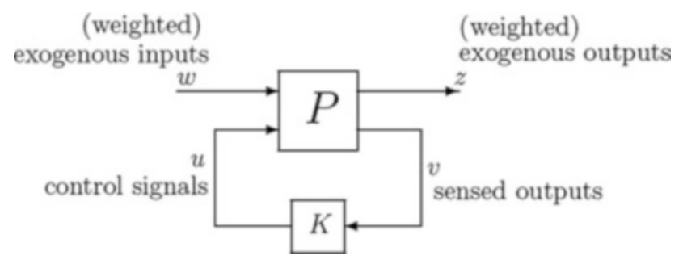

> Image description: A block diagram titled "General formulation for designing the controller $K$" illustrates a standard feedback control loop structure. The central component is the plant, represented by a block labeled $P$. The system includes several signal paths: * **Exogenous inputs ($w$):** An external input enters the plant $P$. * **Exogenous outputs ($z$):** The plant produces an output $z$, labeled as "(weighted) exogenous outputs." * **Sensed outputs ($v$):** A feedback path carries signals $v$ from the plant to the controller $K$. * **Control signals ($u$):** The controller $K$ processes the sensed outputs $v$ to generate control signals $u$, which are fed back into the plant $P$. The diagram depicts a closed-loop architecture where the controller $K$ attempts to regulate the plant $P$ in response to external disturbances $w$, aiming to minimize the weighted error signals $z$.
Control Structure Selection, Fig. 1 General formulation for designing the controller K . The plant P is controlled by manipulating u , and is disturbed by the signals w . The controller uses the measurements v , and the control objective is to keep the outputs (weighted control error) $z$ as small as possible

$\mathbf{J}^{\prime}=\left\|\mathrm{W}^{\prime} z\right\|$. The reason for using a prime on $\mathbf{J}$ ( $\mathbf{J}^{\prime}$ ), is to distinguish it from the economic cost J which we later use for selecting the controlled variables (CV).

Notice that it is assumed in Fig. 1 that we know what to measure (v), manipulate (u), and, most importantly, which variables in z we would like to keep at setpoints (CV), that is, we have assumed a given control structure. The term "control structure selection" (CSS) and its synonym "control structure design" (CSD) is associated with the overall control philosophy for the system with emphasis on the structural decisions which are a prerequisite for the controller design problem in Fig. 1:

1. Selection of controlled variables (CVs, "outputs," included in z in Fig. 1)
2. Selection of manipulated variables (MVs, "inputs," u in Fig. 1)
3. Selection of measurements $y$ (included in $v$ in Fig. 1)
4. Selection of control configuration (structure of overall controller K that interconnects the controlled, manipulated and measured variables; structure of K in Fig. 1)
5. Selection of type of controller $K$ (PID, MPC, LQG, H-infinity, etc.) and objective function (norm) used to design and analyze it.
Decisions 2 and 3 (selection of $u$ and $y$ ) are sometimes referred to as the input/output (IO) selection problem. In practice, the controller (K) is usually divided into several layers, operating on different time scales (see Fig. 2), which implies that we in addition to selecting the (primary) controlled variables ( $\mathrm{CV}_{1} \equiv \mathrm{CV}$ ) must also select the (secondary) variables that interconnect the layers $\left(\mathrm{CV}_{2}\right)$.

Control structure selection includes all the structural decisions that the engineer needs to make when designing a control system, but it does not involve the actual design of each individual controller block. Thus, it involves the decisions necessary to make a block diagram (Fig. 1; used by control engineers) or process \& instrumentation diagram (used by process engineers) for the entire plant, and provides the starting point for a detailed controller design.


<!-- source_pdf_page: 228 -->
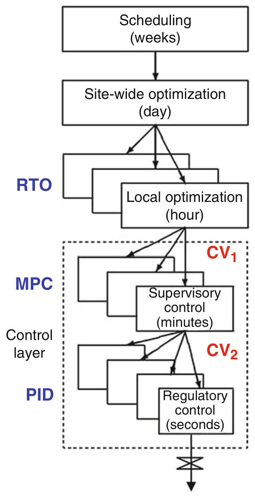

> Image description: This flowchart illustrates a hierarchical control structure for a process plant, organized from high-level strategic planning down to low-level regulatory action. The hierarchy consists of several nested layers connected by unidirectional downward arrows. At the highest level, **Scheduling** operates on a timescale of **weeks**. This feeds into **Site-wide optimization**, which operates on a **day** scale. Below this, the **RTO (Real-Time Optimization)** layer contains **Local optimization** modules operating on an **hour** scale. The **Control layer** is enclosed in a dashed box and contains two main subdivisions: * The **MPC (Model Predictive Control)** layer, specifically **Supervisory control**, operating on a **minutes** scale. * The **PID (Proportional-Integral-Derivative)** layer, specifically **Regulatory control**, operating on a **seconds** scale. The variables **$CV_1$** (red) represent setpoints passed from the RTO layer to the MPC layer, while **$CV_2$** (red) represent setpoints passed from the MPC layer to the PID layer. The structure terminates at a process output symbol.
Control Structure Selection, Fig. 2 Typical control hierarchy, as illustrated for a process plant

The term "plantwide control," which is a synonym for "control structure selection," is used in the field of process control. Control structure selection is particularly important for process control because of the complexity of large processing plants, but it applies to all control applications, including vehicle control, aircraft control, robotics, power systems, biological systems, social systems, and so on.

It may be argued that control structure selection is more important than the controller design itself. Yet, control structure selection is hardly covered in most control courses. This is probably related to the complexity of the problem, which requires the knowledge from several engineering fields. In the mathematical sense, the control structure selection problem is a formidable combinatorial problem which involves a large number of discrete decision variables.

## Overall Objectives for Control and Structure of the Control Layer

The starting point for control system design is to define clearly the operational objectives. There are usually two main objectives for control:

1. Longer-term economic operation (minimize economic cost J subject to satisfying operational constraints)
2. Stability and short-term regulatory control The first objective is related to "making the system operate as intended," where economics are an important issue. Traditionally, control engineers have not been much involved in this step. The second objective is related to "making sure the system stays operational," where stability and robustness are important issues, and this has traditionally been the main domain of control engineers. In terms of designing the control system, the second objective (stabilization) is usually considered first. An example is bicycle riding; we first need to learn how to stabilize the bicycle (regulation), before trying to use it for something useful (optimal operation), like riding to work and selecting the shortest path.

We use the term "economic cost," because usually the cost function J can be given a monetary value, but more generally, the cost J could be any scalar cost. For example, the cost J could be the "environmental impact" and the economics could then be given as constraints.

In theory, the optimal strategy is to combine the control tasks of optimal economic operation and stabilization/regulation in a single centralized controller K, which at each time step collects all the information and computes the optimal input changes. In practice, simpler controllers are used. The main reason for this is that in most cases one can obtain acceptable control performance with simple structures, where each controller block involves only a few variables. Such control systems can be designed and tuned with much less effort, especially when it comes to the modeling and tuning effort.

So how are large-scale systems controlled in practise? Usually, the controller K is decomposed


<!-- source_pdf_page: 229 -->
into several subcontrollers, using two main principles

- Decentralized (local) control. This "horizontal decomposition" of the control layer is usually based on separation in space, for example, by using local control of individual units.
- Hierarchical (cascade) control. This "vertical decomposition" is usually based on time scale separation, as illustrated for a process plant in Fig. 2. The upper three layers in Fig. 2 deal explicitly with economic optimization and are not considered here. We are concerned with the two lower control layers, where the main objective is to track the setpoints specified by the layer above.
In accordance with the two main objectives for control, the control layer is in most cases divided hierarchically in two layers (Fig. 2):

1. A "slow" supervisory (economic) layer
2. A "fast" regulatory (stabilization) layer

Another reason for the separation in two control layers, is that the tasks of economic operation and regulation are fundamentally different. Combining the two objectives in a single cost function, which is required for designing a single centralized controller K, is like trying to compare apples and oranges. For example, how much is an increased stability margin worth in monitory units [\$]? Only if there is a reasonable benefit in combining the two layers, for example, because there is limited time scale separation between the tasks of regulation and optimal economics, should one consider combining them into a single controller.

## Notation and Matrices $\mathbf{H}_{\mathbf{1}}$ and $\mathbf{H}_{\mathbf{2}}$ for Controlled Variable Selection

The most important notation is summarized in Table 1 and Fig. 3. To distinguish between the two control layers, we use " 1 " for the upper supervisory (economic) layer and "2" for the regulatory layer, which is "secondary" in terms of its place in the control hierarchy.

There is often limited possibility to select the input set (u) as it is usually constrained by the
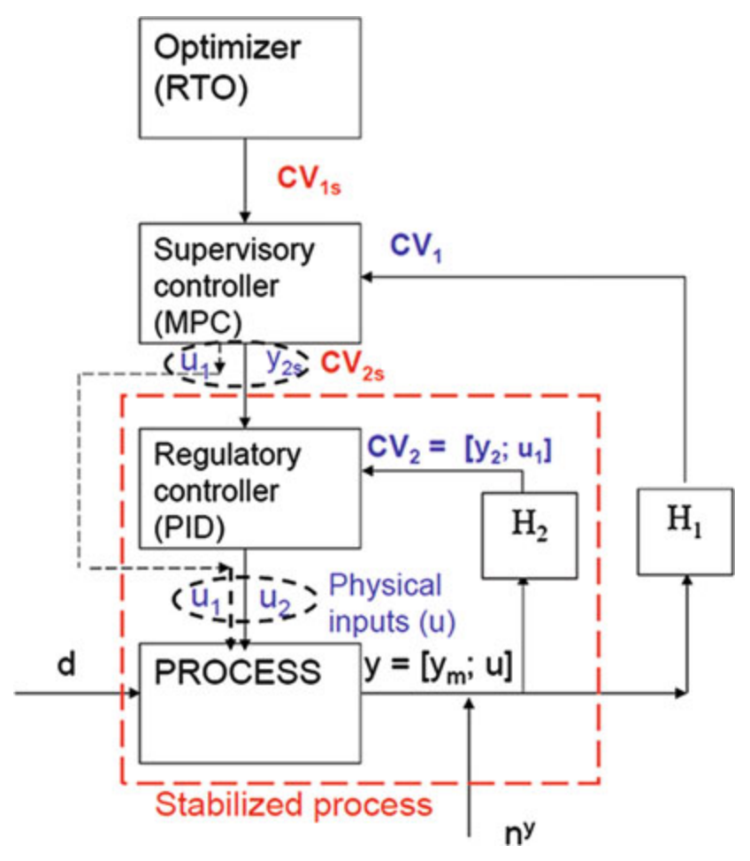

> Image description: This block diagram illustrates a hierarchical control structure consisting of three main layers: an Optimizer (RTO), a Supervisory controller (MPC), and a Regulatory controller (PID), which manages a physical Process. The hierarchy operates through a series of setpoints and feedback loops. The Optimizer sends setpoints ($CV_{1s}$) to the Supervisory controller. The Supervisory controller produces setpoints ($u_1$) for the Regulatory controller. The Regulatory controller manages physical inputs ($u_1, u_2$) to the Process. The feedback signals are defined by transfer functions: $H_1$ and $H_2$. $H_2$ maps the process output ($y$) to the regulatory controlled variables ($CV_2 = [y_2; u_1]$), while $H_1$ maps the process output to the supervisory controlled variables ($CV_1$). The process output is defined as $y = [y_m; u]$. A "Stabilized process" is enclosed within a dashed red box. Disturbance $d$ enters the process, and $n^y$ represents process noise.

Control Structure Selection, Fig. 3 Block diagram of a typical control hierarchy, emphasizing the selection of controlled variables for supervisory (economic) control $\left(\mathrm{CV}_{1}=\mathrm{H}_{1} \mathrm{y}\right)$ and regulatory control $\left(\mathrm{CV}_{2}=\mathrm{H}_{2} \mathrm{y}\right)$

Control Structure Selection, Table 1 Important notation

```
$\mathrm{u}=\left[\mathrm{u}_{1} ; \mathrm{u}_{2}\right]=$ set of all available physical plant inputs
$\mathrm{u}_{1}=$ inputs used directly by supervisory control layer
$\mathrm{u}_{2}=$ inputs used by regulatory layer
$\mathrm{y}_{\mathrm{m}}=$ set of all measured outputs
$\mathrm{y}=\left[\mathrm{y}_{\mathrm{m}} ; \mathrm{u}\right]=$ combined set of measurements and inputs
$\mathrm{y}_{2}=$ controlled outputs in regulatory layer (subset or combination of y$) ; \operatorname{dim}\left(\mathrm{y}_{2}\right)=\operatorname{dim}\left(\mathrm{u}_{2}\right)$
$\mathrm{CV}_{1}=\mathrm{H}_{1} \mathrm{y}=$ controlled variables in supervisory layer; $\operatorname{dim}\left(\mathrm{CV}_{1}\right)=\operatorname{dim}(\mathrm{u})$
$\mathrm{CV}_{2}=\left[\mathrm{y}_{2} ; \mathrm{u}_{1}\right]=\mathrm{H}_{2} \mathrm{y}=$ controlled variables in regulatory layer; $\operatorname{dim}\left(\mathrm{CV}_{2}\right)=\operatorname{dim}(\mathrm{u})$
$\mathrm{MV}_{1}=\mathrm{CV}_{2 \mathrm{~s}}=\left[\mathrm{y}_{2 \mathrm{~s}} ; \mathrm{u}_{1}\right]=$ manipulated variables in supervisory layer; $\operatorname{dim}\left(\mathrm{MV}_{1}\right)=\operatorname{dim}(\mathrm{u})$
$\mathrm{MV}_{2}=\mathrm{u}_{2}=$ manipulated variables in regulatory layer; $\operatorname{dim}\left(\mathrm{MV}_{2}\right)=\operatorname{dim}\left(\mathrm{u}_{2}\right) \leq \operatorname{dim}(\mathrm{u})$
```


<!-- source_pdf_page: 230 -->
plant design. However, there may be a possibility to add inputs or to move some to another location, for example, to avoid saturation or to reduce the time delay and thus improve the input-output controllability.

There is much more flexibility in terms of output selection, and the most important structural decision is related to the selection of controlled variables in the two control layers, as given by the decision matrices $\mathrm{H}_{1}$ and $\mathrm{H}_{2}$ (see Fig. 3).

$$
\begin{aligned}
& \mathrm{CV}_{1}=\mathrm{H}_{1} \mathrm{y} \\
& \mathrm{CV}_{2}=\mathrm{H}_{2} \mathrm{y}
\end{aligned}
$$

Note from the definition in Table 1 that $\mathrm{y}= \left[y_{m} ; u\right]$. Thus, $y$ includes, in addition to the candidate measured outputs $\left(\mathrm{y}_{\mathrm{m}}\right)$, also the physical inputs u . This allows for the possibility of selecting an input u as a "controlled" variable, which means that this input is kept constant (or, more precisely, the input is left "unused" for control in this layer).

In general, $\mathrm{H}_{1}$ and $\mathrm{H}_{2}$ are "full" matrices, allowing for measurement combinations as controlled variables. However, for simplicity, especially in the regulatory layer, we often pefer to control individual measurements, that is, $\mathrm{H}_{2}$ is usually a "selection matrix," where each row in $\mathrm{H}_{2}$ contains one 1-element (to identify the selected variable) with the remaining elements set to 0 . In this case, we can write $\mathrm{CV}_{2}=\mathrm{H}_{2} \mathrm{y}= \left[\mathrm{y}_{2} ; \mathrm{u}_{1}\right]$, where $\mathrm{y}_{2}$ denotes the actual controlled variables in the regulatory layer, whereas $\mathrm{u}_{1}$ denotes the "unused" inputs ( $\mathrm{u}_{1}$ ), which are left as degrees of freedom for the supervisory layer. Note that this indirectly determines the inputs $\mathrm{u}_{2}$ used in the regulatory layer to control $\mathrm{y}_{2}$, because $\mathrm{u}_{2}$ is what remains in the set u after selecting $\mathrm{u}_{1}$. To have a simple control structure, with as few regulatory loops as possible, it is desirable that $\mathrm{H}_{2}$ is selected such that there are many inputs ( $\mathrm{u}_{1}$ ) left "unused" in the regulatory layer.
Example. Assume there are three candidate output measurements (temperatures T) and two inputs (flowrates q),

$$
\mathrm{y}_{\mathrm{m}}=\left[\mathrm{T}_{\mathrm{a}} \mathrm{~T}_{\mathrm{b}} \mathrm{~T}_{\mathrm{c}}\right], \mathrm{u}=\left[\mathrm{q}_{\mathrm{a}} \mathrm{q}_{\mathrm{b}}\right]
$$

and we have by definition $y=\left[y_{m} ; u\right]$. Then the choice

$$
\mathrm{H}_{2}=\left[\begin{array}{llllllllll}
0 & 1 & 0 & 0 & 0 & 0 & 0 & 0 & 0 & 1
\end{array}\right]
$$

means that we have selected $\mathrm{CV}_{2}=\mathrm{H}_{2} \mathrm{y}= \left[\mathrm{T}_{\mathrm{b}} ; \mathrm{q}_{\mathrm{b}}\right]$. Thus, $\mathrm{u}_{1}=\mathrm{q}_{\mathrm{b}}$ is an unused input for regulatory control, and in the regulatory layer we close one loop, using $\mathrm{u}_{2}=\mathrm{q}_{\mathrm{a}}$ to control $\mathrm{y}_{2}=\mathrm{T}_{\mathrm{b}}$. If we instead select

$$
\mathrm{H}_{2}=\left[\begin{array}{llllllllll}
1 & 0 & 0 & 0 & 0 ; & 0 & 0 & 1 & 0 & 0
\end{array}\right]
$$

then we have $\mathrm{CV}_{2}=\left[\mathrm{T}_{\mathrm{a}} ; \mathrm{T}_{\mathrm{c}}\right]$. None of these are inputs, so $\mathrm{u}_{1}$ is an empty set in this case. This means that we need to close two regulatory loops, using $\mathrm{u}_{2}=\left[\mathrm{q}_{\mathrm{a}} ; \mathrm{q}_{\mathrm{b}}\right]$ to control $\mathrm{y}_{2}=\left[\mathrm{T}_{\mathrm{a}} ; \mathrm{T}_{\mathrm{c}}\right]$.

## Supervisory Control Layer and Selection of Economic Controlled Variables (CV ${ }_{1}$ )

Some objectives for the supervisory control layer are given in Table 2. The main structural issue for the supervisory control layer, and probably the most important decision in the design of any control system, is the selection of the primary (economic) controlled variable $\mathrm{CV}_{1}$. In many cases, a good engineer can make a reasonable choice based on process insight and experience. However, the control engineer must realize that this is a critical decision. The main rules and issues for selecting $\mathrm{CV}_{1}$ are
CV 1 Rule 1. Control active constraints (almost always)

- Active constraints may often be identified by engineering insight, but more generally requires optimization based on a detailed model.
For example, consider the problem of minimizing the driving time between two cities (cost $J=T$ ). There is a single input ( $u=$ fuel flow $f[l / s]$ ) and the optimal solution is often constrained. When driving a fast car, the active constraint may be the speed limit ( $C V_{1}=v[k m / h]$ with setpoint $v_{\text {max }}$, e.g., $v_{\text {max }}=100 \mathrm{~km} / \mathrm{h}$ ). When driving


<!-- source_pdf_page: 231 -->
Control Structure Selection, Table 2 Objectives of supervisory control layer
O 1 . Control primary "economic" variables $\mathrm{CV}_{1}$ at setpoint using as degrees of freedom $\mathrm{MV}_{1}$, which includes the setpoints to the regulatory layer $\left(\mathrm{y}_{2 \mathrm{~s}}=\mathrm{CV}_{2 \mathrm{~s}}\right)$ as well as any "unused" degrees of freedom ( $\mathrm{u}_{1}$ )
O 2 . Switch controlled variables ( $\mathrm{CV}_{1}$ ) depending on operating region, for example, because of change in active constraints
O3. Supervise the regulatory layer, for example, to avoid input saturation ( $\mathrm{u}_{2}$ ), which may destabilize the system
O4. Coordinate control loops (multivariable control) and reduce effect of interactions (decoupling)
O5. Provide feedforward action from measured disturbances
O6. Make use of additional inputs, for example, to improve the dynamic performance (usually combined with input midranging control) or to extend the steady-state operating range (split range control)
O7. Make use of extra measurements, for example, to estimate the primary variables $\mathrm{CV}_{1}$
an old car, the active constraint maybe the maximum fuel flow $\left(C V_{1}=f[l / s]\right.$ with setpoint $\left.f_{\text {max }}\right)$. The latter corresponds to an input constraint ( $u_{\text {max }}=f_{\text {max }}$ ) which is trivial to implement ("full gas"); the former corresponds to an output constraint $\left(y_{\text {max }}=v_{\text {max }}\right)$ which requires a controller ("cruise control").

- For"hard" output constraints, which cannot be violated at any time, we need to introduce a backoff (safety margin) to guarantee feasibility. The backoff is defined as the difference between the optimal value and the actual setpoint, for example, we need to back off from the speed limit because of the possibility for measurement error and imperfect control

$$
\mathrm{CV}_{1, \mathrm{~s}}=\mathrm{CV}_{1, \max }-\text { backoff }
$$

For example, to avoid exceeding the speed limit of $100 \mathrm{~km} / \mathrm{h}$, we may set backoff $=5 \mathrm{~km} / \mathrm{h}$, and use a setpoint $v_{s}=95 \mathrm{~km} / \mathrm{h}$ rather than $100 \mathrm{~km} / \mathrm{h}$.
CV ${ }_{1}$ Rule 2. For the remaining unconstrained degrees of freedom, look for "self-optimizing" variables which when held constant, indirectly lead to close-to-optimal operation, in spite of disturbances.

- Self-optimizing variables ( $\mathrm{CV}_{1}=\mathrm{H}_{1} \mathrm{y}$ ) are variables which when kept constant, indirectly (through the action of the feedback control system) lead to close-to optimal adjustment of the inputs ( u ) when there are disturbances (d).
- An ideal self-optimizing variable is the gradient of the cost function with respect to the unconstrained input. $\mathrm{CV}_{1}=\mathrm{dJ} / \mathrm{du}=\mathrm{J}_{\mathrm{u}}$
- More generally, since we rarely can measure the gradient $\mathrm{J}_{\mathrm{u}}$, we select $\mathrm{CV}_{1}=\mathrm{H}_{1} \mathrm{y}$. The selection of a good $\mathrm{H}_{1}$ is a nontrivial task, but some quantitative approaches are given below.
For example, consider again the problem of driving between two cities, but assume that the objective is to minimize the total fuel, $J=V$ [liters]., Here, driving at maximum speed will consume too much fuel, and driving too slow is also nonoptimal. This is an unconstrained optimization problem, and identifying a good $C V_{1}$ is not obvious. One option is to maintain a constant speed $\left(C V_{1}=v\right)$, but the optimal value of v may vary depending on the slope of the road. A more "self-optimizing" option, could be to keep a constant fuel rate ( $C V_{1}= f[l / s]$ ), which will imply that we drive slower uphill and faster downhill. More generally, one can control combinations, $C V_{1}=H_{1} y$ where $H_{1}$ is a "full" matrix.
CV ${ }_{1}$ Rule 3. For the unconstrained degrees of freedom, one should never control a variable that reaches its maximum or minimum value at the optimum, for example, never try to control directly the cost J. Violation of this rule gives either infeasibility (if attempting to control J at a lower value than $\mathrm{J}_{\text {min }}$ ) or nonuniqueness (if attempting to control J at higher value than $\mathrm{J}_{\text {min }}$ ).
Assume again that we want to minimize the total fuel needed to drive between two cities, $J=V[l]$. Then one should avoid fixing the


<!-- source_pdf_page: 232 -->
total fuel, $C V_{1}=V[l]$, or, alternatively, avoid fixing the fuel consumption("gas mileage") in liters pr. km ( $C V_{1}=f[l / k m]$ ). Attempting to control the fuel consumption[l/km] below the car's minimum value is obviously not possible (infeasible). Alternatively, attempting to control the fuel consumption above its minimum value has two possible solutions; driving slower or faster than the optimum. Note that the policy of controlling the fuel rate $f[l / s]$ at a fixed value will never become infeasible.

For $\mathrm{CV}_{1}$-Rule 2, it is always possible to find good variable combinations (i.e., $\mathrm{H}_{1}$ is a "full" matrix), at least locally, but whether or not it is possible to find good individual variables ( $\mathrm{H}_{1}$ is a selection matrix), is not obvious. To help identify potential "self-optimizing" variables $\left(\mathrm{CV}_{1}=\mathrm{c}\right)$, the following requirements may be used:
Requirement 1. The optimal value of c is insensitive to disturbances, that is, $\mathrm{dc}_{\text {opt }} / \mathrm{dd}=\mathrm{H}_{1} \mathrm{~F}$ is small. Here $\mathrm{F}=\mathrm{dy}_{\text {opt }} / \mathrm{dd}$ is the optimal sensitivity matrix (see below).
Requirement 2. The variable c is easy to measure and control accurately
Requirement 3. The value of c is sensitive to changes in the manipulated variable, u ; that is, the gain, $\mathrm{G}=\mathrm{HG}^{\mathrm{y}}$, from u to c is large (so that even a large error in controlled variable, c , results in only a small variation in u.) Equivalently, the optimum should be "flat" with respect to the variable, c. Here $\mathrm{G}^{y}= d y / d u$ is the measurement gain matrix (see below).
Requirement 4. For cases with two or more controlled variables c , the selected variables should not be closely correlated.
All four requirements should be satisfied. For example, for the operation of a marathon runner, the heart rate may be a good "selfoptimizing" controlled variable c (to keep at constant setpoint). Let us check this against the four requirements. The optimal heart rate is weakly dependent on the disturbances (requirement 1) and the heart rate is easy to measure (requirement 2). The heart rate is quite sensitive to changes in power input (requirement $3)$. Requirement 4 does not apply since this is
a problem with only one unconstrained input (the power). In summary, the heart rate is a good candidate.

Regions and switching. If the optimal active constraints vary depending on the disturbances, new controlled variables ( $\mathrm{CV}_{1}$ ) must be identified (offline) for each active constraint region, and online switching is required to maintain optimality. In practise, it is easy to identify when to switch when one reaches a constraint. It is less obvious when to switch out of a constraint, but actually one simply has to monitor the value of the unconstrained CVs from the neighbouring regions and switch out of the constraint region when the unconstrained CV reaches its setpoint.

In general, one would like to simplify the control structure and reduce need for switching. This may require using a suboptimal $\mathrm{CV}_{1}$ in some regions of active constraints. In this case, the setpoint for $\mathrm{CV}_{1}$ may not be its nominally optimal value (which is the normal choice), but rather a "robust setpoint" (with backoff) which reduces the loss when we are outside the nominal constraint region.

Structure of supervisory layer. The supervisory layer may either be centralized, e.g., using model predictive control (MPC), or decomposed into simpler subcontrollers using standard elements, like decentralized control (PID), cascade control, selectors, decouplers, feedforward elements, ratio control, split range control, and input midrange control (also known as input resetting, valve position control or habituating control). In theory, the performance is better with the centralized approach (e.g., MPC), but the difference can be small when designed by a good engineer. The main reasons for using simpler elements is that (1) the system can be implemented in the existing "basic" control system, (2) it can be implemented with little model information, and (3) it can be build up gradually. However, such systems can quickly become complicated and difficult to understand for other than the engineer who designed it. Therefore, model-based centralized solutions (MPC) are often preferred because the design is more systematic and easier to modify.


<!-- source_pdf_page: 233 -->
## Quantitative Approach for Selecting Economic Controlled Variables, CV 1

A quantitative approach for selecting economic controlled variables is to consider the effect of the choice $\mathrm{CV}_{1}=\mathrm{H}_{1} \mathrm{y}$ on the economic cost J when disturbances d occur. One should also include noise/errors ( $\mathrm{n}^{\mathrm{y}}$ ) related to the measurements and inputs.
Step S1. Define operational objectives (economic cost function $J$ and constraints)
We first quantify the operational objectives in terms of a scalar cost function $\mathrm{J}[\$ / \mathrm{s}]$ that should be minimized (or equivalently, a scalar profit function, $\mathrm{P}=-\mathrm{J}$, that should be maximized). For process control applications, this is usually easy, and typically we have

$$
\begin{aligned}
\mathrm{J}= & \text { cost feed }+ \text { cost utilities (energy) } \\
& - \text { value products }[\$ / \mathrm{s}]
\end{aligned}
$$

Note that the economic cost function J is used to select the controlled variables $\left(\mathrm{CV}_{1}\right)$, and another cost function ( $\mathrm{J}^{\prime}$ ), typically involving the deviation in $\mathrm{CV}_{1}$ from their optimal setpoints $\mathrm{CV}_{1 \mathrm{~s}}$, is used for the actual controller design (e.g., using MPC).
Step S2. Find optimal operation for expected disturbances
Mathematically, the optimization problem can be formulated as

$$
\operatorname{minu} \mathrm{J}(\mathrm{u}, \mathrm{x}, \mathrm{~d})
$$

subject to:

$$
\begin{array}{ll}
\text { Model equations: } & \mathrm{dx} / \mathrm{dt}=\mathrm{f}(\mathrm{u}, \mathrm{x}, \mathrm{~d}) \\
\text { Operational constraints: } & \mathrm{g}(\mathrm{u}, \mathrm{x}, \mathrm{~d}) \leq 0
\end{array}
$$

In many cases, the economics are determined by the steady-state behavior, so we can set $\mathrm{dx} / \mathrm{dt}=0$. The optimization problem should be resolved for the expected disturbances (d) to find the truly optimal operation policy, $\mathrm{u}_{\text {opt }}(\mathrm{d})$. The nominal solution ( $\mathrm{d}_{\text {nom }}$ ) may be used to obtain the setpoints $\left(\mathrm{CV}_{1 \mathrm{~s}}\right)$ for the selected controlled variables. In
practise, the optimum input $\mathrm{u}_{\text {opt }}(\mathrm{d})$ cannot be realized, because of model error and unknown disturbances d, so we use a feeback implementation where u is adjusted to keep the selected variables $\mathrm{CV}_{1}$ at their nominally optimal setpoints.
Together with obtaining the model, the optimization step S2 is often the most time consuming step in the entire plantwide control procedure.

## Step S3. Select supervisory (economic) controlled variables, $\boldsymbol{C} \boldsymbol{V}_{\boldsymbol{1}}$

## $\mathbf{C V}_{\mathbf{1}}$-Rule 1: Control Active Constraints

A primary goal for solving the optimization problem is to find the expected regions of active constraints, and a constraint is said to be "active" if $\mathrm{g}=0$ at the optimum. The optimally active constraints will vary depending on disturbances (d) and market conditions (prices).

## $\mathrm{CV}_{1}$-Rule 2: Control Self-Optimizing Variables

After having identified (and controlled) the active constraints, one should consider the remaining lower-dimension unconstrained optimization problem, and for the remaining unconstrained degrees of freedom one should search for control "self-optimizing" variables c.

1. "Brute force" approach. Given a set of controlled variables $\mathrm{CV}_{1}=\mathrm{c}=\mathrm{H}_{1} \mathrm{y}$, one computes the cost $\mathrm{J}(\mathrm{c}, \mathrm{d})$ when we keep c constant ( $\mathrm{c}=\mathrm{c}_{\mathrm{s}}+\mathrm{H}_{1} \mathrm{n}^{\mathrm{y}}$ ) for various disturbances ( d ) and measurement errors ( $\mathrm{n}^{\mathrm{y}}$ ). In practise, this is done by running a large number of steady-state simulations to try to cover the expected future operation.
2. "Local" approaches based on a quadratic approximation of the cost J. Linear models are used for the effect of $u$ and $d$ on $y$.

$$
y=G^{y} u+G_{d}^{y} d
$$

This is discussed in more detail in Alstad et al. (2009) and references therein. The main local approaches are:
2A. Maximum gain rule: maximize the minimum singular value of $\mathbf{G}=\mathbf{H}_{1} \mathbf{G}^{\mathbf{y}}$.


<!-- source_pdf_page: 234 -->
In other words, the maximum gain rule, which essentially is a quantitative version of Requirements 1, 3 and 4 given above, says that one should control "sensitive" variables, with a large scaled gain G from the inputs ( u ) to $\mathrm{c}=\mathrm{H}_{1} \mathrm{y}$. This rule is good for pre-screening and also yields good insight.
2B. Nullspace method. This method yields optimal measurement combinations for the case with no noise, $\mathrm{n}^{\mathrm{y}}=0$. One must first obtain the optimal measurement sensitivity matrix F, defined as

$$
\mathbf{F}=\mathrm{dy}^{\mathrm{opt}} / \mathrm{dd} .
$$

Each column in F expresses the optimal change in the y's when the independent variable ( u ) is adjusted so that the system remains optimal with respect to the disturbance d. Usually, it is simplest to obtain F numerically by optimizing the model. Alternatively, we can obtain F from a quadratic approximation of the cost function

$$
F=G_{d}^{y}-G^{y} J_{u u}^{-1} J_{u d}
$$

Then, assuming that we have at least as many (independent) measurements y as the sum of the number of (independent) inputs (u) and disturbances (d), the optimal is to select $\mathrm{c}=\mathrm{H}_{1} \mathrm{y}$ such that

$$
\mathrm{H}_{1} \mathbf{F}=0
$$

Note that $\mathrm{H}_{1}$ is a nonsquare matrix, so $\mathrm{H}_{1} \mathrm{~F}=0$ does not require that $\mathrm{H}_{1}=0$ (which is a trivial uninteresting solution), but rather that $\mathrm{H}_{1}$ is in the nullspace of $\mathrm{F}^{\mathrm{T}}$.
2C. Exact local method (loss method). This extends the nullspace method to include noise ( $\mathrm{n}^{\mathrm{y}}$ ) and allows for any number of measurements. The noise and disturbances are normalized by introducing weighting matrices $\mathrm{W}_{\mathrm{ny}}$ and $\mathrm{W}_{\mathrm{d}}$ (which have the expected magnitudes along the diagonal) and then the expected loss, $\mathrm{L}=\mathrm{J}-\mathrm{J}_{\mathrm{opt}}(\mathrm{d})$, is minimized by selecting $\mathrm{H}_{1}$ to solve the following problem

$$
\operatorname{min\_ } \mathrm{H}_{1}\left\|\mathrm{M}\left(\mathrm{H}_{1}\right)\right\|_{2}
$$

where 2 denotes the Frobenius norm and

$$
\begin{aligned}
\mathrm{M}\left(\mathrm{H}_{1}\right) & =\mathrm{J}_{\mathrm{uu}}^{1 / 2}\left(\mathrm{H}_{1} \mathrm{G}^{\mathrm{y}}\right)^{-1} \mathrm{H}_{1} \mathrm{Y}, \mathrm{Y} \\
& =\left[\mathrm{FW}_{\mathrm{d}} \mathrm{~W}_{\mathrm{ny}}\right]
\end{aligned}
$$

Note here that the optimal choice with $\mathrm{W}_{\mathrm{ny}}=0$ (no noise) is to choose $\mathrm{H}_{1}$ such that $\mathrm{H}_{1} \mathrm{~F}=0$, which is the nullspace method. For the general case, when $\mathrm{H}_{1}$ is a "full" matrix, this is a convex problem and the optimal solution is $\mathrm{H}_{1}^{\mathrm{T}}=\left(\mathrm{Y} \mathrm{Y}^{\prime}\right)^{-1} \mathrm{G}^{\mathrm{y}} \mathrm{Q}$ where Q is any nonsingular matrix.

## Regulatory Control Layer

The main purpose of the regulatory layer is to "stabilize" the plant, preferably using a simple control structure (e.g., single-loop PID controllers) which does not require changes during operation. "Stabilize" is here used in a more extended sense to mean that the process does not "drift" too far away from acceptable operation when there are disturbances. The regulatory layer should make it possible to use a "slow" supervisory control layer that does not require a detailed model of the high-frequency dynamics. Therefore, in addition to track the setpoints given by the supervisory layer (e.g., MPC), the regulatory layer may directly control primary variables $\left(\mathrm{CV}_{1}\right)$ that require fast and tight control, like economically important active constraints.

In general, the design of the regulatory layer involves the following structural decisions:

1. Selection of controlled outputs $\mathrm{y}_{2}$ (among all candidate measurements $\mathrm{y}_{\mathrm{m}}$ ).
2. Selection of inputs $\mathrm{MV}_{2}=\mathrm{u}_{2}$ (a subset of all available inputs u ) to control the outputs $\mathrm{y}_{2}$.
3. Pairing of inputs $\mathrm{u}_{2}$ and outputs $\mathrm{y}_{2}$ (since decentralized control is normally used).
Decisions 1 and 2 combined (IO selection) is equivalent to selecting $\mathrm{H}_{2}$ (Fig. 3). Note that we do not "use up" any degrees of freedom in the regulatory layer because the set points $\left(\mathrm{y}_{2 \mathrm{~s}}\right)$


<!-- source_pdf_page: 235 -->
become manipulated variables ( $\mathrm{MV}_{1}$ ) for the supervisory layer (see Fig. 3). Furthermore, since the set points are set by the supervisory layer in a cascade manner, the system eventually approaches the same steady-state (as defined by the choice of economic variables $\mathrm{CV}_{1}$ ) regardless of the choice of controlled variables in the regulatory layer.

The inputs for the regulatory layer ( $\mathrm{u}_{2}$ ) are selected as a subset of all the available inputs (u). For stability reasons, one should avoid input saturation in the regulatory layer. In particular, one should avoid using inputs (in the set $\mathrm{u}_{2}$ ) that are optimally constrained in some disturbance region. Otherwise, in order to avoid input saturation, one needs to include a backoff for the input when entering this operational region, and doing so will have an economic penalty.

In the regulatory layer, the outputs $\left(y_{2}\right)$ are usually selected as individual measurements and they are often not important variables in themselves. Rather, they are "extra outputs" that are controlled in order to "stabilize" the system, and their setpoints $\left(\mathrm{y}_{2 \mathrm{~s}}\right)$ are changed by the layer above, to obtain economical optimal operation. For example, in a distillation column one may control a temperature somewhere in the middle of the column ( $\mathrm{y}_{2}=\mathrm{T}$ ) in order to "stabilize" the column profile. Its setpoint ( $\mathrm{y}_{2 \mathrm{~s}}=\mathrm{T}_{\mathrm{s}}$ ) is adjusted by the supervisory layer to obtain the desired product composition $\left(\mathrm{y}_{1}=\mathrm{c}\right)$.

## Input-Output (IO) Selection for Regulatory Control $\left(\mathrm{u}_{2}, \mathrm{y}_{2}\right)$

Finding the truly optimal control structure, including selecting inputs and outputs for regulatory control, requires finding also the optimal controller parameters. This is an extremely difficult mathematical problem, at least if the controller K is decomposed into smaller controllers. In this section, we consider some approaches which does not require that the controller parameters be found. This is done by making assumptions related to achievable control performance (controllability) or perfect control.

Before we look at the approaches, note again that the IO-selection for regulatory control may be combined into a single decision, by considering the selection of

$$
\mathrm{CV}_{2}=\left[\mathrm{y}_{2} ; \mathrm{u}_{1}\right]=\mathrm{H}_{2} \mathrm{y}
$$

Here $\mathrm{u}_{1}$ denotes the inputs that are not used by the regulatory control layer. This follows because we want to use all inputs u for control, so assuming that the set u is given, "selection of inputs $\mathrm{u}_{2}$ " (decision 2) is by elimination equivalent to "selection of inputs $u_{1}$." Note that $\mathrm{CV}_{2}$ include all variables that we keep at desired (constant) values within the fast time horizon of the regulatory control layer, including the "unused" inputs $\mathrm{u}_{1}$

## Survey by Van de Wal and Jager

Van de Wal and Jager provide an overview of methods for input-output selection, some of which include:

1. "Accessibility" based on guaranteeing a cause-effect relationship between the selected inputs ( $\mathrm{u}_{2}$ ) and outputs ( $\mathrm{y}_{2}$ ). Use of such measures may eliminate unworkable control structures.
2. "State controllability and state observability" to ensure that any unstable modes can be stabilized using the selected inputs and outputs.
3. "Input-output controllability" analysis to ensure that $\mathrm{y}_{2}$ can be acceptably controlled using $\mathrm{u}_{2}$. This is based on scaling the system, and then analysing the transfer matrices $\mathrm{G}_{2}(\mathrm{~s})$ (from $\mathrm{u}_{2}$ to $\mathrm{y}_{2}$ ) and $\mathrm{G}_{\mathrm{d} 2}$ (from expected disturbances d to $\mathrm{y}_{2}$ ). Some important controllability measures are right half plane zeros (unstable dynamics of the inverse), condition number, singular values, relative gain array, etc. One problem here is that there are many different measures, and it is not clear which should be given most emphasis.
4. "Achievable robust performance." This may be viewed as a more detailed version of inputoutput controllability, where several relevant issues are combined into a single measure. However, this requires that the control problem can actually be formulated clearly, which may be very difficult, as already mentioned.


<!-- source_pdf_page: 236 -->
In addition, it requires finding the optimal robust controller for the given problem, which may be very difficult.
Most of these methods are useful for analyzing a given structure ( $\mathrm{u}_{2}, \mathrm{y}_{2}$ ) but less suitable for selection. Also, the list of methods is also incomplete, as disturbance rejection, which is probably the most important issue for the regulatory layer, is hardly considered.

## A Systematic Approach for IO-Selection Based on Minimizing State Drift Caused by Disturbances

The objectives of the regulatory control layer are many, and Yelchuru and Skogestad (2013) list 13 partly conflicting objectives. To have a truly systematic approach to regulatory control design, including IO-selection, we would need to quantify all these partially conflicting objectives in terms of a scalar cost function $\mathrm{J}_{2}$. We here consider a fairly general cost function,

$$
\mathrm{J}_{2}=\|\mathrm{Wx}\|
$$

which may be interpreted as the weighted state drift. One justification for considering the state drift, is that the regulatory layer should ensure that the system, as measured by the weighted states Wx, does not drift too far away from the desired state, and thus stays in the "linear region" when there are disturbances. Note that the cost $\mathrm{J}_{2}$ is used to select controlled variables ( $\mathrm{CV}_{2}$ ) and not to design the controller (for which the cost may be the control error, $\mathrm{J}_{2}{ }^{\prime}=\left\|\mathrm{CV}_{2}-\mathrm{CV}_{2 \mathrm{~s}}\right\|$ ).

Within this framework, the IO-selection problem for the regulatory layer is then to select the nonsquare matrix $\mathrm{H}_{2}$,

$$
\mathrm{CV}_{2}=\mathrm{H}_{2} \mathrm{y}
$$

where $\mathrm{y}=\left[\mathrm{y}_{\mathrm{m}} ; \mathrm{u}\right]$, such that the $\operatorname{cost} \mathrm{J}_{2}$ is minimized. The cause for changes in $\mathrm{J}_{2}$ are disturbances d , and we consider the linear model (in deviation variables)

$$
\begin{aligned}
& \mathrm{y}=\mathrm{G}^{\mathrm{y}} \mathrm{u}+\mathrm{G}_{\mathrm{d}}^{\mathrm{y}} \mathrm{~d} \\
& \mathrm{x}=\mathrm{G}^{\mathrm{x}} \mathrm{u}+\mathrm{G}_{\mathrm{d}}^{\mathrm{x}} \mathrm{~d}
\end{aligned}
$$

where the G-matrices are transfer matrices. Here, $\mathrm{G}_{\mathrm{d}}^{\mathrm{x}}$ gives the effect of the disturbances on the states with no control, and the idea is to reduce the disturbance effect by closing the regulatory control loops. Within the "slow" time scale of the supervisory layer, we can assume that $\mathrm{CV}_{2}$ is perfectly controlled and thus constant, or $\mathrm{CV}_{2}=$ 0 in terms of deviation variables. This gives

$$
\mathrm{CV}_{2}=\mathrm{H}_{2} \mathrm{G}^{\mathrm{y}} \mathrm{u}+\mathrm{H}_{2} \mathrm{G}_{\mathrm{d}}^{\mathrm{y}} \mathrm{~d}=0
$$

and solving with respect to u gives

$$
\mathrm{u}=-\left(\mathrm{H}_{2} \mathrm{G}^{\mathrm{y}}\right)^{-1}\left(\mathrm{H}_{2} \mathrm{G}_{\mathrm{d}}^{\mathrm{y}}\right) \mathrm{d}
$$

and we have

$$
\mathrm{x}=\mathrm{P}_{\mathrm{d}}^{\mathrm{x}}\left(\mathrm{H}_{2}\right) \mathrm{d}
$$

where

$$
P_{d}^{x}\left(H_{2}\right)=G_{d}^{x}-G^{x}\left(H_{2} G^{y}\right)^{-1} H_{2} G_{d}^{y}
$$

is the disturbance effect for the "partially" controlled system with only the regulatory loops closed. Note that it is not generally possible to make $\mathrm{P}_{\mathrm{d}}^{\mathrm{x}}=0$ because we have more states than we have available inputs. To have a small "state drift," we want $\mathrm{J}_{2}=\left\|\mathrm{W} \mathrm{P}_{\mathrm{d}} \mathrm{d}\right\|$ to be small, and to have a simple regulatory control system we want to close as few regulatory loops as possible. Assume that we have normalized the disturbances so that the norm of d is 1 , then we can solve the following problem

For $0,1,2 \ldots$ etc. loops closed solve: $\min \_\mathrm{H}_{2}\left\|\mathrm{M}_{2}\left(\mathrm{H}_{2}\right)\right\|$
where $\mathrm{M}_{2}=\mathrm{WP}_{\mathrm{d}}^{\mathrm{x}}$ and $\operatorname{dim}(\mathrm{u} 2)= \operatorname{dim}(\mathrm{y} 2)=$ no. of loops closed.

By comparing the value of $\left\|\mathrm{M}_{2}\left(\mathrm{H}_{2}\right)\right\|$ with different number of loops closed (i.e., with different $\mathrm{H}_{2}$ ), we can then decide on an appropriate regulatory layer structure. For example, assume that we find that the value of $\mathrm{J}_{2}$ is 110 ( 0 loops closed), 0.2 ( 1 loop), and 0.02 ( 2 loops), and assume we have scaled the disturbances and states such that a $\mathrm{J}_{2}$-value less than about 1 is acceptable, then closing 1 regulatory loop is probably the best choice.


<!-- source_pdf_page: 237 -->
In principle, this is straightforward, but there are three remaining issues: (1) We need to choose an appropriate norm, (2) we should include measurement noise to avoid selecting insensitive measurements and (3) the problem must be solvable numerically.

Issue 1. The norm of $\mathrm{M}_{2}$ should be evaluated in the frequency range between the "slow" bandwidth of the supervisory control layer ( $\omega_{\mathrm{B} 1}$ ) and the "fast" bandwidth of the regulatory control layer ( $\omega_{\mathrm{B} 2}$ ). However, since it is likely that the system sometimes operates without the supervisory layer, it is reasonable to evaluate the norm of $\mathrm{P}_{\mathrm{d}}^{\mathrm{x}}$ in the frequency range from 0 (steady state) to $\omega_{\mathrm{B} 2}$. Since we want $\mathrm{H}_{2}$ to be a constant (not frequency-dependent) matrix, it is reasonable to choose $\mathrm{H}_{2}$ to minimize the norm of $\mathrm{M}_{2}$ at the frequency where $\left\|\mathbf{M}_{2}\right\|$ is expected to have its peak. For some mechanical systems, this may be at some resonance frequency, but for process control applications it is usually at steady state $(\omega=0)$, that is, we can use the steady-state gain matrices when computing $\mathrm{P}_{\mathrm{d}}^{\mathrm{x}}$. In terms of the norm, we use the 2-norm (Frobenius norm), mainly because it has good numerical properties, and also because it has the interpretation of giving the expected variance in x for normally distributed disturbances.

Issues 2 and 3. If we include also measurement noise $\mathrm{n}^{\mathrm{y}}$, which we should, then the expected value of $\mathrm{J}_{2}$ is minimized by solving the problem $\mathrm{min}_{2} \mathrm{H}_{2}\left\|\mathrm{M}_{2}\left(\mathrm{H}_{2}\right)\right\|_{2}$ where (Yelchuru and Skogestad 2013)

$$
\mathbf{M}_{2}\left(\mathbf{H}_{2}\right)=\mathbf{J}_{2 \mathrm{uu}}^{1 / 2}\left(\mathbf{H}_{2} \mathbf{G}^{\mathrm{y}}\right)^{-1} \mathbf{H}_{2} \mathbf{Y}_{2}
$$

$$
\begin{aligned}
\mathbf{Y}_{2}=\left[\begin{array}{ll}
\mathbf{F}_{2} & \mathbf{W}_{\mathrm{d}} \\
& \mathbf{W}_{\mathrm{n}}
\end{array}\right] ; \quad \mathbf{F}_{2} & =\frac{\partial \mathrm{y}_{\mathrm{opt}}}{\partial \mathrm{~d}} \\
& =\mathbf{G}^{\mathrm{y}} \boldsymbol{J}_{2 \mathrm{uu}}^{-1} \boldsymbol{J}_{2_{\mathrm{ud}}}-\mathbf{G}_{\mathrm{dy}}
\end{aligned}
$$

where $\mathrm{J}_{2 \mathrm{uu}} \triangleq \frac{\partial^{2} J_{2}}{\partial \mathrm{u}^{2}}=2 \mathbf{G}^{\mathrm{x}^{T}} \mathbf{W}^{T} \mathbf{W G}^{\mathrm{x}}, \quad J_{2_{\mathrm{ud}}} \triangleq \frac{\partial^{2} J_{2}}{\partial \mathrm{u} \partial \mathrm{d}}=2 \mathbf{G}^{\mathrm{x}^{T}} \mathbf{W}^{T} \mathbf{W G}_{\mathrm{d}^{\mathrm{x}}}$,

Note that this is the same mathematical problem as the "exact local method" presented for selecting $\mathrm{CV}_{1}=\mathrm{H}_{1} \mathrm{y}$ for minimizing the economic cost J, but because of the specific simple form
for the cost $\mathrm{J}_{2}$, it is possible to obtain analytical formulas for the optimal sensitivity, $\mathrm{F}_{2}$. Again, $\mathrm{W}_{d}$ and $\mathrm{W}_{n y}$ are diagonal matrices, expressing the expected magnitude of the disturbances (d) and noise (for y ).

For the case when $\mathrm{H}_{2}$ is a "full" matrix, this can be reformulated as a convex optimization problem and an explicit solution is

$$
\mathbf{H}_{2}^{T}=\left(\mathbf{Y}_{2} \mathbf{Y}_{2}^{T}\right)^{-1} \mathbf{G}^{\mathrm{y}}\left(\mathbf{G}^{\mathrm{y}^{T}}\left(\mathbf{Y}_{2} \mathbf{Y}_{2}^{T}\right)^{-1} \mathbf{G}^{\mathrm{y}}\right)^{-1} \mathbf{J}_{2 \mathrm{uu}}^{1 / 2}
$$

and from this we can find the optimal value of $\mathrm{J}_{2}$. It may seem restrictive to assume that $\mathrm{H}_{2}$ is a "full" matrix, because we usually want to control individual measurements, and then $\mathrm{H}_{2}$ should be a selection matrix, with 1's and 0's. Fortunately, since we in this case want to control as many measurements ( $\mathrm{y}_{2}$ ) as inputs ( $\mathrm{u}_{2}$ ), we have that $\mathrm{H}_{2}$ is square in the selected set, and the optimal value of $\mathrm{J}_{2}$ when $\mathrm{H}_{2}$ is a selection matrix is the same as when $\mathrm{H}_{2}$ is a full matrix. The reason for this is that specifying (controlling) any linear combination of $\mathrm{y}_{2}$, uniquely determines the individual $\mathrm{y}_{2}$ 's, since $\operatorname{dim}\left(\mathrm{u}_{2}\right)=\operatorname{dim}\left(\mathrm{y}_{2}\right)$. Thus, we can find the optimal selection matrix $\mathrm{H}_{2}$, by searching through all the candidate square sets of y . This can be effectively solved using the branch and bound approach of Kariwala and Cao, or alternatively it can be solved as a mixedinteger problem with a quadratic program (QP) at each node (Yelchuru and Skogestad 2012). The approach of Yelchuru and Skogestad can also be applied to the case where we allow for disjunct sets of measurement combinations, which may give a lower $\mathrm{J}_{2}$ in some cases.

## Comments on the state drift approach.

1. We have assumed that we perfectly control $y_{2}$ using $\mathrm{u}_{2}$, at least within the bandwidth of the regulatory control system. Once one has found a candidate control structure ( $\mathrm{H}_{2}$ ), one should check that it is possible to achieve acceptable control. This may be done by analyzing the input-output controllability of the system $\mathrm{y}_{2}= \mathrm{G}_{2} \mathrm{u}_{2}+\mathrm{G}_{2 \mathrm{~d}} \mathrm{~d}$, based on the transfer matrices $\mathrm{G}_{2}=\mathrm{H}_{2} \mathrm{G}^{\mathrm{y}}$ and $\mathrm{G}_{2 \mathrm{~d}}=\mathrm{H}_{2} \mathrm{G}_{\mathrm{d}}^{\mathrm{y}}$. If the controllability of this system is not acceptable, then


<!-- source_pdf_page: 238 -->
one should consider the second-best matrix $\mathrm{H}_{2}$ (with the second-best value of the state drift $\mathrm{J}_{2}$ ) and so on.
2. The state drift cost drift $\mathrm{J}_{2}=\|\mathrm{Wx}\|$ is in principle independent of the economic cost (J). This is an advantage because we know that the economically optimal operation (e.g., active constraints) may change, whereas we would like the regulatory layer to remain unchanged. However, it is also a disadvantage, because the regulatory layer determines the initial response to disturbances, and we would like this initial response to be in the right direction economically, so that the required correction from the slower supervisory layer is as small as possible. Actually, this issue can be included by extending the state vector $x$ to include also the economic controlled variables, $\mathrm{CV}_{1}$, which is selected based on the economic cost J. The weight matrix W may then be used to adjust the relative weights of avoiding drift in the internal states x and economic controlled variables $\mathrm{CV}_{1}$.
3. The above steady-state approach does not consider input-output pairing, for which dynamics are usually the main issue. The main pairing rule is to "pair close" in order to minimize the effective time delay between the selected input and output. For a more detailed approach, decentralized input-output controllability must be considered.

## Summary and Future Directions

Control structure design involves the structural decisions that must be made before designing the actual controller, and it is in most cases a much more important step than the controller design. In spite of this, the theoretical tools for making the structural decisions are much less developed than for controller design. This chapter summarizes some approaches, and it is expected, or at least hoped, that this important area will further develop in the years to come.

The most important structural decision is usually related to selecting the economic controlled variables, $\mathrm{CV}_{1}=\mathrm{H}_{1} \mathrm{y}$, and the stabilizing
controlled variables, $\mathrm{CV}_{2}=\mathrm{H}_{2} \mathrm{y}$. However, control engineers have traditionally not used the degrees of freedom in the matrices $\mathrm{H}_{1}$ and $\mathrm{H}_{2}$, and this chapter has summarized some approaches.

There has been a belief that the use of "advanced control," e.g., MPC, makes control structure design less important. However, this is not correct because also for MPC must one choose inputs $\left(\mathrm{MV}_{1}=\mathrm{CV}_{2 \mathrm{~s}}\right)$ and outputs $\left(\mathrm{CV}_{1}\right)$. The selection of $\mathrm{CV}_{1}$ may to some extent be avoided by use of "Dynamic Real-Time Optimization (DRTO)" or "Economic MPC," but these optimizing controllers usually operate on a slower time scale by sending setpoints to the basic control layer $\left(\mathrm{MV}_{1}=\mathrm{CV}_{2 \mathrm{~s}}\right)$, which means that selecting the variables $\mathrm{CV}_{2}$ is critical for achieving (close to) optimality on the fast time scale.

## Cross-References

- Control Hierarchy of Large Processing Plants: An Overview
- Industrial MPC of Continuous Processes
- PID Control


## Bibliography

Alstad V, Skogestad S (2007) Null space method for selecting optimal measurement combinations as controlled variables. Ind Eng Chem Res 46(3): 846-853
Alstad V, Skogestad S, Hori ES (2009) Optimal measurement combinations as controlled variables. J Process Control 19:138-148
Downs JJ, Skogestad S (2011) An industrial and academic perspective on plantwide control. Ann Rev Control 17:99-110
Engell S (2007) Feedback control for optimal process operation. J Proc Control 17:203-219
Foss AS (1973) Critique of chemical process control theory. AIChE J 19(2):209-214
Kariwala V, Cao Y (2010) Bidirectional branch and bound for controlled variable selection. Part III. Local average loss minimization. IEEE Trans Ind Inform 6: 54-61
Kookos IK, Perkins JD (2002) An Algorithmic method for the selection of multivariable process control structures. J Proc Control 12:85-99


<!-- source_pdf_page: 239 -->
Morari M, Arkun Y, Stephanopoulos G (1973) Studies in the synthesis of control structures for chemical processes. Part I. AIChE J 26:209-214
Narraway LT, Perkins JD (1993) Selection of control structure based on economics. Comput Chem Eng 18:S511-S515
Skogestad S (2000) Plantwide control: the search for the self-optimizing control structure. J Proc Control 10:487-507
Skogestad S (2004) Control structure design for complete chemical plants. Comput Chem Eng 28(1-2):219-234
Skogestad S (2012) Economic plantwide control, chapter 11. In: Rangaiah GP, Kariwala V (eds) Plantwide control. Recent developments and applications. Wiley, Chichester, pp 229-251. ISBN:978-0-470-98014-9
Skogestad S, Postlethwaite I (2005) Multivariable feedback control, 2nd edn. Wiley, Chichester
van de Wal M, de Jager B (2001) Review of methods for input/output selection. Automatica 37:487-510
Yelchuru R, Skogestad S (2012) Convex formulations for optimal selection of controlled variables and measurements using Mixed Integer Quadratic Programming. J Process Control 22:995-1007
Yelchuru R, Skogestad S (2013) Quantitative methods for regulatory layer selection. J Process Control 23:58-69

## Controllability and Observability

H.L. Trentelman

Johann Bernoulli Institute for Mathematics and Computer Science, University of Groningen, Groningen, AV, The Netherlands


#### Abstract

State controllability and observability are key properties in linear input-output systems in statespace form. In the state-space approach, the relation between inputs and outputs is represented using the state variables of the system. A natural question is then to what extent it is possible to manipulate the values of the state vector by means of an appropriate choice of the input function. The concepts of controllability, reachability, and null controllability address this issue. Another important question is whether it is possible to uniquely determine the values of the state vector from knowledge of the input and output


signals over a given time interval. This question is dealt with using the concept of observability.

## Keywords

Controllability; Duality; Indistinguishability; Input-output systems in state-space form; Observability; Reachability

## Introduction

In the state-space approach to input-output systems, the relation between input signals and output signals is represented by means of two equations. In the continuous-time case, the first of these equations is a first-order vector differential equation driven by the input signal and is often called the state equation. The second equation is an algebraic equation, often called the output equation. The unknown in the differential equation is called the state vector of the system. Given a particular input signal and initial value of the state vector, the state equation generates a unique solution, called the state trajectory of the system. The output equation determines the corresponding output signal as a function of this state trajectory and the input signal. Thus, in the state space approach, the input-output behavior of the system is obtained using the state vector as an intermediate variable.

In the context of input-output systems in statespace form, the properties of controllability and observability characterize the interaction between the input, the state, and the output. In particular, controllability describes the ability to manipulate the state vector of the system by applying appropriate input signals. Observability describes the ability to determine the values of the state vector from knowledge of the input and output over a certain time interval. The properties of controllability and observability are fundamental properties that play a major role in the analysis and control of linear input-output systems in state-space form.


<!-- source_pdf_page: 240 -->
## Systems with Inputs and Outputs

Consider a continuous-time, linear, timeinvariant, input-output system in state-space form represented by the equations

$$
\begin{align*}
\dot{x}(t) & =A x(t)+B u(t),  \tag{1}\\
y(t) & =C x(t)+D u(t) .
\end{align*}
$$

This system is referred to as $\Sigma$. In Eq. (1), $A$, $B, C$, and $D$ are maps (or matrices), and the functions $x, u$, and $y$ are considered to be defined on the real axis $\mathbb{R}$ or on any subinterval of it. In particular, one often assumes the domain of definition to be the nonnegative part of $\mathbb{R}$, which is without loss of generality since the system is time-invariant. The function $u$ is called the input, and its values are assumed to be given. The class of admissible input functions is denoted by U. Often, $\mathbf{U}$ is the class of piecewise continuous or locally integrable functions, but for most purposes, the exact class from which the input functions are chosen is not important. We assume that input functions take values in an $m$-dimensional space $\mathcal{U}$, which we often identify with $\mathbb{R}^{m}$. The first equation of $\Sigma$ is an ordinary differential equation for the variable $x$. For a given initial value of $x$ and input function $u$, the function $x$ is completely determined by this equation. The variable $x$ is called the state variable and it is assumed to take values in an $n$-dimensional space $\mathcal{X}$. The space $\mathcal{X}$ is called the state space. It is usually identified with $\mathbb{R}^{n}$. Finally, $y$ is called the output of the system and takes values in a $p$-dimensional space $\mathcal{Y}$, which we identify with $\mathbb{R}^{p}$. Since the system $\Sigma$ is completely determined by the maps (or matrices) $A, B, C$, and $D$, we identify $\Sigma$ with the quadruple $(A, B, C, D)$.

The solution of the differential equation of $\Sigma$ with initial value $x(0)=x_{0}$ is denoted as $x_{u}\left(t, x_{0}\right)$. It can be given explicitly using the variation-ofconstants formula, namely,

$$
\begin{equation*}
x_{u}\left(t, x_{0}\right)=e^{A t} x_{0}+\int_{0}^{t} e^{A(t-\tau)} B u(\tau) \mathrm{d} \tau \tag{2}
\end{equation*}
$$

The corresponding value of $y$ is denoted by $y_{u}\left(t, x_{0}\right)$. As a consequence of (2), we have

$$
\begin{align*}
y_{u}\left(t, x_{0}\right)= & C e^{A t} x_{0}+\int_{0}^{t} K(t-\tau) u(\tau) \mathrm{d} \tau \\
& +D u(t) \tag{3}
\end{align*}
$$

where $K(t):=C e^{A t} B$. In the case $D=0$, it is customary to call $K(t)$ the impulse response. In the general case, one would call the distribution $K(t)+D \delta(t)$ the impulse response.

## Controllability

Controllability is concerned with the ability to manipulate the state by choosing an appropriate input signal, thus steering the current state to a desired future state in a given finite time. Thus, in particular, in the differential equation in (1), we study the relation between $u$ and $x$. We investigate to what extent one can influence the state $x$ by a suitable choice of the input $u$.

For this purpose, we introduce the (at time $T)$ reachable space $\mathcal{W}_{T}$, defined as the space of points $x_{1}$ for which there exists an input $u$ such that $x_{u}(T, 0)=x_{1}$, i.e., the set of points that can be reached from the origin at time $T$. It follows from the linearity of the differential equation that $\mathcal{W}_{T}$ is a linear subspace of $\mathcal{X}$. In fact, (2) implies

$$
\begin{equation*}
\mathcal{W}_{T}=\left\{\int_{0}^{T} e^{A(T-\tau)} B u(\tau) \mathrm{d} \tau \mid u \in \mathbf{U}\right\} . \tag{4}
\end{equation*}
$$

We call system $\Sigma$ reachable at time $T$ if every point can be reached from the origin, i.e., if $\mathcal{W}_{T}=\mathcal{X}$. It follows from (2) that if the system is reachable at time $T$, every point can be reached from every point at time $T$, because the condition for the point $x_{1}$ to be reachable from $x_{0}$ at time $T$ is

$$
x_{1}-e^{A T} x_{0} \in \mathcal{W}_{T}
$$

The property that every point is reachable from any point in a given time interval [0, $T$ ] is called controllability (at T). Finally, we have the concept of null controllability, i.e., the possibility to reach the origin from an arbitrary initial point. According to (2), for a point $x_{0}$ to be null controllable at $T$, we must have


<!-- source_pdf_page: 241 -->
$$
e^{A T} x_{0}+\int_{0}^{T} e^{A(T-\tau)} B u(\tau) \mathrm{d} \tau=0
$$

for some $u \in \mathbf{U}$. We observe that $x_{0}$ is null controllable at $T$ (by the control $u$ ) if and only if $-e^{A T} x_{0}$ is reachable at $T$ (by the control $u$ ). Since $e^{A T}$ is invertible, we see that $\Sigma$ is null controllable at $T$ if and only if $\Sigma$ is reachable at $T$. Henceforth, we refer to the equivalent properties reachability, controllability, null controllability simply as controllability (at $T$ ). It should be remarked that the equivalence of these concepts does not hold in other situations, e.g., for discrete-time systems. We intend to obtain an explicit expression for the space $\mathcal{W}_{T}$ and, based on this, an explicit condition for controllability. This is provided by the following result.

Theorem 1 Let $\eta$ be an $n$-dimensional row vector and $T>0$. Then the following statements are equivalent:

1. $\eta \perp \mathcal{W}_{T}$ (i.e., $\eta x=0$ for all $x \in \mathcal{W}_{T}$ ).
2. $\eta e^{t A} B=0$ for $0 \leq t \leq T$.
3. $\eta A^{k} B=0$ for $k=0,1,2, \ldots$.
4. $\eta\left(B A B \cdots A^{n-1} B\right)=0$.

Proof (i) ⇔ (ii) If $\eta \perp \mathcal{W}_{T}$, then by Eq. (4):

$$
\begin{equation*}
\int_{0}^{T} \eta e^{A(T-\tau)} B u(\tau) \mathrm{d} \tau=0 \tag{5}
\end{equation*}
$$

for every $u \in \mathbf{U}$. Choosing $u(t)= B^{\mathrm{T}} e^{A^{\mathrm{T}}(T-t)} \eta^{\mathrm{T}}$ for $0 \leq t \leq T$ yields

$$
\int_{0}^{T}\left\|\eta e^{A(T-\tau)} B\right\|^{2} \mathrm{~d} \tau=0
$$

from which (ii) follows. Conversely, assume that (ii) holds. Then (5) holds and hence (i) follows.
(ii) ⇔ (iii) This is obtained by power series expansion of $e^{A t}\left(=\sum_{k=0}^{\infty} \frac{t^{k}}{k!} A^{k}\right)$.
(iii) ⇔ (iv) This follows immediately from the evaluation of the vector-matrix product.
(iv) ⇔ (iii) This implication is based on the Cayley-Hamilton Theorem. According to this theorem, $A^{n}$ is a linear combination of $I, A, \ldots, A^{n-1}$. By induction, it follows
that $A^{k}(k>n)$ is a linear combination of $I, A, \ldots, A^{n-1}$ as well. Therefore, $\eta A^{k} B=0$ for $k=0,1, \ldots, n-1$ implies that $\eta A^{k} B=0$ for all $k \in \mathbb{N}$.
As an immediate consequence of the previous theorem, we find that at time $T$ reachable subspace $\mathcal{W}_{T}$ can be expressed in terms of the maps $A$ and $B$ as follows.

## Corollary 1

$$
\mathcal{W}_{T}=\operatorname{im}\left(\begin{array}{llll}
B & A B & \cdots & A^{n-1} B
\end{array}\right) .
$$

This implies that, in fact, $\mathcal{W}_{T}$ is independent of $T$, for $T>0$. Because of this, we often use $\mathcal{W}$ instead of $\mathcal{W}_{T}$ and call this subspace the reachable subspace of $\Sigma$. This subspace of the state space has the following geometric characterization in terms of the maps $A$ and $B$.

Corollary $2 \mathcal{W}$ is the smallest A-invariant subspace containing $B:=\operatorname{imB}$. Explicitly, $\mathcal{W}$ is $A$ invariant, $\mathcal{B} \subset \mathcal{W}$, and any $A$-invariant subspace $\mathcal{L}$ satisfying $\mathcal{B} \subset \mathcal{L}$ also satisfies $\mathcal{W} \subset \mathcal{L}$. We denote the smallest $A$-invariant subspace containing $\mathcal{B}$ by $\langle A \mid \mathcal{B}\rangle$, so that we can write $\mathcal{W}=\langle A \mid \mathcal{B}\rangle$. For the space $\langle A \mid \mathcal{B}\rangle$, we have the following explicit formula

$$
\langle A \mid \mathcal{B}\rangle=\mathcal{B}+A \mathcal{B}+\cdots+A^{n-1} \mathcal{B} .
$$

Corollary 3 The following statements are equivalent.

1. There exists $T>0$ such that system $\Sigma$ is controllable at $T$.
2. $\langle A \mid \mathcal{B}\rangle=\mathcal{X}$.
3. $\operatorname{Rank}\left(B A B \cdots A^{n-1} B\right)=n$.
4. The system $\Sigma$ is controllable at $T$ for all $T>0$.

We say that the matrix pair ( $A, B$ ) is controllable if one of these equivalent conditions is satisfied.

Example 1 Let $A$ and $B$ be defined by

$$
A:=\left(\begin{array}{rr}
-2 & -6 \\
2 & 5
\end{array}\right), \quad B:=\binom{-3}{2} .
$$

Then $\left(\begin{array}{ll}B & A B\end{array}\right)=\left(\begin{array}{rr}-3 & -6 \\ 2 & 4\end{array}\right), \operatorname{rank}(B A B)=1$, and consequently, ( $A, B$ ) is not controllable. The reachable subspace is the span of ( $B A B$ ), i.e., the


<!-- source_pdf_page: 242 -->
line given by the equation $2 x_{1}+3 x_{2}=0$. This can also be seen as follows. Let $z:=2 x_{1}+3 x_{2}$, then $\dot{z}=z$. Hence, if $z(0)=0$, which is the case if $x(0)=0$, we must have $z(t)=0$ for all $t \geq 0$.

## Observability

In this section, we include the second of equations (1), $y=C x+D u$, in our considerations. Specifically, we investigate to what extent it is possible to reconstruct the state $x$ if the input $u$ and the output $y$ are known. The motivation is that we often can measure the output and prescribe (and hence know) the input, whereas the state variable is hidden.

Definition 2 Two states $x_{0}$ and $x_{1}$ in $\mathcal{X}$ are called indistinguishable on the interval $[0, T]$ if for any input $u$ we have $y_{u}\left(t, x_{0}\right)=y_{u}\left(t, x_{1}\right)$, for all $0 \leq t \leq T$.

Hence, $x_{0}$ and $x_{1}$ are indistinguishable if they give rise to the same output values for every input $u$. According to (3), for $x_{0}$ and $x_{1}$ to be indistinguishable on $[0, T]$, we must have that

$$
\begin{aligned}
& C e^{A t} x_{0}+\int_{0}^{t} K(t-\tau) u(\tau) \mathrm{d} \tau+D u(t) \\
& =C e^{A t} x_{1}+\int_{0}^{t} K(t-\tau) u(\tau) \mathrm{d} \tau+D u(t)
\end{aligned}
$$

for $0 \leq t \leq T$ and for any input signal $u$. We note that the input signal does not affect distinguishability, i.e., if one $u$ is able to distinguish between two states, then any input is. In fact, $x_{0}$ and $x_{1}$ are indistinguishable if and only if $C e^{A t} x_{0}=C e^{A t} x_{1}(0 \leq t \leq T)$. Obviously, $x_{0}$ and $x_{1}$ are indistinguishable if and only if $v:= x_{0}-x_{1}$ and 0 are indistinguishable. By applying Theorem 1 with $\eta=v^{T}$ nonzero and transposing the equations, it follows that $C e^{A t} x_{0}=C e^{A t} x_{1} (0 \leq t \leq T)$ if and only if $C e^{A t} v=0(0 \leq t \leq T)$ and hence if and only if $C A^{k} v=0 (k=0,1,2, \ldots)$. The Cayley-Hamilton Theorem implies that we need to consider the first $n$ terms only, i.e.,

$$
\left(\begin{array}{c}
C  \tag{6}\\
C A \\
C A^{2} \\
\vdots \\
C A^{n-1}
\end{array}\right) v=0 .
$$

As a consequence, the distinguishability of two vectors does not depend on $T$. The space of vectors $v$ for which (6) holds is denoted <ker $C|A\rangle$ and called the unobservable subspace. It is equivalently characterized as the intersection of the spaces $\operatorname{ker} C A^{k}$ for $k=0, \ldots, n-1$, i.e.,

$$
\langle\operatorname{ker} C \mid A\rangle=\bigcap_{k=0}^{n-1} \operatorname{ker} C A^{k}
$$

Equivalently, $\langle\operatorname{ker} C \mid A\rangle$ is the largest $A$-invariant subspace contained in ker $C$. Finally, another characterization is " $v \in\langle\operatorname{ker} C \mid A\rangle$ if and only if $y_{0}(t, v)$ is identically zero," where the subscript " 0 " refers to the zero input.

Definition 3 System $\Sigma$ is called observable if any two distinct states are not indistinguishable.

The previous considerations immediately lead to the result.

Theorem 2 The following statements are equivalent.

1. The system $\Sigma$ is observable.
2. Every nonzero state is not indistinguishable from the origin.
3. $\langle\operatorname{ker} C \mid A\rangle=0$.
4. $C e^{A t} v=0(0 \leq t \leq T) \Rightarrow v=0$.
5. $\operatorname{Rank}\left(\begin{array}{c}C \\ C A \\ C A^{2} \\ \vdots \\ C A^{n-1}\end{array}\right)=n$.

Since observability is completely determined by the matrix pair ( $C, A$ ), we will say " $(C, A)$ is observable" instead of "system $\Sigma$ is observable."

There is a remarkable relation between the controllability and observability properties, which is referred to as duality. This property is most conspicuous from the conditions ( 3 ) in Corollary 3 and (5) in Theorem 2, respectively.


<!-- source_pdf_page: 243 -->
Specifically, $(C, A)$ is observable if and only if ( $A^{\mathrm{T}}, C^{\mathrm{T}}$ ) is controllable. As a consequence of duality, many theorems on controllability can be translated into theorems on observability and vice versa by mere transposition of matrices.

Example 2 Let

$$
\begin{aligned}
& A:=\left(\begin{array}{rr}
-11 & 3 \\
-3 & -5
\end{array}\right), \quad B:=\binom{1}{1}, \\
& C:=\left(\begin{array}{ll}
1 & -1
\end{array}\right),
\end{aligned}
$$

Then

$$
\operatorname{rank}\binom{C}{C A}=\operatorname{rank}\left(\begin{array}{cc}
1 & -1 \\
-8 & 8
\end{array}\right)=1,
$$

hence, ( $C, A$ ) is not observable. Notice that if $v \in \langle\operatorname{ker} C \mid A\rangle$ and $u=0$, identically, then $y=0$, identically. In this example, $\langle\operatorname{ker} C \mid A\rangle$ is the span of $(1,1)^{\mathrm{T}}$.

## Summary and Future Directions

The property of controllability can be tested by means of a rank test on a matrix involving the maps $A$ and $B$ appearing in the state equation of the system. Alternatively, controllability is equivalent to the property that the reachable subspace of the system is equal to the state space. The property of observability allows a rank test on a matrix involving the maps $A$ and $C$ appearing in the system equations. An alternative characterization of this property is that the unobservable subspace of the system is equal to the zero subspace. Concepts of controllability and observability have also been defined for discrete-time systems and, more generally, for time-varying systems and for continuous-time and discrete-time nonlinear systems.

## Cross-References

- Linear Systems: Continuous-Time, Time-Invariant State Variable Descriptions
- Linear Systems: Continuous-Time, Time-Varying State Variable Descriptions
- Linear Systems: Discrete-Time, Time-Invariant State Variable Descriptions
- Linear Systems: Discrete-Time, Time-Varying, State Variable Descriptions
- Realizations in Linear Systems Theory


## Recommended Reading

The description of linear systems in terms of a state space representation was particularly stressed by R. E. Kalman in the early 1960s (see Kalman 1960a,b, 1963), Kalman et al. (1963). See also Zadeh and Desoer (1963) and Gilbert (1963). In particular, Kalman introduced the concepts of controllability and observability and gave the conditions expressed in Corollary 3, time (3), and Theorem 5, item (5). Alternative conditions for controllability and observability have been introduced in Hautus (1969) and independently by a number of authors; see Popov (1966) and Popov (1973). Other references are Belevitch (1968) and Rosenbrock (1970).

## Bibliography

Antsaklis PJ, Michel AN (2007) A linear systems primer. Birkhäuser, Boston
Belevitch V (1968) Classical network theory. Holden-Day, San Francisco
Gilbert EG (1963) Controllability and observability in multivariable control systems. J Soc Ind Appl Math A 2:128-151
Hautus MLJ (1969) Controllability and observability conditions of linear autonomous systems. Proc Nederl Akad Wetensch A 72(5):443-448
Kalman RE (1960a) Contributions to the theory of optimal control. Bol Soc Mat Mex 2: 102-119
Kalman RE (1960b) On the general theory of control systems. In: Proceedings of the first IFAC congress, London: Butterworth, pp 481-491
Kalman RE (1963) Mathematical description of linear dynamical systems. J Soc Ind Appl Math A 1:152-192
Kalman RE, Ho YC, Narendra KS (1963) Controllability of linear dynamical systems. Contrib Diff Equ 1:189-213
Popov VM (1966) Hiperstabilitatea sistemelor automate. Editura Axcademiei Republicii Socialiste România (in Rumanian)


<!-- source_pdf_page: 244 -->
Popov VM (1973) Hyperstability of control systems. Springer, Berlin. (Translation of the previous reference)
Rosenbrock HH (1970) State-space and multivariable theory. Wiley, New York
Trentelman HL, Stoorvogel AA, Hautus MLJ (2001) Control theory for linear systems. Springer, London
Wonham WM (1979) Linear multivariable control: a geometric approach. Springer, New York
Zadeh LA, Desoer CA (1963) Linear systems theory - the state-space approach. McGraw-Hill, New York

## Controller Performance Monitoring

Sirish L. Shah<br>Department of Chemical and Materials<br>Engineering, University of Alberta Edmonton, Edmonton, AB, Canada


#### Abstract

Process control performance is a cornerstone of operational excellence in a broad spectrum of industries such as refining, petrochemicals, pulp and paper, mineral processing, power and waste water treatment. Control performance assessment and monitoring applications have become mainstream in these industries and are changing the maintenance methodology surrounding control assets from predictive to condition based. The large numbers of these assets on most sites compared to the number of maintenance and control personnel have made monitoring and diagnosing control problems challenging. For this reason, automated controller performance monitoring technologies have been readily embraced by these industries.

This entry discusses the theory as well as practical application of controller performance monitoring tools as a requisite for monitoring and maintaining basic as well as advanced process control (APC) assets in the process industry. The section begins with the introduction to the theory of performance assessment as a technique for assessing the performance of the basic control loops in a plant. Performance assessment allows detection of performance degradation in the


basic control loops in a plant by monitoring the variance in the process variable and comparing it to that of a minimum variance controller. Other metrics of controller performance are also reviewed. The resulting indices of performance give an indication of the level of performance of the controller and an indication of the action required to improve its performance; the diagnosis of poor performance may lead one to look at remediation alternatives such as: retuning controller parameters or process reengineering to reduce delays or implementation of feed-forward control or attribute poor performance to faulty actuators or other process nonlinearities.

## Keywords

Time series analysis; Minimum variance control; Control loop performance assessment; Performance monitoring; Fault detection and diagnosis

## Introduction

A typical industrial process, as in a petroleum refinery or a petrochemical complex, includes thousands of control loops. Instrumentation technicians and engineers maintain and service these loops, but rather infrequently. However, industrial studies have shown that as many as $60 \%$ of control loops may have poor tuning or configuration or actuator problems and may therefore be responsible for suboptimal process performance. As a result, monitoring of such control strategies to detect and diagnose cause(s) of unsatisfactory performance has received increasing attention from industrial engineers. Specifically the methodology of data-based controller performance monitoring (CPM) is able to answer questions such as the following: Is the controller doing its job satisfactorily and if not, what is the cause of poor performance?

The performance of process control assets is monitored on a daily basis and compared with industry benchmarks. The monitoring system also provides diagnostic guidance for poorly performing control assets. Many industrial sites have


<!-- source_pdf_page: 245 -->
established reporting and remediation workflows to ensure that improvement activities are carried out in an expedient manner. Plant-wide performance metrics can provide insight into companywide process control performance. Closed-loop tuning and modeling tools can also be deployed to aid with the improvement activities. Survey articles by Thornhill and Horch (2007) and Shardt et al. (2012) provide a good overview of the overall state of CPM and the related diagnosis issues. CPM software is now readily available from most DCS vendors and has already been implemented successfully at many large-scale industrial sites throughout the world.

## Univariate Control Loop Performance Assessment with Minimum Variance Control as Benchmark

It has been shown by Harris (1989) that for a system with time delay $d$, a portion of the output variance is feedback control invariant and can be estimated from routine operating data. This is the so-called minimum variance output. Consider the closed-loop system shown in Fig. 1, where $Q$ is the controller transfer function, $\tilde{T}$ is the process transfer function, $d$ is the process delay (in terms of sample periods), and $N$ is the disturbance transfer function driven by random white-noise sequence, $a_{t}$.

In the regulatory mode (when the set point is constant), the closed-loop transfer function relating the process output and the disturbance is given by

Closed-loop response: $y_{t}=\left(\frac{N}{1+q^{-d} \tilde{T} Q}\right) a_{t}$

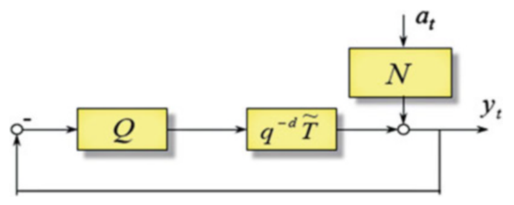

> Image description: A block diagram illustrating a regulatory control loop for Controller Performance Monitoring. The diagram shows a feedback control system consisting of four interconnected components. At the far left, a summation junction receives a negative feedback signal from the output line. The error signal is passed into a block labeled $Q$. The output of $Q$ is then fed into a block labeled $q^{-d}\tilde{T}$, representing a delayed transfer function. The output of this block is directed to a second summation junction. At this second junction, a signal $y_t$ is generated by combining the output from the transfer function block with an external disturbance or noise signal, labeled $a_t$, which enters through a block labeled $N$. A feedback arrow originates from the final output line $y_t$ and returns to the first summation junction, completing the closed-loop system. All processes are represented by yellow rectangular blocks with black outlines.
Controller Performance Monitoring, Fig. 1 Block diagram of a regulatory control loop

Note that all transfer functions are expressed for the discrete time case in terms of the backshift operator, $q^{-1} . \quad N$ represents the disturbance transfer function with numerator and denominator polynomials in $q^{-1}$. The division of the numerator by the denominator can be rewritten as: $N= F+q^{-d} R$, where the quotient term, $F=F_{0}+ F_{1} q^{-1}+\cdots+F_{d-1} q^{-(d-1)}$ is a polynomial of order $(d-1)$ and the remainder, $R$ is a transfer function. The closed-loop transfer function can be reexpressed, after algebraic manipulation as

$$
\begin{aligned}
y_{t}= & \left(\frac{N}{1+q^{-d} \tilde{T} Q}\right) a_{t} \\
= & \left(\frac{F+q^{-d} R}{1+q^{-d} \tilde{T} Q}\right) a_{t} \\
= & \left(\frac{F\left(1+q^{-d} \tilde{T} Q\right)+q^{-d}(R-F \tilde{T} Q)}{1+q^{-d} \tilde{T} Q}\right) a_{t} \\
= & \left(F+q^{-d} \frac{R-F \tilde{T} Q}{1+q^{-d} \tilde{T} Q}\right) a_{t} \\
= & \underbrace{F_{0} a_{t}+F_{1} a_{t-1}+\cdots+F_{d-1} a_{t-d+1}}_{e_{t}} \\
& +\underbrace{L_{0} a_{t-d}+L_{1} a_{t-d-1}+\cdots}_{w_{t-d}}
\end{aligned}
$$

The closed-loop output can then be expressed as

$$
y_{t}=e_{t}+w_{t-d}
$$

where $e_{t}=F a_{t}$ corresponds to the first $d-1$ lags of the closed-loop expression for the output, $y_{t}$, and more importantly is independent of the controller, $Q$, or it is controller invariant, while $w_{t-d}$ is dependent on the controller. The variance of the output is then given by

$$
\operatorname{Var}\left(y_{t}\right)=\operatorname{Var}\left(e_{t}\right)+\operatorname{Var}\left(w_{t-d}\right) \geq \operatorname{Var}\left(e_{t}\right)
$$

Since $e_{t}$ is controller invariant, it provides the lower bound on the output variance. This is naturally achieved if $w_{t-d}=0$, that is, when $R=F \tilde{T} Q$ or when the controller is a minimum variance controller with $Q=\frac{R}{F \tilde{T}}$. If the total output variance is denoted as $\operatorname{Var}\left(y_{t}\right)=\sigma^{2}$, then


<!-- source_pdf_page: 246 -->
the lowest achievable variance is $\operatorname{Var}\left(e_{t}\right)=\sigma_{m v}^{2}$. To obtain an estimate of the lowest achievable variance from the time series of the process output, one needs to model the closed-loop output data $y_{t}$ by a moving average process such as

$$
\begin{align*}
y_{t}= & \underbrace{f_{0} a_{t}+f_{1} a_{t-1}+\cdots+f_{d-1} a_{t-(d-1)}}_{e_{t}} \\
& +f_{d} a_{t-d}+f_{d+1} a_{t-(d+1)}+\cdots \tag{1}
\end{align*}
$$

The controller-invariant term $e_{t}$ can then be estimated by time series analysis of routine closedloop operating data and subsequently used as a benchmark measure of theoretically achievable absolute lower bound of output variance to assess control loop performance.Harris (1989),

Desborough and Harris (1992), and Huang and Shah (1999) have derived algorithms for the calculation of this minimum variance term.

Multiplying Eq. (1) by $a_{t}, a_{t-1}, \ldots, a_{t-d+1}$, respectively, and then taking the expectation of both sides of the equation yield the sample covariance terms:

$$
\left.\begin{array}{c}
r_{y a}(0)=E\left[y_{t} a_{t}\right]=f_{0} \sigma_{a}^{2}  \tag{2}\\
r_{y a}(1)=E\left[y_{t} a_{t-1}\right]=f_{1} \sigma_{a}^{2} \\
r_{y a}(2)=E\left[y_{t} a_{t-2}\right]=f_{2} \sigma_{a}^{2} \\
\vdots \\
r_{y a}(d-1)=E\left[y_{t} a_{t-d+1}\right]=f_{d-1} \sigma_{a}^{2}
\end{array}\right\}
$$

The minimum variance or the invariant portion of output variance is

$$
\left.\begin{array}{rl}
\sigma_{m v}^{2} & =\left(f_{0}^{2}+f_{1}^{2}+f_{2}^{2}+\cdots+f_{d-1}^{2}\right) \sigma_{a}^{2} \\
& =\left[\left(\frac{r_{y a}(0)}{\sigma_{a}^{2}}\right)^{2}+\left(\frac{r_{y a}(1)}{\sigma_{a}^{2}}\right)^{2}+\left(\frac{r_{y a}(2)}{\sigma_{a}^{2}}\right)^{2}+\left(\frac{r_{y a}(d-1)}{\sigma_{a}^{2}}\right)^{2}\right] \sigma_{a}^{2}  \tag{3}\\
& =\left[r_{y a}^{2}(0)+r_{y a}^{2}(1)+r_{y a}^{2}(2)+\cdots+r_{y a}^{2}(d-1)\right] / \sigma_{a}^{2}
\end{array}\right\}
$$

A measure of controller performance index can then be defined as

$$
\begin{equation*}
\eta(d)=\sigma_{m v}^{2} / \sigma_{y}^{2} \tag{4}
\end{equation*}
$$

$$
\begin{aligned}
\eta(d) & =\left[r_{y a}^{2}(0)+r_{y a}^{2}(1)+r_{y a}^{2}(2)+\cdots+r_{y a}^{2}(d-1)\right] / \sigma_{y}^{2} \sigma_{a}^{2} \\
& =\rho_{y a}^{2}(0)+\rho_{y a}^{2}(1)+\rho_{y a}^{2}(2)+\cdots+\rho_{y a}^{2}(d-1) \\
& =Z Z^{T}
\end{aligned}
$$

where $Z$ is the vector of cross correlation coefficients between $y_{t}$ and $a_{t}$ for lags 0 to $d-1$ and is denoted as

$$
Z=\left[\rho_{y a}(0) \rho_{y a}(1) \rho_{y a}(2) \ldots \rho_{y a}(d-1)\right]
$$

Substituting Eq. (3) into Eq. (4) yields


<!-- source_pdf_page: 247 -->
for Filtering and CORrelation analysis (Huang and Shah 1999). This derivation assumes that the delay, $d$, be known a priori. In practice, however, a priori knowledge of time delays may not always be available. It is therefore useful to assume a range of time delays and then calculate performance indices over this range of the time delays. The indices over a range of time delays are also known as extended horizon performance indices (Thornhill et al. 1999). Through pattern recognition, one can tell the performance of the loop by visualizing the patterns of the performance indices versus time delays. There is a clear relation between performance indices curve and the impulse response curve of the control loop.

Consider a simple case where the process is subject to random disturbances. Figure 2 is one example of performance evaluation for a control loop in the presence of disturbances. This figure shows time-series of process variable data for both loops in the left column, closed-loop impulse responses (middle column) and corresponding performance indices (labeled as PI on the right column). From the impulse responses, one can see that the loop under the first set of tuning constants (denoted as TAG1.PV) has better performance; the loop under the second set of tuning constants (denoted as TAG5.PV) has oscillatory behavior, indicating a relatively poor control performance. With performance index "1" indicating the best possible performance and index " 0 " indicating the worst performance, performance indices for the first controller tuning (shown on the upper-right plot) approach " 1 " within 4 time lags, while performance indices for the second controller tuning (shown on the bottom-right plot) take 10 time lags to approach "0.7." In addition, performance indices for the second tuning show ripples as they approach an asymptotic limit, indicating a possible oscillation in the loop.

Notice that one cannot rank performance of these two controller settings from the noisy timeseries data. Instead, we can calculate performance indices over a range of time delays (from 1 to 10). The result is shown on the right column plots of Fig. 2. These simulations correspond to the same process with different controller tuning constants.

It is clear from these plots that performance indices trajectory depends on dynamics of the disturbance and controller tuning.

It is important to note that the minimum variance is just one of several benchmarks for obtaining a controller performance metric. It is seldom practical to implement minimum variance control as it typically will require aggressive actuator action. However, the minimum variance benchmark serves to provide an indication of the opportunity in improving control performance; that is, should the performance index $\eta(d)$ be near or just above zero, then it gives the user an idea of the benefits possible in improving the control performance of that loop.

## Performance Assessment and Diagnosis of Univariate Control Loop Using Alternative Performance Indicators

In addition to the performance index for performance assessment, there are several alternative indicators of control loop performance. These are discussed next.

Autocorrelation function: The autocorrelation function (ACF) of the output error, shown in Fig. 3, is an approximate measure of how close the existing controller is to minimum variance condition or how predictable the error is over the time horizon of interest. If the controller is under minimum variance condition then the autocorrelation function should decay to zero after " $d-1$ " lags where " $d$ " is the delay of the process. In other words, there should be no predictable information beyond time lag $d-1$. The rate at which the autocorrelation decays to zero after " $d-1$ " lags indicates how close the existing controller is to the minimum variance condition. Since it is straightforward to calculate autocorrelation using process data, the autocorrelation function is often used as a first-pass test before carrying out further performance analysis.

Impulse response: An impulse response function curve represents the closed-loop impulse


<!-- source_pdf_page: 248 -->
Trend Plot of TAG1.PV
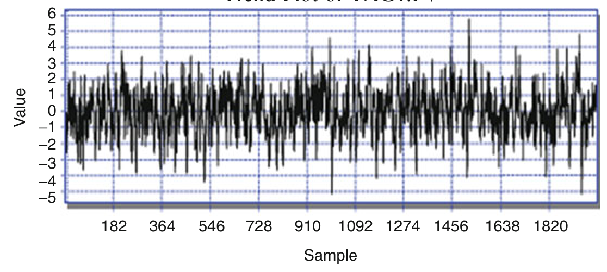

Trend Plot of TAG5.PV
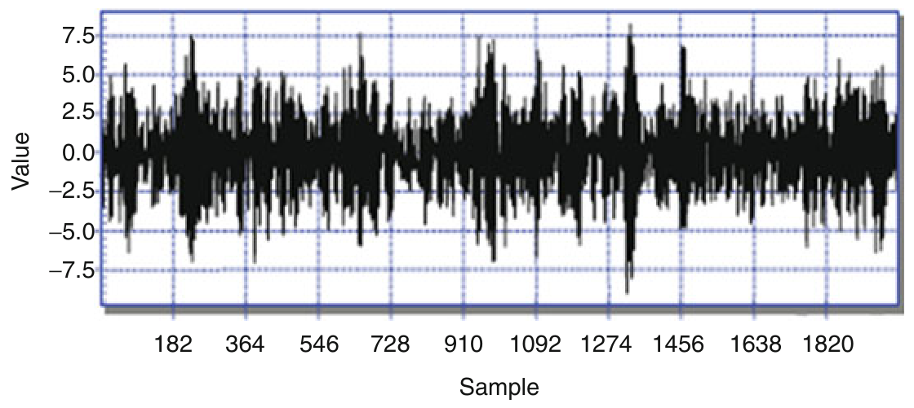

Impulse Response - TAG1.PV
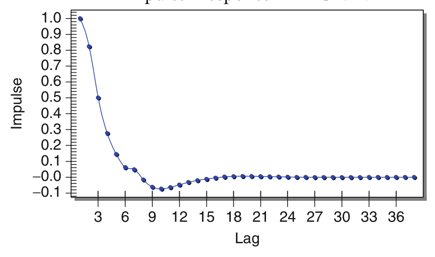

PI(var) vs. Delay: TAG1.PV
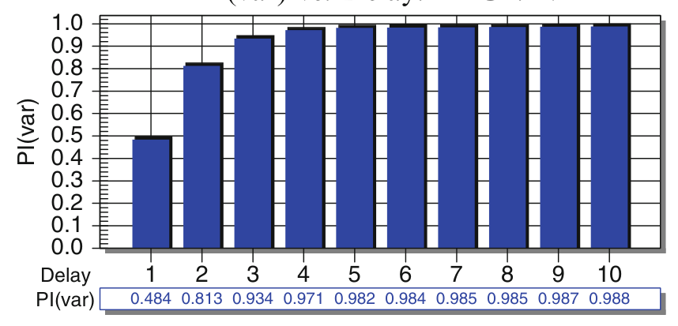

Impulse Response - TAG5.PV
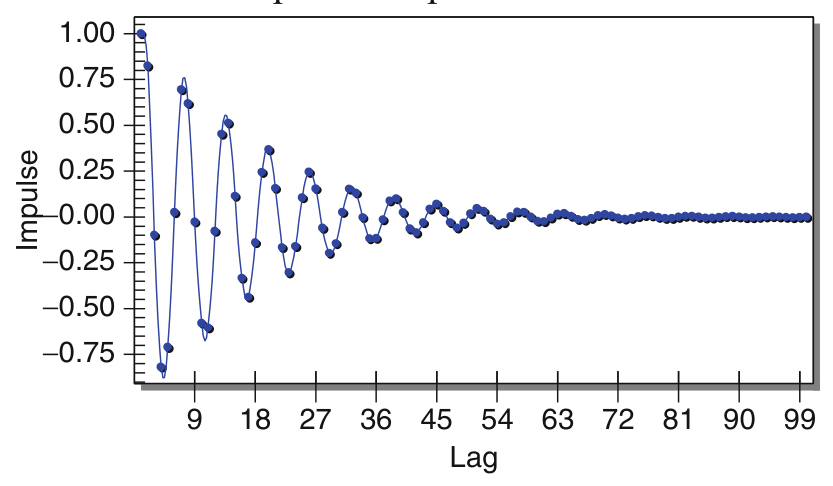

PI(var) vs. Delay: TAG5.PV
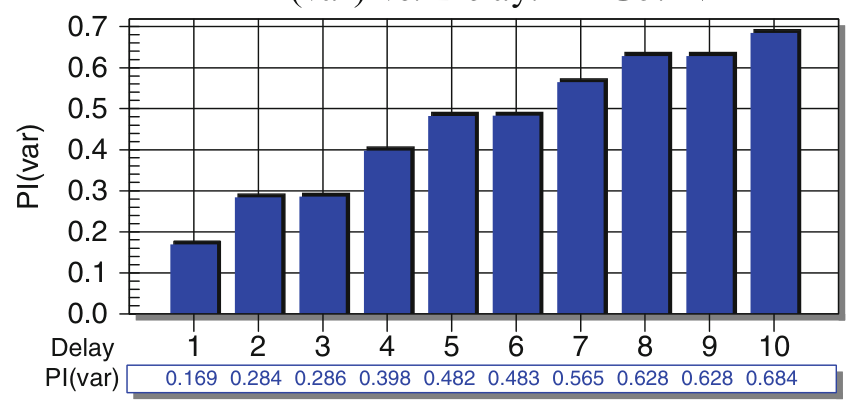

> Image description: A bar chart titled "Controller Performance Monitoring" illustrates the relationship between "Delay" and a performance index, $PI(var)$. The horizontal axis represents "Delay" with integer values from 1 to 10. The vertical axis represents $PI(var)$, ranging from 0.0 to 0.7. Each integer delay corresponds to a blue bar representing the $PI(var)$ value. Below the x-axis, a data table explicitly provides the numerical values for each bar: 0.169 for delay 1, 0.284 for delay 2, 0.286 for delay 3, 0.398 for delay 4, 0.482 for delay 5, 0.483 for delay 6, 0.565 for delay 7, 0.628 for delay 8, 0.628 for delay 9, and 0.684 for delay 10. The chart shows a clear positive correlation, where the performance index increases as the delay increases, indicating that higher delays result in a higher $PI(var)$ value.

Controller Performance Monitoring, Fig. 2 Time series of process variable (top), corresponding impulse responses (left column) and their performance indices (right column).


<!-- source_pdf_page: 249 -->
## Controller Performance Monitoring, Fig. 3

Autocorrelation function of the controller error
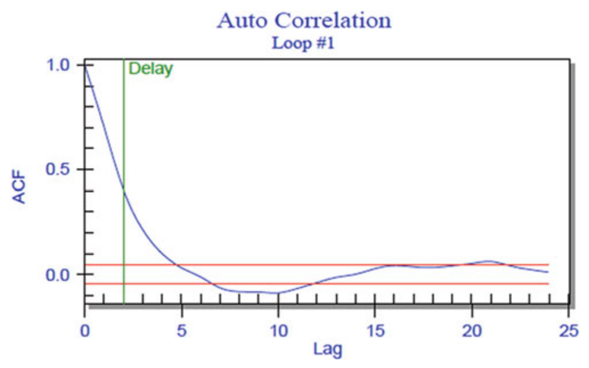
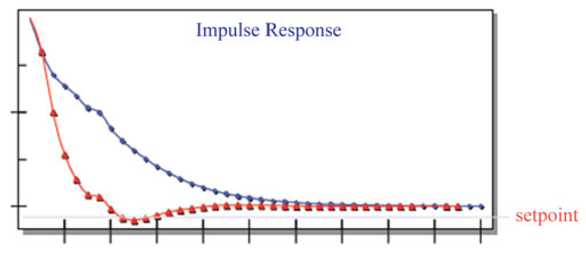

> Image description: Figure 4, titled "Impulse Response," presents a line graph comparing two different response curves against a horizontal "setpoint" line. The x-axis and y-axis include tick marks but lack numerical labels. Two distinct trajectories are visible: a blue curve marked with circular data points and a red curve marked with triangular data points. The blue curve represents a smoother, more gradual decay toward the setpoint. In contrast, the red curve shows a much sharper initial descent, crosses below the setpoint line (exhibiting undershoot), and then experiences a small oscillation before stabilizing at the setpoint. From an engineering perspective, this figure illustrates the performance characteristics of two different controllers or system states. The red curve demonstrates a faster response time but higher instability or overshoot/undershoot compared to the more damped, slower blue curve. The "setpoint" serves as the steady-state target for both impulse responses.

## Controller Performance Monitoring, Fig. 4

Impulse responses estimated from routine operating data
response between the whitened disturbance sequence and the process output. This function is a direct measure of how well the controller is performing in rejecting disturbances or tracking set-point changes. Under stochastic framework, this impulse response function may be calculated using time series model such as an Autoregressive Moving Average (ARMA) or Autoregressive with Integrated Moving Average (ARIMA) model. Once an ARMA type of time series model is estimated, the infinite-order moving average representation of the model shown in Eq. (1) can be obtained through a long division of the ARMA model. As shown in Huang and Shah (1999), the coefficients of the moving average model, Eq. (1), are the closed-loop impulse response coefficients of the process between whitened disturbances and the process output. Figure 4 shows closedloop impulse responses of a control loop with two different control tunings. Clearly they denote two different closed-loop dynamic responses: one is slow and smooth, and the other one is relatively fast and slightly oscillatory. The sum of square of the impulse response coefficients is the variance of the data.

Spectral analysis: The closed-loop frequency response of the process is an alternative way to assess control loop performance. Spectral analysis of output data easily allows one to detect oscillations, offsets, and measurement noise present in the process. The closed-loop frequency response is often plotted together with the closed-loop frequency response under minimum variance control. This is to check the possibility of performance improvement through controller tunings. The comparison gives a measure of how close the existing controller is to the minimum variance condition. In addition, it also provides the frequency range in which the controller significantly deviates from minimum variance condition. Large deviation in the low-frequency range typically indicates lack of integral action or weak proportional gain. Large peaks in the mediumfrequency range typically indicate an overtuned controller or presence of oscillatory disturbances. Large deviation in the high-frequency range typically indicates significant measurement noise. As an illustrative example, frequency responses of two control loops are shown in Fig. 5. The left graph of the figure shows that closed-loop


<!-- source_pdf_page: 250 -->
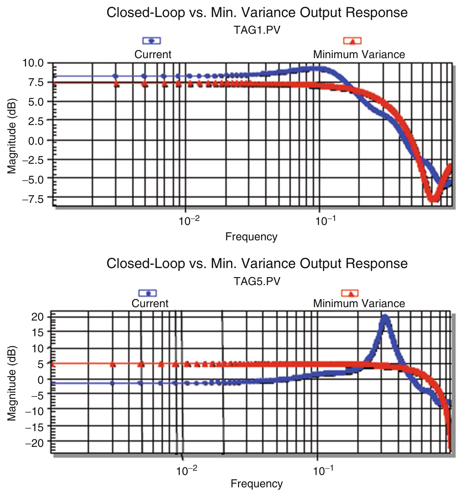

> Image description: Two line graphs, titled "Closed-Loop vs. Min. Variance Output Response," illustrate frequency response estimates for two different cases: TAG1.PV (top) and TAG5.PV (bottom). Both plots use a semi-logarithmic scale, with the horizontal axis representing Frequency in Hz (logarithmic scale from $10^{-3}$ to $10^0$) and the vertical axis representing Magnitude in dB (linear scale). In both figures, the "Current" response is plotted as a blue line with circular markers, while the "Minimum Variance" response is shown as a red line with triangular markers. In TAG1.PV, the current response closely follows the minimum variance response across most frequencies, showing a slight attenuation difference near $10^{-1}$ Hz before both drop off. In TAG5.PV, there is a significant discrepancy: the current response shows a large peak near $0.3$ Hz, reaching approximately $18$ dB, whereas the minimum variance response remains relatively flat around $4$ dB before declining. This comparison is used in control engineering to monitor performance against an optimal theoretical limit.
Controller Performance Monitoring, Fig. 5 Frequency response estimated from routine operating data

frequency response of the existing controller is almost the same as the frequency response under minimum variance control. A peak at the midfrequency indicates possible overtuned control. The right graph of Fig. 5 shows that the frequency response of the existing controller is oscillatory, indicating a possible overtuned controller or the presence of an oscillatory disturbance at the peak frequency; otherwise the controller is close to minimum variance condition.

Segmentation of performance indices: Most process data exhibit time- varying dynamics; i.e., the process transfer function or the disturbance transfer function is time variant. Performance assessment with a non-overlapping sliding data window that can track time-varying dynamics
is therefore often desirable. For example, segmentation of data may lead to some insight into any cyclical behavior of the process variation in controller performance during, e.g., day/night or due to shift change. Figure 6 is an example of performance segmentation over a 200 data point window.

## Performance Assessment of Univariate Control Loops Using User-Specified Benchmarks

The increasing level of global competitiveness has pushed chemical plants into highperformance operating regions that require advanced process control technology. See the


<!-- source_pdf_page: 251 -->
articles ▷ Control Hierarchy of Large Processing Plants: An Overview and - Control Structure Selection. Consequently, the industry has an increasing need to upgrade the conventional PID controllers to advanced control systems. The most natural questions to ask for such an upgrading are as follows. Has the advanced controller improved performance as expected? If yes, where is the improvement and can it be justified? Has the advanced controller been tuned to its full capacity? Can this improvement also be achieved by simply retuning the existing traditional (e.g., PID) controllers? (see - PID Control). In other words, what is the cost versus benefit of implementing an advanced controller? Unlike performance assessment using minimum variance control as benchmark, the solution to this problem does not require a priori knowledge of time delays. Two possible relative benchmarks may be chosen: one is the historical data benchmark or reference data set benchmark, and the other is a user-specified benchmark.

The purpose of reference data set benchmarking is to compare performance of the existing controller with the previous controller during the "normal" operation of the process. This reference data set may represent the process when the controller performance is considered satisfactory with respect to meeting the performance objectives. The reference data set should be representative of the normal conditions that the process is expected to operate at; i.e., the disturbances and set-point changes entering into the process should not be unusually different. This analysis provides the user with a relative performance index (RPI) which compares the existing control loop performance with a reference control loop benchmark chosen by the user. The RPI is bounded by $0 \leq \mathrm{RPI} \leq \infty$, with " $<1$ " indicating deteriorated performance, " 1 " indicating no change of performance, and " $>1$ " indicating improved performance. Figure 6 shows a result of reference data set benchmarking. The impulse response of the benchmark or reference data smoothly decays to zero, indicating good performance of the controller. After one increases the proportional gain of the controller, the impulse response
shows oscillatory behavior, with an $\mathrm{RPI}=0.4$, indicating deteriorated performance due to the oscillation.

In some cases one may wish to specify certain desired closed-loop dynamics and carry out performance analysis with respect to such desired dynamics. One such desired dynamic benchmark is the closed-loop settling time. As an illustrative example, Fig. 8 shows a system where a settling time of ten sampling units is desired for a process with a delay of five sampling units. The impulse responses show that the existing loop is close to the desired performance, and the value of RPI $=$ 0.9918 confirms this. Thus no further tuning of the loop is necessary.

## Diagnosis of Poorly Performing Loops

Whereas detection of poorly performing loops is now relatively simple, the task of diagnosing reason(s) for poor performance and how to "mend" the loop is generally not straightforward. The reasons for poor performance could be any one of interactions between various control loops, overtuned or undertuned controller settings, process nonlinearity, poor controller configuration (meaning the choice of pairing a process (or controlled) variable with a manipulative variable loop), or actuator problems such as stiction, large delays, and severe disturbances. Several studies have focused on the diagnosis issues related to actuator problems (Håagglund 2002; Choudhury et al. 2008; Srinivasan and Rengaswamy 2008; Xiang and Lakshminarayanan 2009; de Souza et al. 2012). Shardt et al. (2012) has given an overview of the overall state of CPM and the related diagnosis issues.

## Industrial Applications of CPM Technology

As remarked earlier, CPM software is now readily available from most DCS vendors and has already been implemented successfully at several large-scale industrial sites. A summary of just


<!-- source_pdf_page: 252 -->
## Controller Performance Monitoring, Fig. 6

Performance indices for segmented data (each of window length 200 points)

PI for TAG1.PV
Delay 3
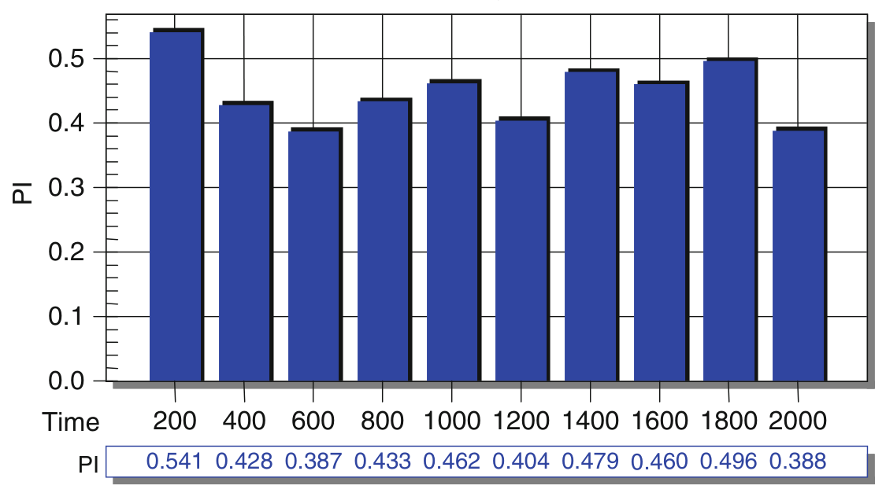

> Image description: A bar chart titled "Controller Performance Monitoring, Fig. 7" illustrates the performance index (PI) over time. The vertical y-axis represents the PI value, ranging from 0.0 to 0.5 with increments of 0.1. The horizontal x-axis represents Time, with labeled data points at intervals of 200, spanning from 200 to 2000. The chart uses blue bars to represent the PI value at each specific time interval. A data table at the bottom provides exact numerical values for each bar. The PI values fluctuate over time: starting at 0.541 at time 200, the values decrease and oscillate between approximately 0.38 and 0.54. Specifically, the values recorded are: 0.541, 0.428, 0.387, 0.433, 0.462, 0.404, 0.479, 0.460, 0.496, and 0.388. This visualization is used to monitor the stability and efficiency of a controller by tracking the performance index throughout the observed period.

## Controller Performance Monitoring, Fig. 7

Reference benchmarking based on impulse responses
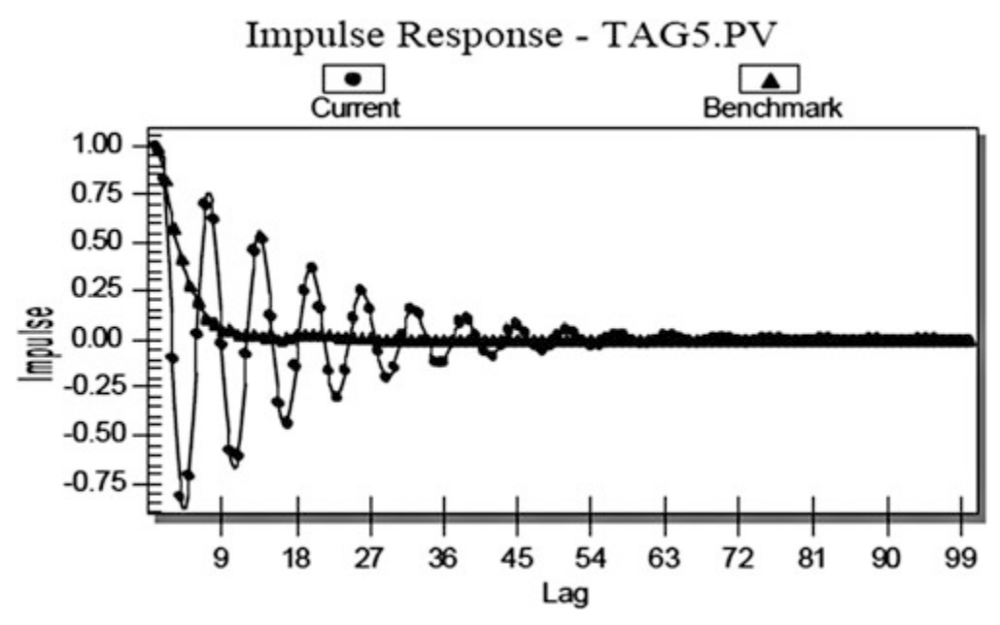

> Image description: A line graph titled "Impulse Response - TAG5.PV" compares two datasets: "Current" (represented by circular markers) and "Benchmark" (represented by triangular markers). The vertical y-axis is labeled "Impulse" and ranges from -1.00 to 1.00 in increments of 0.25. The horizontal x-axis is labeled "Lag" and shows numbered increments from 0 to 99, with specific markings at intervals of 9 (9, 18, 27, etc.). The "Benchmark" data shows a rapid, monotonic decay toward zero within the first 9 lags. In contrast, the "Current" data exhibits a highly oscillatory response. It begins at an impulse of 1.00 and undergoes significant fluctuations, swinging between positive and negative values (reaching approximately -0.80) before eventually dampening toward zero as the lag increases. This visual comparison suggests the "Current" system is experiencing significant instability or oscillations compared to the stable "Benchmark" response. Caption: Controller Performance Monitoring, Fig. 8

## Controller Performance Monitoring, Fig. 8

User-specified benchmark based on impulse responses
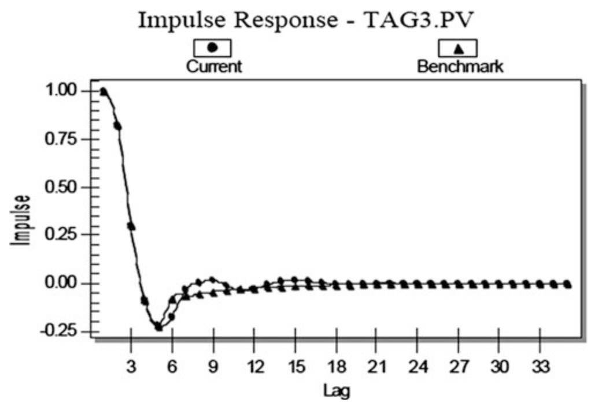


<!-- source_pdf_page: 253 -->
two of many large-scale industrial implementations of CPM technology appears below. It gives a clear evidence of the impact of this control technology and how readily it has been embraced by industry (Shah et al. 2014).

## BASF Controller Performance Monitoring Application

As part of its excellence initiative OPAL 21 (Optimization of Production Antwerp and Ludwigshafen), BASF has implemented the CPM strategy on more than 30,000 control loops at its Ludwigshafen site in Germany and on over 10,000 loops at its Antwerp production facility in Belgium. The key factor in using this technology effectively is to combine process knowledge, basic chemical engineering, and control expertise to develop solutions for the indicated control problems that are diagnosed in the CPM software (Wolff et al. 2012).

## Saudi Aramco Controller Performance Monitoring Practice

As part of its process control improvement initiative, Saudi Aramco has deployed CPM on approximately 15,000 PID loops, 50 MPC applications, and 500 smart positioners across multiple operating facilities.

The operational philosophy of the CPM engine is incorporated in the continuous improvement process at BASF and Aramco, whereby all loops are monitored in real-time and a holistic performance picture is obtained for the entire plant. Unit-wide performance metrics are displayed in effective color-coded graphic forms to effectively convey the analytics information of the process.

## Concluding Remarks

In summary, industrial control systems are designed and implemented or upgraded with a particular objective in mind. The controller performance monitoring methodology discussed here will permit automated and repeated reviews of the design, tuning, and upgrading of the control loops. Poor design, tuning, or upgrading of the
control loops can be detected, and repeated performance monitoring will indicate which loops should be retuned or which loops have not been effectively upgraded when changes in the disturbances, in the process, or in the controller itself occur. Obviously better design, tuning, and upgrading will mean that the process will operate at a point close to the economic optimum, leading to energy savings, improved safety, efficient utilization of raw materials, higher product yields, and more consistent product qualities. This entry has summarized the major features available in recent commercial software packages for control loop performance assessment. The illustrative examples have demonstrated the applicability of this new technique when applied to process data.

This entry has also illustrated how controllers, whether in hardware or software form, should be treated like "capital assets" and how there should be routine monitoring to ensure that they perform close to the economic optimum and that the benefits of good regulatory control will be achieved.

## Cross-References

- Control Hierarchy of Large Processing Plants: An Overview
- Control Structure Selection
- Fault Detection and Diagnosis
- PID Control
- Statistical Process Control in Manufacturing


## Bibliography

Choudhury MAAS, Shah SL, Thornhill NF (2008) Diagnosis of process nonlinearities and valve stiction: data driven approaches. Springer-Verlag, Sept. 2008, ISBN:978-3-540-79223-9
Desborough L, Harris T (1992) Performance assessment measure for univariate feedback control. Can J Chem Eng 70:1186-1197
Desborough L, Miller R (2002) Increasing customer value of industrial control performance monitoring: Honeywell's experience. In: AIChE symposium series. American Institute of Chemical Engineers, New York, pp 169-189; 1998


<!-- source_pdf_page: 254 -->
de Prada C (2014) Overview: control hierarchy of large processing plants. In: Encylopedia of Systems and Control. Springer, London
de Souza LCMA, Munaro CJ, Munareto S (2012) Novel model-free approach for stiction compensation in control valves. Ind Eng Chem Res 51(25):8465-8476
Håagglund T (2002) A friction compensator for pneumatic control valves. J Process Control 12(8):897-904
Harris T (1989) Assessment of closed loop performance. Can J Chem Eng 67:856-861
Huang B, Shah SL (1999) Performance assessment of control loops: theory and applications. SpringerVerlag, October 1999, ISBN: 1-85233-639-0.
Shah SL, Nohr M, Patwardhan R (2014) Success stories in control: controller performance monitoring. In: Samad T, Annaswamy AM (eds) The impact of control technology, 2nd edn. www.ieeecss.org
Shardt YAW, Zhao Y, Lee KH, Yu X, Huang B, Shah SL (2012) Determining the state of a process control system: current trends and future challenges. Can J Chem Eng 90(2):217-245
Srinivasan R, Rengaswamy R (2008) Approaches for efficient stiction compensation in process control valves. Comput Chem Eng 32(1):218-229
Skogestad S (2014) Control structure selection and plantwide control. In: Encylopedia of Systems and Control. Springer, London
Thornhill NF, Horch A (2007) Advances and new directions in plant-wide controller performance assessment. Control Eng Pract 15(10):1196-1206
Thornhill NF, Oettinger M, Fedenczuk P (1999) Refinerywide control loop performance assessment. J Process Control 9(2):109-124
Wolff F, Roth M, Nohr A, Kahrs O (2012) Software based control-optimization for the chemical industry. VDI, Tagungsband "Automation 2012", 13/14.06 2012, Baden-Baden
Xiang LZ, Lakshminarayanan S (2009) A new unified approach to valve stiction quantification and compensation. Ind Eng Chem Res 48(7):3474-3483

## Cooperative Manipulators

Fabrizio Caccavale
School of Engineering, Università degli Studi della Basilicata, Potenza, Italy

## Abstract

This chapter presents an overview of the main issues related to modeling and control of cooperative robotic manipulators. A historical path is followed to present the main research results
on cooperative manipulation. Kinematics and dynamics of robotic arms cooperatively manipulating a tightly grasped rigid object are briefly discussed. Then, this entry presents the main strategies for force/motion control of the cooperative system.

## Keywords

Cooperative task space; Coordinated motion; Force/motion control; Grasping; Manipulation; Multi-arm systems

## Introduction

Since the early 1970s, it has been recognized that many tasks, which are difficult or even impossible to execute by a single robotic manipulator, become feasible when two or more manipulators work in a cooperative way. Examples of typical cooperative tasks are the manipulation of heavy and/or large payloads, assembly of multiple parts, and handling of flexible and articulated objects (Fig. 1).

In the 1980s, research achieved several theoretical results related to modeling and control of to single-arm robots; this further fostered research on multi-arm robotic systems. Dynamics

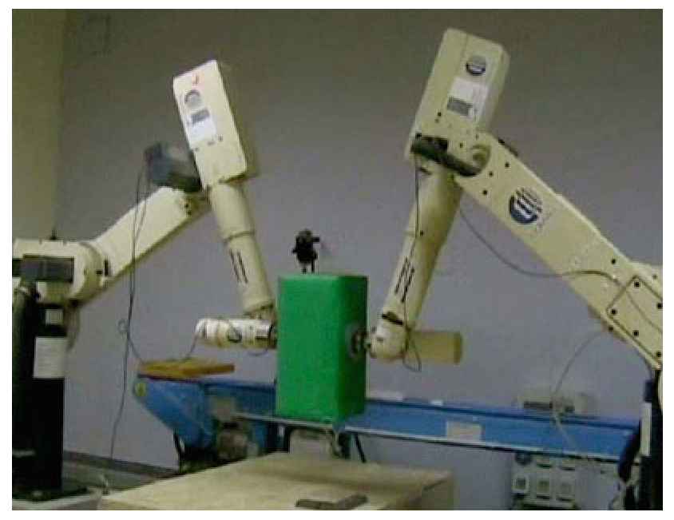

> Image description: A photograph titled "Fig. 1 An example of a cooperative robotic work cell composed by two industrial robot arms" shows two large, white industrial robotic arms working in tandem within a laboratory setting. The robots are positioned on opposite sides of a green rectangular workpiece, which is mounted on a blue conveyor belt system. The left robotic arm is mounted on a black vertical base and extends toward the center. It features multiple articulated segments and cables running along its length. The right robotic arm is similarly structured, mounted on a black base and angled toward the workpiece. Both arms appear to be in the process of manipulating or supporting the green object. The workspace is relatively sparse, with a white table in the foreground and a plain wall in the background. The arrangement demonstrates a cooperative task where two independent manipulators coordinate their movements to handle a single object.
Cooperative Manipulators, Fig. 1 An example of a cooperative robotic work cell composed by two industrial robot arms


<!-- source_pdf_page: 255 -->
and control as well as force control issues have been widely explored along the decade.

In the 1990s, parameterization of the constraint forces/moments acting on the object has been recognized as a key to solving control problems and has been studied in several papers (e.g., Sang et al. 1995; Uchiyama and Dauchez 1993; Walker et al. 1991; Williams and Khatib 1993). Several control schemes for cooperative manipulators based on the sought parameterizations have been designed, including force/motion control (Wen and Kreutz-Delgado 1992) and impedance control (Bonitz and Hsia 1996; Schneider and Cannon 1992). Other approaches are adaptive control (Hu et al. 1995), kinematic control (Chiacchio et al. 1996), taskspace regulation (Caccavale et al. 2000), and model-based coordinated control (Hsu 1993). Other important topics investigated in the 1990s were the definition of user-oriented task-space variables for coordinated control (Caccavale et al. 2000; Chiacchio et al. 1996), the development of meaningful performance measures (Chiacchio et al. 1991a,b) for multi-arm systems, and the problem of load sharing (Walker et al. 1989).

Most of the abovementioned works assume that the cooperatively manipulated object is rigid and tightly grasped. However, since the 1990s, several research efforts have been focused on the control of cooperative flexible manipulators (Yamano et al. 2004), since flexible-arm robot merits (lightweight structure, intrinsic compliance, and hence safety) can be conveniently exploited in cooperative manipulation. Other research efforts have been focused on the control of cooperative systems for the manipulation of flexible objects (Yukawa et al. 1996) as well.

## Modeling, Load Sharing, and Performance Evaluation

The first modeling goal is the definition of suitable variables describing the kinetostatics of a cooperative system. Hereafter, the main results available are summarized for a dual-arm system
composed by two cooperative manipulators grasping a common object.

The kinetostatic formulation proposed by Uchiyama and Dauchez (1993), i.e., the so-called symmetric formulation, is based on kinematic and static relationships between generalized forces/velocities acting at the object and their counterparts acting at the manipulators end effectors. To this aim, the concept of virtual stick is defined as the vector which determines the position of an object-fixed coordinate frame with respect to the frame attached to each robot end effector (Fig. 2). When the object grasped by the two manipulators can be considered rigid and tightly attached to each end effector, then the virtual stick behaves as a rigid stick fixed to each end effector.

According to the symmetric formulation, the vector, $\boldsymbol{h}$, collecting the generalized forces (i.e., forces and moments) acting at each end effector is given by

$$
\begin{equation*}
\boldsymbol{h}=\boldsymbol{W}^{\dagger} \boldsymbol{h}_{E}+\boldsymbol{V} \boldsymbol{h}_{I}, \tag{1}
\end{equation*}
$$

where $\boldsymbol{W}$ is the so-called grasp matrix, the columns of $\boldsymbol{V}$ span the null space of the

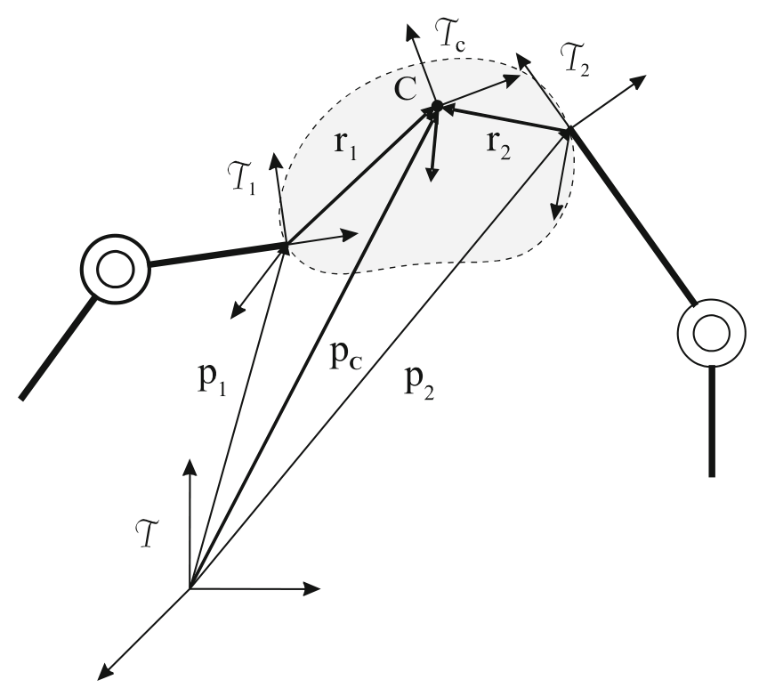

> Image description: This diagram illustrates the grasp geometry for a two-manipulator cooperative system manipulating a common object. A central, shaded object (labeled **C**) is held by two robotic links. Several coordinate frames are represented by arrows: $\mathcal{T}$ is the global reference frame at the bottom left; $\mathcal{T}_1$ and $\mathcal{T}_2$ are coordinate frames attached to each end effector; and $\mathcal{T}_c$ is the coordinate frame attached to the object. Vector relationships are depicted through labeled lines: $\mathbf{p}_1$ and $\mathbf{p}_2$ connect the global origin to the contact points on the object, while $\mathbf{p}_c$ connects the global origin to the object's center $\mathbf{C}$. Within the object, vectors $\mathbf{r}_1$ and $\mathbf{r}_2$ represent the virtual sticks (lever arms) connecting the contact points to the center point $\mathbf{C}$. The diagram geometrically defines the spatial configuration of the cooperative grasping task.
Cooperative Manipulators, Fig. 2 Grasp geometry for a two-manipulator cooperative system manipulating a common object. The vectors $\boldsymbol{r}_{1}$ and $\boldsymbol{r}_{2}$ are the virtual sticks, $\mathcal{T}_{c}$ is the coordinate frame attached to the object, and $\mathcal{T}_{1}$ and $\mathcal{T}_{2}$ are the coordinate frames attached to each end effector


<!-- source_pdf_page: 256 -->
grasp matrix, and $\boldsymbol{h}_{I}$ is the generalized force vector which does not contribute to the object's motion, i.e., it represents internal loading of the object (mechanical stresses) and is termed as internal forces, while $\boldsymbol{h}_{E}$ represents the vector of external forces, i.e., forces and moments causing the object's motion. Later, a task-oriented formulation has been proposed (Chiacchio et al. 1996), aimed at defining a cooperative task space in terms of absolute and relative motion of the cooperative system, which can be directly computed from the position and orientation of the end-effector coordinate frames.

The dynamics of a cooperative multi-arm system can be written as the dynamics of the single manipulators together with the closed-chain constraints imposed by the grasped object. By eliminating the constraints, a reduced-order model can be obtained (Koivo and Unseren 1991).

Strongly related to kinetostatics and dynamics of cooperative manipulators is the load sharing problem, i.e., distributing the load among the arms composing the system, which has been solved, e.g., in Walker et al. (1989). A very relevant problem related to the load sharing is that of robust holding, i.e., the problem of determining forces/moments applied to object by the arms, in order to keep the grasp even in the presence of disturbing forces/moments.

A major issue in robotic manipulation is the performance evaluation via suitably defined indexes (e.g., manipulability ellipsoids). These concepts have been extended to multi-arm robotic systems in Chiacchio et al. (1991a,b). Namely, by exploiting the kinetostatic formulations described above, velocity and force manipulability ellipsoids can be defined, by regarding the whole cooperative system as a mechanical transformer from the joint space to the cooperative task space. The manipulability ellipsoids can be seen as performance measures aimed at determining the attitude of the system to cooperate in a given configuration.

Finally, it is worth mentioning the strict relationship between problems related to grasping of objects by fingers/hands and those related to cooperative manipulation. In fact, in both cases, multiple manipulation structures grasp
a commonly manipulated object. In multifingered hands, only some motion components are transmitted through the contact point to the manipulated object (unilateral constraints), while cooperative manipulation via robotic arms is achieved by rigid (or near-rigid) grasp points and interaction takes place by transmitting all the motion components through the grasping points (bilateral constraints). While many common problems between the two fields can be tackled in a conceptually similar way (e.g., kinetostatic modeling, force control), many others are specific of each of the two application fields (e.g., form and force closure for multifingered hands).

## Control

When a cooperative multi-arm system is employed for the manipulation of a common object, it is important to control both the absolute motion of the object and the internal stresses applied to it. Hence, most of the control approaches to cooperative robotic systems can be classified as force/motion control schemes.

Early approaches to the control of cooperative systems were based on the master/slave concept. Namely, the cooperative system is decomposed in a position-controlled master arm, in charge of imposing the absolute motion of the object, and the force-controlled slave arms, which are to follow (as smoothly as possible) the motion imposed by the master. A natural evolution of the above-described concept has been the so-called leader/follower approach, where the follower arm reference motion is computed via closedchain constraints. However, such approaches suffered from implementation issues, mainly due to the fact that the compliance of the slave arms has to be very large, so as to smoothly follow the motion imposed by the master arm. Moreover, the roles of the master and slave (leader and follower) may need to be changed during the task execution.

Due to the abovementioned limitations, more natural nonmaster/slave approaches have been pursued later, where the cooperative system is seen as a whole. Namely, the reference motion


<!-- source_pdf_page: 257 -->
of the object is used to determine the motion of all the arms in the system and the interaction forces are measured and fed back so as to be directly controlled. To this aim, the mappings between forces and velocities at the end effector of each manipulator and their counterparts at the manipulated object are considered in the design of the control laws.

An approach, based on the classical hybrid force/position control scheme, has been proposed in Uchiyama and Dauchez (1993), by exploiting the symmetric formulation described in the previous section.

In Wen and Kreutz-Delgado (1992) a Lyapunov-based approach is pursued to devise force/position PD-type control laws. This approach has been extended in Caccavale et al. (2000), where kinetostatic filtering of the control action is performed, so as to eliminate all the components of the control input which contribute to internal stresses at the object.

A further improvement of the PD plus gravity compensation control approach has been achieved by introducing a full model compensation, so as to achieve feedback linearization of the closed-loop system. The feedback linearization approach formulated at the operational space level is the base of the socalled augmented object approach (Sang et al. 1995). In this approach, the system is modeled in the operational space as a whole, by suitably expressing its inertial properties via a single augmented inertia matrix $\boldsymbol{M}_{O}$, i.e.,

$$
\begin{equation*}
\boldsymbol{M}_{O}\left(\boldsymbol{x}_{E}\right) \ddot{\boldsymbol{x}}_{E}+\boldsymbol{c}_{O}\left(\boldsymbol{x}_{E}, \dot{\boldsymbol{x}}_{E}\right)+\boldsymbol{g}_{O}\left(\boldsymbol{x}_{E}\right)=\boldsymbol{h}_{E}, \tag{2}
\end{equation*}
$$

where $\boldsymbol{M}_{O}, \boldsymbol{c}_{O}$, and $\boldsymbol{g}_{O}$ are the operational space terms modeling, respectively, the inertial properties of the whole system (manipulators and object), the Coriolis/centrifugal/friction terms, and the gravity terms, while $\boldsymbol{x}_{E}$ is the operational space vector describing the position and orientation of the coordinate frame attached to the grasped object. In the framework of feedback linearization (formulated in the operational space), the problem of controlling the internal forces can be solved, e.g., by resorting to the virtual linkage
model (Williams and Khatib 1993) or according to the scheme proposed in Hsu (1993).

An alternative control approach is based on the well-known impedance concept (Bonitz and Hsia 1996; Schneider and Cannon 1992). In fact, when a manipulation system interacts with an external environment and/or other manipulators, large values of the contact forces and moments can be avoided by enforcing a compliant behavior with suitable dynamic features. In detail, the following mechanical impedance behavior between the object displacements and the forces due to the object-environment interaction can be enforced (external impedance):

$$
\begin{equation*}
\boldsymbol{M}_{E} \tilde{\boldsymbol{a}}_{E}+\boldsymbol{D}_{E} \tilde{\boldsymbol{v}}_{E}+\boldsymbol{K}_{e} \boldsymbol{e}_{E}=\boldsymbol{h}_{\mathrm{env}}, \tag{3}
\end{equation*}
$$

where $\boldsymbol{e}_{E}$ represents the vector of displacements between object's desired and actual pose, $\tilde{\boldsymbol{v}}_{E}$ is the difference between the object's desired and actual generalized velocities, $\tilde{\boldsymbol{a}}_{E}$ is the difference between the object's desired and actual generalized accelerations, and $\boldsymbol{h}_{\text {env }}$ is the generalized force acting on the object, due to the interaction with the environment. The impedance dynamics is characterized in terms of given positive definite mass, damping, and stiffness matrices ( $\boldsymbol{M}_{E}, \boldsymbol{D}_{E}$, $\left.\boldsymbol{K}_{E}\right)$. A mechanical impedance behavior between the $i$ th end-effector displacements and the internal forces can be imposed as well (internal impedance):

$$
\begin{equation*}
\boldsymbol{M}_{I, i} \tilde{\boldsymbol{a}}_{i}+\boldsymbol{D}_{I, i} \tilde{\boldsymbol{v}}_{i}+\boldsymbol{K}_{I, i} \boldsymbol{e}_{i}=\boldsymbol{h}_{I, i} \tag{4}
\end{equation*}
$$

where $\boldsymbol{e}_{i}$ is the vector expressing the displacement between the commanded and the actual pose of the $i$ th end effector, $\tilde{\boldsymbol{v}}_{i}$ is the vector expressing the difference between commanded and actual generalized velocities of the $i$ th end effector, $\tilde{\boldsymbol{a}}_{i}$ is the vector expressing the difference between commanded and actual generalized accelerations of the $i$ th end effector, and $\boldsymbol{h}_{I, i}$ is the contribution of the $i$ th end effector to the internal force. Again, the impedance dynamics is characterized in terms of given positive definite mass, damping, and stiffness matrices ( $\boldsymbol{M}_{I, i}, \boldsymbol{D}_{I, i}, \boldsymbol{K}_{I, i}$ ). More recently, an impedance scheme for control


<!-- source_pdf_page: 258 -->
of both external forces and internal forces has been proposed (Caccavale et al. 2008).

## Summary and Future Directions

This entry has provided a brief survey of the main issues related to cooperative robots, with special emphasis on modeling and control problems. Among several open research topics in cooperative manipulation, it is worth mentioning the problem of cooperative transportation and manipulation of objects via multiple mobile manipulators. In fact, although notable results have been already devised in Khatib et al. (1996), the foreseen use of robotic teams in industrial settings (hyperflexible robotic work cells) and/or in collaboration with humans (robotic coworker concept) raises new challenges related to autonomy and safety of multiple mobile manipulators. Also, an emerging application field is given by cooperative systems composed by multiple aerial vehicle-manipulator systems (see, e.g., Fink et al. 2011).

## Cross-References

- Force Control in Robotics
- Robot Grasp Control
- Robot Motion Control


## Recommended Reading

An overview of the field of cooperative manipulation can be found also in Caccavale and Uchiyama (2008), where a more extended literature review and further technical details are provided. Seminal contributions to control of cooperative manipulators can be found in Chiacchio et al. (1991a), Koivo and Unseren (1991), Sang et al. (1995), Uchiyama and Dauchez (1993), Walker et al. (1989), Wen and Kreutz-Delgado (1992), and Williams and Khatib (1993).

## Bibliography

Bonitz RG, Hsia TC (1996) Internal force-based impedance control for cooperating manipulators. IEEE Trans Robot Autom 12:78-89
Caccavale F, Uchiyama M (2008) Cooperative manipulators. In: Siciliano B, Khatib O (eds) Springer handbook of robotics - chapter 29. Springer, Heidelberg
Caccavale F, Chiacchio P, Chiaverini S (2000) Task-space regulation of cooperative manipulators. Automatica 36:879-887
Caccavale F, Chiacchio P, Marino A, Villani L (2008) Six-DOF impedance control of dual-arm cooperative manipulators. IEEE/ASME Trans Mechatron 13: 576-586
Chiacchio P, Chiaverini S, Sciavicco L, Siciliano B (1991a) Global task space manipulability ellipsoids for multiple arm systems. IEEE Trans Robot Autom 7:678-685
Chiacchio P, Chiaverini S, Sciavicco L, Siciliano B (1991b) Task space dynamic analysis of multiarm system configurations. Int J Robot Res 10:708-715
Chiacchio P, Chiaverini S, Siciliano B (1996) Direct and inverse kinematics for coordinated motion tasks of a two-manipulator system. ASME J Dyn Syst Meas Control 118:691-697
Fink J, Michael N, Kim S, Kumar V (2011) Planning and control for cooperative manipulation and transportation with aerial robots. Int J Robot Res 30:324-334
Hsu P (1993) Coordinated control of multiple manipulator systems. IEEE Trans Robot Autom 9:400-410
Hu Y-R, Goldenberg AA, Zhou C (1995) Motion and force control of coordinated robots during constrained motion tasks. Int J Robot Res 14:351-365
Khatib O, Yokoi K, Chang K, Ruspini D, Holmberg R, Casal A (1996) Coordination and decentralized cooperation of multiple mobile manipulators. J Robot Systems 13:755Ú-764
Koivo AJ, Unseren MA (1991) Reduced order model and decoupled control architecture for two manipulators holding a rigid object. ASME J Dyn Syst Meas Control 113:646-654
Sang KS, Holmberg R, Khatib O (1995) The augmented object model: cooperative manipulation and parallel mechanisms dynamics. In: Proceedings of the 2000 IEEE international conference on robotics and automation, San Francisco, pp 470-475
Schneider SA, Cannon Jr RH (1992) Object impedance control for cooperative manipulation: theory and experimental results. IEEE Trans Robot Autom 8:383394
Uchiyama M, Dauchez P (1993) Symmetric kinematic formulation and non-master/slave coordinated control of two-arm robots. Adv Robot 7:361-383
Walker ID, Marcus SI, Freeman RA (1989) Distribution of dynamic loads for multiple cooperating robot manipulators. J Robot Syst 6:35-47
Walker ID, Freeman RA, Marcus SI (1991) Analysis of motion and internal force loading of objects grasped


<!-- source_pdf_page: 259 -->
by multiple cooperating manipulators. Int J Robot Res 10:396-409
Wen JT, Kreutz-Delgado K (1992) Motion and force control of multiple robotic manipulators. Automatica 28:729-743
Williams D, Khatib O (1993) The virtual linkage: a model for internal forces in multi-grasp manipulation. In: Proceedings of the 1993 IEEE international conference on robotics and automation, Atlanta, pp 10251030
Yamano M, Kim J-S, Konno A, Uchiyama M (2004) Cooperative control of a 3D dual-flexible-arm robot. J Intell Robot Syst 39:1-15
Yukawa T, Uchiyama M, Nenchev DN, Inooka H (1996) Stability of control system in handling of a flexible object by rigid arm robots. In: Proceedings of the 1996 IEEE international conference on robotics and automation, Minneapolis, pp 2332-2339

## Cooperative Solutions to Dynamic Games

Alain Haurie<br>ORDECSYS and University of Geneva, Switzerland<br>GERAD-HEC Montréal PQ, Canada


#### Abstract

This article presents the fundamental elements of the theory of cooperative games in the context of dynamic systems. The concepts of Pareto optimality, Nash bargaining solution, characteristic function, cores, and C-optimality are discussed, and some fundamental results are recalled.


## Keywords

Cores; Nash equilibrium; Pareto optimality

## Introduction

Solution concepts in game theory are regrouped in two main categories called noncooperative and cooperation solutions, respectively. In the seminal book of von Neumann and Morgen-
stern (1944) this categorization is already made. These authors discuss zero-sum (matrix) games in normal form, where the noncooperative solution concept of saddle-point was defined and characterized, and games in characteristic function form, where solution concepts for games of coalitions were introduced. In this article we present the fundamental solution concepts of the theory of cooperative games in the context of dynamical systems. The article is organized as follows: we first recall the papers, which mark the origin of development of a theory of dynamic games; then we recall the basic concept of Pareto optimality proposed as a cooperative solution concept; we present the scalarization technique and the necessary or sufficient optimality conditions for Pareto optimality in mathematical programming and optimal control settings; we then explore the difficulties encountered when one tried to extend the Nash bargaining solution, characteristic function and cores concept to dynamic games; we show the links that exist with the theory of reachability for perturbed dynamic systems.

## The Origins

One may consider that the first introduction of a cooperative game solution concept in systems and control science is due to L.A. Zadeh (1963). Two-player zero-sum dynamic games have been studied by R. Isaacs (1954) in a deterministic continuous time setting and by L. Shapley (1953) in a discrete time stochastic setting. Nonzero-sum and $m$ player differential games were introduced by Y.C. Ho and A.W. Starr (1969) and J.H. Case (1969). For these games cooperative solutions can be looked for to complement the noncooperative Nash equilibrium concept.

## Cooperation Solution Concept

In cooperative games one is interested in nondominated solution. This solution type is related to a concept introduced by the well-known economist V. Pareto (1869) in the context of


<!-- source_pdf_page: 260 -->
welfare economics. Consider a system with decision variables $x \in X \subset \mathbb{R}^{n}$ and $m$ performance criteria $x \rightarrow \psi_{j}(x) \in \mathbb{R}, j=1, \ldots, m$ that one tries to maximize.

Definition 1 The decision $x^{*} \in X$ is nondominated or Pareto optimal if the following condition holds:

$$
\begin{aligned}
& \psi_{j}(x) \geq \psi_{j}\left(x^{*}\right) \quad \forall j=1, \ldots m \\
& \Longrightarrow \psi_{j}(x)=\psi_{j}\left(x^{*}\right) \quad \forall j=1, \ldots m .
\end{aligned}
$$

In other words it is impossible to give one criterion $j$ a value greater than $\psi_{j}\left(x^{*}\right)$ without decreasing the value of another criterion, say $\ell$, which then takes a value lower than $\psi_{\ell}\left(x^{*}\right)$.

This vector-valued optimization framework corresponds to a situation where $m$ players are engaged in a game, described in its normal form, where the strategies of the $m$ players constitute the decision vector $x$ and their respective payoffs are given by the $m$ performance criteria $\psi_{j}(x)$, $j=1, \ldots, m$. One assumes that these players jointly take a decision that is cooperatively optimal, in the sense that no player can improve his/her payoff without deteriorating the payoff of at least one other player.

## The Scalarization Technique

Let $\mathbf{r}=\left(r_{1}, r_{2}, \ldots, r_{m}\right)$ be a given $m$-vector composed of normalized weights that satisfy $r_{j}>0$, $j=1 \ldots, m$ and $\sum_{j=1, \ldots, m} r_{j}=1$.

Lemma 1 Let $x^{*} \in X$ be a maximum in $X$ for the scalarized criterion $\Psi(x ; \mathbf{r})= \sum_{j=1}^{m} r_{j} \psi_{j}(x)$. Then $x^{*}$ is a nondominated solution for the multi-objective problem.

The proof is very simple. Suppose $x^{*}$ is dominated, then there exists $x^{\circ} \in X$ such that $\psi_{j}\left(x^{\circ}\right) \geq \psi_{j}\left(x^{*}\right), \forall j=1, \ldots, m$, and $\psi_{i}\left(x^{\circ}\right)>\psi_{i}\left(x^{*}\right)$ for one $i \in\{1, \ldots, m\}$. Since all the $r_{j}$ are $>0$, this yields $\sum_{j=1}^{m} r_{j} \psi_{j}\left(x^{\circ}\right)> \sum_{j=1}^{m} r_{j} \psi_{j}\left(x^{*}\right)$, which contradicts the maximizing property of $x^{*}$. This result shows that it will be very easy to find many Pareto optimal solutions by varying a strictly positive weighting
of the criteria. But this procedure will not find all of the nondominated solutions.

## Conditions for Pareto Optimality in Mathematical Programming

N.O. Da Cunha and E. Polak (1967b) have obtained the first necessary conditions for multiobjective optimization. The problem they consider is

$$
\begin{aligned}
& \text { Pareto Opt. } \psi_{j}(x) \quad j=1, \ldots m \\
& \text { s.t. } \\
& \varphi_{k}(x) \leq 0 \quad k=1, \ldots p
\end{aligned}
$$

where the functions $x \in \mathbb{R}^{n} \mapsto \psi_{j}(x) \in \mathbb{R}$, $j=1, \ldots, m$, and $x \mapsto \varphi_{k}(x) \in \mathbf{R}, k= 1, \ldots, p$ are continuously differentiable ( $C^{1}$ ) and where we assume that the constraint qualification conditions of mathematical programming hold for this problem too. They proved the following theorem.

Theorem 1 Let $x^{*}$ be a Pareto optimal solution of the problem defined above. Then there exists a vector $\lambda$ of $p$ multipliers $\lambda_{k}, k=1, \ldots, p$, and a vector $\mathbf{r} \neq 0$ of $m$ weights $r_{j} \geq 0$, such that the following conditions hold

$$
\begin{aligned}
\frac{\partial}{\partial x} \mathcal{L}\left(x^{*} ; \mathbf{r} ; \lambda\right) & =0 \\
\varphi_{k}\left(x^{*}\right) & \leq 0 \\
\lambda_{k} \varphi_{k}\left(x^{*}\right) & =0 \\
\lambda_{k} & \geq 0,
\end{aligned}
$$

where $\mathcal{L}\left(x^{*} ; \mathbf{r} ; \lambda\right)$ is the weighted Lagrangian defined by

$$
\mathcal{L}(x ; \mathbf{r} ; \lambda)=\sum_{j=1}^{m} r_{j} \psi_{j}(x)+\sum_{k=1}^{p} \lambda_{k} \varphi_{k}(x) .
$$

So there is a local scalarization principle for Pareto optimality.

## Maximum Principle

The extension of Pareto optimality concept to control systems was done by several authors (Basile and Vincent 1970; Bellassali and Jourani 2004; Binmore et al. 1986; Blaquière et al. 1972;


<!-- source_pdf_page: 261 -->
Leitmann et al. 1972; Salukvadze 1971; Vincent and Leitmann 1970; Zadeh 1963), the main result being an extension of the maximum principle of Pontryagin. Let a system be governed by state equations:

$$
\begin{align*}
\dot{x}(t) & =f(x(t), u(t))  \tag{1}\\
u(t) & \in U  \tag{2}\\
x(0) & =x_{o}  \tag{3}\\
t & \in[0, T] \tag{4}
\end{align*}
$$

where $x \in \mathbb{R}^{n}$ is the state variable of the system, $u \in U \subset \mathbb{R}^{p}$ with $U$ compact is the control variable, and $[0, T]$ is the control horizon. The system is evaluated by $m$ performance criteria of the form

$$
\begin{equation*}
\psi_{j}(x(\cdot), u(\cdot))=\int_{0}^{T} g_{j}(x(t), u(t)) d t+G_{j}(x(T)), \tag{5}
\end{equation*}
$$

for $j=1, \ldots, m$. Under the usual assumptions of control theory, i.e., $f(\cdot, \cdot)$ and $g_{j}(\cdot, \cdot), j= 1, \ldots, m$, being $C^{1}$ in $x$ and continuous in $u$, $G_{j}(\cdot)$ being $C^{1}$ in $x$, one can prove the following.

Theorem 2 Let $\left\{x^{*}(t): t \in[0, T]\right\}$ be a Pareto optimal trajectory, generated at initial state $x^{\circ}$ by the Pareto optimal control $\left\{u^{*}(t): t \in[0, T]\right\}$. Then there exist costate vectors $\left\{\lambda^{*}(t): t \in\right. [0, T]\}$ and a vector of positive weights $\mathbf{r} \neq 0 \in \mathbb{R}^{m}$, with components $r_{j} \geq 0, \sum_{j=1}^{m} r_{j}=1$, such that the following relations hold:

$$
\begin{align*}
\dot{x}^{*}(t) & =\frac{\partial}{\partial \lambda} H\left(x^{*}(t), u^{*}(t) ; \lambda(t) ; \mathbf{r}\right)  \tag{6}\\
\dot{\lambda}(t) & =-\frac{\partial}{\partial x} H\left(x^{*}(t), u^{*}(t) ; \lambda(t) ; \mathbf{r}\right)  \tag{7}\\
x^{*}(0) & =x_{o}  \tag{8}\\
\lambda(T) & =\sum_{j=1}^{m} r_{j} \frac{\partial}{\partial x} G_{j}(x(T)) \tag{9}
\end{align*}
$$

with

$$
\begin{array}{r}
H\left(x^{*}(t), u^{*}(t) ; \lambda(t) ; \mathbf{r}\right) \\
=\max _{u \in U} H\left(x^{*}(t), u ; \lambda(t) ; \mathbf{r}\right)
\end{array}
$$

where the weighted Hamiltonian is defined by

$$
H(x, u ; \lambda ; \mathbf{r})=\sum_{j=1}^{m} r_{j} g_{j}(x, u)+\lambda^{T} f(x, u)
$$

The proof of this result necessitates some additional regularity assumptions. Some of these conditions imply that there exist differentiable Bellman value functions (see, e.g., Blaquière et al. 1972); some others use the formalism of nonsmooth analysis (see, e.g., Bellassali and Jourani 2004).

## The Nash Bargaining Solution

Since Pareto optimal solutions are numerous (actually since a subset of Pareto outcomes are indexed over the weightings $\mathbf{r}, r_{j}>0, \sum_{j=1}^{m} r_{j}=$ 1 ), one can expect, in the payoff $m$-dimensional space, to have a manifold of Pareto outcomes. Therefore, the problem that we must solve now is how to select the "best" Pareto outcome? "Best" is a misnomer here, because, by their very definition, two Pareto outcomes cannot be compared or gauged. The choice of a Pareto outcome that satisfies each player must be the result of some bargaining. J. Nash addressed this problem very early, in 1951, using a two-player game setting. He developed an axiomatic approach where he proposed four behavior axioms which, if accepted, would determine a unique choice for the bargaining solution. These axioms are called respectively, (i) invariance to affine transformations of utility representations, (ii) Pareto optimality, (iii) independence of irrelevant alternatives, and (iv) symmetry. Then the bargaining point is the Pareto optimal solution that maximizes the product
$x^{*}=\operatorname{argmax}_{x}\left(\psi_{1}(x)-\psi_{1}\left(x^{\circ}\right)\right)\left(\psi_{2}(x)-\psi_{2}\left(x^{\circ}\right)\right)$
where $x^{\circ}$ is the status quo decision, in case bargaining fails, and $\left(\psi_{j}\left(x^{\circ}\right)\right), j=1,2$ are the payoffs associated with this no-accord decision (this defines the so-called threat point). It has been proved (Binmore et al. 1986) that this


<!-- source_pdf_page: 262 -->
solution could be obtained also as the solution of an auxiliary dynamic game in which a sequence of claims and counterclaims is made by the two players when they bargain.

When extended directly to the context of differential or multistage games, the Nash bargaining solution concept proved to lack the important property of time consistency. This was first noticed in Haurie (1976). Let a dynamic game be defined by Eqs. (1)-(5), with $j=1,2$. Suppose the status quo decision, if no agreement is reached at initial state $\left(t=0, x(0)=x^{o}\right)$, consists in playing an open-loop Nash equilibrium, defined by the controls $u_{j}^{N}(\cdot):[0, T] \rightarrow U_{j}, j=1,2$ and generating the trajectory $x^{N}(\cdot):[0, T] \rightarrow \mathbb{R}^{n}$, with $x^{N}(0)=x_{o}$. Now applying the Nash bargaining solution scheme to the data of this differential game played at time $t=0$ and state $x(0)=x_{o}$, one identifies a particular Pareto optimal solution, associated with the controls $u^{*}(\cdot):[0, T] \rightarrow U_{j}, j=1,2$ and generating the trajectory $x^{*}(\cdot):[0, T] \rightarrow \mathbb{R}^{n}$, with $x^{*}(0)=x_{o}$. Now assume the two players renegotiate the agreement to play $u_{j}^{*}(\cdot)$ at an intermediate point of the Pareto optimal trajectory $\left(\tau, x^{*}(\tau)\right)$, $\tau \in(0, T)$. When computed from that point, the status quo strategies are in general not the same as they were at ( $0, x_{o}$ ); furthermore, the shape of the Pareto frontier, when the game is played from ( $\tau, x^{*}(\tau)$ ), is different from what it is when the game is played at ( $0, x_{o}$ ). For these two reasons the bargaining solution at $\left(\tau, x^{*}(\tau)\right)$ will not coincide in general with the restriction to the interval $[\tau, T]$ of the bargaining solution from ( $0, x_{o}$ ). This implies that the solution concept is not time consistent. Using feedback strategies, instead of open-loop ones, does not help, as the same phenomena (change of status quo and change of Pareto frontier) occur in a feedback strategy context.

This shows that the cooperative game solutions proposed in the classical theory of games cannot be applied without precaution in a dynamic setting when players have the possibility to renegotiate agreements at any intermediary point ( $t, x^{\star}(t)$ ) of the bargained solution trajectory.

## Cores and C-Optimality in Dynamic Games

Characteristic functions and the associated solution concept of core are important elements in the classical theory of cooperative games. In two papers (Haurie 1975; Haurie and Delfour 1974) the basic definitions and properties of the concept of core in dynamic cooperative games were presented. Consider the multistage system, controlled by a set $M$ of $m$ players and defined by

$$
\begin{aligned}
x(k+1)= & f^{k}\left(x(k), u_{M}(k)\right) \\
& k=0,1, \ldots, K-1 \\
x(i)= & x^{i}, i \in\{0,1, \ldots, K-1\} \\
u_{M}(k) \triangleq & \left(u_{j}(k)\right)_{j \in M} \in U_{M}(k) \triangleq \prod_{j \in M} U_{j}(k)
\end{aligned}
$$

From the initial point ( $i, x^{i}$ ) a control sequence $\left(u_{M}(i), \ldots, u_{M}(K-1)\right)$ generates for each player $j$ a payoff defined as follows:

$$
\begin{aligned}
& J_{j}\left(i, x^{i} ; u_{M}(i), \ldots, u_{M}(K-1)\right) \triangleq \\
& \sum_{k=i}^{K-1} \Phi_{j}\left(x(k), u_{M}(k)\right)+\Upsilon_{j}(x(K))
\end{aligned}
$$

A subset $S$ of $M$ is called a coalition. Let $\mu_{S}^{k}$ : $x(k) \mapsto u_{S}(k) \in \prod_{j \in S} U_{j}(k)$ be a feedback control for the coalition defined at each stage $k$. A player $j \in S$ considers then, from any initial point ( $i, x^{i}$ ), his guaranteed payoff:

$$
\begin{gathered}
\Psi_{j}\left(i, x^{i} ; \mu_{S}^{i}, \ldots, \mu_{S}^{K-1}\right) \triangleq \\
\inf _{u_{M-s}}(i) \in U_{M-s}(i), \ldots, u_{M-s}(K-1) \in U_{M-s}(K-1) \\
\sum_{k=i}^{K-1} \Phi_{j}\left(x(k),\left[\mu_{S}^{k}(x(k)), u_{M-S}(k)\right]\right) \\
+\Upsilon_{j}(x(K))
\end{gathered}
$$

Definition 2 The characteristic function at stage $i$ for coalition $S \subset M$ is the mapping $v^{i}: \left(S, x^{i}\right) \mapsto v^{i}\left(S, x^{i}\right) \subset \mathbb{R}^{S}$ defined by

$$
\omega_{S} \triangleq\left(\omega_{j}\right)_{j \in S} \in v^{i}\left(S, x^{i}\right) \Leftrightarrow
$$


<!-- source_pdf_page: 263 -->
$$
\begin{gathered}
\exists \mu_{S}^{i}, \ldots, \mu_{S}^{K-1}: \forall j \in S \\
\Psi_{j}\left(i, x^{i} ; \mu_{S}^{i}, \ldots, \mu_{S}^{K-1}\right) \geq \omega_{j} .
\end{gathered}
$$

In other words, there is a feedback law for the coalition $S$ which guarantees at least $\omega_{j}$ to each player $j$ in the coalition.

Suppose that in a cooperative agreement, at point ( $i, x^{i}$ ), the coalition $S$ is proposed a gain vector $\omega_{s}$ which is interior to $v^{i}\left(S, x^{i}\right)$. Then coalition $S$ will block this agreement, because using an appropriate feedback, the coalition can guarantee a better payoff to each of its members. We can now extend the definition of the core of a cooperative game to the context of dynamic games, as the set of agreement gains that cannot be blocked by any coalition.

Definition 3 The core $\Omega\left(i, x^{i}\right)$ at point $\left(i, x^{i}\right)$ is the set of gain vectors $\omega_{M} \triangleq\left(\omega_{j}\right)_{j \in M}$ such that:

1. There exists a Pareto optimal control $u_{M}^{\star}(i), \ldots, u_{M}^{\star}(K-1)$ for which $\omega_{j}= J_{j}\left(i, x^{i} ; u_{M}^{\star}(i), \ldots, u_{M}^{\star}(K-1)\right)$,
2. $\forall S \subset M$ the projection of $\omega_{M}$ in $\mathbb{R}^{S}$ is not interior to $v^{i}\left(S, x^{i}\right)$

Playing a cooperative game, one would be interested in finding a solution where the gain-to-go remains in the core at each point of the trajectory. This leads us to define the following.
Definition 4 A control $\tilde{u}^{o} \triangleq\left(u_{M}^{o}(0), \ldots, u_{M}\right. (K-1))$ is $C$-optimal at $\left(0, x^{0}\right)$ if $\tilde{u}^{o}$ is Pareto optimal generating a state trajectory

$$
\left\{x^{o}(0)=x^{0}, x^{o}(1), \ldots, x^{o}(K)\right\}
$$

and a sequence of gain-to-go values

$$
\begin{aligned}
\omega_{j}^{o}(i)= & J_{j}\left(i, x^{o}(i) ; u_{M}^{o}(i), \ldots, u_{M}^{o}(K-1)\right), \\
& i=0, \ldots, K-1
\end{aligned}
$$

such that $\forall i=0,1, \ldots, K-1$, the $m$-vector $\omega_{M}^{o}(i)$ is element of the core $\Omega\left(i, x^{o}(i)\right)$.

A $C$-optimal control generates an agreement which cannot be blocked by any coalition along the Pareto optimal trajectory. It can be shown on
examples that a Pareto optimal trajectory which has the gain-to-go vector in the core at initial point ( $0, x_{0}$ ) is not $C$-optimal.

## Links with Reachability Theory for Perturbed Systems

The computation of characteristic functions can be made using the techniques developed to study reachability of dynamic systems with set constrained disturbances (see Bertsekas and Rhodes 1971). Consider the particular case of a linear system

$$
\begin{equation*}
x(k+1)=A^{k} x(k)+\sum_{j \in M} B_{j}^{k} u_{j}(k) \tag{10}
\end{equation*}
$$

where $x \in \mathbb{R}^{n}, u_{j} \in U_{j}^{k} \subset \mathbb{R}^{p_{j}}$, where $U_{j}^{k}$ is a convex-bound set and $A^{k}, B_{j}^{k}$ are matrices of appropriate dimensions. Let the payoff to player $j$ be defined by:

$$
\begin{array}{r}
J_{j}\left(i, x^{i} ; u_{M}(i), \ldots, u_{M}(K-1)\right) \triangleq \\
\sum_{k=i}^{K-1} \phi_{j}^{k}(x(k))+\gamma_{j}^{k}\left(u_{j}(k)\right)+\Upsilon_{j}(x(K))
\end{array}
$$

Algorithm Here we use the notations $\phi_{S}^{k} \triangleq \left(\phi_{j}^{k}\right)_{j \in S}$ and $B_{S}^{k} u_{S} \triangleq \sum_{j \in S} B_{j}^{k} u_{j}$. Also we denote $\{u+V\}$, where $u$ is a vector in $\mathbb{R}^{m}$ and $V \subset \mathbb{R}^{m}$, the set of vectors $u+v, \forall v \in V$. Then

1. $\forall x^{K} v^{K}\left(S, x^{K}\right) \triangleq\left\{\omega_{S} \in \mathbf{R}^{S}: \Upsilon_{S}\left(x^{K}\right) \geq \omega_{S}\right\}$
2. $\forall x \mathcal{E}^{k+1}(S, x) \triangleq \cap v \in U_{M-S} v^{k+1} \left(S, x+B_{M_{S}}^{k} v\right)$
3. $\forall x^{k} \mathcal{H}^{k}\left(S, x^{k}\right) \triangleq \underset{u \in U_{S}}{\cup}\left\{\gamma_{S}^{k}(u)+\mathcal{E}^{k+1}\right. \left.\left(S, A^{k} x^{k}+B_{S}^{k} u\right)\right\}$
4. $\forall x^{k} v^{k}\left(S, x^{k}\right)=\left\{\phi_{S}^{k}\left(x^{k}\right)+\mathcal{H}^{k}\left(S, x^{k}\right)\right\}$.

In an open-loop control setting, the calculation of characteristic function can be done using the concept of Pareto optimal solution for a system with set constrained disturbances, as shown in Goffin and Haurie $(1973,1976)$ and Haurie (1973).


<!-- source_pdf_page: 264 -->
## Conclusion

Since the foundations of a theory of cooperative solutions to dynamic games, recalled in this article, the research has evolved toward the search for cooperative solutions that could be also equilibrium solution, using for that purpose a class of memory strategies Haurie and Towinski (1985), and has found a very important domain of application in the assessment of environmental agreements, in particular those related to the climate change issue. For example, the sustainability of solutions in the core of a dynamic game modeling international environmental negotiations is studied in Germain et al. (2003). A more encompassing model of dynamic formation of coalitions and stabilization of solutions through the use of threats is proposed in Breton et al. (2010). These references are indicative of the trend of research in this field.

## Cross-References

- Dynamic Noncooperative Games
- Game Theory: Historical Overview
- Strategic Form Games and Nash Equilibrium


## Bibliography

Basile G, Vincent TL (1970) Absolutely cooperative solution for a linear, multiplayer differential game. J Optim Theory Appl 6:41-46
Bellassali S, Jourani A (2004) Necessary optimality conditions in multiobjective dynamic optimization. SIAM J Control Optim 42:2043-2061
Bertsekas DP, Rhodes IB (1971) On the minimax reachability of target sets and target tubes. Automatica 7: 23-247
Binmore K, Rubinstein A, Wolinsky A (1986) The Nash bargaining solution in economic modelling. Rand J Econ 17(2):176-188
Blaquière A, Juricek L, Wiese KE (1972) Geometry of Pareto equilibria and maximum principle in $n$-person differential games. J Optim Theory Appl 38:223-243
Breton M, Sbragia L, Zaccour G (2010) A dynamic model for international environmental agreements. Environ Resour Econ 45:25-48
Case JH (1969) Toward a theory of many player differential games. SIAM J Control 7(2):179-197
Da Cunha NO, Polak E (1967a) Constrained minimization under vector-valued criteria in linear topological
spaces. In: Balakrishnan AV, Neustadt LW (eds) Mathematical theory of control. Academic, New York, pp 96-108
Da Cunha NO, Polak E (1967b) Constrained minimization under vector-valued criteria in finite dimensional spaces. J Math Anal Appl 19:103-124
Germain M, Toint P, Tulkens H, Zeeuw A (2003) Transfers to sustain dynamic core-theoretic cooperation in international stock pollutant control. J Econ Dyn Control 28:79-99
Goffin JL, Haurie A (1973) Necessary conditions and sufficient conditions for Pareto optimality in a multicriterion perturbed system. In: Conti R, Ruberti A (eds) 5th conference on optimization techniques, Rome. Lecture notes in computer science, vol 4 Springer
Goffin JL, Haurie A (1976) Pareto optimality with nondifferentiable cost functions. In: Thiriez H, Zionts S (eds) Multiple criteria decision making. Lecture notes in economics and mathematical systems, vol 130. Springer, Berlin/New York, pp 232-246
Haurie A (1973) On Pareto optimal decisions for a coalition of a subset of players. IEEE Trans Autom Control 18:144-149
Haurie A (1975) On some properties of the characteristic function and the core of a multistage game of coalition. IEEE Trans Autom Control 20(2):238-241
Haurie A (1976) A note on nonzero-sum differential games with bargaining solutions. J Optim Theory Appl 13:31-39
Haurie A, Delfour MC (1974) Individual and collective rationality in a dynamic Pareto equilibrium. J Optim Appl 13(3):290-302
Haurie A, Towinski B (1985) Definition and properties of cooperative equilibria in a two-player game of infinite duration. J Optim Theory Appl 46(4):525-534
Isaacs R (1954) Differential games I: introduction. Rand Research Memorandum, RM-1391-30. Rand Corporation, Santa Monica
Leitmann G, Rocklin S, Vincent TL (1972) A note on control space properties of cooperative games. J Optim Theory Appl 9:379-390
Nash J (1950) The bargaining problem. Econometrica 18(2): 155-162
Pareto V (1896) Cours d'Economie Politique. Rogue, Lausanne
Salukvadze ME (1971) On the optimization of control systems with vector criteria. In: Proceedings of the 11th all-union conference on control, Part 2. Nauka
Shapley LS (1953) Stochastic games. PNAS 39(10):10951100
Starr AW, Ho YC (1969) Nonzero-sum differential games. J Optim Theory Appl 3(3):184-206
Vincent TL, Leitmann G (1970) Control space properties of cooperative games. J Optim Theory Appl 6(2): 91-113
von Neumann J, Morgenstern O (1944) Theory of Games and Economic Behavior, Princeton University Press
Zadeh LA (1963) Optimality and non-scalar-valued performance criteria. IEEE Trans Autom Control AC-8:59-60


<!-- source_pdf_page: 265 -->
# Coordination of Distributed Energy Resources for Provision of Ancillary Services: Architectures and Algorithms

Alejandro D. Domínguez-García ${ }^{1}$ and Christoforos N. Hadjicostis ${ }^{2}$<br>${ }^{1}$ University of Illinois at Urbana-Champaign, Urbana-Champaign, IL, USA<br>${ }^{2}$ University of Cyprus, Nicosia, Cyprus


#### Abstract

We discuss the utilization of distributed energy resources (DERs) to provide active and reactive power support for ancillary services. Though the amount of active and/or reactive power provided individually by each of these resources can be very small, their presence in large numbers in power distribution networks implies that, under proper coordination mechanisms, they can collectively provide substantial active and reactive power regulation capacity. In this entry, we provide a simple formulation of the DER coordination problem for enabling their utilization to provide ancillary services. We also provide specific architectures and algorithmic solutions to solve the DER coordination problem, with focus on decentralized solutions.


## Keywords

Ancillary services; Consensus; Distributed algorithms; Distributed energy resources (DERs)

## Introduction

On the distribution side of a power system, there are many distributed energy resources (DERs), e.g., photovoltaic (PV) installations, plug-in hybrid electric vehicles (PHEVs), and thermostatically controlled loads (TCLs), that can be potentially used to provide ancillary services, e.g., reactive power support for voltage control (see, e.g., Turitsyn et al. (2011) and the references therein) and active power up and
down regulation for frequency control (see, e.g., Callaway and Hiskens (2011) and the references therein). To enable DERs to provide ancillary services, it is necessary to develop appropriate control and coordination mechanisms. One potential solution relies on a centralized control architecture in which each DER is directly coordinated by (and communicates with) a central decision maker. An alternative approach is to distribute the decision making, which obviates the need for a central decision maker to coordinate the DERs. In both cases, the decision making involves solving a resource allocation problem for coordinating the DERs to collectively provide a certain amount of a resource (e.g., active or reactive power).

In a practical setting, whether a centralized or a distributed architecture is adopted, the control of DERs for ancillary services provision will involve some aggregating entity that will gather together and coordinate a set of DERs, which will provide certain amount of active or reactive power in exchange for monetary benefits. In general, these aggregating entities are the ones that interact with the ancillary services market, and through some market-clearing mechanism, they enter a contract to provide some amount of resource, e.g., active and/or reactive power over a period of time. The goal of the aggregating entity is to provide this amount of resource by properly coordinating and controlling the DERs, while ensuring that the total monetary compensation to the DERs for providing the resource is below the monetary benefit that the aggregating entity obtains by selling the resource in the ancillary services market.

In the context above, a household with a solar PV rooftop installation and a PHEV might choose to offer the PV installation to a renewable aggregator so it is utilized to provide reactive power support (this can be achieved as long as the PV installation power electronicsbased grid interface has the correct topology Domínguez-García et al. 2011). Additionally, the household could offer its PHEV to a battery vehicle aggregator to be used as a controllable load for energy peak shaving during peak hours and load leveling at night (Guille and Gross 2009).


<!-- source_pdf_page: 266 -->
Finally, the household might choose to enroll in a demand response program in which it allows a demand response provider to control its TCLs to provide frequency regulation services (Callaway and Hiskens 2011). In general, the renewable aggregator, the battery vehicle aggregator, and the demand response provider can be either separate entities or they can be the same entity. In this entry, we will refer to these aggregating entities as aggregators.

## The Problem of DER Coordination

Without loss of generality, denote by $x_{j}$ the amount of resource provided by DER $i$ without specifying whether it is active or reactive power. [However, it is understood that each DER provides (or consumes) the same type of resource, i.e., all the $x_{i}$ 's are either active or reactive power.] Let $0<\underline{x}_{i}<\bar{x}_{i}$, for $i=1,2, \ldots, n$, denote the minimum ( $\underline{x}_{i}$ ) and maximum ( $\bar{x}_{i}$ ) capacity limits on the amount of resource $x_{i}$ that node $i$ can provide. Denote by $X$ the total amount of resource that the DERs must collectively provide to satisfy the aggregator request. Let $\pi_{i}\left(x_{i}\right)$ denote the price that the aggregator pays DER $i$ per unit of resource $x_{i}$ that it provides. Then, the objective of the aggregator in the DER coordination problem is to minimize the total monetary amount to be paid to the DERs for providing the total amount of resource $X$ while satisfying the individual capacity constraints of the DERs. Thus, the DER coordination problem can be formulated as follows:

$$
\begin{array}{ll}
\operatorname{minimize} & \sum_{i=1}^{n} x_{i} \pi_{i}\left(x_{i}\right) \\
\text { subject to } & \sum_{i=1}^{n} x_{i}=X  \tag{1}\\
& 0<\underline{x}_{i} \leq x_{i} \leq \bar{x}_{i}, \forall j .
\end{array}
$$

By allowing heterogeneity in the price per unit of resource that the aggregator offers to each DER, we can take into account the fact that the aggregator might value classes of DERs
differently. For example, the downregulation capacity provided by a residential PV installation (which is achieved by curtailing its power) might be valued differently from the downregulation capacity provided by a TCL or a PHEV (both would need to absorb additional power in order to provide downregulation).

It is not difficult to see that if the price functions $\pi_{i}(\cdot), i=1,2 \ldots, n$, are convex and nondecreasing, then the cost function $\sum_{i=1}^{n} x_{i} \pi_{i}\left(x_{i}\right)$ is convex; thus, if the problem in (1) is feasible, then there exists a globally optimal solution. Additionally, if the price per unit of resource is linear with the amount of resource, i.e., $\pi_{i}\left(x_{i}\right)=c_{i} x_{i}, i=1,2, \ldots, n$, then $x_{i} \pi_{i}\left(x_{i}\right)= c_{i} x_{i}^{2}, i=1,2, \ldots, n$, and the problem in (1) reduces to a quadratic program. Also, if the price per unit of resource is constant, i.e., $\pi_{i}\left(x_{i}\right)= c_{i}, i=1,2, \ldots, n$, then $x_{i} \pi_{i}\left(x_{i}\right)=c_{i} x_{i}, i= 1,2, \ldots, n$, and the problem in (1) reduces to a linear program. Finally, if $\pi_{i}\left(x_{i}\right)=\pi\left(x_{i}\right)= c, i=1,2, \ldots, n$, for some constant $c>0$, i.e., the price offered by the aggregator is constant and the same for all DERs, then the optimization problem in (1) becomes a feasibility problem of the form

$$
\begin{align*}
\text { find } & x_{1}, x_{2}, \ldots, x_{n} \\
\text { subject to } & \sum_{i=1}^{n} x_{i}=X  \tag{2}\\
& 0<\underline{x}_{i} \leq x_{i} \leq \bar{x}_{i}, \forall j .
\end{align*}
$$

If the problem in (2) is indeed feasible (i.e., $\left.\sum_{l=1}^{n} \underline{x}_{l} \leq X \leq \sum_{l=1}^{n} \bar{x}_{l}\right)$, then there is an infinite number of solutions. One such solution, which we refer to as fair splitting, is given by

$$
\begin{equation*}
x_{i}=\underline{x}_{i}+\frac{X-\sum_{l=1}^{n} \underline{x}_{l}}{\sum_{l=1}^{n}\left(\bar{x}_{l}-\underline{x}_{l}\right)}\left(\bar{x}_{i}-\underline{x}_{i}\right), \forall i \tag{3}
\end{equation*}
$$

The formulation to the DER coordination problem provided in (2) is not the only possible one. In this regard, and in the context of PHEVs, several recent works have proposed gametheoretic formulations to the problem (Gharesifard et al. 2013; Ma et al. 2013; Tushar et al. 2012). For example, in Gharesifard et al. (2013),


<!-- source_pdf_page: 267 -->
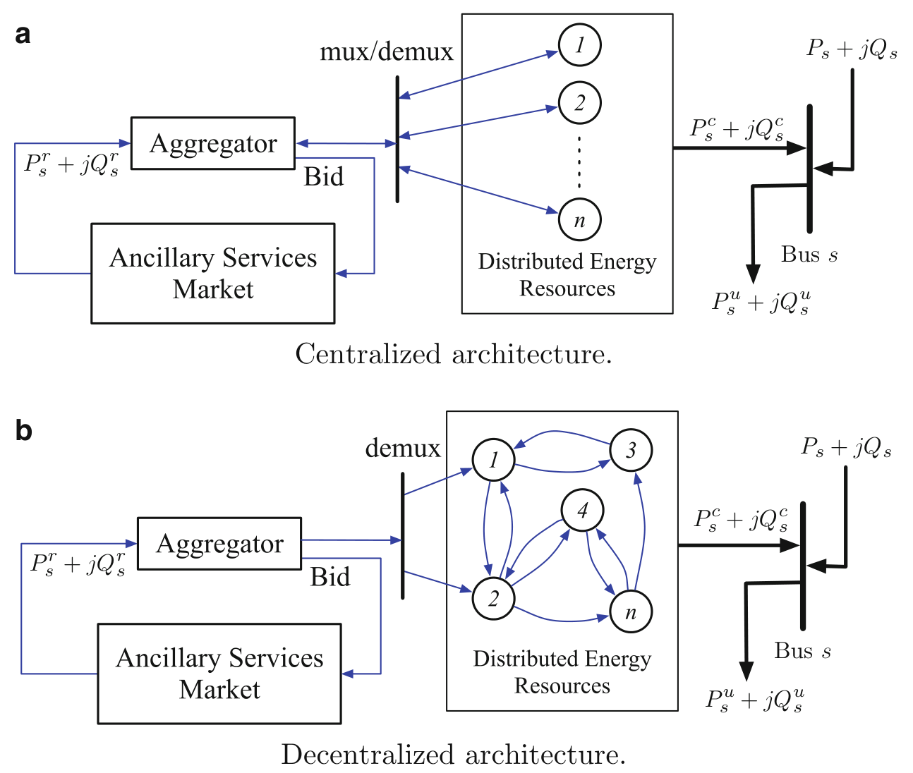

> Image description: Figure 1 illustrates two control architecture alternatives for coordinating Distributed Energy Resources (DERs) to provide ancillary services. **Panel (a) Centralized architecture** shows a one-to-one relationship between a mux/demux and the DERs. Individual DER units (labeled 1, 2,... $n$) send signals through a mux/demux to an Aggregator. The Aggregator sends a "Bid" to an Ancillary Services Market. Feedback from the market returns $P_s^r + jQ_s^r$ to the Aggregator. At a bus $s$, the net power is defined by the relationship between injected power $P_s^c + jQ_s^c$ and unmet power $P_s^u + jQ_s^u$, totaling $P_s + jQ_s$. **Panel (b) Decentralized architecture** features a demux that distributes signals from the Aggregator to the DERs. Unlike the centralized model, the DER units (1, 2, 3, 4, $n$) are interconnected via bidirectional arrows, indicating local communication. The Ancillary Services Market, Aggregator, and Bus $s$ maintain the same functional relationships and variables as in panel (a).
Coordination of Distributed Energy Resources for Provision of Ancillary Services: Architectures and Algorithms, Fig. 1 Control architecture alternatives. (a) Centralized architecture. (b) Decentralized architecture

the authors assume that each PHEV is a decision maker and can freely choose to participate after receiving a request from the aggregator. The decision that each PHEV is faced with depends on its own utility function, along with some pricing strategy designed by the aggregator. The PHEVs are assumed to be price anticipating in the sense that they are aware of the fact that the pricing is designed by the aggregator with respect to the average energy available. Another alternative is to formulate the DER coordination problem as a scheduling problem (Chen et al. 2012; Subramanian et al. 2012), where the DERs are treated as tasks. Then, the problem is to develop real-time scheduling policies to service these tasks.

## Architectures

Next, we describe two possible architectures that can be utilized to implement the proper algorithms for solving the DER coordination problem
as formulated in (1). Specifically, we describe a centralized architecture that requires the aggregator to communicate bidirectionally with each DER and a distributed architecture that requires the aggregator to only unidirectionally communicate with a limited number of DERs but requires some additional exchange of information (not necessarily through bidirectional communication links) among the DERs.

## Centralized Architecture

A solution can be achieved through the completely centralized architecture of Fig.1a, where the aggregator can exchange information with each available DER. In this scenario, each DER can inform the aggregator about its active and/or reactive capacity limits and other operational constraints, e.g., maintenance schedule. After gathering all this information, the aggregator solves the optimization program in (1), the solution of which will determine how to allocate among the resources the total amount of active power $P_{s}^{r}$ and/or reactive


<!-- source_pdf_page: 268 -->
power $Q_{s}^{r}$ that it needs to provide. Then, the aggregator sends individual commands to each DER so they modify their active and or reactive power generation according to the solution of (1) computed by the aggregator. In this centralized solution, however, it is necessary to overlay a communication network connecting the aggregator with each resource and to maintain knowledge of the resources that are available at any given time.

## Decentralized Architecture

An alternative is to use the decentralized control architecture of Fig. 1b, where the aggregator relays information to a limited number of DERs that it can directly communicate with and each DER is able to exchange information with a number of other close-by DERs. For example, the aggregator might broadcast the prices to be paid to each type of DER. Then, through some distributed protocol that adheres to the communication network interconnecting the DERs, the information relayed by the aggregator to this limited number of DERs is disseminated to all other available DERs. This dissemination process may rely on flooding algorithms, messagepassing protocols, or linear-iterative algorithms as proposed in Domínguez-García and Hadjicostis $(2010,2011)$. After the dissemination process is complete and through a distributed computation over the communication network, the DERs can solve the optimization program in (1) and determine its active and/or reactive power contribution.

A decentralized architecture like the one in Fig. 1b may offer several advantages over the centralized one in Fig. 1b, including the following. First, a decentralized architecture may be more economical because it does not require communication between the aggregator and the various DERs. Also, a decentralized architecture does not require the aggregator to have a complete knowledge of the DERs available. Additionally, a decentralized architecture can be more resilient to faults and/or unpredictable behavioral patterns by the DERs. Finally, the practical implementation of such decentralized architecture can rely on inexpensive and simple hardware. For example,
the testbed described in Domínguez-García et al. (2012a), which is used to solve a particular instance of the problem in (1), uses Arduino microcontrollers (see Arduino for a description) outfitted with wireless transceivers implementing a ZigBee protocol (see ZigBee for a description).

## Algorithms

Ultimately, whether a centralized or a decentralized architecture is adopted, it is necessary to solve the optimization problem in (1). If a centralized architecture is adopted, then solving (1) is relatively straightforward using, e.g., standard gradient-descent algorithms (see, e.g., Bertsekas and Tsitsiklis 1997). Beyond the DER coordination problem and the specific formulation in (1), solving an optimization problem is challenging if a decentralized architecture is adopted (especially if the communication links between DERs are not bidirectional); this has spurred significant research in the last few years (see, e.g., Bertsekas and Tsitsiklis 1997, Xiao et al. 2006, Nedic et al. 2010, Zanella et al. 2011, Gharesifard and Cortes 2012, and the references therein).

In the specific context of the DER coordination problem as formulated in (1), when the cost functions are assumed to be quadratic and the communication between DERs is not bidirectional, an algorithm amenable for implementation in a decentralized architecture like the one in Fig. 1b has been proposed in Domínguez-García et al. (2012a). Also, in the context of Fig. 1b, when the communication between DERs are bidirectional, the DER coordination problem, as formulated in (1), can be solved using an algorithm proposed in Kar and Hug (2012).

As mentioned earlier, when the price offered by the aggregator is constant and identical for all DERs, the problem in (1) reduces to the feasibility problem in (2). One possible solution to this feasibility problem is the fair-splitting solution in (3). Next, we describe a linear-iterative algorithm - originally proposed in DomínguezGarcía and Hadjicostis $(2010,2011)$ and referred to as ratio consensus - that allows the DERs to


<!-- source_pdf_page: 269 -->
individually determine its contribution so that the fair-splitting solution is achieved.

## Ratio Consensus: A Distributed Algorithm for Fair Splitting

We assume that each DER is equipped with a processor that can perform simple computations and can exchange information with neighboring DERs. In particular, the information exchange between DERs can be described by a directed graph $\mathcal{G}=\{\mathcal{V}, \mathcal{E}\}$, where $\mathcal{V}=\{1,2, \ldots, n\}$ is the vertex set (each vertex - or node - corresponds to a DER) and $\mathcal{E} \subseteq \mathcal{V} \times \mathcal{V}$ is the set of edges, where $(i, j) \in \mathcal{E}$ if node $i$ can receive information from node $j$. We require $\mathcal{G}$ to be strongly connected, i.e., for any pair of vertices $l$ and $l^{\prime}$, there exists a path that starts in $l$ and ends in $l^{\prime}$. Let $\mathcal{L}^{+} \subseteq \mathcal{V}, \mathcal{L}^{+} \neq \emptyset$ denote the set of nodes that the aggregator is able to directly communicate with.

The processor of each DER $i$ maintains two values $y_{i}$ and $z_{i}$, which we refer to as internal states, and updates them (independently of each other) to be, respectively, a linear combination of DER $i$ 's own previous internal states and the previous internal states of all nodes that can possibly transmit information to node $i$ (including itself). In particular, for all $k \geq 0$, each node $i$ updates its two internal states as follows:

$$
\begin{align*}
& y_{i}[k+1]=\sum_{j \in \mathcal{N}_{i}^{-}} \frac{1}{\mathcal{D}_{j}^{+}} y_{j}[k],  \tag{4}\\
& z_{i}[k+1]=\sum_{j \in \mathcal{N}_{i}^{-}} \frac{1}{\mathcal{D}_{j}^{+}} z_{j}[k], \tag{5}
\end{align*}
$$

where $\mathcal{N}_{i}^{-}=\{j \in \mathcal{V}:(i, j) \in \mathcal{E}\}$, i.e., all nodes that can possibly transmit information to node $i$ (including itself); and $\mathcal{D}_{i}^{+}$is the outdegree of node $i$, i.e., the number of nodes to which node $i$ can possibly transmit information (including itself). The initial conditions in (4) are set to $y_{i}[0]=X / m-\underline{x}_{i}$ if $i \in \mathcal{L}^{+}$, and $y_{i}[0]=-\underline{x}_{i}$ otherwise and the initial conditions in (5) are set to $z_{i}[0]=\bar{x}_{i}-\underline{x}_{i}$. Then, as shown in Domínguez-García and Hadjicostis (2011), as long as $\sum_{l=1}^{n} \bar{x}_{l} \leq X \leq \sum_{l=1}^{n} \bar{x}_{l}$, each DER $i$ can asymptotically calculate its contribution as

$$
\begin{equation*}
x_{i}=\underline{x}_{i}+\gamma\left(\bar{x}_{i}-\underline{x}_{i}\right) \tag{6}
\end{equation*}
$$

where for all i

$$
\begin{equation*}
\lim _{k \rightarrow \infty} \frac{y_{i}[k]}{z_{i}[k]}=\frac{X-\sum_{l=1}^{n} \underline{x}_{l}}{\sum_{l=1}^{n}\left(\bar{x}_{l}-\underline{x}_{l}\right)}:=\gamma . \tag{7}
\end{equation*}
$$

It is important to note that the algorithm in (4)-(7) also serves as a primitive for the algorithm proposed in Domínguez-García et al. (2012a), which solves the problem in (1) when the cost function is quadratic. Also, the algorithm in (4)-(7) is not resilient to packet-dropping communication links or imperfect synchronization among the DERs, which makes it difficult to implement in practice; however, there are robustified variants of this algorithm that address these issues Domínguez-García et al. (2012b) and have been demonstrated to work in practice (Domínguez-García et al. 2012a).

## Cross-References

- Averaging Algorithms and Consensus
- Distributed Optimization
- Electric Energy Transfer and Control via Power Electronics
- Flocking in Networked Systems
- Graphs for Modeling Networked Interactions
- Network Games
- Networked Systems


## Bibliography

Arduino [Online]. Available: http://www.arduino.cc
Bertsekas DP, Tsitsiklis JN (1997) Parallel and distributed computation. Athena Scientific, Belmont
Callaway DS, Hiskens IA (2011) Achieving controllability of electric loads. Proc IEEE 99(1):184-199
Chen S, Ji Y, Tong L (2012) Large scale charging of electric vehicles. In: Proceedings of the IEEE power and energy society general meeting, San Diego
Domínguez-García AD, Hadjicostis CN (2010) Coordination and control of distributed energy resources for provision of ancillary services. In: Proceedings of the IEEE SmartGridComm, Gaithersburg


<!-- source_pdf_page: 270 -->
Domínguez-García AD, Hadjicostis CN (2011) Distributed algorithms for control of demand response and distributed energy resources. In: Proceedings of the IEEE conference on decision and control, Orlando
Domínguez-García AD, Hadjicostis CN, Krein PT, Cady ST (2011) Small inverter-interfaced distributed energy resources for reactive power support. In: Proceedings of the IEEE applied power electronics conference and exposition, Fort Worth
Domínguez-García AD, Cady ST, Hadjicostis CN (2012a) Decentralized optimal dispatch of distributed energy resources. In: Proceedings of the IEEE conference on decision and control, Maui
Domínguez-García AD, Hadjicostis CN, Vaidya N (2012b) Resilient networked control of distributed energy resources. IEEE J Sel Areas Commun 30(6):1137-1148
Gharesifard B, Cortes J (2012) Continuous-time distributed convex optimization on weight-balanced digraphs. In: Proceedings of the IEEE conference on decision and control, Maui
Gharesifard B, Domínguez-García AD, Başar T (2013) Price-based distributed control for networked plugin electric vehicles. In: Proceedings of the American control conference, Washington, DC
Guille C, Gross G (2009) A conceptual framework for the vehicle-to-grid (V2G) implementation. Energy Policy 37(11):4379-4390
Kar S, Hug G (2012) Distributed robust economic dispatch in power systems: a consensus + innovations approach. In: Proceedings of the IEEE power and energy society general meeting, San Diego
Ma Z, Callaway DS, Hiskens IA (2013) Decentralized charging control of large populations of plugin electric vehicles. IEEE Trans Control Syst Technol 21:67-78
Nedic A, Ozdaglar A, Parrilo PA (2010) Constrained consensus and optimization in multi-agent networks. IEEE Trans Autom Control 55(4):922-938
Subramanian A, Garcia M, Domínguez-García AD, Callaway DC, Poolla K, Varaiya P (2012) Real-time scheduling of deferrable electric loads. In: Proceedings of the American control conference, Montreal
Turitsyn K, Sulc P, Backhaus S, Chertkov M (2011) Options for control of reactive power by distributed photovoltaic generators. Proc IEEE 99(6): 1063-1073
Tushar W, Saad W, Poor HV, Smith DB (2012) Economics of electric vehicle charging: a game theoretic approach. IEEE Trans Smart Grids 3(4): 1767-1778
Xiao L, Boyd S, Tseng CP (2006) Optimal scaling of a gradient method for distributed resource allocation. J Optim Theory Appl 129(3):469-488
Zanella F, Varagnolo D, Cenedese A, Pillonetto G, Schenato L (2011) Newton-Raphson consensus for distributed convex optimization. In: Proceedings of the IEEE conference on decision and control, Orlando
ZigBee Alliance [Online]. Available: http://www.zigbee. org

## Credit Risk Modeling

Tomasz R. Bielecki<br>Department of Applied Mathematics, Illinois<br>Institute of Technology, Chicago, IL, USA


#### Abstract

Modeling of credit risk is concerned with constructing and studying formal models of time evolution of credit ratings (credit migrations) in a pool of credit names, and with studying various properties of such models. In particular, this involves modeling and studying default times and their functionals.


## Keywords

Credit risk; Credit migrations; Default time; Markov copulae

## Introduction

Modeling of credit risk is concerned with constructing and studying formal models of time evolution of credit ratings (credit migrations) in a pool of $N$ credit names (obligors), and with studying various properties of such models. In particular, this involves modeling and studying default times and their functionals. In many ways, modeling techniques used in credit risk are similar to modeling techniques used in reliability theory. Here, we focus on modeling in continuous time.

Models of credit risk are used for the purpose of valuation and hedging of credit derivatives, for valuation and hedging of counter-party risk, for assessment of systemic risk in an economy, or for constructing optimal trading strategies involving credit-sensitive financial instruments, among other uses.

Evolution of credit ratings for a single obligor, labeled as $i$, where $i \in\{1, \ldots, N\}$, can be


<!-- source_pdf_page: 271 -->
modeled in many possible ways. One popular possibility is to model credit migrations in terms of a jump process, say $C^{i}=\left(C_{t}^{i}\right)_{t \geq 0}$, taking values in a finite set, say $\mathcal{K}^{i}:=\left\{0,1,2, \ldots, K^{i}-\right. \left.1, K^{i}\right\}$, representing credit ratings assigned to obligor $i$. Typically, the rating state $K^{i}$ represents the state of default of the $i$-th obligor, and typically it is assumed that process $C^{i}$ is absorbed at state $K^{i}$.

Frequently, the case when $K^{i}=1$, that is $\mathcal{K}^{i}:=\{0,1\}$, is considered. In this case, one is only concerned with jump from the predefault state 0 to the default state 1 , which is usually assumed to be absorbing - the assumption made here as well. It is assumed that process $C^{i}$ starts from state 0 . The (random) time of jump of process $C^{i}$ from state 0 to state 1 is called the default time, and is denoted as $\tau^{i}$. Process $C^{i}$ is now the same as the indicator process of $\tau^{i}$, which is denoted as $H^{i}$ and defined as $H_{t}^{i}=\mathbb{1}_{\left\{\tau^{i} \leq t\right\}}$, for $t \geq 0$. Consequently, modeling of the process $C^{i}$ is equivalent to modeling of the default time $\tau^{i}$.

The ultimate goal of credit risk modeling is to provide a feasible mathematical and computational methodology for modeling the evolution of the multivariate credit migration process $\mathbf{C}:=$ ( $C^{1}, \ldots, C^{N}$ ), so that relevant functionals of such processes can be computed efficiently. The simplest example of such functional is $P\left(\mathbf{C}_{t_{j}} \in\right. \left.A_{j}, j=1,2, \ldots, J \mid \mathcal{G}_{s}\right)$, representing the conditional probability, given the information $\mathcal{G}_{s}$ at time $s \geq 0$, that process $\mathbf{C}$ takes values in the set $A_{j}$ at time $t_{j} \geq 0, j=1,2, \ldots, J$. In particular, in case of modeling of the default times $\tau^{i}, i=1,2, \ldots, N$, one is concerned with computing conditional survival probabilities $P\left(\tau^{1}>t_{1}, \ldots, \tau^{N}>t_{N} \mid \mathcal{G}_{s}\right)$, which are the same as probabilities $P\left(H_{t_{i}}^{i}=0, i=\right. \left.1,2, \ldots, N \mid \mathcal{G}_{s}\right)$.

Based on that, one can compute more complicated functionals, that naturally occur in the context of valuation and hedging of credit risksensitive financial instruments, such as corporate (defaultable) bonds, credit default swaps, credit spread options, collateralized bond obligations, and asset-based securities, for example.

## Modeling of Single Default Time Using Conditional Density

Traditionally, there were two main approaches to modeling default times: the structural approach and the reduced approach, also known as the hazard process approach. The main features of both these approaches are presented in Bielecki and Rutkowski (2004).

We focus here on modeling a single default time, denoted as $\tau$, using the so-called conditional density approach of El Karoui et al. (2010). This approach allows for extension of results that can be derived using reduced approach.

The default time $\tau$ is a strictly positive random variable defined on the underlying probability space ( $\Omega, \mathcal{F}, P$ ), which is endowed with a reference filtration, say $\mathbb{F}=\left(\mathcal{F}_{t}\right)_{t \geq 0}$, representing flow of all (relevant) market information available in the model, not including information about occurrence of $\tau$. The information about occurrence of $\tau$ is carried by the (right continuous) filtration $\mathbb{H}$ generated by the indicator process $H:=\left(H_{t}=\mathbb{1}_{\tau \leq t}\right)_{t \geq 0}$. The full information in the model is represented by filtration $\mathbb{G}:=\mathbb{F} \vee \mathbb{H}$.

It is postulated that

$$
P\left(\tau \in d \theta \mid \mathcal{F}_{t}\right)=\alpha_{t}(\theta) d \theta
$$

for some random field $\alpha \cdot(\cdot)$, such that $\alpha_{t}(\cdot)$ is $\mathcal{F}_{t} \otimes \mathcal{B}\left(\mathbb{R}_{+}\right)$measurable for each $t$. The family $\alpha_{t}(\cdot)$ is called $\mathcal{F}_{t}$-conditional density of $\tau$. In particular, $P(\tau>\theta)=\int_{\theta}^{\infty} \alpha_{0}(u) d u$. The following survival processes are associated with $\tau$,

- $S_{t}(\theta):=P\left(\tau>\theta \mid \mathcal{F}_{t}\right)=\int_{\theta}^{\infty} \alpha_{t}(u) d u$, which is an $\mathbb{F}$-martingale,
- $S_{t}:=S_{t}(t)=P\left(\tau>t \mid \mathcal{F}_{t}\right)$, which is an $\mathbb{F}$ supermartingale (Azéma supermartingale).
In particular, $S_{0}(\theta)=P(\tau>\theta)= \int_{\theta}^{\infty} \alpha_{0}(u) d u$, and $S_{t}(0)=S_{0}=1$.

As an example of computations that can be done using the conditional density approach we give the following result, in which notation "bd" and "ad" stand for before default and at-or-after default, respectively.


<!-- source_pdf_page: 272 -->
Theorem 1 Let $Y_{T}(\tau)$ be a $\mathcal{F}_{T} \vee \sigma(\tau)$ measurable and bounded random variable. Then

$$
E\left(Y_{T}(\tau) \mid \mathcal{F}_{t}\right)=Y_{t}^{\mathrm{bd}} \mathbb{1}_{t<\tau}+Y_{t}^{\mathrm{ad}}(T, \tau) \mathbb{1}_{t \geq \tau},
$$

where

$$
Y_{t}^{\mathrm{bd}}=\frac{\int_{t}^{\infty} Y_{T}(\theta) \alpha_{t}(\theta) d \theta}{S_{t}} \mathbb{1}_{S_{t}>0}
$$

and

$$
Y_{t}^{\mathrm{ad}}(T, \theta)=\frac{E\left(Y_{T}(\theta) \alpha_{T}(\theta) \mid \mathcal{F}_{t}\right)}{\alpha_{t}(\theta)} \mathbb{1}_{\alpha_{t}(\theta)>0} .
$$

There is an interesting connection between the conditional density process and the so-called default intensity processes, which are ones of the main objects used in the reduced approach. This connection starts with the following result,

Theorem 2 (i) The Doob-Meyer (additive) decomposition of the survival process $S$ is given as

$$
S_{t}=1+M_{t}^{\mathbb{F}}-\int_{0}^{t} \alpha_{u}(u) d u
$$

where $M_{t}^{\mathbb{F}}=-\int_{0}^{t}\left(\alpha_{t}(u)-\alpha_{u}(u)\right) d u= E\left(\int_{0}^{\infty} \alpha_{u}(u) d u \mid \mathcal{F}_{t}\right)-1$.
(ii) Let $\xi:=\inf \left\{t \geq 0: S_{t-}=0\right\}$. Define $\lambda_{t}^{\mathbb{F}}=\frac{\alpha_{t}(t)}{S_{t}}$ for $t<\xi$ and $\lambda_{t}^{\mathbb{F}}=\lambda_{\xi}^{\mathbb{F}}$ for $t \geq \xi$. Then, the multiplicative decomposition of $S$ is given as

$$
S_{t}=L_{t}^{\mathbb{F}} e^{-\int_{0}^{t} \lambda_{u}^{\mathbb{F}} d u}
$$

where

$$
d L_{t}^{\mathbb{F}}=e^{\int_{0}^{t} \lambda_{u}^{\mathbb{F}} d u} d M_{t}^{\mathbb{F}}, \quad L_{0}^{\mathbb{F}}=1
$$

The process $\lambda^{\mathbb{F}}$ is called the $\mathbb{F}$ intensity of $\tau$.
The $\mathbb{G}$-compensator of $\tau$ is the $\mathbb{G}$-predictable increasing process $\Lambda^{\mathbb{G}}$ such that the process

$$
M_{t}^{\mathbb{G}}=H_{t}-\Lambda_{t}^{\mathbb{G}}
$$

is a $\mathbb{G}$-martingale. If $\Lambda^{\mathbb{G}}$ is absolutely continuous, the $\mathbb{G}$-adapted process $\lambda^{\mathbb{G}}$ such that

$$
\Lambda_{t}^{\mathbb{G}}=\int_{0}^{t} \lambda_{u}^{\mathbb{G}} d u
$$

is called the $\mathbb{G}$-intensity of $\tau$. The $\mathbb{G}$-compensator is stopped at $\tau$, i.e., $\Lambda_{t}^{\mathbb{G}}=\Lambda_{t \wedge \tau}^{\mathbb{G}}$. Hence, $\lambda_{t}^{\mathbb{G}}=0$ when $t>\tau$. In particular, we have

$$
\lambda_{t}^{\mathbb{G}}=\mathbb{1}_{t<\tau} \lambda_{t}^{\mathbb{F}}=\left(1-H_{t}\right) \lambda_{t}^{\mathbb{F}} .
$$

The conditional density process and the $\mathbb{G}$ intensity of $\tau$ are related as follows: For any $t<\xi$ and $\theta \geq t$ we have

$$
\alpha_{t}(\theta)=E\left(\lambda_{\theta}^{\mathbb{G}} \mid \mathcal{F}_{t}\right) .
$$

Example 1 This is a structural-model-like example

- Suppose $\mathbb{F}=\mathbb{F}^{X}$ is a filtration of a default driver process, say $X$, and $\Theta$ is the default barrier assumed to be independent of $X$. Denote $G(t)=P(\Theta>t)$.
- Define

$$
\tau:=\inf \left\{t \geq 0: \Gamma_{t} \geq \Theta\right\},
$$

with $\Gamma_{t}:=\sup _{s \leq t} X_{s}$. We then have $S_{t}(\theta)= G\left(\Gamma_{\theta}\right)$ if $\theta \leq t$ and $S_{t}(\theta)=E\left(G\left(\Gamma_{\theta}\right) \mid \mathcal{F}_{t}^{X}\right)$ if $\theta>t$

- Assume that $F=1-G$ and $\Gamma$ are absolutely continuous w.r.t. Lebesgue measure, with respective densities $f$ and $\gamma$. We then have

$$
\alpha_{t}(\theta)=f\left(\Gamma_{\theta}\right) \gamma_{\theta}=\alpha_{\theta}, t \geq \theta,
$$

and $\mathbb{F}^{X}$ intensity of $\tau$ is

$$
\lambda_{t}=\frac{\alpha_{t}(t)}{G\left(\Gamma_{t}\right)}=\frac{\alpha_{t}(t)}{S_{t}}
$$

- In particular, if $\Theta$ is a unit exponential r.v., that is, if $G(t)=e^{-t}$ for $t \geq 0$, then we have that $\lambda_{t}=\gamma_{t}=\frac{\alpha_{t}(t)}{S_{t}}$.

Example 2 This is a reduced-form-like example.


<!-- source_pdf_page: 273 -->
- Suppose $S$ is a strictly positive process. Then, the $\mathbb{F}$-hazard process of $\tau$ is denoted by $\Gamma^{\mathbb{F}}$ and is given as

$$
\Gamma_{t}^{\mathbb{F}}=-\ln S_{t}, \quad t \geq 0
$$

In other words,

$$
S_{t}=e^{-\Gamma_{t}^{\mathbb{F}}}, \quad t \geq 0
$$

- In particular, if $\Gamma^{\mathbb{F}}$ is absolutely continuous, that is, $\Gamma_{t}^{\mathbb{F}}=\int_{0}^{t} \gamma_{u}^{\mathbb{F}} d u$ then

$$
\begin{aligned}
S_{t} & =e^{-\int_{0}^{t} \gamma_{u}^{\mathbb{F}} d u}, \quad t \geq 0 \quad \text { and } \\
\alpha_{t}(\theta) & =\gamma_{\theta}^{\mathbb{F}} S_{\theta}, t \geq \theta
\end{aligned}
$$

## Modeling Evolution of Credit Ratings Using Markov Copulae

The key goal in modeling of the joint migration process $\mathbf{C}$ is that the distributional laws of the individual migration components $C^{i}, i \in \{1, \ldots, N\}$, agree with given (predetermined) laws. The reason for this is that the marginal laws of $\mathbf{C}$, that is, the laws of $C^{i}, i \in\{1, \ldots, N\}$, can be calibrated from market quotes for prices of individual (as opposed to basket) credit derivatives, such as the credit default swaps, and thus, the marginals of $\mathbf{C}$ should have laws agreeing with the market data.

One way of achieving this goal is to model C as a Markov chain satisfying the so-called Markov copula property. For brevity we present here the simplest such model, in which the reference filtration $\mathbb{F}$ is trivial, assuming additionally, but without loss of generality, that $N=2$ and that $\mathcal{K}^{1}=\mathcal{K}^{2}=\mathcal{K}:=\{0,1, \ldots, K\}$.

Here we focus on the case of the so-called strong Markov copula property, which is reflected in Theorem 3.

Let us consider two Markov chains $Z^{1}$ and $Z^{2}$ on ( $\Omega, \mathcal{F}, P$ ), taking values in a finite state space $\mathcal{K}$, and with the infinitesimal generators $A^{1}:= \left[a_{i j}^{1}\right]$ and $A^{2}:=\left[a_{h k}^{2}\right]$, respectively.

Consider the system of linear algebraic equations in unknowns $a_{i h, j k}^{\mathbf{C}}$,

$$
\begin{align*}
& \sum_{k \in \mathcal{K}} a_{i h, j k}^{\mathbf{C}}=a_{i j}^{1}, \quad \forall i, j, h \in \mathcal{K}, i \neq j,(1)  \tag{1}\\
& \sum_{j \in \mathcal{K}} a_{i h, j k}^{\mathbf{C}}=a_{h k}^{2}, \quad \forall i, h, k \in \mathcal{K}, h \neq k,(2) \tag{2}
\end{align*}
$$

It can be shown that this system admits at least one positive solution.

Theorem 3 Consider an arbitrary positive solution of the system (1)-(2). Then the matrix $A^{\mathbf{C}}=\left[a_{i h, j k}^{X}\right]_{i, h, j, k \in \mathcal{K}}$ (where diagonal elements are defined appropriately) satisfies the conditions for a generator matrix of a bivariate timehomogeneous Markov chain, say $\mathbf{C}=\left(C^{1}, C^{2}\right)$, whose components are Markov chains in the filtration of $\mathbf{C}$ and with the same laws as $Z^{1}$ and $Z^{2}$.

Consequently, the system (1)-(2) serves as a Markov copula between the Markovian margins $C^{1}, C^{2}$ and the bivariate Markov chain $\mathbf{C}$.

Note that the system (1)-(2) can contain more unknowns than the number of equations, therefore being underdetermined, which is a crucial feature for ability of calibration of the joint migration process $\mathbf{C}$ to marginal market data.

Example 3 This example illustrates modeling joint defaults using strong Markov copula theory.

Let us consider two processes, $Z^{1}$ and $Z^{2}$, that are time-homogeneous Markov chains, each taking values in the state space $\{0,1\}$, with respective generators

$$
A^{1}=\begin{gather*}
0  \tag{3}\\
0 \\
1
\end{gather*}\left(\begin{array}{cc}
0 & 1 \\
-(a+c) & a+c \\
0 & 0
\end{array}\right)
$$

and

$$
\left.A^{2}=\begin{array}{c}
0 \\
1
\end{array} \begin{array}{cc}
0 & 1  \tag{4}\\
-(b+c) & b+c \\
0 & 0
\end{array}\right),
$$

for $a, b, c \geq 0$.
The off-diagonal elements of the matrix $A^{\mathbf{C}}$ below satisfy the system (1)-(2),


<!-- source_pdf_page: 274 -->
$$
A^{\mathrm{C}}=\begin{gather*}
(0,0) \\
(0,0)  \tag{5}\\
(1,0) \\
(1,1)
\end{gather*}\left(\begin{array}{cccc}
(0,1) & (1,0) & (1,1) \\
-(a+b+c) & b & a & c \\
0 & -(a+c) & 0 & a+c \\
0 & 0 & -(b+c) & b+c \\
0 & 0 & 0 & 0
\end{array}\right) .
$$

Thus, matrix $A^{\mathbf{C}}$ generates a Markovian joint migration process $\mathbf{C}=\left(C^{1}, C^{2}\right)$, whose components $C^{1}$ and $C^{2}$ model individual default with prescribed default intensities $a+c$ and $b+c$, respectively.

For more information about Markov copulae and about their applications in credit risk we, refer to Bielecki et al. (2013).

## Summary and Future Directions

The future directions in development and applications of credit risk models are comprehensively laid out in the recent volume Bielecki et al. (2011). One additional future direction is modeling of systemic risk.

## Bibliography

We do not give a long list of recommended reading here. That would be in any case incomplete. Up-to-date references can be found on www.defaultrisk.com.
Bielecki TR, Rutkowski M (2004) Credit risk: modeling, valuation and hedging. Springer, Berlin
Bielecki TR, Brigo D, Patras F (eds) (2011) Credit risk frontiers: subprime crisis, pricing and hedging, CVA, MBS, ratings and liquidity. Wiley, Hoboken
Bielecki TR, Jakubowski J, Niewęgłowski M (2013) Intricacies of dependence between components of multivariate Markov chains: weak Markov consistency and Markov copulae. Electron J Probab 18(45):1-21
Bluhm Ch, Overbeck L, Wagner Ch (2010) An introduction to credit risk modeling. Chapman \& Hall, Boca Raton
El Karoui N, Jeanblanc M, Jiao Y (2010) What happens after a default: the conditional density approach. SPA 120(7): 1011-1032
Schönbucher PhJ (2003) Credit derivatives pricing models. Wiley Finance, Chichester

## Cross-References

- Financial Markets Modeling
- Option Games: The Interface Between Optimal Stopping and Game Theory
