<!-- source_pdf_page: 275 -->
## D

## Data Association

Yaakov Bar-Shalom and Richard W. Osborne<br>University of Connecticut, Storrs, CT, USA


#### Abstract

In tracking applications, following the signal detection process that yields measurements, there is a procedure that selects the measurement(s) to be incorporated into the state estimator - this is called data association (DA). In multitarget-multisensor tracking systems, there are generally three classes of data association: specifically, measurement-to-track association (M2TA), track-to-track association (T2TA), and measurement-to-measurement association (M2MA). M2TA is the process of associating each measurement from a list (originating from one or more sensors) to a new or existing track. T2TA is the process of associating multiple existing tracks (from multiple sensors or from different periods in time), generally with the intent of fusing them afterward. M2MA is the process of associating measurements from different sensors in order to form "composite measurements" and/or do track initialization. The processes of M2TA and T2TA will be discussed in more detail here, while details on M2MA can be found in Bar-Shalom et al. (2011).


## Keywords

Clutter; Measurement origin uncertainty; Measurement validation; Persistent interference; Tracking

## Introduction

In a radar the "return" from the target of interest is sought within a time interval determined by the anticipated range of the target when it reflects the energy transmitted by the radar: a "range gate" is set up and the detection(s) within this gate can be associated with the target of interest.

In general the measurements have a higher dimension:

- Range, azimuth (bearing), elevation, or direction sines for radar, possibly also range rate
- Bearing and frequency (when the signal is narrow band) or time difference of arrival and frequency difference in passive sonar
- Two line-of-sight angles or direction sines for optical or passive electromagnetic sensors
Then a multidimensional gate is set up for detecting the signal from the target. This is done to avoid searching for the signal from the target of interest in the entire measurement space. A measurement in the gate, while not guaranteed to have originated from the target the gate pertains to, is a valid association candidate - thus, the name validation region or association region. If there


<!-- source_pdf_page: 276 -->
is more than one detection (measurement) in the gate, this leads to an association uncertainty.

In the discussion to follow, it will be assumed that one has point measurements rather than distributed over several resolution cells of the sensor as in the case of an extended target.

Similar validation has to be carried out in T2TA.

## Validation Region

In view of the variety of variables that can be measured, a generic gating (or validation or association) procedure for continuous-valued measurements is discussed.

Consider a target that is in track, i.e., its filter has been initialized. Then, according to Sect. 5.2.3 of Bar-Shalom et al. (2001), one has the predicted value (mean) of the measurement $\hat{z}(k+1 \mid k)$ and the associated covariance $S(k+1)$.

Assumption. The true measurement conditioned on the past is normally (Gaussian) distributed (The notation $\mathcal{N}(x ; \mu, S)$ stands for the normal (Gaussian) pdf with the argument (vector) random variable $x$, mean $\mu$, and covariance matrix $S$. The reason for the use of the designation "normal" is to distinguish this omnipresent pdf from all the others (abnormal).) with its probability density function (pdf) given by

$$
\begin{align*}
p\left[z(k+1) \mid Z^{k}\right]= & \mathcal{N}[z(k+1) ; \hat{z}(k+1 \mid k), \\
& S(k+1)] \tag{1}
\end{align*}
$$

where $S(k+1)$ is the innovation (residual) covariance matrix and $z$ is the true measurement.

Then the true measurement will be in the following region:

$$
\begin{equation*}
\mathcal{V}(k+1, \gamma)=\left\{z: d^{2} \leq \gamma\right\} \tag{2}
\end{equation*}
$$

with probability determined by the gate threshold $\gamma$ and

$$
\begin{equation*}
d^{2} \triangleq[z-\hat{z}(k+1 \mid k)]^{\prime} S(k+1)^{-1}[z-\hat{z}(k+1 \mid k)] \tag{3}
\end{equation*}
$$

This distance metric, $d^{2}$, is referred to in the literature as the normalized innovation squared (NIS), statistical distance squared, Mahalanobis distance, or chi-square distance.

The region defined by (2) is called the gate or validation region (hence, the notation $\mathcal{V}$ ) or association region. It is also known as the ellipse (or ellipsoid) of probability concentration - the region of minimum volume that contains a given probability mass under the Gaussian assumption. The semiaxes of the ellipsoid (2) are the square roots of the eigenvalues of $\gamma S$. The threshold $\gamma$ is obtained from tables of the chi-square distribution since the quadratic form (3) that defines the validation region in (2) is chi-square distributed with number of degrees of freedom equal to the dimension $n_{z}$ of the measurement.

Table 1 gives the gate probability (The notation $P\{\cdot\}$ is used to denote the probability of event $\{\cdot\}$.)

$$
\begin{equation*}
P_{G} \triangleq P\{z(k+1) \in \mathcal{V}(k+1, \gamma)\} \tag{4}
\end{equation*}
$$

or the "probability that the (true) measurement will fall in the gate" for various values $\gamma$ and dimensions $n_{z}$ of the measurement. The square root $g=\sqrt{\gamma}$ is sometimes referred to as the "number of sigmas" (standard deviations) of the gate. This, however, does not fully define the probability mass in the gate as can be seen from Table 1.

Remark 1 It should be pointed out that thresholding in a detector is also a form of gating only a signal above a certain intensity level (at the end of the signal processing chain) is accepted as a detection and then one has a measurement. In this case the "gate" is the interval [ $\tau, \infty$ ] in the signal intensity space, where $\tau$ is the detection threshold.

## A Single Target in Clutter

The validation procedure limits the region in the measurement space where the information processor will "look" to find the measurement from the target of interest. In spite of this, it can happen that more than one detection, i.e., several measurements, will be found in the validation region.


<!-- source_pdf_page: 277 -->
Data Association, Table 1 Gate thresholds and the probability mass $P_{G}$ in the gate
|  | $\gamma$ | 1 | 4 | 6.6 | 9 | 9.2 | 11.4 | 16 | 25 |
| :--- | :--- | :--- | :--- | :--- | :--- | :--- | :--- | :--- | :--- |
|  | $g$ | 1 | 2 | 2.57 | 3 | 3.03 | 3.38 | 4 | 5 |
| $n_{z}$ |  |  |  |  |  |  |  |  |  |
| 1 |  | 0.683 | 0.954 | 0.99 | 0.997 |  |  | 0.99994 | 1 |
| 2 |  | 0.393 | 0.865 |  | 0.989 | 0.99 |  | 0.9997 | 1 |
| 3 |  | 0.199 | 0.739 |  | 0.971 |  | 0.99 | 0.9989 | 0.99998 |


Measurements outside the validation region can be ignored: they are "too far" and thus very unlikely to have originated from the target of interest. This holds if the gate probability is close to unity and the model used to obtain the gate is correct.

The problem of tracking a single target in clutter considers the situation where there are possibly several measurements in the validation region (gate) of a target. The set of validated measurements consists of:

- The correct measurement (if detected and it fell in the gate)
- The undesirable measurements: clutter or false alarm originated
In practice detections are obtained by thresholding the signal received by the sensor after processing it. This is the simplest (binary) way of using a target feature - its intensity. More sophisticated ways of using such feature information can be found in Bar-Shalom et al. (2011).

It is assumed that the measurement contains all the information that could be used to discard the undesirable measurements. Therefore, any measurement that has been validated could have originated from the target of interest.

A situation with a single-target track and several validated measurements is depicted in Fig. 1. The (two-dimensional) validation region is an ellipse centered at the predicted measurement $\hat{z}^{1}$. The parameters of the ellipse are determined by the covariance matrix $S$ of the innovation, which is assumed to be Gaussian.

All the measurements in the validation region can be said to be not too unlikely to have originated from the target of interest, even though only one is assumed to be the true one.

The implication of the assumption that there is a single target is that the undesirable measurements constitute a random interference.

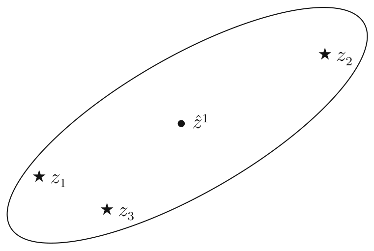

> Image description: Figure 1, titled "Data Association," illustrates a validation region represented by a large, tilted ellipse. Inside the ellipse, there is a central point marked with a black dot and labeled with the variable $\hat{z}^1$. Surrounding this central point within the elliptical boundary are three star-shaped symbols, representing individual measurements. These measurements are labeled $z_1$, $z_2$, and $z_3$. The spatial distribution shows $z_1$ in the lower-left area, $z_3$ near the bottom center, and $z_2$ in the upper-right area. In an engineering context, this diagram depicts multiple measurements ($z_1, z_2, z_3$) that fall within the validation region of a single track estimate ($\hat{z}^1$), demonstrating the concept of data association where several observations are statistically consistent with a predicted state.
Data Association, Fig. 1 Several measurements in the validation region of a single track

The common mathematical model for such false measurements is that they are:

- Uniformly spatially distributed
- Independent across time

This corresponds to what is known as residual clutter - the constant clutter, if any, is assumed to have been removed.

## Multiple Targets in Clutter

The situation where there are several target tracks in the same neighborhood as well as clutter (or false alarms) is more complicated. Figure 2 illustrates such a case for a given time, with the predicted measurements for the two targets considered denoted as $\hat{z}^{1}$ and $\hat{z}^{2}$. In this figure the following measurement origins are possible:

- $z_{1}$ from target 1 or clutter
- $z_{2}$ from either target 1 or target 2 or clutter
- $z_{3}$ and $z_{4}$ from target 2 or clutter

However, if $z_{2}$ originated from target 2 , then it is quite likely that $z_{1}$ originated from target 1. This illustrates the interdependence of the associations in a situation where a persistent interference (neighboring target) is present in addition to random interference (clutter).


<!-- source_pdf_page: 278 -->
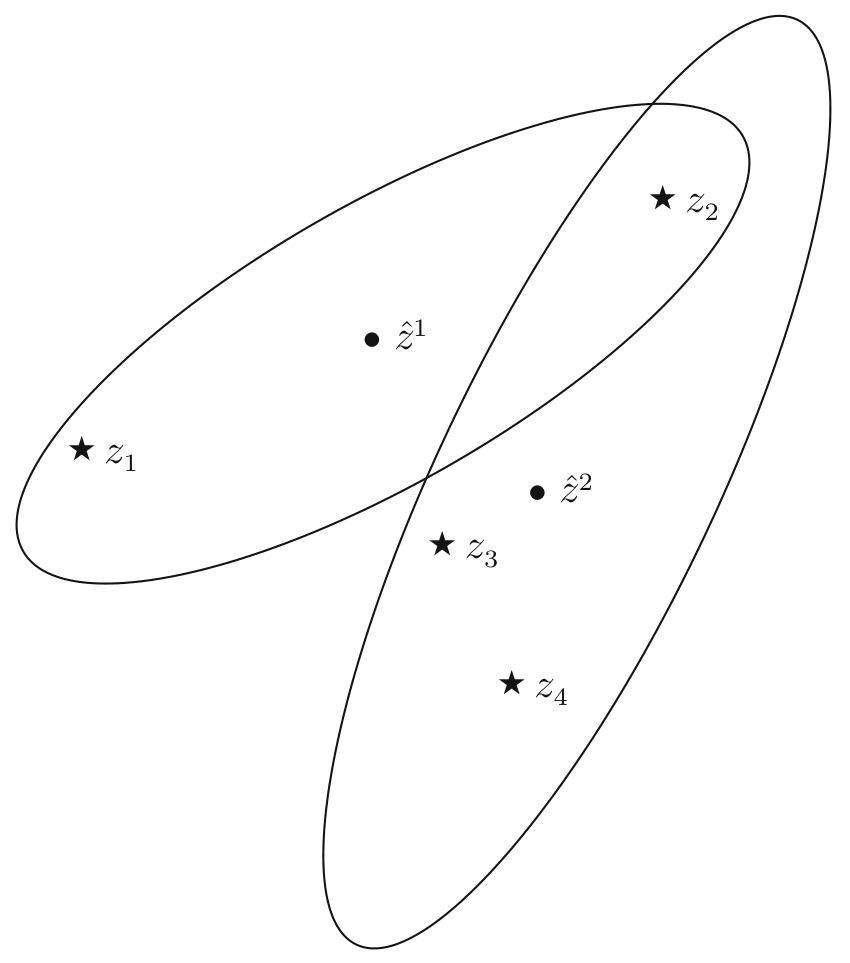

> Image description: Figure 2, titled "Data Association," illustrates a spatial scenario involving two overlapping elliptical validation regions representing tracks. Two distinct points denote the estimated track centers, labeled as $\hat{z}^1$ and $\hat{z}^2$, each marked with a small black dot. Four measurements are represented by star symbols, labeled $z_1, z_2, z_3,$ and $z_4$. The first ellipse, centered at $\hat{z}^1$, contains measurements $z_1$ and $z_2$. The second ellipse, centered at $\hat{z}^2$, contains measurements $z_2, z_3,$ and $z_4$. Notably, measurement $z_2$ is located within the intersection of both elliptical validation regions, creating an ambiguity in data association. Measurements $z_1$ is unique to the first track, while $z_3$ and $z_4$ are unique to the second track. The diagram demonstrates the engineering problem of determining which measurement belongs to which track when validation regions overlap.
Data Association, Fig. 2 Two tracks with a measurement in the intersection of their validation regions

Up to this point, it was assumed that a measurement could have originated from one of the targets or from clutter. However, in view of the fact that any signal processing system has an inherent finite resolution capability, an additional possibility has to be considered:
$z_{2}$ could be the result of the merging of the detections from the two targets - it is an unresolved measurement.
This constitutes a fourth origin hypothesis for a measurement that lies in the intersection of two validation regions. Most tracking algorithms ignore the possibility that a measurement is an unresolved one.

This illustrates only the difficulty of association of measurements to tracks at one point in time. The full problem, as will be discussed later, consists of associating measurements across time.

## Approaches to Tracking and Data Association

The problem of tracking and data association is a hybrid problem because it is characterized by:
(1) Continuous uncertainties - state estimation in the presence of continuous noises
(2) Discrete uncertainties - which measurement(s) should be used in the estimation process
Assuming the goal is to obtain the MMSE estimate of the target state - its conditional mean - one can distinguish the following approaches.

## Pure MMSE Approach

The Pure MMSE Approach to tracking and data association is obtained using the smoothing property of expectations (see, e.g., Bar-Shalom et al. 2001, Sect. 1.4.12), as follows:

$$
\begin{align*}
\hat{x}^{\mathrm{MMSE}} & =E[x \mid Z]=E\{E[x \mid A, Z] \mid Z\} \\
& =\sum_{A_{i} \in \mathcal{A}} E\left[x \mid A_{i}, Z\right] P\left\{A_{i} \mid Z\right\} \tag{5}
\end{align*}
$$

where $A$ is an association event (assuming a Bayesian model, with prior probabilities from which one can calculate posterior probabilities), and the summation is over all events $A_{i}$ in the set $\mathcal{A}$ of mutually exclusive and exhaustive association events.

The above, which requires the evaluation of all the conditional (posterior) probabilities $P\left\{A_{i} \mid Z\right\}$, is a direct consequence of the total probability theorem (see, e.g., Bar-Shalom et al. 2001, Sect. 1.4.10), which yields the conditional pdf of the state as the following mixture

$$
\begin{equation*}
p(x \mid Z)=\sum_{A_{i} \in \mathcal{A}} p\left(x \mid A_{i}, Z\right) P\left\{A_{i} \mid Z\right\} \tag{6}
\end{equation*}
$$

In the linear-Gaussian case the above becomes a Gaussian mixture. Algorithms that fall in this category are PDAF and JPDAF, see Bar-Shalom et al. (2011).

## MMSE-MAP Approach

The MMSE-MAP Approach, instead of enumerating and summing over all the association events, selects the one with highest posterior probability, namely,

$$
\begin{equation*}
A^{\mathrm{MAP}}=\arg \max _{i} P\left\{A_{i} \mid Z\right\} \tag{7}
\end{equation*}
$$


<!-- source_pdf_page: 279 -->
and then

$$
\begin{equation*}
\hat{x}^{\mathrm{MMSE}-\mathrm{MAP}}=E\left[x \mid A^{\mathrm{MAP}}, Z\right] \tag{8}
\end{equation*}
$$

The HOMHT as proposed by Reid (1979) falls in this category, see Bar-Shalom et al. (2011).

## MMSE-ML Approach

The MMSE-ML Approach does not assume priors for the association events and relies on the maximum likelihood approach to select the event, that is,

$$
\begin{equation*}
A^{\mathrm{ML}}=\arg \max _{i} p\left\{Z\left|A_{i}\right|\right\} \tag{9}
\end{equation*}
$$

and then

$$
\begin{equation*}
\hat{x}^{\mathrm{MMSE}-\mathrm{ML}}=E\left[x \mid A^{\mathrm{ML}}, Z\right] \tag{10}
\end{equation*}
$$

The TOMHT falls into this category and S-D assignment (or MDA) is an implementation of this, see Bar-Shalom et al. (2011).

## Heuristic Approaches

There are numerous simpler/heuristic approaches. The most common one relies on the distance metric (3) and makes the selection of which measurement is associated with which track based on the "nearest neighbor" rule. The same criterion can be used in a global cost function.

## Remarks

It should be noted that the MMSE-MAP estimate (8) and the MMSE-ML estimate (10) are obtained assuming that the selected association is correct - a hard decision. This hard decision is sometimes correct, sometimes wrong. On the other hand, the pure MMSE estimate (5) yields a soft decision - it averages over all the possibilities. This soft decision is never totally correct, never totally wrong.

The uncertainties (covariances) associated with the MMSE-MAP and MMSE-ML estimates might be optimistic in view of the above observation. The uncertainty associated with the pure MMSE estimate will be increased
(realistically) in view of the fact that it includes the data association uncertainty.

## Estimation and Data Association in Nonlinear Stochastic Systems

## The Model

Consider the discrete time stochastic system

$$
\begin{equation*}
\mathbf{x}(k+1)=f[k, \mathbf{x}(k), \mathbf{u}(k), \mathbf{v}(k)] \tag{11}
\end{equation*}
$$

where $\mathbf{x} \in \mathcal{R}^{n}$ is the stacked state vector of the targets under consideration, $\mathbf{u}(k)$ is a known input (included here for the sake of generality), and $\mathbf{v}(k)$ is the process noise with a known pdf. The measurements at time $k+1$ are described by the stacked vector

$$
\begin{equation*}
\mathbf{z}(k+1)=h[k+1, \mathbf{x}(k+1), A(k+1), \mathbf{w}(k+1)] \tag{12}
\end{equation*}
$$

where $A(k+1)$ is the data association event at $k+1$ that specifies (i) which measurement component originated from which components of $\mathbf{x}(k+1)$, namely, from which target, and (ii) which measurements are false, that is, originated from the clutter process. The vector $\mathbf{w}(k)$ is the observation noise, consisting of the error in the true measurement and the false measurements. The pdf of the false measurements and the probability mass function (pmf) of their number are also assumed to be known.

The noise sequences and false measurements are assumed to be white with known pdf and mutually independent. The initial state is assumed to have a known pdf and to be independent of the noises. Additional assumptions are given below for the optimal estimator, which evaluates the pdf of the state conditioned on the observations.

The optimal state estimator in the presence of data association uncertainty consists of the computation of the conditional pdf of the state $\mathbf{x}(k)$ given all the information available at time $k$, namely, the prior information about the initial state, the intervening inputs, and the sets of measurements through time $k$. The conditions under which the optimal state estimator consists of the computation of this pdf are presented in detail.


<!-- source_pdf_page: 280 -->
## The Optimal Estimator for the Pure MMSE Approach

The information set available at $k$ is

$$
\begin{equation*}
I^{k}=\left\{Z^{k}, U^{k-1}\right\} \tag{13}
\end{equation*}
$$

where

$$
\begin{equation*}
Z^{k} \triangleq\{\mathbf{z}(j)\}_{j=1}^{k} \tag{14}
\end{equation*}
$$

is the cumulative set of observations through time $k$, which subsumes the initial information $Z^{0}$, and $U^{k-1}$ is the set of known inputs prior to time $k$.

For a stochastic system, an information state (Striebel 1965) is a function of the available information set that summarizes the past of the system in a probabilistic sense.

It can be shown that the conditional pdf of the state

$$
\begin{equation*}
p_{k} \triangleq p\left[\mathbf{x}(k) \mid I^{k}\right] \tag{15}
\end{equation*}
$$

is an information state if (i) the two noise sequences (process and measurement) are white and mutually independent and (ii) the target detection and clutter/false measurement processes are white. Once the conditional pdf (15) is available, the pure MMSE estimator, i.e., the conditional mean, as well as the conditional variance, or covariance matrix, can be obtained.

The optimal estimator, which consists of the recursive functional relationship between the information states $p_{k+1}$ and $p_{k}$, is given by

$$
\begin{equation*}
p_{k+1}=\psi\left[k+1, p_{k}, \mathbf{z}(k+1), \mathbf{u}(k)\right] \tag{16}
\end{equation*}
$$

where

$$
\begin{align*}
\psi & {\left[k+1, p_{k}, \mathbf{z}(k+1), \mathbf{u}(k)\right] } \\
= & \frac{1}{c} \sum_{i=1}^{M(k+1)} p\left[\mathbf{z}(k+1) \mid \mathbf{x}(k+1), A_{i}(k+1)\right] \\
& \cdot \int p[\mathbf{x}(k+1) \mid \mathbf{x}(k), \mathbf{u}(k)] p_{k} d \mathbf{x}(k) \\
& P\left\{A_{i}(k+1)\right\} \tag{17}
\end{align*}
$$

is the transformation that maps $p_{k}$ into $p_{k+1}$; the integration in (17) is over the range of $\mathbf{x}(k)$ and $c$ is the normalization constant.

The recursion (17) shows that the optimal MMSE estimator in the presence of data association uncertainty has the following properties:
P 1 . The pdf $p_{k+1}$ is a weighted sum of pdfs, conditioned on the current time association events $A_{i}(k+1), i=1, \ldots, M(k+1)$, where $M(k+1)$ is the number of mutually exclusive and exhaustive association events at time $k+1$.
$\mathrm{P2}$. If the exact previous pdf, which is the sufficient statistic, is available, then only the most recent association event probabilities are needed at each time.
However, the number of terms of the mixture in the right-hand side of (17) is, by time $k+1$, given by the product

$$
\begin{equation*}
M^{k+1}=\prod_{i=1}^{k+1} M(i) \tag{18}
\end{equation*}
$$

which amounts to an exponential increase in time. This increase is similar to the increase in the number of the branches of the MHT hypothesis tree.

A detailed derivation of the recursion for the optimal estimator can be found in Bar-Shalom et al. (2011).

## Track-to-Track Association

In addition to measurement-to-track association (M2TA), an additional class of data association is track-to-track association (T2TA). Following T2TA, track-to-track fusion (T2TF) may be performed to (hopefully) improve the overall tracking accuracy. For more details on track fusion, see Bar-Shalom et al. (2011).

It is desired first to test the hypothesis that two tracks pertain to the same target. The optimal test would require using the entire data base (the sequences of measurements that form the tracks) through the present time $k$ and is not practical. In view of this, the test to be presented is based only on the most recent estimates from the tracks. The test based on the state estimates within a time window is discussed in Tian and Bar-Shalom (2009).


<!-- source_pdf_page: 281 -->
## Association of Tracks with Independent Errors

Let $\hat{x}^{i}(k)$ be the estimated state of a target by sensor $i$ with its own information processor. Assume that one has an estimate $\hat{x}^{j}(k)$ from sensor $j$, corresponding to the same time. Both can be current estimates or one can be a prediction as long as they pertain to the same time (the second time argument has been omitted for simplicity).

The corresponding covariances are denoted as $P^{m}(k), m=i, j$. The state estimation errors at different sensors (local trackers),

$$
\begin{align*}
& \tilde{x}^{i}(k)=x^{i}(k)-\hat{x}^{i}(k)  \tag{19}\\
& \tilde{x}^{j}(k)=x^{j}(k)-\hat{x}^{j}(k) \tag{20}
\end{align*}
$$

where $x^{i}$ and $x^{j}$ are the corresponding true states, are assumed to be independent. This is the state estimation error independence assumption.

Remark 2 As shown in the sequel, for independent sensors, the state estimation errors for the same target are dependent in the presence of process noise.

Denote the difference of the two estimates as

$$
\begin{equation*}
\hat{\Delta}^{i j}(k)=\hat{x}^{i}(k)-\hat{x}^{j}(k) \tag{21}
\end{equation*}
$$

This is the estimate of the difference of the true states

$$
\begin{equation*}
\Delta^{i j}(k)=x^{i}(k)-x^{j}(k) \tag{22}
\end{equation*}
$$

The same target hypothesis is that the true states are equal,

$$
\begin{equation*}
H_{0}: \quad \Delta^{i j}(k)=0 \tag{23}
\end{equation*}
$$

while the different target alternative is

$$
\begin{equation*}
H_{1}: \quad \Delta^{i j}(k) \neq 0 \tag{24}
\end{equation*}
$$

While (21) is the appropriate statistic to test whether (22) is zero or not, the rigorous proof of this fact is presented in Bar-Shalom et al. (2011).

The error in the difference between the state estimates

$$
\begin{equation*}
\tilde{\Delta}^{i j}(k)=\Delta^{i j}(k)-\hat{\Delta}^{i j}(k) \tag{25}
\end{equation*}
$$

is zero mean and has covariance

$$
\begin{align*}
T^{i j}(k) & \triangleq E\left\{\tilde{\Delta}^{i j}(k) \tilde{\Delta}^{i j}(k)^{\prime}\right\} \\
& =E\left\{\left[\tilde{x}^{i}(k)-\tilde{x}^{j}(k)\right]\left[\tilde{x}^{i}(k)-\tilde{x}^{j}(k)\right]^{\prime}\right\} \tag{26}
\end{align*}
$$

given, under the error independence assumption, by

$$
\begin{equation*}
T^{i j}(k)=P^{i}(k)+P^{j}(k) \tag{27}
\end{equation*}
$$

Assuming the estimation errors to be Gaussian, the test of $H_{0}$ vs. $H_{1}$ - the T2TA test - is

Accept $H_{0}$ if

$$
\begin{equation*}
D \triangleq \hat{\Delta}^{i j}(k)^{\prime}\left[T^{i j}(k)\right]^{-1} \hat{\Delta}^{i j}(k) \leq D_{\alpha} \tag{28}
\end{equation*}
$$

The threshold $D_{\alpha}$ is such that

$$
\begin{equation*}
P\left\{D>D_{\alpha} \mid H_{0}\right\}=\alpha \tag{29}
\end{equation*}
$$

where, e.g., $\alpha=0.01$. From the Gaussian assumption, the threshold is the $1-\alpha$ point of the chi-square distribution with $n_{z}$ degrees of freedom (Bar-Shalom et al. 2001)

$$
\begin{equation*}
D_{\alpha}=\chi_{n_{z}}^{2}(1-\alpha) \tag{30}
\end{equation*}
$$

## Association of Tracks with Dependent Errors

In the previous section, the association testing was done under the assumption that the estimation errors in these tracks are independent. However, as shown in Bar-Shalom et al. (2011), whenever there is process noise (or, in general, motion uncertainty), the track errors based on data from independent sensors are dependent.

The dependence between the estimation errors $\tilde{x}^{i}(k \mid k)$ and $\tilde{x}^{j}(k \mid k)$ from the two tracks arises from the common process noise which contributes to both errors. This is due to the fact that there is a common motion equation for both trackers.

The testing of the hypothesis that the two tracks under consideration originated from the same target is done in the same manner as before,


<!-- source_pdf_page: 282 -->
except for the following modification to account for the dependence of their state estimation errors.

The covariance associated with the difference of the estimates

$$
\begin{equation*}
\hat{\Delta}^{i j}(k)=\hat{x}^{i}(k \mid k)-\hat{x}^{j}(k \mid k) \tag{31}
\end{equation*}
$$

is, accounting for the dependence,

$$
\begin{align*}
T^{i j}(k) \triangleq & E\left\{\tilde{\Delta}^{i j}(k) \tilde{\Delta}^{i j}(k)^{\prime}\right\} \\
= & E\left\{[ \tilde { x } ^ { i } ( k | k ) - \tilde { x } ^ { j } ( k | k ) ] \left[\tilde{x}^{i}(k \mid k)\right.\right. \\
& \left.\left.-\tilde{x}^{j}(k \mid k)\right]^{\prime}\right\} \tag{32}
\end{align*}
$$

and, with the known cross-covariance $P^{i j}$, is given by the expression

$$
\begin{align*}
T^{i j}(k)= & P^{i}(k \mid k)+P^{j}(k \mid k) \\
& -P^{i j}(k \mid k)-P^{j i}(k \mid k) \tag{33}
\end{align*}
$$

Note the difference between the above and (27).

## Effect of the Dependence

The effect of the dependence between the estimation errors is to reduce the covariance of the difference (31) of the estimates. This is due to the fact that the cross-covariance term reflects a positive correlation between the estimation errors (this is always the case for linear systems).

## The Test

The hypothesis testing for the track-to-track association with the dependence accounted for is done in the same manner as before in (28), except that the "smaller" covariance from (33) is used in the test statistic, which is, as before, the normalized distance squared between the estimates

$$
\begin{equation*}
D=\hat{\Delta}^{i j}(k)^{\prime}\left[T^{i j}(k)\right]^{-1} \hat{\Delta}^{i j}(k) \tag{34}
\end{equation*}
$$

## The Cross-Covariance of the Estimation Errors

The cross-covariance recursion for synchronized sensors can be shown to be (see BarShalom et al. 2011)

$$
\begin{align*}
P^{i j}(k \mid k) \triangleq & E\left[\tilde{x}^{i}(k \mid k) \tilde{x}^{j}(k \mid k)^{\prime}\right] \\
= & {\left[I-W^{i}(k) H^{i}(k)\right] } \\
& \cdot\left[F(k-1) P^{i j}(k-1 \mid k-1) F(k-1)^{\prime}\right. \\
& +Q(k-1)]\left[I-W^{j}(k) H^{j}(k)\right]^{\prime} \tag{35}
\end{align*}
$$

This is a linear recursion - a Lyapunov-type equation - and its initial condition is, assuming the initial errors to be uncorrelated,

$$
\begin{equation*}
P^{i j}(0 \mid 0)=0 \tag{36}
\end{equation*}
$$

This is a reasonable assumption in view of the fact that the initial estimates are usually based on the initial measurements, which were assumed to have independent errors.

The cross-covariance for the case of asynchronous sensors can be found in Bar-Shalom et al. (2011).

## Summary and Future Directions

This entry surveyed the issues involved in data association (specifically M2TA and T2TA) with regard to multitarget-multisensor tracking systems.

The future developments in this topic will be in regard to the use of new feature variables and classification in data association (some preliminary results are in Bar-Shalom et al. (2011)).

## Cross-References

- Estimation for Random Sets
- Estimation, Survey on


## Bibliography

Bar-Shalom Y, Li XR, Kirubarajan T (2001) Estimation with applications to tracking and navigation: theory, algorithms and software. Wiley, New York
Bar-Shalom Y, Willett PK, Tian X (2011) Tracking and data fusion. YBS, Storrs


<!-- source_pdf_page: 283 -->
Blackman SS, Popoli R (1999) Design and analysis of modern tracking systems. Artech House, Norwood
Mallick M, Krishnamurthy V, Vo BN (eds) (2013) Integrated tracking, classification, and sensor management. Wiley, Hoboken
Reid DB (1979) An algorithm for tracking multiple targets. IEEE Trans Autom Control 24:843-854
Striebel C (1965) Sufficient statistics in the optimum control of stochastic systems. J Math Anal Appl 12:576592
Tian X, Bar-Shalom Y (2009) Track-to-track fusion configurations and association in a sliding window. J Adv Inf Fusion 4(2): 146-164

## Data Rate of Nonlinear Control Systems and Feedback Entropy

Christoph Kawan<br>Courant Institute of Mathematical Sciences, New York University, New York, USA


#### Abstract

Topological feedback entropy is a measure for the smallest information rate in a digital communication channel between the coder and the controller of a control system, above which the control task of rendering a subset of the state space invariant can be solved. It is defined purely in terms of the open-loop system without making reference to a particular coding and control scheme and can also be regarded as a measure for the inherent rate at which the system generates "invariance information."


## Keywords

Communication constraints; Controlled invariance; Invariance entropy; Minimal data rates; Stabilization

## Introduction

In the theory of networked control systems, the assumption of classical control theory that information can be transmitted within control loops
instantaneously, lossless, and with arbitrary precision is no longer satisfied. Realistic mathematical models of many important real-world communication and control networks have to take into account general data rate constraints in the communication channels, time delays, partial loss of information, and variable network topologies. This raises the question about the smallest possible information rate above which a given control task can be solved. Though networked control systems can have a complicated topology, consisting of multiple sensors, controllers, and actuators, a first step towards understanding the problem of minimal data rates is to analyze the simplest possible network topology, consisting of one controller and one dynamical system connected by a digital channel with a certain rate in bits per unit time. There is a wealth of literature concerned with the problem of stabilizing a system under different assumptions about the specific coding and control scheme, in this context. However, with few exceptions, mainly linear systems (both deterministic and stochastic) have been considered. A comprehensive and detailed overview of this literature until 2007 can be found in the survey Nair et al. (2007). The first systematic approach to the problem of minimal data rates for set invariance and stabilization of (deterministic, nonlinear) control systems was presented in Nair et al. (2004), where the notion of topological feedback entropy was introduced. This quantity, defined in terms of the open-loop control system, is a measure for the smallest data rate a communication channel may have if the system is supposed to solve the control task of rendering a subset of the state space invariant. Other challenges that digital communication channels come along with are not yet taken into account here.

Feedback entropy was first introduced in Nair et al. (2004), using a similar approach via open covers as in the definition of topological entropy of for classical dynamical systems in Adler et al. (1965). In Colonius and Kawan (2009), a quantity named invariance entropy was defined which later turned out to be equivalent to the feedback entropy of Nair et al. (cf. Colonius et al. 2013). The notion of invariance entropy has been further


<!-- source_pdf_page: 284 -->
studied in the papers Kawan (2011a), Kawan (2011b), and Kawan (2011c). Several variations and generalizations have been introduced in Colonius (2010), Colonius (2012), Colonius and Kawan (2011), Da Silva (2013), and Hagihara and Nair (2013). The research monograph Kawan (2013) provides a comprehensive presentation of the results obtained so far in the deterministic case.

## Definition

Topological feedback entropy is a nonnegative real-valued quantity which serves as a measure for the smallest possible data rate in a digital channel, connecting a coder to a controller, above which the controller is able to generate inputs which guarantee invariance of a given subset of the state space. In the literature, one finds several slightly differing versions. The original definition given in Nair et al. (2004) is (with minor modifications) as follows. Consider a discrete-time control system

$$
x_{k+1}=F\left(x_{k}, u_{k}\right)=F_{u_{k}}\left(x_{k}\right), \quad k \geq 0,
$$

with $F: X \times U \rightarrow X$, where $X$ is a topological space and $U$ a nonempty set such that $F_{u}: X \rightarrow X$ is continuous for every $u \in U$. The transition map associated to this system is

$$
\begin{gathered}
\varphi: \mathbb{N}_{0} \times X \times U^{\mathbb{N}_{0}} \rightarrow X, \\
\varphi\left(k, x,\left(u_{n}\right)\right):=F_{u_{k-1}} \circ \cdots \circ F_{u_{1}} \circ F_{u_{0}}(x) .
\end{gathered}
$$

A compact subset $K \subset X$ with nonempty interior is (strongly) controlled invariant if for every $x \in K$ there is an input $u \in U$ such that $F_{u}(x) \in \operatorname{int} K$. A triple ( $\mathcal{A}, \tau, G$ ) is called an invariant open cover of $K$ if $\mathcal{A}$ is an open cover of $K$, $\tau$ is a positive integer, and $G: \mathcal{A} \rightarrow U^{\tau}$ is a map with components $G_{0}, G_{1}, \ldots, G_{\tau-1}$ which assign control values to all sets in $\mathcal{A}$ such that for every $A \in \mathcal{A}$ the finite sequence of controls $G(A)$ yields $\varphi(k, A, G(A)) \subset \operatorname{int} K$ for $k=1,2 \ldots, \tau$. The entropy of ( $\mathcal{A}, \tau, G$ ) is defined as follows. For every sequence $\alpha=\left(A_{i}\right)_{i \geq 0}$ of sets in $\mathcal{A}$ one defines an associated sequence of controls by

$$
\begin{aligned}
\underline{u}(\alpha) & =\left(u_{0}, u_{1}, u_{2}, \ldots\right) \quad \text { with }\left(u_{l}\right)_{l=(i-1) \tau}^{i \tau-1} \\
& =G\left(A_{i-1}\right) \quad \text { for all } i \geq 0,
\end{aligned}
$$

and for every $j \geq 1$ a set

$$
\begin{aligned}
B_{j}(\alpha):= & \left\{x \in X: \varphi(i \tau, x, \underline{u}(\alpha)) \in A_{i}\right. \\
& \text { for } i=0,1, \ldots, j-1\} .
\end{aligned}
$$

The family $\mathcal{B}_{j}:=\left\{B_{j}(\alpha): \alpha \in \mathcal{A}^{\mathbb{N}_{0}}\right\}$ is an open cover of $K$. Letting $N\left(\mathcal{B}_{j} \mid K\right)$ denote the minimal cardinality of a finite subcover, the entropy of ( $\mathcal{A}, \tau, G$ ) is

$$
\begin{aligned}
h(\mathcal{A}, \tau, G): & =\lim _{j \rightarrow \infty} \frac{1}{j \tau} \log _{2} N\left(\mathcal{B}_{j} \mid K\right) \\
& =\inf _{j \geq 1} \frac{1}{j \tau} \log _{2} N\left(\mathcal{B}_{j} \mid K\right) .
\end{aligned}
$$

Finally, the topological feedback entropy (TFE) of $K$ is given by

$$
h_{\mathrm{fb}}(K):=\inf _{(\mathcal{A}, \tau, G)} h(\mathcal{A}, \tau, G),
$$

where the infimum is taken over all invariant open covers of $K$.

A conceptually simpler but equivalent definition, introduced in Colonius and Kawan (2009), is the following. A subset $\mathcal{S} \subset U^{\tau}$ is called ( $\tau, K$ )-spanning if for every $x \in K$ there is $\underline{u} \in \mathcal{S}$ with $\varphi(k, x, \underline{u}) \in \operatorname{int} K$ for $k=1, \ldots, \tau$. Writing $r_{\text {inv }}(\tau, K)$ for the minimal cardinality of such a set, it can be shown that

$$
\begin{aligned}
h_{\mathrm{fb}}(K) & =\lim _{\tau \rightarrow \infty} \frac{1}{\tau} \log _{2} r_{\mathrm{inv}}(\tau, K) \\
& =\inf _{\tau \geq 1} \frac{1}{\tau} \log _{2} r_{\mathrm{inv}}(\tau, K) .
\end{aligned}
$$

This definition and several variations of it are mostly referred to by the name invariance entropy instead of feedback entropy. The intuition behind this definition is that a controller which receives a certain amount of information about the state, say $n$ bits, can generate at most $2^{n}$ different control sequences to steer the system on a finite time interval and hence, the number of control sequences needed to


<!-- source_pdf_page: 285 -->
accomplish the control task on this interval is a measure for the necessary amount of information.

The different variations of feedback or invariance entropy which can be found in the literature are briefly summarized as follows. For simplicity, in this entry we refer to several of these variations by the name (topological) feedback entropy:
(i) Instead of requiring that trajectories enter the interior of $K$ after one step of time, one can allow for a waiting time $\tau_{0}$ before entering $\operatorname{int} K$.
(ii) One can require that trajectories stay in $K$ instead of $\operatorname{int} K$ or that they stay in an arbitrarily small neighborhood of $K$, respectively.
(iii) One can restrict the set of initial states to a subset of $K^{\prime} \subset K$. In this case, a set $\mathcal{S}$ of control sequences is ( $\tau, K^{\prime}, K$ )-spanning if for every $x \in K^{\prime}$ there is $\underline{u} \in \mathcal{S}$ with $\varphi(k, x, \underline{u}) \in \operatorname{int} K$ for $k=1, \ldots, \tau$.
(iv) Feedback entropy can be defined for other classes of systems, e.g., continuous-time deterministic systems, random control systems, or systems with piecewise continuous righthand sides.
There is also a local version of topological feedback entropy (LTFE) which measures the smallest data rate for local uniform asymptotic stabilization at an equilibrium. Also for other control tasks there have been attempts to define corresponding versions of feedback or invariance entropy.

## Comparison to Topological Entropy

Though there are similarities in the definitions of TFE and topological entropy of dynamical systems, which also reflect in similar properties, there is no direct relation between these two quantities. Topological entropy detects exponential complexity in the orbit structure of a dynamical system. In contrast, TFE measures the complexity of the control task to keep a system in a subset of the state space by applying appropriate inputs. If no escape from this subset is possible, the TFE is zero, no matter how complicated the orbit structure is. Hence, topological entropy is sensitive to the local behavior of the system,
while TFE in general is not. Interpreted in terms of information rates, topological entropy is a measure for the largest average rate of information about the initial state a dynamical system can generate. TFE measures the smallest rate of information about the state of the system above which a controller is able to render the set invariant. It should also be mentioned that topological entropy was first introduced as a topological counterpart of the measure-theoretic entropy defined by Kolmogorov and Sinai, and that the two notions are related by the variational principle, which asserts that the topological entropy is the supremum of the measure-theoretic entropies with respect to all invariant probability measures of the given system. For TFE, so far no convincing measuretheoretic approach exists. An excellent survey on the entropy theory of dynamical systems can be found in Katok (2007).

## The Data Rate Theorem

The data rate theorem for the TFE confirms that the infimal data rate in a coding and control loop which guarantees strong controlled invariance of a set $K$ is equal to $h_{\mathrm{fb}}(K)$. More precisely, suppose that a sensor which measures the state of the system at discrete times $\tau_{k}=k \tau, k=0,1,2, \ldots$, is connected to a coder which at time $\tau_{k}$ has a finite alphabet $S_{k}$ of symbols available. The measured state is coded by use of this alphabet and the corresponding symbol is sent via a noiseless digital channel to a controller which generates an input sequence of length $\tau$. This sequence is used to steer the system until the next symbol arrives at time $\tau_{k+1}$. The associated asymptotic average bit rate, which depends on the sequence $S=\left(S_{k}\right)_{k \geq 0}$ of coding alphabets, is given by

$$
R(S)=\lim _{k \rightarrow \infty} \frac{1}{k \tau} \sum_{i=0}^{k-1} \log _{2}\left|S_{i}\right| .
$$

If the limit does not exist, one may replace it with liminf or lim sup. The data rate theorem establishes the equality

$$
h_{\mathrm{fb}}(K)=\inf _{S} R(S)
$$


<!-- source_pdf_page: 286 -->
where the infimum is taken over all coding and control loops which guarantee strong controlled invariance of $K$, i.e., for initial states in $K$ they generate trajectories $\left(x_{k}\right)_{k \geq 0}$ with $x_{k} \in \operatorname{int} K$ for $k=1,2, \ldots$. Similar data rate theorems can be proved for other variants of feedback entropy. In particular, the data rate theorem for the LTFE asserts that the infimal bit rate for local uniform asymptotic stabilization at an equilibrium is given by the LTFE. Proofs of different data rate theorems can be found in Nair et al. (2004), Hagihara and Nair (2013), and Kawan (2013).

## Estimates and Formulas

## Linear Systems

For linear systems, under reasonable assumptions, the feedback entropy is given by the sum of the unstable eigenvalues of the dynamical matrix, i.e., if the system is given by $x_{k+1}=A x_{k}+B u_{k}$, then

$$
\begin{equation*}
h_{\mathrm{fb}}(K)=\sum_{\lambda \in \operatorname{Sp}(A)} \max \left\{0, n_{\lambda} \log _{2}|\lambda|\right\}, \tag{1}
\end{equation*}
$$

where $\operatorname{Sp}(A)$ denotes the spectrum of $A$ and $n_{\lambda}$ is the algebraic multiplicity of the eigenvalue $\lambda$ (cf. Colonius and Kawan 2009). It is worth to mention that the TFE therefore coincides with the topological entropy of the uncontrolled system $x_{k+1}=A x_{k}$, as defined by Bowen for maps on non-compact metric spaces (cf. Bowen 1971). However, this is a special property of linear systems and is related to the facts that (i) there is no difference between the local and the global dynamical behavior of uncontrolled linear systems and that (ii) the control sequence does not affect the exponential complexity of the dynamics, since it only appears as an additive term in the transition map of the system. Formula (1) is in correspondence with several former results on minimal data rates for stabilization of linear systems. Thinking of the definition of feedback entropy via spanning sets of control sequences, its interpretation is that in order to guarantee invariance of a bounded set, the only reason for exponential growth of the number of necessary
inputs as time increases is the volume expansion of the open-loop system in the unstable subspace.

## Upper Bounds Under Controllability Assumptions

If the state space of the control system is a differentiable manifold and the right-hand side is continuously differentiable, under certain controllability assumptions upper bounds for the feedback entropy can be formulated in terms of the Lyapunov exponents of periodic trajectories (for the concept of Lyapunov exponents, see, e.g., Barreira and Valls 2008) (cf. Kawan 2011b, 2013; Nair et al. 2004). More precisely, if there is a periodic trajectory in the interior of the given set $K$ such that the linearization along this trajectory is controllable, and if complete approximate controllability holds on the interior of $K$ (cf. Colonius and Kliemann 2000), then

$$
\begin{equation*}
h_{\mathrm{fb}}(K) \leq \sum_{\lambda} \max \left\{0, n_{\lambda} \lambda\right\}, \tag{2}
\end{equation*}
$$

where the sum is taken over all Lyapunov exponents $\lambda$ of the periodic trajectory and $n_{\lambda}$ denotes the multiplicity of $\lambda$. Using the definition of feedback entropy in terms of ( $\tau, K$ )-spanning sets, one can prove this by constructing spanning sets of control functions which first steer all initial states in $K$ into a small neighborhood of a point on the given periodic orbit and then, by use of local controllability, keep the corresponding trajectories in a neighborhood of the periodic trajectory for arbitrary future times. Similar ideas first have been used in Nair et al. (2004) to prove that the LTFE at an equilibrium is given by the sum of the unstable eigenvalues of the linearization about this equilibrium. For systems given by differential equations the upper estimate (2) can be improved under additional regularity assumptions. Assuming that the system is smooth and satisfies the strong jet accessibility rank condition (cf. Coron 1994), one can show that both assumptions, controllability of the linearization and periodicity, can be omitted. The only restriction that remains is that the trajectory must not leave a compact subset of the interior of $K$. However, in the case of nonperiodic trajectories, the sum


<!-- source_pdf_page: 287 -->
of the positive Lyapunov exponents has to be replaced by the maximal Lyapunov exponent of the induced linear flow on the exterior bundle of the manifold. For control-affine systems, strong jet accessibility can be weakened to local accessibility. In general, it is unlikely that such upper bounds are tight, since they are related to very specific control strategies for making the given set invariant.

## Lower Bounds, Volume Growth Rates, and Escape Rates

A general approach to obtain lower bounds of feedback entropy is via a volume growth argument, which in its simplest form works as follows. Every ( $\tau, K$ )-spanning set $\mathcal{S}$ defines a cover of $K$, consisting of the sets (cf. Kawan 2011a,c)

$$
\begin{gathered}
K_{\tau, \underline{u}}=\{x \in K: \varphi(k, x, \underline{u}) \in \operatorname{int} K, \\
1 \leq k \leq \tau\}, \quad \underline{u} \in \mathcal{S} .
\end{gathered}
$$

It follows that $\varphi_{\tau, \underline{u}}\left(K_{\tau, \underline{u}}\right) \subset K$ and hence, since $K$ is bounded, the volume expansion under $\varphi_{\tau, \underline{u}}= \varphi(\tau, \cdot, \underline{u})$ gives upper bounds for the volumes of the sets $K_{\tau, \underline{u}}$, which result in a lower bound for the number of these sets. For instance, the lower estimate in (1) can be established by applying this argument to the system which arises by projection of the given linear system to the unstable subspace of the uncontrolled part $x_{k+1}= A x_{k}$. A refinement of this idea also leads to lower estimates of feedback entropy for inhomogeneous bilinear systems in terms of volume growth rates or Lyapunov exponents on unstable bundles, respectively. For nonlinear systems, in general only very rough estimates can be obtained by this method. However, a variation of the volume growth argument leads to a lower bound of the form

$$
h_{\mathrm{fb}}(K) \geq-\liminf _{\tau \rightarrow \infty} \frac{1}{\tau} \log \sup _{\underline{u}} \mu\left(K_{\tau, \underline{u}}\right),
$$

where $\mu$ denotes a reference measure on the state space. The right-hand side of this inequality can be considered as a uniform escape rate from the
set $K$, which under sufficiently strong hyperbolicity assumptions can be estimated in terms of other quantities such as Lyapunov exponents and dynamical entropies. Key references for escape rates in the classical theory of dynamical systems are (Young (1990) and Demers and Young (2006)).

## Summary and Future Directions

The theory of feedback entropy for finitedimensional deterministic systems is very far from being complete. The currently available results only give valuable information in very regular situations, and even those are not fully understood. For the further development of this theory, it will be necessary to combine control-theoretic methods with techniques from different fields such as classical, random, and nonautonomous dynamical systems. Some of the main focuses of future research will probably be the following:

- The generalization of feedback entropy to more complex network topologies
- The formulation of a feedback entropy theory for stochastic systems
- The development of a probabilistic (resp. measure-theoretic) version of feedback entropy for both deterministic and stochastic systems, which is related to the topological version via a variational principle
- The numerical computation of feedback entropy


## Cross-References

- Quantized Control and Data Rate Constraints


## Bibliography

Adler RL, Konheim AG, McAndrew MH (1965) Topological entropy. Trans Amer Math Soc 114:309-319
Barreira L, Valls C (2008) Stability of nonautonomous differential equations. Lecture notes in mathematics, vol. 1926. Springer, Berlin


<!-- source_pdf_page: 288 -->
Bowen R (1971) Entropy for group endomorphisms and homogeneous spaces. Trans Am Math Soc 153:401-414
Colonius F (2010) Minimal data rates and invariance entropy. Electronic Proceedings of the conference on mathematical theory of networks and systems (MTNS), Budapest, 5-9 July 2010
Colonius F (2012) Minimal bit rates and entropy for stabilization. SIAM J Control Optim 50: 2988-3010
Colonius F, Kawan C (2009) Invariance entropy for control systems. SIAM J Control Optim 48: 1701-1721
Colonius F, Kawan C (2011) Invariance entropy for outputs. Math Control Signals Syst 22: 203-227
Colonius F, Kliemann W (2000) The dynamics of control. Birkhäuser-Verlag, Boston
Colonius F, Kawan C, Nair GN (2013) A note on topological feedback entropy and invariance entropy. Syst Control Lett 62:377-381
Coron J-M (1994) Linearized control systems and applications to smooth stabilization. SIAM J Control Optim 32:358-386
Da Silva AJ (2013) Invariance entropy for random control systems. Math Control Signals Syst 25: 491-516
Demers MF, Young L-S (2006) Escape rates and conditionally invariant measures. Nonlinearity 19:377-397
Hagihara R, Nair GN (2013) Two extensions of topological feedback entropy. Math Control Signals Syst 25:473-490
Katok A (2007) Fifty years of entropy in dynamics: 19582007. J Mod Dyn 1:545-596

Kawan C (2011a) Upper and lower estimates for invariance entropy. Discret Contin Dyn Syst 30:169-186
Kawan C (2011b) Invariance entropy of control sets. SIAM J Control Optim 49:732-751
Kawan C (2011c) Lower bounds for the strict invariance entropy. Nonlinearity 24:1910-1935
Kawan C (2013) Invariance entropy for deterministic control systems - an introduction. Lecture notes in mathematics vol 2089. Springer, Berlin
Nair GN, Evans RJ, Mareels IMY, Moran W (2004) Topological feedback entropy and nonlinear stabilization. IEEE Trans Autom Control 49:1585-1597
Nair GN, Fagnani F, Zampieri S, Evans RJ (2007) Feedback control under data rate constraints: an overview. Proc IEEE 95:108-137
Young L-S (1990) Large deviations in dynamical systems. Trans Am Math Soc 318:525-543

## DES

Models for Discrete Event Systems: An Overview

# Deterministic Description of Biochemical Networks

Jörg Stelling and Hans-Michael Kaltenbach ETH Zürich, Basel, Switzerland


#### Abstract

Mathematical models of living systems are often based on formal representations of the underlying reaction networks. Here, we present the basic concepts for the deterministic nonspatial treatment of such networks. We describe the most prominent approaches for steady-state and dynamic analysis using systems of ordinary differential equations.


## Keywords

Michaelis-Menten kinetics; Reaction networks; Stoichiometry

## Introduction

A biochemical network describes the interconversion of biochemical species such as proteins or metabolites by chemical reactions. Such networks are ubiquitous in living cells, where they are involved in a variety of cellular functions such as conversion of metabolites into energy or building material of the cell, detection and processing of external and internal signals of nutrient availability or environmental stress, and regulation of genetic programs for development.

## Reaction Networks

A biochemical network can be modeled as a dynamic system with the chemical concentration of each species taken as the states and dynamics described by the changes in species concentrations as they are converted by reactions. Assuming that species are homogeneously distributed in the reaction volume and that copy numbers are sufficiently high, we may ignore spatial and stochastic


<!-- source_pdf_page: 289 -->
effects and derive a system of ordinary differential equations (ODEs) to model the dynamics.

Formally, a biochemical network is given by $r$ reactions $R_{1}, \ldots, R_{r}$ acting on $n$ different chemical species $S_{1}, \ldots, S_{n}$. Reaction $R_{j}$ is given by

$$
\begin{aligned}
R_{j}: & \alpha_{1, j} S_{1}+\cdots+\alpha_{n, j} S_{n} \longrightarrow \beta_{1, j} S_{1} \\
& +\cdots+\beta_{n, j} S_{n}
\end{aligned}
$$

where $\alpha_{i, j}, \beta_{i, j} \in \mathbb{N}$ are called the molecularities of the species in the reaction. Their differences form the stoichiometric matrix $\mathbf{N}=\left(\beta_{i, j}-\right. \left.\alpha_{i, j}\right)_{i=1 \ldots n, j=1 \ldots r}$, with $N_{i, j}$ describing the net effect of one turnover of $R_{j}$ on the copy number of species $S_{i}$. The $j$ th column is also called the stoichiometry of reaction $R_{j}$. The system can be opened to an un-modeled environment by introducing inflow reactions $\emptyset \rightarrow S_{i}$ and outflow reactions $S_{i} \rightarrow \emptyset$.

For example, consider the following reaction network:

$$
\begin{array}{rlr}
R_{1}: & E+S & \rightarrow E \cdot S \\
R_{2}: & E \cdot S & \rightarrow E+S \\
R_{3}: & E \cdot S & \rightarrow E+P
\end{array}
$$

Here, an enzyme $E$ (a protein that acts as a catalyst for biochemical reactions) binds to a substrate species $S$, forming an intermediate complex $E \cdot S$ and subsequently converting $S$ into a product $P$. Note that the enzyme-substrate binding is reversible, while the conversion to a product is irreversible. This network contains $r=3$ reactions interconverting $n=4$ chemical species $S_{1}=S, S_{2}=P, S_{3}=E$, and $S_{4}= E \cdot S$. The stoichiometric matrix is

$$
\mathbf{N}=\left(\begin{array}{ccc}
-1 & +1 & 0 \\
0 & 0 & +1 \\
-1 & +1 & +1 \\
+1 & -1 & -1
\end{array}\right)
$$

## Dynamics

Let $\mathbf{x}(t)=\left(x_{1}(t), \ldots, x_{n}(t)\right)^{T}$ be the vector of concentrations, that is, $x_{i}(t)$ is the concentration of $S_{i}$ at time $t$. Abbreviating this state vector as $\mathbf{x}$
by dropping the explicit dependence on time, its dynamics is governed by a system of $n$ ordinary differential equations:

$$
\begin{equation*}
\frac{d}{d t} \mathbf{x}=\mathbf{N} \cdot \mathbf{v}(\mathbf{x}, \mathbf{p}) \tag{1}
\end{equation*}
$$

Here, the reaction rate vector $\mathbf{v}(\mathbf{x}, \mathbf{p})= \left(v_{1}\left(\mathbf{x}, \mathbf{p}_{1}\right), \ldots, v_{r}\left(\mathbf{x}, \mathbf{p}_{r}\right)\right)^{T}$ gives the rate of conversion of each reaction per unit-time as a function of the current system state and of a set of parameters $\mathbf{p}$.

A typical reaction rate is given by the massaction rate law

$$
v_{j}\left(\mathbf{x}, \mathbf{p}_{j}\right)=k_{j} \cdot \prod_{i=1}^{n} x_{i}^{\alpha_{i, j}}
$$

where the rate constant $k_{j}>0$ is the only parameter and the rate is proportional to the concentration of each species participating as an educt (consumed component) in the respective reaction.

Equation (1) decomposes the system into a time-independent and linear part described solely by the topology and stoichiometry of the reaction network via $\mathbf{N}$ and a dynamic and typically nonlinear part given by the reaction rate laws $\mathbf{v}(\cdot, \cdot)$. One can define a directed graph of the network with one vertex per state and take $\mathbf{N}$ as the (weighted) incidence matrix. Reaction rates are then properties of the resulting edges. In essence, the equation describes the change of each species' concentration as the sum of the current reaction rates. Each rate is weighted by the molecularity of the species in the corresponding reaction; it is negative if the species is consumed by the reaction and positive if it is produced.

Using mass-action kinetics throughout, and using the species name instead of the numeric subscript, the reaction rates and parameters of the example network are given by

$$
\begin{aligned}
v_{1}\left(\mathbf{x}, \mathbf{p}_{1}\right) & =k_{1} \cdot x_{E}(t) \cdot x_{S}(t) \\
v_{2}\left(\mathbf{x}, \mathbf{p}_{2}\right) & =k_{2} \cdot x_{E \cdot S}(t) \\
v_{3}\left(\mathbf{x}, \mathbf{p}_{3}\right) & =k_{3} \cdot x_{E \cdot S}(t) \\
\mathbf{p} & =\left(k_{1}, k_{2}, k_{3}\right)
\end{aligned}
$$


<!-- source_pdf_page: 290 -->
The system equations are then

$$
\begin{aligned}
\frac{d}{d t} x_{S} & =-k_{1} \cdot x_{S} \cdot x_{E}+k_{2} \cdot x_{E \cdot S} \\
\frac{d}{d t} x_{P} & =k_{3} \cdot x_{E \cdot S} \\
\frac{d}{d t} x_{E} & =-k_{1} \cdot x_{S} \cdot x_{E}+k_{2} \cdot x_{E \cdot S}+k_{3} \cdot x_{E \cdot S} \\
\frac{d}{d t} x_{E \cdot S} & =k_{1} \cdot x_{S} \cdot x_{E}-k_{2} \cdot x_{E \cdot S}-k_{3} \cdot x_{E \cdot S}
\end{aligned}
$$

## Steady-State Analysis

A reaction network is in steady state if the production and consumption of each species are balanced. Steady-state concentrations $\mathbf{x}^{\boldsymbol{*}}$ then satisfy the equation

$$
\mathbf{0}=\mathbf{N} \cdot \mathbf{v}\left(\mathbf{x}^{*}, \mathbf{p}\right)
$$

Computing steady-state concentrations requires explicit knowledge of reaction rates and their parameter values. For biochemical reaction networks, these are often very difficult to obtain. An alternative is the computation of steady-state fluxes $\mathbf{v}^{*}$, which only requires solving the system of homogeneous linear equations

$$
\begin{equation*}
\mathbf{0}=\mathbf{N} \cdot \mathbf{v} . \tag{2}
\end{equation*}
$$

Lower and upper bounds $v_{i}^{l}, v_{i}^{u}$ for each flux $v_{i}$ can be given such that $v_{i}^{l} \leq v_{i} \leq v_{i}^{u}$; an example is an irreversible reaction $R_{i}$ which implies $v_{i}^{l}=0$. The set of all feasible solutions then forms a pointed, convex, polyhedral flux cone in $\mathbb{R}^{r}$. The rays spanning the flux cone correspond to elementary flux modes (EFMs) or extreme pathways (EPs), minimal subnetworks that are already balanced. Each feasible steady-state flux can be written as a nonnegative combination

$$
\mathbf{v}^{*}=\sum_{i} \lambda_{i} \cdot \mathbf{e}_{i}, \quad \lambda_{i} \geq 0
$$

of EFMs $\mathbf{e}_{1}, \mathbf{e}_{2}, \ldots$, where the $\lambda_{i}$ are the corresponding weights.

Even if in steady state, living cells grow and divide. Growth of a cell is often described by
a combination of fluxes $\mathbf{b}^{T} \cdot \mathbf{v}$, the total production rate of relevant metabolites to form new biomass. The biomass function given by $\mathbf{b} \in \mathbb{R}^{r}$ is determined experimentally. The technique of flux balance analysis (FBA) then solves the linear program

$$
\max _{\mathbf{v}} \mathbf{b}^{T} \cdot \mathbf{v}
$$

subject to

$$
\begin{aligned}
& \mathbf{0}=\mathbf{N} \cdot \mathbf{v} \\
& v_{i}^{l} \leq v_{i} \leq v_{i}^{u}
\end{aligned}
$$

to yield a feasible flux vector that balances the network while maximizing growth. Alternative objective functions have been proposed, for instance, for higher organisms that do not necessarily maximize the growth of each cell.

## Quasi-Steady-State Analysis

In many reaction mechanisms, a quasi-steadystate assumption ( $Q S S A$ ) can be made, postulating that the concentration of some of the involved species does not change. This assumption is often justified if reaction rates differ hugely, leading to a time scale separation, or if some concentrations are very high, such that their change is negligible for the mechanism. A typical example is the derivation of Michaelis-Menten kinetics, which corresponds to our example network. There, we may assume that the concentration of the intermediate species $E \cdot S$ stays approximately constant on the time scale of the overall conversion of substrate into product and that the substrate, at least initially, is in much larger abundance than the enzyme. On the slower time scale, this leads to the Michaelis-Menten rate law:

$$
v_{P}=\frac{d}{d t} x_{P}(t)=\frac{v_{\max } \cdot x_{S}(t)}{K_{m}+x_{S}(t)}
$$

with a maximal rate $v_{\text {max }}=k_{3} \cdot x_{E}^{\text {tot }}$, where $x_{E}^{\text {tot }}$ is the total amount of enzyme and the MichaelisMenten constant $K_{m}=\left(k_{2}+k_{3}\right) / k_{1}$ as a direct relation between substrate concentration and production rate. This approximation reduces the number of states by two. Both parameters


<!-- source_pdf_page: 291 -->
of the Michaelis-Menten rate law are also better suited for experimental determination: $v_{\text {max }}$ is the highest rate achievable and $K_{m}$ corresponds to the substrate concentration that yields a rate of $v_{\text {max }} / 2$.

## Cooperativity and Ultra-sensitivity

In the Michaelis-Menten mechanism, the production rate gradually increases with increasing substrate concentration, until saturation (Fig. 1; $h=$ 1). A different behavior is achieved if the enzyme has several binding sites for the substrate and these sites interact such that occupation of one site alters the affinity of the other sites positively or negatively, phenomena known as positive and negative cooperativity, respectively. With QSSA arguments as before, the fraction of enzymes completely occupied by substrate molecules at time $t$ is given by

$$
v=\frac{v_{\max } \cdot x_{S}(t)}{K^{h}+x_{S}^{h}(t)}
$$

where $K>0$ is a constant and $h>0$ is the Hill coefficient. The Hill coefficient determines the shape of the response with increasing substrate concentration: a coefficient of $h>1$ ( $h<1$ ) indicates positive (negative) cooperativity; $h=1$ reduces to the Michaelis-Menten mechanism. With increasing coefficient $h$, the response changes from gradual to switch-like, such that the transition from low to high response becomes more rapid as indicated in Fig. 1. This phenomenon is also known as ultra-sensitivity.

## Constrained Dynamics

Due to the particular structure of the system equation (1), the trajectories $\mathbf{x}(t)$ of the network with $\mathbf{x}_{0}=\mathbf{x}(0)$ are confined to the stoichiometric subspace, the intersection of $\mathbf{x}_{0}+\operatorname{ImgN}$ with the positive orthant. Conservation relations that describe conservation of mass are thus found as solutions to

$$
\mathbf{c}^{T} \cdot \mathbf{N}=\mathbf{0}
$$

and two initial conditions $\mathbf{x}_{0}, \mathbf{x}_{0}^{\prime}$ lead to the same stoichiometric subspace if $\mathbf{c}^{T} \cdot \mathbf{x}_{0}=\mathbf{c}^{T} \cdot \mathbf{x}_{0}^{\prime}$. This allows for the analysis of, for example, bistability using only the reaction network structure.

## Summary and Future Directions

Reactions networks, even in simple cells, typically encompass thousands of components and reactions, resulting in potentially highdimensional nonlinear dynamic systems. In contrast to engineered systems, biology is characterized by a high degree of uncertainty of both model structure and parameter values. Therefore, system identification is a central problem in this domain. Specifically, advanced methods for model topology and parameter identification as well as for uncertainty quantification need to be developed that take into account the very limited observability of biological systems. In addition, biological systems operate on multiple time, length, and concentration scales. For example, genetic regulation usually operates on the time scale of minutes and involves very few molecules, whereas metabolism is significantly faster and states are well approximated by species

Deterministic Description of Biochemical Networks, Fig. 1<br>Responses for cooperative enzyme reaction with Hill coefficient $h=1,3,10$, respectively. All other parameters are set to 1

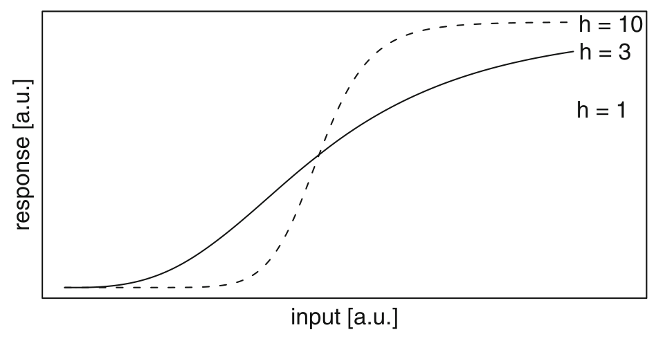

> Image description: This line graph, titled "Deterministic Description of Biochemical Networks, Fig. 1," illustrates the relationship between an input (a.u.) on the horizontal x-axis and a response (a.u.) on the vertical y-axis. The figure plots three sigmoidal curves representing a cooperative enzyme reaction with varying Hill coefficients: $h = 1$ (solid line), $h = 3$ (solid line), and $h = 10$ (dashed line). As the Hill coefficient $h$ increases, the curves transition from a shallow, broad slope ($h = 1$) to a much steeper, switch-like response ($h = 10$). All three curves intersect at a central point. The $h=10$ curve shows a sharp threshold effect, where the response remains low for most input values before rapidly increasing towards a plateau. In contrast, the $h=1$ curve shows a gradual, continuous increase. All other parameters are held constant at 1.


<!-- source_pdf_page: 292 -->
concentrations. Corresponding systematic frameworks for multiscale modeling, however, are currently lacking.

## Cross-References

- Dynamic Graphs, Connectivity of
- Modeling of Dynamic Systems from First Principles
- Monotone Systems in Biology
- Robustness Analysis of Biological Models
- Spatial Description of Biochemical Networks
- Stochastic Description of Biochemical Networks
- Synthetic Biology


## Bibliography

Craciun G, Tang Y, Feinberg M (2006) Understanding bistability in complex enzyme-driven reaction networks. Proc Natl Acad Sci USA 103(23):8697-8702
Higham DJ (2008) Modeling and simulating chemical reactions. SIAM Rev 50(2):347-368
LeDuc PR, Messner WC, Wikswo JP (2011) How do control-based approaches enter into biology? Annu Rev Biomed Eng 13:369-396
Sontag E (2005) Molecular systems biology and control. Eur J Control 11(4-5):396-435
Szallasi Z, Stelling J, Periwal V (eds) (2010) System modeling in cellular biology: from concepts to nuts and bolts. MIT, Cambridge
Tyson JJ, Chen KC, Novak B (2003) Sniffers, buzzers, toggles and blinkers: dynamics of regulatory and signaling pathways in the cell. Curr Opin Cell Biol 15(2):221-231

## Diagnosis of Discrete Event Systems

Stéphane Lafortune
Department of Electrical Engineering and Computer Science, University of Michigan, Ann Arbor, MI, USA

## Abstract

We discuss the problem of event diagnosis in partially observed discrete event systems. The objective is to infer the past occurrence, if any, of
an unobservable event of interest based on the observed system behavior and the complete model of the system. Event diagnosis is performed by diagnosers that are synthesized from the system model and that observe the system behavior at run-time. Diagnosability analysis is the off-line task of determining which events of interest can be diagnosed at run-time by diagnosers.

## Keywords

Diagnosability; Diagnoser; Fault diagnosis; Verifier

## Introduction

In this entry, we consider discrete event systems that are partially observable and discuss the two related problems of event diagnosis and diagnosability analysis. Let the DES of interest be denoted by $M$ with event set $E$. Since $M$ is partially observable, its set of events $E$ is the disjoint union of a set of observable events, denoted by $E_{o}$, with a set of unobservable events, denoted by $E_{u o}: E=E_{o} \cup E_{u o}$. At this point, we do not specify how $M$ is represented; it could be an automaton or a Petri net. Let $L_{M}$ be the set of all strings of events in $E$ that the DES $M$ can execute, i.e., the (untimed) language model of the system; cf. the related entries, - Models for Discrete Event Systems: An Overview, Supervisory Control of Discrete-Event Systems, and - Modeling, Analysis, and Control with Petri Nets. The set $E_{u o}$ captures the fact that the set of sensors attached to the DES $M$ is limited and may not cover all the events of the system. Unobservable events can be internal system events that are not directly "seen" by the monitoring agent that observes the behavior of $M$ for diagnosis purposes. They can also be fault events that are included in the system model but are not directly observable by a dedicated sensor. For the purpose of diagnosis, let us designate a specific unobservable event of interest and denote it by $d \in E_{u o}$. Event $d$ could be a fault event or some other significant event that is unobservable.


<!-- source_pdf_page: 293 -->
Before we can state the problem of event diagnosis, we need to introduce some notation. $E^{*}$ is the set of all strings of any length $n \in \mathbb{N}$ that can be formed by concatenating elements of $E$. The unique string of length $n=0$ is denoted by $\varepsilon$ and is the identity element of concatenation. As in article ▷ Supervisory Control of Discrete-Event Systems, section "Supervisory Control Under Partial Observations," we define the projection function $P: E^{*} \rightarrow E_{o}^{*}$ that "erases" the unobservable events in a string and replaces them by $\varepsilon$. The function $P$ is naturally extended to a set of strings by applying it to each string in the set, resulting in a set of projected strings. The observed behavior of $M$ is the language $P\left(L_{M}\right)$ over event set $E_{o}$.

The problem of event diagnosis, or simply diagnosis, is stated as follows: how to infer the past occurrence of event $d$ when observing strings in $P\left(L_{M}\right)$ at run-time, i.e., during the operation of the system? This is model-based inferencing, i.e., the monitoring agent knows $L_{M}$ and the partition $E=E_{o} \cup E_{u o}$, and it observes strings in $P\left(L_{M}\right)$. When there are multiple events of interest, $d_{1}$ to $d_{n}$, and these events are fault events, we have a problem of fault diagnosis. In this case, the objective is not only to determine that a fault has occurred (commonly referred to as "fault detection") but also to identify which fault has occurred, namely, which event $d_{i}$ (commonly referred to as "fault isolation and identification"). Fault diagnosis requires that $L_{M}$ contains not only the nominal or fault-free behavior of the system but also its behavior after the occurrence of each fault event $d_{i}$ of interest, i.e., its faulty behavior. Event $d_{i}$ is typically a fault of a component that leads to degraded behavior on the part of the system. It is not a catastrophic failure that would cause the system to completely stop operating, as such a failure would be immediately observable. The decision on which fault events $d_{i}$, along with their associated faulty behaviors, to include in the complete model $L_{M}$ is a design one that is based on practical considerations related to the diagnosis objectives.

A complementary problem to event diagnosis is that of diagnosability analysis. Diagnosability analysis is the off-line task of determining, on the
basis of $L_{M}$ and of $E_{o}$ and $E_{u o}$, if any and all occurrences of the given event of interest $d$ will eventually be diagnosed by the monitoring agent that observes the system behavior.

Event diagnosis and diagnosability analysis arise in numerous applications of systems that are modeled as DES. We mention a few application areas where DES diagnosis theory has been employed. In heating, ventilation, and air-conditioning systems, components such as valves, pumps, and controllers can fail in degraded modes of operation, such as a valve gets stuck open or stuck closed or a pump or controller gets stuck on or stuck off. The available sensors may not directly observe these faults, as the sensing abilities are limited. Fault diagnosis techniques are essential, since the components of the system are often not easily accessible. In monitoring communication networks, faults of certain transmitters or receivers are not directly observable and must be inferred from the set of successful communications and the topology of the network. In document processing systems, faults of internal components can lead to jams in the paper path or a decrease in image quality, and while the paper jam or the image quality is itself observable, the underlying fault may not be as the number of internal sensors is limited.

Without loss of generality, we consider a single event of interest to diagnose, $d$. When there are multiple events to diagnose, the methodologies that we describe in the remaining of this entry can be applied to each event of interest $d_{i}$, $i=1, \ldots n$, individually; in this case, the other events of interest $d_{j}, j \neq i$ are treated the same as the other unobservable events in the set $E_{u o}$ in the process of model-based inferencing.

## Problem Formulation

## Event Diagnosis

We start with a general language-based formulation of the event diagnosis problem. The information available to the agent that monitors the system behavior and performs the task of event diagnosis is the language $L_{M}$ and the set of observable events $E_{o}$, along with the specific


<!-- source_pdf_page: 294 -->
string $t \in P\left(L_{M}\right)$ that it observes at run-time. The actual string generated by the system is $s \in L_{M}$ where $P(s)=t$. However, as far as the monitoring agent is concerned, the actual string that has occurred could be any string in $P^{-1}(t) \cap L_{M}$, where $P^{-1}$ is the inverse projection operation, i.e., $P^{-1}(t)$ is the set of all strings $s_{t} \in E^{*}$ such that $P\left(s_{t}\right)=t$. Let us denote this estimate set by $\mathcal{E}(t)=P^{-1}(t) \cap L_{M}$, where " $\mathcal{E}$ " stands for "estimate." If a string $s \in L_{M}$ contains event $d$, we write that $d \in L_{M}$; otherwise, we write that $d \notin L_{M}$.

The event diagnosis problem is to synthesize a diagnostic engine that will automatically provide the following answers from the observed $t$ and from the knowledge of $L_{M}$ and $E_{o}$ :

1. Yes, if and only if $d \in s$ for all $s \in \mathcal{E}(t)$.
2. No, if and only if $d \notin s$ for all $s \in \mathcal{E}(t)$.
3. Maybe, if and only if there exists $s_{Y}, s_{N} \in \mathcal{E}(t)$ such that $d \in s_{Y}$ and $d \notin s_{N}$.
As defined, $\mathcal{E}(t)$ is a string-based estimate. In section "Diagnosis of Automata," we discuss how to build a finite-state structure that will encode the desired answers for the above three cases when the DES $M$ is modeled by a deterministic finitestate automaton. The resulting structure is called a diagnoser automaton.

## Diagnosability Analysis

Diagnosability analysis consists in determining, a priori, if any and all occurrences of event $d$ in $L_{M}$ will eventually be diagnosed, in the sense that if event $d$ occurs, then the diagnostic engine is guaranteed to eventually issue the decision "Yes." For the sake of technical simplicity, we assume hereafter that $L_{M}$ is a live language, i.e., any trace in $L_{M}$ can always be extended by one more event. In this context, we would not want the diagnostic engine to issue the decision "Maybe" for an arbitrarily long number of event occurrences after event $d$ occurs. When this outcome is possible, we say that event $d$ is not diagnosable in language $L_{M}$.

The property of diagnosability of DES is defined as follows. In view of the liveness assumption on language $L_{M}$, any string $s_{Y}^{\prime}$ that contains event $d$ can always be extended to a longer string, meaning that it can be made "arbitrarily long"
after the occurrence of $d$. That is, for any $s_{Y}^{\prime}$ in $L_{M}$ and for any $n \in \mathbb{N}$, there exists $s_{Y}=s_{Y}^{\prime} t \in L_{M}$ where the length of $t$ is equal to $n$. Event $d$ is not diagnosable in language $L_{M}$ if there exists such a string $s_{Y}$ together with a second string $s_{N}$ that does not contain event $d$, and such that $P\left(s_{Y}\right)=P\left(s_{N}\right)$. This means that the monitoring agent is unable to distinguish between $s_{Y}$ and $s_{N}$, yet, the number of events after an occurrence of $d$ can be made arbitrarily large in $s_{Y}$, thereby preventing diagnosis of event $d$ within a finite number of events after its occurrence. On the other hand, if no such pair of strings $\left(s_{Y}, s_{N}\right)$ exists in $L_{M}$, then event $d$ is diagnosable in $L_{M}$. (The mathematically precise definition of diagnosability is available in the literature cited at the end of this entry.)

## Diagnosis of Automata

We recall the definition of a deterministic finitestate automaton, or simply automaton, from article Models for Discrete Event Systems: An Overview, with the addition of a set of unobservable events as in section "Supervisory Control Under Partial Observations" in article - Supervisory Control of Discrete-Event Systems. The automaton, denoted by $G$, is a four-tuple $G=\left(X, E, f, x_{0}\right)$ where $X$ is the finite set of states, $E$ is the finite set of events partitioned into $E=E_{o} \cup E_{u o}, x_{0}$ is the initial state, and $f$ is the deterministic partial transition function $f: X \times E \rightarrow X$ that is immediately extended to strings $f: X \times E^{*} \rightarrow X$. For a DES $M$ represented by an automaton $G, L_{M}$ is the language generated by automaton $G$, denoted by $\mathcal{L}(G)$ and formally defined as the set of all strings for which the extended $f$ is defined. It is an infinite set if the transition graph of $G$ has one or more cycles. In view of the liveness assumption made on $L_{M}$ in the preceding section, $G$ has no reachable deadlocked state, i.e., for all $s \in E^{*}$ such that $f(x, s)$ is defined, then there exists $\sigma \in E$ such that $f(x, s \sigma)$ is also defined.

To synthesize a diagnoser automaton that correctly performs the diagnostic task formulated in the preceding section, we proceed as follows.


<!-- source_pdf_page: 295 -->
First, we perform the parallel composition (denoted by $\|$ ) of $G$ with the two-state label automaton $A_{\text {label }}$ that is defined as follows. $A_{\text {label }}= \left(\{N, Y\},\{d\}, f_{\text {label }}, N\right)$, where $f_{\text {label }}$ has two transitions defined: (i) $f_{\text {label }}(N, d)=Y$ and (ii) $f_{\text {label }}(Y, d)=Y$. The purpose of $A_{\text {label }}$ is to record the occurrence of event $d$, which causes a transition to state $Y$. By forming $G_{\text {labeled }}= G \| A_{\text {label }}$, we record in the states of $G_{\text {labeled }}$, which are of the form $\left(x_{G}, x_{A}\right)$, if the first element of the pair, state $x_{G} \in X$, was reached or not by executing event $d$ at some point in the past: if $d$ was executed, then $x_{A}=Y$, otherwise $x_{A}=N$. (We refer the reader to Chap. 2 in Cassandras and Lafortune (2008) for the formal definition of parallel composition of automata.) By construction, $\mathcal{L}\left(G_{\text {labeled }}\right)=\mathcal{L}(G)$.

The second step of the construction of the diagnoser automaton is to build the observer of $G_{\text {labeled }}$, denoted by $\operatorname{Obs}\left(G_{\text {labeled }}\right)$, with respect to the set of observable events $E_{o}$. (We refer the reader to Chap. 2 in Cassandras and Lafortune (2008) for the definition of the observer automaton and for its construction.) The construction of the observer involves the standard subset construction algorithm for nondeterministic automata in automata theory; here, the unobservable events are the source of nondeterminism, since they effectively correspond to $\varepsilon$-transitions. The diagnoser automaton of $G$ with respect to $E_{o}$ is defined as $\operatorname{Diag}(G)=\operatorname{Obs}\left(G \| A_{\text {label }}\right)$. Its event set is $E_{o}$.

The states of $\operatorname{Diag}(G)$ are sets of state pairs of the form $\left(x_{G}, x_{A}\right)$ where $x_{A}$ is either $N$ or $Y$. Examination of the state of $\operatorname{Diag}(G)$ reached by string $t \in P[\mathcal{L}(G)]$ provides the answers to the event diagnosis problem. Let us denote that state by $x_{\text {Diag }}^{t}$. Then:

1. The diagnostic decision is Yes if all state pairs in $x_{\text {Diag }}^{t}$ have their second component equal to $Y$; we call such a state a "Yes-state" of $\operatorname{Diag}(G)$.
2. The diagnostic decision is No if all state pairs in $x_{\text {Diag }}^{t}$ have their second component equal to $N$; we call such a state a "No-state" of $\operatorname{Diag}(G)$.
3. The diagnostic decision is Maybe if there is at least one state pair in $x_{\text {Diag }}^{t}$ whose second
component is equal to $Y$ and at least one state pair in $x_{\text {Diag }}^{t}$ whose second component is equal to $N$; we call such a state a "Maybe-state" of $\operatorname{Diag}(G)$.
To perform run-time diagnosis, it therefore suffices to examine the current state of $\operatorname{Diag}(G)$. Note that $\operatorname{Diag}(G)$ can be computed off-line from $G$ and stored in memory, so that run-time diagnosis requires only updating the new state of $\operatorname{Diag}(G)$ on the basis of the most recent observed event (which is necessarily in $E_{o}$ ). If storing the entire structure of $\operatorname{Diag}(G)$ is impractical, its current state can be computed on-the-fly on the basis of the most recent observed event and of the transition structure of $G_{\text {labeled }}$; this involves one step of the subset construction algorithm.

As a simple example, consider the automaton $G_{1}$ shown in Fig. 1, where $E_{u o}=\{d\}$. The occurrence of event $d$ changes the behavior of the system such that event $c$ does not cause a return to the initial state 1 (identified by incoming arrow); instead, the system gets stuck in state 3 after $d$ occurs.

Its diagnoser is depicted in Fig. 2. It contains one Yes-state, state $\{(3, Y)\}$ (abbreviated as "3Y" in the figure), one No-state, and two Maybe-states (similarly abbreviated). Two consecutive occurrences of event $c$, or an occurrence of $b$ right after $c$, both indicate that the system must be in state 3 ,

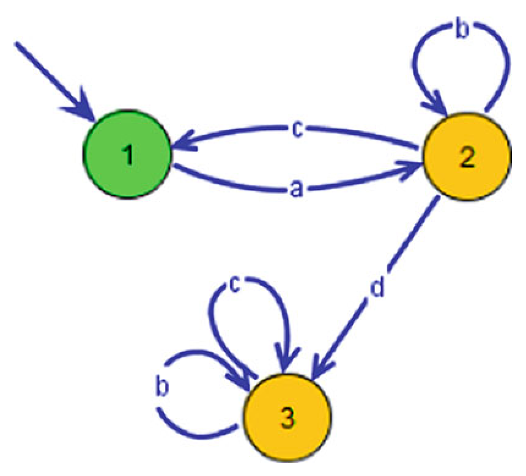

> Image description: A state transition diagram for a diagnoser is presented, consisting of three numbered circular nodes: 1 (green), 2 (yellow), and 3 (yellow). The nodes represent different system states. Directed arrows represent transitions between states, labeled with lowercase letters: - From node 1, an arrow labeled 'a' leads to node 2. - From node 2, an arrow labeled 'b' loops back to itself. - From node 2, an arrow labeled 'c' leads back to node 1. - From node 2, an arrow labeled 'd' leads to node 3. - From node 3, an arrow labeled 'b' loops back to itself. - From node 3, an arrow labeled 'c' loops back to itself. Additionally, an incoming arrow points into node 1, indicating the starting condition. According to the caption, node 3 represents the "Yes-state" $\{(3, Y)\}$. The diagram visually maps the causal relationships and event-driven transitions between states 1, 2, and 3.
Diagnosis of Discrete Event Systems, Fig. 1 Automaton $G_{1}$


<!-- source_pdf_page: 296 -->
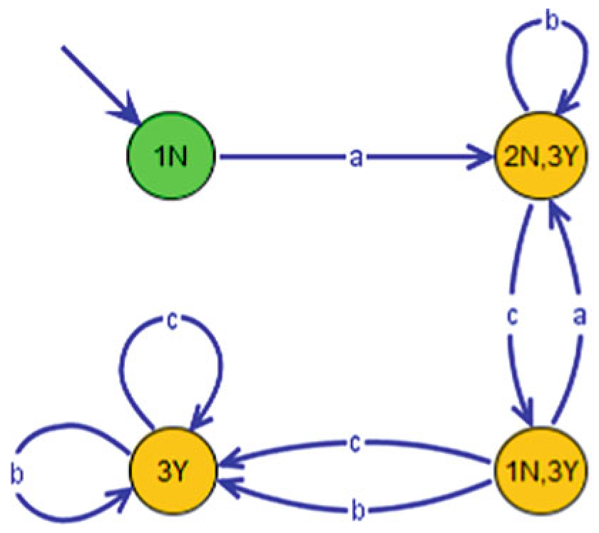

> Image description: A state-transition diagram illustrating a diagnoser automaton for a discrete event system, labeled "Diagnosis of Discrete Event Systems, Fig. 2 Diagnoser automaton of $G_{1}$." The automaton consists of six circular nodes, color-coded in green and yellow, interconnected by directed blue arrows representing system transitions. The states are as follows: * A green start state labeled **1N**. * A green state labeled **2N,3Y**. * Two orange states labeled **1N,3Y** and **3Y**. * An unlabeled orange state (possibly a terminal or error state) located near the bottom. Transitions are labeled with variables **a**, **b**, and **c**. * An **a** transition leads from **1N** to **2N,3Y**. * A self-loop labeled **b** exists on the **2N,3Y** state. * Bidirectional transitions exist between **2N,3Y** and **1N,3Y** using **a** and **c**. * The **1N,3Y** state transitions to **3Y** via **b** and **c**, while **3Y** features self-loops for **b** and **c**.
Diagnosis of Discrete Event Systems, Fig. 2 Diagnoser automaton of $G_{1}$

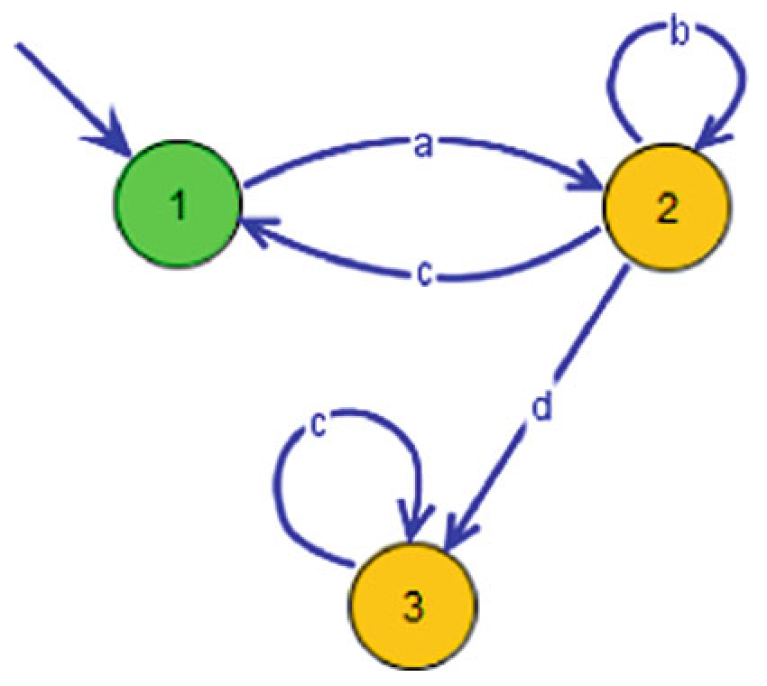

> Image description: Figure 2 depicts a state transition diagram representing the diagnoser automaton of $G_1$. The automaton consists of three numbered circular states: a green state labeled "1" and two yellow states labeled "2" and "3". An external blue arrow points toward state 1, indicating the initial state. Directed blue arrows represent transitions between states, labeled with lowercase letters. From state 1, transition 'a' leads to state 2. State 2 has a self-loop labeled 'b', a transition 'c' returning to state 1, and a transition 'd' leading to state 3. State 3 features a self-loop labeled 'c'. This diagram illustrates the discrete event logic of the system, where transitions are triggered by specific events ($a, b, c, d$) that dictate the movement between the different operational states of the diagnoser.
Diagnosis of Discrete Event Systems, Fig. 3 Automaton $G_{2}$

i.e., that event $d$ must have occurred; this is captured by the two transitions from Maybe-state $\{(1, N),(3, Y)\}$ to the Yes-state in $\operatorname{Diag}\left(G_{1}\right)$. As a second example, consider the automaton $G_{2}$ shown in Fig. 3, where the self-loop $b$ at state 3 in $G_{1}$ has been removed. Its diagnoser is shown in Fig. 4.

Diagnoser automata provide as much information as can be inferred, from the available observations and the automaton model of the system, regarding the past occurrence of unobservable event $d$. However, we may want to answer the

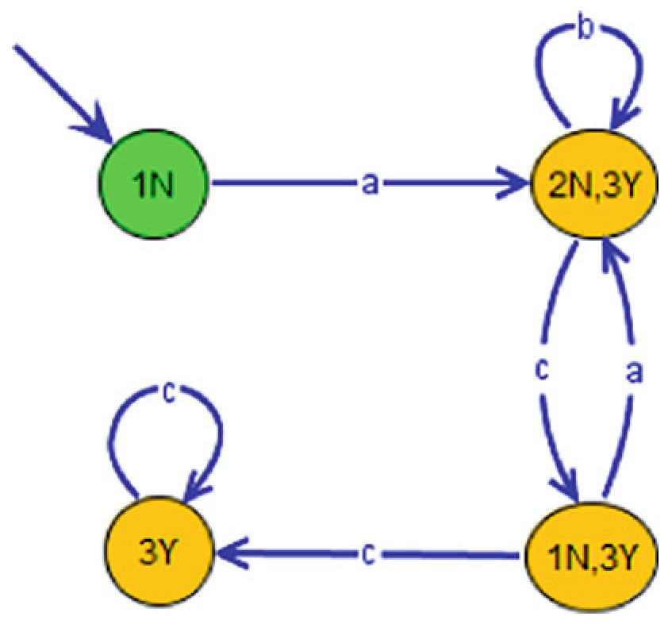

> Image description: This figure, captioned "Diagnoser automaton of $G_2$," depicts a state transition diagram for a discrete event system. The automaton consists of four circular nodes (states) connected by directed blue arrows (transitions) labeled with lowercase letters. The system starts at a green node labeled "1N," indicated by an incoming blue arrow. A transition labeled "a" leads from "1N" to an orange node labeled "2N,3Y." This node features a self-loop labeled "b." From "2N,3Y," a transition "c" leads to an orange node labeled "1N,3Y," which can transition back to "2N,3Y" via transition "a." Additionally, a transition "c" moves from "1N,3Y" to a final orange node labeled "3Y," which contains a self-loop labeled "c." The diagram uses color coding to distinguish the initial state (green) from subsequent states (orange) and illustrates the logical flow of diagnostic events through the system's states.
Diagnosis of Discrete Event Systems, Fig. 4 Diagnoser automaton of $G_{2}$

question: Can the occurrence of event $d$ always be diagnosed? This is the realm of diagnosability analysis discussed in the next section.

## Diagnosability Analysis of Automata

As mentioned earlier, diagnosability analysis consists in determining, a priori, if any and all occurrences of event $d$ in $L_{M}$ will eventually be diagnosed. In the case of diagnoser automata, we do not want $\operatorname{Diag}(G)$ to loop forever in a cycle of Maybe-states and never enter a Yes-state if event $d$ has occurred, as happens in the diagnoser in Fig. 2 for the string $a d b^{n}$ when $n$ gets arbitrarily large. In this case, $\operatorname{Diag}\left(G_{1}\right)$ loops in Maybestate $\{(2, N),(3, Y)\}$, and the occurrence of $d$ goes undetected. This shows that event $d$ is not diagnosable in $G_{1}$; the counterexample is provided by strings $s_{Y}=a d b^{n}$ and $s_{N}=a b^{n}$.

For systems modeled as automata, diagnosability can be tested with quadratic time complexity in the size of the state space of $G$ by forming a so-called twin-automaton (also called "verifier") where $G$ is parallel composed with itself, but synchronization is only enforced on observable events, allowing arbitrary interleavings of unobservable events. The test for diagnosability reduces to detection of cycles that occur after


<!-- source_pdf_page: 297 -->
event $d$ in the twin-automaton. It can be verified that for automaton $G_{2}$ in our example, event $d$ is diagnosable. Indeed, it is clear from the structure of $G_{2}$ that $\operatorname{Diag}\left(G_{2}\right)$ in Fig. 4 will never loop in Maybe-state $\{(2, N),(3, Y)\}$ if event $d$ occurs; rather, after $d$ occurs, $G_{2}$ can only execute $c$ events, and after two such events, $\operatorname{Diag}\left(G_{2}\right)$ enters Yes-state $\{(3, Y)\}$.

Note that diagnosability will not hold in an automaton that contains a cycle of unobservable events after the occurrence of event $d$, although this is not the only instance where the property is violated, as we saw in our simple example.

## Diagnosis and Diagnosability Analysis of Petri Nets

There are several approaches for diagnosis and diagnosability analysis of DES modeled by Petri nets, depending on the boundedness properties of the net and on what is observable about its behavior. Let $N$ be the Petri net model of the system, which consists of a Petri net structure along with an initial marking of all places. If the transitions of $N$ are labeled by events in a set $E$, some by observable events in $E_{o}$ and some by unobservable events in $E_{u o}$, and if the contents of the Petri net places are not observed except for the initial marking of $N$, then we have a language-based diagnosis problem as considered so far in this entry, for language $\mathcal{L}(N)$ and for $E=E_{o} \cup E_{u o}$, with event of interest $d \in E_{u o}$. In this case, if the set of reachable states of the net is bounded, then we can use the reachability graph as an equivalent automaton model of the same system and build a diagnoser automaton as described earlier. It is also possible to encode diagnoser states into the original structure of net $N$ by keeping track of all possible net markings following the observation of an event in $E_{o}$, appending the appropriate label ("N" or "Y") to each marking in the state estimate. This is reminiscent of the on-the-fly construction of the current state of the diagnoser automaton discussed earlier, except that the possible system states are directly listed as Petri net markings on the structure of $N$. Regarding diagnosability
analysis, it can be performed using the twinautomaton technique of the preceding section, from the reachability graph of $N$.

Another approach that is actively being pursued in current literature is to exploit the structure of the net model $N$ for diagnosis and for diagnosability analysis, instead of working with the automaton model obtained from its reachability graph. In addition to potential computational gains from avoiding the explicit generation of the entire set of reachable states, this approach is motivated by the need to handle Petri nets whose sets of reachable states are infinite and in particular Petri nets that generate languages that are not regular and hence cannot be represented by finitestate automata. Moreover, in this approach, one can incorporate potential observability of token contents in the places of the Petri nets. We refer the interested reader to the relevant chapters in Campos et al. (2013) and Seatzu et al. (2013) for coverage of these topics.

## Current and Future Directions

The basic methodologies described so far for diagnosis and diagnosability analysis have been extended in many different directions. We briefly discuss a few of these directions, which are active research areas. Detailed coverage of these topics is beyond the scope of this entry and is available in the references listed at the end.

Diagnosis of timed models of DES has been considered, for classes of timed automata and timed Petri nets, where the objective is to ensure that each occurrence of event $d$ is detected within a bounded time delay. Diagnosis of stochastic models of DES has been considered, in particular stochastic automata, where the hard diagnosability constraints are relaxed and detection of each occurrence of event $d$ must be guaranteed with some probability $1-\epsilon$, for some small $\epsilon>0$. Stochastic models also allow handling of unreliable sensors or noisy environments where event observations may be corrupted with some probability, such as when an occurrence of event $a$ is observed as event $a 80 \%$ of the time and as some other event $a^{\prime} 20 \%$ of the time.


<!-- source_pdf_page: 298 -->
Decentralized diagnosis is concerned with DES that are observed by several monitoring agents $i=1, \ldots, n$, each with its own set of observable events $E_{o, i}$ and each having access to the entire set of system behaviors, $L_{M}$. The task is to design a set of individual diagnosers, one for each set $E_{o, i}$, such that the $n$ diagnosers together diagnose all the occurrences of event $d$. In other words, for each occurrence of event $d$ in any string of $L_{M}$, there exists at least one diagnoser that will detect it (i.e., answer "Yes"). The individual diagnosers may or may not communicate with each other at run-time or they may communicate with a coordinating diagnoser that will fuse their information; several decentralized diagnosis architectures have been studied and their properties characterized. The focus in these works is the decentralized nature of the information available about the strings in $L_{M}$, as captured by the individual observable event sets $E_{o, i}, i=1, \ldots, n$.

Distributed diagnosis is closely related to decentralized diagnosis, except that it normally refers to situations where each individual diagnoser uses only part of the entire system model. Let $M$ be an automaton $G$ obtained by parallel composition of subsystem models: $G=\|_{i=1, n} G_{i}$. In distributed diagnosis, one would want to design each individual diagnoser Diag $_{i}$ on the basis of $G_{i}$ alone or on the basis of $G_{i}$ and of an abstraction of the rest of the system, $\|_{j=1, n ; j \neq i} G_{j}$. Here, the emphasis is on the distributed nature of the system, as captured by the parallel composition operation. In the case where $M$ is a Petri net $N$, the distributed nature of the system may be captured by individual net models $N_{i}, i=1, \ldots, n$, that are coupled by common places, i.e., place-bordered Petri nets.

Robust diagnosis generally refers to decentralized or distributed diagnosis, but where one or more of the individual diagnosers may fail. Thus, there must be built-in redundancy in the set of individual diagnosers so that they together may still detect every occurrence of event $d$ even if one or more of them ceases to operate.

So far we have considered a fixed and static set of observable events, $E_{o} \subset E$, where every occurrence of each event in $E_{o}$ is always
observed by the monitoring agent. However, there are many instances where one would want the monitoring agent to dynamically activate or deactivate the observability properties of a subset of the events in $E_{o}$; this arises in situations where event monitoring is "costly" in terms of energy, bandwidth, or security reasons. This is referred to as the case of dynamic observations, and the goal is to synthesize sensor activation policies that minimize a given cost function while preserving the diagnosability properties of the system.

## Cross-References

- Models for Discrete Event Systems: An Overview
- Modeling, Analysis, and Control with Petri Nets
- Supervisory Control of Discrete-Event Systems
- Modeling, Analysis, and Control with Petri Nets


## Recommended Reading

There is a very large amount of literature on diagnosis and diagnosability analysis of DES that has been published in control engineering, computer science, and artificial intelligence journals and conference proceedings. We mention a few recent books or survey articles that are a good starting point for readers interested in learning more about this active area of research. In the DES literature, the study of fault diagnosis and the formalization of diagnosability properties started in Lin (1994) and Sampath et al. (1995). Chapter 2 of the textbook Cassandras and Lafortune (2008) contains basic results about diagnoser automata and diagnosability analysis of DES, following the approach introduced in Sampath et al. (1995). The research monograph Lamperti and Zanella (2003) presents DES diagnostic methodologies developed in the artificial intelligence literature. The survey paper Zaytoon and Lafortune (2013) presents a detailed overview of fault diagnosis research in the control engineering literature. The two edited books


<!-- source_pdf_page: 299 -->
Campos et al. (2013) and Seatzu et al. (2013) contain chapters specifically devoted to diagnosis of automata and Petri nets, with an emphasis on automated manufacturing applications for the latter. Specifically, Chaps. 5, 14, 15, 17, and 19 in Campos et al. (2013) and Chaps. 22-25 in Seatzu et al. (2013) are recommended for further reading on several aspects of DES diagnosis. Zaytoon and Lafortune (2013) and the cited chapters in Campos et al. (2013) and Seatzu et al. (2013) contain extensive bibliographies.

## Bibliography

Campos J, Seatzu C, Xie X (eds) (2013) Formal methods in manufacturing. Series on industrial information technology. CRC/Taylor and Francis, Boca Raton, FL
Cassandras CG, Lafortune S (2008) Introduction to discrete event systems, 2nd edn. Springer, New York, NY
Lamperti G, Zanella M (2003) Diagnosis of active systems: principles and techniques. Kluwer, Dordrecht
Lin F (1994) Diagnosability of discrete event systems and its applications. Discret Event Dyn Syst Theory Appl 4(2): 197-212
Sampath M, Sengupta R, Lafortune S, Sinnamohideen K, Teneketzis D (1995) Diagnosability of discrete event systems. IEEE Trans Autom Control 40(9): 1555-1575
Seatzu C, Silva M, van Schuppen J (eds) (2013) Control of discrete-event systems. Automata and Petri net perspectives. Lecture notes in control and information sciences, vol 433 . Springer, London
Zaytoon J, Lafortune S (2013) Overview of fault diagnosis methods for discrete event systems. Annu Rev Control 37(2):308-320

## Differential Geometric Methods in Nonlinear Control

A.J. Krener

Department of Applied Mathematics, Naval Postgrauate School, Monterey, CA, USA


#### Abstract

In the early 1970s, concepts from differential geometry were introduced to study nonlinear control systems. The leading researchers in this effort were Roger Brockett, Robert Hermann,


Henry Hermes, Alberto Isidori, Velimir Jurdjevic, Arthur Krener, Claude Lobry, and Hector Sussmann. These concepts revolutionized our knowledge of the analytic properties of control systems, e.g., controllability, observability, minimality, and decoupling. With these concepts, a theory of nonlinear control systems emerged that generalized the linear theory. This theory of nonlinear systems is largely parallel to the linear theory, but of course it is considerably more complicated.

## Keywords

Codistribution; Distribution; Frobenius theorem; Involutive distribution; Lie jet

## Introduction

This is a brief survey of the influence of differential geometric concepts on the development of nonlinear systems theory. Section "A Primer on Differential Geometry" reviews some concepts and theorems of differential geometry. Nonlinear controllability and nonlinear observability are discussed in sections "Controllability of Nonlinear Systems" and "Observability for Nonlinear Systems". Section "Minimal Realizations" discusses minimal realizations of nonlinear systems, and section "Disturbance Decoupling" discusses the disturbance decoupling problem.

## A Primer on Differential Geometry

Perhaps a better title might be "A Primer on Differential Topology" since we will not treat Riemannian or other metrics. A $n$-dimensional manifold $\mathcal{M}$ is a topological space that is locally homeomorphic to a subset of $I R^{n}$. For simplicity, we shall restrict our attention to smooth ( $C^{\infty}$ ) manifolds and smooth objects on them. Around each point $p \in \mathcal{M}$, there is at least one coordinate chart that is a neighborhood $\mathcal{N}_{p} \subset \mathcal{M}$ and a homeomorphism $x: \mathcal{N}_{p} \rightarrow \mathcal{U}$ where $\mathcal{U}$ is an open subset of $I R^{n}$. When two coordinate


<!-- source_pdf_page: 300 -->
charts overlap, the change of coordinates should be smooth. For simplicity, we restrict our attention to differential geometric objects described in local coordinates.

In local coordinates, a vector field is just an ODE of the form

$$
\begin{equation*}
\dot{x}=f(x) \tag{1}
\end{equation*}
$$

where $f(x)$ is a smooth $I R^{n \times 1}$ valued function of $x$. In a different coordinate chart with local coordinates $z$, this vector field would be represented by a different formula:

$$
\dot{z}=g(z)
$$

If the charts overlap, then on the overlap they are related:

$$
f(x(z))=\frac{\partial x}{\partial z}(z) g(z), \quad g(z(x))=\frac{\partial z}{\partial x}(z) f(x)
$$

Since $f(x)$ is smooth, it generates a smooth flow $\phi\left(t, x^{0}\right)$ where for each $t$, the mapping $x \mapsto \phi\left(t, x^{0}\right)$ is a local diffeomorphism and for each $x^{0}$ the mapping $t \mapsto \phi\left(t, x^{0}\right)$ is a solution of the ODE (1) satisfying the initial condition $\phi\left(0, x^{0}\right)=x^{0}$. We assume that all the flows are complete, i.e., defined for all $t \in I R, x \in \mathcal{M}$. The flows are one parameter groups, i.e., $\phi\left(t, \phi\left(s, x^{0}\right)\right)=\phi\left(t+s, x^{0}\right)=\phi\left(s, \phi\left(t, x^{0}\right)\right)$.

If $f\left(x^{0}\right)=b$, a constant vector, then locally the flow looks like translation, $\phi\left(t, x^{1}\right)=x^{1}+ t b$. If $f\left(x^{0}\right) \neq 0$, then we can always choose local coordinates $z$ so that in these coordinates the vector field is constant. Without loss of generality, we can assume that $x^{0}=0$ and that the first component of $f$ is $f_{1}(0) \neq 0$. Define the local change of coordinates: $x(z)=\phi\left(z_{1}, x^{1}(z)\right)$ where $x^{1}(z)=\left(0, z_{2}, \ldots, z_{n}\right)^{\prime}$. It is not hard to that this is a local diffeomorphism and that, in $z$ coordinates, the vector field is the first unit vector.

If $f\left(x^{0}\right)=0$ let $F=\frac{\partial f}{\partial x}\left(x^{0}\right)$, then if all the eigenvalues of $F$ are off the imaginary axis, then the integral curves of $f(x)$ and

$$
\begin{equation*}
\dot{z}=F z \tag{2}
\end{equation*}
$$

are locally topologically equivalent (Arnol'd 1983). This is the Grobman-Hartman theorem. There exists a local homeomorphism $z=h(x)$ that carries $x(t)$ trajectories into $z(s)$ trajectories in some neighborhood of $x^{0}=0$. This homeomorphism need not preserve time $t \neq s$, but it does preserve the direction of time. Whether these flows are locally diffeomorphic is a more difficult question that was explored by Poincaré. See the section on feedback linearization (Krener 2013).

If all the eigenvalues of $F$ are in the open left half plane, then the linear dynamics (2) is globally asymptotically stable around $z^{0}=0$, i.e., if the flow of (2) is $\psi(t, z)$, then $\psi\left(t, z^{1}\right) \rightarrow 0$ as $t \rightarrow \infty$. Then it can be shown that the nonlinear dynamics is locally asymptotically stable, $\phi\left(t, x^{1}\right) \rightarrow x^{0}$ as $t \rightarrow \infty$ for all $x^{1}$ in some neighborhood of $x^{0}$.

One forms, $\omega(x)$, are dual to vector fields. The simplest example of a one form (also called a covector field) is the differential $d h(x)$ of a scalar-valued smooth function $h(x)$. This is the $I R^{1 \times n}$ covector field

$$
\omega(x)=\left[\frac{\partial h}{\partial x_{1}}(x) \ldots \frac{\partial h}{\partial x_{n}}(x)\right]
$$

Sometimes this is written as

$$
\omega(x)=\sum_{1}^{n} \frac{\partial h}{\partial x_{i}}(x) d x_{i}
$$

The most general smooth one form is of the form

$$
\begin{aligned}
\omega(x) & =\left[\omega^{1}(x) \ldots \omega^{n}(x)\right] \\
& =\sum_{i=1}^{n} \omega^{i}(x) d x_{i}
\end{aligned}
$$

where the $\omega^{i}(x)$ are smooth functions. The duality between one forms and vector fields is the bilinear pairing

$$
\begin{aligned}
<\omega(x), f(x)> & =\omega(f)(x)=\omega(x) f(x) \\
& =\sum_{i=1}^{n} \omega^{i}(x) f_{i}(x)
\end{aligned}
$$


<!-- source_pdf_page: 301 -->
Just as a vector field can be thought of as a first-order ODE, a one form can be thought of as a first-order PDE. Given $\omega(x)$, find $h(x)$ such that $d h(x)=\omega(x)$. A one form $\omega(x)$ is said to be exact if there exists such an $h(x)$. Of course if there is one solution, then there are many all differing by a constant of integration which we can take as the value of $h$ at some point $x^{0}$.

Unlike smooth first-order ODEs, smooth firstorder PDEs do not always have a solution. There are integrability conditions and topological conditions that must be satisfied. Suppose $d h(x)= \omega(x)$, then $\frac{\partial h}{\partial x_{i}}(x)=\omega^{i}(x)$ so

$$
\frac{\partial \omega^{i}}{\partial x_{j}}(x)=\frac{\partial^{2} h}{\partial x_{j} \partial x_{i}}(x)=\frac{\partial^{2} h}{\partial x_{i} \partial x_{j}}(x)=\frac{\partial \omega^{j}}{\partial x_{i}}(x)
$$

Therefore, for the PDE to have a solution, the integrability conditions

$$
\frac{\partial \omega^{i}}{\partial x_{j}}(x)-\frac{\partial \omega^{j}}{\partial x_{i}}(x)=0
$$

must be satisfied. The exterior derivative of a one form is a skew-symmetric matrix field
$d \omega(x)=\sum_{i<j}\left(\frac{\partial \omega^{i}}{\partial x_{j}}(x)-\frac{\partial \omega^{j}}{\partial x_{i}}(x)\right) d x_{i} \wedge d x_{j}$
A one form $\omega(x)$ is said to be closed if $d \omega(x)=$ 0 . This is locally sufficient for there to exist an $h(x)$ such that $d h(x)=\omega(x)$.

Every exact form is closed but not every closed form is exact. A counter example on $I R^{2}$ is

$$
\omega(x)=\left[-x_{2} x_{1}\right]
$$

This is closed but not exact. The line integral of this convector field around any circle centered at the origin is $2 \pi$. If it were exact, the line integral would have been zero because the curve ends where it begins.

The Lie derivative of a scalar-valued function $h(x)$ by a vector field $f(x)$ is denied to be the scalar-valued function

$$
L_{f}(h)(x)=\frac{\partial h}{\partial x}(x) f(x)=<d h(x), f(x)>
$$

This can be iterated

$$
L_{f}^{k}(h)(x)=\frac{\partial L_{f}^{k-1} h}{\partial x}(x) f(x)
$$

If $h(x) \in I R^{p \times 1}$, then $L_{f}(h)(x) \in I R^{p \times 1}$.
The Lie bracket of two vector fields $f^{1}(x)$ and $f^{2}(x)$ is another vector field

$$
\left[f^{1}, f^{2}\right](x)=\frac{\partial f^{2}}{\partial x}(x) f^{1}(x)-\frac{\partial f^{1}}{\partial x}(x) f^{2}(x)
$$

Clearly, the Lie bracket is skew symmetric, $\left[f^{1}, f^{2}\right](x)=-\left[f^{2}, f^{1}\right](x)(x)$. It also satisfies the Jacobi identity

$$
\begin{aligned}
& {\left[f^{1},\left[f^{2}, f^{3}\right]\right](x)+\left[f^{2},\left[f^{3}, f^{1}\right]\right](x)} \\
& \quad+\left[f^{3},\left[f^{1}, f^{2}\right]\right](x)=0
\end{aligned}
$$

Repeated Lie brackets are often expressed inductively as

$$
\begin{aligned}
a d_{f}^{0}(g)(x) & =g(x) \\
a d_{f}^{k}(g)(x) & =\left[f, a d_{f}^{k-1}(g)\right](x)
\end{aligned}
$$

The geometric interpretation of the Lie bracket $[f, g](x)$ is the infinitesimal commutator of their flows $\phi(t, x)$ and $\psi(t, x)$, i.e.,

$$
\begin{aligned}
\psi(t, \phi(t, x))-\phi(t, \psi(t, x))= & {[f, g](x) t^{2} } \\
& +O(t)^{3}
\end{aligned}
$$

Another interpretation of the Lie bracket is given by the Lie series expansion

$$
g(\phi(t, x))=\sum_{k=0}^{\infty}(-1)^{k} a d_{f}^{k}(g)(x) \frac{t^{k}}{k!}
$$

This is a Taylor series expansion which is convergent for small $|t|$ if $f, g$ are real analytic vector fields. Another Lie series is

$$
h(\phi(t, x))=\sum_{k=0}^{\infty} L_{f}^{k}(h)(x) \frac{t^{k}}{k!}
$$


<!-- source_pdf_page: 302 -->
Given a smooth mapping $z=\theta(x)$ from an open subset of $I R^{n}$ to an open subset of $I R^{m}$ and vector fields $f(x)$ and $g(z)$ on these open subsets, we sat $f(x)$ is $\theta$-related to $g(z)$ if

$$
g(\theta(x))=\frac{\partial \theta}{\partial x}(x) f(x)
$$

It is not hard to see that if $f^{1}(x), f^{2}(x)$ are $\theta$ related to $g^{1}(z), g^{2}(z)$, then $\left[f^{1}, f^{2}\right](x)$ is $\theta$ related to $\left[g^{1}, g^{2}\right](z)$. For this reason, we say that the Lie bracket is an intrinsic differentiation. The other intrinsic differentiation is the exterior derivative operation $d$.

The Lie derivative of a one form $\omega(x)$ by a vector field $f(x)$ is given by

$$
\begin{aligned}
L_{f}(\omega)(x)= & \sum_{i, j}\left(\frac{\partial \omega^{i}}{\partial x_{j}}(x) f_{j}(x)\right. \\
& \left.+\omega_{j}(x) \frac{\partial f_{j}}{\partial x_{i}}(x)\right) d x_{i}
\end{aligned}
$$

It is not hard to see that

$$
\begin{aligned}
L_{f}(<\omega, g>)(x)= & <L_{f}(\omega), g>(x) \\
& +<\omega,[f, g]>(x)
\end{aligned}
$$

and

$$
\begin{equation*}
L_{f}(d h)(x)=d\left(L_{f}(h)\right)(x) \tag{3}
\end{equation*}
$$

Control systems involve multiple vector fields. A distribution $\mathcal{D}$ is a set of vector fields on $\mathcal{M}$ that is closed under addition of vector fields and under multiplication by scalar functions. A distribution defines at each $x \in \mathcal{M}$ a subspace of the tangent space

$$
D(x)=\{f(x): f \in \mathcal{D}\}
$$

These subspaces form a subbundle $D$ of the tangent bundle. If the subspaces are all of the same dimension, then the distribution is said to be nonsingular. We will restrict our attention to nonsingular distributions.

A codistribution (or Pfaffian system) $\mathcal{E}$ is a set of one forms on $\mathcal{M}$ that is closed under addition and multiplication by scalar functions.

A codistribution defines at each $x \in \mathcal{M}$ a subspace of the cotangent space

$$
\{\omega(x): \omega \in \mathcal{E}\}
$$

These subspaces form a subbundle $E$ of the cotangent bundle. If the subspaces are all of the same dimension, then the codistribution is said to be nonsingular. Again, we will restrict our attention to nonsingular codistributions.

Every distribution $\mathcal{D}$ defines a dual codistribution
$\mathcal{D}^{*}=\{\omega(x): \omega(x) f(x)=0$, for all $f(x) \in \mathcal{D}\}$
and vice versa
$\mathcal{E}_{*}=\{f(x): \omega(x) f(x)=0$, for all $\omega(x) \in \mathcal{E}\}$
A $k$ dimensional distribution $\mathcal{D}$ (or its dual codistribution $\mathcal{D}^{*}$ ) can be thought of as a system of PDEs on $\mathcal{M}$. Find $n-k$ independent functions $h_{1}(x), \ldots, h_{n-k}(x)$ such that

$$
d h_{i}(x) f(x)=0 \text { for all } f(x) \in \mathcal{D}
$$

The functions $h_{1}(x), \ldots, h_{n-k}(x)$ are said to be independent if $d h_{1}(x), \ldots, d h_{n-k}(x)$ are linearly independent at every $x \in \mathcal{M}$. In other words, $d h_{1}(x), \ldots, d h_{n-k}(x)$ span $\mathcal{D}^{*}$ over the space of smooth functions.

The Frobenius theorem gives the integrability conditions for these functions to exist locally. The distribution $\mathcal{D}$ must be involutive, i.e., closed under the Lie bracket,

$$
[\mathcal{D}, \mathcal{D}]=\{[f, g]: f, g \in \mathcal{D}\} \subset \mathcal{D}
$$

When the functions exist, their joint level sets $\left\{x: h_{i}(x)=c_{i}, i=1, \ldots, n-k\right\}$ are the leaves of a local foliation. Through each $x^{0}$ in a convex local coordinate chart $\mathcal{N}$, there exists locally a a $k$-dimensional submanifold $\{x \in \mathcal{N}: \left.h_{i}(x)=h_{i}\left(x^{0}\right)\right\}$. At each $x^{1}$ in this submanifold, its tangent space is $D(x)$. Whether these $h_{i}(x)$ exist globally to define a global foliation, a partition of $\mathcal{M}$ into smooth submanifolds, is a delicate question. Consider a distribution on $I R^{2}$ generated by a constant vector field $f(x)=b$


<!-- source_pdf_page: 303 -->
of irrational slope, $b_{2} / b_{1}$ is irrational. Construct the torus $T^{2}$ as the quotient of $I R^{2}$ by the integer lattice $Z^{2}$. The distribution passes to the quotient and since it is one dimensional, it is clearly involutive. The leaves of the quotient distribution are curves that wind around the torus indefinitely, and each curve is dense in $T^{2}$. Therefore, any smooth function $h(x)$ that is constant on such a leaf is constant on all of $T^{2}$. Hence, the local foliation does not extend to a global foliation.

Another delicate question is whether the quotient space of $\mathcal{M}$ by a foliation induced by an involutive distribution is a smooth manifold (Sussmann 1975). This is always true locally, but it may not hold globally. Think of the foliation of $T^{2}$ discussed above.

Given $k \leq n$ vector fields $f^{1}(x), \ldots, f^{k}(x)$ that are linearly independent at each $x$ and that commute, $\left[f^{i}, f^{j}\right](x)=0$, there exists a local change of coordinates $z=z(x)$ so that in the new coordinates the vector fields are the first $k$ unit vectors.

The involutive closure $\overline{\mathcal{D}}$ of $\mathcal{D}$ is the smallest involutive distribution containing $\mathcal{D}$. As with all distributions, we always assume implicitly that is nonsingular. A point $x^{1}$ is $\mathcal{D}$-accessible from $x^{0}$ if there exists a continuous and piecewise smooth curve joining $x^{0}$ to $x^{1}$ whose left and right tangent vectors are always in $D$. Obviously $\mathcal{D}$-accessibility is an equivalence relation. Chow's theorem (1939) asserts that its equivalence classes are the leaves of the foliation induced by $\overline{\mathcal{D}}$. Chow's theorem goes a step further. Suppose $f^{1}(x), \ldots, f^{k}(x)$ span $D(x)$ at each $x \in \mathcal{M}$ then given any two points $x^{0}, x^{1}$ in a leaf of $\overline{\mathcal{D}}$, there is a continuous and piecewise smooth curve joining $x^{0}$ to $x^{1}$ whose left and right tangent vectors are always one of the $f^{i}(x)$.

## Controllability of Nonlinear Systems

An initialized nonlinear system that is affine in the control is of the form

$$
\begin{align*}
\dot{x} & =f(x)+g(x) u \\
& =f(x)+\sum_{j=1}^{m} g^{j}(x) u_{j} \\
y & =h(x) \\
x(0) & =x^{0} \tag{4}
\end{align*}
$$

where the state $x$ are local coordinates on an $n$-dimensional manifold $\mathcal{M}$, the control $u$ is restricted to lie in some set $\mathcal{U} \subset I R^{m}$, and the output $y$ takes values $I R^{p}$. We shall only consider such systems.

A particular case is a linear system of the form

$$
\begin{align*}
\dot{x} & =F x+G u \\
y & =H x  \tag{5}\\
x(0) & =x^{0}
\end{align*}
$$

where $\mathcal{M}=I R^{n}$ and $\mathcal{U}=I R^{m}$.
The set $\mathcal{A}_{t}\left(x^{0}\right)$ of points accessible at time $t \geq 0$ from $x^{0}$ is the set of all $x^{1} \in \mathcal{M}$ such that there exists a bounded, measurable control trajectory $u(s) \in \mathcal{U}, 0 \leq s \leq t$, so that the solution of (4) satisfies $x(t)=x^{1}$. We define $\mathcal{A}\left(x^{0}\right)$ as the union of $\mathcal{A}_{t}\left(x^{0}\right)$ for all $t \geq 0$. The system (4) is said to be controllable at time $t>0$ if $\mathcal{A}_{t}\left(x^{0}\right)=\mathcal{M}$ and controllable in forward time if $\mathcal{A}\left(x^{0}\right)=\mathcal{M}$.

For linear systems, controllability is a rather straightforward matter, but for nonlinear systems it is more subtle with numerous variations. The variation of constants formula gives the solution of the linear system (5) as

$$
x(t)=e^{F t} x^{0}+\int_{0}^{t} e^{F(t-s)} G u(s) d s
$$

so $\mathcal{A}_{t}\left(x^{0}\right)$ is an affine subspace of $I R^{n}$ for any $t>0$. It is not hard to see that the columns of

$$
\begin{equation*}
\left[G \ldots F^{n-1} G\right] \tag{6}
\end{equation*}
$$

are tangent to this affine subspace, so if this matrix is of rank $n$, then $\mathcal{A}_{t}\left(x^{0}\right)=I R^{n}$ for any $t>0$. This is the so-called controllability rank condition for linear systems.

Turning to the nonlinear system (4), let $\mathcal{D}$ be the distribution spanned by the vector fields $f(x), g^{1}(x), \ldots, g^{m}(x)$, and let $\overline{\mathcal{D}}$ be its involutive closure. It is clear that $\mathcal{A}\left(x^{0}\right)$ is contained in the leaf of $\overline{\mathcal{D}}$ through $x^{0}$. Krener (1971) showed that $\mathcal{A}\left(x^{0}\right)$ has nonempty interior in this leaf. More precisely, $\mathcal{A}\left(x^{0}\right)$ is between an open set and its closure in the relative topology of the leaf.


<!-- source_pdf_page: 304 -->
Let $\mathcal{D}_{0}$ be the smallest distribution containing the vector fields $g^{1}(x), \ldots, g^{m}(x)$ and invariant under bracketing by $f(x)$, i.e.,

$$
\left[f, \mathcal{D}_{0}\right] \subset \mathcal{D}_{0}
$$

and let $\overline{\mathcal{D}}_{0}$ be its involutive closure. Sussmann and Jurdjevic (1972) showed that $\mathcal{A}_{t}\left(x^{0}\right)$ is in the leaf of $\overline{\mathcal{D}}_{0}$ through $x^{0}$, and it is between an open set and its closure in the topology of this leaf.

For linear systems (5) where $f(x)=F x$ and $g^{j}(x)=G^{j}$, the $j$ th column of $G$, it is not hard to see that

$$
a d_{f}^{k}\left(g^{j}\right)(x)=(-1)^{k} F^{k} G^{j}
$$

so the nonlinear generalization of the controllability rank condition is that at each $x$ the dimension of $\bar{D}_{0}(x)$ is $n$. This guarantees that $\mathcal{A}_{t}\left(x^{0}\right)$ is between an open set and its closure in the topology of $\mathcal{M}$.

The condition that

$$
\begin{equation*}
\operatorname{dimension} \bar{D}(x)=n \tag{7}
\end{equation*}
$$

is referred to as the nonlinear controllability rank condition. This guarantees that $\mathcal{A}\left(x^{0}\right)$ is between an open set and its closure in the topology of $\mathcal{M}$.

There are stronger interpretations of controllability for nonlinear systems. One is short time local controllability (STLC). The definition of this is that the set of accessible points from $x^{0}$ in any small $t>0$ with state trajectories restricted to an arbitrarily small neighborhood of $x^{0}$ should contain $x^{0}$ in its interior. Hermes (1994) and others have done work on this.

## Observability for Nonlinear Systems

Two possible initial states $x^{0}, x^{1}$ for the nonlinear system are distinguishable if there exists a control $u(\cdot)$ such that the corresponding outputs $y^{0}(t), y^{1}(t)$ are not equal. They are short time distinguishable if there is an $u(\cdot)$ such that $y^{0}(t) \neq y^{1}(t)$ for all small $t>0$. They are locally short time distinguishable if in addition the corresponding state trajectories do not leave an
arbitrarily small open set containing $x^{0}, x^{1}$. The open set need not be connected. A nonlinear system is (short time, locally short time) observable if every pair of initial states is (short time, locally short time) distinguishable. Finally, a nonlinear system is (short time, locally short time) locally observable if every $x^{0}$ has a neighborhood such that every other point $x^{1}$ in the neighborhood is (short time, locally short time) distinguishable from $x^{0}$.

For a linear system (5), all these definitions coalesce into a single concept of observability which can be checked by the observability rank condition which is that the rank of

$$
\left[\begin{array}{c}
H  \tag{8}\\
H F \\
\vdots \\
H F^{n-1}
\end{array}\right]
$$

equals $n$.
The corresponding concept for nonlinear systems involves $\mathcal{E}$, the smallest codistribution containing $d h_{1}(x), \ldots, d h_{p}(x)$ that is invariant under repeated Lie differentiation by the vector fields $f(x), g^{1}(x), \ldots, g^{m}(x)$. Let

$$
E(x)=\{\omega(x): \omega \in \mathcal{E}\}
$$

The nonlinear observability rank condition is

$$
\begin{equation*}
\operatorname{dimension} E(x)=n \tag{9}
\end{equation*}
$$

for all $x \in \mathcal{M}$. This condition guarantees that the nonlinear system is locally short time, locally observable. It follows from (3) that $\mathcal{E}$ is spanned by a set of exact one form, so its dual distribution $\mathcal{E}^{*}$ is involutive.

For a linear system (5), the input-output mapping from $x(0)=x^{i}, i=0,1$ is

$$
y^{i}(t)=H e^{F t} x^{i}+\int_{0}^{t} H e^{F(t-s)} G u(s) d s
$$

The difference is

$$
y 1(t)-y^{0}(t)=H e^{F t}\left(x^{1}-x^{0}\right)
$$


<!-- source_pdf_page: 305 -->
So if one input $u(\cdot)$ distinguishes $x^{0}$ from $x^{1}$, then so does every input.

For nonlinear systems, this is not necessarily true. That prompted Gauthier et al. (1992) to introduce a stronger concept of observability for nonlinear systems. For simplicity, we describe it for scalar input and scalar output systems. A nonlinear system is uniformly observable for any input if there exist local coordinates so that it is of the form

$$
\begin{aligned}
y & =x_{1}+h(u) \\
\dot{x}_{1} & =x_{2}+f_{1}\left(x_{1}, u\right) \\
& \vdots \\
\dot{x}_{n-1} & =x_{n}+f_{n-1}\left(x_{1}, \ldots, x_{n-2}, u\right) \\
\dot{x}_{n} & =f_{n}(x, u)
\end{aligned}
$$

Cleary if we know $u(\cdot), y(\cdot)$, then by repeated differentiation of $y(\cdot)$, we can reconstruct $x(\cdot)$. It has been shown that for nonlinear systems that are uniformly observable for any input, the extended Kalman filter is a locally convergent observer (Krener 2002a), and the minimum energy estimator is globally convergent (Krener 2002b).

## Minimal Realizations

The initialized nonlinear system (4) can be viewed as defining a input-output mapping from input trajectories $u(\cdot)$ to output trajectories $y(\cdot)$. Is it a minimal realization of this mapping, does there exists an initialized nonlinear system on a smaller dimensional state space that realizes the same input-output mapping?

Kalman showed that (5) initialized at $x^{0}=0$ is minimal iff the controllability rank condition and the observability rank condition hold. He also showed how to reduce a linear system to a minimal one.

If the controllability rank condition does not hold, then the span of (6) dimension is $k<n$. This subspace contains the columns of $G$ and is invariant under multiplication by $F$. In fact, it is the maximal subspace with these properties. So the linear system can be restricted to
this $k$-dimensional subspace, and it realizes the same input-output mapping from $x^{0}=0$. The restricted system satisfies the controllability rank condition.

If the observability rank condition does not hold, then the kernel of (8) is a subspace of $I R^{n \times 1}$ of dimension $n-l>0$. This subspace is in the kernel of $H$ and is invariant under multiplication by $F$. In fact, it is the maximal subspace with these properties. Therefore, there is a quotient linear system on the $I R^{n \times 1} \bmod$, the kernel of (8) which has the same input-output mapping. The quotient is of dimension $l<n$, and it realizes the same input-output mapping. The quotient system satisfies the observability rank condition.

By employing these two steps in either order, we pass to a minimal realization of the inputoutput map of (5) from $x^{0}=0$. Kalman also showed that two linear minimal realizations differ by a linear change of state coordinates.

An initialized nonlinear system is a realization of minimal dimension of its input-output mapping if the nonlinear controllability rank condition (7) and the nonlinear observability rank condition (9) hold.

If the nonlinear controllability rank condition (7) fails to hold because the dimension of $D(x)$ is $k<n$, then by replacing the state space $\mathcal{M}$ with the $k$ dimensional leaf through $x^{0}$ of the foliation induced by $\mathcal{D}$, we obtain a smaller state space on which the nonlinear controllability rank condition (7) holds. The input-output mapping is unchanged by this restriction.

Suppose the nonlinear observability rank condition (9) fails to hold because the dimension of $E(x)$ is $l<n$. Then consider a convex neighborhood $\mathcal{N}$ of $x^{0}$. The distribution $\mathcal{E}^{*}$ induces a local foliation of $\mathcal{N}$ into leaves of dimension $n-l>0$. The nonlinear system leaves this local foliation invariant in the following sense. Suppose $x^{0}$ and $x^{1}$ are on the same leaf then if $x^{i}(t)$ is the trajectory starting at $x^{i}$, then $x^{0}(t)$ and $x^{1}(t)$ are on the same leaf as long as the trajectories remain in $\mathcal{N}$. Furthermore, $h(x)$ is constant on leaves so $y^{0}(t)=y^{1}(t)$. Hence, there exists locally a nonlinear system whose state space is the leaf space. On this leaf space, the nonlinear observability rank condition holds (9),


<!-- source_pdf_page: 306 -->
and the projected system has the same inputoutput map as the original locally around $x^{0}$. If the leaf space of the foliation induced by $\mathcal{E}^{*}$ admits the structure of a manifold, then the reduced system can be defined globally on it. Sussmann (1973) and Sussmann (1977) studied minimal realizations of analytic nonlinear systems.

The state space of two minimal nonlinear systems need not be diffeomorphic. Consider the system

$$
\dot{x}=u, \quad y=\sin x
$$

where $x, u$ are scalars. We can take the state space to be either $\mathcal{M}=I R$ or $\mathcal{M}=S^{1}$, and we will realize the same input-output mapping. These two state spaces are certainly not diffeomorphic but one is a covering space of the other.

## Lie Jet and Approximations

Consider two initialized nonlinear controlled dynamics

$$
\begin{align*}
\dot{x} & =f^{0}(x)+\sum_{j=1}^{m} f^{j}(x) u_{j}  \tag{10}\\
x(0) & =x^{0}
\end{align*}
$$

$$
\begin{align*}
\dot{z} & =g^{0}(z)+\sum_{j=1}^{m} g^{j}(z) u_{j}  \tag{11}\\
z(0) & =z^{0}
\end{align*}
$$

Suppose that (10) satisfies the nonlinear controllability rank condition (7). Further, suppose that there is a smooth mapping $\Phi(x)=z$ and constants $M>0, \epsilon>0$ such that for any $\|u(t)\|<1$, the corresponding trajectories $x(t)$ and $z(t)$ satisfy

$$
\begin{equation*}
\|\Phi(x(t))-z(t)\|<M t^{k+1} \tag{12}
\end{equation*}
$$

for $0 \leq t<\epsilon$.
Then it is not hard to show that the linear map $L=\frac{\partial \Phi}{\partial x}\left(x^{0}\right)$ takes brackets up to order $k$ of the vector fields $f^{j}$ evaluated at $x^{0}$ into the corresponding brackets of the vector fields $g^{j}$ evaluated at $z^{0}$,

$$
\begin{align*}
& L\left[f^{j_{l}}\left[\ldots\left[f^{j_{2}}, f^{j_{1}}\right] \ldots\right]\right]\left(x^{0}\right) \\
& \quad=\left[g^{j_{l}}\left[\ldots\left[g^{j_{2}}, g^{j_{1}}\right] \ldots\right]\right]\left(z^{0}\right) \tag{13}
\end{align*}
$$

for $1 \leq l \leq k$.
On the other hand, if there is a linear map $L$ such that (13) holds for $1 \leq l \leq k$, then there exists a smooth mapping $\Phi(x)=z$ and constants $M>0, \epsilon>0$ such that for any $\|u(t)\|<1$, the corresponding trajectories $x(t)$ and $z(t)$ satisfy (12).

The k-Lie jet of (10) at $x^{0}$ is the tree of brackets $\left[f^{j_{l}}\left[\ldots\left[f^{j_{2}}, f^{j_{1}}\right] \ldots\right]\right]\left(x^{0}\right)$ for $1 \leq l \leq k$. In some sense these are the coordinate-free Taylor series coefficients of (10) at $x^{0}$.

The dynamics (10) is free-nilpotent of degree $k$ if all these brackets are as linearly independent as possible consistent with skew symmetry and the Jacobi identity and all higher degree brackets are zero. If it is free to degree $k$, the controlled dynamics (10) can be used to approximate any other controlled dynamics (11) to degree $k$. Because it is nilpotent, integrating (10) reduces to repeated quadratures. If all brackets with two or more $f^{i}, 1 \leq i \leq m$ are zero at $x^{0}$, then (10) is linear in appropriate coordinates. If all brackets with three or more $f^{i}, 1 \leq i \leq m$ are zero at $x^{0}$, then (10) is quadratic in appropriate coordinates. The references Krener and Schaettler (1988) and Krener (2010a,b) discuss the structure of the reachable sets for such systems.

## Disturbance Decoupling

Consider a control system affected by a disturbance input $w(t)$

$$
\begin{align*}
& \dot{x}=f(x)+g(x) u+b(x) w  \tag{14}\\
& y=h(x)
\end{align*}
$$

The disturbance decoupling problem is to find a feedback $u=\kappa(x)$, so that in the closedloop system, the output $y(t)$ is not affected by the disturbance $w(t)$. Wonham and Morse (1970) solved this problem for a linear system

$$
\begin{align*}
& \dot{x}=F x+G u+B w  \tag{15}\\
& y=H x
\end{align*}
$$


<!-- source_pdf_page: 307 -->
To do so, they introduced the concept of an $F, G$ invariant subspace. A subspace $\mathcal{V} \subset I R^{n}$ is $F, G$ invariant if

$$
\begin{equation*}
F \mathcal{V} \subset \mathcal{V}+\mathcal{G} \tag{16}
\end{equation*}
$$

where $\mathcal{G}$ is the span of the columns of $G$. It is easy to see that $\mathcal{V}$ is $F, G$ invariant iff there exists a $K \in I R^{m \times n}$ such that

$$
\begin{equation*}
(F+G K) \mathcal{V} \subset \mathcal{V} \tag{17}
\end{equation*}
$$

The feedback gain $K$ is called a friend of $\mathcal{V}$.
It is easy from (16) that if $\mathcal{V}^{i}$ is $F, G$ invariant for $i=1,2$, then $\mathcal{V}^{1}+\mathcal{V}^{2}$ is also. So there exists a maximal $F, G$ invariant subspace $\mathcal{V}^{\max }$ in the kernel of $H$. Wonham and Morse showed that the linear disturbance decoupling problem is solvable iff $\mathcal{B} \subset \mathcal{V}^{\text {max }}$ where $\mathcal{B}$ is the span of the columns of $B$.

Isidori et al. (1981a) and independently Hirschorn (1981) solved the nonlinear disturbance decoupling problem. A distribution $\mathcal{D}$ is locally $f, g$ invariant if

$$
\begin{align*}
{[f, \mathcal{D}] } & \subset \mathcal{D}+\Gamma \\
{\left[g^{j}, \mathcal{D}\right] } & \subset \mathcal{D}+\Gamma \tag{18}
\end{align*}
$$

for $j=1, \ldots, m$ where $\Gamma$ is the distribution spanned by the columns of $g$. In Isidori et al. (1981b) it is shown that if $\mathcal{D}$ is locally $f, g$ invariant, then so is its involutive closure.

A distribution $\mathcal{D}$ is $f, g$ invariant if there exists $\alpha(x) \in I R^{m \times 1}$ and invertible $\beta(x) \in I R^{m \times m}$ such that

$$
\begin{align*}
{[f+g \alpha, \mathcal{D}] } & \subset \mathcal{D} \\
{\left[\sum_{j} g^{j} \beta_{j}^{k}, \mathcal{D}\right] } & \subset \mathcal{D} \tag{19}
\end{align*}
$$

for $k=1, \ldots, m$. It is not hard to see that a $f, g$ invariant is locally $f, g$ invariant. It is shown in Isidori et al. (1981b) that if $\mathcal{D}$ is a locally $f, g$ invariant distribution, then locally there exists $\alpha(x)$ and $\beta(x)$ so that (19) holds. Furthermore, if the state space is simply connected, then $\alpha(x)$ and $\beta(x)$ exist globally, but the matrix field $\beta(x)$ may fail to be invertible at some $x$.

From (18), it is clear that if $\mathcal{D}^{i}$ is locally $f, g$ invariant for $i=1,2$, then so is $\mathcal{D}^{1}+\mathcal{D}^{2}$. Hence, there exists a maximal locally $f, g$ invariant
distribution $\mathcal{D}^{\max }$ in the kernel of $d h$. Moreover, this distribution is involutive. The disturbance decoupling problem is locally solvable iff columns of $b(x)$ are contained in $\mathcal{D}^{\text {max }}$. If $\mathcal{M}$ is simply connected, then the disturbance decoupling problem is globally solvable iff columns of $b(x)$ are contained in $\mathcal{D}^{\max }$.

## Conclusion

We have briefly described the role that differential geometric concepts played in the development of controllability, observability, minimality, approximation, and decoupling of nonlinear systems.

## Cross-References

- Feedback Linearization of Nonlinear Systems
- Lie Algebraic Methods in Nonlinear Control
- Nonlinear Zero Dynamics


## Bibliography

Arnol'd VI (1983) Geometrical methods in the theory of ordinary differential equations. Springer, Berlin
Brockett RW (1972) Systems theory on group manifods and coset spaces. SIAM J Control 10: 265-284
Chow WL (1939) Uber Systeme von Linearen Partiellen Differentialgleichungen Erster Ordnung. Math Ann 117:98-105
Gauthier JP, Hammouri H, Othman S (1992) A simple observer for nonlinear systems with applications to bioreactors. IEEE Trans Autom Control 37: 875-880
Griffith EW, Kumar KSP (1971) On the observability of nonlinear systems, I. J Math Anal Appl 35: 135-147
Haynes GW, Hermes H (1970) Non-linear controllability via Lie theory SIAM J Control 8: 450-460
Hermann R, Krener AJ (1977) Nonlinear controllability and observability. IEEE Trans Autom Control 22:728-740
Hermes H (1994) Large and small time local controllability. In: Proceedings of the 33rd IEEE conference on decision and control, vol 2, pp 1280-1281
Hirschorn RM (1981) (A,B)-invariant distributions and the disturbance decoupling of nonlinear systems. SIAM J Control Optim 19:1-19
Isidori A, Krener AJ, Gori Giorgi C, Monaco S (1981a) Nonlinear decoupling via feedback: a differential


<!-- source_pdf_page: 308 -->
geometric approach. IEEE Trans Autom Control 26:331-345
Isidori A, Krener AJ, Gori Giorgi C, Monaco S (1981b) Locally (f,g) invariant distributions. Syst Control Lett 1:12-15
Kostyukovskii YML (1968a) Observability of nonlinear controlled systems. Autom Remote Control 9:1384-1396
Kostyukovskii YML (1968b) Simple conditions for observability of nonlinear controlled systems. Autom Remote Control 10:1575-1584-1396
Kou SR, Elliot DL, Tarn TJ (1973) Observability of nonlinear systems. Inf Control 22: 89-99
Krener AJ (1971) A generalization of the Pontryagin maximal principle and the bang-bang principle. PhD dissertation, University of California, Berkeley
Krener AJ (1974) A generalization of Chow's theorem and the bang-bang theorem to nonlinear control problems. SIAM J Control 12:43-52
Krener AJ (1975) Local approximation of control systems. J Differ Equ 19:125-133
Krener AJ (2002a) The convergence of the extended Kalman filter. In: Rantzer A, Byrnes CI (eds) Directions in mathematical systems theory and optimization. Springer, Berlin, pp 173-182. Corrected version available at arXiv:math.OC/0212255 v. 1
Krener AJ (2002b) The convergence of the minimum energy estimator. I. In: Kang W, Xiao M, Borges C (eds) New trends in nonlinear dynamics and control, and their applications. Springer, Heidelberg, pp 187-208
Krener AJ (2010a) The accessible sets of linear free nilpotent control systems. In: Proceeding of NOLCOS 2010, Bologna
Krener AJ (2010b) The accessible sets of quadratic free nilpotent control systems. Commun Inf Syst 11:35-46
Krener AJ (2013) Feedback linearization of nonlinear systems. Baillieul J, Samad T (eds) Encyclopedia of systems and control. Springer
Krener AJ, Schaettler H (1988) The structure of small time reachable sets in low dimensions. SIAM J Control Optim 27:120-147
Lobry C (1970) Cotrollabilite des Systemes Non Lineaires. SIAM J Control 8:573-605
Sussmann HJ (1973) Minimal realizations of nonlinear systems. In: Mayne DQ, Brockett RW (eds) Geometric methods in systems theory. D. Ridel, Dordrecht
Sussmann HJ (1975) A generalization of the closed subgroup theorem to quotients of arbitrary manifolds. J Differ Geom 10:151-166
Sussmann HJ (1977) Existence and uniqueness of minimal realizations of nonlinear systems. Math Syst Theory 10:263-284
Sussmann HJ, Jurdjevic VJ (1972) Controllability of nonlinear systems. J Differ Equ 12:95-116
Wonham WM, Morse AS (1970) Decoupling an pole assignment in linear multivariable systems: a geometric approach. SIAM J Control 8:1-18

# Disaster Response Robot

Satoshi Tadokoro<br>Tohoku University, Sendai, Japan


#### Abstract

Disaster response robots are robotic systems used for preventing the worsening of disaster damage under emergent situations. Robots for natural disasters (water disaster, volcano eruption, earthquakes, landslides, and fire) and man-made disasters (explosive ordnance disposal, CBRNE disasters, Fukushima Daiichi nuclear power plant accident) are introduced. Technical challenges are described on the basis of generalized data flow.


## Keywords

## Rescue robot; Response robot

## Introduction

Disaster response robots are robotic systems used for preventing the worsening of disaster damage under emergent situations, such as for search and rescue, recovery construction, etc.

A disaster changes its state as time passes. The state starts as an unforeseen occurrence and proceeds to prevention phase, emergency response phase, recovery phase, and revival phase. Although a disaster response robot usually means a system for disaster response and recovery in a narrow sense a system used in every phase of disaster can be called a disaster response robot in a broad sense.

When parties of firefighters and military personnel respond to disasters, robots are among the technical equipments used. The purposes of robots are (1) to perform tasks that are impossible/difficult to perform by humans and conventional equipment, (2) to reduce responders' risk of inflicting secondary damage, and (3) to improve rapidity/efficiency of tasks, by using remote/automatic robot equipment.


<!-- source_pdf_page: 309 -->
## Response Robots for Natural Disasters

## Water Disaster

Underwater robots (ROV, remotely operated vehicle) are deployed to responder organizations in preparation for water damage such as caused by tsunami, flood, cataract, and accidents in the sea and rivers. They are equipped with cameras and sonars and remotely controlled by crews via tether from land or shipboard within several tens of meters area for victim search and damage investigation. After the Great Eastern Japan Earthquake in 2011, Self Defense Force and volunteers of International Rescue System Institute (IRS) and Center for Robot-Assisted Search and Rescue (CRASAR) used various types of ROVs such as SARbot shown in Fig. 1 for victim search and debris investigation in the port.

## Volcano Eruption

In order to reduce risk in monitoring and recovery construction at volcano eruptions, application of robotics and remote systems is highly desired. Various types of UAVs (unmanned aerial vehicles) such as small-sized robot helicopters and airplanes have been used for this purpose.

An unmanned construction system consists of teleoperated robot backhoes, trucks, and bulldozers with wireless relaying cars and camera vehicles as shown in Fig. 2 and is remotely controlled from an operator vehicle. It has been used since the 1990s for remote civil engineering works from a distance of a few kilometers.

## Structural Collapse by Earthquakes, Landslides, etc.

Small-sized UGVs (unmanned ground vehicles) were developed for victim search and monitoring in confined spaces of collapsed buildings and underground structures. VGTV X-treme shown in Fig. 3 is a tracked vehicle remotely operated via a tether. It was used for victim search at mine accidents and the 9/11 terror attack. Active scope camera shown in Fig. 4 is a serpentine robot like a fiberscope and has been used for forensic investigation of structural collapse accidents.

## Fire

Large-scale fires in chemical plants and forests sometimes have a high risk, and firefighters cannot approach near them. Remote-controlled robots with firefighting nozzles for water and chemical extinguishing agents are deployed.

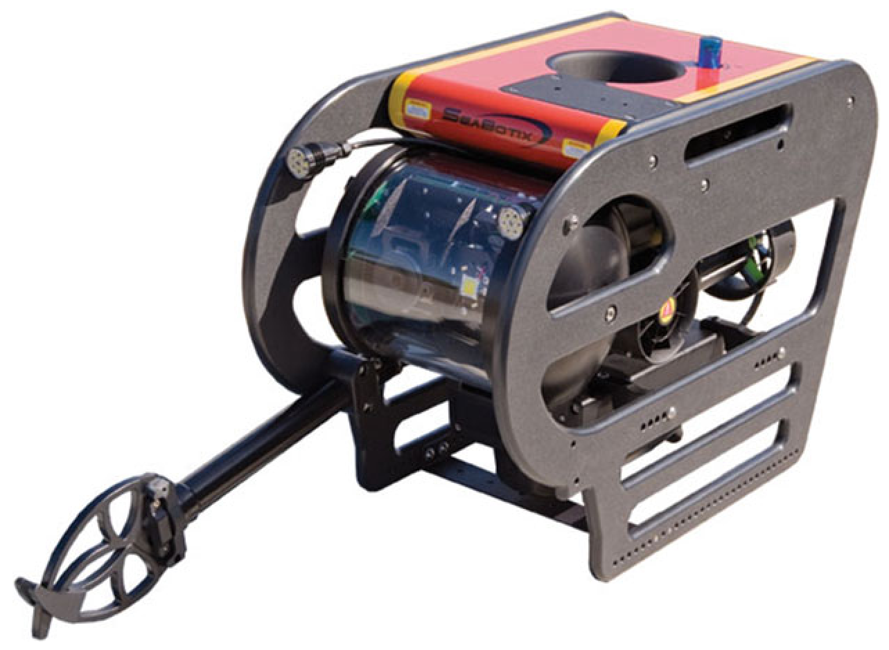

> Image description: A high-angle, studio product photograph shows the SARbot, a Remotely Operated Vehicle (ROV) designed for disaster response. The robot features a robust, industrial design dominated by a dark grey, heavy-duty structural frame. A central, transparent cylindrical pressure vessel houses internal electronics and components. The top of the unit is covered by a flat, rectangular plate with a yellow-to-red gradient and a black recessed area. The brand name "SeaBotix" is clearly visible in white text on the upper side of the device. A long, black manipulator arm extends from the lower left of the chassis, terminating in a circular, open-frame gripper or sensor mount. Various connection points, such as circular electrical connectors and visible mounting bolts, are distributed across the frame. The device is shown against a plain white background, highlighting its engineering-focused, utilitarian construction intended for underwater exploration and search and rescue operations.
Disaster Response Robot, Fig. 1 SARbot (Courtesy of SeaBotix Inc.) http://www.seabotix.com/products/sarbot.htm


<!-- source_pdf_page: 310 -->
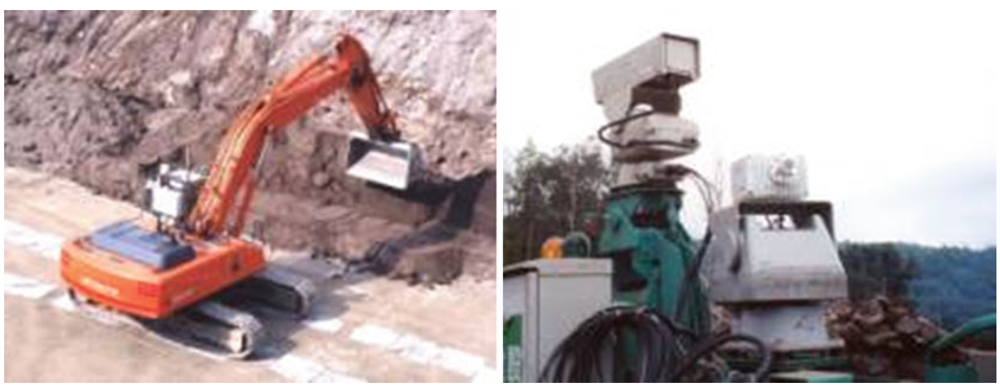

> Image description: This two-part figure displays components of an unmanned construction system used for disaster response. The left image shows an orange remote-controlled or autonomous mini-excavator operating in a rugged, earthen environment. The machine is equipped with continuous tracks for mobility and a mechanical arm with a front-loading bucket, positioned as if digging into a dirt embankment. The scale suggests it is a compact model designed for navigating debris or tight spaces. The right image provides a close-up view of specialized sensor or robotic components. It features two distinct mounted units atop a green mechanical frame. The leftmost unit appears to be an optical sensor or camera housing mounted on a motorized gimbal, likely used for visual feedback or environmental mapping. The rightmost unit is a larger, rectangular white component. Thick black cables are visible at the bottom, indicating the electrical and signal connections required for the automated operation of this robotic system.

Disaster Response Robot, Fig. 2 Unmanned construction system (Courtesy of Society for Unmanned Construction Systems) http://www.kenmukyou.gr.jp/f_souti.htm

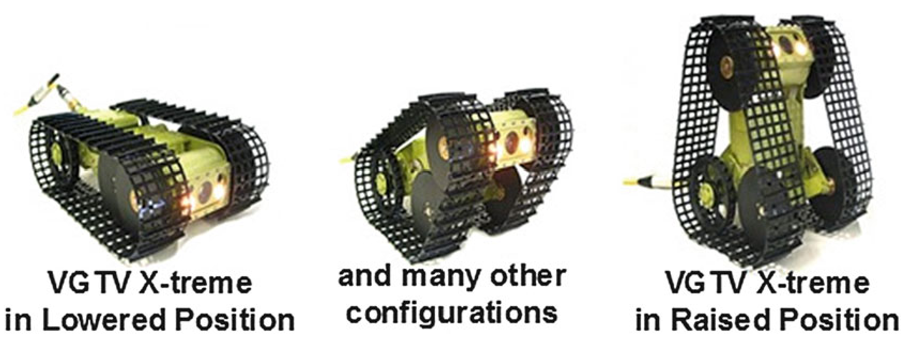

> Image description: A textbook figure titled "Disaster Response Robot, Fig. 2 Unmanned construction system (Courtesy of Society for Unmanned Construction Systems)" displays three images of the "VG TV X-treme" robot in different physical configurations. From left to right, the first image shows the robot in a "Lowered Position," characterized by its low profile and wide, horizontal orientation of its large black continuous tracks. The middle image, captioned "and many other configurations," shows a transitional intermediate stance. The third image shows the robot in a "Raised Position," where the chassis is tilted upward, making the robot appear taller and more vertical, with the tracks forming an upright loop. The robot features a light-colored central body, large black tracks, and small integrated lights. These images demonstrate the robot's mechanical versatility and degree of freedom in changing its center of gravity and profile for various terrain traversal requirements.

Disaster Response Robot, Fig. 3 VGTV X-treme (Courtesy of Recce Robotics) http://www.recce-robotics.com/vgtv.html

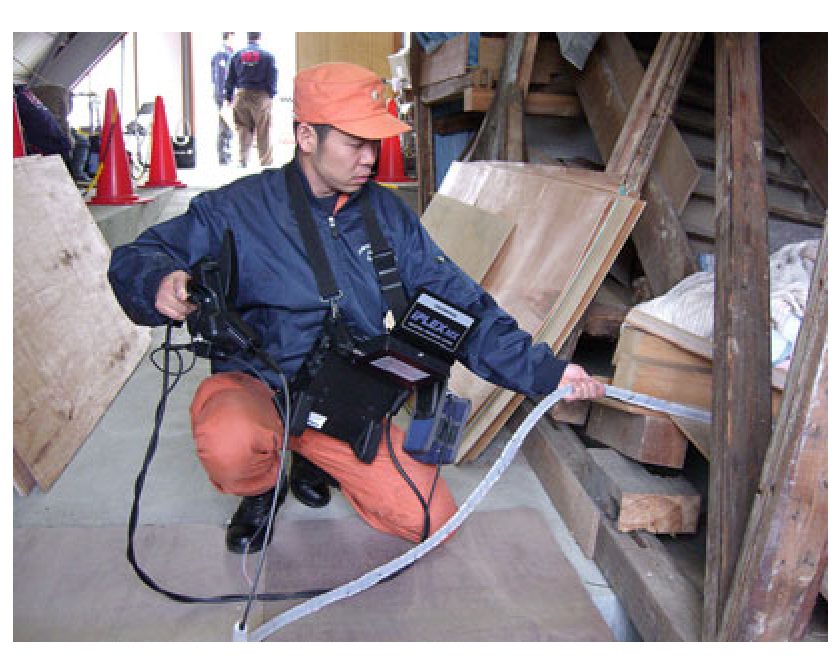

> Image description: A photograph titled "Disaster Response Robot, Fig. 3 VGTV X-treme (Courtesy of Recce Robotics)" shows a technician wearing orange and blue workwear and an orange cap, crouching in a cluttered workspace filled with wooden planks. The technician is operating or inspecting a piece of specialized equipment, likely the VGTV X-treme disaster response robot mentioned in the caption, which is partially visible in his lap and hands. He is holding a long, measuring tape or a similar diagnostic strip that extends across the foreground. The setting appears to be an industrial or warehouse-like environment with wooden construction materials, some orange traffic cones in the background, and other workers visible in the distance. The focus is on the manual handling and inspection of equipment within a complex, debris-filled environment typical of disaster response scenarios.

Disaster Response Robot, Fig. 4 Active scope camera (Courtesy of International Rescue System Institute)


<!-- source_pdf_page: 311 -->
Large-sized robots can discharge large volumes of the fluid with water cannons, whereas smallsized robots have better mobility.

## Response Robots for Man-Made Disasters

## Explosive Ordnance Disposal (EOD)

Detection and disposal of explosive ordnance is one of the most dangerous tasks. TALON, PackBot, and Telemax are widely used in military and explosive ordnance disposal teams worldwide. Telemax has an arm with seven degrees of freedom on a tracked vehicle with four subtracks as shown in Fig. 5. It can observe narrow spaces like overhead lockers of airplanes and bottom of automobiles by cameras, manipulate objects by the arm, and deactivate explosives by a disrupter.

## CBRNE Disasters

CBRNE (chemical, biological, radiological, nuclear, and explosive) disasters have a high risk and can cause large-scale damage because human cannot detect contamination by the Hazmat (hazardous materials). Application of robotic systems is highly expected for this disaster. PackBot has sensors for toxic industrial chemicals (TIC), blood agents, blister agents, volatile organic
compounds (VOCs), radiation, etc., as options and can measure the Hazmat in dangerous confined spaces (Fig. 6). Quince was developed for research into technical issues of UGVs at CBRNE disasters and has high mobility on rough terrain (Fig. 7).

## Fukushima Daiichi Nuclear Power Plant Accident

At the Fukushima Daiichi nuclear power plant accident caused by tsunami in 2011, various disaster response robots were applied. They contributed to the cool shutdown and decommissioning of the plant. For example, PackBot and Quince gave essential data for task planning by shooting images and radiation measurement in nuclear reactor buildings there. Unmanned construction system removed debris outdoors that were contaminated by radiological materials and reduced the radiation rate there significantly.

Group INTRA in France and KHG in Germany are organizations for responding to nuclear plant accidents. They are equipped with robots and remote-controlled construction machines for radiation measurement, decontamination, and constructions in emergency. In Japan, the Assist Center for Nuclear Emergencies was established after the Fukushima Accident.

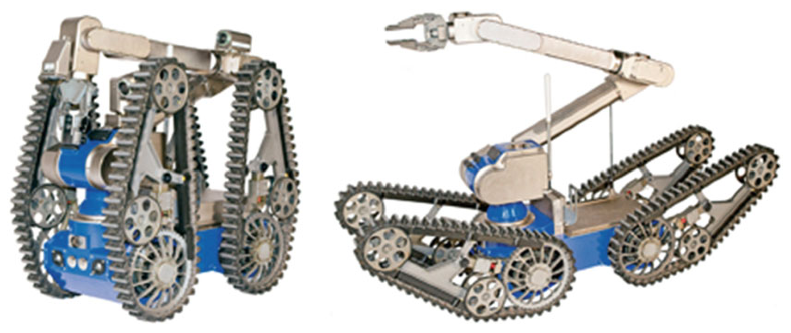

> Image description: The image shows two views of a Telemax disaster response robot, credited to Cobham Mission Equipment. The robot features a heavy-duty tracked chassis designed for navigating uneven terrain. It utilizes a continuous track system with multiple drive wheels to provide stability and mobility. Mounted on the chassis is a multi-jointed robotic manipulator arm, which appears to have several degrees of freedom for versatile operation. The robot has a blue-colored central body containing its internal components. The tracks are black and composed of interlocking links. In the left view, the robot is seen from an angle that emphasizes its vertical structure and track orientation. The right view provides a side perspective, highlighting the extended robotic arm and its articulation. This type of mobile platform is engineered for remote operation in hazardous environments, such as disaster zones, where its rugged tracks and articulated arm allow it to interact with surroundings and overcome obstacles.
Disaster Response Robot, Fig. 5 Telemax (Courtesy of Cobham Mission Equipment) http://www.cobham. com/about-cobham/mission-systems/about-us/mission-

equipment/unmanned-systems/products-and-services/ remote-controlled-robotic-solutions/telemax-explosive-ordnance-(eod)-robot.aspx


<!-- source_pdf_page: 312 -->


> Image description: A studio photograph of the PackBot disaster response robot by iRobot is presented against a dark, minimalist background. The robot is a tracked, mobile platform designed for navigating complex environments. It features two heavy-duty continuous tracks equipped with textured treads for traction. Mounted on the chassis is a multi-jointed articulated arm extending upwards and towards the left, ending in a specialized gripper or end-effector. At the top of the assembly, a sensor mast holds a rectangular camera module, which serves as the robot's visual interface for remote operation. A thin antenna is visible, indicating wireless communication capabilities. The engineering design emphasizes ruggedness and maneuverability, utilizing a modular structure where the propulsion system, manipulation arm, and sensor suite are integrated onto a robust tracked base. The lighting highlights the metallic textures and mechanical joints of the robotic system.
Disaster Response Robot, Fig. 6 PackBot (Courtesy of iRobot) http://www.irobot.com/us/learn/defense/packbot/ Specifications.aspx

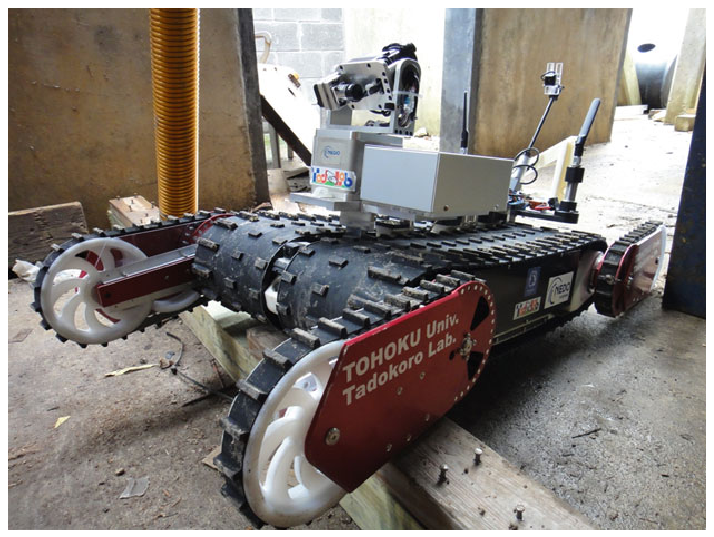

> Image description: Figure 6 shows a photograph of a PackBot disaster response robot situated in a cluttered, industrial-like environment. The robot features a heavy-duty tracked locomotion system consisting of thick, black rubber treads mounted on red side plates and white, spoke-like wheels. The side plate in the foreground is clearly labeled with the text "TOHOKU Univ. Tadokoro Lab." The central chassis is composed of several modular blocks, including a silver rectangular electronics enclosure and a raised sensor/camera assembly on top. Multiple antennas and communication masts extend upward from the rear of the robot. The robot's design emphasizes mobility through its articulated track assemblies, intended for navigating uneven terrain. There are no visible axes, variables, or arrows in this photographic image, only the physical components of the robotic platform and institutional branding.
Disaster Response Robot, Fig. 7 Quince (Courtesy of International Rescue System Institute)

## Summary and Future Directions

Data flow of disaster response robots is generally described by a feedback system as shown in Fig. 8. Robots change the states of objects and environment by movement and task execution. Sensors measure and recognize them, and their
feedback enables the robots' autonomous motion and work. The sensed data are shown to operators via communication, data processing, and human interface. The operators give commands of motion and work to the system via the human interface. The system recognizes and transmits them to the robot.


<!-- source_pdf_page: 313 -->
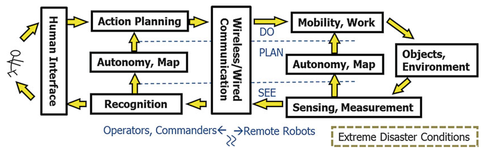

> Image description: Figure 8 illustrates the data flow of remotely controlled disaster response robots in extreme disaster conditions. The diagram depicts a closed-loop feedback system between human operators and remote robots, connected via "Wireless/Wired Communication." On the left, a human figure interacts with a "Human Interface." The human interface flows into "Action Planning," which is linked to "Recognition" through an intermediate "Autonomy, Map" block. This entire human-side chain sends data through the communication channel. On the right, the robot side consists of three primary stages: "Sensing, Measurement," "Autonomy, Map," and "Mobility, Work." These components interact with "Objects, Environment." Blue dashed arrows indicate information flow: "SEE" from sensing to recognition, "PLAN" from autonomy/map to action planning, and "DO" from mobility/work to action planning. The flow is bidirectional between the operator and robot via the communication link, facilitating remote control and autonomous processing.
Disaster Response Robot, Fig. 8 Data flow of remotely controlled disaster response robots

Each functional block has its own technical challenges to be fulfilled under extreme environments of disaster space in response to the objectives and the conditions. They should be solved technically in order to improve the robot performance. They include insufficient mobility in disaster spaces (steps, gaps, slippage, narrow space, obstacles, etc.), deficient workability (dexterity, accuracy, speed, force, work space, etc.), poor sensors and sensor data processing (image, recognition, etc.), lack of reliability and performance of autonomy (robot intelligence, multiagent collaboration, etc.), issues of wireless and wired communication (instability, delay, capacity, tether handling, etc.), operators' limitations (situation awareness, decision ability, fatigue, mistake, etc.), basic performances (explosion proof, weight, durability, portability, etc.), and system integration that combines the components into the solution. Mission critical planning and execution including human factors, training, role sharing, logistics, etc. have to be considered at the same time.

Research into systems and control is expected to solve the abovementioned challenges of components and systems. For example, intelligent control is essential for mobility and workability under extreme conditions; control of feedback systems including long delay and dynamic instability, control of human-in-loop systems, and system integration of heterogeneous systems are important research topics of systems and control.

In the research field of disaster robotics, various competitions of practical robots have
been held, e.g., RoboCupRescue targeting CBRNE disasters, ELROB and euRathlon for field activities, MAGIC for multi-robot autonomy, and DARPA Robotics Challenge for humanoid robots in nuclear disasters. These competitions seek to stimulate solutions of the above-mentioned technical issues in different environments by providing practical test beds for advanced technology developments.

## Cross-References

- Robot Teleoperation
- Walking Robots
- Wheeled Robots


## Bibliography

ELROB (2013) www.elrob.org
Group INTRA (2013) www.groupe-intra.com
KHG (2013) www.khgmbh.de
Murphy, R. (2014) Disaster robotics. MIT, Cambridge
RoboCup (2013) www.robocup.org
Siciliano B, Khatib O (eds) (2008) Springer handbook of robotics, 1st edn. Springer, Berlin
Siciliano B, Khatib O (eds) (2014) Springer handbook of robotics, 2nd edn. Springer, Berlin
Tadokoro S (ed) (2010) Rescue robotics: DDT project on robots and systems for urban search and rescue. Springer, London
Tadokoro S, Seki S, Asama H (2013) Priority issues of disaster robotics in Japan. In: Proceedings of the IEEE region 10 humanitarian technology conference, Sendai, 27-29 Aug 2013


<!-- source_pdf_page: 314 -->
# Discrete Event Systems and Hybrid Systems, Connections Between

Alessandro Giua<br>DIEE, University of Cagliari, Cagliari, Italy<br>LSIS, Aix-en-Provence, France


#### Abstract

The causes of the complex behavior typical of hybrid systems are multifarious and are commonly explained in the literature using paradigms that are mainly focused on the connections between time-driven and hybrid systems. In this entry, we recall some of these paradigms and further explore the connections between discrete event and hybrid systems from other perspectives. In particular, the role of abstraction in passing from a hybrid model to a discrete event one and vice versa is discussed.


## Keywords

Hybrid system; Logical discrete event system; Timed discrete event system

## Introduction

Hybrid systems combine the dynamics of both time-driven systems and discrete event systems.

The evolution of a time-driven system can be described by a differential equation (in continuous time) or by a difference equation (in discrete time). An example of such a system is the tank shown in Fig. 1 whose behavior, assuming the tank is not full, is ruled in continuous time $t$ by the differential equation

$$
\frac{d}{d t} V(t)=q_{1}(t)-q_{2}(t)
$$

where $V$ is the volume of liquid and $q_{1}$ and $q_{2}$ are, respectively, the input and output flow.

A discrete event system (Lafortune and Cassandras 2007; Seatzu et al. 2012) evolves in accordance with the abrupt occurrence, at possibly unknown irregular intervals, of physical events. Its states may have logical or symbolic, rather than numerical, values that change in response to events which may also be described in nonnumerical terms. An example of such a system is a robot that loads parts on a conveyor, whose behavior is described by the automaton in Fig. 2. The robot can be "idle," "loading" a part, or in an "error" state when a part is incorrectly positioned. The events that drive its evolution are $a$ (grasp a part), $b$ (part correctly loaded), $c$ (part incorrectly positioned), and $d$ (part repositioned). In a logical discrete event system ( ↓ Supervisory Control of Discrete-Event Systems), the timing of event occurrences are ignored, while in a timed discrete event system ( - Models for Discrete Event Systems: An Overview), they are described by means of a suitable timing structure.

In a hybrid system ( ⊕ Hybrid Dynamical Systems, Feedback Control of), time-driven and event-driven evolutions are simultaneously present and mutually dependent. As an example, consider a room where a thermostat maintains the temperature $x(t)$ between $x_{a}=20^{\circ} \mathrm{C}$ and $x_{b}=22^{\circ} \mathrm{C}$ by turning a heat pump on and off. Due to the exchange with the external environment at temperature $x_{e} \ll x(t)$, when the pump is off, the room temperature derivative is

$$
\frac{d}{d t} x(t)=-k\left[x(t)-x_{e}\right]
$$

where $k$ is a suitable coefficient, while when the pump is on, the room temperature derivative is

$$
\frac{d}{d t} x(t)=h(t)-k\left[x(t)-x_{e}\right]
$$

where the positive term $h(t)$ is due to the heat pump. The hybrid automaton that describes this system is shown in Fig. 3.

The causes of the complex behavior typical of hybrid systems are multifarious, and among the paradigms commonly used in the literature to describe them, we mention three.


<!-- source_pdf_page: 315 -->
Discrete Event Systems and Hybrid Systems, Connections Between,
Fig. 1 A tank
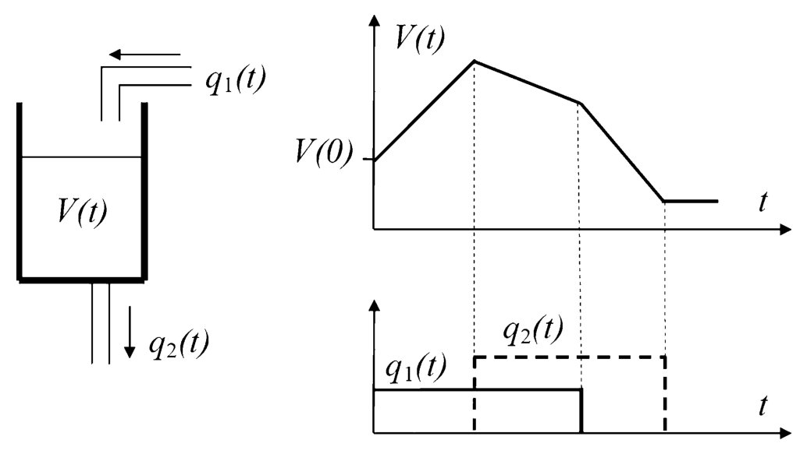

> Image description: This figure illustrates the mass balance of a tank over time. On the left, a schematic diagram shows a tank containing a volume of fluid, $V(t)$. An inflow arrow at the top is labeled $q_1(t)$, representing the input flow rate, and an outflow arrow at the bottom is labeled $q_2(t)$, representing the output flow rate. To the right, two time-series graphs plot the relationship between flow rates and volume. The upper graph shows the volume $V(t)$ as a function of time $t$, starting at an initial value $V(0)$. The volume increases linearly while $q_1(t) > q_2(t)$, reaches a peak, then decreases when $q_2(t) > q_1(t)$, eventually reaching a steady state. The lower graph plots the flow rates $q_1(t)$ and $q_2(t)$ against time $t$. $q_1(t)$ is represented by a solid step function, and $q_2(t)$ is represented by a dashed step function, illustrating how their difference dictates the slope of the $V(t)$ curve.

Discrete Event Systems and Hybrid Systems, Connections Between,
Fig. 2 A machine with failures
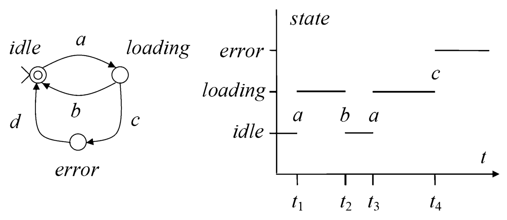

> Image description: Fig. 2 illustrates a finite state machine and its corresponding state-over-time trace. On the left, a state transition diagram shows three states: "idle" (the initial state, indicated by a double circle and an arrow), "loading," and "error." Transitions between states are labeled with lowercase letters: an arrow labeled $a$ moves from "idle" to "loading"; an arrow labeled $b$ returns from "loading" to "idle"; an arrow labeled $c$ moves from "loading" to "error"; and an arrow labeled $d$ returns from "error" to "idle." On the right, a graph plots "state" on the vertical axis against time $t$ on the horizontal axis. The trace shows the system transitioning through states over time intervals marked by $t_1, t_2, t_3$, and $t_4$. The sequence follows: "idle" triggers event $a$ at $t_1$ to enter "loading"; event $b$ at $t_2$ returns the state to "idle"; event $a$ at $t_3$ transitions to "loading" again; and finally, event $c$ at $t_4$ moves the state to "error."

Discrete Event Systems and Hybrid Systems, Connections Between,
Fig. 3 Hybrid automaton
of the thermostat
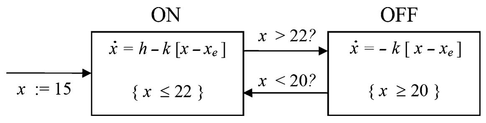

> Image description: Figure 3 shows a hybrid automaton diagram for a thermostat, consisting of two discrete states: "ON" and "OFF." The "ON" state contains the differential equation $\dot{x} = h - k[x - x_e]$ and the invariant condition $\{x \leq 22\}$. The "OFF" state contains the differential equation $\dot{x} = -k[x - x_e]$ and the invariant condition $\{x \geq 20\}$. Transitions between the states are governed by guards: an arrow labeled "$x > 22?$" transitions from "ON" to "OFF," while an arrow labeled "$x < 20?$" transitions from "OFF" back to "ON." An external input arrow points into the "ON" state with the assignment $x := 15$. The diagram represents a switching system where the continuous dynamics of variable $x$ change based on threshold conditions, modeling temperature control behavior.

- Logically controlled systems. Often, a physical system with a time-driven evolution is controlled in a feedback loop by means of a controller that implements discrete computations and event-based logic. This is the case of the thermostat mentioned above. Classes of systems that can be described by this paradigm are embedded systems or, when the feedback loop is closed through a communication network, cyber-physical systems.
- State-dependent mode of operation. A timedriven system can have different modes of evolution depending on its current state. As an example, consider a bouncing ball. While the ball is above the ground (vertical position $h>0$ ) its behavior is that of a falling body subject to a constant gravitational force. However, when the ball collides with the ground
(vertical position $h=0$ ), its behavior is that of a (partially) elastic body that bounces up. Classes of systems that can be described by this paradigm are piecewise affine systems and linear complementarity system.
- Variable structure systems. Some systems may change their structure assuming different configuration, each characterized by a different behavior. As an example, consider a multicell voltage converter composed by a cascade of elementary commutation cells: controlling some switches, it is possible to insert or remove cells so as to produce a desired output voltage signal. Classes of systems that can be described by this paradigm are switched systems.
While these are certainly appropriate and meaningful paradigms, they are mainly focused on the connections between time-driven and


<!-- source_pdf_page: 316 -->
hybrid systems. In the rest of this entry, we will discuss the connections between discrete event and hybrid systems from other different perspectives. The focus is strictly on modeling, thus approaches for analysis or control will not be discussed.

## From Hybrid Systems to Discrete Event System by Modeling Abstraction

A system is a physical object, while a model is a (more or less accurate) mathematical description of its behavior that captures those features that are deemed mostly significant. In the previous pages, we have introduced different classes of systems, such as "time-driven systems," "discrete event systems," and "hybrid systems," but properly speaking, this taxonomy pertains to the models because the terms "time driven," "discrete event," or "hybrid" should be used to classify the mathematical description and not the physical object.

According to this view, a discrete event model is often perceived as a high-level description of a physical system where the time-driven dynamics are ignored or, at best, approximated by a timing structure. This procedure to derive a simpler model in a way that preserves the properties being analyzed while hiding the details that are of no interest is called abstraction (Alur et al. 2000).

Consider, as an example, the thermostat in Fig. 3. In such a system, the time-driven evolution determines a change in the temperature, which in turn - reaching a threshold - triggers the occurrence of an event that changes the discrete state. Assume one does not care about the exact form this triggering mechanism takes and is only interested in determining if the heat pump is turned on or off. In such a case, we can completely abstract the time-driven evolution obtaining a logical discrete event model such as the automaton in Fig. 4, where label $a$ denotes the event the temperature drops below $20^{\circ} \mathrm{C}$ and label $b$ denotes the event the temperature raises over $22^{\circ} \mathrm{C}$.

For some purposes, e.g., to determine the utilization rate of the heat pump and thus its operating cost, the model in Fig. 4 is inadequate. In such a case, one can consider a less coarse

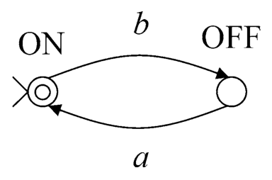

> Image description: A diagram illustrating a finite state machine with two states, labeled "ON" and "OFF." The state "ON" is represented by a circle with a dot inside, signifying the initial or starting state. The state "OFF" is represented by an empty circle. Two directional arrows define the transitions between these states. An arrow labeled with the lowercase letter "$b$" points from the "ON" state to the "OFF" state, representing a transition from "ON" to "OFF" triggered by event "$b$." A returning arrow labeled with the lowercase letter "$a$" points from the "OFF" state back to the "ON" state, representing a transition from "OFF" to "ON" triggered by event "$a$." The states are positioned horizontally, creating a cyclical relationship between the two modes of operation.
Discrete Event Systems Fig. 4 Logical discrete and Hybrid Systems, event model of the Connections Between, thermostat

abstraction of the hybrid model in Fig. 3 obtaining a timed discrete event model such as the automaton in Fig. 4. Here, to each event is associated a firing delay: as an example, $\delta_{a}$ represents the time it takes - when the pump is off - to cool down until the lower temperature threshold is reached and event $a$ occurs. The delay may be a deterministic value or even a random one to take into account the uncertainty due to non-modeled time-varying parameters such as the temperature of the external environment. Note that a new state (START) and a new event $b^{\prime}$ have now been introduced to capture the transient phase in which the room temperature, from the initial value $x(0)=15^{\circ} \mathrm{C}$, reaches the higher temperature threshold: in fact, event $b^{\prime}$ has a delay greater than the delay of event $b$.

## Timed Discrete Event Systems Are Hybrid Systems

Properly speaking, all timed discrete event systems may also be seen as hybrid systems if one considers the dynamics of the timers - that specify the event occurrence - as elementary timedriven evolutions. In fact, the simplest model of hybrid systems is the timed automaton introduced by Alur and Dill (1994) whose main feature is the fact that each continuous variable $x(t)$ has a constant derivative $\dot{x}(t)=1$ and thus can only describe the passage of time. Incidentally, we note that the term "timed automaton" is also used in the area of discrete event systems (Lafortune and Cassandras 2007) to denote an automaton in which a timing structure is associated to the events: such an example was shown in Fig. 5. To avoid any confusion, in the following, we denote the former model Alur-Dill automaton and the latter model timed DES automaton.


<!-- source_pdf_page: 317 -->
In Fig. 6 is shown an Alur-Dill automaton that describes the thermostat, where the timedriven dynamics have been abstracted and only the timing of event occurrence is modeled as in the timed DES automaton in Fig. 5. The only continuous variable is the value of a timer $\delta$ : when it goes beyond a certain threshold (e.g., $\delta>\delta_{a}$ ), an event occurs (e.g., event $a$ ) changing the discrete state (e.g., from OFF to ON) and resetting the timer to zero.

It is rather obvious that the behavior of the Alur-Dill automaton in Fig. 6 is equivalent to the behavior of timed DES automaton in Fig. 5. In the former model, the notion of time is encoded by means of an explicit continuous variable $\delta$. In the latter model, the notion of time is implicitly encoded by the timer that during an evolution will be associated to each event. In both cases, however, the overall state of the systems is described by a pair $(\ell(t), x(t))$ where the first element $\ell$ takes value in a discrete set $\{S T A R T, O N, O F F\}$ and the second element is a vector (in this particular case with a single component) of timer valuations.

It should be pointed out that an Alur-Dill automaton may have a more complex structure than that shown in Fig. 6: as an example, the guard associated to a transition, i.e., the values of the timer that enable it, can be an arbitrary rectangular set. However, the same is also true for a timed discrete event system: several policies can be used to define the time intervals enabling an

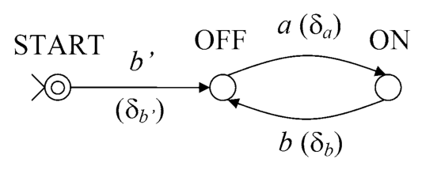

> Image description: A diagram of a finite state automaton or timed discrete event system is presented. The diagram illustrates a sequence of state transitions beginning from a starting point labeled "START," represented by a double-circle icon. An arrow labeled with the event $b'$ (and its corresponding transition function $\delta_{b'}$) moves from "START" to a circular state labeled "OFF." From the "OFF" state, two reciprocal arrows represent transitions between "OFF" and a second circular state labeled "ON." The transition from "OFF" to "ON" is labeled with event $a$ and transition function $\delta_a$. The returning transition from "ON" to "OFF" is labeled with event $b$ and transition function $\delta_b$. The diagram serves as a simplified visual example to contrast with the complex Alur-Dill automaton described in the accompanying text, where guards might be defined by arbitrary rectangular sets rather than single discrete events.
Discrete Event Systems and Hybrid Systems, Connections Between, Fig. 5 Timed discrete event model of the thermostat

event (enabling policy) or to specify when a timer is reset (memory policy) (Ajmone Marsan et al. 1995). Furthermore, timed discrete event system can have arbitrary stochastic timing structures (e.g., semi-Markovian processes, Markov chains, and queuing networks (Lafortune and Cassandras 2007)), not to mention the possibility of having an infinite discrete state space (e.g., timed Petri nets (Ajmone Marsan et al. 1995; David and Alla 2004)). As a result, we can say that timed DES automata are far more general than Alur-Dill automata and represent a meaningful subclass of hybrid systems.

## From Discrete Event System to Hybrid Systems by Fluidization

The computational complexity involved in the analysis and optimization of real-scale problems often becomes intractable with discrete event models due to the very large number of reachable states, and a technique that has shown to be effective in reducing this complexity is called fluidization ( - Applications of Discrete-Event Systems). It should be noted that the derivation of a fluid (i.e., hybrid) model from a discrete event one is yet an example of abstraction albeit going in opposite direction with respect to the examples discussed in the section "From Hybrid Systems to Discrete Event System by Modeling Abstraction" above.

The main drive that motivated the fluidization approach derives from the observation that some discrete event systems are "heavily populated" in the sense that there are many identical items in some component (e.g., clients in a queue). Fluidization consists in replacing the integer counter of the number of items by a real number and in approximating the "fast" discrete event
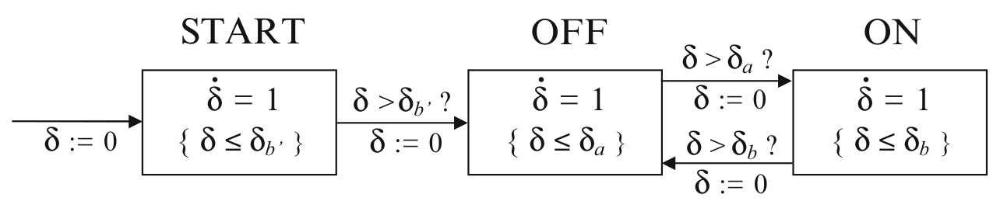


<!-- source_pdf_page: 318 -->
dynamics that describe how the counter changes by a continuous dynamics. This approach has been successfully used to study the performance optimization of fluid-queuing networks (Cassandras and Lygeros 2006) or Petri net models (Balduzzi et al. 2000; David and Alla 2004; Silva and Recalde 2004) with applications in domains such as manufacturing systems and communication networks. We also remark that in general, different fluid approximations are necessary to describe the same system, depending on its discrete state, e.g., in the manufacturing domain, machines working or down, buffers full or empty, and so on. Thus, the resulting model can be better described as a hybrid model, where different time-driven dynamics are associated to different discrete states.

There are many advantages in using fluid approximations. First, there is the possibility of considerable increase in computational efficiency because the simulation of a fluid model can often be performed much faster than that of its discrete event counterpart. Second, fluid approximations provide an aggregate formulation to deal with complex systems, thus reducing the dimension of the state space. Third, the resulting simple structures often allow explicit computation of performance measures. Finally, some design parameters in fluid models are continuous; hence, it is possible to use gradient information to speed up optimization and to perform sensitivity analysis (Balduzzi et al. 2000): in many cases, it has also been shown that fluid approximations do not introduce significant errors when carrying out performance analysis via simulation ( - Perturbation Analysis of Discrete Event Systems).

## Cross-References

- Applications of Discrete-Event Systems
- Hybrid Dynamical Systems, Feedback Control of
- Models for Discrete Event Systems: An Overview
- Perturbation Analysis of Discrete Event Systems
- Supervisory Control of Discrete-Event Systems


## Bibliography

Ajmone Marsan M, Balbo G, Conte G, Donatelli S, Franceschinis G (1995) Modelling with generalized stochastic Petri nets. Wiley, Chichester/New York
Alur R, Dill DL (1994) A theory of timed automata. Theor Comput Sci 126:183-235
Alur R, Henzinger TA, Lafferriere G, Pappas GJ (2000) Discrete abstractions of hybrid systems. Proc IEEE 88(7):971-984
Balduzzi F, Giua A, Menga G (2000) First-order hybrid Petri nets: a model for optimization and control. IEEE Trans Robot Autom 16:382-399
Cassandras CG, Lygeros J (eds) (2006) Stochastic hybrid systems: recent developments and research. CRC Press, New York
David R, Alla H (2004) Discrete, continuous and hybrid Petri nets. Springer, Berlin
Lafortune S, Cassandras CG (2007) Introduction to discrete event systems, 2nd edn. Springer, Boston
Seatzu C, Silva M, van Schuppen JH (eds) (2012) Control of discrete event systems. Automata and Petri net perspectives. Volume 433 of lecture notes in control and information science. Springer, London
Silva M, Recalde L (2004) On fluidification of Petri net models: from discrete to hybrid and continuous models. Annu Rev Control 28(2):253-266

## Discrete Optimal Control

David Martin De Diego
Instituto de Ciencias Matemáticas
(CSIC-UAM-UC3M-UCM), Madrid, Spain

## Synonyms

DOC


#### Abstract

Discrete optimal control is a branch of mathematics which studies optimization procedures for controlled discrete-time models - that is, the optimization of a performance index associated with a discrete-time control system. This entry gives an introduction to the topic. The formulation of a general discrete optimal control problem is described, and applications to mechanical systems are discussed.


<!-- source_pdf_page: 319 -->
## Keywords

Discrete mechanics; Discrete-time models; Symplectic integrators; Variational integrators

## Definition

Discrete optimal control is a branch of mathematics which studies optimization procedures for controlled discrete-time models, that is, the optimization of a performance index associated to a discrete-time control system.

## Motivation

Optimal control theory is a mathematical discipline with innumerable applications in both science and engineering. Discrete optimal control is concerned with control optimization for discretetime models. Recently, in discrete optimal control theory, a great interest has appeared in developing numerical methods to optimally control real mechanical systems, as for instance, autonomous robotic vehicles in natural environments such as robotic arms, spacecrafts, or underwater vehicles.

During the last years, a huge effort has been made for the comprehension of the fundamental geometric structures appearing in dynamical systems, including control systems and optimal control systems. This new geometric understanding of those systems has made possible the construction of suitable numerical techniques for integration. A collection of ad hoc numerical methods are available for both dynamical and control systems. These methods have grown up accordingly with the needs in research coming from different fields such as physics and engineering. However, a new breed of ideas in numerical analysis has started recently. They incorporate the geometry of the systems into the analysis and that allows faster and more accurate algorithms and with less spurious effects than the traditional ones. All this gives birth to a new field called Geometric Integration (Hairer et al. 2002). For instance, numerical integrators for Hamiltonian systems should preserve the symplectic
structure underlying the geometry of the system. If so, they are called symplectic integrators.

Another approach used by more and more authors is based on the theory of discrete mechanics and variational integrators to obtain geometric integrators preserving some of the geometry of the original system (Hussein et al. 2006; Marsden and West 2001; Wendlandt and Marsden 1997a,b) (see also the section "Discrete Mechanics"). These geometric integrators are easily adapted and applied to a wide range of mechanical systems: forced or dissipative systems, holonomically constrained systems, explicitly time-dependent systems, reduced systems with frictional contact, nonholonomic dynamics, and multisymplectic field theories, among others.

As before, in optimal control theory, it is necessary to distinguish two kinds of numerical methods: the so-called direct and indirect methods. If we use direct methods, we first discretize the state and control variables, control equations, and cost functional, and then we solve a nonlinear optimization problem with constraints given by the discrete control equations, additional constraints, and boundary conditions (Bock and Plitt 1984; Bonnans and Laurent-Varin 2006; Hager 2001; Pytlak 1999). In this case, we typically need to solve a system of the type (see the section "Formulation of a General Discrete Optimal Control Problem")

$$
\left\{\begin{aligned}
\operatorname{minimize} & F(X) X=\left(q^{0}, \ldots, q^{N}, u_{1}, \ldots u_{N}\right) \\
\text { with } & \Psi(X)=0 \\
& \Phi(X) \geq 0
\end{aligned}\right.
$$

On the other hand, indirect methods consist of solving numerically the boundary value problem obtained from the equations after applying Pontryagin's Maximum Principle.

The combination of direct methods and discrete mechanics allows to obtain numerical control algorithms which are geometric structure preserving and exhibit a good long-time behavior (Bloch et al. 2013; Jiménez et al. 2013; Junge and Ober-Blöbaum 2005; Junge et al. 2006; Kobilarov 2008; Leyendecker et al. 2007; OberBlöbaum 2008; Ober-Blöbaum et al. 2011). Furthermore, it is possible to adapt many of


<!-- source_pdf_page: 320 -->
the techniques used for continuous control mechanical systems to the design of quantitative and qualitative accurate numerical methods for optimal control methods (reduction by symmetries, preservation of geometric structures, Lie group methods, etc.).

## Formulation of a General Discrete Optimal Control Problem

Let $M$ be an $n$-dimensional manifold, $x$ denote the state variables in $M$ for an agent's environment, and $u \in U \subset \mathbb{R}^{m}$ be the control or action that the agent chooses to accomplish a task or objective. Let $f_{d}(x, u) \in M$ be the resulting state after applying the control $u$ to the state $x$. For instance, $x$ may be the configuration of a vehicle at time $t$ and $u$ its fuel consumption, and then $f_{d}(x, u)$ is the new configuration of the vehicle at time $t+h$, with $t, h>0$. Of course, we want to minimize the fuel consumption. Hence, the optimal control problem consists of finding the cheapest way to move the system from a given initial position to a final state. The problem can be mathematically described as follows: find a sequence of controls ( $u_{0}, u_{1}, \ldots, u_{N-1}$ ) and a sequence of states $\left(x_{0}, x_{1}, \ldots, x_{N}\right)$ such that

$$
\begin{equation*}
x_{k+1}=f_{d}\left(k, x_{k}, u_{k}\right) \tag{1}
\end{equation*}
$$

where $x_{k} \in M, u_{k} \in U$, and the total cost

$$
\begin{equation*}
\mathcal{C}_{d}=\sum_{k=0}^{N-1} C_{d}\left(k, x_{k}, u_{k}\right)+\phi_{d}\left(N, x_{N}\right) \tag{2}
\end{equation*}
$$

is minimized where $\phi_{d}$ is a function of the final time and state at the final time (the terminal payoff) and $C_{d}$ is a function depending on the discrete time, the state, and the control at each intermediate discrete time $k$ (the running payoff).

To solve the discrete optimal control problem determined by Eqs. (1) and (2), it is possible to use the classical Lagrangian multiplier approach. In this case, we consider the control equations (1) as constraint equations associating a Lagrange multiplier to each constraint. Assume for simplicity that $M=\mathbb{R}^{n}$. Then, we construct the augmented cost function

$$
\begin{align*}
\tilde{\mathcal{C}}_{d}= & \sum_{k=0}^{N-1}\left[p_{k+1}\left(x_{k+1}-f_{d}\left(k, x_{k}, u_{k}\right)\right)\right. \\
& \left.-C_{d}\left(k, x_{k}, u_{k}\right)\right]-\Phi_{d}\left(N, x_{N}\right) \tag{3}
\end{align*}
$$

where $p_{k} \in \mathbb{R}^{n}, k=1, \ldots, N$, are considered as the Lagrange multipliers. The notation $x y$ is used for the scalar (inner) product $x \cdot y$ of two vectors in $\mathbb{R}^{n}$.

From the pseudo-Hamiltonian function

$$
\begin{aligned}
H_{d}\left(k, x_{k}, p_{k+1}, u_{k}\right)= & p_{k+1} f_{d}\left(k, x_{k}, u_{k}\right) \\
& -C_{d}\left(k, x_{k}, u_{k}\right),
\end{aligned}
$$

we deduce the necessary conditions for a constrained minimum:

$$
\begin{align*}
x_{k+1}= & \frac{\partial H_{d}}{\partial p}\left(k, x_{k}, p_{k+1}, u_{k}\right) \\
= & f_{d}\left(k, x_{k}, u_{k}\right)  \tag{4}\\
p_{k}= & \frac{\partial H_{d}}{\partial q}\left(k, x_{k}, p_{k+1}, u_{k}\right) \\
= & p_{k+1} \frac{\partial f_{d}}{\partial q}\left(k, x_{k}, u_{k}\right) \\
& -\frac{\partial C_{d}}{\partial q}\left(k, x_{k}, u_{k}\right)  \tag{5}\\
0= & \frac{\partial H_{d}}{\partial u}\left(k, x_{k}, p_{k+1}, u_{k}\right) \\
= & p_{k+1} \frac{\partial f_{d}}{\partial u}\left(k, x_{k}, u_{k}\right) \\
& -\frac{\partial C_{d}}{\partial u}\left(k, x_{k}, u_{k}\right) \tag{6}
\end{align*}
$$

where $0 \leq k \leq N-1$. Moreover, we have some boundary conditions

$$
\begin{equation*}
x_{0} \text { is given and } p_{N}=-\frac{\partial \Phi_{d}}{\partial q}\left(N, x_{N}\right) \tag{7}
\end{equation*}
$$

The variable $p_{k}$ is called the costate of the system and Eq. (5) is called the adjoint equation. Observe that the recursion of $x_{k}$ given by Eq. (4) develops forward in the discrete time, but the recursion of the costate variable is backward in the discrete time.


<!-- source_pdf_page: 321 -->
In the sequel, it is assumed the following regularity condition:

$$
\operatorname{det}\left(\frac{\partial^{2} H_{d}}{\partial u^{a} \partial u^{b}}\right) \neq 0
$$

where $1 \leq a, b \leq m$, and $\left(u^{a}\right) \in U \subseteq \mathbb{R}^{m}$. Applying the implicit function theorem, we obtain from Eq. (1) that locally $u_{k}=g\left(k, x_{k}, p_{k+1}\right)$. Defining the function

$$
\begin{aligned}
\tilde{H}_{d}: \quad \mathbb{Z} \times \mathbb{R}^{2 n} & \longrightarrow \mathbb{R} \\
\left(k, q_{k}, p_{k+1}\right) & \longmapsto H_{d}\left(k, q_{k}, p_{k+1}, u_{k}\right)
\end{aligned}
$$

Equations (4) and (5) are rewritten as the following discrete Hamiltonian system:

$$
\begin{align*}
x_{k+1} & =\frac{\partial \tilde{H}_{d}}{\partial p}\left(k, x_{k}, p_{k+1}\right)  \tag{8}\\
p_{k} & =\frac{\partial \tilde{H}_{d}}{\partial q}\left(k, x_{k}, p_{k+1}\right) \tag{9}
\end{align*}
$$

The expression of the solutions of the optimal control problem as a discrete Hamiltonian system (under some regularity properties) is important since it indicates that the discrete evolution is preserving symplecticity. A simple proof of this fact is the following (de León et al. (2007)). Construct the following function

$$
\begin{aligned}
G_{k}\left(x_{k}, x_{k+1}, p_{k+1}\right)= & \tilde{H}_{d}\left(k, x_{k}, p_{k+1}\right) \\
& -p_{k+1} x_{k+1}
\end{aligned}
$$

with $0 \leq k \leq N-1$. For each fixed $k$ :

$$
\begin{aligned}
d G_{k}= & \frac{\partial \tilde{H}_{d}}{\partial q}\left(k, x_{k}, p_{k+1}\right) d x_{k} \\
& +\frac{\partial \tilde{H}_{d}}{\partial p}\left(k, x_{k}, p_{k+1}\right) d p_{k+1} \\
& -p_{k+1} d x_{k+1}-x_{k+1} d p_{k+1}
\end{aligned}
$$

Thus, along solutions of Eqs. (8) and (9), we have that $d G_{k \mid \text { solutions }}=p_{k} d x_{k}-p_{k+1} d x_{k+1}$ which implies $d x_{k} \wedge d p_{k}=d x_{k+1} \wedge d p_{k+1}$.

In the next section, we will study the case of discrete optimal control of mechanical systems.

First, we will need an introduction to discrete mechanics and variational integrators.

## Discrete Mechanics

Let $Q$ be an $n$-dimensional differentiable manifold with local coordinates $\left(q^{i}\right), 1 \leq i \leq n$. We denote by $T Q$ its tangent bundle with induced coordinates $\left(q^{i}, \dot{q}^{i}\right)$. Let $L: T Q \rightarrow \mathbb{R}$ be a Lagrangian function; the associated EulerLagrange equations are given by

$$
\begin{equation*}
\frac{d}{d t}\left(\frac{\partial L}{\partial \dot{q}^{i}}\right)-\frac{\partial L}{\partial q^{i}}=0, \quad 1 \leq i \leq n . \tag{10}
\end{equation*}
$$

These equations are a system of implicit secondorder differential equations. Assume that the Lagrangian is regular, that is, the matrix $\left(\frac{\partial^{2} L}{\partial \dot{q}^{i} \partial \dot{q}^{j}}\right)$ is non-singular. It is well known that the origin of these equations is variational (see Marsden and West 2001). Variational integrators retain this variational character and also some of the key geometric properties of the continuous system, such as symplecticity and momentum conservation (see Hairer et al. 2002 and references therein). In the following, we summarize the main features of this type of numerical integrators (Marsden and West 2001). A discrete Lagrangian is a map $L_{d}: Q \times Q \rightarrow \mathbb{R}$, which may be considered as an approximation of the integral action defined by a continuous Lagrangian $L: T Q \rightarrow \mathbb{R}: L_{d}\left(q_{0}, q_{1}\right) \approx \int_{0}^{h} L(q(t), \dot{q}(t)) d t$ where $q(t)$ is a solution of the Euler-Lagrange equations for $L$ with $q(0)=q_{0}, q(h)=q_{1}$, and $h>0$ being enough small.

Remark 1 The Cartesian product $Q \times Q$ is equipped with an interesting differential structure, called Lie groupoid, which allows the extension of variational calculus to more general settings (see Marrero et al. 2006, 2010 for more details).

Define the action sum $S_{d}: Q^{N+1} \rightarrow \mathbb{R}$, corresponding to the Lagrangian $L_{d}$ by $S_{d}= \sum_{k=1}^{N} L_{d}\left(q_{k-1}, q_{k}\right)$, where $q_{k} \in Q$ for $0 \leq k \leq N$ and $N$ is the number of steps. The discrete variational principle states that the solutions of


<!-- source_pdf_page: 322 -->
the discrete system determined by $L_{d}$ must extremize the action sum given fixed endpoints $q_{0}$ and $q_{N}$. By extremizing $S_{d}$ over $q_{k}, 1 \leq k \leq N-$ 1 , we obtain the system of difference equations

$$
\begin{equation*}
D_{1} L_{d}\left(q_{k}, q_{k+1}\right)+D_{2} L_{d}\left(q_{k-1}, q_{k}\right)=0 \tag{11}
\end{equation*}
$$

or, in coordinates,

$$
\frac{\partial L_{d}}{\partial x^{i}}\left(q_{k}, q_{k+1}\right)+\frac{\partial L_{d}}{\partial y^{i}}\left(q_{k-1}, q_{k}\right)=0
$$

where $1 \leq i \leq n, 1 \leq k \leq N-1$, and $x, y$ denote the $n$-first and $n$-second variables of the function $L_{d}$, respectively.

These equations are usually called the discrete Euler-Lagrange equations. Under some regularity hypotheses (the matrix $D_{12} L_{d}\left(q_{k}, q_{k+1}\right)$ is regular), it is possible to define a (local) discrete flow $\Upsilon_{L_{d}}: Q \times Q \rightarrow Q \times Q$, by $\Upsilon_{L_{d}}\left(q_{k-1}, q_{k}\right)= \left(q_{k}, q_{k+1}\right)$ from (11). Define the discrete Legendre transformations associated to $L_{d}$ as

$$
\begin{aligned}
\mathbb{F}^{-} L_{d}: Q \times Q & \rightarrow T^{*} Q \\
\left(q_{0}, q_{1}\right) & \longmapsto\left(q_{0},-D_{1} L_{d}\left(q_{0}, q_{1}\right)\right), \\
\mathbb{F}^{+} L_{d}: Q \times Q & \rightarrow T^{*} Q \\
\left(q_{0}, q_{1}\right) & \longmapsto\left(q_{1}, D_{2} L_{d}\left(q_{0}, q_{1}\right)\right),
\end{aligned}
$$

and the discrete Poincaré-Cartan 2-form $\omega_{d}= \left(\mathbb{F}^{+} L_{d}\right)^{*} \omega_{Q}=\left(\mathbb{F}^{-} L_{d}\right)^{*} \omega_{Q}$, where $\omega_{Q}$ is the canonical symplectic form on $T^{*} Q$. The discrete algorithm determined by $\Upsilon_{L_{d}}$ preserves the symplectic form $\omega_{d}$, i.e., $\Upsilon_{L_{d}}^{*} \omega_{d}=\omega_{d}$. Moreover, if the discrete Lagrangian is invariant under the diagonal action of a Lie group $G$, then the discrete momentum map $J_{d}: Q \times Q \rightarrow \mathfrak{g}^{*}$ defined by

$$
\begin{aligned}
\left\langle J_{d}\left(q_{k}, q_{k+1}\right), \xi\right\rangle= & \left\langle D_{2} L_{d}\left(q_{k}, q_{k+1}\right)\right. \\
& \left.\xi_{Q}\left(q_{k+1}\right)\right\rangle
\end{aligned}
$$

is preserved by the discrete flow. Therefore, these integrators are symplectic-momentum preserving. Here, $\xi_{Q}$ denotes the fundamental vector field determined by $\xi \in \mathfrak{g}$, where $\mathfrak{g}$ is the Lie algebra of $G$. As stated in Marsden and West (2001), discrete mechanics is inspired by discrete
formulations of optimal control problems (see Cadzow 1970; Hwang and Fan 1967; Jordan and Polak 1964).

## Discrete Optimal Control of Mechanical Systems

Consider a mechanical system whose configuration space is an $n$-dimensional differentiable manifold $Q$ and whose dynamics is determined by a Lagrangian $L: T Q \rightarrow \mathbb{R}$. The control forces are modeled as a mapping $f: T Q \times U \rightarrow T^{*} Q$, where $f\left(v_{q}, u\right) \in T_{q}^{*} Q, v_{q} \in T_{q} Q$ and $u \in U$, being $U$ the control space. Observe that this last definition also covers configuration and velocitydependent forces such as dissipation or friction (see Ober-Blöbaum et al. 2011).

The motion of the mechanical system is described by applying the principle of LagrangeD'Alembert, which requires that the solutions $q(t) \in Q$ must satisfy

$$
\begin{align*}
& \delta \int_{0}^{T} L(q(t), \dot{q}(t)) d t \\
& \quad+\int_{0}^{T} f(q(t), \dot{q}(t), u(t)) \delta q(t) d t=0 \tag{12}
\end{align*}
$$

where ( $q, \dot{q}$ ) are the local coordinates of $T Q$ and where we consider arbitrary variations $\delta q(t) \in T_{q(t)} Q$ with $\delta q(0)=0$ and $\delta q(T)=0$ (since we are prescribing fixed initial and final conditions $(q(0), \dot{q}(0))$ and $(q(T), \dot{q}(T)))$.

As we consider an optimal control problem, the forces $f$ must be chosen, if they exist, as the ones that extremize the cost functional:

$$
\begin{align*}
& \int_{0}^{T} C(q(t), \dot{q}(t), u(t)) d t \\
& \quad+\Phi(q(T), \dot{q}(T), u(T)) \tag{13}
\end{align*}
$$

where $C: T Q \times U \rightarrow \mathbb{R}$.
The optimal equations of motion can now be derived using Pontryagin's Maximum Principle. In general, it is not possible to explicitly integrate these equations. Then, it is necessary to apply a numerical method. In this work, using


<!-- source_pdf_page: 323 -->
discrete variational techniques, we first discretize the Lagrange-d'Alembert principle and then the cost functional. We obtain a numerical method that preserves some geometric features of the original continuous system as described in the sequel.

## Discretization of the Lagrangian and Control Forces

To discretize this problem, we replace the tangent space $T Q$ by the Cartesian product $Q \times Q$ and the continuous curves by sequences $q_{0}, q_{1}, \ldots q_{N}$ (we are using $N$ steps, with time step $h$ fixed, in such a way $t_{k}=k h$ and $N h=T$ ). The discrete Lagrangian $L_{d}: Q \times Q \rightarrow \mathbb{R}$ is constructed as an approximation of the action integral in a single time step (see Marsden and West 2001), that is,

$$
L_{d}\left(q_{k}, q_{k+1}\right) \approx \int_{k h}^{(k+1) h} L(q(t), \dot{q}(t)) d t
$$

We choose the following discretization for the external forces: $f_{d}^{ \pm}: Q \times Q \times U \rightarrow T^{*} Q$, where $U \subset \mathbb{R}^{m}, m \leq n$, such that

$$
\begin{aligned}
f_{d}^{-}\left(q_{k}, q_{k+1}, u_{k}\right) & \in T_{q_{k}}^{*} Q \\
f_{d}^{+}\left(q_{k}, q_{k+1}, u_{k}\right) & \in T_{q_{k+1}}^{*} Q
\end{aligned}
$$

$f_{d}^{+}$and $f_{d}^{-}$are right and left discrete forces (see Ober-Blöbaum et al. 2011).

## Discrete Lagrange-d'Alembert Principle

Given such forces, we define the discrete Lagrange-d'Alembert principle, which seeks sequences $\left\{q_{k}\right\}_{k=0}^{N}$ that satisfy

$$
\begin{aligned}
& \delta \sum_{k=0}^{N-1} L_{d}\left(q_{k}, q_{k+1}\right) \\
& \quad+\sum_{k=0}^{N-1}\left(f_{d}^{-}\left(q_{k}, q_{k+1}, u_{k}\right) \delta q_{k}\right. \\
& \left.\quad+f_{d}^{+}\left(q_{k}, q_{k+1}, u_{k}\right) \delta q_{k+1}\right)=0
\end{aligned}
$$

for arbitrary variations $\left\{\delta q_{k}\right\}_{k=0}^{N}$ with $\delta q_{0}= \delta q_{N}=0$. After some straightforward
manipulations, we arrive to the forced discrete Euler-Lagrange equations

$$
\begin{align*}
D_{2} L_{d}\left(q_{k-1}, q_{k}\right) & +D_{1} L_{d}\left(q_{k}, q_{k+1}\right) \\
& +f_{d}^{+}\left(q_{k-1}, q_{k}, u_{k-1}\right) \\
& +f_{d}^{-}\left(q_{k}, q_{k+1}, u_{k}\right)=0 \tag{14}
\end{align*}
$$

with $k=1, \ldots, N-1$.

## Boundary Conditions

For simplicity, we assume that the boundary conditions of the continuous optimal control problem are given by $q(0)=x_{0}, \dot{q}(0)=v_{0}, q(T)= x_{T}, \dot{q}(T)=v_{T}$. To incorporate these conditions to the discrete setting, we use both the continuous and discrete Legendre transformations. From Marsden and West (2001), given a forced system, we can define the discrete momenta

$$
\begin{aligned}
\mu_{k} & =-D_{1} L_{d}\left(q_{k}, q_{k+1}\right)-f_{d}^{-}\left(q_{k}, q_{k+1}, u_{k}\right) \\
\mu_{k+1} & =D_{2} L_{d}\left(q_{k}, q_{k+1}\right)+f_{d}^{+}\left(q_{k}, q_{k+1}, u_{k}\right)
\end{aligned}
$$

From the continuous Lagrangian, we have the momenta

$$
\begin{aligned}
& p_{0}=\mathbb{F} L\left(x_{0}, v_{0}\right)=\left(x_{0}, \frac{\partial L}{\partial v}\left(x_{0}, v_{0}\right)\right) \\
& p_{T}=\mathbb{F} L\left(x_{T}, v_{T}\right)=\left(x_{T}, \frac{\partial L}{\partial v}\left(x_{T}, v_{T}\right)\right)
\end{aligned}
$$

Therefore, the natural choice of boundary conditions is

$$
\begin{aligned}
x_{0}= & q_{0}, \quad x_{T}=q_{N} \\
\mathbb{F} L\left(x_{0}, v_{0}\right)= & -D_{1} L_{d}\left(q_{0}, q_{1}\right)-f_{d}^{-}\left(q_{0}, q_{1}, u_{0}\right) \\
\mathbb{F} L\left(x_{T}, v_{T}\right)= & D_{2} L_{d}\left(q_{N-1}, q_{N}\right) \\
& +f_{d}^{+}\left(q_{N-1}, q_{N}, u_{N-1}\right)
\end{aligned}
$$

that we add to the discrete optimal control problem.


<!-- source_pdf_page: 324 -->
## Discrete Cost Function

We can also approximate the cost functional (13) in a single time step $h$ by

$$
\begin{aligned}
& C_{d}\left(q_{k}, q_{k+1}, u_{k}\right) \\
& \approx \int_{k h}^{(k+1) h} C(q(t), \dot{q}(t), u(t)) d t
\end{aligned}
$$

yielding the discrete cost functional:

$$
\sum_{k=0}^{N-1} C_{d}\left(q_{k}, q_{k+1}, u_{k}\right)+\Phi_{d}\left(q_{N-1}, q_{N}, u_{N-1}\right) .
$$

## Discrete Optimal Control Problem

With all these elements, we have the following discrete optimal control problem:

$$
\begin{aligned}
& \min \sum_{k=0}^{N-1} C_{d}\left(q_{k}, q_{k+1}, u_{k}\right) \\
& +\Phi_{d}\left(q_{N-1}, q_{N}, u_{N-1}\right)
\end{aligned}
$$

subject to

$$
\begin{aligned}
& D_{2} L_{d}\left(q_{k-1}, q_{k}\right)+D_{1} L_{d}\left(q_{k}, q_{k+1}\right) \\
& +f_{d}^{+}\left(q_{k-1}, q_{k}, u_{k-1}\right)+f_{d}^{-}\left(q_{k}, q_{k+1}, u_{k}\right)=0, \\
& x_{0}=q_{0}, \quad x_{T}=q_{N} \\
& \frac{\partial L}{\partial v}\left(x_{0}, v_{0}\right)=-D_{1} L_{d}\left(q_{0}, q_{1}\right)-f_{d}^{-}\left(q_{0}, q_{1}, u_{0}\right) \\
& \frac{\partial L}{\partial v}\left(x_{T}, v_{T}\right)=D_{2} L_{d}\left(q_{N-1}, q_{N}\right) \\
& \quad+f_{d}^{+}\left(q_{N-1}, q_{N}, u_{N-1}\right)
\end{aligned}
$$

with $k=1, \ldots, N-1$ (see Jiménez and Martín de Diego 2010; Jiménez et al. 2013 for a modification of these equations admitting piecewise controls).

The system now is a constrained nonlinear optimization problem, that is, it corresponds to the minimization of a function subject to algebraic constraints. The necessary conditions for optimality are derived applying nonlinear programming optimization. For the concrete implementation, it is possible to use sequential quadratic programming (SQP) methods to numerically solve the nonlinear optimization problem (Ober-Blöbaum et al. 2011).

## Optimal Control Systems with Symmetries

In many interesting cases, the continuous optimal control of a mechanical system is defined on a Lie group and the Lagrangian, cost function, control forces are invariant under the group action. The goal is again the same as in the previous section, that is, to move the system from its current state to a desired state in an optimal way. In this particular case, it is possible to adapt the contents of the section "Discrete Mechanics" in a similar way to the continuous case (from the standard Euler-Lagrange equations to the Euler-Poincaré equations) and to produce the so-called Lie group variational integrators. These methods preserve the Lie group structure avoiding the use of local charts, projections, or constraints. Based on these methods, for the case of controlled mechanical systems, we produce the discrete Euler-Poincaré equations with controls and the discrete cost function. Consequently, it is possible to deduce necessary optimality conditions for this class of invariant systems (see Bloch et al. 2009; BouRabee and Marsden 2009; Hussein et al. 2006; Kobilarov and Marsden 2011).

## Cross-References

- Differential Geometric Methods in Nonlinear Control
- Numerical Methods for Nonlinear Optimal Control Problems
- Optimal Control and Mechanics
- Optimal Control and Pontryagin's Maximum Principle


## Bibliography

Bock HG, Plitt KJ (1984) A multiple shooting algorithm for direct solution of optimal control problems. In: 9th IFAC world congress, Budapest. Pergamon Press, pp 242-247
Bloch AM, Hussein I, Leok M, Sanyal AK (2009) Geometric structure-preserving optimal control of a rigid body. J Dyn Control Syst 15(3):307-330
Bloch AM, Crouch PE, Nordkvist N (2013) Continuous and discrete embedded optimal control problems and


<!-- source_pdf_page: 325 -->
their application to the analysis of Clebsch optimal control problems and mechanical systems. J Geom Mech 5(1):1-38
Bonnans JF, Laurent-Varin J (2006) Computation of order conditions for symplectic partitioned Runge-Kutta schemes with application to optimal control. Numer Math 103:1-10
Bou-Rabee N, Marsden JE (2009) Hamilton-Pontryagin integrators on Lie groups: introduction and structure-preserving properties. Found Comput Math 9(2):197-219
Cadzow JA (1970) Discrete calculus of variations. Int J Control 11:393-407
de León M, Martí'n de Diego D, Santamaría-Merino A (2007) Discrete variational integrators and optimal control theory. Adv Comput Math 26(1-3):251-268
Hager WW (2001) Numerical analysis in optimal control. In: International series of numerical mathematics, vol 139. Birkhäuser Verlag, Basel, pp 83-93
Hairer E, Lubich C, Wanner G (2002) Geometric numerical integration, structure-preserving algorithms for ordinary differential equations'. Springer series in computational mathematics, vol 31. Springer, Berlin
Hussein I, Leok M, Sanyal A, Bloch A (2006) A discrete variational integrator for optimal control problems on $S O(3)^{\prime}$. In: Proceedings of the 45th IEEE conference on decision and control, San Diego, pp 6636-6641
Hwang CL, Fan LT (1967) A discrete version of Pontryagin's maximum principle. Oper Res 15:139-146
Jordan BW, Polak E (1964) Theory of a class of discrete optimal control systems. J Electron Control 17:697-711
Jiménez F, Martín de Diego D (2010) A geometric approach to Discrete mechanics for optimal control theory. In: Proceedings of the IEEE conference on decision and control, Atlanta, pp 5426-5431
Jiménez F, Kobilarov M, Martín de Diego D (2013) Discrete variational optimal control. J Nonlinear Sci 23(3):393-426
Junge O, Ober-Blöbaum S (2005) Optimal reconfiguration of formation flying satellites. In: IEEE conference on decision and control and European control conference ECC, Seville
Junge O, Marsden JE, Ober-Blöbaum S (2006) Optimal reconfiguration of formation flying spacecraft- a decentralized approach. In: IEEE conference on decision and control and European control conference ECC, San Diego, pp 5210-5215
Kobilarov M (2008) Discrete geometric motion control of autonomous vehicles. Thesis, Computer Science, University of Southern California
Kobilarov M, Marsden JE (2011) Discrete geometric optimal control on Lie groups. IEEE Trans Robot 27(4):641-655
Leok M (2004) Foundations of computational geometric mechanics, control and dynamical systems. Thesis, California Institute of Technology. Available in http:// www.math.lsa.umich.edu/~mleok
Leyendecker S, Ober-Blobaum S, Marsden JE, Ortiz M (2007) Discrete mechanics and optimal control for
constrained multibody dynamics. In: 6th international conference on multibody systems, nonlinear dynamics, and control, ASME international design engineering technical conferences, Las Vegas
Marrero JC, Martín de Diego D, Martínez E (2006) Discrete Lagrangian and Hamiltonian mechanics on Lie groupoids. Nonlinearity 19:1313-1348. Corrigendum: Nonlinearity 19
Marrero JC, Martín de Diego D, Stern A (2010) Lagrangian submanifolds and discrete constrained mechanics on Lie groupoids. Preprint, To appear in DCDS-A 35-1, January 2015.
Marsden JE, West M (2001) Discrete mechanics and variational integrators. Acta Numer 10: 357-514
Marsden JE, Pekarsky S, Shkoller S (1999a) Discrete Euler-Poincaré and Lie-Poisson equations. Nonlinearity 12:1647-1662
Marsden JE, Pekarsky S, Shkoller S (1999b) Symmetry reduction of discrete Lagrangian mechanics on Lie groups. J Geom Phys 36(1-2): 140-151
Ober-Blöbaum S (2008) Discrete mechanics and optimal control. Ph.D. Thesis, University of Paderborn
Ober-Blöbaum S, Junge O, Marsden JE (2011) Discrete mechanics and optimal control: an analysis. ESAIM Control Optim Calc Var 17(2):322-352
Pytlak $R$ (1999) Numerical methods for optimal control problems with state constraints. Lecture Notes in Mathematics, 1707. Springer-Verlag, Berlin, xvi+215 pp.
Wendlandt JM, Marsden JE (1997a) Mechanical integrators derived from a discrete variational principle. Phys D 106:2232-2246
Wendlandt JM, Marsden JE (1997b) Mechanical systems with symmetry, variational principles and integration algorithms. In: Alber M, Hu B, Rosenthal J (eds) Current and future directions in applied mathematics, (Notre Dame, IN, 1996), Birkhäuser Boston, Boston, MA, pp 219-261

## Distributed Model Predictive Control

Gabriele Pannocchia<br>University of Pisa, Pisa, Italy


#### Abstract

Distributed model predictive control refers to a class of predictive control architectures in which a number of local controllers manipulate a subset of inputs to control a subset of outputs (states) composing the overall system. Different levels of communication and (non)cooperation exist, although in general the most compelling properties can be established only for cooperative schemes,


<!-- source_pdf_page: 326 -->
those in which all local controllers optimize local inputs to minimize the same plantwide objective function. Starting from state-feedback algorithms for constrained linear systems, extensions are discussed to cover output feedback, reference target tracking, and nonlinear systems. An outlook of future directions is finally presented.

## Keywords

Constrained large-scale systems; Cooperative control systems; Interacting dynamical systems

## Introduction and Motivations

Large-scale systems (e.g., industrial processing plants, power generation networks, etc.) usually comprise several interconnected units which may exchange material, energy, and information streams. The overall effectiveness and profitability of such large-scale systems depend strongly on the level of local effectiveness and profitability of each unit but also on the level of interactions among the different units. An overall optimization goal can be achieved by adopting a single centralized model predictive control (MPC) system (Rawlings and Mayne 2009) in which all control input trajectories are optimized simultaneously to minimize a common objective.

This choice is often avoided for several reasons. When the overall number of inputs and states is very large, a single optimization problem may require computational resources (CPU time, memory, etc.) that are not available and/or compatible with the system's dynamics. Even if these limitations do no hold, it is often the case that organizational reasons require the use of smaller, local controllers, which are easier to coordinate and maintain.

Thus, industrial control systems are often decentralized, i.e., the overall system is divided into (possibly mildly coupled) subsystems and a local controller is designed for each unit disregarding the interactions from/to other subsystems. Depending on the extent of dynamic coupling, it is well known that the performance of such decentralized systems may be poor, and stability
properties may be even lost. Distributed predictive control architectures arise to meet performance specifications (stability at minimum) similar to centralized predictive control systems, still retaining the modularity and local character of the optimization problems solved by each controller.

## Definitions and Architectures for Constrained Linear Systems

## Subsystem Dynamics, Constraints, and Objectives

We start the description of distributed MPC algorithms by considering an overall discrete-time linear time-invariant system in the form:

$$
\begin{equation*}
x^{+}=A x+B u, \quad y=C x \tag{1}
\end{equation*}
$$

in which $x \in \mathbb{R}^{n}$ and $x^{+} \in \mathbb{R}^{n}$ are, respectively, the system state at a given time and at a successor time: $u \in \mathbb{R}^{m}$ is the input: and $y \in \mathbb{R}^{p}$ is the output.

We consider that the overall system (1) is divided into $M$ subsystems, $S_{i}$, defined by (disjoint) sets of inputs and outputs (states), and each $S_{i}$ is regulated by a local MPC. For each $S_{i}$, we denote by $y_{i} \in \mathbb{R}^{p_{i}}$ its output, by $x_{i} \in \mathbb{R}^{n_{i}}$ its state, and by $u_{i} \in \mathbb{R}^{m_{i}}$ the control input computed by the $i$ th MPC. Due to interactions among subsystems, the local output $y_{i}$ (and state $x_{i}$ ) is affected by control inputs computed by (some) other MPCs. Hence, the dynamics of $\mathbb{S}_{i}$ can be written as

$$
\begin{equation*}
x_{i}^{+}=A_{i} x_{i}+B_{i} u_{i}+\sum_{j \in \mathcal{N}_{i}} B_{i j} u_{j}, \quad y_{i}=C_{i} x_{i} \tag{2}
\end{equation*}
$$

in which $\mathcal{N}_{i}$ denotes the indices of neighbors of $S_{i}$, i.e., the subsystems whose inputs have an influence on the states of $S_{i}$. To clarify the notation, we depict in Fig. 1 the case of three subsystems, with neighbors $\mathcal{N}_{1}=\{2,3\}, \mathcal{N}_{2}= \{1\}$, and $\mathcal{N}_{3}=\{2\}$.

Without loss of generality, we assume that each pair ( $A_{i}, B_{i}$ ) is stabilizable. Moreover, the state of each subsystem $x_{i}$ is assumed known (to the $i$ th MPC) at each decision time. For each subsystem $S_{i}$, inputs are required to fulfill (hard) constraints:


<!-- source_pdf_page: 327 -->
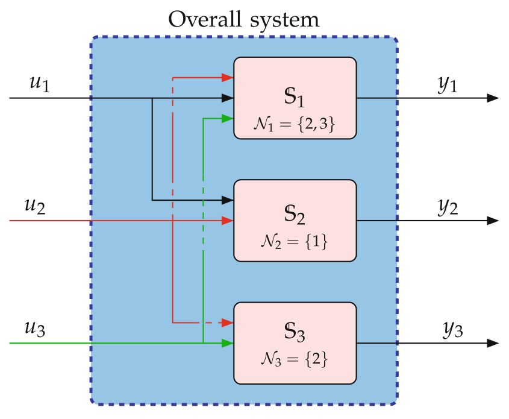

> Image description: A diagram titled "Overall system" illustrates a network of three interconnected subsystems, labeled $\mathcal{S}_1$, $\mathcal{S}_2$, and $\mathcal{S}_3$. Each subsystem takes an external input ($u_i$) and produces an output ($y_i$). The subsystems are defined by sets of neighbors, $\mathcal{N}_i$, representing their connections: - $\mathcal{S}_1$ has neighbors $\mathcal{N}_1 = \{2, 3\}$. - $\mathcal{S}_2$ has neighbors $\mathcal{N}_2 = \{1\}$. - $\mathcal{S}_3$ has neighbors $\mathcal{N}_3 = \{2\}$. The connections between subsystems are represented by colored arrows: - A black arrow connects the output of $\mathcal{S}_1$ to the input of $\mathcal{S}_2$. - A red dash-dot arrow connects the output of $\mathcal{S}_2$ to the input of $\mathcal{S}_1$ and $\mathcal{S}_3$. - A green arrow connects the input $u_3$ directly to $\mathcal{S}_3$ and the output of $\mathcal{S}_2$ to $\mathcal{S}_3$. The entire network is enclosed within a light blue shaded region with a dashed border. **Caption:** Distributed Model Predictive Control, Fig. 1 Interconnected systems and neighbors definition.
Distributed Model Predictive Control, Fig. 1 Interconnected systems and neighbors definition

$$
\begin{equation*}
u_{i} \in \mathbb{U}_{i}, \quad i=1, \ldots, M \tag{3}
\end{equation*}
$$

in which $\mathbb{U}_{i}$ are polyhedrons containing the origin in their interior. Moreover, we consider a quadratic stage cost function $\ell_{i}(x, u) \triangleq \frac{1}{2}\left(x^{\prime} Q_{i} x+u^{\prime} R_{i} u\right)$ and a terminal cost function $V_{f i}(x) \triangleq \frac{1}{2} x^{\prime} P_{i} x$, with $Q_{i} \in \mathbb{R}^{n_{i} \times n_{i}}, R_{i} \in \mathbb{R}^{m_{i} \times m_{i}}$, and $P_{i} \in \mathbb{R}^{n_{i} \times n_{i}}$ positive definite. Without loss of generality, let $x_{i}(0)$ be the state of $S_{i}$ at the current decision time. Consequently, the finite-horizon cost function associated with $S_{i}$ is given by:

$$
\begin{align*}
V_{i}\left(x_{i}(0), \mathbf{u}_{i},\left\{\mathbf{u}_{j}\right\}_{j \in \mathcal{N}_{i}}\right) \triangleq & \sum_{i=0}^{N-1} \ell_{i}\left(x_{i}(k), u_{i}(k)\right) \\
& +V_{f i}\left(x_{i}(N)\right) \tag{4}
\end{align*}
$$

in which $\mathbf{u}_{i}=\left(u_{i}(0), u_{i}(1), \ldots, u_{i}(N-1)\right)$ is a finite-horizon sequence of control inputs of $S_{i}$, and $\mathbf{u}_{j}$ is similarly defined as a sequence of control inputs of each neighbor $j \in \mathcal{N}_{i}$. Notice that $V_{i}(\cdot)$ is a function of neighbors' input sequences, $\left\{\mathbf{u}_{j}\right\}_{j \in \mathcal{N}_{i}}$, due to the dynamics (2).

## Decentralized, Noncooperative, and Cooperative Predictive Control Architectures

Several levels of communications and (non) cooperation can exist among the controllers, as depicted in Fig. 2 for the case of two subsystems.

In decentralized MPC architectures, interactions among subsystems are neglected by forcing $\mathcal{N}_{i}=\varnothing$ for all $i$ even if this is not true. That is, the subsystem model used in each local controller, instead of (2), is simply

$$
\begin{equation*}
x_{i}^{+}=A_{i} x_{i}+B_{i} u_{i}, y_{i}=C_{i} x_{i} \tag{5}
\end{equation*}
$$

Therefore, an inherent mismatch exists between the model used by the local controllers (5) and the actual subsystem dynamics (2). Each local MPC solves the following finite-horizon optimal control problem (FHOCP):

$$
\begin{equation*}
\mathbb{P}_{i}^{D e}: \min _{\mathbf{u}_{i}} V_{i}(\cdot) \quad \text { s.t. } \mathbf{u}_{i} \in \mathbb{U}_{i}^{N}, \mathcal{N}_{i}=\varnothing \tag{6}
\end{equation*}
$$

We observe that in this case, $V_{i}(\cdot)$ depends only on local inputs, $\mathbf{u}_{i}$, because it is assumed that $\mathcal{N}_{i} =\varnothing$. Hence, each $\mathbb{P}_{i}^{D e}$ is solved independently of the neighbors computations, and no iterations are performed. Clearly, depending on the actual level of interactions among subsystems, decentralized MPC architectures can perform poorly, namely, being non-stabilizing. Performance certifications are still possible resorting to robust stability theory, i.e., by treating the neglected dynamics $\sum_{j \in \mathcal{N}_{i}} B_{i j} u_{j}$ as (bounded) disturbances (Riverso et al. 2013).

In noncooperative MPC architectures, the existing interactions among the subsystems are fully taken into account through (2). Given a known value of the neighbors' control input sequences, $\left\{\mathbf{u}_{j}\right\}_{j \in \mathcal{N}_{i}}$, each local MPC solves the following FHOCP:

$$
\begin{equation*}
\mathbb{P}_{i}^{\mathrm{NCDi}}: \quad \min _{\mathbf{u}_{i}} V_{i}(\cdot) \text { s.t. } \mathbf{u}_{i} \in \mathbb{U}_{i}^{N} \tag{7}
\end{equation*}
$$

The obtained solution can be exchanged with the other local controllers to update the assumed neighbors' control input sequences, and iterations can be performed. We observe that this approach is noncooperative because local controllers try to optimize different, possibly competing, objectives. In general, no convergence is guaranteed in noncooperative iterations, and when this scheme converges, it leads to a so-called Nash equilibrium. However, the achieved local control inputs do not have proven stability properties (Rawlings


<!-- source_pdf_page: 328 -->
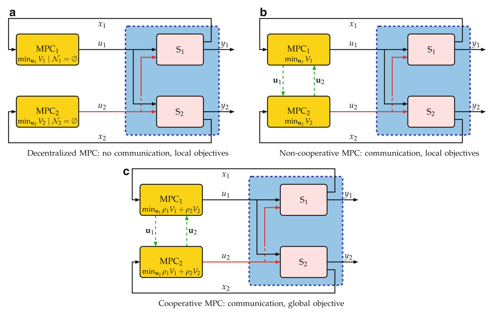

> Image description: This textbook figure, titled "Fig. 2 Three distributed control architectures: decentralized MPC, noncooperative MPC, and cooperative MPC," illustrates three control schemes (a, b, and c) involving two subsystems, $S_1$ and $S_2$. In **(a) Decentralized MPC**, two controllers ($MPC_1$ and $MPC_2$) operate independently. Each optimizes a local cost function ($V_1$ and $V_2$) without information exchange ($\mathcal{N}_1 = \emptyset$ and $\mathcal{N}_2 = \emptyset$). Red arrows indicate that control inputs $u_1$ and $u_2$ affect both $S_1$ and $S_2$, and state feedback $x_1, x_2$ is routed back to respective controllers. In **(b) Non-cooperative MPC**, controllers communicate via $u_1$ and $u_2$ (green dashed arrows), but still optimize local objectives ($V_1$ and $V_2$). In **(c) Cooperative MPC**, controllers communicate via $u_1$ and $u_2$ (green dashed arrows) to optimize a combined global objective ($\min_{u_i} \rho_1V_1 + \rho_2V_2$). All diagrams use solid black arrows for signal flow ($x_i, u_i, y_i$) and red arrows for cross-coupling between subsystems.
Distributed Model Predictive Control, Fig. 2 Three distributed control architectures: decentralized MPC, noncooperative MPC, and cooperative MPC

and Mayne 2009, §6.2.3). To ensure closed-loop stability, variants can be formulated by including a sequential solution of local MPC problems, exploiting the notion (if any) of an auxiliary stabilizing decentralized control law non-iterative noncooperative schemes are also proposed, in which stability guarantees are provided by ensuring a decrease of a centralized Lyapunov function at each decision time.

Finally, in cooperative MPC architectures, each local controller optimizes a common (plantwide) objective:

$$
\begin{equation*}
V(x(0), \mathbf{u}) \triangleq \sum_{i=1}^{M} \rho_{i} V_{i}\left(x_{i}(0), \mathbf{u}_{i},\left\{\mathbf{u}_{j}\right\}_{j \in \mathcal{N}_{i}}\right) \tag{8}
\end{equation*}
$$

in which $\rho_{i}>0$, for all $i$, are given scalar weights and $\mathbf{u} \triangleq\left(\mathbf{u}_{1}, \ldots, \mathbf{u}_{M}\right)$ is the overall control sequence. In particular, given a known value of other subsystems' control input sequences, $\left\{\mathbf{u}_{j}\right\}_{j \neq i}$, each local MPC solves the following FHOCP:

$$
\begin{equation*}
\mathbb{P}_{i}^{\mathrm{CDi}}: \min _{\mathbf{u}_{i}} V(\cdot) \quad \text { s.t. } \mathbf{u}_{i} \in \mathbb{U}_{i}^{N} \tag{9}
\end{equation*}
$$

As in noncooperative schemes, the obtained solution can be exchanged with the other local controllers, and further iterations can be performed. Notice that in $\mathbb{P}_{i}^{\mathrm{CDi}}$, the (possible) implications of the local control sequence $\mathbf{u}_{i}$ to all other subsystems' objectives, $V_{j}(\cdot)$ with $j \neq i$ are taken into account, as well as the effect of the neighbors' sequences $\left\{\mathbf{u}_{j}\right\}_{j \in \mathcal{N}_{i}}$ on the local state evolution through (2). Clearly, this approach is termed cooperative because all controllers compute local inputs to minimize a global objective. Convergence of cooperative iterations is guaranteed, and under suitable assumptions the converged solution is the centralized Pareto-optimal solution (Rawlings and Mayne 2009, §6.2.4). Furthermore, the achieved local control inputs have proven stabilizing properties (Stewart et al. 2010). Variants are also proposed in which each controller still optimizes a local objective, but cooperative iterations are performed to ensure a


<!-- source_pdf_page: 329 -->
decrease of the global objective at each decision time (Maestre et al. 2011).

## Cooperative Distributed MPC

Cooperative schemes are preferable over noncooperative schemes from many points of view, namely, in terms of superior theoretical guarantees and no larger computational requirements. In this section we focus on a prototype cooperative distributed MPC algorithm adapted from Stewart et al. (2010), highlighting the required computations and discussing the associated theoretical properties and guarantees.

## Basic Algorithm

We present in Algorithm 1 a streamlined description of a cooperative distributed MPC algorithm, in which each local controller solves $\mathbb{P}_{i}^{C D i}$, given a previously computed value of all other subsystems' input sequences. For each local controller, the new iterate is defined as a convex combination of the newly computed solution with the previous iteration. A relative tolerance is defined, so that cooperative iterations stop when all local controllers have computed a new iterate sufficiently close to the previous one. A maximum number of cooperative iterations can also be defined, so that a finite bound on the execution time can be established.

```
Algorithm 1 (Cooperative MPC). Require:
Overall warm start $\mathbf{u}^{0} \triangleq\left(\mathbf{u}_{1}^{0}, \ldots, \mathbf{u}_{M}^{0}\right)$, convex
step weights $w_{i}>0$, s.t. $\sum_{i=1}^{M} w_{i}=1$, relative
tolerance parameter $\varepsilon>0$, maximum cooperative
iterations $c_{\text {max }}$
    Initialize: $c \leftarrow 0$ and $e_{i} \leftarrow 2 \epsilon$ for $i=1, \ldots, M$.
    while ( $c<c_{\text {max }}$ ) and ( $\exists i \mid e_{i}>\epsilon$ ) do
        $c \leftarrow c+1$.
        for $i=1$ to $M$ do
            Solve $\mathbb{P}_{i}^{\text {CDi }}$ in (9) obtaining $\mathbf{u}_{i}^{*}$.
        end for
        for $i=1$ to $M$ do
            Define new iterate: $\mathbf{u}_{i}^{c} \triangleq w_{i} \mathbf{u}_{i}^{*}+\left(1-w_{i}\right) \mathbf{u}_{i}^{c-1}$.
            Compute convergence error: $e_{i} \triangleq \frac{\Delta \mathbf{u}_{i}^{c}-\mathbf{u}_{i}^{c-1} \|}{\left\|\mathbf{u}_{i}^{c-1}\right\|}$.
        end for
    end while
    return Overall solution: $\mathbf{u}^{c} \triangleq\left(\mathbf{u}_{1}^{c}, \ldots, \mathbf{u}_{M}^{c}\right)$.
```

We observe that Step 8 implicitly defines the new overall iterate as a convex combination of the overall solutions achieved by each controller, that is,

$$
\begin{equation*}
\mathbf{u}^{c}=\sum_{i=1}^{M} w_{i}\left(\mathbf{u}_{1}^{c-1}, \ldots, \mathbf{u}_{i}^{*}, \ldots, \mathbf{u}_{M}^{c-1}\right) \tag{10}
\end{equation*}
$$

It is also important to observe that Steps 5, 8, and 9 are performed separately by each controller.

## Properties

The basic cooperative MPC described in Algorithm 1 enjoys several nice theoretical and practical properties, as detailed (Rawlings and Mayne 2009, §6.3.1):

1. Feasibility of each iterate: $\mathbf{u}_{i}^{c-1} \in \mathbb{U}_{i}^{N}$ implies $\mathbf{u}_{i}^{c} \in \mathbb{U}_{i}^{N}$, for all $i=1, \ldots, M$ and $c \in \mathbb{I}_{>0}$.
2. Cost decrease at each iteration: $V\left(x(0), \mathbf{u}^{c}\right) \leq V\left(x(0), \mathbf{u}^{c-1}\right)$ for all $c \in \mathbb{I}_{>0}$.
3. Cost convergence to the centralized optimum: $\lim _{c \rightarrow \infty} V\left(x(0), \mathbf{u}^{c}\right)=\min _{\mathbf{u} \in \mathbb{U}^{N}} V(x(0), u)$, in which $\mathbb{U} \triangleq \mathbb{U}_{1} \times \cdots \times \mathbb{U}_{M}$.
Resorting to suboptimal MPC theory, the above properties (1) and (2) can be exploited to show that the origin of closed-loop system

$$
\begin{equation*}
x^{+}=A x+B \kappa^{c}(x), \text { with } \kappa^{c}(x) \triangleq u^{c}(0) \tag{11}
\end{equation*}
$$

is exponentially stable for any finite $c \in \mathbb{I}_{>0}$. This result is of paramount (practical and theoretical) importance because it ensures closed-loop stability using cooperative distributed MPC with any finite number of cooperative iterations. As in centralized MPC based on the solution of a FHOCP (Rawlings and Mayne 2009, §2.4.3), particular care of the terminal cost function $V_{f i}(\cdot)$ is necessary, possibly in conjunction with a terminal constraint $x_{i}(N) \in \mathbb{X}_{f i}$. Several options can be adopted as discussed, e.g., in Stewart et al. (2010, 2011).

Moreover, the results in Pannocchia et al. (2011) can be used to show inherent robust stability to system's disturbances and measurement errors. Therefore, we can confidently


<!-- source_pdf_page: 330 -->
state that well-designed distributed cooperative MPC and centralized MPC algorithms share the same guarantees in terms of stability and robustness.

## Complementary Aspects

We discuss in this section a number of complementary aspects of distributed MPC algorithms, omitting technical details for the sake of space.

## Coupled Input Constraints and State Constraints

Convergence of the solution of cooperative distributed MPC towards the centralized (global) optimum holds when input constraints are in the form of (3), i.e., when no constraints involve inputs of different subsystems. Sometimes this assumption fails to hold, e.g., when several units share a common utility resource, that is, in addition to (3) some constraints involve inputs of more than one unit. In this situation, it is possible that Algorithm 1 remains stuck at a fixed point, without improving the cost, even if it is still away from the centralized optimum (Rawlings and Mayne 2009, §6.3.2). It is important to point out that this situation is harmless from a closedloop stability and robustness point of view. However, the degree of suboptimality in comparison with centralized MPC could be undesired from a performance point of view. To overcome this situation, a slightly different partitioning of the overall inputs into non-disjoint sets can be adopted (Stewart et al. 2010).

Similarly the presence of state constraints, even in decentralized form $x_{i} \in \mathbb{X}_{i}$ (with $i= 1, \ldots, M$ ), can prevent convergence of a cooperative algorithm towards the centralized optimum. It is also important to point out that the local MPC controlling $S_{i}$ needs to consider in the optimal control problem, besides local state constraints $x_{i} \in \mathbb{X}_{i}$, also state constraints of all other subsystems $\mathbb{S}_{j}$ such that $i \in \mathcal{N}_{j}$. This ensures feasibility of each iterate and cost reduction, hence closed-loop stability (and robustness) can be established.

## Output Feedback and Offset-Free Tracking

When the subsystem state cannot be directly measured, each local controller can use a local state estimator, namely, a Kalman filter (or Luenberger observer). Assuming that the pair ( $A_{i}, C_{i}$ ) is detectable, the subsystem state estimate evolves as follows:

$$
\begin{equation*}
\hat{x}_{i}^{+}=A_{i} \hat{x}_{i}+B_{i} u_{i}+\sum_{j \in \mathcal{N}_{i}} B_{i j} u_{j}+L_{i}\left(y_{i}-C_{i} \hat{x}_{i}\right) \tag{12}
\end{equation*}
$$

in which $L_{i} \in \mathbb{R}^{n_{i} \times p_{i}}$ is the local Kalman predictor gain, chosen such that the matrix $\left(A_{i}-L_{i} C_{i}\right)$ is Schur. Stability of the closed-loop origin can be still established using minor variations (Rawlings and Mayne 2009, §6.3.3).

When offset-free control is sought, each local MPC can be equipped with an integrating disturbance model similarly to centralized offsetfree MPC algorithms (Pannocchia and Rawlings 2003). Given the current estimate of the subsystem state and disturbance, a target calculation problem is solved to compute the state and input equilibrium pair such that (a subset of) output variables correspond to given set points. Such a target calculation problem can be performed in a centralized fashion or in a distributed manner, although in the latter case several issues arise and associated precautions should be taken into account (Rawlings and Mayne 2009, §6.3.4).

## Distributed Control for Nonlinear Systems

Several nonlinear distributed MPC algorithms have been recently proposed (Liu et al. 2009; Stewart et al. 2011). Some schemes require the presence of a coordinator, thus introducing a hierarchical structure (Scattolini 2009). In Stewart et al. (2011), instead, a cooperative distributed MPC architecture similar to the one discussed in the previous section has been proposed for nonlinear systems. Each local controller considers the following subsystem model:

$$
\begin{align*}
x_{i}^{+} & =f_{i}\left(x_{i}, u_{i}, u_{j}\right), \quad \text { with } j \in \mathcal{N}_{i}  \tag{13}\\
y_{i} & =h_{i}\left(x_{i}\right)
\end{align*}
$$


<!-- source_pdf_page: 331 -->
A problem (formally) identical to $\mathbb{P}_{i}^{C D i}$ in (9) is solved by each controller and cooperative iterations are performed. However, nonconvexity of $\mathbb{P}_{i}^{\mathrm{CDi}}$ can make a convex combination step similar to Step 8 in Algorithm 1 not necessarily a cost improvement. As a workaround in such cases, Stewart et al. (2011) propose deleting the least effective control sequence computed by a local controller (repeating this deletion if necessary). In this way it is possible to show a monotonic decrease of the cost function at each cooperative iteration.

## Summary and Future Directions

We presented the basics and foundations of distributed model predictive control (DMPC) schemes, which prove useful and effective in the control of large-scale systems for which a single centralized predictive controller is not regarded as a possible or desirable solution, e.g., due to organizational requirements and/or computational limitations. In DMPCs, the overall controlled system is organized into a number of subsystems, in general featuring some dynamic couplings, and for each subsystem a local MPC is implemented.

Different flavors of communication and cooperation among the local controllers can be chosen by the designer, ranging from decentralized to cooperative schemes. In cooperative DMPC algorithms, the dynamic interactions among the subsystems are fully taken into account, with limited communication overheads, and the same overall objective can be optimized by each local controller. When cooperative iterations are performed upon convergence, such DMPC algorithms achieve the same global minimum control sequence as that of the centralized MPC. Termination prior to convergence does not hinder stability and robustness guarantees.

In this contribution, after discussing an overview on possible communication and cooperation schemes, we addressed the design of a state-feedback and distributed MPC algorithm for linear systems subject to input constraints, with convergence and stability guarantees. Then,
we discussed various extensions to coupled input constraints and state constraints, output feedback, reference target tracking, and nonlinear systems.

The research on DMPC algorithms has been extensive during the last decade, and some excellent review papers have been recently made available (Christofides et al. 2013; Scattolini 2009). Still, we expect DMPC to attract research efforts in various directions, as briefly discussed:

- Nonlinear DMPC algorithms (Liu et al. 2009; Stewart et al. 2011) will require improvements in terms of global optimum goals.
- Economic DMPC and tracking DMPC (Ferramosca et al. 2013) will replace current formulations designed for regulation around the origin, especially for nonlinear systems.
- Reconfigurability, e.g., addition/deletion of new local controllers, is an ongoing topic, and preliminary results available for decentralized architectures (Riverso et al. 2013) may be extended to cooperative and noncooperative schemes. It is also desirable to improve the resilience of DMPC to communication disruptions (Alessio et al. 2011).
- Preliminary results on constrained distributed estimation (Farina et al. 2012) will draw attention and require further insights to bridge the gap between constrained estimation and control algorithms.
- Specific optimization algorithms tailored to DMPC local problems (Doan et al. 2011) will increase the effectiveness of DMPC algorithms, as well as distributed optimization approaches will be exploited even for dynamically uncoupled systems.


## Cross-References

- Cooperative Solutions to Dynamic Games
- Nominal Model-Predictive Control
- Optimization Algorithms for Model Predictive Control
- Tracking Model Predictive Control


<!-- source_pdf_page: 332 -->
## Recommended Reading

General overviews on DMPC can be found in Christofides et al. (2013), Rawlings and Mayne (2009), and Scattolini (2009). DMPC algorithms for linear systems are discussed in Alessio et al. (2011), Ferramosca et al. (2013), Riverso et al. (2013), Stewart et al. (2010), and Maestre et al. (2011), and for nonlinear systems in Farina et al. (2012), Liu et al. (2009), and Stewart et al. (2011). Supporting results for implementation and robustness theory can be found in Doan et al. (2011), Pannocchia and Rawlings (2003), and Pannocchia et al. (2011).

## Bibliography

Alessio A, Barcelli D, Bemporad A (2011) Decentralized model predictive control of dynamically coupled linear systems. J Process Control 21:705-714
Christofides PD, Scattolini R, Muñoz de la Peña D, Liu J (2013) Distributed model predictive control: a tutorial review and future research directions. Comput Chem Eng 51:21-41
Doan MD, Keviczky T, De Schutter B (2011) An iterative scheme for distributed model predictive control using Fenchel's duality. J Process Control 21:746-755
Farina M, Ferrari-Trecate G, Scattolini R (2012) Distributed moving horizon estimation for nonlinear constrained systems. Int J Robust Nonlinear Control 22:123-143
Ferramosca A, Limon D, Alvarado I, Camacho EF (2013) Cooperative distributed MPC for tracking. Automatica 49:906-914
Liu J, Muñoz de la Peña D, Christofides PD (2009) Distributed model predictive control of nonlinear process systems. AIChE J 55(5):1171-1184
Maestre JM, Muñoz de la Peña D, Camacho EF (2011) Distributed model predictive control based on a cooperative game. Optim Control Appl Methods 32:153176
Pannocchia G, Rawlings JB (2003) Disturbance models for offset-free model predictive control. AIChE J 49:426-437
Pannocchia G, Rawlings JB, Wright SJ (2011) Conditions under which suboptimal nonlinear MPC is inherently robust. Syst Control Lett 60:747-755
Rawlings JB, Mayne DQ (2009) Model predictive control: theory and design. Nob Hill Publishing, Madison
Riverso S, Farina M, Ferrari-Trecate G (2013) Plug-andplay decentralized model predictive control for linear systems. IEEE Trans Autom Control 58:2608-2614
Scattolini R (2009) A survey on hierarchical and distributed model predictive control. J Process Control 19:723-731

Stewart BT, Venkat AN, Rawlings JB, Wright SJ, Pannocchia G (2010) Cooperative distributed model predictive control. Syst Control Lett 59:460-469
Stewart BT, Wright SJ, Rawlings JB (2011) Cooperative distributed model predictive control for nonlinear systems. J Process Control 21:698-704

## Distributed Optimization

Angelia Nedić<br>Industrial and Enterprise Systems Engineering, University of Illinois, Urbana, IL, USA


#### Abstract

The paper provides an overview of the distributed first-order optimization methods for solving a constrained convex minimization problem, where the objective function is the sum of local objective functions of the agents in a network. This problem has gained a lot of interest due to its emergence in many applications in distributed control and coordination of autonomous agents and distributed estimation and signal processing in wireless networks.


## Keywords

Collaborative multi-agent systems; Consensus protocol; Gradient-projection method; Networked systems

## Introduction

There has been much recent interest in distributed optimization pertinent to optimization aspects arising in control and coordination of networks consisting of multiple (possibly mobile) agents and in estimation and signal processing in sensor networks (Bullo et al. 2009; Hendrickx 2008; Kar and Moura 2011; Martinoli et al. 2013; Mesbahi and Egerstedt 2010; Olshevsky 2010). In many of these applications, the network system goal is to optimize a global objective


<!-- source_pdf_page: 333 -->
through local agent-based computations and local information exchange with immediate neighbors in the underlying communication network. This is motivated mainly by the emergence of large-scale data and/or largescale networks and new networking applications such as mobile ad hoc networks and wireless sensor networks, characterized by the lack of centralized access to information and timevarying connectivity. Control and optimization algorithms deployed in such networks should be completely distributed (relying only on local observations and information), robust against unexpected changes in topology (i.e., link or node failures) and against unreliable communication (noisy links or quantized data) (see - Networked Systems). Furthermore, it is desired that the algorithms are scalable in the size of the network.

Generally speaking, the problem of distributed optimization consists of three main components:

1. The optimization problem that the network of agents wants to solve collectively (specifying an objective function and constraints)
2. The local information structure, which describes what information is locally known or observable by each agent in the system (who knows what and when)
3. The communication structure, which specifies the connectivity topology of the underlying communication network and other features of the communication environment
The algorithms for solving such global network problems need to comply with the distributed knowledge about the problem among the agents and obey the local connectivity structure of the communication network ( ↓ Networked Systems; → Graphs for Modeling Networked Interactions).

## Networked System Problem

Given a set $N=\{1,2, \ldots, n\}$ of agents (also referred to as nodes), the global system problem has the following form:

$$
\begin{array}{cc}
\text { minimize } & \sum_{i=1}^{n} f_{i}(x) \\
\text { subject to } & x \in X . \tag{1}
\end{array}
$$

Each $f_{i}: \mathrm{R}^{d} \rightarrow \mathrm{R}$ is a convex function which represents the local objective of agent $i$, while $X \subseteq \mathrm{R}^{d}$ is a closed convex set. The function $f_{i}$ is a private function known only to agent $i$, while the set $X$ is commonly known by all agents $i \in N$. The vector $x \in X$ represents a global decision vector which the agents want to optimize using local information. The problem is a simple constrained convex optimization problem, where the global objective function is given by the sum of the individual objective functions $f_{i}(x)$ of the agents in the system. As such, the objective function is the sum of non-separable convex functions corresponding to multiple agents connected over a network.

As an example, consider the problem arising in support vector machines (SVMs), which are a popular tool for classification problems. Each agent $i$ has a set $S_{i}=\left\{\left(a_{j}^{(i)}, b_{j}^{(i)}\right)\right\}_{j=1}^{m_{i}}$ of $m_{i}$ sample-label pairs, where $a_{j}^{(i)} \in \mathrm{R}^{d}$ is a data point and $b_{j}^{(i)} \in\{+1,-1\}$ is its corresponding (correct) label. The number $m_{i}$ of data points for every agent $i$ is typically very large (hundreds of thousands). Without sharing the data points, the agents want to collectively find a hyperplane that separates all the data, i.e., a hyperplane that separates (with a maximal separation distance) the data with label 1 from the data with label -1 in the global data set $\bigcup_{i=1}^{n} S_{i}$. Thus, the agents need to solve an unconstrained version of the problem (1), where the decision variable $x \in \mathrm{R}^{d}$ is a hyperplane normal and the objective function $f_{i}$ of agent $i$ is given by
$f_{i}(x)=\frac{\lambda}{2}\|x\|^{2}+\sum_{j=1}^{m_{i}} \max \left\{0,1-b_{j}^{(i)}\left(x^{\prime} a_{j}^{(i)}\right)\right\}$,
where $\lambda$ is a regularization parameter (common to all agents).

The network communication structure is represented by a directed (or undirected) graph $G=$ ( $N, E$ ), with the vertex set $N$ and the edge set $E$. The network is used as a medium to diffuse


<!-- source_pdf_page: 334 -->
the information from an agent to every other agent through local agent interactions over time ( ↓ Graphs for Modeling Networked Interactions). To accommodate the information spread through the entire network, it is typically assumed that the network communication graph $G=(N, E)$ is strongly connected ( - Dynamic Graphs, Connectivity of). In the graph, a link ( $i, j$ ) means that agent $i \in N$ receives the relevant information from agent $j \in N$.

## Distributed Algorithms

The algorithms for solving problem (1) are constructed by using standard optimization techniques in combination with a mechanism for information diffusion through local agent interactions. A control point of view for the design of distributed algorithms has a nice exposition in Wang and Elia (2011).

One of the existing optimization techniques is the so-called incremental method, where the information is processed along a directed cycle in the graph. In this approach the estimate is passed from an agent to its neighbor (along the cycle), and only one agent updates at a time (Bertsekas 1997; Blatt et al. 2007; Johansson 2008; Johansson et al. 2009; Nedić and Bertsekas 2000, 2001; Nedić et al. 2001; Rabbat and Nowak 2004; Ram et al. 2009; Tseng 1998); for a detailed literature on incremental methods, see the textbooks Bertsekas (1999) and Bertsekas et al. (2003).

More recently, one of the techniques that gained popularity as a mechanism for information diffusion is a consensus protocol, in which the agent diffuses the information through the network through locally weighted averaging of their incoming data ( △ Averaging Algorithms and Consensus). The problem of reaching a consensus on a particular scalar value, or computing exact averages of the initial values of the agents, has gained an unprecedented interest as a central problem inherent to cooperative behavior in networked systems (Blondel et al. 2005; Boyd et al. 2005; Cao et al. 2005, 2008a,b; Jadbabaie et al. 2003; Olfati-Saber and Murray

2004; Olshevsky 2010; Olshevsky and Tsitsiklis 2006, 2009; Touri 2011; Vicsek et al. 1995; Wan and Lemmon 2009).

Using the consensus technique, a class of distributed algorithms has emerged, as a combination of the consensus protocols and the gradient-type methods. The gradient-based approaches are particularly suitable, as they have a small overhead per iteration and are, in general, robust to various sources of errors and uncertainties.

The technique of using the network as a medium to propagate the relevant information for optimization purpose has its origins in the work by Tsitsiklis (1984), Tsitsiklis et al. (1986), and Bertsekas and Tsitsiklis (1997), where the network has been used to decompose the vector $x$ components across different agents, while all agents share the same objective function.

## Algorithms Using Weighted Averaging

The technique has recently been employed in Nedić and Ozdaglar (2009) (see also Nedić and Ozdaglar 2007, 2010) to deal with problems of the form (1) when the agents have different objective functions $f_{i}$, but their decisions are fully coupled through the common vector variable $x$. In a series of recent work (to be detailed later), the following distributed algorithm has emerged. Letting $x_{i}(k) \in X$ be an estimate (of the optimal decision) at agent $i$ and time $k$, the next iterate is constructed through two updates. The first update is a consensus-like iteration, whereby, upon receiving the estimates $x_{j}(k)$ from its (in)neighbors $j$, the agent $i$ aligns its estimate with its neighbors through averaging, formally given by

$$
\begin{equation*}
v_{i}(k)=\sum_{j \in N_{i}} w_{i j} x_{j}(k) \tag{2}
\end{equation*}
$$

where $N_{i}$ is the neighbor set

$$
N_{i}=\{j \in N \mid(j, i) \in E\} \cup\{i\} .
$$

The neighbor set $N_{i}$ includes agent $i$ itself, since the agent always has access to its own information. The scalar $w_{i j}$ is a nonnegative weight that


<!-- source_pdf_page: 335 -->
agent $i$ places on the incoming information from neighbor $j \in N_{i}$. These weights sum to 1 , i.e., $\sum_{j \in N_{i}} w_{i j}=1$, thus yielding $v_{i}(k)$ as a (local) convex combination of $x_{j}(k), j \in N_{i}$, obtained by agent $i$.

After computing $v_{i}(k)$, agent $i$ computes a new iterate $x_{i}(k+1)$ by performing a gradientprojection step, aimed at minimizing its own objective $f_{i}$, of the following form:

$$
\begin{equation*}
x_{i}(k+1)=\prod_{X}\left[v_{i}(k)-\alpha(k) \nabla f_{i}\left(v_{i}(k)\right)\right], \tag{3}
\end{equation*}
$$

where $\Pi_{X}[x]$ is the projection of a point $x$ on the set $X$ (in the Euclidean norm), $\alpha(k)>0$ is the stepsize at time $k$, and $\nabla f_{i}(z)$ is the gradient of $f_{i}$ at a point $z$.

When all functions are zero and $X$ is the entire space $\mathrm{P}^{d}$, the distributed algorithm (2) and (3) reduces to the linear-iteration method:

$$
\begin{equation*}
x_{i}(k+1)=\sum_{j \in N_{i}} w_{i j} x_{j}(k) \tag{4}
\end{equation*}
$$

which is known as consensus or agreement protocol. This protocol is employed when the agents in the network wish to align their decision vectors $x_{i}(k)$ to a common vector $\hat{x}$. The alignment is attained asymptotically (as $k \rightarrow \infty$ ).

In the presence of objective function and constraints, the distributed algorithm in (2) and (3) corresponds to "forced alignment" guided by the gradient forces $\sum_{i=1}^{n} \nabla f_{i}(x)$. Under appropriate conditions, the alignment is forced to a common vector $x^{*}$ that minimizes the network objective $\sum_{i=1}^{n} f_{i}(x)$ over the set $X$. This corresponds to the convergence of the iterates $x_{i}(k)$ to a common solution $x^{*} \in X$ as $k \rightarrow \infty$ for all agents $i \in N$.

The conditions under which the convergence of $\left\{x_{i}(k)\right\}$ to a common solution $x^{*} \in X$ occurs are a combination of the conditions needed for the consensus protocol to converge and the conditions imposed on the functions $f_{i}$ and the stepsize $\alpha(k)$ to ensure the convergence of standard gradient-projection methods. For the consensus part, the conditions should guarantee that the pure consensus protocol in (4) converges to the average $\frac{1}{n} \sum_{i=1}^{n} x_{i}(0)$ of the initial agent values. This requirement transfers to the condition that
the weights $w_{i j}$ give rise to a doubly stochastic weight matrix $W$, whose entries are $w_{i j}$ defined by the weights in (4) and augmented by $w_{i j}=0$ for $j \notin N_{i}$.

Intuitively, the requirement that the weight matrix $W$ is doubly stochastic ensures that each agent has the same influence on the system behavior, in a long run. More specifically, the doubly stochastic weights ensure that the system as whole minimizes $\sum_{i=1}^{n} \frac{1}{n} f_{i}(x)$, where the factor $1 / n$ is seen as portion of the influence of agent $i$. When the weight matrix $W$ is only row stochastic, the consensus protocol converges to a weighted average $\sum_{i=1}^{n} \pi_{i} x_{i}(0)$ of the agent initial values, where $\pi$ is the left eigenvector of $W$ associated with the eigenvalue 1. In general, the values $\pi_{i}$ can be different for different indices $i$, and the distributed algorithm in (2) and (3) results in minimizing the function $\sum_{i=1}^{n} \pi_{i} f_{i}(x)$ over $X$, and thus not solving problem (1).

The distributed algorithm (2) and (3) has been proposed and analyzed in Ram et al. (2010a, 2012), where the convergence had been established for diminishing stepsize rule (i.e., $\sum_{k} \alpha(k)=\infty$ and $\sum_{k} \alpha^{2}(k)<\infty$ ). As seen from the convergence analysis (see, e.g., Nedić and Ozdaglar 2009; Ram et al. 2012), for the convergence of the method, it is critical that the iterate disagreements $\left\|x_{i}(k)-x_{j}(k)\right\|$ converge linearly in time, for all $i \neq j$. This fast disagreement decay seems to be indispensable for ensuring the stability of the iterative process (2) and (3).

According to the distributed algorithm (2) and (3), at first, each agent aligns its estimate $x_{i}(k)$ with the estimates $x_{j}(k)$ that are received from its neighbors and, then, updates based on its local objective $f_{i}$ which is to be minimized over $x \in X$. Alternatively, the distributed method can be constructed by interchanging the alignment step and the gradient-projection step. Such a method, while having the same asymptotic performance as the method in (2) and (3), exhibits a somewhat slower (transient) convergence behavior due to a larger misalignment resulting from taking the gradient-based updates at first. This alternative has been initially proposed independently in Lopes and Sayed (2006) (where simulation


<!-- source_pdf_page: 336 -->
results have been reported), in Nedić and Ozdaglar $(2007,2009)$ (where the convergence analysis for a time-varying networks and a constant stepsize is given), and in Nedić et al. (2008) (with the quantization effects) and further investigated in Lopes and Sayed (2008), Nedić et al. (2010), and Cattivelli and Sayed (2010). More recently, it has been considered in Lobel et al. (2011) for state-dependent weights and in Tu and Sayed (2012) where the performance is compared with that of an algorithm of the form (2) and (3) for estimation problems.

Algorithm Extensions: Over the past years, many extensions of the distributed algorithm in (2) and (3) have been developed, including the following:
(a) Time-varying communication graphs: The algorithm naturally extends to the case of time-varying connectivity graphs $\{G(k)\}$, with $G(k)=(N, E(k))$ defined over the node set $N$ and time-varying links $E(k)$. In this case, the weights $w_{i j}$ in (2) are replaced with $w_{i j}(k)$ and, similarly, the neighbor set $N_{i}$ is replaced with the corresponding time-dependent neighbor set $N_{i}(k)$ specified by the graph $G(k)$. The convergence of the algorithm (2) and (3) with these modifications typically requires some additional assumptions of the network connectivity over time and the assumptions on the entries in the corresponding weight matrix sequence $\{W(k)\}$, where $w_{i j}(k)=0$ for $j \notin N_{i}(k)$. These conditions are the same as those that guarantee the convergence of the (row stochastic) matrix sequence $\{W(k)\}$ to a rank-one row-stochastic matrix, such as a connectivity over some fixed period (of a sliding-time window), the nonzero diagonal entries in $W(k)$, and the existence of a uniform lower bound on positive entries in $W(k)$; see, for example, Cao et al. (2008b), Touri (2011), Tsitsiklis (1984), Nedić and Ozdaglar (2010), Moreau (2005), and Ren and Beard (2005).
(b) Noisy gradients: The algorithm in (2) and (3) works also when the gradient computations $\nabla f_{i}(x)$ in update (3) are erroneous with random errors. This corresponds to using a stochastic gradient $\tilde{\nabla} f_{i}(x)$ instead of
$\nabla f_{i}(x)$, resulting in the following stochastic gradient-projection step:
$x_{i}(k+1)=\prod_{X}\left[v_{i}(k)-\alpha(k) \tilde{\nabla} f_{i}\left(v_{i}(k)\right)\right]$
instead of (3). The convergence of these methods is established for the cases when the stochastic gradients are consistent estimates of the actual gradient, i.e.,

$$
\mathrm{E}\left[\tilde{\nabla} f_{i}\left(v_{i}(k)\right) \mid v_{i}(k)\right]=\nabla f_{i}\left(v_{i}(k)\right)
$$

The convergence of these methods typically requires the use of non-summable but squaresummable stepsize sequence $\{\alpha(k)\}$ (i.e., $\sum_{k} \alpha(k)=\infty$ and $\sum_{k} \alpha^{2}(k)<\infty$ ), e.g., Ram et al. (2010a).
(c) Noisy or unreliable communication links: Communication medium is not always perfect and, often, the communication links are characterized by some random noise process. In this case, while agent $j \in N_{i}$ sends its estimate $x_{j}(k)$ to agent $i$, the agent does not receive the intended message. Rather, it receives $x_{j}(k)$ with some random link-dependent noise $\xi_{i j}(k)$, i.e., it receives $x_{j}(k)+\xi_{i j}(k)$ instead of $x_{j}(k)$ (see Kar and Moura 2011; Patterson et al. 2009; Touri and Nedić 2009 for the influence of noise and link failure on consensus). In such cases, the distributed optimization algorithm needs to be modified to include a stepsize for noise attenuation and the standard stepsize for the gradient scaling. These stepsizes are coupled through an appropriate relativegrowth conditions which ensure that the gradient information is maintained at the right level and, at the same time, link-noise is attenuated appropriately (Srivastava and Nedić 2011; Srivastava et al. 2010). Other imperfections of the communication links can also be modeled and incorporated into the optimization method, such as link failures and quantization effects, which can be built using the existing results for consensus protocol (e.g., Carli et al. 2007; Kar and Moura 2010, 2011; Nedić et al. 2008).
(d) Asynchronous implementations: The method in (2) and (3) has simultaneous updates,


<!-- source_pdf_page: 337 -->
evident in all agents exchanging and updating information in synchronous time steps indexed by $k$. In some communication settings, the synchronization of agents is impractical, and the agents are using their own clocks which are not synchronized but do tick according to a common time interval. Such communications result in random weights $w_{i j}(k)$ and random neighbor set $N_{i}(k) \subseteq E$ in (2), which are typically independent and identically distributed (over time). Most common models are random gossip and random broadcast. In the gossip model, at any time, two randomly selected agents $i$ and $j$ communicate and update, while the other agents sleep (Boyd et al. 2005; Kashyap et al. 2007; Ram et al. 2010b; Srivastava 2011; Srivastava and Nedić 2011). In the broadcast model, a random agent $i$ wakes up and broadcasts its estimate $x_{i}(k)$. Its neighbors that receive the estimate update their iterates, while the other agents (including the agent who broadcasted) do not update (Aysal et al. 2008; Nedić 2011).
(e) Distributed constraints: One of the more challenging aspects is the extension of the algorithm to the case when the constraint set $X$ in (1) is given as an intersection of closed convex sets $X_{i}$, one set per agent. Specifically, the set $X$ in (1) is defined by

$$
X=\bigcap_{i=1}^{n} X_{i},
$$

where the set $X_{i}$ is known to agent $i$ only. In this case, the algorithm has a slight modification at the update of $x_{i}(k+1)$ in (3), where the projection is on the local set $X_{i}$ instead of $X$, i.e., the update in (3) is replaced with the following update:

$$
\begin{equation*}
x_{i}(k+1)=\prod_{X_{i}}\left[v_{i}(k)-\alpha(k) \nabla f_{i}\left(v_{i}(k)\right)\right] . \tag{5}
\end{equation*}
$$

The resulting method (2), (5) converges under some additional assumptions on the sets $X_{i}$, such as the nonempty interior assumption (i.e., the set $\bigcap_{i=1}^{n} X_{i}$ has a nonempty interior), a linear-intersection assumption (each
$X_{i}$ is an intersection of finitely many linear equality and/or inequality constraints), or the Slater condition (Lee and Nedić 2012; Nedić et al. 2010; Srivastava 2011; Srivastava and Nedić 2011; Zhu and Martínez 2012).
In principle, most of the simple first-order methods that solve a centralized problem of the form (1) can also be distributed among the agents (through the use of consensus protocols) to solve distributed problem (1). For example, the Nesterov dual-averaging subgradient method (Nesterov 2005) can be distributed as proposed in Duchi et al. (2012), a distributed NewtonRaphson method has been proposed and studied in Zanella et al. (2011), while a distributed simplex algorithm has been constructed and analyzed in Bürger et al. (2012). An interesting method based on finding a zero of the gradient $\nabla f=\sum_{i=1}^{n} \nabla f_{i}$, distributedly, has been proposed and analyzed in Lu and Tang (2012). Some other distributed algorithms and their implementations can be found in Johansson et al. (2007), Tsianos et al. (2012a,b), DominguezGarcia and Hadjicostis (2011), Tsianos (2013), Gharesifard and Cortés (2012a), Jakovetic et al. (2011a,b), and Zargham et al. (2012).

## Summary and Future Directions

The distributed optimization algorithms have been developed mainly using consensus protocols that are based on weighted averaging, also known as linear-iterative methods. The convergence behavior and convergence rate analysis of these methods combines the tools from optimization theory, graph theory, and matrix analysis. The main drawback of these algorithms is that they require (at least theoretically) the use of doubly stochastic weight matrix $W$ (or $W(k)$ in timevarying case) in order to solve problem (1). This requirement can be accommodated by allowing agents to exchange locally some additional information on the weights that they intend to use or their degree knowledge. However, in general, constructing such doubly stochastic weights distributedly on directed graphs is rather a complex problem (Gharesifard and Cortés 2012b).


<!-- source_pdf_page: 338 -->
As an alternative, which seems a promising direction for future research, is the use of so-called push-sum protocol (or sum-ratio algorithm) for consensus problem (Benezit et al. 2010; Kempe et al. 2003). This direction is pioneered in Tsianos et al. (2012b), Tsianos (2013), and Tsianos and Rabbat (2011) for static graphs and recently extended to directed graphs Nedić and Olshevsky (2013) for an unconstrained version of problem (1).

Another promising direction lies in the use of alternating direction method of multipliers (ADMM) in combination with the graphLaplacian formulation of consensus constraints $N_{i} x_{i}=\sum_{j \in N_{i}} x_{j}$. A nice exposure to ADMM method is given in Boyd et al. (2010). The first work to address the development of distributed ADMM over a network is Wei and Ozdaglar (2012), where a static network is considered. Its distributed implementation over time-varying graphs will be an important and challenging task.

## Cross-References

- Averaging Algorithms and Consensus
- Dynamic Graphs, Connectivity of
- Graphs for Modeling Networked Interactions
- Networked Systems


## Recommended Reading

In addition to the below cited literature the useful material relevant to consensus and matrixproduct convergence theory includes:

Chatterjee S, Seneta E (1977) Towards consensus: some convergence theorems on repeated averaging. J Appl Probab 14(1):89-97
Cogburn R (1986) On products of random stochastic matrices. Random matrices and their applications. American Mathematical Society, vol. 50, pp 199-213
DeGroot MH (1974) Reaching a consensus. J Am Stat Assoc 69(345):118-121
Lorenz J (2005) A stabilization theorem for continuous opinion dynamics. Physica A: Stat Mech Appl 355:217-223

Rosenblatt M (1965) Products of independent identically distributed stochastic matrices. J Math Anal Appl 11(1):1-10
Shen J (2000) A geometric approach to ergodic non-homogeneous Markov chains. In: T.-X. He (Ed.), Proc. Wavelet Analysis and Multiresolution Methods. Marcel Dekker Inc., New York, vol 212, pp. 341-366
Tahbaz-Salehi A, Jadbabaie A (2010) Consensus over ergodic stationary graph processes. IEEE Trans Autom Control 55(1):225-230
Touri B (2012) Product of random stochastic matrices and distributed averaging. Springer Theses. Springer, Berlin/New York
Wolfowitz J (1963) Products of indecomposable, aperiodic, stochastic matrices. Proc Am Math Soc 14(4):733-737

Acknowledgments The author would like to thank J. Cortés for valuable suggestions to improve the article. Also, the author gratefully acknowledges the support by the National Science Foundation under grant CCF 1111342 and by the Office of Naval Research under grant N00014-12-1-0998.

## Bibliography

Aysal T, Yildiz M, Sarwate A, Scaglione A (2008) Broadcast gossip algorithms: design and analysis for consensus. In: Proceedings of the 47th IEEE conference on decision and control, Cancún, pp 4843-4848
Benezit F, Blondel V, Thiran P, Tsitsiklis J, Vetterli M (2010) Weighted gossip: distributed averaging using non-doubly stochastic matrices. In: Proceedings of the 2010 IEEE international symposium on information theory, Austin
Bertsekas D (1997) A new class of incremental gradient methods for least squares problems. SIAM J Optim 7:913-926
Bertsekas D (1999) Nonlinear programming. Athena Scientific, Belmont
Bertsekas D, Tsitsiklis J (1997) Parallel and distributed computation: numerical methods. Athena Scientific, Belmont
Bertsekas D, Nedić A, Ozdaglar A (2003) Convex analysis and optimization. Athena Scientific, Belmont
Blatt D, Hero A, Gauchman H (2007) A convergent incremental gradient algorithm with a constant stepsize. SIAM J Optim 18:29-51
Blondel V, Hendrickx J, Olshevsky A, Tsitsiklis J (2005) Convergence in multiagent coordination, consensus, and flocking. In: Proceedings of IEEE CDC, Seville, pp 2996-3000
Boyd S, Ghosh A, Prabhakar B, Shah D (2005) Gossip algorithms: design, analysis, and applications.


<!-- source_pdf_page: 339 -->
In: Proceedings of IEEE INFOCOM, Miami, vol 3, pp 1653-1664
Boyd S, Parikh N, Chu E, Peleato B, Eckstein J (2010) Distributed optimization and statistical learning via the alternating direction method of multipliers. Found Trends Mach Learn 3(1): 1-122
Bullo F, Cortés J, Martínez S (2009) Distributed control of robotic networks. Applied mathematics series. Princeton University Press, Princeton
Bürger M, Notarsetfano G, Bullo F, Allgöwer F (2012) A distributed simplex algorithm for degenerate linear programs and multi-agent assignments. Automatica 48(9):2298-2304
Cao M, Spielman D, Morse A (2005) A lower bound on convergence of a distributed network consensus algorithm. In: Proceedings of IEEE CDC, Seville, pp 2356-2361
Cao M, Morse A, Anderson B (2008a) Reaching a consensus in a dynamically changing environment: a graphical approach. SIAM J Control Optim 47(2): 575-600
Cao M, Morse A, Anderson B (2008b) Reaching a consensus in a dynamically changing environment: convergence rates, measurement delays, and asynchronous events. SIAM J Control Optim 47(2):601-623
Carli R, Fagnani F, Frasca P, Taylor T, Zampieri S (2007) Average consensus on networks with transmission noise or quantization. In: Proceedings of European control conference, Kos
Cattivelli F, Sayed A (2010) Diffusion LMS strategies for distributed estimation. IEEE Trans Signal Process 58(3):1035-1048
Dominguez-Garcia A, Hadjicostis C (2011) Distributed strategies for average consensus in directed graphs. In: Proceedings of the IEEE conference on decision and control, Orlando, Dec 2011
Duchi J, Agarwal A, Wainwright M (2012) Dual averaging for distributed optimization: convergence analysis and network scaling. IEEE Trans Autom Control 57(3):592-606
Gharesifard B, Cortés J (2012a) Distributed continuoustime convex optimization on weight-balanced digraphs. http://arxiv.org/pdf/1204.0304.pdf
Gharesifard B, Cortés J (2012b) Distributed strategies for generating weight-balanced and doubly stochastic digraphs. Eur J Control 18(6):539-557
Hendrickx J (2008) Graphs and networks for the analysis of autonomous agent systems. Ph.D. dissertation, Université Catholique de Louvain
Jadbabaie A, Lin J, Morse S (2003) Coordination of groups of mobile autonomous agents using nearest neighbor rules. IEEE Trans Autom Control 48(6): 988-1001
Jakovetic D, Xavier J, Moura J (2011a) Cooperative convex optimization in networked systems: augmented lagrangian algorithms with directed gossip communication. IEEE Trans Signal Process 59(8): 3889-3902
Jakovetic D, Xavier J, Moura J (2011b) Fast distributed gradient methods. Available at: http://arxiv.org/abs/ 1112.2972

Johansson B (2008) On distributed optimization in networked systems. Ph.D. dissertation, Royal Institute of Technology, Stockholm
Johansson B, Rabi M, Johansson M (2007) A simple peer-to-peer algorithm for distributed optimization in sensor networks. In: Proceedings of the 46th IEEE conference on decision and control, New Orleans, Dec 2007, pp 4705-4710
Johansson B, Rabi M, Johansson M (2009) A randomized incremental subgradient method for distributed optimization in networked systems. SIAM J Control Optim 20(3):1157-1170
Kar S, Moura J (2010) Distributed consensus algorithms in sensor networks: quantized data and random link failures. IEEE Trans Signal Process 58(3): 1383-1400
Kar S, Moura J (2011) Convergence rate analysis of distributed gossip (linear parameter) estimation: fundamental limits and tradeoffs. IEEE J Sel Top Signal Process 5(4):674-690
Kashyap A, Basar T, Srikant R (2007) Quantized consensus. Automatica 43(7):1192-1203
Kempe D, Dobra A, Gehrke J (2003) Gossip-based computation of aggregate information. In: Proceedings of the 44th annual IEEE symposium on foundations of computer science, Cambridge, Oct 2003, pp 482-491
Lee S, Nedić A (2012) Distributed random projection algorithm for convex optimization. IEEE J Sel Top Signal Process 48(6):988-1001 (accepted to appear)
Lobel I, Ozdaglar A, Feijer D (2011) Distributed multiagent optimization with state-dependent communication. Math Program 129(2):255-284
Lopes C, Sayed A (2006) Distributed processing over adaptive networks. In: Adaptive sensor array processing workshop, MIT Lincoln Laboratory, Lexington, pp 1-5
Lopes C, Sayed A (2008) Diffusion least-mean squares over adaptive networks: formulation and performance analysis. IEEE Trans Signal Process 56(7): 3122-3136
Lu J, Tang C (2012) Zero-gradient-sum algorithms for distributed convex optimization: the continuous-time case. IEEE Trans Autom Control 57(9):2348-2354
Martinoli A, Mondada F, Mermoud G, Correll N, Egerstedt M, Hsieh A, Parker L, Stoy K (2013) Distributed autonomous robotic systems. Springer tracts in advanced robotics. Springer, Heidelberg/New York
Mesbahi M, Egerstedt M (2010) Graph theoretic methods for multiagent networks. Princeton University Press, Princeton
Moreau L (2005) Stability of multiagent systems with time-dependent communication links. IEEE Trans Autom Control 50(2): 169-182
Nedić A (2011) Asynchronous broadcast-based convex optimization over a network. IEEE Trans Autom Control 56(6): 1337-1351
Nedić A, Bertsekas D (2000) Convergence rate of incremental subgradient algorithms. In: Uryasev S, Pardalos P (eds) Stochastic optimization: algorithms and applications. Kluwer Academic Publishers, Dordrecht, The Netherlands, pp. 263-304


<!-- source_pdf_page: 340 -->
Nedić A, Bertsekas D (2001) Incremental subgradient methods for nondifferentiable optimization. SIAM J Optim 56(1):109-138
Nedić A, Olshevsky A (2013) Distributed optimization over time-varying directed graphs. Available at http:// arxiv.org/abs/1303.2289
Nedić A, Ozdaglar A (2007) On the rate of convergence of distributed subgradient methods for multi-agent optimization. In: Proceedings of IEEE CDC, New Orleans, pp 4711-4716
Nedić A, Ozdaglar A (2009) Distributed subgradient methods for multi-agent optimization. IEEE Trans Autom Control 54(1):48-61
Nedić A, Ozdaglar A (2010) Cooperative distributed multi-agent optimization. In: Eldar Y, Palomar D (eds) Convex optimization in signal processing and communications. Cambridge University Press, Cambridge/New York, pp 340-386
Nedić A, Bertsekas D, Borkar V (2001) Distributed asynchronous incremental subgradient methods. In: Butnariu D, Censor Y, Reich S (eds) Inherently parallel algorithms in feasibility and optimization and their applications. Studies in computational mathematics. Elsevier, Amsterdam/New York
Nedić A, Olshevsky A, Ozdaglar A, Tsitsiklis J (2008) Distributed subgradient methods and quantization effects. In: Proceedings of 47th IEEE conference on decision and control, Cancún, Dec 2008, pp 41774184
Nedić A, Ozdaglar A, Parrilo PA (2010) Constrained consensus and optimization in multi-agent networks. IEEE Trans Autom Control 55(4):922-938
Nesterov Y (2005) Primal-dual subgradient methods for convex problems, Center for Operations Research and Econometrics (CORE), Catholic University of Louvain (UCL), Technical report 67
Olfati-Saber R, Murray R (2004) Consensus problems in networks of agents with switching topology and timedelays. IEEE Trans Autom Control 49(9):1520-1533
Olshevsky A (2010) Efficient information aggregation for distributed control and signal processing. Ph.D. dissertation, MIT
Olshevsky A, Tsitsiklis J (2006) Convergence rates in distributed consensus averaging. In: Proceedings of IEEE CDC, San Diego, pp 3387-3392
Olshevsky A, Tsitsiklis J (2009) Convergence speed in distributed consensus and averaging. SIAM J Control Optim 48(1):33-55
Patterson S, Bamieh B, Abbadi A (2009) Distributed average consensus with stochastic communication failures. IEEE Trans Signal Process 57:2748-2761
Rabbat M, Nowak R (2004) Distributed optimization in sensor networks. In: Symposium on information processing of sensor networks, Berkeley, pp 20-27
Ram SS, Nedić A, Veeravalli V (2009) Incremental stochastic sub-gradient algorithms for convex optimization. SIAM J Optim 20(2):691-717
Ram SS, Nedić A, Veeravalli VV (2010a) Distributed stochastic sub-gradient projection algorithms for convex optimization. J Optim Theory Appl 147:516-545

Ram S, Nedić A, Veeravalli V (2010b) Asynchronous gossip algorithms for stochastic optimization: constant stepsize analysis. In: Recent advances in optimization and its applications in engineering: the 14th Belgian-French-German conference on optimization (BFG). Springer-Verlag, Berlin Heidelberg, pp 51-60
Ram SS, Nedić A, Veeravalli VV (2012) A new class of distributed optimization algorithms: application to regression of distributed data. Optim Method Softw 27(1):71-88
Ren W, Beard R (2005) Consensus seeking in multiagent systems under dynamically changing interaction topologies. IEEE Trans Autom Control 50(5): 655-661
Srivastava K (2011) Distributed optimization with applications to sensor networks and machine learning. Ph.D. dissertation, University of Illinois at UrbanaChampaign, Industrial and Enterprise Systems Engineering
Srivastava K, Nedić A (2011) Distributed asynchronous constrained stochastic optimization. IEEE J Sel Top Signal Process 5(4):772-790
Srivastava K, Nedić A, Stipanović D (2010) Distributed constrained optimization over noisy networks. In: Proceedings of the 49th IEEE conference on decision and control (CDC), Atlanta, pp 1945-1950
Tseng P (1998) An incremental gradient(-projection) method with momentum term and adaptive stepsize rule. SIAM J Optim 8:506-531
Tsianos K (2013) The role of the network in distributed optimization algorithms: convergence rates, scalability, communication/computation tradeoffs and communication delays. Ph.D. dissertation, McGill University, Department of Electrical and Computer Engineering
Tsianos K, Rabbat M (2011) Distributed consensus and optimization under communication delays. In: Proceedings of Allerton conference on communication, control, and computing, Monticello, pp 974-982
Tsianos K, Lawlor S, Rabbat M (2012a) Consensus-based distributed optimization: practical issues and applications in large-scale machine learning. In: Proceedings of the 50th Allerton conference on communication, control, and computing, Monticello
Tsianos K, Lawlor S, Rabbat M (2012b) Push-sum distributed dual averaging for convex optimization. In: Proceedings of the IEEE conference on decision and control, Maui
Tsitsiklis J (1984) Problems in decentralized decision making and computation. Ph.D. dissertation, Department of Electrical Engineering and Computer Science, Massachusetts Institute of Technology
Tsitsiklis J, Bertsekas D, Athans M (1986) Distributed asynchronous deterministic and stochastic gradient optimization algorithms. IEEE Trans Autom Control 31(9):803-812
Touri B (2011) Product of random stochastic matrices and distributed averaging. Ph.D. dissertation, University of Illinois at Urbana-Champaign, Industrial and Enterprise Systems Engineering


<!-- source_pdf_page: 341 -->
Touri B, Nedić A (2009) Distributed consensus over network with noisy links. In: Proceedings of the 12th international conference on information fusion, Seattle, pp 146-154
Tu S-Y, Sayed A (2012) Diffusion strategies outperform consensus strategies for distributed estimation over adaptive networks. http://arxiv.org/abs/1205.3993
Vicsek T, Czirok A, Ben-Jacob E, Cohen I, Schochet O (1995) Novel type of phase transitions in a system of self-driven particles. Phys Rev Lett 75(6): 1226-1229
Wan P, Lemmon M (2009) Event-triggered distributed optimization in sensor networks. In: Symposium on information processing of sensor networks, San Francisco, pp 49-60
Wang J, Elia N (2011) A control perspective for centralized and distributed convex optimization. In: IEEE conference on decision and control, Florida, pp 3800-3805
Wei E, Ozdaglar A (2012) Distributed alternating direction method of multipliers. In: Proceedings of the 51st IEEE conference on decision and control and European control conference, Maui
Zanella F, Varagnolo D, Cenedese A, Pillonetto G, Schenato L (2011) Newton-Raphson consensus for distributed convex optimization. In: IEEE conference on decision and control, Florida, pp 5917-5922
Zargham M, Ribeiro A, Ozdaglar A, Jadbabaie A (2014) Accelerated dual descent for network flow optimization. IEEE Trans Autom Control 59(4):905-920
Zhu M, Martínez S (2012) On distributed convex optimization under inequality and equality constraints. IEEE Trans Autom Control 57(1):151-164

## DOC

## Discrete Optimal Control

## Dynamic Graphs, Connectivity of

Michael M. Zavlanos ${ }^{1}$ and George J. Pappas ${ }^{2}$<br>${ }^{1}$ Department of Mechanical Engineering and Materials Science, Duke University, Durham, NC, USA<br>${ }^{2}$ Department of Electrical and Systems<br>Engineering, University of Pennsylvania, Philadelphia, PA, USA

## Abstract

Dynamic networks have recently emerged as an efficient way to model various forms of interaction within teams of mobile agents, such as
sensing and communication. This article focuses on the use of graphs as models of wireless communications. In this context, graphs have been used widely in the study of robotic and sensor networks and have provided an invaluable modeling framework to address a number of coordinated tasks ranging from exploration, surveillance, and reconnaissance to cooperative construction and manipulation. In fact, the success of these stories has almost always relied on efficient information exchange and coordination between the members of the team, as seen, e.g., in the case of distributed state agreement where multi-hop communication has been proven necessary for convergence and performance guarantees.

## Keywords

Algebraic graph theory; Convex optimization; Distributed and hybrid control; Graph connectivity

## Introduction

Communication in networked dynamical systems has typically relied on constructs from graph theory, with disc-based and weighted-proximity graphs gaining the most popularity; see Fig. 1a, b. Besides their simplicity, these models owe their popularity to their resemblance to radio signal strength models, where the signals attenuate with the distance (Neskovic et al. 2000; Pahlavan and Levesque 1995; Parsons 2000). In this context, multi-hop communication becomes equivalent to network connectivity, defined as the property of a graph to transmit information between any pair of its nodes; see Fig. 1c.

Specifically, let $\mathcal{G}(t)=\{\mathcal{V}, \mathcal{E}(t), \mathcal{W}(t)\}$ denote a graph on $n$ nodes that can be robots or mobile sensors, so that $\mathcal{V}=\{1, \ldots, n\}$ is the set of vertices, $\mathcal{E}(t) \subseteq \mathcal{V} \times \mathcal{V}$ is the set of edges at time $t$, and $\mathcal{W}(t)=\left\{w_{i j}(t) \mid(i, j) \in \mathcal{V} \times \mathcal{V}\right\}$ is a set of weights so that $w_{i j}(t)=0$ if $(i, j) \notin \mathcal{E}(t)$ and $w_{i j}(t)>0$ otherwise. If $w_{i j}(t)=w_{j i}(t)$ for all pairs of nodes $i, j$, then the graph is called


<!-- source_pdf_page: 342 -->
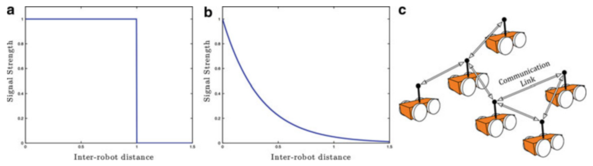

> Image description: This figure illustrates models for robot connectivity within a dynamic graph. It consists of three subplots: **a) Disc-based model of communication:** A line graph shows signal strength versus inter-robot distance. The signal strength remains constant at 1.0 for all distances up to a threshold of 1.0, after which it abruptly drops to 0, representing a binary connectivity model. **b) Weighted, proximity-based model of communication:** A line graph shows signal strength versus inter-robot distance. The signal strength starts at 1.0 at distance 0 and decays exponentially towards 0 as the distance increases, representing a continuous, distance-dependent relationship. **c) Connected network of mobile robots:** A schematic diagram depicts five orange-colored robots with wheels. Double-headed grey arrows represent "Communication Links" connecting the robots, forming a connected network. The robots are positioned in a non-linear, branching configuration.
Dynamic Graphs, Connectivity of, Fig. 1 (a) Disc-based model of communication; (b) Weighted, proximity-based model of communication; (c) Connected network of mobile robots

undirected; otherwise it is called directed. The weights in $\mathcal{W}(t)$ typically model signal strength or channel reliability, as per the disc-based and weighted-proximity models in Fig. 1a, b. In these models communication between nodes is related to their pairwise distance, giving rise to the dynamic or time-varying nature of the graph $\mathcal{G}(t)$ due to node mobility. Given an undirected dynamic graph $\mathcal{G}(t)$, we say that this graph is connected at time $t$ if there exists a path, i.e., a sequence of distinct vertices such that consecutive vertices are adjacent, between any two vertices in $\mathcal{G}(t)$. In the case of directed graphs, two notions of connectivity are defined. A directed graph $\mathcal{G}(t)$ is called strongly connected if there exists a directed path between any two of its vertices or equivalently, if every vertex is reachable from any other vertex. On the other hand, a directed graph is called weakly connected if replacing all directed edges by undirected edges produces a connected undirected graph. Finally, a collection of graphs $\left\{\mathcal{G}(t) \mid t=t_{0}, \ldots, t_{k}\right\}$ is called jointly connected over time if the union graph $\cup_{t=t_{0}}^{t_{k}} \mathcal{G}(t)=\left\{\mathcal{V}, \cup_{t=t_{0}}^{t_{k}} \mathcal{E}(t)\right\}$ is connected. Clearly checking for the existence of paths between all pairs of nodes in a graph is difficult, especially so as the number of nodes in the graph increases. For this reason, equivalent, algebraic representations of graphs are employed that allow for efficient algebraic ways to check for connectivity, as we discuss in the following section.

While connectivity is necessary for information propagation in a network, it is also relevant to the performance of many networked dynamical processes, such as synchronization and gossiping,
via its relation to the network eigenvalue spectra (Preciado 2008). For example, the spectrum of the Laplacian matrix of a network plays a key role in the analysis of synchronization in networks of nonlinear oscillators (Pecora and Carrollg 1998; Preciado and Verghese 2005), distributed algorithms (Lynch 1997), and decentralized control problems (Fax and Murray 2004; Olfati Saber and Murray 2004). Similarly, the spectrum of the adjacency matrix determines the speed of viral information spreading in a network (Van Mieghem et al. 2009). Additionally, more robust versions of connectivity, such as $k$-node or $k$-edge connectivity, can be used to introduce robustness of a network to node or link failures, respectively (Zavlanos and Pappas 2005, 2008).

## Graph-Theoretic Connectivity Control

## Connectivity Using the Graph Laplacian Matrix

A metric that is typically employed to capture connectivity of dynamic networks is the second smallest eigenvalue $\lambda_{2}(L)$ of the Laplacian matrix $L \in \mathbb{R}^{n \times n}$ of the graph, also known as the algebraic connectivity or Fiedler value of the graph. For a weighted graph $\mathcal{G}=\{\mathcal{V}, \mathcal{E}, \mathcal{W}\}$, the entries of the Laplacian matrix are typically related to the weights in $\mathcal{W}$ so that the $i, j$ entry of $L$ is given by $[L]_{i j}=\sum_{j=1}^{n} w_{i j}$ if $i=j$ and $[L]_{i j}=-w_{i j}$ if $i \neq j$. The Laplacian matrix of an undirected graph is always a symmetric, positive semidefinite matrix whose smallest eigenvalue $\lambda_{1}(L)$ is identically zero


<!-- source_pdf_page: 343 -->
with corresponding eigenvector the vector of all entries equal to one. Additionally, the algebraic connectivity $\lambda_{2}(L)$ is a concave function of the Laplacian matrix that is positive if and only if the graph is connected (Fiedler 1973; Godsil and Royle 2001; Merris 1994; Mohar 1991).

As the algebraic connectivity $\lambda_{2}(L)$ plays a critical role in determining whether a graph is connected or not, a number of methods have been proposed for its decentralized estimation and control. These range from methods that employ market-based control to underestimate the algebraic connectivity and accordingly control the network structure (Zavlanos and Pappas 2008) to methods that enforce the states of the nodes to oscillate at frequencies that correspond to the Laplacian eigenvalues and then use fast Fourier transform to estimate these eigenvalues (Franceschelli et al. 2013), to methods that iteratively update the interval where the algebraic connectivity is supposed to lie (Montijano et al. 2011), and to methods that rely on the power iteration method and its variants (DeGennaro and Jadbabaie 2006; Kempe and McSherry 2008; Knorn et al. 2009; Oreshkin et al. 2010; Sabattini et al. 2011; Yang et al. 2010). All the above techniques are often integrated with appropriate controllers to regulate mobility of the nodes while ensuring connectivity of the network. Another way that $\lambda_{2}(L)$ can be used to ensure connectivity of dynamic graphs is via optimization-based methods that maximize it away from its zero value. Such approaches were initially centralized as connectivity is a global property of a graph (Kim and Mesbahi 2006), although recently distributed subgradient algorithms (DeGennaro and Jadbabaie 2006) as well as non-iterative decomposition techniques (Simonetto et al. 2013) have also been proposed. As the algebraic connectivity is a non-differentiable function of the Laplacian matrix, designing continuous feedback controllers to maintain it positive definite is a challenging task. This problem was overcome in Zavlanos and Pappas (2007) via the use of gradient flows that maintain positive definiteness of the determinant of the projected Laplacian matrix to the space that is perpendicular to eigenvector of ones.

## Connectivity Using the Graph Adjacency Matrix

Alternatively, connectivity can be captured by the sum of powers $\sum_{k=0}^{K} A^{k}$ of the adjacency matrix $A \in \mathbb{R}^{n \times n}$ of the network for $K \leq n-1$. The entries of the adjacency matrix are typically related to the weights in $\mathcal{W}$ as $[A]_{i j}=w_{i j}$. For discbased graphs as in Fig. 1a, the $i, j$ entry of the $k$ th power of the adjacency matrix $\left[A^{k}\right]_{i j}$ captures the number of paths of length $k$ between nodes $i$ and $j$; for weighted graphs, $\left[A^{k}\right]_{i j}$ captures a weighted sum of those paths. Therefore, the entries of $\sum_{k=0}^{K} A^{k}$ represent the number of paths up to length $K$ between every pair of nodes in the graph (Godsil and Royle 2001). By definition of graph connectivity, if all entries of $\sum_{k=0}^{K} A^{k}$ are positive for $K=n-1$, then the network is connected. Clearly, for $K<n-1$, not all entries of $\sum_{k=0}^{K} A^{k}$ are necessarily positive, even if the graph is connected. Maintaining positive definiteness of the positive entries of $\sum_{k=0}^{K} A^{k}$ of an initially connected graph maintains paths of length $K$ between the corresponding nodes and, as shown in Zavlanos and Pappas (2005), is sufficient to maintain connectivity of the graph throughout.

The ability to capture graph connectivity using the adjacency matrix has given rise to optimization-based connectivity controllers (Srivastava and Spong 2008; Zavlanos and Pappas 2005) that are often centralized due to the multi-hop dependencies between nodes due to the powers of the adjacency matrix. Since smaller powers correspond to shorter dependencies (paths), decentralization is possible as $K$ decreases. If $K=1$, connectivity maintenance reduces to preserving the pairwise links between the nodes in an initially connected network. Since the adjacency matrix of weighted graphs is often a differentiable function, this approach can result in continuous feedback solution techniques. Discrete-time approaches are discussed in Ando et al. (1999), Notarstefano et al. (2006), and Bullo et al. (2009), while Spanos and Murray (2004), Dimarogonas and Kyriakopoulos (2008), Cornejo and Lynch (2008), Yao and Gupta (2009), Zavlanos et al. (2007), and Ji and Egerstedt (2007) rely on local gradients that


<!-- source_pdf_page: 344 -->
may also incorporate switching in the case of link additions. Switching between arbitrary spanning topologies has also been studied in the literature, with the spanning subgraphs being updated by local auctions (Zavlanos and Pappas 2008), distributed spanning tree algorithms (Wagenpfeil et al. 2009), combination of information dissemination algorithms and graph picking games (Schuresko and Cortes 2009b), or intermediate rendezvous (Schuresko and Cortes 2009a; Spanos and Murray 2005). This class of approaches is typically hybrid, combining continuous link maintenance and discrete topology control. The algebraic connectivity $\lambda_{2}(L)$ and number of paths $\sum_{k=0}^{K} A^{k}$ metrics can also be combined to give controllers that maintain connectivity, while enforcing desired multi-hop neighborhoods for all agents (Stump et al. 2008).

A recent, comprehensive survey on graphtheoretic approaches for connectivity control of dynamic graphs can be found in Zavlanos et al. (2011).

## Applications in Mobile Robot Network Control

Methods to control connectivity of dynamic graphs have been successfully applied to multiple scenarios that require network connectivity to achieve a global coordinated objective. Indicative of the impact of this work is recent literature on connectivity preserving rendezvous (Ando et al. 1999; Cortes et al. 2006; Dimarogonas and Kyriakopoulos 2008; Ganguli et al. 2009; Ji and Egerstedt 2007), flocking (Zavlanos et al. 2007, 2009), and formation control (Ji and Egerstedt 2007; Schuresko and Cortes 2009a), where so far connectivity had been an assumption. Further extensions and contributions involve connectivity control for double integrator agents (Notarstefano et al. 2006), agents with bounded inputs (Ajorlou and Aghdam 2010; Ajorlou et al. 2010; Dimarogonas and Johansson 2008), and indoor navigation (Stump et al. 2008), as well as for communication based on radio signal strength (Hsieh et al. 2008; Mostofi 2009;

Powers and Balch 2004; Wagner and Arkin 2004) and visibility constraints (Anderson et al. 2003; Ando et al. 1999; Arkin and Diaz 2002; Flocchini et al. 2005; Ganguli et al. 2009). Periodic connectivity for robot teams that need to occasionally split in order to achieve individual objectives (Hollinger and Singh 2010; Zavlanos 2010) and sufficient conditions for connectivity in leader-follower networks (Gustavi et al. 2010) also adds to the list. Early experimental results have demonstrated efficiency of these algorithms also in practice (Hollinger and Singh 2010; Michael et al. 2009; Tardioli et al. 2010).

## Summary and Future Directions

Although graphs provide a simple abstraction of inter-robot communications, it has long been recognized that since links in a wireless network do not entail tangible connections, associating links with arcs on a graph can be somewhat arbitrary. Indeed, topological definitions of connectivity start by setting target signal strengths to draw the corresponding graph. Even small differences in target strengths might result in dramatic differences in network topology (Lundgren et al. 2002). As a result, graph connectivity is necessary but not nearly sufficient to guarantee communication integrity, interpreted as the ability of a network to support desired communication rates.

To address these challenges, a new body of work is recently appearing that departs from traditional graph-based models of communication. Specifically, Zavlanos et al. (2013) employs a simple, yet effective, modification that relies on weighted graph models with weights that capture the packet error probability of each link (DeCouto et al. 2006). When using reliabilities as link metrics, it is possible to model routing and scheduling problems as optimization problems that accept link reliabilities as inputs (Ribeiro et al. 2007, 2008). The key idea proposed in Zavlanos et al. (2013) is to define connectivity in terms of communication rates and to use optimization formulations to describe optimal operating points of wireless networks. Then, the


<!-- source_pdf_page: 345 -->
communication variables are updated in discrete time via a distributed gradient descent algorithm on the dual function, while robot motion is regulated in continuous time by means of appropriate distributed barrier potentials that maintain desired communication rates. Related approaches consider optimal communications based on T-slot time averages of the primal variables for general mobility schemes Neely (2010), as well as optimization of mobility and communications based on the end-to-end bit error rate between nodes (Ghaffarkhah and Mostofi 2011; Yan and Mostofi 2012).

## Cross-References

- Flocking in Networked Systems
- Graphs for Modeling Networked Interactions


## Bibliography

Ajorlou A, Aghdam AG (2010) A class of bounded distributed controllers for connectivity preservation of unicycles. In: Proceedings of the 49th IEEE conference on decision and control, Atlanta, pp 3072-3077
Ajorlou A, Momeni A, Aghdam AG (2010) A class of bounded distributed control strategies for connectivity preservation in multi-agent systems. IEEE Trans Autom Control 55(12):2828-2833
Anderson SO, Simmons R, Goldberg D (2003) Maintaining line-of-sight communications networks between planetray rovers. In: Proceedings of the 2003 IEEE/RSJ international conference on intelligent robots and systems, Las Vegas, pp 2266-2272
Ando H, Oasa Y, Suzuki I, Yamashita M (1999) Distributed memoryless point convergence algorithm for mobile robots with limited visibility. IEEE Trans Robot Autom 15(5):818-828
Arkin RC, Diaz J (2002) Line-of-sight constrained exploration for reactive multiagent robotic teams. In: Proceedings of the 7th international workshop on advanced motion control, Maribor, pp 455-461
Bullo F, Cortes J, Martinez S (2009) Distributed control of robotic networks. Applied Mathematics Series. Princeton University Press, Princeton
Cornejo A, Lynch N (2008) Connectivity service for mobile ad-hoc networks. In: Proceedings of the 2nd IEEE international conference on self-adaptive and self-organizing systems workshops, pp 292-297
Cortes J, Martinez S, Bullo F (2006) Robust rendezvous for mobile autonomous agents via proximity graphs
in arbitrary dimensions. IEEE Trans Autom Control 51(8):1289-1298
DeCouto D, Aguayo D, Bicket J, Morris R (2006) A highthroughput path metric for multihop wireless routing. In: Proceedings of the international ACM conference on mobile computing and networking, San Diego, pp 134-146
DeGennaro MC, Jadbabaie A (2006) Decentralized control of connectivity for multi-agent systems. In: Proceedings of the 45th IEEE conference on decision and control, San Diego, pp 3628-3633
Dimarogonas DV, Johansson KH (2008) Decentralized connectivity maintenance in mobile networks with bounded inputs. In Proceedings of the IEEE international conference on robotics and automation, Pasadena, pp 1507-1512
Dimarogonas DV, Kyriakopoulos KJ (2008) Connectedness preserving distributed swarm aggregation for multiple kinematic robots. IEEE Trans Robot 24(5):1213-1223
Fax A, Murray RM (2004) Information flow and cooperative control of vehicle formations. IEEE Trans Autom Control 49:1465-1476
Fiedler M (1973) Algebraic connectivity of graphs. Czechoslovak Math J 23(98):298-305
Flocchini P, Prencipe G, Santoro N, Widmayer P (2005) Gathering of asynchronous oblivious robots with limited visibility. Theor Comput Sci 337(1-3): 147-168
Franceschelli M, Gasparri A, Giua A, Seatzu C (2013) Decentralized estimation of laplacian eigenvalues in multi-agent systems. Automatica 49(4):1031-1036
Ganguli A, Cortes J, Bullo F (2009) Multirobot rendezvous with visibility sensors in nonconvex environments. IEEE Trans Robot 25(2):340-352
Ghaffarkhah A, Mostofi Y (2011) Communication-aware motion planning in mobile networks. IEEE Trans Autom Control Spec Issue Wirel Sens Actuator Netw 56(10):2478-248
Godsil C, Royle G (2001) Algebraic graph theory, Graduate Texts in Mathematics, vol 207. Springer, Berlin
Gustavi T, Dimarogonas DV, Egerstedt M, Hu X (2010) Sufficient conditions for connectivity maintenance and rendezvous in leader-follower networks. Automatica 46(1):133-139
Hollinger G, Singh S (2010) Multi-robot coordination with periodic connectivity. In: Proceedings of the IEEE international conference on robotics and automation, Anchorage, Alaska, pp 4457-4462
Hsieh MA, Cowley A, Kumar V, Taylor C (2008) Maintaining network connectivity and performance in robot teams. J Field Robot 25(1-2):111-131
Ji M, Egerstedt M (2007) Coordination control of multiagent systems while preserving connectedness. IEEE Trans Robot 23(4):693-703
Kempe D, McSherry F (2008) A decentralized algorithm for spectral analysis. J Comput Syst Sci 74(1):70-83
Kim Y, Mesbahi M (2006) On maximizing the second smallest eigenvalue of a state-dependent graph laplacian. IEEE Trans Autom Control 51(1):116-120


<!-- source_pdf_page: 346 -->
Knorn F, Stanojevic R, Corless M, Shorten R (2009) A framework for decentralized feedback connectivity control with application to sensor networks. Int J Control 82(11):2095-2114
Lundgren H, Nordstrom E, Tschudin C (2002) The gray zone problem in ieee 802.11 b based ad hoc networks. ACM SIGMOBILE Mobile Comput Commun Rev 6(3):104-105
Lynch N (1997) Distributed algorithms. Morgan Kaufmann, San Francisco
Merris R (1994) Laplacian matrices of a graph: a survey. Linear Algebra Appl 197:143-176
Michael N, Zavlanos MM, Kumar V, Pappas GJ (2009) Maintaining connectivity in mobile robot networks. In: Experimental robotics. Tracts in advanced robotics. Springer, Berlin/Heidelberg, pp 117-126
Mohar B (1991) The laplacian spectrum of graphs. In: Alavi Y, Chartrand G, Ollermann O, Schwenk A (Eds) Graph theory, combinatorics, and applications. Wiley, New York, pp 871-898
Montijano E, Montijano JI, Sagues C (2011) Adaptive consensus and algebraic connectivity estimation in sensor networks with chebyshev polynomials. In: Proceedings of the 50th IEEE conference on decision and control, Orlando, pp 4296-4301
Mostofi Y (2009) Decentralized communication-aware motion planning in mobile networks: an informationgain approach. J Intell Robot Syst 56(1-2): 233-256
Neely MJ (2010) Universal scheduling for networks with arbitrary traffic, channels, and mobility. In: Proceedings of the 49th IEEE conference on decision and control, Altanta, pp 1822-1829
Neskovic A, Neskovic N, Paunovic G (2000) Modern approaches in modeling of mobile radio systems propagation environment. IEEE Commun Surv 3(3): 1-12
Notarstefano G, Savla K, Bullo F, Jadbabaie A (2006) Maintaining limited-range connectivity among second-order agents. In: Proceedings of the 2006 American control conference, Minneapolis, pp 21242129
Olfati-Saber R, Murray RM (2004) Consensus problems in networks of agents with switching topology and time-delays. IEEE Trans Autom Control 49: 1520-1533
Oreshkin BN, Coates MJ, Rabbat MG (2010) Optimization and analysis of distributed averaging with short node memory. IEEE Trans Signal Process 58(5):2850-2865
Pahlavan K, Levesque AH (1995) Wireless information networks. Willey, New York
Parsons JD (2000) The mobile radio propagation channel. Willey, Chichester
Pecora L, Carrollg T (1998) Master stability functions for synchronized coupled systems. Phys Rev Lett 80:2109-2112
Powers M, Balch T (2004) Value-based communication preservation for mobile robots. In: Proceedings of the 7th international symposium on distributed autonomous robotic systems, Toulouse

Preciado V (2008) Spectral analysis for stochastic models of large-scale complex dynamical networks. Ph.D. dissertation, Department of Electrical Engineering and Computer Science, MIT
Preciado V, Verghese G (2005) Synchronization in generalized erdös-rényi networks of nonlinear oscillators. In: 44th IEEE conference on decision and control, Seville, Spain, pp 4628-463
Ribeiro A, Luo Z-Q, Sidiropoulos ND, Giannakis GB (2007) Modelling and optimization of stochastic routing for wireless multihop networks. In: Proceedings of the 26th annual joint conference of the IEEE Computer and Communications Societies (INFOCOM), Anchorage, pp 1748-1756
Ribeiro A, Sidiropoulos ND, Giannakis GB (2008) Optimal distributed stochastic routing algorithms for wireless multihop networks. IEEE Trans Wirel Commun 7(11):4261-4272
Sabattini L, Chopra N, Secchi C (2011) On decentralized connectivity maintenance for mobile robotic systems. In: Proceedings of the 50th IEEE conference on decision and control, Orlando, pp 988-993
Schuresko M, Cortes J (2009a) Distributed tree rearrangements for reachability and robust connectivity. In: Hybrid systems: computetation and control. Lecture notes in computer science, vol 5469. Springer, Berlin/New York, pp 470-474
Schuresko M, Cortes J (2009b) Distributed motion constraints for algebraic connectivity of robotic networks. J Intell Robot Syst 56(1-2):99-126
Simonetto A, Kaviczky T, Babuska R (2013) Constrained distributed algebraic connectivity maximization in robotic networks. Automatica 49(5): 1348-1357
Spanos DP, Murray RM (2004) Robust connectivity of networked vehicles. In: Proceedings of the 43rd IEEE conference on decision and control, Bahamas, pp 2893-2898
Spanos DP, Murray RM (2005) Motion planning with wireless network constraints. In: Proceedings of the 2005 American control conference, Portland, pp 87-92
Srivastava K, Spong MW (2008) Multi-agent coordination under connectivity constraints. In: Proceedings of the 2008 American control conference, Seattle, pp 2648-2653
Stump E, Jadbabaie A, Kumar V (2008) Connectivity management in mobile robot teams. In: Proceedings of the IEEE international conference on robotics and automation, Pasadena, pp 1525-1530
Tardioli D, Mosteo AR, Riazuelo L, Villarroel JL, Montano L (2010) Enforcing network connectivity in robot team missions. Int J Robot Res 29(4):460-480
Van Mieghem P, Omic J, Kooij R (2009) Virus spread in networks. IEEE/ACM Trans Networking 17(1):1-14
Wagenpfeil J, Trachte A, Hatanaka T, Fujita M, Sawodny O (2009) A distributed minimum restrictive connectivity maintenance algorithm. In: Proceedings of the 9th international symposium on robot control, Gifu
Wagner AR, Arkin RC (2004) Communication-sensitive multi-robot reconnaissance. In: Proceedings of the


<!-- source_pdf_page: 347 -->
IEEE international conference on robotics and automation, New Orleans, pp 2480-2487
Yan Y, Mostofi Y (2012) Robotic router formation in realistic communication environments. IEEE Trans Robot 28(4):810-827
Yang P, Freeman RA, Gordon GJ, Lynch KM, Srinivasa SS, Sukthankar R (2010) Decentralized estimation and control of graph connectivity for mobile sensor networks. Automatica 46(2): 390-396
Yao Z, Gupta K (2009) Backbone-based connectivity control for mobile networks. In: Proceedings IEEE international conference on robotics and automation, Kobe, pp 1133-1139
Zavlanos MM (2010) Synchronous rendezvous of very-low-range wireless agents. In: Proceedings of the 49th IEEE conference on decision and control, Atlanta, pp 4740-4745
Zavlanos MM, Pappas GJ (2005) Controlling connectivity of dynamic graphs. In: Proceedings of the 44th IEEE conference on decision and control and European control conference, Seville, pp 6388-6393
Zavlanos MM, Pappas GJ (2007) Potential fields for maintaining connectivity of mobile networks. IEEE Trans Robot 23(4):812-816
Zavlanos MM, Pappas GJ (2008) Distributed connectivity control of mobile networks. IEEE Trans Robot 24(6):1416-1428
Zavlanos MM, Jadbabaie A, Pappas GJ (2007) Flocking while preserving network connectivity. In: Proceedings of the 46th IEEE conference on decision and control, New Orleans, pp 2919-2924
Zavlanos MM, Tanner HG, Jadbabaie A, Pappas GJ (2009) Hybrid control for connectivity preserving flocking. IEEE Trans Autom Control 54(12):2869-2875
Zavlanos MM, Egerstedt MB, Pappas GJ (2011) Graph theoretic connectivity control of mobile robot networks. Proc IEEE Spec Issue Swarming Nat Eng Syst 99(9):1525-154
Zavlanos MM, Ribeiro A, Pappas GJ (2013) Network integrity in mobile robotic networks. IEEE Trans Autom Control 58(1):3-18

## Dynamic Noncooperative Games

David A. Castañón<br>Boston University, Boston, MA, USA


#### Abstract

In this entry, we present models of dynamic noncooperative games, solution concepts and algorithms for finding game solutions. For the sake of exposition, we focus mostly on finite games, where the number of actions available to each


player is finite, and discuss briefly extensions to infinite games.

## Keywords

Extensive form games; Finite games; Nash equilibrium

## Introduction

Dynamic noncooperative games allow multiple actions by individual players, and include explicit representations of the information available to each player for selecting its decision. Such games have a complex temporal order of play and an information structure that reflects uncertainty as to what individual players know when they have to make decisions. This temporal order and information structure is not evident when the game is represented as a static game between players that select strategies. Dynamic games often incorporate explicit uncertainty in outcomes, by representing such outcomes as actions taken by a random player (called chance or "Nature") with known probability distributions for selecting its actions.

We focus our exposition on models of finite games and discuss briefly extensions to infinite games at the end of the entry.

## Finite Games in Extensive Form

The extensive form of a game was introduced by von Neumann (1928) and later refined by Kuhn (1953) to represent explicitly the order of play, the information and actions available to each player for making decisions at each of their turns, and the payoffs that players receive after a complete set of actions. Let $I=\{0,1, \ldots, n\}$ denote the set of players in a game, where player 0 corresponds to Nature. The extensive form is represented in terms of a game tree, consisting of a rooted tree with nodes $\mathcal{N}$ and edges $\mathcal{E}$. The root node represents the initial state of the game. Nodes $x$ in this tree correspond to positions or "states" of the game. Any non-root node with


<!-- source_pdf_page: 348 -->
more than one incident edge is an internal node of the tree and is a decision node associated with a player in the game; the root node is also a decision node. Each decision node $x$ has a player $o(x) \in I$ assigned to select a decision from a finite set of admissible decisions $A(x)$. Using distance from the root node to indicate direction of play, each edge that follows node $x$ corresponds to an action in $A(x)$ taken by player $p(x)$, which evolves the state of the game into a subsequent node $x^{\prime}$.

Non-root nodes with only one incident edge are terminal nodes, which indicate the end of the game; such nodes represent outcomes of the game. The unique path from the root node to a terminal node is a called a play of the game. For each outcome node $x$, there are payoff functions $J_{i}(x)$ associated with each player $i \in\{1, \ldots, n\}$.

The above form represents the different players, the order in which players select actions and their possible actions, and the resulting payoffs to each player from a complete set of plays of the game. The last component of interest is to represent the information available for players to select decisions at each decision node. Due to the tree structure of the extensive form of a game, each decision node $x$ contains exact information on all of the previous actions taken that led to state $x$. In games of perfect information, each player knows exactly the decision node $x$ at which he/she is selecting an action. To represent imperfect information, the extensive form uses the notion of an information set, which represents a group of decision nodes, associated with the same player, where the information available to that player is that the game is in one of the states in that information set. Formally, let $\mathcal{N}_{i} \subset \mathcal{N}$ be the set of decision nodes associated with player $i$, for $i \in I$. Let $\mathcal{H}_{i}$ denote a partition of $\mathcal{N}_{i}$ so that, for each set $h_{i}^{k} \in \mathcal{H}_{i}$, we have the following properties:

- If $x, x^{\prime} \in h_{i}^{k}$, then they have the same admissible actions: $A(x)=A\left(x^{\prime}\right)$.
- If $x, x^{\prime} \in h_{i}^{k}$, then they cannot both belong to a play of the game; that is, both $x$ and $x^{\prime}$ cannot be on a path from the root node to an outcome.
Elements $h_{i}^{k}$ for some player $i$ are the information sets. Each decision node $x$ belongs to one and

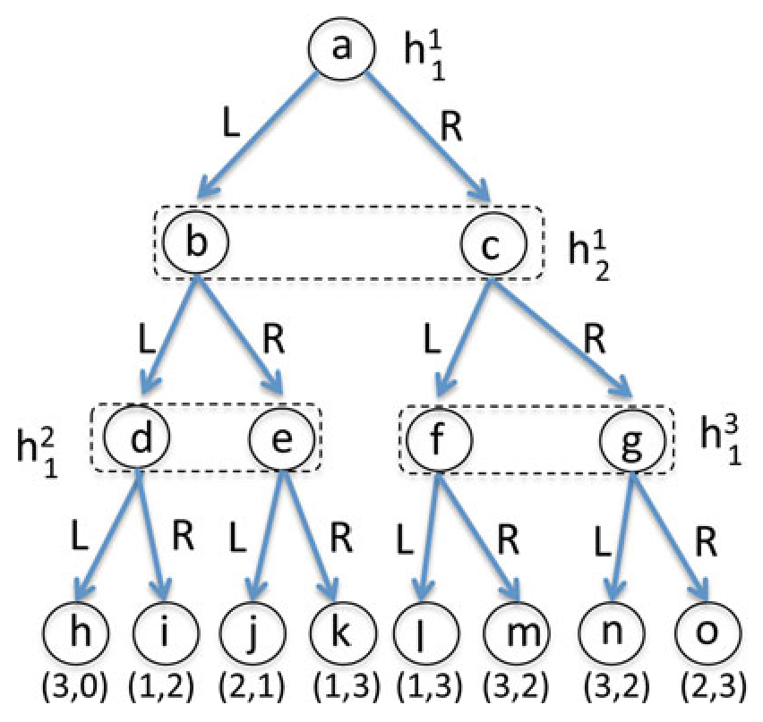

> Image description: Figure 1 from "Dynamic Noncooperative Games" illustrates a game in extensive form using a tree structure. The root node is labeled 'a' with the variable $h_1^1$. From node 'a', two directed arrows lead to nodes 'b' and 'c', labeled 'L' (left) and 'R' (right), respectively. Nodes 'b' and 'c' are enclosed in a dashed rectangular block associated with the variable $h_2^1$. From node 'b', arrows 'L' and 'R' lead to nodes 'd' and 'e', which are grouped in a dashed block labeled $h_1^2$. From node 'c', arrows 'L' and 'R' lead to nodes 'f' and 'g', grouped in a dashed block labeled $h_1^3$. Finally, each of these four nodes ('d', 'e', 'f', 'g') branches into two terminal leaf nodes. The leaves are labeled 'h' through 'o', each paired with a coordinate pair (e.g., node 'h' is $(3,0)$ and node 'o' is $(2,3)$), representing game payoffs.
Dynamic Noncooperative Games, Fig. 1 Illustration of game in extensive form

only one information set associated with player $p(x)$. The constraints above ensure that, for each information set, there is a unique player identified to select actions, and the set of admissible actions is unambiguously defined. Denote by $A\left(h_{i}^{k}\right)$ the set of admissible actions at information set $h_{i}^{k}$. The last condition is a causality condition that ensures that a player who has selected a previous decision remembers that he/she has already made that previous decision.

Figure 1 illustrates an extensive form for a two-person game. Player 1 has two actions in any play of the game, whereas player 2 has only 1 action. Player 1 starts the game at the root node $a$; the information set $h_{2}^{1}$ shows that player 2 is unaware of this action, as both nodes that descend from node $a$ are in this information set. After player 2's action, player 1 gets to select a second action. However, the information sets $h_{1}^{2}, h_{1}^{3}$ indicate that player 1 recalls what earlier action he/she selected, but he/she has not observed the action of player 2. The terminal nodes indicate the payoffs to player 1 and player 2 as an ordered pair.

## Strategies and Equilibrium Solutions

A pure strategy $\gamma_{i}$ for player $i \in\{1, \ldots, n\}$ is a function that maps each information set of player $i$ into an admissible decision. That is,


<!-- source_pdf_page: 349 -->
$$
\gamma_{i}: \mathcal{H}_{i} \rightarrow A
$$

such that $\gamma_{i}\left(h_{i}^{k}\right) \in A\left(h_{i}^{k}\right)$. The set of pure strategies for player $i$ is denoted as $\Gamma_{i}$.

Note that pure strategies do not include actions selected by Nature. Nature's actions are selected using probability distributions over the choices available for the information sets corresponding to Nature, where the choice at each information set is made independently of other choices. For finite games, the number of pure strategies for each player is also finite. Given a tuple of pure strategies $\underline{\gamma}=\left(\gamma_{1}, \ldots, \gamma_{n}\right)$, we can define the probability of the play of the game resulting in outcome node $x$ as $\pi(x)$, computed as follows: Each outcome node has a unique path (the play) $p_{r x}$ from root node $r$. We initialize $\pi(r)=1$ and node $n=r$. If the player at node $n$ is Nature and the next node in $p_{r x}$ is $n^{\prime}$, then $\pi\left(n^{\prime}\right)=\pi(n) * p\left(n, n^{\prime}\right)$, where $p\left(n, n^{\prime}\right)$ is the probability that Nature chooses the action that leads to $n^{\prime}$. Otherwise, let $i=p(n)$ be the player at node $n$ and let $h_{i}^{k}(n)$ denote the information set containing node $n$. Then, if $\gamma^{i}\left(h_{i}^{k}(n)\right)= a\left(n, n^{\prime}\right)$, let $\pi\left(n^{\prime}\right)=\pi(n)$, where $a\left(n, n^{\prime}\right)$ is the action in $A(n)$ that leads to $n^{\prime}$; otherwise, set $\pi\left(n^{\prime}\right)=0$. The above process is repeated letting $n^{\prime}=n$, until $n^{\prime}$ equals the terminal node $x$. Using these probabilities, the resulting expected payoff to player $i$ is

$$
\mathcal{J}_{i}(\underline{\gamma})=\sum_{x \text { terminal, } x \in \mathcal{N}} \pi(x) J_{i}(x)
$$

This representation of payoffs in terms of strategies transforms the game from an extensive form representation to a strategic or normal form representation, where the concept of dynamics and information has been abstracted away. The resulting strategic form looks like a static game as discussed in the encyclopedia entry - Strategic Form Games and Nash Equilibrium, where each player selects his/her strategy from a finite set, resulting in a vector of payoffs for the players. Using these payoffs, one can now define solution concepts for the game. Let the notation $\underline{\gamma}_{-i}=\left(\gamma_{1}, \ldots, \gamma_{i-1}, \gamma_{i+1}, \gamma_{n}\right)$ denote the set of strategies in a tuple excluding the $i$ th strategy.

A Nash equilibrium solution is a tuple of feasible strategies $\underline{\gamma}^{*}=\left(\gamma_{1}^{*}, \ldots, \gamma_{n}^{*}\right)$ such that

$$
\begin{align*}
& \mathcal{J}_{i}\left(\underline{\gamma}^{*}\right) \geq \mathcal{J}_{i}\left(\underline{\gamma}_{-i}^{*}, \gamma_{i}\right) \text { for all } \gamma_{i} \in \Gamma_{i} \\
& \text { for all } i \in\{1, \ldots, n\} \tag{1}
\end{align*}
$$

The special case of two-person games where $\mathcal{J}_{1}(\underline{\gamma})=-\mathcal{J}_{2}(\underline{\gamma})$ are known as zero-sum games.

As discussed in the encyclopedia entry on static games ( ▷ Strategic Form Games and Nash Equilibrium), the existence of Nash equilibria or even saddle point strategies in terms of pure strategies is not guaranteed for finite games. Thus, one must consider the use of mixed strategies. A mixed strategy $\mu_{i}$ for player $i \in\{1, \ldots, n\}$ is a probability distribution over the set of pure strategies $\Gamma_{i}$. The definition of payoffs can be extended to mixed strategies by averaging the payoffs associated with the pure strategies, as

$$
\begin{aligned}
\mathcal{J}_{i}\left(\underline{\mu}_{i}\right)= & \sum_{\gamma_{1} \in \Gamma_{1}} \ldots \sum_{\gamma_{n} \in \Gamma_{n}} \mu_{1}\left(\gamma_{1}\right) \cdots \mu_{n}\left(\gamma_{n}\right) \\
& \mathcal{J}_{i}\left(\gamma_{1}, \ldots, \gamma_{n}\right)
\end{aligned}
$$

Denote the set of probability distributions over $\Gamma_{i}$ as $\Delta\left(\Gamma_{i}\right)$. An $n$-tuple $\underline{\mu}^{*}=\left(\mu_{1}, \ldots, \mu_{n}\right)$ of mixed strategies is said to be a Nash equilibrium if

$$
\begin{array}{r}
\mathcal{J}_{i}\left(\underline{\mu}^{*}\right) \geq \mathcal{J}_{i}\left(\underline{\mu}_{-i}^{*}, \mu_{i}\right) \text { for all } \mu_{i} \\
\in \Delta\left(\Gamma_{i}\right), \text { for all } i \in\{1, \ldots, n\}
\end{array}
$$

Theorem 1 (Nash 1950, 1951) Every finite $n$-person game has at least one Nash equilibrium point in mixed strategies.

Mixed strategies suggest that each player's randomization occurs before the game is played, by choosing a strategy at random from its choices of pure strategies. For games in extensive form, one can introduce a different class of strategies where a player makes a random choice of action at each information set, according to a probability distribution that depends on the specific information set. The choice of action is selected independently at each information set according


<!-- source_pdf_page: 350 -->
to a selected probability distribution, in a manner similar to how Nature's actions are selected. These random choice strategies are known as behavior strategies. Let $\Delta\left(A\left(h_{i}^{k}\right)\right)$ denote the set of probability distributions over the decisions $A\left(h_{i}^{k}\right)$ for player $i$ at information set $h_{i}^{k}$. A behavior strategy for player $i$ is an element $x_{i} \in \prod_{h_{i}^{k} \in \mathcal{H}_{i}} \Delta\left(A\left(h_{i}^{k}\right)\right)$, where $x_{i}\left(h_{i}^{k}\right)$ denotes the probability distribution of the behavior strategy $x_{i}$ over the available decisions at information set $h_{i}^{k}$.

Note that the space of admissible behavior strategies is much smaller than the space of admissible mixed strategies. To illustrate this, consider a player with $K$ information sets and two possible decisions for each information set. The number of possible pure strategies would be $2^{K}$, and thus the space of mixed strategies would be a probability simplex of dimension $2^{K}-1$. In contrast, behavior strategies would require specifying probability distributions over two choices for each of $K$ information sets, so the space of behavior strategies would be a product space of $K$ probability simplices of dimension 1 , totaling dimension $K$. One way of understanding this difference is that mixed strategies introduce correlated randomization across choices at different information sets, whereas behavior strategies introduce independent randomization across such choices.

For every behavior strategy, one can find an equivalent mixed strategy by computing the probabilities of every set of actions that result from the behavior strategy. The converse is not true for general games in extensive form. However, there is a special class of games for which the converse is true. In this class of games, players recall what actions they have selected previously and what information they knew previously. A formal definition of perfect recall is beyond the scope of this exposition but can be found in Hart (1991) and Kuhn (1953). The implication of perfect recall is summarized below:

Theorem 2 (Kuhn 1953) Given a finite $n$ person game in which player $i$ has perfect recall, for each mixed strategy $\mu_{i}$ for player $i$, there exists a corresponding behavior strategy $x_{i}$ that
is equivalent, where every player receives the same payoffs under both strategies $\mu_{i}$ and $x_{i}$.

This equivalence was extended by Aumann to infinite games (Aumann 1964). In dynamic games, it is common to assume that each player has perfect recall and thus solutions can be found in the smaller space of behavior strategies.

## Computation of Equilibria

Algorithms for the computation of mixedstrategy Nash equilibria of static games can be extended to compute mixed-strategy Nash equilibria for games in extensive form when the pure strategies are enumerated as above. However, the number of pure strategies grows exponentially with the size of the extensive form tree, making these methods hard to apply. For two-person games in extensive form with perfect recall by both players, one can search for Nash equilibria in the much smaller space of behavior strategies. This was exploited in Koller et al. (1996) to obtain efficient linear complementarity problems for nonzero-sum games and linear programs for zero-sum games where the number of variables involved is linear in the number of internal decision nodes of the extensive form of the game. A more detailed overview of computation algorithms for Nash equilibria can be found in McKelvey and McLennan (1996). The Gambit Web site (McKelvey et al. 2010) provides software implementations of several techniques for computation of Nash equilibria in two- and $n$-person games.

An alternative approach to computing Nash equilibria for games in extensive forms is based on subgame decomposition, discussed next.

## Subgames

Consider a game $G$ in extensive form. A node $c$ is a successor of a node $n$ if there is a path in the game tree from $n$ to $c$. Let $h$ be a node in $G$ that is not terminal and is the only node in its information set. Assume that if a node $c$ is a successor of $h$, then every node in the information set containing $c$ is also a successor of $h$. In this situation, one can define a subgame $H$ of $G$ with root node $h$, which consists of node $h$ and


<!-- source_pdf_page: 351 -->
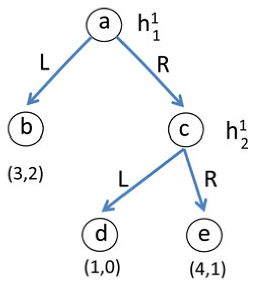

> Image description: This figure, captioned "Fig. 2 Simple game with multiple Nash equilibria," depicts an extensive-form game tree representing a dynamic noncooperative game. The tree consists of nodes labeled with lowercase letters $a, b, c, d,$ and $e$. The root node $a$ is associated with the variable $h_1^1$. From node $a$, two blue arrows branch out: one labeled "L" leading to node $b$, and one labeled "R" leading to node $c$. Node $c$, associated with $h_2^1$, further branches into two paths labeled "L" (leading to node $d$) and "R" (leading to node $e$). Terminal nodes are accompanied by payoff vectors in parentheses. Node $b$ has the payoff $(3,2)$; node $d$ has $(1,0)$; and node $e$ has $(4,1)$. The structure illustrates a sequential decision-making process where players move through states $a$ and $c$ to reach specific outcomes.
Dynamic Noncooperative Games, Fig. 2 Simple game with multiple Nash equilibria

its successors, connected by the same actions as in the original game $G$, with the payoffs and terminal vertices equal to those in $G$. This is the subgame that would be encountered by the players had the previous play of the game reached the state at node $h$. Since the information set containing node $h$ contains no other node and all the information sets in the subgame contain only nodes in the subgame, then every player in the subgame knows that they are playing only in the subgame once $h$ has been reached.

Figure 2 illustrates a game where every nonterminal node is contained in its own information set. This game contains a subgame rooted at node $c$. Note that the full game has two Nash equilibria in pure strategies: strategies ( $L, L$ ) and $(R, R)$. However, strategy ( $L, L$ ) is inconsistent with how player 2 would choose its decision if it were to find itself at node $c$. This inconsistency arises because the Nash equilibria are defined in terms of strategies announced before the game is played and may not be a reasonable way to select decisions if unanticipated plays occur. When player 1 chooses $L$, node $c$ should not be reached in the play of the game, and thus player 2 can choose $L$ because it does not affect the expected payoff. One can define the concept of Nash equilibria that are sequentially consistent as follows.

Let $x_{i}$ be behavior strategies for player $i$ in game $G$. Denote the restriction of these strategies to the subgame $H$ as $x_{i}^{H}$. This restriction describes the probabilities for choices of actions
for the information sets in $H$. Suppose the game $G$ has a Nash equilibrium achieved by strategies $\left(x_{1}, \ldots, x_{n}\right)$. This Nash equilibrium is called subgame perfect (Selten 1975) if, for every subgame $H$ of $G$, the strategies ( $x_{1}^{H}, \ldots, x_{n}^{H}$ ) are a Nash equilibrium for the subgame $H$. In the game in Fig. 2, there is only one subgame perfect equilibrium, which is $(R, R)$. There are several other refinements of the Nash equilibrium concept to enforce sequential consistency, such as sequential equilibria (Kreps and Wilson 1982).

An important application of subgames is to compute subgame perfect equilibria by backward induction. The idea is to start with a subgame root node as close as possible to an outcome node (e.g., node $c$ in Fig. 2). This small subgame can be solved for its Nash equilibria, to compute the equilibrium payoffs for each player. Then, in the original game $G$, the root node of the subgame can be replaced by an outcome node, with payoffs equal to the equilibrium payoffs in the subgame. This results in a smaller game, and the process can be applied inductively until the full game is solved. The subgame perfect equilibrium strategies can then be computed as the solution of the different subgames solved in this backward induction process. For Fig. 2, the subgame at $c$ is solved by player 2 selecting $R$, with payoffs $(4,1)$. The reduced new game has two choices for player 1 , with best decision $R$. This leads to the overall subgame perfect equilibrium ( $R, R$ ).

This backward induction procedure is similar to the dynamic programming approach to solving control problems. Backward induction was first used by Zermelo (1912) to analyze zero-sum games of perfect information such as chess. An extension of Zermelo's work by Kuhn (1953) establishes the following result:

Theorem 3 Every finite game of perfect information has a subgame perfect Nash equilibrium in pure strategies.

This result follows because, at each step in the backward induction process, the resulting subgame consists of a choice among finite actions for a single player, and thus a pure strategy achieves the maximal payoff possible.


<!-- source_pdf_page: 352 -->
## Infinite Noncooperative Games

When the number of options available to players is infinite, game trees are no longer appropriate representations for the evolution of the game. Instead, one uses state space models with explicit models of actions and observations. A typical multistage model for the dynamics of such games is

$$
\begin{align*}
x(t+1)= & f\left(x(t), u_{1}(t), \ldots, u_{n}(t), w(t), t\right) \\
& t=0, \ldots, T-1 \tag{2}
\end{align*}
$$

with initial condition $\underline{x}(0)=w(0)$, where $x(t)$ is the state of the game at stage $t$, and $u_{1}(t), \ldots, u_{n}(t)$ are actions selected by players $1, \ldots, n$ at stage $t$, and $w(t)$ is an action selected by Nature at stage $t$. The space of actions for each player are restricted at each time to infinite sets $A_{i}(t)$ with an appropriate topological structure, and the admissible state $x(t)$ at each time belongs to an infinite set $X$ with a topological structure. In terms of Nature's actions, for each stage $t$, there is a probability distribution that specifies the choice of Nature's action $w(t)$, selected independently of other actions.

Equation (2) describes a play of the game, in terms of how different actions by players at the various stages evolve the state of the game. A play of the game is thus a history $\underline{h}=\left(x(0), u_{1}(0), \ldots, u_{n}(0), x(1), u_{1}(1), \ldots\right.$, $\left.u_{n}(1), \ldots, x(T)\right)$. Associated with each play of the game is a set of real-valued functions $J_{i}(\underline{h})$ that indicates the payoff to player $i$ in this play. This function is often assumed to be separable across the variables in each stage.

To complete the description of the extensive form, one must now introduce the available information to each player at each stage. Define observation functions

$$
y_{i}(t)=g_{i}(x(t), v(t), t), \quad i=1, \ldots, n
$$

where $y_{i}(t)$ takes values in observations spaces which may be finite or infinite, and $v(t)$ are selected by Nature given their probability distributions, independent of other
selections. Define the information available for player $i$ at stage $t$ to be $I_{i}(t)$, a subset of $\quad\left\{y_{1}(0), \ldots, y_{n}(0), \ldots, y_{1}(t), \ldots, y_{n}(t) ; u_{1}(0)\right.$, $\left.\ldots, u_{n}(0), \ldots, u_{1}(t-1), \ldots, u_{n}(t-1)\right\}$. With this notation, strategies $\gamma_{i}(t)$ for player $i$ are functions that map, at each stage, the available information $I_{i}(t)$ into admissible decisions $u_{i}(t) \in A_{i}(t)$. With appropriate measurability conditions, specifying a full set of strategies $\underline{\gamma}=\left(\gamma_{1}, \ldots \gamma_{n}\right)$ for each of the players induces a probability distribution on the plays of the game, which leads to the expected payoff $\mathcal{J}_{i}(\underline{\gamma})$. Nash equilibria are defined in identical fashion to (1).

Obtaining solutions of multistage games is a difficult task that depends on the ability to use the subgame decomposition techniques discussed previously. Such subgame decompositions are possible when games do not include actions by Nature and the payoff functions have a stagewise additive property. Under such cases, backward induction allows the construction of Nash equilibrium strategies through the recursive solutions of static infinite games, such as those discussed in the encyclopedia entry on static games.

Generalizations of multistage games to continuous time result in differential games, covered in two articles in the encyclopedia, but for the zero-sum case. Additional details on infinite dynamic noncooperative games, exploiting different models and information structures and studying the existence, uniqueness, or nonuniqueness of equilibria, can be found in Basar and Olsder (1982).

## Conclusions

In this entry, we reviewed models for dynamic noncooperative games that incorporate temporal order of play and uncertainty as to what individual players know when they have to make decisions. Using these models, we defined solution concepts for the games and discussed algorithms for determining solution strategies for the players. Active directions of research include development of new solution concepts for dynamic games, new approaches to computation of game solutions, the study of games with a large


<!-- source_pdf_page: 353 -->
number of players, evolutionary games where players' greedy behavior evolves toward equilibrium strategies, and special classes of dynamic games such as Markov games and differential games. Several of these topics are discussed in other entries in the encyclopedia.

## Cross-References

- Stochastic Dynamic Programming
- Stochastic Games and Learning
- Strategic Form Games and Nash Equilibrium


## Bibliography

Aumann RJ (1964) Mixed and behavior strategies in infinite extensive games. In: Dresher M, Shapley LS, Tucker AW (eds) Advances in game theory. Princeton University Press, Princeton
Basar T, Olsder GJ (1982) Dynamic noncooperative game theory. Academic press, London
Hart S (1991) Games in extensive and strategic forms. In: Aumann R, Hart S (eds) Handbook of game theory with economic applications, vol 1. Elsevier, Amsterdam
Koller D, Megiddo N, von Stengel B (1996) Efficient computation of equilibria for extensive two-person games. Games Econ Behav 14:247-259
Kreps DM, Wilson RB (1982) Sequential equilibria. Econometrica 50:863-894
Kuhn HW (1953) Extensive games and the problem of information. In: Kuhn HW, Tucker AW (eds) Contributions to the theory of games, vol 2. Princeton University Press, Princeton
McKelvey RD, McLennan AM (1996) Computation of equilibria in finite games. In: Amman HM, Kendrick DA, Rust J (eds) Handbook of computational economics, vol 1. Elsevier, Amsterdam
McKelvey RD, McLennan AM, Turocy TL (2010) Gambit: software tools for game theory, version 0.2010.09.01. http://www.gambit-project.org

Nash J (1950) Equilibrium points in n-person games. Proc Natl Acad Sci 36(1):48-49
Nash J (1951) Non-cooperative games. Ann Math 54(2):286-295
Selten R (1975) Reexamination of the perfectness concept for equilibrium points in extensive games. Int J Game Theory 4(1):25-55
von Neumann J (1928) Zur theorie der gesellschaftsspiele. Mathematicsche Annale 100:295-320
Zermelo E (1912) Uber eine anwendung der mengenlehre auf die theoreie des schachspiels. In: Proceedings of the fifth international congress of mathematicians, Cambridge University Press, Cambridge, vol 2

## Dynamic Positioning Control Systems for Ships and Underwater Vehicles

Asgeir J. Sørensen<br>Department of Marine Technology, Centre for Autonomous Marine Operations and Systems (AMOS), Norwegian University of Science and Technology, NTNU, Trondheim, Norway


#### Abstract

In 2012 the fleet of dynamically positioned (DP) ships and rigs was probably larger than 3,000 units, predominately operating in the offshore oil and gas industry. The complexity and functionality vary subject to the targeted marine operation, vessel concept, and risk level. DP systems with advanced control functions and redundant sensor, power, and thruster/propulsion configurations are designed in order to provide highprecision fault-tolerant control in safety-critical marine operations. The DP system is customized for the particular application with integration to other control systems, e.g., power management, propulsion, drilling, oil and gas production, offloading, crane operation, and pipe and cable laying. For underwater vehicles such as remotely operated vehicles (ROVs) and autonomous underwater vehicles (AUVs), DP functionality also denoted as hovering is implemented on several vehicles.


## Keywords

Autonomous underwater vehicles (AUVs); Faulttolerant control; Remotely operated vehicles (ROVs)

## Introduction

The offshore oil and gas industry is the dominating market for DP vessels. The various offshore applications include offshore service


<!-- source_pdf_page: 354 -->
vessels, drilling rigs (semisubmersibles) and ships, shuttle tankers, cable and pipe layers, floating production, storage, and off-loading units (FPSOs), crane and heavy lift vessels, geological survey vessels, rescue vessels, and multipurpose construction vessels. DP systems are also installed on cruise ships, yachts, fishing boats, navy ships, tankers, and others.

A DP vessel is by the International Maritime Organization (IMO) and the maritime class societies (DNV GL, ABS, LR, etc.) defined as a vessel that maintains its position and heading (fixed location denoted as stationkeeping or predetermined track) exclusively by means of active thrusters. The DP system as defined by class societies is not only limited to the DP control system including computers and cabling. Position reference systems of various types measuring North-East coordinates (satellites, hydroacoustic, optics, taut wire, etc.), sensors (heading, roll, pitch, wind speed and direction, etc.), the power system, thruster and propulsion system, and independent joystick system are also essential parts of the DP system. In addition, the DP operator is an important element securing safe and efficient DP operations. Further development of humanmachine interfaces, alarm systems, and operator decision support systems is regarded as top priority bridging advanced and complex technology to safe and efficient marine operations. Sufficient DP operator training is a part of this.

The thruster and propulsion system controlled by the DP control system is regarded as one of the main power consumers on the DP vessel. An important control system for successful integration with the power plant and the other power consumers such as drilling system, process system, heating, and ventilation system is the power and energy management system (PMS/EMS) balancing safety requirements and energy efficiency. The PMS/EMS controls the power generation and distribution and the load control of heavy power consumers. In this context both transient and steady-state behaviors are of relevance. A thorough understanding of the hydrodynamics, dynamics between coupled systems, load characteristics of the various power consumers, control system architecture, control layers, power
system, propulsion system, and sensors is important for successful design and operation of DP systems and DP vessels.

Thruster-assisted position mooring is another important stationkeeping application often used for FPSOs, drilling rigs, and shuttle tanker operations where the DP system has to be redesigned accounting for the effect of the mooring system dynamics. In thruster-assisted position mooring, the DP system is renamed to position mooring (PM) system. PM systems have been commercially available since the 1980s. While for DPoperated ships the thrusters are the sole source of the stationkeeping, the assistance of thrusters is only complementary to the mooring system. Here, most of the stationkeeping is provided by a deployed anchor system. In severe environmental conditions, the thrust assistance is used to minimize the vessel excursions and line tension by mainly increasing the damping in terms of velocity feedback control and adding a bias force minimizing the mean tensions of the most loaded mooring lines. Modeling and control of turretanchored ships are treated in Strand et al. (1998) and Nguyen and Sørensen (2009).

Overview of DP systems including references can be found in Fay (1989), Fossen (2011), and Sørensen (2011). The scientific and industrial contributions since the 1960s are vast, and many research groups worldwide have provided important results. In Sørensen et al. (2012), the development of DP system for ROVs is presented.

## Mathematical Modeling of DP Vessels

Depending on the operational conditions, the vessel models may briefly be classified into stationkeeping, low-velocity, and high-velocity models. As shown in Sørensen (2011) and Fossen (2011) and the references therein, different model reduction techniques are used for the various speed regimes. Vessel motions in waves are defined as seakeeping and will here apply both for stationkeeping (zero speed) and forward speed. DP vessels or PM vessels can in general be regarded as stationkeeping and low-velocity or low Froude


<!-- source_pdf_page: 355 -->
number applications. This assumption will particularly be used in the formulation of mathematical models used in conjunction with the controller design. It is common to use a two-time scale formulation by separating the total model into a low-frequency (LF) model and a wavefrequency (WF) model (seakeeping) by superposition. Hence, the total motion is a sum of the corresponding LF and the WF components. The WF motions are assumed to be caused by firstorder wave loads. Assuming small amplitudes, these motions will be well represented by a linear model. The LF motions are assumed to be caused by second-order mean and slowly varying wave loads, current loads, wind loads, mooring (if any), and thrust and rudder forces and moments.

For underwater vehicles operating below the wave zone, estimated to be deeper than half the wavelength, the wave loads can be disregarded and of course the effect of the wind loads as well.

## Modeling Issues

The mathematical models may be formulated in two complexity levels:

- Control plant model is a simplified mathematical description containing only the main physical properties of the process or plant. This model may constitute a part of the controller. The control plant model is also used in analytical stability analysis based on, e.g., Lyapunov stability.
- Process plant model or simulation model is a comprehensive description of the actual process and should be as detailed as needed. The main purpose of this model is to simulate the real plant dynamics. The process plant model is used in numerical performance and robustness analysis and testing of the control systems. As shown above, the process plant models may be implemented for off-line or real-time simulation (e.g., HIL testing; see Johansen et al. 2007) purposes defining different requirements for model fidelity.


## Kinematics

The relationship between the Earth-fixed position and orientation of a floating structure and its body-fixed velocities is

$$
\dot{\eta}=\left[\begin{array}{c}
\dot{\eta}_{1}  \tag{1}\\
\dot{\eta}_{2}
\end{array}\right]=\left[\begin{array}{cc}
\mathbf{J}_{1}\left(\boldsymbol{\eta}_{2}\right) & \mathbf{0}_{3 \times 3} \\
\mathbf{0}_{3 \times 3} & \mathbf{J}_{2}\left(\boldsymbol{\eta}_{2}\right)
\end{array}\right]\left[\begin{array}{c}
\boldsymbol{v}_{1} \\
\boldsymbol{v}_{2}
\end{array}\right]
$$

The vectors defining the Earth-fixed vessel position ( $\boldsymbol{\eta}_{1}$ ) and orientation ( $\boldsymbol{\eta}_{2}$ ) using Euler angles and the body-fixed translation ( $\boldsymbol{v}_{1}$ ) and rotation ( $\boldsymbol{v}_{2}$ ) velocities are given by

$$
\begin{align*}
& \boldsymbol{\eta}_{1}=\left[\begin{array}{lll}
x & y & z
\end{array}\right]^{T}, \boldsymbol{\eta}_{2}=\left[\begin{array}{lll}
\phi & \theta & \psi
\end{array}\right]^{T} \\
& \boldsymbol{v}_{1}=\left[\begin{array}{lll}
u & v & w
\end{array}\right]^{T}, \boldsymbol{v}_{2}=\left[\begin{array}{lll}
p & q & r
\end{array}\right]^{T} . \tag{2}
\end{align*}
$$

The rotation matrix $\mathbf{J}_{1}\left(\boldsymbol{\eta}_{2}\right) \in \mathbf{S O}(3)$ and the velocity transformation matrix $\mathbf{J}_{2}\left(\boldsymbol{\eta}_{2}\right) \in \mathbb{R}^{3 \times 3}$ are defined in Fossen (2011). For ships, if only surge, sway and yaw (3DOF) are considered, the kinematics and the state vectors are reduced to

$$
\begin{align*}
\dot{\boldsymbol{\eta}} & =\mathbf{R}(\psi) \boldsymbol{v}, \text { or }\left[\begin{array}{c}
\dot{x} \\
\dot{y} \\
\dot{\psi}
\end{array}\right] \\
& =\left[\begin{array}{ccc}
\cos \psi & -\sin \psi & 0 \\
\sin \psi & \cos \psi & 0 \\
0 & 0 & 1
\end{array}\right]\left[\begin{array}{c}
u \\
v \\
r
\end{array}\right] . \tag{3}
\end{align*}
$$

## Process Plant Model: Low-Frequency Motion

The 6-DOF LF model formulation is based on Fossen (2011) and Sørensen (2011). The equations of motion for the nonlinear LF model of a floating vessel are given by

$$
\begin{align*}
\mathbf{M} \dot{\boldsymbol{v}} & +\mathbf{C}_{R B}(\boldsymbol{v}) \boldsymbol{v}+\mathbf{C}_{A}\left(\boldsymbol{v}_{r}\right) \boldsymbol{v}_{r}+\mathbf{D}\left(\boldsymbol{v}_{r}\right)+\mathbf{G}(\boldsymbol{\eta}) \\
& =\boldsymbol{\tau}_{\text {wave } 2}+\boldsymbol{\tau}_{\text {wind }}+\boldsymbol{\tau}_{\text {thr }}+\boldsymbol{\tau}_{\text {moor }} \tag{4}
\end{align*}
$$

where $\mathbf{M} \in \mathbb{R}^{6 \times 6}$ is the system inertia matrix including added mass; $\mathbf{C}_{R B}(\boldsymbol{v}) \in \mathbb{R}^{6 \times 6}$ and $\mathbf{C}_{A}\left(\boldsymbol{v}_{r}\right) \in \mathbb{R}^{6 \times 6}$ are the skew-symmetric Coriolis and centripetal matrices of the rigid body and the added mass; $\mathbf{G}(\boldsymbol{\eta}) \in \mathbb{R}^{6}$ is the generalized restoring vector caused by the mooring lines (if any), buoyancy, and gravitation; $\boldsymbol{\tau}_{\text {thr }} \in \mathbb{R}^{6}$ is the control vector consisting of forces and moments produced by the thruster system; $\boldsymbol{\tau}_{\text {wind }}$ and $\boldsymbol{\tau}_{\text {wave2 }} \in \mathbb{R}^{6}$ are the wind and second-order wave load vectors, respectively.


<!-- source_pdf_page: 356 -->
The damping vector may be divided into linear and nonlinear terms according to

$$
\begin{equation*}
\mathbf{D}\left(\boldsymbol{v}_{r}\right)=\mathbf{d}_{L}\left(\boldsymbol{v}_{r}, \kappa\right) \boldsymbol{v}_{r}+\mathbf{d}_{N L}\left(\boldsymbol{v}_{r}, \gamma_{r}\right) \boldsymbol{v}_{r}, \tag{5}
\end{equation*}
$$

where $\boldsymbol{v}_{r} \in \mathbb{R}^{6}$ is the relative velocity vector between the current and the vessel. The nonlinear damping, $\mathbf{d}_{N L}$, is assumed to be caused by turbulent skin friction and viscous eddy-making, also denoted as vortex shedding (Faltinsen 1990). The strictly positive linear damping matrix $\mathbf{d}_{L} \in \mathbb{R}^{6 \times 6}$ is caused by linear laminar skin friction and is assumed to vanish for increasing speed according to

$$
\mathbf{d}_{L}\left(\boldsymbol{v}_{r}, \kappa\right)=\left[\begin{array}{ccc}
X_{u_{r}} e^{-\kappa\left|u_{r}\right|} & . . & X_{r} e^{-\kappa|r|}  \tag{6}\\
. . & . . & . . \\
N_{u_{r}} e^{-\kappa\left|u_{r}\right|} & . . & N_{r} e^{-\kappa|r|}
\end{array}\right],
$$

where $\kappa$ is a positive scaling constant such that $\kappa \in \mathrm{R}^{+}$.

## Process Plant Model: Wave-Frequency Motion

The coupled equations of the WF motions in surge, sway, heave, roll, pitch, and yaw are assumed to be linear and can be formulated as

$$
\begin{align*}
& \mathbf{M}(\omega) \dot{\boldsymbol{\eta}}_{R w}+\mathbf{D}_{p}(\omega) \dot{\boldsymbol{\eta}}_{R w}+\mathbf{G} \boldsymbol{\eta}_{R w}=\boldsymbol{\tau}_{\text {wavel }}, \\
& \dot{\boldsymbol{\eta}}_{w}=\mathbf{J}\left(\overline{\boldsymbol{\eta}}_{2}\right) \dot{\boldsymbol{\eta}}_{R w}, \tag{7}
\end{align*}
$$

where $\boldsymbol{\eta}_{R w} \in \mathbb{R}^{6}$ is the WF motion vector in the hydrodynamics frame. $\boldsymbol{\eta}_{w} \in \mathbb{R}^{6}$ is the WF motion vector in the Earth-fixed frame. $\boldsymbol{\tau}_{\text {wave1 }} \in \mathbb{R}^{6}$ is the first-order wave excitation vector, which will be modified for varying vessel headings relative to the incident wave direction. $\mathbf{M}(\omega) \in \mathbb{R}^{6 \times 6}$ is the system inertia matrix containing frequency dependent added mass coefficients in addition to the vessel's mass and moment of inertia. $\mathbf{D}_{p}(\omega) \in \mathbb{R}^{6 \times 6}$ is the wave radiation (potential) damping matrix. The linearized restoring coefficient matrix $\mathbf{G} \in \mathbb{R}^{6 \times 6}$ is due to gravity and buoyancy affecting heave, roll, and pitch only. For anchored vessels, it is assumed that the mooring system will not influence the WF motions.

Remark 1 Generally, a time domain equation cannot be expressed with frequency domain
coefficient $-\omega$. However, this is a common used formulation denoted as a pseudo-differential equation. An important feature of the added mass terms and the wave radiation damping terms is the memory effects, which in particular are important to consider for nonstationary cases, e.g., rapid changes of heading angle. Memory effects can be taken into account by introducing a convolution integral or a so-called retardation function (Newman 1977) or state space models as suggested by Fossen (2011).

## Control Plant Model

For the purpose of controller design and analysis, it is convenient to apply model reduction and derive a LF and WF control plant model in surge, sway, and yaw about zero vessel velocity according to

$$
\begin{gather*}
\dot{\mathbf{p}}_{w}=\mathbf{A}_{p w} \mathbf{p}_{w}+\mathbf{E}_{p w} \mathbf{w}_{p w},  \tag{8}\\
\dot{\boldsymbol{\eta}}=\mathbf{R}(\psi) \boldsymbol{v},  \tag{9}\\
\dot{\mathbf{b}}=-\mathbf{T}_{b} \mathbf{b}+\mathbf{E}_{b} \mathbf{w}_{b},  \tag{10}\\
\mathbf{M} \dot{\boldsymbol{v}}=-\mathbf{D}_{L} \boldsymbol{v}+\mathbf{R}^{T}(\psi) \mathbf{b}+\boldsymbol{\tau},  \tag{11}\\
\dot{\omega}_{p}=0,  \tag{12}\\
\mathbf{y}=\left[\begin{array}{ll}
\left(\boldsymbol{\eta}+\mathbf{C}_{p w} \mathbf{p}_{w}\right)^{T} & \omega_{p}
\end{array}\right]^{T}, \tag{13}
\end{gather*}
$$

where $\omega_{p} \in \mathbb{R}$ is the peak frequency of the waves (PFW). The estimated PFW can be calculated by spectral analysis of the pitch and roll measurements assumed to dominantly oscillate at the peak wave frequency. In the spectral analysis, the discrete Fourier transforms of the measured roll and pitch, which are collected through a period of time, are done by taking the n -point fast Fourier transform (FFT). The PFW may be found to be the frequency at which the power spectrum is maximal. The assumption $\dot{\omega}_{p}=0$ is valid for slowly varying sea state. You can also find the wave frequency using nonlinear observers/EKF and signal processing techniques. It is assumed that the second-order linear model is sufficient to describe the first-order wave-induced motions, and then $\mathbf{p}_{w} \in \mathbb{R}^{6}$ is the state of the WF model. $\mathbf{A}_{p w} \in \mathbb{R}^{6 \times 6}$ is assumed Hurwitz and describes the first-order wave-induced motion as a


<!-- source_pdf_page: 357 -->
mass-damper-spring system. $\mathbf{w}_{p w} \in \mathbb{R}^{3}$ is a zeromean Gaussian white noise vector. $\mathbf{y}$ is the measurement vector. The WF measurement matrix $\mathbf{C}_{p w} \in \mathbb{R}^{3 \times 6}$ and the disturbance matrix $\mathbf{E}_{p w} \in \mathbb{R}^{6 \times 3}$ are formulated as

$$
\mathbf{C}_{p w}=\left[\begin{array}{ll}
\mathbf{0}_{3 \times 3} & \mathbf{I}_{3 \times 3}
\end{array}\right], \mathbf{E}_{p w}^{T}=\left[\begin{array}{ll}
\mathbf{0}_{3 \times 3} & \mathbf{K}_{w}^{T} \tag{14}
\end{array}\right]^{T}
$$

Here, a 3-DOF model is assumed adopting the notation in (3) such that $\eta \in \mathbb{R}^{3}$ and $\boldsymbol{v} \in \mathbb{R}^{3}$ are the LF position vector in the Earth-fixed frame and the LF velocity vector in the body-fixed frame, respectively. $\mathbf{M} \in \mathbb{R}^{3 \times 3}$ and $\mathbf{D}_{L} \in \mathbb{R}^{3 \times 3}$ are the mass matrix including hydrodynamic added mass and linear damping matrix, respectively. The bias term accounting for unmodeled affects and slowly varying disturbances $\mathbf{b} \in \mathbb{R}^{3}$ is modeled as Markov processes with positive definite diagonal matrix $\mathbf{T}_{b} \in \mathbb{R}^{3 \times 3}$ of time constants. If $\mathbf{T}_{b}$ is removed, a Wiener process is used. $\mathbf{w}_{b} \in \mathbb{R}^{3}$ is a bounded disturbance vector, and $\mathbf{E}_{b} \in \mathbb{R}^{3 \times 3}$ is a disturbance scaling matrix. $\boldsymbol{\tau} \in \mathbb{R}^{3}$ is the control force. As mentioned later in the paper, the proposed model reduction considering only horizontal motions may create problems conducting DP operations of structures with low waterplane area such as semisubmersibles. More details can be found in Sørensen (2011) and Fossen (2011) and the references therein.

For underwater vehicles, 6-DOF model should be used. For underwater vehicles with selfstabilizing roll and pitch, a 4-DOF model with surge, sway, yaw, and heave may be used; see Sørensen et al. (2012).

## Control Levels and Integration Aspects

The real-time control hierarchy of a marine control system (Sørensen 2005) may be divided into three levels: the guidance system and local optimization, the high-level plant control (e.g., DP controller including thrust allocation), and the low-level thruster control. The DP control system consists of several modules as indicated in Fig. 1:

- Signal processing for analysis and testing of the individual signals including voting and weighting when redundant measurements are
available. Ensuring robust and fault-tolerant control proper diagnostics and change detection algorithms is regarded as maybe one of the most important research areas. For an overview of the field, see Basseville and Nikiforov (1993) and Blanke et al. (2003).
- Vessel observer for state estimation and wave filtering. In case of lost sensor signals, the predictor is used to provide dead reckoning, which is required by class societies. Prediction error which is the deviation between the measurements and the estimated measurements is also one important barrier in the failure detection.
- Feedback control law is often of multivariable PID type, where feedback is produced from the estimated low-frequency (LF) position and heading deviations and estimated LF velocities.
- Feedforward control law is normally the wind force and moment. For the different applications (pipe laying, ice operations, position mooring), tailor-made feedforward control functions are also used.
- Guidance system with reference models is needed in achieving a smooth transition between setpoints. In the most basic case, the operator specifies a new desired position and heading, and a reference model generates smooth reference trajectories/paths for the vessel to follow. A more advanced guidance system involves way-point tracking functionality with optimal path planning.
- Thrust allocation computes the force and direction commands to each thruster device based on input from the resulting feedback and feedforward controllers. The low-level thruster controllers will then control the propeller pitch, speed, torque, and power.
- Model adaptation provides the necessary corrections of the vessel model and the controller settings subject to changes in the vessel draft, wind area, and variations in the sea state.
- Power management system performs diesel engine control, power generation management with frequency and voltage monitoring, active and passive load sharing, and load dependent start and stop of generator sets.


<!-- source_pdf_page: 358 -->
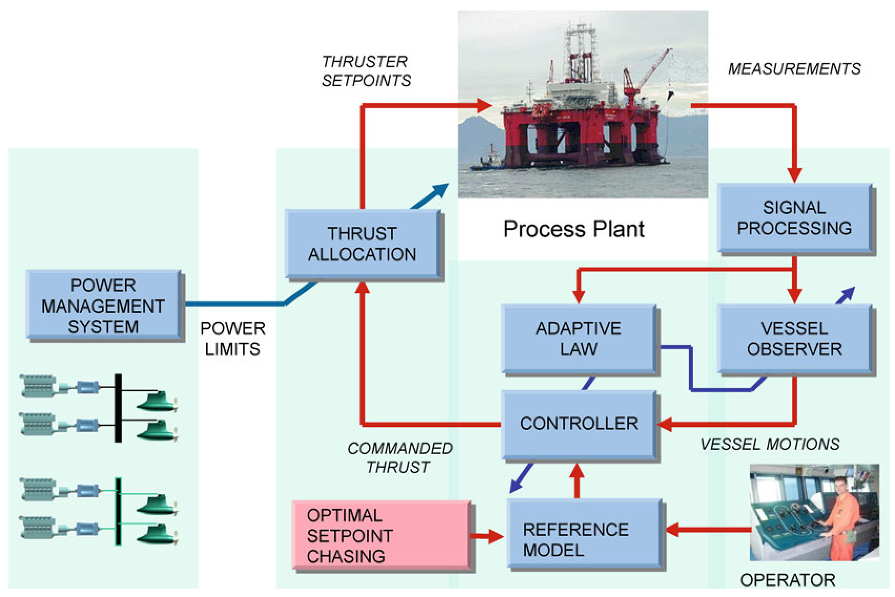

> Image description: A block diagram illustrating a controller structure for dynamic positioning control systems. The "Process Plant," represented by an image of an offshore rig, receives "THRUSTER SETPOINTS" from the "THRUST ALLOCATION" block. The plant produces "MEASUREMENTS," which are sent via red arrows to "SIGNAL PROCESSING." The control loop continues through a "VESSEL OBSERVER," which monitors "VESSEL MOTIONS." An "ADAPTIVE LAW" block feeds into the "CONTROLLER," which generates "COMMANDED THRUST" sent back to the "THRUST ALLOCATION" block. Below this, a "REFERENCE MODEL" receives input from an "OPERATOR" and informs the "CONTROLLER" and an "OPTIMAL SETPOINT CHASING" block. On the left, a "POWER MANAGEMENT SYSTEM" communicates with the "THRUST ALLOCATION" block via "POWER LIMITS." Blue arrows indicate the flow of information related to vessel motions and power constraints, while red arrows indicate command signals and measured data.
Dynamic Positioning Control Systems for Ships and Underwater Vehicles, Fig. 1 Controller structure

## DP Controller

In the 1960s the first DP system was introduced for horizontal modes of motion (surge, sway, and yaw) using single-input single-output PID control algorithms in combination with low-pass and/or notch filters. In the 1970s more advanced output control methods based on multivariable optimal control and Kalman filter theory were proposed by Balchen et al. (1976) and later refined in Sælid et al. (1983); Grimble and Johnson (1988); and others as referred to in Sørensen (2011). In the 1990s nonlinear DP controller designs were proposed by several research groups; for an overview see Strand et al. (1998), Fossen and Strand (1999), Pettersen and Fossen (2000), and Sørensen (2011). Nguyen et al. (2007) proposed the design of hybrid controller for DP from calm to extreme sea conditions.

## Plant Control

By copying the control plant model (8)-(13) and adding an injection term, a passive observer may
be designed. A nonlinear output horizontal-plane positioning feedback controller of PID type may be formulated as

$$
\begin{equation*}
\boldsymbol{\tau}_{P I D}=-\mathbf{R}_{\mathbf{e}}^{\mathbf{T}} \mathbf{K}_{\mathbf{p}} \mathbf{e}-\mathbf{R}_{\mathbf{e}}^{\mathbf{T}} \mathbf{K}_{\mathbf{p} \mathbf{3}} \mathbf{f}(\mathbf{e})-\mathbf{K}_{\mathbf{d}} \tilde{\boldsymbol{v}}-\mathbf{R}^{\mathbf{T}} \mathbf{K}_{\mathbf{i}} \mathbf{z}, \tag{15}
\end{equation*}
$$

where $\mathbf{e} \in \mathbb{R}^{3}$ is the position and heading deviation vector, $\tilde{\boldsymbol{v}} \in \mathbb{R}^{3}$ is the velocity deviation vector, $\mathbf{z} \in \mathbb{R}^{3}$ is the integrator states, and $\mathbf{f}(\mathbf{e})$ is a third-order stiffness term defined as

$$
\begin{aligned}
& \mathbf{e}=\left[e_{1}, e_{2}, e_{3}\right]^{T}=\mathbf{R}^{T}\left(\phi_{d}\right)\left(\widehat{\eta}-\boldsymbol{\eta}_{d}\right), \\
& \tilde{\boldsymbol{v}}=\hat{\boldsymbol{v}}-\mathbf{R}^{T}\left(\phi_{d}\right) \boldsymbol{\eta}_{d}, \\
& \dot{\mathbf{z}}=\widehat{\boldsymbol{\eta}}-\boldsymbol{\eta}_{d}, \\
& \mathbf{R}_{e}=\mathbf{R}\left(\phi-\phi_{d}\right)=\mathbf{R}^{T}\left(\phi_{d}\right) \mathbf{R}(\phi), \\
& \mathbf{f}(\mathbf{e})=\left[e_{1}^{3}, e_{2}^{3}, e_{3}^{3}\right]^{T} .
\end{aligned}
$$

Experience from implementation and operations of real DP control systems has shown that $\phi_{d}$ in the calculation of the error vector e generally gives a better performance with less noisy signals than using $\phi$. However, this is only valid


<!-- source_pdf_page: 359 -->
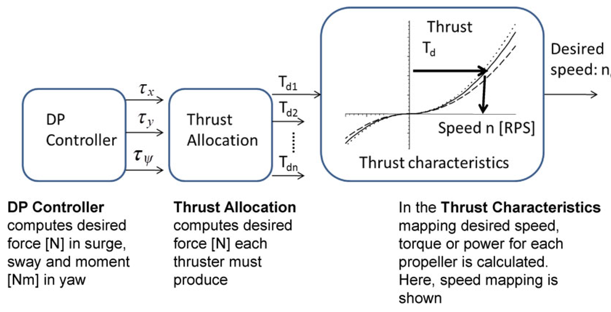

> Image description: This block diagram, captioned "Fig. 2 Thrust allocation," illustrates a control system for Dynamic Positioning (DP). The system flows from left to right through three main stages. First, the **DP Controller** computes desired forces ($\tau_x$, $\tau_y$) and a yaw moment ($\tau_\psi$) in Newtons (N) and Newton-meters (Nm). These control signals flow into the **Thrust Allocation** block. The **Thrust Allocation** block processes these signals to compute specific desired thrust forces ($T_{d1}$, $T_{d2}$ through $T_{dn}$) for each individual thruster. These discrete thrust values are then sent to the **Thrust characteristics** block. The final stage, **Thrust characteristics**, includes a graph mapping thrust ($T_d$) against propeller speed ($n$) in revolutions per second (RPS). The plot shows a non-linear curve representing the relationship between rotational speed and produced thrust. The output of the entire system is the "Desired speed: $n$."
Dynamic Positioning Control Systems for Ships and Underwater Vehicles, Fig. 2 Thrust allocation

under the assumption that the vessel maintains its desired heading with small deviations. As the DP capability for ships is sensitive to the heading angle, i.e., minimizing the environmental loads, heading control is prioritized in case of limitations in the thrust capacity. This feature is handled in the thrust allocation.

An advantage of this is the possibility to reduce the first-order proportional gain matrix, resulting in reduced dynamic thruster action for smaller position and heading deviations. Moreover, the third-order restoring term will make the thrusters to work more aggressive for larger deviations. $\mathbf{K}_{\mathrm{p}}, \mathbf{K}_{\mathrm{p} 3}, \mathbf{K}_{\mathrm{d}}$, and $\mathbf{K}_{\mathrm{i}} \in \mathbb{R}^{3 \times 3}$ are the nonnegative controller gain matrices for proportional, third-order restoring, derivative, and integrator controller terms, respectively, found by appropriate controller synthesis methods.

For small-waterplane-area marine vessels such as semisubmersibles, often used as drilling rigs, Sørensen and Strand (2000) proposed a DP control law with the inclusion of roll and pitch damping according to

$$
\tau_{r p d}=-\left[\begin{array}{cc}
0 & g_{x q}  \tag{16}\\
g_{y p} & 0 \\
g_{\phi p} & 0
\end{array}\right]\left[\begin{array}{l}
\widehat{p} \\
\widehat{q}
\end{array}\right],
$$

where $\stackrel{\rightharpoonup}{p}$ and $\hat{q}$ are the estimated pitch and roll angular velocities. The resulting positioning control law is written as

$$
\begin{equation*}
\boldsymbol{\tau}=\boldsymbol{\tau}_{\mathrm{wFF}}+\boldsymbol{\tau}_{\mathrm{PID}}+\boldsymbol{\tau}_{\mathrm{rpd}}, \tag{17}
\end{equation*}
$$

where $\boldsymbol{\tau}_{\mathrm{wFF}} \in \mathbb{R}^{3}$ is the wind feedforward control law.

Thrust allocation or control allocation (Fig. 2) is the mapping between plant and actuator control. It is assumed to be a part of the plant control. The DP controller calculated the desired force in surge and sway and moment in yaw. Dependent on the particular thrust configuration with installed and enabled propellers, tunnel thrusters, azimuthing thrusters, and rudders, the allocation is a nontrivial optimization problem calculating the desired thrust and direction for each enabled thruster subject to various constraints such as thruster ratings, forbidden sectors, and thrust efficiency. References on thrust allocation are found in Johansen and Fossen (2013).

In Sørensen and Smogeli (2009), torque and power control of electrically driven marine propellers are shown. Ruth et al. (2009) proposed anti-spin thrust allocation, and Smogeli et al.


<!-- source_pdf_page: 360 -->
(2008) and Smogeli and Sørensen (2009) presented the concept of anti-spin thruster control.

## Cross-References

- Control of Ship Roll Motion
- Fault-Tolerant Control
- Mathematical Models of Ships and Underwater Vehicles
- Motion Planning for Marine Control Systems
- Underactuated Marine Control Systems


## Bibliography

Balchen JG, Jenssen NA, Sælid S (1976) Dynamic positioning using Kalman filtering and optimal control theory. In: IFAC/IFIP symposium on automation in offshore oil field operation, Amsterdam, pp 183-186
Basseville M, Nikiforov IV (1993) Detection of abrupt changes: theory and application. Prentice-Hall, Englewood Cliffs. ISBN:0-13-126780-9
Blanke M, Kinnaert M, Lunze J, Staroswiecki M (2003) Diagnostics and fault-tolerant control. Springer, Berlin
Faltinsen OM (1990) Sea loads on ships and offshore structures. Cambridge University Press, Cambridge
Fay H (1989) Dynamic positioning systems, principles, design and applications. Editions Technip, Paris. ISBN:2-7108-0580-4
Fossen TI (2011) Handbook of marine craft hydrodynamics and motion control. Wiley, Chichester
Fossen TI, Strand JP (1999) Passive nonlinear observer design for ships using Lyapunov methods: experimental results with a supply vessel. Automatica 35(1):3-16
Grimble MJ, Johnson MA (1988) Optimal control and stochastic estimation: theory and applications, vols 1 and 2. Wiley, Chichester
Johansen TA, Fossen TI (2013) Control allocationa survey. Automatica 49(5):1087-1103
Johansen TA, Sørensen AJ, Nordahl OJ, Mo O, Fossen TI (2007) Experiences from hardware-in-the-loop (HIL) testing of dynamic positioning and power management systems. In: OSV Singapore, Singapore

Newman JN (1977) Marine hydrodynamics. MIT, Cambridge
Nguyen TD, Sørensen AJ (2009) Setpoint chasing for thruster-assisted position mooring. IEEE J Ocean Eng 34(4):548-558
Nguyen TD, Sørensen AJ, Quek ST (2007) Design of hybrid controller for dynamic positioning from calm to extreme sea conditions. Automatica 43(5):768-785
Pettersen KY, Fossen TI (2000) Underactuated dynamic positioning of a ship - experimental results. IEEE Trans Control Syst Technol 8(4):856-863
Ruth E, Smogeli ØN, Perez T, Sørensen AJ (2009) Antispin thrust allocation for marine vessels. IEEE Trans Control Syst Technol 17(6): 1257-1269
Sælid S, Jenssen NA, Balchen JG (1983) Design and analysis of a dynamic positioning system based on Kalman filtering and optimal control. IEEE Trans Autom Control 28(3):331-339
Smogeli ØN, Sørensen AJ (2009) Antispin thruster control for ships. IEEE Trans Control Syst Technol 17(6): 1362-1375
Smogeli ØN, Sørensen AJ, Minsaas KJ (2008) The concept of anti-spin thruster control. Control Eng Pract 16(4):465-481
Strand JP, Fossen TI (1999) Nonlinear passive observer for ships with adaptive wave filtering. In: Nijmeijer H, Fossen TI (eds) New directions in nonlinear observer design. Springer, London, pp 113-134
Strand JP, Sørensen AJ, Fossen TI (1998) Design of automatic thruster assisted position mooring systems for ships. Model Identif Control 19(2):61-75
Sørensen AJ (2005) Structural issues in the design and operation of marine control systems. Annu Rev Control 29(1): 125-149
Sørensen AJ (2011) A survey of dynamic positioning control systems. Annu Rev Control 35:123-136.
Sørensen AJ, Smogeli $\emptyset \mathrm{N}$ (2009) Torque and power control of electrically driven marine propellers. Control Eng Pract 17(9):1053-1064
Sørensen AJ, Strand JP (2000) Positioning of small-waterplane-area marine constructions with roll and pitch damping. Control Eng Pract 8(2):205-213
Sørensen AJ, Dukan F, Ludvigsen M, Fernandez DA, Candeloro M (2012) Development of dynamic positioning and tracking system for the ROV Minerva. In: Roberts G, Sutton B (eds) Further advances in unmanned marine vehicles. IET, London, pp 113-128. Chapter 6
