<!-- source_pdf_page: 361 -->
## E

## Economic Model Predictive Control

David Angeli Department of Electrical and Electronic Engineering, Imperial College London, London, UK Dipartimento di Ingegneria dell'Informazione, University of Florence, Italy

#### Abstract

Economic model predictive control (EMPC) is a variant of model predictive control aimed at maximization of system's profitability. It allows one to explicitly deal with hard and average constraints on system's input and output variables as well as with nonlinearity of dynamics. We provide basic definitions and concepts of the approach and highlight some promising research directions.

## Keywords

Constrained systems; Dynamic programming; Profit maximization

## Introduction

Most control tasks involve some kind of economic optimization. In classical linear quadratic
(LQ) control, for example, this is cast as a tradeoff between control effort and tracking performance. The designer is allowed to settle such a trade-off by suitably tuning weighting parameters of an otherwise automatic design procedure.

When the primary goal of a control system is profitability rather than tracking performance, a suboptimal approach has often been devised, namely, a hierarchical separation is enforced between the economic optimization layer and the dynamic real-time control layer.

In practice, while set points are computed by optimizing economic revenue among all equilibria fulfilling the prescribed constraints, the task of the real-time control layer is simply to drive (basically as fast as possible) the system's state to the desired set-point value.

Optimal control or LQ control may be used to achieve the latter task, possibly in conjunction with model predictive control (MPC), but the actual economics of the plant are normally neglected at this stage.

The main benefits of this approach are twofold:

1. Reduced computational complexity with respect to infinite-horizon dynamical programming
2. Stability robustness in the face of uncertainty, normally achieved by using some form of robust control in the real-time control layer
The hierarchical approach, however, is suboptimal in two respects:
3. First of all, given nonlinearity of the plant's dynamics and/or nonconvexity of the

<!-- source_pdf_page: 362 -->
functions characterizing the economic revenue, there is no reason why the most profitable regime should be an equilibrium.
2. Even when systems are most profitably operated at equilibrium, transient costs are totally disregarded by the hierarchical approach and this may be undesirable if the time constants of the plant are close enough to the time scales at which set point's variations occur.
Economic model predictive control seeks to remove these limitations by directly using the economic revenue in the stage cost and by the formulation of an associated dynamic optimization problem to be solved online in a receding horizon manner. It was originally developed by Rawlings and co-workers, in the context of linear control systems subject to convex constraints as an effective technique to deal with infeasible set points (Rawlings et al. 2008) (in contrast to the classical approach of redesigning a suitable quadratic cost that achieves its minimum at the closest feasible equilibrium). Preserving the original cost has the advantage of slowing down convergence to such an equilibrium when the transient evolution occurs in a region where the stage cost is better than at steady state. Stability and convergence issues are at first analyzed, thanks to convexity and for the special case of linear systems only. Subsequently Diehl introduced the notion of rotated cost (see Diehl et al. 2011) that allowed a Lyapunov interpretation of stability criteria and paved the way for the extension to general dissipative nonlinear systems (Angeli et al. 2012).

## Economic MPC Formulation

In order to describe the most common versions of economic MPC, assume that a discrete-time finite-dimensional model of state evolution is available for the system to be controlled:

$$
\begin{equation*}
x^{+}=f(x, u) \tag{1}
\end{equation*}
$$

where $x \in X \subset \mathbb{R}^{n}$ is the state variable, $u \in U \subset \mathbb{R}^{m}$ is the control input, and $f: X \times U \rightarrow X$ is a continuous map which computes the next state value, given the current one and the value of
the input. We also assume that $\mathbb{Z} \subset X \times U$ is a compact set which defines the (possibly coupled) state/input constraints that need to hold pointwise in time:

$$
\begin{equation*}
(x(t), u(t)) \in \mathbb{Z} \quad \forall t \in \mathbb{N} . \tag{2}
\end{equation*}
$$

In order to introduce a measure of economic performance, to each feasible state/input pair $(x, u) \in \mathbb{Z}$, we associate the instantaneous net cost of operating the plant at that state when feeding the specified control input:

$$
\begin{equation*}
\ell(x, u): \mathbb{Z} \rightarrow \mathbb{R} \tag{3}
\end{equation*}
$$

The function $\ell$ (which we assume to be continuous) is normally referred to as stage cost and together with actuation and/or inflow costs should also take into account the profits associated to possible output/outflows of the system. Let ( $x^{*}$, $\left.u^{*}\right)$ denote the best equilibrium/control input pair associated to (3) and (2), namely,

$$
\begin{align*}
\ell\left(x^{*}, u^{*}\right)= & \min _{x, u} \ell(x, u) \\
& \text { subject to } \\
& (x, u) \in \mathbb{Z}  \tag{4}\\
& x=f(x, u)
\end{align*}
$$

Notice that, unlike in tracking MPC, it is not assumed here that

$$
\begin{equation*}
\ell\left(x^{*}, u^{*}\right) \leq \ell(x, u) \quad \forall(x, u) \in \mathbb{Z} . \tag{5}
\end{equation*}
$$

This is, technically speaking, the main point of departure between economic MPC and tracking MPC.

As there is no natural termination time to operation of a system, our goal would be to optimize the infinite-horizon cost functional:

$$
\begin{equation*}
\sum_{t \in \mathbb{N}} \ell(x(t), u(t)) \tag{6}
\end{equation*}
$$

possibly in an average sense (or by introducing some discounting factor to avoid infinite costs) and subject to the dynamic/operational constraints (1) and (2).

<!-- source_pdf_page: 363 -->
To make the problem computationally more tractable and yet retain some of the desirable economic benefits of dynamic programming, (6) is truncated to the following cost functional:

$$
\begin{equation*}
J(\mathbf{z}, \mathbf{v})=\sum_{k=0}^{N-1} \ell(z(k), v(k))+V_{f}(z(N)) \tag{7}
\end{equation*}
$$

where $\mathbf{z}=[z(0), z(1), \ldots, z(N)] \in X^{N+1}, \mathbf{v}= [v(0), v(1), \ldots, v(N-1)] \in U^{N}$ and $V_{f}: X \rightarrow \mathbb{R}$ is a terminal weighting function whose properties will be specified later.

The virtual state/control pair $\left(\mathbf{z}^{*}, \mathbf{v}^{*}\right)$ at time $t$ is the solution (which for the sake of simplicity we assume to be unique) of the following optimization problem:

$$
\begin{align*}
& V(x(t))=\min _{\mathbf{z , v}} J(\mathbf{z}, \mathbf{v}) \\
& \text { subject to } \\
& z(k+1)=f(z(k), v(k)) \\
& (z(k), v(k)) \in \mathbb{Z}  \tag{8}\\
& \text { for } k \in\{0,1, \ldots, N-1\} \\
& z(0)=x(t), z(N) \in \mathbb{X}_{f} .
\end{align*}
$$

Notice that $z(0)$ is initialized at the value of the current state $x(t)$. Thanks to this fact, $\mathbf{z}^{*}$ and $\mathbf{v}^{*}$ may be seen as functions of the current state $x(t)$. At the same time, $z(N)$ is constrained to belong to the compact set $\mathbb{X}_{f} \subset X$ whose properties will be detailed in the next paragraph.

As customary in model predictive control, a state-feedback law is defined by applying the first virtual control to the plant, that is, by letting $u(t)=v^{*}(0)$ and restating, at the subsequent time instant, the same optimization problem from initial state $x(t+1)$ which, in the case of exact match between plant and model, can be computed as $f(x(t), u(t))$.

In the next paragraph, we provide details on how to design the "terminal ingredients" (namely, $V_{f}$ and $\mathbb{X}_{f}$ ) in order to endow the basic algorithm (8) with important features such as recursive feasibility and a certain degree of average performance and/or stability).

Hereby it is worth pointing out how, in the context of economic MPC, it makes sense to treat, together with pointwise-in-time
constraints, asymptotic average constraints on specified input/output variables. In tracking applications, where the control algorithm guarantees asymptotic convergence of the state to a feasible set point, the average asymptotic value of all input/output variables necessarily matches that of the corresponding equilibrium/control input pair. In economic MPC, the asymptotic regime resulting in closed loop may, in general, fail to be an equilibrium; therefore, it might be of interest to impose average constraints on system's inflows and outflows which are more stringent than those indirectly implied by the fulfillment of (2). To this end, let the system's output be defined as

$$
\begin{equation*}
y(t)=h(x(t), u(t)) \tag{9}
\end{equation*}
$$

with $h(x, u): \mathbb{Z} \rightarrow \mathbb{R}^{p}$, a continuous map, and consider the convex compact set $\mathbb{Y}$. We may define the set of asymptotic averages of a bounded signal $y$ as follows:

$$
\begin{aligned}
\operatorname{Av}[y]= & \left\{\eta \in \mathbb{R}^{p}: \exists\left\{t_{n}\right\}_{n=1}^{\infty}: t_{n} \rightarrow \infty \text { as } n \rightarrow \infty\right. \\
& \text { and } \left.\eta=\lim _{n \rightarrow \infty}\left(\sum_{k=0}^{t_{n}-1} y(k)\right) / t_{n}\right\}
\end{aligned}
$$

Notice that for converging signals, or even for periodic ones, $\operatorname{Av}[y]$ always is a singleton but may fail to be such for certain oscillatory regimes. An asymptotic average constraint can be expressed as follows:

$$
\begin{equation*}
\operatorname{Av}[y] \subseteq \mathbb{Y} \tag{10}
\end{equation*}
$$

where $y$ is the output signal as defined in (9).

## Basic Theory

The main theoretical results in support of the approach discussed in the previous paragraph are discussed below. Three fundamental aspects are treated:

- Recursive feasibility and constraint satisfaction
- Asymptotic performance
- Stability and convergence

<!-- source_pdf_page: 364 -->
## Feasibility and Constraints

The departing point of most model predictive control techniques is to ensure recursive feasibility, namely, the fact that feasibility of the problem (8) at time 0 implies feasibility at all subsequent times, provided there is no mismatch between the true plant and its model (1). This is normally achieved by making use of a suitable notion of control invariant set which is used as a terminal constraint in (8). Economic model predictive control is not different in this respect, and either one of the following set of assumptions is sufficient to ensure recursive feasibility:

## 1. Assumption 1: Terminal constraint

$$
\mathbb{X}_{f}=\left\{x^{*}\right\} \quad V_{f}=0
$$

## 2. Assumption 2: Terminal penalty function

There exists a continuous map $\kappa: \mathbb{X}_{f} \rightarrow U$ such that

$$
\begin{array}{ll}
(x, \mathbb{K}(x)) \in \mathbb{Z} & \forall x \in \mathbb{X}_{f} \\
f(x, \mathbb{K}(x)) \in \mathbb{X}_{f} & \forall x \in \mathbb{X}_{f}
\end{array}
$$

The following holds:
Theorem 1 Let $x(0)$ be a feasible state for (8) and assume that either Assumption 1 or 2 hold. Then, the closed-loop trajectory $x(t)$ resulting from receding horizon implementation of the feedback $u(t)=v^{*}(0)$ is well defined for all $t \in \mathbb{N}$ (i.e., $x(t)$ is a feasible initial state of (8) for all $t \in \mathbb{N}$ ) and the resulting closed-loop variables $(x(t), u(t))$ fulfill the constraints in (2).

The proof of this Theorem can be found in Angeli et al. (2012) and Amrit et al. (2011), for instance. When constraints on asymptotic averages are of interest, the optimization problem (8) can be augmented by the following constraints:

$$
\begin{equation*}
\sum_{k=0}^{N-1} h(z(k), v(k)) \in \mathbb{Y}_{t} \tag{11}
\end{equation*}
$$

provided $\mathbb{Y}_{t}$ is recursively defined as

$$
\begin{equation*}
\mathbb{Y}_{t+1}=\mathbb{Y}_{t} \oplus \mathbb{Y} \oplus\{-h(x(t), u(t))\} \tag{12}
\end{equation*}
$$

where $\oplus$ denotes Pontryagin's set sum. ( $A \oplus B:= \{c: \exists a \in A, \exists b \in B: c=a+b\}$ ) The sequence is initialized as $\mathbb{Y}_{0}=N \mathbb{Y} \oplus \mathbb{Y}_{00}$ where $\mathbb{Y}_{00}$ is an arbitrary compact set in $\mathbb{R}^{p}$ containing 0 in its interior. The following result can be proved.

Theorem 2 Consider the optimization problem (8) with additional constraints (11), and assume that $x(0)$ is a feasible initial state. Then, provided a terminal equality constraint is adopted, the closed-loop solution $x(t)$ is well defined and feasible for all $t \in \mathbb{N}$ and the resulting closed-loop variable $y(t)= h(x(t), u(t))$ fulfills the constraint (10).

Extending average constraints to the case of economic MPC with terminal penalty function is possible but outside the scope of this brief tutorial. It is worth mentioning that the set $\mathbb{Y}_{00}$ plays the role of an initial allowance that is shrunk or expanded as a result of how close are closedloop output signals to the prescribed region. In particular, $\mathbb{Y}_{00}$ can be selected a posteriori (after computation of the optimal trajectory) just for $t=0$, so that the feasibility region of the algorithm is not affected by the introduction of average asymptotic constraints.

## Asymptotic Average Performance

Since economic MPC does not necessarily lead to converging solutions, it is important to have bounds which estimate the asymptotic average performance of the closed-loop plant. To this end, the following dissipation inequality is needed for the approach with terminal penalty function:

$$
\begin{equation*}
V_{f}(f(x, \mathbb{K}(x))) \leq V_{f}(x)-\ell(x, \mathbb{K}(x))+\ell\left(x^{*}, u^{*}\right) \tag{13}
\end{equation*}
$$

which shall hold for all $x \in \mathbb{X}_{f}$. We are now ready to state the main bound on the asymptotic performance:

Theorem 3 Let $x(0)$ be a feasible state for (8) and assume that either Assumption 1 or Assumption 2 together with (13) hold. Then, the closedloop trajectory $x(t)$ resulting from receding horizon implementation of the feedback $u(t)=v^{*}(0)$ is well defined for all $t \in \mathbb{N}$ and fulfills

<!-- source_pdf_page: 365 -->
$$
\begin{equation*}
\limsup _{T \rightarrow+\infty} \frac{\sum_{t=0}^{T-1} \ell(x(t), u(t))}{T} \leq \ell\left(x^{*}, u^{*}\right) . \tag{14}
\end{equation*}
$$

The proof of this fact can be found in Angeli et al. (2012) and Amrit et al. (2011). When periodic solutions are known to outperform, in an average sense, the best equilibrium/control pair, one may replace terminal equality constraints by periodic terminal constraints (see Angeli et al. 2012). This leads to an asymptotic performance at least as good as that of the solution adopted as a terminal constraint.

## Stability and Convergence

It is well known that the cost-to-go $V(x)$ as defined in (8) is a natural candidate Lyapunov function for the case of tracking MPC. In fact, the following estimate holds along solutions of the closed-loop system:

$$
\begin{equation*}
V(x(t+1)) \leq V(x(t))-\ell(x(t), u(t))+\ell\left(x^{*}, u^{*}\right) . \tag{15}
\end{equation*}
$$

This shows, thanks to inequality (5), that $V(x(t))$ is nonincreasing. Owing to this, stability and convergence can be easily achieved under mild additional technical assumptions. While property (15) holds for economic MPC, both in the case of terminal equality constraint and terminal penalty function, it is no longer true that (5) holds. As a matter of fact, $x^{*}$ might even fail to be an equilibrium of the closed-loop system, and hence, convergence and stability cannot be expected in general.

Intuitively, however, when the most profitable operating regime is an equilibrium, the average performance bound provided by Theorem 3 seems to indicate that some form of stability or convergence to $x^{*}$ could be expected. This is true under an additional dissipativity assumption which is closely related to the property of optimal operation at steady state.

Definition 1 A system is strictly dissipative with respect to the supply function $s(x, u)$ if there exists a continuous function $\lambda: X \rightarrow \mathbb{R}$ and $\rho: X \rightarrow \mathbb{R}$ positive definite with respect to $x^{*}$ such that for all $x$ and $u$ in $X \times U$, it holds:

$$
\begin{equation*}
\lambda(f(x, u)) \leq \lambda(x)+s(x, u)-\rho(x) . \tag{16}
\end{equation*}
$$

The next result highlights the connection between dissipativity of the open-loop system and stability of closed-loop economic MPC.

Theorem 4 Assume that either Assumption 1 or Assumption 2 together with (13) hold. Let the system (1) be strictly dissipative with respect to the supply function $s(x, u)=\ell(x, u)-\ell\left(x^{*}, u^{*}\right)$ as from Definition 1 and assume there exists a neighborhood of feasible initial states containing $x^{*}$ in its interior. Then provided $V$ is continuous at $x^{*}, x^{*}$ is an asymptotically stable equilibrium with basin of attraction equal to the set offeasible initial states.

See Angeli et al. (2012) and Amrit et al. (2011) for proofs and discussions. Convergence results are also possible for the case of economic MPC subject to average constraints. Details can be found in Müller et al. (2013a).

Hereby it is worth mentioning that finding a function satisfying (16) (should one exist) is in general a hard task (especially for nonlinear systems and/or nonconvex stage costs); it is akin to the problem of finding a Lyapunov function and therefore general construction methods do not exist. Let us emphasize, however, that while existence of a storage function $\lambda$ is a sufficient condition to ensure convergence of closed-loop economic MPC, formulation and resolution of the optimization problem (8) can be performed irrespectively of any explicit knowledge of such function. Also, we point out that existence of $\lambda$ as in Definition 1 and Theorem 4 is only possible if the optimal infinite-horizon regime of operation for the system is an equilibrium.

## Summary and Future Directions

Economic model predictive control is a fairly recent and active area of research with great potential in those engineering applications where economic profitability is crucial rather than tracking performance.

The technical literature is rapidly growing in application areas such as chemical engineering

<!-- source_pdf_page: 366 -->
(see Heidarinejad 2012) or power systems engineering (see Hovgaard et al. 2010; Müller et al. 2013a) where system's output is in fact physical outflows which can be stored with relative ease.

We only dealt with the basic theoretical developments and would like to provide pointers to interesting recent and forthcoming developments in this field:

- Generalized terminal constraints: possibility of enlarging the set of feasible initial states by using arbitrary equilibria as terminal constraints, possibly to be updated on line in order to improve asymptotic performance (see Fagiano and Teel 2012; Müller et al. 2013b).
- Economic MPC without terminal constraints: removing the need for terminal constraints by taking a sufficiently long control horizon is an interesting possibility offered by standard tracking MPC. This is also possible for economic MPC at least under suitable technical assumptions as investigated in Grüne $(2012,2013)$.
- The basic developments presented in the previous paragraph only deal with systems unaffected by uncertainty. This is a severe limitation of current approaches and it is to be expected that, as for the case of tracking MPC, a great deal of research in this area could be developed in the future. In particular, both deterministic and stochastic uncertainties are of interest.

## Cross-References

- Model-Predictive Control in Practice
- Optimization Algorithms for Model Predictive Control

## Recommended Reading

Papers Amrit et al. (2011), Angeli et al. (2011, 2012), Diehl et al. (2011), Müller et al. (2013a), and Rawlings et al. (2008) set out the basic technical tools for performance and stability analysis of EMPC. To readers interested in the general theme of optimization of system's economic performance and its relationship with classical
turnpike theory in economics, please refer to Rawlings and Amrit (2009). Potential applications of EMPC are described in Hovgaard et al. (2010), Heidarinejad (2012), and Ma et al. (2011) while Rawlings et al. (2012) is an up-to-date survey on the topic. Fagiano and Teel (2012) and Grüne $(2012,2013)$ deal with the issue of relaxation or elimination of terminal constraints, while Müller et al. (2013b) explore the possibility of adaptive terminal costs and generalized equality constraints.

## Bibliography

Amrit R, Rawlings JB, Angeli D (2011) Economic optimization using model predictive control with a terminal cost. Annu Rev Control 35:178-186
Angeli D, Amrit R, Rawlings JB (2011) Enforcing convergence in nonlinear economic MPC. Paper presented at the 50th IEEE conference on decision and control and european control conference (CDC-ECC), Orlando 12-15 Dec 2011
Angeli D, Amrit R, Rawlings JB (2012) On average performance and stability of economic model predictive control. IEEE Trans Autom Control 57:1615-1626
Diehl M, Amrit R, Rawlings JB (2011) A Lyapunov function for economic optimizing model predictive control. IEEE Trans Autom Control 56:703-707
Fagiano L, Teel A (2012) Model predictive control with generalized terminal state constraint. Paper presented at the IFAC conference on nonlinear model predictive control, Noordwijkerhout 23-27 Aug 2012
Grüne L (2012) Economic MPC and the role of exponential turnpike properties. Oberwolfach Rep 12:678-681
Grüne L (2013) Economic receding horizon control without terminal constraints. Automatica 49:725-734
Heidarinejad M (2012) Economic model predictive control of nonlinear process systems using Lyapunov techniques. AIChe J 58:855-870
Hovgaard TG, Edlund K, Bagterp Jorgensen J (2010) The potential of Economic MPC for power management. Paper presented at the 49th IEEE conference on decision and control, Atlanta 15-17 Dec 2010
Ma J, Joe Qin S, Li B et al (2011) Economic model predictive control for building energy systems. Paper presented at the IEEE innovative smart grid technology conference, Anaheim, 17-19 Jan 2011
Müller MA, Angeli D, Allgöwer F (2013a) On convergence of averagely constrained economic MPC and necessity of dissipativity for optimal steady-state operation. Paper presented at the 2013 IEEE American control conference, Washington DC, 17-19 June 2013
Müller MA, Angeli D, Allgöwer F (2013b) Economic model predictive control with self-tuning terminal weight. Eur J Control 19:408-416

<!-- source_pdf_page: 367 -->
Rawlings JB, Amrit R (2009) Optimizing process economic performance using model predictive control. In: Magni L, Raimondo DM, Allgöwer F (eds) Nonlinear model predictive control. Lecture notes in control and information Sciences, vol 384. Springer, Berlin, pp 119-138
Rawlings JB, Bonne D, Jorgensen JB et al (2008) Unreachable setpoints in model predictive control. IEEE Trans Autom Control 53:2209-2215
Rawlings JB, Angeli D, Bates CN (2012) Fundamentals of economic model predictive control. Paper presented at the IEEE 51st annual conference on decision and control (CDC), Maui 10-13 Dec 2012

## EKF

## Extended Kalman Filters

# Electric Energy Transfer and Control via Power Electronics

Fred Wang University of Tennessee, Knoxville, TN, USA

#### Abstract

Power electronics and their applications for electric energy transfer and control are introduced. The fundamentals of the power electronics are presented, including the commonly used semiconductor devices and power converter circuits. Different types of power electronic controllers for electric power generation, transmission and distribution, and consumption are described. The advantages of power electronics over traditional electromechanical or electromagnetic controllers are explained. The future directions for power electronic application in electric power systems are discussed.

## Keywords

Electric energy control; Electric energy transfer; Power electronics

## Introduction

Modern society runs on electricity or electric energy. The electric energy generally must be transferred before consumption since the energy sources, such as thermal power plants, hydro dams, and wind farms, are often some distances away from the loads. In addition, electric energy needs to be controlled as well since the energy transfer and use often require electricity in a form different from the raw form generated at the source. Examples are the voltage magnitude and frequency for long distance transmission; the voltage needs to be stepped up at the sending end to reduce the energy loss along the lines and then stepped down at the receiving end for users; for many modern consumer devices, DC voltage is needed and obtained through transforming the 50 or 60 Hz utility power. Note that electric energy transfer and control is often used interchangeably with the electric power transfer and control. This is because the modern electric power systems have very limited energy storage and the energy generated must be consumed at the same time.

Since the beginning of the electricity era, electric energy transfer and control technologies have been an essential part of electric power systems. Many types of equipment were invented and applied for these purposes. The commonly used equipment includes electric transmission and distribution lines, generators, transformers, switchears, inductors or reactors, and capacitor banks. The traditional equipment has limited control capability. Many cannot be controlled at all or can only be connected or disconnected with mechanical switches, others with limited range, such as transformers with tap changers. Even with fully controllable equipment such as generators, the control dynamics is relatively slow due to the electromechanical or magnetic nature of the controller.

Power electronics are based on semiconductor devices. These devices are derivatives from transistors and diodes used in microelectronic circuits with the additional large power handling capability. Due to their electronic nature, power electronic devices are much more flexible and faster than their electromechanical or electromagnetic

<!-- source_pdf_page: 368 -->
counterparts for electric energy transfer and control. Since the advent of power electronics in the 1950s, they have steadily gained ground in power system applications. Today, power electronic controllers are an important part of equipment for electric energy transfer and control. Their roles are growing rapidly with the continuous improvement of the power electronic technologies.

## Fundamentals of Power Electronics

Different from semiconductor devices in microelectronics, the power electronic devices only act as switches for desired control functions, such that they incur minimum losses when they are either on (closed) or off (open). As a result, the power electronic controllers are basically the switching circuits. The semiconductor switches are therefore the most important elements of the power electronic controllers. Since the 1950s, many different types of power semiconductor switches have been developed and can be selected based on the applications.

The performance of the power semiconductor devices is mainly characterized by their voltage and current ratings, conduction or on-state loss, as well as the switching speed (or switching frequency capability) and associated switching loss. Main types of power semiconductor devices are listed with their symbols and state-of-the-art rating and frequency range shown in Table 1:

- Power diode - a two terminal device with similar characteristics to diodes used in microelectronics but with higher-voltage and power ratings.
- Thyristor - also called SCR (siliconcontrolled rectifier). Unlike diode, thyristor is a three-terminal device with an additional gate terminal. It can be turned on by a current pulse through gate but can only be turned off when the main current goes to zero with external means. Thyristor has low conduction loss but slow switching speed.
- GTO - stands for gate-turn-off thyristor. GTO can be turned on similarly as a regular thyristor and can also be turned off with a large negative gate current pulse. GTO has been largely replaced by IGBT and IGCT due to its complex gate driving needs and slow switching speed.
- Power BJT - similar to bipolar transistor for microelectronics and requires a sustained gate current to turn on and off. It has been replaced by IGBT and power MOSFET with simpler gate signals and faster switching speed.
- Power MOSFET - similar to metal-oxide semiconductor field effect transistor for microelectronics and can be turned on and off with a gate voltage signal. It is the fastest device available but has relatively high conduction loss and relatively lowvoltage/power ratings.
- IGBT - stands for insulated-gate bipolar transistor. Unlike regular BJT, it can be turned on and off with a gate voltage like MOSFET. It has relatively low conduction loss and fast switching speed. IGBT is becoming the workhorse of the power electronics for high power applications.

Electric Energy Transfer and Control via Power Electronics, Table 1 Commonly use Si-based power semiconductor devices and their ratings
| Types | Symbol | Voltage | Current | Switching frequency |
| :--- | :--- | :--- | :--- | :--- |
| Power diodes | 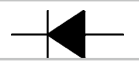 | Max 80 kV , typical $<10 \mathrm{kV}$ | 10 kA | Various |
| Thyristor | 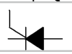 | Max 8 kV | 4.5 kA | AC line frequency |
| GTO | 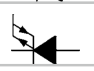 | Max 10 kV | 6.5 kA | $<500 \mathrm{~Hz}$ |
| Power MOSFET | 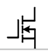 | Max 4.5 kV , typical $<600 \mathrm{~V}$ | 1.6 kA | 10 s of kHz to MHz |
| IGBT | 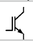 | Max 6.5 kV , typical $>600 \mathrm{~V}$ | 2.4 kA | 1 kHz to 10 s of kHz |
| IGCT | 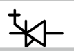 | Max 10 kV , typical $>4.5 \mathrm{kV}$ | 6.5 kA | $<2 \mathrm{kHz}$ |

<!-- source_pdf_page: 369 -->
- IGCT - stands for integrated-gate-commutated thyristor. It is basically a GTO with an integrated gate drive circuit allowing a hard driven turnoff. It therefore has faster switching speed than regular GTO but slower than IGBT. Except for diodes, all other devices above can be turned on and/or off through a gate signal, so they are active switches, while diodes are called passive switch.

With different types of power semiconductors, many power electronics circuits have been developed. Based on their functions, they can be classified as:

- Rectifier - rectifiers convert AC to DC. Depending on AC sources, rectifiers can be three phase or single phase; depending on device types, they can be passive (diode based), phase controlled (thyristor controlled), or actively switched.
- Inverter - inverters convert DC to AC. They again can be three phase or single phase. Inverters generally require active switching devices.
- DC-DC converter - also called choppers, DCDC converters convert one DC voltage level to another. Sometimes they also contains a magnetic isolation. DC-DC converters can have unidirectional or bidirectional power flow and generally requires active switching devices.
- AC-AC converter - directly converts one AC to another, either only the voltage magnitude or both magnitude and frequency. The former can also be called AC switch, and the latter can
be called frequency changer. Active devices are needed for these types of converters.
There are a variety of converter topologies for each type of the converters listed above. The most commonly used basic topologies for power system applications are shown in Fig. 1. These basic topologies can be expanded through paralleling or series of devices and/or converters to achieve higher current and voltage ratings. Other variations such as multilevel converters are also popular for high-voltage applications using lower-voltage rating devices.

It should be noted that passive components, i.e., inductors and capacitors, are essential parts of power electronic converters. In fact, power electronic converters transfer or control the electric energy by storing it temporarily in inductors or capacitors while reformatting the original voltage or current waveform through switching actions. The other key function of the passives is filtering the harmonics caused by switching.

## Power Electronic Controller Types for Energy Transfer and Control

For almost all traditional non-power-electronic equipment for electric energy transfer and control, there can be corresponding power electronic-based counterpart, often with better controllability. However, power electronic equipment can be more expensive and therefore only used when it provides better overall performance and cost benefits. In other cases, only power electronic equipment can achieve the required control functions.
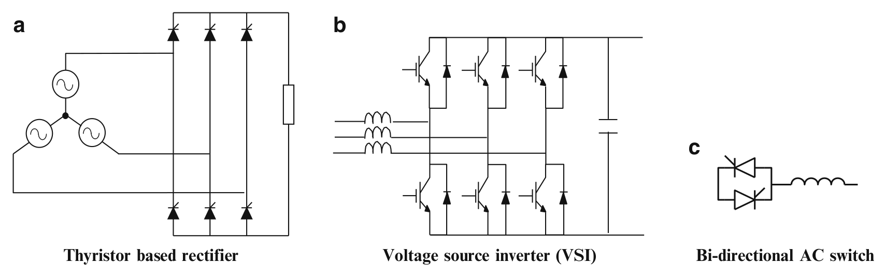

> Image description: This figure, titled "Electric Energy Transfer and Control via Power Electronics," displays three fundamental power electronics converter topologies labeled **a**, **b**, and **c**. **a) Thyristor based rectifier:** This circuit illustrates a three-phase rectifier configuration. It consists of a three-phase AC source connected to two parallel rows of three thyristors (six total). The top row converts AC to a DC load, while the bottom row is connected in a manner that suggests a controlled rectification or inversion process. **b) Voltage source inverter (VSI):** This schematic depicts a three-phase bridge inverter. It features six active switching elements (IGBTs) paired with anti-parallel diodes arranged in three legs. The converter is connected across a DC bus characterized by a parallel capacitor. An input three-phase inductor is also shown. **c) Bi-directional AC switch:** This simplified diagram shows two anti-parallel thyristors (or diodes) connected in parallel, which is then connected in series with an inductor. The label notes that only one phase is shown.

Electric Energy Transfer and Control via Power Electronics, Fig. 1 Commonly used basic power electronics converter topologies (only one phase shown for the AC switch)

<!-- source_pdf_page: 370 -->
The power electronic controllers can be categorized as for energy generation, delivery, and consumption. For generation, the thermal or hydro generators both use synchronous machines with excitation windings on the rotor, which require DC current. A thyristor-based rectifier, called exciter, is generally used for this purpose. Wind turbine generators usually use a back-toback VSI to interface to the AC grid, and PV solar sources use a DC-DC converter cascaded with a VSI.

Power electronic controllers for transmission and distribution controllers include so-called flexible AC transmission systems (FACTS) and high-voltage DC transmission (HVDC). Some of the more commonly used controllers and their functions and circuit topologies are listed in Table 2.

The main power electronic controllers for loads include variable speed motor drives; electronic ballast for fluorescent lights and power supplies for LED; various power supplies for computer, IT, and other electronic loads; and chargers for electric vehicles. The percentage of power electronics controlled loads in power systems have been steadily increasing. Power electronics can generally result in improved performance and efficiency.

## Future Directions

Power electronics have progressed steadily since the invention of thyristors in the 1950s. The progress is in all aspects, semiconductor devices, passives, circuits, control, and system integration, leading to converter systems with better performance, higher efficiency, higher power density, higher reliability, and lower cost. Because of these progresses, the power electronics applications in power systems have become more and more widespread. However, in general, power electronic controllers are still not sufficiently cost-effective, reliable, or efficient. Many improvements are needed and expected, especially in the following areas:

- Semiconductor devices - Devices used today are almost exclusively based on silicon. The emerging devices based on wide-bandgap materials such as SiC and GaN are expected to revolutionize power electronics with their capabilities of higher voltage, lower loss, faster switching speed, higher temperature, and smaller size.
- Power electronic converters - More costeffective and reliable converters will be developed as a result of better devices, passive components, and circuit structures. Modular, distributed, and hybrid with non-power-electronics approaches are expected to result in overall better benefits.
- Enhanced functions - Power electronic controllers can be designed to have multiple functions in the system. For example, wind and PV solar inverters can provide reactive power to the grid in addition to transferring real energy. Today, power electronic controllers are mostly locally controlled. With better measurement and communication technologies, they may be controlled over a wide area for supporting the system level functions.
- New applications - The new applications for future power system include DC grid based on multiterminal HVDC and energy storage. Critical technologies include cost-effective and efficient DC transformers and DC circuit breakers. Power electronics will play key roles in these technologies.

## Cross-References

- Cascading Network Failure in Power Grid Blackouts
- Coordination of Distributed Energy Resources for Provision of Ancillary Services: Architectures and Algorithms
- Lyapunov Methods in Power System Stability
- Power System Voltage Stability
- Small Signal Stability in Electric Power Systems
- Time-Scale Separation in Power System Swing Dynamics: Singular Perturbations and Coherency

<!-- source_pdf_page: 371 -->
| Electric Energy Transfer and Control via Power Electronics, Table 2 Commonly used power electronic controllers for transmission and distribution |  |  |  |  |
| :--- | :--- | :--- | :--- | :--- |
| Controller | Oneline configuration | System functions | Control principle | Basic PE function |
| SVC   - static VAR compensator with thyristor-controlled reactor and capacitor | 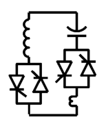 | - Stability enhancement   - Voltage regulation and VAR compensation | VAR control through varying L and C in shunt connection | Controlled bidirectional AC switch |
| TCSC   - thyristor-controlled series capacitor | 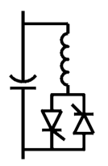 | - Power flow control   - Stability enhancement   - Fault current limiting | Power and VAR control through varying C and L in series connection | Controlled bidirectional AC switch |
| SSTS   - solid state transfer switch | 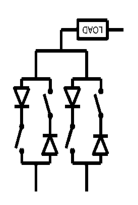 | Power supply transfer for reliability and power quality | On and off control | Controlled bidirectional AC switch |
| HVDC (classic) | 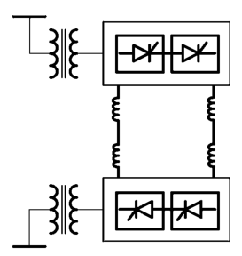 | - System Interconnection   - Power flow control   - Stability enhancement | Power control through back-to-back converters in shunt connections | Bidirectional AC/DC current source converter |
| SSSC   - static series synchronous compensator | 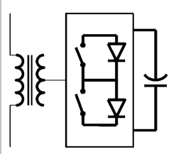 | - Power flow control   - Stability enhancement | VAR control through voltage control in series connection | Bidirectional AC/DC voltage source converter |
| STATCOM   - static synchronous compensator | I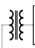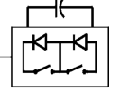 | - Stability enhancement   - Voltage regulation \& VAR compensation | VAR control through current control in shunt connection | Bidirectional AC/DC voltage source converter |
| HVDC (voltage source) | 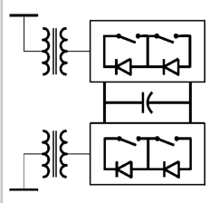 | - System Interconnection   - Power flow control   - stability enhancement | Power and VAR control through back-to-back converters in shunt connections | Bidirectional AC/DC voltage source converter |

<!-- source_pdf_page: 372 -->
## Bibliography

Bayegen M (2001) A vision of the future grid. IEEE Power Eng Rev. vol 12, pp 10-12
Hingorani NG, Gyugyi L (2000) Understanding FACTS concepts and technology of flexible AC transmission systems. IEEE Press, New York
Rahimo M, Klaka S (2009) High voltage semiconductor technologies. In: 13th European conference on power electronics and applications, EPE'09, Barcelona, pp 110
Wang F, Rosado S, Boroyevich D (2003) Open modular power electronics building blocks for utility power system controller applications. IEEE PESC, Acapulco, pp 1792-1797, 15-19 June 2003

## Engine Control

Luigi del Re Johannes Kepler Universität, Linz, Austria

#### Abstract

Engine control is the enabling technology for efficiency, performance, reliability, and cleanliness of modern vehicles for a wide variety of uses and users. It has also a paramount importance for many other engine applications like power plants. Engines are essentially chemical reactors, and the core task of engine control consists in preparing and starting the reaction (mixing the reactants and igniting the mixture) while the reaction itself is not controlled. The technical challenge derives from the combination of high complexity, wide range of conditions of use, performance requirements, significant time delays, and use of the constraints on the choice of components. In practice, engine control is to a large extent feed-forward control, feedback loops being used either for low-level control or for updating the feed-forward. Industrial engine control is based on very complex structures calibrated experimentally, but there is a growing interest for model-based control with stronger feedback action, supported by the breakthrough of new computational and communication possibilities, as well as the introduction of new sensors.

## Keywords

Compression ignition; Emissions; Exhaust aftertreatment; Internal combustion engines; Spark ignition

## Introduction

Most vehicles are moved by internal combustion engines (ICE), whose key function is the conversion of chemical into mechanical energy, basically by oxidation, e.g., in the case of propane

$$
\begin{equation*}
\mathrm{C}_{3} \mathrm{H}_{8}+5 \mathrm{O}_{2}=3 \mathrm{CO}_{2}+4 \mathrm{H}_{2} \mathrm{O}+46.3 \mathrm{MJ} / \mathrm{kg} \tag{1}
\end{equation*}
$$

The chemical energy is first transformed into heat and then converted by the ICE into mechanical energy (Heywood 1988). The key task of engine control (Guzzella and Onder 2010; Kiencke and Nielssen 2005) is to make sure that the reactants (fuel and oxygen) meet in the right proportion ("mixture formation") and that the combustion is started (or "ignited") to deliver the required torque at the engine crankshaft. Several combustion processes are known, the most common ones being Otto and Diesel. For the first kind (also called SI for spark ignited), the mixture is prepared outside the combustion chamber and combustion is ignited by spark, while in the second one fuel is injected directly into the combustion chamber and combustion is ignited by compression (CI, compression ignited). GDI (gasoline direct injection) is a variant of SI engines with direct fuel injection as CI but spark ignition as SI.

Unfortunately, the chemical equation (1) is not the whole truth. Indeed, the way the mixture is prepared and ignited affects the efficiency of the conversion from thermal into mechanical energy, but also secondary reactions, like pollutant formation, and other aspects, like noise, vibrations and harshness (NVH), and mechanical fatigue and thus life expectancy. Furthermore, driveability requirements are primarily determined by the ability of an ICE to change fast its operating point, and this sets additional requirements to the engine control. These requirements have to

<!-- source_pdf_page: 373 -->
be met for all vehicles ín spite of production variability and under all relevant operating conditions, including all drivers, road, traffic, and weather conditions.

As first principle models are often not available or very time-consuming to tune and seldom precise enough, engine control is based on very complex heuristic descriptions which can be tuned experimentally and even automatically (Schoggl et al. 2002) - a modern engine control unit (ECU) can include up to 40.000 labels (parameters or maps). This structure is mainly feedforward, with feedback loops typically used for control of actuators, primarily calibrated under laboratory conditions but with adaptation loops designed to correct parameters to take in account production and wear effects. Figure 1 shows an engine test bench setup with the engine control unit (ECU) and a calibration system.

## The Target System

Figure 2 shows the basic setup of an ICE as CI and SI. In both cases, the main components of an ICE are fuel path, air path, combustion chamber, and exhaust aftertreatment system.

Roughly speaking, ICEs exhibit three time scales. Changes in the setting of the fuel path responsible to deliver the fuel to the combustion chamber - act very fast for CI and GDI engines (e.g., 50 Hz ) and rather fast for SI engines $(10 \mathrm{~Hz}$ or more). The same is not true for the air path which brings the gas mixture (fresh air and possibly recirculated exhaust gas) into the combustion chamber and is the slowest system (typically in the range of $0.5-2 \mathrm{~Hz}$ ). In SI and GDI engines, spark timing can be changed for each combustion too. A still faster dynamics is associated with the combustion process itself, pressure sensors with the required dynamics to monitor it are being introduced in a growing number of applications, but until now no suitable actuators are available for its closed loop control. The torque demand changes typically with the vehicle dynamics, which are usually still slower than the air path.

## The Control Tasks

The high-level control task can be defined as the minimization of the average fuel consumption while providing the required torque and respecting the constraints on emissions (i.e., nitrogen oxides and dioxides ( $\mathrm{NO}_{\mathrm{x}}$ ) and particulate matter (PM)), noise, temperature, etc. The legislators in different countries have defined test procedure, including a specified road profile and corresponding emission limits. Figure 3 shows the progressive reduction of the limits and the speed profile used to assess this value.

Even if fuel consumption is not yet limited by law, the control problem associated can be stated as an optimal constrained control problem:

$$
\begin{equation*}
\min _{u(t)} \int_{0}^{1120} \dot{q}_{f} d t \tag{2}
\end{equation*}
$$

so that

$$
\begin{equation*}
v(t)=v_{\mathrm{dem}}(t) \pm \Delta v \tag{3}
\end{equation*}
$$

and

$$
\begin{equation*}
\int_{0}^{1120} \dot{q}_{i} d t \leq Q_{i} \tag{4}
\end{equation*}
$$

where $u(t)$ are all available control inputs, 1120 is the duration of the European cycle, $v_{\text {dem }}(\mathrm{t})$ the corresponding speed, $\Delta \mathrm{v}$ the speed tolerance, $\dot{q}_{f}$ is the instantaneous fuel consumption, $\dot{q}_{i}$ each limited quantity (e.g., NOx ), and $\mathrm{Q}_{\mathrm{i}}$ the corresponding limit for the whole test. In practice, other criteria must be considered as well, like NVH, but even this problem is never solved using the standard tools of optimal control essentially for the nonlinearity (and following nonconvexity) of the problem, but even more for the lack of explicit models of sufficient quality relating the inputs to the target quantities, especially combustion depending quantities like emissions.

In practice, different simpler subproblems are solved separately and tuned to achieve sufficient results also in terms of the general problem to achieve the required performance. In the following, we concentrate on the main high-level tasks, omitting many others, e.g., all the control loops required for the correct operation of the single actuators.

<!-- source_pdf_page: 374 -->
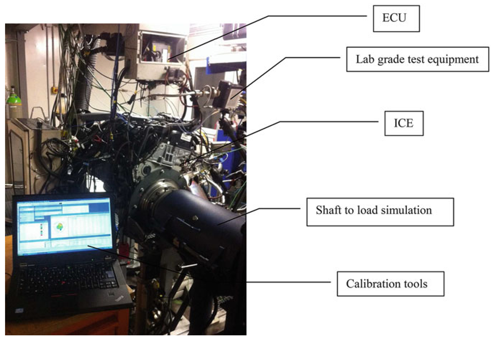

> Image description: An image labeled "Fig. 1 Light duty engine test bench with ECU and calibration system" shows a complex experimental setup for automotive engine testing. The figure uses several text boxes and leader lines to identify key components within the test rig. At the top, a line points to a control unit identified as the "ECU" (Engine Control Unit). Below this, a label for "Lab grade test equipment" indicates measurement instrumentation positioned around the setup. The core component is identified as the "ICE" (Internal Combustion Engine), which serves as the subject of the test. To the right of the engine, a label identifies the "Shaft to load simulation" component, which is connected to the engine's output. In the foreground, a laptop displaying software interfaces is labeled as "Calibration tools," representing the user interface for monitoring and adjusting engine parameters during testing. The arrangement illustrates the integration of an engine, its electronic control unit, and the simulation hardware required for laboratory-grade performance analysis.
Engine Control, Fig. 1 Light duty engine test bench with ECU and calibration system

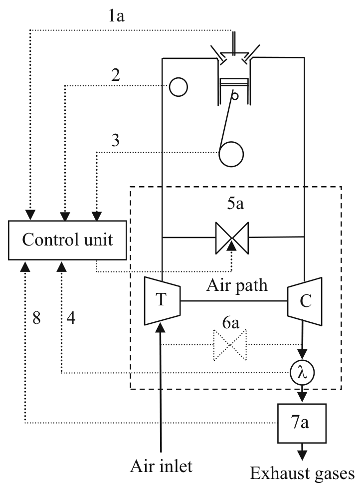

> Image description: A technical schematic diagram titled "Engine Control, Fig. 1 Light duty engine test bench with ECU and calibration system" illustrates a light-duty engine test bench setup. The central component is a reciprocating engine block containing a cylinder, piston, and crankshaft. Sensors are integrated into the system: label **1a** indicates an intake manifold pressure sensor, **2** represents an oil pressure sensor, and **3** denotes a crankshaft position sensor. The engine is coupled to a turbocharging assembly consisting of a compressor (**C**) and a turbine (**T**), separated by an "Air path." Control loops are established via dotted lines connecting components to a central "Control unit." A sensor **5a** is located on the air path, while sensor **6a** monitors downstream parameters. A sensor labeled $\lambda$ (lambda) is positioned after the compressor. Component **7a** processes data before sending signals back to the control unit, and an additional signal line **8** links the control unit to the system. The cycle begins at the "Air inlet" and ends at the "Exhaust gases" outlet.
Engine Control, Fig. 2 Basic system scheme of CI (left) and SI (right) engines: 1a Control of the injector opening, $1 b$ Injection premixing with air; 2 Measurement of the engine temperature; 3 Measurement of the engine rational speed; 4 Measurement of oxygen concentration in the

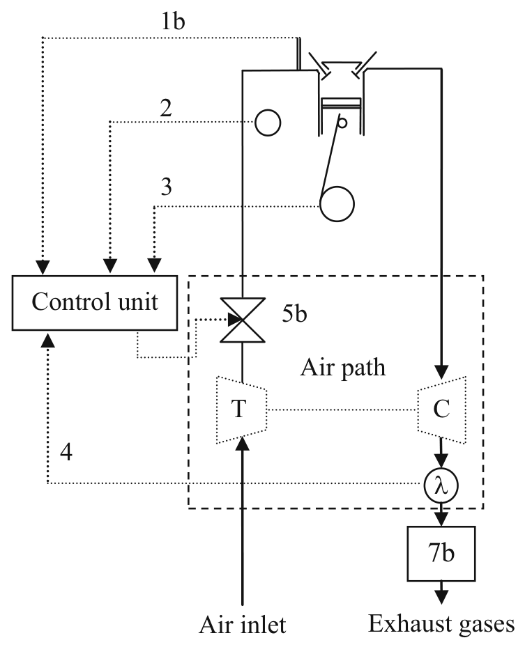

> Image description: This engineering schematic depicts a control system for an internal combustion engine. The diagram illustrates the relationship between engine components and a central control unit through various measurement and control signals. The system is organized into two main sections: the engine assembly at the top and the "Air path" within a dashed rectangular block. The engine includes components for combustion, with a piston-crank mechanism visible. Sensors provide input to the Control unit: (1b) represents injection premixing with air, (2) measures engine temperature, (3) measures engine rotational speed, and (4) measures oxygen concentration in the exhaust. The Control unit sends feedback/control signals to the engine and the Air path. Within the Air path, an air inlet flows through a turbine (T) and a compressor (C). A control valve (5b) is positioned in the intake manifold, and an oxygen sensor ($\lambda$) is placed before the exhaust gases (7b) exit the system.
exhaust gases; $5 a$ EGR valve, $5 b$ throttle valve, $6 a$ lowpressure EGR valve, $7 a$ Diesel exhaust after treatment (DOC, SCR, DPF), $7 b$ SI engine after treatment ( 3 way catalyst), 8 SCR dosing control

<!-- source_pdf_page: 375 -->
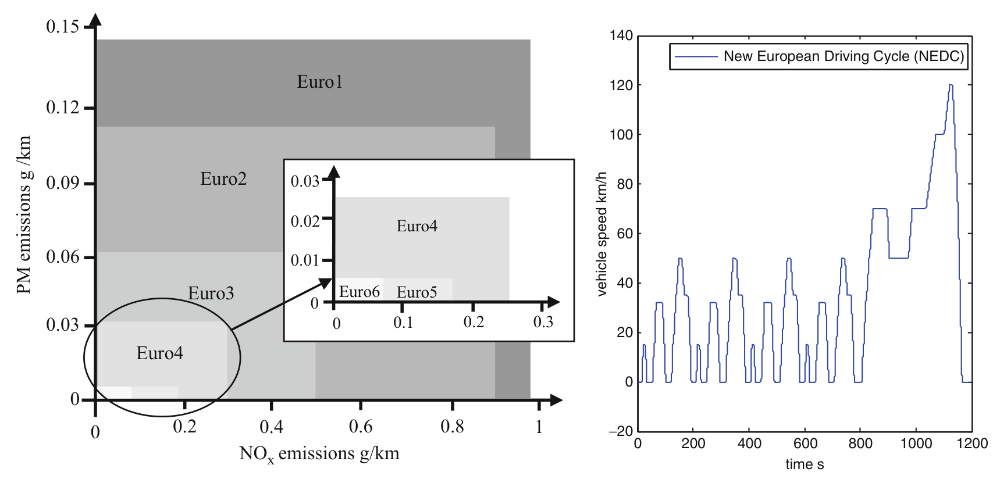

> Image description: This textbook figure, titled "Engine Control," contains two related plots. The left plot is a stepped area graph illustrating the tightening of emission standards in the European Union. The vertical axis represents PM (Particulate Matter) emissions in $\text{g/km}$, and the horizontal axis represents $\text{NO}_x$ emissions in $\text{g/km}$. Successive Euro standards—Euro 1, Euro 2, Euro 3, Euro 4, Euro 5, and Euro 6—are shown as shaded blocks. Each subsequent standard occupies a smaller area closer to the origin $(0,0)$, representing lower permissible emission limits. An inset enlargement focuses on the highly restrictive Euro 4, 5, and 6 standards. The right plot displays a line graph of the "New European Driving Cycle (NEDC)." The vertical axis measures vehicle speed in $\text{km/h}$, and the horizontal axis measures time in seconds. The profile shows a series of speed fluctuations, including accelerations, steady speeds, and decelerations, typical of a standardized vehicle testing cycle.
Engine Control, Fig. 3 Left: different steps of limits of emissions per km as defined by the European Union (Euro 1 introduced in 1991 and Euro 6 from 2014). Right: New European Driving Cycle (NEDC)

## Air Path Control

The main source of oxygen for the reaction of Eq. (1) is ambient air which contains about $21 \%$ oxygen. The engine - essentially a volumetric air pump - aspires air flow roughly proportional to the cylinder volume and the revolution speed of the engine. The amount of oxygen entering the combustion chamber, however, will depend also on temperature, pressure, and moisture. This flow can be reduced (as in the standard SI engines) by throttling, e.g., by adding an additional flow resistance between the air intake and the combustion chamber, or increased by compressing the fresh air, most commonly by turbocharging (especially in CI engines). A turbocharger consists essentially of a turbine, which transforms part of the enthalpy of the exhaust gas into mechanical power, and a compressor, driven by this power to compress the fresh air on its way to the combustion chamber, thus increasing both its density and temperature. Turbocharger operation is typically controlled either directly (for instance, with variable vane angles) or indirectly, by bypass valves which deviate the gas flows in parallel to the turbine.

If only ambient air is fed to the combustion chamber, a proportional amount of the other gases present in the atmosphere will enter the
combustion chamber and be available for combustion side reactions as well. In the case of nitrogen, these reactions lead to the undesired formation of nitrogen oxides (NOx). Therefore, in some engines, especially in CI engines, part of the combusted gases are recirculated to the combustion chamber ("exhaust gas recirculation", EGR), providing advantages in terms of NOx reduction. While EGR is typically realized at high pressures (path HP in Fig. 1), it is realized also at low pressure (path LP), even though less frequently. Typically, the air path includes some coolers designed to increase gas densities.

Air path control is designed to track dynamical references, for instance, the total fresh air mass (MAF) entering the cylinder and the corresponding pressure (MAP), but also other quantities are possible. The references are typically generated by the calibration engineers on the basis of tests. The control inputs of the air path are mostly the turbine (and possibly compressor) steering angle, the EGR, and - if available - throttle(s) setpoints. Most commonly used sensors include a mass flow meter (hot film sensor), rather slow and dynamically not reliable, pressure, and temperature sensors, and sometimes the actual position of the valves is measured as well and the turbocharger speed.

<!-- source_pdf_page: 376 -->
## Engine Control, Fig. 4

Pressure trace in a fired cylinder of a CI engine triggered by a pilot and a main injection
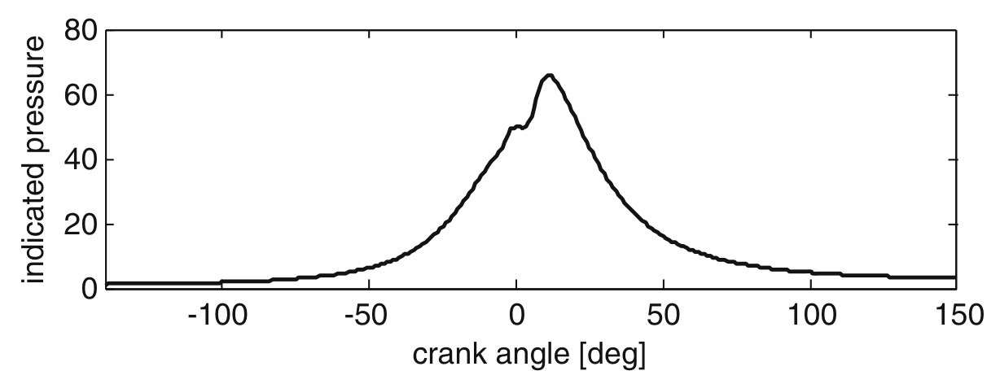
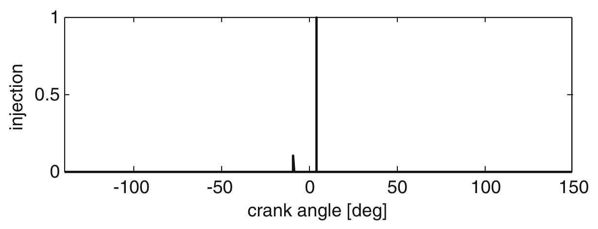

## Fuel Path Control

The fuel path delivers the correct amount of fuel for the reaction (1). In almost every ICE, a rail is filled with fuel at a given pressure (from few bars for SI to about 2000 bars for CI), from which the required amount of fuel is injected into the cylinder. The injection can occur inside the combustion chamber (as for CI and GDI engines) or near to the intake valve ("port injection") for standard SI engines.

The injection amount is always set taking in account the available oxygen mass. In SI engines with three-way catalyst, the fuel injection is given by the stoichiometric condition. $\lambda$ control uses an oxygen sensor in the exhaust to determine the actual fuel/oxygen ratio and if appropriate correct the injection tables. In CI and GDI the maximum fuel injection is limited to prevent smoke formation, typically by tables, even though $\lambda$ control can be and is partly used (Amstutz and del Re 1995).

In SI engines with port injection, the liquid fuel is injected near to the inlet valve and is expected to vaporize due to the local temperature and pressure conditions. During load changes, however, it can happen that part of the fuel is not vaporized, remains on the duct wall ("wall wetting"), and vaporizes at a later time, leading in both cases to a deviation from the expected values (Turin et al. 1995),
which must be compensated by the injection control.

Injection in CI engines is typically splitted in a main injection for torque and a pilot injection for NVH control and sometimes also a postinjection for emission control or regeneration of aftertreatment devices. Figure 4 shows the typical effect of a pilot injection on the pressure trace of a CI engine.

Differences between injectors of different cylinders are compensated by cylinder balancing control (typically using irregularities in the engine acceleration). Rail pressure is also an important control variable for the direct injection.

## Ignition

Once the combustion chamber is filled, the combustion can be started. In SI and GDI combustion is started by a spark) leading to a flame front which propagates through the whole combustion chamber. Very few SI engines have a second spark plug to better control the combustion. Under some circumstances, e.g., high temperature, an undesired auto-ignition ("knock") can occur with potentially catastrophic consequences for the engine durability but also unconventional NVH. To cope with this, SI engines have vibration sensors whose output is used to modify the engine operation, in particular the spark timing, to prevent it.

<!-- source_pdf_page: 377 -->
In CI engines, the injection leads almost immediately to the combustion which has more the character of an explosion and starts typically at several undefined locations.

Additional control during the combustion is up to now only theoretically feasible, as the combustion takes place in an extremely short time, but also because adequate actuators are not available.

## Aftertreatment

As the combustion mixture will always contain more potential reactants than oxygen and fuel, side reactions will always take place, yielding toxic products, in particular NOx, incompletely burnt fuel (HC), carbon monoxide (CO), and particulate matter (PM). Even if much effort is spent on reducing their formation, this is almost never sufficient, so additional aftertreatment equipment is used. Table 1 gives an overview over the most common aftertreatment systems as well as over their control aspects.

## Thermal Management

All main properties of engines are strongly affected by its temperature, which depends on the varying load conditions. Engine operation is typically optimal for a relatively narrow temperature range, the same is even more critical for the exhaust aftertreatment system. Engine heat is also required for other purposes (like defrosting of windshields in cold climates).

Thus the engine control system has two main tasks: bringing the engine and the exhaust aftertreatment system as fast as possible into the target temperature range and taking in account
deviation from this target. The first task is performed both by control of the cooling circuit and by specific combustion-related measures, the second one by taking the measured or estimated temperature as input for the controllers.

Fast heating is especially important for SI engines, because almost all toxic emissions are produced when the three-way catalyst is cold. To achieve faster heating, SI engines tend to operate in a less fuel efficient, but "hotter" operation mode during this warm-up phase, one of the causes of increased consumption of cold engines and short trips.

## Cranking Idle Speed and Gear Shifting Control

Initially, the engine is cranked by the starter until a relatively low speed and then injection starts bringing the engine to the minimum operational speed. If the injected fuel is not immediately burnt, very high emissions will arise. At cranking, the cylinder walls are typically very cold and combustion of a stoichiometric mixture is hardly possible. So engine control has the task to inject as little as possible but as much as needed only in the cylinder which is going to fire.

Normally an ICE is expected to provide a torque to the driveline, speed being the result of the balance between it and the load. In idle control, no torque is transmitted to the driveline, but the engine speed is expected to remain stable in spite of possible changes of local loads (like cabin climate control). This boils down to a robust control problem (Hrovat and Sun 1997).

Engine Control, Table 1 Main exhaust aftertreatment systems
| System | Purpose | Control targets |
| :--- | :--- | :--- |
| Three-way catalyst | Reduction of HC, CO, and NOx by more than 98 \% | Achieve fast and maintain operating temperature and keep $\lambda=1$ |
| Oxydation catalyst | Reduction of HC and CO, partly of PM | Achieve fast and maintain operating temperature and keep $\lambda>1$ |
| Particulate filter | Traps PM | Check trap state and regenerate by increasing exhaust temperature for short time if needed |
| NOx lean trap | Traps NOx | Estimate trap state and shift combustion to CO rich when required |
| Selective catalyst reaction | Reduces NOx | Estimate required quantity of additional reactant (urea) and dose it |

<!-- source_pdf_page: 378 -->
Gear shifting requires several steps. Smoothness and speed of the shifting depend on the coordination of engine operating point change. Actual hardware developments (double clutches, automated gear boxes) make a better operation, but require precise control.

## New Trends

The utilization environment of engine control is changing. On one side, customer and legislator expectations continue producing pressure, but there is a shift in priority from emissions to fuel efficiency and safety. Driver support systems, for instance, automated parking, are becoming the longer the more pervasive, and many functions must be included or affect immediately the ECU, even though they are frequently hosted on own control hardware. Hybrid vehicles are gaining popularity, and this implies a different operation mode for the engine, for instance, thermal management becomes much more complex for range extender vehicles with long "cold" phases.

Maybe even more important is the diffusion of new devices and communication possibilities, so that, for instance, fuel saving preview-based gear shifting can be easily implemented using infrastructure-to-vehicle information, or even just navigation data. Further extensions, like cooperative adaptive cruise control (CACC), plan to use vehicle-to-vehicle information to increase both safety and efficiency.

Against this background, there is a growing consciousness that the actual industrial approach based on huge calibration work is becoming the longer the less viable and bears a steadily increasing risk of wasting potential performance. Some model-based controls have already found their way into the ECU, and the academy has shown in several occasions that model-based control is able to achieve better performance, but it has not yet been shown how this could comply with other industrialization requirements.

Actually, new faster sensors (e.g., pressure sensors in the combustion chambers) are being introduced; the interest in model-based control (Alberer et al. 2012) and in system identification
techniques (del Re et al. 2010) are increasing, but they are not yet widespread.

## Cross-References

- Powertrain Control for Hybrid-Electric and Electric Vehicles
Transmission

## Bibliography

Alberer D et al (2012) Identification for automotive systems. Springer, London
Amstutz A, del Re L (1995) EGO sensor based robust output control of EGR in diesel engines. IEEE Trans Control Syst Technol 3(1):39-48
del Re L et al (2010) Automotive model predictive control. Springer, Berlin
Guzzella L, Onder C (2010) Introduction to modeling and control of internal combustion engine systems, 2nd edn. Springer, Berlin
Heywood J (1988) Internal combustion engines fundamentals. McGrawHill, New York
Hrovat D, Sun J (1997) Models and control methodologies for IC engine idle speed control design. Control Eng Pract 5(8): 1093-1100
Kiencke U, Nielssen L (2005) Automotive control systems: for engine, driveline, and vehicle, 2nd edn. Springer, New York
Schoggl P et al (2002) Automated EMS calibration using objective driveability assessment and computer aided optimization methods. SAE Trans 111(3): 1401-1409
Turin RC, Geering HP (1995) Model-reference adaptive A/F-ratio control in an SI engine based on kalmanfiltering techniques. In: Proceedings of the American Control Conference, Seattle, 1995, vol 6

## Estimation and Control over Networks

Vijay Gupta Department of Electrical Engineering, University of Notre Dame, Notre Dame, IN, USA

[^0]
[^0]:    Abstract

    Estimation and control of systems when data is being transmitted across nonideal communication channels has now become an

<!-- source_pdf_page: 379 -->
important research topic. While much progress has been made in the area over the last few years, many open problems still remain. This entry summarizes some results available for such systems and points out a few open research directions. Two popular channel models are considered - the analog erasure channel model and the digital noiseless model. Results are presented for both the multichannel and multisensor settings.

## Keywords

Analog erasure channel; Digital noiseless channel; Networked control systems; Sensor fusion

## Introduction

Networked control systems refer to systems in which estimation and control is done across communication channels. In other words, these systems feature data transmission among the various components - sensors, estimators, controllers, and actuators - across communication channels that may delay, erase, or otherwise corrupt the data. It has been known for a long time that the presence of communication channels has deep and subtle effects. As an instance, an asymptotically stable linear system may display chaotic behavior if the data transmitted from the sensor to the controller and the controller to the actuator is quantized. Accordingly, the impact of communication channels on the estimation/control performance and design of estimation/control algorithms to counter any performance loss due to such channels have both become areas of active research.

## Preliminaries

It is not possible to provide a detailed overview of all the work in the area. This entry attempts to summarize the flavor of the results that are available today. We focus on two specific communication channel models - analog erasure channel and the digital noiseless channel. Although other
channel models, e.g., channels that introduce delays or additive noise, have been considered in the literature, these models are among the ones that have been studied the most. Moreover, the richness of the field can be illustrated by concentrating on these models.

An analog erasure channel model is defined as follows. At every time step $k$, the channel supports as its input a real vector $i(k) \in \mathbf{R}^{t}$ with a bounded dimension $t$. The output $o(k)$ of the channel is determined stochastically. The simplest model of the channel is when the output is determined by a Bernoulli process with probability $p$. In this case, the output is given by

$$
o(k)= \begin{cases}i(k-1) & \text { with probability } 1-p \\ \phi & \text { otherwise }\end{cases}
$$

where the symbol $\phi$ denotes the fact that the receiver does not obtain any data at that time step and, importantly, recognizes that the channel has not transmitted any data. The probability $p$ is termed the erasure probability of the channel. More intricate models in which the erasure process is governed by a Markov chain, or by a deterministic process, have also been proposed and analyzed. In our subsequent development, we will assume that the erasure process is governed by a Bernoulli process.

A digital noiseless channel model is defined as follows. At every time step $k$, the channel supports at its input one out of $2^{m}$ symbols. The output of the channel is equal to the input. The symbol that is transmitted may be generated arbitrarily; however, it is natural to consider the channel as supporting $m$ bits at every time step and the specific symbol transmitted as being generated according to an appropriately design quantizer. Once again, additional complications such as delays introduced by the channel have been considered in the literature.

A general networked control problem consists of a process whose states are being measured by multiple sensors that transmit data to multiple controllers. The controllers generate control inputs that are applied by different actuators. All the data is transmitted across communication

<!-- source_pdf_page: 380 -->
channels. Design of control inputs when multiple controllers are present, even without the presence of communication channels, is known to be hard since the control inputs in this case have dual effect. It is, thus, not surprising that not many results are available for networked control systems with multiple controllers. We will thus concentrate on the case when only one controller and actuator is present. However, we will review the known results for the analog erasure channel and the digital noiseless channel models when (i) multiple sensors observe the same process and transmit information to the controller and (ii) the sensor transmits information to the controller over a network of communication channels with an arbitrary topology.

An important distinction in the networked control system literature is that of one-block versus two-block designs. Intuitively, the one-block design arises from viewing the communication channel as a perturbation to a control system designed without a channel. In this paradigm, the only block that needs to be designed is the receiver. Thus, for instance, if an analog erasure channel is present between the sensor and the estimator, the sensor continues to transmit the measurements as if no channel is present. However, the estimator present at the output of the channel is now designed to compensate for any imperfections introduced by the communication channel. On the other hand, in the two-block design paradigm, both the transmitter and the receiver are designed to optimize the estimation or control performance. Thus, if an analog erasure channel is present between the sensor and the estimator, the sensor can now transmit an appropriate function of the information it has access to. The transmitted quantity needs to satisfy the constraints introduced by the channel in terms of the dimensions, bit rate, power constraints, and so on. It is worth remembering that while the two-block design paradigm follows in spirit from communication theory where both the transmitter and the receiver are design blocks, the specific design of these blocks is usually much more involved than in communication theory. It is not surprising that in general performance with
two-block designs is better than the one-block designs.

## Analog Erasure Channel Model

Consider the usual LQG formulation. A linear process of the form

$$
x(k+1)=A x(k)+B u(k)+w(k),
$$

with state $x(k) \in \mathbf{R}^{d}$ and process noise $w(k)$ is controlled using a control input $u(k) \in \mathbf{R}^{m}$. The process noise is assumed to be white, Gaussian, zero mean, with covariance $\Sigma_{w}$. The initial condition $x(0)$ is also assumed to be Gaussian and zero mean with covariance $\Pi_{0}$. The process is observed by $n$ sensors, with the $i$-th sensor generating measurements of the form

$$
y_{i}(k)=C_{i} x(k)+v_{i}(k)
$$

with the measurement noise $v_{i}(k)$ assumed to be white, Gaussian, zero mean, with covariance $\Sigma_{v}^{i}$. All the random variables in the system are assumed to be mutually independent. We consider two cases:

- If $n=1$, the sensor communicates with the controller across a network consisting of multiple communication channels connected according to an arbitrary topology. Every communication channel is modeled as an analog erasure channel with possibly a different erasure probability. The erasure events on the channels are assumed to be independent of each other, for simplicity. The sensor and the controller then form two nodes of a network each edge of which represents a communication channel.
- If $n>1$, then every sensor communicates with the controller across an individual communication channel that is modeled as an analog erasure channel with possibly a different erasure probability. The erasure events on the channels are assumed to be independent of each other, for simplicity.
The controller calculates the control input to optimize a quadratic cost function of the form

<!-- source_pdf_page: 381 -->
$$
\begin{aligned}
J_{K}= & E\left[\sum_{k=0}^{K-1}\left(x^{T}(k) Q x(k)+u^{T}(k) R u(k)\right)\right. \\
& \left.+x^{T}(K) P_{K} x(K)\right] .
\end{aligned}
$$

All the covariance matrices and the cost matrices $Q, R$, and $P_{K}$ are assumed to be positive definite. The pair ( $A, B$ ) is controllable and the pair ( $A, C$ ) is observable, where $C$ is formed by stacking the matrices $C_{i}$ 's. The system is said to be stabilizable if there exists a design (within the specified one-block or two-block design framework) such that the cost $\lim _{K \rightarrow \infty} \frac{1}{K} J_{K}$ is bounded.

## A Network of Communication Channels

We begin with the case when $N=1$ as mentioned above. The one-block design problem in the presence of a network of communication channels is identical to the one-block design as if only one channel were present. This is because the network can be replaced by an "equivalent" communication channel with the erasure probability as some function of the reliability of the network. This can lead to poor performance, since the reliability may decrease quickly as the network size increases. For this reason, we will concentrate on the two-block design paradigm.

The two-block design paradigm permits the nodes of the network to process the data prior to transmission and hence achieve much better performance. The only constraint imposed on the transmitter is that the quantity that is transmitted is a causal function of the information that the node has access to, with a bounded dimension. The design problem can be solved using the following steps. The first step is to prove that a separation principle holds if the controller knows the control input applied by the actuator at every time step. This can be the case if the controller transmits the control input to the actuator across a perfect channel or if the control input is transmitted across an analog erasure channel but the actuator can transmit an acknowledgment to the controller. For simplicity, we assume that the
controller transmits the control input to the actuator across a perfect channel. The separation principle states that the optimal performance is achieved if the control input is calculated using the usual LQR control law, but the process state is replaced by the minimum mean squared error (MMSE) estimate of the state. Thus, the twoblock design problem needs to be solved now for an optimal estimation problem.

The next step is to realize that for any allowed two-block design, an upper bound on estimation performance is provided by the strategy of every node transmitting every measurement it has access to at each time step. Notice that this strategy is not in the set of allowed two-block designs since the dimension of the transmitted quantity is not bounded with time. However, the same estimate is calculated at the decoder if the sensor transmits an estimate of the state at every time step and every other node (including the decoder) transmits the latest estimate it has access to from either its neighbors or its memory. This algorithm is recursive and involves every node transmitting a quantity with bounded dimension, however, since it leads to calculation of the same estimate at the decoder, and is, thus, optimal. It is worth remarking that the intermediate nodes do not require access to the control inputs. This is because the estimate at the decoder is a linear function of the control inputs and the measurements: thus, the effect of control inputs in the estimate can be separated from the effect of the measurements and included at the controller. Moreover, as long as the closed loop system is stable, the quantities transmitted by various nodes are also bounded. Thus, the two-block design problem can be solved.

The stability and performance analysis with the optimal design can also be performed. As an example, a necessary and sufficient stabilizability condition is that the inequality

$$
p_{\operatorname{maxcut}} \rho(A)^{2}<1,
$$

holds, where $\rho(A)$ is the spectral radius of $A$ and $p_{\text {maxcut }}$ is the max-cut probability evaluated as follows. Generate cut-sets from the network by dividing the nodes into two sets - a source

<!-- source_pdf_page: 382 -->
set containing the sensor and a sink set containing the controller. For each cut-set, obtain the cut-set probability by multiplying the erasure probabilities of the channels from the source set to the sink set. The max-cut probability is the maximum such cut-set probability. The necessity of the condition follows by recognizing that the channels from the source set to the sink set need to transmit data at a high enough rate even if the channels within each set are assumed not to erase any data. The sufficiency of the condition follows by using the Ford-Fulkerson algorithm to reduce the network into a collection of parallel paths from the sensor to the controller such that each path has links with equal erasure probability and the product of these probabilities for all paths is the max-cut probability. More details can be found in Gupta et al. (2009a).

## Multiple Sensors

Let us now consider the case when the process is observed using multiple sensors that transmit data to a controller across an individual analog erasure channel. A separation principle to reduce the control design problem into the combination of an LQR control law and an estimation problem can once again be proven. Thus, the twoblock design for the estimation problem asks the following question: what quantity should the sensors transmit such that the decoder is able to generate the optimal MMSE estimate of the state at every time step, given all the information the decoder has received till that time step. This problem is similar to the track-to-track fusion problem that has been studied since the 1980s and is still open for general cases (Chang et al. 1997). Suppose that at time $k$, the last successful transmission from sensor $i$ happened at time $k_{i} \leq k$. The optimal estimate that the decoder can ever hope to achieve is the estimate of the state $x(k)$ based on all measurements from the sensor 1 till time $k_{1}$, from sensor 2 till time $k_{2}$, and so on. However, it is not known whether this estimate is achievable if the sensors are constrained to transmit real vectors with a bounded dimension. A fairly intuitive encoding scheme is if the sensors transmit the local estimates of the state based on their own measurements. However,
it is known that the global estimate cannot, in general, be obtained from local estimates because of the correlation introduced by the process noise. If erasure probabilities are zero, or if the process noise is not present, then the optimal encoding schemes are known. Another case for which the optimal encoding schemes are known is when the estimator sends back acknowledgments to the encoders.

Transmitting local estimates does, however, achieve optimal stability conditions as compared to the conditions obtained from the optimal (unknown) two-block design (Gupta et al. 2009b). As an example, the necessary and sufficient stability conditions for the two sensor cases are given by

$$
\begin{aligned}
p_{1} \rho\left(A_{1}\right)^{2} & <1 \\
p_{2} \rho\left(A_{2}\right)^{2} & <1 \\
p_{1} p_{2} \rho\left(A_{3}\right)^{2} & <1,
\end{aligned}
$$

where $p_{1}$ and $p_{2}$ are erasure probabilities from sensors 1 and 2 , respectively, $\rho\left(A_{1}\right)$ is the spectral radius of the unobservable part of the matrix $A$ from the second sensor, $\rho\left(A_{2}\right)$ is the spectral radius of the unobservable part of the matrix $A$ from the first sensor, and $\rho\left(A_{3}\right)$ is the spectral radius of the observable part of the matrix $A$ from both the sensors. The conditions are fairly intuitive. For instance, the first condition provides a bound on the rate of increase of modes for which only sensor 1 can provide information to the controller, in terms of how reliable the communication channel from the sensor 1 is.

## Digital Noiseless Channels

Similar results as above can be derived for the digital noiseless channel model. For the digital noiseless channel model, it is easier to consider the system without either measurement or process noises (although results with such noises are available). Moreover, since quantization is inherently highly nonlinear, results such as separation between estimation and control are not available. Thus, encoders and controllers that optimize a

<!-- source_pdf_page: 383 -->
cost function such as a quadratic performance metric are not available even for the single sensor or channel case. Most available results thus discuss stabilizability conditions for a given data rate that the channels can support.

While early works used the one-block design framework to model the digital noiseless channel as introducing an additive white quantization noise, that framework obscures several crucial features of the channel. For instance, such an additive noise model suggests that at any bit rate, the process can be stabilized by a suitable controller. However, a simple argument can show that is not true. Consider a scalar process in which at time $k$, the controller knows that the state is within a set of length $l(k)$. Then, stabilization is possible only if $l(k)$ remains bounded as $k \rightarrow \infty$. Now, the evolution of $l(k)$ is governed by two processes: at every time step, this uncertainty can be (i) decreased by a factor of at most $2^{m}$ due to the data transmission across the channel and (ii) increased by a factor of $a$ (where $a$ is the process matrix governing the evolution of the state) due to the process evolution. This implies that for stabilization to be possible, the inequality $m \geq \log _{2}(a)$ must hold. Thus, the additive noise model is inherently wrong. Most results in the literature formalize this basic intuition above (Nair et al. 2007).

## A Network of Communication Channels

For the case when there is only one sensor that transmits information to the controller across a network of communication channels connected in arbitrary topology, an analysis similar to that done for analog erasure channels can be performed (Tatikonda 2003). A max-flow min-cut like theorem again holds. The stability condition now becomes that for any cut-set

$$
\sum R_{j}>\sum_{\text {all unstable eigenvalues }} \log _{2}\left(\lambda_{i}\right),
$$

where $\sum R_{j}$ is the sum of data rates supported by the channels joining the source set to sink set for any cut-set and $\lambda_{i}$ are the eigenvalues of the process matrix $A$. Note that the summation on the right hand side is only over the unstable
eigenvalues, since no information needs to be transmitted about the modes that are stable in open loop.

## Multiple Sensors

The case when multiple sensors transmit information across an individual digital noiseless channel to a controller can also be considered. For every sensor $i$, define a rate vector $\left\{R_{i_{1}}, R_{i_{2}}, \cdots, R_{i_{d}}\right\}$ corresponding to the $d$ modes of the system. If a mode $j$ cannot be observed from the sensor $i$, set $R_{i_{j}}=0$. For stability, the condition

$$
\sum_{i} R_{i j} \geq \max \left(0, \lambda_{j}\right),
$$

for every mode $j$ must be satisfied. All such rate vectors stabilize the system.

## Summary and Future Directions

This entry provided a brief overview of some results available in the field of networked control systems. Although the area is seeing intense research activity, many problems remain open. For control across analog erasure channels, most existing results break down if a separation principle cannot be proved. Thus, for example, if control packets are also transmitted to the actuator across an analog erasure channel, the LQG optimal two-block design is unknown. There is some recent work on analyzing the stabilizability under such conditions (Gupta and Martins 2010), but the problem remains open in general. For digital noiseless channels, controllers that optimize some performance metric are largely unknown. Considering more general channel models is also an important research direction (Martins and Dahleh 2008; Sahai and Mitter 2006).

## Cross-References

- Averaging Algorithms and Consensus
- Oscillator Synchronization

<!-- source_pdf_page: 384 -->
## Bibliography

Chang K-C, Saha RK, Bar-Shalom Y (1997) On optimal track-to-track fusion. IEEE Trans Aerosp Electron Syst AES-33:1271-1276
Gupta V, Martins NC (2010) On stability in the presence of analog erasure channels between controller and actuator. IEEE Trans Autom Control 55(1): 175-179
Gupta V, Dana AF, Hespanha J, Murray RM, Hassibi B (2009a) Data transmission over networks for estimation and control. IEEE Trans Autom Control 54(8):1807-1819
Gupta V, Martins NC, Baras JS (2009b) Stabilization over erasure channels using multiple sensors. IEEE Trans Autom Control 54(7):1463-1476
Martins NC, Dahleh M (2008) Feedback control in the presence of noisy channels: 'bode-like' fundamental limitations of performance. IEEE Trans Autom Control 53(7):1604-1615
Nair GN, Fagnani F, Zampieri S, Evans RJ (2007) Feedback control under data rate constraints: an overview. Proc IEEE 95(1): 108-137
Sahai A, Mitter S (2006) The necessity and sufficiency of anytime capacity for stabilization of a linear system over a noisy communication link-Part I: scalar systems. IEEE Trans Inf Theory 52(8):3369-3395
Tatikonda S (2003) Some scaling properties of large distributed control systems. In: 42th IEEE conference on decision and control, Maui, Dec 2003

## Estimation for Random Sets

Ronald Mahler
Eagan, MN, USA

#### Abstract

The random set (RS) concept generalizes that of a random vector. It permits the mathematical modeling of random systems that can be interpreted as random patterns. Algorithms based on RSs have been extensively employed in image processing. More recently, they have found application in multitarget detection and tracking and in the modeling and processing of human-mediated information sources. The purpose of this entry is to briefly summarize the concepts, theory, and practical application of RSs.

## Keywords

Image processing; Multitarget processing; Random finite sets; Stochastic geometry

## Introduction

In ordinary signal processing, one models physical phenomena as "sources," which generate "signals" obscured by random "noise." The sources are to be extracted from the noise using optimal-estimation algorithms. Random set (RS) theory was devised about 40 years ago by mathematicians who also wanted to construct optimal-estimation algorithms. The "signals" and "noise" that they had in mind, however, were geometric patterns in images. The resulting theory, stochastic geometry, is the basis of the "morphological operators" commonly employed today in image-processing applications. It is also the basis for the theory of RSs. An important special case of RS theory, the theory of random finite sets (RFSs), addresses problems in which the patterns of interest consist of a finite number of points. It is the theoretical basis of many modern medical and other imageprocessing algorithms. In recent years, RFS theory has found application to the problem of detecting, localizing, and tracking unknown numbers of unknown, evasive point targets. Most recently and perhaps most surprisingly, RS theory provides a theoretically rigorous way of addressing "signals" that are humanmediated, such as natural-language statements and inference rules. The breadth of RS theory is suggested in the various chapters of Goutsias et al. (1997).

The purpose of this entry is to summarize the RS and RFS theories and their applications. It is divided in to the following sections: A Simple Example, Mathematics of Random Sets, Random Sets and Image Processing, Random Sets and Multitarget Processing, Random Sets and Human-Mediated Data, Summary and Future Directions, Cross-References, and Recommended Reading.

<!-- source_pdf_page: 385 -->
## A Simple Example

To illustrate the concept of a RS, let us begin by examining a simple example: locating stars in the nighttime sky. We will proceed in successively more illustrative steps:

Locating a single non-dim star (estimating a random point). When we try to locate a star, we are trying to estimate its actual position - its "state" $\mathbf{x}=\left(\alpha_{0}, \theta_{0}\right)-$ in terms of its azimuth angle $\alpha_{0}$ and elevation angle $\theta_{0}$. When the star is dim but not too dim, its apparent position will vary slightly. We can estimate its position by averaging many measurements - i.e., by applying a point estimator.

Locating a very dim star (estimating an RS with at most one element). Assume that the star is so dim that, when we see it, it might be just a momentary visual illusion. Before we can estimate its position, we must first estimate whether or not it exists. We must record not only its apparent position $\mathbf{z}=(\alpha, \theta)$ (if we see it) but its apparent existence $\varepsilon$, with $\varepsilon=1$ (we saw it) or $\varepsilon=0$ (we did not). Averaging $\varepsilon$ over many observations, we get a number $q$ between 0 and 1 . If $q>\frac{1}{4}$ (say), we could declare that the star probably actually is a star; and then we could average the non-null observations to estimate its position.

Locating multiple stars (estimating an RFS). Suppose that we are trying to locate all of the stars in some patch of sky. In some cases, two dim stars may be so close that they are difficult to distinguish. We will then collect three kinds of measurements from them: $Z=\emptyset$ (did not see either star), $Z=\{(\alpha, \theta)\}$ (we saw one or the other), or $Z=\left\{\left(\alpha_{1}, \theta_{1}\right),\left(\alpha_{2}, \theta_{2}\right)\right\}$ (saw both). The total collected measurement in the patch of sky is a finite set $Z=\left\{\mathbf{z}_{1}, \ldots, \mathbf{z}_{m}\right\}$ of point measurements with $\mathbf{z}_{j}=\left(\theta_{j}, \alpha_{j}\right)$, where each $\mathbf{z}_{i}$ is random, where $m$ is random, and where $m=0$ corresponds to the null measurement $Z=\emptyset$.

Locating multiple stars in a quantized sky (estimation using imprecise measurements). Suppose that, for computational reasons, the patch of sky must be quantized into a finite number of hexagonal-shaped cells, $c_{1}, \ldots, c_{M}$. Then, the measurement from any star is not a specific point $\mathbf{z}$, but instead the cell $c$ that contains $\mathbf{z}$. The
measurement $c$ is imprecise - a randomly varying hexagonal cell $c$. There are two ways of thinking about the total measurement collection. First, it is a finite set $Z=\left\{c_{1}^{\prime}, \ldots, c_{m}^{\prime}\right\} \subseteq\left\{c_{1}, \ldots, c_{M}\right\}$ of cells. Second, it is the union $Z=c_{1}^{\prime} \cup \ldots \cup c_{m}^{\prime}$ of all of the observed cells - i.e., it is a geometrical pattern.

Locating multiple stars over an extended period of time (estimating multiple moving targets). As the night progresses, we must continually redetermine the existence and positions of each star - a process called multitarget tracking. We must also account for appearances and disappearances of the stars in the patch - i.e., for target death and birth.

## Mathematics of Random Sets

The purpose of this section is to sketch the elements of the theory of random sets. It is organized as follows: General Theory of Random Sets, Random Finite Sets (Random Point Processes), and Stochastic Geometry. Of necessity, the material is less elementary than in later sections.

## General Theory of Random Sets

Let $\mathfrak{Y}$ be a topological space - for example, an $N$-dimensional Euclidean space $\mathbb{R}^{N}$. The power set $2^{\mathfrak{Y}}$ of $\mathfrak{Y}$ is the class of all possible subsets $S \subseteq \mathfrak{Y}$. Any subclass of $2^{\mathfrak{Y}}$ is called a "hyperspace." The "elements" or "points" of a hyperspace are thus actually subsets of some other space. For a hyperspace to be of interest, one must extend the topology on $\mathfrak{Y}$ to it. There are many possible topologies for hyperspaces (Michael 1950). The most well studied is the Fell-Matheron topology, also called the "hit-andmiss" topology (Matheron 1975). It is applicable when $\mathfrak{Y}$ is Hausdorff, locally compact, and completely separable. It topologizes only the hyperspace $\mathfrak{c}\left(2^{\mathfrak{Y}}\right)$ of all closed subsets $C$ of $\mathfrak{Y}$. In this case, a random (closed) set $\Theta$ is a measurable mapping from some probability space into $\mathfrak{c}\left(2^{\mathfrak{Y}}\right)$.

The Fell-Matheron topology's major strength is its relative simplicity. Let " $\operatorname{Pr}(\mathcal{E})$ " denote the probability of a probabilistic event $\mathcal{E}$. Then, normally, the probability law of $\Theta$ would be

<!-- source_pdf_page: 386 -->
described by a very abstract probability measure $p_{\Theta}(O)=\operatorname{Pr}(\Theta \in O)$. This measure must be defined on the Borel-measurable subsets $O \subseteq \mathfrak{c}\left(2^{\mathfrak{Y}}\right)$, with respect to the Fell-Matheron topology, where $O$ is itself a class of subsets of $\mathfrak{Y}$. However, define the Choquet capacity functional by $c_{\Theta}(G)=\operatorname{Pr}(\Theta \cap G \neq \emptyset$ ) for all open subsets $G \subseteq \mathfrak{Y}$. Then, the ChoquetMatheron theorem states that the probability law of $\Theta$ is completely described by the simpler, albeit nonadditive, measure $c_{\Theta}(G)$.

The theory of random sets has evolved into a substantial subgenre of statistical theory (Molchanov 2005). For estimation theory, the concept of the expected value $\mathbb{E}[\Theta]$ of a random set $\Theta$ is of particular interest. Most definitions of $\mathbb{E}[\Theta]$ are very abstract (Molchanov 2005, Chap. 2). In certain circumstances, however, more conventional-looking definitions are possible. Suppose that $\mathfrak{Y}$ is a Euclidean space and that $\mathfrak{c}\left(2^{\mathfrak{Y}}\right)$ is restricted to $\mathfrak{K}\left(2^{\mathfrak{Y}}\right)$, the bounded, convex, closed subsets of $\mathfrak{Y}$. If $C, C^{\prime}$ are two such subsets, their Minkowski sum is $C+C^{\prime}=\left\{c+c^{\prime} \mid c \in C, c^{\prime} \in C^{\prime}\right\}$. Endowed with this definition of addition, $\mathfrak{K}\left(2^{\mathfrak{Y}}\right)$ can be homeomorphically and homomorphically embedded into a certain space of functions (Molchanov 2005, pp. 199-200). Denote this embedding by $C \longmapsto \phi_{C}$. Then, the expected value $\mathbb{E}[\Theta]$ of $\Theta$, defined in terms of Minkowski addition, corresponds to the conventional expected value $\mathbb{E}\left[\phi_{\Theta}\right]$ of the random function $\phi_{\Theta}$.

## Random Finite Sets (Random Point Processes)

Suppose that the $\mathfrak{c}\left(2^{\mathfrak{Y}}\right)$ is restricted to $\mathfrak{f}\left(2^{\mathfrak{Y}}\right)$, the class of finite subsets of $\mathfrak{Y}$. (In many formulations, $\mathfrak{f}\left(2^{\mathfrak{Y}}\right)$ is taken to be the class of locally finite subsets of $\mathfrak{Y}-$ i.e., those whose intersection with compact subsets is finite.) A random finite set (RFS) is a measurable mapping from a probability space into $\mathfrak{f}\left(2^{\mathfrak{Y}}\right)$. An example: the field of twinkling stars in some patch of a night sky. RFS theory is a particular mathematical formulation of point process theory (Daley and Vere-Jones 1998; Snyder and Miller 1991; Stoyan et al. 1995).

A Poisson $R F S \Psi$ is perhaps the simplest nontrivial example of a random point pattern. It is specified by a spatial distribution $s(\mathbf{y})$ and an intensity $\mu$. At any given instant, the probability that there will be $n$ points in the pattern is $p(n)= e^{-\mu} \mu^{n} / n!$ (the value of the Poisson distribution). The probability that one of these $n$ points will be $\mathbf{y}$ is $s(\mathbf{y})$. The function $D_{\Psi}(\mathbf{y})=\mu \cdot s(\mathbf{y})$ is called the intensity function of $\Psi$.

At any moment, the point pattern produced by $\Psi$ is a finite set $Y=\left\{\mathbf{y}_{1}, \ldots, \mathbf{y}_{n}\right\}$ of points $\mathbf{y}_{1}, \ldots, \mathbf{y}_{n}$ in $\mathfrak{Y}$, where $n=0,1, \ldots$ and where $Y=\emptyset$ if $n=0$. If $n=0$ then $Y$ represents the hypothesis that no objects at all are present. If $n=1$ then $Y=\left\{\mathbf{y}_{1}\right\}$ represents the hypothesis that a single object $\mathbf{y}_{1}$ is present. If $n=2$ then $Y=\left\{\mathbf{y}_{1}, \mathbf{y}_{2}\right\}$ represents the hypothesis that there are two distinct objects $\mathbf{y}_{1} \neq \mathbf{y}_{2}$. And so on.

The probability distribution of $\Psi-$ i.e., the probability that $\Psi$ will have $Y=\left\{\mathbf{y}_{1}, \ldots, \mathbf{y}_{n}\right\}$ as an instantiation - is entirely determined by its intensity function $D_{\Psi}(\mathbf{y})$ :

$$
\begin{aligned}
f_{\Psi}(Y) & =f_{\Psi}\left(\left\{\mathbf{y}_{1}, \ldots, \mathbf{y}_{n}\right\}\right) \\
& =e^{-m u} \cdot D_{\Psi}\left(\mathbf{y}_{1}\right) \cdots D_{\Psi}\left(\mathbf{y}_{n}\right)
\end{aligned}
$$

Every suitably well-behaved RFS $\Psi$ has a probability distribution $f_{\Psi}(Y)$ and an intensity function $D_{\Psi}(\mathbf{y})$ (a.k.a. first-moment density). A Poisson RFS is unique in that $f_{\Psi}(Y)$ is completely determined by $D_{\Psi}(\mathbf{y})$.

Conventional signal processing is often concerned with single-object random systems that have the form

$$
\mathbf{Z}=\eta(\mathbf{x})+\mathbf{V}
$$

where $\mathbf{x}$ is the state of the system; $\eta(\mathbf{x})$ is the "signal" generated by the system; the zero-mean random vector $\mathbf{V}$ is the random "noise" associated the sensor; and $\mathbf{Z}$ is the random measurement that is observed. The purpose of signal processing is to construct an estimate $\hat{\mathbf{x}}\left(\mathbf{z}_{1}, \ldots, \mathbf{z}_{k}\right)$ of $\mathbf{x}$, using the information contained in one or more draws $\mathbf{z}_{1}, \ldots, \mathbf{z}_{k}$ from the random variable $\mathbf{Z}$.

RFS theory is analogously concerned with random systems that have the form

<!-- source_pdf_page: 387 -->
$$
\Sigma=\Upsilon(X) \cup \Omega
$$

where a random finite point pattern $\Upsilon(X)$ is the "signal" generated by the point pattern $X$ (which is an instantiation of a random point pattern $\Xi$ ); $\Omega$ is a random finite point "noise" pattern; $\Sigma$ is the total random finite point pattern that has been observed; and " $\cup$ " denotes set-theoretic union. One goal of RFS theory is to devise algorithms that can construct an estimate $\hat{X}\left(Z_{1}, \ldots, Z_{k}\right)$ of $X$, using multiple point patterns $Z_{1}, \ldots, Z_{k} \subseteq \mathfrak{Y}$ drawn from $\Sigma$. One approximate approach is that of estimating only the first-moment density $D_{\Xi}(\mathbf{x})$ of $\Xi$.

## Stochastic Geometry

Stochastic geometry addresses more complicated random patterns. An example: the field of twinkling stars in a quantized patch of the night sky, in which case the measurement is the union $c_{1} \cup \ldots \cup c_{m}$ of a finite number of hexagonally shaped cells.

This is one instance of a germ-grain process (Stoyan et al. 1995, pp. 59-64). Such a process is specified by two items: an RFS $\Psi$ and a function $c_{\mathbf{y}}$ that associates with each $\mathbf{y}$ in $\mathfrak{Y}$ a closed subset $c_{\mathbf{y}} \subseteq \mathfrak{Z}$. For example, if $\mathfrak{Y}=\mathbb{R}^{2}$ is the realvalued plane, then $c_{\mathbf{y}}$ could be the disk of radius $r$ centered at $\mathbf{y}=(x, y)$. Let $Y=\left\{\mathbf{y}_{1}, \ldots, \mathbf{y}_{n}\right\}$ be a particular random draw from $\Psi$. The points $\mathbf{y}_{1}, \ldots, \mathbf{y}_{n}$ are the "germs," and $c_{\mathbf{y}_{1}}, \ldots, c_{\mathbf{y}_{n}}$ are the "grains" of this random draw from the germgrain process $\Theta$. The total pattern in $\mathfrak{Y}$ is the union $c_{\mathbf{y}_{1}} \cup \ldots \cup c_{\mathbf{y}_{n}}$ of the grains - a random draw from $\Theta$. Germ-grain processes can be used to model many kinds of natural processes. One example is the distribution of graphite particles in a two-dimensional section of a piece of iron, in which case the $c_{\mathbf{y}}$ could be chosen to be line segments rather than disks.

Stochastic geometry is concerned with random binary images that have observation structures such as

$$
\Theta=(S \cap \Delta) \cup \Omega
$$

where $S$ is a "signal" pattern; $\Delta$ is a random pattern that models obscurations; $\Omega$ is a random
pattern that models clutter; and $\Theta$ is the total pattern that has been observed. A common simplifying assumption is that $\Omega$ and $\Delta^{c}$ are germgrain processes. One goal of stochastic geometry is to devise algorithms that can construct an optimal estimate $\hat{S}\left(T_{1}, \ldots, T_{k}\right)$ of $S$, using multiple patterns $T_{1}, \ldots, T_{k} \subseteq \mathfrak{Y}$ drawn from $\Theta$.

## Random Sets and Image Processing

Both point process theory and stochastic geometry have found extensive application to image-processing applications. These are considered briefly in turn.

## Stochastic Geometry and Image Processing.

Stochastic geometry methods are based on the use of a "structuring element" $B$ (a geometrical shape, such as a disk, sphere, or more complex structure) to modify an image.

The dilation of a set $S$ by $B$ is $S \oplus B$ where $" \oplus "$ is Minkowski addition (Stoyan et al. 1995). Dilation tends to fill in cavities and fissures in images. The erosion of $S$ is $S \ominus B=\left(S^{c} \oplus B^{c}\right)^{c}$ where "c" indicates set-theoretic complement. Erosion tends to create and increase the size of cavities and fissures. Morphological filters are constructed from various combinations of dilation and erosion operators.

Suppose that a binary image $\Sigma=S$ has been degraded by some measurement process - for example, the process $\Theta=(S \cap \Delta) \cup \Omega$. Then, image restoration refers to the construction of an estimate $\hat{S}(T)$ of the original image $S$ from a single degraded image $\Theta=T$. The restoration operator $\hat{S}(T)$ is optimal if it can be shown to be optimally close to $S$, given some concept of closeness. The symmetric difference

$$
T_{1} \sqcup T_{2}=\left(T_{1} \cup T_{2}\right)-\left(T_{1} \cap T_{2}\right)
$$

is a commonly used method for measuring the dissimilarity of binary images. It can be used to construct measures of distance between random images. One such distance is

$$
d\left(\Theta_{1}, \Theta_{2}\right)=\mathbb{E}\left[\left|\Theta_{1} \sqcup \Theta_{2}\right|\right]
$$

<!-- source_pdf_page: 388 -->
where $|S|$ denotes the size of the set $S$ and $\mathbb{E}[A]$ is the expected value of the random number $A$. Other distances require some definition of the expected value $\mathbb{E}[\Theta]$ of a random set $\Theta$. It has been shown that, under certain circumstances, certain morphological operators can be viewed as consistent maximum a posteriori (MAP) estimators of $S$ (Goutsias et al. 1997, p. 97).

RFS Theory and Image Processing. Positronemission tomography (PET) is one example of the application of RFS theory. In PET, tissues of interest are suffused with a positron-emitting radioactive isotope. When a positron annihilates an electron in a suitable fashion, two photons are emitted in opposite directions. These photons are detected by sensors in a ring surrounding the radiating tissue. The location of the annihilation on the line can be estimated by calculating time difference of arrival.

Because of the physics of radioactive decay, the annihilations can be accurately modeled as a Poisson RFS $\Psi$. Since a Poisson RFS is completely determined by its intensity function $D_{\Psi}(\mathbf{x})$, it is natural to try to estimate $D_{\Psi}(\mathbf{x})$. This yields the spatial distribution $S_{\Psi}(\mathbf{y})$ of annihilations - which, in turn, is the basis of the PET image (Snyder and Miller 1991, pp. 115119).

## Random Sets and Multitarget Processing

The purpose of this section is to summarize the application of RFS theory to multitarget detection, tracking, and localization. An example: tracking the positions of stars in the night sky over an extended period of time.

Suppose that at time $t_{k}$ there are an unknown number $n$ of targets with unknown states $\mathbf{x}_{1}, \ldots, \mathbf{x}_{n}$. The state of the entire multitarget system is a finite set $X=\left\{\mathbf{x}_{1}, \ldots, \mathbf{x}_{n}\right\}$ with $n \geq 0$. When interrogating a scene, many sensors (such as radars) produce a measurement of the form $Z=\left\{\mathbf{z}_{1}, \ldots, \mathbf{z}_{m}\right\}-$ i.e., a finite set of measurements. Some of these measurements are generated by background
clutter $\Omega_{k}$. Others are generated by the targets, with some targets possibly not having generated any. Mathematically speaking, $Z$ is a random draw from an RFS $\Sigma_{k}$ that can be decomposed as $\Sigma_{k}=\Upsilon\left(X_{k}\right) \cup \Omega_{k}$, where $\Upsilon\left(X_{k}\right)$ is the set of target-generated measurements.

Conventional Multitarget Detection and Tracking. This is based on a "divide and conquer" strategy with three basic steps: time update, data association, and measurement update. At time $t_{k}$ we have $n$ "tracks" $\tau_{1}, \ldots, \tau_{n}$ (hypothesized targets). In the time update, an extended Kalman filter (EKF) is used to timepredict the tracks $\tau_{i}$ to predicted tracks $\tau_{i}^{+}$ at the time $t_{k+1}$ of the next measurement set $Z_{k+1}=\left\{\mathbf{z}_{1}, \ldots, \mathbf{z}_{m}\right\}$.

Given $Z_{k+1}$, we can construct the following data-association hypothesis $H$ : for each $i= 1, \ldots, n$, the predicted track $\tau_{i}^{+}$generated the detection $\mathbf{z}_{j_{i}}$, for some index $j_{i}$, or, alternatively, this track was not detected at all. If we remove from $Z_{k+1}$ all of the $\mathbf{z}_{j_{1}}, \ldots, \mathbf{z}_{j_{n}}$, the remaining measurements are interpreted either as being clutter or as having been generated by new targets. Enumerating all possible association hypotheses (which is a combinatorily complex procedure), we end up with a "hypothesis table" $H_{1}, \ldots, H_{v}$.

Given $H_{i}$, let $\mathbf{z}_{j_{i}}$ be the measurement that is hypothesized to have been generated by predicted track $\tau_{i}^{+}$. Then, the measurement-update step of an EKF is used to construct a measurementupdated track $\tau_{i, j_{i}}$ from $\tau_{i}^{+}$and $\mathbf{z}_{j_{i}}$. Attached to each $H_{i}$ is a hypothesis probability $p_{i}$ - the probability that the particular hypothesis $H_{i}$ is the correct one. The hypothesis with largest $p_{i}$ yields the multitarget estimate $\hat{X}=\left\{\hat{\mathbf{x}}_{1}, \ldots, \hat{\mathbf{x}}_{\hat{n}}\right\}$.

RFS Multitarget Detection and Tracking. In the place of tracks and hypothesis tables, this uses multitarget state sets and multitarget probability distributions. In place of the conventional time update, data association, and measurement update, it uses a recursive Bayes filter. A random multitarget state set is an RFS $\Xi_{k \mid k}$ whose points are target states. A multitarget probability distribution is the probability distribution $f\left(X_{k} \mid Z_{1: k}\right)=f_{\Xi_{k \mid k}}(X)$ of the RFS $\Xi_{k \mid k}$,

<!-- source_pdf_page: 389 -->
where $Z_{1: k}: Z_{1}, \ldots, Z_{k}$ is the time sequence of measurement sets at time $t_{k}$.

RFS Time Update. The Bayes filter timeupdate step $f\left(X_{k} \mid Z_{1: k}\right) \rightarrow f\left(X_{k+1} \mid Z_{1: k}\right)$ requires a multitarget Markov transition function $f\left(X_{k+1} \mid X_{k}\right)$. It is the probability that the multitarget system will have multitarget state set $X_{k+1}$ at time $t_{k+1}$, if it had multitarget state set $X_{k}$ at time $t_{k}$. It takes into account all pertinent characteristics of the targets: individual target motion, target appearance, target disappearance, environmental constraints, etc. It is explicitly constructed from an RFS multitarget motion model using a multitarget integrodifferential calculus.

RFS Measurement Update. The Bayes filter measurement-update step $f\left(X_{k+1} \mid Z_{1: k}\right) \rightarrow f\left(X_{k+1} \mid Z_{1: k+1}\right)$ is just Bayes rule. It requires a multitarget likelihood function $f_{k+1}(Z \mid X)-$ the likelihood that a measurement set $Z$ will be generated, if a system of targets with state set $X$ is present. It takes into account all pertinent characteristics of the sensor(s): sensor noise, fields of view and obscurations, probabilities of detection, false alarms, and/or clutter. It is explicitly constructed from an RFS measurement model using multitarget calculus.

RFS State Estimation. Determination of the number $n$ and states $\mathbf{x}_{1}, \ldots, \mathbf{x}_{n}$ of the targets is accomplished using a Bayes-optimal multitarget state estimator. The idea is to determine the $X_{k+1}$ that maximizes $f\left(X_{k+1} \mid Z_{1: k+1}\right)$ in some sense.

## Approximate Multitarget RFS Filters.

The multitarget Bayes filter is, in general, computationally intractable. Central to the RFS approach is a toolbox of techniques - including the multitarget calculus - designed to produce statistically principled approximate multitarget filters. The two most well studied are the probability hypothesis density (PHD) filter and its generalization the cardinalized PHD (CPHD) filter. In such filters, $f\left(X_{k} \mid Z_{1: k}\right)$ is replaced by the first-moment density $D\left(\mathbf{x}_{k} \mid Z_{1: k}\right)$ of $\Xi_{k \mid k}$. These filters have been shown to be faster and
perform better than conventional approaches in some applications.

Random Sets and Human-Mediated Data

## Random Sets and Human-Mediated Data

Natural-language statements and inference rules have already been mentioned as examples of human-mediated information. Expert-systems theory was introduced in part to address situations - such as this - that involve uncertainties other than randomness. Expertsystem methodologies include fuzzy set theory, the Dempster-Shafer (D-S) theory of uncertain evidence, and rule-based inference. RS theory provides solid Bayesian foundations for them and allows human-mediated data to be processed using standard Bayesian estimation techniques. The purpose of this section is to briefly summarize this aspect of the RS approach.

The relationships between expert-systems theory and random set theory were first established by researchers such as Orlov (1978), Höhle (1982), Nguyen (1978), and Goodman and Nguyen (1985). At a relatively early stage, it was recognized that random set theory provided a potential means of unifying much of expertsystems theory (Goodman and Nguyen 1985; Kruse et al. 1991).

A conventional sensor measurement at time $t_{k}$ is typically represented as $\mathbf{Z}_{k}=\eta\left(\mathbf{x}_{k}\right)+\mathbf{V}_{k}-$ equivalently formulated as a likelihood function $f\left(\mathbf{z}_{k} \mid \mathbf{x}_{k}\right)$. It is conventional to think of $\mathbf{z}_{k}$ as the actual "measurement" and of $f\left(\mathbf{z}_{k} \mid \mathbf{x}_{k}\right)$ as the full description of the uncertainty associated with it. In actuality, $\mathbf{z}_{k}$ is just a mathematical model $\mathbf{z}_{\zeta_{k}}$ of some real-world measurement $\zeta_{k}$. Thus, the likelihood actually has the form $f\left(\zeta_{k} \mid \mathbf{x}_{k}\right)= f\left(\mathbf{z}_{\zeta_{k}} \mid \mathbf{x}_{k}\right)$.

This observation assumes crucial importance when one considers human-mediated data. Consider the simple natural-language statement

[^0]
[^0]:    $\zeta=$ "The target is near the tower"

<!-- source_pdf_page: 390 -->
where the tower is a landmark, located at a known position $\left(x_{0}, y_{0}\right)$, and where the term "near" is assumed to have the following specific meaning: $(x, y)$ is near ( $x_{0}, y_{0}$ ) means that ( $x, y$ ) $\in T_{5}$ where $T_{5}$ is a disk of radius 5 m , centered at $\left(x_{0}, y_{0}\right)$. If $\mathbf{z}=(x, y)$ is the actual measurement of the target's position, then $\zeta$ is equivalent to the formula $\mathbf{z} \in T_{5}$. Since $\mathbf{z}$ is just one possible draw from $\mathbf{Z}_{k}$, we can say that $\zeta-$ or, equivalently, $T_{5}$ - is actually a constraint on the underlying measurement process: $\mathbf{Z}_{k} \in T_{5}$.

Because the word "near" is rather vague, we could just as well say that $\mathbf{z} \in T_{5}$ is the best choice, with confidence $w_{5}=0.7$; that $\mathbf{z} \in T_{4}$ is the next best choice, with confidence $w_{4}=0.2$; and that $\mathbf{z} \in T_{6}$ is the least best, with confidence $w_{6}=0.1$. Let $\Theta$ be the random subset of $\mathfrak{Z}$ defined by $\operatorname{Pr}\left(\Theta=T_{i}\right)=w_{i}$ for $i=4,5,6$. In this case, $\zeta$ is equivalent to the random constraint

$$
\mathbf{Z}_{k} \in \Theta .
$$

The probability

$$
\begin{aligned}
\rho_{k}\left(\Theta \mid \mathbf{x}_{k}\right) & =\operatorname{Pr}\left(\eta\left(\mathbf{x}_{k}\right)+\mathbf{V}_{k} \in \Theta\right) \\
& =\operatorname{Pr}\left(\mathbf{Z}_{k} \in \Theta \mid \mathbf{X}_{k}=\mathbf{x}_{k}\right)
\end{aligned}
$$

is called a generalized likelihood function (GLF). GLFs can be constructed for more complex natural-language statements, for inference rules, and more. Using their GLF representations, such "nontraditional measurements" can be processed using single- and multi-object recursive Bayes filters and their approximations. As a consequence, it can be shown that fuzzy logic, the D-S theory, and rule-based inference can be subsumed within a single Bayesianprobabilistic paradigm.

## Summary and Future Directions

In the engineering world, the theory of random sets has been associated primarily with certain specialized image-processing applications, such as morphological filters and tomographic imaging. It has more recently found application in
fields such as multitarget tracking and in expertsystems theory. All of these fields of application remain areas of active research.

## Cross-References

- Estimation, Survey on
- Extended Kalman Filters
- Nonlinear Filters

## Recommended Reading

Molchanov (2005) provides a definitive exposition of the general theory of random sets. Two excellent references for stochastic geometry are Stoyan et al. (1995) and Barndorff-Nielsen and van Lieshout (1999). The books by Kingman (1993) and Daley and Vere-Jones (1998) are good introductions to point process theory. The application of point process theory and stochastic geometry to image processing is addressed in, respectively, Snyder and Miller (1991) and Stoyan et al. (1995). The application of RFSs to multitarget estimation is addressed in the tutorials Mahler $(2004,2013)$ and the book Mahler (2007). Introductions to the application of random sets to expert systems can be found in Kruse et al. (1991) and Mahler (2007), Chaps. 3-6.

## Bibliography

Barndorff-Nielsen O, van Lieshout M (1999) Stochastic geometry: likelihood and computation. Chapman/CRC, Boca Raton
Daley D, Vere-Jones D (1998) An introduction to the theory of point processes, 1st edn. Springer, New York
Goodman I, Nguyen H (1985) Uncertainty models for knowledge based systems. North-Holland, Amsterdam
Goutsias J, Mahler R, Nguyen H (eds) (1997) Random sets: theory and applications. Springer, New York
Höhle U (1982) A mathematical theory of uncertainty: fuzzy experiments and their realizations. In: Yager R (ed) Recent developments in fuzzy set and possibility theory. Pergamon, New York, pp 344-355
Kingman J (1993) Poisson processes. Oxford University Press, London
Kruse R, Schwencke E, Heinsohn J (1991) Uncertainty and vagueness in knowledge-based systems. Springer, New York

<!-- source_pdf_page: 391 -->
Mahler R (2004) 'Statistics 101' for multisensor, multitarget data fusion. IEEE Trans Aerosp Electron Sys Mag Part 2: Tutorials 19(1):53-64
Mahler R (2007) Statistical multisource-multitarget information fusion. Artech House, Norwood
Mahler R (2013) 'Statistics 102' for multisensormultitarget tracking. IEEE J Spec Top Sign Proc 7(3):376-389
Matheron G (1975) Random sets and integral geometry. Wiley, New York
Michael E (1950) Topologies on spaces of subsets. Trans Am Math Soc 71:152-182
Molchanov I (2005) Theory of random sets. Springer, London
Nguyen H (1978) On random sets and belief functions. J Math Anal Appl 65:531-542
Orlov A (1978) Fuzzy and random sets. Prikladnoi Mnogomerni Statisticheskii Analys, Moscow
Snyder D, Miller M (1991) Random point processes in time and space, 2nd edn. Springer, New York
Stoyan D, Kendall W, Meche J (1995) Stochastic geometry and its applications, 2nd edn. Wiley, New York

## Estimation, Survey on

Luigi Chisci ${ }^{1}$ and Alfonso Farina ${ }^{2}$
${ }^{1}$ Dipartimento di Ingegneria dell'Informazione, Università di Firenze, Firenze, Italy
${ }^{2}$ Selex ES, Roma, Italy

#### Abstract

This entry discusses the history and describes the multitude of methods and applications of this important branch of stochastic process theory.

## Keywords

Linear stochastic filtering; Markov step processes; Maximum likelihood estimation; Riccati equation; Stratonovich-Kushner equation

Estimation is the process of inferring the value of an unknown given quantity of interest from noisy, direct or indirect, observations of such a quantity. Due to its great practical relevance, estimation has a long history and an enormous variety of applications in all fields of engineering and
science. A certainly incomplete list of possible application domains of estimation includes the following: statistics (Bard 1974; Ghosh et al. 1997; Koch 1999; Lehmann and Casella 1998; Tsybakov 2009; Wertz 1978), telecommunication systems (Sage and Melsa 1971; Schonhoff and Giordano 2006; Snyder 1968; Van Trees 1971), signal and image processing (Barkat 2005; Biemond et al. 1983; Elliott et al. 2008; Itakura 1971; Kay 1993; Kim and Woods 1998; Levy 2008; Najim 2008; Poor 1994; Tuncer and Friedlander 2009; Wakita 1973; Woods and Radewan 1977), aerospace engineering (McGee and Schmidt 1985), tracking (Bar-Shalom and Fortmann 1988; Bar-Shalom et al. 2001, 2013; Blackman and Popoli 1999; Farina and Studer 1985, 1986), navigation (Dissanayake et al. 2001; Durrant-Whyte and Bailey 2006a,b; Farrell and Barth 1999; Grewal et al. 2001; Mullane et al. 2011; Schmidt 1966; Smith et al. 1986; Thrun et al. 2006), control systems (Anderson and Moore 1979; Athans 1971; Goodwin et al. 2005; Joseph and Tou 1961; Kalman 1960a; Maybeck 1979, 1982; Söderström 1994; Stengel 1994), econometrics (Aoki 1987; Pindyck and Roberts 1974; Zellner 1971), geophysics (e.g., seismic deconvolution) (Bayless and Brigham 1970; Flinn et al. 1967; Mendel 1977, 1983, 1990), oceanography (Evensen 1994a; Ghil and Malanotte-Rizzoli 1991), weather forecasting (Evensen 1994b, 2007; McGarty 1971), environmental engineering (Dochain and Vanrolleghem 2001; Heemink and Segers 2002; Nachazel 1993), demographic systems (Leibungudt et al. 1983), automotive systems (Barbarisi et al. 2006; Stephant et al. 2004), failure detection (Chen and Patton 1999; Mangoubi 1998; Willsky 1976), power systems (Abur and Gómez Espósito 2004; Debs and Larson 1970; Miller and Lewis 1971; Monticelli 1999; Toyoda et al. 1970), nuclear engineering (Robinson 1963; Roman et al. 1971; Sage and Masters 1967; Venerus and Bullock 1970), biomedical engineering (Bekey 1973; Snyder 1970; Stark 1968), pattern recognition (Andrews 1972; Ho and Agrawala 1968; Lainiotis 1972), social networks (Snijders et al. 2012), etc.

<!-- source_pdf_page: 392 -->
## Chapter Organization

The rest of the chapter is organized as follows. Section "Historical Overview on Estimation" will provide a historical overview on estimation. The next section will discuss applications of estimation. Connections between estimation and information theories will be explored in the subsequent section. Finally, the section "Conclusions and Future Trends" will conclude the chapter by discussing future trends in estimation. An extensive list of references is also provided.

## Historical Overview on Estimation

A possibly incomplete, list of the major achievements on estimation theory and applications is reported in Table 1. The entries of the table, sorted in chronological order, provide for each contribution the name of the inventor (or inventors), the date, and a short description with main bibliographical references.

Probably the first important application of estimation dates back to the beginning of the nineteenth century whenever least-squares estimation (LSE), invented by Gauss in 1795 (Gauss 1995; Legendre 1810), was successfully exploited in astronomy for predicting planet orbits (Gauss 1806). Least-squares estimation follows a deterministic approach by minimizing the sum of squares of residuals defined as differences between observed data and modelpredicted estimates. A subsequently introduced statistical approach is maximum likelihood estimation (MLE), popularized by R. A. Fisher between 1912 and 1922 (Fisher 1912, 1922, 1925). MLE consists of finding the estimate of the unknown quantity of interest as the value that maximizes the so-called likelihood function, defined as the conditional probability density function of the observed data given the quantity to be estimated. In intuitive terms, MLE maximizes the agreement of the estimate with the observed data. Whenever the observation noise is assumed Gaussian (Kim and Shevlyakov 2008; Park et al. 2013), MLE coincides with LSE.

While estimation problems had been addressed for several centuries, it was not until the 1940s that a systematic theory of estimation started to be established, mainly relying on the foundations of the modern theory of probability (Kolmogorov 1933). Actually, the roots of probability theory can be traced back to the calculus of combinatorics (the Stomachion puzzle invented by Archimedes (Netz and Noel 2011)) in the third century B.C. and to the gambling theory (work of Cardano, Pascal, de Fermat, Huygens) in the sixteenth-seventeenth centuries.

Differently from the previous work devoted to the estimation of constant parameters, in the period 1940-1960 the attention was mainly shifted toward the estimation of signals. In particular, Wiener in 1940 (Wiener 1949) and Kolmogorov in 1941 (Kolmogorov 1941) formulated and solved the problem of linear minimum mean-square error (MMSE) estimation of continuous-time and, respectively, discretetime stationary random signals. In the late 1940s and in the 1950s, Wiener-Kolmogorov's theory was extended and generalized in many directions exploiting both time-domain and frequencydomain approaches. At the beginning of the 1960s Rudolf E. Kálmán made pioneering contributions to estimation by providing the mathematical foundations of the modern theory based on state-variable representations. In particular, Kálmán solved the linear MMSE filtering and prediction problems both in discretetime (Kalman 1960b) and in continuous-time (Kalman and Bucy 1961); the resulting optimal estimator was named after him, Kalman filter $(\mathrm{KF})$. As a further contribution, Kalman also singled out the key technical conditions, i.e., observability and controllability, for which the resulting optimal estimator turns out to be stable. Kalman's work went well beyond earlier contributions of A. Kolmogorov, N. Wiener, and their followers ("frequency-domain" approach) by means of a general state-space approach. From the theoretical viewpoint, the KF is an optimal estimator, in a wide sense, of the state of a linear dynamical system from noisy measurements; specifically it is the optimal MMSE estimator in

<!-- source_pdf_page: 393 -->
Estimation, Survey on, Table 1 Major developments on estimation
| Archimedes | Third century B.C. | Combinatorics (Netz and Noel 2011) as the basis of probability |
| :--- | :--- | :--- |
| G. Cardano, B. Pascal, P. de Fermat, C. Huygens | Sixteenth-seventeenth centuries | Roots of the theory of probability (Devlin 2008) |
| J. F. Riccati | 1722-1723 | Differential Riccati equation (Riccati 1722, 1723), subsequently exploited in the theory of linear stochastic filtering |
| T. Bayes | 1763 | Bayes' formula on conditional probability (Bayes 1763; McGrayne 2011) |
| C. F. Gauss, A. M. Legendre | 1795-1810 | Least-squares estimation and its applications to the prediction of planet orbits (Gauss 1806, 1995; Legendre 1810) |
| P. S. Laplace | 1814 | Theory of probability (Laplace 1814) |
| R. A. Fisher | 1912-1922 | Maximum likelihood estimation (Fisher 1912, 1922, 1925) |
| A. N. Kolmogorov | 1933 | Modern theory of probability (Kolmogorov 1933) |
| N. Wiener | 1940 | Minimum mean-square error estimation of continuoustime stationary random signals (Wiener 1949) |
| A. N. Kolmogorov | 1941 | Minimum mean-square error estimation of discretetime stationary random signals (Kolmogorov 1941) |
| H. Cramér, C. R. Rao | 1945 | Theoretical lower bound on the covariance of estimators (Cramér 1946; Rao 1945) |
| S. Ulam, J. von Neumann, N. Metropolis, E. Fermi | 1946-1949 | Monte Carlo method (Los Alamos Scientific Laboratory 1966; Metropolis and Ulam 1949; Ulam 1952; Ulam et al. 1947) |
| J. Sklansky, T. R. Benedict, G. W. Bordner, H. R. Simpson, S. R. Neal | 1957-1967 | $\alpha-\beta$ and $\alpha-\beta-\gamma$ filters (Benedict and Bordner 1962; Neal 1967; Painter et al. 1990; Simpson 1963; Sklansky 1957) |
| R. L. Stratonovich, H. J. Kushner | 1959-1964 | Bayesian approach to stochastic nonlinear filtering of continuous-time systems, i.e., Stratonovich-Kushner equation for the evolution of the state conditional probability density (Jazwinski 1970; Kushner 1962, 1967; Stratonovich 1959, 1960) |
| R. E. Kalman | 1960 | Linear filtering and prediction for discrete-time systems (Kalman 1960b) |
| R. E. Kalman | 1961 | Observability of linear dynamical systems (Kalman 1960a) |
| R. E. Kalman, R. S. Bucy | 1961 | Linear filtering and prediction for continuous-time systems (Kalman and Bucy 1961) |
| A. E. Bryson, M. Frazier, H. E. Rauch, F. Tung, C. T. Striebel, D. Q. Mayne, J. S. Meditch, D. C. Fraser, L. E. Zachrisson, B. D. O. Anderson, etc. | Since 1963 | Smoothing of linear and nonlinear systems (Anderson and Chirarattananon 1972; Bryson and Frazier 1963; Mayne 1966; Meditch 1967; Rauch 1963; Rauch et al. 1965; Zachrisson 1969) |
| D. G. Luenberger | 1964 | State observer for a linear system (Luenberger 1964) |
| Y. C. Ho, R. C. K. Lee | 1964 | Bayesian approach to recursive nonlinear estimation for discrete-time systems (Ho and Lee 1964) |
| W. M. Wonham | 1965 | Optimal filtering for Markov step processes (Wonham 1965) |
| A. H. Jazwinski | 1966 | Bayesian approach to stochastic nonlinear filtering for continuous-time stochastic systems with discrete-time observations (Jazwinski 1966) |

<!-- source_pdf_page: 394 -->
Estimation, Survey on, Table 1 (continued)
| Archimedes | Third century B.C. | Combinatorics (Netz and Noel 2011) as the basis of probability |
| :--- | :--- | :--- |
| S. F. Schmidt | 1966 | Extended Kalman filter and its application for the manned lunar missions (Schmidt 1966) |
| P. L. Falb, A. V. Balakrishnan, J. L. Lions, S. G. Tzafestas, J. M. Nightingale, H. J. Kushner, J. S. Meditch, etc. | Since 1967 | State estimation for infinite-dimensional (e.g., distributed parameter, partial differential equation (PDE), delay) systems (Balakrishnan and Lions 1967; Falb 1967; Kushner 1970; Kwakernaak 1967; Meditch 1971; Tzafestas and Nightingale 1968) |
| T. Kailath | 1968 | Principle of orthogonality and innovation approach to estimation (Frost and Kailath 1971; Kailath 1968, 1970; Kailath and Frost 1968; Kailath et al. 2000) |
| A. H. Jazwinski, B. Rawlings, etc. | Since 1968 | Limited memory (receding-horizon, moving-horizon) state estimation with constraints (Alessandri et al. 2005, 2008; Jazwinski 1968; Rao et al. 2001, 2003) |
| F. C. Schweppe, D. P. Bertsekas, I. B. Rhodes, M. Milanese, etc. | Since 1968 | Set-membership recursive state estimation with systems with unknown but bounded noises (Alamo et al. 2005; Bertsekas and Rhodes 1971; Chisci et al. 1996; Combettes 1993; Milanese and Belforte 1982; Milanese and Vicino 1993; Schweppe 1968; Vicino and Zappa 1996) |
| J. E. Potter, G. Golub, S. F. Schmidt, P. G. Kaminski, A. E. Bryson, A. Andrews, G. J. Bierman, M. Morf, T. Kailath, etc. | 1968-1975 | Square-root filtering (Andrews 1968; Bierman 1974, 1977; Golub 1965; Kaminski and Bryson 1972; Morf and Kailath 1975; Potter and Stern 1963; Schmidt 1970) |
| C. W. Helstrom | 1969 | Quantum estimation (Helstrom 1969, 1976) |
| D. L. Alspach, H. W. Sorenson | 1970-1972 | Gaussian-sum filters for nonlinear and/or nonGaussian systems (Alspach and Sorenson 1972; Sorenson and Alspach 1970, 1971) |
| T. Kailath, M. Morf, G. S. Sidhu | 1973-1974 | Fast Chandrasekhar-type algorithms for recursive state estimation of stationary linear systems (Kailath 1973; Morf et al. 1974) |
| A. Segall | 1976 | Recursive estimation from point processes (Segall 1976) |
| J. W. Woods and C. Radewan | 1977 | Kalman filter in two dimensions (Woods and Radewan 1977) for image processing |
| J. H. Taylor | 1979 | Cramér-Rao lower bound (CRLB) for recursive state estimation with no process noise (Taylor 1979) |
| D. Reid | 1979 | Multiple Hypothesis Tracking (MHT) filter for multitarget tracking (Reid 1979) |
| L. Servi, Y. Ho | 1981 | Optimal filtering for linear systems with uniformly distributed measurement noise (Servi and Ho 1981) |
| V. E. Benes | 1981 | Exact finite-dimensional optimal MMSE filter for a class of nonlinear systems (Benes 1981) |
| H. V. Poor, D. Looze, J. Darragh, S. Verdú, M. J. Grimble, etc. | 1981-1988 | Robust (e.g., $H_{\infty}$ ) filtering (Darragh and Looze 1984; Grimble 1988; Hassibi et al. 1999; Poor and Looze 1981; Simon 2006; Verdú and Poor 1984) |
| V. J. Aidala, S. E. Hammel | 1983 | Bearings-only tracking (Aidala and Hammel 1983; Farina 1999) |
| F. E. Daum | 1986 | Extension of the Benes filter to a more general class of nonlinear systems (Daum 1986) |

<!-- source_pdf_page: 395 -->
Estimation, Survey on, Table 1 (continued)
| Archimedes | Third century B.C. | Combinatorics (Netz and Noel 2011) as the basis of probability |
| :--- | :--- | :--- |
| L. Dai and others | Since 1987 | State estimation for linear descriptor (singular, implicit) stochastic systems (Chisci and Zappa 1992; Dai 1987, 1989; Nikoukhah et al. 1992) |
| N. J. Gordon, D. J. Salmond, A. M. F. Smith | 1993 | Particle (sequential Monte Carlo) filter (Doucet et al. 2001; Gordon et al. 1993; Ristic et al. 2004) |
| K. C. Chou, A. S. Willsky, A. Benveniste | 1994 | Multiscale Kalman filter (Chou et al. 1994) |
| G. Evensen | 1994 | Ensemble Kalman filter for data assimilation in meteorology and oceanography (Evensen 1994b, 2007) |
| R. P. S. Mahler | 1994 | Random set filtering (Mahler 1994, 2007a; Ristic et al. 2013) |
| S. J. Julier, J. K. Uhlmann, H. Durrant-Whyte | 1995 | Unscented Kalman filter (Julier and Uhlmann 2004; Julier et al. 1995) |
| A. Germani et al. | Since 1996 | Polynomial extended Kalman filter for nonlinear and/or non-Gaussian systems (Carravetta et al. 1996; Germani et al. 2005) |
| P. Tichavsky, C. H. Muravchik, A. Nehorai | 1998 | Posterior Cramér-Rao lower bound (PCRLB) for recursive state estimation (Tichavsky et al. 1998; van Trees and Bell 2007) |
| R. Mahler | 2003, 2007 | Probability hypothesis density (PHD) and cardinalized PHD (CPHD) filters (Mahler 2003, 2007b; Ristic 2013; Vo and Ma 1996; Vo et al. 2007) |
| A.G. Ramm | 2005 | Estimation of random fields (Ramm 2005) |
| M. Hernandez, A. Farina, B. Ristic | 2006 | PCRLB for tracking in the case of detection probability less than one and false alarm probability greater than zero (Hernandez et al. 2006) |
| Olfati-Saber and others | Since 2007 | Consensus filters (Olfati-Saber et al. 2007; Calafiore and Abrate 2009; Xiao et al. 2005; Alriksson and Rantzer 2006; Olfati-Saber 2007; Kamgarpour and Tomlin 2007; Stankovic et al. 2009; Battistelli et al. 2011, 2012, 2013; Battistelli and Chisci 2014) for networked estimation |

the Gaussian case (e.g., for normally distributed noises and initial state) and the best linear unbiased estimator irrespective of the noise and initial state distributions. From the practical viewpoint, the KF enjoys the desirable properties of being linear and acting recursively, step-bystep, on a noise-contaminated data stream. This allows for cheap real-time implementation on digital computers. Further, the universality of "state-variable representations" allows almost any estimation problem to be included in the KF framework. For these reasons, the KF is, and continues to be, an extremely effective and easy-to-implement tool for a great variety of practical tasks, e.g., to detect signals in noise or to estimate unmeasurable quantities from
accessible observables. Due to the generality of the state estimation problem, which actually encompasses parameter and signal estimation as special cases, the literature on estimation since 1960 till today has been mostly concentrated on extensions and generalizations of Kalman's work in several directions. Considerable efforts, motivated by the ubiquitous presence of nonlinearities in practical estimation problems, have been devoted to nonlinear and/or nonGaussian filtering, starting from the seminal papers of Stratonovich $(1959,1960)$ and Kushner (1962, 1967) for continuous-time systems, Ho and Lee (1964) for discrete-time systems, and Jazwinski (1966) for continuous-time systems with discrete-time observations. In these

<!-- source_pdf_page: 396 -->
papers, state estimation is cast in a probabilistic (Bayesian) framework as the problem of evolving in time the state conditional probability density given observations (Jazwinski 1970). Work on nonlinear filtering has produced over the years several nonlinear state estimation algorithms, e.g., the extended Kalman filter (EKF) (Schmidt 1966), the unscented Kalman filter (UKF) (Julier and Uhlmann 2004; Julier et al. 1995), the Gaussian-sum filter (Alspach and Sorenson 1972; Sorenson and Alspach 1970, 1971), the sequential Monte Carlo (also called particle) filter (SMCF) (Doucet et al. 2001; Gordon et al. 1993; Ristic et al. 2004), and the ensemble Kalman filter (EnKF) (Evensen 1994a,b, 2007) which have been, and are still now, successfully employed in various application domains. In particular, the SMCF and EnKF are stochastic simulation algorithms taking inspiration from the work in the 1940s on the Monte Carlo method (Metropolis and Ulam 1949) which has recently got renewed interest thanks to the tremendous advances in computing technology. A thorough review on nonlinear filtering can be found, e.g., in Daum (2005) and Crisan and Rozovskii (2011).

Other interesting areas of investigation have concerned smoothing (Bryson and Frazier 1963), robust filtering for systems subject to modeling uncertainties (Poor and Looze 1981), and state estimation for infinite-dimensional (i.e., distributed parameter and/or delay) systems (Balakrishnan and Lions 1967). Further, a lot of attention has been devoted to the implementation of the KF, specifically square-root filtering (Potter and Stern 1963) for improved numerical robustness and fast KF algorithms (Kailath 1973; Morf et al. 1974) for enhancing computational efficiency. Worth of mention is the work over the years on theoretical bounds on the estimation performance originated from the seminal papers of Rao (1945) and Cramér (1946) on the lower bound of the MSE for parameter estimation and subsequently extended in Tichavsky et al. (1998) to nonlinear filtering and in Hernandez et al. (2006) to more realistic estimation problems with possible missed and/or false measurements. An extensive review of this work on Bayesian bounds for estimation, nonlinear filtering, and tracking
can be found in van Trees and Bell (2007). A brief review of the earlier (until 1974) state of art in estimation can be found in Lainiotis (1974).

## Applications

## Astronomy

The problem of making estimates and predictions on the basis of noisy observations originally attracted the attention many centuries ago in the field of astronomy. In particular, the first attempt to provide an optimal estimate, i.e., such that a certain measure of the estimation error be minimized, was due to Galileo Galilei that, in his Dialogue on the Two World Chief Systems (1632) (Galilei 1632), suggested, as a possible criterion for estimating the position of Tycho Brahe's supernova, the estimate that required the "minimum amendments and smallest corrections" to the data. Later, C. F. Gauss mathematically specified this criterion by introducing in 1795 the leastsquares method (Gauss 1806, 1995; Legendre 1810) which was successfully applied in 1801 to predict the location of the asteroid Ceres. This asteroid, originally discovered by the Italian astronomer Giuseppe Piazzi on January 1, 1801, and then lost in the glare of the sun, was in fact recovered 1 year later by the Hungarian astronomer F. X. von Zach exploiting the leastsquares predictions of Ceres' position provided by Gauss.

## Statistics

Starting from the work of Fisher in the 1920s (Fisher 1912, 1922, 1925), maximum likelihood estimation has been extensively employed in statistics for estimating the parameters of statistical models (Bard 1974; Ghosh et al. 1997; Koch 1999; Lehmann and Casella 1998; Tsybakov 2009; Wertz 1978).

## Telecommunications and Signal/Image Processing

Wiener-Kolmogorov's theory on signal estimation, developed in the period 1940-1960 and originally conceived by Wiener during the Second World War for predicting aircraft

<!-- source_pdf_page: 397 -->
trajectories in order to direct the antiaircraft fire, subsequently originated many applications in telecommunications and signal/image processing (Barkat 2005; Biemond et al. 1983; Elliott et al. 2008; Itakura 1971; Kay 1993; Kim and Woods 1998; Levy 2008; Najim 2008; Poor 1994; Tuncer and Friedlander 2009; Van Trees 1971; Wakita 1973; Woods and Radewan 1977). For instance, Wiener filters have been successfully applied to linear prediction, acoustic echo cancellation, signal restoration, and image/video de-noising. But it was the discovery of the Kalman filter in 1960 that revolutionized estimation by providing an effective and powerful tool for the solution of any, static or dynamic, stationary or adaptive, linear estimation problem. A recently conducted, and probably nonexhaustive, search has detected the presence of over 16,000 patents related to the "Kalman filter," spreading over all areas of engineering and over a period of more than 50 years. What is astonishing is that even nowadays, more than 50 years after its discovery, one can see the continuous appearance of lots of new patents and scientific papers presenting novel applications and/or novel extensions in many directions (e.g., to nonlinear filtering) of the KF. Since 1992 the number of patents registered every year and related to the KF follows an exponential law.

## Space Navigation and Aerospace Applications

The first important application of the Kalman filter was in the NASA (National Aeronautic and Space Administration) space program. As reported in a NASA technical report (McGee and Schmidt 1985), Kalman presented his new ideas while visiting Stanley F. Schmidt at the NASA Ames Research Center in 1960, and this meeting stimulated the use of the KF during the Apollo program (in particular, in the guidance system of Saturn V during Apollo 11 flight to the Moon), and, furthermore, in the NASA Space Shuttle and in Navy submarines and unmanned aerospace vehicles and weapons, such as cruise missiles. Further, to cope with the nonlinearity of the space navigation problem and the small word length of the onboard computer, the extended Kalman
filter for nonlinear systems and square-root filter implementations for enhanced numerical robustness have been developed as part of the NASA's Apollo program. The aerospace field was only the first of a long and continuously expanding list of application domains where the Kalman filter and its nonlinear generalizations have found widespread and beneficial use.

## Control Systems and System Identification

The work on Kalman filtering (Kalman 1960b; Kalman and Bucy 1961) had also a significant impact on control system design and implementation. In Kalman (1960a) duality between estimation and control was pointed out, in that for a certain class of control and estimation problems one can solve the control (estimation) problem for a given dynamical system by resorting to a corresponding estimation (control) problem for a suitably defined dual system. In particular, the Kalman filter has been shown to be dual of the linear-quadratic (LQ) regulator, and the two dual techniques constitute the linear-quadraticGaussian (LQG) (Joseph and Tou 1961) regulator. The latter consists of an LQ regulator feeding back in a linear way the state estimate provided by a Kalman filter, which can be independently designed in view of the separation principle. The KF as well as LSE and MLE techniques are also widely used in system identification (Ljung 1999; Söderström and Stoica 1989) for both parameter estimation and output prediction purposes.

## Tracking

One of the major application areas for estimation is tracking (Bar-Shalom and Fortmann 1988; BarShalom et al. 2001, 2013; Blackman and Popoli 1999; Farina and Studer 1985, 1986), i.e., the task of following the motion of moving objects (e.g., aircrafts, ships, ground vehicles, persons, animals) given noisy measurements of kinematic variables from remote sensors (e.g., radar, sonar, video cameras, wireless sensors, etc.). The development of the Wiener filter in the 1940s was actually motivated by radar tracking of aircraft for automatic control of antiaircraft guns. Such filters began to be used in the 1950s whenever

<!-- source_pdf_page: 398 -->
computers were integrated with radar systems, and then in the 1960s more advanced and better performing Kalman filters came into use. Still today it can be said that the Kalman filter and its nonlinear generalizations (e.g., EKF (Schmidt 1966), UKF (Julier and Uhlmann 2004), and particle filter (Gordon et al. 1993)) represent the workhorses of tracking and sensor fusion. Tracking, however, is usually much more complicated than a simple state estimation problem due to the presence of false measurements (clutter) and multiple objects in the surveillance region of interest, as well as for the uncertainty about the origin of measurements. This requires to use, besides filtering algorithms, smart techniques for object detection as well as for association between detected objects and measurements. The problem of joint target tracking and classification has also been formulated as a hybrid state estimation problem and addressed in a number of papers (see, e.g., Smeth and Ristic (2004) and the references therein).

## Econometrics

State and parameter estimation have been widely used in econometrics (Aoki 1987) for analyzing and/or predicting financial time series (e.g., stock prices, interest rates, unemployment rates, volatility etc.).

## Geophysics

Wiener and Kalman filtering techniques are employed in reflection seismology for estimating the unknown earth reflectivity function given noisy measurements of the seismic wavelet's echoes recorded by a geophone. This estimation problem, known as seismic deconvolution (Mendel 1977, 1983, 1990), has been successfully exploited, e.g., for oil exploration.

## Data Assimilation for Weather Forecasting and Oceanography

Another interesting application of estimation theory is data assimilation (Ghil and MalanotteRizzoli 1991) which consists of incorporating noisy observations into a computer simulation model of a real system. Data assimilation has widespread use especially in weather forecasting
and oceanography. A large-scale state-space model is typically obtained from the physical system model, expressed in terms of partial differential equations (PDEs), by means of a suitable spatial discretization technique so that data assimilation is cast into a state estimation problem. To deal with the huge dimensionality of the resulting state vector, appropriate filtering techniques with reduced computational load have been suitably developed (Evensen 2007).

## Global Navigation Satellite Systems

Global Navigation Satellite Systems (GNSSs), such as GPS put into service in 1993 by the US Department of Defense, provide nowadays a commercially diffused technology exploited by millions of users all over the world for navigation purposes, wherein the Kalman filter plays a key role (Bar-Shalom et al. 2001). In fact, the Kalman filter not only is employed in the core of the GNSS to estimate the trajectories of all the satellites, the drifts and rates of all system clocks, and hundreds of parameters related to atmospheric propagation delay, but also any GNSS receiver uses a nonlinear Kalman filter, e.g., EKF, in order to estimate its own position and velocity along with the bias and drift of its own clock with respect to the GNSS time.

## Robotic Navigation (SLAM)

Recursive state estimation is commonly employed in mobile robotics (Thrun et al. 2006) in order to on-line estimate the robot pose, location and velocity, and, sometimes, also the location and features of the surrounding objects in the environment exploiting measurements provided by onboard sensors; the overall joint estimation problem is referred to as SLAM (simultaneous localization and mapping) (Dissanayake et al. 2001; Durrant-Whyte and Bailey 2006a,b; Mullane et al. 2011; Smith et al. 1986; Thrun et al. 2006).

## Automotive Systems

Several automotive applications of the Kalman filter, or of its nonlinear variants, are reported in the literature for the estimation of various

<!-- source_pdf_page: 399 -->
quantities of interest that cannot be directly measured, e.g., roll angle, sideslip angle, road-tire forces, heading direction, vehicle mass, state of charge of the battery (Barbarisi et al. 2006), etc. In general, one of the major applications of state estimation is the development of virtual sensors, i.e., estimation algorithms for physical variables of interest, that cannot be directly measured for technical and/or economic reasons (Stephant et al. 2004).

## Miscellaneous Applications

Other areas where estimation has found numerous applications include electric power systems (Abur and Gómez Espósito 2004; Debs and Larson 1970; Miller and Lewis 1971; Monticelli 1999; Toyoda et al. 1970), nuclear reactors (Robinson 1963; Roman et al. 1971; Sage and Masters 1967; Venerus and Bullock 1970), biomedical engineering (Bekey 1973; Snyder 1970; Stark 1968), pattern recognition (Andrews 1972; Ho and Agrawala 1968; Lainiotis 1972), and many others.

## Connection Between Information and Estimation Theories

In this section, the link between two fundamental quantities in information theory and estimation theory, i.e., the mutual information (MI) and respectively the minimum mean-square error (MMSE), is investigated. In particular, a strikingly simple but very general relationship can be established between the MI of the input and the output of an additive Gaussian channel and the MMSE in estimating the input given the output, regardless of the input distribution (Guo et al. 2005). Although this functional relation holds for general settings of the Gaussian channel (e.g., both discrete-time and continuous-time, possibly vector, channels), in order to avoid the heavy mathematical preliminaries needed to treat rigorously the general problem, two simple scalar cases, a static and a (continuous-time) dynamic one, will be discussed just to highlight the main concept.

## Static Scalar Case

Consider two scalar real-valued random variables, $x$ and $y$, related by

$$
\begin{equation*}
y=\sqrt{\sigma} x+v \tag{1}
\end{equation*}
$$

where $v$, the measurement noise, is a standard Gaussian random variable independent of $x$ and $\sigma$ can be regarded as the gain in the output signal-to-noise ratio (SNR) due to the channel. By considering the MI between $x$ and $y$ as a function of $\sigma$, i.e., $I(\sigma)=I(x, \sqrt{\sigma} x+v)$, it can be shown that the following relation holds (Guo et al. 2005):

$$
\begin{equation*}
\frac{d}{d \sigma} I(\sigma)=\frac{1}{2} E\left[(x-\hat{x}(\sigma))^{2}\right] \tag{2}
\end{equation*}
$$

where $\hat{x}(\sigma)=E[x \mid \sqrt{\sigma} x+v]$ is the minimum mean-square error estimate of $x$ given $y$. Figure 1 displays the behavior of both MI, in natural logarithmic units of information (nats), and MMSE versus SNR.

As mentioned in Guo et al. (2005), the above information-estimation relationship (2) has found a number of applications, e.g., in nonlinear filtering, in multiuser detection, in power allocation over parallel Gaussian channels, in the proof of Shannon's entropy power inequality and its generalizations, as well as in the treatment of the capacity region of several multiuser channels.

## Linear Dynamic Continuous-Time Case

While in the static case the MI is assumed to be a function of the SNR, in the dynamic case it is of great interest to investigate the relationship between the MI and the MMSE as a function of time.

Consider the following first-order (scalar) linear Gaussian continuous-time stochastic dynamical system:

$$
\begin{align*}
d x_{t} & =a x_{t} d t+d w_{t} \\
d y_{t} & =\sqrt{\sigma} x_{t} d t+d v_{t} \tag{3}
\end{align*}
$$

where $a$ is a real-valued constant while $w_{t}$ and $v_{t}$ are independent standard Brownian motion processes that represent the process and,

<!-- source_pdf_page: 400 -->
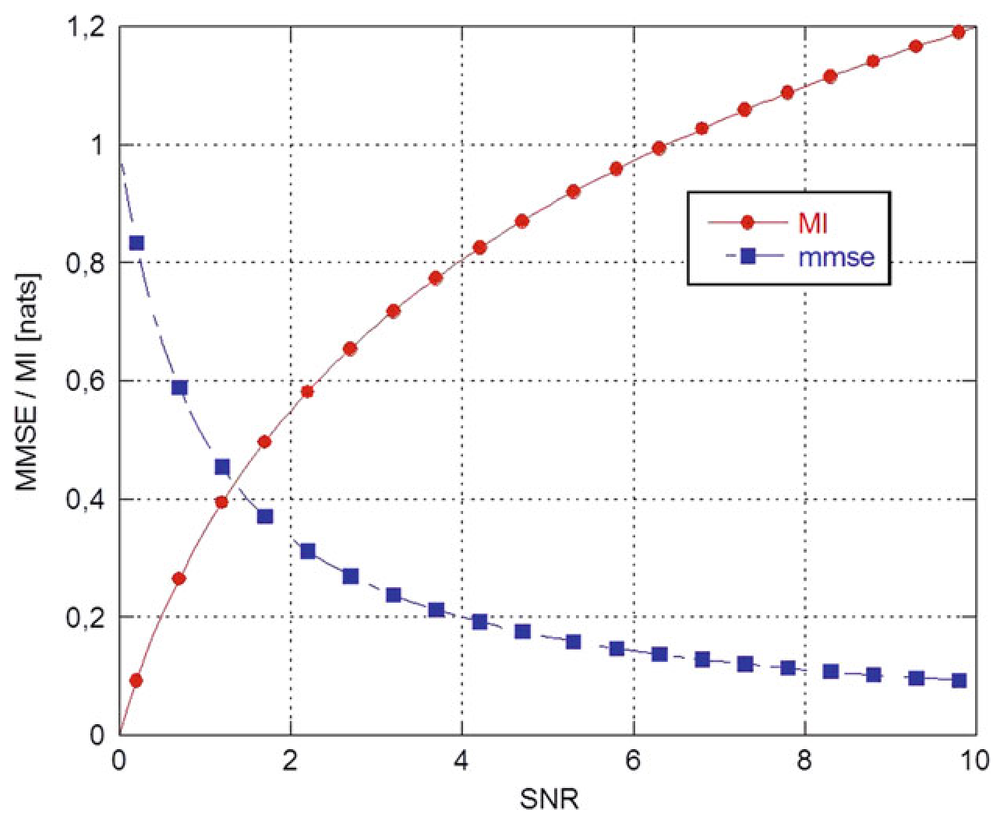

> Image description: This line graph, titled "Fig. 1 MI and MMSE versus SNR," illustrates the relationship between Mutual Information (MI) and Mean Squared Error (MMSE) as a function of the Signal-to-Noise Ratio (SNR). The horizontal x-axis represents the SNR, ranging from 0 to 10. The vertical y-axis represents the values for MMSE/MI in "nats," ranging from 0 to 1.2. Two distinct curves are plotted: 1. **MI (red solid line with circular markers):** This curve shows a monotonically increasing relationship with SNR, starting near zero and approaching approximately 1.2 nats at an SNR of 10. 2. **MMSE (blue dashed line with square markers):** This curve demonstrates an inverse relationship, starting at a high value of 1.0 at an SNR of 0 and decaying towards approximately 0.1 at an SNR of 10. The plot characterizes the performance trade-off in estimation tasks: as the signal quality (SNR) improves, the information content (MI) increases while the estimation error (MMSE) decreases.
Estimation, Survey on, Fig. 1 MI and MMSE versus SNR

respectively, measurement noises. Defining by $x_{0}^{t} \triangleq\left\{x_{s}, 0 \leq s \leq t\right\}$ the collection of all states up to time $t$ and analogously $y_{0}^{t} \triangleq\left\{y_{s}, 0 \leq s \leq t\right\}$ for the channel outputs (i.e., measurements) and considering the MI between $x_{0}^{t}$ and $y_{0}^{t}$ as a function of time $t$, i.e., $I(t)=I\left(x_{0}^{t}, y_{0}^{t}\right)$, it can be shown that (Duncan 1970; Mayer-Wolf and Zakai 1983)

$$
\begin{equation*}
\frac{d}{d t} I(t)=\frac{\sigma}{2} E\left[\left(x_{t}-\hat{x}_{t}\right)^{2}\right] \tag{4}
\end{equation*}
$$

where $\hat{x}_{t}=E\left[x_{t} \mid y_{0}^{t}\right]$ is the minimum meansquare error estimate of the state $x_{t}$ given all the channel outputs up to time $t$, i.e., $y_{0}^{t}$. Figure 2 depicts the time behavior of both MI and MMSE for several values of $\sigma$ and $a=1$.

## Conclusions and Future Trends

Despite the long history of estimation and the huge amount of work on several theoretical and practical aspects of estimation, there is still a lot of research investigation to be done in several
directions. Among the many new future trends, networked estimation and quantum estimation (briefly overviewed in the subsequent parts of this section) certainly deserve special attention due to the growing interest on wireless sensor networks and, respectively, quantum computing.

## Networked Information Fusion and Estimation

Information or data fusion is about combining, or fusing, information or data from multiple sources to provide knowledge that is not evident from a single source (Bar-Shalom et al. 2013; Farina and Studer 1986). In 1986, an effort to standardize the terminology related to data fusion began and the JDL (Joint Directors of Laboratories) data fusion working group was established. The result of that effort was the conception of a process model for data fusion and a data fusion lexicon (Blasch et al. 2012; Hall and Llinas 1997). Information and data fusion are mainly supported by sensor networks which present the following advantages over a single sensor:

<!-- source_pdf_page: 401 -->
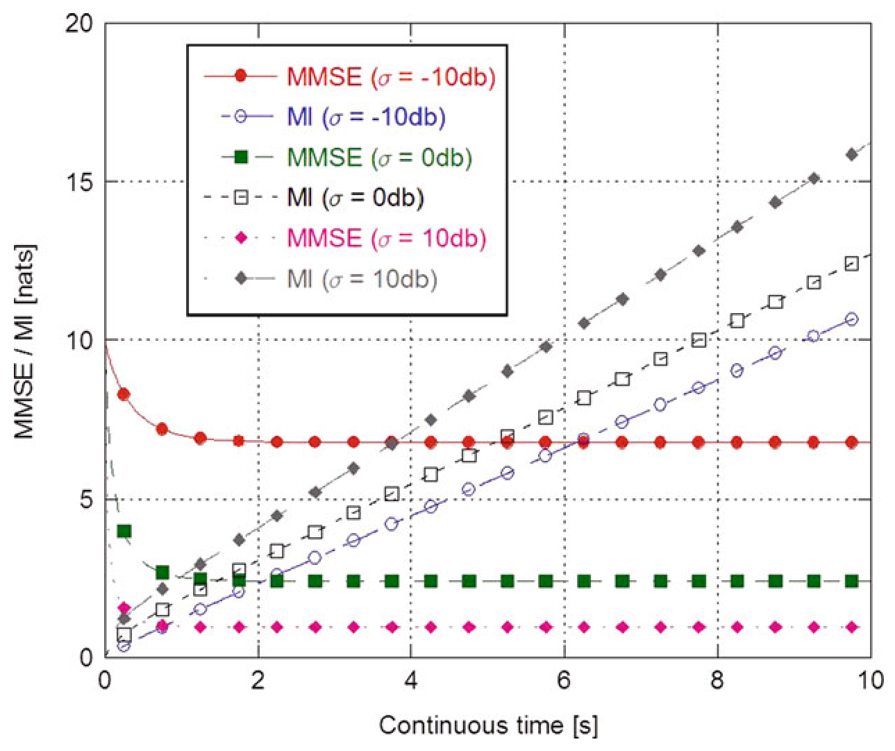

> Image description: This line graph plots Minimum Mean Square Error (MMSE) and Mutual Information (MI) in units of "nats" against continuous time in seconds, ranging from 0 to 10 seconds. The data is categorized by three different noise levels ($\sigma$): $-10\text{ dB}$ (red), $0\text{ dB}$ (green), and $+10\text{ dB}$ (magenta). For each noise level, the MMSE is represented by solid markers and lines, while MI is represented by open circles/squares/diamonds with dashed lines. At $t=0$, all curves start at various points, with MMSE values significantly higher than MI. As time increases: * **MMSE curves** (solid lines) decrease initially and then stabilize at constant asymptotic levels. The steady-state error increases as the signal-to-noise ratio decreases (red $\text{MMSE} > \text{green MMSE} > \text{magenta MMSE}$). * **MI curves** (dashed lines) increase monotonically over time, representing an accumulation of information. As noise increases, the rate of MI growth slows down.
Estimation, Survey on, Fig. 2 MI and MMSE for different values of $\sigma(-10 \mathrm{~dB}, 0 \mathrm{~dB},+10 \mathrm{~dB})$ and $a=1$

- Can be deployed over wide regions
- Provide diverse characteristics/viewing angles of the observed phenomenon
- Are more robust to failures
- Gather more data that, once fused, provide a more complete picture of the observed phenomenon
- Allow better geographical coverage, i.e., wider area and less terrain obstructions.
Sensor network architectures can be centralized, hierarchical (with or without feedback), and distributed (peer-to-peer). Today's trend for many monitoring and decision-making tasks is to exploit large-scale networks of low-cost and low-energy consumption devices with sensing, communication, and processing capabilities. For scalability issues, such networks should operate in a fully distributed (peer-to-peer) fashion, i.e., with no centralized coordination, so as to achieve in each node a global estimation/decision objective through localized processing only.

The attainment of this goal actually requires several issues to be addressed like:

- Spatial and temporal sensor alignment
- Scalable fusion
- Robustness with respect to data incest (or double counting), i.e., repeated use of the same information
- Handling data latency (e.g., out-of-sequence measurements/estimates)
- Communication bandwidth limitations

In particular, to counteract data incest the so-called covariance intersection (Julier and Uhlmann 1997) robust fusion approach has been proposed to guarantee, at the price of some conservatism, consistency of the fused estimate when combining estimates from different nodes with unknown correlations. For scalable fusion, a consensus approach (OlfatiSaber et al. 2007) can be undertaken. This allows to carry out a global (i.e., over the whole network) processing task by iterating local processing steps among neighboring nodes.

Several consensus algorithms have been proposed for distributed parameter (Calafiore and Abrate 2009) or state (Alriksson and

<!-- source_pdf_page: 402 -->
Rantzer 2006; Kamgarpour and Tomlin 2007; Olfati-Saber 2007; Stankovic et al. 2009; Xiao et al. 2005) estimation. Recently, Battistelli and Chisci (2014) introduced a generalized consensus on probability densities which opens up the possibility to perform in a fully distributed and scalable way any Bayesian estimation task over a sensor network. As by-products, this approach allowed to derive consensus Kalman filters with guaranteed stability under minimal requirements of system observability and network connectivity (Battistelli et al. 2011, 2012; Battistelli and Chisci 2014), consensus nonlinear filters (Battistelli et al. 2012), and a consensus CPHD filter for distributed multitarget tracking (Battistelli et al. 2013). Despite these interesting preliminary results, networked estimation is still a very active research area with many open problems related to energy efficiency, estimation performance optimality, robustness with respect to delays and/or data losses, etc.

## Quantum Estimation

Quantum estimation theory consists of a generalization of the classical estimation theory in terms of quantum mechanics. As a matter of fact, the statistical theory can be seen as a particular case of the more general quantum theory (Helstrom 1969, 1976). Quantum mechanics presents practical applications in several fields of technology (Personick 1971) such as, the use of quantum number generators in place of the classical random number generators. Moreover, manipulating the energy states of the cesium atoms, it is possible to suppress the quantum noise levels and consequently improve the accuracy of atomic clocks. Quantum mechanics can also be exploited to solve optimization problems, giving sometimes optimization algorithms that are faster than conventional ones. For instance, McGeoch and Wang (2013) provided an experimental study of algorithms based on quantum annealing. Interestingly, the results of McGeoch and Wang (2013) have shown that this approach allows to obtain better solutions with respect to those found with conventional software solvers. In quantum mechanics, also the Kalman filter has found its proper form, as the quantum Kalman filter.

In Iida et al. (2010) the quantum Kalman filter is applied to an optical cavity composed of mirrors and crystals inside, which interacts with a probe laser. In particular, a form of a quantum stochastic differential equation can be written for such a system so as to design the algorithm that updates the estimates of the system variables on the basis of the measurement outcome of the system.

## Cross-References

- Averaging Algorithms and Consensus
- Bounds on Estimation
- Consensus of Complex Multi-agent Systems
- Data Association
- Estimation and Control over Networks
- Estimation for Random Sets
- Extended Kalman Filters
- Kalman Filters
- Moving Horizon Estimation
- Networked Control Systems: Estimation and Control over Lossy Networks
- Nonlinear Filters
- Observers for Nonlinear Systems
- Observers in Linear Systems Theory
- Particle Filters

Acknowledgments The authors warmly recognize the contribution of S. Fortunati (University of Pisa, Italy), L. Pallotta (University of Napoli, Italy), and G. Battistelli (University of Firenze, Italy).

## Bibliography

Abur A, Gómez Espósito A (2004) Power system state estimation - theory and implementation. Marcel Dekker, New York
Aidala VJ, Hammel SE (1983) Utilization of modified polar coordinates for bearings-only tracking. IEEE Trans Autom Control 28(3):283-294
Alamo T, Bravo JM, Camacho EF (2005) Guaranteed state estimation by zonotopes. Automatica 41(6): 1035-1043
Alessandri A, Baglietto M, Battistelli G (2005) Receding-horizon estimation for switching discretetime linear systems. IEEE Trans Autom Control 50(11):1736-1748
Alessandri A, Baglietto M, Battistelli G (2008) Movinghorizon state estimation for nonlinear discrete-time systems: new stability results and approximation schemes. Automatica 44(7):1753-1765

<!-- source_pdf_page: 403 -->
Alriksson P, Rantzer A (2006) Distributed Kalman filtering using weighted averaging. In: Proceedings of the 17th International Symposium on Mathematical Theory of Networks and Systems, Kyoto
Alspach DL, Sorenson HW (1972) Nonlinear Bayesian estimation using Gaussian sum approximations. IEEE Trans Autom Control 17(4):439-448
Anderson BDO, Chirarattananon S (1972) New linear smoothing formulas. IEEE Trans Autom Control 17(1):160-161
Anderson BDO, Moore JB (1979) Optimal filtering. Prentice Hall, Englewood Cliffs
Andrews A (1968) A square root formulation of the Kalman covariance equations. AIAA J 6(6): 1165-1166
Andrews HC (1972) Introduction to mathematical techniques in pattern recognition. Wiley, New York
Aoki M (1987) State space modeling of time-series. Springer, Berlin
Athans M (1971) An optimal allocation and guidance laws for linear interception and rendezvous problems. IEEE Trans Aerosp Electron Syst 7(5):843-853
Balakrishnan AV, Lions JL (1967) State estimation for infinite-dimensional systems. J Comput Syst Sci 1(4):391-403
Barbarisi O, Vasca F, Glielmo L (2006) State of charge Kalman filter estimator for automotive batteries. Control Eng Pract 14(3): 267-275
Bard Y (1974) Nonlinear parameter estimation. Academic, New York
Barkat M (2005) Signal detection and estimation. Artech House, Boston
Bar-Shalom Y, Fortmann TE (1988) Tracking and data association. Academic, Boston
Bar-Shalom Y, Li X, Kirubarajan T (2001) Estimation with applications to tracking and navigation. Wiley, New York
Bar-Shalom Y, Willett P, Tian X (2013) Tracking and data fusion: a handbook of algorithms. YBS Publishing Storrs, CT
Battistelli G, Chisci L, Morrocchi S, Papi F (2011) An information-theoretic approach to distributed state estimation. In: Proceedings of the 18th IFAC World Congress, Milan, pp 12477-12482
Battistelli G, Chisci L, Mugnai G, Farina A, Graziano A (2012) Consensus-based algorithms for distributed filtering. In: Proceedings of the 51st IEEE Control and Decision Conference, Maui, pp 794-799
Battistelli G, Chisci L (2014) Kullback-Leibler average, consensus on probability densities, and distributed state estimation with guaranteed stability. Automatica 50:707-718
Battistelli G, Chisci L, Fantacci C, Farina A, Graziano A (2013) Consensus CPHD filter for distributed multitarget tracking. IEEE J Sel Topics Signal Process 7(3):508-520
Bayes T (1763) Essay towards solving a problem in the doctrine of chances. Philos Trans R Soc Lond 53: 370-418. doi:10.1098/rstl.1763.0053

Bayless JW, Brigham EO (1970) Application of the Kalman filter. Geophysics 35(1):2-23
Bekey GA (1973) Parameter estimation in biological systems: a survey. In: Proceedings of the 3rd IFAC Symposium Identification and System Parameter Estimation, Delft, pp 1123-1130
Benedict TR, Bordner GW (1962) Synthesis of an optimal set of radar track-while-scan smoothing equations. IRE Trans Autom Control 7(4):27-32
Benes VE (1981) Exact finite-dimensional filters for certain diffusions with non linear drift. Stochastics 5(1):65-92
Bertsekas DP, Rhodes IB (1971) Recursive state estimation for a set-membership description of uncertainty. IEEE Trans Autom Control 16(2):117-128
Biemond J, Rieske J, Gerbrands JJ (1983) A fast Kalman filter for images degraded by both blur and noise. IEEE Trans Acoust Speech Signal Process 31(5):1248-1256
Bierman GJ (1974) Sequential square root filtering and smoothing of discrete linear systems. Automatica 10(2):147-158
Bierman GJ (1977) Factorization methods for discrete sequential estimation. Academic, New York
Blackman S, Popoli R (1999) Design and analysis of modern tracking systems. Artech House, Norwood
Blasch EP, Lambert DA, Valin P, Kokar MM, Llinas J, Das S, Chong C, Shahbazian E (2012) High level information fusion (HLIF): survey of models, issues, and grand challenges. IEEE Aerosp Electron Syst Mag 27(9):4-20
Bryson AE, Frazier M (1963) Smoothing for linear and nonlinear systems, TDR 63-119, Aero System Division. Wright-Patterson Air Force Base, Ohio
Calafiore GC, Abrate F (2009) Distributed linear estimation over sensor networks. Int J Control 82(5):868-882
Carravetta F, Germani A, Raimondi M (1996) Polynomial filtering for linear discrete-time non-Gaussian systems. SIAM J Control Optim 34(5):1666-1690
Chen J, Patton RJ (1999) Robust model-based fault diagnosis for dynamic systems. Kluwer, Boston
Chisci L, Zappa G (1992) Square-root Kalman filtering of descriptor systems. Syst Control Lett 19(4):325-334
Chisci L, Garulli A, Zappa G (1996) Recursive state bounding by parallelotopes. Automatica 32(7): 1049-1055
Chou KC, Willsky AS, Benveniste A (1994) Multiscale recursive estimation, data fusion, and regularization. IEEE Trans Autom Control 39(3):464-478
Combettes P (1993) The foundations of set-theoretic estimation. Proc IEEE 81(2): 182-208
Cramér H (1946) Mathematical methods of statistics. University Press, Princeton
Crisan D, Rozovskii B (eds) (2011) The Oxford handbook of nonlinear filtering. Oxford University Press, Oxford
Dai $L$ (1987) State estimation schemes in singular systems. In: Preprints 10th IFAC World Congress, Munich, vol 9, pp 211-215
Dai L (1989) Filtering and LQG problems for discretetime stochastic singular systems. IEEE Trans Autom Control 34(10):1105-1108

<!-- source_pdf_page: 404 -->
Darragh J, Looze D (1984) Noncausal minimax linear state estimation for systems with uncertain secondorder statistics. IEEE Trans Autom Control 29(6):555557
Daum FE (1986) Exact finite dimensional nonlinear filters. IEEE Trans Autom Control 31(7):616-622
Daum F (2005) Nonlinear filters: beyond the Kalman filter. IEEE Aerosp Electron Syst Mag 20(8):57-69
Debs AS, Larson RE (1970) A dynamic estimator for tracking the state of a power system. IEEE Trans Power Appar Syst 89(7):1670-1678
Devlin K (2008) The unfinished game: Pascal, Fermat and the seventeenth-century letter that made the world modern. Basic Books, New York. Copyright (C) Keith Devlin
Dissanayake G, Newman P, Clark S, Durrant-Whyte H, Csorba M (2001) A solution to the simultaneous localization and map building (SLAM) problem. IEEE Trans Robot Autom 17(3):229-241
Dochain D, Vanrolleghem P (2001) Dynamical modelling and estimation of wastewater treatment processes. IWA Publishing, London
Doucet A, de Freitas N, Gordon N (eds) (2001) Sequential Monte Carlo methods in practice. Springer, New York
Duncan TE (1970) On the calculation of mutual information. SIAM J Appl Math 19(1):215-220
Durrant-Whyte H, Bailey T (2006a) Simultaneous localization and mapping: Part I. IEEE Robot Autom Mag 13(2):99-108
Durrant-Whyte H, Bailey T (2006b) Simultaneous localization and mapping: Part II. IEEE Robot Autom Mag 13(3):110-117
Elliott RJ, Aggoun L, Moore JB (2008) Hidden Markov models: estimation and control. Springer, New York. (first edition in 1995)
Evensen G (1994a) Inverse methods and data assimilation in nonlinear ocean models. Physica D 77:108-129
Evensen G (1994b) Sequential data assimilation with a nonlinear quasi-geostrophic model using Monte Carlo methods to forecast error statistics. J Geophys Res 99(10):143-162
Evensen G (2007) Data assimilation - the ensemble Kalman filter. Springer, Berlin
Falb PL (1967) Infinite-dimensional filtering; the KalmanBucy filter in Hilbert space. Inf Control 11(1): 102-137
Farina A (1999) Target tracking with bearings-only measurements. Signal Process 78(1):61-78
Farina A, Studer FA (1985) Radar data processing. Volume 1 - introduction and tracking, Editor P. Bowron. Research Studies Press, Letchworth/Wiley, New York (Translated in Russian (Radio I Sviaz, Moscow 1993) and in Chinese. China Defense Publishing House, 1988)

Farina A, Studer FA (1986) Radar data processing. Volume 2 - advanced topics and applications, Editor P. Bowron. Research Studies Press, Letchworth/Wiley, New York (In Chinese, China Defense Publishing House, 1992)
Farrell JA, Barth M (1999) The global positioning system and inertial navigation. McGraw-Hill, New York

Fisher RA (1912) On an absolute criterion for fitting frequency curves. Messenger Math 41(5): 155-160
Fisher RA (1922) On the mathematical foundations of theoretical statistics. Philos Trans R Soc Lond Ser A 222:309-368
Fisher RA (1925) Theory of statistical estimation. Math Proc Camb Philos Soc 22(5):700-725
Flinn EA, Robinson EA, Treitel S (1967) Special issue on the MIT geophysical analysis group reports. Geophysics 32:411-525
Frost PA, Kailath T (1971) An innovations approach to least-squares estimation, Part III: nonlinear estimation in white Gaussian noise. IEEE Trans Autom Control 16(3):217-226
Galilei G (1632) Dialogue concerning the two chief world systems (Translated in English by S. Drake (Foreword of A. Einstein), University of California Press, Berkeley, 1953)
Gauss CF (1806) Theoria motus corporum coelestium in sectionibus conicis solem ambientum (Translated in English by C.H. Davis, Reprinted as Theory of motion of the heavenly bodies, Dover, New York, 1963)
Gauss CF (1995) Theoria combinationis observationum erroribus minimis obnoxiae (Translated by G.W. Stewart, Classics in Applied Mathematics), vol 11. SIAM, Philadelphia
Germani A, Manes C, Palumbo P (2005) Polynomial extended Kalman filter. IEEE Trans Autom Control 50(12):2059-2064
Ghil M, Malanotte-Rizzoli P (1991) Data assimilation in meteorology and oceanography. Adv Geophys 33:141-265
Ghosh M, Mukhopadhyay N, Sen PK (1997) Sequential estimation. Wiley, New York
Golub GH (1965) Numerical methods for solving linear least squares problems. Numerische Mathematik 7(3):206-216
Goodwin GC, Seron MM, De Doná JA (2005) Constrained control and estimation. Springer, London
Gordon NJ, Salmond DJ, Smith AFM (1993) Novel approach to nonlinear/non Gaussian Bayesian state estimation. IEE Proc F 140(2): 107-113
Grewal MS, Weill LR, Andrews AP (2001) Global positioning systems, inertial navigation and integration. Wiley, New York
Grimble MJ (1988) $H_{\infty}$ design of optimal linear filters. In: Byrnes C, Martin C, Saeks R (eds) Linear circuits, systems and signal processing: theory and applications. North Holland, Amsterdam, pp 535-540
Guo D, Shamai S, Verdú S (2005) Mutual information and minimum mean-square error in Gaussian channels. IEEE Trans Inf Theory 51(4): 1261-1282
Hall DL, Llinas J (1997) An introduction to multisensor data fusion. Proc IEEE 85(1):6-23
Hassibi B, Sayed AH, Kailath T (1999) Indefinitequadratic estimation and control. SIAM, Philadelphia
Heemink AW, Segers AJ (2002) Modeling and prediction of environmental data in space and time using Kalman filtering. Stoch Environ Res Risk Assess 16: 225-240

<!-- source_pdf_page: 405 -->
Helstrom CW (1969) Quantum detection and estimation theory. J Stat Phys 1(2):231-252
Helstrom CW (1976) Quantum detection and estimation theory. Academic, New York
Hernandez M, Farina A, Ristic B (2006) PCRLB for tracking in cluttered environments: measurement sequence conditioning approach. IEEE Trans Aerosp Electron Syst 42(2):680-704
Ho YC, Agrawala AK (1968) On pattern classification algorithms - introduction and survey. Proc IEEE 56(12):2101-2113
Ho YC, Lee RCK (1964) A Bayesian approach to problems in stochastic estimation and control. IEEE Trans Autom Control 9(4):333-339
Iida S, Ohki F, Yamamoto N (2010) Robust quantum Kalman filtering under the phase uncertainty of the probe-laser. In: IEEE international symposium on computer-aided control system design, Yokohama, pp 749-754
Itakura F (1971) Extraction of feature parameters of speech by statistical methods. In: Proceedings of the 8th Symposium Speech Information Processing, Sendai, pp II-5.1-II-5.12
Jazwinski AH (1966) Filtering for nonlinear dynamical systems. IEEE Trans Autom Control 11(4):765-766
Jazwinski AH (1968) Limited memory optimal filtering. IEEE Trans Autom Control 13(5): 558-563
Jazwinski AH (1970) Stochastic processes and filtering theory. Academic, New York
Joseph DP, Tou TJ (1961) On linear control theory. Trans Am Inst Electr Eng 80(18):193-196
Julier SJ, Uhlmann JK (1997) A non-divergent estimation algorithm in the presence of unknown correlations. In: Proceedings of the 1997 American Control Conference, Albuquerque, vol 4, pp 2369-2373
Julier SJ, Uhlmann JK (2004) Unscented Filtering and Nonlinear Estimation. Proc IEEE 92(3): 401-422
Julier SJ, Uhlmann JK, Durrant-Whyte H (1995) A new approach for filtering nonlinear systems. In: Proceedings of the 1995 American control conference, Seattle, vol 3, pp 1628-1632
Kailath T (1968) An innovations approach to leastsquares estimation, Part I: linear filtering in additive white noise. IEEE Trans Autom Control 13(6): 646-655
Kailath $T$ (1970) The innovations approach to detection and estimation theory. Proc IEEE 58(5): 680-695
Kailath T (1973) Some new algorithms for recursive estimation in constant linear systems. IEEE Trans Inf Theory 19(6):750-760
Kailath T, Frost PA (1968) An innovations approach to least-squares estimation, Part II: linear smoothing in additive white noise. IEEE Trans Autom Control 13(6): 655-660
Kailath T, Sayed AH, Hassibi B (2000) Linear estimation. Prentice Hall, Upper Saddle River
Kalman RE (1960a) On the general theory of control systems. In: Proceedings of the 1st International Congress of IFAC, Moscow, USSR, vol 1, pp 481-492

Kalman RE (1960b) A new approach to linear filtering and prediction problems. Trans ASME J Basic Eng Ser D 82(1):35-45
Kalman RE, Bucy RS (1961) New results in linear filtering and prediction theory. Trans ASME J Basic Eng Ser D 83(3):95-108
Kamgarpour M, Tomlin C (2007) Convergence properties of a decentralized Kalman filter. In: Proceedings of the 47th IEEE Conference on Decision and Control, New Orleans, pp 5492-5498
Kaminski PG, Bryson AE (1972) Discrete square-root smoothing. In: Proceedings of the AIAA Guidance and Control Conference, paper no. 72-877, Stanford
Kay SM (1993) Fundamentals of statistical signal processing, volume 1: estimation theory. Prentice Hall, Englewood Cliffs
Kim K, Shevlyakov G (2008) Why Gaussianity? IEEE Signal Process Mag 25(2):102-113
Kim J, Woods JW (1998) 3-D Kalman filter for image motion estimation. IEEE Trans Image Process 7(1):42-52
Koch KR (1999) Parameter estimation and hypothesis testing in linear models. Springer, Berlin
Kolmogorov AN (1933) Grundbegriffe der Wahrscheinlichkeitsrechnung (in German) (English translation edited by Nathan Morrison: Foundations of the theory of probability, Chelsea, New York, 1956). Springer, Berlin
Kolmogorov AN (1941) Interpolation and extrapolation of stationary random sequences. Izv Akad Nauk SSSR Ser Mat 5:3-14 (in Russian) (English translation by G. Lindqvist, published in Selected works of A.N. Kolmogorov - Volume II: Probability theory and mathematical statistics, A.N. Shyryaev (Ed.), pp. 272-280, Kluwer, Dordrecht, Netherlands, 1992)
Kushner HJ (1962) On the differential equations satisfied by conditional probability densities of Markov processes with applications. SIAM J Control Ser A 2(1):106-199
Kushner HJ (1967) Dynamical equations for optimal nonlinear filtering. J Differ Equ 3(2): 179-190
Kushner HJ (1970) Filtering for linear distributed parameter systems. SIAM J Control 8(3): 346-359
Kwakernaak H (1967) Optimal filtering in linear systems with time delays. IEEE Trans Autom Control 12(2): 169-173
Lainiotis DG (1972) Adaptive pattern recognition: a statevariable approach. In: Watanabe S (ed) Frontiers of pattern recognition. Academic, New York
Lainiotis DG (1974) Estimation: a brief survey. Inf Sci 7:191-202
Laplace PS (1814) Essai philosophique sur le probabilités (Translated in English by F.W. Truscott, F.L. Emory, Wiley, New York, 1902)
Legendre AM (1810) Méthode des moindres quarrés, pour trouver le milieu le plus probable entre les résultats de diffèrentes observations. In: Mémoires de la Classe des Sciences Mathématiques et Physiques de l'Institut Impérial de France, pp 149-154. Originally appeared as appendix to the book Nouvelle méthodes pour la détermination des orbites des comètes, 1805

<!-- source_pdf_page: 406 -->
Lehmann EL, Casella G (1998) Theory of point estimation. Springer, New York
Leibungudt BG, Rault A, Gendreau F (1983) Application of Kalman filtering to demographic models. IEEE Trans Autom Control 28(3):427-434
Levy BC (2008) Principles of signal detection and parameter estimation. Springer, New York
Ljung L (1999) System identification: theory for the user. Prentice Hall, Upper Saddle River
Los Alamos Scientific Laboratory (1966) Fermi invention rediscovered at LASL. The Atom, pp 7-11
Luenberger DG (1964) Observing the state of a linear system. IEEE Trans Mil Electron 8(2):74-80
Mahler RPS (1996) A unified foundation for data fusion. In: Sadjadi FA (ed) Selected papers on sensor and data fusion. SPIE MS-124. SPIE Optical Engineering Press, Bellingham, pp 325-345. Reprinted from 7th Joint Service Data Fusion Symposium, pp 154-174, Laurel (1994)
Mahler RPS (2003) Multitarget Bayes filtering via firstorder multitarget moments. IEEE Trans Aerosp Electron Syst 39(4):1152-1178
Mahler RPS (2007a) Statistical multisource multitarget information fusion. Artech House, Boston
Mahler RPS (2007b) PHD filters of higher order in target number. IEEE Trans Aerosp Electron Syst 43(4):1523-1543
Mangoubi ES (1998) Robust estimation and failure detection: a concise treatment. Springer, New York
Maybeck PS (1979 and 1982) Stochastic models, estimation and control, vols I, II and III. Academic, New York. 1979 (volume I) and 1982 (volumes II and III)
Mayer-Wolf E, Zakai M (1983) On a formula relating the Shannon information to the Fisher information for the filtering problem. In: Korezlioglu H, Mazziotto G and Szpirglas J (eds) Lecture notes in control and information sciences, vol 61. Springer, New York, pp 164-171
Mayne DQ (1966) A solution of the smoothing problem for linear dynamic systems. Automatica 4(2):73-92
McGarty TP (1971) The estimation of the constituent densities of the upper atmosphere. IEEE Trans Autom Control 16(6):817-823
McGee LA, Schmidt SF (1985) Discovery of the Kalman filter as a practical tool for aerospace and industry, NASA-TM-86847
McGeoch CC, Wang C (2013) Experimental evaluation of an adiabatic quantum system for combinatorial optimization. In: Computing Frontiers 2013 Conference, Ischia, article no. 23. doi:10.1145/2482767.2482797
McGrayne SB (2011) The theory that would not die. How Bayes' rule cracked the enigma code, hunted down Russian submarines, and emerged triumphant from two centuries of controversies. Yale University Press, New Haven/London
Meditch JS (1967) Orthogonal projection and discrete optimal linear smoothing. SIAM J Control 5(1):74-89
Meditch JS (1971) Least-squares filtering and smoothing for linear distributed parameter systems. Automatica 7(3):315-322

Mendel JM (1977) White noise estimators for seismic data processing in oil exploration. IEEE Trans Autom Control 22(5):694-706
Mendel JM (1983) Optimal seismic deconvolution: an estimation-based approach. Academic, New York
Mendel JM (1990) Maximum likelihood deconvolution - a journey into model-based signal processing. Springer, New York
Metropolis N, Ulam S (1949) The Monte Carlo method. J Am Stat Assoc 44(247):335-341
Milanese M, Belforte G (1982) Estimation theory and uncertainty intervals evaluation in presence of unknown but bounded errors: linear families of models and estimators. IEEE Trans Autom Control 27(2):408-414
Milanese M, Vicino A (1993) Optimal estimation theory for dynamic systems with set-membership uncertainty. Automatica 27(6):427-446
Miller WL, Lewis JB (1971) Dynamic state estimation in power systems. IEEE Trans Autom Control 16(6):841-846
Mlodinow L (2009) The drunkard's walk: how randomness rules our lives. Pantheon Books, New York. Copyright (C) Leonard Mlodinow
Monticelli A (1999) State estimation in electric power systems: a generalized approach. Kluwer, Dordrecht
Morf M, Kailath T (1975) Square-root algorithms for least-squares estimation. IEEE Trans Autom Control 20(4):487-497
Morf M, Sidhu GS, Kailath T (1974) Some new algorithms for recursive estimation in constant, linear, discrete-time systems. IEEE Trans Autom Control 19(4):315-323
Mullane J, Vo B-N, Adams M, Vo B-T (2011) Random finite sets for robotic mapping and SLAM. Springer, Berlin
Nachazel K (1993) Estimation theory in hydrology and water systems. Elsevier, Amsterdam
Najim M (2008) Modeling, estimation and optimal filtering in signal processing. Wiley, Hoboken. First published in France by Hermes Science/Lavoisier as Modélisation, estimation et filtrage optimal en traitement du signal (2006)
Neal SR (1967) Discussion of parametric relations for the filter predictor. IEEE Trans Autom Control 12(3): 315-317
Netz R, Noel W (2011) The Archimedes codex. Phoenix, Philadelphia, PA
Nikoukhah R, Willsky AS, Levy BC (1992) Kalman filtering and Riccati equations for descriptor systems. IEEE Trans Autom Control 37(9): 1325-1342
Olfati-Saber R (2007) Distributed Kalman filtering for sensor networks. In: Proceedings of the 46th IEEE Conference on Decision and Control, New Orleans, pp 5492-5498
Olfati-Saber R, Fax JA, Murray R (2007) Consensus and cooperation in networked multi-agent systems. Proc IEEE 95(1):215-233
Painter JH, Kerstetter D, Jowers S (1990) Reconciling steady-state Kalman and $\alpha-\beta$ filter design. IEEE Trans Aerosp Electron Syst 26(6):986-991

<!-- source_pdf_page: 407 -->
Park S, Serpedin E, Qarage K (2013) Gaussian assumption: the least favorable but the most useful. IEEE Signal Process Mag 30(3): 183-186
Personick SD (1971) Application of quantum estimation theory to analog communication over quantum channels. IEEE Trans Inf Theory 17(3):240-246
Pindyck RS, Roberts SM (1974) Optimal policies for monetary control. Ann Econ Soc Meas 3(1): 207-238
Poor HV (1994) An introduction to signal detection and estimation, 2nd edn. Springer, New York. (first edition in 1988)
Poor HV, Looze D (1981) Minimax state estimation for linear stochastic systems with noise uncertainty. IEEE Trans Autom Control 26(4):902-906
Potter JE, Stern RG (1963) Statistical filtering of space navigation measurements. In: Proceedings of the 1963 AIAA Guidance and Control Conference, paper no. 63-333, Cambridge
Ramm AG (2005) Random fields estimation. World Scientific, Hackensack
Rao C (1945) Information and the accuracy attainable in the estimation of statistical parameters. Bull Calcutta Math Soc 37:81-89
Rao CV, Rawlings JB, Lee JH (2001) Constrained linear state estimation - a moving horizon approach. Automatica 37(10): 1619-1628
Rao CV, Rawlings JB, Mayne DQ (2003) Constrained state estimation for nonlinear discrete-time systems: stability and moving horizon approximations. IEEE Trans Autom Control 48(2): 246-257
Rauch HE (1963) Solutions to the linear smoothing problem. IEEE Trans Autom Control 8(4): 371-372
Rauch HE, Tung F, Striebel CT (1965) Maximum likelihood estimates of linear dynamic systems. AIAA J 3(8):1445-1450
Reid D (1979) An algorithm for tracking multiple targets. IEEE Trans Autom Control 24(6):843-854
Riccati JF (1722) Animadversiones in aequationes differentiales secundi gradi. Actorum Eruditorum Lipsiae, Supplementa 8:66-73. Observations regarding differental equations of second order, translation of the original Latin into English, by I. Bruce, 2007
Riccati JF (1723) Appendix in animadversiones in aequationes differentiales secundi gradi. Acta Eruditorum Lipsiae
Ristic B (2013) Particle filters for random set models. Springer, New York
Ristic B, Arulampalam S, Gordon N (2004) Beyond the Kalman filter: particle filters for tracking applications. Artech House, Boston
Ristic B, Vo B-T, Vo B-N, Farina A (2013) A tutorial on Bernoulli filters: theory, implementation and applications. IEEE Trans Signal Process 61(13):3406-3430
Robinson EA (1963) Mathematical development of discrete filters for detection of nuclear explosions. J Geophys Res 68(19):5559-5567
Roman WS, Hsu C, Habegger LT (1971) Parameter identification in a nonlinear reactor system. IEEE Trans Nucl Sci 18(1):426-429

Sage AP, Masters GW (1967) Identification and modeling of states and parameters of nuclear reactor systems. IEEE Trans Nucl Sci 14(1):279-285
Sage AP, Melsa JL (1971) Estimation theory with applications to communications and control. McGraw-Hill, New York
Schmidt SF (1966) Application of state-space methods to navigation problems. Adv Control Syst 3:293-340
Schmidt SF (1970) Computational techniques in Kalman filtering, NATO-AGARD-139
Schonhoff TA, Giordano AA (2006) Detection and estimation theory and its applications. Pearson Prentice Hall, Upper Saddle River
Schweppe FC (1968) Recursive state estimation with unknown but bounded errors and system inputs. IEEE Trans Autom Control 13(1):22-28
Segall A (1976) Recursive estimation from discretetime point processes. IEEE Trans Inf Theory 22(4): 422-431
Servi L, Ho Y (1981) Recursive estimation in the presence of uniformly distributed measurement noise. IEEE Trans Autom Control 26(2):563-565
Simon D (2006) Optimal state estimation - Kalman, $\mathrm{H}_{\infty}$ and nonlinear approaches. Wiley, New York
Simpson HR (1963) Performance measures and optimization condition for a third-order tracker. IRE Trans Autom Control 8(2): 182-183
Sklansky J (1957) Optimizing the dynamic parameters of a track-while-scan system. RCA Rev 18:163-185
Smeth P, Ristic B (2004) Kalman filter and joint tracking and classification in TBM framework. In: Proceedings of the 7th international conference on information fusion, Stockholm, pp 46-53
Smith R, Self M, Cheeseman P (1986) Estimating uncertain spatial relationships in robotics. In: Proceedings of the 2nd conference on uncertainty in artificial intelligence, Philadelphia, pp 435-461
Snijders TAB, Koskinen J, Schweinberger M (2012) Maximum likelihood estimation for social network dynamics. Ann Appl Stat 4(2):567-588
Snyder DL (1968) The state-variable approach to continuous estimation with applications to analog communications. MIT, Cambridge
Snyder DL (1970) Estimation of stochastic intensity functions of conditional Poisson processes. Monograph no. 128, Biomedical Computer Laboratory, Washington University, St. Louis
Söderström T (1994) Discrete-time stochastic system estimation \& control. Prentice Hall, New York
Söderström T, Stoica P (1989) System identification. Prentice Hall, New York
Sorenson HW, Alspach DL (1970) Gaussian sum approximations for nonlinear filtering. In: Proceedings of the 1970 IEEE Symposium on Adaptive Processes, Austin, TX pp 19.3.1-19.3.9
Sorenson HW, Alspach DL (1971) Recursive Bayesian estimation using Gaussian sums. Automatica 7(4): 465-479
Stankovic SS, Stankovic MS, Stipanovic DM (2009) Consensus based overlapping decentralized estimation

<!-- source_pdf_page: 408 -->
with missing observations and communication faults. Automatica 45(6): 1397-1406
Stark L (1968) Neurological control systems studies in bioengineering. Plenum Press, New York
Stengel PF (1994) Optimal control and estimation. Dover, New York. Originally published as Stochastic optimal control. Wiley, New York, 1986
Stephant J, Charara A, Meizel D (2004) Virtual sensor: application to vehicle sideslip angle and transversal forces. IEEE Trans Ind Electron 51(2):278-289
Stratonovich RL (1959) On the theory of optimal nonlinear filtering of random functions. Theory Probab Appl 4:223-225
Stratonovich RL (1960) Conditional Markov processes. Theory Probab Appl 5(2):156-178
Taylor JH (1979) The Cramér-Rao estimation error lower bound computation for deterministic nonlinear systems. IEEE Trans Autom Control 24(2): 343-344
Thrun S, Burgard W, Fox D (2006) Probabilistic robotics. MIT, Cambridge
Tichavsky P, Muravchik CH, Nehorai A (1998) Posterior Cramér-Rao bounds for discrete-time nonlinear filtering. IEEE Trans Signal Process 6(5): 1386-1396
Toyoda J, Chen MS, Inoue Y (1970) An application of state estimation to short-term load forecasting, Part I: forecasting model and Part II: implementation. IEEE Trans Power Appar Syst 89(7):1678-1682 (Part I) and 1683-1688 (Part II)
Tsybakov AB (2009) Introduction to nonparametric estimation. Springer, New York
Tuncer TE, Friedlander B (2009) Classical and modern direction-of-arrival estimation. Academic, Burlington
Tzafestas SG, Nightingale JM (1968) Optimal filtering, smoothing and prediction in linear distributedparameter systems. Proc Inst Electr Eng 115(8): 1207-1212
Ulam S (1952) Random processes and transformations. In: Proceedings of the International Congress of Mathematicians, Cambridge, vol 2, pp 264-275
Ulam S, Richtmeyer RD, von Neumann J (1947) Statistical methods in neutron diffusion, Los Alamos Scientific Laboratory report LAMS-551
Van Trees H (1971) Detection, estimation and modulation theory - Parts I, II and III. Wiley, New York. Republished in 2013
van Trees HL, Bell KL (2007) Bayesian bounds for parameter estimation and nonlinear filtering/tracking. Wiley, Hoboken/IEEE, Piscataway
Venerus JC, Bullock TE (1970) Estimation of the dynamic reactivity using digital Kalman filtering. Nucl Sci Eng 40:199-205
Verdú S, Poor HV (1984) Minimax linear observers and regulators for stochastic systems with uncertain second-order statistics. IEEE Trans Autom Control 29(6):499-511
Vicino A, Zappa G (1996) Sequential approximation of feasible parameter sets for identification with set membership uncertainty. IEEE Trans Autom Control 41(6):774-785

Vo B-N, Ma WK (1996) The Gaussian mixture probability hypothesis density filter. IEEE Trans Signal Process 54(11):4091-4101
Vo B-T, Vo B-N, Cantoni A (2007) Analytic implementations of the cardinalized probability hypothesis density filter. IEEE Trans Signal Process 55(7):3553-3567
Wakita H (1973) Estimation of the vocal tract shape by inverse optimal filtering. IEEE Trans Audio Electroacoust 21(5):417-427
Wertz W (1978) Statistical density estimation - a survey. Vandenhoeck and Ruprecht, Göttingen
Wiener N (1949) Extrapolation, interpolation and smoothing of stationary time-series. MIT, Cambridge
Willsky AS (1976) A survey of design methods for failure detection in dynamic systems. Automatica 12(6): 601-611
Wonham WM (1965) Some applications of stochastic differential equations to optimal nonlinear filtering. SIAM J Control 2(3):347-369
Woods JW, Radewan C (1977) Kalman filtering in two dimensions. IEEE Trans Inf Theory 23(4): 473-482
Xiao L, Boyd S, Lall S (2005) A scheme for robust distributed sensor fusion based on average consensus. In: Proceedings of the 4th International Symposium on Information Processing in Sensor Networks, Los Angeles, pp 63-70
Zachrisson LE (1969) On optimal smoothing of continuous-time Kalman processes. Inf Sci 1(2): 143-172
Zellner A (1971) An introduction to Bayesian inference in econometrics. Wiley, New York

## Event-Triggered and Self-Triggered Control

W.P.M.H. Heemels ${ }^{1}$, Karl H. Johansson ${ }^{2}$, and Paulo Tabuada ${ }^{3}$ ${ }^{1}$ Department of Mechanical Engineering, Eindhoven University of Technology, Eindhoven, The Netherlands ${ }^{2}$ ACCESS Linnaeus Center, Royal Institute of Technology, Stockholm, Sweden ${ }^{3}$ Department of Electrical Engineering, University of California, Los Angeles, CA, USA

#### Abstract

Recent developments in computer and communication technologies have led to a new type of large-scale resource-constrained wireless

<!-- source_pdf_page: 409 -->
embedded control systems. It is desirable in these systems to limit the sensor and control computation and/or communication to instances when the system needs attention. However, classical sampled-data control is based on performing sensing and actuation periodically rather than when the system needs attention. This article discusses event- and self-triggered control systems where sensing and actuation is performed when needed. Event-triggered control is reactive and generates sensor sampling and control actuation when, for instance, the plant state deviates more than a certain threshold from a desired value. Self-triggered control, on the other hand, is proactive and computes the next sampling or actuation instance ahead of time. The basics of these control strategies are introduced together with references for further reading.

## Keywords

Event-triggered control; Hybrid systems; Realtime control; Resource-constrained embedded control; Sampled-data systems; Self-triggered control

## Introduction

In standard control textbooks, e.g., Aström and Wittenmark (1997) and Franklin et al. (2010), periodic control is presented as the only choice for implementing feedback control laws on digital platforms. Although this time-triggered control paradigm has proven to be extremely successful in many digital control applications, recent developments in computer and communication technologies have led to a new type of large-scale resource-constrained (wireless) control systems that call for a reconsideration of this traditional paradigm. In particular, the increasing popularity of (shared) wired and wireless networked control systems raises the importance of explicitly addressing energy, computation, and communication constraints when designing feedback control loops. Aperiodic control strategies that allow the inter-execution times of control tasks to be varying in time offer potential advantages with
respect to periodic control when handling these constraints, but they also introduce many new interesting theoretical and practical challenges.

Although the discussions regarding periodic vs. aperiodic implementation of feedback control loops date back to the beginning of computercontrolled systems, e.g., Gupta (1963), in the late 1990s two influential papers (Årzén 1999; Åström and Bernhardsson 1999) highlighted the advantages of event-based feedback control. These two papers spurred the development of the first systematic designs of event-based implementations of stabilizing feedback control laws, e.g., Yook et al. (2002), Tabuada (2007), Heemels et al. (2008), and Henningsson et al. (2008). Since then, several researchers have improved and generalized these results and alternative approaches have appeared. In the meantime, also so-called self-triggered control (Velasco et al. 2003) emerged. Event-triggered and self-triggered control systems consist of two elements, namely, a feedback controller that computes the control input and a triggering mechanism that determines when the control input has to be updated again. The difference between event-triggered control and selftriggered control is that the former is reactive, while the latter is proactive. Indeed, in eventtriggered control, a triggering condition based on current measurements is continuously monitored and when the condition holds, an event is triggered. In self-triggered control the next update time is precomputed at a control update time based on predictions using previously received data and knowledge of the plant dynamics. In some cases, it is advantageous to combine event-triggered and self-triggered control resulting in a control system reactive to unpredictable disturbances and proactive by predicting future use of resources.

## Time-Triggered, Event-Triggered and Self-Triggered Control

To indicate the differences between various digital implementations of feedback control laws, consider the control of the nonlinear plant

<!-- source_pdf_page: 410 -->
$$
\begin{equation*}
\dot{x}=f(x, u) \tag{1}
\end{equation*}
$$

with $x \in \mathbb{R}^{n_{x}}$ the state variable and $u \in \mathbb{R}^{n_{u}}$ the input variable. The system is controlled by a nonlinear state feedback law

$$
\begin{equation*}
u=h(x) \tag{2}
\end{equation*}
$$

where $h: \mathbb{R}^{n_{x}} \rightarrow \mathbb{R}^{n_{u}}$ is an appropriate mapping that has to be implemented on a digital platform. Recomputing the control value and updating the actuator signals will occur at times denoted by $t_{0}, t_{1}, t_{2}, \ldots$ with $t_{0}=0$. If we assume the inputs to be held constant in between the successive recomputations of the control law (referred to as sample-and-hold or zero-order-hold), we have

$$
\begin{equation*}
u(t)=u\left(t_{k}\right)=h\left(x\left(t_{k}\right)\right) \quad \forall t \in\left[t_{k}, t_{k+1}\right), k \in \mathbb{N} . \tag{3}
\end{equation*}
$$

We refer to the instants $\left\{t_{k}\right\}_{k \in \mathbb{N}}$ as the triggering times or execution times. Based on these times we can easily explain the difference between time-triggered control, event-triggered control, and self-triggered control.

In time-triggered control we have the equality $t_{k}=k T_{s}$ with $T_{s}>0$ being the sampling period. Hence, the updates take place equidistantly in time irrespective of how the system behaves. There is no "feedback mechanism" in determining the execution times; they are determined a priori and in "open loop." Another way of writing the triggering mechanism in time-triggered control is

$$
\begin{equation*}
t_{k+1}=t_{k}+T_{s}, k \in \mathbb{N} \tag{4}
\end{equation*}
$$

with $t_{0}=0$.
In event-triggered control the next execution time of the controller is determined by an eventtriggering mechanism that continuously verifies if a certain condition based on the actual state variable becomes true. This condition includes often also information on the state variable $x\left(t_{k}\right)$ at the previous execution time $t_{k}$ and can be written, for instance, as $C\left(x(t), x\left(t_{k}\right)\right)>0$. Formally, the execution times are then determined by

$$
\begin{equation*}
t_{k+1}=\inf \left\{t>t_{k} \mid C\left(x(t), x\left(t_{k}\right)\right)>0\right\} \tag{5}
\end{equation*}
$$

with $t_{0}=0$. Hence, it is clear from (5) that there is a feedback mechanism present in the determination of the next execution time as it is based on the measured state variable. In this sense event-triggered control is reactive.

Finally, in self-triggered control the next execution time is determined proactively based on the measured state $x\left(t_{k}\right)$ at the previous execution time. In particular, there is a function $M: \mathbb{R}^{n_{x}} \rightarrow \mathbb{R}_{\geq 0}$ that specifies the next execution time as

$$
\begin{equation*}
t_{k+1}=t_{k}+M\left(x\left(t_{k}\right)\right) \tag{6}
\end{equation*}
$$

with $t_{0}=0$. As a consequence, in self-triggered control both the control value $u\left(t_{k}\right)$ and the next execution time $t_{k+1}$ are computed at execution time $t_{k}$. In between $t_{k}$ and $t_{k+1}$, no further actions are required from the controller. Note that the time-triggered implementation can be seen as a special case of the self-triggered implementation by taking $M(x)=T_{s}$ for all $x \in \mathbb{R}^{n_{x}}$.

Clearly, in all the three implementation schemes $T_{s}, C$ and $M$ are chosen together with the feedback law given through $h$ to provide stability and performance guarantees and to realize a certain utilization of computer and communication resources.

## Lyapunov-Based Analysis

Much work on event-triggered control used one of the following two modeling and analysis frameworks: The perturbation approach and the hybrid system approach.

## Perturbation Approach

In the perturbation approach one adopts perturbed models that describe how the eventtriggered implementation of the control law perturbs the ideal continuous-time implementation $u(t)=h(x(t)), t \in \mathbb{R}_{\geq 0}$. In order to do so, consider the error $e$ given by

$$
\begin{equation*}
e(t)=x\left(t_{k}\right)-x(t) \text { for } t \in\left[t_{k}, t_{k+1}\right), k \in \mathbb{N} . \tag{7}
\end{equation*}
$$

<!-- source_pdf_page: 411 -->
Using this error variable we can write the closedloop system based on (1) and (3) as

$$
\begin{equation*}
\dot{x}=f(x, h(x+e)) . \tag{8}
\end{equation*}
$$

Essentially, the three implementations discussed above have their own way of indicating when an execution takes place and the error $e$ is reset to zero. The equation (8) clearly shows how the ideal closed-loop system is perturbed by using a time-triggered, event-triggered, or self-triggered implementation of the feedback law in (2). Indeed, when $e=0$ we obtain the ideal closed loop

$$
\begin{equation*}
\dot{x}=f(x, h(x)) . \tag{9}
\end{equation*}
$$

The control law in (2) is typically chosen so as to guarantee that the system in (9) has certain global asymptotic stability (GAS) properties. In particular, it is often assumed that there exists a Lyapunov function $V: \mathbb{R}_{n_{x}} \rightarrow \mathbb{R}_{\geq 0}$ in the sense that $V$ is positive definite and for all $x \in \mathbb{R}^{n_{x}}$ we have

$$
\begin{equation*}
\frac{\partial V}{\partial x} f(x, h(x)) \leq-\|x\|^{2} . \tag{10}
\end{equation*}
$$

Note that this inequality is stronger than strictly needed (at least for nonlinear systems), but for pedagogical reasons we choose this simpler formulation. For the perturbed model, the inequality in (10) can in certain cases (including linear systems) be modified to

$$
\begin{equation*}
\frac{\partial V}{\partial x} f(x, h(x)) \leq-\|x\|^{2}+\beta\|e\|^{2} \tag{11}
\end{equation*}
$$

in which $\beta>0$ is a constant used to indicate how the presence of the implementation error $e$ affects the decrease of the Lyapunov function. Based on (10) one can now choose the function $C$ in (5) to preserve GAS of the event-triggered implementation. For instance, $C\left(x(t), x\left(t_{k}\right)\right)= \left\|x\left(t_{k}\right)-x(t)\right\|-\sigma \| x(t \|$, i.e.,

$$
\begin{equation*}
t_{k+1}=\inf \left\{t>t_{k} \mid\|e(t)\|>\sigma\|x(t)\|\right\}, \tag{12}
\end{equation*}
$$

assures that

$$
\begin{equation*}
\|e\| \leq \sigma\|x\| \tag{13}
\end{equation*}
$$

holds. When $\sigma<1 / \beta$, we obtain from (11) and (13) that GAS properties are preserved for the event-triggered implementation. Besides, under certain conditions provided in Tabuada (2007), a global positive lower bound exists on the interexecution times, i.e., there exists a $\tau_{\min }>0$ such that $t_{k+1}-t_{k}>\tau_{\text {min }}$ for all $k \in \mathbb{N}$ and all initial states $x_{0}$.

Also self-triggered controllers can be derived using the perturbation approach. In this case, stability properties can be guaranteed by choosing $M$ in (6) ensuring that $C\left(x(t), x\left(t_{k}\right)\right) \leq 0$ holds for all times $t \in\left[t_{k}, t_{k+1}\right)$ and all $k \in \mathbb{N}$.

## Hybrid System Approach

By taking as a state variable $\xi=(x, e)$, one can write the closed-loop event-triggered control system given by (1), (3), and (5) as the hybrid impulsive system (Goebel et al. 2009)
$\dot{\xi}=\binom{f(x, h(x+e))}{-f(x, h(x+e))}$ when $C(x, x+e) \geq 0$
$\xi^{+}=\binom{x}{0}$ when $C(x, x+e) \leq 0$.

This observation was made in Donkers and Heemels $(2010,2012)$ and Postoyan et al. (2011). Tools from hybrid system theory can be used to analyze this model, which is more accurate as it includes the error dynamics of the event-triggered closed-loop system. In fact, the stability bounds obtained via the hybrid system approach can be proven to be never worse than ones obtained using the perturbation approach in many cases, see, e.g., Donkers and Heemels (2012), and typically the hybrid system approach provides (strictly) better results in practice. However, in general an analysis via the hybrid system approach is more complicated than using a perturbation approach.

Note that by including a time variable $\tau$, one can also write the closed-loop system corresponding to self-triggered control (1), (3), and (6) as a hybrid system using the state variable $\chi= (x, e, \tau)$. This leads to the model

<!-- source_pdf_page: 412 -->
$$
\dot{\chi}=\left(\begin{array}{c}
f(x, h(x+e))  \tag{15a}\\
-f(x, h(x+e)) \\
1
\end{array}\right) \text { when } 0 \leq \tau \leq M(x+e)
$$

$$
\chi^{+}=\left(\begin{array}{l}
x  \tag{15b}\\
0 \\
0
\end{array}\right) \text { when } \tau=M(x+e),
$$

which can be used for analysis based on hybrid tools as well.

## Alternative Event-Triggering Mechanisms

There are various alternative event-triggering mechanisms. A few of them are described in this section.

## Relative, Absolute, and Mixed Triggering Conditions

Above we discussed a very basic event-triggering condition in the form given in (12), which is sometimes called relative triggering as the next control task is executed at the instant when the ratio of the norms of the error $\|e\|$ and the measured state $\|x\|$ is larger than or equal to $\sigma$. Also absolute triggering of the form

$$
\begin{equation*}
t_{k+1}=\inf \left\{t>t_{k} \mid\|e(t)\| \geq \delta\right\} \tag{16}
\end{equation*}
$$

can be considered. Here $\delta>0$ is an absolute threshold, which has given this scheme the name send-on-delta (Miskowicz 2006). Recently, a mixed triggering mechanism of the form

$$
\begin{equation*}
t_{k+1}=\inf \left\{t>t_{k} \mid\|e(t)\| \geq \sigma\|x(t)\|+\delta\right\}, \tag{17}
\end{equation*}
$$

combining an absolute and a relative threshold, was proposed (Donkers and Heemels 2012). It is particularly effective in the context of outputbased control.

## Model-Based Triggering

In the triggering conditions discussed so far, essentially the current control value $u(t)$ is based
on a held value $x\left(t_{k}\right)$ of the state variable, as specified in (3). However, if good model-based information regarding the plant is available, one can use better model-based predictions of the actuator signal. For instance, in the linear context, (Lunze and Lehmann 2010) proposed to use a control input generator instead of a plain zeroorder hold function. In fact, the plant model was described by

$$
\begin{equation*}
\dot{x}=A x+B u+E w \tag{18}
\end{equation*}
$$

with $x \in \mathbb{R}^{n_{x}}$ the state variable, $u \in \mathbb{R}^{n_{u}}$ the input variable, and $w \in \mathbb{R}^{n_{w}}$ a bounded disturbance input. It was assumed that a well functioning state feedback controller $u=K x$ was available. The control input generator was then based on the model-based predictions given for $\left[t_{k}, t_{k+1}\right)$ by

$$
\begin{array}{r}
\dot{x}_{s}(t)=(A+B K) x_{s}(t)+E \hat{w}\left(t_{k}\right) \\
\text { with } x_{s}\left(t_{k}\right)=x\left(t_{k}\right) \tag{19}
\end{array}
$$

and $\hat{w}\left(t_{k}\right)$ is an estimate for the (average) disturbance value, which is determined at execution time $t_{k}, k \in \mathbb{N}$. The applied input to the actuator is then given by $u(t)=K x_{s}(t)$ for $t \in\left[t_{k}, t_{k+1}\right)$, $k \in \mathbb{N}$. Note that (19) provides a prediction of the closed-loop state evolution using the latest received value of the state $x\left(t_{k}\right)$ and the estimate $\hat{w}\left(t_{k}\right)$ of the disturbances. Also the eventtriggering condition is based on this model-based prediction of the state as it is given by

$$
\begin{equation*}
t_{k+1}=\inf \left\{t>t_{k} \mid\left\|x_{s}(t)-x(t)\right\| \geq \delta\right\} . \tag{20}
\end{equation*}
$$

Hence, when the prediction $x_{s}(t)$ diverts to far from the measured state $x(t)$, the next event is triggered so that updates of the state are sent to the actuator. These model-based triggering schemes can enhance the communication savings as they reduce the number of events by using model-based knowledge.

Other model-based event-triggered control schemes are proposed, for instance, in Yook et al. (2002), Garcia and Antsaklis (2013), and Heemels and Donkers (2013).

<!-- source_pdf_page: 413 -->
## Triggering with Time-Regularization

Time-regularization was proposed for outputbased triggering to avoid the occurrence of accumulations in the execution times (Zeno behavior) that would obstruct the existence of a positive lower bound on the inter-execution times $t_{k+1}-t_{k}, k \in \mathbb{N}$. In Tallapragada and Chopra (2012a,b), the triggering update

$$
\begin{equation*}
t_{k+1}=\inf \left\{t>t_{k}+T \mid\|e(t)\| \geq \sigma\|x(t)\|\right\} \tag{21}
\end{equation*}
$$

was proposed, where $T>0$ is a built-in lower bound on the minimal inter-execution times. The authors discussed how $T$ and $\sigma$ can be designed to guarantee closed-loop stability. In Heemels et al. (2008) a similar triggering was proposed using an absolute-type of triggering.

An alternative to exploiting a built-in lower bound $T$ is combining ideas from time-triggered control and event-triggering control. Essentially, the idea is to only verify a specific eventtriggering condition at certain equidistant time instants $k T_{s}, k \in \mathbb{N}$, where $T_{s}>0$ is the sampling period. Such proposals were mentioned in, for instance, Årzén (1999), Yook et al. (2002), Henningsson et al. (2008), and Heemels et al. (2008, 2013). In this case the execution times are given by

$$
\begin{array}{r}
t_{k+1}=\inf \left\{t>t_{k} \mid t=k T_{s}, k \in \mathbb{N},\right. \\
\text { and }\|e(t)\| \geq \sigma\|x(t)\|\} \tag{22}
\end{array}
$$

in case a relative triggering is used. In Heemels et al. (2013) the term periodic event-triggered control was coined for this type of control.

## Decentralized Triggering Conditions

Another important extension of the mentioned event-triggered controllers, especially in largescale networked systems, is the decentralization of the event-triggered control. Indeed, if one focuses on any of the abovementioned eventtriggering conditions (take, e.g., (5)), it is obvious that the full state variable $x(t)$ has to be continuously available in a central coordinator to determine if an event is triggered or not. If the sensors that measure the state are physically
distributed over a wide area, this assumption is prohibitive for its implementation. In such cases, it is of high practical importance that the eventtriggering mechanism can be decentralized and the execution of control tasks can be executed based on local information. One first idea could be to use local event-triggering mechanisms for the $i$-th sensor that measures $x_{i}$. One could "decentralize" the condition (5), into

$$
\begin{equation*}
t_{k^{i}+1}^{i}=\inf \left\{t>t_{k^{i}}^{i} \mid\left\|e_{i}(t)\right\| \geq \sigma\left\|x_{i}(t)\right\|\right\}, \tag{23}
\end{equation*}
$$

in which $e_{i}(t)=x_{i}\left(t_{k^{i}}^{i}\right)-x_{i}(t)$ for $t \in \left[t_{k^{i}}^{i}, t_{k^{i}+1}^{i}\right), k^{i} \in \mathbb{N}$. Note that each sensor now has its own execution times $t_{k^{i}}^{i}, k^{i} \in \mathbb{N}$ at which the information $x_{i}(t)$ is transmitted. More importantly, the triggering condition (23) is based on local data only and does not need a central coordinator having access to the complete state information. Besides since (23) still guarantees that (13) holds, stability properties can still be guaranteed; see Mazo and Tabuada (2011).

Several other proposals for decentralized event-triggered control schemes were made, e.g., Persis et al. (2013), Wang and Lemmon (2011), Garcia and Antsaklis (2013), Yook et al. (2002), and Donkers and Heemels (2012).

## Triggering for Multi-agent Systems

Event-triggered control strategies are suitable for cooperative control of multi-agent systems. In multi-agent systems, local control actions of individual agents should lead to a desirable global behavior of the overall system. A prototype problem for control of multi-agent systems is the agreement problem (also called the consensus or rendezvous problem), where the states of all agents should converge to a common value (sometimes the average of the agents' initial conditions). The agreement problem has been shown to be solvable for certain low-order dynamical agents in both continuous and discrete time, e.g., Olfati-Saber et al. (2007). It was recently shown in Dimarogonas et al. (2012), Shi and Johansson (2011), and Seyboth et al. (2013) that the agreement problem can be solved using event-triggered control. In Seyboth et al. (2013)

<!-- source_pdf_page: 414 -->
the triggering times for agent $i$ are determined by

$$
\begin{equation*}
t_{k^{i}+1}^{i}=\inf \left\{t>t_{k^{i}}^{i} \mid C_{i}\left(x_{i}(t), x_{i}\left(t_{k^{i}}^{i}\right)\right)>0\right\}, \tag{24}
\end{equation*}
$$

which should be compared to the triggering times as specified through (5). The triggering condition compares the current state value with the one previously communicated, similarly to the previously discussed decentralized eventtriggered control (see (23)), but now the communication is only to the agent's neighbors. Using such event-triggered communication, the convergence rate to agreement (i.e., $\left\|x_{i}(t)-x_{j}(t)\right\| \rightarrow 0$ as $t \rightarrow \infty$ for all $i, j)$ can be maintained with a much lower communication rate than for time-triggered communication.

## Outlook

Many simulation and experimental results show that event-triggered and self-triggered control strategies are capable of reducing the number of control task executions, while retaining a satisfactory closed-loop performance. In spite of these results, the actual deployment of these novel control paradigms in relevant applications is still rather marginal. Some exceptions include recent event-triggered control applications in underwater vehicles (Teixeira et al. 2010), process control (Lehmann et al. 2012), and control over wireless networks (Araujo et al. 2014). To foster the further development of event-triggered and self-triggered controllers in the future, it is therefore important to validate these strategies in practice, next to building up a complete system theory for them. Regarding the latter, it is fair to say that, even though many interesting results are currently available, the system theory for event-triggered and selftriggered control is far from being mature, certainly compared to the vast literature on timetriggered (periodic) sampled-data control. As such, many theoretical and practical challenges are ahead of us in this appealing research field.

## Cross-References

- Discrete Event Systems and Hybrid Systems, Connections Between
- Hybrid Dynamical Systems, Feedback Control of
- Models for Discrete Event Systems: An Overview
- Supervisory Control of Discrete-Event Systems

Acknowledgments The work of Maurice Heemels was partially supported by the Dutch Technology Foundation (STW) and the Dutch Organization for Scientific Research (NWO) under the VICI grant "Wireless controls systems: A new frontier in automation". The work of Karl Johansson was partially supported by the Knut and Alice Wallenberg Foundation and the Swedish Research Council. Maurice Heemels and Karl Johansson were also supported by the European 7th Framework Programme Network of Excellence under grant HYCON2-257462. The work of Paulo Tabuada was partially supported by NSF awards 0834771 and 0953994.

## Bibliography

Araujo J, Mazo M Jr, Anta A, Tabuada P, Johansson KH (2014) System architectures, protocols, and algorithms for aperiodic wireless control systems. Industrial Informatics, IEEE Trans Ind Inform. 10(1): 175-184
Årzén K-E (1999) A simple event-based PID controller. In: Proceedings of the IFAC World Congress, Beijing, China, vol 18, pp 423-428. Preprints
Åström KJ, Bernhardsson BM (1999) Comparison of periodic and event based sampling for first order stochastic systems. In: Proceedings of the IFAC World Congress, Beijing, China, pp 301-U306
Aström, KJ, Wittenmark B (1997) Computer controlled systems. Prentice Hall, Upper Saddle River
De Persis C, Sailer R, Wirth F (2013) Parsimonious eventtriggered distributed control: a Zeno free approach. Automatica 49(7):2116-2124
Dimarogonas DV, Frazzoli E, Johansson KH (2012) Distributed event-triggered control for multi-agent systems. IEEE Trans Autom Control 57(5):1291-1297
Donkers MCF, Heemels WPMH (2010) Output-based event-triggered control with guaranteed $\mathcal{L}_{\infty}$-gain and improved event-triggering. In: Proceedings of the IEEE conference on decision and control, Atlanta, Georgia, USA, pp 3246-3251
Donkers MCF, Heemels WPMH (2012) Output-based event-triggered control with guaranteed $\mathcal{L}_{\infty}$-gain and improved and decentralised event-triggering. IEEE Trans Autom Control 57(6): 1362-1376

<!-- source_pdf_page: 415 -->
Franklin GF, Powel JD, Emami-Naeini A (2010) Feedback control of dynamical systems. Prentice Hall, Upper Saddle River
Garcia E, Antsaklis PJ (2013) Model-based eventtriggered control for systems with quantization and time-varying network delays. IEEE Trans Autom Control 58(2):422-434
Goebel R, Sanfelice R, Teel AR (2009) Hybrid dynamical systems. IEEE Control Syst Mag 29: 28-93
Gupta S (1963) Increasing the sampling efficiency for a control system. IEEE Trans Autom Control 8(3): 263-264
Heemels WPMH, Donkers MCF (2013) Model-based periodic event-triggered control for linear systems. Automatica 49(3):698-711
Heemels WPMH, Sandee JH, van den Bosch PPJ (2008) Analysis of event-driven controllers for linear systems. Int J Control 81:571-590
Heemels WPMH, Donkers MCF, Teel AR (2013) Periodic event-triggered control for linear systems. IEEE Trans Autom Control 58(4):847-861
Henningsson T, Johannesson E, Cervin A (2008) Sporadic event-based control of first-order linear stochastic systems. Automatica 44:2890-2895
Lehmann D, Kiener GA, Johansson KH (2012) Eventtriggered PI control: saturating actuators and antiwindup compensation. In: Proceedings of the IEEE conference on decision and control, Maui
Lunze J, Lehmann D (2010) A state-feedback approach to event-based control. Automatica 46:211-215
Mazo M Jr, Tabuada P (2011) Decentralized eventtriggered control over wireless sensor/actuator networks. IEEE Trans Autom Control 56(10):2456-2461. Special issue on Wireless Sensor and Actuator Networks
Miskowicz M (2006) Send-on-delta concept: an eventbased data-reporting strategy. Sensors 6: 49-63
Olfati-Saber R, Fax JA, Murray RM (2007) Consensus and cooperation in networked multi-agent systems. Proc IEEE 95(1): 215-233
Postoyan R, Anta A, Nešić D, Tabuada P (2011) A unifying Lyapunov-based framework for the eventtriggered control of nonlinear systems. In: Proceedings of the joint IEEE conference on decision and control and European control conference, Orlando, pp 25592564
Seyboth GS, Dimarogonas DV, Johansson KH (2013) Event-based broadcasting for multi-agent average consensus. Automatica 49(1):245-252
Shi G, Johansson KH (2011) Multi-agent robust consensus-part II: application to event-triggered coordination. In: Proceedings of the IEEE conference on decision and control, Orlando
Tabuada P (2007) Event-triggered real-time scheduling of stabilizing control tasks. IEEE Trans Autom Control 52(9):1680-1685
Tallapragada P, Chopra N (2012a) Event-triggered decentralized dynamic output feedback control for LTI systems. In: IFAC workshop on distributed estimation and control in networked systems, pp 31-36

Tallapragada P, Chopra N (2012b) Event-triggered dynamic output feedback control for LTI systems. In: IEEE 51st annual conference on decision and control (CDC), Maui, pp 6597-6602
Teixeira PV, Dimarogonas DV, Johansson KH, Borges de Sousa J (2010) Event-based motion coordination of multiple underwater vehicles under disturbances. In: IEEE OCEANS, Sydney
Velasco M, Marti P, Fuertes JM (2003) The self triggered task model for real-time control systems. In: Proceedings of 24th IEEE real-time systems symposium, work-in-progress session, Cancun, Mexico
Wang X, Lemmon MD (2011) Event-triggering in distributed networked systems with data dropouts and delays. IEEE Trans Autom Control 586-601
Yook JK, Tilbury DM, Soparkar NR (2002) Trading computation for bandwidth: reducing communication in distributed control systems using state estimators. IEEE Trans Control Syst Technol 10(4): 503-518

## Evolutionary Games

Eitan Altman INRIA, Sophia-Antipolis, France

#### Abstract

Evolutionary games constitute the most recent major mathematical tool for understanding, modelling and predicting evolution in biology and other fields. They complement other well establlished tools such as branching processes and the Lotka-Volterra (1910) equations (e.g. for the predator - prey dynamics or for epidemics evolution). Evolutionary Games also brings novel features to game theory. First, it focuses on the dynamics of competition rather than restricting attention to the equilibrium. In particular, it tries to explain how an equilibrium emerges. Second, it brings new definitions of stability, that are more adapted to the context of large populations. Finally, in contrast to standard game theory, players are not assumed to be "rational" or "knowledgeable" as to anticipate the other players' choices. The objective of this article, is to present foundations as well as recent advances in evolutionary games, highlight the novel concepts that they introduce with respect

<!-- source_pdf_page: 416 -->
to game theory as formulated by John Nash, and describe through several examples their huge potential as tools for modeling interactions in complex systems.

## Keywords

Evolutionary stable strategies; Fitness; Replicator dynamics

## Introduction

Evolutionary game theory is the youngest of several mathematical tools used in describing and modeling evolution. It was preceded by the theory of branching processes (Watson and Francis Galton 1875) and its extensions (Altman 2008) which have been introduced in order to explain the evolution of family names in the English population of the second half of the nineteenth century. This theory makes use of the probabilistic distribution of the number of offspring of an individual in order to predict the probability at which the whole population would become eventually extinct. It describes the evolution of the number of offsprings of a given individual. The Lotka-Volterra equations (Lotka-Volterra 1910) and their extensions are differential equations that describe the population size of each of several species that have a predator-prey type relation. One of the foundations in evolutionary games (and its extension to population games) which is often used as the starting point in their definition is the replicator dynamics which, similarly to the Lotka-Volterra equations, describe the evolution of the size of various species that interact with each other (or of various behaviors within a given population). In both the Lotka-Volterra equations and in replicator dynamics, the evolution of the size of one type of population may depend on the sizes of all other populations. Yet, unlike the Lotka-Volterra equations, the object of the modeling is the normalized sizes of populations rather than the size itself. By normalized size of some type, we mean the fraction of that type within the whole population. A basic feature in
evolutionary games is, thus, that the evolution of the fraction of a given type in the population depends on the sizes of other types only through the normalized size rather than through their actual one.

The relative rate of the decrease or increase of the normalized population size of some type in the replicator dynamics is what we call fitness and is to be understood in the Darwinian sense. If some type or some behavior increases more than another one, then it has a larger fitness. the evolution of the fitness as described by the replicator dynamics is a central object of study in evolutionary games.

So far we did not actually consider any game and just discussed ways of modeling evolution. The relation to game theory is due to the fact that under some conditions, the fitness converges to some fixed limit, which can be identified as an equilibrium of a matrix game in which the utilities of the players are the fitnesses. This limit is then called an ESS evolutionary stable strategy - as defined by Meynard Smith and Price in Maynard Smith and Price (1973). It can be computed using elementary tools in matrix games and then used for predicting the (long term) distribution of behaviors within a population. Note that an equilibrium in a matrix game can be obtained only when the players of the matrix game are rational (each one maximizing its expected utility, being aware of the utilities of other players and of the fact that these players maximize their utilities, etc.). A central contribution of evolutionary games is thus to show that evolution of possibly nonrational populations converges under some conditions to the equilibrium of a game played by rational players. This surprising relationship between the equilibrium of a noncooperative matrix game and the limit points of the fitness dynamics has been supported by a rich body of experimental results; see Friedman (1996).

On the importance of the ESS for understanding the evolution of species, Dawkins writes in his book "The Selfish Gene" (Dawkins 1976): "we may come to look back on the invention of the ESS concept as one of the most important

<!-- source_pdf_page: 417 -->
advances in evolutionary theory since Darwin." He further specifies: "Maynard Smith's concept of the ESS will enable us, for the first time, to see clearly how a collection of independent selfish entities can come to resemble a single organized whole."

Here we shall follow the nontraditional approach describing evolutionary games: we shall first introduce the replicator dynamics and then introduce the game theoretic interpretation related to it.

## Replicator Dynamics

In the biological context, the replicator dynamics is a differential equation that describes the way in which the usage of strategies changes in time. They are based on the idea that the average growth rate per individual that uses a given strategy is proportional to the excess of fitness of that strategy with respect to the average fitness.

In engineering, the replicator dynamics could be viewed as a rule for updating mixed strategies by individuals. It is a decentralized rule since it only requires knowing the average utility of the population rather than the strategy of each individual.

Replicator dynamics is one of the most studied dynamics in evolutionary game theory. It has been introduced by Taylor and Jonker (1978). The replicator dynamics has been used for describing the evolution of road traffic congestion in which the fitness is determined by the strategies chosen by all drivers (Sandholm 2009). It has also been studied in the context of the association problem in wireless communications (Shakkottai et al. 2007).

Consider a set of $N$ strategies and let $p_{j}(t)$ be the fraction of the whole population that uses strategy $j$ at time $t$. Let $p(t)$ be the corresponding $N$-dimensional vector. A function $f_{j}$ is associated with the growth rate of strategy $j$, and it is assumed to depend on the fraction of each of the $N$ strategies in the population. There are various forms of replicator dynamics (Sandholm 2009) and we describe here the one most commonly used. It is given by

$$
\begin{equation*}
\dot{p}_{j}(t)=\mu p_{j}(t)\left[f_{j}(p(t))-\sum_{k=1}^{N} p_{k}(t) f_{k}(p(t))\right], \tag{1}
\end{equation*}
$$

where $\mu$ is some positive constant and the payoff function $f_{k}$ is called the fitness of strategy $k$.

In evolutionary games, evolution is assumed to be due to pairwise interactions between players, as will be described in the next section. Therefore, $f_{k}$ has the form $f_{k}(p)=\sum_{i=1}^{N} J(k, i) p(i)$ where $J(k, i)$ is the fitness of an individual playing $k$ if it interacts with an individual that plays strategy $i$.

Within quite general settings (Weibull 1995), the above replicator dynamics is known to converge to an ESS (which we introduce in the next section).

## Evolutionary Games: Fitnesses

Consider an infinite population of players. Each individual $i$ plays at times $t_{n}^{i}, n=1,2,3, \ldots$ (assumed to constitute an independent Poisson process with some rate $\lambda$ ) a matrix game against some player $j(n)$ randomly selected within the population. The choice $j(n)$ of the other players at different times is independent. All players have the same finite space of pure strategies (also called actions) $K$. Each time it plays, a player may use a mixed strategy $p$, i.e., a probability measure over the set of pure strategies. We consider $J(k, i)$ (defined in the previous section) to be the payoff for a tagged individual if it uses a strategy $k$, and it interacts with an individual using strategy $i$. With some abuse of notation, one denotes by $J(p, q)$ the expected payoff for a player who uses a mixed strategy $p$ when meeting another individual who adopts the mixed strategy $q$. If we define a payoff matrix $A$ and consider $p$ and $q$ to be column vectors, then $J(p, q)= p^{\prime} A q$. The payoff function $J$ is indeed linear in $p$ and $q$. A strategy $q$ is called a Nash equilibrium if

$$
\begin{equation*}
\forall p \in \Delta(K), \quad J(q, q) \geq J(p, q) \tag{2}
\end{equation*}
$$

where $\Delta(K)$ is the set of probabilities over the set $K$.

<!-- source_pdf_page: 418 -->
Suppose that the whole population uses a strategy $q$ and that a small fraction $\epsilon$ (called "mutations") adopts another strategy $p$. Evolutionary forces are expected to select against $p$ if

$$
\begin{equation*}
J(q, \epsilon p+(1-\epsilon) q)>J(p, \epsilon p+(1-\epsilon) q) . \tag{3}
\end{equation*}
$$

## Evolutionary Stable Strategies: ESS

Definition $1 q$ is said to be an evolutionary stable strategy (ESS) if for every $p \neq q$ there exists some $\bar{\epsilon}_{p}>0$ such that (3) holds for all $\epsilon \in\left(0, \bar{\epsilon}_{p}\right)$.

The definition of ESS is thus related to a robustness property against deviations by a whole (possibly small) fraction of the population. This is an important difference that distinguishes the equilibrium in populations as seen by biologists and the standard Nash equilibrium often used in economics context, in which robustness is defined against the possible deviation of a single user. Why do we need the stronger type of robustness? Since we deal with large populations, it is likely to be expected that from time to time, some group of individuals may deviate. Thus robustness against deviations by a single user is not sufficient to ensure that deviations will not develop and end up being used by a growing portion of the population.

Often ESS is defined through the following equivalent definition.

Theorem 1 (Weibull 1995, Proposition 2.1 or Hofbauer and Sigmund 1998, Theorem 6.4.1, p 63) A strategy $q$ is said to be an evolutionary stable strategy if and only if $\forall p \neq q$ one of the following conditions holds:

$$
\begin{equation*}
J(q, q)>J(p, q) \tag{4}
\end{equation*}
$$

or

$$
\begin{equation*}
J(q, q)=J(p, q) \text { and } J(q, p)>J(p, p) \tag{5}
\end{equation*}
$$

In fact, if condition (4) is satisfied, then the fraction of mutations in the population will tend to decrease (as it has a lower fitness, meaning a lower growth rate). Thus, the strategy $q$ is then immune to mutations. If it does not but if still
the condition (5) holds, then a population using $q$ is "weakly" immune against a mutation using $p$. Indeed, if the mutant's population grows, then we shall frequently have individuals with strategy $q$ competing with mutants. In such cases, the condition $J(q, p)>J(p, p)$ ensures that the growth rate of the original population exceeds that of the mutants.

A mixed strategy $q$ that satisfies (4) for all $p \neq q$ is called strict Nash equilibrium. Recall that a mixed strategy $q$ that satisfies (2) for all $p \neq q$ is a Nash equilibrium. We conclude from the above theorem that being a strict Nash equilibrium implies being an ESS, and being an ESS implies being a Nash equilibrium. Note that whereas a mixed Nash equilibrium is known to exist in a matrix game, an ESS may not exist. However, an ESS is known to exist in evolutionary games where the number of strategies available to each player is 2 (Weibull 1995).

Proposition 1 In a symmetric game with two strategies for each player and no pure Nash equilibrium, there exists a unique mixed Nash equilibrium which is an ESS.

## Example: The Hawk and Dove Game

We briefly describe the hawk and dove game (Maynard Smith and Price 1973). A bird that searches food finds itself competing with another bird over food and has to decide whether to adopt a peaceful behavior (dove) or an aggressive one (hawk). The advantage of behaving aggressively is that in an interaction with a peaceful bird, the aggressive one gets access to all the food. This advantage comes at a cost: a hawk which meets another hawk ends up fighting with it and thus takes a risk of getting wounded. In contrast, two doves that meet in a contest over food share it without fighting. The fitnesses for player 1 (who chooses a row) are summarized in Table 1, in which the cost for fighting is taken to be some parameter $\delta>1 / 2$.

This game has a unique mixed Nash equilibrium (and thus a unique ESS) in which the fraction $p$ of aggressive birds is given by

<!-- source_pdf_page: 419 -->
Evolutionary Games, Table 1 The hawk-dove game

|  | H | D |
| :--- | :--- | :--- |
| H | $1 / 2-\delta$ | 1 |
| D | 0 | $1 / 2$ |

$$
p=\frac{2}{1.5+\delta}
$$

## Extension: Evolutionary Stable Sets

Assume that there are two mixed strategies $p_{i}$ and $p_{j}$ that have the same performance against each other, i.e., $J\left(p_{i}, p_{j}\right)=J\left(p_{j}, p_{j}\right)$. Then neither one of them can be an ESS, even if they are quite robust against other strategies. Now assume that when excluding one of them from the set of mixed strategies, the other one is an ESS. This could imply that different combinations of these two ESS's could coexist and would together be robust to any other mutations. This motivates the following definition of an ESSet (Cressman 2003):

Definition 2 A set $E$ of symmetric Nash equilibria is an evolutionarily stable set (ESSet) if, for all $q \in E$, we have $J(q, p)>J(p, p)$ for all $p \notin E$ and such that $J(p, q)=J(q, q)$.

## Properties of ESSet:

(i) For all $p$ and $p^{\prime}$ in an ESSet $E$, we have $J\left(p^{\prime}, p\right)=J(p, p)$.
(ii) If a mixed strategy is an ESS, then the singleton containing that mixed strategy is an ESSet.
(iii) If the ESSet is not a singleton, then there is no ESS.
(iv) If a mixed strategy is in an ESSet, then it is a Nash equilibrium (see Weibull 1995, p. 48, Example 2.7).
(v) Every ESSet is a disjoint union of Nash equilibria.
(vi) A perturbation of a mixed strategy which is in the ESSet can move the system to another mixed strategy in the ESSet. In particular, every ESSet is asymptotically stable for the replicator dynamics (Cressman 2003).

## Summary and Future Directions

The entry has provided an overview of the foundations of evolutionary games which include the ESS (evolutionary stable strategy) equilibrium concept that is stronger than the standard Nash equilibrium and the modeling of the dynamics of the competition through the replicator dynamics. Evolutionary game framework is a first step in linking game theory to evolutionary processes. The payoff of a player is identified as its fitness, i.e., the rate of reproduction. Further development of this mathematical tool is needed for handling hierarchical fitness, i.e., the cases where the individual that interacts cannot be directly identified with the reproduction as it is part of a larger body. For example, the behavior of a blood cell in the human body when interacting with a virus cannot be modeled as directly related to the fitness of the blood cell but rather to that of the human body. A further development of the theory of evolutionary games is needed to define meaningful equilibrium notions and relate them to replication in such contexts.

## Cross-References

- Dynamic Noncooperative Games
- Game Theory: Historical Overview

## Recommended Reading

Several books cover evolutionary game theory well. These include Cressman (2003), Hofbauer and Sigmund (1998), Sandholm (2009), Vincent and Brown (2005), and Weibull (1995). In addition, the book The Selfish Gene by Dawkins presents an excellent background on evolution in biology.

Acknowledgments The author has been supported by CONGAS project FP7-ICT-2011-8-317672, see www. congas-project.eu.

## Bibliography

Altman E (2008) Semi-linear stochastic difference equations. Discret Event Dyn Syst 19:115-136

<!-- source_pdf_page: 420 -->
Cressman R (2003) Evolutionary dynamics and extensive form games. MIT, Cambridge
Dawkins R (1976) The selfish gene. Oxford University Press, Oxford
Friedman D (1996) Equilibrium in evolutionary games: some experimental results. Econ J 106: 1-25
Hofbauer J, Sigmund K (1998) Evolutionary games and population dynamics. Cambridge University Press, Cambridge/New York
Lotka-Volterra AJ (1910) Contribution to the theory of periodic reaction. J Phys Chem 14(3): 271-274
Maynard Smith J, Price GR (1973) The logic of animal conflict. Nature 246(5427):15-18
Sandholm WH (2009) Population games and evolutionary dynamics. MIT
Shakkottai S, Altman E, Kumar A (2007) Multihoming of users to access points in WLANs: a population game perspective. IEEE J Sel Areas Commun Spec Issue Non-Coop Behav Netw 25(6):1207-1215
Taylor P, Jonker L (1978) Evolutionary stable strategies and game dynamics. Math Biosci 16: 76-83
Vincent TL, Brown JS (2005) Evolutionary game theory, natural selection \& Darwinian dynamics. Cambridge University Press, Cambridge
Watson HW, Galton F (1875) On the probability of the extinction of families. J Anthropol Inst Great Br 4 : 138-144
Weibull JW (1995) Evolutionary game theory. MIT, Cambridge

## Experiment Design and Identification for Control

Håkan Hjalmarsson
School of Electrical Engineering, ACCESS Linnaeus Center, KTH Royal Institute of Technology, Stockholm, Sweden

#### Abstract

Understanding the effect of experiment on estimation result is a crucial part of system identification - if the experiment is constrained or otherwise fixed, then the implied limitations need to be understood - but if the experiment can be designed, then given its fundamental importance that design parameter should be fully exploited, this entry will give an understanding of how it can be exploited. We also briefly discuss the particulars of identification for model-based

control, one of the main applications of system identification.

## Keywords

Adaptive experiment design; Applicationoriented experiment design; Cramér-Rao lower bound; Crest factor; Experiment design; Fisher information matrix; Identification for control; Least-costly identification; MultiSine; Pseudorandom binary signal (PRBS); Robust experiment design

## Introduction

The accuracy of an identified model is governed by:
(i) Information content in the data used for estimation
(ii) The complexity of the model structure

The former is related to the noise properties and the "energy" of the external excitation of the system and how it is distributed. In regard to (ii), a model structure which is not flexible enough to capture the true system dynamics will give rise to a systematic error, while an overly flexible model will be overly sensitive to noise (so-called overfitting). The model complexity is closely associated with the number of parameters used. For a linear model structure with $n$ parameters modeling the dynamics, it follows from the invariance result in Rojas et al. (2009) that to obtain a model for which the variance of the frequency function estimate is less than $1 / \gamma$ over all frequencies, the signal-to-noise ratio, as measured by input energy over noise variance, must be at least $n \gamma$. With energy being power × time and as input power is limited in physical systems, this indicates that the experiment time grows at least linearly with the number of model parameters. When the input energy budget is limited, the only way around this problem is to sacrifice accuracy over certain frequency intervals. The methodology to achieve this in a systematic way is known as experiment design.

<!-- source_pdf_page: 421 -->
## Model Quality Measures

The Cramér-Rao bound provides a lower bound on the covariance matrix of the estimation error for an unbiased estimator. With $\hat{\theta}_{N} \in \mathbb{R}^{n}$ denoting the parameter estimate (based on $N$ inputoutput samples) and $\theta_{o}$ the true parameters,

$$
\begin{equation*}
N \mathrm{E}\left[\left(\hat{\theta}_{N}-\theta_{o}\right)\left(\hat{\theta}_{N}-\theta_{o}\right)^{T}\right] \geq N I_{F}^{-1}\left(\theta_{o}, N\right) \tag{1}
\end{equation*}
$$

where $I_{F}\left(\theta_{o}, N\right) \in \mathbb{R}^{n \times n}$ appearing in the lower bound is the so-called Fisher information matrix (Ljung 1999). For consistent estimators, i.e., when $\hat{\theta}_{N} \rightarrow \theta_{o}$ as $N \rightarrow \infty$, the inequality (1) typically holds asymptotically as the sample size $N$ grows to infinity. The right-hand side in (1) is then replaced by the inverse of the per sample Fisher information $I_{F}\left(\theta_{o}\right):= \lim _{N \rightarrow \infty} I_{F}\left(\theta_{o}, N\right) / N$. An estimator is said to be asymptotically efficient if equality is reached in (1) as $N \rightarrow \infty$.

Even though it is possible to reduce the meansquare error by constraining the model flexibility appropriately, it is customary to use consistent estimators since the theory for biased estimators is still not well understood. For such estimators, using some function of the Fisher information as performance measure is natural.

## General-Purpose Quality Measures

Over the years a number of "general-purpose" quality measures have been proposed. Perhaps the most frequently used is the determinant of the inverse Fisher information. This represents the volume of confidence ellipsoids for the parameter estimates and minimizing this measure is known as D-optimal design. Two other criteria relating to confidence ellipsoids are E-optimal design, which uses the length of the longest principal axis (the minimum eigenvalue of $I_{F}$ ) as quality measure, and A-optimal design, which uses the sum of the squared lengths of the principal axes (the trace of $I_{F}^{-1}$ ).

## Application-Oriented Quality Measures

When demands are high and/or experimentation resources are limited, it is necessary to tailor the experiment carefully according to the intended use of the model. Below we will discuss a couple of closely related application-oriented measures.

## Average Performance Degradation

Let $V_{\text {app }}(\theta) \geq 0$ be a measure of how well the model corresponding to parameter $\theta$ performs when used in the application. In finance, $V_{\text {app }}$ can, e.g., represent the ability to predict the stock market. In process industry, $V_{\text {app }}$ can represent the profit gained using a feedback controller based on the model corresponding to $\theta$. Let us assume that $V_{\text {app }}$ is normalized such that $\min _{\theta} V_{\text {app }}(\theta)= V_{\text {app }}\left(\theta_{o}\right)=0$. That $V_{\text {app }}$ has minimum corresponding to the parameters of the true system is quite natural. We will call $V_{\text {app }}$ the application cost. Assuming that the estimator is asymptotically efficient, using a second-order Taylor approximation gives that the average application cost can be expressed as (the first-order term vanishes since $\theta_{o}$ is the minimizer of $V_{\text {app }}$ )

$$
\begin{align*}
\mathrm{E}\left[V_{\text {app }}\left(\hat{\theta}_{N}\right)\right] & \approx \frac{1}{2} \mathrm{E}\left[\left(\hat{\theta}_{N}-\theta_{o}\right)^{T} V_{\text {app }}^{\prime \prime}\left(\theta_{o}\right)\left(\hat{\theta}_{N}-\theta_{o}\right)\right] \\
& =\frac{1}{2 N} \operatorname{Tr}\left\{V_{\text {app }}^{\prime \prime}\left(\theta_{o}\right) I_{F}^{-1}\left(\theta_{o}\right)\right\} \tag{2}
\end{align*}
$$

This is a generalization of the A-optimal design measure and its minimization is known as L-optimal design.

## Acceptable Performance

Alternatively, one may define a set of acceptable models, i.e., a set of models which will give acceptable performance when used in the application. With a performance degradation measure defined of the type $V_{\text {app }}$ above, this would be a level set

$$
\begin{equation*}
\mathcal{E}_{\mathrm{app}}=\left\{\theta: \quad V_{\mathrm{app}}(\theta) \leq \frac{1}{\gamma}\right\} \tag{3}
\end{equation*}
$$

for some constant $\gamma>0$. The objective of the experiment design is then to ensure that the

<!-- source_pdf_page: 422 -->
resulting estimate ends up in $\mathcal{E}_{\text {app }}$ with high probability.

## Design Variables

In an identification experiment there are a number of design variables at the user's disposal. Below we discuss three of the most important ones.

## Sampling Interval

For the sampling interval, the general advice from an information theoretic point of view is to sample as fast as possible (Ljung 1999). However, sampling much faster than the time constants of the system may lead to numerical issues when estimating discrete time models as there will be poles close to the unit circle. Downsampling may thus be required.

## Feedback

Generally speaking, feedback has three effects from an identification and experiment design point of view:
(i) Not all the power in the input can be used to estimate the system dynamics when a noise model is estimated as a part of the input signal has to be used for the latter task; see Section 8.1 in Forssell and Ljung (1999). When a very flexible noise model is used, the estimate of the system dynamics then has to rely almost entirely on external excitation.
(ii) Feedback can reduce the effect of disturbances and noise at the output. When there are constraints on the outputs, this allows for larger (input) excitation and therefore more informative experiments.
(iii) The cross-correlation between input and noise/disturbances requires good noise models to avoid biased estimates (Ljung 1999).

Strictly speaking, (i) is only valid when the system and noise models are parametrized separately. Items (i) and (ii) imply that when there are constraints on the input only, then the optimal design is always in open loop, whereas for output constrained only problems, the experiment
should be conducted in closed loop (Agüero and Goodwin 2007).

## External Excitation Signals

The most important design variable is the external excitation, including the length of the experiment. Even for moderate experiment lengths, solving optimal experiment design problems with respect to the entire excitation sequence can be a formidable task. Fortunately, for experiments of reasonable length, the design can be split up in two steps:
(i) First, optimization of the probability density function of the excitation
(ii) Generation of the actual sequence from the obtained density function through a stochastic simulation procedure
More details are provided in section "Computational Issues."

## Experimental Constraints

An experiment is always subject to constraints, physical as well as economical. Such constraints are typically translated into constraints on the following signal properties:
(i) Variability. For example, too high level of excitation may cause the end product to go off-spec, resulting in product waste and associated high costs.
(ii) Frequency content. Often, too harsh movements of the inputs may damage equipment.
(iii) Amplitudes. For example, actuators have limited range, restricting input amplitudes.
(iv) Waveforms. In process industry, it is not uncommon that control equipment limit the type of signals that can be applied. In other applications, it may be physically possible to realize only certain types of excitation. See section "Waveform Generation" for further discussion.
It is also often desired to limit the experiment time so that the process may go back to normal operation, reducing, e.g., cost of personnel. The latter is especially important in the process industry where dynamics are slow. The above type of constraints can be formulated as constraints on

<!-- source_pdf_page: 423 -->
the design variables in section "Design Variables" and associated variables.

## Experiment Design Criteria

There are two principal ways to define an optimal experiment design problem:
(i) Best effort. Here the best quality as, e.g., given by one of the quality measures in section "Model Quality Measures" is sought under constraints on the experimental effort and cost. This is the classical problem formulation.
(ii) Least-costly. The cheapest experiment is sought that results in a predefined model quality. Thus, as compared to best effort design, the optimization criterion and constraint are interchanged. This type of design was introduced by Bombois and coworkers; see Bombois et al. (2006).
As shown in Rojas et al. (2008), the two approaches typically lead to designs only differing by a scaling factor.

## Computational Issues

The optimal experiment design problem based on the Fisher information is typically non-convex. For example, consider a finite-impulse response model subject to an experiment of length $N$ with the measured outputs collected in the vector
$Y=\Phi \theta+E, \Phi=\left[\begin{array}{ccc}u(0) & \ldots & u(-(n-1)) \\ \vdots & \vdots & \vdots \\ u(N-1) & \ldots & u(N-n)\end{array}\right]$
where $E \in \mathbb{R}^{N}$ is zero-mean Gaussian noise with covariance matrix $\sigma^{2} I_{N \times N}$. Then it holds that

$$
\begin{equation*}
I_{F}\left(\theta_{o}, N\right)=\frac{1}{\sigma^{2}} \Phi^{T} \Phi \tag{4}
\end{equation*}
$$

From an experiment design point of view, the input vector $u=[u(-(n-1)) \ldots u(N)]^{T}$ is the design Variable, but with the elements of $I_{F}\left(\theta_{o}, N\right)$ being a quadratic function of the input
sequence, all typical quality measures become non-convex.

While various methods for non-convex numerical optimization can be used to solve such problems, they often encounter problems with, e.g., local minima. To address this a number of techniques have been developed where either the problem is reparametrized so that it becomes convex or where a convex approximation is used. The latter technique is called convex relaxation and is often based on a reparametrization as well. We use the example above to provide a flavor of the different techniques.

## Reparametrization

If the input is constrained to be periodic so that $u(t)=u(t+N), t=-n, \ldots,-1$, it follows that the Fisher information is linear in the sample correlations of the input. Using these as design variables instead of $u$ results in that all quality measures referred to above become convex functions.

This reparametrization thus results in the twostep procedure discussed in section "External Excitation Signals": First, the sample correlations are obtained from an optimal experiment design problem, and then an input sequence is generated that has this sample correlation. In the second step there is a considerable freedom. Notice, however, that since correlations do not directly relate to the actual amplitudes of the resulting signals, it is difficult to incorporate waveform constraints in this approach. On the contrary, variance constraints are easy to incorporate.

## Convex Relaxations

There are several approaches to obtain convex relaxations.

## Using the per Sample Fisher Information

If the input is a realization of a stationary random process and the sample size $N$ is large enough, $I_{F}\left(\theta_{o}, N\right) / N$ is approximately equal to the per sample Fisher matrix which only depends on the correlation sequence of the input. Using this approximation, one can now follow the same procedure as in the reparametrization approach and first optimize the input correlation sequence.

<!-- source_pdf_page: 424 -->
The generation of a stationary signal with a certain correlation is a stochastic realization problem which can be solved using spectral factorization followed by filtering white noise sequence, i.e., a sequence of independent identically distributed random variables, through the (stable) spectral factor (Jansson and Hjalmarsson 2005).

More generally, it turns out that the per sample Fisher information for linear models/systems only depends on the joint input/noise spectrum (or the corresponding correlation sequence). A linear parametrization of this quantity thus typically leads to a convex problem (Jansson and Hjalmarsson 2005).

The set of all spectra is infinite dimensional and this precludes a search over all possible spectra. However, since there is a finite-dimensional parametrization of the per sample Fisher information (it is a symmetric $n \times n$ matrix), it is also possible to find finite-dimensional sets of spectra that parametrize all possible per sample Fisher information matrices. Multisines with appropriately chosen frequencies is one possibility. However, even though all per sample Fisher information matrices can be generated, the solution may be suboptimal depending on which constraints the problem contains.

The situation for nonlinear problems is conceptually the same, but here the entire probability density function of the stationary process generating the input plays the same role as the spectrum in the linear case. This is a much more complicated object to parametrize.

## Lifting

An approach that can deal with amplitude constraints is based on a so-called lifting technique: Introduce the matrix $U=u u^{T}$, representing all possible products of the elements of $u$. This constraint is equivalent to

$$
\left[\begin{array}{cc}
U & u  \tag{5}\\
u^{T} & 1
\end{array}\right] \geq 0, \quad \operatorname{rank}\left[\begin{array}{cc}
U & u \\
u^{T} & 1
\end{array}\right]=1
$$

The idea of lifting is now to observe that the Fisher information matrix is linear in the elements of $U$ and by dropping the rank constraint in (5) a convex relaxation is obtained, where both
$U$ and $u$ (subject to the matrix inequality in (5)) are decision variables.

## Frequency-by-Frequency Design

An approximation for linear systems that allows frequency-by-frequency design of the input spectrum and feedback is obtained by assuming that the model is of high order. Then the variance of an $n$ th-order estimate, $G\left(e^{i \omega}, \hat{\theta}_{N}\right)$, of the frequency function can approximately be expressed as

$$
\begin{equation*}
\operatorname{Var} G\left(e^{i \omega}, \hat{\theta}_{N}\right) \approx \frac{n}{N} \frac{\Phi_{v}(\omega)}{\Phi_{u}(\omega)} \tag{6}
\end{equation*}
$$

( ✓ System Identification: An Overview) in the open loop case (there is a closed-loop extension as well), where $\Phi_{u}$ and $\Phi_{v}$ are the input and noise spectra, respectively. Performance measures of the type (2) can then be written as

$$
\int_{-\pi}^{\pi} W\left(e^{i \omega}\right) \frac{\Phi_{v}(\omega)}{\Phi_{u}(\omega)} d \omega
$$

where the weighting $W\left(e^{i \omega}\right) \geq 0$ depends on the application. When only variance constraints are present, such problems can be solved frequency by frequency, providing both simple calculations and insight into the design.

## Implementation

We have used the notation $I_{F}\left(\theta_{o}, N\right)$ to indicate that the Fisher information typically (but not always) depends on the parameter corresponding to the true system. That the optimal design depends on the to-be identified system is a fundamental problem in optimal experiment design. There are two basic approaches to address this problem which are covered below. Another important aspect is the choice of waveform for the external excitation signal. This is covered last in this section.

## Robust Experiment Design

In robust experiment design, it is assumed that it is known beforehand that the true parameter belongs to some set, i.e., $\theta_{o} \in \Theta$. A minimax

<!-- source_pdf_page: 425 -->
approach is then typically taken, finding the experiment that minimizes the worst performance over the set $\Theta$. Such optimization problems are computationally very difficult.

## Adaptive Experiment Design

The alternative to robust experiment design is to perform the design adaptively or sequentially, meaning that first a design is performed based on some initial "guess" of the true parameter, and then as samples are collected, the design is revised taking advantage of the data information. Interestingly, the convergence rate of the parameter estimate is typically sufficiently fast that for this approach the asymptotic distribution is the same as for the design based on the true model parameter (Hjalmarsson 2009).

## Waveform Generation

We have argued above that it is the spectrum of the excitation (together with the feedback) that determines the achieved model accuracy in the linear time-invariant case. In section "Using the per Sample Fisher Information" we argued that a signal with a particular spectrum can be obtained by filtering a white noise sequence through a stable spectral factor of the desired spectrum. However, we have also in section "Experimental Constraints" argued that particular applications may require particular waveforms. We will here elaborate further on how to generate a waveform with desired characteristics.

From an accuracy point of view, there are two general issues that should be taken into account when the waveform is selected:

- Persistence of excitation. A signal with a spectrum having $n$ nonzero frequencies (on the interval $(-\pi, \pi])$ can be used to estimate at most $n$ parameters. Thus, as is typically the case, if there is uncertainty regarding which model structure to use before the experiment, one has to ensure that a sufficient number of frequencies is excited.
- The crest factor. For all systems, the maximum input amplitude, say $A$, is constrained. To deal with this from an experiment design point of view, it is convenient to introduce what is called the crest factor of a signal:

$$
C_{r}^{2}=\frac{\max _{t} u^{2}(t)}{\lim _{N \rightarrow \infty} \frac{1}{N} \sum_{t=1}^{N} u^{2}(t)}
$$

The crest factor is thus the ratio between the squared maximum amplitude and the power of the signal. Now, for a class of signal waveforms with a given crest factor, the input power that can be used is upper-bounded by

$$
\begin{equation*}
\lim _{N \rightarrow \infty} \frac{1}{N} \sum_{t=1}^{N} u^{2}(t) \leq \frac{A^{2}}{C_{r}^{2}} \tag{7}
\end{equation*}
$$

However, the power is the integral of the signal spectrum, and since increasing the amplitude of the input signal spectrum will increase a model's accuracy, cf. (6), it is desirable to use as much signal power as possible. By (7) we see that this means that waveforms with low crest factor should be used.
A lower bound for the crest factor is readily seen to be 1 . This bound is achieved for binary symmetric signals. Unfortunately, there exists no systematic way to design a binary sequence that has a prescribed spectrum. However, the so-called arcsin law may be used. It states that the sign of a zero-mean Gaussian process with correlation sequence $r_{\tau}$ gives a binary signal having correlation sequence $\tilde{r}_{\tau}=2 / \pi \arcsin \left(r_{\tau}\right)$. With $\tilde{r}_{\tau}$ given, one can try to solve this relation for the corresponding $r_{\tau}$.

A crude, but often sufficient, method to generate binary sequences with desired spectral content is based on the use of pseudorandom binary signals (PRBS). Such signals (which are generated by a shift register) are periodic signals which have correlation sequences similar to random white noise, i.e., a flat spectrum. By resampling such sequences, the spectrum can be modified. It should be noted that binary sequences are less attractive when it comes to identifying nonlinearities. This is easy to understand by considering a static system. If only one amplitude of the input is used, it will be impossible to determine whether the system is nonlinear or not.

<!-- source_pdf_page: 426 -->
A PRBS is a periodic signal and can therefore be split into its Fourier terms. With a period of $M$, each such term corresponds to one frequency on the grid $2 \pi k / M, k=0, \ldots, M-1$. Such a signal can thus be used to estimate at most $M$ parameters. Another way to generate a signal with period $M$ is to add sinusoids corresponding to the above frequencies, with desired amplitudes. A periodic signal generated in this way is commonly referred to as a MultiSine. The crest factor of a multisine depends heavily on the relation between the phases of the sinusoids. times the number of sinusoids. It is possible to optimize the crest factor with respect to the choice of phases (Rivera et al. 2009). There exist also simple deterministic methods for choosing phases that give a good crest factor, e.g., Schroeder phasing. Alternatively, phases can be drawn randomly and independently, giving what is known as randomphase multisines (Pintelon and Schoukens 2012), a family of random signals with properties similar to Gaussian signals. Periodic signals have some useful features:

- Estimation of nonlinearities. A linear timeinvariant system responds to a periodic input signal with a signal consisting of the same frequencies, but with different amplitudes and phases. Thus, it can be concluded that the system is nonlinear if the output contains other frequencies than the input. This can be explored in a systematic way to estimate also the nonlinear part of a system.
- Estimation of noise variance. For a linear time-invariant system, the difference in the output between different periods is due entirely to the noise if the system is in steady state. This can be used to devise simple methods to estimate the noise level.
- Data compression. By averaging measurements over different periods, the noise level can be reduced at the same time as the number of measurements is reduced.
Further details on waveform generation and general-purpose signals useful in system identification can be found in Pintelon and Schoukens (2012) and Ljung (1999).

## Implications for the Identification Problem Per Se

In order to get some understanding of how optimal experimental conditions influence the identification problem, let us return to the finite-impulse response model example in section "Computational Issues." Consider a leastcostly setting with an acceptable performance constraint. More specifically, we would like to use the minimum input energy that ensures that the parameter estimate ends up in a set of the type (3). An approximate solution to this is that a $99 \%$ confidence ellipsoid for the resulting estimate is contained in $\mathcal{E}_{\text {app }}$. Now, it can be shown that a confidence ellipsoid is a level set for the average least-squares cost $\mathrm{E}\left[V_{N}(\theta)\right]=\mathrm{E}\left[\|Y-\Phi \theta\|^{2}\right]=\left\|\theta-\theta_{o}\right\|_{\Phi^{T} \Phi}^{2}+\sigma^{2}$. Assuming the application cost $V_{\text {app }}$ also is quadratic in $\theta$, it follows after a little bit of algebra (see Hjalmarsson 2009) that it must hold that

$$
\begin{equation*}
\mathrm{E}\left[V_{N}(\theta)\right] \geq \sigma^{2}\left(1+\gamma c V_{\mathrm{app}}(\theta)\right), \forall \theta \tag{8}
\end{equation*}
$$

for a constant $c$ that is not important for our discussion. The value of $\mathrm{E}\left[V_{N}(\theta)\right]=\| \theta- \theta_{o} \|_{\Phi^{T} \Phi}^{2}+\sigma^{2}$ is determined by how large the weighting $\Phi^{T} \Phi$ is, which in turn depends on how large the input $u$ is. In a least-costly setting with the energy $\|u\|^{2}$ as criterion, the best solution would be that we have equality in (8). Thus we see that optimal experiment design tries to shape the identification criterion after the application cost. We have the following implications of this result:
(i) Perform identification under appropriate scaling of the desired operating conditions. Suppose that $V_{\text {app }}(\theta)$ is a function of how the system outputs deviate from a desired trajectory (determined by $\theta_{o}$ ). Performing an experiment which performs the desired trajectory then gives that the sum of the squared prediction errors are an approximation of $V_{\text {app }}(\theta)$, at least for parameters close to $\theta_{o}$. Obtaining equality in (8) typically requires an additional scaling

<!-- source_pdf_page: 427 -->
of the input excitation or the length of the experiment. The result is intuitively appealing: The desired operating conditions should reveal the system properties that are important in the application.
(ii) Identification cost for application performance. We see that the required energy grows (almost) linearly with $\gamma$, which is a measure of how close to the ideal performance (using the true parameter $\theta_{o}$ ) we want to come. Furthermore, it is typical that as the performance requirements in the application increase, the sensitivity to model errors increases. This means that $V_{\text {app }}(\theta)$ increases, which thus in turn means that the identification cost increases. In summary, the identification cost will be higher, the higher performance that is required in the application. The inequality (8) can be used to quantify this relationship.
(iii) Model structure sensitivity. As $V_{\text {app }}$ will be sensitive to system properties important for the application, while insensitive to system properties of little significance, with the identification criterion $V_{N}$ matched to $V_{\text {app }}$, it is only necessary that the model structure is able to model the important properties of the system.

In any case, whatever model structure that is used, the identified model will be the best possible in that structure for the intended application. This is very different from an arbitrary experiment where it is impossible to control the model fit when a model of restricted complexity is used.

We conclude that optimal experiment design simplifies the overall system identification problem.

## Identification for Control

Model-based control is one of the most important applications of system identification. Robust control ensures performance and stability in the presence of model uncertainty. However, the majority of such design methods do not employ the
parametric ellipsoidal uncertainty sets resulting from standard system identification. In fact only in the last decade analysis and design tools for such type of model uncertainty have started to emerge, e.g., Raynaud et al. (2000) and Gevers et al. (2003).

The advantages of matching the identification criterion to the application have been recognized since long in this line of research. For control applications this typically implies that the identification experiment should be performed under the same closed-loop operation conditions as the controller to be designed. This was perhaps first recognized in the context of minimum variance control (see Gevers and Ljung 1986) where variance errors were the concern. Later on this was recognized to be the case also for the bias error, although here pre-filtering can be used to achieve the same objective.

To account for that the controller to be designed is not available, techniques where control and identification are iterated have been developed, cf. adaptive experiment design in section "Adaptive Experiment Design." Convergence of such schemes has been established when the true system is in the model set but has proved out of reach for models of restricted complexity.

In recent years, techniques integrating experiment design and model predictive control have started to appear. A general-purpose design criterion is used in Rathouský and Havlena (2013), while Larsson et al. (2013) uses an applicationoriented criterion.

## Summary and Future Directions

When there is the "luxury" to design the experiment, then this opportunity should be seized by the user. Without informative data there is little that can be done. In this exposé we have outlined the techniques that exist but also emphasized that a well-conceived experiment, reflecting the intended application, significantly can simplify the overall system identification problem.

Further developments of computational techniques are high on the agenda, e.g., how to handle

<!-- source_pdf_page: 428 -->
time-domain constraints and nonlinear models. To this end, developments in optimization methods are rapidly being incorporated. While, as reported in Hjalmarsson (2009), there are some results on how the identification cost depends on the performance requirements in the application, further understanding of this issue is highly desirable. Theory and further development of the emerging model predictive control schemes equipped with experiment design may very well be the direction that will have most impact in practice.

## Cross-References

## - System Identification: An Overview

## Recommended Reading

A classical text on optimal experiment design is Fedorov (1972). The textbooks Goodwin and Payne (1977) and Zarrop (1979) cover this theory adapted to a dynamical system framework. A general overview is provided in Pronzato (2008). A semi-definite programming framework based on the per sample Fisher information is provided in Jansson and Hjalmarsson (2005). The least-costly framework is covered in Bombois et al. (2006). The lifting technique was introduced for input design in Manchester (2010). Details of the frequency-by-frequency design approach can be found in Ljung (1999). References to robust and adaptive experiment design can be found in Pronzato (2008) and Hjalmarsson (2009). For an account of the implications of optimal experiment design for the system identification problem as a whole, see Hjalmarsson (2009). Thorough accounts of the developments in identification for control are provided in Hjalmarsson (2005) and Gevers (2005).

Acknowledgments This work was supported by the European Research Council under the advanced grant LEARN, contract 267381, and by the Swedish Research Council, contract 621-2009-4017.

## Bibliography

Agüero JC, Goodwin GC (2007) Choosing between open and closed loop experiments in linear system identification. IEEE Trans Autom Control 52(8): 1475-1480
Bombois X, Scorletti G, Gevers M, Van den Hof PMJ, Hildebrand R (2006) Least costly identification experiment for control. Automatica 42(10): 1651-1662
Fedorov VV (1972) Theory of optimal experiments. Probability and mathematical statistics, vol 12 . Academic, New York
Forssell U, Ljung L (1999) Closed-loop identification revisited. Automatica 35:1215-1241
Gevers M (2005) Identification for control: from the early achievements to the revival of experiment design. Eur J Control 11(4-5):335-352. Semi-plenary lecture at IEEE conference on decision and control - European control conference
Gevers M, Bombois X, Codrons B, Scorletti G, Anderson BDO (2003) Model validation for control and controller validation in a prediction error identification framework - part I: theory. Automatica 39(3): 403-445
Gevers M, Ljung L (1986) Optimal experiment designs with respect to the intended model application. Automatica 22(5):543-554
Goodwin GC, Payne RL (1977) Dynamic system identification: experiment design and data analysis. Academic, New York
Hjalmarsson H (2005) From experiment design to closed loop control. Automatica 41(3):393-438
Hjalmarsson H (2009) System identification of complex and structured systems. Eur J Control 15(4):275-310. Plenary address. European control conference
Jansson H, Hjalmarsson H (2005) Input design via LMIs admitting frequency-wise model specifications in confidence regions. IEEE Trans Autom Control 50(10):1534-1549
Larsson CA, Hjalmarsson H, Rojas CR, Bombois X, Mesbah A, Modén P-E (2013) Model predictive control with integrated experiment design for output error systems. In: European control conference, Zurich
Ljung L (1999) System identification: theory for the user, 2nd edn. Prentice-Hall, Englewood Cliffs
Manchester IR (2010) Input design for system identification via convex relaxation. In: 49th IEEE conference on decision and control, Atlanta, pp 2041-2046
Pintelon R, Schoukens J (2012) System identification: a frequency domain approach, 2nd edn. Wiley/IEEE, Hoboken/Piscataway
Pronzato L (2008) Optimal experimental design and some related control problems. Automatica 44(2):303-325
Rathouský J, Havlena V (2013) MPC-based approximate dual controller by information matrix maximization. Int J Adapt Control Signal Process 27(11):974-999
Raynaud HF, Pronzato L, Walter E (2000) Robust identification and control based on ellipsoidal parametric uncertainty descriptions. Eur J Control 6(3):245-255

<!-- source_pdf_page: 429 -->
Rivera DE, Lee H, Mittelmann HD, Braun MW (2009) Constrained multisine input signals for plant-friendly identification of chemical process systems. J Process Control 19(4):623-635
Rojas CR, Agüero JC, Welsh JS, Goodwin GC (2008) On the equivalence of least costly and traditional experiment design for control. Automatica 44(11):27062715
Rojas CR, Welsh JS, Agüero JC (2009) Fundamental limitations on the variance of parametric models. IEEE Trans Autom Control 54(5):1077-1081
Zarrop M (1979) Optimal experiment design for dynamic system identification. Lecture notes in control and information sciences, vol 21. Springer, Berlin

## Explicit Model Predictive Control

Alberto Bemporad IMT Institute for Advanced Studies Lucca, Lucca, Italy

#### Abstract

Model predictive control (MPC) has been used in the process industries for more than 30 years because of its ability to control multivariable systems in an optimized way under constraints on input and output variables. Traditionally, MPC requires the solution of a quadratic program (QP) online to compute the control action, often restricting its applicability to slow processes. Explicit MPC completely removes the need for on-line solvers by precomputing the control law off-line, so that online operations reduce to a simple function evaluation. Such a function is piecewise affine in most cases, so that the MPC controller is equivalently expressed as a lookup table of linear gains, a form that is extremely easy to code, requires only basic arithmetic operations, and requires a maximum number of iterations that can be exactly computed a priori.

## Keywords

Constrained control; Embedded optimization; Model predictive control; Multiparametric programming; Quadratic programming

## Introduction

Model predictive control (MPC) is a well-known methodology for synthesizing feedback control laws that optimize closed-loop performance subject to prespecified operating constraints on inputs, states, and outputs (Borrelli et al. 2011; Mayne and Rawlings 2009). In MPC, the control action is obtained by solving a finite horizon open-loop optimal control problem at each sampling instant. Each optimization yields a sequence of optimal control moves, but only the first move is applied to the process: At the next time step, the computation is repeated over a shifted time horizon by taking the most recently available state information as the new initial condition of the new optimal control problem. For this reason, MPC is also called "receding horizon control." In most practical applications, MPC is based on a linear discrete-time timeinvariant model of the controlled system and quadratic penalties on tracking errors and actuation efforts; in such a formulation, the optimal control problem can be recast as a quadratic programming (QP) problem, whose linear term of the cost function and right-hand side of the constraints depend on a vector of parameters that may change from one step to another (such as the current state and reference signals). To enable the implementation of MPC in real industrial products, a QP solution method must be embedded in the control hardware. The method must be fast enough to provide a solution within short sampling intervals and require simple hardware, limited memory to store the data defining the optimization problem and the code implementing the algorithm itself, a simple program code, and good worst-case estimates of the execution time to meet real-time system requirements.

Several online solution algorithms have been studied for embedding quadratic optimization in control hardware, such as active-set methods (Ricker 1985), interior-point methods (Wang and Boyd 2010), and fast gradient projection methods (Patrinos and Bemporad 2014). Explicit MPC takes a different approach to meet the above requirements, where multiparametric quadratic programming is proposed to pre-solve the QP

<!-- source_pdf_page: 430 -->
off-line, therefore converting the MPC law into a continuous and piecewise-affine function of the parameter vector (Bemporad et al. 2002b). We review the main ideas of explicit MPC in the next section, referring the reader to Alessio and Bemporad (2009) for a more complete survey paper on explicit MPC.

## Model Predictive Control Problem

Consider the following finite-time optimal control problem formulation for MPC:

$$
\begin{align*}
V^{*}(p)=\min _{z} & \ell_{N}\left(x_{N}\right)+\sum_{k=0}^{N-1} \ell\left(x_{k}, u_{k}\right)  \tag{1a}\\
\text { s.t. } & x_{k+1}=A x_{k}+B u_{k}  \tag{1b}\\
& C_{x} x_{k}+C_{u} u_{k} \leq c  \tag{1c}\\
& k=0, \ldots, N-1 \\
& C_{N} x_{N} \leq c_{N}  \tag{1d}\\
& x_{0}=x \tag{1e}
\end{align*}
$$

where $N$ is the prediction horizon; $x \in \mathbb{R}^{m}$ is the current state vector of the controlled system; $u_{k} \in \mathbb{R}^{n_{u}}$ is the vector of manipulated variables at prediction time $k, k=0, \ldots, N-1 ; z \triangleq \left[u_{0}^{\prime} \ldots u_{N-1}^{\prime}\right]^{\prime} \in \mathbb{R}^{n}, n \triangleq n_{u} N$, is the vector of decision variables to be optimized;

$$
\begin{align*}
\ell(x, u) & =\frac{1}{2} x^{\prime} Q x+u^{\prime} R u  \tag{2a}\\
\ell_{N}(x) & =\frac{1}{2} x^{\prime} P x \tag{2b}
\end{align*}
$$

are the stage cost and terminal cost, respectively; $Q, P$ are symmetric and positive semidefinite matrices; and $R$ is a symmetric and positive definite matrix.

Let $n_{c} \in \mathbb{N}$ be the number of constraints imposed at prediction time $k=0, \ldots, N-1$, namely, $C_{x} \in \mathbb{R}^{n_{c} \times m}, C_{u} \in \mathbb{R}^{n_{c} \times n_{u}}, c \in \mathbb{R}^{n_{c}}$, and let $n_{N}$ be the number of terminal constraints, namely, $C_{N} \in \mathbb{R}^{n_{N} \times m}, c_{N} \in \mathbb{R}^{n_{N}}$. The total number $q$ of linear inequality constraints imposed
in the MPC problem formulation (1) is $q= N n_{c}+n_{N}$.

By eliminating the states $x_{k}=A^{k} x+ \sum_{j=0}^{k-1} A^{j} B u_{k-1-j}$ from problem (1), the optimal control problem (1) can be expressed as the convex quadratic program (QP):

$$
\begin{equation*}
V^{\star}(x) \triangleq \min _{z} \quad \frac{1}{2} z^{\prime} H z+x^{\prime} F^{\prime} z+\frac{1}{2} x^{\prime} Y x \tag{3a}
\end{equation*}
$$

$$
\begin{equation*}
\text { s.t. } \quad G z \leq W+S x \tag{3b}
\end{equation*}
$$

where $H=H^{\prime} \in \mathbb{R}^{n}$ is the Hessian matrix; $F \in \mathbb{R}^{n \times m}$ defines the linear term of the cost function; $Y \in \mathbb{R}^{m \times m}$ has no influence on the optimizer, as it only affects the optimal value of (3a); and the matrices $G \in \mathbb{R}^{q \times n}, S \in \mathbb{R}^{q \times m}, W \in \mathbb{R}^{q}$ define in a compact form the constraints imposed in (1). Because of the assumptions made on the weight matrices $Q, R, P$, matrix $H$ is positive definite and matrix $\left[\begin{array}{cc}H & F^{\prime} \\ F & Y\end{array}\right]$ is positive semidefinite.

The MPC control law is defined by setting

$$
u(x)=\left[\begin{array}{llll}
I & 0 & \ldots & 0 \tag{4}
\end{array}\right] z(x)
$$

where $z(x)$ is the optimizer of the QP problem (3) for the current value of $x$ and $I$ is the identity matrix of dimension $n_{u} \times n_{u}$.

## Multiparametric Solution

Rather than using a numerical QP solver online to compute the optimizer $z(x)$ of (3) for each given current state vector $x$, the basic idea of explicit MPC is to pre-solve the QP off-line for the entire set of states $x$ (or for a convex polyhedral subset $X \subseteq \mathbb{R}^{m}$ of interest) to get the optimizer function $z$, and therefore the MPC control law $u$, explicitly as a function of $x$.

The main tool to get such an explicit solution is multiparametric quadratic programming (mpQP). For mpQP problems of the form (3), Bemporad et al. (2002b) proved that the optimizer function $z^{*}: X_{f} \mapsto \mathbb{R}^{n}$ is piecewise affine and continuous over the set $X_{f}$ of parameters $x$ for which the problem is feasible ( $X_{f}$ is a polyhedral set, possibly $X_{f}=X$ ) and that

<!-- source_pdf_page: 431 -->
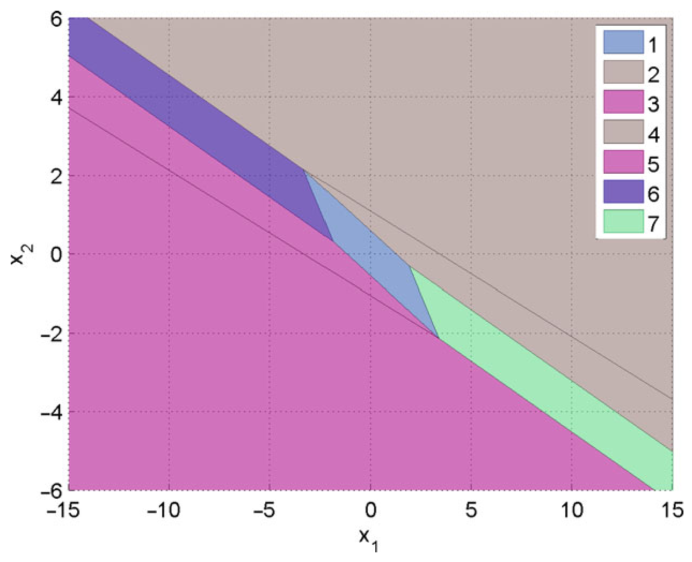

> Image description: A mathematical plot titled "Explicit MPC solution for the double integrator example" displays a two-dimensional phase space with $x_1$ on the horizontal axis and $x_2$ on the vertical axis. The axes range from approximately $-15$ to $15$ for $x_1$ and $-6$ to $6$ for $x_2$. The plot illustrates the feasible control regions for an Explicit Model Predictive Control (MPC) solution, partitioned into seven distinct polygonal regions. Each region is assigned a unique color and a corresponding number in the legend: 1. Blue 2. Light grey 3. Magenta 4. Brown 5. Dark magenta 6. Purple 7. Light green These numbered regions represent different control laws or optimal control actions applied to a double integrator system based on the state $(x_1, x_2)$. The regions are formed by the intersection of multiple linear inequality constraints, creating a piecewise affine control surface characteristic of explicit MPC.
Explicit Model Predictive Control, Fig. 1 Explicit MPC solution for the double integrator example

the value function $V^{*}: X_{f} \mapsto \mathbb{R}$ associating with every $x \in X_{f}$ the corresponding optimal value of (3) is continuous, convex, and piecewise quadratic.

An immediate corollary is that the explicit version of the MPC control law $u$ in (4), being the first $n_{u}$ components of vector $z(x)$, is also a continuous and piecewise-affine state-feedback law defined over a partition of the set $X_{f}$ of states into $M$ polyhedral cells;

$$
u(x)=\left\{\begin{array}{c}
F_{1} x+g_{1} \text { if } H_{1} x \leq K_{1}  \tag{5}\\
\vdots \quad \vdots \\
F_{M} x+g_{M} \text { if } H_{M} x \leq K_{M}
\end{array}\right.
$$

An example of such a partition is depicted in Fig. 1. The explicit representation (5) has mapped the MPC law (4) into a lookup table of linear gains, meaning that for each given $x$, the values computed by solving the QP (3) online and those obtained by evaluating (5) are exactly the same.

## Multiparametric QP Algorithms

A few algorithms have been proposed in the literature to solve the mpQP problem (3). All of them
construct the solution by exploiting the Karush-Kuhn-Tucker (KKT) conditions for optimality:

$$
\begin{align*}
& H z+F x+G^{\prime} \lambda=0  \tag{6a}\\
& \lambda_{i}\left(G^{i} z-W^{i}-S^{i} x\right)=0, \forall i=1, \ldots, q  \tag{6b}\\
& G z \leq W+S x  \tag{6c}\\
& \lambda \geq 0 \tag{6~d}
\end{align*}
$$

where $\lambda \in \mathbb{R}^{q}$ is the vector of Lagrange multipliers. For the strictly convex QP (3), conditions (6) are necessary and sufficient to characterize optimality.

An mpQP algorithm starts by fixing an arbitrary starting parameter vector $x_{0} \in \mathbb{R}^{m}$ (e.g., the origin $x_{0}=0$ ), solving the $\mathrm{QP}(3)$ to get the optimal solution $z\left(x_{0}\right)$, and identifying the subset

$$
\begin{equation*}
\tilde{G} z(x)=\tilde{S} x+\tilde{W} \tag{7a}
\end{equation*}
$$

of all constraints (6c) that are active at $z\left(x_{0}\right)$ and the remaining inactive constraints:

$$
\begin{equation*}
\hat{G} z(x) \leq \hat{S} x+\hat{W} \tag{7b}
\end{equation*}
$$

<!-- source_pdf_page: 432 -->
Correspondingly, in view of the complementarity condition (6b), the vector of Lagrange multipliers is split into two subvectors:

$$
\begin{align*}
& \tilde{\lambda}(x) \geq 0  \tag{8a}\\
& \hat{\lambda}(x)=0 \tag{8b}
\end{align*}
$$

We assume for simplicity that the rows of $\tilde{G}$ are linearly independent. From (6a), we have the relation

$$
\begin{equation*}
z(x)=-H^{-1}\left(F x+\tilde{G}^{\prime} \tilde{\lambda}(x)\right) \tag{9}
\end{equation*}
$$

that, when substituted into (7a), provides

$$
\begin{equation*}
\tilde{\lambda}(x)=-\tilde{M}\left(\tilde{W}+\left(\tilde{S}+\tilde{G} H^{-1} F\right) x\right) \tag{10}
\end{equation*}
$$

where $\tilde{M}=\tilde{G}^{\prime}\left(\tilde{G} H^{-1} \tilde{G}^{\prime}\right)^{-1}$ and, by substitution in (9),

$$
\begin{equation*}
z(x)=H^{-1}\left(\tilde{M} \tilde{W}+\tilde{M}\left(\tilde{S}+\tilde{G} H^{-1} F\right) x-F x\right) \tag{11}
\end{equation*}
$$

The solution $z(x)$ provided by (11) is the correct one for all vectors $x$ such that the chosen combination of active constraints remains optimal. Such all vectors $x$ are identified by imposing constraints (7b) and (8a) on $z(x)$ and $\tilde{\lambda}(x)$, respectively, that leads to constructing the polyhedral set ("critical region"):

$$
\begin{equation*}
C R_{0}=\left\{x \in \mathbb{R}^{n}: \tilde{\lambda}(x) \geq 0, \hat{G} z(x) \leq \hat{W}+\hat{S} x\right\} \tag{12}
\end{equation*}
$$

Different mpQP solvers were proposed to cover the rest $X \backslash C R_{0}$ of the parameter set with other critical regions corresponding to new combinations of active constraints. The most efficient methods exploit the so-called "facet-to-facet" property of the multiparametric solution (Spjøtvold et al. 2006) to identify neighboring regions as in Tøndel et al. (2003a) and Baotić (2002). Alternative methods were proposed in Jones and Morari (2006), based on looking at (6) as a multiparametric linear complementarity problem, and in Patrinos and Sarimveis (2010), which provides algorithms for determining all neighboring regions even in the case the facet-to-facet property does not hold.

All methods handle the case of degeneracy, which may happen for some combinations of active constraints that are linearly dependent, that is, the associated matrix $\tilde{G}$ has no full row rank (in this case, $\tilde{\lambda}(x)$ may not be uniquely defined).

## Extensions

The explicit approach described earlier can be extended to the following MPC setting:

$$
\begin{align*}
& \min _{z} \sum_{k=0}^{N-1} \frac{1}{2}\left(y_{k}-\mathbf{r}_{\mathbf{k}}\right)^{\prime} Q_{y}\left(y_{k}-\mathbf{r}_{\mathbf{k}}\right)+\frac{1}{2} \Delta u_{k}^{\prime} R_{\Delta} \Delta u_{k} \\
& \quad+\left(u_{k}-\mathbf{u}_{\mathbf{k}}^{\mathbf{r}}\right)^{\prime} R\left(u_{k}-\mathbf{u}_{\mathbf{k}}^{\mathbf{r}}\right)^{\prime}+\rho_{\epsilon} \epsilon^{2}  \tag{13a}\\
& \text { s.t. } x_{k+1}=A x_{k}+B u_{k}+B_{v} \mathbf{v}_{\mathbf{k}}  \tag{13b}\\
& y_{k}=C x_{k}+D_{u} u_{k}+D_{v} \mathbf{v}_{\mathbf{k}}  \tag{13c}\\
& u_{k}=u_{k-1}+\Delta u_{k}, k=0, \ldots, N-1  \tag{13~d}\\
& \Delta u_{k}=0, k=N_{u}, \ldots, N-1  \tag{13e}\\
& \mathbf{u}_{\min }^{\mathbf{k}} \leq u_{k} \leq \mathbf{u}_{\max }^{\mathbf{k}}, k=0, \ldots, N_{u}-1(13 \mathrm{c})  \tag{13f}\\
& \Delta \mathbf{u}_{\min }^{\mathbf{k}} \leq \Delta u_{k} \leq \Delta \mathbf{u}_{\max }^{\mathbf{k}}, k=0, \ldots, N_{u}-1  \tag{13~g}\\
& \mathbf{y}_{\min }^{\mathbf{k}}-\epsilon V_{\min } \leq y_{k} \leq \mathbf{y}_{\max }^{\mathbf{k}}+\epsilon V_{\max }  \tag{13~h}\\
& k=0, \ldots, N_{c}-1
\end{align*}
$$

where $R_{\Delta}$ is a symmetric and positive definite matrix; matrices $Q_{y}$ and $R$ are symmetric and positive semidefinite; $\mathbf{v}_{\mathbf{k}}$ is a vector of measured disturbances; $y_{k}$ is the output vector; $\mathbf{r}_{\mathbf{k}}$ its corresponding reference to be tracked; $\Delta u_{k}$ is the vector of input increments; $\mathbf{u}_{\mathbf{k}}^{\mathbf{r}}$ is the input reference; $\mathbf{u}_{\text {min }}^{\mathbf{k}}, \mathbf{u}_{\text {max }}^{\mathbf{k}}, \Delta \mathbf{u}_{\text {min }}^{\mathbf{k}}, \Delta \mathbf{u}_{\text {max }}^{\mathbf{k}}, \mathbf{y}_{\text {min }}^{\mathbf{k}}, \mathbf{y}_{\text {max }}^{\mathbf{k}}$ are bounds; and $N, N_{u}, N_{c}$ are, respectively, the prediction, control, and constraint horizons. The extra variable $\epsilon$ is introduced to soften output constraints, penalized by the (usually large) weight $\rho_{\epsilon}$ in the cost function (13a).

Everything marked in bold-face in (13), together with the command input $u_{-1}$ applied at the previous sampling step and the current state $x$, can be treated as a parameter with respect to

<!-- source_pdf_page: 433 -->
which to solve the mpQP problem and obtain the explicit form of the MPC controller. For example, for a tracking problem with no anticipative action $\left(\mathbf{r}_{\mathbf{k}} \equiv r_{0}, \forall k=0, \ldots, N-1\right)$, no measured disturbance, and fixed upper and lower bounds, the explicit solution is a continuous piecewise affine function of the parameter vector $\left[\begin{array}{c}x \\ r_{0} \\ u_{-1}\end{array}\right]$. Note that prediction models and/or weight matrices in (13) cannot be treated as parameters to maintain the mpQP formulation (3).

## Linear MPC Based on Convex Piecewise-Affine Costs

A similar setting can be repeated for MPC problems based on linear prediction models and convex piecewise-affine costs, such as 1 - and $\infty$-norms. In this case, the MPC problem is mapped into a multiparametric linear programming (mpLP) problem, whose solution is again continuous and piecewise-affine with respect to the vector of parameters. For details, see Bemporad et al. (2002a).

## Robust MPC

Explicit solutions to min-max MPC problems that provide robustness with respect to additive and/or multiplicative unknown-but-bounded uncertainty were proposed in Bemporad et al. (2003), based on a combination of mpLP and dynamic programming. Again the solution is piecewise affine with respect to the state vector.

## Hybrid MPC

An MPC formulation based on 1- or $\infty$-norms and hybrid dynamics expressed in mixed-logical dynamical (MLD) form can be solved explicitly by treating the optimization problem associated with MPC as a multiparametric mixed integer linear programming (mpMILP) problem. The solution is still piecewise affine but may be discontinuous, due to the presence of binary variables (Bemporad et al. 2000). A better approach based on dynamic programming combined with mpLP (or mpQP ) was proposed in Borrelli et al. (2005) for hybrid systems in piecewise-affine (PWA) dynamical form and linear (or quadratic) costs.

## Applicability of Explicit MPC

## Complexity of the Solution

The complexity of the solution is given by the number $M$ of regions that form the explicit solution (5), dictating the amount of memory to store the parametric solution ( $F_{i}, G_{i}, H_{i}, K_{i}$, $i=1, \ldots, M$ ), and the worst-case execution time required to compute $F_{i} x+G_{i}$ once the problem of identifying the index $i$ of the region $\left\{x: H_{i} x \leq K_{i}\right\}$ containing the current state $x$ is solved (which usually takes most of the time). The latter is called the "point location problem," and a few methods have been proposed to solve the problem more efficiently than searching linearly through the list of regions (see, e.g., the tree-based approach of Tøndel et al. 2003b).

An upper bound to $M$ is $2^{q}$, which is the number of all possible combinations of active constraints. In practice, $M$ is much smaller than $2^{q}$, as most combinations are never active at optimality for any of the vectors $x$ (e.g., lower and upper limits on an actuation signal cannot be active at the same time, unless they coincide). Moreover, regions in which the first $n_{u}$ component of the multiparametric solution $z(x)$ is the same can be joined together, provided that their union is a convex set (an optimal merging algorithm was proposed by Geyer et al. (2008) to get a minimal number $M$ of partitions). Nonetheless, the complexity of the explicit MPC law typically grows exponentially with the number $q$ of constraints. The number $m$ of parameters is less critical and mainly affects the number of elements to be stored in memory (i.e., the number of columns of matrices $F_{i}, H_{i}$ ). The number $n$ of free variables also affects the number $M$ of regions, mainly because they are usually upper and lower bounded.

## Computer-Aided Tools

The Model Predictive Control Toolbox (Bemporad et al. 2014) offers functions for designing explicit MPC controllers in MATLAB since 2014. Other tools exist such as the Hybrid Toolbox (Bemporad 2003) and the Multi-Parametric Toolbox (Kvasnica et al. 2006).

<!-- source_pdf_page: 434 -->
## Summary and Future Directions

Explicit MPC is a powerful tool to convert an MPC design into an equivalent control law that can be implemented as a lookup table of linear gains. Whether the explicit form is preferable to solving the QP problem online depends on available CPU time, data memory, and program memory and other practical considerations. Although suboptimal methods have been proposed to reduce the complexity of the control law, still the explicit MPC approach remains convenient for relatively small problems (such as one or two command inputs, short control and constraint horizons, up to ten states). For larger problems, and/or problems that are linear time varying, on line QP solution methods tailored to embedded MPC may be preferable.

## Cross-References

- Model-Predictive Control in Practice
- Nominal Model-Predictive Control
- Optimization Algorithms for Model Predictive Control

## Recommended Reading

For getting started in explicit MPC, we recommend reading the paper by Bemporad et al. (2002b) and the survey paper Alessio and Bemporad (2009). Hands-on experience using one of the MATLAB tools listed above is also useful for fully appreciating the potentials and limitations of explicit MPC. For understanding how to program a good multiparametric QP solver, the reader is recommended to take the approach of Tøndel et al. (2003a) and Spjøtvold et al. (2006) or, in alternative, of Patrinos and Sarimveis (2010) or Jones and Morari (2006).

## Bibliography

Alessio A, Bemporad A (2009) A survey on explicit model predictive control. In: Magni L, Raimondo DM, Allgower F (eds) Nonlinear model predictive control:
towards new challenging applications. Lecture notes in control and information sciences, vol 384. Springer, Berlin/Heidelberg, pp 345-369
Baotić M (2002) An efficient algorithm for multiparametric quadratic programming. Tech. Rep. AUT02-05, Automatic Control Institute, ETH, Zurich
Bemporad A (2003) Hybrid toolbox - user's guide. http:// cse.lab.imtlucca.it/~bemporad/hybrid/toolbox
Bemporad A, Borrelli F, Morari M (2000) Piecewise linear optimal controllers for hybrid systems. In: Proceedings of American control conference, Chicago, pp 11901194
Bemporad A, Borrelli F, Morari M (2002a) Model predictive control based on linear programming - the explicit solution. IEEE Trans Autom Control 47(12):19741985
Bemporad A, Morari M, Dua V, Pistikopoulos E (2002b) The explicit linear quadratic regulator for constrained systems. Automatica 38(1):3-20
Bemporad A, Borrelli F, Morari M (2003) Min-max control of constrained uncertain discrete-time linear systems. IEEE Trans Autom Control 48(9):1600-1606
Bemporad A, Morari M, Ricker N (2014) Model predictive control toolbox for matlab - user's guide. The Mathworks, Inc., http://www.mathworks.com/access/ helpdesk/help/toolbox/mpc/
Borrelli F, Baotić M, Bemporad A, Morari M (2005) Dynamic programming for constrained optimal control of discrete-time linear hybrid systems. Automatica 41(10):1709-1721
Borrelli F, Bemporad A, Morari M (2011, in press) Predictive control for linear and hybrid systems. Cambridge University Press
Geyer T, Torrisi F, Morari M (2008) Optimal complexity reduction of polyhedral piecewise affine systems. Automatica 44:1728-1740
Jones C, Morari M (2006) Multiparametric linear complementarity problems. In: Proceedings of the 45th IEEE conference on decision and control, San Diego, pp 5687-5692
Kvasnica M, Grieder P, Baotić M (2006) Multi parametric toolbox (MPT). http://control.ee.ethz.ch/~mpt/
Mayne D, Rawlings J (2009) Model predictive control: theory and design. Nob Hill Publishing, LCC, Madison
Patrinos P, Bemporad A (2014) An accelerated dual gradient-projection algorithm for embedded linear model predictive control. IEEE Trans Autom Control 59(1):18-33
Patrinos P, Sarimveis H (2010) A new algorithm for solving convex parametric quadratic programs based on graphical derivatives of solution mappings. Automatica 46(9): 1405-1418
Ricker N (1985) Use of quadratic programming for constrained internal model control. Ind Eng Chem Process Des Dev 24(4):925-936
Spjøtvold J, Kerrigan E, Jones C, Tøndel P, Johansen TA (2006) On the facet-to-facet property of solutions to convex parametric quadratic programs. Automatica 42(12):2209-2214

<!-- source_pdf_page: 435 -->
Tøndel P, Johansen TA, Bemporad A (2003) An algorithm for multi-parametric quadratic programming and explicit MPC solutions. Automatica 39(3):489-497
Tøndel P, Johansen TA, Bemporad A (2003b) Evaluation of piecewise affine control via binary search tree. Automatica 39(5):945-950
Wang Y, Boyd S (2010) Fast model predictive control using online optimization. IEEE Trans Control Syst Technol 18(2):267-278

## Extended Kalman Filters

Frederick E. Daum Raytheon Company, Woburn, MA, USA

## Synonyms

EKF

#### Abstract

The extended Kalman filter (EKF) is the most popular estimation algorithm in practical applications. It is based on a linear approximation to the Kalman filter theory. There are thousands of variations of the basic EKF design, which are intended to mitigate the effects of nonlinearities, non-Gaussian errors, ill-conditioning of the covariance matrix and uncertainty in the parameters of the problem.

## Keywords

Estimation; Nonlinear filters

The extended Kalman filter (EKF) is by far the most popular nonlinear filter in practical engineering applications. It uses a linear approximation to the nonlinear dynamics and measurements and exploits the Kalman filter theory, which is optimal for linear and Gaussian problems; Gelb (1974) is the most accessible but thorough book on the EKF. The real-time computational complexity of the EKF is rather modest; for example, one can run an EKF
with high-dimensional state vectors ( $\mathrm{d}=$ several hundreds) in real time on a single microprocessor chip. The computational complexity of the EKF scales as the cube of the dimension of the state vector (d) being estimated. The EKF often gives good estimation accuracy for practical nonlinear problems, although the EKF accuracy can be very poor for difficult nonlinear non-Gaussian problems. There are many different variations of EKF algorithms, most of which are intended to improve estimation accuracy. In particular, the following types of EKFs are common in engineering practice: (1) second-order Taylor series expansion of the nonlinear functions, (2) iterated measurement updates that recompute the point at which the first order Taylor series is evaluated for a given measurement, (3) secondorder iterated (i.e., combination of items 1 and 2), (4) special coordinate systems (e.g., Cartesian, polar or spherical, modified polar or spherical, principal axes of the covariance matrix ellipse, hybrid coordinates, quaternions rather than Euler angles, etc.), (5) preferred order of processing sequential scalar measurement updates, (6) decoupled or partially decoupled or quasi-decoupled covariance matrices, and many more variations. In fact, there is no such thing as "the" EKF, but rather there are thousands of different versions of the EKF. There are also many different versions of the Kalman filter itself, and all of these can be used to design EKFs as well. For example, there are many different equations to update the Kalman filter error covariance matrices with the intent of mitigating ill-conditioning and improving robustness, including (1) square-root factorization of the covariance matrix, (2) information matrix update, (3) square-root information update, (4) Joseph's robust version of the covariance matrix update, (5) at least three distinct algebraic versions of the covariance matrix update, as well as hybrids of the above.

Many of the good features of the Kalman filter are also enjoyed by the EKF, but unfortunately not all. For example, we have a very good theory of stability for the Kalman filter, but there is no theory that guarantees that an EKF will be stable in practical applications. The only method

<!-- source_pdf_page: 436 -->
to check whether the EKF is stable is to run Monte Carlo simulations that cover the relevant regions in state space with the relevant measurement parameters (e.g., data rate and measurement accuracy). Secondly, the Kalman filter computes the theoretical error covariance matrix, but there is no guarantee that the error covariance matrix computed by the EKF approximates the actual filter errors, but rather the EKF covariance matrix could be optimistic by orders of magnitude in real applications. Third, the numerical values of the process noise covariance matrix can be computed theoretically for the Kalman filter, but there is no guarantee that these will work well for the EKF, but rather engineers typically tune the process noise covariance matrix using Monte Carlo simulations or else use a heuristic adaptive process (e.g., IMM). All of these short-comings of the EKF compared with the Kalman filter theory are due to a myriad of practical issues, including (1) nonlinearities in the dynamics or measurements, (2) non-Gaussian measurement errors, (3) unmodeled measurement error sources (e.g., residual sensor bias), (4) unmodeled errors in the dynamics, (5) data association errors, (6) unresolved measurement data, (7) ill-conditioning of the covariance matrix, etc. The actual estimation accuracy of an EKF can only be gauged by Monte Carlo simulations over the relevant parameter space.

The actual performance of an EKF can depend crucially on the specific coordinate system that is used to represent the state vector. This is extremely well known in practical engineering applications (e.g., see Mehra 1971; Stallard 1991; Miller 1982; Markley 2007; Daum 1983; Schuster 1993). Intuitively, this is because the dynamics and measurement equations can be exactly linear in one coordinate system but not another; this is very easy to see; start with dynamics and measurements that are exactly linear in Cartesian coordinates and transform to polar coordinates and we will get highly nonlinear equations. Likewise, we can have approximately linear dynamics and measurements in a specific coordinate system but highly nonlinear equations in another coordinate system. But in theory, the optimal estimation accuracy does not depend on
the coordinate system. Moreover, in math and physics, coordinate-free methods are preferred, owing to their greater generality and simplicity and power. The physics does not depend on the specific coordinate system; this is essentially a definition of what "physics" means, and it has resulted in great progress in physics over the last few hundred years (e.g., general relativity, gauge invariance in quantum field theory, Lorentz invariance in special relativity, as well as a host of conservation laws in classical mechanics that are explained by Noether's theorem which relates invariance to conserved quantities). Similarly in math, coordinate-free methods have been the royal road to progress over the last 100 years but not so for practical engineering of EKFs, because EKFs are approximations rather than being exact, and the accuracy of the EKF approximation depends crucially on the specific coordinate system used. Moreover, the effect of ill-conditioning of the covariance matrices in EKFs depends crucially on the specific coordinate system used in the computer; for example, if we could compute the EKF in principal coordinates, then the covariance matrices would be diagonal, and there would be no effect of ill-conditioning, despite enormous condition numbers of the covariance matrices. Surprisingly, these two simple points about coordinate systems are still not well understood by many researchers in nonlinear filtering.

## Cross-References

- Estimation, Survey on
- Kalman Filters
- Nonlinear Filters
- Particle Filters

## Bibliography

Crisan D, Rozovskii B (eds) (2011) The Oxford handbook of nonlinear filtering. Oxford University Press, Oxford/New York
Daum FE, Fitzgerald RJ (1983) Decoupled Kalman filters for phased array radar tracking. IEEE Trans Autom Control 28:269-283

<!-- source_pdf_page: 437 -->
Gelb A et al (1974) Applied optimal estimation. MIT, Cambridge
Markley FL, Crassidis JL, Cheng Y (2007) Nonlinear attitude filtering methods. AIAA J 30:12-28
Mehra R (1971) A comparison of several nonlinear filters for reentry vehical tracking. IEEE Trans Autom Control 16:307-310
Miller KS, Leskiw D (1982) Nonlinear observations with radar measurements. IEEE Trans Aerosp Electron Syst 2:192-200
Ristic B, Arulampalam S, Gordon N (2004) Beyond the Kalman filter. Artech House, Boston
Schuster MD (1993) A survey of attitude representations. J Astronaut Sci 41:439-517
Sorenson H (ed) (1985) Kalman filtering: theory and application. IEEE, New York
Stallard T (1991) Angle-only tracking filter in modified spherical coordinates. AIAA J Guid 14:694-696
Tanizaki H (1996) Nonlinear filters, 2nd edn. Springer, Berlin/New York

## Extremum Seeking Control

Miroslav Krstic
Department of Mechanical and Aerospace
Engineering, University of California, San
Diego, La Jolla, CA, USA

#### Abstract

Extremum seeking (ES) is a method for real-time non-model-based optimization. Though ES was invented in 1922, the "turn of the twenty-first century" has been its golden age, both in terms of the development of theory and in terms of its adoption in industry and in fields outside of control engineering. This entry overviews basic gradientand Newton-based versions of extremum seeking with periodic and stochastic perturbation signals.

## Keywords

Gradient climbing; Newton's method

## The Basic Idea of Extremum Seeking

Many versions of extremum seeking exist, with various approaches to their stability study (Krstic and Wang 2000; Liu and Krstic 2012; Tan et al.
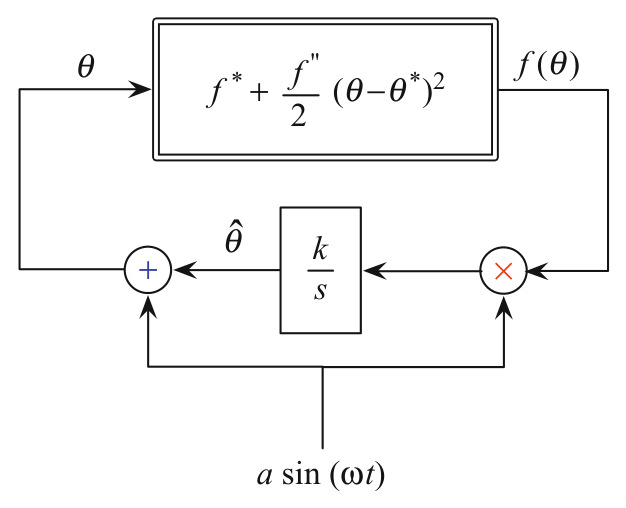

> Image description: A block diagram illustrates a simple perturbation-based Extremum Seeking Control (ESC) scheme for a quadratic single-input map. At the top, a primary block represents the function $f(\theta) = f^{*} + \frac{f''}{2}(\theta - \theta^{*})^2$. The input to this block is $\theta$, and the output is $f(\theta)$. The feedback loop contains several components. The output $f(\theta)$ is multiplied by an external sinusoidal signal, $a \sin(\omega t)$, at a multiplication node (marked with an $\times$). The result is passed through an integrator block with the transfer function $k/s$, yielding the signal $\hat{\theta}$. This signal $\hat{\theta}$ is added to the same sinusoidal signal $a \sin(\omega t)$ at an addition node (marked with a $+$). The sum of these signals is fed back as the input $\theta$ to the primary block, completing the closed-loop system. All parameters except the structure of the quadratic map are noted as unknown.

Extremum Seeking Control, Fig. 1 The simplest perturbation-based extremum seeking scheme for a quadratic single-input map $f(\theta)=f^{*}+\frac{f^{\prime \prime}}{2}\left(\theta-\theta^{*}\right)^{2}$, where $f^{*}, f^{\prime \prime}, \theta^{*}$ are all unknown. The user has to only know the sign of $f^{\prime \prime}$, namely, whether the quadratic map has a maximum or a minimum, and has to choose the adaptation gain $k$ such that $\operatorname{sgn} k=-\operatorname{sgn} f^{\prime \prime}$. The user has to also choose the frequency $\omega$ as relatively large compared to $a, k$, and $f^{\prime \prime}$
2006). The most common version employs perturbation signals for the purpose of estimating the gradient of the unknown map that is being optimized. To understand the basic idea of extremum seeking, it is best to first consider the case of a static single-input map of the quadratic form, as shown in Fig. 1.

Three different thetas appear in Fig. 1: $\theta^{*}$ is the unknown optimizer of the map, $\hat{\theta}(t)$ is the real-time estimate of $\theta^{*}$, and $\theta(t)$ is the actual input into the map. The actual input $\theta(t)$ is based on the estimate $\hat{\theta}(t)$ but is perturbed by the signal $a \sin (\omega t)$ for the purpose of estimating the unknown gradient $f^{\prime \prime} \cdot\left(\theta-\theta^{*}\right)$ of the map $f(\theta)$. The sinusoid is only one choice for a perturbation signal - many other perturbations, from square waves to stochastic noise, can be used in lieu of sinusoids, provided they are of zero mean. The estimate $\hat{\theta}(t)$ is generated with the integrator $k / s$ with the adaptation gain $k$ controlling the speed of estimation.

The ES algorithm is successful if the error between the estimate $\hat{\theta}(t)$ and the unknown $\theta^{*}$, namely, the signal

$$
\begin{equation*}
\tilde{\theta}(t)=\hat{\theta}(t)-\theta^{*} \tag{1}
\end{equation*}
$$

<!-- source_pdf_page: 438 -->
converges towards zero. Based on Fig. 1, the estimate is governed by the differential equation $\dot{\hat{\theta}}= k \sin (\omega t) f(\theta)$, which means that the estimation error is governed by

$$
\begin{equation*}
\frac{\mathrm{d} \tilde{\theta}}{\mathrm{~d} t}=k a \sin (\omega t)\left[f^{*}+\frac{f^{\prime \prime}}{2}(\tilde{\theta}+a \sin (\omega t))^{2}\right] \tag{2}
\end{equation*}
$$

Expanding the right-hand side, one obtains

$$
\begin{align*}
\frac{\mathrm{d} \tilde{\theta}(t)}{\mathrm{d} t}= & k a f^{*} \underbrace{\sin (\omega t)}_{\text {mean }=0}+k a^{3} \frac{f^{\prime \prime}}{2} \underbrace{\sin ^{3}(\omega t)}_{\text {mean }=0} \\
& +k a \frac{f^{\prime \prime}}{2} \underbrace{\sin (\omega t)}_{\text {fast, mean }=0} \underbrace{\tilde{\theta}(t)^{2}}_{\text {slow }} \\
& +k a^{2} f^{\prime \prime} \underbrace{\sin ^{2}(\omega t)}_{\text {fast, mean }=1 / 2} \underbrace{\tilde{\theta}(t)}_{\text {slow }} \tag{3}
\end{align*}
$$

A theoretically rigorous time-averaging procedure allows to replace the above sinusoidal signals by their means, yielding the "average system"

$$
\begin{equation*}
\frac{\mathrm{d} \tilde{\theta}_{\text {ave }}}{\mathrm{d} t}=\frac{\overbrace{k f^{\prime \prime}}^{<0} a^{2}}{2} \tilde{\theta}_{\text {ave }} \tag{4}
\end{equation*}
$$

which is exponentially stable. The averaging theory guarantees that there exists sufficiently large $\omega$ such that, if the initial estimate $\hat{\theta}(0)$ is sufficiently close to the unknown $\theta^{*}$,

$$
\begin{align*}
\left|\theta(t)-\theta^{*}\right| \leq & \left|\theta(0)-\theta^{*}\right| \mathrm{e}^{\frac{k f^{\prime \prime} a^{2}}{2} t}+O\left(\frac{1}{\omega}\right) \\
& +a, \quad \forall t \geq 0 \tag{5}
\end{align*}
$$

For the user, the inequality (5) guarantees that, if $a$ is chosen small and $\omega$ is chosen large, the input $\theta(t)$ exponentially converges to a small interval around the unknown $\theta^{*}$ and, consequently, the output $f(\theta(t))$ converges to the vicinity of the optimal output $f^{*}$.

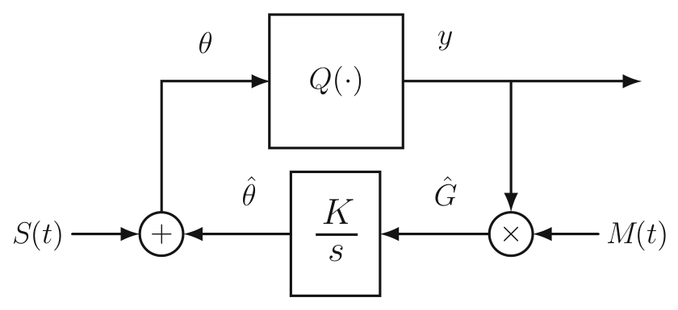

> Image description: This block diagram illustrates an Extremum Seeking Control (ESC) algorithm for a multivariable map $y = Q(\theta)$. The system operates in a feedback loop architecture. At the top, the process plant is represented by a rectangular block labeled $Q(\cdot)$, which takes the input vector $\theta$ and produces the output $y$. The output $y$ is sent to the right and also directed down into a multiplication junction. In the feedback path, the signal from the multiplication junction, labeled $\hat{G}$, is fed into a block containing the transfer function $\frac{K}{s}$ (representing an integrator with gain $K$), resulting in an output $\hat{\theta}$. This signal $\hat{\theta}$ is then sent to a summation junction. At this junction, it is added to the additive perturbation vector signal $S(t)$ to produce the updated input vector $\theta$. The multiplicative demodulation signal $M(t)$ is also fed into the multiplication junction. The overall loop aims to optimize the map $Q(\cdot)$ through these continuous adjustments.
Extremum Seeking Control, Fig. 2 Extremum seeking algorithm for a multivariable map $y=Q(\theta)$, where $\theta$ is the input vector $\theta=\left[\theta_{1}, \theta_{2}, \cdots, \theta_{n}\right]^{T}$. The algorithm employs the additive perturbation vector signal $S(t)$ given in (6) and the multiplicative demodulation vector signal $M(t)$ given in (7)

## ES for Multivariable Static Maps

For static maps, ES extends in a straightforward manner from the single-input case shown in Fig. 1 to the multi-input case shown in Fig. 2.

The algorithm measures the scalar signal $y(t)=Q(\theta(t))$, where $Q(\cdot)$ is an unknown map whose input is the vector $\theta=\left[\theta_{1}, \theta_{2}, \cdots, \theta_{n}\right]^{T}$. The gradient is estimated with the help of the signals

$$
S(t)=\left[\begin{array}{lll}
a_{1} \sin \left(\omega_{1} t\right) & \cdots & a_{n} \sin \left(\omega_{n} t\right)
\end{array}\right]^{T}
$$

$$
M(t)=\left[\begin{array}{lll}
\frac{2}{a_{1}} \sin \left(\omega_{1} t\right) & \cdots & \frac{2}{a_{n}} \sin \left(\omega_{n} t\right) \tag{6}
\end{array}\right]^{T}
$$

with nonzero perturbation amplitudes $a_{i}$ and with a gain matrix $K$ that is diagonal. To guarantee convergence, the user should choose $\omega_{i} \neq \omega_{j}$. This is a key condition that differentiates the multi-input case from the single-input case. In addition, for simplicity in the convergence analysis, the user should choose $\omega_{i} / \omega_{j}$ as rational and $\omega_{i}+\omega_{j} \neq \omega_{k}$ for distinct $i, j$, and $k$.

If the unknown map is quadratic, namely, $Q(\theta)=Q^{*}+\frac{1}{2}\left(\theta-\theta^{*}\right)^{T} H\left(\theta-\theta^{*}\right)$, the averaged system is

$$
\begin{equation*}
\dot{\tilde{\theta}}_{\text {ave }}=K H \tilde{\theta}_{\text {ave }}, \quad H=\text { Hessian } \tag{8}
\end{equation*}
$$

<!-- source_pdf_page: 439 -->
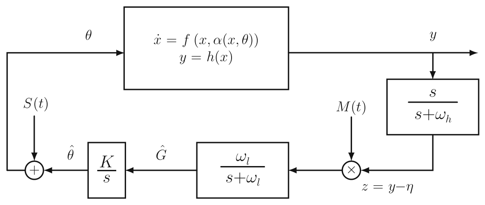

> Image description: A block diagram illustrating an Extremum Seeking (ES) control algorithm, labeled as "Fig. 3". The diagram shows a nonlinear plant represented by a large central block with the differential equations $\dot{x} = f(x, \alpha(x, \theta))$ and $y = h(x)$. The input to the plant is the parameter $\theta$. The feedback loop consists of several components: the output $y$ is fed into a high-pass filter block $\frac{s}{s + \omega_h}$ and a subtraction junction where it is offset by $\eta$ to produce $z = y - \eta$. This signal $z$ is multiplied by an external signal $M(t)$ and passed through a low-pass filter $\frac{\omega_l}{s + \omega_l}$. The output, labeled $\hat{G}$, enters an integrator block $\frac{K}{s}$ to produce $\hat{\theta}$. Finally, $\hat{\theta}$ is added to an external signal $S(t)$ to generate the new parameter input $\theta$. The loop structure represents an adaptive control mechanism designed to optimize the output $y$ by perturbing the parameter $\theta$.

Extremum Seeking Control, Fig. 3 The ES algorithm in the presence of dynamics with an equilibrium map $\theta \mapsto y$ that satisfies the same conditions as in the static case. If the dynamics are stable and the user employs parameters in the ES algorithm that make the algorithm dynamics

If, for example, the map $Q(\cdot)$ has a maximum that is locally quadratic (which implies $H= H^{T}<0$ ) and if the user chooses the elements of the diagonal gain matrix $K$ as positive, the ES algorithm is guaranteed to be locally convergent. However, the convergence rate depends on the unknown Hessian $H$. This weakness of the gradient-based ES algorithm is removed with the Newton-based ES algorithm.

A stochastic version of the algorithm in Fig. 2 also exists, in which $S(t)$ and $M(t)$ are replaced by

$$
S(\eta(t))=\left[a_{1} \sin \left(\eta_{1}(t)\right), \ldots, a_{n} \sin \left(\eta_{n}(t)\right)\right]^{T}
$$

$$
\begin{align*}
M(\eta(t))= & {\left[\frac{2}{a_{1}\left(1-e^{-q_{1}^{2}}\right)} \sin \left(\eta_{1}(t)\right), \ldots,\right.}  \tag{9}\\
& \left.\frac{2}{a_{n}\left(1-e^{-q_{n}^{2}}\right)} \sin \left(\eta_{n}(t)\right)\right]^{T} \tag{10}
\end{align*}
$$

where $\eta_{i}=\frac{q_{i} \sqrt{\varepsilon_{i}}}{\varepsilon_{i} s+1}\left[\dot{W}_{i}\right]$ and $\dot{W}_{i}$ are independent unity-intensity white noise processes.

## ES for Dynamic Systems

ES extends in a relatively straightforward manner from static maps to dynamic systems, provided the dynamics are stable and the algorithm's
slower than the dynamics of the plant, convergence is guaranteed (at least locally). The two filters are useful in the implementation to reduce the adverse effect of the perturbation signals on asymptotic performance but are not needed in the stability analysis
parameters are chosen so that the algorithm's dynamics are slower than those of the plant. The algorithm is shown in Fig. 3.

The technical conditions for convergence in the presence of dynamics are that the equilibria $x=l(\theta)$ of the system $\dot{x}=f(x, \alpha(x, \theta))$, where $\alpha(x, \theta)$ is the control law of an internal feedback loop, are locally exponentially stable uniformly in $\theta$ and that, given the output map $y=h(x)$, there exists at least one $\theta^{*} \in \mathbb{R}^{n}$ such that $\frac{\partial}{\partial \theta}(h \circ l)\left(\theta^{*}\right)=0$ and $\frac{\partial^{2}}{\partial \theta^{2}}(h \circ l)\left(\theta^{*}\right)= H<0, H=H^{T}$.

The stability analysis in the presence of dynamics employs both averaging and singular perturbations, in a specific order. The design guidelines for the selection of the algorithm's parameters follow the analysis. Though the guidelines are too lengthy to state here, they ensure that the plant's dynamics are on a fast time scale, the perturbations are on a medium time scale, and the ES algorithm is on a slow time scale.

## Newton ES Algorithm for Static Map

A Newton version of the ES algorithm, shown in Fig. 4, ensures that the convergence rate be user assignable, rather than being dependent on the unknown Hessian of the map.

The elements of the demodulating matrix $N(t)$ for generating the estimate of the Hessian are given by

<!-- source_pdf_page: 440 -->
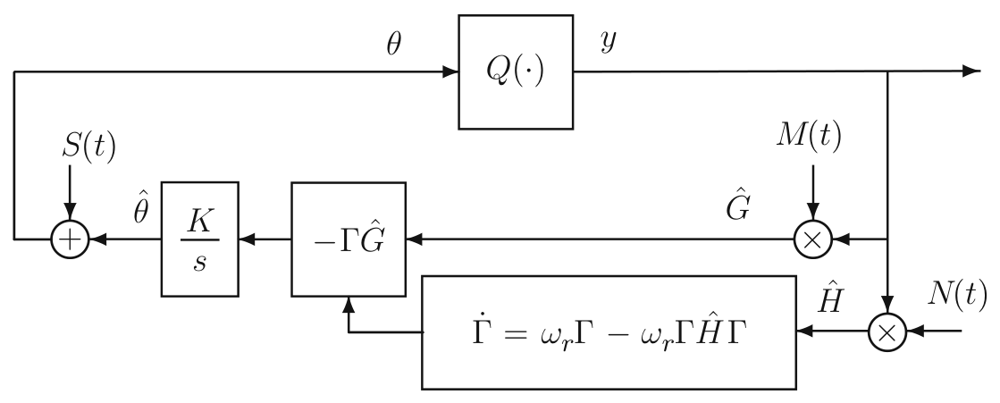

> Image description: A block diagram illustrating a Newton-based Extremum Seeking (ES) algorithm for a static map. The system structure is depicted through interconnected functional blocks and signal flows. A process variable $\theta$ is fed into a function block $Q(\cdot)$, producing the output $y$. The output $y$ is then processed by a multiplier receiving multiplicative excitation $M(t)$ to generate an estimate $\hat{G}$. This $\hat{G}$ is multiplied by a gain matrix $\Gamma$ within a block $-\Gamma \hat{G}$ and passed through an integrator $K/s$ to update $\theta$ based on the error signal $(\theta_{actual} - \hat{\theta})$. A feedback loop involves a Hessian estimation block, defined by the differential equation $\dot{\Gamma} = \omega_r \Gamma - \omega_r \Gamma \hat{H} \Gamma$. This block receives input from the product of $y$ and noise $N(t)$, modulated by $M(t)$, to estimate $\hat{H}$ (the Hessian). The diagram uses arrows to denote signal directionality, showing a dynamic adaptive control loop designed to optimize the performance of the static map $Q(\cdot)$.

Extremum Seeking Control, Fig. 4 A Newton-based ES algorithm for a static map. The multiplicative excitation $N(t)$ helps generate the estimate of Hessian $\frac{\partial^{2} Q(\theta)}{\partial \theta^{2}}$

$$
\begin{align*}
N_{i i}(t) & =\frac{16}{a_{i}^{2}}\left(\sin ^{2}\left(\omega_{i} t\right)-\frac{1}{2}\right), \\
N_{i j}(t) & =\frac{4}{a_{i} a_{j}} \sin \left(\omega_{i} t\right) \sin \left(\omega_{j} t\right) \tag{11}
\end{align*}
$$

For a quadratic map, the averaged system in error variables $\tilde{\theta}=\hat{\theta}-\theta^{*}, \tilde{\Gamma}=\Gamma-H^{-1}$ is

$$
\begin{gather*}
\frac{d \tilde{\theta}^{\text {ave }}}{d t}=-K \tilde{\theta}^{\text {ave }}-K \underbrace{\tilde{\Gamma}^{\text {ave }} H \tilde{\theta}^{\text {ave }}}_{\text {quadratic }}, \\
\frac{d \tilde{\Gamma}^{\text {ave }}}{d t}=-\omega_{r} \tilde{\Gamma}^{\text {ave }}-\omega_{r} \underbrace{\tilde{\Gamma}^{\text {ave }} H \tilde{\Gamma}^{\text {ave }}}_{\text {quadratic }} . \tag{12}
\end{gather*}
$$

Since the eigenvalues are determined by $K$ and $\omega_{r}$ and are therefore independent of the unknown $H$, the (local) convergence rate is user assignable.

## Further Reading on Extremum Seeking

Since the publication of the first proof of stability of extremum seeking (Krstic and Wang 2000), thousands of papers have been published
as $\hat{H}(t)=N(t) y(t)$. The Riccati matrix differential equation $\Gamma(t)$ generates an estimate of the Hessian's inverse matrix, avoiding matrix inversions of Hessian estimates that may be singular during the transient
on this topic, presenting further theoretical developments and applications of ES. A proof that expands the validity of extremum seeking from local to global stability was published in Tan et al. (2006). The book Liu and Krstic (2012) presents stochastic versions of the algorithms in this entry, where the sinusoids are replaced by filtered white noise perturbation signals.

## Cross-References

- Adaptive Control, Overview
- Optimal Deployment and Spatial Coverage

## Bibliography

Krstic M, Wang HH (2000) Stability of extremum seeking feedback for general dynamic systems. Automatica 36:595-601
Liu S-J, Krstic M (2012) Stochastic averaging and stochastic extremum seeking. Springer, London/New York
Tan Y, Nesic D, Mareels I (2006) On non-local stability properties of extremum seeking control. Automatica 42:889-903
