<!-- source_pdf_page: 441 -->
## Fault Detection and Diagnosis

Janos Gertler George Mason University, Fairfax, VA, USA

## Synonyms

## FDD

#### Abstract

The fundamental concepts and methods of fault detection and diagnosis are reviewed. Faults are defined and classified as additive or multiplicative. The model-free approach of alarm systems is described and critiqued. Residual generation, using the mathematical model of the plant, is introduced. The propagation of additive and multiplicative faults to the residuals is discussed, followed by a review of the effect of disturbances, noise, and model errors. Enhanced residuals (structured and directional) are introduced. The main residual generation techniques are briefly described, including direct consistency relations, parity space, and diagnostic observers. Principal component analysis and its application to fault detection and diagnosis are outlined. The article closes with some thoughts about future directions.

## Keywords

Consistency relations; Diagnostic observers; Fault detection; Fault diagnosis; Parity space; Principal component analysis; Residual generation

## Introduction

Faults are malfunctions of various elements of technical systems. Extreme cases of faults, called failures, are catastrophic breakdowns of the same. The technical systems (the plant) we are concerned with range from complex production systems (chemical plants, oil refineries, power stations) through major transportation equipment (airplanes, ships) to consumer machines (automobiles, home-heating systems, etc.). The faults may affect various parts of the main technical system (motors, pumps, storage tanks, pipelines) or devices interfacing the main technical system with computers providing for control, monitoring, and operator information. These latter include sensors (measuring devices) and actuators (devices acting on the process, such as valves).

The objective of fault detection is to determine and signal if there is a fault anywhere in the system. Fault diagnosis is aimed at providing more specific information about the fault; fault isolation is to pinpoint at the component(s) (sensors, actuators, or plant components) where the fault is located, while fault identification is to determine (estimate) the size of the fault and, in

<!-- source_pdf_page: 442 -->
some cases, the time of its arrival. With the ubiquitous presence of the computer, fault detection and diagnosis (FDD) is, in general, a function of the computer interfaced to the plant.

The simplest approaches to FDD consist of comparing individual plant measurements to preset limits, without utilizing any knowledge of the plant model (limit checking or alarm systems). More sophisticated techniques rely on an explicit mathematical model of the plant. They compare plant measurements to estimates obtained, from other measurements, by the model; any discrepancy may be an indication of faults. Another class of techniques (generally but incorrectly called "data driven"), most notably principal component analysis (PCA), include the estimation of an implicit model, from empirical plant data, and then use this in ways similar to the model-based methods. These approaches will be described in more detail in the sequel.

## Alarm Systems

Alarm systems rely on the comparison of individual plant measurements to their respective limits. The limits may be two or one sided (upper and lower limit or upper limit only) and may have one or two levels (preliminary and full alarm). Momentary comparisons may be extended to include trend checks. Alarm systems are relatively simple but suffer from two major shortcomings:

- They have very limited fault specificity. A variable exceeding its limit is not a fault but a symptom of faults. A single-component fault may cause alarm on many variables and a particular alarm may be due to various component faults.
- They have limited fault sensitivity. What is "normal" for a plant output variable depends on the value of the plant inputs. Such relationship, however, cannot be considered without a plant model; therefore, the alarm thresholds need to be set conservatively high.
Because of their simplicity, and in spite of the above shortcomings, alarm systems are widely used in industrial applications.

## Model-Based FDD Concepts

Model-based methods utilize an explicit mathematical model of the plant. Such model is obtained usually from empirical plant data by systems identification methods or, exceptionally, from the "first principles" understanding of the plant. Model building, though critical to the success of model-based FDD, is usually not considered part of the FDD effort. The models may be linear or nonlinear, static or dynamic, and continuous or discrete time. In FDD, most frequently linear discrete-time dynamic models are used.

The fundamental idea of model-based FDD is the comparison of measured plant outputs to their estimates, obtained, via the mathematical model, from measured or actuated plant inputs (Fig. 1). Any discrepancy is (at least ideally) an indication that a fault (or faults) is (are) present in the system. Mathematically, the difference between the measured output $y_{i}(t)$ and its estimate $y_{i}^{\wedge}(t)$ is a (primary) residual (Willsky 1976):

$$
e_{i}(t)=y_{i}(t)-y_{i}^{\wedge}(t)
$$

In general, residuals are quantities that are zero in the absence of faults and nonzero in their presence.

Unfortunately, it is not only the faults that can make the residuals nonzero. Usually, the plant is subject to disturbances (unmeasured determin-

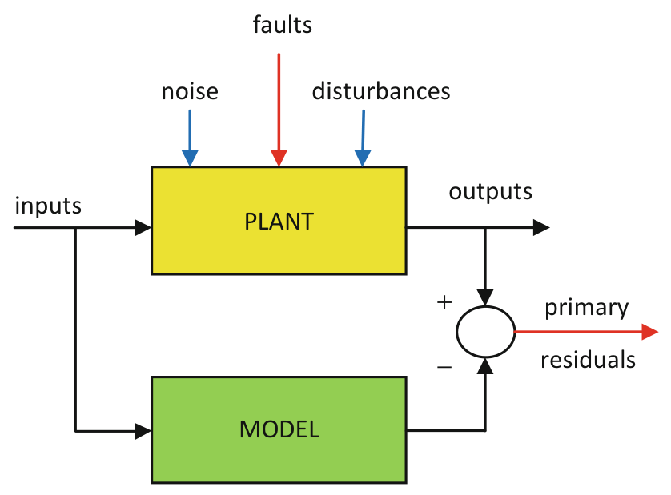

> Image description: This diagram, titled "Fault Detection and Diagnosis, Fig. 1 Analytical redundancy," illustrates a control engineering principle used for system monitoring. The figure consists of two parallel rectangular blocks: a yellow block labeled "PLANT" and a green block labeled "MODEL." A common "inputs" signal enters both the Plant and the Model simultaneously. The Plant block is subject to three external influences, indicated by downward arrows: "noise," "faults," and "disturbances." The output of the Plant block is directed to a summation junction marked with a plus (+) sign. Simultaneously, the "MODEL" block produces an output that is directed to the same junction, marked with a minus (–) sign. The difference between the Plant's output and the Model's output is identified as "primary residuals," which are represented by a red arrow pointing away from the summation junction. This setup represents an analytical redundancy approach where model-based residuals are used to detect system faults.
Fault Detection and Diagnosis, Fig. 1 Analytical redundancy

<!-- source_pdf_page: 443 -->
istic inputs) and noise (unmeasured random inputs) (Fig. 1). In addition, and most importantly, model-based FDD is subject to model errors (due either to initial inaccuracies in model building or to changes in the physical plan). The FDD algorithm should be designed, as much as possible, to be insensitive to noise and "robust" in face of disturbances and model errors.

Additive and multiplicative faults. Depending on the way they appear in the system equations, faults may be additive or multiplicative. Additive faults are sensor and actuator biases, leaks in the plant, etc. Multiplicative faults are changes in the plant parameters. In the following input-output relationship, $\mathbf{u}(t)$ is the vector of observed (measured or commanded) plant inputs, $\mathbf{y}(t)$ is the vector of measured plant outputs, and $\mathbf{p}(t)$ is the vector of additive faults and $t$ is the discrete time. $\mathbf{M}(q)$ and $\mathbf{S}(q)$ are transfer function matrices in the shift operator $q$, and $\boldsymbol{\theta}$ is the vector of plant parameters. Then,

$$
\mathbf{y}(t)=\mathbf{M}(q, \boldsymbol{\theta}) \mathbf{u}(t)+\mathbf{S}(q, \boldsymbol{\theta}) \mathbf{p}(t)
$$

The ("primary") residual vector $\mathbf{e}(t)$, in response to additive faults, is

$$
\mathbf{e}(t)=\mathbf{y}(t)-\mathbf{M}(q, \boldsymbol{\theta}) \mathbf{u}(t)=\mathbf{S}(q, \boldsymbol{\theta}) \mathbf{p}(t)
$$

If there are multiplicative faults, then $\boldsymbol{\theta}=\boldsymbol{\theta}^{\circ}+ \boldsymbol{\Delta} \boldsymbol{\theta}$, where $\boldsymbol{\theta}^{\circ}$ is the nominal parameter vector and $\boldsymbol{\Delta} \boldsymbol{\theta}$ is its change (the parametric fault); now and the residual vector $\mathbf{e}(t)$ is (Gertler 1998)

$$
\begin{aligned}
\mathbf{e}(t) & =\mathbf{y}(t)-\mathbf{M}\left(q, \boldsymbol{\theta}^{\circ}\right) \mathbf{u}(t) \\
& =\Sigma_{\mathbf{j}}\left(\partial \mathbf{M}(q, \boldsymbol{\theta}) / \partial \theta_{\mathrm{j}}\right) \mathbf{u}(t) \Delta \theta_{\mathrm{j}}
\end{aligned}
$$

Enhanced residuals. To facilitate the isolation of faults, the primary residuals $\mathbf{e}(t)$ are subject to some enhancement manipulation. The three widely used enhancement techniques are:

- Structured residuals, whereas each residual is selectively sensitive to a subset of faults, resulting in a fault-specific set of zero/nonzero residuals upon a particular fault (fault codes)

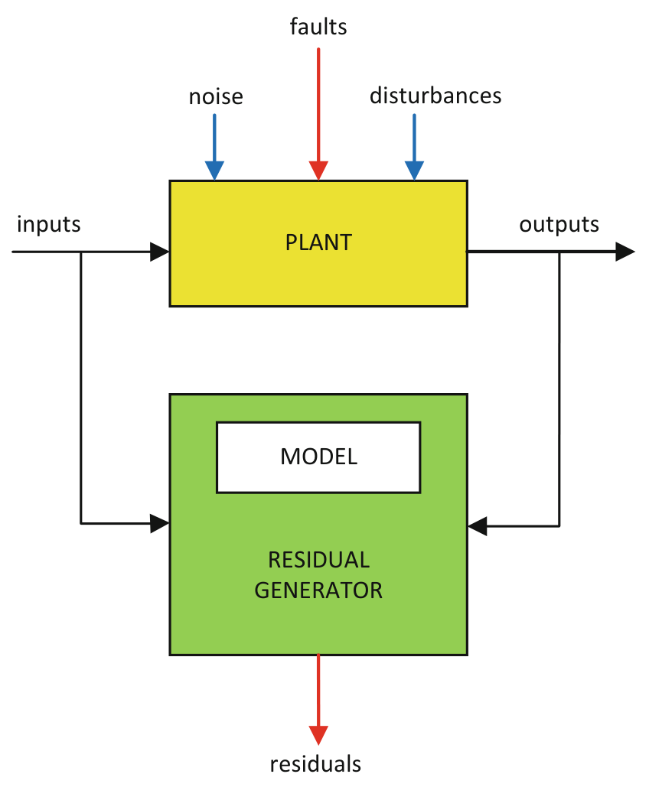

> Image description: A flow diagram titled "Fault Detection and Diagnosis, Fig. 2 Generating model-based residuals" illustrates a model-based residual generation architecture. The diagram consists of two main functional blocks: a yellow "PLANT" block and a green "RESIDUAL GENERATOR" block containing a white "MODEL" block. The "PLANT" receives three external inputs: "noise," "faults," and "disturbances," represented by colored arrows pointing downward. The plant also receives "inputs" from the left and produces "outputs" to the right. The "RESIDUAL GENERATOR" is driven by the same "inputs" sent to the plant. It also receives the "outputs" from the plant as a second input. By comparing the actual plant outputs with the outputs produced by its internal "MODEL," the generator produces "residuals," indicated by a red arrow pointing downward from the bottom of the green block. This structure represents the fundamental principle of observer-based fault detection, where residuals serve as error signals used to identify system anomalies.
Fault Detection and Diagnosis, Fig. 2 Generating model-based residuals

- Directional residuals, whereas the residual vector maintains a fault-specific direction in response to each particular fault
- Diagonal residuals, whereas each residual responds only to a particular fault
Residual generators take the input and output observations from the plant and generate enhanced residuals by one of the above schemes, utilizing the mathematical model of the plant (Fig. 2).

Dealing with noise. Noise is practically unavoidable in physical systems. In FDD, basically two steps may be taken to reduce the effect of noise:

- Residual filtering. This can be achieved by basing decisions on moving averages of the residuals or by applying explicit low-pass filters to the residuals or by designing the residual generators in such a way that they have built-in low-pass behavior.
- Statistical testing of the residuals. Structured residuals are tested individually; each scalar residual is then represented by a Boolean 1 or 0 , depending on the outcome of the

<!-- source_pdf_page: 444 -->
test. Directional residuals are tested as vectors against multivariable distributions. The test thresholds are determined either theoretically, using assumptions for the source noise, or empirically based on measurements from faultfree operating conditions.

Dealing with disturbances. Additive disturbances are unmeasurable inputs. If the disturbance-to-output transfer function (or equivalent state-space representation) is known, then it is possible to design residuals that are completely decoupled from (insensitive to) those disturbances. However, the FDD algorithm is subject to a certain degree of "design freedom," defined by the number of outputs in the physical system; disturbance decoupling is competing for this freedom with fault isolation enhancement. If there are too many disturbances, or if their path to the outputs is unknown, then only approximate decoupling is possible, making FDD also approximate, usually designed to optimize some (H-infinity) performance index.

Dealing with model errors. Model errors are also unavoidable in most practical situations. This is the most serious obstacle in the application of model-based FDD techniques. In some very special cases, uncertainty of a particular plant parameter may be handled as a "multiplicative disturbance," and residuals designed to be explicitly decoupled from it. In general, however, only approximate solutions are possible, reducing the residuals' sensitivity to modeling errors, at the expense of also reducing their sensitivity to faults. Design methods utilizing some optimization techniques, mostly based on H-infinity or similar performance indices, are available in the literature (Edelmayer et al. 1994).

## Residual Generation Methods

For linear dynamic systems, provided exact (nonapproximate) solution is possible, there are three major techniques to design residual generators: (i) direct consistency (parity) relations, (ii) parity space, and (iii) diagnostic observers. We will
briefly introduce the three methods, for discretetime plant models and additive faults. Note that though they look formally different, if designed for the same plant under the same design conditions, the three methods yield identical residuals (Gertler 1991).

Direct consistency (parity) relations (Gertler 1998). The input-output model of the plant is utilized directly in the design. The enhanced residuals are obtained from the primary residuals by a transformation $\mathbf{W}(q)$ :

$$
\begin{aligned}
\mathbf{r}(t) & =\mathbf{W}(q) \mathbf{e}(t)=\mathbf{W}(q)[\mathbf{y}(t)-\mathbf{M}(q) \mathbf{u}(t)] \\
& =\mathbf{W}(q) \mathbf{S}(q) \mathbf{p}(t)
\end{aligned}
$$

The desired behavior of the residuals is specified as $\mathbf{r}(t)=\mathbf{Z}(q) \mathbf{p}(t)$, where the specification $\mathbf{Z}(q)$ contains the basic residual properties (structure or directions) plus the residual dynamics. The resulting design condition is $\mathbf{W}(q) \mathbf{S}(q)=\mathbf{Z}(q)$. If the $\mathbf{S}(q)$ matrix is square, what is usually the case (Gertler 1998), then this can be solved for $\mathbf{W}(q)$ by direct inversion. The residual generator has to be causal and stable; this can always be achieved by the appropriate modification of the dynamics in $\mathbf{Z}(q)$.

Parity space (Chow and Willsky 1984). This method, also known as the "Chow-Willsky scheme," relies on the state-space description of the system:

$$
\begin{aligned}
\mathbf{x}(t+1) & =\mathbf{A} \mathbf{x}(t)+\mathbf{B} \mathbf{u}(t)+\mathbf{E} \mathbf{p}(t) \\
\mathbf{y}(t) & =\mathbf{C} \mathbf{x}(t)+\mathbf{D} \mathbf{u}(t)+\mathbf{F} \mathbf{p}(t)
\end{aligned}
$$

Stacking $n$ consecutive output vectors $\mathbf{y}(t)$ (where $n$ is the order of the model), and chainsubstituting the state $\mathbf{x}(t)$, yields the equation

$$
\mathbf{Y}(t)=\mathbf{J} \mathbf{x}(t-n)+\mathbf{K} \mathbf{U}(t)+\mathbf{L} \mathbf{P}(t)
$$

where $\mathbf{Y}(t), \mathbf{U}(t)$, and $\mathbf{P}(t)$ are stacked vectors and $\mathbf{J}, \mathbf{K}$, and $\mathbf{L}$ are hyper-matrices composed of the $\mathbf{A}, \mathbf{B}, \mathbf{C}, \mathbf{D}, \mathbf{E}, \mathbf{F}$ matrices. Now
$\mathbf{E}^{*}(t)=\mathbf{Y}(t)-\mathbf{K} \mathbf{U}(t)=\mathbf{L} \mathbf{P}(t)+\mathbf{J} \mathbf{x}(t-n)$

<!-- source_pdf_page: 445 -->
would be a stacked vector of primary residuals, was it not for the presence of the inaccessible initial state $\mathbf{x}(t-n)$. To obtain true residuals, a transformation $r_{i}(t)=\mathbf{w}_{i} \mathbf{E}^{*}(t)$ is necessary, so that $\mathbf{w}_{i} \mathbf{J}=0$. Any vector $\mathbf{w}_{i}$ satisfying this orthogonality condition is a parity vector, together spanning the parity space. Any parity vector yields a true residual $r_{i}(t)$; they can be so chosen that a set of residuals possesses structured behavior.

Diagnostic observers. Various observer schemes have been extensively investigated as possible residual generator algorithms. The basic full-order Luenberger observer (assuming $\mathbf{D}=\mathbf{0}$ ) is

$$
\mathbf{x}^{(t+1)}=\mathbf{A} \mathbf{x}^{(t)}+\mathbf{B} \mathbf{u}(t)+\mathbf{K} \mathbf{e}(t)
$$

where $\mathbf{K}$ is the observer gain matrix and

$$
\mathbf{e}(t)=\mathbf{y}(t)-\mathbf{C} \mathbf{x}^{(t)}
$$

is the innovation vector. If the observer is stable then, apart from the start-up transient of the observer, the innovation qualifies as the primary residual. The gain matrix $\mathbf{K}$ is the major design parameter; it is chosen to place the observer poles, thus achieving stability and desired dynamic behavior (e.g., noise suppression). The remaining design freedom can be utilized to influence residual properties. The latter are further affected by the transformation $\mathbf{r}(t)=\mathbf{H e}(t)$, where the $\mathbf{H}$ matrix is an additional design parameter. Diagnostic observers can be designed for both structured and directional residuals (Chen and Patton 1999; White and Speyer 1987). Other observer schemes, most notably the unknown input observer, have also been proposed (Frank and Wunnenberg 1989). Because of their complexity, the detailed design procedures of diagnostic observers go beyond the scope of this entry.

## Principal Component Analysis

Principal component analysis is extensively used in the monitoring of complex plants with hundreds of variables because, by revealing linear
relations among the variables, it significantly reduces the dimensionality of the plant model (Kresta et al. 1991). The application of PCA for FDD implies two phases. In the training phase, an implicit plant model is created from empirical plant data. In the monitoring phase, this model is used for FDD.

Training data (measured inputs and outputs) are collected from the plant during fault-free operation. The covariance matrix of the data is formed and its eigenstructure obtained. Due to linear relations among the data, some of the eigenvalues will be zero (or near zero, in the presence of noise). The eigenvectors belonging to the nonzero eigenvalues form the data space, where the fault-free data exist, while those belonging to the zero eigenvalues form the residual space.

It is the residual space that is utilized for FDD. The projection of a measurement vector onto the residual space is the (primary) residual. A statistical test on its size leads to a detection decision (the absence or presence of faults). A threshold test is necessary because noise also causes nonzero residuals. An analysis of the eigenvectors spanning the residual space shows how the various faults propagate to the primary residual. This allows for the design of residual manipulations yielding structured or directional residuals, just like in the FDD methods based on exact models (Gertler et al. 1999).

The procedure as described above applies to sensor and actuator faults; inclusion of plant faults requires extra effort (and experiments). Also, PCA is primarily meant for static models. Its extension to discrete-time dynamic models is straightforward, but it increases the size of the model, proportionally to the dynamic order of the model.

## Summary and Future Directions

Fault detection and diagnosis is today a mature field of systems and control engineering. There is a very significant level of activity, as measured in published papers and conference contributions, but much of this (in the opinion of this author)

<!-- source_pdf_page: 446 -->
is just minor refinements of earlier results. This applies particularly to the long ongoing quest to create "robust" FDD algorithms, especially in the face of model errors.

There are still open challenges in a couple of areas, most notably extensions to various nonlinear or parameter varying problems. Another open and active area, of great practical importance, is FDD in networked control systems. What is really of the greatest interest, though, is the application of the wealth of available theoretical results and design methods to real-life problems; there has recently been some visible progress here, a most welcome development.

## Cross-References

- Controller Performance Monitoring
- Diagnosis of Discrete Event Systems
- Fault-Tolerant Control
- Multiscale Multivariate Statistical Process Control
- Observers for Nonlinear Systems
- Robust Fault Diagnosis and Control
- Statistical Process Control in Manufacturing

## Bibliography

Chen J, Patton RJ (1999) Robust model-based fault diagnosis for dynamic systems. Kluwer, Boston/Dordrecht/Amsterdam
Chow EJ, Willsky AS (1984) Analytical redundancy and the design of robust failure detection systems. IEEE Trans Autom Control AC-29:603-614
Edelmayer A, Bokor J, Keviczky L (1994) An H-infinity filtering approach to robust detection of failures in dynamic systems. In: 33rd IEEE conference on decision and control, Lake Buena Vista
Frank PM, Wunnenberg J (1989) Robust fault diagnosis using unknown input observer schemes. In: Patton R, Frank P, Clark R (eds) Fault diagnosis in dynamic systems. Prentice Hall, Upper Saddle River
Gertler J (1991) A survey of analytical redundancy methods in fault detection and isolation. Plenary paper, IFAC Safeprocess Symposium, Baden-Baden
Gertler J (1998) Fault detection and diagnosis in engineering systems. Marcel Dekker, New York
Gertler J, Li W, Huang Y, McAvoy T (1999) Isolation enhanced principal component analysis. AIChE J 45:323-334

Isermann $R$ (1984) Process fault detection based on modeling and estimation methods. Automatica 20:387-404
Kresta JV, MacGregor JF, Marlin TE (1991) Multivariate statistical monitoring of processes. Can J Chem Eng 69:35-47
White JE, Speyer JL (1987) Detection filter design: spectral theory and algorithm. IEEE Trans Autom Control AC-32:593-603
Willsky AS (1976) A survey of design methods for failure detection in dynamic systems. Automatica 12:601-611

## Fault-Tolerant Control

Ron J. Patton School of Engineering, University of Hull, Hull, UK

## Synonyms

FTC

#### Abstract

A closed-loop control system for an engineering process may have unsatisfactory performance or even instability when faults occur in actuators, sensors, or other process components. Faulttolerant control (FTC) involves the development and design of special controllers that are capable of tolerating the actuator, sensor, and process faults while still maintaining desirable and robust performance and stability properties. FTC designs involve knowledge of the nature and/or occurrence of faults in the closed-loop system either implicitly or explicitly using methods of fault detection and isolation (FDI), fault detection and diagnosis (FDD), or fault estimation (FE). FTC controllers are reconfigured or restructured using FDI/FDD information so that the effects of the faults are reduced or eliminated within each feedback loop in active or passive approaches or compensated in each control-loop using FE methods. A non-mathematical outline of the essential features of FTC systems is given with important definitions and a classification of FTC systems

<!-- source_pdf_page: 447 -->
into either active/passive approaches with examples of some well-known strategies.

## Keywords

Active FTC; Fault accommodation; Fault detection and diagnosis (FDD); Fault detection and isolation (FDI); Fault estimation (FE); Faulttolerant control; Passive FTC; Reconfigurable control

Patton 1999; Gertler 1998; Patton et al. 2000) motivated by studies in the 1980s on this topic (Patton et al. 1989). Fault-tolerant control (FTC) began to develop in the early 1990s (Patton 1993) and is now a standard in the literature (Patton 1997; Blanke et al. 2006; Zhang and Jiang 2008), based on the aerospace subject of reconfigurable flight control making use of redundant actuators and sensors (Steinberg 2005; Edwards et al. 2010).

## Introduction

The complexity of modern engineering systems has led to strong demands for enhanced control system reliability, safety, and green operation in the presence of even minor anomalies. There is a growing need not only to determine the onset and development of process faults before they become serious but also to adaptively compensate for their effects in the closed-loop system or using hardware redundancy to replace faulty components by duplicate and fault-free alternatives. The title "failure tolerant control" was given by Eterno et al. (1985) working on a reconfigurable flight control study defining the meaning of control system tolerance to failures or faults. The word "failure" is used when a fault is so serious that the system function concerned fails to operate (Isermann 2006). The title failure detection has now been superseded by fault detection, e.g., in fault detection and isolation (FDI) or fault detection and diagnosis (FDD) (Chen and

## Definitions Relating to Fault-Tolerant Control

FTC is a strategy in control systems architecture and design to ensure that a closed-loop system can continue acceptable operation in the face of bounded actuator, sensor, or process faults. The goal of FTC design must ensure that the closed-loop system maintains satisfactory stability and acceptable performance during either one or more fault actions. When prescribed stability and closed-loop performance indices are maintained despite the action of faults, the system is said to be "fault tolerant," and the control scheme that ensures the fault tolerance is the fault-tolerant controller (Blanke et al. 2006; Patton 1997).

Fault modelling is concerned with the representation of the real physical faults and their effects on the system mathematical model. Fault modelling is important to establish how a fault should be detected, isolated, or compensated.
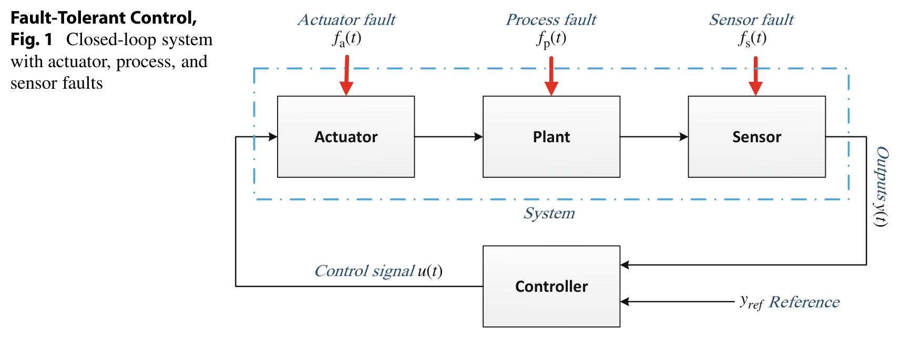

<!-- source_pdf_page: 448 -->
The faults illustrated in Fig. 1 act at system locations defined as follows (Chen and Patton 1999):

An actuator fault $\boldsymbol{(} \boldsymbol{f}_{\boldsymbol{a}}(\boldsymbol{t}) \boldsymbol{)}$ corresponds to variations of the control input $\boldsymbol{u}(\boldsymbol{t})$ applied to the controlled system either completely or partially. The complete failure of an actuator means that it produces no actuation regardless of the input applied to it, e.g., as a result of breakage and burnout of wiring. For partial actuator faults, the actuator becomes less effective and provides the plant with only a part of the normal actuation signal.

A sensor is an item of equipment that takes a measurement or observation from the system, e.g., potentiometers, accelerometers, tachometers, pressure gauges, strain gauges, etc.; a sensor fault ( $\boldsymbol{f}_{\boldsymbol{s}}(\boldsymbol{t})$ ) implies that incorrect measurements are taken from the real system. This fault can also be subdivided into either a complete or partial sensor fault. When a sensor fails, the measurements no longer correspond to the required physical parameters. For a partial sensor fault the measurements give an inaccurate indication of required physical parameters.

A process fault ( $\boldsymbol{f}_{\boldsymbol{p}}(\boldsymbol{t})$ ) directly affects the physical system parameters and in turn the input/output properties of the system. Process faults are often termed component faults, arising as variations from the structure or parameters used during system modelling, and as such cover a wide class of possible faults, e.g., dirty water having a different heat transfer coefficient compared to when it is clean, or changes in the viscosity of a liquid or components slowly degrading over time through wear and tear, aging, or environmental effects.

## Architectures and Classification of FTC Schemes

FTC methods are classified according to whether they are "passive" or "active," using fixed or reconfigurable control strategies (Eterno et al. 1985). Various architectures have been proposed for the implementation of FTC schemes, for example, the structure of reconfigurable control
based on generalized internal model control (GIMC) has been proposed by Zhou and Ren (2001) and other studies by Niemann and Stoustrup (2005). Figure 2 shows a suitable architecture to encompass active and passive FTC methods in which a distinction is made between "execution" and "supervision" levels. The essential differences and requirements between the passive FTC (PFTC) and active FTC (AFTC).

PFTC is based solely on the use of robust control in which potential faults are considered as if they are uncertain signals acting in the closed-loop system. This can be related to the concept of reliable control (Veillette et al. 1992). PFTC requires no online information from the fault diagnosis (FDI/FDD/FE) function about the occurrence or presence of faults and hence it is not by itself and adaptive system and does not involve controller reconfiguration (Patton 1993, 1997; Šiljak 1980). PFTC approach can be used if the time window during which the system remains stabilizable in the presence of a fault is short; see, for example, the problem of the double inverted pendulum (Weng et al. 2007) which is unstable during a loop failure.

AFTC has two conceptual steps to provide the system with fault-tolerant capability (Blanke et al. 2006; Patton 1997; Zhang and Jiang 2008; Edwards et al. 2009):

- Equip the system with a mechanism to make it able to detect and isolate (or even estimate) the fault promptly, identify a faulty component, and select the required remedial action in to maintain acceptable operation performance. With no fault a baseline controller attenuates disturbances and ensures good stability and closed-loop tracking performance (Patton 1997), and the diagnostic (FDI/FDD/FE) block recognizes that the closed-loop system is fault-free with no control law change required (supervision level).
- Make use of supervision level information and adapt or reconfigure/restructure the controller parameters so that the required remedial activity can be achieved (execution level).
Figure 3 gives a classification of PFTC and AFTC methods (Patton 1997).

<!-- source_pdf_page: 449 -->
Fault-Tolerant Control,
Fig. 2 Scheme of FTC (Adapted from Blanke et al. (2006))
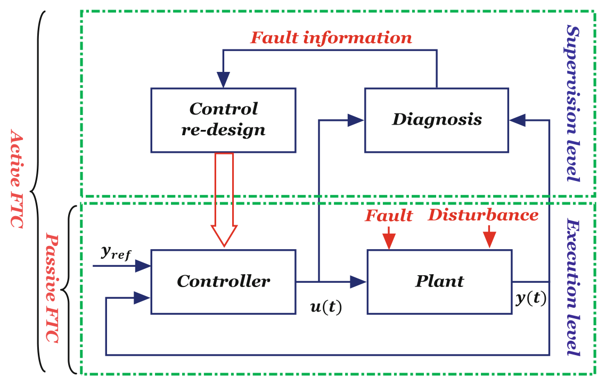

> Image description: Figure 2 presents a block diagram illustrating a Fault-Tolerant Control (FTC) scheme, divided into two hierarchical layers: the Supervision level and the Execution level. The scheme distinguishes between Passive and Active FTC strategies. At the Execution level, a feedback control loop is shown. A **Controller** receives a reference input ($y_{\text{ref}}$) and feedback from the **Plant**, generating a control signal $u(t)$ sent to the plant. The plant's output is $y(t)$, which is fed back to the controller. Both the Plant and the feedback signal are subject to external **Fault** and **Disturbance** inputs. At the Supervision level, a **Diagnosis** block monitors the system to identify faults. This block transmits **Fault information** to a **Control re-design** block. The re-design block then provides updated control parameters to the Controller via a red downward arrow, characterizing the **Active FTC** approach.

Fault-Tolerant Control,
Fig. 3 General classification of FTC methods
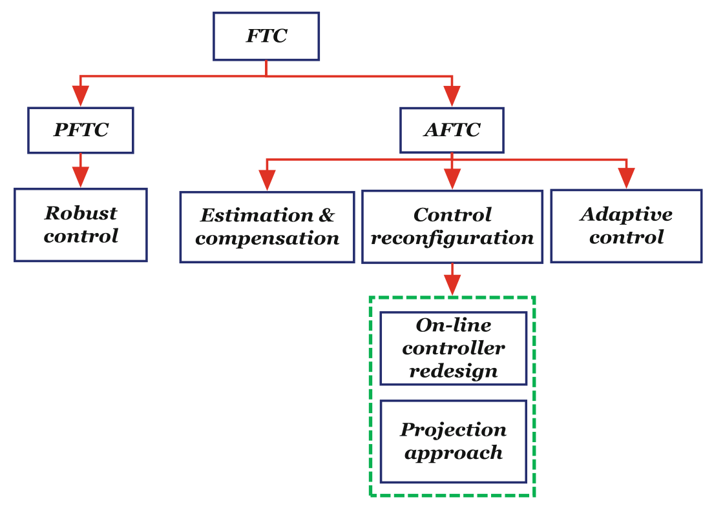

> Image description: A flowchart titled "Fig. 3 General classification of FTC methods" illustrates the hierarchical taxonomy of Fault-Tolerant Control (FTC) methods. At the highest level, the hierarchy begins with **FTC**, which branches into two primary categories via red arrows: **PFTC** (Passive FTC) and **AFTC** (Active FTC). Under **PFTC**, the branch leads to **Robust control**. Under **AFTC**, the structure splits into three sub-categories: **Estimation & compensation**, **Control reconfiguration**, and **Adaptive control**. A vertical red arrow descends from "Control reconfiguration" into a green dashed rectangular box containing two sub-levels: "**On-line controller redesign**" and, nested within that, the "**Projection approach**." The diagram uses rectangular boxes for categories and red arrows to denote functional relationships and hierarchical classification within control engineering.

Figure 3 shows that AFTC approaches are divided into two main types of methods: projection-based methods and online automatic controller redesign methods. The latter involves the calculation of new controller parameters following control impairment, i.e., using reconfigurable control. In projection-based methods, a new precomputed control law is selected according to the required controller structure (i.e., depending on the type of isolated fault).

AFTC methods use online-fault accommodation based on unanticipated faults, classified as (Patton 1997):
(a) Based on offline (pre-computed) control laws (b) Online-fault accommodating
(c) Tolerant to unanticipated faults using FDI/FDD/FE
(d) Dependent upon use of a baseline controller

## AFTC Examples

One example of AFTC is model-based predictive control (MPC) which uses online computed control redesign. MPC is online-fault accommodating; it does not use an FDI/FDD unit and is not dependent on a baseline controller. MPC has a certain degree of fault tolerance against actuator faults under some conditions even if the faults are not detected. The representation of actuator faults in MPC is relatively natural and straightforward since actuator faults such as jams and slew-rate reductions can be represented by changing the

<!-- source_pdf_page: 450 -->
MPC optimization problem constraints. Other faults can be represented by modifying the internal model used by MPC (Maciejowski 1998). The fact that online-fault information is not required means that MPC is an interesting method for flight control reconfiguration as demonstrated by Maciejowski and Jones in the GARTEUR AG 16 project on "fault-tolerant flight control" (Edwards et al. 2010).

Another interesting AFTC example that makes use of the concept of model-matching in explicit model following is the so-called pseudo-inverse method (PIM) (Gao and Antsaklis 1992) which requires the nominal or reference closed-loop system matrix to compute the new controller gain after a fault has occurred. The challenges are:

1. Guarantee of stability of the reconfigured closed-loop system
2. Minimization of the time consumed to approach the acceptable matching
3. Achieving perfect matching through use of different control methodologies
Exact model-matching may be too demanding, and some extensions to this approach make use of alternative, approximate (norm-based) model-matching through the computation of the required model-following gain. To relax the matching condition further, Staroswiecki (2005) proposed an admissible model-matching approach which was later extended by Tornil et al. (2010) using D-region pole assignment. The PIM approach requires an FDI/FDD/FE mechanism and is online-fault accommodating only in terms of a priori anticipated faults. This limits the practical value of this approach.

As a third example, feedback linearization can be used to compensate for nonlinear dynamic effects while also implementing control law reconfiguration or restructure. In flight control an aileron actuator fault will cause a strong coupling between the lateral and longitudinal aircraft dynamics. Feedback linearization is an established technique in flight control (Ochi and Kanai 1991). The faults are identified indirectly by estimating aircraft flight parameters online, e.g., using a recursive least-squares algorithm to update the FTC.

Hence, a AFTC system provides fault tolerance either by selecting a precomputed control law (projection-based) (Boskovic and Mehra 1999; Maybeck and Stevens 1991; Rauch 1995) or by synthesizing a new control strategy online (online controller redesign) (Ahmed-Zaid et al. 1991; Richter et al. 2007; Efimov et al. 2012; Zou and Kumar 2011).

Another widely studied AFTC method is the estimation and compensation approach, where a fault compensation input is superimposed on the nominal control input (Noura et al. 2000; Boskovic and Mehra 2002; Sami and Patton 2013; Zhang et al. 2004). There is a growing interest in robust FE methods based on sliding mode estimation (Edwards et al. 2000) and augmented observer methods (Gao and Ding 2007; Jiang et al. 2006; Sami and Patton 2013).

An important development of this approach is the so-called fault hiding strategy which is centered on achieving FTC loop goals such that the nominal control loop remains unchanged through the use of virtual actuators or virtual sensors (Blanke et al. 2006; Sami and Patton 2013). Fault hiding makes use of the difference between the nominal and faulty system state to changes in the system dynamics such that the required control objectives are continuously achieved even if a fault occurs. In the sensor fault case, the effect of the fault is hidden from the input of the controller. However, actuator faults are compensated by the effect of the fault (Lunze and Steffen 2006; Richter et al. 2007; Ponsart et al. 2010; Sami and Patton 2013) in which it is assumed that the FDI/FDD or FE scheme is available. The virtual actuator/sensor FTC can be good practical value if FDI/FDD/FE robustness can be demonstrated.

Traditional adaptive control methods that automatically adapt controller parameters to system changes can be used in a special application of AFTC, potentially removing the need for FDI/FDD and controller redesign steps (Tang et al. 2004; Zou and Kumar 2011) but possibly using the FE function. Adaptive control is suitable for FTC on plants that have slowly

<!-- source_pdf_page: 451 -->
varying parameters and can tolerate actuator and process faults. Sensor faults are not tolerated well as the controller parameters must adapt according to the faulty measurements, causing incorrect closed-loop system operation; the FDI/FDD/FE unit is required for such cases.

## Summary and Future Directions

FTC is now a significant subject in control systems science with many quite significant application studies, particularly since the new millennium. Most of the applications are within the flight control field with studies such as the GARTEUR AG16 project "Fault-Tolerant Flight Control" (Edwards et al. 2010). As a very complex engineering-led and mathematically focused subject, it is important that FTC remains application-driven to keep the theoretical concepts moving in the right directions and satisfying end-user needs. The original requirement for FTC in safety-critical systems has now widened to encompass a good range of fault-tolerance requirements involving energy and economy, e.g., for greener aircraft and for FTC in renewable energy.

Faults and modelling uncertainties as well as endogenous disturbances have potentially competing effects on the control system performance and stability. This is the robustness problem in FTC which is beyond the scope of this article. The FTC system provides a degree of tolerance to closed-loop systems faults and it is also subject to the effects of modelling uncertainty arising from the reality that all engineering systems are nonlinear and can even have complex dynamics. For example, consider the PFTC approach relying on robustness principles - as a more complex extension to robust control. PFTC design requires the closed-loop system to be insensitive to faults as well as modelling uncertainties. This requires the use of multi-objective optimization methods e.g., using linear matrix inequalities (LMI), as well as methods of accounting for dynamical system parametric variations, e.g., linear parameter varying (LPV) system structures, Takagi-Sugeno, or sliding mode methods.

## Cross-References

- Diagnosis of Discrete Event Systems
- Estimation, Survey on
- Fault Detection and Diagnosis
- H-infinity Control
- LMI Approach to Robust Control
- Lyapunov's Stability Theory
- Model Reference Adaptive Control
- Optimization Based Robust Control
- Robust Adaptive Control
- Robust Fault Diagnosis and Control
- Robust $\mathcal{H}_{2}$ Performance in Feedback Control

## Bibliography

Ahmed-Zaid F, Ioannou P, Gousman K, Rooney R (1991) Accommodation of failures in the F-16 aircraft using adaptive control. IEEE Control Syst 11:73-78
Blanke M, Kinnaert M, Lunze J, Staroswiecki M (2006) Diagnosis and fault-tolerant control. Springer, Berlin/New York
Boskovic JD, Mehra RK (1999) Stable multiple model adaptive flight control for accommodation of a large class of control effector failures. In: Proceedings of the ACC, San Diego, 2-4 June 1999, pp 1920-1924
Boskovic JD, Mehra RK (2002) An adaptive retrofit reconfigurable flight controller. In: Proceedings of the 41st IEEE CDC, Las Vegas, $10-13$ Dec 2002, pp 1257-1262
Chen J, Patton RJ (1999) Robust model based fault diagnosis for dynamic systems. Kluwer, Boston
Edwards C, Spurgeon SK, Patton RJ (2000) Sliding mode observers for fault detection and isolation. Automatica 36:541-553
Edwards C, Lombaerts T, Smaili H (2010) Fault tolerant flight control a benchmark challenge. Springer, Berlin/Heidelberg
Efimov D, Cieslak J, Henry D (2012) Supervisory faulttolerant control with mutual performance optimization. Int J Adapt Control Signal Process 27(4):251279
Eterno J, Weiss J, Looze D, Willsky A (1985) Design issues for fault tolerant restructurable aircraft control. In: Proceedings of the 24th IEEE CDC, Fort-Lauderdale, Dec 1985
Gao Z, Antsaklis P (1992) Reconfigurable control system design via perfect model following. Int J Control 56:783-798
Gao Z, Ding S (2007) Actuator fault robust estimation and fault-tolerant control for a class of nonlinear descriptor systems. Automatica 43:912-920
Gertler J (1998) Fault detection and diagnosis in engineering systems. Marcel Dekker, New York

<!-- source_pdf_page: 452 -->
Isermann R (2006) Fault-diagnosis systems an introduction from fault detection to fault tolerance. Springer, Berlin/New York
Jiang BJ, Staroswiecki M, Cocquempot V (2006) Fault accommodation for nonlinear dynamic systems. IEEE Trans Autom Control 51:1578-1583
Lunze J, Steffen T (2006) Control reconfiguration after actuator failures using disturbance decoupling methods. IEEE Trans Autom Control 51:1590-1601
Maciejowski JM (1998) The implicit daisy-chaining property of constrained predictive control. J Appl Math Comput Sci 8(4): 101-117
Maybeck P, Stevens R (1991) Reconfigurable flight control via multiple model adaptive control methods. IEEE Trans Aerosp Electron Syst 27:470-480
Niemann H, Stoustrup J (2005) An architecture for fault tolerant controllers. Int J Control 78(14): 1091-1110
Noura H, Sauter D, Hamelin F, Theilliol D (2000) Faulttolerant control in dynamic systems: application to a winding machine. IEEE Control Syst Mag 20:33-49
Ochi Y, Kanai K (1991) Design of restructurable flight control systems using feedback linearization. J Guid Dyn Control 14(5): 903-911
Patton RJ, Frank PM, Clark RN (1989) Fault diagnosis in dynamic Systems: theory and application. Prentice Hall, New York
Patton RJ (1993) Robustness issues in fault tolerant control. In: Plenary paper at international conference TOOLDIAG'93, Toulouse, Apr 1993
Patton RJ (1997) Fault tolerant control: the 1997 situation. In: IFAC Safeprocess '97, Hull, pp 1033-1055
Patton RJ, Frank PM, Clark RN (2000) Issues of fault diagnosis for dynamic systems. Springer, London/New York
Ponsart J, Theilliol D, Aubrun C (2010) Virtual sensors design for active fault tolerant control system applied to a winding machine. Control Eng Pract 18:1037-1044
Rauch H (1995) Autonomous control reconfiguration. IEEE Control Syst 15:37-48
Richter JH, Schlage T, Lunze J (2007) Control reconfiguration of a thermofluid process by means of a virtual actuator. IET Control Theory Appl 1:1606-1620
Sami M, Patton RJ (2013) Active fault tolerant control for nonlinear systems with simultaneous actuator and sensor faults. Int J Control Autom Syst 11(6): 1149-1161
Šiljak DD (1980) Reliable control using multiple control systems. Int J Control 31:303-329
Staroswiecki M (2005) Fault tolerant control using an admissible model matching approach. In: Joint Decision and Control Conference and European Control Conference, Seville, 12-15 Dec 2005, pp 2421-2426
Steinberg M (2005) Historical overview of research in reconfigurable flight control. Proc IMechE, Part G J Aeros Eng 219:263-275
Tang X, Tao G, Joshi S (2004) Adaptive output feedback actuator failure compensation for a class of non-linear systems. Int J Adapt Control Signal Process 19(6): 419-444

Tornil S, Theilliol D, Ponsart JC (2010) Admissible model matching using $\mathcal{D}$ R-regions: fault accommodation and robustness against FDD inaccuracies J Adapt Control Signal Process 24(11): 927-943
Veillette R, Medanic J, Perkins W (1992) Design of reliable control systems. IEEE Trans Autom Control 37:290-304
Weng J, Patton RJ, Cui P (2007) Active fault-tolerant control of a double inverted pendulum. J Syst Control Eng 221:895
Zhang Y, Jiang J (2008) Bibliographical review on reconfigurable fault-tolerant control systems. Annu Rev Control 32:229-252
Zhang X, Parisini T, Polycarpou M (2004) Adaptive faulttolerant control of nonlinear uncertain systems: an information-based diagnostic approach. IEEE Trans Autom Control 49(8):1259-1274
Zhang K, Jiang B, Staroswiecki M (2010) Dynamic output feedback-fault tolerant controller design for TakagiSugeno fuzzy systems with actuator faults. IEEE Trans Fuzzy Syst 18:194-201
Zhou K, Ren Z (2001) A new controller architecture for high performance, robust, and fault-tolerant control. IEEE Trans Autom Control 46(10):1613-1618
Zou A, Kumar K (2011) Adaptive fuzzy fault-tolerant attitude control of spacecraft. Control Eng Pract 19:10-21

## FDD

## Fault Detection and Diagnosis

# Feedback Linearization of Nonlinear Systems

A.J. Krener Department of Applied Mathematics, Naval Postgrauate School, Monterey, CA, USA

#### Abstract

Effective methods exist for the control of linear systems but this is less true for nonlinear systems. Therefore, it is very useful if a nonlinear system can be transformed into or approximated by a linear system. Linearity is not invariant under nonlinear changes of state coordinates and nonlinear state feedback. Therefore, it may be possible to convert a nonlinear system into a linear one via these transformations. This is called feedback

<!-- source_pdf_page: 453 -->
linearization. This entry surveys feedback linearization and related topics.

## Keywords

Distribution; Frobenius theorem; Involutive distribution; Lie derivative

## Introduction

A controlled linear dynamics is of the form

$$
\begin{equation*}
\dot{x}=F x+G u \tag{1}
\end{equation*}
$$

where the state $x \in I R^{n}$ and the control $u \in I R^{m}$. A controlled nonlinear dynamics is of the form

$$
\begin{equation*}
\dot{x}=f(x, u) \tag{2}
\end{equation*}
$$

where $x, u$ have the same dimensions but may be local coordinates on some manifolds $\mathcal{X}, \mathcal{U}$. Frequently, the dynamics is affine in the control, i.e.,

$$
\begin{equation*}
\dot{x}=f(x)+g(x) u \tag{3}
\end{equation*}
$$

where $f(x) \in I R^{n \times 1}$ is a vector field and $g(x)= \left[g^{1}(x), \ldots, g^{m}(x)\right] \in I R^{n \times m}$ is a matrix field.

Linear dynamics are much easier to analyze and control than nonlinear dynamics. For example, to globally stabilize the linear dynamics (1), all we need to do is to find a linear feedback law $u=K x$ such that all the eigenvalues of $F+G K$ are in the open left half plane. Finding a feedback law $u=\kappa(x)$ to globally stabilize the nonlinear dynamics is very difficult and frequently impossible. Therefore, finding techniques to linearize nonlinear dynamics has been a goal for several centuries.

The simplest example of a linearization technique is to approximate a nonlinear dynamics around a critical point by its first-order terms. Suppose $x^{0}, u^{0}$ is an operating point for the nonlinear dynamics (2), that is, $f\left(x^{0}, u^{0}\right)=0$. Define displacement variables $z=x-x^{0}$ and $v=u-u^{0}$, and assuming $f(x, u)$ is smooth
around this operating point, expand (2) to first order

$$
\begin{align*}
\dot{z}= & \frac{\partial f}{\partial x}\left(x^{0}, u^{0}\right) z+\frac{\partial f}{\partial u}\left(x^{0}, u^{0}\right) v \\
& +O(z, v)^{2} \tag{4}
\end{align*}
$$

Ignoring the higher order terms, we get a linear dynamics (1) where

$$
F=\frac{\partial f}{\partial x}\left(x^{0}, u^{0}\right), \quad G=\frac{\partial f}{\partial u}\left(x^{0}, u^{0}\right)
$$

This simple technique works very well in many cases and is the basis for many engineering designs. For example, if the linear feedback $v=K z$ puts all the eigenvalues of $F+G K$ in the left half plane, then the affine feedback $u=u^{0}+K\left(x-x^{0}\right)$ makes the closed-loop dynamics locally asymptotically stable around $x^{0}$. So, one way to linearize a nonlinear dynamics is to approximate it by a linear dynamics.

The other way to linearize is by a nonlinear change of state coordinates and a nonlinear state feedback because linearity is not invariant under these transformations. To see this, suppose we have a controlled linear dynamics (1) and we make the nonlinear change of state coordinates $z=\phi(x)$ and nonlinear feedback $u=\gamma(z, v)$. We assume that these transformations are invertible from some neighborhood of $x^{0}=0, u^{0}=0$ to some neighborhood of $z^{0}, v^{0}$, and the inverse maps are

$$
\begin{aligned}
\psi(\phi(x))=x, & \phi(\psi(z)=z \\
\kappa(\psi(z), \gamma(z, v))=v, & \gamma(\phi(x), \kappa(x, u))=u
\end{aligned}
$$

then (1) becomes

$$
\begin{aligned}
\dot{z} & =\frac{\partial \phi}{\partial x}(x)(F x+G u) \\
& =\frac{\partial \phi}{\partial x}(\psi(z))(F \psi(z)+G \gamma(z, v))
\end{aligned}
$$

which is a controlled nonlinear dynamics (2). This raises the question asked by Brockett (1978), when is a controlled nonlinear dynamics a change of coordinate and feedback away from a controlled linear dynamics?

<!-- source_pdf_page: 454 -->
## Linearization of a Smooth Vector Field

Let us start by addressing an apparently simpler question that was first considered by Poincaré. Given an uncontrolled nonlinear dynamics around a critical point, say $x^{0}=0$,

$$
\dot{x}=f(x), \quad f(0)=0,
$$

find a smooth local change of coordinates

$$
z=\phi(x), \quad \phi(0)=0
$$

which transforms it into an uncontrolled linear dynamics.

$$
\dot{z}=F z .
$$

This question is apparently simpler, but as we shall see in the next section, the corresponding question for a controlled nonlinear dynamics that is affine in the control is actually easier to answer.

Without loss of generality, we can restrict our attention to changes of coordinates which carry $x^{0}=0$ to $z^{0}=0$ and whose Jacobian at this point is the identity, i.e.,

$$
z=x+O\left(x^{2}\right)
$$

then

$$
F=\frac{\partial f}{\partial x}(0) .
$$

Poincaré's formal solution to this problem was to expand the vector field and the desired change of coordinates in a power series,

$$
\begin{aligned}
\dot{x} & =F x+f^{[2]}(x)+O\left(x^{3}\right) \\
z & =x-\phi^{[2]}(x)
\end{aligned}
$$

where $f^{[2]}, \phi^{[2]}$ are $n$-dimensional vector fields, whose entries are homogeneous polynomials of degree 2 in $x$. A straightforward calculation yields

$$
\dot{z}=F z+f^{[2]}(x)-\left[F x, \phi^{[2]}(x)\right]+O(x)^{3}
$$

where the Lie bracket of two vector fields $f(x), g(x)$ is the new vector field defined by

$$
[f(x), g(x)]=\frac{\partial g}{\partial x}(x) f(x)-\frac{\partial f}{\partial x}(x) g(x) .
$$

Hence, $\phi^{[2]}(x)$ must satisfy the so-called homological equation (Arnol'd 1983)

$$
\left[F x, \phi^{[2]}(x)\right]=f^{[2]}(x) .
$$

This is a linear equation from the space of quadratic vector fields to the space of quadratic vector fields. The quadratic $n$-dimensional vector fields form a vector space of dimension $n$ times $n+1$ choose 2 .

Poincaré showed that the eigenvalues of the linear map

$$
\begin{equation*}
\phi^{[2]}(x) \mapsto\left[F x, \phi^{[2]}(x)\right] \tag{5}
\end{equation*}
$$

are $\lambda_{i}+\lambda_{j}-\lambda_{k}$ where $\lambda_{i}, \lambda_{j}, \lambda_{k}$ are eigenvalues of $F$. If none of these expressions are zero, then the operator (5) is invertible. A degree two resonance occurs when $\lambda_{i}+\lambda_{j}-\lambda_{k}=0$ and then the homological equation is not solvable for all $f^{[2]}(x)$.

Suppose a change of coordinates exists that linearizes the vector field up to degree $r$. In the new coordinates, the vector field is of the form

$$
\dot{x}=F x+f^{[r]}(x)+O(x)^{r+1} .
$$

We seek a change of coordinates of the form

$$
z=x-\phi^{[r]}(x)
$$

to cancel the degree $r$ terms, i.e., we seek a solution of the $r$ th degree homological equation,

$$
\left[F x, \phi^{[r]}(x)\right]=f^{[r]}(x) .
$$

A degree $r$ resonance occurs if

$$
\lambda_{i_{1}}+\ldots+\lambda_{i_{r}}-\lambda_{k}=0 .
$$

<!-- source_pdf_page: 455 -->
If there is no resonance of degree $r$, then the degree $r$ homological equation is uniquely solvable for every $f^{[r]}(x)$.

When there are no resonances of any degree, then the convergence of the formal power series solution is delicate. We refer the reader to Arnol'd (1983) for the details.

## Linearization of a Controlled Dynamics by Change of State Coordinates

Given a controlled affine dynamics (3) when does there exist a smooth local change of coordinates

$$
z=\phi(x), \quad 0=\phi(0)
$$

transforming it to

$$
\dot{z}=F z+G u
$$

where

$$
F=\frac{\partial f}{\partial x}(0), \quad G=g(0)
$$

This is an easier question to answer than that of Poincaré.

The controlled affine dynamics (3) is said to have well-defined controllability (Kronecker) indices if there exists a reordering of $g^{1}(x), \ldots, g^{m}(x)$ and integers $r_{1} \geq r_{2} \geq \cdots \geq r_{m} \geq 0$ such that $r_{1}+\cdots+r_{m}=n$, and the vector fields
$\left\{a d^{k}(f) g^{j}: j=1, \ldots, m, k=0, \ldots, r_{j}-1\right\}$
are linearly independent at each $x$ where $g^{i}$ denotes the $i$ th column of $g$ and
$\operatorname{ad}^{0}(f) g^{i}=g^{i}, \quad \operatorname{ad}^{k}(f) g^{i}=\left[f, \operatorname{ad}^{k-1}(f) g^{i}\right]$.

If there are several sets of indices that satisfy this definition, then the controllability indices are the smallest in the lexicographic ordering.

A necessary and sufficient condition is that

$$
\left[\operatorname{ad}^{k}(f) g^{i}, \operatorname{ad}^{l}(f) g^{j}\right]=0
$$

for $k=0, \ldots, n-1, l=0, \ldots, n$
The proof of this theorem is straightforward. Under a change of state coordinates, the vector fields and their Lie brackets are transformed by the Jacobian of the coordinate change. Trivially for linear systems,

$$
\begin{aligned}
& \operatorname{ad}^{k}(F x) G^{i}=(-1)^{k} F^{k} G \\
& {\left[\operatorname{ad}^{k}(F x) G^{i}, \operatorname{ad}^{l}(F x) G^{j}\right]=0}
\end{aligned}
$$

## Feedback Linearization

We turn to a question posed and partially answered by Brockett (1978). Given a system affine in the $m$-dimensional control

$$
\dot{x}=f(x)+g(x) u
$$

find a smooth local change of coordinates and smooth feedback

$$
z=\phi(x), \quad u=\alpha(x)+\beta(x) v
$$

transforming it to

$$
\dot{z}=F z+G v
$$

Brockett solved this problem under the assumptions that $\beta$ is a constant and the control is a scalar, $m=1$. The more general question for $\beta(x)$ and arbitrary $m$ was solved in different ways by Korobov (1979), Jakubczyk and Respondek (1980), Sommer (1980), Hunt and Su (1981), Su (1982), and Hunt et al. (1983).

We describe the solution when $m=1$. If the pair $F, G$ is controllable, then there exist an $H$ such that

$$
\begin{aligned}
& H F^{k-1} G=0 \quad k=1, \ldots, n-1 \\
& H F^{n-1} G=1
\end{aligned}
$$

<!-- source_pdf_page: 456 -->
If the nonlinear system is feedback linearizable, then there exists a function $h(x)=H \phi(x)$ such that

$$
\begin{array}{ll}
L_{a d^{k-1}(f) g} h=0 & k=1, \ldots, n-1 \\
L_{a d^{n-1}(f) g} h \neq 0 &
\end{array}
$$

where the Lie derivative of a function $h$ by a vector field $g$ is given by

$$
L_{g} h=\frac{\partial h}{\partial x} g
$$

This is a system of first-order PDEs, and the solvability conditions are given by the classical Frobenius theorem, namely, that

$$
\left\{g, \ldots, a d^{n-2}(f) g\right\}
$$

is involutive, i.e., its span is closed under Lie bracket.

For controllable systems, this is a necessary and sufficient condition. The controllability condition is that $\left\{g, \ldots, a d^{n-1}(f) g\right\}$ spans $x$ space.

Suppose $m=2$ and the system has controllability (Kronecker) indices $r_{1} \geq r_{2}$. Such a system is feedback linearizable iff

$$
\left\{g^{1},, g^{2}, \ldots, a d^{r_{i}-2}(f) g^{1}, a d^{r_{i}-2}(f) g^{2}\right\}
$$

is involutive for $i=1,2$. Another way of putting is that the distribution spanned by the first through $r$ th rows of the following matrix must be involutive for $r=r_{i}-1, i=1,2$. This is equivalent to the distribution spanned by the first through $r$ th rows of the following matrix being involutive for all $r=1, \ldots, r_{1}$.

$$
\left[\begin{array}{cc}
g^{1} & g^{2} \\
a d(f) g & a d(f) g^{2} \\
\vdots & \vdots \\
a d^{r_{2}-2}(f) g^{1} & a d^{r_{2}-2}(f) g^{2} \\
a d^{r_{2}-1}(f) g^{1} & a d^{r_{2}-1}(f) g^{2} \\
\vdots & \\
a d^{r_{1}-2}(f) g^{1} & \\
a d^{r_{1}-1}(f) g^{1} &
\end{array}\right]
$$

One might ask if it is possible to use dynamic feedback to linearize a system that is not linearizable by static feedback. Suppose we treat one of the controls $u_{j}$ as a state and let its derivative be a new control,

$$
\dot{u}_{j}=\bar{u}_{j}
$$

can the resulting system be linearized by state feedback and change of state coordinates? Loosely speaking, the effect of adding such an integrator to the $j$ th control is to shift the $j$ th column of the above matrix down by one row. This changes the distribution spanned by the first through $r$ th rows of the above matrix and might make it involutive. A scalar input system $m=1$ that is linearizable by dynamic state feedback is also linearizable by static state feedback. There are multi-input systems $m>1$ that are dynamically linearizable but not statically linearizable (Charlet et al. 1989, 1991).

The generic system is not feedback linearizable, but mechanical systems with one actuator for each degree of freedom typically are feedback linearizable. This fact had been used in many applications, e.g., robotics, before the concept of feedback linearization.

One should not lose sight of the fact that stabilization, model-matching, or some other performance criterion is typically the goal of controller design. Linearization is a means to the goal. We linearize because we know how to meet the performance goal for linear systems.

Even when the system is linearizable, finding the linearizing coordinates and feedback can be a nontrivial task. Mechanical systems are the exception as the linearizing coordinates are usually the generalized positions. Since the $a d^{k-1}(f) g$ for $k=1, \ldots, n-1$ are characteristic directions of the PDE for $h$, the general solutions of the ODE's

$$
\dot{x}=a d^{k-1}(f) g(x)
$$

can be used to construct the solution (Blankenship and Quadrat 1984). The Gardner-Shadwick (GS) algorithm (1992) is the most efficient method that is known.

Linearization of discrete time systems was treated by Lee et al. (1986). Linearization of discrete time systems around an equilibrium

<!-- source_pdf_page: 457 -->
manifold was treated by Barbot et al. (1995) and Jakubczyk (1987). Banaszuk and Hauser have also considered the feedback linearization of the transverse dynamics along a periodic orbit, (Banaszuk and Hauser 1995a,b).

## Input-Output Linearization

Feedback linearization as presented above ignores the output of the system but typically one uses the input to control the output. Therefore, one wants to linearize the input-output response of the system rather than the dynamics. This was first treated in Isidori and Krener (1982) and Isidori and Ruberti (1984).

Consider a scalar input, scalar output system of the form

$$
\dot{x}=f(x)+g(x) u, \quad y=h(x)
$$

The relative degree of the system is the number of integrators between the input and the output. To be more precise, the system is of relative degree $r \geq 1$ if for all $x$ of interest,

$$
\begin{aligned}
L_{a d^{j}(f) g} h(x)=0 \quad j=0, \ldots, r-2 \\
L_{a d^{r-1}(f) g} h(x) \neq 0
\end{aligned}
$$

In other words, the control appears first in the $r$ th time derivative of the output. Of course, a system might not have a well-defined relative degree as the $r$ might vary with $x$.

Rephrasing the result of the previous section, a scalar input nonlinear system is feedback linearizable if there exist an pseudo-output map $h(x)$ such the resulting scalar input, scalar output system has a relative degree equal to the state dimension $n$.

Assume we have a scalar input, scalar output system with a well-defined relative degree $1 \leq r \leq n$. We can define $r$ partial coordinate functions

$$
\zeta_{i}(x)=\left(L_{f}\right)^{i-1} h(x) \quad i=1, \ldots, r
$$

and choose $n-r$ functions $\xi_{i}(x), i=1, \ldots$, $n-r$ so that $(\zeta, \xi)$ are a full set of coordinates on the state space. Furthermore, it is always possible (Isidori 1995) to choose $\xi_{i}(x)$ so that

$$
L_{g} \xi_{i}(x)=0 \quad i=1, \ldots, n-r
$$

In these coordinates, the system is in the normal form

$$
\begin{aligned}
y & =\zeta_{1} \\
\dot{\zeta}_{1} & =\zeta_{2} \\
& \vdots \\
\dot{\zeta}_{r-1} & =\zeta_{r} \\
\dot{\zeta}_{r} & =f_{r}(\zeta, \xi)+g_{r}(\zeta, \xi) u \\
\dot{\xi} & =\phi(\zeta, \xi)
\end{aligned}
$$

The feedback $u=u(\zeta, \xi, v)$ defined by

$$
u=\frac{\left(v-f_{r}(\zeta, \xi)\right)}{g_{r}(\zeta, \xi)}
$$

transforms the system to

$$
\begin{aligned}
& y=H \zeta \\
& \dot{\zeta}=F \zeta+G v \\
& \dot{\xi}=\phi(\zeta, \xi)
\end{aligned}
$$

where $F, G, H$ are the $r \times r, r \times 1,1 \times r$ matrices

$$
\begin{gathered}
F=\left[\begin{array}{ccccc}
0 & 1 & 0 & \ldots & 0 \\
0 & 0 & 1 & \ldots & 0 \\
\vdots & \vdots & \vdots & \ddots & \vdots \\
0 & 0 & 0 & \ldots & 1 \\
0 & 0 & 0 & \ldots & 0
\end{array}\right] \quad G=\left[\begin{array}{c}
0 \\
0 \\
\vdots \\
0 \\
1
\end{array}\right] \\
H=\left[\begin{array}{lllll}
1 & 0 & 0 & \ldots & 0
\end{array}\right] .
\end{gathered}
$$

The system has been transformed into a string of integrators plus additional dynamics that is unobservable from the output.

By suitable choice of additional feedback $v= K \zeta$, one can insure that the poles of $F+G K$ are stable. The stability of the overall system then depends on the stability of the zero dynamics (Byrnes and Isidori 1984, 1988),

<!-- source_pdf_page: 458 -->
$$
\dot{\xi}=\phi(0, \xi)
$$

If this is stable, then the overall system will be stable. The zero dynamics is so-called because it is the dynamics that results from imposing the constraint $y(t)=0$ on the system. For this to be satisfied, the initial value must satisfy $\zeta(0)=0$ and the control must satisfy

$$
u(t)=-\frac{f_{r}(0, \xi(t))}{g_{r}(0, \xi(t))}
$$

Similar results hold in the multiple input, multiple output case, see Isidori (1995) for the details.

## Approximate Feedback Linearization

Since so few controlled dynamics are exactly feedback linearizable, Krener (1984) introduced the concept of approximate feedback linearization. The goal is to find a smooth local change of coordinates and a smooth feedback

$$
z=\phi(x), \quad u=\alpha(x)+\beta(x) v
$$

transforming the affinity controlled dynamics (3) to

$$
\dot{z}=F z+G v+N(x, u)
$$

where the nonlinearity $N(x, u)$ is small in some sense. In the design process, the nonlinearity is ignored, and the controller design is done on the linear model and then transformed back into a controller for the original system.

The power series approach of Poincaré was taken by Krener et al. (1987, 1988, 1991), Krener (1990), and Krener and Maag (1991). See also Kang (1994). It is applicable to dynamics which may not be affine in the control. The controlled nonlinear dynamics (2), the change of coordinates, and the feedback are expanded in a power series

$$
\begin{aligned}
& \dot{x}=F x+G u+f^{[2]}(x, u)+O(x, u)^{3} \\
& z=x-\phi^{[2]}(x)
\end{aligned}
$$

$$
v=u-\alpha^{[2]}(x, u)
$$

The transformed system is

$$
\begin{aligned}
\dot{z}= & F z+G v+f^{[2]}(x, u) \\
& -\left[F x+G u, \phi^{[2]}(x)\right]+G \alpha^{[2]}(x, u) \\
& +O(x, u)^{3}
\end{aligned}
$$

To eliminate the quadratic terms, one seeks a solution of the degree two homological equations for $\phi^{[2]}, \alpha^{[2]}$

$$
\left[F x+G u, \phi^{[2]}(x)\right]-G \alpha^{[2]}(x, u)=f^{[2]}(x, u)
$$

Unlike before, the degree two homological equations are not square. Almost always, the number of unknowns is less than the number of equations. Furthermore, the the mapping

$$
\begin{aligned}
\left(\phi^{[2]}(x), \alpha^{[2]}(x, u)\right) \mapsto & {\left[F x+G u, \phi^{[2]}(x)\right] } \\
& -G \alpha^{[2]}(x, u)
\end{aligned}
$$

is less than full rank. Hence, only an approximate, e.g., a least squares solution, is possible. Krener has written a MATLAB toolbox (http://www.math.ucdavis.edu/ krener 1995) to compute term by term solutions to the homological equations. The routine fh2f_h_.m sequentially computes the least square solutions of the homological equations to arbitrary degree.

## Observers with Linearizable Error Dynamics

The dual of linear state feedback is linear inputoutput injection. Linear input-output injection is the transformation carrying

$$
\begin{aligned}
& \dot{x}=F x+G u \\
& y=H x
\end{aligned}
$$

<!-- source_pdf_page: 459 -->
into

$$
\begin{aligned}
\dot{x} & =F x+B u+L y+M u \\
y & =H x
\end{aligned}
$$

Linear input-output injection and linear change of state coordinates

$$
\begin{aligned}
\dot{x} & =F x+B u+L y+M u \\
y & =H x \\
z & =T x \\
\dot{z} & =T F T^{-1} x+T L y+T M u
\end{aligned}
$$

define a group action on the class of linear systems. Of course, output injection is not physically realizable on the original system, but it is realizable on the observer error dynamics.

Nonlinear input-output injection is not well defined independent of the coordinates; inputoutput injection in one coordinate system does not look like input-output injection in another coordinate system.

If a system

$$
\dot{x}=f(x, u), \quad y=h(x)
$$

can be transformed by nonlinear changes of state and output coordinates

$$
z=\phi(x), \quad w=\gamma(y)
$$

to a linear system with nonlinear input-output injection

$$
\begin{aligned}
\dot{z} & =F z+G u+\alpha(y, u) \\
w & =H z
\end{aligned}
$$

then the observer

$$
\dot{\hat{z}}=(F+L H) \hat{z}+G u+\alpha(y, u)-L w
$$

has linear error dynamics

$$
\begin{aligned}
& \tilde{z}=z-\hat{z} \\
& \dot{\tilde{z}}=(F+L H) \tilde{z}
\end{aligned}
$$

If $H, F$ is detectable, then $F+L H$ can be made Hurwitz, i.e., all its eigenvalues are in the open left half plane.

The case when $\gamma=$ identity, there are no inputs $m=0$ and one output $p=1$,

$$
\begin{aligned}
& \dot{x}=f(x) \\
& y=h(x)
\end{aligned}
$$

was solved by Krener and Isidori (1983) and Bestle and Zeitz (1983) when the pair $H, F$ defined by

$$
\begin{aligned}
F & =\frac{\partial f}{\partial x}(0) \\
H & =\frac{\partial h}{\partial x}(0)
\end{aligned}
$$

is observable.
One seeks a change of coordinates $z=\phi(x)$ so that the system is linear up to output injection

$$
\begin{aligned}
& \dot{z}=F z+\alpha(y) \\
& y=H z
\end{aligned}
$$

If they exist, the $z$ coordinates satisfy the PDE's

$$
L_{a d^{n-k}(f) g}\left(z_{j}\right)=\delta_{k, j}
$$

where the vector field $g(x)$ is defined by

$$
L_{g} L_{f}^{k-1} h=\left\{\begin{array}{cc}
0 & 1 \leq k<n \\
1 & k=n
\end{array}\right.
$$

The solvability conditions for these PDE's are that for $1 \leq k<l \leq n-1$

$$
\left[a d^{k-1}(f) g, a d^{l-1}(f) g\right]=0
$$

The general case with $\gamma, m, p$ arbitrary was solved by Krener and Respondek (1985). The solution is a three-step process. First, one must set up and solve a linear PDE for $\gamma(y)$. The integrability conditions for this PDE involve the vanishing of a pseudo-curvature (Krener 1986). The next two steps are similar to the above.

<!-- source_pdf_page: 460 -->
One defines a vector field $g^{j}, \quad 1 \leq j \leq p$ for each output, these define a PDE for the change of coordinates, for which certain integrability conditions must be satisfied. The process is more complicated than feedback linearization and even less likely to be successful so approximate solutions must be sought which we will discuss later in this section. We refer the reader Krener and Respondek (1985) and related work Zeitz (1987) and Xia and Gao (1988a,b, 1989).

Very few systems can be linearized by change of state coordinates and input-output injection, so Krener et al. (1987, 1988, 1991), Krener (1990), and Krener and Maag (1991) sought approximate solutions by the power series approach. Again, the system, the changes of coordinates, and the output injection are expanded in a power series. See the above references for details.

## Conclusion

We have surveyed the various ways a nonlinear system can be approximated by a linear system.

## Cross-References

- Differential Geometric Methods in Nonlinear Control
- Lie Algebraic Methods in Nonlinear Control
- Nonlinear Zero Dynamics

## Bibliography

Arnol'd VI (1983) Geometrical methods in the theory of ordinary differential equations. Springer, Berlin
Banaszuk A, Hauser J (1995a) Feedback linearization of transverse dynamics for periodic orbits. Syst Control Lett 26:185-193
Banaszuk A, Hauser J (1995b) Feedback linearization of transverse dynamics for periodic orbits in $\mathbf{R}^{\mathbf{3}}$ with points of transverse controllability loss. Syst Control Lett 26:95-105
Barbot JP, Monaco S, Normand-Cyrot D (1995) Linearization about an equilibrium manifold in discrete time. In: Proceedings of IFAC NOLCOS 95, Tahoe City. Pergamon

Barbot JP, Monaco S, Normand-Cyrot D (1997) Quadratic forms and approximate feedback linearization in discrete time. Int J Control 67:567-586
Bestle D, Zeitz M (1983) Canonical form observer design for non-linear time-variable systems. Int J Control 38:419-431
Blankenship GL, Quadrat JP (1984) An expert system for stochastic control and signal processing. In: Proceedings of IEEE CDC, Las Vegas. IEEE, pp 716723
Brockett RW (1978) Feedback invariants for nonlinear systems. In: Proceedings of the international congress of mathematicians, Helsinki, pp 1357-1368
Brockett RW (1981) Control theory and singular Riemannian geometry. In: Hilton P, Young G (eds) New directions in applied mathematics. Springer, New York, pp 11-27
Brockett RW (1983) Nonlinear control theory and differential geometry. In: Proceedings of the international congress of mathematicians, Warsaw, pp 1357-1368
Brockett RW (1996) Characteristic phenomena and model problems in nonlinear control. In: Proceedings of the IFAC congress, Sidney. IFAC
Byrnes CI, Isidori A (1984) A frequency domain philosophy for nonlinear systems. In: Proceedings, IEEE conference on decision and control, Las Vegas. IEEE, pp 1569-1573
Byrnes CI, Isidori A (1988) Local stabilization of minimum-phase nonlinear systems. Syst Control Lett 11:9-17
Charlet R, Levine J, Marino R (1989) On dynamic feedback linearization. Syst Control Lett 13:143-151
Charlet R, Levine J, Marino R (1991) Sufficient conditions for dynamic state feedback linearization. SIAM J Control Optim 29:38-57
Gardner RB, Shadwick WF (1992) The GS-algorithm for exact linearization to Brunovsky normal form. IEEE Trans Autom Control 37:224-230
Hunt LR, Su R (1981) Linear equivalents of nonlinear time varying systems. In: Proceedings of the symposium on the mathematical theory of networks and systems, Santa Monica, pp 119-123
Hunt LR, Su R, Meyer G (1983) Design for multiinput nonlinear systems. In: Millman RS, Brockett RW, Sussmann HJ (eds) Differential geometric control theory. Birkhauser, Boston, pp 268-298
Isidori A (1995) Nonlinear control systems. Springer, Berlin
Isidori A, Krener AJ (1982) On the feedback equivalence of nonlinear systems. Syst Control Lett 2:118-121
Isidori A, Ruberti A (1984) On the synthesis of linear input-output responses for nonlinear systems. Syst Control Lett 4:17-22
Jakubczyk B (1987) Feedback linearization of discretetime systems. Syst Control Lett 9:17-22
Jakubczyk B, Respondek W (1980) On linearization of control systems. Bull Acad Polonaise Sci Ser Sci Math 28:517-522
Kang W (1994) Approximate linearization of nonlinear control systems. Syst Control Lett 23: 43-52

<!-- source_pdf_page: 461 -->
Korobov VI (1979) A general approach to the solution of the problem of synthesizing bounded controls in a control problem. Math USSR-Sb 37:535
Krener AJ (1973) On the equivalence of control systems and the linearization of nonlinear systems. SIAM J Control 11:670-676
Krener AJ (1984) Approximate linearization by state feedback and coordinate change. Syst Control Lett 5:181185
Krener AJ (1986) The intrinsic geometry of dynamic observations. In: Fliess M, Hazewinkel M (eds) Algebraic and geometric methods in nonlinear control theory. Reidel, Amsterdam, pp 77-87
Krener AJ (1990) Nonlinear controller design via approximate normal forms. In: Helton JW, Grunbaum A, Khargonekar P (eds) Signal processing, Part II: control theory and its applications. Springer, New York, pp 139-154
Krener AJ, Isidori A (1983) Linearization by output injection and nonlinear observers. Syst Control Lett 3: 47-52
Krener AJ, Maag B (1991) Controller and observer design for cubic systems. In: Gombani A, DiMasi GB, Kurzhansky AB (eds) Modeling, estimation and control of systems with uncertainty. Birkhauser, Boston, pp 224-239
Krener AJ, Respondek W (1985) Nonlinear observers with linearizable error dynamics. SIAM J Control Optim 23:197-216
Krener AJ, Karahan S, Hubbard M, Frezza R (1987) Higher order linear approximations to nonlinear control systems. In: Proceedings, IEEE conference on decision and control, Los Angeles. IEEE, pp 519-523
Krener AJ, Karahan S, Hubbard M (1988) Approximate normal forms of nonlinear systems. In: Proceedings, IEEE conference on decision and control, San Antonio. IEEE, pp 1223-1229
Krener AJ, Hubbard M, Karahan S, Phelps A, Maag B (1991) Poincare's linearization method applied to the design of nonlinear compensators. In: Jacob G, Lamnahbi-Lagarrigue F (eds) Algebraic computing in control. Springer, Berlin, pp 76-114
Lee HG, Arapostathis A, Marcus SI (1986) Linearization of discrete-time systems. Int J Control 45:18031822
Murray RM (1995) Nonlinear control of mechanical systems: a Lagrangian perspective. In: Krener AJ, Mayne DQ (eds) Nonlinear control systems design. Pergamon, Oxford
Nonlinear Systems Toolbox available for down load at http://www.math.ucdavis.edu/~krener/1995
Sommer R (1980) Control design for multivariable nonlinear time varying systems. Int J Control 31:883-891
Su R (1982) On the linear equivalents of control systems. Syst Control Lett 2:48-52
Xia XH, Gao WB (1988a) Nonlinear observer design by canonical form. Int J Control 47: 1081-1100
Xia XH, Gao WB (1988b) On exponential observers for nonlinear systems. Syst Control Lett 11: 319-325

Xia XH, Gao WB (1989) Nonlinear observer design by observer error linearization. SIAM J Control Optim 27:199-216
Zeitz M (1987) The extended Luenberger observer for nonlinear systems. Syst Control Lett 9: 149-156

# Feedback Stabilization of Nonlinear Systems

A. Astolfi Department of Electrical and Electronic Engineering, Imperial College London, London, UK Dipartimento di Ingegneria Civile e Ingegneria Informatica, Università di Roma Tor Vergata, Roma, Italy

#### Abstract

We consider the simplest design problem for nonlinear systems: the problem of rendering asymptotically stable a given equilibrium by means of state feedback. For such a problem, we provide a necessary condition, known as Brockett condition, and a sufficient condition, which relies upon the definition of a class of functions, known as control Lyapunov functions. The theory is illustrated by means of a few examples. In addition, we discuss a nonlinear enhancement of the socalled separation principle for stabilization by means of partial state information.

## Keywords

Brockett theorem; Control Lyapunov function; Output feedback; State feedback

## Introduction

The problem of feedback stabilization, namely, the problem of designing a feedback control law locally, or globally, asymptotically stabilizing a given equilibrium point, is the simplest design

<!-- source_pdf_page: 462 -->
problem for nonlinear systems. If the state of the system is available for feedback, then the problem is referred to as the state feedback stabilization problem, whereas if only part of the state, for example, an output signal, is available for feedback, the problem is referred to as the partial state feedback (or output feedback) stabilization problem. We initially focus on the state feedback stabilization problem, which can be formulated as follows.

Consider a nonlinear system described by the equation

$$
\begin{equation*}
\dot{x}=F(x, u), \tag{1}
\end{equation*}
$$

where $x(t) \in I R^{n}$ denotes the state of the system, $u(t) \in I R^{m}$ denotes the input of the system, and $F: I R^{n} \times I R^{m} \rightarrow I R^{n}$ is a smooth mapping.

Let $x_{0} \in I R^{n}$ be an achievable equilibrium, i.e., $x_{0}$ is such that there exists a constant $u_{0} \in I R^{m}$ such that $F\left(x_{0}, u_{0}\right)=0$. The state feedback stabilization problem consists in finding, if possible, a state feedback control law, described by the equation

$$
\begin{equation*}
u=\alpha(x), \tag{2}
\end{equation*}
$$

with $\alpha: I R^{n} \rightarrow I R^{m}$, such that the equilibrium $x_{0}$ is a locally asymptotically stable equilibrium for the closed-loop system

$$
\begin{equation*}
\dot{x}=F(x, \alpha(x)) . \tag{3}
\end{equation*}
$$

Alternatively, one could require that the equilibrium be globally asymptotically stable. Note that it is not always possible to extend local properties to global properties. For example, for the system described by the equations $\dot{x}_{1}=x_{2}\left(1-x_{1}^{2}\right)$, $\dot{x}_{2}=u$, with $x_{1}(t) \in I R, x_{2}(t) \in I R$, and $u(t) \in I R$, it is not possible to design a feedback law which renders the zero equilibrium globally asymptotically stable.

If only partial information on the state is available, then one has to resort to a dynamic output feedback controller, namely, a controller described by equations of the form

$$
\begin{equation*}
\dot{\xi}=\beta(\xi, y), \quad u=\alpha(\xi), \tag{4}
\end{equation*}
$$

where $\xi(t) \in I R^{v}$ describes the state of the controller, $y(t) \in I R^{p}$ is given by $y=h(x)$, for some mapping $h: I R^{n} \rightarrow I R^{p}$, and describes the available information on the state $x$, and $\beta$ : $I R^{v} \times I R^{p} \rightarrow I R^{v}$ and $\alpha: I R^{v} \rightarrow I R^{m}$ are smooth mappings. Within this scenario, the stabilization problem boils down to selecting the (nonnegative) integer $v$ (i.e., the order of the controller), a constant $\xi_{0} \in I R^{\nu}$, and the mappings $\alpha$ and $\beta$ such that the closed-loop system

$$
\begin{equation*}
\dot{x}=F(x, \alpha(\xi)), \quad \dot{\xi}=\beta(\xi, h(x)), \tag{5}
\end{equation*}
$$

has a locally (or globally) asymptotically stable equilibrium at $\left(x_{0}, \xi_{0}\right)$. Alternatively, one may require that the equilibrium $\left(x_{0}, \xi_{0}\right)$ of the closedloop system (5) be locally asymptotically stable with a region of attraction that contains a given, user-specified, set.

The rest of the entry is organized as follows. We begin discussing two key results. The first is a necessary condition, due to R.W. Brockett, for continuous stabilizability. This provides an obstruction to the solvability of the problem and can be used to show that, for nonlinear systems, controllability does not imply stabilizability by continuous feedback. The second one is the extension of the Lyapunov direct method to systems with control. The main idea is the introduction of a control version of Lyapunov functions, the control Lyapunov functions, which can be used to design stabilizing control laws by means of a universal formula. We then describe two classes of systems for which it is possible to construct, with systematic procedures, smooth control laws yielding global asymptotic stability of a given equilibrium: systems in feedback and in feedforward form. There are several other constructive and systematic stabilization methods which have been developed in the last few decades. Worth mentioning are passivity-based methods and center manifold-based methods.

We conclude the entry describing a nonlinear version of the separation principle for the asymptotic stabilization, by output feedback, of a general class of nonlinear systems.

<!-- source_pdf_page: 463 -->
## Preliminary Results

To highlight the difficulties and peculiarities of the nonlinear stabilization problem, we recall some basic facts from linear systems theory and exploit such facts to derive a sufficient condition and a necessary condition. In the case of linear systems, i.e., systems described by the equation $\dot{x}=A x+B u$, with $A \in I R^{n \times n}$ and $B \in I R^{n \times m}$, and linear state feedback, i.e., feedback described by the equation $u=K x$, with $K \in I R^{m \times n}$, the stabilization problem boils down to the problem of placing, in the complex plane, the eigenvalues of the matrix $A+B K$ to the left of the imaginary axis. This problem is solvable if and only if the uncontrollable modes of the system are located, in the complex plane, to the left of the imaginary axis.

The linear theory may be used to provide a simple obstruction to feedback stabilizability and a simple sufficient condition. Let $x_{0}$ be an achievable equilibrium with $u_{0}=0$ and note that the linear approximation of the system (1) around $x_{0}$ is described by an equation of the form $\dot{x}=A x+B u$.

If for any $K \in I R^{m \times n}$ the condition

$$
\begin{equation*}
\sigma(A+B K) \cap C^{+} \neq \emptyset \tag{6}
\end{equation*}
$$

holds, then the equilibrium of the nonlinear system cannot be stabilized by any continuously differentiable feedback such that $\alpha\left(x_{0}\right)=0$. The notation $\sigma(A)$ denotes the spectrum of the matrix $A$, i.e., the eigenvalues of $A$. Note however that, if the condition $\alpha\left(x_{0}\right)=0$ is dropped, the obstruction does not hold: the zero equilibrium of $\dot{x}=x+x u$ is not stabilizable by any continuous feedback such that $\alpha(0)=0$, yet the feedback $u=-2$ is a (global) stabilizer.

On the contrary, if there exists a $K$ such that

$$
\sigma(A+B K) \subset C^{-}
$$

then the feedback $\alpha(x)=K x$ locally asymptotically stabilizes the equilibrium $x_{0}$ of the closedloop system. This fact is often referred to as the linearization approach.

The above linear arguments are often inadequate to design feedback stabilizers: a theory for nonlinear feedback has to be developed. However, this theory is much more involved. In particular, it is important to observe that the solvability of the stabilization problem may depend upon the regularity properties of the feedback, i.e., of the mapping $\alpha$. In fact, a given equilibrium of a nonlinear system may be rendered locally asymptotically stable by a continuous feedback, whereas there may be no continuously differentiable feedback achieving the same goal. If the feedback is required to be continuously differentiable, then the problem is often referred to as the smooth stabilization problem.

Example 1 To illustrate the role of the regularity properties of the feedback, consider the system described by the equations

$$
\dot{x}_{1}=x_{1}-x_{2}^{3}, \quad \dot{x}_{2}=u,
$$

with $x_{1}(t) \in I R, x_{2}(t) \in I R$, and $u(t) \in I R$, and the equilibrium $x_{0}=(0,0)$. The equilibrium is globally asymptotically stabilized by the continuous feedback

$$
\alpha(x)=-x_{2}+x_{1}+\frac{4}{3} x_{1}^{\frac{1}{3}}-x_{2}^{3},
$$

but it is not stabilizable by any continuously differentiable feedback. Note, in fact, that condition (6) holds.

## Brockett Theorem

Brockett's necessary condition, which is far from being sufficient, provides a simple test to rule out the existence of a continuous stabilizer.

Theorem 1 Consider the system (1) and assume $x_{0}=0$ is an achievable equilibrium with $u_{0}=0$.

Assume there exists a continuous stabilizing feedback $u=\alpha(x)$. Then, for each $\epsilon>0$ there exists $\delta>0$ such that, for all $y$ with $\|y\|<\delta$, the equation $y=F(x, u)$ has at least one solution in the set $\|x\|<\epsilon,\|u\|<\epsilon$.

<!-- source_pdf_page: 464 -->
Theorem 1 can be reformulated as follows. The existence of a continuous stabilizer implies that the image of the mapping $F: I R^{n} \times I R^{m} \rightarrow I R^{n}$ covers a neighborhood of the origin. Note, in addition, that the obstruction expressed by Theorem 1 is of topological nature. Hence, it requires continuity of $F$ and $\alpha$, and time invariance: it does not hold if $u=\alpha(x, t)$, i.e., a time-varying feedback is designed.

In the linear case, Brockett condition reduces to the condition

$$
\operatorname{rank}[A-\lambda I, B]=n
$$

for $\lambda=0$. This is a necessary, but clearly not sufficient, condition for the stabilizability of $\dot{x}= A x+B u$.

Example 2 Consider the kinematic model of a mobile robot given by the equations

$$
\begin{aligned}
& \dot{x}=\cos \theta v, \\
& \dot{y}=\sin \theta v, \\
& \dot{\theta}=\omega,
\end{aligned}
$$

where $(x(t), y(t)) \in I R^{2}$ denotes the Cartesian position of the robot, $\theta(t) \in(-\pi, \pi]$ denotes the robot orientation (with respect to the $x$-axis), $v(t) \in I R$ is the forward velocity of the robot, and $\omega(t) \in I R$ is its angular velocity. Simple intuitive considerations suggest that the system is controllable, i.e., it is possible to select the forward and angular velocities to drive the robot from any initial position/orientation to any final position/orientation in any given positive time. Nevertheless, the zero equilibrium (and any other equilibrium of the system) is not continuously stabilizable. In fact, the equations

$$
y_{1}=\cos \theta v, \quad y_{2}=\sin \theta v, \quad y_{3}=\omega,
$$

with $\left\|\left(y_{1}, y_{2}, y_{3}\right)\right\|<\delta$ and $\|(x, y, \theta)\|<\epsilon$, $\|(v, \omega)\|<\epsilon$, are in general not solvable. For example, if $\epsilon<\pi / 2$ and $y_{1}=0, y_{2} \neq 0, y_{3}=$ 0 , then the unique solution of the first and third equations is $v=0$ and $\omega=0$, implying $\sin \theta v=0$; hence, the second equation does not have a solution.

## Control Lyapunov Functions

The Lyapunov theory states that the equilibrium $x_{0}$ of the system

$$
\dot{x}=f(x),
$$

with $f: I R^{n} \rightarrow I R^{n}$, is locally asymptotically stable if there exists a continuously differentiable function $V: I R^{n} \rightarrow I R$, called Lyapunov function, and a neighborhood $U$ of $x_{0}$ such that $V\left(x_{0}\right)=0, V(x)>0$, for all $x \in U$ and $x \neq x_{0}$, and $\frac{\partial V}{\partial x} f(x)<0$, for all $x \in U$ and $x \neq x_{0}$.

To apply this idea to the stabilization problem, consider the system (1). If the equilibrium $x_{0}$ of $\dot{x}=F(x, u)$ is continuously stabilizable, then there must exist a continuously differentiable function $V$ and a neighborhood $U$ of $x_{0}$ such that

$$
\inf _{u} \frac{\partial V}{\partial x} F(x, u)<0,
$$

for all $x \in U$ and $x \neq x_{0}$. This motivates the following definition.

Definition 1 A continuously differentiable function $V$ such that

- $V\left(x_{0}\right)=0$ and $V(x)>0$, for all $x \in U$ and $x \neq x_{0}$,
- $\inf _{\substack{u \\ x_{0}}} \frac{\partial V}{\partial x} F(x, u)<0$, for all $x \in U$ and $x \neq$ is called a control Lyapunov function.

By Lyapunov theory, the existence of a continuous stabilizer implies the existence of a control Lyapunov function. On the other hand, the existence of a control Lyapunov function does not guarantee the existence of a stabilizer. However, in the case of systems affine in the control, i.e., systems described by the equation

$$
\begin{equation*}
\dot{x}=f(x)+g(x) u, \tag{7}
\end{equation*}
$$

with $f: I R^{n} \rightarrow I R^{n}$ and $g: I R^{n} \rightarrow I R^{n \times m}$ smooth mappings, very general results can be proven. These have been proven by Z . Artstein, who gave a nonconstructive statement, and have been given a constructive form by E.D. Sontag.

<!-- source_pdf_page: 465 -->
In particular, for single-input nonlinear systems, the following statement holds.

Theorem 2 Consider the system (7), with $m=$ 1 , and assume $f(0)=0$.

There exists an almost smooth feedback, i.e., the feedback $\alpha(x)$ is continuously differentiable for all $x \in I R^{n}$ and $x \neq 0$, and continuous at $x=0$ which globally asymptotically stabilizes the equilibrium $x=0$ if and only if there exists a positive definite, radially unbounded, i.e., $\lim _{\|x\| \rightarrow \infty} V(x)=\infty$ and smooth function $V(x)$ such that

1. $\frac{\partial V}{\partial x} g(x)=0 \Rightarrow \frac{\partial V}{\partial x} f(x)<0$, for all $x \neq 0 ;$
2. For each $\epsilon>0$ there is a $\delta>0$ such that $\|x\|<\delta$ implies that there is a $|u|<\epsilon$ such that

$$
\frac{\partial V}{\partial x} f(x)+\frac{\partial V}{\partial x} g(x) u<0 .
$$

Condition 2 is known as the small control property, and it is necessary to guarantee continuity of the feedback at $x=0$. If Conditions 1 and 2 hold, then an almost smooth feedback is given by the so-called Sontag's universal formula:

$$
\alpha(x)= \begin{cases}0, & \text { if } \frac{\partial V}{\partial x} g(x)=0, \\ -\frac{\frac{\partial V}{\partial x} f(x)+\sqrt{\left(\frac{\partial V}{\partial x} f(x)\right)^{2}+\left(\frac{\partial V}{\partial x} g(x)\right)^{4}}}{\frac{\partial V}{\partial x} g(x)}, & \text { elsewhere. }\end{cases}
$$

## Constructive Stabilization

We now introduce two classes of nonlinear systems for which systematic design methods to solve the state feedback stabilization problem are available.

## Feedback Systems

Consider a nonlinear system described by equations of the form

$$
\begin{equation*}
\dot{x}_{1}=f_{1}\left(x_{1}, x_{2}\right), \quad \dot{x}_{2}=u, \tag{8}
\end{equation*}
$$

with $x_{1}(t) \in I R^{n}, x_{2}(t) \in I R, u(t) \in I R^{n}$ and $f_{1}(0,0)=0$. This system belongs to the so-called class of feedback systems for which a sort of reduction principle holds: the zero equilibrium of the system is smoothly stabilizable if the same holds for the reduced system $\dot{x}_{1}=f\left(x_{1}, v\right)$, which is obtained from the first of Eq. (8) replacing the state variable $x_{2}$ with a virtual control input $v$. To show this property, suppose there exist a continuously differentiable function $\alpha_{1}: I R^{n} \rightarrow I R$ and
a continuously differentiable and radially unbounded function $V_{1}: I R^{n} \rightarrow I R$ such that $V_{1}(0)=0, V_{1}\left(x_{1}\right)>0$, for all $x_{1} \neq 0$, and

$$
\frac{\partial V_{1}}{\partial x_{1}} f\left(x_{1}, \alpha_{1}\left(x_{1}\right)\right)<0,
$$

for all $x_{1} \neq 0$, i.e., the zero equilibrium of the system $\dot{x}_{1}=f\left(x_{1}, v\right)$ is globally asymptotically stabilizable.

Consider now the function

$$
V\left(x_{1}, x_{2}\right)=V_{1}\left(x_{1}\right)+\frac{1}{2}\left(x_{2}-\alpha_{1}\left(x_{1}\right)\right)^{2},
$$

which is radially unbounded and such that $V(0,0)=0$ and $V\left(x_{1}, x_{2}\right)>0$ for all nonzero ( $x_{1}, x_{2}$ ), and note that

$$
\begin{aligned}
\dot{V}= & \frac{\partial V_{1}}{\partial x_{1}} f\left(x_{1}, x_{2}\right)+\left(x_{2}-\alpha_{1}\left(x_{1}\right)\right) \\
& \times\left(u+\Delta_{1}\left(x_{1}, x_{2}\right)\right) \\
= & \frac{\partial V_{1}}{\partial x_{1}} f\left(x_{1}, \alpha_{1}\left(x_{1}\right)\right)+\left(x_{2}-\alpha_{1}\left(x_{1}\right)\right) \\
& \times\left(u+\Delta_{2}\left(x_{1}, x_{2}\right)\right)
\end{aligned}
$$

<!-- source_pdf_page: 466 -->
for some continuously differentiable mappings $\Delta_{1}$ and $\Delta_{2}$. As a result, the feedback

$$
\alpha\left(x_{1}, x_{2}\right)=-\Delta_{2}\left(x_{1}, x_{2}\right)-k\left(x_{2}-\alpha_{1}\left(x_{1}\right)\right),
$$

with $k>0$, yields $\dot{V}<0$ for all nonzero $\left(x_{1}, x_{2}\right)$; hence, the feedback is a continuously differentiable stabilizer for the zero equilibrium of the system (8). Note, finally, that the function $V$ is a control Lyapunov for the system (8); hence, Sontag's formula can be also used to construct a stabilizer.

The result discussed above is at the basis of the so-called backstepping technique for recursive stabilization of systems described, for example, by equations of the form

$$
\begin{aligned}
& \dot{x}_{1}=x_{2}+\varphi_{1}\left(x_{1}\right), \\
& \dot{x}_{2}=x_{3}+\varphi_{2}\left(x_{1}, x_{2}\right), \\
& \dot{x}_{3}=x_{4}+\varphi_{3}\left(x_{1}, x_{2}, x_{3}\right), \\
& \vdots \\
& \dot{x}_{n}=u+\varphi_{n}\left(x_{1}, \ldots, x_{n}\right),
\end{aligned}
$$

with $x_{i}(t) \in I R$ for all $i \in[1, n]$, and $\varphi_{i}$ smooth mappings such that $\varphi_{i}(0)=0$, for all $i \in[1, n]$.

## Feedforward Systems

Consider a nonlinear system described by equations of the form

$$
\begin{equation*}
\dot{x}_{1}=f_{1}\left(x_{2}\right), \quad \dot{x}_{2}=f_{2}\left(x_{2}\right)+g_{2}\left(x_{2}\right) u, \tag{9}
\end{equation*}
$$

with $x_{1}(t) \in I R, x_{2}(t) \in I R^{n}, u(t) \in I R$, $f_{1}(0)=0$ and $f_{2}(0)=0$. This system belongs to the so-called class of feedforward systems for which, similarly to feedback systems, a sort of reduction principle holds: the zero equilibrium of the system is smoothly stabilizable if the zero equilibrium of the reduced system $\dot{x}_{2}=f\left(x_{2}\right)$ is globally asymptotically stable and some additional structural assumption holds. To show this property, suppose there exists a continuously differentiable and radially unbounded function $V_{2}: I R^{n} \rightarrow I R$ such that $V_{2}(0)=0, V_{2}\left(x_{2}\right)>0$, for all $x_{2} \neq 0$, and

$$
\frac{\partial V_{2}}{\partial x_{2}} f_{2}\left(x_{2}\right)<0,
$$

for all $x_{2} \neq 0$. Suppose, in addition, that there exists a continuously differentiable mapping $M\left(x_{2}\right)$ such that

$$
f_{1}\left(x_{2}\right)-\frac{\partial M}{\partial x_{2}} f_{2}\left(x_{2}\right)=0
$$

$M(0)=0$ and $\left.\frac{\partial M}{\partial x_{2}}\right|_{x_{2}=0} \neq 0$. Existence of such a mapping is guaranteed, for example, by asymptotic stability of the linearization of the system $\dot{x}_{2}=f_{2}\left(x_{2}\right)$ around the origin and controllability of the linearization of the system (9) around the origin.

Consider now the function

$$
V\left(x_{1}, x_{2}\right)=\frac{1}{2}\left(x_{1}-M\left(x_{2}\right)\right)^{2}+V_{2}\left(x_{2}\right),
$$

which is radially unbounded and such that $V(0,0)=0$ and $V\left(x_{1}, x_{2}\right)>0$ for all nonzero ( $x_{1}, x_{2}$ ), and note that

$$
\begin{aligned}
\dot{V}= & -\left(x_{1}-M\left(x_{2}\right)\right) \frac{\partial M}{\partial x_{2}} g_{2}\left(x_{2}\right) u+\frac{\partial V_{2}}{\partial x_{2}} f_{2}\left(x_{2}\right) \\
& +\frac{\partial V_{2}}{\partial x_{2}} g_{2}\left(x_{2}\right) u \\
= & \frac{\partial V_{2}}{\partial x_{2}} f_{2}\left(x_{2}\right)+\left(\frac{\partial V_{2}}{\partial x_{2}}-\left(x_{1}-M\left(x_{2}\right)\right) \frac{\partial M}{\partial x_{2}}\right) \\
& \times g_{2}\left(x_{2}\right) u .
\end{aligned}
$$

As a result, the feedback

$$
\begin{aligned}
\alpha\left(x_{1}, x_{2}\right)= & -k\left(\frac{\partial V_{2}}{\partial x_{2}}-\left(x_{1}-M\left(x_{2}\right)\right) \frac{\partial M}{\partial x_{2}}\right) \\
& \times g_{2}\left(x_{2}\right),
\end{aligned}
$$

with $k>0$, yields $\dot{V}<0$ for all nonzero $\left(x_{1}, x_{2}\right)$; hence, the feedback is a continuously differentiable stabilizer for the zero equilibrium of the system (9). Note, finally, that the function $V$ is a control Lyapunov for the system (9); hence, Sontag's formula can be also used to construct a stabilizer.

The result discussed above is at the basis of the so-called forwarding technique for recursive stabilization of systems described, for example, by equations of the form

<!-- source_pdf_page: 467 -->
$$
\begin{aligned}
\dot{x}_{1} & =\varphi_{1}\left(x_{2}, \ldots, x_{n}\right) \\
\dot{x}_{2} & =\varphi_{2}\left(x_{3}, \ldots, x_{n}\right) \\
& \vdots \\
\dot{x}_{n-1} & =\varphi_{n-1}\left(x_{n}\right) \\
\dot{x}_{n} & =u
\end{aligned}
$$

with $x_{i}(t) \in I R$ for all $i \in[1, n]$, and $\varphi_{i}$ smooth mappings such that $\varphi_{i}(0)=0$, for all $i \in[1, n]$.

## Stabilization via Output Feedback

In the previous sections, we have studied the stabilization problem for nonlinear systems under the assumption that the whole state is available for feedback. This requires the online measurement of the state vector $x$, which may pose a severe constrain in applications. This observation motivates the study of the much more challenging, but more realistic, problem of stabilization with partial state information. This problem requires the introduction of a notion of observability. Note that for nonlinear systems, it is possible to define several, nonequivalent, observability notions. Similarly to section "Control Lyapunov Functions", we focus on the class of systems affine in the control, i.e., systems described by equations of the form

$$
\begin{align*}
& \dot{x}=f(x)+g(x) u \\
& y=h(x) \tag{10}
\end{align*}
$$

with $f: I R^{n} \rightarrow I R^{n}, g: I R^{n} \rightarrow I R^{n \times m}$ and $h: I R^{n} \rightarrow I R^{p}$ smooth mappings. This is precisely the class of systems in Eq. (7) with the addition of the output map $h$, i.e., a map which describes the information that is available for feedback. In addition, we assume, to simplify the notation, that $m=1$ and $p=1$ : the system is single input, single output. Finally assume, without loss of generality, that the equilibrium to be stabilized is $x_{0}=0$, that any stabilizing state feedback control law $u=\alpha(x)$ is such that $\alpha(0)=0$, and that $h(0)=0$.

To define the observability notion of interest, consider the sequence of mappings

$$
\begin{aligned}
\phi_{0}(x)= & h(x), \\
\phi_{1}\left(x, v_{0}\right)= & \frac{\partial \phi_{0}}{\partial x} \\
& {\left[f(x)+g(x) v_{0}\right], } \\
\phi_{2}\left(x, v_{0}, v_{1}\right)= & \frac{\partial \phi_{1}}{\partial x}\left[f(x)+g(x) v_{0}\right] \\
& +\frac{\partial \phi_{1}}{\partial v_{0}} v_{1},
\end{aligned}
$$

with $k \leq n$. Note that if $u(t)$ is of class $C^{k-1}$, then

$$
y^{(k)}(t)=\phi_{k}\left(x(t), u(t), \cdots, u^{(k-1)}(t)\right)
$$

where the notation $y^{(k)}(t)$, with $k$ positive integer, is used to denote the $k$-th order derivative of the function $y(t)$, provided it exists. The mappings $\phi_{0}$ to $\phi_{n-1}$ can be collected into a unique mapping $\Phi: I R^{n} \times I R^{n-1} \rightarrow I R^{n}$ defined as

$$
\begin{aligned}
& \Phi\left(x, v_{0}, v_{1}, \cdots, v_{n-2}\right) \\
& =\left[\begin{array}{c}
\phi_{0}(x) \\
\phi_{1}\left(x, v_{0}\right) \\
\vdots \\
\phi_{n-1}\left(x, v_{0}, v_{1}, \cdots, v_{n-2}\right)
\end{array}\right] .
\end{aligned}
$$

The mapping $\Phi$ is, by construction, such that

$$
\begin{aligned}
& \Phi\left(x(t), u(t), \dot{u}(t), \cdots, u^{(n-2)}(t)\right) \\
& \quad=\left[y(t) \dot{y}(t) \cdots y^{(n-1)}(t)\right]^{\prime}
\end{aligned}
$$

for any $t$ in which the indicated signals exist. As a consequence, if the mapping $\Phi$ is such that, as some point $(\bar{x}, \bar{v})$, where $\bar{v}=\left[\bar{v}_{0} \bar{v}_{1} \cdots \bar{v}_{n-2}\right]^{\prime}$,

<!-- source_pdf_page: 468 -->
$$
\begin{equation*}
\operatorname{rank} \frac{\partial \Phi}{\partial x}(\bar{x}, \bar{v})=n, \tag{12}
\end{equation*}
$$

then, by the Implicit Function Theorem, there exists locally around ( $\bar{x}, \bar{v}$ ) a smooth mapping $\Psi: I R^{n} \times I R^{n-1} \rightarrow I R^{n}$ such that

$$
\omega=\Phi(\Psi(\omega, v), v),
$$

i.e., the mapping $\Psi$ is the inverse of $\Phi$, parameterized by $v$. We conclude the discussion noting that if, at a certain time $\bar{t}, \bar{x}=x(\bar{t})$ and $\bar{v}= \left[u(\bar{t}) \dot{u}(\bar{t}) \cdots u^{(n-2)}(\bar{t})\right]^{\prime}$ are such that the rank condition (12) holds, then the mapping $\Psi$ can be used to reconstruct the state of the system from measurements of the input, and its derivatives, and the output and its derivatives, for all $t$ in a neighborhood of $\bar{t}: x(t)=\Psi(\omega(t), v(t))$, for all $t$ in a neighborhood of $\bar{t}$, where

$$
\begin{align*}
& v(t)=\left[u(t) \dot{u}(t) \cdots u^{(n-2)}(t)\right]^{\prime}, \\
& \omega(t)=\left[y(t) \dot{y}(t) \cdots y^{(n-1)}(t)\right]^{\prime} . \tag{13}
\end{align*}
$$

This property is a local property: to derive a property which allows a global reconstruction of the state, we need to impose additional conditions.

Definition 2 Consider the system (10) with $m= p=1$. The system is said to be uniformly observable if:
(i) The mapping $H: I R^{n} \rightarrow I R^{n}$ defined as

$$
H(x)=\left[\begin{array}{c}
h(x) \\
L_{f} h(x) \\
\vdots \\
L_{f}^{n-1} h(x)
\end{array}\right]
$$

is a global diffeomorphism. The functions $L_{f}^{i} h$, with $i$ nonnegative integer, are defined as $L_{f} h(x)=L_{f}^{1} h(x)=\frac{\partial h}{\partial x} f(x)$ and, recursively, as $L_{f}^{i+1} h(x)=L_{f}\left(L_{f}^{i} h(x)\right)$.
(ii) The rank condition (12) holds for all $(x, v) \in I R^{n} \times I R^{n-1}$.

The notion of uniform observability allows to perform a global reconstruction of the state, i.e., it makes sure that the identities

$$
\omega=\Phi(\Psi(\omega, v), v) \quad x=\Psi(\Phi(x, v), v)
$$

hold for all $x, v$ and $\omega$. In principle, this property may be used in an output feedback control architecture obtained implementing a stabilizing state feedback $u=\alpha(x)$ as $u=\alpha(\Psi(\omega, v))$, with $v$ and $\omega$ as given in (13). This implementation is however not possible, since it gives an implicit definition of $u$ and requires the exact differentiation of the input and output signals.

To circumvent these difficulties, one needs to follow a somewhat longer path, as described hereafter. In addition, the global asymptotic stability requirement should be replaced by a less ambitious, yet practically meaningful, requirement: semi-global asymptotic stability. This requirement can be formalized as follows.

Definition 3 The equilibrium $x_{0}$ of the system (1), or (7), is said to be semi-globally asymptotically stabilizable if, for each compact set $\mathcal{K} \subset I R^{n}$ such that $x_{0} \in \operatorname{int}(\mathcal{K})$, i.e. the set of all interior points of $\mathcal{K}$, there exists a feedback control law, possibly depending on $\mathcal{K}$, such that the equilibrium $x_{0}$ is a locally asymptotically stable equilibrium of the closed-loop system and for any $x(0) \in \mathcal{K}$ one has $\lim _{t \rightarrow \infty} x(t)=x_{0}$.

To bypass the need for the derivatives of the input signal, consider the extended system

$$
\begin{array}{r}
\dot{x}=f(x)+g(x) v_{0}, \quad \dot{v}_{0}=v_{1}, \\
\dot{v}_{1}=v_{2}, \quad \cdots \quad \dot{v}_{n-1}=\tilde{u} . \tag{14}
\end{array}
$$

Note that, as described in section "Feedback Systems", if the equilibrium $x_{0}=0$ of the system $\dot{x}=f(x)+g(x) u$ is globally asymptotically stabilizable by a (smooth) feedback $u=\alpha(x)$, then there exists a smooth state feedback $\tilde{u}=\tilde{\alpha}\left(x, v_{0}, v_{1}, \cdots, v_{n-1}\right) \quad$ which globally asymptotically stabilizes the zero equilibrium of the system (14). In the feedback $\tilde{\alpha}$, one can replace $x$ with $\psi(\omega, v)$, thus yielding a feedback of the measurable part of the state of the system (14) and of the output $y$ and its derivatives. Note that if $\omega(t)=\left[y(t) \dot{y}(t) \cdots y^{(n-1)}(t)\right]^{\prime}$, then the feedback $\tilde{u}=\tilde{\alpha}\left(\psi(\omega, v), v_{0}, v_{1}, \cdots, v_{n-1}\right)$ globally asymptotically stabilizes the zero equilibrium of the system (14).

<!-- source_pdf_page: 469 -->
To avoid the computation of the derivatives of $y$, we exploit the uniform observability property, which implies that the auxiliary system

$$
\begin{align*}
\dot{\eta}_{0} & =\eta_{1} \\
\dot{\eta}_{1} & =\eta_{2} \\
& \vdots  \tag{15}\\
\dot{\eta}_{n-1} & =\phi_{n}\left(\psi(\eta, v), v_{0}, v_{1}, \cdots, v_{n-1}\right)
\end{align*}
$$

$$
\begin{array}{lll}
\dot{\eta}_{0}=\eta_{1} & & +L c_{n-1}\left(y-\eta_{0}\right), \\
\dot{\eta}_{1}=\eta_{2} & & +L^{2} c_{n-2}\left(y-\eta_{0}\right), \\
& \vdots & \\
\dot{\eta}_{n-1} & =\phi_{n}\left(\psi(\eta, v), v_{0}, v_{1}, \cdots, v_{n-1}\right) & +L^{n} c_{0}\left(y-\eta_{0}\right),
\end{array}
$$

with $\eta=\left[\eta_{0}, \eta_{1}, \cdots, \eta_{n-1}\right]^{\prime}$, has the property of reproducing $y(t)$ and its derivatives up to $y^{(n-1)}(t)$ if properly initialized. This initialization is not feasible, since it requires the knowledge of the derivative of the output at $t=0$. Nevertheless, the auxiliary system (15) can be modified to provide an estimate of $y$ and its derivatives. The modification is obtained adding a linear correction term yielding the system
with $L>0$ and the coefficients $c_{0}, \cdots, c_{n-1}$ such that all roots of the polynomial $\lambda^{n}+c_{n-1} \lambda^{n-1}+ c_{1} \lambda+c_{0}$ are in $C^{-}$. The system (16) has the ability to provide asymptotic estimates of $y$ and its derivatives up to $y^{(n-1)}$ provided these are bounded and the gain $L$ is selected sufficiently large, i.e., the system (16) is a semi-global observer of $y$ and its derivatives up to $y^{(n-1)}$.

The closed-loop system obtained using the feedback law $\tilde{u}=\tilde{\alpha}\left(\psi(\eta, v), v_{0}, v_{1}, \cdots, v_{n-1}\right)$ has a locally asymptotically stable equilibrium at the origin. To achieve semi-global stability, one has to select $L$ sufficient large and replace $\psi$ with
$\tilde{\psi}(\eta, v)=\left\{\begin{array}{cc}\psi(\eta, v), & \text { if }\|\psi(\eta, v)\|<M, \\ M \frac{\psi(\eta, v)}{\|\psi(\eta, v)\|}, & \text { if }\|\psi(\eta, v)\| \geq M,\end{array}\right.$
with $M>0$ to be selected, as detailed in the following statement.

Theorem 3 Consider the system (10) with $m= p=1$. Let $x_{0}=0$ be an achievable equilibrium. Assume $h(0)=0$. Suppose the system is uniformly observable and there exists a smooth state feedback control law $u=\alpha(x)$ which globally asymptotically stabilizes the zero equilibrium and it is such that $\alpha(0)=0$.

Then for each $R>0$, there exist $\tilde{R}>0$ and $M^{\star}>0$, and for each $M>M^{\star}$, there exists $L^{\star}$
such that for each $M>M^{\star}$ and $L>L^{\star}$, the dynamic output feedback control law

$$
\begin{aligned}
\dot{v}_{0}= & v_{1}, \\
\dot{v}_{1}= & v_{2}, \\
& \vdots \\
\dot{v}_{n-1}= & \tilde{\alpha}\left(\tilde{\psi}(\eta, v), v_{0}, v_{1}, \cdots, v_{n-1}\right) \\
\dot{\eta}_{0}= & \eta_{1}+L c_{n-1}\left(y-\eta_{0}\right), \\
\dot{\eta}_{1}= & \eta_{2}+L^{2} c_{n-2}\left(y-\eta_{0}\right), \\
& \vdots \\
\dot{\eta}_{n-1}= & \phi_{n}\left(\psi(\eta, v), v_{0}, v_{1}, \cdots, v_{n-1}\right) \\
& +L^{n} c_{0}\left(y-\eta_{0}\right), \\
u= & v_{0},
\end{aligned}
$$

<!-- source_pdf_page: 470 -->
The foregoing result can be informally formulated as follows: global state feedback stabilizability and uniform observability imply semiglobal stabilizability by output feedback. This can be regarded as a nonlinear enhancement of the so-called separation principle for the stabilization, by output feedback, of linear systems. Note, finally, that a global version of the separation principle can be derived under one additional assumption: the existence of an estimator of the norm of the state $x$.

## Summary and Future Directions

A necessary condition and a sufficient condition for stabilizability of an equilibrium of a nonlinear system have been given, together with two systematic design methods. The necessary condition allows to rule out, using a simple algebraic test, existence of continuous stabilizers, whereas the sufficient condition provides a link with classical Lyapunov theory. In addition, the problem of semi-global stability by dynamic output feedback has been discussed in detail. Several issues have not been discussed, including the use of discontinuous, hybrid and time-varying feedbacks; stabilization by static output feedback and dynamic state feedback; robust stabilization. Note finally that similar considerations can be carried out for nonlinear discrete-time systems.

## Cross-References

- Controllability and Observability
- Fundamental Limitation of Feedback Control
- Input-to-State Stability
- Linear State Feedback
- Lyapunov's Stability Theory
- Lyapunov Methods in Power System Stability
- Observers for Nonlinear Systems
- Observers in Linear Systems Theory
- Power System Voltage Stability
- Small Signal Stability in Electric Power Systems
- Stability and Performance of Complex Systems

Affected by Parametric Uncertainty

- Stability: Lyapunov, Linear Systems

## Recommended Reading

Classical references on stabilization for nonlinear systems and on recent research directions are given below.

## Bibliography

Artstein Z (1983) Stabilization with relaxed controls. Nonlinear Analysis Theory Methods Appl 7:11631173
Astolf A, Praly L (2003) Global complete observability and output-to-state stability imply the existence of a globally convergent observer. In: Proceedings of the 42nd IEEE conference on decision and control, Maui, pp 1562-1567
Astolfi A, Praly L (2006) Global complete observability and output-to-state stability imply the existence of a globally convergent observer. Math Control Signals Syst 18:32-65
Astolfi A, Karagiannis D, Ortega R (2008) Nonlinear and adaptive control with applications. Springer, London
Bacciotti A (1992) Local stabilizability of nonlinear control systems. World Scientific, Singapore/River Edge
Brockett RW (1983) Asymptotic stability and feedback stabilization. In: Brockett RW, Millman RS, Sussmann HJ (eds) Differential geometry control theory. Birkhauser, Boston, pp 181-191
Gauthier J-P, Kupka I (2001) Deterministic observation theory and applications. Cambridge University Press, Cambridge/New York
Isidori A (1995) Nonlinear control systems, 3rd edn. Springer, Berlin
Isidori A (1999) Nonlinear control systems II. Springer, London
Jurdjevic V, Quinn JP (1978) Controllability and stability. J Differ Equ 28:381-389
Khalil HK (2002) Nonlinear systems, 3rd edn. PrenticeHall, Upper Saddle River
Krstić M, Kanellakopoulos I, Kokotović P (1995) Nonlinear and adaptive control design. Wiley, New York
Marino R, Tomei P (1995) Nonlinear control design: geometric, adaptive and robust. Prentice-Hall, London
Mazenc F, Praly L (1996) Adding integrations, saturated controls, and stabilization for feedforward systems. IEEE Trans Autom Control 41:1559-1578
Mazenc F, Praly L, Dayawansa WP (1994) Global stabilization by output feedback: examples and counterexamples. Syst Control Lett 23:119-125
Ortega R, Loría A, Nicklasson PJ, Sira-Ramírez H (1998) Passivity-based control of Euler-Lagrange systems. Springer, London
Ryan EP (1994) On Brockett's condition for smooth stabilizability and its necessity in a context of nonsmooth feedback. SIAM J Control Optim 32:1597-1604

<!-- source_pdf_page: 471 -->
Sepulchre R, Janković M, Kokotović P (1996) Constructive nonlinear control. Springer, Berlin
Sontag ED (1989) A "universal" construction of Artstein's theorem on nonlinear stabilization. Syst Control Lett 13:117-123
Teel A, Praly L (1995) Tools for semiglobal stabilization by partial state and output feedback. SIAM J Control Optim 33(5): 1443-1488
van der Schaft A (2000) $L_{2}$-gain and passivity techniques in nonlinear control, 2nd edn. Springer, London

## Financial Markets Modeling

Monique Jeanblanc
Laboratoire Analyse et Probabilités, IBGBI, Université d'Evry Val d'Essonne, Evry Cedex, France

#### Abstract

Mathematical finance is an important part of applied mathematics since the 1980s. At the beginning, the main goal was to price derivative products and to provide hedging strategies. Nowadays, the goal is to provide models for prices and interest rates, such that better calibration of parameters can be done. In these pages, we present some basic models. Details can be found in Musiela and Rutkowski (2005).

## Keywords

Affine process; Brownian process; Default times; Levy process; Wishart distribution

## Models for Prices of Stocks

The first model of prices was elaborated by Louis Bachelier, in his thesis (1900). The idea was that the dynamic of prices has a trend, perturbed by a noise. For this noise, Bachelier set the fundamental properties of the Brownian motion. Bachelier's prices were of the form

$$
S_{t}^{B}=S_{0}^{B}+v t+\sigma W_{t}
$$

where $W$ is a Brownian motion.

This model, where prices can take negative values, was changed by taking the exponential as in the celebrated Black-Scholes-Merton model (BSM) where

$$
S_{t}=e^{S_{t}^{B}}=S_{0} \exp \left(\nu t+\sigma W_{t}\right)
$$

Only two constant parameters were needed; the coefficient $\sigma$ is called the volatility. From Itô's formula, the dynamics of the BSM's price are

$$
d S_{t}=S_{t}\left(\mu d t+\sigma d W_{t}\right)
$$

where $\mu=\nu+\frac{1}{2} \sigma^{2}$. The interest rate is assumed to be a constant $r$.

The price of a derivative product of payoff $H \in \mathcal{F}_{T}=\sigma\left(S_{s}, s \leq T\right)$ is obtained using a hedging procedure. One proves that there exists a (self-financing) portfolio with value $V$, investing in the savings account and in the stock $S$, with terminal value $H$, i.e., $V_{T}=H$. The price of $H$ at time $t$ is $V_{t}$. Using that methodology, the price of a European call with strike $K$ (i.e., for $H=\left(S_{T}-K\right)^{+}$) is
$V_{t}=\mathcal{B} \mathcal{S}(\sigma, K)_{t}:=S_{t} \mathcal{N}\left(d_{1}\right)-K e^{-r(T-t)} \mathcal{N}\left(d_{2}\right)$
where $\mathcal{N}$ is the cumulative distribution function of a standard Gaussian law and

$$
\begin{aligned}
d_{1}= & \frac{1}{\sigma \sqrt{T-t}}\left(\ln \left(\frac{S_{t}}{K e^{-r(T-t)}}\right)\right) \\
& +\frac{1}{2} \sigma \sqrt{T-t}, d_{2}=d_{1}-\sigma \sqrt{T-t}
\end{aligned}
$$

Note that the coefficient $\mu$ plays no role in this pricing methodology. This formula opened the door to the notion of risk neutral probability measure: the price of the option (or of any derivative product) is the expectation under the unique probability measure $\mathbb{Q}$, equivalent to $\mathbb{P}$ such that the discounted price $S_{t} e^{-r t}, t \geq 0$ is a $\mathbb{Q}$ martingale.

During one decade, the financial market was quite smooth and this simple model was efficient to price derivative products and to calibrate the coefficients from the data. After the Black Monday of October 1987, the model was recognized to suffer some weakness and the door was fully

<!-- source_pdf_page: 472 -->
open to more sophisticated models, with more parameters. In particular, the smile effect was seen on the data: the BSM formula being true, the price of the option would be a deterministic function of the fixed parameter $\sigma$ and of $K$ (the other parameter as maturity, underlying price, interest rate being fixed), and one would obtain, using $\psi(\cdot, K)$, the inverse of $\mathcal{B S}(\cdot, K)$, the $\operatorname{constant} \sigma=\psi\left(C^{o}(K), K\right)$, where $C^{o}(K)$ is the observed prices associated with the strike $K$. This is not the case, the curve $K \rightarrow \psi\left(C^{o}(K), K\right)$ having a smile shape (or a smirk shape). The BSM model is still used as a benchmark in the concept of implied volatility: for a given observed option price $C^{o}(K, T)$ (with strike $K$ and maturity $T$ ), one can find the value of $\sigma^{*}$ such that $\mathcal{B S}\left(\sigma^{*}, K, T\right)=C^{o}(K, T)$. The surface $\sigma^{*}(K, T)$ is called the implied volatility surface and plays an important role in calibration issues.

Due to the need of more accurate formula, many models were presented, the only (mathematical) restriction being that prices have to be semi-martingales (to avoid arbitrage opportunities).

A first class is the stochastic volatility models. Assuming that the diffusion coefficient (called the local volatility) is a deterministic function of time and underlying, i.e.,

$$
d S_{t}=S_{t}\left(\mu d t+\sigma\left(t, S_{t}\right) d W_{t}\right)
$$

Dupire proved, using Kolmogorov backward equation that the function $\sigma$ is determined by the observed prices of call options by

$$
\frac{1}{2} K^{2} \sigma^{2}(T, K)=\frac{\partial_{T} C^{o}(K, T)+r K \partial_{K} C^{o}(K, T)}{\partial_{K K}^{2} C^{o}(K, T)}
$$

where $\partial_{T}$ (resp. $\partial_{K}$ ) is the partial derivative operator with respect to the maturity (resp., the strike). However, this important model (which allows hedging for derivative products) does not allow a full calibration of the volatility surface.

A second class consists of assuming that the volatility is a stochastic process. The first example is the Heston model which assumes that

$$
d S_{t}=S_{t}\left(\mu d t+\sqrt{v_{t}} d W_{t}\right)
$$

$$
d v_{t}=-\lambda\left(v_{t}-\bar{v}\right) d t+\eta \sqrt{v_{t}} d B_{t}
$$

where $B$ and $W$ are two Brownian motions with correlation factor $\rho$. This model is generalized by Gourieroux and Sufana (2003) as Wishart model where the risky asset $S$ is a $d$ dimensional process, with matrix of quadratic variation $\Sigma$ satisfy

$$
\begin{aligned}
d S_{t}= & \operatorname{Diag}\left(S_{t}\right)\left(\mu d t+\sqrt{\Sigma_{t}} d W_{t}\right) \\
d \Sigma_{t}= & \left(\Lambda \Lambda^{T}+M \Sigma_{t}+\Sigma_{t} M^{T}\right) d t \\
& +\sqrt{\Sigma_{t}} d B_{t} Q+Q^{T}\left(d B_{t}\right)^{T} \sqrt{\Sigma_{t}}
\end{aligned}
$$

where $W$ is a $d$ dimensional Brownian motion and $B$ a ( $d \times d$ ) matrix Brownian, $\Lambda, M, Q$ are $(d \times d)$ matrices, $M$ is semidefinite negative, and $\Lambda \Lambda^{T}=\beta Q Q^{T}$ with $\beta \geq d-1$ to ensure strict positivity. The efficiency of these models was checked using calibration methodology; however, the main idea of hedging for pricing issues is forgotten: there is, in general, no hedging strategy, even for common derivative products, and the validation of the model (the form of the volatility, since the drift term plays no role in pricing) is done by calibration. The risk neutral probability is no more unique.

## Interest Rate Models

In the beginning of the 1970s, a specific attention was paid for the interest rate modeling, a constant interest rate being far from the real world.

A first class consists of a dynamic for the instantaneous interest rate $r$.

Vasisek suggested an Ornstein Uhlenbeck diffusion, i.e., $d r_{t}=a\left(b-r_{t}\right) d t+\sigma d W_{t}$, the solution being a Gaussian process of the form

$$
r_{t}=\left(r_{0}-b\right) e^{-a t}+b+\sigma \int_{0}^{t} e^{-a(t-u)} d W_{u}
$$

This model is fully tractable, one of its weakness is that the interest rate can take negative values.

Cox, Ingersoll, and Rubinstein (CIR) studied the square root process

<!-- source_pdf_page: 473 -->
$$
d r_{t}=a\left(b-r_{t}\right) d t+\sigma \sqrt{r_{t}} d B_{t}
$$

where $a b>0$ (so that $r$ is nonnegative). No closed form for $r$ is known; however, closed form for the price of the associated zero coupons is known (see below in Affine Processes).

A second class is the celebrated Heath-JarrowMorton model (HJM): the starting point being to model the price of a zero coupon with maturity $T$ (i.e., an asset which pays one monetary unit at time $T$, these prices being observable) in terms of the instantaneous forward rate $f(t, T)$, as

$$
B(t, T)=\exp \left(-\int_{t}^{T} f(t, u) d u\right)
$$

Assuming that

$$
d f(t, T)=\alpha(t, T) d t+\sigma(t, T) d W_{t}
$$

one finds

$$
d B(t, T)=B(t, T)\left(a(t, T) d t+b(t, T) d W_{t}\right)
$$

where the relationship between $a, b$ and $\alpha, \beta$ is known. The instantaneous interest rate is $r_{t}= f(t, t)$. This model is quite efficient; however, no conditions are known in order that the interest rate is positive.

## Models with Jumps

## Lévy Processes

Following the idea to produce tractable models to fit the data, many models are now based on Lévy's processes. These models are used for modeling prices as $S_{t}=e^{X_{t}}$ where $X$ is a Lévy process. They present a nice feature: even if closed forms for pricing are not known, numerical methods are efficient. One of the most popular is the Carr-Geman-Madan-Yor (CGMY) model which is a Lévy process without Gaussian component and with Lévy density

$$
\frac{C}{x^{Y+1}} e^{-M x} \mathbb{1}_{\{x>0\}}+\frac{C}{|x|^{Y+1}} e^{G x} \mathbb{1}_{\{x<0\}}
$$

with $C>0, M \geq 0, G \geq 0$, and $Y<2$.
These models are often presented as a special case of a change of time: roughly speaking, any semi-martingale is a time-changed Brownian motion, and many examples are constructed as $S_{t}=B_{A_{t}}$, where $B$ is a Brownian motion and $A$ an increasing process (the change of time), chosen independent of $B$ (for simplicity) and $A$ a Lévy process (for computational issues).

## Affine Processes

Affine models were introduced by Duffie et al. (2003) and are now a standard tool for modeling stock prices, or interest rates. An affine process enjoys the property that, for any affine function $g$,

$$
\begin{aligned}
& \mathbb{E}\left(\exp \left(u X_{T}+\int_{t}^{T} g\left(X_{s}\right) d s\right) \mid \mathcal{F}_{t}\right) \\
& \quad=\exp \left(\alpha(t, T) X_{t}+\beta(t, T)\right)
\end{aligned}
$$

where $\alpha$ and $\beta$ are deterministic solutions of PDEs.

A class of affine processes $X$ ( $\mathbb{R}^{n}$-valued) is the one where

$$
d X_{t}=b\left(X_{t}\right) d t+\sigma\left(X_{t}\right) d W_{t}+d Z_{t}
$$

where the drift vector $b$ is an affine function of $x$, the covariance matrix $\sigma(x) \sigma^{T}(x)$ is an affine function of $x, W$ is an $n$-dimensional Brownian motion, and $Z$ is a pure jump process whose jumps have a given law $v$ on $\mathbb{R}^{n}$ and arrive with intensity $f\left(X_{t}\right)$ where $f$ is an affine function. An example is the CIR model (without jumps), where one can find the price of a zero coupon as

$$
\begin{aligned}
& \mathbb{E}\left(\exp -\int_{t}^{T} r_{s} d s \mid \mathcal{F}_{t}\right) \\
& =\Phi(T-t) \exp \left[-r_{t} \Psi(T-t)\right]
\end{aligned}
$$

where

$$
\begin{aligned}
& \Psi(s)=\frac{2\left(e^{\gamma s}-1\right)}{(\gamma+a)\left(e^{\gamma s}-1\right)+2 \gamma}, \\
& \Phi(s)=\left(\frac{2 \gamma e^{(\gamma+a) \frac{s}{2}}}{(\gamma+a)\left(e^{\gamma s}-1\right)+2 \gamma}\right)^{\frac{2 a b}{\sigma^{2}}},
\end{aligned}
$$

<!-- source_pdf_page: 474 -->
$\gamma^{2}=a^{2}+2 \sigma^{2}$.

## Models for Defaults

At the end of 1990s, new kinds of financial products appear on the market: defaultable options, defaultable zero coupons, and credit derivatives, as the CDOs. Then, particular attention was paid to the modeling of default times; see Bielecki and Rutkowski (2001). The most popular model for a single default is the reduced form approach, which is based on the knowledge of the intensity rate process. Given a nonnegative process $\lambda$, adapted with respect to a reference filtration $\mathbb{F}$, a random time $\tau$ is defined so that

$$
\mathbb{P}\left(\tau>t \mid \mathcal{F}_{\infty}\right)=\exp \left(-\int_{0}^{t} \lambda_{s} d s\right)
$$

This implies that $\mathbb{1}_{\tau \leq t}-\int_{0}^{t \wedge \tau} \lambda_{u} d u$ is a martingale (in the smallest filtration $\mathbb{G}$ which contains $\mathbb{F}$ and makes $\tau$ a random time). This intensity rate $\lambda$ plays the role of the interest spread due to the equality, for any $Y \in \mathcal{F}_{T}$ and $\mathbb{F}$ adapted interest rate $r$

$$
\begin{aligned}
& \mathbb{E}\left(Y \mathbb{1}_{T<\tau} \exp \left(-\int_{t}^{T} r_{s} d s\right) \mid \mathcal{G}_{t}\right) \mathbb{1}_{t<\tau} \\
& \quad=\mathbb{1}_{t<\tau} \mathbb{E}\left(Y \exp \left(-\int_{t}^{T}\left(r_{s}+\lambda_{s}\right) d s\right) \mid \mathcal{F}_{t}\right)
\end{aligned}
$$

The real challenge is to model multi-defaults. Defaults are assumed to occur at times $\tau_{i}$, and one has to describe the (conditional) joint law of the vector $\tau=\left(\tau_{1}, \tau_{2}, \ldots, \tau_{n}\right)$, the number $n$ of defaults being quite large (100). A first step is to study the law of the defaults, i.e.,

$$
\mathbb{P}\left(\tau_{1}>t_{1}, \ldots, \tau_{n}>t_{n}\right)
$$

which is performed using the classical copula approach, based on the knowledge of the marginal laws of the $\tau_{i}$, i.e., on the knowledge of $\mathbb{P}\left(\tau_{i} \leq\right. s)=: F_{i}(s)$ where the cumulative distribution functions $F_{i}$ are assumed invertible. The simplest and most popular copula being the Gaussian one

$$
\begin{aligned}
& \mathbb{P}\left(F_{i}^{-1}\left(\tau_{i}\right) \leq u_{i}, i=1, \ldots, n\right) \\
& \quad=\mathcal{N}_{\Sigma}^{n}\left(\mathcal{N}^{-1}\left(u_{1}\right), \ldots, \mathcal{N}^{-1}\left(u_{n}\right)\right)
\end{aligned}
$$

where $\mathcal{N}_{\Sigma}^{n}$ is the c.d.f. for the $n$-variate central normal distribution with the linear correlation matrix $\Sigma$ and $\mathcal{N}^{-1}$ is the inverse of the c.d.f. for the univariate standard normal distribution. However, a dynamical model was needed, mainly to study the contagion effect, i.e., how the occurrence of a default affect the probability of occurrence of the next defaults.

A first class of models is based on the intensity: starting from a given family of intensities $\left(\lambda_{t}^{i}, i=1, \ldots, n\right)$ which satisfies

$$
d \lambda_{t}^{i}=f\left(t, \lambda_{t}^{i}\right) d t+g\left(t, \lambda_{t}^{i}\right) d W_{t}+d L_{t}^{(-i)}
$$

where $L_{t}^{(-i)}=\sum_{k \neq i} \beta_{k} \mathbb{1}_{\tau_{k} \leq t}$, one constructs random times having the given intensities.

Another class of models, which allows for common jumps, is based on Markov Chains with absorbing state, the default time of the $i$-th entity being the time where the $i$-th component of the Markov Chain enters in the absorbing state. These models are efficient due to the introduction of common factors.

Many studies are done to find a form of a dynamic copula, i.e., a family of processes $G_{t}(\theta), t \geq 0$ such that

$$
G_{t}(\theta)=\mathbb{P}\left(\tau_{1}>\theta_{1}, \ldots, \tau_{n}>\theta_{n} \mid \mathcal{F}_{t}\right)
$$

Some examples where, for any fixed $t$, the quantity $G_{t}(\cdot)$ is a (stochastic) Gaussian law are known; however, there are few concrete examples for other cases.

## Cross-References

- Credit Risk Modeling
- Option Games: The Interface Between Optimal Stopping and Game Theory

<!-- source_pdf_page: 475 -->
## Bibliography

Bachelier L (1900) Théorie de la Spéculation, Thèse, Annales Scientifiques de l'Ecole Normale Supérieure, 21-86, III-17
Bielecki TR, Rutkowski M (2001) Credit risk: modelling valuation and hedging. Springer, Berlin
Duffie D, Filipović D, Schachermayer W (2003) Affine processes and applications in finance. Ann Appl Probab 13:984-1053 (2003)
Gourieroux C, Sufana R (2003) Wishart quadratic term structure, CREF 03-10, HEC Montreal
Musiela M, Rutkowski M (2005) Martingale methods in financial modelling. Springer, Berlin

## Flexible Robots

Alessandro De Luca
Sapienza Università di Roma, Roma, Italy

## Abstract

Mechanical flexibility in robot manipulators is due to compliance at the joints and/or distributed deflection of the links. Dynamic models of the two classes of robots with flexible joints or flexible links are presented, together with control laws addressing the motion tasks of regulation to constant equilibrium states and of asymptotic tracking of output trajectories. Control design for robots with flexible joints takes advantage of the passivity and feedback linearization properties. In robots with flexible links, basic differences arise when controlling the motion at the joint level or at the tip level.

## Keywords

Feedback linearization; Gravity compensation; Joint elasticity; Link flexibility; Noncausal and stable inversion; Regulation by motor feedback; Singular perturbation; Vibration damping

## Introduction

Robot manipulators are usually considered as rigid multi-body mechanical systems. This ideal assumption simplifies dynamic analysis and
control design but may lead to performance degradation and even unstable behavior, due to the excitation of vibrational phenomena.

Flexibility is mainly due to the limited stiffness of transmissions at the joints (Sweet and Good 1985) and to the deflection of slender and lightweight links (Cannon and Schmitz 1984). Joint flexibility is common when motion transmission/reduction elements such as belts, long shafts, cables, harmonic drives, or cycloidal gears are used. Link flexibility is present in large articulated structures, such as very long arms needed for accessing hostile environments (deep sea or space) or automated crane devices for building construction. In both situations, static displacements and dynamic oscillations are introduced between the driving actuators and the actual position of the robot end effector. Undesired vibrations are typically confined beyond the closedloop control bandwidth, but flexibility cannot be neglected when large speed/acceleration and high accuracy are requested by the task.

In the dynamic modeling, flexibility is assumed concentrated at the robot joints or distributed along the robot links (most of the times with some finite-dimensional approximation). In both cases, additional generalized coordinates are introduced beside those used to describe the rigid motion of the arm in a Lagrangian formulation. As a result, the number of available control inputs is strictly less than the number of degrees of freedom of the mechanical system. This type of under-actuation, though counterbalanced by the presence of additional potential energy helping to achieve system controllability, suggests that the design of satisfactory motion control laws is harder than in the rigid case.

From a control point of view, different design approaches are needed because of structural differences arising between flexible-joint and flexible-link robots. These differences hold for single- or multiple-link robots, in the linear or nonlinear domain, and depend on the physical co-location or not of mechanical flexibility versus control actuation, as well as on the choice of controlled outputs.

<!-- source_pdf_page: 476 -->
In order to measure the state of flexible robots for trajectory tracking control or feedback stabilization purposes, a large variety of sensing devices can be used, including encoders, joint torque sensors, strain gauges, accelerometers, and high-speed cameras. In particular, measuring the full state of the system would require twice the number of sensors than in the rigid case for robots with flexible joints and possibly more for robots with flexible links. The design of controllers that work provably good with a reduced set of measurements is thus particularly attractive.

## Robots with Flexible Joints

## Dynamic Modeling

A robot with flexible joints is modeled as an open kinematic chain of $n+1$ rigid bodies, interconnected by $n$ joints undergoing deflection and actuated by $n$ electrical motors. Let $\boldsymbol{\theta}$ be the $n$-vector of motor (i.e., rotor) positions, as reflected through the reduction gears, and $\boldsymbol{q}$ the $n$-vector of link positions. The joint deflection is $\boldsymbol{\delta}=\boldsymbol{\theta}-\boldsymbol{q} \not \equiv \mathbf{0}$. The standard assumptions are:
A1 Joint deflections $\boldsymbol{\delta}$ are small, limited to the domain of linear elasticity. The elastic torques due to joint deformations are $\boldsymbol{\tau}_{J}=\boldsymbol{K}(\boldsymbol{\theta}-\boldsymbol{q})$, where $\boldsymbol{K}$ is the positive definite, diagonal joint stiffness matrix.
A2 The rotors of the electrical motors are modeled as uniform bodies having their center of mass on the rotation axis.
A3 The angular velocity of the rotors is due only to their own spinning.
The last assumption, introduced by Spong (1987), is very reasonable for large reduction ratios and also crucial for simplifying the dynamic model.

From the gravity and elastic potential energy, $\mathcal{U}=\mathcal{U}_{g}+\mathcal{U}_{\delta}$, and the kinetic energy $\mathcal{T}$ of the robot, applying the Euler-Lagrange equations to the Lagrangian $\mathcal{L}=\mathcal{T}-\mathcal{U}$ and neglecting all dissipative effects leads to the dynamic model

$$
\begin{equation*}
M(q) \ddot{q}+n(q, \dot{q})+K(q-\theta)=0 \tag{1}
\end{equation*}
$$

$$
\begin{equation*}
\boldsymbol{B} \ddot{\boldsymbol{\theta}}+\boldsymbol{K}(\boldsymbol{\theta}-\boldsymbol{q})=\boldsymbol{\tau}, \tag{2}
\end{equation*}
$$

where $\boldsymbol{M}(\boldsymbol{q})$ is the positive definite, symmetric inertia matrix of the robot links (including the motor masses); $\boldsymbol{n}(\boldsymbol{q}, \dot{\boldsymbol{q}})$ is the sum of Coriolis and centrifugal terms $\boldsymbol{c}(\boldsymbol{q}, \dot{\boldsymbol{q}})$ (quadratic in $\dot{\boldsymbol{q}}$ ) and gravitational terms $\boldsymbol{g}(\boldsymbol{q})=\left(\partial \mathcal{U}_{g} / \partial \boldsymbol{q}\right)^{T}$; $\boldsymbol{B}$ is the positive definite, diagonal matrix of motor inertias (reflected through the gear ratios); and $\boldsymbol{\tau}$ are the motor torques (performing work on $\boldsymbol{\theta}$ ). The inertia matrix of the complete system is then $\boldsymbol{\mathcal { M }}(\boldsymbol{q})=$ block $\operatorname{diag}\{\boldsymbol{M}(\boldsymbol{q}), \boldsymbol{B}\}$. The two $n$-dimensional second-order differential equations (1) and (2) are referred to as the link and the motor equations, respectively. When the joint stiffness $\boldsymbol{K} \rightarrow \infty$, it is $\boldsymbol{\theta} \rightarrow \boldsymbol{q}$ and $\boldsymbol{\tau}_{J} \rightarrow \boldsymbol{\tau}$, so that the two equations collapse in the limit into the standard dynamic model of rigid robots with total inertia $\boldsymbol{\mathcal { M }}(\boldsymbol{q})=\boldsymbol{M}(\boldsymbol{q})+\boldsymbol{B}$. On the other hand, when the joint stiffness $\boldsymbol{K}$ is relatively large but still finite, robots with elastic joints show a two-time-scale dynamic behavior. A common large scalar factor $1 / \epsilon^{2} \gg 1$ can be extracted from the diagonal stiffness matrix as $\boldsymbol{K}=\hat{\boldsymbol{K}} / \epsilon^{2}$. The slow subsystem is associated to the link dynamics

$$
\begin{equation*}
M(q) \ddot{q}+n(q, \dot{q})=\tau_{J} \tag{3}
\end{equation*}
$$

while the fast subsystem takes the form

$$
\begin{align*}
\epsilon^{2} \ddot{\boldsymbol{\tau}}_{J}= & \hat{\boldsymbol{K}}\left(\boldsymbol{B}^{-1}\left(\boldsymbol{\tau}-\boldsymbol{\tau}_{J}\right)\right. \\
& \left.+\boldsymbol{M}^{-1}(\boldsymbol{q})\left(\boldsymbol{n}(\boldsymbol{q}, \dot{\boldsymbol{q}})-\boldsymbol{\tau}_{J}\right)\right) \tag{4}
\end{align*}
$$

For small $\epsilon$, Eqs. (3) and (4) represent a singularly perturbed system. The two separate time scales governing the slow and fast dynamics are $t$ and $\sigma=t / \epsilon$.

## Regulation

The basic robotic task of moving between two arbitrary equilibrium configurations is realized by a feedback control law that asymptotically stabilizes the desired robot state.

In the absence of gravity ( $\boldsymbol{g} \equiv \mathbf{0}$ ), the equilibrium states are parameterized by the desired reference position $\boldsymbol{q}_{d}$ of the links and take the

<!-- source_pdf_page: 477 -->
form $\boldsymbol{q}=\boldsymbol{q}_{d}, \boldsymbol{\theta}=\boldsymbol{\theta}_{d}=\boldsymbol{q}_{d}$ (with no joint deflection at steady state) and $\dot{\boldsymbol{q}}=\dot{\boldsymbol{\theta}}=\mathbf{0}$. As a result of passivity of the mapping from $\boldsymbol{\tau}$ to $\dot{\boldsymbol{\theta}}$, global regulation is achieved by a decentralized PD law using only feedback from the motor variables,

$$
\begin{equation*}
\boldsymbol{\tau}=\boldsymbol{K}_{P}\left(\boldsymbol{\theta}_{d}-\boldsymbol{\theta}\right)-\boldsymbol{K}_{D} \dot{\boldsymbol{\theta}}, \tag{5}
\end{equation*}
$$

with diagonal $\boldsymbol{K}_{P}>0$ and $\boldsymbol{K}_{D}>0$.
In the presence of gravity, the (unique) equilibrium position of the motor associated with a desired link position $\boldsymbol{q}_{d}$ becomes $\boldsymbol{\theta}_{d}= \boldsymbol{q}_{d}+\boldsymbol{K}^{-1} \boldsymbol{g}\left(\boldsymbol{q}_{d}\right)$. Global regulation is obtained by adding an extra gravity-dependent term $\boldsymbol{\tau}_{g}$ to the PD control law (5),

$$
\begin{equation*}
\boldsymbol{\tau}=\boldsymbol{K}_{P}\left(\boldsymbol{\theta}_{d}-\boldsymbol{\theta}\right)-\boldsymbol{K}_{D} \dot{\boldsymbol{\theta}}+\boldsymbol{\tau}_{g}, \tag{6}
\end{equation*}
$$

with diagonal matrices $\boldsymbol{K}_{P}>0$ (at least) and $\boldsymbol{K}_{D}>0$. The term $\boldsymbol{\tau}_{g}$ needs to match the gravity load $\boldsymbol{g}\left(\boldsymbol{q}_{d}\right)$ at steady state. The following choices are of slight increasing control complexity, with progressively better transient performance.

- Constant gravity compensation: $\boldsymbol{\tau}_{g}=\boldsymbol{g}\left(\boldsymbol{q}_{d}\right)$. Global regulation is achieved when the smallest positive gain in the diagonal matrix $\boldsymbol{K}_{P}$ is large enough (Tomei 1991). This sufficient condition can be enforced only if the joint stiffness $\boldsymbol{K}$ dominates the gradient of gravity terms.
- Online compensation: $\boldsymbol{\tau}_{g}=\boldsymbol{g}(\tilde{\boldsymbol{\theta}}), \tilde{\boldsymbol{\theta}}= \boldsymbol{\theta}-\boldsymbol{K}^{-1} \boldsymbol{g}\left(\boldsymbol{q}_{d}\right)$. Gravity effects on the links are approximately compensated during robot motion. Global regulation is proven under the same conditions above (De Luca et al. 2005).
- Quasi-static compensation: $\boldsymbol{\tau}_{g}=\boldsymbol{g}(\tilde{\boldsymbol{q}}(\boldsymbol{\theta}))$. At any measured motor position $\boldsymbol{\theta}$, the link position $\tilde{\boldsymbol{q}}(\boldsymbol{\theta})$ is computed by solving numerically $\boldsymbol{g}(\boldsymbol{q})+\boldsymbol{K}(\boldsymbol{q}-\boldsymbol{\theta})=\mathbf{0}$. This removes the need of a strictly positive lower bound on $\boldsymbol{K}_{P}$ (Kugi et al. 2008), but the joint stiffness should still dominate the gradient of gravity terms.
Additional feedback from the full robot state $(\boldsymbol{q}, \dot{\boldsymbol{q}}, \boldsymbol{\theta}, \dot{\boldsymbol{\theta}})$, measured or reconstructed through dynamic observers, can provide faster and damped transient responses. This solution
is particularly convenient when a joint torque sensor measuring $\boldsymbol{\tau}_{J}$ is available (torquecontrolled robots). Using

$$
\begin{align*}
\boldsymbol{\tau}= & \boldsymbol{K}_{P}\left(\boldsymbol{\theta}_{d}-\boldsymbol{\theta}\right)-\boldsymbol{K}_{D} \dot{\boldsymbol{\theta}}+\boldsymbol{K}_{T}\left(\boldsymbol{g}\left(\boldsymbol{q}_{d}\right)-\boldsymbol{\tau}_{J}\right) \\
& -\boldsymbol{K}_{S} \dot{\boldsymbol{\tau}}_{J}+\boldsymbol{g}\left(\boldsymbol{q}_{d}\right) \tag{7}
\end{align*}
$$

the four diagonal gain matrices can be given a special structure so that asymptotic stability is automatically guaranteed (Albu-Schäffer and Hirzinger 2001).

## Trajectory Tracking

Let a desired sufficiently smooth trajectory $\boldsymbol{q}_{d}(t)$ be specified for the robot links over a finite or infinite time interval. The control objective is to asymptotically stabilize the trajectory tracking error $\boldsymbol{e}=\boldsymbol{q}_{d}(t)-\boldsymbol{q}(t)$ to zero, starting from a generic initial robot state. Assuming that $\boldsymbol{q}_{d}(t)$ is four times continuously differentiable, a torque input profile $\boldsymbol{\tau}_{d}(t)=\boldsymbol{\tau}_{d}\left(\boldsymbol{q}_{d}, \dot{\boldsymbol{q}}_{d}, \ddot{\boldsymbol{q}}_{d}, \ddot{\boldsymbol{q}}_{d}, \dddot{\boldsymbol{q}}_{d}\right)$ can be derived from the dynamic model (1) and (2) so as to reproduce exactly the desired trajectory, when starting from matched initial conditions. A local solution to the trajectory tracking problem is provided by the combination of such feedforward term $\boldsymbol{\tau}_{d}(t)$ with a stabilizing linear feedback from the partial or full robot state; see Eqs. (6) or (7).

When the joint stiffness is large enough, one can take advantage of the system being singularly perturbed. A control law $\boldsymbol{\tau}_{s}$ designed for the rigid robot will deal with the slow dynamics, while a relatively simple action $\boldsymbol{\tau}_{f}$ is used to stabilize the fast vibratory dynamics around an invariant manifold associated to the rigid robot control (Spong et al. 1987). This class of composite control laws has the general form

$$
\begin{equation*}
\boldsymbol{\tau}=\boldsymbol{\tau}_{s}(\boldsymbol{q}, \dot{\boldsymbol{q}}, t)+\epsilon \boldsymbol{\tau}_{f}\left(\boldsymbol{q}, \dot{\boldsymbol{q}}, \boldsymbol{\tau}_{J}, \dot{\boldsymbol{\tau}}_{J}\right) . \tag{8}
\end{equation*}
$$

When setting $\epsilon=0$ in Eqs. (3), (4), and (8), the control setup of the equivalent rigid robot is recovered as

$$
\begin{equation*}
(M(q)+B) \ddot{q}+n(q, \dot{q})=\tau_{s} . \tag{9}
\end{equation*}
$$

<!-- source_pdf_page: 478 -->
Though more complex, the best performing trajectory tracking controller for the general case is based on feedback linearization. Spong (1987) has shown that the nonlinear state feedback

$$
\begin{equation*}
\tau=\alpha(q, \dot{q}, \ddot{q}, \ddot{q})+\beta(q) v \tag{10}
\end{equation*}
$$

with

$$
\begin{aligned}
\alpha= & M(q) \ddot{q}+n(q, \dot{q}) \\
& +B K^{-1}((\ddot{M}(q)+K) \ddot{q}+2 \dot{M}(q) \ddot{q} \\
& +\ddot{n}(q, \dot{q})) \\
\beta= & B K^{-1} M(q),
\end{aligned}
$$

leads globally to the closed-loop linear system

$$
\begin{equation*}
\boldsymbol{q}^{[4]}=\boldsymbol{v}, \tag{11}
\end{equation*}
$$

i.e., to decoupled chains of four input-output integrators from each auxiliary input $v_{i}$ to each link position output $q_{i}$, for $i=1, \ldots, n$. The control design is then completed on the linear SISO side, by forcing the trajectory tracking error to be exponentially stable with an arbitrary decaying rate. The control law (10) is expressed as a function of the linearizing coordinates ( $\boldsymbol{q}, \dot{\boldsymbol{q}}, \ddot{\boldsymbol{q}}, \ddot{\boldsymbol{q}}$ ) (up to the link jerk), which can be however rewritten in terms of the original state $(\boldsymbol{q}, \dot{\boldsymbol{q}}, \boldsymbol{\theta}, \dot{\boldsymbol{\theta}})$ using the dynamic model equations. This fundamental result is the direct extension of the socalled "computed torque" method for rigid robots.

## Robots with Flexible Links

## Dynamic Modeling

For the dynamic modeling of a single flexible link, the distributed nature of structural flexibility can be captured, under suitable assumptions, by partial differential equations (PDE) with associated boundary conditions. A common model is the Euler-Bernoulli beam. The link is assumed to be a slender beam, with uniform geometric characteristics and homogeneous mass distribution, clamped at the base to the rigid hub of an
actuator producing a torque $\tau$ and rotating on a horizontal plane. The beam is flexible in the lateral direction only, being stiff with respect to axial forces, torsion, and bending due to gravity. Deformations are small and are in the elastic domain. The physical parameters of interest are the linear density $\rho$ of the beam, its flexural rigidity $E I$, the beam length $\ell$, and the hub inertia $I_{h}$ (with $I_{t}=I_{h}+\rho \ell^{3} / 3$ ). The equations of motion combine lumped and distributed parameter parts, with the hub rotation $\theta(t)$ and the link deformation $w(x, t)$, being $x \in[0, \ell]$ the position along the link. From Hamilton principle, we obtain

$$
\begin{gather*}
I_{t} \ddot{\theta}(t)+\rho \int_{0}^{\ell} x \ddot{w}(x, t) d x=\tau(t)  \tag{12}\\
E I w^{\prime \prime \prime \prime}(x, t)+\rho \ddot{w}(x, t)+\rho x \ddot{\theta}(t)=0  \tag{13}\\
w(0, t)=w^{\prime}(0, t)=0 \\
w^{\prime \prime}(\ell, t)=w^{\prime \prime \prime}(\ell, t)=0 \tag{14}
\end{gather*}
$$

where a prime denotes partial derivative w.r.t. to space. Equation (14) are the clamped-free boundary conditions at the two ends of the beam (no payload is present at the tip).

For the analysis of this self-adjoint PDE problem, one proceeds by separation of variables in space and time, defining

$$
\begin{equation*}
w(x, t)=\phi(x) \delta(t) \quad \theta(t)=\alpha(t)+k \delta(t) \tag{15}
\end{equation*}
$$

where $\phi(x)$ is the link spatial deformation, $\delta(t)$ is its time behavior, $\alpha(t)$ describes the angular motion of the instantaneous center of mass of the beam, and $k$ is chosen so as to satisfy (12) for $\tau=$ 0 . Being system (12)-(14) linear, nonrational transfer functions can be derived in the Laplace transform domain between the input torque and some relevant system output, e.g., the angular position of the hub or of the tip of the beam (Kanoh 1990). The PDE formalism provides also a convenient basis for analyzing distributed sensing, feedback from strain sensors (Luo 1993), or even distributed actuation with piezo-electric devices placed along the link.

<!-- source_pdf_page: 479 -->
The transcendental characteristic equation associated to the spatial part of the solution to Eqs. (12)-(14) is

$$
\begin{align*}
& I_{h} \gamma^{3}(1+\cos (\gamma \ell) \cosh (\gamma \ell)) \\
& +\rho(\sin (\gamma \ell) \cosh (\gamma \ell)-\cos (\gamma \ell) \sinh (\gamma \ell))=0 \tag{16}
\end{align*}
$$

When the hub inertia $I_{h} \rightarrow \infty$, the second term can be neglected and the characteristic equation collapses into the so-called clamped condition. Equation (16) has an infinite but countable number of positive real roots $\gamma_{i}$, with associated eigenvalues of resonant frequencies $\omega_{i}=\gamma_{i}^{2} \sqrt{E I / \rho}$ and orthonormal eigenvectors $\phi_{i}(x)$, which are the natural deformation shapes of the beam (Barbieri and Özgüner 1988). A finite-dimensional dynamic model is obtained by truncation to a finite number $m_{e}$ of eigenvalues/shapes. From

$$
\begin{equation*}
w(x, t)=\sum_{i=1}^{m_{e}} \phi_{i}(x) \delta_{i}(t) \tag{17}
\end{equation*}
$$

we get

$$
\begin{align*}
I_{t} \ddot{\alpha}(t) & =\tau(t) \\
\ddot{\delta}_{i}(t)+\omega_{i}^{2} \delta_{i}(t) & =\phi_{i}^{\prime}(0) \tau(t),  \tag{18}\\
i & =1, \ldots, m_{e},
\end{align*}
$$

where the rigid body motion (top equation) appears as decoupled from the flexible dynamics, thanks to the choice of variable $\alpha$ rather than $\theta$. Modal damping can be added on the lefthand sides of the lower equations through terms $2 \zeta_{i} \omega_{i} \dot{\delta}_{i}$ with $\zeta_{i} \in[0,1]$. The angular position of the motor hub at the joint is given by

$$
\begin{equation*}
\theta(t)=\alpha(t)+\sum_{i=1}^{m_{e}} \phi_{i}^{\prime}(0) \delta_{i}(t) \tag{19}
\end{equation*}
$$

while the tip angular position is

$$
\begin{equation*}
y(t)=\alpha(t)+\sum_{i=1}^{m_{e}} \frac{\phi_{i}(\ell)}{\ell} \delta_{i}(t) \tag{20}
\end{equation*}
$$

The joint-level transfer function $p_{\text {joint }}(s)= \theta(s) / \tau(s)$ will always have relative degree two and only minimum phase zeros. On the other hand, the tip-level transfer function $p_{\text {tip }}(s)= y(s) / \tau(s)$ will contain non-minimum phase zeros. This basic difference in the pattern of the transmission zeros is crucial for motion control design.

In a simpler modeling technique, a specified class of spatial functions $\phi_{i}(x)$ is assumed for describing link deformation. The functions need to satisfy only a reduced set of geometric boundary conditions (e.g., clamped modes at the link base), but otherwise no dynamic equations of motion such as (13). The use of finite-dimensional expansions like (17) limits the validity of the resulting model to a maximum frequency. This truncation must be accompanied by suitable filtering of measurements and of control commands, so as to avoid or limit spillover effects (Balas 1978).

In the dynamic modeling of robots with $n$ flexible links, the resort to assumed modes of link deformation becomes unavoidable. In practice, some form of approximation and a finitedimensional treatment is necessary. Let $\boldsymbol{\theta}$ be the $n$-vector of joint variables describing the rigid motion, and $\boldsymbol{\delta}$ be the $m$-vector collecting the deformation variables of all flexible links. Following a Lagrangian formulation, the dynamic model with clamped modes takes the general form (Book 1984)

$$
\begin{align*}
& \binom{\boldsymbol{M}_{\theta \theta}(\boldsymbol{\theta}, \boldsymbol{\delta}) \boldsymbol{M}_{\theta \delta}(\boldsymbol{\theta}, \boldsymbol{\delta})}{\boldsymbol{M}_{\theta \delta}^{T}(\boldsymbol{\theta}, \boldsymbol{\delta}) \boldsymbol{M}_{\delta \delta}(\boldsymbol{\theta}, \boldsymbol{\delta})}\binom{\ddot{\boldsymbol{\theta}}}{\ddot{\boldsymbol{\delta}}} \\
& +\binom{\boldsymbol{n}_{\theta}(\boldsymbol{\theta}, \boldsymbol{\delta}, \dot{\boldsymbol{\theta}}, \dot{\boldsymbol{\delta}})}{\boldsymbol{n}_{\delta}(\boldsymbol{\theta}, \boldsymbol{\delta}, \dot{\boldsymbol{\theta}}, \dot{\boldsymbol{\delta}})}+\binom{\mathbf{0}}{\boldsymbol{D} \dot{\boldsymbol{\delta}}+\boldsymbol{K} \boldsymbol{\delta}}=\binom{\boldsymbol{\tau}}{\mathbf{0}}, \tag{21}
\end{align*}
$$

where the positive definite, symmetric inertia matrix $\mathcal{M}$ of the complete robot and the Coriolis, centrifugal, and gravitational terms $\boldsymbol{n}$ have been partitioned in blocks of suitable dimensions, $\boldsymbol{K}>0$ and $\boldsymbol{D} \geq 0$ are the robot link stiffness and damping matrices, and $\boldsymbol{\tau}$ is the $n$-vector of actuating torques.

<!-- source_pdf_page: 480 -->
The dynamic model (21) shows the general couplings existing between nonlinear rigid body motion and linear flexible dynamics. In this respect, the linear model (18) of a single flexible link is a remarkable exception.

The choice of specific assumed modes may simplify the blocks of the robot inertia matrix, e.g., orthonormal modes used for each link induce a decoupled structure of the diagonal inertia subblocks of $\boldsymbol{M}_{\delta 8}$. Quite often the total kinetic energy of the flexible robot is evaluated only in the undeformed configuration $\boldsymbol{\delta}=\mathbf{0}$. With this approximation, the inertia matrix becomes independent of $\boldsymbol{\delta}$, and so the velocity terms in the model. Furthermore, due to the hypothesis of small deformation of each link, the dependence of the gravity term in the lower component $\boldsymbol{n}_{\delta}$ is only a function of $\boldsymbol{\theta}$.

The validation of (21) goes through the experimental identification of the relevant dynamic parameters. Besides those inherited from the rigid case (mass, inertia, etc.), also the set of structural resonant frequencies and associated deformation profiles should be identified.

## Control of Joint-Level Motion

When the target variables to be controlled are defined at the joint level, the control problem for robots with flexible links is similar to that of robots with flexible joints. As a matter of fact, the models (1), (2), and (21) are both passive systems with respect to the output $\boldsymbol{\theta}$; see (19) in the scalar case. For instance, regulation is achieved by a PD action with constant gravity compensation, using a control law of the form (6) without the need of feeding back link deformation variables (De Luca and Siciliano 1993a). Similarly, stable tracking of a joint trajectory $\boldsymbol{\theta}_{d}(t)$ is obtained by a singular perturbation control approach, with flexible modes dynamics acting at multiple time scales with respect to rigid body motion (Siciliano and Book 1988), or by an inversion-based control (De Luca and Siciliano 1993b), where input-output (rather than full state) exact linearization is realized and the effects of link flexibility are canceled on the motion of the robot joints. While vibrational behavior will still affect the robot at the level of
end-effector motion, the closed-loop dynamics of the $\delta$ variables is stable and link deformations converge to a steady-state constant value (zero in the absence of gravity) thanks to the intrinsic damping of the mechanical structure. Improved transients are indeed obtained by active modal damping control (Cannon and Schmitz 1984).

A control approach specifically developed for the rest-to-rest motion of flexible mechanical systems is command shaping (Singer and Seering 1990). The original command designed to achieve a desired motion for a rigid robot is convolved with suitable signals delayed in time, so as to cancel (or reduce to a minimum) the effects of the excited vibration modes at the time of motion completion. For a single slewing link with linear dynamics, as in (18), the rest-to-rest input command is computed in closed form by using impulsive signals and can be made robust via an over-parameterization.

## Control of Tip-Level Motion

The design of a control law that allows asymptotic tracking of a desired trajectory for the end effector of a robot with flexible links needs to face the unstable zero dynamics associated to the problem. In the linear case of a single flexible link, this is equivalent to the presence of nonminimum phase zeros in the transfer function to the tip output (20). Direct inversion of the inputoutput map leads to instability, due to cancellation of non-minimum phase zeros by unstable poles, with link deformation growing unbounded and control saturations.

The solution requires instead to determine the unique reference state trajectory of the flexible structure that is associated to the desired tip trajectory and has bounded deformation. Based on regulation theory, the control law will be the superposition of a nominal feedforward action, which keeps the system along the reference state trajectory (and thus the output on the desired trajectory), and of a stabilizing feedback that reduces the error with respect to this state trajectory to zero without resorting to dangerous cancellations.

In general, computing such a control law requires the solution of a set of nonlinear partial

<!-- source_pdf_page: 481 -->
differential equations. However, in the case of a single flexible link with linear dynamics, the feedforward profile is simply derived by an inversion defined in the frequency domain (Bayo 1987). The desired tip acceleration $\ddot{y}_{d}(t)$, $t \in[0, T]$, is considered as part of a rest-to-rest periodic signal, with zero mean value and zero integral. The procedure, implemented efficiently using Fast Fourier Transform on discrete-time samples, will automatically generate bounded time signals only. The resulting unique torque profile $\tau_{d}(t)$ will be a noncausal command, anticipating the actual start of the output trajectory at $t=0$ (so as to precharge the link to the correct initial deformation) and ending after $t=T$ (to discharge the residual link deformation and recover the final rest configuration).

The same result was recovered by Kwon and Book (1994) in the time domain, by forward integrating in time the stable part of the inverse system dynamics and backward integrating the unstable part. An extension to the multi-link nonlinear case uses an iterative approach on repeated linear approximations of the system along the nominal trajectory (Bayo et al. 1989).

## Summary and Future Directions

The presence of mechanical flexibility in the joints and the links of multi-dof robots poses challenging control problems. Control designs take advantage or are limited by some systemlevel properties. Robots with flexible joints are passive systems at the level of motor outputs, have no zero dynamics associated to the link position outputs, and are always feedback linearizable systems. Robots with flexible links are still passive for joint-level outputs, but cannot be feedback linearized in general, and have unstable zero dynamics (non-minimum phase zeros in the linear case) when considering the end-effector position as controlled output.

State-of-the-art control laws address regulation and trajectory tracking tasks in a satisfactory way, at least in nominal conditions and under full-state feedback. Current research directions are aimed at achieving robustness to model
uncertainties and external disturbances (with adaptive, learning, or iterative schemes), and further exploit the design of control laws under limited measurements and noisy sensing. Beyond free motion tasks, an accurate treatment of interaction tasks with the environment, requiring force or impedance controllers, is still missing for flexible robots. In this respect, passivity-based control approaches that do not necessarily operate dynamic cancellations may take advantage of the existing compliance, trading off between improved energy efficiency and some reduction in nominal performance.

Often seen as a limiting factor for performance, the presence of joint elasticity is now becoming an explicit advantage for safe physical human-robot interaction and for locomotion. Next generation lightweight robots and humanoids will use flexible joints and also compact actuation with online controlled variable joint stiffness, an area of active research.

## Cross-References

- Feedback Linearization of Nonlinear Systems
- Modeling of Dynamic Systems from First Principles
- Nonlinear Zero Dynamics
- PID Control
- Regulation and Tracking of Nonlinear Systems

## Recommended Reading

In addition to the works cited in the body of this article, a detailed treatment of dynamic modeling and control issues for flexible robots can be found in De Luca and Book (2008). This includes also the use of dynamic feedback linearization for a more general model of robots with elastic joints. For the same class of robots, Brogliato et al. (1995) provided a comparison of passivity-based and inversion-based tracking controllers.

<!-- source_pdf_page: 482 -->
## Bibliography

Albu-Schäffer A, Hirzinger G (2001) A globally stable state feedback controller for flexible joint robots. Adv Robot 15(8):799-814
Balas MJ (1978) Feedback control of flexible systems. IEEE Trans Autom Control 23(4):673-679
Barbieri E, Özgüner Ü (1988) Unconstrained and constrained mode expansions for a flexible slewing link. ASME J Dyn Syst Meas Control 110(4):416-421
Bayo E (1987) A finite-element approach to control the end-point motion of a single-link flexible robot. J Robot Syst 4(1):63-75
Bayo E, Papadopoulos P, Stubbe J, Serna MA (1989) Inverse dynamics and kinematics of multi-link elastic robots: an iterative frequency domain approach. Int J Robot Res 8(6):49-62
Book WJ (1984) Recursive Lagrangian dynamics of flexible manipulators. Int J Robot Res 3(3):87-106
Brogliato B, Ortega R, Lozano R (1995) Global tracking controllers for flexible-joint manipulators: a comparative study. Automatica 31(7):941-956
Cannon RH, Schmitz E (1984) Initial experiments on the end-point control of a flexible one-link robot. Int J Robot Res 3(3):62-75
De Luca A, Book W (2008) Robots with flexible elements. In: Siciliano B, Khatib O (eds) Springer handbook of robotics. Springer, Berlin, pp 287-319
De Luca A, Siciliano B (1993a) Regulation of flexible arms under gravity. IEEE Trans Robot Autom 9(4):463-467
De Luca A, Siciliano B (1993b) Inversion-based nonlinear control of robot arms with flexible links. AIAA J Guid Control Dyn 16(6):1169-1176
De Luca A, Siciliano B, Zollo L (2005) PD control with on-line gravity compensation for robots with elastic joints: theory and experiments. Automatica 41(10):1809-1819
Kanoh H (1990) Distributed parameter models of flexible robot arms. Adv Robot 5(1):87-99
Kugi A, Ott C, Albu-Schäffer A, Hirzinger G (2008) On the passivity-based impedance control of flexible joint robots. IEEE Trans Robot 24(2):416-429
Kwon D-S, Book WJ (1994) A time-domain inverse dynamic tracking control of a single-link flexible manipulator. ASME J Dyn Syst Meas Control 116(2): 193-200
Luo ZH (1993) Direct strain feedback control of flexible robot arms: new theoretical and experimental results. IEEE Trans Autom Control 38(11):1610-1622
Siciliano B, Book WJ (1988) A singular perturbation approach to control of lightweight flexible manipulators. Int J Robot Res 7(4):79-90
Singer N, Seering WP (1990) Preshaping command inputs to reduce system vibration. ASME J Dyn Syst Meas Control 112(1):76-82
Spong MW (1987) Modeling and control of elastic joint robots. ASME J Dyn Syst Meas Control 109(4):310-319

Spong MW, Khorasani K, Kokotovic PV (1987) An integral manifold approach to the feedback control of flexible joint robots. IEEE J Robot Autom 3(4):291-300
Sweet LM, Good MC (1985) Redefinition of the robot motion control problem. IEEE Control Syst Mag 5(3):18-24
Tome P (1991) A simple PD controller for robots with elastic joints. IEEE Trans Autom Control 36(10):1208-1213

## Flocking in Networked Systems

Ali Jadbabaie
University of Pennsylvania, Philadelphia, PA, USA

#### Abstract

Flocking is a collective behavior exhibited by many animal species such as birds, insects, and fish. Such behavior is generated by distributed motion coordination through nearest-neighbor interactions. Empirical study of such behavior has been an active research in ecology and evolutionary biology. Mathematical study of such behaviors has become an active research area in a diverse set of disciplines, ranging from statistical physics and computer graphics to control theory, robotics, opinion dynamics in social networks, and general theory of multiagent systems. While models vary in detail, they are all based on local diffusive dynamics that results in emergence of consensus in direction of motion. Flocking is closely related to the notion of consensus and synchronization in multiagent systems, as examples of collective phenomena that emerge in multiagent systems as result of local nearestneighbor interactions.

## Keywords

Consensus; Dynamics; Flocking; Graph theory; Markov chains; Switched dynamical systems; Synchronization
Flocking or social aggregation is a group behavior observed in many animal species, ranging

<!-- source_pdf_page: 483 -->
from various types of birds to insects and fish. The phenomena can be loosely defined as any aggregate collective behavior in parallel rectilinear formation or (in case of fish) in collective circular motion. The mechanisms leading to such behavior have been (and continues to be) an active area of research among ecologists and evolutionary biologists, dating back to the 1950s if not earlier. The engineering interest in the topic is much more recent.

In 1986, Craig Reynolds (1987), a computer graphics researcher, developed a computer model of collective behavior for animated artificial objects called boids. The flocking model for boids was used to realistically duplicate aggregation phenomena in fish flocks and bird schools for computer animation. Reynolds developed a simple, intuitive physics-based model: each boid was a point mass subject to three simple steering forces: alignment (to steer each boid towards the average heading of its local flockmates), cohesion (steering to move towards the average position of local flockmates), and separation (to avoid crowding local flockmates). The term local should be understood as those flockmates who are within each other's influence zone, which could be a disk (or a wide-angle sector of a disk) centered at each boid with a prespecified radius. This simple zone-based model created very realistic flocking behaviors and was used in many animations (Fig. 1). Reynolds' 3 rules of flocking.

Nine years later, in 1995, Vicsek et al. (1995) and coauthors independently developed a model for velocity alignment of self-propelled particles (SPPs) in a square with periodic boundary
conditions. SPPs are essentially kinematic particles moving with constant speed and the steering law determines the angle of (what control theorists call a kinematic, nonholonomic vehicle model). Vicsek et al.'s steering law was very intuitive and simple and was essentially Reynolds' zone-based alignment rule (Vicsek was not aware of Reynolds' result): each particle averages the angle of its velocity vector with that of its neighbors (those within a disk of a prespecified distance), plus a noise term used to model inaccuracies in averaging. Once the velocity vector is determined at each time, each particle takes a unit step along that direction, then determining its neighbors again and repeating the protocol.

The simulations were done in a square of unit length with periodic boundary conditions, to simulate infinite space. Vicsek and coauthors simulated this behavior and found that as the density of the particles increased, a preferred direction spontaneously emerged, resulting in a global group behavior with nearly aligned velocity vectors for all particles, despite the fact that the update protocol is entirely local.

With the interest in control theory shifting towards multiagent systems and networked coordination and control, it became clear that the mathematics of how birds flock and fish school and how individuals in a social network reach agreement (even though they are often only influenced by other like-minded individuals) are quite related to the question of how can one engineer a swarm of robots to behave like bird flocks.

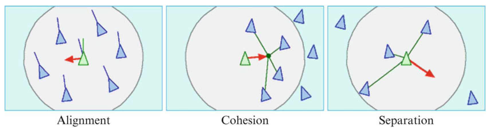

> Image description: A textbook figure titled "Flocking in Networked Systems, Fig. 1" illustrates three fundamental behaviors of autonomous agents (boids) through three side-by-side rectangular panels. The first panel, labeled **Alignment**, shows several blue triangular agents distributed within a large grey circle. A central green agent is shown with a red arrow pointing toward the center of the group, indicating a directional tendency. The second panel, labeled **Cohesion**, displays agents interacting with a central dark green dot. A red arrow points from a green agent toward this central point, while green lines connect the central dot to surrounding blue triangular agents, signifying attraction and the tendency to stay close to the group. The third panel, labeled **Separation**, shows blue triangular agents moving away from a central green agent. Green lines connect the green agent to nearby blue agents, while a red arrow points outward, representing the drive to avoid collisions and maintain distance.
Flocking in Networked Systems, Fig. 1 Photo from http://red3d.com/cwr/boids/

<!-- source_pdf_page: 484 -->
These questions have occupied the minds of many researchers in diverse areas ranging from control theory to robotics, mathematics, and computer science. As discussed above, most of the early research, which happened in computer graphics and statistical physics, was on modeling and simulation of collective behavior. Over the past 13 years, however, the focus has shifted to rigorous systems theoretic foundations, leading to what one might call a theory of collective phenomena in multiagent systems. This theory blends dynamical systems, graph theory, Markov chains, and algorithms.

This type of collective phenomena are often modeled as many-degrees-of-freedom (discretetime or continuous-time) dynamical systems with an additional twist that the interconnection structure between individual dynamical systems changes, since the motion of each node in a flock (or opinion of an individual) is affected primarily by those in each node's local neighborhood. The twist here is that the local neighborhood is not fixed: neighbors are defined based on the actual state of the system, for example, in case of Vicsek's alignment rule, as each particle averages its velocity direction with that of its neighbors and then takes a step, the set of its nearest neighbors can change.

Interestingly, very similar models were developed in statistics and mathematical sociology literature to describe how individuals in a social network update their opinions as a function of the opinion of their friends. The first such model goes back to the seminal work of DeGroot (1974) in 1974. DeGroot's model simply described the evolution of a group's scalar opinion as a function of the opinion of their neighbors by an iterative averaging scheme that can be conveniently modeled as a Markov chain. Individuals are represented by nodes of a graph, start from an opinion at time zero, and then are influenced by the people in their social clique. In DeGroot's model though, the network is given exogenously and does not change as a function of the opinions. The model therefore can be analyzed using the celebrated Perron-Frobenius theorem. The evolution of opinions is a discrete dynamic system that corresponds to an averaging map. When the
network is fixed and connected (i.e., there is a path from every node to every other node) and agents also include their own opinions in the averaging, the update results in computation of a global weighted average of initial opinions, where the weight of each initial opinion in the final aggregate is proportional to the "importance" of each node in the network.

The flocking models of Reynolds (1987) and Vicsek et al. (1995), however, have an extra twist: the network changes as opinions are updated. Similarly, more refined sociological models developed over the past decade also capture this endogeneity (Hegselmann and Krause 2002): each individual agent is influenced by others only when their opinion is close to her own. In other words, as opinions evolve, neighborhood structures change as the function of the evolving opinion, resulting in a switched dynamical system in which switching is state dependent.

In a paper in 2003, Jadbabaie and coauthors (2003) studied the Reynolds' alignment rule in the context of Vicsek's model when there is no exogenous noise. To model the endogeneity of the change in neighborhood structure, they developed a model based on repeated local averaging in which the neighborhood structure changes over time and therefore instead of a simple discrete-time linear dynamical system, the model is a discrete linear inclusion or a switched linear system. The question of interest was to determine what regimes of network changes could result in flocking. Clearly, as also DeGroot's model suggests, when the local neighbor structures do not change, connectivity is the key factor for flocking. This is a direct consequence of Perron-Frobenius theory. The result can also be described in terms of directed graphs. What is the equivalent condition in changing networks? Jadbabaie and coauthors show in their paper that indeed connectivity is important, but it need not hold every time: rather, there needs to be time periods over which the graphs are connected in time. More formally, the process of neighborhood changes due to motion in Vicsek's model can be simply abstracted as a graph in which the links "blink" on and off. For flocking, one needs to ensure that there are

<!-- source_pdf_page: 485 -->
time periods over which the union of edges (that occur as a result of proximity of particles) needs to correspond to a connected graph and such intervals need to occur infinitely often. It turns out that many of these ideas were developed much earlier in a thesis and following paper by Tsitsiklis (1984) and Tsitsiklis et al. (1986), in the context of distributed and asynchronous computation of global averages in changing graphs, and in a paper by Chatterjee and Seneta (1977), in the context of nonhomogeneous Markov chains. The machinery for proving such a results, however, is classical and has a long history in the theory of inhomogeneous Markov chains, a subject studied since the time of Markov himself, followed by Birkhoff and other mathematicians such as Hajnal, Dobrushin, Seneta, Hatfield, Daubachies, and Lagarias, to name a few.

The interesting twist in analysis of Vicsek's model is that the Euclidean norm of the distance to the globally converged "consensus angle" (or consensus opinion in the case of opinion models) can actually grow in a single step of the process; therefore, standard quadratic Lyapunov function arguments which serve as the main tool for analysis of switched linear systems are not suitable for the analysis of such models. However, it is fairly easy to see that under the process of local averaging, the largest value cannot increase and the smallest value cannot decrease. In fact, one can show that if enough connected graphs occur as the result of the switching process, the maximum value will be strictly decreasing and the minimum value will be strictly increasing The paper by Jadbabaie and coauthors (2003) has lead to a flurry of results in this area over the past decade. One important generalization to the results of Jadbabaie et al. (2003), Tsitsiklis (1984), and Tsitsiklis et al. (1986) came 2 years later in a paper by Moreau (2005), who showed that these results can be generalized to nonlinear updates and directed graphs. Moreau showed that any dynamic process that assigns a point in the interior of the convex hull of the value of each node and its neighbors will eventually result in agreement and consensus, if and only if the union of graphs from every time step till infinity
contains a directed spanning tree (a node who has direct links to every other node).

Some of these results were also extended to the analysis of the Reynolds' model of flocking including the other two behaviors. First, Tanner and coauthors $(2003,2007)$ showed in a series of papers in 2003 and 2007 that a zone-based model similar to Reynolds can result in flocking for dynamic agents, provided that the graph representing interagent communications stays connected. Olfati-Saber and coauthors (2007) developed similar results with a slightly different model.

Many generalizations and extension for these results exist in a diverse set of disciplines, resulting in a rich theory which has had applications from robotics (such as rendezvous in mobile robots) (Cortés et al. 2006) to mathematical sociology (Hegselmann and Krause 2002) and from economics (Golub and Jackson 2010) to distributed optimization theory (Nedic and Ozdaglar 2009). However, some of the fundamental mathematical questions related to flocking still remain open.

First, most results focus on endogenous models of network change. A notable extension is a paper by Cucker and Smale (2007), in which the authors develop and analyze an endogenous model of flocking that cleverly smoothens out the discontinuous change in network structure by allowing each node's influence to decay smoothly as a function of distance.

Recently, in a series of papers, Chazelle has made progress in this arena by using tools from computational geometry and algorithms for analysis of endogenous models of flocking (Chazelle 2012). Chazelle has introduced the notion of the $s$-energy of a flock, which can be thought of as a parameterized family of Lyapunov functions that represent the evolution of global misalignment between flockmates. Via tools from dynamical systems, computational geometry, combinatorics, complexity theory, and algorithms, Chazelle creates an "algorithmic calculus," for diffusive influence systems: surprisingly, he shows that the orbit or flow of such systems is attracted to a fixed point in the case of undirected graphs and a limit cycle for almost all arbitrarily small random

<!-- source_pdf_page: 486 -->
perturbations. Furthermore, the convergence time can also be bounded in both cases and the bounds are essentially optimal. The setup of the diffusive influence system developed by Chazelle creates a near-universal setup for analyzing various problems involving collective behavior in networked multiagent systems, from flocking, opinion dynamics, and information aggregation to synchronization problems.

To make further progress on analysis of what one might call networked dynamical systems (which Chazelle calls influences systems), one needs to combine mathematics of algorithms, complexity, combinatorics, and graphs with systems theory and dynamical systems.

## Summary and Future Directions

This article presented a brief summary of the literature on flocking and distributed motion coordination. Flocking is the process by which various species exhibit synchronous collective motion from simple local interaction rules. Motivated by social aggregation in various species, various algorithms have been developed in the literature to design distributed control laws for group behavior in collective robotics and analysis of opinion dynamics in social networks. The models describe each agent as a kinematic or point mass particle that aligns each agent's direction with that of its neighbors using repeated local averaging of directions. Since the neighborhood structures change due to motion, this results in a distributed switched dynamical system. If a weak notion of connectivity among agents is preserved over time, then agents reach consensus in their direction of motion. Despite the flurry of results in this area, the analysis of this phenomenon that accounts for endogenous change in dynamics is for the most part open.

## Cross-References

- Averaging Algorithms and Consensus
- Oscillator Synchronization

## Bibliography

Chatterjee S, Seneta E (1977) Towards consensus: some convergence theorems on repeated averaging. J Appl Probab 14:89-97
Chazelle B (2012) Natural algorithms and influence systems. Commun ACM 55(12):101-110
Cortés J, Martínez S, Bullo F (2006) Robust rendezvous for mobile autonomous agents via proximity graphs in arbitrary dimensions. IEEE Trans Autom Control 51(8):1289-1298
Cucker F, Smale S (2007) Emergent behavior in flocks. IEEE Trans Autom Control 52(5): 852-862
DeGroot MH (1974) Reaching a consensus. J Am Stat Assoc 69(345):118-121
Golub B, Jackson MO (2010) Naive learning in social networks and the wisdom of crowds. Am Econ J Microecon 2(1):112-149
Hegselmann R, Krause U (2002) Opinion dynamics and bounded confidence models, analysis, and simulation. J Artif Soc Soc Simul 5(3):2
Jadbabaie A, Lin J, Morse AS (2003) Coordination of groups of mobile autonomous agents using nearest neighbor rules. IEEE Trans Autom Control 48(6):9881001
Moreau L (2005) Stability of multiagent systems with time-dependent communication links. IEEE Trans Autom Control 50(2): 169-182
Nedic A, Ozdaglar A (2009) Distributed subgradient methods for multi-agent optimization. IEEE Trans Autom Control 54(1):48-61
Olfati-Saber R, Fax JA, Murray RM (2007) Consensus and cooperation in networked multi-agent systems. Proc IEEE 95(1):215-233
Reynolds CW (1987) Flocks, herds, and schools: a distributed behavioral model. Comput Graph 21(4):2534. (SIGGRAPH '87 Conference Proceedings)

Tanner HG, Jadbabaie A, Pappas GJ (2003) Stable flocking of mobile agents, Part I: fixed Topology, Part II: switching topology. In: Proceedings of the 42nd IEEE conference on decision and control, Maui, vol 2. IEEE, pp 2010-2015
Tanner HG, Jadbabaie A, Pappas GJ (2007) Flocking in fixed and switching networks. IEEE Trans Autom Control 52(5):863-868
Tsitsiklis JN (1984) Problems in decentralized decision making and computation (No. LIDS-TH-1424). Laboratory for Information and Decision Systems, Massachusetts Institute of Technology
Tsitsiklis J, Bertsekas D, Athans M (1986) Distributed asynchronous deterministic and stochastic gradient optimization algorithms. IEEE Trans Autom Control 31(9):803-812
Vicsek T, Czirók A, Ben-Jacob E, Cohen I, Shochet O (1995) Novel type of phase transition in a system of self-driven particles. Phys Rev Lett 75(6): 1226

<!-- source_pdf_page: 487 -->
## Force Control in Robotics

Luigi Villani Dipartimento di Ingeneria Elettrica e Tecnologie dell'Informazione, Università degli Studi di Napoli Federico II, Napoli, Italy

#### Abstract

Force control is used to handle the physical interaction between a robot and the environment and also to ensure safe and dependable operation in the presence of humans. The control goal may be that to keep the interaction forces limited or that to guarantee a desired force along the directions where interaction occurs while a desired motion is ensured in the other directions. This entry presents the basic control schemes, focusing on robot manipulators.

## Keywords

Compliance control; Constrained motion; Force control; Force/torque sensor; Hybrid force/motion control; Impedance control; Stiffness control

## Introduction

Control of the physical interaction between a robot manipulator and the environment is crucial for the successful execution of a number of practical tasks where the robot end effector has to manipulate an object or perform some operation on a surface. Typical examples in industrial settings include polishing, deburring, machining, or assembly.

During contact, the environment may set constraints on the geometric paths that can be followed by the robot's end effector (kinematic constraints) as in the case of sliding on a rigid surface. In other situations, the interaction occurs with a dynamic environment as in the case of
collaboration with a human. In all cases, a pure motion control strategy is not recommended, especially if the environment is stiff.

The higher the environment stiffness and position control accuracy are, the more easily the contact forces may rise and reach unsafe values. This drawback can be overcome by introducing compliance, either in a passive or in an active fashion, to accommodate the robot motion in response to interaction forces.

Passive compliance may be due to the structural compliance of the links, joints, and end effector or to the compliance of the position servo. Soft robot arms with elastic joints or links are purposely designed for intrinsically safe interaction with humans. In contrast, active compliance is entrusted to the control system, denoted interaction control or force control. In same cases, the measurement of the contact force and moment is required, which is fed back to the controller and used to modify or even generate online the desired motion of the robot (Whitney 1977).

The passive solution is faster than active reaction commanded by a computer control algorithm. However, the use of passive compliance alone lacks of flexibility and cannot guarantee that high contact forces will never occur. Hence, the most effective solution is that of using active force control (with or without force feedback) in combination with some degree of passive compliance.

In general, six force components are required to provide complete contact force information: three translational force components and three torques. Often, a force/torque sensor is mounted at the robot wrist (see an example in Fig. 1), but other possibilities exist, for example, force sensors can be placed on the fingertips of robotic hands; also, external forces and moments can be estimated via shaft torque measurements of joint torque sensors.

The force control strategies can be grouped into two categories (Siciliano and Villani 1999): those performing indirect force control and those performing direct force control. The main difference between the two categories is that the former achieve force control via motion control,

<!-- source_pdf_page: 488 -->
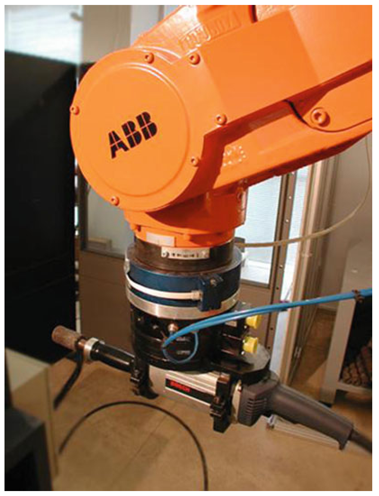

> Image description: An industrial robot arm, manufactured by ABB, is shown in close-up. The upper portion of the image features the orange-colored robot arm, with the prominent "ABB" logo visible on its joint assembly. Below the robotic arm, a specialized end-effector assembly is mounted. This assembly consists of a wrist force/torque sensor, identifiable by its metallic, cylindrical structure and wiring connections, which is positioned between the robot's wrist and the attached tool. Attached to the sensor is a deburring tool, a silver-colored cylindrical component with a dark-colored handle and a blue air hose connected to it. The setup illustrates the integration of a force/torque sensor with an industrial robot to enable force-controlled tasks, such as deburring, where precise tactile feedback is required to maintain a specific contact force against a workpiece. The background is a blurred industrial or laboratory setting.
Force Control in Robotics, Fig. 1 Industrial robot with wrist force/torque sensor and deburring tool

without explicit closure of a force feedback loop; the latter instead offer the possibility of controlling the contact force and moment to a desired value, thanks to the closure of a force feedback loop.

## Modeling

The case of interaction of the end effector of a robot manipulator with the environment is considered, which is the most common situation in industrial applications.

The end-effector pose can be represented by the position vector $\boldsymbol{p}_{e}$ and the rotation matrix $\mathbf{R}_{e}$, corresponding to the position and orientation of a frame attached to the end effector with respect to a fixed-base frame.

The end-effector velocity is denoted by the $6 \times 1$ twist vector $\mathbf{v}_{\mathrm{e}}=\left(\dot{\boldsymbol{p}}_{\mathrm{e}}^{T} \boldsymbol{\omega}_{\mathrm{e}}^{T}\right)^{T}$ where $\dot{\boldsymbol{p}}_{\mathrm{e}}$ is the translational velocity and $\boldsymbol{\omega}_{\mathrm{e}}$ is the angular velocity and can be computed from the joint velocity vector $\dot{\boldsymbol{q}}$ using the linear mapping

$$
\mathbf{v}_{\mathrm{e}}=\mathbf{J}(\boldsymbol{q}) \dot{\boldsymbol{q}} .
$$

The matrix $\mathbf{J}$ is the end-effector Jacobian. For simplicity, the case of nonredundant nonsingular manipulators is considered; therefore, the Jacobian is a square nonsingular matrix.

The force $\boldsymbol{f}_{\mathrm{e}}$ and moment $\boldsymbol{m}_{\mathrm{e}}$ applied by the end effector to the environment are the components of the wrench $\boldsymbol{h}_{\mathrm{e}}=\left(\begin{array}{ll}\boldsymbol{f}_{\mathrm{e}}^{T} & \boldsymbol{m}_{\mathrm{e}}^{T}\end{array}\right)^{T}$. The joint torques $\boldsymbol{\tau}$ corresponding to $\boldsymbol{h}_{\mathrm{e}}$ can be computed as

$$
\boldsymbol{\tau}=\mathbf{J}^{T}(\boldsymbol{q}) \boldsymbol{h}_{\mathrm{e}} .
$$

It is useful to consider the operational space formulation of the dynamic model of a rigid robot manipulator in contact with the environment (Khatib 1987):

$$
\begin{equation*}
\boldsymbol{\Lambda}(\boldsymbol{q}) \dot{\mathbf{v}}_{\mathrm{e}}+\boldsymbol{\Gamma}(\boldsymbol{q}, \dot{\boldsymbol{q}}) \mathbf{v}_{\mathrm{e}}+\boldsymbol{\eta}(\boldsymbol{q})=\boldsymbol{h}_{\mathrm{c}}-\boldsymbol{h}_{\mathrm{e}}, \tag{1}
\end{equation*}
$$

where $\boldsymbol{\Lambda}(\boldsymbol{q})$ is the $6 \times 6$ operational space inertia matrix, $\boldsymbol{\Gamma}(\boldsymbol{q}, \dot{\boldsymbol{q}})$ is the wrench including centrifugal and Coriolis effects, and $\boldsymbol{\eta}(\boldsymbol{q})$ is the wrench of the gravitational effects. The vector $\boldsymbol{h}_{\mathrm{c}}=\mathbf{J}^{-T} \boldsymbol{\tau}$ is the equivalent end-effector wrench corresponding to the input joint torques $\boldsymbol{\tau}_{\mathrm{c}}$.

Equation (1) can be seen as a representation of the Newton's Second Law of Motion where all the generalized forces acting on the joints of the robot are reported at the end effector.

The full specification of the system dynamics would require also the analytic description of the interaction force and moment $\boldsymbol{h}_{\mathrm{e}}$. This is a very demanding task from a modeling viewpoint.

The design of the interaction control and the performance analysis are usually carried out under simplifying assumptions. The following two cases are considered:

1. The robot is perfectly rigid, all the compliance in the system is localized in the environment, and the contact wrench is approximated by a linear elastic model.
2. The robot and the environment are perfectly rigid and purely kinematics constraints are imposed by the environment.
It is obvious that these situations are only ideal. However, the robustness of the control should be able to cope with situations where some of the

<!-- source_pdf_page: 489 -->
ideal assumptions are relaxed. In that case the control laws may be adapted to deal with nonideal characteristics.

## Indirect Force Control

The aim of indirect force control is that of achieving a desired compliant dynamic behavior of the robot's end effector in the presence of interaction with the environment.

## Stiffness Control

The simpler approach is that of imposing a suitable static relationship between the deviation of the end-effector position and orientation from a desired pose and the force exerted on the environment, by using the control law

$$
\begin{equation*}
\boldsymbol{h}_{\mathrm{c}}=\mathbf{K}_{\mathrm{P}} \Delta \boldsymbol{x}_{\mathrm{de}}-\mathbf{K}_{\mathrm{D}} \mathbf{v}_{\mathrm{e}}+\boldsymbol{\eta}(\boldsymbol{q}), \tag{2}
\end{equation*}
$$

where $\mathbf{K}_{\mathrm{P}}$ and $\mathbf{K}_{\mathrm{D}}$ are suitable matrix gains and $\Delta \boldsymbol{x}_{\mathrm{de}}$ is a suitable error between a desired and the actual end-effector position and orientation. The position error component of $\Delta \boldsymbol{x}_{\mathrm{de}}$ can be simply chosen as $\boldsymbol{p}_{\mathrm{d}}-\boldsymbol{p}_{\mathrm{e}}$. Concerning the orientation error component, different choices are possible (Caccavale et al. 1999), which are not all equivalent, but this issue is outside the scope of this entry.

The control input (2) corresponds to a wrench (force and moment) applied to the end effector, which includes a gravity compensation term $\boldsymbol{\eta}(\boldsymbol{q})$, a viscous damping term $\mathbf{K}_{\mathrm{D}} \mathbf{v}_{\mathrm{e}}$, and an elastic wrench provided by a virtual spring with stiffness matrix $\mathbf{K}_{\mathbf{P}}$ (or, equivalently, compliance matrix $\mathbf{K}_{\mathrm{P}}^{-1}$ ) connecting the end-effector frame with a frame of desired position and orientation. This control law is known as stiffness control or compliance control (Salisbury 1980).

Using the Lyapunov method, it is possible to prove the asymptotic stability of the equilibrium solution of equation

$$
\mathbf{K}_{\mathrm{P}} \Delta \boldsymbol{x}_{\mathrm{de}}=\boldsymbol{h}_{\mathrm{e}},
$$

meaning that, at steady state, the robot's end effector has a desired elastic behavior under the
action of the external wrench $\boldsymbol{h}_{\mathrm{e}}$. It is clear that, if $\boldsymbol{h}_{\mathrm{e}} \neq \mathbf{0}$, then the end effector deviates from the desired pose, which is usually denoted as virtual pose.

Physically, the closed-loop system (1) with (2) can be seen as a 6-DOF nonlinear and configuration-dependent mass-spring-damper system with inertia (mass) matrix $\boldsymbol{\Lambda}(\boldsymbol{q})$ and adjustable damping $\mathbf{K}_{\mathrm{D}}$ and stiffness $\mathbf{K}_{\mathrm{P}}$, under the action of the external wrench $\boldsymbol{h}_{\mathrm{e}}$.

## Impedance Control

A configuration-independent dynamic behavior can be achieved if the measure of the end-effector force and moment $\boldsymbol{h}_{\mathrm{e}}$ is available, by using the control law, known as impedance control (Hogan 1985):

$$
\boldsymbol{h}_{\mathrm{c}}=\boldsymbol{\Lambda}(\boldsymbol{q}) \boldsymbol{\alpha}+\boldsymbol{\Gamma}(\boldsymbol{q}, \dot{\boldsymbol{q}}) \dot{\boldsymbol{q}}+\boldsymbol{\eta}(\boldsymbol{q})+\boldsymbol{h}_{\mathrm{e}}
$$

where $\boldsymbol{\alpha}$ is chosen as:

$$
\boldsymbol{\alpha}=\dot{\mathbf{v}}_{\mathrm{d}}+\mathbf{K}_{\mathrm{M}}^{-1}\left(\mathbf{K}_{\mathrm{D}} \Delta \mathbf{v}_{\mathrm{de}}+\mathbf{K}_{\mathrm{P}} \Delta \boldsymbol{x}_{\mathrm{de}}-\boldsymbol{h}_{\mathrm{e}}\right)
$$

The following expression can be found for the closed-loop system

$$
\begin{equation*}
\mathbf{K}_{\mathrm{M}} \Delta \dot{\mathbf{v}}_{\mathrm{de}}+\mathbf{K}_{\mathrm{D}} \Delta \mathbf{v}_{\mathrm{de}}+\mathbf{K}_{\mathrm{P}} \Delta \boldsymbol{x}_{\mathrm{de}}=\boldsymbol{h}_{\mathrm{e}} \tag{3}
\end{equation*}
$$

representing the equation of a 6-DOF configuration-independent mass-spring-damper system with adjustable inertia (mass) matrix $\mathbf{K}_{\mathrm{M}}$, damping $\mathbf{K}_{\mathrm{D}}$, and stiffness $\mathbf{K}_{\mathrm{P}}$, known as mechanical impedance.

A block diagram of the resulting impedance control is sketched in Fig. 2.

The selection of good impedance parameters ensuring a satisfactory behavior is not an easy task and can be simplified under the hypothesis that all the matrices are diagonal, resulting in a decoupled behavior for the end-effector coordinates.

Moreover, the dynamics of the controlled system during the interaction depends on the dynamics of the environment that, for simplicity, can be approximated as a simple elastic law for each coordinate, of the form

<!-- source_pdf_page: 490 -->
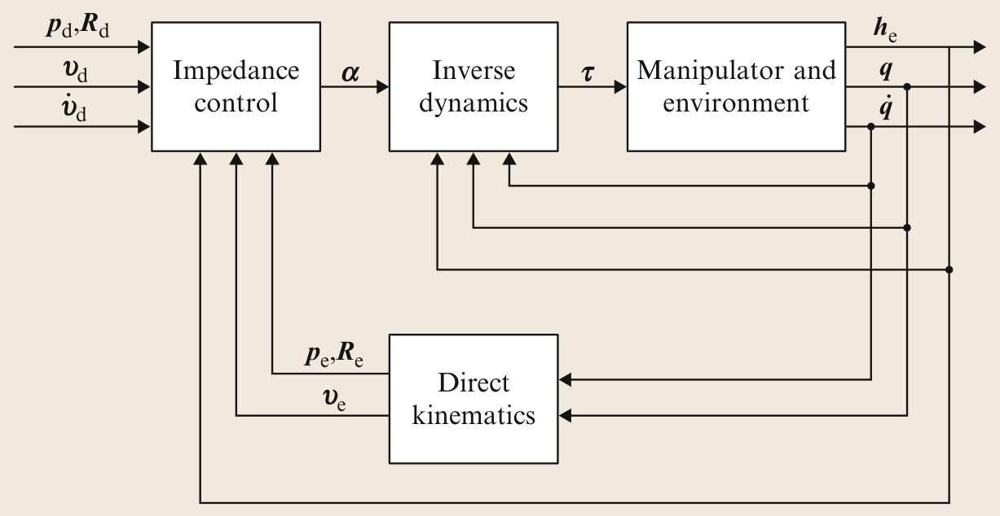

> Image description: This block diagram, titled "Force Control in Robotics, Fig. 2 Impedance control," illustrates a closed-loop control system for a robotic manipulator interacting with an environment. The system consists of four main functional blocks arranged sequentially and in feedback loops. The control process begins with desired parameters ($p_{\text{d}}, R_{\text{d}}, v_{\text{d}}, \dot{v}_{\text{d}}$) entering the **Impedance control** block. This block outputs a control signal $\alpha$, which serves as the input for the **Inverse dynamics** block. The inverse dynamics block calculates the required torque $\tau$ sent to the **Manipulator and environment** block. The manipulator's state is represented by position $q$, velocity $\dot{q}$, and an external force/torque $h_{\text{e}}$. Feedback loops are established: the state variables $\dot{q}$ and $q$ are fed back into the impedance control and inverse dynamics blocks. Additionally, $q$ is passed to a **Direct kinematics** block, which outputs end-effector position/rotation ($p_{\text{e}}, R_{\text{e}}$) and velocity $v_{\text{e}}$ back to the impedance control block.
Force Control in Robotics, Fig. 2 Impedance control

$$
h_{\mathrm{e}}=k \Delta x_{\mathrm{eo}},
$$

where $\Delta x_{\mathrm{eo}}=x_{\mathrm{e}}-x_{\mathrm{o}}$, while $x_{\mathrm{o}}$ and $k$ are the undeformed position and the stiffness coefficient of the spring, respectively.

In the above hypotheses, the transient behavior of each component of Eq. (3) can be set by assigning the natural frequency and damping ratio with the relations

$$
\omega_{\mathrm{n}}=\sqrt{\frac{k_{\mathrm{P}}+k}{k_{\mathrm{M}}}}, \quad \zeta=\frac{1}{2} \frac{k_{\mathrm{D}}}{\sqrt{k_{\mathrm{M}}\left(k_{\mathrm{P}}+k\right)}} .
$$

Hence, if the gains are chosen so that a given natural frequency and damping ratio are ensured during the interaction (i.e., for $k \neq 0$ ), a smaller natural frequency with a higher damping ratio will be obtained when the end effector moves in free space (i.e., for $k=0$ ). As for the steadystate performance, the end-effector error and the interaction force for the generic component are

$$
\Delta x_{\mathrm{de}}=\frac{k}{\left(k_{\mathrm{P}}+k\right)} \Delta x_{\mathrm{do}}, \quad h=\frac{k_{\mathrm{P}} k}{k_{\mathrm{P}}+k} \Delta x_{\mathrm{do}},
$$

showing that, during interaction, the contact force can be made small at the expense of a large position error in steady state, as long as the robot stiffness $k_{\mathrm{P}}$ is set low with respect
to the stiffness of the environment $k$ and vice versa.

## Direct Force Control

Indirect force control does not require explicit knowledge of the environment, although to achieve a satisfactory dynamic behavior, the control parameters have to be tuned for a particular task. On the other hand, a model of the interaction task is usually required for the synthesis of direct force control algorithms.

In the following, it is assumed that the environment is rigid and frictionless and imposes kinematic constraints to the robot's end-effector motion (Mason 1981). These constraints reduce the dimension of the space of the feasible endeffector velocities and of the contact forces and moments. In detail, in the presence of $m$ independent constraints ( $m<6$ ), the end-effector velocity belongs to a subspace of dimension $6- m$, while the end-effector wrench belongs to a subspace of dimension $m$ and can be expressed in the form

$$
\mathbf{v}_{\mathrm{e}}=\mathbf{S}_{\mathrm{v}}(\boldsymbol{q}) \boldsymbol{v}, \quad \boldsymbol{h}_{\mathrm{e}}=\mathbf{S}_{\mathrm{f}}(\boldsymbol{q}) \boldsymbol{\lambda}
$$

where $\boldsymbol{v}$ is a suitable $(6-m) \times 1$ vector and $\boldsymbol{\lambda}$ is a suitable $m \times 1$ vector. Moreover, the subspaces of forces and velocity are reciprocal, i.e.:

<!-- source_pdf_page: 491 -->
$$
\boldsymbol{h}_{\mathrm{e}}^{T} \mathbf{v}_{\mathrm{e}}=0, \quad \mathbf{S}_{\mathrm{f}}^{T}(\boldsymbol{q}) \mathbf{S}_{\mathrm{v}}(\boldsymbol{q})=\mathbf{0} .
$$

The concept of reciprocity expresses the physical fact that, in the hypothesis of rigid and frictionless contact, the wrench does not cause any work against the twist.

An interaction task can be assigned in terms of a desired end-effector twist $\mathbf{v}_{d}$ and wrench $\boldsymbol{h}_{d}$ that are computed as:

$$
\mathbf{v}_{\mathrm{d}}=\mathbf{S}_{\mathrm{v}} \boldsymbol{v}_{\mathrm{d}}, \quad \boldsymbol{h}_{\mathrm{d}}=\mathbf{S}_{\mathrm{f}} \lambda_{\mathrm{d}},
$$

by specifying vectors $\boldsymbol{\lambda}_{\mathrm{d}}$ and $\boldsymbol{\nu}_{\mathrm{d}}$.
In many robotic tasks it is possible to set an orthogonal reference frame, usually referred as task frame (De Schutter and Van Brussel 1988), in which the matrices $\mathbf{S}_{v}$ and $\mathbf{S}_{f}$ are constant. Moreover, the interaction task is specified by assigning a desired force/torque or a desired linear/angular velocity along/about each of the frame axes.

An example of task frame definition and task specification is given below.

Peg-in-Hole: The goal of this task is to push the peg into the hole while avoiding wedging and jamming. The peg has two degrees of motion freedom; hence, the dimension of the velocitycontrolled subspace is $6-m=2$, while the dimension of the force-controlled subspace is $m=4$. The task frame can be chosen as shown in Fig. 3, and the task can be achieved by assigning the following desired forces and torques:

- Zero forces along the $x_{\mathrm{t}}$ and $y_{\mathrm{t}}$ axes
- Zero torques about the $x_{\mathrm{t}}$ and $y_{\mathrm{t}}$ axes and the desired velocities
- A nonzero linear velocity along the $z_{\mathrm{t}}$-axis
- An arbitrary angular velocity about the $z_{t}$-axis The task continues until a large reaction force in the $z_{\mathrm{t}}$ direction is measured, indicating that the peg has hit the bottom of the hole, not represented in the figure. Hence, the matrices $\mathbf{S}_{\mathrm{f}}$ and $\mathbf{S}_{\mathrm{v}}$ can be chosen as

$$
\mathbf{S}_{\mathrm{f}}=\left(\begin{array}{cccc}
1 & 0 & 0 & 0 \\
0 & 1 & 0 & 0 \\
0 & 0 & 0 & 0 \\
0 & 0 & 1 & 0 \\
0 & 0 & 0 & 1 \\
0 & 0 & 0 & 0
\end{array}\right), \quad \mathbf{S}_{\mathrm{v}}=\left(\begin{array}{ll}
0 & 0 \\
0 & 0 \\
1 & 0 \\
0 & 0 \\
0 & 0 \\
0 & 1
\end{array}\right)
$$

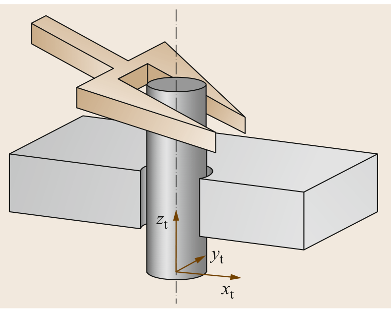

> Image description: A technical engineering diagram illustrates the process of inserting a cylindrical peg into a hole. A light-brown, tapered peg is positioned vertically, aligned with a dashed centerline. The peg is partially inserted into a larger, light-gray rectangular block that contains a matching cylindrical hole. A three-dimensional Cartesian coordinate system is centered at the base of the peg, defining the task-space frame. The axes are labeled $x_t$, $y_t$, and $z_t$, with arrows indicating their positive directions. The $z_t$ axis points upward along the vertical axis of the peg, while the $x_t$ and $y_t$ axes lie on the horizontal plane. The relationship between the peg and the block emphasizes the geometric constraints inherent in assembly tasks. The figure, titled "Force Control in Robotics, Fig. 3 Insertion of a cylindrical peg into a hole," represents a fundamental problem in robotic manipulation and contact mechanics.
Force Control in Robotics, Fig. 3 Insertion of a cylindrical peg into a hole

The task frame can be chosen attached either to the end effector or to the environment.

## Hybrid Force/Motion Control

The reciprocity of the velocity and force subspaces naturally leads to a control approach, known as hybrid force/motion control (Raibert and Craig 1981; Yoshikawa 1987), aimed at controlling simultaneously both the contact force and the end-effector motion in two reciprocal subspaces.

The reduced order dynamics of the robot with kinematic constraints is described by $6-m$ second-order equations

$$
\boldsymbol{\Lambda}_{\mathrm{v}}(\boldsymbol{q}) \dot{\boldsymbol{v}}=\mathbf{S}_{\mathrm{v}}^{T}\left[\boldsymbol{h}_{\mathrm{c}}-\boldsymbol{\mu}(\boldsymbol{q}, \dot{\boldsymbol{q}})\right]
$$

where $\boldsymbol{\Lambda}_{\mathrm{v}}=\mathbf{S}_{\mathrm{v}}^{T} \boldsymbol{\Lambda} \mathbf{S}_{\mathrm{v}}$ and $\boldsymbol{\mu}(\boldsymbol{q}, \dot{\boldsymbol{q}})=\boldsymbol{\Gamma}(\boldsymbol{q}, \dot{\boldsymbol{q}}) \mathbf{v}_{\mathrm{e}}+ \boldsymbol{\eta}(\boldsymbol{q})$, assuming constant matrices $\mathbf{S}_{\mathrm{v}}$ and $\mathbf{S}_{\mathrm{f}}$. Moreover, the vector $\boldsymbol{\lambda}$ can be computed as

$$
\lambda=\mathbf{S}_{\mathrm{f}}^{\dagger}(\boldsymbol{q})\left[\boldsymbol{h}_{\mathrm{c}}-\boldsymbol{\mu}(\boldsymbol{q}, \dot{\boldsymbol{q}})\right],
$$

revealing that the contact force is a constraint force which instantaneously depends on the applied input wrench $\boldsymbol{h}_{\mathrm{c}}$.

An inverse-dynamics inner control loop can be designed by choosing the control wrench $\boldsymbol{h}_{\mathrm{c}}$ as

$$
\boldsymbol{h}_{\mathrm{c}}=\boldsymbol{\Lambda}(\boldsymbol{q}) \mathbf{S}_{\mathrm{v}} \boldsymbol{\alpha}_{\mathrm{v}}+\mathbf{S}_{\mathrm{f}} \boldsymbol{f}_{\lambda}+\boldsymbol{\mu}(\boldsymbol{q}, \dot{\boldsymbol{q}}),
$$

<!-- source_pdf_page: 492 -->
where $\boldsymbol{\alpha}_{\mathrm{v}}$ and $\boldsymbol{f}_{\lambda}$ are properly designed control inputs, which leads to the equations

$$
\dot{\boldsymbol{v}}=\boldsymbol{\alpha}_{v}, \quad \boldsymbol{\lambda}=\boldsymbol{f}_{\lambda}
$$

showing a complete decoupling between motion control and force control.

Then, the desired force $\boldsymbol{\lambda}_{\mathrm{d}}(t)$ can be achieved by setting

$$
\boldsymbol{f}_{\lambda}=\lambda_{\mathrm{d}}(t)
$$

but this choice is very sensitive to disturbance forces, since it contains no force feedback. Alternative choices are

$$
\boldsymbol{f}_{\lambda}=\lambda_{\mathrm{d}}(t)+\mathbf{K}_{\mathrm{P} \lambda}\left[\lambda_{\mathrm{d}}(t)-\lambda(t)\right]
$$

or

$$
\boldsymbol{f}_{\lambda}=\lambda_{\mathrm{d}}(t)+\mathbf{K}_{\mathrm{I} \lambda} \int_{0}^{t}\left[\lambda_{\mathrm{d}}(\tau)-\lambda(\tau)\right] \mathrm{d} \tau
$$

where $\mathbf{K}_{\mathrm{P} \lambda}$ and $\mathbf{K}_{\mathrm{I} \lambda}$ are suitable positive-definite matrix gains. The proportional feedback is able to reduce the force error due to disturbance forces, while the integral action is able to compensate for constant bias disturbances.

Velocity control is achieved by setting

$$
\begin{aligned}
\boldsymbol{\alpha}_{v}= & \dot{\boldsymbol{v}}_{\mathrm{d}}(t)+\mathbf{K}_{\mathrm{P} v}\left[\boldsymbol{v}_{\mathrm{d}}(t)-\boldsymbol{v}(t)\right] \\
& +\mathbf{K}_{\mathrm{I} v} \int_{0}^{t}\left[\boldsymbol{v}_{\mathrm{d}}(\tau)-\boldsymbol{v}(\tau)\right] \mathrm{d} \tau
\end{aligned}
$$

where $\mathbf{K}_{\mathrm{P} \nu}$ and $\mathbf{K}_{\mathrm{I} \nu}$ are suitable matrix gains. It is straightforward to show that asymptotic tracking of $\boldsymbol{v}_{\mathrm{d}}(t)$ and $\dot{\boldsymbol{v}}_{\mathrm{d}}(t)$ is ensured with exponential convergence for any choice of positive-definite matrices $\mathbf{K}_{\mathrm{P} \nu}$ and $\mathbf{K}_{\mathrm{I} \nu}$.

Notice that the implementation of force feedback requires the computation of vector $\lambda$ from the measurement of the end-effector wrench $\boldsymbol{h}_{\mathrm{e}}$ as $\mathbf{S}_{\mathrm{f}}^{\dagger} \mathbf{v}_{\mathrm{e}}$, being $\mathbf{S}_{\mathrm{f}}^{\dagger}$ a suitable pseudoinverse of matrix $\mathbf{S}_{\mathrm{f}}$. Analogously, vector $\boldsymbol{v}$ can be computed from $\mathbf{v}_{\mathrm{e}}$ as $\mathbf{S}_{\mathrm{v}}^{\dagger} \mathbf{v}_{\mathrm{e}}$.

The hypothesis of rigid contact can be removed, and this implies that along some directions both motion and force are allowed, although they are not independent. Hybrid force/motion
control schemes can be defined also in this case Villani and De Schutter (2008).

## Summary and Future Directions

This entry has sketched the main approaches to force control in a unifying perspective. However, there are many aspects that have not been considered here. The two major paradigms of force control (impedance and hybrid force/motion control) are based on several simplifying assumptions that are only partially satisfied in practical implementations and that have been partially removed in more advanced control methods.

Notice that the performance of a forcecontrolled robotic system depends on the interaction with a changing environment which is very difficult to model and identify correctly. Hence, the standard performance indices used to evaluate a control system, i.e., stability, bandwidth, accuracy, and robustness, cannot be defined by considering the robotic system alone, as for the case of robot motion control, but must be always referred to the particular contact situation at hand.

Force control in industrial applications can be considered as a mature technology, although, for the reason explained above, standard design methodologies are not yet available. Force control techniques are employed also in medical robotics, haptic systems, telerobotics, humanoid robotics, micro-robotics, and nano robotics. An interesting field of application is related to human-centered robotics, where control plays a key role to achieve adaptability, reaction capability, and safety. Robots and biomechatronic systems based on the novel variable impedance actuators, with physically adjustable compliance and damping, capable to react softly when touching the environment, necessitate the design of specific control laws. The combined use of exteroceptive sensing (visual, depth, proximity, force, tactile sensing) for reactive control in the presence of uncertainty represents another challenging research direction.

<!-- source_pdf_page: 493 -->
## Cross-References

- Robot Grasp Control
- Robot Motion Control

## Recommended Reading

This entry has presented a brief overview of the basic force control techniques, and the cited references represent a selection of the main pioneering contributions. A more extensive treatment of this topic with related bibliography can be found in Villani and De Schutter (2008). Besides impedance control and hybrid force/position control, an approach designed to cope with uncertainties in the environment geometry is the parallel force/position control (Chiaverini and Sciavicco 1993; Chiaverini et al. 1994). In the paper Ott et al. (2008) the passive compliance of lightweight robots is combined with the active compliance ensured by impedance control. A systematic constraint-based methodology to specify complex tasks has been presented by De Schutter et al. (2007).

## Bibliography

Caccavale F, Natale C, Siciliano B, Villani L (1999) SixDOF impedance control based on angle/axis representations. IEEE Trans Robot Autom 15:289-300
Chiaverini S, Sciavicco L (1993) The parallel approach to force/position control of robotic manipulators, IEEE Trans Robot Autom 9:361-373
Chiaverini S, Siciliano B, Villani L (1994) Force/position regulation of compliant robot manipulators. IEEE Trans Autom Control 39:647-652
De Schutter J, Van Brussel H (1988) Compliant robot motion I. A formalism for specifying compliant motion tasks. Int J Robot Res 7(4):3-17
De Schutter J, De Laet T, Rutgeerts J, Decré W, Smits R, Aerbeliën E, Claes K, Bruyninckx H (2007) Constraint-based task specification and estimation for sensor-based robot systems in the presence of geometric uncertainty. Int J Robot Res 26(5):433-455
Hogan N (1985) Impedance control: an approach to manipulation: parts I-III. ASME J Dyn Syst Meas Control 107:1-24
Khatib O (1987) A unified approach for motion and force control of robot manipulators: the operational space formulation. IEEE J Robot Autom 3:43-53

Mason MT(1981) Compliance and force control for computer controlled manipulators. IEEE Trans Syst Man Cybern 11:418-432
Ott C, Albu-Schaeffer A, Kugi A, Hirzinger G (2008) On the passivity based impedance control of flexible joint robots. IEEE Trans Robot 24:416-429
Raibert MH, Craig JJ (1981) Hybrid position/force control of manipulators. ASME J Dyn Syst Meas Control 103:126-133
Salisbury JK (1980) Active stiffness control of a manipulator in Cartesian coordinates. In: 19th IEEE conference on decision and control, Albuquerque, pp 95-100
Siciliano B, Villani L (1999) Robot force control. Kluwer, Boston
Villani L, De Schutter J (2008) Robot force control. In: Siciliano B, Khatib O (eds) Springer handbook of robotics. Springer, Berlin, pp 161-185
Whitney DE (1977) Force feedback control of manipulator fine motions. ASME J Dyn Syst Meas Control 99:91-97
Yoshikawa T (1987) Dynamic hybrid position/force control of robot manipulators - description of hand constraints and calculation of joint driving force. IEEE J Robot Autom 3:386-392

## Frequency Domain System Identification

Johan Schoukens and Rik Pintelon
Department ELEC, Vrije Universiteit Brussel, Brussels, Belgium

#### Abstract

In this chapter we give an introduction to frequency domain system identification. We start from the identification work loop in - System Identification: An Overview, Fig. 4, and we discuss the impact of selecting the time or frequency domain approach on each of the choices that are in this loop. Although there is a full theoretical equivalence between the time and frequency domain identification approach, it turns out that, from practical point of view, there can be a natural preference for one of both domains.

## Keywords

Discrete and continuous time models; Experiment setup; Frequency and time domain identification; Plant and noise model

<!-- source_pdf_page: 494 -->
## Introduction

System identification provides methods to build a mathematical model for a dynamical system starting from measured input and output signals ( □ System Identification: An Overview; see the section "Models and System Identification"). Initially, the field was completely dominated by the time domain approach, and the frequency domain was used to interpret the results (Ljung and Glover 1981). This picture changed in the nineteenth of the last century by the development of advanced frequency domain methods (Ljung 2006; Pintelon and Schoukens 2012), and nowadays it is widely accepted that there is a full theoretical equivalence between time and frequency domain system identification under some weak conditions (Agüero et al. 2009; Pintelon and Schoukens 2012). Dedicated toolboxes are available for both domains (Kollar 1994; Ljung 1988). This raises the question how to choose between time and frequency domain identification. Many times the choice between both approaches can be made based on the user's familiarity with one of two methods. However, for some problems it turns out that there is a natural preference for the time or the frequency domain. This contribution discusses the main issues that need to be considered when making this choice, and it provides additional insights to guide the reader to the best solutions for her/his problem.

In the identification work loop - System Identification: An Overview, Fig.4, we need to address three important questions (Ljung 1999, Sect.1.4; Söderström and Stoica 1989, Chap. 1; Pintelon and Schoukens 2012, Sect. 1.4) that directly interact with the choice between time and frequency domain system identification:

- What data are available? What data are needed? This discussion will influence the selection of the measurement setup, the model choice, and the design of the experiment.
- What kind of models will be used? We will mainly focus on the identification of discrete time and continuous time models, using exactly the same frequency domain tools.
- How will the model be matched to the data? This question boils down to the choice of a cost function that measures the distance between the data and the model. We will discuss the use of nonparametric weighting functions in the frequency domain.
In the next sections, we will address these and similar questions in more detail. First, we discuss the measurement of the raw data. The choices that are made in this step will have a strong impact on many user aspects of the identification process. The frequency domain formulation will turn out to be a natural choice to propose a unified formulation of the system identification problem, including discrete and continuous time modeling. Next, a generalized frequency domain description of the system relation will be proposed. This model will be matched to the data, using a weighted least squares cost function, formulated in the frequency domain identification. This will allow for the use of nonparametric weighting functions, based on a nonparametric preprocessing of the data. Eventually, some remaining user aspects are discussed.

## Data Collection

In this section, we discuss the measurement assumptions that are made when the raw data are collected. It will turn out that these will directly influence the natural choice of the models that are used to describe the continuous time physical systems.

## Time Domain and Frequency Domain Measurements

The data can be collected either in the time or in the frequency domain, and we discuss briefly both options.

## Time Domain Measurements

Most measurements are nowadays made in the time domain because very fast high-quality analog-to-digital convertors (ADC) became available at a low price. These allow us to sample

<!-- source_pdf_page: 495 -->
Frequency Domain System Identification,
Fig. 1 Comparison of the ZOH and BL signal reconstruction of a discrete time sequence: (a) time domain: ⋯ BL, - ZOH; (b) spectrum ZOH signal; (c) spectrum BL signal
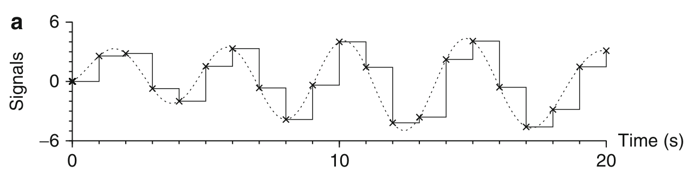

> Image description: Figure 1(a) is a time-domain plot comparing two signal reconstruction methods for a discrete-time sequence. The vertical axis is labeled "Signals" with values ranging from -6 to 6. The horizontal axis is labeled "Time (s)" ranging from 0 to 20 seconds. Two waveforms are overlaid: a dashed sinusoidal curve and a solid step-like waveform. The dashed curve represents the original continuous-time signal. The solid line represents the Zero-Order Hold (ZOH) reconstruction, which maintains a constant value between discrete sample points (marked with "x"). The sample points are distributed periodically along the dashed curve. In engineering terms, this illustrates how a ZOH process converts a discrete sequence into a continuous signal by holding the sample value constant until the next sample occurs, resulting in a stair-step approximation of the underlying continuous sinusoid.

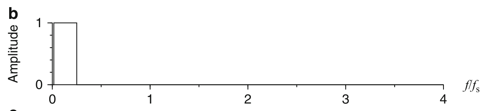

> Image description: A scientific plot labeled "**b**" displays the spectrum of a Zero-Order Hold (ZOH) signal. The image consists of a two-dimensional Cartesian coordinate system. The vertical axis is labeled "**Amplitude**" and ranges from $0$ to $1$, with a tick mark indicating the midpoint at $0.5$. The horizontal axis is labeled "**$f/f_s$**," representing the normalized frequency, ranging from $0$ to $4$. The data is represented by a single rectangular pulse (a square wave in the frequency domain). The pulse begins at $f/f_s = 0$ with an amplitude of $1$ and maintains this constant amplitude until it drops sharply to zero at $f/f_s = 0.5$. This indicates a sinc-like frequency response characteristic of a ZOH reconstruction, where the signal's energy is concentrated within the Nyquist interval $[0, 0.5]$. The plot is clean, using black lines on a white background.
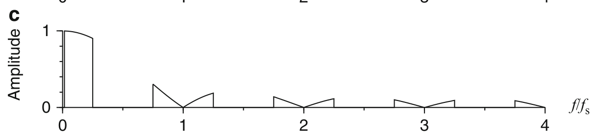
and discretize the continuous time input and output signals and process these on a digital computer. Also the excitation signals are mostly generated from a discrete time sequence with a digital-to-analog convertor (DAC).

The continuous time input and output signals $u_{c}(t), y_{c}(t)$ of the system to be modeled are measured at the sampling moments $t_{k}= k T_{s}$, with $T_{s}=1 / f_{s}$ the sampling period and $f_{s}$ the sampling frequency: $u(k)=u_{c}\left(k T_{s}\right)$, and $y(k)=y_{c}\left(k T_{s}\right)$. The discrete time signals $u(k), y(k), k=1, \cdots, N$ are transformed to the frequency domain using the discrete Fourier transform (DFT) ( ↓ Nonparametric Techniques in System Identification, Eq. 1), resulting in the DFT spectra $U(l), Y(l)$, at the frequencies $f_{l}= l \frac{f_{s}}{N}$. Making some abuse of notation, we will reuse the same symbols later in this text, to denote the Z-transform of the signals, for example, $Y(z)$ will also be used for the Z -transform of $y(k)$.

## Frequency Domain Measurements

A major exception to this general trend toward time domain measurements are the (highfrequency) network analyzers that measure the transfer function of a system frequency by frequency, starting from the steadystate response to a sine excitation. The frequency is stepped over the frequency
band of interest, resulting directly in a measured frequency response function at a user selected set of frequencies $\omega_{k}, k= 1, \cdots, F$ :

$$
G\left(\omega_{k}\right) .
$$

From the identification point of view, we can easily fit the latter situation in the frequency domain identification framework, by putting

$$
U(k)=1, Y(k)=G\left(\omega_{k}\right) .
$$

For that reason we will focus completely on the time domain measurement approach in the remaining part of this contribution.

## Zero-Order-Hold and Band-Limited Setup: Impact on the Model Choice

No information is available on how the continuous time signals $u_{c}(t), y_{c}(t)$ vary in between the measured samples $u(k), y(k)$. For that reason we need to make an assumption and make sure that the measurement setup is selected such that the intersample assumption is met. Two intersample assumptions are very popular (Pintelon and Schoukens 2012; Schoukens et al. 1994, pp. 498-512): the zero-order-hold ( ZOH ) and the band-limited assumption (BL). Both options are shown in Fig. 1 and discussed below. The choice

<!-- source_pdf_page: 496 -->
of these assumptions does not only affect the measurement setup; it has also a strong impact on the selection between a continuous or a discrete time model choice.

## Zero-Order Hold

The ZOH setup assumes that the excitation remains constant in between the samples. In practice, the model is identified between the discrete time reference signal in the memory of the generator and the sampled output. The intersample behavior is an intrinsic part of the model: if the intersample behavior changes, also the corresponding model will change. The ZOH assumption is very popular in digital control. In that case the sampling frequency $f_{s}$ is commonly chosen 10 times larger than the frequency band of interest.

A discrete time model gives, in case of noisefree data, an exact description between the sampled input $u(k)$ and output $y(k)$ of the continuous time system:

$$
y(k)=G(q, \theta) u(k)
$$

in the time domain ( - System Identification: An Overview, Eq. 6). In this expression, $q$ denotes the shift operator (time domain), and it is replaced by $z$ in the z -domain description (transfer function description):

$$
Y(z)=G(z, \theta) U(z)
$$

Evaluating the transfer function at the unit circle by replacing $z=e^{i \omega}$ results in the frequency domain description of the system:

$$
Y\left(e^{i \omega}\right)=G\left(e^{i \omega}, \theta\right) U\left(e^{i \omega}\right)
$$

( □ System Identification: An Overview, Eq. 34).

## Band-Limited Setup

The BL setup assumes that above a given frequency $f_{\text {max }}<f_{s} / 2$, there is no power in the signals. The continuous time signals are filtered by well-tuned anti-alias filters (cutoff frequency $f_{\text {max }}<f_{s} / 2$ ), before they are sampled. Outside the digital control world, the

BL setup is the standard choice for discrete time measurements. Without using anti-alias filters, large errors can be created due to aliasing effects: the high frequency $\left(f>f_{s} / 2\right)$ content of the measured signals is folded down in the frequency band of interest and act there as a disturbance. For that reason it is strongly advised to use always anti-alias filters in the measurement setup.

The exact relation between BL signals is described by a continuous time model, for example, in the frequency domain:

$$
Y(\omega)=G(\omega, \theta) U(\omega)
$$

(Schoukens et al. 1994).

## Combining Discrete Time Models and BL Data

It is also possible to identify a discrete time model between the BL data, at a cost of creating (very) small model errors (Schoukens et al. 1994). This is the standard setup that is used in digital signal procession applications like digital audio processing. The level of the model errors can be reduced by lowering the ratio $f_{\text {max }} / f_{s}$ or by increasing the model order. In a properly designed setup, the discrete time model errors can be made very small, e.g., relative errors below $10^{-5}$. In Table 1 an overview of the models corresponding to the experimental conditions is given.

## Extracting Continuous Time Models from ZOH Data

Although the most robust and practical choice to identify a continuous time model is to start from BL data, it is also possible to extract a continuous time model under the ZOH setup. A first possibility is to assume that the ZOH assumption is perfectly met, which is a very hard assumption to realize in practice. In that case the continuous time model can be retrieved by a linear step invariant transformation of the discrete time model. A second possibility is to select a very high sample frequency with respect to the bandwidth of the system. In that case it is advantageous to describe the discrete time model using the delta operator (Goodwin 2010), and

<!-- source_pdf_page: 497 -->
Frequency Domain System Identification, Table 1 Relations between the continuous time system $G(s)$ and the identified models as a function of the signal and model choices

|  | DT-model (Assuming ZOH-setup) | CT-model (Assuming BL-setup) |
| :--- | :--- | :--- |
| ZOH setup | Exact DT-model | Not studied |
|  | $G(z)=\left(1-z^{-1}\right) Z\left\{\frac{G(s)}{S}\right\}$ |  |
| BL setup | Approximate DT model | Exact CT-model $G(s)$ |
|  | $\begin{aligned} & \tilde{G}(z) \tilde{G}\left(z=e^{j \omega T_{s}}\right) \approx G(s= \\ & j \omega),\|\omega\|<\frac{\omega_{s}}{2} \end{aligned}$ |  |
|  | 'digital signal processing field' | 'standard conditions CT modelling' |

we have that the coefficients of the discrete time model converge to those of the continuous time model.

## Models of Cascaded Systems

In some problems we want to build models for a cascade of two systems $G_{1}, G_{2}$. It is well known that the overall transfer function $G$ is given by the product $G(\omega)=G_{1}(\omega) G_{2}(\omega)$. This result holds also for models that are identified under the BL signal assumption: the model for the cascade will be the product of the models of the individual systems. However, the result does not hold under the ZOH assumption, because the intermediate signal between $G_{1}, G_{2}$ does not meet the ZOH assumption. For that reason, the ZOH model of a cascaded system is not obtained by cascading the ZOH models of the individual systems.

## Experiment Design: Periodic or Random Excitations?

In general, arbitrary data can be used to identify a system as long as some basic requirements are respected ( □ System Identification: An Overview, section on Experiment Design). Imposing periodic excitations can be an important restriction of the user's freedom to design the experiment, but we will show in the next sections that it offers also major advantages at many steps in the identification work loop ( System Identification: An Overview, Fig. 4).

With the availability of arbitrary wave form generators, it became possible to generate arbitrary periodic signals. The user should make two major choices during the design of the periodic
excitation: the selection of the amplitude spectrum (How is the available power distributed over the frequency?) and the choice of the frequency resolution (What is the frequency step between two successive points of the measured FRF?) (Pintelon and Schoukens 2012, Sect. 5.3).

The amplitude spectrum is mainly set by the requirement that the excited frequency band should cover the frequency band of interest. A white noise excitation covers the full frequency band, including those bands that are of no interest for the user. This is a waste of power and it should be avoided. Designing a good power spectrum for identification and control purposes is discussed in Experiment Design and Identification for Control.

The frequency resolution $f_{0}=1 / T$ is set by the inverse of the period of the signal. It should be small enough so that no important dynamics are missed, e.g., a very sharp mechanical resonance.

The reader should be aware that exactly the same choices have to be made during the design of nonperiodic excitations. If, for example, a random noise excitation is used, the frequency resolution is also restricted by the length of the experiment $T_{m}$ and the corresponding frequency resolution is again $f_{0}=1 / T_{m}$. The power spectrum of the noise excitation should be well shaped using a digital filter.

## Nonparametric Preprocessing of the Data in the Frequency Domain

Before a parametric model is identified from the raw data, a lot of information can be gained, almost for free, by making a nonparametric analysis of the data. This can be done with very

<!-- source_pdf_page: 498 -->
little user interaction. Some of these methods are explicitly linked to the periodic nature of the data, other methods apply also to random excitations.

## Nonparametric Frequency Analysis of Periodic Data

By using simple DFT techniques, the following frequency domain information is extracted from sampled time domain data $u(t), y(t), t= 1, \ldots, N$ (Pintelon and Schoukens 2012):

- The signal information: $U(l), Y(l)$, the DFT spectra of the input and output, evaluated at the frequencies $l f_{0}$, with $k=1,2, \cdots, F$.
- Disturbing noise variance information: The full data record is split, so that each subrecord contains a single period. For each of these, the DFT spectrum is calculated. Since the signals are periodic, they do not vary from one period to the other, so that the observed variations can be attributed to the noise. By calculating the sample mean and variance over the periods at each frequency, a nonparametric noise analysis is available. The estimated variances $\hat{\sigma}_{U}^{2}(k), \hat{\sigma}_{Y}^{2}(k)$ measure the disturbing noise power spectrum at frequency $f_{k}$ on the input and the output respectively. The covariance $\hat{\sigma}_{Y U}^{2}(k)$ characterizes the linear relations between the noise on the input and the output.
This is very valuable information because, even before starting the parametric identification step, we get already full access to the quality of the raw data. As a consequence, there is also no interference between the plant model estimation and the noise analysis: plant model errors do not affect the estimated noise model. It is also important to realize that there is no user interaction requested to make this analysis and it follows directly from a simple DFT analysis of the raw data. These are two major advantages of using periodic excitations.

## Nonlinear Analysis

Using well-designed periodic excitations, it is possible to detect the presence of nonlinear distortions during the nonparametric frequency step. The level of the nonlinear distortions at the output
of the system is measured as a function of the frequency, and it is even possible to differentiate between even (e.g., $x^{2}$ ) and odd (e.g., $x^{3}$ ) distortions. While the first only act as disturbing noise in a linear modeling framework, the latter will also affect the linearized dynamics and can change, for example, the pole positions of a system (Pintelon and Schoukens 2012, Sect. 4.3).

## Noise and Data Reduction

By averaging the periodic signals over the successive periods, we get a first reduction of the noise. An additional noise reduction is possible when not all frequencies are excited. If a very wide frequency band has to be covered, a fine frequency resolution is needed at the low frequencies, whereas in the higher frequency bands, the resolution can be reduced. Signals with a logarithmic frequency distribution are used for that purpose. Eliminating the unexcited frequencies does not only reduce the noise, it also reduces significantly the amount of raw data to be processed. By combining different experiments that cover each a specific frequency band, it is possible to measure a system over multiple decades, e.g., electrical machines are measured from a few mHz to a few kHz .

In a similar way, it is also possible to focus the fit on the frequency band of interest by including only those frequencies in the parametric modeling step.

## High-Quality Frequency Response Function Measurements

For periodic excitations, it is very simple to obtain high-quality measurements of the nonparametric frequency response function of the system. These results can be extended to random excitations at a cost of using more advanced algorithms that require more computation time (Pintelon and Schoukens, Chap. 7). This approach is discussed in detail in ▷ Nonparametric Techniques in System Identification (Eq. 1).

<!-- source_pdf_page: 499 -->
## Generalized Frequency Domain Models

A very important step in the identification work loop is the choice of the model class ( ✓ System Identification: An Overview, Fig. 4). Although most physical systems are continuous time, the models that we need might be either discrete time (e.g., digital control, computer simulations, digital signal processing) or continuous time (e.g., physical interpretation of the model, analog control) (Ljung 1999, Sects. 2.1 and 4.3). A major advantage of the frequency domain is that both model classes are described by the same transfer function model. The only difference is the choice of the frequency variable. For continuous time models we operate in the Laplace domain, and the frequency variable is retrieved on the imaginary axis by putting $s=j \omega$. For discrete time systems we work on the unit circle that is described by the frequency variable $z=e^{j 2 \pi f / f_{s}}$. The application class can be even extended to include diffusion phenomena by putting $\Omega=\sqrt{j \omega}$ (Pintelon et al. 2005). From now on we will use the generalized frequency variable $\Omega$, and depending on the selected domain, the proper substitution $j \omega, e^{j 2 \pi f / f_{s}}, \sqrt{j \omega}$ should be made. The unified discrete and continuous time description

$$
Y(k)=G\left(\Omega_{k}, \theta\right) U(k) .
$$

illustrates also very nicely that in the frequency domain there is a strong similarity between discrete and continuous time system identification.

To apply this model to finite length measurements, it should be generalized to include the effect of the initial conditions (time domain) or
the begin and end effects (called leakage in the frequency domain). See - Nonparametric Techniques in System Identification, "The Leakage Problem" section. The amazing result is that in the frequency domain, both effects are described by exactly the same mathematical expression. This leads eventually to the following model in the frequency domain that is valid for periodic and arbitrary (nonperiodic) BL or ZOH excitations (Pintelon et al. 1997; McKelvey 2002; Pintelon and Schoukens 2012, Chap. 6):

$$
Y(k)=G(\Omega, \theta) U(k)+T_{G}(\Omega, \theta)
$$

which becomes for SISO (single-input-singleoutput) systems:
$G(\Omega, \theta)=\frac{B(\Omega, \theta)}{A(\Omega, \theta)}$, and $T_{G}(\Omega, \theta)=\frac{I(\Omega, \theta)}{A(\Omega, \theta)}$.
$A, B, I$ are all polynomials in $\Omega$. The transient term $T_{G}(\Omega, \theta)$ models transient and leakage effects. It is most important for the reader to realize that this is an exact description for noise free data. Observe that it is very similar to the description in the time domain: $y(t)=G(q, \theta) u(t)+t_{G}(t, \theta)$. In that case the transient term $t_{G}(t, \theta)$ models the initial transient that is due to the initial conditions.

## Parametric Identification

Once we have the data and the model available in the frequency domain, we define the following weighted least squares cost function to match the model to the data (Schoukens et al. 1997):

$$
V(\theta)=\frac{1}{F} \sum_{k=1}^{F} \frac{\left|\hat{Y}(k)-G\left(\Omega_{k}, \theta\right) \hat{U}(k)-T_{G}\left(\Omega_{k}, \theta\right)\right|^{2}}{\hat{\sigma}_{Y}^{2}(k)+\hat{\sigma}_{U}^{2}(k)\left|G\left(\Omega_{k}, \theta\right)\right|^{2}-2 \operatorname{Re}\left(\hat{\sigma}_{Y U}^{2}(k) G\left(\Omega_{k}, \theta\right)\right)} .
$$

The properties of this estimator are fully studied in Schoukens et al. (1999) and Pintelon and Schoukens (2012, Sect. 10.3), and it is shown that it is a consistent and almost efficient estimator under very mild conditions.

The formal link with the time domain cost function, as presented in ▷ System Identification: An Overview, can be made by assuming that the input is exactly known $\left(\hat{\sigma}_{U}^{2}(k)=\right. 0, \hat{\sigma}_{Y U}^{2}(k)=0$ ), and replacing the nonparametric

<!-- source_pdf_page: 500 -->
noise model on the output by a parametric model:

These changes reduce the cost function, within a parameter independent constant $\lambda$ to

$$
\hat{\sigma}_{Y}^{2}(k)=\lambda\left|H\left(\Omega_{k}, \theta\right)\right|^{2} .
$$

$$
V_{F}(\theta)=\frac{1}{F} \sum_{k=1}^{F} \frac{\left|\hat{Y}(k)-G\left(\Omega_{k}, \theta\right) U_{0}(k)-T_{G}\left(\Omega_{k}, \theta\right)\right|^{2}}{\left|H\left(\Omega_{k}, \theta\right)\right|^{2}},
$$

which is exactly the same expression as Eq. 37 in - System Identification: An Overview, provided that the frequencies $\Omega_{k}$ cover the full unit circle and the transient term $T_{G}$ is omitted. The latter models the initial condition effects in the time domain. The expression shows the full equivalence with the classical discrete time domain formulation. If only a subsection of the full unit circle is used for the fit, the additional term $N \log \operatorname{det} \Lambda$ in - System Identification: An Overview, Eq. 21 should be added to the cost function $V_{F}(\theta)$.

## Additional User Aspects in Parametric Frequency Domain System Identification

In this section we highlight some additional user aspects that are affected by the choice for a time or frequency approach to system identification.

## Nonparametric Noise Models

The use of a nonparametric noise model is a natural choice in the frequency domain. It is of course also possible to use the parametric noise model in the frequency domain formulation, but then we would lose two major advantages of the frequency domain formulation: (i) For periodic excitations, there is no interaction between the identification of the plant model and the nonparametric noise model. Plant model errors do not show up in the noise model. (ii) The availability of the nonparametric noise models eliminates the need for tuning the parametric noise model order, resulting in algorithms that are easier to use.

A disadvantage of using a nonparametric noise model is that we can no longer express that the
noise model can share some dynamics with the plant model, for example, when the disturbance is an unobserved plant input.

It is also possible to use a nonparametric noise model in the time domain. This leads to a Toeplitz weighting matrix, and the fast numerical algorithms that are used to deal with these make use internally of FFT (fast Fourier transform) algorithms which brings us back to the frequency domain representation of the data.

## Stable and Unstable Plant Models

In the frequency domain formulation, there is no special precaution needed to deal with unstable models, so that we can tolerate these models without any problem. There are multiple reasons why this can be advantageous. The most obvious one is the identification of an unstable system, operating in a stabilizing closed loop. It can also happen that the intermediate models that are obtained during the optimization process are unstable. Imposing stability at each iteration can be too restrictive, resulting in estimates that are trapped in a local minimum. A last significant advantage is the possibility to split the identification problem (extract a model from the noisy data) and the approximation problem (approximate the unstable model by a stable one). This allows us to use in each step a cost function that is optimal for that step: maximum noise reduction in the first step, followed by a user-defined approximation criterion in the second step.

## Model Selection and Validation

An important step in the system identification procedure is the tuning of the model complexity, followed by the evaluation of the model quality on a fresh data set. The availability of a

<!-- source_pdf_page: 501 -->
nonparametric noise model and a high-quality frequency response function measurement simplifies these steps significantly:

## Absolute Interpretation of the Cost Function: Impact on Model Selection and Validation

The weighted least squares cost function, using the nonparametric noise weighting, is a normalized function. Its expected value equals $E\{V(\hat{\theta})\}=\left(F-n_{\theta} / 2\right) / F$, with $n_{\theta}$ the number of free parameters in the model and $F$ the number of frequency points. A cost function that is far too large points to remaining model errors. Unmodeled dynamics result in correlated residuals (difference between the measured and the modeled FRF): the user should increase the model order to capture these dynamics in the linear model. A cost function that is far too large, while the residuals are white, points to the presence of nonlinear distortions: the best linear approximation is identified, but the user should be aware that this approximation is conditioned on the actual excitation signal. A cost function that is far too low points to an error in the preprocessing of the data, resulting in a bad noise model.

## Missing Resonances

Some systems are lightly damped, resulting in a resonant behavior, for example, a vibrating mechanical structure. By comparing the parametric transfer function model with the nonparametric FRF measurements, it becomes clearly visible if a resonance is missed in the model. This can be either due to a too simple model structure (the model order should be increased), or it can appear because the model is trapped in a local minimum. In the latter case, better numerical optimization and initialization procedures should be looked for.

## Identification in the Presence of Noise on the Input and Output Measurements

Within the band-limited measurement setup, both the input and the output have to be measured. This leads in general to an identification framework where both the input and the output are disturbed by noise. Such problems are studied in the errors-in-variables (EIV)
framework (Soderstrom 2012). A special case is the identification of a system that is captured in a feedback loop. In that case we have that the noisy output measurements are fed back to the input of the system which creates a dependency between the input and output disturbance. We discuss both situations briefly below.

## Errors-in-Variables Framework

The major difficulty of the EIV framework is the simultaneous identification of the plant model describing the input-output relations, the noise models that describe the input and the output noise disturbances, and the signal model describing the coloring of the excitation (Soderstrom 2012). Advanced identification methods are developed, but today it is still necessary to impose strong restrictions on the noise models, e.g., correlations between input and output noise disturbances are not allowed. The periodic frequency domain approach encapsulates the general EIV, including mutually correlated colored input-output noise. Again, a full nonparametric noise model is obtained in the preprocessing step. This reduces the complexity of the EIV problem to that of a classical weighted least squares identification problem which makes a huge difference in practice (Pintelon and Schoukens 2012; Söderström et al. 2010).

## Identification in a Feedback Loop

Identification under feedback conditions can be solved in the time domain prediction error method (Ljung 1999, Sect. 13.4; Söderström and Stoica 1989, Chap. 10). This leads to consistent estimates, provided that the exact plant and noise model structure and order is retrieved. In the periodic frequency domain approach, a nonparametric noise model is extracted (variances input and output noise, and covariance between input and output noise) in the preprocessing step, without any user interaction. Next, these are used as a weighting in the weighted least squares cost function which leads to consistent estimates provided that the plant model is flexible enough to capture the true plant

<!-- source_pdf_page: 502 -->
transfer function (Pintelon and Schoukens 2012, Sect. 9.18).

## Summary and Future Directions

Theoretically, there is a full equivalence between the time and frequency domain formulation of the system identification problem. In many practical situations the user can make a free choice between both approaches, based on nontechnical arguments like familiarity with one of both domains. However, some problems can be easier formulated in the frequency domain. Identification of continuous time models is not more involved than retrieving a discrete time model. The frequency domain formulation is also the natural choice to use nonparametric noise models. This eliminates the request to select a specific noise model structure and order, although this might be a drawback for experienced users who can take advantage of a clever choice of this structure. The advantages that are directly linked to periodic excitation signals can be explored most naturally in the frequency domain: the noise model is available for free, EIV identification is not more involved than the output error identification problem, and identification under feedback conditions does not differ from open-loop identification. Nonstationary effects are an example of a problem that will be easier detected in the time domain. In general, we advise the reader to take the best of both approaches and to swap from one domain to the other whenever it gives some advantage to do so. In the future, it will be necessary to extend the framework to include a characterization of nonlinear and time-varying effects.

## Cross-References

- System Identification: An Overview
- Nonparametric Techniques in System Identification
- Experiment Design and Identification for Control

## Recommended Reading

We recommend the reader the books of Ljung (1999) and Söderström and Stoica (1989) for a systematic study of time domain system identification. The book of Pintelon and Schoukens (2012) gives a comprehensive introduction to frequency domain identification. An extended discussion of the basic choices (intersample behavior, measurement setup) is given in Chap. 13 of Pintelon and Schoukens (2012) or in Schoukens et al. (1994). The other references in this list highlight some of the technical aspects that were discussed in this text.

Acknowledgments This work was supported in part by the Fund for Scientific Research (FWO-Vlaanderen), by the Flemish Government (Methusalem), by the Belgian Government through the Inter university Poles of Attraction (IAP VII) Program, and the ERC Advanced Grant SNLSID.

## Bibliography

Agüero JC, Yuz JI, Goodwin GC et al (2009) On the equivalence of time and frequency domain maximum likelihood estimation. Automatica 46:260-270
Goodwin GC (2010) Sampling and sampled-data models. In: American control conference, ACC 2010, Baltimore
Kollar I (1994) Frequency domain system identification toolbox for use with MATLAB. The MathWorks Inc., Natick
Ljung L (1988) System identification toolbox for use with MATLAB. The MathWorks Inc., Natick
Ljung L (1999) System identification: theory for the user, 2nd edn. Prentice Hall, Upper Saddle River
Ljung L (2006) Frequency domain versus time domain methods in system identification - revisited. In: Workshop on control of uncertain systems location, University of Cambridge, 21-22 Apr
Ljung L, Glover K (1981) Frequency-domain versus time domain methods in system identification. Automatica 17:71-86
McKelvey T (2002) Frequency domain identification methods. Circuits Syst Signal Process 21: 39-55
Pintelon R, Schoukens J (2012) System identification: a frequency domain approach, 2nd edn. Wiley, Hoboken/IEEE, Piscataway
Pintelon R, Schoukens J, Vandersteen G (1997) Frequency domain system identification using arbitrary signals. IEEE Trans Autom Control 42:1717-1720

<!-- source_pdf_page: 503 -->
Pintelon R, Schoukens J, Pauwels L et al (2005) Diffusion systems: stability, modeling, and identification. IEEE Trans Instrum Meas 54:2061-2067
Schoukens J, Pintelon R, Van hamme H (1994) Identification of linear dynamic systems using piecewiseconstant excitations - use, misuse and alternatives. Automatica 30:1153-1169
Schoukens J, Pintelon R, Vandersteen G et al (1997) Frequency-domain system identification using nonparametric noise models estimated from a small number of data sets. Automatica 33: 1073-1086
Schoukens J, Pintelon R, Rolain Y (1999) Study of conditional ML estimators in time and frequency-domain system identification. Automatica 35:91-100
Söderström T (2012) System identification for the errors-in-variables problem. Trans Inst Meas Control 34:780792
Söderström T, Stoica P (1989) System identification. Prentice-Hall, Englewood Cliffs
Söderström T, Hong M, Schoukens J et al (2010) Accuracy analysis of time domain maximum likelihood method and sample maximum likelihood method for errors-in-variables and output error identification. Automatica 46:721-727

## Frequency-Response and Frequency-Domain Models

Abbas Emami-Naeini and J. David Powell Stanford University, Stanford, CA, USA

#### Abstract

A major advantage of using frequency response is the ease with which experimental information can be used for design purposes. Raw measurements of the output amplitude and phase of a plant undergoing a sinusoidal input excitation are sufficient to design a suitable feedback control. No intermediate processing of the data (such as finding poles and zeros or determining system matrices) is required to arrive at the system model. The wide availability of computers has rendered this advantage less important now than it was years ago; however, for relatively simple systems, frequency response is often still the most cost-effective design method. The method is most effective for systems that are stable in open-loop. Yet another advantage is that it is

the easiest method to use for designing dynamic compensation.

## Keywords

Bandwidth; Bode plot; Frequency response; Gain margin (GM); Magnitude; Phase; Phase margin (PM); Resonant peak; Stability

## Introduction: Frequency Response

A very common way to use the exponential response of linear time-invariant systems (LTIs) is in finding the frequency response, or response to a sinusoid. First we express the sinusoid as a sum of two exponential expressions (Euler's relation):

$$
\begin{equation*}
A \cos (\omega t)=\frac{A}{2}\left(e^{j \omega t}+e^{-j \omega t}\right) \tag{1}
\end{equation*}
$$

Suppose we have an LTI system with input $u$ and output $y$. If we let $s=j \omega$ in the transfer function $G(s)$, then the response to $u(t)=e^{j \omega t}$ is $y(t)=G(j \omega) e^{j \omega t}$; similarly, the response to $u(t)=e^{-j \omega t}$ is $G(-j \omega) e^{-j \omega t}$. By superposition, the response to the sum of these two exponentials, which make up the cosine signal, is the sum of the responses:

$$
\begin{equation*}
y(t)=\frac{A}{2}\left[G(j \omega) e^{j \omega t}+G(-j \omega) e^{-j \omega t}\right] . \tag{2}
\end{equation*}
$$

The transfer function $G(j \omega)$ is a complex number that can be represented in polar form or in magnitude-and-phase form as $G(j \omega)= M(\omega) e^{j \phi(\omega)}$, or simply $G=M e^{j \phi}$. With this substitution, Eq. (2) becomes for a specific input frequency $\omega=\omega_{o}$

$$
\begin{align*}
y(t) & =\frac{A}{2} M\left(e^{j(\omega t+\varphi)}+e^{-j(\omega t+\varphi)}\right) \\
& =A M \cos (\omega t+\varphi)  \tag{3}\\
M & =|G(j \omega)|=|G(s)|_{s=j \omega_{o}} \\
& =\sqrt{\left\{\operatorname{Re}\left[G\left(j \omega_{o}\right)\right]\right\}^{2}+\left\{\operatorname{Im}\left[G\left(j \omega_{o}\right)\right]\right\}^{2}}
\end{align*}
$$

<!-- source_pdf_page: 504 -->
$$
\begin{equation*}
\varphi=\angle G(j \omega)=\tan ^{-1}\left[\frac{\operatorname{Im}\left[G\left(j \omega_{o}\right)\right]}{\operatorname{Re}\left[G\left(j \omega_{o}\right)\right]}\right] . \tag{4}
\end{equation*}
$$

This means that if an LTI system represented by the transfer function $G(s)$ has a sinusoidal input with magnitude $A$, the output will be sinusoidal at the same frequency with magnitude $A M$ and will be shifted in phase by the angle $\varphi . M$ is usually referred to as the amplitude ratio or magnitude and $\varphi$ is referred to as the phase and they are both functions of the input frequency, $\omega$. The frequency response can be measured experimentally quite easily in the laboratory by driving the system with a known sinusoidal input, letting the transient response die, and measuring the steady-state amplitude and phase of the system's output as shown in Fig. 1. The input frequency is set to sufficiently many values so that curves such as the one in Fig. 2 are obtained. Bode suggested that we plot $\log |M|$ vs. $\log \omega$ and $\varphi(\omega)$ vs. $\log \omega$ to best show the essential features of $G(j \omega)$. Hence, such plots are referred to as Bode plots. Bode plotting techniques are discussed in Franklin et al. (2015).

We are interested in analyzing the frequency response not only because it will help us understand how a system responds to a sinusoidal input, but also because evaluating $G(s)$ with $s$ taking on values along the $j \omega$ axis will prove to be very useful in determining the stability of a closed-loop system. Since the $j \omega$ axis is the
boundary between stability and instability; evaluating $G(j \omega)$ provides information that allows us to determine closed-loop stability from the openloop $G(s)$.

For the second-order system

$$
\begin{equation*}
G(s)=\frac{1}{\left(s / \omega_{n}\right)^{2}+2 \zeta\left(s / \omega_{n}\right)+1}, \tag{5}
\end{equation*}
$$

the Bode plot is shown in Fig. 3 for various values of $\zeta$.

A natural specification for system performance in terms of frequency response is the bandwidth, defined to be the maximum frequency at which the output of a system will track an input sinusoid in a satisfactory manner. By convention, for the system shown in Fig. 4 with a sinusoidal input $r$, the bandwidth is the frequency of $r$ at which the output $y$ is attenuated to a factor of 0.707 times the input (If the output is a voltage across a $1-\Omega$ resistor, the power is $v^{2}$ and when $|v|=0.707$, the power is reduced by a factor of 2 . By convention, this is called the half-power point.). Figure 5 depicts the idea graphically for the frequency response of the closed-loop transfer function

$$
\begin{equation*}
\frac{Y(s)}{R(s)} \triangleq \mathcal{T}(s)=\frac{K G(s)}{1+K G(s)} \tag{6}
\end{equation*}
$$

Frequency-Response and Frequency-Domain Models, Fig. 1 Response of $G(s)=\frac{1}{(s+1)}$ to the input $u=\sin 10 t$ (Source: Franklin et al. (2010), p. 298, reprinted by permission of Pearson Education, Inc., Upper Saddle River, NJ)
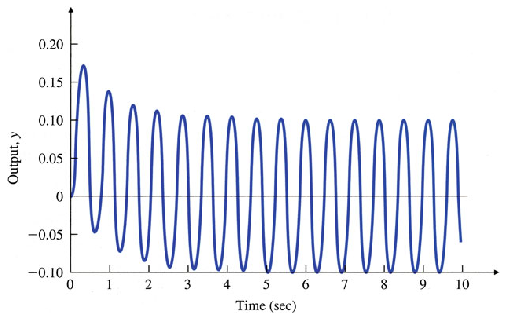

> Image description: This figure is a time-domain plot showing the response of a system $G(s)=\frac{1}{(s+1)}$ to a sinusoidal input $u=\sin 10t$. The graph features a vertical y-axis labeled "Output, $y$" with values ranging from $-0.10$ to $0.20$, and a horizontal x-axis labeled "Time (sec)" spanning from $0$ to $10$ seconds. The plotted blue curve represents the output signal $y$. It begins at the origin $(0,0)$ and exhibits an initial transient phase where the amplitude of the oscillations is higher, peaking near $0.17$ around $0.4$ seconds. As time progresses, the response settles into a steady-state sinusoidal oscillation with a constant amplitude of approximately $0.10$. The signal oscillates symmetrically around a shifted center point, eventually stabilizing between roughly $0.10$ and $-0.10$. This illustrates the system's frequency response to a specific input frequency.

<!-- source_pdf_page: 505 -->
Frequency-Response and Frequency-Domain Models, Fig. 2 Frequency response for $G(s)=\frac{1}{s+1}$ (Source: Franklin et al. (2010), p. 83, reprinted by permission of Pearson Education, Inc., Upper Saddle River, NJ)
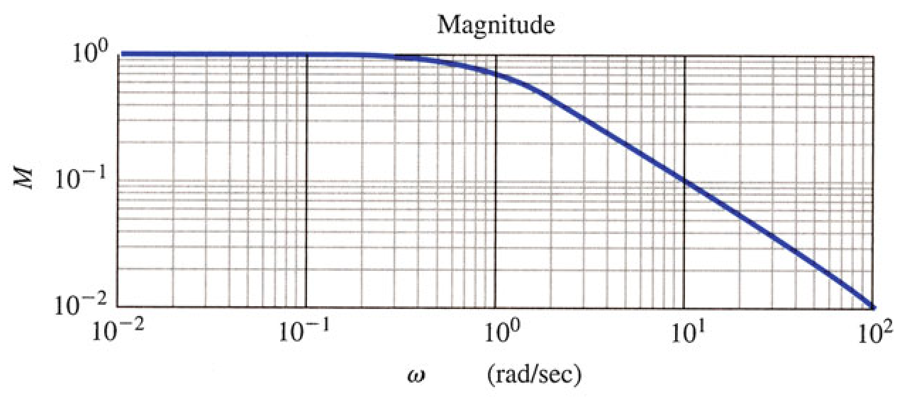

> Image description: This image is a logarithmic plot showing the magnitude frequency response for a system with the transfer function $G(s)=\frac{1}{s+1}$. The horizontal axis represents angular frequency $\omega$ in radians per second ($\text{rad/sec}$), ranging from $10^{-2}$ to $10^2$. The vertical axis represents Magnitude ($M$), scaled logarithmically from $10^{-2}$ to $10^0$. The plot displays a characteristic first-order low-pass filter response. At low frequencies (below $1\text{ rad/sec}$), the magnitude remains constant at a value of $1$ ($10^0$). As frequency increases beyond the corner frequency of $\omega = 1\text{ rad/sec}$, the magnitude begins to decrease linearly on the log-log scale. At high frequencies, the curve follows a steady downward slope, reaching a magnitude of $10^{-2}$ at $\omega = 10^2\text{ rad/sec}$. This indicates that higher frequency components are attenuated by the system.
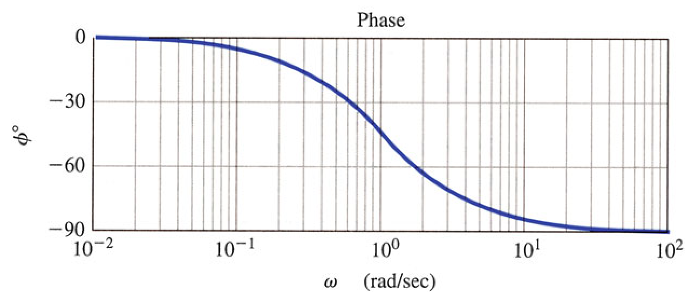

> Image description: A line graph titled "Phase" displays the frequency response of the transfer function $G(s) = \frac{1}{s+1}$ on a semi-logarithmic scale. The vertical axis represents the phase angle, $\phi^\circ$, ranging from $0^\circ$ down to $-90^\circ$. The horizontal axis represents the angular frequency, $\omega$ (rad/sec), plotted on a logarithmic scale from $10^{-2}$ to $10^{2}$. The plot shows a smooth, continuous blue curve. At low frequencies ($\omega < 10^{-1}$), the phase is approximately $0^\circ$. As $\omega$ increases, the phase decreases monotonically, passing through $-45^\circ$ near $\omega = 1$ rad/sec. At high frequencies ($\omega > 10^1$), the phase asymptotically approaches $-90^\circ$. This characteristic curve is typical for a first-order low-pass system, indicating a phase lag that increases with frequency. The figure illustrates the phase-shifting behavior of a single-pole system in the frequency domain.

The plot is typical of most closed-loop systems in that (1) the output follows the input $(|\mathcal{T}| \cong 1)$ at the lower excitation frequencies and (2) the output ceases to follow the input $(|\mathcal{T}|<1)$ at the higher excitation frequencies. The maximum value of the frequency-response magnitude is referred to as the resonant peak $M_{r}$.

Bandwidth is a measure of speed of response and is therefore similar to time-domain measures such as rise time and peak time or the $s$-plane measure of dominant-root(s) natural frequency. In fact, if the $K G(s)$ in Fig. 4 is such that the closed-loop response is given by Fig. 3a, we can see that the bandwidth will equal the natural frequency of the closed-loop root (that is, $\omega_{B W}= \omega_{n}$ for a closed-loop damping ratio of $\zeta=$ 0.7 ). For other damping ratios, the bandwidth is approximately equal to the natural frequency of the closed-loop roots, with an error typically less than a factor of 2.

For a second-order system, the time responses are functions of the pole-location parameters $\zeta$ and $\omega_{n}$. If we consider the curve for $\zeta=0.5$ to
be an average, the rise time (Rise time $t_{r}$.) from $y=0.1$ to $y=0.9$ is approximately $\omega_{n} t_{r}=1.8$. Thus, we can say that

$$
\begin{equation*}
t_{r} \cong \frac{1.8}{\omega_{n}} \tag{7}
\end{equation*}
$$

Although this relationship could be embellished by including the effect of the damping ratio, it is important to keep in mind how Eq. (7) is typically used. It is accurate only for a secondorder system with no zeros; for all other systems it is a rough approximation to the relationship between $t_{r}$ and $\omega_{n}$. Most systems being analyzed for control systems design are more complicated than the pure second-order system, so designers use Eq. (7) with the knowledge that it is a rough approximation only. Hence, for a secondorder system the bandwidth is inversely proportional to the rise time, $t_{r}$. Hence we are able to link the time and frequency domain quantities in this way.

The definition of the bandwidth stated here is meaningful for systems that have a low-pass filter behavior, as is the case for any physical control

<!-- source_pdf_page: 506 -->
Frequency-Response and Frequency-Domain Models, Fig. 3 Frequency responses of standard second-order systems (a) magnitude (b) phase (Source: Franklin et al. (2010), p. 303, reprinted by permission of Pearson Education, Inc., Upper Saddle River, NJ)
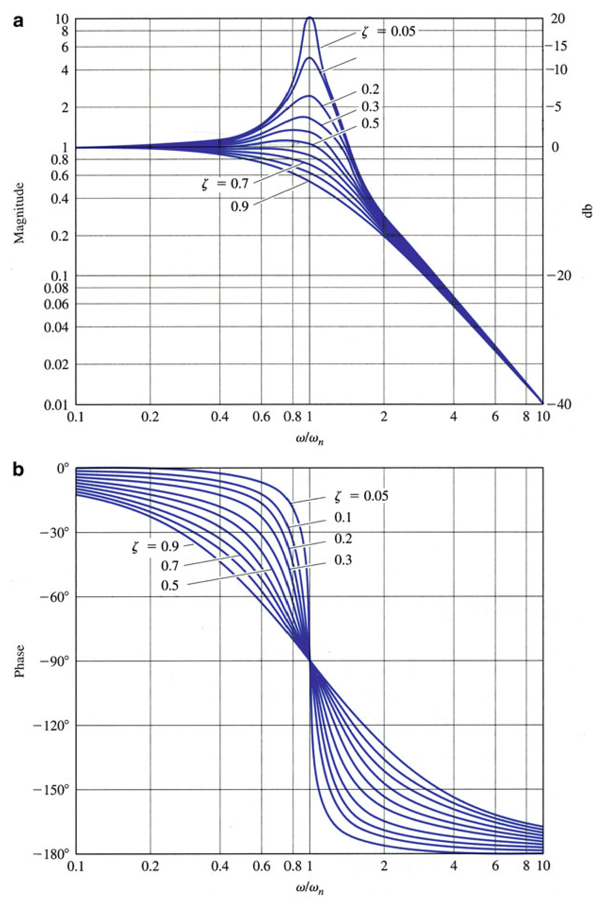

> Image description: This figure shows the frequency-response characteristics of standard second-order systems, divided into two subplots. **Subplot (a)** displays the **magnitude** response on a logarithmic scale (y-axis) versus normalized frequency $\omega/\omega_n$ (x-axis). Curves represent different damping ratios ($\zeta$), ranging from $\zeta = 0.05$ (a sharp peak near $\omega/\omega_n = 1$) to $\zeta = 0.9$ (a smooth, decaying curve). The magnitude is also indicated in decibels (dB) on the rightmost y-axis. **Subplot (b)** illustrates the **phase** response (y-axis) against normalized frequency $\omega/\omega_n$ (x-axis). The curves transition from $0^\circ$ to $-180^\circ$ as frequency increases. Lower damping ratios ($\zeta = 0.05$) show a much sharper phase transition at $\omega/\omega_n = 1$ compared to higher damping ratios ($\zeta = 0.9$), which exhibit a more gradual phase shift. The figure illustrates how the damping ratio $\zeta$ affects the resonance peak and the phase lag of a second-order system.

system. In other applications the bandwidth may be defined differently. Also, if the ideal model of the system does not have a high-frequency rolloff (e.g., if it has an equal number of poles and zeros), the bandwidth is infinite; however, this does not occur in nature as nothing responds well at infinite frequencies.

In many cases, the designer's primary concern is the error in the system due to disturbances rather than the ability to track an input. For error
analysis, we are more interested in the sensitivity function $\mathcal{S}(s)=1-\mathcal{T}(s)$, rather than $\mathcal{T}(s)$. For most open-loop systems with high gain at low frequencies, $\mathcal{S}(s)$ for a disturbance input has very low values at low frequencies and grows as the frequency of the input or disturbance approaches the bandwidth. For analysis of either $\mathcal{T}(s)$ or $\mathcal{S}(s)$, it is typical to plot their response versus the frequency of the input. Either frequency response for control systems design can be evaluated using

<!-- source_pdf_page: 507 -->
the computer or can be quickly sketched for simple systems using the efficient methods described in Franklin et al. (2015). The methods described next are also useful to expedite the
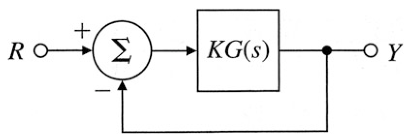

> Image description: This block diagram illustrates a closed-loop unity feedback system, often used in control engineering to model system dynamics. The diagram consists of three primary components arranged in a loop. At the input, a reference signal, $R$, enters a summation junction marked with a plus (+) sign. A feedback path returns the output signal, $Y$, back to this junction, where it is subtracted, as indicated by the minus (-) sign. This difference represents the error signal. The error signal is fed into a rectangular block representing the forward path transfer function, labeled $KG(s)$. The output of this block is the system response, $Y$. The signal flow follows a clockwise path from the input $R$, through the summation junction and the $KG(s)$ block, to the output $Y$. From $Y$, a feedback line returns to the subtraction point, completing the unity feedback loop. This configuration is fundamental for analyzing frequency-response and frequency-domain models.

Frequency-Response and Frequency-Domain Models, Fig. 4 Unity feedback system (Source: Franklin et al. (2010), p. 304, reprinted by permission of Pearson Education, Inc., Upper Saddle River, NJ)
design process as well as to perform sanity checks on the computer output.

## Neutral Stability: Gain and Phase Margins

In the early days of electronic communications, most instruments were judged in terms of their frequency response. It is therefore natural that when the feedback amplifier was introduced, techniques to determine stability in the presence of feedback were based on this response.

Suppose the closed-loop transfer function of a system is known. We can determine the stability of a system by simply inspecting the

Frequency-Response and Frequency-Domain Models, Fig. 5
Definitions of bandwidth and resonant peak (Source: Franklin et al. (2010), p. 304, reprinted by permission of Pearson Education, Inc., Upper Saddle River, NJ)
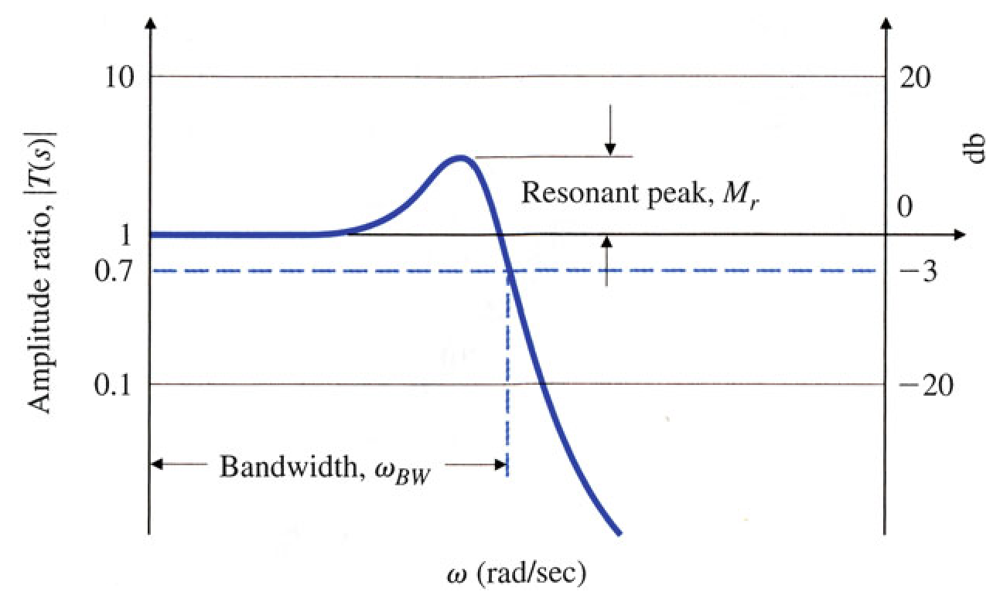

> Image description: This figure illustrates the definitions of bandwidth and resonant peak for a frequency-response model. The plot features a horizontal axis representing angular frequency $\omega$ in rad/sec and two vertical axes: the left axis shows the amplitude ratio $|T(s)|$ on a linear scale (ranging from 0.1 to 10), while the right axis displays values in decibels (dB) ranging from -20 to 20. A blue curve represents the system's frequency response, starting at an amplitude ratio of 1 and peaking before decaying. A downward arrow identifies the maximum value of this curve as the "Resonant peak, $M_r$." A dashed horizontal line marks the -3 dB level (approximately 0.7 on the linear scale). The distance from $\omega = 0$ to the point where the curve intersects this -3 dB line is labeled with a double-headed arrow as "Bandwidth, $\omega_{BW}$," indicating the frequency range over which the system maintains significant gain.
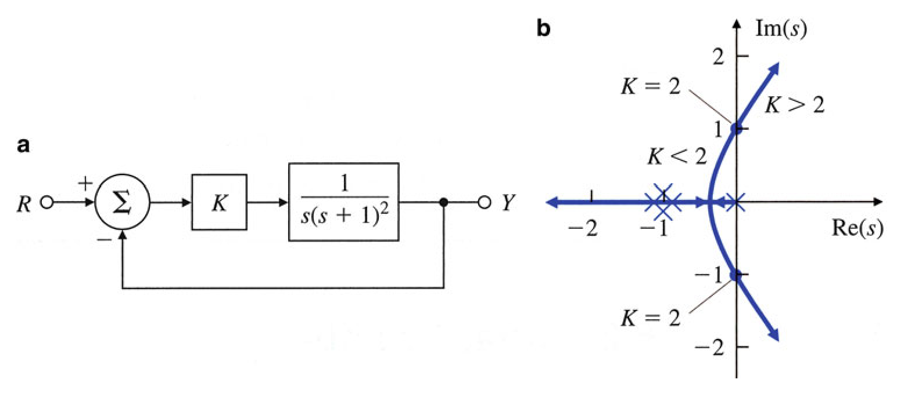

> Image description: The image contains two parts, labeled **a** and **b**, illustrating a control system model in the frequency domain. **Part a** shows a block diagram of a closed-loop control system. The input is $R$ and the output is $Y$. A summing junction calculates the error signal, which is multiplied by a gain $K$. This signal passes into a plant block with the transfer function $\frac{1}{s(s+1)^2}$. A feedback path returns the output $Y$ to the negative terminal of the summing junction. **Part b** presents a root locus plot in the complex $s$-plane, where the horizontal axis is $\text{Re}(s)$ and the vertical axis is $\text{Im}(s)$. Blue curves represent the trajectories of the system's poles as the gain $K$ varies. For $K < 2$, the poles are located on the negative real axis at $-1$ and $-2$. As $K$ increases to $K = 2$, poles move toward the imaginary axis at $\pm i$. For $K > 2$, the poles move into the right-half plane along blue curves.

Frequency-Response and Frequency-Domain Models, Fig. 6 Stability example: (a) system definition; (b) root locus (Source: Franklin et al. (2010), p. 318,
reprinted by permission of Pearson Education, Inc., Upper Saddle River, NJ)

<!-- source_pdf_page: 508 -->
denominator in factored form (because the factors give the system roots directly) to observe whether the real parts are positive or negative. However, the closed-loop transfer function is usually not known. In fact, the whole purpose behind understanding the root-locus technique is to be able to find the factors of the denominator in the closed-loop transfer function, given only the open-loop transfer function. Another way to determine closed-loop stability is to evaluate the frequency response of the open-loop transfer function $K G(j \omega)$ and then perform a test on that response. Note that this method also does not require factoring the denominator of the closed-loop transfer function. In this section we will explain the principles of this method. Note that this method also does not require factoring the denominator of the closed-loop transfer function. Here we will explain the principles of this method.

Suppose we have a system defined by Fig. 6a and whose root locus behaves as shown in Fig. 6b; that is, instability results if $K$ is larger than 2. The neutrally stable points lie on the imaginary axis - that is, where $K=2$ and $s=j 1.0$. Furthermore, all points on the root locus have the property that

$$
|K G(s)|=1 \quad \text { and } \quad \angle G(s)=-180^{\circ} .
$$

At the point of neutral stability we see that these root-locus conditions hold for $s=j \omega$, so

$$
\begin{equation*}
|K G(j \omega)|=1 \quad \text { and } \quad \angle G(j \omega)=-180^{\circ} . \tag{8}
\end{equation*}
$$

Thus, a Bode plot of a system that is neutrally stable (that is, with $K$ defined such that a closedloop root falls on the imaginary axis) will satisfy the conditions of Eq. (8). Figure 7 shows the frequency response for the system whose root locus is plotted in Fig. 6 for various values of $K$. The magnitude response corresponding to $K=2$ passes through 1 at the same frequency ( $\omega= 1 \mathrm{rad} / \mathrm{s}$ ) at which the phase passes through $-180^{\circ}$, as predicted by Eq. (8).

Having determined the point of neutral stability, we turn to a key question: Does increasing the gain increase or decrease the system's stability?

We can see from the root locus in Fig. 6b that any value of $K$ less than the value at the neutrally stable point will result in a stable system. At the frequency $\omega$ where the phase $\angle G(j \omega)=-180^{\circ} (\omega=1 \mathrm{rad} / \mathrm{s})$, the magnitude $|K G(j \omega)|<1.0$ for stable values of $K$ and $>1$ for unstable values of $K$. Therefore, we have the following trial stability condition, based on the character of the open-loop frequency response:

$$
\begin{equation*}
|K G(j \omega)|<1 \quad \text { at } \quad \angle G(j \omega)=-180^{\circ} . \tag{9}
\end{equation*}
$$

This stability criterion holds for all systems for which increasing gain leads to instability and $|K G(j \omega)|$ crosses the magnitude $(=1)$ once, the most common situation. However, there are systems for which an increasing gain can lead from instability to stability; in this case, the stability condition is

$$
\begin{equation*}
|K G(j \omega)|>1 \quad \text { at } \quad \angle G(j \omega)=-180^{\circ} . \tag{10}
\end{equation*}
$$

Based on the above ideas, we can now define the robustness metrics gain and phase margins:
Phase Margin: Suppose at $\omega_{1},\left|G\left(j \omega_{1}\right)\right|=\frac{1}{K}$. How much more phase could the system tolerate (as a time delay, perhaps) before reaching the stability boundary? The answer to this question follows from Eq. (8), i.e., the phase margin (PM) is defined as

$$
\begin{equation*}
\mathrm{PM}=\angle G\left(j \omega_{1}\right)-\left(-180^{\circ}\right) \tag{11}
\end{equation*}
$$

Gain Margin: Suppose at $\omega_{2}, \angle G\left(j \omega_{2}\right)= -180^{\circ}$. How much more gain could the system tolerate (as an amplifier, perhaps) before reaching the stability boundary? The answer to this question follows from Eq. (9), i.e., the gain margin (GM) is defined as

$$
\begin{equation*}
\mathrm{GM}=\frac{1}{K\left|G\left(j \omega_{2}\right)\right|} \tag{12}
\end{equation*}
$$

There are also rare cases when $|K G(j \omega)|$ crosses magnitude $(=1)$ more than once, or where an increasing gain leads to instability. A rigorous way to resolve these situations is to use the Nyquist

<!-- source_pdf_page: 509 -->
Frequency-Response and Frequency-Domain Models, Fig. 7 Stability example: (a) system definition; (b) root locus (Source: Franklin et al. (2010), p. 319, reprinted by permission of Pearson Education, Inc., Upper Saddle River, NJ)
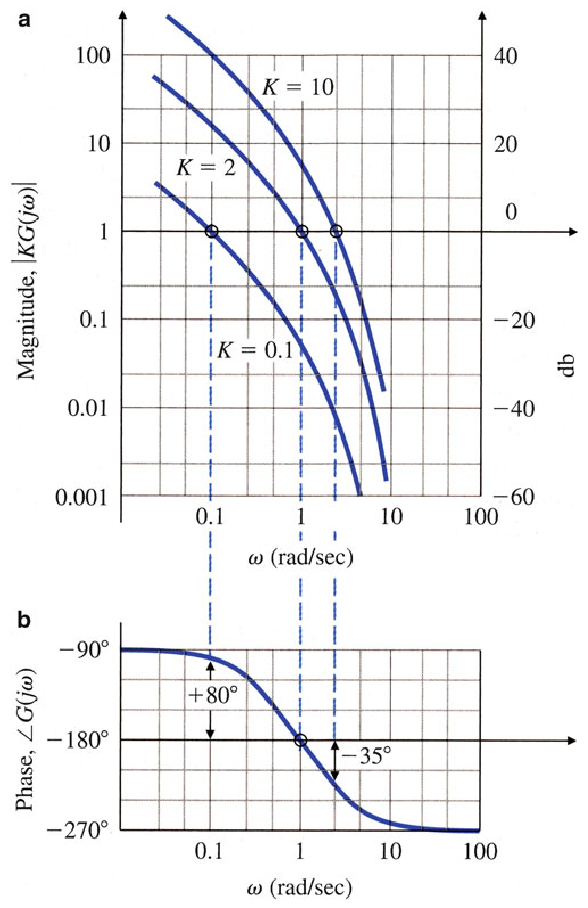

> Image description: A textbook figure titled "Frequency-Response and Frequency-Domain Models" containing two vertically aligned plots, labeled **a** and **b**. Plot **a** is a Bode magnitude plot showing three curves for different gain values: $K=0.1$, $K=2$, and $K=10$. The vertical axis represents magnitude $|KG(\omega)|$ on a logarithmic scale from 0.001 to 100, with a secondary linear axis on the right in decibels (dB) from -60 to 40. The horizontal axis is frequency $\omega$ in rad/sec on a logarithmic scale from 0.1 to 100. Dashed vertical lines connect specific points across both plots. Plot **b** is a Bode phase plot. The vertical axis represents phase $\angle G(\omega)$ in degrees, ranging from $-90^\circ$ to $-270^\circ$. The horizontal axis is frequency $\omega$ in rad/sec. The phase curve transitions from $-90^\circ$ towards $-270^\circ$. Two specific phase values are indicated: $+80^\circ$ (relative to $-180^\circ$) and $-35^\circ$ (relative to $-180^\circ$) at the intersections corresponding to the gain crossover frequencies in plot **a**.

stability criterion as discussed in Franklin et al. (2015).
where $\omega_{c}$ is the crossover frequency. The closedloop frequency-response magnitude is approximated by

## Closed-Loop Frequency Response

The closed-loop bandwidth was defined earlier in this section. The natural frequency is always within a factor of 2 of the bandwidth for a secondorder system. We can help establish a more exact correspondence by making a few observations. Consider a system in which $|K G(j \omega)|$ shows the typical behavior

$$
\begin{aligned}
& |K G(j \omega)| \gg 1 \quad \text { for } \quad \omega \ll \omega_{c}, \\
& |K G(j \omega)| \ll 1 \quad \text { for } \quad \omega \gg \omega_{c},
\end{aligned}
$$

$$
|\mathcal{T}(j \omega)|=\left|\frac{K G(j \omega)}{1+K G(j \omega)}\right| \cong \begin{cases}1, & \omega \ll \omega_{c},  \tag{13}\\ |K G|, & \omega \gg \omega_{c} .\end{cases}
$$

In the vicinity of crossover, where $|K G(j \omega)|=1,|\mathcal{T}(j \omega)|$ depends heavily on the PM. A PM of $90^{\circ}$ means that $\angle G\left(j \omega_{c}\right)=-90^{\circ}$, and therefore $\left|\mathcal{T}\left(j \omega_{c}\right)\right|=0.707$. On the other hand, $\mathrm{PM}=45^{\circ}$ yields $\left|\mathcal{T}\left(j \omega_{c}\right)\right|=1.31$.

The exact evaluation of Eq.(13) was used to generate the curves of $|\mathcal{T}(j \omega)|$ in Fig. 8. It shows that the bandwidth for smaller values of PM is typically somewhat greater than $\omega_{c}$, though usually it is less than $2 \omega_{c}$; thus,

<!-- source_pdf_page: 510 -->
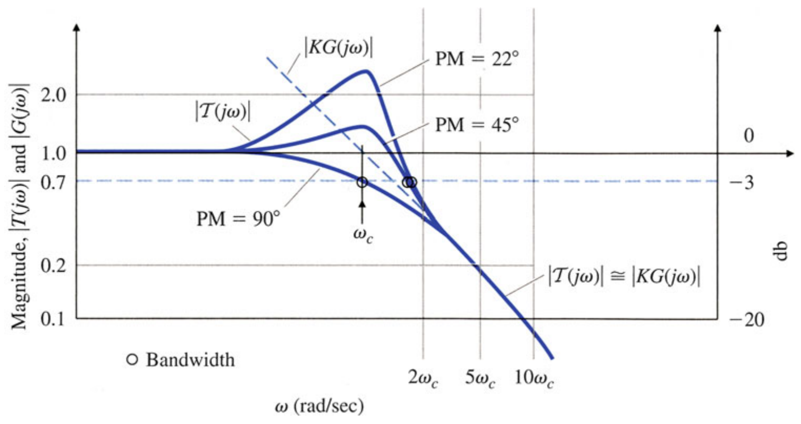

> Image description: This technical plot illustrates the relationship between phase margin (PM) and closed-loop bandwidth. The horizontal axis represents frequency $\omega$ in rad/sec, with marked grid lines at $2\omega_c$, $5\omega_c$, and $10\omega_c$. The vertical axis represents magnitude, with a dual scale showing absolute values (0.1 to 2.0) on the left and decibels (db) on the right. Two primary curves are shown: the open-loop magnitude $|KG(j\omega)|$, represented by a dashed blue line, and the closed-loop magnitude $|T(j\omega)|$, represented by solid blue curves. Three specific $|T(j\omega)|$ curves are plotted for different phase margins: $PM = 22^\circ$, $PM = 45^\circ$, and $PM = 90^\circ$. As PM decreases, the closed-loop magnitude exhibits higher resonant peaks. Small circles indicate the "Bandwidth" at the $-3$ dB level. An arrow points to $\omega_c$ on the x-axis. At high frequencies, the curves converge, indicated by the label $|T(j\omega)| \cong |KG(j\omega)|$.

Frequency-Response and Frequency-Domain Models, Fig. 8 Closed-loop bandwidth with respect to PM (Source: Franklin et al. (2010), p. 347, reprinted by permission of Pearson Education, Inc., Upper Saddle River, NJ)

$$
\begin{equation*}
\omega_{c} \leq \omega_{B W} \leq 2 \omega_{c} \tag{14}
\end{equation*}
$$

Another specification related to the closedloop frequency response is the resonant-peak magnitude $M_{r}$, defined in Fig. 5. For linear systems, $M_{r}$ is generally related to the damping of the system. In practice, $M_{r}$ is rarely used; most designers prefer to use the PM to specify the damping of a system, because the imperfections that make systems nonlinear or cause delays usually erode the phase more significantly than the magnitude.

It is also important in the design to achieve certain error characteristics and these are often evaluated as a function of the input or disturbance frequency. In some cases, the primary function of the control system is to regulate the output to a certain constant input in the presence of disturbances. For these situations, the key item of interest for the design would be the closed-loop frequency response of the error with respect to disturbance inputs.

## Summary and Future Directions

The frequency response methods are the most popular because they can deal with model uncertainty and can be measured in the laboratory. A wide range of information about the system can be displayed in a Bode
plot. The dynamic compensation can be carried out directly from the Bode plot. Extension of the ideas to multivariable systems has been done via singular value plots. Extension to nonlinear systems is still the subject of current research.

## Cross-References

- Classical Frequency-Domain Design Methods
- Frequency Domain System Identification

## Bibliography

Franklin GF, Powell JD, Emami-Naeini A (2015) Feedback control of dynamic systems, 7th edn. Pearson Education, Upper Saddle River, NJ, Boston
Franklin GF, Powell JD, Emami-Naeini A (2010) Feedback control of dynamic systems, 6th edn. Pearson Education, Upper Saddle River

## FTC

Fault-Tolerant Control

<!-- source_pdf_page: 511 -->
## Fundamental Limitation of Feedback Control

Jie Chen
City University of Hong Kong, Hong Kong, China

#### Abstract

Feedback systems are designed to meet many different objectives. Yet, not all design objectives are achievable as desired due to the fact that they are often mutually conflicting and that the system properties themselves may impose design constraints and thus limitations on the performance attainable. An important step in the control design process is then to analyze what and how system characteristics may impose constraints, and accordingly, how to make tradeoffs between different objectives by judiciously navigating between the constraints. Fundamental limitation of feedback control is an area of research that addresses these constraints, limitations, and tradeoffs.

## Keywords

Bode integrals; Design tradeoff; Performance limitation; Tracking and regulation limits

## Introduction

Fundamental control limitations are referred to those intrinsic of feedback that can neither be overcome nor circumvent regardless how it may be designed. By this nature, the study of fundamental limitations dwells on a Hamletian question: Can or can't it be done? What can and cannot be done? To be more specific, yet still general enough, at heart here are issues concerning the benefit and cost of feedback. We ask such questions as (1) What system characteristics may impose inherent limitations regardless of controller design? (2) What inherent
constraints may exist in design, what kind of tradeoffs are to be made? (3) What are the best achievable performance limits? (4) How can the constraints, limitations, and limits be quantified, in ways meaningful for control analysis and design? Needless to say, issues of this kind are very general and in fact are commonplace in science and engineering. Analogies can be made, for example, to Shannon's theorems in communications theory, the Cramer-Rao bound in statistics, and Heisenberg's uncertainty principle in quantum mechanics; they all address the fundamental limits and limitations, though for different problems and in different contexts. The search for fundamental limitations of feedback control, as such, may be considered a quest for an "ultimate truth" or the "law of feedback."

For their fundamentality and importance, inquiries into control performance limitations have persisted over time and continue to be of vital interest. It is worth emphasizing, however, that performance limitation studies are not merely driven by intellectual curiosity, but are tantamount to better and more realistic feedback systems design and hence of tangible practical value. An analysis of performance limitations can aid control design in several aspects. First, it may provide a fundamental limit on the best performance attainable irrespective of controller design, thus furnishing a guiding benchmark in the design process. Secondly, it helps a designer assess what and how system properties may be inherently conflicting and thus pose inherent difficulties to performance objectives, which in turn helps the designer specify reasonable goals, and make judicious modifications and revisions on the design. In this process, the theory of fundamental control limitations promises to provide valuable insights and analytical justifications to long-held design heuristics and, indeed, to extend such heuristics further beyond. This has become increasingly more relevant, as modern control design theory and practice relies heavily on optimization-based numerical routines and tools.

Systematic investigation and understanding of fundamental control limitations began with the classical work of Bode in the 1940s on

<!-- source_pdf_page: 512 -->
logarithmic sensitivity integrals, known as the Bode integrals. Bode's work has had a lasting impact on the theory and practice of control and has inspired continued research effort dated most recently, leading to a variety of extensions and new results which seek to quantify design constraints and performance limitations by logarithmic integrals of Bode and Poisson type. On the other hand, the search for the best achievable performance is a natural goal in optimal control problems, which has lend bounds on optimal performance indices defined under various criteria. Likewise, the latter developments have also been substantial and are continuing to branch to different problems and different system categories.

In this entry we attempt to provide a summary overview of the key developments in the study of fundamental limitations of feedback control. While the understanding on this subject has been compelling and the results are rather prolific, we focus on Bode-type integral relations and the best achievable performance limits, two branches of the study that are believed to be most welldeveloped. Roughly speaking, the Bode-type integrals are most useful for quantifying the inherent design constraints and tradeoffs in the frequency domain, while the performance results provide fundamental limits of canonical control objectives defined using frequency- and timedomain criteria. Invariably, the two sets of results are intimately related and reinforce each other. The essential message then is that despite its many benefits, feedback has its own limitations and is subject to various constraints. Feedback design, for that sake, requires often times a hard tradeoff.

## Control Design Specifications

We begin by introducing the basic notation to be used in the sequel. Let $\mathbb{C}_{+}:=\{z: \operatorname{Re}(z)>0\}$ denote the open right half plane (RHP) and $\overline{\mathbb{C}}_{+}$ the closed RHP (CRHP). For a complex number $z$, we denote its conjugate by $\bar{z}$. For a complex vector $x$, we denote its conjugate transpose by $x^{H}$, and its Euclidean norm by $\|x\|_{2}$. The largest
singular value of a matrix $A$ will be written as $\bar{\sigma}(A)$. If $A$ is a Hermitian matrix, we denote by $\bar{\lambda}(A)$ its largest eigenvalue. For any unitary vectors $u, v \in \mathbb{C}^{n}$, we denote by $\angle(u, v)$ the principal angle between the two one-dimensional subspaces, called the directions, spanned by $u$ and $v$ :

$$
\cos \angle(u, v):=\left|u^{H} v\right| .
$$

For a stable continuous-time system with transfer function matrix $G(s)$, we define its $\mathcal{H}_{\infty}$ norm by

$$
\|G\|_{\infty}:=\sup _{\operatorname{Re}(s)>0} \bar{\sigma}(G(s)) .
$$

We consider the standard configuration of finite-dimensional linear time-invariant (LTI) feedback control systems given in Fig. 1. In this setup, $P$ and $K$ represent the transfer functions of the plant model and controller, respectively, $r$ is a command signal, $d$ a disturbance, $n$ a noise signal, and $y$ the output response. Define the open-loop transfer function, the sensitivity function, and the complementary sensitivity function by

$$
L=P K, \quad S=(I+L)^{-1}, \quad T=L(I+L)^{-1},
$$

respectively. Then the output can be expressed as

$$
y=S d-T n+S P r .
$$

The goal of feedback control design is to design a controller $K$ so that the closed-loop system is stable and that it achieves certain performance specifications. Typical design objectives include:

- Disturbance attenuation. The effect of the disturbance signal on the output should be kept small, which translates into the require-

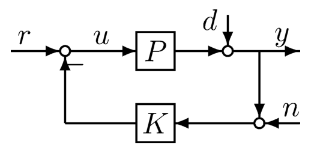

> Image description: This block diagram illustrates a standard closed-loop feedback control configuration. The system begins with a reference input $r$ entering a summation junction. The error signal, resulting from the difference between $r$ and the feedback signal, is labeled $u$, which serves as the control input to the plant block $P$. The output of block $P$ is combined with a disturbance signal $d$ at a second summation junction to produce the system output $y$. A feedback path is established from the output $y$, which is combined with a measurement noise signal $n$ at a third summation junction. The resulting signal is fed into the controller block $K$. The output of block $K$ is then routed back to the initial summation junction to complete the loop. The diagram effectively maps the relationships between the reference $r$, control $u$, plant $P$, disturbance $d$, output $y$, noise $n$, and controller $K$.
Fundamental Limitation of Feedback Control, Fig. 1 Feedback configuration

<!-- source_pdf_page: 513 -->
ment that the sensitivity function be small in magnitude at the frequencies of interest. For a single-input single-output (SISO) system, this mandates that

$$
|S(j \omega)|<1, \quad \forall \omega \in\left[0, \omega_{1}\right) .
$$

The sensitivity magnitude $|S(j \omega)|$ is to be kept as small as possible in the low frequency range.

- Noise reduction. The noise response should be reduced at the output. This requires that the complementary sensitivity function be small in magnitude at frequencies of interest. For a SISO system, the objective is to achieve

$$
|T(j \omega)|<1, \quad \forall \omega \in\left[\omega_{2}, \infty\right) .
$$

Similarly, the magnitude $|T(j \omega)|$ is desired to be the smallest at high frequencies.
Moreover, feedback can be introduced to achieve many other objectives including regulation, command tracking, improved sensitivity to parameter variations, and, more generally, system robustness, all by manipulating the three key transfer functions: the open-loop transfer function, the sensitivity function, and the complementary sensitivity function.

The design and implementation of feedback systems, on the other hand, are also subject to many constraints, which include

1. Causality: A system must be causal for it to be implementable. This constraint requires that no ideal filter can be used for compensation and that the system's relative degree and delay be preserved.
2. Stability: The closed-loop system must be stable. This implies that every closed-loop transfer function must be bounded and analytic in CRHP.
3. Interpolation: There should be no unstable pole-zero cancelation between the plant and controller, in order to rid of hidden instability. Thus, at each RHP pole $p_{i}$ and zero $z_{i}$, it is necessary that

$$
S\left(p_{i}\right)=0, \quad T\left(p_{i}\right)=1,
$$

$$
S\left(z_{i}\right)=1, \quad T\left(z_{i}\right)=0 .
$$

4. Structural constraints: Constraints in this category arise from the feedback structure itself; for example, $S(s)+T(s)=1$. The implication then is that the closed-loop transfer functions cannot be independently designed, thus resulting in conflicting design objectives. For a given plant, each of these constraints is unalterable and hence is fundamental, and each will constrain the performance attainable in one way or another. The question we face then is how the constraints may be captured in a form that is directly pertinent and useful to feedback design.

## Bode Integral Relations

In the classical feedback control theory, Bode's gain-phase formula (Bode 1945) is used to express the aforementioned design constraints for SISO systems.

Bode Gain-Phase Integral Suppose that $L(s)$ has no pole and zero in $\overline{\mathbb{C}}_{+}$. Then at any frequency $\omega_{0}$,

$$
\angle L\left(j \omega_{0}\right)=\frac{1}{\pi} \int_{-\infty}^{\infty} \frac{d \log |L|}{d v} \log \operatorname{coth} \frac{|v|}{2} d v .
$$

A special form of the Hilbert transform, this gain-phase formula relates the gain and phase of the open-loop transfer function evaluated along the imaginary axis, whose implication may be explained as follows. In order to make the sensitivity response small in the low frequency range, the open-loop transfer function is required to have a high gain; the higher, the better. On the other hand, for noise reduction and robustness purposes, we need to keep the loop gain low at high frequencies, the lower the better. Evidently, to maximize these objectives, we want the two frequency bands as wide as possible. This then requires a steep decrease of the loop gain and hence a rather negative slope in the crossover region, say, the intermediate frequency range near $\omega_{0}$. But the gain-phase relationship tells that a very negative derivative in the gain will lead to

<!-- source_pdf_page: 514 -->
a very negative phase, driving the phase closer to the negative 180 degree, namely, the critical point of stability. It consequently reduces the phase margin and may even cause instability. As a result, the gain-phase relationship demonstrates a conflict between the two design objectives. It is safe to claim that much of the classical feedback design theory came as a consequence of this simple relationship, aiming to shape the openloop frequency response in the crossover region by trial and error, using lead or lag filters.

While in using the gain-phase formula, the design specifications imposed on closed-loop transfer functions are translated approximately into the requirements on the open-loop transfer function, and the tradeoff between different design goals is achieved by shaping the open-loop gain and phase; a more direct vehicle to accomplish this same goal is Bode's sensitivity integral (Bode 1945).

Bode Sensitivity Integrals Let $p_{i} \in \mathbb{C}_{+}$be the unstable poles and $z_{i} \in \mathbb{C}_{+}$the nonminimum phase zeros of $L(s)$. Suppose that the closed-loop system in Fig. 1 is stable.
(i) If $L(s)$ has relative degree greater than one, then

$$
\int_{0}^{\infty} \log |S(j \omega)| d \omega=\pi \sum_{i} p_{i} .
$$

(ii) If $L(s)$ contains no less than two integrators, then

$$
\int_{0}^{\infty} \frac{\log |T(j \omega)|}{\omega^{2}} d \omega=\pi \sum_{i} \frac{1}{z_{i}} .
$$

Bode's original work concerns the sensitivity integral for open-loop stable systems only. The integral relations shown herein, which are attributed to Freudenberg and Looze (1985) and Middleton (1991), respectively, provide generalizations to open-loop unstable and nonminimum phase systems.

Why are Bode sensitivity integrals important? What is the hidden message behind the mathematical formulas? Simply put, Bode integral exhibits that a feedback system's sensitivity must
abide some kind of conservation law, or invariance property: the integral of the logarithmic sensitivity magnitude over the entire frequency range must be a nonnegative constant, determined by the open-loop unstable poles. This property mandates a tradeoff between sensitivity reduction and sensitivity amplification in different frequency bands. Indeed, to achieve disturbance attenuation, the logarithmic sensitivity magnitude must stay below zero db, the lower the better. For noise reduction and robustness, however, its tail has to roll off sufficiently fast to zero db at high frequencies. Since, in light of the integral relation, the total area under the logarithmic magnitude curve is nonnegative, the logarithmic magnitude must rise above zero db, so that under its curve, the positive and negative areas may cancel each other to yield a nonnegative value. As such, an undesirable sensitivity amplification occurs, resulting in a fundamental tradeoff between the desirable sensitivity reduction and the undesirable sensitivity amplification, known colloquially as the waterbed effect.

## MIMO Integral Relations

For a multi-input multi-output (MIMO) system depicted in Fig. 1, the sensitivity and complementary sensitivity functions, which now are transfer function matrices, satisfy similar interpolation constraints: at each RHP pole $p_{i}$ and zero $z_{i}$ of $L(s)$, the equations

$$
\begin{array}{cc}
S\left(p_{i}\right) \eta_{i}=0, & T\left(p_{i}\right) \eta_{i}=\eta_{i} \\
w_{i}^{H} S\left(z_{i}\right)=w_{i}^{H}, & w_{i}^{H} T\left(z_{i}\right)=0
\end{array}
$$

hold with some unitary vectors $\eta_{i}$ and $w_{i}$, where $\eta_{i}$ is referred to as a right pole direction vector associated with $p_{i}$, and $w_{i}$ a left zero direction vector associated with $z_{i}$.

While it seems both natural and tempting, the extension of Bode integrals to MIMO systems has been highly nontrivial a task. Deep at the root is the complication resulted from the directionality properties of MIMO systems. Unlike in a SISO

<!-- source_pdf_page: 515 -->
system, the measure of frequency response magnitude is now the largest singular value of a transfer function matrix, which represents the worst-case amplification of energy-bounded signals, a direct counterpart to the gain of a scalar transfer function. This fact alone proves to cast a fundamental difference and poses a formidable obstacle. From a technical standpoint, the logarithmic function of the largest singular value is no longer a harmonic function as in the SISO case, but only a subharmonic function. Much to our regret then, familiar tools found from analytic function theory, such as Cauchy and Poisson theorems, the very backbone in developing Bode integrals, cease to be applicable. Nevertheless, it remains possible to extend Bode integrals in their essential spirit. Advances are made by Chen (1995, 1998, 2000).

MIMO Bode Sensitivity Integrals Let $p_{i} \in \mathbb{C}_{+}$be the unstable poles of $L(s)$ and $z_{i} \in \mathbb{C}_{+}$the nonminimum phase zeros of $L(s)$. Suppose that the closed-loop system in Fig. 1 is stable.
(i) If $L(s)$ has relative degree greater than one, then

$$
\int_{0}^{\infty} \log \bar{\sigma}(S(j \omega)) d \omega \geq \pi \bar{\lambda}\left(\sum_{i} p_{i} \eta_{i} \eta_{i}^{H}\right)
$$

(ii) If $L(s)$ contains no less than two integrators, then

$$
\int_{0}^{\infty} \frac{\log \bar{\sigma}(T(j \omega))}{\omega^{2}} d \omega \geq \pi \bar{\lambda}\left(\sum_{i} \frac{1}{z_{i}} w_{i} w_{i}^{H}\right)
$$

where $\eta_{i}$ and $w_{i}$ are some unitary vectors related to the right pole direction vectors associated with $p_{i}$ and the left zero direction vectors associated with $z_{i}$, respectively.

From these extensions, it is evident that same limitations and tradeoffs on the sensitivity and complementary sensitivity functions carry over to MIMO systems; in fact, both integrals reduce to the Bode integrals when specialized to

SISO systems. Yet there is something additional and unique of MIMO systems: the integrals now depend on not only the locations but also the directions of the zeros and poles. In particular, it can be shown that they depend on the mutual orientation of these directions, and the dependence can be explicitly characterized geometrically by the principal angles between the directions. This new phenomenon, which finds no analog in SISO systems, thus highlights the important role of directionality in sensitivity tradeoff and more generally, in the design of MIMO systems.

A more sophisticated and accordingly, more informative variant of Bode integrals is the Poisson integral for sensitivity and complementary sensitivity functions (Freudenberg and Looze 1985), which can be used to provide quantitative estimates of the waterbed effect. MIMO versions of Poisson integrals are also available (Chen 1995, 2000).

## Frequency-Domain Performance Bounds

Performance bounds complement the integral relations and provide fundamental thresholds to the best possible performance ever attainable. Such bounds are useful in providing benchmarks for evaluating a system's performance prior to and after controller design. In the frequency domain, fundamental limits can be specified as the minimal peak magnitude of the sensitivity and complementary sensitivity functions achievable by feedback, or formally, the minimal achievable $\mathcal{H}_{\infty}$ norms:
$\gamma_{\text {min }}^{S}:=\inf \left\{\|S(s)\|_{\infty}: K(s)\right.$ stabilizes $\left.P(s)\right\}$, $\gamma_{\text {min }}^{T}:=\inf \left\{\|T(s)\|_{\infty}: K(s)\right.$ stabilizes $\left.P(s)\right\}$.

Drawing upon Nevanlinna-Pick interpolation theory for analytic functions, one can obtain exact performance limits under rather general circumstances (Chen 2000).
$\mathcal{H}_{\infty}$ Performance Limits Let $z_{i} \in \mathbb{C}_{+}$be the nonminimum phaze zeros of $P(s)$ with left direction vectors $w_{i}$, and $p_{i} \in \mathbb{C}_{+}$the unstable poles

<!-- source_pdf_page: 516 -->
of $P(s)$ with right direction vectors $\eta_{i}$, where $z_{i}$ and $p_{i}$ are all distinct. Then,

$$
\gamma_{\min }^{S}=\gamma_{\min }^{T}=\sqrt{1+\bar{\sigma}^{2}\left(Q_{p}^{-1 / 2} Q_{z p} Q_{z}^{-1 / 2}\right)},
$$

where $Q_{z}, Q_{p}$, and $Q_{z p}$ are the matrices given by

$$
\begin{aligned}
Q_{z}:=\left[\frac{w_{i}^{H} w_{j}}{z_{i}+\bar{z}_{j}}\right], \quad Q_{p}:=\left[\frac{\eta_{i}^{H} \eta_{j}}{\bar{p}_{i}+p_{j}}\right], \\
Q_{z p}:=\left[\frac{w_{i}^{H} \eta_{j}}{z_{i}-p_{j}}\right] .
\end{aligned}
$$

More explicit bounds showing how zeros and poles may interact to have an effect on these limits can be obtained, e.g., as

$$
\begin{aligned}
& \gamma_{\min }^{S}=\gamma_{\min }^{T} \geq \\
& \sqrt{\sin ^{2} \angle\left(w_{i}, \eta_{j}\right)+\left|\frac{p_{j}+\overline{z_{i}}}{p_{j}-z_{i}}\right|^{2} \cos ^{2} \angle\left(w_{i}, \eta_{j}\right)},
\end{aligned}
$$

which demonstrates once again that the pole and zero directions play an important role in MIMO systems. Note that for RHP poles and zeros located in the close vicinity, this bound can become excessively large, which serves as another vindication why unstable pole-zero cancelation must be prohibited. Note also that for MIMO systems however, whether near pole-zero cancelation is problematic depends additionally on the mutual orientation of the pole and zero directions.

## Tracking and Regulation Limits

Tracking and regulation are two canonical objectives of servo mechanisms and constitute chief criteria in assessing the performance of feedback control systems. Understandings gained from these problems will shed light into more general issues indicative of feedback design. In its full generality, a tracking system can be depicted as in Fig. 2, in which a 2-DOF (degree of freedom) controller $K$ is to be designed for
the output $z$ to track a given reference input $r$, based on the feedforward of the reference signal $r$ and the feedback of the measured output $y$. The tracking performance is defined in the time domain by the integral square error

$$
J=\int_{0}^{\infty}\|z(t)-r(t)\|_{2}^{2} d t
$$

Typically, we take $r$ to be a step signal, which in the MIMO setting corresponds to a unitary constant vector, i.e., $r(t)=v, t>0$ and $r(t)=$ 0 , $t<0$, where $\|v\|_{2}=1$. We assume $P$ to be LTI. But $K$ can be arbitrarily general, as long as it is causal and stabilizing. We want $z$ to not only track $r$ asymptotically but also minimize $J$. But how small can it be?

For the regulation problem, a general setup is given in Fig. 3. Likewise, $K$ may be taken as a 2-DOF controller. The control output energy is measured by the quadratic cost

$$
E=\int_{0}^{\infty}\|u(t)\|_{2}^{2} d t
$$

We consider a disturbance signal $d$, typically taken as an impulse signal, $d(t)=v \delta(t)$, where $v$ is a unitary vector. In this case, the disturbance can be interpreted as a nonzero initial condition, and the controller $K$ is to regulate the system's zero-input response. Similarly, we assume that $P$

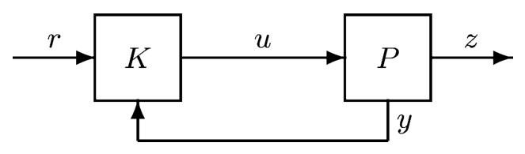

> Image description: This block diagram illustrates a 2-DOF tracking control structure. The system consists of two primary functional blocks, $K$ and $P$, arranged in a feedback loop. The input signal $r$ enters the controller block $K$. The output of block $K$ is the control signal $u$, which serves as the input to the plant block $P$. The plant block $P$ produces two outputs: the controlled output $z$, which exits the system, and the measured output $y$. The signal $y$ is fed back via a bottom arrow, returning to the bottom input of block $K$ to close the feedback loop. The signal flow follows a sequential path from left to right for the forward path $(r \rightarrow K \rightarrow u \rightarrow P \rightarrow z)$ and a bottom path for the feedback $(y \rightarrow K)$. The diagram represents the fundamental relationship between a controller, a plant, and their respective input/output variables.
Fundamental Limitation of Feedback Control, Fig. 2 2-DOF tracking control structure

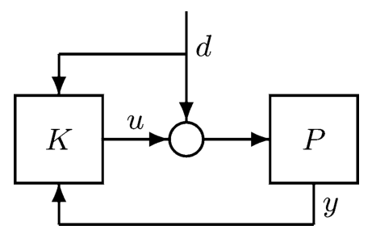

> Image description: Figure 2 shows a block diagram of a 2-DOF tracking control structure. The diagram features two main functional blocks, labeled $K$ (the controller) and $P$ (the plant). A feedback loop is formed by an arrow labeled $y$, which represents the output from block $P$ flowing back to the bottom of block $K$. The controller $K$ produces an output signal $u$, which is directed toward a summing junction (represented by a circle). A disturbance signal, labeled $d$, also enters this summing junction from above. The combined signal from the summing junction serves as the input to block $P$. Additionally, a signal path branches from the disturbance $d$ and feeds into the top of block $K$. This configuration illustrates the relationship between the control signal $u$, the disturbance $d$, the plant $P$, and the output $y$ within a closed-loop feedback system.
Fundamental Limitation of Feedback Control, Fig. 3 2-DOF regulator

<!-- source_pdf_page: 517 -->
is LTI, but allow $K$ to be any causal, stabilizing controller. Evidently, for a stable $P$, the problem is trivial; the response will restore itself to the origin and thus no energy is required. But what if the system is unstable? How much energy does the controller must generate to combat the disturbance? What is the smallest amount of energy required? These questions are answered by the best achievable limits of the tracking and regulation performance (Chen et al. 2000, 2003).

## Tracking and Regulation Performance Limits

Let $p_{i} \in \mathbb{C}_{+}$and $z_{i} \in \mathbb{C}_{+}$be the RHP poles and zeros of $P(s)$, respectively. Then,
$\inf \{E: K$ stabilizes $P(s)\}=\sum_{i} p_{i} \cos ^{2}\left(\zeta_{i}, v\right)$,
$\inf \{J: K$ stabilizes $P(s)\}=\sum_{i} \frac{1}{z_{i}} \cos ^{2}\left(\xi_{i}, v\right)$,
where $\zeta_{i}$ and $\xi_{i}$ are some unitary vectors related to the right pole direction vectors associated with $p_{i}$ and the left zero direction vectors associated with $z_{i}$, respectively.

It becomes instantly clear that the optimal performance depends on both the pole/zero locations and their directions. In particular, it depends on the mutual orientation between the input and pole/zero directions. This sheds some interesting light. Take the tracking performance for an example. For a SISO system, the minimal tracking error can never be made zero for a nonminimum phase plant; in other words, perfect tracking can never be achieved. Yet this is possible for MIMO systems, when the input and zero directions are appropriately aligned, specifically when they are orthogonal. Interestingly, the optimal performance in both cases can be achieved by LTI controllers, though allowed to be more general. As a result, the results herein provide the true fundamental limits that cannot be further improved, in spite of using any other more general forms such as nonlinear, time-varying feedforward and feedback. It is simply the best one can ever hope for, and the LTI controllers turn out to be optimal.

## Summary and Future Directions

Whether in time or frequency domain, while the results presented herein may differ in forms and contexts, they unequivocally point to the fact that inherent constraints exist in feedback design, and fundamental limitations will necessarily arise, limiting the performance achievable regardless of controller design. Such constraints and limitations are especially exacerbated by the nonminimum phase zeros and unstable poles in the system. Understanding of these constraints and limitations proves essential to the success of control design.

For both its intrinsic appeal and fundamental implications, the study of fundamental control limitations will continue to be a topic of enduring vitality and indeed will prove timeless. Challenges are especially daunting and endeavor is called for, e.g., to incorporate information and communication constraints into control limitation studies, of which networked control and multiagent systems serve as notable testimonies.

## Cross-References

- H-Infinity Control
- $\mathrm{H}_{2}$ Optimal Control
- Linear Quadratic Optimal Control

## Bibliography

Astrom KJ (2000) Limitations on control system performance. Eur J Control 6:2-20
Bode HW (1945) Network analysis and feedback amplifier design. Van Nostrand, Princeton
Chen J (1995) Sensitivity integral relations and design tradeoffs in linear multivariable feedback systems. IEEE Trans Autom Control 40(10):1700-1716
Chen J (1998) Multivariable gain-phase and sensitivity integral relations and design tradeoffs. IEEE Trans Autom Control 43(3):373-385
Chen J (2000) Logarithmic integrals, interpolation bounds, and performance limitations in MIMO systems. IEEE Trans Autom Control 45:1098-1115
Chen J, Qiu L, Toker O (2000) Limitations on maximal tracking accuracy. IEEE Trans Autom Control 45(2):326-331

<!-- source_pdf_page: 518 -->
Chen J, Hara S, Chen G (2003) Best tracking and regulation performance under control energy constraint. IEEE Trans Autom Control 48(8): 1320-1336
Freudenberg JS, Looze DP (1985) Right half plane zeros and poles and design tradeoffs in feedback systems. IEEE Trans Autom Control 30(6): 555-565

Middleton RH (1991) Trade-offs in linear control system design. Automatica 27(2):281-292
Qiu L, Davison EJ (1993) Performance limitations of non-minimum phase systems in the servomechanism problem. Automatica 29(2):337-349
Seron MM, Braslavsky JH, Goodwin GC (1997) Fundamental limitations in filtering and control. Springer, London
