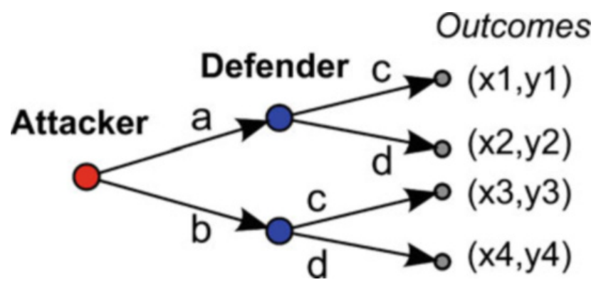
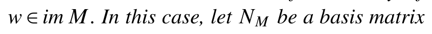
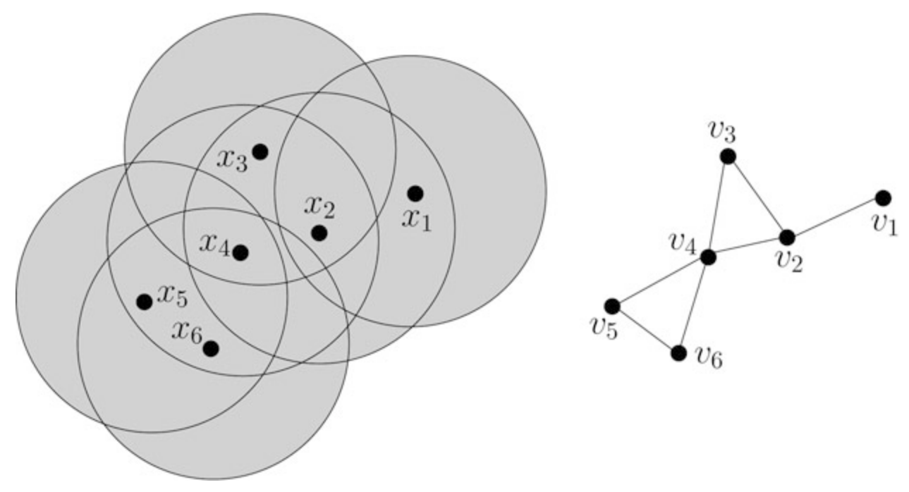
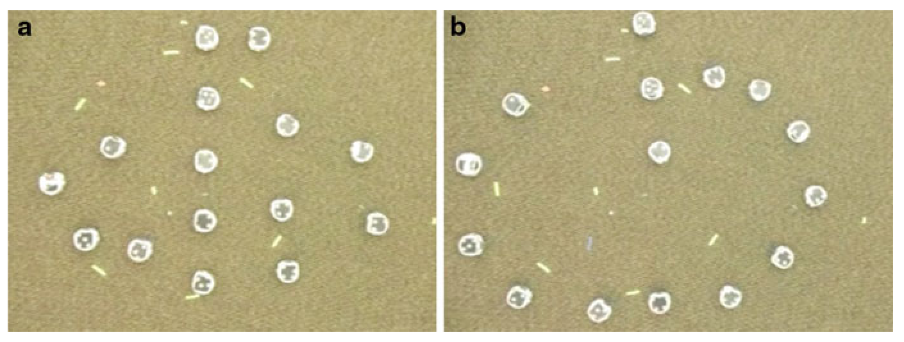

<!-- source_pdf_page: 519 -->
## G

## Game Theory for Security

Tansu Alpcan Department of Electrical and Electronic Engineering, The University of Melbourne, Melbourne, Australia

#### Abstract

Game theory provides a mature mathematical foundation for making security decisions in a principled manner. Security games help formalizing security problems and decisions using quantitative models. The resulting analytical frameworks lead to better allocation of limited resources and result in more informed responses to security problems in complex systems and organizations. The game-theoretic approach to security is applicable to a wide variety of systems and critical infrastructures such as electricity, water, financial services, and communication networks.

## Keywords

Complex systems; Cyberphysical system security; Game theory; Security games

## Introduction

Securing a system involves making numerous decisions whether the system is a computer
network, part of a business process in an organization, or belongs to a critical infrastructure. One has to decide on, for example, how to configure sensors for surveillance, collect further information on system properties, allocate resources to secure a critical segment, or who should be able to access a specific function in the system. The decision-maker can be, depending on the setting, a regular employee, a system administrator, or the chief technical officer of an organization. In many cases, the decisions are made automatically by a computer program such as allowing a packet pass the firewall or filtering it out. The time frame of these decisions exhibits a high degree of variability from milliseconds, if made by software, to days and weeks, e.g., when they are part of a strategic plan. Each security decision has a cost and any decisionmaker is always constrained by limited amount of available resources. More importantly, each decision carries a security risk that needs to be taken into account when balancing the costs and the benefits.

Security games facilitate building analytical models which capture the interaction between malicious attackers, who aim to compromise networks, and owners or administrators defending them. Attacks exploiting vulnerabilities of the underlying systems and defensive countermeasures constitute the moves of the game. Thus, the strategic struggle between attackers and defenders is formalized quantitatively based on the solid mathematical foundation provided by the field of game theory.

<!-- source_pdf_page: 520 -->
An important aspect of security games is the allocation of limited available resources from the perspectives of both attackers and defenders. If the players had access to unlimited resources (e.g., time, computing power, bandwidth), then the resulting security games would be trivial. In real-world security settings, however, both attackers and defenders have to act strategically and make numerous decisions when allocating their respective resources. Unlike in an optimization approach, security games take into account the decisions and resource limitations of both the attackers and the defenders.

## Security Games

A security game is defined with four components: the players, the set of possible actions or strategies for each player, the outcome of the game for each player as a result of their action-reaction, and information structures in the game. The players have their own (selfish or malicious) motivations and inherent resource constraints. Based on these motivations and information available, they choose the most beneficial strategies for themselves and act accordingly. Hence, game theory helps analyzing decision-makers interacting on a system in a quantitative manner.

## An Example Formulation

A simple security game can be formulated as a two-player and strategic (noncooperative) one, where one player is the attacker and the other one is the defender protecting a system. Let the discrete actions available to the attacker and the defender be $\{a, b\}$ and $\{c, d\}$, respectively. Each attack-defense pair leads to one of the outcome pairs for the attacker and the defender $\{(x 1, y 1),(x 2, y 2),(x 3, y 3),(x 4, y 4)\}, \quad$ which represent the respective player's gains (or losses). This security game is depicted graphically in Fig. 1. It can also be represented as a matrix game as follows, where the attacker is the row player and the defender is the column player:

$$
\begin{array}{cc}
(c) & (d) \\
{\left[\begin{array}{cc}
(x 1, y 1) & (x 2, y 2) \\
(x 3, y 3) & (x 4, y 4)
\end{array}\right]} & \begin{array}{l}
\\
(a) \\
(b)
\end{array}
\end{array}
$$

> Image description: A game theory decision tree diagram titled "Game Theory for Security, Fig. 1: A simple, two-player security game." The diagram illustrates a sequential two-player game between an "Attacker" and a "Defender." The game begins at a single red node representing the Attacker's decision. Two arrows originate from this node, labeled "a" and "b," leading to two blue nodes representing the Defender's decision points. From each blue node, two additional arrows extend toward the final outcomes. These arrows are labeled with the choices "c" and "d." The terminal nodes are grey dots representing the end of the decision process. Each terminal node is associated with a coordinate pair $(x, y)$ representing the possible outcomes: $(x1, y1)$, $(x2, y2)$, $(x3, y3)$, and $(x4, y4)$. The structure represents a branching decision tree where the first player's choice dictates which subsequent decision set the second player faces.
Game Theory for Security, Fig. 1 A simple, two-player security game

If the decision variables of the players are continuous, for example, $x \in[0, a]$ and $y \in[0, c]$ denote attack and defense intensity, respectively, then the resulting continuous-kernel game is described using functions instead of a matrix. Then, $J^{\text {attacker }}(x, y)$ and $J^{\text {defender }}(x, y)$ quantify the cost of the attacker and defender as a function of their actions, respectively.

## Security Game Types

In its simplest formulation, the conflict between those defending a system and malicious attackers targeting it can be modeled as a two-person zerosum security game, where the loss of a player is the gain of the other. Alternatively, two- and multi-person nonzero-sum security games generalize this for capturing a broader range of interactions. Static game formulations and their repeated versions are helpful for modeling myopic behavior of players in fast changing situations where planning future actions is of little use. In the case where the underlying system dynamics are predictable and available to the players, dynamic security game formulations can be utilized. If there is an order of actions in the game, for example, a purely reactionary defender, then leaderfollower games can be used to formulate such cases where the attacker takes the lead and the defender follows.

Within the framework of security games, the concept of Nash equilibrium, where no player gains from deviating from its own Nash equilibrium strategy if others stick with theirs, provides a solid foundation. However, there are refinements and additional solution concepts when the game is dynamic or when there is more than one

<!-- source_pdf_page: 521 -->
Nash equilibrium or information limitations in the game. These constitute an open and ongoing research topic. A related research question is the design of security games to ensure a favorable outcome from a global perspective while taking into account the independence of individual players in their decisions.

In certain cases, it is useful to analyze the player interactions in multiple layers. For example, in some security games there may be defenders and malicious attackers trying to influence a population of other players by indirect means. In order to circumvent modeling complexity of the problem, evolutionary games have been suggested. While evolutionary games forsake modeling individual player actions, they provide valuable insights to collective behavior of populations of players and ensure tractability. Such models are useful, for example, in the analysis of various security policies affecting many users or security of large-scale critical systems.

Another important aspect of security decisions is the availability and acquisition of information on the properties of the system at hand, the actions of other players, and the incentives behind them. Clearly, the amount of information available has a direct influence on the decisions, yet acquiring information is often costly or even infeasible in some cases. Then, the decisions have to be made with partial information, and information collection becomes part of the decision process itself, creating a complex feedback loop.

Statistical or machine learning techniques and system identification are other useful methods in the analysis of security games where players use the acquired information iteratively to update their own model of the environment and other players. The players then decide on their best courses of action. Existing work on fictitious play and reinforcement learning methods such as Q-learning are applicable and useful. A unique feature of security games is the fact that players try to hide their actions from others. These observability issues and distortions in observations can be captured by modeling the interaction between players who observe each other's actions as a noisy communication channel.

## Applications

An early application of the decision and gametheoretic approach has been to the well-defined jamming problem, where malicious attackers aim to disrupt wireless communication between legitimate parties (Kashyap et al. 2004; Zander 1990). Detection of security intrusion and anomalies due to attacks is another problem, where the interaction between attackers and defenders has been modeled successfully using game theory (Alpcan and Başar 2011; Kodialam and Lakshman 2003). Decision and game-theoretic approaches have been applied to a broad variety of networked system security problems such as security investments in organizations (Miura-Ko et al. 2008), (location) privacy (Buttyan and Hubaux 2008; Kantarcioglu et al. 2011), distributed attack detection, attack trees and graphs, adversarial control (Altman et al. 2010), network path selection (Zhang et al. 2010) and topology planning in presence of adversaries (Gueye et al. 2010), as well as to other types of security games and decisions. More recently, security games have been used to investigate cyberphysical security of (smart) power grid (Law et al. 2012). The proceedings of the last three Conferences on Decision and Game Theory for Security published as edited volumes in 2010 (Alpcan et al. 2010), 2011 (Baras et al. 2011), and 2012 (Grossklags and Walrand 2012) as well as the recent survey paper (Manshaei et al. 2013) present an extensive segment of the literature on the subject.

Analytical risk management is a related emerging research subject. Analytical methods and game theory have been applied to the field only recently but with increasing success (Guikema 2009; Mounzer et al. 2010). Another emerging topic is the adversarial mechanism design (Chorppath and Alpcan 2011; Roth 2008), where the goal is to design mechanisms resistant to malicious behavior.

## Summary and Future Directions

Game theory provides quantitative methods for studying the players in security problems such

<!-- source_pdf_page: 522 -->
as attackers, defenders, and users as well as their interaction and incentives. Hence, it facilitates making decisions on the best courses of action in addressing security problems while taking into account resource limitations, underlying incentive mechanisms, and security risks. Thus, security games and associated quantitative models have started to replace the prevalent ad hoc decision processes in a wide variety of security problems from safeguarding critical infrastructure to risk management, trust, and privacy in networked systems.

Game theory for security is a young and active research area as evidenced by the recently initiated conference series "Conference on Decision and Game Theory for Security" (www.gamesecconf.org), the increasing number of journal and conference articles, as well as the recently published books (Alpcan and Başar 2011; Buttyan and Hubaux 2008; Tambe 2011).

## Cross-References

- Dynamic Noncooperative Games
- Evolutionary Games
- Learning in Games
- Network Games
- Stochastic Games and Learning
- Strategic Form Games and Nash Equilibrium

## Bibliography

Alpcan T, Başar T (2011) Network security: a decision and game theoretic approach. Cambridge University Press, Cambridge, UK. http://www.tansu.alpcan.org/ book.php
Alpcan T, Buttyan L, Baras J (eds) (2010) Proceedings of the first international conference on decision and game theory for security, GameSec 2010, Berlin, 22-23 Nov 2010. Lecture notes in computer science, vol 6442. Springer, Berlin/Heidelberg. doi:10.1007/978-3-642-17197-0
Altman E, Başar T, Kavitha V (2010) Adversarial control in a delay tolerant network. In: Alpcan T, Buttyán L, Baras J (eds) Decision and game theory for security. Lecture notes in computer science, vol 6442. Springer, Berlin/Heidelberg, pp 87-106. doi:10.1007/978-3-642-17197-0_6

Baras J, Katz J, Altman E (eds) (2011) Proceedings of the second international conference on decision and game theory for security, GameSec 2011, College Park, 14-15 Nov 2011. Lecture notes in computer science, vol 7037. Springer, Berlin/Heidelberg. doi:10.1007/978-3-642-25280-8
Buttyan L, Hubaux JP (2008) Security and cooperation in wireless networks. Cambridge University Press, Cambridge. http://secowinet.epfl.ch
Chorppath AK, Alpcan T (2011) Adversarial behavior in network mechanism design. In: Proceedings of the of 4th international workshop on game theory in communication networks (Gamecomm), ENS, Cachan
Grossklags J, Walrand JC (eds) (2012) Proceedings of the third international conference on decision and game theory for security, GameSec 2012, Budapest, 5-6 Nov 2012. Lecture notes in computer science, vol 7638. Springer
Gueye A, Walrand J, Anantharam V (2010) Design of network topology in an adversarial environment. In: Alpcan T, Buttyán L, Baras J (eds) Decision and game theory for security. Lecture notes in computer science, vol 6442. Springer, Berlin/Heidelberg, pp 120. doi:10.1007/978-3-642-17197-0_1

Guikema SD (2009) Game theory models of intelligent actors in reliability analysis: an overview of the state of the art. In: Bier VM, Azaiez MN (eds) Game theoretic risk analysis of security threats, Springer, New York, pp 1-19. doi:10.1007/978-0-387-87767-9
Kantarcioglu M, Bensoussan A, Hoe S (2011) Investment in privacy-preserving technologies under uncertainty. In: Baras J, Katz J, Altman E (eds) Decision and game theory for security. Lecture notes in computer science, vol 7037. Springer, Berlin/Heidelberg, pp 219-238. doi:10.1007/978-3-642-25280-8_17
Kashyap A, Başar T, Srikant R (2004) Correlated jamming on MIMO Gaussian fading channels. IEEE Trans Inf Theory 50(9):2119-2123. doi:10.1109/TIT.2004.833358
Kodialam M, Lakshman TV (2003) Detecting network intrusions via sampling: a game theoretic approach. In: Proceedings of 22nd IEEE conference on computer communications (Infocom), San Fransisco, vol 3, pp 1880-1889
Law YW, Alpcan T, Palaniswami M (2012) Security games for voltage control in smart grid. In: 50th annual Allerton conference on communication, control, and computing (Allerton 2012), Monticello, IL, USA, pp 212-219. doi:10.1109/Allerton.2012.6483220
Manshaei MH, Zhu Q, Alpcan T, Başar T, Hubaux JP (2013) Game theory meets network security and privacy. ACM Comput Surv 45(3):25:1-25:39. doi:10.1145/2480741.2480742
Miura-Ko RA, Yolken B, Bambos N, Mitchell J (2008) Security investment games of interdependent organizations. In: 46th annual Allerton conference, Monticello, IL, USA

<!-- source_pdf_page: 523 -->
Mounzer J, Alpcan T, Bambos N (2010) Dynamic control and mitigation of interdependent IT security risks. In: Proceedings of the IEEE conference on communication (ICC), Cape Town. IEEE Communications Society
Roth A (2008) The price of malice in linear congestion games. In: WINE '08: proceedings of the 4th international workshop on internet and network economics, Shanghai, pp 118-125
Tambe M (2011) Security and game theory: algorithms, deployed systems, lessons learned. Cambridge University Press, New York, NY, USA
Zander J (1990) Jamming games in slotted Aloha packet radio networks. In: IEEE military communications conference (MILCOM), Morleley, vol 2, pp 830-834. doi:10.1109/MILCOM.1990.117531
Zhang N, Yu W, Fu X, Das S (2010) gPath: a game-theoretic path selection algorithm to protect Tor's anonymity. In: Alpcan T, Buttyán L, Baras J (eds) Decision and game theory for security. Lecture notes in computer science, vol 6442. Springer, Berlin/Heidelberg, pp 58-71. doi:10.1007/978-3-642-17197-0_4

## Game Theory: Historical Overview

Tamer Başar Coordinated Science Laboratory, University of Illinois, Urbana, IL, USA

#### Abstract

This article provides an overview of the aspects of game theory that are covered in this Encyclopedia, which includes a broad spectrum of topics on static and dynamic game theory. It starts with a brief overview of game theory, identifying its basic ingredients, and continues with a brief historical account of the development and evolution of the field. It concludes by providing pointers to other articles in the Encyclopedia on game theory, and a list of references.

## Keywords

Cooperation; Dynamic games; Evolutionary games; Game theory; Historical evolution of
game theory; Nash equilibrium; Stackelberg equilibrium

## What Is Game Theory?

Game theory deals with strategic interactions among multiple decision makers, called players (and in some context agents), with each player's preference ordering among multiple alternatives captured in an objective function for that player, which she either tries to maximize (in which case the objective function is a utility function or a benefit function) or minimize (in which case we refer to the objective function as a cost function or a loss function). For a nontrivial game, the objective function of a player depends on the choices (actions or equivalently decision variables) of at least one other player, and generally of all the players, and hence a player cannot simply optimize her own objective function independent of the choices of the other players. This thus brings in a coupling among the actions of the players and binds them together in decision making even in a noncooperative environment. If the players are able to enter into a cooperative agreement so that the selection of actions or decisions is done collectively and with full trust, so that all players would benefit to the extent possible, then we would be in the realm of cooperative game theory, where issues such as bargaining and characterization of fair outcomes, coalition formation, and excess utility distribution are of relevance; an article in this Encyclopedia (by Haurie) discusses cooperation and cooperative outcomes in the context of dynamic games. Other aspects of cooperative game theory can be found in several standard texts on game theory, such as Owen (1995), Vorob'ev (1977), or Fudenberg and Tirole (1991). See also the 2009 survey article Saad et al. (2009), which emphasizes applications of cooperative game theory to communication networks.

If no cooperation is allowed among the players, then we are in the realm of noncooperative game theory, where first one has to introduce a satisfactory solution concept. Leaving aside for the moment the issue of how the players can

<!-- source_pdf_page: 524 -->
reach such a solution point, let us address the issue of what would be the minimum features one would expect to see there. To first order, such a solution point should have the property that if all players but one stay put, then the player who has the option of moving away from the solution point should not have any incentive to do so because she cannot improve her payoff. Note that we cannot allow two or more players to move collectively from the solution point, because such a collective move requires cooperation, which is not allowed in a noncooperative game. Such a solution point where none of the players can improve her payoff by a unilateral move is known as a noncooperative equilibrium or Nash equilibrium, named after John Nash, who introduced it and proved that it exists in finite games (i.e., games where each player has only a finite number of alternatives), over 60 years ago; see Nash (1950, 1951). This result and its various extensions for different frameworks as well as its computation (both off-line and online) are discussed in several articles in this Encyclopedia. Another noncooperative equilibrium solution concept is the Stackelberg equilibrium, introduced in von Stackelberg (1934), and predating the Nash equilibrium, where there is a hierarchy in decision making among the players, with some of the players, designated as leaders, having the ability to first announce their actions (and make a commitment to play them) and the remaining players, designated as followers, taking these actions as given in the process of computation of their noncooperative (Nash) equilibria (among themselves). Before announcing their actions, the leaders would of course anticipate these responses and determine their actions in a way that the final outcome will be most favorable to them (in terms of their objective functions). For a comprehensive treatment of Nash and Stackelberg equilibria for different classes of games, see Başar and Olsder (1999).

We say that a noncooperative game is nonzerosum if the sum of the players' objective functions cannot be made zero after appropriate positive scaling and/or translation that do not depend on the players' decision variables. We say that a
two-player game is zero-sum if the sum of the objective functions of the two players is zero or can be made zero by appropriate positive scaling and/or translation that do not depend on the decision variables of the players; hence, twoplayer zero-sum games can be viewed as a special subclass of two-player nonzero-sum games, and in this case the Nash equilibrium becomes the saddle-point equilibrium. A game is a finite game if each player has only a finite number of alternatives, that is, the players pick their actions out of finite sets (action sets); otherwise, the game is an infinite game. Finite games are also known as matrix games. An infinite game is said to be a continuous-kernel game if the action sets of the players are continua and the players' objective functions are continuous with respect to action variables of all players. A game is said to be deterministic if the players' actions uniquely determine the outcome, as captured in the objective functions, whereas if the objective function of at least one player depends on an additional variable (state of nature) with a probability distribution known to all players (or can be learned on line), then we have a stochastic game. A game is a complete information game if the description of the game (i.e., the players, the objective functions, and the underlying probability distributions (if stochastic)) is common information to all players; otherwise, we have an incomplete information game. We say that a game is static if players have access to only the a priori information (shared by all) and none of the players has access to information on the actions of any of the other players; otherwise, what we have is a dynamic game. A game is a single-act game if every player acts only once; otherwise, the game is multi-act. Note that it is possible for a single-act game to be dynamic and for a multi-act game to be static. A dynamic game is said to be a differential game if the evolution of the decision process (controlled by the players over time) takes place in continuous time and generally involves a differential equation; if it takes place over a discrete-time horizon, the dynamic game is sometimes called a discrete-time game.

In dynamic games, as the game progresses players acquire information (complete or partial)

<!-- source_pdf_page: 525 -->
on past actions of other players and use this information in selecting their own actions (also dictated by the equilibrium solution concept at hand). In finite dynamic games, for example, the progression of a game involves a tree structure (also called extensive form) where each node is identified with a player along with the time when she acts, and branches emanating from a node show the possible moves of that particular player. A player, at any point in time, could generally be at more than one node, which is a situation that arises when the player does not have complete information on the past moves of other players and hence may not know with certainty which particular node she is at at any particular time. This uncertainty leads to a clustering of nodes into what is called information sets for that player. What players decide on within the framework of the extensive form is not their actions, but their strategies, that is, what action they would take at each information set (in other words, correspondences between their information sets and their allowable actions). They then take specific actions (or actions are executed on their behalf), dictated by the strategies chosen as well as the progression of the game (decision) process along the tree. The equilibrium is then defined in terms of not actions but strategies.

The notion of a strategy, as a mapping from the collection of information sets to action sets, extends readily to infinite dynamic games, and hence, in both differential games and difference games, Nash equilibria are defined in terms of strategies. Several articles in this Encyclopedia discuss such equilibria, for both zero-sum and nonzero-sum dynamic games, with and without the presence of probabilistic uncertainty.

In the broad scheme of things, game theory and particularly noncooperative game theory can be viewed as an extension of two fields, both covered in this Encyclopedia: Mathematical Programming and Optimal Control Theory. Any problem in game theory collapses to a problem in one of these disciplines if there is only one player. One-player static games are essentially mathematical programming problems (linear programming or nonlinear programming), and
one-player difference or differential games can be viewed as optimal control problems.

## Highlights on the History and Evolution of Game Theory

Game theory has enjoyed over 70 years of scientific development, with the publication of the Theory of Games and Economic Behavior by von Neumann and Morgenstern (1947) generally acknowledged to kick-start the field. It has experienced incessant growth in both the number of theoretical results and the scope and variety of applications. As a recognition of the vitality of the field, through 2012 a total of 10 Nobel Prizes were given in Economic Sciences for work primarily in game theory, with the first such recognition bestowed in 1994 on John Harsanyi, John Nash, and Reinhard Selten "for their pioneering analysis of equilibria in the theory of noncooperative games." The second round of Nobel Prizes in game theory went to Robert Aumann and Thomas Schelling in 2005, "for having enhanced our understanding of conflict and cooperation through game-theory analysis." The third round recognized Leonid Hurwicz, Eric Maskin, and Roger Myerson in 2007, "for having laid the foundations of mechanism design theory." And the most recent one was in 2012, recognizing Alvin Roth and Lloyd Shapley, "for the theory of stable allocations and the practice of market design." To this list of highestlevel awards related to contributions to game theory, one should also add the 1999 Crafoord Prize (which is the highest prize in Biological Sciences), which went to John Maynard Smith (along with Ernst Mayr and G. Williams) "for developing the concept of evolutionary biology," where Smith's recognized contributions had a strong game-theoretic underpinning, through his work on evolutionary games and evolutionary stable equilibrium (Smith 1974, 1982; Smith and Price 1973); this is the topic of one of the articles in this Encyclopedia (by Altman). Several other "game theory" articles in the Encyclopedia also relate to the

<!-- source_pdf_page: 526 -->
contributions of the Nobel Laureates mentioned above.

Even though von Neumann and Morgenstern's 1944 book is taken as the starting point of the scientific approach to game theory, gametheoretic notions and some isolated key results date back to earlier years and even centuries. Sixteen years earlier, in 1928, von Neumann himself had resolved completely an open fundamental problem in zero-sum games, that every finite two-player zero-sum game admits a saddle point in mixed strategies, which is known as the Minimax Theorem (von Neumann 1928) - a result which Emile Borel had conjectured to be false eight years before. Some early traces of game-theoretic thinking can be seen in the 1802 work (Considérations sur la théorie mathématique du jeu) of André-Marie Ampère (1775-1836), who was influenced by the 1777 writings (Essai d'Arithmétique Morale) of Georges Louis Buffon (1707-1788).

Which event or writing has really started game-theoretic thinking or approach to decision making (in law, politics, economics, operations research, engineering, etc.) may be a topic of debate, but what is indisputable is that in (zerosum) differential games (which is most relevant to control theory) the starting point was the work of Rufus Isaacs in the RAND Corporation in the early 1950s, which remained classified for at least a decade, before being made accessible to a broad readership in 1965 (Isaacs 1965); see also the review (Ho 1965) which first introduced the book to the control community. One of the articles in this Encyclopedia (by Bernhard) talks about this history and the theory developed by Isaacs, within the context of pursuit-evasion games, and another article (again by Bernhard) discusses the impact the zero-sum differential game framework has made on robust control design (Başar and Bernhard 1995). Extension of the game-theoretic framework to nonzerosum differential games with Nash equilibrium as the solution concept was initiated in Starr and Ho (1969) and with Stackelberg equilibrium as the solution concept in Simaan and Cruz (1973). Systematic study of the role information structures play in the existence of such equilibria
and their uniqueness or nonuniqueness (termed informational nonuniqueness) was carried out in Başar (1974, 1976, 1977).

## Related Articles on Game Theory in the Encyclopedia

Several articles in the Encyclopedia introduce various subareas of game theory and discuss important developments (past and present) in each corresponding area.

The article Strategic Form Games and Nash Equilibrium introduces the static game framework along with the Nash equilibrium concept, for both finite and infinite games, and discusses the issues of existence and uniqueness as well efficiency. The article - Dynamic Noncooperative Games focuses on dynamic games, again for both finite and infinite games, and discusses extensive form descriptions of the underlying dynamic decision process, either as trees (in finite games) or difference equations (in discrete-time infinite games). Bernhard, in two articles, discusses continuoustime dynamic games, described by differential equations (so-called differential games), but in the two-person zero-sum case. One of these articles ▷ Pursuit-Evasion Games and Zero-Sum Two-Person Differential Games describes the framework initiated by Isaacs, and several of its extensions for pursuit-evasion games, and the other one - Linear Quadratic Zero-Sum Two-Person Differential Games presents results on the special case of linear quadratic differential games, with an important application of that framework to robust control and more precisely $\mathrm{H}^{\infty}$-optimal control.

When the number of players in a nonzerosum game is countably infinite, or even just sufficiently large, some simplifications arise in the computation and characterization of Nash equilibria. The mathematical framework applicable to this context is provided by mean field theory, which is the topic of the article - Mean Field Games, which discusses this relatively new theory within the context of stochastic differential games.

<!-- source_pdf_page: 527 -->
Cooperative solution concepts for dynamic games are discussed in the article ▷ Cooperative Solutions to Dynamic Games, which introduces Pareto optimality, the bargaining solution concept by Nash, characteristic functions, core, and Coptimality, and presents some selected results using these concepts. In the article ▷ Evolutionary Games, the foundations of, as well as the recent advances in, evolutionary games are presented, along with examples showing their potential as a tool for capturing and modeling interactions in complex systems.

The article ▷ Learning in Games addresses the online computation of Nash equilibrium through an iterative process which takes into account each player's response to choices made by the remaining players, with built-in learning and adaptation rules; one such scheme that is discussed in the article is the well-known fictitious play. Learning is also the topic of the article ▷ Stochastic Games and Learning, which presents a framework and a set of results using the stochastic games formulation introduced by Shapley in the early 1950s.

The article - Network Games shows how game theory plays an important role in modeling interactions between entities on a network, particularly communication networks, and presents a simple mathematical model to study one such instance, namely, resource allocation in the Internet. How to design a game so as to obtain a desired outcome (as captured by say a Nash equilibrium) is a question central to mechanism design, which is covered in the article ▷ Mechanism Design, which discusses as a specific example the Vickrey-Clarke-Groves (VCG) mechanism.

Two other applications of game theory are to design of auctions and security. The article - Auctions addresses the former, discussing general auction theory along with equilibrium strategies and more specifically combinatorial auctions. The latter is addressed in the article - Game Theory for Security, which discusses how the game-theoretic approach leads to more effective responses to security in complex systems and organizations, with applications to a wide variety of systems and critical infrastructures such as electricity, water, financial services, and communication networks.

## Future of Game Theory

The second half of the twentieth century was a golden era for game theory, and all evidence so far in the twenty-first century indicates that the next half century is destined to be a platinum era. In all respects game theory is on an upward slope in terms of its vitality, the wealth of topics that fall within its scope, the richness of the conceptual framework it offers, the range of applications, and the challenges it presents to an inquisitive mind.

## Cross-References

- Auctions
- Cooperative Solutions to Dynamic Games
- Dynamic Noncooperative Games
- Evolutionary Games
- Game Theory for Security
- Game Theory: Historical Overview
- Learning in Games
- Linear Quadratic Zero-Sum Two-Person Differential Games
- Mean Field Games
- Mechanism Design
- Network Games
- Optimal Control and the Dynamic Programming Principle
- Optimization Based Robust Control
- Pursuit-Evasion Games and Zero-Sum Two-Person Differential Games
- Stochastic Games and Learning
- Strategic Form Games and Nash Equilibrium

## Bibliography

Başar T (1974) A counter example in linear-quadratic games: existence of non-linear Nash solutions. J Optim Theory Appl 14(4):425-430
Başar T (1976) On the uniqueness of the Nash solution in linear-quadratic differential games. Int J Game Theory 5:65-90
Başar T (1977) Informationally nonunique equilibrium solutions in differential games. SIAM J Control 15(4):636-660
Başar T, Bernhard P (1995) $\mathrm{H}^{\infty}$ optimal control and related minimax design problems: a dynamic game approach, 2nd edn. Birkhäuser, Boston
Başar T, Olsder GJ (1999) Dynamic noncooperative game theory. Classics in applied mathematics, 2nd edn.

<!-- source_pdf_page: 528 -->
SIAM, Philadelphia. (First edition, Academic, London, 1982)
Fudenberg D, Tirole J (1991) Game theory. MIT, Cambridge
Ho Y-C (1965) Review of 'Differential Games' by R. Isaacs. IEEE Trans Autom Control AC-10(4):501-503
Isaacs R (1975) Differential games, 2nd edn. Kruger, New York. (First edition: Wiley, New York, 1965)
Nash JF Jr (1950) Equilibrium points in N-person games. Proc Natl Acad Sci 36(1):48-49
Nash JF Jr (1951) Non-cooperative games. Ann Math 54(2):286-295
Owen G (1995), Game theory, 3rd edn. Academic, New York
Saad W, Han Z, Debbah M, Hjorungnes A, Başar T (2009) Coalitional game theory for communication networks [a tutorial]. IEEE Signal Process Mag 26(5):77-97. Special issue on Game Theory
Simaan M, Cruz JB Jr (1973) On the Stackelberg strategy in nonzero sum games. J Optim Theory Appl 11:533555
Smith JM (1974) The theory of games and the evolution of animal conflicts. J Theor Biol 47: 209-221
Smith JM (1982) Evolution and the theory of games. Cambridge University Press, Cambridge
Smith JM, Price GR (1973) The logic of animal conflict. Nature 246:15-18
Starr AW, Ho Y-C (1969) Nonzero-sum differential games. J Optim Theory Appl 3:184-206
von Neumann J (1928) Zur theorie der Gesellschaftspiele. Mathematische Annalen 100:295-320
von Neumann J, Morgenstern O (1947) Theory of games and economic behavior, 2nd edn. Princeton University Press, Princeton. (First edition: 1944)
von Stackelberg H (1934) Marktform und Gleichgewicht, Springer, Vienna. (An English translation appeared in 1952 entitled "The theory of the market economy," published by Oxford University Press, Oxford)
Vorob'ev NH (1977) Game theory. Springer, Berlin

## Generalized Finite-Horizon Linear-Quadratic Optimal Control

Augusto Ferrante ${ }^{1}$ and Lorenzo Ntogramatzidis ${ }^{2}$ ${ }^{1}$ Dipartimento di Ingegneria dell'Informazione, Università di Padova, Padova, Italy ${ }^{2}$ Department of Mathematics and Statistics, Curtin University, Perth, WA, Australia

#### Abstract

The linear-quadratic (LQ) problem is the prototype of a large number of optimal control

problems, including the fixed endpoint, the point-to-point, and several $H_{2} / H_{\infty}$ control problems, as well as the dual counterparts. In the past 50 years, these problems have been addressed using different techniques, each tailored to their specific structure. It is only in the last 10 years that it was recognized that a unifying framework is available. This framework hinges on formulae that parameterize the solutions of the Hamiltonian differential equation in the continuous-time case and the solutions of the extended symplectic system in the discrete-time case. Whereas traditional techniques involve the solutions of Riccati differential or difference equations, the formulae used here to solve the finite-horizon LQ control problem only rely on solutions of the algebraic Riccati equations. In this article, aspects of the framework are described within a discrete-time context.

## Keywords

Cyclic boundary conditions; Discrete-time linear systems; Fixed end-point; Initial value; Point-to-point boundary conditions; Quadratic cost; Riccati equations

## Introduction

Ever since the linear-quadratic (LQ) optimal control problem was introduced in the 1960s by Kalman in his pioneering paper (1960), it has found countless applications in areas such as chemical process control, aeronautics, robotics, servomechanisms, and motor control, to name but a few.

For details on the raisons d'être of LQ problems, readers are referred to the classical textbooks on this topic (Anderson and Moore 1971; Kwakernaak and Sivan 1972) and to the Special Issue on LQ optimal control problems in IEEE Trans. Aut. Contr., vol. AC-16, no. 6, 1971. The LQ regulator is not only important per se. It is also the prototype of a variety of fundamental optimization problems. Indeed, several optimal control problems that are extremely relevant in

<!-- source_pdf_page: 529 -->
practice can be recast into composite LQ, dual LQ, or generalized LQ problems. Examples include LQG, $H_{2}$ and $H_{\infty}$ problems, and Kalman filtering problems. Moreover, LQ optimal control is intimately related, via matrix Riccati equations, to absolute stability, dissipative networks, and optimal filtering. The importance of LQ problems is not restricted to linear systems. For example, LQ control techniques can be used to modify an optimal control law in response to perturbations in the dynamics of a nonlinear plant. For these reasons, the LQ problem is universally regarded as a cornerstone of modern control theory.

In its simplest and most classical version, the finite-horizon discrete LQ optimal control can be stated as follows:

Problem 1 Let $A \in \mathbb{R}^{n \times n}$ and $B \in \mathbb{R}^{n \times m}$, and consider the linear system

$$
\begin{equation*}
x_{t+1}=A x_{t}+B u_{t}, \quad y_{t}=C x_{t}+D u_{t}, \tag{1}
\end{equation*}
$$

where the initial state $x_{0} \in \mathbb{R}^{n}$ is given. Let $W=W^{\top} \in \mathbb{R}^{n \times n}$ be positive semidefinite. Find a sequence of inputs $u_{t}$, with $t=0,1, \ldots, N-1$, minimizing the cost function

$$
\begin{equation*}
J_{N, x_{0}}(u) \stackrel{\text { def }}{=} \sum_{t=0}^{N-1}\left\|y_{t}\right\|^{2}+x_{N}^{\top} W x_{N} . \tag{2}
\end{equation*}
$$

Historically, LQ problems were first introduced and solved by Kalman in (1960). In this paper, Kalman showed that the LQ problem can be solved for any initial state $x_{0}$, and the optimal control can be written as a state feedback $u(t)= K(t) x(t)$, where $K(t)$ can be found by solving a famous quadratic matrix difference equation known as the Riccati equation. When $W$ is no longer assumed to be positive semidefinite, the optimal solution may or may not exist. A complete analysis of this case has been worked out in Bilardi and Ferrante (2007). In the infinitehorizon case (i.e., when $N$ is infinite), the optimal control (when it exists) is stationary and may be computed by solving an algebraic Riccati equation (Anderson and Moore 1971; Kwakernaak and Sivan 1972).

Since its introduction, the original formulation of the classic LQ optimal control problem has been generalized in several different directions, to accommodate for the need of considering more general scenarios than the one represented by Problem 1. Examples include the so-called fixed endpoint LQ , in which the extreme states are sharply assigned, and the point-to-point case, in which the initial and terminal values of an output of the system are constrained to be equal to specified values. This led to a number of contributions in the area where different adaptations of the Riccati theory were tailored to these diversified contexts of LQ optimal control. These variations of the classic LQ problem are becoming increasingly important due to their use in several applications of interest. Indeed, many applications including spacecraft, aircraft, and chemical processes involve maneuvering between two states during some phases of a typical mission. Another interesting example is the $H_{2}$-optimization of transients in switching plants, where the problem can be divided into a set of finite-horizon LQ problems with welding conditions on the optimal arcs for each switch instant. This problem has been the object of a large number of contributions in the recent literature, under different names: Parameter varying systems, jump linear systems, switching systems, and bumpless systems are definitions extensively used to denote different classes of systems affected by sensible changes in their parameters or structures (Balas and Bokor 2004). In recent years, a new unified approach emerged in Ferrante et al. (2005), Ferrante and Ntogramatzidis (2005), Ferrante and Ntogramatzidis (2007a), and Ferrante and Ntogramatzidis (2007b) that solves the finite-horizon LQ optimal control problem via a formula which parameterizes the set of trajectories generated by the corresponding Hamiltonian differential equation in the continuous time and the extended symplectic difference equation in the discrete case. Loosely, we can say that the expressions parameterizing the trajectories of the Hamiltonian differential equation and the extended symplectic difference equation using this approach hinge on a pair of

<!-- source_pdf_page: 530 -->
"opposite" solutions of the associated algebraic Riccati equations. This active stream of research considerably enlarged the range of optimal control problems that can be successfully addressed. This point of view always requires some controllability-type assumption and the extended symplectic pencil (Ferrante and Ntogramatzidis 2005, 2007b) to be regular and devoid of generalized eigenvalues on the unit circle. More recently, a new point of view has emerged which yields a more direct solution to this problem, without requiring system-theoretic assumptions (Ferrante and Ntogramatzidis 2013a,b; Ntogramatzidis and Ferrante 2013).

The discussion here is restricted to the discrete-time case; for the corresponding continuous-time counterpart, we will only make some comments and refer to the literature.

Notation. For the reader's convenience, we briefly review some, mostly standard, matrix notation used throughout the paper. Given a matrix $B \in \mathbb{R}^{n \times m}$, we denote by $B^{\top}$ its transpose and by $B^{\dagger}$ its Moore-Penrose pseudoinverse, the unique matrix $B^{\dagger}$ that satisfies $B B^{\dagger} B=B, B^{\dagger} B B^{\dagger}=B^{\dagger},\left(B B^{\dagger}\right)^{\top}=B B^{\dagger}$, and $\left(B^{\dagger} B\right)^{\top}=B^{\dagger} B$. The kernel of $B$ is the subspace $\left\{x \in \mathbb{R}^{n} \mid B x=0\right\}$ and is denoted ker $B$. The image of $B$ is the subspace $\left\{y \in \mathbb{R}^{m} \mid \exists x \in \mathbb{R}^{n}: y=A x\right\}$ and is denoted by $\operatorname{im} B$. Given a square matrix $A$, we denote by $\sigma(A)$ its spectrum, i.e., the set of its eigenvalues. We write $A_{1}>A_{2}$ (resp. $A_{1} \geq A_{2}$ ) when $A_{1}-A_{2}$ is positive definite (resp. positive semidefinite).

## Classical Finite-Horizon Linear-Quadratic Optimal Control

The simplest classical version of the finitehorizon LQ optimal control is Problem 1. By employing some standard linear algebra, this problem may be solved by the classical technique known as "completion of squares": First of all, the cost can be rewritten as

$$
\begin{align*}
J_{N, x_{0}}(u) & =\sum_{t=0}^{N-1}\left[\begin{array}{ll}
x_{t}^{\top} & u_{t}^{\top}
\end{array}\right] \Pi\left[\begin{array}{l}
x_{t} \\
u_{t}
\end{array}\right] \\
& +x_{N}^{\top} W x_{N}, \Pi \stackrel{\text { def }}{=}\left[\begin{array}{cc}
Q & S \\
S^{\top} & R
\end{array}\right] \\
& \stackrel{\text { def }}{=}\left[\begin{array}{l}
C^{\top} \\
D^{\top}
\end{array}\right]\left[\begin{array}{ll}
C & D
\end{array}\right]=\Pi^{\top} \geq 0 \tag{3}
\end{align*}
$$

Now, let $X_{0}, X_{1}, \ldots, X_{N}$ be an arbitrary sequence of $n \times n$ symmetric matrices. We have the identity

$$
\begin{align*}
& \sum_{t=0}^{N-1}\left[x_{t+1}^{\top} X_{t+1} x_{t+1}-x_{t}^{\top} X_{t} x_{t}\right] \\
& \quad+x_{0}^{\top} X_{0} x_{0}-x_{N}^{\top} X_{N} x_{N}=0 \tag{4}
\end{align*}
$$

Adding (4)-(3) and using the expression (1) for $x_{t+1}$, we get

$$
\begin{align*}
J_{N, x_{0}}(u) & =\sum_{t=0}^{N-1}\left[\begin{array}{ll}
x_{t}^{\top} & u_{t}^{\top}
\end{array}\right] \\
& {\left[\begin{array}{ll}
Q+A^{\top} X_{t+1} A-X_{t} & S+A^{\top} X_{t+1} B \\
S^{\top}+B^{\top} X_{t+1} A & R+B^{\top} X_{t+1} B
\end{array}\right] } \\
& {\left[\begin{array}{l}
x_{t} \\
u_{t}
\end{array}\right]+x_{N}^{\top}\left(W-X_{N}\right) x_{N}+x_{0}^{\top} X_{0} x_{0}, } \tag{5}
\end{align*}
$$

which holds for any sequence of matrices $X_{t}$. With $X_{N} \stackrel{\text { def }}{=} W$ fixed, for $t=N-1, N-2, \ldots, 0$, let

$$
\begin{gather*}
X_{t} \stackrel{\text { def }}{=} Q+A^{\top} X_{t+1} A-\left(S+A^{\top} X_{t+1} B\right) \\
\left(R+B^{\top} X_{t+1} B\right)^{\dagger}\left(S^{\top}+B^{\top} X_{t+1} A\right) . \tag{6}
\end{gather*}
$$

It is now easy to see that all the matrices of the sequence $X_{t}$ defined above are positive semidefinite. Indeed, $X_{N}=W \geq 0$. Assume by induction that $X_{t+1} \geq 0$. Then,

$$
\begin{aligned}
M_{t+1} & \stackrel{\text { def }}{=}\left[\begin{array}{cc}
Q+A^{\top} X_{t+1} A & S+A^{\top} X_{t+1} B \\
S^{\top}+B^{\top} X_{t+1} A & R+B^{\top} X_{t+1} B
\end{array}\right] \\
& =\Pi+\left[\begin{array}{l}
A^{\top} \\
B^{\top}
\end{array}\right] X_{t+1}\left[\begin{array}{ll}
A & B
\end{array}\right] \geq 0
\end{aligned}
$$

Since $X_{t}$ is the generalized Schur complement of the right upper block of $M_{t+1}$ in $M_{t+1}$, it follows that $X_{t} \geq 0$, which in turns implies

<!-- source_pdf_page: 531 -->
$$
R+B^{\top} X_{t} B \geq 0 .
$$

Moreover, by employing Eq.(6) and recalling that, given a positive semidefinite matrix $\Pi_{0}= \left[\begin{array}{cc}Q_{0} & S_{0} \\ S_{0}^{\top} & R_{0}\end{array}\right]=\Pi_{0}^{\top} \geq 0$, we have $\left[\begin{array}{cc}S_{0} R_{0}^{\dagger} S_{0}^{\top} & S_{0} \\ S_{0}^{\top} & R_{0}\end{array}\right]= \left[\begin{array}{c}S_{0} \\ R_{0}\end{array}\right] R_{0}^{\dagger}\left[\begin{array}{ll}S_{0}^{\top} & R_{0}\end{array}\right] \geq 0$, we easily see that

$$
\begin{aligned}
& M_{t+1}-\left[\begin{array}{cc}
X_{t} & 0 \\
0 & 0
\end{array}\right] \\
& \quad=\left[\begin{array}{c}
S+A^{\top} X_{t+1} B \\
R+B^{\top} X_{t+1} B
\end{array}\right]\left(R+B^{\top} X_{t} B\right)^{\dagger} \\
& \quad\left[\begin{array}{ll}
S^{\top}+A^{\top} X_{t+1} B & R+B^{\top} X_{t+1} B
\end{array}\right] \geq 0
\end{aligned}
$$

Hence, (5) takes the form

$$
\begin{align*}
& J_{N, x_{0}}(u)=\sum_{t=0}^{N-1} \|\left[\left(R+B^{\top} X_{t+1} B\right)^{1 / 2}\right]^{\dagger} \\
& \left(S^{\top}+B^{\top} X_{t+1} A\right) x_{t}+\left(R+B^{\top} X_{t+1} B\right)^{1 / 2} \\
& u_{t} \|_{2}^{2}+x_{0}^{\top} X_{0} x_{0} \tag{7}
\end{align*}
$$

Now it is clear that $u_{t}$ is optimal if and only if

$$
\begin{aligned}
& \left.\left(R+B^{\top} X_{t+1} B\right)^{1 / 2}\right]^{\dagger}\left(S^{\top}+B^{\top} X_{t+1} A\right) x_{t} \\
& \quad+\left(R+B^{\top} X_{t+1} B\right)^{1 / 2} u_{t}=0
\end{aligned}
$$

whose solutions are parameterized by the feedback control

$$
\begin{equation*}
u_{t}=-K_{t} x_{t}+G_{t} v_{t}, \tag{8}
\end{equation*}
$$

where $K_{t} \stackrel{\text { def }}{=}\left(R+B^{\top} X_{t+1} B\right)^{\dagger}\left(S^{\top}+B^{\top} X_{t+1} A\right)$ and $G_{t} \stackrel{\text { def }}{=}\left[I-\left(R+B^{\top} X_{t+1} B\right)^{\dagger}(R+\right. B^{\top} X_{t+1} B$ )] is the orthogonal projector onto the linear space of vectors that can be added to the optimal control $u_{t}$ without affecting optimality and $v_{t}$ is a free parameter. The optimal state trajectory is now given by the closed-loop dynamics

$$
\begin{equation*}
J^{*}=x_{0}^{\top} X_{0} x_{0} . \tag{10}
\end{equation*}
$$

The corresponding results in continuous time can be obtained along the same lines as the discrete-time case; see Ferrante and Ntogramatzidis (2013b) and references therein.

## More General Linear-Quadratic Problems

The problem discussed in the previous section presents some limitations that prevent its applicability in several important situations. In particular, three relevant generalizations of the classical problem are:

1. The fixed endpoint case, where the states at the endpoints $x_{0}$ and $x_{N}$ are both assigned.
2. The point-to-point case, where the initial and terminal values $z_{0}$ and $z_{N}$ of linear combination $z_{t}=V x_{t}$ of the state of the dynamical system described by (1) are constrained to be equal to two assigned vectors.
3. The cyclic case, where the states at the endpoints $x_{0}$ and $x_{N}$ are not sharply assigned, but they are constrained to be equal (clearly, we can have combinations of (2) and (3)).
All these problems are special cases of a general LQ problem that can be stated as follows:

Problem 2 Consider the dynamical setting (1) of Problem 1. Find a sequence of inputs $u_{t}$, with $t= 0,1, \ldots, N-1$ and an initial state $x_{0}$ minimizing the cost function

$$
\begin{gather*}
J_{N, x_{0}}(u) \stackrel{\text { def }}{=} \sum_{t=0}^{N-1}\left\|y_{t}\right\|^{2}+\left[x_{0}^{\top}-\bar{x}_{0}^{\top} \quad x_{N}^{\top}-\bar{x}_{N}^{\top}\right] \\
{\left[\begin{array}{ll}
W_{11} & W_{12} \\
W_{12}^{\top} & W_{22}
\end{array}\right]\left[\begin{array}{c}
x_{0}-\bar{x}_{0} \\
x_{N}-\bar{x}_{N}
\end{array}\right]} \tag{11}
\end{gather*}
$$

under the dynamic constraints (1) and the endpoints constraints

$$
\begin{equation*}
x_{t+1}=\left(A-B K_{t}\right) x_{t}+B G_{t} v_{t} . \tag{9}
\end{equation*}
$$

The optimal cost is clearly

<!-- source_pdf_page: 532 -->
Here $W \stackrel{\text { def }}{=}\left[\begin{array}{ll}W_{11} & W_{12} \\ W_{12}^{\top} & W_{22}\end{array}\right]$ is a positive semidefinite matrix (partitioned in four blocks) that quadratically penalizes the differences between the initial state $x_{0}$ and a desired initial state $\bar{x}_{0}$ and between the final state $x_{N}$ and a desired final state $\bar{x}_{N}$ (This general problem formulation can also encompass problems where the difference $x_{0}-x_{N}$ is not fixed but has to be quadratically penalized with a matrix $\Delta=\Delta^{\top} \geq 0$ in the performance $\operatorname{index} J_{N, x_{0}}^{\prime}(u)=\sum_{t=0}^{N-1}\left[x_{t}^{\top} u_{t}^{\top}\right] \Pi\left[\begin{array}{l}x_{t} \\ u_{t}\end{array}\right]+\left(x_{0}-\right. \left.x_{N}\right)^{\top} \Delta\left(x_{0}-x_{N}\right)$. It is simple to see that this performance index can be brought back to (11) by setting $W=\left[\begin{array}{cc}\Delta & -\Delta \\ -\Delta & \Delta\end{array}\right]$ and $\bar{x}_{0}=\bar{x}_{N}=$ 0.). Equation (12) permits to impose also a hard constraint on an arbitrary linear combination of initial and final states.

The solution of Problem 2 can be obtained by parameterizing the solutions of the so-called extended symplectic system (see Ferrante and Levy (1998) and references therein for a discussion on symplectic matrices and pencils). This solution can be convenient also for the classical case of Problem 1. In fact it does not require to iterate the difference Riccati equation (which can be undesirable if the time horizon is large) but only to solve an algebraic Riccati equation and a related discrete Lyapunov equation.

This solution requires some definitions, preliminary results, and standing assumptions (see Ntogramatzidis and Ferrante (2013) and Ferrante and Ntogramatzidis (2013a) for a more general approach which does not require such assumptions). A detailed proof of the main result can be found in Ferrante and Ntogramatzidis (2007b); see also Zattoni (2008) and Ferrante and Ntogramatzidis (2012). The extended symplectic pencil is defined by

$$
\begin{gather*}
z F-G, F \stackrel{\text { def }}{=}\left[\begin{array}{ccc}
I_{n} & 0 & 0 \\
0 & -A^{\top} & 0 \\
0 & -B^{\top} & 0
\end{array}\right] \\
G \stackrel{\text { def }}{=}\left[\begin{array}{ccc}
A & 0 & B \\
Q & -I_{n} & S \\
S^{\top} & 0 & R
\end{array}\right] \tag{13}
\end{gather*}
$$

where $Q, S, R$ are defined as in (3). We make the following assumptions:
(A1) The pair ( $A, B$ ) is modulus controllable, i.e., $\forall \lambda \in \mathbb{C} \backslash\{0\}$ at least one of the two matrices $[\lambda I-A \mid B]$ and $\left[\lambda^{-1} I-A \mid B\right]$ has full row rank.
(A2) The pencil $z F-G$ is regular (i.e., $\operatorname{det}(z F-G)$ is not the zero polynomial) and has no generalized eigenvalues on the unit circle.
Consider the discrete algebraic Riccati equation

$$
\begin{align*}
X= & A^{\top} X A-\left(A^{\top} X B+S\right)\left(R+B^{\top} X B\right)^{-1} \\
& \left(S^{\top}+B^{\top} X A\right)+Q \tag{14}
\end{align*}
$$

Under assumptions (A1)-(A2), (14) admits a strongly unmixed solution $X=X^{\top}$, i.e., a solution $X$ for which the corresponding closedloop matrix

$$
\begin{align*}
A_{X} \stackrel{\text { def }}{=} & A-B K_{X}, \quad K_{X} \stackrel{\text { def }}{=}\left(R+B^{\top} X B\right)^{-1} \\
& \left(S^{\top}+B^{\top} X A\right) \tag{15}
\end{align*}
$$

has spectrum that does not contain reciprocal values, i.e., $\lambda \in \sigma\left(A_{X}\right)$ implies $\lambda^{-1} \notin \sigma\left(A_{X}\right)$. It can now be proven that the following closedloop Lyapunov equation admits a unique solution $Y=Y^{\top} \in \mathbb{R}^{n \times n}$ :

$$
\begin{equation*}
A_{X} Y A_{X}^{\top}-Y+B\left(R+B^{\top} X B\right)^{-1} B^{\top}=0 \tag{16}
\end{equation*}
$$

The following theorem provides an explicit formula parameterizing all the optimal state and control trajectories for Problem 2. Notice that this formula can be readily implemented starting from the problem data.

Theorem 1 With reference to Problem 2, assume that (A1) and (A2) are satisfied. Let $X=X^{\top}$ be any strongly unmixed solution of (14) and $Y=Y^{\top}$ be the corresponding solution of (16). Let $N_{V}$ be a basis matrix (In the case when $\operatorname{ker} V=\{0\}$, we consider $N_{V}$ to be void.) of the null space of V. Moreover, let

<!-- source_pdf_page: 533 -->
$$
\begin{aligned}
& F \stackrel{\text { def }}{=} A_{X}^{N}, \\
& K_{\star} \stackrel{\text { def }}{=} K_{X} Y A_{X}^{\top}-\left(R+B^{\top} X B\right)^{-1} B^{\top}, \\
& \hat{X} \stackrel{\text { def }}{=} \operatorname{diag}(-X, X), \quad \bar{x} \stackrel{\text { def }}{=}\left[\begin{array}{c}
\bar{x}_{0} \\
\bar{x}_{N}
\end{array}\right], \\
& w \stackrel{\text { def }}{=}\left[\begin{array}{c}
v \\
-N_{V}^{\top} W \bar{x}
\end{array}\right], \quad L \stackrel{\text { def }}{=}\left[\begin{array}{cc}
I_{n} & Y F^{\top} \\
F & Y
\end{array}\right], \\
& U \stackrel{\text { def }}{=}\left[\begin{array}{cc}
0 & -F^{\top} \\
0 & I_{n}
\end{array}\right], \\
& M \stackrel{\text { def }}{=}\left[\begin{array}{c}
V L \\
N_{V}^{\top}[(\hat{X}-W) L-U]
\end{array}\right] .
\end{aligned}
$$

Problem 2 admits solutions if and only if
 of the null space of $M$, and define

$$
\begin{equation*}
\mathcal{P} \stackrel{\text { def }}{=}\left\{\pi=M^{\dagger} w+N_{M} \zeta \mid \zeta \text { arbitrary }\right\} . \tag{17}
\end{equation*}
$$

Then, the set of optimal state and control trajectories of Problem 2 is parameterized in terms of $\pi \in \mathcal{P}$, by

$$
\left[\begin{array}{l}
x(t)  \tag{18}\\
u(t)
\end{array}\right]=\left\{\begin{array}{l}
{\left[\begin{array}{cc}
A_{X}^{t} & Y\left(A_{X}^{\top}\right)^{N-t} \\
-K_{X} A_{X}^{t}-K_{\star}\left(A_{X}^{\top}\right)^{N-t-1}
\end{array}\right] \pi,} \\
0 \leq t \leq N-1, \\
{\left[\begin{array}{cc}
A_{X}^{N} & Y \\
0 & 0
\end{array}\right] \pi, \quad t=N .}
\end{array}\right.
$$

The interpretation of the above result is the following. As $\pi$ varies, (18) describes the trajectories of the extended symplectic system. The set $\mathcal{P}$ defined in (17) is the set of $\pi$ for which these trajectories satisfy the boundary conditions. All the details of this construction can be found in Ferrante and Ntogramatzidis (2007b). If the pair ( $A, B$ ) is stabilizable, we can choose $X=X^{\top}$ to be the stabilizing solution of (14). In such case, the matrices $A_{X}^{t},\left(A_{X}^{\top}\right)^{N-t}$ and $\left(A_{X}^{\top}\right)^{N-t-1}$ appearing in (18) are asymptotically stable for all $t=0, \ldots, N$. Thus, in this case, the optimal state trajectory and control are expressed in terms of powers of strictly stable matrices in the overall time interval, thus ensuring the robustness of the obtained solution even for very large time horizons. Indeed, the stabilizing solution of an
algebraic Riccati equation and the solution of a Lyapunov equation may be computed by standard and robust algorithms available in any control package (see the MATLAB ${ }^{\circledR}$ routines dare.m and dlyap.m). We refer to Ferrante et al. (2005) and Ferrante and Ntogramatzidis (2013b) for the continuous-time counterpart of the above results.

## Summary

With the technique discussed in this paper, a large number of LQ problems can be tackled in a unified framework. Moreover, several finitehorizon LQ problems that can be interesting and useful in practice can be recovered as particular cases of the control problem considered here. The generality of the optimal control problem herein considered is crucial in the solution of several $H_{2}-H_{\infty}$ optimization problems whose optimal trajectory is composed of a set of arches, each one solving a parametric LQ subproblem in a specific time horizon and all joined together at the endpoints of each subinterval. In these cases, in fact, a very general form of constraint on the extreme states is essential in order to express the condition of conjunction of each pair of subsequent arches at the endpoints.

## Cross-References

- $\mathrm{H}_{2}$ Optimal Control
- H-Infinity Control
- Linear Quadratic Optimal Control

## Bibliography

Anderson BDO, Moore JB (1971) Linear optimal control. Prentice Hall International, Englewood Cliffs
Balas G, Bokor J (2004) Detection filter design for LPV systems - a geometric approach. Automatica 40:511-518
Bilardi G, Ferrante A (2007) The role of terminal cost/reward in finite-horizon discrete-time LQ optimal control. Linear Algebra Appl (Spec Issue honor Paul Fuhrmann) 425:323-344
Ferrante A (2004) On the structure of the solution of discrete-time algebraic Riccati equation with singular

<!-- source_pdf_page: 534 -->
closed-loop matrix. IEEE Trans Autom Control AC-49(11):2049-2054
Ferrante A, Levy B (1998) Canonical form for symplectic matrix pencils. Linear Algebra Appl 274: 259-300
Ferrante A, Ntogramatzidis L (2005) Employing the algebraic Riccati equation for a parametrization of the solutions of the finite-horizon LQ problem: the discrete-time case. Syst Control Lett 54(7):693-703
Ferrante A, Ntogramatzidis L (2007a) A unified approach to the finite-horizon linear quadratic optimal control problem. Eur J Control 13(5):473-488
Ferrante A, Ntogramatzidis L (2007b) A unified approach to finite-horizon generalized LQ optimal control problems for discrete-time systems. Linear Algebra Appl (Spec Issue honor Paul Fuhrmann) 425(2-3): 242-260
Ferrante A, Ntogramatzidis L (2012) Comments on "Structural Invariant Subspaces of Singular Hamiltonian Systems and Nonrecursive Solutions of Finite-Horizon Optimal Control Problems". IEEE Trans Autom Control 57(1):270-272
Ferrante A, Ntogramatzidis L (2013a) The extended symplectic pencil and the finite-horizon LQ problem with two-sided boundary conditions. IEEE Trans Autom Control 58(8):2102-2107
Ferrante A, Ntogramatzidis L (2013b) The role of the generalised continuous algebraic Riccati equation in impulse-free continuous-time singular LQ optimal control. In: Proceedings of the 52nd conference on decision and control (CDC 13), Florence, 10-13 Dec 2013b
Ferrante A, Marro G, Ntogramatzidis L (2005) A parametrization of the solutions of the finite-horizon LQ problem with general cost and boundary conditions. Automatica 41:1359-1366
Kalman RE (1960) Contributions to the theory of optimal control. Bulletin de la Sociedad Matematica Mexicana 5:102-119
Kwakernaak H, Sivan R (1972) Linear optimal control systems. Wiley, New York
Ntogramatzidis L, Ferrante A (2010) On the solution of the Riccati differential equation arising from the LQ optimal control problem. Syst Control Lett 59(2):114121
Ntogramatzidis L, Ferrante A (2013) The generalised discrete algebraic Riccati equation in linearquadratic optimal control. Automatica 49:471-478. doi:10.1016/j.automatica.2012.11.006
Ntogramatzidis L, Marro G (2005) A parametrization of the solutions of the Hamiltonian system for stabilizable pairs. Int J Control 78(7):530-533
Prattichizzo D, Ntogramatzidis L, Marro G (2008) A new approach to the cheap LQ regulator exploiting the geometric properties of the Hamiltonian system. Automatica 44:2834-2839
Zattoni E (2008) Structural invariant subspaces of singular Hamiltonian systems and nonrecursive solutions of finite-horizon optimal control problems. IEEE Trans Autom Control AC-53(5):1279-1284

# Graphs for Modeling Networked Interactions

Mehran Mesbahi ${ }^{1}$ and Magnus Egerstedt ${ }^{2}$ ${ }^{1}$ University of Washington, Seattle, WA, USA ${ }^{2}$ Georgia Institute of Technology, Atlanta, GA, USA

#### Abstract

Graphs constitute natural models for networks of interacting agents. This chapter introduces graph theoretic formalisms that facilitate analysis and synthesis of coordinated control algorithms over networks.

## Keywords

Distributed control; Graph theory; Multi-agent networks

## Introduction

Distributed and networked systems are characterized by a set of dynamical units (agents, actors, nodes) that share information with each other in order to achieve a global performance objective using locally available information. Information can typically be shared if agents are within communication or sensing range of each other. It is useful to abstract away the particulars of the underlying information-exchange mechanism and simply say that an information link exists between two nodes if they can share information. Such an abstraction is naturally represented in terms of a graph.

A graph is a combinatorial object defined by two constructs: vertices (or nodes) and edges (or links) connecting pairs of distinct vertices. The set of $N$ vertices specified by $V=\left\{v_{1}, \ldots, v_{N}\right\}$ corresponds to the agents, and an edge between vertices $v_{i}$ and $v_{j}$ is represented by ( $v_{i}, v_{j}$ ); the set of all edges constitutes the edge set $E$. The graph $G$ is thus the pair $G=(V, E)$ and the interpretation is that an edge $\left(v_{i}, v_{j}\right) \in E$

<!-- source_pdf_page: 535 -->
Graphs for Modeling Networked Interactions,
Fig. 1 A network of agents equipped with omnidirectional range sensors can be viewed as a graph (undirected in this case), with nodes corresponding to the agents and edges to their pairwise interactions, which are enabled whenever the agents are within a certain distance from each other

> Image description: Figure 1 illustrates a network of six agents, labeled $x_1$ through $x_6$, positioned in a two-dimensional plane. Each agent is represented by a black dot surrounded by a grey circular shaded region, representing the range of its omnidirectional sensor. These circular areas overlap where agents are within communication range of one another. To the right, the corresponding undirected graph representation is shown, where nodes $v_1$ through $v_6$ correspond to the agents $x_1$ through $x_6$. The edges in the graph represent pairwise interactions enabled by sensor range overlaps. The graph structure shows $v_1$ connected to $v_2$; $v_2$ connected to $v_1$, $v_3$, and $v_4$; $v_3$ connected to $v_2$ and $v_4$; $v_4$ connected to $v_2$, $v_3$, $v_5$, and $v_6$; and $v_5$ and $v_6$ connected to $v_4$ and each other. This visualizes how spatial proximity translates into a mathematical graph topology.

if information can flow from vertex $i$ to vertex $j$. If the information exchange is sensor based, and if there is a state $x_{i}$ associated with vertex $i$, e.g., its position, then this information is typically relative, i.e., the states are measured relative to each other and the information obtained along the edge is $x_{j}-x_{i}$. If on the other hand the information is communicated, then the full state information $x_{i}$ can be transmitted along the edge $\left(v_{i}, v_{j}\right)$. The graph abstraction for a network of agents with sensor-based information exchange is illustrated in Fig. 1.

It is often useful to differentiate between scenarios where the Information exchange is bidirectional - if agent $i$ can get information from agent $j$, then agent $j$ can get information from agent $i$ - and when it is not. In the language of graph theory, an undirected graph is one where $\left(v_{i}, v_{j}\right) \in E$ implies that $\left(v_{j}, v_{i}\right) \in E$, while a directed graph is one where such an implication may not hold.

## Graph-Based Coordination Models

Graphs provide structural insights into how different coordination algorithms behave over a network. A coordination algorithm, or protocol, is an update rule that describes how the node states should evolve over time. To understand such protocols, one needs to connect the interaction dynamics to the underlying graph structure. This connection is facilitated through the common intersection of linear system theory and graph
theory, namely, the broad discipline of algebraic graph theory, by first associating matrices with graphs. For undirected graphs, the following matrices play a key role:

Degree matrix : $\Delta=\operatorname{Diag}\left(\operatorname{deg}\left(v_{1}\right), \ldots, \operatorname{deg}\left(v_{N}\right)\right)$, Adjacency matrix : $A=\left[a_{i j}\right]$,
where Diag denotes a diagonal matrix whose diagonal consists of its argument and $\operatorname{deg}\left(v_{i}\right)$ is the degree of vertex $i$ in the graph, i.e., the cardinality of the set of edges incident on vertex $i$. Moreover,

$$
a_{i j}= \begin{cases}1 & \text { if }\left(v_{j}, v_{i}\right) \in E \\ 0 & \text { otherwise } .\end{cases}
$$

As an example of how these matrices come into play, the so-called consensus protocol over scalar states can be compactly written on ensemble form as

$$
\dot{x}=-L x,
$$

where $x=\left[x_{1}, \ldots, x_{N}\right]^{T}$ and $L$ is the graph Laplacian:

$$
L=\Delta-A .
$$

A useful matrix for directed networks is the incidence matrix, obtained by associating an index to each edge in $E$. We say that $v_{i}=\operatorname{tail}\left(e_{j}\right)$ if edge $e_{j}$ starts at node $v_{i}$ and $v_{i}=\operatorname{head}\left(e_{j}\right)$ if $e_{j}$ ends up at $v_{i}$, leading to the

$$
\text { Incidence matrix : } D=\left[\iota_{i j}\right] \text {, }
$$

<!-- source_pdf_page: 536 -->
where

$$
\iota_{i j}=\left\{\begin{aligned}
1 & \text { if } v_{i}=\operatorname{head}\left(e_{j}\right) \\
-1 & \text { if } v_{i}=\operatorname{tail}\left(e_{j}\right) \\
0 & \text { otherwise } .
\end{aligned}\right.
$$

It now follows that for undirected networks, the Laplacian has an equivalent representation as

$$
L=D D^{T},
$$

where $D$ is the incidence matrix associated with an arbitrary orientation (assignment of directions to the edges) of the undirected graph. This in turn implies that for undirected networks, $L$ is a positive semi-definite matrix and that all of its eigenvalues are nonnegative.

If the network is directed, one has to pay attention to the direction in which information is flowing, using the in-degree and out-degree of the vertices. The out-degree of vertex $i$ is the number of directed edges that originate at $i$, and similarly the in-degree of node $i$ is the number of directed edges that terminate at node $i$. A directed graph is balanced if the out-degree is equal to the in-degree at every vertex in the graph. And, the graph Laplacian for directed graphs is obtained by only counting information flowing in the correct direction, i.e., if $L=\left[\ell_{i j}\right]$, then $l_{i i}$ is the in-degree of vertex $i$ and $l_{i j}=-1$ if $i \neq j$ and $\left(v_{j}, v_{i}\right) \in E$.

As a final note, for both directed and undirected networks, it is possible to associate weights to the edges, $w: E \rightarrow \Upsilon$ where $\Upsilon$ is set of nonnegative reals or more generally a field, in which case the Laplacian's diagonal elements are the sum of the weights of edges incident to node $i$ and the off-diagonal elements are $-w\left(v_{j}, v_{i}\right)$ when $\left(v_{j}, v_{i}\right) \in E$.

## Applications

Graph-based coordination has been used in a number of application domains, such as multiagent robotics, mobile sensor and communication networks, formation control, and biological systems. One way in which the consensus protocol
can be generalized is by defining an edge-tension energy $E_{i j}\left(\left\|x_{i}-x_{j}\right\|\right)$ along each edge in the graph, which gives the total energy in the network as

$$
E(x)=\sum_{i=1}^{N} \sum_{j \in N_{i}} E_{i j}\left(\left\|x_{i}-x_{j}\right\|\right) .
$$

If the agents update their states in such a way as to reduce the total energy in the system according to a gradient descent scheme, the update law becomes

$$
\dot{x}=-\frac{\partial E(x)}{\partial x_{i}} \quad \Rightarrow \quad \dot{E}(x)=-\left\|\frac{\partial E(x)}{\partial x}\right\|_{2}^{2},
$$

which is nonpositive, i.e., the total energy is reduced in the network. For undirected networks, the ensemble version of this protocol assumes the form

$$
\dot{x}=-L_{w}(x) x,
$$

where the weighted graph Laplacian is

$$
L_{w}(x)=D W(x) D^{T},
$$

with the weight matrix $W(x)=\boldsymbol{\operatorname { D i a g }}\left(w_{1}(x), \ldots\right.$, $\left.w_{M}(x)\right)$. Here $M$ is the total number of edges in the network, and $w_{k}(x)$ is the weight that corresponds to the $k$ th edge, given an arbitrary ordering of the edges consistent with the incident matrix $D$.

This energy interpretation allows for the synthesis of coordination laws for multi-agent networks with desirable properties, such as $E_{i j}\left(\left\|x_{i}-x_{j}\right\|\right)=\left(\left\|x_{i}-x_{j}\right\|-d_{i j}\right)^{2}$ for making the agents reach the desired interagent distances $d_{i j}$, as shown in Fig. 2. Other applications where these types of constructions have been used include collision avoidance and connectivity maintenance.

## Summary and Future Directions

A number of issues pertaining to graph-based distributed control remain to be resolved. These include how heterogeneous networks, i.e., networks comprising of agents with different capabilities,

<!-- source_pdf_page: 537 -->

> Image description: This figure consists of two side-by-side panels, labeled **(a)** and **(b)**, illustrating the movement of fifteen mobile robots on a plain background. Each robot is represented as a small, light-colored circular object with internal details. Small yellow line segments are visible near several robots, indicating their current orientation or local interaction vectors. Panel **(a)** shows the initial state at time $t=0$, where the robots are distributed in a loose, irregular cluster without a defined shape. Panel **(b)** shows the state at time $t=5$, where the robots have shifted positions to form the outline of the letter "G". The transition from (a) to (b) demonstrates the execution of a weighted consensus protocol for formation control, moving the agents from an initial random configuration toward a specific target geometric arrangement.

Graphs for Modeling Networked Interactions, Fig. 2 Fifteen mobile robots are forming the letter "G" by executing a weighted version of the consensus protocol. (a) Formation control $(t=0)$. (b) Formation control $(t=5)$
can be designed and understood. A variation to this theme is networks of networks, i.e., networks that are loosely coupled together and that must coordinate at a higher level of abstraction. Another key issue concerns how human operators should interact with networked control systems.

## Recommended Reading

There are a number of research manuscripts and textbooks that explore the role of network structure on the system theoretic aspects of networked dynamic systems and its many ramifications. Some of these references are listed below.

## Cross-References

- Averaging Algorithms and Consensus
- Distributed Optimization
- Dynamic Graphs, Connectivity of
- Flocking in Networked Systems
- Networked Systems
- Optimal Deployment and Spatial Coverage
- Oscillator Synchronization
- Vehicular Chains

## Bibliography

Bai H, Arcak M, Wen J (2011) Cooperative control design: a systematic, passivity-based approach. Springer, Berlin
Bullo F, Cortés J, Martínez S (2009) Distributed control of robotic networks: a mathematical approach to motion coordination algorithms. Princeton University Press, Princeton
Mesbahi M, Egerstedt M (2010) Graph theoretic methods in multiagent networks. Princeton University Press, Princeton
Ren W, Beard R (2008) Distributed consensus in multivehicle cooperative control. Springer, Berlin
