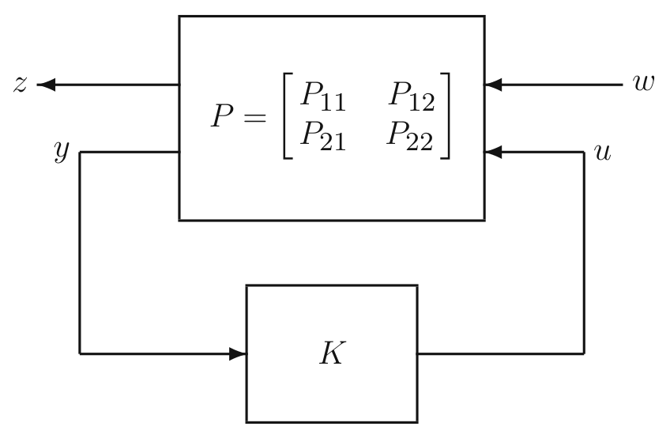
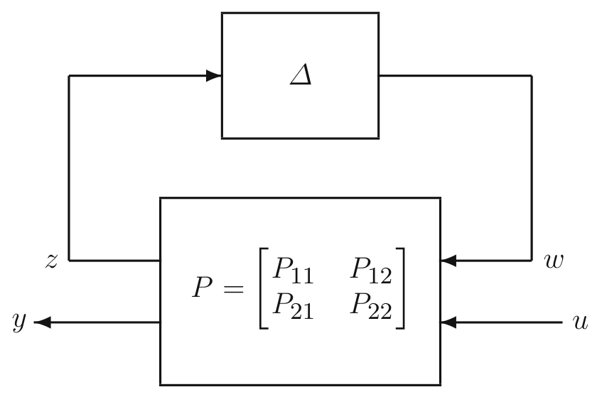
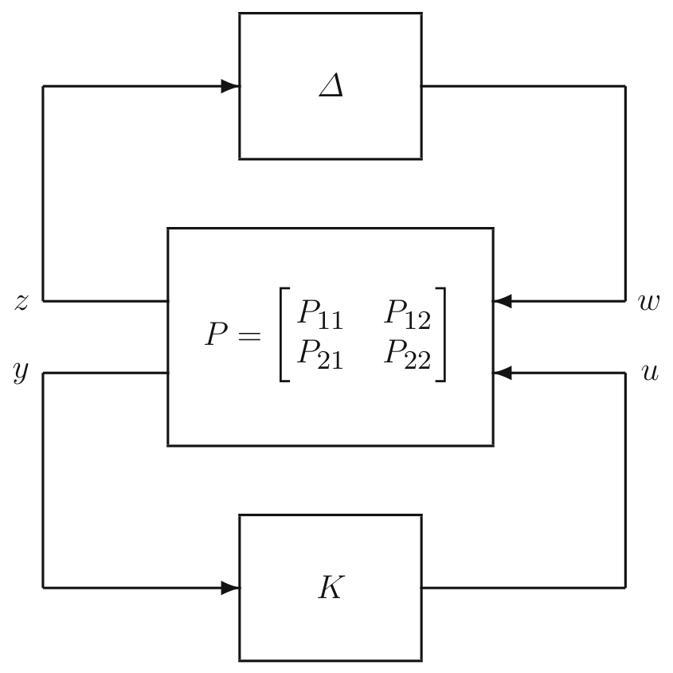
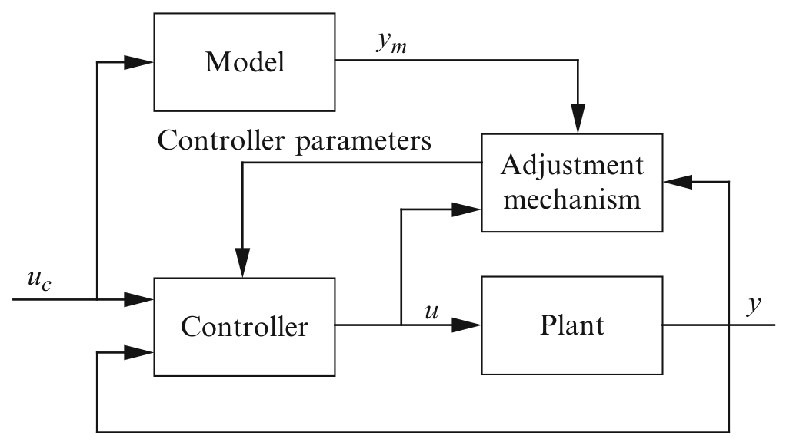
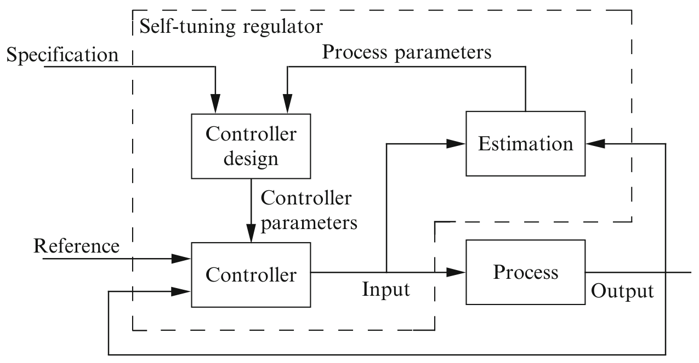
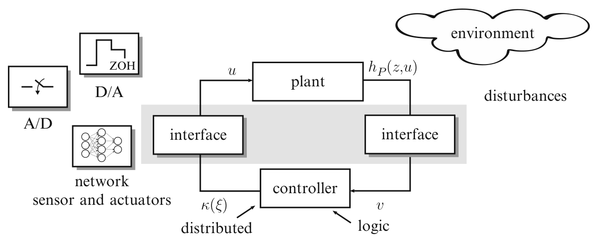

<!-- source_pdf_page: 538 -->
## H

## $\mathrm{H}_{2}$ Optimal Control

Ben M. Chen Department of Electrical and Computer Engineering, National University of Singapore, Singapore, Singapore

#### Abstract

An optimization-based approach to linear feedback control system design uses the $H_{2}$ norm, or energy of the impulse response, to quantify closed-loop performance. In this entry, an overview of state-space methods for solving $H_{2}$ optimal control problems via Riccati equations and matrix inequalities is presented in a continuous-time setting. Both regular and singular problems are considered. Connections to so-called LQR and LQG control problems are also described.

## Keywords

Feedback control; $H_{2}$ control; Linear matrix inequalities; Linear systems; Riccati equations; State-space methods

## Introduction

Modern multivariable control theory based on state-space models is able to handle
multi-feedback-loop designs, with the added benefit that design methods derived from it are amenable to computer implementation. Indeed, over the last five decades, a number of multivariable analysis and design methods have been developed using the state-space description of systems. Of these design tools, $H_{2}$ optimal control problems involve minimizing the $\mathrm{H}_{2}$ norm of the closed-loop transfer function from exogenous disturbance signals to a pertinent controlled output signals of a given plant by appropriate use of a internally stabilizing feedback controller. It was not until the 1990s that a complete solution to the general $H_{2}$ optimal control problem began to emerge. To elaborate on this, let us concentrate our discussion on $\mathrm{H}_{2}$ optimal control for a continuous-time system $\Sigma$ expressed in the following state-space form:

$$
\begin{gather*}
\dot{x}=A x+B u+E w  \tag{1}\\
y=C_{1} x+D_{11} u+D_{1} w  \tag{2}\\
z=C_{2} x+D_{2} u+D_{22} w \tag{3}
\end{gather*}
$$

where $x$ is the state variable, $u$ is the control input, $w$ is the exogenous disturbance input, $y$ is the measurement output, and $z$ is the controlled output. The system $\Sigma$ is typically an augmented or generalized plant model including weighting functions that reflect design requirements. The $H_{2}$ optimal control problem is to find an appropriate control law, relating the control input $u$ to the measured output $y$, such that when it is applied to the given plant in Eqs. (1)-(3), the

<!-- source_pdf_page: 539 -->
resulting closed-loop system is internally stable, and the $H_{2}$ norm of the resulting closed-loop transfer matrix from the disturbance input $w$ to the controlled output $z$, denoted by $T_{z w}(s)$, is minimized. For a stable transfer matrix $T_{z w}(s)$, the $H_{2}$ norm is defined as

$$
\begin{equation*}
\left\|T_{z w}\right\|_{2}=\left(\frac{1}{2 \pi} \operatorname{trace}\left[\int_{-\infty}^{\infty} T_{z w}(j \omega) T_{z w}^{\mathrm{H}}(j \omega) d \omega\right]\right)^{\frac{1}{2}} \tag{4}
\end{equation*}
$$

where $T_{z w}^{\mathrm{H}}$ is the conjugate transpose of $T_{z w}$. Note that the $H_{2}$ norm is equal to the energy of the impulse response associated with $T_{z w}(s)$ and this is finite only if the direct feedthrough term of the transfer matrix is zero.

It is standard to make the following assumptions on the problem data: $D_{11}=0 ; D_{22}= 0 ;(A, B)$ is stabilizable; $\left(A, C_{1}\right)$ is detectable. The last two assumptions are necessary for the existence of an internally stabilizing control law. The first assumption can be made without loss of generality via a constant loop transformation. Finally, either the assumption $D_{22}=0$ can be achieved by a pre-static feedback law, or the problem does not yield a solution that has finite $H_{2}$ closed-loop norm.

There are two main groups into which all $H_{2}$ optimal control problems can be divided. The first group, referred to as regular $H_{2}$ optimal control problems, consists of those problems for which the given plant satisfies two additional assumptions:

1. The subsystem from the control input to the controlled output, i.e., $\left(A, B, C_{2}, D_{2}\right)$, has no invariant zeros on the imaginary axis, and its direct feedthrough matrix, $D_{2}$, is injective (i.e., it is tall and of full rank).
2. The subsystem from the exogenous disturbance to the measurement output, i.e., ( $A, E, C_{1}, D_{1}$ ), has no invariant zeros on the imaginary axis and its direct feedthrough matrix, $D_{1}$, is surjective (i.e., it is fat and of full rank).
Assumption 1 implies that ( $A, B, C_{2}, D_{2}$ ) is left invertible with no infinite zero, and Assumption 2 implies that ( $A, E, C_{1}, D_{1}$ ) is right invertible with no infinite zero. The second, referred to
as singular $H_{2}$ optimal control problems, consists of those which are not regular.

Most of the research in the literature was expended on regular problems. Also, most of the available textbooks and review articles, see, for example, Anderson and Moore (1989), Bryson and Ho (1975), Fleming and Rishel (1975), Kailath (1974), Kwakernaak and Sivan (1972), Lewis (1986), and Zhou et al. (1996), to name a few, cover predominantly only a subset of regular problems. The singular $H_{2}$ control problem with state feedback was studied in Geerts (1989) and Willems et al. (1986). Using different classes of state- and measurement-feedback control laws, Stoorvogel et al. (1993) studied the general $\mathrm{H}_{2}$ optimal control problems for the first time. In particular, necessary and sufficient conditions are provided therein for the existence of a solution in the case of state-feedback control, and in the case of measurement-feedback control. Following this, Trentelman and Stoorvogel (1995) explored necessary and sufficient conditions for the existence of an $H_{2}$ optimal controller within the context of discrete-time and sampled-data systems. At the same time Chen et al. (1993, 1994a) provided a thorough treatment of the $H_{2}$ optimal control problem with state-feedback controllers. This includes a parameterization and construction of the set of all $H_{2}$ optimal controllers and the associated sets of $\mathrm{H}_{2}$ optimal fixed modes and $H_{2}$ optimal fixed decoupling zeros. Also, they provided a computationally feasible design algorithm for selecting an $\mathrm{H}_{2}$ optimal state-feedback controller that places the closed-loop poles at desired locations whenever possible. Furthermore, Chen and Saberi (1993) and Chen et al. (1996) developed the necessary and sufficient conditions for the uniqueness of an $H_{2}$ optimal controller. Interested readers are referred to the textbook Saberi et al. (1995) for a detailed treatment of $\mathrm{H}_{2}$ optimal control problems in their full generality.

## Regular Case

Solving regular $H_{2}$ optimal control problems is relatively straightforward. In the case that all of

<!-- source_pdf_page: 540 -->
the state variables of the given plant are available for feedback, i.e., $y=x$, and Assumption 1 holds, the corresponding $H_{2}$ optimal control problem can be solved in terms of the unique positive semi-definite stabilizing solution $P \geq 0$ of the following algebraic Riccati equation:

$$
\begin{align*}
& A^{\mathrm{T}} P+P A+C_{2}^{\mathrm{T}} C_{2}-\left(P B+C_{2}^{\mathrm{T}} D_{2}\right)\left(D_{2}^{\mathrm{T}} D_{2}\right)^{-1} \\
& \quad\left(D_{2}^{\mathrm{T}} C_{2}+B^{\mathrm{T}} P\right)=0 \tag{5}
\end{align*}
$$

The $H_{2}$ optimal state-feedback law is given by

$$
\begin{equation*}
u=F x=-\left(D_{2}^{\mathrm{T}} D_{2}\right)^{-1}\left(D_{2}^{\mathrm{T}} C_{2}+B^{\mathrm{T}} P\right) x \tag{6}
\end{equation*}
$$

and the resulting closed-loop transfer matrix from $w$ to $z, T_{z w}(s)$, has the following property:

$$
\begin{equation*}
\left\|T_{z w}\right\|_{2}=\sqrt{\operatorname{trace}\left(E^{\mathrm{T}} P E\right)} \tag{7}
\end{equation*}
$$

Note that the $H_{2}$ optimal state-feedback control law is generally nonunique. A trivial example is the case when $E=0$, whereby every stabilizing control law is an optimal solution. It is also interesting to note that the closed-loop system comprising the given plant with $y=x$ and the state-feedback control law of Eq. (6) has poles at all the stable invariant zeros and all the mirror images of the unstable invariant zeros of ( $A, B, C_{2}, D_{2}$ ) together with some other fixed locations in the left half complex plane. More detailed results about the optimal fixed modes and fixed decoupling zeros for general $H_{2}$ optimal control can be found in Chen et al. (1993).

It can be shown that the well-known linear quadratic regulation (LQR) problem can be reformulated as a regular $H_{2}$ optimal control problem. For a given plant

$$
\begin{equation*}
\dot{x}=A x+B u, \quad x(0)=X_{0} \tag{8}
\end{equation*}
$$

with ( $A, B$ ) being stabilizable, the LQR problem is to find a control law $u=F x$ such that the following performance index is minimized:

$$
\begin{equation*}
J=\int_{0}^{\infty}\left(x^{\mathrm{T}} Q_{\star} x+u^{\mathrm{T}} R_{\star} u\right) d t \tag{9}
\end{equation*}
$$

where $R_{\star}>0$ and $Q_{\star} \geq 0$ with ( $A, Q_{\star}^{\frac{1}{2}}$ ) being detectable. The LQR problem is equivalent to finding a static state-feedback $H_{2}$ optimal control law for the following auxiliary plant $\Sigma_{\text {LQR }}$ :

$$
\begin{gather*}
\dot{x}=A x+B u+X_{0} w  \tag{10}\\
y=x  \tag{11}\\
z=\binom{0}{Q_{\star}^{\frac{1}{2}}} x+\binom{R_{\star}^{\frac{1}{2}}}{0} u \tag{12}
\end{gather*}
$$

For the measurement-feedback case with both Assumptions 1 and 2 being satisfied, the corresponding $H_{2}$ optimal control problem can be solved by finding a positive semi-definite stabilizing solution $P \geq 0$ for the Riccati equation given in Eq. (5) and a positive semi-definite stabilizing solution $Q \geq 0$ for the following Riccati equation:

$$
\begin{align*}
& Q A^{\mathrm{T}}+A Q+E E^{\mathrm{T}}-\left(Q C_{1}^{\mathrm{T}}+E D_{1}^{\mathrm{T}}\right)\left(D_{1} D_{1}^{\mathrm{T}}\right)^{-1} \\
& \left(D_{1} E^{\mathrm{T}}+C_{1} Q\right)=0 \tag{13}
\end{align*}
$$

The $\mathrm{H}_{2}$ optimal measurement-feedback law is given by

$$
\begin{equation*}
\dot{v}=\left(A+B F+K C_{1}\right) v-K y, \quad u=F x \tag{14}
\end{equation*}
$$

where $F$ is as given in Eq. (6) and

$$
\begin{equation*}
K=-\left(Q C_{1}^{\mathrm{T}}+E D_{1}^{\mathrm{T}}\right)\left(D_{1} D_{1}^{\mathrm{T}}\right)^{-1} \tag{15}
\end{equation*}
$$

In fact, such an optimal control law is unique and the resulting closed-loop transfer matrix from $w$ to $z, T_{z w}(s)$, has the following property:

$$
\begin{align*}
\left\|T_{z w}\right\|_{2}= & \left\{\operatorname{trace}\left(E^{\mathrm{T}} P E\right)\right. \\
& \left.+\operatorname{trace}\left[\left(A^{\mathrm{T}} P+P A+C_{2}^{\mathrm{T}} C_{2}\right) Q\right]\right\}^{\frac{1}{2}} \tag{16}
\end{align*}
$$

Similarly, consider the standard LQG problem for the following system:

$$
\begin{equation*}
\dot{x}=A x+B u+G_{\star} d \tag{17}
\end{equation*}
$$

<!-- source_pdf_page: 541 -->
$$
\begin{gather*}
y=C x+N_{\star} n, \quad N_{\star}>0  \tag{18}\\
z=\binom{H_{\star} x}{R_{\star} u}, \quad R_{\star}>0, \quad w=\binom{d}{n} \tag{19}
\end{gather*}
$$

where $x$ is the state, $u$ is the control, $d$ and $n$ white noises with identity covariance, and $y$ the measurement output. It is assumed that ( $A, B$ ) is stabilizable and ( $A, C$ ) is detectable. The control objective is to design an appropriate control law that minimizes the expectation of $|z|^{2}$. Such an LQG problem can be solved via the $H_{2}$ optimal control problem for the following auxiliary system $\Sigma_{\text {LQG }}$ (see Doyle 1983):

$$
\begin{gather*}
\dot{x}=A x+B u+\left[\begin{array}{cc}
G_{\star} & 0
\end{array}\right] w  \tag{20}\\
y=C x+\left[\begin{array}{ll}
0 & N_{\star}
\end{array}\right] w  \tag{21}\\
z=\binom{H_{\star}}{0} x+\binom{0}{R_{\star}} u \tag{22}
\end{gather*}
$$

$H_{2}$ optimal control problem for discretetime systems can be solved in a similar way via the corresponding discrete-time algebraic Riccati equations. It is worth noting that many works can be found in the literature that deal with solutions to discrete-time algebraic Riccati equations related to optimal control problems; see, for example, Kucera (1972), Pappas et al. (1980), and Silverman (1976), to name a few. It is proven in Chen et al. (1994b) that solutions to the discrete- and continuous-time algebraic Riccati equations for optimal control problems can be unified. More specifically, the solution to a discrete-time Riccati equation can be done through solving an equivalent continuous-time one and vice versa.

## Singular Case

As in the previous section, only the key procedure in solving the singular $\mathrm{H}_{2}$-optimization problem for continuous-time systems is addressed. For the singular problem, it is generally not possible to obtain an optimal solution, except for some situations when the given plant satisfies certain geometric constraints; see, e.g., Chen et al. (1993) and Stoorvogel et al. (1993). It is more feasible
to find a suboptimal control law for the singular problem, i.e., to find an appropriate control law such that the $H_{2}$ norm of the resulting closedloop transfer matrix from $w$ to $z$ can be made arbitrarily close to the best possible performance. The procedure given below is to transform the original problem into an $H_{2}$ almost disturbance decoupling problem; see Stoorvogel (1992) and Stoorvogel et al. (1993).

Consider the given plant in Eqs. (1)-(3) with Assumption 1 and/or Assumption 2 not satisfied. First, find the largest solution $P \geq 0$ for the following linear matrix inequality

$$
F(P)=\left(\begin{array}{cc}A^{\mathrm{T}} P+P A+C_{2}^{\mathrm{T}} C_{2} & P B+C_{2}^{\mathrm{T}} D_{2}  \tag{23}\\ B^{\mathrm{T}} P+D_{2}^{\mathrm{T}} C_{2} & D_{2}^{\mathrm{T}} D_{2}\end{array}\right) \geq 0
$$

and find the largest solution $Q \geq 0$ for

$$
G(Q)=\left(\begin{array}{cc}A Q+Q A^{\mathrm{T}}+E E^{\mathrm{T}} & Q C_{1}^{\mathrm{T}}+E D_{1}^{\mathrm{T}}  \tag{24}\\ C_{1} Q+D_{1} E^{\mathrm{T}} & D_{1} D_{1}^{\mathrm{T}}\end{array}\right) \geq 0
$$

Note that by decomposing the quadruples ( $A, B, C_{2}, D_{2}$ ) and ( $A, E, C_{1}, D_{1}$ ) into various subsystems in accordance with their structural properties, solutions to the above linear matrix inequalities can be obtained by solving a Riccati equation similar to those in Eq. (5) or Eq. (5) for the regular case. In fact, for the regular problem, the largest solution $P \geq 0$ for Eq. (23) and the stabilizing solution $P \geq 0$ for Eq. (5) are identical. Similarly, the largest solution $Q \geq 0$ for Eq. (24) and the stabilizing solution $Q \geq 0$ for Eq. (13) are also the same. Interested readers are referred to Stoorvogel et al. (1993) for more details or to Chen et al. (2004) for a more systematic treatment on the structural decomposition of linear systems and its connection to the solutions of the linear matrix inequalities.

It can be shown that the best achievable $H_{2}$ norm of the closed-loop transfer matrix from $w$ to $z$, i.e., the best possible performance over all internally stabilizing control laws, is given by

$$
\begin{align*}
\gamma_{2}^{\star}= & \left\{\operatorname{trace}\left(E^{\mathrm{T}} P E\right)\right. \\
& \left.+\operatorname{trace}\left[\left(A^{\mathrm{T}} P+P A+C_{2}^{\mathrm{T}} C_{2}\right) Q\right]\right\}^{\frac{1}{2}} \tag{25}
\end{align*}
$$

<!-- source_pdf_page: 542 -->
Next, partition

$$
\begin{align*}
& F(P)=\binom{C_{\mathrm{P}}^{\mathrm{T}}}{D_{\mathrm{P}}^{\mathrm{T}}}\left(\begin{array}{ll}
C_{\mathrm{P}} & D_{\mathrm{P}}
\end{array}\right) \\
& \text { and } G(Q)=\binom{E_{\mathrm{Q}}}{D_{\mathrm{Q}}}\left(\begin{array}{ll}
E_{\mathrm{Q}}^{\mathrm{T}} & D_{\mathrm{Q}}^{\mathrm{T}}
\end{array}\right) \tag{26}
\end{align*}
$$

where $\left[\begin{array}{ll}C_{\mathrm{P}} & D_{\mathrm{P}}\end{array}\right]$ and $\left[\begin{array}{ll}E_{\mathrm{Q}}^{\mathrm{T}} & D_{\mathrm{Q}}^{\mathrm{T}}\end{array}\right]$ are of maximal rank, and then define an auxiliary system $\Sigma_{\mathrm{PQ}}$ :

$$
\begin{gather*}
\dot{x}_{\mathrm{PQ}}=A x_{\mathrm{PQ}}+B u+E_{\mathrm{Q}} w_{\mathrm{PQ}}  \tag{27}\\
y=C_{1} x_{\mathrm{PQ}}+D_{\mathrm{Q}} w_{\mathrm{PQ}}  \tag{28}\\
z_{\mathrm{PQ}}=C_{\mathrm{P}} x_{\mathrm{PQ}}+D_{\mathrm{P}} u \tag{29}
\end{gather*}
$$

It can be shown that the quadruple( $A, B, C_{\mathrm{P}}, D_{\mathrm{P}}$ ) is right invertible and has no invariant zeros in the open right-half complex plane, and the quadruple ( $A, E_{\mathrm{Q}}, C_{1}, D_{\mathrm{Q}}$ ) is left invertible and has no invariant zeros in the open right-half complex plane. It can also be shown that there exists an appropriate control law such that when it is applied to $\Sigma_{\mathrm{PQ}}$, the resulting closed-loop system is internally stable and the $H_{2}$ norm of the closedloop transfer matrix from $w_{\mathrm{PQ}}$ to $z_{\mathrm{PQ}}$ can be made arbitrarily small. Equivalently, $H_{2}$ almost disturbance decoupling problem for $\Sigma_{\mathrm{PQ}}$ is solvable.

More importantly, it can further be shown that if an appropriate control law solves the $\mathrm{H}_{2}$ almost disturbance decoupling problem for $\Sigma_{\mathrm{PQ}}$, then it solves the $H_{2}$ suboptimal problem for $\Sigma$. As such, the solution to the singular $H_{2}$ control problem for $\Sigma$ can be done by finding a solution to the $H_{2}$ almost disturbance decoupling problem for $\Sigma_{\mathrm{PQ}}$. There are vast results available in the literature dealing with disturbance decoupling problems. More detailed treatments can be found in Saberi et al. (1995).

## Conclusion

This entry considers the basic solutions to $H_{2}$ optimal control problems for continuoustime systems. Both the regular problem and the general singular problem are presented. Readers interested in more details are referred
to Saberi et al. (1995) and the references therein, for the complete treatment of $\mathrm{H}_{2}$ optimal control problems, and to Chap. 10 of Chen et al. (2004) for the unification and differentiation of $\mathrm{H}_{2}$ control, $H_{\infty}$ control, and disturbance decoupling control problems. $H_{2}$ optimal control is a mature area and has a long history. Possible future research includes issues on how to effectively utilize the theory in solving real-life problems.

## Cross-References

- H-Infinity Control
- Linear Matrix Inequality Techniques in Optimal Control
- Linear Quadratic Optimal Control
- Optimal Control via Factorization and Model Matching
- Stochastic Linear-Quadratic Control

## Bibliography

Anderson BDO, Moore JB (1989) Optimal control: linear quadratic methods. Prentice Hall, Englewood Cliffs
Bryson AE, Ho YC (1975) Applied optimal control, optimization, estimation, and control. Wiley, New York
Chen BM, Saberi A (1993) Necessary and sufficient conditions under which an $H_{2}$-optimal control problem has a unique solution. Int J Control 58:337-348
Chen BM, Saberi A, Sannuti P, Shamash Y (1993) Construction and parameterization of all static and dynamic $H_{2}$-optimal state feedback solutions, optimal fixed modes and fixed decoupling zeros. IEEE Trans Autom Control 38:248-261
Chen BM, Saberi A, Shamash Y, Sannuti P (1994a) Construction and parameterization of all static and dynamic $H_{2}$-optimal state feedback solutions for discrete time systems. Automatica 30:1617-1624
Chen BM, Saberi A, Shamash Y (1994b) A non-recursive method for solving the general discrete time algebraic Riccati equation related to the $H_{\infty}$ control problem. Int J Robust Nonlinear Control 4:503-519
Chen BM, Saberi A, Shamash Y (1996) Necessary and sufficient conditions under which a discrete time $H_{2}$ optimal control problem has a unique solution. J Control Theory Appl 13:745-753
Chen BM, Lin Z, Shamash Y (2004) Linear systems theory: a structural decomposition approach. Birkhäuser, Boston
Doyle JC (1983) Synthesis of robust controller and filters. In: Proceedings of the 22nd IEEE conference on decision and control, San Antonio

<!-- source_pdf_page: 543 -->
Fleming WH, Rishel RW (1975) Deterministic and stochastic optimal control. Springer, New York
Geerts T (1989) All optimal controls for the singular linear quadratic problem without stability: a new interpretation of the optimal cost. Linear Algebra Appl 122:65104
Kailath T (1974) A view of three decades of linear filtering theory. IEEE Trans Inf Theory 20: 146-180
Kucera V (1972) The discrete Riccati equation of optimal control. Kybernetika 8:430-447
Kwakernaak H, Sivan R (1972) Linear optimal control systems. Wiley, New York
Lewis FL (1986) Optimal control. Wiley, New York
Pappas T, Laub AJ, Sandell NR Jr (1980) On the numerical solution of the discrete-time algebraic Riccati equation. IEEE Trans Autom Control AC-25:631-641
Saberi A, Sannuti P, Chen BM (1995) $H_{2}$ optimal control. Prentice Hall, London
Silverman L (1976) Discrete Riccati equations: alternative algorithms, asymptotic properties, and system theory interpretations. Control Dyn Syst 12:313-386
Stoorvogel AA (1992) The singular $H_{2}$ control problem. Automatica 28:627-631
Stoorvogel AA, Saberi A, Chen BM (1993) Full and reduced order observer based controller design for $\mathrm{H}_{2}-$ optimization. Int J Control 58:803-834
Trentelman HL, Stoorvogel AA (1995) Sampled-data and discrete-time $\mathrm{H}_{2}$ optimal control. SIAM J Control Optim 33:834-862
Willems JC, Kitapci A, Silverman LM (1986) Singular optimal control: a geometric approach. SIAM J Control Optim 24:323-337
Zhou K, Doyle JC, Glover K (1996) Robust and optimal control. Prentice Hall, Upper Saddle River

## H-Infinity Control

Keith Glover
Department of Engineering, University of Cambridge, Cambridge, UK

#### Abstract

The area of robust control, where the performance of a feedback system is designed to be robust to uncertainty in the plant being controlled, has received much attention since the 1980s. System analysis and controller synthesis based on the H-infinity norm has been central to progress in this area. This article outlines how the control law that minimizes the H-infinity norm of the

closed-loop system can be derived. Connections to other problems, such as game theory and risksensitive control, are discussed and finally appropriate problem formulations to produce "good" controllers using this methodology are outlined.

## Keywords

Loop-shaping; Robust control; Robust stability

## Introduction

The $\mathcal{H}_{\infty}$-norm probably first entered the study of robust control with the observations made by Zames (1981) in the considering optimal sensitivity. The so-called $\mathcal{H}_{\infty}$ methods were subsequently developed and are now routinely available to control engineers. In this entry we consider the $\mathcal{H}_{\infty}$ methods for control, and for simplicity of exposition, we will restrict our attention to linear, time-invariant, finite dimensional, continuous-time systems. Such systems can be represented by their transfer function matrix, $G(s)$, which will then be a rational function of $s$. Although the Hardy Space, $\mathcal{H}_{\infty}$, also includes nonrational functions, a rational $G(s)$ is in $\mathcal{H}_{\infty}$ if and only if it is proper and all its poles are in the open left half plane, in which case the $\mathcal{H}_{\infty}$-norm is defined as:

$$
\|G(s)\|_{\infty}=\sup _{\operatorname{Re} s>0} \sigma_{\max }(G(s))=\sup _{-\infty<\omega<\infty} \sigma_{\max }((j \omega))
$$

(where $\sigma_{\text {max }}$ denotes the largest singular value). Hence for a single input/single output system with transfer function, $g(s)$, its $\mathcal{H}_{\infty}$-norm, $\|g(s)\|_{\infty}$ gives the maximum value of $|g(j \omega)|$ and hence the maximum amplification of sinusoidal signals by a system with this transfer function. In the multi-input/multi-output case a similar result holds regarding the system amplification of a vector of sinusoids. There is now a good collection of graduate level textbooks that cover the area in some detail from a variety of approaches, and these are listed

<!-- source_pdf_page: 544 -->
in the Recommended Reading section and the references in this article are generally to these texts rather than to the original journal papers.

Consider a system with transfer function, $G(s)$, input vector, $u(t) \in \mathcal{L}_{2}(0, \infty)$ and an output vector, $y(t)$, whose Laplace transforms are given by $\bar{u}(s)$ and $\bar{y}(s)$. Such a system will have a state space realization,
$\dot{x}(t)=A x(t)+B u(t), \quad y(t)=C x(t)+D u(t)$
giving $G(s)=D+C(s I-A)^{-1} B$, which we also denote

$$
G(s)=\left[\begin{array}{l|l}
A & B \\
\hline C & D
\end{array}\right],
$$

and hence $\bar{y}(s)=G(s) \bar{u}(s)$ if $x(0)=0$.
There are two main reasons for using the $\mathcal{H}_{\infty^{-}}$ norm. Firstly in representing the system gain for input signals $u(t) \in \mathcal{L}_{2}(0, \infty)$ or equivalently $\bar{u}(j \omega) \in \mathcal{L}_{2}(-\infty, \infty)$, with corresponding norm $\|u\|_{2}^{2}=\int_{0}^{\infty} u(t)^{*} u(t) d t$ (where $x^{*}$ denotes the conjugate transpose of the vector $x$ (or a matrix)). With these input and output spaces the induced norm of the system is easily shown to be the $\mathcal{H}_{\infty^{-}}$ norm of $G(s)$, and in particular,

$$
\|y\|_{2} \leq\|G(s)\|_{\infty}\|u\|_{2}
$$

Hence in a control context the $\mathcal{H}_{\infty}$-norm can give a measure of the gain, for example, from disturbances to the resulting errors. In the interconnection of systems, the property that $\left.\|P(s) Q(s)\|_{\infty} \leq \| P(s)\right)\left\|_{\infty}\right\| Q(s) \|_{\infty}$ is often useful.

The second reason for using the $\mathcal{H}_{\infty}$-norm is in representing uncertainty in the plant being controlled, e.g., the nominal plant is $P_{o}(s)$ but the actual plant is $P(s)=P_{o}(s)+\Delta(s)$ where $\|\Delta(s)\|_{\infty} \leq \delta$.

A typical control design problem is given in Fig. 1, i.e.,

$$
\begin{aligned}
{\left[\begin{array}{l}
\bar{z} \\
\bar{y}
\end{array}\right] } & =P\left[\begin{array}{l}
\bar{w} \\
\bar{u}
\end{array}\right]=\left[\begin{array}{l}
P_{11} \bar{w}+P_{12} \bar{u} \\
P_{21} \bar{w}+P_{22} \bar{u}
\end{array}\right] \\
\bar{u} & =K \bar{y}
\end{aligned}
$$

> Image description: A block diagram illustrating an H-infinity control feedback system, labeled as "Fig. 1 Lower linear fractional transformation: feedback system." The diagram consists of two main rectangular blocks: a larger upper block $P$ and a smaller lower block $K$. The upper block $P$ is represented by a $2 \times 2$ matrix: $$P = \begin{bmatrix} P_{11} & P_{12} \\ P_{21} & P_{22} \end{bmatrix}$$ This block receives two input signals, $w$ (external disturbance/reference) and $u$ (control input). It produces two output signals, $z$ (error/performance output) and $y$ (measured output). The block $K$ represents the controller. It receives the measured output $y$ from block $P$ and produces the control input $u$, which is fed back into block $P$. This configuration forms a closed-loop feedback loop where $y$ and $u$ create a coupling between the plant $P$ and the controller $K$.
H-Infinity Control, Fig. 1 Lower linear fractional transformation: feedback system

$$
\begin{aligned}
\Rightarrow \quad \bar{y} & =\left(I-P_{22} K\right)^{-1} P_{21} \bar{w} \\
\bar{u} & =K\left(I-P_{22} K\right)^{-1} P_{21} \bar{w} \\
\bar{z} & =\left(P_{11}+P_{12} K\left(I-P_{22} K\right)^{-1} P_{21}\right) \bar{w} \\
& =: \mathcal{F}_{l}(P, K) \bar{w}=: T_{z \leftarrow w} \bar{w}
\end{aligned}
$$

where $\mathcal{F}_{l}(P, K)$ denotes the lower Linear Fractional Transformation (LFT) with connection around the lower terminals of $P$ as in Fig. 1.

The standard $\mathcal{H}_{\infty}$-control synthesis problem is to find a controller with transfer function, $K$, that
stabilizes the closed-loop system in Fig. 1 and minimizes $\left\|\mathcal{F}_{l}(P, K)\right\|_{\infty}$.

That is, the controller is designed to minimize the worst-case effect of the disturbance $w$ on the output/error signal $z$ as measured by the $\mathcal{L}_{2}$ norm of the signals. This article will describe the solution to this problem.

## Robust Stability

Before we describe the solution to the synthesis problem, consider the problem of the robust stability of an uncertain plant with a feedback controller. Suppose the plant is given by the upper LFT, $\mathcal{F}_{u}(P, \Delta)$ with $\|\Delta\|_{\infty} \leq 1 / \gamma$ as illustrated in Fig. 2,

$$
\begin{equation*}
\bar{y}=\mathcal{F}_{u}(P, \Delta) \bar{u} \tag{1}
\end{equation*}
$$

<!-- source_pdf_page: 545 -->

> Image description: A technical diagram titled "Fig. 2 Upper linear fractional transformation" illustrates a control systems block diagram used in $H$-infinity control theory. The diagram consists of two rectangular blocks interconnected in a feedback loop. The top block is labeled with the Greek letter Delta ($\Delta$), representing an uncertainty block. The bottom block is labeled as a generalized plant matrix $P$, defined as: $P = \begin{bmatrix} P_{11} & P_{12} \\ P_{21} & P_{22} \end{bmatrix}$ The connections define the signal flow: * The variable $z$ exits the plant block $P$ and enters the $\Delta$ block. * The variable $w$ exits the $\Delta$ block and enters the plant block $P$. * The variable $u$ is an external input to the plant block $P$. * The variable $y$ is an external output from the plant block $P$. Arrows indicate the direction of signal flow, showing how the uncertainty $\Delta$ interacts with the plant $P$ to form an upper linear fractional transformation.
H-Infinity Control, Fig. 2 Upper linear fractional transformation

> Image description: An engineering block diagram illustrating an upper linear fractional transformation, as part of an $H_{\infty}$ control framework. The diagram consists of four rectangular blocks arranged vertically. At the top is a block labeled $\Delta$ (delta), representing a perturbation or uncertainty block. Below it is a central large block labeled $P$, representing the nominal plant, defined by the $2 \times 2$ matrix $P = \begin{bmatrix} P_{11} & P_{12} \\ P_{21} & P_{22} \end{bmatrix}$. At the bottom is a block labeled $K$, representing the controller. The blocks are interconnected by signal flow arrows. The plant $P$ has four input/output signals: $w$ and $u$ enter the plant from the right, while $z$ and $y$ exit the plant from the left. The uncertainty block $\Delta$ receives signal $z$ from the plant and provides signal $w$ back to the plant, forming a closed feedback loop at the top. The controller $K$ receives output $y$ from the plant and provides control input $u$ back to the plant, forming a feedback loop at the bottom.
H-Infinity Control, Fig. 3 Feedback system with plant uncertainty

where $\mathcal{F}_{u}(P, K):=P_{22}+P_{21} \Delta\left(I-P_{11} \Delta\right)^{-1} P_{12}$

The small gain theorem then states that the feedback system of Fig. 3 will be stable for all such $\Delta$ if the feedback connection of $P_{22}$ and $K$ is stable and $\left\|\mathcal{F}_{l}(P, K)\right\|_{\infty}<\gamma$. This robust stability result is valid if $P$ and $\Delta$ are both stable; more care is required when either or both are unstable but with such care a similar result is true.

Let us consider a couple of examples. First suppose that the uncertainty is represented as output multiplicative uncertainty,
$P_{\Delta}=\left(I+W_{1} \Delta W_{2}\right) P_{o}=\mathcal{F}_{u}\left(\left[\begin{array}{cc}0 & W_{2} P_{o} \\ W_{1} & P_{o}\end{array}\right], \Delta\right)$ with robust stability test given by

$$
\begin{aligned}
& \left\|\mathcal{F}_{l}\left(\left[\begin{array}{cc}
0 & W_{2} P_{o} \\
W_{1} & P_{o}
\end{array}\right], K\right)\right\|_{\infty} \\
& \quad=\left\|W_{2} P_{o} K\left(I-P_{o} K\right)^{-1} W_{1}\right\|_{\infty}<\gamma
\end{aligned}
$$

As a second example consider the plants $P_{\Delta}=\left(\tilde{M}+\Delta_{M}\right)^{-1}\left(\tilde{N}+\Delta_{N}\right)$, with $\Delta= \left[\begin{array}{ll}\Delta_{N} & \Delta_{M}\end{array}\right]$ and $\|\Delta\|_{\infty} \leq 1 / \gamma$. Here $P_{o}= \tilde{M}^{-1} \tilde{N}$ is a left coprime factorization of the nominal plant and the plants $P_{\Delta}$ are represented by perturbations to these coprime factors. In this case $P_{\Delta}=\mathcal{F}_{u}(P, \Delta)$, where

$$
P=\left[\begin{array}{c}
{\left[\begin{array}{c}
0 \\
-\tilde{M}^{-1}
\end{array}\right]\left[\begin{array}{c}
I \\
-\tilde{M}^{-1} \tilde{N}
\end{array}\right]} \\
\tilde{M}^{-1}
\end{array}\right]
$$

and the robust stability test will be

$$
\left\|\mathcal{F}_{l}(P, K)\right\|_{\infty}=\left\|\left[\begin{array}{c}
K \\
-I
\end{array}\right]\left(I-P_{o} K\right)^{-1} \tilde{M}^{-1}\right\|_{\infty}<\gamma
$$

This is related to plant perturbations in the gap metric (see Vinnicombe 2001). It is therefore observed that the robust stability test for these useful representations of uncertain plants is given by an $\mathcal{H}_{\infty}$-norm test just as in the controller synthesis problem.

## Derivation of the $\mathcal{H}_{\infty}$-Control Law

In this section we present a solution to the $\mathcal{H}_{\infty^{-}}$ control problem and give some interpretations of the solution. The approach presented is as in by Doyle et al. (1989); see also Zhou et al. (1996). We will make some simplifying structural assumptions to make the formulae less complex and will not state the required assumptions on rank, stabilizability, and detectability. Let the system in Fig. 1 be described by the equations:

$$
\begin{equation*}
\dot{x}(t)=A x(t)+B_{1} w(t)+B_{2} u(t) \tag{3}
\end{equation*}
$$

<!-- source_pdf_page: 546 -->
$$
\begin{align*}
& z(t)=C_{1} x(t)+D_{12} u(t)  \tag{4}\\
& y(t)=C_{2} x(t)+D_{21} w(t) \tag{5}
\end{align*}
$$

i.e., in Fig. 1

$$
P=\left[\begin{array}{c|cc}
A & B_{1} & B_{2} \\
\hline C_{1} & 0 & D_{12} \\
C_{2} & D_{21} & 0
\end{array}\right]
$$

where we also assume, with little loss of generality, that $D_{12}^{*} D_{12}=I, D_{21} D_{21}^{*}=I, D_{12}^{*} C_{1}=$ 0 and $B_{1} D_{21}^{*}=0$. Since we wish to have $\left\|T_{z \leftarrow w}\right\|_{\infty}<\gamma$, we need to find $u$ such that

$$
\|z\|_{2}^{2}-\gamma^{2}\|w\|_{2}^{2}<0 \text { for all } w \neq 0 \in \mathcal{L}_{2}(0, \infty)
$$

We could consider $w$ to be an adversary trying to make this expression positive, while $u$ has to ensure that it always remains negative in spite of the malicious intentions of $w$, as in a noncooperative game. Suppose that there exists a solution, $X_{\infty}$, to the Algebraic Riccati Equation (ARE),

$$
\begin{align*}
& A^{*} X_{\infty}+X_{\infty} A+C_{1}^{*} C_{1} \\
& \quad+X_{\infty}\left(\gamma^{-2} B_{1} B_{1}^{*}-B_{2} B_{2}^{*}\right) X_{\infty}=0 \tag{6}
\end{align*}
$$

with $X_{\infty} \geq 0$ and $A+\left(\gamma^{-2} B_{1} B_{1}^{*}-B_{2} B_{2}^{*}\right) X_{\infty}$ a stable "A-matrix." A simple substitution then gives that

$$
\begin{aligned}
\frac{d}{d t}\left(x(t)^{*} X_{\infty} x(t)\right)= & -z^{*} z+\gamma^{2} w^{*} w \\
& +v^{*} v-\gamma^{2} r^{*} r
\end{aligned}
$$

where

$$
v:=u+B_{2}^{*} X_{\infty} x, \quad r:=w-\gamma^{-2} B_{1}^{*} X_{\infty} x
$$

Now let $x(0)=0$ and assuming stability so that $x(\infty)=0$, then integrating from 0 to $\infty$ gives

$$
\begin{equation*}
\|z\|_{2}^{2}-\gamma^{2}\|w\|_{2}^{2}=\|v\|_{2}^{2}-\gamma^{2}\|r\|_{2}^{2} \tag{7}
\end{equation*}
$$

If the state is available to $u$, then the control law $u=-B_{2}^{*} X_{\infty} x$ gives $v=0$ and $\|z\|_{2}^{2}- \gamma^{2}\|w\|_{2}^{2}<0$ for all $w \neq 0$. It can be shown that (6) has a solution if there exists a controller
such that $\left\|\mathcal{F}_{l}(P, K)\right\|_{\infty}<\gamma$. In addition since transposing a system does not change its $\mathcal{H}_{\infty^{-}}$ norm, the following dual ARE will also have a solution, $Y_{\infty} \geq 0$,

$$
\begin{align*}
& A Y_{\infty}+Y_{\infty} A^{*}+B_{1} B_{1}^{*} \\
& \quad+Y_{\infty}\left(\gamma^{-2} C_{1}^{*} C_{1}-C_{2}^{*} C_{2}\right) Y_{\infty}=0 \tag{8}
\end{align*}
$$

To obtain a solution to the output feedback case, note that (7) implies that $\|z\|_{2}^{2}<\gamma^{2}\|w\|_{2}^{2}$ if and only if $\|v\|_{2}^{2}<\gamma^{2}\|r\|_{2}^{2}$ and $\bar{v}= \mathcal{F}_{l}\left(P_{\mathrm{tmp}}, K\right) \bar{r}$ where

$$
\left[\begin{array}{l}
\bar{v} \\
\bar{y}
\end{array}\right]=P_{\mathrm{tmp}}\left[\begin{array}{l}
\bar{r} \\
\bar{u}
\end{array}\right],
$$

and

$$
P_{\mathrm{tmp}}=\left[\begin{array}{c|cc}
A+\gamma^{-2} B_{1} B_{1}^{*} X_{\infty} & B_{1} & B_{2} \\
\hline B_{2}^{*} X_{\infty} & 0 & I \\
C_{2} & D_{21} & 0
\end{array}\right]
$$

The special structure of this problem enables a solution to be derived in much the same way as the dual of the state feedback problem. The corresponding ARE will have a solution $Y_{\mathrm{tmp}}= \left(I-\gamma^{-2} Y_{\infty} X_{\infty}\right)^{-1} Y_{\infty} \geq 0$ if and only if the spectral radius $\rho\left(Y_{\infty} X_{\infty}\right)<\gamma^{2}$.

The above outline, supported by significant technical detail and assumptions, will therefore demonstrate that there exists a stabilizing controller, $K(s)$, such that the system described by $(3-1)$ satisfies $\left\|T_{z \leftarrow w}\right\|_{\infty}<\gamma$ if and only if there exist stabilizing solutions to the AREs in (6) and (8) such that

$$
\begin{equation*}
X_{\infty} \geq 0, \quad Y_{\infty} \geq 0, \quad \rho\left(Y_{\infty} X_{\infty}\right)<\gamma^{2} \tag{9}
\end{equation*}
$$

The state equations for the resulting controller can be written as

$$
\begin{aligned}
\dot{\hat{x}} & =A \hat{x}+B_{1} \hat{w}_{\mathrm{worst}}+B_{2} u+Z_{\infty} L_{\infty}\left(C_{2} \hat{x}-y\right) \\
u & =F_{\infty} \hat{x}, \hat{w}_{\mathrm{worst}}=\gamma^{-2} B_{1}^{*} X_{\infty} \hat{x} \\
F_{\infty} & :=-B_{2}^{*} X_{\infty}, L_{\infty}:=-Y_{\infty} C_{2}^{*} \\
Z_{\infty} & :=\left(I-\gamma^{-2} Y_{\infty} X_{\infty}\right)^{-1}
\end{aligned}
$$

<!-- source_pdf_page: 547 -->
giving feedback from a state estimator in the presence of an estimate of the worst-case disturbance.

As $\gamma \rightarrow \infty$ the standard LQG controller is obtained with state feedback of a state estimate obtained from a Kalman filter. In contrast to the LQG problem, the controller depends on the value of $\gamma$, and if this is chosen to be too small, then one of the conditions in (9) will be violated. In order to determine the minimum achievable value of $\gamma$, a bisection search over $\gamma$ can be performed checking (9) for each candidate value of $\gamma$.

In the limit as $\gamma \rightarrow \gamma_{\text {opt }}$ (its minimum value), a variety of situations can arise and the formulae given here may become ill-conditioned. Typically achieving $\gamma_{\text {opt }}$ is more of an interesting and sometimes challenging mathematical exercise rather than a control system requirement.

This control problem does not have a unique solution, and all solutions can be characterized by an LFT form such as $K=\mathcal{F}_{l}(M, Q)$ where $Q \in \mathcal{H}_{\infty}$ with $\|Q\|_{\infty}<1$, the present solution is sometimes referred to as the "central solution" obtained with $Q=0$.

## Relations for Other Solution Methods and Problem Formulations

The $\mathcal{H}_{\infty}$-control problem has been shown to be related to an extraordinarily wide variety of mathematical techniques and to other problem areas, and investigations of these connections have been most fruitful. Earlier approaches (see Francis 1988) firstly used the characterization of all stabilizing controllers of Youla et al. (see Vidyasagar 1985) which shows that all stable closed-loop systems can be written as

$$
\mathcal{F}_{l}(P, K)=T_{1}+T_{2} Q T_{3}, \text { where } Q \in \mathcal{H}_{\infty}
$$

and then solved the model matching problem $\inf _{Q \in \mathcal{H}_{\infty}}\left\|T_{1}+T_{2} Q T_{3}\right\|_{\infty}$. This model matching problem is related to interpolation theory and resulted in a productive interaction with the operator theory. One solution method reduces this problem to J-spectral factorisation problems
$\left(\right.$ where $\left.J=\left[\begin{array}{cc}I & 0 \\ 0 & -I\end{array}\right]\right)$ and generates statespace solutions to these problems (Kimura 1997).

The derivation above clearly demonstrates relations to noncooperative differential games, and this is fully developed in Başar and Bernhard (1995) and Green and Limebeer (1995).

The model matching problem is clearly a convex optimization problem. The solution of linear matrix inequalities can give effective methods for solving certain convex optimization problems (e.g., calculating the $\mathcal{H}_{\infty}$ norm using the bounded real lemma) and can be exploited in the $\mathcal{H}_{\infty^{-}}$ control problem. See Boyd and Barratt (1991) for a variety of results on convex optimization and control and Dullerud and Paganini (2000) for this approach in robust control.

As noted above there is a family of solutions to the $\mathcal{H}_{\infty}$-control problem. The central solution in fact minimizes the entropy integral given by

$$
\begin{align*}
& I\left(T_{z \leftarrow w} ; \gamma\right):=-\frac{\gamma^{2}}{2 \pi} \int_{-\infty}^{\infty} \ln \\
& \quad\left|\operatorname{det}\left(I-\gamma^{-2} T_{z \leftarrow w}(j \omega)^{*} T_{z \leftarrow w}(j \omega)\right)\right| d \omega \tag{10}
\end{align*}
$$

It can be seen that this criterion will penalize the singular values of $T_{z \leftarrow w}(j \omega)$ from being close to $\gamma$ for a large range of frequencies.

One of the more surprising connections is with the risk-sensitive stochastic control problem (Whittle 1990) where $w$ is assumed to be Gaussian white noise and it is desired to minimize

$$
\begin{align*}
J_{T}(\gamma) & :=\frac{\gamma^{2}}{T} \ln \mathbf{E}\left\{e^{\frac{1}{2} \gamma^{-2} V_{T}}\right\}  \tag{11}\\
\text { where } V_{T} & :=\int_{-T}^{T} z(t)^{*} z(t) d t \tag{12}
\end{align*}
$$

The situation with $\gamma^{2}>0$ corresponds to the risk averse controller since large values of $V_{T}$ are heavily penalized by the exponential function. It can be shown that if $\left\|T_{z \leftarrow_{w}}\right\|_{\infty}<\gamma$, then

$$
\lim _{T \rightarrow \infty} J_{T}(\gamma)=I\left(T_{z \leftarrow w} ; \gamma\right)
$$

and hence the central controller minimizes both the entropy integral and the risk-sensitive cost

<!-- source_pdf_page: 548 -->
function. When $\gamma$ is chosen to be too small, Whittle refers to the controller having a "neurotic breakdown" because the cost will be infinite for all possible control laws! If in (11) we set $\gamma^{2}=-\theta^{-1}$, then the entropy minimizing controller will have $\theta<0$ and will be risk-averse. The risk neutral controller is when $\theta \rightarrow 0, \gamma \rightarrow \infty$ and gives the standard LQG case. If $\theta>0$, then the controller will be risk-seeking, believing that large variance will be in its favor.

## Controller Design with $\mathcal{H}_{\infty}$ Optimization

The above solutions to the $\mathcal{H}_{\infty}$ mathematical problem do not give guidance on how to set up a problem to give a "good" control system design. The problem formulation typically involves identifying frequency-dependent weighting matrices to characterize the disturbances, $w$, and the relative importance of the errors, $z$ (see Skogestad and Postlethwaite 1996). The choice of weights should also incorporate system uncertainty to obtain a robust controller.

One approach that combines both closed-loop system gain and system uncertainty is called $\mathcal{H}_{\infty}$ loop-shaping where the desired closed-loop behavior is determined by the design of the loopshape using pre- and post-compensators and the system uncertainty is represented in the gap metric (see Vinnicombe 2001). This makes classical criteria such as low frequency tracking error, bandwidth, and high-frequency roll-off all easily incorporated. In this framework the performance and robustness measures are very well matched to each other. Such an approach has been successfully exploited in a number of practical examples (e.g., Hyde (1995) for flight control taken through to successful flight tests). Standard control design software packages now routinely have $\mathcal{H}_{\infty}$-control design modules.

## Summary and Future Directions

We have outlined the derivation of $\mathcal{H}_{\infty}$ controllers with straightforward assumptions that
nevertheless exhibit most of the features of linear time-invariant systems without such assumptions and for which routine design software is now available. Connections to a surprisingly large range of other problems are also discussed.

Generalizations to more general cases such as time-varying and nonlinear systems, where the norm is interpreted as the induced norm of the system in $\mathcal{L}_{2}$, can be derived although the computational aspects are no longer routine. For the problems of robust control, there are necessarily continuing efforts to match the mathematical representation of system uncertainty and system performance to the physical system requirements and to have such representations amenable to analysis and computation.

## Cross-References

- Fundamental Limitation of Feedback Control
- $\mathrm{H}_{2}$ Optimal Control
- Linear Quadratic Optimal Control
- LMI Approach to Robust Control
- Robust $\mathcal{H}_{2}$ Performance in Feedback Control
- Structured Singular Value and Applications: Analyzing the Effect of Linear Time-Invariant Uncertainty in Linear Systems

## Bibliography

Dullerud GE, Paganini F (2000) A course in robust control theory: a convex approach. Springer, New York
Green M, Limebeer D (1995) Linear robust control. Prentice Hall, Englewood Cliffs
Başar T, Bernhard P (1995) $H^{\infty}$-optimal control and related minimax design problems, 2nd edn. Birkhäuser, Boston
Boyd SP, Barratt CH (1991) Linear controller design: limits of performance. Prentice Hall, Englewood Cliffs
Doyle JC, Glover K, Khargonekar PP, Francis BA (1989) State-space solutions to standard $\mathcal{H}_{2}$ and $\mathcal{H}_{\infty}$ control problems. IEEE Trans Autom Control 34(8):831-847
Francis BA (1988) A course in $\mathcal{H}_{\infty}$ control theory. Lecture notes in control and information sciences, vol 88. Springer, Berlin, Heidelberg
Hyde RA (1995) $\mathcal{H}_{\infty}$ aerospace control design: a VSTOL flight application. Springer, London
Kimura H (1997) Chain-scattering approach to $\mathcal{H}_{\infty}-$ control. Birkhäuser, Basel
Skogestad S, Postlethwaite I (1996) Multivariable feedback control: analysis and design. Wiley, Chichester

<!-- source_pdf_page: 549 -->
Vidyasagar M (1985) Control system synthesis: a factorization approach. MIT, Cambridge
Vinnicombe G (2001) Uncertainty and feedback: $\mathcal{H}_{\infty}$ loop-shaping and the $v$-gap metric. Imperial College Press, London
Whittle P (1990) Risk-sensitive optimal control. Wiley, Chichester
Zames G (1981) Feedback and optimal sensitivity: model reference transformations, multiplicative seminorms, and approximate inverses. IEEE Trans Automat Control 26:301-320
Zhou K, Doyle JC, Glover K (1996) Robust and optimal control. Prentice Hall, Upper Saddle River, New Jersey

## History of Adaptive Control

Karl Åström Department of Automatic Control, Lund University, Lund, Sweden

#### Abstract

This entry gives an overview of the development of adaptive control, starting with the early efforts in flight and process control. Two popular schemes, the model reference adaptive controller and the self-tuning regulator, are described with a thumbnail overview of theory and applications. There is currently a resurgence in adaptive flight control as well as in other applications. Some reflections on future development are also given.

## Keywords

Adaptive control; Auto-tuning; Flight control; History; Model reference adaptive control; Process control; Robustness; Self-tuning regulators; Stability

## Introduction

In everyday language, to adapt means to change a behavior to conform to new circumstances, for example, when the pupil area changes to
accommodate variations in ambient light. The distinction between adaptation and conventional feedback is subtle because feedback also attempts to reduce the effects of disturbances and plant uncertainty. Typical examples are adaptive optics and adaptive machine tool control which are conventional feedback systems, with controllers having constant parameters. In this entry we take the pragmatic attitude that an adaptive controller is a controller that can modify its behavior in response to changes in the dynamics of the process and the character of the disturbances, by adjusting the controller parameters.

Adaptive control has had a colorful history with many ups and downs and intense debates in the research community. It emerged in the 1950s stimulated by attempts to design autopilots for supersonic aircrafts. Autopilots based on constant-gain, linear feedback worked well in one operating condition but not over the whole flight envelope. In process control there was also a need for automatic tuning of simple controllers.

Much research in the 1950s and early 1960s contributed to conceptual understanding of adaptive control. Bellman showed that dynamic programming could capture many aspects of adaptation (Bellman 1961). Feldbaum introduced the notion of dual control, meaning that control should be probing as well as directing; the controller should thus inject test signals to obtain better information. Tsypkin showed that schemes for learning and adaptation could be captured in a common framework (Tsypkin 1971).

Gabor's work on adaptive filtering (Gabor et al. 1959) inspired Widrow to develop an analogue neural network (Adaline) for adaptive control (Widrow 1962). Widrow's adaptation mechanism was inspired by Hebbian learning in biological systems (Hebb 1949).

There are adaptive control problems in economics and operations research. In these fields the problems are often called decision making under uncertainty. A simple idea, called the certainty equivalence principle proposed by Simon (1956), is to neglect uncertainty and treat estimates as if they are true. Certainty equivalence was commonly used in early work on adaptive control.

<!-- source_pdf_page: 550 -->
A period of intense research and ample funding ended dramatically in 1967 with a crash of the rocket powered X15-3 using Honeywell's MH96 self-oscillating adaptive controller. The selfoscillating adaptive control system has, however, been successfully used in several missiles.

Research in adaptive control resurged in the 1970s, when the two schemes the model reference adaptive control (MRAC) and the selftuning regulator (STR) emerged together with successful applications. The research was influenced by stability theory and advances in the field of system identification. There was an intensive period of research from the late 1970s through the 1990s. The insight and understanding of stability, convergence, and robustness increased. Recently there has been renewed interest because of flight control (Hovakimyan and Cao 2010; Lavretsky and Wise 2013) and other applications; there is, for example a need for adaptation in autonomous systems.

## The Brave Era

Supersonic flight posed new challenges for flight control. Eager to obtain results, there was a very short path from idea to flight test with very little theoretical analysis in between. A number of research projects were sponsored by the US air force. Adaptive flight control systems were developed by General Electric, Honeywell, MIT, and other groups. The systems are documented in the Self-Adaptive Flight Control Systems Symposium held at the Wright Air Development Center in 1959 (Gregory 1959) and the book (Mishkin and Braun 1961).

Whitaker of the MIT team proposed the model reference adaptive controller system which is based on the idea of specifying the performance of a servo system by a reference. Honeywell proposed a self-oscillating adaptive system (SOAS) which attempted to keep a given gain margin by bringing the system to self-oscillation. The system was flight-tested on several aircrafts. It experienced a disaster in a test on the X-15. Combined with the success of gain scheduling
based on air data sensors, the interest in adaptive flight control diminished significantly.

There was also interest of adaptation for process control. Foxboro patented an adaptive process controller with a pneumatic adaptation mechanism in 1950 (Foxboro 1950). DuPont had joint studies with IBM aimed at computerized process control. Kalman worked for a short time at the Engineering Research Laboratory at DuPont, where he started work that led to a paper (Kalman 1958), which is the inspiration of the self-tuning regulator. The abstract of this entry has the statement, This paper examines the problem of building a machine which adjusts itself automatically to control an arbitrary dynamic process, which clearly captures the dream of early adaptive control.

Draper and Li investigated the problem of operating aircraft engines optimally, and they developed a self-optimizing controller that would drive the system towards optimal working conditions. The system was successfully flight-tested (Draper and Li 1966) and initiated the field of extremal control.

Many of the ideas that emerged in the brave era inspired future research in adaptive control. The MRAC, the STR, and extremal control are typical examples.

## Model Reference Adaptive Control (MRAC)

The MRAC was one idea from the early work on flight control that had a significant impact on adaptive control. A block diagram of a system with model reference adaptive control is shown in Fig. 1. The system has an ordinary feedback loop with a controller, having adjustable parameters, and the process. There is also a reference model which gives the ideal response $y_{m}$ to the command signal $y_{m}$ and a mechanism for adjusting the controller parameters $\theta$. The parameter adjustment is based on the process output $y$, the control signal $u$, and the output $y_{m}$ of the reference model. Whitaker proposed the following rule for adjusting the parameters:

<!-- source_pdf_page: 551 -->
History of Adaptive Control, Fig. 1 Block diagram of a feedback system with a model reference adaptive controller (MRAC)

> Image description: A block diagram illustrating a Model Reference Adaptive Control (MRAC) architecture. The system consists of four primary functional blocks: a Model, an Adjustment mechanism, a Controller, and a Plant. The control input, $u_c$, enters both the Model and the Controller. The Model produces an output, $y_m$, which is fed into the Adjustment mechanism. The Plant, which receives the control signal $u$ from the Controller, produces an output $y$. Both the Model output $y_m$ and the Plant output $y$ serve as inputs to the Adjustment mechanism. The Adjustment mechanism compares the model and plant outputs and generates "Controller parameters," which are fed back into the Controller to modify its operation. This closed-loop configuration allows the controller to adapt its parameters dynamically to ensure the plant's output follows the model's desired performance.

$$
\begin{equation*}
\frac{d \theta}{d t}=-\gamma e \frac{\partial e}{\partial \theta}, \tag{1}
\end{equation*}
$$

where $e=y-y_{m}$ and $\partial e / \partial \theta$ is the sensitivity derivative. Efficient ways to compute the sensitivity derivative were already available in sensitivity theory. The adaptation law (1) became known as the MIT rule.

Experiments and simulations of the model reference adaptive systems indicated that there could be problems with instability, in particular if the adaptation gain $\gamma$ in Eq. (1) is large. This observation inspired much theoretical research. The goal was to replace the MIT rule by other parameter adjustment rules with guaranteed stability; the models used were non linear continuous time differential equations. The papers Butchart and Shackcloth (1965) and Parks (1966) demonstrated that control laws could be obtained using Lyapunov theory. When all state variables are measured, the adaptation laws obtained were similar to the MIT rule (1), but the sensitivity function was replaced by linear combinations of states and control variables. The problem was more difficult for systems that only permitted output feedback. Lyapunov theory could still be used if the process transfer function was strictly positive real, establishing a connection with Popov's hyper-stability theory (Landau 1979). The assumption of a positive real process is a severe restriction because such systems can be successfully controlled by highgain feedback. The difficulty was finally resolved by using a scheme called error augmentation (Monopoli 1974; Morse 1980).

There was much research, and by the late 1980s, there was a relatively complete theory for MRAC and a large body of literature (Anderson et al. 1986; Åström and Wittenmark 1989; Egardt 1979; Goodwin and Sin 1984; Kumar and Varaiya 1986; Narendra and Annaswamy 1989; Sastry and Bodson 1989). The problem of flight control was, however, solved by using gain scheduling based on air data sensors and not by adaptive control (Stein 1980). The MRAC was also extended to nonlinear systems using backstepping (Krstić et al. 1993); Lyapunov stability and passivity were essential ingredients in developing the algorithm and analyzing its stability.

## The Self-Tuning Regulator

The self-tuning regulator was inspired by steady-state regulation in process control. The mathematical setting was discrete time stochastic systems. A block diagram of a system with a selftuning regulator is shown in Fig. 2. The system has an ordinary feedback loop with a controller and the process. There is an external loop for adjusting the controller parameters based on realtime parameter estimation and control design. There are many ways to estimate the process parameters and many ways to do the control design. Simple schemes do not take parameter uncertainty into account when computing the controller parameters invoking the certainty equivalence principle.

Single-input, single-output stochastic systems can be modeled by

<!-- source_pdf_page: 552 -->
History of Adaptive Control, Fig. 2 Block diagram of a feedback system with a self-tuning regulator (STR)

> Image description: This figure is a block diagram illustrating a feedback system featuring a Self-Tuning Regulator (STR), enclosed within a dashed boundary. The system consists of two primary loops: an inner control loop and an outer adaptation loop. In the inner loop, a "Reference" signal enters a "Controller" block, which produces an "Input" to a "Process" block, resulting in an "Output." This output is fed back into both the Controller and an "Estimation" block. The outer adaptation loop consists of the Estimation block, which identifies "Process parameters" from the input and output signals. These parameters, along with external "Specification" inputs, are sent to a "Controller design" block. This block then calculates and provides updated "Controller parameters" to the Controller. Engineering-wise, this represents an adaptive control scheme where the controller is automatically tuned in real-time based on estimated process dynamics to meet specific performance goals.

$$
\begin{align*}
y(t)+ & a_{1} y(t-h)+\cdots a_{n} y(t-n h)= \\
& b_{1} u(t-h)+\cdots+b_{n} u(t-n h)+ \\
& c_{1} w(t-h)+\cdots c_{n} w(t-n h)+e(t), \tag{2}
\end{align*}
$$

where $u$ is the control signal, $y$ the process output, $w$ a measured disturbance, and $e$ a stochastic disturbance. Furthermore, $h$ is the sampling period and $a_{k}, b_{k}$ and $c_{k}$, are the parameters. Parameter estimation is typically done using least squares, and a control design that minimized the variance of the variations was well suited for regulation. A surprising result was that if the estimates converge, the limiting controller is a minimum variance controller even if the disturbance $e$ is colored noise (Åström and Wittenmark 1973). Convergence conditions for the self-tuning regulator were given in Goodwin et al. (1980), and a very detailed analysis was presented in Guo and Chen (1991).

The problem of output feedback does not appear for the model (2) because the sequence of past inputs and outputs $y(t-h), \ldots, y(t- n h), u(t-h), \ldots, u(t-n h)$ is indeed a state, albeit not a minimal state representation. The continuous analogue would be to use derivatives of states and inputs which is not feasible because of measurement noise. The selection of the sampling period is however important.

Early industrial experience indicated that the ability of the STR to adapt feedforward gains was particularly useful, because feedforward control requires good models.

Insight from system identification showed that excitation is required to obtain good estimates. In the absence of excitation, a phenomenon of bursting could be observed. There could be epochs with small control actions due to insufficient excitation. The estimated parameters then drifted towards values close to or beyond the stability boundary generating large control axions. Good parameter estimates were then obtained and the system quickly recovered stability. The behavior then repeated in an irregular fashion. There are two ways to deal with the problem. One possibility is to detect when there is poor excitation and stop adaptation (Hägglund and Åström 2000). The other is to inject perturbations when there is poor excitation in the spirit of dual control.

## Robustness and Unification

The model reference adaptive control and the self-tuning regulator originate from different application domains, flight control and process control. The differences are amplified because they are typically presented in different frameworks, continuous time for MRAC and discrete time for the STR. The schemes are, however, not too different. For a given process model and given design criterion the process model can often be re-parameterized in terms of controller parameters, and the STR is then equivalent to an MRAC. Similarly there are indirect MRAC where the process parameters are estimated (Egardt 1979).

<!-- source_pdf_page: 553 -->
A fundamental assumption made in the early analyses of model reference adaptive controllers was that the process model used for analysis had the same structure as the real process. Rohrs at MIT, which showed that systems with guaranteed convergence could be very sensitive to unmodeled dynamics, generated a good deal of research to explore robustness to unmodeled dynamics. Averaging theory, which is based on the observation that there are two loops in an adaptive system, a fast ordinary feedback and a slow parameter adjustment loop, turned out to be a key tool for understanding the behavior of adaptive systems. A large body of theory was generated and many books were written (Ioannou and Sun 1995; Sastry and Bodson 1989).

The theory resulted in several improvements of the adaptive algorithms. In the MIT rule (1) and similar adaptation laws derived from Lyapunov theory, the rate of change of the adaptation rate is a multiplication of the error $e$ with other signals in the system. The adaptation rate may then become very large when signals are large. The analysis of robustness showed that there were advantages in avoiding large adaptation rates by normalizing the signals. The stability analysis also required that parameter estimates had to be bounded. To achieve this, parameters were projected on regions given by prior parameter bounds. The projection did, however, require prior process knowledge. The improved insight obtained from the robustness analysis is well described in the books Goodwin and Sin (1984), Egardt (1979), Åström and Wittenmark (1989), Narendra and Annaswamy (1989), Sastry and Bodson (1989), Anderson et al. (1986), and Ioannou and Sun (1995).

## Applications

There were severe practical difficulties in implementing the early adaptive controllers using the analogue technology available in the brave era. Kalman used a hybrid computer when he attempted to implement his controller. There were dramatic improvements when mini- and microcomputers appeared in the 1970s. Since
computers were still slow at the time, it was natural that most experimentats were executed in process control or ship steering which are slow processes. Advances in computing eliminated the technological barriers rapidly.

Self-oscillating adaptive controllers are used in several missiles. In piloted aircrafts there were complaints about the perturbation signals that were always exciting the system.

Self-tuning regulators have been used industrially since the early 1970s. Adaptive autopilots for ship steering were developed at the same time. They outperformed conventional autopilots based on PID control, because disturbances generated by waves were estimated and compensated for. These autopilots are still on the market (Northrop Grumman 2005). Asea (now ABB) developed a small distributed control system, Novatune, which had blocks for self-tuning regulators based on least-squares estimation, and minimum variance control. The company First Control, formed by members of the Novatune team, has delivered SCADA systems with adaptive control since 1985. The controllers are used for high-performance process control systems for pulp mills, paper machines, rolling mills, and pilot plants for chemical process control. The adaptive controllers are based on recursive estimation of a transfer function model and a control law based on pole placement. The controller also admits feedforward. The algorithm is provided with extensive safety logic, parameters are projected, and adaptation is interrupted when variations in measured signals and control signals are too small.

The most common industrial uses of adaptive techniques are automatic tuning of PID controllers. The techniques are used both in single loop controllers and in DCS systems. Many different techniques are used, pattern recognition as well as parameter estimation. The relay autotuning has proven very useful and has been shown to be very robust because it provides proper excitation of the process automatically. Some of the systems use automatic tuning to automatically generate gain schedules, and they also have adaptation of feedback and feedforward gains (Åström and Hägglund 2005).

<!-- source_pdf_page: 554 -->
## Summary and Future Directions

Adaptive control has had turbulent history with alternating periods of optimism and pessimism. This history is reflected in the conferences. When the IEEE Conference on Decision and Control started in 1962, it included a Symposium on Adaptive Processes, which was discontinued after the 20th CDC in 1981. There were two IFAC symposia on the Theory of Self-Adaptive Control Systems, the first in Rome in 1962 and the second in Teddington in 1965 (Hammond 1966). The symposia were discontinued but reappeared when the Theory Committee of IFAC created a working group on adaptive control chaired by Prof. Landau in 1981. The group brought the communities of control and signal processing together, and a workshop on Adaptation and Learning in Signal Processing and Control (ALCOSP) was created. The first symposium was held in San Francisco in 1983 and the 11th in Caen in 2013.

Adaptive control can give significant benefits, it can deliver good performance over wide operating ranges, and commissioning of controllers can be simplified. Automatic tuning of PID controllers is now widely used in the process industry. Auto-tuning of more general controller is clearly of interest. Regulation performance is often characterized by the Harris index which compares actual performance with minimum variance control. Evaluation can be dispensed with by applying a self-tuning regulator.

There are adaptive controllers that have been in operation for more than 30 years, for example, in ship steering and rolling mills. There is a variety of products that use scheduling, MRAC, and STR in different ways. Automatic tuning is widely used; virtually all new single loop controllers have some form of automatic tuning. Automatic tuning is also used to build gain schedules semiautomatically. The techniques appear in tuning devices, in single loop controllers, in distributed systems for process control, and in controllers for special applications. There are strong similarities between adaptive filtering and adaptive control. Noise cancellation and adaptive equalization are widely spread uses of adaptation. The signal processing applications are a
little easier to analyze because the systems do not have a feedback controller. New adaptive schemes are appearing. The $\mathcal{L}_{1}$ adaptive controller is one example. It inherits features of both the STR and the MRAC. The model-free controller by Fliess and Join (2013) is another example. It is similar to a continuous time version of the self-tuning regulator.

There is renewed interest in adaptive control in the aerospace industry, both for aircrafts and missiles (Lavretsky and Wise 2013). Good results in flight tests have been reported both using MRAC and the recently developed $\mathcal{L}_{1}$ adaptive controller (Hovakimyan and Cao 2010).

Adaptive control is a rich field, and to understand it well, it is necessary to know a wide range of techniques: nonlinear, stochastic, and sampled data systems, stability, robust control, and system identification.

In the early development of adaptive control, there was a dream of the universal adaptive controller that could be applied to any process with very little prior process knowledge. The insight gained by the robustness analysis shows that knowledge of bounds on the parameters is essential to ensure robustness. With the knowledge available today, adaptive controllers can be designed for particular applications. Design of proper safety nets is an important practical issue. One useful approach is to start with a basic constant-gain controller and provide adaptation as an add-on. This approach also simplifies design of supervision and safety networks.

There are still many unsolved research problems. Methods to determine the achievable adaptation rates are not known. Finding ways to provide proper excitation is another problem. The dual control formulation is very attractive because it automatically generates proper excitation when it is needed. The computations required to solve the Bellman equations are prohibitive, except in very simple cases. The self-oscillating adaptive system, which has been successfully applied to missiles, does provide excitation. The success of the relay auto-tuner for simple controllers indicates that it may be called in to provide excitation of adaptive controllers. Adaptive control can be an important

<!-- source_pdf_page: 555 -->
component of the emerging autonomous system. One may expect that the current upswing in systems biology may provide more inspiration because many biological clearly have adaptive capabilities.

## Cross-References

- Adaptive Control, Overview
- Autotuning
- Extremum Seeking Control
- Model Reference Adaptive Control
- PID Control

## Bibliography

Anderson BDO, Bitmead RR, Johnson CR, Kokotović PV, Kosut RL, Mareels I, Praly L, Riedle B (1986) Stability of adaptive systems. MIT, Cambridge
Åström KJ, Hägglund T (2005) Advanced PID control. ISA - The Instrumentation, Systems, and Automation Society, Research Triangle Park
Åström KJ, Wittenmark B (1973) On self-tuning regulators. Automatica 9: 185-199
Åström KJ, Wittenmark B (1989) Adaptive control. Addison-Wesley, Reading. Second 1994 edition reprinted by Dover 2006 edition
Bellman R (1961) Adaptive control processes-a guided tour. Princeton University Press, Princeton
Butchart RL, Shackcloth B (1965) Synthesis of model reference adaptive control systems by Lyapunov's second method. In: Proceedings 1965 IFAC symposium on adaptive control, Teddington
Draper CS, Li YT (1966) Principles of optimalizing control systems and an application to the internal combustion engine. In: Oldenburger R (ed) Optimal and self-optimizing control. MIT, Cambridge
Egardt B (1979) Stability of adaptive controllers. Springer, Berlin
Fliess M, Join C (2013) Model-free control.
Foxboro (1950) Control system with automatic response adjustment. US Patent 2,517,081
Gabor D, Wilby WPL, Woodcock R (1959) A universal non-linear filter, predictor and simulator which optimizes itself by a learning process. Proc Inst Electron Eng 108(Part B): 1061-, 1959
Goodwin GC, Sin KS (eds) (1984) Adaptive filtering prediction and control. Prentice Hall, Englewood Cliffs
Goodwin GC, Ramadge PJ, Caines PE (1980) Discretetime multivariable adaptive control. IEEE Trans Autom Control AC-25:449-456

Gregory PC (ed) (1959) Proceedings of the self adaptive flight control symposium. Wright Air Development Center, Wright-Patterson Air Force Base, Ohio
Guo L, Chen HF (1991) The Åström-Wittenmark's self-tuning regulator revisited and ELS-based adaptive trackers. IEEE Trans Autom Control 30(7):802-812
Hägglund T, Åström KJ (2000) Supervision of adaptive control algorithms. Automatica 36:1171-1180
Hammond PH (ed) (1966) Theory of self-adaptive control systems. In: Proceedings of the second IFAC symposium on the theory of self-adaptive control systems, 14-17 Sept, National Physical Laboratory, Teddington. Plenum, New York
Hebb DO (1949) The organization of behavior. Wiley, New York
Hovakimyan N , Chengyu Cao (2010) $\mathcal{L}_{1}$ adaptive control theory. SIAM, Philadelphia
Ioannou PA, Sun J (1995) Stable and robust adaptive control. Prentice-Hall, Englewood Cliffs
Kalman RE (1958) Design of a self-optimizing control system. Trans ASME 80:468-478
Krstić M, Kanellakopoulos I, Kokotović PV (1993) Nonlinear and adaptive control design. Prentice Hall, Englewood Cliffs
Kumar PR, Varaiya PP (1986) Stochastic systems: estimation, identification and adaptive control. Prentice-Hall, Englewood Cliffs
Landau ID (1979) Adaptive control-the model reference approach. Marcel Dekker, New York
Lavretsky E, Wise KA (2013) Robust and adaptive control with aerospace applications. Springer, London
Mishkin E, Braun L (1961) Adaptive control systems. McGraw-Hill, New York
Monopoli RV (1974) Model reference adaptive control with an augmented error signal. IEEE Trans Autom Control AC-19:474-484
Morse AS (1980) Global stability of parameter-adaptive control systems. IEEE Trans Autom Control AC-25:433-439
Narendra KS, Annaswamy AM (1989) Stable adaptive systems. Prentice Hall, Englewook Cliffs
Northrop Grumman (2005) SteerMaster. http://www. srhmar.com/brochures/as/SPERRY\ SteerMaster \%20Control\%20System.pdf
Parks PC (1966) Lyapunov redesign of model reference adaptive control systems. IEEE Trans Autom Control AC-11:362-367
Sastry S, Bodson M (1989) Adaptive control: stability, convergence and robustness. PrenticeHall, New Jersey
Simon HA (1956) Dynamic programming under uncertainty with a quadratic criterion function. Econometrica 24:74-81
Stein G (1980) Adaptive flight control: a pragmatic view. In: Narendra KS, Monopoli RV (eds) Applications of adaptive control. Academic, New York
Tsypkin YaZ (1971) Adaptation and learning in automatic systems. Academic, New York
Widrow B (1962) Generalization and information storage in network of Adaline neurons. In: Yovits et al. (ed) Self-organizing systems. Spartan Books, Washington

<!-- source_pdf_page: 556 -->
# Hybrid Dynamical Systems, Feedback Control of

Ricardo G. Sanfelice Department of Computer Engineering, University of California at Santa Cruz, Santa Cruz, CA, USA

#### Abstract

The control of systems with hybrid dynamics requires algorithms capable of dealing with the intricate combination of continuous and discrete behavior, which typically emerges from the presence of continuous processes, switching devices, and logic for control. Several analysis and design techniques have been proposed for the control of nonlinear continuous-time plants, but little is known about controlling plants that feature truly hybrid behavior. This short entry focuses on recent advances in the design of feedback control algorithms for hybrid dynamical systems. The focus is on hybrid feedback controllers that are systematically designed employing Lyapunov-based methods. The control design techniques summarized in this entry include control Lyapunov function-based control, passivity-based control, and trajectory tracking control.

## Keywords

Feedback control; Hybrid control; Hybrid systems; Asymptotic stability

## Definition

A hybrid control system is a feedback system whose variables may flow and, at times, jump. Such a hybrid behavior can be present in one or more of the subsystems of the feedback system: in the system to control, i.e., the plant; in the algorithm used for control, i.e., the controller; or in the subsystems needed to interconnect the
plant and the controller, i.e., the interfaces/signal conditioners. Figure 1 depicts a feedback system in closed-loop configuration with such subsystems under the presence of environmental disturbances. Due to its hybrid dynamics, a hybrid control system is a particular type of hybrid dynamical system.

## Motivation

Hybrid dynamical systems are ubiquitous in science and engineering as they permit capturing the complex and intertwined continuous/discrete behavior of a myriad of systems with variables that flow and jump. The recent popularity of feedback systems combining physical and software components demands tools for stability analysis and control design that can systematically handle such a complex combination. To avoid the issues due to approximating the dynamics of a system, in numerous settings, it is mandatory to keep the system dynamics as pure as possible and to be able to design feedback controllers that can cope with flow and jump behavior in the system.

## Modeling Hybrid Dynamical Control Systems

In this entry, hybrid control systems are represented in the framework of hybrid equations/inclusions for the study of hybrid dynamical systems. Within this framework, the continuous dynamics of the system are modeled using a differential equation/inclusion, while the discrete dynamics are captured by a difference equation/inclusion. A solution to such a system can flow over nontrivial intervals of time and jump at certain time instants. The conditions determining whether a solution to a hybrid system should flow or jump are captured by subsets of the state space and input space of the hybrid control system. In this way, a plant with hybrid dynamics can be modeled by the hybrid inclusion.

<!-- source_pdf_page: 557 -->

> Image description: This block diagram illustrates a hybrid control system architecture. The central feedback loop consists of four main blocks: a "plant" at the top, a "controller" at the bottom, and two "interface" blocks on the left and right. A signal $u$ flows from the left interface to the plant, and the plant output, labeled $h_P(z, u)$, flows to the right interface. The right interface outputs signal $v$ to the controller, which then outputs $\kappa(\xi)$ to the left interface. The controller is noted as having both "distributed" and "logic" components. To the left, a grouping labeled "sensor and actuators" includes "A/D" (analog-to-digital), "D/A" (digital-to-analog) with a "ZOH" (zero-order hold) symbol, and a neural network diagram. An "environment" cloud is shown at the top right, influencing the system through "disturbances." The interfaces are highlighted within a light gray rectangular background.

Hybrid Dynamical Systems, Feedback Control of, Fig. 1 A hybrid control system: a feedback system with a plant, controller, and interfaces/signal conditioners

$$
\mathcal{H}_{P}: \begin{cases}\dot{z} \in F_{P}(z, u) & (z, u) \in C_{P}  \tag{1}\\ z^{+} \in G_{P}(z, u) & (z, u) \in D_{P} \\ y=h_{P}(z, u) & \end{cases}
$$

where $z$ is the state of the plant and takes values from the Euclidean space $\mathbb{R}^{n p}, u$ is the input and takes values from $\mathbb{R}^{m_{P}}, y$ is the output and takes values from the output space $\mathbb{R}^{r_{P}}$, and ( $C_{P}, F_{P}, D_{P}, G_{P}, h_{P}$ ) is the data of the hybrid system. The set $C_{P}$ is the flow set, the set-valued map $F_{P}$ is the flow map, the set $D_{P}$ is the jump set, the set-valued map $G_{P}$ is the jump map, and the single-valued map $h_{P}$ is the output map. (This hybrid inclusion captures the dynamics of (constrained or unconstrained) continuous-time systems when $D_{P}=\emptyset$ and $G_{P}$ is arbitrary. Similarly, it captures the dynamics of (constrained or unconstrained) discrete-time systems when $C_{P}=\emptyset$ and $F_{P}$ is arbitrary. Note that while the output inclusion does not explicitly include a constraint on $(z, u)$, the output map is only evaluated along solutions.)

Given an input $u$, a solution to a hybrid inclusion is defined by a state trajectory $\phi$ that satisfies the inclusions. Both the input and the state trajectory are functions of $(t, j) \in \mathbb{R}_{\geq 0} \times \mathbb{N}:=[0, \infty) \times\{0,1,2, \ldots\}$, where $t$ keeps track of the amount of flow, while $j$ counts the number of jumps of the solution. These functions are given by hybrid arcs and hybrid inputs, which are defined on hybrid time domains. More precisely, hybrid time domains are subsets $E$ of $\mathbb{R}_{\geq 0} \times \mathbb{N}$ that, for each $(T, J) \in E$,
(along with environmental disturbances) as subsystems featuring variables that flow and, at times, jump

$$
E \cap([0, T] \times\{0,1, \ldots J\})
$$

can be written in the form

$$
\bigcup_{j=0}^{J-1}\left(\left[t_{j}, t_{j+1}\right], j\right)
$$

for some finite sequence of times $0=t_{0} \leq t_{1} \leq t_{2} \leq \ldots \leq t_{J}$. A hybrid $\operatorname{arc} \phi$ is a function on a hybrid time domain. The set $E \cap ([0, T] \times\{0,1, \ldots, J\})$ defines a compact hybrid time domain since it is bounded and closed. The hybrid time domain of $\phi$ is denoted by dom $\phi$. A hybrid arc is such that, for each $j \in \mathbb{N}, t \mapsto \phi(t, j)$ is absolutely continuous on intervals of flow $I^{j}:=\{t:(t, j) \in \operatorname{dom} \phi\}$ with nonzero Lebesgue measure. A hybrid input $u$ is a function on a hybrid time domain that, for each $j \in \mathbb{N}$, $t \mapsto u(t, j)$ is Lebesgue measurable and locally essentially bounded on the interval $I^{j}$.

In this way, a solution to the plant $\mathcal{H}_{P}$ is given by a pair ( $\phi, u$ ) with $\operatorname{dom} \phi=\operatorname{dom} u$ ( $= \operatorname{dom}(\phi, u))$ satisfying
(SO) $(\phi(0,0), u(0,0)) \in \bar{C}_{P}$ or $(\phi(0,0), u(0,0)) \in D_{P}$, and $\operatorname{dom} \phi=\operatorname{dom} u ;$
(S1) For each $j \in \mathbb{N}$ such that $I^{j}$ has nonempty interior $\operatorname{int}\left(I^{j}\right)$, we have

$$
(\phi(t, j), u(t, j)) \in C_{P} \quad \text { for all } t \in \operatorname{int}\left(I^{j}\right)
$$

and

$$
\begin{aligned}
& \frac{d}{d t} \phi(t, j) \in F_{P}(\phi(t, j), u(t, j)) \\
& \quad \text { for almost all } t \in I^{j}
\end{aligned}
$$

<!-- source_pdf_page: 558 -->
(S2) For each $(t, j) \in \operatorname{dom}(\phi, u)$ such that $(t, j+1) \in \operatorname{dom}(\phi, u)$, we have

$$
(\phi(t, j), u(t, j)) \in D_{P}
$$

and

$$
\phi(t, j+1) \in G_{P}(\phi(t, j), u(t, j))
$$

A solution pair ( $\phi, u$ ) to $\mathcal{H}$ is said to be complete if $\operatorname{dom}(\phi, u)$ is unbounded and maximal if there does not exist another pair $(\phi, u)^{\prime}$ such that ( $\phi, u$ ) is a truncation of ( $\phi, u)^{\prime}$ to some proper subset of $\operatorname{dom}(\phi, u)^{\prime}$. A solution pair ( $\phi, u$ ) to $\mathcal{H}$ is said to be Zeno if it is complete and the projection of $\operatorname{dom}(\phi, u)$ onto $\mathbb{R}_{\geq 0}$ is bounded.
Input and output modeling remark: At times, it is convenient to define inputs $u_{c} \in \mathbb{R}^{m_{P, c}}$ and $u_{d} \in \mathbb{R}^{m_{P, d}}$ collecting every component of the input $u$ that affect flows and that affect jumps, respectively (Some of the components of $u$ can be used to define both $u_{c}$ and $u_{d}$, that is, there could be inputs that affect both flows and jumps.). Similarly, one can define $y_{c}$ and $y_{d}$ as the components of $y$ that are measured during flows and jumps, respectively.

To control the hybrid plant $\mathcal{H}_{P}$ in (1), control algorithms that can cope with the nonlinearities introduced by the flow and jump equations/inclusions are required. In general, feedback controllers designed using classical techniques from the continuous-time and discrete-time domain fall short. Due to this limitation, hybrid feedback controllers would be more suitable for the control of plants with hybrid dynamics. Then, following the hybrid plant model above, hybrid controllers for the plant $\mathcal{H}_{P}$ in (1) will be given by the hybrid inclusion

$$
\mathcal{H}_{K}:\left\{\begin{array}{l}
\dot{\xi} \in F_{K}(\xi, v) \quad(\xi, v) \in C_{K}  \tag{2}\\
\xi^{+} \in G_{K}(\xi, v) \quad(\xi, v) \in D_{K} \\
\eta=\kappa(\xi, v)
\end{array}\right.
$$

where $\xi$ is the state of the controller and takes values from the Euclidean space $\mathbb{R}^{n_{K}}, v$ is the input and takes values from $\mathbb{R}^{r_{P}}, \eta$ is the output and takes values from the output space $\mathbb{R}^{m_{P}}$, and
( $C_{K}, F_{K}, D_{K}, G_{K}, \kappa$ ) is the data of the hybrid inclusion defining the hybrid controller.

The control of $\mathcal{H}_{P}$ via $\mathcal{H}_{K}$ defines an interconnection through the input/output assignment $u= \eta$ and $v=y$; the system in Fig. 1 without interfaces represents this interconnection. The resulting closed-loop system is a hybrid dynamical system given in terms of a hybrid inclusion/equation with state $x=(z, \xi)$. We will denote such a closed-loop system by $\mathcal{H}$. Its data can be constructed from the data ( $C_{P}, F_{P}, D_{P}, G_{P}, h_{P}$ ) and ( $C_{K}, F_{K}, D_{K}, G_{K}, \kappa$ ) of each of the subsystems. Solutions to both $\mathcal{H}_{K}$ and $\mathcal{H}$ are understood following the notion introduced above.

## Definitions and Notions

For convenience, we use the equivalent notation $\left[x^{\top} y^{\top}\right]^{\top}$ and $(x, y)$ for vectors $x$ and $y$. Also, we denote by $\mathcal{K}_{\infty}$ the class of functions from $\mathbb{R}_{\geq 0}$ to $\mathbb{R}_{\geq 0}$ that are continuous, zero at zero, strictly increasing, and unbounded.

The dynamics of hybrid inclusions have right-hand sides given by set-valued maps. Unlike functions or single-valued maps, setvalued maps may return a set when evaluated at a point. For instance, at points in $C_{P}$, the set-valued flow map $F_{P}$ of the hybrid plant $\mathcal{H}_{P}$ might return more than one value, allowing for different values of the derivative of $z$. A particular continuity property of setvalued maps that will be needed later is lower semicontinuity. A set-valued map $S$ from $\mathbb{R}^{n}$ to $\mathbb{R}^{m}$ is lower semicontinuous if for each $x \in \mathbb{R}^{n}$ one has that $\liminf _{x_{i} \rightarrow x} S\left(x_{i}\right) \supset S(x)$, where $\liminf _{x_{i} \rightarrow x} S\left(x_{i}\right)=\left\{z: \forall x_{i} \rightarrow x, \exists z_{i} \rightarrow z\right.$ s.t. $\left.z_{i} \in S\left(x_{i}\right)\right\}$ is the so-called inner limit of $S$.

A vast majority of control problems consist of designing a feedback algorithm that assures that a function of the solutions to the plant approach a desired set-point condition (attractivity) and, when close to it, the solutions remain nearby (stability). In some scenarios, the desired setpoint condition is not necessarily an isolated point, but rather a set. The problem of designing a hybrid controller $\mathcal{H}_{K}$ for a hybrid plant $\mathcal{H}_{P}$ typically pertains to the stabilization of sets, in

<!-- source_pdf_page: 559 -->
particular, due to the hybrid controller's state including timers that persistently evolve within a bounded time interval and logic variables that take values from discrete sets. Denoting by $\mathcal{A}$ the set of points to stabilize for the closed-loop system $\mathcal{H}$ and $\left.\left.\right|_{\cdot}\right|_{\mathcal{A}}$ as the distance to such set, the following property captures the typically desired properties outlined above. A closed set $\mathcal{A}$ is said to be:
(S) Stable: for each $\varepsilon>0$ there exists $\delta>0$ such that each maximal solution $\phi$ to $\mathcal{H}$ with $\phi(0,0)=x_{\circ},\left|x_{\circ}\right|_{\mathcal{A}} \leq \delta$ satisfies $|\phi(t, j)|_{\mathcal{A}} \leq \varepsilon$ for all $(t, j) \in \operatorname{dom} \phi$.
(A) Attractive: there exists $\mu>0$ such that every maximal solution $\phi$ to $\mathcal{H}$ with $\phi(0,0)=x_{\mathrm{o}}$, $\left|x_{\circ}\right|_{\mathcal{A}} \leq \mu$ is bounded and if it is complete satisfies $\lim _{(t, j) \in \operatorname{dom} \phi, t+j \rightarrow \infty}|\phi(t, j)|_{\mathcal{A}}=0$.
(AS) Asymptotically stable: it is stable and attractive.
The basin of attraction of an asymptotically stable set $\mathcal{A}$ is the set of points from where the attractivity property holds. The set $\mathcal{A}$ is said to be globally asymptotically stable when the basin of attraction is equal to the entire state space.

A dynamical system with assigned inputs is said to be detectable when its output being held to zero implies that its state converges to the origin. A similar property can be defined for hybrid dynamical systems. For the closed-loop system $\mathcal{H}$, given sets $\mathcal{A}$ and $K$, the distance to $\mathcal{A}$ is 0 -input detectable relative to $K$ for $\mathcal{H}$ if every complete solution $\phi$ to $\mathcal{H}$

$$
\begin{array}{r}
\phi(t, j) \in K \quad \forall(t, j) \in \operatorname{dom} \phi \quad \Rightarrow \\
\lim _{(t, j) \in \operatorname{dom} \phi, t+j \rightarrow \infty}|\phi(t, j)|_{\mathcal{A}}=0
\end{array}
$$

where " $\phi(t, j) \in K$ " captures the "output being held to zero" property in the usual detectability notion.

## Feedback Control Design for Hybrid Dynamical Systems

Several methods for the design of a hybrid controller $\mathcal{H}_{K}$ rendering a given set asymptotically stable are given below. At the core of these
methods are sufficient conditions in terms of Lyapunov functions guaranteeing that the asymptotic stability property defined in section "Definitions and Notions" holds. Some of the methods presented below exploit such sufficient conditions when applied to the closed-loop system $\mathcal{H}$, while others exploit the properties of the hybrid plant to design controllers with a particular structure. The design methods are presented in order of complexity of the controller, namely, from it being a static state-feedback law to being a generic algorithm with true hybrid dynamics.

## CLF-Based Control Design

In simple terms, a control Lyapunov function (CLF) is a regular enough scalar function that decreases along solutions to the system for some values of the unassigned input. When such a function exists, it is very tempting to exploit its properties to construct an asymptotically stabilizing control law. Following the ideas from the literature of continuous-time and discretetime nonlinear systems, we define control Lyapunov functions for hybrid plants $\mathcal{H}_{P}$ and present results on CLF-based control design. For simplicity, as mentioned in the input and output modeling remark in section "Definitions and Notions," we use inputs $u_{c}$ and $u_{d}$ instead $u$. Also, we restrict the discussion to sets $\mathcal{A}$ that are compact as well as hybrid plants with $F_{P}, G_{P}$ single valued and such that $h_{P}(z, u)=z$. For notational convenience, we use $\Pi$ to denote the "projection" of $C_{P}$ and $D_{P}$ onto $\mathbb{R}^{n_{P}}$, i.e., $\Pi\left(C_{P}\right)=\left\{z: \exists u_{c}\right.$ s.t. $\left.\left(z, u_{c}\right) \in C_{P}\right\}$ and $\Pi\left(D_{P}\right)=\left\{z: \exists u_{d}\right.$ s.t. $\left.\left(z, u_{d}\right) \in D_{P}\right\}$, and the set-valued maps $\Psi_{c}(z)=\left\{u_{c}:\left(z, u_{c}\right) \in C_{P}\right\}$ and $\Psi_{d}(z)=\left\{u_{d}:\left(z, u_{d}\right) \in D_{P}\right\}$.

Given a compact set $\mathcal{A}$, a continuously differentiable function $V: \mathbb{R}^{n_{P}} \rightarrow \mathbb{R}$ is a control Lyapunov function for $\mathcal{H}_{P}$ with respect to $\mathcal{A}$ if there exist $\alpha_{1}, \alpha_{2} \in \mathcal{K}_{\infty}$ and a continuous, positive definite function $\rho$ such that

$$
\begin{aligned}
& \alpha_{1}\left(|z|_{\mathcal{A}}\right) \leq V(z) \leq \alpha_{2}\left(|z|_{\mathcal{A}}\right) \\
& \forall z \in \mathbb{R}^{n P} \\
& \inf _{u_{c} \in \Psi_{c}(z)}\left\langle\nabla V(z), F_{P}\left(z, u_{c}\right)\right\rangle \leq-\rho\left(|z|_{\mathcal{A}}\right)
\end{aligned}
$$

<!-- source_pdf_page: 560 -->
$$
\begin{array}{cl}
\forall z \in \Pi\left(C_{P}\right) \\
\inf _{u_{d} \in \Psi_{d}(z)} & V\left(G_{P}\left(z, u_{d}\right)\right)-V(z) \leq-\rho\left(|z|_{\mathcal{A}}\right) \\
& \forall z \in \Pi\left(D_{P}\right) \tag{4}
\end{array}
$$

With the availability of a CLF, the set $\mathcal{A}$ can be asymptotically stabilized if it is possible to synthesize a controller $\mathcal{H}_{K}$ from inequalities (3) and (4). Such a synthesis is feasible, in particular, forthe special case of $\mathcal{H}_{K}$ being a
static state-feedback law $z \mapsto \kappa(z)$. Sufficient conditions guaranteeing the existence of such a controller as well as a particular state-feedback law with point-wise minimum norm are given next.

Given a compact set $\mathcal{A}$ and a control Lyapunov function $V$ (with respect to $\mathcal{A}$ ), define, for each $r \geq 0$, the set $\mathcal{I}(r):=\left\{z \in \mathbb{R}^{n_{P}}: V(z) \geq r\right\}$. Moreover, for each $\left(z, u_{c}\right)$ and $r \geq 0$, define the function

$$
\Gamma_{c}\left(z, u_{c}, r\right):= \begin{cases}\left\langle\nabla V(z), F_{P}\left(z, u_{c}\right)\right\rangle+\frac{1}{2} \rho\left(|z|_{\mathcal{A}}\right) & \text { if }\left(z, u_{c}\right) \in C_{P} \cap\left(\mathcal{I}(r) \times \mathbb{R}^{m_{P, c}}\right) \\ -\infty & \text { otherwise }\end{cases}
$$

and, for each $\left(z, u_{d}\right)$ and $r \geq 0$, the function

$$
\Gamma_{d}\left(z, u_{d}, r\right):= \begin{cases}V\left(G_{P}\left(z, u_{d}\right)\right)-V(z)+\frac{1}{2} \rho\left(|z|_{\mathcal{A}}\right) & \text { if }\left(z, u_{d}\right) \in D_{P} \cap\left(\mathcal{I}(r) \times \mathbb{R}^{m_{P, d}}\right) \\ -\infty & \text { otherwise }\end{cases}
$$

The following result states conditions on the data of $\mathcal{H}_{P}$ guaranteeing that, for each $r>0$, there exists a continuous state-feedback law $z \mapsto \kappa(z)=\left(\kappa_{c}(z), \kappa_{d}(z)\right)$ rendering the compact set

$$
\mathcal{A}_{r}:=\left\{z \in \mathbb{R}^{n_{P}} \quad: V(z) \leq r\right\}
$$

asymptotically stable. This property corresponds to a practical version of asymptotic stabilizability.

Theorem 1 Given a hybrid plant $\mathcal{H}_{P}= \left(C_{P}, F_{P}, D_{P}, G_{P}, h_{P}\right)$, a compact set $\mathcal{A}$, and a control Lyapunov function $V$ for $\mathcal{H}_{P}$ with respect to $\mathcal{A}$, if
(C1) $C_{P}$ and $D_{P}$ are closed sets, and $F_{P}$ and $G_{P}$ are continuous;
(C2) The set-valued maps $\Psi_{c}(z)=\left\{u_{c}:\left(z, u_{c}\right)\right. \left.\in C_{P}\right\}$ and $\Psi_{d}(z)=\left\{u_{d}:\left(z, u_{d}\right) \in D_{P}\right\}$ are lower semicontinuous with convex values;
(C3) For every $r>0$, we have that, for every $z \in \Pi\left(C_{P}\right) \cap \mathcal{I}(r)$, the function $u_{c} \mapsto \Gamma_{c}\left(z, u_{c}, r\right)$ is convex on $\Psi_{c}(z)$ and that, for every $z \in \Pi\left(D_{P}\right) \cap \mathcal{I}(r)$, the function $u_{d} \mapsto \Gamma_{c}\left(z, u_{d}, r\right)$ is convex on $\Psi_{d}(z)$;
then, for every $r>0$, the compact set $\mathcal{A}_{r}$ is asymptotically stabilizable for $\mathcal{H}_{P}$ by a state-
feedback law $z \mapsto \kappa(z)=\left(\kappa_{c}(z), \kappa_{d}(z)\right)$ with $\kappa_{c}$ continuous on $\Pi\left(C_{P}\right) \cap \mathcal{I}(r)$ and $\kappa_{d}$ continuous on $\Pi\left(D_{P}\right) \cap \mathcal{I}(r)$.

Theorem 1 assures the existence of a continuous state-feedback law practically asymptotically stabilizing $\mathcal{A}$. However, Theorem 1 does not provide an expression of an asymptotically stabilizing control law. The following result provides an explicit construction of such a control law.

Theorem 2 Given a hybrid plant $\mathcal{H}_{P}= \left(C_{P}, F_{P}, D_{P}, G_{P}, h_{P}\right)$, a compact set $\mathcal{A}$, and a control Lyapunov function $V$ for $\mathcal{H}_{P}$ with respect to $\mathcal{A}$, if (C1)-(C3) in Theorem 1 hold then, for every $r>0$, the state-feedback law pair
$\kappa_{c}: \Pi\left(C_{P}\right) \rightarrow \mathbb{R}^{m_{P, c}}, \quad \kappa_{d}: \Pi\left(D_{P}\right) \rightarrow \mathbb{R}^{m_{P, d}}$
defined on $\Pi\left(C_{P}\right)$ and $\Pi\left(D_{P}\right)$ as

$$
\begin{aligned}
\kappa_{c}(z):= & \arg \min \left\{\left|u_{c}\right|: u_{c} \in \mathcal{T}_{c}(z)\right\} \\
& \forall z \in \Pi\left(C_{P}\right) \cap \mathcal{I}(r) \\
\kappa_{d}(z):= & \arg \min \left\{\left|u_{d}\right|: u_{d} \in \mathcal{T}_{d}(z)\right\} \\
& \forall z \in \Pi\left(D_{P}\right) \cap \mathcal{I}(r)
\end{aligned}
$$

<!-- source_pdf_page: 561 -->
respectively, renders the compact set $\mathcal{A}_{r}$ asymptotically stable for $\mathcal{H}_{P}$, where $\mathcal{T}_{c}(z)=\Psi_{c}(z) \cap \left\{u_{c}: \Gamma_{c}\left(z, u_{c}, V(z)\right) \leq 0\right\}$ and $\mathcal{T}_{d}(z)=\Psi_{d}(z) \cap \left\{u_{d}: \Gamma_{d}\left(z, u_{d}, V(z)\right) \leq 0\right\}$. Furthermore, if the set-valued maps $\Psi_{c}$ and $\Psi_{d}$ have a closed graph, then $\kappa_{c}$ and $\kappa_{d}$ are continuous on $\Pi\left(C_{P}\right) \cap \mathcal{I}(r)$ and $\Pi\left(D_{P}\right) \cap \mathcal{I}(r)$, respectively.

The stability properties guaranteed by Theorems 1 and 2 are practical. Under further properties, similar results hold when the input $u$ is not partitioned into $u_{c}$ and $u_{d}$. To achieve asymptotic stability (or stabilizability) of $\mathcal{A}$ with a continuous state-feedback law, extra conditions are required to hold nearby the compact set, which for the case of stabilization of continuoustime systems are the so-called small control properties. Furthermore, the continuity of the feedback law assures that the closed-loop system has closed flow and jump sets as well as continuous flow and jump maps, which, in turn, due to the compactness of $\mathcal{A}$, implies that the asymptotic stability property is robust. Robustness follows from results for hybrid systems without inputs.

## Passivity-Based Control Design

Dissipativity and its special case, passivity, provide a useful physical interpretation of a feedback control system as they characterize the exchange of energy between the plant and its controller. For an open system, passivity (in its very pure form) is the property that the energy stored in the system is no larger than the energy it has absorbed over a period of time. The energy stored in a system is given by the difference between the initial and final energy over a period of time, where the energy function is typically called the storage function. Hence, conveniently, passivity can be expressed in terms of the derivative of a storage function (i.e., the rate of change of the internal energy) and the product between inputs and outputs (i.e., the system's power flow). Under further observability conditions, this power inequality can be employed as a design tool by selecting a control law that makes the rate of change of the internal energy negative. This method is called passivity-based control design.

The passivity-based control design method can be employed in the design of a controller for
a "passive" hybrid plant $\mathcal{H}_{P}$, in which energy might be dissipated during flows, jumps, or both. Passivity notions and a passivity-based control design method for hybrid plants are given next. Since the form of the plant's output plays a key role in asserting a passivity property, and this property may not necessarily hold both during flows and jumps, as mentioned in the input and output modeling remark in section "Definitions and Notions," we define outputs $y_{c}$ and $y_{d}$, which, for simplicity, are assumed to be single valued: $y_{c}=h_{c}(x)$ and $y_{d}=h_{d}(x)$. Moreover, we consider the case when the dimension of the space of the inputs $u_{c}$ and $u_{d}$ coincides with that of the outputs $y_{c}$ and $y_{d}$, respectively, i.e., a "duality" of the output and input space.

Given a compact set $\mathcal{A}$ and functions $h_{c}, h_{d}$ such that $h_{c}(\mathcal{A})=h_{d}(\mathcal{A})=0$, a hybrid plant $\mathcal{H}_{P}$ for which there exists a continuously differentiable function $V: \mathbb{R}^{n^{P}} \rightarrow \mathbb{R}_{\geq 0}$ satisfying for some functions $\omega_{c}: \mathbb{R}^{m_{P, c}} \times \mathbb{R}^{n_{P}} \rightarrow \mathbb{R}$ and $\omega_{d}: \mathbb{R}^{m_{P, c}} \times \mathbb{R}^{n_{P}} \rightarrow \mathbb{R}$

$$
\begin{align*}
& \left\langle\nabla V(z), F_{P}\left(z, u_{c}\right)\right\rangle \leq \omega_{c}\left(u_{c}, z\right) \\
& \forall\left(z, u_{c}\right) \in C  \tag{5}\\
& V\left(G_{P}\left(z, u_{d}\right)\right)-V(z) \leq \omega_{d}\left(u_{d}, z\right) \\
& \quad \forall\left(z, u_{d}\right) \in D \tag{6}
\end{align*}
$$

is said to be passive with respect to a compact set $\mathcal{A}$ if

$$
\begin{align*}
\left(u_{c}, z\right) \mapsto \omega_{c}\left(u_{c}, z\right) & =u_{c}^{\top} y_{c}  \tag{7}\\
\left(u_{d}, z\right) \mapsto \omega_{d}\left(u_{d}, z\right) & =u_{d}^{\top} y_{d} \tag{8}
\end{align*}
$$

The function $V$ is the so-called storage function. If (5) holds with $\omega_{c}$ as in (7), and (6) holds with $\omega_{d} \equiv 0$, then the system is called flow-passive, i.e., the power inequality holds only during flows. If (5) holds with $\omega_{c} \equiv 0$, and (6) holds with $\omega_{d}$ as in (8), then the system is called jump-passive, i.e., the energy of the system decreases only during jumps.

Under additional detectability properties, these passivity notions can be used to design static output feedback controllers. The following result gives two design methods for hybrid plants.

<!-- source_pdf_page: 562 -->
Theorem 3 Given a hybrid plant $\mathcal{H}_{P}=$ ( $C_{P}, F_{P}, D_{P}, G_{P}, h_{P}$ ) satisfying
$\left(C 1^{\prime}\right) C_{P}$ and $D_{P}$ are closed sets; $F_{P}$ and $G_{P}$ are continuous; and $h_{c}$ and $h_{d}$ are continuous; and a compact set $\mathcal{A}$, we have:
(1) If $\mathcal{H}_{P}$ is flow-passive with respect to $\mathcal{A}$ with a storage function $V$ that is positive definite with respect to $\mathcal{A}$ and has compact sublevel sets, and if there exists a continuous function $\kappa_{c}: \mathbb{R}^{m_{P, c}} \rightarrow \mathbb{R}^{m_{P, c}}, y_{c}^{\top} \kappa_{c}\left(y_{c}\right)>0$ for all $y_{c} \neq 0$, such that the resulting closed-loop system with $u_{c}=-\kappa_{c}\left(y_{c}\right)$ and $u_{d} \equiv 0$ has the following properties:
(1.1) The distance to $\mathcal{A}$ is detectable relative to

$$
\begin{aligned}
& \left\{z \in \Pi\left(C_{P}\right) \cup \Pi\left(D_{P}\right) \cup G_{P}\left(D_{P}\right):\right. \\
& \left.h_{c}(z)^{\top} \kappa_{c}\left(h_{c}(z)\right)=0,\left(z,-\kappa_{c}\left(h_{c}(z)\right)\right) \in C_{P}\right\} ;
\end{aligned}
$$

(1.2) Every complete solution $\phi$ is such that, for some $\delta>0$ and some $J \in \mathbb{N}$, we have $t_{j+1}-t_{j} \geq \delta$ for all $j \geq J$;
then the control law $u_{c}=-\kappa_{c}\left(y_{c}\right), u_{d} \equiv 0$ renders $\mathcal{A}$ globally asymptotically stable.
(2) If $\mathcal{H}_{P}$ is jump-passive with respect to $\mathcal{A}$ with a storage function $V$ that is positive definite with respect to $\mathcal{A}$ and has compact sublevel sets, and if there exists a continuous function $\kappa_{d}: \mathbb{R}^{m_{P, d}} \rightarrow \mathbb{R}^{m_{P, d}}, y_{d}^{\top} \kappa_{d}\left(y_{d}\right)>0$ for all $y_{d} \neq 0$, such that the resulting closed-loop system with $u_{c} \equiv 0$ and $u_{d}=-\kappa_{d}\left(y_{d}\right)$ has the following properties:
(2.1) The distance to $\mathcal{A}$ is detectable relative to

$$
\begin{aligned}
& \left\{z \in \Pi\left(C_{P}\right) \cup \Pi\left(D_{P}\right) \cup G_{P}\left(D_{P}\right):\right. \\
& \left.h_{d}(z)^{\top} \kappa_{d}\left(h_{d}(z)\right)=0,\left(z,-\kappa_{d}\left(h_{d}(z)\right)\right) \in D_{P}\right\}
\end{aligned}
$$

(2.2) Every complete solution $\phi$ is Zeno; then the control law $u_{d}=-\kappa_{d}\left(y_{d}\right), u_{c} \equiv 0$ renders $\mathcal{A}$ globally asymptotically stable.

Strict passivity notions can also be formulated for hybrid plants, including the special cases where the power inequalities hold only during flows or jumps. In particular, strict passivity and output strict passivity can be employed to assert asymptotic stability with zero inputs.

## Tracking Control Design

While numerous control problems pertain to the stabilization of a set-point condition, at times, it is desired to stabilize the solutions to the plant to a time-upying trajectory. In this section, we consider the problem of designing a hybrid controller $\mathcal{H}_{K}$ for a hybrid plant $\mathcal{H}_{P}$ to track a given reference trajectory $r$ (a hybrid arc). The notion of tracking is introduced below. We propose sufficient conditions that general hybrid plants and controllers should satisfy to solve such a problem. For simplicity, we consider tracking of state trajectories and that the hybrid controller can measure both the state of the plant $z$ and the reference trajectory $r$; hence, $v=(z, r)$.

The particular approach used here consists of recasting the tracking control problem as a set stabilization problem for the closed-loop system $\mathcal{H}$. To do this, we embed the reference trajectory $r$ into an augmented hybrid model for which it is possible to define a set capturing the condition that the plant tracks the given reference trajectory. This set is referred to as the tracking set. More precisely, given a reference $r: \operatorname{dom} r \rightarrow \mathbb{R}^{n_{p}}$, we define the set $\mathcal{T}_{r}$ collecting all of the points $(t, j)$ in the domain of $r$ at which $r$ jumps, that is, every point $\left(t_{j}^{r}, j\right) \in \operatorname{dom} r$ such that $\left(t_{j}^{r}, j+1\right) \in \operatorname{dom} r$. Then, the state of the closed loop $\mathcal{H}$ is augmented by the addition of states $\tau \in \mathbb{R}_{\geq 0}$ and $k \in \mathbb{N}$. The dynamics of the states $\tau$ and $k$ are such that $\tau$ counts elapsed flow time, while $k$ counts the number of jumps of $\mathcal{H}$; hence, during flows $\dot{\tau}=1$ and $\dot{k}=0$, while at jumps $\tau^{+}=\tau$ and $k^{+}=k+1$. These new states are used to parameterize the given reference trajectory $r$, which is employed in the definition of the tracking set

$$
\begin{align*}
\mathcal{A} & =\left\{(z, \eta, \tau, k) \in \mathbb{R}^{n_{P}} \times \mathbb{R}^{n_{K}} \times \mathbb{R}_{\geq 0} \times \mathbb{N}:\right. \\
z & \left.=r(\tau, k), \xi \in \Phi_{K}\right\} \tag{9}
\end{align*}
$$

This set is the target set to be stabilized for $\mathcal{H}$. The set $\Phi_{K} \subset \mathbb{R}^{n_{K}}$ in the definition of $\mathcal{A}$ is some closed set capturing the set of points asymptotically approached by the controller's state $\xi$.

The following result establishes a sufficient condition for stabilization of the tracking set

<!-- source_pdf_page: 563 -->
$\mathcal{A}$. For notational convenience, we define $x= (z, \xi, \tau, k)$,

$$
\begin{aligned}
C= & \left\{x:\left(z, \kappa_{c}(\xi, z, r(\tau, k))\right) \in C_{P},\right. \\
& \left.\tau \in\left[t_{k}^{r}, t_{k+1}^{r}\right],(\xi, z, r(\tau, k)) \in C_{K}\right\} \\
F(z, \xi, \tau, k)= & \left(F_{P}\left(z, \kappa_{c}(\xi, z, r(\tau, k))\right),\right. \\
& \left.F_{K}(\xi, z, r(\tau, k)), 1,0\right) \\
D= & \left\{x:\left(z, \kappa_{c}(\xi, z, r(\tau, k))\right) \in D_{P},\right. \\
& \left.(\tau, k) \in \mathcal{T}_{r}\right\} \cup\{x: \tau \in \\
& {\left.\left[t_{k}^{r}, t_{k+1}^{r}\right),(\xi, z, r(\tau, k)) \in D_{K}\right\} } \\
G_{1}(z, \xi, \tau, k)= & \left(G_{P}\left(z, \kappa_{c}(\xi, z, r(\tau, k))\right),\right. \\
& \xi, \tau, k+1), \\
G_{2}(z, \xi, \tau, k)= & \left(z, G_{K}(\xi, z, r(\tau, k)), \tau, k\right)
\end{aligned}
$$

Theorem 4 Given a complete reference trajectory $r: \operatorname{dom} r \rightarrow \mathbb{R}^{n_{P}}$ and associated tracking set $\mathcal{A}$ in (9), if there exists a hybrid controller $\mathcal{H}_{K}$ guaranteeing that
(1) The jumps of $r$ and $\mathcal{H}_{P}$ occur simultaneously;
(2) There exist a function $V: \mathbb{R}^{n_{P}} \times \mathbb{R}^{n_{K}} \times \mathbb{R}_{\geq 0} \times \mathbb{N} \rightarrow \mathbb{R}$ that is continuously differentiable; functions $\alpha_{1}, \alpha_{2} \in \mathcal{K}_{\infty}$; and continuous, positive definite functions $\rho_{1}, \rho_{2}, \rho_{3}$ such that
(a) For all $(z, \xi, \tau, k) \in C \cup D \cup G_{1}(D) \cup G_{2}(D)$

$$
\begin{aligned}
\alpha_{1}\left(|(z, \xi, \tau, k)|_{\mathcal{A}}\right) & \leq V(z, \xi, \tau, k) \\
& \leq \alpha_{2}\left(|(z, \xi, \tau, k)|_{\mathcal{A}}\right)
\end{aligned}
$$

(b) For all $(z, \xi, \tau, k) \in C$ and all $\zeta \in F(z, \xi, \tau, k)$,

$$
\langle\nabla V(z, \xi, \tau, k), \zeta\rangle \leq-\rho_{1}\left(|(z, \xi, \tau, k)|_{\mathcal{A}}\right)
$$

(c) For all $(z, \xi, \tau, k) \in D_{1}$ and all $\zeta \in G_{1}(z, \xi, \tau, k)$

$$
V(\zeta)-V(z, \xi, \tau, k) \leq-\rho_{2}\left(|(z, \xi, \tau, k)|_{\mathcal{A}}\right)
$$

(d) For all $(z, \xi, \tau, k) \in D_{2}$ and all $\zeta \in G_{2}(z, \xi, \tau, k)$

$$
V(\zeta)-V(z, \xi, \tau, k) \leq-\rho_{3}\left(|(z, \xi, \tau, k)|_{\mathcal{A}}\right)
$$

then $\mathcal{A}$ is globally asymptotically stable.

Theorem 4 imposes that the jumps of the plant and of the reference trajectory occur simultaneously. Though restrictive, at times, this property can be enforced by proper design of the controller.

## Summary and Future Directions

Advances over the last decade on modeling and robust stability of hybrid dynamical systems (without control inputs) have paved the road for the development of systematic methods for the design of control algorithms for hybrid plants. The results selected for this short expository entry, along with recent efforts on multimode/logic-based control, event-based control, and backstepping, which were not covered here, contribute to that long-term goal. The future research direction includes the development of more powerful tracking control design methods, state observers, and optimal controllers for hybrid plants.

## Cross-References

- Lyapunov's Stability Theory
- Output Regulation Problems in Hybrid Systems
- Stability Theory for Hybrid Dynamical Systems

## Bibliography

## Set-Valued Dynamics and Variational   Analysis:

Aubin J-P, Frankowska H (1990) Set-valued analysis. Birkhauser, Boston
Rockafellar RT, Wets RJ-B (1998) Variational analysis. Springer, Berlin/Heidelberg

## Modeling and Stability:

Branicky MS (2005) Introduction to hybrid systems. In: Handbook of networked and embedded control systems. Springer, New York, pp 91-116
Haddad WM, Chellaboina V, Nersesov SG (2006) Impulsive and hybrid dynamical systems: stability,

<!-- source_pdf_page: 564 -->
dissipativity, and control. Princeton University Press, Princeton
Goebel R, Sanfelice RG, Teel AR (2012) Hybrid dynamical systems: modeling, stability, and robustness. Princeton University Press, Princeton
Lygeros J, Johansson KH, Simić SN, Zhang J, Sastry SS (2003) Dynamical properties of hybrid automata. IEEE Trans Autom Control 48(1):2-17
van der Schaft A, Schumacher H (2000) An introduction to hybrid dynamical systems. Lecture notes in control and information sciences. Springer, London

## Control:

Biemond JJB, van de Wouw N, Heemels WPMH, Nijmeijer H (2013) Tracking control for hybrid systems with state-triggered jumps. IEEE Trans Autom Control 58(4):876-890
Forni F, Teel AR, Zaccarian L (2013) Follow the bouncing ball: global results on tracking and state estimation with impacts. IEEE Trans Autom Control 58(6): 1470-1485
Lygeros J (2005) An overview of hybrid systems control. In: Handbook of networked and embedded control systems. Springer, New York, pp 519-538
Naldi R, Sanfelice RG (2013) Passivity-based control for hybrid systems with applications to mechanical systems exhibiting impacts. Automatica 49(5): 1104-1116
Sanfelice RG (2013a) On the existence of control Lyapunov functions and state-feedback laws for hybrid systems. IEEE Trans Autom Control 58(12):3242-3248
Sanfelice RG (2013b) Control of hybrid dynamical systems: an overview of recent advances. In: Daafouz J, Tarbouriech S, Sigalotti M (eds) Hybrid systems with constraints. Wiley, Hoboken, pp 146-177
Sanfelice RG, Biemond JJB, van de Wouw N, Heemels WPMH (2013, to appear) An embedding approach for the design of state-feedback tracking controllers for references with jumps. Int J Robust Nonlinear Control

## Hybrid Observers

Daniele Carnevale
Dipartimento di Ing. Civile ed Ing. Informatica, Università di Roma "Tor Vergata", Roma, Italy

## Abstract

In the first part of the paper, two consolidated hybrid observer designs for non-hybrid systems are presented. In the second part, recently results
available in the literature related to the observability and observer design for different classes of hybrid systems are introduced.

## Keywords

Hybrid systems; Observer design; Observability; Switching systems

## Introduction

Observers design, which are used to estimate the unmeasured plant state, has received a lot of attention since the late '60s. One of the first leading contribution to clearly formalize the estimation problem and propose a solution in the linear case has been proposed by Luenberger (1966). The recipe to implement a Luenberger-type observer for a continuous-time linear system described by

$$
\begin{equation*}
\dot{x}=A x+B u, \quad y=C x+D u, \tag{1}
\end{equation*}
$$

with $x \in \mathbb{R}^{n}, u \in \mathbb{R}^{p}, y \in \mathbb{R}^{m}, A \in \mathbb{R}^{n \times n}, B \in \mathbb{R}^{n \times p}, C \in \mathbb{R}^{m \times n}$, and $D \in \mathbb{R}^{m \times p}$, has three main ingredients: system data, the correction term commonly referred to as output injection, and the observability/detectability/determinability conditions. A Luenberger-type observer for (1), which consists in a copy of the (system data) dynamics (1) with a linear correction term $\mathbf{L}(\mathrm{y}-\hat{\mathrm{y}})$, is given by

$$
\begin{equation*}
\dot{\hat{x}}=A \hat{x}+B u+\mathbf{L}(\mathbf{y}-\hat{\mathbf{y}}), \quad \hat{y}=C \hat{x}+D u, \tag{2}
\end{equation*}
$$

with $L \in \mathbb{R}^{n \times m}$ and where $\hat{x}$ is the estimated value of $x$. The estimation error $e=x-\hat{x}$ satisfies the differential equation $\dot{e}=(A-L C) e$ with initial condition $e(0)=x(0)-\hat{x}(0)$. Since the observer has a copy of the plant dynamics and the correction term is $L(y-\hat{y})=L C e$, the zero estimation error manifold $x=\hat{x}$ is invariant (if $x(0)=\hat{x}(0)$, then $e(t) \equiv 0$ for all $t \geq$ 0 ), whereas its attractivity (yielding global exponential stability of the estimation error system) requires $A-L C$ be Hurwitz. Such an L , if A

<!-- source_pdf_page: 565 -->
is not already Hurwitz, exists if the pair ( $A, C$ ) is detectable or (sufficient condition) observable. The observer in (2) exploits only the injection term in the for continuous time dynamics (flow map), and one may ask how profitable could be resets of the observer state (jump map) designing a hybrid observer.

The observer design for hybrid systems is a relatively new area of research and results are consolidated only for few classes of linear hybrid systems.

In section "Continuous-Time Plants," a hybrid redesign of the observer (2) is discussed first and then a more general design for nonlinear systems is introduced, whereas in section "Systems with Flows and Jumps" the recent results related to observability and observer designs for hybrid systems is discussed. Conclusions are given in section "Summary and Future Directions."

## Hybrid Observers: Different Strategies

The community of researchers working on hybrid observer, which is a quite recent area and is the subject of growing interest, is wide and a unique formal definition/notation has not been reached yet. This fact is strictly related to the large number of different hybrid system models that are currently adopted by researchers. To render as simple as possible this short presentation, we let the state $x(t)$ of a hybrid system be driven by the flow map (differential equation) when $t \neq t_{j}$ and by the jump map (difference equation) when $t=t_{j}$, with $x(t)$ right continuous, i.e., $\lim _{t \rightarrow t_{j}^{+}} x(t)=x\left(t_{j}\right)$.

## Continuous-Time Plants

## Linear Case

A simple strategy to improve convergence to zero of the estimation error for (1) has been proposed in Raff and Allgower (2008) and consists in resetting the observer state $x$, at predetermined fixed time intervals $t_{j}$, by means of
the linear correction term $\mathbf{K}(\mathbf{t})(\mathbf{y}(\mathbf{t})-\mathbf{C} \hat{\mathbf{x}}(\mathbf{t}))$ at jump times, yielding

$$
\dot{\hat{x}}(t)=A \hat{x}(t)+B u(t)+\mathbf{L}(\mathbf{y}(\mathbf{t})-\mathbf{C} \hat{\mathbf{x}}(\mathbf{t}))
$$

$$
\begin{equation*}
\hat{x}\left(t_{j}\right)=x\left(t_{j}^{-}\right)+\mathbf{K}\left(\mathbf{t}_{\mathbf{j}}^{-}\right)\left(\mathbf{y}\left(\mathbf{t}_{\mathbf{j}}^{-}\right)-\mathbf{C} \hat{\mathbf{x}}\left(\mathbf{t}_{\mathbf{j}}^{-}\right)\right), \tag{3a}
\end{equation*}
$$

where $t_{0}=0, t_{j+1}-t_{j}=T>0, j \in \mathbb{N}_{\geq 1}$ and $T$ is a parameter that defines the interval times between resets and has to be chosen such that

$$
\begin{equation*}
\operatorname{Im}\left(\lambda_{p}-\lambda_{r}\right) T \neq 2 r \pi, r \in \mathbb{Z} \backslash\{0\}, \tag{4}
\end{equation*}
$$

for each pair ( $\lambda_{p}, \lambda_{r}$ ) of complex eigenvalues of the matrix $A-L C$. This preserves the (continuous time or flow) observability of the system (1) when sampled at time instants $t_{j}$ and allows to select a matrix $K_{0}$ such that ( $I- \left.K_{0} C\right) \exp ((A-L C) T)$ has all its eigenvalues at zero. Then, the estimation error $e(t)$ converges to zero in finite time ( $n T$ ) if (1) is observable and the matrix $K(t): \mathbb{R}_{\geq 0} \rightarrow \mathbb{R}^{n \times q}$ is selected such as $K(t)=K_{0}$ if $t \leq t_{n}$ and $K(t)=0$ otherwise. It is important to note that the state reset (3b) yields a hybrid estimation error system given by

$$
\begin{align*}
\dot{e}(t) & =(A-L C) e(t)  \tag{5a}\\
e\left(t_{j}\right) & =\left(I-K\left(t_{j}^{-}\right) C\right) e\left(t_{j}^{-}\right) \tag{5b}
\end{align*}
$$

The stability property of the origin can be easily deduced by noting that

$$
\begin{aligned}
e\left(t_{j}\right)= & \prod_{k=1}^{j}\left(I-K\left(t_{j}^{-}\right) C\right) \\
& \exp ((A-L C) T) e(0)
\end{aligned}
$$

and given that $\left(I-K_{0} C\right) \exp ((A-L C) T)$ is nilpotent, then $e\left(t_{n}\right)=e(n T)=0$.

The potentiality benefits of hybrid observers to improve the performances of classic continuous-time observer is a relatively new area of research. Along this line, the recent work

<!-- source_pdf_page: 566 -->
proposed in Prieur et al. (2012) allows to limit the peaking phenomena for a class of high-gain observers opportunely resetting its (augmented) state. Moreover, when the output of (1) is a nonlinear function of the state, $y=h(x)$, with $h(\cdot)$ not invertible (e.g. the saturation function), it would be possible to rewrite (1) as a hybrid system with linear flow map and augmented state designing a hybrid observer as in Carnevale and Astolfi (2009).

## Nonlinear Case

When the input of a continuous-time plant is piecewise-constant the hybrid observer proposed in Moraal and Grizzle (1995), exploiting sampled measurements, can be successfully applied for a class of nonlinear continuous (or discrete-time) systems

$$
\begin{equation*}
\dot{x}=f(x(t), u(t)), y(t)=h(x(t), u(t)) \tag{6}
\end{equation*}
$$

with sufficiently smooth maps $f(\cdot, \cdot)$ and $h(\cdot, \cdot)$ and where

$$
\begin{equation*}
x\left(t_{j}\right)=F\left(x\left(t_{j-1}\right), u\left(t_{j-1}\right)\right) \tag{7}
\end{equation*}
$$

is the sample-data (discrete-time) version of (6) with sampling time $T=t_{j-1}-t_{j}$. Then, it is possible to define a hybrid observer of the following type:

$$
\begin{align*}
\dot{\hat{x}}(t) & =f(\hat{x}(t), u(t))  \tag{8a}\\
\hat{x}\left(t_{j}\right) & =\Gamma\left(y\left(t_{j}^{-}\right), \hat{x}\left(t_{j}^{-}\right), \xi\left(t_{j}^{-}\right)\right) \tag{8b}
\end{align*}
$$

where the reset map $\Gamma$ and the dynamics of the new variable $\xi(t)$ have to be properly defined. The main idea in Moraal and Grizzle (1995) is that the Newton method, in continuous and discrete time, can be used to estimate the value of $\xi$ that renders zero the function

$$
\begin{equation*}
W_{j}^{N}(\xi)=Y_{j}^{N}-H\left(\xi, U_{j}^{N}\right) \tag{9}
\end{equation*}
$$

where $U_{j}^{N}=\left[u^{\prime}\left(t_{j-N+1}\right), \ldots, u^{\prime}\left(t_{j}\right)\right]^{\prime}$ and $Y_{j}^{N}=\left[y^{\prime}\left(t_{j-N+1}\right), \ldots, y^{\prime}\left(t_{j}\right)\right]^{\prime}$ are the sampled input and output vectors, respectively, and $H: \mathbb{R}^{n} \times \mathbb{R}^{m \times N} \rightarrow \mathbb{R}^{N}$ maps the state $x\left(t_{j}\right)$ and the N-tuple of control inputs $U_{j}^{N}$ into the output vector $Y_{j}^{N}$, i.e., $H\left(x\left(t_{j}\right), U_{j}^{N}\right)=Y_{j}^{N}$, and is defined as

$$
H\left(x, U_{j}^{N}\right) \triangleq\left[\begin{array}{c}
h\left(F^{-1}\left(F^{-1}(\ldots), u\left(t_{j-N+1}\right)\right), u\left(t_{j-N+1}\right)\right)  \tag{10}\\
\vdots \\
h\left(F^{-1}\left(x, u\left(t_{j-1}\right)\right), u\left(t_{j-1}\right)\right) \\
h\left(x, u\left(t_{j}\right)\right)
\end{array}\right]
$$

where $F^{-1}$ shortly represents the inverse of the map $F$ such that $x\left(t_{j-1}\right)=F^{-1}\left(x\left(t_{j}\right), u\left(t_{j-1}\right)\right)$.

The system (6)-(7) is said to be $N$-osbervable, for some $N \geq 1$ (the generic selection is $N=2 n+1)$, when $W_{j}^{N}(\xi)=0$ hold only if $\xi=x\left(t_{j}\right)$, uniformly in $U_{j}^{N}$. Then, under certain technical assumptions (see Moraal and Grizzle 1995) related to the derivatives of $f$ and $h$ and the invertibility of the Jacobian matrix $J(x)=\partial H(x) / \partial x$, it is possible to select

$$
\begin{align*}
\dot{\xi}(t)= & k J(\xi(t))^{-1}\left(Y_{j}^{N}\right. \\
& \left.-H\left(\xi(t), U_{j}^{N}\right)\right)  \tag{11a}\\
\xi\left(t_{j}\right)= & F\left(\xi\left(t_{j}^{-}\right), u\left(t_{j-1}\right)\right) \tag{11b}
\end{align*}
$$

with a sufficiently high-gain $k>0$ and the reset map $\Gamma(\cdot)=F\left(\xi\left(t_{j}^{-}\right), u\left(t_{j-1}\right)\right)$. Note that (11a) is commonly referred to as Newton flow. This approach could be easily extended to other

<!-- source_pdf_page: 567 -->
continuous-time minimization algorithms (normalized gradient, line-search, etc.) changing the rhs of (11a) or even with discrete-time methods iterated at higher frequency within the sample time T , yielding faster convergence to zero of the estimation error.

The same approach can be used when a continuous-time observer for (6) is considered in place of (8a) and the Newton-based resets can be used to possibly improve the performances. The continuous and discrete-time Newton algorithm require the knowledge of the jump map $F$ to define (7), i.e. the exact discrete time model of (6), and the Jacobian matrix $J(x)=\partial H(x) / \partial x$. An approach that do not require such knowledge is proposed in Biyik and Arcak (2006), where continuous time filters and secant method allow to estimate (numerically) the map F and the Jacobian matrix, or in Sassano et al. (2011) where an extremum-seeking-based technique is considered.

A different approach to estimate the state of a continuous-time plant, pursued for example in Ahrens and Khalil (2009) and Liu (1997), exploits switching output injections, letting the correction term $l_{\sigma}(\cdot)$ to switch among opportune values selected by a suitable definition (often derived by a Lyapunov-based proof) of the switching signal $\sigma(t)$. These switching gains allow to improve observer performances and robustness against measurement noise and model uncertainties.

## Systems with Flows and Jumps

The classical notion of observability does not hold for hybrid systems. As an example, consider the autonomous linear hybrid system described by $\dot{x}(t)=A x(t)$ and $x\left(t_{j}\right)=J x\left(t_{j}^{-}\right)$ with

$$
A=\left[\begin{array}{lll}
0 & 0 & 0  \tag{12}\\
0 & 0 & 1 \\
0 & 0 & 0
\end{array}\right], \quad J=\left[\begin{array}{lll}
0 & 0 & 1 \\
0 & 1 & 0 \\
1 & 0 & 0
\end{array}\right],
$$

and $C=[0,1,0]$. Evidently the flow is not observable in the classic sense given that $\mathcal{O}_{\text {flow }}=\left[C^{\prime},(C A)^{\prime},\left(C A^{2}\right)^{\prime}\right]^{\prime}$ is not full rank and the flow-unobservable subspace
is $\quad \operatorname{ker}\left(\mathcal{O}_{\text {flow }}\right) \triangleq\left\{x \in \mathbb{R}^{3}: x_{2}=\quad x_{3}=0\right\}$. Nevertheless, in the first flow time interval $\tau=t_{1}-t_{0}$, it is possible to estimate (e.g. in finite time using the observability Gramian matrix) the initial conditions $\left(x_{2}\left(t_{0}\right), x_{3}\left(t_{0}\right)\right)$. Then when the first jump take place at time $t_{1}$, thanks to the structure of the jump map $J$ that resets the value of $x_{3}\left(t_{1}\right)$ with the flow-unobservable $x_{1}\left(t_{1}^{-}\right)$, it is possible to estimate in the next flow time interval the value of $x_{1}\left(t_{1}^{-}\right)$so that the initial condition $x\left(t_{0}\right)$ can be completely determined. The hybrid observability matrix in this case has the following expression

$$
\begin{aligned}
\mathcal{O}_{\text {hybrid }}= & {\left[\mathcal{O}_{\text {flow }}^{\prime},\left(\mathcal{O}_{\text {flow }} J e^{A T_{1}}\right)^{\prime},\right.} \\
& \left.\left(\mathcal{O}_{\text {flow }}\left(J e^{A T_{2}}\right)^{2}\right)^{\prime}\right]^{\prime}
\end{aligned}
$$

and is full rank for all $T_{j}=t_{j}-t_{j-1}$ that satisfies (4). Note that from a practical point of view, in this case the time interval that allows to reconstruct the complete state is $\left[t_{0}, t_{1}+\epsilon\right)$ since the observer needs at least an $\epsilon$ time of the new measurements (after the first jump) to evaluate the full state $\left[\mathcal{O}_{\text {flow }}^{\prime},\left(\mathcal{O}_{\text {flow }} J e^{A T_{1}}\right)^{\prime},\left(\mathcal{O}_{\text {flow }}\left(J e^{A T_{2}}\right)^{2}\right)^{\prime}\right]^{\prime}$. This simple example suggests that (impulsive) hybrid systems might have a reacher notion of observability than the classical ones. These properties have been studied also for mechanical systems subject to non-smooth impacts in Martinelli et al. (2004), where a high-gain-like observer design has been proposed assuming the knowledge of the impact times $t_{i}$, no Zeno phenomena (no finite accumulation point for $t_{j}$ 's), and a minimum dwell-time, $t_{j+1}-t_{j} \geq \delta>0$. With the aforementioned assumptions and considering the more general class of hybrid system described by

$$
\begin{align*}
\dot{x}(t) & =f(x, u) \\
x\left(t_{j}\right) & =g\left(x\left(t_{j}^{-}\right), u\left(t_{j}^{-}\right)\right) \tag{13}
\end{align*}
$$

with $y=h(x, u)$, a frequent choice is to consider the hybrid observer of the form

$$
\begin{equation*}
\dot{\hat{x}}(t)=f(\hat{x}, u)+\mathbf{l}(\mathbf{y}, \mathbf{x}, \mathbf{u}), \tag{14a}
\end{equation*}
$$

<!-- source_pdf_page: 568 -->
$$
\begin{align*}
\hat{x}\left(t_{j}\right)= & g\left(\hat{x}\left(t_{j}^{-}\right), u\left(t_{j}^{-}\right)\right) \\
& +\mathbf{m}\left(\hat{\mathbf{x}}\left(\mathbf{t}_{\mathbf{j}}^{-}\right), \mathbf{u}\left(\mathbf{t}_{\mathbf{j}}^{-}\right)\right), \tag{14b}
\end{align*}
$$

with $\mathbf{l}(\cdot)$ and $\mathbf{m}(\cdot)$ that are zero when $\hat{x}=x$ rendering flow and jump-invariant the manifold $\hat{x}= x$ relying only on the correction term $\mathrm{l}(\cdot)(\mathrm{m} \equiv 0)$ in a high-gain-like design during the flow. The correction during the flow has to recover, within the minimum dwell-time $\delta$, the worst deterioration of the estimation error induced by the jumps (if any) and the transients such that $\left\|e\left(t_{j+1}\right)\right\|< \left\|e\left(t_{j}^{-}\right)\right\|$or $V\left(e\left(t_{j+1}\right)\right)<V\left(e\left(t_{j}^{-}\right)\right)$if a Lyapunov analysis is considered. This type of observer design, with $m=0$ and the linear choice $l(y, \hat{x}, u)=L(y-M \hat{x})$, have been proposed in Heemels et al. (2011) for linear complementarity systems (LCS) in the presence of state jumps induced by impulsive input. Therein, solutions of LCS are characterized by means of piecewise Bohl distributions and the specially defined well-posedness and low-index properties, which combined with passivity-based arguments, allow to design a global hybrid observer with exponential convergence. A separation principle to design an output feedback controller is also proposed.

An interesting approach is pursued in Forni et al. (2003) where global output tracking results on a class of linear hybrid systems subject to impacts is introduced. Therein, the key ingredient is the definition of a "mirrored" tracking reference (a change of coordinate) that depends on the sequence of different jumps between the desired trajectory (a virtual bouncing ball) and the plant (the controlled ball). Exploiting this (time-varying) change of coordinates and assuming that the impact times are known, it is possible to define an estimation error that is not discontinuous even when the tracked ball has a bounce (state jump) and the plant does not. A time regularization is included in the model embedding a minimum dwell-time among jumps. In this way, it is possible to design a linear hybrid observer represented by (14) with a linear (mirrored) term $l(\cdot)$ and $m(\cdot) \equiv 0$, proving (by standard quadratic Lyapunov functions) that the
origin of the estimation error system is GES. In this case, the standard observability condition for the couple ( $A, C$ ) is required.

## Switching Systems and Hybrid Automata

Switching systems and hybrid automata have been the subject of intense study of many researchers in the last two decades. For these class of systems, there is a neat separation $x=[z, q]^{\prime}$ among purely discrete-time state $q$ (switching signal or system mode) and rest of the state $z$ that generically can both flow and jump. The observability of the entire system is often divided into the problem of determining the switching signal $q$ first and then $z$. The switching signal can be divided into two categories: arbitrary (universal problem) or specific (existential problems) switchings.

In Vidal et al. (2003) the observability of autonomous linear switched systems with no state jump, minimum dwell time, and unknown switching signal is analyzed. Necessary and sufficient observability conditions based on rank tests and output discontinuities detection strategies are given. Along the same line, the results are extended in Babaali and Pappas (2005) to non-autonomous switched systems with nonZeno solutions and without the minimum dwelltime requirement, providing state $z$ and mode $q$ observability characterized by linear-algebraic conditions.

Luenberger-type observers with two distinct gain matrices $L_{1}$ and $L_{2}$ are proposed in the case of bimodal piecewise linear systems in Juloski et al. (2007) (where state jumps are considered), whereas recently in Tanwani et al. (2013), algebraic observability conditions and observer design are proposed for switched linear systems admitting state jumps with known switching signal (although some asynchronism between the observer and the plant switches is allowed). Results related to the observability of hybrid automata, which include switching systems, can be found in Balluchi et al. (2002) and the related references. Therein the location observer estimates first the system current location $q$, processing system input and output assuming that it is current-location observable, a property that

<!-- source_pdf_page: 569 -->
is related to the system current-location observation tree. This graph is iteratively explored at each new input to determine the node associated to the current value of $q(t)$. Then, a linear (switched) Luenberger-type observer for the estimation of the state $z$, assuming minimum dwell-time and observability of each pair ( $A_{q}, C_{q}$ ), is proposed.

## Summary and Future Directions

Observer design and observability properties of general hybrid systems is an active field of research and a number of different results have been proposed although not consolidated as for classical linear systems. The results are based on different notations and definitions for hybrid systems. Efforts to provide a unified approach, in many case considering the general framework for hybrid systems proposed in Goebel et al. (2009), is pursued by the scientific community to improve consistency and cohesion of the general results. Observer designs, observability properties, and separation principle even with linear flow and jump maps are not yet completely characterized and, in the nonlinear case, only few works have been proposed (see Teel (2010)), providing open challenges for the scientific community.

## Cross-References

- Hybrid Dynamical Systems, Feedback Control of
- Observer-Based Control
- Observers for Nonlinear Systems
- Observers in Linear Systems Theory

## Bibliography

Ahrens JH, Khalil HK (2009) High-gain observers in the presence of measurement noise: a switched-gain approach. Automatica 45(5):936-943
Babaali M, Pappas GJ (2005) Observability of switched linear systems in continuous time. In: Morari M, Thiele L (eds) Hybrid systems: computation and control. Volume 3414 of lecture notes in computer science. Springer, Berlin/Heidelberg, pp 103-117

Balluchi A, Benvenuti L, Benedetto MDD, Vincentelli ALS (2002) Design of observers for hybrid systems. In: Hybrid systems: computation and control, Stanford, vol 2289
Biyik E, Arcak M (2006) A hybrid redesign of Newton observers in the absence of an exact discrete-time model. Syst Control Lett 55(8):429-436
Branicky MS (1998) Multiple Lyapunov functions and other analysis tools for swtiched and hybrid systems. IEEE Trans Autom Control 43(5):475-482
Carnevale D, Astolfi A (2009) Hybrid observer for global frequency estimation of saturated signals. IEEE Trans Autom Control 54(13):2461-2464
Forni F, Teel A, Zaccarian L (2003) Follow the bouncing ball: global results on tracking and state estimation with impacts. IEEE Trans Autom Control 58(8): 14701485
Goebel R, Sanfelice R, Teel AR (2009) Hybrid dynamical systems. IEEE Control Syst Mag 29: 28-93
Heemels WPMH, Camlibel MK, Schumacher J, Brogliato B (2011) Observer-based control of linear complementarity systems. Int J Robust Nonlinear Control 21(13):1193-1218. Special issues on hybrid systems
Juloski AL, Heemels WPMH, Weiland S (2007) Observer design for a class of piecewise linear systems. Int J Robust Nonlinear Control 17(15):1387-1404
Liu Y (1997) Switching observer design for uncertain nonlinear systems. IEEE Trans Autom Control 42(12):1699-1703
Luenberger DG (1966) Observers for multivariable systems. IEEE Trans Autom Control 11: 190-197
Martinelli F, Menini L, Tornambè A (2004) Observability, reconstructibility and observer design for linear mechanical systems unobservable in absence of impacts. J Dyn Syst Meas Control 125:549
Moraal P, Grizzle J (1995) Observer design for nonlinear systems with discrete-time measurements. IEEE Trans Autom Control 40(3):395-404
Prieur C, Tarbouriech S, Zaccarian L (2012) Hybrid highgain observers without peaking for planar nonlinear systems. In: 2012 IEEE 51st annual conference on decision and control (CDC), Maui, pp 6175-6180
Raff T, Allgower F (2008) An observer that converges in finite time due to measurement-based state updates. In: Proceedings of the 17th IFAC world congress, COEX, South Korea, vol 17, pp 2693-2695
Sassano M, Carnevale D, Astolfi A (2011) Extremum seeking-like observer for nonlinear systems. In: 18th IFAC world congress, Milano, vol 18, pp 1849-1854
Tanwani A, Shim H, Liberzon D (2013) Observability for switched linear systems: characterization and observer design. IEEE Trans Autom Control 58(5): 891-904
Teel A (2010) Observer-based hybrid feedback: a local separation principle. In: American control conference (ACC), 2010, Baltimore, pp 898-903
Vidal R, Chiuso A, Soatto S, Sastry S (2003) Observability of linear hybrid systems. In: Maler O, Pnueli A (eds) Hybrid systems: computation and control. Volume 2623 of lecture notes in computer science. Springer, Berlin/Heidelberg, pp 526-539
