<!-- source_pdf_page: 570 -->
## Identification and Control of Cell Populations

Mustafa Khammash ${ }^{1}$ and J. Lygeros ${ }^{2}$ ${ }^{1}$ Department of Biosystems Science and Engineering, Swiss Federal Institute of Technology at Zurich (ETHZ), Basel, Switzerland ${ }^{2}$ Automatic Control Laboratory, Swiss Federal Institute of Technology Zurich (ETHZ), Zurich, Switzerland

#### Abstract

We explore the problem of identification and control of living cell populations. We describe how de novo control systems can be interfaced with living cells and used to control their behavior. Using computer controlled light pulses in combination with a genetically encoded light-responsive module and a flow cytometer, we demonstrate how in silico feedback control can be configured to achieve precise and robust set point regulation of gene expression. We also outline how external control inputs can be used in experimental design to improve our understanding of the underlying biochemical processes.

## Keywords

Extrinsic variability; Heterogeneous populations; Identification; Intrinsic variability; Population control; Stochastic biochemical reactions

## Introduction

Control systems, particularly those that employ feedback strategies, have been used successfully in engineered systems for centuries. But natural feedback circuits evolved in living organisms much earlier, as they were needed for regulating the internal milieu of the early cells. Owing to modern genetic methods, engineered feedback control systems can now be used to control in real-time biological systems, much like they control any other process. The challenges of controlling living organisms are unique. To be successful, suitable sensors must be used to measure the output of a single cell (or a sample of cells in a population), actuators are needed to affect control action at the cellular level, and a controller that connects the two should be suitably designed. As a model-based approach is needed for effective control, methods for identification of models of cellular dynamics are also needed. In this entry, we give a brief overview of the problem of identification and control of living cells. We discuss the dynamic model that can be used, as well as the practical aspects of selecting sensor and actuators. The control systems can either be realized on a computer (in silico feedback) or through genetic manipulations (in vivo feedback). As an example, we describe how de novo control systems can be interfaced with living cells and used to control their behavior. Using computer controlled light pulses in combination with a genetically encoded light-responsive module and a flow cytometer, we demonstrate how in silico feedback control can

<!-- source_pdf_page: 571 -->
be configured to achieve precise and robust set point regulation of gene expression.

## Dynamical Models of Cell Populations

In this entry, we focus on a model of an essential biological process: gene expression. The goal is to come up with a mathematical model for gene expression that can be used for model-based control. Due to cell variability, we will work with a model that describes the average concentration of the product of gene expression (the regulated variable). This allows us to use population measurements and treat them as measurements of the regulated variable. We refer the reader to the entry Stochastic Description of Biochemical Networks in this encyclopedia for more information on stochastic models of biochemical reaction networks. In this framework, the model consist of an N -vector stochastic process $X(t)$ describing the number of molecules of each chemical species of interest in a cell. Given the chemical reactions in which these species are involve, the mean, $E[X(t)]$, of $X(t)$ evolves according to deterministic equations described by

$$
\dot{E}[X(t)]=S E[w(X(t))],
$$

where $S$ is an $N \times M$ matrix that describes the stoichiometry of the $M$ reactions described in the model, while $w(\cdot)$ is an $M$-vector of propensity functions. The propensity functions reflect the rate of the reactions being modeled. When one considers elementary reactions (see Stochastic Description of Biochemical Networks), the propensity function of the $i$ th reaction, $w_{i}(\cdot)$, is a quadratic function of the form $w_{i}(x)=a_{i}+b_{i}^{T} x+c_{i} x^{T} Q_{i} x$. Typically, $w_{i}$ is either a constant: $w_{i}(x)=a$, a linear function of the form $w_{i}(x)=b x_{j}$ or a simple quadratic of the form $w_{i}(x)=c x_{j}^{2}$. Following the same procedure, similar dynamical models can be derived that describe the evolution of higher-order moments (variances, covariances, third-order moments, etc.) of the stochastic process $X(t)$.

## Identification of Cell Population Models

The model structure outlined above captures the fundamental information about the chemical reactions of interest. The model parameters that enter the functions $w_{i}(x)$ reflect the reaction rates, which are typically unknown. Moreover, these reaction rates often vary between different cells, because, for example, they depend on the local cell environment, or on unmodeled chemical species whose numbers differ from cell to cell (Swain et al. 2002). The combination of this extrinsic parameter variability with the intrinsic uncertainty of the stochastic process $X(t)$ makes the identification of the values of these parameters especially challenging.

To address this combination of intrinsic and extrinsic variabilities, one can compute the moments of the stochastic process $X(t)$ together with the cross moments of $X(t)$ and the extrinsic variability. In the process, the moments of the parametric uncertainty themselves become parameters of the extended system of ordinary differential equations and can, in principle, be identified from data. Even though doing so requires solving a challenging optimization problem, effective results can often be obtained by randomized optimization methods. For example, Zechner et al. (2012) presents the successful application of this approach to a complex model of the system regulating osmotic stress response in yeast.

When external signals are available, or when one would like to determine what species to measure when, such moment-based methods can also be used in experiment design. The aim here is to determine a priori which perturbation signals and which measurements will maximize the information on the underlying chemical process that can be extracted from experimental data, reducing the risk of conducting expensive but uninformative experiments. One can show that, given a tentative model for the biochemical process, the moments of the stochastic process $X(t)$ (and cross $X(t)$ parameter moments in the presence of extrinsic variability) can be used to approximate the Fischer information matrix and hence characterize

<!-- source_pdf_page: 572 -->
the information that particular experiments contain about the model parameters; an approximation of the Fischer information based on the first two moments was derived in Komorowski et al. (2011) and an improved estimate using correction terms based on moments up to order 4 was derived in Ruess et al. (2013). Once an estimate of the Fischer information matrix is available, one can design experiments to maximize the information gained about the parameters of the model. The resulting optimization problem (over an appropriate parametrization of the space of possible experiments) is again challenging but can be approached by randomized optimization methods.

## Control of Cell Populations

There are two control strategies that one can implement. The control systems can be realized on a computer, using real-time measurements from the cell population to be controlled. These cells must be equipped with actuators that respond to the computer signals that close the feedback loop. We will refer to this as in silico feedback. Alternatively, one can implement the sensors, actuators, and control system in the entirety within the machinery of the living cells. At least in principle, this can be achieved through genetic manipulation techniques that are common in synthetic biology. We shall refer to this type of control as in vivo feedback. Of course some combination of the two strategies can be envisioned. In vivo feedback is generally more difficult to implement, as it involves working within the noisy uncertain environment of the cell and requires implementations that are biochemical in nature. Such controllers will work autonomously and are heritable, which could prove advantageous in some applications. Moreover, coupled with intercellular signaling mechanisms such as quorum sensing, in vivo feedback may lead to tighter regulation (e.g., reduced variance) of the cell population. On the other hand, in silico controllers are much easier to program, debug, and implement and can have much more complex dynamics that would be possible with in vivo
controllers. However, in silico controllers require a setup that maintains contact with all the cells to be controlled and cannot independently control large numbers of such cells. In this entry we focus exclusively on in silico controllers.

## The Actuator

There could be several ways to send actuating signals into living cells. One consists of chemical inducers that the cells respond to either through receptors outside the cell or through translocation of the inducer molecules across the cellular membrane. The chemical signal captured by these inducers is then transduced to affect gene expression. Another approach we will describe here is induction through light. There are several light systems that can be used. One of these includes a light-sensitive protein called phytochrome B (PhyB). When red light of wavelength 650 nm is shined on PhyB in the presence of phycocyanobilin (PCB) chromophore, it is activated. In this active state it binds to another protein Pif3 with high affinity forming PhyB-Pif3 complex. If then a far-red light ( 730 nm ) is shined, PhyB is deactivated and it dissociates from Pif3. This can be exploited for controlling gene expression as follows: PhyB is fused to a GAL4 binding domain (GAL4BD), which then binds to DNA in a specific site just upstream of the gene of interest. Pif3 in turn is fused to a GAL4 activating domain (GAL4AD). Upon red light induction, Pif3Gal4AD complex is recruited to PhyB, where Gal4AD acts as a transcription factor to initiate gene expression. After far-red light is shined, the dissociation of GAL4BD-PhyB complex with Pif3-Gal4AD means that Gal4AD no longer activates gene expression, and the gene is off. This way, one can control gene expression - at least in open loop.

## The Sensor

To measure the output protein concentration in cell populations, a florescent protein tag is needed. This tag can be fused to the protein of interest, and the fluorescence intensity emanating from each cell is a direct measure of the protein concentration in that cell. There are several technologies for measuring fluorescence of cell

<!-- source_pdf_page: 573 -->

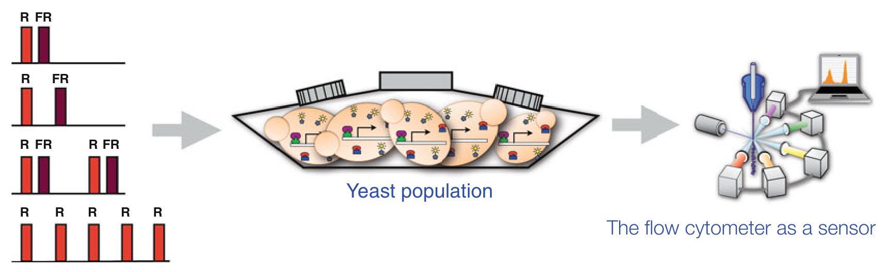

> Image description: This figure illustrates a process for controlling and sensing yeast populations using light. On the left, four discrete input light sequences are shown as bar graphs. Each sequence uses red (R) and far-red (FR) pulses of varying frequencies and patterns. Gray arrows indicate a directional flow from these inputs toward the center. The center panel depicts a "Yeast population" in a vessel. Individual yeast cells are illustrated containing genetic circuits with arrows representing gene expression, triggered by the light inputs. The right panel shows "The flow cytometer as a sensor," featuring a complex optical setup with multiple light sources and detectors connected to a laptop displaying a histogram. The overall engineering workflow moves from light-based input sequences to biological response within a yeast population, concluding with high-throughput sensing via flow cytometry.

Identification and Control of Cell Populations, Fig. 1 Top figure: shows a yeast cell whose gene expression can be induced by light: red light turns on gene expression while far-red turns it off. Bottom figure: Each input light sequences can be applied to a culture of light responsive
populations. While fluorimeters measure the overall intensity of a population, flow cytometry and microscopy can measure the fluorescence of each individual cell in a population sample at a given time. This provides a snapshot measurement of the probability density function of the protein across the population. Repeated measurements over time can be used as a basis for model identification (Fig. 1).

## The Control System

Equipped with sensors, actuators, and a model identified with the methods outlined above one can proceed to design control algorithms to regulate the behavior of living cells. Even though moment equations lead to models that look like conventional ordinary differential equations, from a control theory point of view, cell population systems offer a number of challenges. Biochemical processes, especially
yeast cells resulting in a corresponding gene expression pattern that is measured by flow cytometry. By applying multiple carefully chosen light input test sequences and looking at their corresponding gene expression patterns a dynamic model of gene expression can be identified
genetic regulation, are often very slow with time constants of the order of tens of minutes. This suggests that pure feedback control without some form of preview may be insufficient. Moreover, due to our incomplete understanding of the underlying biology, the available models are typically inaccurate, or even structurally wrong. Finally, the control signals are often unconventional; for example, for the light control system outlined above, experimental limitations imply that the system must be controlled using discrete light pulses, rather than continuous signals.

Fortunately advances in control theory allow one to effectively tackle most of these challenges. The availability of a model, for example, enables the use of model predictive control methods that introduce the necessary preview into the feedback process. The presence of unconventional inputs may make the resulting optimization problems difficult, but the slow dynamics work in our favor,

<!-- source_pdf_page: 574 -->
cell population
Kept in dark vessel with electronically controlled light source
output measurement
Flow cytometry

in silico feedback
Kalman filter + Model Predictive Controller
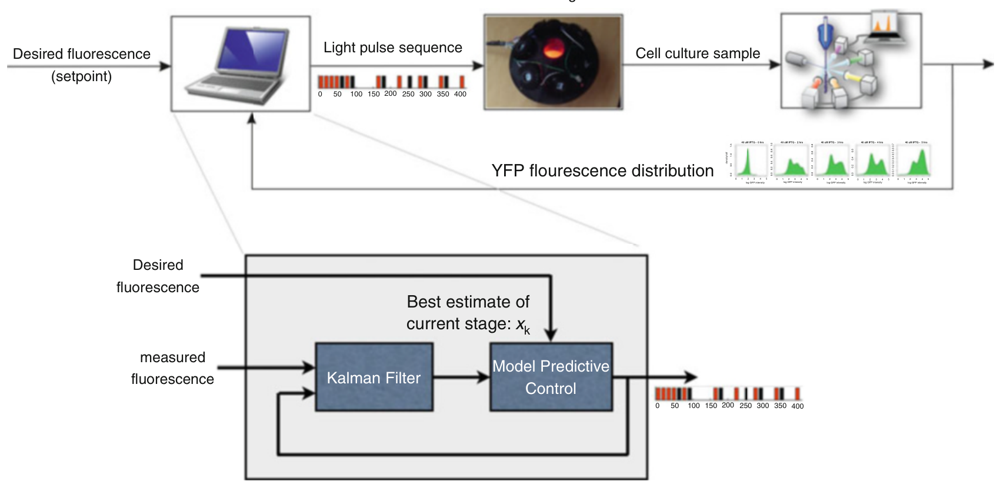

> Image description: A technical diagram illustrating the architecture of a closed-loop light control system for managing cell populations. The top section shows the experimental workflow: a "Desired fluorescence (setpoint)" is input into a computer, which generates a "Light pulse sequence" (visualized as a timeline of color-coded bars). This sequence is delivered to a cell culture setup. The resulting "Cell culture sample" is processed via a flow cytometer, producing a "YFP fluorescence distribution" (represented by four green histograms). The bottom section provides a detailed control block diagram. The "Desired fluorescence" and "measured fluorescence" serve as inputs. The "measured fluorescence" enters a "Kalman Filter," which outputs the "Best estimate of current stage: $x_k$" to a "Model Predictive Control" block. This controller then generates the control signal (the light pulse sequence) to complete the feedback loop. The diagram illustrates an automated engineering process for regulating biological responses through light exposure.

Identification and Control of Cell Populations, Fig. 2 Architecture of the closed-loop light control system. Cells are kept darkness until they are exposed to light pulse sequences from the in silico feedback controller. Cell culture samples are passed to the flow cytometer whose output
is fed back to the computer which implements a Kalman filter plus a Model Predictive Controller. The objective of the control is to have the mean gene expression level follow a desired set value
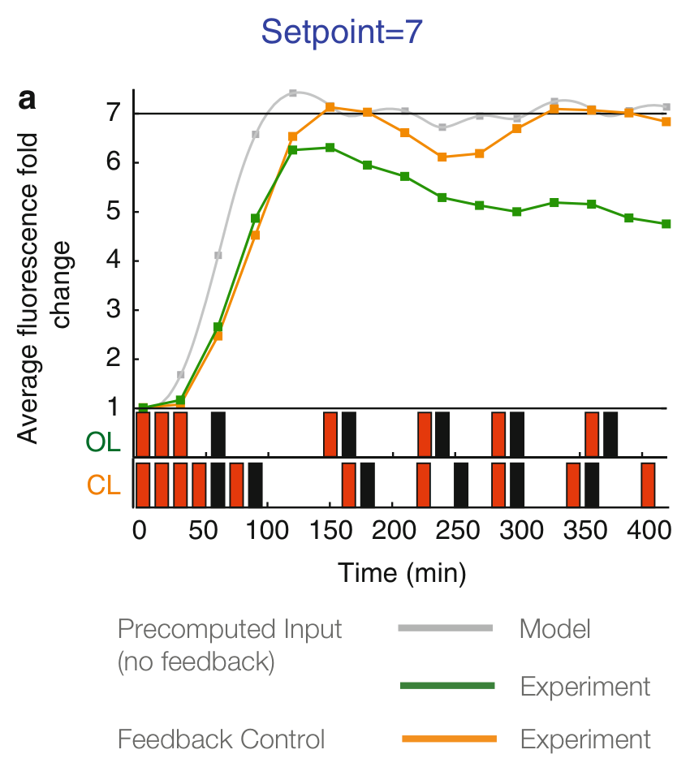

> Image description: A line graph titled "Setpoint=7" shows the average fluorescence fold change over time (0 to 400 minutes). The y-axis represents "Average fluorescence fold change" ranging from 1 to 7, and the x-axis represents "Time (min)". A horizontal black line is drawn at a value of 7. Three data series are plotted: 1. **Precomputed Input (no feedback) Model (light gray):** Rises rapidly toward the setpoint, exceeding it around 125 minutes. 2. **Feedback Control Experiment (dark green):** Increases to a peak of approximately 6 at 125 minutes, then gradually declines toward 5. 3. **Feedback Control Experiment (orange):** Increases to approximately 7 at 150 minutes and fluctuates near the setpoint of 7 for the remainder of the duration. Below the graph, two rows of colored blocks labeled **OL** (green) and **CL** (orange) represent light pulses over time. Black blocks indicate periods of darkness. The orange "CL" blocks align with the peaks/stability in the orange experimental line, representing the light pulses used for feedback control.

Setpoint=5
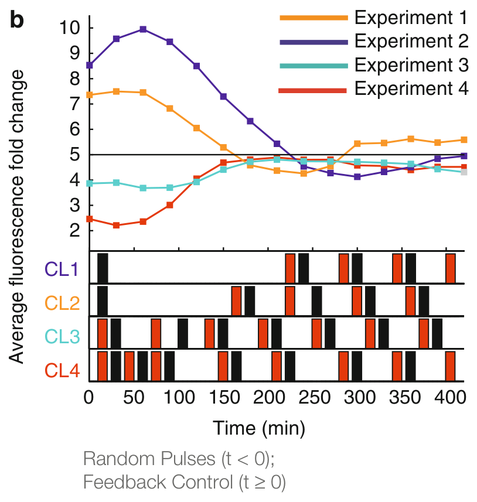

> Image description: This figure, titled "Identification and Control of Cell Populations, Fig. 3b," displays a scientific plot relating time to average fluorescence fold change. The top panel is a line graph plotting "Average fluorescence fold change" on the y-axis (ranging from 2 to 10) against "Time (min)" on the x-axis (ranging from 0 to 400). Four colored lines represent different experiments: Experiment 1 (orange), Experiment 2 (purple), Experiment 3 (teal), and Experiment 4 (red). Experiment 2 shows a high initial peak, while Experiment 4 shows an initial dip before rising. A horizontal black line is drawn at a fluorescence fold change of 5. The bottom panel consists of four horizontal tracks labeled CL1 (purple), CL2 (orange), CL3 (teal), and CL4 (red). These tracks contain alternating black and colored rectangular blocks, representing control signals. Below the axes, text specifies that "Random Pulses (t < 0)" precede "Feedback Control (t $\ge$ 0)," indicating a transition from random input to a controlled state at time zero.

## Identification and Control of Cell Populations, Fig. 3

Left panel: The closed-loop control strategy (orange) enables set point tracking, whereas an open-loop strategy (green) does not. Right panel: Four different experiments,
each with a different initial condition. Closed-loop control is turned on at time $\mathrm{t}=0$ shows that tracking can be achieved regardless of initial condition. (See MiliasArgeitis et al. (2011))

<!-- source_pdf_page: 575 -->
providing time to search the space of possible input trajectories. Finally, the fundamental principle of feedback is often enough to deal with inaccurate models. Unlike systems biology applications where the goal is to develop a model that faithfully captures the biology, in population control applications even an inaccurate model is often enough to provide adequate closed-loop performance. Exploring these issues, MiliasArgeitis et al. (2011) developed a feedback mechanism for genetic regulation using the light control system, based on an extended Kalman filter and a model predictive controller (Figs. 2 and 3). A related approach was taken in Uhlendorf et al. (2012) to regulate the osmotic stress response in yeast, while Toettcher et al. (2011) develop what is affectively a PI controller for a faster cell signaling system.

## Summary and Future Directions

The control of cell populations offers novel challenges and novel vistas for control engineering as well as for systems and synthetic biology. Using external input signals and experiment design methods, one can more effectively probe biological systems to force them to reveal their secrets. Regulating cell populations in a feedback manner opens new possibilities for biotechnology applications, among them the reliable and efficient production of antibiotics and biofuels using bacteria. Beyond biology, the control of populations is bound to find further applications in the control of large-scale, multiagent systems, including those in transportation, demand response schemes in energy systems, crowd control in emergencies, and education.

## Cross-References

- Deterministic Description of Biochemical Networks
- Modeling of Dynamic Systems from First Principles
- Stochastic Description of Biochemical Networks
- System Identification: An Overview

## Bibliography

Komorowski M, Costa M, Rand D, Stumpf M (2011) Sensitivity, robustness, and identifiability in stochastic chemical kinetics models. Proc Natl Acad Sci 108(21):8645-8650
Milias-Argeitis A, Summers S, Stewart-Ornstein J, Zuleta I, Pincus D, El-Samad H, Khammash M, Lygeros J (2011) In silico feedback for in vivo regulation of a gene expression circuit. Nat Biotech 29(12):11141116
Ruess J, Milias-Argeitis A, Lygeros J (2013) Designing experiments to understand the variability in biochemical reaction networks. J R Soc Interface 10: 20130588
Swain P, Elowitz M, Siggia E (2002) Intrinsic and extrinsic contributions to stochasticity in gene expression. Proc Natl Acad Sci 99(20): 12795-12800
Toettcher J, Gong D, Lim W, Weiner O (2011) Lightbased feedback for controlling intracellular signaling dynamics. Nat Methods 8:837-839
Uhlendorf J, Miermont A, Delaveau T, Charvin G, Fages F, Bottani S, Batt G, Hersen P (2012) Long-term model predictive control of gene expression at the population and single-cell levels. Proc Natl Acad Sci 109(35):14271-14276
Zechner C, Ruess J, Krenn P, Pelet S, Peter M, Lygeros J, Koeppl H (2012) Moment-based inference predicts bimodality in transient gene expression. Proc Natl Acad Sci 109(21):8340-8345

## ILC

Iterative Learning Control

## Industrial MPC of Continuous Processes

Mark L. Darby
CMiD Solutions, Houston, TX, USA

#### Abstract

Model predictive control (MPC) has become the standard for implementing constrained, multivariable control of industrial continuous processes. These are processes which are designed to operate around nominal steady-state values, which include many of the important processes found in the refining and chemical industries. The following provides an overview

<!-- source_pdf_page: 576 -->
of MPC, including its history, major technical developments, and how MPC is applied today in practice. Possible future developments are provided.

## Keywords

Constraints; Modeling; Model predictive control; Multivariable systems; Process identification; Process testing

## Introduction

Model predictive control (MPC) refer to a class of control algorithms that explicitly incorporate a process model for predicting the future response of a plant and relies on optimization as the means of determining control action. At each sample interval, MPC computes a sequence of future plant input signals that optimize future plant behavior. Only the first of the future input sequence is applied to the plant, and the optimization is repeated at subsequent sample intervals.

MPC provides an integrated solution for controlling non-square systems with complex dynamics, interacting variables, and constraints. MPC has become a standard in the continuous process industries, particularly in refining and chemicals, where it has been widely applied for over 25 years. In most commercial MPC products, an embedded steady-state optimizer is cascaded to the MPC controller. The MPC steady-state optimizer determines feasible, optimal settling values of the manipulated and controlled variables. The MPC controller then optimizes the dynamic path to optimal steadystate values.

The scope of an MPC application may include a unit operation such as a distillation column or reactor, or a larger scope such as multiple distillation columns, or a scope that combines reaction and separation sections of a plant in one controller. MPC is positioned in the control and decision hierarchy of a processing facility as shown in Fig. 1. The variables associated with MPC consist of: manipulated variables (MVs), controlled variables (CVs), and disturbance variables (DVs).

- Planning \& Scheduling
- Real Time Optimization

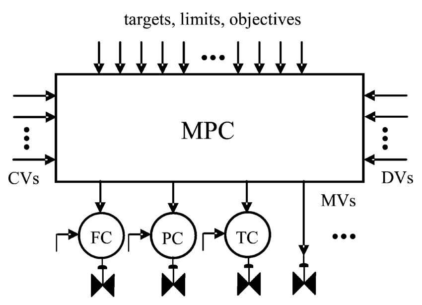

> Image description: A block diagram titled "Industrial MPC of Continuous Processes, Fig. 1 Industrial control and decision hierarchy" illustrates the structure of a Model Predictive Control (MPC) system. A large central rectangular block labeled "MPC" serves as the controller. It receives several types of inputs: "targets, limits, objectives" from the top, "CVs" (Controlled Variables) from the left, and "DVs" (Disturbance Variables) from the right. The MPC block produces "MVs" (Manipulated Variables) as outputs. These outputs are directed downward toward a hierarchical control layer. The diagram shows three specific regulatory controllers labeled "FC" (Flow Controller), "PC" (Pressure Controller), and "TC" (Temperature Controller), each connected to a valve icon representing a final control element. Arrows indicate a sequential flow where the MPC outputs provide setpoints to these regulatory controllers. Additional arrows and ellipses (...) indicate that the system handles multiple variables beyond those explicitly labeled.
Industrial MPC of Continuous Processes, Fig. 1 Industrial control and decision hierarchy

CVs include variables normally controlled at a fixed value such as a product impurity and as well as those considered constraints, for example limits related to capacity or safety that may only be sometimes active. DVs are measurements that are treated as feedforward variables in MPC. The manipulated variables are typically setpoints of underlying PID controllers, but may also include valve position signals. Most of the targets and limits are local to the MPC, but others come directly from real-time optimization (if present), or indirectly from planning/scheduling, which are normally translated to the MPC in an open-loop manner by the operations personnel.

Linear and nonlinear model forms are found in industrial MPC applications; however, the majority of the applications continue to rely on a linear model, identified from data generated from a dedicated plant test. Nonlinearities that primarily affect system gains are often adequately controlled with linear MPC through gain scheduling or by applying linearizing static transformations. Nonlinear MPC applications tend to be reserved for those applications where nonlinearities are present in both system gains and dynamic responses and the controller must operate at significantly different targets.

<!-- source_pdf_page: 577 -->
## Origins and History

MPC has its origins in the process industries in the 1970s. The year 1978 marked the first published description of predictive control under the name IDCOM, an acronym for Identification and Command (Richalet et al. 1978). A short time later, Cutler and Ramaker (1979) published a predictive control algorithm under the name Dynamic Matrix Control (DMC). Both approaches had been applied industrially for several years before the first publications appeared. These predictive control approaches targeted the more difficult industrial control problems that could not be adequately handled with other methods, either with conventional PID control or with advanced regulatory control (ARC) techniques that rely on single-loop controllers augmented with overrides, feedforwards/decouplers, and custom logic.

The basic idea behind the predictive control approach is shown in Fig. 2 for the case of a single input single output, stable system. Future predictions of inputs out outputs are denoted with the hat symbol and shown as dashes; double indexes, $t \mid k$, indicate future values at time $t$ based on information up to and including time $k$. The optimization problem is to bring future predicted outputs $\left(\hat{y}_{k \mid k+1}, \ldots, \hat{y}_{k \mid k+P}\right)$ close to a desired trajectory over a prediction horizon,
$P$, by means of a future sequence of inputs $\left(\hat{u}_{k \mid k}, \ldots, \hat{u}_{k \mid k+M-1}\right)$ calculated over a control horizon $M$. The trajectory may be a constant setpoint. In the general case, the optimization is performed subject to constraints that may be imposed on future inputs and outputs. Only the first of the future moves is implemented and the optimization is repeated at the next time instant. Feedback, which accounts for unmeasured disturbances and model error, is incorporated by shifting all future output predictions, prior to the optimization, based on the difference between the output measurement $y_{k}$ and the previous prediction $\hat{y}_{k \mid k-1}$, denoted by $d_{k \mid k}$ (i.e., the prediction error at time instant $k$ ). Future predicted values of the outputs depend on both past and future values inputs. If no future input changes are made (at time k or after), the model can be used to calculate the future "free" output response, $y_{t: k}^{0}$, which will ultimately settle at a new steady-state value based on the settling time (or time to steady state of the model, $T_{s s}$ ). For the unconstrained case, it is straightforward to show that the optimal result is a linear control law that depends only on the error between the desired trajectory and the free output response.

The predictive approach seemed to contrast with the state-space optimal control method of the time, the linear quadratic regulator (LQR). Later research exposed the similarities to LQR

Industrial MPC of Continuous Processes, Fig. 2 Predictive control approach
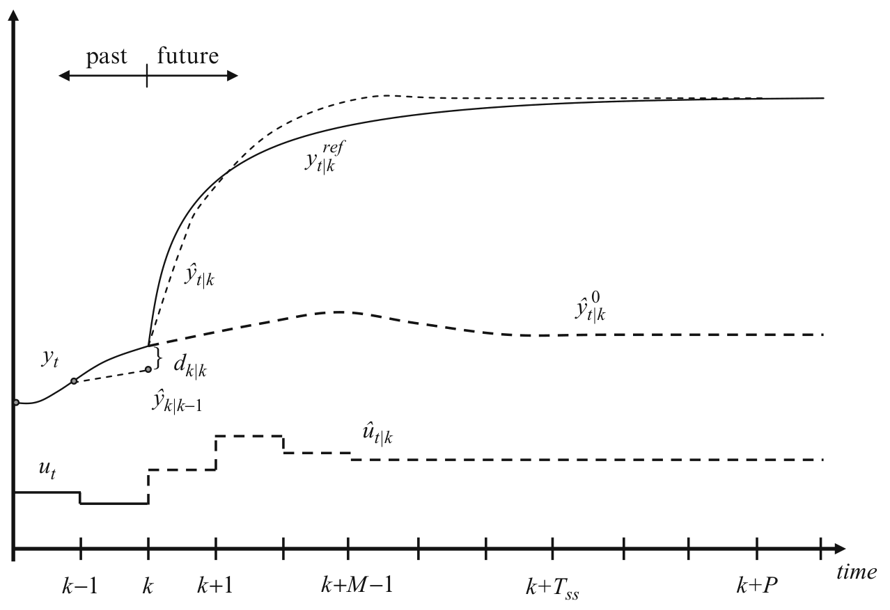

> Image description: A line graph illustrates a predictive control approach for an industrial continuous process over time. The horizontal axis represents time, with discrete intervals labeled from $k-1$ to $k+P$. The vertical axis represents magnitude, though it lacks specific units. The plot features several time-varying trajectories. The actual output, $y_t$, is shown as a solid line transitioning from the past to the future at time $k$. The reference trajectory, $y_{t|k}^{\text{ref}}$, is a smooth solid curve targetting a steady state. The predicted output, $\hat{y}_{t|k}$, is a dashed curve that follows the reference trajectory. A secondary prediction, $\hat{y}_{t|k}^0$, is shown as a dashed line, representing a baseline or uncorrected prediction. The control input $u_t$ is a step-like solid line that changes at time $k$. Its predicted sequence, $\hat{u}_{t|k}$, is a dashed step function starting at time $k$. An error term, $d_{k|k}$, is noted at the transition point $k$. Arrows indicate the direction of time, separating "past" from "future."

<!-- source_pdf_page: 578 -->
and also Internal Model Control (IMC) (Garcia and Morari 1982), although these techniques did not solve an online optimization problem. Optimization-based control approaches became feasible for industrial applications due to (1) the slower sampling requirements of most industrial control problems (on the order of minutes) and the hierarchical implementations in which MPC provides setpoints to lower level PID controllers which execute on a much faster sample time (on the order of seconds or faster).

Although the basic ideas behind MPC remain, industrial MPC technology has changed considerably since the first formulations in the late 1970s. Qin and Badgwell (2003) describe the enhancements to MPC technology that occurred over the next 20 plus years until the late 1990s. Enhancements since that time are highlighted in Darby and Nikolaou (2012). These improvements to MPC reflect increases in computer processing capability and additional requirements of industry, which have led to increased functionality and tools/techniques to simplify implementation. A summary of the significant enhancements that have been made to industrial MPC is highlighted below.

Constraints: Posing input and output constraints as linear inequalities, expressed as a function of the future input sequence (Garcia and Morshedi 1986), and solved by a standard quadratic program or an iterative scheme which approximates one.
Two-Stage Formulations: Limitations of a single objective function led to two-stage formulations to handle MV degrees of freedom (constraint pushing) and steady-state optimization via a linear program (LP).
Integrators. In their native form, impulse and step response models can be applied only to stable systems (in which the impulse response model coefficients approach zero). Extension to handle integrating variables included embedding a model of the difference of the integrating signal or integrating a fraction of the current prediction error into the future (implying an increasing $\left|d_{k+j \mid k}\right|$ for $j \geq 1$ in Fig. 2). The desired value of an integrator at steady
state (e.g., zero slope) has been incorporated into two-stage formulations (see, e.g., Lee and Xiao 2000).
State Space Models. The first state space formulation of MPC, which was introduced in the late 1980s (Marquis and Broustail 1988) allowed MPC to be extended to integrating and unstable processes. It also made use of the Kalman filter which provided additional capability to estimate plant states and unmeasured disturbances. Later, a state space MPC offering was developed based on an infinite horizon (for both control and prediction) (Froisy 2006). These state space approaches provided a connection back to unconstrained LQR theory.
Nonlinear MPC. The first applications of nonlinear MPC, which appeared in the 1990s, were based on neural net models. In these approaches, a linear dynamic model was combined with a neural net model that accounted for static nonlinearity (Demoro et al. 1997; Zhao et al. 2001).
The late 1990s saw the introduction of an industrial nonlinear MPC based on first principle models derived from differential mass and energy balances and reaction kinetic expressions, expressed in differential algebraic equation (DAE) form (Young et al. 2002).
A process where nonlinear MPC is routinely applied is polymer manufacturing.
Identification Techniques. Multivariable prediction error techniques are now routinely used. More recently, industrial application of subspace identification methods has appeared, following the development of these algorithms in the 1990s. Subspace methods incorporate the correlation of output measurements in the identification of a multivariable state space model, which can be used directly in a state space MPC or converted to an impulse or step response model based MPC.
Testing Methods. The 1990s saw increased use of automatic testing methods to generate data for (linear) dynamic model identification using uncorrelated binary signals. Since the 2000 , closed-loop testing methods have received considerable attention.

<!-- source_pdf_page: 579 -->
The motivation for closed-loop testing is to reduce implementation time and/or effort of the initial implementation as well as the ongoing need to re-identify the model of an industrial application in light of processes changes. These closed-loop testing methods, which require a preliminary or existing model, utilize uncorrelated dither signals either introduced as biases to the controller MVs or injected through the steady-state LP or QP, where additional logic or optimization of the test protocol may be performed (Kalafatis et al. 2006; MacArthur and Zhan 2007; Zhu et al. 2012).

## Mathematical Formulation

While there are differences in how the MPC problem is formulated and solved, the following general form captures most of the MPC products (Qin and Badgwell 2003), although not all terms may be present in a given product:

$$
\min _{\Delta \mathcal{U}}\left[\begin{array}{l}
\sum_{j=1}^{P}\left\|\hat{\mathbf{y}}_{k+j \mid k}-\mathbf{y}_{k+j \mid k}^{\text {ref }}\right\|_{\mathbf{Q}_{j}}^{2}+\sum_{j=1}^{P}\left\|\mathbf{s}_{k+j \mid k}\right\|_{\mathbf{T}_{j}}^{2}  \tag{1}\\
\sum_{j=1}^{M-1}\left\|\hat{\mathbf{u}}_{k+j \mid k}-\mathbf{u}^{s s}\right\|_{\mathbf{R}_{j}}^{2}+\sum_{j=1}^{M-1}\left\|\Delta \mathbf{u}_{k+j \mid k}\right\|_{\mathbf{S}_{j}}^{2}
\end{array}\right]
$$

subject to:

$$
\left.\begin{array}{l}
\left.\begin{array}{l}
\hat{\mathbf{x}}_{k+j \mid k}=\mathbf{f}\left(\hat{\mathbf{x}}_{k+j-1 \mid k}, \hat{\mathbf{u}}_{k+j-1 \mid k}\right), \quad j=1, \ldots P \\
\hat{\mathbf{y}}_{k+j \mid k}=\mathbf{g}\left(\hat{\mathbf{x}}_{k+j \mid k}, \hat{\mathbf{u}}_{k+j \mid k}\right), \quad j=1, \ldots P
\end{array}\right\} \text { Model equations } \\
\mathbf{y}^{\min }-\mathbf{s}_{j} \leq \hat{\mathbf{y}}_{k+j \mid k} \leq \mathbf{y}^{\max }+\mathbf{s}_{j}, \quad j=1, \ldots, P \\
\mathbf{s}_{j} \geq 0, \quad j=1, \ldots P \\
\mathbf{u}^{\min } \leq \hat{\mathbf{u}}_{k+j \mid k} \leq \mathbf{u}^{\max }, \quad j=0, \ldots M-1 \\
-\Delta \mathbf{u}^{\min } \leq \Delta \mathbf{u}_{k+j \mid k} \leq \Delta \mathbf{u}^{\max }, \quad j=0, \ldots M-1
\end{array}\right\} \text { Output constraints/slacks }
$$

where the minimization is performed over the future sequence of inputs $\mathcal{U} \stackrel{\wedge}{=} \hat{\mathbf{u}}_{k \mid k}, \hat{\mathbf{u}}_{k+1 \mid k}, \ldots$, $\hat{\mathbf{u}}_{k+M-1 \mid k}$. The four terms in the objective function represent conflicting quadratic penalties $\left(\|\mathbf{x}\|_{\mathbf{A}}^{2} \triangleq \mathbf{x}^{T} \mathbf{A x}\right) ;$ the penalty matrices are most always diagonal. The first term penalizes the error relative to a desired reference trajectory (cf. Fig. 2) originating at $\hat{\mathbf{y}}_{k \mid k}$ and terminating at a desired steady-state, $\mathbf{y}^{s s}$; the second term penalizes output constraint violations over the prediction horizon (constraint softening); the third term penalizes inputs deviations from a desired steady-state, either manually specified or calculated. The fourth term penalizes input changes as a means of trading off output tracking and input movement (move suppression).

The above formulation applies to both linear and nonlinear MPC. For linear MPCs, except for state space formulations, there are no state
equations and the outputs in the dynamic model are a function of only past inputs, such as with the finite step response model.

When a steady-state optimizer is present in the MPC, it provides the steady-state targets for $\mathbf{u}^{s s}$ (in the third quadratic term) and $\mathbf{y}^{s s}$ (in the output reference trajectory). Consider the case of linear MPC with LP as the steady-state optimizer. The LP is typically formulated as

$$
\min _{\Delta \mathbf{u}^{s s}} \mathbf{c}_{u}^{T} \Delta \mathbf{u}^{s s}+\mathbf{c}_{y}^{T} \Delta \mathbf{y}^{s s}+\mathbf{q}_{+}^{T} \mathbf{s}^{+}+\mathbf{q}_{-}^{T} \mathbf{s}^{-}
$$

subject to:

$$
\left.\begin{array}{rl}
\Delta \mathbf{y}^{s s} & =\mathbf{G}^{s s} \Delta \mathbf{u}^{s s} \\
\mathbf{u}^{s s} & =\mathbf{u}_{k-1}+\Delta \mathbf{u}^{s s} \\
\mathbf{y}^{s s} & =\mathbf{y}_{k+T_{s s} \mid k}^{0}+\Delta \mathbf{y}^{s s}
\end{array}\right\} \text { Model equations }
$$

<!-- source_pdf_page: 580 -->
$$
\left.\begin{array}{c}
\left.\mathbf{y}^{\min }-\mathbf{s}^{-} \leq \mathbf{y}^{s s} \leq \mathbf{y}^{\max }+\mathbf{s}^{+}\right\} \text {Output constraints } \\
\mathbf{u}^{\min } \leq \mathbf{u}^{s s} \leq \mathbf{u}^{\max } \\
-M \Delta \mathbf{u}^{\max } \leq \mathbf{u}^{s s} \leq M \Delta \mathbf{u}^{\max }
\end{array}\right\} \text { Input constraints }
$$

$\mathbf{G}^{s s}$ is formed from the gains of the linear dynamic model. Deviations outside minimum and maximum output limits ( $\mathbf{s}^{-}$and $\mathbf{s}^{+}$, respectively) are penalized, which provide constraint softening in the event all outputs cannot be simultaneously controlled within limits. The weighting in $\mathbf{q}_{-}$and $\mathbf{q}_{+}$determine the relative priorities of the output constraints. The input constraints, expressed in terms of $\Delta \mathbf{u}^{\text {max }}$, prevent targets from being passed to the dynamic optimization that cannot be achieved. The resulting solution $-\mathbf{u}^{s s}$ and $\mathbf{y}^{s s}$ - provides a consistent, achievable steadystate for the dynamic MPC controller. Notice that for inputs, the steady-state delta is applied to the current value and, for outputs, the steady-state delta is applied to the steady-state prediction of the output without future moves, after correcting for the current model error (cf. Fig. 2). If a realtime optimizer is present, its outputs, which may be targets for CVs and/or MVs, are passed to the MPC steady-state optimizer and considered with other objectives but at lower weights or priorities.

Some additional differences or features found in industrial MPCs include:

1-Norm formulations where absolute deviations, instead of quadratic deviations, are penalized.
Use of zone trajectories or "funnels" with small or no penalty applied if predictions remain within the specified zone boundaries.
Use of a minimum movement criterion in either the dynamic or steady-state optimizations, which only lead to MV movement when CV predictions go outside specified limits. This can provide controller robustness to modeling errors.
Multiobjective formulations which solve a series of QP or LP problems instead of a single one, and can be applied to the dynamic or steadystate optimizations. In these formulations, higher priority objectives are solved first, followed by lesser priority objectives with the solution of the higher priority objectives
becoming equality constraints in subsequent optimizations (Maciejowski 2002).

## MPC Design

Key design decision for a given application are the number of MPC controllers and the selection of the MVs, DVs, and CVs for each controller; however, design decisions are not limited to just the MPC layer. The design problem is one of deciding on the best overall structure for the MPC(s) and the regulatory controls, given the control objectives, expected constraints, qualitative knowledge of the expected disturbances, and robustness considerations. It may be that existing measurements are insufficient and additional sensors may be required. In addition, a measurement many not be updated on a time interval consistent with acceptable dynamic control, for example, laboratory measurements and process composition analyzers. In this case, a soft sensor, or inferential estimator, may need to be developed from temperature and pressure measurements.

MPC is frequently applied to a major plant unit, with the MVs selected based on their sensitivity to key unit CVs and plant economics. Decisions regarding the number and size of the MPCs for a given application depend on plant objectives, (expected) constraints, and also designer preferences. When the objective is to minimize energy consumption based on fixed or specified feed rate, multiple smaller controllers can be used. In this situation, controllers are normally designed based on the grouping of MVs with the largest effect on the identified CVs, often leading to MPCs designed for individual sections of equipment, such as reactors and distillation columns. When the objective is to maximize feed (or certain products), larger controllers are normally designed, especially if there are multiple constraints that can limit plant throughput. The MPC steady-state LP or QP is ideally suited to solving the throughput maximization problem by utilizing all available MVs. The location of the most limiting constraints can impact the number of MPCs. If the major constraints are near the front-end of the plant, one MPC can be designed

<!-- source_pdf_page: 581 -->
which connects these constraints with key MVs such as feed rates, and other MPCs designed for the rest of the plant. If the major constraints are located near the back of the plant, then a single MPC is normally considered; alternatively, an MPC cascade could be considered, although this is not a common practice across the industry (and often requires customization).

The feed maximization objective is a major reason why MPCs have become larger with the advances in computer processing capability. However, there is generally a higher requirement on model consistency for larger controllers due do the increased number of possible constraint sets against which the MPC can operate. A larger controller can also be harder to implement and understand. This is a reason why some practitioners prefer implementing smaller MPCs at the potential loss of benefits.

## MPC Practice

An MPC project is typically implemented in the following sequence:
Pretest and preliminary MPC design
Plant testing
Model and controller development Commissioning

These tasks apply whether the MPC is linear or nonlinear, but with some differences, primarily model development and in plant testing. In nonlinear MPC, key decisions are related to the model form and level of rigor. Note that with a fundamental model, lower level PID loops must be included in the model, if the dynamics are significant; this is in contrast to empirical modeling, where the dynamics of the PID loops are embedded in the plant responses. A fundamental model will typically require less plant testing and make use of historical operating data to fit certain model parameters such as heat transfer coefficients and reaction constants. Historical data and/or data from a validated nonlinear static model can also be used to develop nonlinear static models (e.g., neural net) to combine with empirical dynamic models. As mentioned earlier, most industrial applications continue to rely on
empirical linear dynamic models, fit to data from a dedicated plant test. This will be the basis in the following discussion.

In the pretest phase of work, the key activity is one of determining the base level regulatory controls for MPC, tuning of these controls, and determining if the current plant instrumentation is adequate. It is common to retune a significant number of PID loops, with significant benefits often resulting from this step alone.

A range of testing approaches are used in plant testing for linear MPC, including both manual and automatic (computer-generated) test signal designs, most often in open loop but, increasingly, in closed loop. Most input testing continues to be based on uncorrelated signals, implemented either manually or from computer-generated random sequences. Model accuracy requirements dictate accuracy across a range of frequencies which is achieved by varying the duration of the steps. Model identification runs are made through out the course of a test to determine when model accuracy is sufficient and a test can be stopped.

In the next phase of work, modeling of the plant is performed. This includes constructing the overall MPC model from individual identification runs; for example, deciding which models are significant and judging the models characteristics (dead times, inverse response settling time, gains) based on engineering/process and a priori knowledge. An important step is analyzing, and adjusting if necessary, the gains of the constructed model to insure the models gains satisfy mass balances and gain ratios do not result in fictitious degrees of freedom (due to model errors) that the steady-state optimizer could exploit. Also included is the development of any required inferentials or soft sensors, typically based on multivariate regression techniques such as principal component regression (PCR), principal component analysis (PCA) and partial least squares (PLS), or sometimes based on a fundamental model.

During controller development, initial controller tuning is performed. This relates to establishing criteria for utilizing available degrees of freedom and setting control variable priorities. In addition, initial tuning values are established for

<!-- source_pdf_page: 582 -->
the dynamic control. Steady state responses corresponding to expected constraint scenarios are analyzed to determine if the controller behaves as expected, especially with respect to the steadystate changes in the manipulated variables.

Commissioning involves testing and tuning the controller against different constraint sets. It is not unusual to modify or revisit model decisions made earlier. In the worst case, control performance may be deemed unacceptable and the control engineer is forced to revisit earlier decisions such as the base level regulatory strategy or plant model quality, which would require re-testing and re-identification of portions of the plant model. The main commissioning effort typically takes place over a two to three week period, but can vary based on the size and model density of the controller. In reality, commissioning, or more accurately, controller maintenance, is an ongoing activity. It is important that the operating company have in-house expertise that can be used to answer questions ("why is the controller doing that?"), troubleshoot, and modify the controller to reflect new operating modes and constraint sets.

## Future Directions

Likely future developments are expected to follow extensions of current approaches. Due to the success in automatic, closed-loop testing, one possibility is extending it to "dual" or "joint" control, where control and identification objectives are combined and allow the user to select how much the control (e.g., output variance) can be affected by test perturbation signals. Another is in formulating the plant test as a DOE 8 (design of experiments) optimization problem that could, for example, target specific models or model parameters. In the identification area, extensions have started to appear which allow constraints to be imposed, for example, on dead-times or gains, thus allowing a priori knowledge to be used. Another important area that has seen recent emphasis, and which more development can be expected, is in monitoring and diagnosis, for example, detecting which submodels of MPC have become inaccurate and require re-identification.

As mentioned earlier, one of the advantages of state-space modeling is the inherent flexibility to model unmeasured disturbances (i.e., $d_{k+j \mid j}$, cf. Fig. 2); however, these have not found widespread use in industry. A useful enhancement would be a framework for developing and implementing improved estimators in a convenient and transparent manner, that would be applicable to traditional FIR- and FSR- based MPCs.

In the area of nonlinear control, the use of hybrid modeling approaches has increased, for example, integrating known fundamental model relationships with neural net or linear timevarying dynamic models. The motivation is in reducing complexity and controller execution times. The use of hybrid techniques can be expected to further increase, especially if nonlinear control is to be applied more broadly to larger control problems. Even in situations where control with linear MPC is adequate, there may be benefits from the use of hybrid or fundamental models, even if the models are not directly used in the control calculation. The resulting model could be used offline in model development or online to update the linear MPC model. Benefits would come from reduced plant testing and in ensuring model consistency. In the longer term, one can foresee a more general modeling and control environment where the user would not have to be concerned with the distinction between linear and nonlinear models and would be able to easily incorporate known relationships into the controller model.

An area that has not received significant attention, but is suggested as an area worth pursuing concerns MPC cascades. Most of the applications and research are based on a single MPC or multiply distributed MPCs. An MPC cascade would permit the lower MPC to run at a faster time period and allow the user to decide which degrees of freedom are to be used for higher level objectives, such as feed maximization.

## Cross-References

- Control Hierarchy of Large Processing Plants: An Overview
- Control Structure Selection

<!-- source_pdf_page: 583 -->
- Model-Based Performance Optimizing Control
- Model-Predictive Control in Practice
- Nominal Model-Predictive Control
- Real-Time Optimization of Industrial Processes

## Bibliography

Cutler CR, Ramaker BL (1979) Dynamic matrix control a computer control algorithm. In: AIChE national meeting, Houston
Darby ML, Nikolaou M (2012) MPC: current practice and challenges. Control Eng Pract 20(4):328-352
Demoro E, Axelrud C, Johnson D, Martin G (1997) Neural network modeling and control of polypropylene process. In: Society of plastic engineers international conference, Houston, 487-799
Froisy JB (2006) Model predictive control - building a bridge between theory and practice. Comput Chem Eng 30:1426-1435
Garcia CE, Morari M (1982) Internal model control. 1. A unifying review and some new results. Ind Eng Chem Process Des Dev 21:308-323
Garcia CE, Morshedi AM (1986) Quadratic programming solution of dynamic matrix control (QDMC). Chem Eng Commun 46(1-3):73-87
Kalafatis K, Patel K, Harmse M, Zheng Q, Craig M (2006) Multivariable step testing for MPC projects reduces crude unit testing time. Hydrocarb Process 86:93-99
Lee JH, Xiao J (2000) Use of two-stage optimization in model predictive control of stable and integrating. Comput Chem Eng 24:1591-1596
MacArthur JW, Zhan C (2007) A practical multi-stage method for fully automated closed-loop identification of industrial processes. J Process Control 17(10):770786
Maciejowski J (2002) Predictive control with constraints. Prentice Hall, Englewood Cliffs
Marquis P, Broustail JP (1988) SMOC, a bridge between state space and model predictive controllers: application to the automation of a hydrotreating unit. In: Proceedings of the 1988 IFAC workshop on model based process control, Atlanta, GA, 37-43
Qin JQ, Badgwell TA (2003) A survey of industrial model predictive control. Control Eng Pract 11:733-764
Richalet J, Rault A, Testud J, Papon J (1978) Model predictive control: applications to industrial processes. Automatica 14:413-428
Young RE, Bartusiak D, Fontaine RW (2002) Evolution of an industrial nonlinear model predictive controller. In: Sixth international conference on chemical process control, Tucson. CACHE, American Institute of Chemical Engineers, 342-351
Zhao H, Guiver JP, Neelakantan R, Biegler L (2001) A nonlinear industrial model predictive controller using
integrated PLS and neural net state space model. Control Eng Pract 9(2): 125-133
Zhu Y, Patwardhan R, Wagner S, Zhao J (2012) Towards a low cost and high performance MPC: the role of system identification. Comput Chem Eng 51(5):124135

# Information and Communication Complexity of Networked Control Systems

Serdar Yüksel Department of Mathematics and Statistics, Queen's University, Kingston, ON, Canada

#### Abstract

Information and communication complexity of a networked control system identifies the minimum amount of information exchange needed between the decision makers (such as encoders, controllers, and actuators) to achieve a certain objective, which may be in terms of reaching a target state or achieving a given cost threshold. This formulation does not impose any constraints on the computational requirements to perform the communication or control. Both stochastic and deterministic formulations are considered.

## Keywords

Communication complexity; Information theory; Networked control

## Introduction

Consider a dynamic team problem with $L$ control stations (these will be referred to as decision makers and denoted by DMs) under the following dynamics and measurement equations:

$$
\begin{gather*}
x_{t+1}=f_{t}\left(x_{t}, u_{t}^{1}, \ldots, u_{t}^{L}, w_{t}\right), \quad t=0,1, \cdots \\
y_{t}^{i}=g_{t}^{i}\left(x_{t}, u_{t-1}^{1}, \ldots, u_{t-1}^{L} ; v_{t}^{i}\right) \tag{1}
\end{gather*}
$$

<!-- source_pdf_page: 584 -->
Information and Communication Complexity of Networked Control Systems, Fig. 1 A decentralized networked control system with information exchange between decision makers
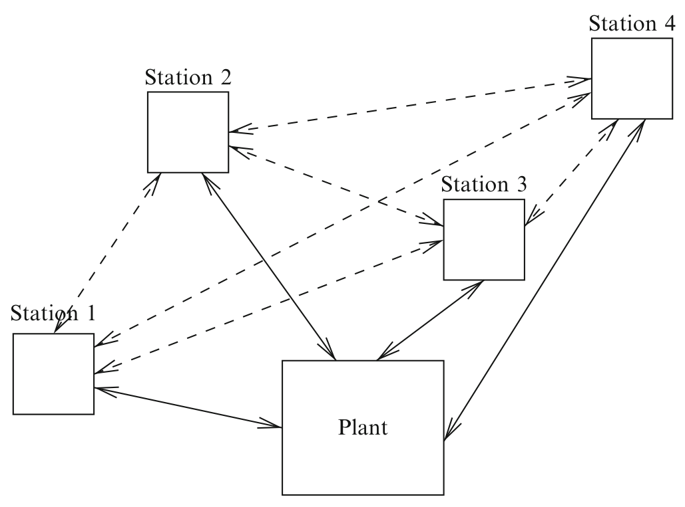

> Image description: A flowchart labeled "Fig. 1" illustrates a decentralized networked control system consisting of five rectangular blocks: "Plant," "Station 1," "Station 2," "Station 3," and "Station 4." The blocks represent decision makers within the system. The relationships between the entities are represented by solid and dashed arrows: * **Solid arrows** indicate direct bidirectional or unidirectional control/process interactions. The "Plant" is centrally connected to all stations via solid lines: Station 1, Station 2, Station 3, and Station 4 all have solid arrows interacting with the "Plant." * **Dashed arrows** indicate information exchange pathways between the stations. Station 1 connects to Station 2 and Station 3. Station 2 connects to Station 3 and Station 4. Station 3 connects to Station 4. The diagram visually depicts the information and communication complexity inherent in networked control, where decision-making entities exchange information through multiple channels while interacting with a central plant.

where $i \in\{1,2, \ldots, L\}=: \mathcal{L}$ and $x_{0}, w_{[0, T-1]}$, $v_{[0, T-1]}^{i}$ are mutually independent random variables with specified probability distributions. Here, we use the notation $w_{[0, t]}:=\left\{w_{s}, 0 \leq s \leq t\right\}$.

The DMs are allowed to exchange limited information: see Fig. 1. The information exchange is facilitated by an encoding protocol $\mathcal{E}$ which is a collection of admissible encoding functions described as follows. Let the information available to DM $i$ at time $t$ be

$$
\mathcal{I}_{t}^{i}=\left\{y_{[1, t]}^{i}, u_{[1, t-1]}^{i}, z_{[0, t]}^{i, j}, z_{[0, t]}^{j, i}, j \in \mathcal{L}\right\},
$$

where $z_{t}^{i, j}$ takes values in $\mathcal{Z}_{t}^{i, j}$ and is the information variable transmitted from DM $i$ to DM $j$ at time $t$ generated with

$$
\begin{equation*}
\mathbf{z}_{t}^{i}=\left\{z_{t}^{i, j}, j \in \mathcal{L}\right\}=\mathcal{E}_{t}^{i}\left(\mathcal{I}_{t-1}^{i}, u_{t-1}^{i}, y_{t}^{i}\right), \tag{3}
\end{equation*}
$$

and for $t=0, \mathbf{z}_{0}^{i}=\left\{z_{0}^{i, j}, j \in \mathcal{L}\right\}=\mathcal{E}_{0}^{i}\left(y_{0}^{i}\right)$. The control actions are generated with

$$
u_{t}^{i}=\gamma_{t}^{i}\left(\mathcal{I}_{t}^{i}\right),
$$

for all DMs. Define $\log _{2}\left(\left|\mathcal{Z}_{t}^{i, j}\right|\right)$ to be the communication rate from $D M$ i to $D M j$ at time $t$ and $\mathcal{R}\left(\mathbf{z}_{[0, T-1]}\right)=\sum_{t=0}^{T-1} \sum_{i, j \in \mathcal{L}} \log _{2}\left(\left|\mathcal{Z}_{t}^{i, j}\right|\right)$ to be the (total) communication rate. The minimum (total) communication rate over all coding and control policies subject to a design objective
is called the communication complexity for this objective.

The above is a fixed-rate formulation for communication complexity, since for any two coder outputs, a fixed number of bits is used at any given time. One could also use variable-rate formulations. The variable-rate formulation exploits the probabilistic distribution of the system variables: see Cover and Thomas (1991).

## Communication Complexity for Decentralized Dynamic Optimization

Let $\underline{\mathcal{E}}^{i}=\left\{\mathcal{E}_{t}^{i}, t \geq 0\right\}$ and $\underline{\gamma}^{i}=\left\{\gamma_{t}^{i}, t \geq\right. 0\}$. Under a team-encoding policy $\underline{\mathcal{E}}= \left\{\underline{\mathcal{E}}^{1}, \underline{\mathcal{E}}^{2}, \ldots, \underline{\mathcal{E}}^{L}\right\}$, and a team-control policy $\underline{\gamma}=\left\{\underline{\gamma}^{1}, \underline{\gamma}^{2}, \ldots, \underline{\gamma}^{L}\right\}$, let the induced cost be

$$
\begin{equation*}
E^{\underline{\gamma}}, \underline{\underline{\varepsilon}}\left[\sum_{t=0}^{T-1} c\left(x_{t}, u_{t}^{1}, u_{t}^{2}, \cdots, u_{t}^{L}\right)\right] . \tag{4}
\end{equation*}
$$

In networked control, the goal is to minimize (4) over all coding and control policies subject to information constraints in the system. Let $\mathbf{u}_{t}=\left\{u_{t}^{1}, u_{t}^{2}, \cdots, u_{t}^{L}\right\}$. The following definition and example are from Yüksel and Başar (2013).

Definition 1 Given a decentralized control problem as above, team cost-rate function $C: \mathbb{R} \rightarrow \mathbb{R}$ is

<!-- source_pdf_page: 585 -->
$$
\begin{aligned}
C(R):= & \inf _{\underline{\gamma}, \underline{\mathcal{E}}}\left\{E_{\underline{\gamma}, \underline{\mathcal{E}}\left[\sum_{t=0}^{T-1} c\left(x_{t}, \mathbf{u}_{t}\right)\right]:}\right. \\
& \left.\frac{1}{T} \mathcal{R}\left(\mathbf{z}_{[0, T-1]}\right) \leq R\right\} .
\end{aligned}
$$

We can define a dual function.
Definition 2 Given a decentralized control problem as above, team rate-cost function $R: \mathbb{R} \rightarrow \mathbb{R}$ is

$$
\begin{aligned}
R(C):= & \inf _{\underline{\gamma}, \underline{\mathcal{E}}}\left\{\frac{1}{T} \mathcal{R}\left(\mathbf{z}_{[0, T-1]}\right):\right. \\
& \left.E^{\underline{\gamma}}, \underline{\mathcal{E}}\left[\sum_{t=0}^{T-1} c\left(x_{t}, \mathbf{u}_{t}\right)\right] \leq C\right\} .
\end{aligned}
$$

The formulation here can be adjusted to include sequential (iterative) information exchange given a fixed ordering of actions, as opposed to a simultaneous (parallel) information exchange at any given time $t$. That is, instead of (3), we may have

$$
\begin{align*}
\mathbf{z}_{t}^{i} & =\left\{z_{t}^{i, j}, j \in\{1,2, \ldots, L\}\right\} \\
& =\mathcal{E}_{t}^{i}\left(\mathcal{I}_{t-1}^{i}, u_{t-1}^{i}, y_{t}^{i},\left\{z_{t}^{k, i}, k<i\right\}\right) \tag{5}
\end{align*}
$$

Both to make the discussion more explicit and to show that a sequential (iterative) communication protocol may perform strictly better than an optimal parallel communication protocol given a total rate constraint, we state the following example: Consider the following setup with two DMs. Let $x^{1}, x^{2}, p$ be uniformly distributed binary random variables, DM $i$ have access to $y^{i}, i=1,2$, and

$$
x=\left(p, x^{1}, x^{2}\right), \quad y^{1}=p, \quad y^{2}=\left(x^{1}, x^{2}\right),
$$

and the cost function be

$$
\begin{aligned}
c\left(x, u^{1}, u^{2}\right)= & 1_{\{p=0\}} c\left(x^{1}, u^{1}, u^{2}\right) \\
& +1_{\{p=1\}} c\left(x^{2}, u^{1}, u^{2}\right),
\end{aligned}
$$

with

$$
c\left(s, u^{1}, u^{2}\right)=\left(s-u^{1}\right)^{2}+\left(s-u^{2}\right)^{2} .
$$

Suppose that we wish to compute the minimum expected cost subject to a total rate of 2 bits that can be exchanged. Under a sequential scheme, if we allow DM 1 to encode $y^{1}$ to DM 2 with 1 bit, then a cost of 0 is achieved since DM 2 knows the relevant information that needs to be transmitted to DM 1, again with 1 bit: If $p=0, x^{1}$ is the relevant random variable with an optimal policy $u^{1}=u^{2}=x^{1}$, and if $p=1, x^{2}$ is relevant with an optimal policy $u^{1}=u^{2}=x^{2}$, and a cost of 0 is achieved. However, if the information exchange is parallel, then DM 2 does not know which state is the relevant one, and it can be shown that a cost of 0 cannot be achieved under any policy.

The formulation in Definition 1 can also be adjusted to allow for multiple rounds of communication per time stage. Having multiple rounds can enhance the performance for a class of team problems while keeping the total rate constant.

## Communication Complexity in Decentralized Computation

Yao (1979) initiated the research on communication complexity in distributed computation. This may be viewed as a special case of the setting considered earlier but with finite spaces and in a deterministic and an error-free context: Consider two decision makers (DMs) who have access to local variables $x \in\{0,1\}^{n}, y \in\{0,1\}^{n}$. Given a function $f$ of variables $(x, y)$, what is the maximum (over all input variables $x, y$ ) of the minimum amount of information exchange needed for at least one agent to compute the value of the function? Let $s(x, y)=\left\{m_{1}, m_{2}, \cdots, m_{t}\right\}$ be the communication symbols exchanged on input $(x, y)$ during the execution of a communication protocol. Let $m_{i}$ denote the $i$ th binary message symbol with $\left|m_{i}\right|$ bits. The communication complexity for such a setup is defined as

$$
\begin{equation*}
R(f)=\min _{\underline{\gamma}, \underline{\mathcal{E}}} \max _{(x, y) \in\{0,1\}^{n} \times\{0,1\}^{n}}|s(x, y)|, \tag{6}
\end{equation*}
$$

where $|s(x, y)|=\sum_{i=1}^{t}\left|m_{i}\right|$ and $\underline{\mathcal{E}}$ is a protocol which dictates the iterative encoding functions as in (5) and $\underline{\gamma}$ is a decision policy.

<!-- source_pdf_page: 586 -->
For such problems, obtaining good lower bounds is in general challenging. One lower bound for such problems is obtained through the following reasoning: A subset of the form $A \times B$, where $A$ and $B$ are subsets of $\{0,1\}^{n}$, is called an $f$-monochromatic rectangle if for every $x \in A, y \in B, f(x, y)$ is the same. It can be shown that given any finite message sequence $\left\{m_{1}, m_{2}, \cdots, m_{t}\right\}$, the set $\left\{(x, y): s(x, y)=\left\{m_{1}, m_{2}, \cdots, m_{t}\right\}\right\}$ is an $f$-monochromatic rectangle. Hence, to minimize the number of messages, one needs to minimize the number of $f$-monochromatic rectangles which has led to research in this direction. Upper bounds are typically obtained by explicit constructions. For a comprehensive review, see Kushilevitz and Nisan (2006).

For control systems, the discussion takes further aspects into account including a design objective, system dynamics, and the uncertainty in the system variables.

## Communication Complexity in Reach Control

Wong (2009) defines the communication complexity in networked control as follows: Consider a design specification where two DMs wish to steer the state of a dynamical system in finite time. This can be viewed as a setting in (1)-(2) with 4 DMs, where there is iterative communication between a sensor and a DM, and there is no stochastic noise in the system. Given a set of initial states $x_{0} \in \mathcal{X}_{0}$, and finite sets of objective choices for each DM ( $\mathcal{A}$ for DM $1, \mathcal{B}$ for DM 2), the goal is to ensure that (i) there exists a finite time where both DMs know the final state of the system, (ii) the final state satisfies the choices of the DMs, and (iii) the finite time (when the objective is satisfied) is known by the DMs.

The communication complexity for such a system is defined as the infimum over all protocols of the supremum over the triple of initial states, and choices of the DMs, such that the above is satisfied. That is,

$$
R\left(\mathcal{X}_{0}, \mathcal{A}, \mathcal{B}\right)=\inf _{\underline{\gamma}, \underline{\mathcal{E}}} \sup _{\alpha, \beta, x_{0}} R\left(\underline{\gamma}, \underline{\mathcal{E}}, \alpha, \beta, x_{0}\right),
$$

where $R\left(\underline{\gamma}, \underline{\mathcal{E}}, \alpha, \beta, x_{0}\right)$ denotes the communication rate under the control and coding functions $\underline{\gamma}, \underline{\mathcal{E}}$, which satisfies the objectives given by the choices $\alpha, \beta$ and initial condition $x_{0}$.

Wong obtains a cut-set type lower bound: Given a fixed initial state, a lower bound is given by $2 D(f)$, where $f$ is a function of the objective choices and $D(f)$ is a variation of $R(f)$ introduced in (6) with the additional property that both DMs know $f$ at the end of the protocol. An upper bound is established by the exchange of the initial states and objective functions also taking into account signaling, that is, the communication through control actions, which is discussed further below in the context of stabilization. Wong and Baillieul (2012) consider a detailed analysis for a real-valued bilinear controlled decentralized system.

## Connections with Information Theory

Information theory literature has made significant contributions to such problems. An information theoretic setup typically entails settings where an unboundedly large sequence of messages are encoded and functions of which are to be computed. Such a setting is not applicable in a real-time setting but is very useful for obtaining performance bounds (i.e., good lower bounds on complexity) which can at certain instances be achievable even in a real-time setting. That is, instead of a single realization of random variables in the setup of (1)-(2), the average performance for a large number of independent realizations/copies for such problems is typically considered.

In such a context, Definitions 1 and 2 can be adjusted so that the communication complexity is computed by mutual information (Cover and Thomas 1991). Replacing the fixed-rate or variable-rate (entropy) constraint in Definition 1 with a mutual information constraint leads to convexity properties for $C(R)$ and $R(C)$. Such an information theoretic formulation can provide useful lower bounds and desirable analytical properties.

We note here the interesting discussion between decentralized computation and

<!-- source_pdf_page: 587 -->
communication provided by Orlitsky and Roche (2001) as well as by Witsenhausen (1976) where a probability-free construction is considered and a zero-error (non-asymptotic and error-free) computation is considered in the same spirit as in Yao (1979).

Such decentralized computation problems can be viewed as multiterminal source coding problems with a cost function aligned with the computation objective. Ma and Ishwar (2011) and Gamal and Kim (2012) provide a comprehensive treatment and review of information exchange requirements for computing. Essential in such constructions is the method of binning, which is a key tool in distributed source coding problems. Binning efficiently designates the enumeration of symbols (which can be confused in the absence of coding) given the relevant information at a receiver DM.

Such problems involve interactive communications as well as multiterminal coding problems. As mentioned earlier, it is also important to point out that multi-round protocols typically reduce the average rate requirements.

## Communication Complexity in Decentralized Stabilization

An important relevant setting of reach control is where the target final state is the zero vector: The system is to be stabilized. Consider the following special case of (1)-(2) for an LTI system:

$$
\begin{align*}
x_{t+1}=A x_{t}+\sum_{j=1}^{L} B^{j} u_{t}^{j} & \\
& y_{t}^{i}=C^{i} x_{t} t=0,1, \ldots \tag{7}
\end{align*}
$$

where $i \in \mathcal{L}$, and it is assumed that the joint system is stabilizable and detectable, but the individual pairs ( $A, B^{i}$ ) may not be stabilizable or ( $A, C^{i}$ ) may not be detectable. Here, $x_{t} \in \mathbb{R}^{n}$ is the state, $u_{t}^{i} \in \mathbb{R}^{m_{i}}$ is the control applied by station $i$, and $y_{t}^{i} \in \mathbb{R}^{p_{i}}$ is the observation available at station $i$, all at time $t$. The initial state $x_{0}$ is generated according to a probability

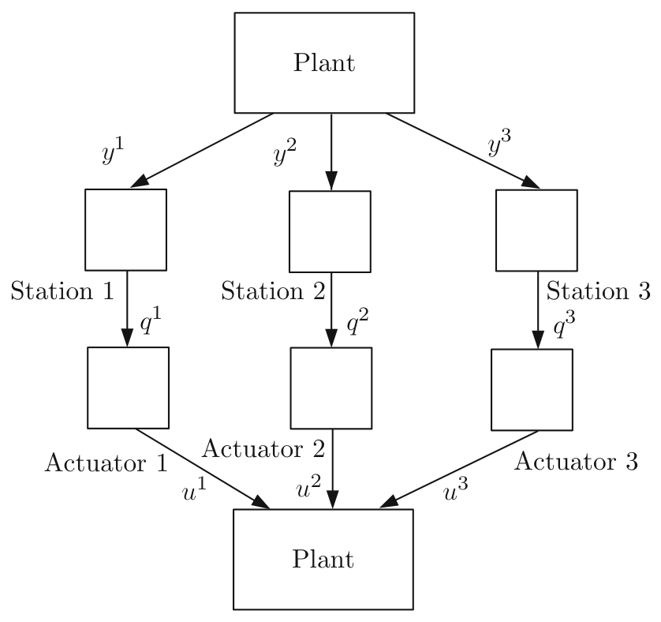

> Image description: A block diagram titled "Decentralized stabilization with multiple controllers" depicts a networked control architecture. The system consists of a central "Plant" at the top which outputs three distinct signals, $y^1$, $y^2$, and $y^3$, represented by downward-pointing arrows. These signals flow into three parallel processing branches. In each branch, the output $y^i$ enters a corresponding "Station $i$" block, which then outputs a processed signal $q^i$. For example, $y^1$ leads to Station 1, which outputs $q^1$. Following the stations, the signals $q^i$ flow into "Actuator $i$" blocks. Each actuator converts its respective signal into a control input, denoted as $u^i$. These control inputs—$u^1$, $u^2$, and $u^3$—are fed via diagonal arrows into a second "Plant" block at the bottom of the diagram. The structure illustrates a decentralized control loop where outputs are processed through separate channels before being fed back to the system.
Information and Communication Complexity of Networked Control Systems, Fig. 2 Decentralized stabilization with multiple controllers

distribution supported on a compact set $\mathcal{X}_{0} \subset \mathbb{R}^{n}$. We denote controllable and unobservable subspaces at station $i$ by $K^{i}$ and $N^{i}$ and refer to the subspace orthogonal to $N^{i}$ as the observable subspace at the $i$ th station, denoted by $O^{i}$. The information available to station $i$ at time $t$ is $I_{t}^{i}= \left\{y_{[0, t]}^{i}, u_{[0, t-1]}^{i}\right\}$. For such a system (see Fig. 2), it is possible for the controllers to communicate through the plant with the process known as signaling which can be used for communication of mode information among the decision makers. Denote by $i \rightarrow j$ the property that DM $i$ can signal to DM $j$. This holds if and only if $C^{j}(A)^{l} B^{i} \neq 0$, for at least one $l, 1 \leq l \leq n$. A directed graph $\mathcal{G}$ among the $L$ stations can be constructed through such a communication relationship.

Suppose that $A$ is such that in its Jordan form, where each Jordan block admits distinct real eigenvalues. Then, a lower bound on the communication complexity (per time stage) for stabilizability is given by $\sum_{\left|\lambda_{i}\right|>1} \eta_{M_{i}} \log _{2}\left(\left|\lambda_{i}\right|\right)$, where

$$
\begin{aligned}
\eta_{M_{i}}= & \min _{l, m \in\{1,2, \ldots, L\}}\{d(l, m)+1: l \rightarrow m, \\
& {\left.\left[x^{i}\right] \subset O^{i} \cup O^{m}, \quad\left[x^{i}\right] \subset K^{m}\right\}, }
\end{aligned}
$$

<!-- source_pdf_page: 588 -->
with $d(l, m)$ denoting the graph distance (number of edges in a shortest path) between DM $l$ and DM $m$ in $\mathcal{G}$ and $\left[x_{i}\right]$ denoting the subspace spanned by $x_{i}$. Furthermore, there exist stabilizing coding and control policies whose sum rate is arbitrarily close to this bound. When different Jordan blocks may admit repeated and possibly complex eigenvalues, variations of the result above are applicable. In the special case where there is a centralized controller which receives information from multiple sensors (under stabilizability and joint detectability), even in the presence of noise, to achieve asymptotic stability, it suffices to have the average total rate be greater than $\sum_{\left|\lambda_{i}\right|>1} \log _{2}\left(\left|\lambda_{i}\right|\right)$. The results above follow from Matveev and Savkin (2008) and Yüksel and Başar (2013). For the case with a single sensor, this result has been studied extensively in networked control (see the chapter on ▷ Quantized Control and Data Rate Constraints in the Encyclopedia).

## Summary and Future Directions

In this text, we discussed the problem of communication complexity in networked control systems. Our analysis considered both cost minimization and controllability/reachability problems subject to information constraints. We also discussed the communication complexity in distributed computing as has been studied in the computer science community and provided a brief discussion on the information theoretic approaches for such problems together with structural results. There are many relevant open problems on structural results for optimal policies, explicit solutions, as well as nontrivial upper and lower bounds on the optimal performance.

## Cross-References

- Data Rate of Nonlinear Control Systems and Feedback Entropy
- Flocking in Networked Systems
- Information-Based Multi-Agent Systems

\author{

- Networked Control Systems: Estimation and Control over Lossy Networks   - Quantized Control and Data Rate Constraints
}

## Recommended Reading

The information exchange requirements for decentralized optimization depend also on the structural properties of the cost functional to be minimized. For a class of team problems, one might simply need to exchange a sufficient statistic needed for optimal solutions. For some problems, there may be no need for an exchange at all, if the sufficient statistics are already available, as in the case of mean field equilibrium problems when the number of decision makers is unbounded or very large for almost optimal solutions; see Huang et al. (2006) and Lasry and Lions (2007). In case there is no common probabilistic information, the problem considered becomes further involved. The consensus literature, under both Bayesian and non-Bayesian contexts, aims to achieve agreement on a class of system variables under information constraints: see, e.g., Tsitsiklis et al. (1986). Optimization under local interaction and sparsity constraints and various criteria have been investigated in a number of publications including Rotkowitz and Lall (2006). A review for the literature on norm-optimal control as well as optimal stochastic dynamic teams is provided in Mahajan et al. (2012). Tsitsiklis and Athans (1985) have observed that from a computational complexity viewpoint, obtaining optimal solutions for a class of such communication protocol design problems is non-tractable (NP-hard).

Even though obtaining explicit solutions for optimal coding and control results may be difficult, it is useful to obtain structural results on optimal coding and control policies since one can reduce the search space to a smaller class of functions. For dynamic team problems, these typically follow from the construction of a controlled Markov chain (see Walrand and Varaiya 1983) and applying tools from stochastic control theory which obtain structural results on optimal coding and control policies (see Nayyar et al. 2013).

<!-- source_pdf_page: 589 -->
Along these lines, for system (1)-(2), if the DMs can agree on a joint belief $P\left(x_{t} \in \cdot \mid I_{t}^{i}, i \in \mathcal{L}\right)$ at every time stage, then the optimal cost that would be achieved under a centralized system could be attained (see Yüksel and Başar 2013). As a further important illustrative case, if the problem described in Definition 1 is for a realtime estimation problem for a Markov source, then the optimal causal fixed-rate coder minimizing any cost function uses only the last source symbol and the information at the controller's memory: see Witsenhausen (1979). We also note that the optimal design of information channels for optimization under information constraints is a non-convex problem; see Yüksel and Linder (2012) and Yüksel and Başar (2013) for a review of the literature and certain topological properties of the problem. We refer the reader to Nemirovsky and Yudin (1983) for a comprehensive resource on information complexity for optimization problems. A sequential setting with an information theoretic approach to the formulation of communication complexity has been considered in Raginsky and Rakhlin (2011). A formulation relevant to the one in Definition 1 has been considered in Teneketzis (1979) with mutual information constraints. Giridhar and Kumar (2006) discuss distributed computation for a class of symmetric functions under information constraints and present a comprehensive review.

## Bibliography

Cover TM, Thomas JA (1991) Elements of information theory. Wiley, New York
Gamal AE, Kim YH (2012) Network information theory. Cambridge University Press, UK
Giridhar A, Kumar P (2006) Toward a theory of innetwork computation in wireless sensor networks. IEEE Commun Mag 44:98-107
Huang M, Caines PE, Malhamé RP (2006) Large population stochastic dynamic games: closed-loop McKean-vlasov systems and the nash certainty equivalence principle. Commun $\operatorname{Inf}$ Syst 6: 221-251
Kushilevitz E, Nisan N (2006) Communication complexity, 2nd edn. Cambridge University Press, New York
Lasry JM, Lions PL (2007) Mean field games. Jpn J Math 2:229-260

Ma N, Ishwar P (2011) Some results on distributed source coding for interactive function computation. IEEE Trans Inf Theory 57:6180-6195
Mahajan A, Martins N, Rotkowitz M, Yüksel S (2012) Information structures in optimal decentralized control. In: IEEE conference on decision and control, Hawaii
Matveev AS, Savkin AV (2008) Estimation and control over communication networks. Birkhäuser, Boston
Nayyar A, Mahajan A, Teneketzis D (2013) The commoninformation approach to decentralized stochastic control. In: Como G, Bernhardsson B, Rantzer A (eds) Information and control in networks. Springer International Publishing, Switzerland
Nemirovsky A, Yudin D (1983) Problem complexity and method efficiency in optimization. Wiley-Interscience, New York
Orlitsky A, Roche JR (2001) Coding for computing. IEEE Trans Inf Theory 47:903-917
Raginsky M, Rakhlin A (2011) Information-based complexity, feedback and dynamics in convex programming. IEEE Trans Inf Theory 57: 7036-7056
Rotkowitz M, Lall S (2006) A characterization of convex problems in decentralized control. IEEE Trans Autom Control 51:274-286
Teneketzis D (1979) Communication in decentralized control. PhD dissertation, MIT
Tsitsiklis J, Athans M (1985) On the complexity of decentralized decision making and detection problems. IEEE Trans Autom Control 30:440-446
Tsitsiklis J, Bertsekas D, Athans M (1986) Distributed asynchronous deterministic and stochastic gradient optimization algorithms. IEEE Trans Autom Control 31:803-812
Walrand JC, Varaiya P (1983) Optimal causal codingdecoding problems. IEEE Trans Inf Theory 19:814820
Witsenhausen HS (1976) The zero-error side information problem and chromatic numbers. IEEE Trans Inf Theory 22:592-593
Witsenhausen HS (1979) On the structure of real-time source coders. Bell Syst Tech J 58:1437-1451
Wong WS (2009) Control communication complexity of distributed control systems. SIAM J Control Optim 48:1722-1742
Wong WS, Baillieul J (2012) Control communication complexity of distributed actions. IEEE Trans Autom Control 57:2731-2345
Yao ACC (1979) Some complexity questions related to distributive computing. In: Proceedings of the 11th annual ACM symposium on theory of computing, Atlanta
Yüksel S, Başar T (2013) Stochastic networked control systems: stabilization and optimization under information constraints. Birkhäuser, Boston
Yüksel S, Linder T (2012) Optimization and convergence of observation channels in stochastic control. SIAM J Control Optim 50:864-887

<!-- source_pdf_page: 590 -->
# Information Structures, the Witsenhausen Counterexample, and Communicating Using Actions

Pulkit Grover Carnegie Mellon University, Pittsburgh, PA, USA

#### Abstract

The concept of "information structures" in decentralized control is a formalization of the notion of "who knows what and when do they know it." Even seemingly simple problems with simply stated information structures can be extremely hard to solve. Perhaps the simplest of such unsolved problem is the celebrated Witsenhausen counterexample, formulated by Hans Witsenhausen in 1968. This entry discusses how the information structure of the Witsenhausen counterexample makes it hard and how an information-theoretic approach, which explores the knowledge gradient due to a nonclassical information pattern, has helped obtain insights into the problem.

## Keywords

Decentralized control; Information theory; Implicit communication; Team decision theory

## Introduction

Modern control systems often comprise of multiple decentralized control agents that interact over communication channels (Fig. 1). What characteristic distinguishes a centralized control problem from a decentralized one? One fundamental difference is a "knowledge gradient": agents in a decentralized team often observe, and hence know, different things. This observation leads to the idea of information patterns (Witsenhausen 1971), a formalization of the notion of "who
knows what and when do they know it" (Ho et al. 1978; Mitter and Sahai 1999).

The information pattern is said to be classical if all agents in the team receive the same information and have perfect recall (so they do not forget it). What is so special about classical information patterns? For these patterns, the presence of external communication links has no effect on the optimal costs! After all, what could the agents use the communication links for, when there is no knowledge gradient? More interesting, therefore, are the problems for which the information pattern is nonclassical. These problems sit at the intersection of communication and control: communication between agents can help reduce the knowledge differential that exists between them, helping them perform the control task. Intellectually and practically, the concept of nonclassical information patterns motivates a lot of formulations at the control-communication intersection. Many of these formulations - including some discussed in this Encyclopedia (e.g., - Data Rate of Nonlinear Control Systems and Feedback Entropy; Information and Communication Complexity of Networked Control Systems - Quantized Control and Data Rate Constraints; - Networked Control Systems: Architecture and Stability Issues; and - Networked Control Systems: Estimation and Control Over Lossy Networks) - intellectually ask the question: for a realistic channel that is constrained by noise, bandwidth, and speed, what is the optimal communication and control strategy?

One could ask the question of optimal control strategy even for decentralized control problems where no external channel is available to bridge this knowledge gradient. Why could these problems be of interest? First, these problems are limiting cases of control with communication constraints. Second, and perhaps more importantly, they bring out an interesting possibility that can allow the agents to "communicate," i.e., exchange information, even when the external channel is absent. It is possible to use control actions to communicate through changing the system state! We now introduce this form of communication using a simple toy example.

<!-- source_pdf_page: 591 -->
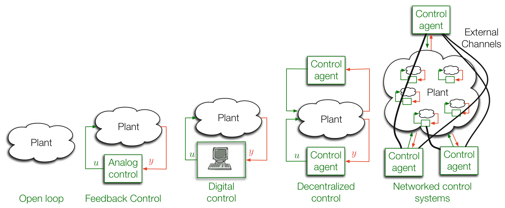

> Image description: A series of five diagrams illustrating the evolution of control system architectures, progressing from simple to complex. 1. **Open loop:** A single "Plant" block with no connections. 2. **Feedback Control:** A "Plant" block with a feedback loop. A control signal $u$ enters the plant, and an output signal $y$ returns to an "Analog control" block. 3. **Digital control:** Similar to feedback control, but the controller is a computer icon labeled "Digital control," with signals $u$ and $y$. 4. **Decentralized control:** Features multiple "Plant" components. Two "Control agent" blocks are shown: one acting directly on a plant component via signal $u$ and receiving $y$, and another connected via a larger control loop. 5. **Networked control systems:** A complex network where multiple "Control agent" blocks interact with a large "Plant" cloud through various "External Channels" (black lines). Arrows indicate bidirectional communication between agents and the plant.
Information Structures, the Witsenhausen Counterexample, and Communicating Using Actions, Fig. 1 The evolution of control systems. Modern "net-

worked control systems" (also called "cyber-physical systems") are decentralized and networked using communication channels

## Communicating Using Actions: An Example

To gain intuition into when communication using actions could be useful, consider the inverted pendulum example shown in Fig. 2. The goal of the two agents is to bring the pendulum as close to the origin as possible. Both controllers have their strengths and weaknesses. The "weak" controller $C_{w}$ has little energy, but has perfect state observations. On the other hand, the "blurry" controller $C_{b}$ has infinite energy, but noisy observations. They act one after the other, and their goal is to move the pendulum close to the center from any initial state. The information structure of the problem is nonclassical: the $C_{w}$, but not $C_{b}$, knows the initial state of the pendulum, and $C_{w}$ does not know the precise (noisy) observation of $C_{b}$ using which $C_{b}$ takes actions.

A possible strategy: A little thought reveals an interesting strategy - the weak controller, having perfect observations, can move the state to the closest of some predecided points in space, effectively quantizing the state. If these quantization points are sufficiently far from each other, they can be estimated accurately (through the noise) by the blurry controller, which can then use its energy to push the pendulum all the way to zero. In this way, the weak controller expends little energy, but is able to "communicate" the state through the noise to the blurry controller, by

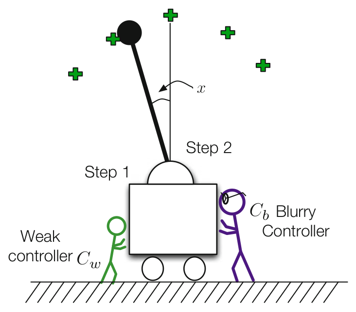

> Image description: A textbook diagram labeled "Fig. 2" illustrates a control systems problem involving an inverted pendulum on a cart. The system includes a vertical pendulum rod with a black circular mass at the top, mounted on a rectangular cart that rolls on a ground plane. The diagram identifies two controllers: a "Weak controller $C_w$" (represented by a green stick figure) and a "$C_b$ Blurry Controller" (represented by a purple stick figure). The controllers act upon the cart to maintain the pendulum's upright position. The pendulum's angle from the vertical is denoted by the variable $x$, indicated by a curved arrow. The diagram labels "Step 1" and "Step 2" as operational stages. Green "+" signs are scattered around the upper pendulum area, representing quantization points for a quantization-based control strategy. The figure demonstrates how different controllers attempt to stabilize the pendulum towards the center.
Information Structures, the Witsenhausen Counterexample, and Communicating Using Actions,

Fig. 2 Two controllers, with their respective strengths and weaknesses, attempting to bring an inverted pendulum close to the center. Also shown (using green "+" signs) are possible quantization points chosen by the controllers for a quantization-based control strategy
making it take values on a finite set. Once the blurry controller has received the state through the noise, it can use its infinite energy to push the state to zero.

## The Witsenhausen Counterexample

The above two-controller inverted-pendulum example is, in fact, motivated by what is now known as "the Witsenhausen counterexample," formulated by Witsenhausen in 1968 (see Fig. 3).

<!-- source_pdf_page: 592 -->
$$
x_{0} \sim \mathcal{N}\left(0, \sigma_{0}^{2}\right)
$$

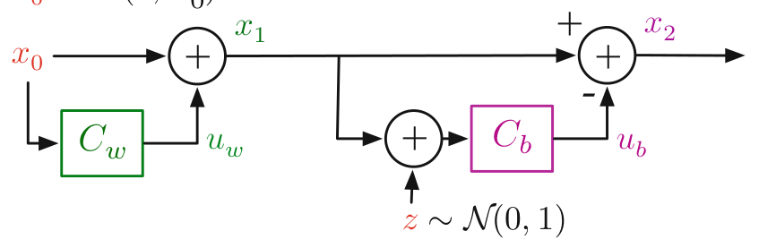

> Image description: A block diagram illustrating the Witsenhausen counterexample, showing a two-time-step decentralized control system. The system follows a sequential structure. In the first time step, an initial state $x_0$ is processed. A feedback loop contains the green block $C_w$ (the "weak" controller), which receives $x_0$ and produces an output $u_w$. This output is added to $x_0$ at a summation node to produce the intermediate state $x_1$. In the second time step, $x_1$ is passed to two paths. One path leads directly to a second summation node. The other path passes through a summation node adding noise $z \sim \mathcal{N}(0, 1)$, which then enters a magenta block $C_b$ (the "blurry" controller) to produce output $u_b$. The value $u_b$ is subtracted from the $x_1$ path at the final summation node to determine the terminal state $x_2$. The diagram illustrates the interplay between the controllers $C_w$ and $C_b$ and the additive noise $z$.

$$
\min \left\{k^{2} \mathbb{E}\left[u_{w}^{2}\right]+\mathbb{E}\left[x_{2}^{2}\right]\right\}
$$

Information Structures, the Witsenhausen Counterexample, and Communicating Using Actions, Fig. 3 The Witsenhausen counterexample is a deceptively simple two-time-step two-controller decentralized control problem. The weak and the blurry controllers, $C_{w}$ and $C_{b}$ act in a sequential manner

In the counterexample, two controllers (denoted here by $C_{w}$ for "weak" and $C_{b}$ for "blurry") act one after the other in two time-steps to minimize a quadratic cost function. The system state is denoted by $x_{t}$, where $t$ is the time index. $u_{w}$ and $u_{b}$ denote the inputs generated by the two controllers. The cost function is $k^{2} \mathbb{E}\left[u_{w}^{2}\right]+\mathbb{E}\left[x_{2}^{2}\right]$ for some constant $k$. The initial state $x_{0}$ and the noise $z$ at the input of the blurry controller are assumed to be Gaussian distributed and independent, with variances $\sigma_{0}^{2}$ and 1 respectively. The problem is a "linear-quadratic-Gaussian" (LQG) problem, i.e., the state evolution is linear, the costs are quadratic, and the primitive random variables are Gaussian.

Why is the problem called a "counterexample"? The traditional "certainty-equivalence" principle (Bertsekas 1995) shows that for all centralized LQG problems, linear control laws are optimal. Witsenhausen (1968) provided a nonlinear strategy for the Witsenhausen problem which outperforms all linear strategies. Thus, the counterexample showed that the certainty-equivalence doctrine does not extend to decentralized control.

What is this strategy of Witsenhausen that outperforms all linear strategies? It is, in fact, a quantization-based strategy, as suggested in our inverted-pendulum story above. Further, it was shown by Mitter and Sahai (1999) that multipoint quantization strategies can outperform linear strategies by an arbitrarily large factor! This observation, combined with the simplicity of the counterexample, makes the problem very

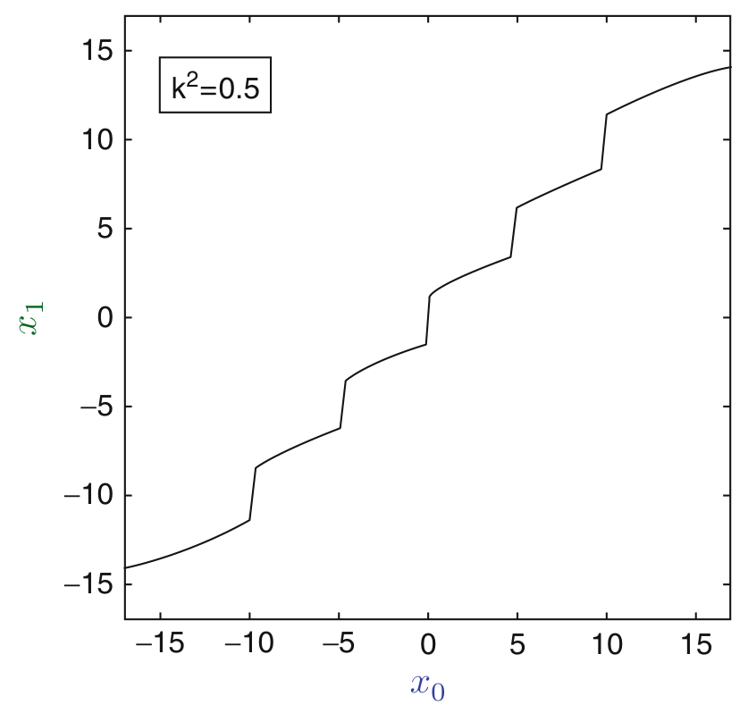

> Image description: A plot titled "Fig. 4 The optimization solution of Baglietto et al. (1997) for $k^{2}=0.5, \sigma_{0}^{2}=5$" shows a relationship between two variables, $x_0$ and $x_1$. The horizontal axis represents $x_0$, ranging from approximately -20 to 20, while the vertical axis represents $x_1$, ranging from -15 to 15. A single, continuous black line curves upward from the bottom-left to the top-right of the coordinate plane. The curve exhibits a distinctive "staircase" pattern, characterized by a series of flat plateaus connected by steep, nearly vertical jumps. Within the plot area, a label in a box reads "$k^2=0.5$". The caption indicates that this curve represents an optimization solution where the information-theoretic strategy of "dirty-paper coding" yields the same result. The figure illustrates a non-linear mapping where $x_1$ increases incrementally with $x_0$, punctuated by sudden shifts.
Information Structures, the Witsenhausen Counterexample, and Communicating Using Actions,

Fig. 4 The optimization solution of Baglietto et al. (1997) for $k^{2}=0.5, \sigma_{0}^{2}=5$. The information-theoretic strategy of "dirty-paper coding" Costa (1983) also yields the same curve (Grover and Sahai 2010)
important in decentralized control. This simple two-time-step two-controller LQG problem needs to be understood to have any hope of understanding larger and more complex problems.

While the optimal costs for the problem are still unknown (even though it is known that an optimal strategy exists (Witsenhausen 1968; Wu and Verdú 2011)), there exists a wealth of understanding of the counterexample that has helped address more complicated problems. A body of work, starting with that of Baglietto et al. (1997), numerically obtained solutions that could be close to optimal (although there is no mathematical proof thereof). All these solutions have a consistent form (illustrated in Fig. 4), with slight improvements in the optimal cost. Because the discrete version of the problem, appropriately relaxed, is known to be NPcomplete (Papadimitriou and Tsitsiklis 1986), this approach cannot be used to understand the entire parameter space and hence has focused on one point: $k^{2}=0.5, \sigma_{0}^{2}=5$. Nevertheless, the approach has proven to be insightful: a recent information-theoretic body of work shows that the strategies of Fig. 4 can be thought of as information-theoretic strategies of "dirty-paper coding" Costa (1983) that is related to the idea of

<!-- source_pdf_page: 593 -->
embedding information in the state. The question here is: how do we embed the information about the state in the state itself?

An information-theoretic view of the counterexample: This information-theoretic approach that culminated in Grover et al. (2013) also obtained the first approximately optimal solutions to the Witsenhausen counterexample as well as its vector extensions. The result is established by analyzing information flows in the counterexample that work toward minimizing the knowledge gradient, effectively an information pattern in which $C_{w}$ can predict the observation of $C_{b}$ more precisely. The analysis provides an information-theoretic lower bound on cost that holds irrespective of what strategy is used. For the original problem, this characterizes the optimal costs (with associated strategies) within a factor of 8 for all problem parameters (i.e., $k$ and $\sigma_{0}^{2}$ ). For any finite-length extension, uniform finite-ratio approximations also exist (Grover et al. 2013). The asymptotically infinitelength extension has been solved exactly (Choudhuri and Mitra 2012).

The problem has also driven delineation of decentralized LQG control problems with optimal linear solutions and those with nonlinear optimal solutions. This led to the development and understanding of many variations of the counterexample (Bansal and Başar 1987; Başar 2008; Ho et al. 1978; Rotkowitz 2006) and understanding that can extend to larger decentralized control problems. More recent work shows that the promise of the Witsenhausen counterexample was not a misplaced one: the information-theoretic approach that provides approximately optimal solutions to the counterexample (Grover et al. 2013) yields solutions to other more complex (e.g., multi-controller, more time-steps) problems as well (Grover 2010; Park and Sahai 2012).

## Summary and Future Directions

Even simple problems with nonclassical information structures can be hard to solve using classical techniques, as is demonstrated
by the Witsenhausen counterexample. However, nonclassical information pattern for some simple problems - starting with the counterexample has recently been explored via an informationtheoretic lens, yielding the first optimal or approximately optimal solutions to these problems. This approach is promising for larger decentralized control problems as well. It is now important to explore what is the simplest decentralized control problem that cannot be solved (exactly or approximately) using ideas developed for the counterexample. In this manner, the Witsenhausen counterexample can provide a platform to unify the more modern (i.e., external-channel centric approaches, see - Quantized Control and Data Rate Constraints; - Data Rate of Nonlinear Control Systems and Feedback Entropy; Networked Control Systems: Architecture and Stability Issues; - Networked Control Systems: Estimation and Control Over Lossy Networks; Information and Communication Complexity of Networked Control Systems; in the encyclopedia) with the more classical decentralized LQG problems, leading to enriching and useful formulations.

## Cross-References

- Data Rate of Nonlinear Control Systems and Feedback Entropy
- Information and Communication Complexity of Networked Control Systems
- Networked Control Systems: Architecture and Stability Issues
- Networked Control Systems: Estimation and Control over Lossy Networks
- Quantized Control and Data Rate Constraints

## Bibliography

Baglietto M, Parisini T, Zoppoli R (1997) Nonlinear approximations for the solution of team optimal control problems. In: Proceedings of the IEEE

<!-- source_pdf_page: 594 -->
conference on decision and control (CDC), San Diego, pp 4592-4594
Bansal R, Başar T (1987) Stochastic teams with nonclassical information revisited: when is an affine control optimal? IEEE Trans Autom Control 32: 554-559
Başar T (2008) Variations on the theme of the Witsenhausen counterexample. In: Proceedings of the 47th IEEE conference on decision and control (CDC), Cancun, pp 1614-1619
Bertsekas D (1995) Dynamic programming. Athena Scientific, Belmont
Costa M (1983) Writing on dirty paper. IEEE Trans Inf Theory 29(3):439-441
Choudhuri C, Mitra U (2012) On Witsenhausen's counterexample: the asymptotic vector case. In: IEEE information theory workshop (ITW), Lausanne, pp 162-166
Grover P (2010) Actions can speak more clearly than words. Ph.D. dissertation, UC Berkeley, Berkeley
Grover P, Sahai A (2010) Vector Witsenhausen counterexample as assisted interference suppression. Int J Syst Control Commun 2:197-237. Special issue on Information Processing and Decision Making in Distributed Control Systems
Grover P, Park S-Y, Sahai A (2013) Approximatelyoptimal solutions to the finite-dimensional Witsenhausen counterexample. IEEE Trans Autom Control 58(9):2189
Ho YC, Kastner MP, Wong E (1978) Teams, signaling, and information theory. IEEE Trans Autom Control 23(2):305-312
Mitter SK, Sahai A (1999) Information and control: Witsenhausen revisited. In: Yamamoto Y, Hara S (eds) Learning, control and hybrid systems. Lecture notes in control and information sciences, vol 241. New York, NY: Springer, pp 281-293
Papadimitriou CH, Tsitsiklis JN (1986) Intractable problems in control theory. SIAM J Control Optim 24(4):639-654
Park SY, Sahai A (2012) It may be easier to approximate decentralized infinite-horizon LQG problems. In: 51st IEEE Conference on Decision and Control (CDC), Maui, pp 2250-2255
Rotkowitz M (2006) Linear controllers are uniformly optimal for the Witsenhausen counterexample. In: Proceedings of the 45th IEEE conference on decision and control (CDC), San Diego, pp 553-558
Witsenhausen HS (1968) A counterexample in stochastic optimum control. SIAM J Control 6(1): 131-147
Witsenhausen HS (1971) Separation of estimation and control for discrete time systems. Proc IEEE 59(11):1557-1566
Wu Y, Verdú S (2011) Witsenhausen's counterexample: a view from optimal transport theory. In: IEEE conference on decision and control and European control conference (CDC-ECC), Orlando, pp 5732-5737

## Information-Based Multi-Agent Systems

Wing-Shing Wong ${ }^{1}$ and John Baillieul ${ }^{2}$ ${ }^{1}$ Department of Information Engineering, The Chinese University of Hong Kong, Hong Kong, China ${ }^{2}$ Mechanical Engineering, Electrical and Computer Engineering, Boston University, Boston, MA, USA

#### Abstract

Multi-agent systems are encountered in nature (animal groups), in various domains of technology (multi-robot networks, mixed robot-human teams) and in various human activities (such as dance and team athletics). Information exchange among agents ranges from being incidentally important to crucial in such systems. Several systems in which information exchange among the agents is either a primary goal or a primary enabler are discussed briefly. Specific topics include power management in wireless communication networks, data-rate constraints, the complexity of distributed control, robotics networks and formation control, action-mediated communication, and multi-objective distributed systems.

## Keywords

Distributed control; Information constraints; Multi-agent systems

## Introduction

The role of information patterns in the decentralized control of multi-agent systems has been studied in different theoretical contexts for more than five decades. The paper Ho (1972) provides references to early work in this area. While research on distributed decision making has continued, a large body of recent research on robotic networks has brought new dimensions of geometric aspects of information patterns to the

<!-- source_pdf_page: 595 -->
forefront (Bullo et al. 2009). At the same time, machine intelligence, machine learning, machine autonomy, and theories of operation of mixed teams of humans and robots have considerably extended the intellectual frontiers of informationbased multi-agent systems (Baillieul et al. 2012). A further important development has been the study of action-mediated communication and the recently articulated theory of control communication complexity (Wong and Baillieul 2012). These developments may shed light on nonverbal forms of communication among biological organisms (including humans) and on the intrinsic energy requirements of information processing.

In conventional decentralized control, the control objective is usually well-defined and known to all agents. Multi-agent information-based control encompasses a broader scenario, where the objective can be agent dependent and is not necessarily explicitly announced to all. For illustration, consider the power control problem in wireless communication - one of the earliest engineering systems that can be regarded as multi-agent information based. It is common that multiple transmitter-receiver communication pairs share the same radio frequency band and the transmission signals interfere with each other. The power control problem searches for feedback control for each transmitter to set its power level. The goal is for each transmitter to achieve targeted signal-to-interference ratio (SIR) level by using information of the observed levels at the intended receiver only.

A popular version of the power control problem (Foschini and Miljanic 1993) defines each individual objective target level by means of a requirement threshold, known only to the intended transmitter. As SIR measurements naturally reside on a receiver, the observed SIR needs to be communicated back to the transmitter. For obvious reasons, the bandwidth for such communication is limited. The resulting model fits the bill of multi-agent informationbased control. In Sung and Wong (1999), a tristate power control strategy is proposed so that the power control outputs are either increased or decreased by a fixed dB or no change at all. Convergence of the feedback
algorithm was shown using a Lyapunov-like function.

This entry surveys key topics related to multiagent information-based control systems, including control complexity, control with data-rate constraints, robotic networks and formation control, action-mediated communication, and multiobjective distributed systems.

## Control Complexity

In information-based distributed control systems, how to efficiently share computational and communication resources is a fundamental issue. One of the earliest investigations on how to schedule communication resources to support a network of sensors and actuators is discussed in Brockett (1995). The concept of communication sequencing was introduced to describe how the communication channel is utilized to convey feedback control information in a network consisting of interacting subsystems. In Brockett (1997), the concept of control attention was introduced to provide a measure of the complexity of a control law against its performance. As attention is a shared, limited resource, the goal is to find minimum attention control. Another approach to gauge control complexity in a distributed system is by means of the minimum amount of communicated data required to accomplish a given control task.

## Control with Data-Rate Constraints

A fundamental challenge in any control implementation in which system components communicate with each other over communication links is ensuring that the channel capacity is large enough to deal with the fastest time constants among the system components. In a single agent system, the so-called Data-Rate Theorem has been formulated in various ways to understand the constraints imposed between the sensor and the controller and between the controller and the actuator. Extensions to this fundamental result have been focused on addressing similar

<!-- source_pdf_page: 596 -->
problems in the network control system context. Information on such extensions in the distributed control setting can be found in Nair and Evans (2004) and Yüksel and Basar (2007).

## Robotic Networks and Formation Control

The defining characteristic of robotic networks within the larger class of multi-agent systems is the centrality of spatial relationships among network nodes. Graph theory has been shown to provide a generally convenient mathematical language in which to describe spatial concepts and it is the key to understanding spatial rigidity related to the control of formations of autonomous vehicles (Anderson et al. 2008), or in flocking systems (Leonard et al. 2012), or in consensus problems (Su and Huang 2012), or in rendezvous problems (Cortés et al. 2006). For these distributed control research topics, readers can consult other sections in this Encyclopedia for a comprehensive reference list.

Much of the recent work on formation control has included information limitation considerations. For consensus problems, for example, Olfati-Saber and Murray (2004) introduced a sensing cost constraint, and in Ren and Beard (2005) information exchange constraints are considered, and in Yu and Wang (2010) communication delays are explicitly modeled.

## Action-Mediated Communication

Biological organisms communicate through motion. Examples of this include prides of lions or packs of wolves whose pursuit of prey is a cooperative effort and competitive team athletics in the case of humans. Recent research has been aimed at developing a theoretical foundation of actionmediated communication. Communication protocols for motion-based signaling between mobile robots have been developed (Raghunathan and Baillieul 2009) and preliminary steps towards a theory of artistic expression through controlled
movements in dance have been reported in Baillieul and Özcimder (2012). Motion-based communication of this type involves specially tailored motion description languages in which sequences of motion primitives are assembled with the objective of conveying artistic intent, while minimizing the use of limited energy resources in carrying out the movement. These motion primitives constitute the alphabet that enables communication, and physical constraints on the motions define the grammatical rules that govern the ways in which motion sequences may be constructed.

Research on action-mediated communication helps illustrate the close connection between control and information theory. Further discussion of the deep connection between the two can be found, for example, in Park and Sahai (2011), which argues for the equivalence between the stabilization of a distributed linear system and the capacity characterization in linear network coding.

## Multi-objective Distributive Systems

In a multi-agent system, agents may aim to carry out individual objectives. These objectives can either be cooperatively aligned (such as in a cooperative control setting) or may contend antagonistically (such as in a zero-sum game setting). In either case, a common assumption is that the objective functions are a priori known to all agents. However, in many practical applications, agents do not know the objectives of other agents, at least not precisely. For example, in the power control problem alluded to earlier, the signal-tointerference requirement of a user may be unknown to other users. Yet this does not prevent the possibility of deriving convergence algorithms to allow the joint goals to be achieved.

The issue of unknown objectives in a multiagent system is formally analyzed in Wong (2009) via the introduction of choice-based actions. In an open access network, objectives of an individual agent may be known only partially, via the form of a random distribution in some cases. In order to achieve a joint control objective in general, some communication via the system

<!-- source_pdf_page: 597 -->
is required if there is no side communications channel. A basic issue is how to measure the minimum amount of information exchange that is required to perform a specific control task. Motivated by the idea of communication complexity in computer science, the idea of control communication complexity was introduced in Wong (2009), which can provide such a measure. In Wong and Baillieul (2009), the idea was extended to a rich class of nonlinear systems that arise as models of physical processes ranging from rigid body mechancs to quantum spin systems.

In some special cases, control objectives can be achieved without any communication among the agents. For systems with bilinear input-output mapping, including the Brockett Integrator, it is possible to derive conditions that guarantee this property (Wong and Baillieul 2012). Moreover, for quadratic type of control cost, it is possible to compute the optimal control cost. Similar results can be extended to linear systems as discussed in Liu et al. (2013). This circle of ideas is connected to the socalled standard parts problem as investigated in Baillieul and Wong (2009). Another connection is to correlated equilibrium problems that have been recently studied by game theorists Shoham and Leyton-Brown (2009).

## Cross-References

- Motion Description Languages and Symbolic Control
- Multi-vehicle Routing
- Networked Systems

## Bibliography

Altman E, Avrachenkov K, Menache I, Miller G, Prabhu BJ, Shwartz A (2009) Dynamic discrete power control in cellular networks. IEEE Trans Autom Control 54(10):2328-2340
Anderson B, Yu C, Fidan B, Hendrickx J (2008) Rigid graph control architectures for autonomous formations. IEEE Control Syst Mag 28(6):48-63. doi:10.1109/MCS.2008.929280

Baillieul J, Özcimder K (2012) The control theory of motion-based communication: problems in teaching robots to dance. In: Proceedings of the American control conference (ACC), Montreal, 27-29 June 2012, pp 4319-4326
Baillieul J, Wong WS (2009) The standard parts problem and the complexity of control communication. In: Proceedings of the 48th IEEE conference on decision and control, held jointly with the 28th Chinese control conference, Shanghai, 16-18 Dec 2009, pp 2723-2728
Baillieul J, Leonard NE, Morgansen KA (2012) Interaction dynamics: the interface of humans and smart machines. Proc IEEE 100(3):776-801. doi:10.1109/JPROC.s011.2180055
Brockett RW (1995) Stabilization of motor networks. In: Proceedings of the 34th IEEE conference on decision and control, New Orleans, 13-15 Dec 1995, pp 14841488
Brockett RW (1997) Minimum attention control. In: Proceedings of the 36th IEEE conference on decision and control, San Diego, 10-12 Dec 1997, pp 2628-2632
Bullo F, Cortés J, Martínez S (2009) Distributed control of robotic networks: a mathematical approach to motion coordination algorithms. Princeton University Press, Princeton
Cortés J, Martínez S, Bullo F (2006) Robust rendezvous for mobile autonomous agents via proximity graphs in arbitrary dimensions. IEEE Trans Autom Control 51(8):1289-1298
Foschini GJ, Miljanic Z (1993) A simple distributed autonomous power control algorithm and its convergence. IEEE Trans Veh Technol 42(4):641-646
Ho YC (1972) Team decision theory and information structures in optimal control problems-part I. IEEE Trans Autom Control 17(1):15-22
Leonard NE, Young G, Hochgraf K, Swain D, Chen W, Marshall S (2012) In the dance studio: analysis of human flocking. In: Proceedings of the 2012 American control conference, Montreal, 27-29 June 2012, pp 4333-4338
Liu ZC, Wong WS, Guo G (2013) Cooperative control of linear systems with choice actions. In: Proceedings of the American control conference, Washington, DC, 17-19 June 2013, pp 5374-5379
Nair GN, Evans RJ (2004) Stabilisability of stochastic linear systems with finite feedback data rates. SIAM J Control Optim 43(2):413-436
Olfati-Saber R, Murray RM (2004) Consensus problems in networks of agents with switching topology and time-delays. IEEE Trans Autom Control 49(9):15201533
Park SY, Sahai A (2011) Network coding meets decentralized control: capacity-stabilizability equivalence. In: Proceedings of the 50th IEEE conference on decision and control and European control conference, Orlando, 12-15 Dec 2011, pp 4817-4822
Raghunathan D, Baillieul J (2009) Motion based communication channels between mobile robots-A novel paradigm for low bandwidth information exchange. In: Proceedings of the IEEE/RSJ international conference

<!-- source_pdf_page: 598 -->
on intelligent robots and systems, 11-15 Oct 2009, St. Louis, pp 702-708
Ren W, Beard RW (2005) Consensus seeking in multiagent systems under dynamically changing interaction topologies. IEEE Trans Autom Control 50(5):655-661
Shoham Y, Leyton-Brown K (2009) Multiagent systems: algorithmic, game-theoretic, and logical foundations. Cambridge University Press, New York. ISBN:978-0-521-89943-7
Su Y, Huang J (2012) Two consensus problems for discrete-time multi-agent systems with switching network topology. Automatica 48(9): 1988-1997
Sung CW, Wong WS (1999) A distributed fixed-step power control algorithm with quantization and active link quality protection. IEEE Trans Veh Technol 48(2):553-562
Wong WS (2009) Control communication complexity of distributed control systems. SIAM J Optim Control 48(3):1722-1742
Wong WS, Baillieul J (2009) Control communication complexity of nonlinear systems. Commun Inf Syst 9(1): 103-140
Wong WS, Baillieul J (2012) Control communication complexity of distributed actions. IEEE Trans Autom Control 57(11):2731-2745. doi:10.1109/TAC.2012.2192357
Yu J, Wang L (2010) Group consensus in multi-agent systems with switching topologies and communication delays. Syst Control Lett 59(6):340-348
Yüksel S, Basar T (2007) Optimal signaling policies for decentralized multicontroller stabilizability over communication channels. IEEE Trans Autom Control 52(10): 1969-1974

## Input-to-State Stability

Eduardo D. Sontag
Rutgers University, New Brunswick, NJ, USA

## Synonyms

ISS

#### Abstract

The notion of input to state stability (ISS) qualitatively describes stability of the mapping from initial states and inputs to internal states (and more generally outputs). This entry focuses on the definition of ISS and a discussion of equivalent characterizations.

## Keywords

Asymptotic stability; Dissipation; Lyapunov functions

## Introduction

We consider here systems with inputs in the usual sense of control theory:

$$
\dot{x}(t)=f(x(t), u(t))
$$

(the arguments " $t$ " are often omitted). There are $n$ state variables and $m$ input channels. States $x(t)$ take values in Euclidean space $\mathbb{R}^{n}$, and the inputs (also called "controls" or "disturbances" depending on the context) are measurable in locally essentially bounded maps $u(\cdot):[0, \infty) \rightarrow \mathbb{R}^{m}$. The map $f: \mathbb{R}^{n} \times \mathbb{R}^{m} \rightarrow \mathbb{R}^{n}$ is assumed to be locally Lipschitz with $f(0,0)=0$. The solution, defined on some maximal interval $\left[0, t_{\text {max }}\left(x^{0}, u\right)\right)$, for each initial state $x^{0}$ and input $u$, is denoted as $x\left(t, x^{0}, u\right)$ and, in particular, for systems with no inputs $\dot{x}(t)=f(x(t))$, just as $x\left(t, x^{0}\right)$. The zero system associated to $\dot{x}=f(x, u)$ is by definition the system with no inputs $\dot{x}=f(x, 0)$. Euclidean norm is written as $|x|$. For a function of time, typically an input or a state trajectory, $\|u\|$, or $\|u\|_{\infty}$ for emphasis, is the (essential) supremum or "sup" norm (possibly $+\infty$, if $u$ is not bounded). The norm of the restriction of a signal to an interval $I$ is denoted by $\left\|u_{I}\right\|_{\infty}$ (or just $\left\|u_{I}\right\|$ ).

## Input-to-State Stability

It is convenient to introduce "comparison functions" to quantify stability. A class $\mathcal{K}_{\infty}$ function is a function $\alpha: \mathbb{R}_{\geq 0} \rightarrow \mathbb{R}_{\geq 0}$ which is continuous, strictly increasing, and unbounded and satisfies $\alpha(0)=0$, and a class $\mathcal{K} \mathcal{L}$ function is a function $\beta: \mathbb{R}_{\geq 0} \times \mathbb{R}_{\geq 0} \rightarrow \mathbb{R}_{\geq 0}$ such that $\beta(\cdot, t) \in \mathcal{K}_{\infty}$ for each $t$ and $\beta(r, t)$ decreases to zero as $t \rightarrow \infty$, for each fixed $r$.

<!-- source_pdf_page: 599 -->
For a system with no inputs $\dot{x}=f(x)$, there is a well-known notion of global asymptotic stability (for short from now on, GAS, or "O-GAS" when referring to the zero system $\dot{x}=f(x, 0)$ associated to a given system with inputs $\dot{x}=f(x, u))$ due to Lyapunov and usually defined in " $\epsilon-\delta$ " terms. It is an easy exercise to show that this standard definition is in fact equivalent to the following statement:

$$
(\exists \beta \in \mathcal{K} \mathcal{L})\left|x\left(t, x^{0}\right)\right| \leq \beta\left(\left|x^{0}\right|, t\right) \forall x^{0}, \forall t \geq 0 .
$$

The notion of input to state stability (ISS) was introduced in Sontag (1989), and it provides theoretical concepts used to describe stability features of a mapping $(u(\cdot), x(0)) \alpha x(\cdot)$ that sends initial states and input functions into states (or, more generally, outputs). Prominent among these features are that inputs that are bounded, "eventually small," "integrally small," or convergent should lead to outputs with the respective property. In addition, ISS and related notions quantify in what manner initial states affect transient behavior. The formal definition is as follows.

A system is said to be input to state stable (ISS) if there exist some $\beta \in \mathcal{K} \mathcal{L}$ and $\gamma \in \mathcal{K}_{\infty}$ such that

$$
\begin{equation*}
|x(t)| \leq \beta\left(\left|x^{0}\right|, t\right)+\gamma\left(\|u\|_{\infty}\right) \tag{ISS}
\end{equation*}
$$

holds for all solutions (meaning that the estimate is valid for all inputs $u(\cdot)$, all initial conditions $x^{0}$, and all $t \geq 0$ ). Note that the supremum $\sup _{s \in[0, t]} \gamma(|u(s)|)$ over the interval $[0, t]$ is the same as $\gamma\left(\left\|u_{[0, t]}\right\|_{\infty}\right)=\gamma\left(\sup _{s \in[0, t]}(|u(s)|)\right)$, because the function $\gamma$ is increasing, so one may replace this term by $\gamma\left(\|u\|_{\infty}\right)$, where $\|u\|_{\infty}= \sup _{s \in[0, \infty)} \gamma(|u(s)|)$ is the sup norm of the input, because the solution $x(t)$ depends only on values $u(s), s \leq t$ (so, one could equally well consider the input that has values $\equiv 0$ for all $s>t$ ).

Since, in general, $\max \{a, b\} \leq a+b \leq \max \{2 a, 2 b\}$, one can restate the ISS condition in a slightly different manner, namely, asking for the existence of some $\beta \in \mathcal{K} \mathcal{L}$ and $\gamma \in \mathcal{K}_{\infty}$ (in general, different from the ones in the ISS definition) such that
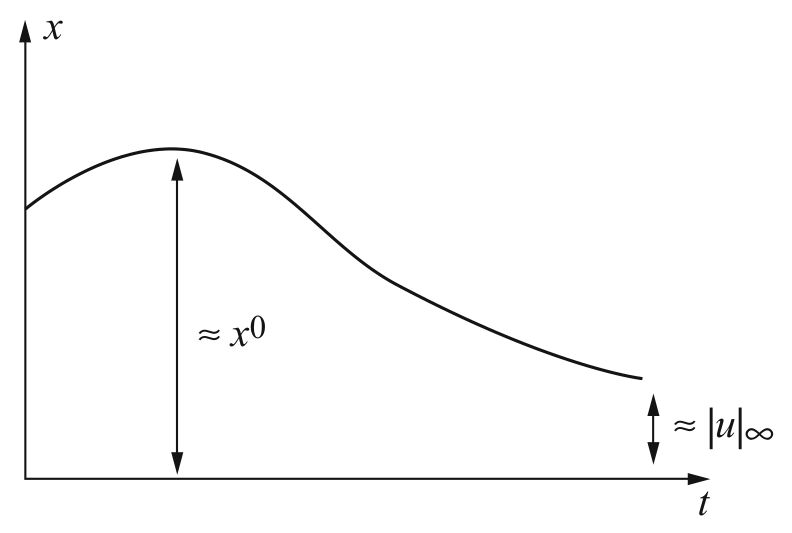

> Image description: This figure illustrates the concept of Input-to-State Stability (ISS) by plotting a system state $x$ against time $t$ on a Cartesian coordinate system. The vertical axis is labeled $x$, and the horizontal axis is labeled $t$. A single continuous curve represents the evolution of the state over time. The curve starts at an initial value, rises to a peak, and then asymptotically decays toward zero. A vertical double-headed arrow indicates the maximum magnitude of the state deviation, labeled $\approx x^0$, representing the overshoot or peak transient behavior. Toward the end of the time horizon, a smaller vertical double-headed arrow indicates the residual state magnitude, labeled $\approx |u|_\infty$, representing the bounded asymptotic behavior related to the input magnitude. The figure visually demonstrates how the state remains bounded by a function of the initial conditions and the magnitude of the input.

Input-to-State Stability, Fig. 1 ISS combines overshoot and asymptotic behavior

$$
|x(t)| \leq \max \left\{\beta\left(\left|x^{0}\right|, t\right), \gamma\left(\|u\|_{\infty}\right)\right\}
$$

holds for all solutions. Such redefinitions, using "max" instead of sum, are also possible for each of the other concepts to be introduced later.

Intuitively, the definition of ISS requires that, for $t$ large, the size of the state must be bounded by some function of the sup norm - that is to say, the amplitude - of inputs (because $\beta\left(\left|x^{0}\right|, t\right) \rightarrow 0$ as $t \rightarrow \infty$ ). On the other hand, the $\beta\left(\left|x^{0}\right|, 0\right)$ term may dominate for small $t$, and this serves to quantify the magnitude of the transient (overshoot) behavior as a function of the size of the initial state $x^{0}$ (Fig. 1). The ISS superposition theorem, discussed later, shows that ISS is, in a precise mathematical sense, the conjunction of two properties, one of them dealing with asymptotic bounds on $\left|x^{0}\right|$ as a function of the magnitude of the input and the other one providing a transient term obtained when one ignores inputs.

For internally stable linear systems $\dot{x}=A x+ B u$, the variation of parameters formula gives immediately the following inequality:

$$
|x(t)| \leq \beta(t)\left|x^{0}\right|+\gamma\|u\|_{\infty},
$$

where

$$
\begin{aligned}
\beta(t) & =\left\|e^{t A}\right\| \rightarrow 0 \text { and } \\
\gamma & =\|B\| \int_{0}^{\infty}\left\|e^{s A}\right\| d s<\infty
\end{aligned}
$$

<!-- source_pdf_page: 600 -->
This is a particular case of the ISS estimate, $|x(t)| \leq \beta\left(\left|x^{0}\right|, t\right)+\gamma\left(\|u\|_{\infty}\right)$, with linear comparison functions.

## Feedback Redesign

The notion of ISS arose originally as a way to precisely formulate, and then answer, the following question. Suppose that, as in many problems in control theory, a system $\dot{x}=f(x, u)$ has been stabilized by means of a feedback law $u=k(x)$ (Fig. 2), that is to say, $k$ was chosen such that the origin of the closed-loop system $\dot{x}=f(x, k(x))$ is globally asymptotically stable. (See, e.g., Sontag 1999 for a discussion of mathematical aspects of state feedback stabilization.) Typically, the design of $k$ was performed by ignoring the effect of possible input disturbances $d(\cdot)$ (also called actuator disturbances). These "disturbances" might represent true noise or perhaps errors in the calculation of the value $k(x)$ by a physical controller or modeling uncertainty in the controller or the system itself. What is the effect of considering disturbances? In order to analyze the problem, $d$ is incorporated into the model, and one studies the new system $\dot{x}=f(x, k(x)+d)$, where $d$ is seen as an input (Fig. 3). One may then ask what is the effect of $d$ on the behavior of the system. Disturbances $d$ may well destabilize the system, and the problem may arise even when using a routine technique for control design, feedback linearization. To appreciate this issue, take the following very simple example. Given is the system

$$
\dot{x}=f(x, u)=x+\left(x^{2}+1\right) u .
$$

In order to stabilize it, substitute $u=\frac{\tilde{u}}{x^{2}+1}$ (a preliminary feedback transformation), rendering the system linear with respect to the new input $\tilde{u}: \dot{x}= x+\tilde{u}$, and then use $\tilde{u}=-2 x$ in order to obtain the closed-loop system $\dot{x}=-x$. In other words, in terms of the original input $u$, the feedback law is

$$
k(x)=\frac{-2 x}{x^{2}+1}
$$

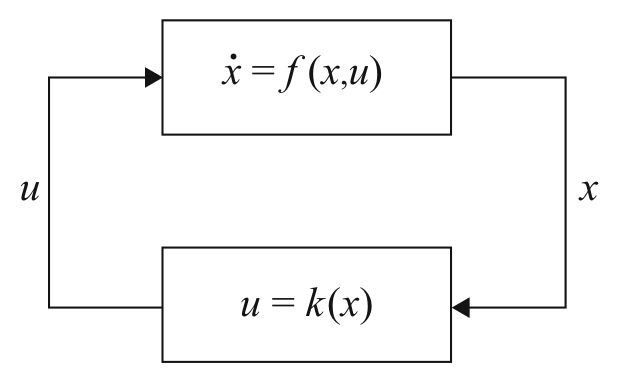

> Image description: A technical diagram illustrating a feedback stabilization closed-loop system, labeled as "Fig. 2 Feedback stabilization, closed-loop system $\dot{x}=f(x, k(x))$." The diagram consists of two rectangular blocks connected by a continuous loop of arrows. The top block represents the plant or system dynamics, defined by the differential equation $\dot{x} = f(x, u)$. The output variable $x$ flows from the right side of this block down to the second block. The bottom block represents the control law or controller, defined by the equation $u = k(x)$. The control input variable $u$ flows from the left side of this block back into the top block. The relationship forms a closed loop where the state $x$ is measured and processed through a control function $k(x)$ to produce an input $u$, which in turn influences the rate of change of the state $\dot{x}$.

Input-to-State Stability, Fig. 2 Feedback stabilization, closed-loop system $\dot{x}=f(x, k(x))$
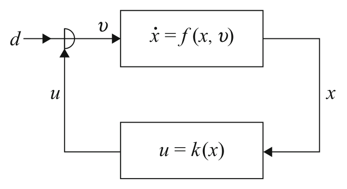

> Image description: A block diagram illustrating a feedback stabilization closed-loop system, captioned "Input-to-State Stability, Fig. 2 Feedback stabilization, closed-loop system $\dot{x}=f(x, k(x))$". The diagram consists of two rectangular blocks connected in a loop. The upper block represents the system dynamics, defined by the differential equation $\dot{x} = f(x, v)$. An input signal $d$ enters the system through a summing junction, which also receives a feedback signal $u$, resulting in the combined input $v$ being passed into the system block. The output of this block is the state variable $x$. The lower block represents the control law, defined by $u = k(x)$, which takes the state variable $x$ as its input and produces the control signal $u$. Arrows indicate the flow of signals: $x$ flows from the upper block to the lower block, $u$ flows from the lower block to the summing junction, and $v$ flows from the summing junction into the system block.

Input-to-State Stability, Fig. 3 Actuator disturbances, closed-loop system $\dot{x}=f(x, k(x)+d)$
so that $f(x, k(x))=-x$. This is a GAS system. The effect of the disturbance input $d$ is analyzed as follows. The system $\dot{x}=f(x, k(x)+d)$ is

$$
\dot{x}=-x+\left(x^{2}+1\right) d .
$$

This system has solutions which diverge to infinity even for inputs $d$ that converge to zero; moreover, the constant input $d \equiv 1$ results in solutions that explode in finite time. Thus $k(x)= \frac{-2 x}{x^{2}+1}$ was not a good feedback law, in the sense that its performance degraded drastically once actuator disturbances were taken into account.

The key observation for what follows is that if one adds a correction term " $-x$ " to the above formula for $k(x)$, so that now,

$$
\tilde{k}(x)=\frac{-2 x}{x^{2}+1}-x,
$$

then the system $\dot{x}=f(x, \tilde{k}(x)+d)$ with disturbance $d$ as input becomes instead

$$
\dot{x}=-2 x-x^{3}+\left(x^{2}+1\right) d
$$

and this system is much better behaved: it is still GAS when there are no disturbances (it reduces

<!-- source_pdf_page: 601 -->
to $\dot{x}=-2 x-x^{3}$ ), but, in addition, it is ISS (easy to verify directly, or appealing to some of the characterizations mentioned later). Intuitively, for large $x$, the term $-x^{3}$ serves to dominate the term $\left(x^{2}+1\right) d$, for all bounded disturbances $d(\cdot)$, and this prevents the state from getting too large.

This example is an instance of a general result, which says that, whenever there is some feedback law that stabilizes a system, there is also a (possibly different) feedback so that the system with external input $d$ is ISS.

Theorem 1 (Sontag 1989). Consider a system affine in controls
$\dot{x}=f(x, u)=g_{0}(x)+\sum_{i=1}^{m} u_{i} g_{i}(x)\left(g_{0}(0)=0\right)$
and suppose that there is some differentiable feedback law $u=k(x)$ so that

$$
\dot{x}=f(x, k(x))
$$

has $x=0$ as a GAS equilibrium. Then, there is a feedback law $u=\widetilde{k}(x)$ such that

$$
\dot{x}=f(x, \widetilde{k}(x)+d)
$$

is ISS with input $d(\cdot)$.
The reader is referred to the book Krstić et al. (1995), and the references given later, for many further developments on the subjects of recursive feedback design, the "backstepping" approach, and other far-reaching extensions.

## Equivalences for ISS

This section reviews results that show that ISS is equivalent to several other notions, including asymptotic gain, existence of robustness margins, dissipativity, and an energy-like stability estimate.

## Nonlinear Superposition Principle

Clearly, if a system is ISS, then the system with no inputs $\dot{x}=f(x, 0)$ is GAS: the term $\|u\|_{\infty}$
vanishes, leaving precisely the GAS property. In particular, then, the system $\dot{x}=f(x, u)$ is 0 -stable, meaning that the origin of the system without inputs $\dot{x}=f(x, 0)$ is stable in the sense of Lyapunov: for each $\epsilon>0$, there is some $\delta>0$ such that $\left|x^{0}\right|<\delta$ implies $\left|x\left(t, x^{0}\right)\right|<\epsilon$. (In comparison-function language, one can restate 0 stability as follows: there is some $\gamma \in \mathcal{K}$ such that $\left|x\left(t, x^{0}\right)\right| \leq \gamma\left(\left|x^{0}\right|\right)$ holds for all small $\left.x^{0}.\right)$

On the other hand, since $\beta\left(\left|x^{0}\right|, t\right) \rightarrow 0$ as $t \rightarrow \infty$, for $t$ large one has that the first term in the ISS estimate $|x(t)| \leq \max \left\{\beta\left(\left|x^{0}\right|, t\right), \gamma\left(\|u\|_{\infty}\right)\right\}$ vanishes. Thus an ISS system satisfies the following asymptotic gain property ("AG"): there is some $\gamma \in \mathcal{K}_{\infty}$ so that:

$$
\begin{equation*}
\varlimsup_{t \rightarrow+\infty}\left|x\left(t, x^{0}, u\right)\right| \leq \gamma\left(\|u\|_{\infty}\right) \quad \forall x^{0}, u(\cdot) \tag{AG}
\end{equation*}
$$

(see Fig.4). In words, for all large enough $t$, the trajectory exists, and it gets arbitrarily close to a sphere whose radius is proportional, in a possibly nonlinear way quantified by the function $\gamma$, to the amplitude of the input. In the language of robust control, the estimate (AG) would be called an "ultimate boundedness" condition; it is a generalization of attractivity (all trajectories converge to zero, for a system $\dot{x}=f(x)$ with no inputs) to the case of systems with inputs; the "lim sup" is required since the limit of $x(t)$ as $t \rightarrow \infty$ may well not exist. From now on (and analogously when defining other properties), we

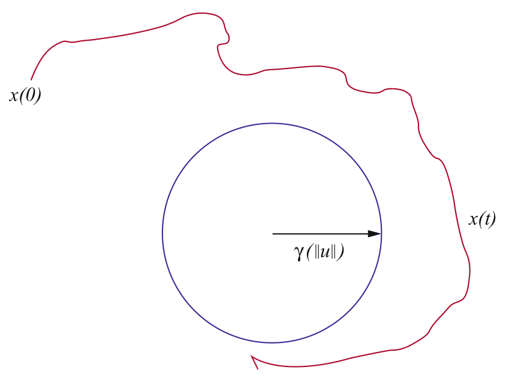

> Image description: An engineering diagram illustrating the asymptotic gain property in the context of Input-to-State Stability (ISS). The figure shows two trajectories plotted on an implicit coordinate system. A blue circle is centered at the origin with a radius labeled as $\gamma(\|u\|)$, where $\gamma$ represents a gain function and $\|u\|$ is the magnitude of an external input. A black arrow points from the center to the circumference of the circle, representing the radius. A red, irregular trajectory representing a state trajectory $x(t)$ starts at an initial point $x(0)$ and evolves toward the origin. The trajectory orbits and converges towards the boundary of the blue circle, rather than reaching the origin itself. The state at time $t$ is labeled as $x(t)$. This visualizes that the state trajectory remains bounded by a function of the input magnitude, demonstrating how the system responds to external disturbances.
Input-to-State Stability, Fig. 4 Asymptotic gain property

<!-- source_pdf_page: 602 -->
will just say "the system is AG" instead of the more cumbersome "satisfies the AG property."

Observe that, since only large values of $t$ matter in the limsup, one can equally well consider merely tails of the input $u$ when computing its sup norm. In other words, one may replace $\gamma\left(\|u\|_{\infty}\right)$ by $\gamma\left(\overline{\lim }_{t \rightarrow+\infty}|u(t)|\right)$, or (since $\gamma$ is increasing) $\overline{\lim }_{t \rightarrow+\infty} \gamma(|u(t)|)$.

The surprising fact is that these two necessary conditions are also sufficient. This is summarized by the ISS superposition theorem:

Theorem 2 (Sontag and Wang 1996). A system is ISS if and only if it is 0 -stable and $A G$.

A minor variation of the above superposition theorem is as follows. Let us consider the limit property (LIM):

$$
\begin{equation*}
\inf _{t \geq 0}\left|x\left(t, x^{0}, u\right)\right| \leq \gamma\left(\|u\|_{\infty}\right) \quad \forall x^{0}, u(\cdot) \tag{LIM}
\end{equation*}
$$

(for some $\gamma \in \mathcal{K}_{\infty}$ ).
Theorem 3 (Sontag and Wang 1996). A system is ISS if and only if it is 0-stable and LIM.

## Robust Stability

In this entry, a system is said to be robustly stable if it admits a margin of stability $\rho$, that is, a smooth function $\rho \in \mathcal{K}_{\infty}$ so the system

$$
\dot{x}=g(x, d):=f(x, d \rho(|x|))
$$

is GAS uniformly in this sense: for some $\beta \in \mathcal{K} \mathcal{L}$,

$$
\left|x\left(t, x^{0}, d\right)\right| \leq \beta\left(\left|x^{0}\right|, t\right)
$$

for all possible $d(\cdot):[0, \infty) \rightarrow[-1,1]^{m}$. An alternative way to interpret this concept (cf. Sontag and Wang 1995) is as uniform global asymptotic stability of the origin with respect to all possible time-varying feedback laws $\Delta$ bounded by $\rho$ : $|\Delta(t, x)| \leq \rho(|x|)$. In other words, the system

$$
\dot{x}=f(x, \Delta(t, x))
$$

(Fig. 5) is stable uniformly over all such perturbations $\Delta$. In contrast to the ISS definition, which deals with all possible "open-loop" inputs, the

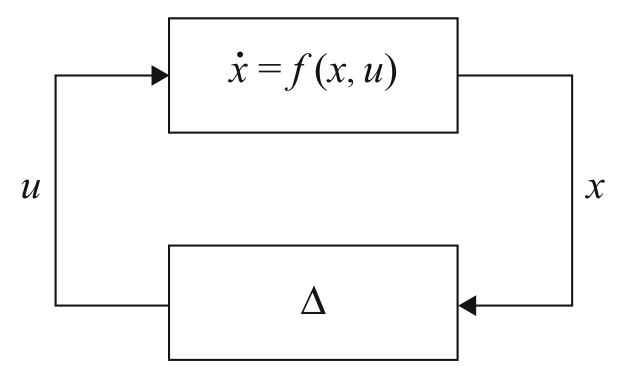

> Image description: A block diagram illustrating a feedback control system loop, labeled as (Fig. 5). The system consists of two interconnected rectangular blocks forming a closed loop. The top block represents the system dynamics, defined by the differential equation $\dot{x} = f(x, u)$. An arrow flows from the top block to the right, indicating the system state output, labeled $x$. This output $x$ is then fed into the bottom block, which is labeled with the Greek letter delta ($\Delta$), representing a perturbation or uncertainty component. An arrow flows from the bottom block back to the top block, indicating the feedback signal $u$. This signal $u$ serves as the control input to the top block. The diagram represents a closed-loop configuration where the system state $x$ is subject to perturbations $\Delta$, which in turn affect the control input $u$ sent back into the nonlinear system $\dot{x} = f(x, u)$.
Input-to-State Stability, Fig. 5 Margin of robustness

present notion of robust stability asks about all possible closed-loop interconnections. One may think of $\Delta$ as representing uncertainty in the dynamics of the original system, for example.

Theorem 4 (Sontag and Wang 1995). A system is ISS if and only if it is robustly stable.

Intuitively, the ISS estimate $|x(t)| \leq$ max $\left\{\beta\left(\left|x^{0}\right|, t\right), \gamma\left(\|u\|_{\infty}\right)\right\}$ says that the $\beta$ term dominates as long as $|u(t)| \ll|x(t)|$ for all $t$, but $|u(t)| \ll|x(t)|$ amounts to $u(t)=d(t) \cdot \rho(|x(t)|)$ with an appropriate function $\rho$. This is an instance of a "small gain" argument, see below. One analog for linear systems is as follows: if $A$ is a Hurwitz matrix, then $A+Q$ is also Hurwitz, for all small enough perturbations $Q$; note that when $Q$ is a nonsingular matrix, $|Q x|$ is a $\mathcal{K}_{\infty}$ function of $|x|$.

## Dissipation

Another characterization of ISS is as a dissipation notion stated in terms of a Lyapunov-like function. A continuous function $V: \mathbb{R}^{n} \rightarrow \mathbb{R}$ is said to be a storage function if it is positive definite, that is, $V(0)=0$ and $V(x)>0$ for $x \neq 0$, and proper, that is, $V(x) \rightarrow \infty$ as $|x| \rightarrow \infty$. This last property is equivalent to the requirement that the sets $V^{-1}([0, A])$ should be compact subsets of $\mathbb{R}^{n}$, for each $A>0$, and in the engineering literature, it is usual to call such functions radially unbounded. It is an easy exercise to show that $V: \mathbb{R}^{n} \rightarrow \mathbb{R}$ is a storage function if and only if there exist $\underline{\alpha}, \bar{\alpha} \in \mathcal{K}_{\infty}$ such that

$$
\underline{\alpha}(|x|) \leq V(x) \leq \bar{\alpha}(|x|) \forall x \in \mathbb{R}^{n}
$$

<!-- source_pdf_page: 603 -->
(the lower bound amounts to properness and $V(x)>0$ for $x \neq 0$, while the upper bound guarantees $V(0)=0$ ). For convenience, $\dot{V}: \mathbb{R}^{n} \times \mathbb{R}^{m} \rightarrow \mathbb{R}$ is the function:

$$
\dot{V}(x, u):=\nabla V(x) \cdot f(x, u)
$$

which provides, when evaluated at $(x(t), u(t))$, the derivative $d V(x(t)) / d t$ along solutions of $\dot{x}=f(x, u)$.

An ISS-Lyapunov function for $\dot{x}=f(x, u)$ is by definition a smooth storage function $V$ for which there exist functions $\gamma, \alpha \in \mathcal{K}_{\infty}$ so that

$$
\dot{V}(x, u) \leq-\alpha(|x|)+\gamma(|u|) \quad \forall x, u .
$$

(L-ISS)
Integrating, an equivalent statement is that, along all trajectories of the system, there holds the following dissipation inequality:

$$
V\left(x\left(t_{2}\right)\right)-V\left(x\left(t_{1}\right)\right) \leq \int_{t_{1}}^{t_{2}} w(u(s), x(s)) d s
$$

where, using the terminology of Willems (1976), the "supply" function is $w(u, x)= \gamma(|u|)-\alpha(|x|)$. For systems with no inputs, an ISS-Lyapunov function is precisely the same object as a Lyapunov function in the usual sense.

Theorem 5 (Sontag and Wang 1995). A system is ISS if and only if it admits a smooth ISSLyapunov function.

Since $-\alpha(|x|) \leq-\alpha\left(\bar{\alpha}^{-1}(V(x))\right)$, the ISSLyapunov condition can be restated as

$$
\dot{V}(x, u) \leq-\tilde{\alpha}(V(x))+\gamma(|u|) \quad \forall x, u
$$

for some $\tilde{\alpha} \in \mathcal{K}_{\infty}$. In fact, one may strengthen this a bit (Praly and Wang 1996): for any ISS system, there is a always a smooth ISS-Lyapunov function satisfying the "exponential" estimate $\dot{V}(x, u) \leq-V(x)+\gamma(|u|)$.

The sufficiency of the ISS-Lyapunov condition is easy to show and was already in the original paper Sontag (1989). A sketch of proof is as follows, assuming for simplicity a dissipation estimate in the form $\dot{V}(x, u) \leq-\alpha(V(x))+\gamma(|u|)$. Given any $x$ and $u$, either $\alpha(V(x)) \leq 2 \gamma(|u|)$
or $\dot{V} \leq-\alpha(V) / 2$. From here, one deduces by a comparison theorem that, along all solutions,

$$
V(x(t)) \leq \max \left\{\beta\left(V\left(x^{0}\right), t\right), \alpha^{-1}\left(2 \gamma\left(\|u\|_{\infty}\right)\right)\right\}
$$

where the $\mathcal{K} \mathcal{L}$ function $\beta(s, t)$ is the solution $y(t)$ of the initial value problem

$$
\dot{y}=-\frac{1}{2} \alpha(y)+\gamma(u), \quad y(0)=s .
$$

Finally, an ISS estimate is obtained from $V\left(x^{0}\right) \leq \bar{\alpha}\left(x^{0}\right)$.

The proof of the converse part of the theorem is based upon first showing that ISS implies robust stability in the sense already discussed and then obtaining a converse Lyapunov theorem for robust stability for the system $\dot{x}=f(x, d \rho(|x|))=g(x, d)$, which is asymptotically stable uniformly on all Lebesguemeasurable functions $d(\cdot): \mathbb{R}_{\geq 0} \rightarrow B(0,1)$. This last theorem was given in Lin et al. (1996) and is basically a theorem on Lyapunov functions for differential inclusions. The classical result of Massera (1956) for differential equations (with no inputs) becomes a special case.

## Using "Energy" Estimates Instead of Amplitudes

In linear control theory, $H_{\infty}$ theory studies $L^{2} \rightarrow L^{2}$ induced norms, which under coordinate changes leads to the following type of estimate:
$\left.\int_{0}^{t} \alpha(|x(s)|)\right) d s \leq \alpha_{0}\left(\left|x^{0}\right|\right)+\int_{0}^{t} \gamma(|u(s)|) d s$
along all solutions and for some $\alpha, \alpha_{0}, \gamma \in \mathcal{K}_{\infty}$. Just for the statement of the next result, a system is said to satisfy an integral-integral estimate if for every initial state $x^{0}$ and input $u$, the solution $x\left(t, x^{0}, u\right)$ is defined for all $t>0$ and an estimate as above holds. (In contrast to ISS, this definition explicitly demands that $t_{\text {max }}=\infty$.)

Theorem 6 (Sontag 1998). A system is ISS if and only if it satisfies an integral-integral estimate.

<!-- source_pdf_page: 604 -->
This theorem is quite easy to prove, in view of previous results. A sketch of proof is as follows. If the system is ISS, then there is an ISS-Lyapunov function satisfying $\dot{V}(x, u) \leq-V(x)+\gamma(|u|)$, so, integrating along any solution:

$$
\begin{aligned}
\int_{0}^{t} V(x(s)) d s & \leq \int_{0}^{t} V(x(s)) d s+V(x(t)) \\
& \leq V(x(0))+\int_{0}^{t} \gamma(|u(s)|) d s
\end{aligned}
$$

and thus an integral-integral estimate holds. Conversely, if such an estimate holds, one can prove that $\dot{x}=f(x, 0)$ is stable and that an asymptotic gain exists.

## Integral Input to State Stability

A concept of nonlinear stability that is truly distinct from ISS arises when considering a mixed notion which combines the "energy" of the input with the amplitude of the state. A system is said to be integral-input to state stable (iISS) provided that there exist $\alpha, \gamma \in \mathcal{K}_{\infty}$ and $\beta \in \mathcal{K} \mathcal{L}$ such that the estimate

$$
\begin{equation*}
\alpha(|x(t)|) \leq \beta\left(\left|x^{0}\right|, t\right)+\int_{0}^{t} \gamma(|u(s)|) d s \tag{iISS}
\end{equation*}
$$

holds along all solutions. Just as with ISS, one could state this property merely for all times $t \in t_{\max }\left(x^{0}, u\right)$. Since the right-hand side is bounded on each interval $[0, t]$ (because, recall, inputs are by definition assumed to be bounded on each finite interval), it is automatically true that $t_{\text {max }}\left(x^{0}, u\right)=+\infty$ if such an estimate holds along maximal solutions. So forwardcompleteness (solution exists for all $t>0$ ) can be assumed with no loss of generality.

One might also consider the following type of "weak integral to integral" mixed estimate:

$$
\int_{0}^{t} \underline{\alpha}(|x(s)|) d s \leq \kappa\left(\left|x^{0}\right|\right)
$$

$$
+\alpha\left(\int_{0}^{t} \gamma(|u(s)|) d s\right)
$$

for appropriate $\mathcal{K}_{\infty}$ functions (note the additional " $\alpha$ ").

Theorem 7 (Angeli et al. 2000b). $\quad A \quad$ system satisfies a weak integral to integral estimate if and only if it is iISS.

Another interesting variant is found when considering mixed integral/supremum estimates:

$$
\begin{gathered}
\underline{\alpha}\left(|x(t)| \leq \beta\left(\left|x^{0}\right|, t\right)+\int_{0}^{t} \gamma_{1}(|u(s)|) d s\right. \\
+\gamma_{2}\left(\|u\|_{\infty}\right)
\end{gathered}
$$

for suitable $\beta \in \mathcal{K} \mathcal{L}$ and $\underline{\alpha}, \gamma_{i} \in \mathcal{K}_{\infty}$. One then has

Theorem 8 (Angeli et al. 2000b). A system satisfies a mixed estimate if and only if it is iISS.

## Dissipation Characterization of iISS

A smooth storage function $V$ is an iISS-Lyapunov function for the system $\dot{x}=f(x, u)$ if there are a $\gamma \in \mathcal{K}_{\infty}$ and an $\alpha:[0,+\infty) \rightarrow[0,+\infty)$ which is merely positive definite (i.e., $\alpha(0)=0$ and $\alpha(r)>0$ for $r>0$ ) such that the inequality

$$
\dot{V}(x, u) \leq-\alpha(|x|)+\gamma(|u|)
$$

(L-iISS)
holds for all $(x, u) \in \mathbb{R}^{n} \times \mathbb{R}^{m}$. To compare, recall that an ISS-Lyapunov function is required to satisfy an estimate of the same form but where $\alpha$ is required to be of class $\mathcal{K}_{\infty}$; since every $\mathcal{K}_{\infty}$ function is positive definite, an ISS-Lyapunov function is also an iISS-Lyapunov function.

Theorem 9 (Angeli et al. 2000a). A system is iISS if and only if it admits a smooth iISSLyapunov function.

Since an ISS-Lyapunov function is also an iISS one, ISS implies iISS. However, iISS is a strictly weaker property than ISS, because $\alpha$ may be bounded in the iISS-Lyapunov estimate, which means that $V$ may increase, and the state become unbounded, even under bounded inputs, so long

<!-- source_pdf_page: 605 -->
as $\gamma(|u(t)|)$ is larger than the range of $\alpha$. This is also clear from the iISS definition, since a constant input with $|u(t)|=r$ results in a term in the right-hand side that grows like $r t$.

An interesting general class of examples is given by bilinear systems

$$
\dot{x}=\left(A+\sum_{i=1}^{m} u_{i} A_{i}\right) x+B u
$$

for which the matrix $A$ is Hurwitz. Such systems are always iISS (see Sontag 1998), but they are not in general ISS. For instance, in the case when $B=0$, boundedness of trajectories for all constant inputs already implies that $A+\sum_{i=1}^{m} u_{i} A_{i}$ must have all eigenvalues with nonpositive real part, for all $u \in \mathbb{R}^{m}$, which is a condition involving the matrices $A_{i}$ (e.g., $\dot{x}=-x+u x$ is iISS but it is not ISS).

The notion of iISS is useful in situations where an appropriate notion of detectability can be verified using LaSalle-type arguments. There follow two examples of theorems along these lines.

Theorem 10 (Angeli et al. 2000a). A system is iISS if and only if it is 0-GAS and there is a smooth storage function $V$ such that, for some $\sigma \in \mathcal{K}_{\infty}$ :

$$
\dot{V}(x, u) \leq \sigma(|u|)
$$

for all $(x, u)$.
The sufficiency part of this result follows from the observation that the 0-GAS property by itself already implies the existence of a smooth and positive definite, but not necessarily proper, function $V_{0}$ such that $\dot{V}_{0} \leq \gamma_{0}(|u|)-\alpha_{0}(|x|)$ for all $(x, u)$, for some $\gamma_{0} \in \mathcal{K}_{\infty}$ and positive definite $\alpha_{0}$ (if $V_{0}$ were proper, then it would be an iISSLyapunov function). Now, one uses $V_{0}+V$ as an iISS-Lyapunov function ( $V$ provides properness).

Theorem 11 (Angeli et al. 2000a). A system is iISS if and only if there exists an output function $y=h(x)$ (continuous and with $h(0)=0$ ) which provides zero detectability ( $u \equiv 0$ and $y \equiv 0 \Rightarrow x(t) \rightarrow 0)$ and dissipativity in the
following sense: there exists a storage function $V$ and $\sigma \in \mathcal{K}_{\infty}$, $\alpha$ positive definite, so that

$$
\dot{V}(x, u) \leq \sigma(|u|)-\alpha(h(x))
$$

holds for all $(x, u)$.
Angeli et al. (2000b) contains several additional characterizations of iISS.

## Superposition Principles for iISS

There are also asymptotic gain characterizations for iISS. A system is bounded energy weakly converging state (BEWCS) if there exists some $\sigma \in \mathcal{K}_{\infty}$ so that the following implication holds:

$$
\begin{aligned}
\int_{0}^{+\infty} & \sigma(|u(s)|) d s<+\infty \Rightarrow \\
& \liminf _{t \rightarrow+\infty}\left|x\left(t, x^{0}, u\right)\right|=0 \quad \text { BEWCS }
\end{aligned}
$$

(more precisely: if the integral is finite, then $t_{\text {max }}\left(x^{0}, u\right)=+\infty$ and the liminf is zero). It is bounded energy frequently bounded state (BEFBS) if there exists some $\sigma \in \mathcal{K}_{\infty}$ so that the following implication holds:

$$
\begin{aligned}
\int_{0}^{+\infty} & \sigma(|u(s)|) d s<+\infty \Rightarrow \\
& \liminf _{t \rightarrow+\infty}\left|x\left(t, x^{0}, u\right)\right|<+\infty \quad \mathrm{BEFBS}
\end{aligned}
$$

(again, meaning that $t_{\text {max }}\left(x^{0}, u\right)=+\infty$ and the lim inf is finite).

Theorem 12 (Angeli et al. 2004). The following three properties are equivalent for any given system $\dot{x}=f(x, u)$ :

- The system is iISS.
- The system is BEWCS and 0-stable.
- The system is BEFBS and 0-GAS.

## Summary and Future Directions

This entry focuses on stability notions relative to steady states, but a more general theory is also

<!-- source_pdf_page: 606 -->
possible that allows consideration of more arbitrary attractors, as well as robust and/or adaptive concepts. Much else has been omitted from this entry. Most importantly, one of the key results is the ISS small-gain theorem due to Jiang et al. (1994), which provides a powerful sufficient condition for the interconnection of ISS systems being itself ISS.

Other topics not treated include, among many others, all notions involving outputs; ISS properties of time-varying (and in particular periodic) systems; ISS for discrete-time systems; questions of sampling, relating ISS properties of continuous and discrete-time systems; ISS with respect to a closed subset $K$; stochastic ISS; applications to tracking, vehicle formations ("leader to followers" stability); and averaging of ISS systems. Sontag (2006) may also be consulted for further references, a detailed development of some of these ideas, and citations to the literature for others. In addition, the textbooks Isidori (1999), Krstić et al. (1995), Khalil (1996), Sepulchre et al. (1997), Krstić and Deng (1998), Freeman and Kokotović (1996), and Isidori et al. (2003) contain many extensions of the theory as well as applications.

## Cross-References

- Feedback Stabilization of Nonlinear Systems
- Fundamental Limitation of Feedback Control
- Linear State Feedback
- Lyapunov's Stability Theory
- Stability and Performance of Complex Systems Affected by Parametric Uncertainty
- Stability: Lyapunov, Linear Systems

## Bibliography

Angeli D, Sontag ED, Wang Y (2000a) A characterization of integral input-to-state stability. IEEE Trans Autom Control 45(6): 1082-1097
Angeli D, Sontag ED, Wang Y (2000b) Further equivalences and semiglobal versions of integral input to state stability. Dyn Control 10(2):127-149

Angeli D, Ingalls B, Sontag ED, Wang Y (2004) Separation principles for input-output and integral-input-to-state stability. SIAM J Control Optim 43(1): 256-276
Freeman RA, Kokotović PV (1996) Robust nonlinear control design, state-space and Lyapunov techniques. Birkhauser, Boston
Isidori A (1999) Nonlinear control systems II. Springer, London
Isidori A, Marconi L, Serrani A (2003) Robust autonomous guidance: an internal model-based approach. Springer, London
Jiang Z-P, Teel A, Praly L (1994) Small-gain theorem for ISS systems and applications. Math Control Signals Syst 7:95-120
Khalil HK (1996) Nonlinear systems, 2nd edn. PrenticeHall, Upper Saddle River
Krstić M, Deng H (1998) Stabilization of uncertain nonlinear systems. Springer, London
Krstić M, Kanellakopoulos I, Kokotović PV (1995) Nonlinear and adaptive control design. Wiley, New York
Lin Y, Sontag ED, Wang Y (1996) A smooth converse Lyapunov theorem for robust stability. SIAM J Control Optim 34(1):124-160
Massera JL (1956) Contributions to stability theory. Ann Math 64:182-206
Praly L, Wang Y (1996) Stabilization in spite of matched unmodelled dynamics and an equivalent definition of input-to-state stability. Math Control Signals Syst 9:1-33
Sepulchre R, Jankovic M, Kokotović PV (1997) Constructive nonlinear control. Springer, New York
Sontag ED (1989) Smooth stabilization implies coprime factorization. IEEE Trans Autom Control 34(4):435-443
Sontag ED (1998) Comments on integral variants of ISS. Syst Control Lett 34(1-2):93-100
Sontag ED (1999) Stability and stabilization: discontinuities and the effect of disturbances. In: Nonlinear analysis, differential equations and control (Montreal, 1998). NATO science series C, Mathematical and physical sciences, vol 528. Kluwer Academic, Dordrecht, pp 551-598
Sontag ED (2006) Input to state stability: basic concepts and results. In: Nistri P, Stefani G (eds) Nonlinear and optimal control theory. Springer, Berlin, pp 163-220
Sontag ED, Wang Y (1995) On characterizations of the input-to-state stability property. Syst Control Lett 24(5):351-359
Sontag ED, Wang Y (1996) New characterizations of input-to-state stability. IEEE Trans Autom Control 41(9):1283-1294
Willems JC (1976) Mechanisms for the stability and instability in feedback systems. Proc IEEE 64: 24-35

<!-- source_pdf_page: 607 -->
# Interactive Environments and Software Tools for CACSD

Vasile Sima Advanced Research, National Institute for Research \& Development in Informatics, Bucharest, Romania

#### Abstract

The main functional and support facilities offered by interactive environments and tools for computer-aided control system design (CACSD) and reference examples of such software systems are presented, from both a user and a developer perspective. The essential functions these environments should possess and requirements which should be satisfied are discussed. The importance of reliability and efficiency is highlighted, besides the desired friendliness and flexibility of the user interface. Widely used environments and software tools for CACSD, including MATLAB, Mathematica, Maple, and the SLICOT Library, serve as illustrative examples.

## Keywords

Automatic control; Controller design; Numerical algorithms; Simulation; User interface

## Introduction

The complexity of many processes or systems to be controlled, and the strong performance requirements to be fulfilled nowadays, makes it very difficult or even impossible to design suitable control laws and algorithms without resorting to computers and dedicated software tools. computer-aided control system design (CACSD) is the use of computer programs to support the creation, analysis, evaluation, or optimization of a control system design. CACSD is a specialization of computer-aided design (CAD) for control systems. CAD is used in many
domains, to enhance designer's productivity and the design quality and to manage the design versions and documentation. CACSD is not a new paradigm, since the first such software systems have been developed about 50 years ago. See the historical overview in a companion paper.

The interactive environments and tools for CACSD have evolved significantly during the last decades, in parallel with the developments of numerical linear algebra, scientific computations, and computer hardware and software, including programming and networking capabilities. Starting from simple collections of specialized tools for solving well-defined system analysis and design problems, the CACSD became increasingly more sophisticated and powerful, allowing complicated tasks to be orchestrated for fully covering the stages of control engineering design, prototyping, and testing, including even the transfer to practical systems and applications. Modeling, system analysis and synthesis, and control system assessment are activities which are assisted by the nowadays advanced CACSD environments and software tools. The main aim is to help the designer to concentrate on the design problem itself, not on theoretical approaches, numerical algorithms, and computational details. Moreover, CACSD environments allow the developers and users to do conceptual thinking, but also programming and debugging at a higher level of abstraction, in comparison with standard programming languages, like Fortran, C/C++, or Java ${ }^{\mathrm{TM}}$.

There are both commercial or free and opensource CACSD environments and tools. State-of-the-art CACSD systems exist for several platforms (Windows, Linux/UNIX, and Mac OS X). Multiple high-speed CPUs, graphics cards, and large amounts of RAM are well suited to perform graphically and computationally intensive tasks. A common feature is the presence of a "friendly" graphical user interface, but often a dedicated command language is also available. The user interacts with the CACSD environment, e.g., by specifying the model or control structure, the design requirements, and the values of essential parameters or by selecting and combining

<!-- source_pdf_page: 608 -->
| Interactive CACSD environment (e.g., MATLAB, Mathematica, Maple)   (for modeling, simulation, analysis, synthesis, etc.) |
| :--- |
| Toolboxes or packages with executables or functions written in the environment language |
| (Graphical) User interface, Interactive language, Graphical functions, API |
| CACSD subroutine libraries (e.g., SLICOT) |
| Mathematical subroutine libraries (e.g., LAPACK, ARPACK, IMSL, NAG) |
| Computer-optimized mathematical libraries or their generators (e.g., BLAS, MKL, ATLAS) |
| Libraries of intrinsic functions (e.g., in Fortran or C/C++) |

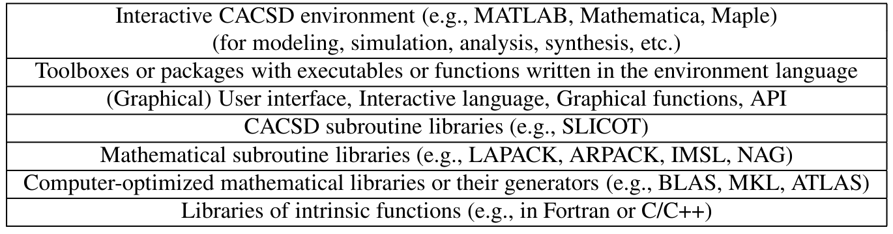

> Image description: A flowchart titled "Interactive Environments and Software Tools for CACSD" illustrates the hierarchical structure of software components within an interactive Computer-Aided Control System Design (CACSD) environment. The figure consists of seven stacked horizontal rectangular blocks, arranged in a top-down hierarchy from high-level user interaction to low-level system functions. At the top, the most abstract layer is the "Interactive CACSD environment (e.g., MATLAB, Mathematica, Maple)," used for modeling, simulation, analysis, and synthesis. Below this are "Toolboxes or packages" written in the environment's language, followed by the "(Graphical) User interface, Interactive language, Graphical functions, [and] API." The core computational layers consist of "CACSD subroutine libraries (e.g., SLICOT)," "Mathematical subroutine libraries (e.g., LAPACK, ARPACK, IMSL, NAG)," and "Computer-optimized mathematical libraries or their generators (e.g., BLAS, MKL, ATLAS)." The foundation is composed of "Libraries of intrinsic functions (e.g., in Fortran or C/C++)."

Interactive Environments and Software Tools for CACSD, Fig. 1 Hierarchy of the software components incorporated in an interactive CACSD environment

the tools to be used. The process can be repeated until a satisfactory behavior is obtained.

Usually, the underlying computational tools on which the interactive environments are based are hidden to the user. Moreover, software for extensive testing is not normally provided, but demonstrators running few examples are offered. Unfortunately, even mathematically simple problems of small dimension can conduct to wrong results when using unsuitable algorithms. Illustrative control-related examples are given, e.g., in Van Huffel et al. (2004). Since system analysis and design tasks usually involve sequential or iterative solution of large and complex subproblems, it follows that the quality of the intermediate results is of utmost importance. Consequently, the interactive environments for CACSD should be based on reliable, efficient, and thoroughly tested computational building blocks, which are called at the lower layers of calculations. These blocks constitute the computational engine of an interactive environment.

Figure 1 gives a typical hierarchy of the software components incorporated in an interactive CACSD environment.

## Interactive Environments for CACSD

## Main Functionality

A comprehensive set of functions of and requirements for interactive environments for control engineering are described in MacFarlane et al. (1989), but such a set has probably not yet been covered by any single environment. State-of-theart interactive environments for CACSD include many attractive functional features:

- Define or find (via first principles or system identification) various system models (e.g., state-space models or transfer-function matrices) and convert between different representations
- Find reduced order (or simplified) models, which can more economically be used for simulation, control, prediction, etc.
- Analyze basic system properties, like stability, controllability, observability, stabilizability, detectability, minimality, properness, etc.
- Analyze interactively the behavior of a control system for various scenarios
- Provide alternative tools for different categories of users, from novice to expert, and from classical to "modern" or advanced analysis and synthesis techniques, in time domain or frequency domain
- Provide a wide range of tools, covering modeling, system identification, filtering, control system design, simulation, real-time behavior, hardware-in-the-loop simulation, and code generation for easy deployment and ensure their interoperability
- Allow the user to add extensions at various levels, new functions, interfaces, or even toolboxes or packages, which can be made available to a general community and allow customization
In addition to the functional and computational tools, essential components of an interactive environment are the user interface, the application program interface (API), and the support tools which enable to easily specify, document, and store a design solution, to visualize and interpret the results, to export them to other applications for further processing, to generate reports, etc.

<!-- source_pdf_page: 609 -->
A good paradigm for the data environment is object orientation.

It is a common feature of an interactive environment for CACSD to address the requirements of a large diversity of users, in various stages of familiarity with the environment. This feature is expressed, e.g., by the option to use either a graphical user interface or a command language to call and sequence various computational procedures. In addition, tools for easy building new computational or graphical procedures, or for managing the codes and results, are often included. The command language should operate both on low-level data constructs, such as a matrix, and on high-level ones (e.g., system objects), and it should allow operator overloading (e.g., taking $G_{1} * G_{2}$ as the result of a series interconnection of the systems represented by the system objects $G_{1}$ and $G_{2}$ ).

An environment for CACSD should integrate advanced user interfaces and API, a collection of problem solvers based on reliable and efficient numerical and possibly symbolic algorithms, and tools for visualizing and interpreting the results. Widely used such environments are, for instance, MATLAB from The MathWorks, Inc., Mathematica from Wolfram Research, or Maple from Waterloo Maple Inc. (Maplesoft). Earlier developments of CACSD packages are surveyed in Frederick et al. (1991). There are also environments dedicated to modeling and simulation, which cover a broad range of technical and engineering computations, including those for mechanical, electrical, thermodynamic, hydraulic, pneumatic, or thermal systems. An example is Dymola, presented in a subsequent subsection.

Reference interactive environments and tools for CACSD are presented in the following (sub)sections.

## Reference Interactive Environments

MATLAB (MATrix LABoratory) is an integrated, interactive environment for technical computing, visualization, and programming (MathWorks 2013). Based on a powerful high-level interpreter language and development tools, an easy-to-use, flexible, and customizable
graphical user interface, complemented with attractive visualization capabilities, and open for extensions with new toolkits, MATLAB can be used for solving intricate scientific and engineering problems, as well as for the development and deployment of applications.

MATLAB ${ }^{\circledR}$ and Simulink ${ }^{\circledR}$ are registered trademarks of The MathWorks, Inc. MATLAB, Simulink, and several toolboxes, including System Identification Toolbox, Control System Toolbox, and Robust Control Toolbox, are suitable for solving various control engineering problems; other toolboxes, such as Signal Processing Toolbox, Optimization Toolbox, and Symbolic Math Toolbox, offer additional useful facilities. See http://www.mathworks.com/products/.

Simulink is a high-level implementation of the engineering approach, based on block diagrams, to analyze and design control systems. It is also a powerful modeling and multi-domain simulation and model-based design tool for dynamic systems, which supports hierarchical system-level design, simulation, automatic code generation, and continuous test and verification of embedded systems. Simulink offers a graphical editor, customizable block libraries, and solvers for modeling and simulating dynamic systems. The models may include MATLAB algorithms, and the simulation results may be further processed to MATLAB. Managing projects (files, components, data), connecting to hardware for real-time testing, and deploying the designed system are additional, useful Simulink features. Real-Time Workshop code generation allows to speed up the design and implementation, by generating syntactically and semantically correct code which can be uploaded to the target machine.

MATLAB environment is very suitable for rapid prototyping, seen in a broad sense. This may include not only fully designing and implementing a new control law, testing it on a host computer, and deploying on a target computer but also support for developing and testing new mathematical or control theories and algorithms.

Born around 1980, MATLAB has evolved and improved impressively. Since 2004, two releases have been issued each year. There was a major change of the interface in Release 2012b, visible

<!-- source_pdf_page: 610 -->
both in the core MATLAB "Desktop" and in Simulink. The so-called Toolstrip interface replaces former menus and toolbars and includes tabs which group functionality for common tasks. A gallery of applications from the MATLAB family of products is additionally available and can be extended by the user.

MATLAB supports developing applications with graphical user interface (GUI) features; this itself can be done graphically using GUIDE (GUI development environment). MATLAB has support for object-oriented programming and interfacing with other languages or connecting to similar environments as Maple or Mathematica. When using the command-line interface, MATLAB helps the user, e.g., by showing the arguments of the typed MATLAB functions; also, MATLAB allows execution profiling, for increasing the computational efficiency, and its editor can suggest changes in the user functions (the socalled M-files) for improving the performance.

MATLAB users may upload their own contributions to the MATLAB Central website or may download tools developed by other people. User feedback is used by the MATLAB developers to improve the functionality, reliability, and efficiency of the computations.

Commercial competitors to MATLAB include Mathematica, Maple, and IDL; free open-source alternatives are, e.g., GNU Octave, FreeMat, and Scilab, intended to be mostly compatible with the MATLAB language. For instance, a set of free CACSD tools for GNU Octave version 3.6.0 or beyond has been very recently developed (see http://octave.sourceforge.net/ control/). The Octave extension package called control is based on the SLICOT Library and includes functionalities for system identification, system analysis, control system design (including $H_{\infty}$ synthesis), and model reduction, which are the basic steps of the control engineer design workflow.

Mathematica is an interactive environment which supports complete computational workflows, making it suitable for a convenient endeavor from ideas to deployed solutions (see http://www.wolfram.com/mathematica/).

Mathematica offers, e.g., tools for 2D and 3D data and function visualization and animation, numeric and symbolic tools for discrete and continuous calculus, a toolkit for adding user interfaces to applications, control systems libraries, tools for parallel programming, etc. High-performance computing capabilities include the use of packed and sparse arrays, multiple precision arithmetic, automatic multithreading on multi-core computers (based on processor-specific optimized libraries), hardware accelerators, support for grid technology, and CUDA and OpenCL GPU hardware. Mathematica and SystemModeler (based on Modelica ${ }^{\text {( ) }}$ language) offer numerous built-in functions which allow to design, analyze, and simulate continuous- and discrete-time control systems; simplify models; interactively test controllers; and document the design. Both classical and modern techniques are provided. A powerful symbolic-numeric computation engine and highly efficient numerical algorithms are used. Mathematica allows to define the system models in a more natural form than MATLAB. It can analyze not only numeric systems but also symbolic ones, represented by state-space or transfer-function models. The computational precision and algorithms can be automatically controlled and selected, respectively, and using arbitrary precision arithmetic is possible.

Maple is a computer algebra system, which combines a powerful engine for mathematical calculations with an intuitive user interface (see http://www.maplesoft.com/). Classical mathematical notation can be used, and the interface is customizable. Arbitrary precision numerical computations, as well as symbolic computations, can be performed. The Maple language is provided by a small kernel. NAG Numerical Libraries, ATLAS libraries, and other libraries written in this language are used for numerical calculations. Symbolic expressions are stored as directed acyclic graphs. The latest release, Maple 17, added hundreds of new problem-solving commands and interface enhancements. Many calculations recorded an impressive improvement in efficiency, compared

<!-- source_pdf_page: 611 -->
to the previous release. Examples include calculations with complex floating-point numbers and linear algebra operations. It is possible to use multiple cores and CPUs. The parallel memory management has been improved. Maple includes some CACSD tools for linear and nonlinear dynamic systems. For instance, the built-in package DynamicSystems (available since Maple 12 release) covers the analysis of linear time-invariant systems. Numerical solvers for Sylvester and Lyapunov equations have been added to the LinearAlgebra packages in Maple 13, and solvers for algebraic Riccati equations based on SLICOT Library routines - have been included in Maple 14 (available in multiple precision arithmetic since Maple 15). Moreover, the MapleSim environment, based on Modelica, is dedicated to physical modeling and simulation. Symbolic simplification, numerical solution of the differential-algebraic equations (DAEs), and model post-processing (sensitivity analysis, linearization, parameter optimization, code generation, etc.) can be performed in MapleSim. Its Control Design Toolbox provides solutions for optimal control, Kalman filtering, pole assignment, etc. Bidirectional communication with MATLAB is possible.

MuPAD is another computer algebra system, initially developed by a group at the University of Paderborn, Germany, and then in cooperation with SciFace Software GmbH \& Co. KG, company purchased in 2008 by The MathWorks, Inc. MuPAD has been used with Scilab, and now it is available in the Symbolic Math Toolbox. MuPAD is able to operate on formulas symbolically or numerically (with specified accuracy). It offers a programming language allowing object-oriented and functional programming, several packages for linear algebra, differential equations, number theory, and statistics, an interactive graphical system supporting animations and transparent areas in tridimensional images, etc.

LabVIEW (Laboratory Virtual Instrumentation Engineering Workbench), from National Instruments, is an interactive development environment, based on MATRIXx, for a visual programming language mainly used for data
acquisition, instrument control, and industrial automation. Its Control Design and Simulation Module (see http://sine.ni.com/psp/app/doc/p/id/ psp-648/lang/en) can be used to build process and controller models using transfer-function, statespace, or zero-pole-gain representations, analyze the open- and closed-loop system behavior, deploy the designed controllers to real-time hardware using built-in functions and LabVIEW Real-Time Module, etc.

## Software Tools for CACSD

The software tools for CACSD are formally divided below into computational and support tools. SLICOT Library and Dymola serve as illustrative examples. The support tools can also include computational components.

## Computational Tools

The computational tools for CACSD implement the main numerical algorithms of the systems and control theory and should satisfy several strong requirements:

- Reliability or guaranteed accuracy, which implies the use of numerically stable algorithms as much as possible and the estimation of the problem sensitivity (conditioning) and of the results accuracy; backward numerical stability ensures that the computed results are exact for slightly perturbed original data.
- Computational efficiency, which is important for large-scale engineering design problems or for real-time control.
- Robustness, which is mainly ensured by avoiding overflows, harmful underflows, and unacceptable accumulation of roundingerrors; scaling the data may be essential.
- Ease-of-use, achieved by simplified user interface (hiding the details), and default values for algorithmic parameters, such as tolerances.
- Wide scope and rich functionality, which address the range of problems and system representations that can be handled.
- Portability to various platforms, in the sense of functional correctness.
- Reusability, in building several dedicated engineering software systems or environments.

<!-- source_pdf_page: 612 -->
More details are given, e.g., in Van Huffel et al. (2004). An example addressing all these aspects is discussed in what follows.

SLICOT Library Benner et al. (1999) and Van Huffel et al. (2004) is one of the most comprehensive libraries for control theory numerical computations, containing over 500 subroutines which cover system analysis, benchmark and test problems, data analysis, filtering, identification, mathematical routines, some capabilities for nonlinear systems, synthesis, system transformation, and utility routines (see http://www.slicot. org/). The requirements above have been taken into account in the SLICOT Library development. Some of the SLICOT components are used in several interactive environments for CACSD, including MATLAB, Maple, Scilab, and Octave control package. The library is still under development. It is worth mentioning the new focus on structure-preserving algorithms, which offer increased accuracy, reliability, and efficiency, in comparison with standard solvers. Many procedures for optimal control and filtering, model reduction, etc., can benefit from using the "structured" solvers. There are also separate SLICOTbased toolboxes for MATLAB (Benner et al. 2010). SLICOT components follow predefined implementation and documentation standards.

SLICOT Library routines, and functions from many interactive environments for CACSD call components from the Basic Linear Algebra Subprograms (BLAS, see Dongarra et al. 1990 and the references therein) and Linear Algebra PACKage (LAPACK, Anderson et al. 1999). This approach enhances portability and efficiency, since optimized BLAS and LAPACK Libraries are provided for major computer platforms.

## Support Tools

The support software tools for CACSD offer additional capabilities compared to computational tools. They may include alternative algorithms, symbolic computations (usually, for low-dimensional problems), and extended functionality, e.g., for modeling/simulation of nonlinear systems, code generation, etc. The support tools can be used by software developers of CACSD environments or computational tools
or directly by other users. For instance, symbolic calculations are useful for checking the accuracy of numerical algorithms. The code generation facility offers a safe and convenient support for deploying a design solution to the control hardware. A reference support software tool is briefly presented below.

Dymola (Dynamic modeling laboratory), from Dassault Systemes (see http://www.3ds.com/ products/catia/portfolio/dymola), deals with high-fidelity modeling and simulation of complex systems from various domains, like aerospace, automotive, robotics, process control, and other applications. Compatible and comprehensive model libraries, developed by leading experts, exist for many engineering branches. The users may create their own libraries or adapt existing libraries. This flexibility and openness is provided by the use of the open, object-oriented modeling language Modelica ${ }^{\text {c }}$, currently further developed by the Modelica Association.

Equation-oriented models, based on DAEs, and symbolic manipulation are used, stimulating the reuse of components and enhancing the reliability and efficiency of the calculations. This approach enables to simplify generating the equations, which result from interconnecting various subsystems, and to deal with algebraic loops and structurally singular models. Algebraic loops are encountered when some auxiliary variables depend algebraically upon each other in a mutual way (Cellier and Elmqvist 1992). Structural singularities are related to DAE of index higher than 1.

Dymola allows performing hardware-in-theloop simulation and real-time 3D animation. A model can be built by graphical composition, connecting components from various libraries using simple dragged-and-dropped operations. The parameters a model depends on can be tuned either by parameter estimation (also called model calibration), which minimizes the error between the physical measurements and simulation results, or by optimization, which minimizes certain performance criteria. Sometimes, e.g., when designing certain controllers, the criteria values are obtained by simulation. Dymola offers also facilities for model management, including

<!-- source_pdf_page: 613 -->
checking, testing, encrypting, or comparing models, and version control.

## Summary and Future Directions

The main functional and support facilities offered by interactive environments and software tools for CACSD and reference examples have been presented. Their remarkable evolution during the past decades, combined with the importance of the design solutions they offer, is the strong argument that the CACSD software arsenal will continue to evolve and more reliable, efficient, and powerful systems will come into place. Progress is expected at all levels, including basic algorithms and numerical and symbolic libraries but also command languages, user interfaces, human-machine communication, and associated hardware. Tools for adaptive, nonlinear, and distributed control systems design should be developed and integrated. Artificial intelligence support might be required to add expert capabilities to the forthcoming interactive environments.

## Cross-References

- Computer-Aided Control Systems Design: Introduction and Historical Overview
- Model Order Reduction: Techniques and Tools
- Multi-domain Modeling and Simulation
- Optimization-Based Control Design Techniques and Tools
- Robust Synthesis and Robustness Analysis Techniques and Tools
- System Identification: An Overview
- Validation and Verification Techniques and Tools

## Recommended Reading

CACSD is well presented in many textbooks. A very recent one is Chin (2012), which covers modeling, control system design, implementation, and testing, and describes practical
applications using MATLAB and Simulink. Many IFAC (International Federation of Automatic Control) and IEEE (Institute for Electrical and Electronics Engineers) international conferences and symposia have been dedicated to CACSD, going back more than two decades. A wealth of material is available, e.g., on IEEE Xplore (ieeexplore.ieee.org), containing the proceedings of many of the IEEE CACSD events. A recent event is the 2011 IEEE International Symposium on CACSD. Similar IEEE events were hold on 2010, 2008, 2006, 2004, 2002, 2000, 1999, 1996, 1994, 1992, and 1989. A new IEEE CACSD Conference, for Systems under Uncertainty, took place in July 2013.

## Bibliography

Anderson E, Bai Z, Bischof C, Blackford S, Demmel J, Dongarra J, Du Croz J, Greenbaum A, Hammarling S, McKenney A, Sorensen D (1999) LAPACK users’ guide, 3rd edn. SIAM, Philadelphia
Benner P, Mehrmann V, Sima V, Van Huffel S, Varga A (1999) SLICOT - a subroutine library in systems and control theory. In: Datta BN (ed) Applied and computational control, signals, and circuits, vol 1. Birkhäuser, Boston, pp 499-539
Benner P, Kressner D, Sima V, Varga A (2010) Die SLICOT-Toolboxen für Matlab. Automatisierungstechnik 58:15-25
Cellier FE, Elmqvist H (1992) The need for automated formula manipulation in object-oriented continuoussystem modeling. In: Proceedings of the IEEE symposium on computer-aided control system design, Tucson, pp 1-8, 17-19 Mar 1992
Chin CS (2012) Computer-aided control systems design: practical applications using MATLAB ${ }^{\circledR}$ and Simulink ${ }^{\text {® }}$. CRC, Boca Raton
Dongarra JJ, Du Croz J, Duff IS, Hammarling S (1990) Algorithm 679: a set of level 3 basic linear algebra subprograms. ACM Trans Math Softw 16(1-17): 18-28
Frederick DK, Herget CJ, Kool R, Rimvall M (1991) ELCS - the extended list of control software. Report, Department of Mathematics and Computer Science, Eindhoven University of Technology, Eindhoven
MacFarlane AGJ, Grübel G, Ackermann J (1989) Future design environments for control engineering. Automatica 25:165-176
MathWorks (2013) MATLAB ${ }^{\circledR}$ Primer. R2013a. The MathWorks, Inc., Natick
Van Huffel S, Sima V, Varga A, Hammarling S, Delebecque F (2004) High-performance numerical software for control. IEEE Control Syst Mag 24:60-76

<!-- source_pdf_page: 614 -->
Inventory Theory Suresh P. Sethi Jindal School of Management, The University of Texas at Dallas, Richardson, TX, USA

#### Abstract

This entry is a brief survey of classical inventory models and their extensions in several directions such as world-driven demands, presence of forecast updates, multi-delivery modes and advanced demand information, incomplete inventory information, and decentralized inventory control in the context of supply chain management. Important references are provided. We conclude with suggestions for future research.

## Keywords

Base stock policy; EOQ model; Incomplete information; Newsvendor model; ( $s, S$ ) policy

## Introduction

Optimal inventory theory deals with managing stock levels of goods to effectively meet the demand of those goods. Because of the huge amount of capital that is tied up in inventory, its management is critical to the profitability of firms. A systematic analysis of inventory problems began with the development of the classical economic order quantity (EOQ) formula of Ford W. Harris in 1913. A substantial amount of research was reported in 1958 by Kenneth J. Arrow, Samuel Karlin, and Herbert Scarf, and much more has accumulated since then. Books on the topic include Zipkin (2000), Porteus (2002), Axsäter (2006), and Bensoussan (2011).

In this entry, we review single- and multiperiod models with deterministic, stochastic, partially observed demand for a single product. In these models, our aim is to decide on the time of the orders and the order quantities. The time
between issuing an order and its receipt is called the lead time. For most of this review, we will assume the lead time to be zero, and the reader can consult the referenced books for nonzero lead time extensions and other topics not covered here.

## Deterministic Demand

We will describe two classical models: the EOQ model and the dynamic lot size model.

## The EOQ Model

This basic and most important deterministic model is concerned with a product that has a constant demand rate $D$ in continuous time over an infinite horizon. No shortages are allowed. The costs consist of a fixed setup/ordering cost $K$ and a holding cost $h$ per unit of average on-hand stock per unit time. The production/purchase cost per unit time is a sunk cost since there is no choice of a total amount to produce, and hence it can be ignored. Although dynamic, the model can be reduced to a static model by a simple argument of periodicity. Moreover, it is obvious that one should never produce or order except for when the inventory level is zero, and one should order the same lot size $Q$ each time the inventory level reaches zero. Since the average inventory level over time is $Q / 2$ and the number of setups is $D / Q$ per unit time, the long-run average cost to be minimized is $K D / Q+h Q / 2$. The optimal policy that minimizes this cost, obtained using the first-order condition, is to order the lot size

$$
\begin{equation*}
Q=\sqrt{\frac{2 K D}{h}} \tag{1}
\end{equation*}
$$

every time the inventory level reaches zero. Harris (1913) introduced the model. Erlenkotter (1990) provides a historical account of the formula, and Beyer and Sethi (1998) provide a mathematically rigorous proof involving quasi-variational inequalities (QVI) that arise in the course of dealing with continuous-time optimization problems involving fixed costs.

<!-- source_pdf_page: 615 -->
## The Dynamic Lot Size Model

This is an analogue of the EOQ model when the demand varies over time. Wagner and Whitin (1958) developed it in the discrete-time finite horizon framework. With $D(t)$ denoting the demand in period $t$ and other costs similar to those in the EOQ model, they showed that there exists an optimal policy in which an order will be issued just as the inventory level reaches zero, except for the first order. This policy is called the zero-inventory policy. With this in hand, the problem reduces to selecting only the order times. This is accomplished by applying a shortest path algorithm. Moreover, there are forward (recursion) procedures for solving the problem.

An important feature of this model is that in most cases, one can detect a forecast horizon which essentially separates earlier periods from later ones. More specifically, $T$ is a forecast horizon if the first order in a $T$ horizon problem remains optimal in any finite horizon problem with horizon longer than $T$, regardless of the demands beyond the period $T$. For an extensive bibliography of this literature, see Chand et al. (2002).

## Stochastic Demand

We shall discuss three classical models and some of their extensions.

## The Single-Period Problem: The Newsvendor Model

The problem of a newsvendor is to decide on an order quantity of newspapers to meet a stochastic demand at a minimum cost. If the realized demand is larger than the ordered quantity, it is lost and there is an opportunity loss of $c_{u}$ (selling price minus purchase cost) for each paper short. On the other hand, for each paper ordered but not sold, there is an opportunity loss of $c_{o}$ (purchase cost plus holding cost). The newsvendor conceptualizes the decision by each additional paper as a separate marginal contribution. The first is almost certain to be sold. Each additional paper is less likely to be sold than the previous one. Thus, each additional paper will be worth somewhat
less, and the marginal paper at the optimum should be worth exactly zero. Thus, $c_{u}$ times the probability of selling the marginal paper minus $c_{o}$ times the probability of not selling it should equal zero. Now, if $F$ denotes the cumulative probability distribution function of the demand $D$, then clearly the optimal order quantity $Q$ satisfies $c_{o} \cdot F(Q)-c_{u} \cdot(1-F(Q))=0$, which gives us the famous newsvendor formula for the optimal order quantity

$$
\begin{equation*}
Q=F^{-1}\left(\frac{c_{u}}{c_{u}+c_{o}}\right) \tag{2}
\end{equation*}
$$

where $c_{u} /\left(c_{u}+c_{o}\right)$ is known as the critical fractile.

If $p$ denotes the unit sale price, $c$ the unit cost, and $h$ the holding cost per unit per unit time, then $c_{u}=p-c$ and $c_{o}=c+h$, and therefore, the critical fractile can be expressed as $(p-c) /(p+h)$. An extension of the newsvendor formula to allow for a unit cost $g$ of lost goodwill and a unit salvage value $s$ received at the end of the period for each unit not sold is immediate. If we let $\alpha>0$ denote the periodic discount factor, then $c_{u}=p+g-c$ and $c_{o}= c+h-\alpha s$ and the critical fractile becomes $(p+g-c) /(p+g+h-\alpha s)$, and therefore,

$$
\begin{equation*}
Q=F^{-1}\left(\frac{p+g-c}{p+g+h-\alpha s}\right) \tag{3}
\end{equation*}
$$

The newsvendor model has been used extensively in the context of supply chain management with multiple agents maximizing their individual objectives. In this case, inefficiencies arise due to double marginalization. Then, a question of appropriate contracts that can lead to the first-best solution, or coordinate the supply chain, becomes important. Cachon (2003) surveys this literature.

## Multi-period Inventory Models: No Fixed Cost

The newsvendor model is a single-period model, and its multi-period generalization requires that the inventory not sold in a period is carried over to the next period. This results in the multi-period inventory model with lost sales. It is assumed

<!-- source_pdf_page: 616 -->
that demand in each period is independent and identically distributed (i.i.d.) with $F$ denoting its cumulative probability distribution function. A rigorous analysis requires the method of dynamic programming, and it shows that there is a stock level $S_{t}$ called base stock in period $t$, that we would ideally like to have at the beginning of period $t$. Thus, the optimal policy in period $t$, called the base stock policy, is to order

$$
Q_{t}(x)= \begin{cases}S_{t}-x & \text { if } x<S_{t},  \tag{4}\\ 0 & \text { if } x \geq S_{t} .\end{cases}
$$

In the special case when the terminal salvage value of an item is exactly equal to its cost $c$, it is possible to come up with the optimal policy using intuition. Since we do not need to salvage unused items in the multi-period setting, one can argue that an item carried over to the next period is worth its purchase cost $c$. Therefore, its presence means that the next period will need to order one less and thus save an amount $c$. In the last period, when there is no next period, our terminal salvage value assumption also guarantees a leftover item's worth to be also $c$. Thus, we can modify (3) and obtain a stationary base stock level

$$
\begin{align*}
S & =F^{-1}\left(\frac{p+g-c}{(p+g-c)+(c+h-\alpha c)}\right) \\
& =F^{-1}\left(\frac{p+g-c}{p+g+h-\alpha c}\right) \tag{5}
\end{align*}
$$

for each period $t$.
Thus, the elimination of the endgame effect delivers us a myopic policy, a policy optimal in the single-period case to be also optimal in the dynamic multi-period setting. A more general concept than the optimality of a myopic policy is that of the forecast horizon mentioned earlier in the context of the dynamic lot size model.

Sometimes, when the demand exceeds the on-hand inventory in the period, the demand is not lost but backlogged. In this case, each unit of backlogged demand is satisfied in the next period, and unit revenue $p$ is recovered, but a unit backlogging cost $b$ is incurred, due to expediting, special handling, delayed receipt of revenue, and loss of goodwill. Thus, $c_{u}=b-(1-\alpha) c$,
where the second term represents the savings due to postponing the purchase of the backlogged demand unit by one period, and $c_{o}=c+h-\alpha c$ as in (4). This gives us the base stock level

$$
\begin{equation*}
S=F^{-1}\left(\frac{b-(1-\alpha) c}{b+h}\right), \tag{6}
\end{equation*}
$$

which can be used in (5) to give the optimal policy.

Sometimes it is possible to have multiple delivery modes such as fast, regular, and slow as well as demand forecast updates. Then, at the beginning of each period, on-hand inventory and demand information are updated. At the same time, decisions on how much to order using each of the modes are made. Fast, regular, and slow orders are delivered at the ends of the current, the next, and one beyond the next periods, respectively. In such models, a modified base stock policy is optimal only for the two fastest modes. For details and further generalization, see Sethi et al. (2005).

An important extension includes serial inventory systems where stage 1 receives supplies from an outside source and each downstream stage receives supplies from its immediate upstream stage. Clark and Scarf (1960) introduced the notion of the echelon inventory position at a stage to consist of the stock at that stage plus stock in transit to that stage plus all downstream stock minus the amount backlogged at the final stage. Then, the optimal ordering policy at each stage is given by an echelon base stock policy with respect to the echelon inventory position at that stage. It is known that assembly systems can be reduced to a serial system. Details can be found in Zipkin (2000).

## Multi-period Inventory Models: Fixed Cost

When there is a fixed cost of ordering, it is clear that it would not be reasonable to follow the base stock policy when the inventory level is not much below the base stock level. Indeed, Scarf (1960) proved that there are numbers $s_{t}$ and $S_{t}, s_{t}<S_{t}$, for period $t$ such that the optimal policy in period $t$ is to order

$$
Q_{t}(x)= \begin{cases}S_{t}-x & \text { if } x \leq s_{t}  \tag{7}\\ 0 & \text { if } x>s_{t}\end{cases}
$$

<!-- source_pdf_page: 617 -->
Such a policy is famously known as an $(s, S)$ policy.

When the demands are not i.i.d., the model has been extended to Markovian demands. In this case, there is an exogenous Markov process, and the distribution of the demand in each period depends on the state of the Markov process, called the demand state, in that period. It can be shown that the optimal policy in period $t$ is $\left(s_{t}^{i}, S_{t}^{i}\right)$, where $i$ denotes the demand state in the period. Such a policy is also called a state-dependent $(s, S)$ policy. Further details are available in Beyer et al. (2010). Recent advances in information technology have allowed managers to obtain advance demand information in addition to forecast updates. In such cases, a state-dependent $(s, S)$ policy can be shown to be optimal. For details, refer to Ozer (2011).

## The Continuous-Time Model: Fixed Cost

The marriage of the two classical results (1) and (7) is accomplished by Presman and Sethi (2006) in a continuous-time stochastic inventory model involving a demand that is the sum of a constant demand rate and a compound Poisson process. The optimal policies that minimize a discounted cost or the long-run average cost are both of $(s, S)$ type. The $(s, S)$ policy minimizing the long-run average cost reduces to the EOQ formula when the intensity of the compound Poisson process is set to zero. And when the constant demand component vanishes, the model reduces to the continuous-review stochastic inventory model with fixed cost and compound Poisson demand.

## Incomplete Inventory Information Models (i3)

A critical assumption in the vast inventory theory literature has been that the level of inventory at any given time is fully observed. The celebrated results (1) and (7) have been obtained under the assumption of full observation. Yet the inventory level is often not fully observed in practice, for a variety of reasons such as replenishment errors, employee theft, customer shoplifting, improper handling and damaging of merchandise, misplaced inventories, uncertain yield, imperfect inventory audits, and incorrect recording of
sales. In such an environment of incomplete information, inventories are known to be partially observed and most of the well-known inventory policies including (1) and (7) are not even admissible, let alone optimal. In such cases, Bensoussan et al. (2010) show that the dynamic programming equation can be written in terms of the unnormalized conditional probability of the current inventory level given past observations, referred to as signals, instead of just the inventory level in the full observation case. Furthermore, one can write the evolution of the conditional probability in terms of its current value, the current order, and the current observation. However, there are no longer simple optimal policies except in cases of information delay reported in Bensoussan et al. (2009) where modified base stock and $(s, S)$ policies are shown to be optimal.

## Summary and Future Directions

We briefly describe some classical results in inventory theory. These are based on full observation. Some recent work on inventory models under incomplete information is reported. This work leads to a number of new research directions, both theoretical and empirical as reported in Sethi (2010). It would be of much interest to know the industries where the i3 problem is serious enough to warrant the difficult mathematical analysis required. Furthermore, how are the observed signals related to the inventory level? It is also clear from the reviewed literature that there are no simple optimal policies for most i3 problems, so it would be important to develop efficient computational procedures to obtain optimal solutions or to specify a class of simple implementable policies and optimize within this class. An important benefit of solving i3 problems optimally is the provision of an economic justification for technologies such as RFID that may reduce inaccuracies in inventory observations.

Another area of research would be to study multi-period multi-agent supply chains with a stochastic inventory dynamics. While these can be formulated as dynamic games, there are a number of equilibrium concepts to deal with,

<!-- source_pdf_page: 618 -->
depending on the information the agents have. Some of them are time consistent or subgame perfect and some are not. Regardless, there are inefficiencies that arise from these decentralized game settings, and developing contracts for coordinating dynamic supply chains remains a wide open topic of research.

## Cross-References

- Nonlinear Filters
- Stochastic Dynamic Programming

## Bibliography

Arrow KJ, Karlin S, Scarf H (1958) Studies in the mathematical theory of inventory and production. Stanford University Press, Stanford
Axsäter S (2006) Inventory control. Springer, New York
Bensoussan A (2011) Dynamic programming and inventory control. IOS Press, Washington, DC
Bensoussan A, Cakanyildirim M, Feng Q, Sethi SP (2009) Optimal ordering policies for stochastic inventory problems with observed information delays. Prod Oper Manag 18(5):546-559
Bensoussan A, Cakanyildirim M, Sethi SP (2010) Filtering for discrete-time Markov processes and applications to inventory control with incomplete information. In: Crisan D, Rozovsky B (eds) Handbook on nonlinear filtering. Oxford University Press, Oxford, UK, pp 500-525
Beyer D, Cheng F, Sethi SP, Taksar MI (2010) Markovian demand inventory models. International series in operations research and management science. Springer, New York
Beyer D, Sethi SP (1998) A proof of the EOQ formula using quasi-variational inequalities. Int J Syst Sci 29(11):1295-1299
Cachon GP (2003) Supply chain coordination with contracts. In: de Kok AG, Graves S (eds) Supply chain management-handbook in OR/MS, chapter 6. NorthHolland, Amsterdam, pp 229-340
Chand S, Hsu VN, Sethi SP (2002) Forecast, solution and rolling horizons in operations management problems: a classified bibliography. Manuf Serv Oper Manag 4(1):25-43
Clark AJ, Scarf H (1960) Optimal policies for a multiechelon inventory problem. Manag Sci 6(4):475-490
Erlenkotter D (1990) Ford Whitman Harris and the economic order quantity model. Oper Res 38(6):937-946
Harris FW (1913) How many parts to make at once. Fact Mag Manag 10(2):135-136, 152. Reprinted (1990) Oper Res 38(6):947-950

Ozer O (2011) Inventory management: information, coordination, and rationality. In: Kempf KG, Keskinocak P, Uzsoy R (eds) Planning production and inventories in the extended enterprise. Springer, New York
Porteus EL (2002) Stochastic inventory theory. Stanford University Press, Stanford, CA
Presman E, Sethi SP (2006) Inventory models with continuous and Poisson demands and discounted and average costs. Prod Oper Manag 15(2):279-293
Scarf H (1960) The optimality of ( $s, S$ ) policies in dynamic inventory problems. In: Arrow KJ, Karlin S, Suppes P (eds) Mathematical methods in the social sciences. Stanford University Press, Stanford, pp 196202
Sethi SP (2010) i3: incomplete information inventory models. Decis Line Oct:16-19
Sethi SP, Yan H, Zhang H (2005) Inventory and supply chain management with forecast updates. Springer, New York
Wagner HM, Whitin TM (1958) Dynamic version of the economic lot size model. Manag Sci 5:89-96
Zipkin P (2000) Foundations of inventory management. McGraw Hill, New York

## Investment-Consumption Modeling

L.C.G. Rogers University of Cambridge, Cambridge, UK

#### Abstract

The simplest investment-consumption problem is the celebrated example of Robert Merton (J Econ Theory 3(4):373-413, 1971). This survey shows three different ways of solving the problem, each of which is a valuable solution method for more complicated versions of the question.

## Keywords

Budget constraint; Hamilton-Jacobi-Bellman (HJB) equation; Merton problem; Value function

## Introduction

Consider an investor in a market with a riskless bank account accruing continuously compounded

<!-- source_pdf_page: 619 -->
interest at rate $r_{t}$, and with a single risky asset whose price $S_{t}$ at time $t$ evolves as

$$
\begin{equation*}
d S_{t}=S_{t}\left(\sigma_{t} d W_{t}+\mu_{t} d t\right) \tag{1}
\end{equation*}
$$

where $W$ is a standard Brownian motion, and $\sigma$ and $\mu$ are processes previsible with respect to the filtration of $W$. The investor starts with initial wealth $w_{0}$ and chooses the rate $c_{t}$ of consuming, and the wealth $\theta_{t}$ to invest in the risky asset, so that his overall wealth evolves as

$$
\begin{align*}
& d w_{t}=\theta_{t}\left(\sigma_{t} d W_{t}+\mu_{t} d t\right)+r_{t}\left(w_{t}-\theta_{t}\right) d t-c_{t} d t  \tag{2}\\
& \quad=r_{t} w_{t} d t+\theta_{t}\left\{\sigma_{t} d W_{t}+\left(\mu_{t}-r_{t}\right) d t\right\}-c_{t} d t \tag{3}
\end{align*}
$$

For convenience, we assume that $\sigma, \sigma^{-1}$, and $\mu$ are bounded. See Rogers and Williams (2000a,b) for background information on stochastic processes. The three terms in (2) have natural interpretations: The first expresses the evolution of the wealth invested in the stock, the second the interest accruing on the wealth ( $w-\theta$ ) invested in the bank account, and the third is the cash being withdrawn for consumption.

To avoid so-called doubling strategies, we insist that the wealth process so generated by the controls ( $c, \theta$ ) must remain bounded below in some suitable way, which here is just the condition $w_{t} \geq 0$ for all $t \geq 0$; any ( $c, \theta$ ) satisfying this condition will be called admissible. The set of admissible ( $c, \theta$ ) will be denoted $\mathcal{A}\left(w_{0}\right)$, a notation which makes explicit the dependence on the investor's initial wealth.

The investor's objective is taken to be to obtain

$$
\begin{equation*}
V\left(w_{0}\right) \equiv \sup _{(c, \theta) \in \mathcal{A}\left(w_{0}\right)} E\left[\int_{0}^{\infty} e^{-\rho t} U\left(c_{t}\right) d t\right] \tag{4}
\end{equation*}
$$

for some constant $\rho>0$. The problem cannot be solved explicitly at this level of generality, but if we take some special cases, we are able to illustrate the main methods used to attack it. Many other objectives with various different constraints can be handled by similar techniques: see Rogers (2013) for a wide range of examples.

## The Main Techniques

We present here three important techniques for solving such problems: the value function approach; the use of dual variables; and the use of martingale representation. The first two methods only work if the problem is Markovian; the third only works if the market is complete. There is a further method, the Pontryagin-Lagrange approach; see Sect. 1.5 in Rogers (2013). While this is a quite general approach, we can only expect explicit solutions when further structure is available.

## The Value Function Approach

To illustrate this, we focus on the original Merton problem (Merton 1971), where $\sigma$ and $\mu$ are both constant, and the utility $U$ is constant relative risk aversion (CRRA):

$$
\begin{equation*}
U^{\prime}(x)=x^{-R} \quad(x>0) \tag{5}
\end{equation*}
$$

for some $R>0$ different from 1. The case $R=1$ corresponds to logarithmic utility, and can be solved by similar methods. Perhaps the best starting point is the Davis-Varaiya Martingale Principle of Optimal Control (MPOC): The process $Y_{t}=e^{-\rho t} V\left(w_{t}\right)+\int_{0}^{t} e^{-\rho s} U\left(c_{s}\right) d s$ is a supermartingale under any control, and a martingale under optimal control. If we use Itô's formula, we find that

$$
\begin{align*}
e^{\rho t} d Y_{t}= & -\rho V\left(w_{t}\right) d t+V^{\prime}\left(w_{t}\right) d w_{t} \\
& +\frac{1}{2} \sigma^{2} \theta_{t}^{2} V^{\prime \prime}\left(w_{t}\right) d t+U\left(c_{t}\right) d t \\
= & {\left[-\rho V+\left\{\theta_{t}(\mu-r)-c_{t}+r\right\} V^{\prime}\right.} \\
& \left.+\frac{1}{2} \sigma^{2} \theta_{t}^{2} V^{\prime \prime}+U\left(c_{t}\right)\right] d t \tag{6}
\end{align*}
$$

where the symbol $\doteq$ denotes that the two sides differ by a (local) martingale. If the MPOC is to hold, then we expect that the drift in $d Y$ should be non-positive under any control, and equal to zero under optimal control. We simply assume for now that local martingales are martingales; this is of course not true in general, and is a point that needs to be handled carefully in a rigorous proof. Directly from (6), we then deduce the

<!-- source_pdf_page: 620 -->
Hamilton-Jacobi-Bellman (HJB) equations for this problem:

$$
\begin{align*}
0=\sup _{c, \theta}[-\rho V & +\{\theta(\mu-r)-c+r\} V^{\prime} \\
& \left.+\frac{1}{2} \sigma^{2} \theta^{2} V^{\prime \prime}+U(c)\right] \tag{7}
\end{align*}
$$

Write $\tilde{U}(y) \equiv \sup \{U(x)-x y\}$ for the convex dual of $U$, which in this case has the explicit form

$$
\begin{equation*}
\tilde{U}(y)=-\frac{y^{1-R^{\prime}}}{1-R^{\prime}} \tag{8}
\end{equation*}
$$

with $R^{\prime} \equiv 1 / R$. We are then able to perform the optimizations in (7) quite explicitly to obtain

$$
\begin{equation*}
0=-\rho V+r V^{\prime}+\tilde{U}\left(V^{\prime}\right)-\frac{1}{2} \kappa^{2} \frac{\left(V^{\prime}\right)^{2}}{V^{\prime \prime}} \tag{9}
\end{equation*}
$$

where

$$
\begin{equation*}
\kappa \equiv \frac{\mu-r}{\sigma} . \tag{10}
\end{equation*}
$$

Nonlinear PDEs arising from stochastic optimal control problems are not in general easy to solve, but (9) is tractable in this special setting, because the assumed CRRA form of $U$ allows us to deduce by a scaling argument that $V(w) \propto w^{1-R} \propto U(w)$, and we find that

$$
\begin{equation*}
V(w)=\gamma_{M}^{-R} U(w), \tag{11}
\end{equation*}
$$

where

$$
\begin{equation*}
R \gamma_{M}=\rho+(R-1)\left(r+\frac{1}{2} \kappa^{2} / R\right) . \tag{12}
\end{equation*}
$$

The optimal investment and consumption behavior is easily deduced from the optimal choices which took us from (7) to (9). After some calculations, we discover that

$$
\begin{equation*}
\theta_{t}^{*}=\pi_{M} w_{t} \equiv \frac{\mu-r}{\sigma^{2} R} w_{t}, \quad c_{t}^{*}=\gamma_{M} w_{t} \tag{13}
\end{equation*}
$$

specifies the optimal investment/consumption behavior in this example. (The positivity of $\gamma_{M}$ is necessary and sufficient for the problem to be well posed; see Sect. 1.6 in Rogers (2013)). Unsurprisingly, the optimal solution scales linearly with wealth.

## Dual Variables

We illustrate the use of dual variables in the constant-coefficient case of the previous section, except that we no longer suppose the special form (5) for $U$. The analysis runs as before all the way to (9), but now the convex dual $\tilde{U}$ is not simply given by (8). Although it is not now possible to guess and verify, there is a simple transformation which reduces the nonlinear ODE (9) to something we can easily handle. We introduce the new variable $z>0$ related to $w$ by $z=V^{\prime}(w)$, and define a function $J$ by

$$
\begin{equation*}
J(z)=V(w)-w z \tag{14}
\end{equation*}
$$

Simple calculus gives us $J^{\prime}=-w, J^{\prime \prime}= -1 / V^{\prime \prime}$, so that the HJB equation (9) transforms into
$0=\tilde{U}(z)-\rho J(z)+(\rho-r) z J^{\prime}(z)+\frac{1}{2} \kappa^{2} z^{2} J^{\prime \prime}(z)$,
which is now a second-order linear ODE, which can be solved by traditional methods; see Sect. 1.3 of Rogers (2013) for more details.

## Use of Martingale Representation

This time, we shall suppose that the coefficients $\mu_{t}, r_{t}$, and $\sigma_{t}$ in the wealth evolution (3) are general previsible processes; to keep things simpler, we shall suppose that $\mu, r$, and $\sigma^{-1}$ are all bounded previsible processes. The Markovian nature of the problem which allowed us to find the HJB equation in the first two cases is now destroyed, and a completely different method is needed. The way in is to define a positive semimartingale $\zeta$ by

$$
\begin{equation*}
d \zeta_{t}=\zeta_{t}\left(-r_{t} d t-\kappa_{t} d W_{t}\right), \quad \zeta_{0}=1 \tag{16}
\end{equation*}
$$

where $\kappa_{t}=\left(\mu_{t}-r_{t}\right) / \sigma_{t}$ is a previsible process, bounded by hypothesis. This process, called the state-price density process, or the pricing kernel, has the property that if $w$ evolves as (3), then $M_{t} \equiv \zeta_{t} w_{t}+\int_{0}^{t} \zeta_{s} c_{s} d s$ is a positive local martingale.

Since positive local martingales are supermartingales, we deduce from this that

<!-- source_pdf_page: 621 -->
$$
\begin{equation*}
M_{0}=w_{0} \geq E\left[\int_{0}^{\infty} \zeta_{s} c_{s} d s\right] \tag{17}
\end{equation*}
$$

Thus, for any $(c, \theta) \in \mathcal{A}\left(w_{0}\right)$, the budget constraint (17) must hold. So the solution method here is to maximize the objective (4) subject to the constraint (17). Absorbing the constraint with a Lagrange multiplier $\lambda$, we find the unconstrained optimization problem

$$
\begin{equation*}
\sup E\left[\int_{0}^{\infty}\left\{e^{-\rho s} U\left(c_{s}\right)-\lambda \zeta_{s} c_{s}\right\} d s\right]+\lambda w_{0} \tag{18}
\end{equation*}
$$

whose optimal solution is given by

$$
\begin{equation*}
e^{-\rho s} U^{\prime}\left(c_{s}\right)=\lambda \zeta_{s}, \tag{19}
\end{equation*}
$$

and this determines the optimal $c$, up to knowledge of the Lagrange multiplier $\lambda$, whose value is fixed by matching the budget constraint (17) with equality.

Of course, the missing logical piece of this argument is that if we are given some $c \geq 0$ satisfying the budget constraint, is there necessarily some $\theta$ such that the pair ( $c, \theta$ ) is admissible for initial wealth $w_{0}$ ? In this setting, this can be shown to follow from the Brownian integral representation theorem, since we are in a complete market; however, in a multidimensional setting, this can fail, and then the problem is effectively insoluble.

## Summary and Future Directions

This brief survey states some of the main ideas of consumption-investment optimization, and sketches some of the methods in common use. Explicit solutions are rare, and much of the interest of the subject focuses on efficient numerical schemes, particularly when the dimension of the problem is large. A further area of interest is in continuous-time principal-agent problems; Cvitanic and Zhang (2012) is a recent account of some of the methods of this subject, but it has to be said that the theory of such problems is much less complete than the simple single-agent optimization problems discussed here.

## Cross-References

- Risk-Sensitive Stochastic Control
- Stochastic Dynamic Programming
- Stochastic Linear-Quadratic Control
- Stochastic Maximum Principle

## Bibliography

Cvitanic J, Zhang J (2012) Contract Theory in Continuous-time Models. Springer, Berlin/Heidelberg
Merton RC (1971) Optimum consumption and portfolio rules in a continuous-time model. J Econ Theory 3(4):373-413
Rogers LCG (2013) Optimal Investment. Springer, Berlin/New York
Rogers LCG, Williams D (2000a) Diffusions, Markov Processes and Martingales, vol 1. Cambridge University Press, Cambridge/New York
Rogers LCG, Williams D (2000b) Diffusions, Markov Processes and Martingales, vol 2. Cambridge University Press, Cambridge

## ISS

Input-to-State Stability

## Iterative Learning Control

David H. Owens
University of Sheffield, Sheffield, UK

## Synonyms

## ILC

#### Abstract

Iterative learning control addresses tracking control where the repetition of a task allows improved tracking accuracy from task to task. The area inherits the analysis and design issues of classical control but adds convergence conditions

<!-- source_pdf_page: 622 -->
for task to task learning, the need for acceptable task-to-task performance and the implications of modeling errors for task-to-task robustness.

## Keywords

Adaptation; Optimization; Repetition; Robustness

## Introduction

Iterative learning control (ILC) is relevant to trajectory tracking control problems on a finite interval [0, T] (Ahn et al. 2007b; Bien and Xu 1998; Chen and Wen 1999). It has close links to multipass process theory (Edwards and Owens 1982) and repetitive control (Rogers et al. 2007) plus conceptual links to adaptive control. It focuses on problems where the repetition of a specified task creates the possibility of improving tracking accuracy from task to task and, in principle, reducing the tracking error to exactly zero. The iterative nature of the control schemes proposed, the use of past executions of the control to update/improve control action, and the asymptotic learning of the required control signals put the topic in the area of adaptive control, although other areas of study are reflected in its methodologies.

Application areas include robotic assembly (Arimoto et al. 1984), electromechanical test systems (Daley et al. 2007), and medical rehabilitation robotics (Rogers et al. 2010). For example, consider a manufacturing robot required to undertake an indefinite number of identical tasks (such as "pick and place" of components) specified by a spatial trajectory on a defined time interval. The problem is two-dimensional. More precisely, the controlled system evolves with two variables, namely, time $t \in[0, T]$ (elapsed in each iteration) and iteration index $k \geq 0$. Data consists of signals $f_{k}(t)$ denoting the value of the signal $f$ at time $t$ on iteration $k$. The conceptual algorithm used is:
Step one: (Preconditioning) Implement loop controllers to condition plant dynamics.

Step two: (Initialization) Given a demand signal $r(t), t \in[0, T]$, choose an initial input $u_{0}(t), t \in[0, T]$ and set $k=0$.
Step three: (Response measurement) Return the plant to a defined initial state. Find the output response $y_{k}$ to the input $u_{k}$. Construct the tracking error $e_{k}=r-y_{k}$. Store data.
Step four: (Input signal update) Use past records of inputs used and tracking errors generated to construct a new input $u_{k+1}(t), t \in[0, T]$ to be used to improve tracking accuracy on the next trial.

## Step five: (Termination/task repetition)

Either terminate the sequence or increase $k$ by unity and return to step 3 .
It is the updating of the input signal based on observation that provides the conceptual link to adaptive control. ILC causality defines "past data" at time $t$ on iteration $k$ as data on the interval $[0, t]$ on that iteration plus all data on $[0, T]$ on all previous iterations. Feedback plus feedforward control normally contains feedforward transfer of information from past iterations to the current iteration.

## Modeling Issues

Design approaches have been model-based. Most nonlinear problems assume nonlinear state space models relating the $\ell \times 1$ input vector $u(t)$ to the $m \times 1$ output vector $y(t)$ via an $n \times 1$ state vector $x(t)$ as follows:

$$
\dot{x}(t)=f(x(t), u(t)), \quad y(t)=h(x(t), u(t)),
$$

where $t \in[0, T], x(0)=x_{0}$ and $f$ and $h$ are vector-valued functions. The discrete time (sample data) version replaces derivatives by a forward shift, where $t$ is now a sample counter, $0 \leq t \leq N$ (the index of the last sample). The continuous time linear model is
$\dot{x}(t)=A x(t)+B u(t), y(t)=C x(t)+D u(t)$
with an analogous model for discrete systems. In both cases, the matrices $A, B, C, D$ are constant or time varying of appropriate dimension.

<!-- source_pdf_page: 623 -->
Nonlinear systems present the greatest technical challenge. Linear system's challenges are greater for the time-varying, continuous time case. The simplest linear case of discrete time, time-invariant systems can be described by a matrix relationship

$$
\begin{equation*}
y=G u+d \tag{1}
\end{equation*}
$$

where $y$ denotes the $m(N+1) \times 1$ "supervector" generated by the time series $y(0), y(1), \ldots, y(N)$ and the construction $y= \left[y^{T}(0), y^{T}(1), \ldots, y^{T}(N)\right]^{T}$, the supervector $u$ is generated, similarly, by the time series $u(0), u(1), \ldots, u(N)$, and $d$ is generated by the times series $C x_{0}, C A x_{0}, \ldots, C A^{N} x_{0}$. The matrix $G$ has the lower block triangular structure

$$
G=\left[\begin{array}{ccccc}
D & 0 & 0 & \cdots & 0 \\
C B & D & 0 & \cdots & 0 \\
C A B & C B & D & \cdots & 0 \\
\vdots & & & & \\
C A^{N-1} B & C A^{N-2} B & & \cdots & D
\end{array}\right]
$$

defined in terms of the Markov parameter matrices $D, C B, C A B, \ldots$ of the plant. This structure has led to a focus on the discrete time, timeinvariant case, and exploitation of matrix algebra techniques.

More generally, $G: \mathcal{U} \rightarrow \mathcal{Y}$ can be a bounded linear operator between suitable signal spaces $\mathcal{U}$ and $\mathcal{Y}$. Taking $G$ as a convolution operator, the representation (1) also applies to time-varying continuous time and discrete time systems. The representation also applies to differential-delay systems, coupled algebraic and differential systems, multi-rate systems, and other situations of interest.

## Formal Design Objectives

Problem Statement: Given a reference signal $r \in \mathcal{Y}$ and an initial input signal $u_{0} \in \mathcal{U}$, construct a causal control update rule/algorithm

$$
u_{k+1}=\psi_{k}\left(e_{k+1}, e_{k}, \ldots, e_{0}, u_{k}, u_{k-1}, \ldots, u_{0}\right)
$$

that ensures that $\lim _{k \rightarrow \infty} e_{k}=0$ (convergence) in the norm topology of $\mathcal{Y}$.

The update rule $\psi_{k}(\cdot)$ represents the simple idea of expressing $u_{k+1}$ in terms of past data. A general linear "high-order" rule is

$$
\begin{equation*}
u_{k+1}=\sum_{j=0}^{k} W_{j} u_{k-j}+\sum_{j=0}^{k+1} K_{j} e_{k+1-j} \tag{2}
\end{equation*}
$$

with bounded linear operators $W_{j}: \mathcal{U} \rightarrow \mathcal{U}$ and $K_{j}: \mathcal{Y} \rightarrow \mathcal{U}$, regarded as compensation elements and/or filters to condition the signals. Typically $K_{j}=0$ (resp. $W_{j}=0$ ) for $j>M_{e}$ (resp. $j> \left.M_{u}\right)$. A simple structure is

$$
\begin{equation*}
u_{k+1}=W_{0} u_{k}+K_{0} e_{k+1}+K_{1} e_{k} \tag{3}
\end{equation*}
$$

Assuming that $G$ and $W_{0}$ commute (i.e., $G W_{0}= W_{0} G$ ), the resultant error evolution takes the form

$$
\begin{aligned}
e_{k+1}= & \left(I+G K_{0}\right)^{-1}\left(W_{0}-G K_{1}\right) e_{k} \\
& +\left(I+G K_{0}\right)^{-1}\left(I-W_{0}\right)(r-d)
\end{aligned}
$$

ROBUST ILC: An ILC algorithm is said to be robust if convergence is retained in the presence of a defined class of modeling errors.

Results from multipass systems theory (Edwards and Owens 1982) indicate robust convergence of the sequence $\left\{e_{k}\right\}_{k \geq o}$ to a limit $e_{\infty} \in \mathcal{Y}$ (in the presence of small modeling errors) if the spectral radius condition

$$
\begin{equation*}
r\left[\left(I+G K_{0}\right)^{-1}\left(W_{0}-G K_{1}\right)\right]<1 \tag{4}
\end{equation*}
$$

is satisfied where $r[\cdot]$ denotes the spectral radius of its argument. However, the desired condition $e_{\infty}=0$ is true only if $W_{0}=I$. For a given $r$, it may be possible to retain the benefits of choosing $W_{0} \neq I$ and still ensure that $e_{\infty}$ is sufficiently small for the application in mind, e.g., by limiting limit errors to a high-frequency band. This and other spectral radius conditions form the underlying convergence condition when choosing controller elements but are rarely computed. The simplest algorithm using eigenvalue

<!-- source_pdf_page: 624 -->
computation for a linear discrete time system defines the relative degree to be $k^{*}=0$ if $D \neq 0$ and the smallest integer $k$ such that $C A^{k-1} B \neq$ 0 otherwise. Replacing $\mathcal{Y}$ by the range of $G$; choosing $W_{0}=I, K_{0}=0$, and $K_{1}=I$; and supposing that $k^{*} \geq 1$, the Arimoto input update rule $u_{k+1}(t)=u_{k}(t)+e_{k}\left(t+k^{*}\right), \quad 0 \leq t \leq N+1-k^{*}$ provides robust convergence if, and only if, $r\left[I-C A^{k^{*}-1} B\right]<1$. It does not imply that the error signal necessarily improves each iteration. Errors can reach very high values before finally converging to zero. However, if (4) is replaced by the operator norm condition

$$
\begin{equation*}
\left\|\left(I+G K_{0}\right)^{-1}\left(W_{0}-G K_{1}\right)\right\|<1, \quad \text { then } \tag{5}
\end{equation*}
$$

$\left\{\left\|e_{k}-e_{\infty}\right\|_{Q}\right\}_{k \geq 0}$ monotonically decreases to zero.

The spectral radius condition throws light on the nature of ILC robustness. Choosing, for simplicity, $K_{0}=0$ and $W_{0}=I$, the requirement that $r\left[I-G K_{1}\right]<1$ will be satisfied by a wide range of processes $G$, namely those for which the eigenvalues of $I-G K_{1}$ lie in the open unit circle of the complex plane. Translating this requirement into useful robustness tests may not be easy in general. The discussion does however show that the behavior of $G K_{1}$ must be "signdefinite" to some extent as, if $r\left[I-G K_{1}\right]<1$, then $r\left[I-(-G) K_{1}\right]>1$, i.e., replacing the plant by $-G$ (no matter how small) will inevitably produce non-convergent behavior. A more detailed characterization of this property is possible for inverse model ILC.

## Inverse Model-Based Iteration

If a linear system $G$ has a well-defined inverse model $G^{-1}$, then the required input signal is $u_{\infty}=G^{-1}(r-d)$. The simple update rule

$$
\begin{equation*}
u_{k+1}=u_{k}+\beta G^{-1} e_{k} \tag{6}
\end{equation*}
$$

where $\beta$ is a learning gain, produces the dynamics

$$
e_{k+1}=(1-\beta) e_{k} \quad \text { or } \quad e_{k+1}=(1-\beta)^{k} e_{0},
$$

proving that zero error is attainable with added flexibility in convergence rate control by choosing $\beta \in(0,2)$. Errors in the system model used in (6) are an issue. Insight into this problem has been obtained for single-input, single-output discrete time systems with multiplicative plant uncertainty $U$ as retention of monotonic convergence is ensured (Owens and Chu 2012) by a frequency domain condition

$$
\begin{equation*}
\left|\frac{1}{\beta}-U\left(e^{i \theta}\right)\right|<\frac{1}{\beta}, \text { for all } \theta \in[0,2 \pi] \tag{7}
\end{equation*}
$$

that illustrates a number of general empirical rules for ILC robust design. The first is that a small learning gain (and hence small input update changes and slow convergence) will tend to increase robustness and, hence, that it is necessary that multiplicative uncertainties satisfy some form of strict positive real condition which, for (6), is

$$
\begin{equation*}
\operatorname{Re}\left[U\left(e^{i \theta}\right)\right]>0, \quad \text { for all } \theta \in[0,2 \pi] \tag{8}
\end{equation*}
$$

a condition that limits high-frequency roll-off error and constrains phase errors to the range ( $-\frac{\pi}{2}, \frac{\pi}{2}$ ). The second observation is that if $G$ is non-minimum phase, the inverse $G^{-1}$ is unstable, a situation that cannot be tolerated in practice.

## Optimization-Based Iteration

Design criteria can be strengthened by a monotonicity requirement. Measuring error magnitude by a norm $\|e\|_{Q}$ on $\mathcal{Y}$, such as the weighted mean square error (with $Q$ symmetric, positive definite)

$$
\|e\|_{Q}=\sqrt{\int_{0}^{T} e^{T}(t) Q e(t) d t}
$$

then the condition $\left\|e_{k+1}\right\|_{Q}<\left\|e_{k}\right\|_{Q}$ for all $k \geq 0$ provides a performance improvement from iteration to iteration. This idea leads to a number of design approaches, Owens and Daley (2008) and Ahn et al. (2007b) (which also examines aspects of robustness).

<!-- source_pdf_page: 625 -->
## Function/Time Series Optimization

Norm optimal ILC (NOILC) (Owens and Daley 2008) guarantees monotonicity and convergence to $e_{\infty}=0$ by computing $u_{k+1}$ to minimize an objective function

$$
J(u)=\|e\|_{Q}^{2}+\left\|u-u_{k}\right\|_{R}^{2}
$$

subject to plant dynamics. For linear models (1),

$$
u_{k+1}=u_{k}+G^{*} e_{k+1}
$$

where $G^{*}: \mathcal{Y} \rightarrow \mathcal{U}$ is the adjoint operator of $G$. For continuous or discrete time linear state space models, the problem is a classical optimal tracking problem with a solution with online state feedback and a feedforward term generated offline by simulation of an "adjoint" model. Reducing $R$ in $J$ leads to faster convergence rates, but the presence of non-minimum-phase zeros has a negative effect on convergence (Owens and Chu 2010). Monotonicity and convergence to zero is retained, but, after an initial fall, the error norm then reduces infinitesimally each iteration producing the practical effect of limited error reductions over finite iteration horizons. Rules exist (Owens and Chu 2010) to minimize the effect by choice of $u_{0}$ and $r$.

## Related Linear NOILC Problems

If $\mathcal{Y}$ and $\mathcal{U}$ are real Hilbert spaces, geometrical arguments can be used to generate algorithms extending the NOILC algorithm to include (Owens and Daley 2008) acceleration mechanisms, predictive control, and the inclusion of input signal constraints. They also allow more flexibility in the form and specification of the task. In the intermediate point NOILC problem (denoted IPNOILC), the task requirement is that the output signal $y(t), 0 \leq t \leq T$ takes specified values $r\left(t_{1}\right), r\left(t_{2}\right), \ldots, r\left(t_{M}\right)$ as it passes through the $M$ intermediate points $0<t_{1}<t_{2}<\cdots<t_{M}$. The precise nature of the trajectory between points is of secondary importance. Again, the solution, for linear state space systems, can be constructed from Riccati equation-based feedback rules combined with "jump" conditions and feedforward control signals computed off-line.

The IPNOILC solution is nonunique, and the remaining degrees of freedom can be used to satisfy other design objectives. Switching algorithms (Owens et al. 2013) converge to a solution of the problem while simultaneously minimizing an auxiliary criterion

$$
J_{\mathrm{aux}}(u)=\left\|z-z_{0}\right\|_{\widetilde{Q}}^{2}+\left\|u-u_{0}\right\|_{R}^{2}
$$

Auxiliary optimization is a tool for shaping the solution of the IPNOILC problem. The auxiliary variable $z$ could be internal states whose behavior is important to plant operation or simply defined by the output, e.g., $z=\ddot{y}$ which, if small, might reduce input "forces" and hence actuator activity.

## Parameter Optimization

NOILC can be simplified by reducing the degrees of freedom defining control action to a small number of control law parameters. For a discrete system (1), a general update rule is

$$
u_{k+1}=u_{k}+\Gamma\left(\beta_{k+1}\right) e_{k}, \quad k \geq 0
$$

Here the matrix $\Gamma(\beta)$ is linear in the $p \times 1$ parameter vector $\beta$ with $\Gamma(0)=0$. Under these conditions $\Gamma(\beta) e=F(e) \beta$ where the matrix $F(e)$ is linear in $e$ with $F(0)=0$. Examples of useful parameterizations include inverse model control (Owens et al. 2012).

Monotonicity of the error norm is ensured by choosing the parameter vector $\beta_{k+1}$ to minimize

$$
J(\beta)=\|e\|_{Q}^{2}+\beta^{T} W_{k+1} \beta
$$

subject to the dynamic constraint (1). Each $p \times p$ weighting matrix $W_{k+1}$ is symmetric, positive definite, and may be iteration dependent. The algorithm creates a nonlinear ILC law providing a link between parameter evolution, past errors, and the choice of weight $W_{k+1}$.

## Summary and Future Directions

The basic structure of ILC is now well understood with a number of algorithms available with known convergence properties and empirical

<!-- source_pdf_page: 626 -->
links between parameter choice and convergence rates (Ahn et al. 2007a; Bristow et al. 2006; Owens and Daley 2008; Wang et al. 2009; Xu 2011). Optimization-based algorithms provide a structured approach to convergence and have a familiar quadratic optimal control structure. Despite the practical benefits of monotonic error norms, this approach underlines the difficulties induced by non-minimumphase (NMP) properties of the plant. Operator representations extend this theory to include more general problems such as the intermediate point tracking problem and, where solutions are nonunique, can be converted into iterative algorithms that inherit the properties of NOILC but converge to a solution that also minimizes an auxiliary optimization criterion.

Many of the challenges addressed by NOILC are inherited by other algorithms, many of which mimic established control design paradigms. For example, the commonly used PD update law

$$
u_{k+1}(t)=u_{k}(t)+K_{1} e_{k}(t)+K_{2} \dot{e}_{k}(t)
$$

can produce convergence by suitable choice of $K_{1}$ and $K_{2}$. Proofs of convergence are typically based on spectral radius conditions similar to (4) for linear systems or on techniques such as contraction mapping (fixed point) theorems (Xu 2011) for nonlinear systems. The nonlinear case generally suggests local convergence conditions dependent on growth conditions on the nonlinearity. They typically cannot be checked in practice but do link convergence to simple, empirical, gain selection rules.

ILC, as a topic, is a very large area of study. Survey papers indicate that progress has been made in a number of other areas including adaptive ILC, the use of intelligent control ideas of fuzzy logic and neural networks-based control structures, $2 D$ systems theory, and mathematical studies of fractional order control laws (Chen et al. 2013). The further development of ILC from its current strong base will draw extensively from classical control knowledge but relies on the three aspects of plant modeling, control design, and coping with uncertainty. Issues central to medium-term success include:

1. Extending current ILC knowledge to other classes of model needed for applications.
2. Integration of online data-based modeling into ILC schemes to enhance adaptive control options.
3. Ensuring the property of error monotonicity or characterizing any non-monotonicity to be expected.
4. The construction of robustness tests and using the ideas in new robust design methodologies.
5. Providing a better understanding of the effect of noise and disturbances on algorithm performance.
6. Extending the range of tasks to include, for example, different challenges for different outputs on different subintervals of $[0, T]$.
7. Creating design tools for nonlinear plant that ensure convergence and a degree of robustness but, in particular, provide some control of internal plant states that may be subject to dynamical constraints.

## Cross-References

- Adaptive Control, Overview
- Adaptive Control of Linear Time-Invariant Systems
- Generalized Finite-Horizon Linear-Quadratic Optimal Control
- Linear Systems: Continuous-Time, Time-Invariant State Variable Descriptions
- Linear Systems: Discrete-Time, Time-Invariant State Variable Descriptions
- Linear Quadratic Optimal Control
- Optimal Control and Pontryagin's Maximum Principle

## Bibliography

Ahn H-S, Chen YQ, Moore KL (2007a) Iterative learning control: brief survey and categorization. IEEE Trans Syst Man Cybern C Appl Rev 37(3): 1099-1121
Ahn H-S, Moore KL, YQ Chen (2007b) Iterative learning control: robustness and monotonic convergence for interval systems. Series on communications and control engineering. Springer, New York/London

<!-- source_pdf_page: 627 -->
Arimoto S, Miyazaki F, Kawamura S (1984) Bettering operation of robots by learning. J Robot Syst 1(2): 123-140
Bien Z, Xu J-X (1998) Iterative learning control: analysis, design, integration and applications. Kluwer Academic, Boston
Bristow DA, Tharayil M, Alleyne AG (2006) A survey of iterative learning control a learning-based method for high-performance tracking control. IEEE Control Syst Mag 26(3):96-114
Chen Y, Wen C (1999) Iterative learning control: convergence, robustness and applications. Lecture notes in control and information sciences, vol 48. Springer, London/New York
Chen YQ, Li Y, Ahn H-S, Tian G (2013) A survey on fractional order iterative learning. J Optim Theory Appl 156:127-140
Daley S, Owens DH, Hatonen J (2007) Application of optimal iterative learning control to the dynamic testing of mechanical structures. Proc Inst Mech Eng I J Syst Control Eng 221:211-222
Edwards JB, Owens DH (1982) Analysis and control of multipass processes. Research Studies Press/Wiley, Chichester
Owens DH, Chu B (2010) Modelling of nonminimum phase effects in discrete-time norm optimal iterative learning control. Int J Control 83(10): 2012-2027

Owens DH, Chu B (2012) Combined inverse and gradient iterative learning control: performance, monotonicity, robustness and non-minimum-phase zeros. Int J Robust Nonlinear Control (2):203-226. doi:10:1002/rnc. 2893
Owens DH, Daley S (2008) Iterative learning control - monotonicity and optimization. Int J Appl Math Comput Sci 18(3):279-293
Owens DH, Chu B, Songjun M (2012) Parameter-optimal iterative learning control using polynomial representations of the inverse plant. Int J Control 85(5): 533-544
Owens DH, Freeman CT, Chu B (2013) Multivariable norm optimal iterative learning control with auxiliary optimization. Int J Control 1(1): 1-2
Rogers E, Galkowski K, Owens DH (2007) Control systems theory and applications for linear repetitive processes. Lecture notes in control and information sciences, vol 349. Springer, Berlin
Rogers E, Owens DH, Werner H, Freeman CT, Lewin PL, Schmidt C, Kirchhoff S, Lichtenberg G (2010) Normoptimal iterative learning control with application to problems in acceleration-based free electron lasers and rehabilitation robotics. Eur J Control 5:496-521
Wang Y, Gao F, Doyle FI III (2009) Survey on iterative learning control repetitive control and run-to run control. J Process Control 19:1589-1600
Xu J-X (2011) A survey on iterative learning control for nonlinear systems. Int J Control 84(7):1275-1294
