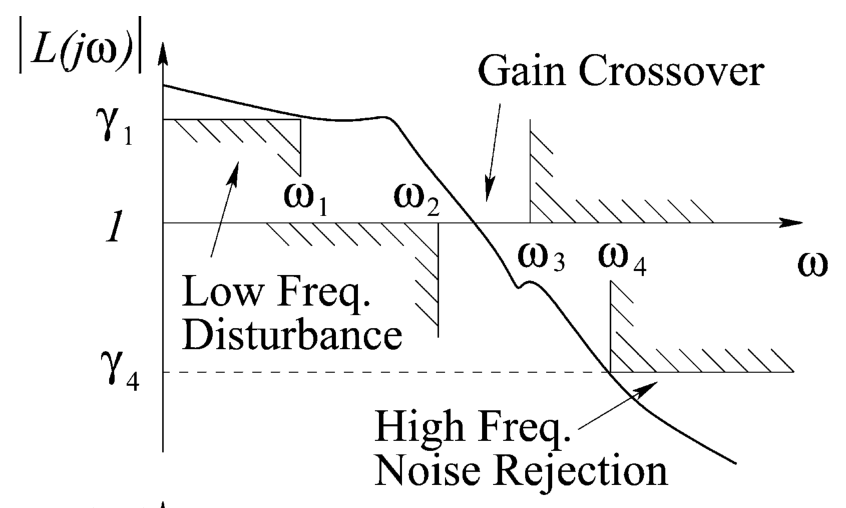
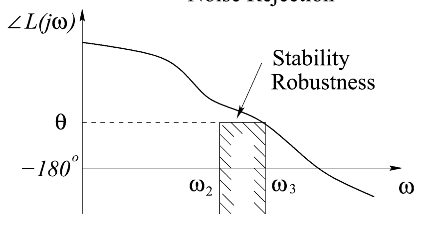

<!-- source_pdf_page: 628 -->
# Kalman Filters

Frederick E. Daum Raytheon Company, Woburn, MA, USA

#### Abstract

The Kalman filter is a very useful algorithm for linear Gaussian estimation problems. It is extremely popular and robust in practical applications. The algorithm is easy to code and test. There are many reasons for the popularity of the Kalman filter in the real world, including stability and generality and simplicity. Moreover, the realtime computational complexity is very reasonable for high-dimensional problems. In particular, the computational complexity scales as the cube of the dimension of the state vector.

## Keywords

Controllability; Discrete time measurements; Estimation algorithm; Extended Kalman filter; Filtering; Gaussian errors; Linear dynamical system; Linear system; Observability; Recursive; Smoothing; Stability

## Description of Kalman Filter

The Kalman filter is an algorithm that computes the best estimate of the state vector of a linear
dynamical system given discrete time measurements of a linear function of the state vector corrupted by additive white Gaussian noise. The Kalman filter also quantifies the uncertainty in its estimate of the state vector, using the covariance matrix of estimation errors. The detailed equations of the Kalman filter algorithm and the problem that it solves are given in Gelb et al. (1974), which is the most accessible but thorough book on Kalman filters. The linear dynamical system can be time varying, but its parameters must be known exactly. The measurements can be made at arbitrary (nonuniform) discrete times, but these times must be known exactly. Likewise, the covariance matrices of the measurement errors and the process noise can be arbitrary and time varying, but the numerical values of these covariance matrices must be known exactly. Also, the initial uncertainty in the state vector must be Gaussian and the mean and covariance matrix can be arbitrary, but these must be known exactly. There is a very powerful theory of Kalman filter stability due to Kalman (1963), which guarantees that the Kalman filter is stable under very mild technical assumptions which can always be satisfied in practice. In particular, the Kalman filter is stable for estimating the state vector of linear dynamical systems that are stable or unstable, for arbitrarily slow measurement rates, provided that the mild technical assumptions are fulfilled. These assumptions require that the dimension of the state vector is minimal and that the measurement error covariance matrix and the process noise covariance matrices are positive

<!-- source_pdf_page: 629 -->
definite, although weaker conditions are also sufficient for stability in some cases; see Kailath et al. (2000) for such details on the stability of the Kalman filter. Kalman filter stability is connected with observability and controllability of the input-output model of the relevant dynamical system in Kalman (1963) The corresponding algorithm for continuous time linear measurements (with Gaussian additive white noise) and continuous time linear dynamical systems (with Gaussian additive white process noise) is called the Kalman-Bucy filter; see Kalman (1961).

## Design Issues

In engineering practice, almost all real-world applications are nonlinear or non-Gaussian, and therefore, they do not fit the Kalman filter theory. Nevertheless, by approximating the nonlinear dynamics and measurements with linear equations, one can apply the Kalman filter theory; this is called the "extended Kalman filter" (EKF); see Gelb et al. (1974). The linearization of the nonlinear dynamics and measurements is made by computing the first-order Taylor series expansion and evaluating it at the estimated state vector; this is a very simple and fast approximation that is widely used in real- world applications, and it often gives good estimation accuracy, although there is no guarantee of that. Moreover, there is no guarantee that the EKF will be stable, even if the linearized system satisfies all the theoretical requirements for stability of the Kalman filter.

Even if the dynamics and measurements are exactly linear and if the measurement noise and process noise and initial uncertainty are all exactly Gaussian with exactly known means and covariance matrices, there can still be significant practical problems with Kalman filter accuracy, owing to ill-conditioning. In particular, the Kalman filter can be extremely sensitive to quantization errors in the computer arithmetic and storage. On the other hand, there are many different methods to try to mitigate illconditioning including (1) double or quadruple or octuple precision arithmetic, (2) making the covariance matrices symmetric before and after
every operation, (3) Tychonov regularization, (4) tuning the process noise covariance matrix, (5) coding the Kalman filter in principal coordinates or approximately principal coordinates (i.e., aligned with the eigenvectors of the state vector error covariance matrix), (6) sequential scalar measurement updates in a preferred order, and (7) various factorizations of the covariance matrices (e.g., square root, information matrix, information square root, upper triangular and lower triangular factorization, UDL, etc.). The classic book on error covariance matrix factorizations is by Bierman (2006). Unfortunately, there is no guarantee that the Kalman filter will work well even if all of these mitigation methods are used. Moreover, there is no useful theoretical analysis of this phenomenon, with the exception of a few not very tight upper bounds on the condition number. Plotting the numerical values of the condition number of the covariance matrix vs. time is often a helpful diagnostic. In certain real-world applications, the condition number of the Kalman filter error covariance matrix can be ten billion or larger.

## Why Is the Kalman Filter So Useful and Popular?

The Kalman filter has been enormously successful in real-world applications, and it is interesting to reflect on why it has been so useful and so popular. In particular, Kalman himself believes that his filter was successful because it was based on probability rather than statistics; see Kalman (1978). For example, the error covariance matrix for the Kalman filter is computed from the assumed dynamics and measurement model and the assumed values of the initial state uncertainty and process noise and measurement noise covariance matrices, rather than by computing sample covariance matrices. Likewise, the Kalman filter computes the estimated state vector from assumed Gaussian and linear probability models, rather than computing the sample mean, as would be done in statistics. There is substantial wisdom in Kalman's assertion, owing to the difficulty of estimating sample covariance matrices

<!-- source_pdf_page: 630 -->
and sample vectors that are sufficiently accurate, given a limited number of samples and illconditioning and high-dimensional state vectors. A second reason that Kalman filters are so popular is that the real-time computational complexity is very reasonable for modern digital computers, even for problems with a high-dimensional state vector. In particular, the computational complexity of the Kalman filter scales as the cube of the dimension of the state vector; for example, the modern GPS system uses a Kalman filter with a state vector of dimension of about 1,000 to jointly estimate the orbits of the satellites in the GPS constellation. In 1960, when Kalman's paper was first published, digital computers were starting to become fast enough at reasonable cost to multiply large matrices in real time, which is the most challenging computation in a Kalman filter. Today computers are roughly ten orders of magnitude faster per unit cost than in 1960, and hence, we can run Kalman filters for high-dimensional problems on very inexpensive computers that fit into your wristwatch. A third reason that Kalman filters are popular is that the algorithms are easy to understand and code and test. A fourth reason is the guaranteed stability of the Kalman filter under very mild conditions which can always be satisfied in practical applications. A fifth reason is that the Kalman filter is optimal for time-varying unstable linear dynamics with time-varying measurement noise covariance and process noise covariance. A sixth reason is that one can use Kalman filters for nonlinear problems by approximating the nonlinear dynamics and measurement equations with a first-order Taylor series; this is called the extended Kalman filter (EKF), which is without a doubt the most widely used algorithm in realworld estimation applications. A seventh reason is that the Kalman filter automatically provides a convenient quantification of uncertainty of the estimated state vector using the error covariance matrix. The final reason is that it is easy to test the accuracy of the Kalman filter by comparing the theoretical error covariance matrix to errors computed by Monte Carlo simulations of the filter; the two errors should agree approximately, and statistically significant discrepancies suggest
bugs in the code or ill-conditioning of the error covariance matrices or nonlinearities or errors in modeling the dynamics or measurements.

Kalman's 1960 paper represented a big paradigm shift in two ways: (1) it exploited fast low-cost modern digital computers, whereas the literature up to that time did not, and (2) it used time domain methods rather than the ubiquitous Fourier transform methods, which limited the dynamics to steady state asymptotic in time, which in turn limited the theory to cover stable dynamics. Of course today we take both of these big points as normal engineering rather than revolutionary and surprising. The state of the art prior to Kalman's 1960 paper was the Wiener filter, which was based firmly on the Fourier transform. The Wiener filter required very lengthy and cumbersome algebraic spectral factorization with complex variables, resulting in erroneous formulas published in certain books, owing to algebraic errors which were not obvious and which could not be checked by computers, owing to the nonexistence of computer algebra software (e.g., MATHEMATICA) in 1960. Kalman explains many other problems with the Wiener filter in Kalman (2003).

## Summary and Future Directions

To a large extent the Kalman filter theory is complete. There is a simple and useful theory of stability of the Kalman filter, which is completely lacking for nonlinear filters including the extended Kalman filter (EKF) and particle filters. Moreover, there are many robust versions of the Kalman filter that have been invented to mitigate ill-conditioning of the covariance matrix as well as uncertainty in system models and system parameters. However, there remain many important design issues that need to be addressed for practical applications; see Daum (2005) for details. The most obvious issues include nonlinear measurements, nonlinear plant models, robustness to uncertainty in measurement models and plant models, non-Gaussian measurement noise and plant noise, non-Gaussian initial uncertainty in the state vector, and ill-conditioning

<!-- source_pdf_page: 631 -->
of the error covariance matrix. That is, any deviation from the exact mathematical assumptions in the Kalman filter theory can cause problems in practice. It is the job of engineers to mitigate such problems and design filters that are robust to such perturbations. Kalman's recent papers on how the Kalman filter was invented and why it is so popular contain interesting and useful ideas; see Kalman (1978) and Kalman (2003).

## Cross-References

- Estimation, Survey on
- Extended Kalman Filters
- Nonlinear Filters

## Bibliography

Bierman $G$ (2006) Factorization methods for discrete sequential estimation. Dover, Mineola
Daum F (2005) Nonlinear filters: beyond the Kalman filter. IEEE AES Mag 20:57-69
Gelb A et al (1974) Applied optimal estimation. MIT, Cambridge
Kailath T (1974) A view of three decades of linear filtering theory. IEEE Trans Inf Theory 20:146-181
Kailath T, Sayed A, Hassibi B (2000) Linear estimation. Prentice Hall, Upper Saddle River
Kalman R (1960) A new approach to linear filtering and prediction problems. Trans ASME J 82:35-45
Kalman R (1961) New methods in Wiener filtering theory. RIAS technical report 61-1 (Feb 1961); also published in Bogdanoff J, Kozin F (eds) (1963) Proceedings of first symposium on engineering applications of random function theory and probability. Wiley, pp 270388
Kalman R (1978) A retrospective after twenty years: from the pure to the applied. In: Applications of the Kalman filter to hydrology, edited by Chao-lin Chiu, University of Pittsburgh, LC card number 78-069752, available on-line. pp 31-54
Kalman R (2003) Discovery and invention: the Newtonian revolution in systems technology. AIAA J Guid Control Dyn 26(6):833-837
Kalman R, Bucy R (1961) New results in linear filtering and prediction theory. Trans ASME 83: 95-107
Sorenson H (1970) Least squares estimation from Gauss to Kalman. IEEE Spectr 7:63-68
Stepanov OA (2011) Kalman filtering: past and present. J Gyroscopy Navig 2:99-110

## KYP Lemma and Generalizations/Applications

Tetsuya Iwasaki Department of Mechanical \& Aerospace Engineering, University of California, Los Angeles, CA, USA

#### Abstract

Various properties of dynamical systems can be characterized in terms of inequality conditions on their frequency responses. The Kalman-Yakubovich-Popov (KYP) lemma shows equivalence of such frequency domain inequality (FDI) and a linear matrix inequality (LMI). The fundamental result has been a basis for robust and optimal control theories in the past several decades. The KYP lemma has recently been generalized to the case where an FDI on a possibly improper transfer function is required to hold in a (semi)finite frequency range. The generalized KYP lemma allows us to directly deal with practical situations where design parameters are sought to satisfy FDIs in multiple (semi)finite frequency ranges. Various design problems, including FIR filter and PID controller, reduce to LMI problems which can be solved via semidefinite programming.

## Keywords

Bounded real; Frequency domain inequality; Linear matrix inequality; Multi-objective design; Optimal control; Positive real; Robust control

## Introduction

In linear systems analysis and control design, dynamical properties are often characterized by frequency responses. The shape of a frequency response, as visualized by the Bode or Nyquist plot, is closely related to various performance measures including the

<!-- source_pdf_page: 632 -->
steady state error, fast and smooth transient, and robustness against unmodeled dynamics. Hence, desired system properties can be formalized in terms of a set of frequency domain inequalities (FDIs) on selected transfer functions. The analysis and design problems then reduce to verification and satisfaction of the FDIs.

The Kalman-Yakubovich-Popov (KYP) lemma (Anderson 1967; Kalman 1963; Rantzer 1996; Willems 1971) establishes the equivalence between an FDI and a linear matrix inequality (LMI). The LMI is defined by state space matrices of the transfer function in the FDI so that the FDI holds true if and only if the LMI admits a solution. The LMI characterization of an FDI is useful since it replaces the process of checking the FDI at infinitely many frequency points by the search for a symmetric matrix satisfying a finite dimensional convex constraint defined by the LMI. In addition to exact and tractable computations, benefits of the LMI conditions include analytical understanding of robust and optimal controls through spectral factorizations and storage/Lyapunov functions. The KYP lemma is a fundamental result in the systems and control field that has provided, in the past half century, a theoretical basis for developments of various tools for system analysis and design.

A drawback of the KYP lemma is its inability to characterize an FDI in a finite frequency range. Feedback control designs typically involve a set of specifications given in terms of multiple FDIs in various frequency ranges. However, the KYP lemma is not capable of treating such FDIs directly since it has to consider the entire frequency range. To address this deficiency, the KYP lemma has recently been generalized to characterize an FDI in a finite frequency range exactly (Iwasaki et al. 2000). Further generalizations (Iwasaki and Hara 2005) are available for FDIs within various frequency ranges for both continuous- and discrete-time, possibly improper, rational transfer functions. The generalized KYP lemma allows for direct multiobjective design of filters, controllers, and dynamical systems.

## KYP Lemma

The KYP lemma may be motivated from various aspects, but let us explain it as an extension of a gain condition. Consider a stable linear system

$$
\dot{x}=A x+B u, \quad G(s):=(s I-A)^{-1} B,
$$

where $x(t) \in \mathbb{R}^{n}$ is the state, $u(t) \in \mathbb{R}^{m}$ is the input, and $G(s)$ is the transfer function from $u$ to $x$. If $u$ is a disturbance to the system and $x$ represents the error from a desired operating point, we may be interested in how large the state variables can become for a given magnitude of the disturbance. The gain $\|G(j \omega)\|$ captures this property for the case of a sinusoidal disturbance at frequency $\omega$, where $\|\cdot\|$ denotes the spectral norm (= absolute value for a scalar). If $\|G(j \omega)\|<\gamma$ holds for all frequency $\omega$ with a small $\gamma$, then the system has a good disturbance attenuation property.

A version of the KYP lemma states that the FDI $\|G(j \omega)\|<\gamma$ with $\gamma=1$ holds for all frequency $\omega$ if and only if there exists a symmetric matrix $P$ satisfying the LMI:

$$
\left[\begin{array}{cc}
P A+A^{\top} P+I & P B \\
B^{\top} P & -I
\end{array}\right]<0 .
$$

Thus, existence of one particular $P$ satisfying the LMI is enough to conclude that the gain is less than one for all, infinitely many, frequencies. This result is known as the bounded real lemma and has played a fundamental role in the robust and $H_{\infty}$ control theories.

The KYP lemma can be introduced as a generalization of the bounded real lemma. First, note that the gain bound condition $\|G(j \omega)\|<1$ and the LMI condition can equivalently be written as

$$
\begin{align*}
& {\left[\begin{array}{c}
G(j \omega) \\
I
\end{array}\right]^{*} \Theta\left[\begin{array}{c}
G(j \omega) \\
I
\end{array}\right]<0}  \tag{1}\\
& {\left[\begin{array}{cc}
P A+A^{\top} P & P B \\
B^{\top} P & 0
\end{array}\right]+\Theta<0} \tag{2}
\end{align*}
$$

where

$$
\Theta:=\left[\begin{array}{rr}
I & 0 \\
0 & -I
\end{array}\right]
$$

<!-- source_pdf_page: 633 -->
In these equations, the particular matrix $\Theta$ is chosen to describe the gain bound condition as a special case of the quadratic form (1), and we observe that $\Theta$ appears in the LMI as in (2). It turns out that the equivalence of (1) and (2) holds not only for this particular $\Theta$ but also for an arbitrary symmetric matrix $\Theta$. This result is called the KYP lemma, which states that, given arbitrary matrices $A, B$, and $\Theta=\Theta^{\top}$, the FDI (1) holds for all frequency $\omega$ if and only if there exists a matrix $P=P^{\top}$ satisfying the LMI (2), provided $A$ has no eigenvalues on the imaginary axis.

The FDI in (1) can be specialized to an FDI

$$
\left[\begin{array}{c}
L(j \omega)  \tag{3}\\
I
\end{array}\right]^{*} \Pi\left[\begin{array}{c}
L(j \omega) \\
I
\end{array}\right]<0 .
$$

on transfer function

$$
L(s):=C(s I-A)^{-1} B+D
$$

by choosing

$$
\Theta:=\left[\begin{array}{cc}
C & D  \tag{4}\\
0 & I
\end{array}\right]^{\top} \Pi\left[\begin{array}{cc}
C & D \\
0 & I
\end{array}\right]
$$

The choice of matrix $\Pi$ allows for characterizations of important system properties involving gain and phase of $L(s)$. For instance, the FDI (3) with

$$
\Pi:=\left[\begin{array}{rr}
0 & -I \\
-I & 0
\end{array}\right]
$$

gives $L(j \omega)+L(j \omega)^{*}>0$. This is called the positive real property, with which the phase angle remains between $\pm 90^{\circ}$ when $L(j \omega)$ is a scalar.

## Generalization

The standard KYP lemma deals with FDIs that are required to hold for all frequencies. To allow for more flexibility in practical system designs, the KYP lemma has been generalized to deal with FDIs in (semi)finite frequency ranges.

For instance, a version of the generalized KYP lemma states that the FDI (1) holds in the low frequency range $|\omega| \leq \varpi_{\ell}$ if and only if there exist matrices $P=P^{\top}$ and $Q=Q^{\top}>0$ satisfying

$$
\left[\begin{array}{cc}
A & B  \tag{5}\\
I & 0
\end{array}\right]^{\top}\left[\begin{array}{cc}
-Q & P \\
P & \varpi_{\ell}^{2} Q
\end{array}\right]\left[\begin{array}{cc}
A & B \\
I & 0
\end{array}\right]+\Theta<0,
$$

provided $A$ has no imaginary eigenvalues in the frequency range. In the limiting case where $\varpi_{\ell}$ approaches infinity and the FDI is required to hold for the entire frequency range, the solution $Q$ to (5) approaches zero, and we recover (2).

The role of the additional parameter $Q$ is to enforce the FDI only in the low frequency range. To see this, consider the case where the system is stable and a sinusoidal input $u=\Re\left[\hat{u} e^{j \omega t}\right]$, with (complex) phasor vector $\hat{u}$, is applied. The state converges to the sinusoid $x=\Re\left[\hat{x} e^{j \omega t}\right]$ in the steady state where $\hat{x}:=G(j \omega) \hat{u}$. Multiplying (5) by the column vector obtained by stacking $\hat{x}$ and $\hat{u}$ in a column from the right, and by its complex conjugate transpose from the left, we obtain

$$
\left(\varpi_{\ell}^{2}-\omega^{2}\right) \hat{x}^{*} Q \hat{x}+\left[\begin{array}{l}
\hat{x} \\
\hat{u}
\end{array}\right]^{*} \Theta\left[\begin{array}{l}
\hat{x} \\
\hat{u}
\end{array}\right]<0
$$

In the low frequency range $|\omega| \leq \varpi_{\ell}$, the first term is nonnegative, enforcing the second term to be negative, which is exactly the FDI in (1). If $\omega$ is outside of the range, however, the first term is negative, and the FDI is not required to hold.

Similar results hold for various frequency ranges. The term involving $Q$ in (5) can be expressed as the Kronecker product $\Psi \otimes Q$ with $\Psi$ being a diagonal matrix with entries $\left(-1, \varpi_{\ell}^{2}\right)$. The matrix $\Psi$ arises from characterization of the low frequency range:

$$
\left[\begin{array}{c}
j \omega \\
1
\end{array}\right]^{*} \Psi\left[\begin{array}{c}
j \omega \\
1
\end{array}\right]=\varpi_{\ell}^{2}-\omega^{2} \geq 0
$$

By different choices of $\Psi$, middle and high frequency ranges can also be characterized:

<!-- source_pdf_page: 634 -->
|  | Low | Middle | High |
| :--- | :--- | :--- | :--- |
| $\boldsymbol{\Omega}$ | $\|\omega\| \leq \varpi_{\ell}$ | $\varpi_{1} \leq \omega \leq \varpi_{2}$ | $\|\omega\|$ |
|  |  |  | $\geq$ |
| $\Psi$ | $\left[\begin{array}{cr}-1 & 0 \\ 0 & \varpi_{\ell}^{2}\end{array}\right]$ | $\left[\begin{array}{cc}-1 & j \varpi_{c} \\ -j \varpi_{c} & -\varpi_{1} \varpi_{2}\end{array}\right]$ | $\left[\begin{array}{cc}1 & 0 \\ 0 & -\varpi_{h}^{2}\end{array}\right]$ |

where $\varpi_{c}:=\left(\varpi_{1}+\varpi_{2}\right) / 2$ and $\boldsymbol{\Omega}$ is the frequency range. For each pair ( $\boldsymbol{\Omega}, \Psi$ ), the FDI (1) holds in the frequency range $\omega \in \boldsymbol{\Omega}$ if and only if there exist real symmetric matrices $P$ and $Q>0$ satisfying

$$
\begin{equation*}
F^{\top}(\Phi \otimes P+\Psi \otimes Q) F+\Theta<0 \tag{6}
\end{equation*}
$$

provided $A$ has no eigenvalues in $\boldsymbol{\Omega}$, where

$$
\Phi:=\left[\begin{array}{ll}
0 & 1 \\
1 & 0
\end{array}\right], \quad F:=\left[\begin{array}{cc}
A & B \\
I & 0
\end{array}\right] .
$$

Further generalizations are available Iwasaki and Hara (2005). The discrete-time case (frequency variable on the unit circle) can be similarly treated by a different choice of $\Phi$. FDIs for descriptor systems and polynomial (rather than rational) functions can also be characterized in a form similar to (6) by modifying the matrix $F$. More specifically, the choices

$$
\Phi:=\left[\begin{array}{cc}
-1 & 0 \\
0 & 1
\end{array}\right], \quad F:=\left[\begin{array}{ll}
A & B \\
E & O
\end{array}\right]
$$

give the result for the discrete-time transfer function $L(z)=(z E-A)^{-1}(B-z O)$.

## Applications

The generalized KYP lemma is useful for a variety of dynamical system designs. As an example, let us consider a classical feedback control design via shaping of a scalar open-loop transfer function in the frequency domain. The objective is to design a controller $K(s)$ for a given plant $P(s)$ such that the closed-loop system is stable and possesses a good performance dictated by reference tracking, disturbance attenuation, noise sensitivity, and robustness against uncertainties.

> Image description: This technical diagram, captioned "Fig. 1 Loop shaping design specifications," depicts a phase plot used in control engineering. The vertical axis represents the phase of the loop transfer function, labeled $\angle L(j\omega)$, with marked values at $\theta$ and $-180^\circ$. The horizontal axis represents the angular frequency, $\omega$. A continuous downward-sloping curve represents the phase response. A rectangular shaded region is defined on the frequency axis between $\omega_2$ and $\omega_3$, and on the phase axis between $-180^\circ$ and $\theta$. An arrow points from the text "Stability Robustness" toward the upper boundary of this shaded rectangle, indicating that the phase response curve must remain above the value $\theta$ within the frequency range $[\omega_2, \omega_3]$ to satisfy stability robustness design specifications. The plot illustrates the relationship between phase margin and frequency bounds in loop shaping.

KYP Lemma and Generalizations/Applications, Fig. 1 Loop shaping design specifications

Typical design specifications are given in terms of bounds on the gain and phase of the open-loop transfer function $L(s):=P(s) K(s)$ in various frequency ranges as shown in Fig. 1. The controller $K(s)$ should be designed so that the frequency response $L(j \omega)$ avoids the shaded regions. For instance, the gain should satisfy $|L(j \omega)| \geq 1$ for $|\omega|<\omega_{2}$ and $|L(j \omega)| \leq 1$ for $|\omega|>\omega_{3}$ to ensure the gain crossover occurs in the range $\omega_{2} \leq \omega \leq \omega_{3}$, and the phase bound $\angle L(j \omega) \geq \theta$ in this range ensures robust stability by the phase margin.

The design specifications can be expressed as FDIs of the form (3), where a particular gain or phase condition can be specified by setting $\Pi$ as
$\pm\left[\begin{array}{cc}1 & 0 \\ 0 & -\gamma^{2}\end{array}\right] \quad$ or $\quad\left[\begin{array}{cc}0 & j-\tan \theta \\ -j-\tan \theta & 0\end{array}\right]$
with $\gamma=\gamma_{1}, \gamma_{4}$, or 1 , and the $+/-$ signs for upper/lower gain bounds. These FDIs in the corresponding frequency ranges can be converted to inequalities of the form (6) with $\Theta$ given by (4).

The control problem is now reduced to the search for design parameters satisfying the set of

<!-- source_pdf_page: 635 -->
inequality conditions (6). In general, both coefficient matrices $F$ and $\Theta$ may depend on the design parameters, but if the poles of the controller are fixed (as in the PID control), then the design parameters will appear only in $\Theta$. If in addition an FDI specifies a convex region for $L(j \omega)$ on the complex plane, then the corresponding inequality (6) gives a convex constraint on $P, Q$, and the design parameters. This is the case for specifications of gain upper bound (disk: $|L|<\gamma$ ) and phase bound (half plane: $\theta \leq L L \leq \theta+\pi$ ). A gain lower bound $|L|>\gamma$ is not convex but can often be approximated by a half plane. The design parameters satisfying the specifications can then be computed via convex programming.

Various design problems other than the openloop shaping can also be solved in a similar manner, including finite impulse response (FIR) digital filter design with gain and phase constraints in a passband and stop-band and sensor or actuator placement for mechanical control systems (Hara et al. 2006; Iwasaki et al. 2003). Control design with the Youla parametrization also falls within the framework if a basis expansion is used for the Youla parameter and the coefficients are sought to satisfy convex constraints on closed-loop transfer functions.

## Summary and Further Directions

The KYP lemma has played a fundamental role in systems and control theories, equivalently converting an FDI to an LMI. Dynamical systems properties characterized in the frequency domain are expressed in terms of state space matrices without involving the frequency variable. The resulting LMI condition has been found useful for developing robust and optimal control theories.

A recent generalization of the KYP lemma characterizes an FDI for a possibly improper rational function in a (semi)finite frequency range. The result allows for direct solutions of practical design problems to satisfy multiple specifications in various frequency ranges. A design problem is essentially solvable when transfer functions are affine in the design parameters and are required
to satisfy convex FDI constraints. An important problem, which falls outside of this framework and remains open, is the design of feedback controllers to satisfy multiple FDIs on closed-loop transfer functions in various frequency ranges. There have been some attempts to address this problem, but none of them has so far succeeded to give an exact solution.

The KYP lemma has been extended in other directions as well, including FDIs with frequency-dependent weights (Graham and de Oliveira 2010), internally positive systems (Tanaka and Langbort 2011), full rank polynomials (Ebihara et al. 2008), real multipliers (Pipeleers and Vandenberghe 2011), a more general class of FDIs (Gusev 2009), multidimensional systems (Bachelier et al. 2008), negative imaginary systems (Xiong et al. 2012), symmetric formulations for robust stability analysis (Tanaka and Langbort 2013), and multiple frequency intervals (Pipeleers et al. 2013). Extensions of the KYP lemma and related S-procedures are thoroughly reviewed in Gusev and Likhtarnikov (2006). A comprehensive tutorial of robust LMI relaxations is provided in Scherer (2006) where variations of the KYP lemma, including the generalized KYP lemma as a special case, are discussed in detail.

## Cross-References

- Classical Frequency-Domain Design Methods
- H-Infinity Control
- LMI Approach to Robust Control

## Bibliography

Anderson B (1967) A system theory criterion for positive real matrices. SIAM J Control 5(2): 171-182
Bachelier O, Paszke W, Mehdi D (2008) On the Kalman-Yakubovich-Popov lemma and the multidimensional models. Multidimens Syst Signal Proc 19(3-4):425447
Ebihara Y, Maeda K, Hagiwara T (2008) Generalized S-procedure for inequality conditions on one-vectorlossless sets and linear system analysis. SIAM J Control Optim 47(3):1547-1555

<!-- source_pdf_page: 636 -->
Graham M, de Oliveira M (2010) Linear matrix inequality tests for frequency domain inequalities with affine multipliers. Automatica 46:897-901
Gusev S (2009) Kalman-Yakubovich-Popov lemma for matrix frequency domain inequality. Syst Control Lett 58(7):469-473
Gusev S, Likhtarnikov A (2006) Kalman-YakubovichPopov lemma and the S-procedure: a historical essay. Autom Remote Control 67(11):1768-1810
Hara S, Iwasaki T, Shiokata D (2006) Robust PID control using generalized KYP synthesis. IEEE Control Syst Mag 26(1):80-91
Iwasaki T, Hara S (2005) Generalized KYP lemma: unified frequency domain inequalities with design applications. IEEE Trans Autom Control 50(1):41-59
Iwasaki T, Meinsma G, Fu M (2000) Generalized $S$ procedure and finite frequency KYP lemma. Math Probl Eng 6:305-320
Iwasaki T, Hara S, Yamauchi H (2003) Dynamical system design from a control perspective: finite frequency positive-realness approach. IEEE Trans Autom Control 48(8):1337-1354
Kalman R (1963) Lyapunov functions for the problem of Lur'e in automatic control. Proc Natl Acad Sci 49(2):201-205

Pipeleers G, Vandenberghe L (2011) Generalized KYP lemma with real data. IEEE Trans Autom Control 56(12):2940-2944
Pipeleers G, Iwasaki T, Hara S (2013) Generalizing the KYP lemma to the union of intervals. In: Proceedings of European control conference, Zurich, pp 3913-3918
Rantzer A (1996) On the Kalman-Yakubovich-Popov lemma. Syst Control Lett 28(1):7-10
Scherer C (2006) LMI relaxations in robust control. Eur J Control 12(1):3-29
Tanaka T, Langbort C (2011) The bounded real lemma for internally positive systems and H-infinity structured static state feedback. IEEE Trans Autom Control 56(9):2218-2223
Tanaka T, Langbort C (2013) Symmetric formulation of the S-procedure, Kalman-Yakubovich-Popov lemma and their exact losslessness conditions. IEEE Trans Autom Control 58(6): 1486-1496
Willems J (1971) Least squares stationary optimal control and the algebraic Riccati equation. IEEE Trans Autom Control 16:621-634
Xiong J, Petersen I, Lanzon A (2012) Finite frequency negative imaginary systems. IEEE Trans Autom Control 57(11):2917-2922
