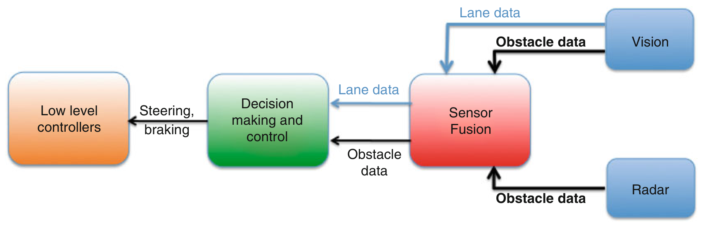
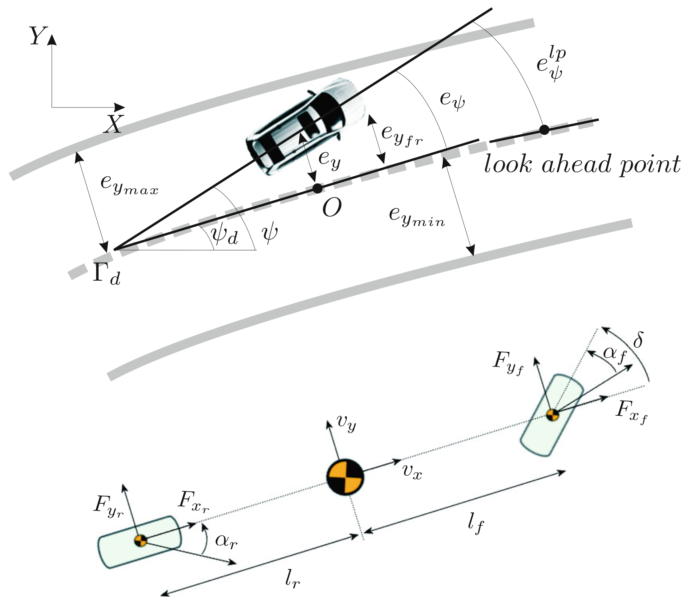
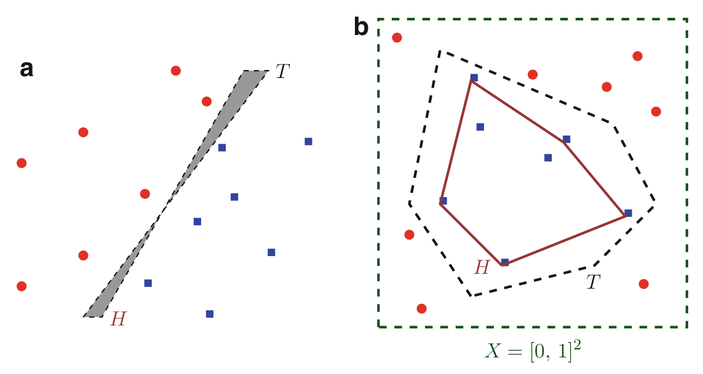
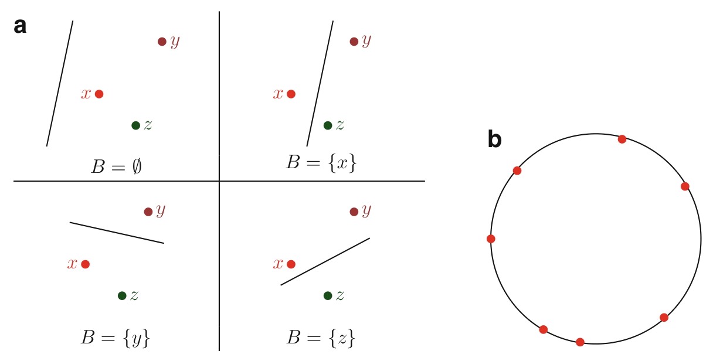
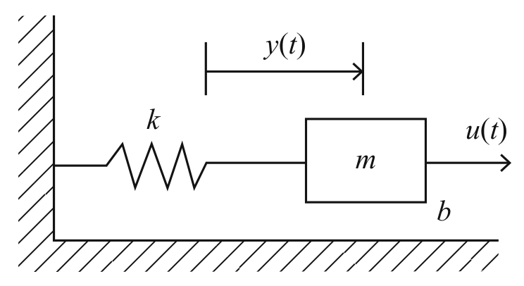
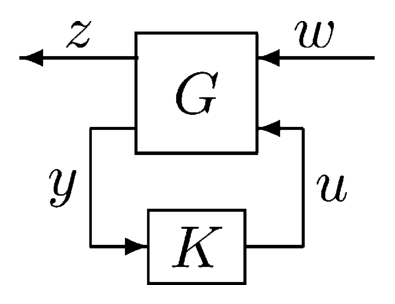
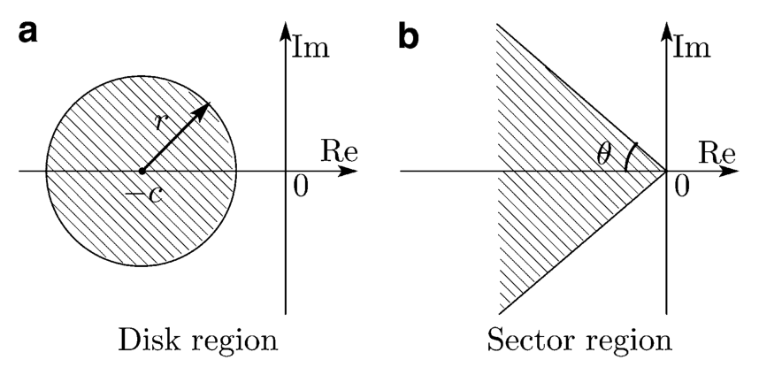
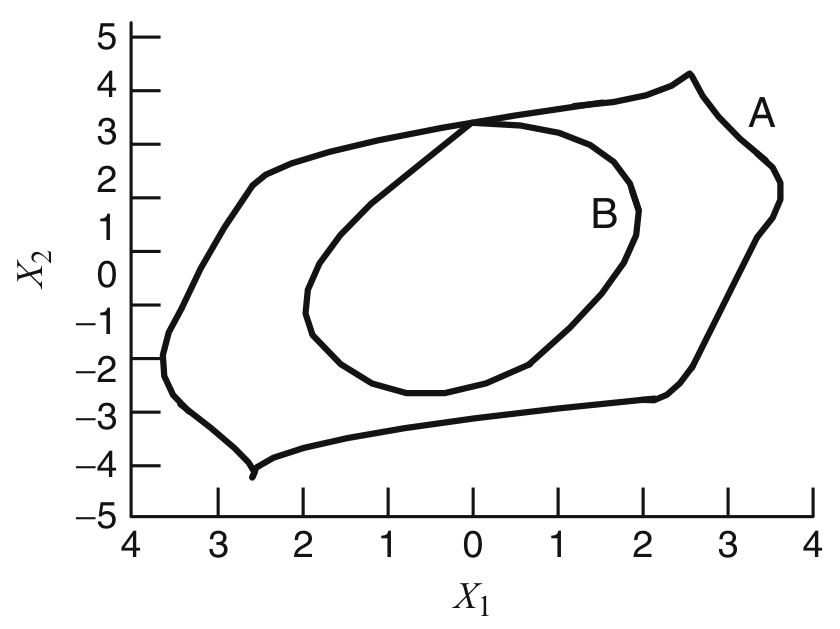

<!-- source_pdf_page: 637 -->
## L

## Lane Keeping

Paolo Falcone Department of Signals and Systems, Mechatronics Group, Chalmers University of Technology, Göteborg, Sweden

#### Abstract

This chapter provides an overview of lane keeping systems. First, a general architecture is introduced and existing solutions for the necessary sensors and actuators are then overviewed. The threat assessment and the lane position control problems are discussed, highlighting challenges and solutions implemented in lane keeping systems available on the market.

## Keywords

Active safety; Decision-making and control; Intelligent transportation systems; Threat assessment

## Introduction

Lane keeping systems are vehicle guidance systems that aim at preventing lane departure maneuvers, which may lead to accidents, i.e., collision with surrounding obstacles and vehicles.

By resorting to radar and/or lasers and cameras, a lane keeping system monitors the adjacent lanes. Crossing the lane markings in the absence of vehicles and/or obstacles in the adjacent lanes should not cause any reaction of the lane keeping systems and let the driver freely perform the lane change maneuver. In the presence of vehicles or obstacles in the adjacent lanes, the system should assess the threat and, in case a risk of collision is detected, either warn the driver or automatically issue either a steering or a single-wheel braking command, in order to prevent the crossing of the lane markings. As discussed next, despite the simplicity of the threat assessment and the decision-making and control problem, challenges arise in real traffic scenarios which may lead to nuisance due to unnecessary warnings and/or assisting interventions.

In this entry, we overview the most important aspects in the design of a lane keeping system. This entry is structured as follows. Section "Lane Keeping Systems Architecture" illustrates a generic architecture. Section "Sensing and Actuation" reviews the most used sensors suitable for lane keeping applications. Section "Decision Making and Control" introduces the threat assessment and the lane position control problems, highlighting the most relevant challenges.

## Lane Keeping Systems Architecture

The main components of a lane keeping system and their interconnections are shown in Fig. 1.

<!-- source_pdf_page: 638 -->

> Image description: A flowchart titled "Lane Keeping, Fig. 1 The lane keeping architecture" illustrates a functional block diagram for an autonomous driving system. The architecture consists of five sequential stages represented by rounded rectangular blocks. On the right, two input sensors, "Vision" and "Radar," provide data. The "Vision" block sends "Lane data" and "Obstacle data" to the "Sensor Fusion" block. The "Radar" block sends "Obstacle data" to the "Sensor Fusion" block. The "Sensor Fusion" block processes these inputs and sends "Lane data" and "Obstacle data" to the "Decision making and control" block. This central block then sends commands for "Steering, braking" to the final "Low level controllers" block on the far left. The diagram demonstrates a linear data processing pipeline from perception (sensors) to fusion, planning (decision making), and finally to actuation (controllers).
Lane Keeping, Fig. 1 The lane keeping architecture

Relative positions and velocities of the host vehicle w.r.t. the surrounding environment are measured by one radar, typically installed on the front of the vehicle, and possibly by the camera, typically installed on the windshield. Position of the host vehicle within the lane and further information, e.g., road geometry, are measured by the camera. These measurements are then fused by the sensor fusion module to provide accurate measurements of the position and velocity of the vehicle w.r.t. the surrounding environment and the lane in the widest range of operating conditions and scenarios.

The task of the decision-making and control module is to assess the risk that the vehicle crosses the lane in a dangerous way and, possibly, to take an action that can range from warning the driver or issuing an assisting intervention, e.g., braking and/or steering. Such steering and braking commands are actually implemented by low-level controllers.

The different modules will be overviewed in the following sections.

## Sensing and Actuation

## Radar

Radars for automotive applications are placed in the front of the car, typically behind the grille. The radar emits radio waves and distance from the vehicle ahead is calculated by measuring the arrival time and direction of the reflected radio waves. The relative velocity is determined by
relying on the Doppler effect, i.e., by measuring the frequency change of the reflected waves. Relative distance and velocity measurements are typically updated with a frequency of 10 Hz .

Radars for automotive applications emit waves with a frequency of 77 GHz and detect objects within an approximate range of 150 m and a view angle of about $\pm 10^{\circ}$, with a deviation of $20-30 \mathrm{~cm}$ from the correct value for $95 \%$ of the measurements (Eidehall 2004). New radar systems increase the range up to about 200 m with a view angle of about $\pm 10^{\circ}$ (News Releases DENSO Corporation 2013a).

Typically, radar units are equipped with computer systems running signal processing algorithms that detect and track objects and, for each of them, calculate relative position and speed, azimuth angle, also providing additional information, e.g., the time an object has been tracked and a flag indicating that a target has been locked. Such additional information are typically used in logics implementing the decision-making algorithms of, among others, the lane keeping system.

There are several issues arising from the use of a radar in automotive applications, e.g., wave reflections due to road bumps and barriers that may induce the signal processing algorithms to false object detections (Eidehall 2004). Moreover, interference and the vehicle dynamics (News Releases DENSO Corporation 2013a), e.g., pitching due to braking, may limit the capability of the signal processing algorithms of correctly detecting and tracking the surrounding objects. The latter may be solved by, e.g., using electric motors that

<!-- source_pdf_page: 639 -->
adjust the radar antenna axes in order to compensate for the vehicle dynamics (News Releases DENSO Corporation 2013a).

## Vision Systems

Vision systems in lane keeping applications are typically based on a single, CCD camera mounted next to the rear-view mirror placed at the center of the windshield. The image is typically captured by $640 \times 480$ pixels and then processed by an image processing unit. The sampling time of the vision system is about 0.1 s , but it can change depending on, e.g., the complexity of the scene, for example, in city traffic (Eidehall 2004).

Lane markings are detected by using differences in the image contrast (Technology Daimler and Safety Innovation 2013). The camera can be either monochrome or full colored. The latter is used to enhance the detection of lane markings, which have different colors around the world (News Releases DENSO Corporation 2013b). Distances to the lane markings and road geometry parameters, like heading angle and curvature, are determined by the image processing algorithms, which must be robust to poor image due to bad weather conditions or worn lane markings. Estimation of road geometry parameters, like curvature measurement, can be a challenging problem (Lundquist and Schön 2011), especially during rain or fog (Eidehall 2004).

Depending on the image processing algorithms the cameras are equipped with, surrounding objects can also be detected and tracked. In particular, pattern recognition algorithm can be used to find objects in the images and classify them into cars, trucks, motorcycles, and pedestrians. Vehicles (or other objects) can be typically detected in a range of about $60-70 \mathrm{~m}$, with lower accuracy than a radar (Eidehall 2004).

## Actuators

In order to keep the vehicle within its lane, the most convenient actuator is the steering. Hence, a lane keeping system can be quite easily built in those vehicles equipped with electric powerassisted steering (EPAS) systems. In particular, an additional steering torque can be added by the

EPAS to the driver's steering torque, in order to generate the desired yaw moment calculated by the decision-making and control module.

Clearly, the steering command is not the only available to affect the vehicle yaw motion, thus changing its orientation and lateral position within the lane. Individual wheel braking may also be used (Technology Daimler and Safety Innovation 2013). In particular, in vehicles equipped with yaw motion control system via individual braking, a braking torque request for each wheel can be sent to the yaw motion control system in order to generate the desired yaw motion.

## Decision Making and Control

The decision making and control in a lane keeping problem can be conceptually divided into two tasks: the threat assessment and the lane position control. The threat assessment problem can be stated as the problem of detecting the risk of accident due to an unintended lane departure, for a given situation of the surrounding environment (i.e., surrounding vehicles and obstacles). The lane position control problem is the problem of controlling the vehicle yaw and lateral motion in order to stay within the lane. The lane position control is activated once the threat assessment detects the risk of accident.

We point out that the border between the corresponding modules executing these two tasks may be blurred for different existing commercial lane keeping systems. That is, the two problems may not be solved by two separate modules, but rather seen and solved as a single problem. Moreover, the following presentation of the threat assessment and the lane position control problems and approaches abstracts from the implementation of a particular lane keeping system available on the market, rather focusing on fundamental concepts.

## Threat Assessment

The core information in a threat assessment algorithm for lane keeping applications is given by a measure called time to lane crossing (TLC). This is the predicted time when a front tire intersects a

<!-- source_pdf_page: 640 -->
lane boundary. As explained in van Winsum et al. (2000), the TLC can be calculated in different ways. Next, its simplest expression is reported as (Eidehall 2004)

$$
\begin{equation*}
\mathrm{TLC}=\frac{W / 2-W_{\mathrm{veh}} / 2-y_{\mathrm{off}}}{\dot{y}_{\mathrm{off}}} \tag{1}
\end{equation*}
$$

where $W$ is the lane width, $y_{\text {off }}$ is the vehicle lateral position within the lane, and $W_{\text {veh }}$ is the vehicle width. Equation (1) can be easily modified to calculate the TLC w.r.t. any lane boundary relative to the adjacent lanes.

The simplest way of using the TLC is just monitoring it and triggering an action as the TLC passes a threshold. Nevertheless, depending on the vehicle manufacturer, more sophisticated logics can be developed in order to correctly interpret the driver's intention and minimize the unnecessary assisting interventions. Next, few scenarios follow that must be taken into account while developing such logics in order to not interfere with the driver. In particular, the threat assessment module should stop or not trigger any assisting intervention while the vehicle is approaching or crossing a lane boundary if

- The indicators are active,
- A risk of collision with the vehicle ahead is detected, such that the vehicle is crossing the lane markings as results of an evasive maneuver,
- The radar detects a slower vehicle ahead and the driver accelerates, since this may be an overtaking (Technology Daimler and Safety Innovation 2013),
- The driver's steering wheel torque indicates that the driver is acting against the system,
- The driver manually initiates a maneuver, driving the vehicle back to its lane (i.e., the driver executes "the right" maneuver)
- The vehicle enters a motor highway or a bend (Technology Daimler and Safety Innovation 2013).
Part of the threat assessment task is predicting the trajectories of the surrounding vehicles. For instance, if a threat vehicle is traveling in the adjacent lane (in the same or opposite direction), its position has to be predicted at the TLC in
order to decide whether to trigger an intervention, if a collision is predicted, or not (Eidehall 2004). This step is repeated for all the detected threat vehicles, provided that the onboard radar and the camera support multiple-target tracking.

In order to minimize the interference of the lane keeping system with the driver and/or to not let the system perform dangerous maneuvers, assisting interventions should not be triggered if the quality of the measurements is such that the information about the surrounding environment is poor. For instance, in case of low visibility that limits the detection of the lane markings and the estimation of the road geometry, the system should be temporarily deactivated or downgraded.

In summary, the threat assessment module has to be designed with the objective of detecting the risk of accident due to lane departure while not interfering with the driver with unnecessary interventions (i.e., nuisance minimization).

## Lane Position Control

As observed in section "Actuators," the vehicle motion within the lane can be affected in two ways, i.e., through steering and individual wheel braking. Clearly, a steering command can be issued by both the driver and the lane keeping system.

Before issuing a steering command, in order to minimize the system nuisance, the lane keeping system may issue other types of low-intrusiveness interventions. For instance, if a "low"-level threat is detected by the threat assessment module (i.e., a threat where the risk of accidents is not imminent), warnings or other stimuli to the driver may be issued in order to induce the driver to execute the right maneuver. For instance, based on, e.g., spectrum analysis of the driver's steering command, driver's inattention or drowsiness may be detected and a warning issued. As observed in Technology Daimler and Safety Innovation (2013), different types of warning can be used for different vehicle types. In passenger cars, in such cases, a vibration motor in the steering wheel may warn the driver. In trucks, audible, directional warning signals can be used to let the driver know

<!-- source_pdf_page: 641 -->

> Image description: This technical figure, titled "Lane Keeping, Fig. 2 Vehicle modeling notation," illustrates a two-part schematic representing vehicle dynamics and lane-following control. The top diagram shows a top-down view of a car navigating a curved lane. It defines errors relative to a target path $\Gamma_d$. Key variables include the lateral error $e_y$, heading error $e_\psi$, and the look-ahead point. The diagram uses a local coordinate system ($X, Y$) with origin $O$. Distance parameters include $e_{y_{max}}$, $e_{y_{min}}$, and $e_{y_{fr}}$ representing lateral offsets. The bottom diagram represents a kinematic or dynamic bicycle model. It depicts a vehicle center of mass with velocity components $v_x$ and $v_y$. The wheels are modeled as vectors with steering angle $\delta$, slip angles $\alpha_f$ and $\alpha_r$, and longitudinal/lateral tire forces ($F_{x_f}, F_{y_f}, F_{x_r}, F_{y_r}$). Geometrical dimensions $l_f$ and $l_r$ represent the distances from the center of mass to the front and rear axles, respectively.
Lane Keeping, Fig. 2 Vehicle modeling notation

that the vehicle trajectory needs to be adjusted. In buses, in order to avoid bothering the passengers, driver warning is issued through vibration motors placed in the driver's seat.

Other types of "soft intervention" aim at increasing the steering impedance in the direction leading to lane crossing that might cause a collision with surrounding vehicles. Generating the desired steering impedance can be easily formulated as a steering torque control problem. Nevertheless, tuning the control algorithm to obtain the desired steering feeling can be an involving and time-consuming procedure based on extensive invehicle testing.

Besides warnings and "soft interventions" aiming at inducing the driver to perform correct maneuvers, as part of the lane position control
task in a lane keeping system, a lateral control algorithm w.r.t. the lane boundaries is needed. Consider the vehicle sketched in Fig.2. The equations describing the vehicle motion within the lane can be compactly written in a state-space form as

$$
\begin{equation*}
\dot{x}=A x+B \delta+D \dot{\psi}_{\mathrm{des}} \tag{2}
\end{equation*}
$$

where $x=\left[e_{y} \dot{e}_{y} e_{\psi} \dot{e}_{\psi}\right], \dot{\psi}_{d}$ is the desired yaw rate, e.g., calculated based on the road curvature, and $A, B, D$ are speed-dependent matrices that can be found in Rajamani (2003). The (unstable) system can be stabilized by a state-feedback control law

$$
\begin{equation*}
\delta=-K x+\delta_{f f}, \tag{3}
\end{equation*}
$$

<!-- source_pdf_page: 642 -->
where $K$ is a stabilizing static gain and $\delta_{f f}$ is a feedforward term that can be used to compensate for the road curvature. In Rajamani (2003), it is shown that, while $e_{y}(t) \rightarrow 0$ as $t \rightarrow 0, e_{\psi}$ approaches a nonzero steady-state value, no matter how $\delta_{f f}$ is chosen, for non-straight road.

Despite a simple problem formulation and solution, controlling the vehicle position within the lane is not a trivial task. Indeed, having the control law (3) active all the time may increase the nuisance, leading to unacceptable driving experience. For this reason, the steering command calculated through the (3) may be active only when the vehicle significantly deviates from the road centerline, i.e., approaches the lane markings. Clearly, adding such logics complicates the analysis of the closed-loop behavior, thus making necessary extensive invehicle tuning and verification.

## Summary and Future Directions

In this chapter, we have overviewed the general issues and requirements that must be considered in the design of a lane-keeping system.

The variety of environmental conditions the sensing system should operate in, together with the range of diverse scenarios the decisionmaking module should cope with, render the design and verification problems challenging, costly, and time consuming for a lane-keeping system. It is, therefore, necessary to approach the design of such systems by also providing safety guarantees to the largest extent, yet minimizing conservatism and intrusiveness of the overall system. Model-based approaches to threat assessment and decision-making problems, as proposed in Falcone et al. (2011) for a lane departure application, provide neat design and verification frameworks, which can clearly describe the safe operation of the overall system. Adopting such design methodologies can potentially contribute to a consistent reduction of the development time by consistently reducing the a posteriori safety verification phase. On the other hand, the computational complexity of formal model-based verification methods can dramatically increase in those scenarios where system nonlinearity and nonconvex state spaces
become relevant. Hence, future research efforts aiming at developing low-complexity verification methods might greatly impact the future development of automated driving systems.

## Cross-References

- Adaptive Cruise Control
- Vehicle Dynamics Control

Acknowledgments The author would like to thank Dr. Erik Coelingh for the helpful discussion.

## Bibliography

Eidehall A (2004) An automotive lane guidance system. Lic thesis 1122, Linköping University
Falcone P, Ali M, Sjöberg J (2011) Predictive threat assessment via reachability analysis and set invariance theory. IEEE Trans Intell Transp Syst 12(4):13521361
Lundquist C, Schön TB (2011) Joint ego-motion and road geometry estimation. Inf Fusion 4(12):253-263
News Releases DENSO Corporation (2013a) Denso develops higher performance millimeter-wave radar, June 2013
News Releases DENSO Corporation (2013b) Denso develops new vision sensor for active safety systems, June 2013
Rajamani R (2006) Vehicle dynamics and control, chap. 2. Springer, New York
Technology Daimler and Safety Innovation (2013) Lane keeping assist: always on the right track, June 2013
van Winsum W, Brookhuis KA, de Waard D (2000) A comparison of different ways to approximate time-toline crossing (TLC) during car driving. Accid Anal Prev 32(1):47-56

## Learning in Games

Jeff S. Shamma
School of Electrical and Computer Engineering, Georgia Institute of Technology, Atlanta, GA, USA

[^0]
[^0]:    Abstract

    In a Nash equilibrium, each player selects a strategy that is optimal with respect to the strategies of other players. This definition does not mention the process by which players reach a

<!-- source_pdf_page: 643 -->
Nash equilibrium. The topic of learning in games seeks to address this issue in that it explores how simplistic learning/adaptation rules can lead to Nash equilibrium. This entry presents a selective sampling of learning rules and their longrun convergence properties, i.e., conditions under which player strategies converge or not to Nash equilibrium.

## Keywords

Cournot best response; Fictitious play; Log-linear learning; Mixed strategies; Nash equilibrium

## Introduction

In a Nash equilibrium, each player's strategy is optimal with respect to the strategies of other players. Accordingly, Nash equilibrium offers a predictive model of the outcome of a game. That is, given the basic elements of a game - (i) a set of players; (ii) for each player, a set of strategies; and (iii) for each player, a utility function that captures preferences over strategies - one can model/assert that the strategies selected by the players constitute a Nash equilibrium.

In making this assertion, there is no suggestion of how players may come to reach a Nash equilibrium. Two motivating quotations in this regard are:

The attainment of equilibrium requires a disequilibrium process (Arrow 1986).
and
The explanatory significance of the equilibrium concept depends on the underlying dynamics (Skyrms 1992).

These quotations reflect that a foundation for Nash equilibrium as a predictive model is dynamics that lead to equilibrium. Motivated by these considerations, the topic of "learning in games" shifts the attention away from equilibrium and towards underlying dynamic processes and their long-run behavior. The intent is to understand how players may reach an equilibrium as well
as understand possible barriers to reaching Nash equilibrium.

In the setup of learning in games, players repetitively play a game over a sequence of stages. At each stage, players use past experiences/observations to select a strategy for the current stage. Once player strategies are selected, the game is played, information is updated, and the process is repeated. The question is then to understand the long-run behavior, e.g., whether or not player strategies converge to Nash equilibrium.

Traditionally the dynamic processes considered under learning in games have players selecting strategies based on a myopic desire to optimize for the current stage. That is, players do not consider long-run effects in updating their strategies. Accordingly, while players are engaged in repetitive play, the dynamic processes generally are not optimal in the long run (as in the setting of "repeated games"). Indeed, the survey article of Hart (2005) refers to the dynamic processes of learning in games as "adaptive heuristics." This distinction is important in that an implicit concern in learning in games is to understand how "low rationality" (i.e., suboptimal and heuristic) processes can lead to the "high rationality" (i.e., mutually optimal) notion of Nash equilibrium.

This entry presents a sampling of results from the learning in games literature through a selection of illustrative dynamic processes, a review of their long-run behaviors relevant to Nash equilibrium, and pointers to further work.

## Illustration: Commuting Game

We begin with a description of learning in games in the specific setting of the commuting game, which is a special case of so-called congestion games (cf., Roughgarden 2005). The setup is as follows. Each player seeks to plan a path from an origin to a destination. The origins and destinations can differ from player to player. Players seek to minimize their own travel times. These travel times depend both on the chosen path (distance traveled) and the paths of other players (road congestion). Every day, a player uses past

<!-- source_pdf_page: 644 -->
information and observations to select that day's path according to some selection rule, and this process is repeated day after day.

In game-theoretic terms, player "strategies" are paths linking their origins to destinations, and player "utility functions" reflect travel times. At a Nash equilibrium, players have selected paths such that no individual player can find a shorter travel time given the chosen paths of others. The learning in games question is then whether player paths indeed converge to Nash equilibrium in the long run. Not surprisingly, the answer depends on the specific process that players use to select paths and possible additional structure of the commuting game.

Suppose that one of the players, say "Alice," is choosing among a collection of paths. For the sake of illustration, let us give Alice the following capabilities: (i) Alice can observe the paths chosen by all other players and (ii) Alice can compute off-line her travel time as a function of her path and the paths of others.

With these capabilities, Alice can compute running averages of the travel times along all available paths. Note that the assumed capabilities allow Alice to compute the travel time of a path and hence its running average, whether or not she took the path on that day. With average travel time values in hand, two possible learning rules are:

- Exploitation: Choose the path with the lowest average travel time.
- Exploitation with Exploration: With high probability, choose the path with the lowest average travel time, and with low probability, choose a path at random.
Assuming that all players implement the same learning rule, each case induces a dynamic process that governs the daily selection of paths and determines the resulting long-run behavior. We will revisit these processes in a more formal setting in the next section.

A noteworthy feature of these learning rules is that they do not explicitly depend on the utility functions of other players. For example, suppose one of the other players is willing to trade off travel time for more scenic routes. Similarly, suppose one of the other players prefers to travel
on high congestion paths, e.g., a rolling billboard seeking to maximize exposure. The aforementioned learning rules for Alice remain unchanged. Of course, Alice's actions implicitly depend on the utility functions of other players, but only indirectly through their selected paths. This characteristic of no explicit dependence on the utility functions of others is known as "uncoupled" learning, and it can have major implications on the achievable long-run behavior (Hart and MasColell 2003a).

In assuming the ability to observe the paths of other players and to compute off-line travel times as a function of these paths, these learning rules impose severe requirements on the information available to each player. Less restrictive are learning rules that are "payoff based" (Young 2005). A simple modification that leads to payoff-based learning is as follows. Alice maintains an empirical average of the travel times of a path using only the days that she took that path. Note the distinction - on any given day, Alice remains unaware of travel times for the routes not selected. Using these empirical average travel times, Alice can then mimic any of the aforementioned learning rules. As intended, she does not directly observe the paths of others, nor does she have a closedform expression for travel times as a function of player paths. Rather, she only can select a path and measure the consequences. As before, all players implementing such a learning rule induce a dynamic process, but the ensuing analysis in payoff-based learning can be more subtle.

## Learning Dynamics

We now give a more formal presentation of selected learning rules and results concerning their long-run behavior.

## Preliminaries

We begin with the basic setup of games with a finite set of players, $\{1,2, \ldots, N\}$, and for each player $i$, a finite set of strategies, $\mathcal{A}_{i}$. Let

$$
\mathcal{A}=\mathcal{A}_{1} \times \ldots \times \mathcal{A}_{N}
$$

<!-- source_pdf_page: 645 -->
denote the set of strategy profiles. Each player, $i$, is endowed with a utility function

$$
u_{i}: \mathcal{A} \rightarrow \mathbb{R}
$$

Utility functions capture player preferences over strategy profiles. Accordingly, for any $a, a^{\prime} \in \mathcal{A}$, the condition

$$
u_{i}(a)>u_{i}\left(a^{\prime}\right)
$$

indicates that player $i$ prefers the strategy profile $a$ over $a^{\prime}$.

The notation $-i$ indicates the set of players other than player $i$. Accordingly, we sometimes write $a \in \mathcal{A}$ as ( $a_{i}, a_{-i}$ ) to isolate $a_{i}$, the strategy of player $i$, versus $a_{-i}$, the strategies of other players. The notation $-i$ is used in other settings as well.

Utility functions induce best-response sets. For $a_{-i} \in \mathcal{A}_{-i}$, define

$$
\begin{aligned}
\mathcal{B}_{i}\left(a_{-i}\right)= & \left\{a_{i}: u_{i}\left(a_{i}, a_{-i}\right) \geq u_{i}\left(a_{i}^{\prime}, a_{-i}\right)\right. \\
& \text { for all } \left.a_{i}^{\prime} \in \mathcal{A}_{i}\right\}
\end{aligned}
$$

In words, $\mathcal{B}_{i}\left(a_{-i}\right)$ denotes the set of strategies that are optimal for player $i$ in response to the strategies of other players, $a_{-i}$.

A strategy profile $a^{*} \in \mathcal{A}$ is a Nash equilibrium if for any player $i$ and any $a_{i}^{\prime} \in \mathcal{A}_{i}$,

$$
u_{i}\left(a_{i}^{*}, a_{-i}^{*}\right) \geq u_{i}\left(a_{i}^{\prime}, a_{-i}^{*}\right)
$$

In words, at a Nash equilibrium, no player can achieve greater utility by unilaterally changing strategies. Stated in terms of best-response sets, a strategy profile, $a^{*}$, is a Nash equilibrium if for every player $i$,

$$
a_{i}^{*} \in \mathcal{B}_{i}\left(a_{-i}^{*}\right)
$$

We also will need the notions of mixed strategies and mixed strategy Nash equilibrium. Let $\Delta\left(\mathcal{A}_{i}\right)$ denote probability distributions (i.e., nonnegative vectors that sum to one) over the set $\mathcal{A}_{i}$. A mixed strategy profile is a collection of probability distributions, $\alpha=\left(\alpha_{1}, \ldots, \alpha_{N}\right)$, with
$\alpha_{i} \in \Delta\left(\mathcal{A}_{i}\right)$ for each $i$. Let us assume that players choose a strategy randomly and independently according to these mixed strategies. Accordingly, define $\boldsymbol{\operatorname { P r }}[a ; \alpha]$ to be the probability of strategy $a$ under the mixed strategy profile $\alpha$, and define the expected utility of player $i$ as

$$
U_{i}(\alpha)=\sum_{a \in \mathcal{A}} u_{i}(a) \cdot \operatorname{Pr}[a ; \alpha]
$$

A mixed strategy Nash equilibrium is a mixed strategy profile, $\alpha^{*}$, such that for any player $i$ and any $\alpha_{i}^{\prime} \in \Delta(\mathcal{A})$,

$$
U_{i}\left(\alpha_{i}^{*}, \alpha_{-i}^{*}\right) \geq U_{i}\left(\alpha_{i}^{\prime}, \alpha_{-i}^{*}\right)
$$

## Special Classes of Games

We will reference three special classes of games:
(i) zero-sum games, (ii) potential games, and (iii) weakly acyclic games.
Zero-sum games: There are only two players (i.e., $N=2$ ), and $u_{1}(a)=-u_{2}(a)$.
Potential games: There exists a (potential) function,

$$
\phi: \mathcal{A} \rightarrow \mathbb{R}
$$

such that for any pair of strategies, $a=\left(a_{i}, a_{-i}\right)$ and $a^{\prime}=\left(a_{i}^{\prime}, a_{-i}\right)$, that differ only in the strategy of player $i$,
$u_{i}\left(a_{i}, a_{-i}\right)-u_{i}\left(a_{i}^{\prime}, a_{-i}\right)=\phi\left(a_{i}, a_{-i}\right)-\phi\left(a_{i}^{\prime}, a_{-i}\right)$.

Weakly acyclic games: There exists a function

$$
\phi: \mathcal{A} \rightarrow \mathbb{R}
$$

with the following property: if $a \in \mathcal{A}$ is not a Nash equilibrium, then at least one player, say player $i$, has an alternative strategy, say $a_{i}^{\prime} \in \mathcal{A}_{i}$, such that

$$
u_{i}\left(a_{i}^{\prime}, a_{-i}\right)>u_{i}\left(a_{i}, a_{-i}\right)
$$

and

$$
\phi\left(a_{i}^{\prime}, a_{-i}\right)>\phi\left(a_{i}, a_{-i}\right) .
$$

Potential games are a special class of games for which various learning dynamics converge to

<!-- source_pdf_page: 646 -->
a Nash equilibrium. The aforementioned commuting game constitutes a potential game under certain special assumptions. These are as follows: (i) the delay on a road only depends on the number of users (and not their identities) and (ii) all players measure delay in the same manner (Monderer and Shapley 1996).

Weakly acyclic games are a generalization of potential games. In potential games, there exists a potential function that captures differences in utility under unilateral (i.e., single player) changes in strategy. In weakly acyclic games (see Young 1998), if a strategy profile is not a Nash equilibrium, then there exists a player who can simultaneously achieve an increase in utility while increasing the potential function. The characterization of weakly acyclic games through a potential function herein is not traditional and is borrowed from Marden et al. (2009a).

## Forecasted Best-Response Dynamics

One family of learning dynamics involves players formulating a forecast of the strategies of other players based on past observations and then playing a best response to this forecast.

## Cournot Best-Response Dynamics

The simplest illustration is Cournot best-response dynamics. Players repetitively play the same game over stages $t=0,1,2, \ldots$. At stage $t$, a player forecasts that the strategies of other players are the strategies played at the previous stage $t-1$. The following rules specify Cournot best response with inertia. For each stage $t$ and for each player $i$ :

- With probability $p \in(0,1), a_{i}(t)=a_{i}(t-1)$ (inertia).
- With probability $1-p, a_{i}(t) \in \mathcal{B}_{i}\left(a_{-i}(t-1)\right)$ (best response).
- If $a_{i}(t-1) \in \mathcal{B}_{i}\left(a_{-i}(t-1)\right)$, then $a_{i}(t)= a_{i}(t-1)$ (continuation).

Proposition 1 For weakly acyclic (and hence potential) games, player strategies under Cournot best-response dynamics with inertia converge to a Nash equilibrium.

Cournot best-response dynamics need not always converge in games with a Nash equilibrium, hence the restriction to weakly acyclic games.

## Fictitious Play

In fictitious play, introduced in Brown (1951), players also use past observations to construct a forecast of the strategies of other players. Unlike Cournot best-response dynamics, this forecast is probabilistic.

As a simple example, consider the commuting game with two players, Alice and Bob, who both must choose between two paths, $A$ and $B$. Now suppose that on stage $t=10$, Alice has observed Bob used path $A$ for 6 out of the previous 10 days and path $B$ for the remaining days. Then Alice's forecast of Bob is that he will chose path $A$ with $60 \%$ probability and path $B$ with $40 \%$ probability. Alice then chooses between path $A$ and $B$ in order to optimize her expected utility. Likewise, Bob uses Alice's empirical averages to form a probabilistic forecast of her next choice and selects a path to optimize his expected utility.

More generally, let $\pi_{j}(t) \in \Delta\left(\mathcal{A}_{j}\right)$ denote the empirical frequency for player $j$ at stage $t$. This vector is a probability distribution that indicates the relative frequency of times player $j$ played each strategy in $\mathcal{A}_{j}$ over stages $0,1, \ldots, t-1$. In fictitious play, player $i$ assumes (incorrectly) that at stage $t$, other players will select their strategies independently and randomly according to their empirical frequency vectors. Let $\Pi_{-i}(t)$ denote the induced probability distribution over $\mathcal{A}_{-i}$ at stage $t$. Under fictitious play, player $i$ selects an action according to

$$
\begin{gathered}
a_{i}(t) \in \arg \max _{a_{i} \in \mathcal{A}_{i}} \sum_{a_{-i} \in \mathcal{A}_{-i}} u_{i}\left(a_{i}, a_{-i}\right) \\
\cdot \operatorname{Pr}\left[a_{-i} ; \Pi_{-i}(t)\right] .
\end{gathered}
$$

In words, player $i$ selects the action that maximizes expected utility assuming that other players select their strategies randomly and independently according to their empirical frequencies.

Proposition 2 For (i) zero-sum games, (ii) potential games, and (iii) two-player games

<!-- source_pdf_page: 647 -->
in which one player has only two actions, player empirical frequencies under fictitious play converge to a mixed strategy Nash equilibrium.

These results are reported in Fudenberg and Levine (1998), Hofbauer and Sandholm (2002), and Berger (2005). Fictitious play need not converge to Nash equilibria in all games. An early counterexample is reported in Shapley (1964), which constructs a two-player game with a unique mixed strategy Nash equilibrium. A weakly acyclic game with multiple pure (i.e., non-mixed) Nash equilibria under which fictitious play does not converge is reported in Foster and Young (1998).

A variant of fictitious play is "joint strategy" fictitious play (Marden et al. 2009b). In this framework, players construct as forecasts empirical frequencies of the joint play of other players. This formulation is in contrast to constructing and combining empirical frequencies for each player. In the commuting game, it turns out that joint strategy fictitious play is equivalent to the aforementioned "exploitation" rule of selecting the path with lowest average travel time. Marden et al. (2009b) show that action profiles under joint strategy fictitious play (with inertia) converge to a Nash equilibrium in potential games.

## Log-Linear Learning

Under forecasted best-response dynamics, players chose a best response to the forecasted strategies of other players. Log-linear learning, introduced in Blume (1993), allows the possibility of "exploration," in which players can select nonoptimal strategies but with relatively low probabilities.

Log-linear learning proceeds as follows. First, introduce a "temperature" parameter, $T>0$.

- At stage $t$, a single player, say player $i$, is selected at random.
- For player $i$,

$$
\operatorname{Pr}\left[a_{i}(t)=a_{i}^{\prime}\right]=\frac{1}{Z} e^{u_{i}\left(a_{i}^{\prime}, a_{-i}(t-1)\right) / T} .
$$

- For all other players, $j \neq i$,

$$
a_{j}(t)=a_{j}(t-1)
$$

In words, under log-linear learning, only a single player performs a strategy update at each stage. The probability of selecting a strategy is exponentially proportional to the utility garnered from that strategy (with other players repeating their previous strategies). In the above description, the dummy parameter $Z$ is a normalizing variable used to define a probability distribution. In fact, the specific probability distribution for strategy selection is a Gibbs distribution with temperature parameter, $T$. For very large $T$, strategies are chosen approximately uniformly at random. However, for small $T$, the selected strategy is a best response (i.e., $a_{i}(t) \in \mathcal{B}_{i}\left(a_{-i}(t-1)\right)$ ) with high probability, and an alternative strategy is selected with low probability.

Because of the inherent randomness, strategy profiles under log-linear learning never converge. Nonetheless, the long-run behavior can be characterized probabilistically as follows.

Proposition 3 For potential games with potential function $\phi(\cdot)$ under log-linear learning, for any $a \in \mathcal{A}$,

$$
\lim _{t \rightarrow \infty} \operatorname{Pr}[a(t)=a]=\frac{1}{Z} e^{\phi(a) / T}
$$

In words, the long-run probabilities of strategy profiles conform to a Gibbs distribution constructed from the underlying potential function. This characterization has the important implication of (probabilistic) equilibrium selection. Prior convergence results stated convergence to Nash equilibria, but did not specify which Nash equilibrium in the case of multiple equilibria. Under log-linear learning, there is a probabilistic preference for the Nash equilibrium that maximizes the underlying potential function.

## Extensions and Variations

Payoff-based learning. The discussion herein presumed that players can observe the actions of other players and can compute utility functions off-line. Payoff-based algorithms, i.e., algorithms in which players only measure the utility

<!-- source_pdf_page: 648 -->
garnered in each stage, impose less restrictive informational requirements. See Young (2005) for a general discussion, as well as Marden et al. (2009c), Marden and Shamma (2012), and Arslan and Shamma (2004) for various payoff-based extensions.

No-regret learning. The broad class of so-called "no-regret" learning rules has the desirable property of converging to broader solution concepts (namely, Hannan consistency sets and correlated equilibria) in general games. See Hart and MasColell $(2000,2001,2003 \mathrm{~b})$ for an extensive discussion.

Calibrated forecasts. Calibrated forecasts are more sophisticated than empirical frequencies in that they satisfy certain long-run consistency properties. Accordingly, forecasted best-response learning using calibrated forecasts has stronger guaranteed convergence properties, such as convergence to correlated equilibria. See Foster and Vohra (1997), Kakade and Foster (2008), and Mannor et al. (2007).

Impossibility results. This entry focused on convergence results in various special cases. There are broad impossibility results that imply the impossibility of families of learning rules to converge to Nash equilibria in all games. The focus is on uncoupled learning, i.e., the learning dynamics for player $i$ does not depend explicitly on the utility functions of other players (which is satisfied by all of the learning dynamics presented herein). See Hart and Mas-Colell (2003a, 2006), Hart and Mansour (2007), and Shamma and Arslan (2005). Another type of impossibility result concerns lower bounds on the required rate of convergence to equilibrium (e.g., Hart and Mansour 2010).

Welfare maximization. Of special interest is learning dynamics that select welfare (i.e., sum of utilities) maximizing strategy profiles, whether or not they are Nash equilibria. Recent contributions include Pradelski and Young (2012), Marden et al. (2011), and Arieli and Babichenko (2012).

## Summary and Future Directions

We have presented a selection of learning dynamics and their long-run characteristics, specifically in terms of convergence to Nash equilibria. As stated early on, the original motivation of learning in games research has been to add credence to solution concepts such as Nash equilibrium as a model of the outcome of a game. An emerging line of research stems from engineering considerations, in which the objective is to use the framework of learning in games as a design tool for distributed decision architecture settings such as autonomous vehicle teams, communication networks, or smart grid energy systems. A related emerging direction is social influence, in which the objective is to steer the collective behaviors of human decision makers towards a socially desirable situation through the dispersement of incentives. Accordingly, learning in games can offer baseline models on how individuals update their behaviors to guide and inform social influence policies.

## Cross-References

- Evolutionary Games
- Stochastic Games and Learning

## Recommended Reading

Monographs on learning in games:

- Fudenberg D, Levine DK (1998) The theory of learning in games. MIT, Cambridge
- Hart S, Mas Colell A (2013) Simple adaptive strategies: from regret-matching to uncoupled dynamics. World Scientific Publishing Company
- Young HP (1998) Individual strategy and social structure. Princeton University Press, Princeton
- Young HP (2005) Strategic learning and its limits. Princeton University Press, Princeton
Overview articles on learning in games:
- Fudenberg D, Levine DK (2009) Learning and equilibrium. Annu Rev Econ 1:385-420

<!-- source_pdf_page: 649 -->
- Hart S (2005) Adaptive heuristics. Econometrica 73(5): 1401-1430
- Young HP (2007) The possible and the impossible in multi-agent learning. Artif Intell 171:429-433
Articles relating learning in games to distributed control:
- Li N, Marden JR (2013) Designing games for distributed optimization. IEEE J Sel Top Signal Process 7:230-242
- Mannor S, Shamma JS (2007) Multiagent learning for engineers, Artif Intell 171:417-422
- Marden JR, Arslan G, Shamma JS (2009) Cooperative control and potential games. IEEE Trans Syst Man Cybern B Cybern 6:1393-1407

## Bibliography

Arieli I, Babichenko Y (2012) Average-testing and Pareto efficiency. J Econ Theory 147: 2376-2398
Arrow KJ (1986) Rationality of self and others in an economic system. J Bus 59(4):S385-S399
Arslan G, Shamma JS (2004) Distributed convergence to Nash equilibria with local utility measurements. In: Proceedings of the 43rd IEEE conference on decision and control. Atlantis, Paradise Island, Bahamas
Berger U (2005) Fictitious play in $2 \times n$ games. J Econ Theory 120(2): 139-154
Blume L (1993) The statistical mechanics of strategic interaction. Games Econ Behav 5:387-424
Brown GW (1951) Iterative solutions of games by fictitious play. In: Koopmans TC (ed) Activity analysis of production and allocation. Wiley, New York, pp 374-376
Foster DP, Vohra R (1997) Calibrated learning and correlated equilibrium. Games Econ Behav 21:40-55
Foster DP, Young HP (1998) On the nonconvergence of fictitious play in coordination games. Games Econ Behav 25:79-96
Fudenberg D, Levine DK (1998) The theory of learning in games. MIT, Cambridge
Hart S (2005) Adaptive heuristics. Econometrica 73(5): 1401-1430
Hart S, Mansour Y (2007) The communication complexity of uncoupled Nash equilibrium procedures. In: STOC'07 proceedings of the 39th annual ACM symposium on the theory of computing, San Diego, CA, USA, pp 345-353
Hart S, Mansour Y (2010) How long to equilibrium? The communication complexity of uncoupled equilibrium procedures. Games Econ Behav 69(1):107-126

Hart S, Mas-Colell A (2000) A simple adaptive procedure leading to correlated equilibrium. Econometrica 68(5):1127-1150
Hart S, Mas-Colell A (2001) A general class of adaptive strategies. J Econ Theory 98:26-54
Hart S, Mas-Colell A (2003a) Uncoupled dynamics do not lead to Nash equilibrium. Am Econ Rev 93(5):1830-1836
Hart S, Mas-Colell A (2003b) Regret based continuoustime dynamics. Games Econ Behav 45:375-394
Hart S, Mas-Colell A (2006) Stochastic uncoupled dynamics and Nash equilibrium. Games Econ Behav 57(2):286-303
Hofbauer J, Sandholm W (2002) On the global convergence of stochastic fictitious play. Econometrica 70:2265-2294
Kakade SM, Foster DP (2008) Deterministic calibration and Nash equilibrium. J Comput Syst Sci 74: 115-130
Mannor S, Shamma JS, Arslan G (2007) Online calibrated forecasts: memory efficiency vs universality for learning in games. Mach Learn 67(1):77-115
Marden JR, Shamma JS (2012) Revisiting log-linear learning: asynchrony, completeness and a payoffbased implementation. Games Econ Behav 75(2):788808
Marden JR, Arslan G, Shamma JS (2009a) Cooperative control and potential games. IEEE Trans Syst Man Cybern Part B Cybern 39:1393-1407
Marden JR, Arslan G, Shamma JS (2009b) Joint strategy fictitious play with inertia for potential games. IEEE Trans Autom Control 54:208-220
Marden JR, Young HP, Arslan G, Shamma JS (2009c) Payoff based dynamics for multi-player weakly acyclic games. SIAM J Control Optim 48:373-396
Marden JR, Peyton Young H, Pao LY (2011) Achieving Pareto optimality through distributed learning. Oxford economics discussion paper \#557
Monderer D, Shapley LS (1996) Potential games. Games Econ Behav 14:124-143
Pradelski BR, Young HP (2012) Learning efficient Nash equilibria in distributed systems. Games Econ Behav 75:882-897
Roughgarden T (2005) Selfish routing and the price of anarchy. MIT, Cambridge
Shamma JS, Arslan G (2005) Dynamic fictitious play, dynamic gradient play, and distributed convergence to Nash equilibria. IEEE Trans Autom Control 50(3):312-327
Shapley LS (1964) Some topics in two-person games. In: Dresher M, Shapley LS, Tucker AW (eds) Advances in game theory. University Press, Princeton, pp 1-29
Skyrms B (1992) Chaos and the explanatory significance of equilibrium: strange attractors in evolutionary game dynamics. In: PSA: proceedings of the biennial meeting of the Philosophy of Science Association. Volume Two: symposia and invited papers, East Lansing, MI, USA, pp 274-394
Young HP (1998) Individual strategy and social structure. Princeton University Press, Princeton
Young HP (2005) Strategic learning and its limits. Oxford University Press. Oxford

<!-- source_pdf_page: 650 -->
## Learning Theory

Mathukumalli Vidyasagar University of Texas at Dallas, Richardson, TX, USA

## Introduction

How does a machine learn an abstract concept from examples? How can a machine generalize to previously unseen situations? Learning theory is the study of (formalized versions of) such questions. There are many possible ways to formulate such questions. Therefore, the focus of this entry is on one particular formalism, known as PAC (probably approximately correct) learning. It turns out that PAC learning theory is rich enough to capture intuitive notions of what learning should mean in the context of applications and, at the same time, is amenable to formal mathematical analysis. There are several precise and complete studies of PAC learning theory, many of which are cited in the bibliography. Therefore, this article is devoted to sketching some high-level ideas.

## Keywords

Machine learning; Probably approximately correct (PAC) learning; Support vector machine; Vapnik-Chervonenkis (V-C) dimension

## Problem Formulation

In the PAC formalism, the starting point is the premise that there is an unknown set, say an unknown convex polygon, or an unknown halfplane. The unknown set cannot be completely unknown; rather, something should be specified about its nature, in order for the problem to be both meaningful and tractable. For instance, in the first example above, the learner knows that the unknown set is a convex polygon, though it is not known which polygon it might be.

Similarly, in the second example, the learner knows that the unknown set is a half-plane, though it is not known which half-plane. The collection of all possible unknown sets is known as the concept class, and the particular unknown set is referred to as the "target concept." In the first example, this would be the set of all convex polygons and in the second case it would be the set of half-planes. The unknown set cannot be directly observed of course; otherwise, there would be nothing to learn. Rather, one is given clues about the target concept by an "oracle," which informs the learner whether or not a particular element belongs to the target concept. Therefore, the information available to the learner is a collection of "labelled samples," in the form $\left\{\left(x_{i}, I_{T}\left(x_{i}\right), i=1, \ldots, m\right\}\right.$, where $m$ is the total number of labelled samples and $I_{t}(\cdot)$ is the indicator function of the target concept $T$. Based on this information, the learner is expected to generate a "hypothesis" $H_{m}$ that is a good approximation to the unknown target concept $T$.

One of the main features of PAC learning theory that distinguishes it from its forerunners is the observation that, no matter how many training samples are available to the learner, the hypothesis $H_{m}$ can never exactly equal the unknown target concept $T$. Rather, all that one can expect is that $H_{m}$ converges to $T$ in some appropriate metric. Since the purpose of machine learning is to generate a hypothesis $H_{m}$ that can be used to approximate the unknown target concept $T$ for prediction purposes, a natural candidate for the metric that measures the disparity between $H_{m}$ and $T$ is the so-called generalization error, defined as follows: Suppose that, after $m$ training samples that have led to the hypothesis $H_{m}$, a testing sample $x$ is generated at random. One can now ask: what is the probability that the hypothesis $H_{m}$ misclassifies $x$ ? In other words, what is the value of $\operatorname{Pr}\left\{I_{H_{m}}(x) \neq I_{T}(x)\right\}$ ? This quantity is known as the generalization error, and the objective is to ensure that it approaches zero as $m \rightarrow \infty$.

The manner in which the samples are generated leads to different models of learning. For instance, if the learner is able to choose the next sample $x_{m+1}$ on the basis of the previous

<!-- source_pdf_page: 651 -->
$m$ labelled samples, which is then passed on to the oracle for labeling, this is known as "active learning." More common is "passive learning," in which the sequence of training samples $\left\{x_{i}\right\}_{i \geq 1}$ is generated at random, in an independent and identically distributed (i.i.d.) fashion, according to some probability distribution $P$. In this case, even the hypothesis $H_{m}$ and the generalization error are random, because they depend on the randomly generated training samples. This is the rationale behind the nomenclature "probably approximately correct." The hypothesis $H_{m}$ is not expected to equal to unknown target concept $T$ exactly, only approximately. Even that is only probably true, because in principle it is possible that the randomly generated training samples could be totally unrepresentative and thus lead to a poor hypothesis. If we toss a coin many times, there is a small but always positive probability that it could turn up heads every time. As the coin is tossed more and more times, this probability becomes smaller, but will never equal zero.

## Examples

Example 1 Consider the situation where the concept class consists of all half-planes in $\mathbb{R}^{2}$, as indicated in the left side of Fig. 1. Here the unknown target concept $T$ is some fixed but unknown half-plane. The symbol $T$ is next to the boundary of the half-plane, and all points to the right of the line constitute the target halfplane. The training samples, generated at random according some unknown probability distribution $P$, are also shown in the figure. The samples that
belong to $T$ are shown as blue rectangles, while those that do not belong to $T$ are shown as red dots. Knowing only these labelled samples, the learner is expected to guess what $T$ might be.

A reasonable approach is to choose some half-plane that agrees with the data and correctly classifies the labelled data. For instance, the wellknown support vector machine (SVM) algorithm chooses the unique half-plane such that the closest sample to the dividing line is as far as possible from it; see the paper by Cortes and Vapnik (1997).

The symbol $H$ denotes the boundary of a hypothesis, which is another half-plane. The shaded region is the symmetric difference between the two half-planes. The set $T \Delta H$ is the set of points that are misclassified by the hypothesis $H$. Of course, we do not know what this set is, because we do not know $T$. It can be shown that, whenever the hypothesis $H$ is chosen to be consistent in the sense of correctly classifying all labelled samples, the generalization error goes to zero as the number of samples approaches infinity.

Example 2 Now suppose the concept class consists of all convex polygons in the unit square, and let $T$ denote the (unknown) target convex polygon. This situation is depicted in the right side of Fig. 1. This time let us assume that the probability distribution that generates the samples is the uniform distribution on $X$. Given a set of positively and negatively labelled samples (the same convention as in Example 1), let us choose the hypothesis $H$ to be the convex hull of all positively labelled samples, as shown in the figure. Since every positively labelled sample

Learning Theory, Fig. 1
Examples of learning problems. (a) Learning half-planes. (b) Learning convex polygons

> Image description: A textbook figure titled "Learning Theory, Fig. 1 Examples of learning problems" contains two diagrams, labeled **a** and **b**. In diagram **a**, titled "Learning half-planes," a collection of red circles and blue squares is scattered across a plane. A shaded gray region, labeled with $T$, represents a target half-plane. This region is bounded by a straight black dashed line labeled $H$. The red dots appear to belong to the target set, while blue squares lie outside it. In diagram **b**, titled "Learning convex polygons," a similar collection of red circles and blue squares is shown within a large green dashed square boundary, labeled $X = [0, 1]^2$. A red polygon, labeled $H$, is inscribed within a larger black dashed polygon, labeled $T$. The red dots are located outside the red polygon, and blue squares are located inside, illustrating the geometric task of learning a specific convex shape within a defined domain.

<!-- source_pdf_page: 652 -->
Learning Theory, Fig. 2
VC dimension illustrations. (a) Shattering a set of three elements. (b) Infinite VC dimension

> Image description: A textbook figure titled "Learning Theory, Fig. 2 VC dimension illustrations" containing two subfigures, **a** and **b**. Subfigure **a** illustrates "Shattering a set of three elements" using a 2D Cartesian coordinate system divided into four quadrants by perpendicular black axes. In each quadrant, three distinct points are plotted: $x$ (red), $y$ (red), and $z$ (green). The points are arranged in different spatial configurations relative to a diagonal boundary line in each quadrant. Each quadrant is labeled with a set $B$ representing a subset of the points: top-left is $B = \emptyset$, top-right is $B = \{x\}$, bottom-left is $B = \{y\}$, and bottom-right is $B = \{z\}$. This demonstrates how a linear classifier can pick out different subsets of the points. Subfigure **b** is labeled "Infinite VC dimension" and depicts a black circle with ten red points placed along its circumference. No specific labels or axes are present in this subfigure.

belongs to $T$, and $T$ is a convex set, it follows that $H$ is a subset of $T$. Moreover, $P(T \backslash H)$ is the generalization error. It can be shown that this algorithm also "works" in the sense that the generalization error goes to zero as the number of samples approaches infinity.

## Vapnik-Chervonenkis Dimension

Given any concept class $\mathcal{C}$, there is a single integer that offers a measure of the richness of the class, known as the Vapnik-Chervonenkis (or VC) dimension, after its originators.

Definition 1 A set $S \subseteq X$ is said to be shattered by a concept class $\mathcal{C}$ if, for every subset $B \subseteq S$, there is a set $A \in \mathcal{C}$ such that $S \cap A=B$. The VC dimension of $\mathcal{C}$ is the largest integer $d$ such that there is a finite set of cardinality $d$ that is shattered by $\mathcal{C}$.

Example 3 It can be shown that the set of halfplanes in $\mathbb{R}^{2}$ has VC dimension two. Choose a set $S=\{x, y, z\}$ consisting of three points that are not collinear, as in Fig. 2. Then there are $2^{3}=8$ subsets of $S$. The point is to show that for each of these eight subsets, there is a halfplane that contains precisely that subset, nothing more and nothing less. That this is possible is shown in Fig. 2. Four out of the eight situations are depicted in this figure, and the remaining four situations can be covered by taking the complement of the half-plane shown. It is also necessary to show that no set with four or more elements can be shattered, but that step is omitted; instead
the reader is referred to any standard text such as Vidyasagar (1997). More generally, it can be shown that the set of half-planes in $\mathbb{R}^{k}$ has VC dimension $k+1$.

Example 4 The set of convex polygons has infinite VC dimension. To see this, let $S$ be a strictly convex set, as shown in Fig. 2b. (Recall that a set is "strictly convex" if none of its boundary points is a convex combination of other points in the set.) Choose any finite collection of boundary points, call it $S=\left\{x_{1}, \ldots, x_{n}\right\}$. If $B$ is a subset of $S$, then the convex hull of $B$ does not contain any other point of $S$, due to the strict convexity property. Since this argument holds for every integer $n$, the class of convex polygons has infinite VC dimension.

## Two Important Theorems

Out of the many important results in learning theory, two are noteworthy.

Theorem 1 (Blumer et al. (1989)) A concept class is distribution-free PAC learnable if and only if it has finite VC dimension.

Theorem 2 (Benedek and Itai (1991)) Suppose $P$ is a fixed probability distribution. Then the concept class $\mathcal{C}$ is PAC learnable if and only if, for every positive number $\epsilon$, it is possible to cover $\mathcal{C}$ by a finite number of balls of radius $\epsilon$, with respect to the pseudometric $d_{P}$.

Now let us return to the two examples studied previously. Since the set of half-planes has finite VC dimension, it is distribution-free PAC

<!-- source_pdf_page: 653 -->
learnable. The set of convex polygons can be shown to satisfy the conditions of Theorem 2 if $P$ is the uniform distribution and is therefore PAC learnable. However, since it has infinite VC dimension, it follows from Theorem 1 that it is not distribution-free PAC learnable.

## Summary and Future Directions

This brief entry presents only the most basic aspects of PAC learning theory. Many more results are known about PAC learning theory, and of course many interesting problems remain unsolved. Some of the known extensions are:

- Learning under an "intermediate" family of probability distributions $\mathcal{P}$ that is not necessarily equal to $\mathcal{P}^{*}$, the set of all distributions (Kulkarni and Vidyasagar 1997)
- Relaxing the requirement that the algorithm should work uniformly well for all target concepts and requiring instead only that it should work with high probability (Campi and Vidyasagar 2001)
- Relaxing the requirement that the training samples are independent of each other and permitting them to have Markovian dependence (Gamarnik 2003; Meir 2000) or $\beta$-mixing dependence (Vidyasagar 2003)
There is considerable research in finding alternate sets of necessary and sufficient conditions for learnability. Unfortunately, many of these conditions are unverifiable and amount to tautological restatements of the problem under study.

## Cross-References

- Iterative Learning Control
- Learning in Games
- Neural Control and Approximate Dynamic Programming
- Stochastic Games and Learning

## Bibliography

Anthony M, Bartlett PL (1999) Neural network learning: theoretical foundations. Cambridge University Press, Cambridge

Anthony M, Biggs N (1992) Computational learning theory. Cambridge University Press, Cambridge
Benedek G, Itai A (1991) Learnability by fixed distributions. Theor Comput Sci 86:377-389
Blumer A, Ehrenfeucht A, Haussler D, Warmuth M (1989) Learnability and the Vapnik-Chervonenkis dimension. J ACM 36(4):929-965
Campi M, Vidyasagar M (2001) Learning with prior information. IEEE Trans Autom Control 46(11):1682-1695
Devroye L, Györfi L, Lugosi G (1996) A probabilistic theory of pattern recognition. Springer, New York
Gamarnik D (2003) Extension of the PAC framework to finite and countable Markov chains. IEEE Trans Inf Theory 49(1):338-345
Kearns M, Vazirani U (1994) Introduction to computational learning theory. MIT, Cambridge
Kulkarni SR, Vidyasagar M (1997) Learning decision rules under a family of probability measures. IEEE Trans Inf Theory 43(1):154-166
Meir R (2000) Nonparametric time series prediction through adaptive model selection. Mach Learn 39(1):5-34
Natarajan BK (1991) Machine learning: a theoretical approach. Morgan-Kaufmann, San Mateo
van der Vaart AW, Wallner JA (1996) Weak convergence and empirical processes. Springer, New York
Vapnik VN (1995) The nature of statistical learning theory. Springer, New York
Vapnik VN (1998) Statistical learning theory. Wiley, New York
Vidyasagar M (1997) A theory of learning and generalization. Springer, London
Vidyasagar M (2003) Learning and generalization: with applications to neural networks. Springer, London

## Lie Algebraic Methods in Nonlinear Control

Matthias Kawski School of Mathematical and Statistical Sciences, Arizona State University, Tempe, AZ, USA

#### Abstract

Lie algebraic methods generalize matrix methods and algebraic rank conditions to smooth nonlinear systems. They capture the essence of noncommuting flows and give rise to noncommutative analogues of Taylor expansions. Lie algebraic

This work was partially supported by the National Science Foundation through the grant DMS 09-08204.

<!-- source_pdf_page: 654 -->
rank conditions determine controllability, observability, and optimality. Lie algebraic methods are also employed for state-space realization, control design, and path planning.

## Keywords

Baker-Campbell-Hausdorff formula; Chen-Fliess series; Lie bracket

## Definition

This article considers generally nonlinear control systems (affine in the control) of the form

$$
\begin{align*}
& \dot{x}=f_{0}(x)+u_{1} f_{1}(x)+\ldots u_{m} f_{m}(x)  \tag{1}\\
& y=\varphi(x)
\end{align*}
$$

where the state $x$ takes values in $\mathbb{R}^{n}$, or more generally in an $n$-dimensional manifold $M^{n}$, the $f_{i}$ are smooth vector fields, $\varphi: \mathbb{R}^{n} \mapsto \mathbb{R}^{p}$ is a smooth output function, and the controls $u= \left(u_{1}, \ldots, u_{m}\right):[0, T] \mapsto U$ are piecewise continuous, or, more generally, measurable functions taking values in a closed convex subset $U \subseteq R^{m}$ that contains 0 in its interior.

Lie algebraic techniques refers to analyzing the system (1) and designing controls and stabilizing feedback laws by employing relations satisfied by iterated Lie brackets of the system vector fields $f_{i}$.

## Introduction

Systems of the form (1) contain as a special case time-invariant linear systems $\dot{x}=A x+B u$, $y= C x$ (with constant matrices $A \in \mathbb{R}^{n \times n}, B \in \mathbb{R}^{n \times m}$, and $C \in \mathbb{R}^{p \times n}$ ) that are well-studied and are a mainstay of classical control engineering. Properties such as controllability, stabilizability, observability, and optimal control and various others are determined by relationships satisfied by higher-order matrix products of $A, B$, and $C$.

Since the early 1970s, it has been well understood that the appropriate generalization of
this matrix algebra, and, e.g., invariant linear subspaces, to nonlinear systems is in terms of the Lie algebra generated by the vector fields $f_{i}$, integral submanifolds of this Lie algebra, and the algebra of iterated Lie derivatives of the output function.

The Lie bracket of two smooth vector fields $f, g: M \mapsto T M$ is defined as the vector field $[f, g]: M \mapsto T M$ that maps any smooth function $\varphi \in C^{\infty}(M)$ to the function $[f, g] \varphi=f g \varphi- g f \varphi$.

In local coordinates, if

$$
\begin{aligned}
& f(x)=\sum_{i=1}^{n} f^{i}(x) \frac{\partial}{\partial x^{i}} \text { and } \\
& g(x)=\sum_{i=1}^{n} g^{i}(x) \frac{\partial}{\partial x^{i}}
\end{aligned}
$$

then

$$
\begin{aligned}
{[f, g](x)=} & \sum_{i, j=1}^{n}\left(f^{j}(x) \frac{\partial g^{i}}{\partial x^{j}}(x)\right. \\
& \left.-g^{j}(x) \frac{\partial f^{i}}{\partial x^{j}}(x)\right) \frac{\partial}{\partial x^{i}}
\end{aligned}
$$

With some abuse of notation, one may abbreviate this to $[f, g]=(D g) f-(D f) g$, where $f$ and $g$ are considered as column vector fields and $D f$ and $D g$ denote their Jacobian matrices of partial derivatives.

Note that with this convention the Lie bracket corresponds to the negative of the commutator of matrices: If $P, Q \in \mathbb{R}^{n \times n}$ define, in matrix notation, the linear vector fields $f(x)=P x$ and $g(x)=Q x$, then $[f, g](x)=(Q P-P Q) x= -[P, Q] x$.

## Noncommuting Flows

Geometrically the Lie bracket of two smooth vector fields $f_{1}$ and $f_{2}$ is an infinitesimal measure of the lack of commutativity of their flows. For a smooth vector field $f$ and an initial point $x(0)= p \in M$, denote by $e^{t f} p$ the solution of the differential equation $\dot{x}=f(x)$ at time $t$. Then

<!-- source_pdf_page: 655 -->
$$
\begin{aligned}
{\left[f_{1}, f_{2}\right] \varphi(p)=} & \lim _{t \rightarrow 0} \frac{1}{2 t^{2}}\left(\varphi\left(e^{-t f_{2}} e^{-t f_{1}} e^{t f_{2}} e^{t f_{1}} p\right)\right. \\
& -\varphi(p))
\end{aligned}
$$

As a most simple example, consider parallel parking a unicycle, moving it sideways without slipping. Introduce coordinates $(x, y, \theta)$ for the location in the plane and the steering angle. The dynamics are governed by $\dot{x}=u_{1} \cos \theta, \dot{y}= u_{1} \sin \theta$, and $\dot{\theta}=u_{2}$ where the control $u_{1}$ is interpreted as the signed rolling speed and $u_{2}$ as the angular velocity of the steering angle. Written in the form (1), one has $f_{1}=(\cos \theta, \sin \theta, 0)^{T}$ and $f_{2}=(0,0,1)^{T}$. (In this case the drift vector field $f_{0} \equiv 0$ vanishes.) If the system starts at $(0,0,0)^{T}$, then via the sequence of control actions of the form turn left, roll forward, turn back, and roll backwards, one may steer the system to a point $(0, \Delta y, 0)^{T}$ with $\Delta y>0$. This sideways motion corresponds to the value $(0,1,0)^{T}$ of the Lie bracket $\left[f_{1}, f_{2}\right]=(-\sin \theta, \cos \theta, 0)^{T}$ at the origin. It encapsulates that steering and rolling do not commute. This example is easily expanded to model, e.g., the sideways motion of a car, or a truck with multiple trailers; see, e.g., Bloch (2003), Bressan and Piccoli (2007), and Bullo and Lewis (2005). In such cases longer iterated Lie brackets correspond to the required more intricate control actions needed to obtain, e.g., a pure sideways motion.

In the case of linear systems, if the Kalman rank condition rank $\left[B, A B, A^{2} B, \ldots A^{n-1} B\right]= n$ is not satisfied, then all solutions curves of the system starting from the same point $x(0)=p$ are at all times $T>0$ constrained to lie in a proper affine subspace. In the nonlinear setting the role of the compound matrix of that condition is taken by the Lie algebra $L=L\left(f_{0}, f_{1}, \ldots f_{m}\right)$ of all finite linear combinations of iterated Lie brackets of the vector fields $f_{i}$. As an immediate consequence of the Frobenius integrability theorem, if at a point $x(0)=p$ the vector fields in $L$ span the whole tangent space, then it is possible to reach an open neighborhood of the initial point by concatenating flows of the system (1) that correspond to piecewise constant controls. Conversely, in the case of analytic vector fields and a compact
set $U$ of admissible control values, the HermannNagano theorem guarantees that if the dimension of the subspace $L(p)=\{f(p): f \in L\}< n$ is not maximal, then all such trajectories are confined to stay in a lower-dimensional proper integral submanifold of $L$ through the point $p$. For a comprehensive introduction, see, e.g., the textbooks Bressan and Piccoli (2007), Isidori (1995), and Sontag (1998).

## Controllability

Define the reachable set $\mathcal{R}_{T}(p)$ as the set of all terminal points $x(T ; u, p)$ at time $T$ of trajectories of (1) that start at the initial point $x(0)= p$ and correspond to admissible controls. Commonly known as the Lie algebra rank condition (LARC), the above condition determines whether the system is accessible from the point $p$, which means that for arbitrarily small time $T>0$, the reachable set $\mathcal{R}_{T}(p)$ has nonempty $n$-dimensional interior. For most applications one desires stronger controllability properties. Most amenable to Lie algebraic methods, and practically relevant, is small-time local controllability (STLC): The system is STLC from $p$ if $p$ lies in the interior of $\mathcal{R}_{T}(p)$ for every $T>0$. In the case that there is no drift vector field $f_{0}$, accessibility is equivalent to STLC. However, in general, the situation is much more intricate, and a rich literature is devoted to various necessary or sufficient conditions for STLC. A popular such condition is the Hermes condition. For this define the subspaces $\mathcal{S}^{1}=\operatorname{span}\left\{\left(\operatorname{ad}^{j} f_{0}, f_{i}\right): 1 \leq j \leq m, j \in\right. \left.\mathbb{Z}^{+}\right\}$, and recursively $\mathcal{S}^{k+1}=\operatorname{span}\left\{\left[g_{1}, g_{k}\right]: g_{1} \in\right. \left.\mathcal{S}^{1}, \quad g_{k} \in \mathcal{S}^{k}\right\}$. Here $\left(a d^{0} f, g\right)=g$, and recursively $\left(a d^{k+1} f, g\right)=\left[f,\left(a d^{k} f, g\right)\right]$. The Hermes condition guarantees in the case of analytic vector fields and, e.g., $U=[-1,1]^{m}$ that if the system satisfies the (LARC) and for every $k \geq 1, \mathcal{S}^{2 k}(p) \subseteq \mathcal{S}^{2 k-1}(p)$, then the system is (STLC). For more general conditions, see Sussmann (1987) and also Kawski (1990) for a broader discussion.

The importance and value of Lie algebraic conditions may in large part be ascribed to their geometric character, their being invariant under

<!-- source_pdf_page: 656 -->
coordinate changes and feedback. In particular, in the analytic case, the Lie relations completely determine the local properties of the system, in the sense that Lie algebra homomorphism between two systems gives rise to a local diffeomorphism that maps trajectories to trajectories (Sussmann 1974).

## Exponential Lie Series

A central analytic tool in Lie algebraic methods that takes the role of Taylor expansions in classical analysis of dynamical system is the ChenFliess series which associates to every admissible control $u:[0, T] \mapsto U$ a formal power series

$$
\begin{equation*}
\mathrm{CF}(u, T)=\sum_{I} \int_{0}^{T} d u^{I} \cdot X_{i_{1}} \ldots X_{i_{s}} \tag{2}
\end{equation*}
$$

over a set $\left\{X_{0}, X_{1}, \ldots X_{m}\right\}$ of noncommuting indeterminates (or letters). For every multi-index $I=\left(i_{1}, i_{2}, \ldots 1_{s}\right) \in\{0,1, \ldots m\}^{s}, s \geq 0$, the coefficient of $X_{I}$ is the iterated integral defined recursively

$$
\begin{equation*}
\int_{0}^{T} d u^{(I, j)}=\int_{0}^{T}\left(\int_{0}^{t} u^{I}\right) d u_{j}(t) \tag{3}
\end{equation*}
$$

Upon evaluating this series via the substitutions $X_{i} \longleftarrow f_{j}$, it becomes an asymptotic series for the propagation of solutions of (1): For $f_{j}, \varphi$ analytic, $U$ compact, $p$ in a compact set, and $T \geq 0$ sufficiently small, one has

$$
\begin{equation*}
\varphi(x(t ; u, p))=\sum_{I} \int_{0}^{T} d u^{I} \cdot\left(f_{i_{1}} \ldots f_{i_{s}} \varphi\right)(p) \tag{4}
\end{equation*}
$$

One application of particular interest is to construct approximating systems of a given system (1) that preserve critical geometric properties, but which have an simpler structure. One such class is that of nilpotent systems, that is, systems whose Lie algebra $L= L\left(f_{0}, f_{1}, \ldots f_{m}\right)$ is nilpotent, and for which solutions can be found by simple quadratures. While truncations of the Chen-Fliess series
never correspond to control systems of the same form, much work has been done in recent years to rewrite this series in more useful formats. For example, the infinite directed exponential product expansion in Sussmann (1986) that uses Hall trees immediately may be interpreted in terms of free nilpotent systems and consequently helps in the construction of nilpotent approximating systems. More recent work, much of it of a combinatorial algebra nature and utilizing the underlying Hopf algebras, further simplifies similar expansions and in particular yields explicit formulas for a continuous Baker-CampbellHausdorff formula or for the logarithm of the Chen-Fliess series (Gehrig and Kawski 2008).

## Observability and Realization

In the setting of linear systems a welldefined algebraic sense dual to the concept of controllability is that of observability. Roughly speaking the system (1) is observable if knowledge of the output $y(t)=\varphi(x(t ; u, p))$ over an arbitrarily small interval suffices to construct the current state $x(t ; u, p)$ and indeed the past trajectory $x(\cdot ; u, p)$. In the linear setting observability is equivalent to the rank condition $\operatorname{rank}\left[C^{T},(C A)^{T}, \ldots,\left(C A^{n-}\right)^{T}\right]=n$ being satisfied. In the nonlinear setting, the place of the rows of this compound matrix is taken by the functions in the observation algebra, which consists of all finite linear combinations of iterated Lie derivatives $f_{i_{s}} \cdots f_{i_{1}} \varphi$ of the output function.

Similar to the Hankel matrices introduced in the latter setting, in the case of a finite Lie rank, one again can use the output algebra to construct realizations in the form of (1) for systems which are initially only given in terms of input-output descriptions, or in terms of formal Fliess operators; see, e.g., Fliess (1980), Gray and Wang (2002), and Jakubczyk (1986) for further reading.

<!-- source_pdf_page: 657 -->
## Optimal Control

In a well-defined geometric way, conditions for optimal control are dual to conditions for controllability and thus are directly amenable to Lie algebraic methods. Instead of considering a separate functional

$$
\begin{equation*}
J(u)=\psi(x(T ; u, p))+\int_{0}^{T} L(t, x(t ; u, p), u(t)) d t \tag{5}
\end{equation*}
$$

to be minimized, it is convenient for our purposes to augment the state by, e.g., defining $\dot{x}_{0}=1$ and $\dot{x}_{n+1}=L\left(x_{0}, x, u\right)$. For example, in the case of time-optimal control, one again obtains an enlarged system of the same form (1); else one utilizes more general Lie algebraic methods that also apply to systems not necessarily affine in the control.

The basic picture for systems with a compact set $U$ of admissible values of the controls involves the attainable funnel $\mathcal{R}_{\leq T}(p)$ consisting of all trajectories of the system (1) starting at $x(0)=p$ that correspond to admissible controls. The trajectory corresponding to an optimal control $u^{*}$ must at time $T$ lie on the boundary of the funnel $\mathcal{R}_{\leq T}(p)$ and hence also at all prior times (using the invariance of domain property implied by the continuity of the flow). Hence one may associate a covector field along such optimal trajectory that at every time points in the direction of an outward normal. The Pontryagin Maximum Principle is a first-order characterization of such trajectory covector field pairs. Its pointwise maximization condition essentially says that if at any time $t_{0} \in[0, T]$ one replaces the optimal control $u^{*}(\cdot)$ by any admissible control variation on an interval $\left[t_{0}, t_{0}+\varepsilon\right]$, then such variation may be transported along the flow to yield, in the limit as $\varepsilon \searrow 0$, an inward pointing tangent vector to the reachable set $\mathcal{R}_{T}(p)$ at $x\left(T ; u^{*}, p\right)$. To obtain stronger higher-order conditions for maximality, one may combine several such families of control variations. The effects of such combinations are again calculated in terms of iterated Lie brackets of the vector fields $f_{i}$. Indeed, necessary conditions for optimality, for a trajectory to lie on the boundary of the funnel $\mathcal{R}_{\leq T}(p)$, immediately
translate into sufficient conditions for STLC, for the initial point to lie in the interior of $\mathcal{R}_{T}(p)$, and vice versa. For recent work employing Lie algebraic methods in optimality conditions, see, e.g., Agrachev et al. (2002).

## Summary and Future Research

Lie algebraic techniques may be seen as a direct generalization of matrix linear algebra tools that have proved so successful in the analysis and design of linear systems. However, in the nonlinear case, the known algebraic rank conditions still exhibit gaps between necessary and sufficient conditions for controllability and optimality. Also, new, not yet fully understood, topological and resonance obstructions stand in the way of controllability implying stabilizability. Systems that exhibit special structure, such as living on Lie groups, or being second order such as typical mechanical systems, are amenable to further refinements of the theory; compare, e.g., the use of affine connections and the symmetric product in Bullo et al. (2000). Other directions of ongoing and future research involve the extension of Lie algebraic methods to infinite dimensional systems and to generalize formulas to systems with less regularity; see, e.g., the work by Rampazzo and Sussmann (2007) on Lipschitz vector fields, thereby establishing closer connections with nonsmooth analysis (Clarke 1983) in control.

## Cross-References

- Differential Geometric Methods in Nonlinear Control
- Feedback Linearization of Nonlinear Systems
- Lie Algebraic Methods in Nonlinear Control

## Bibliography

Agrachev AA, Stefani G, Zezza P (2002) Strong optimality for a bang-bang trajectory. SIAM J Control Optim. 41:991-1014 (electronic)

<!-- source_pdf_page: 658 -->
Bloch AM (2003) Nonholonomic mechanics and control. Interdisciplinary applied mathematics, vol 24 . Springer, New York. With the collaboration of J. Baillieul, P. Crouch and J. Marsden, With scientific input from P. S. Krishnaprasad, R. M. Murray and D. Zenkov, Systems and Control.
Bressan A, Piccoli B (2007) Introduction to the mathematical theory of control. AIMS series on applied mathematics, vol 2. American Institute of Mathematical Sciences (AIMS), Springfield
Bullo F, Lewis AD (2005) Geometric control of mechanical systems: modeling, analysis, and design for simple mechanical control systems. Texts in applied mathematics, vol 49. Springer, New York
Bullo F, Leonard NE, Lewis AD (2000) Controllability and motion algorithms for underactuated Lagrangian systems on Lie groups: mechanics and nonlinear control systems. IEEE Trans Autom Control 45:1437-1454
Clarke FH (1983) Optimization and nonsmooth analysis. Canadian mathematical society series of monographs and advanced texts. Wiley, New York. A WileyInterscience Publication
Fliess M (1980) Realizations of nonlinear systems and abstract transitive Lie algebras. Bull Am Math Soc (N.S.) 2:444-446

Gehrig E, Kawski M (2008) A hopf-algebraic formula for compositions of noncommuting flows. In: Proceedings IEEE conference decision and cointrol, Cancun, pp 156-1574
Gray WS, Wang Y (2002) Fliess operators on $L_{p}$ spaces: convergence and continuity. Syst Control Lett 46:67-74
Isidori A (1995) Nonlinear control systems. Communications and control engineering series, 3rd edn. Springer, Berlin
Jakubczyk B (1986) Local realizations of nonlinear causal operators. SIAM J Control Optim 24:230242
Kawski M (1990) High-order small-time local controllability. In: Nonlinear controllability and optimal control. Monographs and textbooks in pure and applied mathematics, vol 133. Dekker, New York, pp 431467
Rampazzo F, Sussmann HJ (2007) Commutators of flow maps of nonsmooth vector fields. J Differ Equ 232:134-175
Sontag ED (1998) Mathematical control theory. Texts in applied mathematics, vol 6, 2nd edn. Springer, New York. Deterministic finite-dimensional systems
Sussmann HJ (1974) An extension of a theorem of Nagano on transitive Lie algebras. Proc Am Math Soc 45:349-356
Sussmann HJ (1986) A product expansion for the Chen series. In: Theory and applications of nonlinear control systems (Stockholm, 1985). North-Holland, Amsterdam, pp 323-335
Sussmann HJ (1987) A general theorem on local controllability. SIAM J Control Optim 25:158-194

# Linear Matrix Inequality Techniques in Optimal Control

Robert E. Skelton University of California, San Diego, CA, USA

#### Abstract

LMI (linear matrix inequality) techniques offer more flexibility in the design of dynamic linear systems than techniques that minimize a scalar functional for optimization. For linear state space models, multiple goals (performance bounds) can be characterized in terms of LMIs, and these can serve as the basis for controller optimization via finite-dimensional convex feasibility problems. LMI formulations of various standard control problems are described in this article, including dynamic feedback stabilization, covariance control, LQR, $H_{\infty}$ control, $L_{\infty}$ control, and information architecture design.

## Keywords

Control system design; Covariance control; $H_{\infty}$ control; $L_{\infty}$ control; LQR/LQG; Matrix inequalities; Sensor/actuator design

## Early Optimization History

Hamilton invented state space models of nonlinear dynamic systems with his generalized momenta work in the 1800s (Hamilton 1834, 1835), but at that time the lack of computational tools prevented broad acceptance of the firstorder form of dynamic equations. With the rapid development of computers in the 1960s, state space models evoked a formal control theory for minimizing a scalar function of control and state, propelled by the calculus of variations and Pontryagin's maximum principle. Optimal control has been a pillar of control theory for the last 50 years. In fact, all of the problems discussed in this article can perhaps be solved

<!-- source_pdf_page: 659 -->
by minimizing a scalar functional, but a search is required to find the right functional. Globally convergent algorithms are available to do just that for quadratic functionals, but more direct methods are now available.

Since the early 1990s, the focus for linear system design has been to pose control problems as feasibility problems, to satisfy multiple constraints. Since then, feasibility approaches have dominated design decisions, and such feasibility problems may be convex or not. If the problem can be reduced to a set of linear matrix inequalities (LMIs) to solve, then convexity is proven. However, failure to find such LMI formulations of the problem does not mean it is not convex, and computer-assisted methods for convex problems are available to avoid the search for LMIs (see Camino et al. 2003).

In the case of linear dynamic models of stochastic processes, optimization methods led to the popularization of linear quadratic Gaussian (LQG) optimal control, which had globally optimal solutions (see Skelton 1988). The first two moments of the stochastic process (the mean and the covariance) can be controlled with these methods, even if the distribution of the random variables involved is not Gaussian. Hence, LQG became just an acronym for the solution of quadratic functionals of control and state variables, even when the stochastic processes were not Gaussian. The label LQG was often used even for deterministic problems, where a time integral, rather than an expectation operator, was minimized, with given initial conditions or impulse excitations. These were formally called LQR (linear quadratic regulator) problems. Later the book (Skelton 1988) gave the formal conditions under which the LQG and the LQR answers were numerically identical, and this particular version of LQR was called the deterministic $L Q G$.

It was always recognized that the quadratic form of the state and control in the LQG problem was an artificial goal. The real control goals usually involved prespecified performance bounds on each of the outputs and bounds on each channel of control. This leads to matrix inequalities (MIs) rather than scalar minimizations. While
it was known early that any stabilizing linear controller could be obtained by some choice of weights in an LQG optimization problem (see Chap. 6 and references in Skelton 1988), it was not known until the 1980s what particular choice of weights in LQG would yield a solution to the matrix inequality (MI) problem. See early attempts in Skelton (1988), and see Zhu and Skelton (1992) and Zhu et al. (1997) for a globally convergent algorithm to find such LQG weights when the MI problem has a solution. Since then, rather than stating a minimization problem for a meaningless sum of outputs and inputs, linear control problems can now be stated simply in terms of norm bounds on each input vector and/or each output vector of the system ( $L_{2}$ bounds, $L_{\infty}$ bounds, or variance bounds and covariance bounds). These feasibility problems are convex for state feedback or full-order output feedback controllers (the focus of this elementary introduction), and these can be solved using linear matrix inequalities (LMIs), as illustrated in this article. However, the earliest approach to these MI problems was iterative LQG solutions (to find the correct weights to use in the quadratic penalty of the state), as in Skelton (1988), Zhu and Skelton (1992), and Zhu et al. (1997).

## Matrix Inequalities

Let $\mathbf{Q}$ be any square matrix. The linear matrix inequality (LMI) "Q $>\mathbf{0}$ " is just a short-hand notation to represent a certain scalar inequality. That is, the matrix notation " $\mathbf{Q}>\mathbf{0}$ " means "the scalar $\mathbf{x}^{\mathbf{T}} \mathbf{Q x}$ is positive for all values of $\mathbf{x}$, except $\mathbf{x}=\mathbf{0}$." Obviously this is a property of $\mathbf{Q}$, not $\mathbf{x}$, hence the abbreviated matrix notation $\mathbf{Q}>\mathbf{0}$. This is called a linear matrix inequality (LMI), since the matrix unknown $\mathbf{Q}$ appears linearly in the inequality $\mathbf{Q}>\mathbf{0}$. Note also that any square matrix $\mathbf{Q}$ can be written as the sum of a symmetric matrix $\mathbf{Q}_{\mathbf{s}}=\frac{\mathbf{1}}{\mathbf{2}}\left(\mathbf{Q}+\mathbf{Q}^{\mathbf{T}}\right)$, and a skew-symmetric matrix $\mathbf{Q}_{\mathbf{k}}=\frac{\mathbf{1}}{\mathbf{2}}\left(\mathbf{Q}-\mathbf{Q}^{\mathbf{T}}\right)$, but $\mathbf{x}^{\mathbf{T}} \mathbf{Q}_{\mathbf{k}} \mathbf{x}=\mathbf{0}$, so only the symmetric part of the matrix $\mathbf{Q}$ affects the scalar $\mathbf{x}^{\mathbf{T}} \mathbf{Q x}$. We assume hereafter without loss of generality that $\mathbf{Q}$ is

<!-- source_pdf_page: 660 -->
symmetric. The notation " $\mathbf{Q} \geq \mathbf{0}$ " means "the scalar $\mathbf{x}^{\mathbf{T}} \mathbf{Q x}$ cannot be negative for any $\mathbf{x}$."

Lyapunov proved that $\mathbf{x}(\mathbf{t})$ converges to zero if there exists a matrix $\mathbf{Q}$ such that, along the nonzero trajectory of a dynamic system (e.g., the system $\dot{\mathbf{x}}=\mathbf{A x}$ ), two scalars have the property, $\mathbf{x}(\mathbf{t})^{\mathbf{T}} \mathbf{Q x}(\mathbf{t})>0$ and $d / d t\left(\mathbf{x}^{\mathbf{T}}(\mathbf{t}) \mathbf{Q x}(\mathbf{t})\right)<0$. This proves that the following statements are all equivalent:

1. For any initial condition $\mathbf{x}(\mathbf{0})$ of the system $\dot{\mathbf{x}}=\mathbf{A x}$, the state $\mathbf{x}(\mathbf{t})$ converges to zero.
2. All eigenvalues of $\mathbf{A}$ lie in the open left half plane.
3. There exists a matrix $\mathbf{Q}$ with the two properties $\mathbf{Q}>\mathbf{0}$ and $\mathbf{Q A}+\mathbf{A}^{\mathbf{T}} \mathbf{Q}<\mathbf{0}$.
4. The set of all quadratic Lyapunov functions that can be used to prove the stability or instability of the null solution of $\dot{\mathbf{x}}=\mathbf{A x}$ is given by $\mathbf{x}^{\mathbf{T}} \mathbf{Q}^{-\mathbf{1}} \mathbf{x}$, where $\mathbf{Q}$ is any square matrix with the two properties of item 3 above.
LMIs are prevalent throughout the fundamental concepts of control theory, such as controllability and observability. For the linear system example $\dot{\mathbf{x}}=\mathbf{A x}+\mathbf{B u}, \mathbf{y}=\mathbf{C x}$, the "Observability Gramian" is the infinite integral $\mathbf{Q}= \int \mathbf{e}^{\mathbf{A}^{\mathbf{T}} \mathbf{t}} \mathbf{C}^{\mathbf{T}} \mathbf{C e}^{\mathbf{A t}} \mathbf{d t}$. Furthermore $\mathbf{Q}>\mathbf{0}$ if and only if ( $\mathbf{A}, \mathbf{C}$ ) is an observable pair, and $\mathbf{Q}$ is bounded only if the observable modes are asymptotically stable. When it exists, the solution of $\mathbf{Q A}+ \mathbf{A}^{\mathbf{T}} \mathbf{Q}+\mathbf{C}^{\mathbf{T}} \mathbf{C}=\mathbf{0}$ satisfies $\mathbf{Q}>\mathbf{0}$ if and only if the matrix pair ( $\mathbf{A}, \mathbf{C}$ ) is observable.

Likewise the "Controllability Gramian" $\mathbf{X}= \int \mathbf{e}^{\mathbf{A} \mathbf{t}} \mathbf{B B}^{\mathbf{T}} \mathbf{e}^{\mathbf{A}^{\mathbf{T}} \mathbf{t}} \mathbf{d t}>\mathbf{0}$ if and only if the pair (A,B) is controllable. If $\mathbf{X}$ exists, it satisfies $\mathbf{X A}^{\mathbf{T}}+ \mathbf{A X}+\mathbf{B B}^{\mathbf{T}}=\mathbf{0}$, and $\mathbf{X}>\mathbf{0}$ if and only if ( $\mathbf{A}, \mathbf{B}$ ) is a controllable pair. Note also that the matrix pair ( $\mathbf{A}, \mathbf{B}$ ) is controllable for any $\mathbf{A}$ if $\mathbf{B B}^{\mathbf{T}}>\mathbf{0}$, and the matrix pair ( $\mathbf{A}, \mathbf{C}$ ) is observable for any $\mathbf{A}$ if $\mathbf{C}^{\mathbf{T}} \mathbf{C}>\mathbf{0}$. Hence, the existence of $\mathbf{Q}>\mathbf{0}$ or $\mathbf{X}>\mathbf{0}$ satisfying either ( $\mathbf{Q A}+\mathbf{A}^{\mathbf{T}} \mathbf{Q}<\mathbf{0}$ ) or $\left(\mathbf{A X}+\mathbf{X A}^{\mathbf{T}}<\mathbf{0}\right)$ is equivalent to the statement that "all eigenvalues of $\mathbf{A}$ lie in the open left half plane."

It should now be clear that the set of all stabilizing state feedback controllers, $\mathbf{u}=\mathbf{G x}$, is parametrized by the inequalities $\mathbf{Q}>\mathbf{0}, \mathbf{Q}(\mathbf{A}+ \mathbf{B G})+(\mathbf{A}+\mathbf{B G})^{\mathbf{T}} \mathbf{Q}<\mathbf{0}$. The difficulty in this

MI is the appearance of the product of the two unknowns $\mathbf{Q}$ and $\mathbf{G}$, so more work is required to show how to use LMIs to solve this problem.

In the sequel some techniques are borrowed from linear algebra, where a linear matrix equality (LME) $\boldsymbol{\Gamma} \mathbf{G} \boldsymbol{\Lambda}=\boldsymbol{\Theta}$ may or may not have a solution $\mathbf{G}$. For LMEs there are two separate questions to answer. The first question is "Does there exist a solution?" and the answer is "if and only if $\boldsymbol{\boldsymbol { \Gamma } ^ { + }} \boldsymbol{\boldsymbol { \Theta }}^{+} \boldsymbol{\Lambda}=\boldsymbol{\Theta}$." The second question is "What is the set of all solutions?" and the answer is " $\mathbf{G}=\boldsymbol{\Gamma}^{+} \boldsymbol{\Theta} \boldsymbol{\Lambda}^{+}+\mathbf{Z}-\boldsymbol{\Gamma}^{+} \boldsymbol{\Gamma} \boldsymbol{Z} \boldsymbol{\Lambda} \boldsymbol{\Lambda}^{+}$, where $\mathbf{Z}$ is arbitrary, and the + symbol denotes Pseudo Inverse." LMI approaches employ the same two questions by formulating the necessary and sufficient conditions for the existence of an LMI solution and then to parametrize all solutions.

Perhaps the earliest book on LMI control methods was Boyd et al. (1994), but the results and notations used herein are taken from Skelton et al. (1998). Other important LMI papers and books can give the reader a broader background, including Iwasaki and Skelton (1994), Gahinet and Apkarian (1994), de Oliveira et al. (2002), Li et al. (2008), de Oliveira and Skelton (2001), Camino et al. $(2001,2003)$, Boyd and Vandenberghe (2004), Iwasaki et al. (2000), Khargonekar and Rotea (1991), Vandenberghe and Boyd (1996), Scherer (1995), Scherer et al. (1997), Balakrishnan et al. (1994), Gahinet et al. (1995), and Dullerud and Paganini (2000).

## Control Design Using LMIs

Consider the feedback control system

$$
\begin{align*}
& {\left[\begin{array}{c}
\dot{\mathbf{x}}_{\mathbf{p}} \\
\mathbf{y} \\
\mathbf{z}
\end{array}\right]=\left[\begin{array}{ccc}
\mathbf{A}_{\mathbf{p}} & \mathbf{D}_{\mathbf{p}} & \mathbf{B}_{\mathbf{p}} \\
\mathbf{C}_{\mathbf{p}} & \mathbf{D}_{\mathbf{y}} & \mathbf{B}_{\mathbf{y}} \\
\mathbf{M}_{\mathbf{p}} & \mathbf{D}_{\mathbf{z}} & \mathbf{0}
\end{array}\right]\left[\begin{array}{c}
\mathbf{x}_{\mathbf{p}} \\
\mathbf{w} \\
\mathbf{u}
\end{array}\right],} \\
& {\left[\begin{array}{c}
\mathbf{u} \\
\dot{\mathbf{x}}_{\mathbf{c}}
\end{array}\right]=\left[\begin{array}{ll}
\mathbf{D}_{\mathbf{c}} & \mathbf{C}_{\mathbf{c}} \\
\mathbf{B}_{\mathbf{c}} & \mathbf{A}_{\mathbf{c}}
\end{array}\right]\left[\begin{array}{l}
\mathbf{z} \\
\mathbf{x}_{\mathbf{c}}
\end{array}\right]=\mathbf{G}\left[\begin{array}{l}
\mathbf{z} \\
\mathbf{x}_{\mathbf{c}}
\end{array}\right],} \tag{1}
\end{align*}
$$

where $\mathbf{z}$ is the measurement vector, $\mathbf{y}$ is the output to be controlled, $\mathbf{u}$ is the control vector, $\mathbf{x}_{\mathbf{p}}$ is the plant state vector, $\mathbf{x}_{\mathbf{c}}$ is the state of the controller,

<!-- source_pdf_page: 661 -->
and $\mathbf{w}$ is the external disturbance (in some cases below we treat $\mathbf{w}$ as a zero-mean white noise). We seek to choose the control matrix $\mathbf{G}$ to satisfy the given upper bounds on the output covariance $E\left[\mathbf{y y}^{\mathbf{T}}\right] \leq \overline{\mathbf{Y}}$, where $E$ represents the steady-state expectation operator in the stochastic case (i.e., when $\mathbf{w}$ is white noise), and in the deterministic case $E$ represents the infinite integral of the matrix $\left[\mathbf{y y}^{\mathbf{T}}\right]$. The math is the same in each case, with appropriate interpretations of certain matrices. For a rigorous equivalence of the deterministic and stochastic interpretations, see Skelton (1988). By defining the matrices,

$$
\begin{align*}
& \mathbf{x}=\left[\begin{array}{l}
\mathbf{x}_{\mathbf{p}} \\
\mathbf{x}_{\mathbf{c}}
\end{array}\right], \\
& {\left[\begin{array}{ll}
\mathbf{A}_{\mathbf{c l}} & \mathbf{B}_{\mathbf{c l}} \\
\mathbf{C}_{\mathbf{c l}} & \mathbf{D}_{\mathbf{c l}}
\end{array}\right]=\left[\begin{array}{ll}
\mathbf{A} & \mathbf{D} \\
\mathbf{C} & \mathbf{F}
\end{array}\right]+\left[\begin{array}{l}
\mathbf{B} \\
\mathbf{H}
\end{array}\right] \mathbf{G}[\mathbf{M} \mathbf{E}]}  \tag{2)}\\
& \mathbf{A}=\left[\begin{array}{cc}
\mathbf{A}_{\mathbf{p}} & \mathbf{0} \\
\mathbf{0} & \mathbf{0}
\end{array}\right], \quad \mathbf{B}=\left[\begin{array}{cc}
\mathbf{B}_{\mathbf{p}} & \mathbf{0} \\
\mathbf{0} & \mathbf{I}
\end{array}\right], \\
& \mathbf{M}=\left[\begin{array}{cc}
\mathbf{M}_{\mathbf{p}} & \\
\mathbf{0} & \mathbf{I}
\end{array}\right], \quad \mathbf{D}=\left[\begin{array}{c}
\mathbf{D}_{\mathbf{p}} \\
\mathbf{0}
\end{array}\right], \quad \mathbf{E}=\left[\begin{array}{c}
\mathbf{D}_{\mathbf{z}} \\
\mathbf{0}
\end{array}\right]  \tag{3}\\
& \mathbf{C}=\left[\begin{array}{ll}
\mathbf{C}_{\mathbf{p}} & \mathbf{0}
\end{array}\right], \quad \mathbf{H}=\left[\begin{array}{ll}
\mathbf{B}_{\mathbf{y}} & \mathbf{0}
\end{array}\right], \quad \mathbf{F}=\mathbf{D}_{\mathbf{y}}, \tag{4}
\end{align*}
$$

one can write the closed-loop system dynamics in the form

$$
\left[\begin{array}{l}
\dot{\mathbf{x}}  \tag{5}\\
\mathbf{y}
\end{array}\right]=\left[\begin{array}{ll}
\mathbf{A}_{\mathrm{cl}} & \mathbf{B}_{\mathrm{cl}} \\
\mathbf{C}_{\mathrm{cl}} & \mathbf{D}_{\mathrm{cl}}
\end{array}\right]\left[\begin{array}{c}
\mathbf{x} \\
\mathbf{W}
\end{array}\right] .
$$

Often it is of interest to characterize the set of all controllers that can satisfy performance bounds on both the outputs and inputs, $E\left[\mathbf{y y}^{\mathbf{T}}\right] \leq \overline{\mathbf{Y}}$ and $E\left[\mathbf{u u}^{\mathbf{T}}\right] \leq \overline{\mathbf{U}}$, and we call these covariance control problems. But without prespecified performance bounds $\overline{\mathbf{Y}}, \overline{\mathbf{U}}$, one can require stability only. Such examples are given below.

## Many Control Problems Reduce to the Same LMI

Let the left (right) null spaces of any matrix $\mathbf{B}$ be defined by matrices $\mathbf{U}_{\mathbf{B}}\left(\mathbf{V}_{\mathbf{B}}\right)$, where $\mathbf{U}_{\mathbf{B}}^{\mathbf{T}} \mathbf{B}= \mathbf{0}, \mathbf{U}_{\mathbf{B}}^{\mathbf{T}} \mathbf{U}_{\mathbf{B}}>\mathbf{0},\left(\mathbf{B} \mathbf{V}_{\mathbf{B}}=\mathbf{0}, \mathbf{V}_{\mathbf{B}}^{\mathbf{T}} \mathbf{V}_{\mathbf{B}}>\mathbf{0}\right)$. For
any given matrices $\boldsymbol{\Gamma}, \boldsymbol{\Lambda}, \boldsymbol{\Theta}$, Chap. 9 of the book (Skelton et al. 1998) provides all $\mathbf{G}$ which solve

$$
\begin{equation*}
\boldsymbol{\Gamma} \mathbf{G} \boldsymbol{\Lambda}+(\boldsymbol{\Gamma} \mathbf{G} \boldsymbol{\Lambda})^{\mathbf{T}}+\boldsymbol{\Theta}<\mathbf{0} \tag{6}
\end{equation*}
$$

and proves that there exists such a matrix $\mathbf{G}$ if and only if the following two conditions hold:

$$
\begin{array}{ll}
\mathbf{U}_{\Gamma}^{\mathbf{T}} \Theta U_{\Gamma}<0, & \text { or } \Gamma^{\mathbf{T}}>0 \\
\mathbf{V}_{\Lambda}^{\mathbf{T}} \Theta V_{\Lambda}<0, & \text { or } \Lambda^{\mathbf{T}} \Lambda>0 . \tag{8}
\end{array}
$$

If $\mathbf{G}$ exists, then one set of such $\mathbf{G}$ is given by
$\mathbf{G}=-\rho \boldsymbol{\Gamma}^{\mathbf{T}} \boldsymbol{\Phi} \boldsymbol{\Lambda}^{\mathbf{T}}\left(\boldsymbol{\Lambda} \boldsymbol{\Phi} \boldsymbol{\Lambda}^{\mathbf{T}}\right)^{-1}, \boldsymbol{\Phi}=\left(\rho \boldsymbol{\Gamma} \boldsymbol{\Gamma}^{\mathbf{T}}-\boldsymbol{\Theta}\right)^{-1}$,
where $\rho>0$ is an arbitrary scalar such that

$$
\begin{equation*}
\boldsymbol{\Phi}=\left(\rho \boldsymbol{\Gamma} \boldsymbol{\Gamma}^{\mathbf{T}}-\boldsymbol{\Theta}\right)^{-1}>\mathbf{0} . \tag{10}
\end{equation*}
$$

All $\mathbf{G}$ which solve the problem are given by Theorem 2.3.12 in Skelton et al. (1998). As elaborated in Chap. 9 of Skelton et al. (1998), 17 different control problems (using either state feedback or full-order dynamic controllers) all reduce to this same mathematical problem. That is, by defining the appropriate $\boldsymbol{\Theta}, \boldsymbol{\Lambda}, \boldsymbol{\Gamma}$, a very large number of different control problems, including the characterization of all stabilizing controllers, covariance control, $H$-infinity control, $L$-infinity control, LQG control, and $H_{2}$ control, can be reduced to the same matrix inequality (13). Several examples from Skelton et al. (1998) follow.

## Stabilizing Control

There exists a controller $\mathbf{G}$ that stabilizes the system (1) if and only if (7) and (8) hold, where the matrices are defined by

$$
\left[\begin{array}{lll}
\mathbf{\Gamma} & \mathbf{\Lambda}^{\mathbf{T}} & \mathbf{\Theta}
\end{array}\right]=\left[\begin{array}{lll}
\mathbf{B} & \mathbf{X} \mathbf{M}^{\mathbf{T}} & \mathbf{A X}+\mathbf{X A}^{\mathbf{T}} \tag{11}
\end{array}\right] .
$$

One can also write such results in another way, as in Corollary 6.2.1 of Skelton et al. (1998, p. 135): There exists a control of the form $\mathbf{u}= \mathbf{G x}$ that can stabilize the system $\dot{\mathbf{x}}=\mathbf{A x}+\mathbf{B u}$ if and only if there exists a matrix $\mathbf{X}>\mathbf{0}$

<!-- source_pdf_page: 662 -->
satisfying $\mathbf{B}^{\perp}\left(\mathbf{A X}+\mathbf{X A}^{\mathbf{T}}\right)\left(\mathbf{B}^{\perp}\right)^{\mathbf{T}}<\mathbf{0}$, where $\mathbf{B}^{\perp}$ denotes the left null space of $\mathbf{B}$. In this case all stabilizing controllers may be parametrized by $\mathbf{G}=-\mathbf{B}^{\mathbf{T}} \mathbf{P}+\mathbf{L} \mathbf{Q}^{\mathbf{1} / \mathbf{2}}$, for any $\mathbf{Q}>\mathbf{0}$ and a $\mathbf{P}>\mathbf{0}$ satisfying $\mathbf{P A}+\mathbf{A}^{\mathbf{T}} \mathbf{P}-\mathbf{P B B}^{\mathbf{T}} \mathbf{P}+\mathbf{Q}=\mathbf{0}$. The matrix $\mathbf{L}$ is any matrix that satisfies the norm bound $\|\mathbf{L}\|<1$. Youla et al. (1976) provided a parametrization of the set of all stabilizing controllers, but the parametrization was infinite dimensional (as it did not impose any restriction on the order or form of the controller). So for finite calculations one had to truncate the set to a finite number before optimization or stabilization started. As noted above, on the other hand, all stabilizing state feedback controllers $\mathbf{G}$ can be parametrized in terms of an arbitrary but finitedimensional norm-bounded matrix L. Similar results apply for the dynamic controllers of any fixed order (see Chap. 6 in Skelton et al. 1998).

## Covariance Upper Bound Control

In the system (1), suppose that $\mathbf{D}_{\mathbf{y}}=\mathbf{0}, \mathbf{B}_{\mathbf{y}}=\mathbf{0}$ and that $\mathbf{w}$ is zero-mean white noise with intensity I. Let a required upper bound $\overline{\mathbf{Y}}>\mathbf{0}$ on the steady-state output covariance $\mathbf{Y}=E\left[\mathbf{y y}^{\mathbf{T}}\right]$ be given. The following statements are equivalent:
(i) There exists a controller $\mathbf{G}$ that solves the covariance upper bound control problem $\mathbf{Y}<\overline{\mathbf{Y}}$.
(ii) There exists a matrix $\mathbf{X}>\mathbf{0}$ such that $\mathbf{Y}= \mathbf{C X C}^{\mathbf{T}}<\overline{\mathbf{Y}}$ and (7) and (8) hold, where the matrices are defined by

$$
\begin{align*}
& {\left[\begin{array}{lcc}
\boldsymbol{\Gamma} & \boldsymbol{\Lambda}^{\mathbf{T}} & \boldsymbol{\Theta}
\end{array}\right]} \\
& \quad=\left[\begin{array}{cccc}
\mathbf{B} & \mathbf{X M}^{\mathbf{T}} & \mathbf{A X}+\mathbf{X A}^{\mathbf{T}} & \mathbf{D} \\
\mathbf{0} & \mathbf{E}^{\mathbf{T}} & \mathbf{D}^{\mathbf{T}} & -\mathbf{I}
\end{array}\right] \tag{12}
\end{align*}
$$

( $\boldsymbol{\Theta}$ occupies the last two columns).
Proof is provided by Theorem 9.1.2 in Skelton et al. (1998).

## Linear Quadratic Regulator

Consider the linear time-invariant system (1). Suppose that $\mathbf{D}_{\mathbf{y}}=\mathbf{0}, \mathbf{D}_{\mathbf{z}}=\mathbf{0}$ and that $\mathbf{w}$ is the impulsive disturbance $\mathbf{w}(\mathbf{t})=\mathbf{w}_{\mathbf{0}} \boldsymbol{\delta}(\mathbf{t})$. Let a performance bound $\gamma>0$ be given, where
the required performance is to keep the integral squared output ( $\|\mathbf{y}\|_{\mathbf{L} 2}^{\mathbf{2}}$ ) less than the prespecified value $\|\mathbf{y}\|_{\mathbf{L} \mathbf{2}}<\gamma$ for any vector $\mathbf{w}_{\mathbf{0}}$ such that $\mathbf{w}_{\mathbf{0}}^{\mathbf{T}} \mathbf{w}_{\mathbf{0}} \leq \mathbf{1}$, and $\mathbf{x}_{\mathbf{0}}=\mathbf{0}$. This problem is labeled linear quadratic regulator (LQR). The following statements are equivalent:
(i) There exists a controller $\mathbf{G}$ that solves the LQR problem.
(ii) There exists a matrix $\mathbf{Y}>\mathbf{0}$ such that $\left\|\mathbf{D}^{\mathbf{T}} \mathbf{Y D}\right\|<\gamma^{2}$ and (7) and (8) hold, where the matrices are defined by

$$
\begin{align*}
& {\left[\begin{array}{lll}
\boldsymbol{\Gamma} & \boldsymbol{\Lambda}^{\mathbf{T}} & \boldsymbol{\Theta}
\end{array}\right]} \\
& =\left[\begin{array}{cccc}
\mathbf{Y B} & \mathbf{M}^{\mathbf{T}} & \mathbf{Y A}+\mathbf{A}^{\mathbf{T}} \mathbf{Y} & \mathbf{M}^{\mathbf{T}} \\
\mathbf{H} & \mathbf{0} & \mathbf{M} & -\mathbf{I}
\end{array}\right] . \tag{13}
\end{align*}
$$

Proof is provided by Theorem 9.1.3 in Skelton et al. (1998).

## $\boldsymbol{H}_{\infty}$ Control

LMI techniques provided the first papers to solve the general $H_{\infty}$ problem, without any restrictions on the plant. See Iwasaki and Skelton (1994) and Gahinet and Apkarian (1994).

Let the closed-loop transfer matrix from $\mathbf{w}$ to $\mathbf{y}$ with the controller in (1) be denoted by $\mathbf{T}(\mathbf{s})$ :

$$
\begin{equation*}
\mathbf{T}(\mathbf{s})=\mathbf{C}_{\mathbf{c l}}\left(\mathbf{s I}-\mathbf{A}_{\mathbf{c l}}\right)^{-\mathbf{1}} \mathbf{B}_{\mathbf{c l}}+\mathbf{D}_{\mathbf{c l}} . \tag{14}
\end{equation*}
$$

The $H_{\infty}$ control problem can be defined as follows:

> Let a performance bound $\gamma>0$ be given. Determine whether or not there exists a controller $\mathbf{G}$ in (1) which asymptotically stabilizes the system and yields the closed-loop transfer matrix (14) such that the peak value of the frequency response is less than $\gamma$. That is, $\|\mathbf{T}\|_{\mathbf{H}_{\infty}}=\sup \|\mathbf{T}(j \omega)\|<\gamma$.

For the $H_{\infty}$ control problem, we have the following result. Let a required $H_{\infty}$ performance bound $\gamma>0$ be given. The following statements are equivalent:
(i) A controller $\mathbf{G}$ solves the $H_{\infty}$ control problem.
(ii) There exists a matrix $\mathbf{X}>\mathbf{0}$ such that (7) and (8) holds, where

<!-- source_pdf_page: 663 -->
$$
\begin{align*}
& {\left[\begin{array}{lcc}
\boldsymbol{\Gamma} & \boldsymbol{\Lambda}^{\mathbf{T}} & \boldsymbol{\Theta}
\end{array}\right]} \\
& =\left[\begin{array}{ccccc}
\mathbf{B} & \mathbf{X M}^{\mathbf{T}} & \mathbf{A X}+\mathbf{X A}^{\mathbf{T}} & \mathbf{X C}^{\mathbf{T}} & \mathbf{D} \\
\mathbf{H} & \mathbf{0} & \mathbf{C X} & -\gamma \mathbf{I} & \mathbf{F} \\
\mathbf{0} & \mathbf{E}^{\mathbf{T}} & \mathbf{D}^{\mathbf{T}} & \mathbf{F}^{\mathbf{T}} & -\gamma \mathbf{I}
\end{array}\right] \tag{15}
\end{align*}
$$

( $\boldsymbol{\Theta}$ occupies the last three columns).
Proof is provided by Theorem 9.1.5 in Skelton et al. (1998).

## $\boldsymbol{L}_{\infty}$ Control

The peak value of the frequency response is controlled by the above $H_{\infty}$ controller. A similar theorem can be written to control the peak in the time domain.

Define $\sup \mathbf{y}(\mathbf{t})^{\mathbf{T}} \mathbf{y}(\mathbf{t})=\|\mathbf{y}\|_{\mathbf{L} \infty}^{\mathbf{2}}$, and let the statement $\|\mathbf{y}\|_{L \infty}<\gamma$ mean that the peak value of $\mathbf{y}(\mathbf{t})^{\mathbf{T}} \mathbf{y}(\mathbf{t})$ is less than $\gamma^{2}$. Suppose that $\mathbf{D}_{\mathbf{y}}=\mathbf{0}$ and $\mathbf{B}_{\mathbf{y}}=\mathbf{0}$. There exists a controller $\mathbf{G}$ which maintains $\|\mathbf{y}\|_{L \infty}<\gamma$ in the presence of any energy-bounded input $\mathbf{w}(\mathbf{t})$ (i.e., $\int_{0}^{\infty} \mathbf{w}^{\mathbf{T}} \mathbf{w d t} \leq \mathbf{1}$ ) if and only if there exists a matrix $\mathbf{X}>\mathbf{0}$ such that $\mathbf{C X C}^{\mathbf{T}}<\gamma^{2} \mathbf{I}$ and (7) and (8) hold, where

$$
\begin{align*}
& {\left[\begin{array}{lll}
\mathbf{\Gamma} & \boldsymbol{\Lambda}^{\mathbf{T}} & \boldsymbol{\Theta}
\end{array}\right]} \\
& \quad=\left[\begin{array}{cccc}
\mathbf{B} & \mathbf{X} \mathbf{M}^{\mathbf{T}} & \mathbf{A X}+\mathbf{X} \mathbf{A}^{\mathbf{T}} & \mathbf{D} \\
\mathbf{0} & \mathbf{E}^{\mathbf{T}} & \mathbf{D}^{\mathbf{T}} & -\gamma \mathbf{I}
\end{array}\right] . \tag{16}
\end{align*}
$$

Proof is provided by Theorem 9.1.4 in Skelton et al. (1998).

## Information Architecture in Estimation and Control Problems

In the typical "control problem" that occupies most research literature, the sensors and actuators have already been selected. Yet the selection of sensors and actuators and their locations greatly affect the ability of the control system to do its job efficiently. Perhaps in one location a highprecision sensor is needed, and in another location high precision is not needed, and paying for high precision in that location would therefore be a waste of resources. These decisions must be influenced by the control dynamics which are yet
to be designed. How does one know where to effectively spend money to improve the system? To answer this question, we must optimize the information architecture jointly with the control law.

Let us consider the problem of selecting the control law jointly with the selection of the precision (defined here as the inverse of the noise intensity) of each actuator/sensor, subject to the constraint of specified upper bounds on the covariance of output error and control signals, and specified upper bounds on the sensor/actuator cost. We assume the cost of these devices is proportional to their precision (i.e., the cost is equal to the price per unit of precision, times the precision). Traditionally, with full-order controllers, and prespecified sensor/actuator instruments (with specified precisions); this is a well-known solved convex problem (which means it can be converted to an LMI problem if desired), see Chap. 6 of Skelton et al. (1998). If we enlarge the domain of the freedom to include sensor/actuator precisions, it is not obvious whether the feasibility problem is convex or not. The following shows that this problem of including the sensor/actuator precisions within the control design problem is indeed convex and therefore completely solved. The proof is provided in Li et al. (2008).

Consider the linear control system (1)-(5). Assume that the cost of sensors and actuators is proportional to their precision, which we herein define to be the inverse of the noise intensity (or variance, in the discrete-time case). So if the price per unit of precision of the $i$-th sensor/actuator is $P_{\mathrm{ii}}$, and if the variance (or intensity) of the noise associated with the $i$-th sensor/actuator is $W_{i i}$, then the total cost of all sensors and actuators is $\sum P_{i i} W_{i i}^{-1}$, or simply $\operatorname{tr}\left(\mathbf{P W}^{-\mathbf{1}}\right)$, where $\mathbf{P}=\operatorname{diag}\left(P_{i i}\right)$ and $\mathbf{W}^{-1}=\operatorname{diag}\left(W_{i i}^{-1}\right)$.

Consider the control system (1). Suppose that $\mathbf{D}_{\mathbf{y}}=\mathbf{0}, \mathbf{B}_{\mathbf{y}}=\mathbf{0}, \mathbf{w}=\left[\begin{array}{ll}\mathbf{w}_{\mathbf{s}}^{\mathbf{T}} & \mathbf{w}_{\mathbf{a}}^{\mathbf{T}}\end{array}\right]^{\mathbf{T}}$ is the zeromean sensor/actuator noise, $\mathbf{D}_{\mathbf{p}}=\left[\begin{array}{ll}\mathbf{0} & \mathbf{D}_{\mathbf{a}}\end{array}\right]$ and $\mathbf{D}_{\mathbf{z}}=\left[\begin{array}{ll}\mathbf{D}_{\mathbf{s}} & \mathbf{0}\end{array}\right]$. If the $\overline{\$}$ represents the allowed upper bound on sensor/actuator costs, there exists a dynamic controller $\mathbf{G}$ that satisfies the constraints

$$
\begin{equation*}
E\left[\mathbf{u u}^{\mathbf{T}}\right]<\overline{\mathbf{U}}, \quad E\left[\mathbf{y} \mathbf{y}^{\mathbf{T}}\right]<\overline{\mathbf{Y}}, \quad \operatorname{tr}\left(\mathbf{P} \mathbf{W}^{-\mathbf{1}}\right)<\overline{\$} \tag{17}
\end{equation*}
$$

<!-- source_pdf_page: 664 -->
in the presence of sensor/actuator noise with intensity $\operatorname{diag}\left(W_{i i}\right)=\mathbf{W}$ (which like $\mathbf{G}$ should be considered a design variable not fixed a priori) if and only if there exist matrices $\mathbf{L}, \mathbf{F}, \mathbf{Q}, \mathbf{X}, \mathbf{Z}, \mathbf{W}^{-\mathbf{1}}$ such that

$$
\begin{align*}
& \operatorname{tr}\left(\mathbf{P} \mathbf{W}^{-\mathbf{1}}\right)<\overline{\$}  \tag{18}\\
& {\left[\begin{array}{ccc}
\overline{\mathbf{Y}} & \mathbf{C}_{\mathbf{p}} \mathbf{X} & \mathbf{C}_{\mathbf{p}} \\
\left(\mathbf{C}_{\mathbf{p}} \mathbf{X}\right)^{\mathbf{T}} & \mathbf{X} & \mathbf{I} \\
\mathbf{C}_{\mathbf{p}}^{\mathbf{T}} & \mathbf{I} & \mathbf{Z}
\end{array}\right]>\mathbf{0}, \quad\left[\begin{array}{ccc}
\overline{\mathbf{U}} & \mathbf{L} & \mathbf{0} \\
\mathbf{L}^{\mathbf{T}} & \mathbf{X} & \mathbf{I} \\
\mathbf{0} & \mathbf{I} & \mathbf{Z}
\end{array}\right]>\mathbf{0} } \\
& {\left[\begin{array}{cc}
\boldsymbol{\Phi}_{11} & \boldsymbol{\Phi}_{21}^{\mathbf{T}} \\
\boldsymbol{\Phi}_{21} & -\mathbf{W}^{-\mathbf{1}}
\end{array}\right]<0 }  \tag{19}\\
& \boldsymbol{\Phi}_{21}= {\left[\begin{array}{cc}
\mathbf{D}_{\mathbf{a}} & \mathbf{0} \\
\mathbf{Z D}_{\mathbf{a}} & \mathbf{F} \mathbf{D}_{\mathbf{s}}
\end{array}\right], } \\
& \boldsymbol{\phi}= {\left[\begin{array}{cc}
\mathbf{A}_{\mathbf{p}} \mathbf{X}+\mathbf{B}_{\mathbf{p}} \mathbf{L} & \mathbf{A}_{\mathbf{p}} \\
\mathbf{Q} & \mathbf{Z A}_{\mathbf{p}}+\mathbf{F} \mathbf{M}_{\mathbf{p}}
\end{array}\right] } \\
& \boldsymbol{\Phi}_{11}= \boldsymbol{\phi}+\boldsymbol{\phi}^{\mathbf{T}} . \tag{20}
\end{align*}
$$

Note that the matrix inequalities (18)-(20) are LMIs in the collection of variables $\left(\mathbf{L}, \mathbf{F}, \mathbf{Q}, \mathbf{X}, \mathbf{Z}, \mathbf{W}^{-\mathbf{1}}\right), \quad$ whereby joint control/sensor/actuator design is a convex problem.

Assume a solution ( $\mathbf{L}, \mathbf{F}, \mathbf{Q}, \mathbf{X}, \mathbf{Z}, \mathbf{W}$ ) is found for the LMIs (18)-(20). Then the problem (17) is solved by the controller

$$
\begin{align*}
\mathbf{G}= & {\left[\begin{array}{cc}
\mathbf{0} & \mathbf{I} \\
\mathbf{V}_{\mathbf{l}}^{-1} & -\mathbf{V}_{\mathbf{l}}^{-1} \mathbf{Z B}_{\mathbf{p}}
\end{array}\right]\left[\begin{array}{cc}
\mathbf{Q}-\mathbf{Z A}_{\mathbf{p}} \mathbf{X} & \mathbf{F} \\
\mathbf{L} & \mathbf{0}
\end{array}\right] } \\
& {\left[\begin{array}{cc}
\mathbf{0} & \mathbf{V}_{\mathbf{r}}^{-1} \\
\mathbf{I} & -\mathbf{M}_{\mathbf{p}} \mathbf{X} \mathbf{V}_{\mathbf{r}}^{-1}
\end{array}\right] } \tag{21}
\end{align*}
$$

where $\mathbf{V}_{\mathbf{l}}$ and $\mathbf{V}_{\mathbf{r}}$ are left and right factors of the matrix I-YX (which can be found from the singular value decomposition $\mathbf{I}-\mathbf{Y X}=\mathbf{U} \Sigma \mathbf{V}^{\mathbf{T}}= \left.\left(\mathbf{U} \Sigma^{\mathbf{1} / \mathbf{2}}\right)\left(\boldsymbol{\Sigma}^{\mathbf{1} / \mathbf{2}} \mathbf{V}^{\mathbf{T}}\right)=\left(\mathbf{V}_{\mathbf{l}}\right)\left(\mathbf{V}_{\mathbf{r}}\right)\right)$.

To emphasize the theme of this article, to relate optimization to LMIs, we note that three optimization problems present themselves in the above problem with three constraints: control effort $\overline{\mathbf{U}}$, output performance $\overline{\mathbf{Y}}$, and instrument costs $\overline{\$}$. To solve optimization problems, one can
fix any two of these prespecified upper bounds and iteratively reduce the level set value of the third "constraint" until feasibility is lost. This process minimizes the resource expressed by the third constraint, while enforcing the other two constraints.

As an example, if cost is not a concern, one can always set large limits for $\overline{\$}$ and discover the best assignment of sensor/actuator precisions for the specified performance requirements. These precisions produced by the algorithm are the values $W_{i i}^{-1}$, produced from the solution (18)-(20), where the observed rankings $W_{i i}^{-1}>W_{j j}^{-1}> W_{k k}^{-1}>\ldots$ indicate which sensors or actuators are most critical to the required performance goals ( $\overline{\mathbf{U}}, \overline{\mathbf{Y}}, \overline{\$}$ ). If any precision $W_{n n}^{-1}$ is essentially zero, compared to other required precisions, then the math is asserting that the information from this sensor ( $n$ ) is not important for the control objectives specified, or the control signals through this actuator channel ( $n$ ) are ineffective in controlling the system to these specifications. This information leads us to a technique for choosing the best sensor actuators and their location.

The previous discussion provides the precisions ( $W_{i i}^{-1}$ ) required of each sensor and each actuator in the system. Our final application of this theory locates sensors and actuators in a large-scale system, by discarding the least effective ones. Suppose we solve any of the above feasibility problems, by starting with the entire admissible set of sensors and actuators (without regard to cost). For example, in a flexible structure control problem we might not know whether to place a rate sensor or displacement sensors at a given location, so we add both. We might not know whether to use torque or force actuators, so we add both. We fill up the system with all the possibilities we might want to consider, and let the above precision rankings (available after the above LMI problem is solved) reveal how much precision is needed at each location and at each sensor/actuator. If there is a large gap in the precisions required (say $W_{11}^{-1}>W_{22}^{-1}>W_{33}^{-1} \gg \left.\ldots W_{n n}^{-1}\right)$, then delete the sensor/actuator $n$ and repeat the LMI problem with one less sensor or actuator. Continue deleting sensors/actuators in

<!-- source_pdf_page: 665 -->
this manner until feasibility of the problem is lost. Then this algorithm, stopping at the previous iteration, has selected the best distribution of sensors/actuators for solving the specific problem specified by the allowable bounds ( $\overline{\$}, \overline{\mathbf{U}}, \overline{\mathbf{Y}}$ ). The most important contribution of the above algorithm has been to extend control theory to solve system design problems that involve more than just deigning control gains. This enlarges the set of solved linear control problems, from solutions of linear controllers with sensors/actuators prespecified to solutions which specify the sensor/actuator requirements jointly with the control solution.

## Summary

LMI techniques provide more powerful tools for designing dynamic linear systems than techniques that minimize a scalar functional for optimization, since multiple goals (bounds) can be achieved for each of the outputs and inputs. Optimal control has been a pillar of control theory for the last 50 years. In fact, all of the problems discussed in this article can perhaps be solved by minimizing a scalar functional, but a search is required to find the right functional. Globally convergent algorithms are available to do just that for quadratic functionals. But more direct methods are now available (since the early 1990s) for satisfying multiple constraints. Since then, feasibility approaches have dominated design decisions (at least for linear systems), and such feasibility problems may be convex or not. If the problem can be reduced to a set of LMIs to solve, then convexity is proven. However, failure to find such LMI formulations of the problem does not mean it is not convex, and computer-assisted methods for convex problems are available to avoid the search for LMIs (see Camino et al. 2003). Optimization can also be achieved with LMI methods by reducing the level set for one of the bounds, while maintaining all the other bounds. This level set is reduced iteratively, between convex (LMI) solutions, until feasibility is lost. A most amazing fact is that most of the common linear control design
problems all reduce to exactly the same matrix inequality problem (6). The set of such equivalent problems includes LQR, the set of all stabilizing controllers, the set of all $H_{\infty}$ controllers, and the set of all $L_{\infty}$ controllers. The discrete and robust versions of these problems are also included in this equivalent set; 17 control problems have been found to be equivalent to LMI problems.

LMI techniques extend the range of solvable system design problems beyond just control design. By integrating information architecture and control design, one can simultaneously choose the control gains and the precision required of all sensor/actuators to satisfy the closed-loop performance constraints. These techniques can be used to select the information (with precision requirements) required to solve a control or estimation problem, using the best economic solution (minimal precision). For a more complete discussion of LMI problems in control, read Dullerud and Paganini (2000), de Oliveira et al. (2002), Li et al. (2008), de Oliveira and Skelton (2001), Gahinet and Apkarian (1994), Iwasaki and Skelton (1994), Camino et al. (2001, 2003), Skelton et al. (1998), Boyd and Vandenberghe (2004), Boyd et al. (1994), Iwasaki et al. (2000), Khargonekar and Rotea (1991), Vandenberghe and Boyd (1996), Scherer (1995), Scherer et al. (1997), Balakrishnan et al. (1994), and Gahinet et al. (1995).

## Cross-References

- H-Infinity Control
- $\mathrm{H}_{2}$ Optimal Control
- Linear Quadratic Optimal Control
- LMI Approach to Robust Control
- Stochastic Linear-Quadratic Control

## Bibliography

Balakrishnan V, Huang Y, Packard A, Doyle JC (1994) Linear matrix inequalities in analysis with multipliers. In: Proceedings of the 1994 American control conference, Baltimore, vol 2, pp 1228-1232

<!-- source_pdf_page: 666 -->
Boyd SP, Vandenberghe L (2004) Convex optimization. Cambridge University Press, Cambridge
Boyd SP, El Ghaoui L, Feron E, Balakrishnan V (1994) Linear matrix inequalities in system and control theory. SIAM, Philadelphia
Camino JF, Helton JW, Skelton RE, Ye J (2001) Analysing matrix inequalities systematically: how to get schur complements out of your life. In: Proceedings of the 5th SIAM conference on control \& its applications, San Diego
Camino JF, Helton JW, Skelton RE, Ye J (2003) Matrix inequalities: a symbolic procedure to determine convexity automatically. Integral Equ Oper Theory 46(4):399-454
de Oliveira MC, Skelton RE (2001) Stability tests for constrained linear systems. In: Reza Moheimani SO (ed) Perspectives in robust control. Lecture notes in control and information sciences. Springer, New York, pp 241-257. ISBN:1852334525
de Oliveira MC, Geromel JC, Bernussou J (2002) Extended $H_{2}$ and $H_{\infty}$ norm characterizations and controller parametrizations for discrete-time systems. Int J Control 75(9):666-679
Dullerud G, Paganini F (2000) A course in robust control theory: a convex approach. Texts in applied mathematics. Springer, New York
Gahinet P, Apkarian P (1994) A linear matrix inequality approach to $H_{\infty}$ control. Int J Robust Nonlinear Control 4(4):421-448
Gahinet P, Nemirovskii A, Laub AJ, Chilali M (1995) LMI control toolbox user's guide. The Mathworks Inc., Natick
Hamilton WR (1834) On a general method in dynamics; by which the study of the motions of all free systems of attracting or repelling points is reduced to the search and differentiation of one central relation, or characteristic function. Philos Trans R Soc (part II):247-308
Hamilton WR (1835) Second essay on a general method in dynamics. Philos Trans R Soc (part I):95-144
Iwasaki T, Skelton RE (1994) All controllers for the general $H_{\infty}$ control problem - LMI existence conditions and state-space formulas. Automatica 30(8):1307-1317
Iwasaki T, Meinsma G, Fu M (2000) Generalized Sprocedure and finite frequency KYP lemma. Math Probl Eng 6:305-320
Khargonekar PP, Rotea MA (1991) Mixed $H_{2} / H_{\infty}$ control: a convex optimization approach. IEEE Trans Autom Control 39:824-837
Li F, de Oliveira MC, Skelton RE (2008) Integrating information architecture and control or estimation design. SICE J Control Meas Syst Integr 1(2):120-128
Scherer CW (1995) Mixed $H_{2} / H_{\infty}$ control. In: Isidori A (ed) Trends in control: a European perspective, pp 173-216. Springer, Berlin
Scherer CW, Gahinet P, Chilali M (1997) Multiobjective output-feedback control via LMI optimization. IEEE Trans Autom Control 42(7):896-911
Skelton RE (1988) Dynamics Systems Control: linear systems analysis and synthesis. Wiley, New York

Skelton RE, Iwasaki T, Grigoriadis K (1998) A unified algebraic approach to control design. Taylor \& Francis, London
Vandenberghe L, Boyd SP (1996) Semidefinite programming. SIAM Rev 38:49-95
Youla DC, Bongiorno JJ, Jabr HA (1976) Modern Wiener-Hopf design of optimal controllers, part ii: the multivariable case. IEEE Trans Autom Control 21: 319-338
Zhu G, Skelton R (1992) A two-Riccati, feasible algorithm for guaranteeing output $l_{\infty}$ constraints. J Dyn Syst Meas Control 114(3):329-338
Zhu G, Rotea M, Skelton R (1997) A convergent algorithm for the output covariance constraint control problem. SIAM J Control Optim 35(1):341-361

## Linear Quadratic Optimal Control

## H.L. Trentelman

Johann Bernoulli Institute for Mathematics and Computer Science, University of Groningen, Groningen, AV, The Netherlands

#### Abstract

Linear quadratic optimal control is a collective term for a class of optimal control problems involving a linear input-state-output system and a cost functional that is a quadratic form of the state and the input. The aim is to minimize this cost functional over a given class of input functions. The optimal input depends on the initial condition, but can be implemented by means of a state feedback control law independent of the initial condition. Both the feedback gain and the optimal cost can be computed in terms of solutions of Riccati equations.

## Keywords

Algebraic Riccati equation; Finite horizon; Infinite horizon; Linear systems; Optimal control; Quadratic cost functional; Riccati differential equation

<!-- source_pdf_page: 667 -->
## Introduction

Linear quadratic optimal control is a generic term that collects a number of optimal control problems for linear input-state-output systems in which a quadratic cost functional is minimized over a given class of input functions. This functional is formed by integrating a quadratic form of the state and the input over a finite or an infinite time interval. Minimizing the energy of the output over a finite or infinite time interval can be formulated in this framework and in fact provides a major motivation for this class of optimal control problems. A common feature of the solutions to the several versions of the problem is that the optimal input functions can be given in the form of a linear state feedback control law. This makes it possible to implement the optimal controllers as a feedback loop around the system. Another common feature is that the optimal value of the cost functional is a quadratic form of the initial condition on the system. This quadratic form is obtained by taking the appropriate solution of a Riccati differential equation or algebraic Riccati equation associated with the system.

## Systems with Inputs and Outputs

Consider the continuous-time, linear timeinvariant input-output system in state space form represented by

$$
\begin{equation*}
\dot{x}(t)=A x(t)+B u(t), z(t)=C x(t)+D u(t) . \tag{1}
\end{equation*}
$$

This system will be referred to as $\Sigma$. In (1), $A, \quad B, \quad C$, and $D$ are maps between suitable spaces (or matrices of suitable dimensions) and the functions $x, u$, and $z$ are considered to be defined on the real axis $\mathbb{R}$ or on any subinterval of it. In particular, one often assumes the domain of definition to be the nonnegative part of $\mathbb{R}$. The function $u$ is called the input, and its values are assumed to be given from outside the system. The class of admissible input functions will be denoted $\mathbf{U}$. Often, $\mathbf{U}$ will be the class of piecewise
continuous or locally integrable functions, but for most purposes, the exact class from which the input functions are chosen is not important. We will assume that input functions take values in an $m$-dimensional space $\mathcal{U}$, which we often identify with $\mathbb{R}^{m}$. The variable $x$ is called the state variable and it is assumed to take values in an $n$ dimensional space $\mathcal{X}$. The space $\mathcal{X}$ will be called the state space. It will usually be identified with $\mathbb{R}^{n}$. Finally, $z$ is called the to be controlled output of the system and takes values in a $p$-dimensional space $\mathcal{Z}$, which we identify with $\mathbb{R}^{p}$. The solution of the differential equation of $\Sigma$ with initial value $x(0)=x_{0}$ will be denoted as $x_{u}\left(t, x_{0}\right)$. It can be given explicitly using the variation-of-constants formula (see Trentelman et al. 2001, p. 38). The set of eigenvalues of a given matrix $M$ is called the spectrum of $M$ and is denoted by $\sigma(M)$. The system (1) is called stabilizable if there exists a map (matrix of suitable dimensions) $F$ such that $\sigma(A+B F) \subset \mathbb{C}^{-}$. Here, $\mathbb{C}^{-}$denotes the open left half complex plane, i.e., $\{\lambda \in \mathbb{C} \mid \operatorname{Re}(\lambda)<0\}$. We often express this property by saying that the $\operatorname{pair}(A, B)$ is stabilizable.

## The Linear Quadratic Optimal Control Problem

Assume that our aim is to keep all components of the output $z(t)$ as small as possible, for all $t \geq 0$. In the ideal situation, with initial state $x(0)=0$, the uncontrolled system (with control input $u=0$ ) evolves along the stationary solution $x(t)=0$. Of course, the output $z(t)$ will then also be equal to zero for all $t$. If, however, at time $t=0$ the state of the system is perturbed to, say, $x(0)=x_{0}$, with $x_{0} \neq 0$, then the uncontrolled system will evolve along a state trajectory unequal to the stationary zero solution, and we will get $z(t)=C e^{A t} x_{0}$. To remedy this, from time $t=0$ on, we can apply an input function $u$, so that for $t \geq 0$ the corresponding output becomes equal to $z(t)=C x_{u}\left(t, x_{0}\right)+ D u(t)$. Keeping in mind that we want the output $z(t)$ to be as small as possible for all $t \geq 0$, we can measure its size by the quadratic cost functional

<!-- source_pdf_page: 668 -->
$$
\begin{equation*}
J\left(x_{0}, u\right)=\int_{0}^{\infty}\|z(t)\|^{2} \mathrm{~d} t \tag{2}
\end{equation*}
$$

where $\|\cdot\|$ denotes the Euclidean norm. Our aim to keep the values of the output as small as possible can then be expressed as requiring this integral to be as small as possible by suitable choice of input function $u$. In this way we arrive at the linear quadratic optimal control problem:

Problem 1 Consider the system $\Sigma: \dot{x}(t)= A x(t)+B u(t), z(t)=C x(t)+D u(t)$. Determine for every initial state $x_{0}$ an input $u \in \mathbf{U}$ (a space of functions $[0, \infty) \rightarrow \mathcal{U})$ such that

$$
\begin{equation*}
J\left(x_{0}, u\right):=\int_{0}^{\infty}\|z(t)\|^{2} \mathrm{~d} t \tag{3}
\end{equation*}
$$

is minimal. Here $z(t)$ denotes the output trajectory $z_{u}\left(t, x_{0}\right)$ of $\Sigma$ corresponding to the initial state $x_{0}$ and input function $u$.

Since the system is linear and the integrand in the cost functional is a quadratic function of $z$, the problem is called linear quadratic. Of course, $\|z\|^{2}=x^{\top} C^{\top} C x+2 u^{\top} D^{\top} C x+u^{\top} D^{\top} D u$, so the integrand can also be considered as a quadratic function of $(x, u)$. The convergence of the integral in (3) is of course a point of concern. Therefore, one often considers the corresponding finite-horizon problem in a preliminary investigation. In this problem, a final time $T$ is given and one wants to minimize the integral

$$
\begin{equation*}
J\left(x_{0}, u, T\right):=\int_{0}^{T}\|z(t)\|^{2} \mathrm{~d} t \tag{4}
\end{equation*}
$$

In contrast to this, the first problem above is sometimes called the infinite horizon problem. An important issue is also the convergence of the state. Obviously, convergence of the integral does not always imply the convergence to zero of the state. Therefore, distinction is made between the problem with zero and with free endpoint. Problem 1 as stated is referred to as the problem with free endpoint. If one restricts the inputs $u$ in the problem to those for which the resulting state trajectory tends to zero, one speaks about the problem with zero endpoint. Specifically:

Problem 2 In the situation of Problem 1, determine for every initial state $x_{0}$ an input $u \in \mathbf{U}$ such that $x_{u}\left(t, x_{0}\right) \rightarrow 0(t \rightarrow \infty)$ and such that under this condition, $J\left(x_{0}, u\right)$ is minimized.

In the literature various special cases of these problems have been considered, and names have been associated to these special cases. In particular, Problems 1 and 2 are called regular if the matrix $D$ is injective, equivalently, $D^{\top} D>0$. If, in addition, $C^{\top} D=0$ and $D^{\top} D=I$, then the problems are said to be in standard form. In the standard case, the integrand in the cost functional reduces to $\|z\|^{2}=x^{\top} C^{\top} C x+u^{\top} u$. We often write $Q=C^{\top} C$. The standard case is a special case, which is not essentially simpler than the general regular problem, but which gives rise to simpler formulas. The general regular problem can be reduced to the standard case by means of a suitable feedback transformation.

## The Finite-Horizon Problem

The finite-horizon problem in standard from is formulated as follows:

Problem 3 Given the system $\dot{x}(t)=A x(t)+ B u(t)$, a final time $T>0$, and symmetric matrices $N$ and $Q$ such that $N \geq 0$ and $Q \geq 0$, determine for every initial state $x_{0}$ a piecewise continuous input function $u:[0, T] \rightarrow \mathcal{U}$ such that the integral

$$
\begin{gather*}
J\left(x_{0}, u, T\right):=\int_{0}^{T} x(t)^{\top} Q x(t)+u(t)^{\top} u(t) \mathrm{d} t \\
+x(T)^{\top} N x(T) \tag{5}
\end{gather*}
$$

is minimized.
In this problem, we have introduced a weight on the final state, using the matrix $N$. This generalization of the problem does not give rise to additional complications.

A key ingredient in solving this finite-horizon problem is the Riccati differential equation associated with the problem:
$\dot{P}(t)=A^{\top} P(t)+P(t) A-P(t) B B^{\top} P(t)+Q$,
$P(0)=N$.

<!-- source_pdf_page: 669 -->
This is a quadratic differential equation on the interval $[0, \infty]$ in terms of the matrices $A, B$, and $Q$, and with initial condition given by the weight matrix $N$ on the final state. The unknown in the differential equation is the matrix valued function $P(t)$. The following theorem solves the finite-horizon problem. It states that the Riccati differential equation with initial condition (6) has a unique solution on $[0, \infty)$, that the optimal value of the cost functional is determined by the value of this solution at time $T$, and that there exists a unique optimal input that is generated by a time-varying state feedback control law:

## Theorem 1 Consider Problem 3. The following properties hold:

1. The Riccati differential equation with initial value (6) has a unique solution $P(t)$ on $[0, \infty)$. This solution is symmetric and positive semidefinite for all $t \geq 0$.
2. For each $x_{0}$ there is exactly one optimal input function, i.e., a piecewise continuous function $u^{*}$ on $[0, T]$ such that $J\left(x_{0}, u^{*}, T\right)= J^{*}\left(x_{0}, T\right):=\inf \left\{J\left(x_{0}, u, T\right) \mid u \in \mathbf{U}\right\}$. This optimal input function $u^{*}$ is generated by the time-varying feedback control law

$$
\begin{equation*}
u(t)=-B^{\top} P(T-t) x(t) \quad(0 \leq t \leq T) . \tag{7}
\end{equation*}
$$

3. For each $x_{0}$, the minimal value of the cost functional equals

$$
J^{*}\left(x_{0}, T\right)=x_{0}^{\top} P(T) x_{0}
$$

4. If $N=0$, then the function $t \mapsto P(t)$ is an increasing function in the sense that $P(t)- P(s)$ is positive semidefinite for $t \geq s$.

## The Infinite-Horizon Problem with Free Endpoint

We consider the situation as described in Theorem 1 with $N=0$. An obvious conjecture is that $x_{0}{ }^{\top} P(T) x_{0}$ converges to the minimal cost of the infinite-horizon problem as $T \rightarrow \infty$. The convergence of $x_{0}{ }^{\top} P(T) x_{0}$ for all $x_{0}$ is equivalent to the convergence of the matrix $P(T)$ for
$T \rightarrow \infty$ to some matrix $P^{-}$. Such a convergence does not always take place. In order to achieve convergence, we make the following assumption: for every $x_{0}$, there exists an input $u$ for which the integral

$$
\begin{equation*}
J\left(x_{0}, u\right):=\int_{0}^{\infty} x(t)^{\top} Q x(t)+u(t)^{\top} u(t) \mathrm{d} t \tag{8}
\end{equation*}
$$

converges, i.e., for which the cost $J\left(x_{0}, u\right)$ is finite. Obviously, for the problem to make sense for all $x_{0}$, this condition is necessary. It is easily seen that the stabilizability of ( $A, B$ ) is a sufficient condition for the above assumption to hold (not necessary, take, e.g., $Q=0$ ). Take an arbitrary initial state $x_{0}$ and assume that $\bar{u}$ is a function such that the integral (8) is finite. We have for every $T>0$ that

$$
x_{0}^{\top} P(T) x_{0} \leq J\left(x_{0}, \bar{u}, T\right) \leq J\left(x_{0}, \bar{u}\right),
$$

which implies that for every $x_{0}$, the expression $x_{0}{ }^{\top} P(T) x_{0}$ is bounded. This implies that $P(T)$ is bounded. Since $P(T)$ is increasing with respect to $T$, it follows that $P^{-}:=\lim _{T \rightarrow \infty} P(T)$ exists. Since $P$ satisfies the differential equation (6), it follows that also $\dot{P}(t)$ has a limit as $t \rightarrow \infty$. It is easily seen that this latter limit must be zero. Hence, $P=P^{-}$satisfies the following equation:

$$
\begin{equation*}
A^{\top} P+P A-P B B^{\top} P+Q=0 . \tag{9}
\end{equation*}
$$

This is called the algebraic Riccati equation (ARE). The solutions of this equation are exactly the constant solutions of the Riccati differential equation. The previous consideration shows that the ARE has a positive semidefinite solution $P^{-}$. The solution is not necessarily unique, not even with the extra condition that $P \geq 0$. However, $P^{-}$turns out to be the smallest real symmetric positive semidefinite solution of the ARE.

The following theorem now establishes a complete solution to the regular standard form version of Problem 1:

<!-- source_pdf_page: 670 -->
Theorem 2 Consider the system $\dot{x}(t)= A x(t)+B u(t)$ together with the cost functional

$$
J\left(x_{0}, u\right):=\int_{0}^{\infty} x(t)^{\top} Q x(t)+u(t)^{\top} u(t) d t
$$

with $Q \geq 0$. Factorize $Q=C^{\top} C$. Then, the following statements are equivalent:

1. For every $x_{0} \in \mathcal{X}$, there exists $u \in \mathbf{U}$ such that $J\left(x_{0}, u\right)<\infty$.
2. The ARE (9) has a real symmetric positive semidefinite solution $P$.
Assume that one of the above conditions holds.
Then, there exists a smallest real symmetric positive semidefinite solution of the ARE, i.e., there exists a real symmetric solution $P^{-} \geq 0$ such that for every real symmetric solution $P \geq 0$, we have $P^{-} \leq P$. For every $x_{0}$, we have

$$
J^{*}\left(x_{0}\right):=\inf \left\{J\left(x_{0}, u\right) \mid u \in \mathbf{U}\right\}=x_{0}^{\top} P^{-} x_{0}
$$

Furthermore, for every $x_{0}$, there is exactly one optimal input function, i.e., a function $u^{*} \in \mathbf{U}$ such that $J\left(x_{0}, u^{*}\right)=J^{*}\left(x_{0}\right)$. This optimal input is generated by the time-invariant feedback law

$$
u(t)=-B^{\top} P^{-} x(t)
$$

## The Infinite-Horizon Problem with Zero Endpoint

In addition to the free endpoint problem, we consider the version of the linear quadratic problem with zero endpoint. In this case the aim is to minimize for every $x_{0}$ the cost functional over all inputs $u$ such that $x_{u}\left(t, x_{0}\right) \rightarrow 0(t \rightarrow \infty)$. For each $x_{0}$ such $u$ exists if and only if the pair ( $A, B$ ) is stabilizable. A solution to the regular standard form version of Problem 2 is stated next:

Theorem 3 Consider the system $\dot{x}(t)= A x(t)+B u(t)$ together with the cost functional

$$
J\left(x_{0}, u\right):=\int_{0}^{\infty} x(t)^{\top} Q x(t)+u(t)^{\top} u(t) d t
$$

with $Q \geq 0$. Assume that ( $A, B$ ) is stabilizable. Then:

1. There exists a largest real symmetric solution of the ARE, i.e., there exists a real symmetric solution $P^{+}$such that for every real symmetric solution $P$, we have $P \leq P^{+} \cdot P^{+}$is positive semidefinite.
2. For every initial state $x_{0}$, we have

$$
J_{0}^{*}\left(x_{0}\right)=x_{0}^{\top} P^{+} x_{0} .
$$

3. For every initial state $x_{0}$, there exists an optimal input function, i.e., a function $u^{*} \in \mathbf{U}$ with $x(\infty)=0$ such that $J\left(x_{0}, u^{*}\right)= J_{0}^{*}\left(x_{0}\right)$ if and only if every eigenvalue of $A$ on the imaginary axis is $(Q, A)$ observable, i.e., $\operatorname{rank}\binom{A-\lambda I}{Q}=n$ for all $\lambda \in \sigma(A)$ with $\operatorname{Re}(\lambda)=0$.
Under this assumption we have:
4. For every initial state $x_{0}$, there is exactly one optimal input function $u^{*}$. This optimal input function is generated by the time-invariant feedback law

$$
u(t)=-B^{\top} P^{+} x(t)
$$

5. The optimal closed-loop system $\dot{x}(t)=(A- \left.B B^{\top} P^{+}\right) x(t)$ is stable. In fact, $P^{+}$is the unique real symmetric solution of the ARE for which $\sigma\left(A-B B^{\top} P^{+}\right) \subset \mathbb{C}^{-}$.

## Summary and Future Directions

Linear quadratic optimal control deals with finding an input function that minimizes a quadratic cost functional for a given linear system. The cost functional is the integral of a quadratic form in the input and state variable of the system. If the integral is taken over, a finite time interval the problem is called a finite-horizon problem, and the optimal cost and optimal state feedback gain can be expressed in terms of the solution of an associated Riccati differential equation. If we integrate over an infinite time interval, the problem is called an infinite-horizon problem. The optimal cost and optimal feedback gain for the free endpoint problem can be found in terms of

<!-- source_pdf_page: 671 -->
the smallest nonnegative real symmetric solution of the associated algebraic Riccati equation. For the zero endpoint problem, these are given in terms of the largest real symmetric solution of the algebraic Riccati equation.

## Cross-References

- Generalized Finite-Horizon Linear-Quadratic Optimal Control
- H-Infinity Control
- $\mathrm{H}_{2}$ Optimal Control
- Linear State Feedback

## Recommended Reading

The linear quadratic regulator problem and the Riccati equation were introduced by R.E. Kalman in the early 1960s (see Kalman 1960). Extensive treatments of the problem can be found in the textbooks Brockett (1969), Kwakernaak and Sivan (1972), and Anderson and Moore (1971). For a detailed study of the Riccati differential equation and the algebraic Riccati equation, we refer to Wonham (1968). Extensions of the linear quadratic regulator problem to linear quadratic optimization problems, where the integrand of the cost functional is a possibly indefinite quadratic function of the state and input variable, were studied in the classical paper of Willems (1971). A further reference for the geometric classification of all real symmetric solutions of the algebraic Riccati equation is Coppel (1974). For the question what level of system performance can be obtained if, in the cost functional, the weighting matrix of the control input is singular or nearly singular leading to singular and nearly singular linear quadratic optimal control problems and "cheap control" problems, we refer to Kwakernaak and Sivan (1972). An early reference for a discussion on the singular problem is the work of Clements and Anderson (1978). More details can be found in Willems (1971) and Schumacher (1983). In singular problems, in general one allows for distributions as inputs. This approach was
worked out in detail in Hautus and Silverman (1983) and Willems et al. (1986). For a more recent reference, including an extensive list of references, we refer to the textbook of Trentelman et al. (2001).

## Bibliography

Anderson BDO, Moore JB (1971) Linear optimal control. Prentice Hall, Englewood Cliffs
Brockett RW (1969) Finite dimensional linear systems. Wiley, New York
Clements DJ, Anderson BDO (1978) Singular optimal control: the linear quadratic problem. Volume 5 of lecture notes in control and information sciences. Springer, New York
Coppel WA (1974) Matrix quadratic equations. Bull Aust Math Soc 10:377-401
Hautus MLJ, Silverman LM (1983) System structure and singular control. Linear Algebra Appl 50:369-402
Kalman RE (1960) Contributions to the theory of optimal control. Bol Soc Mat Mex 5:102-119
Kwakernaak H, Sivan R (1972) Linear optimal control theory. Wiley, New York
Schumacher JM (1983) The role of the dissipation matrix in singular optimal control. Syst Control Lett 2:262-266
Trentelman HL, Hautus MLJ, Stoorvogel AA (2001) Control theory for linear systems. Springer, London
Willems JC (1971) Least squares stationary optimal control and the algebraic Riccati equation. IEEE Trans Autom Control 16:621-634
Willems JC, Kitapçi A, Silverman LM (1986) Singular optimal control: a geometric approach. SIAM J Control Optim 24:323-337
Wonham WM (1968) On a matrix Riccati equation of stochastic control. SIAM J Control Optim 6(4): 681-697

## Linear Quadratic Zero-Sum Two-Person Differential Games

Pierre Bernhard
INRIA-Sophia Antipolis-Méditerranée, Sophia
Antipolis, France

[^0]
[^0]:    Abstract

    As in optimal control theory, linear quadratic (LQ) differential games (DG) can be solved, even in high dimension, via a Riccati equation.

<!-- source_pdf_page: 672 -->
However, contrary to the control case, existence of the solution of the Riccati equation is not necessary for the existence of a closed-loop saddle point. One may "survive" a particular, nongeneric, type of conjugate point. An important application of LQDGs is the so-called $H_{\infty}$-optimal control, appearing in the theory of robust control.

## Keywords

Differential games; Finite horizon; H-infinity control; Infinite horizon

## Perfect State Measurement

Linear quadratic differential games are a special case of differential games (DG). See the article - Pursuit-Evasion Games and Zero-Sum Two-Person Differential Games. They were first investigated by Ho et al. (1965), in the context of a linearized pursuit-evasion game. This subsection is based upon Bernhard (1979, 1980). A linear quadratic DG is defined as

$$
\dot{x}=A x+B u+D v, \quad x\left(t_{0}\right)=x_{0},
$$

with $x \in \mathbb{R}^{n}, u \in \mathbb{R}^{m}, v \in \mathbb{R}^{\ell}, u(\cdot) \in L^{2}\left([0, T], \mathbb{R}^{m}\right), v(\cdot) \in L^{2}\left([0, T], \mathbb{R}^{\ell}\right)$. Final time $T$ is given, there is no terminal constraint, and using the notation $x^{t} K x=\|x\|_{K}^{2}$,

$$
\begin{aligned}
J\left(t_{0}, x_{0} ; u(\cdot), v(\cdot)\right)= & \|x(T)\|_{K}^{2}+\int_{t_{0}}^{T}\left(x^{t} u^{t} v^{t}\right) \\
& \left(\begin{array}{ccc}
Q & S_{1} & S_{2} \\
S_{1}^{t} & R & 0 \\
S_{2}^{t} & 0 & -\Gamma
\end{array}\right)\left(\begin{array}{l}
x \\
u \\
v
\end{array}\right) \mathrm{d} t
\end{aligned}
$$

The matrices of appropriate dimensions, $A, B, D$, $Q, S_{i}, R$, and $\Gamma$, may all be measurable functions of time. $R$ and $\Gamma$ must be positive definite with inverses bounded away from zero. To get the most complete results available, we assume also that $K$ and $Q$ are nonnegative definite, although this is
only necessary for some of the following results. Detailed results without that assumption were obtained by Zhang (2005) and Delfour (2005). We chose to set the cross term in $u v$ in the criterion null; this is to simplify the results and is not necessary. This problem satisfies Isaacs' condition (see article DG) even with nonzero such cross terms.

Using the change of control variables

$$
u=\tilde{u}-R^{-1} S_{1}^{t} x, \quad v=\tilde{v}+\Gamma^{-1} S_{2}^{t} x,
$$

yields a DG with the same structure, with modified matrices $A$ and $Q$, but without the cross terms in $x u$ and $x v$. (This extends to the case with nonzero cross terms in $u v$.) Thus, without loss of generality, we will proceed with $\left(S_{1} S_{2}\right)=(00)$.

The existence of open-loop and closed-loop solutions to that game is ruled by two Riccati equations for symmetric matrices $P$ and $P^{\star}$, respectively, and by a pair of canonical equations that we shall see later:

$$
\begin{align*}
& \dot{P}+P A+A^{t} P-P B R^{-1} B^{t} P+P D \Gamma^{-1} D^{t} P \\
& \quad+Q=0, P(T)=K  \tag{1}\\
& \dot{P}^{\star}+P^{\star} A+A^{t} P^{\star}+P^{\star} D \Gamma^{-1} D^{t} P^{\star}+Q=0 \\
& \quad P^{\star}(T)=K \text {. } \tag{2}
\end{align*}
$$

When both Riccati equations have a solution over $[t, T]$, it holds that in the partial ordering of definiteness,

$$
0 \leq P(t) \leq P^{\star}(t)
$$

When the saddle point exists, it is represented by the state feedback strategies

$$
\begin{align*}
& u=\varphi^{\star}(t, x)=-R^{-1} B^{t} P(t) x \\
& v=\psi^{\star}(t, x)=\Gamma^{-1} D^{t} P(t) x \tag{3}
\end{align*}
$$

The control functions generated by this pair of feedbacks will be noted $\hat{u}(\cdot)$ and $\hat{v}(\cdot)$.

## Theorem 1

- A sufficient condition for the existence of a closed-loop saddle point, then given by

<!-- source_pdf_page: 673 -->
( $\varphi^{\star}, \psi^{\star}$ ) in (3), is that Eq. (1) has a solution $P(t)$ defined over $\left[t_{0}, T\right]$.

- A necessary and sufficient condition for the existence of an open-loop saddle point is that Eq. (2) has a solution over $\left[t_{0}, T\right]$ (and then so does (1)). In that case, the pairs $(\hat{u}(\cdot), \hat{v}(\cdot))$, $\left(\hat{u}(\cdot), \psi^{\star}\right)$, and $\left(\varphi^{\star}, \psi^{\star}\right)$ are saddle points.
- A necessary and sufficient condition for $\left(\varphi^{\star}, \hat{v}(\cdot)\right)$ to be a saddle point is that Eq. (1) has a solution over $\left[t_{0}, T\right]$.
- In all cases where a saddle point exists, the Value function is $V(t, x)=\|x\|_{P(t)}^{2}$.

However, Eq. (1) may fail to have a solution and a closed-loop saddle point still exists. The precise necessary condition is as follows: let $X(\cdot)$ and $Y(\cdot)$ be two square matrix function solutions of the canonical equations

$$
\begin{aligned}
\binom{\dot{X}}{\dot{Y}}= & \left(\begin{array}{cc}
A & -B R^{-1} B^{t}+D \Gamma^{-1} D^{t} \\
-Q & -A^{t}
\end{array}\right)\binom{X}{Y}, \\
& \binom{X(T)}{Y(T)}=\binom{I}{K} .
\end{aligned}
$$

The matrix $P(t)$ exists for $t \in\left[t_{0}, T\right]$ if and only if $X(t)$ is invertible over that range, and then, $P(t)=Y(t) X^{-1}(t)$. Assume that the rank of $X(t)$ is piecewise constant, and let $X^{\dagger}(t)$ denote the pseudo-inverse of $X(t)$ and $\mathcal{R}(X(t))$ its range.

Theorem 2 A necessary and sufficient condition for a closed-loop saddle point to exist, which is then given by (3) with $P(t)=Y(t) X^{\dagger}(t)$, is that

1. $x_{0} \in \mathcal{R}\left(X\left(t_{0}\right)\right)$.
2. For almost all $t \in\left[t_{0}, T\right], \mathcal{R}(D(t)) \subset \mathcal{R}(X(t))$.
3. $\forall t \in\left[t_{0}, T\right], Y(t) X^{\dagger}(t) \geq 0$.

In a case where $X(t)$ is only singular at an isolated instant $t^{\star}$ (then conditions 1 and 2 above are automatically satisfied), called a conjugate point but where $Y X^{-1}$ remains positive definite on both sides of it, the conjugate point is called even. The feedback gain $F=-R^{-1} B^{t} P$ diverges upon reaching $t^{\star}$, but on a trajectory generated by this feedback, the control $u(t)=$
$F(t) x(t)$ remains finite. (See an example in Bernhard 1979.)

If $T=\infty$, with all system and payoff matrices constant and $Q>0$, Mageirou (1976) has shown that if the algebraic Riccati equation obtained by setting $\dot{P}=0$ in (1) admits a positive definite solution $P$, the game has a Value $\|x\|_{P}^{2}$, but (3) may not be a saddle point. ( $\psi^{\star}$ may not be an equilibrium strategy.)

## $\boldsymbol{H}_{\infty}$-Optimal Control

This subsection is entirely based upon Başar and Bernhard (1995). It deals with imperfect state measurement, using Bernhard's nonlinear minimax certainty equivalence principle (Bernhard and Rapaport 1996).

Several problems of robust control may be brought to the following one: a linear, timeinvariant system with two inputs (control input $u \in \mathbb{R}^{m}$ and disturbance input $w \in \mathbb{R}^{\ell}$ ) and two outputs (measured output $y \in \mathbb{R}^{p}$ and controlled output $z \in \mathbb{R}^{q}$ ) is given. One wishes to control the system with a nonanticipative controller $u(\cdot)=\phi(y(\cdot))$ in order to minimize the induced linear operator norm between spaces of squareintegrable functions, of the resulting operator $w(\cdot) \mapsto z(\cdot)$.

It turns out that the problem which has a tractable solution is a kind of dual one: given a positive number $\gamma$, is it possible to make this norm no larger than $\gamma$ ? The answer to this question is yes if and only if

$$
\inf _{\phi \in \Phi} \sup _{w(\cdot) \in L^{2}} \int_{-\infty}^{\infty}\left(\|z(t)\|^{2}-\gamma^{2}\|w(t)\|^{2}\right) \mathrm{d} t \leq 0
$$

We shall extend somewhat this classical problem by allowing either a time variable system, with a finite horizon $T$, or a time-invariant system with an infinite horizon.

The dynamical system is

$$
\begin{align*}
\dot{x} & =A x+B u+D w,  \tag{4}\\
y & =C x+\quad E w,  \tag{5}\\
z & =H x+G u . \tag{6}
\end{align*}
$$

<!-- source_pdf_page: 674 -->
We let

$$
\begin{aligned}
& \binom{D}{E}\left(\begin{array}{ll}
D^{t} & E^{t}
\end{array}\right)=\left(\begin{array}{ll}
M & L \\
L^{t} & N
\end{array}\right), \\
& \binom{H^{t}}{G^{t}}\left(\begin{array}{ll}
H & G
\end{array}\right)=\left(\begin{array}{cc}
Q & S \\
S^{t} & R
\end{array}\right),
\end{aligned}
$$

and we assume that $E$ is onto, $\Leftrightarrow N>0$, and $G$ is one-to-one $\Leftrightarrow R>0$.

## Finite Horizon

In this part, we consider a time-varying system, with all matrix functions measurable. Since the state is not known exactly, we assume that the initial state is not known either. The issue is therefore to decide whether the criterion

$$
\begin{align*}
J_{\gamma}= & \|x(T)\|_{K}^{2}+\int_{t_{0}}^{T}\left(\|z(t)\|^{2}-\gamma^{2}\|w(t)\|^{2}\right) \\
& \mathrm{d} t-\gamma^{2}\left\|x_{0}\right\|_{\Sigma_{0}}^{2} \tag{7}
\end{align*}
$$

may be kept finite and with which strategy. Let

$$
\gamma^{\star}=\inf \left\{\gamma \mid \inf _{\phi \in \Phi} \sup _{x_{0} \in \mathbb{R}^{n}, w(\cdot) \in L^{2}} J_{\gamma}<\infty\right\} .
$$

Theorem $3 \gamma \leq \gamma^{\star}$ if and only if the following three conditions are satisfied:

1. The following Riccati equation has a solution over $\left[t_{0}, T\right]$ :

$$
\begin{align*}
-\dot{P}= & P A+A^{t} P-(P B+S) R^{-1}\left(B^{t} P+S^{t}\right) \\
& +\gamma^{-2} P M P+Q, \quad P(T)=K . \tag{8}
\end{align*}
$$

2. The following Riccati equation has a solution over $\left[t_{0}, T\right]$ :

$$
\begin{array}{r}
\dot{\Sigma}=A \Sigma+\Sigma A^{t}-\left(\Sigma C^{t}+L\right) N^{-1}\left(C \Sigma+L^{t}\right) \\
+\gamma^{-2} \Sigma Q \Sigma+M, \quad \Sigma\left(t_{0}\right)=\Sigma_{0} .(9) \tag{9}
\end{array}
$$

3. The following spectral radius condition is satisfied:

$$
\begin{equation*}
\forall t \in\left[t_{0}, T\right], \quad \rho(\Sigma(t) P(t))<\gamma^{2} . \tag{10}
\end{equation*}
$$

In that case, the optimal controller ensuring $\inf _{\phi} \sup _{x_{0}, w} J_{\gamma}$ is given by a "worst case state" $\hat{x}(\cdot)$ satisfying $\hat{x}(0)=0$ and

$$
\begin{align*}
& \dot{\hat{x}}=\left[A-B R^{-1}\left(B^{t} P+S^{t}\right)+\gamma^{-2} D\left(D^{t} P+L^{t}\right)\right] \\
& \hat{x}+\left(I-\gamma^{-2} \Sigma P\right)^{-1}\left(\Sigma C^{t}+L\right)(y-C \hat{x}), \tag{11}
\end{align*}
$$

and the certainty equivalent controller

$$
\begin{equation*}
\phi^{\star}(y(\cdot))(t)=-R^{-1}\left(B^{t} P+S^{t}\right) \hat{x}(t) . \tag{12}
\end{equation*}
$$

## Infinite Horizon

The infinite horizon case is the traditional $H_{\infty^{-}}$ optimal control problem reformulated in a state space setting. We let all matrices defining the system be constant. We take the integral in (7) from $-\infty$ to $+\infty$, with no initial or terminal term of course. We add the hypothesis that the pairs ( $A, B$ ) and ( $A, D$ ) are stabilizable and the pairs ( $C, A$ ) and ( $H, A$ ) detectable. Then, the theorem is as follows:

Theorem $4 \gamma \leq \gamma^{\star}$ if and only if the following conditions are satisfied: The algebraic Riccati equations obtained by placing $\dot{P}=0$ and $\dot{\Sigma}=0$ in (8) and (9) have positive definite solutions, which satisfy the spectral radius condition (10). The optimal controller is given by Eqs. (11) and (12), where $P$ and $\Sigma$ are the minimal positive definite solutions of the algebraic Riccati equations, which can be obtained as the limit of the solutions of the differential equations as $t \rightarrow-\infty$ for $P$ and $t \rightarrow \infty$ for $\Sigma$.

## Conclusion

The similarity of the $H_{\infty}$-optimal control theory with the LQG, stochastic, theory is in many respects striking, as is the duality observation control. Yet, the "observer" of $H_{\infty}$-optimal control does not arise from some estimation theory but from the analysis of a "worst case." The best explanation might be in the duality of the ordinary, or $(+, \times)$, algebra with the idempotent (max, +) algebra (see Bernhard 1996).

<!-- source_pdf_page: 675 -->
The complete theory of $H_{\infty}$-optimal control in that perspective has yet to be written.

## Cross-References

- Dynamic Noncooperative Games
- Game Theory: Historical Overview
- Generalized Finite-Horizon Linear-Quadratic Optimal Control
- H-Infinity Control
- $\mathrm{H}_{2}$ Optimal Control
- Linear Quadratic Optimal Control
- Optimization Based Robust Control
- Pursuit-Evasion Games and Zero-Sum Two-Person Differential Games
- Robust Control of Infinite Dimensional Systems
- Robust $\mathcal{H}_{2}$ Performance in Feedback Control
- Sampled-Data H-Infinity Optimization
- Stochastic Dynamic Programming
- Stochastic Linear-Quadratic Control

## Bibliography

Başar T , Bernhard P (1995) $H^{\infty}$-optimal control and related minimax design problems: a differential games approach, 2nd edn. Birkhäuser, Boston
Bernhard P (1979) Linear quadratic zero-sum two-person differential games: necessary and sufficient condition. JOTA 27(1):51-69
Bernhard P (1980) Linear quadratic zero-sum two-person differential games: necessary and sufficient condition: comment. JOTA 31(2):283-284
Bernhard P (1996) A separation theorem for expected value and feared value discrete time control. COCV 1:191-206
Bernhard P, Rapaport A (1996) Min-max certainty equivalence principle and differential games. Int J Robust Nonlinear Control 6:825-842
Delfour M (2005) Linear quadratic differential games: saddle point and Riccati equation. SIAM J Control Optim 46:750-774
Ho Y-C, Bryson AE, Baron S (1965) Differential games and optimal pursuit-evasion strategies. IEEE Trans Autom Control AC-10:385-389
Mageirou EF (1976) Values and strategies for infinite time linear quadratic games. IEEE Trans Autom Control AC-21:547-550
Zhang P (2005) Some results on zero-sum two-person linear quadratic differential games. SIAM J Control Optim 43:2147-2165

## Linear State Feedback

Panos J. Antsaklis ${ }^{1}$ and A. Astolfi ${ }^{2,3}$ ${ }^{1}$ Department of Electrical Engineering, University of Notre Dame, Notre Dame, IN, USA ${ }^{2}$ Department of Electrical and Electronic Engineering, Imperial College London, London, UK ${ }^{3}$ Dipartimento di Ingegneria Civile e Ingegneria Informatica, Università di Roma Tor Vergata, Roma, Italy

#### Abstract

Feedback is a fundamental mechanism in nature and central in the control of systems. The state contains important system information, and applying a control law that uses state information is a very powerful control policy. To illustrate the effect of feedback in linear systems, continuoustime and discrete-time state variable descriptions are used: these allow one to write explicitly the resulting closed-loop descriptions and to study the effect of feedback on the eigenvalues of the closed-loop system. The eigenvalue assignment problem is also discussed.

## Keywords

Feedback; Linear systems; State feedback; State variables

## Introduction

Feedback is a fundamental mechanism arising in nature. Feedback is also common in engineered systems and is essential in the automatic control of dynamic processes with uncertainties in their model descriptions and in their interactions with the environment. When feedback is used, the actual values of the system variables are sensed, fed back, and used to control the system. That is, a control law decision process is based not only

<!-- source_pdf_page: 676 -->
on predictions on the system behavior derived from a process model (as in open-loop control) but also on information about the actual behavior (closed-loop feedback control).

## Linear Continuous-Time Systems

Consider, to begin with, time-invariant systems described by the state variable description

$$
\begin{equation*}
\dot{x}=A x+B u, \quad y=C x+D u, \tag{1}
\end{equation*}
$$

in which $x(t) \in \mathbb{R}^{n}$ is the state, $u(t) \in \mathbb{R}^{m}$ is the input, $y(t) \in \mathbb{R}^{p}$ is the output, and $A \in \mathbb{R}^{n \times n}$, $B \in \mathbb{R}^{n \times m}, C \in \mathbb{R}^{p \times n}, D \in \mathbb{R}^{p \times m}$ are constant matrices. In this case, the linear state feedback (lsf) control law is selected as

$$
\begin{equation*}
u(t)=F x(t)+r(t) \tag{2}
\end{equation*}
$$

where $F \in \mathbb{R}^{m \times n}$ is the constant gain matrix and $r(t) \in \mathbb{R}^{m}$ is a new external input.

Substituting (2) into (1) yields the closed-loop state variable description, namely,

$$
\begin{align*}
& \dot{x}=(A+B F) x+B r,  \tag{3}\\
& y=(C+D F) x+D r .
\end{align*}
$$

Appropriately selecting $F$, primarily to modify $A+B F$, one affects and improves the behavior of the system.

A number of comments are in order:

- Feeding back the information from the state $x$ of the system is expected to be, and it is, an effective way to alter the system behavior. This is because knowledge of the (initial) state and the input uniquely determines the system's future behavior and intuitively using the state information should be a good way to control the system, i.e., modifying its behavior.
- In a state feedback control law, the input $u$ can be any function of the state $u=f(x, r)$, not necessarily linear with constant gain $F$ as in (2). Typically given (1) and (2) is selected as the linear state feedback primarily because the resulting closed-loop description (3) is
also a linear time-invariant system. However, depending on the application needs, the state feedback control law (2) can be more complex.
- Although the Eqs. (3) that describe the closedloop behavior are different from Eq. (1), this does not imply that the system parameters have changed. The way feedback control acts is not by actually changing the system parameters $A, B, C, D$ but by changing $u$ so that closed-loop system behaves as if the parameters were changed. When one applies, say, a step via $r(t)$ in the closed-loop system, then $u(t)$ in (2) is modified appropriately so the system behaves in a desired way.
- It is possible to implement $u$ in (2) as an openloop control law, namely,

$$
\begin{align*}
\hat{u}(s)= & F[s I-(A+B F)]^{-1} x(0) \\
& +\left[I-F(s I-A)^{-1} B\right]^{-1} \hat{r}(s) \tag{4}
\end{align*}
$$

where Laplace transforms have been used for notational convenience. Equation (4) produces exactly the same input as Eq. (2), but it has the serious disadvantage that it is based exclusively on prior knowledge on the system (notably $x(0)$ and parameters $A, B$ ). As a result, when there are uncertainties (and there always are), the open-loop control law (4) may fail, while the closed-loop control law (2) succeeds.

- Analogous definitions exist for continuoustime, time-varying systems described by the equations

$$
\begin{equation*}
\dot{x}=A(t) x+B(t) u, \quad y=C(t) x+D(t) u \tag{5}
\end{equation*}
$$

In this framework, the control law is described by

$$
\begin{equation*}
u=F(t) x+r \tag{6}
\end{equation*}
$$

and the resulting closed-loop system is

$$
\begin{align*}
& \dot{x}=[A(t)+B(t) F(t)] x+B(t) r  \tag{7}\\
& y=[C(t)+D(t) F(t)] x+D(t) r
\end{align*}
$$

<!-- source_pdf_page: 677 -->
## Linear Discrete-Time Systems

For the discrete-time, time-invariant case, the system description is

$$
\begin{equation*}
x(k+1)=A x(k)+B u(k), y=C x(k)+D u(k), \tag{8}
\end{equation*}
$$

the linear state feedback control law is defined as

$$
\begin{equation*}
u(k)=F x(k)+r(k), \tag{9}
\end{equation*}
$$

and the closed-loop system is described by

$$
\begin{gather*}
x(k+1)=(A+B F) x(k)+B r(k),  \tag{10}\\
y(k)=(C+D F) x(k)+D r(k) .
\end{gather*}
$$

Similarly, for the discrete-time, time-varying case

$$
\begin{gather*}
x(k+1)=A(k) x(k)+B(k) u(k), \\
y(k)=C(k) x(k)+D(k) u(k), \tag{11}
\end{gather*}
$$

the control law is defined as

$$
\begin{equation*}
u(k)=F(k) x(k)+r(k), \tag{12}
\end{equation*}
$$

and the resulting closed-loop system is

$$
\begin{gather*}
x(k+1)=[A(k)+B(k) F(k)] x(k)+B(k) r(k), \\
y(k)=[C(k)+D(k) F(k)] x(k)+D(k) r(k) . \tag{13}
\end{gather*}
$$

## Selecting the Gain F

$F$ (or $F(t)$ ) is selected so that the closed-loop system has certain desirable properties. Stability is of course of major importance. Many control problems are addressed using linear state feedback including tracking and regulation, diagonal decoupling, and disturbance rejection. Here we shall focus on stability. Stability can be achieved under appropriate controllability assumptions. In the time-varying case, one way to determine such stabilizing $F(t)$ (or $F(k)$ ) is to use results from the optimal linear quadratic regulator (LQR)
theory which yields the "best" $F(t)$ (or $F(k)$ ) in some sense.

In the time-invariant case, one can also use a LQR formulation, but here stabilization is equivalent to the problem of assigning the $n$ eigenvalues of ( $A+B F$ ) in the stable region of the complex plane. If $\lambda_{i}, i=1, \ldots, n$, are the eigenvalues of $A+B F$, then $F$ should be chosen so that, for all $i=1, \ldots, n$, the real part of $\lambda_{i}, \operatorname{Re}\left(\lambda_{i}\right)<0$ in the continuous-time case, and the magnitude of $\lambda_{i},\left|\lambda_{i}\right|<1$ in the discrete-time case. Eigenvalue assignment is therefore an important problem, which is discussed hereafter.

## Eigenvalue Assignment Problem

For continuous-time and discrete-time, timeinvariant systems, the eigenvalue assignment problem can be posed as follows. Given matrices $A \in \mathbb{R}^{n \times n}$ and $B \in \mathbb{R}^{n \times m}$, find $F \in \mathbb{R}^{m \times n}$ such that the eigenvalues of $A+B F$ are assigned to arbitrary, complex conjugate, locations. Note that the characteristic polynomial of $A+B F$, namely, $\operatorname{det}(s I-(A+B F))$, has real coefficients, which implies that any complex eigenvalue is part of a pair of complex conjugate eigenvalues.

Theorem 1 The eigenvalue assignment problem has a solution if and only if the pair ( $A, B$ ) is reachable.

For single-input systems, that is, for systems with $m=1$, the eigenvalue assignment problem has a simple solution, as illustrated in the following statement:

Proposition 1 Consider system (1) or (8). Let $m=1$. Assume that

$$
\operatorname{rank} R=n,
$$

where

$$
R=\left[B, A B, \ldots A^{n-1} B\right],
$$

that is, the system is reachable. Let $p(s)$ be a desired monic polynomial of degree $n$. Then there is a (unique) linear state feedback gain matrix $F$ such that the characteristic polynomial of $A+B F$ is equal to $p(s)$. Such linear state feedback gain matrix $F$ is given by

<!-- source_pdf_page: 678 -->
$$
F=-\left[\begin{array}{llll}
0 & \cdots & 0 & 1 \tag{14}
\end{array}\right] R^{-1} p(A) .
$$

Proposition 1 provides a constructive way to assign the characteristic polynomial, hence the eigenvalues, of the matrix $A+B F$. Note that, for low order systems, i.e., if $n=2$ or $n=3$, it may be convenient to compute directly the characteristic polynomial of $A+B F$ and then compute $F$ using the principle of identity of polynomials, i.e., $F$ should be such that the coefficients of the polynomials $\operatorname{det}(s I-(A+B F))$ and $p(s)$ coincide. Equation (14) is known as Ackermann's formula.

The result summarized in Proposition 1 can be extended to multi-input systems.

Proposition 2 Consider system (1) or (8). Suppose

$$
\operatorname{rank} R=n,
$$

that is, the system is reachable. Let $p(s)$ be a monic polynomial of degree $n$. Then there is a linear state feedback gain matrix $F$ such that the characteristic polynomial of $A+B F$ is equal to $p(s)$.

Note that in the case $m>1$ the linear state feedback gain matrix $F$ assigning the characteristic polynomial of the matrix $A+B F$ is not unique. To compute such a gain matrix, one may exploit the following fact:

Lemma 1 Consider system (1). Suppose

$$
\operatorname{rank} R=n,
$$

that is, the system is reachable. Let $b_{i}$ be a nonzero column of the matrix $B$. Then there is a matrix $G$ such that the single-input system

$$
\begin{equation*}
\dot{x}=(A+B G) x+b_{i} v \tag{15}
\end{equation*}
$$

is reachable. Similar results are true for discretetime systems (8).

Exploiting Lemma 1, it is possible to design a matrix $F$ such that the characteristic polynomial of $A+B F$ equals some monic polynomial $p(s)$ of degree $n$ in two steps. First, we compute a matrix $G$ such that the system (15) is reachable, and
then we use Ackermann's formula to compute a linear state feedback gain matrix $F$ such that the characteristic polynomial of

$$
A+B G+b_{i} F
$$

is $p(s)$. Note also that if $(A, B)$ is reachable, under mild conditions on $A$, there exists vector $g$ so that ( $A, B g$ ) is reachable.

There are many other methods to assign the eigenvalues which may be found in the references below.

## Transfer Functions

If $H_{F}(s)$ is the transfer function matrix of the closed-loop system (3), it is of interest to find its relation to the open-loop transfer function $H(s)$ of (1). It can be shown that

$$
\begin{aligned}
H_{F}(s) & =H(s)\left[I-F(s I-A)^{-1} B\right]^{-1} \\
& =H(s)\left[F(s I-(A+B F))^{-1} B+I\right]
\end{aligned}
$$

In the single-input, single-output case, it can be readily shown that the linear state feedback control law (2) only changes the coefficients of the denominator polynomial in the transfer function (this result is also true in the multiinput, multi-output case). Therefore, if any of the (stable) zeros of $H(s)$ need to be changed, the only way to accomplish this via linear state feedback is by pole-zero cancelation (assigning closed-loop poles at the open-loop zero locations; in the MIMO case, closed-loop eigenvalue directions also need to be assigned for cancelations to take place). Note that it is impossible to change the unstable zeros of $H(s)$ under stability, since they would have to be canceled with unstable poles.

## Observer-Based Dynamic Controllers

When the state $x$ is not available for feedback, an asymptotic estimator (a Luenberger observer) is typically used to estimate the state. The estimate

<!-- source_pdf_page: 679 -->
$\tilde{x}$ of the state, instead of the actual $x$, is then used in (2) to control the system, in what is known as the certainty equivalence architecture.

Wonham WM (1967) On pole assignment in multi-input controllable linear systems. IEEE Trans Autom Control AC-12:660-665
Wonham WM (1985) Linear multivariable control: a geometric approach, 3rd edn. Springer, New York

## Summary

The notion of state feedback for linear systems has been discussed. It has been shown that state feedback modifies the closed-loop behavior. The related problem of eigenvalue assignment has been discussed, and its connection with the reachability (controllability) properties of the system has been highlighted. The class of feedback laws considered is the simplest possible one. If additional constraints on the input signal, or on the closed-loop performance, are imposed, then one perhaps has to resort to nonlinear state feedback, for example, if the input signal is bounded in amplitude or rate. If constraints such as decoupling of the systems into $m$ noninteracting subsystems or tracking under asymptotic stability are imposed, then dynamic state feedback may be necessary.

## Cross-References

- Linear Systems: Continuous-Time, Time-Varying State Variable Descriptions
- Linear Systems: Discrete-Time, Time-Invariant State Variable Descriptions
Observer-Based Control

## Bibliography

Antsaklis PJ, Michel AN (2006) Linear systems. Birkhauser, Boston
Chen CT (1984) Linear system theory and design. Holt, Rinehart and Winston, New York
DeCarlo RA (1989) Linear systems. Prentice-Hall, Englewood Cliffs
Hespanha JP (2009) Linear systems theory. Princeton Press, Princeton
Kailath T (1980) Linear systems. Prentice-Hall, Englewood Cliffs
Rugh WJ (1996) Linear systems theory, 2nd edn. PrenticeHall, Englewood Cliffs

## Linear Systems: Continuous-Time Impulse Response Descriptions

Panos J. Antsaklis Department of Electrical Engineering, University of Notre Dame, Notre Dame, IN, USA

#### Abstract

An important input-output description of a linear continuous-time system is its impulse response, which is the response $h(t, \tau)$ to an impulse applied at time $\tau$. In time-invariant systems that are also causal and at rest at time zero, the impulse response is $h(t, 0)$ and its Laplace transform is the transfer function of the system. Expressions for $h(t, \tau)$ when the system is described by statevariable equations are also derived.

## Keywords

Continuous-time; Impulse response descriptions; Linear systems; Time-invariant; Time-varying; Transfer function descriptions

## Introduction

Consider linear continuous-time dynamical systems, the input-output behavior of which can be described by an integral representation of the form

$$
\begin{equation*}
y(t)=\int_{-\infty}^{+\infty} H(t, \tau) u(\tau) d \tau \tag{1}
\end{equation*}
$$

where $t, \tau \in \mathbb{R}$, the output is $y(t) \in \mathbb{R}^{p}$, the input is $u(t) \in \mathbb{R}^{m}$, and $H: \mathbb{R} \times \mathbb{R} \rightarrow \mathbb{R}^{p \times m}$ is assumed to be integrable. For instance, any system in statevariable form

<!-- source_pdf_page: 680 -->
$$
\begin{align*}
& \dot{x}=A(t) x+B(t) u \\
& y=C(t) x+D(t) u \tag{2}
\end{align*}
$$

or

$$
\begin{align*}
& \dot{x}=A x+B u \\
& y=C x+D u \tag{3}
\end{align*}
$$

also has a representation of the form (1) as we shall see below.

Note that it is assumed that at $\tau=-\infty$, the system is at rest. $H(t, \tau)$ is the impulse response matrix of the system (1). To explain, consider first a single-input single-output system:

$$
\begin{equation*}
y(t)=\int_{-\infty}^{+\infty} h(t, \tau) u(\tau) d \tau \tag{4}
\end{equation*}
$$

and recall that if $\delta(\hat{t}-\tau)$ denotes an impulse (delta or Dirac) function applied at time $\tau=\hat{t}$, then for a function $f(t)$,

$$
\begin{equation*}
f(\hat{t})=\int_{-\infty}^{+\infty} f(\tau) \delta(\hat{t}-\tau) d \tau \tag{5}
\end{equation*}
$$

If now in (4) $u(\tau)=\delta(\hat{t}-\tau)$, that is, an impulse input is applied at $\tau=\hat{t}$, then the output $y_{I}(t)$ is

$$
y_{I}(t)=h(t, \hat{t})
$$

i.e., $h(t, \hat{t})$ is the output at time $t$ when an impulse is applied at the input at time $\hat{t}$. So in (4), $h(t, \tau)$ is the response at time $t$ to an impulse applied at time $\tau$. Clearly if the impulse response $h(t, \tau)$ is known, the response to any input $u(t)$ can be derived via (4), and so $h(t, \tau)$ is an input/output description of the system.

Equation (1) is a generalization of (4) for the multi-input, multi-output case. If we let all the components of $u(\tau)$ in (1) be zero except the $j$ th component, then

$$
\begin{equation*}
y_{i}(t)=\int_{-\infty}^{+\infty} h_{i j}(t, \tau) u_{j}(\tau) d \tau \tag{6}
\end{equation*}
$$

$h_{i j}(t, \tau)$ denotes the response of the $i$ th component of the output of system (1) at time $t$ due to an impulse applied to the $j$ th component of the
input at time $\tau$ with all remaining components of the input being zero. $H(t, \tau)=\left[h_{i j}(t, \tau)\right]$ is called the impulse response matrix of the system.

If it is known that system (1) is causal, then the output will be zero before an input is applied. Therefore,

$$
\begin{equation*}
H(t, \tau)=0, \quad \text { for } t<\tau, \tag{7}
\end{equation*}
$$

and (1) becomes

$$
\begin{equation*}
y(t)=\int_{-\infty}^{t} H(t, \tau) u(\tau) d \tau \tag{8}
\end{equation*}
$$

Rewrite (8) as

$$
\begin{align*}
y(t) & =\int_{-\infty}^{t_{0}} H(t, \tau) u(\tau) d \tau+\int_{t_{0}}^{t} H(t, \tau) u(\tau) d \tau \\
& =y\left(t_{0}\right)+\int_{t_{0}}^{t} H(t, \tau) u(\tau) d \tau \tag{9}
\end{align*}
$$

If (1) is at rest at $t=t_{0}$ (i.e., if $u(t)=0$ for $t \geq t_{0}$, then $y(t)=0$ for $\left.t \geq t_{0}\right), y\left(t_{0}\right)=0$ and (9) becomes

$$
\begin{equation*}
y(t)=\int_{t_{0}}^{t} H(t, \tau) u(\tau) d \tau \tag{10}
\end{equation*}
$$

If in addition system (1) is time-invariant, then $H(t, \tau)=H(t-\tau, 0)$ (also written as $H(t- \tau)$ ) since only the elapsed time ( $t-\tau$ ) from the application of the impulse is important. Then (10) becomes

$$
\begin{equation*}
y(t)=\int_{0}^{t} H(t-\tau) u(\tau) d \tau, \quad t \geq 0 \tag{11}
\end{equation*}
$$

where we chose $t_{0}=0$ without loss of generality. Equation (11) is the description for causal, timeinvariant systems, at rest at $t=0$.

Equation (11) is a convolution integral and if we take the (one-sided or unilateral) Laplace transform of both sides,

$$
\begin{equation*}
\hat{y}(s)=\hat{H}(s) \hat{u}(s), \tag{12}
\end{equation*}
$$

where $\hat{y}(s), \hat{u}(s)$ are the Laplace transforms of $y(t), u(t)$ and $\hat{H}(s)$ is the Laplace transform of

<!-- source_pdf_page: 681 -->
the impulse response $H(t) . \hat{H}(s)$ is the transfer function matrix of the system. Note that the transfer function of a linear, time-invariant system is typically defined as the rational matrix $\hat{H}(s)$ that satisfies (12) for any input and its corresponding output assuming zero initial conditions, which is of course consistent with the above analysis.

## Connection to State-Variable Descriptions

When a system is described by the state-variable description (2), then

$$
\begin{align*}
y(t)= & \int_{t_{0}}^{t}[C(t) \Phi(t, \tau) B(\tau) \\
& +D(t) \delta(t-\tau)] u(\tau) d \tau \tag{13}
\end{align*}
$$

where it was assumed that $x\left(t_{0}\right)=0$, i.e., the system is at rest at $t_{0}$. Here $\Phi(t, \tau)$ is the state transition matrix of the system defined by the Peano-Baker series:

$$
\begin{aligned}
\Phi\left(t, t_{0}\right)= & I+\int_{t_{0}}^{t} A\left(\tau_{1}\right) d \tau_{1} \\
& +\int_{t_{0}}^{t} A\left(\tau_{1}\right)\left[\int_{t_{0}}^{\tau_{1}} A\left(\tau_{2}\right) d \tau_{2}\right] d \tau_{1}+\cdots
\end{aligned}
$$

see ▷ Linear Systems: Continuous-Time, TimeVarying State Variable Descriptions.

Comparing (13) with (10), the impulse response

$$
H(t, \tau)= \begin{cases}C(t) \Phi(t, \tau) B(t)+D(t) \delta(t-\tau) & t \geq \tau  \tag{14}\\ 0 & t<\tau\end{cases}
$$

Similarly, when the system is time-invariant and is described by (3),

$$
\begin{equation*}
y(t)=\int_{t_{0}}^{t}\left[C e^{A(t-\tau)} B+D \delta(t-\tau)\right] u(\tau) d \tau \tag{15}
\end{equation*}
$$

where $x\left(t_{0}\right)=0$.
Comparing (15) with (11), the impulse response

$$
H(t-\tau)= \begin{cases}C e^{A(t-\tau)} B+D \delta(t-\tau) & t \geq \tau,  \tag{16}\\ 0 & t<\tau,\end{cases}
$$

or as it is commonly written (taking the time when the impulse is applied to be zero, $\tau=0$ )

$$
H(t)= \begin{cases}C e^{A t} B+D \delta(t) & t \geq 0,  \tag{17}\\ 0 & t<0 .\end{cases}
$$

Take now the (one-sided or unilateral) Laplace transform of both sides in (17) to obtain

$$
\begin{equation*}
\hat{H}(s)=C(s I-A)^{-1} B+D, \tag{18}
\end{equation*}
$$

which is the transfer function matrix in terms of the coefficient matrices in the state-variable description (3). Note that (18) can also be derived directly from (3) by assuming zero initial conditions $(x(0)=0)$ and taking Laplace transform of both sides.

Finally, it is easy to show that equivalent state-variable descriptions give rise to the same impulse responses.

## Summary

The continuous-time impulse response is an external, input-output description of linear, continuous-time systems. When the system is time-invariant, the Laplace transform of the impulse response $h(t, 0)$ (which is the output response at time $t$ due to an impulse applied at time zero with initial conditions taken to be zero) is the transfer function of the system - another very common input-output description. The relationships with the state-variable descriptions are shown.

<!-- source_pdf_page: 682 -->
## Cross-References

Linear Systems: Continuous-Time, Time-Invariant State Variable Descriptions
Linear Systems: Continuous-Time, Time-Varying State Variable Descriptions

## Recommended Reading

External or input-output descriptions such as the impulse response and the transfer function (in the time-invariant case) are described in several textbooks below.

## Bibliography

Antsaklis PJ, Michel AN (2006) Linear systems. Birkhauser, Boston
DeCarlo RA (1989) Linear systems. Prentice-Hall, Englewood Cliffs
Kailath T (1980) Linear systems. Prentice-Hall, Englewood Cliffs
Rugh WJ (1996) Linear systems theory, 2nd edn. PrenticeHall, Englewood Cliffs
Sontag ED (1990) Mathematical control theory: deterministic finite dimensional systems. Texts in applied mathematics, vol 6. Springer, New York

## Linear Systems: Continuous-Time, Time-Invariant State Variable Descriptions

Panos J. Antsaklis
Department of Electrical Engineering, University of Notre Dame, Notre Dame, IN, USA

## Synonyms

LTI Systems

## Abstract

Continuous-time processes that can be modeled by linear differential equations with constant
coefficients can also be described in a systematic way in terms of state variable descriptions of the form $\dot{x}(t)=A x(t)+B u(t), y(t)= C x(t)+D u(t)$. The response of such systems due to a given input and a set of initial conditions is derived and expressed in terms of the variation of constants formula. Equivalence of state variable descriptions is also discussed.

## Keywords

Continuous-time; Linear systems; State variable descriptions; Time-invariant

## Introduction

Linear, continuous-time systems are of great interest because they model, exactly or approximately, the behavior over time of many practical physical systems of interest. We are particularly interested in systems, the behavior of which is described by linear, ordinary differential equations with constant coefficients.

Such descriptions can always be rewritten as a set of first-order differential equations, typically in the following convenient state variable form:

$$
\begin{equation*}
\dot{x}=A x(t)+B u(t), \quad y(t)=C x(t)+D u(t) ; \tag{1}
\end{equation*}
$$

$x(0)=x_{0}$,
where $x(t)$, the state vector, is a column vector of dimension $n\left(x(t) \in \mathbb{R}^{n}\right)$ and $\dot{x}(t)=\frac{d x}{d t}$ with the derivative being taken element by element. $A \in \mathbb{R}^{n \times n}, B \in \mathbb{R}^{n \times m}, C \in \mathbb{R}^{p \times n}, D \in \mathbb{R}^{p \times m}$ are matrices with real entries (these are the constant coefficients that make the system time invariant); and $u(t) \in \mathbb{R}^{m}, y(t) \in \mathbb{R}^{p}$ are the inputs and outputs of the system. The vector differential equation is the state equation and the algebraic equation is the output equation.

The advantage of the above state variable description is that for given input $u(t)$ and initial condition $x(0)$, its solution (state and output motions or trajectories) can be conveniently and systematically characterized. This is shown below.

<!-- source_pdf_page: 683 -->
## Deriving State Variable Descriptions

Description (1) may be derived directly, by modeling the behavior of a linear, continuous-time, time-invariant system, but more often it is derived either from the linearization of a nonlinear equation around an operating point or a trajectory or from higher-order differential equations that model the system's behavior. The example below illustrates the latter case.

Consider a spring-mass example, where a mass $m$ slides horizontally on a surface with damping coefficient $b$ due to friction and it is attached to a wall by a linear spring of spring constant $k$. If $y(t)$ denotes the distance of the center of the mass from a position of rest of the spring, by applying Newton's law the following second-order linear ordinary differential equation with constant coefficients is obtained:

$$
\begin{equation*}
m \ddot{y}(t)+b \dot{y}(t)+k y(t)=u(t) \tag{2}
\end{equation*}
$$

Here $\dot{y}(t)=\frac{d y(t)}{d t}$. The motion of the mass $y(t), t>0$ is uniquely determined if the applied force $u(t), t \geq 0$ is known and at $t=0$ the initial position $y(0)=y_{0}$ and initial velocity $\dot{y}(0)=y_{1}$ are given. To obtain a state variable description, introduce the state variables $x_{1}$ and $x_{2}$ as

$$
x_{1}(t)=y(t), \quad x_{2}(t)=\dot{y}(t)
$$

to obtain the set of first-order differential equations $m \dot{x}_{2}(t)+b \dot{x}_{2}(t)+k x_{1}(t)=u(t)$ and $\dot{x}(t)=x_{2}(t)$ which can be rewritten in the form of (1)

$$
\left[\begin{array}{c}\dot{x}_{1}(t)  \tag{3}\\ \dot{x}_{2}(t)\end{array}\right]=\left[\begin{array}{cc}0 & 1 \\ -\frac{k}{m} & -\frac{b}{m}\end{array}\right]\left[\begin{array}{l}x_{1}(t) \\ x_{2}(t)\end{array}\right]+\left[\begin{array}{c}0 \\ \frac{1}{m}\end{array}\right] u(t)
$$

and

$$
y(t)=\left[\begin{array}{ll}
1 & 0
\end{array}\right]\left[\begin{array}{l}
x_{1}(t) \\
x_{2}(t)
\end{array}\right]
$$

with $\left[\begin{array}{l}x_{1}(0) \\ x_{2}(0)\end{array}\right]=\left[\begin{array}{l}y_{0} \\ y_{1}\end{array}\right]$ as initial conditions. This is of the form (1) where $x(t)$ is a 2 -dimensional column vector; $A$ is a $2 \times 2$ matrix; $B$ and $C$ are 2 -dimensional column and row vectors, respectively; and $x(0)=x_{0}$.

Notes:

1. It is always possible to obtain a state variable description which is equivalent to a given set of higher-order differential equations
2. The choice of the state variables, here $x_{1}$ and $x_{2}$, is not unique. Different choices will lead to different $A, B$, and $C$.
3. The number of the state variables is typically equal to the order of the set of the higherorder differential equations and equals the number of initial conditions needed to derive the unique solution; in the above example this number is 2 .
4. In time-invariant systems, it can be assumed without loss of generality that the starting time is $t=0$ and so the initial conditions are taken to be $x(0)=x_{0}$.

Solving $\dot{x}=A(t) x ; x(0)=x_{0}$
Consider the homogeneous equation

$$
\begin{equation*}
\dot{x}=A(t) x ; \quad x(0)=x_{0} \tag{4}
\end{equation*}
$$

where $x(t)=\left[x_{1}(t), \ldots, x_{n}(t)\right]^{T}$ is the state vector of dimension $n$ and $A$ is an $n \times n$ matrix with entries real numbers (i.e., $A \in \mathbb{R}^{n \times n}$ ).

Equation (4) is a special case of (1) where there are no inputs and outputs, $u$ and $y$. The homogeneous vector differential equation (4) will be solved first, and its solution will be used to find the solution of (1).

<!-- source_pdf_page: 684 -->
Solving (4) is an initial value problem. It can be shown that there always exists a unique solution $\varphi(t)$ such that

$$
\dot{\varphi}(t)=A \varphi(t) ; \quad \varphi(0)=x_{0}
$$

To find the unique solution, consider first the one-dimensional case, namely,

$$
\dot{y}(t)=a y(t) ; \quad y(0)=y_{0}
$$

the unique solution of which is

$$
y(t)=e^{a t} y_{0}, \quad t \geq 0
$$

The scalar exponential $e^{a t}$ can be expressed in a series form

$$
e^{a t}=\sum_{k=0}^{\infty} \frac{t^{k}}{k!} a^{k}\left(=1+\frac{1}{1} t a+\frac{1}{2} t^{2} a^{2}+\frac{1}{6} t^{3} a^{3}+\ldots\right)
$$

The generalization to the $n \times n$ matrix exponential ( $A$ is $n \times n$ ) is given by

$$
\begin{equation*}
e^{A t}=\sum_{k=0}^{\infty} \frac{t^{k}}{k!} A^{k} \quad\left(=I_{n}+A t+\frac{1}{2} A^{2} t^{2}+\ldots\right) \tag{5}
\end{equation*}
$$

By analogy, let the solution to (4) be

$$
\begin{equation*}
(x(t)=) \varphi(t)=e^{A t} x_{0} \tag{6}
\end{equation*}
$$

It is a solution since if it is substituted into (4),

$$
\begin{aligned}
\dot{\varphi}(t) & =\left[A+A t+\frac{1}{2} A^{2} t^{2}+\ldots\right] x_{0} \\
& =A e^{A t} x_{0}=A \varphi(t)
\end{aligned}
$$

and $\varphi(0)=e^{A \cdot 0} x_{0}=x_{0}$, that is, it satisfies the equation and the initial condition. Since the solution of (4) is unique, (6) is the unique solution of (4).

The solution (6) can be derived more formally using the Peano-Baker series (see - Linear Systems: Continuous-Time, Time-Varying State Variable Descriptions), which in the present
time-invariant case becomes the defining series for the matrix exponential (5).

## System Response

Based on the solution of the homogeneous equation (4), shown in (6), the solution of the state equation in (1) can be shown to be

$$
\begin{equation*}
x(t)=e^{A t} x_{0}+\int_{0}^{t} e^{A(t-\tau)} B u(\tau) d \tau \tag{7}
\end{equation*}
$$

The following properties for the matrix exponential $e^{A t}$ can be shown directly from the defining series:

1. $A e^{A t}=e^{A t} A$.
2. $\left(e^{A t}\right)^{-1}=e^{-A t}$.

Equation (7) which is known as the variation of constants formula can be derived as follows:

Consider $\dot{x}=A x+B u$ and let $z(t)= e^{-A t} x(t)$. Then $x(t)=e^{A t} z(t)$ and substituting

$$
A e^{A t} z(t)+e^{A t} \dot{z}(t)=A e^{A t} z(t)+B u(t)
$$

or $\dot{z}(t)=e^{-A t} B u(t)$ from which

$$
z(t)-z(0)=\int_{0}^{t} e^{-A \tau} B u(\tau) d \tau
$$

or

$$
e^{-A t} x(t)-x(0)=\int_{0}^{t} e^{-A \tau} B u(\tau) d \tau
$$

or

$$
x(t)=e^{A t} x_{0}+\int_{0}^{t} e^{A(t-\tau)} B u(\tau) d \tau
$$

which is the variation of constants formula (7).
Equation (7) is the sum of two parts, the state response (when $u(t)=0$ and the system is driven only by the initial state conditions) and the input response (when $x_{0}=0$ and the system is driven only by the input $u(t)$ ); this illustrates the linear system principle of superposition.

If the output equation $y(t)=C x(t)+D u(t)$ is considered, then in view of (7),

<!-- source_pdf_page: 685 -->
$$
\begin{align*}
y(t)= & C e^{A t} x_{0}+\int_{0}^{t} C e^{A(t-\tau)} B u(\tau) d \tau+D u(t)  \tag{8}\\
= & C e^{A t} x_{0}+\int_{0}^{t}\left[C e^{A(t-\tau)} B\right. \\
& +D \delta(t-\tau)] u(\tau) d \tau
\end{align*}
$$

The second expression involves the Dirac (or impulse or delta) function $\delta(t)$, and it is derived based on the basic property for $\delta(t)$, namely,

$$
f(t)=\int_{-\infty}^{\infty} \delta(t-\tau) f(\tau) d \tau
$$

It is clear that the matrix exponential $e^{A t}$ plays a central role in determining the response of a linear continuous-time, time-invariant system described by (1).

Given $A, e^{A t}$ may be determined using several methods including its defining series, diagonalization of $A$ using a similarity transformation $\left(P A P^{-1}\right)$, the Cayley-Hamilton theorem, using expressions involving the modes of the system ( $e^{A t}=\sum_{i=1}^{n} A_{i} e^{\lambda_{i} t}$ when $A$ has $n$ distinct eigenvalues $\lambda_{i} ; A_{i}=v_{i} \tilde{v}_{i}$ with $v_{i}, \tilde{v}_{i}$ the right and left eigenvectors of $A$ that correspond to $\lambda_{i}\left(\tilde{v}_{i} v_{j}=\right. 1, i=j$ and $\tilde{v}_{i} v_{j}=0, i \neq j$ )), or using Laplace transform ( $e^{A t}=\mathcal{L}^{-1}\left[(s I-A)^{-1}\right]$ ). See references below for detailed algorithms.

## Equivalent State Variable Descriptions

Given

$$
\begin{equation*}
\dot{x}=A x+B u, \quad y=C x+D u \tag{9}
\end{equation*}
$$

consider the new state vector $\tilde{x}$ where

$$
\tilde{x}=P x
$$

with $P$ a real nonsingular matrix. Substituting $x=P^{-1} \tilde{x}$ in (9), we obtain

$$
\begin{equation*}
\dot{\tilde{x}}=\tilde{A} \tilde{x}+\tilde{B} u, \quad y=\tilde{C} \tilde{x}+\tilde{D} u, \tag{10}
\end{equation*}
$$

where

$$
\tilde{A}=P A P^{-1}, \tilde{B}=P B, \tilde{C}=C P^{-1}, \tilde{D}=D
$$

The state variable descriptions (9) and (10) are called equivalent and $P$ is the equivalence transformation. This transformation corresponds to a change in the basis of the state space, which is a vector space. Appropriately selecting $P$, one can simplify the structure of $\tilde{A}\left(=P A P^{-1}\right)$; the matrices $\tilde{A}$ and $A$ are called similar. When the eigenvectors of $A$ are all linearly independent (this is the case, e.g., when all eigenvalues $\lambda_{i}$ of $A$ are distinct), then $P$ may be found so that $\tilde{A}$ is diagonal. When $e^{A t}$ is to be determined, and $\tilde{A}=P A P^{-1}=\operatorname{diag}\left[\lambda_{i}\right]$ ( $\tilde{A}$ and $A$ have the same eigenvalues), then
$e^{A t}=e^{P^{-1} \tilde{A} P t}=P^{-1} e^{\tilde{A} t} P=P^{-1} \operatorname{diag}\left[e^{\lambda_{i} t}\right] P$.

Note that it can be easily shown that equivalent state space representations give rise to the same impulse response and transfer function (see - Linear Systems: Continuous-Time Impulse Response Descriptions).

## Summary

State variable descriptions for continuous-time time-invariant systems are introduced and the state and output responses to inputs and initial conditions are derived. Equivalence of state variable representations is also discussed.

## Cross-References

- Linear Systems: Continuous-Time Impulse Response Descriptions
Linear Systems: Continuous-Time, Time-Varying State Variable Descriptions
Linear Systems: Discrete-Time, Time-Invariant State Variable Descriptions

<!-- source_pdf_page: 686 -->
## Recommended Reading

The state variable description of systems received wide acceptance in systems theory beginning in the late 1950s. This was primarily due to the work of R.E. Kalman and others in filtering theory and quadratic control theory and to the work of applied mathematicians concerned with the stability theory of dynamical systems. For comments and extensive references on some of the early contributions in these areas, see Kailath (1980) and Sontag (1990). The use of state variable descriptions in systems and control opened the way for the systematic study of systems with multi-inputs and multi-outputs.

## Bibliography

Antsaklis PJ, Michel AN (2006) Linear systems. Birkhauser, Boston
Brockett RW (1970) Finite dimensional linear systems. Wiley, New York
Chen CT (1984) Linear system theory and design. Holt, Rinehart and Winston, New York
DeCarlo RA (1989) Linear systems. Prentice-Hall, Englewood Cliffs
Hespanha JP (2009) Linear systems theory. Princeton Press, Princeton
Kailath T (1980) Linear systems. Prentice-Hall, Englewood Cliffs
Rugh WJ (1996) Linear systems theory, 2nd edn. PrenticeHall, Englewood Cliffs
Sontag ED (1990) Mathematical control theory: deterministic finite dimensional systems. Texts in applied mathematics, vol 6. Springer, New York
Zadeh LA, Desoer CA (1963) Linear system theory: the state space approach. McGraw-Hill, New York

## Linear Systems: Continuous-Time, Time-Varying State Variable Descriptions

Panos J. Antsaklis Department of Electrical Engineering, University of Notre Dame, Notre Dame, IN, USA

variable descriptions of the form $\dot{x}(t)= A(t) x(t)+B(t) u(t), \quad y(t)=C(t) x(t)+ D(t) u(t)$. The response of such systems due to a given input and initial conditions is derived using the Peano-Baker series. Equivalence of state variable descriptions is also discussed.

## Keywords

Continuous-time; Linear systems; State variable descriptions; Time-varying

## Introduction

Dynamical processes that can be described or approximated by linear high-order ordinary differential equations with time-varying coefficients can also be described, via a change of variables, by state variable descriptions of the form

$$
\begin{gather*}
\dot{x}(t)=A(t) x(t)+B(t) u(t) ; \quad x\left(t_{0}\right)=x_{0} \\
y(t)=C(t) x(t)+D(t) u(t), \tag{1}
\end{gather*}
$$

where $x(t)(t \in \mathbb{R}$, the set of reals) is a column vector of dimension $n\left(x(t) \in \mathbb{R}^{n}\right)$ and $A(t), B(t), C(t), D(t)$ are matrices with entries functions of time $t . A(t)=\left[a_{i j}(t)\right], a_{i j}(t): \mathbb{R} \rightarrow \mathbb{R} . A(t) \in \mathbb{R}^{n \times n}, B(t) \in \mathbb{R}^{n \times m}, C(t) \in \mathbb{R}^{p \times n}, D(t) \in \mathbb{R}^{p \times m}$. The input vector is $u(t) \in \mathbb{R}^{m}$ and the output vector is $y(t) \in \mathbb{R}^{p}$. The vector differential equation in (1) is the state equation, while the algebraic equation is the output equation.

The advantage of the state variable description (1) is that given an input $u(t), t \geqslant 0$ and an initial condition $x\left(t_{0}\right)=x_{0}$, the state trajectory or motion for $t \geqslant t_{0}$ can be conveniently characterized. To derive the expressions, we first consider the homogenous state equation and the corresponding initial value problem.

Solving $\dot{x}(t)=A(t) x(t) ; x\left(t_{0}\right)=x_{0}$

Consider the homogenous equation with the initial condition

<!-- source_pdf_page: 687 -->
$$
\begin{equation*}
x(t)=A(t) x(t) ; \quad x\left(t_{0}\right)=x_{0} \tag{2}
\end{equation*}
$$

where $x(t)=\left[x_{1}(t), \ldots, x_{n}(t)\right]^{T}$ is the state (column) vector of dimension $n$ and $A(t)$ is an $n \times n$ matrix with entries functions of time that take on values from the field of reals ( $A \in \mathbb{R}^{n \times n}$ ).

Under certain assumptions on the entries of $A(t)$, a solution of (2) exists and it is unique. These assumptions are satisfied, and a solution exists and is unique in the case, for example, when the entries of $A(t)$ are continuous functions of time. In the following we make this assumption.

To find the unique solution of (2), we use the method of successive approximations which when applied to

$$
\begin{equation*}
\dot{x}(t)=f(t, x(t)), \quad x\left(t_{0}\right)=x_{0} \tag{3}
\end{equation*}
$$

is described by

$$
\begin{gather*}
\phi_{0}(t)=x_{0} \\
\phi_{m}(t)=x_{0}+\int_{t_{0}}^{t} f\left(\tau, \phi_{m-1}(\tau)\right) d \tau, \quad m=1,2, \ldots \tag{4}
\end{gather*}
$$

As $m \rightarrow \infty, \phi_{m}$ converges to the unique solution of (3), assuming the $f$ satisfies certain conditions.

Applying the method of successive approximations to (2) yields

$$
\begin{aligned}
\phi_{0}(t) & =x_{0} \\
\phi_{1}(t) & =x_{0}+\int_{t_{0}}^{t} A(\tau) x_{0} d \tau \\
\phi_{2}(t) & =x_{0}+\int_{t_{0}}^{t} A(\tau) \phi_{1}(\tau) x_{0} d \tau \\
\vdots & \\
\phi_{m}(t) & =x_{0}+\int_{t_{0}}^{t} A(\tau) \phi_{m-1}(\tau) x_{0} d \tau
\end{aligned}
$$

from which

$$
\begin{aligned}
\phi_{m}(t)= & {\left[I+\int_{t_{0}}^{t} A\left(\tau_{1}\right) d \tau_{1}\right.} \\
& +\int_{t_{0}}^{t} A\left(\tau_{1}\right) \int_{t_{0}}^{\tau_{1}} A\left(\tau_{2}\right) d \tau_{2} d \tau_{1}+\ldots \\
& +\int_{t_{0}}^{t} A\left(\tau_{1}\right) \int_{t_{0}}^{\tau_{1}} A\left(\tau_{2}\right) \ldots \int_{t_{0}}^{\tau_{m-1}} A\left(\tau_{m}\right) \\
& \left.d \tau_{m} \ldots d \tau_{1}\right] x_{0}
\end{aligned}
$$

When $m \rightarrow \infty$, and under the above continuity assumptions on $A(t), \phi_{m}(t)$ converges to the unique solution of (2), i.e.,

$$
\begin{equation*}
\phi(t)=\Phi\left(t, t_{0}\right) x_{0} \tag{5}
\end{equation*}
$$

where

$$
\begin{align*}
\Phi\left(t, t_{0}\right)= & I+\int_{t_{0}}^{t} A\left(\tau_{1}\right) d \tau_{1} \\
& +\int_{t_{0}}^{t} A\left(\tau_{1}\right)\left[\int_{t_{0}}^{\tau_{1}} A\left(\tau_{2}\right) d \tau_{2}\right] d \tau_{1}+\ldots \tag{6}
\end{align*}
$$

Note that $\Phi\left(t_{0}, t_{0}\right)=I$ and by differentiation it can be seen that

$$
\begin{equation*}
\dot{\phi}\left(t, t_{0}\right)=A(t) \phi\left(t, t_{0}\right) \tag{7}
\end{equation*}
$$

as expected, since (5) is the solution of (2). The $n \times n$ matrix $\Phi\left(t, t_{0}\right)$ is called the state transition matrix of (2). The defining series (6) is called the Peano-Baker series.

Note that when $A(t)=A$, a constant matrix, then (6) becomes

$$
\begin{equation*}
\Phi\left(t, t_{0}\right)=I+\sum_{k=1}^{\infty} \frac{A^{k}\left(t-t_{0}\right)^{k}}{k!} \tag{8}
\end{equation*}
$$

<!-- source_pdf_page: 688 -->
which is the defining series for the matrix exponential $e^{A\left(t-t_{0}\right)}$ (see - Linear Systems: Continu-ous-Time, Time-Invariant State Variable Descriptions).

## System Response

Based on the solution (5) of $\dot{x}=A(t) x(t)$, the solution of the non-homogenous equation

$$
\begin{equation*}
\dot{x}(t)=A(t) x(t)+B(t) u(t) ; \quad x\left(t_{0}\right)=x_{0} \tag{9}
\end{equation*}
$$

can be shown to be

$$
\begin{equation*}
\phi(t)=\Phi\left(t, t_{0}\right) x_{0}+\int_{t_{0}}^{t} \Phi(t, \tau) B(\tau) u(\tau) d \tau \tag{10}
\end{equation*}
$$

Equation (10) is the variation of constants formula. This result can be shown via direct substitution of (10) into (9); note that $\phi(t)= \Phi\left(t_{0}, t_{0}\right) x_{0}=x_{0}$. That (10) is a solution can also be shown using a change of variables in (9), namely,

$$
z(t)=\Phi\left(t_{0}, t\right) x(t) .
$$

Equation (10) is the sum of two parts, the state response (when $u(t)=0$ and the system is driven only by the initial state conditions) and the input response (when $x_{0}=0$ and the system is driven only by the input $u(t)$ ); this illustrates the linear system principle of superposition.

In view of (10), the output $y(t)(=C(t) x(t)+ D(t) u(t))$ is

$$
\begin{aligned}
y(t)= & C(t) \Phi\left(t, t_{0}\right) x_{0} \\
& +\int_{t_{0}}^{t} C(t) \Phi(t, \tau) B(\tau) u(\tau) d \tau+D(t) u(t) \\
= & C(t) \Phi\left(t, t_{0}\right) x_{0}+\int_{t_{0}}^{t}[C(t) \Phi(t, \tau) B(\tau) \\
& +D(t) \delta(t-\tau)] u(\tau) d \tau
\end{aligned}
$$

The second expression involves the Dirac (or impulse or delta) function $\delta(t)$ and is derived based on the basic property for $\delta(t)$, namely,

$$
f(t)=\int_{-\infty}^{+\infty} \delta(t-\tau) f(\tau) d \tau
$$

where $\delta(t-\tau)$ denotes an impulse applied at time $\tau=t$.

## Properties of the State Transition Matrix $\boldsymbol{\Phi}\left(\boldsymbol{t} \boldsymbol{,} \boldsymbol{t}_{\mathbf{0}}\right)$

In general it is difficult to determine $\Phi\left(t, t_{0}\right)$ explicitly; however, $\Phi\left(t, t_{0}\right)$ may be readily determined in a number of special cases including the cases in which $A(t)=A, A(t)$ is diagonal, $A(t) A(\tau)=A(\tau) A(t)$.

Consider $\dot{x}=A(t) x$. We can derive a number of important properties which are described below. It can be shown that given $n$ linearly independent initial conditions $x_{0 i}$, the corresponding $n$ solutions $\phi_{i}(t)$ are also linearly independent. Let a fundamental matrix $\Psi(t)$ of $\dot{x}=A(t) x$ be an $n \times n$ matrix, the columns of which are a set of linearly independent solutions $\phi_{1}(t), \ldots, \phi_{n}(t)$. The state transition matrix $\Phi$ is the fundamental matrix determined from solutions that correspond to the initial conditions $[1,0,0, \ldots]^{T}, \quad[0,1,0, \ldots, 0]^{T}, \ldots[0,0, \ldots, 1]^{T}$ (recall that $\Phi\left(t_{0}, t_{0}\right)=I$ ). The following are properties of $\Phi\left(t, t_{0}\right)$ :
(i) $\Phi\left(t, t_{0}\right)=\Psi(t) \Psi^{-1}\left(t_{0}\right)$ with $\Psi(t)$ any fundamental matrix.
(ii) $\Phi\left(t, t_{0}\right)$ is nonsingular for all $t$ and $t_{0}$.
(iii) $\Phi(t, \tau)=\Phi(t, \sigma) \Phi(\sigma, \tau)$ (semigroup property).
(iv) $\left[\Phi\left(t, t_{0}\right)\right]^{-1}=\Phi\left(t_{0}, t\right)$.

In the special case of time-invariant systems and $\dot{x}=A x$, the above properties can be written in terms of the matrix exponential since

$$
\Phi\left(t, t_{0}\right)=e^{A\left(t-t_{0}\right)}
$$

<!-- source_pdf_page: 689 -->
## Equivalence of State Variable Descriptions

Given the system

$$
\begin{align*}
\dot{x} & =A(t) x+B(t) u  \tag{11}\\
y & =C(t) x+D(t) u
\end{align*}
$$

consider the new state vector $\tilde{x}$

$$
\tilde{x}(t)=P(t) x(t)
$$

where $P^{-1}(t)$ exists and $P$ and $P^{-1}$ are continuous. Then the system

$$
\begin{aligned}
& \dot{\tilde{x}}=\tilde{A}(t) \tilde{x}+\tilde{B}(t) u \\
& y=\tilde{C}(t) \tilde{x}+\tilde{D}(t) u
\end{aligned}
$$

where

$$
\begin{gathered}
\tilde{A}(t)=[P(t) A(t)+\dot{P}(t)] P^{-1}(t) \\
\tilde{B}(t)=P(t) B(t) \\
\tilde{C}(t)=C(t) P^{-1}(t) \\
\tilde{D}(t)=D(t)
\end{gathered}
$$

is equivalent to (1). It can be easily shown that equivalent descriptions give rise to the same impulse responses.

## Summary

State variable descriptions for continuous-time time-varying systems were introduced and the state and output responses to inputs and initial conditions were derived. The equivalence of state variable representations was also discussed.

## Cross-References

- Linear Systems: Continuous-Time, Time-Invariant State Variable Descriptions

Linear Systems: Continuous-Time Impulse Response Descriptions

- Linear Systems: Discrete-Time, Time-Varying, State Variable Descriptions

## Recommended Reading

Additional information regarding the timevarying case may be found in Brockett (1970), Rugh (1996), and Antsaklis and Michel (2006). For historical comments and extensive references on some of the early contributions, see Sontag (1990) and Kailath (1980).

## Bibliography

Antsaklis PJ, Michel AN (2006) Linear systems. Birkhauser, Boston
Brockett RW (1970) Finite dimensional linear systems. Wiley, New York
Kailath T (1980) Linear systems. Prentice-Hall, Englewood Cliffs
Miller RK, Michel AN (1982) Ordinary differential equations. Academic, New York
Rugh WJ (1996) Linear system theory, 2nd edn. PrenticeHall, Englewood Cliffs
Sontag ED (1990) Mathematical control theory: deterministic finite dimensional systems. Texts in applied mathematics, vol 6. Springer, New York

## Linear Systems: Discrete-Time Impulse Response Descriptions

Panos J. Antsaklis
Department of Electrical Engineering, University of Notre Dame, Notre Dame, IN, USA

#### Abstract

An important input-output description of a linear discrete-time system is its (discrete-time) impulse response (or pulse response), which is the response $h\left(k, k_{0}\right)$ to a discrete impulse applied at time $k_{0}$. In time-invariant systems that are also causal and at rest at time zero, the impulse response is $h(k, 0)$, and its $z$-transform is the transfer function of the system. Expressions for $h\left(k, k_{0}\right)$ when the system is described by state variable equations are derived.

<!-- source_pdf_page: 690 -->
## Keywords

At rest; Causal; Discrete-time; Discrete-time impulse response descriptions; Linear systems; Pulse response descriptions; Time-invariant; Time-varying; Transfer function descriptions

## Introduction

Consider linear, discrete-time dynamical systems that can be described by

$$
\begin{equation*}
y(k)=\sum_{l=-\infty}^{+\infty} H(k, l) u(l) \tag{1}
\end{equation*}
$$

where $k, l \in \mathbb{Z}$ is the set of integers, the output is $y(k) \in \mathbb{R}^{p}$, the input is $u(k) \in \mathbb{R}^{m}$, and $H(k, l)$ : $\mathbb{Z} \times \mathbb{Z} \rightarrow \mathbb{R}^{p \times m}$. For instance, any system that can be written in state variable form

$$
\begin{gather*}
x(k+1)=A(k) x(k)+B(k) u(k) \\
y(k)=C(k) x(k)+D(k) u(k) \tag{2}
\end{gather*}
$$

or

$$
\begin{gather*}
x(k+1)=A x(k)+B u(k) \\
y(k)=C x(k)+D u(k) \tag{3}
\end{gather*}
$$

can be represented by (1). Note that it is assumed that at $l=-\infty$, the system is at rest, i.e., no energy is stored in the system at time $-\infty$.

Define the discrete-time impulse (or unit pulse) as

$$
\delta(k)= \begin{cases}1 & k=0 \\ 0 & k \neq 0, k \in \mathbb{Z}\end{cases}
$$

and consider a single-input, single-output system:

$$
\begin{equation*}
y(k)=\sum_{l=-\infty}^{+\infty} h(k, l) u(l) \tag{4}
\end{equation*}
$$

If $u(l)=\delta(\hat{l}-l)$, that is, the input is a unit pulse applied at $l=\hat{l}$, then the output is

$$
y_{I}(k)=h(k, \hat{l}),
$$

i.e., $h(k, \hat{l})$ is the output at time $k$ when a unit pulse is applied at time $\hat{l}$.

So in (4) $h(k, l)$ is the response at time $k$ to a discrete-time impulse (unit pulse) applied at time l. $h(k, l)$ is the discrete-time impulse response of the system. Clearly if $h(k, l)$ is known, the response of the system to any input can be determined via (4). So $h(k, l)$ is an input/output description of the system.

Equation (1) is a generalization of (4) for the multi-input, multi-output case. If we let all the components of $u(l)$ in (1) be zero except for the $j$ th component, then

$$
\begin{equation*}
y_{i}(k)=\sum_{l=-\infty}^{+\infty} h_{i j}(k, l) u_{j}(l) \tag{5}
\end{equation*}
$$

$h_{i j}(k, l)$ denotes the response of the $i$ th component of the output of system (1) at time $k$ due to a discrete impulse applied to the $j$ th component of the input at time $l$ with all remaining components of the input being zero. $H(k, l)=\left[h_{i j}(k, l)\right]$ is called the impulse response matrix of the system.

If it is known that system (1) is causal, then the output will be zero before an input is applied. Therefore,

$$
\begin{equation*}
H(k, l)=0, \quad \text { for } k<l, \tag{6}
\end{equation*}
$$

and so when causality is present, (1) becomes

$$
\begin{equation*}
y(k)=\sum_{l=-\infty}^{k} H(k, l) u(l) . \tag{7}
\end{equation*}
$$

A system described by (1) is at rest at $k=k_{0}$ if $u(k)=0$ for $k \geqslant k_{0}$ implies $y(k)=0$ for $k \geqslant k_{0}$. For a system at rest at $k=k_{0}$, (7) becomes

$$
\begin{equation*}
y(k)=\sum_{l=k_{0}}^{k} H(k, l) u(l) . \tag{8}
\end{equation*}
$$

If system (1) is time-invariant, then $H(k, l)= H(k-l, 0)$ (also written as $H(k-l)$ ) since only the time elapsed $(k-l)$ from the application of the discrete-time impulse is important. Then (8) becomes

<!-- source_pdf_page: 691 -->
$$
\begin{equation*}
y(k)=\sum_{l=0}^{k} H(k-l) u(l), \quad k \geq 0, \tag{9}
\end{equation*}
$$

where we chose $k_{0}=0$ without loss of generality. Equation (9) is the description for casual, time-invariant systems, at rest at $k=0$.

Equation (9) is a convolution sum and if we take the (one-sided or unilateral) $z$-transform of both sides,

$$
\begin{equation*}
\hat{y}(z)=\hat{H}(z) \hat{u}(z) \tag{10}
\end{equation*}
$$

where $\hat{y}(z), \hat{u}(z)$ are the $z$-transforms of $y(k)$, $u(k)$ and $\hat{H}(z)$ is the $z$-transform of the discretetime impulse response $H(k) . \hat{H}(z)$ is the transfer function matrix of the system. Note that the transfer function of a linear, time-invariant system is defined as the rational matrix $\hat{H}(z)$ that satisfies (10) for any input and its corresponding output assuming zero initial conditions.

## Connections to State Variable Descriptions

When a system is described by (2), then

$$
\begin{align*}
y(k)= & \sum_{l=k_{0}}^{k-1} C(k) \Phi(k, l+1) B(l) u(l) \\
& +D(k) u(k), \quad k>k_{0} \tag{11}
\end{align*}
$$

where it was assumed that $x\left(k_{0}\right)=0$, i.e., the system is at rest at $k_{0}$. Here $\Phi(k, l)(=A(k-$ 1) $\cdots A(l)$ ) is the state transition matrix of the system.

Comparing (11) with (8), the discrete-time impulse response of the system is

$$
H(k, l)=\left\{\begin{array}{cc}
C(k) \Phi(k, l+1) B(l) & k>l  \tag{12}\\
D(k) & k=l \\
0 & k<l
\end{array}\right.
$$

Similarly, when the system is time-invariant and is described by (3),

$$
\begin{equation*}
y(k)=\sum_{l=k_{0}}^{k-1} C A^{k-(l+1)} B u(l)+D u(k), k>k_{0} \tag{13}
\end{equation*}
$$

where $x\left(k_{0}\right)=0$ and

$$
H(k, l)=H(k-l)=\left\{\begin{array}{cc}C A^{k-(l+1)} B & k>l  \tag{14}\\ D & k=l \\ 0 & k<l\end{array}\right.
$$

When $l=0$ (taking the time when the discrete impulse is applied to be zero, $l=0$ ), the discretetime impulse response is

$$
H(k)=\left\{\begin{array}{cc}
C A^{k-1} B & k>0  \tag{15}\\
D & k=0 \\
0 & k<0
\end{array}\right.
$$

Taking (one-sided or unilateral) $z$-transforms of both sides in (15),

$$
\begin{equation*}
\hat{H}(z)=C(z I-A)^{-1} B+D \tag{16}
\end{equation*}
$$

which is the transfer function matrix in terms of the coefficient matrices in the state variable description (3). Note that (16) can also be derived directly from (3) by assuming zero initial conditions $(x(0)=0)$ and taking $z$-transforms of both sides.

Finally, it is easy to show that equivalent state variable descriptions give rise to the same discrete-impulse response.

## Summary

The discrete-time impulse response is an external, input-output description of linear, discretetime systems. When the system is time-invariant, the $z$-transform of the impulse response $h(k, 0)$ (which is the output response at time $k$ due to a discrete impulse applied at time zero with initial conditions taken to be zero) is the transfer function - another very common input-output description. The relationships to the state variable descriptions were shown.

<!-- source_pdf_page: 692 -->
## Cross-References

Linear Systems: Discrete-Time, Time-Invariant State Variable Descriptions
Linear Systems: Discrete-Time, Time-Varying, State Variable Descriptions

## Recommended Reading

External or input-output descriptions such as the impulse response and the transfer function (in the time-invariant case) are described in several textbooks below.

## Bibliography

Antsaklis PJ, Michel AN (2006) Linear systems. Birkhauser, Boston
Kailath T (1980) Linear systems. Prentice-Hall, Englewood Cliffs
Rugh WJ (1996) Linear systems theory, 2nd edn. PrenticeHall, Englewood Cliffs

## Linear Systems: Discrete-Time, Time-Invariant State Variable Descriptions

Panos J. Antsaklis
Department of Electrical Engineering, University of Notre Dame, Notre Dame, IN, USA

#### Abstract

Discrete-time processes that can be modeled by linear difference equations with constant coefficients can also be described in a systematic way in terms of state variable descriptions of the form $x(k+1)=A x(k)+B u(k), y(k)=C x(k)+ D u(k)$. The response of such systems due to a given input and subject to initial conditions is derived. Equivalence of state variable descriptions is also discussed.

## Keywords

Discrete-time; Linear systems; State variable descriptions; Time-invariant

## Introduction

Discrete-time systems arise in a variety of ways in the modeling process. There are systems that are inherently defined only at discrete points in time; examples include digital devices, inventory systems, economic systems such as banking where interest is calculated and added to savings accounts at discrete time interval, etc. There are also systems that describe continuous-time systems at discrete points in time; examples include simulations of continuous processes using digital computers and feedback control systems that employ digital controllers and give rise to sampleddata systems.

Linear, discrete-time, time-invariant systems can be modeled via state variable equations, namely,

$$
\begin{gather*}
x(k+1)=A x(k)+B u(k) ; \quad x(0)=x_{0} \\
y(k)=C x(k)+D u(k) \tag{1}
\end{gather*}
$$

where $k \in \mathbb{Z}$, the set of integers, the state vector $x \in \mathbb{R}^{n}$, i.e., an $n$ dimensional column vector; $A \in \mathbb{R}^{n \times n}, B \in \mathbb{R}^{n \times m}, C \in \mathbb{R}^{p \times n}, D \in \mathbb{R}^{p \times m}$ are matrices with entries of real numbers; and $y(k) \in \mathbb{R}^{p}, u(k) \in \mathbb{R}^{m}$ the output and the input, respectively. The vector difference equation in (1) is the state equation and the algebraic equation is the output equation.

Note that (1) could have been equivalently written as $x(l)=A x(l-1)+B u(l-1)$ where $l=k+1$ and $x(l-1)$ is an easily visualized delayed version of $x(l)$; this is a form more common in signal processing (where a two-sided or bilateral $z$-transform is used). In control where we assume a known initial condition at time equal to zero (and one-sided or unilateral $z$-transform is taken), the form in (1) is common.

Similar to the continuous-time case, (1) can be derived from a set of high-order difference equations by introducing the state variables

<!-- source_pdf_page: 693 -->
$x(k)=\left[x_{1}(k), \ldots, x_{n}(k)\right]^{T}$. Description (1) can also be derived from continuous-time system descriptions by sampling (see ▷ Sampled-Data Systems).

The advantage of the above state variable description is that given any input $u(k)$ and initial conditions $x(0)$, its solution (state trajectory or motion) can be conveniently and systematically characterized. This is done below. We first consider the solutions of the homogenous equation $x(k+1)=A x(k)$.

## Solving $x(k+1)=A x(k) ; x(0)=x_{0}$

Consider the homogenous equation

$$
\begin{equation*}
x(k+1)=A x(k) ; \quad x(0)=x_{0} \tag{2}
\end{equation*}
$$

where $k \in \mathbb{Z}^{+}$is a nonnegative integer, $x(k)= \left[x_{1}(k), \ldots, x_{n}(k)\right]^{T}$ is the state column vectors of dimension $n$, and $A$ is an $n \times n$ matrix with entries real numbers (i.e., $A \in \mathbb{R}^{n \times n}$ ).

Write (2) for $k=0,1,2, \ldots$, namely, $x(1)= A x(0), x(2)=A x(1)=A^{2} x(0), \ldots$ to derive the solution

$$
\begin{equation*}
x(k)=A^{k} x(0), \quad k \geqslant 0 \tag{3}
\end{equation*}
$$

This result can be shown formally by induction. Note that $A^{0}=I$ by convention and so (3) also satisfies the initial condition.

If the initial time were some (integer) $k_{0}$ instead of zero, then the solution would be

$$
\begin{equation*}
x(k)=A^{k-k_{0}} x\left(k_{0}\right), \quad k \geqslant k_{0} \tag{4}
\end{equation*}
$$

The solution can be written as

$$
\begin{align*}
x(k) & =\Phi\left(k, k_{0}\right) x\left(k_{0}\right) \\
& =\Phi\left(k-k_{0}, 0\right) x\left(k_{0}\right), \quad k \geqslant k_{0} \tag{5}
\end{align*}
$$

where $\Phi\left(k, k_{0}\right)$ is the state transition matrix and it equals $\Phi\left(k, k_{0}\right)=A^{k-k_{0}}$. Note that for timeinvariant systems, the initial time $k_{0}$ can always be taken to be zero without loss of generality; this is because the behavior depends only on the
time elapsed ( $k-k_{0}$ ) and not on the actual initial time $k_{0}$.

In view of (3), it is clear that $A^{k}$ plays an important role in the solutions of the difference state equations that describe linear, discretetime, time-invariant systems; it is actually analogous to the role $e^{\text {At }}$ plays in the solutions of the linear differential state equations that describe linear, continuous-time, time-invariant systems.

Notice that in (3), $k \geqslant 0$. This is so because $A^{k}$ for $k<0$ may not exist; this is the case, for example, when $A$ is a singular matrix - it has at least one eigenvalue at the origin. In contrast, $e^{A t}$ exists for any $t$ positive or negative. The implication is that in discrete-time systems we may not be able to determine uniquely the initial past state $x(0)$ from a current state value $x(k)$; in contrast, in continuous-time systems, it is always possible to go backwards in time.

There are several methods to calculate $A^{k}$ that mirror the methods to calculate $e^{A t}$. One could, for example, use similarity transformations, or the $z$-transform. When all eigenvectors of $A$ are linearly independent (this is the case, e.g., when all eigenvalues $\lambda_{i}$ of $A$ are distinct), then a similarity transformation exists so that

$$
P A P^{-1}=\tilde{A}=\operatorname{diag}\left[\lambda_{i}\right]
$$

Then

$$
A^{k}=P^{-1} \tilde{A}^{k} P=P^{-1}\left[\begin{array}{lll}
\lambda_{1}^{k} & & \\
& \ddots & \\
& & \lambda_{n}^{k}
\end{array}\right] P .
$$

Alternatively, using the $z$-transforms, $A^{k}= \mathcal{Z}^{-1}\left\{z(z I-A)^{-1}\right\}$. Also when the eigenvalues $\lambda_{i}$ of $A$ are distinct, then

$$
A^{k}=\sum_{i=0}^{n} A_{i} \lambda_{i}^{k},
$$

where $A_{i}=v_{i} \tilde{v}_{i}$ with $v_{i}, \tilde{v}_{i}$ the right and left eigenvectors of $A$ that correspond to $\lambda_{i}$. Note that

<!-- source_pdf_page: 694 -->
$$
\left[\begin{array}{c}
\tilde{v}_{1} \\
\vdots \\
\tilde{v}_{n}
\end{array}\right]=\left[v_{1} \cdots v_{n}\right]^{-1},
$$

$A_{i} \lambda_{i}^{k}$ are the modes of the system. One could also use the Cayley-Hamilton theorem to determine $A^{k}$.

## System Response

Consider the description (1). The response can be easily derived by writing the equation for $k=0,1,2, \ldots$ and substituting or formally by induction. It is

$$
\begin{equation*}
x(k)=A^{k} x(0)+\sum_{j=0}^{k-1} A^{k-(j+1)} B u(j), \quad k>0 \tag{6}
\end{equation*}
$$

and

$$
\begin{align*}
y(k)= & C A^{k} x(0)+\sum_{j=0}^{k-1} C A^{k-(j+1)} B u(j) \\
& +D u(k), \quad k>0 \\
y(0)= & C x(0)+D u(0) \tag{7}
\end{align*}
$$

Note that (6) can also be written as

$$
x(k)=A^{k} x(0)+\left[B, A B, \cdots, A^{k-1} B\right]\left[\begin{array}{c}
u(k-1)  \tag{8}\\
\vdots \\
u(0)
\end{array}\right] .
$$

Clearly the response is the sum of two components, one due to the initial condition (state response) and one due to the input (input response). This illustrates the linear system principle of superposition.

If the initial time is $k_{0}$ and (4) is used, then

$$
\begin{align*}
y(k)= & C A^{k-k_{0}} x\left(k_{0}\right)+\sum_{j=k_{0}}^{k-1} C A^{k-(j+1)} B u(j) \\
& +D u(k), k>k_{0} \\
y\left(k_{0}\right)= & C x\left(k_{0}\right)+D u\left(k_{0}\right) . \tag{9}
\end{align*}
$$

## Equivalence of State Variable Descriptions

Given description (1), consider the new state vector $\tilde{x}$ where

$$
\tilde{x}(k)=P x(k)
$$

with $P \in \mathbb{R}^{n \times n}$ a real nonsingular matrix.
Substituting $x=P^{-1} \tilde{x}$ in (1), we obtain

$$
\begin{gather*}
\tilde{x}(k+1)=\tilde{A} \tilde{x}(k)+\tilde{B} u(k) \\
y(k)=\tilde{C} \tilde{x}(k)+\tilde{D} u(k) \tag{10}
\end{gather*}
$$

where

$$
\tilde{A}=P A P^{-1}, \tilde{B}=P B, \tilde{C}=C P^{-1}, \tilde{D}=D
$$

The state variable descriptions (1) and (9) are called equivalent and $P$ is the equivalence transformation matrix. This transformation corresponds to a change in the basis of the state space, which is a vector space. Appropriately selecting $P$ one can simplify the structure of $\tilde{A}$ (= $P A P^{-1}$ ). It can be easily shown that equivalent description gives rise to the same discrete impulse response and transfer function.

## Summary

State variable descriptions for discrete-time, time-invariant systems were introduced and the state and output responses to inputs and initial conditions were derived. The equivalence of state variable representations was also discussed.

## Cross-References

- Linear Systems: Continuous-Time, Time-Invariant State Variable Descriptions
- Linear Systems: Discrete-Time Impulse Response Descriptions
- Linear Systems: Discrete-Time, Time-Varying, State Variable Descriptions
- Sampled-Data Systems

<!-- source_pdf_page: 695 -->
## Recommended Reading

The state variable descriptions received wide acceptance in systems theory beginning in the late 1950s. This was primarily due to the work of R.E. Kalman. For historical comments and extensive references, see Kailath (1980). The use of state variable descriptions in systems and control opened the way for the systematic study of systems with multi-inputs and multi-outputs.

## Bibliography

Antsaklis PJ, Michel AN (2006) Linear systems. Birkhauser, Boston
Franklin GF, Powell DJ, Workman ML (1998) Digital control of dynamic systems, 3rd edn. Addison-Wesley, Longman, Inc., Menlo Park, CA
Kailath T (1980) Linear systems. Prentice-Hall, Englewood Cliffs
Rugh WJ (1996) Linear systems theory, 2nd edn. PrenticeHall, Englewood Cliffs

## Linear Systems: Discrete-Time, Time-Varying, State Variable Descriptions

Panos J. Antsaklis Department of Electrical Engineering, University of Notre Dame, Notre Dame, IN, USA

#### Abstract

Discrete-time processes that can be modeled by linear difference equations with time-varying coefficients can be written in terms of state variable descriptions of the form $x(k+1)=A(k) x(k)+ B(k) u(k), y(k)=C(k) x(k)+D(k) u(k)$. The response of such systems due to a given input and initial conditions is derived. Equivalence of state variable descriptions is also discussed.

## Keywords

Discrete-time; Linear systems; State variable descriptions; Time-varying

## Introduction

Discrete-time systems arise in a variety of ways in the modeling process. There are systems that are inherently defined only at discrete points in time; examples include digital devices, inventory systems, and economic systems such as banking where interest is calculated and added to savings accounts at discrete time interval. There are also systems that describe continuous-time systems at discrete points in time; examples include simulations of continuous processes using digital computers and feedback control systems that employ digital controllers and give rise to sampled-data systems.

Dynamical processes that can be described or approximated by linear difference equations with time-varying coefficients can also be described, via a change of variables, by state variable descriptions of the form

$$
\begin{gather*}
x(k+1)=A(k) x(k)+B(k) u(k) ; x\left(k_{0}\right)=x_{0} \\
y(k)=C(k) x(k)+D(k) u(k) . \tag{1}
\end{gather*}
$$

Above, the state vector $x(k)(k \in \mathbb{Z}$, the set of integers) is a column vector of dimension $n(x(k) \in \mathbb{R}^{n}$ ); the output is $y(k) \in \mathbb{R}^{m}$ and the input is $u(k) \in \mathbb{R}^{m} . A(k), B(k), C(k)$, and $D(k)$ are matrices with entries functions of time $k, A(k)= \left[a_{i j}(k)\right], a_{i j}(k): \mathbb{Z} \rightarrow \mathbb{R}\left(A(k) \in \mathbb{R}^{n \times n}, B(k) \in\right. \left.\mathbb{R}^{n \times m}, C(k) \in \mathbb{R}^{p \times n}, D(k) \in \mathbb{R}^{p \times m}\right)$. The vector difference equation in (1) is the state equation, while the algebraic equation is the output equation. Note that in the time-invariant case, $A(k)= A, B(k)=B, C(k)=C$, and $D(k)=D$.

The advantage of the state variable description (1) is that given an input $u(k), k \geq k_{0}$ and an initial condition $x\left(k_{0}\right)=x_{0}$, the state trajectories or motions for $k \geq k_{0}$ can be conveniently characterized. To determine the expressions, we first consider the homogeneous state equation and the corresponding initial value problem.

$$
\begin{aligned}
& \text { Solving } x(k+1)=A(k) x(k) ; \\
& x\left(k_{0}\right)=x_{0}
\end{aligned}
$$

Consider the homogenous equation

<!-- source_pdf_page: 696 -->
$$
\begin{equation*}
x(k+1)=A(k) x(k) ; \quad x\left(k_{0}\right)=x_{0} \tag{2}
\end{equation*}
$$

Note that

$$
\begin{aligned}
x\left(k_{0}+1\right) & =A\left(k_{0}\right) x\left(k_{0}\right) \\
x\left(k_{0}+2\right) & =A\left(k_{0}+1\right) A\left(k_{0}\right) x\left(k_{0}\right) \\
& \vdots \\
x(k) & =A(k-1) A(k-2) \cdots A\left(k_{0}\right) x\left(k_{0}\right) \\
& =\prod_{j=k_{0}}^{k-1} A(j) x\left(k_{0}\right), \quad k>k_{0}
\end{aligned}
$$

This result can be shown formally by induction. The solution of (2) is then

$$
\begin{equation*}
x(k)=\Phi\left(k, k_{0}\right) x\left(k_{0}\right), \tag{3}
\end{equation*}
$$

where $\Phi\left(k, k_{0}\right)$ is the state transition matrix of (2) given by

$$
\begin{equation*}
\Phi\left(k, k_{0}\right)=\prod_{j=k_{0}}^{k-1} A(j), \quad k>k_{0} ; \quad \Phi\left(k_{0}, k_{0}\right)=I . \tag{4}
\end{equation*}
$$

Note that in the time-invariant case, $\Phi\left(k, k_{0}\right)= A^{k-k_{0}}$.

## System Response

Consider now the state equation in (1). It can be easily shown that the solution is
$x(k)=\Phi\left(k, k_{0}\right) x\left(k_{0}\right)$

$$
\begin{equation*}
+\sum_{j=k_{0}}^{k-1} \Phi(k, j+1) B(j) u(j), \quad k>k_{0}, \tag{5}
\end{equation*}
$$

and the response $y(k)$ of (1) is

$$
\begin{align*}
y(k)= & C(k) \Phi\left(k, k_{0}\right) x\left(k_{0}\right) \\
& +C(k) \sum_{j=k_{0}}^{k-1} \Phi(k, j+1) B(j) u(j) \\
& +D(k) u(k), \quad k>k_{0} \tag{6}
\end{align*}
$$

and

$$
y\left(k_{0}\right)=C\left(k_{0}\right) x\left(k_{0}\right)+D\left(k_{0}\right) u\left(k_{0}\right) .
$$

Equation (5) is the sum of two parts, the state response (when $u(k)=0$ and the system is driven only by the initial state conditions) and the input response (when $x\left(k_{0}\right)=0$ and the system is driven only by the input $u(k)$ ); this illustrates the linear systems principle of superposition.

## Equivalence of State Variable Descriptions

Given (1), consider the new state vector $\tilde{x}$ where

$$
\tilde{x}(k)=P(k) x(k)
$$

where $P^{-1}(k)$ exists. Then

$$
\begin{gather*}
\tilde{x}(k+1)=\tilde{A}(k) \tilde{x}(k)+\tilde{B}(k) u(k) \\
y(k)=\tilde{C}(k) \tilde{x}(k)+\tilde{D}(k) u(k) \tag{7}
\end{gather*}
$$

where

$$
\begin{aligned}
& \tilde{A}(k)=P(k+1) A(k) P^{-1}(k), \\
& \tilde{B}(k)=P(k+1) B(k), \\
& \tilde{C}(k)=C(k) P^{-1}(k), \\
& \tilde{D}(k)=D(k)
\end{aligned}
$$

is equivalent to (1). It can be easily shown that equivalent descriptions give rise to the same discrete impulse responses.

## Summary

State variable descriptions for linear discretetime time-varying systems were introduced and the state and output responses to inputs and initial conditions were derived. The equivalence of state variable representations was also discussed.

## Cross-References

Linear Systems: Discrete-Time, Time-Invariant State Variable Descriptions

<!-- source_pdf_page: 697 -->
- Linear Systems: Discrete-Time Impulse Response Descriptions
- Linear Systems: Continuous-Time, Time-Varying State Variable Descriptions
- Sampled-Data Systems

## Recommended Reading

The state variable descriptions received wide acceptance in systems theory beginning in the late 1950s. This was primarily due to the work of R.E. Kalman. For historical comments and extensive references, see Kailath (1980). The use of state variable descriptions in systems and control opened the way for the systematic study of systems with multi-inputs and multi-outputs.

## Bibliography

Antsaklis PJ, Michel AN (2006) Linear systems. Birkhauser, Boston
Astrom KJ, Wittenmark B (1997) Computer controlled systems: Theory and Design, 3rd edn. Prentice Hall, Upper Saddle River, NJ
Franklin GF, Powell DJ, Workman ML (1998) Digital control of dynamic systems, 3rd edn. Addison-Wesley, Menlo Park, CA
Jury EI (1958) Sampled-data control systems. Wiley, New York
Kailath T (1980) Linear systems. Prentice-Hall, Englewood Cliffs
Ragazzini JR, Franklin GF (1958) Sampled-data control systems. McGraw-Hill, New York
Rugh WJ (1996) Linear systems theory, 2nd edn. PrenticeHall, Englewood Cliffs

## LMI Approach to Robust Control

Kang-Zhi Liu
Department of Electrical and Electronic
Engineering, Chiba University, Chiba, Japan

#### Abstract

In the analysis and design of robust control systems, LMI method plays a fundamental role. This article gives a brief introduction to this topic.

After the introduction of LMI, it is illustrated how a control design problem is related with matrix inequality. Then, two methods are explained on how to transform a control problem characterized by matrix inequalities to LMIs, which is the core of the LMI approach. Based on this knowledge, the LMI solutions to various kinds of robust control problems are illustrated. Included are $\mathcal{H}_{\infty}$ and $\mathcal{H}_{2}$ control, regional pole placement, and gain-scheduled control.

## Keywords

Gain-scheduled control; $\mathcal{H}_{\infty}$ and $\mathcal{H}_{2}$ control; LMI; Multi-objective control; Regional pole placement; Robust control

## Introduction of LMI

A matrix inequality in a form of

$$
\begin{equation*}
F(x)=F_{0}+\sum_{i=1}^{m} x_{i} F_{i}>0 \tag{1}
\end{equation*}
$$

is called an LMI (linear matrix inequality). Here, $x=\left[x_{1} \cdots x_{m}\right]$ is the unknown vector and $F_{i}(i= 1, \ldots, m)$ is a symmetric matrix. $F(x)$ is an affine function of $x$. The inequality means that $F(x)$ is positive definite.

LMI can be solved effectively by numerical algorithms such as the famous interior point method (Nesterov and Nemirovskii 1994). MATLAB has an LMI toolbox (Gahinet et al. 1995) tailored for solving the related control problems. Boyd et al. (1994) provide detailed theoretic fundamentals of LMI. A comprehensive and up-to-date treatment on the applications of LMI in robust control is covered in Liu and Yao (2014).

The notation $\operatorname{He}(A)=A+A^{T}$ is used to simplify the presentation of large matrices; $A_{\perp}$ is a matrix whose columns form the basis of the kernel space of $A$, i.e., $A A_{\perp}=0$. Further, $A \otimes B$ denotes the Kronecker product of matrices $(A, B)$.

<!-- source_pdf_page: 698 -->
## Control Problems and LMI

In control problems, it is often the case that the variables are matrices. For example, the necessary and sufficient condition for the stability of a linear system $\dot{x}(t)=A x(t)$ is that there exists a positive-definite matrix $P$ satisfying the inequality $A P+P A^{T}<0$. Although this is different from the LMI of Eq. (1) in form, it can be converted to Eq. (1) equivalently by using a basis of symmetric matrices.

Next, consider the stabilization of system $\dot{x}= A x+B u$ by a state feedback $u=F x$. The closedloop system is $\dot{x}=(A+B F) x$. Therefore, the stability condition is that there exist a positivedefinite matrix $P$ and a feedback gain matrix $F$ satisfying the inequality

$$
\begin{equation*}
(A+B F) P+P(A+B F)^{T}<0 . \tag{2}
\end{equation*}
$$

In this inequality, $F P$, the product of unknown variables $F$ and $P$, appears. Such matrix inequality is called a bilinear matrix inequality, or BMI for short. BMI problem is non-convex and difficult to solve. There are mainly two methods for transforming a BMI into an LMI: variable elimination and variable change.

## From BMI to LMI: Variable Elimination

The method of variable elimination is good at optimizing single-objective problems. This method is based on the theorem below (Gahinet and Apkarian 1994).

Lemma 1 Given real matrices $E, F, G$ with $G$ being symmetric, the inequality

$$
\begin{equation*}
E^{T} X F+F^{T} X^{T} E+G<0 \tag{3}
\end{equation*}
$$

has a solution $X$ if and only if the following two inequalities hold simultaneously

$$
\begin{equation*}
E_{\perp}^{T} G E_{\perp}<0, \quad F_{\perp}^{T} G F_{\perp}<0 \tag{4}
\end{equation*}
$$

Application of this theorem to the previous stabilization problem (2) yields $\left(B^{T}\right)_{\perp}^{T}(A P+ \left.P A^{T}\right)\left(B^{T}\right)_{\perp}<0$, which is an LMI about $P$. Once $P$ is obtained, it may be substituted back into the inequality (2) and solve for $F$.

For output feedback problems, it is often needed to construct a new matrix from two given matrices in solving a control problem with LMI approach. The method is given by the following lemma.

Lemma 2 Given two n-dimensional positivedefinite matrices $X$ and $Y$, a $2 n$-dimensional positive-definite matrix $\mathbb{P}$ satisfying the conditions

$$
\mathbb{P}=\left[\begin{array}{ll}
Y & * \\
* & *
\end{array}\right], \quad \mathbb{P}^{-1}=\left[\begin{array}{ll}
X & * \\
* & *
\end{array}\right]
$$

can be constructed if and only if

$$
\left[\begin{array}{cc}
X & I  \tag{5}\\
I & Y
\end{array}\right]>0
$$

Factorizing $Y-X^{-1}$ as $F F^{T}$, a solution is given by

$$
\mathbb{P}=\left[\begin{array}{cc}
Y & F \\
F^{T} & I
\end{array}\right]
$$

As an example of output feedback control design, let us consider the stabilization of the plant

$$
\begin{equation*}
\dot{x}_{P}=A x_{P}+B u, y=C x_{P} \tag{6}
\end{equation*}
$$

with a full-order dynamic controller

$$
\begin{equation*}
\dot{x}_{K}=A_{K} x_{K}+B_{K} y, \quad u=C_{K} x_{K}+D_{K} y . \tag{7}
\end{equation*}
$$

The closed-loop system is

$$
\left[\begin{array}{c}
\dot{x}_{P}  \tag{8}\\
\dot{x}_{K}
\end{array}\right]=A_{c}\left[\begin{array}{c}
x_{P} \\
x_{K}
\end{array}\right], A_{c}=\left[\begin{array}{cc}
A+B D_{K} C & B C_{K} \\
B_{K} C & A_{K}
\end{array}\right] .
$$

The stability condition is that the matrix inequality

$$
\begin{equation*}
A_{c}^{T} \mathbb{P}+\mathbb{P} A_{c}<0 \tag{9}
\end{equation*}
$$

<!-- source_pdf_page: 699 -->
has a solution $\mathbb{P}>0$. To apply the variable elimination method, we need to put all coefficient matrices of the controller into in a single matrix. This is done as follows:

$$
A_{c}=\bar{A}+\bar{B} \mathcal{K} \bar{C}, \mathcal{K}=\left[\begin{array}{ll}
D_{K} & C_{K}  \tag{10}\\
B_{K} & A_{K}
\end{array}\right]
$$

in which $\bar{A}=\operatorname{diag}(A, 0), \bar{B}=\operatorname{diag}(B, I)$, and $\bar{C}=\operatorname{diag}(C, I)$, all being block diagonal. Then, based on Lemma 1, the stability condition reduces to the existence of symmetric matrices $X, Y$ satisfying LMIs

$$
\begin{align*}
\left(B^{T}\right)_{\perp}^{T}\left(A X+X A^{T}\right)\left(B^{T}\right)_{\perp} & <0  \tag{11}\\
\left(C_{\perp}\right)^{T}\left(Y A+A^{T} Y\right) C_{\perp} & <0 \tag{12}
\end{align*}
$$

Meanwhile, the positive definiteness of matrix $\mathbb{P}$ is guaranteed by Eq. (5) in Lemma 2.

## From BMI to LMI: Variable Change

We may also use the method of variable change to transform a BMI into an LMI. This method is good at multi-objective optimization.

The detail is as follows (Gahinet 1996). A positive-definite matrix can always be factorized as the quotient of two triangular matrices, i.e.,

$$
\mathbb{P} \Pi_{1}=\Pi_{2}, \Pi_{1}=\left[\begin{array}{cc}
X & I  \tag{13}\\
M^{T} & 0
\end{array}\right], \Pi_{2}=\left[\begin{array}{cc}
I & Y \\
0 & N^{T}
\end{array}\right] .
$$

$\mathbb{P}>0$ is guaranteed by Eq.(5) for a fullorder controller. Further, the matrices $M, N$ are computed from $M N^{T}=I-X Y$. Consequently, they are nonsingular.

An equivalent inequality $\Pi_{1}^{T} A_{c}^{T} \Pi_{2}+ \Pi_{2}^{T} A_{c} \Pi_{1}<0$ is obtained by multiplying Eq. (9) with $\Pi_{1}^{T}$ and $\Pi_{1}$. After a change of variables, this inequality reduces to an LMI

$$
\operatorname{He}\left[\begin{array}{cc}
A X+B \mathbb{C} & A+B \mathbb{D} C+\mathbb{A}^{T}  \tag{14}\\
0 & Y A+\mathbb{B} C
\end{array}\right]<0 .
$$

The new variables $\mathbb{A}, \mathbb{B}, \mathbb{C}, \mathbb{D}$ are set as

## LMI Approach to Robust Control, Fig. 1

Generalized feedback system

$$
\begin{align*}
\mathbb{A}= & N A_{K} M^{T}+N B_{K} C X+Y B C_{K} M^{T} \\
& +Y\left(A+B D_{K} C\right) X \\
\mathbb{B}= & N B_{K}+Y B D_{K}, \quad \mathbb{C}=C_{K} M^{T} \\
& +D_{K} C X, \quad \mathbb{D}=D_{K} \tag{15}
\end{align*}
$$

The coefficient matrices of the controller become

$$
\begin{align*}
D_{K}= & \mathbb{D}, C_{K}=\left(\mathbb{C}-D_{K} C X\right) M^{-T} \\
& B_{K}=N^{-1}\left(\mathbb{B}-Y B D_{K}\right) \\
A_{K}= & N^{-1}\left(\mathbb{A}-N B_{K} C X-Y B C_{K} M^{T}\right.  \tag{16}\\
& \left.-Y\left(A+B D_{K} C\right) X\right) M^{-T}
\end{align*}
$$

## $\mathcal{H}_{2}$ and $\mathcal{H}_{\infty}$ Control

In system optimization, $\mathcal{H}_{2}$ and $\mathcal{H}_{\infty}$ norms are the most popular and effective performance indices. $\mathcal{H}_{2}$ norm of a transfer function is closely related with the squared area of its impulse response. So, a smaller $\mathcal{H}_{2}$ norm implies a faster response. Meanwhile, $\mathcal{H}_{\infty}$ norm of a transfer function is the largest magnitude of its frequency response. Hence, for a transfer function from the disturbance to the controlled output, a smaller $\mathcal{H}_{\infty}$ norm guarantees a better disturbance attenuation.

Usually $\mathcal{H}_{2}$ and $\mathcal{H}_{\infty}$ optimization problems are treated in the generalized feedback system of Fig. 1. Here, the generalized plant $G(s)$ includes the nominal plant, the performance index, and the weighting functions.

Let the generalized plant $G(s)$ be
$G(s)=\left[\begin{array}{l}C_{1} \\ C_{2}\end{array}\right](s I-A)^{-1}\left[\begin{array}{ll}B_{1} & B_{2}\end{array}\right]+\left[\begin{array}{cc}D_{11} & D_{12} \\ D_{21} & 0\end{array}\right]$.

Further, the stabilizability of ( $A, B_{2}$ ) and the detectability of $\left(C_{2}, A\right)$ are assumed. The

<!-- source_pdf_page: 700 -->
closed-loop transfer matrix from the disturbance $w$ to the performance output $z$ is denoted by

$$
\begin{equation*}
H_{z w}(s)=C_{c}\left(s I-A_{c}\right)^{-1} B_{c}+D_{c} . \tag{18}
\end{equation*}
$$

The condition for $H_{z w}(s)$ to have an $\mathcal{H}_{2}$ norm less than $\gamma$, i.e., $\left\|H_{z w}\right\|_{2}<\gamma$, is that there are symmetric matrices $\mathbb{P}$ and $W$ satisfying

$$
\left[\begin{array}{cc}
\mathbb{P} A_{c}+A_{c}^{T} \mathbb{P} & C_{c}^{T}  \tag{19}\\
C_{c} & -I
\end{array}\right]<0, \quad\left[\begin{array}{cc}
W & B_{c}^{T} \mathbb{P} \\
\mathbb{P} B_{c} & \mathbb{P}
\end{array}\right]>0
$$

as well as $\operatorname{Tr}(W)<\gamma^{2}$. Here, $\operatorname{Tr}(W)$ denotes the trace of matrix $W$, i.e., the sum of its diagonal entries.

The LMI solution is derived via the application of the variable change method, as given below.

Theorem 1 Suppose that $D_{11}=0$. The $\mathcal{H}_{2}$ control problem is solvable if and only if there exist symmetric matrices $X, Y, W$ and matrices $\mathbb{A}$, $\mathbb{B}, \mathbb{C}$ satisfying the following LMIs:

He $\left[\begin{array}{ccc}A X+B_{2} \mathbb{C} & 0 & 0 \\ A^{T}+\mathbb{A} & Y A+\mathbb{B} C_{2} & 0 \\ C_{1} X+D_{12} \mathbb{C} & C_{1} & -\frac{1}{2} I\end{array}\right]<0$

$$
\left[\begin{array}{ccc}
W & B_{1}^{T} & B_{1}^{T} Y  \tag{20}\\
B_{1} & X & I \\
Y B_{1} & I & Y
\end{array}\right]>0, \operatorname{Tr}(W)<\gamma^{2} .
$$

When the LMI Eqs. (20) and (21) have solutions, an $\mathcal{H}_{2}$ controller is given by Eq.(16) by setting $\mathbb{D}=0$.

The $\mathcal{H}_{\infty}$ control problem is to design a controller so that $\left\|H_{z w}\right\|_{\infty}<\gamma$. The starting point of $\mathcal{H}_{\infty}$ control is the famous bounded real lemma, which states that $H_{z w}(s)$ has an $\mathcal{H}_{\infty}$ norm less than $\gamma$ if and only if there is a positive-definite matrix $\mathbb{P}$ satisfying

$$
\left[\begin{array}{ccc}
A_{c}^{T} \mathbb{P}+\mathbb{P} A_{c} & \mathbb{P} B_{c} & C_{c}^{T}  \tag{22}\\
B_{c}^{T} \mathbb{P} & -\gamma I & D_{c}^{T} \\
C_{c} & D_{c} & -\gamma I
\end{array}\right]<0 .
$$

There are two kinds of LMI solutions to this control problem: one based on variable elimination and one based on variable change.

To state the first solution, define the following matrices first:

$$
N_{Y}=\left[\begin{array}{ll}
C_{2} & D_{21}
\end{array}\right]_{\perp}, \quad N_{X}=\left[\begin{array}{ll}
B_{2}^{T} & D_{12}^{T} \tag{23}
\end{array}\right]_{\perp} .
$$

Theorem 2 The $\mathcal{H}_{\infty}$ control problem has a solution if and only if Eq. (5) and the following LMIs have positive-definite solutions $X, Y$ :

$$
\begin{align*}
& {\left[\begin{array}{cc}
N_{X}^{T} & 0 \\
0 & I
\end{array}\right]\left[\begin{array}{ccc}
A X+X A^{T} & X C_{1}^{T} & B_{1} \\
C_{1} X & -\gamma I & D_{11} \\
B_{1}^{T} & D_{11}^{T} & -\gamma I
\end{array}\right]} \\
& \quad \times\left[\begin{array}{cc}
N_{X} & 0 \\
0 & I
\end{array}\right]<0  \tag{24}\\
& {\left[\begin{array}{cc}
N_{Y}^{T} & 0 \\
0 & I
\end{array}\right]\left[\begin{array}{ccc}
Y A+A^{T} Y & Y B_{1} & C_{1}^{T} \\
B_{1}^{T} Y & -\gamma I & D_{11}^{T} \\
C_{1} & D_{11} & -\gamma I
\end{array}\right]} \\
& \quad \times\left[\begin{array}{cc}
N_{Y} & 0 \\
0 & I
\end{array}\right]<0 \tag{25}
\end{align*}
$$

Once a matrix $\mathbb{P}$ is computed according to Lemma 2, Eq. (22) becomes an LMI and its solution yields the controller.

The second solution is given below.
Theorem 3 The $\mathcal{H}_{\infty}$ control problem has a solution if and only if Eq. (5) and the following LMI have solutions $X, Y$ and $\mathbb{A}, \mathbb{B}, \mathbb{C}, \mathbb{D}$ :

$$
\operatorname{He}\left[\begin{array}{cccc}
A X+B_{2} \mathbb{C} & A+B_{2} \mathbb{D} C_{2} & B_{1}+B_{2} \mathbb{D} D_{21} & 0  \tag{26}\\
\mathbb{A} & Y A+\mathbb{B} C_{2} & Y B_{1}+\mathbb{B} D_{21} & 0 \\
0 & 0 & -\frac{\gamma}{2} I & 0 \\
C_{1} X+D_{12} \mathbb{C} & C_{1}+D_{12} \mathbb{D} C_{2} & D_{11}+D_{12} \mathbb{D} D_{21} & -\frac{\gamma}{2} I
\end{array}\right]<0 .
$$

<!-- source_pdf_page: 701 -->
The controller is given by Eq. (16).

## Regional Pole Placement

The location of system poles determines the response quality. However, for uncertain systems it is impossible to place the closed-loop poles at fixed points because they move with the variation of the plant. Nevertheless, it is still possible to place the closed-loop poles inside a region. For convex regions characterized by LMI, the design method is mature and proven effective in practice.

Let us see how to characterize a convex region. It is easy to know that a complex number $z$ is inside the disk of Fig. 2a if and only if it satisfies

$$
\left[\begin{array}{cc}
-r & z+c \\
\bar{z}+c & -r
\end{array}\right]<0 .
$$

Similarly, $z$ is inside the sector of Fig. 2b if and only if

$$
\left[\begin{array}{cc}
(z+\bar{z}) \sin \theta & (z-\bar{z}) \cos \theta \\
-(z-\bar{z}) \cos \theta & (z+\bar{z}) \sin \theta
\end{array}\right]<0 .
$$

Generally, the set of complex number $z$ characterized by

$$
\begin{equation*}
D=\left\{z \in \mathbb{C} \mid L+z M+\bar{z} M^{T}<0\right\} \tag{27}
\end{equation*}
$$

is called an LMI region, in which $L$ is a symmetric matrix. For the dynamic system

$$
\begin{equation*}
\dot{x}=A x, \tag{28}
\end{equation*}
$$

> Image description: Figure 2, titled "LMI Approach to Robust Control," displays two typical examples of LMI regions in the complex plane: (a) a Disk region and (b) a Sector region. In both plots, the horizontal axis is labeled "Re" (real part) and the vertical axis is "Im" (imaginary part), with the origin marked as "0". In plot (a), a circular "Disk region" is shaded with diagonal lines. It is centered at a point on the negative real axis labeled "$-c$" and has a radius indicated by an arrow labeled "$r$". In plot (b), a "Sector region" is shaded with diagonal lines. This region is defined by an angular opening, with an arc labeled "$\theta$" centered at the origin. The shaded area extends infinitely to the left from the origin, bounded by two rays originating from the zero point.
LMI Approach to Robust Control, Fig. 2 Typical examples of LMI region

all of its poles are in the LMI region $D$ if and only if there is a positive-definite matrix $\mathbb{P}$ satisfying the LMI

$$
\begin{equation*}
L \otimes \mathbb{P}+M \otimes(A \mathbb{P})+M^{T} \otimes(A \mathbb{P})^{T}<0 . \tag{29}
\end{equation*}
$$

This forms the basis for the regional pole placement design.

For the disk region in Fig. 2a, the condition becomes

$$
\left[\begin{array}{cc}
-r \mathbb{P} & c \mathbb{P}+A \mathbb{P}  \tag{30}\\
c \mathbb{P}+(A \mathbb{P})^{T} & -r \mathbb{P}
\end{array}\right]<0 .
$$

Meanwhile, for the sector region in Fig. 2b, the corresponding LMI is

$$
\left[\begin{array}{cl}
\left(A \mathbb{P}+\mathbb{P} A^{T}\right) \sin \theta & \left(A \mathbb{P}-\mathbb{P} A^{T}\right) \cos \theta  \tag{31}\\
-\left(A \mathbb{P}-\mathbb{P} A^{T}\right) \cos \theta & \left(A \mathbb{P}+\mathbb{P} A^{T}\right) \sin \theta
\end{array}\right]<0 .
$$

Moreover, for a composite LMI region, such as the intersection of the disk and the sector, the pole placement is guaranteed by enforcing a common solution $\mathbb{P}$ to all the corresponding LMIs.

In the pole placement design, only the variable change method is applicable. For example, in the nominal closed-loop system Eq. (8), the pole placement condition is that the LMI

$$
\begin{align*}
L & \otimes\left[\begin{array}{ll}
X & I \\
I & Y
\end{array}\right] \\
& +\operatorname{He}\left(M \otimes\left[\begin{array}{cc}
A X+B \mathbb{C} & A+B \mathbb{D} C \\
\mathbb{A} & Y A+\mathbb{B} C
\end{array}\right]\right)<0 \tag{32}
\end{align*}
$$

and Eq. (5) are solvable (Chilali and Gahinet 1996).

For systems with norm-bounded parameter uncertainty, a robust pole placement method is provided in Chilali et al. (1999).

## Multi-objective Control

It is noted that all of the preceding control designs involve a positive-definite matrix $\mathbb{P}$. Therefore, a multi-objective control design is easily realized

<!-- source_pdf_page: 702 -->
by enforcing a common solution $\mathbb{P}$ to the corresponding matrix inequality conditions.

## Gain-Scheduled Control

In practice, many nonlinear systems can be expressed as linear systems with state-dependent coefficients in form, which is known as the LPV (linear parameter-varying) form. For example, in the model of a robot $\operatorname{arm} J \ddot{\theta}+m g l \sin \theta=u$, if we define a parameter as $p(t)=\sin \theta / \theta$, then it can be written as an LPV model $J \ddot{\theta}(t)+ m g l p(t) \theta(t)=u(t)$. In this class of systems, when the parameter $p(t)$ is available online and its range is finite, one may tune the controller parameters based on the information of $p(t)$, so as to achieve a higher performance. This is referred to as gain-scheduled control.

Consider the following affine model:

$$
\begin{gather*}
\dot{x}=A(p(t)) x+B_{1}(p(t)) d+B_{2}(p(t)) u  \tag{33}\\
z=C_{1}(p(t)) x+D_{11} d+D_{12} u  \tag{34}\\
y=C_{2}(p(t)) x+D_{21} d \tag{35}
\end{gather*}
$$

where $A(p) \sim C_{2}(p)$ are affine functions of the time-varying parameter vector $p(t)$, such as $A(p)=A_{0}+\sum_{i=1}^{q} p_{i}(t) A_{i}$. The gain-scheduled control is to impose, on the coefficient matrices of the controller, the same affine structure about $p(t)$ such as $A_{K}(p)=A_{K 0}+\sum_{i=1}^{q} p_{i}(t) A_{K i}$.

To simplify the design, it is desirable that the coefficient matrices of the closed-loop system become affine functions of the parameter vector $p(t)$. This may be satisfied by restraining some of the matrices of the controller to constant ones. The easy-to-design structure of a gain-scheduled controller is summarized as follows:

- Both $B_{2}(p)$ and $C_{2}(p)$ depend on $p(t):\left(B_{K}\right.$, $\left.C_{K}\right)$ must be constant matrices besides $D_{K}=$ 0 .
- Constant ( $B_{2}, C_{2}$ ): All coefficient matrices of the controller can be affine functions of the parameter vector $p(t)$.
- Constant $B_{2}$ : $\left(B_{K}, D_{K}\right)$ must be constant matrices.
- Constant $C_{2}$ : ( $C_{K}, D_{K}$ ) must be constant matrices.

When the structure of the gain-scheduled controller is chosen as summarized above, the solvability conditions reduce to those at all vertices $\theta_{i}$ of the scheduling parameter vector $p(t)$. Further, a multi-objective is achieved by imposing a common solution $\mathbb{P}$ to all LMI conditions. Some concrete examples are illustrated below:
$\mathcal{H}_{\infty}$ Norm Spec: The conditions of Theorem 3 are satisfied at all vertices $\theta_{j}$ of the parameter vector $p(t)$.
$\mathcal{H}_{2}$ Norm Spec: The conditions of Theorem 1 are satisfied at all vertices $\theta_{j}$ of the parameter vector $p(t)$.
Regional Pole Placement: Eq. (32) is satisfied at all vertices $\theta_{j}$ of the parameter vector $p(t)$ and Eq. (5) holds.
Moreover, a different gain-scheduled method is proposed in Packard (1994) for parametric systems with norm-bounded uncertainty.

## Summary and Future Direction

LMI approach is a very powerful method that can be applied to solve most of the robust control problems smartly and effectively. In particular, its capability of handling the multi-objective control problems is very attractive and proven useful in industrial applications.

Further study is needed in the following directions.

- New method of variable change is desired in order to deal with the robust performance design of parametric systems.
- Almost all robust performance designs are carried out based on sufficient conditions. It is very important to discover less conservative design methods.

## Cross-References

- H-Infinity Control
- Linear Matrix Inequality Techniques in Optimal Control
- Optimization Based Robust Control
- Optimization-Based Control Design Techniques and Tools
- Robust Synthesis and Robustness Analysis Techniques and Tools

<!-- source_pdf_page: 703 -->
## Bibliography

Apkarian P, Gahinet P (1995) A convex characterization of gain-scheduled $\mathcal{H}_{\infty}$ controllers. IEEE Trans Autom Control 40(5):853-864
Boyd SP et al (1994) Linear matrix inequalities in system and control. SIAM, Philadelphia
Chilali M, Gahinet P (1996) $H_{\infty}$ design with pole placement constraints: an LMI approach. IEEE Trans Autom Control 41(3):358-367
Chilali M, Gahinet P, Apkarian P (1999) Robust pole placement in LMI regions. IEEE Trans Autom Control 44(12):2257-2270
Gahinet P (1996) Explicit controller formulas for LMIbased $\mathcal{H}_{\infty}$ synthesis. Automatica 32(7):1007-1014
Gahinet P, Apkarian P (1994) A linear matrix inequality approach to $\mathcal{H}_{\infty}$ control. Int J Robust Nonlinear Control 4:421-448
Gahinet P, Nemirovski A, Laub AJ, Chilali M (1995) LMI control toolbox. The MathWorks, Inc., Natick
Liu KZ, Yao Y (2014, to appear) Robust control: theory and applications. Wiley, New York
Nesterov Y, Nemirovskii A (1994) Interior-point polynomial methods in convex programming. SIAM, Philadelphia
Packard A (1994) Gain scheduling via linear fractional transformations. Syst Control Lett 22: 79-92

## LTI Systems

Linear Systems: Continuous-Time, Time-Invariant State Variable Descriptions

## Lyapunov Methods in Power System Stability

Hsiao-Dong Chiang
School of Electrical and Computer Engineering, Cornell University, Ithaca, NY, USA

## Abstract

Energy functions, an extension of Lyapunov functions, have been used in electric power systems for several applications. An overview of energy function theory for general nonlinear autonomous dynamical systems along with its applications to electric power systems is presented. The issue of how to optimally determine the critical level value of an energy
function for estimating stability regions of nonlinear dynamical systems is also addressed.

## Keywords

Energy function; Lyapunov function theory; Optimal estimation; Power system stability; Stability region

## Introduction

Energy functions, an extension of the Lyapunov functions, have been practically used in electric power systems for several applications. A comprehensive energy function theory for general nonlinear autonomous dynamical systems along with its applications to electric power systems will be summarized in this article.

We consider a general nonlinear autonomous dynamical system described by the following equation:

$$
\begin{equation*}
\dot{x}(t)=f(x(t)) \tag{1}
\end{equation*}
$$

We say a function $V: R^{n} \rightarrow R$ is an energy function for the system (1) if the following three conditions are satisfied (Chiang et al. 1987):
(E1): The derivative of the energy function $V(x)$ along any system trajectory $x(t)$ is nonpositive, i.e., $\dot{V}(x(t)) \leq 0$.
(E2): If $x(t)$ is a nontrivial trajectory (i.e., $x(t)$ is not an equilibrium point), then along the nontrivial trajectory $x(t)$ the set $\{t \in R$ : $\dot{V}(x(t))=0\}$ has measure zero in $R$.
(E3): That a trajectory $x(t)$ has a bounded value of $V(x(t))$ for $t \in R^{+}$implies that the trajectory $x(t)$ is also bounded.
Condition (E1) indicates that the value of an energy function is nonincreasing along its trajectory, but does not imply that the energy function is strictly decreasing along any trajectory. Conditions (E1) and (E2) imply that the energy function is strictly decreasing along any system trajectory. Property (E3) states that the energy function is a proper map along any system trajectory but need not be a proper map for the entire state space. Obviously, an energy function may not be a Lyapunov function.

<!-- source_pdf_page: 704 -->
As an illustration of the energy function, we consider the following classical transient stability model and derive an energy function for the model. Consider a power system consisting of $n$ generators. Let the loads be modeled as constant impedances. Under the assumption that the transfer conductance of the reduced network after eliminating all load buses is zero, the dynamics of the $i$ th generator can be represented by the equations

$$
\begin{align*}
\dot{\delta}_{i} & =\omega_{i} \\
M_{i} \dot{\omega}_{i} & =P_{i}-D_{i} \omega_{i}-\sum_{j=1} V_{i} V_{j} B_{i j} \sin \left(\delta_{i}-\delta_{j}\right) \tag{2}
\end{align*}
$$

where the voltage at node $i+1$ is served as the reference, i.e., $\delta_{i+1}:=\mathbf{0}$. This is a version of the so-called classical model of the power system. It can be shown that the following function is an energy function $V(\delta, \omega)$ which satisfies conditions (E1)-(E3) for the classical model (2).

$$
\begin{align*}
V(\delta, \omega) & =\frac{1}{2} \sum_{i=1}^{n} M_{i} \omega_{i}^{2}-\sum_{i=1}^{n} P_{i}\left(\delta_{i}-\delta_{j}^{s}\right) \\
& -\sum_{i=1}^{n} \sum_{j=i+1}^{n+1} V_{i} V_{j} B_{i j} \cos \left(\delta_{i}-\delta_{j}\right) \\
& -\cos \left(\delta_{i}^{s}-\delta_{j}^{s}\right) \tag{3}
\end{align*}
$$

where $x^{s}=\left(\delta^{s}, \mathbf{0}\right)$ is the stable equilibrium point under consideration.

## Energy Function Theory

In general, the dynamical behaviors of trajectories of general nonlinear systems can be very complicated. The asymptotical behaviors (i.e., the $\omega$-limit set) of trajectories can be quasiperiodic trajectories or chaotic trajectories. However, as shown below, every trajectory of system (1) having an energy function has only two modes of behaviors: its trajectory either converges to an equilibrium point or goes to infinity (becomes unbounded) as time increases. This result is explained in the following theorem:

## Theorem 1 (Global Behavior of Trajectories)

If there exists a function satisfying condition (E1) and condition (E2) of the energy function for system (1), then every bounded trajectory of system (1) converges to one of the equilibrium points.

Theorem 1 asserts that there does not exist any limit cycle (oscillatory behavior) or bounded complicated behavior such as almost periodic trajectory, chaotic motion, etc. in the system. We next show a sharper result, asserting that every trajectory on the stability boundary must converge to one of the unstable equilibrium points (UEPs) on the stability boundary. Recall that for a hyperbolic equilibrium point, it is an (asymptotically) stable equilibrium point if all the eigenvalues of its corresponding Jacobian have negative real parts; otherwise it is an unstable equilibrium point. Let $\hat{x}$ be a hyperbolic equilibrium point. Its stable and unstable manifolds, $W^{s}(\hat{x})$ and $W^{u}(\hat{x})$, are well defined. There are many physical systems such as electric power systems containing multiple stable equilibrium points. A useful concept for these kinds of systems is that of the stability region (also called the region of attraction). The stability region of a stable equilibrium point $x_{s}$ is defined as

$$
A\left(x_{s}\right):=\left\{x \in R^{n}: \lim _{t \rightarrow \infty} \Phi_{t}(x)=x_{s}\right\}
$$

The boundary of stability region $A\left(x_{s}\right)$ is called the stability boundary of ( $x_{s}$ ) and will be denoted by $\partial A\left(x_{s}\right)$.

Theorem 2 (Trajectories on the Stability Boundary (Chiang et al. 1987)) If there exists an energy function for system (1), then every trajectory on the stability boundary $\partial A\left(x_{s}\right)$ converges to one of the equilibrium points on the stability boundary $\partial A\left(x_{s}\right)$.

The significance of this theorem is that it offers an effective way to characterize the stability boundary. In fact, Theorem 2 asserts that the stability boundary $\partial A\left(x_{s}\right)$ is contained in the union of stable manifolds of the UEPs on the stability boundary, i.e.,

<!-- source_pdf_page: 705 -->
$$
\partial A\left(x_{s}\right) \subseteq \bigcup_{x_{i} \in\left\{E \cap \partial A\left(x_{s}\right)\right\}} W^{S}\left(x_{i}\right)
$$

The following two theorems give interesting results on the structure of the equilibrium points on the stability boundary. Moreover, it presents a necessary condition for the existence of certain types of equilibrium points on a bounded stability boundary.

Theorem 3 (Structure of Equilibrium Points on the Stability Boundary (Chiang and Thorp 1989)) If there exists an energy function for system (1) which has an asymptotically stable equilibrium point $x_{s}$ (but not globally asymptotically stable), then the stability boundary ( $x_{s}$ ) must contain at least one type one equilibrium point. If, furthermore, the stability region is bounded, then the stability boundary $\partial A\left(x_{s}\right)$ must contain at least one type one equilibrium point and one source.

Theorem 4 (Sufficient Condition for Unbounded Stability Region (Chiang et al. 1987)) If there exists an energy function for system (1) which has an asymptotically stable equilibrium point $x_{s}$ (but not globally asymptotically stable) and if $\partial A\left(x_{s}\right)$ contains no source, then the stability region $A\left(x_{s}\right)$ is unbounded.

A direct application of this is that the stability boundary $\partial A\left(x_{s}\right)$ of an (asymptotically) stable equilibrium point of the classical power system stability model (2) is unbounded.

## Optimally Estimating Stability Region Using Energy Functions

In this section, we focus on how to optimally determine the critical level value of an energy function for estimating the stability boundary $\partial A\left(x_{s}\right)$. We consider the following set:

$$
\begin{equation*}
S_{v}(k)=\left\{x \in R^{n}: V(x)<k\right\} \tag{4}
\end{equation*}
$$

where $V():. R^{n} \rightarrow R$ is an energy function. We shall call the boundary of set (2) $\partial S(k):= \left\{x \in R^{n}: V(x)=k\right\}$ the level set (or constant
energy surface) and $k$ the level value. Generally speaking, this set $S(k)$ can be very complicated with several connected components even for the 2-dimensional case. We use the notation $S_{k}\left(x_{s}\right)$ to denote the only component of the several disjoint connected components of $S_{k}$ that contains the stable equilibrium point $x_{s}$.

Theorem 5 (Optimal Estimation) Consider the nonlinear system (1) which has an energy function $V(x)$. Let $x_{s}$ be an asymptotically stable equilibrium point whose stability region $A\left(x_{s}\right)$ is not dense in $R^{n}$. Let $E_{1}$ be the set of type one equilibrium points and $\hat{c}= \min _{x_{i} \in \partial A\left(x_{s}\right) \cap_{1}^{E}} V\left(x_{i}\right)$, and then

1. $S_{\hat{c}}\left(x_{s}\right) \subset A\left(x_{s}\right)$.
2. The set $\left\{S_{b}\left(x_{s}\right) \cap \bar{A}^{c}\left(x_{s}\right)\right\}$ is nonemptyfor any number $b>c$.

This theorem leads to an optimal estimation of the stability region $A\left(x_{s}\right)$ via an energy function $V$ (.) (Chiang and Thorp 1989). For the purpose of illustration, we consider the following simple example:

$$
\begin{align*}
& \dot{x}_{1}=-\sin x_{i}-0.5 \sin \left(x_{1}-x_{2}\right)+0.01 \\
& \dot{x}_{2}=-0.5 \sin x_{2}-0.5 \sin \left(x_{2}-x_{1}\right)+0.05 \tag{5}
\end{align*}
$$

It is easy to show that the following function is an energy function for system (5):

$$
\begin{align*}
V\left(x_{1}, x_{2}\right)= & -2 \cos x_{1}-\cos x_{2}-\cos \left(x_{1}-x_{2}\right) \\
& -0.02 x_{1}-0.1 x_{2} \tag{6}
\end{align*}
$$

The point $x^{s}\left(x_{1}^{s}, x_{2}^{s}\right)=(0.02801,0.06403)$ is the stable equilibrium point whose stability region is to be estimated. Applying the optimal scheme to system (5), we have the critical level value of -0.31329 . The Curve $A$ in Fig. 1 is the exact stability boundary $\partial A\left(x^{s}\right)$ while Curve $B$ is the stability boundary estimated by the connected component (containing the s.e.p. $x^{s}$ ) of the constant energy surface. It can be seen that the critical level value, -0.31329 , is indeed the optimal value.

<!-- source_pdf_page: 706 -->

> Image description: A line graph illustrates the stability boundaries of a system in a two-dimensional phase plane, with the horizontal axis labeled $X_1$ and the vertical axis labeled $X_2$. The axes range from approximately -4 to 4 on the $X_1$ axis and -5 to 5 on the $X_2$ axis. Two closed, irregular curves are plotted: Curve A and Curve B. Curve A is an outer, larger boundary that represents the exact stability boundary $\partial A(x^s)$ of system (5). Curve B is a smaller, inner curve representing the stability boundary estimated by a constant energy surface of the energy function, with a specific level value of -0.31329. The curves represent the regions of stability for the system in the $X_1-X_2$ coordinate plane.
Lyapunov Methods in Power System Stability, Fig. 1 Curve A is the exact stability boundary $\partial A\left(x^{s}\right)$ of system (5), while Curve B is the stability boundary estimated by the constant energy surface (with level value of -0.31329 ) of the energy function

## Constructing Analytical Energy Functions for Transient Stability Models

The task of constructing an energy function for a (post-fault) transient stability model is essential to direct stability analysis of power systems. The role of the energy function is to make feasible a direct determination of whether a given point (such as the initial point of a post-fault power system) lies inside the stability region of post-fault SEP without performing numerical integration. It has been shown that a general (analytical) energy function for power systems with losses does not exist (Chiang 1989). One key implication is that any general procedure attempting to construct an energy function for a lossy power system transient stability model must include a step that checks for the existence of an energy function. This step essentially plays the same role as the Lyapunov equation in determining the stability of an equilibrium point.

Several schemes are available for constructing numerical energy functions for power system transient stability models expressed as a set of general differential-algebraic equations (DAEs) (Chu and Chiang 1999, 2005).

## Applications

After decades of research and development in the energy-function-based direct methods and the time-domain simulation approach, it has become clear that the capabilities of direct methods and that of the time-domain approach complement each other. The current direction of development is to include appropriate direct methods and timedomain simulation programs within the body of overall power system stability simulation programs (Chiang 1999, 2011; Chiang et al. 1995; Fouad and Vittal 1991; Sauer and Pai 1998). For example, the direct method provides the advantages of fast computational speed and energy margins which make it a good complement to the traditional time-domain approach. The energy margin and its functional relations to certain power system parameters are an effective complement to develop tools such as preventive control schemes for credible contingencies which are unstable and to develop fast calculators for available transfer capability limited by transient stability.

An effective, theory-based methodology for online screening and ranking of a large set of contingencies at operating points obtained from state estimators has been developed in Chiang et al. (2013). A set of improved BCU classifiers, along with their analytical basis, has been developed. Extensive evaluation of the improved BCU classifiers on a large test system and on the actual PJM interconnection system for a fast screening has been performed. This evaluation study is the largest in terms of system size, 14,500 buses and 3,000 generators, for a practical online transient stability assessment application. The evaluation results, performed on a total number of 5.3 million contingencies, were very promising in terms of speed, accuracy, reliability, and robustness (Chiang et al. 2013). This study also confirms the practicality of theory-based methodology for online transient stability assessment of large-scale power systems; in particular, theory-based methods are suitable for power system online applications which demand speed, accuracy, reliability, and robustness.

<!-- source_pdf_page: 707 -->
## Cross-References

- Lyapunov's Stability Theory
- Model Order Reduction: Techniques and Tools
- Power System Voltage Stability
- Small Signal Stability in Electric Power Systems
Time-Scale Separation in Power System Swing Dynamics: Singular Perturbations and Coherency

## Recommended Reading

A recent book which contains a comprehensive treatment of energy functions theory and applications is Chiang (2011).

## Bibliography

Chiang HD (1989) Study of the existence of energy functions for power systems with losses. IEEE Trans Circuits Syst CAS-36(11): 1423-1429
Chiang HD (1999) Power system stability. In: Webster JG (ed) Wiley encyclopedia of electrical and electronics engineering. Wiley, New York, pp 104-137
Chiang HD (2011) Direct methods for stability analysis of electric power systems: theoretical foundation, BCU methodologies, and applications. Wiley, Hoboken
Chiang HD, Thorp JS (1989) Stability regions of nonlinear dynamical systems: a constructive methodology. IEEE Trans Autom Control 34(12):1229-1241
Chiang HD, Wu FF, Varaiya PP (1987) Foundations of direct methods for power system transient stability analysis. IEEE Trans Circuits Syst CAS-34(2): 160-173
Chiang HD, Chu CC, Cauley G (1995) Direct stability analysis of electric power systems using energy functions: theory, applications and perspective (invited paper)
Chiang HD, Li H, Tong J, Tada Y (2013) On-line transient stability screening of practical a 14,500 -bus power system: methodology and evaluations. In: Khaitan SK, Gupta A (eds) High performance computing in power and energy systems. Springer, Berlin/New York, pp 335-358. ISBN:978-3-642-32682-0
Chu CC, Chiang HD (1999) Constructing analytical energy functions for network-reduction power systems with models: framework and developments. Circuits Syst Signal Process 18(1):1-16
Chu CC, Chiang HD (2005) Constructing analytical energy functions for network-preserving power system models. Circuits Syst Signal Process 24(4):363-383

Fouad AA, Vittal V (1991) Power system transient stability analysis: using the transient energy function method. Prentice-Hall, Englewood Cliffs
Sauer PW, Pai MA (1998) Power system dynamics and stability. Prentice-Hall, Upper Saddle River

## Lyapunov's Stability Theory

Hassan K. Khalil Department of Electrical and Computer Engineering, Michigan State University, East Lansing, MI, USA

#### Abstract

Lyapunov's theory for characterizing and studying the stability of equilibrium points is presented for time-invariant and time-varying systems modeled by ordinary differential equations.

## Keywords

Asymptotic stability; Equilibrium point; Exponential stability; Global asymptotic stability; Hurwitz matrix; Invariance principle; Linearization; Lipschitz condition; Lyapunov function; Lyapunov surface; Negative (semi-) definite function; Perturbed system; Positive (semi-) definite function; Region of attraction; Stability; Time-invariant system; Time-varying system

## Introduction

Stability theory plays a central role in systems theory and engineering. For systems represented by state models, stability is characterized by studying the asymptotic behavior of the state variables near steady-state solutions, like equilibrium points or periodic orbits. In this article, Lyapunov's method for determining the stability of equilibrium points is introduced. The attractive features of the method include a solid

<!-- source_pdf_page: 708 -->
theoretical foundation, the ability to conclude stability without knowledge of the solution (no extensive simulation effort), and an analytical framework that makes it possible to study the effect of model perturbations and design feedback control. Its main drawback is the need to search for an auxiliary function that satisfies certain conditions.

## Stability of Equilibrium Points

We consider a nonlinear system represented by the state model

$$
\begin{equation*}
\dot{x}=f(x) \tag{1}
\end{equation*}
$$

where the $n$-dimensional locally Lipschitz function $f(x)$ is defined for all $x$ in a domain $D \subset R^{n}$. A function $f(x)$ is locally Lipschitz at a point $x_{0}$ if it satisfies the Lipschitz condition $\|f(x)-f(y)\| \leq L\|x-y\|$ for all $x, y$ in some neighborhood of $x_{0}$, where $L$ is a positive constant and $\|x\|=\sqrt{x_{1}^{2}+x_{2}^{2}+\cdots+x_{n}^{2}}$. The Lipschitz condition guarantees that Eq. (1) has a unique solution for given initial state $x(0)$. Suppose $\bar{x} \in D$ is an equilibrium point of Eq. (1); that is, $f(\bar{x})=0$. Whenever the state of the system starts at $\bar{x}$, it will remain at $\bar{x}$ for all future time. Our goal is to characterize and study the stability of $\bar{x}$. For convenience, we take $\bar{x}=0$. There is no loss of generality in doing so because any equilibrium point $\bar{x}$ can be shifted to the origin via the change of variables $y=x-\bar{x}$. Therefore, we shall always assume that $f(0)=0$ and study stability of the origin $x=0$.

The equilibrium point $x=0$ of Eq. (1) is stable if for each $\varepsilon>0$, there is $\delta=\delta(\varepsilon)>0$ such that $\|x(0)\|<\delta$ implies that $\|x(t)\|<\varepsilon$, for all $t \geq 0$. It is asymptotically stable if it is stable and $\delta$ can be chosen such that $\|x(0)\|<\delta$ implies that $x(t)$ converges to the origin as $t$ tends to infinity. When the origin is asymptotically stable, the region of attraction (also called region of asymptotic stability, domain of attraction, or basin) is defined as the set of all points $x$ such that the solution of Eq. (1) that starts from $x$ at
time $t=0$ approaches the origin as $t$ tends to $\infty$. When the region of attraction is the whole space, we say that the origin is globally asymptotically stable. A stronger form of asymptotic stability arises when there exist positive constants $c, k$, and $\lambda$ such that the solutions of Eq. (1) satisfy the inequality

$$
\begin{equation*}
\|x(t)\| \leq k\|x(0)\| e^{-\lambda t}, \quad \forall t \geq 0 \tag{2}
\end{equation*}
$$

for all $\|x(0)\|<c$. In this case, the equilibrium point $x=0$ is said to be exponentially stable. It is said to be globally exponentially stable if the inequality is satisfied for any initial state $x(0)$.

## Linear Systems

For the linear time-invariant system

$$
\begin{equation*}
\dot{x}=A x \tag{3}
\end{equation*}
$$

the stability properties of the origin can be determined by the location of the eigenvalues of $A$. The origin is stable if and only if all the eigenvalues of $A$ satisfy $\operatorname{Re}\left[\lambda_{i}\right] \leq 0$ and for every eigenvalue with $\operatorname{Re}\left[\lambda_{i}\right]=0$ and algebraic multiplicity $q_{i} \geq 2, \operatorname{rank}\left(A-\lambda_{i} I\right)=n-q_{i}$, where $n$ is the dimension of $x$ and $q_{i}$ is the multiplicity of $\lambda_{i}$ as a zero of $\operatorname{det}(\lambda I-A)$. The origin is globally exponentially stable if and only if all eigenvalues of $A$ have negative real parts; that is, $A$ is a Hurwitz matrix. For linear systems, the notions of asymptotic and exponential stability are equivalent because the solution is formed of exponential modes. Moreover, due to linearity, if the origin is exponentially stable, then the inequality of Eq. (2) will hold for all initial states.

## Linearization

Suppose the function $f(x)$ of Eq. (1) is continuously differentiable in a domain $D$ containing the origin. The Jacobian matrix $[\partial f / \partial x]$ is an $n \times n$ matrix whose $(i, j)$ element is $\partial f_{i} / \partial x_{j}$. Let $A$ be the Jacobian matrix evaluated at the origin $x=0$. It can be shown that

$$
f(x)=[A+G(x)] x, \quad \text { where } \lim _{x \rightarrow 0} G(x)=0
$$

<!-- source_pdf_page: 709 -->
This suggests that in a small neighborhood of the origin we can approximate the nonlinear system $\dot{x}=f(x)$ by its linearization about the origin $\dot{x}=A x$. Indeed, we can draw conclusions about the stability of the origin as an equilibrium point for the nonlinear system by examining the eigenvalues of $A$. The origin of Eq. (1) is exponentially stable if and only if $A$ is Hurwitz. It is unstable if $\operatorname{Re}\left[\lambda_{i}\right]>0$ for one or more of the eigenvalues of $A$. If $\operatorname{Re}\left[\lambda_{i}\right] \leq 0$ for all $i$, with $\operatorname{Re}\left[\lambda_{i}\right]=0$ for some $i$, we cannot draw a conclusion about the stability of the origin of Eq. (1).

## Lyapunov's Method

Let $V(x)$ be a continuously differentiable scalar function defined in a domain $D \subset R^{n}$ that contains the origin. The function $V(x)$ is said to be positive definite if $V(0)=0$ and $V(x)>0$ for $x \neq 0$. It is said to be positive semidefinite if $V(x) \geq 0$ for all $x$. A function $V(x)$ is said to be negative definite or negative semidefinite if $-V(x)$ is positive definite or positive semidefinite, respectively. The derivative of $V$ along the trajectories of Eq. (1) is given by

$$
\dot{V}(x)=\sum_{i=1}^{n} \frac{\partial V}{\partial x_{i}} \dot{x}_{i}=\frac{\partial V}{\partial x} f(x)
$$

where $[\partial V / \partial x]$ is a row vector whose $i$ th component is $\partial V / \partial x_{i}$.

Lyapunov's stability theorem states that the origin is stable if there is a continuously differentiable positive definite function $V(x)$ so that $\dot{V}(x)$ is negative semidefinite, and it is asymptotically stable if $\dot{V}(x)$ is negative definite. A function $V(x)$ satisfying the conditions for stability is called a Lyapunov function. The surface $V(x)=c$, for some $c>0$, is called a Lyapunov surface or a level surface.

When $\dot{V}(x)$ is only negative semidefinite, we may still conclude asymptotic stability of the origin if we can show that no solution can stay identically in the set $\{\dot{V}(x)=0\}$, other than the zero solution $x(t) \equiv 0$. Under this condition, $V(x(t))$ must decrease toward 0 , and consequently $x(t)$
converges to zero as $t$ tends to infinity. This extension of the basic theorem is known as the invariance principle.

Lyapunov functions can be used to estimate the region of attraction of an asymptotically stable origin, that is, to find sets contained in the region of attraction. Let $V(x)$ be a Lyapunov function that satisfies the conditions of asymptotic stability over a domain $D$. For a positive constant $c$, let $\Omega_{c}$ be the component of $\{V(x) \leq c$ ) that contains the origin in its interior. The properties of $V$ guarantee that, by choosing $c$ small enough, $\Omega_{c}$ will be bounded and contained in $D$. Then, every trajectory starting in $\Omega_{c}$ remains in $\Omega_{c}$ and approaches the origin as $t \rightarrow \infty$. Thus, $\Omega_{c}$ is an estimate of the region of attraction. If $D=R^{n}$ and $V(x)$ is radially unbounded, that is, $\|x\| \rightarrow \infty$ implies that $V(x) \rightarrow \infty$, then any point $x \in R^{n}$ can be included in a bounded set $\Omega_{c}$ by choosing $c$ large enough. Therefore, the origin is globally asymptotically stable if there is a continuously differentiable, radially unbounded function $V(x)$ such that for all $x \in R^{n}, V(x)$ is positive definite and $\dot{V}(x)$ is either negative definite or negative semidefinite but no solution can stay identically in the set $\{\dot{V}(x)=0\}$ other than the zero solution $x(t) \equiv 0$.

## Time-Varying Systems

Equation (1) is time-invariant because $f$ does not depend on $t$. The more general time-varying system is represented by

$$
\begin{equation*}
\dot{x}=f(t, x) \tag{4}
\end{equation*}
$$

In this case, we may allow the Lyapunov function candidate $V$ to depend on $t$. Let $V(t, x)$ be a continuously differentiable function defined for all $t \geq 0$ and $x \in D$. The derivative of $V$ along the trajectories of Eq. (4) is given by

$$
\dot{V}(t, x)=\frac{\partial V}{\partial t}+\frac{\partial V}{\partial x} f(t, x)
$$

If there are positive definite functions $W_{1}(x)$, $W_{2}(x)$, and $W_{3}(x)$ such that

$$
\begin{gather*}
W_{1}(x) \leq V(t, x) \leq W_{2}(x)  \tag{5}\\
\dot{V}(t, x) \leq-W_{3}(x) \tag{6}
\end{gather*}
$$

<!-- source_pdf_page: 710 -->
for all $t \geq 0$ and all $x \in D$, then the origin is uniformly asymptotically stable, where "uniformly" indicates that the $\varepsilon-\delta$ definition of stability and the convergence of $x(t)$ to zero are independent of the initial time $t_{0}$. Such uniformity annotation is not needed with time-invariant systems since the solution of a time-invariant state equation starting at time $t_{0}$ depends only on the difference $t-t_{0}$, which is not the case for time-varying systems. If the inequalities of Eqs. (5) and (6) hold globally and $W_{1}(x)$ is radially unbounded, then the origin is globally uniformly asymptotically stable. If $W_{1}(x)=k_{1}\|x\|^{a}, W_{2}(x)=k_{2}\|x\|^{a}$, and $W_{3}(x)=k_{3}\|x\|^{a}$ for some positive constants $k_{1}$, $k_{2}, k_{3}$, and $a$, then the origin is exponentially stable.

## Perturbed Systems

Consider the system

$$
\begin{equation*}
\dot{x}=f(t, x)+g(t, x) \tag{7}
\end{equation*}
$$

where $f$ and $g$ are continuous in $t$ and locally Lipschitz in $x$, for all $t \geq 0$ and $x \in D$, in which $D \subset R^{n}$ is a domain that contains the origin $x=0$. Suppose $f(t, 0)=0$ and $g(t, 0)=0$ so that the origin is an equilibrium point of Eq. (7). We think of the system (7) as a perturbation of the nominal system (4). The perturbation term $g(t, x)$ could result from modeling errors, uncertainties, or disturbances. In a typical situation, we do not know $g(t, x)$, but we know some information about it, like knowing an upper bound on $\|g(t, x)\|$. Suppose the nominal system has an exponentially stable equilibrium point at the origin, what can we say about the stability of the origin as an equilibrium point of the perturbed system? A natural approach to address this question is to use a Lyapunov function for the nominal system as a Lyapunov function candidate for the perturbed system.

Let $V(t, x)$ be a Lyapunov function that satisfies

$$
\begin{gather*}
c_{1}\|x\|^{2} \leq V(t, x) \leq c_{2}\|x\|^{2}  \tag{8}\\
\frac{\partial V}{\partial t}+\frac{\partial V}{\partial x} f(t, x) \leq-c_{3}\|x\|^{2}  \tag{9}\\
\left\|\frac{\partial V}{\partial x}\right\| \leq c_{4}\|x\| \tag{10}
\end{gather*}
$$

for all $x \in D$ for some positive constants $c_{1}, c_{2}$, $c_{3}$, and $c_{4}$. Suppose the perturbation term $g(t, x)$ satisfies the linear growth bound

$$
\begin{equation*}
\|g(t, x)\| \leq \gamma\|x\|, \quad \forall t \geq 0, \quad \forall x \in D \tag{11}
\end{equation*}
$$

where $\gamma$ is a nonnegative constant. We use $V$ as a Lyapunov function candidate to investigate the stability of the origin as an equilibrium point for the perturbed system. The derivative of $V$ along the trajectories of Eq. (7) is given by

$$
\dot{V}(t, x)=\frac{\partial V}{\partial t}+\frac{\partial V}{\partial x} f(t, x)+\frac{\partial V}{\partial x} g(t, x)
$$

The first two terms on the right-hand side are the derivative of $V(t, x)$ along the trajectories of the nominal system, which is negative definite and satisfies the inequality of Eq. (9). The third term, $[\partial V / \partial x] g$, is the effect of the perturbation. Using Eqs. (9) through (11), we obtain

$$
\begin{aligned}
\dot{V}(t, x) & \leq-c_{3}\|x\|^{2}+\left\|\frac{\partial V}{\partial x}\right\|\|g(t, x)\| \\
& \leq-c_{3}\|x\|^{2}+c_{4} \gamma\|x\|^{2}
\end{aligned}
$$

If $\gamma<c_{3} / c_{4}$, then

$$
\leq-\left(c_{3}-\gamma c_{4}\right)\|x\|^{2}, \quad\left(c_{3}-\gamma c_{4}\right)>0
$$

which shows that the origin is an exponentially stable equilibrium point of the perturbed system (7).

## Summary

Lyapunov's method is a powerful tool for studying the stability of equilibrium points. However, there are two drawbacks of the method. First,

<!-- source_pdf_page: 711 -->
there is no systematic procedure for finding Lyapunov functions. Second, the conditions of the theory are only sufficient; they are not necessary. Failure of a Lyapunov function candidate to satisfy the conditions for stability or asymptotic stability does not mean that the origin is not stable or asymptotically stable. These drawbacks have been mitigated by a long history of using the method in the analysis and design of engineering systems, where various techniques for finding Lyapunov functions for specific systems have been determined.

## Cross-References

- Feedback Stabilization of Nonlinear Systems
- Input-to-State Stability
- Regulation and Tracking of Nonlinear Systems

## Recommended Reading

For an introduction to Lyapunov's stability theory at the level of first-year graduate students, the textbooks Khalil (2002), Sastry (1999), Slotine and Li (1991), and (Vidyasagar 2002) are recommended. The books by Bacciotti and Rosier (2005) and Haddad and Chellaboina (2008) cover a wider set of topics at the same introductory level. A deeper look into the theory is provided in the monographs Hahn (1967), Krasovskii (1963), Rouche et al.
(1977), Yoshizawa (1966), and (Zubov 1964). Lyapunov's theory for discrete-time systems is presented in Haddad and Chellaboina (2008) and Qu (1998). The monograph Michel and Wang (1995) presents Lyapunov's stability theory for general dynamical systems, including functional and partial differential equations.

## Bibliography

Bacciotti A, Rosier L (2005) Liapunov functions and stability in control theory, 2nd edn. Springer, Berlin
Haddad WM, Chellaboina V (2008) Nonlinear dynamical systems and control. Princeton University Press, Princeton
Hahn W (1967) Stability of motion. Springer, New York
Khalil HK (2002) Nonlinear systems, 3rd edn. Prentice Hall, Princeton
Krasovskii NN (1963) Stability of motion. Stanford University Press, Stanford
Michel AN, Wang K (1995) Qualitative theory of dynamical systems. Marcel Dekker, New York
Qu Z (1998) Robust control of nonlinear uncertain systems. Wiley-Interscience, New York
Rouche N, Habets P, Laloy M (1977) Stability theory by Lyapunov's direct method. Springer, New York
Sastry S (1999) Nonlinear systems: analysis, stability, and control. Springer, New York
Slotine J-JE, Li W (1991) Applied nonlinear control. Prentice-Hall, Englewood Cliffs
Vidyasagar M (2002) Nonlinear systems analysis, classic edn. SIAM, Philadelphia
Yoshizawa T (1966) Stability theory by Liapunov's second method. The Mathematical Society of Japan, Tokyo
Zubov VI (1964) Methods of A. M. Lyapunov and their applications. P. Noordhoff Ltd., Groningen
