<!-- source_pdf_page: 712 -->
# Markov Chains and Ranking Problems in Web Search

Hideaki Ishii ${ }^{1}$ and Roberto Tempo ${ }^{2}$<br>${ }^{1}$ Tokyo Institute of Technology, Yokohama, Japan<br>${ }^{2}$ CNR-IEIIT, Politecnico di Torino, Torino, Italy


#### Abstract

Markov chains refer to stochastic processes whose states change according to transition probabilities determined only by the states of the previous time step. They have been crucial for modeling large-scale systems with random behavior in various fields such. as control, communications, biology, optimization, and economics. In this entry, we focus on their recent application to the area of search engines, namely, the PageRank algorithm employed at Google, which provides a measure of importance for each page in the web. We present several researches carried out with control theoretic tools such as aggregation, distributed randomized algorithms, and PageRank optimization. Due to the large size of the web, computational issues are the underlying motivation of these studies.


## Keywords

Aggregation; Distributed randomized algorithms; Markov chains; Optimization; PageRank; Search engines; World wide web

## Introduction

For various real-world large-scale dynamical systems, reasonable models describing highly complex behaviors can be expressed as stochastic systems, and one of the most well-studied classes of such systems is that of Markov chains. A characteristic feature of Markov chains is that their behavior does not carry any memory. That is, the current state of a chain is completely determined by the state of the previous time step and not at all on the states prior to that step (Kumar and Varaiya 1986; Norris 1997).

Recently, Markov chains have gained renewed interest due to the extremely successful applications in the area of web search. The search engine of Google has been employing an algorithm known as PageRank to assist the ranking of search results. This algorithm models the network of web pages as a Markov chain whose states represent the pages that web surfers with various interests visit in a random fashion. The objective is to find an order among the pages according to their


<!-- source_pdf_page: 713 -->
popularity and importance, and this is done by focusing on the structure of hyperlinks among pages.

In this entry, we first provide a brief overview on the basics of Markov chains and then introduce the problem of PageRank computation. We proceed to provide further discussions on control theoretic approaches dealing with PageRank problems. The topics covered include aggregated Markov chains, distributed randomized algorithms, and Markov decision problems for link optimization.

## Markov Chains

In the simplest form, a Markov chain takes its states in a finite state space with transitions in the discrete-time domain. The transition from one state to another is characterized completely by the underlying probability distribution.

Let $\mathcal{X}$ be a finite set given by $\mathcal{X}:= \{1,2, \ldots, n\}$, which is called the state space. Consider a stochastic process $\left\{X_{k}\right\}_{k=0}^{\infty}$ taking values on this set $\mathcal{X}$. Such a process is called a Markov chain if it exhibits the following Markov property:

$$
\begin{array}{r}
\operatorname{Prob}\left\{X_{k+1}=j \mid X_{k}=i_{k}, X_{k-1}=i_{k-1}, \ldots,\right. \\
\left.X_{0}=i_{0}\right\}=\operatorname{Prob}\left\{X_{k+1}=j \mid X_{k}=i_{k}\right\},
\end{array}
$$

where $\operatorname{Prob}\{\cdot \mid \cdot\}$ denotes the conditional probability and $k \in \mathbb{Z}_{+}$. That is, the state at the next time step depends only on the current state and not those of previous times.

Here, we consider the homogeneous case where the transition probability is constant over time. Thus, we have for each pair $i, j \in \mathcal{X}$, the probability that the chain goes from state $j$ to state $i$ at time $k$ expressed as

$$
p_{i j}:=\operatorname{Prob}\left\{X_{k}=i \mid X_{k-1}=j\right\}, k \in \mathbb{Z}_{+} .
$$

In the matrix form, $P:=\left(p_{i j}\right)$ is called the transition probability matrix of the chain. It is obvious that all entries of $P$ are nonnegative, and for each $j$, the entries of the $j$ th column of $P$
sum up to 1 , i.e., $\sum_{i=1}^{n} p_{i j}=1$ for $j \in \mathcal{X}$. In this respect, the matrix $P$ is (column) stochastic (Horn and Johnson 1985).

In this entry, we assume that the Markov chain is ergodic, meaning that for any pair of states, the chain can make a transition from one to the other over time. In this case, the chain and the matrix $P$ are called irreducible. This property is known to imply that $P$ has a simple eigenvalue of 1 . Thus, there exists a unique steady state probability distribution $\pi \in \mathbb{R}^{n}$ given by

$$
\pi=P \pi, \mathbf{1}^{T} \pi=1, \pi_{i}>0, \forall i \in \mathcal{X}
$$

where $\mathbf{1} \in \mathbb{R}^{n}$ denotes a vector with entries one. Note that in this distribution $\pi$, all entries are positive.

## Ranking in Search Engines: PageRank Algorithm

At Google, PageRank is used to quantify the importance of each web page based on the hyperlink structure of the web (Brin and Page 1998; Langville and Meyer 2006). A page is considered important if (i) many pages have links pointing to the page, (ii) such pages having links are important ones, and (iii) the numbers of links that such pages have are limited. Intuitively, these requirements are reasonable. For a web page, its incoming links can be viewed as votes supporting the page, and moreover the quality of the votes count through their importance as well as the number of votes that they make. Even if a minor page (with low PageRank) has many outgoing links, its contribution to the linked pages will not be substantial.

An interesting way to explain the PageRank is through the random surfer model: The random surfer starts from a randomly chosen page. Each time visiting a page, he/she follows a hyperlink in that page chosen at random with uniform probability. Hence, if the current page $i$ has $n_{i}$ outgoing links, then one of them is picked with probability $1 / n_{i}$. If it happens that the current page has no outgoing link (e.g., at PDF documents), the surfer will use the back button. This process


<!-- source_pdf_page: 714 -->
will be repeated. The PageRank value for a page represents the probability of the surfer visiting the page. It is thus higher for pages visited more often by the surfer.

It is now clear that PageRank is obtained by describing the random surfer model as a Markov chain and then finding its stationary distribution. First, we express the network of web pages as the directed graph $\mathcal{G}=(\mathcal{V}, \mathcal{E})$, where $\mathcal{V}= \{1,2, \ldots, n\}$ is the set of nodes corresponding to web page indices while $\mathcal{E} \subset \mathcal{V} \times \mathcal{V}$ is the set of edges for links among pages. Node $i$ is connected to node $j$ by an edge, i.e., $(i, j) \in \mathcal{E}$, if page $i$ has an outgoing link to page $j$.

Let $x_{i}(k)$ be the distribution of the random surfer visiting page $i$ at time $k$, and let $x(k)$ be the vector containing all $x_{i}(k)$. Given the initial distribution $x(0)$, which is a probability vector, i.e., $\sum_{i=1}^{n} x_{i}(0)=1$, the evolution of $x(k)$ can be expressed as

$$
\begin{equation*}
x(k+1)=A x(k) . \tag{1}
\end{equation*}
$$

The link matrix $A=\left(a_{i j}\right) \in \mathbb{R}^{n \times n}$ is given by $a_{i j}=1 / n_{j}$ if $(j, i) \in \mathcal{E}$ and 0 otherwise, where $n_{j}$ is the number of outgoing links of page $j$. Note that this matrix $A$ is the transition probability matrix of the random surfer. Clearly, it is stochastic, and thus $x(k)$ remains a probability vector so that $\sum_{i=1}^{n} x_{i}(k)=1$ for all $k$.

As mentioned above, PageRank is the stationary distribution of the process (1) under the assumption that the limit exists. Hence, the PageRank vector is given by $x^{*}:= \lim _{k \rightarrow \infty} x(k)$. In other words, it is the solution of the linear equation

$$
\begin{equation*}
x^{*}=A x^{*}, \quad x^{*} \in[0,1]^{n}, \quad \mathbf{1}^{T} x^{*}=1 \tag{2}
\end{equation*}
$$

Notice that the PageRank vector $x^{*}$ is a nonnegative unit eigenvector for the eigenvalue 1 of $A$. Such a vector exists since the matrix $A$ is stochastic, but may not be unique; the reason is that $A$ is a reducible matrix since in the web, not every pair of pages can be connected by simply following links. To resolve this issue, a slight modification is necessary in the random surfer model.

The idea of the teleportation model is that the random surfer, after a while, becomes bored and stops following the hyperlinks. At such an instant, the surfer "jumps" to another page not directly connected to the one currently visiting. This page can be in fact completely unrelated in the domains and/or the contents. All $n$ pages in the web have the same probability $1 / n$ to be reached by a jump.

The probability to make such a jump is denoted by $m \in(0,1)$. The original transition probability matrix $A$ is now replaced with the modified one $M \in \mathbb{R}^{n \times n}$ defined by

$$
\begin{equation*}
M:=(1-m) A+\frac{m}{n} \mathbf{1 1}^{T} \tag{3}
\end{equation*}
$$

For the value of $m$, we take $m=0.15$ as reported in the original algorithm in Brin and Page (1998). Notice that $M$ is a positive stochastic matrix. By Perron's theorem (Horn and Johnson 1985), the eigenvalue 1 is of multiplicity 1 and is the unique eigenvalue with the maximum modulus. Further, the corresponding eigenvector is positive. Hence, we redefine the vector $x^{*}$ in (2) by using $M$ instead of $A$ as follows:

$$
x^{*}=M x^{*}, \quad x^{*} \in[0,1]^{n}, \quad \mathbf{1}^{T} x_{i}^{*}=1
$$

Due to the large dimension of the link matrix $M$, the computation of $x^{*}$ is difficult. The solution employed in practice is based on the power method given by

$$
\begin{equation*}
x(k+1)=M x(k)=(1-m) A x(k)+\frac{m}{n} \mathbf{1}, \tag{4}
\end{equation*}
$$

where the initial vector $x(0) \in \mathbb{R}^{n}$ is a probability vector. The second equality above follows from the fact $\mathbf{1}^{T} x(k)=1$ for $k \in \mathbb{Z}_{+}$. For implementation, the form on the far right-hand side is important, using only the sparse matrix $A$ and not the dense matrix $M$. This method asymptotically finds the value vector as $x(k) \rightarrow x^{*}, k \rightarrow \infty$.


<!-- source_pdf_page: 715 -->
## Aggregation Methods for Large-Scale Markov Chains

In dealing with large-scale Markov chains, it is often desirable to predict their dynamic behaviors from reduced-order models that are more computationally tractable. This enables us, for example, to analyze the system performance at a macroscale with some approximation under different operating conditions. Aggregation refers to partitioning or grouping the states so that the states in each group can be treated as a whole. The technique of aggregation is especially effective for Markov chains possessing sparse structures with strong interactions among states in the same group and weak interactions among states in different groups. Such methods have been extensively studied, motivated by applications in queueing networks, power systems, etc. (Meyer 1989).

In the context of the PageRank problem, such sparse interconnection can be expressed in the link matrix $A$ with a block-diagonal structure (after some coordinate change, if necessary). The entries of the matrix $A$ are dense along its diagonal in blocks, and those outside the blocks take small values. More concretely, we write

$$
\begin{equation*}
A=I+B+\epsilon C \tag{5}
\end{equation*}
$$

where $B$ is a block-diagonal matrix given as $\boldsymbol{B}=\operatorname{diag}\left(B_{11}, B_{22}, \ldots, B_{N N}\right) ; B_{i i}$ is the $\tilde{n}_{i} \times \tilde{n}_{i}$ matrix corresponding to the $i$ th group with $\tilde{n}_{i}$ member pages for $i=1,2, \ldots, N$; and $\epsilon$ is a small positive parameter. Here, the non-diagonal entries of $B_{i i}$ are the same as those in the same diagonal block of $A$, but the diagonal entries are chosen such that $I+B_{\mathrm{ii}}$ becomes stochastic and thus take nonpositive values. Thus, both $B$ and $C$ have column sums equal to zero. The small $\epsilon$ suggests us that states can be aggregated into $N$ groups with strong interactions within the groups, but connections among different groups are weak. This class of Markov chains is known as nearly completely decomposable. In general, however, it is difficult to uniquely determine the form (5) for a given chain.

To exploit the sparse structure in the computation of stationary probability distributions, one approach is to carry out decomposition or aggregation of the chains. The basic approach here is (i) to compute the local stationary distributions for $I+B_{i i}$, (ii) to find the global stationary distribution for a chain representing the group interactions, and (iii) to finally use the obtained vectors to compute exact/approximate distribution for the entire chain; for details, see Meyer (1989). By interpreting such methods from the control theoretic viewpoints, in Phillips and Kokotovic (1981) and Aldhaheri and Khalil (1991), singular perturbation approaches have been developed. These methods lead us to the two-time scale decomposition of (controlled) Markov chain recursions.

In the case of PageRank computation, sparsity is a relevant property since it is well known that many links in the web are intra-host ones, connecting pages within the same domains or directories. However, in the real web, it is easy to find pages that have only a few outlinks, but some of them are external ones. Such pages will prevent the link matrix from having small $\epsilon$ when decomposed in the form (5). Hence, the general aggregation methods outlined above are not directly applicable.

An aggregation-based method suitable for PageRank computation is proposed in Ishii et al. (2012). There, the sparsity in the web is expressed by the limited number of external links pointing towards pages in other groups. For each page $i$, the node parameter $\delta_{i} \in[0,1]$ is given by

$$
\delta_{i}:=\frac{\# \text { external outgoing links }}{\# \text { total outgoing links }} .
$$

Note that smaller $\delta_{i}$ implies sparser networks. In this approach, for a given bound $\delta$, the condition $\delta_{i} \leq \delta$ is imposed only in the case page $i$ belongs to a group consisting of multiple members. Thus, a page forming a group by itself is not required to satisfy the condition. This means that we can regroup the pages by first identifying pages that violate this condition in the initial groups and then making them separately as single groups. By repeating these steps, it is always possible to


<!-- source_pdf_page: 716 -->
obtain groups for a given web. Once the grouping is settled, an aggregation-based algorithm can be applied, which computes an approximated PageRank vector. A characteristic feature is the tradeoff between the accuracy in PageRank computation and the node parameter $\delta$. More accurate computation requires a larger number of groups and thus a smaller $\delta$.

## Distributed Randomized Computation

For large-scale computation, distributed algorithms can be effective by employing multiple processors to compute in parallel. There are several methods of constructing algorithms to find stationary distributions of large Markov chains. In this section, motivated by the current literature on multi-agent systems, sequential distributed randomized approaches of gossip type are described for the PageRank problem.

In gossip-type distributed algorithms, nodes make decisions and transmit information to their neighbors in a random fashion. That is, at any time instant, each node decides whether to communicate or not depending on a random variable. The random property is important to make the communication asynchronous so that simultaneous transmissions resulting in collisions can be avoided. Moreover, there is no need of any centralized decision maker or fixed order among pages.

More precisely, each page $i \in \mathcal{V}$ is equipped with a random process $\eta_{i}(k) \in\{0,1\}$ for $k \in \mathbb{Z}_{+}$. If at time $k, \eta_{i}(k)$ is equal to 1 , then page $i$ broadcasts its information to its neighboring pages connected by outgoing links. All pages involved at this time renew their values based on the latest available data. Here, $\eta_{i}(k)$ is assumed to be an independent and identically distributed (i.i.d.) random process, and its probability distribution is given by $\operatorname{Prob}\left\{\eta_{i}(k)=1\right\}=\alpha, k \in \mathbb{Z}_{+}$. Hence, all pages are given the same probability $\alpha$ to initiate an update.

One of the proposed randomized approaches is based on the so-called asynchronous iteration algorithms for distributed computation of fixed
points in the field of numerical analysis (Bertsekas and Tsitsiklis 1989). The distributed update recursion is given as

$$
\begin{equation*}
\check{x}(k+1)=\check{M}_{\eta_{1}(k), \ldots, \eta_{n}(k)} \check{x}(k), \tag{6}
\end{equation*}
$$

where the initial state $\check{x}(0)$ is a probability vector and the distributed link matrices $\check{M}_{p_{1}, \ldots, p_{n}}$ are given as follows: Its $(i, j)$ th entry is equal to $(1-m) a_{i j}+m / n$ if $p_{i}=1 ; 1$ if $p_{i}=0$ and $i=j$; and 0 otherwise. Clearly, these matrices keep the rows of the original link matrix $M$ in (3) for pages initiating updates. Other pages just keep their previous values. Thus, these matrices are not stochastic. From this update recursion, the PageRank $x^{*}$ is probabilistically obtained (in the mean square sense and in probability one), where the convergence speed is exponential in time $k$. Note that in this scheme (6), due to the way the distributed link matrices are constructed, each page needs to know which pages have links pointing towards it. This implies that popular pages linked by a number of pages must have extra memory to keep the data of such links.

Another recently developed approach Ishii and Tempo (2010) and Zhao et al. (2013) has several notable differences from the asynchronous iteration approach above. First, the pages need to transmit their states only over their outgoing links; the information of such links are by default available locally, and thus, pages are not required to have the extra memory regarding incoming links. Second, it employs stochastic matrices in the update as in the centralized scheme; this aspect is utilized in the convergence analysis. As a consequence, it is established that the PageRank vector $x^{*}$ is computed in a probabilistic sense through the time average of the states $x(0), \ldots, x(k)$ given by $y(k):= 1 /(k+1) \sum_{\ell=0}^{k} x(\ell)$. The convergence speed in this case is of order $1 / k$.

## PageRank Optimization via Hyperlink Designs

For owners of websites, it is of particular interest to raise the PageRank values of their web pages. Especially in the area of e-business, this can


<!-- source_pdf_page: 717 -->
be critical for increasing the number of visitors to their sites. The values of PageRank can be affected by changing the structure of hyperlinks in the owned pages. Based on the random surfer model, intuitively, it makes sense to arrange the links so that surfers will stay within the domain of the owners as long as possible.

PageRank optimization problems have rigorously been considered in, for example, de Kerchove et al. (2008) and Fercoq et al. (2013). In general, these are combinatorial optimization problems since they deal with the issues on where to place hyperlinks, and thus the computation for solving them can be prohibitive especially when the web data is large. However, the work Fercoq et al. (2013) has shown that the problem can be solved in polynomial time. In what follows, we discuss a simplified discrete version of the problem setup of this work.

Consider a subset $\mathcal{V}_{0} \subset \mathcal{V}$ of web pages over which a webmaster has control. The objective is to maximize the total PageRank of the pages in this set $\mathcal{V}_{0}$ by finding the outgoing links from these pages. Each page $i \in \mathcal{V}_{0}$ may have constraints such as links that must be placed within the page and those that cannot be allowed. All other links, i.e., those that one can decide to have or not, are the design parameters. Hence, the PageRank optimization problem can be stated as

$$
\begin{gathered}
\max \left\{U\left(x^{*}, M\right): x^{*}=M x^{*}, x^{*} \in[0,1]^{n}\right. \\
\left.\mathbf{1}^{T} x^{*}=1, M \in \mathcal{M}\right\}
\end{gathered}
$$

where $U$ is the utility function $U\left(x^{*}, M\right):= \sum_{i \in \mathcal{V}_{0}} x_{i}^{*}$ and $\mathcal{M}$ represents the set of admissible link matrices in accordance with the constraints introduced above.

In Fercoq et al. (2013), an extended continuous problem is also studied where the set $\mathcal{M}$ of link matrices is a polytope of stochastic matrices and a more general utility function is employed. The motivation for such a problem comes from having weighted links so that webmasters can determine which links should be placed in a more visible location inside their pages to increase clickings on those hyperlinks. Both discrete and continuous problems are shown to be solvable
in polynomial time by modeling them as constrained Markov decision processes with ergodic rewards (see, e.g., Puterman 1994).

## Summary and Future Directions

Markov chains form one of the simplest classes of stochastic processes but have been found powerful in their capability to model large-scale complex systems. In this entry, we introduced them mainly from the viewpoint of PageRank algorithms in the area of search engines and with a particular emphasis on recent works carried out based on control theoretic tools. Computational issues will remain in this area as major challenges, and further studies will be needed. As we have observed in PageRank-related problems, it is important to pay careful attention to structures of the particular problems.

## Cross-References

- Randomized Methods for Control of Uncertain Systems


## Bibliography

Aldhaheri R, Khalil H (1991) Aggregation of the policy iteration method for nearly completely decomposable Markov chains. IEEE Trans Autom Control 36:178187
Bertsekas D, Tsitsiklis J (1989) Parallel and distributed computation: numerical methods. Prentice-Hall, Englewood Cliffs
Brin S, Page L (1998) The anatomy of a large-scale hypertextual web search engine. Comput Netw ISDN Syst 30:107-117
de Kerchove C, Ninove L, Van Dooren P (2008) Influence of the outlinks of a page on its PageRank. Linear Algebra Appl 429:1254-1276
Fercoq O, Akian M, Bouhtou M, Gaubert S (2013) Ergodic control and polyhedral approaches to PageRank optimization. IEEE Trans Autom Control 58:134-148
Horn R, Johnson C (1985) Matrix analysis. Cambridge University Press, Cambridge
Ishii H, Tempo R (2010) Distributed randomized algorithms for the PageRank computation. IEEE Trans Autom Control 55:1987-2002
Ishii H, Tempo R, Bai EW (2012) A web aggregation approach for distributed randomized PageRank algorithms. IEEE Trans Autom Control 57:2703-2717


<!-- source_pdf_page: 718 -->
Kumar P, Varaiya P (1986) Stochastic systems: estimation, identification, and adaptive control. Prentice Hall, Englewood Cliffs
Langville A, Meyer C (2006) Google's PageRank and beyond: the science of search engine rankings. Princeton University Press, Princeton
Meyer C (1989) Stochastic complementation, uncoupling Markov chains, and the theory of nearly reducible systems. SIAM Rev 31:240-272
Norris J (1997) Markov chains. Cambridge University Press, Cambridge
Phillips R, Kokotovic P (1981) A singular perturbation approach to modeling and control of Markov chains. IEEE Trans Autom Control 26:1087-1094
Puterman M (1994) Markov decision processes: discrete stochastic dynamic programming. Wiley, New York
Zhao W, Chen H, Fang H (2013) Convergence of distributed randomized PageRank algorithms. IEEE Trans Autom Control 58:3255-3259

## Mathematical Models of Marine Vehicle-Manipulator Systems

Gianluca Antonelli
University of Cassino and Southern Lazio, Cassino, Italy
vehicle is usually equipped with one or more manipulators; such systems are defined underwater vehicle-manipulator systems (UVMSs). A UVMS holding six degree-of-freedom (DOF) manipulators is illustrated in Fig. 1. The vehicle carrying the manipulator may or may not be connected to the surface; in the first case we face a so-called remotely operated vehicle (ROV), while in the latter an autonomous underwater vehicle (AUV). ROVs, being physically linked, via the tether, to an operator that can be on a submarine or on a surface ship, receives power as well as control commands. AUVs, on the other hand, are supposed to be completely autonomous, thus relying to onboard power system and intelligence.

Remotely controlled UVMSs represent the state of the art in underwater manipulation, while autonomous or semiautonomous UVMSs still are in their embryonic stage. All over the world, few experimental setups have been developed within on-purpose projects; see, e.g., the European project Trident (2012).


#### Abstract

Marine intervention requires the use of manipulators mounted on support vehicles. Such systems, defined as vehicle-manipulator systems, exhibit specific mathematical properties and require proper control design methodologies. This article briefly discusses the mathematical model within a control perspective as well as sensing and actuation peculiarities.


## Keywords

Floating-base manipulators; Marine robotics; Underwater intervention; Underwater robotics

## Introduction

In case of marine operations that require interaction with the environment, an underwater

## Sensory System

Any manipulation task requires that some variables are measured; those may concern the internal state of the system such as the end effector as well the vehicle position and orientation or the velocities. Some others concern the surrounding environment as it is the case of vision systems or range measurements. Underwater sensing is characterized by poorer performance with respect to the ground corresponding variables due to the physical properties of the water as medium carrying the electromagnetic or acoustic signals.

One of the major challenges in underwater robotics is the localization due to the absence of a single, proprioceptive sensor that measures the vehicle position and the impossibility to use the Global Navigation Satellite System (GNSS) under the water. The use of redundant multisensor systems, thus, is common in order to perform sensor fusion and give fault detection and tolerance capabilities to the vehicle.


<!-- source_pdf_page: 719 -->
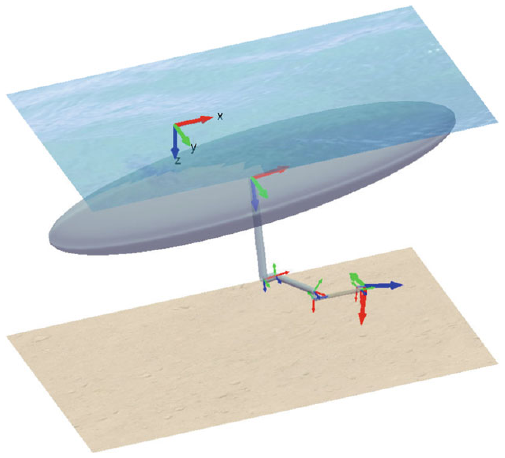

> Image description: A 3D technical diagram titled "Sketch of a UVMS" illustrates a single Undersea Vehicle-Manipulator System (UVMS). The model consists of an ellipsoidal underwater vehicle floating at the surface and a multi-link robotic manipulator extending downward toward the seabed. Two coordinate frames are visible. At the vehicle's center, a global inertial frame is defined by red ($x$), green ($y$), and blue ($z$) axes. The $z$-axis points downward into the water. Attached to the moving vehicle and each successive joint of the manipulator are smaller, local coordinate frames with identical red, green, and blue axes to indicate orientation. The manipulator is depicted with three distinct segments connected by joints. The entire system is set against a background of a blue translucent water plane and a tan-colored sea floor, representing the operational marine environment.

Mathematical Models of Marine Vehicle-Manipulator Systems, Fig. 1 Sketch of a UVMS, the inertial frame as well as the frames attached to all the rigid bodies are highlighted

## Localization

A possible approach for AUV localization is to rely on inertial navigation systems (INSs); those are algorithms that implement dead reckoning techniques, i.e., the estimation of the position by properly merging and integrating measurements obtained with inertial and velocity sensors. Dead reckoning suffers from numerical drift due to the integration of sensor noise, as well as sensor bias and drift, and may be prone to the presence of external currents and model uncertainties. Since the variance of the estimation error grows with the distance traveled, this technique is only used for short dives.

Several algorithms are based on the concept of trilateration. The vehicle measures its distance with respect to known positions and properly uses this information by applying geometric-based formulas. Under the water, the technology for trilateration is not based on the electromagnetic field, due to the attenuation of its radiations, but on acoustics.

Among the commercially available solutions, long, short, and ultrashort baseline systems have found widespread use. The differences are in the baseline wavelength, the required distance among the transponders, the accuracy, and the installation cost. Acoustic underwater positioning is commercially mature, and several companies offer a variety of products.

In case of intervention, when the UVMS is close to the target, rather than the absolute position with respect to an inertial frame, it is crucial to estimate the relative position with respect to the target itself. In such a case, vision-based systems may be considered.

## Actuation

Underwater vehicles are usually controlled by thrusters and/or control surfaces. Control surfaces, such as rudders and sterns, are typically used in vehicles working at cruise speed, i.e., torpedo-shaped vehicles usually used in


<!-- source_pdf_page: 720 -->
monitoring or cable/pipeline inspection. In such vehicles a main thruster is used together with at least one rudder and one stern.

This configuration is unsuitable for UVMSs since the force/moment provided by the control surfaces is the function of the velocity and it is null in hovering, when typically manipulation is performed.

The relationship between the force/moment acting on the vehicle and the control input of the thrusters is highly nonlinear. It is the function of structural variables such as the density of the water, the tunnel cross-sectional area, the tunnel length, the volumetric flow rate between input and output of the thrusters, and the propeller diameter. The state of the dynamic system describing the thrusters is constituted by the propeller revolution, the speed of the fluid going into the propeller, and the input torque.

## Modeling

UVMSs can be modeled as rigid bodies connected to form a serial chain; the vehicle is the floating base, while each link of the manipulator represents an additional rigid body with one DOF, typically the rotation around the corresponding joint's axis. Roughly speaking, modeling of a UVMS is the effort to represent the physical relationships of those bodies in order to measure and control its end effector, typically involved in a manipulation task.

The first step of modeling is the so-called direct kinematics, consisting in computing the position/orientation of the end effector with respect to an inertial, i.e., world fixed, frame. This is done via geometric relationship function of the system kinematic parameters, typically the lengths of the links, and the current system configuration, i.e., the vehicle position/orientation and the joint positions.

Velocities of each rigid body affect the following rigid bodies and thus the end effector. For example, a vehicle roll movement or the joint velocity is projected into a linear and angular end-effector velocity. This velocity transformation is studied by the differential kinematics.

Analytic and/or geometric approaches may be used to retrieve those relationships. The study of the velocity-related equations is fundamental to understand how to balance the movement between vehicle and manipulator and, within the manipulator, how to distribute it among the joints. This topic is strictly related to differential, and inverse, kinematics for industrial robots.

The extension of Newton's second law to UVMSs leads to a number of nonlinear differential equations that link together the systems generalized forces and accelerations. With the word generalized forces, it is here intended as the forces and moments acting on the vehicles and the joint torques. Correspondingly, one is interested in the vehicle linear and angular accelerations and joint accelerations. Those equations couple together all the DOFs of the structure, e.g., a force applied to the vehicle causes acceleration also on the joints. Study of the dynamics is crucial to design the controller.

It is not possible to neglect that the bodies are moving in the water, the theory of fluidodynamics is rather complex, and it is difficult to develop a simple model for most of the hydrodynamic effects. A rigorous analysis for incompressible fluids would need to resort to the Navier-Stokes equations (distributed fluid flow). However, most of the hydrodynamic effects have no significant influence in the range of the operative velocities for UVMS intervention tasks. In particular, it is necessary to model added masses, linear and quadratic damping terms, and the buoyancy.

## Control

Not surprisingly, the mathematical model of UVMS shares most of the characteristics of industrial robots as well as space robots modeling. Having taken into account to the physical differences, the control problems are also similar:

- Kinematic control. The control problem is given in terms of motion of the end effector and needs to be transformed into the motion of the vehicle and the manipulator. This is often approached by resorting to the inverse


<!-- source_pdf_page: 721 -->
differential kinematic algorithms. In particular, algorithms for redundant systems need to be considered since a UVMS always possess at least six DOFs. Moving a UVMS requires to handle additional variables with respect to the end effector such as the vehicle roll and pitch to preserve energy, the robot manipulability, the mechanical joint limits, or eventual directional sensing.

- Motion control. Low-level control algorithms are designed to allow the system tracking the desired trajectory. UVMSs are characterized by different dynamics between vehicle and manipulator, uncertainty in the model parameter knowledge, poor sensing performance, and limit cycle in the thruster model. On the other hand, the limited bandwidth of the closedloop system allows the use of simple control approaches.
- Interaction control. Several applications require exchange of forces with the environment. A pure motion control algorithm is not devised for such operation and specific force control algorithms, both direct and indirect, may be necessary. Master/slave systems or haptic devices may be used on the purpose, while autonomous interaction control still is in the research phase for the marine environment.


## Summary and Future Directions

This article is aimed at giving a short overview of the main mathematical and technological challenges arising with UVMSs. All the components of an underwater mission, perception, actuation, and communication with the surface, are characterized by poorer performances with respect to the current industrial or advanced robotics applications.

The underwater environment is hostile; as an example the marine current provides disturbances to be counteracted by the dynamic controller, or the sand's whirlwinds obfuscate the vision-based operations close to the sea bottom. Both teleoperated and autonomous underwater missions require a significant human effort in planning,
testing, and monitoring all the operations. Fault detection and recovery policies are necessary in each step to avoid loss of expensive hardware.

Future generation of UVMSs needs to be autonomous, to percept and contextualize the environment, to react with respect to unplanned situations, and to safely reschedule the tasks of complex missions. Those characteristics are being shared by all the branches of the service robotics.

## Cross-References

- Advanced Manipulation for Underwater Sampling
- Mathematical Models of Ships and Underwater Vehicles
- Redundant Robots


## Recommended Reading

The book of Fossen (1994) is one of the first books dedicated to control problems of marine systems, both underwater and surface. The same author presents, in Fossen (2002), an updated and extended version of the topics developed in the first book and in Fossen (2011), a handbook on marine craft hydrodynamics and control. A short introductory chapter to marine robotics may be found in Antonelli et al. (2008). Robotics fundamentals are also useful and can be found in Siciliano et al. (2009). To the best of our knowledge, Antonelli (2014) is the only monograph devoted to addressing the specific problems of underwater vehicle-manipulator systems.

## Bibliography

Antonelli, G (2014) Underwater robots: motion and force control of vehicle-manipulator systems. Springer tracts in advanced robotics, Springer-Verlag, 3rd edn. Springer, Heidelberg
Antonelli G, Fossen T, Yoerger D (2008) Underwater robotics. In: Siciliano B, Khatib O (eds) Springer handbook of robotics. Springer, Heidelberg, pp 9871008
Fossen T (1994) Guidance and control of ocean vehicles. Chichester, New York


<!-- source_pdf_page: 722 -->
Fossen T (2002) Marine control systems: guidance, navigation and control of ships, rigs and underwater vehicles. Marine Cybernetics, Trondheim
Fossen T (2011) Handbook of marine craft hydrodynamics and motion control. Wiley, Chichester
Siciliano B, Sciavicco L, Villani L, Oriolo G (2009) Robotics: modelling, planning and control. Springer, London
TRIDENT (2012) Marine robots and dexterous manipulation for enabling autonomous underwater multipurpose intervention missions. http://www.irs.uji.es/ trident

## Mathematical Models of Ships and Underwater Vehicles

Thor I. Fossen<br>Department of Engineering Cyberentics, Centre for Autonomous Marine Operations and Systems, Norwegian University of Science and Technology, Trondheim, Norway


#### Abstract

This entry describes the equations of motion of ships and underwater vehicles. Standard hydrodynamic models in the literature are reviewed and presented using the nonlinear robot-like vectorial notation of Fossen (1991, 1994, 2011). The matrix-vector notation is highly advantageous when designing control systems since well-known system properties such as symmetry, skew-symmetry, and positiveness can be exploited in the design.


## Keywords

Autonomous underwater vehicle (AUV); Degrees of freedom; Euler angles; Hydrodynamics; Kinematics; Kinetics; Maneuvering; Remotely operated vehicle (ROV); Seakeeping; Ship; Underwater vehicles

## Introduction

The subject of this entry is mathematical modeling of ships and underwater vehicles. With ship
we mean "any large floating vessel capable of crossing open waters," as opposed to a boat, which is generally a smaller craft. An underwater vehicle is a "small vehicle that is capable of propelling itself beneath the water surface as well as on the water's surface." This includes unmanned underwater vehicles (UUVs), remotely operated vehicles (ROVs), autonomous underwater vehicles (AUVs) and underwater robotic vehicles (URVs).

This entry is based on Fossen (1991, 2011), which contains a large number of standard models for ships, rigs, and underwater vehicles. There exist a large number of textbooks on mathematical modeling of ships; see Rawson and Tupper (1994), Lewanddowski (2004), and Perez (2005). For underwater vehicles, see Allmendinger (1990), Sutton and Roberts (2006), Inzartsev (2009), Anotonelli (2010), and Wadoo and Kachroo (2010). Some useful references on ship hydrodynamics are Newman (1977), Faltinsen (1990), and Bertram (2012).

## Degrees of Freedom

A mathematical model of marine craft is usually represented by a set of ordinary differential equations (ODEs) describing the motions in six degrees of freedom (DOF): surge, sway, heave, roll, pitch, and yaw.

## Hydrodynamics

In hydrodynamics it is common to distinguish between two theories:

- Seakeeping theory: The motions of ships at zero or constant speed in waves are analyzed using hydrodynamic coefficients and wave forces, which depends of the wave excitation frequency and thus the hull geometry and mass distribution. For underwater vehicles operating below the wave-affected zone, the wave excitation frequency will not influence the hydrodynamic coefficients.
- Maneuvering theory: The ship is moving in restricted calm water - that is, in sheltered waters or in a harbor. Hence, the maneuvering model is derived for a ship moving at positive speed under a zero-frequency wave excitation


<!-- source_pdf_page: 723 -->
assumption such that added mass and damping can be represented by constant parameters.
Seakeeping models are typically used for ocean structures and dynamically positioned vessels. Several hundred ODEs are needed to effectively represent a seakeeping model; see Fossen (2011), and Perez and Fossen (2011a,b).

The remainder of this entry assumes maneuvering theory, since this gives lower-order models typically suited for controller-observer design. Six ODEs are needed to describe the kinematics, that is, the geometrical aspects of motion while Newton-Euler's equations represent additional six ODEs describing the forces and moments causing the motion (kinetics).

## Notation

The equations of motion are usually represented using generalized position, velocity and forces (Fossen 1991, 1994, 2011) defined by the state vectors:

$$
\begin{align*}
\boldsymbol{\eta} & :=[x, y, z, \phi, \theta, \psi]^{\top}  \tag{1}\\
\boldsymbol{v} & :=[u, v, w, p, q, r]^{\top}  \tag{2}\\
\boldsymbol{\tau} & :=[X, Y, Z, K, M, N]^{\top} \tag{3}
\end{align*}
$$

where $\boldsymbol{\eta}$ is the generalized position expressed in the north-east-down (NED) reference frame $\{n\}$. A body-fixed reference frame $\{b\}$ with axes:
$x_{b}$-longitudinal axis (from aft to fore)
$y_{b}$ - transversal axis (to starboard)
$z_{b}$ - normal axis (directed downward)
is rotating about the NED reference frame $\{n\}$ with angular velocity $\boldsymbol{\omega}=[p, q, r]^{\top}$. The generalized velocity vector $\boldsymbol{v}$ and forces $\boldsymbol{\tau}$ are both expressed in $\{b\}$, and the 6-DOF states are defined according to SNAME (1950):

- Surge position $x$, linear velocity $u$, force $X$
- Sway position $y$, linear velocity $v$, force $Y$
- Heave position $z$, linear velocity $w$, force $Z$
- Roll angle $\phi$, angular velocity $p$, moment $K$
- Pitch angle $\theta$, angular velocity $q$, moment $M$
- Yaw angle $\psi$, angular velocity $r$, moment $N$


## Kinematics

The generalized velocities $\dot{\boldsymbol{\eta}}$ and $\boldsymbol{v}$ in $\{b\}$ and $\{n\}$, respectively satisfy the following kinematic transformation (Fossen 1994, 2011):

$$
\begin{gather*}
\dot{\eta}=\mathbf{J}(\eta) v  \tag{4}\\
\mathbf{J}(\eta):=\left[\begin{array}{cc}
\mathbf{R}(\boldsymbol{\Theta}) & \mathbf{0}_{3 \times 3} \\
\mathbf{0}_{3 \times 3} & \mathbf{T}(\boldsymbol{\Theta})
\end{array}\right] \tag{5}
\end{gather*}
$$

where $\boldsymbol{\Theta}=[\phi, \theta, \psi]^{\top}$ is the Euler angles and

$$
\mathbf{R}(\boldsymbol{\Theta})=\left[\begin{array}{cc}
\mathrm{c} \psi \mathrm{c} \theta & -\mathrm{s} \psi \mathrm{c} \phi+\mathrm{c} \psi \mathrm{~s} \theta \mathrm{~s} \phi \\
\mathrm{~s} \psi \mathrm{c} \theta & \mathrm{c} \psi \mathrm{c} \phi+\mathrm{s} \phi \mathrm{~s} \theta \mathrm{~s} \psi  \tag{6}\\
-\mathrm{s} \theta & \mathrm{c} \theta \mathrm{~s} \phi \\
\mathrm{~s} \psi \mathrm{~s} \phi+\mathrm{c} \psi \mathrm{c} \phi \mathrm{~s} \theta \\
-\mathrm{c} \psi \mathrm{~s} \phi+\mathrm{s} \theta \mathrm{~s} \psi \mathrm{c} \phi \\
\mathrm{c} \theta \mathrm{c} \phi
\end{array}\right]
$$

with $\mathrm{s} \cdot=\sin (\cdot), \mathrm{c} \cdot=\cos (\cdot)$ and $\mathrm{t} \cdot=\tan (\cdot)$.
The matrix $\mathbf{R}$ is recognized as the Euler angle rotation matrix $\mathbf{R} \in S O(3)$ satisfying $\mathbf{R R}^{\top}= \mathbf{R}^{\top} \mathbf{R}=\mathbf{I}$, and $\operatorname{det}(\mathbf{R})=1$, which implies that $\mathbf{R}$ is orthogonal. Consequently, the inverse rotation matrix is given by: $\mathbf{R}^{-1}=\mathbf{R}^{\top}$. The Euler rates $\dot{\boldsymbol{\Theta}}=\boldsymbol{T}(\boldsymbol{\Theta}) \boldsymbol{\omega}$ are singular for $\theta \neq \pm \pi / 2$ since:

$$
\mathbf{T}(\boldsymbol{\Theta})=\left[\begin{array}{ccc}
1 & \mathrm{~s} \phi \mathrm{t} \theta & \mathrm{c} \phi \mathrm{t} \theta  \tag{7}\\
0 & \mathrm{c} \phi & -\mathrm{s} \phi \\
0 & \mathrm{~s} \phi / \mathrm{c} \theta & \mathrm{c} \phi / \mathrm{c} \theta
\end{array}\right], \quad \theta \neq \pm \frac{\pi}{2}
$$

Singularities can be avoided by using unit quaternions instead (Fossen 1994, 2011).

## Kinetics

The rigid-body kinetics can be derived using the Newton-Euler formulation, which is based on Newton's second law. Following Fossen (1994, 2011) this gives:

$$
\begin{equation*}
\mathbf{M}_{R B} \dot{\boldsymbol{v}}+\mathbf{C}_{R B}(\boldsymbol{v}) \boldsymbol{v}=\boldsymbol{\tau}_{R B} \tag{8}
\end{equation*}
$$

where $\mathbf{M}_{R B}$ is the rigid-body mass matrix, $\mathbf{C}_{R B}$ is the rigid-body Coriolis and centripetal matrix due to the rotation of $\{b\}$ about the geographical frame $\{n\}$. The generalized force vector $\boldsymbol{\tau}_{R B}$ represents external forces and moments expressed in $\{b\}$. In the nonlinear case:

$$
\begin{equation*}
\boldsymbol{\tau}_{R B}=-\mathbf{M}_{A} \dot{\boldsymbol{v}}-\mathbf{C}_{A}(\boldsymbol{v}) \boldsymbol{v}-\mathbf{D}(\boldsymbol{v}) \boldsymbol{v}-\mathbf{g}(\boldsymbol{\eta})+\boldsymbol{\tau} \tag{9}
\end{equation*}
$$


<!-- source_pdf_page: 724 -->
where the matrices $\mathbf{M}_{A}$ and $\mathbf{C}_{A}(\boldsymbol{v})$ represent hydrodynamic added mass due to acceleration $\dot{\boldsymbol{v}}$ and Coriolis acceleration due to the rotation of $\{b\}$ about the geographical frame $\{n\}$. The potential and viscous damping terms are lumped together into a nonlinear matrix $\mathbf{D}(\boldsymbol{v})$ while $\mathbf{g}(\boldsymbol{\eta})$ is a vector of generalized restoring forces. The control inputs are generalized forces given by $\boldsymbol{\tau}$.

Formulae (8) and (9) together with (4) are the fundamental equations when deriving the ship and underwater vehicle models. This is the topic for the next sections.

## Ship Model

The ship equations of motion are usually represented in three DOFs by neglecting heave, roll and pitch. Combining (4), (8), and (9) we get:

$$
\begin{gather*}
\dot{\boldsymbol{\eta}}=\mathbf{R}(\psi) \boldsymbol{v}  \tag{10}\\
\mathbf{M} \dot{\boldsymbol{v}}+\mathbf{C}(\boldsymbol{v}) \boldsymbol{v}+\mathbf{D}(\boldsymbol{v}) \boldsymbol{v}=\boldsymbol{\tau}+\boldsymbol{\tau}_{\text {wind }}+\boldsymbol{\tau}_{\text {wave }} \tag{11}
\end{gather*}
$$

where $\boldsymbol{\eta}:=[x, y, \psi]^{\top}$, $\boldsymbol{v}:=[u, v, r]^{\top}$ and

$$
\mathbf{R}(\psi)=\left[\begin{array}{ccc}
\mathrm{c} \psi & -\mathrm{s} \psi & 0  \tag{12}\\
\mathrm{~s} \psi & \mathrm{c} \psi & 0 \\
0 & 0 & 1
\end{array}\right]
$$

is the rotation matrix in yaw. It is assumed that wind and wave-induced forces $\boldsymbol{\tau}_{\text {wind }}$ and $\boldsymbol{\tau}_{\text {wave }}$ can be linearly superpositioned. The system matrices $\mathbf{M}=\mathbf{M}_{R B}+\mathbf{M}_{A}$ and $\mathbf{C}(\boldsymbol{v})=\mathbf{C}_{R B}(\boldsymbol{v})+ \mathbf{C}_{A}(\boldsymbol{\nu})$ are usually derived under the assumption of port-starboard symmetry and that surge can be decoupled from sway and yaw (Fossen 2011). Moreover,

$$
\mathbf{M}=\left[\begin{array}{ccc}
m-X_{\dot{u}} & 0 & 0  \tag{13}\\
0 & m-Y_{\dot{v}} & m x_{g}-Y_{\dot{r}} \\
0 & m x_{g}-N_{\dot{v}} & I_{z}-N_{\dot{r}}
\end{array}\right]
$$

$$
\begin{gather*}
\mathbf{C}_{R B}(\boldsymbol{v})=\left[\begin{array}{ccc}
0 & -m r & -m x_{g} r \\
m r & 0 & 0 \\
m x_{g} r & 0 & 0
\end{array}\right]  \tag{14}\\
\mathbf{C}_{A}(\boldsymbol{v})=\left[\begin{array}{ccc}
0 & 0 & Y_{\dot{v}} v+Y_{\dot{r}} r \\
0 & 0 & -X_{\dot{u}} u \\
-Y_{\dot{v}} v-Y_{\dot{r}} r & X_{\dot{u}} u & 0
\end{array}\right] \tag{15}
\end{gather*}
$$

Hydrodynamic damping will, in its simplest form, be linear:

$$
\mathbf{D}=\left[\begin{array}{ccc}
-X_{u} & 0 & 0  \tag{16}\\
0 & -Y_{v} & -Y_{r} \\
0 & -N_{r} & -N_{r}
\end{array}\right]
$$

while a nonlinear expression based on secondorder modulus functions describing quadratic drag and cross-flow drag is:

$$
\begin{align*}
\mathbf{D}(\boldsymbol{v})= & {\left[\begin{array}{cc}
-X_{|u| u}|u| & 0 \\
0 & -Y_{|v| v}|v|-Y_{|r| v}|r| \\
0 & -N_{|v| v}|v|-N_{|r| v}|r| \\
0 \\
& -Y_{|v| r}|v|-Y_{|r| r}|r| \\
-N_{|v| r}|v|-N_{|r| r}|r|
\end{array}\right] }
\end{align*}
$$

Other nonlinear representations are found in Fossen (1994, 2011).

In the case of irrotational ocean currents, we introduce the relative velocity vector:

$$
\boldsymbol{v}_{r}=\boldsymbol{v}-\boldsymbol{v}_{c}
$$

where $\boldsymbol{v}_{c}=\left[u_{c}^{b}, v_{c}^{b}, 0\right]^{\top}$ is a vector of current velocities in $\{b\}$. Hence, the kinetic model takes the form:

$$
\begin{aligned}
& \underbrace{\mathbf{M}_{R B} \dot{\boldsymbol{v}}+\mathbf{C}_{R B}(\boldsymbol{v}) \boldsymbol{v}}_{\text {rigid-body forces }} \\
& +\underbrace{\mathbf{M}_{A} \dot{\boldsymbol{v}}_{r}+\mathbf{C}_{A}\left(\boldsymbol{v}_{r}\right) \boldsymbol{v}_{r}+\mathbf{D}\left(\boldsymbol{v}_{r}\right) \boldsymbol{v}_{r}}_{\text {hydrodynamic forces }} \\
& \quad=\boldsymbol{\tau}+\boldsymbol{\tau}_{\text {wind }}+\boldsymbol{\tau}_{\text {wave }}
\end{aligned}
$$


<!-- source_pdf_page: 725 -->
This model can be simplified if the ocean currents are assumed to be constant and irrotational in $\{n\}$. According to Fossen (2011, Property 8.1), $\mathbf{M}_{R B} \dot{\boldsymbol{v}}+\mathbf{C}_{R B}(\boldsymbol{v}) \boldsymbol{v} \equiv \mathbf{M}_{R B} \dot{\boldsymbol{v}}_{r}+\mathbf{C}_{R B}\left(\boldsymbol{v}_{r}\right) \boldsymbol{v}_{r}$ if the rigid-body Coriolis and centripetal matrix satisfies $\mathbf{C}_{R B}\left(\boldsymbol{v}_{r}\right)=\mathbf{C}_{R B}(\boldsymbol{v})$. One parametrization satisfying this is (14). Hence, the Coriolis and centripetal matrix satisfies $\mathbf{C}\left(\boldsymbol{v}_{r}\right)=\mathbf{C}_{R B}\left(\boldsymbol{v}_{r}\right)+ \mathbf{C}_{A}\left(\boldsymbol{v}_{r}\right)$ and it follows that:

$$
\begin{equation*}
\mathbf{M} \dot{\boldsymbol{v}}_{r}+\mathbf{C}\left(\boldsymbol{v}_{r}\right) \boldsymbol{v}_{r}+\mathbf{D}\left(\boldsymbol{v}_{r}\right) \boldsymbol{v}_{r}=\boldsymbol{\tau}+\boldsymbol{\tau}_{\text {wind }}+\boldsymbol{\tau}_{\text {wave }} \tag{18}
\end{equation*}
$$

The kinematic equation (10) can be modified to include the relative velocity $\boldsymbol{v}_{r}$ according to:

$$
\begin{equation*}
\dot{\eta}=\mathbf{R}(\psi) \boldsymbol{v}_{r}+\left[u_{c}^{n}, v_{c}^{n}, 0\right]^{\top} \tag{19}
\end{equation*}
$$

where the ocean current velocities $u_{c}^{n}=$ constant and $v_{c}^{n}=$ constant in $\{n\}$. Notice that the bodyfixed velocities $\boldsymbol{v}_{c}=\mathbf{R}(\psi)^{\top}\left[u_{c}^{n}, v_{c}^{n}, 0\right]^{\top}$ will vary with the heading angle $\psi$.

The maneuvering model presented in this entry is intended for controller-observer design, prediction, and computer simulations, as well as system identification and parameter estimation. A large number of applicationspecific models for marine craft are found in Fossen (2011, Chap. 7).

Hydrodynamic programs compute mass, inertia, potential damping and restoringforces while
a more detailed treatment of viscous dissipative forces (damping) and sealoads are found in the extensive literature on hydrodynamics - see Faltinsen (1990) and Newman (1977).

## Underwater Vehicle Model

The 6-DOF underwater vehicle equations of motion follow from (4), (8), and (9) under the assumption that wave-induced motions can be neglected:

$$
\begin{gather*}
\dot{\eta}=\mathbf{J}(\eta) v  \tag{20}\\
\mathbf{M} \dot{v}+\mathbf{C}(v) v+\mathbf{D}(v) v+\mathbf{g}(\eta)=\boldsymbol{\tau} \tag{21}
\end{gather*}
$$

with generalized position $\boldsymbol{\eta}:=[x, y, z, \phi, \theta, \psi]^{\top}$ and velocity $\boldsymbol{v}:=[u, v, w, p, q, r]^{\top}$. Assume that the gravitational force acts through the center of gravity (CG) defined by the vector $\mathbf{r}_{g}:= \left[x_{g}, y_{g}, z_{g}\right]^{\top}$ with respect to the coordinate origin $\{b\}$. Similarly, the buoyancy force acts through the center of buoyancy (CB) defined by the vector $\mathbf{r}_{b}:=\left[x_{b}, y_{b}, z_{b}\right]^{\top}$. For most vehicles $y_{g}=y_{b}=$ 0.

For a port-starboard symmetrical vehicle with homogenous mass distribution, CG satisfying $y_{g}=0$ and products of inertia $I_{x y}=I_{y z}=0$, the system inertia matrix becomes:

$$
\mathbf{M}:=\left[\begin{array}{cccccc}
m-X_{\dot{u}} & 0 & -X_{\dot{w}} & 0 & m z_{g}-X_{\dot{q}} & 0  \tag{22}\\
0 & m-Y_{\dot{v}} & 0 & -m z_{g}-Y_{\dot{p}} & 0 & m x_{g}-Y_{\dot{r}} \\
-X_{\dot{w}} & 0 & m-Z_{\dot{w}} & 0 & -m x_{g}-Z_{\dot{q}} & 0 \\
0 & -m z_{g}-Y_{\dot{p}} & 0 & I_{x}-K_{\dot{p}} & 0 & -I_{z x}-K_{\dot{r}} \\
m z_{g}-X_{\dot{q}} & 0 & -m x_{g}-Z_{\dot{q}} & 0 & I_{y}-M_{\dot{q}} & 0 \\
0 & m x_{g}-Y_{\dot{r}} & 0 & -I_{z x}-K_{\dot{r}} & 0 & I_{z}-N_{\dot{r}}
\end{array}\right]
$$


<!-- source_pdf_page: 726 -->
where the hydrodynamic derivatives are defined according to SNAME (1950). The Coriolis and centripetal matrices are:

$$
\mathbf{C}_{A}(\boldsymbol{v})=\left[\begin{array}{cccccc}
0 & 0 & 0 & 0 & -a_{3} & a_{2}  \tag{23}\\
0 & 0 & 0 & a_{3} & 0 & -a_{1} \\
0 & 0 & 0 & -a_{2} & a_{1} & 0 \\
0 & -a_{3} & a_{2} & 0 & -b_{3} & b_{2} \\
a_{3} & 0 & -a_{1} & b_{3} & 0 & -b_{1} \\
-a_{2} & a_{1} & 0 & -b_{2} & b_{1} & 0
\end{array}\right]
$$

where

$$
\begin{align*}
& a_{1}=X_{\dot{u}} u+X_{\dot{w}} w+X_{\dot{q}} q \\
& a_{2}=Y_{\dot{v}} v+Y_{\dot{p}} p+Y_{\dot{r}} r \\
& a_{3}=Z_{\dot{u}} u+Z_{\dot{w}} w+Z_{\dot{q}} q  \tag{24}\\
& b_{1}=K_{\dot{v}} v+K_{\dot{p}} p+K_{\dot{r}} r \\
& b_{2}=M_{\dot{u}} u+M_{\dot{w}} w+M_{\dot{q}} q \\
& b_{3}=N_{\dot{v}} v+N_{\dot{p}} p+N_{\dot{r}} r
\end{align*}
$$

and

$$
\mathbf{C}_{R B}(\boldsymbol{v})=\left[\begin{array}{cccccc}
0 & -m r & m q & m z_{g} r & -m x_{g} q & -m x_{g} r  \tag{25}\\
m r & 0 & -m p & 0 & m\left(z_{g} r+x_{g} p\right) & 0 \\
-m q & m p & 0 & -m z_{g} p & -m z_{g} q & m x_{g} p \\
-m z_{g} r & 0 & m z_{g} p & 0 & -I_{x z} p+I_{z} r & -I_{y} q \\
m x_{g} q & -m\left(z_{g} r+x_{g} p\right) & m z_{g} q & I_{x z} p-I_{z} r & 0 & -I_{x z} r+I_{x} p \\
m x_{g} r & 0 & -m x_{g} p & I_{y} q & I_{x z} r-I_{x} p & 0
\end{array}\right]
$$

Notice that this representation of $\mathbf{C}_{R B}(\boldsymbol{v})$ only depends on the angular velocities $p$, $q$, and $r$, and not the linear velocities $u, v$, and $r$. This property will be exploited when including drift due to ocean currents.

Linear damping for a port-starboard symmetrical vehicle takes the following form:

$$
\mathbf{D}=-\left[\begin{array}{cccccc}
X_{u} & 0 & X_{w} & 0 & X_{q} & 0  \tag{26}\\
0 & Y_{v} & 0 & Y_{p} & 0 & Y_{r} \\
Z_{u} & 0 & Z_{w} & 0 & Z_{q} & 0 \\
0 & K_{v} & 0 & K_{p} & 0 & K_{r} \\
M_{u} & 0 & M_{w} & 0 & M_{q} & 0 \\
0 & N_{v} & 0 & N_{p} & 0 & N_{r}
\end{array}\right]
$$

Let $W=m g$ and $B=\rho g \nabla$ denote the weight and buoyance where $m$ is the mass of the vehicle including water in free floating space, ∇ the volume of fluid displaced by the vehicle, $g$ the acceleration of gravity (positive downward), and $\rho$ the water density. Hence, the generalized restoring forces for a vehicle satisfying $y_{g}=y_{b}=0$ becomes (Fossen 1994, 2011):

$$
\mathbf{g}(\boldsymbol{\eta})=\left[\begin{array}{l}
(W-B) \mathrm{s} \theta  \tag{27}\\
-(W-B) \mathrm{c} \theta \mathrm{~s} \phi \\
-(W-B) \mathrm{c} \theta \mathrm{c} \phi \\
\left(z_{g} W-z_{b} B\right) \mathrm{c} \theta \mathrm{~s} \phi \\
\left(z_{g} W-z_{b} B\right) \mathrm{s} \theta+\left(x_{g} W-x_{b} B\right) \mathrm{c} \theta \mathrm{c} \phi \\
-\left(x_{g} W-x_{b} B\right) \mathrm{c} \theta \mathrm{~s} \phi
\end{array}\right]
$$

The expression for $\mathbf{D}$ can be extended to include nonlinear damping terms if necessary. Quadratic damping is important at higher speeds since the Coriolis and centripetal terms $\mathbf{C}(\boldsymbol{v}) \boldsymbol{v}$ can destabilize the system if only linear damping is used.

In the presence of irrotational ocean currents, we can rewrite (20) and (21) in terms of relative velocity $\boldsymbol{v}_{r}=\boldsymbol{v}-\boldsymbol{v}_{c}$ according to:

$$
\begin{gather*}
\dot{\boldsymbol{\eta}}=\mathbf{J}(\boldsymbol{\eta}) \boldsymbol{v}_{r}+\left[u_{c}^{n}, v_{c}^{n}, w_{c}^{n}, 0,0,0\right]^{\top}  \tag{28}\\
\mathbf{M} \dot{\boldsymbol{v}}_{r}+\mathbf{C}\left(\boldsymbol{v}_{r}\right) \boldsymbol{v}_{r}+\mathbf{D}\left(\boldsymbol{v}_{r}\right) \boldsymbol{v}_{r}+\mathbf{g}(\boldsymbol{\eta})=\boldsymbol{\tau} \tag{29}
\end{gather*}
$$

where it is assumed that $\mathbf{C}_{R B}\left(\boldsymbol{v}_{r}\right)=\mathbf{C}_{R B}(\boldsymbol{v})$, which clearly is satisfied for (25). In addition, it is assumed that $u_{c}^{n}, v_{c}^{n}$, and $w_{c}^{n}$ are constant. For more details see Fossen (2011).


<!-- source_pdf_page: 727 -->
## Programs and Data

The Marine Systems Simulator (MSS) is a Matlab/Simulink library and simulator for marine craft (http://www.marinecontrol.org). It includes models for ships, underwater vehicles, and floating structures.

## Summary and Future Directions

This entry has presented standard models for simulation of ships and underwater vehicles. It is recommended to consult Fossen $(1994,2011)$ for a more detailed description of marine craft hydrodynamics.

## Cross-References

- Control of Networks of Underwater Vehicles
- Control of Ship Roll Motion
- Dynamic Positioning Control Systems for Ships and Underwater Vehicles
- Underactuated Marine Control Systems


## Bibliography

Allmendinger E (ed) (1990) Submersible vehicle systems design. SNAME, Jersey City
Anotonelli G (2010) Underwater robots: motion and force control of vehicle-manipulator systems. Springer, Berlin/New York
Bertram V (2012) Practical ship hydrodynamics. Elsevier, Amsterdam/London
Faltinsen O (1990) Sea loads on ships and offshore structures. Cambridge
Fossen TI (1991) Nonlinear modelling and control of underwater vehicles. PhD thesis, Department of Engineering Cybernetic, Norwegian University of Science and Technology
Fossen TI (1994) Guidance and control of ocean vehicles. Wiley, Chichester/New York
Fossen TI (2011) Handbook of marine craft hydrodynamics and motion control. Wiley, Chichester/Hoboken
Inzartsev AV (2009) Intelligent underwater vehicles. I-Tech Education and Publishing. Open access: http:// www.intechweb.org/

Lewanddowski EM (2004) The dynamics of marine craft. World Scientific, Singapore
MSS (2010) Marine systems simulator. Open access: http://www.marinecontrol.org/
Newman JN (1977) Marine hydrodynamics. MIT, Cambridge
Perez T (2005) Ship motion control. Springer, Berlin/London
Perez T, Fossen TI (2011a) Practical aspects of frequencydomain identification of dynamic models of marine structures from hydrodynamic data. Ocean Eng 38:426-435
Perez T, Fossen TI (2011b) Motion control of marine craft, Ch. 33. In: Levine WS (ed) The control systems handbook: control system advanced methods, 2nd edn. CRC, Hoboken
Rawson KJ, Tupper EC (1994) Basic ship theory. Longman Group, Harlow/New York
SNAME (1950) Nomenclature for treating the motion of a submerged body through a fluid. SNAME, Technical and Research Bulletin no 1-5, pp 1-15
Sutton R, Roberts G (2006) Advances in unmanned marine vehicles. IEE control series. The Institution of Engineering and Technology, London
Wadoo S, Kachroo P (2010) Autonomous underwater vehicles: modeling, control design and simulation. Taylor and Francis, London

## Mean Field Games

Peter E. Caines<br>McGill University, Montreal, QC, Canada


#### Abstract

Mean Field Game (MFG) theory studies the existence of Nash equilibria, together with the individual strategies which generate them, in games involving a large number of agents modeled by controlled stochastic dynamical systems. This is achieved by exploiting the relationship between the finite and corresponding infinite limit population problems. The solution of the infinite population problem is given by the fundamental MFG Hamilton-Jacobi-Bellman (HJB) and Fokker-Planck-Kolmogorov (FPK) equations which are linked by the state distribution of a generic agent, otherwise known as the system's mean field.


<!-- source_pdf_page: 728 -->
## Keywords

Fokker-Planck-Kolmogorov (FPK) equation; Hamilton-Jacobi-Bellman (HJB) equation; Nash equilibrium; Stochastic dynamical systems

## Introduction

Large-population, dynamical, multi-agent, competitive, and cooperative phenomena occur in a wide range of designed and natural settings such as communication, environmental, epidemiological, transportation, and energy systems, and they underlie much economic and financial behavior. Analysis of such systems is intractable using the finite population game theoretic methods which have been developed for multi-agent control systems (see, e.g., Basar and Ho 1974; Basar and Olsder 1999; Ho 1980; and Bensoussan and Frehse 1984). The continuum population game theoretic models of economics (Aumann and Shapley 1974; Neyman 2002) are static, as, in general, are the large-population models employed in network games (Altman et al. 2002) and transportation analysis (Correa and Stier-Moses 2010; Haurie and Marcotte 1985; Wardrop 1952). However, dynamical (or sequential) stochastic games were analyzed in the continuum limit in the work of Jovanovic and Rosenthal (1988) and Bergin and Bernhardt (1992), where the fundamental mean field equations appear in the form of a discrete time dynamic programming equation and an evolution equation for the population state distribution.

The mean field equations for dynamical games with large but finite populations of asymptotically negligible agents originated in the work of Huang et al. $(2003,2006,2007)$ (where the framework was called the Nash Certainty Equivalence Principle) and independently in that of Lasry and Lions (2006a,b, 2007), where the now standard terminology of Mean Field Games (MFGs) was introduced. Independent of both of these, the closely related notion of Oblivious

Equilibria for large-population dynamic games was introduced by Weintraub et al. (2005) in the framework of Markov Decision Processes (MDPs).

One of the main results of MFG theory is that in large-population stochastic dynamic games individual feedback strategies exist for which any given agent will be in a Nash equilibrium with respect to the pre-computable behavior of the mass of the other agents; this holds exactly in the asymptotic limit of an infinite population and with increasing accuracy for a finite population of agents using the infinite population feedback laws as the finite population size tends to infinity, a situation which is termed an $\varepsilon$-Nash equilibrium. This behavior is described by the solution to the infinite population MFG equations which are fundamental to the theory; they consist of (i) a parameterized family of HJB equations (in the nonuniform parameterized agent case) and (ii) a corresponding family of McKean-Vlasov (MV) FPK PDEs, where (i) and (ii) are linked by the probability distribution of the state of a generic agent, that is to say, the mean field. For each agent, these yield (i) a Nash value of the game, (ii) the best response strategy for the agent, (iii) the agent's stochastic differential equation (SDE) (i.e., the MV-SDE pathwise description), and (iv) the state distribution of such an agent (via the MV FPK for the parameterized individual).

## Dynamical Agents

In the diffusion-based models of large-population games, the state evolution of a collection of $N$ agents $A_{i}, 1 \leq i \leq N<\infty$, is specified by a set $N$ of controlled stochastic differential equations (SDEs) which in the important linear case take the form

$$
\begin{gathered}
d x_{i}(t)=\left[F_{i} x_{i}(t)+G_{i} u_{i}(t)\right] d t+D_{i} d w_{i}(t), \\
1 \leq i \leq N,
\end{gathered}
$$

where $x_{i} \in \mathbb{R}^{n}$ is the state, $u_{i} \in \mathbb{R}^{m}$ the control input, and $w_{i}$ the state Wiener process of the $i$ th


<!-- source_pdf_page: 729 -->
agent $A_{i}$, where $\left\{w_{i}, 1 \leq i \leq N\right\}$ is a collection of $N$ independent standard Wiener processes in $\mathbb{R}^{r}$ independent of all mutually independent initial conditions. For simplicity, throughout this entry, all collections of system initial conditions are taken to be independent, zero mean and have finite second moment.

A simplified form of the general case treated in Huang et al. (2007) and Nourian and Caines (2013) is given by the following set of controlled SDEs which for each agent $A_{i}$ includes state coupling with all other agents:

$$
\begin{aligned}
d x_{i}(t)= & \frac{1}{N} \sum_{j=1}^{N} f\left(t, x_{i}(t), u_{i}(t), x_{j}(t)\right) d t \\
& +\sigma d w_{i}(t), \quad 1 \leq i \leq N
\end{aligned}
$$

where here, for the sake of simplicity, only the uniform (non-parameterized) generic agent case is presented. The dynamics of a generic agent in the infinite population limit of this system is then described by the following controlled MV stochastic differential equation:

$$
d x(t)=f\left[t, x(t), u(t), \mu_{t}\right] d t+\sigma d w(t)
$$

where $f\left[t, x, u, \mu_{t}\right]=\int_{\mathbb{R}^{n}} f(t, x, u, y) \mu_{t}(d y)$, with the initial condition measure $\mu_{0}$ specified, where $\mu_{t}(\cdot)$ denotes the state distribution of the population at $t \in[0, T]$. The dynamics used in the analysis in Lasry and Lions (2006a,b, 2007) and Cardaliaguet (2012) are of the form $d x_{i}(t)=u_{i}(t) d t+ \sigma d w_{i}(t)$.

The dynamical evolution of the state $x_{i}$ of the $i$ th agent $A_{i}$ in the discrete time Markov Decision Processes (MDP)-based formulation of the so-called anonymous sequential games (Bergin and Bernhardt 1992; Jovanovic and Rosenthal 1988; Weintraub et al. 2005) is described by a Markov state transition function, or kernel, of the form $P_{t+1}:=P\left(x_{i}(t+\right.$ 1) $\left.\mid x_{i}(t), x_{-i}(t), u_{i}(t), P_{t}\right)$.

## Agent Performance Functions

In the basic finite population linear-quadratic diffusion case, the agent $A_{i}, 1 \leq i \leq N$, possesses a performance, or loss, function of the form

$$
\begin{aligned}
J_{i}^{N}\left(u_{i}, u_{-i}\right)= & E \int_{0}^{T}\left\{\left\|x_{i}(t)-m_{N}(t)\right\|_{Q}^{2}\right. \\
& \left.+\left\|u_{i}(t)\right\|_{R}^{2}\right\} d t
\end{aligned}
$$

where we assume the cost coupling to be of the form $m_{N}(t):=\left(\overline{x_{N}(t)}+\eta\right), \eta \in \mathbb{R}^{n}$, where $u_{-i}$ denotes all agents' control laws except for that of the $i$ th agent and $\overline{x_{N}}$ denotes the population average state $(1 / N) \sum_{i=1}^{N} x_{i}$, and where here and below the expectation is taken over an underlying sample space which carries all initial conditions and Wiener processes.

For the nonlinear case introduced in the previous section, a corresponding finite population mean field loss function is

$$
\begin{aligned}
& J_{i}^{N}\left(u_{i} ; u_{-i}\right):= \\
& \quad E \int_{0}^{T}\left((1 / N) \sum_{j=1}^{N} L\left(t, x_{i}(t), u_{i}(t), x_{j}(t)\right)\right) d t, \\
& \quad 1 \leq i \leq N,
\end{aligned}
$$

where $L$ is the nonlinear state cost-coupling function. Setting, by possible abuse of notation, $L\left[t, x, u, \mu_{t}\right]=\int_{\mathbb{R}^{n}} L(t, x, u, y) \mu_{t}(d y)$, the infinite population limit of this cost function for a generic individual agent $A$ is given by

$$
J(u, \mu):=E \int_{0}^{T} L\left[t, x(t), u(t), \mu_{t}\right] d t
$$

which is the general expression for the infinite population individual performance functions appearing in Huang et al. (2006) and Nourian and Caines (2013) and which includes those of Lasry and Lions (2006a,b, 2007) and Cardaliaguet (2012). Exponentially discounted costs with discount rate parameter $\rho$ are employed for infinite time horizon performance functions in Huang et al. (2003, 2007), while the sample path


<!-- source_pdf_page: 730 -->
limit of the long-range average is used for ergodic MFG problems in Lasry and Lions (2006a, 2007) and Li and Zhang (2008) and in the analysis of adaptive MFG systems (Kizilkale and Caines 2013).

## The Existence of Equilibria

The objective of each agent is to find strategies (i.e., control laws) which are admissible with respect to information and other constraints and which minimize its performance function. The resulting problem is necessarily game theoretic
and consequently central results of the topic concern the existence of Nash Equilibria and their properties.

The basic linear-quadratic mean field problem has an explicit solution characterizing a Nash equilibrium (see Huang et al. 2003, 2007). Consider the scalar infinite time horizon discounted case, with nonuniform parameterized agents $A_{\theta}$ with parameter distribution $F(\theta), \theta \in \mathcal{A}$, and dynamical parameters identified as $a_{\theta}:=F_{\theta}, b_{\theta}:=G_{\theta}, Q:=1, r:=R$; then the so-called Nash Certainty Equivalence (NCE) equation scheme generating the equilibrium solution takes the form

$$
\begin{aligned}
\rho s_{\theta} & =\frac{d s_{\theta}}{d t}+a_{\theta} s_{\theta}-\frac{b_{\theta}^{2}}{r} \Pi_{\theta} s_{\theta}-x^{*}, \\
\frac{d \bar{x}_{\theta}}{d t} & =\left(a_{\theta}-\frac{b_{\theta}^{2}}{r} \Pi_{\theta}\right) \bar{x}_{\theta}-\frac{b_{\theta}^{2}}{r} s_{\theta}, \quad 0 \leq t<\infty \\
\bar{x}(t) & =\int_{\mathcal{A}} \bar{x}_{\theta}(t) d F(\theta) \\
x^{*}(t) & =\gamma(\bar{x}(t)+\eta) \\
\rho \Pi_{\theta} & =2 a_{\theta} \Pi_{\theta}-\frac{b_{\theta}^{2}}{r} \Pi_{\theta}+1, \quad \Pi_{\theta}>0, \quad \text { Riccati Equation }
\end{aligned}
$$

where the control action of the generic parameterized agent $A_{\theta}$ is given by $u_{\theta}^{0}(t)= -\frac{b_{\theta}}{r}\left(\Pi_{\theta} x_{\theta}(t)+s_{\theta}(t)\right), 0 \leq t<\infty . u_{\theta}^{0}$ is the optimal tracking feedback law with respect to $x^{*}(t)$ which is an affine function of the mean field term $\bar{x}(t)$, the mean with respect to the parameter distribution $F$ of the $\theta \in \mathcal{A}$ parameterized state means of the agents. Subject to the conditions for the NCE scheme to have a solution, each agent is necessarily in a Nash equilibrium in all full information causal (i.e., non-anticipative) feedback laws with respect to the remainder of the agents when these are employing the law $u^{0}$.

It is an important feature of the best response control law $u_{\theta}^{0}$ that its form depends only on the parametric data of the entire set of agents,
and at any instant it is a feedback function of only the state of the agent $A_{\theta}$ itself and the deterministic mean field-dependent offset $s_{\theta}$.

For the general nonlinear case, the MFG equations on $[0, T]$ are given by the linked equations for (i) the performance function $V$ for each agent in the continuum, (ii) the FPK for the MV-SDE for that agent, and (iii) the specification of the best response feedback law depending on the mean field measure $\mu_{t}$ and the agent's state $x(t)$. In the uniform agents case, these take the following form.

The Mean Field Game HJB: (MV) FPK Equations


<!-- source_pdf_page: 731 -->
$$
\begin{aligned}
& \begin{aligned}
& {[\mathrm{MV}-\mathrm{HJB}] \quad-\frac{\partial V(t, x)}{\partial t}=} \inf _{u \in U}\left\{f\left[t, x(t), u(t), \mu_{t}\right] \frac{\partial V(t, x)}{\partial x}+L\left[t, x(t), u(t), \mu_{t}\right]\right\} \\
&+\frac{\sigma^{2}}{2} \frac{\partial^{2} V(t, x)}{\partial x^{2}}, \\
& V(T, x)= 0, \quad(t, x) \in[0, T] \times \mathbb{R}, \\
& \text { [MV-FPK] } \quad \frac{\partial \mu(t, x)}{\partial t}=-\frac{\partial\left\{f\left[t, x, u(t), \mu_{t}\right] \mu(t, x)\right\}}{\partial x}+\frac{\sigma^{2}}{2} \frac{\partial^{2} \mu(t, x)}{\partial x^{2}}, \\
& \text { [MV-BR] } u(t)=\varphi\left(t, x(t) \mid \mu_{t}\right), \quad(t, x) \in[0, T] \times \mathbb{R} .
\end{aligned}
\end{aligned}
$$

The general nonlinear MFG problem is approached by different routes in Huang et al. (2006) and Nourian and Caines (2013), and Lasry and Lions (2006a,b, 2007) and Cardaliaguet (2012), respectively. In the former, the so-called probabilistic method solves the MFG equations directly. Subject to technical conditions, an iterated contraction argument establishes the existence of a solution to the HJB-(MV) FPK equations; the best response control laws are obtained from these MFG equations, and these are necessarily Nash equilibria within all causal feedback laws for the infinite population problem. In Lasry and Lions (2006a, 2007) the MFG equations on the infinite time interval (i.e., the ergodic case) are obtained as the limit of Nash equilibria for increasing finite populations, while in the expository notes of Cardaliaguet (2012) the analytic properties of solutions to the HJB-FPK equations on the finite interval are analyzed using PDE methods including the theory of viscosity solutions.

In Huang et al. (2003, 2006, 2007), Nourian and Caines (2013), and Cardaliaguet (2012), it is shown that subject to technical conditions, the solutions to the HJB-FPK scheme yield $\varepsilon$ Nash solutions for finite population MFGs in that for any $\varepsilon>0$, there exists a population size $N_{\varepsilon}$ such that for all larger populations the use
of the feedback law given by the MFG infinite population scheme gives each agent a value to its performance function within $\varepsilon$ of the infinite population Nash value.

A counterintuitive feature of these results is that, asymptotically in population size, observations of the states of rival agents are of no value to any given agent; this is in contrast to the situation in single-agent optimal control theory where the value of observations on an agent's environment is in general positive.

## Current Developments and Open Problems

There is now an extensive literature on Mean Field Games, the following being a sample: the mathematical literature has focused on the study of general classes of solutions to the fundamental HJB-FPK equations (see e.g., Cardaliaguet (2013)), while in systems and control, the theory of major-minor agent MFG problems (in economics terminology, atoms and continua) is being developed (Huang 2010; Nourian and Caines 2013; Nguyen and Huang 2012), adaptive control extensions of the LQG theory have been carried out (Kizilkale and Caines 2013), and the risk-sensitive case has


<!-- source_pdf_page: 732 -->
been analyzed (Tembine et al. 2012). Much work is now under way in the applications of MFG theory to economics, finance, distributed energy systems, and electrical power markets. Each of these areas has significant open problems, including the application of mathematical transport theory to HJB-FPK equations, the role of MFG theory in portfolio optimization, and the analysis of systems where the presence of partially observed major and minor agent states incurs mean field and agent state estimation.

## Cross-References

- Dynamic Noncooperative Games
- Game Theory: Historical Overview
- Stochastic Dynamic Programming
- Stochastic Linear-Quadratic Control
- Stochastic Maximum Principle


## Bibliography

Altman E, Basar T, Srikant R (2002) Nash equilibria for combined flow control and routing in networks: asymptotic behavior for a large number of users. IEEE Trans Autom Control 47(6):917-930. Special issue on Control Issues in Telecommunication Networks
Aumann RJ, Shapley LS (1974) Values of non-atomic games. Princeton University Press, Princeton
Basar T, Ho YC (1974) Informational properties of the Nash solutions of two stochastic nonzero-sum games. J Econ Theory 7:370-387
Basar T, Olsder GJ (1999) Dynamic noncooperative game theory. SIAM, Philadelphia
Bensoussan A, Frehse J (1984) Nonlinear elliptic systems in stochastic game theory. J Reine Angew Math 350:23-67
Bergin J, Bernhardt D (1992) Anonymous sequential games with aggregate uncertainty. J Math Econ 21:543-562. North-Holland
Cardaliaguet P (2012) Notes on mean field games. Collège de France
Cardaliaguet P (2013) Long term average of first order mean field games and work KAM theory. Dyn Games Appl 3:473-488
Correa JR, Stier-Moses NE (2010) In: Cochran JJ (ed) Wardrop equilibria. Wiley encyclopedia of operations research and management science. Jhon Wiley \& Sons, Chichester, UK

Haurie A, Marcotte P (1985) On the relationship between Nash-Cournot and Wardrop equilibria. Networks 15(3):295-308
Ho YC (1980) Team decision theory and information structures. Proc IEEE 68(6): 15-22
Huang MY (2010) Large-population LQG games involving a major player: the Nash certainty equivalence principle. SIAM J Control Optim 48(5):33183353
Huang MY, Caines PE, Malhamé RP (2003) Individual and mass behaviour in large population stochastic wireless power control problems: centralized and Nash equilibrium solutions. In: IEEE conference on decision and control, Maui, pp 98-103
Huang MY, Malhamé RP, Caines PE (2006) Large population stochastic dynamic games: closed loop KeanVlasov systems and the Nash certainty equivalence principle. Commun Inf Syst 6(3):221-252
Huang MY, Caines PE, Malhamé RP (2007) Large population cost-coupled LQG problems with nonuniform agents: individual-mass behaviour and decentralized $\varepsilon$-Nash equilibria. IEEE Tans Autom Control 52(9):1560-1571
Jovanovic B, Rosenthal RW (1988) Anonymous sequential games. J Math Econ 17(1):77-87. Elsevier
Kizilkale AC, Caines PE (2013) Mean field stochastic adaptive control. IEEE Trans Autom Control 58(4):905-920
Lasry JM, Lions PL (2006a) Jeux à champ moyen. I - Le cas stationnaire. Comptes Rendus Math 343(9):619625
Lasry JM, Lions PL (2006b) Jeux à champ moyen. II - Horizon fini et controle optimal. Comptes Rendus Math 343(10):679-684
Lasry JM Lions PL (2007) Mean field games. Jpn J Math 2:229-260
Li T, Zhang JF (2008) Asymptotically optimal decentralized control for large population stochastic multiagent systems. IEEE Tans Autom Control 53(7):1643-1660
Neyman A (2002) Values of games with infinitely many players. In: Aumann RJ, Hart S (eds) Handbook of game theory, vol 3. North Holland, Amsterdam, pp 2121-2167
Nourian M, Caines PE (2013) $\varepsilon$-Nash Mean field games theory for nonlinear stochastic dynamical systems with major and minor agents. SIAM J Control Optim 50(5):2907-2937
Nguyen SL, Huang M (2012) Linear-quadratic-Gaussian mixed games with continuum-parametrized minor players. SIAM J Control Optim 50(5):2907-2937
Tembine H, Zhu Q, Basar T (2012) Risk-sensitive mean field games. arXiv:1210.2806
Wardrop JG (1952) Some theoretical aspects of road traffic research. In: Proceedings of the institute of civil engineers, London, part II, vol 1, pp 325-378
Weintraub GY, Benkard C, Van Roy B (2005) Oblivious equilibrium: a mean field approximation for largescale dynamic games. In: Advances in neural information processing systems. MIT, Cambridge


<!-- source_pdf_page: 733 -->
## Mechanism Design

Ramesh Johari
Stanford University, Stanford, CA, USA


#### Abstract

Mechanism design is concerned with the design of strategic environments to achieve desired outcomes at equilibria of the resulting game. We briefly overview central ideas in mechanism design. We survey both objectives the mechanism designer may seek to achieve, as well as equilibrium concepts the designer may use to model agents. We conclude by discussing a seminal example of mechanism design at work: the Vickrey-Clarke-Groves (VCG) mechanisms.


## Keywords

Game theory; Incentive compatibility; Vickrey-Clarke-Groves mechanisms

## Introduction

Informally, mechanism design might be considered "inverse game theory." In mechanism design, a principal (the "designer") creates a system (the "mechanism") in which strategic agents interact with each other. Typically, the goal of the mechanism designer is to ensure that at an "equilibrium" of the resulting strategic interaction, a "desirable" outcome is achieved. Examples of mechanism design at work include the following:

1. The FCC chooses to auction spectrum among multiple competing, strategic bidders to maximize the revenue generated. How should the FCC design the auction?
2. A search engine decides to run a market for sponsored search advertising. How should the market be designed?
3. The local highway authority decides to charge tolls for certain roads to reduce congestion. How should the tolls be chosen?

In each case, the mechanism designer is shaping the incentives of participants in the system. The mechanism designer must first define the desired objective and then choose a mechanism that optimizes that objective given a prediction of how strategic agents will respond. The theory of mechanism design provides guidance in solving such optimization problems.

We provide a brief overview of some central concepts in mechanism design. In the first section, we delve into more detail on the structure of the optimization problem that a mechanism designer solves. In particular, we discuss two central features of this problem: (1) What is the objective that the mechanism designer seeks to achieve or optimize? (2) How does the mechanism designer model the agents, i.e., what equilibrium concept describes their strategic interactions? In the second section, we study a specific celebrated class of mechanisms, the Vickrey-Clarke-Groves mechanisms.

## Objectives and Equilibria

A mechanism design problem requires two essential inputs, as described in the introduction. First, what is the objective the mechanism designer is trying to achieve or optimize? And second, what are the constraints within which the mechanism designer operates? On the latter question, perhaps the biggest "constraint" in mechanism design is that the agents are assumed to act rationally in response to whatever mechanism is imposed on them. In other words, the mechanism designer needs to model how the agents will interact with each other. Mathematically, this is modeled by a choice of equilibrium concept. For simplicity, we focus only on static mechanism design, i.e., mechanism design for settings where all agents act simultaneously.

## Objectives

In this section we briefly discuss three objectives the mechanism designer may choose to optimize for: efficiency, revenue, and a fairness criterion.


<!-- source_pdf_page: 734 -->
1. Efficiency. When the mechanism designer focuses on "efficiency," they are interested in ensuring that the equilibrium outcome of the game they create is a Pareto efficient outcome. In other words, at an equilibrium of the game, there should be no individual that can be made strictly better off while leaving all others at least as well off as they were before. The most important instantiation of the efficiency criterion arises in quasilinear settings, i.e., settings where the utility of all agents is measured in a common, transferable monetary unit. In this case, it can be shown that achieving efficient outcomes is equivalent to maximizing the aggregate utility of all agents in the system. See Chap. 23 in Mas-Colell et al. (1995) for more details on mechanism design for efficient outcomes.
2. Revenue. Efficiency may be a reasonable goal for an impartial social planner; on the other hand, in many applied settings, the mechanism designer is often herself a profit-maximizing party. In these cases, it is commonly the goal of the mechanism designer to maximize her own payoff from the mechanism itself.

A common example of this scenario is in the design of optimal auctions. An auction is a mechanism for the sale of a good (or multiple goods) among many competing buyers. When the principal is self-interested, she may wish to choose the auction design that maximizes her revenue from sale; the celebrated paper of Myerson (1981) studies this problem in detail.
3. Fairness. Finally, in many settings, the mechanism designer may be interested more in achieving a "fair" outcome - even if such an outcome is potentially not Pareto efficient. Fairness is subjective, and therefore, there are many potential objectives that might be viewed as fair by the mechanism designer. One common setting where the mechanism design strives for fair outcomes is in cost sharing: in a canonical example, the cost of a project must be shared "fairly" among many participants. See Chap. 15 of Nisan et al. (2007) for more discussion of such mechanisms.

## Equilibrium Concepts

In this section we briefly discuss a range of equilibrium concepts the mechanism designer might use to model the behavior of players. From an optimization viewpoint, mechanism design should be viewed as maximization of the designer's objective, subject to an equilibrium constraint. The equilibrium concept used captures the mechanism designer's judgment about how the agents can be expected to interact with each other, once the mechanism designer has fixed the mechanism. Here we briefly discuss three possible equilibrium concepts that might be used by the mechanism designer.

1. Dominant strategies. In dominant strategy implementation, the mechanism designer assumes that agents will play a (weak or strict) dominant strategy against their competitors. This equilibrium concept is obviously quite strong, as dominant strategies may not exist in general. However, the advantage is that when the mechanism possesses dominant strategies for each player, the prediction of play is quite strong. The Vickrey-ClarkeGroves mechanisms described below are central in the theory of mechanism design with dominant strategies.
2. Bayesian equilibrium. In a Bayesian equilibrium, agents optimize given a common prior distribution about the other agents' preferences. In Bayesian mechanism design, the mechanism designer chooses a mechanism taking into account that the agents will play according to a Bayesian equilibrium of the resulting game. This solution concept allows the designer to capture a lack of complete information among players, but typically allows for a richer family of mechanisms than mechanism design with dominant strategies. Myerson's work on optimal auction design is carried out in a Bayesian framework (Myerson 1981).
3. Nash equilibrium. Finally, in a setting where the mechanism designer believes the agents will be quite knowledgeable about each other's preferences, it may be reasonable to assume they will play a Nash equilibrium of the resulting game. Note that in this case,


<!-- source_pdf_page: 735 -->
it is typically assumed the designer does not know the utilities of agents at the time the mechanism is chosen - even though agents do know their own utilities at the time the resulting game is actually played. See, e.g., Moore (1992) for an overview of mechanism design with Nash equilibrium as the solution concept.

## The Vickrey-Clarke-Groves Mechanisms

In this section, we describe a seminal example of mechanism design at work: the Vickrey-Clarke-Groves (VCG) class of mechanisms. The key insight behind VCG mechanisms is that by structuring payment rules correctly, individuals can be incentivized to truthfully declare their utility functions to the market and in turn achieve an efficient allocation. VCG mechanisms are an example of mechanism design with dominant strategies and with the goal of welfare maximization, i.e., efficiency. The presentation here is based on the material in Chap. 5 of Berry and Johari (2011), and the reader is referred there for further discussion. See also Vickrey (1961), Clarke (1971), and Groves (1973) for the original papers discussing this class of mechanisms.

To illustrate the principle behind VCG mechanisms, consider a simple example where we allocate a single resource of unit capacity among $R$ competing users. Each user's utility is measured in terms of a common currency unit; in particular, if the allocated amount is $x_{r}$ and the payment to user $r$ is $t_{r}$, then her utility is $U_{r}\left(x_{r}\right)+t_{r}$; we refer to $U_{r}$ as the valuation function, and let the space of valuation functions be denoted by $\mathcal{U}$. For simplicity we assume the valuation functions are continuous. In line with our discussion of efficiency above, it can be shown that the Pareto efficient allocation is obtained by solving the following:

$$
\begin{array}{ll}
\operatorname{maximize} & \sum_{r} U_{r}\left(x_{r}\right) \\
\text { subject to } & \sum_{r} x_{r} \leq 1 ; \\
& \mathbf{x} \geq 0 . \tag{3}
\end{array}
$$

However, achieving the efficient allocation requires knowledge of the utility functions; what can we do if these are unknown? The key insight is to make each user act as if they are optimizing the aggregate utility, by structuring payments appropriately. The basic approach in a VCG mechanism is to let the strategy space of each user $r$ be the set $\mathcal{U}$ of possible valuation functions and make a payment $t_{r}$ to user $r$ so that her net payoff has the same form as the social objective (1). In particular, note that if user $r$ receives an allocation $x_{r}$ and a payment $t_{r}$, the payoff to user $r$ is

$$
U_{r}\left(x_{r}\right)+t_{r} .
$$

On the other hand, the social objective (1) can be written as

$$
U_{r}\left(x_{r}\right)+\sum_{s \neq r} U_{s}\left(x_{s}\right)
$$

Comparing the preceding two expressions, the most natural means to align user objectives with the social planner's objectives is to define the payment $t_{r}$ as the sum of the valuations of all users other than $r$.

A VCG mechanism first asks each user to declare a valuation function. For each $r$, we use $\hat{U}_{r}$ to denote the declared valuation function of user $r$ and use $\hat{\mathbf{U}}=\left(\hat{U}_{1}, \ldots, \hat{U}_{R}\right)$ to denote the vector of declared valuations. Formally, given a vector of declared valuation functions $\hat{\mathbf{U}}$, a VCG mechanism chooses the allocation $\mathbf{x}(\hat{\mathbf{U}})$ as an optimal solution to (1)-(2) given $\hat{\mathbf{U}}$, i.e.,

$$
\begin{equation*}
\mathbf{x}(\hat{\mathbf{U}}) \in \arg \max _{\mathbf{x} \geq 0: \sum_{r} x_{r} \leq 1} \sum_{r} \hat{U}_{r}\left(x_{r}\right) . \tag{4}
\end{equation*}
$$

The payments are then structured so that

$$
\begin{equation*}
t_{r}(\hat{\mathbf{U}})=\sum_{s \neq r} \hat{U}_{s}\left(x_{s}(\hat{\mathbf{U}})\right)+h_{r}\left(\hat{\mathbf{U}}_{-r}\right) \tag{5}
\end{equation*}
$$

Here $h_{r}$ is an arbitrary function of the declared valuation functions of users other than $r$, and various definitions of $h_{r}$ give rise to variants of the VCG mechanisms. Since user $r$ cannot affect this term through the choice of $\hat{U}_{r}$, she chooses $\hat{U}_{r}$ to maximize


<!-- source_pdf_page: 736 -->
$$
U_{r}\left(x_{r}(\hat{\mathbf{U}})\right)+\sum_{s \neq r} \hat{U}_{s}\left(x_{s}(\hat{\mathbf{U}})\right) .
$$

Now note that given $\hat{\mathbf{U}}_{-r}$, the above expression is bounded above by

$$
\max _{\mathbf{x} \geq 0: \sum_{r} x_{r} \leq 1}\left[U_{r}\left(x_{r}\right)+\sum_{s \neq r} \hat{U}_{s}\left(x_{s}\right)\right] .
$$

But since $\mathbf{x}(\hat{\mathbf{U}})$ satisfies (4), user $r$ can achieve the preceding maximum by truthfully declaring $\hat{U}_{r}=U_{r}$. Since this optimal strategy does not depend on the valuation functions $\left(\hat{U}_{s}, s \neq r\right)$ declared by the other users, we recover the important fact that in a VCG mechanism, truthful declaration is a weak dominant strategy for user $r$.

For our purposes, the interesting feature of the VCG mechanism is that it elicits the true utilities from the users and in turn (because of the definition of $\mathbf{x}(\hat{\mathbf{U}}))$ chooses an efficient allocation. The feature that truthfulness is a dominant strategy is known as incentive compatibility: the individual incentives of users are aligned, or "compatible," with overall efficiency of the system. The VCG mechanism achieves this by effectively paying each agent to tell the truth. The significance of the approach is that this payment can be properly structured even if the resource manager does not have prior knowledge of the true valuation functions.

## Summary and Future Directions

Mechanism design provides an overarching framework for the "engineering" of economic systems. However, many significant challenges remain. First, VCG mechanisms are not computationally tractable in complex settings, e.g., combinatorial auctions (Hajek 2013); finding computationally tractable yet efficient mechanisms is a very active area of current research. Second, VCG mechanisms optimize for overall welfare, rather than revenue, and finding simple mechanisms that maximize revenue also presents new challenges. Finally,
we have only considered implementation in static environments. Most practical mechanism design settings are dynamic. Dynamic mechanism design remains an active area of fruitful research.

## Cross-References

- Auctions
- Game Theory: Historical Overview
- Linear Quadratic Zero-Sum Two-Person Differential Games


## Bibliography

Berry RA, Johari R (2011) Economic modeling in networking: a primer. Found Trends Netw 6(3):165-286
Clarke EH (1971) Multipart pricing of public goods. Public Choice 11(1):17-33
Groves T (1973) Incentives in teams. Econometrica 41(4):617-631
Hajek B (2013) Auction theory. In: Encyclopedia of systems and control. Springer
Mas-Colell A, Whinston M, Green J (1995) Microeconomic theory. Oxford University Press, New York
Moore J (1992) Implementation, contracts, and renegotiation in environments with complete information. Adv Econ Theory 1:182-281
Myerson RB (1981) Optimal auction design. Math Oper Res 6(1):58-73
Nisan N, Roughgarden T, Tardos E, Vazirani V (eds) (2007) Algorithmic game theory. Cambridge University Press, Cambridge/New York
Vickrey W (1961) Counterspeculation, auctions, and competitive sealed tenders. J Financ 16(1): 8-37

## Model Building for Control System Synthesis

Marco Lovera and Francesco Casella
Politecnico di Milano, Milan, Italy


#### Abstract

The process of developing control-oriented mathematical models of physical systems is a complex task, which in general implies a careful combination of prior knowledge about the physics of


<!-- source_pdf_page: 737 -->
the system under study with information coming from experimental data. In this article the role of mathematical models in control system design and the problem of developing compact controloriented models are discussed.

## Keywords

Analytical models; Computational modeling; Continuous-time systems; Control-oriented modeling; Discrete-time systems; Parameter-varying systems; Simulation; System identification; Time-invariant systems; Time-varying systems; Uncertainty

## Introduction

The design of automatic control systems requires the availability of some knowledge of the dynamics of the process to be controlled. In this respect, current methods for control system synthesis can be classified in two broad categories: model-free and model-based ones.

The former aim at designing (or tuning) controllers solely on the basis of experimental data collected directly on the plant, without resorting to mathematical models.

The latter, on the contrary, assume that suitable models of the plant to be controlled are available, and rely on this information to work out control laws capable of meeting the design requirements.

While the research on model-free design methods is a very active field, the vast majority of control synthesis methods and tools fall in the model-based category and therefore assume that knowledge about the plant to be controlled is encoded in the form of dynamic models of the plant itself. Furthermore, in an increasing number of application areas, control system performance is becoming a key competitive factor for the success of innovative, hightech systems. Consider, for example, highperformance mechatronic systems (such as robots); vehicles enhanced by active integrated stability, suspension, and braking control;
aerospace systems; advanced energy conversion systems. All the abovementioned applications possess at least one of the following features, which in turn call for accurate mathematical modeling for the design of the control system: closed-loop performance critically depends on the dynamic behavior of the plant; the system is made of many closely interacting subsystems; advanced control systems are required to obtain competitive performance, and these in turn depend on explicit mathematical models for their design; the system is safety critical and requires extensive validation of closed-loop stability and performance by simulation.

Therefore, building control-oriented mathematical models of physical systems is a crucial prerequisite to the design process itself (see, e.g., Lovera (2014) for a more detailed treatment of this topic).

In the following, two aspects related to modeling for control system synthesis will be discussed, namely, the role of models for control system synthesis and the actual process of model building itself.

## The Role of Models for Control System Synthesis

Mathematical models play a number of different roles in the design of control systems. In particular, different classes of mathematical models are usually employed: detailed, high-fidelity models for system simulation and compact models for control design. In this section the two model classes are presented and their respective roles in the design of control systems are described. Note, in passing, that although hybrid system control is an interesting and emerging field, this entry will focus on purely continuous-time physical models, with application to the design of continuoustime or sampled-time control systems.

## Detailed Models for System Simulation

Detailed models play a double role in the control design process. On one hand, they allow checking how good (or crude) the compact model is, compared to a more detailed description, thus helping


<!-- source_pdf_page: 738 -->
to develop good compact models. On the other hand, they allow closed-loop performance verification of the controlled system, once a controller design is available. Indeed, verifying closed-loop performance using the same simplified model that was used for control system design is not a sound practice; conversely, verification performed with a more detailed model is usually deemed a good indicator of the control system performance, whenever experimental validation is not possible for some reason.

Object-oriented modeling (OOM) methodologies and equation-based, object-oriented languages (EOOLs) provide very good support for the development of such high-fidelity models, thanks to equation-based modeling, acausal physical ports, hierarchical system composition, and inheritance; see Tiller (2001) for a comprehensive overview. Any continuoustime EOOL model is equivalent to the set of differential-algebraic equations (DAEs)

$$
\begin{equation*}
F(x(t), \dot{x}(t), u(t), y(t), p, t)=0 \tag{1}
\end{equation*}
$$

where $x$ is the vector of dynamic variables, $u$ is the vector of input variables, $y$ is the vector of algebraic variables, $p$ is the vector of parameters and $t$ is the time. It is interesting to highlight that the object-oriented approach (in particular, the use of replaceable components) allows defining and managing families of models of the same plant with different levels of complexity, by providing more or less detailed implementations of the same abstract interfaces. This feature of OOM allows the development of simulation models for different purposes and with different degrees of detail throughout the entire life of an engineering project, from preliminary design down to commissioning and personnel training, all within a coherent framework.

In particular, when focusing on control systems verification (and regardless of the actual control design methodology) once the controller has been set up, an OOM tool can be used to run closed-loop simulations, including both the plant and the controller model. Many OOM tools provide model export facilities, which allow to connect a plant model with only causal external
connectors (actuator inputs and sensor outputs) to a causal controller model in a causal simulation environment. From a mathematical point of view, this corresponds to reformulating (1) in state-space form, by means of analytical and/or numerical transformations.

Finally, it is important to point out that physical model descriptions based on partialdifferential equations (PDEs) can be handled in the OOM framework by means of discretization using finite volume, finite elements, or finite differences methods.

## Compact Models for Control Design

The requirements for a control-oriented model can vary significantly from application to application. Design models can be tentatively classified in terms of two key features: complexity and accuracy. For a dynamic model, complexity can be measured in terms of its order; accuracy, on the other hand, can be measured using many different metrics (e.g., time-domain simulation or prediction error, frequency domain matching with the real plant, etc.) related to the capability of the model to reproduce the behavior of the true system in the operating conditions of interest.

Broadly speaking, it can be safely stated that the required level of closed-loop performance drives the requirements on the accuracy and complexity of the design model. Similarly, it is intuitive that more complex models have the potential for being more accurate. So, one might be tempted to resort to very detailed mathematical representations of the plant to be controlled in order to maximize closed-loop performance. This consideration however is moderated by a number of additional requirements, which actually end up driving the control-oriented modeling process. First of all, present-day controller synthesis methods and tools have computational limitations in terms of the complexity of the mathematical models they can handle, so compact models representative of the dominant dynamics of the system under study are what is really needed. Furthermore, for many synthesis methods (such as, e.g., LQG or $H_{\infty}$ synthesis), the complexity of the design model has an impact on the complexity of the controller,


<!-- source_pdf_page: 739 -->
which in turn is constrained by implementation issues. Last but not least, in engineering projects, the budget of the control-oriented modeling activity is usually quite limited, so the achievable level of accuracy is affected by this limitation.

It is clear from the above discussion that developing mathematical models suitable for control system synthesis is a nontrivial task but rather corresponds to the pursuit of a careful tradeoff between complexity and accuracy. Furthermore, throughout the model development, one should keep in mind the eventual control application of the model, so its mathematical structure has to be compatible with currently available methods and tools for control system analysis and design.

Control-oriented models are usually formulated in state-space form:

$$
\begin{align*}
& \dot{x}(t)=f(x(t), u(t), p, t)  \tag{2}\\
& y(t)=g(x(t), u(t), p, t)
\end{align*}
$$

where $x$ is the vector of state variables, $u$ is the vector of system inputs (control variables and disturbances), $y$ is the vector of system outputs, $p$ is the vector of parameters, and $t$ is the continuous time. In the following, however, the focus will be on linear models, which constitute the starting point for most control law design methods and tools. In this respect, the main categories of models used in control system synthesis can be defined as follows.

## Linear Time-Invariant Models

Linear time-invariant (LTI) models can be described in state-space form as

$$
\begin{align*}
& \dot{x}(t)=A x(t)+B u(t) \\
& y(t)=C x(t)+D u(t) \tag{3}
\end{align*}
$$

or, equivalently, using an input-output model given by the (rational) transfer function

$$
\begin{equation*}
G(s)=C(s I-A)^{-1} B+D, \tag{4}
\end{equation*}
$$

where $s$ denotes the Laplace variable. In many cases, the dynamics of systems in the form (2) in the neighborhood of an equilibrium (trim) point
is approximated by (3) via analytical or numerical linearization.

If, on the contrary, the control-oriented model is obtained by linearization of the DAE system (1), then a generalized LTI (or descriptor) model in the form

$$
\begin{align*}
& E \dot{x}(t)=A x(t)+B u(t) \\
& y(t)=C x(t)+D u(t) \tag{5}
\end{align*}
$$

is obtained. Clearly, a generalized LTI model is equivalent to a conventional one as long as $E$ is nonsingular. The generalized form, however, encompasses the wider class of linearized plants with a singular $E$.

## Linear Time-Varying Models

In some engineering applications, the need may arise to linearize the detailed model in the neighborhood of a trajectory rather than around an equilibrium point. Whenever this is the case, a linear time-varying (LTV) model is obtained, in the form

$$
\begin{align*}
& \dot{x}(t)=A(t) x(t)+B(t) u(t) \\
& y(t)=C(t) x(t)+D(t) u(t) . \tag{6}
\end{align*}
$$

An important subclass is the one of time periodic behavior of the state-space matrices of the model, which corresponds to a linear time periodic (LTP) model. LTP models arise when considering the linearization along periodic trajectories or, as it occurs in a number of engineering problems, whenever rotating systems are considered (e.g., spacecraft, rotorcraft, wind turbines). Finally, it is interesting to recall that (discrete-time) LTP models are needed to model multi-rate sampled data systems.

## Linear Parameter-Varying models

The control-oriented modeling problem can be also formulated as the one of simultaneously representing all the linearizations of interest for control purposes of a given nonlinear plant. Indeed, in many control engineering applications a single control system must be designed to guarantee the satisfactory closed-loop operation of a given plant in many different operating


<!-- source_pdf_page: 740 -->
conditions (either equilibria or trajectories). Many design techniques are now available for this problem (see, e.g., Mohammadpour and Scherer 2012), provided that a suitable model in parameter-dependent form has been derived for the system to be controlled. Linear parametervarying (LPV) models, described in state-space form as

$$
\begin{align*}
& \dot{x}(t)=A(p(t)) x(t)+B(p(t)) u(t)  \tag{7}\\
& y(t)=C(p(t)) x(t)+D(p(t)) u(t)
\end{align*}
$$

are linear models the state-space representation of which depends on a parameter vector $p$ that can be time varying. The elements of vector $p$ may or may not be measurable, depending on the specific problem formulation. The present state of the art of LPV modeling can be briefly summarized by defining two classes of approaches (see Lopes dos Santos et al. (2011) for details). Analytical methods based on the availability of reliable nonlinear equations for the dynamics of the plant, from which suitable control-oriented representations can be derived (by resorting to, broadly speaking, suitable extensions of the familiar notion of linearization, developed in order to take into account off-equilibrium operation of the system). Experimental methods based entirely on identification, i.e., aimed at deriving LPV models for the plant directly from input/output data. In particular, some LPV identification techniques assume that one global identification experiment in which both the control input and the parameter vector are (persistently) excited in a simultaneous way, while others aim at deriving a parameter-dependent model on the basis of local experiments only, i.e., experiments in which the parameter vector is held constant and only the control input is excited.

Modern control theory provides methods and tools to deal with design problems in which stability and performance have to be guaranteed also in the presence of model uncertainty, both for regulation around a specified operating point and for gain scheduled control system design. Therefore, modeling for control system synthesis should also provide methods to account for model uncertainty (both parametric and nonparametric) in the considered model class.

Most of the existing control design literature assumes that the plant model is given in the form of a linear fractional transformation (LFT) (see, e.g., Skogestad and Postlethwaite (2007) for an introduction to LFT modeling of uncertainty and Hecker et al. (2005) for a discussion of algorithms and software tools). LFT models consist of a feedback interconnection between a nominal LTI plant and a (usually norm-bounded) operator which represents model uncertainties, e.g., poorly known or time-varying parameters, nonlinearities, etc. A generic such LFT interconnection is depicted in Fig. 1, where the nominal plant is denoted with $P$ and the uncertainty block is denoted with $\Delta$. The LFT formalism can be also used to provide a structured representation for the state-space form of LPV models, as depicted in Fig. 2, where the block $\Delta(\alpha)$ takes into account the presence of the uncertain parameter vector $\alpha$, while the block $\Delta(p)$ models the effect of the varying operating point, parameterized by the vector of time-varying parameters $p$. Therefore, LFT models can be used for the design of robust and gain scheduling controllers; in addition they can also serve as a basis for structured model identification techniques, where the uncertain parameters that appear in the feedback blocks are estimated based on input/output data sequences. The process of extracting uncertain/scheduling parameters from the design model of the system

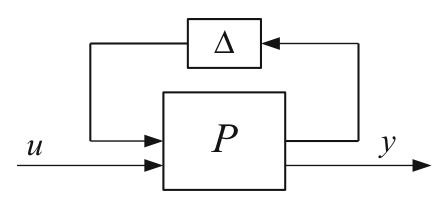

> Image description: A technical block diagram illustrating a Linear Fractional Transformation (LFT) feedback interconnection. The diagram consists of two primary rectangular blocks arranged in a closed loop. The larger, central block is labeled with the capital letter $P$, representing the nominal linear time-invariant (LTI) plant. The smaller block, located in the feedback path, is labeled with the Greek letter $\Delta$ (Delta), representing the uncertainty operator. The signal flow is indicated by black arrows: * An input signal labeled $u$ enters the left side of block $P$. * An output signal labeled $y$ exits the right side of block $P$. * A feedback loop connects the output $y$ back to the input of block $\Delta$. * The output of block $\Delta$ is fed back into the top of block $P$, completing the loop. In engineering terms, this configuration models how uncertainties ($\Delta$) interact with a nominal system ($P$) through feedback, a fundamental representation for robust control design.
Model Building for Control System Synthesis, Fig. 1 Block diagram of the typical LFT interconnection adopted in the robust control framework

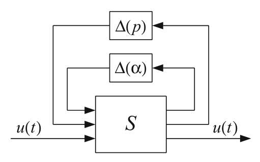

> Image description: A block diagram illustrating a typical Linear Fractional Transformation (LFT) interconnection used in robust control synthesis. The diagram features a central system block labeled $S$, which represents the nominal plant. The system is interconnected through multiple feedback loops involving two perturbation blocks: $\Delta(p)$ and $\Delta(\alpha)$. An input signal, $u(t)$, enters the central block $S$ from the left. The output signal, also labeled $u(t)$, exits the block to the right. The first feedback loop originates from the output of $S$, passes through the block $\Delta(p)$, and is fed back into an input port of $S$. A second, nested feedback loop originates from a different output point of $S$, passes through the block $\Delta(\alpha)$, and returns to another input port of $S$. The arrangement depicts how structured uncertainties, represented by $\Delta$ blocks, are integrated into the nominal system $S$ through affine feedback connections.
Model Building for Control System Synthesis, Fig. 2 Block diagram of the typical LFT interconnection adopted in the robust LPV control framework


<!-- source_pdf_page: 741 -->
to be controlled is a highly complex one, in which symbolic techniques play a very important role. Tools already exist to perform this task (see, e.g., Hecker et al. 2005), while a recent overview of the state of the art in this research area can be found in Hecker and Varga (2006).

Finally, it is important to point out that there is a vast body of advanced control techniques which are based on discrete-time models:

$$
\begin{align*}
& x(k+1)=f(x(k), u(k), p, k)  \tag{8}\\
& y(k)=g(x(k), u(k), p, k)
\end{align*}
$$

where the integer time step $k$ usually corresponds to multiples of a sampling period $T_{s}$. Many techniques are available to transform (2) into (8). Furthermore, LTI, LTV, and LPV models can be formulated in discrete time rather than in continuous time.

## Building Models for Control System Synthesis

The development of control-oriented models of physical systems is a complex task, which in general implies a careful combination of prior knowledge about the physics of the system under study with information coming from experimental data. In particular, this process can follow very different paths depending on the type of information which is available on the plant to be controlled. Such paths are typically classified in the literature as follows (see, e.g., Ljung (2008) for a more detailed discussion).

White box modeling refers to the development of control-oriented models on the basis of first principles only. In this framework, one uses the available information on the plant to develop a detailed model using OOM or EOOL tools and subsequently works out a compact controloriented model from it. If the adopted tool only supports simulation, then one can run simulations of the plant model, subject to suitably chosen excitation inputs (ranging from steps to persistently exciting input sequences such as, e.g., pseudorandom binary sequences and sine
sweeps) and then reconstruct the dynamics by means of system identification methods. Note that in this way the structure/order selection stage of the system identification process provides effective means to manage the complexity versus accuracy tradeoff in the derivation of the compact model. A more direct approach, presently supported by many tools, is to directly compute the $A, B, C, D$ matrices of the linearized system around specified equilibrium (trim) points, using symbolic and/or numerical linearization techniques. The result is usually a high-order linear system, which then can (sometimes must) be reduced to a low-order system by using model order reduction techniques (such as, e.g., balanced truncation). Model reduction techniques (see Antoulas (2009) for an in-depth treatment of this topic) allow to automatically obtain approximated compact models such as (3), starting from much more detailed simulation models, by formulating specific approximation bounds in control-relevant terms (e.g., percentage errors of steady-state output values, normbounded additive or multiplicative errors of weighted transfer functions, or $L_{2}$-norm errors of output transients in response to specified input signals).

Black box modeling, on the other hand, corresponds to situations in which the modeling activity is entirely based on input-output data collected on the plant (which therefore must be already available), possibly in dedicated, suitably designed, experiments (see Ljung 1999). Regardless of the type of model to be built (i.e., linear or nonlinear, time invariant or time varying, discrete time or continuous time), the black box approach consists of a number of well-defined steps. First of all the structure of the model to be identified must be defined: in the linear time-invariant case, this corresponds to the choice of the number of poles and zeros for an input-output model or to the choice of model order for a state-space representation; in the nonlinear case structure selection is a much more involved process in view of the much larger number of degrees of freedom which are potentially involved. Once a model structure has been defined, a suitable


<!-- source_pdf_page: 742 -->
cost function to measure the model performance must be selected (e.g., time-domain simulation or prediction error, frequency domain model fitting, etc.) and the experiments to collect identification and validation data must be designed. Finally, the uncertain model parameters must be estimated from the available identification dataset and the model must be validated on the validation dataset.

Grey box modeling (in various shades) corresponds to the many possible intermediate cases which can occur in practice, ranging from the white box approach to the black box one. As recently discussed in Ljung (2008), the critical issue in the development of an effective approach to control-oriented grey box modeling lies in the integration of existing methods and tools for physical systems modeling and simulation with methods and tools for parameter estimation. Such integration can take place in a number of different ways depending on the relative role of data and priors on the physics of the system in the specific application. A typical situation which occurs frequently in applications is when a white box model (developed by means of OOM or EOOL tools) contains parameters having unknown or uncertain numerical values (such as, e.g., damping factors in structural models, aerodynamic coefficients in aircraft models and so on). Then, one may rely on input-output data collected in dedicated experiments on the real system to refine the white box model by estimating the parameters using the information provided by the data. This process is typically dependent on the specific application domain as the type of experiment, the number of measurements, and the estimation technique must meet application-specific constraints (see, e.g., Klein and Morelli (2006) for an overview of grey box modeling in aerospace applications).

## Summary and Future Directions

In this article the problem of model building for control system synthesis has been con-
sidered. An overview of the different uses of mathematical models in control system design has been provided and the process of building compact control-oriented models starting from prior knowledge about the system and/or experimental data has been discussed. Present-day modeling and simulation tools support advanced control system design in a much more direct way. In particular, while methods and tools for the individual steps in the modeling process (such as OOM, linearization and model reduction, parameter estimation) are available, an integrated environment enabling the pursuit of all the abovementioned paths to the development of compact controloriented models is still a subject for future development. The availability of such a tool might further promote the application of advanced, model-based techniques that are currently limited by the model development process.

## Cross-References

- Modeling of Dynamic Systems from First Principles
- Multi-domain Modeling and Simulation
- System Identification: An Overview


## Bibliography

Antoulas A (2009) Approximation of large-scale dynamical systems. SIAM, Philadelphia
Hecker S, Varga A (2006) Symbolic manipulation techniques for low order LFT-based parametric uncertainty modelling. Int J Control 79(11): 1485-1494
Hecker S, Varga A, Magni J-F (2005) Enhanced LFR-toolbox for MATLAB. Aerosp Sci Technol 9(2):173-180
Klein V, Morelli EA (2006) Aircraft system identification: theory and practice. AIAA, Reston
Ljung L (1999) System identification: theory for the user. Prentice-Hall, New Jersey
Ljung L (2008) Perspectives on system identification. In: 2008 IFAC world congress, Seoul


<!-- source_pdf_page: 743 -->
Lopes dos Santos P, Azevedo Perdicoulis TP, Novara C, Ramos JA, Rivera DE (eds) (2011) Linear parametervarying system identification: new developments and trends. World Scientific, Singapore
Lovera M (ed) (2014) Control-oriented modelling and identification: theory and practice. IET, London
Mohammadpour J, Scherer C (eds) (2012) Control of linear parameter varying systems with applications. Springer, New York
Skogestad S, Postlethwaite I (2007) Multivariable feedback control analysis and design. Wiley, Chichester/New York
Tiller M (2001) Introduction to physical modelling with Modelica. Kluwer, Boston

## MHE

Moving Horizon Estimation

## Model Order Reduction: Techniques and Tools

Peter Benner ${ }^{1}$ and Heike Faßbender ${ }^{2}$
${ }^{1}$ Max Planck Institute for Dynamics of Complex Technical Systems, Magdeburg, Germany
${ }^{2}$ Institut Computational Mathematics, Technische Universität Braunschweig, Braunschweig, Germany


#### Abstract

Model order reduction (MOR) is here understood as a computational technique to reduce the order of a dynamical system described by a set of ordinary or differential-algebraic equations (ODEs or DAEs) to facilitate or enable its simulation, the design of a controller, or optimization and design of the physical system modeled. It focuses on representing the map from inputs into the system to its outputs, while its dynamics are treated as a black box so that the large-scale set of describing ODEs/DAEs can be replaced by a much smaller set of ODEs/DAEs without sacrificing the accuracy of the input-to-output behavior.


## Keywords

Balanced truncation; Interpolation-based methods; Reduced-order models; SLICOT; Truncation-based methods

## Problem Description

This survey is concerned with linear timeinvariant (LTI) systems in state-space form

$$
\begin{align*}
E \dot{x}(t) & =A x(t)+B u(t), \\
y(t) & =C x(t)+D u(t), \tag{1}
\end{align*}
$$

where $E, A \in \mathbb{R}^{n \times n}$ are the system matrices, $B \in \mathbb{R}^{n \times m}$ is the input matrix, $C \in \mathbb{R}^{p \times n}$ is the output matrix, and $D \in \mathbb{R}^{p \times m}$ is the feedthrough (or input-output) matrix. The size $n$ of the matrix $A$ is often referred to as the order of the LTI system. It mainly determines the amount of time needed to simulate the LTI system.

Such LTI systems often arise from a finite element modeling using commercial software such as ANSYS or NASTRAN which results in a second-order differential equation of the form

$$
\begin{array}{r}
M \ddot{x}(t)+D \dot{x}(t)+K x(t)=F u(t), \\
y(t)=C_{p} x(t)+C_{v} \dot{x}(t),
\end{array}
$$

where the mass matrix $M$, the stiffness matrix $K$, and the damping matrix $D$ are square matrices in $\mathbb{R}^{s \times s}, F \in \mathbb{R}^{s \times m}, C_{p}, C_{v} \in \mathbb{R}^{q \times s}, x(t) \in \mathbb{R}^{s}$, $u(t) \in \mathbb{R}^{m}, y(t) \in \mathbb{R}^{q}$. Such second-order differential equations are typically transformed to a mathematically equivalent first-order differential equation

$$
\begin{gathered}
\underbrace{\left[\begin{array}{cc}
I & 0 \\
0 & M
\end{array}\right]}_{E} \underbrace{\left[\begin{array}{c}
\dot{x}(t) \\
\ddot{x}(t)
\end{array}\right]}_{\dot{z}(t)}=\underbrace{\left[\begin{array}{cc}
0 & I \\
-K & -D
\end{array}\right]}_{A} \underbrace{\left[\begin{array}{c}
x(t) \\
\dot{x}(t)
\end{array}\right]}_{z(t)}+\underbrace{\left[\begin{array}{c}
0 \\
F
\end{array}\right]}_{B} u(t) \\
y(t)=\underbrace{\left[\begin{array}{cc}
C_{p} & C_{v}
\end{array}\right]}_{C} \underbrace{\left[\begin{array}{c}
x(t) \\
\dot{x}(t)
\end{array}\right]}_{z(t)}
\end{gathered}
$$


<!-- source_pdf_page: 744 -->
where $E, A \in \mathbb{R}^{2 s \times 2 s}, B \in \mathbb{R}^{2 s \times m}, C \in \mathbb{R}^{q \times 2 s}$, $z(t) \in \mathbb{R}^{2 s}, u(t) \in \mathbb{R}^{m}, y(t) \in \mathbb{R}^{q}$. Various other linearizations have been proposed in the literature.

The matrix $E$ may be singular. In that case the first equation in (1) defines a system of differential-algebraic equations (DAEs); otherwise it is a system of ordinary differential equations (ODEs). For example, for $E=\left[\begin{array}{ll}J & 0 \\ 0 & 0\end{array}\right]$ with a $j \times j$ nonsingular matrix $J$, only the first $j$ equations in the left-hand side expression in (1) form ordinary differential equations, while the last $n-j$ equations form homogeneous linear equations. If further $A=\left[\begin{array}{cc}A_{11} & A_{12} \\ 0 & A_{22}\end{array}\right]$ and $B= \left[\begin{array}{l}B_{1} \\ B_{2}\end{array}\right]$ with the $j \times j$ matrix $A_{11}$, the $j \times m$ matrix $B_{1}$ and a nonsingular matrix $A_{22}$, this is easily seen: partitioning the state vector $x(t)= \left[\begin{array}{l}x_{1}(t) \\ x_{2}(t)\end{array}\right]$ with $x_{1}(t)$ of length $j$, the DAE $E \dot{x}(t)= A x(t)+B u(t)$ splits into the algebraic equation $0=A_{22} x_{2}(t)+B_{2} u_{2}(t)$, and the ODE

$$
J \dot{x}_{1}(t)=A_{11} x_{1}(t)+\left(B_{1}-A_{12} A_{22}^{-1} B_{2}\right) u(t)
$$

To simplify the description, only continuoustime systems are considered here. The discretetime case can be treated mostly analogously; see, e.g., Antoulas (2005).

An alternative way to represent LTI systems is provided by the transfer function matrix (TFM), a matrix-valued function whose elements are rational functions. Assuming $x(0)=0$ and taking Laplace transforms in (1) yields $s X(s)= A X(s)+B U(s), Y(s)=C X(s)+D U(s)$, where $X(s), Y(s)$, and $U(s)$ are the Laplace transforms of the time signals $x(t), y(t)$ and $u(t)$, respectively. The map from inputs $U$ to outputs $Y$ is then described by $Y(s)=G(s) U(s)$ with the TFM

$$
\begin{equation*}
G(s)=C(s E-A)^{-1} B+D, \quad s \in \mathbb{C} \tag{2}
\end{equation*}
$$

The aim of model order reduction is to find an LTI system

$$
\begin{equation*}
\widetilde{E} \dot{\tilde{x}}(t)=\widetilde{A} \tilde{x}(t)+\widetilde{B} u(t), \quad \tilde{y}(t)=\widetilde{C} \tilde{x}(t)+\widetilde{D} u(t) \tag{3}
\end{equation*}
$$

of reduced-order $r \ll n$ such that the corresponding TFM

$$
\begin{equation*}
\widetilde{G}(s)=\widetilde{C}(s \widetilde{E}-\widetilde{A})^{-1} \widetilde{B}+\widetilde{D} \tag{4}
\end{equation*}
$$

approximates the original TFM (2). That is, using the same input $u(t)$ in (1) and (3), we want that the output $\tilde{y}(t)$ of the reduced order model (ROM) (3) approximates the output $y(t)$ of (1) well enough for the application considered (e.g., controller design). In general, one requires $\|y(t)-\tilde{y}(t)\| \leq \varepsilon$ for all feasible inputs $u(t)$, for (almost) all $t$ in the time domain of interest, and for a suitable norm $\|\cdot\|$. In control theory one often employs the $\mathcal{L}_{2^{-}}$or $\mathcal{L}_{\infty}$-norms on $\mathbb{R}$ or [ $0, \infty$ ], respectively, to measure time signals or their Laplace transforms. In the situations considered here, the $\mathcal{L}_{2}$-norms employed in frequency and time domain coincide due to the Paley-Wiener theorem (or Parseval's equation or the Plancherel theorem, respectively); see Antoulas (2005) and Zhou et al. (1996) for details. As $Y(s)-\widetilde{Y}(s)=(G(s)-\widetilde{G}(s)) U(s)$, one can therefore consider the approximation error of the TFM $\|G(\cdot)-\widetilde{G}(\cdot)\|$ measured in an induced norm instead of the error in the output $\|y(\cdot)-\tilde{y}(\cdot)\|$.

Depending on the choice of the norm, different MOR goals can be formulated. Typical choices are (see, e.g., Antoulas (2005) for a more thorough discussion)

- $\|G(\cdot)-\widetilde{G}(\cdot)\|_{\mathcal{H}_{\infty}}$, where

$$
\|F(.)\|_{\mathcal{H}_{\infty}}=\sup _{s \in \mathbb{C}_{+}} \sigma_{\max }(F(s))
$$

Here, $\sigma_{\text {max }}$ is the largest singular value of the matrix $F(s)$. This minimizes the maximal magnitude of the frequency response of the error system and by the Paley-Wiener theorem bounds the $\mathcal{L}_{2}$-norm of the output error.

- $\|G(\cdot)-\widetilde{G}(\cdot)\|_{\mathcal{H}_{2}}$, where (with $\imath=\sqrt{-1}$ )

$$
\|F(\cdot)\|_{\mathcal{H}_{2}}^{2}=\frac{1}{2 \pi} \int_{-\infty}^{+\infty} \operatorname{tr}\left(F(\imath \omega)^{*} F(\imath \omega)\right) d \omega
$$

This ensures a small error $\|y(\cdot)-\tilde{y}(\cdot)\|_{\mathcal{L}_{\infty}(0, \infty)} =\sup _{t>0}\|y(t)-\tilde{y}(t)\|_{\infty}$ (with $\|\cdot\|_{\infty}$ denoting the maximum norm of a vector)


<!-- source_pdf_page: 745 -->
uniformly over all inputs $u(t)$ having bounded $\mathcal{L}_{2}$-energy, that is, $\int_{0}^{\infty} u(t)^{T} u(t) d t \leq 1$; see Gugercin et al. (2008).
Besides a small approximation error, one may impose additional constraints for the ROM. One might require certain properties (such as stability and passivity) of the original systems to be preserved. Rather than considering the full nonnegative real line in time domain or the full imaginary axis in frequency domain, one can also consider bounded intervals in both domains. For these variants, see, e.g., Antoulas (2005) and Obinata and Anderson (2001).

## Methods

There are a number of different methods to construct ROMs, see, e.g., Antoulas (2005), Benner et al. (2005), Obinata and Anderson (2001), and Schilders et al. (2008). Here we concentrate on projection-based methods which restrict the full state $x(t)$ to an $r$-dimensional subspace by choosing $\tilde{x}(t)=W^{*} x(t)$, where $W$ is an $n \times r$ matrix. Here the conjugate transpose of a complex-valued matrix $Z$ is denoted by $Z^{*}$, while the transpose of a matrix $Y$ will be denoted by $Y^{T}$. Choosing $V \in \mathbb{C}^{n \times r}$ such that $W^{*} V= I \in \mathbb{R}^{r \times r}$ yields an $n \times n$ projection matrix $\Pi= V W^{*}$ which projects onto the $r$-dimensional subspace spanned by the columns of $V$ along the kernel of $W^{*}$. Applying this projection to (1), one obtains the reduced-order LTI system (3) with

$$
\begin{equation*}
\widetilde{E}=W^{*} E V, \tilde{A}=W^{*} A V, \widetilde{B}=W^{*} B, \widetilde{C}=C V \tag{5}
\end{equation*}
$$

and an unchanged $\widetilde{D}=D$. If $V=W, \Pi$ is an orthogonal projector and is called a Galerkin projection. If $V \neq W, \Pi$ is an oblique projector, sometimes called a Petrov-Galerkin projection.

In the following, we will briefly discuss the main classes of methods to construct suitable matrices $V$ and $W$ : truncation-based methods and interpolation-based methods. Other methods, in particular combinations of the two classes discussed here, can be found in the literature. In case the original LTI system is real, it is often desirable
to construct a real reduced-order model. All of the methods discussed in the following either do construct a real reduced-order system or there is a variant of the method which does. In order to keep this exposition at a reasonable length, the reader is referred to the cited literature.

## Truncation Based Methods

The general idea of truncation is most easily explained by modal truncation: For simplicity, assume that $E=I$ and that $A$ is diagonalizable, $T^{-1} A T=D_{A}=\operatorname{diag}\left(\lambda_{1}, \ldots, \lambda_{n}\right)$. Further we assume that the eigenvalues $\lambda_{\ell} \in \mathbb{C}$ of $A$ can be ordered such that

$$
\begin{equation*}
\operatorname{Re}\left(\lambda_{n}\right) \leq \operatorname{Re}\left(\lambda_{n-1}\right) \leq \ldots \leq \operatorname{Re}\left(\lambda_{1}\right)<0, \tag{6}
\end{equation*}
$$

(i.e., all eigenvalues lie in the open left half complex plane). This implies that the system is stable. Let $V$ be the $n \times r$ matrix consisting of the first $r$ columns of $T$ and let $W^{*}$ be the first $r$ rows of $T^{-1}$, that is, $W=V\left(V^{*} V\right)^{-1}$. Applying the transformation $T$ to the LTI system (1) yields

$$
\begin{align*}
T^{-1} \dot{x}(t) & =\left(T^{-1} A T\right) T^{-1} x(t)+\left(T^{-1} B\right) u(t)  \tag{7}\\
y(t) & =(C T) T^{-1} x(t)+D u(t) \tag{8}
\end{align*}
$$

with
$T^{-1} A T=\left[\begin{array}{ll}W^{*} A V & \\ & A_{2}\end{array}\right], \quad T^{-1} B=\left[\begin{array}{c}W^{*} B \\ B_{2}\end{array}\right]$,
and $C T=\left[C V C_{2}\right]$, where $W^{*} A V= \operatorname{diag}\left(\lambda_{1}, \ldots, \lambda_{r}\right)$ and $A_{2}=\operatorname{diag}\left(\lambda_{r+1}, \ldots, \lambda_{n}\right)$. Preserving the $r$ dominant poles (eigenvalues with largest real part) by truncating the rest (i.e., discarding $A_{2}, B_{2}$, and $C_{2}$ from (7)) yields the ROM as in (5). It can be shown that the error bound

$$
\|G(\cdot)-\widetilde{G}(\cdot)\|_{\mathcal{H}_{\infty}} \leq\left\|C_{2}\right\|\left\|B_{2}\right\| \frac{1}{\left|\operatorname{Re}\left(\lambda_{r+1}\right)\right|}
$$

holds (Benner 2006). As eigenvalues contain only limited information about the system, this is not necessarily a meaningful reduced-order system. In particular, the dependence of the input-output relation on $B$ and $C$ is completely ignored.


<!-- source_pdf_page: 746 -->
This can be enhanced by more refined dominance measures taking $B$ and $C$ into account; see, e.g., Varga (1995) and Benner et al. (2011).

More suitable reduced-order systems can be obtained by balanced truncation. To introduce this concept, we no longer need to assume $A$ to be diagonalizable, but we require the stability of $A$ in the sense of (6). For simplicity, we assume $E=I$. For treatment of the DAE case ( $E \neq I$ ), see Benner et al. (2005, Chap. 3). Loosely speaking, a balanced representation of an LTI system is obtained by a change of coordinates such that the states which are hard to reach are at the same time those which are difficult to observe. This change of coordinates amounts to an equivalence transformation of the realization ( $A, B, C, D$ ) of (1) called state-space transformation as in (7), where $T$ now is the matrix representing the change of coordinates. The new system matrices ( $T^{-1} A T, T^{-1} B, C T, D$ ) form a balanced realization of (1). Truncating in this balanced realization the states that are hard to reach and difficult to observe results in a ROM.

Consider the Lyapunov equations

$$
\begin{equation*}
A P+P A^{T}+B B^{T}=0, A^{T} Q+Q A+C^{T} C=0 . \tag{9}
\end{equation*}
$$

The solution matrices $P$ and $Q$ are called controllability and observability Gramians, respectively. If both Gramians are positive definite, the LTI system is minimal. This will be assumed from here on in this section.

In balanced coordinates the Gramians $P$ and $Q$ of a stable minimal LTI system satisfy $P=Q=\operatorname{diag}\left(\sigma_{1}, \ldots, \sigma_{n}\right)$ with the Hankel singular values $\sigma_{1} \geq \sigma_{2} \geq \ldots \geq \sigma_{n}>0$. The Hankel singular values are the positive square roots of the eigenvalues of the product of the Gramians $P Q, \sigma_{k}=\sqrt{\lambda_{k}(P Q)}$. They are system invariants, i.e., they are independent of the chosen realization of (1) as they are preserved under state-space transformations.

Given the LTI system (1) in a non-balanced coordinate form and the Gramians $P$ and $Q$ satisfying (9), the transformation matrix $T$ which yields an LTI system in balanced coordinates can be computed via the so-called square root algorithm as follows:

- Compute the Cholesky factors $S$ and $R$ of the Gramians such that $P=S^{T} S, Q=R^{T} R$.
- Compute the singular value decomposition of $S R^{T}=\Phi \Sigma \Gamma^{T}$, where $\Phi$ and $\Gamma$ are orthogonal matrices and $\Sigma$ is a diagonal matrix with the Hankel singular values on its diagonal. $T=S^{T} \Phi \Sigma^{-\frac{1}{2}}$ yields the balancing transformation (note that $T^{-1}=\Sigma^{\frac{1}{2}} \Phi^{T} S^{-T}= \Sigma^{-\frac{1}{2}} \Gamma^{T} R$ ).
- Partition $\Phi, \Sigma, \Gamma$ into blocks of corresponding sizes,

$$
\Sigma=\left[\begin{array}{cc}
\Sigma_{1} & \\
& \Sigma_{2}
\end{array}\right], \Phi=\left[\begin{array}{c}
\Phi_{1} \\
\Phi_{2}
\end{array}\right], \Gamma^{T}=\left[\begin{array}{c}
\Gamma_{1}^{T} \\
\Gamma_{2}^{T}
\end{array}\right],
$$

with $\Sigma_{1}=\operatorname{diag}\left(\sigma_{1}, \ldots, \sigma_{r}\right)$ and apply $T$ to (1) to obtain (7) with

$$
T^{-1} A T=\left[\begin{array}{cc}
W^{T} A V & A_{12}  \tag{10}\\
A_{21} & A_{22}
\end{array}\right], T^{-1} B=\left[\begin{array}{c}
W^{T} B \\
B_{2}
\end{array}\right],
$$

and $C T=\left[C V C_{2}\right]$ for $W=R^{T} \Gamma_{1} \Sigma_{1}^{-\frac{1}{2}}$ and $V=S^{T} \Phi_{1} \Sigma_{1}^{-\frac{1}{2}}$. Preserving the $r$ dominant Hankel singular values by truncating the rest yields the reduced-order model as in (5).
As $W^{T} V=I$, balanced truncation is an oblique projection method. The reduced-order model is stable with the Hankel singular values $\sigma_{1}, \ldots, \sigma_{r}$. It can be shown that if $\sigma_{r}>\sigma_{r+1}$, the error bound

$$
\begin{equation*}
\|G(\cdot)-\widetilde{G}(\cdot)\|_{\mathcal{H}_{\infty}} \leq 2 \sum_{k=r+1}^{n} \sigma_{k} \tag{11}
\end{equation*}
$$

holds. Given an error tolerance, this allows to choose the appropriate order $r$ of the reduced system in the course of the computations.

As the explicit computation of the balancing transformation $T$ is numerically hazardous, one usually uses the equivalent balancing-free square root algorithm (Varga 1991) in which orthogonal bases for the column spaces of $V$ and $W$ are computed. The so obtained ROM is no longer balanced, but preserves all other properties (error bound, stability). Furthermore, it is shown in Benner et al. (2000) how to implement the balancing-free square root algorithm using lowrank approximations to $S$ and $R$ without ever


<!-- source_pdf_page: 747 -->
having to resort to the square solution matrices $P$ and $Q$ of the Lyapunov equations (9). This yields an efficient algorithm for balanced truncation for LTI systems with large dense matrices. For systems with large-scale sparse $A$ efficient algorithms based on sparse solvers for (9) exist; see Benner (2006).

By replacing the solution matrices $P$ and $Q$ of (9) by other pairs of positive (semi-)definite matrices characterizing alternative controllability and observability related system information, one obtains a family of model reduction methods including stochastic/bounded-real/positive-real balanced truncation. These can be used if further properties like minimum phase, passivity, etc. are to be preserved in the reduced-order model; for further details, see Antoulas (2005) and Obinata and Anderson (2001).

The balanced truncation yields good approximation at high frequencies as $\widetilde{G}(\imath \omega) \rightarrow G(\imath \omega)$ for $\omega \rightarrow \infty$ (as $\widetilde{D}=D$ ), while the maximum error is often attained for $\omega=0$. For a perfect match at zero and a good approximation for low frequencies, one may employ the singular perturbation approximation (SPA, also called balanced residualization). In view of (7) and (10), balanced truncation can be seen as partitioning $T^{-1} x$ according to (10) into $\left[x_{1}^{T}, x_{2}^{T}\right]^{T}$ and setting $x_{2} \equiv 0$ (i.e., $\dot{x}_{2}=0$ as well). For SPA, one only sets $\dot{x}_{2}=0$, such that

$$
\begin{aligned}
\dot{x}_{1} & =W T A V x_{1}+A_{12} x_{2}+W T B u, \\
0 & =A_{21} x_{1}+A_{22} x_{2}+B_{2} u .
\end{aligned}
$$

Solving the second equation for $x_{2}$ and inserting it into the first equation yields

$$
\begin{aligned}
\dot{x}_{1}= & \left(W T A V-A_{12} A_{22}^{-1} A_{21}\right) x_{1} \\
& +\left(W T B-A_{12} A_{22}^{-1} B_{2}\right) u .
\end{aligned}
$$

For the output equation, it follows
$\tilde{y}=\left(C V-C_{2} A_{22}^{-1} A_{21}\right) x_{1}+\left(D-C_{2} A_{22}^{-1} B_{2}\right) u$.
This reduced-order model makes use of the information in the matrices $A_{12}, A_{21}, A_{22}, B_{2}$, and $C_{2}$ discarded by balanced truncation. It fulfills
$\widetilde{G}(0)=G(0)$ and the error bound (11); moreover, it preserves stability.

Besides SPA, another related truncation method that is not based on projection is optimal Hankel norm approximation (HNA). The description of HNA is technically quite involved; for details, see Zhou et al. (1996) and Glover (1984). It should be noted that the so obtained ROM usually has similar stability and accuracy properties as for balanced truncation.

## Interpolation-Based Methods

Another family of methods for MOR is based on (rational) interpolation. The unifying feature of the methods in this family is that the original TFM (2) is approximated by a rational matrix function of lower degree satisfying some interpolation conditions (i.e., the original and the reduced-order TFM coincide, e.g., $G\left(s_{0}\right)= \widetilde{G}\left(s_{0}\right)$ at some predefined value $s_{0}$ for which $A-s_{0} E$ is nonsingular). Computationally this is usually realized by certain Krylov subspace methods.

The classical approach is known under the name of moment-matching or Padé(-type) approximation. In these methods, the transfer functions of the original and the reduced order systems are expanded into power series, and the reduced-order system is then determined so that the first coefficients in the series expansions match. In this context, the coefficients of the power series are called moments, which explains the term moment matching.

Classically the expansion of the TFM (2) in a power series about an expansion point $s_{0}$

$$
\begin{equation*}
G(s)=\sum_{j=0}^{\infty} M_{j}\left(s_{0}\right)\left(s-s_{0}\right)^{j} \tag{12}
\end{equation*}
$$

is used. The moments $M_{j}\left(s_{0}\right), j=0,1,2, \ldots$, are given by

$$
M_{j}\left(s_{0}\right)=-C\left[\left(A-s_{0} E\right)^{-1} E\right]^{j}\left(A-s_{0} E\right)^{-1} B
$$

Consider the (block) Krylov subspace $\mathcal{K}_{k}(F, H) =\operatorname{span}\left\{H, F H, F^{2} H, \ldots, F^{k-1} H\right\}$ for $F= \left(A-s_{0} E\right)^{-1} E$ and $H=-\left(A-s_{0} E\right)^{-1} B$ with


<!-- source_pdf_page: 748 -->
an appropriately chosen expansion point $s_{0}$ which may be real or complex. From the definitions of $A, B$, and $E$, it follows that $F \in \mathbb{K}^{n \times n}$ and $H \in \mathbb{K}^{n \times m}$, where $\mathbb{K}=\mathbb{R}$ or $\mathbb{K}=\mathbb{C}$ depending on whether $s_{0}$ is chosen in $\mathbb{R}$ or in $\mathbb{C}$. Considering $\mathcal{K}_{k}(F, H)$ column by column, this leads to the observation that the number of column vectors in $\left\{H, F H, F^{2} H, \ldots, F^{k-1} H\right\}$ is given by $r=m \cdot k$, as there are $k$ blocks $F^{j} H \in \mathbb{K}^{n \times m}, j=0, \ldots, k-1$. In the case when all $r$ column vectors are linearly independent, the dimension of the Krylov subspace $\mathcal{K}_{k}(F, H)$ is $m \cdot k$. Assume that a unitary basis for this block Krylov subspace is generated such that the column space of the resulting unitary matrix $V \in \mathbb{C}^{n \times r}$ spans $\mathcal{K}_{k}(F, G)$. Applying the Galerkin projection $\Pi=V V^{*}$ to (1) yields a reduced system whose TFM satisfies the following (Hermite) interpolation conditions at $s_{0}$ :

$$
\widetilde{G}^{(j)}\left(s_{0}\right)=G^{(j)}\left(s_{0}\right), \quad j=0,1, \ldots, k-1 .
$$

That is, the first $k-1$ derivatives of $G$ and $\widetilde{G}$ coincide at $s_{0}$. Considering the power series expansion (12) of the original and the reduced-order TFM, this is equivalent to saying that at least the $\underset{\sim}{\text { first }} k$ moments $\widetilde{M}_{j}\left(s_{0}\right)$ of the transfer function $\widetilde{G}(s)$ of the reduced system (3) are equal to the first $k$ moments $M_{j}\left(s_{0}\right)$ of the TFM $G(s)$ of the original system (1) at the expansion point $s_{0}$ :

$$
M_{j}\left(s_{0}\right)=\widetilde{M}_{j}\left(s_{0}\right), \quad j=0,1, \ldots, k-1 .
$$

If further the $r$ columns of the unitary matrix $W$ span the block Krylov subspace $\mathcal{K}_{k}(F, H)$ for $F=\left(A-s_{0} E\right)^{-T} E$ and $H=-\left(A-s_{0} E\right)^{-T} C^{T}$, applying the Petrov-Galerkin projection $\Pi= V\left(W^{*} V\right)^{-1} W^{*}$ to (1) yields a reduced system whose TFM matches at least the first $2 k$ moments of the TFM of the original system.

Theoretically, the matrix $V$ (and $W$ ) can be computed by explicitly forming the columns which span the corresponding Krylov subspace $\mathcal{K}_{k}(F, H)$ and using the Gram-Schmidt algorithm to generate unitary basis vectors for $\mathcal{K}_{k}(F, H)$. The forming of the moments (the Krylov subspace blocks $F^{j} H$ ) is numerically precarious and has to be avoided under all
circumstances. Using Krylov subspace methods to achieve an interpolation-based ROM as described above is recommended. The unitary basis of a (block) Krylov subspace can be computed by employing a (block) Arnoldi or (block) Lanczos method; see, e.g., Antoulas (2005), Golub and Van Loan (2013), and Freund (2003).

In the case when an oblique projection is to be used, it is not necessary to compute two unitary bases as above. An alternative is then to use the nonsymmetric Lanczos process (Golub and Van Loan 2013). It computes bi-unitary (i.e., $W^{*} V=I_{r}$ ) bases for the above mentioned Krylov subspaces and the reduced-order model as a by-product of the Lanczos process. An overview of the computational techniques for moment-matching and Padé approximation summarizing the work of a decade is given in Freund (2003) and the references therein.

In general, the discussed MOR approaches are instances of rational interpolation. When the expansion point is chosen to be $s_{0}=\infty$, the moments are called Markov parameters and the approximation problem is known as partial realization. If $s_{0}=0$, the approximation problem is known as Padé approximation.

As the use of one single expansion point $s_{0}$ leads to good approximation only close to $s_{0}$, it might be desirable to use more than one expansion point. This leads to multipoint momentmatching methods, also called rational Krylov methods; see, e.g., Ruhe and Skoogh (1998), Antoulas (2005), and Freund (2003).

In contrast to balanced truncation, these (rational) interpolation methods do not necessarily preserve stability. Remedies have been suggested; see, e.g., Freund (2003).

The use of complex-valued expansion points will lead to a complex-valued reduced-order system (3). In some applications (in particular, in case the original system is real valued), this is undesired. In that case one can always use complex-conjugate pairs of expansion points as then the entire computations can be done in real arithmetic.

The methods just described provide good approximation quality locally around the expansion


<!-- source_pdf_page: 749 -->
points. They do not aim at a global approximation as measured by the $\mathcal{H}_{2}$ - or $\mathcal{H}_{\infty}$-norms. In Gugercin et al. (2008), an iterative procedure is presented which determines locally optimal expansion points w.r.t. the $\mathcal{H}_{2}$-norm approximation under the assumption that the order $r$ of the reduced model is prescribed and only 0thand 1st-order derivatives are matched. Also, for multi-input multi-output systems (i.e., $m$ and $p$ in (1) are both larger than one), no full moment matching is achieved, but only tangential interpolation: $G\left(s_{j}\right) b_{j}=\widetilde{G}\left(s_{j}\right) b_{j}, c_{j}^{*} G\left(s_{j}\right)= c_{j}^{*} \widetilde{G}\left(s_{j}\right), c_{j}^{*} G^{\prime}\left(s_{j}\right) b_{j}=c_{j}^{*} \widetilde{G}^{\prime}\left(s_{j}\right) b_{j}$, for certain vectors $b_{j}, c_{j}$ determined together with the opti$\mathrm{mal} s_{j}$ by the iterative procedure.

## Tools

Almost all commercial software packages for structural dynamics include modal analysis/truncation as a means to compute a ROM. Modal truncation and balanced truncation are available in the MATLAB ${ }^{\circledR}$ Control System Toolbox and the MATLAB ${ }^{\circledR}$ Robust Control Toolbox.

Numerically reliable, well-tested, and efficient implementations of many variants of balancingbased MOR methods as well as Hankel norm approximation and singular perturbation approximation can be found in the Subroutine Library In Control Theory (SLICOT, http://www. slicot.org) (Varga 2001). Easy-to-use MATLAB interfaces to the Fortran 77 subroutines from SLICOT are available in the SLICOT Model and Controller Reduction Toolbox (http:// slicot.org/matlab-toolboxes/basic-control); see Benner et al. (2010). An implementation of moment matching via the (block) Arnoldi method is available in MOR for ANSYS ${ }^{\text {® }}$ (http:// modelreduction.com/Software.html).

There exist benchmark collections with mainly a number of LTI systems from various applications. There one can find systems in computer-readable format which can easily be used to test new algorithms and software:

- Oberwolfach Model Reduction Benchmark Collection
http://simulation.uni-freiburg.de/downloads/ benchmark/
- NICONET Benchmark Examples http://www.icm.tu-bs.de/NICONET/ benchmodred.html
The MOR WiKi http://morwiki.mpi-magde burg.mpg.de/morwiki/ is a platform for MOR research and provides discussions of a number of methods, links to further software packages (e.g., MOREMBS and MORPACK), as well as additional benchmark examples.


## Summary and Future Directions

MOR of LTI systems can now be considered as an established computational technique. Some open issues still remain and are currently investigated. These include methods yielding good approximation in finite frequency or time intervals. Though numerous approaches for these tasks exist, methods with sharp local error bounds are still desirable. A related problem is the reduction of closed-loop systems and controller reduction. Also, the generalization of the methods discussed in this essay to descriptor systems (i.e., systems with DAE dynamics), second-order systems, or unstable LTI systems has only been partially achieved. An important problem class getting a lot of current attention consists of (uncertain) parametric systems. Here it is important to preserve parameters as symbolic quantities in the ROM. Most of the current approaches are based in one way or another on interpolation. MOR for nonlinear systems has also been a research topic for decades. Still, the development of satisfactory methods in the context of control design having computable error bounds and preserving interesting system properties remains a challenging task.

## Cross-References

- Basic Numerical Methods and Software for Computer Aided Control Systems Design
- Multi-domain Modeling and Simulation


<!-- source_pdf_page: 750 -->
## Bibliography

Antoulas A (2005) Approximation of large-scale dynamical systems. SIAM, Philadelphia
Benner P (2006) Numerical linear algebra for model reduction in control and simulation. GAMM Mitt 29(2):275-296
Benner P, Quintana-Ortí E, Quintana-Ortí G (2000) Balanced truncation model reduction of large-scale dense systems on parallel computers. Math Comput Model Dyn Syst 6:383-405
Benner P, Mehrmann V, Sorensen D (2005) Dimension reduction of large-scale systems. Lecture Notes in Computational Science and Engineering, vol 45. Springer, Berlin/Heidelberg
Benner P, Kressner D, Sima V, Varga A (2010) Die SLICOT-Toolboxen für Matlab (The SLICOTToolboxes for Matlab) [German]. at-Automatisierungstechnik 58(1):15-25. English version available as SLICOT working note 2009-1, 2009, http://slicot.org/ working-notes/
Benner P, Hochstenbach M, Kürschner P (2011) Model order reduction of large-scale dynamical systems with Jacobi-Davidson style eigensolvers. In: Proceedings of the International Conference on Communications, Computing and Control Applications (CCCA), March 3-5, 2011 at Hammamet, Tunisia, IEEE Publications (6 pages)
Freund R (2003) Model reduction methods based on Krylov subspaces. Acta Numer 12:267-319
Glover K (1984) All optimal Hankel-norm approximations of linear multivariable systems and their $L^{\infty}$ norms. Internat J Control 39:1115-1193
Golub G, Van Loan C (2013) Matrix computations, 4th edn. Johns Hopkins University Press, Baltimore
Gugercin S, Antoulas AC, Beattie C (2008) $\mathcal{H}_{2}$ model reduction for large-scale dynamical systems. SIAM J Matrix Anal Appl 30(2):609-638
Obinata G, Anderson B (2001) Model reduction for control system design. Communications and Control Engineering Series. Springer, London
Ruhe A, Skoogh D (1998) Rational Krylov algorithms for eigenvalue computation and model reduction. Applied Parallel Computing. Large Scale Scientific and Industrial Problems, Lecture Notes in Computer Science, vol 1541. Springer, Berlin/Heidelberg, pp 491-502
Schilders W, van der Vorst H, Rommes J (2008) Model order reduction: theory, research aspects and applications. Springer, Berlin/Heidelberg
Varga A (1991) Balancing-free square-root algorithm for computing singular perturbation approximations. In: Proceedings of the 30th IEEE CDC, Brighton, pp 1062-1065
Varga A (1995) Enhanced modal approach for model reduction. Math Model Syst 1(2):91-105
Varga A (2001) Model reduction software in the SLICOT library. In: Datta B (ed) Applied and computational control, signals, and circuits. The Kluwer International

Series in Engineering and Computer Science, vol 629. Kluwer Academic, Boston, pp 239-282
Zhou K, Doyle J, Glover K (1996) Robust and optimal control. Prentice Hall, Upper Saddle River, NJ

## Model Reference Adaptive Control

Jing Sun<br>University of Michigan, Ann Arbor, MI, USA

## Synonyms

## MRAC


#### Abstract

The fundamentals and design principles of model reference adaptive control (MRAC) are described. The controller structure and adaptive algorithms are delineated. Stability and convergence properties are summarized.


## Keywords

Certainty equivalence; Lyapunov-SPR design; MIT rule

## Introduction

Model reference adaptive control (MRAC) is an important adaptive control approach, supported by rigorous mathematical analysis and effective design toolsets. It is made up of a feedback control law that contains a controller $C\left(s, \theta_{c}\right)$ and an adjustment mechanism that generates the controller parameter updates $\theta_{c}(t)$ online. While different MRAC configurations can be found in the literature, the structure shown in Fig. 1 is commonly used and includes all the basic components of an MRAC system. The prominent features of MRAC are that it incorporates a reference model which represents the desired


<!-- source_pdf_page: 751 -->
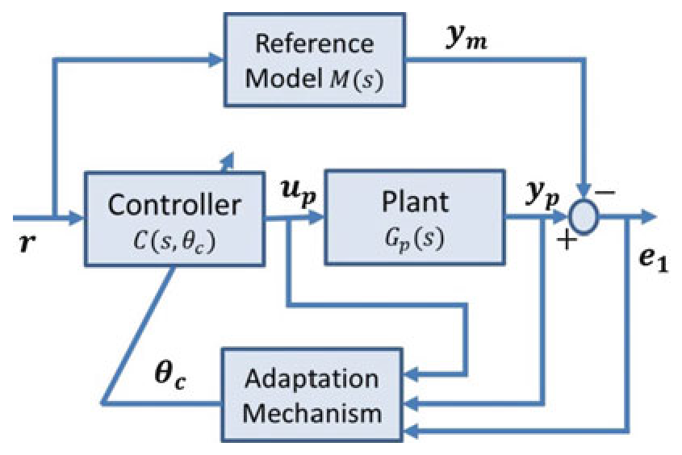

> Image description: Figure 1 shows a schematic block diagram of a Model Reference Adaptive Control (MRAC) system. The diagram illustrates a feedback control architecture consisting of four main functional blocks: a Reference Model $M(s)$, a Controller $C(s, \theta_c)$, a Plant $G_p(s)$, and an Adaptation Mechanism. An input signal $r$ is fed into both the Reference Model and the Controller. The Reference Model produces the desired output $y_m$, while the Controller produces the control signal $u_p$ sent to the Plant. The Plant output is $y_p$. A summation junction compares $y_p$ (with a positive sign) and $y_m$ (with a negative sign) to produce the error signal $e_1$. This error $e_1$, along with $u_p$ and $y_p$, is fed into the Adaptation Mechanism. The mechanism then provides an adjustable parameter $\theta_c$ back to the Controller, creating an adaptive loop to minimize the error between the plant and the reference model.
Model Reference Adaptive Control, Fig. 1 Schematic of MRAC

input-output behavior and that the controller and adaptation law are designed to force the response of the plant, $y_{p}$, to track that of the reference model, $y_{m}$, for any given reference input $r$.

Different approaches have been used to design MRAC, and each may lead to a different implementation scheme. The implementation schemes fall into two categories: direct and indirect MRAC. The former updates the controller parameters $\theta_{c}$ directly using an adaptive law, while the latter updates the plant parameters $\theta_{p}$ first using an estimation algorithm and then updates $\theta_{c}$ by solving, at each time $t$, certain algebraic equations that relate $\theta_{c}$ with the online estimates of $\theta_{p}$. In both direct and indirect MRAC schemes, the controller structure is kept the same as that which would be used in the case that the plant parameters are known.

## MRC Controller Structure

Consider the design objective of model reference control (MRC) for linear time-invariant systems: Given a reference model $M(s)$, find a control law such that the closed-loop system is stable and $y_{p} \rightarrow y_{m}$ as $t \rightarrow \infty$ for any bounded reference signal $r$.

For the case of known plant parameters, the MRC objective can be achieved by designing the controller so that the closed-loop system has a transfer function equal to $M(s)$. This
is the so-called model matching condition. To assure the existence of a causal controller that meets the model matching condition and guarantees internal stability of the closedloop system, the following assumptions are essential:

- A1. The plant has a stable inverse, and the reference model is chosen to be stable.
- A2. The relative degree of $M(s)$ is equal to or greater than that of the plant $G_{p}(s)$. Herein, the relative degree of a transfer function refers to the difference between the orders of the denominator and numerator polynomials.
It should be noted that these assumptions are imposed to the MRC problem so that there is enough structural flexibility in the plant and in the reference model to meet the control objectives. A1 is necessary for maintaining internal stability of the system while meeting the model matching condition, and A2 is needed to ensure the causality of the controller. Both assumptions are essential for non-adaptive applications when the plant parameters are known, let alone for the adaptive cases when the plant parameters are unknown.

The reference model plays an important role in MRAC, as it will define the feasibility of MRAC design as well as the performance of the resulting closed-loop MRAC system. The reference model should reflect the desired closedloop performance. Namely, any time-domain or frequency-domain specifications, such as time constant, damping ratio, natural frequency, bandwidth, etc., should be properly reflected in the chosen transfer function $M(s)$.

The controller structure for the MRAC is derived with these assumptions for the known plant case and extended to the adaptive case by combining it with a proper adaptive law. Under assumptions A1-A2, there exist infinitely many control solutions $C$ that will achieve the MRC design objective for a given plant transfer function $G_{p}(s)$. Nonetheless, only those extendable to MRAC with the simplest structure are of interest. It is known that if a special controller structure with the following parametrization is imposed, then the solution to the model matching


<!-- source_pdf_page: 752 -->
condition, in terms of the ideal parameter $\theta_{c}^{*}$, will be unique:

$$
u_{p}=\theta_{1}^{* T} \omega_{1}+\theta_{2}^{* T} \omega_{2}+\theta_{3}^{* T} y_{p}+c_{0}^{*} r=\theta_{c}^{* T} \omega
$$

where $\theta_{c}^{*} \in R^{2 n}, n$ is the order of the plant,

$$
\theta_{c}^{*}=\left[\begin{array}{c}
\theta_{1}^{*} \\
\theta_{2}^{*} \\
\theta_{3}^{*} \\
c_{0}^{*}
\end{array}\right], \omega=\left[\begin{array}{c}
\omega_{1} \\
\omega_{2} \\
y_{p} \\
r
\end{array}\right]
$$

and $\omega_{1}, \omega_{2} \in R^{n-1}$ are signals internal to the controller generated by stable filters (Ioannou and Sun 1996).

This MRC control structure is particularly appealing for adaptive control development, as the parameters appear linearly in the control law expression, leading to a convenient linear parametric model for adaptive algorithm development.

## Adaptation Algorithm

Design of adaptive algorithms for parameter updating can be pursued in several different approaches, thereby resulting in different MRAC schemes. Three direct design approaches, namely, the Lyapunov-SPR, the certainty equivalence, and the MIT rule, will be briefly described together with indirect MRAC.

## Lyapunov-SPR Design

One popular MRAC algorithm is derived using Lyapunov's direct method and the Meyer-Kalman-Yakubovich (MKY) Lemma based on the strictly positive real (SPR) argument. The concept of SPR transfer functions originates from network theory and is related to the driving point impendence of dissipative networks. The MKY Lemma states that given a stable transfer function $M(s)$ and its realization ( $A, B, C, d$ ) where $d \geq$ 0 and all eigenvalues of the matrix $A$ are in the open left half plane: If $M(s)$ is SPR, then for any given positive definite matrix $L=L^{T}>0$, there exists a scalar $v>0$, a vector $q$, and a $P=P^{T}>0$ such that

$$
\begin{gathered}
A^{T} P+P A=-q q^{T}-v L \\
P B-C= \pm q \sqrt{2 d}
\end{gathered}
$$

By choosing $M(s)$ to be SPR, one can formulate a Lyapunov function consisting of the state tracking and parameter estimation errors and use the MKY Lemma to define the adaptive law that will force the derivative of the Lyapunov function to be semi-negative definite. The resulting adaptive law has the following simple form:

$$
\dot{\theta}=-\Gamma e_{1} \omega \operatorname{sign}\left(c_{0}^{*}\right)
$$

where $e_{1}=y_{p}-y_{m}$ is simply the tracking error and $c_{0}^{*}=k_{m} / k_{p}$ with $k_{m}, k_{p}$ being the high frequency gain of the transfer function for the reference model $M(s)$ and the plant $G_{p}(s)$, respectively. This algorithm, however, applies only to systems with relative degree equal to 0 or 1 , which is implied by the SPR condition imposed on $M(s)$ and assumption A2.

The Lyapunov-SPR-based MRAC design is mathematically elegant in its stability analysis but is restricted to a special class of systems. While it can be extended to more general cases with relative degrees equal to 2 and 3 , the resulting control law and adaptive algorithm become much more complicated and cumbersome as efforts must be made to augment the control signal in such a way that the MKY Lemma is applicable to the "reformulated" reference model.

## Certainty Equivalence Design

For more general cases with a high relative degree, another design approach based on "certainty equivalence" (CE) principle is preferred, due to the simplicity in its design as well as its robustness properties in the presence of modeling errors. This approach treats the design of the adaptive law as a parameter estimation problem, with the estimated parameters being the controller parameter vector $\theta_{c}^{*}$. Using the specific linear formulation of the control law and assuming that $\theta_{c}^{*}$ satisfies the model matching condition, one can show that the ideal controller parameter satisfies the following parametric equation:


<!-- source_pdf_page: 753 -->
$$
z=\theta_{c}^{* T} \omega_{p}
$$

with

$$
z=M(s) u_{p}, \omega_{p}=\left[\begin{array}{c}
M(s) \omega_{1} \\
M(s) \omega_{2} \\
M(s) y_{p} \\
y_{p}
\end{array}\right]
$$

This parametric model allows one to derive adaptive laws to estimate the unknown controller parameter $\theta_{c}^{*}$ using standard parameter identification techniques, such as the gradient and least squares algorithms. The corresponding MRAC is then implemented in the CE sense where the unknown parameters are replaced by their estimated value. It should be noted that a CE design does not guarantee closed-loop stability of the resulting adaptive system, and additional analysis has been carried out to establish closed-loop stability.

## MIT Rule

Besides the Lyapunov-SPR and CE approaches mentioned earlier, the direct MRAC problem can also be approached using the so-called MIT rule, an early form of MRAC developed in the 1950s1960s in the Instrumentation Laboratory at MIT for flight control. The designer defines a cost function, e.g., a quadratic function of tracking error, and then adjusts parameters in the direction of steepest descent. The negative gradient of the cost function is usually calculated through the sensitivity derivative approach. The formulation is quite flexible, as different forms of MIT rule can be derived by changing the cost function following the same procedure and reusing the same sensitivity functions. Despite its effectiveness in some practical applications, MRAC systems designed with MIT rule have had stability and robustness issues.

## Indirect MRAC

While most of the MRAC systems are designed as direct adaptive systems, indirect MRAC systems can also be developed which
explicitly estimate the plant parameter $\theta_{p}$ as an intermediate step. The adaptive law for an indirect MRAC includes two basic components: one for estimating the plant parameters and another for calculating the controller parameters based on the estimated plant parameters. This approach would be preferred if the plant transfer function is partially known, in which case the identification of the remaining unknown parameters represents a less complex problem. For example, if the plant has no zeros, the indirect scheme estimates $n+1$ parameters, while the direct scheme has to estimate $2 n$ parameters.

Indirect MRAC is a CE-based design. As such, the design is intuitive but the design process does not guarantee closed-loop stability, and separate analysis has to be carried out to establish stability. Except for systems with a low number of zeros, the "feasibility" problem could also complicate the matter, in the sense that the MRC problem may not have a solution for the estimated plant at some time instants even though the solution exists for the real plant. This problem is unique to the indirect design, and several mitigating solutions have been found at the expense of more complicated adaptation or control algorithms.

## Stability, Robustness, and Parameter Convergence

Stability for MRAC often refers to the properties that all signals are bounded and tracking error converges to zero asymptotically. Robustness for adaptive systems implies that signal boundedness and tracking error convergence (to a small residue set) will be preserved in the presence of small perturbations such as disturbances, un-modeled dynamics, and time-varying parameters. For different MRAC schemes, different approaches are used to establish their properties.

For the Lyapunov-SPR-based MRAC systems, stability is established in the design process where the adaptive law is derived to enforce a Lyapunov stability condition. For CE-based designs, establishing stability for the closedloop MRAC system is a nontrivial exercise for both direct and indirect schemes. Using properly normalized adaptive laws for parameter


<!-- source_pdf_page: 754 -->
estimation, however, stability can be proved for direct and indirect MRAC schemes. For MRAC systems designed with the MIT rule, local stability can be established under more restrictive conditions, such as when the parameters are close to the ideal ones.

It should be noted that the adaptive control algorithm in the original form has been shown to have robustness issues, and extensive publications in the 1980s and 1990s were devoted to robust adaptive control in attempts to mitigate the problem. Many modifications have been proposed and shown to be effective in "robustifying" the MRAC; interested readers are referred to the article on - Robust Adaptive Control for more details.

Parameter convergence is not an intrinsic requirement for MRAC, as tracking error convergence can be achieved without parameter convergence. It has been shown, however, that parameter convergence could enhance robustness, particularly for indirect schemes. As in the case for parameter identification, a persistent excitation (PE) condition needs to be imposed on the regression signal to assure parameter convergence in MRAC. In general, PE is accomplished by properly choosing the reference input $r$. It can be established for most MRAC approaches that parameter convergence is achieved if, in addition to conditions required for stability, the reference input $r$ is sufficiently rich of order $2 n, \quad \dot{r}$ is bounded, and there is no polezero cancelation in the plant transfer function. A signal is called to be sufficiently rich of order $m$ if it contains at least $m / 2$ distinct frequencies.

## Summary and Future Directions

MRAC incorporates a reference model to capture the desired closed-loop responses and designs the control law and adaptation algorithm to force the output of the plant to follow the output of the reference model. Several different design approaches are available. Stability, robustness, and parameter convergence have been established for different MRAC designs with appropriate assumptions.

MRAC had been a very active and fruitful research topic from the 1960s to 1990s, and it formed important foundations for modern adaptive control theory. It also found many successful applications ranging from chemical process controls to automobile engine controls. More recent efforts have been mostly devoted to integrating it with other design approaches to treat nonstandard MRAC problems for nonlinear and complex dynamic systems.

## Cross-References

- Adaptive Control of Linear Time-Invariant Systems
- Adaptive Control, Overview
- History of Adaptive Control
- Robust Adaptive Control


## Recommended Reading

MRAC has been well covered in several textbooks and research monographs. Astrom and Wittenmark (1994) presented different MRAC schemes in a tutorial fashion. Narendra and Annaswamy (1989) focused on stability of deterministic MRAC systems. Ioannou and Sun (1996) covered the detailed derivation and analysis of different MRAC schemes and provided a unified treatment for their stability and robustness analysis. MRAC systems for discrete-time (Goodwin and Sin 1984) and for nonlinear (Krstic et al. 1995) processes are also well explored.

## Bibliography

Astrom KJ, Wittenmark B (1994) Adaptive control. Second edition. Prentice Hall, Englewood Cliffs
Goodwin GC, Sin KS (1984) Adaptive filtering, prediction and control. Prentice Hall, Englewood Cliffs
Ioannou PA, Sun J (1996) Robust adaptive control. Prentice Hall, Upper Saddle River
Krstic K, Kanellakopoulos I, Kokotovic PV (1995) Nonlinear and adaptive control design. Wiley, New York
Narendra KS, Annaswamy AM (1989) Stable adaptive systems. Prentice Hall, Englewood Cliffs


<!-- source_pdf_page: 755 -->
# Model-Based Performance Optimizing Control

Sebastian Engell<br>Fakultät Bio- und Chemieingenieurwesen, Technische Universität Dortmund, Dortmund, Germany


#### Abstract

In many applications, e.g., in chemical process control, the purpose of control is to achieve an optimal performance of the controlled system despite the presence of significant uncertainties about its behavior and of external disturbances. Tracking of set points is often required for lowerlevel control loops, but at the system level in most cases, this is not the primary concern and may even be counterproductive. In this entry, the use of dynamic online optimization on a moving finite horizon to realize optimal system performance is discussed. By realtime optimization, a performance-oriented or economic cost criterion is minimized or maximized over a finite horizon while the usual control specifications enter as constraints but not as set points. This approach integrates the computation of optimal set-point trajectories and of the regulation to these trajectories.


## Keywords

Model-predictive control (MPC); Integrated optimization and control; Real-time optimization (RTO); Performance optimizing control; Process control

## Introduction

From a systems point of view, the purpose of automatic feedback control (and that of manual control as well) in many cases is not primarily to keep the controlled variables at their set points as well as possible or to track dynamic set-point changes but to operate the system such that its performance is optimized in the presence
of disturbances und uncertainties, exploiting the information gained in real time from the available measurements. This holds generally for the higher control layers in the process industries but similarly for many other applications. Suppose that, for example, the availability of cooling water at a lower temperature than assumed as a worst case during plant design enables plant operation at a higher throughput. In this case, what sense does it make to enforce the nominal operating point by tight feedback control? For a combustion engine, the goal is to achieve the desired torque with minimum consumption of fuel. For a cooling system, the goal is to keep the temperature of the goods or of a room within certain bounds with minimum consumption of energy, possibly weighted against the wear of the equipment. To regulate some variables to their set points may help to achieve these goals but it is not the real performance target for the overall system. Feedback control loops therefore usually are part of control hierarchies that establish good performance of the overall system and the meeting of constraints on its operation.

There are four main approaches to the integration of feedback control with system performance optimization:

- Choice of regulated variables such that, implicitly via the regulation of these variables to their set points, the performance of the overall system is close to optimal (see the chapter on - Control Structure Selection).
- Tracking of necessary conditions of optimality where variables which determine the optimal operating policy are kept at or close to their constraints. This is a widespread approach especially in chemical batch processes where, e.g., the feeding of reactants is such that the maximum cooling power available is used (Finkler et al. 2014); see also the chapter on - Control and Optimization of Batch Processes).
In these two approaches, the choice of the optimal set points or constraints to be tracked is done off-line, and they are then implemented by the feedback layer of the process control hierarchy (see the chapter on ▷ Control Hierarchy of Large Processing Plants: An Overview).


<!-- source_pdf_page: 756 -->
- Combination of a regulatory (tracking) feedback control with an optimization of the set points or system trajectories (called real-time optimization in the process industries) (see the chapter on ▷ Real-Time Optimization of Industrial Processes).
- Reformulation of model-predictive control such that the control target is not the tracking of references but the optimization of the system performance over a finite horizon, taking constraints of system variables or inputs into account directly within the online optimization. Here, the optimization is performed with a dynamic model, in contrast to the steady-state optimization in real-time optimization or in the choice of selfoptimizing control structures.
The first three approaches are currently state of the art in the process industries. Tracking of necessary conditions of optimality is usually designed based on process insight rather than based upon a rigorous analysis, and the same holds for the selection of regulatory control structures. The last one is the most challenging approach in terms of the required models and algorithms and computing power, and its theoretical foundations are still under development. But on the other hand, it also has the highest potential in terms of the resulting performance of the controlled system, and it is structurally simple and easier to tune because the natural performance specification does not have to be translated into controller tunings, weights, etc. Therefore, the idea of direct model-based performance optimizing control has found much attention in process control in recent years.

The four approaches above are discussed in more detail below. We also provide some historical notes and outline some areas of continuing research.

## Performance Optimization by Regulation to Fixed Set Points

Morari et al. (1980) stated that the objective in the synthesis of a control structure is "to translate the economic objectives into process control
objectives." A subgoal in this "translation" is to select the regulatory control structure of a process such that steady-state optimality of process operations is realized to the maximum extent possible by driving the selected controlled variables to suitably chosen set points. A control structure with this property was termed "self-optimizing control" by Skogestad (2000). It should adjust the manipulated variables by keeping a function of the measured variables constant such that the process is operated at the economically optimal steady state in the presence of disturbances. From a system point of view, a control structure that yields nice transient responses and tight control of the selected variables may be of little use or even counterproductive if keeping the regulated variables at their set points does not improve the performance of the system. Ideally, in the steady state, a similar performance is obtained as it would be realized by optimizing the stationary values of the operational degrees of freedom of the system for known disturbances $d$ and a perfect model. By regulating the controlled variables to their set points at the steady state in the presence of disturbances, a mapping $u=f\left(y_{\text {set }}, d\right)$ is implicitly realized which should be an approximation of the performance optimizing inputs $u_{\text {opt }}(d)$. The choice of the self-optimizing control structure takes only the steady-state performance into account, not the dynamic reaction of the controlled plant. An extension of the approach to include also the dynamic behavior can be found in Pham and Engell (2011).

## Tracking of Necessary Conditions of Optimality

Very often, the optimal operation of a system in a certain phase of its evolution or under certain conditions is defined by some variables being at their constraints. If these variables are known and the conditions can be monitored, a switching control structure can be built that keeps the (possibly changing) set of critical variables at their constraints despite inaccuracies of the model, external disturbances, etc. In fact it turns out that such control schemes can, in the case of varying


<!-- source_pdf_page: 757 -->
parameters and in the presence of disturbances, perform as good as sophisticated model-based optimization schemes (Finkler et al. 2013).

## Performance Optimization by Steady-State Optimization and Regulation

A well-established approach to create a link between regulatory control and the optimization of the performance of a system is to compute the set points of the controllers by an optimization layer. In process operations, this layer is called real-time optimization (RTO) (see, e.g., Marlin and Hrymak (1997) and the references therein). An RTO system is a model-based, upper-level control system that is operated in closed loop and provides set points to the lower-level control systems in order to maintain the process operation as close as possible to the economic optimum. It usually comprises an estimation of the plant state and plant parameters from the measured data and an economic or otherwise performancerelated optimization of the operating point using a detailed nonlinear steady-state model.

As the RTO system employs a stationary process model and the optimization is only performed if the plant is approximately in a steady state, the time between successive RTO steps must be large enough for the plant to reach a new steady state after the last commanded move. This structure is based upon a separation of concerns and of time-scales between the RTO system and the process control system. The RTO system optimizes the system economics on a medium timescale (shifts to days), while the control system provides tracking and disturbance rejection on shorter timescales from seconds to hours.

As an approximation to real-time optimization with a nonlinear rigorous plant model, in many MPC implementations nowadays, an optimization of the steady-state values based on the linear model that is used in the MPC controller is implemented. Then the gain matrix of the model must be estimated carefully to obtain good results.

## Performance Optimizing Control

Model-predictive control has become the standard solution for demanding control problems in the process industries (Qin and Badgwell 2003) and increasingly is used also in other domains. The core idea is to employ a model to predict the effect of the future manipulated variables on the future controlled variables over a finite horizon and to use optimization to determine sequences of inputs which minimize a cost function over the so-called prediction horizon. In the unconstrained case with linear plant model and a quadratic cost function, the optimal control moves can be computed by a closed-form solution. When constraints on inputs, outputs, and possibly also state variables are present, for a quadratic cost function and linear plant model, the optimization problem becomes a quadratic program (QP) that has to be solved in real time.

When the system dynamics are nonlinear and linear models are only sufficiently accurate within narrow operation bands, as is the case in many chemical processes, nonlinear model predictive control which is based on nonlinear models of the process dynamics provides superior performance and therefore has met increasing interest both in theory and in practice. The classical formulation of nonlinear modelpredictive tracking control (TC) is

$$
\begin{gathered}
\min _{u} \phi_{T C}(\bar{y}, u) \\
\phi_{T C}=\sum_{n=1}^{N}\left(\sum_{i=1}^{P} \gamma_{n, i}\left(y_{n, \text { ref }}(k-i)-\bar{y}_{n}(k+i)\right)^{2}\right)+\sum_{l=1}^{R}\left(\sum_{j=1}^{M} \alpha_{l, j} \Delta u_{l}^{2}(k+j)\right)
\end{gathered}
$$


<!-- source_pdf_page: 758 -->
$$
\begin{aligned}
& \text { s.t. } \\
& \begin{aligned}
& x(i+1)=f(x(i), z(i), u(i), i), i=k, \ldots, k+P \\
& 0=g(x(i), z(i), u(i), i), i=k, \ldots, k+P \\
& y(i+1)=h(x(i+1), u(i)), i=k, \ldots, k+P \\
& x_{\min } \leq x(i) \leq x_{\max }, i=k, \ldots, k+P \\
& y_{\min } \leq \bar{y}(i) \leq y_{\max }, i=k, \ldots, k+P \\
& u_{\min } \leq u(i) \leq u_{\max }, i=k, \ldots, k+M \\
&-\Delta u_{\min } \leq \Delta u(i) \leq \Delta u_{\max }, i=k, \ldots, k+M \\
& u(i)=u(i-1)+\Delta u(i), i=k, \ldots, k+M \\
& u(i)=u(k+M), \forall i>k+M
\end{aligned}
\end{aligned}
$$

Here $f$ and $g$ represent the plant model in the form of a system of differential-algebraic Equations and h is the output function. $P$ is the length of the prediction horizon and $M$ is the length of the control horizon, and $y_{1}, \cdots, y_{N}$ are the predicted control outputs, $u_{1}, \cdots, u_{R}$ are the control inputs. $\alpha$ and $\gamma$ represent the weights on the control inputs and the control outputs, respectively. $y_{\text {ref }}$ refers to the set point or the desired output trajectory, and $\hat{y}(i)$ are the corrected model predictions. $N$ is number of the controlled outputs, and $R$ is the number of the control inputs. Compensation for plant-model mismatch and unmeasured disturbances is usually done using the bias correction equations:

$$
\begin{gathered}
d(k)=y^{\mathrm{meas}}(k)-y(k), \\
\bar{y}(k+i)=y(k+i)+d(k), i=k, \ldots, k+P .
\end{gathered}
$$

The idea of direct performance optimizing control (POC) is to replace this formulation by a performance-related objective function:

$$
\begin{aligned}
& \min _{u} \phi_{P O C}(y, u) \\
& \phi_{P O C}= \sum_{l=1}^{R}\left(\sum_{j=1}^{M} \alpha_{l, j} \Delta u_{l}^{2}(k+j)\right) \\
&-\left(\sum_{i=1}^{P} \beta_{i} \psi(k+i)\right) .
\end{aligned}
$$

Here $\psi(k+i)$ represents the value of the performance cost criterion at the time step $[k+i]$.

The optimization of the future control moves is subject to the same constraints as before. In addition, instead of reference tracking, constraints are formulated for all outputs that are critical for the operation of the system or its performance, e.g., product quality specifications or limitations of the equipment. In contrast to reference tracking, these constraints usually are one-sided (inequalities) or define operation bands. By this formulation, e.g., the production revenues can be maximized online over a finite horizon, considering constraints on product purities and waste stream impurities. Feedback enters into the computation by the initialization of the model with a new initial state that is estimated from the available measurements of system variables and by the bias correction. Thus, direct performance optimizing control realizes an online optimization of all operational degrees of freedom in a feedback structure without tracking of a priori fixed set points or reference trajectories. The regularization term that penalizes control moves is added to the purely economic objective function to obtain smoother solutions.

This approach has several advantages over a combined steady-state optimization/ linear MPC scheme:

- Immediate reaction to disturbances, no waiting for the plant to reach a steady state is required.
- "Overregulation" is avoided - no variables are forced to fixed set points and all degrees of freedom can be used to improve the (economic) performance of the plant.
- Performance goals and process constraints do not have to be mapped to a control cost that defines a compromise between different goals. In this way, the formulation of the optimization problem and the tuning are facilitated compared to achieving good performance by tuning of the weights of a tracking formulation.
- More constraints than available manipulated variables can be handled as well as more manipulated variables than variables that have to be regulated.
- No inconsistency arises from the use of different models on different layers.
- The overall scheme is structurally simple.


<!-- source_pdf_page: 759 -->
Similar to any NMPC controller that is designed for reference tracking, a successful implementation will require careful engineering such that as many uncertainties as possible are compensated by simple feedback controllers and only the key dynamic variables are handled by the optimizing controller based on a rigorous model of the essential dynamics and of the stationary relations of the plant without too much detail.

## History and Examples

The idea of economic or performance optimizing control originated from the process control community. The first papers on directly integrating economic considerations into model-predictive control Zanin et al. (2000) proposed to achieve a better economic performance by adding an economic term to a classical tracking performance criterion and applied this to the control of a fluidized bed catalytic cracker. Helbig et al. (2000) discussed different ways to integrate optimization and feedback control including direct dynamic optimization for the example of a semi-batch reactor. Toumi and Engell (2004) and Erdem et al. (2004) demonstrated online performance optimizing control schemes for simulated moving bed (SMB) chromatographic separations in lab scale. SMB processes are periodic processes and constitute prototypical examples where additional degrees of freedom can be used to simultaneously optimize system performance and to meet product specifications. Bartusiak (2005) reported already industrial applications of carefully engineered performance optimizing NMPC controllers.

Direct performance optimizing control was suggested as a promising general new control paradigm for the process industries by Rolandi and Romagnoli (2005), Engell (2006, 2007), Rawlings and Amrit (2009), and others. Meanwhile it has been demonstrated in many simulation studies that direct optimization of a performance criterion can lead to superior economic performance compared to classical tracking (N)MPC, e.g., Ochoa et al. (2010) for a
bioethanol process and Idris and Engell (2012) for a reactive distillation column.

## Further Issues

## Modeling and Robustness

In a direct performance optimizing control approach, sufficiently accurate dynamic nonlinear process models are needed. While in the process industries, nonlinear steady-state models are nowadays available for many processes because they are built and used extensively in the process design phase, there is still a considerable additional effort required to formulate, implement, and validate nonlinear dynamic process models. The effort for rigorous or semi-rigorous modeling usually dominates the cost of an advanced control project. The alternative approach to use black-box or gray-box models as proposed frequently in nonlinear model-predictive control may be effective for regulatory control where the model only has to capture the essential dynamic features of the plant near an operating point, but it seems to be less suitable for optimizing control where the optimal plant performance is aimed at and hence the best stationary values of the inputs and of the controlled variables have to be computed by the controller. As increasingly so-called operator training simulators are built in parallel to the construction of a plant and are continuously used and updated after the commissioning phase, it seems attractive to use the models contained in the simulators also for online optimization. However, the model formulations often are not suitable for this purpose.

Model inaccuracies always have to be taken into account. They not only lead to suboptimal performance but also can cause that the constraints even on measured variables cannot be met in the future because of an insufficient back-off from the constraints. A new approach to deal with uncertainties about model parameters and future influences on the process is multistage scenariobased optimization with recourse. Here the model uncertainties are represented by a set of scenarios of parameter variations and the future availability


<!-- source_pdf_page: 760 -->
of additional information is taken into account. It has been demonstrated that this is an effective tool to handle model uncertainties and to automatically generate the necessary back-off without being overly conservative (Lucia et al. 2013).

## State Estimation

For the computation of economically optimal process trajectories based upon a rigorous nonlinear process model, the state variables of the system at the beginning of the prediction horizon must be known. As not all states will be measured in a practical application, state estimation is a key ingredient of a performance optimizing controller. Extended Kalman filters are the standard solution used in the process industries, if the nonlinearities are significant, unscented Kalman filters or particle filters may be used. A novel approach is to formulate the state estimation problem also as an optimization problem on a moving horizon (Rao et al. 2003). The estimation of some important varying unknown model parameters can be included in this formulation. As accurate state estimation is at least as critical for the performance of the closed-loop system as the exact tuning of the optimizing controller, more attention should be paid to the investigation of the performance of state estimation schemes in realistic situations with non-negligible modelplant mismatch.

## Stability

Optimization of a cost function over a finite horizon in general neither assures optimality of the complete trajectory beyond this horizon nor stability of the closed-loop system. Closed-loop stability has been addressed extensively in the theoretical research in nonlinear model-predictive control. Stability can be assured by a proper choice of the stage cost within the prediction horizon and the addition of a cost on the terminal state and the restriction of the terminal state to a suitable set. In performance optimizing MPC, there is no a priori known steady state to which the trajectory should converge, and the economic cost function may not satisfy the usual conditions for closed-loop stability, e.g., because it only involves some of the inputs. In recent
years, important results on closed-loop stability guaranteeing formulations have nonetheless been obtained, involving terminal constraints or a quasi-infinite horizon (Angeli et al. 2012; Diehl et al. 2011; Grüne 2013).

## Reliability and Transparency

Nowadays quite large nonlinear dynamic optimization problems can be solved in real time, not only for slow processes as they are found in the chemical industry but also in mechatronics and automotive control. So this issue does no longer prohibit the application of a performance optimizing control scheme to complex systems. A practically very important limiting issue however is that of reliability and transparency. It is difficult to guarantee that a nonlinear optimizer will provide a solution which at least satisfies the constraints and gives a reasonable performance for all possible input data. While for an RTO scheme an inspection of the commanded set points by the operators usually will be feasible, this is less likely to be realistic in a dynamic situation. Hence, automatic result filters are necessary as well as a backup scheme that stabilizes the process in the case where the result of the optimization is not considered safe. In the process industries, the operators will continue to supervise the operation of the plant in the foreseeable future, so a control scheme that includes performance optimizing control must be structured into modules, the outputs of which can still be understood by the operators so that they build up trust in the optimization. Good operator interfaces that display the predicted moves and the predicted reaction of the plant and enable comparisons with the operators' intuitive strategies are believed to be essential for practical success.

## Effort vs. Performance

The gain in performance by a more sophisticated control scheme always has to be traded against the increase in cost due to the complexity of the control scheme - a complex scheme will not only cause cost for its implementation, but it will need more maintenance by better qualified people than a simple one. If a carefully


<!-- source_pdf_page: 761 -->
chosen standard regulatory control layer leads to a close-to-optimal operation, there is no need for optimizing control. If the disturbances that affect profitability and cannot be handled well by the regulatory layer (in terms of economic performance) are slow, the combination of regulatory control and RTO is sufficient. In a more dynamic situation or for complex nonlinear multivariable plants, the idea of direct performance optimizing control should be explored and implemented if significant gains can be realized in simulations.

## Cross-References

- Control and Optimization of Batch Processes
- Control Hierarchy of Large Processing Plants: An Overview
- Control Structure Selection
- Economic Model Predictive Control
- Extended Kalman Filters
- Model-Predictive Control in Practice
- Moving Horizon Estimation
- Particle Filters
- Real-Time Optimization of Industrial Processes


## Bibliography

Angeli D, Amrit R, Rawlings J (2012) On average performance and stability of economic model predictive control. IEEE Trans Autom Control 57(7): 1615-1626
Bartusiak RD (2005) NMPC: a platform for optimal control of feed- or product-flexible manufacturing. Preprints International workshop on assessment and future directions of NMPC, Freudenstadt, pp 3-14
Diehl M, Amrit R, Rawlings J, Angeli D (2011) A Lyapunov function for economic optimizing model predictive control. IEEE Trans Autom Control 56(3):703707
Engell S (2006, 2007) Feedback control for optimal process operation. Plenary paper IFAC ADCHEM, Gramado, 2006; J Process Control 17:203-219
Erdem G, Abel S, Morari M, Mazzotti M, Morbidelli M (2004) Automatic control of simulated moving beds. Part II: nonlinear isotherms. Ind Eng Chem Res 43:3895-3907
Finkler T, Lucia S, Dogru M, Engell S (2013) A simple control scheme for batch time minimization
of exothermic semi-batch polymerizations. Ind Eng Chem Res 52:5906-5920
Finkler TF, Kawohl M, Piechottka U, Engell S (2014) Realization of online optimizing control in an industrial semi-batch polymerization. J Process Control 24:399414
Grüne L (2013) Economic receding horizon control without terminal constraints. Automatica 49:725-734
Helbig A, Abel O, Marquardt W (2000) Structural concepts for optimization based control of transient processes. In: Nonlinear model predictive control. Allgöwer F and Zheng A, eds. Birkhäuser, Basel pp 295-311
Idris IAN, Engell S (2012) Economics-based NMPC strategies for the operation and control of a continuous catalytic distillation process. J Process Control 22:1832-1843
Lucia S, Finkler T, Basak D, Engell S (2013) A new Robust NMPC Scheme and its application to a semibatch reactor example. J Process Control 23:13061319
Marlin TE, Hrymak AN (1997) Real-time operations optimization of continuous processes. In: Proceedings of CPC V, Lake Tahoe, AIChE symposium series, vol 93, pp 156-164
Morari M, Stephanopoulos G, Arkun Y (1980) Studies in the synthesis of control structures for chemical processes, part I. AIChE J 26:220-232
Ochoa S, Wozny G, Repke J-U (2010) Plantwide optimizing control of a continuous bioethanol production process. J Process Control 20:983-998
Pham LC, Engell S (2011) A procedure for systematic control structure selection with application to reactive distillation. In: Proceedings of 18th IFAC world congress, Milan, pp 4898-4903
Qin SJ, Badgwell TA (2003) A survey of industrial model predictive control technology. Control Eng Pract 11:733-764
Rao CV, Rawlings JB, Mayne DQ (2003) Constrained state estimation for nonlinear discrete-time systems. IEEE Trans Autom Control 48:246-258
Rawlings J, Amrit R (2009) Optimizing process economic performance using model predictive control In: Nonlinear model predictive control - towards new challenging applications. Springer, Berlin, pp 119138
Rolandi PA, Romagnoli JA (2005) A framework for online full optimizing control of chemical processes. In: Proceedings of ESCAPE 15. Barcelona, Elsevier, pp 1315-1320
Skogestad S (2000) Plantwide control: the search for the self-optimizing control structure. J Process Control 10:487-507
Toumi A, Engell S (2004) Optimization-based control of a reactive simulated moving bed process for glucose isomerization. Chem Eng Sci 59:3777-3792
Zanin AC, Tvrzska de Gouvea M, Odloak D (2000) Industrial implementation of a real-time optimization strategy for maximizing production of LPG in a FCC unit. Comput Chem Eng 24:525-531


<!-- source_pdf_page: 762 -->
# Modeling of Dynamic Systems from First Principles

S. Torkel Glad<br>Department of Electrical Engineering, Linköping University, Linköping, Sweden


#### Abstract

This entry describes how models can be formed from the basic principles of physics and the other fields of science. Use can be made of similarities between different domains which leads to the concepts of bond graphs and, more abstractly, to port-controlled Hamiltonian systems. The class of models is naturally extended to differential algebraic equation (DAE) models. The concepts described here form a natural basis for parameter identification in gray box models.


## Keywords

Bond graph; Differential algebraic equation (DAE); Differential algebra; Gray box model; Hamiltonian; Physical analogy; Physical modeling

## Introduction

The approach to the modeling of dynamic systems depends on how much is known about the system. When the internal mechanisms are known, it is natural to model them using known relationships from physics, chemistry, biology, etc. Often the result is a model of the following form:

$$
\begin{equation*}
\frac{d x}{d t}=f(x, u ; \theta), \quad y=h(x, u ; \theta) \tag{1}
\end{equation*}
$$

where $u$ is the input, $y$ is the output, and the state $x$ contains internal physical variables, while $\theta$ contains parameters. Typically all of these are vectors. The model is known as a state space model. In many cases some elements in
$\theta$ are unknown and have to be determined using parameter estimation. When used in connection with system identification, these models are sometimes referred to as gray box models (in contrast to black box models) to indicate that some degree of physical knowledge is assumed. In ▷ System Identification: An Overview, various connections between physical models and parameter estimation are discussed.

## Overview of Physical Modeling

Since modeling covers such a wide variety of physical systems, there are no universal systematic principles. However, a few concepts have wide application. One of them is the preservation of certain quantities like energy, leading to balance equations. A simple example is given by the heating of a body. If $W$ is the energy stored as heat, $P_{1}$ an external power input, and $P_{2}$ the heat loss to the environment per time unit, energy balance gives

$$
\begin{equation*}
\frac{d W}{d t}=P_{1}-P_{2} \tag{2}
\end{equation*}
$$

To get a complete model, one needs also constitutive relations, i.e., relations between relevant physical variables. For instance, one might know that the stored energy is proportional to the temperature $T, W=C T$ and that the energy loss is from black body radiation, $P_{2}=k T^{4}$. The model is then

$$
\begin{equation*}
C \frac{d T}{d t}=P_{1}-k T^{4} \tag{3}
\end{equation*}
$$

The model is now an ordinary differential equation with state variable $T$, input variable $P_{1}$ and parameters $C$ and $k$.

## Physical Analogies and General Structures

## Physical Analogies

Physicists and engineers have noted that modeling in different areas of physics often gives very similar models. The term "analogies" is


<!-- source_pdf_page: 763 -->
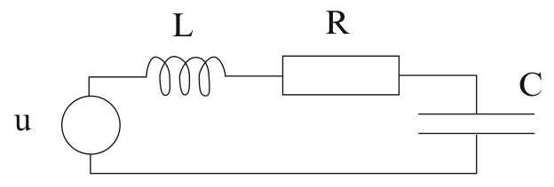

> Image description: A schematic diagram labeled "Fig. 1 Electric circuit" illustrates a series RLC circuit driven by an AC voltage source. The circuit consists of four primary components connected in a single loop. On the far left, a circular symbol represents a voltage source labeled with the variable **u**. Following the source, an inductor is represented by a coiled wire symbol labeled **L**. This is connected in series to a resistor, depicted as a rectangular block labeled **R**. Finally, a capacitor is shown on the right, represented by two parallel lines labeled **C**. The circuit layout shows the current path traveling from the voltage source through the inductor, resistor, and capacitor before returning to the source terminal, forming a closed loop. The diagram provides a fundamental representation of a series resonant circuit used in electrical engineering analysis.
Modeling of Dynamic Systems from First Principles,
Fig. 1 Electric circuit

often used in modeling to describe this fact. Here we will show some analogies between electrical and mechanical phenomena. Consider the electric circuit given in Fig. 1. An ideal voltage source is connected in series with an inductor, a resistor, and a capacitor. Using $u$ and $v$ to denote the voltages over the voltage source and capacitor, respectively, and $i$ to denote the current, a mathematical model is

$$
\begin{align*}
C \frac{d v}{d t} & =i \\
L \frac{d i}{d t}+R i+v & =u \tag{4}
\end{align*}
$$

The first equation uses the definition of capacitance and the second one uses Kirchhoff's voltage law. Compare this to the mechanical system of Fig. 2 where an external force $F$ is applied to a mass $m$ that is also connected to a damper $b$ and a spring with spring constant $k$. If $S$ is the elongation force of the spring and $w$ the velocity of the mass, a system model is

$$
\begin{array}{r}
\frac{d S}{d t}=k w  \tag{5}\\
m \frac{d w}{d t}+b w+S=F
\end{array}
$$

Here the first equation uses the definition of spring constant and the second one uses Newton's 2nd law. The models are seen to be the same with the following correspondences between time-varying quantities

$$
\begin{equation*}
u \leftrightarrow F, \quad i \leftrightarrow w, \quad v \leftrightarrow S \tag{6}
\end{equation*}
$$

and between parameters

$$
\begin{equation*}
C \leftrightarrow 1 / k, \quad L \leftrightarrow m, \quad R \leftrightarrow b \tag{7}
\end{equation*}
$$

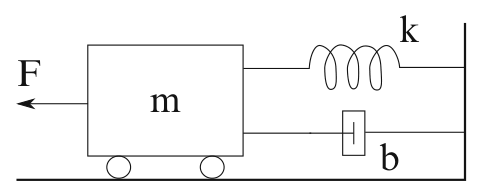

> Image description: A line drawing illustrates a mechanical system, labeled as Fig. 2. The system consists of a rectangular block with mass $m$ moving on a flat surface supported by two wheels. An external force $F$ is represented by an arrow pointing to the left, applied directly to the block. Connecting the block to a vertical rigid wall on the right are two parallel components: a spring with stiffness $k$ and a viscous damper with damping coefficient $b$. Both the spring and the damper are connected in parallel between the block and the wall, representing a standard mass-spring-damper configuration. The arrangement suggests a model for a single degree of freedom system, where the displacement of the mass $m$ is resisted by the restorative force of the spring $k$ and the dissipative force of the damper $b$ as it is pulled by force $F$.
Modeling of Dynamic Systems from First Principles,
Fig. 2 Mechanical system

Note that the products (voltage) × (current) and (force) $\times$ (velocity) give the power.

## Bond Graphs

The bond graph is a tool to do systematic modeling based on the analogies of the previous section. The basic element is the bond

$$
\frac{\mathrm{e}}{\mathrm{f}}
$$

formed by a half arrow showing the direction of positive energy flow. Two variables are associated with the bond, the effort variable $e$ and the flow variable $f$. The product ef of these variables gives the power. In the electric domain $e$ is voltage and $f$ is current. For mechanical systems $e$ is force, while $f$ is velocity. Bond graph theory has three basic components to describe storage and dissipation of energy. The relations

$$
\begin{equation*}
\alpha \frac{d e}{d t}=f, \quad \beta \frac{d f}{d t}=e, \quad \gamma f=e \tag{8}
\end{equation*}
$$

are known as $C, I$, and $R$ elements, respectively. Input signals are modeled by elements called effort sources $S_{e}$ or flow sources $S_{f}$, respectively. A bond graph describes the energy flow between these elements. When the energy flow is split, it can either be at s junctions where the flows are equal and the efforts are added or at a p junction where efforts are equal and flows are additive. The model (5), for instance, can be described by the bond graph in Fig. 3. The graph shows how the energy from the external force is split into the acceleration of the mass, the elongation of the spring, and dissipation into the damper. The splitting of the energy flow is accomplished by an s element, meaning that the velocity is the same for all elements but that the forces are added:


<!-- source_pdf_page: 764 -->
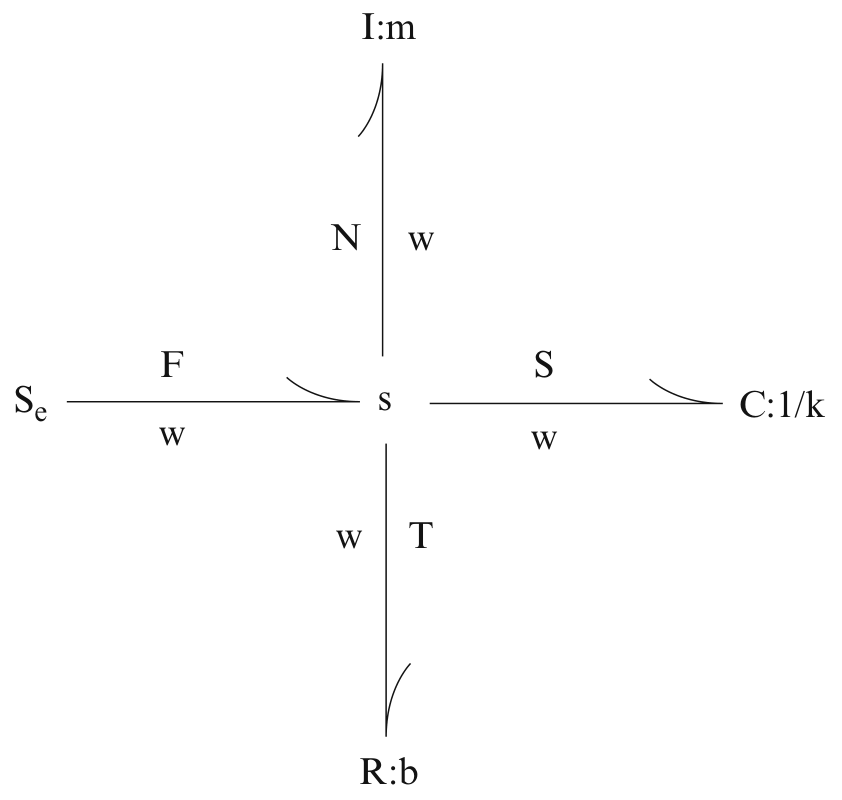

> Image description: A bond graph diagram is displayed against a white background, illustrating the relationships between several components. At the center of the diagram is a single-port junction labeled with a lowercase "s," which serves as the central node connecting four directional lines. The four lines extend from the central "s" node toward the cardinal directions: * **Upward:** Leads to a component labeled "I:m". The line includes a causal stroke (a small perpendicular bar) at the "s" end and is labeled with "N" and "w". * **Downward:** Leads to a component labeled "R:b". The line includes a causal stroke at the "I" end and is labeled with "T" and "w". * **Leftward:** Leads to a component labeled "$S_e$". The line includes a causal stroke at the "s" end and is labeled with "F" and "w". * **Rightward:** Leads to a component labeled "C:1/k". The line includes a causal stroke at the "s" end and is labeled with "S" and "w". The diagram illustrates the interconnection of inertial (I), resistive (R), capacitive (C), and effort/flow sources (S) within a mechanical or electrical system.
Modeling of Dynamic Systems from First Principles,
Fig. 3 Bond graph for mechanical or electric system

$$
\begin{equation*}
F=N+S+T \tag{9}
\end{equation*}
$$

Here $T$ and $N$ denote the forces associated with the damper and the mass, respectively. From (8) it follows that

$$
\begin{equation*}
k^{-1} \frac{d S}{d t}=w, \quad m \frac{d w}{d t}=N, \quad b w=T \tag{10}
\end{equation*}
$$

Together (9) and (10) give the same model as (5). Using the correspondences (6), (7) it is seen that the same bond graph can also represent the electric circuit (4). An overview of bond graph modeling is given in Rosenberg and Karnopp (1983). A general overview of modeling, including bond graphs and the connection with identification, can be found in Ljung and Glad (1994b).

## Port-Controlled Hamiltonian Systems

Many physical processes can be modeled as Hamiltonian systems. This means that there are state variables $x$, a scalar function $H$, and a skew symmetric matrix $M$ so that the system dynamics is

$$
\begin{equation*}
\frac{d x}{d t}=M \nabla H(x) \tag{11}
\end{equation*}
$$

The function $H$ is called the Hamiltonian of the system. To be useful in a control context, this model class has to be extended to handle inputs
and dissipation phenomena. To give an example the mechanical system used above is considered again.

Introduce $x_{1}$ as the length of the spring so that $d x_{1} / d t=w$. If $H_{1}$ is the energy stored in the spring, then the following relations hold:

$$
\begin{equation*}
H_{1}\left(x_{1}\right)=\frac{k x_{1}^{2}}{2}, \quad \frac{\partial H_{1}}{\partial x_{1}}=k x_{1}=S \tag{12}
\end{equation*}
$$

Introducing $x_{2}$ for the momentum and $H_{2}$ as the kinetic energy, one has $d x_{2} / d t=N$ and

$$
\begin{equation*}
H_{2}\left(x_{2}\right)=\frac{x_{2}^{2}}{2 m}, \quad \frac{\partial H_{2}}{\partial x_{2}}=m^{-1} x_{2}=w \tag{13}
\end{equation*}
$$

Let $H=H_{1}+H_{2}$ be the total energy. Then the following relation holds:

$$
\frac{d x}{d t}=\left(\left[\begin{array}{cc}
0 & 1  \tag{14}\\
-1 & 0
\end{array}\right]-\left[\begin{array}{ll}
0 & 0 \\
0 & b
\end{array}\right]\right)\left[\begin{array}{l}
\partial H / \partial x_{1} \\
\partial H / \partial x_{2}
\end{array}\right]+\left[\begin{array}{l}
0 \\
1
\end{array}\right] F
$$

This model is a special case of

$$
\begin{equation*}
\frac{d x}{d t}=(M-R) \nabla H(x)+B u \tag{15}
\end{equation*}
$$

where $M$ is a skew symmetric and $R$ a nonnegative definite matrix, respectively. The model type is called a port-controlled Hamiltonian system with dissipation. Without external input ( $B=$ 0 ) and dissipation ( $R=0$ ), it reduces to an ordinary Hamiltonian system of the form (11). For systems generated by simple bond graphs, it can be shown that the junction structure gives the skew symmetric $M$, while the $R$ elements give the matrix $R$. The storage of energy in $I$ and $C$ elements is reflected in $H$. The reader is directed to Duindam et al. (2009) for a description of the port Hamiltonian approach to modeling.

## Component-Based Models and Modeling Languages

Since engineering systems are usually assembled from components, it is natural to treat their mathematical models in the same way. This is the idea behind block-oriented models where the output


<!-- source_pdf_page: 765 -->
of one model is connected to the input of another one:
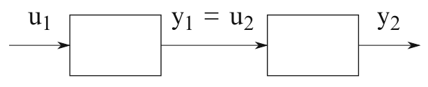

A nice feature of this block connection is that the state space description is preserved. Suppose the individual models are of the form (1)

$$
\begin{equation*}
\frac{d x_{i}}{d t}=f_{i}\left(x_{i}, u_{i}\right), \quad y_{i}=h_{i}\left(x_{i}, u_{i}\right), \quad i=1,2 \tag{16}
\end{equation*}
$$

Then the connection $u_{2}=y_{1}$ immediately gives the state space model

$$
\begin{align*}
\frac{d}{d t}\left[\begin{array}{l}
x_{1} \\
x_{2}
\end{array}\right] & =\left[\begin{array}{c}
f_{1}\left(x_{1}, u_{1}\right) \\
f_{2}\left(x_{2}, h_{1}\left(x_{1}, u_{1}\right)\right)
\end{array}\right],  \tag{17}\\
y_{2} & =h_{2}\left(x_{2}, h_{1}\left(x_{1}, u_{1}\right)\right)
\end{align*}
$$

with input $u_{1}$, output $y_{2}$, and state ( $x_{1} ; x_{2}$ ). This fact is the basis of block-oriented modeling and simulation tools like the MATLABbased Simulink. Unfortunately the preservation of the state space structure does not extend to more general connections of systems. Consider, for instance, two pieces of rotating machinery described by

$$
\begin{equation*}
J_{i} \frac{d \omega_{i}}{d t}=-b_{i} \omega_{i}+M_{i}, \quad i=1,2 \tag{18}
\end{equation*}
$$

where $\omega_{i}$ is the angular velocity, $M_{i}$ the external torque, $J_{i}$ the moment of inertia, and $b_{i}$ the damping coefficient. Suppose the pieces are joined together so that they rotate with the same angular velocity. The mathematical model would then be

$$
\begin{align*}
J_{1} \frac{d \omega_{1}}{d t} & =-b_{1} \omega_{1}+M_{1} \\
J_{2} \frac{d \omega_{2}}{d t} & =-b_{2} \omega_{2}+M_{2}  \tag{19}\\
\omega_{1} & =\omega_{2} \\
M_{1} & =-M_{2}
\end{align*}
$$

This is no longer a state space model of the form (1), but a mixture of dynamic and static relationships, usually referred to as a differential
algebraic equation (DAE). The difference from the connection of blocks in block diagrams is that now the connection is not between an input and an output. Instead there are the equations $\omega_{1}=\omega_{2}$ and $M_{1}=-M_{2}$ that destroy the state space structure. There exist modeling languages like Modelica (Fritzson 2000; Tiller 2001) or SimMechanics in MATLAB (MathWorks 2002) that accept this more general type of model. It is then possible to form model libraries of basic components that can be interconnected in very general ways to form models of complex systems. However, this more general structure poses some challenges when it comes to analysis and simulation that are described in the next section.

## Differential Algebraic Equations (DAE)

This model (19) is a special case of the general differential algebraic equation

$$
\begin{equation*}
F(d z / d t, z, u)=0 \tag{20}
\end{equation*}
$$

A good description of both theory and numerical properties of such equations is given in Kunkel and Mehrmann (2006). In many cases it is possible to split the variables and equations in such a way that the following structure is achieved:

$$
\begin{equation*}
F\left(d z_{1} / d t, z_{1}, z_{2}, u\right)=0, \quad F_{2}\left(z_{1}, z_{2}, u\right)=0 \tag{21}
\end{equation*}
$$

If $z_{2}$ can be solved from the second equation and substituted into the first one, and if $d z_{1} / d t$ can then be solved from the first equation, the problem is reduced to an ordinary differential equation in $z_{1}$. Often, however, the situation is not as simple as that. For the example (19) an addition of the first two equations gives

$$
\begin{equation*}
\left(J_{1}+J_{2}\right) \frac{d \omega_{1}}{d t}=-\left(b_{1}+b_{2}\right) \omega_{1} \tag{22}
\end{equation*}
$$

which is a standard first-order system description. Note, however, that in order to arrive at this result, the relation $\omega_{1}=\omega_{2}$ has to be differentiated. This DAE thus includes an implicit differentiation.


<!-- source_pdf_page: 766 -->
In the general case one can investigate how many times (20) has to be differentiated in order to get an explicit expression for $d z / d t$. This number is called the (differentiation) index. Both theoretical analysis and practical experience show that the numerical difficulties encountered when solving a DAE increase with increasing index; see, e.g., the classical reference Brenan et al. (1987). It turns out that mechanical systems in particular give high-index models when constructed by joining components, and this has been an obstacle to the use of DAE models. For linear DAE models the role of the index can be seen more easily. A linear model is given by

$$
\begin{equation*}
E \frac{d z}{d t}+F z=G u \tag{23}
\end{equation*}
$$

where the matrix $E$ is singular (if $E$ is invertible, multiplication with $E^{-1}$ from the left gives an ordinary differential equation). The system can be transformed by multiplying with P from the left and changing variables with $z=Q w(P, Q$ nonsingular matrices). The transformed model is now

$$
\begin{equation*}
P E Q \frac{d w}{d t}+P F Q w=P G u \tag{24}
\end{equation*}
$$

If $\lambda E+F$ is nonsingular for some value of the scalar $\lambda$, then it can be shown that there is a choice of $P$ and $Q$ such that (24) takes the form

$$
\left[\begin{array}{cc}
I & 0  \tag{25}\\
0 & N
\end{array}\right]\left[\begin{array}{l}
d w_{1} / d t \\
d w_{2} / d t
\end{array}\right]+\left[\begin{array}{cc}
-A & 0 \\
0 & I
\end{array}\right]\left[\begin{array}{l}
w_{1} \\
w_{2}
\end{array}\right]=\left[\begin{array}{l}
B_{1} \\
B_{2}
\end{array}\right] u
$$

where $N$ is a nilpotent matrix, i.e., $N^{k}=0$ for some positive integer $k$. The smallest such $k$ turns out to be the index of the DAE. The transformed model (25) thus contains an ordinary differential equation:

$$
\begin{equation*}
\frac{d w_{1}}{d t}=A w_{1}+B_{1} u \tag{26}
\end{equation*}
$$

Using the nilpotency of $N$, the equation for $w_{2}$ can be rewritten:

$$
\begin{equation*}
w_{2}=B_{2} u-N B_{2} \frac{d u}{d t}+\cdots+(-N)^{k-1} B_{2} \frac{d^{k-1} u}{d t^{k-1}} \tag{27}
\end{equation*}
$$

This expression shows that an index $k>1$ implies differentiation of the input (unless $N B_{2}$ happens to be zero). This in turn implies potential difficulties, e.g., if $u$ is a measured signal.

## Identification of DAE Models

The extended use of DAE models in modern modeling tools also means that there is a need to use these models in system identification. To fully use system identification theory, one needs a stochastic model of disturbances. The inclusion of such disturbances leads to a class of models described as stochastic differential algebraic equations. The treatment of such models leads to some interesting problems. In the previous section it was seen that DAE models often contain implicit differentiations of external signals. If a DAE model is to be well posed, this differentiation must not affect signals modeled as white noise. In Gerdin et al. (2007), conditions are given that guarantee that stochastic DAEs are well posed. There it is also described how a maximum likelihood estimate can be made for DAE models, laying the basis for parameter estimation.

## Differential Algebra

For the case where models consist of polynomial equations, it is possible to manipulate them in a very systematic way. The model (20) is then generalized to

$$
\begin{equation*}
F\left(d^{n} z / d t^{n}, \ldots, d z / d t, z\right)=0 \tag{28}
\end{equation*}
$$

where $z$ is now a vector containing an arbitrary mix of inputs, outputs, and internal variables. There is then a theory based on Ritt (1950) that allows the transformation of (28) to a standard form where the properties of the system can be easily determined. The process is similar to the use of Gröbner bases but also includes the possibility of differentiating equations. Of particular interest to identification is the possibility of determining the identifiability of parameters with these tools. The model is then of the form

$$
\begin{gather*}
F\left(d^{m} y / d t^{m}, \ldots, d y / d t, y, d^{n} z / d t^{n}\right.  \tag{29}\\
\ldots, d z / d t, z ; \theta)=0
\end{gather*}
$$


<!-- source_pdf_page: 767 -->
where $y$ contains measured signals, $z$ contains unmeasured variables, and $\theta$ is a vector of parameters to be identified, while $F$ is a vector of polynomials in these variables. It was shown in Ljung and Glad (1994a) that there is an algorithm giving for each parameter $\theta_{k}$ a polynomial:

$$
\begin{equation*}
g_{k}\left(d^{m} y / d t^{m}, \ldots, d y / d t, y ; \theta_{k}\right)=0 \tag{30}
\end{equation*}
$$

This relation can be regarded as a polynomial in $\theta_{k}$ where all coefficients are expressed in measured quantities. The local or global identifiability will then be determined by the number of solutions. If $\theta_{k}$ is unidentifiable, then no equation of the form (30) will exist, and this fact will also be demonstrated by the output of the algorithm.

## Summary and Future Directions

There is no general method to derive models from first principles. However, modeling techniques based on bond graphs or port-controlled Hamiltonian systems offer a systematic approach for large model classes. Modeling languages like Modelica make the practical work with modeling much easier. A fundamental problem that comes up is that models are not necessarily in state space form but are so called differential algebraic equation (DAE) models. Much of the future work is expected to deal with the handling of DAE models and in the development of modeling languages.

## Cross-References

- Nonlinear System Identification: An Overview of Common Approaches
- System Identification: An Overview


## Recommended Reading

A classical book on physical modeling is Rosenberg and Karnopp (1983) with emphasis on bond graph techniques. The physical modeling and identification perspectives are tied together in Ljung and Glad (1994b). A good reference for

Hamiltonian techniques is Duindam et al. (2009). The Modelica modeling language is treated in Tiller (2001) and Fritzson (2000). The former emphasizes the physical modeling point of view; the latter also gives details of the language itself.

## Bibliography

Brenan KE, Campbell SL, Petzold LR (1987) Numerical solution of initial-value problems in differentialalgebraic equations. Classics in applied mathematics (Book 14). SIAM, Philadelphia
Duindam V, Macchelli A, Stramigioli S, Bruyninckx H (eds) (2009) Modeling and control of complex physical systems: the Port-Hamiltonian approach. Springer, Berlin
Fritzson P (2000) Principles of object-oriented modeling and simulation with Modelica 2.1. IEEE/Wiley Interscience, Piscataway NJ
Gerdin M, Schön T, Glad T, Gustafsson F, Ljung L (2007) On parameter and state estimation for linear differential-algebraic equations. Automatica 43:416425
Kunkel P, Mehrmann V (2006) Differential-algebraic equations. European Mathematical Society, Zürich
Ljung L, Glad ST (1994a) On global identifiability of arbitrary model parameterizations. Automatica 30(2):265-276
Ljung L, Glad T (1994b) Modeling of dynamic systems. Prentice Hall, Englewood Cliffs
Ritt JF (1950) Differential algebra. American Mathematical Society, Providence
Rosenberg RC, Karnopp D (1983) Introduction to physical system dynamics. McGraw-Hill, New York
The MathWorks (2002) SimMechanics. User's guide. The MathWorks, Natick
Tiller MM (2001) Introduction to physical modeling with Modelica. Kluwer Academic, Boston

## Modeling, Analysis, and Control with Petri Nets

Manuel Silva
Instituto de Investigation en Ingeniería de Aragón (I3A), Universidad de Zaragoza, Zaragoza, Spain


#### Abstract

Petri net is a generic term used to designate a broad family of related formalisms for discrete event views of (dynamic) Systems (DES), all


<!-- source_pdf_page: 768 -->
sharing some basic relevant features, such as minimality in the number of primitives, locality of the states and actions (with consequences for model construction), or temporal realism. The global state of a system is obtained by the juxtaposition of the different local states. We should initially distinguish between autonomous formalisms and those extended by interpretation. Models in the latter group are obtained by restricting the underlying autonomous behaviors by means of constraints that can be related to different kinds of external events, in particular to time. This article first describes place/transition nets (PT-nets), by default simply called Petri nets (PNs). Other formalisms are then mentioned. As a system theory modeling paradigm for concurrent DES, Petri nets are used in a wide variety of application fields.

## Keywords

Condition/event nets (CE-nets); Continuous Petri nets (CPNs); Diagrams; Fluidization; Grafcet; Hybrid Petri nets (HPNs); Marking Petri nets; Place/transition nets (PT-nets); High-level Petri nets (HLPNs)

## Introduction

Petri nets (PNs) are able to model concurrent and distributed DES ( - Models for Discrete Event Systems: An Overview). They constitute a powerful family of formalisms with different expressive purposes and power. They may be applied to inter alia, modeling, logical analysis, performance evaluation, parametric optimization, dynamic control (minimum makespan, supervisory control, or other kinds), diagnosis, and implementation issues (eventually fault tolerant). Hybrid and continuous PNs are particularly useful when some parts of the system are highly populated. Being multidisciplinary, formalisms belonging to the Petri nets paradigm may cover several phases of the life cycle of complex DES.

A Petri net can be represented as a bipartite directed graph provided with arcs inscriptions; alternatively, this structure can be represented in
algebraic form using some matrices. As in the case of differential equations, an initial condition or state should be defined in order to represent a dynamic system. This is done by means of an initial distributed state. The English translation of the Carl Adam Petri's seminal work, presented in 1962, is Petri (1966).

## Untimed Place/Transition Net Systems

A place/transition net (PT-net) can be viewed as $\mathcal{N}=\langle P, T$, Pre, Post $\rangle$, where:

- $P$ and $T$ are disjoint and finite nonempty sets of places and transitions, respectively.
- Pre and Post are $|P| \times|T|$ sized, naturalvalued (zero included), incidence matrices. The net is said to be ordinary if Pre and Post are valued on $\{0,1\}$. Weighted arcs permit the abstract modeling of bulk services and arrivals.
A PT-net is a structure. The Pre (Post) function defines the connections from places to transitions (transitions to places). Those two functions can alternatively be defined as weighted flow relations (nets as graphs). Thus, PT-nets can be represented as bipartite directed graphs with places ( $p$, using circles) and transitions ( $t$, using bars or rectangles) as nodes: $\mathcal{N}=\langle P, T, F, W\rangle$, where $F \subseteq (P \times T) \cup(\mathrm{T} \times P)$ is the flow relation (set of directed arcs, with $\operatorname{dom}(F) \cup \operatorname{range}(F)=P \cup T$ ), and $W: F \rightarrow \mathbb{N}^{+}$assigns a natural weight to each arc.

The net structure represents the static part of the DES model. Furthermore, a "distributed state" is defined over the set of places, known as the marking. This is "numerically quantified" (not in an arbitrary alphabet, as in automata), associating natural values to the local state variables, the places. If a place $p$ has a value $v(m(p)=v)$, it is said to have $v$ tokens (frequently depicted in graphic terms with $v$ black dots or just the number inside the place). The places are "state variables," while the markings are their "values"; the global state is defined through the concatenation of local states. The net structure, provided with an initial


<!-- source_pdf_page: 769 -->
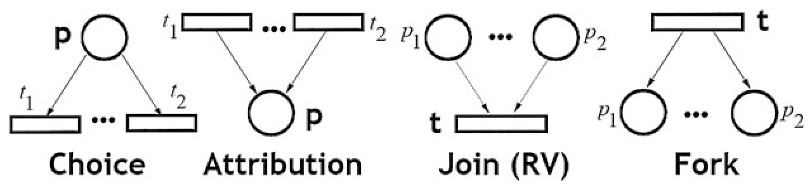

> Image description: This figure from "Modeling, Analysis, and Control with Petri Nets" illustrates four fundamental Petri Net (PN) constructions: Choice, Attribution, Join (RV), and Fork. 1. **Choice**: A single place labeled $p$ branches into multiple outgoing arrows leading to different transitions, $t_1$ and $t_2$. This represents a logical OR where a single token in $p$ can trigger one of several transitions. 2. **Attribution**: Multiple arrows from various transitions ($t_1$ through $t_2$) converge onto a single place labeled $p$. This represents the flow of tokens into a single destination. 3. **Join (RV)**: Multiple places ($p_1$ through $p_2$) have arrows converging into a single transition labeled $t$. This signifies a synchronization point where tokens from multiple sources are required to fire the transition. 4. **Fork**: A single transition labeled $t$ has multiple outgoing arrows leading to different places ($p_1$ through $p_2$). This represents the simultaneous distribution of tokens to multiple destinations.

Modeling, Analysis, and Control with Petri Nets, Fig. 1 Most basic PN constructions: The logical OR is present around places, in choices (or branches) and
attributions (or meets); the logical AND is formed around transitions, in joins (or waits or rendezvous) and forks (or splits)
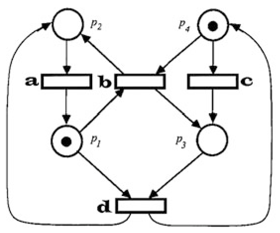

> Image description: A diagram illustrating fundamental Petri Net (PN) constructions, labeled as Fig. 1 from "Modeling, Analysis, and Control with Petri Nets." The net consists of four circular places labeled $p_1, p_2, p_3,$ and $p_4$, and four rectangular transitions labeled $\mathbf{a}, \mathbf{b}, \mathbf{c},$ and $\mathbf{d}$. The structure demonstrates logical relationships through connectivity. Transitions $\mathbf{a}$ and $\mathbf{c}$ act as "forks" (logical AND), where a single place connects to multiple transitions. Conversely, places $p_2$ and $p_3$ act as "meets" (logical OR/attributions), where multiple transitions converge. Specifically, transition $\mathbf{a}$ moves a token from $p_2$ to $p_1$, while $\mathbf{c}$ moves a token from $p_4$ to $p_3$. Transition $\mathbf{b}$ links $p_1$ to $p_2$ and $p_4$ to $p_3$, and transition $\mathbf{d}$ connects $p_1$ and $p_3$ back to $p_2$ and $p_4$. Black dots (tokens) are currently located in $p_1$ and $p_4$. The caption notes that logical OR is present around places, while logical AND is formed around transitions.
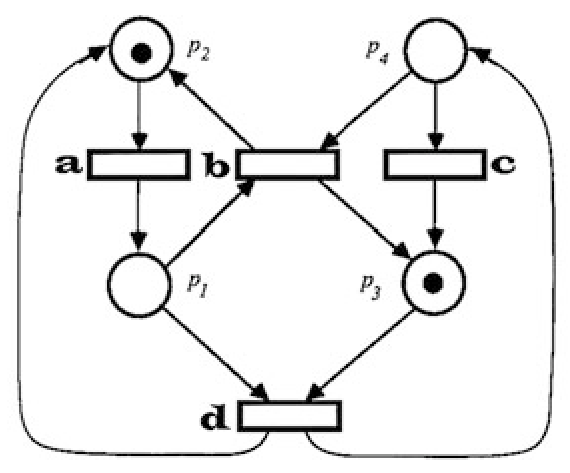

> Image description: A black-and-white diagram illustrates a basic Petri Net (PN) structure consisting of four circular places ($p_1$, $p_2$, $p_3$, $p_4$) and four rectangular transitions ($a$, $b$, $c$, $d$). The places are arranged in a diamond-like configuration with $p_2$ and $p_4$ at the top, $p_1$ and $p_3$ in the middle, and connections forming a loop. The initial state shows tokens (black dots) in $p_2$ and $p_3$. Directed arrows represent flow: transition $a$ connects $p_2$ to $p_1$; transition $b$ connects $p_1$ and $p_4$ as inputs to $p_3$ as an output; transition $c$ connects $p_4$ to $p_3$; and transition $d$ connects $p_1$ and $p_3$ to $p_2$ and $p_4$. Long curved arrows indicate feedback loops from transition $d$ back to $p_2$ and $p_4$. According to the caption, the diagram demonstrates logical OR functions around places and logical AND functions around transitions, representing joins, forks, and branching/meeting points in system modeling.
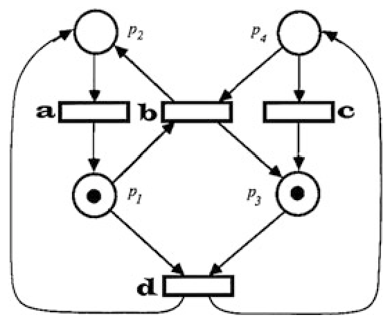

> Image description: A Petri net diagram illustrating fundamental logical constructions is presented. The diagram consists of circles representing "places" and rectangles representing "transitions." The places are labeled $p_1, p_2, p_3,$ and $p_4$. Initially, tokens (black dots) are located in $p_1$ and $p_3$. The transitions are labeled **a, b, c,** and **d**. The connections (arcs) define the flow of the net: - Transition **a** connects $p_2$ to $p_1$. - Transition **b** connects $p_1$ to $p_2$ and $p_4$ to $p_3$. - Transition **c** connects $p_4$ to $p_3$. - Transition **d** connects $p_1$ and $p_3$ to $p_2$. According to the caption, the structure demonstrates logical operations: "OR" logic is represented around places (choices/branches/attributions), while "AND" logic is represented around transitions (joins/waits/forks). This visualization serves as a basic model for analyzing logical flow and synchronization in Petri net theory.

Modeling, Analysis, and Control with Petri Nets, Fig. 2 Only transitions $b$ and $c$ are initially enabled. The results of firing $b$ or $c$ are shown subsequently
marking, to be denoted as $\left(\mathcal{N}, m_{0}\right)$, is a Petri net system, or marked Petri net.

The last two basic PN constructions in Fig. 1 (join and fork) do not appear in finite-state machines; moreover, the arcs may be valued with natural numbers. The dynamic behavior of the net system (trajectories with changes in the marking) is produced by the firing of transitions, some "local operations" which follows very simple rules.

Markings in net systems evolve according to the following firing (or occurrence) rules (see, Fig. 2):

- A transition is said to be enabled at a given marking if each input place has at least as many tokens as the weight of the arc joining them.
- The firing or occurrence of an enabled transition is an instantaneous operation that removes from (adds to) each input (output) place a number of tokens equal to the weight of the arc joining the place (transition) to the transition (place).
The precondition of a transition can be seen as the resources required for the transition to be fired. The weight of the arc from a place to a transition
represents the number of resources to be consumed. The post-condition defines the number resources produced by the firing of the transition. This is made explicit by the weights of the arcs from the transition to the places. Three important observations should be taken into account:
- The underlying logic in the firing of a transition is non-monotonic! It is a consumption/production logic.
- Enabled transitions are never forced to fire: This is a form of non-determinism.
- An occurrence sequence is a sequence of fired transitions $\sigma=t_{1} \ldots t_{k}$. In the evolution from $\boldsymbol{m}_{0}$, the reached marking $\boldsymbol{m}$ can be easily computed as:

$$
\begin{equation*}
\boldsymbol{m}=\boldsymbol{m}_{0}+\boldsymbol{C} \cdot \boldsymbol{\sigma}, \tag{1}
\end{equation*}
$$

where $\boldsymbol{C}=$ Post - Pre is the token flow matrix (incidence matrix if $\mathcal{N}$ is self-loop free) and $\boldsymbol{\sigma}$ the firing count vector corresponding to $\boldsymbol{\sigma}$. Thus $\boldsymbol{m}$ and $\boldsymbol{\sigma}$ are vectors of natural numbers.
The previous equation is the state-transition equation (frequently known as the fundamental or, simply, state equation). Nevertheless, two important remarks should be made:


<!-- source_pdf_page: 770 -->
- It represents a necessary but not sufficient condition for reachability; the problem is that the existence of a $\boldsymbol{\sigma}$ does not guarantee that a corresponding sequence $\sigma$ is firable from $\boldsymbol{m}_{0}$; thus, certain solutions - called spurious (Silva et al. 1998) - are not reachable. This implies that - except in certain net system subclasses only semi-decision algorithms can usually be derived.
- All variables are natural numbers, which imply computational complexity.
It should be pointed out that in finite-state machines, the state is a single variable taking values in a symbolic unstructured set, while in PT-net systems, it is structured as a vector of nonnegative integers. This allows analysis techniques that do not require the enumeration of the state space.

At a structural level, observe that the negation is missing in Fig. 1; its inclusion leads to the socalled inhibitor arcs, an extension in expressive power. In its most basic form, if the place at the origin of an inhibitor arc is marked, it "inhibits" the enabling of the target transition. PTnet systems can model infinite-state systems, but not Turing machines. PT-net systems provided with inhibitor arcs (or priorities on the firing of transitions) can do it.

With this conceptually simple formalism, it is not difficult to express basic synchronization schemas (Fig. 3). All the illustrated examples use joins. When weights are allowed in the arcs, another kind of synchronization appears: Several copies of the same resource are needed (or produced) in a single operation. Being able to express concurrency and synchronization, when viewing the system at a higher level, it is possible to build cooperation and competition relationships.

## Analysis and Control of Untimed PT Models

The behavior of a concurrent (eventually distributed) system is frequently difficult to understand and control. Thus, misunderstandings and mistakes are frequent during the design cycle. A way of cutting down the cost and duration of the
design process is to express in a formalized way properties that the system should enjoy and to use formal proof techniques. Errors can be eventually detected close to the moment they are introduced, reducing their propagation to subsequent stages. The goal in verification is to ensure that a given system is correct with respect to its specification (perhaps expressed in temporal-logic terms) or to a certain set of predetermined properties.

Among the most basic qualitative properties of "net systems" are the following: (1) reachability of a marking from a given one; (2) boundedness, characterizing finiteness of the state space; (3) liveness, related to potential fireability of all transitions starting on an arbitrary reachable marking (deadlock-freeness is a weaker condition in which only global infinite fireability of the net system model is guaranteed, even if some transitions no longer fire); (4) reversibility, characterizing recoverability of the initial marking from any reachable one; and (5) mutual exclusion of two places, dealing with the impossibility of reaching markings in which both places are simultaneously marked.

All the above are behavioral properties, which depend on the net system ( $\mathcal{N}, \boldsymbol{m}_{0}$ ). In practice, sometimes problems with a net model are rooted in the net structure; thus, the study of the structural counterpart of certain behavioral properties may be of interest. For example, a "net" is structurally bounded if it is bounded for any initial marking; a "net" is structurally live if an initial marking exists that make the net system live (otherwise stated, it reflect non-liveness for arbitrary initial markings, a pathology of the net).

Basic techniques to analyze net systems include: (1) enumeration, in its most basic form based on the construction of a reachability graph (a sequentialized view of the behavior). If the net system is not bounded, losing some information, a finite coverability graph can be constructed; (2) transformation, based on an iterative rewriting process in which a net system enjoys a certain property if and only if a transformed ("simpler" to analyze) one also does. If the new system is easier to analyze, and the transformation is computationally cheap, the process may be extremely interesting; (3) structural, based on


<!-- source_pdf_page: 771 -->
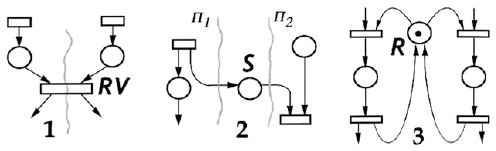
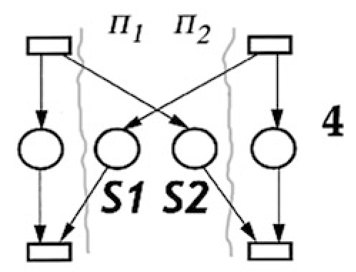
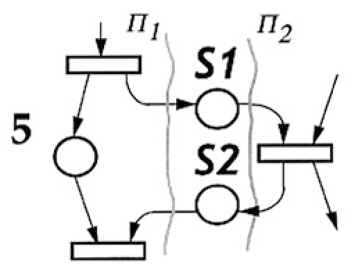
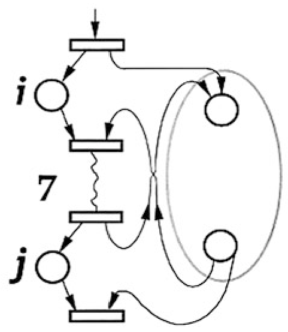
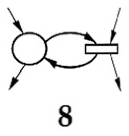

> Image description: A black and white schematic diagram labeled with the number "8" at the bottom center. The diagram illustrates a synchronization scheme involving two interconnected components. On the left, there is a circle representing a junction or place. To the right of the circle is a rectangular block representing a shared resource or a synchronization primitive. The flow of control is indicated by several arrows. Two diagonal arrows enter the circle from the upper left and lower left, while two diagonal arrows exit the rectangular block on the lower right and upper right. Two curved arrows connect the circle and the rectangle, forming a loop. One arrow points from the circle to the rectangle, and the other points from the rectangle back to the circle, indicating a bidirectional interaction or state exchange between the two components. This structure depicts a fundamental synchronization mechanism within the context of Petri nets.

Modeling, Analysis, and Control with Petri Nets, Fig. 3 Basic synchronization schemes: (1) Join or rendezvous, RV; (2) Semaphore, S; (3) Mutual exclusion semaphore (mutex), R, representing a shared resource; (4) Symmetric RV built with two semaphores; (5) Asymmetric RV built with two semaphores (master/slave); (6) Fork-join (or par-begin/par-end); (7) Non-recursive subprogram (places $i$ and $j$ cannot be simultaneously
marked - must be in mutex - to remember the returning point; for simplicity, it is assumed that the subprogram is single input/single output); (8) Guard (a self-loop from a place through a transition); its role is like a traffic light: If at least one token is present at the place, it allows the evolution, but it is not consumed. Synchronizations can also be modeled by the weights associated to the arcs going to transitions
graph properties, or in mathematical programming techniques rooted on the state equation; (4) simulation, particularly interesting for gaining certain confidence about the absence of certain pathological behaviors. Analysis strategies combining all these kinds of techniques are extremely useful in practice.

Reachability techniques provide sequentialized views for a particular initial marking. Moreover they suffer from the so-called state explosion problem. The reduction of this computational issue leads to techniques such as stubborn set methods (smaller, equally informative
reachability graphs), also to non-sequentialized views such as those based on unfoldings. Transformation techniques are extremely useful, but not complete (i.e., not all net systems can be reduced in a practical way). In most cases, structural techniques only provide necessary or sufficient conditions (e.g., a sufficient condition for deadlock-freeness, a necessary condition for reversibility, etc.), but not a full characterization. As already pointed out, a limitation of methods based on the state equation for analyzing net systems is the existence of non reachable solutions (the so-called spurious solutions). In


<!-- source_pdf_page: 772 -->
this context, three kinds of related notions that must be differentiated are the following: (1) some natural vectors (left and right annullers of the token flow matrix, $\boldsymbol{C}$ : $P$-semiflows and $T$-semiflows), (2) some invariant laws (token conservation and repetitive behaviors), and (3) some peculiar subnets (conservative and consistent components, generated by the subsets of nodes in the P - and T-semiflows, respectively).

More than analysis, control leads to synthesis problems. The idea is to enforce the given system in order to fulfill a specification (e.g., to enforce certain mutual exclusion properties). Technically speaking, the idea is to "add" some elements in order to constrain the behavior in such a way that a correct execution is obtained. Questions related to control, observation, diagnosis, or identification are all areas of ongoing research.

With respect to classical control theory, there are two main differences: Models are DES and untimed (autonomous, fully nondeterministic, eventually labeling the transitions in order to be able to consider the PNs languages). Let us remark that for control purposes, the transitions should be partitioned into controllable (when enabled, you can either force or block the firing) and uncontrollable (if enabled, the firing is nondeterministic). A natural approach to synthesize a control is to start modeling the plant dynamics (by means of a PN, P) and adopting a specification for the desired closed-loop system (S). The goal is to compute a controller (L) such that $\mathbf{S}$ equals the parallel-composition of $\mathbf{P}$ and $\mathbf{L}$; in other words, controllers (called "supervisors") are designed to ensure that only behaviors consistent with the specification may occur. The previous equality is not always possible, and the goal is usually relaxed to minimally limit the behavior within the specified legality (i.e., to compute maximally permissive controllers). For an approach in the framework of finite-state machines and regular languages, see Supervisory Control of Discrete-Event Systems. The synthesis in the framework of Petri nets and having goals as enforcing some generalized mutual exclusions constraints in markings or avoiding deadlocks, for example, can be efficiently approached by means of the
so named structure theory, based on the direct exploitation of the structure of the net model (using graph or mathematical programming theories and algorithms, where the initial marking is a parameter).

Similarly, transitions (or places) can be partitioned into observable and unobservable. Many observability problems may be of interest; for example, observing the firing of a subset of transitions to compute the subset of markings in which the system may be. Related to observability, diagnosis is the process of detecting a failure (any deviation of a system from its intended behavior) and identifying the cause of the abnormality. Diagnosability, like observability or controllability, is a logical criterion. If a model is diagnosable with respect to a certain subset of possible faults (i.e., it is possible to detect the occurrence of those faults in finite time), a diagnoser can be constructed (see section "Diagnosis and Diagnosability Analysis of Petri Nets" in ▷ Diagnosis of Discrete Event Systems). Identification of DES is also a question that has required attention in recent years. In general, the starting point is a behavioral observation, the goal being to construct a PN model that generates the observed behavior, either from examples/counterexamples of its language or from the structure of a reachability graph. So the results are derived models, not human-made models (i.e., not made by designers).

## The Petri Nets Modeling Paradigm

Along the life cycle of DES, designers may deal with basic modeling, analysis, and synthesis from different perspectives together with implementation and operation issues. Thus, the designer may be interested in expressing the basic structure, understanding untimed possible behaviors, checking logic properties on the model when provided with some timing (e.g., in order to guarantee if a certain reaction is possible before 3 ms ; something relevant in real-time systems), computing some performance indices on timed models (related to the throughput in the firing of a given transition, or to the length of a waiting line,


<!-- source_pdf_page: 773 -->
expressed as the number of tokens in a place), computing a schedule or control that optimizes a certain objective function, decomposing the model in order to prepare an efficient implementation, efficiently determining redundancies in order to increase the degree of fault tolerance, etc. For these different tasks, different formalisms may be used. Nevertheless, it seems desirable to have a family of related formalisms rather than a collection of "unrelated" or weakly related formalisms. The expected advantages would include coherence among models usable in different phases, economy in the transformations and synergy in the development of models and theories.

## Other Untimed PN Formalisms: Levels of Expressive Power

PT-net systems are more powerful than condition/event (CE) systems, roughly speaking the basic seminal formalism of Carl Adam Petri in which places can be marked only with zero or one token (Boolean marking). CE-systems can model only finite-state systems. As already said, "extensions" of the expressive power of untimed PT-net systems to the level of Turing machines are obtained by adding inhibitor arcs or priorities to the firing of transitions.

An important idea is adding the notion of individuals to tokens (e.g., from anonymous to labeled or colored tokens). Information in tokens allows the objects to be named (they are no longer indistinguishable) and dynamic associations to be created. Moving from PTnets to so-called high-level PNs (HLPNs) is something like "moving from assembler to high-level programming languages," or, at the computational level, like "moving from pure numerical to a symbolic level." There are many proposals in this respect, the more important being predicate/transition nets and colored PNs. Sometimes, this type of abstraction has the same theoretical expressiveness as PT-net systems (e.g., colored PNs if the number of colors is finite); in other words, high-level views may lead to more compact
and structured models, while keeping the same theoretical expressive power of PTnets (i.e., we can speak of "abbreviations," not of "extensions"). In other cases, objectoriented concepts from computer programming are included in certain HLPNs. The analysis techniques of HLPNs can be approached with techniques based on enumeration, transformation, or structural considerations and simulation, generalizing those developed for PTnet systems.

## Extending Net Systems with External Events and Time: Nonautonomous Formalisms

When dealing with net systems that interact with some specific environment, the marking evolution rule must be slightly modified. This can be done in an enormous number of ways, considering external events and logical conditions as inputs to the net model, in particular some depending on time. The same interpretation given to a graph in order to define a finite-state diagram can be used to define a marking diagram, a formalism in which the key point is to recognize that the state is now numerical (for PT-net systems) and distributed. For example, drawing a parallel with Moore automata, the transitions should be labeled with logical conditions and events, while unconditional actions are associated to the places. If a place is marked, the associated actions are emitted.

Even if only time-based interpretations are considered, there are a large number of successful proposals for formalisms. For example, it should be specified if time is associated to the firing of transitions (T-timing may be atomic or in three phases), to the residence of tokens in places ( P timed), to the arcs of the net, as tags to the tokens, etc. Moreover, even for T-timed models, there are many ways of defining the timing: time intervals, stochastic or possibilistic forms, and the deterministic case as a particular one. If the firing of transitions follows exponential pdfs, and the conflict resolution follows the race policy (i.e., fire in conflicts the first that ends the task,


<!-- source_pdf_page: 774 -->
not a preselection policy), the underlying Markov chain described is isomorphic to the reachability graph (due to the Markovian "memoryless" property). Moreover, the addition of immediate transitions (whose firing is instantaneous) enriches the practical modeling possibilities, eventually complicating the analysis techniques. Timed models are used to compute minimum and maximum time delays (when time intervals are provided, in real-time problems) or performance figures (throughput, utilization rate of resources, average number of tokens - clients - in services, etc.). For performance evaluation, there is an array of techniques to compute bounds, approximated values, or exact values, sometimes generalizing those that are used in certain queueing network classes of models. Simulation techniques are frequently very helpful in practice to produce an educated guess about the expected performance.

Time constraints on Petri nets may change logical properties of models (e.g., mutual exclusion constraints, deadlock-freeness, etc.), calling for new analysis techniques. For example, certain timings on transitions can transform a live system into a non-live one (if to the net system in Fig. 2 are associated deterministic times to transitions and a race policy with the time associated to transition $c$ smaller than that of transition $a$, transition $b$ cannot be fired, after firing transition $d$; thus it is non-live, while the untimed model was live). By the addition of some time constraints, the transformation of a non-live model into a live one is also possible. So additional analysis techniques need to be considered, redefining the state, now depending also on time, more than just on the marking.

Finally, as in any DES, the optimal control of timed Petri net models (scheduling, sequencing, etc.) may be approached by techniques as dynamic programming or perturbation analysis (presented in the context of queueing networks and Markov chains, see - Perturbation Analysis of Discrete Event Systems). In practice, those problems are frequently approached by means of some partially heuristic strategies. About the diagnosis of timed Petri nets, see ▷ Diagnosis of Discrete Event Systems. Of course, all these tasks can be done with HLPNs.

## Fluid and Hybrid PN Models

Different ideas may lead to different kinds of hybrid PNs. One is to fluidize (here to relax the natural numbers of discrete markings into the nonnegative reals) the firing of transitions that are "most time" enabled. Then the relaxed model has discrete and continuous transitions, thus also discrete and continuous places. If all transitions are fluidized, the PN system is said to be fluid or continuous, even if technically it is a hybrid one. In this approach, the main goal is to try to overcome the state explosion problem inherent to enumeration techniques. Proceeding in that way, some computationally NP-hard problems may become much easier to solve, eventually in polynomial time. In other words, fluidization is an abstraction that tries to make tractable certain real-scale DES problems ( ▷ Discrete Event Systems and Hybrid Systems, Connections Between).

When transitions are timed with the so-called infinite server semantics, the PN system can be observed as a time differentiable piecewise affine system. Thus, even if the relaxation "simplifies" computations, it should be taken into account that continuous PNs with infinite server semantics are able to simulate Turing machines. From a different perspective, the steady-state throughput of a given transition may be non-monotonic with respect to the firing rates or the initial marking (e.g., if faster or more machines are used, the uncontrolled system may be slower); moreover, due to the important expressive power, discontinuities may even appear with respect to continuous design parameters as firing rates, for example.

An alternative way to define hybrid Petri nets is a generalization of hybrid automata: The net system is a DES, but sets of differential equations are associated to the marking of places. If a place is marked, the corresponding differential equations contribute to define its evolution.

## Summary and Future Directions

Petri nets designate a broad family of related DES formalisms (a modeling paradigm) each one specifically tailored to approach certain problems. Conceptual simplicity coexists with


<!-- source_pdf_page: 775 -->
powerful modeling, analysis, and synthesis capabilities. From a control theory perspective, much work remains to be done for both untimed and timed formalisms (remember, there are many different ways of timing), particularly when dealing with optimal control of timed models. In engineering practice, approaches to the latter class of problems frequently use heuristic strategies. From a broader perspective, future research directions include improvements required to deal with controllability and the design of controllers, with observability and the design of observers, with diagnosability and the design of diagnosers, and with identification. This work is not limited to the strict DES framework, but also applies to analogous problems relating to relaxations into hybrid or fluid approximations (particularly useful when high populations are considered). The distributed nature of system is more and more frequent and is introducing new constraints, a subject requiring serious attention. In all cases, different from firing languages approaches, the so named structure theory of Petri nets should gain more interest.

## Cross-References

- Applications of Discrete-Event Systems
- Diagnosis of Discrete Event Systems
- Discrete Event Systems and Hybrid Systems, Connections Between
- Models for Discrete Event Systems: An Overview
- Perturbation Analysis of Discrete Event Systems
- Supervisory Control of Discrete-Event Systems


## Recommended Reading

Topics related to PNs are considered in well over a hundred thousand papers and reports. The first generation of books concerning this field is Brauer (1980), immediately followed by Starke (1980), Peterson (1981), Brams (1983), Reisig (1985), and Silva (1985). The fact that they are written in English, French, German, and Spanish is proof of the rapid dissemination of this
knowledge. Most of these books deal essentially with PT-net systems. Complementary surveys are Murata (1989), Silva (1993), and David and Alla (1994), the latter also considering some continuous and hybrid models. Concerning highlevel PNs, Jensen and Rozenberg (1991) is a selection of papers covering the main developments during the 1980s. Jensen and Kristensen (2009) focuses on state space methods and simulation where elements of timed models are taken into account, but performance evaluation of stochastic systems is not covered. Approaching the present day, relevant works written with complementary perspectives include inter alia, Girault and Valk (2003), Diaz (2009), David and Alla (2010), and Seatzu et al. (2013). The consideration of time in nets with an emphasis on performance and performability evaluation is addressed in monographs such as Ajmone Marsan et al. (1995), Bause and Kritzinger (1996), Balbo and Silva (1998), and Haas (2002), while timed models under different fuzzy interpretations are the subject of Cardoso and Camargo (1999). Structure-based approaches to controlling PN models is the main subject in Iordache and Antsaklis (2006) or Chen and Li (2013). Different kinds of hybrid PN models are studied in Di Febbraro et al. (2001), Villani et al. (2007), and David and Alla (2010), while a broad perspective about modeling, analysis, and control of continuous (untimed and timed) PNs is provided by Silva et al. (2011).

DiCesare et al. (1993) and Desrochers and AlJaar (1995) are devoted to the applications of PNs to manufacturing systems. A comprehensive updated introduction to business process systems and PNs can be found in van der Aalst and Stahl (2011). Special volumes dealing with other monographic topics are, for example, Billington et al. (1999), Agha et al. (2001), and Cortadella et al. (2002). An application domain for Petri nets emerging over the last two decades is systems biology, a model-based approach devoted to the analysis of biological systems (Koch et al. 2011; Wingender 2011). Furthermore, it should be pointed out that Petri nets have also been employed in many other application domains (e.g., from logistics to musical systems).


<!-- source_pdf_page: 776 -->
For an overall perspective of the field over the five decades that have elapsed since the publication of Carl Adam Petri's PhD thesis, including historical, epistemological, and technical aspects, see Silva (2013).

## Bibliography

Agha G, de Cindio F, Rozenberg G (eds) (2001) Concurrent object-oriented programming and Petri nets, advances in Petri nets. Volume 2001 of LNCS. Springer, Berlin/Heidelberg/New York
Ajmone Marsan M, Balbo G, Conte G, Donatelli S, Franceschinis G (1995) Modelling with generalized stochastic Petri nets. Wiley, Chichester/New York
Balbo G, Silva M (eds) (1998) Performance models for discrete event systems with synchronizations: formalisms and analysis techniques. Proceedings of human capital and mobility MATCH performance advanced school, Jaca. Available online: http://webdiis. unizar.es/GISED/?q=news/matchbook
Bause F, Kritzinger P (1996) Stochastic Petri nets. an introduction to the theory. Vieweg, Braunschweig
Billington J, Diaz M, Rozenberg G (eds) (1999) Application of Petri nets to communication networks, advances in Petri nets. Volume 1605 of LNCS. Springer, Berlin/Heidelberg/New York
Brams GW (1983) Reseaux de Petri: Theorie et Pratique. Masson, Paris
Brauer W (ed) (1980) Net theory and applications. Volume 84 of LNCS. Springer, Berlin/New York
Cardoso J, Camargo H (eds) (1999) Fuzziness in Petri nets. Volume 22 of studies in fuzziness and soft computing. Physica-Verlag, Heidelberg/New York
Chen Y, Li Z (2013) Optimal supervisory control of automated manufacturing systems. CRC, Boca Raton
Cortadella J, Yakovlev A, Rozenberg G (eds) (2002) Concurrency and hardware design, advances in Petri nets. Volume 2549 of LNCS. Springer, Berlin/Heidelberg/New York
David R, Alla H (1994) Petri nets for modeling of dynamic systems - a survey. Automatica 30(2):175-202
David R, Alla H (2010) Discrete, continuous and hybrid Petri nets, Springer-Verlag, Berlin/Heidelberg
Desrochers A., Al-Jaar RY (1995) Applications of Petri nets in manufacturing systems. IEEE, New York
Diaz M (ed) (2009) Petri nets: fundamental models, verification and applications. Control systems, robotics and manufacturing series (CAM). Wiley, London
DiCesare F, Harhalakis G, Proth JM, Silva M, Vernadat FB (1993) Practice of Petri nets in manufacturing. Chapman \& Hall, London/Glasgow/New York
Di Febbraro A, Giua A, Menga G (eds) (2001) Special issue on hybrid Petri nets. Discret Event Dyn Syst 11(1-2): 5-185

Girault C, Valk R (2003) Petri nets for systems engineering. a guide to modeling, verification, and applications. Springer, Berlin
Haas PJ (2002) Stochastic Petri nets. modelling, stability, simulation. Springer series in operations research. Springer, New York
Iordache MV, Antsaklis PJ (2006) Supervisory control of concurrent systems: a Petri net structural approach. Birkhauser, Boston
Jensen K, Kristensen LM (2009) Coloured Petri nets. modelling and validation of concurrent systems. Springer, Berlin
Jensen K, Rozenberg G (eds) (1991) High-level Petri nets. Springer, Berlin
Koch I, Reisig W, Schreiber F (eds) (2011) Modeling in systems biology. the Petri net approach. Computational biology, vol 16. Springer, Berlin
Murata T (1989) Petri nets: properties, analysis and applications. Proc IEEE 77(4):541-580
Peterson JL (1981) Petri net theory and the modeling of systems. Prentice-Hall, Upper Saddle River
Petri CA (1966) Communication with automata. Rome Air Development Center-TR-65-377, New York
Reisig W (1985) Petri nets. an introduction. Volume 4 of EATCS monographs on theoretical computer science. Springer-Verlag, Berlin/Heidelberg/New York
Seatzu C, Silva M, Schuppen J (eds) (2013) Control of discrete-event systems. Automata and Petri net perspectives. Number 433 in lecture notes in control and information sciences. Springer, London
Silva M (1985) Las Redes de Petri: en la Automatica y la Informatica. Ed. AC, Madrid (2nd ed., Thomson-AC, 2002)

Silva M (1993) Introducing Petri nets. In: Practice of Petri nets in manufacturing. Chapman and Hall, London/New York, pp 1-62
Silva M (2013) Half a century after Carl Adam Petri's PhD thesis: a perspective on the field. Annu Rev Control 37(2): 191-219
Silva M, Teruel E, Colom JM (1998) Linear algebraic and linear programming techniques for the analysis of net systems. Volume 1491 of LNCS, advances in Petri nets. Springer, Berlin/Heidelberg/New York, pp 309373
Silva M, Julvez J, Mahulea C, Vazquez C (2011) On fluidization of discrete event models: observation and control of continuous Petri nets. Discret Event Dyn Syst 21:427-497
Starke P (1980) Petri-Netze. Deutcher Verlag der Wissenschaften, Berlin
van der Aalst W, Stahl C (2011) Modeling business processes: a Petri net oriented approach. MIT, Cambridge
Villani E, Miyagi PE, Valette R (2007) Modelling and analysis of hybrid supervisory systems. A Petri net approach. Springer, Berlin
Wingender E (ed) (2011) Biological Petri nets. Studies in health technology and informatics. vol 162. IOS Press, Lansdale


<!-- source_pdf_page: 777 -->
## Model-Predictive Control in Practice

Thomas A. Badgwell ${ }^{1}$ and S. Joe Qin ${ }^{2}$<br>${ }^{1}$ ExxonMobil Research \& Engineering, Annandale, NJ, USA<br>${ }^{2}$ University of Southern California, Los Angeles, CA, USA

## Synonyms

MPC


#### Abstract

This entry provides a brief description of model predictive control (MPC) technology and how it is used in practice. The emphasis here is on refining and chemical plant applications where the technology has achieved its greatest acceptance. After a short description of what MPC is and how it fits into the hierarchy of control functions, the basic algorithm is presented as a sequence of three optimization problems. The steps required for a successful application are then outlined, followed by a summary and outline of likely future directions for MPC technology.


## Keywords

Computer control; Mathematical programming; Predictive control

## Introduction

Model predictive control (MPC) refers to a class of computer control algorithms that utilize an explicit mathematical model to predict future process behavior. At each control interval, in the most general case, an MPC algorithm solves a sequence of three nonlinear programs to answer the following essential questions: where is the
process heading (state estimation), where should the process go (steady-state target optimization), and what is the best sequence of control (input) adjustments to send it to the right place (dynamic optimization). The first control (input) adjustment is implemented and then the entire calculation sequence is repeated at the subsequent control cycles.

MPC technology arose first in the context of petroleum refinery and power plant control problems (Cutler and Ramaker 1979; Richalet et al. 1978). Specific needs that drove the development of MPC technology include the requirement for economic optimization and strict enforcement of safety and equipment constraints. Promising early results led to a wave of successful industrial applications, sparking the development of several commercial offerings (Qin and Badgwell 2003) and generating intense interest from the academic community (Mayne et al. 2000). Today MPC technology permeates the refining and chemical industries and has gained increasing acceptance in a wide variety of areas including chemicals, automotive, aerospace, and food processing applications. The total number of MPC applications worldwide was estimated in 2003 to be 4,500 (Qin and Badgwell 2003).

## MPC Control Hierarchy

In a modern chemical plant or refinery, MPC is part of a multilevel hierarchy, as illustrated in Fig.1. Moving from the top level to the bottom, the control functions execute at a higher frequency but cover a smaller geographic scope. At the bottom level, referred to as Level 0, proportional-integral-derivative (PID) controllers execute several times a second within distributed control system (DCS) hardware. These controllers adjust individual valves to maintain desired flows, pressures, levels, and temperatures.

At Level 1, MPC runs once a minute to perform dynamic constraint control for an individual processing unit, such as crude distillation unit or a fluid catalytic cracker (Gary et al. 2007). It typically utilizes a linear dynamic


<!-- source_pdf_page: 778 -->
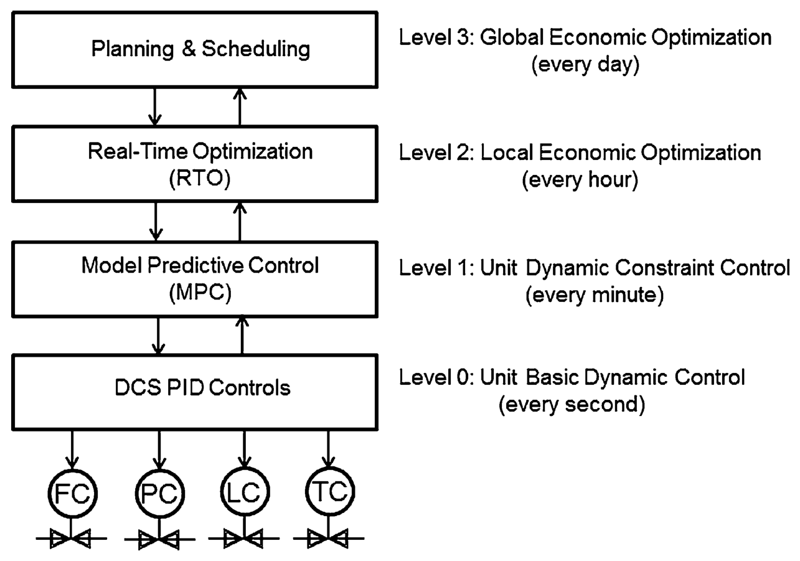

> Image description: This diagram, titled "Fig. 1 Hierarchy of control functions in a refinery/chemical plant," illustrates a four-level hierarchical control structure for an industrial process. The levels are organized vertically, representing a descending temporal scale from long-term planning to real-time regulation. At the highest level is **Level 3: Global Economic Optimization (every day)**, labeled "Planning & Scheduling." Below this is **Level 2: Local Economic Optimization (every hour)**, labeled "Real-Time Optimization (RTO)." **Level 1: Unit Dynamic Constraint Control (every minute)** is managed via "Model Predictive Control (MPC)." At the base is **Level 0: Unit Basic Dynamic Control (every second)**, controlled by "DCS PID Controls." Bidirectional arrows indicate a feedback loop between each adjacent layer. The bottom layer connects to four specific control variables represented by circles: **FC** (Flow Control), **PC** (Pressure Control), **LC** (Level Control), and **TC** (Temperature Control), each linked to a valve symbol.
Model-Predictive Control in Practice, Fig. 1 Hierarchy of control functions in a refinery/chemical plant

model identified directly from process step-test data. The MPC has the job of holding the unit at the best economic operating point in the face of dynamic disturbances and operational constraints.

At Level 2, a real-time optimizer (RTO) runs hourly to calculate optimal steady-state targets for a collection of processing units. It uses a rigorous first-principles steady-state model to calculate targets for key operating variables such as unit temperatures and feed rates. These are typically passed down to several MPCs for implementation.

At Level 3, planning and scheduling functions are carried out daily to optimize economics for an entire chemical plant or refinery. Simple steady-state models are typically used at this level, with some nonlinear but mostly linear connections between model inputs and outputs. Key operating targets and economic data are typically passed to several RTO applications for implementation.

Note that a different mathematical model of the process is used at each level of the hierarchy. These models must be reconciled in some manner with current plant operation and with each other in order for the overall system to function properly.

## MPC Algorithms

MPC algorithms function in much the same way that an experienced human operator would approach a control problem. Figure 2 illustrates the flow of information for a typical MPC implementation. At each control interval, the algorithm compares the current model output prediction $y_{p}$ to the measured output $y_{m}$ and passes the prediction error $e$ and control (input) $u$ to a state estimator, which estimates the dynamic state $x$. The most commonly used methods for state estimation can be viewed as special cases of an optimization-based formulation called moving horizon estimation (MHE) (Rawlings and Mayne 2009). The state estimate $\hat{x}$, which includes an estimate of the process disturbances $\hat{d}$, is then passed to a steady-state optimizer to determine the best operating point for the unit. The steady-state optimizer must also consider operator-entered output and control (input) targets $y_{t}$ and $u_{t}$. The steady-state state and control (input) targets $x_{s}$ and $u_{s}$ are then passed, along with the state estimate $\hat{x}$, to a dynamic optimizer to compute the best trajectory of future control (input) adjustments. The first computed control (input) adjustment is then implemented and the entire calculation sequence is repeated at the


<!-- source_pdf_page: 779 -->
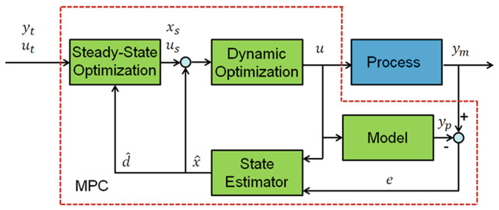

> Image description: A block diagram titled "Model-Predictive Control in Practice, Fig. 2 Information flow for MPC algorithm" illustrates the control architecture for an MPC system. The diagram shows two main sections: an MPC controller (enclosed in a red dashed line) and an external physical Process. Inside the MPC, the information flow begins with external inputs $y_t$ and $u_t$ entering the **Steady-State Optimization** block. The output $x_s$ and $u_s$ flows into a summation junction, which also receives $\hat{x}$ from the **State Estimator**. The resulting signal $u$ enters the **Dynamic Optimization** block, which produces the control signal $u$ sent to the **Process**. The **Process** outputs $y_m$, which is compared against the **Model**'s output $y_p$. The difference, error $e$, is fed back into the **State Estimator**. The estimator also receives $u$ to update the state estimate $\hat{x}$. Additionally, $\hat{d}$ is fed back into the Steady-State Optimization block, indicating disturbance compensation.
Model-Predictive Control in Practice, Fig. 2 Information flow for MPC algorithm

next control interval. The various commercial MPC algorithms differ in such details as the mathematical form of the dynamic model and the specific formulations of the state estimation, steady-state optimization, and dynamic optimization problems (Qin and Badgwell 2003).

In the general case, the MPC algorithm must solve the three optimization problems outlined above at each control interval. For the case of linear models and reasonable tuning parameters, these problems take the form of a convex quadratic program (QP) with a constant, positivedefinite Hessian. As such, they can be solved relatively easily using standard optimization codes. For the case of a linear state-space model, the structure can be exploited even further to develop a specialized solution algorithm using an interior point method (Rao et al. 1998).

For the case of nonlinear models, these problems take the form of a nonlinear program (NLP) for which the solution domain is no longer convex, greatly complicating the numerical solution. A typical strategy is to iterate on a linearized version of the problem until convergence (Bielger 2010).

## Implementation

The combined experience of thousands of MPC applications in the process industries has led to a near consensus on the steps required for a successful implementation:

- Justification - make the economic case for the application.
- Pre-test - design the control and test sensors and actuators.
- Step-test - generate process response data.
- Modeling - develop model from process response data.
- Configuration - configure the software and test preliminary tuning by simulation.
- Commissioning - turn on and test the controller.
- Post-audit - measure and certify economic performance.
- Sustainment - monitor and maintain the application.
The most expensive of these steps, both in terms of engineering time and lost production, is the generation of process response data through the step test. This is accomplished, in principle, by making significant adjustments to each variable that will be adjusted by the MPC while operating open loop to prevent compensating control action. This will necessarily cause abnormal movement in key operating variables, which may lead to lower throughput and off-spec products. Significant progress has been made in recent years to minimize these difficulties through the use of approximate closed-loop step testing (Darby and Nikolaou 2012).

Once the application has been commissioned, it is critical to set up an aggressive monitoring and sustainment program. MPC application benefits can fall off quickly due to changes in the process operation and as new personnel interact with it. New constraint variables may need to be added and key sections of the model may need


<!-- source_pdf_page: 780 -->
to be updated as time goes on. The mathematical problem of MPC monitoring remains a topic of current academic research (Zagrobelny et al. 2012).

Note that the implementation steps outlined above must be carried out by a carefully selected project team that typically includes, in addition to the MPC expert, an engineer with detailed knowledge of the process and an operator with significant relevant experience.

## Summary and Future Directions

Model predictive control is now a mature technology in the process industries. A representative MPC algorithm in this domain includes a state estimator, a steady-state optimizer, and a dynamic optimizer, running once a minute. A successful MPC application usually starts with a careful economic justification, includes significant participation from process engineers and operators, and is maintained with an aggressive sustainment program. Many thousands of such applications are currently operating around the world, generating billions of dollars per year in economic benefits.

Likely future directions for MPC practice include increasing use of nonlinear models, improved state estimation through unmeasured disturbance modeling (Pannocchia and Rawlings 2003), and development of more efficient numerical solution methods (Zavala and Biegler 2009).

## Cross-References

- Distributed Model Predictive Control
- Nominal Model-Predictive Control
- Optimization Algorithms for Model Predictive Control
- Tracking Model Predictive Control


## Recommended Reading

The first descriptions of MPC technology appear in papers by Richalet et al. (1978) and Cutler
and Ramaker (1979). A detailed summary of the history of MPC technology development, as well as a survey of commercial offerings through 2003 can be found in the review article by Qin and Badgwell (2003). Darby and Nikolaou present a more recent summary of MPC practice (Darby and Nikolaou 2012). Textbook descriptions of MPC theory and design, suitable for classroom use, include Rawlings and Mayne (2009) and Maciejowski (2002). The book by Ljung (1999) provides a good summary of methods for identifying dynamic models from test data. Theoretical properties of MPC are analyzed in a highly cited paper by Mayne and coworkers (2000). Guidelines for designing disturbance models so as to achieve offset-free control can be found in Pannocchia and Rawlings (2003). Numerical solution strategies for the nonlinear programs found in MPC are discussed in the book by Biegler (2010). An efficient interior-point method for solving the linear MPC dynamic optimization is described in Rao et al. (1998). A promising algorithm for solving the nonlinear MPC dynamic optimization is outlined in Zavala and Biegler (2009). A data-based method for tuning Kalman Filters, which are often used for MPC state estimation, is described in Odelson et al. (2006). A new method for monitoring the performance of MPC is summarized in Zagrobelny et al. (2012). A readable summary of refining operations can be found in Gary et al. (2007).

## Bibliography

Bielger LT (2010) Nonlinear programming, concepts, algorithms, and applications to chemical processes. SIAM, Philadelphia
Cutler CR, Ramaker BL (1979) Dynamic matrix control - a computer control algorithm. Paper presented at the AIChE national meeting, Houston, April 1979
Darby ML, Nikolaou M (2012) MPC: current practice and challenges. Control Eng Pract 20:328-342
Gary JH, Handwerk GE, Kaiser MJ (2007) Petroleum refining: technology and economics. CRC, New York
Ljung L (1999) System identification: theory for the user. Prentice Hall, Upper Saddle River
Maciejowski JM (2002) Predictive control with constraints. Pearson Education Limited, Essex
Mayne DQ, Rawlings JB, Rao CV, Scokaert POM (2000) Constrained model predictive control: stability and optimality. Automatica 36:789-814


<!-- source_pdf_page: 781 -->
Odelson BJ, Rajamani MR, Rawlings JB (2006) A new autocovariance least-squares method for estimating noise covariances. Automatica 42: 303-308
Pannocchia G, Rawlings JB (2003) Disturbance models for offset-free model predictive control. AIChE J 49:426-437
Qin SJ, Badgwell TA (2003) A survey of industrial model predictive control technology. Control Eng Pract 11:733-764
Rao CV, Wright SJ, Rawlings JB (1998) Application of interior-point methods to model predictive control. J Optim Theory Appl 99:723-757
Rawlings JB, Mayne DQ (2009) Model predictive control: theory and design. Nob Hill Publishing, Madison
Richalet J, Rault A, Testud JL, Papon J (1978) Model predictive heuristic control: applications to industrial processes. Automatica 14:413-428
Zagrobelny M, Luo J, Rawlings JB (2012) Quis custodiet ipsos custodies? In: IFAC conference on nonlinear model predictive control 2012, Noordwijkerhout, Aug 2012
Zavala VM, Biegler LT (2009) The advanced-step NMPC controller: optimality, stability, and robustness. Automatica 45:86-93

## Models for Discrete Event Systems: An Overview

Christos G. Cassandras<br>Division of Systems Engineering, Center for Information and Systems Engineering, Boston University, Brookline, MA, USA

## Synonyms

## DES


#### Abstract

This article provides an introduction to discrete event systems (DES) as a class of dynamic systems with characteristics significantly distinguishing them from traditional time-driven systems. It also overviews the main modeling frameworks used to formally describe the operation of DES and to study problems related to their control and optimization.


## Keywords

Automata; Dioid algebras; Event-driven systems; Hybrid systems; Petri nets; Time-driven systems

## Introduction

Discrete event systems (DES) form an important class of dynamic systems. The term was introduced in the early 1980s to describe a DES in terms of its most critical feature: the fact that its behavior is governed by discrete events which occur asynchronously over time and which are solely responsible for generating state transitions. In between event occurrences, the state of a DES is unaffected. Examples of such behavior abound in technological environments, including computer and communication networks, manufacturing systems, transportation systems, logistics, and so forth. The operation of a DES is largely regulated by rules which are often unstructured and frequently human-made, as in initiating or terminating activities and scheduling the use of resources through controlled events (e.g., turning equipment "on"). On the other hand, their operation is also subject to uncontrolled randomly occurring events (e.g., a spontaneous equipment failure) which may or may not be observable through sensors. It is worth pointing out that the term "discrete event dynamic system" (DEDS) is also commonly used to emphasize the importance of the dynamical behavior of such systems (Cassandras and Lafortune 2008; Ho 1991).

There are two aspects of a DES that define its behavior:

1. The variables involved are both continuous and discrete, sometimes purely symbolic, i.e., nonnumeric (e.g., describing the state of a traffic light as "red" or "green"). This renders traditional mathematical models based on differential (or difference) equations inadequate and related methods based on calculus of limited use.
2. Because of the asynchronous nature of events that cause state transitions in a DES, it is neither natural nor efficient to use time as a synchronizing element driving its dynamics.


<!-- source_pdf_page: 782 -->
It is for this reason that DES are often referred to as event driven, to contrast them to classical time-driven systems based on the laws of physics; in the latter, as time evolves state, variables such as position, velocity, temperature, voltage, etc., also continuously evolve. In order to capture event-driven state dynamics, however, different mathematical models are necessary.
In addition, uncertainties are inherent in the technological environments where DES are encountered. Therefore, associated mathematical models and methods for analysis and control must incorporate such uncertainties. Finally, complexity is also inherent in DES of practical interest, usually manifesting itself in the form of combinatorially explosive state spaces. Although purely analytical methods for DES design, analysis, and control are limited, they have still enabled reliable approximations of their dynamic behavior and the derivation of useful structural properties and provable performance guarantees. Much of the progress made in this field, however, has relied on new paradigms characterized by a combination of mathematical techniques, computer-based tools, and effective processing of experimental data.

Event-driven and time-driven system components are often viewed as coexisting and interacting and are referred to as hybrid systems (separately considered in the Encyclopedia, including the article ▷ Discrete Event Systems and Hybrid Systems, Connections Between). Arguably, most contemporary technological systems are combinations of time-driven components (typically, the physical parts of a system) and event-driven components (usually, the computer-based controllers that collect data from and issue commands to the physical parts).

## Event-Driven vs. Time-Driven Systems

In order to explain the difference between timedriven and event-driven behavior, we begin with the concept of "event." An event should be thought of as occurring instantaneously and
causing transitions from one system state value to another. It may be identified with an action (e.g., pressing a button), a spontaneous natural occurrence (e.g., a random equipment failure), or the result of conditions met by the system state (e.g., the fluid level in a tank exceeds a given value). For the purpose of developing a model for DES, we will use the symbol $e$ to denote an event. Since a system is generally affected by different types of events, we assume that we can define a discrete event set $E$ with $e \in E$.

In a classical system model, the "clock" is what drives a typical state trajectory: with every "clock tick" (which may be thought of as an "event"), the state is expected to change, since continuous state variables continuously change with time. This leads to the term time driven. In the case of time-driven systems described by continuous variables, the field of systems and control has based much of its success on the use of well-known differential-equation-based models, such as

$$
\begin{align*}
& \dot{\mathbf{x}}(t)=\mathbf{f}(\mathbf{x}(t), \mathbf{u}(t), t), \quad \mathbf{x}\left(t_{0}\right)=\mathbf{x}_{0}  \tag{1}\\
& \mathbf{y}(t)=\mathbf{g}(\mathbf{x}(t), \mathbf{u}(t), t), \tag{2}
\end{align*}
$$

where (1) is a (vector) state equation with initial conditions specified and (2) is a (vector) output equation. As is common in system theory, $\mathbf{x}(t)$ denotes the state of the system, $\mathbf{y}(t)$ is the output, and $\mathbf{u}(t)$ represents the input, often associated with controllable variables used to manipulate the state so as to attain a desired output. Common physical quantities such as position, velocity, temperature, pressure, flow, etc., define state variables in (1). The state generally changes as time changes, and, as a result, the time variable $t$ (or some integer $k=0,1,2, \ldots$ in discrete time) is a natural independent variable for modeling such systems.

In contrast, in a DES, time no longer serves the purpose of driving such a system and may no longer be an appropriate independent variable. Instead, at least some of the state variables are discrete, and their values change only at certain points in time through instantaneous transitions which we associate with "events." If a clock is used, consider two possibilities: (i) At every


<!-- source_pdf_page: 783 -->
clock tick, an event $e$ is selected from the event set $E$ (if no event takes place, we use a "null event" as a member of $E$ such that it causes no state change), and (ii) at various time instants (not necessarily known in advance or coinciding with clock ticks), some event $e$ "announces" that it is occurring. Observe that in (i) state transitions are synchronized by the clock which is solely responsible for any possible state transition. In (ii), every event $e \in E$ defines a distinct process through which the time instants when $e$ occurs are determined. State transitions are the result of combining these asynchronous concurrent event processes. Moreover, these processes need not be independent of each other. The distinction between (i) and (ii) gives rise to the terms timedriven and event-driven systems, respectively.

Comparing state trajectories of time-driven and event-driven systems is useful in understanding the differences between the two and setting the stage for DES modeling frameworks. Thus, in Fig. 1, we observe the following: (i) For the time-

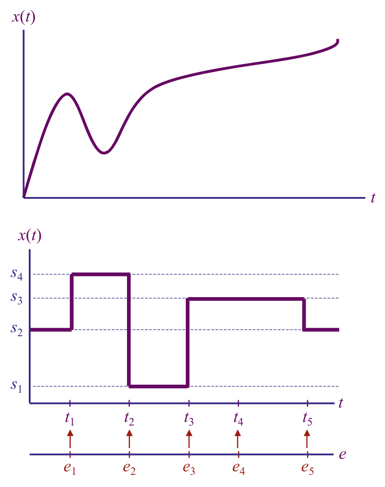

> Image description: This figure compares the state trajectories of a time-driven system versus an event-driven system over time $t$. The top plot shows a continuous-time trajectory $x(t)$. The curve begins at the origin, rises to a local peak, drops into a local minimum, and then follows a monotonic upward trend with decreasing slope. The bottom plot shows a discrete-state trajectory $x(t)$ characterized by sudden jumps. The state transitions between discrete levels $s_1, s_2, s_3,$ and $s_4$. The sequence begins at $s_2$, jumps to $s_4$ at time $t_1$, stays there until $t_2$, drops to $s_1$ until $t_3$, rises to $s_3$ until $t_5$, and finally returns to $s_2$ after $t_5$. Below the time axis, a sequence of discrete events $e_1$ through $e_5$ is marked by upward arrows, each aligned with the time steps $t_1$ through $t_5$ where state changes occur.
Models for Discrete Event Systems: An Overview,
Fig. 1 Comparison of time-driven and event-driven state trajectories

driven system shown, the state space $X$ is the set of real numbers $\mathbb{R}$, and $x(t)$ can take any value from this set. The function $x(t)$ is the solution of a differential equation of the general form $\dot{x}(t)=f(x(t), u(t), t)$, where $u(t)$ is the input. (ii) For the event-driven system, the state space is some discrete set $X=\left\{s_{1}, s_{2}, s_{3}, s_{4}\right\}$. The sample path can only jump from one state to another whenever an event occurs. Note that an event may take place, but not cause a state transition, as in the case of $e_{4}$. There is no immediately obvious analog to $\dot{x}(t)=f(x(t), u(t), t)$, i.e., no mechanism to specify how events might interact over time or how their time of occurrence might be determined. Thus, a large part of the early developments in the DES field has been devoted to the specification of an appropriate mathematical model containing the same expressive power as (1)-(2) (Baccelli et al. 1992; Cassandras and Lafortune 2008; Glasserman and Yao 1994).

We should point out that a time-driven system with continuous state variables, usually modeled through (1)-(2), may be abstracted as a DES through some form of discretization in time and quantization in the state space. We should also point out that discrete event systems should not be confused with discrete time systems. The class of discrete time systems contains both time-driven and event-driven systems.

## Timed and Untimed Models of Discrete Event Systems

Returning to Fig. 1, instead of constructing the piecewise constant function $x(t)$ as shown, it is convenient to simply write the timed sequence of events $\left\{\left(e_{1}, t_{1}\right),\left(e_{2}, t_{2}\right),\left(e_{3}, t_{3}\right),\left(e_{4}, t_{4}\right),\left(e_{5}, t_{5}\right)\right\}$ which contains the same information as the state trajectory. Assuming that the initial state of the system ( $s_{2}$ in this case) is known and that the system is "deterministic" in the sense that the next state after the occurrence of an event is unique, we can recover the state of the system at any point in time and reconstruct the DES state trajectory. The set of all possible timed sequences of events that a given system can ever


<!-- source_pdf_page: 784 -->
execute is called the timed language model of the system. The word "language" comes from the fact that we can think of the event $E$ as an "alphabet" and of (finite) sequences of events as "words" (Hopcroft and Ullman 1979). We can further refine such a model by adding statistical information regarding the set of state trajectories (sample paths) of the system. Let us assume that probability distribution functions are available about the "lifetime" of each event type $e \in E$, that is, the elapsed time between successive occurrences of this particular $e$. A stochastic timed language is a timed language together with associated probability distribution functions for the events.

Stochastic timed language modeling is the most detailed in the sense that it contains event information in the form of event occurrences and their orderings, information about the exact times at which the events occur (not only their relative ordering), and statistical information about successive occurrences of events. If we delete the timing information from a timed language, we obtain an untimed language, or simply language, which is the set of all possible orderings of events that could happen in the given system. For example, the untimed sequence corresponding to the timed sequence of events in Fig. 1 is $\left\{e_{1}, e_{2}, e_{3}, e_{4}, e_{5}\right\}$.

Untimed and timed languages represent different levels of abstraction at which DES are modeled and studied. The choice of the appropriate level of abstraction clearly depends on the objectives of the analysis. In many instances, we are interested in the "logical behavior" of the system, that is, in ensuring that all the event sequences it can generate satisfy a given set of specifications, e.g., maintaining a precise ordering of events. In this context, the actual timing of events is not required, and it is sufficient to model only the untimed behavior of the system. Supervisory control that is discussed in the article - Supervisory Control of Discrete-Event Systems is the term established for describing the systematic means (i.e., enabling or disabling events which are controllable) by which the logical behavior of a DES is regulated to achieve a given
specification (Cassandras and Lafortune 2008; Moody and Antsaklis 1998; Ramadge and Wonham 1987).

On the other hand, we may be interested in event timing in order to answer questions such as the following: "How much time does the system spend at a particular state?" or "Can this sequence of events be completed by a particular deadline?" More generally, event timing is important in assessing the performance of a DES often measured through quantities such as throughput or response time. In these instances, we need to consider the timed language model of the system. Since DES frequently operate in a stochastic setting, an additional level of complexity is introduced, necessitating the development of probabilistic models and related analytical methodologies for design and performance analysis based on stochastic timed language models. Sample path analysis and perturbation analysis, discussed in the entry - Perturbation Analysis of Discrete Event Systems, refer to the study of sample paths of DES, focusing on the extraction of information for the purpose of efficiently estimating performance sensitivities of the system and, ultimately, achieving online control and optimization (Cassandras and Lafortune 2008; Glasserman 1991; Ho and Cao 1991; Ho and Cassandras 1983).

These different levels of abstraction are complementary, as they address different issues about the behavior of a DES. Although the languagebased approach to DES modeling is attractive, it is by itself not convenient to address verification, controller synthesis, or performance issues. This motivates the development of discrete event modeling formalisms which represent languages in a manner that highlights structural information about the system behavior and can be used to address analysis and controller synthesis issues. Next, we provide an overview of three major modeling formalisms which are used by most (but not all) system and control theoretic methodologies pertaining to DES. Additional modeling formalisms encountered in the computer science literature include process algebras (Baeten and Weijland 1990) and communicating sequential processes (Hoare 1985).


<!-- source_pdf_page: 785 -->
## Automata

A deterministic automaton, denoted by $G$, is a six-tuple

$$
G=\left(\mathcal{X}, \mathcal{E}, f, \Gamma, x_{0}, \mathcal{X}_{m}\right),
$$

where $\mathcal{X}$ is the set of states, $\mathcal{E}$ is the finite set of events associated with the transitions in $G$, and $f: \mathcal{X} \times \mathcal{E} \rightarrow \mathcal{X}$ is the transition function; specifically, $f(x, e)=y$ means that there is a transition labeled by event $e$ from state $x$ to state $y$ and, in general, $f$ is a partial function on its domain. $\Gamma: \mathcal{X} \rightarrow 2^{\mathcal{E}}$ is the active event function (or feasible event function); $\Gamma(x)$ is the set of all events $e$ for which $f(x, e)$ is defined and it is called the active event set (or feasible event set) of $G$ at $x$. Finally, $x_{0}$ is the initial state and $\mathcal{X}_{m} \subseteq \mathcal{X}$ is the set of marked states. The terms state machine and generator (which explains the notation $G$ ) are also used to describe the above object. Moreover, if $\mathcal{X}$ is a finite set, we call $G$ a deterministic finite-state automaton. A nondeterministic automaton is defined by means of a relation over $\mathcal{X} \times \mathcal{E} \times \mathcal{X}$ or, equivalently, a function from $\mathcal{X} \times \mathcal{E}$ to $2^{\mathcal{X}}$.

The automaton $G$ operates as follows. It starts in the initial state $x_{0}$, and upon the occurrence of an event $e \in \Gamma\left(x_{0}\right) \subseteq \mathcal{E}$, it makes a transition to state $f\left(x_{0}, e\right) \in \mathcal{X}$. This process then continues based on the transitions for which $f$ is defined. Note that an event may occur without changing the state, i.e., $f(x, e)=x$. It is also possible that two distinct events occur at a given state causing the exact same transition, i.e., for $a, b \in \mathcal{E}$, $f(x, a)=f(x, b)=y$. What is interesting about the latter fact is that we may not be able to distinguish between events $a$ and $b$ by simply observing a transition from state $x$ to state $y$.

For the sake of convenience, $f$ is always extended from domain $\mathcal{X} \times \mathcal{E}$ to domain $\mathcal{X} \times \mathcal{E}^{*}$, where $\mathcal{E}^{*}$ is the set of all finite strings of elements of $\mathcal{E}$, including the empty string (denoted by $\varepsilon$ ); the * operation is called the Kleene closure. This is accomplished in the following recursive manner: $f(x, \varepsilon):=x$ and $f(x, s e):=f(f(x, s), e)$ for $s \in \mathcal{E}^{*}$ and $e \in \mathcal{E}$. The (untimed) language generated by
$G$ and denoted by $\mathcal{L}(G)$ is the set of all strings in $\mathcal{E}^{*}$ for which the extended function $f$ is defined. The automaton model above is one instance of what is referred to as a generalized semi-Markov scheme (GSMS) in the literature of stochastic processes. A GSMS is viewed as the basis for extending automata to incorporate an event timing structure as well as nondeterministic state transition mechanisms, ultimately leading to stochastic timed automata, discussed in the sequel.

Let us allow for generally countable sets $\mathcal{X}$ and $E$ and leave out of the definition any consideration for marked states. Thus, we begin with an automaton model ( $\mathcal{X}, \mathcal{E}, f, \Gamma, x_{0}$ ). We extend the modeling setting to timed automata by incorporating a "clock structure" associated with the event set $E$ which now becomes the input from which a specific event sequence can be deduced. The clock structure (or timing structure) associated with an event set $\mathcal{E}$ is a set $\mathbf{V}=\left\{\mathbf{v}_{i}\right.$ : $i \in \mathcal{E}\}$ of clock (or lifetime) sequences
$\mathbf{v}_{i}=\left\{v_{i, 1}, v_{i, 2}, \ldots\right\}, i \in \mathcal{E}, v_{i, k} \in \mathbb{R}^{+}, k=1,2, \ldots$

Timed Automaton. A timed automaton is defined as a six-tuple

$$
\left(\mathcal{X}, \mathcal{E}, f, \Gamma, x_{0}, \mathbf{V}\right)
$$

where $\mathbf{V}=\left\{\mathbf{v}_{i}: i \in \mathcal{E}\right\}$ is a clock structure and ( $\mathcal{X}, \mathcal{E}, f, \Gamma, x_{0}$ ) is an automaton. The automaton generates a state sequence $x^{\prime}=f\left(x, e^{\prime}\right)$ driven by an event sequence $\left\{e_{1}, e_{2}, \ldots\right\}$ generated through

$$
\begin{equation*}
e^{\prime}=\arg \min _{i \in \Gamma(x)}\left\{y_{i}\right\} \tag{3}
\end{equation*}
$$

with the clock values $y_{i}, i \in \mathcal{E}$, defined by

$$
y_{i}^{\prime}=\left\{\begin{array}{ll}y_{i}-y^{*} & \text { if } i \neq e^{\prime} \text { and } i \in \Gamma(x)  \tag{4}\\ v_{i, N_{i}+1} & \text { if } i=e^{\prime} \text { or } i \notin \Gamma(x)\end{array} \quad i \in \Gamma\left(x^{\prime}\right)\right.
$$

where the interevent time $y^{*}$ is defined as

$$
\begin{equation*}
y^{*}=\min _{i \in \Gamma(x)}\left\{y_{i}\right\} \tag{5}
\end{equation*}
$$


<!-- source_pdf_page: 786 -->
and the event scores $N_{i}, i \in \mathcal{E}$, are defined by

$$
N_{i}^{\prime}=\left\{\begin{array}{l}
N_{i}+1 \text { if } i=e^{\prime} \text { or } i \notin \Gamma(x)  \tag{6}\\
N_{i} \quad \text { otherwise }
\end{array} \quad i \in \Gamma\left(x^{\prime}\right) .\right.
$$

In addition, initial conditions are $y_{i}=v_{i, 1}$ and $N_{i}=1$ for all $i \in \Gamma\left(x_{0}\right)$. If $i \notin \Gamma\left(x_{0}\right)$, then $y_{i}$ is undefined and $N_{i}=0$.

A simple interpretation of this elaborate definition is as follows. Given that the system is at some state $x$, the next event $e^{\prime}$ is the one with the smallest clock value among all feasible events $i \in \Gamma(x)$. The corresponding clock value, $y^{*}$, is the interevent time between the occurrence of $e$ and $e^{\prime}$, and it provides the amount by which the time, $t$, moves forward: $t^{\prime}=t+y^{*}$. Clock values for all events that remain active in state $x^{\prime}$ are decremented by $y^{*}$, except for the triggering event $e^{\prime}$ and all newly activated events, which are assigned a new lifetime $v_{i, N_{i}+1}$. Event scores are incremented whenever a new lifetime is assigned to them. It is important to note that the "system clock" $t$ is fully controlled by the occurrence of events, which cause it to move forward; if no event occurs, the system remains at the last state observed.

Comparing $x^{\prime}=f\left(x, e^{\prime}\right)$ to the state equation (1) for time-driven systems, we see that the former can be viewed as the event-driven analog of the latter. However, the simplicity of $x^{\prime}=f\left(x, e^{\prime}\right)$ is deceptive: unless an event sequence is given, determining the triggering event $e^{\prime}$ which is required to obtain the next state $x^{\prime}$ involves the combination of (3)-(6). Therefore, the analog of (1) as a "canonical" state equation for a DES requires all Eqs. (3)-(6). Observe that this timed automaton generates a timed language, thus extending the untimed language generated by the original automaton $G$.

In the definition above, the clock structure $\mathbf{V}$ is assumed to be fully specified in a deterministic sense and so are state transitions dictated by $x^{\prime}=f\left(x, e^{\prime}\right)$. The sequences $\left\{\mathbf{v}_{i}\right\}, i \in \mathcal{E}$, can be extended to be specified only as stochastic sequences through distribution functions denoted by $F_{i}, i \in \mathcal{E}$. Thus, the stochastic clock structure (or stochastic timing structure) associated with
an event set $\mathcal{E}$ is a set of distribution functions $F=\left\{F_{i}: i \in \mathcal{E}\right\}$ characterizing the stochastic clock sequences

$$
\begin{array}{r}
\left\{V_{i, k}\right\}=\left\{V_{i, 1}, V_{i, 2}, \ldots\right\}, i \in \mathcal{E} \\
V_{i, k} \in \mathbb{R}^{+}, k=1,2, \ldots
\end{array}
$$

It is usually assumed that each clock sequence consists of random variables which are independent and identically distributed (iid) and that all clock sequences are mutually independent. Thus, each $\left\{V_{i, k}\right\}$ is completely characterized by a distribution function $F_{i}(t)=P\left[V_{i} \leq t\right]$. There are, however, several ways in which a clock structure can be extended to include situations where elements of a sequence $\left\{V_{i, k}\right\}$ are correlated or two clock sequences are interdependent. As for state transitions which may be nondeterministic in nature, such behavior is modeled through state transition probabilities as explained next.

Stochastic Timed Automaton. We can extend the definition of a timed automaton by viewing the state, event, and all event scores and clock values as random variables denoted respectively by capital letters $X, E, N_{i}$ and $Y_{i}, i \in \mathcal{E}$. Thus, a stochastic timed automaton is a six-tuple

$$
\left(\mathcal{X}, \mathcal{E}, \Gamma, p, p_{0}, F\right)
$$

where $\mathcal{X}$ is a countable state space; $\mathcal{E}$ is a countable event set; $\Gamma(x)$ is the active event set (or feasible event set); $p\left(x^{\prime} ; x, e^{\prime}\right)$ is a state transition probability defined for all $x, x^{\prime} \in \mathcal{X}, e^{\prime} \in \mathcal{E}$ and such that $p\left(x^{\prime} ; x, e^{\prime}\right)=0$ for all $e^{\prime} \notin \Gamma(x) ; p_{0}$ is the probability mass function $P\left[X_{0}=x\right], x \in \mathcal{X}$, of the initial state $X_{0}$; and $F$ is a stochastic clock structure. The automaton generates a stochastic state sequence $\left\{X_{0}, X_{1}, \ldots\right\}$ through a transition mechanism (based on observations $X=x, E^{\prime}= e^{\prime}$ ):

$$
\begin{equation*}
X^{\prime}=x^{\prime} \text { with probability } p\left(x^{\prime} ; x, e^{\prime}\right) \tag{7}
\end{equation*}
$$

and it is driven by a stochastic event sequence $\left\{E_{1}, E_{2}, \ldots\right\}$ generated exactly as in (3)-(6) with random variables $E, Y_{i}$, and $N_{i}, i \in \mathcal{E}$, instead


<!-- source_pdf_page: 787 -->
of deterministic quantities and with $\left\{V_{i, k}\right\} \sim F_{i}$ ( $\sim$ denotes "with distribution"). In addition, initial conditions are $X_{0} \sim p_{0}(x), Y_{i}=V_{i, 1}$, and $N_{i}=1$ if $i \in \Gamma\left(X_{0}\right)$. If $i \notin \Gamma\left(X_{0}\right)$, then $Y_{i}$ is undefined and $N_{i}=0$.

It is conceivable for two events to occur at the same time, in which case we need a priority scheme to overcome a possible ambiguity in the selection of the triggering event in (3). In practice, it is common to expect that every $F_{i}$ in the clock structure is absolutely continuous over $[0, \infty)$ (so that its density function exists) and has a finite mean. This implies that two events can occur at exactly the same time only with probability 0 .

A stochastic process $\{X(t)\}$ with state space $\mathcal{X}$ which is generated by a stochastic timed automaton ( $\mathcal{X}, \mathcal{E}, \Gamma, p, p_{0}, F$ ) is referred to as a generalized semi-Markov process (GSMP). This process is used as the basis of much of the sample path analysis methods for DES (see Cassandras and Lafortune 2008; Glasserman 1991; Ho and Cao 1991).

## Petri Nets

An alternative modeling formalism for DES is provided by Petri nets, originating in the work of C. A. Petri in the early 1960s. Like an automaton, a Petri net (Peterson 1981) is a device that manipulates events according to certain rules. One of its features is the inclusion of explicit conditions under which an event can be enabled. The Petri net modeling framework is the subject of the article - Modeling, Analysis, and Control with Petri Nets. Thus, we limit ourselves here to a brief introduction. First, we define a Petri net graph, also called the Petri net structure. Then, we adjoin to this graph an initial state, a set of marked states, and a transition labeling function, resulting in the complete Petri net model, its associated dynamics, and the languages that it generates and marks.

Petri Net Graph. A Petri net is a directed bipartite graph with two types of nodes, places and transitions, and arcs connecting them. Events
are associated with transition nodes. In order for a transition to occur, several conditions may have to be satisfied. Information related to these conditions is contained in place nodes. Some such places are viewed as the "input" to a transition; they are associated with the conditions required for this transition to occur. Other places are viewed as the output of a transition; they are associated with conditions that are affected by the occurrence of this transition. A Petri net graph is formally defined as a weighted directed bipartite graph ( $P, T, A, w$ ) where $P$ is the finite set of places (one type of node in the graph), $T$ is the finite set of transitions (the other type of node in the graph), $A \subseteq(P \times T) \cup(T \times P)$ is the set of arcs with directions from places to transitions and from transitions to places in the graph, and $w: A \rightarrow\{1,2,3, \ldots\}$ is the weight function on the arcs. Let $P=\left\{p_{1}, p_{2}, \ldots, p_{n}\right\}$, and $T=\left\{t_{1}, t_{2}, \ldots, t_{m}\right\}$. It is convenient to use $I\left(t_{j}\right)$ to represent the set of input places to transition $t_{j}$. Similarly, $O\left(t_{j}\right)$ represents the set of output places from transition $t_{j}$. Thus, we have $I\left(t_{j}\right)=\left\{p_{i} \in P:\left(p_{i}, t_{j}\right) \in A\right\}$ and $O\left(t_{j}\right)= \left\{p_{i} \in P:\left(t_{j}, p_{i}\right) \in A\right\}$.

Petri Net Dynamics. Tokens are assigned to places in a Petri net graph in order to indicate the fact that the condition described by that place is satisfied. The way in which tokens are assigned to a Petri net graph defines a marking. Formally, a marking $x$ of a Petri net graph $(P, T, A, w)$ is a function $x: P \rightarrow \mathbb{N}= \{0,1,2, \ldots\}$. Marking $x$ defines row vector $\mathbf{x}= \left[x\left(p_{1}\right), x\left(p_{2}\right), \ldots, x\left(p_{n}\right)\right]$, where $n$ is the number of places in the Petri net. The $i$ th entry of this vector indicates the (nonnegative integer) number of tokens in place $p_{i}, x\left(p_{i}\right) \in \mathbb{N}$. In Petri net graphs, a token is indicated by a dark dot positioned in the appropriate place. The state of a Petri net is defined to be its marking vector $\mathbf{x}$. The state transition mechanism of a Petri net is captured by the structure of its graph and by "moving" tokens from one place to another. A transition $t_{j} \in T$ in a Petri net is said to be enabled if

$$
\begin{equation*}
x\left(p_{i}\right) \geq w\left(p_{i}, t_{j}\right) \text { for all } p_{i} \in I\left(t_{j}\right) . \tag{8}
\end{equation*}
$$


<!-- source_pdf_page: 788 -->
In words, transition $t_{j}$ in the Petri net is enabled when the number of tokens in $p_{i}$ is at least as large as the weight of the arc connecting $p_{i}$ to $t_{j}$, for all places $p_{i}$ that are input to transition $t_{j}$. When a transition is enabled, it can occur or fire. The state transition function of a Petri net is defined through the change in the state of the Petri net due to the firing of an enabled transition. The state transition function, $f: \mathbb{N}^{n} \times T \rightarrow \mathbb{N}^{n}$, of Petri net ( $P, T, A, w, x$ ) is defined for transition $t_{j} \in T$ if and only if (8) holds. Then, we set $\mathbf{x}^{\prime}=f\left(\mathbf{x}, t_{j}\right)$ where

$$
\begin{gather*}
x^{\prime}\left(p_{i}\right)=x\left(p_{i}\right)-w\left(p_{i}, t_{j}\right)+w\left(t_{j}, p_{i}\right), \\
i=1, \ldots, n . \tag{9}
\end{gather*}
$$

An "enabled transition" is therefore equivalent to a "feasible event" in an automaton. But whereas in automata the state transition function enumerates all feasible state transitions, here the state transition function is based on the structure of the Petri net. Thus, the next state defined by (9) explicitly depends on the input and output places of a transition and on the weights of the arcs connecting these places to the transition. According to (9), if $p_{i}$ is an input place of $t_{j}$, it loses as many tokens as the weight of the arc from $p_{i}$ to $t_{j}$; if it is an output place of $t_{j}$, it gains as many tokens as the weight of the arc from $t_{j}$ to $p_{i}$. Clearly, it is possible that $p_{i}$ is both an input and output place of $t_{j}$.

In general, it is entirely possible that, after several transition firings, the resulting state is $\mathbf{x}=[0, \ldots, 0]$ or that the number of tokens in one or more places grows arbitrarily large after an arbitrarily large number of transition firings. The latter phenomenon is a key difference with automata, where finite-state automata have only a finite number of states, by definition. In contrast, a finite Petri net graph may result in a Petri net with an unbounded number of states. It should be noted that a finite-state automaton can always be represented as a Petri net; on the other hand, not all Petri nets can be represented as finite-state automata.

Similar to timed automata, we can define timed Petri nets by introducing a clock structure, except that now a clock sequence $\mathbf{v}_{j}$ is associated
with a transition $t_{j}$. A positive real number, $v_{j, k}$, assigned to $t_{j}$ has the following meaning: when transition $t_{j}$ is enabled for the $k$ th time, it does not fire immediately, but incurs a firing delay given by $v_{j, k}$; during this delay, tokens are kept in the input places of $t_{j}$. Not all transitions are required to have firing delays. Thus, we partition $T$ into subsets $T_{0}$ and $T_{D}$, such that $T=T_{0} \cup T_{D} . T_{0}$ is the set of transitions always incurring zero firing delay, and $T_{D}$ is the set of transitions that generally incur some firing delay. The latter are called timed transitions. The clock structure (or timing structure) associated with a set of timed transitions $T_{D} \subseteq T$ of a marked Petri net ( $P, T, A, w, x$ ) is a set $\mathbf{V}= \left\{\mathbf{v}_{j}: t_{j} \in T_{D}\right\}$ of clock (or lifetime) sequences $\mathbf{v}_{j}=\left\{v_{j, 1}, v_{j, 2}, \ldots\right\}, t_{j} \in T_{D}, v_{j, k} \in \mathbb{R}^{+}$, $k=1,2, \ldots$ A timed Petri net is a six-tuple $(P, T, A, w, x, \mathbf{V})$, where $(P, T, A, w, x)$ is a marked Petri net and $\mathbf{V}=\left\{\mathbf{v}_{j}: t_{j} \in T_{D}\right\}$ is a clock structure. It is worth mentioning that this general structure allows for a variety of behaviors in a timed Petri net, including the possibility of multiple transitions being enabled at the same time or an enabled transition being preempted by the firing of another, depending on the values of the associated firing delays. The need to analyze and control such behavior in DES has motivated the development of a considerable body of analysis techniques for Petri net models which have been proven to be particularly suitable for this purpose (Moody and Antsaklis 1998; Peterson 1981).

## Dioid Algebras

Another modeling framework is based on developing an algebra using two operations: $\min \{a, b\}$ (or max\{ $a, b\}$ ) for any real numbers $a$ and $b$ and addition $(a+b)$. The motivation comes from the observation that the operations "min" and "+" are the only ones required to develop the timed automaton model. Similarly, the operations "max" and "+" are the only ones used in developing the timed Petri net models described above. The operations are formally named addition and multiplication and denoted by ⊕ and ⊗


<!-- source_pdf_page: 789 -->
respectively. However, their actual meaning (in terms of regular algebra) is different. For any two real numbers $a$ and $b$, we define

$$
\begin{align*}
\text { Addition : } & a \oplus b \equiv \max \{a, b\}  \tag{10}\\
\text { Multiplication : } & a \otimes b \equiv a+b \tag{11}
\end{align*}
$$

This dioid algebra is also called a (max, +) algebra (Baccelli et al. 1992; Cuninghame-Green 1979). If we consider a standard linear discrete time system, its state equation is of the form

$$
\mathbf{x}(k+1)=\mathbf{A} \mathbf{x}(k)+\mathbf{B} \mathbf{u}(k),
$$

which involves (regular) multiplication ( × ) and addition (+). It turns out that we can use a (max, +) algebra with DES, replacing the (,$+ \times$ ) algebra of conventional time-driven systems, and come up with a representation similar to the one above, thus paralleling to a considerable extent the analysis of classical time-driven linear systems. We should emphasize, however, that this particular representation is only possible for a subset of DES. Moreover, while conceptually this offers an attractive way to capture the event timing dynamics in a DES, from a computational standpoint, one still has to confront the complexity of performing the "max" operation when numerical information is ultimately needed to analyze the system or to design controllers for its proper operation.

## Control and Optimization of Discrete Event Systems

The various control and optimization methodologies developed to date for DES depend on the modeling level appropriate for the problem of interest.

Logical Behavior. Issues such as ordering events according to some specification or ensuring the reachability of a particular state are normally addressed through the use of automata and Petri nets (Chen and Lafortune 1991; Moody and Antsaklis 1998; Ramadge and Wonham 1987). Supervisory control theory provides
a systematic framework for formulating and solving problems of this type; a comprehensive coverage can be found in Cassandras and Lafortune (2008). Logical behavior issues are also encountered in the diagnosis of partially observed DES, a topic covered in the article - Diagnosis of Discrete Event Systems.

Event Timing. When timing issues are introduced, timed automata and timed Petri nets are invoked for modeling purposes. Supervisory control in this case becomes significantly more complicated. An important class of problems, however, does not involve the ordering of individual events, but rather the requirement that selected events occur within a given "time window" or with some desired periodic characteristics. Models based on the algebraic structure of timed Petri nets or the (max, +) algebra provide convenient settings for formulating and solving such problems (Baccelli et al. 1992; Glasserman and Yao 1994).

Performance Analysis. As in classical control theory, one can define a performance (or cost) function as a means for quantifying system behavior. This approach is particularly crucial in the study of stochastic DES. Because of the complexity of DES dynamics, analytical expressions for such performance metrics in terms of controllable variables are seldom available. This has motivated the use of simulation and, more generally, the study of DES sample paths; these have proven to contain a surprising wealth of information for control purposes. The theory of perturbation analysis presented in the article ▷ Perturbation Analysis of Discrete Event Systems has provided a systematic way of estimating performance sensitivities with respect to system parameters (Cassandras and Lafortune 2008; Cassandras and Panayiotou 1999; Glasserman 1991; Ho and Cao 1991).

Discrete Event Simulation. Because of the aforementioned complexity of DES dynamics, simulation becomes an essential part of DES performance analysis (Law and Kelton 1991). Discrete event simulation can be defined as a


<!-- source_pdf_page: 790 -->
systematic way of generating sample paths of a DES by means of a timed automaton or its stochastic counterpart. The same process can be carried out using a Petri net model or one based on the dioid algebra setting.

Optimization. Optimization problems can be formulated in the context of both untimed and timed models of DES. Moreover, such problems can be formulated in both a deterministic and a stochastic setting. In the latter case, the ability to efficiently estimate performance sensitivities with respect to controllable system parameters provides a powerful tool for stochastic gradientbased optimization (when one can define derivatives) (Vázquez-Abad et al. 1998).

A treatment of all such problems from an application-oriented standpoint, along with further details on the use of the modeling frameworks discussed in this entry, can be found in the article - Applications of Discrete-Event Systems.

## Cross-References

- Applications of Discrete-Event Systems
- Diagnosis of Discrete Event Systems
- Discrete Event Systems and Hybrid Systems, Connections Between
- Modeling, Analysis, and Control with Petri Nets
- Perturbation Analysis of Discrete Event Systems
- Perturbation Analysis of Steady-State Performance and Sensitivity-Based Optimization
- Supervisory Control of Discrete-Event Systems


## Bibliography

Baccelli F, Cohen G, Olsder GJ, Quadrat JP (1992) Synchronization and linearity. Wiley, Chichester/New York
Baeten JCM, Weijland WP (1990) Process algebra. Volume 18 of Cambridge tracts in theoretical computer science. Cambridge University Press, Cambridge/New York
Cassandras CG, Lafortune S (2008) Introduction to discrete event systems, 2nd edn. Springer, New York
Cassandras CG, Panayiotou CG (1999) Concurrent sample path analysis of discrete event systems. J Discret Event Dyn Syst Theory Appl 9:171-195

Chen E, Lafortune S (1991) Dealing with blocking in supervisory control of discrete event systems. IEEE Trans Autom Control AC-36(6):724-735
Cuninghame-Green RA (1979) Minimax algebra. Number 166 in lecture notes in economics and mathematical systems. Springer, Berlin/New York
Glasserman P (1991) Gradient estimation via perturbation analysis. Kluwer Academic, Boston
Glasserman P, Yao DD (1994) Monotone structure in discrete-event systems. Wiley, New York
Ho YC (ed) (1991) Discrete event dynamic systems: analyzing complexity and performance in the modern world. IEEE, New York
Ho YC, Cao X (1991) Perturbation analysis of discrete event dynamic systems. Kluwer Academic, Dordrecht
Ho YC, Cassandras CG (1983) A new approach to the analysis of discrete event dynamic systems. Automatica 19:149-167
Hoare CAR (1985) Communicating sequential processes. Prentice-Hall, Englewood Cliffs
Hopcroft JE, Ullman J (1979) Introduction to automata theory, languages, and computation. Addison-Wesley, Reading
Law AM, Kelton WD (1991) Simulation modeling and analysis. McGraw-Hill, New York
Moody JO, Antsaklis P (1998) Supervisory control of discrete event systems using petri nets. Kluwer Academic, Boston
Peterson JL (1981) Petri net theory and the modeling of systems. Prentice Hall, Englewood Cliffs
Ramadge PJ, Wonham WM (1987) Supervisory control of a class of discrete event processes. SIAM J Control Optim 25(1):206-230
Vázquez-Abad FJ, Cassandras CG, Julka V (1998) Centralized and decentralized asynchronous optimization of stochastic discrete event systems. IEEE Trans Autom Control 43(5):631-655

## Monotone Systems in Biology

David Angeli<br>Department of Electrical and Electronic Engineering, Imperial College London, London, UK<br>Dipartimento di Ingegneria dell'Informazione, University of Florence, Italy


#### Abstract

Mathematical models arising in biology might sometime exhibit the remarkable feature of preserving ordering of their solutions with


<!-- source_pdf_page: 791 -->
respect to initial data: in words, the "more" of $x$ (the state variable) at time 0 , the more of it at all subsequent times. Similar monotonicity properties are possibly exhibited also with respect to input levels. When this is the case, important features of the system's dynamics can be inferred on the basis of purely qualitative or relatively basic quantitative knowledge of the system's characteristics. We will discuss how monotonicity-related tools can be used to analyze and design biological systems with prescribed dynamical behaviors such as global stability, multistability, or periodic oscillations.

## Keywords

Feedback interconnections; Monotone dynamics; Monotonicity checks

## Introduction

Ordinary differential equations of a scalar unknown, under suitable assumptions for unicity of solutions, trivially enjoy the property that any pair of ordered initial conditions (according to the standard $\leq$ order defined for real numbers) gives rise to ordered solutions at all positive times (as well as negative, though this is less relevant for the developments that follow). Monotone systems are a special but significant class of dynamical models, possibly evolving in highdimensional or even infinite-dimensional state spaces, that are nevertheless characterized by a similar property holding with respect to a suitably defined notion of partial order. They became the focus of considerable interest in mathematics after a series of seminal papers by Hirsch $(1985,1988)$ provided the basic definitions as well as deep results showing how generic convergence properties of their solutions are expected under suitable technical assumptions. Shortly before that Smale (1976), Smale's construction had already highlighted how specific solutions could instead exhibit
arbitrary behavior (including periodic or chaotic). Further results along these lines provide insight into which set of extra assumptions allow one to strengthen generic convergence to global convergence, including, for instance, existence of positive first integrals (Banaji and Angeli 2010; Mierczynski 1987), tridiagonal structure (Smillie 1984), or positive translation invariance (Angeli and Sontag 2008a).

While these tools were initially developed having in mind applications arising in ecology, epidemiology, chemistry, or economy, it was due to the increased importance of mathematical modeling in molecular biology and the subsequent rapid development of systems biology as an emerging independent field of investigation that they became particularly relevant to biology. The paper Angeli and Sontag (2003) first introduced the notion of control monotone systems, including input and output variables, that is of interest if one is looking at systems arising from interconnection of monotone modules. Small-gain theorems and related conditions were defined to study both positive (Angeli and Sontag 2004b) and negative (Angeli and Sontag 2003) feedback interconnections by relating their asymptotic behavior to properties of the discrete iterations of a suitable map, called the steady-state characteristic of the system.

In particular, convergence of this map is related to convergent solutions for the original continuous time system; on the other hand, specific negative feedback interconnections can instead give rise to oscillations as a result of Hopf bifurcations as in Angeli and Sontag (2008b) or to relaxation oscillators as highlighted in Gedeon and Sontag (2007).

A parallel line of investigation, originated in the work of Volpert et al. (1994), exploited the specific features of models arising in biochemistry by focusing on structural conditions for monotonicity of chemical reaction networks (Angeli et al. 2010; Banaji 2009). Monotonicity is only one of the possible tools adopted in the study of dynamics for such class of models in the related field of chemical reaction networks theory.


<!-- source_pdf_page: 792 -->
## Mathematical Preliminaries

To illustrate the main tools of monotone dynamics, we consider the following systems defined on partially ordered input, state, and output spaces. Namely, along with the sets $U, X, Y$ (which denote input, state, and output space, respectively), we consider corresponding partial orders $\succeq_{X}, \succeq_{U}, \succeq_{Y}$. A typical way of defining a partial order on a set $S$ embedded in some Euclidean space $E, S \subset E$, is to first identify a cone $K$ of positive vectors which belong to $E$. A cone in this context is any closed convex set which is preserved under multiplication times nonnegative scalars and such that $K \cap-K=\{0\}$. Accordingly we may denote $s_{1} \succeq_{S} s_{2}$ whenever $s_{1}-s_{2} \in K$. A typical choice of $K$ in the case of finite-dimensional $E=\mathbb{R}^{n}$ is the positive orthant, ( $K=[0,+\infty)^{n}$ ), in which case $\succeq$ can be interpreted as componentwise inequalities. More general orthants are also very useful in several applications as well as more exotic cones, smooth or polyhedral, according to the specific model considered. When dealing with input signals, we let $\mathcal{U}$ denote the set of locally essentially bounded and measurable functions of time. In particular, we inherit a partial order on $\mathcal{U}$ from the partial order on $U$ according to the following definition:
$u_{1}(\cdot) \succeq_{\mathcal{U}} u_{2}(\cdot) \Leftrightarrow u_{1}(t) \succeq_{U} u_{2}(t) \quad \forall t \in \mathbb{R}$.

When obvious from the context, we do not emphasize the space to which variables belong and simply write $\succeq$. Strict order notions are also of interest and especially relevant for some of the deepest implications of the theory. We let $s_{1} \succ s_{2}$ denote $s_{1} \succeq s_{2}$ and $s_{1} \neq s_{2}$. While for partial orders induced by positivity cones, we let $s_{1} \gg s_{2}$ denote $s_{1}-s_{2} \in \operatorname{int}(K)$.

A dynamical system is for us a continuous map $\varphi: \mathbb{R} \times X \rightarrow X$ which fulfills the property, $\varphi(0, x)=x$ for all $x \in X$ and $\varphi\left(t_{2}, \varphi\left(t_{1}, x\right)\right)= \varphi\left(t_{1}+t_{2}, x\right)$ for all $t_{1}, t_{2} \in \mathbb{R}$. Sometimes, when solutions are not globally defined (for instance, if the system is defined through a set of nonlinear differential equations), it is enough to restrict the definitions that follow to the domain of existence of solutions.

Definition 1 A monotone system $\varphi$ is one that fulfills the following:

$$
\begin{gather*}
\forall x_{1}, x_{2} \in X: x_{1} \succeq x_{2} \quad \varphi\left(t, x_{1}\right) \succeq \varphi\left(t, x_{2}\right) \\
\forall t \geq 0 . \tag{1}
\end{gather*}
$$

A system $\varphi$ is strongly monotone when the following holds:

$$
\begin{gather*}
\forall x_{1}, x_{2} \in X: x_{1} \succ x_{2} \quad \varphi\left(t, x_{1}\right) \gg \varphi\left(t, x_{2}\right) \\
\forall t>0 . \tag{2}
\end{gather*}
$$

A control system is characterized by two continuous mappings: $\varphi: \mathbb{R} \times X \times \mathcal{U} \rightarrow X$ and the readout map $h: X \times U \rightarrow Y$.

Definition 2 A control system is monotone if

$$
\begin{gather*}
\forall u_{1}, u_{2} \in \mathcal{U}: u_{1} \succeq u_{2}, \quad \forall x_{1}, x_{2} \in X: x_{1} \succeq x_{2} \\
\forall t \geq 0 \quad \varphi\left(t, x_{1}, u_{1}\right) \succeq \varphi\left(t, x_{2}, u_{2}\right) \tag{3}
\end{gather*}
$$

and
$\forall u_{1}, u_{2} \in U: u_{1} \succeq u_{2}, \quad \forall x_{1}, x_{2} \in X: x_{1} \succeq x_{2}$,

$$
\begin{equation*}
h\left(x_{1}, u_{1}\right) \succeq h\left(x_{2}, u_{2}\right) . \tag{4}
\end{equation*}
$$

Notice that for any ordered state and input pairs $x_{1}, x_{2}, u_{1}, u_{2}$, the signals $y_{1}$ and $y_{2}$ defined as $y_{1}(t):=h\left(\varphi\left(t, x_{1}, u_{1}\right), u_{1}(t)\right), y_{2}(t):= h\left(\varphi\left(t, x_{2}, u_{2}\right), u_{2}(t)\right)$ also fulfill, thanks to the Definition 2, $y_{1}(t) \succeq_{Y} y_{2}(t)$ (for all $t \geq 0$ ).

A system which is monotone with respect to the positive orthant is called cooperative. If a system is cooperative after reverting the direction of time, it is called competitive. Checking if a mathematical model specified by differential equations is monotone with respect to the partial order induced by some cone $K$ is not too difficult. In particular, monotonicity, in its most basic formulation (1), simply amounts to a check of positive invariance of the set $\Gamma:=\left\{\left(x_{1}, x_{2}\right) \in\right. X^{2}: x_{1} \succeq x_{2}$ \} for a system formed by two copies of $\varphi$ in parallel. This can be assessed without explicit knowledge of solutions, for instance, by using the notion of tangent cones and Nagumo's theorem (Angeli and Sontag 2003). Sufficient


<!-- source_pdf_page: 793 -->
conditions also exist to assess strong monotonicity, for instance, in the case of orthant cones. Finding whether there exists an order (as induced, for instance, by a suitable cone $K$ ) which can make a system monotone is instead a harder task which normally entails a good deal of insight in the systems dynamics.

It is worth mentioning that for the special case of linear systems, monotonicity is just equivalent to invariance of the cone $K$, as incremental properties (referred to pairs of solutions) are just equivalent to their non-incremental counterparts (referred to the 0 solution). In this respect, a substantial amount of theory exists starting from classical works such as the Perron-Frobenius theory on positive and cone-preserving maps; this is, however, outside the scope of this entry, and the interested reader may refer to Farina and Rinaldi (2000) for a recent book on the subject.

## Monotone Dynamics

We divide this section in three parts; first we summarize the main tools for checking monotonicity with respect to orthant cones, then we recall some of the main consequences of monotonicity for the long-term behavior of solutions and, finally, we study interconnections of monotone systems.

## Checking Monotonicity

Orthant cones and the partial orders they induce play a major role in biology applications. In fact, for systems described by equations

$$
\begin{equation*}
\dot{x}=f(x) \tag{5}
\end{equation*}
$$

with $X \subset \mathbb{R}^{n}$ open and $f: X \rightarrow \mathbb{R}^{n}$ of class $\mathcal{C}^{1}$, the following characterization holds:

Proposition 1 The system $\varphi$ induced by the set of differential equations (5) is cooperative if and only if the Jacobian $\frac{\partial f}{\partial x}$ is a Metzler matrix for all $x \in X$.

We recall that $M$ is Metzler if $m_{i j} \geq 0$ for all $i \neq j$. Let $\Lambda=\operatorname{diag}\left[\lambda_{1}, \ldots, \lambda_{n}\right]$ with $\lambda_{i} \in\{-1,1\}$ and assume that the orthant $\mathcal{O}=\Lambda[0,+\infty)^{n}$. It is straightforward to see that $x_{1} \succeq_{\mathcal{O}} x_{2} \Leftrightarrow$
$\Lambda x_{1} \succeq \Lambda x_{2}$, where $\succeq$ denotes the partial order induced by the positive orthant, while $\succeq_{\mathcal{O}}$ denotes the order induced by $\mathcal{O}$. This means that we may check monotonicity with respect to $\mathcal{O}$ by performing a simple change of coordinates $z=\Lambda x$. As a corollary:

Proposition 2 The system $\varphi$ induced by the set of differential equations (5) is monotone with respect to $\succeq_{\mathcal{O}}$ if and only if $\Lambda \frac{\partial f}{\partial x} \Lambda$ is a Metzler matrix for all $x \in X$.

Notice that conditions of Propositions 1 and 2 can be expressed in terms of sign constraints on off-diagonal entries of the Jacobian; in biological terms a sign constraint in an off-diagonal entry amounts to asking that a particular species (meaning chemical compound or otherwise) consistently exhibit throughout the considered model's state space either an excitatory or inhibitory effect on some other species of interest. Qualitative diagrams showing effects of species on each other are commonly used by biologists to understand the working principles of biomolecular networks.

Remarkably, Proposition 2 has also an interesting graph theoretical interpretation if one thinks of $\operatorname{sign}\left(\frac{\partial f}{\partial x}\right)$ as the adjacency matrix of a graph with nodes $x_{1} \ldots x_{n}$ corresponding to the state variables of the system.

Proposition 3 The system $\varphi$ induced by the set of differential equations (5) is monotone with respect to $\succeq_{\mathcal{O}}$ if and only if the directed graph of adjacency matrix sign $\left(\frac{\partial f}{\partial x}\right)$ (neglecting diagonal entries) has undirected loops with an even number of negative edges.
This means in particular that $\frac{\partial f}{\partial x}$ must be sign symmetric (no predator-prey-type interactions) and in addition that a similar parity property has to hold on undirected loops of arbitrary length. Sufficient conditions for strong monotonicity are also known, for instance, in terms of irreducibility of the Jacobian matrix (Kamke's condition; see Hirsch and Smith 2003).

## Asymptotic Dynamics

As previously mentioned, several important implications of monotonicity are with respect to


<!-- source_pdf_page: 794 -->
asymptotic dynamics. Let $\mathcal{E}$ denote the set of equilibria of $\varphi$. The following result is due to Hirsch (1985).

Theorem 1 Let $\varphi$ be a strongly monotone system with bounded solutions. There exists a zero measure set $Q$ such that each solution starting in $X \backslash Q$ converges toward $\mathcal{E}$.

Global convergence results can be achieved for important classes of monotone dynamics. For instance, when increasing conservation laws are present (see Banaji and Angeli 2010):

Theorem 2 Let $X \subset K \subset \mathbb{R}^{n}$ be any two proper cones. Let $\varphi$ on $X$ be strongly monotone with respect to the partial order induced by $K$ and preserving a $K$-increasing first integral. Then every bounded solution converges.

Dually to first integrals, positive translation invariance of the dynamics also provide grounds for global convergence (see Angeli and Sontag 2008a):

Theorem 3 If a system is strongly monotone and fulfills $\varphi\left(t, x_{0}+h v\right)=\varphi\left(t, x_{0}\right)+h v$ for all $h \in \mathbb{R}$ and some $v \gg 0$, then all solutions with bounded projections in $v^{\perp}$ converge.

The class of tridiagonal cooperative systems has also been investigated as a significant remarkable class of global convergent dynamics; see Smillie (1984). These arise from differential equations $\dot{x}=f(x)$ when $\partial f_{i} / \partial x_{j}=0$ for all $|i-j|>1$.

Finally it is worth emphasizing how significant for biological systems, often subject to phenomena evolving at different timescales, are also results on singular perturbations (Gedeon and Sontag 2007; Wang and Sontag 2008).

## Interconnected Monotone Systems

Results on interconnected monotone SISO systems are surveyed in Angeli and Sontag (2004a). The main tool used in this context is the notion of input-state and input-output steady-state characteristic.

Definition 3 A control system admits a welldefined input-state characteristic if for all constant inputs $u$ there exists a unique globally
asymptotically stable equilibrium $k_{x}(u)$ and the map $k_{x}(u)$ is continuous. If moreover the equilibrium is hyperbolic, then $k_{x}$ is called a non-degenerate characteristic. The input-output characteristic is defined as $k_{y}(u)=h\left(k_{x}(u)\right)$.

Let $\varphi$ be system with a well-defined input-output characteristic $k_{y}$; we may define the iteration

$$
\begin{equation*}
u_{k+1}=k_{y}\left(u_{k}\right) \tag{6}
\end{equation*}
$$

It is clear that fixed points of (6) correspond to input values (and therefore to equilibria through the characteristic map $k_{x}$ ) of the closed-loop system derived by considering the unity feedback interconnection $u=y$. What is remarkable for monotone systems is that both in the case of positive and negative feedback and in a precise sense, stability properties of the fixed points of the discrete iteration (6) are matched by stability properties of the corresponding associated solutions of the original continuous time system. See Angeli and Sontag (2004b) for the case of positive feedback interconnections and Angeli et al. (2004) for applications of such results to synthesis and detection of multistability in molecular biology.

Multistability, in particular, is an important dynamical feature of specific cellular systems and can be achieved, with good degree of robustness with respect to different types of uncertainties, by means of positive feedback interconnections of monotone subsystems. The typical input-output characteristic $k_{y}$ giving rise to such behavior is, in the SISO case, that of a sigmoidal function intersecting in 3 points the diagonal $u=y$. Two of the fixed points, namely, $u_{1}$ and $u_{3}$ (see Fig. 1), are asymptotically stable for (6), and the corresponding equilibria of the original continuous time monotone system are also asymptotically stable with a basin of attraction which covers almost all initial conditions. The fixed-point $u_{2}$ is unstable and the corresponding equilibrium is also such (under suitable technical assumption on the non-degeneracy of the I-O characteristic). Extensions of similar criteria to the MIMO case are presented in Enciso and Sontag (2005).


<!-- source_pdf_page: 795 -->
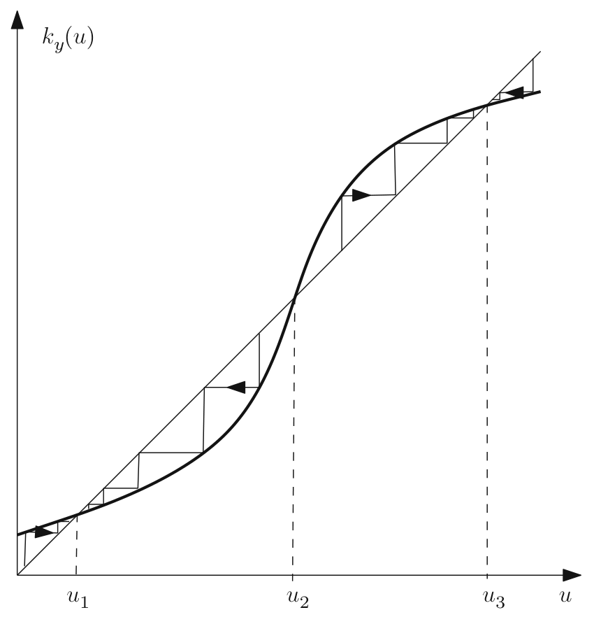

> Image description: A textbook figure illustrating a sigmoidal input-output characteristic, captioned "Monotone Systems in Biology, Fig. 1 Fixed points of a sigmoidal input-output characteristic." The plot features two axes: a horizontal axis labeled $u$ and a vertical axis labeled $k_y(u)$. A thick, black sigmoidal curve represents the function $k_y(u)$, which starts near the origin and increases toward an asymptote. A thin diagonal line with a positive slope, representing the identity function $y=u$, intersects the sigmoidal curve at three specific points. These intersection points are marked by vertical dashed lines extending from the horizontal axis to the curve. The horizontal positions of these intersections are labeled $u_1$, $u_2$, and $u_3$ on the $u$-axis. A series of thin, stair-step lines connect the diagonal line to the sigmoidal curve. Small black arrows are placed along these lines and along the sigmoidal curve, indicating a recursive direction or a cobweb plot process moving toward the fixed points.
Monotone Systems in Biology, Fig. 1 Fixed points of a sigmoidal input-output characteristic

Negative feedback normally destroys monotonicity. As a result, the likelihood of complex dynamical behavior is highly increased. Nevertheless, input-output characteristics still can provide useful insight in the system's dynamics at least in the case of low feedback gain or, for high feedback gains, in the presence of sufficiently large delays. For instance, unity negative feedback interconnection of a SISO monotone system may give rise to a unique and globally asymptotically stable fixed point of (6), thanks to the decreasingness of the input-output characteristic and as shown in Fig. 2. Under such circumstances a small-gain result applies and global asymptotic stability of the corresponding equilibrium is guaranteed regardless of arbitrary input delays in the systems. See Angeli and Sontag (2003) for the simplest small-gain theorem developed in the context of SISO negative feedback interconnections of monotone systems and Enciso and Sontag (2006) for generalizations to systems with multiple inputs as well as delays. A generalization of small-gain results to the case of MIMO systems which are neither in a positive nor negative feedback configuration is presented in Angeli and Sontag (2011).

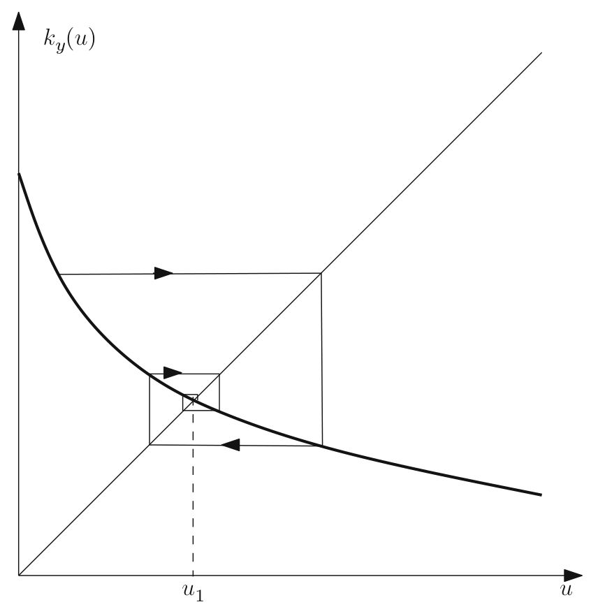

> Image description: A mathematical diagram illustrates a feedback system's stability. The graph is plotted on Cartesian axes, with $u$ on the horizontal axis and $k_y(u)$ on the vertical axis. A single diagonal line $y=u$ originates from the origin. A thick, black curve represents a strictly decreasing function, $k_y(u)$, starting high on the vertical axis and sloping downwards toward the horizontal axis. The diagram depicts a fixed-point iteration through a series of rectangular paths. Two thin black lines form a rectangle that intersects both the diagonal line and the decreasing curve. Arrows on the horizontal segments of this rectangle indicate the direction of the feedback loop: one arrow points right toward the diagonal line, and another points left toward the curve. A smaller nested rectangle near the intersection of the diagonal and the curve features an arrow pointing right, illustrating the convergence toward a unique equilibrium point where the diagonal and the decreasing curve meet.
Monotone Systems in Biology, Fig. 2 Fixed point of a decreasing input-output characteristic

When the iteration (6) has an unstable fixed point, for instance, it converges to a period2 solution, one may expect insurgence of oscillations around the equilibrium through a Hopf bifurcation provided sufficiently large delays in the input channels are allowed. This situation is analyzed in Angeli and Sontag (2008b) and illustrated through the study of the classical Golbeter's model for the Drosophila's circadian rhythm.

## Summary and Future Directions

Verifying that a control system preserves some ordering of initial conditions provides important and far-reaching implications for its dynamics. Insurgence of specific behaviors can often be inferred on the basis of purely qualitative knowledge (as in the case of Hirsch's generic convergence theorem) as well as additional basic quantitative knowledge as in the case of positive and negative feedback interconnections of monotone systems. For the above reasons, applications in molecular biology of monotone system's theory are gradually emerging: for instance, in the study of MAPK cascades or circadian oscilla-


<!-- source_pdf_page: 796 -->
tions, as well as in Chemical Reaction Networks Theory. Generally speaking, while monotonicity as a whole cannot be expected in large networks, experimental data shows that the number of negative feedback loops in biological regulatory networks is significantly lower than in a random signed graph of comparable size Maayan et al. (2008).

Analyzing the properties of monotone dynamics may potentially lead to better understanding of the key regulatory mechanisms of complex networks as well as the development of bottomup approaches for the identification of meaningful submodules in biological networks. Potential research directions may include both novel computational tools and specific applications to systems biology, for instance:

- Algorithms for detection of monotonicity with respect to exotic orders (such as arbitrary polytopic cones or even state-dependent cones)
- Application of monotonicity-based ideas to control synthesis (see, for instance, Aswani and Tomlin (2009) where the special class of piecewise affine systems is considered)


## Cross-References

- Deterministic Description of Biochemical Networks
- Spatial Description of Biochemical Networks
- Stochastic Description of Biochemical Networks


## Recommended Reading

For readers interested in the mathematical details of monotone systems theory we recommend the following:
Smith H (1995) Monotone dynamical systems: an introduction to the theory of competitive and cooperative systems. Mathematical surveys and monographs, vol 41. AMS, Providence
A more recent technical survey of aspects related to asymptotic dynamics of monotone systems is

Hirsch MW, Smith H (2005) Monotone dynamical systems (Chapter 4). In: Canada A, Drábek P , Fonda A (eds) Handbook of differential equations ordinary differential equations, vol 2 . Elsevier

## Bibliography

Angeli D, Sontag ED (2003) Monotone control systems. IEEE Trans Autom Control 48:1684-1698
Angeli D, Sontag ED (2004a) Interconnections of monotone systems with steady-state characteristics. In: Optimal control, stabilization and nonsmooth analysis. Lecture notes in control and information sciences, vol 301. Springer, Berlin, pp 135-154
Angeli D, Sontag ED (2004b) Multi-stability in monotone input/output systems. Syst Control Lett 51:185-202
Angeli D, Sontag ED (2008a) Translation-invariant monotone systems, and a global convergence result for enzymatic futile cycles. Nonlinear Anal Ser B Real World Appl 9:128-140
Angeli D, Sontag ED (2008b) Oscillations in I/O monotone systems. IEEE Trans Circuits Syst 55:166-176
Angeli D, Sontag ED (2011) A small-gain result for orthant-monotone systems in feedback: the non signdefinite case. Paper appeared in the 50th IEEE conference on decision and control, Orlando, $12-15$ Dec 2011
Angeli D, Ferrell JE, Sontag ED (2004) Detection of multistability, bifurcations, and hysteresis in a large class of biological positive-feedback systems. Proc Natl Acad Sci USA 101:1822-1827
Angeli D, de Leenheer P, Sontag ED (2010) Graphtheoretic characterizations of monotonicity of chemical networks in reaction coordinates. J Math Biol 61:581-616
Aswani A, Tomlin C (2009) Monotone piecewise affine systems. IEEE Trans Autom Control 54:1913-1918
Banaji M (2009) Monotonicity in chemical reaction systems. Dyn Syst 24:1-30
Banaji M, Angeli D (2010) Convergence in strongly monotone systems with an increasing first integral. SIAM J Math Anal 42:334-353
Banaji M, Angeli D (2012) Addendum to "Convergence in strongly monotone systems with an increasing first integral". SIAM J Math Anal 44:536-537
Enciso GA, Sontag ED (2005) Monotone systems under positive feedback: multistability and a reduction theorem. Syst Control Lett 54:159-168
Enciso GA, Sontag ED (2006) Global attractivity, I/O monotone small-gain theorems, and biological delay systems. Discret Contin Dyn Syst 14:549-578
Enciso GA, Sontag ED (2008) Monotone bifurcation graphs. J Biol Dyn 2:121-139
Farina L, Rinaldi S (2000) Positive linear systems: theory and applications. Wiley, New York


<!-- source_pdf_page: 797 -->
Gedeon T, Sontag ED (2007) Oscillations in multi-stable monotone systems with slowly varying feedback. J Differ Equ 239:273-295
Hirsch MW (1985) Systems of differential equations that are competitive or cooperative II: convergence almost everywhere. SIAM J Math Anal 16:423-439
Hirsch MW (1988) Stability and convergence in strongly monotone dynamical systems. Reine Angew Math 383:1-53
Hirsch MW, Smith HL (2003) Competitive and cooperative systems: a mini-review. In: Positive systems, Rome. Lecture notes in control and information science, vol 294. Springer, pp 183-190
Maayan A, Iyengar R, Sontag ED (2008) Intracellular regulatory networks are close to monotone systems. IET Syst Biol 2:103-112
Mierczynski J (1987) Strictly cooperative systems with a first integral. SIAM J Math Anal 18:642-646
Smale S (1976) On the differential equations of species in competition. J Math Biol 3:5-7
Smillie J (1984) Competitive and cooperative tridiagonal systems of differential equations. SIAM J Math Anal 15:530-534
Volpert AI, Volpert VA, Volpert VA (1994) Traveling wave solutions of parabolic Systems. Translations of mathematical monographs, vol 140. AMS, Providence
Wang L, Sontag ED (2008) Singularly perturbed monotone systems and an application to double phosphorylation cycles. J Nonlinear Sci 18:527-550

## Motion Description Languages and Symbolic Control

Sean B. Andersson<br>Mechanical Engineering and Division of Systems Engineering, Boston University, Boston, MA, USA


#### Abstract

The fundamental idea behind symbolic control is to mitigate the complexity of a dynamic system by limiting the set of available controls to a typically finite collection of symbols. Each symbol represents a control law that may be either open or closed loop. With these symbols, a simpler description of the motion of the system can be created, thereby easing the challenges of analysis and control design. In this entry, we provide a high-level description of symbolic


control; discuss briefly its history, connections, and applications; and provide a few insights into where the field is going.

## Keywords

Abstraction; Complex systems; Formal methods

## Introduction

Systems and control theory is powerful paradigm for analyzing, understanding, and controlling dynamic systems. Traditional tools in the field for developing and analyzing control laws, however, face significant challenges when one needs to deal with the complexity that arises in many practical, real-world settings such as the control of autonomous, mobile systems operating in uncertain and changing physical environments. This is particularly true when the tasks to be achieved are not easily framed in terms of motion to a point in the state space. One of the primary goals of symbolic control is to mitigate this complexity by abstracting some combination of the system dynamics, the space of control inputs, and the physical environment to a simpler, typically finite, model.

This fundamental idea, namely, that of abstracting away the complexity of the underlying dynamics and environment, is in fact a quite natural one. Consider, for example, how you give instructions to another person wanting to go to a point of interest. It would be absurd to provide details at the level of their actuators, namely, with commands to their individual muscles (or to carry the example to an even more absurd extreme, to the dynamic components that make up those muscles). Rather, very highlevel commands are given, such as "follow the road," "turn right," and so on. Each of these provides a description of what to do with the understanding that the person can carry out those commands in their own fashion. Similarly, the environment itself is abstracted, and only elements meaningful to the task at hand are described. Thus, continuing the example above, rather than


<!-- source_pdf_page: 798 -->
providing metric information or a detailed map, the instructions may use environmental features to determine when particular actions should be terminated and the next begun, such as "follow the road until the second intersection, then turn right."

Underlying the idea of symbolic control is the notion that rich behaviors can result from simple actions. This premise was used in many early robots and can be traced back at least to the ideas of Norbert Wiener on cybernetics (see Arkin 1998). It is at the heart of the behaviorbased approach to robotics (Brooks 1986). Similar ideas can also be seen in the development of a high-level language (G-codes) for Computer Numerically Controlled (CNC) machines. The key technical ideas in the more general setting of symbolic control for dynamic systems can be traced back to Brockett (1988) which introduced ideas of formalizing a modular approach to programming motion control devices through the development of a Motion Description Language (MDL).

The goal of the present work is to introduce the interested reader to the general ideas of symbolic control as well as to some of its application areas and research directions. While it is not a survey paper, a few select references are provided throughout to point the reader in hopefully fruitful directions into the literature.

## Models and Approaches

There are at least two related but distinct approaches to symbolic control. Both begin with a mathematical description of the system, typically given as an ordinary differential equation of the form

$$
\begin{equation*}
\dot{x}=f(x, u, t), \quad y=h(x, t) \tag{1}
\end{equation*}
$$

where $x$ is a vector describing the state of the system, $y$ is the output of the sensors of the system, and $u$ is the control input.

Under the first approach to symbolic control, the focus is on reducing the complexity of the
space of possible control signals by limiting the system to a typically finite collection of control symbols. Each of these symbols represents a control law that may be open loop or may utilize output feedback. For example, follow the road could be a feedback control law that uses sensor measurements to determine the position relative to the road and then applies steering commands so that the system stays on the road while simultaneously maintaining a constant speed. There are, of course, many ways to accomplish the specifics of this task, and the details will depend on the particular system. Thus, an autonomous four-wheeled vehicle equipped with a laser range finder, an autonomous motorcycle equipped with ultrasonic sensors, or an autonomous aerial vehicle with a camera would each carry out the command in their own way, and each would have very different trajectories. They would all, however, satisfy the notion of follow the road. Description of the behavior of the system can then be given in terms of the abstract symbols rather than in terms of the details of the trajectories.

Typically each of these symbols describes an action that at least conceptually is simple. In order to generate rich motions to carry out complex tasks, the system is switched between the available symbols. Switching conditions are often referred to as interrupts. Interrupts may be purely time-based (e.g., apply a given symbol for $T$ seconds) or may be expressed in terms of symbols representing certain environmental conditions. These may be simple function of the measurements (e.g., interrupt when an intersection is detected) or may represent more complicated scenarios with history and dynamics (e.g., interrupt after the second intersection is detected). Just as the input symbols abstract away the details of the control space and of the motion of the system, the interrupt symbols abstract away the details of the environment. For example, intersection has a clear high-level meaning but a very different sensor "signature" for particular systems.

As a simple illustrative example, consider a collection of control symbols designed for moving along a system of roads, \{follow road, turn right, turn left\}, and a collection of interrupt


<!-- source_pdf_page: 799 -->
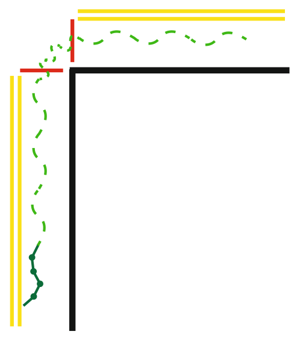

> Image description: This diagram illustrates a symbolic control concept for navigating a right-hand turn, representing two different systems: a snakelike robot and an autonomous car. The image features a black L-shaped boundary forming a right-angle corner, defining the spatial constraint of the turn. Two sets of colored lines represent input signals or paths. A green dashed line represents a continuous, snakelike trajectory intended to navigate the corner. This path begins at the bottom left, moves upward along the vertical axis, curves around the corner, and extends horizontally to the right. Parallel to the turn, yellow lines are positioned at the outer boundaries (top and left), acting as constraints or guide rails. Additionally, red vertical segments are placed at the corner’s inner edge, possibly representing sensor inputs or proximity limits. The diagram abstracts complex motion into simplified symbolic paths to demonstrate high-level navigation planning.
Motion Description Languages and Symbolic Control, Fig. 1 Simple example of symbolic control with a focus on abstracting the inputs. Two systems, a snakelike robot and an autonomous car, are given a high-level plan in terms of symbols for navigating a right-hand turn.

symbols for triggering changes in such a setting, \{in intersection, clear of intersection\}. Suppose there are two vehicles that can each interpret these symbols, an autonomous car and a snakelike robot, as illustrated in Fig. 1. It is reasonable to assume that the control symbols each describe relatively complex dynamics that allow, for example, for obstacle avoidance while carrying out the action. Figure 1 illustrates a possible situation where the two systems carry out the plan defined by the symbolic sequence:

## (Follow the road UNTIL in intersection) <br> (Turn right UNTIL clear of intersection)

The intent of this plan is for the system to navigate a right-hand turn. As shown in the figure, the actual trajectories followed by the systems can be markedly different due in part to system dynamics (the snakelike robot undulates, while the car does not) as well as to different sensor responses (when the car goes through, there is a parked vehicle that it must navigate around, while the snakelike robot found a clear path during its execution). Despite these differences, both systems achieve the goal of the plan.

The collection of control and interrupt symbols can be thought of as a language for describing and specifying motion and are used

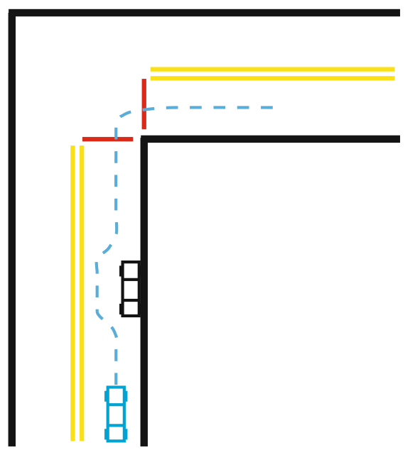
The systems each interpret the same symbols in their own ways, leading to different trajectories due both to differences in dynamics and also to different sensors cues as caused, for example, by the parked vehicle encountered by the car in this scenario

to write programs that can be compiled into an executable for a specific system. Different rules for doing this can be established that define different languages, analogous to different high-level programming languages such as C++, Java, or Python. Further details can be found in, for example, Manikonda et al. (1998).

Under the second approach, the focus is on representing the dynamics and state space (or environment) of the system in an abstract, symbolic way. The fundamental idea is to lump all the states in a region into a single abstract element and to then represent the entire system with a finite number of these elements. Control laws are then defined that steer all the states in one element into some state in a different region. The symbolic control system is then the finite set of elements representing regions together with the finite set of controllers for moving between them. It can be thought of essentially as a graph (or more accurately as a transition system) in which the nodes represent regions in the state space and the edges represent achievable transitions between them. The goal of this abstraction step is for the two representations to be equivalent (or at least approximately equivalent) in that any motion that can be achieved in one can be achieved in the other (in an appropriate sense). Planning and analysis can then


<!-- source_pdf_page: 800 -->
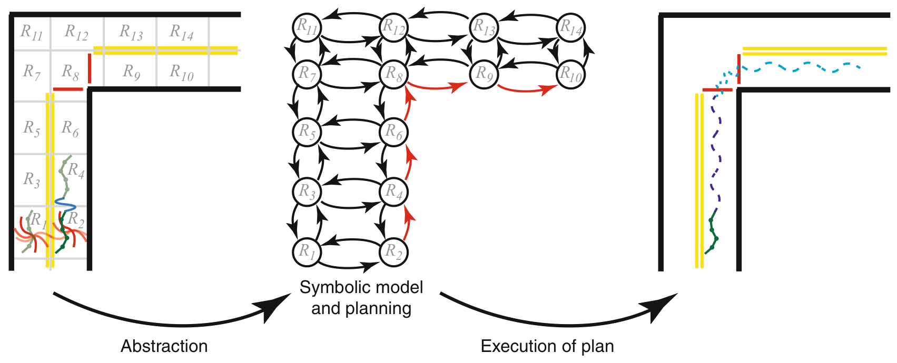

> Image description: A diagram titled "Motion Description Languages and Symbolic Control" illustrates a three-step process: Abstraction, Symbolic model and planning, and Execution of plan. On the left, the "initial environment" is shown as a grid of rectangular regions labeled $R_1$ through $R_{14}$. A colored path (green, blue, red) moves through $R_1, R_2, R_4, R_6$, and $R_8$. The middle image shows a "Symbolic model and planning" represented as a directed graph. Nodes represent the regions (e.g., $R_1, R_2, \dots, R_{14}$) and edges represent possible transitions between them. Red arrows indicate a specific sequence of planned transitions from $R_1$ through $R_2, R_4, R_6, R_8, R_9$, and $R_{10}$. The right image depicts the "Execution of plan" in a simplified geometric environment. A blue dashed line represents a path through a rectangular corridor, moving from the bottom left, up through a vertical section, and then right into a horizontal section.

Motion Description Languages and Symbolic Control, Fig. 2 Simple example of symbolic control with a focus on abstracting the system dynamics and environment. The initial environment (left image) is segmented into different regions and simple controllers developed for moving from region to region. The image shows two possible controllers: one that actuates the robot through a tight slither pattern to move forward by one region and
one that twists the robot to face the cell to the left before slithering across and then reorienting. The combination of regions and actions yields a symbolic abstraction (center image) that allows for planning to achieve specific goals, such as moving through the right-hand turn. Executing this plan leads to a physical trajectory of the system (right image)
be done on the (simpler) symbolic model. Further details on such schemes can be found in, for example, Tabuada (2006) and Bicchi et al. (2006).

As an illustrative example, consider as before a snakelike robot moving through a right-hand turn. In a simplified view of this second approach to symbolic control, one begins by dividing the environment up into regions and then defining controllers to steer the robot from region to region as illustrated in the left image in Fig. 2. This yields the symbolic model shown in the center of Fig. 2. A plan is then developed on this model to move from the initial position to the final position. This planning step can take into account restrictions on the motion and subgoals of the task. Here, for example, one may want the robot to stay to the right of the double yellow line that is in its lane of traffic. The plan $R_{2} \rightarrow R_{4} \rightarrow R_{6} \rightarrow R_{8} \rightarrow R_{9} \rightarrow R_{10}$ is one sequence that drives the system around the turn while satisfying the lane requirement. Each transition in the sequence corresponds to a control law. The plan is then executed by applying the sequence of control laws, resulting in the actual trajectory shown in the right image in Fig. 2.

## Applications and Connections

The fundamental idea behind symbolic control, namely, mitigating complexity by abstracting a system, its environment, and even the tasks to be accomplished into a simpler but (approximately) equivalent model, is a natural and a powerful one. It has clear connections to both hybrid systems (Brockett 1993; Egerstedt 2002) and to quantized control (Bicchi et al. 2006), and the tools from those fields are often useful in describing and analyzing systems with symbolic representations of the control and of the dynamics. Symbolic control is not, however, strictly a subcategory of either field, and it provides a unique set of tools for the control and analysis of dynamic systems.

Brockett's original MDL was intended to serve as a tool for describing and planning robot motion. Inspired in part by this, languages for motion continue to be developed. Some of these extend and provide a more formal basis for motion programming (Manikonda et al. 1998) and interconnection of dynamic systems into a single whole (Murray et al. 1992), while some are designed for specialized dynamics or applications such as flight vehicles


<!-- source_pdf_page: 801 -->
(Frazzoli et al. 2005), self-assembly (Klavins 2007), and other areas. In addition to studying standard systems and control theoretic ideas, including notions of reachability (Bicchi et al. 2002) and stability (Tarraf et al. 2008), the framework of symbolic control introduces interesting questions such as how to understand the reduction of complexity that can be achieved for a given collection of symbols (Egerstedt and Brockett 2003).

While there are many application areas of symbolic control, the one that is perhaps most active is that of motion planning for autonomous mobile robots (Belta et al. 2007). As illustrated in Figs. 1 and 2, symbolic control allows the planning problem (i.e., the determination of how to achieve a desired task) to be separated from the complexities of the dynamics. The approach has been particularly fertile when coupled with symbolic descriptions of the tasks to be achieved. While point-to-point commands are useful, and can be often thought of as symbols themselves from which to build more complicated commands, most tasks that one would want mobile robots to carry out involve combinations of spatial goals (move to a certain location), sequencing (first do this and then do that) or other temporal requirements (repeatedly visit a collection of regions), as well as safety or other restrictions (avoid obstacles or regions that are dangerous for the robot to traverse). Such tasks can be described using a variety of temporal logics. These are, essentially, logic systems that include rules related to time in addition to the standard Boolean operators. These tasks can be combined with a symbolic description of a system and then automated tools used both to check whether the system is able to perform the desired task and to design plans that ensure the system will do so (Fainekos et al. 2009). To ensure that results on the abstract, symbolic system are valid on the original dynamic system, methods exist for guaranteeing the equivalence of the two models, in an appropriate sense (Girard and Pappas 2007).

## Summary and Future Directions

Symbolic control proceeds from the basic goal of mitigating the complexity of dynamic systems, especially in real-world scenarios, to yield a simplification of the problems of analysis and control design. It builds upon results from diverse fields while also contributing new ideas to those areas, including hybrid system theory, formal languages and grammars, and motion planning. There are many open, interesting questions that are the subject of ongoing investigations as well as the genesis of future research.

One particularly fruitful direction is that of combining symbolic control with stochasticity. Systems that operate in the real world are subject to noise with respect both to their inputs (noisy actuators) and to their outputs (noisy sensors). Recent work along these lines can be found in the formal methods approach to motion planning and in hybrid systems (Abate et al. 2011; Lahijanian et al. 2012). The fundamental idea is to use a Markov chain, Markov decision process, or similar model as the symbolic abstraction and then, as in all symbolic control, to do the analysis and planning on this simpler model.

Another interesting direction is to address questions of optimality with respect to the symbols and abstractions for a given dynamic system. Of course, the notion of "optimal" must be made clear, and there are several reasonable notions one could define. There is a clear trade-off between the complexity of individual symbols, the number of symbols used in the motion "alphabet," and the complexity in terms of, say, average number of symbols required to code programs that achieve a given set of tasks. The complexity of a necessary alphabet is also related to the variety of tasks the system might need to perform. An autonomous vacuuming robot is likely to need far fewer symbols in its library than an autonomous vehicle that must operate in everyday traffic conditions and respond to unusual events such as traffic jams. The question of the "right" set of symbols can also


<!-- source_pdf_page: 802 -->
be of use in efficient descriptions of motion in domains such as dance (Baillieul and Ozcimder 2012).

It is intuitively clear that to handle complex scenarios and environments, a hierarchical approach is likely needed. Organizing symbols into progressively higher levels of abstraction should allow for more efficient reasoning, planning, and reaction to real-world settings. Such structures already appear in existing works, such as in the behavior-based approach of Brooks (1986), in the extended Motion Description Language in Manikonda et al. (1998), and in the Spatial Semantic Hierarchy of Kuipers (2000). Despite these efforts, there is still a need for a rigorous approach for analyzing and designing symbolic hierarchical systems.

The final direction discussed here is that of the connection of symbolic control to emergent behavior in large groups of dynamic agents. There are a variety of intriguing examples in nature in which large numbers of agents following simple rules produce large-scale, coherent behavior, including in fish schools and termite and ant colonies (Johnson 2002). How can one predict the global behavior that will emerge from a large collection of independent agents following simple rules (symbols)? How can one design a set of symbols to produce a desired collective behavior? While there has been some work in symbolic control for self-assembling systems (Klavins 2007), this general topic remains a rich area for research.

## Cross-References

- Multi-vehicle Routing
- Robot Motion Control
- Walking Robots
- Wheeled Robots


## Recommended Reading

Brockett's original paper Brockett (1988) is a surprisingly short but informational read. More thor-
ough descriptions can be found in Manikonda et al. (1998) and Egerstedt (2002). An excellent description of symbolic control in robotics, particularly in the context of temporal logics and formal methods, can be found in Belta et al. (2007). There are also several related articles in a 2011 special issue of the IEEE Robotics and Automation magazine (Kress-Gazit 2011).

## Bibliography

Abate A, D'Innocenzo A, Di Benedetto MD (2011) Approximate abstractions of stochastic hybrid systems. IEEE Trans Autom Control 56(11):2688-2694
Arkin RC (1998) Behavior-based robotics. MIT, Cambridge
Baillieul J, Ozcimder K (2012) The control theory of motion-based communication: problems in teaching robots to dance. In: American control conference, Montreal, pp 4319-4326
Belta C, Bicchi A, Egerstedt M, Frazzoli E, Klavins E, Pappas GJ (2007) Symbolic planning and control of robot motion [Grand Challenges of Robotics]. IEEE Robot Autom Mag 14(1):61-70
Bicchi A, Marigo A, Piccoli B (2002) On the reachability of quantized control systems. IEEE Trans Autom Control 47(4):546-563
Bicchi A, Marigo A, Piccoli B (2006) Feedback encoding for efficient symbolic control of dynamical systems. IEEE Trans Autom Control 51(6):987-1002
Brockett RW (1988) On the computer control of movement. In: IEEE International conference on robotics and automation, Philadelphia, pp 534-540
Brockett RW (1993) Hybrid models for motion control systems. In: Trentelman HL, Willems JC (eds) Essays on control. Birkhauser, Boston, pp 29-53
Brooks R (1986) A robust layered control system for a mobile robot. IEEE J Robot Autom RA-2(1):1423
Egerstedt M (2002) Motion description languages for multi-modal control in robotics. In: Bicchi A, Cristensen H, Prattichizzo D (eds) Control problems in robotics. Springer, pp 75-89
Egerstedt M, Brockett RW (2003) Feedback can reduce the specification complexity of motor programs. IEEE Trans Autom Control 48(2):213-223
Fainekos GE, Girard A, Kress-Gazit H, Pappas GJ (2009) Temporal logic motion planning for dynamic robots. Automatica 45(2):343-352
Frazzoli E, Dahleh MA, Feron E (2005) Maneuver-based motion planning for nonlinear systems with symmetries. IEEE Trans Robot 21(6): 1077-1091


<!-- source_pdf_page: 803 -->
Girard A, Pappas GJ (2007) Approximation metrics for discrete and continuous systems. IEEE Trans Autom Control 52(5):782-798
Johnson S (2002) Emergence: the connected lives of ants, brains, cities, and software. Scribner, New York
Klavins E (2007) Programmable self-assembly. IEEE Control Syst 27(4):43-56
Kress-Gazit H (2011) Robot challenges: toward development of verification and synthesis techniques [from the Guest Editors]. IEEE Robot Autom Mag 18(3):22-23
Kuipers B (2000) The spatial semantic hierarchy. Artif Intell 119(1-2):191-233
Lahijanian M, Andersson SB, Belta C (2012) Temporal logic motion planning and control with probabilistic satisfaction guarantees. IEEE Trans Robot 28(2):396409
Manikonda V, Krishnaprasad PS, Hendler J (1998) Languages, behaviors, hybrid architectures, and motion control. In: Baillieul J, Willems JC (eds) Mathematical control theory. Springer, New York, pp 199-226
Murray RM, Deno DC, Pister KSJ, Sastry SS (1992) Control primitives for robot systems. IEEE Trans Syst Man Cybern 22(1):183-193
Tabuada P (2006) Symbolic control of linear systems based on symbolic subsystems. IEEE Trans Autom Control 51(6): 1003-1013
Tarraf DC, Megretski A, Dahleh MA (2008) A framework for robust stability of systems over finite alphabets. IEEE Trans Autom Control 53(5):1133-1146

## Motion Planning for Marine Control Systems

## Andrea Caiti

DII - Department of Information Engineering \& Centro "E. Piaggio", ISME - Interuniversity Research Centre on Integrated Systems for the Marine Environment, University of Pisa, Pisa, Italy


#### Abstract

In this chapter we review motion planning algorithms for ships, rigs, and autonomous marine vehicles. Motion planning includes path and trajectory generation, and it goes from optimized route planning (off-line long-range path generation through operating research methods) to reactive on-line trajectory reference generation, as given by the guidance system. Crucial to the marine systems case is the presence of environmen-


tal external forces (sea state, currents, winds) that drive the optimized motion generation process.

## Keywords

Configuration space; Dynamic programming; Grid search; Guidance controller; Guidance system; Maneuvering; Motion plan; Optimization algorithms; Path generation; Route planning; Trajectory generation; World space

## Introduction

Marine control systems include primarily ships and rigs moving on the sea surface, but also underwater systems, manned (submarines) or unmanned, and eventually can be extended to any kind of off-shore moving platform.

A motion plan consists in determining what motions are appropriate for the marine system to reach a goal, or a target/final state (LaValle 2006). Most often, the final state corresponds to a geographical location or destination, to be reached by the system while respecting constraints of physical and/or economical nature. Motion planning in marine systems hence starts from route planning, and then it covers desired path generation and trajectory generation. Path generation involves the determination of an ordered sequence of states that the system has to follow; trajectory generation requires that the states in a path are reached at a prescribed time.

Route, path, and trajectory can be generated off-line or on-line, exploiting the feedback from the system navigation and/or from external sources (weather forecast, etc.). In the feedback case, planning overlaps with the guidance system, i.e., the continuous computation of the reference (desired) state to be used as reference input by the motion control system (Fossen 2011).

## Formal Definitions and Settings

Definitions and classifications as in Goerzen et al. (2010) and Petres et al. (2007) are followed


<!-- source_pdf_page: 804 -->
throughout the section. The marine systems under considerations live in a physical space referred to as the world space (e.g., a submarine lives in a 3-D Euclidean space). A configuration $\boldsymbol{q}$ is a vector of variables that define position and orientation of the system in the world space. The set of all possible configurations is the configuration space, or $C$-space. The vector of configuration and configuration rate of changes is the state of the system $\mathbf{x}=\left[\boldsymbol{q}^{T} \dot{\boldsymbol{q}}^{T}\right]^{T}$, and the set of all the possible states is the state space. The kino-dynamic model associated to the system is represented by the system state equations. The regions of $C$-space free from obstacles are called $C$-free.

The path planning problem consists in determining a curve $\gamma:[0,1] \rightarrow C$-free, $s \rightarrow \gamma(s)$, with $\gamma(0)$ corresponding to the initial configuration and $\gamma(1)$ corresponding to the goal configuration. Both initial and goal configurations are in $C$-free. The trajectory planning problem consists in determining a curve $\gamma$ and a time law: $t \rightarrow s(t)$ s.t. $\gamma(s)=\gamma(s(t))$. In both cases, either the path or the trajectory must be compatible with the system state equations. In the following, definitions of motion algorithm properties are given referring to path planning, but the same definitions can be easily extended to trajectory planning.

A motion planning algorithm is complete if it finds a path when one exists, and returns a proper flag when no path exists. The algorithm is optimal when it provides the path that minimizes some cost function $J$. The (strictly positive) cost function $J$ is isotropic, when it depends only on the system configuration ( $J=J(\boldsymbol{q})$ ), or anisotropic, when it depends also on an external force field $\mathbf{f}$ (e.g., sea currents, sea state, weather perturbations $)(J=J(\boldsymbol{q}, \mathbf{f}))$. The cost function $J$ induces a pseudometric in the configuration space; the distance $d$ between configurations $\boldsymbol{q}_{1}$ and $\boldsymbol{q}_{2}$ through the path $\gamma$ is the "cost-to-go" from $\boldsymbol{q}_{1}$ to $\boldsymbol{q}_{2}$ along $\gamma$ :

$$
\begin{equation*}
d\left(\boldsymbol{q}_{1}, \boldsymbol{q}_{2}\right)=\int_{0}^{1} J\left(\gamma_{q_{1} q_{2}}(s), \mathbf{f}\right) d s \tag{1}
\end{equation*}
$$

An optimal motion planning problem is:

- Static if there is perfect knowledge of the environment at any time, dynamic otherwise
- Time-invariant when the environment does not evolve (e.g., coastline that limits the $C$ free subspace), time-variant otherwise (e.g., other systems - ships, rigs - in navigation)
- Differentially constrained if the system state equations act as a constraint on the path, differentially unconstrained otherwise
In practice, optimal motion planning problems are solved numerically through discretization of the $C$-space. Resolution completeness/optimality of an algorithm implies the achievement of the solution as the discretization interval tends to zero. Probabilistic completeness/optimality implies that the probability of finding the solution tends to 1 as the computation time approaches infinity. Complexity of the algorithm refers to the computational time required to find a solution as a function of the dimension of the problem.

The scale of the motion w.r. to the scale of the system defines the specific setting of the problem. In cargo ships route planning from one port call to the next, the problem is stated first as static, time-invariant, differentially unconstrained path planning problem; once a large-scale route is thus determined, it can be refined on smaller scales, e.g., smoothing it, to make it compatible with ship maneuverability. Maneuvering the same cargo ship in the approaches to a harbor has to be casted as a dynamic, time-variant, differentially constrained trajectory planning problem.

## Large-Scale, Long-Range Path Planning

Route determination is a typical long-range path planning problem for a marine system. The geographical map is discretized into a grid, and the optimal path between the approaches of the starting and destination ports is determined as a sequence of adjacent grid nodes. The problem is taken as time-invariant and differentially unconstrained, at least in the first stages of the procedure. It is assumed that the ship will cruise at its own (constant) most economical speed to optimize bunker consumption, the major


<!-- source_pdf_page: 805 -->
source of operating costs (Wang and Meng 2012). Navigation constraints (e.g., allowed ship traffic corridors for the given ship class) are considered, as well as weather forecasts and predicted/prevailing currents and winds. The cost-to-go Eq. (1) is built between adjacent nodes either in terms of time to travel or in terms of operating costs, both computed correcting the nominal speed with the environmental forces. Optimality is defined in terms of shortest time/minimum operating cost; the anisotropy introduced by sea/weather conditions is the driving element of the optimization, making the difference with respect to straightforward shortest route computation. The approach is iterated, starting with a coarse grid and then increasing grid resolution in the neighborhood of the previously found path.

The most widely used optimization approach for surface ships is dynamic programming (LaValle 2006); alternatively, since the determination of the optimal path along the grid nodes is equivalent to a search over a graph, the $A^{*}$ algorithm is applied (Delling et al. 2009). As the discretization grid gets finer, system dynamics are introduced, accounting for ship maneuverability and allowing for deviation from the constant ship speed assumption. Dynamic programming allows to include system dynamics at any level of resolution desired; however, when system dynamics are considered, the problem dimension grows from 2-D to 3-D (2-D space plus time).

In the case of underwater navigation, path planning takes place in a 3-D world space, and the inclusion of system dynamics makes it a 4-D problem; moreover, bathymetry has to be included as an additional constraint to shape the $C$-free subspace. Dynamic programming may become unfeasible, due to the increase in dimensionality. Computationally feasible algorithms for this case include global search strategies with probabilistic optimality, as genetic algorithms (Alvarez et al. 2004), or improved grid-search methods with resolution optimality, as FM* (Petres et al. 2007).

Environmental force fields are intrinsically dynamic fields; moreover, the prediction of such fields at the moment of route planning may be
updated as the ship is in transit along the route. The path planning algorithms can/must be rerun, over a grid in the neighborhood of the nominal path, each time new environmental information becomes available. Kino-dynamic model of the ship must be included, allowing for deviation from the established path and ship speed variation around the nominal most economical speed. The latter case is particularly important: increasing/decreasing the speed to avoid a weather perturbation keeping the same route may indeed result in a reduced operating cost with respect to path modifications keeping a constant speed. This implies that the timing over the path must be specified. Dynamic programming is well suited for this transition from path to trajectory generation, and it is still the most commonly used approach to trajectory (re)planning in reaction to environmental predictions update.

When discretizing the world space, the minimum grid size should still be large enough to allow for ship maneuvering between grid nodes. This is required for safety, to allow evasive maneuvering when other ships are at close ranges, and for the generation of smooth, dynamicscompliant trajectories between grid points. This latter aspect bridges motion planning with guidance.

## Trajectory Planning, Maneuvering Generation, and Guidance Systems

Once a path has been established over a spatial grid, a continuous reference has to be generated, linking the nodes over the grid. The generation of the reference trajectory has to take into account all the relevant dynamic properties and constraints of the marine system, so that the reference motion is feasible. In this scenario, the path/trajectory nodes are way-points, and the trajectory generation connects the way-points along the route. The approaches to trajectory generation can be divided between those that do not compute explicitly in advance the whole trajectory and those that do.

Among the approaches that do not need explicit trajectory computation between way-points,


<!-- source_pdf_page: 806 -->
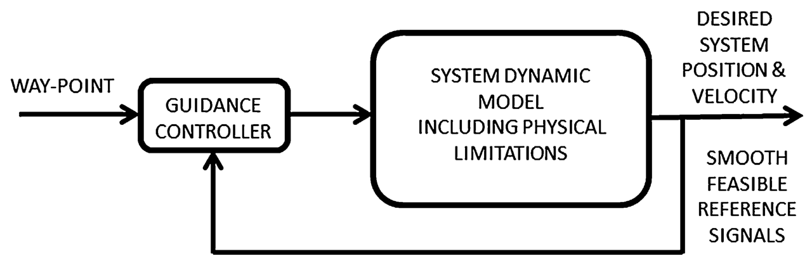

> Image description: A block diagram illustrates the generation of a reference trajectory for motion planning, adapted from Fossen (2011). The flow begins with a "WAY-POINT" input entering a "GUIDANCE CONTROLLER" block. The output of the controller flows into a central block labeled "SYSTEM DYNAMIC MODEL INCLUDING PHYSICAL LIMITATIONS." Two signal paths emerge from the dynamic model. One arrow represents the "DESIRED SYSTEM POSITION & VELOCITY" as the primary output. A second signal, labeled "SMOOTH FEASIBLE REFERENCE SIGNALS," is routed through a feedback loop back to the guidance controller. This feedback architecture indicates that the controller uses information from the system model to refine its guidance commands, ensuring the trajectory adheres to the physical constraints and smoothed requirements of the system. The diagram depicts a closed-loop control scheme designed to translate waypoints into achievable motion commands.
Motion Planning for Marine Control Systems, Fig. 1 Generation of a reference trajectory with a system model and a guidance controller (Adapted from Fossen (2011))

the most common is the line-of-sight (LOS) guidance law (Pettersen and Lefeber 2001). LOS guidance can be considered a path generation, more than a trajectory generation, since it does not impose a time law over the path; it computes directly the desired ship reference heading on the basis of the current ship position and the previous and next way-point positions. A review of other guidance approaches can be found in Breivik and Fossen (2008), where maneuvering along the path and steering around the way-points are also discussed. From such a set of different maneuvers, a library of motion primitives can be built (Greytak and Hover 2010), so that any motion can be specified as a sequence of primitives. While each primitive is feasible by construction, an arbitrary sequence of primitives may not be feasible. An optimized search algorithm (dynamic programming, A*) is again needed to determine the optimal feasible maneuvering sequence.

Path/trajectory planning explicitly computing the desired motion among two way-points may include a system dynamic model, or may not. In the latter case, a sufficiently smooth curve that connects two way-points is generated, for instance, as splines or as Dubins paths (LaValle 2006). Curve generation parameters must be set so that the "sufficiently smooth" part is guaranteed. After curve generation, a trim velocity is imposed over the path (path planning), or a time law is imposed, e.g., smoothly varying the system reference velocity with the local curvature radius.

Planners that do use a system dynamic model are described in Fossen (2011) as part of the guidance system. In practice, the dynamic model
is used in simulation, with a (simulated) feedback controller (guidance controller), the next way-point as input, and the (simulated) system position and velocity as output. The simulated results are feasible maneuvers by construction and can be given as reference position/velocity to the physical control system (Fig. 1).

## Summary and Future Directions

Motion planning for marine control systems employs methodological tools that range from operating research to guidance, navigation, and control systems. A crucial role in marine applications is played by the anisotropy induced by the dynamically changing environmental conditions (weather, sea state, winds, currents - the external force fields). The quality of the plan will depend on the quality of environmental information and predictions.

While motion planning can be considered a mature issue for ships, rigs, and even standalone autonomous vehicles, current and future research directions will likely focus on the following items:

- Coordinated motion planning and obstacle avoidance for teams of autonomous surface and underwater vehicles (Aguiar and Pascoal 2012; Casalino et al. 2009)
- Naval traffic regulation compliant maneuvering in restricted spaces and collision evasion maneuvering (Tam and Bucknall 2010)
- Underwater intervention robotics (Antonelli 2006; Sanz et al. 2010)


<!-- source_pdf_page: 807 -->
## Cross-References

- Control of Networks of Underwater Vehicles
- Mathematical Models of Marine Vehicle-Manipulator Systems
Mathematical Models of Ships and Underwater Vehicles
Underactuated Marine Control Systems


## Recommended Reading

Motion planning is extensively treated in LaValle (2006), while the essential reference on marine control systems is the book by Fossen (2011). Goerzen et al. (2010) reviews motion planning algorithms in terms of computational properties. The book Antonelli (2006) includes the treatment of planning and control in intervention robots. The papers Breivik and Fossen (2008) and Tam et al. (2009) provide a survey of both terminology and guidance design for both open and close space maneuvering. In particular, Tam et al. (2009) links motion planning to navigation rules.

## Bibliography

Aguiar AP, Pascoal A (2012) Cooperative control of multiple autonomous marine vehicles: theoretical foundations and practical issues. In: Roberts GN, Sutton R (eds) Further advances in unmanned marine vehicles. IET, London, pp 255-282
Alvarez A, Caiti A, Onken R (2004) Evolutionary path planning for autonomous underwater vehicles in a variable ocean. IEEE J Ocean Eng 29(2):418-429
Antonelli G (2006) Underwater robots - motion and force control of vehicle-manipulator systems. 2nd edn. Springer, Berlin/New York
Breivik M, Fossen TI (2008) Guidance laws for planar motion control. In: Proceedings of the 47th IEEE conference on decision \& control, Cancun
Casalino G, Simetti E, Turetta A (2009) A three-layered architecture for real time path planning and obstacle avoidance for surveillance usvs operating in harbour fields. In: Proceedings of the IEEE oceans'09-Europe, Bremen
Delling D, Sanders P, Schultes D, Wagner D (2009) Engineering route planning algorithms. In Lerner J, Wagner D, Zweig KA (eds) Algorithmics of large and complex networks. Lecture notes in computer science, vol 5515. Springer, Berlin/New York, pp 117-139

Fossen TI (2011) Handbook of marine crafts hydrodynamics and motion control. Wiley, Chichester
Goerzen C, Kong Z, Mettler B (2010) A survey of motion planning algorithms from the perspective of autonomous UAV guidance. J Intell Robot Syst 57:65100
Greytak MB, Hover FS (2010) Robust motion planning for marine vehicle navigation. In: Proceedings of the 18th international offshore \& polar engineering conference, Vancouver
LaValle SM (2006) Planning algorithms. Cambridge University Press, Cambridge/New York. Available on-line at http://planning.cs.uiuc.edu. Accessed 6 June 2013
Petres C, Pailhas Y, Patron P, Petillot Y, Evans J, Lane D (2007) Path planning for autonomous underwater vehicles. IEEE Trans Robot 23(2):331-341
Pettersen KY, Lefeber E (2001) Way-point tracking control of ships. In: Proceedings of the 40th IEEE conference decision \& control, Orlando
Sanz PJ, Ridao P, Oliver G, Melchiorri C, Casalino G, Silvestre C, Petillot Y, Turetta A (2010) TRIDENT: a framework for autonomous underwater intervention missions with dexterous manipulation capabilities. In: Proceedings of the 7th IFAC symposium on intelligent autonomous vehicles, Lecce
Tam CK, Bucknall R (2010) Path-planning algorithm for ships in close-range encounters. J Mar Sci Technol 15:395-407
Tam CK, Bucknall R, Greig A (2009) Review of collision avoidance and path planning methods for ships in close range encounters. J Navig 62:455-476
Wang S, Meng Q (2012) Liner ship route schedule design with sea contingency time and port time uncertainty. Transp Res B 46:615-633

## Motion Planning for PDEs

Thomas Meurer
Faculty of Engineering,
Christian-Albrechts-University Kiel, Kiel, Germany


#### Abstract

Motion planning refers to the design of an openloop or feedforward control to realize prescribed desired paths for the system states or outputs. For distributed-parameter systems described by partial differential equations (PDEs), this requires to take into account the spatial-temporal system dynamics. Here, flatness-based techniques provide


<!-- source_pdf_page: 808 -->
a systematic inversion-based motion planning approach, which is based on the parametrization of any system variable by means of a flat or basic output. With this, the motion planning problem can be solved rather intuitively as is illustrated for linear and semilinear PDEs.

## Keywords

Basic output; Flatness; Formal integration; Formal power series; Trajectory assignment; Trajectory planning; Transition path

## Introduction

Motion planning or trajectory planning refers to the design of an open-loop control to realize prescribed desired temporal or spatial-temporal paths for the system states or outputs. Examples include smart structures with embedded actuators and sensors such as adaptive optics in telescopes, adaptive wings or smart skins, thermal and reheating processes in steel industry, and deep drawing, start-up, shutdown, or transitions between operating points in chemical engineering, as well as multi-agent deployment and formation control (see, e.g., the overview in Meurer 2013).

For the solution of the motion planning and tracking control problem for finite-dimensional linear and nonlinear systems, differential flatness as introduced in Fliess et al. (1995) has evolved into a well-established inversion-based technique. Differential flatness implies that any system variable can be parametrized in terms of a flat or a so-called basic output and its time derivatives up to a problem-dependent order. As a result, the assignment of a suitable desired trajectory for the flat output directly yields the respective state and input trajectories to realize the prescribed motion. Flatness can be adapted to systems governed by partial differential equations (PDEs). For this, different techniques have been developed utilizing operational calculus or spectral theory for linear PDEs, (formal) power series for linear PDEs, and PDEs involving polynomial
nonlinearities as well as formal integration for semilinear PDEs using a generalized CauchyKowalevski approach. To illustrate the principle ideas and the evolving research results starting with Fliess et al. (1997), subsequently different techniques are introduced based on selected example problems. For this, the exposition is primarily restricted to parabolic PDEs with a brief discussion of motion planning for hyperbolic PDEs before concluding with possible future research directions.

## Linear PDEs

In the following, a scalar linear diffusion-reaction equation is considered in the state variable $x(z, t)$ with boundary control $u(t)$ governed by

$$
\begin{align*}
& \partial_{t} x(z, t)=\partial_{z}^{2} x(z, t)+r x(z, t)  \tag{1a}\\
& \partial_{z} x(0, t)=0, \quad x(1, t)=u(t)  \tag{1b}\\
& x(z, 0)=0 . \tag{1c}
\end{align*}
$$

This PDE describes a wide variety of thermal and fluid systems including heat conduction and tubular reactors. Herein, $r \in \mathbb{R}$ refer to the reaction coefficient and the initial state is without loss of generality assumed zero. In order to solve the motion planning problem for (1), a feedforward control $t \mapsto u^{*}(t)$ is determined to realize a finite-time transition between the initial state and a final stationary state $x_{T}^{*}(z)$ to be imposed for $t \geq T$.

## Formal Power Series

By making use of the formal power series expansion of the state variable

$$
\begin{equation*}
x(z, t) \rightarrow \hat{x}(z, t)=\sum_{n=0}^{\infty} \hat{x}_{n}(t) \frac{z^{n}}{n!} \tag{2}
\end{equation*}
$$

the evaluation of (1) results in the 2nd-order recursion

$$
\begin{align*}
& \hat{x}_{n}(t)=\partial_{t} \hat{x}_{n-2}(t)-r x_{n-2}(t), \quad n \geq 2  \tag{3a}\\
& \hat{x}_{1}(t)=0 \tag{3b}
\end{align*}
$$


<!-- source_pdf_page: 809 -->
In order to be able to solve (3) for $\hat{x}_{n}(t)$, it is hence required to impose $\hat{x}_{0}(t)=\hat{x}(0, t)$. Denoting $y(t)=x(0, t)$ or respectively

$$
\begin{equation*}
\hat{x}_{0}(t)=y(t) \tag{3c}
\end{equation*}
$$

implies

$$
\begin{equation*}
\hat{x}_{2 n}(t)=\left(\partial_{t}-r\right)^{n} \circ y(t), \quad \hat{x}_{2 n+1}(t)=0 . \tag{4}
\end{equation*}
$$

Hence, any series coefficient in (2) can be differentially parametrized by means of $y(t)$. Taking into account the inhomogeneous boundary condition in (1b), i.e.,

$$
\begin{equation*}
u(t)=x(1, t)=\sum_{n=0}^{\infty} \frac{x_{n}(t)}{n!}=\sum_{n=0}^{\infty} \frac{x_{2 n}(t)}{(2 n)!} \tag{5}
\end{equation*}
$$

yields that $y(t)=x(0, t)$ can be considered as a flat or basic output. In particular, by prescribing a suitable trajectory $t \mapsto y^{*}(t) \in C^{\infty}(\mathbb{R})$ for $y(t)$, the evaluation of (5) yields the feedforward control $u^{*}(t)$ which is required to realize the spatial-temporal path $x^{*}(z, t)$ obtained from the substitution of $y^{*}(t)$ into (2) with coefficients parametrized by (4). This, however, relies on the uniform convergence of (2) in view of (4) with at least a unit radius of convergence in $z$. For this, the notion of a Gevrey class function is needed (Rodino 1993).

Definition 1 (Gevrey class) The function $y(t)$ is in $G_{D, \alpha}(\Lambda)$, the Gevrey class of order $\alpha$ in $\Lambda \subseteq \mathbb{R}$, if $y(t) \in C^{\infty}(\Lambda)$ and for every closed subset $\Lambda^{\prime}$ of $\Lambda$ there exists a $D>0$ such that $\sup _{t \in \Lambda^{\prime}}\left|\partial_{t}^{n} y(t)\right| \leq D^{n+1}(n!)^{\alpha}$.

The set $G_{D, \alpha}(\Lambda)$ forms a linear vector space and a ring with respect to the arithmetic product of functions which is closed under the standard rules of differentiation. Gevrey class functions of order $\alpha<1$ are entire and are analytic if $\alpha=1$.

Theorem 1 Let $y(t) \in G_{D, \alpha}(\mathbb{R})$ for $\alpha<2$, then the formal power series (2) with coefficients
(4) converges uniformly with infinite radius of convergence.

The proof of this result can be, e.g., found in Laroche et al. (2000) and Lynch and Rudolph (2002) and relies on the analysis of the recursion (3) taking into account the assumptions on the function $y(t)$.

## Trajectory Assignment

To apply these results for the solution of the motion planning problem to achieve finite-time transitions between stationary profiles, it is crucial to properly assign the desired trajectory $y^{*}(t)$ for the basic output $y(t)$. For this, observe that stationary profiles $x^{s}(z)=x^{s}\left(z ; y^{s}\right)$ are due to the flatness property (Classically stationary solutions are to be defined in terms of stationary input values $x^{s}(1)=u^{s}$.) governed by

$$
\begin{align*}
& 0=\partial_{z}^{2} x^{s}(z)+r x^{s}(z)  \tag{6a}\\
& \partial_{z} x^{s}(0)=0, \quad x^{s}(0)=y^{s} \tag{6b}
\end{align*}
$$

Hence, assigning different $y^{s}$ results in different stationary profiles $x^{s}\left(z ; y^{s}\right)$. The connection between an initial stationary profile $x_{0}^{s}\left(z ; y_{0}^{s}\right)$ and a final stationary profile $x_{T}^{s}\left(z ; y_{T}^{s}\right)$ is achieved by assigning $y^{*}(t)$ such that

$$
\begin{array}{ll}
y^{*}(0)=y_{0}^{s}, & y^{*}(T)=y_{T}^{s} \\
\partial_{t}^{n} y^{*}(0)=0, & \partial_{t}^{n} y^{*}(T)=0, \quad n \geq 1
\end{array}
$$

This implies that $y^{*}(t)$ has to be locally nonanalytic at $t \in\{0, T\}$ and in view of the previous discussion has thus to be a Gevrey class function of order $\alpha \in(1,2)$. For specific problems different functions have been suggested fulfilling these properties. In the following, the ansatz

$$
\begin{equation*}
y^{*}(t)=y_{0}^{s}+\left(y_{T}^{s}-y_{0}^{s}\right) \Phi_{T, \gamma}(t) \tag{7a}
\end{equation*}
$$

is used with

$$
\Phi_{T, \gamma}(t)= \begin{cases}0, & t \leq 0  \tag{7b}\\ \frac{\int_{0}^{t} h_{T, \gamma}(\tau) \mathrm{d} \tau}{\int_{0}^{T} h_{T, \gamma}(\tau) \mathrm{d} \tau} & t \in(0, T) \\ 1, & t \geq T\end{cases}
$$

for $h_{T, \gamma}(t)=\exp \left(-[t / T(1-t / T)]^{-\gamma}\right)$ if $t \in$ ( $0, T$ ) and $h_{T, \gamma}(t)=0$ else. It can be shown that


<!-- source_pdf_page: 810 -->
Motion Planning for PDEs, Fig. 1 Simulated spatial-temporal transition path (top) and applied flatness-based feedforward $\operatorname{control} u^{*}(t)$ and desired trajectory $y^{*}(t)$ (bottom) for (1)
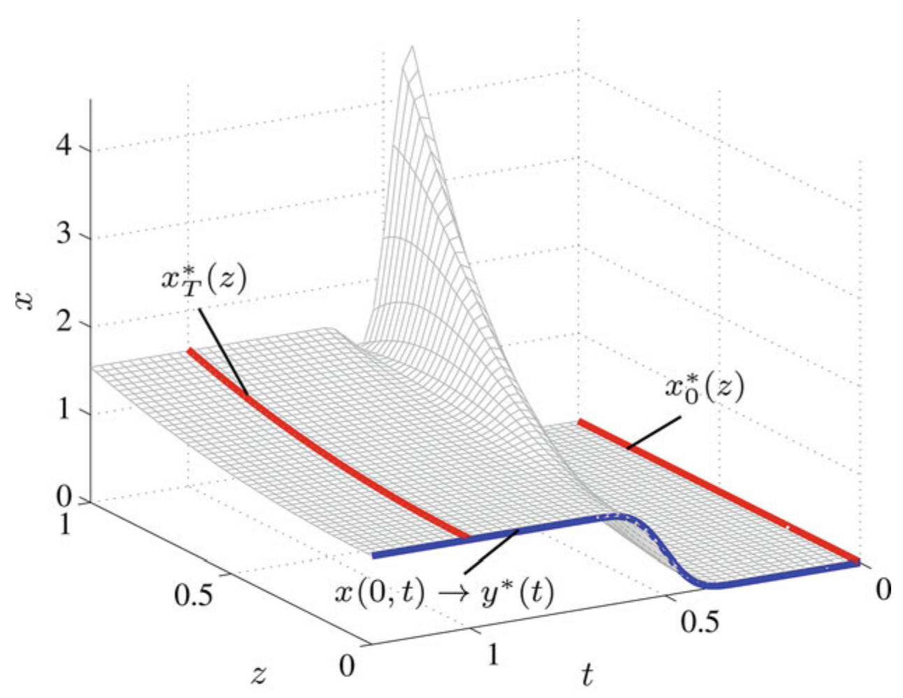

> Image description: A 3D line plot illustrates a simulated spatial-temporal transition path. The vertical axis represents the variable $x$, ranging from 0 to 4. The horizontal plane consists of two axes: $z$, representing space from 0 to 1, and $t$, representing time from 0 to 1. A light gray shaded surface depicts the evolution of the state over time and space. Superimposed on this surface are three distinct curves. Two red lines, labeled $x_T^*(z)$ and $x_0^*(z)$, represent the boundary conditions at time $t=1$ and $t=0$, respectively. A blue curve, labeled $x(0, t) \rightarrow y^*(t)$, is shown along the $t$-axis at $z=0$, representing the desired temporal trajectory $y^*(t)$ derived from the flatness-based control. The plot demonstrates how a state transitions from an initial spatial configuration $x_0^*(z)$ to a target configuration $x_T^*(z)$ along a calculated path.
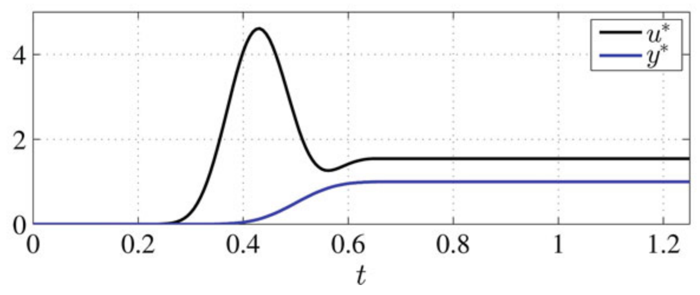

> Image description: A line graph plots two variables, $u^*(t)$ and $y^*(t)$, against time $t$ over an interval from $0$ to approximately $1.3$. The horizontal axis is labeled $t$ with major ticks every $0.2$ units. The vertical axis, lacking a label, represents magnitude. The black curve represents the control input $u^*(t)$. It remains at zero until $t \approx 0.25$, then rises sharply to a peak value slightly below $5$ at $t \approx 0.45$. Following this, it drops to a local minimum of approximately $1.5$ at $t \approx 0.6$ before stabilizing at a constant value of approximately $1.5$. The blue curve represents the desired trajectory $y^*(t)$. It remains at zero until $t \approx 0.35$, then rises smoothly to approach a steady-state value of $1.0$ at $t \approx 0.6$. Both curves stabilize at their respective constant values for $t > 0.7$. This graph illustrates the relationship between a feedforward control signal and a system's output trajectory during a transition.
(7b) is a Gevrey class function of order $\alpha=1+ 1 / \gamma$ (Fliess et al. 1997). Alternative functions are presented, e.g., in Rudolph (2003).

## Simulation Example

In order to illustrate the results of the motion planning procedure described above, let $r=-1$ in (1). The differential parametrization (4) of the series coefficients is evaluated for the desired trajectory $y^{*}(t)$ defined in (7) for $y_{0}^{s}=0$ and $y_{T}^{s}=1$ with the transition time $T=1$ and the parameter $\gamma=2$. With this, the finitetime transition between the zero initial stationary profile $x_{0}^{*}(z)=0$ and the final stationary profile $x_{T}^{*}(z)=x_{T}^{s}(z)=y_{T}^{s} \cosh (z)$ is realized along the trajectory $x(0, t)=y^{*}(t)$. The corresponding
feedforward control and spatial-temporal transition path are shown in Fig. 1.

## Extensions and Generalizations

The previous considerations constitute a first systematic approach to solve motion planning problems of systems governed by PDEs. The underlying techniques can be, however, further generalized to address coupled systems of PDEs, certain classes of nonlinear PDEs (see also section "Semilinear PDEs"), or in-domain control.

While the application of formal power series is restricted to boundary control diffusion-con-vection-reaction systems, the approach can be combined with so-called resummation techniques to overcome convergence issues such as slowly


<!-- source_pdf_page: 811 -->
converging or even divergent series expansions (Laroche et al. 2000; Meurer and Zeitz 2005).

Flatness-based techniques for motion planning can be also embedded into an operator theoretic context using semigroup theory by restricting the analysis to so-called Riesz spectral operators. This enables to analyze coupled systems of linear PDEs with both boundary and in-domain control in a single and multiple spatial coordinates with a common framework (Meurer 2011, 2013). In addition, experimental results for flexible beam and plate structures with embedded piezoelectric actuators confirm the applicability of this design approach and the achievable high tracking accuracy when transiently shaping the deflection profile (Schröck et al. 2013).

## Semilinear PDEs

Flatness can be extended to semilinear PDEs. This is subsequently illustrated for the diffusionreaction system

$$
\begin{align*}
& \partial_{t} x(z, t)=\partial_{z}^{2} x(z, t)+r(x(z, t))  \tag{8a}\\
& \partial_{z} x(0, t)=0, \quad x(1, t)=u(t)  \tag{8b}\\
& x(z, 0)=0 \tag{8c}
\end{align*}
$$

with boundary input $u(t)$. Similar to the previous section, the motion planning problem refers to the determination of a feedforward control $t \mapsto u^{*}(t)$ to realize finite-time transitions starting at the initial profile $x_{0}^{*}(z)=x(z, 0)=0$ to achieve a final stationary profile $x_{T}^{*}(z)$ for $t \geq T$.

## Formal Power Series

If $r(x(z, t))$ is a polynomial in $x(z, t)$ or an analytic function, then similar to the previous section, formal power series can be applied to solve the motion planning problem. This, however, relies on the successive evaluation of Cauchy's product formula. As an example, consider

$$
r(x(z, t))=r_{1} x(z, t)+r_{2} x^{2}(z, t),
$$

then the formal power series ansatz (2) results in the recursion

$$
\begin{align*}
\hat{x}_{n}(t)= & \partial_{t} \hat{x}_{n-2}(t)-r_{1} x_{n-2}(t) \\
& -r_{2} \sum_{j=0}^{n-2}\binom{n}{j} \hat{x}_{j}(t) \hat{x}_{n-j}(t), \quad n \geq 2 \tag{9a}
\end{align*}
$$

$$
\begin{equation*}
\hat{x}_{1}(t)=0 . \tag{9b}
\end{equation*}
$$

Similar to the linear setting in the section "Linear PDEs" above, the recursion can be solved for $\hat{x}_{n}(t)$ by imposing $\hat{x}_{0}(t)=\hat{x}(0, t)$ or respectively

$$
\begin{equation*}
\hat{x}_{0}(t)=y(t) . \tag{9c}
\end{equation*}
$$

As a result, also in this nonlinear setting any series coefficient can be expressed in terms of $y(t)$ and its time derivatives. Hence, $y(t)= x(0, t)$ denotes a basic output for the semilinear PDE (8). The uniform series convergence can be analyzed by restricting any trajectory $y(t)$ to a certain Gevrey order $\alpha$ while simultaneously restricting the absolute values of $d, r_{1}$ and $r_{2}$ (Dunbar et al. 2003; Lynch and Rudolph 2002). These restrictions can be approached using, e.g., resummation techniques to sum slowly converging or divergent series to a meaningful limit. The reader is therefore referred to Meurer and Zeitz (2005) or Meurer and Krstic (2011), with the latter introducing a PDE-based approach for formation control of multi-agent systems.

## Formal Integration

A generalization of these results has been recently suggested in Schörkhuber et al. (2013) by making use of an abstract Cauchy-Kowalevski theorem in Gevrey classes. In order to illustrate this, solve (8a) for $\partial_{z}^{2} x(z, t)$ and formally integrate with respect to $z$ taking into account the boundary conditions (8b). This yields the implicit solution

$$
\begin{align*}
x(z, t)= & x_{+}(0, t) \int_{0}^{z} \int_{0}^{p}\left[\partial_{t} x(q, t)\right. \\
& -r(x(q, t))] \mathrm{d} q \mathrm{~d} p  \tag{10a}\\
u(t)= & x(1, t) \tag{10b}
\end{align*}
$$


<!-- source_pdf_page: 812 -->
which can be used to develop to a flatness-based design systematics for motion planning given semilinear PDEs. For this, introduce

$$
\begin{equation*}
y(t)=x(0, t), \tag{11}
\end{equation*}
$$

and rewrite (10b) in terms of the sequence of functions $\left(x^{(n)}(z, t)\right)_{n=0}^{\infty}$ according to

$$
\begin{align*}
x^{(0)}(z, t)= & y(t)  \tag{12a}\\
x^{(n+1)}(z, t)= & x^{(0)}(z, t)+\int_{0}^{z} \int_{0}^{p}\left[\partial_{t} x^{(n)}(q, t)\right. \\
& \left.-r\left(x^{(n)}(q, t)\right)\right] \mathrm{d} q \mathrm{~d} p . \tag{12b}
\end{align*}
$$

From this, it is obvious that $y(t)$ denotes a basic output differentially parametrizing the state variable $x(z, t)=\lim _{n \rightarrow \infty} x^{(n)}(z, t)$ and the boundary input $u(t)=x(1, t)$ provided that the limit exists as $n \rightarrow \infty$. As is shown in Schörkhuber et al. (2013) by making use of scales of Banach spaces in Gevrey classes and abstract Cauchy-Kowalevski theory, the convergence of the parametrized sequence of functions $\left(x^{(n)}(z, t)\right)_{n=0}^{\infty}$ can be ensured in some compact subset of the domain $z \in[0,1]$. Besides its general setup this approach provides an iteration scheme, which can be directly utilized for a numerically efficient solution of the motion planning problem.

## Simulation Example

Let the reaction be subsequently described by

$$
\begin{equation*}
r(x(z, t))=\sin (2 \pi x(z, t)) . \tag{13}
\end{equation*}
$$

The iterative scheme (12) is evaluated for the desired trajectory $y^{*}(t)$ defined in (7) for $y_{0}^{s}=0$ and $y_{T}^{s}=1$ with the transition time $T=1$ and the parameter $\gamma=1$, i.e., the desired trajectory is of Gevrey order $\alpha=2$. The resulting feedforward control $u^{*}(t)$ and the spatial-temporal transition path resulting from the numerical solution of the PDE are depicted in Fig. 2. The desired finite-time transition between the zero initial stationary profile $x_{0}^{*}(z)=0$ and the final stationary profile $x_{T}^{*}(z)=x_{T}^{s}(z)$ determined by

$$
\begin{align*}
& 0=\partial_{z}^{2} x^{s}(z)+r\left(x^{s}(z)\right)  \tag{14a}\\
& \partial_{z^{\prime}} x^{s}(0)=0, \quad x^{s}(0)=y^{s} \tag{14b}
\end{align*}
$$

is clearly achieved along the prescribed path $y^{*}(t)$.

## Extensions and Generalizations

Generalizations of the introduced formal integration approach to solve motion planning problems for systems of coupled PDEs are, e.g., provided in Schörkhuber et al. (2013). Moreover, linear diffusion-convection-reaction systems with spatially and time-varying coefficients defined on a higher-dimensional parallelepipedon are addressed in Meurer and Kugi (2009) and Meurer (2013).

## Hyperbolic PDEs

Hyperbolic PDEs exhibiting wavelike dynamics require the development of a design systematics explicitly taking into account the finite speed of wave propagation. For linear hyperbolic PDEs, operational calculus has been successfully applied to determine the state and input parametrizations in terms of the basic output and its advanced and delayed arguments (Petit and Rouchon 2001, 2002; Rouchon 2001; Rudolph and Woittennek 2008; Woittennek and Rudolph 2003). In addition, the method of characteristics can be utilized to address both linear and quasi-linear hyperbolic PDEs. Herein, a suitable change of coordinates enables to reformulate the PDE in a normal form, which can be (formally) integrated in terms of a basic output. With this, also an efficient numerical procedure can be developed to solve motion planning problems for hyperbolic PDEs (Woittennek and Mounier 2010).

## Summary and Future Directions

Motion planning constitutes an important design step when solving control problems for systems governed by PDEs. This is particularly due to


<!-- source_pdf_page: 813 -->
## Motion Planning for

PDEs, Fig. 2 Simulated spatial-temporal transition path (top) and applied flatness-based feedforward $\operatorname{control} u^{*}(t)$ and desired trajectory $y^{*}(t)$ (bottom) for (8) with (13)
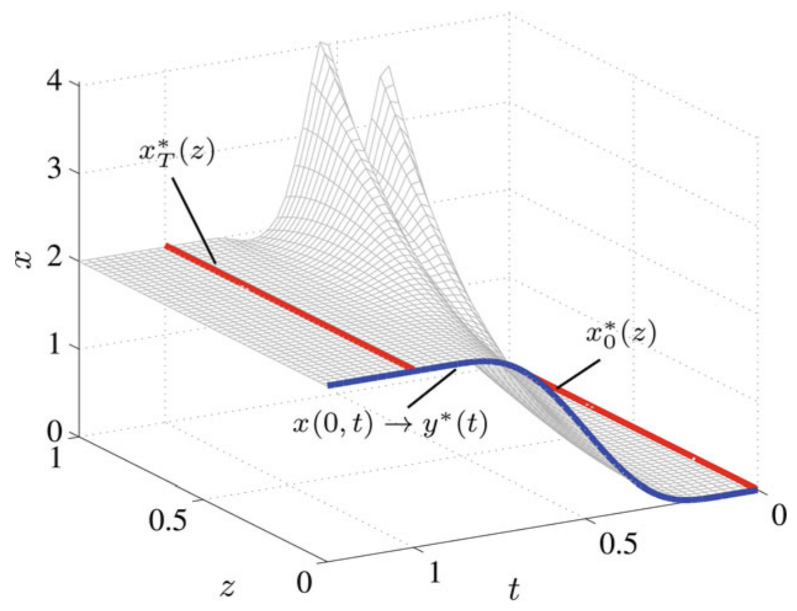

> Image description: A 3D surface plot illustrates a spatial-temporal transition within a system defined by variable $x$. The horizontal axes represent time $t$ and a spatial dimension $z$, while the vertical axis represents the state variable $x$. A grey mesh surface represents the evolution of the system state. Two specific paths are highlighted on the surface. A red line, labeled $x_T^*(z)$, traces a path across the surface from a higher state towards a lower state. A blue line, labeled $y^*(t)$, represents a trajectory transitioning from $x(0,t)$ toward the target. An arrow connects the initial state $x(0,t)$ to the desired trajectory $y^*(t)$. A second red line, labeled $x_0^*(z)$, marks the boundary of the state evolution. The plot visually demonstrates the relationship between the desired trajectory $y^*(t)$ and the system's spatial-temporal evolution, illustrating how a flatness-based feedforward control aligns the system state with the target path.
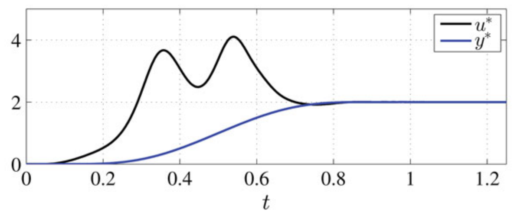

> Image description: A line graph displays the time-evolution of two variables, $u^*(t)$ and $y^*(t)$, over a time period from $t = 0$ to $t = 1.2$. The horizontal axis represents time $t$, and the vertical axis represents magnitude, ranging from 0 to 5. A black solid line represents the applied flatness-based feedforward control, $u^*(t)$. This function begins at zero, undergoes two significant oscillations between $t = 0.2$ and $t = 0.7$, with peaks reaching approximately $3.8$ and $4.1$, before settling at a steady-state value of $2$. A blue solid line represents the desired trajectory, $y^*(t)$. It starts at zero and monotonically increases, following a smooth S-shaped curve, eventually plateauing at the same steady-state value of $2$ as the control signal at approximately $t = 0.8$. The graph illustrates the dynamic relationship where the control effort $u^*(t)$ compensates for the system's requirements to guide the output $y^*(t)$ toward its target trajectory.
the increasing demands on quality, accuracy, and efficiency, which require to turn away from the pure stabilization of an operating point toward the realization of specific start-up, transition, or tracking tasks. In view of these aspects, future research directions might deepen and further evolve the following:

- Semi-analytic design techniques taking into account suitable approximation schemes for complex-shaped spatial domains
- Nonlinear PDEs and coupled systems of nonlinear PDEs with boundary and in-domain control
- Applications arising, e.g., in aeroelasticity, micromechanical systems, fluid flow, and fluid-structure interaction.


## Cross-References

- Boundary Control of 1-D Hyperbolic Systems
- Boundary Control of Korteweg-de Vries and Kuramoto-Sivashinsky PDEs
- Control of Fluids and Fluid-Structure Interactions


## Bibliography

Dunbar W, Petit N, Rouchon P, Martin P (2003) Motion planning for a nonlinear Stefan problem. ESAIM Control Optim Calculus Var 9:275-296
Fliess M, Lévine J, Martin P, Rouchon P (1995) Flatness and defect of non-linear systems: introductory theory and examples. Int J Control 61:1327-1361


<!-- source_pdf_page: 814 -->
Fliess M, Mounier H, Rouchon P, Rudolph J (1997) Systèmes linéaires sur les opérateurs de Mikusiński et commande d'une poutre flexible. ESAIM Proc 2:183193
Laroche B, Martin P, Rouchon P (2000) Motion planning for the heat equation. Int J Robust Nonlinear Control 10:629-643
Lynch A, Rudolph J (2002) Flatness-based boundary control of a class of quasilinear parabolic distributed parameter systems. Int J Control 75(15):1219-1230
Meurer T (2011) Flatness-based trajectory planning for diffusion-reaction systems in a parallelepipedon - a spectral approach. Automatica 47(5):935-949
Meurer T (2013) Control of higher-dimensional PDEs: flatness and backstepping designs. Communications and control engineering series. Springer, Berlin
Meurer T, Krstic M (2011) Finite-time multi-agent deployment: a nonlinear PDE motion planning approach. Automatica 47(11):2534-2542
Meurer T, Kugi A (2009) Trajectory planning for boundary controlled parabolic PDEs with varying parameters on higher-dimensional spatial domains. IEEE Trans Autom Control 54(8): 1854-1868
Meurer T, Zeitz M (2005) Feedforward and feedback tracking control of nonlinear diffusion-convectionreaction systems using summability methods. Ind Eng Chem Res 44:2532-2548
Petit N, Rouchon P (2001) Flatness of heavy chain systems. SIAM J Control Optim 40(2):475-495
Petit N, Rouchon P (2002) Dynamics and solutions to some control problems for water-tank systems. IEEE Trans Autom Control 47(4):594-609
Rodino L (1993) Linear partial differential operators in gevrey spaces. World Scientific, Singapore
Rouchon P (2001) Motion planning, equivalence, and infinite dimensional systems. Int J Appl Math Comput Sci 11:165-188
Rudolph J (2003) Flatness based control of distributed parameter systems. Berichte aus der Steuerungs- und Regelungstechnik. Shaker-Verlag, Aachen
Rudolph J, Woittennek F (2008) Motion planning and open loop control design for linear distributed parameter systems with lumped controls. Int J Control 81(3):457-474
Schörkhuber B, Meurer T, Jüngel A (2013) Flatness of semilinear parabolic PDEs - a generalized CauchyKowalevski approach. IEEE Trans Autom Control 58(9):2277-2291
Schröck J, Meurer T, Kugi A (2013) Motion planning for Piezo-actuated flexible structures: modeling, design, and experiment. IEEE Trans Control Syst Technol 21(3):807-819
Woittennek F, Mounier H (2010) Controllability of networks of spatially one-dimensional second order P.D.E. - an algebraic approach. SIAM J Control Optim 48(6):3882-3902
Woittennek F, Rudolph J (2003) Motion planning for a class of boundary controlled linear hyperbolic PDE's involving finite distributed delays. ESAIM Control Optim Calculus Var 9: 419-435

# Motorcycle Dynamics and Control

Martin Corless<br>School of Aeronautics \& Astronautics, Purdue University, West Lafayette, IN, USA


#### Abstract

A basic model due to Sharp which is useful in the analysis of motorcycle behavior and control is developed. This model is based on linearization of a bicycle model introduced by Whipple, but is augmented with a tire model in which the lateral tire force depends in a dynamic fashion on tire behavior. This model is used to explain some of the important characteristics of motorcycle behavior. The significant dynamic modes exhibited by this model are capsize, weave, and wobble.


## Keywords

Bicycle; Capsize; Counter-steering; Motorcycle; Single-track vehicle; Tire model; Weave; Wobble

## Introduction

The bicycle is mankind's ultimate solution to the quest for a human-powered vehicle (Herlihy 2006). The motorcycle just makes riding more fun. Bicycles, motorcycles, scooters, and mopeds are all examples of single-track vehicles and have similar dynamics. The dynamics of a motorcycle are considerably more complicated than that of a four-wheel vehicle such as a car. The first obvious difference in behavior is stability. An unattended upright stationary motorcycle is basically an inverted pendulum and is unstable about its normal upright position, whereas a car has no stability issues in the same configuration. Another difference is that a motorcycle must lean when cornering. Although a car leans a little due to suspension travel, there is no necessity for it to lean in cornering. A perfectly rigid car would not lean. Furthermore, beyond low speeds, the steering behavior of a


<!-- source_pdf_page: 815 -->
motorcycle is not intuitive like that of a car. To turn a car right, the driver simply turns the steering wheel right; on a motorcycle, the rider initially turns the handlebars to the left. This is called counter-steering and is not intuitive.

## A Basic Model

To obtain a basic motorcycle model, we start with four rigid bodies: the rear frame (which includes a rigidly attached rigid rider), the front frame (includes handlebars and front forks), the rear wheel, and the front wheel; see Fig. 1. We assume that both frames and wheels have a plane of symmetry which is vertical when the bike is in its nominal upright configuration. The front frame can rotate relative to the rear frame about the steering axis; the steering axis is in the plane of symmetry of each frame and in the nominal upright configuration of the bike, the angle it makes with the vertical is called the rake angle or caster angle and is denoted by $\epsilon$. The rear wheel rotates relative to the rear frame about an axis perpendicular to the rear plane of symmetry and is symmetrical with respect to this axis. The same relationship holds between the front wheel and the front frame. Although each wheel can be three dimensional, we model the wheels as terminating in a knife edge at their boundaries and contact the ground at a single point. Points $Q$ and $P$ are the points on the ground in contact with the front and rear wheels, respectively.

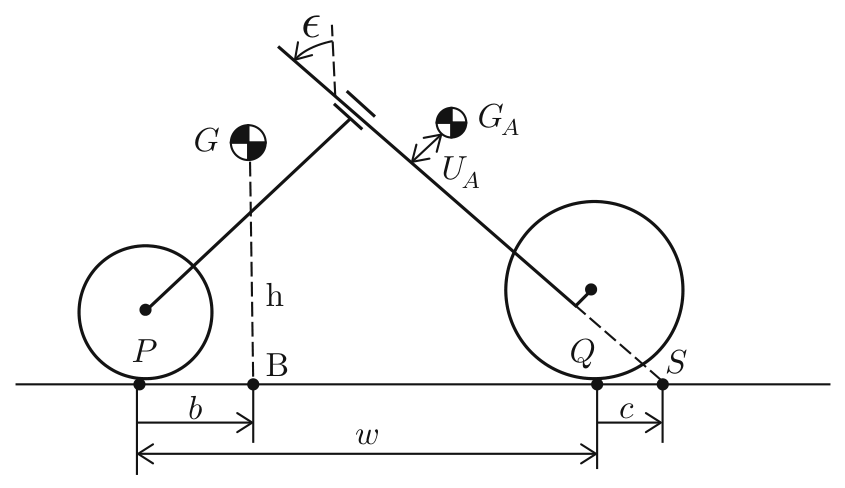

> Image description: A technical diagram illustrates a simplified bicycle or motorcycle model consisting of two wheels and a frame structure. The system is shown in a tilted, non-upright configuration. Key components include: * **Wheels:** Represented by two circles. The rear wheel is centered at point $P$ and the front wheel is centered at point $Q$. * **Frame/Axis:** A diagonal line represents the steering axis, tilted from the vertical by an angle $\epsilon$ (the rake angle). * **Points and Centers of Mass:** $G$ represents the center of mass of the rear assembly, while $G_A$ represents the center of mass of the front assembly. $S$ is a point on the ground located behind the front wheel. * **Geometric Dimensions:** The diagram identifies several variables: $w$ is the horizontal distance between contact points $P$ and $Q$; $h$ is the vertical height from the ground to the rear center of mass $G$; $b$ is the horizontal distance from $P$ to point $B$ (directly below $G$); and $c$ is the horizontal distance between $Q$ and $S$.
Motorcycle Dynamics and Control, Fig. 1 Basic model

Each of the above four bodies are described by their mass, mass center location, and a $3 \times 3$ inertia matrix. Two other important parameters are the wheelbase $w$ and the trail $c$. The wheelbase is the distance between the contact points of the two wheels in the nominal configuration, and the trail is the distance from the front wheel contact point $Q$ to the intersection $S$ of the steering axis with the ground. The trail is normally positive, that is, $Q$ is behind $S$. The point $G$ locates the mass center of the complete bike in its nominal configuration, whereas $G_{A}$ is the location of the mass center of the front assembly (front frame and wheel).

## Description of Motion

Considering a right-handed reference frame $e=$ ( $\hat{e}_{1}, \hat{e}_{2}, \hat{e}_{3}$ ) with origin $O$ fixed in the ground, the bike motion can be described by the location of the rear wheel contact point $P$ relative to $O$, the orientation of the rear frame relative to $e$, and the orientation of the front frame relative to the rear frame; see Fig. 2. Assuming the bike is moving along a horizontal plane, the location of $P$ is usually described by Cartesian coordinates $x$ and $y$. Let reference frame $b$ be fixed in the rear frame with $\hat{b}_{1}$ and $\hat{b}_{3}$ in the plane of symmetry with $\hat{b}_{1}$ along the nominal $P-S$

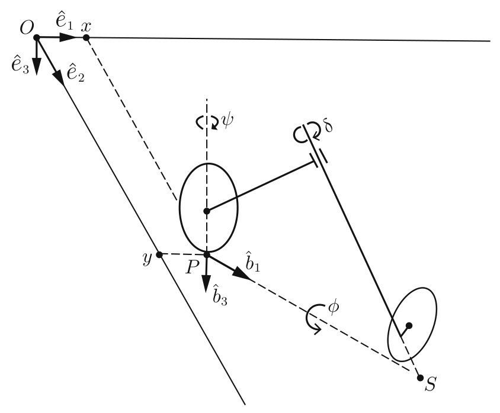

> Image description: A scientific diagram illustrates a mechanical model of a bicycle's motion within a three-dimensional coordinate system. A stationary, right-handed reference frame $e$ is fixed at origin $O$, with orthonormal basis vectors $\hat{e}_1$ (horizontal), $\hat{e}_2$ (into the plane), and $\hat{e}_3$ (vertical, downward). The bicycle is represented by two linked oval shapes representing wheels. The rear wheel's contact point is labeled $P$, which is defined relative to origin $O$ by Cartesian coordinates $(x, y)$ on the horizontal plane. A body-fixed reference frame $b$ is attached to the rear wheel, with basis vectors $\hat{b}_1$ and $\hat{b}_3$ located in the plane of symmetry. The configuration is defined by three angular variables: $\psi$ represents the orientation of the rear frame relative to frame $e$; $\delta$ denotes the steering angle (orientation of the front frame relative to the rear); and $\phi$ represents the heading or orientation of the front wheel relative to the $P-S$ line. A dashed line connects point $P$ to point $S$, representing the nominal direction of motion.
Motorcycle Dynamics and Control, Fig. 2 Description of motion


<!-- source_pdf_page: 816 -->
line; see Fig. 2. Using this reference frame, the orientation of the rear frame is described by a 3-1-2 Euler angle sequence which consists of a yaw rotation by $\psi$ about the 3 -axis followed by a lean (roll) rotation by $\phi$ about the 1 -axis and finally by a pitch rotation by $\theta$ about the 2 -axis. The orientation of the front frame relative to the rear frame can be described by the steer angle $\delta$. Assuming both wheels remain in contact with the ground, the pitch angle $\theta$ is not independent; it is uniquely determined by $\delta$ and $\phi$. In considering small perturbations from the upright nominal configuration, the variation in pitch is usually ignored. Here we consider it to be zero. Also the dynamic behavior of the bike is independent of the coordinates $x, y$, and $\psi$. These coordinates can be obtained by integrating the velocity of $P$ and $\dot{\psi}$.

## The Whipple Bicycle Model

The "simplest" model which captures all the salient features of a single track vehicle for a basic understanding of low-speed dynamics and control is that originally due to Whipple (1899). We consider the linearized version of this model which is further expounded on in Meijaard et al. (2007). The salient feature of this model is that there is no slip at each wheel. This means that the velocity of the point on the wheel which is instantaneously in contact with the ground is zero; this is illustrated in Fig. 3 for the rear wheel. No slip implies that there is no sideslip which means that the velocity of the wheel contact point ( $\bar{v}^{P}$ in Fig. 3) is parallel to the intersection of the wheel plane with the ground plane; the wheel contact point is the point moving along the ground which is in contact with the wheel.

The rest of this entry is based on linearization of motorcycle dynamics about an equilibrium configuration corresponding to the bike traveling upright in a straight line at constant forward speed $v:=v^{P}$, the speed of the rear wheel contact point $P$. In the linearized system, the longitudinal dynamics are independent of the lateral dynamics, and in the absence of driving or braking forces, the speed $v$ is constant.

With no sideslip at both wheels, kinematical considerations (see Fig.4) show that the yaw rate $\dot{\psi}$ is determined by $\delta$; specifically for small angles we have the following linearized relationship:

$$
\begin{equation*}
\dot{\psi}=v v \delta+\mu \dot{\delta} \tag{1}
\end{equation*}
$$

where $\nu=c_{\epsilon} / w, c_{\epsilon}=\cos \epsilon$, and $\mu=c c_{\epsilon} / w$ is the normalized mechanical trail. In Fig. $4, \delta_{f}= c_{\epsilon} \delta$ is the effective steer angle; it is the angle between the intersections of the front wheel plane and the rear frame plane with the ground. Thus we can completely describe the lateral bike dynamics with the roll angle $\phi$ and the steer angle $\delta$. To obtain the above relationship, first note that, as a consequence of no sideslip, $\bar{v}^{P}=v \hat{b}_{1}$ and $\bar{v}^{Q}$ is perpendicular to $\hat{f}_{2}$. Taking the dot product of the expression,

$$
\bar{v}^{Q}=\bar{v}^{P}+(w+c) \dot{\psi} \hat{b}_{2}-c\left(\dot{\psi}+\dot{\delta}_{f}\right) \hat{f}_{2},
$$

with $\hat{f}_{2}$ while noting that $\hat{b}_{1} \cdot \hat{f}_{2}=-\sin \delta_{f}$ and $\hat{b}_{2} \cdot \hat{f}_{2}=\cos \delta_{f}$ results in
$0=-v \sin \delta_{f}+(w+c) \dot{\psi} \cos \delta_{f}-c\left(\dot{\psi}+\dot{\delta}_{f}\right)$.

Linearization about $\delta=0$ yields the desired result.

The relationship in (1) also holds for four wheel vehicles. There one can achieve a desired
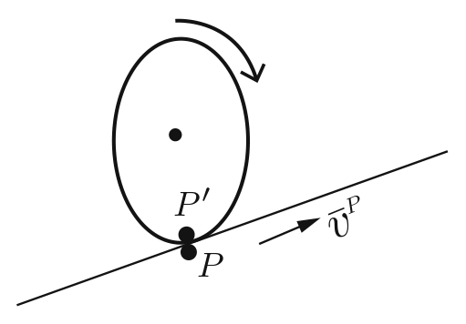

> Image description: This diagram from "Motorcycle Dynamics and Control" illustrates a no-slip condition for a rotating wheel on an inclined surface. The figure shows a circle representing a wheel with a central axis point. A curved arrow at the top indicates clockwise rotation. A straight line representing a ground surface slopes upward from left to right. Two specific points are labeled at the contact interface: $P'$ on the wheel's circumference and $P$ on the contact surface. A straight vector arrow labeled $\bar{v}^P$ points along the inclined surface in the direction of travel. The caption provides the mathematical condition for this state, $v^{P^{\prime}}=0$, signifying that the velocity of the point $P'$ on the wheel is zero relative to the ground at the contact point $P$. This depicts pure rolling motion without sliding.

Motorcycle Dynamics and Control, Fig. 3 No slip: $v^{P^{\prime}}=0$

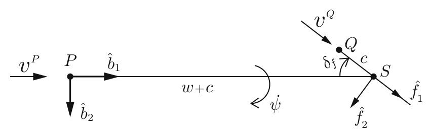

> Image description: A technical engineering diagram from "Motorcycle Dynamics and Control" illustrates a mechanical model under a "no slip" condition ($v^{P'} = 0$). The diagram depicts a rigid body or link represented by a horizontal line segment extending from point $P$ to point $S$. Point $P$ serves as a reference origin, with two velocity/force vectors originating there: a horizontal vector $v^P$ and two orthogonal vectors, $\hat{b}_1$ and $\hat{b}_2$. The central segment is labeled with $w+c$, representing length or a coordinate. A rotational arrow at the center indicates an angular velocity $\psi$. At the distal end, point $S$, there is an angle $\delta_f$ relative to a diagonal line. Three force or velocity vectors act near $S$: a diagonal vector $v^Q$, a vector $\hat{f}_1$, and a vector $\hat{f}_2$. A point $Q$ is located slightly above $S$ along the diagonal axis, associated with vector $v^Q$. The diagram uses standard notation for kinematics and dynamics.
Motorcycle Dynamics and Control, Fig. 4 Some kinematics


<!-- source_pdf_page: 817 -->
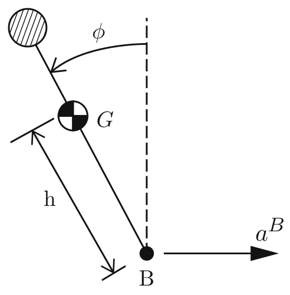

> Image description: An engineering diagram illustrating an inverted pendulum system with an accelerating support point, captioned "Motorcycle Dynamics and Control, Fig. 5". The diagram features a vertical dashed line representing the equilibrium position. A solid line represents the pendulum's rod, pivoting at point $B$ at the base. At the top of the rod is a shaded circular mass, and the center of mass is marked with a checkered circle labeled $G$. Several variables and labels are provided: * $\phi$ represents the angular displacement of the pendulum from the vertical equilibrium line. * $h$ denotes the distance from the pivot point $B$ to the center of mass $G$. * $a^B$ is a horizontal vector arrow originating from point $B$, representing the linear acceleration of the support point. * $B$ marks the fixed pivot point at the base. * $G$ marks the pendulum's center of mass.
Motorcycle Dynamics and Control, Fig. 5 Inverted pendulum with accelerating support point

constant yaw rate $\dot{\psi}_{d}$ by simply letting the steer angle $\delta=\dot{\psi}_{d} / v v$. However, as we shall see, a motorcycle with its steering fixed at a constant steer angle is unstable. Neglecting gyroscopic terms, it is simply an inverted pendulum. With its steering free, a motorcycle can be stable over a certain speed range and, if unstable, can be easily stabilized above a very low speed by most people. Trials riders can stabilize a motorcycle at any speed including zero.

To help understand the effect of steer angle on bike behavior, we initially ignore the mass and inertia of the front assembly along with gyroscopic effects, and we assume that the $\hat{b}_{1}$ axis is a principle axis of inertia of the rear frame with moment of inertia $I_{x x}$. Angular momentum considerations about the $\hat{b}_{1}$ axis and linearization results in

$$
\begin{equation*}
I_{x x} \ddot{\phi}+m h a^{B}=m g h \phi+\left(N_{f} c_{\epsilon} c\right) \delta \tag{2}
\end{equation*}
$$

where $N_{f}$ is the normal force (vertical and upwards) on the front wheel and $a^{B}$ is the lateral acceleration (perpendicular to rear frame) of point $B$ which is the projection of $G$ onto the $\hat{b}_{1}$ axis. By considering a moment balance about the pitch axis $\hat{b}_{2}$ through $P$, one can obtain that $N_{f}=m g b / w$. Notice that, with the steering fixed at $\delta=0$, Eq. (2) is the equation of motion of a simple inverted pendulum whose support axis is accelerating horizontally with acceleration $a^{B}$. This is illustrated in Fig. 5.

Basic kinematics reveal that $a^{B}=v \dot{\psi}+b \ddot{\psi}$ and, recalling relationship (1), Eq. (2) now yields the lean equation:

$$
\begin{equation*}
I_{x x} \ddot{\phi}-m g h \phi=-m_{\phi \delta} \ddot{\delta}-c_{\phi \delta} v \dot{\delta}-k_{\phi \delta}(v) \delta \tag{3}
\end{equation*}
$$

where $m_{\phi \delta}=\mu m h b>0, c_{\phi \delta}=m h(\mu+b v)>0$ and $k_{\phi \delta}(v)=-\mu m g b+m h v v^{2}$. Note that $v$ is a constant parameter corresponding to the nominal speed of the rear wheel contact point.

With $\delta=0$, we have a system whose behavior is characterized by two real eigenvalues: $\pm \sqrt{m g h / I_{x x}}$. This system is unstable due to the positive eigenvalue $\sqrt{m g h / I_{x x}}$. For $v$ sufficiently large, the coefficient $k_{\phi \delta}(v)$ is positive and one can readily show that the above system can be stabilized with positive feedback $\delta= K \phi$ provided $K>m g h / k_{\phi \delta}(v)$. This helps explain the stabilizing effect of a rider turning the handlebars in the direction the bike is falling. Actually, the rider input is a steer torque $T_{\delta}$ about the steer axis.

To explain why an uncontrolled motorcycle can be stable or easily stabilized, one also has to look at the effect that $\phi$ has on $\delta$; in general, a lean perturbation results in the front assembly turning in the same direction, that is, a positive perturbation of $\phi$ results in a positive change in $\delta$.

The lean equation also explains why a motorcycle must lean when cornering above a certain speed. Suppose the motorcycle is in a right hand corner of radius $R$ at some constant speed $v$ : in this scenario, $\dot{\psi}=v / R$ and, with $\delta$ constant, (1) implies that $\delta=\dot{\psi} / v v=1 / v R$; with $\delta$ and $\phi$ constant, the lean equation now requires that $\phi=k_{\phi \delta}(v) \delta / m g h=k_{\phi \delta}(v) / m g h v R$. For higher speeds, $k_{\phi \delta}(v) \approx m h v v^{2}$; hence $\phi \approx v^{2} / g R$. Since $a^{B}=v^{2} / R$, the lean angle $\phi$ is approximately $a^{B} / g$. Hence, to corner with a lateral acceleration $a^{B}=v^{2} / R$, the motorcycle must lean at an angle of approximately $a^{B} / g$.

The lean equation can also help explain counter-steering; that is, at speeds above a reasonably low speed, one can initiate a turn by turning the handlebars in the opposite direction to which one wants to go; to turn right, one initially turns the handlebars to the left. See Limebeer and Sharp (2006) for further discussion.

Taking into account the mass and inertia of the front assembly, gyroscopic effects and cross products of inertia of the rear frame, one can


<!-- source_pdf_page: 818 -->
show (see Meijaard et al. 2007) that the lean equation (3) still holds with

$$
\begin{gathered}
m_{\phi \delta}=\mu I_{x z}+I_{A \epsilon x} \\
c_{\phi \delta}=\mu m h+v I_{x z}+\mu S_{T}+c_{\epsilon} S_{F} \\
k_{\phi \delta}(v)=k_{0 \phi \delta}+k_{2 \phi \delta} v^{2} \\
k_{0 \phi \delta}=-S_{A} g \\
k_{2 \phi \delta}=v\left(m h+S_{T}\right)
\end{gathered}
$$

Here $I_{x x}$ is the moment of inertia of the total motorcycle and rider in the nominal configuration about the $\hat{b}_{1}$ axis and $I_{x z}$ is the inertia cross product w.r.t the $\hat{b}_{1}$ and $\hat{b_{3}}$ axes. The term $I_{A \in x}$ is the front assembly inertia cross product with respect to the steering axis and the $\hat{b}_{1}$ axis; see Meijaard et al. (2007) for a further description of this parameter. Also, $S_{A}=\mu m b+m_{A} u_{A}$ where $m_{A}$ is the mass of the front assembly (front wheel and front frame) and $u_{A}$ is the offset of the mass center of the front assembly from the steering axis, that is, the distance of this mass center from the steering axis; see Fig. 1. The terms $S_{F}= I_{F y y} / r_{F}$ and $S_{T}=I_{R y y} / r_{R}+I_{F y y} / r_{F}$ are gyroscopic terms due the rotation of the front and rear wheels where $r_{F}$ and $r_{R}$ are the radii of the front and rear wheels, while $I_{F y y}$ and $I_{R y y}$ are the moments of inertias of the front and rear wheels about their axles. It is assumed that the mass center of each wheel is located at its geometric center.

By considering an angular momentum balance about a vertical axis through $P$, one can obtain an expression for the lateral force at the front wheel. Angular momentum considerations about the steering axis for the front assembly and linearization then yield the steer equation:

$$
\begin{gather*}
m_{\delta \phi} \ddot{\phi}+m_{\delta \delta} \ddot{\delta}+v c_{\delta \phi} \dot{\phi}+v c_{\delta \delta} \dot{\delta}  \tag{4}\\
+k_{\delta \phi} \phi+k_{\delta \delta}(v) \delta=T_{\delta}
\end{gather*}
$$

where

$$
\begin{gathered}
m_{\delta \phi}=m_{\phi \delta} \\
m_{\delta \delta}=I_{A \epsilon \epsilon}+2 \mu I_{A \epsilon z}+\mu^{2} I_{z z}
\end{gathered}
$$

$$
\begin{gathered}
k_{\phi \delta}=k_{\delta \phi} \\
k_{\delta \delta}(v)=k_{0 \delta \delta}+k_{2 \delta \delta} v^{2} \\
k_{0 \delta \delta}=-s_{\epsilon} S_{A} g \\
k_{2 \delta \delta}=v\left(S_{A}+s_{\epsilon} S_{F}\right) \\
c_{\delta \phi}=-\left(\mu S_{T}+c_{\lambda} S_{F}\right) \\
c_{\delta \delta}=\mu\left(S_{A}+v I_{z z}\right)+v I_{A \epsilon z}
\end{gathered}
$$

Here, $I_{z z}$ is the moment of inertia of the total motorcycle and the rider in the nominal configuration about the $\hat{b}_{3}$ axis, $I_{A \epsilon \epsilon}$ is the moment of inertia of the front assembly about the steering axis, and $I_{A \in Z}$ is the front assembly inertia cross product with respect to the steering axis and the vertical axis through $P$. The lean equation (3) combined with the steer equation (4) provide an initial model for motorcycle dynamics. This is a linear model with the nominal speed $v$ as a constant parameter and the rider's steering torque $T_{\delta}$ as an input.

## Modes of Whipple Model

At $v=0$, the linearized Whipple model (3)(4) has two pairs of real eigenvalues: $\pm p_{1}, \pm p_{2}$ with $p_{2}>p_{1}>0$; see Fig. 6. The pair $\pm p_{1}$ roughly describe inverted pendulum behavior of the whole bike with fixed steering, while $\pm p_{2}$ describe inverted pendulum behavior of the front assembly with the rear frame fixed upright. As $v$ increases the real eigenvalues corresponding to $p_{1}$ and $p_{2}$ meet and from there on form a

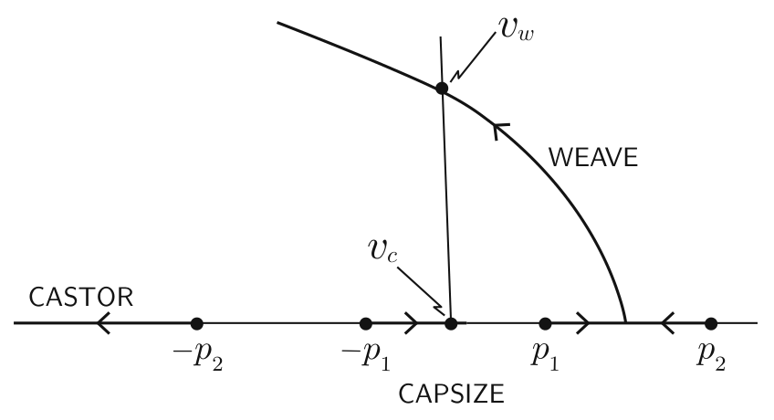

> Image description: A scientific diagram illustrates the eigenvalue behavior of a linearized Whipple model in the complex plane. The horizontal axis represents the real part, and the vertical axis represents the imaginary part. Along the real axis, four discrete points are marked: $-p_2$, $-p_1$, $p_1$, and $p_2$, satisfying the relationship $p_2 > p_1 > 0$. Arrows on the real axis indicate directions between these points, labeled "CASTOR" on the left and "CAPSIZE" in the center. A central point is identified as $v_c$. A curved line labeled "WEAVE" arches from the real axis through a point $v_w$ in the upper half-plane. This curve features an arrow pointing toward $v_w$. The diagram shows how eigenvalues transition from real values on the horizontal axis toward a complex pair at $v_w$. The arrangement depicts a bifurcation where real eigenvalues meet and transition into complex values as a parameter $v$ increases.
Motorcycle Dynamics and Control, Fig. 6 Variation of eigenvalues of Whipple model with speed $v$


<!-- source_pdf_page: 819 -->
complex conjugate pair of eigenvalues which result in a single oscillatory mode called the weave mode. Initially the weave mode is unstable, but is stable above a certain speed $v_{w}$, and for large speeds, its eigenvalues are roughly a linear function of $v$; thus it becomes more damped and its frequency increases with speed. The eigenvalue corresponding to $-p_{2}$ remains real and becomes more negative with speed; this is called the castor mode, because it roughly corresponds to the front assembly castoring about the steer axis. The eigenvalue corresponding to $-p_{1}$ also remains real but increases, eventually becoming slightly positive above some speed $v_{c}$, resulting in an unstable system; the corresponding mode is called the capsize mode. Thus the bike is stable in the autostable speed range ( $v_{w}, v_{c}$ ) and unstable outside this speed range. However, above $v_{c}$, the unstable capsize mode is easily stabilized by a rider and usually without conscious effort. This is because the time constant of the unstable capsize mode is very small (Astrom et al. 2005).

## Sharp71 Model

The Whipple bicycle model is not applicable at higher speeds. In particular, it does not contain a wobble mode which is common to bicycle and motorcycle behavior at higher speeds (Sharp 1971). A wobble mode is characterized mainly by oscillation of the front assembly about the steering axis and can sometimes be unstable. Also, in a real motorcycle, the damping and frequency of the weave mode do not continually increase with speed; the damping usually starts to decrease after a certain speed; sometimes this mode even becomes unstable. At higher speeds, one must depart from the simple non-slipping wheel model. In the Whipple model, the lateral force $F$ on a wheel is simply that force which is necessary to maintain the non-holonomic constraint which requires the velocity of the wheel contact point to be parallel to the wheel plane, that is, no sideslip. Actual tires on wheels slip in the longitudinal and lateral direction, and the lateral force depends on slip in the lateral direction, that is, sideslip. This lateral slip is defined

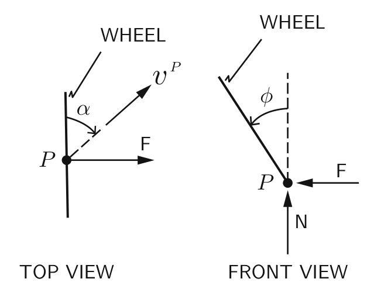

> Image description: A technical diagram titled "Motorcycle Dynamics and Control, Fig. 7 Lateral force, slip angle, and camber angle" illustrates the forces and geometric angles acting on a motorcycle wheel at contact patch $P$. The figure is divided into two parts: a "TOP VIEW" and a "FRONT VIEW." In the **TOP VIEW**, the wheel is represented by a vertical line. The contact patch $P$ is marked where a horizontal force vector $F$ originates, pointing to the right. A velocity vector $v^P$ is shown pointing diagonally upward and to the right. The angle between the wheel's longitudinal axis and the velocity vector $v^P$ is labeled as $\alpha$, representing the slip angle. In the **FRONT VIEW**, the wheel is represented by a slanted line passing through point $P$. A horizontal force vector $F$ points toward the wheel, and a vertical normal force $N$ points upward toward the contact patch. The angle between the wheel's centerline and a vertical dashed line is labeled as $\phi$, representing the camber angle.
Motorcycle Dynamics and Control, Fig. 7 Lateral force, slip angle, and camber angle

by the slip angle $\alpha$ which is the angle between the contact point velocity and the intersection of the wheel plane and the ground; see Fig. 7.

The lateral force also depends on the tire camber angle which is the roll angle of the tire; motorcycle tires can achieve large camber angles in cornering; modern MotoGP racing motorcycles can achieve camber angles of nearly $65^{\circ}$. Thus an initial linear model of a tire lateral force is given by

$$
\begin{equation*}
F=N\left(-k_{\alpha} \alpha+k_{\phi} \phi\right) \tag{5}
\end{equation*}
$$

where $N$ is the normal force on the tire, $k_{\alpha}>0$ is called the tire cornering stiffness, and $k_{\phi}>0$ is called the camber stiffness. Modifying the above Whipple model with the tire force model results in the appearance of the wobble mode. Since lateral forces do not instantaneously respond to changes in slip angle and camber, the dynamic model,

$$
\begin{equation*}
\frac{\sigma}{v} \dot{F}+F=N\left(-k_{\alpha} \alpha+k_{\phi} \phi\right) \tag{6}
\end{equation*}
$$

is usually used where $\sigma>0$ is called the relaxation length of the tire. This yields more realistic behavior (Sharp 1971). In this model the weave mode damping eventually decreases at higher speeds and the frequency does not continually increase. The frequency of the wobble mode is higher than that of the weave mode and its damping decreases at higher speeds.


<!-- source_pdf_page: 820 -->
## Further Models

To obtain nonlinear models, resort is usually made to multi-body simulation codes. In recent years, several researchers have used such codes to make nonlinear models which take into account other features such as frame flexibility, rider models, and aerodynamics; see Cossalter (2006), Cossalter and Lot (2002), Sharp and Limebeer (2001), and Sharp et al. (2004). The nonlinear behavior of the tires is usually modeled with a version of the Magic formula; see Pacejka (2006), Sharp et al. (2004), and Cossalter et al. (2003). Another line of research is to use some of these models to obtain optimal trajectories for high performance; see Saccon et al. (2012).

## Summary and Future Directions

We have presented a basic linearized model of a motorcycle or bicycle useful for the understanding and control of these two wheeled vehicles. It seems that inclusion of further features in the model and the consideration of full nonlinear behavior require the use of multibody simulation software. Future research will consider models which will include the engine, transmission, and an active pilot. Autonomous control of these vehicles will also be considered.

## Cross-References

- Pilot-Vehicle System Modeling
- Transmission
- Vehicle Dynamics Control


## Bibliography

Astrom KJ, Klein RE, Lennarstsson A (2005) Bicycle dynamics and control. IEEE Control Syst Mag 25(4):2647
Cossalter V, Lot R (2002) A motorcycle multi-body model for real time simulations based on the natural coordinates approach. Veh Syst Dyn 37(6):423-447
Cossalter V, Doria A, Lot R, Ruffo N, Salvador M (2003) Dynamic properties of motorcycle and scooter
tires: measurement and comparison. Veh Syst Dyn 39(5):329-352
Cossalter V (2006) Motorcycle dynamics. Second English Edition, LULU
Herlihy DV (2006) Bicycle: the history. Yale University Press, New Haven
Limebeer DJN, Sharp RS (2006) Bicycles, motorcycles, and models. IEEE Control Syst Mag 26(5):34-61
Meijaard JP, Papadopoulos JM, Ruina A, Schwab AL (2007) Linearized dynamics equations for the balance and steer of a bicycle: a benchmark and review including appendix. Proc R Soc A 463(2084):19551982
Pacejka HB (2006) Tire and vehicle dynamics, 2nd edn. SAE International, Warrendale, PA
Saccon A, Hauser J, Beghi A (2012) Trajectory exploration of a rigid motorcycle model. IEEE Trans Control Syst Technol 20(2):424-437
Sharp RS (1971) The stability and control of motorcycles. J Mech Eng Sci 13(5):316-329
Sharp RS, Limebeer DJN (2001) A motorcycle model for stability and control analysis. Multibody Syst Dyn 6:123-142
Sharp RS, Evangelou S, Limebeer DJN (2004) Advances in the modelling of motorcycle dynamics. Multibody Syst Dyn 12(3):251-283
Whipple FJW (1899) The stability of the motion of a bicycle. Q J Pure Appl Math 30:312-348

## Moving Horizon Estimation

James B. Rawlings
University of Wisconsin, Madison, WI, USA

## Synonyms

MHE


#### Abstract

Moving horizon estimation (MHE) is a state estimation method that is particularly useful for nonlinear or constrained dynamic systems for which few general methods with established properties are available. This entry explains the concept of full information estimation and introduces moving horizon estimation as a computable approximation of full information. The basic design


<!-- source_pdf_page: 821 -->
methods for ensuring stability of MHE are presented. The relationships of full information and MHE to other state estimation methods such as Kalman filtering and statistical sampling are discussed.

## Keywords

Full information estimation; Kalman filtering; Statistical sampling

## Introduction

In state estimation, we consider a dynamic system from which measurements are available. In discrete time, the system description is

$$
\begin{equation*}
x^{+}=f(x, w) \quad y=h(x)+v \tag{1}
\end{equation*}
$$

The state of the systems is $x \in \mathbb{R}^{n}$, the measurement is $y \in \mathbb{R}^{P}$, and the notation $x^{+}$means $x$ at the next sample time. A control input $u$ may be included in the model, but it is considered a known variable, and its inclusion is irrelevant to state estimation, so we suppress it in the model under consideration here. We receive measurement $y$ from the sensor, but the process disturbance, $w \in \mathbb{R}^{g}$; measurement disturbance $v \in \mathbb{R}^{p}$; and system initial state, $x(0)$, are considered unknown variables.

The goal of state estimation is to construct or estimate the trajectory of $x$ from only the measurements $y$. Note that for control purposes, we are usually interested in the estimate of the state at the current time, $T$, rather than the entire trajectory over the time interval $[0, T]$. In the moving horizon estimation (MHE) method, we use optimization to achieve this goal. We have two sources of error: the state transition is affected by an unknown process disturbance (or noise), $w$, and the measurement process is affected by another disturbance, $v$. In the MHE approach, we formulate the optimization objective to minimize the size of these errors thus finding a trajectory of the state that comes close to satisfying the (errorfree) model while still fitting the measurements.

First, we define some notation necessary to distinguish the system variables from the estimator variables. We have already introduced the system variables $(x, w, y, v)$. In the estimator optimization problem, these have corresponding decision variables, which we denote by the Greek letters ( $\chi, \omega, \eta, \nu$ ). The relationships between these variables are

$$
\begin{equation*}
\chi^{+}=f(\chi, \omega) \quad y=h(\chi)+v \tag{2}
\end{equation*}
$$

and they are depicted in Fig. 1. Notice that $v$ measures the gap between the model prediction $\eta=h(\chi)$ and the measurement $y$. The optimal decision variables are denoted $(\hat{x}, \hat{w}, \hat{y}, \hat{v})$, and these optimal decisions are the estimates provided by the state estimator.

## Full Information Estimation

The full information objective function is

$$
\begin{equation*}
V_{T}(\chi(0), \omega)=\ell_{x}\left(\chi(0)-\bar{x}_{0}\right)+\sum_{i=0}^{T-1} \ell_{i}(\omega(i), \nu(i)) \tag{3}
\end{equation*}
$$

subject to (2) in which $T$ is the current time, $\boldsymbol{\omega}$ is the estimated sequence of process disturbances, $(\omega(0), \ldots, \omega(T-1)), y(i)$ is the measurement at time $i$, and $\bar{x}_{0}$ is the prior, i.e., available, value of the initial state. Full information here means that we use all the data on time interval $[0, T]$ to estimate the state (or state trajectory) at time $T$. The stage cost $\ell_{i}(\omega, v)$ costs the model disturbance and the fitting error, the two error sources that we reconcile in all state estimation problems.

The full information estimator is then defined as the solution to

$$
\begin{equation*}
\min _{\chi(0), \boldsymbol{\omega}} V_{T}(\chi(0), \boldsymbol{\omega}) \tag{4}
\end{equation*}
$$

The solution to the optimization exists for all $T \in \mathbb{I}_{\geq 0}$ under mild continuity assumptions and choice of stage cost. Many choices of (positive, continuous) stage costs $\ell_{x}(\cdot)$ and $\ell_{i}(\cdot)$ are possible, providing a rich class of estimation problems


<!-- source_pdf_page: 822 -->
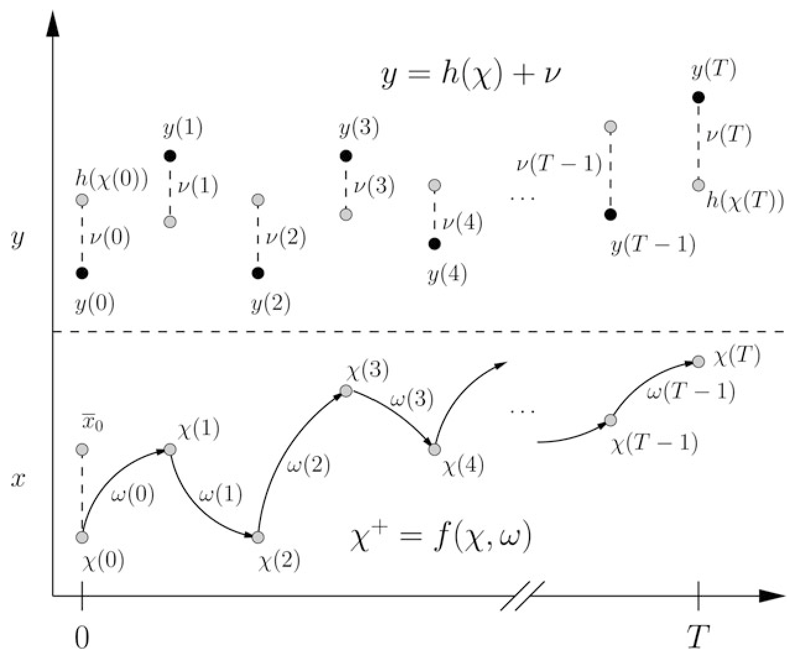

> Image description: This figure illustrates a state-space system over a discrete time horizon from $0$ to $T$. The graph is divided into two horizontal sections by a dashed line. The bottom section depicts the state trajectory $\chi$ on the $x$-axis versus the time axis. It shows a sequence of states $\chi(0), \chi(1), \dots, \chi(T)$ connected by arrows representing the state transition function $\chi^+ = f(\chi, \omega)$, where $\omega$ represents process disturbances (e.g., $\omega(0), \dots, \omega(T-1)$). The top section depicts the measured output $y$ on the $y$-axis versus time. It shows observed outputs $y(0), \dots, y(T)$ and their corresponding predicted outputs $h(\chi(0)), \dots, h(\chi(T))$. The vertical dashed lines between these points represent measurement noise/disturbances $\nu(0), \dots, \nu(T)$ based on the observation model $y = h(\chi) + \nu$. The diagram visually represents the components used in a Moving Horizon Estimation problem.
Moving Horizon Estimation, Fig. 1 The state, measured output, and disturbance variables appearing in the state estimation optimization problem. The state trajectory

that can be tailored to different applications. Because the system model (1) and cost function (3) are so general, it is perhaps best to start off by specializing them to see the connection to some classic results.

## Related Problem: The Kalman Filter

If we specialize to the linear dynamic model $f(x, w)=A x+G w, h(x)=C x$, and let $x(0)$, $w$, and $v$ be independent, normally distributed random variables, the classic Kalman filter is known to be the statistically optimal estimator, i.e., the Kalman filter produces the state estimate that maximizes the conditional probability of $x(T)$ given $y(0), \ldots, y(T)$. The full information estimator is equivalent to the Kalman filter given the linear model assumption and the following choice quadratic of stage costs

$$
\ell_{x}\left(\chi(0), \bar{x}_{0}\right)=(1 / 2)\left\|\chi(0)-\bar{x}_{0}\right\|_{P_{0}^{-1}}^{2}
$$

(gray circles in lower half) is to be reconstructed given the measurements (black circles in upper half)

$$
\ell_{i}(\omega, v)=(1 / 2)\left(\|\omega\|_{Q^{-1}}^{2}+\|v\|_{R^{-1}}^{2}\right)
$$

in which random variable $x(0)$ is assumed to have mean $\bar{x}_{0}$ and variance $P_{0}$ and random variables $w$ and $v$ are assumed zero mean with variances $Q$ and $R$, respectively. The Kalman filter is also a recursive solution to the state estimation problem so that only the current mean $\hat{x}$ and variance $P$ of the conditional density are required to be stored, instead of the entire history of measurements $y(i), i=0, \ldots, T$. This computational efficiency is critical for success in online application for processes with short time scales requiring fast processing.

But if we consider nonlinear models, the maximization of conditional density is usually an intractable problem, especially in online applications. So, MHE becomes a natural alternative for nonlinear models or if an application calls for hard constraints to be imposed on the estimated variables.


<!-- source_pdf_page: 823 -->
## Moving the Horizon

An obvious problem with solving the full information optimization problem is that the number of decision variables grows linearly with time $T$, which quickly renders the problem intractable for continuous processes that have no final time. A natural alternative to full information is to consider instead a finite moving horizon of the most recent $N$ measurements. Figure 2 displays this idea. The initial condition $\chi(0)$ is now replaced by the initial state in the horizon, $\chi(T-N)$, and the decision variable sequence of process disturbances is now just the last $N$ variables $\boldsymbol{\omega}=(\omega(T-N), \ldots, \omega(T-1))$. Now, the big question remaining is what to do about the neglected, past data. This question is strongly related to what penalty to use on the initial state in the horizon $\chi(T-N)$. If we make this initial state a free variable, that is equivalent to completely discounting the past data. If we wish to retain some of the influence of the past data and keep the moving horizon estimation problem close to the full information problem, then we must choose an appropriate penalty for the initial state. We discuss this problem next.

Arrival Cost. When time is less than or equal to the horizon length, $T \leq N$, we can simply do full information estimation. So we assume throughout that $T>N$. For $T>N$, we express the MHE objective function as

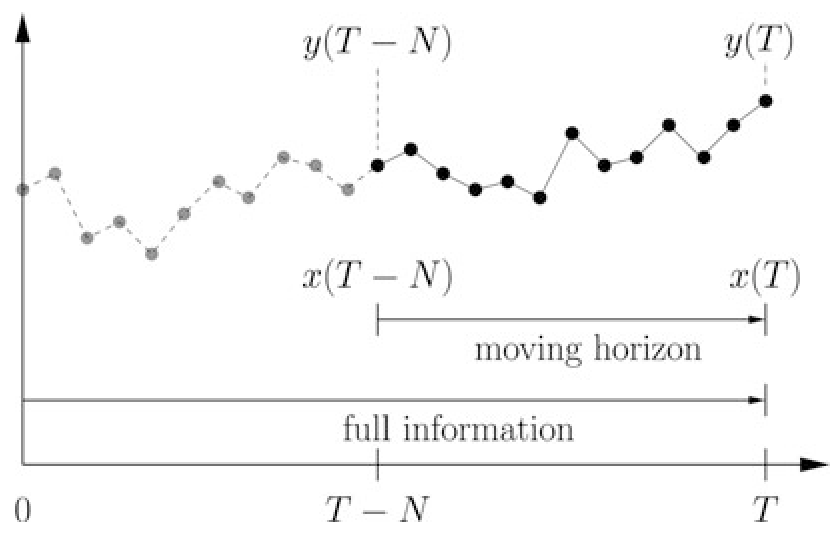

> Image description: This schematic diagram illustrates the Moving Horizon Estimation (MHE) problem. The vertical axis and a horizontal time axis represent the domain, ranging from $0$ to $T$. A time-series signal is plotted, composed of a sequence of discrete data points. The initial segment of the series, from time $0$ to $T-N$, is shown as light grey points connected by a dashed line. The subsequent segment, from $T-N$ to $T$, is shown as black points connected by a solid line. Specific points are labeled: the earliest point in the black segment is $y(T-N)$ and the final point is $y(T)$. Two horizontal spans are indicated below the data: a "moving horizon" segment spanning from $T-N$ to $T$ (bounded by variables $x(T-N)$ and $x(T)$), and a "full information" segment spanning the entire duration from $0$ to $T$. Arrows indicate the directional flow of time along the x-axis.
Moving Horizon Estimation, Fig. 2 Schematic of the moving horizon estimation problem

$$
\begin{aligned}
\hat{V}_{T}(\chi(T-N), \boldsymbol{\omega})= & \Gamma_{T-N}(\chi(T-N)) \\
& +\sum_{i=T-N}^{T-1} \ell_{i}(\omega(i), v(i))
\end{aligned}
$$

subject to (2). The MHE problem is defined to be

$$
\begin{equation*}
\min _{\chi(T-N), \omega} \hat{V}_{T}(\chi(T-N), \omega) \tag{5}
\end{equation*}
$$

in which $\boldsymbol{\omega}=\{\omega(T-N), \ldots, \omega(T-1)\}$ and the hat on $V$ distinguishes the MHE objective function from full information. The designer must now choose this prior weighting $\Gamma_{k}(\cdot)$ for $k>N$.

To think about how to choose this prior weighting, it is helpful to first think about solving the full information problem by breaking it into two non-overlapping sequences of decision variables: the decision variables in the time interval corresponding to the neglected data $(\omega(0), \omega(1), \ldots, \omega(T-N-1))$ and those in the time interval corresponding to the considered data in the horizon $(\omega(T-N), \ldots, \omega(T-1))$. If we optimize over the first sequence of variables and store the solution as a function of the terminal state $\chi(T-N)$, we have defined what is known as the arrival cost. This is the optimal cost to arrive at a given state value.

Definition 1 (arrival cost) The (full information) arrival cost is defined for $k \geq 1$ as

$$
\begin{equation*}
Z_{k}(x)=\min _{\chi(0), \omega} V_{k}(\chi(0), \omega) \tag{6}
\end{equation*}
$$

subject to (2) and $\chi(k ; \chi(0), \boldsymbol{\omega})=x$.
Notice the terminal constraint that $\chi$ at time $k$ ends at value $x$. Given this arrival cost function, we can then solve the full information problem by optimizing over the remaining decision variables. What we have described is simply the dynamic programming strategy for optimizing over a sum of stage costs with a dynamic model (Bertsekas 1995).

We have the following important equivalence.
Lemma 1 (MHE and full information estimation) The MHE problem (5) is equivalent to


<!-- source_pdf_page: 824 -->
the full information problem (4) for the choice $\Gamma_{k}(\cdot)=Z_{k}(\cdot)$ for all $k>N$ and $N \geq 1$.

Using dynamic programming to decompose the full information problem into an MHE problem with an arrival cost penalty is conceptually important to understand the structure of the problem, but it doesn't yet provide us with an implementable estimation strategy because we cannot compute and store the arrival cost when the model is nonlinear or other constraints are present in the problem. But if we are not too worried about the optimality of the estimator and are mainly interested in other properties, such as stability of the estimator, we can find simpler design methods for choosing the weighting $\Gamma_{k}(\cdot)$. We address this issue next.

## Estimator Properties: Stability

An estimator is termed stable if small disturbances ( $w, v$ ) lead to small estimate errors $x- \hat{x}$ as time increases. Precise definitions of this basic idea are available elsewhere (Rawlings and Ji 2012), but this basic notion is sufficient for the purposes of this overview. In applications, properties such as stability and insensitivity to model errors are usually more important than optimality. It is possible for a filter to be optimal and still not stable. In the linear system context, this cannot happen for "nice" systems. Such nice systems are classified as detectable. Again, the precise definition of detectability for the linear case is available in standard references (Kwakernaak and Sivan 1972). Defining detectability for nonlinear systems is a more delicate affair, but useful definitions are becoming available for the nonlinear case as well (Sontag and Wang 1997).

If we lower our sights and do not worry if MHE is equivalent to full information estimation and require only that it be a stable estimator, then the key result is that the prior penalty $\Gamma_{k}(\cdot)$ need only be chosen smaller than the arrival cost as shown in Fig. 3. See Rawlings and Mayne (2009, Theorem 4.20) for a precise statement of this result. Of course this condition includes the flat arrival cost, which does not penalize the initial

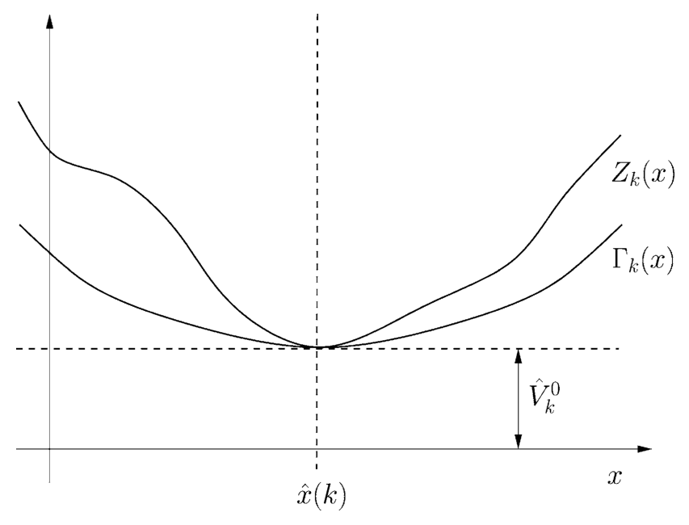

> Image description: A mathematical function plot illustrating a stability condition for Moving Horizon Estimation (MHE). The figure consists of a two-dimensional Cartesian coordinate system with a vertical $y$-axis and a horizontal $x$-axis. Two continuous, smooth curves are plotted on the axes: $Z_k(x)$ (the upper curve) and $\Gamma_k(x)$ (the lower curve). Both curves are convex-shaped and intersect at a single minimum point located on a vertical dashed line. This minimum point is labeled on the $x$-axis as $\hat{x}(k)$. A horizontal dashed line extends from this minimum point toward the $y$-axis. Below this dashed line, a vertical double-headed arrow denotes the distance from the $x$-axis to the dashed line, labeled $\hat{V}_k^0$. The figure visualizes a theorem stating that for a stable estimator, the prior penalty function $\Gamma_k(x)$ must be chosen such that its minimum value is less than or equal to the arrival cost $Z_k(x)$, as indicated by the curves' relative positions.
Moving Horizon Estimation, Fig. 3 Arrival cost $Z_{k}(x)$, underbounding prior weighting $\Gamma_{k}(x)$, and MHE optimal value $\hat{V}_{k}^{0}$; for all $x$ and $k>N, Z_{k}(x) \geq \Gamma_{k}(x) \geq \hat{V}_{k}^{0}$, and $Z_{k}(\hat{x}(k))=\Gamma_{k}(\hat{x}(k))=\hat{V}_{k}^{0}$

state in the horizon at all. So neglecting the past data completely leads to a stable estimator for detectable systems. If we want to improve on this performance, we can increase the prior penalty, and we are guaranteed to remain stable as long as we stay below the upper limit set by the arrival cost.

## Related Problem: Statistical Sampling

MHE is based on optimizing an objective function that bears some relationship to the conditional probability of the state (trajectory) given the measurements. As discussed in the section on the Kalman filter, if the system is linear with normally distributed noise, this relationship can be made exact, and MHE is therefore an optimal statistical estimator. But in the nonlinear case, the objective function is chosen with engineering judgment and is only a surrogate for the conditional probability. By contrast, sampling methods such as particle filtering are designed to sample the conditional density also in the nonlinear case. The mean and variance of the samples then provide estimates of the mean and variance of the conditional density of interest. In the limit of infinitely many samples, these methods are exact. The efficiency of the sampling methods depends strongly on the model and the dimension


<!-- source_pdf_page: 825 -->
of the state vector $n$, however. The efficiency of the sampling strategy is particularly important for online use of state estimators. Rawlings and Bakshi (2006) and Rawlings and Mayne (2009, pp. 329-355) provide some comparisons of particle filtering with MHE and also describe some hybrid methods combining MHE and particle filtering.
either (i) general background required to understand MHE theory and its relationship to other methods or (ii) computational methods for solving the real-time MHE optimization problem or (iii) challenging nonlinear applications that demonstrate benefits and probe the current limits of MHE implementations.

## Summary and Future Directions

MHE is one of few state estimation methods that can be applied to nonlinear models for which properties such as estimator stability can be established (Rao et al. 2003; Rawlings and Mayne 2009). The required online solution of an optimization problem is computationally demanding in some applications but can provide significant benefits in estimator accuracy and rate of convergence (Patwardhan et al. 2012). Current topics for MHE theoretical research include treating bounded rather than convergent disturbances and establishing properties of suboptimal MHE (Rawlings and Ji 2012). The current main focus for MHE applied research involves reducing the online computational complexity to reliably handle challenging large dimensional, nonlinear applications (Kuhl et al. 2011; Lopez-Negrete and Biegler 2012; Zavala and Biegler 2009; Zavala et al. 2008).

## Cross-References

- Bounds on Estimation
- Estimation, Survey on
- Extended Kalman Filters
- Nonlinear Filters
- Particle Filters


## Recommended Reading

Moving horizon estimation has by this point a fairly extensive literature; a recent overview is provided in Rawlings and Mayne (2009, pp. 356-357). The following references provide

## Bibliography

Bertsekas DP (1995) Dynamic programming and optimal control, vol 1. Athena Scientific, Belmont
Kuhl P, Diehl M, Kraus T, Schloder JP, Bock HG (2011) A real-time algorithm for moving horizon state and parameter estimation. Comput Chem Eng 35:71-83
Kwakernaak H, Sivan R (1972) Linear optimal control systems. Wiley, New York. ISBN:0-471-51110-2
Lopez-Negrete R, Biegler LT (2012) A moving horizon estimator for processes with multi-rate measurements: a nonlinear programming sensitivity approach. J Process Control 22:677-688
Patwardhan SC, Narasimhan S, Jagadeesan P, Gopaluni B, Shah SL (2012) Nonlinear Bayesian state estimation: a review of recent developments. Control Eng Pract 20:933-953
Rao CV, Rawlings JB, Mayne DQ (2003) Constrained state estimation for nonlinear discrete-time systems: stability and moving horizon approximations. IEEE Trans Autom Control 48(2): 246-258
Rawlings JB, Bakshi BR (2006) Particle filtering and moving horizon estimation. Comput Chem Eng 30:1529-1541
Rawlings JB, Ji L (2012) Optimization-based state estimation: current status and some new results. J Process Control 22:1439-1444
Rawlings JB, Mayne DQ (2009) Model predictive control: theory and design. Nob Hill Publishing, Madison, 576 p. ISBN:978-0-9759377-0-9

Sontag ED, Wang Y (1997) Output-to-state stability and detectability of nonlinear systems. Syst Control Lett 29:279-290
Zavala VM, Biegler LT (2009) Optimization-based strategies for the operation of low-density polyethylene tubular reactors: nonlinear model predictive control. Comput Chem Eng 33(10): 1735-1746
Zavala VM, Laird CD, Biegler LT (2008) A fast moving horizon estimation algorithm based on nonlinear programming sensitivity. J Process Control 18: 876-884

## MPC

- Model-Predictive Control in Practice


<!-- source_pdf_page: 826 -->
## MRAC

## - Model Reference Adaptive Control

## MSPCA

Multiscale Multivariate Statistical Process Control

## Multi-domain Modeling and Simulation

Martin Otter<br>Institute of System Dynamics and Control, German Aerospace Center (DLR), Wessling, Germany


#### Abstract

One starting point for the analysis and design of a control system is the block diagram representation of a plant. Since it is nontrivial to convert a physical model of a plant into a block diagram, this can be performed manually only for small plant models. Based on research from the last 35 years, more and more mature tools are available to achieve this transformation fully automatically. As a result, multi-domain plants, for example, systems with electrical, mechanical, thermal, and fluid parts, can be modeled in a unified way and can be used directly as inputoutput blocks for control system design. An overview of the basic principles of this approach is given. This provides also the possibility to use nonlinear, multi-domain plant models directly in a controller. Finally, the low-level "Functional Mockup Interface" standard is sketched to exchange multi-domain models between many different modeling and simulation environments.


## Keywords

Block diagram; Bond graph; Differentialalgebraic equation (DAE) system; Flow variable;

FMI for Co-Simulation; FMI for Model Exchange; Functional Mockup Interface; Inverse models; Modelica; Object-oriented modeling; Potential variable; Stream variable; Symbolic transformation; VHDL-AMS

## Introduction

Methods and tools for control system analysis and design usually require an input-output block diagram description of the plant to be controlled. Apart from small systems, it is nontrivial to derive such models from first principles of physics. Since a long time, methods and tools are available to construct such models automatically for one domain, for example, a mechanical model, an electronic, or a hydraulic circuit. These domainspecific methods and tools are, however, only of limited use for the modeling of multi-domain systems.

In the dissertation (Elmqvist 1978), a suitable approach for multi-domain, object-oriented modeling has been developed by introducing a modeling language to define models on a high level based on first principles. The resulting DAE (differential-algebraic equation) systems are transformed with proper algorithms automatically in a block diagram description with input and output signals based on ODEs (ordinary differential equations).

In 1978, the computers were not powerful enough to apply this method on larger systems. This changed in the 1990s, and then the technology has been substantially improved, many different modeling languages appeared (and also disappeared), and the technology was introduced in commercial simulation environments.

In Table 1, an overview of the most important standards, languages, and tools in the year 2013 for multi-domain modeling is given:

The Modelica language is a standard from The Modelica Association (Modelica Association 2012). The first version was released in 1997. Also a large free library is provided with about 1,300 model components from many domains. There are several software tools supporting this modeling language and the free Modelica


<!-- source_pdf_page: 827 -->
Multi-domain Modeling and Simulation, Table 1 Multi-domain modeling and simulation environments
| Tool name | Web (accessed December 2013) |
| :--- | :--- |
| Environments based on the Modelica Standard (https://www.Modelica.org) |  |
| CyModelica | http://cydesign.com/ |
| Dymola | http://www.dymola.com/ |
| JModelica.org | http://www.jmodelica.org/ |
| LMS Imagine.Lab AMESim | http://www.lmsintl.com/LMS-Imagine-Lab-AMESim |
| MapleSim | http://www.maplesoft.com/products/maplesim |
| MWorks | http://en.tongyuan.cc/ |
| OpenModelica | https://openmodelica.org/ |
| SimulationX | http://www.itisim.com/simulationx/ |
| Wolfram SystemModeler | http://www.wolfram.com/system-modeler/ |
| Environments based on the VHDL-AMS Standard (http://www.eda.ora/twiki/bin/view.cai/P10761) |  |
| ANSYS Simplorer | http://www.ansys.com/Products |
| Saber | http://www.synopsys.com/Systems/Saber |
| SMASH | http://www.dolphin.fr/medal/products/smash/smashoverview.php |
| SystemVision | http://www.mentor.com/products/sm/systemvision |
| Virtuoso AMS designer | http://www.cadence.com |
| Environments with vendor-specific multi-domain modeling languages |  |
| EcosimPro | http://www.ecosimpro.com/ |
| gPROMS | http://www.psenterprise.com/gproms |
| OpenMAST | http://www.openmast.org/ |
| Simscape | https://www.mathworks.com/products/simscape |
| Environments based on the Bond Graph Methodology |  |
| 20-sim | http://www.20sim.com/ |


Standard Library. The examples of this entry are mostly provided from this standard.

The following registered trademarks are referenced:

| Registered trademark | Owner of trademark |
| :--- | :--- |
| AMESim | IMAGINE SA |
| ANSYS | ANSYS Inc. |
| Dymola | Dassault Systemes AB |
| EcosimPro | Empresarios Agrupados A.I.E. |
| gPROMS | Process Systems Enterprise Limited |
| MATLAB | The MathWorks Inc |
| Modelica | Modelica Association |
| Saber | Sabremark Limited partnership |
| SimulationX | ITI GmbH |
| Simulink | The MathWorks Inc |
| SystemVision | Mentor Graphics Corporation |
| Virtuoso | Cadence Design |

- The VHDL-AMS language is a standard from IEEE (IEEE 1076.1-2007 2007), first released
in 1999. It is an extension of the widely used VHDL hardware description language. This language is especially used in the electronics community.
- There are several vendor-specific modeling languages, notably Simscape from MathWorks as an extension to Simulink, as well as MAST, the underlying modeling language of Saber (Mantoolh and Vlach 1992). In 2004, MAST was published as OpenMAST under an open source license.
- Bond graphs (see, e.g., Karnopp et al. 2012) are a special graphical notation to define multi-domain systems based on energy flow. It was invented in 1959 by Henry M. Paynter. In the section "Modeling Language Principles", the principles of multi-domain modeling based on a modeling language are summarized. In the section "Models for Control Systems", it is shown how such models can be used not only for simulation but also as components in nonlinear control systems. Finally, in the section


<!-- source_pdf_page: 828 -->
"The Functional Mockup Interface", an overview about a low-level standard for the exchange of multi-domain systems is described.

## Modeling Language Principles

## Schematics: The Graphical View

Modelers nowadays require a simple to use graphical environment to build up models. With very few exceptions, multi-domain environments define models by schematic diagrams. A typical example is given in Fig.1, showing a simple direct-current electrical motor in Modelica.

In the lower left part, the electrical circuit diagram of the DC motor is visible, consisting mainly of the armature resistance and inductance of the motor, a voltage source, and component "emf" to model in an idealized way the electromotoric forces in the air gap. On the lower right part, the motor inertia, a gear box, and a load inertia are present. In the upper part, the heat transfer of the resistor losses to the environment is modeled with lumped elements.

A component, like a resistor, rotational inertia, or convective heat transfer, is shown as an icon in the diagram. On the border of a component, small rectangular or circular signs are present representing the "physical ports." Ports are connected by lines and model the (idealized) physical or signal interaction between ports of different components, for example, the flow of electrical current or heat or the rigid mechanical coupling.

Components are built up hierarchically from other components. On the lowest level, components are described textually with the respective modeling language (see section "Component Equations").

## Coupling Components by Ports

The ports define how of a component can interact with other components. A port contains (a) a definition of the variables that describe the interface and (b) defines in which way a tool can automatically construct the equations of connections. A typical scenario is shown in Fig. 2 where the ports of the three components $\mathrm{A}, \mathrm{B}, \mathrm{C}$ are connected together at one point P :

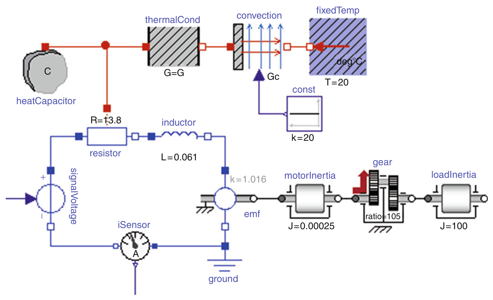

> Image description: This diagram illustrates a multi-domain physical system simulation model, likely within a modeling software environment, containing thermal and electrical/mechanical subsystems. The **thermal subsystem** at the top consists of a "heatCapacitor" (labeled C) connected to a "thermalCond" (G=G), which is followed by a "convection" element. This convection element is controlled by a "const" block with a coefficient $k=20$ and is connected to a "fixedTemp" block (T=20 deg°C). The **electrical/mechanical subsystem** begins with a "signalVoltage" source connected to a "resistor" (R=13.8 $\Omega$) and an "inductor" (L=0.061 H). The circuit includes an "iSensor" (ammeter) measuring current between the resistor and "ground." The electrical circuit connects to a motor via a constant $k=1.016$. This motor drives a mechanical train containing a "motorInertia" (J=0.00025), a "gear" (ratio=105), and a "loadInertia" (J=100). Small square ports on the component edges indicate the connection interfaces for mathematical modeling.
Multi-domain Modeling and Simulation, Fig. 1 Modelica schematic of DC motor with mechanical load and heat losses


<!-- source_pdf_page: 829 -->
When cutting away the connection lines, the resulting system consists of three decoupled components $\mathrm{A}, \mathrm{B}, \mathrm{C}$ and a new component around P describing the infinitesimally small connection point. The balance equations and the boundary conditions of the respective domain must hold at all these components. When drawing the connection lines, enough information must be available in the port definitions so that the tool can construct the equations of the infinitesimally small connection points automatically.

To summarize, the component developer is responsible that the balance equations and boundary conditions are fulfilled for every component (A, B, C in Fig. 2), and the tool is responsible that the balance equations and boundary conditions are also fulfilled at the points where the components are connected together ( P in Fig. 2). As a
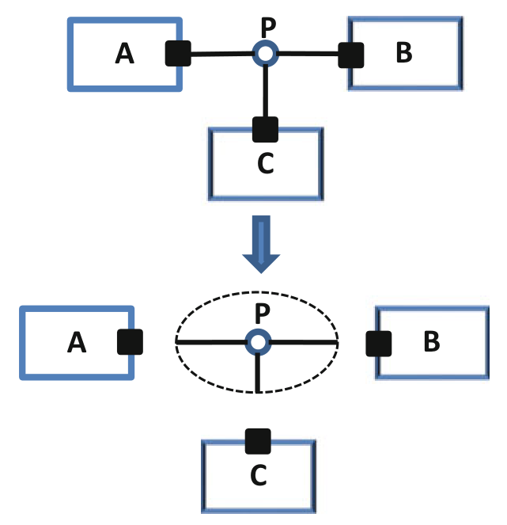

> Image description: This diagram illustrates a structural relationship between three components and a central connection point. The top part of the figure shows a central point labeled 'P', which serves as a junction for three rectangular blocks labeled 'A', 'B', and 'C'. Each block is connected to point 'P' via a black connecting node. A large blue arrow points downward toward the second part of the figure, indicating a transformation or a resulting state. In this second state, the components 'A', 'B', and 'C' are repositioned around point 'P'. Point 'P' remains central, but it is now enclosed within a dashed elliptical shape. The connections are represented by solid black lines extending from 'P' toward the components, while the elliptical boundary suggests a functional or mathematical constraint area. This visualizes the concept of component-level responsibilities versus interface-level responsibilities in a system.

Multi-domain Modeling and Simulation, Fig. 2 Cutting the connections around the connection point P results in three decoupled components $A, B, C$ and a new component around $P$ describing the infinitesimally small connection point
consequence, the balance equations and boundary conditions are fulfilled in the overall model containing all components and all connections.

In order that a tool can automatically construct the equations at a connection point, every port variable needs to be associated to a port variable type. In Table 2, some port variable types of Modelica are shown. In this table it is assumed that $u_{1}, u_{2}, \ldots u_{n}, y, v_{1}, v_{2}, \ldots, v_{n}, f_{1}, f_{2}, \ldots, f_{n}$, $s_{1}, s_{2}, \ldots, s_{n}$ are corresponding port variables from different components that are connected together at the same point P .

Port variable types "input" and "output" define the "usual" signal connections in block diagrams.
"Potential variables" and "flow variables" are used to define standard physical connections. For example, an electrical port contains the electrical potential and the electrical current at the port, and when connecting electrical ports together, the electrical potentials are identical and the sum of the electrical currents is zero, according to Table 2. This corresponds exactly to Kirchhoff's voltage and current laws.
"Stream variables" are used to describe the connection semantics of intensive quantities in bidirectional fluid flow, such as specific enthalpy or mass fraction. Here, the idealized balance equation at a connection point states, for example, that the sum of the port enthalpy flow rates is zero and the port enthalpy flow rate is computed as the product of the mass flow rate (a flow variable $f_{i}$ ) and the directional specific enthalpy $s_{i}$, which is either the (yet unknown) mixingspecific enthalpy $S_{\text {mix }}$ when the flow is from the connection point to the port or the specific enthalpy $s_{i}$ in the port when the flow is from the port to the connection point. More details

Multi-domain Modeling and Simulation, Table 2 Some port variable types in Modelica
| Port variable type | Connection semantics |
| :--- | :--- |
| Input variables $u_{i}$, output variable $y$ | $u_{1}=u_{2}=\ldots=u_{n}=y$ (exactly one output variable can be connected to $n$ input variables) |
| Potential variables $v_{i}$ | $v_{1}=v_{2}=\ldots=v_{n}$ |
| Flow variables $f_{i}$ | $0=\sum f_{i}$ |
| Stream variables $s_{i}$ (with associated flow variables $f_{i}$ ) | $\begin{aligned} & 0=\sum f_{i} \hat{s}_{i} ; \hat{s}_{i}= \begin{cases}s_{m i x} & \text { if } f_{i}>0 \\ s_{i} & \text { if } f_{i} \leq 0\end{cases} \\ & \left(0=\sum f_{i}\right) \end{aligned}$ |


<!-- source_pdf_page: 830 -->
Multi-domain Modeling and Simulation, Table 3 Some port definitions from Modelica
| Domain | Port variables |
| :--- | :--- |
| Electrical analog | Electrical potential in [V] (pot.) electrical current in [A] (flow) |
| Elec. multiphase | Vector of electrical ports |
| Electrical quasi-stationary | Complex elec. potential (pot.) complex elec. current (flow) |
| Magnetic flux tubes | Magnetic potential in [A] (pot.) magnetic flux in [Wb] (flow) |
| Translational (1-dim. mechanics) | Distance in [m] (pot.) cut-force in [N] (flow) |
| Rotational (1-dim. mechanics) | Absolute angle in [rad] (pot.) cut-torque in [Nm] (flow) |
| 2-dim. mechanics | Position in x -direction in $[\mathrm{m}]$ (pot.) position in y -direction in $[\mathrm{m}]$ (pot.) absolute angle in [rad] (pot.) cut-force in x -direction in $[\mathrm{N}]$ (flow) cut-force in y -direction in $[\mathrm{N}]$ (flow) cut-torque in z-direc. in [ Nm ] (flow) |
| 3-dim. mechanics | Position vector in $[\mathrm{m}]$ (pot.) transformation matrix in $[\mathbf{1}]$ (pot.) cut-force vector in $[\mathrm{N}]$ (flow) cut-torque vector in $[\mathrm{Nm}]$ (flow) |
| 1-dim. heat transfer | Temperature in $[\mathrm{K}]$ (pot.) heat flow rate in [W] (flow) |
| 1-dim. thermo-fluid pipe flow | Pressure in $[\mathrm{Pa}]$ (pot.) mass flow rate in $[\mathrm{kg} / \mathrm{s}]$ (flow) spec. enthalpy in $[\mathrm{J} / \mathrm{kg}]$ (stream) mass fractions in $[\mathbf{1}]$ (stream) |


and explanations are available from Franke et al. (2009). In Table 3 some of the port definitions are shown that are defined in the Modelica Standard Library.

## Component Equations

Implementing a component in a modeling language means to (a) define the ports of the component and (b) provide the equations describing the relationships between the port variables. For example, an electrical capacitor with constant capacitance $C$ can be defined by the equations in the right side of Fig. 3.

Such a component has two ports, the pins "p" and "n," and the port variables are the electrical currents $i_{p}, i_{n}$ flowing into the respective ports and the electrical potentials $v_{p}, v_{n}$ at the ports. The first component equation states that if the current $i_{p}$ at port "p" is positive, then the current $i_{n}$ at port " n " is negative (therefore, the current flowing into " p " is flowing out of " n ").

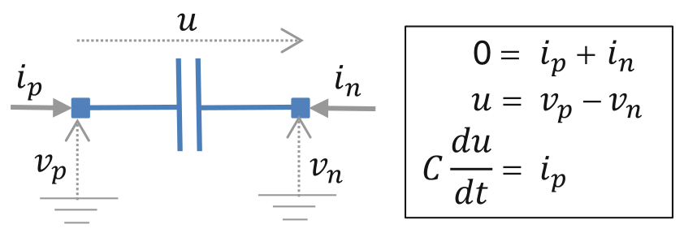

> Image description: Figure 3, titled "Equations of a capacitor component," presents a schematic diagram of a capacitor alongside its mathematical governing equations. The circuit diagram shows a capacitor symbol connected between two blue nodes. The left node is labeled with current $i_p$ (incoming arrow) and voltage $v_p$ (dotted arrow to ground). The right node features current $i_n$ (incoming arrow) and voltage $v_n$ (dotted arrow to ground). A dashed arrow labeled $u$ spans the component from left to right. To the right, a rectangular block contains three mathematical equations: 1. $0 = i_p + i_n$, representing current conservation. 2. $u = v_p - v_n$, defining the voltage difference across the capacitor. 3. $C \frac{du}{dt} = i_p$, defining the capacitive relationship between the rate of change of voltage and current, where $C$ is the capacitance constant.
Multi-domain Modeling and Simulation, Fig. 3 Equations of a capacitor component

Furthermore, the two remaining equations state that the derivative of the difference of the port potentials is proportional to the current flowing into port "p."

One important question is how many equations are needed to describe such a component? For an input-output block, this is simple: all input variables are known, and for all other variables, one equation per unknown is needed. Counting equations for physical components, such as a capacitor, is more involved: the requirement


<!-- source_pdf_page: 831 -->
that any type of component connections shall always result in identical numbers of unknowns and equations of the overall system leads to the following counting rule (for a proof, see Olsson et al. 2008):

1. The number of potential and the number of flow variables in a port must be identical.
2. Input variables and variables that appear differentiated are treated as known variables.
3. The number of equations of a component must be equal to the number of unknowns minus the number of flow variables.
In the example of the capacitor, there are 5 unknowns ( $i_{p}, i_{n}, v_{p}, v_{n}, d u / d t$ ) and 2 flow variables ( $i_{p}, i_{n}$ ). Therefore, $5-2=3$ equations are needed to define this component.

Modeling languages are used to provide a textual description of the ports and of the equations in a specific syntax. For example, in Modelica the capacitor from Fig. 3 can be defined as Fig. 4 (keywords of the Modelica language are written in boldface):

In VHDL-AMS the capacitor model can be defined as shown in Fig. 5.

One difference between Modelica and VHDLAMS is that in Modelica all equations need to be explicitly given and port variables (such as p.i) can be directly accessed in the model (Fig. 4). In-

```
type Voltage = Real (unit="V");
type Current = Real (unit="A");
connector Pin
        Voltage v;
    flow Current i;
end Pin;
model Capacitor
    parameter Real C(unit="F");
    Pin p,n;
    Voltage u;
equation
        0 = p.i + n.i;
        u = p.v - n.v;
        C*der(u) = p.i;
end Capacitor;
```

stead, in VHDL-AMS (and some other modeling languages), port variables cannot be accessed in a model, and instead via the "quantity .. across .. through .. to .." construction, the relationships between the port variables are implicitly defined and correspond to the Modelica equations " $0=$ p.i + n.i " and "u $=$ p.v - n. v."

## Simulation of Multi-domain Systems

Collecting all the component equations of a multi-domain system model together with all connection equations results in a DAE (differential-algebraic equation) system:

$$
\begin{equation*}
0=\mathbf{f}(\dot{\mathrm{x}}, \mathbf{x}, \mathbf{w}, \mathbf{y}, \mathbf{u}, t) \tag{1}
\end{equation*}
$$

where $t \in \mathbb{R}$ is time, $\mathbf{x}(t) \in \mathbb{R}^{n_{x}}$ are variables appearing differentiated, $\mathbf{w}(t) \in \mathbb{R}^{n_{w}}$ are algebraic variables, $\mathbf{y}(t) \in \mathbb{R}^{n_{y}}$ are outputs, $\mathbf{u}(t) \in \mathbb{R}^{n_{u}}$ are inputs, and $\mathbf{f} \in \mathbb{R}^{n_{x}+n_{w}+n_{y}}$ are the DAE equations. Equation (1) can be solved numerically with an integrator for DAE systems; see, for example, Brenan et al. (1996). For DAEs that are linear in their unknowns, a complete theory for solvability is available based on matrix pencils (see, e.g., Brenan et al. 1996) and also reliable software for their analysis (Varga 2000).

Unfortunately, only certain classes of nonlinear DAEs can be directly solved numerically

```
subtype voltage is real;
subtype current is real;
nature electrical is
        voltage across
        current through
        electrical_ref reference;
entity CapacitorInterface IS
    generic(C: real);
    port (terminal p, n: electrical);
end entity CapacitorInterface;
architecture SimpleCapacitor of
            CapacitorInterface is
    quantity u across i through p to n;
begin
    i == C*u'dot;
end architecture SimpleCapacitor;
```

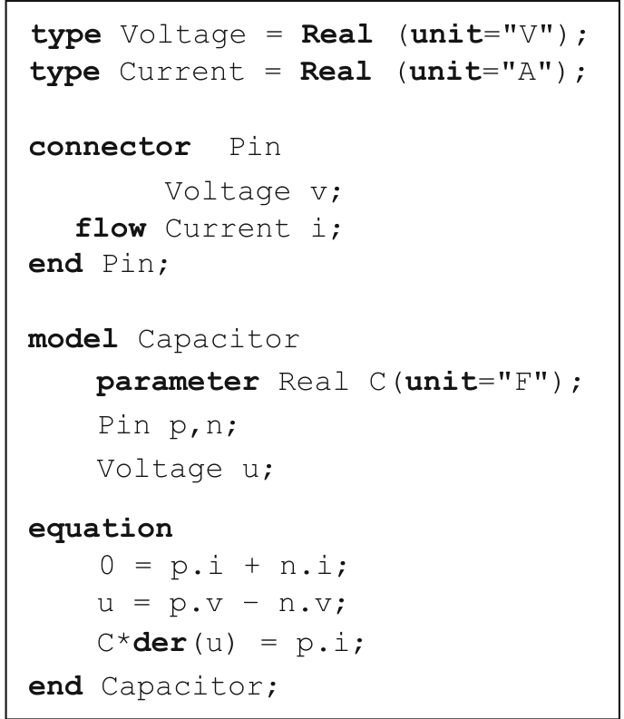

> Image description: This figure displays Modelica code defining a capacitor component. The code is structured into three main sections: type definitions, a connector definition, and a model definition. First, two custom types are declared: `Voltage` (Real, unit "V") and `Current` (Real, unit "A"). Next, a `connector` named `Pin` is defined, containing a potential variable `Voltage v` and a flow variable `flow Current i`. The `model Capacitor` section includes a `parameter Real C` with unit "F" (Farads). It utilizes two `Pin` instances, `p` and `n`, and a `Voltage` variable `u`. The `equation` block contains three mathematical relationships: 1. `0 = p.i + n.i` (Kirchhoff's current law), 2. `u = p.v - n.v` (voltage difference), and 3. `C*der(u) = p.i` (the differential equation relating capacitance, the derivative of voltage, and current). The code concludes with `end Capacitor;`.

Multi-domain Modeling and Simulation, Fig. 4 Modelica model of capacitor component

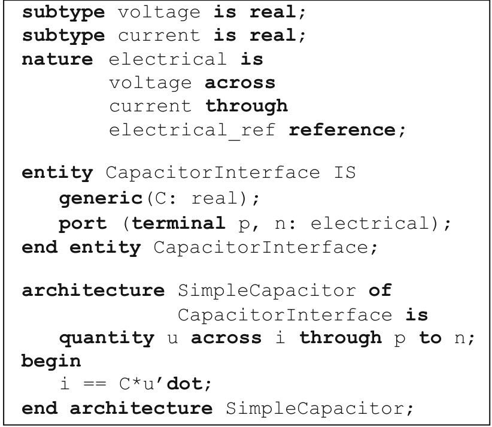

> Image description: This figure displays a code snippet representing a Modelica-style model for a capacitor component. The code is structured into three main sections: type definitions, an entity declaration, and an architecture definition. At the top, subtypes for `voltage` and `current` are defined as `real`. A `nature` named `electrical` is established, defining the relationship where voltage is `across` and current is `through` an `electrical_ref`. The `entity CapacitorInterface` is defined as `generic` with a real parameter `C` (capacitance). It specifies a `port` containing two electrical terminals, `p` and `n`. The `architecture SimpleCapacitor` implements the interface. It defines the physical relationship using the `quantity` keyword, stating that quantity `u` is `across` and current `i` is `through` terminals `p` to `n`. The mathematical governing equation is provided: `i == C*u'dot;`, representing the derivative relationship between current, capacitance, and voltage.

Multi-domain Modeling and Simulation, Fig. 5
VHDL-AMS model of capacitor component


<!-- source_pdf_page: 832 -->
in a reliable way. Domain-specific software, as, e.g., for mechanical systems, transforms the underlying DAE into a form that can be more reliably solved, using domain-specific knowledge. This is performed by differentiating certain equations of the DAE analytically and utilizing special integration methods for the resulting overdetermined set of differentialalgebraic equations. Multi-domain simulation software uses the following approaches:
(a) The DAE (1) is directly solved numerically using an implicit integration method, such as a linear multistep method. Typically, all VHDL-AMS simulators use this approach.
(b) The DAE (1) is symbolically transformed in a form that is equivalent to a set of ODEs (ordinary differential equations), and then either explicit or implicit ODE or DAE integration methods are used to numerically solve the transformed system. The transformation is based on the algorithms of Pantelides (1988) and of Mattsson and Söderlind (1993) and might require to analytically differentiate equations. Typically, all Modelicabased simulators, but also EcosimPro, use this approach.
For many models both approaches can be applied successfully. There are, however, systems where approach (a) is successful and fails for (b) or vice versa.

DAEs (1) derived from modeling languages usually have a large number of equations but with only a few unknowns in every equation. In order to solve DAEs of this kind efficiently, both with (a) or (b), typically graph theory and/or sparse matrix methods are utilized. For method (b) the fundamental algorithms have been developed in Elmqvist (1978) and later improved in further publications. For a recent survey and comparison of some of the algorithms, see Frenkel et al. (2012).

Solving the DAE (1) means to solve an initial value problem. In order that this can be performed, a consistent set of initial variables $\dot{\mathbf{x}}_{0}=\dot{\mathbf{x}}\left(t_{0}\right), \mathbf{x}_{0}=\mathbf{x}\left(t_{0}\right), \mathbf{w}_{0}=\mathbf{w}\left(t_{0}\right), \mathbf{y}_{0}= \mathbf{y}\left(t_{0}\right), \mathbf{u}_{0}=\mathbf{u}\left(t_{0}\right)$ has to be determined first at the initial time $t_{0}$. In general, this is a nontrivial task. For example, often (1) shall start in steady
state, that is, it is required that $\dot{\mathrm{x}}_{0}=0$ and therefore at the initial time (1) is required to satisfy

$$
\begin{equation*}
\mathbf{0}=\mathbf{f}\left(0, \mathbf{x}_{0}, \mathbf{w}_{0}, \mathbf{y}_{0}, \mathbf{u}_{0}, t_{0}\right) \tag{2}
\end{equation*}
$$

Equation (2) is a nonlinear algebraic system of equations in the unknowns $\mathbf{x}_{0}, \mathbf{w}_{0}, \mathbf{y}_{0}, \mathbf{u}_{0}$. These are $n_{x}+n_{w}+n_{y}$ equations for $n_{x}+n_{w}+n_{y}+n_{u}$ unknowns. Therefore, $n_{u}$ further conditions must be provided (usually some elements of $\mathbf{u}_{0}$ and/or $\mathbf{y}_{0}$ are fixed to desired physical values). Solving (2) for the unknowns is also called "DC operating point calculation" or "trimming." Nonlinear equation solvers are based on iterative methods that require usually a sufficiently accurate initial guess for all unknowns. In a large multi-domain system model, this is not practical, and therefore, methods are needed to solve (2) even if generic guess values in a library are provided that might be far from the solution of the system at hand.

For analog electronic circuit simulations, a large body of theory, algorithms, and software is available to solve (2) based on homotopy methods. The basic idea is to solve a sequence of nonlinear algebraic equation systems by starting with an easy to solve simplified system, characterized by the homotopy parameter $\lambda=0$. This system is continuously "deformed" until the desired one is reached at $\lambda=1$. The solution at iteration $i$ is used as guess value for iteration $i+1$, and at every iteration, the solution is usually computed with a Newton-Raphson method.

The simplest such approach is "source stepping": the initial guess values of all electrical components are set to "zero voltage" and/or "zero current." All (voltage and current) sources start at zero, and their values are gradually increased until the desired source values are reached. This method may not converge, typically due to the severe nonlinearities at switching thresholds in logical circuits.

There are several, more involved approaches, called "probability one homotopy" methods. For these method classes, proofs exist that they converge with probability one (so practically always). These algorithms can only be applied for certain classes of DAEs; see, for example, the


<!-- source_pdf_page: 833 -->
"Variable Stimulus Probability One Homotopy" from Melville et al. (1993).

Although strong results exist for analog electrical circuit simulators, it is difficult to generalize them to the large class of multi-domain systems covered by a modeling language. In Modelica a "homotopy" operator was introduced into the language (Sielemann et al. 2011) in order that a library developer can formulate simple homotopy methods like the "source stepping" in a component library. A generalization of probability one methods for multi-domain systems was developed in the dissertation of Sielemann (2012) and was successfully applied to air distribution systems described as 1 -dim. thermo-fluid pipe flow.

## Models for Control Systems

## Models for Analysis

The multi-domain models from section "Modeling Language Principles" can be utilized to evaluate the properties of a control system by simulation. Also control systems can be designed by nonlinear optimization where at every optimization step one or several simulations of a plant model are executed. Furthermore, modeling environments usually provide a means to linearize the nonlinear DAE (1) of the underlying model around an operating point:

$$
\begin{align*}
& \mathbf{x}(t) \approx \mathbf{x}_{o p}+\Delta \mathbf{x}(t), \mathbf{w}(t) \approx \mathrm{w}_{o p}+\Delta \mathbf{w}(t), \\
& \mathbf{y}(t) \approx \mathbf{y}_{o p}+\Delta \mathbf{y}(t), \mathbf{u}(t) \approx \mathbf{u}_{o p}+\Delta \mathbf{u}(t) \tag{3}
\end{align*}
$$

resulting in

$$
\begin{align*}
\Delta \dot{\mathrm{x}}_{r e d} & =\mathbf{A} \Delta \mathrm{x}_{\mathrm{red}}+\mathbf{B} \Delta \mathbf{u} \\
\Delta \mathbf{y} & =\mathbf{C} \Delta \mathrm{x}_{\mathrm{red}}+\mathbf{D} \Delta \mathbf{u} \tag{4}
\end{align*}
$$

where $\Delta \mathrm{x}_{\text {red }}$ is a vector consisting of elements of the vector of $\Delta \mathbf{x}$, the vector $\Delta \mathbf{w}$ is eliminated by exploiting the algebraic constraints, and $\mathbf{A}, \mathbf{B}, \mathbf{C}$, D are constant matrices. Simulation tools provide linear analysis and synthesis methods on this linearized system and/or export it for usage in an environment like Matlab, Maple, Mathematica, or Python.

Multi-domain models might also be used directly in nonlinear Kalman filters, moving horizon estimators, or nonlinear model predictive control. For example, the company ABB is using moving horizon estimation and nonlinear model predictive control based on Modelica models to significantly improve the start-up process of power plants (Franke and Doppelhamer 2006).

## Inverse Models

A large body of literature exists about the theory of nonlinear control systems that are based on inverse plant models; see, for example, Isidori (1995). Methods such as feedback linearization, nonlinear dynamic inversion, or flat systems use an inverse plant model in the control loop. However, a major obstacle is how to automatically utilize an inverse plant model in a controller without being forced to manually set up the equations in the needed form which is not practical for larger systems. Modeling languages can solve this problem as discussed below.

Nonlinear inverse models can be utilized in various ways in a control system. The simplest approach, as feed forward controller, is shown in Fig. 6.

Under the assumption that the models of the plant and of the inverse plant are completely identical and start at the same initial state, then from the construction the control error e is zero and $\mathbf{y}=\mathbf{T}(s)^{*} \mathbf{y}_{\text {ref }}$ where $\mathbf{T}$ is a diagonal matrix with the transfer functions of the low-pass filters on the diagonal (so $\mathbf{y} \approx \mathbf{y}_{\text {ref }}$ for reference signals

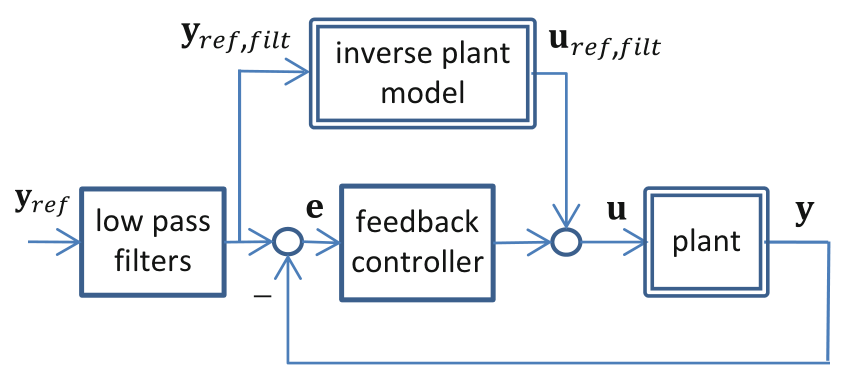

> Image description: This control system block diagram illustrates a feedback controller supplemented by a feedforward path containing an inverse plant model. The system's input is a reference signal, $\mathbf{y}_{ref}$, which passes through "low pass filters." The filtered reference, $\mathbf{y}_{ref,filt}$, branches into two paths: one leading to a summing junction to calculate the error $\mathbf{e}$, and another leading into the "inverse plant model" block. The "inverse plant model" generates a feedforward signal, $\mathbf{u}_{ref,filt}$, which is added to the control signal produced by the "feedback controller." This combined signal, $\mathbf{u}$, serves as the input to the "plant" block, resulting in the output $\mathbf{y}$. A feedback loop connects the plant output $\mathbf{y}$ back to the first summing junction, where it is subtracted from the filtered reference to produce the error signal $\mathbf{e}$. This configuration aims to improve tracking performance by anticipating plant dynamics via the inverse model.
Multi-domain Modeling and Simulation, Fig. 6 Controller with inverse plant model in the feed forward path. The inverse plant model needs usually also derivatives of $\mathbf{y}_{\text {ref }}$ as inputs. These derivatives are provided by appropriate low-pass filters


<!-- source_pdf_page: 834 -->
that have a frequency spectrum below the cutoff frequency of the low-pass filters). Since actually the assumption is usually not fulfilled, there will be a nonzero control error e and the feedback controller has to cope with it. This controller structure with a nonlinear inverse plant model has the advantage that the feed forward part is useful over the complete operating range of the plant.

Various other structures with nonlinear plant models are discussed in Looye et al. (2005), such as compensation controllers, feedback linearization controllers, and nonlinear disturbance observers.

It turns out that nonlinear inverse plant models can be generated automatically with the techniques that have been developed for modeling languages; see section "Modeling Language Principles". In particular, constructing an inverse model from (1) means that the inputs $u$ are defined to be outputs, so they are no longer knowns but unknowns, and outputs y are defined to be inputs, so they are no longer unknowns but knowns. The resulting system is still a DAE and can therefore be handled as any other DAE.

Therefore, defining an inverse model with a modeling language just requires exchanging the definition of input and output signals. In Modelica, this can be graphically performed with the nonstandard input-output block from Fig. 8.

This block has two inputs and two outputs and described by the equations

$$
u 1=u 2 ; \quad y 1=y 2
$$

From a block diagram point of view this looks strange. However, from a DAE point of view, this just states constraints between two input and two output signals. In Fig. 8, it is shown how this block can be used to invert a simple second order system.

The output of the low-pass filter is connected to the output of the second-order system and therefore this model computes the input of the second-order system, from the input of the filter.

A Modelica environment will generate from this type of definition the inverse model, thereby
differentiating equations analytically and solving algebraic variables of the model in a different way as for a simulation model. The whole transformation is nontrivial, but it is just the standard method used by Modelica tools as for any other type of DAE system.

The question arises whether a solution of the inverse model exists, is unique, and whether the model is stable (otherwise, it cannot be applied in a control system). In general, a nonlinear inverse model consists of linear and/or nonlinear algebraic equation systems and of linear and/or nonlinear differential equations. Therefore, from a formal point of view, the same theorems as for a general DAE apply; see, for example, Brenan et al. (1996). Furthermore, all these equations need to be solved with a numerical method. For some classes of systems, it can be shown that mathematically a unique solution exists and that the system is stable. However, in general, one cannot expect that it is possible to provide such a proof for complex inverse plant models. Still, inverse plant models have been successfully utilized by automatic generation from a Modelica tool, e.g., for robots, satellites, aircrafts, vehicles, and thermo-fluid systems.

## The Functional Mockup Interface

Many different types of simulation environments are in use. One cannot expect that a generic approach as sketched in section "Modeling Language Principles" will replace all these environments with their rich set of domainspecific knowledge, analysis, and synthesis features. Practically, all simulation environments provide a vendor-specific interface in order that a user can import components that are not describable by the simulation environment itself. Typically, this requires to provide a component as a set of C or Fortran functions with a particular calling interface. In the control community, the most widely used approach of this kind is the S-Function interface from The MathWorks, where Simulink is used as integration platform, and model components from other environments are imported as S-Functions.


<!-- source_pdf_page: 835 -->
## Multi-domain Modeling and Simulation, Fig. 7

Modelica
InverseBlockConstraint block
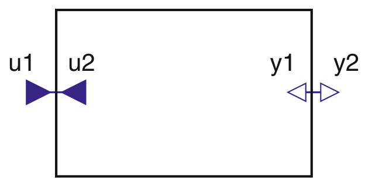

> Image description: A textbook diagram from "Multi-domain Modeling and Simulation" (Fig. 8) depicts a simplified black-box block diagram representing a system with four interface variables. The central component is a large, empty rectangular block. On the left side, there are two input arrows pointing toward the block, representing inputs to the system. These are labeled **u1** (outermost) and **u2** (closest to the block). On the right side, there are two output arrows pointing away from the block, representing outputs. These are labeled **y1** (closest to the block) and **y2** (outermost). In engineering terms, this structure typically represents a mathematical transfer function or a system model, where **u** variables denote control inputs and **y** variables denote system outputs. The bidirectional or opposing arrows suggest the flow of information or energy through the system boundaries.

## Multi-domain Modeling and Simulation, Fig. 8

Inversion of a second-order system in Modelica
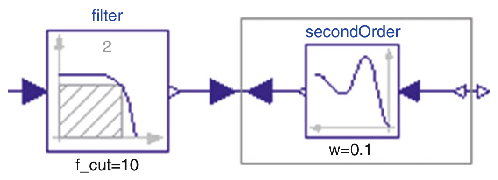

In 2010 the vendor-independent standard "Functional Mockup Interface 1.0" was published (FMI Group 2010). This is a lowlevel standard for the exchange of models between different simulation environments. This standard allows to exchange only either the model equations (called "FMI for Model Exchange") or the model equations with an embedded solver (called "FMI for Co-Simulation"). This standard was quickly adopted by many simulation environments, and in 2013 there are more than 40 tools that support it (for an actual list of tools, see https://www.fmi-standard.org/tools). In particular nearly all Modelica environments can export Modelica models in this format, and therefore, Modelica multi-domain models can be imported in other environments with low effort.

A software component which implements the FMI is called Functional Mockup Unit (FMU). An FMU consists of one zip-file with extension ".fmu" containing all necessary components to utilize the FMU either for Model Exchange, for Co-Simulation, or for both. The following summary is an adapted version from Blochwitz et al. (2012):

1. An XML-file contains the definition of all exposed variables of the FMU, as well as other model information. It is then possible to run the FMU on a target system without this information, i.e., without unnecessary overhead. Furthermore, this allows determining all
properties of an FMU from a text file, without actually loading and running the FMU.
2. A set of $C$-functions is provided to execute model equations for the Model Exchange case and to simulate the equations for the CoSimulation case. These C -functions can be provided either in binary form for different platforms or in source code. The different forms can be included in the same model zipfile.
3. Further data can be included in the FMU zipfile, especially a model icon (bitmap file), documentation files, maps and tables needed by the model, and/or all object libraries or DLLs that are utilized.

## Summary and Future Directions

Multi-domain modeling based on a DAE description and defined with a modeling language is an established approach, and many tools support it. This allows to conveniently define plant models from many domains for the design and evaluation of control systems. Furthermore, nonlinear inverse plant models can be easily constructed with the same methodology and can be utilized in various ways in nonlinear control systems.

Current research focuses on the support of the complete life cycle: defining requirements of a system formally on a "high level,"


<!-- source_pdf_page: 836 -->
considerably improving testing by checking these requirements automatically when evaluating a system design by simulations, and providing complete tool chains from nonlinear multidomain models to embedded systems. The latter will allow convenient and fast target code generation of nonlinear controllers, extended and unscented Kalman filters, optimization-based controllers, or moving horizon estimators.

Furthermore, the methodology itself is further improved. For example, in 2012, Modelica was extended with language elements to define multirate sampled data systems in a precise way, as well as state machines.

## Cross-References

- Computer-Aided Control Systems Design: Introduction and Historical Overview
- Extended Kalman Filters
- Feedback Linearization of Nonlinear Systems
- Interactive Environments and Software Tools for CACSD
- Model Building for Control System Synthesis


## Bibliography

Blochwitz T, Otter M, Akesson J, Arnold M, Clauß C, Elmqvist H, Friedrich M, Junghanns A, Mauss J, Neumerkel D, Olsson H, Viel A (2012) The functional mockup interface 2.0: the standard for tool independent exchange of simulation models. In: Proceedings of 9th international modelica conference, Munich, 3-5 Sept 2012, pp 173-184. http://www.ep.liu.se/ecp/076/ 017/ecp12076017.pdf
Brenan KE, Campbel SL, Petzold LR (1996) Numerical solution of initial-value problems in differentialalgebraic equations. SIAM, Philadelphia
Elmqvist H (1978) A structured model language for large continuous systems. Dissertation. Report CODEN:LUTFD2/(TFRT-1015), Department of Auto Control, Lund Institute of Technology, Lund. http:// www.control.lth.se/database/publications/article.pike? action=fulltext\&artkey=elm78dis
FMI Group (2010) The Functional Mockup Interface for Model Exchange and for Co-Simulation, version 1.0. https://www.fmi-standard.org
Franke R, Doppelhamer J (2006) Online application of Modelica models in the industrial IT
extended automation system 800 xA . In: Proceedings of 6th Modelica conference, Vienna, 4-5 Sept 2006, pp 293-302. https://modelica.org/events/ modelica2006/Proceedings/sessions/Session3c2.pdf
Franke R, Casella F, Otter M, Sielemann M, Mattsson SE, Olsson H, Elmqvist H (2009) Stream connectors - an extension of modelica for device-oriented modeling of convective transport phenomena. In: Proceedings of 7th Modelica conference, Como, pp 108-121. https://www.modelica.org/events/modelica2009/ Proceedings/memorystick/pages/papers/0078/0078. pdf
Frenkel J, Kunze G, Fritzson P (2012) Survey of appropriate matching algorithms for large scale systems of differential algebraic equations. In: Proceedings of the 9th international Modelica conference, Munich, 3-5 Sept 2012, pp 433-442. http://www.ep.liu.se/ecp/076/ 045/ecp12076045.pdf
IEEE 1076.1-2007 (2007) IEEE standard VHDL analog and mixed-signal extensions. Standard of IEEE. http:// standards.ieee.org/findstds/standard/1076.1-2007. html
Isidori A (1995) Nonlinear control systems, 3rd edn. Springer, Berlin/New York
Karnopp DC, Margolis DL, Rosenberg RC (2012) System dynamics: modeling, simulation, and control of mechatronic systems, 5th edn. Wiley, Hoboken
Looye G, Thümmel M, Kurze M, Otter M, Bals J (2005) Nonlinear inverse models for control. In: Proceedings of the 4th international Modelica conference, Hamburg, 7-8 March 2005, p 267. https://www.modelica.org/events/Conference2005/ onlineproceedings/Session3/Session3c3.pdf
Mattsson SE, Söderlind G (1993) Index reduction in differential-algebraic equations using dummy derivatives. SIAM J Sci Comput 14:677-692
Mantoolh HA, Vlach M (1992) Beyond spice with saber and MAST. In: IEEE international symposium on circuits and systems, San Diego, May 10-13 1992, vol 1, pp 77-80
Melville RC, Trajkovic L, Fang SC, Watson LT (1993) Artificial parameter homotopy methods for the DC operating point problem. IEEE Trans Comput Aided Des Integr Circuits Syst 12:861-877. http://citeseerx. ist.psu.edu/viewdoc/download?doi=10.1.1.212.9327\& rep=rep1\&type=pdf
Modelica Association (2012) Standard, Modelica transactions on computer - a unified objectoriented language for systems modeling. Language specification, version 3.3. https://www.modelica.org/ documents/ModelicaSpec33.pdf
Olsson H, Otter M, Mattsson SE, Elmqvist H (2008) Balanced models in Modelica 3.0 for increased model quality. In: Proceedings of 6th Modelica conference, Bielefeld, pp 21-33. https://modelica.org/events/ modelica2008/Proceedings/sessions/session1a3.pdf
Pantelides CC (1988) The consistent initialization of differential-algebraic systems. SIAM J Sci Stat Comput 9:213-233


<!-- source_pdf_page: 837 -->
Sieleman M (2012) Device-oriented modeling and simulation in aircraft energy systems design. Dissertation, Dr. Hut. ISBN 3843905045
Sielemann M, Casella F, Otter M, Clauß C, Eborn J, Mattsson SE, Olsson H (2011) Robust initialization of differential-algebraic equations using homotopy. In: 8th international Modelica conference, Dresden. https://www.modelica.org/events/modelica2011/ Proceedings/pages/papers/041ID154afv.pdf
Varga A (2000) A descriptor systems toolbox for Matlab. In: Proceedings of CACSD'2000 IEEE international symposium on computer-aided control system design, Anchorage, 25-27 Sept 2000, pp 150-155. http://elib. dlr.de/11629/01/vargacacsd2000p2.pdf

## Multiscale Multivariate Statistical Process Control

Julian Morris<br>School of Chemical Engineering and Advanced Materials, Centre for Process Analytics and Control Technology, Newcastle University, Newcastle Upon Tyne, UK

## Synonyms

MSPCA


#### Abstract

Dynamic processes, both continuous and batch, are characterised by autocorrelated measurements which are allied to the effects of process dynamics and disturbances. The common multivariate statistical process control (MSPC) approaches have been to use principal component analysis (PCA) or projection to latent structures (PLS) to build a model that captures the simultaneous correlations amongst the variables, but that ignores the serial correlation in the data during normal operations. Under such conditions it is difficult to perform efficient fault detection and diagnosis. An alternative approach to account for the process dynamics in MSPC is to use multiresolution analysis (MRA) by way of wavelet decomposition. Here, the individual measurements are decomposed into different


scales (or frequencies) and the signals in each decomposed scale are then used for MSP which provides an indirect way of handling process dynamics.

## Keywords

Multiresolution analysis; Partial least squares (PLS); Principal component analysis (PCA); Projection to latent structures (PLS); Wavelet transform

## Definition

Multiscale principal component analysis (MSPCA) and its extension multiscale projection to latent structures (MSPLS) combine the abilities of these multivariate tools to decorrelate the variables by extracting linear relationships with that of wavelet analysis, to extract deterministic features and approximately de-correlate autocorrelated measurements. Multiscale modeling makes use of the wavelet transform which allows a signal (measurement) to be viewed in multiple resolutions with each resolution representing a different frequency. That is, wavelet transform allows complex information to be decomposed into basic components at different positions and scales.

## Motivation and Background

One of the drawbacks of the conventional PCA (or PLS)-based MSPC is that although the PCA/PLS model captures the correlations among the variables, it ignores the serial (auto)correlation in the process variables and measurements. One way to overcome this issue is to include time-lagged variables in the PCA or PLS model. In this way, PCA and PLS will explicitly model both the correlations among the variables and the serial correlations in the individual variables. The impact is an increase in the number principal components required, but the multivariate monitoring model will be able to detect any changes in the serial correlation of


<!-- source_pdf_page: 838 -->
the variables as well as changes in relationships among the variables. This article focuses on multiscale-multiway PCA using batchwise data unfolding. However, the methodology can equally be applied to PLS-based process performance monitoring (MSPC).

In multivariate statistical process control (MSPC), the multivariate statistical techniques of principle component analysis (PCA) and projection to latent structures \{Partial Least Squares \} (PLS) together with monitoring metrics based on Hotelling's $T^{2}$ (directly related to the Mahalanobis distance that monitors the fit of new observations to the model space) and the squared prediction error (SPE) or Q statistic (that monitors the residual space-model mismatch) are used to simultaneously monitor the process variables (Kourti and MacGregor 1996; Qin 2003). A recent survey provides an excellent state-of-the-art review of the methods and applications of data-driven fault detection and diagnosis that have been developed over the last two decades (Qin 2012).

Process measurements typically exhibit multiscale behavior as a consequence of representing the cumulative effect of a number of underlying process phenomena including process dynamics, measurement noise, and disturbances. To address these issues, methodologies are required to address (i) the multiscale nature of process data and (ii) the inability of some existing algorithms to handle autocorrelation. One approach is through the use of multiresolution analysis and wavelets Mallat (1998). Informative discussions and application studies related to using multiresolution analysis and wavelet decompositions to enhance PCA-based process monitoring and fault detection have been presented, for example, by Bakshi (1998), Misra et al. (2002), Aradhye et al. (2003), Lu et al. (2003), Yoon and MacGregor (2004) and Reis and Saraiva (2006). Yoon and MacGregor in their comprehensive MSPCA study discussed their approach in the context of other multiscale approaches and illustrated the methodology using simulated data from a continuous stirred-tank reactor system. A major contribution of the paper was to extend fault isolation methods based on contribution plots to multiscale PCA approaches. Although some 9 years old, Ganesan et al. (2004)
provided review of wavelet-based multiscale statistical process monitoring.

## The Approach

Multiresolution analysis (MRA) provides the theoretical basis for the derivation of a computationally efficient algorithm for the wavelet transform Mallat (1998). MRA allows the dynamic aspects of the data in to be taken into account in MSPC. The individual signals are decomposed into different scales (frequencies), and data in each decomposed scale are then used for MSPC which provides an indirect approach to handling process dynamics. Multiscale MSPC (MSPCA) enables the simultaneous extraction of process correlations across data as well as accounting for autocorrelation within sensor data. In this way, it captures correlations among the process variables made by various events occurring at different scales.

MSPCA calculates the principal components of wavelet coefficients at each scale and combines these at the relevant wavelet scales. Due to its multiscale nature, MSPCA is very useful for the modeling of data containing contributions from events whose behavior changes over both time and frequency. Process monitoring by MSPCA, and process prediction by MSPLS, involves combining those scales where significant events are detected. Approximate de-correlation of wavelet coefficients also makes MSPCA effective for the monitoring of autocorrelated measurements.

## The Algorithm

Wavelets are a family of basis functions that provide a mapping from the time domain to the time-frequency domain. They can be used to decompose the signal into different resolutions by projecting onto the corresponding wavelet basis functions using multiresolution analysis (MRA). A wavelet set is constructed from a fundamental basis function or the mother wavelet by a process of translation and dilation. The wavelet set is defined as wavelet analysis which provides


<!-- source_pdf_page: 839 -->
methodologies for the extraction of the time and frequency content of a signal. Conventional frequency analysis based on the Fourier transform consists of decomposing a signal into sine waves of different frequencies. Wavelet analysis decomposes the original signal in a similar manner. The major difference is that while Fourier analysis uses sine waves of infinite length, multiresolution analysis uses waveforms of finite length. The finite length of the wavelets allows them to describe local events in both the time and frequency domain.

The wavelet transform, an extension to the Fourier transform, projects the original signal down onto wavelet basis functions, providing a mapping from the time domain to the timescale plane. The wavelet functions, which are localized in the time and frequency domain, are obtained from a single prototype wavelet, the mother wavelet, by dilation and translation. The wavelet set is defined as

$$
\psi_{a, b}(t)=\frac{1}{\sqrt{|a|}} \psi\left(\frac{t-b}{a}\right)
$$

where $\psi$ is the mother wavelet function, $a$ the dilation parameter, and $b$ the translation parameters, and the factor $\frac{1}{\sqrt{|a|}}$ is used to ensure that each wavelet function has the same energy as the mother wavelet. The discrete wavelet transform with dyadic dilation and translation is used in this overview. A definition of continuous and discrete wavelet transforms can be found in Daubechies (1992). In the discrete case, the dilation and translation parameters are discretized as $a=a_{0}^{m}$ and $b=k b_{0} a_{0}^{m}$. If $a_{0}=2$ and $b_{0}=1$, a dyadic dilation and translation is carried out; however, $a_{0}$ and $b_{0}$ are not restricted to these values. The discrete wavelet form, which is widely used in process monitoring and chemical signal analysis, is

$$
\psi_{j k}(t)=a_{0}^{-j / 2} \psi\left(a_{0}^{-j_{t}}-k b_{0}\right)
$$

A recursive algorithm for wavelet decomposition and the reconstruction of a discrete signal of dyadic length is often used Mallat (1998) and is known as the pyramid algorithm. The fast discrete wavelet decomposition consists of
three components, low-pass filters $L(n)$, highpass filters $H(n)$, and dyadic decimation. By passing the input signal through this pair of filters, the projection of the original signal onto the scaling and wavelet functions for the multiresolution analysis is performed. Dyadic decimation, or down-sampling, removes every odd member of a sequence, thus halving the original number of samples. The low-pass filter resembles a moving average, while the high-pass filter extracts the detailed information contained in the signal. The discrete wavelet transform operates by taking a sequence of values, applying $L(n)$ and $H(n)$ and then repeating this same procedure to the approximation coefficients. In this way, the original signal vector is smoothed and halved through $L$, and the vector of approximation coefficients is again smoothed and halved through $L$. Successive application of the low-pass filter results in the approximation coefficients, becoming an increasingly smooth version of the original signal. At the same time as smoothing the signal, each iteration extracts the high frequency information in the data. The repeated application of $L$, followed by $H$ is, in effect, a band-pass filter. The result of applying high-/low-pass filters to a signal is a set of coefficients describing the details of the signals $\mathbf{D}_{L}$ and a second set describing the approximations of the signals $\mathbf{A}_{L}$. The original signal $s$ can then be represented by

$$
x(t)=\sum_{j=1}^{L} D_{j}(t)+A_{L}(t)
$$

where $D_{j}$ and $A_{j}$ are referred to as the $j$ th level wavelet details and approximation, respectively.

Figure 1 shows schematically the multi-resolution-based wavelet decomposition.

One of the most popular choices of wavelets are those of the Daubechies' family. These wavelets are compactly supported in the time domain and have good frequency domain decay. Moreover, Daubechies' wavelets (DaubN) possess a different type of smoothness which is determined by the vanishing moments $N$. This makes it possible to match the wavelet smoothness to the smoothness of the signals to be analyzed. The signal can then be decomposed


<!-- source_pdf_page: 840 -->
Multiscale Multivariate Statistical Process Control, Fig. 1 Schematic of multiresolution wavelet decomposition
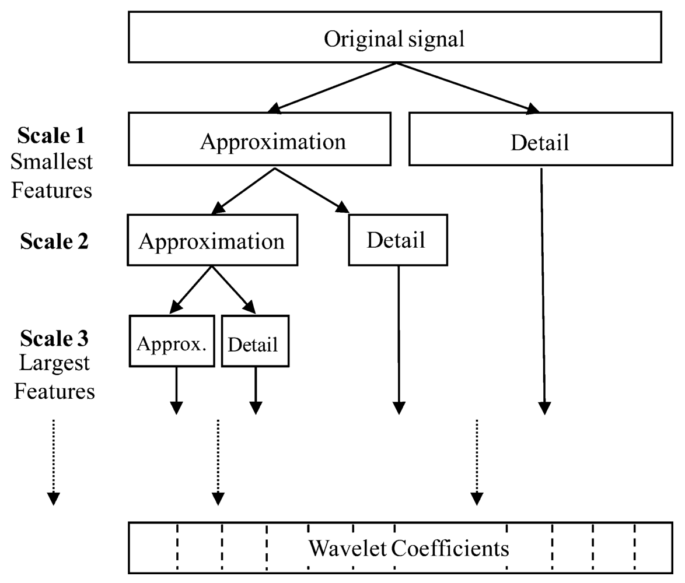

> Image description: A flowchart titled "Fig. 1 Schematic of multiresolution wavelet decomposition" illustrates the hierarchical decomposition of an "Original signal" into wavelet coefficients. The process moves from a single input block down through three hierarchical scales. At Scale 1 (Smallest Features), the original signal is split into two paths: "Approximation" and "Detail." At Scale 2, the "Approximation" component from Scale 1 is further decomposed into a new "Approximation" and "Detail" block. At Scale 3 (Largest Features), the "Approximation" from Scale 2 is subdivided again into "Approx." and "Detail" blocks. Downward-pointing arrows indicate the flow of data. All "Detail" components from every scale, along with the final "Approx." component from Scale 3, are directed toward a bottom horizontal block labeled "Wavelet Coefficients." The dashed arrows suggest a continuation of this process beyond Scale 3. The diagram represents the multi-resolution analysis where a signal is decomposed into different frequency sub-bands.

into its contributions from multiple scales as a weighted sum of dyadically discretized orthonormal basis functions:

$$
x(t)=\sum_{m=1}^{L} \sum_{k=1}^{N} d_{m k} \psi_{m k}(t)+\sum_{k=1}^{N} a_{l k} \varphi_{l k}(t)
$$

where $x(t)$ represents the process measurements, $d_{m k}$ represents the wavelet or detail signal coefficient at scale $m$ and location $k$, and $a_{L k}$ represent the scaled signal or scaling function coefficient of $\phi(t)$ at the coarsest scale $L$ and location $k$. The scaling function, or father wavelet, $\phi_{m k}$ captures the low-frequency content of the original signal that is not captured by wavelets at the corresponding or finer scales.

The wavelet transformation is applied to decompose a multivariate signal $\mathbf{X}$ into its approximate, $\mathbf{A}_{1}$ to $\mathbf{A}_{\mathrm{L}}$, and detail, $\mathbf{D}_{1}$ to $\mathbf{D}_{\mathrm{L}}$, coefficients for the first to $L$ th level, respectively. For more information, see Bakshi (1998), Misra et al. (2002) and Aradhye et al. (2003). Figure 2 shows a schematic representation of a typical MSPCA multivariate statistical process control scheme.

An example of the application of multiwaymultiscale MPCA to a benchmark-fed batch
fermentation process (Birol et al. http:// www.chee.iit.edu~control/software.html) was presented by Alawi and Morris (2007). The application used a combination of multiblock statistical modeling approaches together with multiscale-multiway batch monitoring. Figure 3 shows the multiscale-multiway monitoring scheme for process monitoring and fault detection. At every time point, the batch process variables are decomposed into scales to the wavelet domain and then reconstructed back to the time domain. The scales/details and the approximations are collected into separate matrices (blocks). Multiblock PCA is then applied to the wavelets details and approximation. Fault detection based on the $T_{s}^{2}$ and $Q_{s}$ statistics was used along with contribution plots incorporating confidence bounds to enhance fault diagnosis.

Figure 4 compares the monitoring statistics for the multiscale-multiway PCA and conventional multiway PCA for a slowly drifting sensor fault showing the potential for multiscale MPCA (MSPCA) in being able to detect faster subtle process and sensor faults than conventional multiway MSPC. It is noted that sensor drift is confined to one scale band at low frequency. It has been observed that multiscale approaches appear to provide little improvement if a fault effect is


<!-- source_pdf_page: 841 -->
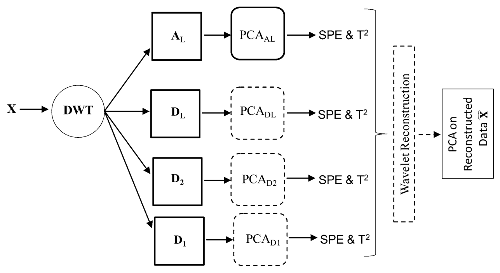

> Image description: This schematic diagram, titled "Fig. 2 Schematic representation of multiscale PCA-based MSPC," illustrates a multiscale Multivariate Statistical Process Control (MSPC) framework. The process begins with an input variable **X**, which undergoes a Discrete Wavelet Transform (**DWT**). The DWT decomposes the input into multiple components: an approximation component, **$A_L$**, and several detail components, **$D_L$**, **$D_2$**, and **$D_1$**. Each of these components is processed through a corresponding Principal Component Analysis block: $\text{PCA}_{\text{AL}}$, $\text{PCA}_{\text{DL}}$, $\text{PCA}_{\text{D2}}$, and $\text{PCA}_{\text{D1}}$. The outputs of these individual PCA blocks are statistical metrics, specifically Squared Prediction Error (**SPE**) and the **$T^2$** statistic. All components flow into a "**Wavelet Reconstruction**" stage, represented by a dashed vertical rectangle. This reconstruction leads to a final component, "**PCA on Reconstructed Data $\tilde{X}$**." The diagram uses arrows to indicate the unidirectional flow of data through decomposition, feature extraction, and reconstruction.

Multiscale Multivariate Statistical Process Control, Fig. 2 Schematic representation of multiscale PCA-based MSPC

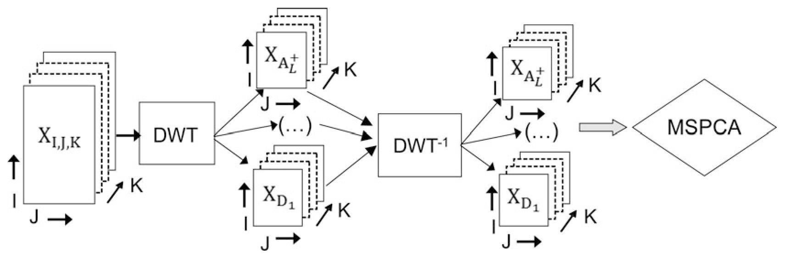

> Image description: A schematic diagram titled "Multiscale PCA-based MSPC" illustrates a process flow for Multiscale Multivariate Statistical Process Control. The process begins with a 3D input data cube, labeled $X_{I,J,K}$, with axes $I$, $J$, and $K$. This input passes through a Discrete Wavelet Transform (DWT) block. The DWT decomposes the input into multiple components, including approximation coefficients ($X_{A_L^+}$) and detail coefficients ($X_{D_1^+}$), across $K$ layers. These components are organized into layered sub-blocks with axes $I$, $J$, and $K$. The next stage involves an Inverse Discrete Wavelet Transform ($DWT^{-1}$) block, which processes these components. The output of the $DWT^{-1}$ block consists of reconstructed multi-scale layers of coefficients, specifically $X_{A_L^+}$ and $X_{D_1^+}$, also organized by axes $I$, $J$, and $K$. Finally, a thick grey arrow points from the reconstructed coefficients toward a diamond-shaped decision block labeled "MSPCA," indicating the final step in the multivariate statistical process control pipeline.
Multiscale Multivariate Statistical Process Control, Fig. 3 Multiscale-multiway batch process monitoring scheme

spread over more than one frequency band or the fault effect occurs mainly in a scale with dominant variance. Thus, a monitoring method that gives the best detection and identification of faults will depend on the fault characteristics with multiscale approaches, providing an advantage when the faults localized in frequency or that appear in scales that normally have small variance.

## Other Applications of Multiscale MPCA

There have a number of nonlinear extensions. For example, multiscale PLS approaches have been
developed, e.g., Teppola and Minkkinen (2000) and Lee et al. (2009). Nonlinear approaches have also been explored. For example, Lee et al. (2004) proposed a batch monitoring approach using multiway kernel principal component analysis, Shao et al. (1999) proposed a wavelet-based nonlinear PCA algorithm, Choi et al. (2008) described a study of a kernel-based MSPCA algorithm for nonlinear multiscale monitoring, and most recently Zhang and Ma (2011) compared fault diagnosis of nonlinear processes using multiscale KPCA and multiscale KPLS. Wavelet multiscale approaches have also been widely discussed in spectroscopic data processing (Shao et al. 2004).


<!-- source_pdf_page: 842 -->
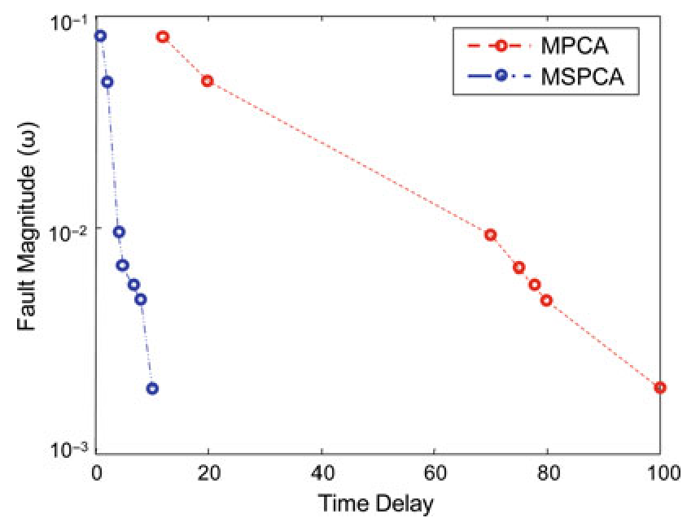

> Image description: A line graph titled "Fig. 4 Comparison of MPCA and multiscale MSPCA for a range of subtle sensor drift faults magnitude $\omega$ against fault detection delay" compares the performance of two methods: MPCA and MSPCA. The vertical y-axis represents "Fault Magnitude ($\omega$)" on a logarithmic scale ranging from $10^{-3}$ to $10^{-1}$. The horizontal x-axis represents "Time Delay" ranging from $0$ to $100$. Two data series are plotted: 1. **MPCA (red dashed line with circles):** Shows a higher time delay for a given fault magnitude. As fault magnitude decreases from $10^{-1}$ to approximately $2 \times 10^{-3}$, the detection time delay increases from $20$ to $100$. 2. **MSPCA (blue dash-dot line with circles):** Shows significantly lower time delays compared to MPCA. For the same range of fault magnitudes, the time delay remains much lower, decreasing from approximately $10$ down to near $5$. The figure illustrates that MSPCA provides faster detection (lower time delay) for subtle sensor drift faults across various magnitudes compared to MPCA.
Multiscale Multivariate Statistical Process Control,
Fig. 4 Comparison of MPCA and multiscale MSPCA for a range of subtle sensor drift faults magnitude $\omega$ against fault detection delay

## Cross-References

- Controller Performance Monitoring
- Fault Detection and Diagnosis
- Statistical Process Control in Manufacturing


## Bibliography

Alawi A, Zhang J, Morris AJ (2007) Multiscale Multiblock Batch Monitoring: Sensor and Process Drift and Degradation. DOI: 10.1021/op400337x April 25 2014
Aradhye HB, Bakshi BR, Strauss A, Davis JF (2003) Multiscale SPC using wavelets: theoretical analysis and properties. AIChE J 49(4):939-958
Bakshi BR (1998) Multiscale PCA with application to multivariate statistical process monitoring. AIChE J 44:1596-1610
Birol G, Undey C, Cinar AA (2002) Modular simulation package for fed-batch fermentation: penicillin production. Comput Chem Eng 26:1553-1565
Choi SW, Morris J, Lee I-B (2008) Nonlinear multiscale modelling for fault detection and identification. Chem Eng Sci 63:2252-2266
Daubechies I (1992) Ten lectures on wavelets. SIAM, Philadelphia
Ganesan R, Das TT, Venkataraman V (2004) Waveletbased multiscale statistical process monitoring: a literature review. IIE Trans 36:787-806
Kourti T, MacGregor JF (1996) Multivariate SPC methods for process and product monitoring. J Qual Technol 28:409-428

Lee J-M, Yoo C-K, Lee I-B (2004) Fault detection of batch processes using multiway Kernel principal component analysis. Comput Chem Eng 28(9):1837-1847
Lee HW, Lee MW, Park JM (2009) Multi-scale extension of PLS algorithm for advanced on-line process monitoring. Chemom Intell Lab Syst 98:201-212
Liu Z, Cai W, Shao X (2009) A weighted multiscale regression for multivariate calibration of near infrared spectra. Analyst 134:261-266
Lu N, Wang F, Gao F (2003) Combination method of principal component and wavelet analysis for multivariate process monitoring and fault diagnosis. Ind Eng Chem Res 42:4198-4207
Mallat SG (1998) Multiresolution approximations and wavelet orthonormal bases. Trans Am Math Soc 315:69-87
Misra MH, Yue H, Qin SJ, Ling C (2002) Multivariate process monitoring and fault diagnosis by multi-scale PCA. Comp Chem Eng 26:1281-1293
Qin SJ (2003) Statistical process monitoring: basics and beyond. J Chemom 17:480-502
Qin SJ (2012) Survey on data-driven industrial process monitoring and diagnosis. Annu Rev Control 36:220-234
Reis MS, Saraiva PM (2006) Multiscale statistical process control with multiresolution data. AIChE J 52:2107-2119
Shao R, Jia F, Martin EB, Morris AJ (1999) Wavelets and nonlinear principal components analysis for process monitoring. Control Eng Pract 7:865-879
Shao X-G, Leung AK-M, Chau F-T (2004) Wavelet: a new trend in chemistry. Acc Chem Res 36:276-283
Teppola P, Minkkinen P (2000) Wavelet-PLS regression models for both exploratory data analysis and process monitoring. J Chemom 14:383-399
Yoon S, MacGregor JF (2004) Principal-component analysis of multiscale data for process monitoring and fault diagnosis. AIChE J 50(11):2891-2903
Zhang Y, Ma C (2011) Fault diagnosis of nonlinear processes using multiscale KPCA and multiscale KPLS. Chem Eng Sci 66:64-72

## Multi-vehicle Routing

Emilio Frazzoli ${ }^{1}$ and Marco Pavone ${ }^{2}$<br>${ }^{1}$ Massachusetts Institute of Technology, Cambridge, MA, USA<br>${ }^{2}$ Stanford University, Stanford, CA, USA

## Abstract

Multi-vehicle routing problems in systems and control theory are concerned with the design of control policies to coordinate several vehicles


<!-- source_pdf_page: 843 -->
moving in a metric space, in order to complete spatially localized, exogenously generated tasks in an efficient way. Control policies depend on several factors, including the definition of the tasks, of the task generation process, of the vehicle dynamics and constraints, of the information available to the vehicles, and of the performance objective. Ensuring the stability of the system, i.e., the uniform boundedness of the number of outstanding tasks, is a primary concern. Typical performance objectives are represented by measures of quality of service, such as the average or worst-case time a task spends in the system before being completed or the percentage of tasks that are completed before certain deadlines. The scalability of the control policies to large groups of vehicles often drives the choice of the information structure, requiring distributed computation.

## Keywords

Cooperative control; Decentralized control; Dynamic routing; Networked robots; Task allocation

## Introduction

Multi-vehicle routing problems in systems and control theory are concerned with the design of control policies to coordinate several vehicles moving in a metric space, in order to complete spatially localized, exogenously generated tasks in an efficient way. Key features of the problem are that tasks arrive sequentially over time and planning algorithms should provide control policies (in contrast to preplanned routes) that prescribe how the routes should be updated as a function of those inputs that change in real time. This problem is usually referred to as dynamic vehicle routing (DVR). In DVR problems, ensuring the stability of the system, i.e., the uniform boundedness of the number of outstanding tasks, is a primary concern.

## Motivation and Background

As a motivating example, consider the following scenario: a team of unmanned aerial vehicles
(UAVs) is responsible for investigating possible threats over a region of interest. As possible threats are detected, by intelligence, high-altitude or orbiting platforms, or by ground sensor networks, one of the UAVs must visit its location and investigate the cause of the alarm, in order to enable an appropriate response if necessary. Performing this task may require the UAV not only to fly to the possible threat's location but also to spend additional time on site. The objective is to minimize the average time between the appearance of a possible threat and the time one of the UAVs completes the close-range inspection task. Variations may include priority levels, time windows during which the inspection task must be completed, and sensors with limited range.

In order to perform the required mission, the UAVs (or, more in general, mission control) need to repeatedly solve three coupled decisionmaking problems:

1. Task allocation: which UAV shall pursue each task? What policy is used to assign tasks to UAVs? How often should the assignment be revised?
2. Service scheduling: given the list of tasks to be pursued, what is the most efficient ordering of these tasks?
3. Loitering paths: what should UAVs without pending assignments do?
The optimization process must take into account, for example, algebraic or differential constraints (such as obstacle avoidance or bounded curvature, respectively), sensing constraints, communication constraints, and energy constraints. Furthermore, one might require a decentralized control architecture.

DVR problems, including the above UAV routing problem, are generally intractable due to their multifaceted combinatorial, differential, and stochastic nature, and consequently solution approaches have been devised that look either at heuristic algorithms or at approximation algorithms with some guarantee on their performance.

## Related Problems

DVR problems represent the dynamic counterpart of the well-known static vehicle routing


<!-- source_pdf_page: 844 -->
problem (VRP), whereby (i) a team of $n$ vehicles is required to service a set of $n_{\mathrm{T}}$ "static" tasks in a metric space, (ii) each task requires a certain amount of on-site service, (iii) and the goal is to compute a set of routes that minimizes the cost of servicing the tasks; see Toth and Vigo (2001) for a thorough introduction to this problem. The VRP is static in the sense that vehicle routes are computed assuming that no new tasks arrive. The VRP is an important research topic in the operations research community.

## Approaches for Multi-vehicle Routing

Broadly speaking, there are three main approaches available in the literature to tackle dynamic vehicle routing problems. The first approach relies on heuristic algorithms. In the second approach, called "competitive analysis approach," routing policies are designed to minimize the worst-case ratio between their performance and the performance of an optimal off-line algorithm which has a priori knowledge of the entire input sequence. In the third approach, the routing problem is embedded within the framework of queueing theory. Routing policies are then designed to stabilize the system in terms of uniform boundedness of the number of outstanding tasks and to minimize typical queueing-theoretical cost functions such as the expected time the tasks remain in the queue. Since the generation of tasks and motion of the vehicles is within an Euclidean space, one can refer to this third approach as "spatial queueing theory."

## Heuristic Approach

The main aspect of the heuristic approach is that routing algorithms are evaluated primarily via numerical, statistical and experimental studies, and formal performance guarantees are not available. A naïve, yet reasonable approach to design a heuristic algorithm for DVR would be to adapt classic queueing policies. However, perhaps surprisingly, this adaptation is not at all straightforward. For example, routing algorithms based on a first-come-first-served policy, whereby tasks are
fulfilled in the order in which they arrive, are unable to stabilize the system for all stabilizable task arrival rates, in the sense that with such routing algorithms the average number of tasks grows over time without bound, even though there exist alternative routing algorithms that would maintain the number of tasks uniformly bounded (Bertsimas and van Ryzin 1991).

The most widely applied approach is to combine static routing methods (e.g., VRP-like methods, nearest neighbor strategies, or genetic algorithms) and sequential reoptimization, where the re-optimization horizon is chosen heuristically. In particular, greedy nearest neighbor strategies, whose formal characterization still represents an open problem, are known to perform particularly well in some notable cases (Bertsimas and van Ryzin 1991). However, the joint selection of a static routing method and of the re-optimization horizon in the presence of vehicle and task constraints (e.g., differential motion constraints, or task priorities) makes the application of this approach far from trivial. For example, one can show that an erroneous selection of the re-optimization horizon can lead to pathological scenarios where no task ever receives service (Pavone 2010). Additionally, performance criteria in dynamic settings commonly differ from those of the corresponding static problems. For example, in a dynamic setting, the time needed to complete a task may be a more important factor than the total vehicle travel cost.

## Competitive Analysis Approach

The distinctive feature of the competitive analysis approach is the method used to evaluate an algorithm's performance, which is called competitive analysis. In competitive analysis, the performance of a (causal) algorithm is compared to the performance of a corresponding off-line algorithm (i.e., a non-causal algorithm that has a priori knowledge of the entire input) in the worst-case scenario. Specifically, an algorithm is $c$-competitive if its cost on any problem instance is at most $c$ times the cost of an optimal off-line algorithm:


<!-- source_pdf_page: 845 -->
$$
\begin{array}{r}
\operatorname{Cost}_{\text {causal }}(I) \leq c \operatorname{Cost}_{\text {optimal off-line }}(I), \\
\text { for all problem instances } I .
\end{array}
$$

In the recent past, several dynamic vehicle routing problems have been successfully studied in this framework, under the name of the online traveling repairman problem (Jaillet and Wagner 2006), and many interesting insights have been obtained. However, the competitive analysis approach has some potential disadvantages. First, competitive analysis is a worst-case analysis; hence, the results are often overly pessimistic for normal problem instances, and potential statistical information about the problem (e.g., knowledge of the spatial distribution of future tasks) is often neglected. Second, the worstcase analysis usually requires a finite horizon problem formulation, which precludes the study of useful properties such as stability. Third, competitive analysis is used to bound the performance relative to an optimal off-line algorithm, which, by being non-causal, does not belong to the feasible set of routing algorithms one is optimizing over. Hence, with this approach one minimizes the "cost of causality" in the worst-case scenario, but not necessarily the worst-case cost (which would require comparison with an optimal causal routing algorithm). Finally, many important real-world constraints for DVR, such as time windows, priorities, differential constraints on vehicle's motion, and the requirement of teams to fulfill a task, have so far proved to be too complex to be considered in the competitive analysis framework (Golden et al. 2008, page 206). Some of these drawbacks have been recently addressed by Van Hentenryck et al. (2009) where a combined stochastic and competitive analysis approach is proposed for a general class of combinatorial optimization problems and is analyzed under some technical assumptions.

## Spatial Queueing Theory

Spatial queueing theory embeds the dynamic vehicle routing problem within the framework of queueing theory. Spatial queueing theory consists of three main steps, namely, development of a
spatial queueing model, establishment of fundamental limitations of performance, and design of algorithms with performance guarantees. More specifically, the formulation of a model entails detailing four main aspects:

1. A model for the dynamic component of the environment: this is usually achieved by assuming that new events are generated (either adversarially or stochastically) by an exogenous process.
2. A model for targets/tasks: tasks are usually modeled as points in a physical environment distributed according to some (possibly unknown) distribution, might require a certain level of on-site service time, and can be subject to a variety of constraints, e.g., time windows, priorities, etc.
3. A model for the vehicles and their motion: besides their number, one needs to specify whether the vehicles are subject to algebraic (e.g., obstacles) or differential (e.g., minimum turning radius) constraints, sensing constraints, and fuel constraints. Also, the control could be centralized (i.e., coordinated by a central station) or decentralized and subject to communication constraints.
4. Performance criterion: examples include the minimization of the waiting time before service, loss probabilities, expectation-variance analysis, etc.
Once the model is formulated, one seeks to characterize fundamental limitations of performance (in the form of lower bounds for the best achievable cost); the purpose of this step is essentially twofold: it allows the quantification of the degree of optimality of a routing algorithm and provides structural insights into the problem. As for the last step, the design of a routing algorithm usually relies on a careful combination of static routing methods with sequential reoptimization. Desirable properties for the static methods are the following: (i) the static problem can be solved (at least approximately) in polynomial time and (ii) the static method is amenable to a statistical characterization (this is essential for the computation of performance bounds). Formal performance guarantees on a routing algorithm are then obtained by


<!-- source_pdf_page: 846 -->
quantifying the ratio between an upper bound on the cost delivered by that algorithm and a lower bound for the best achievable cost. Such a ratio, being an estimate of the degree of optimality of the algorithm, should be close to one and possibly independent of system parameters. The proposed algorithms are finally evaluated via numerical, statistical and experimental studies, including Monte-Carlo comparisons with alternative approaches.

An interesting feature of this approach is that the performance analysis usually yields scaling laws for the quality of service in terms of model data, which can be used as useful guidelines to select system parameters when feasible (e.g., number of vehicles).

In order to make the model tractable, the arrival process of tasks is assumed stationary (with possibly unknown parameters) with statistically independent arrival times. These assumptions, however, can be unrealistic in some scenarios, in which case the competitive analysis approach may represent a better alternative. From a technical standpoint, one should note that spatial queueing models are inherently different from traditional, nonspatial queueing models. The main reason is that in spatial queueing models, the "service time" per task has both a travel and an on-site component. Although the onsite service requirements can often be modeled as "statistically" independent, the travel times are inherently statistically coupled. Hence, in contrast to standard queueing models, service times in spatial queueing models are statistically dependent, and this deeply affects the solution to the problem.

Pioneering work in this context is that of Bertsimas and van Ryzin (1991), who introduced queueing methods to solve the baseline DVR problem (a vehicle moves along straight lines and visits tasks whose time of arrival, location, and on-site service are stochastic; information about task location is communicated to the vehicle upon task arrival). Next section provides an overview of the application of spatial queueing theory to such simplified DVR problem, referred to in the literature as dynamic traveling repairman problem (DTRP).

## Applying Spatial Queueing Theory to DVR Problems

Spatial Queueing Theory Workflow for DTRP

## Model

The DTRP, which, incidentally, captures well the salient features of the UAV scenario outlined in the Motivation Section, can be modeled as follows. In a geographical region $\mathcal{Q}$ of area $\mathcal{A}$, a dynamic process generates spatially localized tasks. The process generating tasks is modeled as a spatio-temporal Poisson process, i.e., (i) the time between consecutive generation instants has an exponential distribution with intensity $\lambda>$ 0 and (ii) upon arrival, the locations of tasks are independently and uniformly distributed in $\mathcal{Q}$. The location of the new tasks is assumed to be immediately available to a team of $n$ servicing vehicles. The vehicles provide service in $\mathcal{Q}$, traveling at a speed at most equal to $v$; the vehicles are assumed to have unlimited fuel and task-servicing capabilities. Each task requires an independent and identically distributed amount of on-site service with finite mean duration $\bar{s}>0$. A task is completed when one of the vehicles moves to its location and performs its on-site service. The objective is to design a routing policy that maximizes the quality of service delivered by the vehicles in terms of the average steadystate time delay $\bar{T}$ between the generation of a task and the time it is completed (in general, in a dynamic setting, the focus is on the quality of service as perceived by the "end user," rather than, for example, fuel economies achieved by the vehicles). Other quantities of interest are the average number $\overline{n_{\mathrm{T}}}$ of tasks waiting to be completed and the waiting time $\bar{W}$ of a task before its location is reached by a vehicle. These quantities, however, are related according to $\bar{T}=\bar{W}+\bar{s}$ (by definition) and by Little's law, stating that $\overline{n_{\mathrm{T}}}=\lambda \bar{W}$, for stable queues.

The system is considered stable if the expected number of waiting tasks is uniformly bounded at all times, or equivalently, that tasks are removed from the system at least at the same rate at which they are generated. In the case at hand,


<!-- source_pdf_page: 847 -->
the time to complete a task is the sum of the time to reach its location (which depends on the routing policy) plus the time spent at that location in on-site service (which is independent of the routing policy). Since, by definition, the service time is no shorter than the on-site service time $\bar{s}$, then a weaker necessary condition for stability is $\varrho:=\lambda \bar{s} / n<1$; the quantity $\varrho$ measures the fraction of time the vehicles are performing on-site service. Remarkably, it turns out that this is also a sufficient condition for stability, in the sense that, if this condition is satisfied, one can find a stabilizing policy. Note that this stability condition is independent of the size and shape of $\mathcal{Q}$ and of the speed of the vehicles.

## Fundamental Limitations of Performance

To derive lower bounds, the main difficulty consists in bounding (possibly in a statistical sense) the amount of time spent to reach a target location. The derivation of these bounds becomes simpler in asymptotic regimes, i.e., looking at cases when $\varrho \rightarrow 0^{+}$and $\varrho \rightarrow 1^{-}$, which are often called "light-load" and "heavy-load" conditions, respectively.

Consider first the case in which $\varrho \rightarrow 0^{+}$ (light-load regime). A set of $n$ points is called the $n$-median of $\mathcal{Q}$ if it globally minimizes the expected distance between a random point sampled uniformly from $\mathcal{Q}$ and the closest point in such set. In other words, the $n$-median of $\mathcal{Q}$ globally minimizes the function

$$
\begin{aligned}
& H_{n}\left(p_{1}, p_{2}, \ldots, p_{n}\right) \\
& \quad:=\mathbb{E}\left[\min _{k \in\{1, \ldots, n\}}\left\|p_{k}-q\right\|\right] \\
& \quad=\frac{1}{A} \int_{\mathcal{Q}} \min _{k \in\{1, \ldots, n\}}\left\|p_{k}-q\right\| d q
\end{aligned}
$$

Let $H_{n}^{*}$ be the global minimum of this function. Geometric considerations show that $H_{n}^{*}$ scales proportionally to $\sqrt{A / n}$.

Incidentally, the $n$-median of $\mathcal{Q}$ induces a Voronoi partition that is called Median Voronoi Tessellation, whose importance will become clear in the next section. Recall that the Voronoi diagram of $\mathcal{Q}$ induced by points $\left(p_{1}, \ldots, p_{n}\right)$ is defined by

$$
\begin{gathered}
V_{i}=\left\{q \in \mathcal{Q} \mid\left\|q-p_{i}\right\| \leq\left\|q-p_{j}\right\|, \forall j \neq i,\right. \\
j \in\{1, \ldots, n\}\},
\end{gathered}
$$

where $V_{i}$ is the region associated with the $i$-th "generator" point $p_{i}$ (see also ▷ Optimal Deployment and Spatial Coverage). The distance $H_{n}^{*}$ certainly provides a lower bound on the expected distance traveled by a vehicle to reach a task, and hence one obtains the lower bound

$$
\bar{T} \geq \frac{H_{n}^{*}}{v}+\bar{s}
$$

This lower bound is tight in light-load conditions ( $\varrho \rightarrow 0^{+}$), as it will be seen in the next section.

Consider now the case in which $\varrho \rightarrow 1^{-}$ (heavy load). Let $\bar{D}$ be the average travel distance per task for some routing policy. By using arguments from geometrical probability (independent of algorithms), one can show that $\bar{D} \geq \beta_{2} \sqrt{A} / \sqrt{2 \overline{n_{\mathrm{T}}}}$ as $\varrho \rightarrow 1^{-}$, where $\beta_{2}$ is a constant that will be specified later. As discussed, for stability, one needs $\bar{s}+\bar{D} / v<n / \lambda$. Combining the stability condition with the bound on the average travel distance per task, one obtains

$$
\bar{s}+\frac{\beta_{2} \sqrt{A}}{v \sqrt{2 \overline{n_{\mathrm{T}}}}} \leq \frac{n}{\lambda}
$$

Since, by Little's law, $\overline{n_{\mathrm{T}}}=\lambda \bar{W}$ and $\bar{T}=\bar{W}+\bar{s}$, one finally obtains (recall that $\varrho=\lambda \bar{s} / n$ ):

$$
\bar{T} \geq \frac{\beta_{2}^{2}}{2} \frac{A}{v^{2}} \frac{\lambda}{n^{2}(1-\varrho)^{2}}+\bar{s}, \quad\left(\text { as } \varrho \rightarrow 1^{-}\right)
$$

A salient feature of the above lower bound is that it scales quadratically with the number of vehicles (as opposed to the square-root scaling law one has in light-load conditions); note, however, that congestion effects are not included in this model. This bound also shows that the quality of service, which is proportional to $1 /(1-\varrho)^{2}$, degrades much faster as the target load increases than in nonspatial queueing systems (where the growth rate is proportional to $1 /(1-\varrho)$ ).


<!-- source_pdf_page: 848 -->
## Design of Routing Algorithms

The design of an optimal light-load policy essentially relies on mimicking the proof strategy employed for the light-load lower bound. Specifically, a routing policy whereby (1) one vehicle is assigned to each of the $n$ median locations of $\mathcal{Q}$, (2) new tasks are assigned to the nearest median location and its corresponding vehicle, and (3) each vehicle services tasks according to a first-come-first-served policy is asymptotically optimal, i.e.,

$$
\bar{T} \rightarrow \frac{H_{n}}{v}+\bar{s}, \quad\left(\text { as } \varrho \rightarrow 0^{+}\right)
$$

Note that under this strategy "regions of dominance" are implicitly assigned to vehicles according to a Median Voronoi Tessellation.

The heavy-load case is more challenging. Consider, first, the following single-vehicle routing policy, based on a partition of $\mathcal{Q}$ into $p \geq 1$ subregions $\left\{\mathcal{Q}_{1}, \mathcal{Q}_{2}, \ldots, \mathcal{Q}_{p}\right\}$ of equal area $A / p$. Such a partition can be obtained, e.g., as sectors centered at the median of $\mathcal{Q}$. Define a cyclic ordering for the subregion, such that, e.g., if the vehicle is in region $\mathcal{Q}_{i}$, the "next" region is $\mathcal{Q}_{j}$, where $j$ follows $i$ in the cyclic ordering (in other words, $j=(i+1) \bmod p$ ).

1. If there are no outstanding tasks, move to the median of the region $\mathcal{Q}$.
2. Otherwise, visit the "next" subregion; subregions with no tasks are skipped. Compute a minimum-length path from the vehicle's current position through all the outstanding tasks in that subregion. Complete all tasks on this path, ignoring new tasks generated in the meantime. Repeat.

The problem of computing the shortest path through a number of points is related to the wellknown traveling salesman problem (TSP). While the TSP is a prototypically hard combinatorial optimization problem, it is well known that the Euclidean version of the problem can be approximated efficiently (Vazirani 2001). Furthermore, the length $\operatorname{ETSP}\left(n_{\mathrm{T}}\right)$ of a Euclidean TSP through
$n_{\mathrm{T}}$ points independently and uniformly sampled in $\mathcal{Q}$ is known to satisfy the following property:
$\lim _{n_{\mathrm{T}} \rightarrow \infty} \operatorname{ETSP}\left(n_{\mathrm{T}}\right) / \sqrt{n_{\mathrm{T}}}=\beta_{2} \cdot \sqrt{\mathcal{A}}$, almost surely, where $\beta_{2} \approx 0.712$ is a constant (the same $\beta_{2}$ constant that appeared in the previous section) (Steele 1990).

It can be shown that, using the above routing policy, the average system time $\bar{T}$ satisfies

$$
\bar{T} \leq \gamma(p) \frac{A}{v^{2}} \frac{\lambda}{(1-\varrho)^{2}}+\bar{s}, \quad\left(\text { as } \varrho \rightarrow 1^{-}\right)
$$

where $\gamma(1)=\beta_{2}^{2}$ and $\gamma(p) \rightarrow \beta_{2}^{2} / 2$ for large $p$. These results critically exploit the statistical characterization of the length of an optimal TSP tour. Hence, the proposed policy achieves a quality of service that is arbitrarily close to the optimal one, in the asymptotic regime of heavy load (and, indeed, also of light load).

The above single-vehicle routing policies can be fairly easily lifted to an efficient multi-vehicle routing policy. The key idea (akin to the one in the light-load case) is to (1) partition the workspace into $n$ regions of dominance (with disjoint interiors and whose union is $\mathcal{Q}$ ), (2) assign one vehicle to each region, and (3) have each vehicle follow a single-vehicle routing policy within its own region. This approach leads to the following multivehicle routing policy for the DTRP problem:

1. Partition $\mathcal{Q}$ into $n$ regions of dominance of equal area and assign one vehicle to each region.
2. Each vehicle executes a single-vehicle DTRP policy in its own subregion.

Using as single-vehicle policy the routing policy described above, the average system time $\bar{T}$ in heavy-load satisfies

$$
\bar{T} \leq \gamma(p) \frac{A}{v^{2}} \frac{\lambda}{n^{2}(1-\varrho)^{2}}+\bar{s}, \quad\left(\varrho \rightarrow 1^{-}\right)
$$

Hence, by comparing this result with the corresponding lower bound, one concludes that a


<!-- source_pdf_page: 849 -->
simple partitioning strategy leads to a multivehicle routing policy whose performance is arbitrarily close to the optimal one in heavy load.

## Mode of Implementation

The scalability of the control policies to large groups of vehicles often requires a distributed implementation of multi-vehicle routing strategies. For the DTRP, a distributed implementation can be obtained by devising decentralized algorithms for environment partitioning. In the solution proposed in Pavone (2010), power diagrams are the key geometric concept to obtain, in a decentralized fashion, partitions suitable for both the light-load case (requiring, as seen before, a Median Voronoi Tessellation) and the heavyload case (requiring an equal-area partition). The power diagram of $\mathcal{Q}$ is defined as

$$
\begin{gathered}
V_{i}=\left\{q \in \mathcal{Q} \mid\left\|q-p_{i}\right\|^{2}-w_{i} \leq\left\|q-p_{j}\right\|^{2}-w_{j}\right. \\
\forall j \neq i, \quad j \in\{1, \ldots, n\}\}
\end{gathered}
$$

where $\left(p_{i}, w_{i}\right) \in \mathcal{Q} \times \mathbb{R}$ are a set of "power points" and $V_{i}$ is the subregion associated with the $i$-th power point. Note that power diagrams are a generalization of Voronoi diagrams: when all weights are equal, the power diagram and the Voronoi diagram are identical. The basic idea, then, is to associate to each vehicle $i$ a virtual power point, which is an artificial (or logical) variable whose value is locally controlled by the $i$-th vehicle. The cell $V_{i}$ becomes the region of dominance for vehicle $i$, and each vehicle updates its own power point according to a decentralized gradient-descent law with respect to a coverage function ( ▷ Optimal Deployment and Spatial Coverage), until the desired partition is achieved. The reader is referred to Pavone (2010) for more details.

## Extensions and Discussion

By integrating additional ideas from dynamics, teaming, and distributed algorithms, the spatial queueing theory approach has been recently applied to scenarios with complex models for the tasks such as time constraints, service priori-
ties, translating tasks, and adversarial generation; has been extended to address aspects concerning robotic implementation such as complex vehicle dynamics, limited sensing range, and team forming; and has even been tailored to integrate humans in the design space; see Bullo et al. (2011) and references therein. Despite the significant modeling differences, the "workflow" is essentially the same as in the DTRP: a queueing model that captures the salient features of the problem at hand, characterization of the fundamental limitations of performance, and design of algorithms with provable performance bounds. The last step, as for the DTRP, often involves lifting a single-vehicle policy to a multi-vehicle policy through the strategy of environment partitioning. Within this context, a number of partitioning schemes and corresponding decentralized partitioning algorithms relevant to a large variety of DVR problems are discussed in Pavone et al. (2009).

This workflow efficiently and transparently decouples the three decision-making problems mentioned in the Introduction Section, i.e., "task allocation," "service scheduling," and "loitering paths." In fact, task allocation is addressed via the strategy of environment partitioning, service scheduling is addressed by applying a singlevehicle routing policy within the individual regions of dominance, and the loitering paths resolve in placing the vehicles at or around specific points within the dominance regions (e.g., the median). Note, however, that in some important cases, e.g., DVR problems where goods have to be transported from a pickup location to a delivery location or where vehicles are differentially constrained and operate in a "congested" workspace, multi-vehicle policies that rely on static partitions perform poorly or are not even feasible (Pavone et al. 2009), and task allocation and service scheduling need to be addressed as tightly coupled.

Through spatial queueing theory one is usually able to characterize the performance of multi-vehicle routing policies in asymptotic regimes. To ensure "satisfactory" performance under general operation conditions, a common strategy is to consider heuristic modifications


<!-- source_pdf_page: 850 -->
to a baseline asymptotically efficient routing policy in such a way that, on the one hand, asymptotic performance is preserved, and, on the other hand, light- and heavy-load performances are "smoothly" and efficiently blended in the intermediate load case. The interested reader can find more information in Bullo et al. (2011).

## Summary and Future Directions

The three main approaches available to tackle DVR problems are (i) heuristic algorithms, (ii) competitive analysis, and (iii) spatial queueing theory. Broadly speaking, the competitive analysis approach is well suited when worst-case guarantees are sought, e.g., because there is not enough statistical information about the problem at hand. Spatial queueing theory represents a powerful alternative in cases where it is possible to leverage statistical information and one seeks average-case guarantees. Finally, for some problems the complexity of the model makes an analytical treatment very difficult, in which case the only option is to resort to an heuristic approach (possibly relying on insights derived by applying competitive analysis and/or spatial queueing theory to a simplified version of the problem).

Future directions include the extension of the three aforementioned approaches to increasingly complex problem setups, for example, higherfidelity vehicle dynamics and environments and sophisticated sensing and communication constraints, novel applications (e.g., search and rescue missions, map maintenance, and pursuitevasion), and inclusion of game-theoretical tools to address adversarial scenarios. Specifically, for the spatial queueing theory approach, key future directions include the problem of addressing optimality of performance in intermediate
regimes (current optimality results are only available either in the light or heavy-load regimes), online estimation of the statistical parameters (e.g., spatial distribution of the tasks), and formulations that take into account secondorder moments and large-deviation probabilities.

## Cross-References

- Averaging Algorithms and Consensus
- Flocking in Networked Systems
- Networked Systems
- Optimal Deployment and Spatial Coverage
- Particle Filters


## Bibliography

Bertsimas DJ, van Ryzin GJ (1991) A stochastic and dynamic vehicle routing problem in the Euclidean plane. Oper Res 39:601-615
Bullo F, Frazzoli E, Pavone M, Savla K, Smith SL (2011) Dynamic vehicle routing for robotic systems. Proc IEEE 99(9): 1482-1504
Golden B, Raghavan S, Wasil E (2008) The vehicle routing problem: latest advances and new challenges. Volume 43 of operations research/computer science interfaces. Springer, New York
Jaillet P, Wagner MR (2006) Online routing problems: value of advanced information and improved competitive ratios. Transp Sci 40(2):200-210
Pavone M (2010) Dynamic vehicle routing for robotic networks. PhD thesis, Department of Aeronautics and Astronautics, Massachusetts Institute of Technology
Pavone M, Savla K, Frazzoli E (2009) Sharing the load. IEEE Robot Autom Mag 16(2):52-61
Steele JM (1990) Probabilistic and worst case analyses of classical problems of combinatorial optimization in Euclidean space. Math Oper Res 15(4):749
Toth P, Vigo D (eds) (2001) The vehicle routing problem. Monographs on discrete mathematics and applications. SIAM, Philadelphia. ISBN:0898715792
Van Hentenryck P, Bent R, Upfal E (2009) Online stochastic optimization under time constraints. Ann Oper Res 177(1): 151-183
Vazirani V (2001) Approximation algorithms. Springer, New York
