<!-- source_pdf_page: 851 -->
## Nash equilibrium

Strategic Form Games and Nash Equilibrium

## Network Games

R. Srikant<br>Department of Electrical and Computer Engineering and the Coordinated Science Lab, University of Illinois at Urbana-Champaign, Champaign, IL, USA


#### Abstract

Game theory plays a central role in studying systems with a number of interacting players competing for a common resource. A communication network serves as a prototypical example of such a system, where the common resource is the network, consisting of nodes and links with limited capacities, and the players are the computers, web servers, and other end hosts who want to transfer information over the shared network. In this entry, we present several examples of gametheoretic interaction in communication networks and present a simple mathematical model to study one such instance, namely, resource allocation in the Internet.


## Keywords and Phrases

Congestion games; Network economics; Pricetaking users; Routing games; Strategic users

## Introduction

A communication network can be viewed as a collection of resources shared by a set of competing users. If the network were totally unregulated, then each user would attempt to grab as many resources in the network as possible, resulting in poor network performance, a situation commonly referred to as the tragedy of the commons (Hardin 1968). In reality, there is a carefully designed set of network protocols and pricing mechanisms which provide incentives to users to act in a socially responsible manner. Since game theory is the mathematical discipline which studies the interactions between selfish users, it is a natural tool to use to design these network control mechanisms. We now provide a few examples of network problems which naturally lend themselves to game-theoretic analysis. Later, we will elaborate on the game-theoretic formulation of one of these examples.

- Resource Allocation: A network such as the Internet is a collection of links, where each link has a limited data-carrying capacity, usually measured in bits per second.


<!-- source_pdf_page: 852 -->
The Internet is shared by billions of users, and the actions of these users have to be regulated so that they share the resources in the network in a fair manner. Equivalently, this problem can be viewed as one in which a network designer has to design a collection of protocols so that the users of the network can equitably allocate the available resources among themselves without the intervention of a central authority. Such protocols are built into every computer connected to the Internet today, to allow for seamless operation of the network. The problem of designing such protocols can be posed as a game-theoretic problem in which the players are the network and the traffic sources using the network (Kelly 1997).

- Routing Games: Finding appropriate routes for each user's data traffic is a particular form of resource allocation mentioned above. However, routing has applications beyond communication networks (with the other major application area being transportation networks), so it is useful to discuss routing separately. In communication networks, each user may attempt to find the minimum-delay route for its traffic, with help from the network, to minimize the delay experienced by its packets. In a transportation network, each automobile on the road attempts to take the path of least congestion through the network. An active area of research in game theory is one which tries to understand the impact of individual user decisions on the global performance of the network (Roughgarden 2005). An interesting result in this regard is the Braess paradox which is an example of a road transportation network in which the addition of a road leads to increased delays when each user selfishly choose a route to minimize its delay. Of course, if routes are chosen to minimize the overall delay experienced in the network such a paradox will not arise.
- Peer-to-Peer Applications: Many studies have indicated that file sharing between users (also known as peers) directly, without using a centralized web site such as YouTube, is a dominant source of traffic in the Internet.

For such a peer-to-peer service to work, each peer should not only download files from others, but should also be willing to sacrifice some of its resources to upload files to others. Naturally, peers would prefer to only download and not upload to minimize their resource usage. The design of incentive schemes to induce users to both download and upload files is another example of a game-theoretic problem in a network (Qiu and Srikant 2004).

- Network Economics: In addition to end-user interaction, Internet service providers (ISPs) have to interact with each other to allow their customers access to all the web sites in the world. For example, one ISP may have a customer who wants to access a web site connected to another ISP. In this case, the data traffic must cross ISP boundaries, and thus, one ISP has to transport data destined for a customer of another ISP. Thus, ISPs must be willing to contribute resources to satisfy the needs of customers who do not directly pay them. In such a situation, ISPs must have bilateral agreements (commonly known as peering agreements) to ensure that the selfish interest of each ISP to minimize its resource usage is aligned with the needs of its customers. Again, game theory is the right tool to study such inter-ISP interactions (Courcoubetis and Weber 2003).
- Spectrum Sharing: Large portions of the radio spectrum are severely underutilized. Typically, portions of the spectrum are assigned to a primary user, but the primary user does not use it most of the time. There has been a surge of interest recently in the concept of cognitive radio, whereby radios are cognitive of the presence or absence of the primary user, and when the primary user is absent, another radio can use the spectrum to transmit its data. When there are many users and the available spectrum is split into many channels, it is impossible for users to perfectly coordinate their transmissions to achieve maximum network utilization. In these situations, gametheoretic protocols which take into account the noncooperative behavior of the users can be


<!-- source_pdf_page: 853 -->
designed to allow secondary users to access the available channels as efficiently as possible (Saad et al. 2009).
In the next section, we will elaborate on one of the applications above, namely, resource allocation in the Internet, and show how game-theoretic modeling can be used to design fair resource sharing.

## Resource Allocation and Game Theory

Consider a network consisting of $L$ links, with link $l$ having capacity $c_{l}$. Suppose that there are $R$ users sharing the network, with each user $r$ being characterized by a set of links which connect the user's source to its destination. Since each user uses a fixed route in our model, we will use $r$ to denote both the user and the route used by the user. We use the notation $l \in r$ to denote that link $l$ is a part of route $r$. Let $x_{r}$ denote the rate at which user $r$ transmits data. Thus, we have the following natural constraints, which state that the total data rate on any link must be less than or equal to the capacity of the link:

$$
\begin{equation*}
\sum_{r: l \in r} x_{r} \leq c_{l}, \quad \forall l \tag{1}
\end{equation*}
$$

Associated with each user is a concave utility function $U_{r}\left(x_{r}\right)$ which is the utility that user $r$ derives by transmitting data at rate $x_{r}$. The network utility maximization problem is to solve

$$
\begin{equation*}
\max _{x \geq 0} \sum_{r} U_{r}\left(x_{r}\right), \tag{2}
\end{equation*}
$$

subject to the constraint (1). In (2), $x$ denotes the vector $\left(x_{1}, x_{2}, \ldots, x_{R}\right)$ and $x \geq 0$ means that each component of $x$ must be greater than or equal to zero. Note that the goal of the network in (2) is to maximize the sum of the utilities of the users in the network.

Let $p_{l}$ be the Lagrange multiplier corresponding to the capacity constraint in (1) for link $l$. Then the Lagrangian for the problem is given by

$$
\begin{equation*}
L(x, p)=\sum_{r} U_{r}\left(x_{r}\right)-\sum_{l} p_{l}\left(y_{l}-c_{l}\right), \tag{3}
\end{equation*}
$$

where we have used the notation $y_{l}:=\sum_{r: l \in r} x_{r}$ to denote the total data rate on link $l$. If $p$ is known, then the optimal $x$ can be calculate by solving

$$
\max _{x \geq 0} L(x, p)
$$

Notice that the optimal solution for each $x_{r}$ can be obtained by solving

$$
\begin{equation*}
\max _{x_{r} \geq 0} U_{r}\left(x_{r}\right)-q_{r} x_{r} \tag{4}
\end{equation*}
$$

where $q_{r}=\sum_{l \in r} p_{l}$. Thus, if the Lagrange multipliers are known, then the network utility maximization can be interpreted as a game in the following manner. Suppose that the network charges each user $q_{r}$ dollars for every bit transmitted by user $r$ though the network. Then, $q_{r} x_{r}$ is the dollars per second spent by the user if $x_{r}$ is measured in bits per second. Interpreting $U_{r}\left(x_{r}\right)$ as the dollars per second that the user is willing to pay for transmitting at rate $x_{r}$, the optimization problem in (4) is the problem faced by user $r$ which wants to maximize its net utility, i.e., utility minus cost. Thus, the individual optimal solution for each user is also the solution to the network utility maximization problem. The above game-theoretic interpretation of the network utility maximization problem is somewhat trivial since, given the $p_{l}$ 's or $q_{r}$ 's, there is no interaction between the users. Of course, this interpretation relies on the ability of the network to compute $p$. We next present a scheme to compute $p$, which couples the users closely and thus allows for a richer game-theoretic interpretation.

Suppose that the network wants to compute $p$ but does not have access to the utility functions of the users. The network asks each user $r$ to bid an amount $w_{r}$ which is interpreted as the dollars per second that the user is willing to pay. The network then assumes that user $r$ 's utility function is $w_{r} \log x_{r}$ and solves the network utility maximization. While this choice of utility function may seem arbitrary, the resulting solution $x$ has a number of attractive properties, including a form of fairness called proportional fairness. The proportionally fair resource allocation solution to (4) is given by


<!-- source_pdf_page: 854 -->
$$
\begin{equation*}
\frac{w_{r}}{x_{r}}=q_{r} \tag{5}
\end{equation*}
$$

The network then allocates rate $x_{r}$ to user $r$ and charges $q_{r}$ dollars per bit. From (5), the amount charged to user $r$ per second is $w_{r}$, thus satisfying the original interpretation of $w_{r}$. Knowing that the network charges users in this manner, how might a user choose its bid $w_{r}$ ? Recall that user $r$ 's goal is to solve (4). Substituting from (5), the problem in (4) can be rewritten as

$$
\begin{equation*}
\max _{w_{r} \geq 0} U_{r}\left(\frac{w_{r}}{q_{r}}\right)-w_{r} . \tag{6}
\end{equation*}
$$

Thus, the users' problem of selecting $w$ can be viewed as a game, with each user's objective given by (6). Note that $q_{r}$ is given by (5) and thus depends on all the $w_{r}$ 's. Depending upon the application, the game can be solved under one of two assumptions:

- Price-Taking Users: Under this assumption, users are assumed to take the price $q_{r}$ as given, i.e., they do not attempt to infer the impact of their actions on the price. This is a reasonable assumption in a large network such as the Internet, where the impact of a single user on the link prices is negligible, and it is practically impossible for any user to infer the impact of its decisions on the prevailing price of the network resources. When the users are price taking, the socially optimal solution, i.e., the solution to the network utility maximization problem, coincides with the Nash equilibrium of the game. To see this, note that the solution to (6) is given by

$$
\frac{1}{q_{r}} U_{r}^{\prime}\left(\frac{w_{r}}{q_{r}}\right)-1=0,
$$

under the assumption that the utility function is differentiable and the solution is bounded away from zero. Using (5), this equation reduces to

$$
U_{r}^{\prime}\left(x_{r}\right)=q_{r},
$$

which maximizes the Lagrangian (3). It is not difficult to see that the complementary slackness equations in the Karush-Kuhn-Tucker
conditions are satisfied since the constraints for (2) and the proportionally fair solution are the same. Thus, under the price-taking assumption, the equilibrium of the game solution is the same as the socially optimal solution provided the network computes $q_{r}$ using the proportionally fair resource allocation formulation.

- Strategic Users: In networks where the number of users is small, it may be possible for each user to know the topology of the network, and thus, each user may be able to solve for the proportionally fair resource allocation if it has access to other users' bids. In other words, it may be possible to compute a Nash equilibrium by taking into account the impact of the $w_{r}$ 's on the $q_{r}$ 's. When the users are strategic, the socially optimal solution could be quite different from the Nash equilibrium. The ratio of the network utility under the socially optimal solution to the network utility under a Nash equilibrium is called the price of anarchy.
There is a rich literature associated with both interpretations of the network congestion game. In the case of price-taking users, much of the emphasis in the literature has been on designing distributed algorithms to achieve the socially optimal solution (Shakkottai and Srikant 2007). In the case of strategic users, the focus has been on characterizing the price of anarchy (Johari and Tsitsiklis 2004; Yang and Hajek 2007).


## Summary and Future Directions

We have presented a number of applications which involve the interactions of selfish users over a network. For the resource allocation application, we have also described how simple mathematical models can be used to provide incentives for users to act in a socially optimal manner. In particular, we have shown that, under the reasonable price-taking assumption and an appropriate computation of link prices, selfish users automatically maximize network utility. In the case where the users are strategic, the goal is to characterize the price of anarchy.


<!-- source_pdf_page: 855 -->
Moving forward, two areas which require considerable further research are the following: (i) inter-ISP routing and (ii) spectrum sharing. The Internet is a fairly reliably network, and any unreliability often arises due to routing issues among ISPs. As mentioned in the introduction, peering arrangements between ISPs are necessary to make sure that ISPs carry each others' traffic and are appropriately compensated for it, either through reciprocal traffic-carrying agreements or actual monetary transfer. Thus, the policy that an ISP uses to route traffic may be governed by these peering agreements. The more complicated these policies are, the more chances there are for routing misconfigurations that lead to service interruptions. This interplay between policies and technology in the form of routing algorithms is an interesting topic for further study.

Cognitive radios and spectrum sharing are expected to be significant technological components of future wireless networks. Designing algorithms for selfish radios to share the available spectrum while respecting the rights of the primary user of the spectrum is a challenge that requires considerable further attention. This area of research requires one to combine sensing technologies to sense the presence of other users with game-theoretic models to ensure fair channel access to the secondary users, subject to the constraint that the primary user should not be affected by the presence of the secondary users.

## Cross-References

- Game Theory: Historical Overview
- Networked Systems
- Optimal Deployment and Spatial Coverage


## Bibliography

Courcoubetis C, Weber R (2003) Pricing communication networks: economics, technology and modelling. Wiley, Hoboken
Hardin G (1968) The tragedy of the commons. Science 162:1243-1248
Johari R, Tsitsiklis JN (2004) Efficiency loss in a network resource allocation game. Math Oper Res 29:407-435

Kelly FP (1997) Charging and rate control for elastic traffic. Eur Trans Telecommun 8:33-37
Qiu D, Srikant R (2004) Modeling and performance analysis of BitTorrent-like peer-to-peer networks. Proc ACM SIGCOMM ACM Comput Commun Rev 34:367-378
Roughgarden T (2005) Selfish routing and the price of anarchy. MIT Press, Cambridge
Saad W, Han Z, Debbah M, Hjorungnes A, Basar T (2009) Coalitional game theory for communication networks: a tutorial. IEEE Signal Process Mag 26(5):77-97
Shakkottai S, Srikant R (2007) Network optimization and control. NoW Publishers, Boston-Delft
Yang S, Hajek B (2007) VCG-Kelly mechanisms for allocation of divisible goods: adapting VCG mechanisms to one-dimensional signals. IEEE J Sel Areas Commun 25:1237-1243

## Networked Control Systems: Architecture and Stability Issues

Linda Bushnell ${ }^{1}$ and Hong $\mathrm{Ye}^{2}$<br>${ }^{1}$ Department of Electrical Engineering, University of Washington, Seattle, WA, USA<br>${ }^{2}$ The Mathworks, Inc., Natick, MA, USA


#### Abstract

When shared, band-limited, real-time communication networks are employed in a control system to exchange information between spatially distributed components, such as controllers, actuators, and sensors, it is categorized as a networked control system (NCS). The primary advantages of a NCS are reduced complexity and wiring, reduced design and implementation cost, ease of system maintenance and modification, and efficient data sharing. In addition, this unique architecture creates a way to connect the cyberspace to the physical space for remote operation of systems. The NCS architecture allows for performing more complex tasks, but also requires taking the network effects into account when designing control laws and stability conditions. In this entry, we review significant results on the architecture and stability analysis of a NCS. The results presented address communication network-induced challenges such as time delays, scheduling, and information packet dropouts.


<!-- source_pdf_page: 856 -->
## Keywords

Architecture; Networked control system; Stability

## Introduction

From the washing machine, air conditioner, and microwave oven to the telephone, stereo, and automobile, embedded computers are present in the modern home. In a factory environment, there are thousands of networked smart sensors and actuators with embedded processors, working to complete a coordinated task. The trend in manufacturing plants, homes, buildings, aircraft, and automobiles is toward distributed networking. This trend can be inferred from many proposed or emerging network standards, such as controller area network (CAN) for automotive and industrial automation, BACnet for building automation, PROFIBUS and WorldFIP fieldbus for process control, and IEEE 802.11, and Bluetooth wireless standards for applications such as mobile sensor networks, HVAC systems, and unmanned aerial vehicles.

The traditional dedicated point-to-point wired connection in control systems has been successfully implemented in industry for decades. With the advance of communication network and hardware technologies, it is common to integrate the communication network into the control system to replace the dedicated point-to-point connection to achieve reduced weight and power, lower cost, simpler installation and maintenance, and higher reliability, to name a few advantages. For example, a typical new automobile has two controller area networks (CANs): a high-speed one in front of the firewall for the engine, transmission, and traction control and a low-speed one for locks, windows, and other devices (Johansson et al. 2005).

The conventional definition of a networked control system (NCS) is as follows: When a feedback control system is closed via a communication channel, which may be shared with other nodes outside the control system, then the control system is called a NCS. A NCS can also
be described as a feedback control system where the control loops are closed through a real-time communication network.

## Architecture of Networked Control Systems

The architecture of a NCS consists of a bandlimited, digital communication network physically and electronically integrated with a spatially distributed control system, operated on a given plant. Digital information, such as controller signals, actuator signals, sensor signals, and operator input, is transmitted via the network. The components connected by the network include all nodes of the control system, such as the supervisory (or "network owner") computer, controller software and hardware, actuators, and sensors. In this structure, the feedback control system's loops are closed over the shared communication network.

The communication network can be wired or wireless and may be shared with other unrelated nodes outside the control system. As illustrated in Fig. 1, the shared communication channel, which multiplexes signals from the sensors to the controllers and/or from the controllers to the actuators, serves many other uses besides control. Each of the system components directly connected to the network via a network interface is denoted a physical node. Besides the network interface, the sensors and actuator nodes are typically smart nodes with embedded microprocessors. Sometimes, the controller is colocated with the smart actuator. Several key issues make networked control systems distinct from traditional control systems (Hespanha et al. 2007; Yang 2006).

## Band-Limited Channels

Bandwidth limitation of the shared communication channel requires that all nodes in the network must share (e.g., time sharing or frequency sharing, etc.) the common network resource without interfering with each other.

## Sampling and Delays

In a NCS, the plant outputs are sampled by the sensors, which can convert continuous-time


<!-- source_pdf_page: 857 -->
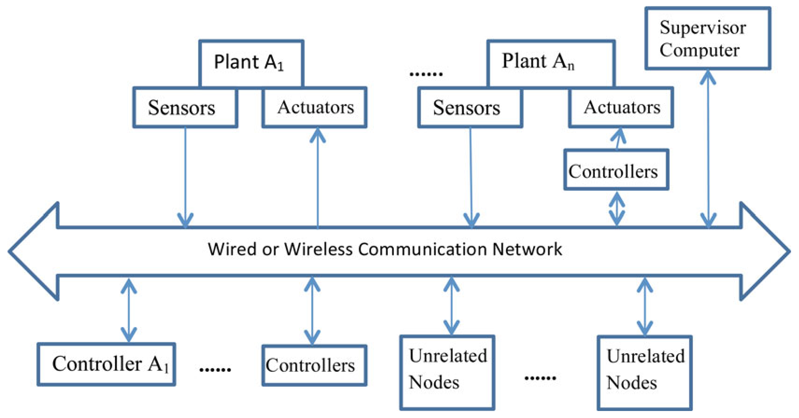

> Image description: A block diagram illustrates a general networked control system (NCS) architecture, focusing on the interactions between various components via a communication medium. A central horizontal bar, labeled "Wired or Wireless Communication Network," serves as the communication backbone for all connected elements. The architecture includes multiple plants, labeled "Plant $A_1$" through "Plant $A_n$." Each plant is connected to the network through "Sensors" (sending data to the network) and "Actuators" (receiving commands from the network). Control logic is distributed: "Controller $A_1$" and other "Controllers" are connected via bidirectional arrows to the network, while a separate set of "Controllers" is positioned between "Actuators" and the network. Additional "Unrelated Nodes" are connected to the network via bidirectional arrows. Finally, a "Supervisor Computer" is connected to the communication network, likely for high-level monitoring or management. The arrows indicate the flow of signals and data between the physical plants, controllers, and the shared communication network.
Networked Control Systems: Architecture and Stability Issues, Fig. 1 A general networked control system (NCS) architecture

analog signals to digital signals; perform preprocessing, filtering, and encoding; and package the data signal so that it is ready for transmission. After winning the medium access control and being transmitted over the network, the package containing the sampled data signal arrives at the receiver side, which could be a controller or a smart actuator with a controller collocated with it. The receiver unpacks and decodes the signal. This process is quite different from the traditional periodic sampling in digital control. The overall delay between sampling and the eventual decoding of the transmitted packet at the receiver can be time varying and random due to both the network access delay (i.e., the time it takes for a shared network to accept the data) and the transmission delay (i.e., the time during which data are in transit inside the network). This also depends on the highly variable network conditions, such as congestion and channel quality. In some NCSs, the data transmitted are time stamped, which means that the receiver may have an estimate of the delay's duration and could take appropriate corrective action. Given the rapid advance of embedded computation and communication hardware technology today, the transmission delay in
many embedded systems can be neglected when compared with the magnitude of network access delay.

## Packet Dropouts

It is possible in a NCS that a packet may be lost while it is in transit through the network. The packet that contains important sampling data or control signals may drop occasionally due to transmission errors of the physical network link, message collision, or node failures, to name a few. Overflow in queue or buffer can lead to network congestion and package loss. Thus, the use of queues is not favored by NCSs in general. Packet dropouts also happen if the receiver discards outdated arrivals that have long delays. Most network protocols are equipped with transmission-retry mechanisms, such as TCP, that guarantee the eventual delivery of packets. These protocols, unfortunately, are not appropriate for a NCS since the retransmission of old sensor data or calculated control signals is generally not very useful when new, timecritical data are available. Using selected old data for estimation or prediction is an exception, where old data may be packaged with the new


<!-- source_pdf_page: 858 -->
data in one packet. It is advantageous to discard the old, un-transmitted data and transmit a new packet if and when it becomes available. In this way, the controller always receives fresh data for its control calculation, and the actuator always executes the up-to-date command to control the plant.

## Modeling Errors, Uncertainties, and Disturbances

In a distributed NCS, modeling errors, uncertainties, and disturbances always exist when using the mathematical model to describe the physical process. These factors may lead to a major impact on the overall system performance and cause failure in fulfilling the desired objectives. Wang and Hovakimyan (2013) proposed a reference model-based architecture to decouple the design of controller and communication schemes. A reference model is introduced in each subsystem as a bridge to build the connection between the real system and an ideal model, free of uncertainties. The closeness between the real system and the reference model is associated only with plant uncertainties, and the difference between the reference model and the ideal model is only in the communication constraints.

## Stability of Networked Control Systems

The stability of a control system is often extremely important and is generally a safety requirement. Examples include the control of rockets, robots, airplanes, automobiles, or ships. Instability in any one of these systems can result in an unimaginable accident and loss of life. The stability of a general dynamical system with no input can be described with the Lyapunov stability criteria, which is stated as follows: A linear system is stable if its impulse response approaches zero as time approaches infinity or if every bounded input produces a bounded output.

When sensors, controllers, and actuators are not colocated and use a shared network to communicate, the feedback loop of a NCS is closed over the network. Network-induced,
variable delays, and packet dropouts can degrade the performance of a NCS. For example, the NCS may have a longer settling time or bigger overshoot in the step response. Furthermore, the NCS may become unstable when delays and/or packet dropouts exceed a certain range. Designers choosing to use a NCS architecture, however, are motivated not by performance but by cost, maintenance, and reliability gains.

## Band-Limited Channels

Inspired by Shannon's results on the maximum bit rate that a communication channel can carry reliably, a significant research effort has been devoted to the problem of determining the minimum bit rate that is needed to stabilize a system through feedback over a finite capacity channel (Baillieul 1999; Nair and Evans 2000; Tatikonda and Mitter 2004; Wong and Brockett 1999; Baillieul and Antsaklis 2007). This has been solved exactly for linear plants, but only conservative results have been obtained for nonlinear plants. The data-rate theorem that quantifies a fundamental relationship between unstable physical systems and the rate at which information must be processed in order to stably control them was proved independently under a variety of assumptions. Minimum bit rate and quantization becomes especially important for networks designed to carry very small packets with little overhead, because encoding measurements or actuation signals with less bits can save network bandwidth.

Most of the NCS stability results presented here, however, are based on the observation that the channel can transmit a finite number of packets per unit of time (packet rate) and each packet can carry certain number of bits in the data field. The packets on a real-time control network typically are frequent and have small data segments compared to their headers. For example, a CAN II packet with a single 16-bit data sample has fixed 64 bits of overhead associated with identifier, control field, CRC, ACK field, and frame delimiter, resulting in $25 \%$ utilization, and this utilization can never exceed $50 \%$ (data field length is limited to 64 bits). Thus, the quantization effects imposed by the communication networks are generally ignored.


<!-- source_pdf_page: 859 -->
## Network-Induced Delays

A significant number of results have attempted to characterize a maximum upper bound on the sampling or transmission interval for which stability of the NCS can be guaranteed. The upper bound is sometimes called the maximum allowable transfer interval (MATI) (Walsh 2001a). These results implicitly attempt to minimize the packet rate or schedule the traffic of the control network that is needed to stabilize a system through feedback. The general approach is to design the controller using established techniques, considering the network to be transparent, and then to analyze the effect of the network on closed-loop system performance and stability.

The NCS with a linear time-invariant (LTI) plant/controller pair and one-channel feedback (see Fig. 2) can be modeled by the following continuous-time system, where x includes the states of the plant and the controller, $x(t)= \left[x_{p}(t), x_{c}(t)\right]^{T}$ :

$$
\begin{align*}
\dot{x} & =A x+B \hat{y}, y=C(x)  \tag{1}\\
\hat{y}(t) & =\left\{\begin{array}{l}
\hat{y}_{k-1}, \mathrm{t} \in\left[t_{k}, t_{k}+\tau_{k}\right) \\
\hat{y}_{k}, \mathrm{t} \in\left[t_{k}+\tau_{k} ; t_{k+1}\right.
\end{array}\right) \tag{2}
\end{align*}
$$

The signal y is a vector of sensor measurements and $\hat{y}$ is the input to a continuous-time controller collocated with the actuators. Alternatively, $\hat{y}$ can be viewed as the input to the actuators and y as the desired control signal computed by a controller collocated with the sensors. The signal $\mathrm{y}(\mathrm{t})$ is sampled at times $\left\{\mathrm{t}_{\mathrm{k}}: \mathrm{k} \in N\right\}$ and the samples $\mathrm{y}(\mathrm{k}):=\mathrm{y}\left(\mathrm{t}_{\mathrm{k}}\right)$ are sent through the network. But the samples arrive at the destination
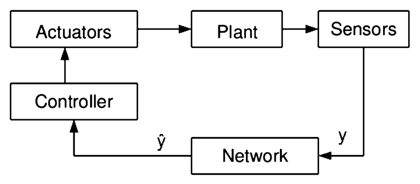

> Image description: A block diagram illustrating a Networked Control System (NCS) architecture. The system is organized in a closed-loop feedback configuration. Starting from the top, the "Plant" receives an input from "Actuators" and produces an output to "Sensors." The output signal, labeled $y$, is sent from the Sensors to a "Network" block. The network processes this signal, outputting a modified signal $\hat{y}$ to the "Controller." The Controller then generates a control signal that is sent to the "Actuators." The sequence of blocks forms a continuous loop: Actuators $\rightarrow$ Plant $\rightarrow$ Sensors $\rightarrow$ Network $\rightarrow$ Controller $\rightarrow$ Actuators. The diagram illustrates a single-channel feedback system where the controller is collocated with the actuator. Variables $y$ and $\hat{y}$ represent the original and transmitted measurement signals, respectively, indicating potential data transmission effects within the network component.

Networked Control Systems: Architecture and Stability Issues, Fig. 2 A NCS architecture with onechannel feedback (controller collocated with actuator)
after a (possibly variable) delay of $\tau_{\mathrm{k}}$, where we assume that the network delays are always smaller than one sampling interval. For periodic sampling and constant delays, a sufficient and necessary condition for exponential stability of the NCS (Eqs. 1 and 2) was derived (Zhang et al. 2001). By using the augmented state space model and based on the stability of nonlinear hybrid systems, they also proved the sufficient condition for stability of the NCS in the time-invariant case.

If we now assume the sampling intervals are constant and the computation and transmission delays are negligible, then the variable network access delays serve as the main source of delays in a NCS (Lin et al. 2003, 2005). Using average dwell time results for discrete switched systems, Zhai et al. (2002) provided conditions such that NCS stability is guaranteed. Also, the authors consider robust disturbance attenuation analysis for this class of NCSs.

When the network delay is not constant or when the signal $\mathrm{y}(\mathrm{t})$ is sampled in a nonperiodic fashion, the system (1) and (2) is not time invariant and one needs a Lyapunov-based argument to prove its stability. Zhang and Branicky (2001) derived the sufficient condition to ensure the NCS in Fig. 2 is exponentially stable. They also proposed a randomized algorithm to find the largest value of sampling interval for which stability can be guaranteed.

For a model-based NCS with state and output feedback, an explicit model of the plant is used to produce an estimate of the plant state behavior between transmission times (Montestruque and Antsaklis 2004). Sufficient conditions for Lyapunov stability are derived for a model-based NCS when the controller/actuator is updated with the sensor information at nonconstant time intervals. A NCS with transmission times that are driven by a stochastic process with identically independently distributed and Markov-chaindriven transmission times almost sure stability and mean-square sufficient conditions for stability are introduced. Onat et al. (2011) adapted above stability results to modelbased predictive NCSs with realistic structure assumptions.


<!-- source_pdf_page: 860 -->
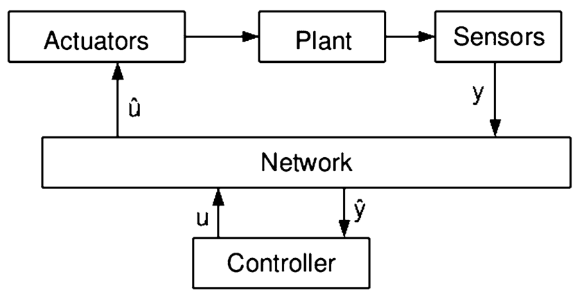

> Image description: A block diagram illustrating the architecture of a Networked Control System (NCS) with two-channel feedback. The system consists of several interconnected functional blocks arranged in a closed-loop configuration. At the top, the physical process is represented by a sequence of three blocks: **Actuators**, **Plant**, and **Sensors**. The flow moves from the Actuators to the Plant, and then to the Sensors. A central, horizontal block labeled **Network** mediates the communication between the physical components and the control hardware. The feedback loop is divided into two channels: 1. **Sensor-to-Controller channel**: The signal **y** (output) flows from the Sensors into the Network, and the received signal **$\hat{y}$** is passed from the Network to the **Controller**. 2. **Controller-to-Actuator channel**: The control signal **u** is sent from the Controller into the Network, and the signal **$\hat{u}$** is transmitted from the Network to the Actuators. The diagram highlights how communication delays or packet losses inherent in a network affect the control loop.
Networked Control Systems: Architecture and Stability Issues, Fig. 3 A NCS architecture with twochannel feedback

## Control Network Scheduler

In general a Multi-Input/Multi-Output (MIMO) NCS with two-channel feedback, both the sampled plant output and controller output are transmitted via a network (see Fig. 3). Because of the network, only the reported output $\mathrm{y}(\mathrm{t})$ is available to the controller and its prediction processes; similarly, only $\hat{\mathrm{u}}(\mathrm{t})$ is available to the actuators on the plant. We label the network-induced error

$$
e(t):=[\hat{y}(t), \hat{u}(t)]^{T}-[y(t), u(t)]^{T}
$$

and the combined state of controller and plant $x(t)=\left[x_{p}(t), x_{c}(t)\right]^{T}$. The state of the entire NCS is given by $z(t)=[x(t), e(t)]^{T}$. Following this general approach, the controller is designed using established techniques without considering the presence of the network.

The behavior of the network-induced error $e(t)$ is mainly determined by the architecture of the NCS and the scheduling strategy. In the special case of one-package transmission, there is only one node transmitting data on the network; therefore, the entire vector $e(t)$ is set to zero at each transmission time. For multiple nodes transmitting measured outputs $y(t)$ and/or computed inputs $u(t)$, the transmission order of the nodes depends on the scheduling strategy chosen for the NCS. In other words, the scheduling strategy decides which components of $e(t)$ are set to zero at the transmission times.

Static and dynamic schedulers (a.k.a. protocols) are two main categories used in a NCS. When the network resource or transmission order are pre-allocated or determined before run-time,
it is called a static scheduler, such as roundrobin scheduling. A dynamic scheduler determines the network allocation while the system runs. A novel dynamic network scheduler, try-once-discard (TOD) and several variations were introduced for wired and wireless NCSs (Walsh and Ye 2001; Ye et al. 2001). For linear and nonlinear NCSs with the new dynamic and commonly used static schedulers, an analytic proof of global exponential stability of a MIMO NCS was provided (Walsh 2001a; Walsh et al. 2001b). Simulation and experiment results showed that the dynamic schedulers outperform static schedulers in terms of NCS performance, e.g., a bigger MATI.

Nesic and Teel (2004a,b) generalize the above results by considering a nonlinear NCS with external disturbances and more general class of protocols (or schedulers). They considered a new class of Lyapunov uniformly globally asymptotically stable (UGAS) protocols in a NCS. It is shown that if the controller is designed without taking into account the network, it yields input-to-state stability (ISS) with respect to external disturbances (not necessarily with respect to the network-induced error), and then the same controller will achieve semi-global practical ISS for the NCS when implemented via the network with a Lyapunov UGAS protocol. Moreover, the ISS gain is preserved. The adjustable parameter with respect to which semi-global practical ISS is achieved is the MATI between transmission times. The authors also studied the input-output $L_{p}$ stability of a NCS for a large class of network scheduling protocols. It is shown that polling, static protocols, and dynamic protocol such as TOD belong to this class. Results in Nesic and Teel (2004a) provide a unifying framework for generating new scheduling protocols that preserve $L_{p}$ stability properties of the system, if a design parameter is chosen to be sufficiently small. The most general version of these results can also be used to model a NCS with data packet dropouts. The proof technique used is based on the small gain theorem and lends itself to an easy interpretation.

A framework for analyzing the stability of a general nonlinear NCS with disturbances in


<!-- source_pdf_page: 861 -->
the setting of $L_{p}$ stability was provided by Tabbara et al. (2007). Their presentation provides sharper results for both gain and MATI than previously obtainable and details the property of uniformly persistently exciting scheduling protocols. This class of protocols was shown to lead to stability for high enough transmission rates. This was a natural property to demand, especially in the design of wireless scheduling protocols. The property is used directly in a novel proof technique based on the notions of vector comparison and (quasi)-monotone systems. Via simulations, analytical, and numerical comparison, it is verified that the uniform persistence of excitation property of protocols is, in some sense, the "finest" property that can be extracted from wireless scheduling protocols.

## Delays and Packet Dropouts

Packet dropouts can be modeled as either stochastic or deterministic phenomena. For a one-channel feedback NCS, Zhang and Branicky (2001) consider a deterministic dropouts model, with packet dropouts occurring at an asymptotic rate. Stability conditions were studied for a NCS with deterministic and stochastic dropouts (Seiler and Sengupta 2005).

Sometimes, the NCS was characterized as a continuous-time delayed differential equation (DDE) with the time-varying delay $\tau(\mathrm{t})$. One important advantage is that the equations are still valid even when the delays exceed the sampling interval. Researchers successfully used the Lyapunov-Krasovskii (Yue et al. 2004) and the Razumikhin theorems (Yu et al. 2004) to study the stability of a NCS that is modeled as DDEs.

## Summary and Future Directions

This article introduced the concept of a networked control system and its general architecture. Several key issues specific to a NCS, such as band-limited channels, network-induced delays, and information packet dropouts, were explained. The stability condition of a NCS with various network effects was discussed with several common modeling techniques.

In terms of future directions, there has been significant effort in analyzing networked control systems with variable sampling rate, but most results investigate the stability for a given worstcase interval between consecutive sampling times, leading to conservative results. An open area of research would be to look at methods that take into account a stochastic characterization for the inter-sampling times. Substantial work has also been devoted to determining the stability of a NCS, as described in this article. Possible open areas of research would be to consider design issues related to the joint stability and performance of the system. The design and development of controllers for a NCS is also an open area of research. In designing a controller for a NCS, one has to take into account the challenges introduced by the communication network. Only afterward can analysis of the whole system take place.

## Cross-References

- Data Rate of Nonlinear Control Systems and Feedback Entropy
- Information and Communication Complexity of Networked Control Systems
- Networked Control Systems: Estimation and Control over Lossy Networks
- Networked Systems
- Quantized Control and Data Rate Constraints


## Bibliography

Baillieul J (1999) Feedback designs for controlling device arrays with communication channel bandwidth constraints. In: Lecture notes of the fourth ARO workshop on smart structures, Penn State University
Baillieul J, Antsaklis PJ (2007) Control and communication challenges in networked control systems. Proc IEEE 95(1):9-28
Hespanha JP, Naghshtabrizi P, Xu Y (2007) A survey of recent results in networked control systems. Proc IEEE 95(1):138-162
Johansson KH, Torngren M, Nielsen L (2005) Vehicle applications of controller area network. In: Levine WS, Hristu-Varsakelis D (eds) Handbook of networked and embedded control systems. Birkhäuser, Boston, pp 741-765


<!-- source_pdf_page: 862 -->
Lin H, Zhai G, Antsaklis PJ (2003) Robust stability and disturbance attenuation analysis of a class of networked control systems. In: 42nd IEEE conference on decision and control, Maui, vol 2, pp 1182-1187
Lin H, Zhai G, Fang L, Antsaklis PJ (2005) Stability and $\mathrm{H}_{1}$ performance preserving scheduling policy for networked control systems. In: Proceedings 16th IFAC world congress, Prague
Montestruque LA, Antsaklis PJ (2004) Stability of model-based networked control systems with timevarying transmission times. IEEE Trans Autom Control 49(9):1562-1572
Nair GN, Evans RJ (2000) Stabilization with data-ratelimited feedback: tightest attainable bounds. Syst Control Lett 41(1):49-56. Elsevier
Nesic D, Teel A (2004a) Input-output stability properties of networked control systems. IEEE Trans Autom Control 49(10): 1650-1667
Nesic D, Teel A (2004b) Input-to-state stability of networked control systems. Automatica 40(12):21212128
Onat A, Naskali T, Parlakay E, Mutluer O (2011) Control over imperfect networks: model-based predictive networked control systems. IEEE Trans Ind Electron 58:905-913
Seiler P , Sengupta R (2005) An $\mathrm{H}_{\infty}$ approach to networked control, IEEE Trans Autom Control 50(3):356-364
Tabbara M, Nesic D, Teel A (2007) Stability of wireless and wireline networked control systems. IEEE Trans Autom Control 52(9):1615-1630
Tatikonda S, Mitter S (2004) Control under communication constraints. IEEE Trans Autom Control 49(7):1056-1068
Walsh G, Ye H (2001) Scheduling of networked control systems. IEEE Control Syst Mag 21(1): 57-65
Walsh G, Ye H, Bushnell L (2001a) Stability analysis of networked control systems. IEEE Trans Control Syst Technol 10(3):438-446
Walsh G, Beldiman O, Bushnell L (2001b) Asymptotic behavior of nonlinear networked control systems. IEEE Trans Autom Control 44:1093-1097
Wang X, Hovakimyan N (2013) Distributed control of uncertain networked systems: a decoupled design. IEEE Trans Autom Control 58(10):2536-2549
Wong WS, Brockett RW (1999) System with finite communication bandwidth constraints-II: stabilization with limited information feedback. IEEE Trans Autom Control 44(5):1049-1053
Yang TC (2006) Networked control system: a brief survey. IEE Proc Control Theory Appl 153(4):403-412
Ye H, Walsh G, Bushnell L (2001) Real-time mixedtraffic wireless networks. IEEE Trans Ind Electron 48(5):883-890
Yu M, Wang L, Chu T, Hao F (2004) An LMI approach to networked control systems with data packet dropout and transmission delays. 43rd IEEE conference on decision and control, Paridise Island, Bahamas, vol 4, pp 3545-3550

Yue D, Han QL, Peng C (2004) State feedback controller design for networked control systems. IEEE Trans Circuits Syst 51(11):640-644
Zhai G, Hu B, Yasuda K, Michel A (2002), Qualitative analysis of discrete-time switched systems, in Proc. Amer. Contr. Conf, vol 3, pp 1880-1885
Zhang W, Branicky MS (2001) Stability of networked control systems with time-varying transmission period. In: Allerton conference on communication, control, and computing, Monticello, IL
Zhang W, Branicky MS, Phillips SM (2001) Stability of networked control systems. IEEE Control Syst Mag 21(1):84-99

## Networked Control Systems: Estimation and Control Over Lossy Networks

João P. Hespanha ${ }^{1}$ and Alexandre R. Mesquita ${ }^{2} { }^{1}$ Center for Control, Dynamical Systems and Computation, University of California, Santa Barbara, CA, USA<br>${ }^{2}$ Department of Electronics Engineering, Federal University of Minas Gerais, Belo Horizonte, Brazil


#### Abstract

This entry discusses optimal estimation and control for lossy networks. Conditions for stability are provided both for two-link and multiple-link networks. The online adaptation of network resources (controlled communication) is also considered.


## Keywords

Automatic control; Communication networks; Controlled communication; Estimation; Networked control systems; Stability

## Introduction

Network Control Systems (NCSs) are spatially distributed systems in which the communication between sensors, actuators, and controllers


<!-- source_pdf_page: 863 -->
occurs through a shared band-limited digital communication network. In this entry, we consider the problem of estimation and control over such networks.

A significant difference between NCSs and standard digital control is the possibility that data may be lost while in transit through the network. Typically, packet dropouts result from transmission errors in physical network links (which is far more common in wireless than in wired networks) or from buffer overflows due to congestion. Long transmission delays sometimes result in packet reordering, which essentially amounts to a packet dropout if the receiver discards "outdated" arrivals. Reliable transmission protocols, such as TCP, guarantee the eventual delivery of packets. However, these protocols are not appropriate for NCSs since the retransmission of old data is generally not useful. Another important difference between NCSs and standard digital control systems is that, due to the nature of network traffic, delays in the control loop may be time varying and nondeterministic.

In this entry, we concentrate on the problem of control and estimation in the presence of packet losses, leaving other important features of NCSs (such as quantization and random delays) to be addressed in other entries of this encyclopedia. Consequently, we assume that the network can be viewed as a channel that can carry real numbers without distortion, but that some of the messages may be lost. This network model is appropriate when the number of bits in each data packet is sufficiently large so that quantization effects can be ignored, but packet dropouts cannot. For more general channel models, see, for example, Imer and Basar (2005).

This entry also does not address network transmission delays explicitly. In general, network delays have two components: one that is due to the time spent transmitting packets and another due to the time packets wait in buffers waiting to be transmitted. Delays due to packet transmission present little variation and may be modeled as constants. For control design purposes, these delays may be incorporated into the plant model. Delays due to buffering depend on the network
traffic and are typically random; they can be analyzed using the techniques developed in Antunes et al. (2012).

Notation and Basic Definitions. Throughout the entry, $\mathbb{R}$ stands for real numbers and $\mathbb{N}$ for nonnegative integers. For a given matrix $A \in \mathbb{R}^{n \times n}$ and vector $x \in \mathbb{R}^{n},\|x\|:=\sqrt{x^{\prime} x}$ denotes the Euclidean norm of $x$, and $\lambda(A)$ the set of eigenvalues of $A$. Random variables are generally denoted in boldface. For a random variable $\mathbf{y}, E[\mathbf{y}]$ stands for the expectation of $\mathbf{y}$.

## Two-Link Networks

Here, we consider a control/estimation problem when all network effects can be modeled using two erasure channels: one from the sensor to the controller and the other from the controller to the actuator (see Fig. 1).

We restrict our attention to a linear timeinvariant (LTI) plant with intermittent observation and control packets:

$$
\begin{align*}
\mathbf{x}_{k+1} & =A \mathbf{x}_{k}+v_{k} B \mathbf{u}_{k}+\mathbf{w}_{k},  \tag{1a}\\
\mathbf{y}_{k} & =\theta_{k} C \mathbf{x}_{k}+\mathbf{v}_{k}, \tag{1b}
\end{align*}
$$

$\forall k \in \mathbb{N}, \mathbf{x}_{k}, \mathbf{w}_{k} \in \mathbb{R}^{n}, \mathbf{y}_{k}, \mathbf{v}_{k} \in \mathbb{R}^{p}$, where $\left(\mathbf{x}_{0}, \mathbf{w}_{k}, \mathbf{v}_{k}\right)$ are mutually independent, zero-mean Gaussian with covariance matrices ( $P_{0}, R_{w}, R_{v}$ ), and $\theta_{k}, v_{k} \in\{0,1\}$ are i.i.d. Bernoulli random variables with $\operatorname{Pr}\left\{\theta_{k}=1\right\}=\bar{\theta}$ and $\operatorname{Pr}\left\{v_{k}=\right. 1\}=\bar{\nu}$. The variable $\theta_{k}$ models the packet loss between sensor and controller, whereas $v_{k}$ models the packet loss between controller and actuator. When there is a packet drop from controller
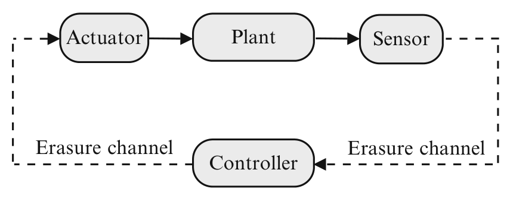

> Image description: A block diagram illustrates a closed-loop control system characterized by two communication links. The loop consists of four primary functional blocks: **Actuator**, **Plant**, **Sensor**, and **Controller**. The control flow follows a circular path. The **Controller** sends a signal through an **Erasure channel** (indicated by a dashed line) to the **Actuator**. The Actuator then drives the **Plant**, which is represented by a shaded oval. The Plant's output is processed by the **Sensor**, which is connected to the Controller via a second dashed line labeled as an **Erasure channel**. The dashed lines and the "Erasure channel" labels indicate that the communication between the Controller/Actuator and the Sensor/Controller is subject to packet loss or data erasure. This configuration represents a Networked Control System where control and sensing information must traverse lossy communication channels, impacting the overall performance of the feedback loop.

Networked Control Systems: Estimation and Control Over Lossy Networks, Fig. 1 Control system with two network links


<!-- source_pdf_page: 864 -->
to actuator, we set the actuator's output to zero. Different strategies, such as holding the control input, could still be modeled using (1) by augmenting of the state vector.

The information available to the controller up to time $k$ is given by the information set:
$\mathcal{I}_{k}=\left\{P_{0}\right\} \cup\left\{\mathbf{y}_{\ell}, \theta_{\ell}: \ell \leq k\right\} \cup\left\{\nu_{\ell}: \ell \leq k-1\right\}$.

Here, we make an important assumption that acknowledgment packets from the actuator are always received by the controller so that $\nu_{\ell}, \ell \leq k-1$ is available at time $k$ to the remote estimator.

## Optimal Estimation with Remote Computation

The optimal mean-square estimate of $\mathbf{x}_{k}$, given the information known to the remote estimator at time $k$, is given by

$$
\hat{\mathbf{x}}_{k \mid k}:=\mathrm{E}\left[\mathbf{x}_{k} \mid \mathcal{I}_{k}\right]
$$

This estimate can be computed recursively using the following time-varying Kalman filter (TVKF) (Sinopoli et al. 2004):

$$
\begin{align*}
& \hat{\mathbf{x}}_{0 \mid-1}=0,  \tag{2a}\\
& \hat{\mathbf{x}}_{k \mid k}=\hat{\mathbf{x}}_{k \mid k-1}+\theta_{k} F_{k}\left(\mathbf{y}_{k}-C \hat{\mathbf{x}}_{k \mid k-1}\right),  \tag{2b}\\
& \hat{\mathbf{x}}_{k+1 \mid k}=A \hat{\mathbf{x}}_{k \mid k}+v_{k} B \mathbf{u}_{k}, \tag{2c}
\end{align*}
$$

with the gain matrix $F_{k}$ calculated recursively as follows

$$
\begin{aligned}
F_{k}= & P_{k} C^{\prime}\left(C P_{k} C^{\prime}+R_{v}\right)^{-1} \\
P_{k+1}= & A P_{k} A^{\prime}+R_{w}-\theta_{k} A F_{k}\left(C P_{k} C^{\prime}+R_{v}\right) \\
& F_{k}^{\prime} A^{\prime}
\end{aligned}
$$

Each $P_{k}$ corresponds to the estimation error covariance matrix

$$
P_{k}=\mathrm{E}\left[\left(\mathbf{x}_{k}-\hat{\mathbf{x}}_{k \mid k-1}\right)\left(\mathbf{x}_{k}-\hat{\mathbf{x}}_{k \mid k-1}\right)^{\prime}\right]
$$

For this estimator, there exists a critical value $\theta_{c}$ for the dropout rate $\bar{\theta}$, above which
the estimation error covariance becomes unbounded:

Theorem 1 (Sinopoli et al. 2004) Assume that ( $A, R_{w}^{1 / 2}$ ) is controllable, ( $A, C$ ) is observable, and $A$ is unstable. Then there exists a critical value $\theta_{c} \in(0,1]$ such that

$$
\mathrm{E}\left[P_{k}\right] \leq M, \forall k \in \mathbb{N} \Leftrightarrow \bar{\theta} \geq \theta_{c}
$$

where $M$ is a positive definite matrix that may depend on $P_{0}$. Furthermore, the critical value $\theta_{c}$ satisfies $\theta_{\text {min }} \leq \theta_{c} \leq \theta_{\text {max }}$, where the lower bound is given by

$$
\begin{equation*}
\theta_{\min }=1-\frac{1}{(\max \{|\lambda(A)|\})^{2}}, \tag{3}
\end{equation*}
$$

and the upper bound is given by the solution to the following (quasi-convex) optimization problem:

$$
\begin{array}{r}
\theta_{\max }=\min \left\{\theta \geq 0: \Psi_{\theta}(Y, Z)>0,\right. \\
0 \leq Y \leq I \text { for some } Y, Z\},
\end{array}
$$

where

$$
\Psi_{\theta}(Y, Z)=
$$

$$
\left[\begin{array}{ccc}
Y & \sqrt{\theta}(Y A+Z C) & \sqrt{1-\theta} Y A \\
\sqrt{\theta}\left(A^{\prime} Y+C^{\prime} Z^{\prime}\right) & Y & 0 \\
\sqrt{1-\theta} A^{\prime} Y & 0 & Y
\end{array}\right] .
$$

Remark 1 In some special cases, the upper bound in (3) is tight in the sense that $\theta_{c}-\theta_{\text {min }}$. The largest class of systems known for which this occurs is that of nondegenerate systems defined in Mo and Sinopoli (2012). Examples of systems in this class include (1) those for which the matrix $C$ is invertible and (2) those with a detectable pair ( $A, C$ ) and such that the matrix $A$ is diagonalizable with unstable eigenvalues having distinct absolute values.


<!-- source_pdf_page: 865 -->
## Optimal Control with Remote Computation

From a control perspective, one may also be interested in finding control sequences $\mathbf{u}^{N}= \left\{\mathbf{u}_{1}, \ldots, \mathbf{u}_{N-1}\right\}$, as functions of the information set $\mathcal{I}_{N}$, which minimize cost functions of the form

$$
J=\lim _{N \rightarrow \infty} \frac{1}{N} \mathrm{E}\left[\sum_{k=0}^{N-1}\left(\mathbf{x}_{k}^{\prime} W \mathbf{x}_{k}+v_{k} \mathbf{u}_{k}^{\prime} U \mathbf{u}_{k}\right) \mid \mathcal{I}_{k}\right]
$$

Theorem 2 (Schenato et al. 2007) Assume that ( $A, B$ ) and ( $A, R_{w}^{1 / 2}$ ) are controllable, ( $A, C$ ) and $\left(A, W^{1 / 2}\right)$ are observable, and $A$ is unstable. Then, finite control costs $J$ are achievable if and only if $\bar{\theta}>\theta_{c}$ and $\bar{v}>v_{c}$, where the critical value $v_{c}$ is given by the (quasi-convex) optimization problem

$$
\begin{array}{r}
v_{c}=\min \left\{v \geq 0: \Psi_{v}(Y, Z)>0,\right. \\
0 \leq Y \leq I \text { for some } Y, Z\},
\end{array}
$$

where

$$
\begin{aligned}
& \Psi_{v}(Y, Z)= \\
& {\left[\begin{array}{ccccc}
Y & Y & \sqrt{v} Z U^{1 / 2} & \sqrt{v}\left(Y A^{\prime}+Z B^{\prime}\right) & \sqrt{1-v} Y A^{\prime} \\
Y & W^{-1} & 0 & 0 & 0 \\
\sqrt{v} U^{1 / 2} Z^{\prime} & 0 & I & 0 & 0 \\
\sqrt{v}\left(A Y+B Z^{\prime}\right) & 0 & 0 & Y & 0 \\
\sqrt{1-v} A Y & 0 & 0 & 0 & Y
\end{array}\right] .}
\end{aligned}
$$

Moreover, under the above conditions, the separation principle holds in the sense that the optimal control is given by

$$
\mathbf{u}_{k}=-\left(B^{\prime} S B+U\right)^{-1} B^{\prime} S A \hat{\mathbf{x}}_{k \mid k}
$$

where $\hat{\mathbf{x}}_{k \mid k}$ is an optimal state estimate given by (2) and the matrix $S$ is the solution to the modified algebraic Riccati (MARE) equation

$$
S=A^{\prime} S A+W-\bar{v} A^{\prime} S B\left(B^{\prime} S B+U\right)^{-1} B^{\prime} S A .
$$

Solutions to the MARE may be obtained iteratively when $\bar{v}>v_{c}$.

## Estimation with Local Computation

To reduce the gap between the bounds $\theta_{\text {min }}$ and $\theta_{\text {max }}$ on the critical value of the drop probability in Theorem 1 and to allow for larger probabilities of drop, one may choose to compute state estimates at the sensor and transmit those to the controller/actuator. This scheme is motivated by the growing number of smart sensors with embedded processing units that are capable of local computation. For the LTI plant

$$
\begin{aligned}
\mathbf{x}_{k+1} & =A \mathbf{x}_{k}+B \mathbf{u}_{k}+\mathbf{w}_{k} \\
\mathbf{y}_{k} & =C \mathbf{x}_{k}+\mathbf{v}_{k}
\end{aligned}
$$

the smart sensor can compute locally an optimal state estimate using a standard stationary Kalman filter and transmits this estimate to the controller. We model packet dropouts as before using the process $\theta_{k}$ and assume that the process $\theta_{k}$ is known to the smart sensor by means of an perfect acknowledgment mechanism. This allows the sensor to know $\mathbf{u}_{k}$ exactly and to use it in the Kalman filter.

Let $\tilde{\mathbf{x}}_{k \mid k}=\mathrm{E}\left[\mathbf{x}_{k} \mid \mathbf{y}_{\ell}, \theta_{\ell}, \ell \leq k\right]$ denote the local estimates transmitted by the sensor. Using the messages successfully received up to time $k$, the remote estimator computes the optimal estimate

$$
\hat{\mathbf{x}}_{k \mid k-1}=\mathrm{E}\left[\mathbf{x}_{k} \mid \theta_{\ell}, \tilde{\mathbf{x}}_{\ell \mid \ell}, \ell \leq k-1\right] .
$$

recursively by

$$
\begin{aligned}
& \hat{\mathbf{x}}_{0 \mid-1}=0 \\
& \hat{\mathbf{x}}_{k \mid k}=\left(1-\theta_{k}\right) \hat{\mathbf{x}}_{k \mid k-1}+\theta_{k} \tilde{\mathbf{x}}_{k \mid k}, \quad k \in \mathbb{N}, \\
& \hat{\mathbf{x}}_{k+1 \mid k}=A \hat{\mathbf{x}}_{k \mid k}+B \mathbf{u}_{k}
\end{aligned}
$$


<!-- source_pdf_page: 866 -->
Notice that now we are applying the (TVKF) to estimate $\tilde{\mathbf{x}}_{k}$, which is fully observable. Since $\theta_{\text {min }}$ and $\theta_{\text {max }}$ in Theorem 2 are equal for fully observable processes (Schenato et al. 2007), the local computation scheme grants a minimal critical value $\theta_{c}$ as stated in the theorem below.
Theorem 3 Assume that ( $A, R_{w}^{1 / 2}$ ) is controllable, $(A, C)$ is Observable, and $A$ is unstable. Then the critical value $\theta_{c}$ is given by $\theta_{\text {min }}$ in (3), i.e.,

$$
\mathrm{E}\left[P_{k}\right] \leq M, \forall k \in \mathbb{N} \quad \Leftrightarrow \quad \bar{\theta} \geq \theta_{\min }
$$

where $M$ is a positive definite matrix that may depend on $P_{0}$.

## Drops in the Acknowledgement Packets

When there are drops in the acknowledgment channel from the actuator to the controller, the controller does not always know $v_{k}$, and therefore, it might not always have access to the control inputs that are actually applied to the plant. In this case, the posterior state probability becomes a Gaussian mixture distribution with infinitely many components, and the separation principle no longer holds (Schenato et al. 2007). This makes the estimation and control problems computationally more difficult, and, due to the smaller information set, some performance degradation in the control performance should be expected. For this reason, it is generally a good design choice to keep controller and actuator collocated when drops in the acknowledgment channels are significant.

## Buffering

As an alternative to the approach described in section "Estimation with Local Computation" to use local computation at a smart sensor to allow for larger probabilities of drop, the designer may also consider the transmission of a sequence of previous measurements $\mathbf{y}_{k}, \mathbf{y}_{k-1}, \ldots, \mathbf{y}_{k-N}$ in each packet. This approach is motivated by the fact that often data packets can carry much more than one vector of measured outputs. When $N$ is reasonably large, one should expect similar estimation/control performances as in
the approach described in section "Estimation with Local Computation", but with a reduced computational effort at the sensor.

Analogously, an improvement to zeroing or simply holding the control input in case of packet drops between controller and actuator is for the controller to transmit a control sequence $\mathbf{u}_{k}, \mathbf{u}_{k+1}, \ldots, \mathbf{u}_{k+N}$ that contains not only the control $\mathbf{u}_{k}$ to be used at the current time instant but also a few future controls $\mathbf{u}_{k+1}, \mathbf{u}_{k+2}, \ldots, \mathbf{u}_{k+N}$. In the case of packet drops between controller and actuator, the actuator can use previously received "future" control inputs in lieu of the one contained in the lost packet. The sequence of future control inputs may be obtained, e.g., by an optimal receding horizon control strategy (Gupta et al. 2006).

## Estimation with Markovian Drops

When $\theta_{k}$ is a Markov process, we no longer have a separation principle, and the optimal controller may depend on the drops sequence. Yet, optimal state estimates are obtained using the same TVKF presented earlier. Below, we give conditions for the stability of the error covariance when drops are governed by the Gilbert-Elliot model: $\operatorname{Pr}\left\{\theta_{k+1}=j \mid \theta_{k}=i\right\}=p_{i j}, i, j \in \{0,1\}$.

Theorem 4 (Mo and Sinopoli 2012) Assume that $\left(A, R_{w}^{1 / 2}\right)$ is controllable, $A$ is unstable, and the system given by the pair ( $A, C$ ) is nondegenerate as discussed in Remark 1. Moreover, suppose that the transition probabilities for the Gilbert-Elliot model satisfy $p_{01} ; p_{10}>0$. Then the expected error covariance $\mathrm{E}\left[P_{k}\right]$ is uniformly bounded if

$$
p_{01}>\theta_{\min }
$$

and it is unbounded for some initial condition if $p_{01}<\theta_{\text {min }}$.

## Networks with Multiple Links

We now consider feedback loops that are closed over a network of communication links, each of which drops packets according to a Bernoulli


<!-- source_pdf_page: 867 -->
process. The sensor communicates with a controller across the network, and we assume that controller and actuator are collocated. The network may be represented by a graph $\mathcal{G}$ with nodes in the set $\mathcal{V}$ and edges in the set $\mathcal{E}$, where edges are drawn between two communicating nodes. We denote by $p_{i j}$ the probability of a drop when node $i$ transmits to node $j$. Drops are assumed to be independent across links and time.

To maximize robustness with respect to drops, sensors use a Kalman filter to compute an optimal estimate for the state of the process based on their measurements and transmit this estimate across the network. When the sensors do not have access to the process input, they can take advantage of the linearity of the Kalman filter: as the output of a Kalman filter is the sum of a term due to measurements with another term due to control inputs, sensors may compute only the contribution due to measurements and transmit it to the controller, which can subsequently add the contribution due to the control inputs. This guarantees that optimal state estimates can still be computed at the control node, even when the sensors do not know the control input (Gupta et al. 2009).

The communication in the network goes as follows. Sensors time stamp their estimates and broadcast them to all nodes in their communication ranges. After receiving information from their neighbors, nodes compare time stamps and keep only the most recent estimates. These estimates are broadcasted to all neighboring nodes. When the controller receives new information, the optimal Kalman estimate is reconstructed, taking into account the total transmission delay (learned from the packet time stamps), and a standard LQG control can be used (Gupta et al. 2009).

To determine whether or not this procedure results in a stable closed loop, one defines a cut $\mathcal{C}=(\mathcal{S}, \mathcal{T})$ to be a partition of the node set $\mathcal{V}$ such that the sensor node is in $\mathcal{S}$ and the controller node is in $\mathcal{T}$. The cut-set is then defined as the set of edges $(i, j) \in \mathcal{E}$ such that $i \in \mathcal{S}$ and $j \in \mathcal{T}$, i.e., the set of edges that connect the sets $\mathcal{S}$ and $\mathcal{T}$. The max-cut probability is then defined as

$$
p_{\text {max-cut }}=\max _{\text {all cuts }(\mathcal{S}, \mathcal{T})} \prod_{(i, j) \in \mathcal{S} \times \mathcal{T}} p_{i j}
$$

The above maximization can be rewritten as a minimization over the sums of $-\log p_{i j}$, which leads to a linear program known as the minimum cut problem in network optimization theory (Cook 1995).

Theorem 5 (Gupta et al. 2009) Assume that $R_{w}, R_{v}>0$, that ( $A, B$ ) is stabilizable, that ( $A, C$ ) is observable, and that $A$ is unstable. Then the control and communication policy described above is optimal for quadratic costs, and the expected state covariance is bounded if and only if

$$
p_{\max -\mathrm{cut}} \cdot(\max \{|\lambda(A)|\})^{2}<1
$$

## Estimation with Controlled Communication

To actively reduce network traffic and power consumption, sensor measurements may not be sent to the remote estimator at every time step. In addition, one may have the ability to somewhat control the probability of packet drops by varying the transmit power or by transmitting copies of the same message through multiple channel realizations. This is known as controlled communication, and it allows the designer to establish a trade-off between communication and estimation performance.

We consider the local estimation scenario described in section "Estimation with Local Computation" with the difference that the Bernoulli drops are now modulated as follows

$$
\theta_{k}= \begin{cases}1 & \text { with prob. } \Lambda_{k} \\ 0 & \text { with prob. } 1-\Lambda_{k}\end{cases}
$$

where the sensor is free to choose $\Lambda_{k} \in\left[0, p_{\text {max }}\right]$ as a function of the information available up to time $k$. With its choice, the sensor incurs on a communication cost $c\left(\Lambda_{k}\right)$ at time $k$, where $c(\cdot)$ is some increasing function that may represent, for example, the energy needed in order to transmit with a probability of drop equal to $\Lambda_{k}$. Note


<!-- source_pdf_page: 868 -->
that transmission scheduling, where $\Lambda_{k}$ is either 0 or $p_{\text {max }}$, is a special case of this framework.

In order to choose $\Lambda_{k}$, the sensor considers the estimation error $\tilde{\mathbf{e}}_{k}:=\tilde{\mathbf{x}}_{k \mid k}-\hat{\mathbf{x}}_{k \mid k-1}$ between the local and the remote estimators. This error evolves according to

$$
\tilde{\mathbf{e}}_{k+1}= \begin{cases}\mathbf{d}_{k} & \text { with prob. } \Lambda_{k} \\ A \tilde{\mathbf{e}}_{k}+\mathbf{d}_{k} & \text { with prob. } 1-\Lambda_{k}\end{cases}
$$

where $\mathbf{d}_{k}$ is the innovations process arising from the standard Kalman filter in the smart sensor.

Our objective is to find a "communication policy" that minimizes the long-term average cost

$$
\begin{align*}
\tilde{J}:= & \lim _{K \rightarrow \infty} \frac{1}{K} \mathrm{E}\left[\sum_{k=0}^{K-1}\left\|\tilde{\mathbf{e}}_{k}\right\|^{2}+\lambda c\left(\Lambda_{k}\right)\right], \\
& \lambda>0, \tag{4}
\end{align*}
$$

which penalizes a linear combination of the remote estimation error variance $\mathrm{E}\left[\left\|\tilde{\mathbf{e}}_{k}\right\|^{2}\right]$ and the average communication cost $\mathrm{E}\left[c\left(\Lambda_{k}\right)\right]$. In this context, a communication policy should be understood as a rule that selects $\Lambda_{k}$ as a function of the information available to the sensor.

When

$$
\left(1-p_{\max }\right) \max \{|\lambda(A)|\}^{2}<1,
$$

there exists an optimal communication policy that chooses $\Lambda_{k}$ as a function of $\tilde{e}_{k}$, which may be computed via dynamic programming and value iteration (Mesquita et al. 2012). While this procedure can be computationally difficult, it is often possible to obtain suboptimal but reasonable performance with rollout policies such as the following one:

$$
\begin{align*}
\Lambda_{k}= & \arg \min _{\Lambda \in\left[0, p_{\max }\right]}\left[\left(p_{\max }-\Lambda\right) \tilde{\mathbf{e}}_{k}^{\prime} A^{\prime} H A \tilde{\mathbf{e}}_{k}\right. \\
& +\lambda c(\Lambda)] \tag{5}
\end{align*}
$$

where $H$ is the positive semidefinite solution to the Lyapunov equation $\left(1-p_{\text {max }}\right) A^{\prime} H A-H= -I$ (Mesquita et al. 2012).

When computing $\tilde{\mathbf{e}}_{k}$ and $\Lambda_{k}$ in (5) is computationally too costly for the sensor, one may prefer to make $\Lambda_{k}$ a function of the number of consecutive dropped packets $\ell_{k}$. In this case, minimizing $\tilde{J}$ in (4) is equivalent to minimizing the cost

$$
\bar{J}:=\lim _{K \rightarrow \infty} \frac{1}{K} \mathrm{E}\left[\sum_{k=0}^{K-1} \operatorname{trace}\left(\Sigma_{\ell_{k}}\right)+\lambda c\left(\Lambda_{k}\right)\right],
$$

where

$$
\Sigma_{\ell}:=\sum_{m=0}^{\ell} A^{\prime m} R_{w} A^{m}
$$

Since $\ell_{k}$ belongs to a countable set, one can very efficiently solve this optimization using dynamic programming (Mesquita et al. 2012).

## Summary and Future Directions

Most positive results in the subject rely on the assumption of perfect acknowledgments and on actuators and controllers being collocated. Future research should address ways of circumventing these assumptions.

## Cross-References

## - Data Rate of Nonlinear Control Systems and Feedback Entropy

- Information and Communication Complexity of Networked Control Systems
- Networked Control Systems: Architecture and Stability Issues
- Networked Systems
- Quantized Control and Data Rate Constraints


## Bibliography

Antunes D, Hespanha JP, Silvestre C (2012) Volterra integral approach to impulsive renewal systems: application to networked control. IEEE Trans Autom Control 57:607-619
Cook WJ (1995) Combinatorial optimization: papers from the DIMACS special year, vol 20. American Mathematical Society, Providence


<!-- source_pdf_page: 869 -->
Gupta V, Sinopoli B, Adlakha S, Goldsmith A, Murray R (2006) Receding horizon networked control. In: Proceedings of the allerton conference on communication, control, and computing, Monticello
Gupta V, Dana AF, Hespanha JP, Murray RM, Hassibi B (2009) Data transmission over networks for estimation and control. IEEE Trans Autom Control 54(8):1807-1819
Imer OC, Basar T (2005) Optimal estimation with limited measurements. In: Proceedings of the 44th IEEE conference on decision and control, 2005 and 2005 European control conference (CDC-ECC'05), Seville
Mesquita AR, Hespanha JP, Nair GN (2012) Redundant data transmission in control/estimation over lossy networks. Automatica 48(8):1612-1620
Mo Y, Sinopoli B (2012) Kalman filtering with intermittent observations: tail distribution and critical value. IEEE Trans Autom Control 57(3):677-689
Schenato L, Sinopoli B, Franceschetti M, Poolla K, Sastry SS (2007) Foundations of control and estimation over lossy networks. Proc IEEE 95(1): 163-187
Sinopoli B, Schenato L, Franceschetti M, Poolla K, Jordan MI, Sastry SS (2004) Kalman filtering with intermittent observations. IEEE Trans Autom Control 49(9):1453-1464

## Networked Systems

Jorge Cortés
Department of Mechanical and Aerospace
Engineering, University of California, San
Diego, La Jolla, CA, USA


#### Abstract

This entry provides a brief overview on networked systems from a systems and control perspective. We pay special attention to the nature of the interactions among agents; the critical role played by information sharing, dissemination, and aggregation; and the distributed control paradigm to engineer the behavior of networked systems.


## Keywords

Autonomous networks; Cooperative control; Multi-agent systems; Swarms

## Introduction

Networked systems appear in numerous scientific and engineering domains, including communication networks (Toh 2001), multi-robot networks (Arkin 1998; Balch and Parker 2002), sensor networks (Santi 2005; Schenato et al. 2007), water irrigation networks (Cantoni et al. 2007), power and electrical networks (Chow 1982; Chiang et al. 1995; Dörfler et al. 2013), camera networks (Song et al. 2011), transportation networks (Ahuja et al. 1993), social networks (Jackson 2010), and chemical and biological networks (Kuramoto 1984; Strogatz 2003). Their applications are pervasive, ranging from environmental monitoring, ocean sampling, and marine energy systems, through search and rescue missions, high-stress deployment in disaster recovery, health monitoring of critical infrastructure to science imaging, the smart grid, and cybersecurity.

The rich nature of networked systems makes it difficult to provide a definition that, at the same time, is comprehensive enough to capture their variety and simple enough to be expressive of their main features. With this in mind, we loosely define a networked system as a "system of systems," i.e., a collection of agents that interact with each other. These groups might be heterogeneous, composed by human, biological, or engineered agents possessing different capabilities regarding mobility, sensing, actuation, communication, and computation. Individuals may have objectives of their own or may share a common objective with others - which in turn might be adversarial with respect to another subset of agents.

In a networked system, the evolutions of the states of individual agents are coupled. Coupling might be the result of the physical interconnection among the agents, the consequence of the implementation of coordination algorithms where agents use information about each other, or a combination of both. There is diversity too in the nature of agents themselves and the interactions among them, which might be cooperative, adversarial, or belong to the rich range between the two. Due to changes in the state of the agents, the network, or the environment, interactions among


<!-- source_pdf_page: 870 -->
agents may be changing and dynamic. Such interactions may be structured across different layers, which themselves might be organized in a hierarchical fashion. Networked systems may also interact with external entities that specify highlevel commands that trickle down through the system all the way to the agent level.

A defining characteristic of a networked system is the fact that information, understood in a broad sense, is sparse and distributed across the agents. As such, different individuals have access to information of varying degrees of quality. As part of the operation of the networked system, mechanisms are in place to share, transmit, and/or aggregate this information. Some information may be disseminated throughout the whole network or, in some cases, all information can be made centrally available at a reasonable cost. In other scenarios, however, the latter might turn out to be too costly, unfeasible, or undesirable because of privacy and security considerations. Individual agents are the basic unit for decision making, but decisions might be made from intermediate levels of the networked system all the way to a central planner. The combination of information availability and decision-making capabilities gives rise to an ample spectrum of possibilities between the centralized control paradigm, where all information is available at a central planner who makes the decisions, and the fully distributed control paradigm, where individual agents only have access to the information shared by their neighbors in addition to their own.

## Perspective from Systems and Control

There are many aspects that come into play when dealing with networked systems regarding computation, processing, sensing, communication, planning, motion control, and decision making. This complexity makes their study challenging and fascinating and explains the interest that, with different emphases, they generate in a large number of disciplines. In biology, scientists analyze synchronization phenomena and selforganized swarming behavior in groups with
distributed agent-to-agent interactions (Okubo 1986; Parrish et al. 2002; Conradt and Roper 2003; Couzin et al. 2005). In robotics, engineers design algorithmic solutions to help multivehicle networks and embedded systems coordinate their actions and perform challenging spatially distributed tasks (Arkin 1998; Committee on Networked Systems of Embedded Computers 2001; Balch and Parker 2002; Howard et al. 2006; Kumar et al. 2008). Graph theorists and applied mathematicians study the role played by the interconnection among agents in the emergence of phase transition phenomena (Bollobás 2001; Meester and Roy 2008; Chung 2010). This interest is also shared in communication and information theory, where researchers strive to design efficient communication protocols and examine the effect of topology control on group connectivity and information dissemination (Zhao and Guibas 2004; Giridhar and Kumar 2005; Lloyd et al. 2005; Santi 2005; Franceschetti and Meester 2007). Game theorists study the gap between the performance achieved by global, network-wide optimizers and the configurations that result from selfish agents interacting locally in social and economic systems (Roughgarden 2005; Nisan et al. 2007; Easley and Kleinberg 2010; Marden and Shamma 2013). In mechanism design, researchers seek to align the objectives of individual self-interested agents with the overall goal of the network. Static and mobile networked systems and their applications to the study of natural phenomena in oceans (Paley et al. 2008; Graham and Cortés 2012; Zhang and Leonard 2010; Das et al. 2012; Ouimet and Cortés 2013), rivers (Ru and Martínez 2013; Tinka et al. 2013), and the environment (DeVries and Paley 2012) also raise exciting challenges in estimation theory, computational geometry, and spatial statistics.

The field of systems and control brings a comprehensive approach to the modeling, analysis, and design of networked systems. Emphasis is put on the understanding of the general principles that explain how specific collective behaviors emerge from basic interactions; the establishment of models, abstractions, and tools that allow us to reason rigorously about complex


<!-- source_pdf_page: 871 -->
interconnected systems; and the development of systematic methodologies that help engineer their behavior. The ultimate goal is to establish a science for integrating individual components into complex, self-organizing networks with predictable behavior. To realize the "power of many" and expand the realm of what is possible to achieve beyond the individual agent capabilities, special care is taken to obtain precise guarantees on the stability properties of coordination algorithms, understand the conditions and constraints under which they work, and characterize their performance and robustness against a variety of disturbances and disruptions.

## Research Issues - and How the Entries in the Encyclopedia Address Them

Given the key role played by agent-to-agent interactions in networked systems, the Encyclopedia entries - Graphs for Modeling Networked Interactions and ▷ Dynamic Graphs, Connectivity of deal with how their nature and effect can be modeled through graphs. This includes diverse aspects such as deterministic and stochastic interactions, static and dynamic graphs, statedependent and time-dependent neighboring relationships, and connectivity. The importance of maintaining a certain level of coordination and consistency across the networked system is manifested in the various entries that deal with coordination tasks that are, in some way or another, related to some form of agreement. These include consensus ( - Averaging Algorithms and Consensus), formation control ( - Vehicular Chains), cohesiveness, flocking ( ← Flocking in Networked Systems), synchronization ( ↓ Oscillator Synchronization), and distributed optimization ( - Distributed Optimization). A great deal of work (e.g., see ▷ Optimal Deployment and Spatial Coverage and - Multi-vehicle Routing), is also devoted to the design of cooperative strategies that achieve spatially distributed tasks such as optimal coverage, space partitioning, vehicle routing, and servicing. These entries explore the optimal placement of agents,
the optimal tuning of sensors, and the distributed optimization of network resources. The entry - Estimation and Control over Networks explores the impact that communication channels may have on the execution of estimation and control tasks over networks of sensors and actuators. A strong point of commonality among the contributions is the precise characterization of the scalability of coordination algorithms, together with the rigorous analysis of their correctness and stability properties. Another focal point is the analysis of the performance gap between centralized and distributed approaches in regard to the ultimate network objective.

Further information about other relevant aspects of networked systems can be found throughout this Encyclopedia. Among these, we highlight the synthesis of cooperative strategies for data fusion, distributed estimation, and adaptive sampling, the analysis of the network operation under communication constraints (e.g., limited bandwidth, message drops, delays, and quantization), the treatment of game-theoretic scenarios that involve interactions among multiple players and where security concerns might be involved, distributed model predictive control, and the handling of uncertainty, imprecise information, and events via discreteevent systems and triggered control.

## Summary and Future Directions

In conclusion, this entry has illustrated ways in which systems and control can help us design and analyze networked systems. We have focused on the role that information and agent interconnection play in shaping their behavior. We have also made emphasis on the increasingly rich set of methods and techniques that allow to provide correctness and performance guarantees. The field of networked systems is vast and the amount of work impossible to survey in this brief entry. The reader is invited to further explore additional topics beyond the ones mentioned here. The monographs (Ren and Beard 2008; Bullo et al. 2009; Mesbahi and Egerstedt 2010; Alpcan and Başar 2010) and edited


<!-- source_pdf_page: 872 -->
volumes (Kumar et al. 2004; Shamma 2008; Saligrama 2008), and manuscripts (Olfati-Saber et al. 2007; Baillieul and Antsaklis 2007; Leonard et al. 2007; Kim and Kumar 2012), together with the references provided in the Encyclopedia entries mentioned above, are a good starting point to undertake this enjoyable effort. Given the big impact that networked systems have, and will continue to have, in our society, from energy and transportation, through human interaction and healthcare, to biology and the environment, there is no doubt that the coming years will witness the development of more tools, abstractions, and models that allow to reason rigorously about intelligent networks and for techniques that help design truly autonomous and adaptive networks.

## Cross-References

- Averaging Algorithms and Consensus
- Dynamic Graphs, Connectivity of
- Distributed Optimization
- Estimation and Control over Networks
- Flocking in Networked Systems
- Graphs for Modeling Networked Interactions
- Multi-vehicle Routing
- Optimal Deployment and Spatial Coverage
- Oscillator Synchronization
- Vehicular Chains


## Bibliography

Ahuja RK, Magnanti TL, Orlin JB (1993) Network flows: theory, algorithms, and applications. Prentice Hall, Englewood Cliffs
Alpcan T, Başar T (2010) Network security: a decision and game-theoretic approach. Cambridge University Press, Cambridge, UK
Arkin RC (1998) Behavior-based robotics. MIT, Cambridge, MA
Baillieul J, Antsaklis PJ (2007) Control and communication challenges in networked real-time systems. Proc IEEE 95(1):9-28
Balch T, Parker LE (eds) (2002) Robot teams: from diversity to polymorphism. A. K. Peters, Wellesley, MA
Bollobás B (2001) Random graphs, 2nd edn. Cambridge University Press, Cambridge, UK

Bullo F, Cortés J, Martínez S (2009) Distributed control of robotic networks. Applied mathematics series. Princeton University Press, Princeton, NJ. Electronically available at http://coordinationbook.info
Cantoni M, Weyer E, Li Y, Ooi SK, Mareels I, Ryan M (2007) Control of large-scale irrigation networks. Proc IEEE 95(1):75-91
Chiang HD, Chu CC, Cauley G (1995) Direct stability analysis of electric power systems using energy functions: theory, applications, and perspective. Proc IEEE 83(11): 1497-1529
Chow JH (1982) Time-scale modeling of dynamic networks with applications to power systems. Springer, New York, NY
Chung FRK (2010) Graph theory in the information age. Not AMS 57(6):726-732
Committee on Networked Systems of Embedded Computers (2001) Embedded, everywhere: a research agenda for networked systems of embedded computers. National Academy Press, Washington, DC
Conradt L, Roper TJ (2003) Group decision-making in animals. Nature 421(6919): 155-158
Couzin ID, Krause J, Franks NR, Levin SA (2005) Effective leadership and decision-making in animal groups on the move. Nature 433(7025):513-516
Das J, Py F, Maughan T, O'Reilly T, Messié M, Ryan J, Sukhatme GS, Rajan K (2012) Coordinated sampling of dynamic oceanographic features with AUVs and drifters. Int J Robot Res 31(5):626-646
DeVries L, Paley D (2012) Multi-vehicle control in a strong flowfield with application to hurricane sampling. AIAA J Guid Control Dyn 35(3): 794-806
Dörfler F, Chertkov M, Bullo F (2013) Synchronization in complex oscillator networks and smart grids. Proc Natl Acad Sci 110(6):2005-2010
Easley D, Kleinberg J (2010) Networks, crowds, and markets: reasoning about a highly connected world. Cambridge University Press, Cambridge, UK
Franceschetti M, Meester R (2007) Random networks for communication. Cambridge University Press, Cambridge, UK
Giridhar A, Kumar PR (2005) Computing and communicating functions over sensor networks. IEEE J Sel Areas Commun 23(4):755-764
Graham R, Cortés J (2012) Adaptive information collection by robotic sensor networks for spatial estimation. IEEE Trans Autom Control 57(6): 1404-1419
Howard A, Parker LE, Sukhatme GS (2006) Experiments with a large heterogeneous mobile robot team: exploration, mapping, deployment, and detection. Int J Robot Res 25(5-6):431-447
Jackson MO (2010) Social and economic networks. Princeton University Press, Princeton, NJ
Kim KD, Kumar PR (2012) Cyberphysical systems: a perspective at the centennial. Proc IEEE 100(Special Centennial Issue): 1287-1308
Kumar V, Leonard NE, Morse AS (eds) (2004) Cooperative control. Lecture notes in control and information sciences, vol 309. Springer, New York, NY


<!-- source_pdf_page: 873 -->
Kumar V, Rus D, Sukhatme GS (2008) Networked robots. In: Siciliano B, Khatib O (eds) Springer handbook of robotics. Springer, New York, NY, pp 943-958
Kuramoto Y (1984) Chemical oscillations, waves, and turbulence. Springer, New York, NY
Leonard NE, Paley D, Lekien F, Sepulchre R, Fratantoni DM, Davis R (2007) Collective motion, sensor networks and ocean sampling. Proc IEEE 95(1): 48-74
Lloyd EL, Liu R, Marathe MV, Ramanathan R, Ravi SS (2005) Algorithmic aspects of topology control problems for ad hoc networks. Mobile Netw Appl 10(1-2): 19-34
Marden JR, Shamma JS (2013) Game theory and distributed control. In: Young P, Zamir S (eds) Handbook of game theory, vol 4. Elsevier, Oxford, UK
Meester R, Roy R (2008) Continuum percolation. Cambridge University Press, Cambridge, UK
Mesbahi M, Egerstedt M (2010) Graph theoretic methods in multiagent networks. Applied mathematics series. Princeton University Press, Princeton, NJ
Nisan N, Roughgarden T, Tardos E, Vazirani VV (2007) Algorithmic game theory. Cambridge University Press, Cambridge, UK
Okubo A (1986) Dynamical aspects of animal grouping: swarms, schools, flocks and herds. Adv Biophys 22:194
Olfati-Saber R, Fax JA, Murray RM (2007) Consensus and cooperation in networked multi-agent systems. Proc IEEE 95(1):215-233
Ouimet M, Cortés J (2013) Collective estimation of ocean nonlinear internal waves using robotic underwater drifters. IEEE Access 1:418-427
Paley D, Zhang F, Leonard N (2008) Cooperative control for ocean sampling: the glider coordinated control system. IEEE Trans Control Syst Technol 16(4):735744
Parrish JK, Viscido SV, Grunbaum D (2002) Selforganized fish schools: an examination of emergent properties. Biol Bull 202:296-305
Ren W, Beard RW (2008) Distributed consensus in multivehicle cooperative control. Communications and control engineering. Springer, New York, NY
Roughgarden T (2005) Selfish routing and the price of anarchy. MIT, Cambridge, MA
Ru Y, Martínez S (2013) Coverage control in constant flow environments based on a mixed energy-time metric. Automatica 49(9):2632-2640
Saligrama V (ed) (2008) Networked sensing information and control. Springer, New York, NY
Santi P (2005) Topology control in wireless ad hoc and sensor networks. Wiley, New York, NY
Schenato L, Sinopoli B, Franceschetti M, Poolla K, Sastry SS (2007) Foundations of control and estimation over lossy networks. Proc IEEE 95(1):163-187
Shamma JS (ed) (2008) Cooperative control of distributed multi-agent systems. Wiley, New York, NY
Song B, Ding C, Kamal AT, Farrel JA, Roy-Chowdhury AK (2011) Distributed camera networks. IEEE Signal Process Mag 28(3):20-31

Strogatz SH (2003) SYNC: the emerging science of spontaneous order. Hyperion, New York, NY
Tinka A, Rafiee M, Bayen A (2013) Floating sensor networks for river studies. IEEE Syst J 7(1):36-49
Toh CK (2001) Ad hoc mobile wireless networks: protocols and systems. Prentice Hall, Englewood Cliffs, NJ
Zhang F, Leonard NE (2010) Cooperative filters and control for cooperative exploration. IEEE Trans Autom Control 55(3):650-663
Zhao F, Guibas L (2004) Wireless sensor networks: an information processing approach. Morgan-Kaufmann, San Francisco, CA

# Neural Control and Approximate Dynamic Programming

Frank L. Lewis ${ }^{1}$ and Kyriakos G. Vamvoudakis ${ }^{2} { }^{1}$ Arlington Research Institute, University of Texas, Fort Worth, TX, USA<br>${ }^{2}$ Center for Control, Dynamical Systems and Computation (CCDC), University of California, Santa Barbara, CA, USA


#### Abstract

There has been great interest recently in "universal model-free controllers" that do not need a mathematical model of the controlled plant, but mimic the functions of biological processes to learn about the systems they are controlling online, so that performance improves automatically. Neural network (NN) control has had two major thrusts: approximate dynamic programming, which uses NN to approximately solve the optimal control problem, and NN in closed-loop feedback control.


## Keywords

Adaptive control; Learning systems; Neural networks; Optimal control; Reinforcement learning

## Neural Feedback Control

The objective is to design NN feedback controllers that cause a system to follow, or track,


<!-- source_pdf_page: 874 -->
a prescribed trajectory or path. Consider the dynamics of an $n$-link robot manipulator

$$
\begin{equation*}
M(q) \ddot{q}+V_{m}(q, \dot{q}) \dot{q}+G(q)+F(\dot{q})+\tau_{d}=\tau \tag{1}
\end{equation*}
$$

with $q(t) \in \mathbb{R}^{n}$ the joint variable vector, $M(q)$ an inertia matrix, $V_{m}$ a centripetal/coriolis matrix, $G(q)$ a gravity vector, and $F(\cdot)$ representing friction terms. Bounded unknown disturbances and modeling errors are denoted by $\tau_{d}$ and the control input torque is $\tau(t)$. The sliding mode control approach (Slotine and Li 1987) can be generalized to NN control systems. Given a desired trajectory, $q_{d} \in \mathbb{R}^{n}$ define the tracking error $e(t)=q_{d}(t)-q(t)$ and the sliding variable error $r=\dot{e}+\lambda e$ with $\lambda=\lambda^{T}>0$. Define the nonlinear robot function,

$$
\begin{aligned}
f(x)= & M(q)\left(\ddot{q}_{d}+\lambda \dot{e}\right)+V_{m}(q, \dot{q})\left(\dot{q}_{d}+\lambda e\right) \\
& +G(q)+F(\dot{q})
\end{aligned}
$$

with the known vector $x(t)$ of measured signals is selected as, $x=\left[e^{T} \dot{e}^{T} q_{d}^{T} \dot{q}_{d}^{T} \ddot{q}_{d}^{T}\right]$.

## NN Controller for Continuous-Time Systems

The NN controller is designed based on functional approximation properties of NN as shown in Lewis et al. (1999). Thus, assume that $f(x)$ can be approximated by $\hat{f}(x)=\hat{W}^{T} \sigma\left(\hat{V}^{T} x\right)$ with $\hat{V}, \hat{W}$ the estimated NN weights. Select the control input, $\tau=\hat{W}^{T} \sigma\left(\hat{V}^{T} x\right)+K_{v} r-v$ with $K_{v}$ a symmetric positive definite gain and $v(t)$ a robustifying function. This NN control structure is shown in Fig. 1. The outer proportionalderivative (PD) tracking loop guarantees robust behavior. The inner loop containing the NN is known as a feedback linearization loop, and the NN effectively learns the unknown dynamics online to cancel the nonlinearities of the system. Let the estimated sigmoid Jacobian be $\hat{\sigma}^{\prime} \equiv \left.\frac{d \sigma(z)}{d z}\right|_{z=\hat{V}^{T} x}$. Then, the NN weight tuning laws are provided by

$$
\dot{\hat{W}}=F \hat{\sigma} r^{T}-F \hat{\sigma}^{\prime} \hat{V}^{T} x r^{T}-k F\|r\| \hat{W},
$$

$$
\dot{\hat{V}}=G x(\hat{\sigma} \hat{W} r)^{T}-k G\|r\| \hat{V},
$$

with any constant symmetric matrices $F, G>0$, and scalar tuning parameter $k>0$.

## NN Controller for Discrete-Time Systems

Most feedback controllers today are implemented on digital computers. This requires the specification of control algorithms in discrete time or digital form (Lewis et al. 1999). To design such controllers, one may consider the discrete-time dynamics $x_{k+1}=f\left(x_{k}\right)+g\left(x_{k}\right) u_{k}$ with unknown functions $f(\cdot), g(\cdot)$. The digital NN controller derived in this situation has the form of a feedback linearization controller shown in Fig. 1. One can derive tuning algorithms, for a discretetime neural network controller with $L$ layers, that guarantee system stability and robustness (Lewis et al. 1999). For the $i$-th layer, the weight updates are of the form

$$
\begin{aligned}
\hat{W}_{i}(k+1) & =\hat{W}_{i}(k)-\alpha_{i} \hat{\phi}_{i}(k) \hat{y}_{i}^{T}(k) \\
& -\Gamma\left\|I-\alpha_{i} \hat{\phi}_{i}(k) \hat{\phi}_{i}(k)^{T}\right\| \hat{W}_{i}(k)
\end{aligned}
$$

where $\hat{\phi}_{i}(k)$ are the output functions of layer $i$, $0<\Gamma<1$ is a design parameter, and
$\hat{y}_{i}(k)= \begin{cases}\hat{W}_{i}^{T} \hat{\phi}_{i}(k)+K_{v} r(k) & \text { for } i=1, \ldots, L-1, \\ r(k+1) & \text { for } i=L\end{cases}$
with $r(k)$ a filtered error.

## Feedforward Neurocontroller

Industrial, aerospace, DoD, and MEMS assembly systems have actuators that generally contain deadzone, backlash, and hysteresis. Since these actuator nonlinearities appear in the feedforward loop, the NN compensator must also appear in the feedforward loop. This design is significantly more complex than for feedback NN controllers. Details are given in Lewis et al. (2002). Feedforward controllers can offset the effects of deadzone if properly designed. It can be shown that a NN deadzone compensator has the structure shown in Fig. 2.


<!-- source_pdf_page: 875 -->
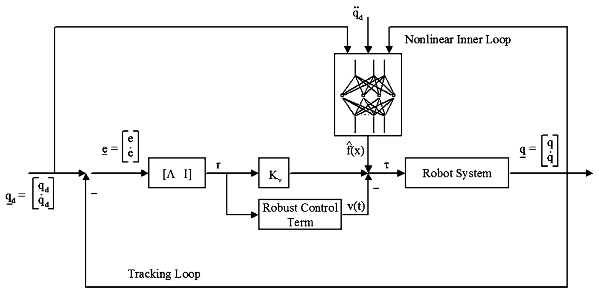

> Image description: A block diagram titled "Neural network robot controller" illustrates a control system architecture consisting of two main loops: a Tracking Loop and a Nonlinear Inner Loop. The Tracking Loop receives a desired trajectory $\mathbf{q}_d = [\mathbf{q}_d, \mathbf{\dot{q}}_d]^T$ and compares it with the output from the Robot System $\mathbf{q} = [\mathbf{q}, \mathbf{\dot{q}}]^T$ to calculate the error vector $\mathbf{e} = [\mathbf{e}, \mathbf{\dot{e}}]^T$. This error passes through a gain matrix $[\Lambda \text{ I}]$ to produce a signal $\mathbf{r}$. This signal $\mathbf{r}$ is split into two paths: one through a gain $K_v$ and another into a "Robust Control Term" $\mathbf{v}(t)$. The outputs from these paths, along with a neural network approximation $\hat{f}(\mathbf{x})$ from the "Nonlinear Inner Loop," are summed to produce the control torque $\mathbf{\tau}$. The Nonlinear Inner Loop receives $\mathbf{\dot{q}}_d$ and $\mathbf{\ddot{q}}_d$ as inputs. The control torque $\mathbf{\tau}$ is applied to the Robot System, completing the feedback loop.
Neural Control and Approximate Dynamic Programming, Fig. 1 Neural network robot controller

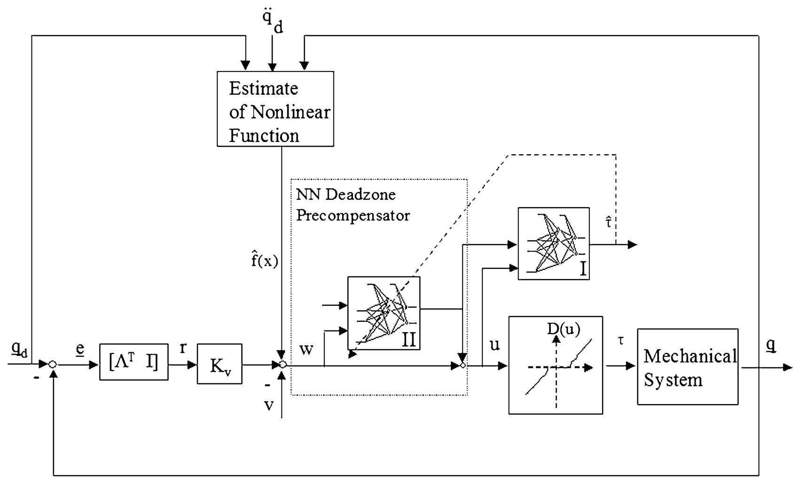

> Image description: A block diagram illustrates a neural network robot controller. The system architecture includes a desired trajectory $q_d$ and its second derivative $\ddot{q}_d$. The error $e$ is calculated from $q_d$ and the measured state $q$. This error is processed through a gain matrix $[\Lambda^T \text{I}]$ and a scalar $K_v$ to produce $r$. The control signal $u$ is the sum of $r$ and a compensation term $v$. The signal $v$ is output from a "NN Deadzone Precompensator" block, which contains two neural networks, I and II. Network II takes $w$ as input and produces $\hat{f}(x)$, while Network I produces $\hat{\tau}$. The control signal $u$ passes through a nonlinear function $D(u)$, representing a deadzone characteristic, before entering the "Mechanical System" block. The output $q$ is fed back to the error summation point. The "Estimate of Nonlinear Function" block takes $\ddot{q}_d$ and other inputs to assist in control estimation.
Neural Control and Approximate Dynamic Programming, Fig. 2 Feedforward NN for deadzone compensation

The NN compensator consists of two NNs. NN II is in the direct feedforward control loop, and NN I is not directly in the control loop but serves as an observer to estimate the (unmeasured) applied torque $\tau(t)$. The feedback stability and performance of the NN deadzone compensator have been rigorously proven using nonlinear
stability proof techniques. The two NN were each selected as having one tunable layer, namely, the output weights. The activation functions were set as a basis by selecting fixed random values for the first-layer weights. To guarantee stability, the output weights of the inversion NN II (subscript $i$ denotes weights and sigmoids of the inversion)


<!-- source_pdf_page: 876 -->
and the estimator NN I should be tuned respectively as

$$
\begin{aligned}
& \dot{\hat{W}}_{i}=T \sigma_{i}\left(V_{i} w\right) r^{T} \hat{W}^{T} \sigma^{\prime}\left(V^{T} u\right) V^{T} \\
& -k_{1} T\|r\| \hat{W}_{i}-k_{2} T\|r\|\left\|\hat{W}_{i}\right\| \hat{W}_{i} \\
& \dot{\hat{W}}=-S \sigma^{\prime}\left(V^{T} u\right) V^{T} \hat{W}_{i} \sigma_{i}\left(V_{i}^{T} w\right) r^{T} \\
& -k_{1} S\|r\| \hat{W}
\end{aligned}
$$

with design matrices $T, S>0$ and tuning gains $k_{1}, k_{2}$.

## Approximate Dynamic Programming for Feedback Control

The current status of work in approximate dynamic programming (ADP) for feedback control is given in Lewis and Liu (2012). ADP is a form of reinforcement learning based on an actor/critic structure. Reinforcement learning (RL) is a class of methods used in machine learning to methodically modify the actions of an agent based on observed responses from its environment (Sutton and Barto 1998). The actor/critic structures are RL systems that have two learning structures: A critic network evaluates the performance of a current action policy, and based on that evaluation, an actor structure updates the action policy as shown in Fig. 3. Adaptive optimal controllers (Lewis et al. 2012b) have been proposed by adding optimality criteria to an adaptive
controller or adding adaptive characteristics to an optimal controller.

## Optimal Adaptive Control of Discrete-Time Nonlinear Systems

Consider a class of discrete-time systems described by the deterministic nonlinear dynamics in the affine state space difference equation form

$$
\begin{equation*}
x_{k+1}=f\left(x_{k}\right)+g\left(x_{k}\right) u_{k}, \tag{2}
\end{equation*}
$$

with state $x_{k} \in \mathbb{R}^{n}$ and control input $u_{k} \in \mathbb{R}^{m}$. A deterministic control policy is defined as a function from state space to control space $\mathbb{R}^{n} \rightarrow \mathbb{R}^{m}$. That is, for every state $x_{k}$, the policy defines a control action $u_{k}=h\left(x_{k}\right)$ as a feedback controller. Define a deterministic cost function that yields the value function:

$$
V\left(x_{k}\right)=\sum_{i=k}^{\infty} \gamma^{i-k} r\left(x_{i}, u_{i}\right),
$$

with $0<\gamma \leq 1$ a discount factor, $Q\left(x_{k}\right), R>0$, and $u_{k}=h\left(x_{k}\right)$ a prescribed feedback control policy. The optimal value is given by Bellman's optimality equation:

$$
V^{*}\left(x_{k}\right)=\min _{h(.)}\left(r\left(x_{k}, h\left(x_{k}\right)\right)+\gamma V^{*}\left(x_{k+1}\right)\right),
$$

which is the discrete-time Hamilton-JacobiBellman (HJB) equation. Two forms of RL can be based on policy iteration (PI) and value iteration (VI). For temporal difference learning, PI is

Neural Control and Approximate Dynamic Programming, Fig. 3 RL with an actor/critic structure
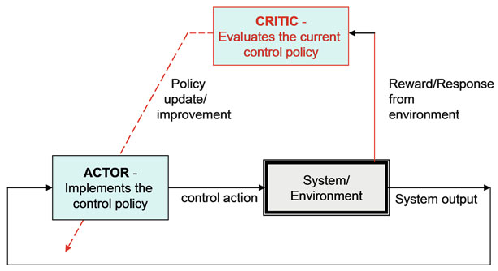

> Image description: This textbook diagram illustrates a Reinforcement Learning (RL) framework using an actor-critic architecture. The architecture consists of four primary components arranged in a feedback loop: an **Actor**, a **Critic**, a **System/Environment**, and the resulting **System output**. The **Actor** block is responsible for implementing the control policy and issuing a **control action** to the **System/Environment**. Simultaneously, the actor's performance is monitored via a feedback loop from the system output. The **Critic** block evaluates the current control policy. It receives a **Reward/Response from environment** as input from the system. A dashed red line indicates the interaction between these learning components: the Critic provides a **Policy update/improvement** signal to the Actor, which allows the actor to refine its control actions over time. The overall flow represents a continuous learning cycle where actions drive environmental responses, which in turn inform policy adjustments to optimize system output.


<!-- source_pdf_page: 877 -->
written as follows in terms of the deterministic Bellman equation.

```
Algorithm 1 PI for discrete-time systems
    procedure
        Given admissible policies $h_{0}\left(x_{k}\right)$
        while $\left\|V^{h_{i}}-V^{h_{i}}\right\| \geq \epsilon_{\mathrm{ac}}$ do
            Solve for the value $V_{(i)}(x)$ using
            $V_{i+1}\left(x_{k}\right)=r\left(x_{k}, h_{i}\left(x_{k}\right)\right)+\gamma V_{i+1}\left(x_{k+1}\right)$
                Update the control policy $h_{(i+1)}\left(x_{k}\right)$ using
    $h_{i+1}\left(x_{k}\right)=\arg \min _{h(\cdot)}\left(r\left(x_{k}, h\left(x_{k}\right)\right)+\gamma V_{i+1}\left(x_{k+1}\right)\right)$
            $i:=i+1$
        end while
    end procedure
```

where $\epsilon_{\mathrm{ac}}$ is a small number that checks the algorithm convergence. Value iteration is similar, but the policy evaluation procedure is performed as $V_{i+1}\left(x_{k}\right)=r\left(x_{k}, h_{i}\left(x_{k}\right)\right)+\gamma V_{i}\left(x_{k+1}\right)$. In value iteration, we can select any initial control policy, not necessarily admissible or stabilizing. In the control system shown in Fig. 3, the critic and the actor NNs are tuned online using the observed data $\left(x_{k}, x_{k+1}, r\left(x_{k}, h_{i}\left(x_{k}\right)\right)\right)$ along the system trajectory. The critic and actor are tuned sequentially in both the PI and the VI. That is, the weights of one neural network are held constant, while the weights of the other are tuned until convergence. This procedure is repeated until both neural networks have converged. Thus, the controller learns the optimal controller online. The convergence of value iteration using two neural networks for the discrete-time nonlinear system (2) is proven in Al-Tamimi et al. (2008). Design of an ADP controller that uses only output feedback is given in Lewis and Vamvoudakis (2011).

## Optimal Adaptive Control of Continuous-Time Nonlinear Systems

RL is considerably more difficult for continuoustime systems than for discrete-time systems, and fewer results are available. This subsection will provide the formulation of optimal control problem followed by an offline PI algorithm provided
in Abu-Khalaf and Lewis (2005) that will give us the structure for the proposed online algorithms that follow. Consider the following nonlinear time-invariant affine in the input dynamical system given by

$$
\begin{equation*}
\dot{x}(t)=f(x(t))+g(x(t)) u(t) ; x(0)=x_{0} \tag{3}
\end{equation*}
$$

with $x(t) \in \mathbb{R}^{n}, f(x(t)) \in \mathbb{R}^{n}, g(x(t)) \in \mathbb{R}^{n \times m}$ and control input $u(t) \in \mathbb{R}^{m}$. We assume that $f(0)=0, f(x)+g(x) u$ is Lipschitz continuous on a set $\Omega \subset \mathbb{R}^{n}$ that contains the origin and that the system is stabilizable on $\Omega$, that is, there exists a continuous control function $u(t) \in U$ such that the system is asymptotically stable on $\Omega$. Define the infinite horizon integral $\operatorname{cost} \forall t \geq 0$

$$
\begin{equation*}
V\left(x_{t}\right)=\int_{t}^{\infty} r(x(\tau), u(\tau)) d \tau, \tag{4}
\end{equation*}
$$

with $Q(x)$ positive definite and $R \in \mathbb{R}^{m \times m}$ a symmetric positive definite matrix. For any admissible control policy if the associated cost (4) is $C^{1}$, then an infinitesimal version is the Bellman equation, and the optimal cost function $V^{*}(x)$ is defined by

$$
V^{*}\left(x_{0}\right)=\min _{u}\left(\int_{0}^{\infty} r(x, u) d \tau\right)
$$

which satisfies the HJB equation. By employing the stationarity condition, the optimal control function for the given problem is

$$
\begin{equation*}
u^{*}(x)=-\frac{1}{2} R^{-1} g^{T}(x) \frac{\partial V^{*}(x)}{\partial x} . \tag{5}
\end{equation*}
$$

Inserting the optimal control (5) into the Bellman equation, one obtains the formulation for HJB equation in terms of $\frac{\partial V^{*}(x)}{\partial x}$ and with boundary condition $V^{*}(0)=0$

$$
\begin{equation*}
0=r\left(x, u^{*}\right)+{\frac{\partial V^{*}(x)^{T}}{\partial x}}^{T}\left(f(x)+g(x) u^{*}\right), \tag{6}
\end{equation*}
$$

which for the linear case becomes the wellknown Riccati equation. In order to find the


<!-- source_pdf_page: 878 -->
optimal control solution for the problem, one needs to solve the HJB equations (6) for the value function and then substitute in (5) to obtain the optimal control. However, due to the nonlinear nature of the HJB equation, finding its solution is generally difficult or impossible. The following PI algorithm is an iterative algorithm for solving optimal control problems and will give us the structure for the online learning algorithm.

```
Algorithm 2 PI for continuous-time systems
    procedure
        Given admissible policies $u^{(0)}$
        while $\left\|V^{u^{(i)}}-V^{u^{(i)}}\right\| \geq \epsilon_{\mathrm{ac}}$ do
            Solve for the value $V^{(i)}(x)$ using Bellman's
    equation
    $Q(x)+{\frac{\partial V^{u^{(i)}}}{\partial x}}^{T}\left(f(x)+g(x) u^{(i)}\right)+u^{(i)^{T}} R u^{(i)}=0$,
        $V^{u^{(i)}}(0)=0$
            Update the control policy $u^{(i+1)}$ using
            $u^{(i+1)}=-\left(\frac{1}{2} R^{-1} g^{T}(x) \frac{\partial V^{u^{(i)}}}{\partial x}\right)$
            $i:=i+1$
        end while
    end procedure
```

A PI algorithm that solves online the HJB equation without full information of the plant
dynamics is proposed in Vrabie et al. (2009) where the Bellman equation is proved to be equivalent to the integral reinforcement learning form with an optimal value given for some $T>0$ as

$$
\begin{aligned}
V^{*}(x(t))= & \arg \min _{u} \int_{t}^{t+T} r(x(\tau), u(\tau)) d \tau \\
& +V^{*}(x(t+T))
\end{aligned}
$$

Therefore, the temporal difference error for continuous-time systems can be defined as

$$
\begin{aligned}
e(t: t+T)= & \rho(t: t+T)+V(x(t+T)) \\
& -V(x(t))
\end{aligned}
$$

with $\rho(t: t+T) \equiv \int_{t}^{t+T} r(x(\tau), u(\tau)) d \tau$ without any information of the plant dynamics. The IRL controller just given tunes the critic neural network to determine the value while holding the control policy fixed. The IRL algorithm can be implemented online by RL techniques using value function approximation $\hat{V}(x)=\hat{W}_{1}^{T} \phi(x)$ in a critic approximator network. Using that approximation in the PI algorithm, one can use batch least squares or recursive least squares to update the value function, and then on convergence of the value parameters, the action is updated. The implementation of the IRL optimal adaptive control algorithm is shown in Fig. 4.

Run RLS or use batch L.S.
To identify value of current control
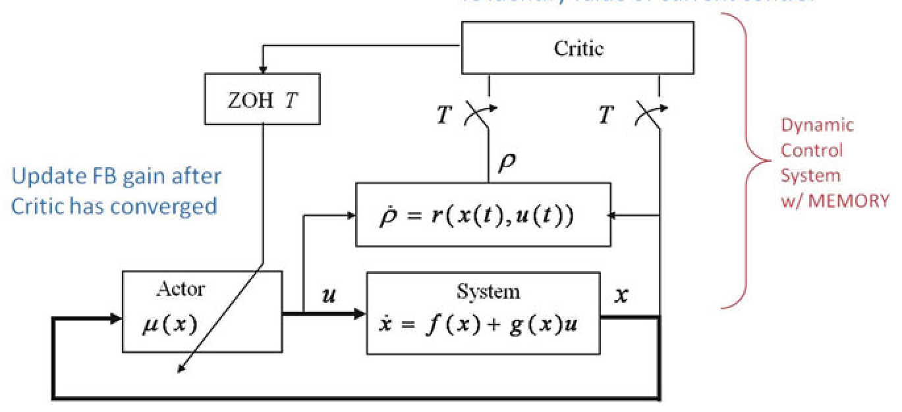

> Image description: This diagram illustrates a hybrid optimal adaptive controller based on Inverse Reinforcement Learning (IRL). The control architecture consists of four primary functional blocks: a **Critic**, an **Actor**, a **System**, and a Zero-Order Hold (**ZOH $T$**). The **System** is defined by the continuous-time state equation $\dot{x} = f(x) + g(x)u$, where $x$ represents the state and $u$ is the control input. The **Actor** block generates the control signal $u = \mu(x)$ based on the state $x$. Feedback is provided via the **Critic** block, which monitors the system and generates a value function or error signal, represented by $\rho$. The evolution of this signal is governed by $\dot{\rho} = r(x(t), u(t))$. Arrows indicate the information flow: the state $x$ is fed back to the Actor and the reward/error function $\dot{\rho}$, while the Critic provides instructions to the Actor through the ZOH $T$ block. A blue annotation specifies: "Update FB gain after Critic has converged." The system is explicitly labeled as a "Dynamic Control System w/ MEMORY."

Neural Control and Approximate Dynamic Programming, Fig. 4 Hybrid optimal adaptive controller based on IRL


<!-- source_pdf_page: 879 -->
The work in Vamvoudakis and Lewis (2010) presents a way of finding the optimal control solution in a synchronous manner along with stability and convergence guarantees but with known dynamics. This procedure is more nearly in line with accepted practice in adaptive control.

A synchronous online learning algorithm that avoids the knowledge of drift dynamics is proposed in Vamvoudakis et al. (2013).

## Learning in Games

Reinforcement learning techniques have been applied to design adaptive controllers that converge to the solution of two-player zero-sum games in Vamvoudakis and Lewis (2012) and Vrabie et al. (2012), of multiplayer nonzero-sum games in Vamvoudakis et al. (2012a), and of Stackelberg games in Vamvoudakis et al. (2012b). In these cases, the adaptive control structure has multiple loops, with action networks and critic networks for each player. The adaptive controller for zerosum games finds the solution to the H-infinity control problem online in real time. This adaptive controller does not require any systems dynamics information.

## Summary and Future Directions

This entry discusses some neuro-inspired adaptive control techniques. These controllers have multi-loop, multi-timescale structures and can learn the solutions to Hamilton-Jacobi design equations such as the Riccati equation online without knowing the full dynamical model of the system. A method known as Q learning allows the learning of optimal control solutions online, in the discrete-time case, for completely unknown systems. Q learning has not yet been fully investigated for continuous-time systems.

## Cross-References

- Adaptive Control, Overview
- Stochastic Games and Learning
- Optimal Control and the Dynamic Programming Principle

Acknowledgments This material is based upon the work supported by NSF. Grant Number: ECCS-1128050, ARO. Grant Number: W91NF-05-1-0314, AFOSR. Grant Number: FA9550-09-1-0278.

## Bibliography

Abu-Khalaf M, Lewis FL (2005) Nearly optimal control laws for nonlinear systems with saturating actuators using a neural network HJB approach. Automatica 41(5):779-791
Al-Tamimi A, Lewis FL, Abu-Khalaf M (2008) Discretetime nonlinear HJB solution using approximate dynamic programming: convergence proof. IEEE Trans Syst Man Cybern Part B 38(4):943-949
Lewis FL, Liu D (2012) Reinforcement learning and approximate dynamic programming for feedback control. IEEE Press computational intelligence series. Wiley-Blackwell, Oxford
Lewis FL, Vamvoudakis KG (2011) Reinforcement learning for partially observable dynamic processes: adaptive dynamic programming using measured output data. IEEE Trans Syst Man Cybern Part B 41(1):14-25
Lewis FL, Jagannathan S, Yesildirek A (1999) Neural network control of robot manipulators and nonlinear systems. Taylor and Francis, London
Lewis FL, Campos J, Selmic R (2002) Neuro-fuzzy control of industrial systems with actuator nonlinearities. Society of Industrial and Applied Mathematics Press, Philadelphia
Lewis FL, Vrabie D, Syrmos VL (2012a) Optimal control. Wiley, New York
Lewis FL, Vrabie D, Vamvoudakis KG (2012b) Reinforcement learning and feedback control: using natural decision methods to design optimal adaptive controllers. IEEE Control Syst Mag 32(6):76-105
Slotine JJE, Li W (1987) On the adaptive control of robot manipulators. Int J Robot Res 6(3):49-59
Sutton RS, Barto AG (1998) Reinforcement learning - an introduction. MIT, Cambridge
Vamvoudakis KG, Lewis FL (2010) Online actor-critic algorithm to solve the continuous-time infinite horizon optimal control problem. Automatica 46(5):878-888
Vamvoudakis KG, Lewis FL (2011) Multi-player non zero sum games: online adaptive learning solution of coupled Hamilton-Jacobi equations. Automatica 47(8):1556-1569
Vamvoudakis KG, Lewis FL (2012) Online solution of nonlinear two-player zero-sum games using synchronous policy iteration. Int J Robust Nonlinear Control 22(13):1460-1483
Vamvoudakis KG, Lewis FL, Hudas GR (2012a) Multiagent differential graphical games: online adaptive learning solution for synchronization with optimality. Automatica 48(8):1598-1611
Vamvoudakis KG, Lewis FL, Johnson M, Dixon WE (2012b) Online learning algorithm for Stackelberg games in problems with hierarchy. In: Proceedings


<!-- source_pdf_page: 880 -->
of the 51st IEEE conference on decision and control, Maui pp 1883-1889
Vamvoudakis KG, Vrabie D, Lewis FL (2013) Online adaptive algorithm for optimal control with integral reinforcement learning. Int J Robust Nonlinear Control, Wiley. doi: 10.1002/rnc. 3018
Vrabie D, Pastravanu O, Lewis FL, Abu-Khalaf M (2009) Adaptive optimal control for continuous-time linear systems based on policy iteration. Automatica 45(2):477-484
Vrabie D, Vamvoudakis KG, Lewis FL (2012) Optimal adaptive control and differential games by reinforcement learning principles. Control engineering series. IET Press, London
Werbos PJ (1989) Neural networks for control and system identification. In: Proceedings of the IEEE conference on decision and control, Tampa
Werbos PJ (1992) Approximate dynamic programming for real-time control and neural modeling. In: White DA, Sofge DA (eds) Handbook of intelligent control. Van Nostrand Reinhold, New York

## Nominal Model-Predictive Control

## Lars Grüne

Mathematical Institute, University of Bayreuth, Bayreuth, Germany


#### Abstract

Model-predictive control is a controller design method which synthesizes a sampled data feedback controller from the iterative solution of open-loop optimal control problems. We describe the basic functionality of MPC controllers, their properties regarding feasibility, stability and performance, and the assumptions needed in order to rigorously ensure these properties in a nominal setting.


## Keywords

Recursive feasibility; Sampled-data feedback; Stability

## Introduction

Model-predictive control (MPC) is a method for the optimization-based control of linear and non-
linear dynamical systems. While the literal meaning of "model-predictive control" applies to virtually every model-based controller design method, nowadays the term commonly refers to control methods in which pieces of open-loop optimal control functions or sequences are put together in order to synthesize a sampled data feedback law. As such, it is often used synonymously with "receding horizon control."

The concept of MPC was first presented in Propoĭ (1963) and was reinvented several times already in the 1960s. Due to the lack of sufficiently fast computer hardware, for a while these ideas did not have much of an impact. This changed during the 1970s when MPC was successfully used in chemical process control. At that time, MPC was mainly applied to linear systems with quadratic cost and linear constraints, since for this class of problems algorithms were sufficiently fast for real-time implementation - at least for the typically relatively slow dynamics of process control systems. The 1980s have then seen the development of theory and increasingly sophisticated concepts for linear MPC, while in the 1990s nonlinear MPC (often abbreviated as NMPC) attracted the attention of the MPC community. After the year 2000, several gaps in the analysis of nonlinear MPC without terminal constraints and costs were closed, and increasingly faster algorithms were developed. Together with the progress in hardware, this has considerably broadened the possible applications of both linear and nonlinear MPC.

In this entry, we explain the functionality of nominal MPC along with its most important properties and the assumptions needed to rigorously ensure these properties. We also give some hints on the underlying proofs. The term nominal MPC refers to the assumption that the mismatch between our model and the real plant is sufficiently small to be neglected in the following considerations. If this is not the case, methods from robust MPC must be used ( Robust Model-Predictive Control). We describe all concepts for nonlinear discrete time systems, noting that the basic results outlined in this entry are conceptually similar for linear and for continuous-time systems.


<!-- source_pdf_page: 881 -->
## Model-Predictive Control

In this entry, we discuss MPC for discrete time control systems of the form

$$
\begin{equation*}
x_{\mathbf{u}}(j+1)=f\left(x_{\mathbf{u}}(j), u(j)\right), x_{\mathbf{u}}(0)=x_{0} \tag{1}
\end{equation*}
$$

with state $x_{\mathbf{u}}(j) \in X$, initial condition $x_{0} \in \mathbb{X}$, and control input sequence $\mathbf{u}=(u(0), u(1), \ldots)$ with $u(k) \in U$, where the state space $X$ and the control value space $U$ are normed spaces. For control systems in continuous time, one may either apply the discrete time approach to a sampled data model of the system. Alternatively, continuous-time versions of the concepts and results from this entry are available in the literature; see, e.g., Findeisen and Allgöwer (2002) or Mayne et al. (2000).

The core of any MPC scheme is an optimal control problem of the form

$$
\begin{equation*}
\operatorname{minimize} J_{N}\left(x_{0}, \mathbf{u}\right) \tag{2}
\end{equation*}
$$

w.r.t. $\mathbf{u}=(u(0), \ldots, u(N-1))$ with

$$
\begin{equation*}
J_{N}\left(x_{0}, \mathbf{u}\right): \sum_{j=0}^{N-1} \ell\left(x_{\mathbf{u}}(j), u(j)\right)+F\left(x_{\mathbf{u}}(N)\right) \tag{3}
\end{equation*}
$$

subject to the constraints

$$
\begin{gather*}
u(j) \in \mathbb{U}, x_{\mathbf{u}}(j) \in \mathbb{X} \text { for } j=0, \ldots, N-1 \\
x_{\mathbf{u}}(N) \in \mathbb{X}_{0}, \tag{4}
\end{gather*}
$$

for control constraint set $\mathbb{U} \subseteq U$, state constraint set $\mathbb{X} \subseteq X$, and terminal constraint set $\mathbb{X}_{0} \subseteq X$. The function $\ell: \mathbb{X} \times \mathbb{U} \rightarrow \mathbb{R}$ is called stage cost or running cost; the function $F: \mathbb{X} \rightarrow \mathbb{R}$ is referred to as terminal cost. We assume that for each initial value $x_{0} \in \mathbb{X}$, the optimal control problem (2) has a solution and denote the corresponding minimizing control sequence by $\mathbf{u}^{*}$. Algorithms for computing $\mathbf{u}^{*}$ are discussed in ▷ Optimization Algorithms for Model Predictive Control and - Explicit Model Predictive Control.

The key idea of MPC is to compute the values $\mu_{N}(x)$ of the MPC feedback law $\mu_{N}$ from the open-loop optimal control sequences $\mathbf{u}^{*}$. To formalize this idea, consider the closed-loop system

$$
\begin{equation*}
x_{\mu_{N}}(k+1)=f\left(x_{\mu_{N}}(k), \mu_{N}\left(x_{\mu_{N}}(k)\right)\right) . \tag{5}
\end{equation*}
$$

In order to evaluate $\mu_{N}$ along the closed-loop solution, given an initial value $x_{\mu_{N}}(0) \in \mathbb{X}$, we iteratively perform the following steps.

## Basic MPC Loop

1. Set $k:=0$.
2. Solve (2)-(4) for $x_{0}=x_{\mu_{N}}(k)$; denote the optimal control sequence by $\mathbf{u}^{*}= \left(u^{*}(0), \ldots, u^{*}(N-1)\right)$.
3. Set $\mu_{N}\left(x_{\mu_{N}}(k)\right): u^{*}(0)$, compute $x_{\mu_{N}}(k+1)$ according to (5), set $k:=k+1$. and go to (1). Due to its ability to handle constraints and possibly nonlinear dynamics, MPC has become one of the most popular modern control methods in the industry ( - Model-Predictive Control in Practice). While in the literature various variants of this basic scheme are discussed, here we restrict ourselves to this most widely used basic MPC scheme.

When analyzing an MPC scheme, three properties are important:

- Recursive Feasibility, i.e., the property that the constraints (4) can be satisfied in Step (ii) in each sampling instant
- Stability, i.e., in particular convergence of the closed-loop solutions $x_{\mu_{N}}(k)$ to a desired equilibrium $x_{*}$ as $k \rightarrow \infty$
- Performance, i.e., appropriate quantitative properties of $x_{\mu_{N}}(k)$
Here we discuss these three issues for two widely used MPC variants:

1. MPC with terminal constraints and costs
2. MPC with neither terminal constraints nor costs
In (a), $F$ and $\mathbb{X}_{0}$ in (3) and (4) are specifically designed in order to guarantee proper performance of the closed loop. In (b), we set $F \equiv 0$ and $\mathbb{X}_{0}=\mathbb{X}$. Thus, the choice of $\ell$ and $N$ in (3) is the most important part of the design procedure.


<!-- source_pdf_page: 882 -->
## Recursive Feasibility

Since the ability to handle constraints is one of the key features of MPC, it is important to ensure that the constraints $x_{\mu_{N}}(k) \in \mathbb{X}$ and $\mu_{N}\left(x_{\mu_{N}}(k)\right) \in \mathbb{U}$ are satisfied for all $k \geq 0$. However, beyond constraint satisfaction, the stronger property $x_{\mu_{N}}(k) \in \mathbb{X}_{N}$ is required, where $\mathbb{X}_{N}$ denotes the feasible set for horizon $N$,
$\mathbb{X}_{N}:=\{x \in \mathbb{X} \mid$ there exists u such that (4) holds $\}$.

The property $x \in \mathbb{X}_{N}$ is called feasibility of $x$. Feasibility of $x=x_{\mu_{N}}(k)$ is a prerequisite for the MPC feedback $\mu_{N}$ being well defined, because the nonexistence of such an admissible control sequence u would imply that solving (2) under the constraints (4) in Step (ii) of the MPC iteration is impossible.

Since for $k \geq 0$ the state $x_{\mu_{N}}(k+1)= f\left(x_{\mu_{N}}(k), u^{*}(0)\right)$ is determined by the solution of the previous optimal control problem, the usual way to address this problem is via the notion of recursive feasibility. This property demands the existence of a set $A \subseteq \mathbb{X}$ such that:

- For each $x_{0} \in A$, the problem (2)-(4) is feasible.
- For each $x_{0} \in A$ and the optimal control $u^{\star}$ from (2) to (4), the relation $f\left(x_{0}, u^{*}(0)\right) \in A$ holds.
It is not too difficult to see that this property implies $x_{\mu_{N}}(k) \in A$ for all $k \geq 1$ if $x_{\mu_{N}}(0) \in A$.

For terminal-constrained problems, recursive feasibility is usually established by demanding that the terminal constraint set $\mathbb{X}_{0}$ is viable or controlled forward invariant. This means that for each $x \in \mathbb{X}_{0}$, there exists $u \in \mathbb{U}$ with $f(x, u) \in \mathbb{X}_{0}$. Under this assumption, it is quite straightforward to prove that the feasible set $A=\mathbb{X}_{N}$ is also recursively feasible (Grüne and Pannek 2011, Lemma 5.11). Note that viability of $\mathbb{X}_{0}$ is immediate if $\mathbb{X}_{0}=\left\{x_{*}\right\}$ and $x_{*} \in \mathbb{X}$ is an equilibrium, i.e., a point for which there exists $u_{*} \in \mathbb{U}$ with $f\left(x_{*}, u_{*}\right)=x_{*}$. This setting is referred to as equilibrium terminal constraint.

For MPC without terminal constraints, the most straightforward way to ensure recursive feasibility is to assume that the state constraint set $\mathbb{X}$
is viable (Grüne and Pannek 2011, Theorem 3.5). However, checking viability and even more constructing a viable state constraint set is in general a very difficult task. Hence, other methods for establishing recursive feasibility are needed. One method is to assume that the sequence of feasible sets $\mathbb{X}_{N}, N \in \mathbb{N}$ becomes stationary for some $N_{0}$, i.e., that $\mathbb{X}_{N+1}=\mathbb{X}_{N}$ holds for all $N \geq N_{0}$. Under this assumption, recursive feasibility of $\mathbb{X}_{N_{0}}$ follows, see Kerrigan (2000, Theorem 5.3). However, like viability, stationarity is difficult to verify.

For this reason, a conceptually different approach to ensure recursive feasibility was presented in Grüne and Pannek (2011, Theorem 8.20); a similar approach for linear systems can be found in Primbs and Nevistić (2000). The approach is suitable for stabilizing MPC problems in which the stage cost $\ell$ penalizes the distance to a desired equilibrium $x_{*}$ (cf. section "Stability"). Assuming the existence - but not the knowledge - of a viable neighborhood $\mathcal{N}$ of $x_{*}$, one can show that any initial point $x_{0}$ for which the corresponding open-loop optimal solution satisfies $x_{\mathbf{u}^{*}}(j) \in \mathcal{N}$ or some $j \leq N$ is contained in a recursively feasible set. The fact that $\ell$ penalizes the distance to $x_{*}$ then implies $x_{\mathbf{u}^{*}}(j) \in \mathcal{N}$ for suitable initial values. Together, these properties yield the existence of recursively feasible sets $A_{N}$ which become arbitrarily large as $N$ increases.

## Stability

Stability in the sense of this entry refers to the fact that a prespecified equilibrium $x_{*} \in \mathbb{X}$-typically a desired operating point - is asymptotically stable for the MPC closed loop for all initial values in some set $\mathcal{S}$. This means that the solutions $x_{\mu_{N}}(k)$ starting in $\mathcal{S}$ converge to $x_{*}$ as $k \rightarrow \infty$ and that solutions starting close to $x_{*}$ remain close to $x_{*}$ for all $k \geq 0$. Note that this setting can be extended to time-varying reference solutions; see ↖ Tracking Model Predictive Control.

In order to enforce this property, we assume that the stage cost $\ell$ penalizes the distance to the equilibrium $x_{*}$ in the following sense: $\ell$ satisfies


<!-- source_pdf_page: 883 -->
$$
\begin{equation*}
\ell\left(x_{*}, u_{*}\right)=0 \text { and } \alpha_{1}(|x|) \leq \ell(x, u) \tag{6}
\end{equation*}
$$

for all $x \in \mathbb{X}$ and $u \in \mathbb{U}$. Here $\alpha_{1}$ is a $\mathcal{K}_{\infty}$ function, i.e., a continuous function $\alpha_{1}$ : $[0, \infty) \rightarrow[0, \infty)$ which is strictly increasing, unbounded, and satisfies $\alpha_{1}(0)=0$. With $|x|$, we denote the norm on $X$. In this entry, we exclusively discuss stage costs $\ell$ satisfying (6). More general settings using appropriate detectability conditions are discussed in Rawlings and Mayne (2009, Sect. 2.7) or Grimm et al. (2005) in the context of stabilizing MPC. Even more general $\ell$ are allowed in the context of economic MPC; see the - Economic Model Predictive Control article.

In case of terminal constraints and terminal costs, a compatibility condition between $\ell$ and $F$ is needed on $\mathbb{X}_{0}$ in order to ensure stability. More precisely, we demand that for each $x \in \mathbb{X}_{0}$ there exists a control value $u \in \mathbb{U}$ such that $f(x, u) \in \mathbb{X}_{0}$ and

$$
\begin{equation*}
F(f(x, u))-F(x) \leq-\ell(x, u) \tag{7}
\end{equation*}
$$

holds. Observe that the condition $f(x, u) \in \mathbb{X}_{0}$ is again the viability condition which we already imposed for ensuring recursive feasibility. Note that (7) is trivially satisfied for $F \equiv 0$ in case of $\mathbb{X}_{0}=\left\{x_{*}\right\}$ by choosing $u=u_{*}$.

Stability is now concluded by using the optimal value function

$$
V_{N}\left(x_{0}\right):=\inf _{\mathbf{u} \text { s.t. (4) }} J_{N}\left(x_{0}, \mathbf{u}\right)
$$

as a Lyapunov function. This will yield stability on $\mathcal{S}=\mathbb{X}_{\mathrm{N}}$, as $\mathbb{X}_{\mathrm{N}}$ is exactly the set on which $V_{N}$ is defined. In order to prove that $V_{N}$ is a Lyapunov function, we need to check that $V_{N}$ is bounded from below and above by $\mathcal{K}_{\infty}$ functions $\alpha_{1}$ and $\alpha_{2}$ and that $V_{N}$ is strictly decaying along the closedloop solution.

The first amounts to checking

$$
\begin{equation*}
\alpha_{1}(|x|) \leq V_{N}(x) \leq \alpha_{2}(|x|) \tag{8}
\end{equation*}
$$

for all $x \in \mathbb{X}_{\mathrm{N}}$. The lower bound follows immediately from (6) (with the same $\alpha_{1}$ ), and the upper bound can be ensured by conditions
on the problem data (see, e.g., Rawlings and Mayne 2009, Sect. 4.5; Grüne and Pannek 2011, Sect. 5.3).

For ensuring that $V_{N}$ is strictly decreasing along the closed-loop solutions, we need to prove

$$
\begin{equation*}
V_{N}\left(f\left(x, \mu_{N}(x)\right)\right) \leq V_{N}(x)-\ell\left(x, \mu_{N}(x)\right) . \tag{9}
\end{equation*}
$$

In order to prove this inequality, one uses on the one hand the dynamic programming principle stating that

$$
\begin{equation*}
V_{N-1}\left(f\left(x, \mu_{N}(x)\right)\right)=V_{N}(x)-\ell\left(x, \mu_{N}(x)\right) . \tag{10}
\end{equation*}
$$

On the other hand, one shows that (7) implies

$$
\begin{equation*}
V_{N-1}(x) \geq V_{N}(x) \tag{11}
\end{equation*}
$$

for all $x \in \mathbb{X}_{N}$. Inserting (11) with $f\left(x, \mu_{N}(x)\right)$ in place of $x$ into (10) then immediately yields (9). Details of this proof can be found, e.g., in Mayne et al. (2000), Rawlings and Mayne (2009), or Grüne and Pannek (2011). The survey Mayne et al. (2000) is probably the first paper which develops the conditions needed for this proof in a systematic way; a continuous-time version of these results can be found in Fontes (2001).

Summarizing, for MPC with terminal constraints and costs, under the conditions (6)-(8), we obtain asymptotic stability of $x_{*}$ on $\mathcal{S}=\mathbb{X}_{\mathrm{N}}$.

For MPC without terminal constraints and costs, i.e., with $\mathbb{X}_{0}=\mathbb{X}$ and $F \equiv 0$, these conditions can never be satisfied, as (7) will immediately imply $\ell(x, u)=0$ for all $x \in \mathbb{X}$, contradicting (6). Moreover, without terminal constraints and costs, one cannot expect (9) to be true. This is because without terminal constraints, the inequality $V_{N-1}(x) \leq V_{N}(x)$ holds, which together with the dynamic programming principle implies that if (9) holds, then it holds with equality. This, however, would imply that $\mu_{N}$ is the infinite horizon optimal feedback law, which - though not impossible - is very unlikely to hold.


<!-- source_pdf_page: 884 -->
Thus, we need to relax (9). In order to do so, instead of (9), we assume the relaxed inequality

$$
\begin{equation*}
V_{N}\left(f\left(x, \mu_{N}(x)\right)\right) \leq V_{N}(x)-\alpha \ell\left(x, \mu_{N}(x)\right) \tag{12}
\end{equation*}
$$

for some $\alpha>0$ and all $x \in \mathbb{X}$, which is still enough to conclude asymptotic stability of $x_{*}$ if (6) and (8) hold. The existence of such an $\alpha$ can be concluded from bounds on the optimal value function $V_{N}$. Assuming the existence of constants $\gamma_{K} \geq 0$ such that the inequality

$$
\begin{equation*}
V_{K}(x) \leq \gamma_{K} \min _{u \in \mathbb{U}} \ell(x, u) \tag{13}
\end{equation*}
$$

holds for all $K=1, \ldots, N$ and $x \in \mathbb{X}$, there are various ways to compute $\alpha$ from $\gamma_{1}, \ldots, \gamma_{N}$, see Grüne (2012, Sect. 3). The best possible estimate for $\alpha$, whose derivation is explained in detail in Grüne and Pannek (2011, Chap. 6), yields

$$
\begin{equation*}
\alpha=1-\frac{\left(\gamma_{N}-1\right) \prod_{i=2}^{N}\left(\gamma_{i}-1\right)}{\prod_{i=2}^{N} \gamma_{i}-\prod_{i=2}^{N}\left(\gamma_{i}-1\right)} \tag{14}
\end{equation*}
$$

Though not immediately obvious, a closer look at this term reveals $\alpha \rightarrow 1$ as $N \rightarrow \infty$ if the $\gamma_{K}$ are bounded. Hence, $\alpha>0$ for sufficiently large $N$.

Summarizing the second part of this section, for MPC without terminal constraints and costs, under the conditions (6), (8), and (13), asymptotic stability follows on $\mathcal{S}=\mathbb{X}$ for all optimization horizons $N$ for which $\alpha>0$ holds in (14). Note that the condition (13) implicitly depends on the choice of $\ell$. A judicious choice of $\ell$ can considerably reduce the size of the horizon $N$ for which $\alpha>0$ holds, see Grüne and Pannek (2011, Sect.6.6) and thus the computational effort for solving (2)-(4).

## Performance

Performance of MPC controllers can be measured in many different ways. As the MPC controller is derived from successive solutions of (2), a natural quantitative way to measure its
performance is to evaluate the infinite horizon functional corresponding to (3) along the closed loop, i.e.,

$$
J_{\infty}^{c \ell}\left(x_{0}, \mu_{N}\right):=\sum_{k=0}^{\infty} \ell\left(x_{\mu_{N}}(k), \mu_{N}\left(x_{\mu_{N}}(k)\right)\right)
$$

with $x_{\mu_{N}}(0)=x_{0}$. This value can then be compared with the optimal infinite horizon value

$$
V_{\infty}\left(x_{0}\right):=\inf _{\mathbf{u}: u(k) \in \mathbb{U}, x_{\mathbf{u}}(k) \in \mathbb{X}} J_{\infty}\left(x_{0}, \mathbf{u}\right)
$$

where

$$
J_{\infty}\left(x_{0}, \mathbf{u}\right):=\sum_{k=0}^{\infty} \ell\left(x_{\mathbf{u}}(k), u(k)\right)
$$

To this end, for MPC with terminal constraints and costs, by induction over (9) and using nonnegativity of $\ell$, it is fairly easy to conclude the inequality

$$
J_{\infty}^{c \ell}\left(x_{0}, \mu_{N}\right) \leq V_{N}\left(x_{0}\right)
$$

for all $x \in \mathbb{X}_{N}$. However, due to the conditions on the terminal cost in (7), $V_{N}$ may be considerably larger than $V_{\infty}$ and an estimate relating these two functions is in general not easy to derive (Grüne and Pannek 2011, Examples 5.18 and 5.19). However, it is possible to show that under the same assumptions guaranteeing stability, the convergence

$$
V_{N}(x) \rightarrow V_{\infty}(x)
$$

holds for $N \rightarrow \infty$ (Grüne and Pannek 2011, Theorem 5.21). Hence, we recover approximately optimal infinite horizon performance for sufficiently large horizon $N$.

For MPC without terminal constraints and costs, the inequality $V_{N}\left(x_{0}\right) \leq V_{\infty}\left(x_{0}\right)$ is immediate; however, (9) will typically not hold. As a remedy, we can use (12) in order to derive an estimate. Using induction over (12), we arrive at the estimate

$$
J_{\infty}^{c \ell}\left(x_{0}, \mu_{N}\right) \leq V_{N}\left(x_{0}\right) / \alpha \leq V_{\infty}\left(x_{0}\right) / \alpha
$$


<!-- source_pdf_page: 885 -->
Since $\alpha \rightarrow 1$ as $N \rightarrow \infty$, also in this case we obtain approximately optimal infinite horizon performance for sufficiently large horizon $N$.

## Summary and Future Directions

MPC is a controller design method which uses the iterative solution of open-loop optimal control problems in order to synthesize a sampled data feedback controller $\mu_{N}$. The advantages of MPC are its ability to handle constraints, the rigorously provable stability properties of the closed loop, and its approximate optimality properties. Assumptions needed in order to rigorously ensure these properties together with the corresponding mathematical arguments have been outlined in this entry, both for MPC with terminal constraints and costs and without. Among the disadvantages of MPC are the computational effort and the fact that the resulting feedback is a full state feedback, thus necessitating the use of a state estimator to reconstruct the state from output data ( ▷ Moving Horizon Estimation).

Future directions include the application of MPC to more general problems than set point stabilization or tracking, the development of efficient algorithms for large-scale problems including those originating from discretized infinitedimensional control problems, and the understanding of the opportunities and limitations of MPC in increasingly complex environments; see also ▷ Distributed Model Predictive Control.

## Cross-References

- Distributed Model Predictive Control
- Economic Model Predictive Control
- Explicit Model Predictive Control
- Model-Predictive Control in Practice
- Moving Horizon Estimation
- Optimization Algorithms for Model Predictive Control
- Robust Model-Predictive Control
- Stochastic Model Predictive Control
- Tracking Model Predictive Control


## Recommended Reading

MPC in the form known today was first described in Propoĭ (1963) and is now covered in several monographs, two recent ones being Rawlings and Mayne (2009) and Grüne and Pannek (2011). More information on continuous-time MPC can be found in the survey by Findeisen and Allgöwer (2002). The nowadays standard framework for stability and feasibility of MPC with stabilizing terminal constraints is presented in Mayne et al. (2000); for a continuous-time version, see Fontes (2001). Stability of MPC without terminal constraints was proved in Grimm et al. (2005) under very general conditions; for a comparison of various such results, see Grüne (2012). Feasibility without terminal constraints is discussed in Kerrigan (2000) and Primbs and Nevistić (2000).

## Bibliography

Findeisen R, Allgöwer F (2002) An introduction to nonlinear model predictive control. In: 21st Benelux meeting on systems and control, Veldhoven, The Netherlands (see also http://www.tue.nl/en/publication/ep/p/d/epuid/252788/), pp 119-141
Fontes FACC (2001) A general framework to design stabilizing nonlinear model predictive controllers. Syst Control Lett 42:127-143
Grimm G, Messina MJ, Tuna SE, Teel AR (2005) Model predictive control: for want of a local control Lyapunov function, all is not lost. IEEE Trans Autom Control 50(5):546-558
Grüne L (2012) NMPC without terminal constraints. In: Proceedings of the IFAC conference on nonlinear model predictive control - NMPC' 12, pp 1-13
Grüne L, Pannek J (2011) Nonlinear model predictive control: theory and algorithms. Springer, London
Kerrigan EC (2000) Robust constraint satisfaction: invariant sets and predictive control. PhD thesis, University of Cambridge
Mayne DQ, Rawlings JB, Rao CV, Scokaert POM (2000) Constrained model predictive control: stability and optimality. Automatica 36:789-814
Primbs JA, Nevistić V (2000) Feasibility and stability of constrained finite receding horizon control. Automatica 36(7):965-971
Propoǐ A (1963) Application of linear programming methods for the synthesis of automatic sampled-data systems. Avtomat i Telemeh 24:912-920
Rawlings JB, Mayne DQ (2009) Model predictive control: theory and design. Nob Hill Publishing, Madison


<!-- source_pdf_page: 886 -->
## Nonlinear Adaptive Control

## A. Astolfi

Department of Electrical and Electronic Engineering, Imperial College London, London, UK
Dipartimento di Ingegneria Civile e Ingegneria Informatica, Università di Roma Tor Vergata, Roma, Italy


#### Abstract

We consider the control of nonlinear systems in which parameters are uncertain and may vary. For such systems the control must adapt to the parameter change to deliver closed-loop performance, such as asymptotic stability or tracking. A concise description of available methods and basic adaptive stabilization results, which can be used as building blocks for complex adaptive control problems, are discussed.


## Keywords

Adaptive stabilization; Linear parameterization; Lyapunov function; Nonlinear parameterization; Output feedback

## Introduction

The adaptive control problem, namely, the problem of designing a feedback controller which contains an adaptation mechanism to counteract changes in the parameters of the system to be controlled, is of significant importance in applications. In almost all systems, physical parameters are subject to changes. These may be triggered, for example, by changes in temperature (the volume of a liquid/gas), aging (the friction coefficient of a mechanical system), or normal operation (the mass of the fuel of an aircraft changes during flight, the center of mass of a vehicle is affected by its load).

While adaptive control is naturally associated with the notion of estimation, i.e., the parameters of a system have to be identified to design a controller, it may be possible to design adaptive controllers which do not rely on a complete parameter estimation: it is sufficient to estimate the effect of the parameters on the control signal.

Adaptive control is different from robust control. In the simplest possible occurrence, the aim of robust control is to design a control law guaranteeing performance specifications for a given range of parameter values. Robust control thus requires some a priori information on the parameter. Adaptive control does not require any a priori information on the parameter, although any such information can be exploited in the controller design, but requires a parameterized model: a model which contains information on the way the parameters affect the dynamics of the system.

The adaptive control problem for general nonlinear systems can be formulated as follows. Consider a nonlinear system described by equations of the form

$$
\begin{equation*}
\dot{x}=F(x, u, \theta), \quad y=H(x, \theta), \tag{1}
\end{equation*}
$$

where $x(t) \in \mathbb{R}^{n}$ denotes the state of the system, $u(t) \in \mathbb{R}^{m}$ denotes the input of the system, $\theta \in \mathbb{R}^{q}$ denotes the constant unknown parameter, $y(t) \in \mathbb{R}^{p}$ denotes the measured output, and $F: \mathbb{R}^{n} \times \mathbb{R}^{m} \times \mathbb{R}^{q} \rightarrow \mathbb{R}^{n}$ and $H: \mathbb{R}^{n} \times \mathbb{R}^{q} \rightarrow \mathbb{R}^{p}$ are smooth mappings. While we focus on continuous-time systems, similar considerations apply to discrete-time systems. In what follows, for simplicity, we mostly assume that $y=x$ : the whole state of the system is available for control design.

The adaptive control problem consists in finding, if possible, a dynamic control law described by equations of the form

$$
\begin{align*}
& \dot{\hat{\theta}}=w(x, \hat{\theta}, r),  \tag{2}\\
& u=v(x, \hat{\theta}, r), \tag{3}
\end{align*}
$$

with $r(t) \in \mathbb{R}^{s}$ an exogenous (reference) signal and $w: \mathbb{R}^{n} \times \mathbb{R}^{q} \times \mathbb{R}^{s} \rightarrow \mathbb{R}^{q}$ and $v: \mathbb{R}^{n} \times \mathbb{R}^{q} \times \mathbb{R}^{s} \rightarrow \mathbb{R}^{m}$ smooth mappings, such


<!-- source_pdf_page: 887 -->
that the closed-loop system, described by the equations

$$
\begin{equation*}
\dot{x}=F(x, v(x, \hat{\theta}, r), \theta), \quad \dot{\hat{\theta}}=w(x, \hat{\theta}, r), \tag{4}
\end{equation*}
$$

has specific properties. For example, one could require that all trajectories be bounded and the $x$-component of the state converge to a given value $x^{\star}$ (this is the so-called adaptive regulation requirement) or that the input-output behavior of the system from the input $r$ to some userdefined output signal coincide with a given reference model (this is the so-called model reference adaptive control requirement).

A natural way to characterize design specifications for the adaptive control problem and to facilitate its solution is to assume the existence of a known parameter controller, described by the equation

$$
\begin{equation*}
u=v^{\star}(x, \theta, r), \tag{5}
\end{equation*}
$$

such that the nonadaptive closed-loop system $\dot{x}=F\left(x, v^{\star}(x, \theta, r), \theta\right)$ satisfies given design specifications. In this perspective, the adaptive control problem boils down to the design of the update law (2) and of the feedback law (3) such that the behavior of the adaptive closed-loop system matches that of the nonadaptive closedloop system $\dot{x}=F\left(x, v^{\star}(x, \theta, r), \theta\right)$.

The above description suggests a design method for the feedback law: one could replace $\theta$ with $\hat{\theta}$ in Eq. (5). This design is often known as certainty equivalence design and lends itself to the interpretation that $\hat{\theta}$ be an estimate for $\theta$. Naturally, one could also modify the feedback law, replacing $\theta$ with $\hat{\theta}$ and adding $x$-dependant terms: this is often called a redesign. Redesign may be guided by various considerations, for example, it may be based on the use of a specific Lyapunov function (yielding the so-called Lyapunov redesign), or by structural properties of the system, or by robustness constraints.

The interpretation of $\hat{\theta}$ as an estimate for $\theta$ leads to two similar approaches for the design of the update law. The former, pursued in the so-called indirect adaptive control, relies on the design of a parameter estimator, for example,
using recursive least-square methods. This approach has its roots in identification theory and has been studied in-depth for linear systems. The latter relies on the observation that the design of an update law is equivalent to the design of a (reduced-order) observer for the extended system

$$
\dot{x}=F(x, u, \theta), \quad \dot{\theta}=0
$$

with output $y=x$. This approach has its roots in the theory of nonlinear observer design.

The approaches described so far relies on a sort of separation principle: the update law and the feedback law are designed separately. While this approach may be adequate for linear systems, for nonlinear systems it is often necessary to design the update law and the feedback law in one step, i.e., the selection of the feedback law depends upon the selection of the update law and vice versa. To illustrate this design method, and provide some explicit adaptive control design tools, we focus on a special class of nonlinear systems: systems which are linearly parameterized in the unknown parameter.

## Linearly Parameterized Systems

Consider the system (1) and assume the mapping $F$ is affine in the parameter $\theta$ and in the control $u$, namely,

$$
\begin{equation*}
F(x, u, \theta)=f_{0}(x)+g(x) u+f_{1}(x) \theta \tag{6}
\end{equation*}
$$

with $f_{0}: \mathbb{R}^{n} \rightarrow \mathbb{R}^{n}, g: \mathbb{R}^{n} \rightarrow \mathbb{R}^{n} \times \mathbb{R}^{m}$ and $f_{1}: \mathbb{R}^{n} \rightarrow \mathbb{R}^{n} \times \mathbb{R}^{q}$ smooth mappings. For this class of systems, under additional assumptions, it is possible to provide systematic adaptive control design tools. We provide two formal results: additional results (depending on the specific assumptions imposed on the system) may be derived. In both cases the focus is on the adaptive stabilization problem: the goal of the adaptive controller is to render a given equilibrium stable, in the sense of Lyapunov, and to guarantee convergence of the $x$-component of the state (recall that the state of the adaptive closedloop system is the vector $(x, \hat{\theta})$ ).


<!-- source_pdf_page: 888 -->
Theorem 1 Consider the system (6) and a point $x^{*}$. Assume there exist a known parameter controller

$$
u=v_{0}(x)+v_{1}(x) \theta,
$$

with $v_{0}: \mathbb{R}^{n} \rightarrow \mathbb{R}^{m}$ and $v_{1}: \mathbb{R}^{n} \rightarrow \mathbb{R}^{m} \times \mathbb{R}^{q}$ smooth mappings, and a positive definite and radially unbounded function $V: \mathbb{R}^{n} \rightarrow \mathbb{R}$, such that $V\left(x^{\star}\right)=0$ and

$$
\frac{\partial V}{\partial x} f^{*}(x, \theta)<0
$$

for all $x \neq x^{\star}$.
Then the update law

$$
\dot{\hat{\theta}}=-\left(\frac{\partial V}{\partial x} g(x) v_{1}(x)\right)^{\top}
$$

and the feedback law

$$
u=v_{0}(x)+v_{1}(x) \hat{\theta}
$$

are such that all trajectories of the closed-loop system are bounded and $\lim _{t \rightarrow \infty} x(t)=x^{\star}$.

Theorem 2 Consider the system (6) and a point $x^{*}$. Assume there exists a known parameter controller $u=v(x, \theta)$ such that the closed-loop system

$$
\dot{x}=f^{*}(x, \theta)
$$

where $f^{*}(x, \theta)=f_{0}(x)+f_{1}(x) \theta+g(x) v(x, \theta)$, has a globally asymptotically stable equilibrium at $x^{*}$. Assume, in addition, that there exists a mapping $\beta: \mathbb{R}^{n} \rightarrow \mathbb{R}^{q}$ such that all trajectories of the system

$$
\begin{align*}
\dot{z} & =-\left[\frac{\partial \beta}{\partial x} f_{1}(x)\right] z \\
\dot{x} & =f^{*}(x)+g(x)(v(x, \theta+z)-v(x, \theta)) \tag{7}
\end{align*}
$$

are bounded and satisfy
$\lim _{t \rightarrow \infty}[g(x(t))(v(x(t), \theta+z(t))-v(x(t), \theta))]=0$.
Then the update law

$$
\begin{align*}
\dot{\hat{\theta}} & =-\frac{\partial \beta}{\partial x}\left[f_{0}(x)+f_{1}(x)(\hat{\theta}+\beta(x))\right. \\
& +g(x) v(x, \hat{\theta}+\beta(x))] \tag{8}
\end{align*}
$$

and the feedback law

$$
u=v(x, \hat{\theta}+\beta(x))
$$

are such that all trajectories of the closed-loop system are bounded and $\lim _{t \rightarrow \infty} x(t)=x^{\star}$.

The stability properties of the adaptive closedloop system in Theorem 1 can be studied with the Lyapunov function $W(x, \hat{\theta})=V(x)+\frac{1}{2}\|\hat{\theta}-\theta\|^{2}$, whereas a Lyapunov analysis for the adaptive closed-loop system of Theorem 2 can be carried out, under additional assumptions, via a Lyapunov function of the form $W(x, \hat{\theta})=V(x)+ \frac{1}{2}\|\hat{\theta}-\theta+\beta(x)\|^{2}$. This suggests that in Theorem 1 $\hat{\theta}$ plays the role of the estimate of $\theta$, whereas in Theorem 2 such a role is played by $\hat{\theta}+\beta(x)$. Note that in none of the theorems, the parameter estimate is required to converge to the true value of the parameters, although in Theorem 2 the feedback law is required to converge, along trajectories, to the known parameter controller. This has a very important, possibly counterintuitive, consequence: the asymptotic nonadaptive controller $u=v\left(x, \hat{\theta}_{\infty}\right)$, where $\hat{\theta}_{\infty}=\lim _{t \rightarrow \infty} \hat{\theta}(t)$, provided the limit exists, is not in general a stabilizing controller for system (6).

Example 1 Consider the nonlinear system described by the equation $\dot{x}=u+\theta x^{2}$, with $x(t) \in \mathbb{R}, u(t) \in \mathbb{R}$, and $\theta \in \mathbb{R}$. A known parameter controller satisfying the assumptions of Theorem 1 (with and $V(x)=x^{2} / 2$ ) and of Theorem 2 (with $\beta(x)=x$ ) is $u=-x-\theta x^{2}$. The resulting update laws and feedback laws are

$$
\dot{\hat{\theta}}_{1}=x^{3}, \quad u_{1}=-x-\hat{\theta} x^{2}
$$

and

$$
\dot{\hat{\theta}}_{2}=x, \quad u_{2}=-x-(\hat{\theta}+x) x^{2}
$$


<!-- source_pdf_page: 889 -->
respectively, the subscripts " 1 " and " 2 " are used to refer to the construction in Theorem 1 and 2, respectively.

The basic building blocks in Theorems 1 and 2 can be exploited repeatedly to design adaptive controllers for systems with a specific structure, for example, for systems described by the equations

$$
\begin{align*}
\dot{x}_{1} & =x_{2}+\varphi_{1}\left(x_{1}\right)^{\top} \theta, \\
\dot{x}_{2} & =x_{3}+\varphi_{2}\left(x_{1}, x_{2}\right)^{\top} \theta, \\
& \vdots  \tag{9}\\
\dot{x}_{i} & =x_{i+1}+\varphi_{i}\left(x_{1}, \ldots, x_{i}\right)^{\top} \theta, \\
& \vdots \\
\dot{x}_{n} & =u+\varphi_{n}\left(x_{1}, \ldots, x_{n}\right)^{\top} \theta,
\end{align*}
$$

with $x_{i}(t) \in \mathbb{R}$, for $i=1, \ldots, n, u(t) \in \mathbb{R}, \varphi_{i}$ : $\mathbb{R}^{i} \rightarrow \mathbb{R}^{q}$, for $i=1, \ldots, n$, smooth mappings, and $\theta \in \mathbb{R}^{q}$. Note that the last of the equations (9) can be replaced by

$$
\dot{x}_{n}=\bar{\theta} u+\varphi_{n}\left(x_{1}, \ldots, x_{n}\right)^{\top} \theta,
$$

with $\bar{\theta} \in \mathbb{R}$, provided its sign is known (this condition may be removed using the so-called Nussbaum gain). The parameter $\bar{\theta}$ is often referred to as the high-frequency gain of the system: a terminology borrowed from linear systems theory.

## Output Feedback Adaptive Control

A key feature of the parameterized systems described so far is that these are linearly parameterized in $\theta$. The linear parameterization allows to develop systematic design tools, such as those given in Theorems 1 and 2. Such results, however, require full information on the state of the system. If only partial information on the state is available, one has to combine an estimator of the state with an update law. Such a combination requires either strong assumptions on the system or very specific structures. For example, it is feasible if the system is not only linearly parameterized in the parameter $\theta$, but it is also
linearly parameterized in the unmeasured states, namely, it is described by equations of the form

$$
\begin{aligned}
\dot{x}_{1} & =x_{2}+\psi_{1}\left(x_{1}\right)+\varphi_{1}\left(x_{1}\right)^{\top} \theta, \\
\dot{x}_{2} & =x_{3}+\psi_{2}\left(x_{1}\right)+\varphi_{2}\left(x_{1}\right)^{\top} \theta, \\
& \vdots \\
\dot{x}_{i} & =x_{i+1}+\psi_{i}\left(x_{1}\right)+\varphi_{i}\left(x_{1}\right)^{\top} \theta+b_{i} u, \\
& \vdots \\
\dot{x}_{n-1} & =x_{n}+\psi_{n-1}\left(x_{1}\right)+\varphi_{n-1}\left(x_{1}\right)^{\top} \theta+b_{n-1} u, \\
\dot{x}_{n} & =\psi_{n}\left(x_{1}\right)+\varphi_{n}\left(x_{1}\right)^{\top} \theta+b_{n} u, \\
y & =x_{1}
\end{aligned}
$$

with $x_{i}(t) \in \mathbb{R}$, for $i=1, \ldots, n, u(t) \in \mathbb{R}$, $y(t) \in \mathbb{R}, \varphi_{i}: \mathbb{R} \rightarrow \mathbb{R}^{q}$, and $\psi_{i}: \mathbb{R} \rightarrow \mathbb{R}$, for $i=1, \ldots, n$, smooth mappings, $\theta \in \mathbb{R}^{q}$, and $b=\left[b_{i}, \cdots, b_{n-1}, b_{n}\right]^{\top}$ unknown, but such that the sign of $b_{n}$ is known and the polynomial $b_{n} s^{n-i}+b_{n-1} s^{n-i-1}+\cdots+b_{i}$ has all roots with negative real part (this implies that the system, with input $u$ and output $y$, is minimum phase).

## Nonlinear Parameterized Systems

Adaptive control of nonlinearly parameterized systems is an open area of research. The design of adaptive controllers relies often upon structural assumptions, for example, the existence of a monotonic parameterization, as in the system described by the equation

$$
\dot{x}=F(x, u)+\Phi(x, \theta),
$$

with $x(t) \in \mathbb{R}^{n}, u(t) \in \mathbb{R}^{m}, \theta \in \mathbb{R}^{q}$, and $F$ : $\mathbb{R}^{n} \times \mathbb{R}^{m} \rightarrow \mathbb{R}^{n}$ and $\Phi: \mathbb{R}^{n} \times \mathbb{R}^{q} \rightarrow \mathbb{R}^{n}$ smooth mappings and such that, for all $x$, the mapping $\Phi$ satisfies the monotonicity condition

$$
\left(\theta_{a}-\theta_{b}\right)^{\top}\left(\Phi\left(x, \theta_{a}\right)-\Phi\left(x, \theta_{b}\right)\right)>0,
$$

for all $\theta_{a} \neq \theta_{b}$. Alternatively, the design may exploit the so-called over-parameterization, for example, the equation of the system

$$
\dot{x}=u+\psi_{1}(x) \sin \theta+\psi_{2}(x) \cos \theta,
$$


<!-- source_pdf_page: 890 -->
with $x(t) \in \mathbb{R}, u(t) \in \mathbb{R}$, and $\theta \in \mathbb{R}$, may be rewritten in over-parameterized form as

$$
\dot{x}=u+\psi_{1}(x) \theta_{1}+\psi_{2}(x) \theta_{2},
$$

with $\theta_{i} \in \mathbb{R}$, for $i=1,2$. Note that the over-parameterized form overlooks the important information that $\theta_{1}^{2}+\theta_{2}^{2}=1$.

## Summary and Future Directions

The problem of adaptive stabilization for nonlinear systems has been discussed. Two conceptual building blocks for the design of stabilizing adaptive controllers have been discussed, and classes of systems for which these blocks allow to explicitly design adaptive controllers have been given. The role of parameter convergence, or lack thereof, has been briefly discussed together with connections between adaptive and observer designs. The difficulties associated with non-full state measurement and with nonlinear parameterization have been also briefly highlighted. Several problems have not been discussed, for example, model reference adaptive control, robust adaptive control, universal adaptive controllers, and the use of projections to incorporate prior knowledge on the parameter. Details on these can be found in the bibliography below.

## Cross-References

- Adaptive Control, Overview
- History of Adaptive Control
- Stochastic Adaptive Control
- Switching Adaptive Control


## Bibliography

Astolfi A, Karagiannis D, Ortega R (2008) Nonlinear and adaptive control with applications. Springer, London
Hovakimyan N , Cao C (2010) $L_{1}$ adaptive control theory.
SIAM, Philadelphia

Ilchmann A (1997) Universal adaptive stabilization of nonlinear systems. Dyn Control 7(3): 199-213
Ilchmann A, Ryan EP (1994) Universal $\lambda$-tracking for nonlinearly-perturbed systems in the presence of noise. Automatica 30(2):337-346
Jiang Z-P, Praly L (1998) Design of robust adaptive controllers for nonlinear systems with dynamic uncertainties. Automatica 34(7):825-840
Kanellakopoulos I, Kokotović PV, Morse AS (1991) Systematic design of adaptive controllers for feedback linearizable systems. IEEE Trans Autom Control 36(11):1241-1253
Krstić M, Kanellakopoulos I, Kokotović P (1995) Nonlinear and adaptive control design. Wiley, New York
Marino R, Tomei P (1995) Nonlinear control design: geometric, adaptive and robust. Prentice-Hall, London
Nussbaum RD Some remarks on a conjecture in parameter adaptive control. Syst Control Lett 3(5):243-246 (1982)

Pomet J-B, Praly L (1992) Adaptive nonlinear regulation: estimation from the Lyapunov equation. IEEE Trans Autom Control 37(6):729-740
Sastry SS, Isidori A (1989) Adaptive control of linearizable systems. IEEE Trans Autom Control 34(11):1123-1131
Spooner JT, Maggiore M, Ordonez R, Passino KM (2002) Stable adaptive control and estimation for nonlinear systems. Wiley, New York
Townley S (1999) An example of a globally stabilizing adaptive controller with a generically destabilizing parameter estimate. IEEE Trans Autom Control 44(11):2238-2241

## Nonlinear Filters

Frederick E. Daum
Raytheon Company, Woburn, MA, USA


#### Abstract

Nonlinear filters estimate the state of dynamical systems given noisy measurements related to the state vector. In theory, such filters can provide optimal estimation accuracy for nonlinear measurements with nonlinear dynamics and nonGaussian noise. However, in practice, the actual performance of nonlinear filters is limited by the curse of dimensionality. There are many different types of nonlinear filters, including the extended Kalman filter, the unscented Kalman filter, and particle filters.


<!-- source_pdf_page: 891 -->
## Keywords

Bayesian; Computational complexity; Curse of dimensionality; Estimation; Extended Kalman filter; Non-Gaussian; Particle filter; Prediction; Smoothing; Stability; Unscented Kalman filter

## Description of Nonlinear Filters

Nonlinear filters are algorithms that estimate the state vector ( x ) of a nonlinear dynamical system given measurements of nonlinear functions of the state vector corrupted by noise. Such filters also quantify the uncertainty in the resulting estimate of the state vector (e.g., using the error covariance matrix). Some nonlinear filters compute the entire probability density of the state vector conditioned on the set of measurements available, rather than computing a point estimate of the state vector (e.g., conditional mean or maximum likelihood). For some applications the conditional probability density of x is highly non-Gaussian (e.g., strongly multimodal). Even if the measurement noise and the process noise and the initial uncertainty in $x$ are all Gaussian, the conditional density of $x$ can be non-Gaussian, owing to the nonlinearities in the dynamics or measurements. The dynamical systems can evolve in continuous time or discrete time, and the measurements can be made in continuous time or at discrete times. The most popular nonlinear filter in practical applications is the extended Kalman filter (EKF), but there are many other families of nonlinear filters, including particle filters, unscented Kalman filters (UKFs), batch least squares, exact finite-dimensional filters, Gaussian sum filters, cubature Kalman filters, etc. Table 1 summarizes the most popular nonlinear filters. The theory for nonlinear filters is relatively simple (see Ho and Lee 1964), but the crucial practical issue is computational complexity, even today with fast modern inexpensive computers, e.g., graphical processing units (GPUs). See Ristic et al. (2004) for a book which is both accessible to engineers and thorough.

## Bayesian Formulation of Filtering Problem

The Bayesian approach to nonlinear filters is by far the most popular formulation of the problem (see Ho and Lee 1964), and it has virtually eliminated all other competing theories, because it is simple, general, systematic, and useful. All ten nonlinear filters listed in Table 1 are Bayesian. The Bayesian approach uses a model of the dynamics of $x$ as well as a model of the measurements. For example, discrete-time dynamics and measurement models are typically of the form

$$
\begin{aligned}
\mathrm{x}\left(\mathrm{t}_{\mathrm{k}+1}\right) & =\mathrm{f}\left(\mathrm{x}\left(\mathrm{t}_{\mathrm{k}}\right), \mathrm{t}_{\mathrm{k}}\right)+\mathrm{w}\left(\mathrm{t}_{\mathrm{k}}\right) \\
\mathrm{z}\left(\mathrm{t}_{\mathrm{k}}\right) & =\mathrm{h}\left(\mathrm{x}\left(\mathrm{t}_{\mathrm{k}}\right), \mathrm{t}_{\mathrm{k}}\right)+\mathrm{v}\left(\mathrm{t}_{\mathrm{k}}\right)
\end{aligned}
$$

in which $\mathrm{x}\left(\mathrm{t}_{\mathrm{k}}\right)$ is the d -dimensional state vector at time $t_{k}, z\left(t_{k}\right)$ is the $m$-dimensional measurement vector at time $t_{k}, v$ is the measurement noise, and w is the so-called process noise. Both v and w are often modeled as Gaussian zero-mean random processes with statistically independent values at distinct discrete times, but these models could be highly non-Gaussian with statistically correlated random values. The initial probability density of x before any measurements are available is also used in the Bayesian formulations. Real physical systems are most commonly modeled as evolving in continuous time using Itô stochastic differential equations:

$$
\mathrm{dx}=\mathrm{f}(\mathrm{x}(\mathrm{t}), \mathrm{t}) \mathrm{dt}+\mathrm{dw}
$$

However, most engineers would rather think of the above Itô equation as an ordinary differential equation driven by Gaussian white noise:

$$
\mathrm{dx} / \mathrm{dt}=\mathrm{f}(\mathrm{x}(\mathrm{t}), \mathrm{t})+\mathrm{dw} / \mathrm{dt}
$$

Mathematicians prefer the Itô equation to avoid the embarrassment that the time derivative of $\mathrm{w}(\mathrm{t})$ does not exist. For details of stochastic calculus, see Jazwinski (1998). Such mathematical subtleties rarely cause any trouble in practical engineering applications. We emphasize, however, that it is important to correctly model continuous-


<!-- source_pdf_page: 892 -->
Nonlinear Filters, Table 1 Summary of nonlinear filters
| Nonlinear filter | Conditional probability density | Computational complexity | Comments | References |
| :--- | :--- | :--- | :--- | :--- |
| 1. Extended Kalman filter (EKF) | Gaussian | $\mathrm{d}^{3}$ | Gives good accuracy for many practical applications but can be highly suboptimal in difficult problems | Gelb et al. (1974) |
| 2. Unscented Kalman filter(UKF) | Gaussian | $\mathrm{d}^{3}$ | Often the UKF beats the EKF, but sometimes the EKF is better than the UKF; see Noushin (2008) for details | Julier and Uhlmann (2003) |
| 3. Batch least squares | Gaussian | $\mathrm{d}^{3}$ | Often beats the EKF accuracy but can fail for multimodal or other strongly non-Gaussian densities | Sorenson (1980) |
| 4. Particle filter | Arbitrary | Varies from $\mathrm{d}^{3}$ to exponential in d, depending on many features of the problem | Often beats the EKF accuracy but can fail due to the curse of dimensionality and particle degeneracy and ill-conditioning | Doucet (2011) |
| 5. Cubature Kalman filter | Gaussian | $\mathrm{d}^{3}$ | Sometimes beats the EKF and UKF for difficult nonlinear non-Gaussian problems, but not always | Haykin (2010) |
| 6. Gaussian sum | Arbitrary | Varies from $\mathrm{d}^{3}$ to exponential in d, depending on many features of the problem | Beats the EKF for certain difficult nonlinear non-Gaussian problems | Sorenson (1988) |
| 7. Exact finite-dimensional filters | Exponential family | $\mathrm{d}^{3}$ | Beats the EKF for certain difficult nonlinear nonGaussian problems | Daum (2005) |
| 8. Implicit particle filters | Arbitrary | Suffers from the curse of dimensionality (i.e., computation time grows exponentially in d) | Only low-dimensional numerical examples have been published so far | Chorin (2009) |
| 9. Particle flow filter | Arbitrary | Faster than standard particle filters by many orders of magnitude for high-dimensional problems (but unfortunately there is no explicit formula for computation time) | Beats the EKF by orders of magnitude for certain difficult nonlinear non-Gaussian problems | Daum (2013) |
| 10. Numerical solution of FokkerPlanck equation | Arbitrary | Suffers from the curse of dimensionality (i.e., computation time grows exponentially in d) | Beats the EKF by orders of magnitude for certain difficult nonlinear non-Gaussian problems | Ristic (2004) |


<!-- source_pdf_page: 893 -->
time random processes for the evolution of the state vector ( x ) in many practical applications. Similarly, one can model measurements in continuous time using Itô calculus:

$$
\mathrm{dz}=\mathrm{h}(\mathrm{x}(\mathrm{t}), \mathrm{t}) \mathrm{dt}+\mathrm{dv}
$$

Most engineers consider continuous-time measurement models as impractical and unnecessarily complicated mathematically, because digital computers always require discrete-time measurements and there are no practical analog computers that can be used for nonlinear filtering, owing to the overwhelming superiority of digital computers in terms of accuracy, stability, dynamic range, and flexibility. Nevertheless, there are many papers published by researchers using continuous-time measurement models. But the vast majority of practical papers on nonlinear filters use discrete time measurement models for obvious reasons. This contrasts sharply with the practical importance of correctly modeling continuous-time random processes for the evolution of the state vector (x).

## Nonlinear Filter Algorithms

There is no universally best nonlinear filter for all applications, and there is much debate about which is the best nonlinear filter for any given application. Even if we knew the best nonlinear filter for a given computer, the answer could be very different for a different computer; in particular, some filters can exploit massively parallel processing architectures, whereas others cannot. Research and development of nonlinear filters should continue rapidly for the foreseeable future. More generally, there is no universal theory of computational complexity for practical algorithms of this type; perhaps the closest approximation to such a theory is "informationbased complexity" (IBC); e.g., see Traub and Werschulz (1998) and Dick et al. (2013). The estimation accuracy of x and the computational complexity of the nonlinear filter are intimately connected, as shown below for particle filters.

There is no useful way to quantify the computational complexity of nonlinear filters without also quantifying estimation accuracy of x . This contrasts with standard computational complexity theory (e.g., P vs. NP) because we are interested in approximations rather than exact solutions. This is the basic idea of IBC. In practice, engineers compare the estimation accuracy and computational complexity of different nonlinear filters using Monte Carlo simulations for specific applications and specific computers.

The most active area of current research in nonlinear filters is focused on particle filters, which have the promise of optimal accuracy for essentially any nonlinear filter problem, at the cost of very high computational complexity for high-dimensional problems. In the early days (1994-2004), researchers often asserted that particle filters "beat the curse of dimensionality," but it is well known today that this assertion is wrong (e.g., see Daum 2005). Unfortunately, there is no useful theory of computational complexity for particle filters, but rather the currently available theory gives asymptotic bounds on accuracy with generic "constants." Such bounds on the variance of estimation error are generally of the form $\mathrm{c} / \mathrm{N}$ in which N is the number of particles and c is the generic so-called constant. But we know that the so-called constant actually varies by many orders of magnitude depending on the specifics of the problem, including the following: (1) dimension of the state vector being estimated, (2) uncertainty in the initial state vector, (3) measurement accuracy, (4) stability of the dynamical system that describes the time evolution of the state vector, (5) geometry of the conditional probability densities (e.g., unimodal, log-concave, multimodal, etc.), (6) Lipschitz constants of the log probability densities, (7) curvature of the nonlinear dynamics and measurements, (8) ill-conditioning of the Fisher information matrix for the estimation problem, etc. Moreover, there are no tight bounds on the so-called constant c for practical nonlinear filter problems, but rather the best bounds for simple MCMC problems are known to be 30 orders of magnitude too large; see Dick et al. (2013).


<!-- source_pdf_page: 894 -->
## Discrete-Time Measurement Models

Research papers on nonlinear filters are often mathematically abstract, but advanced math is not required for practical engineering applications (e.g., see Ho and Lee 1964). In particular, one can avoid the advanced stochastic mathematics used for continuous-time measurements by using discrete-time measurements, which is the practical case of interest anyway, owing to the use of digital computers to implement such algorithms. The notion that continuous-time measurements results in simpler, better, or more elegant results for nonlinear filters is misleading; for example, we have the elegant innovation theory for continuous-time measurements (Kailath 1970), but this theory is not applicable for discretetime measurements, likewise with the elegant formula for propagating the conditional mean for continuous-time measurements (the so-called Fujisaki-Kallianpur-Kunita formula). More generally, the simple discrete-time version of Bayes' rule suffices for practical real-world engineering applications; there is rarely a need to employ the more complex continuous-time version. The discrete time formula for Bayes' rule is simply
$\mathrm{p}\left(\mathrm{x}\left(\mathrm{t}_{\mathrm{k}}\right), \mathrm{t}_{\mathrm{k}} \mid \mathrm{Z}_{\mathrm{k}}\right)=\mathrm{p}\left(\mathrm{x}\left(\mathrm{t}_{\mathrm{k}}\right), \mathrm{t}_{\mathrm{k}} \mid \mathrm{Z}_{\mathrm{k}-1}\right) \mathrm{p}\left(\mathrm{z}_{\mathrm{k}} \mid \mathrm{x}\left(\mathrm{t}_{\mathrm{k}}\right)\right) / \mathrm{p}\left(\mathrm{z}_{\mathrm{k}} \mid \mathrm{Z}_{\mathrm{k}-1}\right)$
in which
$\mathrm{p}\left(\mathrm{x}\left(\mathrm{t}_{\mathrm{k}}\right), \mathrm{t}_{\mathrm{k}} \mid \mathrm{Z}_{\mathrm{k}}\right)=$ probability density of x at time $\mathrm{t}_{\mathrm{k}}$ conditioned on $\mathrm{Z}_{\mathrm{k}}$; this is also called the "posteriori probability density"
$x(t)=$ state vector of the dynamical system at time t
$\mathrm{Z}_{\mathrm{k}}=$ set of all measurements up to and including time $\mathrm{t}_{\mathrm{k}}$
$\mathrm{z}_{\mathrm{k}}=$ measurement vector at time $\mathrm{t}_{\mathrm{k}}$
$\mathrm{p}\left(\mathrm{z}_{\mathrm{k}} \mid \mathrm{x}\left(\mathrm{t}_{\mathrm{k}}\right)\right)=$ probability density of $\mathrm{z}_{\mathrm{k}}$ conditioned on $\mathrm{x}\left(\mathrm{t}_{\mathrm{k}}\right)$; this is also called the "likelihood"
$\mathrm{p}(\mathrm{A} \mid \mathrm{B})=$ probability density of A conditioned on B

This is all one needs to know about Bayes' rule for practical engineering applications of nonlinear filtering; see Ho and Lee (1964). Bayes’
rule is a simple formula that multiplies two probability densities and normalizes it by dividing by $p\left(z_{k} \mid Z_{k-1}\right)$. In most applications, there is no need to normalize the density, and hence, Bayes' rule for the unnormalized conditional density is even simpler:

$$
\mathrm{p}\left(\mathrm{x}\left(\mathrm{t}_{\mathrm{k}}\right), \mathrm{t}_{\mathrm{k}} \mid \mathrm{Z}_{\mathrm{k}}\right)=\mathrm{p}\left(\mathrm{x}\left(\mathrm{t}_{\mathrm{k}}\right), \mathrm{t}_{\mathrm{k}} \mid \mathrm{Z}_{\mathrm{k}-1}\right) \mathrm{p}\left(\mathrm{z}_{\mathrm{k}} \mid \mathrm{x}\left(\mathrm{t}_{\mathrm{k}}\right)\right)
$$

We see that Bayes' rule for the unnormalized conditional density is simply a multiplication of two densities (i.e., the likelihood and the prior).

## Summary and Future Directions

In practical applications, the most popular nonlinear filter is the extended Kalman filter (EKF), followed by the unscented Kalman filter (UKF). These two filters give good accuracy and robust performance for many practical applications. The computational complexity of both the EKF and UKF grows as the cube of the dimension of the state vector, and hence, they are very practical to run in real time on laptops or PCs for many real- world applications. But there are also many difficult nonlinear or non-Gaussian problems for which the EKF and UKF give suboptimal accuracy, and in some cases, they give surprisingly bad accuracy. The accuracy of optimal nonlinear filters is limited by the curse of dimensionality. We know how to write the equations for the optimal nonlinear filter, but the solution generally takes an exponentially increasing time to compute as the dimension of the state vector grows. There are many different kinds of nonlinear filters, and this is still an active field of research, as shown in Crisan and Rozovskii (2011). Future research is likely to exploit advances in computational complexity theory for approximation of functions in the style of information-based complexity (IBC) rather than P vs. NP theory. This is because we want good fast approximations rather than exact algorithms. A lucid introduction to IBC is Traub and Werschulz (1998), and recent work is surveyed in Dick et al. (2013). Another fruitful direction of research is to exploit the recent advances in transport theory,


<!-- source_pdf_page: 895 -->
as explained in Daum (2013); the best introduction to transport theory is the book by Villani (2003), which is very accessible yet thorough. Research in exact finite-dimensional filters is difficult but could yield substantial improvements in accuracy and computational complexity; for example, see Benes (1981), Marcus (1984), and Daum (2005). Progress in nonlinear filter research could be inspired by many diverse fields, including fluid dynamics, quantum chemistry, quantum field theory, gauge theory, string theory, Lie superalgebras, Lie supergroups, and neuroscience. An important open research topic is the stability of nonlinear filters, which is obviously a fundamental limitation to good theoretical upper bounds on estimation error. We still do not have a practical theory of stability for nonlinear filters. Perhaps the closest approximation to such a theory is the lucid paper by van Handel (2010), which makes an interesting attempt at understanding the stability of nonlinear filters. In particular, van Handel's paper aims to generalize Kalman's theory of stability for the Kalman filter by connecting stability with the essence of controllability and observability. A good survey of what is known about stability theory for nonlinear filters is given in various articles in Crisan and Rozovskii (2011).

## Cross-References

- Estimation, Survey on
- Extended Kalman Filters
- Kalman Filters
- Particle Filters


## Bibliography

Arasaratnam I, Haykin S, Hurd TR (2010) Cubature Kalman filtering for continuous-discrete systems. IEEE Trans Signal Process 58:4977-4993
Benes V (1981) Exact finite-dimensional filters for certain diffusions with nonlinear drift. Stochastics 5:65-92
Chorin A, Tu X (2009) Implicit sampling for particle filters. Proc Natl Acad Sci 106:17249-17254
Crisan D, Rozovskii B (eds) (2011) Oxford handbook of nonlinear filtering. Oxford University Press, Oxford

Daum F (2005) Nonlinear filters: beyond the Kalman filter. IEEE AES Magazine 20:57-69
Daum F, Huang J (2013a) Particle flow with non-zero diffusion for nonlinear filters. In: Proceedings of SPIE conference, San Diego
Daum F, Huang J (2013b) Particle flow and MongeKantorovich transport. In: Proceedings of IEEE FUSION conference, Singapore
Dick J, Kuo F, Peters G, Sloan I (eds) (2013) Monte Carlo and quasi-Monte Carlo methods 2012. Proceedings of conference, Sydney. Springer, Heidelberg
Doucet A, Johansen AM (2011) A tutorial on particle filtering and smoothing: fifteen years later. In: Crisan D, Rozovskii B (eds) The Oxford handbook of nonlinear filtering. Oxford University Press, Oxford pp 656-704
Gelb A et al (1974) Applied optimal estimation. MIT, Cambridge
Ho Y-C, Lee RCK (1964) A Bayesian approach to problems in stochastic estimation and control. IEEE Trans Autom Control 9:333-339
Jazwinski A (1998) Stochastic processes and filtering theory. Dover, Mineola
Julier S, Uhlmann J (2004) Unscented filtering and nonlinear estimation. IEEE Proc 92:401-422
Kailath T (1970) The innovations approach to detection and estimation theory. Proc IEEE 58: 680-695
Kushner HJ (1964) On the differential equations satisfied by conditional probability densities of Markov processes. SIAM J Control 2: 106-119
Marcus SI (1984) Algebraic and geometric methods in nonlinear filtering. SIAM J Control Optim 22: 817-844
Noushin A, Daum F (2008) Some interesting observations regarding the initialization of unscented and extended Kalman filters. In: Proceedings of SPIE conference, Orlando
Ristic B, Arulampalam S, Gordon N (2004) Beyond the Kalman filter. Artech House, Boston
Sorenson HW (1974) On the development of practical nonlinear filters. Inf Sci 7:253-270
Sorenson HW (1980) Parameter estimation. MarcelDekker, New York
Sorenson HW (1988) Recursive estimation for nonlinear dynamic systems. In: Spall J (ed) Bayesian analysis of time series and dynamic models. Marcel-Dekker, New York, pp 127-165
Stratonovich RL (1960) Conditional Markov processes. Theory Probab Appl 5:156-178
Traub J, Werschulz A (1998) Complexity and information. Cambridge University Press, Cambridge
van Handel R (2010) Nonlinear filters and system theory. In: Proceedings of 19th international symposium on mathematical theory of networks and systems, Budapest
Villani C (2003) Topics in optimal transportation. American Mathematical Society, Providence
Zakai M (1969) On the optimal filtering of diffusion processes. Z fur Wahrscheinlichkeitstheorie und verw Geb 11:230-243


<!-- source_pdf_page: 896 -->
## Nonlinear Sampled-Data Systems

Dragan Nesic ${ }^{1}$ and Romain Postoyan ${ }^{2,3}$<br>${ }^{1}$ Department of Electrical and Electronic Engineering, The University of Melbourne, Melbourne, VIC, Australia<br>${ }^{2}$ Université de Lorraine, CRAN, France<br>${ }^{3}$ CNRS, CRAN, France


#### Abstract

Sampled-data systems are control systems in which the feedback law is digitally implemented via a computer. They are prevalent nowadays due to the numerous advantages they offer compared to analog control. Nonlinear sampleddata systems arise in this context when either the plant model or the controller is nonlinear. While their linear counterpart is now a mature area, nonlinear sampled-data systems are much harder to deal with and, hence, much less understood. Their inherent complexity leads to a variety of methods for their modeling, analysis, and design. A summary of these methods is presented in this entry.


## Keywords

Discrete time; Nonlinear; Sampled data; Sampler; Zero-order hold

## Introduction

Definition: A control system in which a continuous-time plant is controlled by a digital computer is referred to as a sampled-data control system or simply a sampled-data system (Chen and Francis 1994); see Fig. 1. Nonlinear sampled-data systems arise when either the model of the plant or the controller is nonlinear; otherwise the system is referred to as a linear sampled-data system.

Motivation: Sampled-data control is preferable to continuous-time (analog) control for a
range of reasons including reduced cost, reduced wiring, more robust hardware, easier and more flexible programming, and so on. Nowadays, a large majority of controllers are implemented on digital computers, and, hence, sampled-data systems are prevalent in practice. On the other hand, nonlinear plant models are necessary in numerous applications when a wide range of operating conditions need to be considered or when truly nonlinear phenomena, such as friction or state/input constraints, are not negligible. Hence, there are many situations where nonlinear plant models are essential, such as vertical takeoff and landing of an aircraft, robots, automotive engines, and biochemical reactors, to name a few. It has to be noted that the nonlinearity may also come from the controller even when we consider linear plants as it is the case in adaptive control or model predictive control with constraints, for example.

Structure of sampled-data systems: Figure 1 presents a typical structure of a sampled-data system which consists of a continuous-time plant, an analog-to-digital (A/D) converter (i.e., a sampler), a digital-to-analog (D/A) converter (i.e., a hold device), and a discrete-time controller.

The A/D converter takes measurements $y\left(t_{k}\right)$ of a continuous-time output signal $y(t)$, such as temperature or pressure, at sampling time instants $t_{k}, k=0,1, \ldots$ and sends them to the control algorithm. The measurements are obtained with finite precision (i.e., they are quantized); this effect is not considered in this entry. The sampling instants $t_{k}$ are often equidistant, that is, $t_{k}=k T$, $k=0,1, \ldots$, where the distance $T$ between any two consecutive sampling instants is referred to as the sampling period. The sampling period is an important degree of freedom in the design of sampled-data systems and it needs to be carefully selected.

The control algorithm is discrete in nature. It takes the sequence of measurements $y\left(t_{k}\right)$ and processes them to produce a sequence of control values $u\left(t_{k}\right)$. The D/A converter converts the sequence of control values $u\left(t_{k}\right)$ into a continuoustime signal $u(t)$ that drives the actuators which control the plant. Typically, a zero-order hold is used, i.e., $u(t)=u\left(t_{k}\right), \forall t \in\left[t_{k}, t_{k+1}\right)$. However, it is possible to use other types of holds.


<!-- source_pdf_page: 897 -->
## Nonlinear Sampled-Data Systems, Fig. 1

Sampled-data (control) system
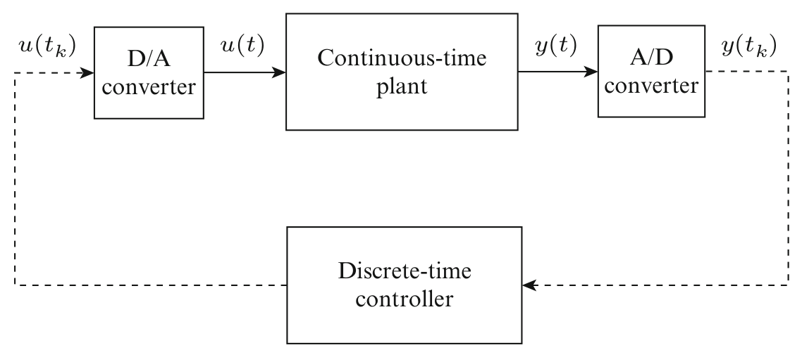

Note that the system in Fig. 1 can be generalized in many ways. An important generalization is multi-rate sampling where the output of the system is sampled at one sampling rate while the control inputs are updated at a different sampling rate. Another generalization are networked control systems which are discussed in the last section.

## Modeling

The combination of continuous-time and discrete-time components renders the analysis and the design of sampled-data systems challenging. Still, linear systems allow for computationally efficient analysis and design techniques that benefit from the z and $\delta$ transforms, as well as convex optimization (Chen and Francis 1994). Nonlinear sampleddata systems, one the other hand, are much harder to deal with since the aforementioned methods do not apply in this case. This inherent difficulty has led to a variety of models for different analysis and design methods:

1. Continuous-time models
2. Discrete-time models
3. Sampled-data models

We discuss bellow each of these models, their features, and the analysis or design methods that exploit them.

Continuous-time models basically ignore the sampling process and assume that all signals are continuous time. They are the coarsest approximation of the sampled-data system and they
are useful only for very small sampling periods. Nevertheless, they are invaluable and are used as the first step in the controller/observer design in the so-called emulation design approach.

Discrete-time models only capture the behavior of the sampled-data system at sampling instants. Indeed, they ignore the inter-sample behavior of the system and this is their main drawback. There are two ways in which nonlinear discrete-time models arise: (i) from the identification of the plant model using the sampled measurements and (ii) from the discretization of a known continuous-time plant model. For instance, black box identification methods often lead to nonlinear discrete-time models in inputoutput form, such as NARMA (nonlinear autoregressive moving average) models (Chen et al. 1989; Juditsky et al. 1995). Depending on the approximating functions used, the nonlinearities can be polynomial, neural network type, fuzzy type, and so on. On the other hand, the discretization of the continuous-time plant model requires an exact analytic solution of a set of nonlinear differential equations. When such an analytic solution exists, we can obtain the exact discretetime models of the system; this is typically assumed for linear plants. Nonlinear sampled-data systems are different from their linear counterparts in that it is typically impossible to obtain the exact discrete-time model and only approximate discrete-time models are available for analysis and design (Nešić et al. 1999; Nešić and Teel 2004).

Sampled-data models capture the true behavior of the sampled-data system including its


<!-- source_pdf_page: 898 -->
inter-sample behavior. There are several ways in which this can be achieved. One way is to model the piecewise constant signals that arise from zero-order hold devices as signals with a time-varying delay; this gives rise to time-delay nonlinear models (Teel et al. 1998). Another recently proposed approach is to model nonlinear sampled-data systems as hybrid dynamical systems (Goebel et al. 2012). An extensive analysis and design toolbox has been developed for hybrid dynamical systems and these results can be used for nonlinear sampled-data systems. Another class of models, based on the so-called lifting, has been applied for linear systems where the system is represented as a discrete-time system with infinite dimensional input and output spaces. While this approach has been very successful in the linear context (Chen and Francis 1994), it appears that it is not as useful for nonlinear systems due to difficulties arising from harder analysis and prohibitive computational requirements.

## The Main Issues and Analysis

Controllability/observability: Issues arising due to sampling in linear systems transfer to the nonlinear context although they are less understood in this case. For instance, it is well known that sampling may "destroy" the controllability and/or observability properties of the system (Chen and Francis 1994). In other words, if the continuous-time plant model is controllable/observable, then the corresponding exact discrete-time model of the plant may not verify these properties for some sampling periods. A simple test is available for linear systems to avoid this phenomenon, but we are not aware of similar results in the nonlinear context.

Finite escape times: A major difference between continuous-time linear and nonlinear systems is that the former have well defined solutions for constant control inputs and arbitrarily long sampling periods. This is not the case, in general, for nonlinear systems as they may exhibit finite escape times. In other words, for a constant input it may happen for some initial
conditions of a nonlinear system that solutions blow up within a time that is shorter than the sampling period. As a consequence, for such an initial condition and input, the exact discrete-time system cannot be defined. This is a fundamental obstacle to achieving global stability results for nonlinear systems if the sampling period is fixed and independent of the size of the initial state. Nevertheless, it is possible to ensure semi-global stability properties for very general nonlinear systems which means that any compact domain of convergence can be achieved if the sampling period is sufficiently reduced (Nešić and Teel 2004).

Model structure is changed: An important issue for nonlinear sampled-data systems is that the sampling modifies the structure of the model. When the continuous-time plant model has a certain structure, such as triangular or affine in the input, the corresponding exact discretetime model will not inherit it; see Monaco and Normand-Cyrot (2007) and Yuz and Goodwin (2005). This significantly complicates the design of sampled-data systems via the discretetime approach since many nonlinear design techniques, like backstepping or forwarding, are heavily reliant on the structure of the model.

Zero dynamics: Probably the most significant aspect of the changed structure are the socalled sampling zeros. In linear systems, it is well known that if a continuous-time linear system of relative degree $r \geq 2$ is sampled, then generically for fast sampling the discrete-time models of the plant will have relative degree $r=1$. In other words, sampling introduces extra zeros in the model which are often unstable and thus render the system non-minimum phase. It is well known that the controller design is much harder for non-minimum phase systems, and, moreover, there are certain fundamental performance limitations in this case. Recently, results that extend the notion of sampling zeros to the nonlinear sampled-data systems have been reported; see the references in Monaco and Normand-Cyrot (2007).

Passivity: Some plant properties like passivity are much more restrictive in discrete time than in continuous time. Indeed, it is necessary for a


<!-- source_pdf_page: 899 -->
continuous-time plant to have relative degree 1 or 0 to be passive, whereas only relative degree 0 discrete-time plants may possess this property. In other words, an exact discrete-time model of a passive continuous-time plant of relative degree 1 will not be passive; that is, sampling typically destroys passivity.

## Controller Design

Linearization: The simplest way to design sampled-data nonlinear systems is to linearize the plant at a given operating point. In this case, the nonlinear plant dynamics are approximated by a linear model around a chosen equilibrium, and then any of the linear sampled-data techniques can be applied to the linearized model. The obtained solution is then implemented on the true nonlinear plant. The drawback of this technique is that the solution would typically perform well only in the vicinity of the selected equilibrium point.

Nonlinear methods: An alternative is to perform designs that rely on a nonlinear plant model. These approaches can be divided into feedback linearization, emulation design method, (approximate and exact) discrete-time design method, and sampled-data design method.

Feedback linearization: Some classical problems, like feedback linearization, are harder for sampled-data systems than continuous-time ones. It was shown that a class of discrete-time nonlinear systems for which feedback linearization is possible is smaller than the corresponding class of continuous-time systems (Grizzle 1987). This has led to approximate feedback linearization techniques which consider achieving feedback linearization approximately with an error that can be reduced by reducing the length of the sampling period (Arapostathis et al. 1989).

Continuous-time design method (Emulation design): Emulation is a design technique consisting of two steps. In the first step, a continuoustime controller or observer is designed for the continuous-time plant while ignoring sampling to achieve appropriate stability, performance, and/or robustness guarantees. In the second step,
the designed controller/observer is discretized for implementation and the sampling period is reduced sufficiently for the method to work. This method is approximate since the continuous-time plant model approximates well the sampled-data systems only for sufficiently small sampling periods. The discretization can be done using various implicit or explicit Runge-Kutta methods, such as the forward or backward Euler method (Monaco and Normand-Cyrot 2007; Yuz and Goodwin 2005). The emulation method is probably the best understood of all design methods. It was shown that a range of stability properties that can be cast in terms of dissipation inequalities are preserved in an appropriate sense under the emulation approach (Laila et al. 2002). Moreover, nonconservative estimates of the upper bound for the required sampling period in emulation have been reported recently (Nešić et al. 2009).

Exact discrete-time design method: Exact discrete-time design method assumes that an exact discrete-time model of the plant is available to the designer; see Kötta (1995) and the references cited therein. This approach is reasonable when black box identification techniques are used for modeling. Moreover, in some rare cases it is possible to obtain the exact discrete-time model of the plant by integrating the continuous-time model with fixed inputs (assuming the zero-order hold is used). This is the case when the plant dynamics are linear while the control law is nonlinear (e.g., adaptive control) or the plant is linear with state/input constraints, which is a setup often used in the model predictive control. The literature on exact discrete-time design method is vast and many of the nonlinear continuoustime design techniques, like backstepping, forwarding, and passivity-based designs, are extended to discrete-time nonlinear systems; see Kötta (1995) and Grizzle (1987). A drawback of these methods is that they assume a special structure of the discrete-time nonlinear model, such as upper or lower triangular structure, which is typically much more restrictive in discretetime than in continuous-time due to the loss of structure due to sampling that was discussed earlier.


<!-- source_pdf_page: 900 -->
Approximate discrete-time design method: Due to the nonlinearity, it is impossible in most cases to obtain an exact discrete-time plant model by integrating its continuous-time model equations; instead, a range of approximate discrete-time plant models, such as Runge-Kutta, can be used for controller/observer design. It was recently shown that this design method may lead to disastrous consequences where the controller stabilizes the approximate discretetime plant model for all (arbitrarily small) sampling periods while the same controller destabilizes the exact discrete-time plant model for all sampling periods; see Nešić and Teel (2004) and Nešić et al. (1999). This is true even for linear systems and some commonly used discretization techniques and controller designs. These considerations have led to the development of a framework for controller design based on approximate discrete-time models (Nešić et al. 1999; Nešić and Teel 2004). This framework provides checkable conditions on the continuoustime plant model, the approximate discrete-time model and the controller that guarantee that the controllers designed in this manner would stabilize the exact discrete-time model and, hence, the nonlinear sampled-data system for sufficiently small sampling periods. The design is based on families of approximate discrete-time models parameterized with the sampling period, and the design objectives are more demanding than in the continuous-time nonlinear systems. Ideas from numerical analysis are adapted to this context. This framework was used to design controllers and observers for classes of nonlinear sampled-data systems where typically Euler approximate discretization is employed to generate the approximate discrete-time model.

Sampled-data design method: Both emulation and discrete-time design methods have their drawbacks. Indeed, the former method ignores the sampling at the design stage, whereas the latter method ignores and may produce unacceptable inter-sampling behavior. Thus, methods that use a sampled-data model of the plant for design are much more attractive. There are two possible ways in which this can be achieved for nonlinear sampled-data systems.

The first approach consists of representing nonlinear sampled-data systems as systems with time-varying delays (Teel et al. 1998). However, controller design tools for such systems need to be further developed.

The second approach involves representing the nonlinear sampled-data system as a hybrid dynamical system. Recent advances on modeling and analysis of hybrid dynamical systems (Goebel et al. 2012) offer great opportunities in this context, but the full potential of this approach is still to be exploited. Nonlinear sampled-data systems are just a small subclass of hybrid dynamical systems, and developing specific analysis and design tools tailored to this class of systems seems promising.

It should be emphasized that there are many related techniques, such as discrete-time adaptive control and model predictive control, that deal with classes of nonlinear sampled-data systems but are not a part of the mainstream nonlinear sampled-data literature.

## Summary and Future Directions

Summary: Sampled-data control systems are nowadays prevalent and there are many situations where nonlinear models need to be used to deal with wider ranges of operating conditions, more restrictive constraints, and enhanced performance specifications. Despite their increasing importance, the design of nonlinear sampled-data systems remains largely unexplored, and it is much less developed than its continuous-time counterpart. A variety of models, analysis, and design techniques make nonlinear sampled-data literature very diverse and a comprehensive textbook reference or a unifying approach is still missing. Many open questions remain for nonlinear sampled-data systems, such as results on multi-rate sampling, design techniques based on sampled-data models, and other generalizations which are discussed below.

Future Directions: In the 1990s, a new generation of digitally controlled systems has evolved from the more classical sampled-data systems


<!-- source_pdf_page: 901 -->
which are generally referred to as networked control systems (NCS); see Heemels et al. (2010) and the references cited therein. These systems exploit digital wired or wireless communication networks within the control loops. Such a setup is introduced to reduce the cost, weight, and volume of the engineered systems, but its special structure imposes new challenges due to the communication constraints, data packet dropouts, quantization of data, varying sampling periods, time delays, etc. At the same time, these systems provide new flexibilities due to the distributed computation within the control system that can be used to improve the performance and mitigate some of the undesirable network effects on the overall system performance. Moreover, embedded microprocessors allow for event-triggered and self-triggered sampling (Anta and Tabuada 2010) that are still largely unexplored especially for nonlinear systems. Design of NCS was identified as one of the biggest challenges to the control research community in the twenty-first century, and more than a decade of intense research on this topic still has not provided a comprehensive and unifying approach for their analysis and design. Novel results on modeling and Lyapunov stability theory for (nonlinear) hybrid dynamical systems appear to offer the right analysis design tools but they are still to be converted into efficient and easy-to-use design tools in the control engineers' toolbox.

## Cross-References

- Event-Triggered and Self-Triggered Control
- Hybrid Dynamical Systems, Feedback Control of
- Optimal Sampled-Data Control
- Sampled-Data Systems


## Bibliography

Anta A, Tabuada P (2010) To sample or not to sample: self-triggered control for nonlinear systems. IEEE Trans Autom Control 55:2030-2042

Arapostathis A, Jakubczyk B, Lee HG, Marcus SI, Sontag ED (1989) The effect of sampling on linear equivalence and feedback linearization. Syst Control Lett 13:373-381
Chen T, Francis B (1994) Optimal sampled-data systems. Springer, New York
Chen S, Billings SA, Luo W (1989) Orthogonal least squares methods and their application to non-linear system identification. Int J Control 50: 1873-1896
Goebel R, Sanfelice RG, Teel AR (2012) Hybrid dynamical systems. Princeton University Press, Princeton
Grizzle JW (1987) Feedback linearization of discrete-time systems. Syst Control Lett 9:411-416
Heemels M, Teel AR, van de Wouw N, Nešić D (2010) Networked control systems with communication constraints: tradeoffs between transmission intervals, delays and performance. IEEE Trans Autom Control 55:1781-1796
Juditsky A, Hjalmarsson H, Benveniste A, Delyon B, Ljung L, Sjöberg J, Zhang Q (1995) Nonlinear blackbox models in system identification: mathematical foundations (original research article). Automatica 31:1725-1750
Khalil HK (2004) Performance recovery under output feedback sampled-data stabilization of a class of nonlinear systems. IEEE Trans Autom Control 49:21732184
Kötta U (1995) Inversion method in the discrete-time nonlinear control systems synthesis problems. Lecture notes in control and information sciences, vol 205. Springer, Berlin
Laila DS, Nešić D, Teel AR (2002) Open and closed loop dissipation inequalities under sampling and controller emulation. Eur J Control 18:109-125
Monaco S, Normand-Cyrot D (2007) Advanced tools for nonlinear sampled-data systems' analysis and control. Eur J Control 13:221-241
Nešić D, Teel AR (2004) A framework for stabilization of nonlinear sampled-data systems based on their approximate discrete-time models. IEEE Trans Autom Control 49:1103-1034
Nešić D, Teel AR, Kokotović PV (1999) Sufficient conditions for stabilization of sampled-data nonlinear systems via discrete-time approximations. Syst Control Lett 38:259-270
Nešić D, Teel AR, Carnevale D (2009) Explicit computation of the sampling period in emulation of controllers for nonlinear sampled-data systems. IEEE Trans Autom Control 54: 619-624
Teel AR, Nešić D, Kokotović PV (1998) A note on input-to-state stability of sampled-data nonlinear systems. In: Proceedings of the conference on decision and control'98, Tampa, pp 2473-2478
Yuz JI, Goodwin GC (2005) On sampled-data models for nonlinear systems. IEEE Trans Autom Control 50:477-1488


<!-- source_pdf_page: 902 -->
# Nonlinear System Identification Using Particle Filters

Thomas B. Schön<br>Department of Information Technology, Uppsala University, Uppsala, Sweden


#### Abstract

Particle filters are computational methods opening up for systematic inference in nonlinear/nonGaussian state-space models. The particle filters constitute the most popular sequential Monte Carlo (SMC) methods. This is a relatively recent development, and the aim here is to provide a brief exposition of these SMC methods and how they are key enabling algorithms in solving nonlinear system identification problems. The particle filters are important for both frequentist (maximum likelihood) and Bayesian nonlinear system identification.


## Keywords

Bayesian; Backward simulation; Maximum likelihood; Markov chain Monte Carlo (MCMC); Particle filter; Particle MCMC; Particle smoother; Sequential Monte Carlo

## Introduction

The state-space model (SSM) offers a general tool for modeling and analyzing dynamical phenomena. The SSM consists of two stochastic processes: the states $\left\{\mathbf{x}_{t}\right\}_{t \geq 1}$ and the measurements $\left\{\mathbf{y}_{t}\right\}_{t \geq 1}$, which are related according to

$$
\begin{align*}
\mathbf{x}_{t+1} \mid\left(\mathbf{x}_{t}=x_{t}\right) & \sim f_{\theta}\left(x_{t+1} \mid x_{t}, u_{t}\right),  \tag{1a}\\
\mathbf{y}_{t} \mid\left(\mathbf{x}_{t}=x_{t}\right) & \sim h_{\theta}\left(y_{t} \mid x_{t}, u_{t}\right), \tag{1b}
\end{align*}
$$

and the initial state $\mathbf{x}_{1} \sim \mu_{\theta}\left(x_{1}\right)$. We use bold face for random variables and $\sim$ means "distributed according to." The notation $\mathbf{x}_{t+1} \mid\left(\mathbf{x}_{t}=\right. x_{t}$ ) stands for the conditional probability of $\mathbf{x}_{t+1}$ given $\mathbf{x}_{t}=x_{t}$. The state process $\left\{\mathbf{x}_{t}\right\}_{t \geq 1}$ is a

Markov process, implying that we only need to condition on the most recent state $\mathbf{x}_{t}$, since that contains all information about the past. Furthermore, $\theta$ denotes the parameters, $f_{\theta}(\cdot)$ and $h_{\theta}(\cdot)$ that are probability density functions, encoding the dynamic and the measurement models, respectively. In the interest of a compact notation, we will suppress the input $u_{t}$ throughout the text.

The SSM introduced in (1) is general in that it allows for nonlinear and non-Gaussian relationships. Furthermore, it includes both blackbox and gray-box models on state-space form. Nonlinear black-box and gray-box models are covered by - Nonlinear System Identification: An Overview of Common Approaches. The offline nonlinear system identification problem can (slightly simplified) be expressed as recovering information about the parameters $\theta$ based on the information in the $T$ measured inputs $u_{1: T} \triangleq \left\{u_{1}, \ldots, u_{T}\right\}$ and outputs $y_{1: T}$. For a thorough exposition of the system identification problem, we refer to ▷ System Identification: An Overview. Nonlinear system identification has a long history, and a common assumption of the past has been that of linearity and Gaussianity. This assumption is very restrictive, and we have now witnessed well over half a century of research devoted to finding useful approximate algorithms allowing this assumption to be weakened. This development has significantly intensified during the past two decades of research on sequential Monte Carlo (SMC) methods (including particle filters and particle smoothers). However, the use of SMC for nonlinear system identification is more recent than that. The aim here is to introduce the key ideas enabling the use of SMC methods in solving nonlinear system identification problems, and as we will see, it is not a matter of straightforward application. The development of SMC-based identification follows two clear trends that are indeed more general: (1) The problems we are working with are analytically intractable, and hence, the mindset has to shift from searching for closed-form solutions to the use of computational methods, and (2) the new algorithms have basic building blocks that are themselves algorithms. Both these trends call for new developments.


<!-- source_pdf_page: 903 -->
Before the SMC methods are introduced in section "Sequential Monte Carlo", their need is clearly explained by formulating both the Bayesian and the maximum likelihood identification problems in sections "Bayesian Problem Formulation" and "Maximum Likelihood Problem Formulation", respectively. Solutions to these problems are then provided in sections "Bayesian Solutions" and "Maximum Likelihood Solutions", respectively. Finally, we give some intuition for online (recursive) solutions in section "Online Solutions", and in section "Summary and Future Directions", we conclude with a summary and directions for future research.

## Bayesian Problem Formulation

In formulating the Bayesian problem, the parameters $\theta$ are modeled as unknown stochastic variables, 1.e., the model (1) needs to be augmented with a prior density for the parameters $\boldsymbol{\theta} \sim p(\theta)$. The aim in Bayesian system identification is to compute the posterior density of $\boldsymbol{\theta}$ given the measurements $p\left(\theta \mid y_{1: T}\right)$. More generally, we typically compute the joint posterior of the parameters $\boldsymbol{\theta}$ and the states $\mathbf{x}_{1: T}$,

$$
\begin{equation*}
p\left(\theta, x_{1: T} \mid y_{1: T}\right)=p\left(x_{1: T} \mid \theta, y_{1: T}\right) p\left(\theta \mid y_{1: T}\right) . \tag{2}
\end{equation*}
$$

By explicitly including the state variables $\mathbf{x}_{1: T}$ in the problem formulation according to (2), they take on the role of auxiliary variables. The reason for including the state variables $\mathbf{x}_{1: T}$ as auxiliary variables is that the alternative of excluding them would require us to analytically marginalize the states $\mathbf{x}_{1: T}$. This is not possible for the model (1) under study. However, once we have an approximation of $p\left(\theta, x_{1: T} \mid y_{1: T}\right)$ available, the density $p\left(\theta \mid y_{1: T}\right)$ is easily obtained by straightforward marginalization.

## Maximum Likelihood Problem Formulation

In formulating the maximum likelihood (ML) problem, the parameters $\theta$ are modeled as unknown deterministic variables. The ML formulation offers a systematic way of computing point
estimates of the unknown parameters $\theta$ in a model, by making use of the information available in the obtained measurements $y_{1: T}$. The ML estimate is obtained by finding the $\theta$ that maximizes the so-called log-likelihood function, which is defined as

$$
\begin{equation*}
\ell_{T}(\theta) \triangleq \log p_{\theta}\left(y_{1: T}\right)=\sum_{t=1}^{T} \log p_{\theta}\left(y_{t} \mid y_{1: t-1}\right) \tag{3}
\end{equation*}
$$

Note that we use $\theta$ as a subindex to denote that the corresponding probability density function is parameterized by $\theta$, analogously to what was done in (1). The one step ahead predictor $p_{\theta}\left(y_{t} \mid y_{1: t-1}\right)$ is computed by marginalizing $p\left(y_{t}, x_{t} \mid y_{1: t-1}\right)=h_{\theta}\left(y_{t} \mid x_{t}\right) p_{\theta}\left(x_{t} \mid y_{1: t-1}\right)$ w.r.t. $x_{t}$, i.e., integrating out $x_{t}$ from $p\left(y_{t}, x_{t} \mid\right. \left.y_{1: t-1}\right)$. To summarize, the ML estimate $\hat{\theta}^{\mathrm{ML}}$ is obtained by solving the following optimization problem:

$$
\begin{gather*}
\hat{\theta}^{\mathrm{ML}} \triangleq \underset{\theta}{\arg \max } \sum_{t=1}^{T} \log \int h_{\theta}\left(y_{t} \mid x_{t}\right) \\
p_{\theta}\left(x_{t} \mid y_{1: t-1}\right) \mathrm{d} x_{t} \tag{4}
\end{gather*}
$$

This problem formulation clearly reveals the important fact that the nonlinear state inference problem (here computing $p_{\theta}\left(x_{t} \mid y_{1: t-1}\right)$ ) is inherent in any maximum likelihood formulation for identification of SSMs. For linear Gaussian models, the Kalman filter offers closed-form solutions for the state inference problem, but for nonlinear models, there are no closed-form solutions available.

## Sequential Monte Carlo

Solving the nonlinear system identification problem implicitly requires us to solve various nonlinear state inference problems. We will, for example, need to approximate the smoothing density $p\left(x_{1: T} \mid \quad y_{1: T}\right)$ and the filtering density $p\left(x_{t} \mid y_{1: t}\right)$. The SMC samplers offer approximate solutions to these and other nonlinear state inference problems, where


<!-- source_pdf_page: 904 -->
the accuracy is only limited by the available computational resources. This section only deals with the state inference problem, allowing us to drop the $\theta$ in the notation for brevity.

Most SMC samplers hinge upon importance sampling, motivating section "Importance Sampling". In section "Particle Filter", we make use of importance sampling in computing an approximation of the filtering density $p\left(x_{t} \mid y_{1: t}\right)$, and in section "Particle Smoother", a particle smoothing strategy is introduced to approximately compute $p\left(x_{1: T} \mid y_{1: T}\right)$.

## Importance Sampling

Let $\mathbf{z}$ be a random variable distributed according to some complicated density $\pi(z)$ and let $\varphi(\cdot)$ be some function of interest. Importance sampling offers a systematic way of evaluating integrals of the form

$$
\begin{equation*}
\mathrm{E}[\varphi(\mathbf{z})]=\int \varphi(z) \pi(z) \mathrm{d} z, \tag{5}
\end{equation*}
$$

without requiring samples directly generated from $\pi(z)$. The density $\pi(z)$ is referred to as the target density, i.e., the density we are trying to sample from. The importance sampler relies on a proposal density $q(z)$, from which it is simple to generate samples, let $\mathbf{z}^{i} \sim q(z)$, $i=1, \ldots, N$. Since each sample $\mathbf{z}^{i}$ is drawn from the proposal density rather than from the target density $\pi(z)$, we must somehow account for this discrepancy. The so-called importance weights $\tilde{\mathbf{w}}^{i}=\pi\left(\mathbf{z}^{i}\right) / q\left(\mathbf{z}^{i}\right)$ encode the difference. By normalizing the weights $\mathbf{w}^{i}=\tilde{\mathbf{w}}^{i} / \sum_{j=1}^{N} \tilde{\mathbf{w}}^{j}$, we obtain a set of weighted samples $\left\{\mathbf{z}^{i}, \mathbf{w}^{i}\right\}_{i=1}^{N}$ that can be used to approximately evaluate the integral (5) resulting in $\mathrm{E}[\varphi(\mathbf{z})] \approx \sum_{i=1}^{N} \mathbf{w}^{i} \varphi\left(\mathbf{z}^{i}\right)$. Schön and Lindsten (2014) provide an introduction to importance sampling within a dynamical systems setting, whereas Robert and Casella (2004) provide a general treatment.

## Particle Filter

The solution to the nonlinear filtering problem is provided by the following two recursive equations:

$$
\begin{align*}
& p\left(x_{t} \mid y_{1: t}\right)=\frac{h\left(y_{t} \mid x_{t}\right) p\left(x_{t} \mid y_{1: t-1}\right)}{p\left(y_{t} \mid y_{1: t-1}\right)}  \tag{6a}\\
& p\left(x_{t} \mid y_{1: t-1}\right)=\int f\left(x_{t} \mid x_{t-1}\right) \\
& p\left(x_{t-1} \mid y_{1: t-1}\right) \mathrm{d} x_{t-1} . \tag{6b}
\end{align*}
$$

In the general case (1) there are no analytical solutions available for the above equations. The particle filter maintains an empirical approximation of the solution, which at time $t-1$ amounts to

$$
\begin{equation*}
\hat{p}^{N}\left(x_{t-1} \mid y_{1: t-1}\right)=\sum_{i=1}^{N} \mathbf{w}_{t-1}^{i} \delta_{\mathbf{x}_{t-1}^{i}}\left(x_{t-1}\right), \tag{7}
\end{equation*}
$$

where $\delta_{\mathbf{x}_{t-1}^{i}}\left(x_{t-1}\right)$ denotes the Dirac delta mass located at $\mathbf{x}_{t-1}^{i}$. Furthermore, $\mathbf{w}_{t-1}^{i}$ and $\mathbf{x}_{t-1}^{i}$ are referred to as the weights and the particles, respectively. We will now derive the particle filter by designing an importance sampler allowing us to approximately solve (6). The derivation is performed in an inductive fashion, starting by assuming that $p\left(x_{t-1} \mid y_{1: t-1}\right)$ is approximated by (7). Inserting (7) into (6b) results in $\hat{p}^{N} \left(x_{t} \mid y_{1: t-1}\right)=\sum_{i=1}^{N} \mathbf{w}_{t-1}^{i} f\left(x_{t} \mid \mathbf{x}_{t-1}^{i}\right)$, which is used in (6a) to compute an approximation of the filtering density $p\left(x_{t} \mid y_{1: t}\right)$ up to proportionality. Hence, this allows us to target $p\left(x_{t} \mid y_{1: t}\right)$ using an importance sampler, where the form of $\hat{p}^{N}\left(x_{t} \mid y_{1: t-1}\right)$ suggests that new samples can be proposed according to

$$
\begin{equation*}
\mathbf{x}_{t}^{i} \sim q\left(x_{t} \mid y_{1: t}\right)=\sum_{i=1}^{N} \mathbf{w}_{t-1}^{i} f\left(x_{t} \mid \mathbf{x}_{t-1}^{i}\right) . \tag{8}
\end{equation*}
$$

It is worth noting that we can obtain a more general algorithm by replacing $f\left(x_{t} \mid \mathbf{x}_{t-1}^{i}\right)$ in the above mixture with a density $q\left(x_{t} \mid \mathbf{x}_{t-1}^{i}, y_{t}\right)$. However, in the interest of a simple, but still highly useful algorithm, we keep (8). The proposal density (8) is a weighted mixture consisting of $N$ components, which means that we can generate a sample $\tilde{\mathbf{x}}_{t}^{i}$ from it via a two-step procedure: first we select which component to sample from, and secondly we generate a sample from that component. More precisely, the first


<!-- source_pdf_page: 905 -->
```
Algorithm 1 Bootstrap particle filter (for $i=$
$1, \ldots, N$ )
    Initialization $(t=1)$ :
    (a) Sample $\mathbf{x}_{1}^{i} \sim \mu\left(x_{1}\right)$.
    (b) Compute the importance weights $\tilde{\mathbf{w}}_{1}^{i}=h\left(y_{1} \mid \mathbf{x}_{1}^{i}\right)$
        and normalize $\mathbf{w}_{1}^{i}=\tilde{\mathbf{w}}_{1}^{i} / \sum_{j=1}^{N} \tilde{\mathbf{w}}_{1}^{j}$.
    For $t=2$ to $T$ do:
    (a) Resample $\left\{\mathbf{x}_{t-1}^{i}, \mathbf{w}_{t-1}^{i}\right\}$ resulting in equally
        weighted particles $\left\{\tilde{\mathbf{x}}_{t-1}^{i}, 1 / N\right\}$.
    (b) Sample $\mathbf{x}_{t}^{i} \sim f\left(x_{t} \mid \tilde{\mathbf{x}}_{t-1}^{i}\right)$.
    (c) Compute the importance weights $\tilde{\mathbf{w}}_{t}^{i}=h\left(y_{t} \mid \mathbf{x}_{t}^{i}\right)$
        and normalize $\mathbf{w}_{t}^{i}=\tilde{\mathbf{w}}_{t}^{i} / \sum_{j=1}^{N} \tilde{\mathbf{w}}_{t}^{j}$.
```

part amounts to selecting one of the $N$ particles $\left\{\mathbf{x}_{t-1}^{i}\right\}_{i=1}^{N}$ according to

$$
\mathbb{P}\left(\tilde{\mathbf{x}}_{t-1}=\mathbf{x}_{t-1}^{i} \mid\left\{\mathbf{x}_{t-1}^{j}, \mathbf{w}_{t-1}^{j}\right\}_{j=1}^{N}\right)=\mathbf{w}_{t-1}^{i},
$$

where the selected particle is denoted as $\tilde{\mathbf{x}}_{t-1}$. By repeating this $N$ times, we obtain a set of equally weighted particles $\left\{\tilde{\mathbf{x}}_{t-1}^{i}\right\}_{i=1}^{N}$, constituting an empirical approximation of $p\left(x_{t-1} \mid y_{1: t-1}\right)$, analogously to (7). We can then draw $\mathbf{x}_{t}^{i} \sim f\left(x_{t} \mid \tilde{\mathbf{x}}_{t-1}^{i}\right)$ to generate a realization from the proposal (8). This procedure that turns a weighted set of samples into an unweighted one is commonly referred to as resampling.

Finally, using the approximation $\hat{p}^{N}\left(x_{t} \mid\right. y_{1: t-1}$ ) in (6a) and the proposal density according to (8) allows us to compute the weights as $\tilde{\mathbf{w}}_{t}^{i}=h\left(y_{t} \mid \mathbf{x}_{t}^{i}\right)$. Once all the $N$ weights are computed and normalized, we obtain a collection of weighted particles $\left\{\mathbf{x}_{t}^{i}, \mathbf{w}_{t}^{i}\right\}_{i=1}^{N}$ targeting the filtering density at time $t$. We have now (in a slightly nonstandard fashion) derived the socalled bootstrap particle filter, which was the first particle filter introduced by Gordon et al. (1993) two decades ago. Since the introduction of Algorithm 1, the surrounding theory and practice have undergone significant developments; see, e.g., Doucet and Johansen (2011) for an up-to-date survey. The weights $\left\{\mathbf{w}_{1: T}^{i}\right\}_{i=1}^{N}$ and the particles $\left\{\mathbf{x}_{1: T}^{i}\right\}_{i=1}^{N}$ are random variables, and in executing the algorithm, we generate one realization from these. This is a useful insight both when it comes to understanding, but also when it comes to the analysis of the
particle filters. There is by now a fairly good understanding of the convergence properties of the particle filter; see, e.g., Doucet and Johansen (2011) for basic results and further pointers into the literature.

## Particle Smoother

A particle smoother is an SMC method targeting the joint smoothing density $p\left(x_{1: T} \mid y_{1: T}\right)$ (or one of its marginals). There are several different strategies for deriving particle smoothers. Rather than mentioning them all, we introduce one powerful and increasingly popular strategy based on backward simulation, giving rise to the family of forward filtering/backward simulation (FFBSi) samplers.

In an FFBSi sampler the joint smoothing density $p\left(x_{1: T} \mid y_{1: T}\right)$ is targeted by complementing a forward particle filter with a second recursion evolving in the time-reversed direction. The following factorization of the joint smoothing density

$$
\begin{aligned}
p\left(x_{1: T} \mid y_{1: T}\right)= & \left(\prod_{t=1}^{T-1} p\left(x_{t} \mid x_{t+1}, y_{1: t}\right)\right) \\
& p\left(x_{T} \mid y_{1: T}\right)
\end{aligned}
$$

immediately suggests a highly useful timereversed recursion. Start by generating a sample $\tilde{\mathbf{x}}_{T} \sim p\left(x_{T} \mid y_{1: T}\right)$. We then continue generating samples backward in time by sampling from the so-called backward kernel $p\left(x_{t} \mid x_{t+1}, y_{1: t}\right)$ according to $\tilde{\mathbf{x}}_{t} \sim p\left(x_{t} \mid \tilde{x}_{t+1}, y_{1: t}\right)$, for $t=T-1, \ldots, 1$. The resulting sample $\tilde{\mathbf{x}}_{1: T} \triangleq\left(\tilde{x}_{1}, \ldots, \tilde{x}_{T}\right)$ is then by construction a sample from the joint smoothing density. Hence, in performing $M$ backward simulations, we obtain the following approximation of the joint smoothing density:

$$
\begin{equation*}
\hat{p}^{M}\left(x_{1: T} \mid y_{1: T}\right)=\sum_{i=1}^{M} \frac{1}{M} \delta_{\tilde{\mathbf{x}}_{1: T}^{i}}\left(x_{1: T}\right) . \tag{9}
\end{equation*}
$$

For details on how to design algorithms implementing the backward simulation strategy,


<!-- source_pdf_page: 906 -->
derivations, properties, and references, we refer to the recent survey on backward simulation methods by Lindsten and Schön (2013).

## Bayesian Solutions

## Strategies

The posterior density (2) is analytically intractable, but we can make use of Markov chain Monte Carlo (MCMC) samplers to address the inference problem. An MCMC sampler allows us to approximately generate samples from an arbitrary target density $\pi(z)$. This is done by simulating a Markov chain (1.e., a Markov process) $\{\mathbf{z}[r]\}_{r \geq 1}$, which is constructed in such a way that the stationary distribution of the chain is given by $\pi(z)$. The sample paths $\{z[r]\}_{r=1}^{R}$ of the chain can then be used to draw inference about the target distribution. Two constructive ways of finding a suitable Markov chain to simulate are provided by the Metropolis Hastings (MH) and the Gibbs samplers, where the latter can be interpreted as a special case of the former. See, e.g., Robert and Casella (2004) for details on MCMC. A Gibbs sampler targeting $p\left(\theta, x_{1: T} \mid y_{1: T}\right)$ is given by
(i) Draw $\theta^{\prime} \sim p\left(\theta \mid x_{1: T}, y_{1: T}\right)$.
(ii) Draw $x_{1: T}^{\prime} \sim p\left(x_{1: T} \mid \theta^{\prime}, y_{1: T}\right)$.

The second step is hard, since it requires us to generate a sample from the joint smoothing density. Simply replacing step (ii) with a backward simulator does not result in a valid method (Andrieu et al. 2010).

One interesting solution is provided by the family of particle MCMC (PMCMC) sampler, first introduced by Andrieu et al. (2010). PMCMC provides a systematic way of combining SMC and MCMC, where SMC is used to construct the proposal density for the MCMC sampler. The so-called particle Gibbs (PG) sampler resolves the problems briefly mentioned above by a nontrivial modification of the SMC algorithm. Introducing the PG sampler lies outside the scope of this work; we refer the reader to the ground-
breaking work by Andrieu et al. (2010). During the past 3 years, the PG samplers have developed quite a lot, and improved versions are surveyed and explained by Lindsten and Schön (2013).

## A Nontrivial Example

To place PMCMC in the context of nonlinear system identification, we will now solve a nontrivial identification problem. The PG sampler is used to compute the posterior density for a general Wiener model (linear Gaussian system followed by a static nonlinearity) (Giri and Bai 2010):

$$
\begin{array}{rlrl}
\mathbf{x}_{t+1} & =(\mathbf{A} \mathbf{~ B})\binom{\mathbf{x}_{t}}{\mathbf{u}_{t}}+\mathbf{v}_{t}, & & \mathbf{v}_{t} \sim \mathcal{N}(0, \mathbf{Q}) \\
\mathbf{z}_{t} & =\mathbf{C} \mathbf{x}_{t}, & & (10 \mathrm{a}) \\
\mathbf{y}_{t} & =\mathbf{g}\left(\mathbf{z}_{t}\right)+\mathbf{e}_{t}, & & (10 \mathrm{~b})  \tag{10c}\\
\mathbf{e}_{t} & \sim \mathcal{N}(0, \mathbf{r})
\end{array}
$$

Based on observed inputs $u_{1: T}$ and outputs $y_{1: T}$, we wish to identify the model (10). We place a matrix normal inverse Wishart (MNIW) prior on $\{(\mathbf{A}, \mathbf{B}), \mathbf{Q}\}$, an inverse gamma prior on $\mathbf{r}$, and a Gaussian process (Rasmussen and Williams 2006) prior on the function $\mathbf{g}$, resulting in a semiparametric model. We can without loss of generality fix the matrix $C$ according to $C= (1,0, \ldots, 0)$. For a complete model specification, we refer to Lindsten et al. (2013).

The posterior distribution $p\left(\theta, x_{1: T} \mid y_{1: T}\right)$ is computed using a newly developed PG sampler referred to as particle Gibbs with ancestor sampling (PGAS); see Lindsten and Schön (2013). In the present experiment we make use of $T=1,000$ observations. The dimension of the state-space is 6, the linear dynamics contains complex poles resulting in oscillations as seen in Fig. 1, and the nonlinearity is non-monotonic; see Fig. 2. A subspace method is used to find an initial guess for the linear system, and the static nonlinearity is initialized using a linear function (i.e., a straight line).


<!-- source_pdf_page: 907 -->
Nonlinear System Identification Using Particle Filters, Fig. 1 Bode diagram of the sixth-order linear system. The black curve is the true system. The red curve is the estimated posterior mean of the Bode diagram, and the shaded area is the 99 \% Bayesian credibility interval
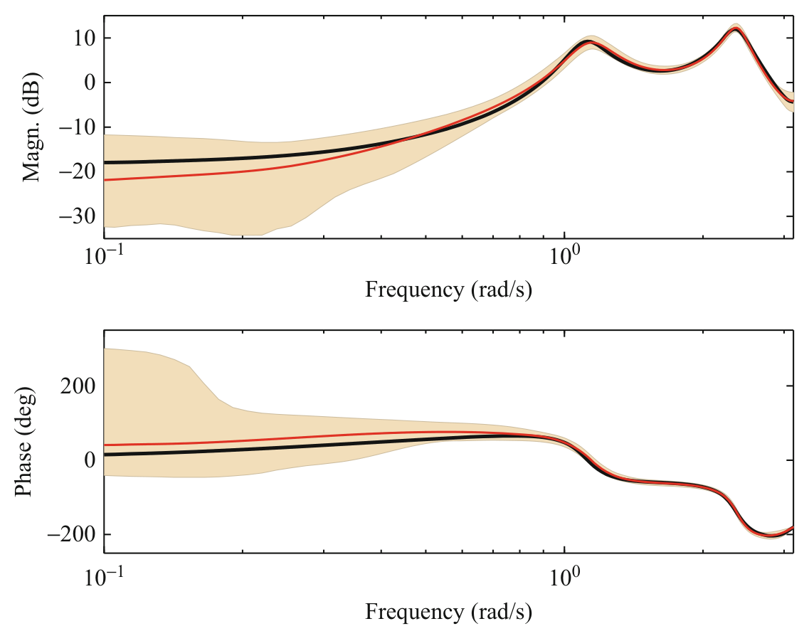

> Image description: A Bode diagram of a sixth-order linear system is presented in two vertically stacked plots. Both plots feature frequency (rad/s) on a logarithmic x-axis, ranging from $10^{-1}$ to approximately $10^{1}$ rad/s. The top plot shows Magnitude (dB) on the y-axis. A solid black curve represents the true system, while a solid red curve represents the estimated posterior mean. Two prominent resonant peaks are visible near $10^{0}$ and $5 \times 10^{0}$ rad/s. A light orange shaded area represents the 99% Bayesian credibility interval, which is widest at low frequencies. The bottom plot shows Phase (deg) on the y-axis. Similar to the magnitude plot, the black true system curve and red posterior mean curve are shown. The phase starts near $0^\circ$, increases slightly, and then drops sharply past $1$ rad/s towards $-200^\circ$. The shaded orange credibility interval is significantly wider at low frequencies.

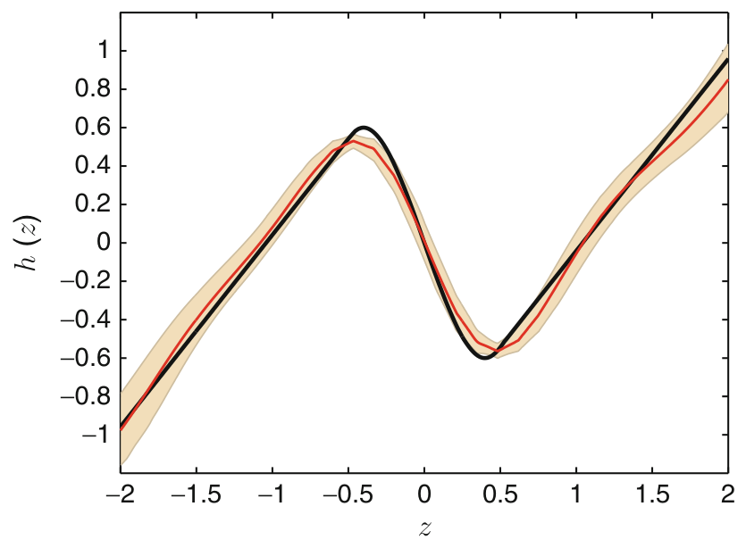

> Image description: A scientific line graph plots the relationship between variables $z$ and $h(z)$. The horizontal axis represents $z$, with numerical labels ranging from $-2$ to $2$ in increments of $0.5$. The vertical axis represents $h(z)$, with labels ranging from $-1$ to $1$ in increments of $0.2$. The plot contains three primary visual components: 1. A solid black curve representing the true system's Bode diagram. 2. A solid red curve representing the estimated posterior mean. 3. A light orange shaded area representing the 99% Bayesian credibility interval. The curves exhibit a nonlinear, oscillating behavior. The black curve reaches local extrema near $z = -0.4$ (maximum $\approx 0.6$) and $z = 0.4$ (minimum $\approx -0.6$). The red curve follows the general trend of the black curve but stays slightly offset, particularly around the peaks and valleys. The shaded uncertainty interval is narrowest at the extrema and widens significantly at the edges of the plotted domain ($z = -2$ and $z = 2$).
Nonlinear System Identification Using Particle Filters, Fig. 2 The black curve is the true static nonlinearity (non-monotonic). The red curve is the estimated posterior mean of the static nonlinearity, and the shaded area is the 99 \% Bayesian credibility interval

It is worth pausing for a moment to reflect upon the posterior distribution $p\left(\theta, x_{1: T} \mid y_{1: T}\right)$ that we are computing. The unknown "parameters" $\theta$ live in the space $\Theta=\mathbb{R}^{64} \times \mathcal{F}$, where $\mathcal{F}$ is an appropriate function space. The states $x_{1: T}$ live in the space $\mathbb{R}^{6 \times 1,000}$. Hence, $p\left(\theta, x_{1: T} \mid y_{1: T}\right)$ is actually a rather complicated object for this example.

Using the PGAS sampler (with $N=$ 15 particles), we construct a Markov chain $\left\{\theta[r], x_{1: T}[r]\right\}_{r=1}^{R}$ with $p\left(\theta, x_{1: T} \quad \mid \quad y_{1: T}\right)$ as its stationary distribution. We run this Markov chain for $R=25,000$ iterations, where the first 10,000 are discarded. The result is visualized in Figs. 1 and 2, where we plot the Bode diagram for the linear system and the static nonlinearity, respectively. In both figures we also provide the $99 \%$ Bayesian credibility interval. MATLAB code for Bayesian identification of Wiener models is available from user.it.uu.se/~thosc112/research/software. html.

The resonance peaks are accurately modeled, but the result is less accurate at low frequencies (likely due to a lack of excitation). The fact that the posterior mean is inaccurate at low frequencies is encoded in our estimate of the posterior distribution as shown by the credibility intervals.

In Figs. 1 and 2, we have visualized not only the posterior mean but also the uncertainty for the entire model. We could do this since the model is a linear dynamical system followed by a static nonlinearity. It would be most interesting if we


<!-- source_pdf_page: 908 -->
can come up with ways in which we could visualize the uncertainty inherent in general nonlinear dynamical systems.

## Maximum Likelihood Solutions

Identifying the parameters $\theta$ in a general nonlinear SSM using maximum likelihood amounts to solving the optimization problem (3). This is a challenging problem for several reasons, for example, it requires the computation of the predictor density $p_{\theta}\left(y_{t} \mid y_{1: t-1}\right)$. Furthermore, its gradient (possibly also its Hessian) is very useful in setting up an efficient optimization algorithm. There are no closed-form solutions available for these objects, forcing us to rely on approximations. The SMC methods briefly introduced in section "Sequential Monte Carlo" provide rather natural tools for this task, since they are capable of producing approximations where the accuracy is only limited by the available computational resources.

To establish a clear interface between the maximum likelihood problem (3) and the SMC methods, it has proven natural to make use of the expectation maximization (EM) algorithm (Dempster et al. 1977). The EM algorithm proceeds in an iterative fashion to compute ML estimates of unknown parameters $\theta$ in probabilistic models involving latent variables. The strategy underlying the EM algorithm is to exploit the structure inherent in the probabilistic model to separate the original problem into two closely linked problems. The first problem amounts to computing the so-called intermediate quantity

$$
\begin{align*}
\mathcal{Q}\left(\theta, \theta^{\prime}\right) \triangleq & \int \log p_{\theta}\left(x_{1: T}, y_{1: T}\right) \\
& p_{\theta^{\prime}}\left(x_{1: T} \mid y_{1: T}\right) \mathrm{d} x_{1: T} \\
= & \mathrm{E}_{\theta^{\prime}}\left[\log p_{\theta}\left(x_{1: T}, y_{1: T}\right) \mid y_{1: T}\right] \tag{11}
\end{align*}
$$

where we have already made use of the fact that the latent variables in an SSM are given by the states. Furthermore, $\theta^{\prime}$ denotes a particular value for the parameters $\theta$. We can show that by choosing a new $\theta$ such that
$\mathcal{Q}\left(\theta, \theta^{\prime}\right) \geq \mathcal{Q}\left(\theta^{\prime}, \theta^{\prime}\right)$, the likelihood is either increased or left unchanged, 1.e., $\ell_{T}(\theta) \geq \ell_{T}\left(\theta^{\prime}\right)$.

The EM algorithm now suggests itself in that we can generate a sequence of iterates $\left\{\theta^{k}\right\}_{k \geq 1}$ that guarantees that the log-likelihood is not decreased for increasing $k$ by alternating the following two steps: (1) (Expectation) compute the intermediate quantity $\mathcal{Q}\left(\theta, \theta^{k}\right)$ and (2) (maximization) compute the subsequent iterate $\theta^{k+1}$ by maximizing $\mathcal{Q}\left(\theta, \theta^{k}\right)$ w.r.t. $\theta$. This procedure is then repeated until convergence, guaranteeing convergence to a stationary point on the likelihood surface.

The FFBSi particle smoother offers an approximation of the joint smoothing density $p_{\theta^{\prime}}\left(x_{1: T} \mid\right. \left.y_{1: T}\right)$ according to (9), which inserted into (11) provides an approximative solution $\hat{\mathcal{Q}}^{M}\left(\theta, \theta^{\prime}\right)$ to the expectation step. In solving the maximization step, we typically want gradients of the intermediate quantity $\nabla_{\theta} \hat{\mathcal{Q}}^{M}\left(\theta, \theta^{\prime}\right)$. These can also be approximated using (9). The above development is summarized in Algorithm 2, providing a solution where the basic building blocks are themselves complex algorithms, an SMC algorithm for the E step and a nonlinear optimization algorithm for the M step. This means that we have the option of replacing the FFBSi particle smoother in step 2a with any other algorithm capable of producing estimates of the joint smoothing density. The family of PMCMC methods introduced in section "Bayesian Solutions" contains several highly interesting alternatives. A detailed account on Algorithm 2 is provided by Schön et al. (2011); see also Cappé et al. (2005).

Algorithm 2 EM for nonlinear system identification

1. Initialization: Set $k=0$ and initialize $\theta^{k}$.
2. Expectation (E) step:
(a) Compute an approximation $\hat{p}_{\theta^{k}}^{M}\left(x_{1: T} \mid y_{1: T}\right)$, for example, using an FFBSi sampler.
(b) Calculate $\hat{\mathcal{Q}}^{M}\left(\theta, \theta^{k}\right)$.
3. Maximization (M) step: Compute

$$
\theta_{k+1}=\underset{\theta}{\arg \max } \hat{\mathcal{Q}}^{M}\left(\theta, \theta^{k}\right)
$$

4. Check termination condition. If satisfied, terminate; otherwise, update $k \rightarrow k+1$ and return to step 2 .


<!-- source_pdf_page: 909 -->
Finally, we mention Fisher's identity opening up yet another avenue for designing ML estimators using SMC approximations. Even if we are not interested in using EM when solving the nonlinear system identification problem, the intermediate quantity (11) is useful. The reason is provided via Fisher's identity,

$$
\begin{gathered}
\left.\nabla_{\theta} \ell_{T}(\theta)\right|_{\theta=\theta^{\prime}}=\left.\nabla_{\theta} \mathcal{Q}\left(\theta, \theta^{\prime}\right)\right|_{\theta=\theta^{\prime}} \\
=\left.\int \nabla_{\theta} \log p_{\theta}\left(x_{1: T}, y_{1: T}\right)\right|_{\theta=\theta^{\prime}} \\
\quad p_{\theta^{\prime}}\left(x_{1: T} \mid y_{1: T}\right) \mathrm{d} x_{1: T}
\end{gathered}
$$

which provides a means to compute approximations of the log-likelihood gradient. Hessian approximations are also available, but these are more involved. Hence, Fisher's identity opens up for direct use of any off-the-shelf gradient-based optimization method in solving (4).

## Online Solutions

Online (also referred to as recursive or adaptive) identification refers to the problem where the parameter estimate is updated based on the parameter estimate at the previous time step and the new measurement. This is used when we are dealing with big data sets and in real-time situations. SMC offers interesting opportunities when it comes to deriving online solutions for nonlinear state- space models. The most direct idea is simply to make use of a gradient method

$$
\theta_{t}=\theta_{t-1}+\gamma_{t} \nabla_{\theta} \log p_{\theta}\left(y_{t} \mid y_{1: t-1}\right),
$$

where $\left\{\gamma_{t}\right\}$ is the sequence of step sizes. Fisher's identity (12) opens up for the use of SMC in approximating $\nabla_{\theta} \log p_{\theta}\left(y_{t} \mid y_{1: t-1}\right)$ However, this leads to a rapidly increasing variance, something that can be dealt with by the so-called "marginal" Fisher identity; see Poyiadjis et al. (2011) for details.

An interesting alternative is provided by an online EM algorithm; see, e.g., Cappé (2011) for a solid introduction. The online EM approaches rely on the additive properties of the $\mathcal{Q}$-function. The area of online solutions via SMC is likely
to grow in the future as there is a clear need motivated by the constantly growing data sets and there are also clear theoretical opportunities.

## Summary and Future Directions

We have discussed how SMC samplers can be used to solve nonlinear system identification problems, by sketching both Bayesian and ML solutions. A common feature of the resulting algorithms is that they are (nontrivial) combinations of more basic algorithms. We have, for example, seen the combined use of a particle smoother and a nonlinear optimization solver in Algorithm 2 to compute ML estimates. As another example we have the class of PMCMC methods, where the basic building blocks are provided by SMC samplers and MCMC samplers. The use of SMC and MCMC methods for nonlinear system identification has only just started to take off, and it presents very interesting future prospects. Some directions for future research are as follows: (1) The family of PMCMC algorithms is rich and fast growing, with great potential for further developments. For example, its use in solving the state smoothing problem (i.e., computing $p\left(x_{1: T} \mid y_{1: T}\right)$ ) is likely to provide better algorithms in the near future. (2) Related to this is the potential to design new particle smoothers capable of generating new particles also in the time-reversed direction. (3) There are open and highly relevant challenges when it comes to designing backward simulators for Bayesian nonparametric methods (Hjort et al. 2010). A key question here is how to represent the backward kernel $p\left(x_{t} \mid x_{t+1}, y_{1: t}\right)$ in such nonparametric settings. (4) The use of Bayesian nonparametric models will open up interesting possibilities for hybrid system identification, since they allow us to systematically express and work with uncertainties over segmentations.

## Cross-References

- Nonlinear System Identification: An Overview of Common Approaches
- System Identification: An Overview


<!-- source_pdf_page: 910 -->
## Recommended Reading

An overview of SMC methods for system identification is provided by Kantas et al. (2009), and a thorough introduction to SMC is provided by Doucet and Johansen (2011). The forthcoming monograph by Schön and Lindsten (2014) provides a textbook introduction to particle filters/smoothers (SMC), MCMC, PMCMC, and their use in solving problems in nonlinear system identification and nonlinear state inference. A self-contained introduction to particle smoothers and the backward simulation idea is provided by Lindsten and Schön (2013). The work by Cappé et al. (2005) also contains a lot of very relevant material in this respect.

## Bibliography

Andrieu C, Doucet A, Holenstein R (2010) Particle Markov chain Monte Carlo methods. J R Stat Soc Ser B 72(2):1-33
Cappé O (2011) Online EM algorithm for hidden Markov models. J Comput Graph Stat 20(3): 728-749
Cappé O, Moulines E, Rydén T (2005) Inference in hidden Markov models. Springer, New York
Dempster A, Laird N, Rubin D (1977) Maximum likelihood from incomplete data via the EM algorithm. J R Stat Soc Ser B 39(1):1-38
Doucet A, Johansen AM (2011) A tutorial on particle filtering and smoothing: fifteen years later. In: Crisan D, Rozovsky B (eds) Nonlinear filtering handbook. Oxford University Press, Oxford, UK
Giri F, Bai E-W (eds) (2010) Block-oriented nonlinear system identification. Volume 404 of lecture notes in control and information sciences. Springer, Berlin/Heidelberg
Gordon NJ, Salmond DJ, Smith AFM (1993) Novel approach to nonlinear/non-Gaussian Bayesian state estimation. IEE Proc Radar Signal Process 140:107113
Hjort N, Holmes C, Müller P, Walker S (eds) (2010) Bayesian nonparametrics. Cambridge University Press, Cambridge/New York
Kantas N, Doucet A, Singh S, Maciejowski J (2009) An overview of sequential Monte Carlo methods for parameter estimation in general state-space models. In: Proceedings of the 15th IFAC symposium on system identification, Saint-Malo, pp 774-785
Lindsten F, Schön TB (2013) Backward simulation methods for Monte Carlo statistical inference. Found Trends Mach Learn 6(1): 1-143
Lindsten F, Schön TB, Jordan MI (2013) Bayesian semiparametric Wiener system identification. Automatica 49(7):2053-2063

Poyiadjis G, Doucet A, Singh SS (2011) Particle approximations of the score and observed information matrix in state space models with application to parameter estimation. Biometrika 98(1):65-80
Rasmussen CE, Williams CKI (2006) Gaussian processes for machine learning. MIT, Cambridge
Robert CP, Casella G (2004) Monte Carlo statistical methods, 2nd edn. Springer, New York
Schön TB, Lindsten F (2014) Learning of dynamical systems - particle filters and Markov chain methods. Forthcoming book, see user.it.uu.se/~thosc112/lds
Schön TB, Wills A, Ninness B (2011) System identification of nonlinear state-space models. Automatica 47(1):39-49

## Nonlinear System Identification: An Overview of Common Approaches

Qinghua Zhang<br>Inria, Campus de Beaulieu, Rennes Cedex, France


#### Abstract

Nonlinear mathematical models are essential tools in various engineering and scientific domains, where more and more data are recorded by electronic devices. How to build nonlinear mathematical models essentially based on experimental data is the topic of this entry. Due to the large extent of the topic, this entry provides only a rough overview of some well-known results, from gray-box to black-box system identification.


## Keywords

Black-box models; Block-oriented models; Graybox models; Nonlinear system identification

## Introduction

The wide success of linear system identification in various applications (Ljung 1999; System Identification: An Overview) does not necessarily mean that the underlying dynamic systems are


<!-- source_pdf_page: 911 -->
intrinsically linear. Quite often, linear system identification can be successfully applied to a nonlinear system if its working range is restricted to a neighborhood of some working point. Nevertheless, some advanced engineering systems may exhibit significant nonlinear behaviors under their normal working conditions, so do most biological or social systems. There is therefore an increasing demand on nonlinear dynamic system modeling theory. Nonlinear system identification is studied to partly answer this demand, when experimental data carry the essential information for modeling purpose.

Nonlinear system identification, compared to its linear counterpart, is a much more vast topic, as in principle a nonlinear model can be any description of a system which is not linear. For this reason, this entry provides only a rough overview of some well-known results.

An overview of the basic concepts of system identification can be found in - System Identification: An Overview, notably the five basic elements to be taken into account in each application, among which the (nonlinear) model structures will be mainly focused on by this entry, as they represent the essential particularities of nonlinear system identification problems.

The various model structures used in nonlinear system identification are often classified by the level of available prior knowledge about the considered system: from white-box models to black-box models, via gray-box models. In principle, a white-box model is fully built from prior knowledge. Such a fully white-box approach is rarely feasible for complex systems because of insufficient prior knowledge or of intractable system complexity. Therefore, the system identification methods summarized in this entry concern gray-box and black-box models, for which experimental data play an essential role.

For ease of presentation, the main content of this entry will be restricted to the single-input single-output (SISO) case. The multiple-input multiple-output (MIMO) case will be discussed in the section "Multiple-Input Multiple-Output Systems" below.

## Gray-Box Models

This section covers gray-box models, from the most to the least demanding ones in terms of prior knowledge.

## Parametrized Physical Models

The dynamic behaviors of some engineering systems are governed by well-known physical laws, typically in the form of differential equations, possibly with unknown parameters. These parametrized physical equations can be used as gray-box models for system identification. In most situations, such a model can be written in the form of a vectorial first-order ordinary differential equation (ODE), known as state equation, and can be generally written as

$$
\begin{equation*}
\frac{d x(t)}{d t}=f(x(t), u(t) ; \theta) \tag{1}
\end{equation*}
$$

where $t$ represents the time, $x(t)$ is the state vector, $u(t)$ the input, and $f(\cdot)$ a (nonlinear) function parametrized by the vector $\theta$.

The observation on the system (typically with electronic sensors), referred to as the output and denoted by $y(t)$, is related to $x(t)$ and $u(t)$ through another known parametrized equation

$$
\begin{equation*}
y(t)=h(x(t), u(t) ; \theta)+v(t) \tag{2}
\end{equation*}
$$

where $v(t)$ represents the measurement error.
With digital electronic instruments, the input $u(t)$ and the output $y(t)$ are sampled at some discrete-time instants, say $t=\tau, 2 \tau, 3 \tau, \ldots, N \tau$ with some constant sampling period $\tau>0$. For the sake of notation simplicity, let the sampling period $\tau=1$ and assume ideal instantaneous samplers; then the sampled input-output data set is denoted by
$Z^{N}=\{u(1), y(1), u(2), y(2), \ldots, u(N), y(N)\}$.

In some applications, data samples are made at irregular time instants. Some studies are particularly focused on system identification in this case (Garnier and Wang 2008).


<!-- source_pdf_page: 912 -->
The main remaining task of gray-box system identification is to estimate the parameter vector $\theta$ from the data set $Z^{N}$. The identification criterion is typically defined with the aid of an output predictor derived from the system model. A natural output predictor is simply based on the numerical solution of the state equation (1): for some given value of $\theta$, initial state $x(0)$ and some assumed inter-sample behavior of the input $u(t)$ (e.g., with a zero order hold), the trajectory of $x(t)$, denoted by $\hat{x}(t \mid \theta)$, is computed with a numerical ODE solver, then the output prediction is computed as

$$
\begin{equation*}
\hat{y}(t \mid \theta)=h(\hat{x}(t \mid \theta), u(t) ; \theta) . \tag{4}
\end{equation*}
$$

The parameter vector $\theta$ is typically estimated by minimizing the sum of squared prediction error $\varepsilon(t \mid \theta)=y(t)-\hat{y}(t \mid \theta)$. See □ System Identification: An Overview and Bohlin (2006) for more details.

The predictor based on the numerical solution of the state equation (1) (known as a simulator) may be in trouble if this equation with the given value of $\theta$ is unstable. Moreover, the state equation (1) may also be subject to some modeling error that should be taken into account in the output predictor. In such cases, the output predictor can be made with the aid of some nonlinear state observer (Gauthier and Kupka 2001) or some nonlinear filtering algorithm (Doucet and Johansen 2011).

Alternatively, sequential Monte Carlo (SMC) methods can also be applied to the identification of (small size) nonlinear state-space systems, typically assuming a discrete-time counterpart of the model described by Eqs. (1) and (2). See - Nonlinear System Identification Using Particle Filters.

The gray-box approach is particularly useful in an engineering field when some software library of commonly used components is available. In this case, a system model can be built by connecting available component models. Nevertheless, the "connection" of the component models may introduce algebraic constraints through variables shared by connected components, leading to differential algebraic equations (DAE),
which are a wider class of dynamic system models than the abovementioned state-space models ( ↽ Modeling of Dynamic Systems from First Principles). For most dynamic systems, it is possible to avoid the DAE formulation by causality analysis, so that the connections between different system components are treated as information flow, instead of algebraic constraints. There exist also some theoretic studies on DAE system identifiability (Ljung and Glad 1994) and some recent developments on the identification of such systems (Gerdin et al. 2007).

## Combined Physical and Black-Box Models

It may happen that, in a complex system, part of the components is well described by physical laws (possibly with available models from a software library), but some other components are not well studied. In this case, the latter components can be dealt with black-box models (or possibly empirical models). The entire model can be fitted to a collected data set $Z^{N}$, like in the case of the previous subsection.

## Block-Oriented Models

Complex systems, notably those studied in engineering, are often made of a certain number of components; thus a system model can be built by connecting component models. In this sense, such component-based models could be said "block-oriented." In the system identification literature, the term block-oriented model is often used in a particular context (Giri and Bai 2010), where it is typically assumed that each component is either a linear dynamic subsystem or a nonlinear static one. Here, the term "static" means that the behavior of the component is memoryless and can be described by an algebraic equation. The study of system identification with such models is motivated by the fact that, when a controlled system is stabilized around a working point, its dynamic behavior can be well described by a linear model, but its actuators and sensors may exhibit significant nonlinear behaviors like saturation or dead zone. The choice of a particular block-oriented model structure depends on the prior knowledge about the underlying system,


<!-- source_pdf_page: 913 -->
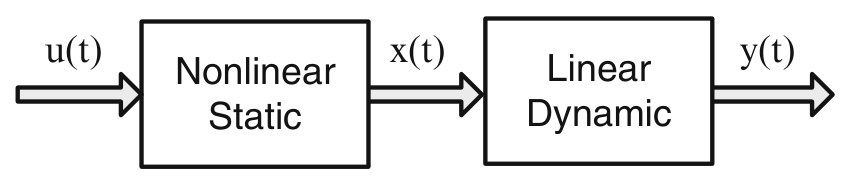

> Image description: A block diagram illustrating a Hammerstein system, as shown in Figure 1, titled "Nonlinear System Identification: An Overview of Common Approaches." The diagram represents a cascaded configuration consisting of two main functional blocks connected by signal flows. The process begins with an input signal, labeled $u(t)$, represented by a gray arrow pointing into the first block. This first block is labeled "Nonlinear Static." The output of this nonlinear block is an intermediate signal, $x(t)$, indicated by an arrow pointing toward the second block. The second block is labeled "Linear Dynamic," which processes the signal $x(t)$ over time. Finally, the output of the system is denoted as $y(t)$, represented by an arrow exiting the linear dynamic block. In engineering terms, this structure describes a system where a static nonlinearity precedes a linear time-varying or time-invariant dynamic component.
Nonlinear System Identification: An Overview of Common Approaches, Fig. 1 Hammerstein system

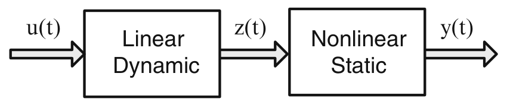

> Image description: A block diagram labeled as "Fig. 1 Hammerstein system" from a textbook titled "Nonlinear System Identification: An Overview of Common Approaches." The diagram illustrates a block cascade structure representing a Hammerstein model. The system begins with an input signal, $u(t)$, represented by a thick arrow entering the first block. The first block is labeled "Linear Dynamic." The output of this linear block is $z(t)$, which flows via an arrow into the second block. The second block is labeled "Nonlinear Static." The final output of the system is $y(t)$, represented by an arrow exiting the second block. In control engineering, this configuration describes a system where a linear dynamical process is followed by a static nonlinear element. The input $u(t)$ undergoes linear transformations over time to produce the intermediate signal $z(t)$, which is then subjected to a nonlinear mapping to produce the final output $y(t)$.
Nonlinear System Identification: An Overview of Common Approaches, Fig. 2 Wiener system

with specific identification methods available for different model structures.

The most frequently studied block-oriented models for system identification concern the Hammerstein system and the Wiener system, each composed of two blocks, as illustrated, respectively, in Figs. 1 and 2.

## Hammerstein System Identification

A SISO Hammerstein system is typically formulated as

$$
\begin{equation*}
x(t)=f(u(t)) \tag{5a}
\end{equation*}
$$

$$
\begin{align*}
y(t) & +a_{1} y(t-1)+\cdots+a_{n_{a}} y\left(t-n_{a}\right) \\
& =b_{1} x(t-1)+\cdots+b_{n_{b}} x\left(t-n_{b}\right) \\
& +v(t) \tag{5b}
\end{align*}
$$

If the nonlinearity $f(\cdot)$ is expressed in the form of

$$
\begin{equation*}
f(u)=\sum_{l=1}^{m} \gamma_{l} \kappa_{l}(u) \tag{6}
\end{equation*}
$$

with some chosen basis functions $\kappa_{l}(\cdot)$, then the identification problem amounts to fitting the model parameters $\gamma_{l}, a_{i}, b_{j}$ to a collected data set $Z^{N}$. A well-known method is based on overparametrization (Bai 1998): replace in (5b) each $x(t-j)$ with the right-hand side of (6) and treat each parameter product $b_{j} \gamma_{l}$ as an individual parameter, then the newly parametrized model is equivalent to a linear ARX model ( ✓ System Identification: An Overview), which can be
estimated by a well-established linear system identification method. As the $n_{b}+m$ parameters $b_{j}$ and $\gamma_{l}$; are replaced by $n_{b} m$ parameters in the new parametrization, the term "overparametrization" refers to the fact that typically $n_{b}+m<n_{b} m$. The estimated over-parametrized model can be reduced to the original parametrization, usually through the singular value decomposition (SVD) of the matrix filled with the estimated parameter products $b_{j} \gamma_{l}$. See Giri and Bai (2010) for other identification methods with variant formulations of Hammerstein system model.

When the linear subsystem is approximated by a finite impulse response (FIR) model, it is possible to first estimate the linear model before estimating a model for the nonlinear block (Greblicki and Pawlak 1989).

## Wiener System Identification

A SISO Wiener system is typically formulated as

$$
\begin{align*}
& z(t)=\sum_{k=1}^{\infty} h_{k} u(t-k)  \tag{7a}\\
& y(t)=g(z(t))+v(t) \tag{7b}
\end{align*}
$$

where the sequence $h_{1}, h_{2}, \ldots$ is the impulse response of the linear subsystem, $g(\cdot)$ is some nonlinear function, and $v(t)$ is a noise independent of the input $u(t)$.

Some methods for Wiener system identification assume a finite impulse response (FIR) of the linear subsystem. In this case, the linear subsystem model is characterized by the vector collecting the FIR coefficients $h^{T}=\left[h_{1}, h_{2}, \ldots, h_{n}\right]$. There are two typical kinds of efficient solutions, assuming either the Gaussian distribution of the input $u(t)$ (Greblicki 1992) or the monotonicity of the nonlinear function $g(\cdot)$ (Bai and Reyland Jr 2008). In both cases, it is possible to directly estimate the FIR coefficients $h$ from the inputoutput data $Z^{N}$, without explicitly estimating the unknown nonlinear function $g(\cdot)$. The estimated $h$ can be used to compute the internal variable $z(t)$. It then becomes relatively easy to estimate the nonlinear function $g(\cdot)$ from the computed $z(t)$ and the measured $y(t)$.


<!-- source_pdf_page: 914 -->
## Other Block-Oriented Model Structures

Among block-oriented models composed of more blocks, the most well-known ones concern Hammerstein-Wiener system and WienerHammerstein system. They are both composed of 3 blocks connected in series, the former has a linear dynamic block preceded and followed by two nonlinear static blocks, and the latter has a nonlinear static block in the middle of two linear dynamic blocks. In general, the prediction error method (PEM) (Ljung 1999) is applied to the identification of such systems, with heuristic methods for the initialization of model parameters. Some recent results on Hammerstein-Wiener system identification have been reported in Wills et al. (2013). There exist also some other variants, with parallel blocks or feedback loops. In most cases, each block is either linear dynamic or nonlinear static, but there is a notable exception: hysteresis blocks. Hysteresis is a phenomenon typically observed in some magnetic or mechanic systems. Its mathematical description is both dynamic and strongly nonlinear and cannot be decomposed into linear dynamic and nonlinear static blocks. Due to the importance of hysteresis components in some control systems, system identification involving such blocks is currently an active research topic (Giri et al. 2008).

## LPV Models

Linear parameter-varying (LPV) models could be classified as black-box models, because typically they rely more on experimental data than on prior knowledge. However, engineers often have good insights into such models; they are thus presented in the gray-box section.

## From Gain Scheduling to LPV Models

Gain scheduling is a method originally developed for the control of nonlinear systems. It consists in designing different controllers for different working points of a nonlinear system and in switching among the designed controllers according to the actual working point. It is typically assumed that the working point is determined by some observed variable (vector) referred to as the scheduling variable and denoted by $\rho$. Around
each considered working point, the nonlinear system is linearized so that the corresponding controller can be designed from the linear control theory. A by-product of this controller design procedure is a collection of linearized models indexed by the scheduling variable $\rho$. This collection, seen as a whole model of the globally nonlinear system, is known as an LPV model (Toth 2010). This approach has been particularly successful in the field of flight control.

An LPV model can be formulated either in input-output form or in state-space form. In the input-output form, a SISO model can be written as

$$
\begin{align*}
y(t) & +a_{1}(\rho) y(t-1)+\cdots+a_{n_{a}}(\rho) y\left(t-n_{a}\right) \\
= & b_{1}(\rho) u(t-1)+\cdots+b_{n_{b}}(\rho) u\left(t-n_{b}\right) \\
& +v(t) . \tag{8}
\end{align*}
$$

and in the state-space form as

$$
x(t+1)=A(\rho) x(t)+B(\rho) u(t)+w(t)
$$

$$
\begin{equation*}
y(t)=c(\rho) x(t)+D(\rho) u(t)+v(t) \tag{9a}
\end{equation*}
$$

As a global model of the whole nonlinear system, the $\rho$-dependent parameters (matrices) $\mathrm{a}_{i}(\rho), b_{j}(\rho), A(\rho)$, etc., are functions defined for all $\rho \in \Omega$, where $\Omega$ is the relevant working range of the considered system (a compact subset of a real vector space). If originally the LPV model was built through a collection of linearized models around different working points, then the values of these functions are first defined for the corresponding discrete values of $\rho$. For other values of $\rho \in \Omega$, these functions can be defined by interpolation. Alternatively, by choosing some parametric forms of $a_{i}(\rho), b_{j}(\rho), A(\rho)$, etc., the whole LPV model can also be estimated by fitting it to a data set $Z^{N}$, through nonlinear optimization (Toth 2010).

## Local Linear Models

In an LPV model, the model parameters can in principle depend on the scheduling variable $\rho$ in


<!-- source_pdf_page: 915 -->
any chosen manner. A particularly useful case is when they are formulated as expansions over local basis functions. For example, in (8), the parameter $a_{i}(\rho)$ may be expressed as

$$
\begin{equation*}
a_{i}(\rho)=\sum_{l=1}^{m} a_{i, l} \kappa_{l}(\rho) \tag{10}
\end{equation*}
$$

where $k_{l}(\cdot)$ are some chosen bell-shaped (local) basis functions, typically the Gaussian function, centered at different positions $\rho=c_{l}, \in \Omega$, and $a_{i, l}$ are coefficients of the expansion. Similarly

$$
\begin{equation*}
b_{j}(\rho)=\sum_{l=1}^{m} b_{i, l} \kappa_{l}(\rho) . \tag{11}
\end{equation*}
$$

Assume that the basis functions are normalized such that

$$
\begin{equation*}
\sum_{l=1}^{m} \kappa_{l}(\rho)=1 \tag{12}
\end{equation*}
$$

for all $\rho \in \Omega$. Then the LPV model (8) can be viewed as an interpolation of $m$ "local" models

$$
\begin{align*}
y(t) & +a_{1, l} y(t-1)+\cdots+a_{n_{a} l} y\left(t-n_{a}\right) \\
& =b_{1, l} u(t-1)+\cdots+b_{n_{b} l} u\left(t-n_{b}\right)+v(t) \tag{13}
\end{align*}
$$

indexed by $l=1,2, \ldots, m$. Each of these linear models is valid for $\rho$ close to $c_{l}$, the center of the corresponding basis function $\kappa_{l}(\cdot)$; hence, they are called local linear models.

If the local basis functions $\kappa_{l}(\rho)$ are viewed as membership functions of fuzzy sets, then the local linear model is strongly related to the TakagiSugeno fuzzy model (Takagi and Sugeno 1985). An advantage of this point of view is the possibilities of incorporating prior knowledge in the form of linguistic rules and of interpreting some local linear models resulting from system identification.

There are two approaches to building local linear models. The first one is the local approach: for each chosen value of $c_{l}, \in \Omega$, a local model is estimated from data corresponding to the values of $\rho$ within a neighborhood of $c_{l}$. This approach has the advantages of being computationally efficient, easily updatable, and well understood by engineers. The second one
is the global approach: all the model parameters are estimated simultaneously by solving a single optimization problem for the whole model. This approach can produce more accurate models in terms of prediction error, but it is numerically much more expensive and may lead to models difficult to be interpreted by engineers.

The practical success of local linear models strongly depends on the possibility of finding a scheduling variable $\rho$ of small dimension relevantly determining the working point of the considered system. If there exists a nonlinear state-space model of the system, then in principle the working point is determined jointly by the state and the input of the system. As quite often physically meaningful state variables are not fully observed, they cannot be used in the definition of $\rho$. It is possible to define $\rho$ as delayed output and input variables, e.g.,

$$
\rho^{T}=\left[y(t), \ldots, y\left(t-n_{a}\right), u(t-1), \ldots, u\left(t-n_{b}\right)\right]
$$

but it typically leads to a vector of quite large dimension. It is thus important to use practical insights about a given system to find a relevant vector $\rho$ of reduced dimension.

For a single-dimensional $\rho$, the choice of the local basis function centers $c_{l}$ can be made following some practical insight or equally spaced within $\Omega$. For a large-dimensional $\rho$, this task is more difficult. The equally spaced approach would lead to too many local models, as their number would exponentially increase with the dimension of $\rho$. In this case, an empirical approach, called local linear model tree (LOLIMOT) (Nelles 2001), can be applied. It iteratively partitions $\Omega$ in order to place the local basis functions where the system is more likely nonlinear or where the available data are more concentrated.

## Black-Box Models

Ideally speaking, a black-box model should be solely built from experimental data, without any prior knowledge. In practice, some prior knowledge is always necessary, though experimental


<!-- source_pdf_page: 916 -->
data play a much more important role. For instance, the choice of the input and output variables, implying some causality relationship, is an important prior knowledge.

With the fast development of electronic devices, more and more sensor signals are available in various fields, notably for engineering, environmental, and biomedical systems. Meanwhile, the processing power of modern computers increases every year. Black-box modeling has thus more and more potential applications. Nevertheless, the importance of prior knowledge in a modeling procedure should not be forgotten. In general prior knowledge leads to more reliable models in terms of validity range, as the validity of physical equations is often well understood. In contrast, for a black-box model essentially based on experimental data, it may be hard to ensure its validity for interpolation and even harder for extrapolation.

## Input-Output Black-Box Models

As the primary role of a mathematical model is to predict the output of the system for given input values, it is natural to design black-box models directly in the form of a predictor. As the output $y(t)$ of a dynamic system depends on the past inputs, a predicted output $\hat{y}(t)$ may be formulated in the form of

$$
\begin{equation*}
\hat{y}(t)=f\left(u(t-1), u(t-2), \ldots, u\left(t-n_{b}\right)\right) \tag{14}
\end{equation*}
$$

where $f(\cdot)$ is some nonlinear function (to be estimated from experimental data) and $n_{b}$ is a chosen integer. In principle, $n_{b}$ can be infinitely large (as $y(t)$ depends on all the past inputs in general), but in practice, a model of finite complexity has to be chosen. If the considered system is stable in the sense that sufficiently old past inputs are (gradually) forgotten, then it is reasonable to truncate the dependence on the past inputs.

The model structure (14) is similar to the linear finite impulse response (FIR) model (Ljung 1999). It is known that, for linear system identification, the use of ARX models, predicting $y(t)$ from both past inputs and past outputs, is often
more efficient than FIR models, in the sense of requiring fewer model parameters. By analogy, the nonlinear ARX model takes the form

$$
\begin{array}{r}
\hat{y}(t)=f\left(y(t-1), \ldots, y\left(t-n_{a}\right),\right. \\
\left.u(t-1), \ldots u\left(t-n_{b}\right)\right) . \tag{15}
\end{array}
$$

This is likely the most frequently used blackbox model structure for nonlinear dynamic system identification (Sjöberg et al. 1995; Juditsky et al. 1995).

## Nonlinear Function Estimators

For a nonlinear ARX model in the form of (15), the nonlinear function $f(\cdot)$ has to be estimated from an available input-output data set $Z^{N}$. Typically, an estimator of $f(\cdot)$ with some chosen parametric structure is used. Let

$$
\begin{align*}
\phi^{T}(t)= & {\left[y(t-1), \ldots, y\left(t-n_{a}\right),\right.} \\
& \left.u(t-1), \ldots, u\left(t-n_{b}\right)\right], \tag{16}
\end{align*}
$$

then system identification in this case amounts to solving a nonlinear regression problem

$$
\begin{equation*}
y(t)=g(\phi(t) ; \theta)+v(t) \tag{17}
\end{equation*}
$$

where $g(\cdot)$ is a chosen nonlinear function parametrized by $\theta$, capable of approximating a large class of nonlinear functions by appropriately adjusting $\theta$, and $v(t)$ is the modeling error to be minimized in some sense.

The most well-known nonlinear function estimators implementing $g(\cdot)$ in practice are polynomials, splines, multiple-layer neural networks, radial basis networks, wavelets, and fuzzy-neural estimators. Most of these estimators can be written in the form

$$
\begin{equation*}
g(\phi(t) ; \theta)=\sum_{l=1}^{m} \gamma_{l} \kappa\left(\alpha_{l}\left(\phi-\beta_{l}\right)\right) \tag{18}
\end{equation*}
$$

or in some close variant of this form, where $\kappa(\cdot)$ is some "mother" basis function dilated and translated by $\alpha_{l}$ and $\beta_{l}$ before being weighted by $\gamma_{l}$ in the sum forming the estimator (Sjöberg et al. 1995). For example, $\kappa(\cdot)$ is


<!-- source_pdf_page: 917 -->
typically chosen as a (Gaussian) bell-shaped function in radial basis networks or a sigmoid (S-shaped) function in multiple-layer neural networks.

Another approach to nonlinear function estimation is called nonparametric estimation. Its main idea is to estimate $f\left(\varphi^{*}\right)$ for any given value of $\varphi^{*}$ by the (weighted) average of the values of $y(t)$ in the available data set corresponding to values of $\varphi(t)$ close to $\varphi^{*}$. This category includes kernel estimators (Nadaraya 1964) and memory-based estimators (Specht 1991).

The nonlinear function estimation problem as formulated in (17) can also be addressed with the Gaussian process model. Assume that $g$ in (17) is a Gaussian process whose covariance matrix for any regressor pair $\varphi(t)$ and $\varphi(\tau)$ is a known function of the regressor pair, then the posterior distribution of $g$ given observations on $y(t)$ can be computed by applying the Bayes' theorem under certain assumptions (Rasmussen and Williams 2006). This method is strongly related to the least squares support vector machines (Suykens et al. 2002) and to some extent is similar to kernel estimators.

The difficulty for estimating a nonlinear function $f(\varphi)$ strongly depends on the dimension of $\varphi$. In the single-dimensional case, most existing methods can produce satisfactory results. When the dimension of $\varphi$, say $n$, increases, in order to keep the data "density" unchanged, the number of data points must increase exponentially with $n$. This fact implies that, in the high-dimensional case (say $n>10$ ), for most practically available data sets, the data points are sparse in the space of $\varphi$. It is thus practically impossible to estimate $f(\varphi)$ with a good accuracy everywhere in the space of $\varphi$. In order to remedy this problem, prior knowledge can be used to form a more elaborated vector $\varphi$ of reduced dimension, instead of the simple form of past input and output variables. The resulting model will be more of gray-box nature. If this approach is not possible, one has to expect that the estimation algorithm automatically discovers some low-dimension nature of the nonlinear relationship being estimated. The success would depend on the suitability of the
chosen particular nonlinear function estimator for the considered system.

## State-Space Black-Box Models

For a gray-box model in the form of (1) and (2), it is assumed that the parametric forms of the nonlinear functions $f(\cdot)$ and $h(\cdot)$ are known from prior knowledge. If no such knowledge is available, it is possible to estimate these nonlinear functions with some function estimator, like those introduced in the previous subsection. Such an approach leads to state-space black-box models. In practice, it is easier to use the discrete-time counterpart of the state equation (1). Because typically the state vector $x(t)$ is not directly observed, the estimation of $f(\cdot)$ and $h(\cdot)$ cannot be formulated as nonlinear regression problems, in contrast to the case of input-output blackbox models. Another difficulty is related to the nonuniqueness of the state-space representation of a given system: any (linear or nonlinear) state transformation would lead to a different statespace representation of the same system. In some existing methods, a linear state-space model is first estimated; then nonlinear function estimators are used to compensate the residuals of $f(\cdot)$ and $h(\cdot)$ after their linear approximations (Paduart et al. 2010).

## Multiple-Input Multiple-Output Systems

For multiple-input multiple-output (MIMO) systems, state-space models like (1)-(2) remain in the same form, by considering vector values of the notations $u(t)$ and $y(t)$ at each time instant, up to some similar adaptation of the other involved notations. For input-output models like (15), the involved notations can also be vector valued, but the fact that different inputs and/or outputs can have different delays makes the notations more complicated. For block-oriented models, though a MIMO linear block is usually described by a general linear model in statespace form or in input-output form, there is no consensus for the structural choice of MIMO nonlinear blocks.


<!-- source_pdf_page: 918 -->
## Some Practical Issues

The general practical aspects discussed in - System Identification: An Overview are of course also valid for nonlinear system identification, but some particularities in the nonlinear case should be highlighted.

It is important to apply appropriate input signals so that the collected data convey sufficient information for system identification. The design of input signals for this purpose is known as experiment design. In the framework of linear system identification, experiment design is usually formulated through the optimization of the covariance matrix of model parameter estimates ( ▷ Experiment Design and Identification for Control), which often leads to non-convex optimization problems. Experiment design in the nonlinear case has not been systematically studied. If possible, the chosen input signal should be similar to what will be actually applied to the considered system and cover various working conditions. Another simple rule is that the input should excite a nonlinear system at different amplitudes, whereas binary input signals are often used for linear systems.

Model validation is a particularly delicate task for nonlinear black-box models. As already mentioned when such models are introduced, the available data points are usually sparse when a nonlinear function is estimated in a high-dimensional space; it is thus practically impossible to uniformly ensure the estimation accuracy of the nonlinear function. It is important to extensively perform cross-validation, by testing the validity of the model on large data sets that have not been used for model estimation.

Regularization is also an important issue for nonlinear black-box models. Because of lack of prior knowledge, each nonlinear black-box model has a flexible structure in order to cover a large class of nonlinear systems, typically with many model parameters, implying large variances of parameter estimates ( ▷ System Identification: An Overview). Appropriately applying a regularized criterion for model parameter estimation can reduce the variances. For gray-box models, prior knowledge can be used for regularization through
a Bayesian approach, but this approach is not applicable to black-box models.

## Summary and Future Directions

Compared to linear system identification, the nonlinear case is a much more vast topic, of which this entry provides only a rough overview. The main lines that should be retained are that both prior knowledge and experimental data are required for system identification and that the more prior knowledge is incorporated in a model, the better the extent of its validity is understood. The lack of prior knowledge should be compensated by the processing of large amounts of data. The data that can be processed within an acceptable time depend on the power of computers that progresses every year. Meanwhile, the research and development of efficient algorithms for large data processing with multiple or massively parallel processors are an exciting topic in system identification.

## Cross-References

- Experiment Design and Identification for Control
- Modeling of Dynamic Systems from First Principles
- Nonlinear System Identification Using Particle Filters
- System Identification: An Overview


## Recommended Reading

Nonlinear system identification is covered by a vast literature. After the readings about general topics on system identification (see - System Identification: An Overview and references therein), the reader may further read (Nelles 2001) for black-box system identification, (Bohlin 2006) for gray-box system identification, (Giri and Bai 2010) for block-oriented system identification, and (Toth 2010) for LPV system identification.


<!-- source_pdf_page: 919 -->
## Bibliography

Bai EW (1998) An optimal two-stage identification algorithm for Hammerstein-Wiener nonlinear systems. Automatica 34(3):333-338
Bai E-W, Reyland Jr J (2008) Towards identification of Wiener systems with the least amount of a priori information on the nonlinearity. Automatica 44(4):910-919
Bohlin T (2006) Practical grey-box process identification - theory and applications. Springer, London

Doucet A, Johansen AM (2011) A tutorial on particle filtering and smoothing: fifteen years later. In: Crisan D, Rozovsky B (eds) Nonlinear filtering handbook. Oxford University Press, Oxford
Garnier H, Wang L (eds) (2008) Identification of continuous-time models from sampled data. Springer, London
Gauthier J-P, Kupka I (2001) Deterministic observation theory and applications. Cambridge University Press, Cambridge/New York
Gerdin M, Schön T, Glad T, Gustafsson F, Ljung L (2007) On parameter and state estimation for linear differential-algebraic equations. Automatica 43:416425
Giri F, Bai E-W (eds) (2010) Block-oriented nonlinear system identification Springer, Berlin/Heidelberg
Giri F, Rochdi Y, Chaoui FZ, Brouri A (2008) Identification of Hammerstein systems in presence of hysteresisbacklash and hysteresis-relay nonlinearities. Automatica 44(3):767-775
Greblicki W (1992) Nonparametric identification of Wiener systems. IEEE Trans Inf Theory 38(5):14871493
Greblicki W, Pawlak M (1989) Nonparametric identification of Hammerstein systems. IEEE Trans Inf Theory 35(2):409-418
Juditsky A, Hjalmarsson H, Benveniste A, Delyon B, Ljung L, Sjöberg J, Zhang Q (1995) Nonlinear blackbox models in system identification: mathematical foundations. Automatica 31(11): 1725-1750
Ljung L (1999) System identification - theory for the user, 2nd edn. Prentice-Hall, Upper Saddle River
Ljung L, Glad T (1994) On global identifiability for arbitrary model parametrizations. Automatica 30(2):265276
Nadaraya EA (1964) On estimating regression. Theory Probab Appl 9:141-142
Nelles O (2001) Nonlinear system identification. Springer, Berlin/New York
Paduart J, Lauwers L, Swevers J, Smolders K, Schoukens J, Pintelon R (2010) Identification of nonlinear systems using polynomial nonlinear state space models. Automatica 46(4):647-656
Rasmussen CE, Williams CKI (2006) Gaussian processes for machine learning. MIT, Cambridge
Sjöberg J, Zhang Q, Ljung L, Benveniste A, Delyon B, Glorennec P-Y, Hjalmarsson H, Juditsky A (1995) Non-linear black-box modeling in system identifications unified overview. Automatica 31(11): 1691-1724

Specht DF (1991) A general regression neural network. IEEE Trans Neural Netw 2(5):568-576
Suykens JAK, Van Gestel T, De Brabanter J, De Moor B, Vandewalle J (2002) Least squares support vector machines. World Scientific, Singapore
Takagi T, Sugeno M (1985) Fuzzy identification of systems and its applications to modeling and control. IEEE Trans Syst Man Cybern 15(1):116-132
Toth R (2010) Modeling and identification of linear parameter-varying Systems. Springer, Berlin
Wills A, Schön T, Ljung L, Ninness B (2013) Identification of Hammerstein-Wiener models. Automatica 49(1):70-81

## Nonlinear Zero Dynamics

Alberto Isidori<br>Department of Computer and System Sciences<br>"A. Ruberti", University of Rome<br>"La Sapienza", Rome, Italy


#### Abstract

The notion of zero dynamics plays a role in nonlinear systems that is analogous to the role played, in a linear system, by the notion of zeros of the transfer function. In this article, we review the basic concepts underlying the definition of zero dynamics and discuss its relevance in the context of nonlinear feedback design.


## Keywords

High-gain feedback; Inverse systems; Minimumphase nonlinear systems; Normal forms; Output regulation; Stabilization

## Introduction

The concept of zero dynamics of a nonlinear system was introduced in the early 1980s as the nonlinear analogue of the concept of transmission zero of a linear system. This concept played a fundamental role in the development of systematic methods for asymptotic stabilization of


<!-- source_pdf_page: 920 -->
relevant classes of nonlinear systems. As a matter of fact, a nonlinear system in which the zero dynamics possess a globally asymptotically stable equilibrium can be robustly stabilized, globally or at least with guaranteed region of attraction, by means of output feedback. This is a nonlinear analogue of a well-know property of linear systems, namely, the property that an $n$-dimensional linear systems having $n-1$ zeros with negative real part can be stabilized by means of proportional output feedback, if the feedback gain is sufficiently large. The concept of zero dynamics also plays a relevant role in variety of other problems of feedback design, such as inputoutput linearization with internal stability, noninteracting control with internal stability, output regulation, and feedback equivalence to passive systems.

## The Zero Dynamics

One of the cornerstones of the geometric theory of control systems (for linear as well as for nonlinear systems) is the analysis of how the observability property can be influenced by feedback. This study, originally conceived in the context of the problem of disturbance decoupling, had far reaching consequences in a number of other domains. One of these consequences is the possibility of characterizing in "geometric terms" the notion of zero of the transfer function of a system. In a (single-input single-output and minimal) linear system, a complex number $z$ is a zero of the transfer function if and only if the input $u(t)=\exp (z t)$ yields - for a suitable choice of the initial state - a forced response in which the output is identically zero. This "open-loop" and "time-domain" characterization has a "closed-loop and "geometric" counterpart: all such $z$ 's coincide with the eigenvalues of the unobservable part of the system, once the latter has been rendered maximally unobservable by means of feedback. One of the earlier successes of the geometric approach to the analysis and design of nonlinear systems was the possibility of extending these equivalent characterizations to the domain of nonlinear systems.

To see how this is possible, consider for simplicity the case of a system modeled by equations of the form

$$
\begin{aligned}
& \dot{x}=f(x)+g(x) u \\
& y=h(x)
\end{aligned}
$$

with state $x \in \mathbb{R}^{n}$, input $u \in \mathbb{R}$, output $y \in \mathbb{R}$ and in which $f(x), g(x), h(x)$ are smooth functions. Systems of this forms are called inputaffine systems. The analysis of such systems is rendered particularly simple if appropriate notations are used. Given any real-valued smooth function $\lambda(x)$ and any $n$-vector valued smooth function $X(x)$, let $L_{X} \lambda(x)$ denote the (directional) derivative of $\lambda(x)$ along $X(x)$, that is the real-valued smooth function

$$
L_{X} \lambda(x)=\sum_{i=1}^{n} \frac{\partial \lambda}{\partial x_{i}} X_{i}(x)
$$

and, recursively, set $L_{X}^{d} \lambda=L_{X} L_{X}^{d-1} \lambda(x)$ for any $d \geq 1$.

Suppose there exists an integer $r \geq 1$ with the following properties

$$
\begin{aligned}
L_{g} h(x)= & L_{g} L_{f} h(x)=\cdots=L_{g} L_{f}^{r-2} h(x) \\
= & 0 \quad \forall x \in \mathbb{R}^{n} \\
& L_{g} L_{f}^{r-1} h(x) \neq 0 \quad \forall x \in \mathbb{R}^{n} .
\end{aligned}
$$

If this is the case, it is possible to show that the set

$$
\begin{aligned}
Z^{*} & =\left\{x \in \mathbb{R}^{n}: h(x)=L_{h}(x)=\cdots\right. \\
& \left.=L_{f}^{r-1} h(x)=0\right\}
\end{aligned}
$$

is a smooth sub-manifold of $\mathbb{R}^{n}$, of codimension $r$. It is also easy to show that the state-feedback law

$$
u^{*}(x)=-\frac{L_{f}^{r} h(x)}{L_{g} L_{f}^{r-1} h(x)}
$$

renders the vector

$$
f^{*}(x)=f(x)+g(x) u^{*}(x)
$$


<!-- source_pdf_page: 921 -->
tangent to $Z^{*}$, at each point $x$ of $Z^{*}$. In other words, $Z^{*}$ is an invariant manifold of the feedback-modified system

$$
\dot{x}=f^{*}(x)
$$

It is seen from this construction that the output $y(t)=h(x(t))$ of the system is identically zero if and only if $x(0) \in Z^{*}$ and $u(t)=u^{*}(x(t))$, where $x(t)$ is the solution of $\dot{x}=f^{*}(x)$ passing through $x(0)$ at time $t=0$. As a consequence, the restriction of $\dot{x}=f^{*}(x)$ to its invariant manifold $Z^{*}$ characterizes all internal dynamics that occur in the system once initial condition and input are chosen in such a way that the output is constrained to be identically zero. The dynamics in question are called the zero-dynamics of the system. Note that this construction demonstrates, as anticipated, the equivalence between an "openloop" and a "closed-loop" characterization of all the (internal) dynamics of a given system that are compatible with the constraint that the output is identically zero. This construction can be extended to multi-input multi-output systems, with the aid of an appropriate recursive algorithm, known as the zero dynamics algorithm (Isidori 1995).

## Normal Forms

The coordinate-free construction presented above becomes even more transparent if special coordinates are chosen. To this end, set

$$
g^{*}(x)=\frac{1}{L_{g} L_{f}^{r-1} h(x)} g(x)
$$

and define, recursively,

$$
X_{0}(x)=g^{*}(x), \quad X_{k}(x)=\left[f^{*}(x), X_{k-1}(x)\right],
$$

for $1 \leq k \leq r-1$, in which $[Y(x), X(x)]$ denotes the Lie bracket of $Y(x)$ and $X(x)$. It is possible to show that if the vector fields $X_{0}(x), \ldots, X_{n-1}(x)$ are complete, there exists a smooth nonlinear, globally defined, change of variables by means of which the system can be transformed into a system of the form

$$
\begin{aligned}
\dot{z} & =f_{0}(z, \xi) \\
\dot{\xi} & =A_{r} \xi+B_{r}\left[q_{0}(z, \xi)+b(z, \xi) u\right] \\
y & =C_{r} \xi
\end{aligned}
$$

in which $z \in \mathbb{R}^{n-r}, \xi \in \mathbb{R}^{n}$, the matrices $A_{r}, B_{r}, C_{r}$ have the form

$$
\begin{gathered}
A_{r}=\left(\begin{array}{ccccc}
0 & 1 & 0 & \cdots & 0 \\
0 & 0 & 1 & \cdots & 0 \\
. & . & \cdots & \cdots & . \\
0 & 0 & 0 & \cdots & 1 \\
0 & 0 & 0 & \cdots & 0
\end{array}\right), \quad B_{r}=\left(\begin{array}{c}
0 \\
0 \\
\cdots \\
0 \\
1
\end{array}\right), \\
C_{r}=\left(\begin{array}{lllll}
1 & 0 & 0 & \cdots & 0
\end{array}\right),
\end{gathered}
$$

and $b(z, \xi) \neq 0$ for all $(z, \xi)$. These equations are said to be in normal form (Isidori 1995).

It is easy to check that, in these coordinates, the manifold $Z^{*}$ is the set of all pairs $(z, \xi)$ having $\xi=0$, the state feedback law $u^{*}(x)$ is the function

$$
u^{*}(z, \xi)=-\frac{q_{0}(z, \xi)}{b(z, \xi)}
$$

and the restriction of $\dot{x}=f^{*}(x)$ to the manifold $Z^{*}$ is nothing else than

$$
\dot{z}=f_{0}(z, 0) .
$$

The latter provide a simple characterization of the zero dynamics of the system, once that the latter has been brought to its normal form.

It is worth observing that, in the case of a linear system, functions $f_{0}(z, \xi)$ and $q_{0}(z, \xi)$ are linear functions, and $b(z, \xi)$ is a constant. Consequently, the normal form can be written as

$$
\begin{aligned}
\dot{z} & =F z+G \xi \\
\dot{\xi} & =A_{r} \xi+B_{r}[H z+K \xi+b u] \\
y & =C_{r} \xi
\end{aligned}
$$

It is also easy to check that the transfer function of the system can be expressed as

$$
T(s)=b \frac{\operatorname{det}(s I-F)}{\operatorname{det}(s I-A)}
$$


<!-- source_pdf_page: 922 -->
in which

$$
A=\left(\begin{array}{cc}
F & G \\
B_{r} H & A_{r}+B_{r} K
\end{array}\right) .
$$

From this it is concluded that in a (controllable and observable) linear system, the zeros of the transfer function $T(s)$ coincide with the eigenvalues of $F$. In other words, in a linear system the zero dynamics are linear dynamics whose eigenvalues coincide with the zeros of the transfer function of the system.

## The Inverse System

Another property associated with the notion of zero of the transfer function, in a (single-input single-output) linear system, is the fact that the zeros characterize the dynamics of the inverse system (the latter being - loosely speaking - a system able to reproduce the input $u(t)$ from output $y(t)$ that this input has generated). This property has an immediate analogue for nonlinear systems. Considering system in normal form and setting

$$
\mathbf{y}^{r-1}(t)=\operatorname{col}\left(y(t), y^{(1)}(t), \ldots, y^{(r-1)}(t)\right)
$$

it is easily seen that the input $u(t)$ can be determined as the output of a dynamical system, driven by $\mathbf{y}^{r-1}(t)$ and $y^{(r)}(t)$, modeled by

$$
\begin{align*}
& \dot{z}=f_{0}\left(z, \mathbf{y}^{r-1}\right) \\
& u=\frac{y^{(r)}-q_{0}\left(z, \mathbf{y}^{r-1}\right)}{b\left(z, \mathbf{y}^{r-1}\right)} . \tag{1}
\end{align*}
$$

Thus, it is concluded that the unforced internal dynamics of the inverse system coincide with the zero dynamics as defined above.

It should be stressed, though, that the coincidence is limited to the case of single-input single-output systems. For a multi-input multioutput nonlinear systems, the link between zero dynamics and the dynamics of the inverse system is more subtle. This is essentially due to the fact that while the concept of zero dynamics only seeks to determine the dynamics compatible with
the constraint that the output is identically zero, the inverse system must describe all dynamics resulting in any admissible output function. As a consequence, computation of the zero dynamics and computation of the inverse system (whenever this is possible) are not equivalent and the latter is possible only under substantially stronger assumptions. The computation of the zero dynamics is based on an extension (Isidori 1995) of the classical algorithm of Wonham (1979) for the computation of the largest controlled invariant subspace in the kernel of the output map, while the computation of the inverse system is based on extensions, due to Hirschorn (1979) and Singh (1981) of the so-called structure algorithm introduced by Silverman (1969) for the computation of inverses and zero structure at the infinity. For a comparison of such assumptions and of their influence on the outcome of the associated algorithms, see Isidori and Moog (1988).

## Input-Output Linearization

An appealing feature of the normal form described above is the straightforward observation that a (state) feedback law of the form

$$
u=\frac{1}{b(z, \xi)}\left[-q_{0}(z, \xi)+K_{r} \xi+v\right]
$$

changes the system into a system

$$
\begin{aligned}
\dot{z} & =f_{0}(z, \xi) \\
\dot{\xi} & =\left(A_{r}+B_{r} K_{r}\right) \xi+B_{r} v \\
y & =C_{r} \xi
\end{aligned}
$$

whose input-output behavior (between input $v$ and output $y$ ) is fully linear (and stable if $K_{r}$ is chosen so that the matrix $A_{r}+B_{r} K_{r}$ in Hurwitz). In fact, the law in question renders the system partially unobservable, with all nonlinearities confined to its unobservable part (Isidori et al. 1981). This control law is clearly non-robust, as it relies upon exact cancelation of possibly uncertain terms, but it can be rendered robust by means of appropriate dynamic compensation (Freidovich and Khalil 2008).


<!-- source_pdf_page: 923 -->
The system obtained in this way has the structure of a cascade of two sub-systems, one of which, modeled as

$$
\dot{z}=f_{0}(z, \xi)
$$

is seen as "driven" by the input $\xi$. This motivates the interest in classifying the asymptotic properties of such subsystem, as discussed below.

## Asymptotic Properties of the Zero Dynamics

Linear systems with no zeroes in the right-half complex plane are traditionally called minimumphase systems, in view of certain properties of the Bode gain and phase plots of its transfer function. Thus, in view of the interpretation given above, linear systems whose zero dynamics are asymptotically stable are minimum-phase systems. This terminology has been (somewhat abusively, but with the clear intent of providing a concise and expressive characterization) borrowed to classify nonlinear systems whose zero dynamics have desirable (from the stability viewpoint) properties. Assuming that $z=0$ is an equilibrium of $\dot{z}=f_{0}(z, 0)$, the following cases are considered:

- A nonlinear system is locally minimum-phase (respectively, locally exponentially minimumphase) if the equilibrium $z=0$ of $\dot{z}=f_{0}(z, 0)$ is locally asymptotically (respectively locally exponentially) stable (Byrnes and Isidori 1984).
- A nonlinear system is globally minimumphase if the equilibrium $z=0$ of $\dot{z}=f_{0}(z, 0)$ is globally asymptotically stable (Byrnes and Isidori 1991).
- A nonlinear system is strongly minimumphase if the system $\dot{z}=f_{0}(z, \xi)$, viewed as a system with input $\xi$ and state $z$, is input-tostate stable (Liberzon 2002).
According to the well-known criterion of Sontag (1995) for input-to-state stability, a system is strongly minimum phase if and only if there exists a positive definite and proper smooth real-valued function $V(z)$, class $\mathcal{K}_{\infty}$
functions $\underline{\alpha}(\cdot), \bar{\alpha}(\cdot), \alpha(\cdot)$ and a class $\mathcal{K}$ function $\chi(\cdot)$ satisfying

$$
\begin{array}{r}
\underline{\alpha}(|z|) \leq V(z) \leq \bar{\alpha}(|z|) \quad \forall z \\
\frac{\partial V}{\partial z} f_{0}(z, \xi) \leq-\alpha(|z|) \quad \forall(z, \xi) \\
\text { such that }|z| \geq \chi(|\xi|)
\end{array}
$$

As a special case, it is seen that a system is globally minimum phase if and only if there exists a function $V(z)$, bounded as above, such that

$$
\frac{\partial V}{\partial z} f_{0}(z, 0) \leq-\alpha(|z|) \quad \forall z
$$

If, instead, the weaker inequality

$$
\frac{\partial V}{\partial z} f_{0}(z, 0) \leq 0 \quad \forall z
$$

holds, the system is said to be globally weakly minimum-phase.

The criterion summarized above is of paramount importance in the design of feedback laws to the purpose of stabilizing nonlinear systems that are globally (or strongly) minimum phase, as it will be seen below.

## Zero Dynamics and Stabilization

The first and foremost immediate implication of the properties described above is the fact that the feedback law

$$
u=\frac{1}{b(z, \xi)}\left[-q_{0}(z, \xi)+K_{r} \xi\right]
$$

if $K_{r}$ is chosen so that the matrix $A_{r}+B_{r} K_{r}$ in Hurwitz, globally asymptotically stabilizes the equilibrium $(z, \xi)=(0,0)$ of a strongly minimum-phase system. In fact, as observed, the corresponding closed-loop system can be seen as an asymptotically stable (linear) system driving an input-to-state stable (nonlinear) system. As already observed, this control mode is nonrobust (as it relies upon exact cancelations) and requires the availability of the full state $(z, \xi)$ of the controlled system. However, both these


<!-- source_pdf_page: 924 -->
deficiencies can be to some extent fixed, by means of appropriate techniques, that will be briefly reviewed below.

If the requirement of global stability is replaced by the (weaker) requirement of stability with a guaranteed region of attraction, then the desired control goal can be achieved by means of a much simpler law, depending only on the partial state $\xi$ and not requiring cancelations. Stability with a guaranteed region of attraction essentially means that a given equilibrium is rendered asymptotically stable, with a region of attraction that contains an a priori fixed compact set. In this context, the most relevant results can be summarized as follows.

Assume the system possesses a globally defined normal form and, without loss of generality, let $b(z, \xi)>0$. Let the system be controlled by a "partial state" feedback of the form

$$
u=-k K_{r} \xi
$$

in which $k \in \mathbb{R}$. Under this control mode, the following results are obtained:

- Suppose the system is strongly minimum phase. Then, there is a matrix $K_{r}$ and, for every choice of a compact set $\mathcal{C}$ and of a number $\varepsilon>0$, there are a number $k^{*}$ and a time $T^{*}$ such that, if $k \geq k^{*}$, all trajectories of the closed-loop system with initial condition in $\mathcal{C}$ are bounded and satisfy $|x(t)| \leq \varepsilon$ for all $t \geq T^{*}$.
- Suppose the system is strongly minimum phase and also locally exponentially minimum phase. Suppose $q_{0}(0,0)=0$. Then, there is a matrix $K_{r}$ and, for every choice of a compact set $\mathcal{C}$ there is a number $k^{*}$ such that, if $k \geq k^{*}$, the equilibrium $x=0$ of the system is locally asymptotically stable, with a domain of attraction that contains the set $\mathcal{C}$.
In these results, the system is stabilized by means of a static control law that depends only on the partial state $\xi$ and not on the (possibly unknown) quantities $q_{0}(z, \xi), b(z, \xi)$. Bearing in mind the fact that the $r$ components of $\xi$ coincide with the output $y$ and its derivatives $y^{(1)}, \ldots, y^{(r-1)}$, it is possible to replace the
control in question by means of a dynamic control law that only depends on the output $y$, following a design paradigm originally proposed by H . Khalil. In fact, if the system is strongly minimum phase and also locally exponentially minimum phase and if $q_{0}(0,0)=0$, asymptotic stability with a guaranteed region of attraction can be achieved by means of dynamical feedback law of the form Khalil and Esfandiari (1993)

$$
\begin{aligned}
\dot{\hat{\xi}}_{1}= & \hat{\xi}_{2}+\kappa c_{r-1}\left(y-\hat{\xi}_{1}\right) \\
\dot{\hat{\xi}}_{2}= & \hat{\xi}_{3}+\kappa^{2} c_{r-2}\left(y-\hat{\xi}_{1}\right) \\
& \cdots \\
\dot{\hat{\xi}}_{r-1}= & \hat{\xi}_{r}+\kappa^{r-1} c_{1}\left(y-\hat{\xi}_{1}\right) \\
\dot{\hat{\xi}}_{r}= & \kappa^{r} c_{0}\left(y-\hat{\xi}_{1}\right) \\
u= & -\sigma_{L}\left(k K_{r} \hat{\xi}\right)
\end{aligned}
$$

in which $\kappa$ and the $c_{i}$ are design parameters and $\sigma_{L}(s)$ is a smooth saturation function, characterized as follows: $\sigma_{L}(s)=s$ if $|s| \leq L, \sigma_{L}(s)$ is odd and monotonically increasing, with $0< \sigma_{L}^{\prime}(s) \leq 1$, and $\lim _{s \rightarrow \infty} \sigma_{L}(s)=L(1+c)$ with $0<c \ll 1$. The number $L$ is a design parameter also.

It is also possible to show that a suitable "extension" of this dynamic feedback law can be used to asymptotically recover the effects of the input-output linearizing law considered earlier. In this way, the lack of robustness intrinsically present in such control law is overcome (Freidovich and Khalil (2008)).

## Output Regulation

The concept of zero dynamics plays a fundamental role in the problem of output regulation. The problem in question considers a controlled plant modeled by

$$
\begin{aligned}
\dot{x} & =f(w, x, u) \\
e & =h(w, x),
\end{aligned}
$$

in which $u$ is the control input, $w$ is a set of exogenous variables (command and disturbances),


<!-- source_pdf_page: 925 -->
and $e$ is a set of regulated variables. The exogenous variables are thought of as generated by an autonomous system

$$
\dot{w}=s(w)
$$

known as the exosysten. The problem is to design a (possibly dynamic) controller

$$
\begin{aligned}
\dot{x}_{\mathrm{c}} & =f_{\mathrm{c}}\left(x_{\mathrm{c}}, e\right) \\
u & =h_{\mathrm{c}}\left(x_{\mathrm{c}}, e\right)
\end{aligned}
$$

driven by the regulated variable $e$, such that in the resulting closed-loop system all trajectories are ultimately bounded and $\lim _{t \rightarrow \infty} e(t)=$ 0 . The problem in question has been the object of intensive research in the past years. In what follows we limit ourselves to highlight the role of the concept of zero dynamics in this problem.

Assume that the set $W$ where the exosystem evolves is compact and invariant and suppose a controller exists that solves the problem of output regulation. Then, the associated closed-loop has a steady-state locus (see Isidori and Byrnes 2008), the graph of a possibly set-valued map defined on $W$. Suppose the map in question is single-valued, which means that for each given exogenous input function $w(t)$, there exists a unique steady-state response, expressed as $x(t)=\pi(w(t))$ and $x_{\mathrm{c}}(t)=\pi_{\mathrm{c}}(w(t))$. If, in addition, $\pi(w)$ and $\pi_{\mathrm{c}}(w)$ are continuously differentiable, it is readily seen that

$$
\begin{aligned}
L_{s} \pi(w) & =f(w, \pi(w), \psi(w)) \\
0 & =h(w, \pi(w)) \\
L_{s} \pi_{\mathrm{c}}(w) & =f_{\mathrm{c}}\left(\pi_{\mathrm{c}}(w), 0\right) \\
\psi(w) & =h_{\mathrm{c}}\left(\pi_{\mathrm{c}}(w), 0\right)
\end{aligned} \quad \forall w \in W .
$$

The first two equations, introduced in Isidori and Byrnes (1990), are known as the nonlinear regulator equations. They clearly show that the graph of the map $\pi(w)$ is a manifold contained in the zero set of the output map $e$, rendered invariant by the control $u=\psi(w)$. In particular, the steady-state trajectories of the closed-loop system are trajectories of the zero dynamics of
the controlled plant. The second two equations, on the other hand, interpret the ability, of the controller, to generate the feedforward input necessary to keep $e(t)=0$ in steady-state. This is a nonlinear version of the well-known internal model principle of Francis and Wonham (1975).

## Passivity

Consider a nonlinear input-affine system having the same number $m$ of inputs and outputs and recall that this system is said to be passive if there exists a continuous nonnegative function real-valued function $W(x)$, with $W(0)=0$, that satisfies

$$
W(x(t))-W(x(0)) \leq \int_{0}^{t} y^{\mathrm{T}}(s) u(s) d s
$$

along trajectories. The function $W(x)$ is the socalled storage function of the system.

It is well known that the notion of passivity plays an important role in system analysis and that the theory of passive systems leads to powerful methodologies for the design of feedback laws for nonlinear systems. In this context, the question of whether a given, non-passive, nonlinear system could be rendered passive by means of state feedback is indeed relevant. It turns out that this possibility can be simply expressed as a property of the zero dynamics of the system.

Suppose that $L_{g} h(x)$ is nonsingular and set $g^{*}(x)=g(x)\left[L_{g} h(x)\right]^{-1}$. If the $m$ columns of $g^{*}(x)$ are complete and commuting vector fields, there exists a globally defined change of coordinates that brings the system in normal form

$$
\begin{aligned}
\dot{z} & =f_{0}(z, y) \\
\dot{y} & =q_{0}(z, y)+b(z, y) u
\end{aligned}
$$

Then, there exists a feedback law $u=\alpha(z, y)$ that renders the resulting closed-loop system passive, with a $C^{2}$ and positive definite storage function $W(x)$, if and only if the system is globally weakly minimum phase (Byrnes et al. 1991).


<!-- source_pdf_page: 926 -->
## Limits of Performance

It is well-known that linear systems having zeros in the left-half plane are difficult to control, and obstruction exists to the fulfillment of certain control specifications. One of these is found in the analysis of the so-called cheap control problem, namely, the problem of finding a stabilizing feedback control that minimizes the functional

$$
J_{\varepsilon}=\frac{1}{2} \int_{0}^{\infty}\left[y^{\mathrm{T}}(t) y(t)+\varepsilon u^{\mathrm{T}}(t) u(t)\right] d t
$$

when $\varepsilon>0$ is small. As $\varepsilon \rightarrow 0$, the optimal value $J_{\varepsilon}^{*}$ tends to $J_{0}^{*}$, the ideal performance. It is well-known that, in a linear system, $J_{0}^{*}=0$ if and only if the system is minimum phase and right invertible and, in case the system has zeros with positive real part, it is possible to express explicitly $J_{0}^{*}$ in terms of the zeros in question. If the (linear) system is expressed in normal form as

$$
\begin{aligned}
\dot{z} & =F z+G \xi \\
\dot{\xi} & =H z+K \xi+b u \\
y & =\xi
\end{aligned}
$$

with $b \neq 0$, and the zero dynamics are antistable (that is all the eigenvalues of $F$ have positive real part), it can be shown that $J_{0}^{*}$ coincides with the minimal value of the energy

$$
J=\frac{1}{2} \int_{0}^{\infty} \xi^{\mathrm{T}}(t) \xi(t) d t
$$

required to stabilize the (antistable) system $\dot{z}= F z+G \xi$. In other words, the limit as $\varepsilon \rightarrow 0$ of the optimal value of $J_{\varepsilon}$ is equal to the least amount of energy required to stabilize the dynamics of the inverse system.

This result has an appealing nonlinear counterpart (Seron 1999). In fact, for a nonlinear input-affine system having the same number $m$ of inputs and outputs in normal form, with $f_{0}(z, \xi)$ of the form $f_{0}(z, \xi)=f_{0}(z)+g_{0}(z) \xi$ and $\dot{z}= f_{0}(z)$ antistable, under appropriate technical assumptions (mostly related to the existence of the solution of the associated optimal control problems), the same result holds: the lowest attainable
value of the $L_{2}$ norm of the output coincides with the least amount of energy required to stabilize the dynamics of $z$.

## Summary and Future Directions

The concept of zero dynamics plays an important role in a large number of problems arising in analysis and design of nonlinear control systems, among which the most relevant ones are the problems of asymptotic stabilization and those of asymptotic tracking/rejection of exogenous command/disturbance inputs. Essentially, all such applications deal with single-input single-output systems, require the system to be preliminarily reduced to a special form by means of appropriate change of coordinates, and assume the dynamics in question to be globally asymptotically stable. The analysis of systems having many inputs and many outputs, of systems in which normal forms cannot be defined, and of systems in which the zero dynamics are unstable is still a challenging and unexplored area of research.

## Cross-References

- Differential Geometric Methods in Nonlinear Control
- Input-to-State Stability
- Regulation and Tracking of Nonlinear Systems


## Bibliography

Byrnes CI, Isidori A (1984) A frequency domain philosophy for nonlinear systems. IEEE Conf Dec Control 23:1569-1573
Byrnes CI, Isidori A (1991) Asymptotic stabilization of minimum-phase nonlinear systems. IEEE Trans Autom Control AC-36:1122-1137
Byrnes CI, Isidori A, Willems JC (1991) Passivity, feedback equivalence, and the global stabilization of minimum phase nonlinear aystems. IEEE Trans Autom Control AC-36: 1228-1240
Francis BA, Wonham WM (1975) The internal model principle for linear multivariable regulators. J Appl Math Optim 2:170-194
Freidovich LB, Khalil HK (2008) Performance recovery of feedback-linearization-based designs. IEEE Trans Autom Control 53:2324-2334


<!-- source_pdf_page: 927 -->
Hirschorn RM (1979) Invertibility for multivariable nonlinear control systems. IEEE Trans Autom Control AC-24:855-865
Isidori A (1995) Nonlinear control systems, 3rd edn. Springer, Berlin/New York
Isidori A, Byrnes CI (1990) Output regulation of nonlinear systems. IEEE Trans Autom Control AC-35:131-140
Isidori A, Byrnes CI (2008) Steady-state behaviors in nonlinear systems, with an application to robust disturbance rejection. Ann Rev Control 32:1-16
Isidori A, Moog C (1988) On the nonlinear equivalent of the notion of transmission zeros. In: CI Byrnes, A Kurzhanski (eds) Modelling and adaptive control. Lecture notes in control and information sciences, vol 105. Springer, Berlin/New York pp 445-471
Isidori A, Krener AJ, Gori-Giorgi C, Monaco S (1981) Nonlinear decoupling via feedback: a differential geometric approach. IEEE Trans Autom Control AC-26:331-345
Khalil HK, Esfandiari F (1993) Semiglobal stabilization of a class of nonlinear systems using output feedback. IEEE Trans Autom Control AC-38:1412-1415
Liberzon D, Morse AS, Sontag ED (2002) Output-input stability and minimum-phase nonlinear systems. IEEE Trans Autom Control AC-43:422-436
Seron MM, Braslavsky JH, Kokotovic PV, Mayne DQ (1999) Feedback limitations in nonlinear systems: from Bode integrals to cheap control. IEEE Trans Autom Control AC-44:829-833
Singh SN (1981) A modified algorithm for invertibility in nonlinear systems. IEEE Trans Autom Control AC-26:595-598
Silverman LM (1969) Inversion of multivariable linear systems. IEEE Trans Autom Control AC-14:270-276
Sontag ED (1995) On the input-to-state stability property. Eur J Control 1:24-36
Wonham WM (1979) Linear multivariable control: a geometric approach. Springer, New York

## Nonparametric Techniques in System Identification

Rik Pintelon and Johan Schoukens
Department ELEC, Vrije Universiteit Brussel, Brussels, Belgium

## Abstract

This entry gives an overview of classical and state-of-the-art nonparametric time and frequency-domain techniques. In opposition to
parametric methods, these techniques require no detailed structural information to get insight into the dynamic behavior of complex systems. Therefore, nonparametric methods are used in system identification to get an initial idea of the model complexity and for model validation purposes (e.g., detection of unmodeled dynamics). Their drawback is the increased variability compared with the parametric estimates. Although the main focus of this entry is on the classical identification framework (estimation of dynamical systems operating in open loop from known input, noisy output observations), the reader will also learn more about (i) the connection between transient and leakage errors, (ii) the estimation of dynamical systems operating in closed loop, (iii) the estimation in the presence of input noise, and (iv) the influence of nonlinear distortions on the linear framework. All results are valid for discrete- and continuous-time systems. The entry concludes with some user choices and practical guidelines for setting up a system identification experiment and choosing an appropriate estimation method.

## Keywords

Best linear approximation; Correlation method; Empirical transfer function estimate; Errors-in-variables; Feedback; Frequency response function; Gaussian process regression; Impulse transient response modeling method; Local polynomial method; Local rational method; Noise (co)variances; Noise power spectrum; Spectral analysis

## Introduction

Nonparametric representations such as frequency response functions (FRFs) and noise power spectra are very useful in system identification: they are used (i) to verify the quality of the identification experiment (high or poor signal-to-noise ratio?), (ii) to get quickly insight into the dynamic behavior of the plant (complex or easy identification problem?), and (iii) to validate the


<!-- source_pdf_page: 928 -->
parametric plant and noise models (detection of unmodeled dynamics); see also ▷ System Identification: An Overview. In addition, via specially designed periodic excitation signals, it is possible to detect and quantify the nonlinear distortions in the FRF estimate. As such, without estimating a parametric model, the users can easily decide whether or not the linear framework is accurate enough for their particular application.

The estimation of the nonparametric models typically starts from sampled input-output signals $u\left(n T_{s}\right)$ and $y\left(n T_{s}\right), n=0,1, \ldots, N-1$, that are transformed to the frequency domain via the discrete Fourier transform (DFT)

$$
\begin{equation*}
X(k)=\frac{1}{\sqrt{N}} \sum_{n=0}^{N-1} x\left(n T_{s}\right) e^{-j 2 \pi k n / N} \tag{1}
\end{equation*}
$$

with $T_{s}$ the sampling period, $x=u$ or $y$, and $X=U$ or $Y$. One of the main difficulties in estimating an FRF and noise power spectrum is the leakage error in the DFT spectrum $X(k)=\operatorname{DFT}(x(t))(1)$. It is due to the finite duration $N T_{s}$ of the experiment, and it increases the mean square error of the nonparametric estimates. Therefore, all methods try to suppress the leakage error as much as possible.

This entry starts by a detailed analysis of the leakage problem (section "The Leakage Problem"), followed by an overview of standard and advanced nonparametric time (section "Nonparametric Time-Domain Techniques") and frequency (section "Nonparametric Frequen-cy-Domain Techniques") domain techniques. First, it is assumed that the system operates in open loop (see Fig.1) and that known input, noisy output observations are available (sections "Nonparametric Time-Domain Techniques" and "Nonparametric Frequency-Domain Techniques"). Next, section "Extensions" extends the results to systems operating in closed loop (section "Systems Operating in Feedback"); to noisy input, noisy output observations (section "Noisy Input, Noisy Output Observations"); and to nonlinear systems (section "Nonlinear Systems"). Finally, some user choices are discussed (section "User Choices") and

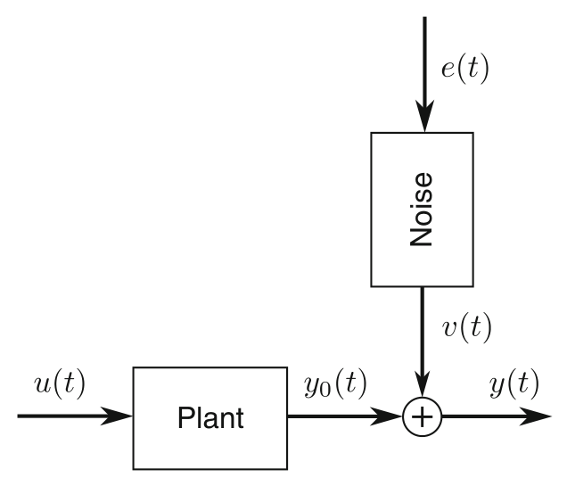

> Image description: A block diagram illustrates a classical identification framework for a system operating in an open loop. The diagram shows two main paths that merge to form the final output. On the bottom, an input signal $u(t)$ enters a block labeled "Plant," resulting in the true output $y_0(t)$. On the top, an unobserved noise source $e(t)$ enters a block labeled "Noise," which produces a filtered signal $v(t)$. These two signals are combined at a summation junction (marked with a plus sign), resulting in the observed noisy output $y(t)$. Mathematically, the diagram represents the relationship $y(t) = y_0(t) + v(t)$, where $y_0(t)$ is the noise-free output of the plant. The arrows indicate the direction of signal flow: inputs move from left to right through the plant, while the noise enters from the top and is added to the plant's output.
Nonparametric Techniques in System Identification, Fig. 1 Classical identification framework: discrete- or continuous-time plant operating in open loop; known input $u(t)$, noisy output $y(t)$ observations; and $v(t)$ filtered discrete-time or band-limited continuous-time white noise $e(t)$ that is independent of $u(t) . y_{0}(t)$ denotes the true output of the plant. In the continuous-time case, it is assumed that the unobserved driving noise source $e(t)$ has finite variance and constant (white) power spectrum within the acquisition bandwidth

some practical guidelines are given (section "Guidelines"). Unless otherwise stated, the input $u(t)$ and the disturbing noise $v(t)$ are assumed to be statistically uncorrelated.

## The Leakage Problem

For arbitrary excitations $u(t)$, the relationship between the true input $U(k)$ and true output $Y_{0}(k)$ DFT spectra (1) of a linear dynamic system is given by

$$
\begin{equation*}
Y_{0}(k)=G\left(\Omega_{k}\right) U(k)+T_{G}\left(\Omega_{k}\right) \tag{2}
\end{equation*}
$$

where $\Omega_{k}=j \omega_{k}$ or $\exp \left(-j \omega_{k} T_{s}\right)$ for, respectively, continuous- and discrete-time systems; $\omega_{k}=2 \pi k /\left(N T_{s}\right) ; G\left(\Omega_{k}\right)$ the plant frequency response function; and $T_{G}\left(\Omega_{k}\right)$ the leakage error due to the plant dynamics (Pintelon and Schoukens 2012, Section 6.3.2). The leakage error $T_{G}(\Omega)$ is a smooth function of the frequency that decreases to zero as $O\left(N^{-1 / 2}\right)$ for $N$ increasing to infinity. It depends on the difference between the initial and final conditions of the experiment and has exactly the same poles as the plant transfer function. Therefore, the


<!-- source_pdf_page: 929 -->
time-domain response of $T_{G}(\Omega)$ is decaying exponentially to zero as a transient error.

From this short discussion, it can be concluded that the leakage error in the frequency domain is equivalent to the transient error in the time domain. The only difference being that the former depends on the difference between the initial and final conditions, while the latter solely depends on the initial conditions.

Standard spectral analysis methods (see section "Spectral Analysis Method") suppress the leakage term $T_{G}\left(\Omega_{k}\right)$ in (2) by multiplying the time-domain signals with a window $w(t)$ before taking the DFT (1)

$$
\begin{equation*}
(X(k)) W=\frac{1}{\sqrt{N} w_{\mathrm{rms}}} \sum_{n=0}^{N-1} w\left(n T_{s}\right) x\left(n T_{s}\right) e^{-j 2 \pi \frac{k n}{N}} \tag{3}
\end{equation*}
$$

with $w_{\text {rms }}=\left(\sum_{n=0}^{N-1}\left|w\left(n T_{s}\right)\right|^{2} / N\right)^{1 / 2}$ the root mean square (rms) value of the window $w(t)$. The scaling in (3) is such that the transformation preserves the rms value of the signal. The relationship between the DFT spectra $(U(k))_{W}$ and $\left(Y_{0}(k)\right)_{W}$ of the windowed input-output signals $w(t) u(t)$ and $w(t) y_{0}(t)$ is given by

$$
\begin{equation*}
\left(Y_{0}(k)\right) W=G\left(\Omega_{k}\right)(U(k))_{W}+E_{\mathrm{int}}(k)+E_{\mathrm{leak}}(k) \tag{4}
\end{equation*}
$$

where $E_{\text {int }}(k)$ and $E_{\text {leak }}(k)$ are, respectively, the interpolation error and the remaining leakage error

$$
E_{\mathrm{int}}(k)=\left(G\left(\Omega_{k}\right) U(k)\right)_{W}-G\left(\Omega_{k}\right)(U(k))_{W}
$$

$$
\begin{equation*}
E_{\text {leak }}(k)=\left(T_{G}\left(\Omega_{k}\right)\right)_{W} \tag{5}
\end{equation*}
$$

Note that $E_{\text {int }}(k)=0$ if $G\left(\Omega_{k}\right)$ is constant within the bandwidth of $W(k)$, while the interpolation error is large if the FRF varies significantly within the window bandwidth. To keep $E_{\text {int }}(k)$ small, the frequency resolution $1 /\left(N T_{s}\right)$ should be sufficiently large and the window bandwidth should be small enough. On the other hand, a larger window bandwidth is beneficial for reducing the leakage error $E_{\text {leak }}(k)$. Hence, choosing an appropriate window for nonparametric FRF
and noise power spectrum estimation is making a trade-off between the reduction of the leakage error $E_{\text {leak }}(k)$ and the increase of the interpolation error $E_{\text {int }}(k)$ (Schoukens et al. 2006).

Note that exactly the same analysis can be made for the continuous- or discrete-time dynamics of the disturbing output noise $v(t)$ in Fig. 1

$$
\begin{equation*}
V(k)=H\left(\Omega_{k}\right) E(k)+T_{H}\left(\Omega_{k}\right) \tag{7}
\end{equation*}
$$

with $H\left(\Omega_{k}\right)$ the noise frequency response function, $E(k)$ the DFT of the unobserved driving discrete-time or band-limited continuoustime white noise source $e(t)$ (Pintelon and Schoukens 2012, Section 6.7.3), and $T_{H}\left(\Omega_{k}\right)$ the noise leakage (transient) term. The noise leakage term is often neglected but can be important for lightly damped systems (e.g., in modal analysis). Most nonparametric techniques suppress the sum of the plant and noise leakage errors $T_{G}\left(\Omega_{k}\right)+T_{H}\left(\Omega_{k}\right)$.

If an integer number of periods of the steady-state response to a periodic excitation is measured, then the plant leakage error $T_{G}\left(\Omega_{k}\right)$ in (2) is zero, which simplifies significantly the estimation problem. Therefore, for the frequencydomain techniques, a distinction is made between periodic and nonperiodic excitations. Note, however, that the noise leakage (transient) term $T_{H}\left(\Omega_{k}\right)$ in (7) remains different from zero.

## Nonparametric Time-Domain Techniques

The time-domain methods estimate the impulse response of the plant via the time-domain relationship that the true output $y_{0}(t)$ equals the convolution product between the impulse response $g(t)$ and the true input $u(t)$. For discrete-time systems, it takes the form

$$
\begin{equation*}
y_{0}(t)=\sum_{n=0}^{\infty} g(n) u(t-n) \tag{8}
\end{equation*}
$$

In practice only a finite number of impulse response coefficients $g(t)$ can be estimated from


<!-- source_pdf_page: 930 -->
$N$ input-output samples, and, therefore, (8) is approximated by a finite sum

$$
\begin{equation*}
y_{0}(t) \approx \sum_{n=0}^{L} g(n) u(t-n) \tag{9}
\end{equation*}
$$

where $L \leq N-1$ should also be determined from the data. From (9), it can be seen that the response depends on the past input values $u(-1), u(-2), \ldots, u(-L)$. Since these values are unknown, an exponentially decaying transient error is present in the first $L$ samples of the predicted output (9). This transient error is the timedomain equivalent of the leakage error $T_{G}\left(\Omega_{k}\right)$ in (2). To remove the transient error, the first $L$ output samples can be discarded in the predicted output (9). It reduces the amount of data from $N$ to $N-L$ and, hence, increases the mean square error of the estimates. If it is known that the transfer function has no direct term, then $g(0)=$ 0 , and the sum (9) starts from $n=1$.

## Correlation Methods

Correlation methods have been studied intensively since the end of the 1950s (see Eykhoff 1974) and are nowadays still used in telecommunication channel estimation and equalization. The impulse response coefficients are found by minimizing the sum of the squared differences between the observed output samples and the output samples predicted by (9)

$$
\begin{equation*}
\sum_{t=L}^{N-1}\left(y(t)-\sum_{n=0}^{L} g(n) u(t-n)\right)^{2} \tag{10}
\end{equation*}
$$

w.r.t. $g(m), m=0,1, \ldots, L$. The solution of this linear least squares problem is given by the famous Wiener-Hopf equation

$$
\begin{equation*}
\hat{R}_{y u}(m)=\sum_{n=0}^{L} g(n) \hat{R}_{u u}(m-n) \tag{11}
\end{equation*}
$$

for $m=0,1, \ldots, L$, where $\hat{R}_{y u}$ and $\hat{R}_{u u}$ are estimates of, respectively, the cross- and autocorrelation functions $R_{y u}(\tau)=\mathbb{E}\{y(t) u(t-\tau)\}$ and $R_{u u}(\tau)=\mathbb{E}\{u(t) u(t-\tau)\}$

$$
\begin{gather*}
\hat{R}_{y u}(m)=\frac{1}{N-L} \sum_{t=L}^{N-1} y(t) u(t-m)  \tag{12}\\
\hat{R}_{u u}(m-n)=\frac{1}{N-L} \sum_{t=L}^{N-1} u(t-n) u(t-m) \tag{13}
\end{gather*}
$$

(Godfrey 1993, Chapter 1; Ljung 1999, Chapter 6). Since the number of estimated impulse response coefficients $L$ can grow with the amount of data $N$, the correlation method (11) is classified as being nonparametric. If the input is white noise, then the expected value of $\hat{R}_{u u}(m)$ is proportional to the Kronecker delta $\delta(m)$, and the cross-correlation $\hat{R}_{y u}(m)(11)$ is - within a scaling factor - a good approximation of the impulse response. This property is used in blind channel estimation.

## Gaussian Process Regression

The linear least squares (10) solution can be (very) sensitive to disturbing output noise if $L$ is not much smaller than $N$. This problem is circumvented by the Gaussian process regression approach. The key idea consists in modeling the impulse response coefficients $g(n)$ as a zero-mean Gaussian process with a certain covariance structure $P_{L}$ that depends on a few hyper-parameters (Pillonetto et al. 2011). In Chen et al. (2012), it has been shown that the Gaussian process regression is equivalent to the following regularized (see also - System Identification Techniques: Convexification, Regularization, and Relaxation) linear least squares problem

$$
\begin{equation*}
\sum_{t=L}^{N-1}\left(y(t)-\sum_{n=0}^{L} g(n) u(t-n)\right)^{2}+\sigma^{2} g^{T} P_{L}^{-1} g \tag{14}
\end{equation*}
$$

where $g=(g(0), g(1), \ldots, g(L))^{T}$ and with $\sigma^{2}$ the variance of the output disturbance. The hyper-parameters defining $P_{L}$ and the noise variance $\sigma^{2}$ are estimated via an empirical Bayes method.


<!-- source_pdf_page: 931 -->
## Nonparametric Frequency-Domain Techniques

The frequency-domain techniques estimate the frequency response function (FRF) using relationship (2) or (4) between the input-output DFT spectra. We start with the simplest approach and gradually increase the complexity of the estimation methods. Note that nonparametric FRF estimation is still a quickly evolving research area, such that the pros and cons of the advanced methods are yet not well established.

## Empirical Transfer Function Estimation

If an integer number of periods $P$ of the steadystate response to a periodic excitation is observed, then the leakage term in $T_{G}\left(\Omega_{k}\right)$ in (2) is zero, and the FRF is estimated by dividing the output by the input DFT spectra at the excited frequencies (Pintelon and Schoukens 2012, Section 2.4)

$$
\begin{equation*}
\hat{G}\left(\Omega_{k}\right)=\frac{Y(k)}{U(k)} \tag{15}
\end{equation*}
$$

The output noise variance $\sigma_{V}^{2}(k)$ is estimated via the sample variance $\hat{\sigma}_{V}^{2}(k)$ of the output DFT spectra over the $P$ consecutive signal periods. The variance of the FRF estimate (15) is then given by

$$
\begin{equation*}
\operatorname{var}\left(\hat{G}\left(\Omega_{k}\right)\right)=\frac{\sigma_{V}^{2}(k)}{P|U(k)|^{2}} \tag{16}
\end{equation*}
$$

where $|U(k)|$ is the magnitude of $U(k)$.
Applying (15) to random excitations gives the empirical transfer function estimate (Ljung 1999, Section 6.3). Due to the presence of the plant leakage error $T_{G}\left(\Omega_{k}\right) / U(k)$, the statistical properties of (15) for random inputs are quite different from those for periodic inputs. While the empirical transfer function estimate (ETFE) is unbiased and has finite variance (16) for periodic inputs, it is biased and has infinite variance for random inputs (Broersen 2004). To improve the statistical properties of the ETFE for random inputs, one can either approximate locally the ETFE by a polynomial (Stenman et al. 2000) or perform a weighted average of ETFEs over
subrecords of the total response (Ljung 1999, Section 6.4). In Heath (2007), it is shown that the optimally (in mean square sense) weighted ETFE equals the spectral analysis method.

## Spectral Analysis Method

The spectral analysis method is available in any digital spectrum analyzer. It is based on the relationship between the FRF and the crossand autopower spectra of the input-output signals

$$
\begin{equation*}
G(\Omega)=\frac{S_{y u}(\Omega)}{S_{u u}(\Omega)}=\frac{F\left\{R_{y u}(\tau)\right\}}{F\left\{R_{u u}(\tau)\right\}} \tag{17}
\end{equation*}
$$

with $F\}$ the Fourier transform (Bendat and Piersol 1980, Chapter 4; Brillinger 1981, Chapter 8). Comparing (11) and (17), it can be seen that the spectral analysis method is the frequency-domain equivalent of the correlation method (take the Fourier transform of the expected value of (11)). There are basically two methods for estimating the cross- and autopower spectra in (17) from sampled data: the Blackman and Tukey (1958) and the Welch (1967) procedures.

The Blackman-Tukey procedure (Blackman and Tukey 1958; Ljung 1999, Section 6.4) consists in taking the DFT (3) of the windowed crossand autocorrelation functions, viz.,

$$
\begin{equation*}
\hat{R}_{y u}(\tau)=\frac{1}{N} \sum_{t=}^{N-1} y(t) u(t-\tau) \tag{18}
\end{equation*}
$$

$$
\begin{equation*}
\hat{S}_{R y u}(k)=\frac{1}{\sqrt{N}} \sum_{\tau=0}^{N-1} w(\tau) \hat{R}_{y u}(\tau) e^{-j 2 \pi \frac{k \tau}{N}} \tag{19}
\end{equation*}
$$

resulting in an FRF estimate (17) at the full frequency resolution $1 /\left(N T_{s}\right)$ of the measurement. It can be shown that (19) is a smoothed version of the periodogram $Y(k) \overline{U(k)}$, where is $\bar{U}$ the complex conjugate of $U$ (Brillinger 1981, Chapter 5).

In the Welch approach (Welch 1967; Pintelon and Schoukens 2012, Section 2.6), the $N$ input-output samples are split into $M$ subrecords of $N / M$ samples each, and the DFT spectra $\left(U^{[m]}(k)\right)_{W}$ and $\left(Y^{[m]}(k)\right)_{W}$ of the windowed


<!-- source_pdf_page: 932 -->
input and output samples are calculated via (3) where $N$ is replaced by $N / M$, giving

$$
\begin{gather*}
\hat{S}_{Y_{W} U_{W}}(k)=\frac{1}{M} \sum_{m=1}^{M}\left(Y^{[m]}(k)\right) W \overline{\left(U^{[m]}(k)\right) W} \\
\hat{S}_{U_{W} U_{W}}(k)=\frac{1}{M} \sum_{m=1}^{M}\left|\left(U^{[m]}(k)\right) W\right|^{2} \tag{20}
\end{gather*}
$$

The spectral analysis estimate of the FRF and its variance are then given by

$$
\begin{gather*}
\hat{G}\left(\Omega_{k}\right)=\frac{\hat{S}_{Y_{W} U_{W}}(k)}{\hat{S}_{U_{W} U_{W}}(k)}  \tag{22}\\
\operatorname{var}\left(\hat{G}\left(\Omega_{k}\right)\right) \approx \frac{\sigma_{V}^{2}(k)}{M} \mathbb{E}\left\{\hat{S}_{U_{W} U_{W}}^{-1}(k)\right\} \tag{23}
\end{gather*}
$$

(Brillinger 1981, Chapter 8; Heath 2007). Finally, the output noise variance $\sigma_{V}^{2}(k)$ in (23) is estimated as

$$
\begin{equation*}
\hat{\sigma}_{V}^{2}(k)=\frac{M}{M-1}\left(\hat{S}_{Y_{W} Y_{W}}(k)-\frac{\left|\hat{S}_{Y_{W} U_{W}}(k)\right|^{2}}{\hat{S}_{U_{W} U_{W}}(k)}\right) \tag{24}
\end{equation*}
$$

(Brillinger 1981, Chapter 8; Pintelon and Schoukens 2012, Section 2.5.4). Due to the spectral width of the window used, the estimates (22) and (24) are correlated over the frequency (the correlation length is about twice the spectral width). Note that (21) is used for estimating noise power spectra (Brillinger 1981, Chapter 5). Note also that for periodic excitations combined with a rectangular window $w\left(n T_{s}\right)=1$, the spectral analysis estimate (22), where each subrecord is equal to a signal period, simplifies to the ETFE (15).

Compared with the Blackman-Tukey procedure (19), the FRF estimate (22) based on the Welch approach (20) and (21) has a frequency resolution and a variance (23) that are $M$ times smaller. In measurement devices, the FRFs are estimated using the Welch approach (20)-(22) where each subrecord is an independent measurement with a fixed number of samples. The reason for this is that the cross- and autopower spectra estimates (20) and (21) can easily be updated as
more experiments (input-output data records) are available. If the number of measured records $M$ increases to infinity, then (22) converges to the true value, provided a perfect suppression of the leakage error.

In measurement devices, the quality of the spectral analysis estimate (22) is often quantified via the coherence $\gamma^{2}(\omega)$

$$
\begin{equation*}
\gamma^{2}(\omega)=\frac{\left|S_{y u}(\Omega)\right|^{2}}{S_{y y}(\Omega) S_{u u}(\Omega)} \tag{25}
\end{equation*}
$$

which is comprised between 0 and 1 . It is related to the variance of the spectral analysis estimate as

$$
\operatorname{var}\left(\hat{G}\left(\Omega_{k}\right)\right)=\frac{1-\gamma^{2}\left(\omega_{k}\right)^{2}}{\gamma}\left(\omega_{k}\right)\left|G\left(\Omega_{k}\right)\right|^{2}
$$

A coherence smaller than 1 indicates the presence of disturbing noise, residual leakage errors, nonlinear distortions, or a nonobserved input.

Following the same lines of Welch (1967), the statistical properties of the spectral analysis estimate (22) can be improved via overlapping subrecords in the cross- and autopower spectra estimates (20) and (21). This has been studied in detail for noise power spectra in Carter and Nuttall (1980) and for FRFs in Antoni and Schoukens (2007).

## Advanced Methods

The goal of the advanced methods is to estimate the FRF at the full frequency resolution $1 /\left(N T_{s}\right)$ of the experiment duration $N T_{s}$ while suppressing the influence of the leakage and the noise errors. Without some extra information, it is impossible to achieve this goal via (2). The additional piece of information that allows one to solve the problem is that the FRF and the leakage error are locally smooth functions of the frequency.

The local polynomial method (Pintelon and Schoukens 2012, Chapter 7) approximates the FRF and the leakage error in (2) locally in the frequency band $[k-n, k+n]$ by a polynomial. From the residuals of the local linear least squares solution, one also gets an estimate of the output noise variance $\sigma_{V}^{2}$ and, hence, also of the variance of the FRF. The whole procedure is repeated for


<!-- source_pdf_page: 933 -->
all DFT frequencies $k$ in the frequency band of interest. The correlation length of the estimates equals $\pm 2 n$, which is twice the local bandwidth of the polynomial approximation.

The local rational method (McKelvey and Guérin 2012) follows the same lines as the local polynomial method, except that the FRF and the leakage error in (2) are locally approximated by rational forms with the same poles ( $G=B / A$ and $T_{G}=I / A$ ). Due to the common poles, the local rational approximation problem can be transformed into a local linear least squares problem. The method is biased but suppresses better the plant leakage error of lowly damped systems.

The transient impulse response modeling method (Hägg and Hjalmarsson 2012) approximates the FRF and the leakage error by, respectively, finite impulse and transient response models, giving a large sparse global linear least squares problem. From the residuals of the global linear least squares solution, one gets an estimate of the output noise variance $\sigma_{V}^{2}$ and, hence, also of the variance of the FRF. This approach has the best smoothing properties and is recommended in case the noise error is dominant.

## Extensions

In sections "Nonparametric Time-Domain Techniques" and "Nonparametric Frequency-Domain Techniques," it is assumed that the linear plant operates in open loop and that the input is known exactly. If the plant operates in feedback and/or the input observations are noisy, then the presented time and frequency-domain techniques are biased. In sections "Systems Operating in Feed-
back" and "Noisy Input, Noisy Output Observations," it is shown that the estimation bias can be avoided if a known external reference signal is available (typically the signal stored in the arbitrary waveform generator).

Since most real-life systems behave to some extent nonlinearly, it is important to detect and quantify the nonlinear effects in FRF estimates. This issue is handled in section "Nonlinear Systems."

## Systems Operating in Feedback

The key difficulty of estimating the FRF of a plant operating in feedback (see Fig. 2) using nonperiodic excitations is that the true input $u(t)$ is correlated with the process noise $v(t)$. The direct approaches of sections "Nonparametric TimeDomain Techniques" and "Nonparametric Fre-quency-Domain Techniques" lead to biased estimates (Wellstead 1981). This can easily be seen from the ETFE (15) applied to the feedback setup in Fig. 2

$$
\begin{equation*}
\hat{G}\left(\Omega_{k}\right)=\frac{G\left(\Omega_{k}\right) G_{\mathrm{act}}\left(\Omega_{k}\right) R(k)+V(k)}{G_{\mathrm{act}}\left(\Omega_{k}\right) R(k)-G_{\mathrm{fb}}\left(\Omega_{k}\right) V(k)} \tag{26}
\end{equation*}
$$

where $G_{\text {act }}\left(\Omega_{k}\right)$ and $G_{\mathrm{fb}}\left(\Omega_{k}\right)$ are, respectively, the actuator and feedback dynamics. From (26), it follows that in those frequency bands where the process noise $V(k)$ dominates, one rather estimates minus the inverse of the feedback dynamics instead of the plant FRF. On the other hand, at those frequencies where the reference signal injects most power, the ETFE (26) will be close to the plant FRF.
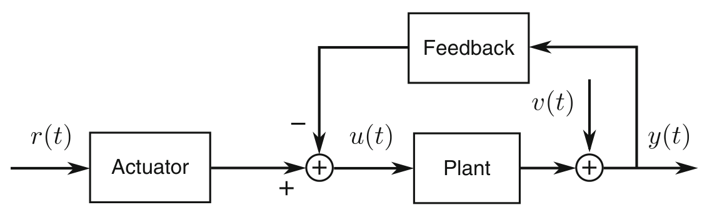

> Image description: A block diagram illustrates a plant operating in a closed-loop control system. The input process begins with an external reference signal, $r(t)$, which enters an "Actuator" block. The output from the Actuator flows into a summation junction marked with a plus sign. This junction also receives a negative feedback signal from a "Feedback" block, where the resulting error signal is labeled $u(t)$. The signal $u(t)$ serves as the input to the "Plant" block. The output of the Plant is combined at a second summation junction with an external signal $v(t)$. The final system output is labeled $y(t)$. The Feedback block is connected to the path of $y(t)$, creating a closed-loop configuration where the output is fed back to the first summation junction to influence the input to the plant. All signals are functions of time, denoted by $(t)$.

Nonparametric Techniques in System Identification, Fig. 2 Plant operating in closed loop: $r(t)$ is the external reference signal, the known input $u(t)$ depends
on the process noise $v(t)$, and $y(t)$ is the noisy output observation


<!-- source_pdf_page: 934 -->
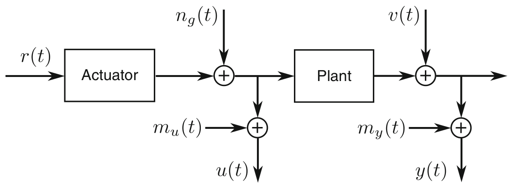

> Image description: A block diagram illustrating an "Errors-in-variables framework" from a textbook. The signal flow proceeds from left to right through two primary functional blocks: "Actuator" and "Plant." An external reference signal $r(t)$ enters the Actuator. The output of the Actuator meets a summation junction where additive generator noise $n_g(t)$ is introduced. The resulting signal is split: one path enters the Plant, while the other path combines with an additive error term $m_u(t)$ to produce the measured input signal $u(t)$. Following the Plant block, the output signal is combined with additive measurement noise $v(t)$. The resulting output is then split: one path exits the system, while the other combines with an additive error term $m_y(t)$ to produce the measured output signal $y(t)$. The diagram uses standard engineering notation with arrows indicating the direction of signal flow and summation symbols for additive processes.

Nonparametric Techniques in System Identification, Fig. 3 Errors-in-variables framework: $r(t)$ is the external reference signal; $n_{g}(t)$ is the generator noise; $m_{u}(t)$,
$m_{y}(t)$ are the input and output measurement errors; $v(t)$ is the process noise; and $u(t), y(t)$ are the noisy input, noisy output observations

If a known external reference signal is available, then the bias is avoided via the indirect method proposed in Wellstead (1981)

$$
\begin{equation*}
G(\Omega)=\frac{S_{y r}(\Omega) / S_{r r}(\Omega)}{S_{u r}(\Omega) / S_{r r}(\Omega)}=\frac{S_{y r}(\Omega)}{S_{u r}(\Omega)} . \tag{27}
\end{equation*}
$$

The basic idea consists in modeling the feedback setup (see Fig. 2) from the known reference to the input and output simultaneously. This reduces the single-input, single-output closed loop problem to a single-input, two-output open loop problem. Since the process noise $v(t)$ is independent of the reference signal $r(t)$, the direct estimate of the single-input, two-output FRF is unbiased. Calculating the ratio of the two FRFs finally gives the indirect estimate (27). This procedure can be applied to any of the direct methods of sections "Nonparametric Time-Domain Techniques" and "Nonparametric Frequency-Domain Techniques." Proceeding in this way, unstable plants operating in a stabilizing feedback loop can also be handled.

If the excitation is periodic, then the process noise $v(t)$ is independent of the periodic part of the input $u(t)$, and the ETFE (15) converges to the true value as the number of periods $P$ tends to infinity (Pintelon and Schoukens 2012, Section 2.5). Hence, in the periodic case, no external reference is needed.

## Noisy Input, Noisy Output Observations

The key difficulty of estimating the FRF of a plant excited by a nonperiodic signal from noisy input, noisy output observations (see Fig. 3) is that the
input autopower spectrum in (17) is biased. Indeed, due to the noise on the input, $S_{u u}(\Omega)$ is too large, resulting in too small direct FRF estimates. This is true for all direct FRF approaches in sections "Nonparametric Time-Domain Techniques" and "Nonparametric Frequency-Domain Techniques." Applying the indirect method of section "Systems Operating in Feedback" removes the bias because the noise on the input is independent of the reference signal (e.g., see (27)). Proceeding in this way, the closed loop case (see Fig. 2) with noisy input, noisy output observations is also solved by the indirect method.

If the excitation is periodic, then the mean value of the input-output DFT spectra over the $P$ consecutive periods converges to the their true values as $P$ tends to infinity (Pintelon and Schoukens 2012, Section 2.5). Hence, the ETFE (15) is still consistent, and no external reference is needed. The same conclusion is valid for systems operating in feedback.

## Nonlinear Systems

The classes of nonlinear systems considered are those systems whose steady-state response to a periodic input is periodic with the same period as the input. It excludes phenomena such as chaos and subharmonics but allows for hard nonlinearities such as saturation, dead zones, and clipping.

The classes of excitations considered are stationary random signals with a specified power spectrum and probability density function. An important special case is the class of


<!-- source_pdf_page: 935 -->
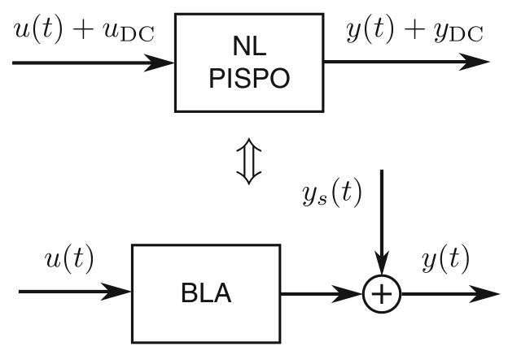

> Image description: This diagram, labeled as Figure 4 from a textbook on System Identification, illustrates the concept of a Best Linear Approximation (BLA) for a nonlinear (NL) system. The figure is divided into two vertically stacked block diagrams connected by a double-headed arrow, representing an equivalence or relationship. The upper diagram shows a nonlinear "Period In, Same Period Out" (PISPO) system. It receives an input composed of a zero-mean signal $u(t)$ plus a DC component $u_{\text{DC}}$. The corresponding output is $y(t) + y_{\text{DC}}$. The lower diagram represents the BLA equivalent. The input is the zero-mean signal $u(t)$, which enters a block labeled "BLA." The output of the BLA is then summed with a zero-mean output residual, $y_s(t)$, at a summation junction to produce the final zero-mean part of the actual output, $y(t)$. This visualizes how a nonlinear system's behavior can be approximated by a linear component plus an additive residual.
Nonparametric Techniques in System Identification, Fig. 4 Best linear approximation ( $B L A$ ) of a nonlinear ( $N L)$ period in, same period out (PISPO) system, excited by a zero-mean random signal $u(t)$ with a given power spectrum and probability density function. $y(t)$ is the zero-mean part of the actual output of the nonlinear system. $u_{\mathrm{DC}}$ and $y_{\mathrm{DC}}$ are the DC levels of the actual input and output of the nonlinear system. The zero-mean output residual $y_{s}(t)$ is uncorrelated with - but not independent of - the input $u(t)$

Gaussian excitation signals with a specified power spectrum. This class includes random phase multisines (a sum of harmonically related sinewaves with user-specified amplitudes and random phases) with the same Riemann equivalent power spectrum (Pintelon and Schoukens 2012, Section 4.2).

Consider a nonlinear (NL) period in, same period out (PISPO) system excited by a random excitation belonging to a particular class (see Fig. 4). The FRF (17), where the expected value is taken w.r.t. the random realization of the excitation, is the best (in mean square sense) linear approximation (BLA) of the nonlinear PISPO system, because the difference $y_{s}(t)$ between the actual output of the nonlinear system (DC value excluded) and the output predicted by the linear approximation is uncorrelated with the input $u(t)$ (Enqvist and Ljung 2005). Although uncorrelated with the input, the output residual $y_{s}(t)$ still depends on $u(t)$. If the NL PISPO system operates in feedback (see Fig. 2), then the indirect method (27) is used for calculating the BLA, and the output residual $y_{s}(t)$ is uncorrelated with but not independent of - the reference signal $r(t)$ (Fig. 2).

For the class of Gaussian excitation signals, it can be shown that the DFT spectrum $Y_{S}(k)$ of
$y_{s}(t)$ has the following properties (Pintelon and Schoukens 2012, Section 3.4.4):

1. $Y_{S}(k)$ has zero-mean value: $\mathbb{E}\{Y s(k)\}=0$.
2. $Y_{S}(k)$ it is uncorrelated with - but not independent of $-U(k): \mathbb{E}\{Y(k) \overline{U(k)}\}=0$.
3. $Y_{S}(k)$ is asymptotically ( $N \rightarrow \infty$ ) normally distributed.
4. $Y_{S}(k)$ is asymptotically ( $N \rightarrow \infty$ ) uncorrelated over the frequency.
These second-order properties are exactly the same as those of a filtered white noise disturbance, except that the noise is independent of the input. It shows that it is impossible to distinguish the nonlinear distortions $y_{s}(t)$ from the disturbing noise $v(t)$ in FRF measurements using stationary random excitations (only second-order statistics are involved in (22)-(24)).

Using random phase multisines, it is possible to detect and quantify the nonlinear distortions because $y_{s}(t)$ is then periodically related to the input $u(t)$ (property of the NL PISPO system). Indeed, analyzing the FRF over consecutive signal periods quantifies the noise variance $v(t)$ ( $y_{s}(t)$ does not change over the periods), while analyzing the FRF over different random phase realizations of the input quantifies the sum of the noise variance and the variance of the nonlinear distortions ( $y_{s}(t)$ depends on the random phase realization of the input). Subtracting both variances gives an estimate of the variance of the nonlinear distortions. While this variance quantifies exactly the variability of the nonparametric FRF estimate due to the nonlinear distortions, it can (significantly) underestimate the variability of a parametric plant model. The basic reason for this is that the true variance of the parametric plant model also depends on the nonzero higher ( $>2$ ) order moments between the input $u(t)$ and the nonlinear distortions $y_{s}(t)$.

## User Choices

There is no clear answer to the question which of the presented techniques is the best. It strongly depends on the intended use of the nonparametric estimates and the particular application handled. For example, the intended use can be:


<!-- source_pdf_page: 936 -->
1. A smooth representation of the FRF
2. Use of the nonparametric estimates as an intermediate step for parametric modeling of the plant
In the first case, one should opt for the minimum mean square error solution, while in the second case, it is crucial that the nonparametric estimates are unbiased, possibly at the price of an increased variance. Indeed, the parametric plant modeling step cannot eliminate the bias error in the nonparametric estimates while it suppresses the variance error.

The application-dependent answers to the following questions strongly influence the choice and the settings of the method used:

1. Is a large frequency resolution needed and/or is leakage the dominant error?
2. Is the noise or the leakage error dominant?
3. Is it necessary to detect and quantify the nonlinear behavior?
If the answer to the first question is yes, then one should opt for one of the advanced methods (section "Advanced Methods") or use the spectral analysis estimates (section "Spectral Analysis Method") with a small number $M$ of subrecords. On the other hand, if the noise error is dominant, then $M$ in (22)-(24) should be chosen as large as possible. To detect and quantify the nonlinear effects, one should use periodic signals (random phase multisines) combined with the ETFE (section "Empirical Transfer Function Estimation").

Finally, comparing the different nonparametric techniques is also not straightforward because of their different

1. Frequency resolution
2. Quality of the estimated noise model
3. Correlation length over the frequency

The latter is set by the spectral width of the window used in the spectral analysis method and the local bandwidth in the advanced methods.

## Guidelines

While the previous sections give well-established facts about the different nonparametric techniques,
in this section, we provide some advices/ guidelines based on our personal interpretation of these facts:

- Always store the reference signal together with the observed input-output signals. The knowledge of the reference signal allows one to solve nonparametrically the closed loop and errors-in-variables problems.
- Whenever possible use periodic excitation signals (random phase multisines): they allow one to estimate from one experiment the FRF, the noise level, and the level of the nonlinear distortions. As such the deviation of the true dynamic behavior from the ideal linear timeinvariant framework is quantified.
- Select one of the advanced methods if frequency resolution is of prime interest.
- If the goal of the identification experiment is to minimize the prediction error, then the Gaussian process regression method is a very promising approach.
- For lowly damped systems and a limited frequency resolution, the local rational method is a good candidate solution.
- Use a minimum mean square solution for a smooth representation of the FRF.
- Choose unbiased nonparametric estimates for use in parametric plant modeling (estimation, validation, and model selection).
- When comparing nonparametric techniques, always take into account all aspects of the estimates: the bias and variance of the FRF and noise model, the frequency resolution, and the correlation length over the frequency.


## Summary and Future Directions

Nonparametric techniques are very useful because they simplify the parametric plant modeling in the initial selection of the model complexity and in the detection of unmodeled dynamics. The classical correlation and spectral analysis methods developed in the 1950s and refined till the 1980s are still widely used. Recently, advanced time- and frequency-domain


<!-- source_pdf_page: 937 -->
methods have been developed which all try to minimize the sensitivity (bias and variance) of the nonparametric estimates to disturbing noise, nonlinear distortion, and transient (leakage) errors.

The renewed research interest in nonparametric techniques should be continued to handle the following challenging problems: short data sets, missing data, detection and quantification of time-variant behavior, modeling of time-variant dynamics, and modeling of nonlinear dynamics.

## Cross-References

- Frequency Domain System Identification
- Frequency-Response and Frequency-Domain Models
- System Identification: An Overview
- System Identification Techniques: Convexification, Regularization, and Relaxation


## Recommended Reading

The classical correlation (see section "Correlation Methods") and spectral analysis (see section "Spectral Analysis Method") methods are well covered by the text books listed below. The recommended reading list includes the basic papers on the spectral analysis methods (Blackman and Tukey 1958; Welch 1967; Wellstead 1981) and the most recent developments described in sections "Gaussian Process Regression" and "Advanced Methods."

Acknowledgments This work is sponsored by the Research Foundation Flanders (FWO-Vlaanderen), the Flemish Government (Methusalem Fund, METH1), the Belgian Federal Government (Interuniversity Attraction Poles programme IAP VII, DYSCO), and the European Research Council (ERC Advanced Grant SNLSID).

## Bibliography

Antoni J, Schoukens J (2007) A comprehensive study of the bias and variance of frequency-response-function measurements: optimal window selection and overlapping strategies. Automatica 43(10):1723-1736

Bendat JS, Piersol AG (1980) Engineering applications of correlations and spectral analysis. Wiley, New York
Blackman RB, Tukey JW (1958) The measurement of power spectra from the point of view of communications engineering - Part II. Bell Syst Tech J 37(2):485-569
Brillinger DR (1981) Time series: data analysis and theory. McGraw-Hill, New York
Broersen PMT (2004) Mean square error of the empirical transfer function estimator for stochastic input signals. Automatica 40(1):95-100
Carter GC, Nuttall AH (1980) On the weighted overlapped segment averaging method for power spectral estimation. Proc IEEE 68(10): 1352-1353
Chen T, Ohlsson H, Ljung L (2012) On the estimation of transfer functions, regularizations and Gaussian processes - revisited. Automatica 48(8): 1525-1535
Enqvist M, Ljung L (2005) Linear approximations of nonlinear FIR systems for separable input processes. Automatica 41(3):459-473
Eykhoff P (1974) System identification. Wiley, New York
Godfrey K (1993) Perturbation signals for system identification. Prentice-Hall, Englewood Cliffs
Hägg P, Hjalmarsson H (2012) Non-parametric frequency response function estimation using transient impulse response modelling. Paper presented at the 16th IFAC symposium on system identification, Brussels, 11-13 July, pp 43-48
Heath WP (2007) Choice of weighting for averaged nonparametric transfer function estimates. IEEE Trans Autom Control 52(10): 1914-1920
Ljung L (1999) System identification: theory for the user, 2nd edn. Prentice-Hall, Upper Saddle River
McKelvey T, Guérin G (2012) Non-parametric frequency response estimation using a local rational model. Paper presented at the 16th IFAC symposium on system identification, Brussels, 11-13 July, pp 49-54
Pillonetto G, Chiuso A, De Nicolao G (2011) Prediction error identification of linear systems: a nonparametric Gaussian regression approach. Automatica 47(2):291305
Pintelon R, Schoukens J (2012) System identification: a frequency domain approach, 2nd edn. IEEE, Piscataway/Wiley, Hoboken
Schoukens J, Rolain Y, Pintelon R (2006) Analysis of windowing/leakage effects in frequency response function measurements. Automatica 42(1):27-38
Stenman A, Gustafsson F, Rivera DE, Ljung L, McKelvey T (2000) On adaptive smoothing of empirical transfer function estimates. Control Eng Pract 8(11):13091315
Welch PD (1967) The use of the fast Fourier transform for the estimation of power spectra: a method based on time averaging over short, modified periodograms. IEEE Trans Audio Electroacoust 15(2): 70-73
Wellstead PE (1981) Non-parametric methods of system identification. Automatica 17(1):55-69


<!-- source_pdf_page: 938 -->
## Numerical Methods for Continuous-Time Stochastic Control Problems

George Yin<br>Department of Mathematics, Wayne State University, Detroit, MI, USA


#### Abstract

This expository article provides a brief review of numerical methods for stochastic control in continuous time. It concentrates on the methods of Markov chain approximation for controlled diffusions. Leaving most of the technical details out with the broad general audience in mind, it aims to serve as an introductory reference or a user's guide for researchers, practitioners, and students who wish to know something about numerical methods for stochastic control.


## Keywords

Markov chain approximation; Numerical methods; Stochastic control

## Introduction

This expository article provides a brief review of numerical methods for stochastic control in continuous time. Leaving most of the technical details out with the broad general audience in mind, it aims to serve as an introductory reference for researchers, practitioners, and students, who wish to know something about numerical methods for stochastic controls.

The study of stochastic control has witnessed tremendous progress in the last few decades; see, for example, Fleming and Rishel (1975), Fleming and Soner (1992), Kushner (1977), and Yong and Zhou (1999) among others, for fundamentals of
stochastic controls as well as historical remarks. Much of the development has been accompanied by the needs and progress in science, engineering, as well as finance. Typically, the problems are highly nonlinear, so a closed-form solution is very difficult to obtain. As a result, designing feasible numerical algorithms becomes vitally important. Among the many approximation methods, the Markov chain approximation methods have shown most promising features. Primarily for treating diffusions, the Markov chain approximation method was initiated in the 1970s (Kushner 1977) and substantially developed further in Kushner (1990b) and Kushner and Dupuis (1992). Nowadays, such method are used for more complex jump diffusions, or systems with random switchings. There were also efforts to incorporate the methods into an expert system so that the methods can be placed into an easily usable tool box (Chancelier et al. 1986, 1987). In addition to the existing applications in a wide variety of engineering problems, recently applications include such areas as insurance, quantile hedging for guaranteed minimum death benefits, dividend payment and investment strategies with capital injection, singular control, risk management, portfolio selection with bounded constraints, and production planning and manufacturing problems; see Jin et al. (2011, 2012, 2013), Sethi and Zhang (1994), and Yin et al. (2009) and references therein.

Let us begin with the controlled diffusion problem. We wish to minimize the cost function defined by

$$
\begin{equation*}
J(x, u(\cdot))=E_{x}\left[\int_{0}^{\tau} R(X(t), u(t)) d t+B(X(\tau))\right] \tag{1}
\end{equation*}
$$

with the $\mathbb{R}^{r}$-valued process $X(t)$ defined by the solution of the stochastic differential equation

$$
\begin{align*}
d X(t) & =b(X(t), u(t)) d t+\sigma(X(t)) d W \\
X(0) & =x \tag{2}
\end{align*}
$$


<!-- source_pdf_page: 939 -->
where $x \in \mathbb{R}^{r}, u(\cdot)$ is a $U$-valued, measurable process with $U \subset \mathbb{R}^{d}$ being a compact control set, $W(\cdot)$ is an $r$-dimensional standard Brownian motion, and $\tau$ is the first exit time of the diffusion from a bounded domain $D$, that is, $\tau=\min \{t: \left.X(t) \notin D^{0}\right\}$ with $D^{0}$ denoting the interior of $D$, $b(\cdot, \cdot): \mathbb{R}^{r} \times \mathbb{R}^{d} \mapsto \mathbb{R}^{r}, \sigma(\cdot): \mathbb{R}^{r} \mapsto \mathbb{R}^{r} \times \mathbb{R}^{r}$, and $R(\cdot, \cdot): \mathbb{R}^{r} \times \mathbb{R}^{d} \mapsto \mathbb{R}$ and $B(\cdot): \mathbb{R}^{r} \mapsto \mathbb{R}$. In the above, $b(\cdot)$ is the control-dependent drift, $\sigma(\cdot)$ is the diffusion matrix, $R(\cdot)$ is the running cost, and $B(\cdot)$ is the terminal or boundary cost. Throughout the entry, we assume that the stopping time $\tau<\infty$ with probability one (w.p.1) for simplicity. Denote the value function by $V(x)= \inf _{u} J(x, u(\cdot))$, where the $\inf$ is taken over all admissible controls. Write the transpose of $Y \in \mathbb{R}^{d_{1} \times d_{2}}$ as $Y^{\prime}$ with $d_{1}, d_{2} \geq 1, a(x)=\sigma(x) \sigma^{\prime}(x)$, and define the generator of the controlled Markov process by

$$
\begin{equation*}
\mathcal{L}^{u} f(x)=\frac{1}{2} \operatorname{tr}\left(a(x) f_{x x}(x)\right)+b^{\prime}(x, u) f_{x}(x) \tag{3}
\end{equation*}
$$

for a suitably smooth function $f(\cdot)$, where $f_{x}(\cdot)$ and $f_{x x}(\cdot)$ denote the gradient and Hessian of $f(\cdot)$, respectively. Note that the operator is control dependent. Using $\partial D$ to denote the boundary of $D$, then the associated Hamilton-Jacobi-Bellman (HJB) equation satisfied by the value function is given by

$$
\left\{\begin{array}{l}
\inf _{u}\left[\mathcal{L}^{u} V(x)+R(x, u)\right]=0, x \in D^{0}  \tag{4}\\
V(x)=B(x), x \in \partial D
\end{array}\right.
$$

The subject matter of this article is to solve the optimal stochastic control problem numerically.

The rest of the entry is arranged as follows. Section "Markov Chain Approximation" focuses on Markov chain approximation. It illustrates how one can construct the controlled Markov chain in discrete time for the approximation of the continuous-time stochastic control problems. Section "Illustration: A One-Dimensional Problem" uses a one-dimensional case as an example
for illustration. Section "Numerical Computation" discusses the implementation issues. We conclude the entry with a few further remarks.

## Markov Chain Approximation

The main idea was initiated in Kushner (1977) and streamlined, extended, and further developed in Kushner and Dupuis (1992). An earlier paper describing how to discretize the elliptic HJB equation and then interpret it according to a controlled Markov chain can be found in Kushner and Kleinman (1968). This section illustrates the Markov chain approximation methods with simple setup. The reader is suggested to read the references mentioned above for a comprehensive treatment. To begin, let $h>0$ be a small "step size" in the approximation. Instead of the domain $D$, we need to work with a finite set to ensure computational feasibility. Set $\mathbb{R}_{h}^{r}$ to be $r$-dimensional lattice cube, i.e., $\mathbb{R}_{h}^{r}= \{\ldots,-2 h,-h, 0, h, 2 h, \ldots\}^{r}$ (an $r$-dimensional product of the indicated set). Denote the interior of $D$ by $D^{0}$, and define $D_{h}^{0}=D^{0} \cap \mathbb{R}_{h}^{r}$. We shall construct a controlled, discrete-time Markov chain, whose transition probabilities have desired properties in line with the controlled diffusion and whose values are in $D_{0}^{h}$. Suppose that $\left\{\alpha_{n}^{h}\right\}$ is a time-homogeneous, discrete-time, controlled Markov chain with finite state space $D_{0}^{h}$ and transition probabilities $P=(p(x, y \mid v))$ with $x, y \in D_{0}^{h}$. Here we only consider the case that the Markov chain has a finite state space. This is sufficient for our computational purposes. At any time $n$, the control action is a random variable denoted by $u_{n}^{h}$ taking values in a compact set $U$. Set the interpolation interval by $\Delta t^{h}(x, v)>0$ and write $\Delta t_{n}^{h}=\Delta t^{h}\left(\alpha_{n}, u_{n}^{h}\right)$ such that $\sup _{x, v} \Delta t^{h}(x, v) \rightarrow 0$ as $h \rightarrow 0$ but $\inf _{x, v} \Delta t^{h}(x, v)>0$ for each $h>0$. The control is admissible if the Markov property $P\left(\alpha_{n+1}^{h}=y \mid \alpha_{i}^{h}, u_{i}^{h} ; i \leq n\right)=P\left(\alpha_{n+1}^{h}=\right. \left.y \mid \alpha_{n}^{h}, u_{n}^{h}\right)=P\left(\alpha_{n}^{h}, y \mid u_{n}^{h}\right)$ holds. Use $U^{h}$ to denote the collection of controls, which


<!-- source_pdf_page: 940 -->
are determined by a sequence of measurable functions $F_{n}^{h}(\cdot)$ such that $u_{n}^{h}=F_{n}^{h}\left(\alpha_{k}^{h}, k \leq\right. \left.n ; u_{k}^{h}, k<n\right)$.Denote the conditional expectation
given $\left\{\alpha_{j}^{h}, u_{j}^{h}: j \leq n, \alpha_{n}^{h}=x, u_{n}^{h}=v\right\}$ by $E_{n}^{h}$. We say that a control policy is locally consistent if

$$
\begin{align*}
& E_{n}^{h} \alpha_{n}^{h}=b(x, v) \Delta t^{h}(x, v)+o\left(\Delta^{h}(x, v)\right), \\
& E_{n}^{h}\left[\Delta \alpha_{n}^{h}-E_{n}^{h} \Delta \alpha_{n}^{h}\right]\left[\Delta \alpha_{n}^{h}-E_{n}^{h} \Delta \alpha_{n}^{h}\right]^{\prime}=a(x) \Delta t^{h}(x, v)+o\left(\Delta t^{h}(x, v)\right),  \tag{5}\\
& a(x)=\sigma(x) \sigma^{\prime}(x), \quad\left|\Delta \alpha_{n}^{h}\right| \rightarrow 0 \text { as } h \rightarrow 0 \text { uniformly in } n, \omega,
\end{align*}
$$

where $\Delta \alpha_{n}^{h}=\alpha_{n+1}^{h}-\alpha_{n}^{h}$. The meaning of the local consistency can be seen from the corresponding controlled diffusion (2) (with $X(0)=x$ and $u(t)=v$ for $t \in[0, \delta]$, where $\delta>0$ is a small parameter) in that $E_{x}(X(\delta)-x)=b(x, v) \delta+ o(\delta), E_{x}[X(\delta)-x][X(\delta)-x]^{\prime}=a(x) \delta+o(\delta)$. Let $v_{h}$ be the first time that $\left\{\alpha_{n}^{h}\right\}$ leaves the set $D_{h}^{0}$. We have an approximation for the cost function of the controlled diffusion (1) given by

$$
\begin{equation*}
J^{h}\left(x, u^{h}\right)=E_{x}^{u^{h}}\left[\sum_{j=0}^{v_{h}-1} R\left(\alpha_{j}^{h}, u_{j}^{h}\right) \Delta t_{j}^{h}+B\left(\alpha_{v_{h}}^{h}\right)\right] . \tag{6}
\end{equation*}
$$

Define $t_{n}^{h}=\sum_{j=0}^{n-1} \Delta t_{j}^{h}$ and the continuoustime interpolations $\alpha^{h}(t)=\alpha_{n}^{h}, u_{n}^{h}=u_{n}^{h}$ for $t \in\left[t_{n}^{h}, t_{n+1}^{h}\right)$. Define the first exit time of $\alpha^{h}(\cdot)$ from $D_{h}^{0}$ by $\tau_{h}=t_{\nu_{h}}^{h}$. Corresponding to the continuous-time problems, the first term on the right-hand side of (6) represents the running cost and the last term gives the terminal cost. Denote the value function by $V^{h}(x)$. Then it satisfies the dynamic programming equation

$$
V^{h}(x)=\left\{\begin{array}{l}
\inf _{v \in U^{h}}\left[R(x, v) \Delta t^{h}(x, v)\right.  \tag{7}\\
\left.\quad+\sum_{y} p^{h}(x, y \mid v) V^{h}(y)\right], x \in D_{h}^{0} \\
B(x), x \notin D_{h}^{0}
\end{array}\right.
$$

Proving the convergence of the numerical algorithms is an important task. This requires the use of local consistency, interpolation of the approximating sequences in continuous time, as well as martingale representation. The proof is
facilitated by the use of the so-called relaxed controls (Kushner and Dupuis 1992, p. 267), which enables us to characterize the limit under the framework of weak convergence. The detailed argument is beyond the scope of this entry. We refer the reader to Kushner and Dupuis (1992, Chapter 10) for further reading on the proof of convergence and the conditions needed.

## Illustration: A One-Dimensional Problem

In this section, we use a one-dimensional example to illustrate the Markov chain approximation methods, which enables us to present the results with a better visualization. Consider (2) with $x \in \mathbb{R}$. We proceed to find the transition probabilities and interpolation intervals for the Markov chain $\left\{\alpha_{n}^{h}\right\}$. To construct a controlled Markov chain that is locally consistent, we first consider a special case, namely, the control space has only one admissible control $u^{h} \in U^{h}$. In this case, min in (7) can be removed. Discretize the HJB equation using upwind finite difference method with step size $h>0$ by
$V(x) \rightarrow V^{h}(x)$
$V_{x}(x) \rightarrow \frac{V^{h}(x+h)-V^{h}(x)}{h}$ for $b(x, v)>0$, $V_{x}(x) \rightarrow \frac{V^{h}(x)-V^{h}(x-h)}{h}$ for $b(x, v)<0$, $V_{x x}(x) \rightarrow \frac{V^{h}(x+h)-2 V^{h}(x)+V^{h}(x-h)}{h^{2}}$.

For $x \in D_{h}^{0}$, it leads to


<!-- source_pdf_page: 941 -->
$$
\begin{aligned}
& \frac{V^{h}(x+h)-V^{h}(x)}{h} b^{+}(x, v)-\frac{V^{h}(x)-V^{h}(x-h)}{h} b^{-}(x, v) \\
& \quad+\frac{a(x)}{2} \frac{V^{h}(x+h)-2 V^{h}(x)+V^{h}(x-h)}{h^{2}}+R(x, v)=0,
\end{aligned}
$$

where $b^{+}$and $b^{-}$are the positive and negative parts of $b$, respectively. Comparing with the dynamic programming equation, we obtain the transition probabilities

$$
\begin{aligned}
& \left.p^{h}(x, x+h) \mid v\right)=\frac{(a(x) / 2)+h b^{+}(x, v)}{\tilde{\Delta}} \\
& \left.p^{h}(x, x-h) \mid v\right)=\frac{(a(x) / 2)+h b^{-}(x, v)}{\tilde{\Delta}} \\
& p^{h}(\cdot)=0, \text { otherwise }, \Delta t^{h}(x, v)=\frac{h^{2}}{\tilde{\Delta}}
\end{aligned}
$$

with $\tilde{\Delta}=a(x)+h|b(x, v)|$ being well defined. With the transition probabilities given above, we can proceed to verify the local consistency by straight forward calculations and prove the desired convergence.

## Numerical Computation

To numerically approximate the controlled diffusions, frequently used methods are either value iterations or policy iterations (iteration in policy space). Using Markov chain approximation in conjunction with either value iteration or iteration in policy space, we can further obtain a sequence of value functions $\left\{V^{h, n}\right\}$ such that $V^{h, n} \rightarrow V^{h}$ as $n \rightarrow \infty$. The procedures can be described as follows.

## Value Iteration

1. Given a tolerance $\varepsilon>0$, set $n=0$; for $x \in D_{h}^{0}$, set $V^{h, 0}=$ constant (for instance, 0 ).
2. Using $V^{h, n}$ obtained in (7) to obtain $V^{h, n+1}$.
3. If $\left|V^{h, n+1}-V^{h, n}\right|>\varepsilon$, go to Step 3 above with $n \rightarrow n+1$.

## Policy Iteration

1. Given a tolerance $\varepsilon>0$, set $n=0$; for $x \in D_{h}^{0}$, take an initial control $u_{0}^{h}(x)=$ constant. Use $u_{0}^{h}(x)$ in lieu of $v$, solve (7) to find $V^{h, 0}(\cdot)$.
2. Find an improved control by
$u^{h, n+1}(x):=\operatorname{argmin}_{v \in U^{h}}\left[\sum_{y} p^{h}((x, y) \mid v)\right. \left.V^{h, n}(y)+R(x, v) \Delta t^{h}(x, v)\right]$.
3. Find $V^{h, n+1}(\cdot)$ with $u^{h, n+1}(\cdot)$ by solving (7). If $\left|V^{h, n+1}-V^{h, n}\right|>\varepsilon$, go to Step 2 above with $n \rightarrow n+1$.

## Further Remarks

Variations of the Problems. Variants of the problems can be considered. For example, one may consider nonlinear filtering problems or singularly perturbed control and filtering problems. For problems arising in manufacturing systems, one often needs to treat controlled Markov chain with no diffusion terms. Such a case can also be handled by the Markov chain approximation methods; see Sethi and Zhang (1994) for the problem and Yin and Zhang (2013, Chapter 9) for the numerical methods. In this article, we mainly discussed the approach by using probabilistic approach for getting the weak convergence of the interpolations of the controlled Markov chain. One can also use the so-called viscosity solution methods to treat the convergence; see Barles and Souganidis (1991) (also Kushner and Dupuis 1992, Chapter 11).

Variance Control. In this entry, only drift involves control term. When the diffusion term is also subject to controls, the problem becomes more difficult. In Peng (1990), the idea of using backward stochastic differential equations was initiated, which had significant impact in the development of such stochastic control problems. Detailed discussions can be found in Yong and Zhou (1999). The numerical problems for diffusion term involving controls can also be treated; see Kushner (2000) for further discussion. In this case, the so-called numerical noise or numerical viscosity can be introduced, so care must be taken.


<!-- source_pdf_page: 942 -->
Complex Models Involving Jump and Switching. Note that only controlled diffusions are considered in this entry. More complex models such as controlled jump diffusions (Kushner and Dupuis 1992), switching diffusions (Yin and Zhu 2010), and switching jump diffusions can be treated (Song et al. 2006). Differential games can also be treated (Kushner 2002; Song et al. 2008).

Differential Delay Systems. Stochastic differential delay systems may come into play. The corresponding numerical algorithms have been studied extensively in Kushner (2008). Due to their inherent infinite dimensionality, a main issue here concerns suitable finite approximation to the memory segments.

Rates of Convergence. This entry mainly discusses the convergence of the approximation methods. There is also much interest in ascertaining rates of convergence. Such effort goes back to the paper Menaldi (1989) (see also Zhang 2006). Subsequently, it has been resurgent effort in dealing with this issue from a nonlinear partial differential equation point of view; see Krylov (2000). Our recent work Song and Yin (2009) complements the study by providing a probabilistic approach for treating switching diffusions.

Stochastic Approximation. In certain optimal control problems, the optimal controls or nearoptimal controls turn out to be of threshold type. An alternative way of solving such problems leading to at least suboptimal or near-optimal control is to use a stochastic approximation approach; see Kushner and Yin (2003) for a comprehensive treatment of stochastic approximation algorithms. Some successful examples include manufacturing systems (Yin and Zhang 2013, Section 9.3) and liquidation decision making (Yin et al. 2002).

## Cross-References

- Stochastic Dynamic Programming
- Stochastic Maximum Principle

Acknowledgments The research of this author was supported in part by the Army Research Office under grant W911NF-12-1-0223.

## Bibliography

Barles G, Souganidis P (1991) Convergence of approximation schemes for fully nonlinear second order equations. J Asymptot Anal 4:271-283
Bertsekas DP, Castanon DA (1989) Adaptive aggregation methods for infinite horizon dynamic programming. IEEE Trans Autom Control 34:589-598
Chancelier P, Gomez C, Quadrat J-P, Sulem A, Blankenship GL, La Vigna A, MaCenary DC, Yan I (1986) An expert system for control and signal processing with automatic FORTRAN program generation. In: Mathematical systems symposium, Stockholm. Royal Institute of Technology, Stockholm
Chancelier P, Gomez C, Quadrat J-P, Sulem A (1987) Automatic study in stochastic control. In: Fleming W, Lions PL (eds) IMA volume in mathematics and its applications, vol 10. Springer, Berlin
Crandall MG, Lions PL (1983) Viscosity solutions of Hamilton-Jacobi equations. Trans Am Math Soc 277:1-42
Crandall MG, Ishii H, Lions PL (1992) User's guide to viscosity solutions of second order partial differential equations. Bull Am Math Soc 27:1-67
Fleming WH, Rishel RW (1975) Deterministic and stochastic optimal control. Springer, New York
Fleming WH, Soner HM (1992) Controlled Markov processes and viscosity solutions. Springer, New York
Jin Z, Wang Y, Yin G (2011) Numerical solutions of quantile hedging for guaranteed minimum death benefits under a regime-switching-jump-diffusion formulation. J Comput Appl Math 235:2842-2860
Jin Z, Yin G, Zhu C (2012) Numerical solutions of optimal risk control and dividend optimization policies under a generalized singular control formulation. Automatica 48:1489-1501
Jin Z, Yang HL, Yin G (2013) Numerical methods for optimal dividend payment and investment strategies of regime-switching jump diffusion models with capital injections. Automatica 49:2317-2329
Krylov VN (2000) On the rate of convergence of finitedifference approximations for Bellman's equations with variable coefficients. Probab Theory Relat Fields 117:1-16
Kushner HJ (1977) Probability methods for approximation in stochastic control and for elliptic equations. Academic, New York
Kushner HJ (1990a) Weak convergence methods and singularly perturbed stochastic control and filtering problems. Birkhäuser, Boston
Kushner HJ (1990b) Numiercal methods for stochastic control problems in continuous time. SIAM J Control Optim 28:999-1048


<!-- source_pdf_page: 943 -->
Kushner HJ (2000) Consistency issues for numerical methods for variance control with applications to optimization in finance. IEEE Trans Autom Control 44:2283-2296
Kushner HJ (2002) Numerical approximations for stochastic differential games. SIAM J Control Optim 40:457-486
Kushner HJ (2008) Numerical methods for controlled stochastic delay systems. Birkhäuser, Boston
Kushner HJ, Dupuis PG (1992) Numerical methods for stochastic control problems in continuous time. Springer, New York
Kushner HJ, Kleinman AJ (1968) Numerical methods for the solution of the degenerate nonlinear elliptic equations arising in optimal stochastic control theory. IEEE Trans Autom Control AC-13: 344-353
Kushner HJ, Yin G (2003) Stochastic approximation and recursive algorithms and applications, 2nd edn. Springer, New York
Menaldi J (1989) Some estimates for finite difference approximations. SIAM J Control Optim 27:579-607
Peng S (1990) A general stochastic maximum principle for optimal control problems. SIAM J Control Optim 28:966-979
Sethi SP, Zhang Q (1994) Hierarchical decision making in stochastic manufacturing systems. Birkhäuser, Boston
Song QS, Yin G (2009) Rates of convergence of numerical methods for controlled regime-switching diffusions with stopping times in the costs. SIAM J Control Optim 48:1831-1857
Song QS, Yin G, Zhang Z (2006) Numerical method for controlled regime-switching diffusions and regime-switching jump diffusions. Automatica 42: 1147-1157
Song QS, Yin G, Zhang Z (2008) Numerical solutions for stochastic differential games with regime switching. IEEE Trans Autom Control 53:509-521
Warga J (1962) Relaxed variational problems. J Math Anal Appl 4:111-128
Yan HM, Yin G, Lou SXC (1994) Using stochastic optimization to determine threshold values for control of unreliable manufacturing systems. J Optim Theory Appl 83:511-539
Yin G, Zhang Q (2013) Continuous-time Markov chains and applications: a two-time-scale approach, 2nd edn. Springer, New York
Yin G, Zhu C (2010) Hybrid switching diffusions: properties and applications. Springer, New York
Yin G, Liu RH, Zhang Q (2002) Recursive algorithms for stock liquidation: a stochastic optimization approach. SIAM J Optim 13:240-263
Yin G, Jin H, Jin Z (2009) Numerical methods for portfolio selection with bounded constraints. J Comput Appl Math 233:564-581
Yong J, Zhou XY (1999) Stochastic controls: Hamiltonian systems and HJB equations. Springer, New York
Zhang J (2006) Rate of convergence of finite difference approximations for degenerate ODEs. Math Comput 75:1755-1778

# Numerical Methods for Nonlinear Optimal Control Problems

Lars Grüne<br>Mathematical Institute, University of Bayreuth, Bayreuth, Germany


#### Abstract

In this article we describe the three most common approaches for numerically solving nonlinear optimal control problems governed by ordinary differential equations. For computing approximations to optimal value functions and optimal feedback laws, we present the Hamilton-Jacobi-Bellman approach. For computing approximately optimal open-loop control functions and trajectories for a single initial value, we outline the indirect approach based on Pontryagin's maximum principle and the approach via direct discretization.


## Keywords

Direct discretization; Hamilton-Jacobi-Bellman equations; Optimal control; Ordinary differential equations; Pontryagin's maximum principle

## Introduction

This article concerns optimal control problems governed by nonlinear ordinary differential equations of the form

$$
\begin{equation*}
\dot{x}(t)=f(x(t), u(t)) \tag{1}
\end{equation*}
$$

with $f: \mathbb{R} \times \mathbb{R}^{n} \times \mathbb{R}^{m} \rightarrow \mathbb{R}^{n}$. We assume that for each initial value $x \in \mathbb{R}^{n}$ and measurable control function $u(\cdot) \in L^{\infty}\left(\mathbb{R}, \mathbb{R}^{m}\right)$ there exists a unique solution $x(t)=x(t, x, u(\cdot))$ of (1) satisfying $x(0, x, u(\cdot))=x$.

Given a state constraint set $X \subseteq \mathbb{R}^{n}$ and a control constraint set $U \subseteq \mathbb{R}^{m}$, a running cost $g: X \times U \rightarrow \mathbb{R}$, a terminal cost $F: X \rightarrow U$, and


<!-- source_pdf_page: 944 -->
a discount rate $\delta \geq 0$, we consider the optimal control problem

$$
\begin{equation*}
\underset{u(\cdot) \in \mathcal{U}^{T}(x)}{\operatorname{minimize}} J^{T}(x, u(\cdot)) \tag{2}
\end{equation*}
$$

where

$$
\begin{align*}
J^{T}(x, u(\cdot)):= & \int_{0}^{T} e^{-\delta s} g(x(s, x, u(\cdot)), u(s)) d s \\
& +e^{-\delta T} F(x(T, x, u(\cdot))) \tag{3}
\end{align*}
$$

and

$$
\begin{align*}
& \mathcal{U}^{T}(x):= \\
& \left\{\begin{array}{l|l}
u(\cdot) \in L^{\infty}(\mathbb{R}, U) & \begin{array}{l}
x(s, x, u(\cdot)) \in X \\
\text { for all } s \in[0, T]
\end{array}
\end{array}\right\} \tag{4}
\end{align*}
$$

In addition to this finite horizon optimal control problem, we also consider the infinite horizon problem in which $T$ is replaced by " $\infty$," i.e.,

$$
\begin{equation*}
\underset{u(\cdot) \in \mathcal{U}^{\infty}(x)}{\operatorname{minimize}} J^{\infty}(x, u(\cdot)) \tag{5}
\end{equation*}
$$

where

$$
\begin{equation*}
J^{\infty}(x, u(\cdot)):=\int_{0}^{\infty} e^{-\delta s} g(x(s, x, u(\cdot)), u(s)) d s \tag{6}
\end{equation*}
$$

and

$$
\begin{align*}
& \mathcal{U}^{\infty}(x):= \\
& \left\{u(\cdot) \in L^{\infty}(\mathbb{R}, U) \left\lvert\, \begin{array}{l}
x(s, x, u(\cdot)) \in X \\
\text { for all } s \geq 0
\end{array}\right.\right\}, \tag{7}
\end{align*}
$$

respectively.
The term "solving" (2)-(4) or (5)-(7) can have various meanings. First, the optimal value functions

$$
V^{T}(x)=\inf _{u(\cdot) \in \mathcal{U}^{T}(x)} J^{T}(x, u(\cdot))
$$

or

$$
V^{\infty}(x)=\inf _{u(\cdot) \in \mathcal{U}^{\infty}(x)} J^{\infty}(x, u(\cdot))
$$

may be of interest. Second, and often more importantly, one would like to know the optimal
control policy. This can be expressed in openloop form $u^{\star}: \mathbb{R} \rightarrow U$, in which the function $u^{\star}$ depends on the initial value $x$ and on the initial time which we set to 0 here. Alternatively, the optimal control can be computed in stateand time-dependent closed-loop form, in which a feedback law $\mu^{\star}: \mathbb{R} \times X \rightarrow U$ is sought. Via $u^{\star}(t)=\mu^{\star}(t, x(t))$, this feedback law can then be used in order to generate the time-dependent optimal control function for all possible initial values. Since the feedback law is evaluated along the trajectory, it is able to react to perturbations and uncertainties which may make $x(t)$ deviate from the predicted path. Finally, knowing $u^{\star}$ or $\mu^{\star}$, one can reconstruct the corresponding optimal trajectory by solving

$$
\begin{aligned}
& \dot{x}(t)=f\left(x(t), u^{\star}(t)\right) \quad \text { or } \\
& \dot{x}(t)=f\left(x(t), \mu^{\star}(t, x(t))\right) .
\end{aligned}
$$

## Hamilton-Jacobi-Bellman Approach

In this section we describe the numerical approach to solving optimal control problems via Hamilton-Jacobi-Bellman equations. We first describe how this approach can be used in order to compute approximations to the optimal value function $V^{T}$ and $V^{\infty}$, respectively, and afterwards how the optimal control can be synthesized using these approximations. In order to formulate this approach for finite horizon $T$, we interpret $V^{T}(x)$ as a function in $T$ and $x$. We denote differentiation w.r.t. $T$ and $x$ with subscript $T$ and $x$, i.e., $V_{x}^{T}(x)=d V^{T}(x) / d x, V_{T}^{T}(x)= d V^{T}(x) / d T$ etc.

We define the Hamiltonian of the optimal control problem as

$$
H(x, p):=\max _{u \in U}\{-g(x, u)-p \cdot f(x, u)\}
$$

with $x, p \in \mathbb{R}^{n}, f$ from (1), $g$ from (3) or (6), and "." denoting the inner product in $\mathbb{R}^{n}$. Then, under appropriate regularity conditions on the problem data, the optimal value functions $V^{T}$ and $V^{\infty}$ satisfy the first order partial differential equations (PDEs)


<!-- source_pdf_page: 945 -->
$$
V_{T}^{T}(x)+\delta V^{T}(x)+H\left(x, V_{x}^{T}(x)\right)=0
$$

and

$$
\delta V^{\infty}(x)+H\left(x, V_{x}^{\infty}(x)\right)=0
$$

in the viscosity solution sense. In the case of $V^{T}$, the equation holds for all $T \geq 0$ with the boundary condition $V^{0}(x)=F(x)$.

The framework of viscosity solutions is needed because in general the optimal value functions will not be smooth; thus, a generalized solution concept for PDEs must be employed (see Bardi and Capuzzo Dolcetta 1997). Of course, appropriate boundary conditions are needed at the boundary of the state constraint set $X$.

Once the Hamilton-Jacobi-Bellman characterization is established, one can compute numerical approximations to $V^{T}$ or $V^{\infty}$ by solving these PDEs numerically. To this end, various numerical schemes have been suggested, including various types of finite element and finite difference schemes. Among those, semiLagrangian schemes Falcone (1997) or Falcone and Ferretti (2013) allow for a particularly elegant interpretation in terms of optimal control synthesis, which we explain for the infinite horizon case.

In the semi-Lagrangian approach, one takes advantage of the fact that by the chain rule for $p=V_{x}^{\infty}(x)$ and constant control functions $u$, the identity

$$
\begin{aligned}
\delta V^{\infty}(x)-p \cdot f(x, u)= & \left.\frac{d}{d t}\right|_{t=0}-(1-\delta t) V^{\infty} \\
& (x(t, x, u))
\end{aligned}
$$

holds. Hence, the left-hand side of this equality can be approximated by the difference quotient

$$
\frac{V^{\infty}(x)-(1-\delta h) V^{\infty}(x(h, x, u))}{h}
$$

for small $h>0$. Inserting this approximation into the Hamilton-Jacobi-Bellman equation, replacing $x(h, x, u)$ by a numerical approximation $\tilde{x}(h, x, u)$ (in the simplest case, the Euler method $\tilde{x}(h, x, u)=x+h f(x, u))$, multiplying
by $h$, and rearranging terms, one arrives at the equation

$$
\begin{aligned}
V_{h}^{\infty}(x)= & \min _{u \in U}\{h g(x, u) \\
& \left.+(1-\delta h) V_{h}^{\infty}(\tilde{x}(h, x, u))\right\}
\end{aligned}
$$

defining an approximation $V_{h}^{\infty} \approx V^{\infty}$. This is now a purely algebraic dynamic programmingtype equation which can be solved numerically, e.g., by using a finite element approach. The equation is typically solved iteratively using a suitable minimization routine for computing the "min" in each iteration (in the simplest case, $U$ is discretized with finitely many values and the minimum is determined by direct comparison). We denote the resulting approximation of $V^{\infty}$ by $\tilde{V}_{h}^{\infty}$. Here, approximation is usually understood in the $L^{\infty}$ sense (see Falcone 1997 or Falcone and Ferretti 2013).

The semi-Lagrangian scheme is appealing for synthesis of an approximately optimal feedback because $V_{h}^{\infty}$ is the optimal value function of the auxiliary discrete-time problem defined by $\tilde{x}$. This implies that the expression

$$
\begin{aligned}
\mu_{h}^{\star}(x):= & \underset{u \in U}{\operatorname{argmin}}\{h g(x, u) \\
& \left.+(1-\delta h) V_{h}^{\infty}(\tilde{x}(h, x, u))\right\},
\end{aligned}
$$

is an optimal feedback control value for this discrete-time problem for the next time step, i.e., on the time interval $[t, t+h)$ if $x=x(t)$. This feedback law will be approximately optimal for the continuous-time control system when applied as a discrete-time feedback law, and this approximate optimality remains true if we replace $V_{h}^{\infty}$ in the definition of $\mu_{h_{\sim}}^{\star}$ by its numerically computable approximation $\tilde{V}_{h}^{\infty}$. A similar construction can be made based on any other numerical approximation $\tilde{V}^{\infty} \approx V^{\infty}$, but the explicit correspondence of the semi-Lagrangian scheme to a discrete-time auxiliary system facilitates the interpretation and error analysis of the resulting control law.

The main advantage of the HamiltonJacobi approach is that it directly computes an approximately optimal feedback law. Its main


<!-- source_pdf_page: 946 -->
disadvantage is that the number of grid nodes needed for maintaining a given accuracy in a finite element approach to compute $\tilde{V}_{h}^{\infty}$ in general grows exponentially with the state dimension $n$. This fact - known as the curse of dimensionality - restricts this method to lowdimensional state spaces. Unless special structure is available which can be exploited, as, e.g., in the max-plus approach (see McEneaney 2006), it is currently almost impossible to go beyond state dimensions of about $n=10$, typically less for strongly nonlinear problems.

## Maximum Principle Approach

In contrast to the Hamilton-Jacobi-Bellman approach, the approach via Pontryagin's maximum principle does not compute a feedback law. Instead, it yields an approximately open-loop optimal control $u^{\star}$ together with an approximation to the optimal trajectory $x^{\star}$ for a fixed initial value. We explain the approach for the finite horizon problem. For simplicity of presentation, we omit state constraints in our presentation, i.e., we set $X=\mathbb{R}^{n}$ and refer to, e.g., Vinter (2000), Bryson and Ho (1975), or Grass et al. (2008) for more general formulations as well as for rigorous versions of the following statements.

In order to state the maximum principle (which, since we are considering a minimization problem here, could also be called minimum principle), we define the non-minimized Hamiltonian as

$$
\mathcal{H}(x, p, u)=g(x, u)+p \cdot f(x, u) .
$$

Then, under appropriate regularity assumptions, there exists an absolutely continuous function $p$ : $[0, T] \rightarrow \mathbb{R}^{n}$ such that the optimal trajectory $x^{\star}$ and the corresponding optimal control function $u^{\star}$ for (2)-(4) satisfy

$$
\begin{equation*}
\dot{p}(t)=\delta p(t)-\mathcal{H}_{x}\left(x^{\star}(t), p(t), u^{\star}(t)\right) \tag{8}
\end{equation*}
$$

with terminal or transversality condition

$$
\begin{equation*}
p(T)=F_{x}\left(x^{\star}(T)\right) \tag{9}
\end{equation*}
$$

and

$$
\begin{equation*}
u^{\star}(t)=\underset{u \in U}{\operatorname{argmin}} \mathcal{H}\left(x^{\star}(t), p(t), u\right), \tag{10}
\end{equation*}
$$

for almost all $t \in[0, T]$ (see Grass et al. 2008, Theorem 3.4). The variable $p$ is referred to as the adjoint or costate variable.

For a given initial value $x_{0} \in \mathbb{R}^{n}$, the numerical approach now consists of finding functions $x:[0, T] \rightarrow \mathbb{R}^{n}, u:[0, T] \rightarrow U$ and $p: [0, T] \rightarrow \mathbb{R}^{n}$ satisfying

$$
\begin{align*}
& \dot{x}(t)=f(x(t), u(t))  \tag{11}\\
& \dot{p}(t)=\delta p(t)-\mathcal{H}_{x}(x(t), p(t), u(t))  \tag{12}\\
& u(t)=\underset{u \in U}{\operatorname{argmin}} \mathcal{H}(x(t), p(t), u)  \tag{13}\\
& x(0)=x_{0}, \quad p(T)=F_{x}(x(T)) \tag{14}
\end{align*}
$$

for $t \in[0, T]$. Depending on the regularity of the underlying data, the conditions (11)-(14) may only be necessary but not sufficient for $x$ and $u$ being an optimal trajectory $x^{\star}$ and control function $u^{\star}$, respectively. However usually $x$ and $u$ satisfying these conditions, are good candidates for the optimal trajectory and control, thus justifying the use of these conditions for the numerical approach. If needed, optimality of the candidates can be checked using suitable sufficient optimality conditions for which we refer to, e.g., Maurer (1981) or Malanowski et al. (2004). Due to the fact that in the maximum principle approach first optimality conditions are derived which are then discretized for numerical simulation, it is also termed first optimize then discretize.

Solving (11)-(14) numerically amounts to solving a boundary value problem, because the condition $x^{\star}(0)=x_{0}$ is posed at the beginning of the time interval $[0, T]$ while the condition $p(T)=F_{x}\left(x^{\star}(T)\right)$ is required at the end. In order to solve such a problem, the simplest approach is the single shooting method which proceeds as follows:

We select a numerical scheme for solving the ordinary differential equations (11) and (12) for $t \in[0, T]$ with initial conditions $x(0)=x_{0}$,


<!-- source_pdf_page: 947 -->
$p(0)=p_{0}$ and control function $u(t)$. Then, we proceed iteratively as follows:
(0) Find initial guesses $p_{0}^{0} \in \mathbb{R}^{n}$ and $u^{0}(t)$ for the initial costate and the control, fix $\varepsilon>0$, and set $k:=0$.
(1) Solve (11) and (12) numerically with initial values $x_{0}$ and $p_{0}^{k}$ and control function $u^{k}$. Denote the resulting trajectories by $\tilde{x}^{k}(t)$ and $\tilde{p}^{k}(t)$.
(2) Apply one step of an iterative method for solving the zero-finding problem $G(p)=0$ with

$$
G\left(p_{0}^{k}\right):=\tilde{p}^{k}(T)-F_{x}\left(\tilde{x}^{k}(T)\right)
$$

for computing $p_{0}^{k+1}$. For instance, in case of the Newton method we get

$$
\begin{gathered}
p_{0}^{k+1}:=p_{0}^{k}-D G\left(p_{0}^{k}\right)^{-1} G\left(p_{0}^{k}\right) \\
\text { If }\left\|p_{0}^{k+1}-p_{0}^{k}\right\|<\varepsilon, \text { stop; else compute } \\
u^{k+1}(t):=\underset{u \in U}{\operatorname{argmin}} \mathcal{H}\left(x^{k}(t), p^{k}(t), u\right),
\end{gathered}
$$

set $k:=k+1$, and go to (1).
The procedure described in this algorithm is called single shooting because the iteration is performed on the single initial value $p_{0}^{k}$. For an implementable scheme, several details still need to be made precise, e.g., how to parameterize the function $u(t)$ (e.g., piecewise constant, piecewise linear or polynomial), how to compute the derivative $D G$ and its inverse (or an approximation thereof), and the argmin in (2). The last task considerably simplifies if the structure of the optimal control, e.g., the number of switchings in case of a bang-bang control, is known.

However, even if all these points are settled, the set of initial guesses $p_{0}^{0}$ and $u^{0}$ for which the method is going to converge to a solution of (11)-(14) tends to be very small. One reason for this is that the solutions of (11) and (12) typically depend very sensitively on $p_{0}^{0}$ and $u^{0}$. In order to circumvent this problem, multiple shooting can be used. To this end, one selects a time grid $0=t_{0}<t_{1}<t_{2}<$
$\ldots<t_{N}=T$ and in addition to $p_{0}^{k}$ introduces variables $x_{1}^{k}, \ldots, x_{N-1}^{k}, p_{1}^{k}, \ldots, p_{N-1}^{k} \in \mathbb{R}^{n}$. Then, starting from initial guesses $p_{0}^{0}, u^{0}$, and $x_{1}^{0}, \ldots, x_{N-1}^{0}, p_{1}^{0}, \ldots, p_{N-1}^{0}$, in each iteration the Eqs. (11)-(14) are solved numerically on the intervals $\left[t_{j}, t_{j+1}\right]$ with initial values $x_{j}^{k}$ and $p_{j}^{k}$, respectively. We denote the respective solutions in the $k$-th iteration by $\tilde{x}_{j}^{k}$ and $\tilde{p}_{j}^{k}$. In order to enforce that the trajectory pieces computed on the individual intervals $\left[t_{j}, t_{j+1}\right]$ fit together continuously, the map $G$ is redefined as

$$
\begin{array}{r}
G\left(x_{1}^{k}, \ldots, x_{N-1}^{k}, p_{0}^{k}, p_{1}^{k}, \ldots, p_{N-1}^{k}\right)= \\
\left(\begin{array}{c}
\tilde{x}_{0}^{k}\left(t_{1}\right)-x_{1}^{k} \\
\vdots \\
\tilde{x}_{N-2}^{k}\left(t_{1}\right)-x_{N-1}^{k} \\
\tilde{p}_{0}^{k}\left(t_{1}\right)-p_{1}^{k} \\
\vdots \\
\tilde{p}_{N-2}^{k}\left(t_{1}\right)-p_{N-1}^{k} \\
\tilde{p}_{N-1}^{k}(T)-F_{x}\left(\tilde{x}_{N-1}^{k}(T)\right)
\end{array}\right) .
\end{array}
$$

The benefit of this approach is that the solutions on the shortened time intervals depend much less sensitively on the initial values and the control, thus making the problem numerically much better conditioned. The obvious disadvantage is that the problem becomes larger as the function $G$ is now defined on a much higher dimensional space but this additional effort usually pays off.

While the convergence behavior for the multiple shooting method is considerably better than for single shooting, it is still a difficult task to select good initial guesses $x_{j}^{0}, p_{j}^{0}$ and $u^{0}$. In order to accomplish this, homotopy methods can be used (see, e.g., Pesch 1994) or the result of a direct approach as presented in the next section can be used as an initial guess. The latter can be reasonable as the maximum principle-based approach can yield approximations of higher accuracy than the direct method.

In the presence of state constraints or mixed state and control constraints, the conditions (12)(14) become considerably more technical and thus more difficult to be implemented numerically (cf. Pesch 1994).


<!-- source_pdf_page: 948 -->
## Direct Discretization

Despite being the most straightforward and simple of the approaches described in this article, the direct discretization approach is currently the most widely used approach for computing single finite horizon optimal trajectories. In the direct approach, we first discretize the problem and then solve a finite dimensional nonlinear optimization problem (NLP), i.e., we first discretize, then optimize. The main reasons for the popularity of this approach are the simplicity with which constraints can be handled and the numerical efficiency due to the availability of fast and reliable NLP solvers.

The direct approach again applies to the finite horizon problem and computes an approximation to a single optimal trajectory $x^{\star}(t)$ and control function $u^{\star}(t)$ for a given initial value $x_{0} \in X$. To this end, a time grid $0=t_{0}<t_{1}<t_{2}<\ldots< t_{N}=T$ and a set $\mathcal{U}_{d}$ of control functions which are parameterized by finitely many values are selected. The simplest way to do so is to choose $u(t) \equiv u_{j} \in U$ for all $t \in\left[t_{i}, t_{i+1}\right]$. However, other approaches like piecewise linear or piecewise polynomial control functions are possible, too. We use a numerical algorithm for ordinary differential equations in order to approximately solve the initial value problems

$$
\begin{equation*}
\dot{x}(t)=f\left(x(t), u_{i}\right), \quad x\left(t_{i}\right)=x_{i} \tag{15}
\end{equation*}
$$

for $i=0, \ldots, N-1$ on $\left[t_{i}, t_{i+1}\right]$. We denote the exact and numerical solution of (15) by $x\left(t, t_{i}, x_{i}, u_{i}\right)$ and $\tilde{x}\left(t, t_{i}, x_{i}, u_{i}\right)$, respectively. Finally, we choose a numerical integration rule in order to compute an approximation

$$
\begin{aligned}
I\left(t_{i}, t_{i+1}, x_{i}, u_{i}\right) \approx & \int_{t_{i}}^{t_{i}+1} e^{-\delta t} \\
& g\left(x\left(t, t_{i}, x_{i}, u\right), u(t)\right) d t
\end{aligned}
$$

In the simplest case, one might choose $\tilde{x}$ as the Euler scheme and $I$ as the rectangle rule, leading to

$$
\tilde{x}\left(t_{i+1}, t_{i}, x_{i}, u_{i}\right)=x_{i}+\left(t_{i+1}-t_{i}\right) f\left(x_{i}, u_{i}\right)
$$

and

$$
I\left(t_{i}, t_{i+1}, x_{i}, u_{i}\right)=\left(t_{i+1}-t_{i}\right) e^{-\delta t_{i}} g\left(x_{i}, u_{i}\right) .
$$

Introducing the optimization variables $u_{0}, \ldots, u_{N-1} \in \mathbb{R}^{m}$ and $x_{1}, \ldots, x_{N} \in \mathbb{R}^{n}$, the discretized version of (2)-(4) reads

$$
\operatorname{minimize}_{x_{j} \in \mathbb{R}^{n}, u_{j} \in \mathbb{R}^{m}} \sum_{i=0}^{N-1} I\left(t_{i}, t_{i+1}, x_{i}, u\right)+e^{-\delta T} F\left(x_{N}\right)
$$

subject to the constraints

$$
\begin{array}{ll}
u_{j} \in U, & j=0, \ldots, N-1 \\
x_{j} \in X, & j=1, \ldots, N \\
x_{j+1}=\tilde{x}\left(t_{j+1}, t_{j}, x_{j}, u\right), & j=0, \ldots, N
\end{array}
$$

This way, we have converted the optimal control problem (2)-(4) into a finite dimensional nonlinear optimization problem (NLP). As such, it can be solved with any numerical method for solving such problems. Popular methods are, for instance, sequential quadratic programming (SQP) or interior point (IP) algorithms. The convergence of this approach was proved in Malanowski et al. (1998); for an up-to-date account on theory and practice of the method, see Gerdts (2012) and Betts (2010). These references also explain how information about the costates $p(t)$ can be extracted from a direct discretization, thus linking the approach to the maximum principle.

The direct method sketched here is again a multiple shooting method, and the benefit of this approach is the same as for solving boundary problems, thanks to the short intervals $\left[t_{i}, t_{i+1}\right]$; the solutions depend much less sensitively on the data than the solution on the whole interval $[0, T]$, thus making the iterative solution of the resulting discretized NLP much easier. The price to pay is again the increase of the number of optimization variables. However, due to the particular structure of the constraints guaranteeing continuity of the solution, the resulting matrices in the NLP have a particular structure which can be exploited numerically by a method called condensing (see Bock and Plitt 1984).


<!-- source_pdf_page: 949 -->
An alternative to multiple shooting methods are collocation methods, in which the internal variables of the numerical algorithm for solving (15) are also optimization variables. However, nowadays, the multiple shooting approach as described above is usually preferred. For a more detailed description of various direct approaches, see also Binder et al. (2001), Sect. 5.

## Further Approaches for Infinite Horizon Problems

The last two approaches only apply to finite horizon problems. While the maximum principle approach can be generalized to infinite horizon problems, the necessary conditions become weaker and the numerical solution becomes considerably more involved (see Grass et al. 2008). Both the maximum principle and the direct approach can, however, be applied in a receding horizon fashion, in which an infinite horizon problem is approximated by the iterative solution of finite horizon problems. The resulting control technique is known under the name of model predictive control (MPC; see Grüne and Pannek 2011), and under suitable assumptions, a rigorous approximation result can be established.

## Summary and Future Directions

The three main numerical approaches to optimal control are:

- The Hamilton-Jacobi-Bellman approach, which provides a global solution in feedback form but is computationally expensive for higher dimensional systems
- The Pontryagin maximum principle approach which computes single optimal trajectories with high accuracy but needs good initial guesses for the iteration
- The direct approach which also computes single optimal trajectories but is less demanding in terms of the initial guesses at the expense of a somewhat lower accuracy
Currently, the main trends in numerical optimal control lie in the areas of Hamilton-Jacobi-

Bellman equations and direct discretization. For the former, the development of discretization schemes suitable for increasingly higher dimensional problems is in the focus. For the latter, the popularity of these methods in online applications like MPC triggers continuing effort to make this approach faster and more reliable.

Beyond ordinary differential equations, the development of numerical algorithms for the optimal control of partial differential equations (PDEs) has attracted considerable attention during the last years. While many of these methods are still restricted to linear systems, in the near future we can expect to see many extensions to (classes of) nonlinear PDEs. It is worth noting that for PDEs, maximum principlelike approaches are more popular than for ordinary differential equations.

## Cross-References

- Discrete Optimal Control
- Economic Model Predictive Control
- Nominal Model-Predictive Control
- Optimal Control and the Dynamic Programming Principle
- Optimal Control and Pontryagin's Maximum Principle
- Optimization Algorithms for Model Predictive Control


## Bibliography

Bardi M, Capuzzo Dolcetta I (1997) Optimal control and viscosity solutions of Hamilton-Jacobi-Bellman equations. Birkhäuser, Boston
Betts JT (2010) Practical methods for optimal control and estimation using nonlinear programming, 2nd edn. SIAM, Philadelphia
Binder T, Blank L, Bock HG, Bulirsch R, Dahmen W, Diehl M, Kronseder T, Marquardt W, Schlöder JP, von Stryk O (2001) Introduction to model based optimization of chemical processes on moving horizons. In: Grötschel M, Krumke SO, Rambau J (eds) Online optimization of large scale systems: state of the art. Springer, Heidelberg, pp 295-340
Bock HG, Plitt K (1984) A multiple shooting algorithm for direct solution of optimal control problems. In: Proceedings of the 9th IFAC world congress, Budapest. Pergamon, Oxford, pp 242-247


<!-- source_pdf_page: 950 -->
Bryson AE, Ho YC (1975) Applied optimal control. Hemisphere Publishing Corp., Washington, DC. Revised printing
Falcone M (1997) Numerical solution of dynamic programming equations. In: Appendix A in Bardi M, Capuzzo Dolcetta I (eds) Optimal control and viscosity solutions of Hamilton-Jacobi-Bellman equations. Birkhäuser, Boston
Falcone M, Ferretti R (2013) Semi-Lagrangian approximation schemes for linear and Hamilton-Jacobi equations. SIAM, Philadelphia
Gerdts M (2012) Optimal control of ODEs and DAEs. De Gruyter textbook. Walter de Gruyter \& Co., Berlin
Grass D, Caulkins JP, Feichtinger G, Tragler G, Behrens DA (2008) Optimal control of nonlinear processes. Springer, Berlin
Grüne L, Pannek J (2011) Nonlinear model predictive control: theory and algorithms. Springer, London
Malanowski K, Büskens C, Maurer H (1998) Convergence of approximations to nonlinear optimal control
problems. In: Fiacco AV (ed) Mathematical programming with data perturbations. Lecture notes in pure and applied mathematics, vol 195. Dekker, New York, pp 253-284
Malanowski K, Maurer H, Pickenhain S (2004) Secondorder sufficient conditions for state-constrained optimal control problems. J Optim Theory Appl 123(3):595-617
Maurer H (1981) First and second order sufficient optimality conditions in mathematical programming and optimal control. Math Program Stud 14: 163-177
McEneaney WM (2006) Max-plus methods for nonlinear control and estimation. Systems \& control: foundations \& applications. Birkhäuser, Boston
Pesch HJ (1994) A practical guide to the solution of real-life optimal control problems. Control Cybern 23(1-2):7-60
Vinter R (2000) Optimal control. Systems \& control: foundations \& applications. Birkhäuser, Boston
