<!-- source_pdf_page: 951 -->
## 0

## Observer-Based Control

H.L. Trentelman ${ }^{1}$ and Panos J. Antsaklis ${ }^{2} { }^{1}$ Johann Bernoulli Institute for Mathematics and Computer Science, University of Groningen, Groningen, AV, The Netherlands<br>${ }^{2}$ Department of Electrical Engineering, University of Notre Dame, Notre Dame, IN, USA


#### Abstract

An observer-based controller is a dynamic feedback controller with a two-stage structure. First, the controller generates an estimate of the state variable of the system to be controlled, using the measured output and known input of the system. This estimate is generated by a state observer for the system. Next, the state estimate is treated as if it were equal to the exact state of the system, and it is used by a static state feedback controller. Dynamic feedback controllers with this two-stage structure appear in various control synthesis problems for linear systems. In this entry, we explain observer-based control in the context of internal stabilization by dynamic measurement feedback.


## Keywords

Detectability; Dynamic output feedback control; Internal stabilization; Separation principle;

Stabilizability; State observers; Static state feedback

## Introduction

In this entry, we explain the notion of observerbased feedback control. Given a to-be-controlled system in input-state-output form, together with a control objective, the problem is to design a feedback controller such that the closed-loop system meets the objective. In the case when all state variables of the system are available for control, the design problem is considered to be simpler, and often the controller can be chosen to be a static state feedback control law. In the more general case where the controller has access only to a linear function of the state variables, the problem is more involved and requires the design of a dynamic feedback control law. The key idea of observer-based feedback control is the following. As a first step, one determines a state observer for the system, i.e., a system that estimates the state of the system based on the measured outputs and inputs of the system. Next, the state estimate is treated as if it were exactly equal to the actual state of the system and is used by a static state feedback controller. In this way, a dynamic feedback controller is obtained that is composed of a (dynamic) state observer and a static feedback part.


<!-- source_pdf_page: 952 -->
## Dynamic Output Feedback Control

Consider the controlled and observed system $\Sigma$ :

$$
\begin{align*}
\dot{x}(t) & =A x(t)+B u(t)+E d(t) \\
y(t) & =C x(t)  \tag{1}\\
z(t) & =H x(t)
\end{align*}
$$

with $x(t) \in \mathcal{X}=\mathbb{R}^{n}$ the state, $u(t) \in \mathbb{R}^{m}$ the control input, and $y(t) \in \mathbb{R}^{p}$ the measured output. The signal $d(t)$ may represent a disturbance input or a desired reference signal, while the signal $z(t)$ is a controlled output signal. $A, \quad B, \quad C, \quad E$, and $H$ are maps (or matrices). In general, a linear controller for this system is a finite-dimensional linear time-invariant system $\Gamma$ represented by

$$
\begin{align*}
\dot{w}(t) & =K w(t)+L y(t),  \tag{2}\\
u(t) & =M w(t)+N y(t) .
\end{align*}
$$

The state space of the controller is assumed to be $\mathcal{W}=\mathbb{R}^{q}$ for some positive integer $q . K, L, M$, and $N$ are assumed to be linear maps (or matrices). The controller (2) takes the observations $y$ as its input and generates the control function $u$ as its output. The closed-loop system resulting from the interconnection of $\Sigma$ and $\Gamma$ is described by the equations

$$
\begin{align*}
\binom{\dot{x}(t)}{\dot{w}(t)} & =\left(\begin{array}{cc}
A+B N C & B M \\
L C & K
\end{array}\right)\binom{x(t)}{w(t)}+\binom{E}{0} d(t) \\
z(t) & =\left(\begin{array}{ll}
H & 0
\end{array}\right)\binom{x(t)}{z(t)} \tag{3}
\end{align*}
$$

The control action of interconnecting the controller $\Gamma$ with the system (1) is called dynamic feedback. The state space of the closed-loop system (3) is called the extended state space and is equal to the Cartesian product $\mathcal{X} \times \mathcal{W}=\mathbb{R}^{n+q}$. In general, a feedback control problem amounts to finding linear maps $K, L, M$, and $N$ such that the closed-loop system ( 3 ) satisfies the control design specifications.

## Observer-Based Controllers

Given the system (1) and a control objective, the problem thus arises on how to determine the maps $K, L, M$, and $N$ so that the closed-loop systems meet the objective. As an example, take the special case when $E$ in (1) is equal to zero (i.e., the system has no external disturbances or reference signals) and that we wish the closedloop system (3) to be internally stable, i.e., we want to find the maps $K, L, M$, and $N$ so that the eigenvalues $\lambda_{i}$ of the system map of (3) are in the open left half-plane, i.e., satisfy $\operatorname{Re}\left(\lambda_{i}\right)<0$ for all $i$. If we had access to the entire state variable $x$ (instead of only to the linear function $y=C x$ ), then this problem would be simpler: assuming that the system is stabilizable (The system $\dot{x}=A x+B u$ is called stabilizable if there exists a map $F$ such that $A+B F$ has all its eigenvalues in the open left half-plane), find a map $F$ such that the eigenvalues of $A+B F$ are in the open left half-plane; then take the static state feedback controller $u=F x$ as the control law. That is, we would choose the state space dimension of the controller $\Gamma$ equal to 0 and the maps $K, L$, and $M$ to be void, and we would take $N=F$.

In general, however, we only have access to a given linear function $y=C x$ of $x$, determined by the output map $C$. The key idea of observerbased control is the following:
Use the theory of observer design to find an observer for the state $x$ of the system (1), i.e., an observer that generates an estimate $\xi$ of the system state $x$ based on the measured output $y$ and the control input u. Next, apply a static feedback $u=F \xi$ mimicking the (not permissible) control law $u=F x$.

This idea leads to a dynamic feedback controller (2) of a very particular structure: the controller is the combination of a state observer (with a certain state space dimension) and a static control law acting on the state estimate. This twostage structure, separating estimation and control, is often called the separation principle. We will work out this idea in more detail for the case when $E=0$ (no external disturbances or reference signals) and the aim is to obtain internal


<!-- source_pdf_page: 953 -->
stability of the system. Before doing this, we first explain the most important material on observers that is needed in the sequel.

## State Observers

If the state is not available for measurement, one can try to reconstruct it using a system, called observer, that takes the control input and the measured output of the original system as inputs and yields an output that is an estimate of the state of the original system. Again in case that in the system (1) we have $E=0$, i.e., there are no disturbance signals. This is illustrated in the following picture:
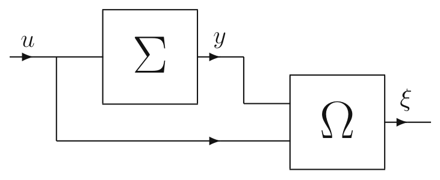

The quantity $\xi$ is supposed to be an estimate, in some sense, of the state, and $w$ is the state variable of the observer. In general, the observer, denoted by $\Omega$, has equations of the form

$$
\begin{align*}
\dot{w}(t) & =P w(t)+Q u(t)+R y(t), \\
\xi(t) & =S w(t) . \tag{4}
\end{align*}
$$

It turns out that particular choices for $P, Q, R$, and $S$, specifically $P=A-G C$ (where the map $G$ has to be determined), $Q=B, R=G$, and $S=I$, lead to

$$
\begin{equation*}
\dot{\xi}(t)=(A-G C) \xi(t)+B u(t)+G y(t) . \tag{5}
\end{equation*}
$$

Introducing the estimation error $e:=\xi-x$ and interconnecting the system (1) with (5), we find that the error $e$ satisfies the differential equation

$$
\begin{equation*}
\dot{e}(t)=(A-G C) e(t) . \tag{6}
\end{equation*}
$$

Hence all possible errors converge to 0 as $t$ tends to infinity if and only if $A-G C$ is a stability matrix, i.e., has all its eigenvalues in the open left half-plane. In that case, we call (5) a stable state observer. Thus, a stable state observer exists if and only if $G$ can be found such that $A-G C$ is a stability matrix. The problem of finding such a $G$ is dual to the problem of finding a matrix $F$ to a pair ( $A, B$ ) such that $A+B F$ is a stability matrix.

Definition 1 The pair ( $C, A$ ) is called detectable if there exists a matrix $G$ such that $A-G C$ is a stability matrix, i.e., has all its eigenvalues in the open left half-plane.

Theorem 1 Given system $\Sigma$, the following statements are equivalent:

1. $\Sigma$ has a stable state observer.
2. $(C, A)$ is detectable.

The equation for $\xi$ can be rewritten using an artificial output $\eta=C \xi$ as $\dot{\xi}=A \xi+B u+ G(y-\eta)$. The interpretation of this is as follows. If $\xi$ is the exact state, then $\eta=y$, and hence $\xi$ obeys exactly the same differential equation as $x$. Otherwise, the equation for $\xi$ has to be corrected by a term determined by the output error $y-\eta$. Consequently, the state observer consists of an exact replica $\Sigma_{\text {dup }}$ of the original system with an extra input channel for incorporating the output error and an extra output, the state of the observer, which serves as the desired estimate for the state of the original system. The following diagram depicts the situation:


<!-- source_pdf_page: 954 -->
## Observer-Based Stabilization

We now work out the ideas put forward in the previous sections for the special case of stabilization by dynamic measurement feedback, i.e., to find a controller (2) such that the closedloop system (3) is internally stable; equivalently, the system mapping of (3) is a stability matrix. Again, we restrict ourselves to the case when $E=0$.

We assume that we know how to stabilize by state feedback and how to build a state observer. If we have a plant of which we do not have the state available for measurement, we use a state observer to obtain an estimate of the state, and we apply the state feedback to this estimate rather than to the true state. This is illustrated by the following picture:
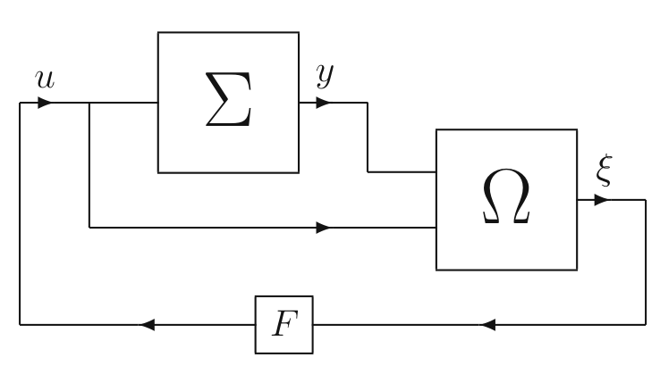

Again, consider the system $\Sigma$ given by (1) and let the observer $\Omega$ be given by (5). Combining this with $u=F \xi$ yields

$$
\begin{align*}
& \dot{x}(t)=A x(t)+B F \xi \\
& \dot{\xi}(t)=(A-G C+B F) \xi(t)+G C x(t) \tag{7}
\end{align*}
$$

Introducing again $e:=\xi-x$, we obtain, in accordance with the previous section,

$$
\begin{aligned}
& \dot{x}(t)=(A+B F) x(t)+B F e(t), \\
& \dot{e}(t)=(A-G C) e(t) .
\end{aligned}
$$

That is, the equation $\dot{x}_{e}=A_{e} x_{e}$ with

$$
x_{e}:=\binom{x}{e}, \quad A_{e}:=\left(\begin{array}{cc}
A+B F & B F \\
0 & A-G C
\end{array}\right) .
$$

Assume that $\Sigma$ is stabilizable and detectable. Then $F$ and $G$ can be found such that $A+B F$ and $A-G C$ are stability matrices. Since the set of eigenvalues of $A_{e}$ is the union of those of $A+B F$ and $A-G C$, it follows that $A_{e}$ is a stability matrix. Consequently, the system $\dot{x}_{e}=A_{e} x_{e}$ is asymptotically stable; equivalently, every solution $x_{e}=(x, e)$ converges to 0 as $t$ tends to infinity. Of course, if $(x, \xi)$ is a solution of (7), then $\xi=x+e$, with $x_{e}=(x, e)$ a solution of $\dot{x}_{e}=A_{e} x_{e}$. Hence ( $x, \xi$ ) also converges to 0 as $t$ goes to infinity. Thus we have proved the "if" part of the following theorem:

Theorem 2 There exists an internally stabilizing dynamic feedback controller for $\Sigma$ if and only if $\Sigma$ is stabilizable and detectable. A controller is given by

$$
\begin{align*}
& \dot{\xi}(t)=(A-G C) \xi(t)+B u(t)+G y(t), \\
& u(t)=F \xi(t), \tag{8}
\end{align*}
$$

where $F$ is any map such that $A+B F$ is a stability matrix and $G$ is any map such that $A-G C$ is a stability matrix.

The controller (8) is an observer-based dynamic feedback controller, since it is composed of a state observer and a static feedback part.

## Summary and Future Directions

We have given an introduction to observer-based feedback controllers and have explained that such controllers are dynamic feedback controllers that can be represented as the composition of a state observer for the system, together with a static control law mimicking a (not permitted) static state feedback control law. We have given a detailed description of this principle for the case that the system to be controlled has no external disturbances or reference signals and the control objective is internal stability of the system. More intricate versions of the principle of observerbased feedback control appear in control design problems for linear systems with external disturbances and reference signals and with different, more sophisticated, control objectives. Examples


<!-- source_pdf_page: 955 -->
of these are the regulator problem, the problem of disturbance decoupling with internal stability, the $\mathcal{H}_{2}$ optimal control problem, and the $\mathcal{H}_{\infty}$ suboptimal control problem.

## Cross-References

- Linear State Feedback
- Observers in Linear Systems Theory


## Bibliography

Antsaklis PJ, Michel AN (2007) A linear systems primer. Birkhäuser, Boston
Trentelman HL, Stoorvogel AA, Hautus MLJ (2001) Control theory for linear systems. Springer, London
Wonham WM (1979) Linear multivariable control: a geometric approach. Springer, New York
Zadeh LA, Desoer CA (1963) Linear systems theory - the state-space approach. McGraw-Hill, New York

## Observers for Nonlinear Systems

Laurent Praly
MINES ParisTech, PSL Research University, CAS, Fontainebleau, France


#### Abstract

Observers are objects delivering estimation of variables which cannot be directly measured. The access to such hidden variables is made possible by combining modeling and measurements. But this is bringing face to face real world and its abstraction with, as a result, the need for dealing with uncertainties and approximations leading to difficulties in implementation and convergence.


## Keywords

Detectability; Distinguishability; Estimation

## Introduction

Observers are answers to the question of estimating, from observed/measured/empirical variables, denoted $y$, and delivered by sensors equipping a real-world system, some "theoretical" variables, called hidden variables in this text, denoted $z$, which are involved in a mathematical model related to this system. The measured variables make what is called the a posteriori information on the hidden variables, whereas the model is part of the a priori information. Because a model cannot fit exactly a system, introduction of uncertainties is mandatory.

Typically this model describing the link between hidden and measured variables is made of three components:

- A dynamic model describes the dynamics/evolution ( $\dot{x}$ denotes the time derivative $\frac{d x}{d t}$ ):

$$
\begin{equation*}
\dot{x}(t)=f\left(x(t), t, \delta^{s}(t)\right) \text { resp. } x_{k+1}=f_{k}\left(x_{k}, \delta_{k}^{s}\right) \tag{1}
\end{equation*}
$$

where $t$, in the continuous case, or $k$, in the discrete case, is an evolution parameter, called time in this text; $x$ is a state, assumed finite dimensional in this text; and $\delta^{s}$ represents the uncertainties in the state dynamics. Any possible known inputs are represented here by the time dependence of $f$.

- A sensor model relates state and measured variables:

$$
\begin{equation*}
y(t)=h\left(x(t), t, \delta^{m}(t)\right) \text { resp. } y_{k}=h_{k}\left(x_{k}, \delta_{k}^{m}\right) \tag{2}
\end{equation*}
$$

with $\delta^{m}$ representing the uncertainties in the measurements.

- A model which relates state and hidden variables:

$$
\begin{equation*}
z(t)=\eta\left(x, t, \delta^{h}(t)\right) \text { resp. } z_{k}=\eta_{k}\left(x_{k}, \delta_{k}^{h}\right) \tag{3}
\end{equation*}
$$

where again $\delta^{h}$ represents the uncertainties in the hidden variables.
In a deterministic setting, the a priori information on the uncertainties ( $\delta^{s}, \delta^{m}, \delta^{h}$ ) may be that the values of $\delta^{s}, \delta^{m}$, and $\delta^{h}$ are unknown but belong to known sets $\Delta^{s}, \Delta^{m}$, and $\Delta^{h}$. Namely, we have:


<!-- source_pdf_page: 956 -->
$$
\begin{align*}
& \delta^{s}(t) \in \Delta^{s}(t), \delta^{m}(t) \in \Delta^{m}(t), \delta^{h}(t) \in \Delta^{h}(t), \\
& \text { respectively, } \delta_{k}^{s} \in \Delta_{k}^{s}, \delta_{k}^{m} \in \Delta_{k}^{m}, \delta_{k}^{h} \in \Delta_{k}^{h} . \tag{4}
\end{align*}
$$

In a stochastic setting and more specifically in a Bayesian approach, it may be that $\delta^{s}, \delta^{m}$, and $\delta^{h}$ are unknown realizations of stochastic processes for which we know the probability distributions.

Similarly we may also know a priori that we have:

$$
\begin{align*}
x(t) \in \mathcal{X}(t), & z(t) \in \mathcal{Z}(t) \\
\text { respectively, } \quad x_{k} \in \mathcal{X}, & z_{k} \in \mathcal{Z}_{k} \tag{5}
\end{align*}
$$

where the sets $\mathcal{X}$ and $\mathcal{Z}$ are known or we may have a priori probability distribution for $x$ and $z$.

In this context, the a priori information is the data of the functions $f, h$, and $\mathcal{Y}$, of the sets $\Delta^{s}, \Delta^{m}$, and $\Delta^{h}$ or the corresponding probability distribution and so may be also of the sets $\mathcal{X}$ and $\mathcal{Z}$ or the corresponding a priori probability distribution.

In the next section, we state the observation problem and give the solutions which are direct consequences of the deterministic and stochastic setting given above. This will allow us to see that an observer is actually a dynamical system with the measurements as inputs and the estimate as output. But approximations in the implementation of these solutions, not knowing how to initialize, may lead to convergence problems even when the uncertainties disappear. The second part of this text is devoted to this convergence topic.

To ease the presentation, we deal only with the discrete time case in section "Set Valued and Conditional Probability Valued Observers" and the continuous time case in sections "An Optimization Approach" and "Convergent Observers."

## Observation Problem and Its Solutions

## The Observation Problem

Let $X^{\delta^{s}}(x, t, s)$, respectively $X_{l}^{\delta^{s}}(x, k)$, denote a solution of (1) at time $s$, respectively $l$, going through $x$ at time $t$, respectively $k$, and under the action of $\delta^{s}$.

Observation problem At each time $t$, respectively $k$, given the function $s \in] t-T, t] \mapsto y(s)$, respectively the sequence $l \in\{k-K, \ldots, k\} \mapsto y_{l}$, find an estimation $\hat{z}(t)$, respectively $\hat{z}_{k}$, of $z(t)$, respectively, $z_{k}$, satisfying

$$
\hat{z}(t)=\eta\left(\hat{x}(t), t, \delta^{h}(t)\right) \text { resp. } \hat{z}_{k}=\eta_{k}\left(\hat{x}_{k}, \delta_{k}^{h}\right) .
$$

where $\hat{x}(t)$, respectively $\hat{x}_{k}$, is to be found as a solution of

$$
\begin{gathered}
\hat{x}(t) \in \mathcal{X}(t) \\
\left.\left.y(s)=h\left(X^{\delta^{s}}(\hat{x}(t), t, s), s, \delta^{m}(s)\right) \forall s \in\right] t-T, t\right]
\end{gathered}
$$

respectively

$$
\begin{gathered}
\hat{x}_{k} \in \mathcal{X}_{k}, \\
y_{l}=h_{l}\left(X_{l}^{\delta^{s}}\left(\hat{x}_{k}, k\right), \delta_{l}^{m}\right) \forall l \in\{k-K, \ldots, k\}
\end{gathered}
$$

and where the time functions $\delta^{s}, \delta^{m}$, and $\delta^{h}$ must agree with the a priori (deterministic/stochastic) information or minimized in some way.

In this statement $T$, respectively $K$, quantifies the time window length or memory length during which we record the measurement. The accumulation with time of measurements, together with the model equations (1)-(3) and the assumptions on ( $\delta^{s}, \delta^{m}, \delta^{h}$ ), gives a redundancy of data compared with the number of unknowns that the hidden variables are. This is why it may be possible to solve this observation problem.

To simplify the following presentation, we restrict our attention on the case where the hidden variables are actually the full model state, i.e.,

$$
z=Y(x)=x .
$$

When $z$ differs from $x$, observers are called functional observers.

## Set-Valued and Conditional Probability-Valued Observers

Conceptually the answer to this problem is easy at least when the memory increases with time ( $\dot{T}(t)=1$ resp. $K_{k+1}=K_{k}+1$ ) leading to an infinite non-fading memory. It consists in starting


<!-- source_pdf_page: 957 -->
from all what the a priori information makes possible and to eliminate what is not consistent with the a posteriori information. In the setvalued observer setting, in the discrete time case, this gives the following observer. To ease its reading, we underline the data given by the a priori information. It requires the introduction of two sets $\xi_{k}$ and $\xi_{k \mid k-1}$ which are updated at each time $k$ when a new measurement $y_{k}$ is made available. $\xi_{k}$ is the set which $x_{k}$ is guaranteed to belong to at time $k$, knowing all the measurements up to time $k$, and $\xi_{k \mid k-1}$ is the same but with measurements known up to time $k-1$.
Set-valued observer:

```
Initialization: $\quad \xi_{0}=\underline{\mathcal{X}_{0}}$
At each time $k$ : pre- $\quad \xi_{k \mid k-1}=\underline{f_{k-1}}\left(\xi_{k-1}, \underline{\Delta_{k-1}^{s}}\right)$
diction (flowing)
restriction
    (consistency)
estimation
```

A key feature here is that this observer has a state $\xi_{k}-\mathrm{a}$ set - and is a dynamical system in the form:

$$
\xi_{k+1}=\varphi_{k}\left(\xi_{k}, y_{k}\right), \quad \hat{x}_{k} \in \xi_{k}
$$

with $y$ as input and $\hat{x}$ as output which is not single valued. Important also, the initial condition of the state $\xi$ is given by the a priori information.

In the stochastic setting, following the Bayesian paradigm, the observer has the same structure but with the state $\xi_{k}$ being a conditional probability. See Jazwinski (2007, Theorem 6.4) or Candy (2009, Table 2.1). In that setting too the observer is not a single state; it is the (a posteriori) conditional probability of the random variable $x_{k}$ given the a priori information and the sequence of measurements $l \in\{k-K, \ldots, k\} \mapsto y_{l}$.

## Comments

Implementation: For the time being, except for very specific cases (Kalman filter, . . .), the setvalued and the conditional probability-valued observers remain conceptual since we do not know how to manipulate numerically sets and probability laws. Their implementation requires approximations. For instance, see

Milanese et al. (1996) and Witsenhausen (1966) for the set case and Arulampalam et al. (2002), Bucy and Joseph (1987), Candy (2009), and Jazwinski (2007) for the conditional probability case.

## Need of finite or infinite but fading memory:

In these observers, model states $x$ which are consistent with the a priori information but do not agree with the a posteriori information are eliminated (set intersection or probability product). But once a point is eliminated, this is forever. As a consequence if there is, at some time, a misfit between a priori and a posteriori information, it is mistakenly propagated in future times. A way to round this problem is to keep the information memory finite or infinite but fading. In particular, with fixed length memory, consistent points which were disregarded due to measurements which are no more in the memory are reintroduced. This says also that observers should not be sensitive to their initial condition.
Not single-valued estimate. The observers introduced above realize a lossless data compression with extracting and preserving all what concerns the hidden variables in the redundant data given by a priori and a posteriori information. But this "lossless compression" answer is not single valued (set valued or conditional probability valued) as a result of taking uncertainties into account. Actually, to get a single-valued answer, the observation problem must be complemented by making precise for what the estimation is made. For instance, we may want to select the most likely or the average or more generally some costminimizing estimate $\hat{x}$ among all the possible ones given by $\xi$. In this way we obtain an observer giving a single-valued estimate:

$$
\xi_{k+1}=\varphi_{k}\left(\xi_{k}, y_{k}\right), \quad \hat{x}_{k}=\tau_{k}\left(\xi_{k}\right)
$$

respectively

$$
\begin{equation*}
\dot{\xi}(t)=\varphi(\xi(t), y(t), t), \quad \hat{x}(t)=\tau(\xi(t), t) \tag{6}
\end{equation*}
$$

But then, in general, we lose information, and in particular we have no idea on the confidence


<!-- source_pdf_page: 958 -->
level this estimate has. Also, since the function $\tau$, at least, encodes for what the estimate $\hat{x}$ is used, for different uses, different functions $\tau$ may be needed.

## An Optimization Approach

A shortcut to obtain directly an observer giving a single-valued estimate is to design it by trading off among a priori and a posteriori information (see Cox 1964, pages 7-10; Alamir 2007). For example, in the continuous time case, we can select the estimate $\hat{x}(t)$ among the minimizers (in $x)$ of

$$
\begin{aligned}
\mathcal{C}\left(\left\{s \mapsto \delta^{s}(s)\right\}, x, t\right)= & \int_{-\infty}^{t} C\left(\delta^{s}(s), y(s)\right. \\
& \left.X^{\delta^{s}}(x, t, s), s\right) d s
\end{aligned}
$$

where $X^{\delta^{s}}(x, t, s)$ is still the notation for a solution to (1) and $\left\{s \mapsto \delta^{s}(s)\right\}$, representing the unmodelled effect on the dynamics, is among the arguments for the minimization. The infinitesimal cost $C$ is chosen to take nonnegative values and be such that $C(0, h(x, s), x, s)$ is zero. For instance, it can be

$$
C\left(\delta^{s}, y, x, s\right)=\left\|\delta^{s}\right\|_{x}^{2}+d_{y}(y, h(x, s))^{2}
$$

where $\|\cdot\|_{x}$ is a norm at the point $x$ and $d_{y}$ is a distance in the measurement space. In the same spirit, instead of optimization, a minimax approach can be followed. See, for instance, Bertsekas and Rhodes (1971), Başar and Bernhard (1995, Chapter 7), and Willems (2004).

With $x$ fixed, the minimization of $\mathcal{C}$ is an infinite horizon optimal control problem in reverse time. Solving on line this problem is extremely difficult and again approximations are needed. We do not go on with this approach, but we remark that, under extra assumptions, the observer we obtain following this approach can also be implemented in the form of a dynamical system (6) but with the specificity that the estimate $\hat{x}$ is part of the observer state $\xi$ and its dynamics are a copy of the undisturbed model with a correction term which is zero when the estimated
state reproduces the measurement. Namely, we get
$\dot{\hat{x}}(t)=f(\hat{x}(t), t, 0)+E(\{\sigma \mapsto y(\sigma)\}, \hat{x}(t), y(t), t)$
where $E$ is zero when $h(\hat{x}(t), t)=y(t)$. But, as opposed to what we saw in the previous section, the initial condition for the part $\hat{x}$ of the observer state is unknown. Hence, we encounter again the need for the observer to forget its initial condition.

## Convergent Observers

We have mentioned that often an observer can be implemented as a dynamical system, but without knowing necessarily how to initialize it. Also approximation is involved both in its design and its implementation. So, at least when it gives a single-valued estimate, we are facing the problem of convergence of this estimate to the "true" value, at least when there is no uncertainties. We concentrate now our attention on the study of this convergence, but, to simplify, in the continuous time case only.

Let the model and observer dynamics be

$$
\begin{equation*}
\dot{x}(t)=f(x(t), t), \quad y(t)=h(x(t), t) \tag{7}
\end{equation*}
$$

$$
\begin{equation*}
\dot{\xi}=\varphi(\xi(t), y(t), t), \quad \hat{x}(t)=\tau(\xi(t), y(t), t) \tag{8}
\end{equation*}
$$

with the observer state $\xi$ of finite dimension $m$. We denote by $(X(x, t, s), \Xi((x, \xi), t, s))$ a solution of (7)-(8).

Since we are dealing with convergence, the focus is on what is going on when the time becomes very large and in particular on the set $\Omega$ of model states which are accumulation points of some solution. Specifically we are interested in the stability properties of the set
$\mathfrak{Z}(t)=\{(x, \xi): x \in \Omega \& x=\tau(\xi, h(x, t), t)\}$
which is contained in the zero estimation error set associated with the given model-observer pair.

Definition 1 (convergent observer) We say the observer (8) is convergent if for each $t$, there


<!-- source_pdf_page: 959 -->
exists a set $\mathfrak{Z}_{a}(t) \subset \mathfrak{Z}(t)$, such that on the domain of existence of the solution, a distance between the point $(X(x, t, s), \Xi((x, \xi), t, s))$ and the set $\mathfrak{Z}_{a}(s)$ is upperbounded by a real function $s \mapsto \beta_{x, \xi, t}^{c}(s)$, may be dependent on ( $x, \xi, t$ ), with nonnegative values, strictly decreasing and going to zero as $s$ goes to infinity.

## Necessary Conditions for Observer Convergence

No Restriction on $\tau$
It is possible to prove that if the observer is convergent, then,
Necessity of detectability: When $h$ and $\tau$ are uniformly continuous in $x$ and $\xi$, respectively, the estimate $\hat{x}$ does converge to the model state $x$. In this case, two solutions of the model (7) which produce the same measurement must converge to each other. This is an asymptotic distinguishability property called detectability. If we are interested not only in the asymptotic behavior but also in the transient (as for output feedback), a property stronger than detectability is needed. In particular instantaneous distinguishability (see section "Observers Based on Instantaneous Distinguishability") is necessary if we want to be able to impose the decay rate of the function $\beta_{x, \xi, t}^{c}$.
Necessity of $m \geq n-p$ : For each $t$, there exists a subset $\mathcal{X}_{a}(t)$ of $\Omega$, supposed to collect the model states which can be asymptotically estimated and such that we can associate, to each of its point $x$, a set $\tau^{i}(x, t)$ allowing us to redefine the set $\mathfrak{Z}_{a}(t)$ as

$$
\mathfrak{Z}_{a}(t)=\left\{(x, \xi): x \in \mathcal{X}_{a}(t) \& \xi \in \tau^{i}(x, t)\right\}
$$

This implies that for each $t$ and each $x$ in $\mathcal{X}_{a}(t)$, there is a point $\xi$ satisfying

$$
\begin{equation*}
x=\tau(\xi, h(x, t), t) . \tag{9}
\end{equation*}
$$

This is a surjectivity property of the function $\tau$ but of a special kind since $h(x, t)$ is an argument of $\tau$. We say that, for each $t$, the function $\tau$ is surjective to $\mathcal{X}_{a}(t)$ given $h$. In a "generic" situation this property requires
the dimension $m$ of the observer state $\xi$ to be larger or equal to the dimension $n$ of the model state $x$ minus the dimension $p$ of the measurement $y$.

## $\tau$ Is Injective Given $h$

We consider now the case where the observer has been designed with a function $\tau$ which is injective given $h$, namely, we have the following implication, when $x$ is in $\mathcal{X}_{a}(t)$,

$$
\begin{aligned}
{\left[\tau\left(\xi_{1}, h(x, t), t\right)=\tau\left(\xi_{2}, h(x, t), t\right)\right.} & \\
& \& \xi_{1} \\
& \left.\in \tau^{i}(x, t)\right] \\
& \Longrightarrow \xi_{1}=\xi_{2} .
\end{aligned}
$$

In a "generic" situation, this property, together with the surjectivity given $h$, implies that the dimension $m$ of the observer state $\xi$ should be between $n-p$ and $n$.

If a convergent observer has such a function $\tau$, then $(x, t) \mapsto \tau^{i}(x, t)$, which is (of course) a (single valued) function, admits a Lie derivative $\left(L_{f} \tau^{i}(x, t)=\lim _{d t \rightarrow 0} \frac{\tau^{i}(X(x, t, t+d t), t+d t)-\tau^{i}(x, t)}{d t}\right) L_{f} \tau^{i}$ satisfying

$$
\begin{equation*}
L_{f} \tau^{i}(x, t)=\varphi\left(\tau^{i}(x, t), h(x, t), t\right) \forall x \in \mathcal{X}_{a}(t) \tag{10}
\end{equation*}
$$

This says (very approximatively) that $\varphi$ is nothing but the image of the vector field $f$, under the change of coordinates $(x, t) \mapsto\left(\tau^{i}(x, t), t\right)$ but again all this given $h$. As partly obtained in the optimization approach, the observer dynamics are then a copy of the model dynamics with maybe a correction term which is zero when the estimated state reproduce the measurement.

If moreover the functions $h$ and $\tau$ are uniformly continuous in $x$ and $\xi$, respectively, then, given $\xi_{1}$ and $\xi_{2}$ a distance between $\Xi\left(\left(x, \xi_{1}\right), t, s\right)$ and $\Xi\left(\left(x, \xi_{2}\right), t, s\right)$ goes to zero as $s$ goes to infinity. This property is related to what was called extreme stability (see Yoshizawa 1966) in the 1950s and 1960s and is called incremental stability today (see Angeli 2002). It holds when, with denoting by $\Xi^{y}(\xi, t, s)$ the solution at time $s$ of the observer dynamics :


<!-- source_pdf_page: 960 -->
$$
\dot{\xi}(t)=\varphi(\xi(t), y(t), t)
$$

going through $\xi$ at time $t$ and under the action of $y$, the flow $\xi \mapsto \Xi^{y}(\xi, t, s)$ is a strict contraction (see Jouffroy (2005) for a bibliography on contraction) for each $s>t$ or, at least, if a distance between any two solutions $\Xi^{y}\left(\xi_{1}, t, s\right)$ and $\Xi^{y}\left(\xi_{2}, t, s\right)$, with the same input $y$, converges to 0 .

## Sufficient Conditions

Knowing now how a convergent observer should look like, we move to a quick description of some such observers.

## Observers Based on Contraction

Since the flow generated by the observer should be a contraction, we may start its design by picking the function $\varphi$ as
$\dot{\xi}(t)=\varphi(\xi(t), y(t), t)=A \xi(t)+B(y(t), t)$
where $A$, not related to $f$, is a matrix whose eigenvalues have strictly negative real part. Under weak restriction, there exists a function $\tau^{i}$ satisfying (10), namely,

$$
\begin{equation*}
L_{f} \tau^{i}(x, t)=A \tau^{i}(x, t)+B(h(x, t), t) . \tag{11}
\end{equation*}
$$

To obtain a convergent observer, it is then sufficient that there exists a (uniformly continuous) function $\tau$ satisfying

$$
x=\tau\left(\tau^{i}(x, t), h(x, t), t\right)
$$

For this to be possible, the function $\tau^{i}$ should be injective given $h$. This injectivity holds when the observer state has dimension $m \geq 2(n+1)$, the model is distinguishable, and provided the eigenvalues of $A$ have a sufficiently negative real part and are not in a set of zero Lebesgue measure.

Unfortunately, we are facing again a possible difficulty in the implementation since an expression for a function $\tau^{i}$ satisfying (11) is needed and the function $\tau:(\xi, y, t) \mapsto \hat{x}(t)$ is known implicitly only as

$$
\xi=\tau^{i}(\hat{x}(t), t) .
$$

See Andrieu and Praly (2006), Luenberger (1964), and Shoshitaishvili (1990).

## Observers Based on Instantaneous <br> Distinguishability

Instantaneous distinguishability means that we can distinguish as quickly as we want two model states by looking at the paths of the measurements they generate. A sufficient condition to have this property can be obtained by looking at the Taylor expansion in $s$ of $h(X(x, t, s), s)$. Indeed, we have:

$$
\begin{aligned}
h(X(x, t, s), s)= & \sum_{i=0}^{m-1} h_{i}(x, t) \frac{(s-t)^{i}}{i!} \\
& +o\left((s-t)^{m-1}\right)
\end{aligned}
$$

where $h_{i}$ is a function obtained recursively as

$$
\begin{gathered}
h_{0}(x, t)=h(x, t) \\
h_{i+1}(x, t)=\widehat{h_{i}(x, t)}=\frac{\partial h_{i}}{\partial x}(x, t) f(x, t) \\
+\frac{\partial h_{i}}{\partial t}(x, t) .
\end{gathered}
$$

If there exists an integer $m$ such that, in some uniform way with respect to $t$, the function

$$
x \mapsto H_{m}(x, t)=\left(h_{0}(x, t), \ldots, h_{m-1}(x, t)\right)
$$

is injective, then we do have instantaneous distinguishability. We say the system is differentially observable of order $m$ when this injectivity property holds. When a system has such a property, the model state space has a very specific structure as discussed in Isidori (1995, Section 1.9). It means that we can reconstruct $x$ from the knowledge of $y$ and its $m-1$ first time derivatives, i.e., there exists a function $\Phi$ such that we have:

$$
x=\Phi\left(H_{m}(x, t), t\right) .
$$

This way, we are left with estimating the derivatives of $y$. This can be done as follows. With the notation $\eta_{i}=h_{i-1}(x, t)$, we obtain:


<!-- source_pdf_page: 961 -->
$$
\dot{\eta}(t)=F \eta+G h_{m}(\Phi(\eta(t), t), t)
$$

where

$$
F \eta=\left(\eta_{2}, \ldots, \eta_{m}, 0\right), G=(0, \ldots, 0,1) .
$$

When the last term on the right hand side is Lipschitz, we can find a convergent observer in the form:

$$
\begin{aligned}
& \dot{\xi}(t)=F \xi(t)+G h_{m}(\hat{x}(t), t)+K\left(y(t)-\xi_{1}(t)\right), \\
& \hat{x}(t)=\tau(\xi(t), t),
\end{aligned}
$$

with $\xi$ being actually an estimation of $\eta$ and where $K$ is a constant matrix and $\tau$ is a modified version of $\Phi$ keeping the estimated state in its a priori given set $\mathcal{X}(t)$.

This is the high-gain observer paradigm. See Gauthier and Kupka (2001) and Tornambe (1988). The implementation difficulty is in the function $\hat{\Phi}$, not to mention sensitivity to measurement uncertainty.

## Observers with $\tau$ Bijective Given $h$

Case Where $\boldsymbol{\tau}$ Is the Identity Function A convergent observer whose function $\tau$ is the identity has the following form:

$$
\begin{align*}
\dot{\xi} & =f(\xi, t) \\
& +E(\{\sigma \mapsto y(\sigma)\}, \xi(t), y(t), t), \hat{x}(t)=\xi(t) \tag{12}
\end{align*}
$$

The only piece remaining to be designed is the correction term $E$. It has to ensure convergence and may be also other properties like symmetry preserving (see Bonnabel et al. 2008).

For this design, a first step is to exhibit some specific properties of the vector field $f$ by writing it in some appropriate coordinates. For example, there may exist coordinates such that the expression of $f$ takes the form $\mathfrak{f}(x(t), h(x, t), t)$ and the corresponding observer (12) is such that there exists a positive definite matrix $P$ for which the function $s \mapsto(X(x, t, d)- \hat{X}((x, \hat{x}), t, s))^{\prime} P(X(x, t, d)-\hat{X}((x, \hat{x}), t, s))$ is strictly decaying (if not zero). A necessary condition for this to be possible is that $\mathfrak{f}$ is
monotonic tangentially to the level sets of the function $h$, i.e., for all ( $x, y, v, t$ ) satisfying $y=h(x, t)$ and $\frac{\partial h}{\partial x}(x, t) v=0$, we have:

$$
\begin{equation*}
v^{T} P \frac{\partial \mathfrak{f}}{\partial x}(x, y, t) v \leq 0 . \tag{13}
\end{equation*}
$$

This is another way of expressing a detectability condition. This expression is coordinate dependent, hence the importance of choosing the coordinates properly.

When this condition is strict and uniform in $t$, it is sufficient to get a locally convergent observer and even a nonlocal one when $h$ is linear in $x$, i.e., $h(x, t)=H(t) x$, again a coordinate-dependent condition. In this latter case the observer takes the form

$$
\begin{aligned}
\dot{\xi}(t)= & \mathfrak{f}(\xi(t), y(t), t)+\ell(\xi(t)) P^{-1} H(t)^{T} \\
& {[y(t)-H(t) \xi(t)] } \\
\hat{x}(t)= & \xi(t)
\end{aligned}
$$

where $\ell$ is a real function to be chosen with sufficiently large values. If (13) is strict and uniform and holds for all $v$, the correction term is not needed.

There are many other results of this type, exploiting one or the other specificity of the dependence on $x$ of the function $\mathfrak{f}$ - monotonicity, convexity, .... See Fan and Arcak (2003), Krener and Isidori (1983), Respondek et al. (2004), Sanfelice and Praly (2012), ...

Case Where $(x, t) \mapsto\left(\tau^{i}(x, t), h(x, t), t\right)$ Is a Diffeomorphism At each time $t$ we know already that the model state $x$ we want to estimate satisfy $y(t)=h(x, t)$. So, as remarked in Luenberger (1964), when ( $h(x, t), t$ ) can be used as part of coordinates for $(x, t)$, we need to estimate the remaining part only. This can be done if we find a function $\tau^{i}$, whose values are $n-p$ dimensional, such that $(x, t) \mapsto(y, \eta, t)= \left(h(x, t), \tau^{i}(x, t), t\right)$ is a diffeomorphism and the flow $\eta \mapsto \eta^{y}(\eta, t, s)$ generated by

$$
\begin{aligned}
\dot{\eta}(t) & =\frac{\partial \tau^{i}}{\partial x}(x(t), t) f(x(t), t)+\frac{\partial \tau^{i}}{\partial t}(x(t), t) \\
& =\varphi(\eta(t), y(t), t)
\end{aligned}
$$


<!-- source_pdf_page: 962 -->
is a strict contraction for all $s>t$. Indeed in this case the observer dynamics can be chosen as

$$
\dot{\xi}(t)=\varphi(\xi(t), y(t), t)
$$

and the estimate $\hat{x}(t)$ is obtained as solution of

$$
\tau^{i}(\hat{x}(t), t)=\xi(t), \quad h(\hat{x}(t), t)=y(t) .
$$

This is the reduced-order observer paradigm. See, for instance, Besançon (2000, Proposition 3.2), Carnevale et al. (2008), and Luenberger (1964, Theorem 4).

## Cross-References

- Differential Geometric Methods in Nonlinear Control
- Observers in Linear Systems Theory
- Regulation and Tracking of Nonlinear Systems


## Bibliography

Alamir M (2007) Nonlinear moving horizon observers: theory and real-time implementation. In: Nonlinear observers and applications. Lecture notes in control and information sciences. Springer, Berlin/New York
Andrieu V, Praly L (2006) On the existence of KazantzisKravaris/Luenberger observers. SIAM J Control Optim 45(2):432-456
Angeli D (2002) A Lyapunov approach t incremental stability properties. IEEE Trans Autom Control 47(3):410-421
Arulampalam M, Maskell S, Gordon N, Clapp T (2002) A tutorial on particle filters for online nonlinear/nonGaussian Bayesian tracking. IEEE Trans Signal Process 50(2):174-188
Bain A, Crisan D (2009) Fundamentals of stochastic filtering. Stochastic modelling and applied probability, vol 60. Springer, New York/London
Başar T, Bernhard P (1995) $H^{\infty}$ optimal control and related minimax design problems: a dynamic game approach, revised 2nd edn. Birkäuser, Boston
Bertsekas D, Rhodes IB (1971) On the minimax reachability of target sets and target tubes. Automatica 7: 233-213
Besançon G (2000) Remarks on nonlinear adaptive observer design. Syst Control Lett 41(4):271-280

Bonnabel S, Martin P, Rouchon P (2008) Symmetrypreserving observers. IEEE Trans Autom Control 53(11):2514-2526
Bucy R, Joseph P (1987) Filtering for stochastic processes with applications to guidance, 2nd edn. Chelsea Publishing Company, Chelsea
Candy J (2009) Bayesian signal processing: classical, modern, and particle filtering methods. Wiley series in adaptive learning systems for signal processing, communications and control. Wiley, Hoboken
Carnevale D, Karagiannis D, Astolfi A (2008) Invariant manifold based reduced-order observer design for nonlinear systems. IEEE Trans Autom Control 53(11):2602-2614
Cox H (1964) On the estimation of state variables and parameters for noisy dynamic systems. IEEE Trans Autom Control 9(1):5-12
Fan X, Arcak M (2003) Observer design for systems with multivariable monotone nonlinearities. Syst Control Lett 50:319-330
Gauthier J-P, Kupka I (2001) Deterministic observation theory and applications. Cambridge University Press, Cambridge/New York
Isidori A (1995) Nonlinear control systems, 3rd edn. Springer, Berlin/New York
Jazwinski A (2007) Stochastic processes and filtering theory. Dover, Mineola
Jouffroy J (2005) Some ancestors of contraction analysis. In: Proceedings of the IEEE conference on decision and control, Seville, pp 5450-5455
Krener A, Isidori A (1983) Linearization by output injection and nonlinear observer. Syst Control Lett 3(1): 47-52
Luenberger D (1964) Observing the state of a linear system. IEEE Trans Mil Electron MIL-8:74-80
Milanese M, Norton J, Piet-Lahanier H, Walter E (eds) (1996) Bounding approaches to system identification. Plenum Press, New York
Respondek W, Pogromsky A, Nijmeijer H (2004) Time scaling for observer design with linearizable error dynamics. Automatica 40:277-285
Sanfelice R, Praly L (2012) Convergence of nonlinear observers on with a riemannian metric (Part I). IEEE Trans Autom Control 57(7):1709-1722
Shoshitaishvili A (1990) Singularities for projections of integral manifolds with applications to control and observation problems. In: Arnol'd VI (ed) Advances in Soviet mathematics. Theory of singularities and its applications, vol 1. American Mathematical Society, Providence
Tornambe A (1988) Use of asymptotic observers having high gains in the state and parameter estimation. In: Proceedings of the IEEE conference on decision and control, Austin, pp 1791-1794
Willems JC (2004) Deterministic least squares filtering. J Econ 118:341-373
Witsenhausen H (1966) Minimax control of uncertain systems. Elec. Syst. Lab. M.I.T. Rep. ESL-R-269M, Cambridge, May 1966


<!-- source_pdf_page: 963 -->
Yoshizawa T (1966) Stability theory by Lyapunov's second method. The Mathematical Society of Japan, Tokyo

## Observers in Linear Systems Theory

A. Astolfi ${ }^{1,2}$ and Panos J. Antsaklis ${ }^{3}$<br>${ }^{1}$ Department of Electrical and Electronic Engineering, Imperial College London, London, UK<br>${ }^{2}$ Dipartimento di Ingegneria Civile e Ingegneria Informatica, Università di Roma Tor Vergata, Roma, Italy<br>${ }^{3}$ Department of Electrical Engineering, University of Notre Dame, Notre Dame, IN, USA


#### Abstract

Observers are dynamical systems which process the input and output signals of a given dynamical system and deliver an online estimate of the internal state of the given system which asymptotically converges to the exact value of the state. For linear, finite-dimensional, time-invariant systems, observers can be designed provided a weak observability property, known as detectability, holds.


## Keywords

Linear systems; Observers; Reduced order observer; State estimation

## Introduction

Consider a linear, finite-dimensional, timeinvariant system described by equations of the form

$$
\begin{align*}
\sigma x & =A x+B u, \\
y & =C x+D u, \tag{1}
\end{align*}
$$

with $x(t) \in \mathbb{R}^{n}, u(t) \in \mathbb{R}^{m}, y(t) \in \mathbb{R}^{p}$ and $A$, $B, C$, and $D$ matrices of appropriate dimensions and with constant entries, and the problem of estimating its state from measurements of the input and output signals. In Eq. (1) $\sigma x(t)$ stands for $\dot{x}(t)$, if the system is continuous-time, and for $x(t+1)$, if the system is discrete-time. In addition, if the system is continuous-time, then $t \in \mathbb{R}^{+}$, i.e., the set of nonnegative real numbers, whereas if the system is discrete-time, then $t \in Z^{+}$, i.e., the set of nonnegative integers.

We are interested in determining an online estimate $x_{e}(t) \in \mathbb{R}^{n}$, i.e., the estimate at time $t$ has to be a function of the available information (input and output) at the same time instant. This implies that the estimate is generated by means of a device (known as filter) processing the current input and output of the system and generating a state estimate. The filter may be instantaneous, i.e., the estimate is generated instantaneously by processing the available information. In this case we have a static filter. Alternatively, the state estimate can be generated processing the available information through a dynamical device. In this case we have a dynamic filter.

Assume, for simplicity, that $D=0$. This assumption is without loss of generality. In fact, if $y=C x+D u$ and $u$ are measurable, then also $\tilde{y}=C x$ is measurable. Assume, in addition, that the filter which generates the online estimate is linear, finite-dimensional, and time-invariant. Then we may have the following two configurations:

- Static filter. The state estimate is generated via the relation

$$
\begin{equation*}
x_{e}=M y+N u, \tag{2}
\end{equation*}
$$

with $M$ and $N$ constant matrices of appropriate dimensions. The resulting interconnected system is described by the equations

$$
\begin{align*}
\sigma x & =A x+B u \\
x_{e} & =M C x+N u \tag{3}
\end{align*}
$$

- Dynamic filter. The state estimate is generated by the system


<!-- source_pdf_page: 964 -->
$$
\begin{align*}
\sigma \xi & =F \xi+L y+H u, \\
x_{e} & =M \xi+N y+P u, \tag{4}
\end{align*}
$$

with $F, L, H, M, N$ and $P$ constant matrices of appropriate dimensions. The resulting interconnected system is described by the equations

$$
\begin{align*}
\sigma x & =A x+B u, \\
\sigma \xi & =F \xi+L C x+H u,  \tag{5}\\
x_{e} & =M \xi+N C x+P u .
\end{align*}
$$

In what follows we study in detail the dynamic filter configuration. This is mainly due to the fact that this configuration allows us to solve most estimation problems for linear systems. Moreover, while the use of a static filter is very appealing, it provides a useful alternative only in very specific situations.

## State Observer

A state observer is a filter that allows to estimate, asymptotically or in finite time, the state of a system from measurements of the input and output signals.

The simplest possible observer can be constructed considering a copy of the system, the state of which has to be estimated. This means that a candidate observer for system (1) is given by

$$
\begin{align*}
\sigma \xi & =A \xi+B u  \tag{6}\\
x_{e} & =\xi .
\end{align*}
$$

To assess the properties of this candidate state observer, let $e=x-x_{e}$ be the estimation error and note that $\sigma e=A e$. As a result, if $e(0)=0$, then $e(t)=0$ for all $t$ and for any input signal $u$. However, if $e(0) \neq 0$, then, for any input signal $u, e(t)$ is bounded only if the system (1) is stable and converges to zero only if the system (1) is asymptotically stable. If these conditions do not hold, the estimation error is not bounded and system (6) does not qualify as a state observer for system (1). The intrinsic limitation of the observer (6) is that it does not use all the available information, i.e., it does not use the knowledge of
the output signal $y$. This observer is therefore an open-loop observer.

To exploit the knowledge of $y$, we modify the observer (6) adding a term which depends upon the available information on the estimation error, which is given by $y_{e}=C x_{e}-y$. This modification yields a candidate state observer described by

$$
\begin{align*}
\sigma \xi & =A \xi+B u+L y_{e}, \\
x_{e} & =\xi \tag{7}
\end{align*}
$$

To assess the properties of this candidate state observer, note that $e=x-x_{e}$ is such that

$$
\begin{equation*}
\sigma e=(A+L C) e . \tag{8}
\end{equation*}
$$

The matrix $L$ (known as output injection gain) can be used to shape the dynamics of the estimation error. In particular, we may select $L$ to assign the characteristic polynomial $p(s)$ of $A+L C$. To this end, note that
$p(s)=\operatorname{det}(s I-(A+L C))=\operatorname{det}\left(s I-\left(A^{\prime}+C^{\prime} L^{\prime}\right)\right)$.

Hence, there is a matrix $L$ which arbitrarily assigns the characteristic polynomial of $A+L C$ if and only if the system

$$
\sigma \xi=A^{\prime} \xi+C^{\prime} v
$$

is reachable or, equivalently, if and only if the system (1) is observable.

We summarize the above discussion with two formal statements.

Proposition 1 Consider system (1) and suppose the system is observable. Let $p(s)$ be a monic polynomial of degree $n$. Then there is a matrix $L$ such that the characteristic polynomial of $A+ L C$ is equal to $p(s)$. Note that for single-output systems, the matrix $L$ assigning the characteristic polynomial of $A+L C$ is unique.

Proposition 2 System (1) is observable if and only if it is possible to arbitrarily assign the eigenvalues of $A+L C$.


<!-- source_pdf_page: 965 -->
## Detectability

The main goal of a state observer is to provide an online estimate of the state of a system. This goal may be achieved, as discussed in the previous section, if the system is observable. However, observability is not necessary to achieve this goal: in fact the unobservable modes are not modified by the output injection gain. This implies that there exists a matrix $L$ such that system (8) is asymptotically stable if and only if the unobservable modes of system (1) have negative real part, in the case of continuous-time systems, or have modulo smaller than one, in the case of discrete-time systems. To capture this situation, we introduce a new definition.

Definition 1 (Detectability) System (1) is detectable if its unobservable modes have negative real part, in the case of continuous-time systems, or have modulo smaller than one, in the case of discrete-time systems.

Example 1 (Deadbeat observer) Consider a discrete-time system described by equations of the form

$$
\begin{aligned}
x(t+1) & =A x(t)+B u(t) \\
y(t) & =C x(t)
\end{aligned}
$$

and the problem of designing a state observer, described by the equation (7), such that, for any initial condition $x(0)$ and for any $u, e(k)=$ 0 , for all $k \geq N$, and for some $N>0$. A state observer achieving this goal is called a deadbeat state observer. To achieve this goal, it is necessary to select $L$ such that $(A+L C)^{N}=$ 0 or, equivalently, such that the matrix $A+ L C$ has all eigenvalues equal to 0 . Note that $N \leq n$.

## Reduced Order Observer

We have shown that, under the hypotheses of observability or detectability, it is possible to design an asymptotic observer of order $n$ for the system (1). However, this observer is somewhat
oversized, i.e., it gives an estimate for the $n$ components of the state vector, without making use of the fact that some of these components can be directly determined from the output function, e.g., if $y=x_{1}$ there is no need to reconstruct $x_{1}$. It makes, therefore, sense to design a reduced order observer, i.e., a device that estimates only the part of the state vector which is not directly attainable from the output. To this end consider the system (1) with $D=0$ and assume that the matrix $C$ has $p$ independent rows. This is the case if rank $C=p$, whereas if rank $C<p$ it is always possible to eliminate redundant rows. Then there exists a matrix $Q$ such that, possibly after reordering the state variables,

$$
Q C=\left[\begin{array}{ll}
I & C_{2}
\end{array}\right]
$$

Let

$$
v=Q y=Q C x=x_{1}+C_{2} x_{2}
$$

in which $x_{1}(t) \in \mathbb{R}^{p}$ and $x_{2}(t) \in \mathbb{R}^{n-p}$ denote the first $p$ and the last $n-p$ components of $x(t)$. Observe that the vector $v$ is measurable.

From the definition of $v$, we conclude that if $v$ and $x_{2}$ are known, then $x_{1}$ can be easily computed, i.e., there is no need to construct an observer for $x_{1}$.

Define now the new coordinates

$$
\left[\begin{array}{c}
\hat{x}_{1} \\
\hat{x}_{2}
\end{array}\right]=T x=\left[\begin{array}{ll}
I & C_{2} \\
0 & I
\end{array}\right]\left[\begin{array}{l}
x_{1} \\
x_{2}
\end{array}\right]
$$

and note that, by construction, $v=Q y=\hat{x}_{1}$. In the new coordinates, the system, with output $v$, is described by equations of the form

$$
\begin{aligned}
\sigma \hat{x}_{1} & =\tilde{A}_{11} \hat{x}_{1}+\tilde{A}_{12} \hat{x}_{2}+\tilde{B}_{1} u \\
\sigma \hat{x}_{2} & =\tilde{A}_{21} \hat{x}_{1}+\tilde{A}_{22} \hat{x}_{2}+\tilde{B}_{2} u \\
v & =\hat{x}_{1}
\end{aligned}
$$


<!-- source_pdf_page: 966 -->
To construct an observer for $\hat{x}_{2}$, consider the system

$$
\sigma \xi=F \xi+H v+G u,
$$

with state $\xi$, driven by $u$ and $v$, and with output

$$
w=\xi+L v
$$

The idea is to select the matrices $F, H, G$, and $L$ in such a way that $w$ be an estimate for $\hat{x}_{2}$. Let $w-\hat{x}_{2}$ be the observation error. Then

$$
\begin{align*}
\sigma w-\sigma \hat{x}_{2} & =F \xi+H v+G u+L\left[\tilde{A}_{11} \hat{x}_{1}+\tilde{A}_{12} \hat{x}_{2}+\tilde{B}_{1} u\right]-\left[\tilde{A}_{21} \hat{x}_{1}+\tilde{A}_{22} \hat{x}_{2}+\tilde{B}_{2} u\right] \\
& =F \xi+\left(H+L \tilde{A}_{11}-\tilde{A}_{12}\right) \hat{x}_{1}+\left[L \tilde{A}_{12}-\tilde{A}_{22}\right] \hat{x}_{2}+\left[G+L \tilde{B}_{1}-\tilde{B}_{2}\right] u \tag{9}
\end{align*}
$$

To have convergence of the estimation error to zero, regardless of the initial conditions and of the input signal, we must have

$$
\begin{equation*}
\sigma\left(w-\hat{x}_{2}\right)=F\left(w-\hat{x}_{2}\right) \tag{10}
\end{equation*}
$$

and $F$ must have all eigenvalues with negative real part, in the case of continuous-time systems, or with modulo smaller than one, in the case of discrete-time systems. Comparing Eqs. (9) and (10), we obtain that the matrices $F, H, G$, and $L$ must be such that

$$
\begin{aligned}
L \tilde{A}_{12}-\tilde{A}_{22} & =-F, \\
H+L \tilde{A}_{11}-\tilde{A}_{21} & =F L, \\
G+L \tilde{B}_{1}-\tilde{B}_{2} & =0
\end{aligned}
$$

We now show how the previous equations can be solved and how the stability condition of $F$ can be enforced. Detectability of the system implies that the (reduced system) $\sigma \tilde{\xi}=\tilde{A}_{22} \tilde{\xi}$ with output $\tilde{y}=\tilde{A}_{12} \xi$ is detectable. As a result, there exists a matrix $L$ such that the matrix

$$
F=\tilde{A}_{22}-L \tilde{A}_{12}
$$

has all eigenvalues with negative real part, in the case of continuous-time systems, or with modulo smaller than one, in the case of discrete-time systems. Then the remaining equations are solved by

$$
\begin{aligned}
H & =F L-L \tilde{A}_{11}+\tilde{A}_{21}, \\
G & =-L \tilde{B}_{1}+\tilde{B}_{2} .
\end{aligned}
$$

Finally, from $\hat{x}_{1}=v$ and the estimate $w$ of $\hat{x}_{2}$, we build an estimate $x_{e}$ of the state $x$ inverting the transformation $T$, i.e.,

$$
\left[\begin{array}{c}
x_{1 e} \\
x_{2 e}
\end{array}\right]=\left[\begin{array}{cc}
I & -C_{2} \\
0 & I
\end{array}\right]\left[\begin{array}{c}
v \\
w
\end{array}\right] .
$$

## Summary and Future Directions

The problem of estimating the state of a linear system from input and output measurements can be solved provided a weak observability condition holds. The problem addressed in this entry is the simplest possible estimation problem: the underlying system is linear and all variables are exactly measured. Observers for nonlinear systems and in the presence of signals corrupted by noise can also be designed exploiting some of the basic ingredients, such as the notions of error system and of output injection, discussed in this entry.

## Cross-References

- Controllability and Observability
- Estimation, Survey on
- Hybrid Observers
- Kalman Filters
- Linear Systems: Continuous-Time, Time-Invariant State Variable Descriptions
- Linear Systems: Discrete-Time, Time-Invariant State Variable Descriptions


<!-- source_pdf_page: 967 -->
- Observer-Based Control
- Observers for Nonlinear Systems
- State Estimation for Batch Processes


## Recommended Reading

Classical references on observers for linear systems are given below.

## Bibliography

Antsaklis PJ, Michel AN (2007) A linear systems primer. Birkhäuser, Boston
Brockett RW (1970) Finite dimensional linear systems. Wiley, London
Luenberger DG (1963) Observing the state of a linear system. IEEE Trans Mil Electron 8:74-80
Trentelman HL, Stoorvogel AA, Hautus MLJ (2001) Control theory for linear systems. Springer, London
Zadeh LA, Desoer CA (1963) Linear system theory. McGraw-Hill, New York

## Optimal Control and Mechanics

Anthony Bloch
Department of Mathematics, The University of Michigan, Ann Arbor, MI, USA


#### Abstract

There are very natural close connections between mechanics and optimal control as both involve variational problems. This is a huge subject and we just touch on some interesting connections here. A survey and history may be found in Sussman and Willems (1997). Other aspects may be found in Bloch (2003).


## Keywords

Nonholonomic integrator; Sub-Riemannian optimal control; Variational problems

## Variational Nonholonomic Systems and Optimal Control

Variational nonholonomic problems (i.e., constrained variational problems) are equivalent to optimal control problems under certain regularity conditions. This issue was investigated in Bloch and Crouch (1994), employing the classical results of Rund (1966) and Bliss (1930), which relate classical constrained variational problems to Hamiltonian flows, although not optimal control problems. We outline the simplest relationship and refer to Bloch (2003) for more details.

Let $Q$ be a smooth manifold and $T Q$ its tangent bundle with coordinates $\left(q^{i}, \dot{q}^{i}\right)$. Let $L: T Q \rightarrow \mathbb{R}$ be a given smooth Lagrangian and let $\Phi: T Q \rightarrow \mathbb{R}^{n-m}$ be a given smooth function. We consider the classical Lagrange problem:

$$
\begin{equation*}
\min _{q(\cdot)} \int_{0}^{T} L(q, \dot{q}) d t \tag{1}
\end{equation*}
$$

subject to the fixed endpoint conditions $q(0)=0$, $q(T)=q_{T}$ and subject to the constraints

$$
\Phi(q, \dot{q})=0
$$

Consider a modified Lagrangian $\Lambda(q, \dot{q}, \lambda)= L(q, \dot{q})+\lambda \cdot \Phi(q, \dot{q})$ with Euler-Lagrange equations

$$
\begin{equation*}
\frac{d}{d t} \frac{\partial \Lambda}{\partial \dot{q}}(q, \dot{q}, \lambda)-\frac{\partial \Lambda}{\partial q}(q, \dot{q}, \lambda)=0, \Phi(q, \dot{q})=0 \tag{2}
\end{equation*}
$$

We can rewrite this equation in Hamiltonian form and show that the resulting equations are equivalent to the equations of motion given by the maximum principle for a suitable optimal control problem. Set $p=\frac{\partial \Lambda}{\partial \dot{q}}(q, \dot{q}, \lambda)$ and consider this equation together with the constraints $\Phi(q, \dot{q})=0$. We can solve these two equations for $(\dot{q}, \lambda)$ under suitable conditions as discussed in Bloch (2003). We obtain the standard Hamiltonian equations with $H(q, p)=p \cdot \phi(q, p)- L(q, \phi(q, p))$.

We now compare this to the optimal control problem


<!-- source_pdf_page: 968 -->
$$
\begin{equation*}
\min _{u(\cdot)} \int_{0}^{T} g(q, u) d t \tag{3}
\end{equation*}
$$

subject to $q(0)=0, q(T)=q_{T}, \dot{q}=f(q, u)$, where $u \in \mathbb{R}^{m}$ and $f, g$ are smooth functions.

Then we have the following:
Theorem 1 The Lagrange problem and optimal control problem generate the same (regular) extremal trajectories, provided that:
(i) $\Phi(q, \dot{q})=0$ if and only if there exists a $u$ such that $\dot{q}=f(q, u)$.
(ii) $L(q, f(q, u))=g(q, u)$.

For the proof and more details, see Bloch (2003).

## The $\boldsymbol{n}$-Dimensional Rigid Body

An interesting mechanical example is the $n$ dimensional rigid body. See Manakov (1976) and Ratiu (1980).

One can introduce a related system which we will call the symmetric representation of the rigid body; see Bloch et al. (2002).

By definition, the left invariant representation of the symmetric rigid body system is given by the first-order equations

$$
\begin{equation*}
\dot{Q}=Q \Omega ; \quad \dot{P}=P \Omega \tag{4}
\end{equation*}
$$

where $Q, P \in \mathrm{SO}(n)$ and where $\Omega$ is regarded as a function of $Q$ and $P$ via the equations

$$
\Omega:=J^{-1}(M) \in \mathfrak{s o}(n) \text { and } M:=Q^{T} P-P^{T} Q .
$$

One can check that differentiating $M$ yields the classical form of the $n$-dimensional rigid body equations. For more on the precise relationship, see Bloch et al. (2002).

Now we can link the symmetric representation of the rigid body equations with the theory of optimal control. This work, developed in Bloch and Crouch (1996) and more generally in Bloch et al. (2002), has been further extended to optimal control problems for the infinitesimal generators of group actions (so-called Clebsch optimal control problems) in Gay-Balmaz and Ratiu (2011) and Bloch et al. $(2011,2013)$ and even further to
a class of embedded control problems in Bloch et al. $(2011,2013)$.

Let $T>0, Q_{0}, Q_{T} \in \mathrm{SO}(n)$ be given and fixed. Let the rigid body optimal control problem be given by

$$
\begin{equation*}
\min _{U \in \mathfrak{s o}(n)} \frac{1}{4} \int_{0}^{T}\langle U, J(U)\rangle d t \tag{5}
\end{equation*}
$$

subject to the constraint on $U$ that there be a curve $Q(t) \in \mathrm{SO}(n)$ such that

$$
\begin{equation*}
\dot{Q}=Q U \quad Q(0)=Q_{0}, \quad Q(T)=Q_{T} . \tag{6}
\end{equation*}
$$

Proposition 1 The rigid body optimal control problem has optimal evolution equations (4) where $P$ is the costate vector given by the maximum principle.

The optimal controls in this case are given by

$$
\begin{equation*}
U=J^{-1}\left(Q^{T} P-P^{T} Q\right) . \tag{7}
\end{equation*}
$$

## Kinematic Sub-Riemannian Optimal Control Problems

Optimal control of underactuated kinematic systems give rise to very interesting mechanical systems.

The problem is referred to as sub-Riemannian in that it gives rise to a geodesic flow with respect to a singular metric (see the work of Strichartz $(1983,1987)$ and Montgomery (2002) and references therein). This problem has an interesting history in control theory (see Brockett 1973, 1981; Baillieul 1975). See also Bloch et al. (1994) and Sussmann (1996) and further references below.

We consider control systems of the form

$$
\begin{equation*}
\dot{x}=\sum_{i=1}^{m} X_{i} u_{i}, \quad x \in M, \quad u \in \Omega \subset \mathbb{R}^{m}, \tag{8}
\end{equation*}
$$

where $\Omega$ contains an open subset that contains the origin, $M$ is a smooth manifold of dimension $n$, and each of the vector fields in the collection $F:=\left\{X_{1}, \ldots, X_{k}\right\}$ is complete.


<!-- source_pdf_page: 969 -->
We assume that the system satisfies the accessibility rank condition and is thus controllable, since there is no drift term. Then we can pose the optimal control problem

$$
\begin{equation*}
\min _{u(\cdot)} \int_{0}^{T} \frac{1}{2} \sum_{i=1}^{m} u_{i}^{2}(t) d t \tag{9}
\end{equation*}
$$

subject to the dynamics (8) and the endpoint conditions $x(0)=x_{0}$ and $x(T)=x_{T}$. These problems were studied by Griffiths (1983) from the constrained variational viewpoint and from the optimal control viewpoint by Brockett (1981, 1983). In the sub-Riemannian geodesic problem, abnormal extremals play an important role. See work by Strichartz (1983), Montgomery (1994, 1995), Sussmann (1996), and Agrachev and Sarychev (1996).

Example: Optimal Control and a Particle in a Magnetic Field The control analysis of the Heisenberg model or nonholonomic integrator goes back to Brockett (1981) and Baillieul (1975), while a modern treatment of the relationship with a particle in a magnetic field may be found in Montgomery (1993), for example. A nice treatment of the pure mechanical aspects of a particle in a magnetic field may be found in Marsden and Ratiu (1999).

The Heisenberg optimal control equations are a particular case of planar charged particle motion in a magnetic field. This may be seen by considering the slightly more general problem below.

We now consider the optimal control problem

$$
\begin{equation*}
\min \int\left(u^{2}+v^{2}\right) d t \tag{10}
\end{equation*}
$$

subject to the equations

$$
\begin{align*}
& \dot{x}=u, \\
& \dot{y}=v, \\
& \dot{z}=A_{1} u+A_{2} v, \tag{11}
\end{align*}
$$

where $A_{1}(x, y)$ and $A_{2}(x, y)$ are smooth functions of $x$ and $y . A_{1}=y$ and $A_{2}=-x$ recover the Heisenberg/nonholonomic integrator equations. More generally we get the flow of a particle in a magnetic field - it is not hard to carry out the optimal control analysis to see this. Details are in Bloch (2003).

## Cross-References

- Discrete Optimal Control
- Optimal Control and Pontryagin's Maximum Principle
- Optimal Control with State Space Constraints
- Singular Trajectories in Optimal Control


## Bibliography

Agrachev AA, Sarychev AV (1996) Abnormal subRiemannian geodesics: Morse index and rigidity. Ann Inst H Poincaré Anal Non Linéaire 13:635-690
Baillieul J (1975) Some optimization problems in geometric control theory. Ph.D. thesis, Harvard University
Baillieul J (1978) Geometric methods for nonlinear optimal control problems. J Optim Theory Appl 25:519548
Bliss G (1930) The problem of lagrange in the calculus of variations. Am J Math 52:673-744
Bloch AM (2003) (with Baillieul J, Crouch PE, Marsden JE), Nonholonomic mechanics and control. Interdisciplinary applied mathematics. Springer, New York
Bloch AM, Crouch PE (1994) Reduction of EulerLagrange problems for constrained variational problems and relation with optimal control problems. In: Proceedings of the 33rd IEEE conference on decision and control, Lake Buena Vista. IEEE, pp 2584-2590
Bloch AM, Crouch PE (1996) Optimal control and geodesic flows. Syst Control Lett 28(2):65-72
Bloch AM, Crouch PE, Ratiu TS (1994) Sub-Riemannian optimal control problems. Fields Inst Commun AMS 3:35-48
Bloch AM, Crouch P, Marsden JE, Ratiu TS (2002) The symmetric representation of the rigid body equations and their discretization. Nonlinearity 15: 1309-1341


<!-- source_pdf_page: 970 -->
Bloch AM, Crouch PE, Nordkivst N, Sanyal AK (2011) Embedded geodesic problems and optimal control for matrix Lie groups. J Geom Mech 3:197-223
Bloch AM, Crouch PE, Nordkivst N (2013) Continuous and discrete embedded optimal control problems and their application to the analysis of Clebsch optimal control problems and mechanical systems. J Geom Mech 5:1-38
Brockett RW (1973) Lie theory and control systems defined on spheres. SIAM J Appl Math 25(2): 213-225
Brockett RW (1981) Control theory and singular Riemannian geometry. In: Hilton PJ, Young GS (eds) New directions in applied mathematics. Springer, New York, pp 11-27
Brockett RW (1983) Nonlinear control theory and differential geometry. In: Proceedings of the international congress of mathematicians, Warsaw, pp 1357-1368
Gay-Balmaz F, Ratiu TS (2011) Clebsch optimal control formulation in mechanics. J Geom Mech 3: 41-79
Griffiths PA (1983) Exterior differential systems. Birkhäuser, Boston
Manakov SV (1976) Note on the integration of Euler's equations of the dynamics of an $n$-dimensional rigid body. Funct Anal Appl 10:328-329
Marsden JE, Ratiu TS (1999) Introduction to mechanics and symmetry. Texts in applied mathematics, vol 17. Springer, New York. (1st edn. 1994; 2nd edn. 1999)

Montgomery R (1993) Gauge theory of the falling cat. Fields Inst Commun 1:193-218
Montgomery R (1994) Abnormal minimizers. SIAM J Control Optim 32:1605-1620
Montgomery R (1995) A survey of singular curves in sub-Riemannian geometry. J Dyn Control Syst 1: 49-90
Montgomery R (2002) A tour of sub-Riemannian geometries, their geodesics and applications. Mathematical surveys and monographs, vol 91. American Mathematical Society, Providence
Ratiu T (1980) The motion of the free $n$-dimensional rigid body. Indiana U Math J 29:609-627
Rund H (1966) The Hamiltonian-Jacobi theory in the calculus of variations. Krieger, New York
Strichartz R (1983) Sub-Riemannian geometry. J Diff Geom 24:221-263; see also J Diff Geom 30:595-596 (1989)

Strichartz RS (1987) The Campbell-Baker-HausdorffDynkin formula and solutions of differential equations. J Funct Anal 72:320-345
Sussmann HJ (1996) A cornucopia of four-dimensional abnormal sub-Riemannian minimizers. In: Bellaïche A, Risler J-J (eds) Sub-Riemannian geometry. Progress in mathematics, vol 144. Birkhäuser, Basel, pp 341-364
Sussmann HJ, Willems JC (1997) 300 years of optimal control: from the Brachystochrone to the maximum principle. IEEE Control Syst Mag 17:32-44

# Optimal Control and Pontryagin's Maximum Principle

Richard B. Vinter<br>Imperial College, London, UK


#### Abstract

Pontryagin's Maximum Principle is a collection of conditions that must be satisfied by solutions of a class of optimization problems involving dynamic constraints called optimal control problems. It unifies many classical necessary conditions from the calculus of variations. This article provides an overview of the Maximum Principle, including free-time and nonsmooth versions. A time-optimal control problem is solved as an example to illustrate its application.


## Keywords

Dynamic constraints; Hamiltonian system; Maximum principle; Nonlinear systems; Optimization

## Optimal Control

A widely used framework for studying minimization problems, encountered in the optimal selection of flight trajectories and other areas of advanced engineering design and operation involving dynamic constraints, is to view them as special cases of the problem:


<!-- source_pdf_page: 971 -->
the data for which comprise a number $T>0$, functions $f:[0, T] \times R^{n} \times R^{m} \rightarrow R^{n}, L:[0, T] \times R^{n} \times R^{m} \rightarrow R$ and $g: R^{n} \times R^{n} \rightarrow R$ and sets $C \subset R^{n}$ and $\Omega \subset R^{m}$.

It is assumed that set $C$ has the functional inequality and equality constraint set representation

$$
\begin{align*}
& C=\left\{\left(x_{0}, x_{1}\right) \in R^{n}: \phi^{i}\left(x_{0}, x_{1}\right) \leq 0\right. \\
& \quad \text { for } i=1,2, \ldots, k_{1} \text { and }  \tag{1}\\
& \left.\psi^{i}\left(x_{0}, x_{1}\right)=0 \quad \text { for } i=1,2, \ldots, k_{2}\right\}
\end{align*}
$$

in which $\phi^{i}: R^{n} \times R^{n} \rightarrow R, i=1, \ldots, k_{1}$ and $\psi^{i}: R^{n} \times R^{n} \rightarrow R, i=1, \ldots, k_{2}$ are given functions.

A control function is a measurable function $u():.[0, T] \rightarrow R^{m}$ satisfying $u(t) \in \Omega$ a.e. $t \in[0, T]$ A state trajectory $x($.$) associated$ with a control function $u($.$) is a solution to the$ differential equation $\dot{x}(t)=f(t, x(t), u(t))$. A pair of functions ( $x(),. u()$.$) comprising a control$ function $u($.$) and an associated state trajectory x($.$) satisfying the condition (x(0), x(T)) \in C$ is a feasible process. A feasible process $(\bar{x}(),. \bar{u}()$.$) which achieves the minimum of J(x(),. u()$.$) over all feasible processes is called$ a minimizer.

Frequently, the initial state is fixed, i.e., $C$ takes the form
$C=\left\{x_{0}\right\} \times C_{1}$ for some $x_{0} \in R^{n}$ and some $C_{1} \subset R^{n}$.

In this case, $(P)$ is a minimization problem over control functions. Allowing freedom in the choice of initial state introduces a flexibility into the formulation which is useful in some applications however.

Optimization problems involving dynamic constraints (such as, but not exclusively, those expressed as controlled differential equations) are known as optimal control problems. Various frameworks are available for studying such problems. ( $P$ ) is of special importance, since it embraces a wide range of significant dynamic optimization problems which are beyond the reach of traditional variational techniques and, at the same time, it is well suited to the
derivation of general necessary conditions of optimality.

## The Maximum Principle

The centerpiece of optimal control theory is a set of conditions that a minimizer ( $\bar{x}(),. \bar{u}($.$) )$ must satisfy, known as Pontryagin's Maximum Principle or, simply, the Maximum Principle. It came to prominence through a 1961 book, which appeared in English translation as Pontryagin LS et al. (1962). It bears the name of L S Pontryagin, because of his role as leader of the research group at the Steklov Institute, Moscow, which achieved this advance. But the first proof is attributed to Boltyanskii. For given $\lambda \geq 0$, define the Hamiltonian function $H_{\lambda}:[0, T] \times R^{n} \times R^{n} \times R^{m} \rightarrow R^{\prime}$

$$
H_{\lambda}(t, x, p, u):=p^{T} f(t, x, u)-\lambda L(t, x, u)
$$

Theorem 1 (The Maximum Principle) Let $(\bar{x}(),. \bar{u}()$.$) be a minimizer for ( P$ ). Assume that the following hypotheses are satisfied:
(i) $g$ is continuously differentiable.
(ii) $\phi^{i}, i=1, \ldots, k_{1}$ and $\psi^{i}, i=1, \ldots, k_{2}$, are continuously differentiable.
(iii) With $\tilde{f}(t, x, u)=(L(t, x, u), f(t, x, u))$, $\tilde{f}(., .,$.$) is continuous, \tilde{f}(t, ., u)$ is continuously differentiable for each $(t, u)$, and there exist $\epsilon>0$ and $k(.) \in L^{1}$ such that

$$
\left|\tilde{f}(t, x, u)-\tilde{f}\left(t, x^{\prime}, u\right)\right| \leq k(t)\left|x-x^{\prime}\right|
$$

for all $x, x^{\prime} \in R^{n}$ such that $|x-\bar{x}(t)| \leq \epsilon$ and $\left|x^{\prime}-\bar{x}(t)\right| \leq \epsilon$, and $u \in \Omega$, a.e. $t \in [0, T]$
(iv) $\Omega$ is a Borel set.

Then, there exist a number $\lambda(\lambda=0$ or 1$)$, an absolutely continuous arc $p:[0, T] \rightarrow R^{n}$, numbers $\alpha^{i} \geq 0$ for $i=1, \ldots, k_{1}$ and numbers $\beta^{i}$ for $i=1, \ldots, k_{2}$ satisfying

$$
\left(p(.), \lambda,\left\{\alpha^{i}\right\},\left\{\beta^{i}\right\}\right) \neq(0,0,\{0, \ldots 0\},\{0, \ldots 0\})
$$

and such that the following conditions are satisfied:


<!-- source_pdf_page: 972 -->
## The Adjoint Equation:

$$
\begin{aligned}
-\dot{p}(t)= & \frac{\partial}{\partial x} f^{T}(t, \bar{x}(t), \bar{u}(t)) p(t) \\
& -\lambda \frac{\partial}{\partial x} L^{T}(t, \bar{x}(t), \bar{u}(t)), \text { a.e., }
\end{aligned}
$$

## The Maximization of the Hamiltonian Condition:

$$
\begin{aligned}
& H_{\lambda}(t, \bar{x}(t), p(t), \bar{u}(t)) \\
& =\max _{u \in \Omega} H_{\lambda}(t, \bar{x}(t), p(t), u) \quad \text { a.e. }
\end{aligned}
$$

## The Transversality Condition:

$$
\begin{aligned}
\left(p^{T}(0),-p^{T}(T)\right) & =\lambda \nabla g(\bar{x}(0), \bar{x}(T)) \\
+ & \sum_{i=1}^{k_{1}} \alpha^{i} \nabla \phi^{i}(\bar{x}(0), \bar{x}(T)) \\
+ & \sum_{i=1}^{k_{2}} \beta^{i} \nabla \psi^{i}(\bar{x}(0), \bar{x}(T))
\end{aligned}
$$

and $\alpha^{i}=0$ for all $i \in\left\{1, \ldots, k_{1}\right\}$ such that $\phi^{i}(\bar{x}(0), \bar{x}(T))<0$, in which

$$
\begin{align*}
& \nabla h\left(x_{0}, x_{1}\right)\left(\bar{x}_{0}, \bar{x}_{1}\right): \\
& \quad=\left[\frac{\partial}{\partial x_{0}} h\left(\bar{x}_{0}, \bar{x}_{1}\right), \frac{\partial}{\partial x_{1}} h\left(\bar{x}_{0}, \bar{x}_{1}\right)\right] . \tag{2}
\end{align*}
$$

If the functions $L(t, x, u)$ and $f(t, x, u)$ are independent of $t$, then also
Constancy of the Hamiltonian for Autonomous Problems:

$$
H_{\lambda}(\bar{x}(t), p(t), \bar{u}(t))=c \quad \text { a.e. }
$$

for some constant $c$.
We allow the cases $k_{1}=0$ (no inequality constraints) and $k_{2}=0$ (no equality endpoint constraints). In the first case, the non-degeneracy condition becomes $\left(p(),. \lambda,\left\{\beta^{i}\right\}\right) \neq(0,0,0)$ and the summation involving the $\alpha^{i}$ 's is dropped from the transversality condition. The second case, or any combination of the two cases, is treated similarly.

Derivation of the costate equation and boundary conditions. A simple way to derive
the differential equations for the $p_{i}($.$) 's is, first,$ to construct the Hamiltonian $H_{\lambda}(t, x, p, u)= p^{T} f(t, x, u) p^{T} f(t, x, u)-\lambda L(t, x, u)$ and, second, to use the fact that the $i$ th component $p_{i}($.$) of the costate p(t)=\left[p_{1}(t), \ldots, p_{n}(t)\right]^{T}$ satisfies the equation:

$$
\begin{gathered}
-\dot{p}_{i}(t)=\frac{\partial}{\partial x_{i}} H_{\lambda}(t, \bar{x}(t), p(t), \bar{u}(t)) \\
\text { for } i=1, \ldots, n
\end{gathered}
$$

The preceding equations are of course merely a component-wise statement of the costate equation above. In many applications the endpoint constraints take the form
$x_{i}(0)=\xi_{0}^{i}$ for $i \in J_{0}$ and $x_{i}(0) \in R^{n}$ for $i \notin J_{0}$
$x_{i}(T)=\xi_{1}^{i}$ for $i \in J_{1}$ and $x_{i}(0) \in R^{n}$ for $i \notin J_{1}$
for given index sets $J_{0}, J_{1} \subset\{0, \ldots, n\}$ and $n$ vectors $\xi_{0}^{i}$ for $i \in J_{0}$ and $\xi_{1}^{i}$ for $i \in J_{1}$, i.e., the endpoints of each state trajectory component are either "fixed" or "free." In such cases the rules for setting up the boundary conditions on the $p_{i}($.$) 's$ are

$$
\begin{aligned}
& p_{i}(0) \in R^{n} \text { for } i \in J_{0} \text { and } p_{i}(0) \\
& \quad=\lambda \frac{\partial}{\partial x_{0 i}} g(\bar{x}(0), \bar{x}(T)) \text { for } i \notin J_{0}
\end{aligned}
$$

$$
\begin{aligned}
& p_{i}(T) \in R^{n} \text { for } i \in J_{1} \text { and }-p_{i}(T) \\
& \quad=\lambda \frac{\partial}{\partial x_{1 i}} g(\bar{x}(0), \bar{x}(T)) \text { for } i \notin J_{1},
\end{aligned}
$$

i.e., if $x_{i}(0)$ (respectively $x_{i}(T)$ ) is fixed, then $p_{i}(0)$ (respectively $p_{i}(T)$ ) is free, and if $x_{i}(0)$ (respectively $x_{i}(T)$ ) is free, then $p_{i}(0)$ (respectively $p_{i}(T)$ ) is fixed.

The optimal control problem ( $P$ ) is a generalization of the following problem in the calculus of variations:

$$
\left\{\begin{array}{l}
\text { Minimize } \int_{0}^{T} L(t, x(t), \dot{x}(t)) d t  \tag{3}\\
\text { over absolutely continuous } \operatorname{arcs} x(.) \text { : } \\
\quad[0, T] \rightarrow R^{n} \text { satisfying } \\
(x(0), x(T))=(a, b)
\end{array}\right.
$$


<!-- source_pdf_page: 973 -->
for given $L:[0, T] \times R^{n} \times R^{n} \rightarrow R$ and $(a, b) \in R^{n} \times R^{n}$. This problem is a special case of ( $P$ ) in which $f(t, x, u)=u, \Omega=R^{n}, k_{1}=0, k_{2}=2 n$ and

$$
\begin{aligned}
& \left(\left(\psi^{1}\left(x_{0}, x_{1}\right), \ldots, \psi^{n}\left(x_{0}, x_{1}\right)\right)\right. \\
& \quad\left(\psi^{n+1}\left(x_{0}, x_{1}\right) \ldots, \psi^{2 n}\left(x_{0}, x_{1}\right)\right) \\
& \quad=\left(x_{0}^{T}-a^{T}, x_{1}^{T}-b^{T}\right)
\end{aligned}
$$

It is a straightforward exercise to deduce from the Maximum Principle, in this special case, that a minimizer satisfies the classical Euler-Lagrange and Weierstrass conditions and also that the minimizer and associate costate arc satisfy Hamilton's system of equations, under an additional uniform convexity hypothesis on $L(t, x,$.$) . Thus, the$ Maximum Principle unifies many of the classical necessary conditions from the calculus of variations and, furthermore, validates them under reduced hypotheses. But it has farreaching implications, beyond these conditions, because it allows the presence of pathwise constraints on the velocities, expressed in terms of a controlled differential equation and a control constraint set, which are encountered in engineering design, econometrics, and other areas.

## The Hamiltonian System

In favorable circumstances, we are justified in setting the cost multiplier $\lambda=1$ and, furthermore, the maximization of the Hamiltonian condition permits us, for each $t$, to express $u$ as a function of $x$ and $p$ :

$$
u=u^{*}(t, x, p)
$$

The Maximum Principle now asserts that a minimizing arc $\bar{x}($.$) is the first component of a pair$ of absolutely continuous functions ( $\bar{x}(),. p($.$) )$ satisfying Hamilton's system of equations:

$$
\begin{align*}
\left(-\dot{p}^{T}(t), \dot{\bar{x}}^{T}(t)\right)= & \nabla_{x p} H_{1}\left(t, \bar{x}(t), p(t), u^{*}\right. \\
& (t, \bar{x}(t), p(t))) \quad \text { a.e., } \tag{4}
\end{align*}
$$

in which $\nabla_{x p} H_{1}$ denotes the gradient of $H(t, x, p, u)$ w.r.t. the vector $\left[x^{T}, p^{T}\right]^{T}$ variable for fixed $(t, u)$, together with the endpoint conditions

$$
\begin{aligned}
& (\bar{x}(0), \bar{x}(T)) \in C \text { and }\left(p^{T}(0),-p^{T}(T)\right) \\
& \quad=\lambda \nabla g(\bar{x}(0), \bar{x}(T)) \\
& \quad+\sum_{i=1}^{k_{1}} \alpha^{i} \nabla \phi^{i}(\bar{x}(0), \bar{x}(T)) \\
& \quad+\sum_{i=1}^{k_{2}} \beta^{i} \nabla \psi^{i}(\bar{x}(0), \bar{x}(T)),
\end{aligned}
$$

for some nonnegative numbers $\left\{\alpha^{i}\right\}$ and numbers $\left\{\beta^{i}\right\}$ satisfying

$$
\begin{aligned}
\alpha^{i}= & 0 \quad \text { for all } i \in\left\{1, \ldots, k_{1}\right\} \text { such that } \\
& \times \phi^{i}(\bar{x}(0), \bar{x}(T))<0
\end{aligned}
$$

where $\nabla g, \nabla \phi$ and $\nabla \psi$ etc., are as defined in (2). The minimizing control satisfies the relation

$$
\bar{u}(t)=u^{*}(t, \bar{x}(t), p(t))
$$

Notice that the first-order vector differential equation (4) is a system of $2 n$ scalar, firstorder differential equations. Let us suppose that $\bar{k}_{1}$ inequality endpoint constraints are active at $(\bar{x}(0), \bar{x}(T))$. Then, satisfaction of the active constraints and the transversality condition impose $2 n+\bar{k}_{1}+k_{2}$ on the boundary values of ( $\bar{x}(),. p()$.$) . Taking account of the$ fact, however, that there are $\bar{k}_{1}+k_{2}$ unknown endpoint multipliers, we see that the effective number of endpoint constraints accompanying the differential equation (4) is

$$
2 n+\bar{k}_{1}+k_{2}-\left(\bar{k}_{1}+k_{2}\right)=2 n
$$

Thus, the set of $2 n$ scalar first-order differential equations (4) defining the "two-point boundary value problem" to determine ( $\bar{x}, p$ ) has the "right" number of endpoint conditions.


<!-- source_pdf_page: 974 -->
## Refinements

Free-Time Problems: Consider a variant on the "autonomous" case of problem ( $P$ ) ( $L$ and $f$ do not depend on $t$ ), call it ( $F T$ ), in which the terminal time $T$ is no longer fixed, but is a choice variable along with the control function and the initial state, and the cost function is

$$
\begin{aligned}
& \tilde{J}(T, x(.), u(.)) \\
& \quad:=\int_{0}^{T} L(x(t), u(t)) d t+\tilde{g}(T, x(0), x(T))
\end{aligned}
$$

for some function $\tilde{g}(., .$,$) . Take a minimizer (\bar{T}, \bar{x}(),. \bar{u}()$.$) for ( F T$ ). Assume, in addition to hypotheses (i)-(iii), that $\Omega$ is bounded and the function $k($.$) in (iii) is bounded. Then the$ Maximum Principle conditions (for data in which the end time is frozen at $T=\bar{T}$ ) continue to be satisfied for some $p():.[0, \bar{T}] \rightarrow R^{n}$ and $\lambda$, including the constancy of the Hamiltonian condition

$$
H_{\lambda}(\bar{x}(t), p(t), \bar{u}(t))=c \quad \text { a.e } t \in[0, \bar{T}]
$$

for some constant $c$. But a new condition is required to reflect the extra degree of freedom in the new problem specification, namely, the free end time. This is an additional transversality condition involving the constant value $c$ of the Hamiltonian:

Free Time Transversality Condition: $c= \lambda \frac{\partial}{\partial T} g(\bar{T}, \bar{x}(0), \bar{x}(T))$.

Other Refinements: Versions of the Maximum Principle are available to take account of pathwise functional inequality constraints on state variables ("pure" state constraints) and of both state and control variables ("mixed" constraints). Maximum Principle-like conditions have also been derived for optimal control problems in which the dynamic constraint takes the form of a retarded differential equation with control terms and in which the class of control functions is enlarged to include Dirac delta functions ("impulse" optimal control problems).

## The Nonsmooth Maximum Principle

In early derivations of the Maximum Principle, it was assumed that the functions $f(t, x, u)$ and $L(t, x, u)$ were continuously differentiable with respect to the $x$ variable. A major research endeavor since the early 1970s has been to find versions of the Maximum Principle than remain valid when the functions $f(t, x, u)$ and $L(t, x, u)$ satisfy merely a "bounded slope" or, synonymously, a Lipschitz continuity condition with respect to $x$. Such functions are "nonsmooth" in the sense that they can fail to be differentiable, in the conventional sense, at some points in their domains. An overview of the Maximum Principle would be incomplete without reference to such advances.

The search for nonsmooth optimality conditions is motivated by a desire to solve optimal control problems where, in particular, the function $f(t, x, u)$ is a piecewise linear function of $x$ (for fixed $(t, u)$ ). Such functions arise, for example, when the $f(t, x, u)$ is constructed empirically via a lookup table and linear interpolation. Nonsmooth cost integrands are encountered when they are constructed using "pointwise" supremum and/or "absolute value" operations. The function

$$
J(x(.))=\int_{0}^{T}|x(t)| d t+\max \{x(1), 0\}
$$

which penalizes the $L^{1}$ norm of the state trajectory and the terminal value of the scalar state, but only if this is nonnegative, is a case in point.

When attempting to generalize the Maximum Principle to allow for nonsmooth data, we encounter the challenge of interpreting the adjoint equation, which can be written as

$$
-\dot{p}(t)=\frac{\partial}{\partial x} H_{\lambda}(t, \bar{x}(t), \bar{u}(t) p(t)),
$$

in circumstances when the $x$-gradients of $f$ and $L$ are not defined, at least not in a conventional sense. One approach to dealing with this problem is via the Clarke generalized gradient $\partial m$ of function $m: R^{n} \rightarrow R$ at a point $\bar{x}$ :


<!-- source_pdf_page: 975 -->
$\partial m(\bar{x}):=\operatorname{co}\left\{\xi \mid\right.$ there exist sequences $x^{i} \rightarrow \bar{x}$, $\xi^{i} \rightarrow \xi$ such that, for each $i, m($.$) is Frêchet$ differentiable at $x^{i}$ and $\left.\xi_{i}=\frac{\partial}{\partial x} m\left(x^{i}\right)\right\}$.

Here, "co" means closed convex hull. In a landmark paper, Clarke FH 1976, Clarke proved a necessary condition commonly referred to as the nonsmooth Maximum Principle, in which the adjoint equation is replaced by a differential inclusion involving the (partial) generalized gradient $\partial_{x} H(t, \bar{x}(t), p(t), \bar{u}(t))$ of $H(t, ., p(t), \bar{u}(t))$ w.r.t $x$, evaluated at $\bar{x}(t)$, namely,

$$
-\dot{p}^{T}(t) \in \partial_{x} H(t, \bar{x}(t), \bar{u}(t)) \quad \text { a.e. } t \in[0, T] .
$$

This formulation of the "adjoint inclusion" for the nonsmooth Maximum Principle and the unrestricted hypothesis under which it is derived in this paper remain state of the art.

## Example

We illustrate the application of the Maximum Principle with a simple example. It has the following interpretation. A 1 kg mass is located 1 m along the line and has zero velocity. We seek a time $\bar{T}>0 \mathrm{~s}$. which is the minimum over all times $T>0$ having the property: there exists a time-varying force $u(t), 0 \leq t \leq 1$ satisfying

$$
-1 \leq u(t) \leq+1
$$

such that, under the action of the force, the mass is located at the origin with zero velocity at time $T$. Note that, in consequence of Newton's second law, the vector $x(t)=\left(x_{1}(t), x_{2}(t)\right)$ comprising the displacement and velocity of mass satisfies

$$
\left[\begin{array}{l}
\dot{x}_{1}(t)  \tag{5}\\
\dot{x}_{2}(t)
\end{array}\right]=\left[\begin{array}{ll}
0 & 1 \\
0 & 0
\end{array}\right]\left[\begin{array}{l}
x_{1}(t) \\
x_{2}(t)
\end{array}\right]+\left[\begin{array}{l}
0 \\
1
\end{array}\right] u(t) .
$$

This is a special case of the free-time problem
$\left\{\begin{array}{l}\text { Minimize } T \\ \text { over times } T>0, \text { measurable functions } u(.): \\ \quad[0, T] \rightarrow R \text { and } \\ \quad \text { absolutely continuous functions } x(.): \\ \quad[0, T] \rightarrow R^{2} \text { such that } \\ \dot{x}(t)=A x(t)+b u(t) \quad \text { a.e. } \\ u(t) \in \Omega \quad \text { a.e. } \\ \left(x_{1}(0), x_{2}(0)\right)=(1,0) \quad \text { and } \\ \quad\left(x_{1}(T), x_{2}(T)\right)=(0,0) .\end{array}\right.$
in which $A=\left[\begin{array}{ll}0 & 1 \\ 0 & 0\end{array}\right], b=\left[\begin{array}{l}0 \\ 1\end{array}\right]$ and $\Omega= [-1,+1]$.

The (free-time) Maximum Principle provides the following information about a minimizing end time $\bar{T}$, control $\bar{u}($.$) , and corresponding$ state $\bar{x}()=.\left(\bar{x}_{1}(),. \bar{x}_{2}().\right)$. There exists an arc $p()=.\left[p_{1}(.), p_{2}(.)\right]^{T}$ such that

$$
\begin{align*}
& \dot{\bar{x}}_{1}(t)=\bar{x}_{2}(t) \quad \text { and } \quad \dot{\bar{x}}_{2}(t)=\bar{u}(t),  \tag{6}\\
& -\dot{p}_{1}(t)=0 \quad \text { and } \quad-\dot{p}_{2}(t)=p_{1}(t),  \tag{7}\\
& \bar{u}(t)=\arg \max \left\{p_{2}(t) u \mid u \in[-1,+1]\right\}  \tag{8}\\
& \left(\bar{x}_{1}, \bar{x}_{2}\right)(0)=(1,0) \operatorname{and}\left(\bar{x}_{1}, \bar{x}_{2}\right)(T)=(0,0)  \tag{9}\\
& p_{1}(t) \bar{x}_{2}(t)+\left|p_{2}(t)\right|=\lambda \quad \text { for all } t . \tag{10}
\end{align*}
$$

Condition (1) permits us to express $\bar{u}($.$) in terms$ of $p_{2}($.$) , thus$

$$
\bar{u}(t)=\operatorname{sign}\left\{p_{2}(t)\right\},
$$

and thereby eliminate $\bar{u}($.$) . It can be shown that$ relations (6)-(2) have a unique solution for $\bar{T}$, $\bar{u}(t), \bar{x}(t), p(t)$ and $\lambda=0$ or 1. Furthermore, these relations cannot be satisfied with $\lambda=0$. The unique solution (with $\lambda=1$ ) is
$\bar{T}=2$
$\left(\bar{x}_{1}(t), \bar{x}_{2}(t)\right)$

$$
= \begin{cases}\left(1-\frac{1}{2} t^{2},-t\right) & \text { if } t \in[0,1) \\
\begin{array}{c}
\left(\frac{1}{2}-(t-1)+\frac{1}{2}(t-1)^{2},\right. \\
\left.-1+\frac{1}{2}(t-1)\right)
\end{array} & \text { if } t \in[1,2],\end{cases}
$$

$\bar{u}(t)=\left\{\begin{array}{l}-1 \text { if } t \in[0,1) \\ +1 \text { if } t \in[1,2],\end{array}\right.$
$p_{1}(t)=-1$ and $p_{2}(t)=-1+t \quad$ for $t \in[0,2]$.


<!-- source_pdf_page: 976 -->
The Maximum Principle is a necessary condition of optimality. Since a minimizer exists and since $(\bar{T}, \bar{x}(),. \bar{u}(),. p()$.$) is a unique solution to the$ Maximum Principle relations, it follows that $(\bar{T}, \bar{x}(),. \bar{u}()$.$) is the solution to the problem.$

This problem is amenable to simpler, more elementary, solution techniques. But the above solution is enlightening, because it highlights important generic features of the Maximum Principle. We see how the "maximization of the Hamiltonian condition" can be used to eliminate the control function and thereby to set up a twopoint boundary problem for $\bar{x}($.$) and p($.$) (a very$ nonclassical construction).

## Cross-References

- Numerical Methods for Nonlinear Optimal Control Problems
- Optimal Control and the Dynamic Programming Principle
- Optimal Control and Mechanics
- Optimal Control with State Space Constraints
- Singular Trajectories in Optimal Control


## Bibliography

Clarke FH (1976) The maximum principle under minimal hypotheses. SIAM J Control Optim 14:1078-1091
Pontryagin VG et al. (1962) The Mathematical Theory of Optimal Processes, K. N. Tririgoff, Transl., L. W. Neustadt, Ed., Wiley, New York, 1962
Reflections on the origins of the Maximum Principle appear in:
Pesch HJ, Plail M (2009) The maximum principle of optimal control: a history of ingenious ideas and missed opportunities. Control Cybern 38:973-995
Expository texts on the Maximum Principle and related control theory include:
Berkovitz LD (1974) Optimal control theory. Applied mathematical sciences, vol 12. Springer, New York
Fleming WH, Rishel RW (1975) Deterministic and stochastic optimal control. Springer, New York
Ioffe AD, Tihomirov VM (1979) Theory of extremal problems. North-Holland, Amsterdam
Ross IM (2009) A primer on Pontryagins principle in optimal control. Collegiate Publishers, San Francisco
For expository texts that also cover advances in the theory of necessary conditions related to the Maximum

Principle, based on techniques of Nonsmooth Analysis we refer to:
Clarke FH (1983) Optimization and nonsmooth analysis. Wiley-nterscience, New York
Clarke FH (2013) Functional analysis, calculus of variations and optimal control. Graduate texts in mathematics. Springer, London
Vinter RB (2000) Optimal control. Birkhaüser, Boston
Engineering texts illustrating the application of the Maximum Principle to solve problems of optimal control and design, in flight mechanics and other areas, include:
Bryson AE, Ho Y-C (1975) Applied optimal control (Revised edn). Halstead Press (a division of John Wiley and Sons), New York
Bryson AE (1999) Dynamic optimization. Addison Wesley Longman, Menlo Park

# Optimal Control and the Dynamic Programming Principle

Maurizio Falcone
Dipartimento di Matematica, SAPIENZA Università di Roma, Rome, Italy


#### Abstract

This entry illustrates the application of Bellman's dynamic programming principle within the context of optimal control problems for continuoustime dynamical systems. The approach leads to a characterization of the optimal value of the cost functional, over all possible trajectories given the initial conditions, in terms of a partial differential equation called the Hamilton-JacobiBellman equation. Importantly, this can be used to synthesize the corresponding optimal control input as a state-feedback law.


## Keywords

Continuous-time dynamics; Hamilton-JacobiBellman equation; Optimization; Nonlinear systems; State feedback

## Introduction

The dynamic programming principle (DPP) is a fundamental tool in optimal control theory. It was largely developed by Richard Bellman


<!-- source_pdf_page: 977 -->
in the 1950s (Bellman 1957) and has since been applied to various problems in deterministic and stochastic optimal control. The goal of optimal control is to determine the control function and the corresponding trajectory of a dynamical system which together optimize a given criterion usually expressed in terms of an integral along the trajectory (the cost functional) (Fleming and Rishel 1975; Macki and Strauss 1982). The function which associates with the initial condition of the dynamical system the optimal value of the cost functional among all the possible trajectories is called the value function. The most interesting point is that via the dynamic programming principle, one can derive a characterization of the value function in terms of a nonlinear partial differential equation (the Hamilton-Jacobi-Bellman equation) and then use it to synthesize a feedback control law. This is the major advantage over the approach based on the Pontryagin Maximum Principle (PMP) (Boltyanskii et al. 1956; Pontryagin et al. 1962). In fact, the PMP merely gives necessary conditions for the characterization of the open-loop optimal control and of the corresponding optimal trajectory. The DPP has also been applied to construct approximation schemes for the value function although this approach suffers from the "curse of dimensionality" since one has to solve a nonlinear partial differential equation in a high dimension. Despite the elegance of the DPP approach, its practical application is limited by this bottleneck, and the solution of many optimal control problems has been accomplished instead via the two-point boundary value problem associated with the PMP.

## The Infinite Horizon Problem

Let us present the main ideas for the classical infinite horizon problem. Let a controlled dynamical system be given by

$$
\left\{\begin{array}{l}
\dot{y}(s)=f(y(s), \alpha(s))  \tag{1}\\
y\left(t_{0}\right)=x_{0}
\end{array}\right.
$$

where $x_{0}, y(s) \in \mathbb{R}^{d}$, and

$$
\alpha:\left[t_{0}, T\right] \rightarrow A \subseteq \mathbb{R}^{m},
$$

with $T$ finite or $+\infty$. Under the assumption that the control is measurable, existence and uniqueness properties for the solution of (1) are ensured by the Carathèodory theorem:

Theorem 1 (Carathèodory) Assume that:

1. $f(\cdot, \cdot)$ is continuous.
2. There exists a positive constant $L_{f}>0$ such that

$$
|f(x, a)-f(y, a)| \leq L_{f}|x-y|,
$$

for all $x, y \in \mathbb{R}^{d}, t \in \mathbb{R}^{+}$and $a \in A$.
3. $f(x, \alpha(t))$ is measurable with respect to $t$.

Then, there is a unique absolutely continuous function $y:\left[t_{0}, T\right] \rightarrow \mathbb{R}^{d}$ that satisfies

$$
\begin{equation*}
y(s)=x_{0}+\int_{t_{0}}^{s} f(y(\tau), \alpha(\tau)) d \tau \tag{2}
\end{equation*}
$$

which is interpreted as the solution of (1).
Note that the solution is continuous, but only a.e. differentiable, so it must be regarded as a weak solution of (1). By the theorem above, fixing a control in the set of admissible controls

$$
\alpha \in \mathcal{A}:=\left\{\alpha:\left[t_{0}, T\right] \rightarrow A \text {, measurable }\right\}
$$

yields a unique trajectory of (1) which is denoted by $y_{x_{0}, t_{0}}(s ; \alpha)$. Changing the control policy generates a family of solutions of the controlled system (1) with index $\alpha$. Since the dynamics (1) are "autonomous," the initial time $t_{0}$ can be shifted to 0 by a change of variable. So to simplify the notation for autonomous dynamics, we can set $t_{0}=0$ and we denote this family by $y_{x_{0}}(s ; \alpha)$ (or even write it as $y(s)$ if no ambiguity over the initial state or control arises). It is customary in dynamic programming, moreover, to use the notations $x$ and $t$ instead of $x_{0}$ and $t_{0}$ (since $x$ and $t$ appear as variables in the Hamilton-JacobiBellman equation).

Optimal control problems require the introduction of a cost functional $J: \mathcal{A} \rightarrow \mathbb{R}$ which is used to select the "optimal trajectory" for (1). In the case of the infinite horizon problem, we set $t_{0}=0, x_{0}=x$, and this functional is defined as


<!-- source_pdf_page: 978 -->
$$
\begin{equation*}
J_{x}(\alpha)=\int_{0}^{\infty} g\left(y_{x}(s, \alpha), \alpha(s)\right) e^{-\lambda s} d s \tag{3}
\end{equation*}
$$

for a given $\lambda>0$. The function $g$ represents the running cost and $\lambda$ is the discount factor, which can be used to take into account the reduced value, at the initial time, of future costs. From a technical point of view, the presence of the discount factor ensures that the integral is finite whenever $g$ is bounded. Note that one can also consider the undiscounted problem ( $\lambda=$ 0 ) provided the integral is still finite. The goal of optimal control is to find an optimal pair $\left(y^{*}, \alpha^{*}\right)$ that minimizes the cost functional. If we seek optimal controls in open-loop form, i.e., as functions of $t$, then the Pontryagin Maximum Principle furnishes necessary conditions for a pair ( $y^{*}, \alpha^{*}$ ) to be optimal.

A major drawback of an open-loop control is that being constructed as a function of time, it cannot take into account errors in the true state of the system, due, for example, to model errors or external disturbances, which may take the evolution far from the optimal forecasted trajectory. Another limitation of this approach is that a new computation of the control is required whenever the initial state is changed.

For these reasons, we are interested in the so-called feedback controls, that is, controls expressed as functions of the state of the system. Under feedback control, if the system trajectory is perturbed, the system reacts by changing its control strategy according to the change in the state. One of the main motivations for using the DPP is that it yields solutions to optimal control problems in the form of feedback controls.

## DPP for the Infinite Horizon Problem

The starting point of dynamic programming is to introduce an auxiliary function, the value function, which for our problem is

$$
\begin{equation*}
v(x)=\inf _{\alpha \in \mathcal{A}} J_{x}(\alpha), \tag{4}
\end{equation*}
$$

where, as above, $x$ is the initial position of the system. The value function has a clear meaning: it is the optimal cost associated with the initial
position $x$. This is a reference value which can be useful to evaluate the efficiency of a control if $J_{x}(\bar{\alpha})$ is close to $v(x)$, this means that $\bar{\alpha}$ is "efficient."

Bellman's dynamic programming principle provides a first characterization of the value function.

Proposition 1 (DPP for the infinite horizon problem) Under the assumptions of Theorem 1, for all $x \in \mathbb{R}^{d}$ and $\tau>0$,

$$
\begin{gather*}
v(x)=\inf _{\alpha \in \mathcal{A}}\left\{\int_{0}^{\tau} g\left(y_{x}(s ; \alpha), \alpha(s)\right) e^{-\lambda s} d s\right. \\
\left.+e^{-\lambda \tau} v\left(y_{x}(\tau ; \alpha)\right)\right\} \tag{5}
\end{gather*}
$$

Proof Denote by $\bar{v}(x)$ the right-hand side of (5). First, we remark that for any $x \in \mathbb{R}^{d}$ and $\bar{\alpha} \in \mathcal{A}$,

$$
\begin{aligned}
J_{x}(\bar{\alpha})= & \int_{0}^{\infty} g(\bar{y}(s), \bar{\alpha}(s)) e^{-\lambda s} d s \\
= & \int_{0}^{\tau} g(\bar{y}(s), \bar{\alpha}(s)) e^{-\lambda s} d s \\
& +\int_{\tau}^{\infty} g(\bar{y}(s), \bar{\alpha}(s)) e^{-\lambda s} d s \\
= & \int_{0}^{\tau} g(\bar{y}(s), \bar{\alpha}(s)) e^{-\lambda s} d s+e^{-\lambda \tau} \\
& \times \int_{0}^{\infty} g(\bar{y}(s+\tau), \bar{\alpha}(s+\tau)) e^{-\lambda s} d s \\
\geq & \int_{0}^{\tau} g(\bar{y}(s), \bar{\alpha}(s)) e^{-\lambda s} d s+e^{-\lambda \tau} v(\bar{y}(\tau))
\end{aligned}
$$

(here, $y_{x}(s, \bar{\alpha})$ is abbreviated as $\bar{y}(s)$ ). Taking the infimum over all trajectories, first over the right-hand side and then the left of this inequality, yields

$$
\begin{equation*}
v(x) \geq \bar{v}(x) \tag{6}
\end{equation*}
$$

To prove the opposite inequality, we recall that $\bar{v}$ is defined as an infimum, and so, for any $x \in \mathbb{R}^{d}$ and $\varepsilon>0$, there exists a control $\bar{\alpha}_{\varepsilon}$ (and the corresponding evolution $\bar{y}_{\varepsilon}$ ) such that


<!-- source_pdf_page: 979 -->
$$
\begin{equation*}
\bar{v}(x)+\varepsilon \geq \int_{0}^{\tau} g\left(\bar{y}_{\varepsilon}(s), \bar{\alpha}_{\varepsilon}(s)\right) e^{-\lambda s} d s+e^{-\lambda \tau} v\left(\bar{y}_{\varepsilon}(\tau)\right) . \tag{7}
\end{equation*}
$$

On the other hand, the value function $v$ being also defined as an infimum, for any $x \in \mathbb{R}^{d}$ and $\varepsilon>0$, there exists a control $\tilde{\alpha}_{\varepsilon}$ such that

$$
\begin{equation*}
v\left(\bar{y}_{\varepsilon}(\tau)\right)+\varepsilon \geq J_{\bar{y}_{\varepsilon}(\tau)}\left(\tilde{\alpha}_{\varepsilon}\right) . \tag{8}
\end{equation*}
$$

Inserting (8) in (7), we get

$$
\begin{align*}
\bar{v}(x) \geq & \int_{0}^{\tau} g\left(\bar{y}_{\varepsilon}(s), \bar{\alpha}_{\varepsilon}(s)\right) e^{-\lambda s} d s \\
& +e^{-\lambda \tau} J_{\bar{y}_{\varepsilon}(\tau)}\left(\tilde{\alpha}_{\varepsilon}\right)-\left(1+e^{-\lambda \tau}\right) \varepsilon \\
\geq & J_{x}(\hat{\alpha})-\left(1+e^{-\lambda \tau}\right) \varepsilon \\
\geq & v(x)-\left(1+e^{-\lambda \tau}\right) \varepsilon \tag{9}
\end{align*}
$$

where $\hat{\alpha}$ is a control defined by

$$
\hat{\alpha}(s)= \begin{cases}\bar{\alpha}_{\varepsilon}(s) & 0 \leq s<\tau  \tag{10}\\ \tilde{\alpha}_{\varepsilon}(s-\tau) & s \geq \tau .\end{cases}
$$

(Note that $\hat{\alpha}(\cdot)$ is still measurable). Since $\varepsilon$ is arbitrary, (9) finally yields $\bar{v}(x) \geq v(x)$.

We observe that this proof crucially relies on the fact that the control defined by (10) still belongs to $\mathcal{A}$, being a measurable control. The possibility of obtaining an admissible control by joining together two different measurable controls is known as the concatenation property.

## The Hamilton-Jacobi-Bellman Equation

The DPP can be used to characterize the value function in terms of a nonlinear partial differential equation. In fact, let $\alpha^{*} \in \mathcal{A}$ be the optimal control, and $y^{*}$ the associated evolution (to simplify, we are assuming that the infimum is a minimum). Then,

$$
v(x)=\int_{0}^{\tau} g\left(y^{*}(s), \alpha^{*}(s)\right) e^{-\lambda s} d s+e^{-\lambda \tau} v\left(y^{*}(\tau)\right),
$$

that is,

$$
v(x)-e^{-\lambda \tau} v\left(y^{*}(\tau)\right)=\int_{0}^{\tau} g\left(y^{*}(s), \alpha^{*}(s)\right) e^{-\lambda s} d s
$$

so that adding and subtracting $e^{-\lambda \tau} v(x)$ and dividing by $\tau$, we get

$$
\begin{aligned}
& e^{-\lambda \tau} \frac{\left(v(x)-v\left(y^{*}(\tau)\right)\right)}{\tau}+\frac{v(x)\left(1-e^{-\lambda \tau}\right)}{\tau} \\
& \quad=\frac{1}{\tau} \int_{0}^{\tau} g\left(y^{*}(s), \alpha^{*}(s)\right) e^{-\lambda s} d s
\end{aligned}
$$

Assume now that $v$ is regular. By passing to the limit as $\tau \rightarrow 0^{+}$, we have

$$
\begin{aligned}
& \lim _{\tau \rightarrow 0^{+}}-\frac{v\left(y^{*}(\tau)\right)-v(x)}{\tau} \\
& \quad=-D v(x) \cdot \dot{y}^{*}(x)=-D v(x) \cdot f\left(x, \alpha^{*}(0)\right) \\
& \lim _{\tau \rightarrow 0^{+}} v(x) \frac{\left(1-e^{-\lambda \tau}\right)}{\tau}=\lambda v(x) \\
& \lim _{\tau \rightarrow 0^{+}} \frac{1}{\tau} \int_{0}^{\tau} g\left(y^{*}(s), \alpha^{*}(s)\right) e^{-\lambda s} d s=g\left(x, \alpha^{*}(0)\right)
\end{aligned}
$$

where we have assumed that $\alpha^{*}(\cdot)$ is continuous at 0 . Then, we can conclude

$$
\begin{equation*}
\lambda v(x)-D v(x) \cdot f\left(x, a^{*}\right)-g\left(x, a^{*}\right)=0 \tag{11}
\end{equation*}
$$

where $a^{*}=\alpha^{*}(0)$. Similarly, using the equivalent form

$$
\begin{aligned}
& v(x)+\sup _{\alpha \in \mathcal{A}}\left\{-\int_{0}^{\tau} g(y(s), \alpha(s)) e^{-\lambda s} d s\right. \\
& \left.\quad-e^{-\lambda \tau} v(y(\tau))\right\}=0
\end{aligned}
$$

of the DPP and the inequality, this implies for any (continuous at 0 ) control $\alpha \in \mathcal{A}$,

$$
\begin{align*}
& \lambda v(x)-D v(x) \cdot f(x, a)-g(x, a) \\
& \quad \leq 0, \quad \text { for every } a \in A . \tag{12}
\end{align*}
$$

Combining (11) and (12), we obtain the Hamilton-Jacobi-Bellman equation (or dynamic programming equation):


<!-- source_pdf_page: 980 -->
$\lambda u(x)+\sup _{a \in A}\{-f(x, a) \cdot D u(x)-g(x, a)\}=0$,
which characterizes the value function for the infinite horizon problem associated with minimizing (3). Note that given $x$, the value of $a$ achieving the max (assuming it exists) corresponds to the $\operatorname{control} a^{*}=\alpha^{*}(0)$, and this makes it natural to interpret the argmax in (13) as the optimal feedback at $x$ (see Bardi and Capuzzo Dolcetta (1997) for more details).

In short, (13) can be written as

$$
H(x, u, D u)=0
$$

with $x \in \mathbb{R}^{d}$, and
$H(x, u, p)=\lambda u(x)+\sup _{a \in A}\{-f(x, a) \cdot p-g(x, a)\}$.

Note that $H(x, u, \cdot)$ is convex (being the sup of a family of linear functions) and that $H(x, \cdot, p)$ is monotone (since $\lambda>0$ ). It is also easy to see that the solution $u$ is not differentiable even when $f$ and $g$ are smooth functions (i.e., $f, g, \in C^{\infty}\left(\mathbb{R}^{n}, A\right)$ ), so we need to deal with weak solution of the Bellman equation. This can be done in the framework of viscosity solutions, a theory initiated by Crandall and Lions in the 1980s which has been successfully applied in many areas as optimal control, fluid dynamics, and image processing (see the books Barles (1994) and Bardi and Capuzzo Dolcetta (1997) for an extended introduction and numerous applications to optimal control). Typically viscosity solutions are Lipschitz continuous solutions so they are differentiable almost everywhere.

## An Extension to the Minimum Time Problem

In the minimum time problem, we want to minimize the time of arrival of the state on a given target set $\mathcal{T}$. We will assume that $\mathcal{T} \subset \mathbb{R}^{d}$ is a closed set. Then our cost functional will be given by

$$
J(x, \alpha)=t_{x}(\alpha)
$$

where
$t_{x}(\alpha):= \begin{cases}\min \left\{t: y_{x}(t, \alpha) \in \mathcal{T}\right\} & \text { if } y_{x}(t, \alpha) \in \mathcal{T} \\ & \text { for some } t \geq 0 \\ +\infty & \text { if } y_{x}(t, \alpha) \notin \mathcal{T} \\ & \text { for any } t \geq 0\end{cases}$

The corresponding value function is called the minimum time function

$$
\begin{equation*}
T(x):=\inf _{\alpha(\cdot) \in \mathcal{A}} t_{x}(\alpha(\cdot)) \tag{15}
\end{equation*}
$$

The main difference with respect to the previous problem is that now the value function $T$ will be finite valued only on a subset $\mathcal{R}$ which depends on the target, on the dynamics, and on the set of admissible controls.

Definition 1 The reachable set $\mathcal{R}$ is defined by

$$
\mathcal{R}:=\cup_{t>0} \mathcal{R}(t)=\left\{x \in \mathbb{R}^{n}: T(x)<+\infty\right\}
$$

where, for $t>0, \mathcal{R}(t):=\left\{x \in \mathbb{R}^{n}: T(x)<t\right\}$.
The meaning is clear: $\mathcal{R}$ is the set of initial points which can be driven to the target in finite time. The system is said to be controllable on $\mathcal{T}$ if for all $t>0, \mathcal{T} \subset \operatorname{int}(\mathcal{R}(t))$ (here, $\operatorname{int}(D)$ denotes the interior of the set $D)$. Assuming controllability in a neighborhood of the target one gets the continuity of the minimum time function and under the assumptions made on $f, A$, and $\mathcal{T}$, one can prove some interesting properties:
(i) $\mathcal{R}$ is open.
(ii) $T$ is continuous on $\mathcal{R}$.
(iii) $\lim _{x \rightarrow x_{0}} T(x)=+\infty$, for any $x_{0} \in \partial \mathcal{R}$.

Now let us denote by $\mathcal{X}_{D}$ the characteristic function of the set $D$. Using in $\mathcal{R}$ arguments similar to the proof of DPP in the previous section one can obtain the following DPP:

Proposition 2 (DPP for the minimum time problem) For any $x \in \mathcal{R}$, the value function satisfies

$$
\begin{align*}
& T(x)=\inf _{\alpha \in \mathcal{A}}\left\{t \wedge t_{x}(\alpha)+\mathcal{X}_{\left\{t \leq t_{x}(\alpha)\right\}} T\left(y_{x}(t, \alpha)\right)\right\} \\
& \quad \text { for any } t \geq 0 \tag{16}
\end{align*}
$$


<!-- source_pdf_page: 981 -->
and

$$
\begin{array}{r}
T(x)=\inf _{\alpha \in \mathcal{A}}\left\{t+T\left(y_{x}(t, \alpha)\right)\right\} \\
\quad \text { for any } t \in[0, T(x)] \tag{17}
\end{array}
$$

From the previous DPP, one can also obtain the following characterization of the minimum time function.

Proposition 3 Let $\mathcal{R} \backslash \mathcal{T}$ be open and $T \in C(\mathcal{R} \backslash \mathcal{T})$, then $T$ is a viscosity solution of

$$
\begin{equation*}
\max _{a \in A}\{-f(x, a) \cdot \nabla T(x)\}=1 \quad x \in \mathcal{R} \backslash \mathcal{T} \tag{18}
\end{equation*}
$$

coupled with the natural boundary condition

$$
\begin{cases}T(x)=0 & x \in \partial \mathcal{T} \\ \lim _{x \rightarrow \partial \mathcal{R}} T(x)=+\infty & \end{cases}
$$

By the change of variable $v(x)=1-e^{-T(x)}$, one can obtain a simpler problem getting rid of the boundary condition on $\partial \mathcal{R}$ (which is unknown). The new function $v$ will be the unique viscosity solution of an external Dirichlet problem (see Bardi and Capuzzo Dolcetta (1997) for more details), and the reachable set can be recovered a posteriori via the relation $\mathcal{R}=\left\{x \in \mathbb{R}^{d}:\right. v(x)<1\}$.

## Further Extensions and Related Topics

The DPP has been extended from deterministic control problems to many other problems. In the framework of stochastic control problems where the dynamics are given by a diffusion, the characterization of the value function obtained via the DPP leads to a second-order Hamilton-Jacobi-Bellman equation (Fleming and Soner 1993; Kushner and Dupuis 2001). Another interesting extension has been made in differential games where the DPP is based on the delicate notion of nonanticipative strategies for the players and leads to a nonconvex nonlinear partial differential equation (the Isaacs equation)
(Bardi and Capuzzo Dolcetta 1997). For a short introduction to numerical methods based on DP and exploiting the so-called "value iteration," we refer the interested reader to the Appendix A in Bardi and Capuzzo Dolcetta (1997) and to Kushner and Dupuis (2001) (see also the book Howard (1960) for the "policy iteration").

## Cross-References

- Numerical Methods for Nonlinear Optimal Control Problems
- Optimal Control and Pontryagin's Maximum Principle


## Bibliography

Bardi M, Capuzzo Dolcetta I (1997) Optimal control and viscosity solutions of Hamilton-Jacobi-Bellman equations. Birkhäuser, Boston
Barles G (1994) Solutions de viscosité des équations de Hamilton-Jacobi. In: Mathématiques et applications, vol 17. Springer, Paris
Bellman R (1957) Dynamic programming. Princeton University Press, Princeton
Bertsekas DP (1987) Dynamic programming: deterministic and stochastic models. Prentice Hall, Englewood Cliffs
Boltyanskii VG, Gamkrelidze RV, Pontryagin LS (1956) On the theory of optimal processes (in Russian). Doklady Akademii Nauk SSSR 110, 7-10
Fleming WH, Rishel RW (1975) Deterministic and stochastic optimal control. Springer, New York
Fleming WH, Soner HM (1993) Controlled Markov processes and viscosity solutions. Springer, New York
Howard RA (1960) Dynamic programming and Markov processes. Wiley, New York
Kushner HJ, Dupuis P (2001) Numerical methods for stochastic control problems in continuous time. Springer, Berlin
Macki J, Strauss A (1982) Introduction to optimal control theory. Springer, Berlin/Heidelberg/New York
Pontryagin LS, Boltyanskii VG, Gamkrelidze RV, Mishchenko EF (1961) Matematicheskaya teoriya optimal’ nykh prozessov. Fizmatgiz, Moscow. Translated into English. The mathematical theory of optimal processes. John Wiley and Sons (Interscience Publishers), New York, 1962
Ross IM (2009) A primer on Pontryagin's principle in optimal control. Collegiate Publishers, San Francisco


<!-- source_pdf_page: 982 -->
## Optimal Control via Factorization and Model Matching

Michael Cantoni<br>Department of Electrical \& Electronic<br>Engineering, The University of Melbourne, Parkville, VIC, Australia


#### Abstract

One approach to linear control system design involves the matching of certain input-output models with respect to a quantification of closedloop performance. The approach is based on a parametrization of all stabilizing feedback controllers, which relies on the existence of coprime factorizations of the plant model. This parametrization and spectral factorization methods for solving model-matching problems are described within the context of impulse-response energy and worst-case energy-gain measures of controller performance.


## Keywords

Coprime factorization; $\mathscr{H}_{2}$ control; $\mathscr{H}_{\infty}$ control; Spectral factorization; Youla-Kučera controller parametrization

## Introduction

Various linear control problems can be formulated in terms of the interconnection shown in Fig. 1; e.g., see Francis and Doyle (1987), Boyd and Barratt (1991), and Zhou et al. (1996). The linear system $K$ is a controller (with input $y$ and output $u-v_{1}$ ) to be designed for the generalized plant model $G$. The latter is constructed so that controller performance (i.e., the quality of $K$ relative to specifications) can be quantified as a nonnegative functional of

$$
\begin{equation*}
H(G, K)=G_{11}+G_{12} K\left(I-G_{22} K\right)^{-1} G_{21}, \tag{1}
\end{equation*}
$$

which relates the input $w$ and the output $z$ when $v_{1}=0$ and $v_{2}=0$. The objective is to select $K$, to minimize this measure of performance. Alternatively, controllers that achieve a specified upper bound are sought. It is also usual to require internal stability, which pertains to the fictitious signals $v_{1}$ and $v_{2}$, as discussed more subsequently. The best known examples are $\mathscr{H}_{2}$ and $\mathscr{H}_{\infty}$ control problems. In the former, performance is quantified as the energy (resp. power) of $z$ when $w$ is impulsive (resp. unit white noise), and in the latter, as the worst-case energy gain from $w$ to $z$, which can be used to reflect robustness to model uncertainty; see Zhou et al. (1996).

The special case of $G_{22}=0$ gives rise to a (weighted) model-matching problem, in that the corresponding performance map $H(G, K)= G_{11}+G_{12} K G_{21}$ exhibits affine dependence on the design variable $K$, which is chosen to match $G_{12} K G_{21}$ to $-G_{11}$ with respect to the scalar quantification of performance. Any internally stabilizable problem with $G_{22} \neq 0$, can be converted into a model-matching problem. The key ingredients in this transformation are coprime factorizations of the plant model. The role of these and other factorizations in a model-matching approach to $\mathscr{H}_{2}$ and $\mathscr{H}_{\infty}$ control problems is the focus of this article.

For the sake of argument, finite-dimensional linear time-invariant systems are considered via real-rational transfer functions in the frequency domain, as the existence of all factorizations

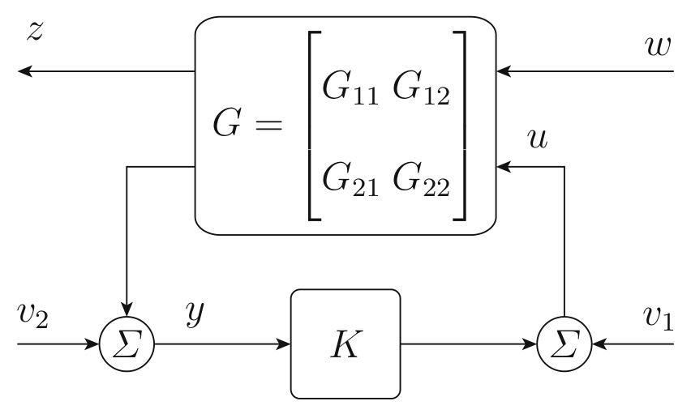

> Image description: Figure 1 presents a standard interconnection diagram for control system design. The central component is a large block labeled with a transfer matrix $G$, defined as a $2 \times 2$ matrix: $G = \begin{bmatrix} G_{11} & G_{12} \\ G_{21} & G_{22} \end{bmatrix}$. The block $G$ has two inputs, $w$ and $u$, and two outputs, $z$ and a feedback signal. The control loop is closed via a controller block $K$. The output of $G$ is fed into a summation node along with an external signal $v_2$ to produce the signal $y$. This $y$ signal serves as the input to block $K$. The output of $K$ is then fed into a second summation node, which also receives an external signal $v_1$, resulting in the control input $u$. This structure illustrates a feedback interconnection between a plant $G$ and a controller $K$, influenced by exogenous inputs $w$, $v_1$, and $v_2$, and producing output $z$.
Optimal Control via Factorization and Model Matching, Fig. 1 Standard interconnection for control system design


<!-- source_pdf_page: 983 -->
employed is well understood in this setting. Indeed, constructions via state-space realizations and Riccati equations are well known. The merits of the model-matching approach pursued here are at least twofold: (i) the underlying algebraic input-output perspective extends to more abstract settings, including classes of distributedparameter and time-varying systems (Desoer et al. 1980; Vidyasagar 1985; Curtain and Zwart 1995; Feintuch 1998; Quadrat 2006); and (ii) model matching is a convex problem for various measures of performance (including mixed indexes) and controller constraints. The latter can be exploited to devise numerical algorithms for controller optimization (Boyd and Barratt 1991; Dahleh and Diaz-Bobillo 1995; Qi et al. 2004).

First, some notation regarding transfer functions and two measures of performance for control system design is defined. Coprime factorizations are then described within the context of a well-known parametrization of stabilizing controllers, originally discovered by Youla et al. (1976) and Kucera (1975). This yields an affine parametrization of performance maps for problems in standard form, and thus, a transformation to a model-matching problem. Finally, the role of spectral factorizations in solving model-matching problems with respect to impulse-response energy ( $\mathscr{H}_{2}$ ) and worst-case energy-gain ( $\mathscr{H}_{\infty}$ ) measures of performance is discussed.

## Notation and Nomenclature

$\mathcal{R}$ generically denotes a linear space of matrices having fixed row and column dimensions, which are not reflected in the notation for convenience, and entries that are proper realrational functions of the complex variable $s$; i.e., $\left(\sum_{k=1}^{m} b_{k} s^{k}\right) /\left(\sum_{k=1}^{n} a_{k} s^{k}\right)$ for sets of real coefficients $\left\{a_{k}\right\}_{k=1}^{n}$ and $\left\{b_{k}\right\}_{k=1}^{m}$ with $m \leq n<\infty$. The compatibility of matrix dimensions is implicitly assumed henceforth. All matrices in $\mathcal{R}$ have (nonunique) "state-space" realizations of the form $C(s I-A)^{-1} B+D$, where $A, B, C$ and $D$ are real valued matrices.

This form naturally arises in frequency-domain analysis of the input-output map associated with the time-domain model $\dot{x}(t)=A x(t)+B u(t)$, with initial condition $x(0)=0$ and output equation $y(t)=C x(t)+D u(t)$, where $\dot{x}$ denotes the time derivative of $x$ and $u$ is the input. The study of such linear time-invariant differential equation models via the Laplace transform and multiplication by real-rational transfer function matrices is fundamental in linear systems theory (Kailath 1980; Francis 1987; Zhou et al. 1996). $P \in \mathcal{R}$ has an inverse $P^{-1} \in \mathcal{R}$ if and only if $\lim _{|s| \rightarrow \infty} P(s)$ is a nonsingular matrix. The superscripts $T$ and * denote the transpose and complex conjugate transpose. For a matrix $Z=Z^{*}$ with complex entries, $Z>0$ means $z^{*} Z z \geq \epsilon z^{*} z$ for some $\epsilon>0$ and all complex vectors $z$ of compatible dimension. $P^{\sim}(s):=P(-s)^{T}$, whereby $(P(j \omega))^{*}=P^{\sim}(j \omega)$ for all real $\omega$ with $j:=\sqrt{-1}$. Zeros of transfer function denominators are called poles.

In subsequent sections, several subspaces of $\mathcal{R}$ are used to define and solve two standard linear control problems. The subspace $\mathcal{B} \subset \mathcal{R}$ comprises transfer functions that have no poles on the imaginary axis in the complex plane. For $P \in \mathcal{B}$, the scalar performance index

$$
\|P\|_{\infty}:=\max _{-\infty \leq \omega \leq \infty} \bar{\sigma}(P(j \omega)) \geq 0
$$

is finite; the real number $\bar{\sigma}(Z)$ is the maximum singular value of the matrix argument $Z$. This index measures the worst-case energy-gain from an input signal $u$, to the output signal $y=P u$. Note that $\|P\|_{\infty}<\gamma$ if and only if $\gamma^{2} I- P^{\sim}(j \omega) P(j \omega)>0$ for all $-\infty \leq \omega \leq \infty$.

The subspace $\mathcal{S} \subset \mathcal{B} \subset \mathcal{R}$ consists of transfer functions that have no poles with positive real part. A transfer function in $\mathcal{S}$ is called stable because the corresponding input-output map is causal in the time domain, as well as bounded-in-bounded-out (in various senses). If $P \in \mathcal{S}$ is such that $P^{\sim} P=I$, then it is called inner. If $P, P^{-1} \in \mathcal{S}$, then both are called outer.

Let $\mathcal{L}$ denote the subspace of strictly-proper transfer functions in $\mathcal{B}$; i.e., for all entries of the


<!-- source_pdf_page: 984 -->
matrix, the degree $n$ of the denominator exceeds the degree $m$ of the numerator. Observe that $P \in \mathcal{L}$ if and only if $P^{\sim} \in \mathcal{L}$. Moreover, $P_{1} P_{2} \in \mathcal{L}$ and $P_{3} P_{1} \in \mathcal{L}$ for all $P_{1} \in \mathcal{L}$ and $P_{i} \in \mathcal{B}$, $i=2,3$. Now, for $P_{1}, P_{2} \in \mathcal{L}$, define the innerproduct

$$
\left\langle P_{1}, P_{2}\right\rangle:=\frac{1}{2 \pi} \int_{-\infty}^{\infty} \operatorname{trace}\left(P_{1}^{\sim}(j \omega) P_{2}(j \omega)\right) d \omega<\infty
$$

and the scalar performance index $\|P\|_{2}:= \sqrt{\langle P, P\rangle} \geq 0$ for $P \in \mathcal{L}$. This index equates to the root-mean-square (energy) measure of the impulse response and the covariance (power) of the output signal $y=P u$, when the input signal $u$ is unit white noise. By the properties $\operatorname{trace}\left(Z_{1}+Z_{2}\right)=\operatorname{trace}\left(Z_{1}\right)+\operatorname{trace}\left(Z_{2}\right)$ and $\operatorname{trace}\left(Z_{1} Z_{2}\right)=\operatorname{trace}\left(Z_{2} Z_{1}\right)$ of the matrix trace, it follows that $\left\langle P_{1}+P_{2}, P_{3}\right\rangle=\left\langle P_{1}, P_{3}\right\rangle+ \left\langle P_{2}, P_{3}\right\rangle$ and

$$
\begin{align*}
\left\langle P_{1}, P_{2} P_{3}\right\rangle & =\left\langle P_{2}^{\sim} P_{1}, P_{3}\right\rangle=\left\langle P_{1} P_{3}^{\sim}, P_{2}\right\rangle \\
& =\left\langle P_{3}^{\sim}, P_{1}^{\sim} P_{2}\right\rangle \text { for } P_{i} \in \mathcal{L}, i=1,2,3 . \tag{2}
\end{align*}
$$

The (not closed) subspace $\mathcal{L} \subset \mathcal{B} \subset \mathcal{R}$ can be expressed as the direct $\operatorname{sum} \mathcal{L}=\mathcal{H}+\mathcal{H}_{\perp}$, where $\mathcal{H}=\mathcal{L} \cap \mathcal{S}$ and $\mathcal{H}_{\perp}$ is the subspace of transfer functions in $\mathcal{L}$ that have no poles with negative real part. That is, given $P \in \mathcal{L}$, there is a unique decomposition $P=\boldsymbol{\Pi}_{+}(P)+\boldsymbol{\Pi}_{-}(P)$, with $\boldsymbol{\Pi}_{+}(P) \in \mathcal{H}$ and $\boldsymbol{\Pi}_{-}(P) \in \mathcal{H}_{\perp}$. Observe that $P \in \mathcal{H}$ if and only if $P^{\sim} \in \mathcal{H}_{\perp}$. It can be shown via Plancherel's theorem that $\left\langle P_{1}, P_{2}\right\rangle=0$ for $P_{1} \in \mathcal{H}_{\perp}$ and $P_{2} \in \mathcal{H}$. Finally, note that $P_{1} P_{2} \in \mathcal{H}$ and $P_{3} P_{1} \in \mathcal{H}$ for $P_{1} \in \mathcal{H}$ and $P_{i} \in \mathcal{S}$, $i=2,3$.

## Coprime and Spectral Factorizations

Given $P \in \mathcal{R}$, the factorizations $P=N M^{-1}= \tilde{M}^{-1} \tilde{N}$ are said to be (doubly) coprime over $\mathcal{S}$, if $N, M, \tilde{N}, \tilde{M}$ are all elements of $\mathcal{S}$ and there exist $U_{0}, V_{0}, \tilde{U}_{0}, \tilde{V}_{0}$ all in $\mathcal{S}$ such that

$$
\left[\begin{array}{ll}
\tilde{V}_{0} & -\tilde{U}_{0}
\end{array}\right]\left[\begin{array}{l}
M  \tag{3}\\
N
\end{array}\right]=I \text { and }\left[\begin{array}{ll}
-\tilde{N} & \tilde{M}
\end{array}\right]\left[\begin{array}{l}
U_{0} \\
V_{0}
\end{array}\right]=I
$$

hold; i.e., $\left[M^{T} N^{T}\right]$ and $[-\tilde{N} \tilde{M}]$ are right invertible in $\mathcal{S}$. Importantly, if the factorizations are coprime and $P \in \mathcal{S}$, then $M^{-1}=\tilde{V}_{0}-\tilde{U}_{0} P$ and $\tilde{M}^{-1}=V_{0}-P U_{0}$ are in $\mathcal{S}$, as sums of products of transfer functions in $\mathcal{S}$; i.e., $M$ and $\tilde{M}$ are outer. Doubly coprime factorizations over $\mathcal{S}$ always exist, but these are not unique. Constructions from state-space realizations can be found in Zhou et al. (1996, Chapter 6) and Francis (1987), for example. As mentioned above, coprime factorizations play a role in transforming a standard problem into the special case of a model matching problem, via the Youla-Kučera parametrization of internally stabilizing controllers presented in the next section.

Subsequently, a special coprime factorization proves to be useful. If $P^{\sim}(s) P(s)= M^{-\sim}(s) N^{\sim}(s) N(s) M^{-1}(s)>0$ for $s$ on the extended imaginary axis (i.e., for $s=j \omega$ with $-\infty \leq \omega \leq \infty$ ), then it is possible to choose the factor $N$ to be inner. In this case, if $P$ is also an element of $\mathcal{S}$, then $P=N M^{-1}$ is called an inner-outer factorization, and $P^{\sim} P=\left(M^{-1}\right)^{\sim} M^{-1}$ is called a spectral factorization, since $M, M^{-1} \in \mathcal{S}$. More generally, if $\Xi=\Xi^{\sim} \in \mathcal{B}$ satisfies $\Xi(s)>0$ for $s$ on the extended imaginary axis, then there exists a (non-unique) spectral factor $\Sigma, \Sigma^{-1} \in \mathcal{S}$ such that $\Xi=\Sigma^{\sim} \Sigma$. Similarly, there exists a co-spectral factor $\tilde{\Sigma}, \tilde{\Sigma}^{-1} \in \mathcal{S}$ such that $\Xi=\tilde{\Sigma} \tilde{\Sigma}{ }^{\sim}$. State-space constructions via Riccati equations can be found in Zhou et al. (1996, Chapter 13), for example.

## Affine Controller/Performance-Map Parametrization

With reference to Fig. 1, a generalized plant model $G=\left[\begin{array}{ll}G_{11} & G_{12} \\ G_{21} & G_{22}\end{array}\right] \in \mathcal{R}$ is said to be internally stabilizable if there exists a $K \in \mathcal{R}$ such that the nine transfer functions associated with the map from the vector of signals $\left(w, v_{1}, v_{2}\right)$ to


<!-- source_pdf_page: 985 -->
the vector of signals $(z, u, y)$, which includes the performance map $H(G, K)=G_{11}+ G_{12} K\left(I-G_{22} K\right)^{-1} G_{21}$, are all elements of $\mathcal{S}$. Accounting in this way for the influence of the fictitious signals $v_{1}$ and $v_{2}$, and the behavior of the internal signals $u$ and $y$, amounts to following requirement: Given minimal statespace realizations, any nonzero initial condition response decays exponentially in the time domain when $G$ and $K$ are interconnected according to Fig. 1 with $w=0, v_{1}=0$ and $v_{2}=0$. Not every $G \in \mathcal{R}$ is internally stabilizable in the sense just defined; for example, take $G_{11}$ to have a pole with positive real part and $G_{21}=G_{12}=G_{22}=0$. A necessary condition for stabilizability is $\left(I-G_{22} K\right)^{-1} \in \mathcal{R}$; i.e., the inverse must be proper. The latter always holds if $G_{22}$ is strictly proper, as assumed henceforth to simplify the presentation. It is also assumed that $G$ is internally stabilizable.

It can be shown that $G$ is internally stabilized by $K$ if and only if the standard feedback interconnection of $G_{22}$ and $K$, corresponding to $w=0$ in Fig. 1, is internally stable. That is, if and only if the transfer function

$$
\left[\begin{array}{cc}
I & -K  \tag{4}\\
-G_{22} & I
\end{array}\right] \in \mathcal{R},
$$

which relates $u$ and $y$ to $v_{1}$ and $v_{2}$ by virtue of the summing junctions at the interconnection points, has an inverse in $\mathcal{S}$; see Francis (1987, Theorem 4.2). Substituting the coprime factorizations $K=U V^{-1}=\tilde{V}^{-1} \tilde{U}$ and $G_{22}=N M^{-1}= \tilde{M}^{-1} \tilde{N}$, it follows that the inverse of (4) is an element of $\mathcal{S}$ if and only if

$$
\left[\begin{array}{ll}
M & U  \tag{5}\\
N & V
\end{array}\right]^{-1} \in \mathcal{S} \quad \Leftrightarrow \quad\left[\begin{array}{cc}
\tilde{V} & -\tilde{U} \\
-\tilde{N} & \tilde{M}
\end{array}\right]^{-1} \in \mathcal{S} .
$$

The equivalent characterizations of internal stability in (5) lead directly to affine parametrizations of controllers and performance maps. Specifically, following the approach of Desoer et al. (1980), Vidyasagar (1985), and Francis (1987), suppose that the factorizations $G_{22}= N M^{-1}=\tilde{M}^{-1} \tilde{N}$ are doubly coprime in the
sense that (3) holds for some $U_{0}, V_{0}, \tilde{U}_{0}, \tilde{V}_{0} \in \mathcal{S}$. Indeed, since $0=G_{22}-G_{22}=\tilde{M}^{-1}(\tilde{M} N- \tilde{N} M) M^{-1}$, it follows that

$$
\begin{align*}
{\left[\begin{array}{cc}
\tilde{V}_{0} & -\tilde{U}_{0} \\
-\tilde{N} & \tilde{M}
\end{array}\right]\left[\begin{array}{ll}
M & U_{0} \\
N & V_{0}
\end{array}\right] } & =\left[\begin{array}{ll}
I & 0 \\
0 & I
\end{array}\right] \\
& =\left[\begin{array}{ll}
M & U_{0} \\
N & V_{0}
\end{array}\right]\left[\begin{array}{cc}
\tilde{V}_{0} & -\tilde{U}_{0} \\
-\tilde{N} & \tilde{M}
\end{array}\right] . \tag{6}
\end{align*}
$$

Exploiting this and the condition (5), it holds that $K=U V^{-1}$ stabilizes $G_{22}$ if and only if
$U=\left(U_{0}-M Q\right)$ and $V=\left(V_{0}-N Q\right)$ with $Q \in \mathcal{S}$.

Similarly, $K$ stabilizes $G_{22}$ if and only if $K= \left(\tilde{V}_{0}-Q \tilde{N}\right)^{-1}\left(\tilde{U}_{0}-Q \tilde{M}\right)$ with $Q \in \mathcal{S}$. Together, these constitute the Youla-Kučera parametrizations of internally stabilizing controllers. Importantly, the coprime factors that appear in these are affine functions of the stable parameter $Q$. Moreover, using (6), an affine parametrization of the standard performance map (1) holds by direct substitution of either controller parametrization. Specifically,

$$
\begin{align*}
H(G, K) & =G_{11}+G_{12} K\left(I-G_{22} K\right)^{-1} G_{21} \\
& =T_{1}+T_{2} Q T_{3} \quad \text { with } Q \in \mathcal{S}, \tag{7}
\end{align*}
$$

where $T_{1}=G_{11}+G_{12} U_{0} \tilde{M} G_{21}, T_{2}=-G_{12} M$ and $T_{3}=\tilde{M} G_{21}$. Clearly, $T_{1} \in \mathcal{S}$ since this is the performance map when $Q=0 \in \mathcal{S}$. By the assumption that $G$ is stabilizable, it follows that $T_{2}$ and $T_{3}$ are also elements of $\mathcal{S}$; see Francis (1987, Chapter 4). The so-called $Q$ parametrization in (7) motivates the subsequent consideration of model-matching problems with respect to the standard measures of control system performance $\|\cdot\|_{2}$ and $\|\cdot\|_{\infty}$.

## Model-Matching via Spectral Factorization

Bearing in mind the $Q$-parametrization (7), consider the following $\mathscr{H}_{2}$ model-matching problem,


<!-- source_pdf_page: 986 -->
where inf denotes greatest lower bound (infimum) and $T_{i} \in \mathcal{S}, i=1,2,3$ :

$$
\inf _{Q \in \mathcal{S}}\left\|T_{1}+T_{2} Q T_{3}\right\|_{2}
$$

Assume that $T_{2}(s)$ and $T_{3}(s)$ have full column and row rank, respectively, for $s$ on the extended imaginary axis. Also assume that $T_{1}$ is strictly proper, whereby $Q$ must be strictly proper, and thus an element of $\mathcal{H} \subset \mathcal{S}$, for the performance index to be finite. Under this standard collec-
tion of assumptions, the infimum is achieved as shown below.

A minimizer of the convex functional $f:= Q \in \mathcal{H} \mapsto\left\langle\left(T_{1}+T_{2} Q T_{3}\right),\left(T_{1}+T_{2} Q T_{3}\right)\right\rangle$ is a solution of the model matching problem. Given spectral factorizations $\Phi^{\sim} \Phi=T_{2}^{\sim} T_{2}$ and $\Lambda \Lambda^{\sim}=T_{3} T_{3}^{\sim}$ (i.e., $\Phi, \Phi^{-1}, \Lambda, \Lambda^{-1} \in \mathcal{S}$ ), which exist by the assumptions on the problem data, let $R:=\Phi Q \Lambda$ and $W:= \Phi^{-\sim} T_{2}^{\sim} T_{1} T_{3}^{\sim} \Lambda^{-\sim}$. Then for $Q \in \mathcal{H}$, which is equivalent to $R \in \mathcal{H}$ by the properties of spectral factors, it follows that

$$
\begin{align*}
f(Q) & =\left\langle T_{1}, T_{1}\right\rangle+\left\langle\Phi^{-\sim} T_{2}^{\sim} T_{1} T_{3}^{\sim} \Lambda^{-\sim}, R\right\rangle+\left\langle R, \Phi^{-\sim} T_{2}^{\sim} T_{1} T_{3}^{\sim} \Lambda^{-\sim}\right\rangle+\langle R, R\rangle  \tag{8}\\
& =\left\langle T_{1}, T_{1}\right\rangle+\left\langle\left(\boldsymbol{\Pi}_{-}(W)+\boldsymbol{\Pi}_{+}(W)+R\right),\left(\boldsymbol{\Pi}_{-}(W)+\boldsymbol{\Pi}_{+}(W)+R\right)\right\rangle-\langle W, W\rangle \\
& =\left\langle T_{1}, T_{1}\right\rangle-\left\langle\boldsymbol{\Pi}_{+}(W), \boldsymbol{\Pi}_{+}(W)\right\rangle+\left\langle\left(\boldsymbol{\Pi}_{+}(W)+R\right),\left(\boldsymbol{\Pi}_{+}(W)+R\right)\right\rangle \tag{9}
\end{align*}
$$

where the second last equality holds by "completion-of-squares" and the last equality holds since $\left\langle\boldsymbol{\Pi}_{+}(W), \boldsymbol{\Pi}_{-}(W)\right\rangle=0= \left\langle R, \boldsymbol{\Pi}_{-}(W)\right\rangle$. From (9) it is apparent that

$$
Q=-\Phi^{-1} \boldsymbol{\Pi}_{+}\left(\Phi^{-\sim} T_{2}^{\sim} T_{1} T_{3}^{\sim} \Lambda^{-\sim}\right) \Lambda^{-1}
$$

is a minimizer of $f$. As above, spectral factorization is a key component of the so-called Wiener-Hopf approach of Youla et al. (1976) and DeSantis et al. (1978).

Now consider the $\mathscr{H}_{\infty}$ model-matching problem

$$
\inf _{Q \in \mathcal{S}}\left\|T_{1}+T_{2} Q T_{3}\right\|_{\infty},
$$

given $T_{i} \in \mathcal{S}, i=1,2,3$. This is more challenging than the problem discussed above, where $\|\cdot\|_{2}$ is the performance index. While sufficient conditions are again available for the infimum to be achieved, computing a minimizer is generally difficult; see Francis and Doyle (1987) and Glover et al. (1991). As such, nearly optimal solutions are often sought by considering the relaxed problem of finding the set of $Q \in \mathcal{S}$ that satisfy $\left\|T_{1}+T_{2} Q T_{3}\right\|_{\infty}<\gamma$ for a value of $\gamma>0$ greater than, but close to, the infimum.

With a view to highlighting the role of factorization methods and simplifying the presentation, suppose that $T_{2}$ is inner, which is possible without loss of generality via inner-outer factorization if $T_{2}(s)$ has full column rank for $s$ on the extended imaginary axis. Furthermore, assume that $T_{3}= I$. Following the approach of Francis (1987) and Green et al. (1990), let $X^{\sim}=\left[X_{1}^{\sim} X_{2}^{\sim}\right]:= \left[T_{2} I-T_{2} T_{2}^{\sim}\right] \in \mathcal{B}$, so that $X^{\sim} X=I$ and $X T_{2}=\left[\begin{array}{l}I \\ 0\end{array}\right]$. Observe that

$$
\begin{align*}
\left\|T_{1}+T_{2} Q\right\|_{\infty} & =\left\|X\left(T_{1}+T_{2} Q\right)\right\|_{\infty} \\
& =\left\|\left[\begin{array}{c}
T_{2}^{\sim} T_{1}+Q \\
\left(I-T_{2} T_{2}^{\sim}\right) T_{1}
\end{array}\right]\right\|_{\infty}<\gamma \tag{10}
\end{align*}
$$

if and only if

$$
\begin{align*}
0 & <\gamma^{2} I-T_{1}^{\sim}\left(I-T_{2} T_{2}^{\sim}\right) T_{1} \\
& -\left(T_{2}^{\sim} T_{1}+Q\right)^{\sim}\left(T_{2}^{\sim} T_{1}+Q\right) \tag{11}
\end{align*}
$$

on the extended imaginary axis. Note that (11) implies $0<\gamma^{2} I-T_{1}^{\sim}\left(I-T_{2} T_{2}^{\sim}\right)^{2} T_{1}$. Thus, it follows that there exists a $Q \in \mathcal{S}$ for which (10) holds if and only if the following are both satisfied: (a) there exists a spectral factorization


<!-- source_pdf_page: 987 -->
$\gamma^{2} \Psi^{\sim} \Psi=\gamma^{2} I-T_{1}^{\sim}\left(I-T_{2} T_{2}^{\sim}\right)^{2} T_{1} ;$ and (b) there exists an $\bar{R}\left(=Q \Psi^{-1}\right) \in \mathcal{S}$ such that $\| \bar{W}+ \bar{R} \|_{\infty}<\gamma$, where $\bar{W}:=T_{2}^{\sim} T_{1} \Psi^{-1} \in \mathcal{B}$. The condition (b) is a well-known extension problem and a solution exists if and only if the induced norm of the Hankel operator with symbol $\bar{W}$ is less than $\gamma$, which is part of a result known as Nehari's theorem. In fact, (b) is equivalent to the existence of a spectral factor $\Upsilon, \Upsilon^{-1} \in \mathcal{S}$ with $\Upsilon_{11}^{-1} \in \mathcal{S}$ such that

$$
\Upsilon^{\sim}\left[\begin{array}{cc}
I & 0  \tag{12}\\
0 & -\gamma^{2} I
\end{array}\right] \Upsilon=\left[\begin{array}{cc}
I & \bar{W} \\
0 & I
\end{array}\right]^{\sim}\left[\begin{array}{cc}
I & 0 \\
0 & -\gamma^{2} I
\end{array}\right]\left[\begin{array}{cc}
I & \bar{W} \\
0 & I
\end{array}\right]
$$

in which case $\|\bar{W}+\bar{R}\|_{\infty} \leq \gamma$ if and only if $\bar{R}=\bar{R}_{1} \bar{R}_{2}^{-1}$ with $\left[\bar{R}_{1}^{T} \bar{R}_{2}^{T}\right]:=\left[\bar{S}^{T} I\right] \Upsilon^{-T}$, $\bar{S} \in \mathcal{S}$ and $\|\bar{S}\|_{\infty} \leq \gamma$; see Ball and Ran (1987), Francis (1987), and Green et al. (1990) for details, including state-space constructions of the factors via Riccati equations. Noting that

$$
\begin{array}{r}
{\left[\begin{array}{cc}
T_{2} & T_{1} \\
0 & I
\end{array}\right]^{\sim}\left[\begin{array}{cc}
I & 0 \\
0 & -\gamma^{2} I
\end{array}\right]\left[\begin{array}{cc}
T_{2} & T_{1} \\
0 & I
\end{array}\right]=\left[\begin{array}{ll}
I & 0 \\
0 & \Psi
\end{array}\right]^{\sim}\left[\begin{array}{ll}
I & \bar{W} \\
0 & I
\end{array}\right]^{\sim}} \\
{\left[\begin{array}{cc}
I & 0 \\
0 & -\gamma^{2} I
\end{array}\right]\left[\begin{array}{cc}
I & \bar{W} \\
0 & I
\end{array}\right]\left[\begin{array}{cc}
I & 0 \\
0 & \Psi
\end{array}\right],}
\end{array}
$$

it follows using (12) that there exists a $Q \in \mathcal{S}$ such that (10) holds if and only if there exists a spectral factor $\Omega, \Omega^{-1} \in \mathcal{S}$ with $\Omega_{11}^{-1} \in \mathcal{S} \left(\Omega=\Upsilon\left[\begin{array}{ll}I & 0 \\ 0 & \Psi\end{array}\right]\right)$ that satisfies

$$
\left[\begin{array}{cc}
T_{2} & T_{1}  \tag{13}\\
0 & I
\end{array}\right]^{\sim}\left[\begin{array}{cc}
I & 0 \\
0 & -\gamma^{2} I
\end{array}\right]\left[\begin{array}{cc}
T_{2} & T_{1} \\
0 & I
\end{array}\right]=\Omega^{\sim}\left[\begin{array}{cc}
I & 0 \\
0 & -\gamma^{2} I
\end{array}\right] \Omega,
$$

in which case $\left\|T_{1}+T_{2} Q\right\|_{\infty} \leq \gamma$ if and only if $Q=Q_{1} Q_{2}^{-1}$, where $\left[\begin{array}{ll}Q_{1}^{T} & Q_{2}^{T}\end{array}\right]:=\left[\begin{array}{ll}S^{T} & I\end{array}\right] \Omega^{-T}$, $S \in \mathcal{S}$ and $\|S\|_{\infty} \leq \gamma$; see Green et al. (1990). So-called $J$-spectral factorizations of the kind in (12) and (13) also appear in the chain-scattering/conjugation approach of Kimura $(1989,1997)$ and the factorization approach of Ball et al. (1991), for example.

## Summary

The preceding sections highlight the role of coprime and spectral factorizations in formulating and solving model-matching problems that arise from standard $\mathscr{H}_{2}$ and $\mathscr{H}_{\infty}$ control problems. The transformation of standard control problems to model-matching problems hinges on an affine parametrization of internally stabilized performance maps. Beyond the problems considered here, this parametrization can be exploited to devise numerical algorithms for various other control problems in terms of convex mathematical programs.

## Cross-References

- H-Infinity Control
- $\mathrm{H}_{2}$ Optimal Control
- Polynomial/Algebraic Design Methods
- Spectral Factorization


## Bibliography

Ball JA, Ran ACM (1987) Optimal Hankel norm model reductions and Wiener-Hopf factorization I: the canonical case. SIAM J Control Optim 25(2):362-382
Ball JA, Helton JW, Verma M (1991) A factorization principle for stabilization of linear control systems. Int J Robust Nonlinear Control 1(4):229-294
Boyd SP, Barratt CH (1991) Linear controller design: limits of performance. Prentice Hall, Englewood Cliffs
Curtain RF, Zwart HJ (1995) An introduction to infinitedimensional linear systems theory. Volume 21 of texts in applied mathematics. Springer, New York
Dahleh MA, Diaz-Bobillo IJ (1995) Control of uncertain systems: a linear programming approach. Prentice Hall, Upper Saddle River
DeSantis RM, Saeks R, Tung LJ (1978) Basic optimal estimation and control problems in Hilbert space. Math Syst Theory 12(1):175-203
Desoer C, Liu R-W, Murray J, Saeks R (1980) Feedback system design: the fractional representation approach to analysis and synthesis. IEEE Trans Autom Control 25(3):399-412
Feintuch A (1998) Robust control theory in Hilbert space. Applied mathematical sciences. Spinger, New York
Francis BA (1987) A course in $H_{\infty}$ control theory. Lecture notes in control and information sciences. Springer, Berlin/New York


<!-- source_pdf_page: 988 -->
Francis BA, Doyle JC (1987) Linear control theory with an $H_{\infty}$ optimality criterion. SIAM J Control Optim 25(4):815-844
Glover K, Limebeer DJN, Doyle JC, Kasenally EM, Safonov MG (1991) A characterization of all solutions to the four block general distance problem. SIAM J Control Optim 29(2): 283-324
Green M, Glover K, Limebeer DJN, Doyle JC (1990) A $J$ spectral factorization approach to $\mathscr{H}_{\infty}$ control. SIAM J Control Optim 28(6): 1350-1371
Kailath T (1980) Linear systems. Prentice-Hall, Englewood Cliffs
Kimura H (1989) Conjugation, interpolation and model-matching in $H_{\infty}$. Int J Control 49(1): 269-307
Kimura H (1997) Chain-scattering approach to $H^{\infty}$ control. Systems \& control. Birkhäuser, Boston
Kucera V (1975) Stability of discrete linear control systems. In: 6th IFAC world congress, Boston. Paper 44.1

Qi X, Salapaka MV, Voulgaris PG, Khammash M (2004) Structured optimal and robust control with multiple criteria: a convex solution. IEEE Trans Autom Control 49(10): 1623-1640
Quadrat A (2006) On a generalization of the YoulaKučera parametrization. Part II: the lattice approach to MIMO systems. Math Control Signals Syst 18(3):199-235
Vidyasagar M (1985) Control system synthesis: a factorization approach. Signal processing, optimization and control. MIT, Cambridge
Youla D, Jabr H, Bongiorno J (1976) Modern WienerHopf design of optimal controllers - Part II: the multivariable case. IEEE Trans Autom Control 21(3):319338
Zhou K, Doyle JC, Glover K (1996) Robust and optimal control. Prentice Hall, Upper Saddle River

## Optimal Control with State Space Constraints

Heinz Schättler
Washington University, St. Louis, MO, USA


#### Abstract

Necessary and sufficient conditions for optimality in optimal control problems with state space constraints are reviewed with emphasis on geometric aspects.


## Keywords

Admissible control; Bolza form; Mayer problem

## Problem Formulation and Terminology

Many practical problems in engineering or of scientific interest can be formulated in the framework of optimal control problems with state space constraints. Examples range from the space shuttle reentry problem in aeronautics (Bonnard et al. 2003) to the problem of minimizing the base transit time in bipolar transistors in electronics (Rinaldi and Schättler 2003).

An optimal control problem with state space constraints in Bolza form takes the following form: minimize a functional

$$
J(u)=\int_{t_{0}}^{T} L(t, x(t), u(t)) d t+\Phi(T, x(T))
$$

over all Lebesgue measurable functions $u$ : $\left[t_{0}, T\right] \rightarrow U$ that take values in a control set $U \subset \mathbb{R}^{m}$, subject to the dynamics

$$
\dot{x}(t)=F(t, x(t), u(t)), \quad x\left(t_{0}\right)=x_{0},
$$

terminal constraints

$$
\Psi(T, x(T))=0,
$$

and state space constraints

$$
h_{\alpha}(t, x(t)) \leq 0 \quad \text { for } \alpha=1, \ldots, r .
$$

The focus of this contribution is on state space constraints, and, for simplicity, in this formulation, we have omitted mixed control state space constraints of the form $g_{\beta}(t, x, u) \leq 0$. States $x$ lie in $\mathbb{R}^{n}$ and controls in $\mathbb{R}^{m}$; typically, the control set $U \subset \mathbb{R}^{m}$ is compact and convex, often a polyhedron. The time-varying vector field $F: \mathbb{R} \times \mathbb{R}^{n} \times U \rightarrow \mathbb{R}^{n}$ is continuously differentiable in ( $t, x$ ), and the terminal constraint $N= \{(t, x): \Psi(t, x)=0\}$ is defined by continuously differentiable mappings $\psi_{i}: \mathbb{R} \times \mathbb{R}^{n} \rightarrow \mathbb{R}^{k}$ with


<!-- source_pdf_page: 989 -->
the property that the gradients $\nabla \psi_{i}=\left(\frac{\partial \psi_{i}}{\partial t}, \frac{\partial \psi_{i}}{\partial x}\right)$ (which we write as row vectors) are linearly independent on $N$. The terminal time $T$ can be free or fixed; a fixed terminal time simply would be prescribed by one of the functions $\psi_{i}$. The state space constraints

$$
M_{\alpha}=\left\{(t, x): h_{\alpha}(t, x)=0\right\}, \quad \alpha=1, \ldots, r,
$$

are defined by continuously differentiable timevarying vector fields $h_{\alpha}: \mathbb{R} \times \mathbb{R}^{n} \rightarrow \mathbb{R},(t, x) \mapsto h_{\alpha}(t, x)$, and we assume that the gradients $\nabla h_{\alpha}$ do not vanish on $M_{\alpha}$. In particular, each set $M_{\alpha}$ thus is an embedded submanifold of codimension 1 of $\mathbb{R}^{n+1}$. We denote by $h=\left(h_{1}, \ldots, h_{r}\right)^{T}$ the time-varying vector field defining the state space constraints.

Terminology: Admissible controls are locally bounded Lebesgue measurable functions that take values in the control set, $u:\left[t_{0}, T\right] \rightarrow U$. Given any admissible control, the initial value problem $\dot{x}(t)=F(t, x(t), u(t)), x\left(t_{0}\right)=x_{0}$, has a unique solution defined on some maximal open interval of definition $I$. This solution is called the trajectory corresponding to the control $u$ and the pair ( $x, u$ ) is a controlled trajectory. An $\operatorname{arc} \Gamma$ of the graph of a trajectory defined over an open interval $I$ for which none of the state space constraints is active is called an interior arc, and $\Gamma$ is a boundary arc if at least one constraint is active on all of $I$. We call $\Gamma$ an $M_{\alpha}$ boundary arc over $I$ if only the constraint $h_{\alpha} \leq 0$ is active on $I$. The times $\tau$ when interior arcs and boundary arcs meet are called junction times and the corresponding pairs $(\tau, x(\tau))$ junction points.

Despite the abundance and importance of practical problems that can be described as optimal control problems with state space constraints, for such problems the theory still lacks the coherence that the theory for problems without state space constraints has reached and there still exist significant gaps between the theories of necessary and sufficient conditions for optimality for optimal control problems with state space constraints. The theory of existence of optimal solutions differs little between optimal control problems with and without state space
constraints, is well established, and will not be addressed here (e.g., see Cesari 1983 or the Filippov-Cesari theorem in Hartl et al. 1995).

## Necessary Conditions for Optimality

First-order necessary conditions for optimality are given by the Pontryagin maximum principle (Pontryagin et al. 1962). The zero set of even a smooth ( $C^{\infty}$ ) function can be an arbitrary closed subset of the state space. As a result, in necessary conditions for optimality, the multipliers associated with the state space constraints a priori are only known to be nonnegative Radon measures (Ioffe and Tikhomirov 1979; Vinter 2000). Let $u_{*}:\left[t_{0}, T\right] \rightarrow U$ be an optimal control with corresponding trajectory $x_{*}$ and, for simplicity of presentation, also assume that no state constraints are active at the terminal time so that the standard transversality conditions apply. Then it follows that there exist a constant $\lambda_{0} \geq 0$, an absolutely continuous function $\eta$, which we write as rowvector, $\eta:\left[t_{0}, T\right] \rightarrow\left(\mathbb{R}^{n}\right)^{*}$, and nonnegative Radon measures $\mu_{\alpha} \in C^{*}\left(\left[t_{0}, T\right] ; \mathbb{R}\right), \alpha= 1, \ldots, r$, with support in the sets $R_{\alpha}=\{t \in \left.\left[t_{0}, T\right]: h_{\alpha}\left(t, x_{*}(t)\right)=0\right\}$, which do not all vanish simultaneously, i.e.,

$$
\lambda_{0}+\|\eta\|_{\infty}+\sum_{\alpha=1}^{r} \mu_{\alpha}\left(\left[t_{0}, T\right]\right)>0
$$

such that with

$$
\lambda(t)=\eta(t)-\sum_{\alpha=1}^{r} \int_{\left[t_{0}, t\right)} \frac{\partial h_{\alpha}}{\partial x}\left(s, x_{*}(s)\right) d \mu_{\alpha}(s)
$$

and
$H=H\left(t, \lambda_{0}, \lambda, x, u\right)=\lambda_{0} L(t, x, u)+\lambda F(t, x, u)$
the following conditions hold:
(a) The adjoint equation holds in the form

$$
\dot{\eta}(t)=-\frac{\partial H}{\partial x}\left(t, \lambda_{0}, \lambda(t), x_{*}(t), u_{*}(t)\right)
$$


<!-- source_pdf_page: 990 -->
$$
\begin{aligned}
= & -\lambda_{0} \frac{\partial L}{\partial x}\left(t, x_{*}(t), u_{*}(t)\right) \\
& -\lambda(t) \frac{\partial F}{\partial x}\left(t, x_{*}(t), u_{*}(t)\right),
\end{aligned}
$$

and there exists a row-vector $\mu \in\left(\mathbb{R}^{k}\right)^{*}$ such that

$$
\lambda(T)=\lambda_{0} \frac{\partial \Phi}{\partial x}\left(T, x_{*}(T)\right)+\mu \frac{\partial \Psi}{\partial x}\left(T, x_{*}(T)\right)
$$

and

$$
\begin{aligned}
0= & H\left(T, \lambda_{0}, \lambda(T), x_{*}(T), u_{*}(T)\right) \\
& +\lambda_{0} \frac{\partial \Phi}{\partial t}\left(T, x_{*}(T)\right)+\mu \frac{\partial \Psi}{\partial t}\left(T, x_{*}(T)\right)
\end{aligned}
$$

(b) The optimal control minimizes the Hamiltonian over the control set $U$ along $\left(\lambda(t), x_{*}(t)\right)$ :

$$
\begin{aligned}
& H\left(t, \lambda_{0}, \lambda(t), x_{*}(t), u_{*}(t)\right) \\
& \quad=\min _{v \in U} H\left(t, \lambda_{0}, \lambda(t), x_{*}(t), v\right)
\end{aligned}
$$

Furthermore,

$$
\begin{aligned}
& H\left(t, \lambda_{0}, \lambda(t), x_{*}(t), u_{*}(t)\right) \\
& \quad=\quad H\left(T, \lambda_{0}, \lambda(t), x_{*}(t), u_{*}(t)\right) \\
& \quad-\int_{[t, T]} \frac{\partial H}{\partial t}\left(s, \lambda_{0}, \lambda(s), x_{*}(s), u_{*}(s)\right) d s \\
& \quad+\sum_{\alpha=1}^{r} \int_{[t, T]} \frac{\partial h_{\alpha}}{\partial t}\left(s, x_{*}(s)\right) d \mu_{\alpha}(s)
\end{aligned}
$$

Controlled trajectories $(x, u)$ for which there exist multipliers such that these conditions are satisfied are called extremals. In general, it cannot be excluded that $\lambda_{0}$ vanishes and extremals with $\lambda_{0}=0$ are called abnormal, while those with $\lambda_{0}>0$ are called normal. In this case, the multiplier can be normalized, $\lambda_{0}=1$.

## Special Case: A Mayer Problem for Single-Input Control Linear Systems

Under the general assumptions formulated above, the sets $R_{\alpha} \subset\left[t_{0}, T\right]$ when a particular constraint is active can be arbitrarily complicated.

But in many practical applications, state constraints have strong geometric properties - often they are embedded submanifolds - and it is possible to strengthen these necessary conditions for optimality in the sense of specifying the measures further. We formulate the conditions for a particular case of common interest.

We consider an optimal control problem in Mayer form (i.e., $L \equiv 0$ ) for a single-input control linear system with dynamics

$$
\dot{x}=F(t, x, u)=f(t, x)+u g(t, x)
$$

and the control set $U$ a compact interval, $U= [a, b]$. Adjoining time as extra state variable, $\dot{t} \equiv$ 1, and defining
$F_{0}(t, x)=\binom{1}{f(t, x)}$ and $G(t, x)=\binom{0}{g(t, x)}$,
for a continuously differentiable function $k: \mathbb{R} \times \mathbb{R}^{n} \rightarrow \mathbb{R}^{n}$, the expressions

$$
\begin{aligned}
\mathcal{L}_{F_{0}} k & : \mathbb{R} \times \mathbb{R}^{n} \rightarrow \mathbb{R}^{n} \\
(t, x) & \mapsto\left(\mathcal{L}_{F_{0}} k\right)(t, x) \\
= & \frac{\partial k}{\partial t}(t, x)+\frac{\partial k}{\partial x}(t, x) f(t, x)
\end{aligned}
$$

and

$$
\begin{aligned}
\mathcal{L}_{G} k: \mathbb{R} \times \mathbb{R}^{n} & \rightarrow \mathbb{R}^{n}, \\
(t, x) & \mapsto\left(\mathcal{L}_{G} k\right)(t, x)=\frac{\partial k}{\partial x}(t, x) g(t, x)
\end{aligned}
$$

represent the Lie (or directional) derivatives of the function $k$ along the vector fields $F_{0}$ and $G$, respectively. In terms of this notation, the derivative of the function $h_{\alpha}$ (defining the manifold $M_{\alpha}$ ) along trajectories of the system is given by

$$
\begin{aligned}
\dot{h}_{\alpha}(t, x(t)) & =\frac{d}{d t} h_{\alpha}(t, x(t)) \\
& =\mathcal{L}_{F_{0}} h_{\alpha}(t, x(t))+u(t) \mathcal{L}_{G} h_{\alpha}(t, x(t))
\end{aligned}
$$

If the function $\mathcal{L}_{G} h_{\alpha}$ does not vanish at a point $(\tilde{t}, \tilde{x}) \in M_{\alpha}$, then there exists a neighborhood $V$ of ( $\tilde{t}, \tilde{x}$ ) such that there exists a unique


<!-- source_pdf_page: 991 -->
control $u_{\alpha}=u_{\alpha}(t, x)$ which solves the equation $\dot{h}_{\alpha}(t, x)=0$ on $V$ and $u_{\alpha}$ is given in feedback form as

$$
u_{\alpha}(t, x)=-\frac{\mathcal{L}_{F_{0}} h_{\alpha}(t, x)}{\mathcal{L}_{G} h_{\alpha}(t, x)}
$$

The manifold $M_{\alpha}$ is said to be control invariant of relative degree 1 if the Lie derivative of $h_{\alpha}$ with respect to $G, \mathcal{L}_{G} h_{\alpha}$, does not vanish anywhere on $M_{\alpha}$ and if the function $u_{\alpha}(t, x)$ is admissible, i.e., takes values in the control set $[a, b]$.

Thus, for a control-invariant submanifold of relative degree 1 , the control that keeps the manifold invariant is unique, and the corresponding dynamics induce a unique flow on the constraint. This assumption corresponds to the least degenerate, i.e., in some sense most generic or common, scenario and is satisfied for many practical problems.

Suppose the reference extremal is normal and let $\Gamma_{\alpha}$ be an $M_{\alpha}$-boundary arc defined over an open interval $I$ with corresponding boundary control $u_{\alpha}$ that takes values in the interior of the control set along $\Gamma_{\alpha}$. Then the Radon measure $\mu_{\alpha}$ is absolutely continuous with respect to Lebesgue measure on $I$ with continuous and nonnegative Radon-Nikodym derivative $\nu_{\alpha}(t)$ given by

$$
v_{\alpha}(t)=\frac{\lambda(t)\left(\frac{\partial g}{\partial t}\left(t, x_{*}(t)\right)+[f, g]\left(t, x_{*}(t)\right)\right)}{\mathcal{L}_{G} h_{\alpha}\left(t, x_{*}(t)\right)}
$$

where $[f, g]$ denotes the Lie bracket of the timevarying vector fields $f$ and $g$ in the variable $x$,

$$
[f, g](t, x)=\frac{\partial g}{\partial x}(t, x) f(t, x)-\frac{\partial f}{\partial x}(t, x) g(t, x) .
$$

In particular, in this case, the adjoint equation can be expressed in the more common form

$$
\dot{\lambda}(t)=-\lambda(t) \frac{\partial F}{\partial x}\left(t, x_{*}, u_{*}\right)-v_{\alpha}(t) \frac{\partial h_{\alpha}}{\partial x}\left(t, x_{*}\right),
$$

with all partial derivatives evaluated along the reference trajectory. Furthermore, the multiplier $\lambda$ remains continuous at entry or exit if the controlled trajectory ( $x_{*}, u_{*}$ ) meets the constraint
$M_{\alpha}$ transversally (e.g., see Schättler 2006). This follows from the following characterization of transversal connections between interior and boundary arcs due to Maurer (1977): if $\tau$ is an entry or exit junction time between an interior arc and an $M_{\alpha}$-boundary arc for which the reference control $u_{*}$ has a limit at $\tau$ along the interior $\operatorname{arc}$, then the interior arc is transversal to $M_{\alpha}$ at entry or exit if and only if the control $u_{*}$ is discontinuous at $\tau$.

## Informal Formulation of Necessary Conditions

In order to ensure the practicality of necessary conditions for optimality, it is essential that besides atomistic structures at junctions that lead to computable jumps in the multipliers, the Radon measures $\mu_{\alpha}$ have no singular parts with respect to Lebesgue measure. If it is assumed a priori that optimal controlled trajectories are finite concatenations of interior and boundary arcs, and if the constraint sets have a reasonably regular structure (embedded submanifolds and transversal intersections thereof) and satisfy a rather technical constraint qualification (see Hartl et al. 1995) that guarantees that the restrictions of the system to active constraints have solutions, then it is possible to specify the above necessary conditions further and formulate more user friendly versions for the determination of the multipliers. Such formulations have become the standard for numerical computations, but they still have not always been established rigorously and somewhat carry the stigma of a heuristic nature. Nevertheless, it is often this more concrete set of conditions that allow to solve problems numerically and analytically. If then, in conjunction with sufficient conditions for optimality, it is possible to verify the optimality of the computed extremal solutions, this generates a satisfactory theoretical procedure. Such conditions, following Hartl et al. (1995), generally are referred to as the "informal theorem".

Suppose ( $x_{*}, u_{*}$ ) is a normal extremal controlled trajectory defined over the interval $\left[t_{0}, T\right]$ with the property that the graph of $x_{*}$ is a finite concatenation of interior and boundary arcs with junction times $\tau_{i}, i=1, \ldots, k, t_{0}=\tau_{0}<\tau_{1}<$


<!-- source_pdf_page: 992 -->
$\ldots<\tau_{k}<\tau_{k+1}=T$. Under an appropriate constraint qualification, there exist a multiplier $\lambda$, $\lambda:\left[t_{0}, T\right] \rightarrow\left(\mathbb{R}^{n}\right)^{*}$, which is absolutely continuous on each subinterval $\left[\tau_{i}, \tau_{i+1}\right]$; multipliers $\nu_{\alpha}, \nu_{\alpha}:\left[t_{0}, T\right] \rightarrow\left(\mathbb{R}^{n}\right)^{*}$, which are continuous on each interval $\left[\tau_{i}, \tau_{i+1}\right]$; a vector $\mu \in\left(\mathbb{R}^{k}\right)^{*}$; and vectors $\eta\left(\tau_{i}\right) \in\left(\mathbb{R}^{r}\right)^{*}, i=1, \ldots, k$, with nonnegative entries such that:
(a) (adjoint equation) On each interval $\left(\tau_{i}, \tau_{i+1}\right), i=0, \ldots, r, \lambda$ satisfies the adjoint equation in the form

$$
\begin{aligned}
\dot{\lambda}(t)=-\frac{\partial L}{\partial x} & \left(t, x_{*}(t), u_{*}(t)\right) \\
& -\lambda(t) \frac{\partial F}{\partial x}\left(t, x_{*}(t), u_{*}(t)\right) \\
& -\sum_{\alpha=1}^{r} v_{\alpha}(t) \frac{\partial h_{\alpha}}{\partial x}\left(t, x_{*}\right)
\end{aligned}
$$

with $v_{\alpha}(t)=0$ if the constraint $M_{\alpha}$ is not active at time $t$. Assuming that no state space constraint is active at the terminal time, the value of the multiplier $\lambda$ at the terminal time is given by the transversality condition
$\lambda(T)=\frac{\partial \Phi}{\partial x}\left(T, x_{*}(T)\right)+\mu \frac{\partial \Psi}{\partial x}\left(T, x_{*}(T)\right)$.
At any junction time $\tau_{i}$ between an interior arc and a boundary arc, the multiplier $\lambda$ may be discontinuous satisfying a jump condition of the form

$$
\lambda\left(\tau_{i}-\right)=\lambda\left(\tau_{i}+\right)+\eta\left(\tau_{i}\right) \frac{\partial h}{\partial x}\left(\tau_{i}, x_{*}\left(\tau_{i}\right)\right)
$$

and the complementary slackness condition

$$
\eta\left(\tau_{i}\right) \frac{\partial h}{\partial x}\left(\tau_{i}, x_{*}\left(\tau_{i}\right)\right)=0
$$

holds.
(b) The optimal control minimizes the Hamiltonian over the control set $U$ along $\left(\lambda(t), x_{*}(t)\right)$ :

$$
\begin{aligned}
& H\left(t, \lambda(t), x_{*}(t), u_{*}(t)\right) \\
& \quad=\min _{v \in U} H\left(t, \lambda(t), x_{*}(t), v\right)
\end{aligned}
$$

and at the junction times $\tau_{i}$ we have that

$$
\begin{aligned}
& H\left(\tau_{i}, \lambda\left(\tau_{i}-\right), x_{*}\left(\tau_{i}\right), u_{*}\left(\tau_{i}-\right)\right) \\
& \quad=H\left(\tau_{i}, \lambda\left(\tau_{i}+\right), x_{*}\left(\tau_{i}\right), u_{*}\left(\tau_{i}+\right)\right) \\
& \quad-\eta\left(\tau_{i}\right) \frac{\partial h}{\partial t}\left(\tau_{i}, x_{*}\left(\tau_{i}\right)\right)
\end{aligned}
$$

## Sufficient Conditions for Optimality

The literature on sufficient conditions for optimality for optimal control problems with state space constraints is limited. The value function for an optimal control problem at a point ( $t, x$ ) in the extended state space, $V=V(t, x)$, is defined as the infimum over all admissible controls $u$ for which the corresponding trajectory starts at the point $x$ at time $t$ and satisfies all the constraints of the problem,

$$
V(t, x)=\inf _{u \in \mathcal{U}} J(u) .
$$

Any sufficiency theory for optimal control problems, one way or another, deals with the solution of the corresponding Hamilton-Jacobi-Bellman (HJB) equation:

$$
\begin{aligned}
\frac{\partial V}{\partial t}(t, x)+\min _{u \in U} & \left\{\frac{\partial V}{\partial x}(t, x) F(t, x, u)\right. \\
& +L(t, x, u)\} \equiv 0 \\
V(T, x)= & \Phi(T, x) \text { whenever } \Psi(T, x)=0
\end{aligned}
$$

Value functions for optimal control problems rarely are differentiable everywhere, but generally have singularities along lower-dimensional submanifolds. Nevertheless, under some technical assumptions and with proper interpretations of the derivatives, this equation describes the evolution of the value function of an optimal control problem and, if an appropriate solution can be constructed, indeed solves the optimal control problem.

There exists a broad theory of viscosity solutions to the HJB equation (e.g., Fleming and


<!-- source_pdf_page: 993 -->
Soner 2005; Bardi and Capuzzo-Dolcetta 2008) that is also applicable to problems with state space constraints (Soner 1986) and, under varying technical assumptions, characterizes the value function $V$ as the unique viscosity solution to the HJB equation. This has led to the development of algorithms that can be used to compute numerical solutions.

A more classical and more geometric approach to solving the HJB equation is based on the method of characteristics and goes back to the work of Boltyansky on a regular synthesis for optimal control problems without state space constraints (Boltyanskii 1966). This work follows classical ideas of fields of extremals from the calculus of variations and imposes technical conditions that allow to handle the singularities that arise in the value functions (e.g., see, Schättler and Ledzewicz 2012). Stalford's results in Stalford (1971) follow this approach for problems with state space constraints, but a broadly applicable theory of
regular synthesis, as it was developed by Piccoli and Sussmann in (2000) for problems without state space constraints, does not yet exist for problems with state space constraints. Results that embed a controlled reference extremal into a local field of extremals have been given by Bonnard et al. (2003) or Schättler (2006), and these constructions show the applicability of the concepts of a regular synthesis to problems with state space constraints as well.

## Examples of Local Embeddings of Boundary Arcs

We illustrate the typical, i.e., in some sense most common, generic structures of local embeddings of boundary arcs in Figs. 1 and 2. The state constraint $M_{\alpha}$ is a control-invariant submanifold of relative degree 1 and represented by a horizontal line as it arises when limits on the size of a particular state are imposed. Figure 1 shows the typical entry-boundary-exit concatenations of an interior arc followed by a boundary arc and

Optimal Control with State Space Constraints, Fig. 1 A typical local synthesis around a boundary arc when no terminal constraints are present
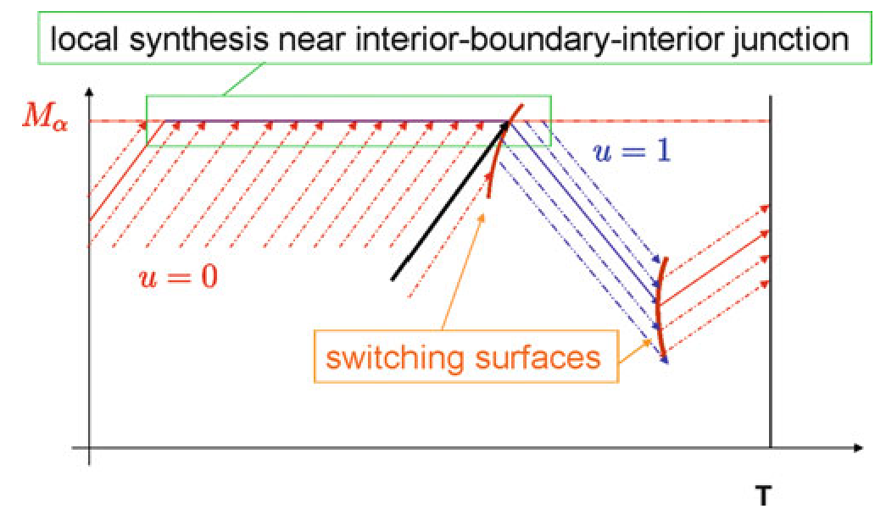

> Image description: A technical diagram titled "Optimal Control with State Space Constraints" illustrates a local synthesis near an interior-boundary-interior junction. The plot features two axes: $M_{\alpha}$ on the vertical axis and $T$ on the horizontal axis. The diagram depicts different control regions defined by the state variable $u$. The region $u=0$ is represented by a red-hatched area below a horizontal line. The region $u=1$ is indicated by a blue-hatched area above a curved boundary. A green rectangular box highlights a specific area labeled "local synthesis near interior-boundary-interior junction," located at the intersection of these regions. Two sets of "switching surfaces" are shown: a black solid line and an orange curved line, which demarcate the transitions between $u=0$ and $u=1$. Red and blue dashed arrows indicate trajectories within their respective control zones, demonstrating how the system transitions between states near the boundary.

Optimal Control with State Space Constraints, Fig. 2 A typical local synthesis around a boundary arc when terminal constraints are present
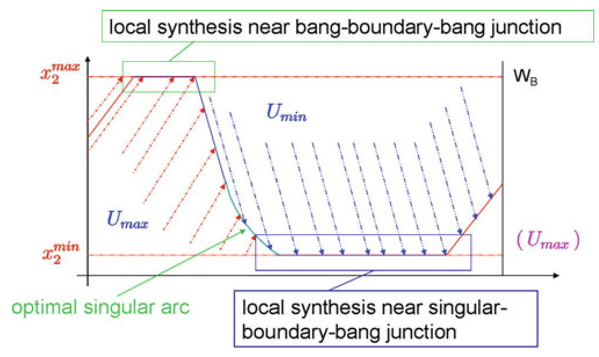

> Image description: An engineering diagram titled "Optimal Control with State Space Constraints" illustrates local synthesis near state boundaries. The plot features horizontal axes and vertical axes, defining a state space. A red horizontal line is labeled $W_B$, representing a state constraint boundary, positioned between two red horizontal lines labeled $x_2^{max}$ and $x_2^{min}$. The diagram shows different control regimes through colored arrows: red diagonal arrows indicate $U_{max}$ control, and blue diagonal arrows indicate $U_{min}$ control. A solid green curve, labeled "optimal singular arc," transitions between these regimes. Two rectangular text boxes highlight specific junctions: a green box at the top labels "local synthesis near bang-boundary-bang junction," where the red $U_{max}$ arrows meet the $W_B$ boundary. A blue box at the bottom labels "local synthesis near singular-boundary-bang junction," where the green singular arc meets the $x_2^{min}$ boundary. The arrows indicate the vector field's directionality relative to the constraints.


<!-- source_pdf_page: 994 -->
another interior arc. The local embedding of the boundary arc differs substantially from classical local imbeddings for unconstrained problems in the sense that this field necessarily contains small pieces of trajectories which, when propagated backward, are not close to the reference trajectory. This, however, does not affect the memoryless properties required for a synthesis forward in time, and strong local optimality of the reference trajectory can be proven combining synthesis type arguments with homotopy type approximations of the synthesis (Schättler 2006). The one trajectory marked as black line in Fig. 1 corresponds to an optimal trajectory that meets the constraint only at the junction point and immediately bounces back into the interior. Such a trajectory arises as the limit when the concatenation structure of optimal controlled trajectories changes from interior-boundary-interior arcs to trajectories that do not meet the constraint. These structures are one of the extra sources for singularities in the value function that come up in optimal control problems with state space constraints. Switching surfaces for the interior arcs, as one is also shown in this figure, do not cause such a loss of differentiability if they are crossed transversally be the extremal trajectories of the field.

Figure 2 depicts the structure of an optimal synthesis for a problem from electronics, the problem of minimizing the base transit time of bipolar homogeneous transistors. The electrical field that determines the transit time is controlled by tailoring a distribution of dopants in the base region, and this dopant profile becomes an important design parameter determining the speed of the device. But due to physical and engineering limitations, the variables describing the dopants need to be limited, and thus this becomes an optimal control problem with state space constraints represented by hard limits on the variables. The constraints here are control invariant of relative degree 1. Optimal solutions, in the presence of initial and terminal constraints, have both portions along the upper and lower control limits of the constrained variable and typically proceed from the upper to the lower values along an optimal singular control (which takes values in
the interior of the control set) in the interior of the admissible domain, possibly with saturation if the control limits are reached.

## Cross-References

- Numerical Methods for Nonlinear Optimal Control Problems
- Optimal Control and Pontryagin's Maximum Principle


## Bibliography

Bardi M, Capuzzo-Dolcetta I (2008) Optimal control and viscosity solutions of Hamilton-Jacobi-Bellman equations. Springer, New York
Boltyanskii VG (1966) Sufficient conditions for optimality and the justification of the dynamic programming principle. SIAM J Control Optim 4:326-361
Bonnard B, Faubourg L, Launay G, Trélat E (2003) Optimal control with state space constraints and the space shuttle re-entry problem. J Dyn Control Syst 9:155-199
Cesari L (1983) Optimization - theory and applications. Springer, New York
Fleming WH, Soner HM (2005) Controlled Markov processes and viscosity solutions. Springer, New York
Frankowska H (2006) Regularity of minimizers and of adjoint states in optimal control under state constraints. Convex Anal 13:299-328
Hartl RF, Sethi SP, Vickson RG (1995) A survey of the maximum principles for optimal control problems with state constraints. SIAM Rev 37:181-218
Ioffe AD, Tikhomirov VM (1979) Theory of extremal problems. North-Holland, Amsterdam/New York
Maurer H (1977) On optimal control problems with bounded state variables and control appearing linearly. SIAM J Control Optim 15:345-362
Piccoli B, Sussmann H (2000) Regular synthesis and sufficient conditions for optimality. SIAM J Control Optim 39:359-410
Pontryagin LS, Boltyanskii VG, Gamkrelidze RV, Mishchenko EF (1962) Mathematical theory of optimal processes. Wiley-Interscience, New York
Rinaldi P, Schättler H (2003) Minimization of the base transit time in semiconductor devices using optimal control. In: Feng W, Hu S, Lu X (eds) Dynamical systems and differential equations. Proceedings of the 4th international conference on dynamical systems and differential equations. Wilmington, May 2002, pp 742-751
Schättler H (2006) A local field of extremals for optimal control problems with state space constraints of relative degree 1. J Dyn Control Syst 12:563-599


<!-- source_pdf_page: 995 -->
Schättler H, Ledzewicz U (2012) Geometric optimal control. Springer, New York
Soner HM (1986) Optimal control with state-space constraints I. SIAM J Control Optim 24:552-561
Stalford H (1971) Sufficient conditions for optimal control with state and control constraints. J Optim Theory Appl 7:118-135
Vinter RB (2000) Optimal control. Birkhäuser, Boston

## Optimal Deployment and Spatial Coverage

Sonia Martínez
Department of Mechanical and Aerospace Engineering, University of California, La Jolla, San Diego, CA, USA


#### Abstract

Optimal deployment refers to the problem of how to allocate a finite number of resources over a spatial domain to maximize a performance metric that encodes certain quality of service. Depending on the deployment environment, the type of resource, and the metric used, the solutions to this problem can greatly vary.


## Keywords

Coverage control algorithms; Facility location problems

## Introduction

The problem of deciding what are optimal geographic locations to place a set of facilities has a long history and is the main subject in operations research and management science; see Drezner (1995). A facility can be broadly understood as a service such as a school; a hospital; an airport; an emergency service, such as a fire station; or, more generally, routes of a vehicle, from buses to aircraft, an autonomous vehicle, or a mobile sensor.

The specific formulation of facility location problems depends very much on the particular underlying application. A distinguishing feature is that all involve strategic planning, accounting for the long-term impact on the facility operating cost and their fast response to the demand. Thus, these problems lead to constrained optimization formulations which are typically very hard to solve optimally. The computational complexity of such problems, which, even in their most basic formulations, typically lead to NP-hard problems, has made their solution largely intractable until the advent of high-speed computing.

Locational optimization techniques have also been employed to solve optimal estimation problems by static sensor networks, mesh and grid optimization design, clustering analysis, data compression, and statistical pattern recognition; see Du et al. (1999). However, these solutions typically require centralized computations and availability of information at all times.

When the facilities are multiple vehicles or mobile sensors, the underlying dynamics may require additional changes and further analysis that guarantee the overall system stability. In what follows, we review a particular coverage control problem formulation in terms of the so-called expected-value multicenter functions that makes the analysis tractable leading to robust, distributed algorithm implementations employing computational geometric objects such as Voronoi partitions.

## Basic Ingredients from Computational Geometry

In order to formulate a basic optimal deployment problem and algorithm, we require of several notions from computational geometry; see Bullo et al. (2009) for more information.

Let $S$ be a measurable set of $\mathbb{R}^{m}$, for $m \in \mathbb{N}$, consider a distance function $d$ on $\mathbb{R}^{m}$, and let $P=\left\{p_{1}, \ldots, p_{n}\right\}$ be $n$ distinct points of $S$, corresponding to locations of certain facilities. The Voronoi partition of $S$ generated by $P$ and associated with $d$ is given by $\mathcal{V}(P)= \left\{V_{1}(P), \ldots, V_{n}(P)\right\}$, where


<!-- source_pdf_page: 996 -->
$$
\begin{aligned}
V_{i}(P)=\{q & \in S \mid d\left(p_{i}, q\right) \leq d\left(p_{j}, q\right), \\
& j \in P \backslash\{i\}\}, \quad i \in\{1, \ldots, n\} .
\end{aligned}
$$

Given $r \in \mathbb{R}_{>0}$, denote by $\bar{B}\left(p_{i}, r\right)$ the closed ball of center $p_{i}$ and radius $r$. The $r$-limited Voronoi partition of $S$ generated by $P$ and associated with $d$ is the Voronoi partition of the set $S \cap \cup_{i=1}^{n} \bar{B}\left(p_{i}, r\right)$, denoted as $\mathcal{V}_{r}(P)= \left\{V_{1, r}(P), \ldots V_{n, r}(P)\right\}$.

Let $\phi: S \rightarrow \mathbb{R}_{\geq 0}$ be a measurable density function on $S$. The area and the centroid (or center of mass) of $W \subseteq S$ with respect to $\phi$ are the values

$$
\begin{aligned}
A_{\phi}(W) & =\int_{W} \phi(q) d q \\
\mathrm{CM}_{\phi}(W) & =\frac{1}{A_{\phi}(W)} \int_{W} q \phi(q) d q
\end{aligned}
$$

We say that the set of distinct points $P$ in $S$ is a centroidal Voronoi configuration (resp., a $r$ limited centroidal Voronoi configuration) if each $p_{i}$ is at the centroid of its own Voronoi cell. That is, $p_{i}=\mathrm{CM}_{\phi}\left(V_{i}(P)\right), i \in\{1, \ldots, n\}$ (resp., $p_{i}=\mathrm{CM}_{\phi}\left(V_{i, r}(P)\right)$, and $i \in\{1, \ldots, n\}$ ). Voronoi partitions and centroidal Voronoi configurations help assess the distribution of locations in a spatial domain as we establish below.

A Voronoi partition induces a natural proximity graph, called the Delaunay graph, over the set of points $P$. We recall that a graph $G$ is a pair $G=(V, E)$ where $V$ is a set of $n$ vertices and $E$ is a set of ordered pair of vertices, $E \subset V \times V$, called edge set. A proximity graph is a graph function defined on the set $S$, which assigns a set of distinct points $P \subset S$ to a graph $G(P)=(P, E(P))$, where $E(P)$ is a function of the relative locations of the point set. Example graphs include the following:

1. The $r$-disk graph, $\mathcal{G}_{\text {disk }, r}$, for $r \in \mathbb{R}_{>0}$. Here, $\left(p_{i}, p_{j}\right) \in E_{\text {disk }, r}(P)$ if $d\left(p_{i}, p_{j}\right) \leq r$.
2. The Delaunay graph, $\mathcal{G}_{\mathrm{D}}$. We have $\left(p_{i}, p_{j}\right) \in E_{\mathrm{D}}(P)$ if $V_{i}(P) \cap V_{j}(P) \neq \emptyset$.
3. The $r$-limited Delaunay graph, $\mathcal{G}_{\mathrm{LD}, r}$, for $r \in \mathbb{R}_{>0}$. Here, $\left(p_{i}, p_{j}\right) \in E_{\mathrm{LD}, r}(P)$ if $V_{i, r}(P) \cap V_{i, r}(P) \neq \emptyset$.

## Expected-Value Multicenter Functions

Facility location problems consist of spatially allocating a number of sites to provide certain quality of service. Problems of this class are formulated in terms of multicenter functions and, in particular, expected-value multicenter functions.

To define these, consider $\phi: S \rightarrow \mathbb{R}_{\geq 0}$ a density function over a bounded measurable set $S \subset \mathbb{R}^{m}$. One can regard $\phi$ as a function measuring the probability that some event takes place over the environment. The larger the value of $\phi(q)$, the more important the location $q$ will have. We refer to a nonincreasing and piecewise continuously differentiable function $f: \mathbb{R}_{\geq 0} \rightarrow \mathbb{R}$, possibly with finite jump discontinuities, as a performance function.

Performance functions describe the utility of placing a node at a certain distance from a location in the environment. The smaller the distance, the larger the value of $f$, that is, the better the performance. For instance, in sensing problems, performance functions can encode the signal-tonoise ratio between a source with an unknown location and a sensor attempting to locate it. Without loss of generality, it can be assumed that $f(0)=0$.

An expected-value multicenter function models the expected value of the coverage over any point in $S$ provided by a set of points $p_{1}, \ldots, p_{n}$. Formally,
$\mathcal{H}\left(p_{1}, \ldots, p_{n}\right)=\int_{S} \max _{i \in\{1, \ldots, n\}} f\left(\left\|q-p_{i}\right\|_{2}\right) \phi(q) d q$,
where $\|\cdot\|_{2}$ denotes the 2 -norm of $\mathbb{R}^{m}$. This definition can be understood as follows: consider the best coverage of $q \in S$ among those provided by each of the nodes $p_{1}, \ldots, p_{n}$, which corresponds to the value $\max _{i \in\{1, \ldots, n\}} f\left(\left\|q-p_{i}\right\|_{2}\right)$. Then, modulate the performance by the importance $\phi(q)$ of the location $q$. Finally, the infinitesimal sum of this quantity over the environment $S$ gives rise to $\mathcal{H}\left(p_{1}, \ldots, p_{n}\right)$ as a measure of the overall coverage provided by $p_{1}, \ldots, p_{n}$.

From here, we can formulate the following geometric optimization problem, known


<!-- source_pdf_page: 997 -->
as the continuous $p$-median problem, see Drezner (1995):

$$
\begin{equation*}
\max _{\left\{p_{1}, \ldots, p_{n}\right\} \subset S} \mathcal{H}\left(p_{1}, \ldots, p_{n}\right) . \tag{2}
\end{equation*}
$$

The expected-value multicenter function can be alternatively described in terms of the Voronoi partition of $S$ generated by $P=\left\{p_{1}, \ldots, p_{n}\right\}$. Let us define the set

$$
\mathcal{C}=\left\{\left(p_{1}, \ldots, p_{n}\right) \in\left(\mathbb{R}^{m}\right)^{n} \mid p_{i}=p_{j}\right.
$$

for some $i \neq j\}$,
consisting of tuples of $n$ points, where some of them are repeated. Then, for $\left(p_{1}, \ldots, p_{n}\right) \in S^{n} \backslash \mathcal{C}$, one has

$$
\begin{equation*}
\mathcal{H}\left(p_{1}, \ldots, p_{n}\right)=\sum_{i=1}^{n} \int_{V_{i}(P)} f\left(\left\|q-p_{i}\right\|_{2}\right) \phi(q) d q . \tag{3}
\end{equation*}
$$

This expression of $\mathcal{H}$ is appealing because it clearly shows the result of the overall coverage of the environment as the aggregate contribution of all individual nodes. If $\left(p_{1}, \ldots, p_{n}\right) \in \mathcal{C}$, then a similar decomposition of $\mathcal{H}$ can be written in terms of the distinct points $P=\left\{p_{1}, \ldots, p_{n}\right\}$.

Inspired by (3), a more general version of the expected-value multicenter function is given next. Given $\left(p_{1}, \ldots, p_{n}\right) \in S^{n}$ and a partition $\left\{W_{1}, \ldots, W_{n}\right\}$ of $S$, let

$$
\begin{align*}
& \mathcal{H}\left(p_{1}, \ldots, p_{n}, W_{1}, \ldots, W_{n}\right) \\
& \quad=\sum_{i=1}^{n} \int_{W_{i}} f\left(\left\|q-p_{i}\right\|_{2}\right) \phi(q) d q \tag{4}
\end{align*}
$$

For all $\left(p_{1}, \ldots, p_{n}\right) \in S^{n} \backslash \mathcal{C}$, we have that $\mathcal{H}\left(p_{1}, \ldots, p_{n}\right)=\mathcal{H}\left(p_{1}, \ldots, p_{n}, V_{1}(P), \ldots, V_{n}(P)\right)$. With respect to, e.g., sensor networks, this function evaluates the performance associated with an assignment of the sensors' locations at $\left(p_{1}, \ldots, p_{n}\right)$ and a region assignment $\left(W_{1}, \ldots, W_{n}\right)$.

Moreover, one can establish that the Voronoi partition (Du et al. 1999) $\mathcal{V}(P)$ is optimal for $\mathcal{H}$ among all partitions of $S$. That is, let $P=$
$\left\{p_{1}, \ldots, p_{n}\right\} \in S$. For any performance function $f$ and for any partition $\left\{W_{1}, \ldots, W_{n}\right\}$ of $S$,

$$
\begin{gathered}
\mathcal{H}\left(p_{1}, \ldots, p_{n}, V_{1}(P), \ldots, V_{n}(P)\right) \geq \\
\mathcal{H}\left(p_{1}, \ldots, p_{n}, W_{1}, \ldots, W_{n}\right)
\end{gathered}
$$

with a strict inequality if any set in $\left\{W_{1}, \ldots, W_{n}\right\}$ differs from the corresponding set in $\left\{V_{1}(P), \ldots\right.$, $V_{n}(P)$ \} by a set of positive measure.

Next, we characterize the smoothness of the expected-value multicenter function (Cortés et al. 2005). Before stating the precise properties, let us introduce some useful notation. For a performance function $f$, let $\operatorname{discont}(f)$ denote the (finite) set of points where $f$ is discontinuous. For each $a \in \operatorname{discont}(f)$, define the limiting values from the left and from the right, respectively, as

$$
f_{-}(a)=\lim _{x \rightarrow a^{-}} f(x), \quad f_{+}(a)=\lim _{x \rightarrow a^{+}} f(x)
$$

Recall that the line integral of a function $g$ : $\mathbb{R}^{2} \rightarrow \mathbb{R}$ over a curve $C$ parameterized by a continuous and piecewise continuously differentiable map $\gamma:[0,1] \rightarrow \mathbb{R}^{2}$ is defined as follows:

$$
\int_{C} g=\int_{C} g(\gamma) d \gamma:=\int_{0}^{1} g(\gamma(t))\|\dot{\gamma}(t)\|_{2} d t
$$

and is independent of the selected parameterization.

Now, given a set $S \subset \mathbb{R}^{m}$ that is bounded and measurable, a density $\phi: S \rightarrow \mathbb{R}_{\geq 0}$, and a performance function $f: \mathbb{R} \rightarrow_{\geq 0} \mathbb{R}$, the expected-value multicenter function $\mathcal{H}: S^{n} \rightarrow \mathbb{R}$ is globally Lipschitz (Given $S \subset \mathbb{R}^{h}$, a function $f: S \rightarrow \mathbb{R}^{k}$ is globally Lipschitz if there exists $K \in \mathbb{R}_{>0}$ such that $\|f(x)-f(y)\|_{2} \leq K \| x- y \|_{2}$ for all $x, y \in S$.) on $S^{n}$; and continuously differentiable on $S^{n} \backslash \mathcal{C}$, where for $i \in\{1, \ldots, n\}$

$$
\begin{align*}
\frac{\partial \mathcal{H}}{\partial p_{i}}(P)= & \int_{V_{i}(P)} \frac{\partial}{\partial p_{i}} f\left(\left\|q-p_{i}\right\|_{2}\right) \phi(q) d q \\
+ & \sum_{a \in \operatorname{discont}(f)}\left(f_{-}(a)-f_{+}(a)\right) \\
& \int_{V_{i}(P) \cap \partial \bar{B}\left(p_{i}, a\right)} \mathrm{n}_{\text {out }}(q) \phi(q) d q \tag{5}
\end{align*}
$$


<!-- source_pdf_page: 998 -->
where $\mathrm{n}_{\text {out }}$ is the outward normal vector to $\bar{B}\left(p_{i}, a\right)$.

Different performance functions lead to different expected-value multicenter functions. Let us examine some important cases.

## Distortion Problem

Consider the performance function $f(x)=-x^{2}$. Then, on $S^{n} \backslash \mathcal{C}$, the expected-value multicenter function takes the form

$$
\begin{aligned}
\mathcal{H}_{\text {distor }}\left(p_{1}, \ldots, p_{n}\right) & =-\sum_{i=1}^{n} \int_{V_{i}(P)} \\
& \left\|q-p_{i}\right\|_{2}^{2} \phi(q) d q .
\end{aligned}
$$

In signal compression $-\mathcal{H}_{\text {distor }}$ is referred to as the distortion function and is relevant in many disciplines where including vector quantization, signal compression, and numerical integration; see Gray and Neuhoff (1998) and Du et al. (1999). Here, distortion refers to the average deformation (weighted by the density $\phi$ ) caused by reproducing $q \in S$ with the location $p_{i}$ in $P=\left\{p_{1}, \ldots, p_{n}\right\}$ such that $q \in V_{i}(P)$. By means of the Parallel Axis Theorem (see Hibbeler 2006), it is possible to express $\mathcal{H}_{\text {distor }}$ as a sum

$$
\begin{align*}
\mathcal{H}_{\text {distor }}\left(p_{1}, \ldots, p_{n}, W_{1}, \ldots, W_{n}\right) & \\
= & \sum_{i=1}^{n}-\mathrm{J}_{\phi}\left(W_{i}, \mathrm{CM}_{\phi}\left(W_{i}\right)\right) \\
& -\mathrm{A}_{\phi}\left(W_{i}\right)\left\|p_{i}-\mathrm{CM}_{\phi}\left(W_{i}\right)\right\|_{2}^{2} \tag{6}
\end{align*}
$$

where $\mathrm{J}_{\phi}(W, p)=\int_{W}\|q-p\|^{2} \phi(q) d q$ is the so-called moment of inertia of the region $W$ about $p$ with respect to $\phi$. In this way, the terms $\mathrm{J}_{\phi}\left(W_{i}, \mathrm{CM}_{\phi}\left(W_{i}\right)\right)$ only depend on the partition of $S$, whereas the second terms multiplied by $\mathrm{A}_{\phi}\left(W_{i}\right)$ include the particular location of the points. As a consequence of this observation, the optimality of the centroid locations for $\mathcal{H}_{\text {distor }}$ follows Bullo et al. (2009). More precisely, let $\left\{W_{1}, \ldots, W_{n}\right\}$ be a partition of $S$. Then, for any set points $P=\left\{p_{1}, \ldots, p_{n}\right\}$ in $S$,

$$
\begin{array}{r}
\mathcal{H}_{\text {distor }}\left(\operatorname{CM}_{\phi}\left(W_{1}\right), \ldots, \operatorname{CM}_{\phi}\left(W_{n}\right), W_{1}, \ldots, W_{n}\right) \\
\geq \mathcal{H}_{\text {distor }}\left(p_{1}, \ldots, p_{n}, W_{1}, \ldots, W_{n}\right)
\end{array}
$$

and the inequality is strict if there exists $i \in \{1, \ldots, n\}$ for which $W_{i}$ has nonvanishing area and $p_{i} \neq \mathrm{CM}_{\phi}\left(W_{i}\right)$. In other words, the centroid locations $\mathrm{CM}_{\phi}\left(W_{1}\right), \ldots, \mathrm{CM}_{\phi}\left(W_{n}\right)$ are optimal for $\mathcal{H}_{\text {distor }}$ among all configurations in $S$.

Note that when $n=1$, the node location that optimizes $p \mapsto \mathcal{H}_{\text {distor }}(p)$ is the centroid of the set $S$, denoted by $\mathrm{CM}_{\phi}(S)$.

Recall that the gradient of $\mathcal{H}_{\text {distor }}$ on $S^{n} \backslash \mathcal{C}$ takes the form,

$$
\begin{aligned}
\frac{\partial \mathcal{H}_{\text {distor }}}{\partial p_{i}}(P)= & 2 \mathrm{~A}_{\phi}\left(V_{i}(P)\right)\left(\mathrm{CM}_{\phi}\left(V_{i}(P)\right)-p_{i}\right) \\
& i \in\{1, \ldots, n\}
\end{aligned}
$$

that is, the $i$ th component of the gradient points in the direction of the vector going from $p_{i}$ to the centroid of its Voronoi cell. The critical points of $\mathcal{H}_{\text {distor }}$ are therefore the set of centroidal Voronoi configurations in $S$. This is a natural generalization of the result for the case $n=1$, where the optimal node location is the centroid $\mathrm{CM}_{\phi}(S)$.

## Area Problem

For $r \in \mathbb{R}_{>0}$, consider the performance function $f(x)=1_{[0, r]}(x)$, that is, the indicator function of the closed interval $[0, r]$. Then, the expectedvalue multicenter function becomes

$$
\begin{aligned}
\mathcal{H}_{\text {area }, r}\left(p_{1}, \ldots, p_{n}\right) & =\sum_{i=1}^{n} \mathrm{~A}_{\phi}\left(V_{i}(P) \cap \bar{B}\left(p_{i}, r\right)\right) \\
& =\mathrm{A}_{\phi}\left(\cup_{i=1}^{n} \bar{B}\left(p_{i}, r\right)\right)
\end{aligned}
$$

which corresponds to the area, measured according to $\phi$, covered by the union of the $n$ balls $\bar{B}\left(p_{1}, r\right), \ldots, \bar{B}\left(p_{n}, r\right)$.

Let us see how the computation of the partial derivatives of $\mathcal{H}_{\text {area }, r}$ specializes in this case. Here, the performance function is differentiable everywhere except at a single discontinuity, and its derivative is identically zero. Therefore, the first term in (5) vanishes. The gradient of $\mathcal{H}_{\text {area }, r}$


<!-- source_pdf_page: 999 -->
on $S^{n} \backslash \mathcal{C}$ then takes the form, for each $i \in \{1, \ldots, n\}$,

$$
\frac{\partial \mathcal{H}_{\text {area }, r}}{\partial p_{i}}(P)=\int_{V_{i}(P) \cap \partial \bar{B}\left(p_{i}, r\right)} \mathrm{n}_{\text {out }}(q) \phi(q) d q
$$

where $\mathrm{n}_{\text {out }}$ is the outward normal vector to $\bar{B}\left(p_{i}, r\right)$. The critical points of $\mathcal{H}_{\text {area }, r}$ correspond to configurations with the property that each $p_{i}$ is a local maximum for the area of $V_{i, r}(P)= V_{i}(P) \cap \bar{B}\left(p_{i}, r\right)$ at fixed $V_{i}(P)$. We refer to these configurations as $r$-limited area-centered Voronoi configurations.

## Optimal Deployment Algorithms

Once a set of optimal deployment configurations have been characterized, the next step is to devise a distributed algorithm that allows a group of mobile robots to converge to such configurations. Gradient algorithms are the first of the options that should be explored.

For the expected-value multicenter functions, robots whose dynamics can be described by firstorder integrator dynamics and which can communicate at predetermined communication rounds of a fixed time schedule, these laws present a similar structure, loosely described as follows:
> [Informal description] In each communication round, each robot performs the following tasks: (i) it transmits its position and receives its neighbors' positions; (ii) it computes a notion of the geometric center of its own cell, determined according to some notion of partition of the environment. (iii) Between communication rounds, each robot moves toward this center.

The notions of geometric center and of partition of the environment differ depending on what is the type of expected-value multicenter function used. In the Voronoi-center deployment algorithm, the geometric center just reduces to $\mathrm{CM}_{\phi}\left(V_{i}\right)$. In the limited-Voronoi-normal deployment problem in (ii), each agent computes the direction of $v=\frac{\partial \mathcal{H}_{\text {area }, r}}{\partial p_{i}}$ for some $r$ and (iii) moves for a maximum step size in this direction to ensure the area function will be decreased.

The Voronoi-center deployment algorithm achieves convergence of a set of nodes to a centroidal Voronoi configuration, thus maximizing the expected-value multicenter function $\mathcal{H}_{\text {distor }}$. The algorithm is distributed over the proximity graph $\mathcal{G}_{\mathrm{D}}$, as the computation of the centroids requires information in $\mathcal{N}_{\mathcal{G}_{\mathrm{D}}}\left(p_{i}\right)$, for each $i \in\{1, \ldots, n\}$. Additional properties of this algorithm are that the algorithm is adaptive to agent departures or arrivals and amenable to asynchronous implementations.

On the other hand, the limited-Voronoi-normal deployment algorithm achieves convergence to a set that locally maximizes the area covered by the set of sensing balls. The algorithm is distributed in the sense that agents only need to know information from neighbors in the proximity graph $\mathcal{G}_{2 \mathrm{r}}$ or, more precisely, $\mathcal{G}_{\mathrm{LD}, r}$. Thus, it can be implemented by agents that employ range-limited interactions. It enjoys similar robustness properties as the Voronoi-center deployment algorithm.

## Simulation Results

We show evolutions of the Voronoi-centroid deployment algorithm in Fig. 1. One can verify that the final network configuration is a centroidal Voronoi configuration. For each evolution we depict the initial positions, the trajectories, and the final positions of all robots.

Finally, we show an evolution of limited-Voronoi-normal deployment algorithm in Fig. 2. One can verify that the final network configuration is an $\frac{r}{2}$-limited area-centered Voronoi configuration. In other words, the deployment task is achieved.

## Future Directions for Research

The algorithms described above achieve locally optimal deployment configurations with respect to expected-value multicenter functions. However, this simplified setting does not account for many important constraints, such as obstacles and deployment in non-convex environments (Pimenta et al. 2008; CaicedoNùñez and Žefran 2008), deployment with visibility sensors, range-limited and wedge-shaped


<!-- source_pdf_page: 1000 -->
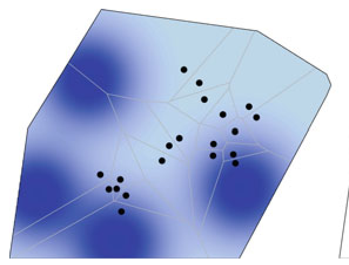
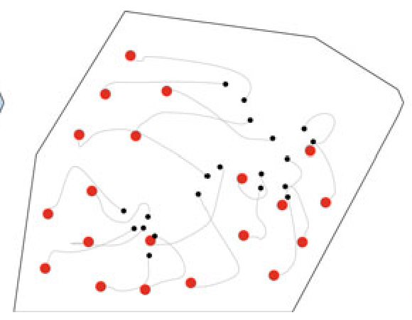
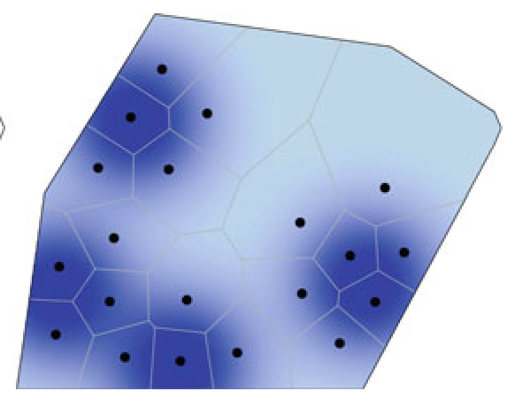

> Image description: This figure, titled "Fig. 1 The evolution of the Voronoi-centroid deployment algorithm with $n=20$ robots," illustrates the spatial distribution of 20 robots (represented by black dots) within a polygonal boundary. The image uses a Voronoi tessellation pattern to partition the area into distinct cells, each containing a single robot. The background features a blue-toned heatmap representing a density or objective function, where darker blue regions indicate higher values and lighter blue regions indicate lower values. The robots' positions are distributed across the area, and their Voronoi cells vary in shape and size based on their proximity to neighbors and the polygon's edges. While the prompt's caption mentions "initial (resp., righthand) figure," the provided image appears to show a single state of the deployment. The figure demonstrates how the Voronoi-centroid algorithm positions robots to maximize coverage or respond to the underlying spatial density within the defined geometric constraints.

Optimal Deployment and Spatial Coverage, Fig. 1 The evolution of the Voronoi-centroid deployment algorithm with $n=20$ robots. The left-hand (resp., righthand) figure illustrates the initial (resp., final) locations
and Voronoi partition. The central figure illustrates the evolution of the robots. After 13 s , the value of $\mathcal{H}_{\text {distor }}$ has monotonically increased to approximately -0.515
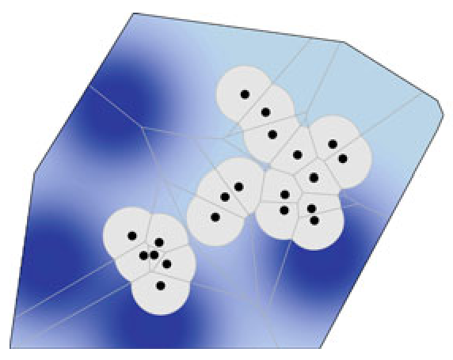

> Image description: A textbook figure titled "Optimal Deployment and Spatial Coverage, Fig. 1" illustrates the evolution of the Voronoi-centroid deployment algorithm using $n=20$ robots. The image displays a polygonal area with a blue gradient background, where darker blue regions represent areas of lower density or specific functional values, and lighter blue regions represent higher values. Within this area, several clusters of black dots represent the locations of robots. These robots are enclosed within light gray, irregular shapes that form a Voronoi partition across the polygon. The clusters are distributed unevenly: one cluster is located in the bottom-left, another in the center, and a third in the top-center. Thin white lines delineate the Voronoi boundaries between the robots. The caption notes that after 13 seconds, the distortion value $\mathcal{H}_{\text{distor}}$ has monotonically increased to approximately -0.515, indicating the algorithm's progress toward optimal spatial coverage.
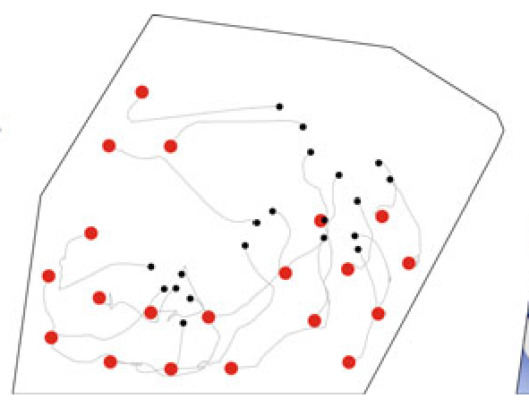

> Image description: This figure, titled "Optimal Deployment and Spatial Coverage," illustrates the evolution of a Voronoi-centroid deployment algorithm using $n=20$ robots within a polygonal boundary. The image displays a set of points representing robot locations across a designated spatial area. Two distinct types of markers are visible: solid red circles and solid black dots. These represent the initial and final locations of the robots throughout the deployment process. Grey curved lines connect the starting positions to their final destinations, tracing the trajectories or evolution of the robots over time. The movement pattern suggests an optimization process where robots shift from an initial configuration to a more uniform spatial distribution that covers the interior area of the polygon more effectively. The figure serves to visually demonstrate the convergence of the algorithm, showing how the robots transition from their starting coordinates to an optimized deployment state.
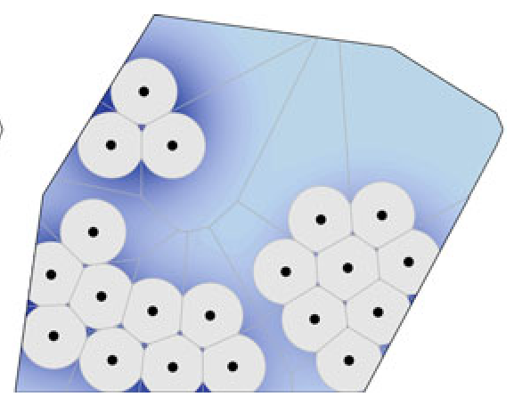

> Image description: This figure illustrates the Voronoi-centroid deployment algorithm for $n=20$ robots. The image shows a non-rectangular boundary containing multiple white circles, each with a black dot at its center, representing the robots' positions. These circles are organized into three distinct clusters against a blue-shaded background, which represents a spatial density or coverage area. The background features a light blue gradient, transitioning from darker blue in the top-left to lighter blue in the bottom-right. Thin gray lines form a Voronoi partition, dividing the space into regions corresponding to each robot. The distribution of circles shows an evolution toward an optimal spatial coverage. The clusters vary in density: a small group of three robots occupies the top-left corner, a larger cluster of approximately nine robots is located in the bottom-left, and another cluster of roughly eight robots is situated in the bottom-right. The arrangement demonstrates the algorithm's ability to distribute robots to minimize distortion over time.

Optimal Deployment and Spatial Coverage, Fig. 2 The evolution of the limited-Voronoi-normal deployment algorithm with $n=20$ robots and $r=0.4$. The left-hand (resp., right-hand) figure illustrates the initial (respectively, final) locations and Voronoi partition. The
central figure illustrates the evolution of the robots. The $\frac{r}{2}$-limited Voronoi cell of each robot is plotted in light gray. After 36 s , the value of $\mathcal{H}_{\text {area }}$, with $a=\frac{r}{2}$, has monotonically increased to approximately 14.141
footprints (Ganguli et al. 2006; Laventall and Cortés 2009), and energy and vehicle dynamical restrictions (Kwok and Martínez 2010a,b). Deployment strategies find application in exploration and data gathering tasks, and so these algorithms have been expanded to account for uncertainty and learning of unknown density functions (Schwager et al. 2009; Graham and Cortés 2012; Zhong and Cassandras 2011; Martínez 2010). Gossip and self-triggered communications (Bullo et al. 2012; Nowzari and Cortés 2012), self-triggered computations for region approximation (Ru and Martínez 2013), and area equitable partitions (Cortés 2010) have also been investigated. Much work is currently being devoted to solve on the current limitations of these nontrivial extensions, which make the problem settings significantly harder to solve.

## Cross-References

- Graphs for Modeling Networked Interactions
- Multi-vehicle Routing
- Networked Systems


## Bibliography

Bullo F, Cortés J, Martínez S (2009) Distributed control of robotic networks. Applied mathematics series. Princeton University Press. Available at http://www. coordinationbook.info
Bullo F, Carli R, Frasca P (2012) Gossip coverage control for robotic networks: dynamical systems on the the space of partitions. SIAM J Control Optim 50(1): 419-447
Caicedo-Nùñez CH, Žefran M (2008) Performing coverage on nonconvex domains. In: IEEE conference on control applications, San Antonio, pp 1019-1024


<!-- source_pdf_page: 1001 -->
Cortés J (2010) Coverage optimization and spatial load balancing by robotic sensor networks. IEEE Trans Autom Control 55(3):749-754
Cortés J, Martínez S, Bullo F (2005) Spatially-distributed coverage optimization and control with limited-range interactions. ESAIM Control Optim Calc Var 11: 691-719
Drezner Z (ed) (1995) Facility location: a survey of applications and methods. Springer series in operations research. Springer, New York
Du Q, Faber V, Gunzburger M (1999) Centroidal Voronoi tessellations: applications and algorithms. SIAM Rev 41(4):637-676
Ganguli A, Cortés J, Bullo F (2006) Distributed deployment of asynchronous guards in art galleries. In: American control conference, Minneapolis, pp 1416-1421
Graham R, Cortés J (2012) Cooperative adaptive sampling of random fields with partially known covariance. Int J Robust Nonlinear Control 22(5): 504-534
Gray RM, Neuhoff DL (1998) Quantization. IEEE Trans Inf Theory 44(6):2325-2383. Commemorative Issue 1948-1998
Hibbeler R (2006) Engineering mechanics: statics \& dynamics, 11th edn. Prentice Hall, Upper Saddle River
Kwok A, Martínez S (2010a) Deployment algorithms for a power-constrained mobile sensor network. Int J Robust Nonlinear Control 20(7): 725-842
Kwok A, Martínez S (2010b) Unicycle coverage control via hybrid modeling. IEEE Trans Autom Control 55(2):528-532
Laventall K, Cortés J (2009) Coverage control by multirobot networks with limited-range anisotropic sensory. Int J Control 82(6): 1113-1121
Martínez S (2010) Distributed interpolation schemes for field estimation by mobile sensor networks. IEEE Trans Control Syst Technol 18(2): 491-500
Nowzari C, Cortés J (2012) Self-triggered coordination of robotic networks for optimal deployment. Automatica 48(6): 1077-1087
Pimenta L, Kumar V, Mesquita R, Pereira G (2008) Sensing and coverage for a network of heterogeneous robots. In: IEEE international conference on decision and control, Cancun, pp 3947-3952
Ru Y, Martínez S (2013) Coverage control in constant flow environments based on a mixed energy-time metric. Automatica 49:2632-2640
Schwager M, Rus D, Slotine J (2009) Decentralized, adaptive coverage control for networked robots. Int J Robot Res 28(3):357-375
Zhong M, Cassandras C (2011) Distributed coverage control and data collection with mobile sensor networks. IEEE Trans Autom Control 56(10): 2445-2455

# Optimal Sampled-Data Control

Yutaka Yamamoto<br>Department of Applied Analysis and Complex Dynamical Systems, Graduate School of Informatics, Kyoto University, Kyoto, Japan


#### Abstract

This article gives a brief overview on the modern development of sampled-data control. Sampleddata systems intrinsically involve a mixture of two different time sets, one continuous and the other discrete. Due to this, sampled-data systems cannot be characterized in terms of the standard notions of transfer functions, steady-state response, or frequency response. The technique of lifting resolves this difficulty and enables the recovery of such concepts and simplified solutions to sampled-data $H^{\infty}$ and $H^{2}$ optimization problems. We review the lifting point of view, its application to such optimization problems, and finally present an instructive numerical example.


## Keywords

Computer control; Frequency response; $H^{\infty}$ and $H^{2}$ optimization; Lifting; Transfer operator

## Introduction

A sampled-data control system consists of a continuous-time plant and a discrete-time controller, with sample and hold devices that serve as an interface between these two components. As can be seen from this fact, sampled-data systems are not time invariant, and various problems arise from this property.

To be more specific, consider the unityfeedback control system shown in Fig. 1; $r$ is the reference signal, $y$ the system output, and $e$ the error signal. These are continuous-time signals. The error $e(t)$ goes through the sampler


<!-- source_pdf_page: 1002 -->
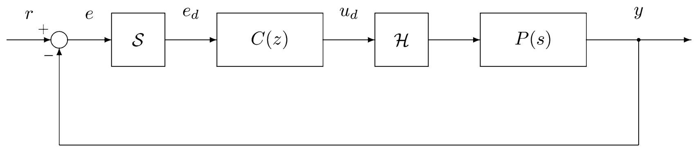

> Image description: A block diagram of a unity-feedback control system, labeled as "Fig. 1 A unity-feedback system" from "Optimal Sampled-Data Control." The system begins with a reference input $r$ entering a summation junction where a feedback signal is subtracted, resulting in an error signal $e$. The error signal $e$ is passed through a block labeled $\mathcal{S}$, which outputs $e_d$. This signal enters a block labeled $C(z)$, which outputs a control signal $u_d$. The signal $u_d$ is then processed by a block labeled $\mathcal{H}$, leading into the plant block $P(s)$. The plant's output is $y$, which is fed back to the summation junction to complete the unity-feedback loop. The block diagram illustrates a control architecture involving discrete-time components $C(z)$ and $\mathcal{S}$, an auxiliary block $\mathcal{H}$, and a continuous-time plant $P(s)$.
Optimal Sampled-Data Control, Fig. 1 A unity-feedback system

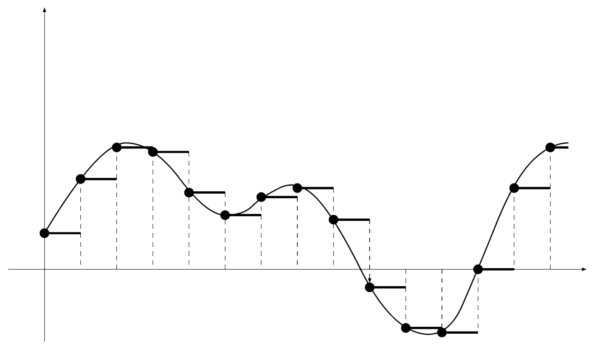

> Image description: A mathematical plot illustrating a signal processing concept, likely related to sampled-data systems. The figure features a continuous black curve plotted on a two-dimensional Cartesian coordinate system with a vertical y-axis and a horizontal x-axis, both indicated by arrows at their terminal ends. The continuous curve oscillates across the x-axis. Superimposed on this curve is a series of horizontal black line segments of varying lengths. Each segment is bounded by two solid black dots: one representing a sampled data point on the curve and the other serving as a step-function level. Dashed vertical lines connect these sampling points to the horizontal axis, indicating the time intervals between samples. This visual representation depicts the discretization of a continuous signal into discrete steps, characteristic of a zero-order hold or a sampled-data control mechanism within a unity-feedback system. There are no visible numbers or alphanumeric labels on the axes.
Optimal Sampled-Data Control, Fig. 2 Sampling with 0-order hold

(or an A/D converter) $\mathcal{S}$. This sampler reads out the values of $e(t)$ at every time step $h$ called the sampling period and produces a discretetime signal $e_{d}[k], k=0,1,2, \ldots$ (Fig. 2). In particular, the sampling operator $\mathcal{S}$ acts on a continuous-time signal $w(t), t \geq 0$, as

$$
\mathcal{S}(w)[k]:=w(k h), \quad k=0,1,2, \ldots
$$

The discretized signal is then processed by the discrete-time controller $C(z)$ and becomes a control input $u_{d}$. There can also be a quantization effect, although for the sake of simplicity this is neglected here. The obtained signal $u_{d}$ then goes through another interface $\mathcal{H}$ called a hold device or a $D / A$ converter to become a continuous-time signal. A typical example is the 0-order hold where $\mathcal{H}$ simply maintains the value of a discretetime signal $w[k]$ constant as its output until the next sampling time:
$(\mathcal{H}(w[k]))(t):=w[k]$, for $k h \leq t<(k+1) h$.

A typical sample-hold action is shown in Fig. 2.
While one can consider a nonlinear plant $P$ or controller $C$, or infinite-dimensional $P$ and $C$ we confine ourselves to linear and finite-dimensional $P$ and $C$, and also suppose that $P$ and $C$ are time invariant in continuous time and in discrete time, respectively.

## The Main Difficulty

As stated above, the unity-feedback system Fig. 1 is not time invariant either in continuous time or in discrete time, even when the plant and controller are both time invariant in their respective domains of operators. The mixture of the two time sets prohibits the total closed-loop system from being time invariant.


<!-- source_pdf_page: 1003 -->
The lack of time-invariance implies that we cannot naturally associate to sampled-data systems such classical concepts of transfer functions, steady-state response and frequency response.

One can regard Fig. 1 as a time-invariant discrete-time system by ignoring the intersample behavior and focusing attention on the samplepoint behavior only. But the obtained model does not then reflect what happens between sampling times. This approach can lead to the neglect of undesirable inter-sample oscillations, called ripples. To monitor the intersample behavior, the notion of the modified $z$-transform was introduced, see, e.g., Jury (1958) and Ragazzini and Franklin (1958); however, this transform is usable only after the controller has been designed and hence not for the design problems considered in this article.

## Lifting: A Modern Approach

A new approach was introduced around 19901991 (Bamieh et al. 1991; Tadmor 1991; Toivonen 1992; Yamamoto 1990, 1994). The new idea, now called lifting, makes it possible to describe sampled-data systems via a time-invariant model while maintaining the intersample behavior.

Let $f(t)$ be a continuous-time signal. Instead of sampling $f(t)$, we will represent it as a sequence of functions. Namely, we set up the correspondence:

$$
\begin{align*}
& \mathcal{L}: f \mapsto\{f[k](\theta)\}_{k=0}^{\infty}, \\
& f[k](\theta)=f(k h+\theta), \quad 0 \leq \theta<h \tag{1}
\end{align*}
$$

See Fig. 3.
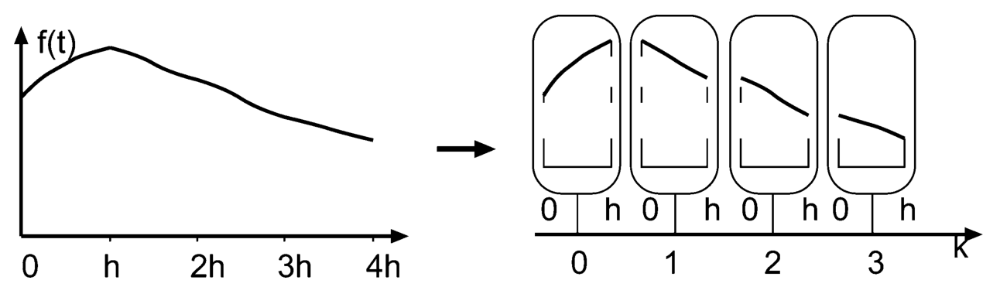

> Image description: See Fig. 3. A diagram illustrating a signal decomposition or segmentation process. On the left, a continuous function $f(t)$ is plotted against time $t$ on the horizontal axis, starting from $0$ and extending to $4h$. The function shows an initial rise followed by a gradual decay. A right-pointing black arrow indicates the transformation of the continuous signal into discrete segments. On the right, the original signal is decomposed into four distinct, vertically oriented rectangular segments, indexed by integers $k$ from $0$ to $3$ on the bottom axis. Each segment represents the function's behavior over a specific time interval of length $h$, delineated by marks at $0$ and $h$ on the local axes. Each segment shows a different local trend: segment $0$ is increasing, segment $1$ is slightly decreasing, segment $2$ is decreasing, and segment $3$ is decreasing more sharply. This visualizes the process of piecewise approximation or windowing of a signal.

This idea makes it possible to view a (timeinvariant or even periodically time-varying) continuous-time system as a linear, time-invariant discrete-time system.

Let

$$
\begin{align*}
& \dot{x}(t)=A x(t)+B u(t) \\
& y(t)=C x(t) \tag{2}
\end{align*}
$$

be a given continuous-time plant and lift the input $u(t)$ to obtain $u[k](\cdot)$. We apply this lifted input with the timing $t=k h$ ( $h$ is the prespecified sampling rate as above) and observe how it affects the system. Let $x[k]$ be the state at time $t=k h$. The state $x[k+1]$ at time $(k+1) h$ is given by

$$
\begin{equation*}
x[k+1]=e^{A h} x[k]+\int_{0}^{h} e^{A(h-\tau)} B u[k](\tau) d \tau \tag{3}
\end{equation*}
$$

The right-hand side integral defines an operator

$$
L^{2}[0, h) \rightarrow \mathbb{R}^{n}: u(\cdot) \mapsto \int_{0}^{h} e^{A(h-\tau)} B u(\tau) d \tau
$$

While the state-transition (3) only described a discrete-time update, the system keeps producing an output during the intersample period. If we consider the lifting of $x(t)$, it is easily seen to be described by

$$
x[k](\theta)=e^{A \theta} x[k]+\int_{0}^{\theta} e^{A(\theta-\tau)} B u[k](\tau) d \tau .
$$

As such, the lifted output $y[k](\cdot)$ is given by

$$
\begin{equation*}
y[k](\theta)=C e^{A \theta} x[k]+\int_{0}^{\theta} C e^{A(\theta-\tau)} B u[k](\tau) d \tau . \tag{4}
\end{equation*}
$$

Observe that formulas (3) and (4) take the form

## Optimal Sampled-Data Control, Fig. 3 Lifting


<!-- source_pdf_page: 1004 -->
$$
\begin{aligned}
x[k+1] & =\mathcal{A} x[k]+\mathcal{B} u[k] \\
y[k] & =\mathcal{C} x[k]+\mathcal{D} u[k],
\end{aligned}
$$

and the operators $\mathcal{A}, \mathcal{B}, \mathcal{C}, \mathcal{D}$ do not depend on the time variable $k$. In other words, it is possible to describe this continuous-time system with discrete timing, once we adopt the lifting point of view. To be more precise, the operators $\mathcal{A}, \mathcal{B}, \mathcal{C}, \mathcal{D}$ are defined as follows:

$$
\begin{align*}
\mathcal{A}: & \mathbb{R}^{n} \rightarrow \mathbb{R}^{n}: x \mapsto e^{A h} x \\
\mathcal{B}: & L^{2}[0, h) \rightarrow \mathbb{R}^{n}: u \mapsto \int_{0}^{h} e^{A(h-\tau)} B u(\tau) d \tau \\
\mathcal{C}: & \mathbb{R}^{n} \rightarrow L^{2}[0, h): x \mapsto C e^{A(\theta)} x \\
\mathcal{D}: & L^{2}[0, h) \rightarrow L^{2}[0, h): u \mapsto \\
& \int_{0}^{\theta} C e^{A(\theta-\tau)} B u(\tau) d \tau \tag{5}
\end{align*}
$$

Thus the continuous-time plant (2) can be described by a time-invariant discrete-time model. Once this is done, it is straightforward to connect this expression with a discrete-time controller, and hence, sampled-data systems (for example, Fig. 1) can be fully described by time-invariant discrete-time equations, without discarding the intersampling information. We will also denote the overall equation (with discrete-time controller included) abstractly in the form

$$
\begin{align*}
x[k+1] & =\mathcal{A} x[k]+\mathcal{B} u[k] \\
y[k] & =\mathcal{C} x[k]+\mathcal{D} u[k] \tag{6}
\end{align*}
$$

While the obtained discrete-time model is a time invariant, the input and output spaces are now infinite dimensional. Its transfer function (operator) is defined as

$$
\begin{equation*}
G(z):=\mathcal{D}+\mathcal{C}(z I-\mathcal{A})^{-1} \mathcal{B} \tag{7}
\end{equation*}
$$

Note that $\mathcal{A}$ in (6) is a matrix because it is so for $\mathcal{A}$ in (5). Hence, (6) is stable if $G(z)$ is analytic for $\{z:|z| \geq 1\}$, provided that there is no unstable pole-zero cancellation.

Definition 1 Let $G(z)$ be the transfer operator of the lifted system given by (7), which is stable in the sense above. The frequency response operator is the operator

$$
\begin{equation*}
G\left(e^{j \omega h}\right): L^{2}[0, h) \rightarrow L^{2}[0, h) \tag{8}
\end{equation*}
$$

regarded as a function of $\omega \in\left[0, \omega_{s}\right)\left(\omega_{s}:=\right. 2 \pi / h$ ). Its gain at $\omega$ is defined to be

$$
\begin{equation*}
\left\|G\left(e^{j \omega h}\right)\right\|=\sup _{v \in L^{2}[0, h)} \frac{\left\|G\left(e^{j \omega h}\right) v\right\|}{\|v\|} . \tag{9}
\end{equation*}
$$

The maximum $\left\|G\left(e^{j \omega h}\right)\right\|$ over $\left[0, \omega_{s}\right)$ is the $H^{\infty}$ norm of $G(z)$. The $H^{2}$-norm of $G$ is defined by
$\|G\|_{2}:=\left(\frac{h}{2 \pi} \int_{0}^{2 \pi / h} \operatorname{trace}\left\{G^{*}\left(e^{j \omega h}\right) G\left(e^{j \omega h}\right)\right\} d \omega\right)^{1 / 2}$,
where the trace here is taken in the sense of Hilbert-Schmidt norm; see Chen and Francis (1995) for details.

## $\boldsymbol{H}^{\boldsymbol{\infty}}$ and $\boldsymbol{H}^{\mathbf{2}}$ Control Problems

A significant consequence of the lifting approach described above is that various robust control problems such as $H^{\infty}$ and $H^{2}$ control problems for sampled-data control systems can be converted to corresponding discrete-time (finitedimensional) problems. The approach was initiated by Chen and Francis (1990) and later solved by Bamieh and Pearson (1992), Kabamba and Hara (1993), Sivashankar and Khargonekar (1994), Tadmor (1991), and Toivonen (1992) in more complete forms; see Chen and Francis (1995) for the pertinent historical accounts.

Let us introduce the notion of generalized plants. Suppose that a continuous time plant is given in the following model:

$$
\begin{align*}
\dot{x}_{c}(t) & =A x_{c}(t)+B_{1} w(t)+B_{2} u(t) \\
z(t) & =C_{1} x_{c}(t)+D_{11} w(t)+D_{12} u(t)  \tag{11}\\
y(t) & =C_{2} x_{c}(t)
\end{align*}
$$

Here $w$ is the exogenous input, $u(t)$ control input, $y(t)$ measured output, and $z(t)$ is the controlled output. The objective is to design a controller that takes the sampled measurements of $y$ and returns a control variable $u$ according to the following formula:

$$
\begin{align*}
x_{d}[k+1] & =A_{d} x_{d}[k]+B_{d} \mathcal{S} y[k] \\
v[k] & =C_{d} x_{d}[k]+D_{d} \mathcal{S} y[k]  \tag{12}\\
u[k](\theta) & =H(\theta) v[k]
\end{align*}
$$


<!-- source_pdf_page: 1005 -->
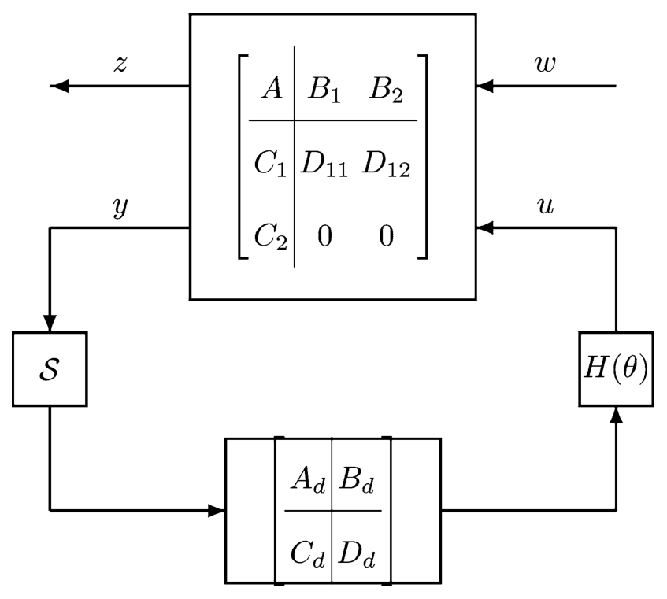

> Image description: A block diagram from a textbook labeled "Fig. 4 Sampled feedback system" illustrates a closed-loop control architecture. At the top, a large rectangular system block contains a state-space representation in matrix form: $$\begin{bmatrix} A & B_1 & B_2 \\ \rule{0.6cm}{0.4pt} & \rule{0.4cm}{0.4pt} & \rule{0.4cm}{0.4pt} \\ C_1 & D_{11} & D_{12} \\ C_2 & 0 & 0 \end{bmatrix}$$ Inputs to this system include an external disturbance $w$ and a control signal $u$. Outputs are an error/performance signal $z$ and an output signal $y$. The system is in a feedback loop. The signal $y$ flows from the main block through a block labeled $\mathcal{S}$, which then leads to a discrete-time system block defined by the state-space matrices $A_d, B_d, C_d,$ and $D_d$. The output of this discrete block is passed through a block $H(\theta)$ to produce the control input $u$, which is fed back into the primary system block. The diagram depicts the interaction between a continuous-time system and a sampled-data feedback controller.
Optimal Sampled-Data Control, Fig. 4 Sampled feedback system

where $H(\theta)$ is a suitable hold function. This is depicted in Fig. 4. The objective here is to design or characterize a controller that achieves a prescribed performance level $\gamma>0$ in such a way that

$$
\begin{equation*}
\left\|T_{z w}\right\|_{\infty}<\gamma \tag{13}
\end{equation*}
$$

where $T_{z w}$ denotes the closed-loop transfer operator from $w$ to $z$. This is the $H^{\infty}$ control problem for sampled-data systems. If we take the $H^{2}$ norm (10) instead, then the problem becomes that of the $H^{2}$ (sub)optimal control problem.

The difficulty here is that both $w$ and $z$ are continuous-time variables, and hence their lifted variables are infinite dimensional. A remarkable fact here is that the $H^{\infty}$ problem (and the $H^{2}$ problem as well) (13) can be equivalently transformed to an $H^{\infty}$ problem for a finitedimensional discrete-time system. We will indicate in the next section how this can be done.

## $\boldsymbol{H}^{\boldsymbol{\infty}} \boldsymbol{N}$ orm Computation and Reduction to Finite Dimension

Let us write the system (11) and (12) in the form

$$
\begin{align*}
x[k+1] & =\mathcal{A} x[k]+\mathcal{B} u[k] \\
y[k] & =\mathcal{C} x[k]+\mathcal{D} u[k] . \tag{14}
\end{align*}
$$

as in (6). For simplicity of treatments, assume $D_{11}$ in (11) to be zero; for the general case, see Yamamoto and Khargonekar (1996).

Let $G(z)$ be the transfer operator $G(z):=\mathcal{D}+ \mathcal{C}(z I-\mathcal{A})^{-1} \mathcal{B}$. The $H^{\infty}$ norm of $G$ is given as the maximum of the singular values of the gain $G\left(e^{j \omega h}\right)$ for $\omega \in[0,2 \pi / h)$.

Now consider the singular value equation

$$
\begin{equation*}
\left(\gamma^{2} I-G^{*} G\left(e^{j \omega h}\right)\right) w=0 . \tag{15}
\end{equation*}
$$

and suppose that $\gamma>\|\mathcal{D}\|$. A crux here is that $\mathcal{A}, \mathcal{B}, \mathcal{C}$ are finite-rank operators, and we can reduce this to a finite-dimensional rank condition. Taking the adjoint of (14), we obtain

$$
\begin{aligned}
p[k] & =\mathcal{A}^{*} p_{k+1}+\mathcal{C}^{*} v[k] \\
e[k] & =\mathcal{B}^{*} p_{k+1}+\mathcal{D}^{*} v[k]
\end{aligned}
$$

Taking the $z$-transforms of both sides, setting $z= e^{j \omega h}$, and substituting $v=y$ and $e=\gamma^{2} w$, we obtain

$$
\begin{aligned}
e^{j \omega h} x & =\mathcal{A} x+\mathcal{B} w \\
p & =e^{j \omega h} \mathcal{A}^{*} p+\mathcal{C}^{*}(\mathcal{C} x+\mathcal{D} w) \\
\left(\gamma^{2}-\mathcal{D}^{*} \mathcal{D}\right) w & =e^{j \omega h} \mathcal{B}^{*} p+\mathcal{D}^{*} \mathcal{C} x .
\end{aligned}
$$

Eliminating the variable $w$ then yields

$$
\left(e^{j \omega h}\left[\begin{array}{cc}
I & \mathcal{B} R_{\gamma}^{-1} \mathcal{B}^{*}  \tag{16}\\
0 & \mathcal{A}^{*}+\mathcal{C}^{*} \mathcal{D} R_{\gamma}^{-1} \mathcal{B}^{*}
\end{array}\right]-\left[\begin{array}{cc}
\mathcal{A}+\mathcal{B} R_{\gamma}^{-1} \mathcal{D}^{*} \mathcal{C} & 0 \\
\mathcal{C}^{*}\left(I+\mathcal{D} R_{\gamma}^{-1} \mathcal{D}^{*}\right) \mathcal{C} & I
\end{array}\right]\right)\left[\begin{array}{l}
x \\
p
\end{array}\right]=0
$$

where $R_{\gamma}=\left(\gamma I-\mathcal{D}^{*} \mathcal{D}\right)$. The important point to be noted here is that all the operators appearing here are actually matrices. For example, $\mathcal{B}$ is an
operator from $L^{2}[0, h)$ to $\mathbb{R}^{n}$, and its adjoint $\mathcal{B}^{*}$ is an operator from $\mathbb{R}^{n}$ to $L^{2}[0, h)$. Hence, the composition $\mathcal{B} R_{\gamma}^{-1} \mathcal{B}^{*}$ is a linear operator from


<!-- source_pdf_page: 1006 -->
$\mathbb{R}^{n}$ into itself, i.e., a matrix. Thus, for a given $\gamma$ the singular value equation admits a nontrivial solution $w$ for (15) if and only if the finitedimensional equation (16) admits a nontrivial solution $[x p]^{T}$ (Yamamoto 1993; Yamamoto and Khargonekar 1996). (Note that $R_{\gamma}$ is invertible since $\gamma>\|\mathcal{D}\|$.)

It is possible to find matrices $\bar{A}, \bar{B}, \bar{C}$ such that $\bar{A}=\mathcal{A}+\mathcal{B} R_{\gamma}^{-1} \mathcal{D}^{*} \mathcal{C}, \overline{B B}^{*} / \gamma^{2}=\mathcal{B} R_{\gamma}^{-1} \mathcal{B}^{*}$, and $\bar{C}^{*} \bar{C}=\mathcal{C}^{*}\left(I+\mathcal{D} R_{\gamma}^{-1} \mathcal{D}^{*}\right) \mathcal{C}$, and hence (16) is equivalent to

$$
\left(\lambda\left[\begin{array}{cc}
I & -\bar{B}^{\bar{B}^{*}} / \gamma^{2}  \tag{17}\\
0 & \bar{A}^{*}
\end{array}\right]-\left[\begin{array}{cc}
\bar{A} & 0 \\
-\bar{C}^{*} \bar{C} & I
\end{array}\right]\right)\left[\begin{array}{l}
x \\
p
\end{array}\right]=0
$$

for $\lambda=e^{j \omega h}$. In other words, we have that $\|G\|_{\infty}<\gamma$ if and only if there exists no $\lambda$ of modulus 1 such that (17) holds.

It can be proven that by substituting the expressions of (11) and (12) for ( $\mathcal{A}, \mathcal{B}, \mathcal{C}, \mathcal{D}$ ), one obtains a finite-dimensional discrete-time generalized plant $G_{d}$ with digital controller (12) such that $\|G\|_{\infty}<\gamma$ if and only if $\left\|G_{d}\right\|_{\infty}<\gamma$. The precise formulas for the discrete-time plant can be found, e.g., Bamieh and Pearson (1992), Chen and Francis (1995), Kabamba and Hara (1993), Yamamoto and Khargonekar (1996), and Cantoni and Glover (1997).

## An $\boldsymbol{H}^{\boldsymbol{\infty}}$ Design Example

For sampled-data control systems, there used to be, and still is, a rather common myth that if one takes a sufficiently fast sampling rate, it will not cause a major problem. This can be true for continuous-time design, but we here show that if we employ a sample-point discretization without a performance consideration for intersampling behavior, fast sampling rates can cause a serious problem.

Take a simple second-order plant $P(s)= 1 /\left(s^{2}+0.1 s+1\right)$, and consider the disturbance rejection problem minimizing the $H^{\infty}$-norm from $w$ to $z$ as given in Fig. 5. Set the sampling time $h=0.5$. We execute the following:

- Sampled-data $H^{\infty}$ design with the generalized plant

$$
G(s)=\left[\begin{array}{ll}
P(s) & P(s) \\
P(s) & P(s)
\end{array}\right],
$$

- Discrete-time $H^{\infty}$ design with the discretetime generalized plant $G_{d}(z)$ given by the step-invariant transformation (see, e.g., Chen and Francis 1995) of $G(s)$.
Figures 6 and 7 show the frequency and time responses of the two resulting closedloop systems, respectively. In Fig. 6, the solid curve shows the response of the sampled design, while the dash-dotted curve shows the discretetime frequency response, but purely reflecting its sample-point behavior only. At first glance, it may appear that the discrete-time design performs better. But when we actually compute the lifted sampled-data frequency response in the sense defined in Definition 1, it becomes obvious that the sampled-data design is far superior. The dashed curve shows the frequency response of the closed-loop, i.e., that of $G(s)$ connected with the discrete-time designed $K_{d}$. The response is similar to the discretetime frequency response in low frequency, but exhibits a very sharp peak around the Nyquist frequency (i.e., half the sampling frequency; in the present case, $\pi / h \sim 6.28 \mathrm{rad} / \mathrm{s}$, i.e., $1 / 2 h=1 \mathrm{~Hz}$ ).

This can also be verified from the initialstate responses Fig. 7 with $x(0)=(1,1)$. The solid curve shows the sampled-data design and the dashed curve the discrete-time one. Both responses decay to zero rapidly at sampled instants as shown by the circles for the discrete-time design. But the discrete-time design exhibits very large ripples, with period approximately 1 s . This corresponds to 1 Hz , which is the same as $2 \pi=\pi / h[\mathrm{rad} / \mathrm{s}]$, i.e., the Nyquist frequency. This is precisely captured in the lifted frequency response in Fig. 6.

It is worth noting that when we take the sampling period $h$ smaller, the response for the discrete-time design becomes even more oscillatory and shows a very high peak in the frequency response.


<!-- source_pdf_page: 1007 -->
## Optimal Sampled-Data Control, Fig. 5

Disturbance rejection
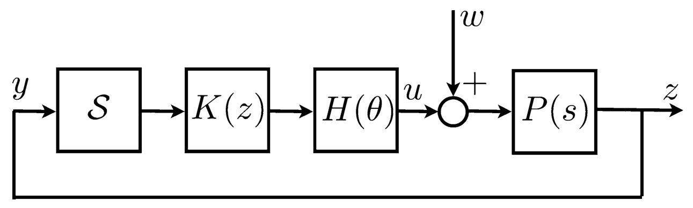

> Image description: A block diagram illustrating an optimal sampled-data control system, likely part of a feedback control loop. The diagram consists of four functional blocks connected in a series-feedback configuration. Starting from the input $y$, the signal passes through block $\mathcal{S}$, then into a discrete-time controller block $K(z)$. The output of $K(z)$ enters a plant/system block $H(\theta)$, resulting in a control signal $u$. This signal $u$ is summed with an external disturbance or input $w$ at a summation junction (indicated by a circle with a "+" sign). The sum enters the plant block $P(s)$, and the final output is labeled $z$. A feedback loop connects the output $z$ back to the input $y$, completing the closed-loop system. The variables include $y$ (input), $u$ (control signal), $w$ (disturbance), and $z$ (output). The caption identifies this as "Optimal Sampled-Data Control, Fig. 6 Frequency responses $h=0.5$".

Optimal Sampled-Data Control, Fig. 6 Frequency responses $h=0.5$
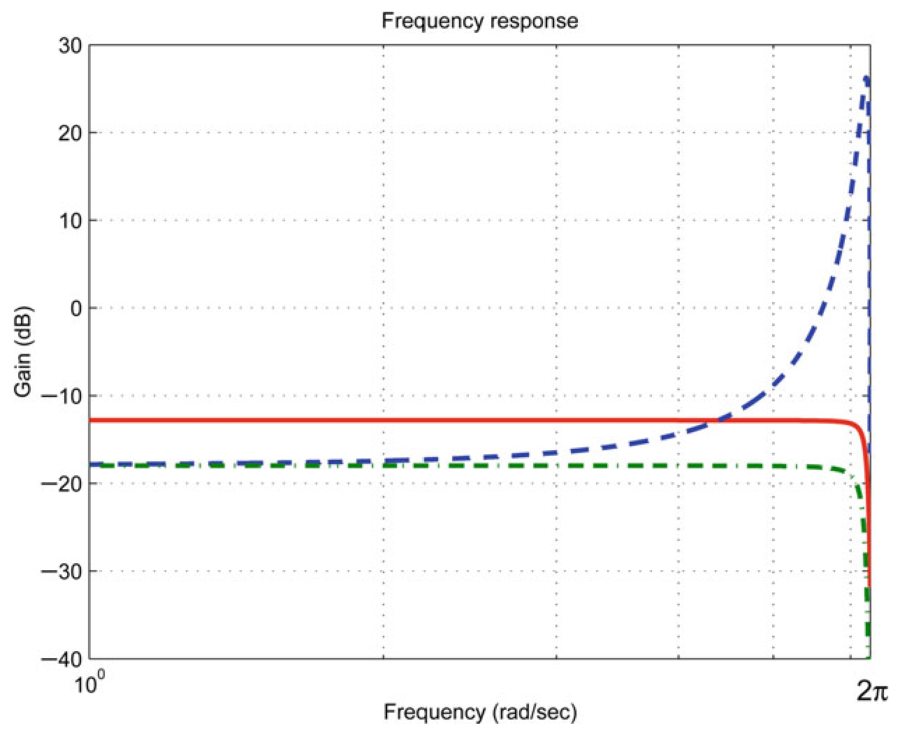

> Image description: A line graph titled "Frequency response" displays the relationship between frequency (rad/sec) and gain (dB) for a system with $h=0.5$. The x-axis is on a logarithmic scale, starting at $10^0$ and ending at $2\pi$. The y-axis represents gain in decibels (dB), ranging from -40 to 30. Three distinct curves are plotted: 1. A solid red line that remains nearly constant around -12 dB before dropping sharply near $2\pi$. 2. A dashed blue line that stays around -18 dB for low frequencies, then rises sharply toward 30 dB as it approaches $2\pi$. 3. A dash-dotted green line that stays relatively constant around -18 dB before dropping sharply at $2\pi$. The plot illustrates frequency-domain characteristics, likely representing the magnitude responses of different control or system configurations. The sharp changes near the $2\pi$ frequency mark suggest aliasing or sampling effects inherent to the sampled-data control context.

## Summary, Bibliographical Notes, and Future Directions

We have given a short summary of the main achievements of modern sampled-data control theory. Particularly, we have reviewed how the technique of lifting resolved the intrinsic difficulty arising from the mixture of two distinct time sets: continuous and discrete. This idea further led to the new notions of transfer operators and frequency response. These notions together enabled us to treat optimal sampled-data control problems in a unified and transparent way. We have outlined how the sampled-data $H^{\infty}$ control problem can equivalently be reduced to a corresponding discrete-time $H^{\infty}$ problem, without sacrificing the performance in the intersample behavior. This has been exemplified by a numerical example.

There are other performance indices for optimality, typically those arising from $H^{2}$ and $L^{1}$ norms. These problems have also been studied extensively, and fairly complete solutions are available. For the lack of space, we cannot list all references, and the reader is referred to Chen and Francis (1995) and Yamamoto (1999) for a more concrete survey and references therein.

For classical treatments of sampled-data control, it is instructive to consult Jury (1958) and Ragazzini and Franklin (1958). The textbook Åström and Wittenmark (1996) covers both classical and modern aspects of digital control. For a mathematical background of the computation of adjoints treated in section " $H^{\infty}$ Norm Computation and Reduction to Finite Dimension," consult Yamamoto (2012) as well as Yamamoto (1993).

Since control devices are now mostly digital, the importance of sampled-data control will


<!-- source_pdf_page: 1008 -->
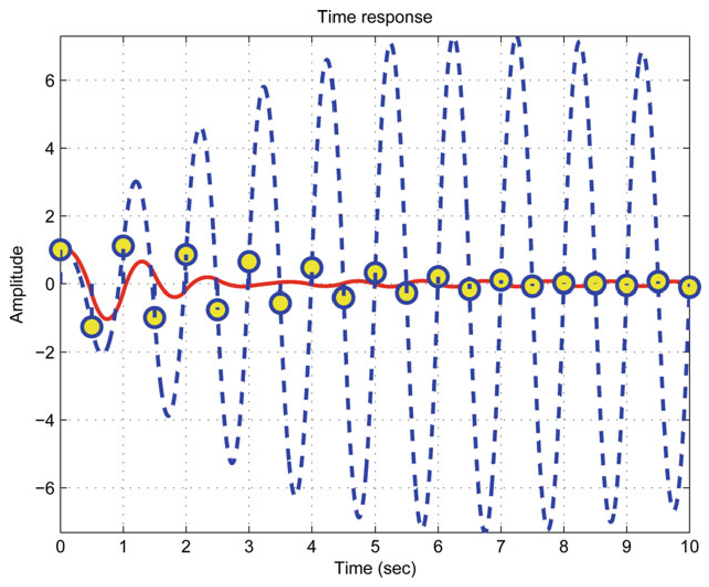

> Image description: A line graph titled "Time response" shows the amplitude of two different signals over time, spanning from 0 to 10 seconds. The vertical axis is labeled "Amplitude" and ranges from -7 to 7. The horizontal axis is labeled "Time (sec)" and ranges from 0 to 10. There are two signals plotted: a blue dashed line and a solid red line. The blue dashed line represents a high-amplitude sinusoidal oscillation that grows in amplitude until approximately 7 seconds, where it reaches a peak amplitude near 7, before slightly decreasing. The red line represents a much lower-amplitude signal that oscillates around zero with significantly smaller peaks compared to the blue line. Several yellow circles are superimposed on the plot, marking specific points along the red line's waveform, likely representing sampled data points. Based on the caption, this figure illustrates initial-state responses for an optimal sampled-data control system where $h = 0.5$.
Optimal Sampled-Data Control, Fig. 7 Initial-state responses $h=0.5$

definitely increase. While the linear, timeinvariant case as treated here is now fairly complete, sampled-data control for a nonlinear or an infinite-dimensional plant seems to be still quite an open issue, although it is unclear if the methodology treated here is effective for such classes of plants.

Sampled-data control has much to do with signal processing. Indeed, since it can optimize continuous-time performance, it can shed a new light on digital signal processing. Traditionally, Shannon's paradigm based on the perfect bandlimiting hypothesis and the sampling theorem has been prevalent in the signal processing community. Since the sampling theorem opts for perfect reconstruction, the resulting theory reduces mostly to discrete-time problems. In other words, the intersample information is buried in the sampling theorem. It should, however, be noted that the very stringent bandlimiting hypothesis is almost never satisfied in reality, and various approximations are necessitated. In contrast, sampled-data control can provide an optimal platform for dealing with and optimizing the response between sampling
points when the band-limiting hypothesis does not hold. See, for example, Yamamoto et al. (2012) and Nagahara and Yamamoto (2012) for the idea and some efforts in this direction.

## Cross-References

- Control Applications in Audio Reproduction
- $\mathrm{H}_{2}$ Optimal Control
- H-Infinity Control
- Optimal Control via Factorization and Model Matching

Acknowledgments The author would like to thank Masaaki Nagahara and Masashi Wakaiki for their help in the numerical example references.

## Bibliography

Åström KJ, Wittenmark B (1996) Computer controlled systems-theory and design, 3rd edn. Prentice Hall, Upper Saddle River


<!-- source_pdf_page: 1009 -->
Bamieh B, Pearson JB (1992) A general framework for linear periodic systems with applications to $H_{\infty}$ sampled-data control. IEEE Trans Autom Control 37:418-435
Bamieh B, Pearson JB, Francis BA, Tannenbaum A (1991) A lifting technique for linear periodic systems with applications to sampled-data control systems. Syst Control Lett 17:79-88
Cantoni M, Glover K (1997) $H_{\infty}$ sampled-data synthesis and related numerical issues. Automatica 33:22332241
Chen T, Francis BA (1990) On the $\mathcal{L}_{2}$-induced norm of a sampled-data system. Syst Control Lett 15: 211-219
Chen T, Francis BA (1995) Optimal sampled-data control systems. Springer, New York
Jury EI (1958) Sampled-data control systems. Wiley, New York
Kabamba PT, Hara S (1993) Worst case analysis and design of sampled data control systems. IEEE Trans Autom Control 38:1337-1357
Nagahara M, Yamamoto, Y (2012) Frequency domain min-max optimization of noise-shaping DeltaSigma modulators. IEEE Trans Signal Process 60: 2828-2839
Ragazzini JR, Franklin GF (1958) Sampled-data control systems. McGraw-Hill, New York
Sivashankar N, Khargonekar PP (1994) Characterization and computation of the $\mathcal{L}_{2}$-induced norm of sampled-data systems. SIAM J Control Optim 32: 1128-1150
Tadmor G (1991) Optimal $\mathcal{H}_{\infty}$ sampled-data control in continuous time systems. In: Proceedings of ACC'91, Boston, Massachusetts, pp 1658-1663
Toivonen HT (1992) Sampled-data control of continuoustime systems with an $\mathcal{H}_{\infty}$ optimality criterion. Automatica 28:45-54
Yamamoto Y (1990) New approach to sampled-data systems: a function space method. In: Proceedings of 29th CDC, Honolulu, Hawaii, pp 1882-1887
Yamamoto Y (1993) On the state space and frequency domain characterization of $H^{\infty}$-norm of sampleddata systems. Syst Control Lett 21:163-172
Yamamoto Y (1994) A function space approach to sampled-data control systems and tracking problems. IEEE Trans Autom Control 39:703-712
Yamamoto Y (1999) Digital control. In: Webster JG (ed) Wiley encyclopedia of electrical and electronics engineering, vol 5. Wiley, New York, pp 445-457
Yamamoto Y (2012) From vector spaces to function spaces-introduction to functional analysis with applications. SIAM, Philadelphia
Yamamoto Y, Khargonekar PP (1996) Frequency response of sampled-data systems. IEEE Trans Autom Control 41:166-176
Yamamoto Y, Nagahara M, Khargonekar PP (2012) Signal reconstruction via $H^{\infty}$ sampled-data control theoryBeyond the Shannon paradigm. IEEE Trans Signal Process 60:613-625

# Optimization Algorithms for Model Predictive Control

Moritz Diehl<br>Department of Microsystems Engineering (IMTEK), University of Freiburg, Freiburg, Germany<br>ESAT-STADIUS/OPTEC, KU Leuven, Leuven-Heverlee, Belgium


#### Abstract

This entry reviews optimization algorithms for both linear and nonlinear model predictive control (MPC). Linear MPC typically leads to specially structured convex quadratic programs (QP) that can be solved by structure exploiting active set, interior point, or gradient methods. Nonlinear MPC leads to specially structured nonlinear programs (NLP) that can be solved by sequential quadratic programming (SQP) or nonlinear interior point methods.


## Keywords

Banded matrix factorization; Convex optimization; Karush-Kuhn-Tucker (KKT) conditions; Sparsity exploitation

## Introduction

Model predictive control (MPC) needs to solve at each sampling instant an optimal control problem with the current system state $\bar{x}_{0}$ as initial value. MPC optimization is almost exclusively based on the so-called direct approach which first discretizes the continuous time system to obtain a discrete time optimal control problem (OCP). This OCP has as optimization variables a state trajectory $X=\left[x_{0}^{\top}, \ldots, x_{N}^{\top}\right]^{\top}$ with $x_{i} \in \mathbb{R}^{n_{x}}$ for $i=0, \ldots, N$ and a control trajectory $U=\left[u_{0}^{\top}, \ldots, u_{N-1}^{\top}\right]^{\top}$ with $u_{i} \in \mathbb{R}^{n_{u}}$ for $i= 0, \ldots, N-1$. For simplicity of presentation, we


<!-- source_pdf_page: 1010 -->
restrict ourselves to the time-independent case, and the OCP we treat in this article is stated as follows:

$$
\begin{align*}
\underset{X, U}{\operatorname{minimize}} & \sum_{i=0}^{N-1} L\left(x_{i}, u_{i}\right)+E\left(x_{N}\right)  \tag{1a}\\
\text { subject to } & x_{0}-\bar{x}_{0}=0,  \tag{1b}\\
x_{i+1}-f\left(x_{i}, u_{i}\right) & =0, \quad i=0, \ldots, N-1,  \tag{-1,}\\
& h\left(x_{i}, u_{i}\right) \leq 0, \quad i=0, \ldots, N-1,  \tag{1c}\\
& (1 \mathrm{c})  \tag{1d}\\
r\left(x_{N}\right) \leq 0 . & (1 \mathrm{~d}) \\
&
\end{align*}
$$

The MPC objective is stated in Eq. (1a), the system dynamics enter via Eq. (1c), while path and terminal constraints enter via Eqs. (1d) and (1e). All functions are assumed to be differentiable and to have appropriate dimensions $\left(h(x, u) \in \mathbb{R}^{n_{h}}\right.$ and $r(x) \in \mathbb{R}^{n_{r}}$ ). Note that $\bar{x}_{0} \in \mathbb{R}^{n_{x}}$ is not an optimization variable, but a parameter upon which the OCP depends via the initial value constraint in Eq. (1b). The optimal solution trajectories depend only on this value and can thus be denoted by $X^{*}\left(\bar{x}_{0}\right)$ and $U^{*}\left(\bar{x}_{0}\right)$. Obtaining them, in particular the first control value $u_{0}^{*}\left(\bar{x}_{0}\right)$, as fast and reliably as possible for each new value of $\bar{x}_{0}$ is the aim of all MPC optimization algorithms. The most important dividing line is between convex and non-convex optimal control problems (OCP). If the OCP is convex, algorithms exist that find a global solution reliably and in computable time. If the OCP is not convex, one usually needs to be satisfied with approximations of locally optimal solutions. The OCP (1) is convex if the objective (1a) and all components of the inequality constraint functions (1d) and (1e) are convex and if the equality constraints (1c) are linear.

We typically speak of linear MPC when the OCP to be solved is convex, and otherwise of nonlinear MPC.

## General Algorithmic Features for MPC Optimization

In MPC we would dream to have the solution to a new optimal control problem instantly, which is , essential, and many tools automatically generate custom solvers in low-level languages. The generated code has fixed matrix and vector dimensions, has no online memory allocations, and contains a minimal number of if-then-else statements to ensure a smooth computational flow.
impossible due to computational delays. Several ideas can help us to deal with this issue.

## Off-line Precomputations and Code Generation

As consecutive MPC problems are similar and differ only in the value $\bar{x}_{0}$, many computations can be done once and for all before the MPC controller execution starts. Careful preprocessing and code optimization for the model routines is essential, and many tools automatically generate custom solvers in low-level languages. The generated code has fixed matrix and vector dimensions, has no online memory allocations, and

## Delay Compensation by Prediction

When we know how long our computations for solving an MPC problem will take, it is a good idea not to address a problem starting at the current state but to simulate at which state the system will be when we will have solved the problem. This can be done using the MPC system model and the open-loop control inputs that we will apply in the meantime. This feature is used in many practical MPC schemes with non-negligible computation time.

## Division into Preparation and Feedback Phase

A third ingredient of several MPC algorithms is to divide the computations in each sampling time into a preparation phase and a feedback phase. The more CPU intensive preparation phase is performed with a predicted state $\bar{x}_{0}$, before the most current state estimate, say $\bar{x}_{0}^{\prime}$, is available. Once $\bar{x}_{0}^{\prime}$ is available, the feedback phase delivers quickly an approximate solution to the optimization problem for $\bar{x}_{0}^{\prime}$.

## Warmstarting and Shift

An obvious way to transfer solution information from one solved MPC problem to the next one uses the existing optimal solution as an initial guess to start the iterative solution procedure of the next problem. We can either directly use the existing solution without modification for warmstarting or we can first shift it in order to


<!-- source_pdf_page: 1011 -->
account for the advancement of time, which is particularly advantageous for systems with timevarying dynamics or objectives.

## Iterating While the Problem Changes

A last important ingredient of some MPC algorithms is the idea to work on the optimization problem while it changes, i.e., to never iterate the optimization procedure to convergence for an MPC problem getting older and older during the iterations but to rather work with the most current information in each new iteration.

## Convex Optimization for Linear MPC

Linear MPC is based on a linear system model of the form $x_{i+1}=A x_{i}+B u_{i}$ and convex objective and constraint functions in (1a), (1d), and (1e). The most widespread linear MPC setting uses a convex quadratic objective function and affine constraints and solves the following quadratic program (QP):

$$
\underset{X, U}{\operatorname{minimize}} \frac{1}{2} \sum_{i=0}^{N-1}\left[\begin{array}{l}x_{i}  \tag{2a}\\ u_{i}\end{array}\right]^{\top}\left[\begin{array}{cc}Q & S \\ S^{\top} & R\end{array}\right]\left[\begin{array}{l}x_{i} \\ u_{i}\end{array}\right]+\frac{1}{2} x_{N}^{\top} P x_{N}
$$

subject to $\quad x_{0}-\bar{x}_{0}=0$,

$$
\begin{equation*}
x_{i+1}-A x_{i}-B u_{i}=0, i=0, \ldots, N-1, \tag{2b}
\end{equation*}
$$

$$
\begin{equation*}
b+C x_{i}+D u_{i} \leq 0, i=0, \ldots, N-1, \tag{2c}
\end{equation*}
$$

$$
\begin{equation*}
c+F x_{N} \leq 0 . \tag{2d}
\end{equation*}
$$

Here, $b, c$ are vectors and $Q, S, R, P, C, D, F$ matrices, and matrices $\left[\begin{array}{cc}Q & S \\ S^{\top} & R\end{array}\right]$ and $P$ are symmetric and positive semi-definite to ensure the QP is convex.

## Sparsity Exploitation

The QP (2) has a specific sparsity structure that can be exploited in different ways. One way is to reduce the variable space by a procedure called condensing and then to solve a smaller-scale QP
instead of (2). Another way is to use a banded matrix factorization.

## Condensing

The constraints (2b) and (2c) can be used to eliminate the state trajectory $X$. This yields an equivalent but smaller-scale QP of the following form:

$$
\begin{array}{ll}
\underset{U \in \mathbb{R}^{N n_{u}}}{\operatorname{minimize}} & \frac{1}{2}\left[\begin{array}{l}
U \\
\bar{x}_{0}
\end{array}\right]^{\top}\left[\begin{array}{cc}
H & G \\
G^{\top} & J
\end{array}\right]\left[\begin{array}{l}
U \\
\bar{x}_{0}
\end{array}\right] \\
\text { subject to } & d+K \bar{x}_{0}+M U \leq 0 . \tag{3b}
\end{array}
$$

The number of inequality constraints is the same as in the original QP (2) and given by $m= N n_{h}+n_{r}$. Note that in the simplest case without inequalities ( $m=0$ ), the solution $U^{*}\left(\bar{x}_{0}\right)$ of the condensed QP can be obtained by setting the gradient of the objective to zero, i.e., by solving $H U^{*}\left(\bar{x}_{0}\right)+G \bar{x}_{0}=0$. The factorization of a dense matrix $H$ with dimension $N n_{u} \times N n_{u}$ needs $O\left(N^{3} n_{u}^{3}\right)$ arithmetic operations, i.e., the computational cost of condensing-based algorithms typically grows cubically with the horizon length $N$.

## Banded Matrix Factorization

An alternative way to deal with the sparsity is best sketched at hand of a sparse convex QP (2) without inequality constraints (2d) and (2e). We define the vector of Lagrange multipliers $Y= \left[y_{0}^{\top}, \ldots, y_{N}^{\top}\right]^{\top}$ and the Lagrangian function by

$$
\begin{align*}
& \mathcal{L}(X, U, Y)=y_{0}^{\top}\left(x_{0}-\bar{x}_{0}\right)+\frac{1}{2} x_{N}^{\top} P x_{N} \\
& +\frac{1}{2} \sum_{i=0}^{N-1}\left[\begin{array}{l}
x_{i} \\
u_{i}
\end{array}\right]^{\top}\left[\begin{array}{cc}
Q & S \\
S^{\top} & R
\end{array}\right]\left[\begin{array}{l}
x_{i} \\
u_{i}
\end{array}\right]+y_{i+1}^{\top} \\
& \left(x_{i+1}-A x_{i}+B u_{i}\right) \tag{4}
\end{align*}
$$

If we reorder all unknowns that enter the Lagrangian and summarize them in the vector

$$
W=\left[y_{0}^{\top}, x_{0}^{\top}, u_{0}^{\top}, y_{1}^{\top}, x_{1}^{\top}, u_{1}^{\top}, \ldots, y_{N}^{\top}, x_{N}^{\top}\right]^{\top}
$$

the optimal solution $W^{*}\left(\bar{x}_{0}\right)$ is uniquely characterized by the first-order optimality condition


<!-- source_pdf_page: 1012 -->
$$
\nabla_{W} \mathcal{L}\left(W^{*}\right)=0 .
$$

Due to the linear quadratic dependence of $\mathcal{L}$ on $W$, this is a block-banded linear equation in the unknown $W^{*}$ :

$$
\left[\begin{array}{cccccccc}
0 & I & & & & & & \\
I & Q & S & -A^{\top} & & & & \\
& S^{\top} & R & -B^{\top} & & & & \\
& -A & -B & 0 & I & & & \\
& & & I & Q & \cdot & \cdot & \\
& & & & \cdot & \cdot & \cdot & \\
& & & & \cdot & \cdot & 0 & I \\
& & & & & & I & P
\end{array}\right] W^{*}=\left[\begin{array}{c}
\bar{x}_{0} \\
0 \\
0 \\
0 \\
\cdot \\
\cdot \\
\cdot \\
0
\end{array}\right] .
$$

Because the above matrix has nonzero elements only on a band of width $2 n_{x}+n_{u}$ around the diagonal, it can be factorized with a computational cost of order $O\left(N\left(2 n_{x}+n_{u}\right)^{3}\right)$.

## Treatment of Inequalities

An important observation is that both the uncondensed QP (2) and the equivalent condensed QP (3) typically fall into the class of strictly convex parametric quadratic programs: the solution $U^{*}\left(\bar{x}_{0}\right), X^{*}\left(\bar{x}_{0}\right)$ is unique and depends piecewise affinely and continuously on the parameter $\bar{x}_{0}$. Each affine piece of the solution map corresponds to one active set and is valid on one polyhedral critical region in parameter space. This observation forms the basis of explicit MPC algorithms which precompute the map $u_{0}^{*}\left(\bar{x}_{0}\right)$, but it can also be exploited in online algorithms for quadratic programming, which are the focus of this section.

We sketch the different ways of how to treat inequalities only for the condensed QP (3), but they can equally be applied in sparse QP algorithms that directly address (2). The optimal solution $U^{*}\left(\bar{x}_{0}\right)$ for a strictly convex QP (3) is - together with the corresponding vector of Lagrange multipliers, or dual variables $\lambda^{*}\left(\bar{x}_{0}\right) \in \mathbb{R}^{m}$ - uniquely characterized by the so-called Karush-Kuhn-Tucker (KKT) conditions, which we omit for brevity. There are three big families of solution algorithms for inequality-constrained QPs that differ in the way they treat inequalities: active set methods, interior point methods, and gradient projection methods.

## Active Set Methods

The optimal solution of the QP is characterized by its active set, i.e., the set of inequality constraints (3b) that are satisfied with equality at this point. If one would know the active set for a given problem instance $\bar{x}_{0}$, it would be easy to find the solution. Active set methods work with guesses of the active set which they iteratively refine. In each iteration, they solve one linear system corresponding to a given guess of the active set. If the KKT conditions are satisfied, the optimal solution is found; if they are not, another division into active and inactive constraints needs to be tried. A crucial observation is that an existing factorization of the linear system can be reused to a large extent when only one constraint is added or removed from the guess of the active set. Many different active set strategies exist, three of which we mention: Primal active set methods first find a feasible point and then add or remove active constraints, always keeping the primal variables $U$ feasible. Due to the difficulty of finding a feasible point first, they are difficult to warmstart in the context of MPC optimization. Dual active set strategies always keep the dual variables $\lambda$ positive. They can easily be warmstarted in the context of MPC. Parametric or online active set strategies ensure that all iterates stay primal and dual feasible and go on a straight line in parameter space from a solved QP problem to the current one, only updating the active set when crossing the boundary between critical regions, as implemented in the online QP solver qpOASES.

Active set methods are very competitive in practice, but their worst case complexity is not polynomial. They are often used together with the condensed QP formulation, for which each active set change is relatively cheap. This is particularly advantageous if an existing factorization can be kept between subsequent MPC optimization problems.

## Interior Point Methods

Another approach is to replace the KKT conditions by a smooth approximation that uses a small positive parameter $\tau>0$ :

$$
\begin{equation*}
H U^{*}+G \bar{x}_{0}+M^{\top} \lambda^{*}=0 \tag{5a}
\end{equation*}
$$


<!-- source_pdf_page: 1013 -->
$\left(d+K \bar{x}_{0}+M U^{*}\right)_{i} \lambda_{i}^{*}+\tau=0, i=1, \ldots, m$.

These conditions form a smooth nonlinear system of equations that uniquely determines a primal dual solution $U^{*}\left(\bar{x}_{0}, \tau\right)$ and $\lambda^{*}\left(\bar{x}_{0}, \tau\right)$ in the interior of the feasible set. They are not equivalent to the KKT conditions, but for $\tau \rightarrow 0$, their solution tends to the exact QP solution. An interior point algorithm solves the system (5a) and (5b) by Newton's method. Simultaneously, the path parameter $\tau$, that was initially set to a large value, is iteratively reduced, making the nonlinear set of equations a closer approximation of the original KKT system. In each Newton iteration, a linear system needs to be factored and solved, which constitutes the major computational cost of an interior point algorithm. For the condensed QP (3) with dense matrices $H, M$, the cost per Newton iteration is of order $O\left(N^{3}\right)$. But the interior point algorithm can also be applied to the uncondensed sparse QP (2), in which case each iteration has a runtime of order $O(N)$. In practice, for both cases, 10-30 Newton iterations usually suffice to obtain very accurate solutions. As an interior point method needs always to start with a high value of $\tau$ and then reduces it during the iterations, warmstarting is of minor benefit. There exist efficient code generation tools that export convex interior point solvers as plain C-code such as CVXGEN and FORCES.

## Gradient Projection Methods

Gradient projection methods do not need to factorize any matrix but only evaluate the gradient of the objective function $H U^{[k]}+G \bar{x}_{0}$ in each iteration. They can only be implemented efficiently if the feasible set is a simple set in the sense that a projection $\mathcal{P}(U)$ on this set is very cheap to compute, as, e.g., for upper and lower bounds on the variables $U$, and if we know an upper bound $L_{H}>0$ on the eigenvalues of the Hessian $H$. The simple gradient projection algorithm starts with an initialization $U^{[0]}$ and proceeds as follows:

$$
U^{[k+1]}=\mathcal{P}\left(U^{[k]}-\frac{1}{L_{H}}\left(H U^{[k]}+G \bar{x}_{0}\right)\right) .
$$

An improved version of the gradient projection algorithm is called the optimal or fast gradient method and has probably the best possible iteration complexity of all gradient type methods. All variants of gradient projection algorithms are easy to warmstart. Though they are not as versatile as active set or interior point methods, they have short code sizes and can offer advantages on embedded computational hardware, such as the code generated by the tool FIORDOS.

## Optimization Algorithms for Nonlinear MPC

When the dynamic system $x_{i+1}=f\left(x_{i}, u_{i}\right)$ is not affine, the optimal control problem (1) is non-convex, and we speak of a nonlinear MPC (NMPC) problem. NMPC optimization algorithms only aim at finding a locally optimal solution of this problem, and they usually do it in a Newton-type framework. For ease of notation, we summarize problem (1) in the form of a general nonlinear programming problem (NLP):

$$
\begin{array}{ll}
\underset{X, U}{\operatorname{minimize}} & \Phi(X, U) \\
\text { subject to } & G_{\text {eq }}\left(X, U, \bar{x}_{0}\right)=0, \\
& G_{\text {ineq }}(X, U) \leq 0 . \tag{6c}
\end{array}
$$

Let us first discuss a fundamental choice that regards the problem formulation and number of optimization variables.

## Simultaneous vs. Sequential Formulation

When an optimization algorithm addresses problem (6) iteratively, it works intermediately with nonphysical, infeasible trajectories that violate the system constraints (6b). Only at the optimal solution the constraint residual is brought to zero and a physical simulation is achieved. We speak


<!-- source_pdf_page: 1014 -->
of a simultaneous approach to optimal control because the algorithm solves the simulation and the optimization problems simultaneously. Variants of this approach are direct discretization or direct multiple shooting.

On the other hand, the equality constraints (6b) could easily be eliminated by a nonlinear forward simulation for given initial value $\bar{x}_{0}$ and control trajectory $U$, similar to condensing in linear MPC. Such a forward simulation generates a state trajectory $X_{\text {sim }}\left(\bar{x}_{0}, U\right)$ such that for the given value of $\bar{x}_{0}, U$ the equality constraints (6b) are automatically satisfied: $G_{\text {eq }}\left(X_{\text {sim }}\left(\bar{x}_{0}, U\right), U, \bar{x}_{0}\right)=0$. Inserting this map into the NLP (6) allows us to formulate an equivalent optimization problem with a reduced variable space:

$$
\begin{array}{lc}
\underset{U}{\operatorname{minimize}} & \Phi\left(X_{\text {sim }}\left(\bar{x}_{0}, U\right), U\right) \\
\text { subject to } & G_{\text {ineq }}\left(X_{\text {sim }}\left(\bar{x}_{0}, U\right), U\right) \leq 0 \tag{7b}
\end{array}
$$

When solving this reduced problem with an iterative optimization algorithm, we sequentially simulate and optimize the system, and we speak of the sequential approach to optimal control.

The sequential approach has a lower dimensional variable space and is thus easier to use with a black-box NLP solver. On the other hand, the simultaneous approach leads to a sparse NLP and is better able to deal with unstable nonlinear systems. In the remainder of this section, we thus only discuss the specific structure of the simultaneous approach.

## Newton-Type Optimization

In order to simplify notation further, we summarize and reorder all optimization variables $U$ and $X$ in a vector $V=\left[x_{0}^{\top}, u_{0}^{\top}, \ldots, x_{N-1}^{\top}, u_{N-1}^{\top}, x_{N}^{\top}\right]^{\top}$ and use the same problem function names as in (6) also with the new argument $V$.

As in the section on linear MPC, we can introduce multipliers $Y$ for the equalities and $\lambda$ for the inequalities and define the Lagrangian

$$
\begin{align*}
& \mathcal{L}(V, Y, \lambda)=\Phi(V)+Y^{\top} G_{\text {eq }}\left(V, \bar{x}_{0}\right) \\
& +\lambda^{\top} G_{\text {ineq }}(V) . \tag{8}
\end{align*}
$$

All Newton-type optimization methods try to find a point satisfying the KKT conditions by using successive linearizations of the problem functions and Lagrangian. For this aim, starting with an initial guess ( $V^{[0]}, Y^{[0]}, \lambda^{[0]}$ ), they generate sequences of primal-dual iterates $\left(V^{[k]}, Y^{[k]}, \lambda^{[k]}\right)$.

An observation that is crucial for the efficiency of all NMPC algorithms is that the Hessian of the Lagrangian is at a current iterate given by a matrix of the form

$$
\nabla_{V}^{2} \mathcal{L}(\cdot)=\left[\begin{array}{ccccccc}
Q_{0}^{[k]} & S_{0}^{[k]} & & & & & \\
S_{0}^{[k], \top} & R_{0}^{[k]} & & & & & \\
& & Q_{1}^{[k]} & S_{1}^{[k]} & & & \\
& & S_{1}^{[k], \top} & R_{1}^{[k]} & & & \\
& & & & \cdot & \cdot & \\
& & & & & P^{[k]}
\end{array}\right] .
$$

This block sparse matrix structure makes it possible to use in each Newton-type iteration the same sparsity-exploiting linear algebra techniques as outlined in section "Convex Optimization for Linear MPC" for the linear MPC problem.

Major differences exist on how to treat the inequality constraints, and the two big families of Newton-type optimization methods are sequential quadratic programming ( $S Q P$ ) methods and nonlinear interior point (NIP) methods.

## Sequential Quadratic Programming (SQP)

A first variant to iteratively solve the KKT system is to linearize all nonlinear functions at the current iterate ( $V^{[k]}, Y^{[k]}, \lambda^{[k]}$ ) and to find a new solution guess from the solution of a quadratic program (QP):

$$
\begin{array}{ll}
\underset{V}{\operatorname{minimize}} & \Phi_{\text {quad }}\left(V ; V^{[k]}, Y^{[k]}, \lambda^{[k]}\right) \\
\text { subject to } & G_{\text {eq,lin }}\left(V, \bar{x}_{0} ; V^{[k]}\right)=0, \\
& G_{\text {ineq,lin }}\left(V ; V^{[k]}\right) \leq 0 . \tag{9c}
\end{array}
$$

Here, the subindex "lin" in the constraints $G_{\cdot, \text { lin }}$ expresses that a first-order Taylor expansion at


<!-- source_pdf_page: 1015 -->
$V^{[k]}$ is used, while the QP objective is given by $\Phi_{\text {quad }}\left(V ; V^{[k]}, Y^{[k]}, \lambda^{[k]}\right)=\Phi_{\text {lin }}\left(V ; V^{[k]}\right)+ \frac{1}{2}\left(V-V^{[k]}\right)^{\top} \nabla_{V}^{2} \mathcal{L}(\cdot)\left(V-V^{[k]}\right)$. Note that the QP has the same sparsity structure as the QP (2) resulting from linear MPC, with the only difference that all matrices are now time varying over the MPC horizon. In the case that the Hessian matrix is positive semi-definite, this QP is convex so that global solutions can be found reliably with any of the methods from section "Convex Optimization for Linear MPC." The solution of the QP along with the corresponding constraint multipliers gives the next SQP iterate ( $V^{[k+1]}, Y^{[k+1]}, \lambda^{[k+1]}$ ). Apart from the presented "exact Hessian" SQP variant, which has quadratic convergence speed, several other SQP variants exist, which make use of other Hessian approximations. A particularly useful Hessian approximation for NMPC is possible if the original objective function $\Phi(V)$ is convex quadratic, and the resulting SQP variant is called the generalized Gauss-Newton method. In this case, one can just use the original objective as cost function in the QP (9a), resulting in convex QP subproblems and (often fast) linear convergence speed.

## Nonlinear Interior Point (NIP) Method

In contrast to SQP methods, an alternative way to address the solution of the KKT system is to replace the last nonsmooth KKT conditions by a smooth nonlinear approximation, with $\tau>0$ :

$$
\begin{align*}
\nabla_{V} \mathcal{L}\left(V^{*}, Y^{*}, \lambda^{*}\right) & =0  \tag{10a}\\
G_{\text {eq }}\left(V^{*}, \bar{x}_{0}\right) & =0  \tag{10b}\\
G_{\text {ineq }, i}\left(V^{*}\right) \lambda_{i}^{*}+\tau & =0, \quad i=1, \ldots, m \tag{10c}
\end{align*}
$$

We summarize all variables in a vector $W= \left[V^{\top}, Y^{\top}, \lambda^{\top}\right]^{\top}$ and summarize the above set of equations as

$$
\begin{equation*}
G_{\mathrm{NIP}}\left(W, \bar{x}_{0}, \tau\right)=0 . \tag{11}
\end{equation*}
$$

The resulting root finding problem is then solved with Newton's method, for a descending sequence of path parameters $\tau^{[k]}$. The NIP
method proceeds thus exactly as in an interior point method for convex problems, with the only difference that it has to re-linearize all problem functions in each iteration. An excellent software implementation of the NIP method is given in the form of the code IPOPT.

## Continuation Methods and Tangential Predictors

In nonlinear MPC, a sequence of OCPs with different initial values $\bar{x}_{0}^{[0]}, \bar{x}_{0}^{[1]}, \bar{x}_{0}^{[2]}, \ldots$ is solved. For the transition from one problem to the next, it is beneficial to take into account the fact that the optimal solution $W^{*}\left(\bar{x}_{0}\right)$ depends almost everywhere differentiably on $\bar{x}_{0}$. The concept of a continuation method is most easily explained in the context of an NIP method with fixed path parameter $\bar{\tau}>0$. In this case, the solution $W^{*}\left(\bar{x}_{0}, \bar{\tau}\right)$ of the smooth root finding problem $G_{\mathrm{NIP}}\left(W^{*}\left(\bar{x}_{0}, \bar{\tau}\right), \bar{x}_{0}, \bar{\tau}\right)=0$ from Eq.(11) is smooth with respect to $\bar{x}_{0}$. This smoothness can be exploited by making use of a tangential predictor in the transition from one value of $\bar{x}_{0}$ to another. Unfortunately, the interior point solution manifold is strongly nonlinear at points where the active set changes, and the tangential predictor is not a good approximation when we linearize at such points.

## Generalized Tangential Predictor and Real-Time Iterations

In fact, the true NLP solution is not determined by a smooth root finding problem (10a)-(3) but by the (nonsmooth) KKT conditions. The solution manifold has smooth parts when the active set does not change, but non-differentiable points occur whenever the active set changes. We can deal with this fact naturally in an SQP framework by solving one QP of form (9) in order to generate a tangential predictor that is also valid in the presence of active set changes. In the extreme case that only one such QP is solved per sampling time, we speak of a real-time iteration (RTI) algorithm. The computations in each iteration can be subdivided into two phases, the preparation phase, in which the derivatives are computed and the QP is condensed, and the feedback phase, which


<!-- source_pdf_page: 1016 -->
only starts once $\bar{x}_{0}^{[k+1]}$ becomes available and in which only a condensed QP of form (3) is solved, minimizing the feedback delay. This NMPC algorithm can be generated as plain C-code, e.g., by the tool ACADO. Another class of real-time NMPC algorithms based on a continuation method can be generated by the tool AutoGenU.

## Cross-References

- Explicit Model Predictive Control
- Model-Predictive Control in Practice
- Numerical Methods for Nonlinear Optimal Control Problems


## Recommended Reading

Many of the algorithmic ideas presented in this article can be used in different combinations than those presented, and several other ideas had to be omitted for the sake of brevity. Some more details can be found in the following two overview articles on MPC optimization: Binder et al. (2001) and Diehl et al. (2009). The general field of numerical optimal control is treated in Bryson and Ho (1975), Betts (2010), and the even broader field of numerical optimization is covered in the excellent textbooks (Fletcher 1987; Wright 1997; Nesterov 2004; Gill et al. 1999; Nocedal and Wright 2006; Biegler 2010). General purpose open-source software for MPC and NMPC is described in the following papers: FORCES (Domahidi et al. 2012), CVXGEN (Mattingley and Boyd 2009), qpOASES (Ferreau et al. 2008), FiOrdOs (Richter et al. 2011), AutoGenU (Ohtsuka and Kodama 2002), ACADO (Houska et al. 2011), and IPOPT (Wächter and Biegler 2006).

## Bibliography

Betts JT (2010) Practical methods for optimal control and estimation using nonlinear programming, 2nd edn. SIAM, Philadelphia
Biegler LT (2010) Nonlinear programming. SIAM, Philadelphia

Binder T, Blank L, Bock HG, Bulirsch R, Dahmen W, Diehl M, Kronseder T, Marquardt W, Schlöder JP, Stryk OV (2001) Introduction to model based optimization of chemical processes on moving horizons. In: Grötschel M, Krumke SO, Rambau J (eds) Online optimization of large scale systems: state of the art. Springer, Berlin, pp 295-340
Bryson AE, Ho Y-C (1975) Applied optimal control. Wiley, New York
Diehl M, Ferreau HJ, Haverbeke N (2009) Efficient numerical methods for nonlinear MPC and moving horizon estimation. In: Nonlinear model predictive control. Lecture notes in control and information sciences, vol 384. Springer, Berlin, pp 391-417
Domahidi A, Zgraggen A, Zeilinger MN, Morari M, Jones CN (2012) Efficient interior point methods for multistage problems arising in receding horizon control. In: IEEE conference on decision and control (CDC), Maui, Dec 2012, pp 668-674
Ferreau HJ, Bock HG, Diehl M (2008) An online active set strategy to overcome the limitations of explicit MPC. Int J Robust Nonlinear Control 18(8): 816-830
Fletcher R (1987) Practical methods of optimization, 2nd edn. Wiley, Chichester
Gill PE, Murray W, Wright MH (1999) Practical optimization. Academic, London
Houska B, Ferreau HJ, Diehl M (2011) An autogenerated real-time iteration algorithm for nonlinear MPC in the microsecond range. Automatica 47(10): 2279-2285
Mattingley J, Boyd S (2009) Automatic code generation for real-time convex optimization. In: Convex optimization in signal processing and communications. Cambridge University Press, New York, pp 1-43
Nesterov Y (2004) Introductory lectures on convex optimization: a basic course. Applied optimization, vol 87. Kluwer, Boston
Nocedal J, Wright SJ (2006) Numerical optimization. Springer series in operations research and financial engineering, 2nd edn. Springer, New York
Ohtsuka T, Kodama A (2002) Automatic code generation system for nonlinear receding horizon control. Trans Soc Instrum Control Eng 38(7): 617-623
Richter S, Morari M, Jones CN (2011) Towards computational complexity certification for constrained MPC based on Lagrange relaxation and the fast gradient method. In: 50th IEEE conference on decision and control and European control conference (CDC-ECC), Orlando, Dec 2011, pp 5223-5229
Wächter A, Biegler LT (2006) On the implementation of a primal-dual interior point filter line search algorithm for large-scale nonlinear programming. Math Program 106(1):25-57
Wright SJ (1997) Primal-dual interior-point methods. SIAM, Philadelphia


<!-- source_pdf_page: 1017 -->
# Optimization Based Robust Control

Didier Henrion<br>LAAS-CNRS, University of Toulouse, Toulouse, France<br>Faculty of Electrical Engineering, Czech<br>Technical University in Prague, Prague, Czech Republic


#### Abstract

This entry describes the basic setup of linear robust control and the difficulties typically encountered when designing optimization algorithms to cope with robust stability and performance specifications.


## Keywords

Linear systems; Optimization; Robust control

## Linear Robust Control

Robust control allows dealing with uncertainty affecting a dynamical system and its environment. In this section, we assume that we have a mathematical model of the dynamical system without uncertainty (the so-called nominal system) jointly with a mathematical model of the uncertainty. We restrict ourselves to linear systems: if the dynamical system we want to control has some nonlinear components (e.g., input saturation), they must be embedded in the uncertainty model. Similarly, we assume that the control system is relatively small scale (low number of states): higher-order dynamics (e.g., highly oscillatory but low energy components) are embedded in the uncertainty model. Finally, for conciseness, we focus exclusively on continuous-time systems, even though most of the techniques described in this section can be transposed readily to discrete-time systems.

Our control system is described by the firstorder ordinary differential equation

$$
\begin{aligned}
& \dot{x}=A(\delta) x+D(\delta) u \\
& y=C(\delta) x
\end{aligned}
$$

where as usual $x \in \mathbb{R}^{n}$ denotes the states, $u \in \mathbb{R}^{m}$ denotes the controlled inputs, and $y \in \mathbb{R}^{p}$ denotes the measured outputs, all depending on time $t$, with $\dot{x}$ denoting the time derivative of $x$. The system is subject to uncertainty and this is reflected by the dependence of matrices $A, B$, and $C$ on uncertain parameter $\delta$ which is typically time varying and restricted to some bounded set

$$
\delta \in \Delta \subset \mathbb{R}^{q} .
$$

A linear control law

$$
u=K y
$$

modeled by a matrix $K \in \mathbb{R}^{m \times p}$ must be designed to overcome the effect of the uncertainty while optimizing some performance criterion (e.g., pole placement, disturbance rejection, $H_{2}$ or $H_{\infty}$ norm). Sometimes, a relevant performance criterion is that the control should be stabilizing for the largest possible uncertainty (measured, e.g., by some norm on $\Delta$ ). In this section, for conciseness, we restrict our attention to static output feedback control laws, but most of the results can be extended to dynamical output feedback control laws, where the control signal $u$ is the output of a controller (a linear system to be designed) whose input is $y$.

## Uncertainty Models

Amongst the simplest possible uncertainty models, we can find the following:

- Unstructured uncertainty, also called normbounded uncertainty, where

$$
\Delta=\left\{\delta \in \mathbb{R}^{q}:\|\delta\| \leq 1\right\}
$$

and the given norm can be a standard vector norm or a more complicated matrix norm if $\delta$ is


<!-- source_pdf_page: 1018 -->
interpreted as a vector obtained by stacking the column of a matrix

- Structured uncertainty, also called polytopic uncertainty, where

$$
\Delta=\operatorname{conv}\left\{\delta_{i}, i=1, \ldots, N\right\}
$$

is a polytope modeled as the convex combination of a finite number of given vertices $\delta_{i} \in \mathbb{R}^{q}, i= 1, \ldots, N$

We can find more complicated uncertainty models (e.g., combinations of the two above: see Zhou et al. 1996), but to keep the developments elementary, they are not discussed here.

## Nonconvex Nonsmooth Robust Optimization

The main difficulties faced when seeking a feedback matrix $K$ are as follows:

- Nonconvexity: The stability conditions are typically nonconvex in $K$.
- Nondifferentiability: The performance criterion to be optimized is typically a nondifferentiable function of $K$.
- Robustness: Stability and performance should be ensured for every possible instance of the uncertainty.
So if we are to formulate the robust control problem as an optimization problem, we should be ready to develop and use techniques from nonconvex, nondifferentiable, robust optimization.

Let us first elaborate on the first difficulty faced by optimization-based robust control, namely, the nonconvexity of the stability conditions. In continuous time, stability of a linear system $\dot{x}=A x$ is equivalent to negativity of the spectral abscissa, which is defined as the maximum real part of the eigenvalues of $A$ :
$\alpha(A)=\max \left\{\operatorname{Re} \lambda: \operatorname{det}\left(\lambda I_{n}-A\right)=0, \lambda \in \mathbb{C}\right\}$.

It turns out that the open cone of matrices $A \in \mathbb{R}^{n \times n}$ such that $\alpha(A)<0$ is nonconvex (Ackermann 1993). This is illustrated in Fig. 1 where we represent the set of vectors $K=$
$\left(k_{1}, k_{2}, k_{3}\right) \in \mathbb{R}^{3}$ such that $k_{1}^{2}+k_{2}^{2}+k_{3}^{2}<1$ and $\alpha(A(K))<0$ for

$$
A(K)=\left(\begin{array}{cc}
-1 & k_{1} \\
k_{2} & k_{3}
\end{array}\right)
$$

There exist various approaches to handling nonconvexity. One possibility consists of building convex inner approximations of the stability region in the parameter space. The approximations can be polytopes, balls, ellipsoids, or more complicated convex objects described by linear matrix inequalities (LMI). The resulting stability conditions are convex, but surely conservative, in the sense that the conditions are only sufficient for stability and not necessary. Another approach to handling nonconvexity consists of formulating the stability conditions algebraically (e.g., via the Routh-Hurwitz stability criterion or its symmetric version by Hermite) and using converging hierarchies of LMI relaxations to solve the resulting nonconvex polynomial optimization problem: see, e.g., Henrion and Lasserre (2004) and Chesi (2010).

The second difficulty characteristic of optimization-based robust control is the potential nondifferentiability of the objective function. Consider for illustration one of the simplest optimization problems which consists of minimizing the spectral abscissa $\alpha(A(K))$ of a matrix $A(K)$ depending linearly on a matrix $K$. Such a minimization makes sense since negativity of the spectral abscissa is equivalent to system stability. Then typically, $\alpha(A(K))$ is a continuous but non-Lipschitz function of $K$, which means that its gradient can be unbounded locally. In Fig. 2, we plot the spectral abscissa $\alpha(A(K))$ for

$$
A(K)=\left(\begin{array}{cc}
0 & 1 \\
K & -K
\end{array}\right)
$$

and $K \in \mathbb{R}$. The function is non-Lipschitz at $K=$ 0 , at which the global minimum $\alpha(A(0))=0$ is achieved. Nonconvexity of the function is also apparent in this example. The lack of convexity and smoothness of the spectral abscissa and other similar performance criteria renders optimization of such functions particularly difficult (Burke


<!-- source_pdf_page: 1019 -->
Optimization Based Robust Control, Fig. 1 A nonconvex ball of stable matrices
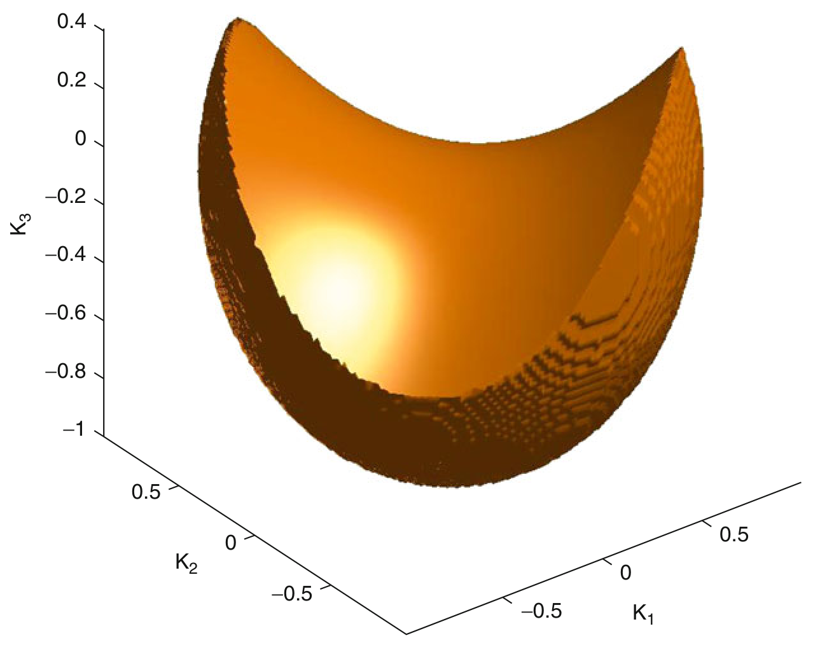

> Image description: A 3D surface plot titled "A nonconvex ball of stable matrices" illustrates the relationship between three variables: $K_1$, $K_2$, and $K_3$. The plot depicts a portion of a curved, bowl-shaped surface, representing a nonconvex set. The axes are labeled as follows: $K_1$ and $K_2$ define the horizontal plane, with values ranging approximately from $-0.5$ to $0.5$ (for $K_1$) and $-0.5$ to $0.5$ (for $K_2$). The vertical axis is labeled $K_3$, ranging from $-1$ to $0.4$. The surface is colored with a gradient of gold and brown, where the brightest area represents the lowest point of the bowl-shaped manifold. This visualization is used in the context of optimization-based robust control to represent a set of stable matrices within a parameter space.

Optimization Based Robust Control, Fig. 2 The spectral abscissa is typically nonconvex and nonsmooth
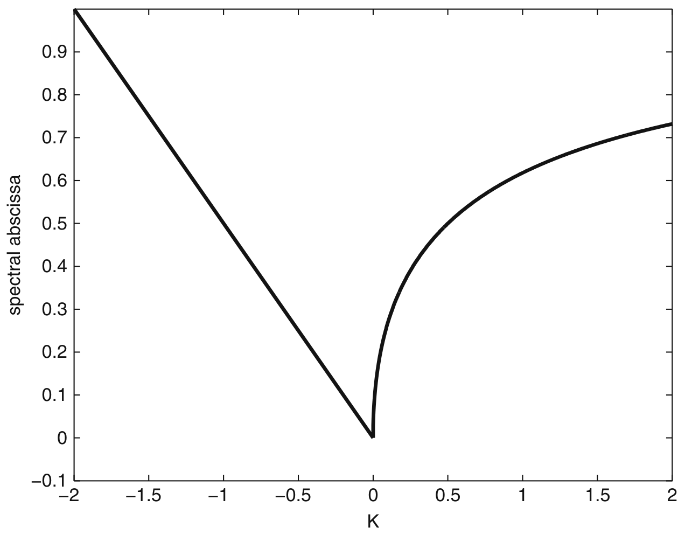

> Image description: A line graph illustrates the relationship between a variable $K$ on the horizontal axis and the "spectral abscissa" on the vertical axis, as shown in Figure 2 of "Optimization Based Robust Control." The $x$-axis, labeled $K$, ranges from $-2$ to $2$. The $y$-axis, labeled "spectral abscissa," ranges from $-0.1$ to approximately $1.0$. The graph features a single, continuous black line that originates at a high value near $1.0$ at $K = -2$, decreases linearly towards the origin, and reaches its minimum value of $0$ at $K = 0$. From the origin, the curve rises sharply and follows a smooth, concave-upward trajectory as $K$ increases toward $2$. This visual representation demonstrates the caption's assertion that the spectral abscissa is typically nonconvex and nonsmooth, specifically highlighting the sharp, non-differentiable point (kink) at the origin where the linear descent meets the curved ascent.

et al. 2001, 2006b). In Fig. 3, we represent graphs of the spectral abscissa (with flipped vertical axis for better visualization) of some small-size matrices depending on two real parameters, with randomly generated parametrization. We observe the typical nonconvexity and lack of smoothness around local and global optima.

The third difficulty for optimization-based robust control is the uncertainty. As explained above, optimization of a performance criterion with respect to controller parameters is already a potentially difficult problem for a nominal system (i.e., when the uncertainty parameter is equal to zero). This becomes even more difficult


<!-- source_pdf_page: 1020 -->
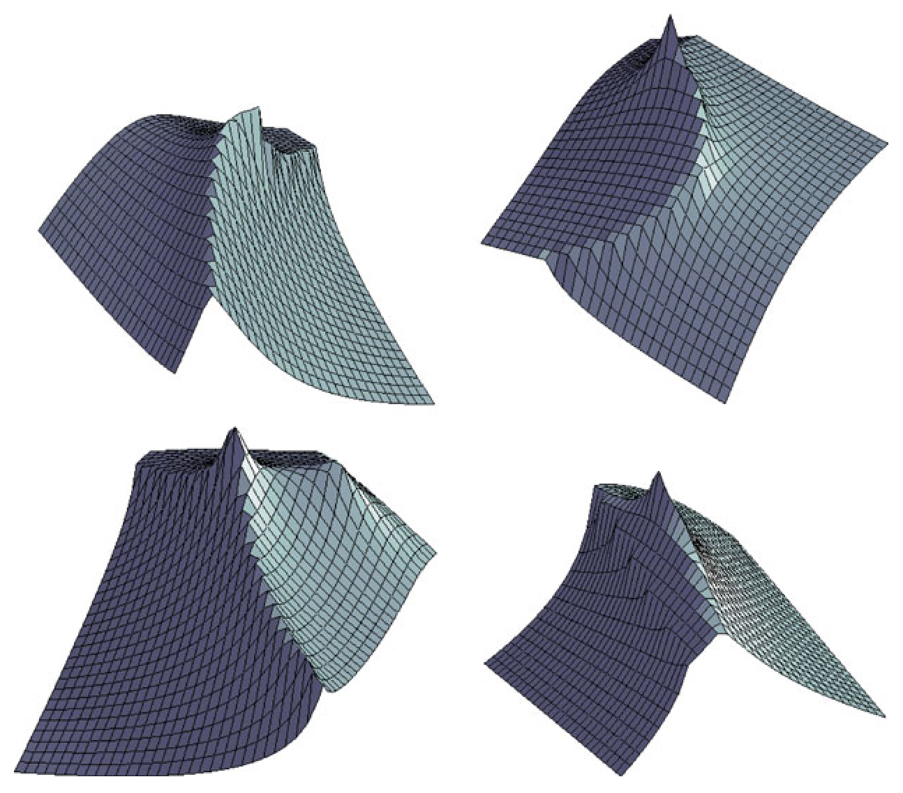

> Image description: A composite image containing four separate 3D surface plots arranged in a 2x2 grid. Each plot represents a mathematical function over a two-dimensional domain, visualized as a continuous, shaded mesh surface. The surfaces feature varying topography, characterized by smooth slopes and sharp, jagged peaks or ridges. The surfaces are colored with a gradient of light blue-grey and dark purple-blue, where the color likely represents the height or value of the function at different points. The plots do not contain explicit numbered labels, arrows, axes, or variables. However, based on the caption, these graphs represent the negative spectral abscissa for randomly generated matrix parametrizations. The surfaces illustrate a complex, non-smooth landscape with local extrema, reflecting the mathematical characteristics of the spectral abscissa function in an optimization context.
Optimization Based Robust Control, Fig. 3 The graph of the negative spectral abscissa for some randomly generated matrix parametrizations

when this optimization must be carried out for all possible instances of the uncertainty $\delta$ in $\Delta$. This is where the above assumption that the uncertainty set $\Delta$ has a simple description proves useful. If the uncertainty $\delta$ is unstructured and not time varying, then it can be handled with the complex stability radius (Ackermann 1993), the pseudospectral abscissa (Trefethen and Embree 2005), or via an $H_{\infty}$ norm constraint (Zhou et al. 1996). If the uncertainty $\delta$ is structured, then we can try to optimize a performance criterion at every vertex in the polytopic description (which is a relaxation of the problem of stabilizing the whole polytope). An example is the problem of simultaneous stabilization, where a controller $K$ must be found such that the maximum spectral abscissa of several matrices $\mathrm{A}_{i}(K), i=1, \ldots, N$ is negative (Blondel 1994). Finally, if the uncertainty $\delta$ is time varying, then performance and stability guarantees can still be achieved with the help of Lyapunov certificates or potentially conservative convex LMI conditions: see, e.g., Boyd et al. (1994) and Scherer et al. (1997).

A unified approach to addressing conflicting performance criteria and uncertainty consists of searching for locally optimal solutions of a nonsmooth optimization problem that is built to incorporate minimization objectives and constraints for multiple plants. This is called (linear robust) multiobjective control, and formally, it can be expressed as the following optimization problem

$$
\begin{gathered}
\min _{K} \max _{i=1, \ldots, N}\left\{g_{i}(K): \beta_{i}=\infty\right\} \\
\text { s.t. } g_{i}(K) \leq \beta_{i}, i=1, \ldots, N,
\end{gathered}
$$

where each $g_{i}(\mathrm{~K})$ is a function of the closedloop matrix $A_{i}(K)$ (e.g., a spectral abscissa or an $H_{\infty}$ norm) and the scalars $\beta_{i}$ are given and such that if $\beta_{i}=\infty$ for some $i$, then $g_{i}$ appears in the objective function and not in a constraint: see Gumussoy et al. (2009) for details. In the above problem, the objective function, a maximum of nonsmooth and nonconvex functions, is typically also nonsmooth and nonconvex. Moreover, without loss of generality,


<!-- source_pdf_page: 1021 -->
we can easily impose a sparsity pattern on controller matrix $K$ to account for structural constraints (e.g., a low-order decentralized controller).

## Software Packages

Algorithms for nonconvex nonsmooth optimization have been developed and interfaced for linear robust multiobjective control in the public domain Matlab package HIFOO released in Burke et al. (2006a) and based on the theory described in Burke et al. (2006b). In 2011, The MathWorks released HINFSTRUCT, a commercial implementation of these techniques based on the theory described in Apkarian and Noll (2006).

## Cross-References

- H-Infinity Control
- LMI Approach to Robust Control


## Bibliography

Ackermann J (1993) Robust control - systems with uncertain physical parameters. Springer, Berlin
Apkarian P, Noll D (2006) Nonsmooth H-infinity synthesis. IEEE Trans Autom Control 51(1): 71-86
Blondel VD (1994) Simultaneous stabilization of linear systems. Springer, Heidelberg
Boyd S, El Ghaoui L, Feron E, Balakrishnan V (1994) Linear matrix inequalities in system and control theory. SIAM, Philadelphia
Burke JV, Lewis AS, Overton ML (2001) Optimizing matrix stability. Proc AMS 129:1635-1642
Burke JV, Henrion D, Lewis AS, Overton ML (2006a) HIFOO - a Matlab package for fixed-order controller design and H-infinity optimization. In: Proceedings of the IFAC symposium robust control design, Toulouse
Burke JV, Henrion D, Lewis AS, Overton ML (2006b) Stabilization via nonsmooth, nonconvex optimization. IEEE Trans Autom Control 51(11):1760-1769
Chesi G (2010) LMI techniques for optimization over polynomials in control: a survey. IEEE Trans Autom Control 55(11):2500-2510
Gumussoy S, Henrion D, Millstone M, Overton ML (2009) Multiobjective robust control with HIFOO 2.0. In: Proceedings of the IFAC symposium on robust control design (ROCOND 2009), Haifa

Henrion D, Lasserre JB (2004) Solving nonconvex optimization problems - how GloptiPoly is applied to problems in robust and nonlinear control. IEEE Control Syst Mag 24(3):72-83
Scherer CW, Gahinet P, Chilali M (1997) Multi-objective output feedback control via LMI optimization. IEEE Trans Autom Control 42(7):896-911
Trefethen LN, Embree M (2005) Spectra and pseudospectra: the behavior of nonnormal matrices and operators. Princeton University Press, Princeton
Zhou K, Doyle JC, Glover K (1996) Robust and optimal control. Prentice Hall, Upper Saddle River

# Optimization-Based Control Design Techniques and Tools

Pierre Apkarian ${ }^{1}$ and Dominikus Noll ${ }^{2}$<br>${ }^{1}$ DCSD, ONERA - The French Aerospace Lab, Toulouse, France<br>${ }^{2}$ Institut de Mathématiques, Université de Toulouse, Toulouse, France


#### Abstract

Structured output feedback controller synthesis is an exciting new concept in modern control design, which bridges between theory and practice insofar as it allows for the first time to apply sophisticated mathematical design paradigms like $H_{\infty}$ or $H_{2}$ control within control architectures preferred by practitioners. The new approach to structured $H_{\infty}$ control, developed during the past decade, is rooted in a change of paradigm in the synthesis algorithms. Structured design may no longer be based on solving algebraic Riccati equations or matrix inequalities. Instead, optimizationbased design techniques are required. In this essay we indicate why structured controller synthesis is central in modern control engineering. We explain why non-smooth optimization techniques are needed to compute structured control laws, and we point to software tools which enable practitioners to use these new tools in high-technology applications.


<!-- source_pdf_page: 1022 -->
## Keywords

Controller tuning; $H_{\infty}$ synthesis; Multi-objective design; Non-smooth optimization; Structured controllers; Robust control

## Introduction

In the modern high-technology field of control, engineers usually face a large variety of concurring design specifications such as noise or gain attenuation in prescribed frequency bands, damping, decoupling, constraints on settling or rise time, and much else. In addition, as plant models are generally only approximations of the true system dynamics, control laws have to be robust with respect to uncertainty in physical parameters or with regard to un-modeled highfrequency phenomena. Not surprisingly, such a plethora of constraints present a major challenge for controller tuning, not only due to the evergrowing number of such constraints but also because of their very different provenience.

The dramatic increase in plant complexity is exacerbated by the desire that regulators should be as simple as possible, easy to understand and to tune by practitioners, convenient to hardware implement, and generally available at low cost. Such practical constraints explain the limited use of black-box controllers, and they are the driving force for the implementation of structured control architectures, as well as for the tendency to replace hand-tuning methods by rigorous algorithmic optimization tools.

## Structured Controllers

Before addressing specific optimization techniques, we introduce some basic terminology for control design problems with structured controllers. A state-space description of the given $P$ used for design is given as
where $A, B_{1}, \ldots$ are real matrices of appropriate dimensions, $x_{P} \in \mathbb{R}^{n_{P}}$ is the state, $u \in \mathbb{R}^{n_{u}}$ the control, $y \in \mathbb{R}^{n_{y}}$ the measured output, $w \in \mathbb{R}^{n_{w}}$ the exogenous input, and $z \in \mathbb{R}^{n_{z}}$ the regulated output. Similarly, the sought output feedback controller $K$ is described as

$$
K:\left\{\begin{align*}
\dot{x}_{K} & =A_{K} x_{K}+B_{K} y  \tag{2}\\
u & =C_{K} x_{K}+D_{K} y
\end{align*}\right.
$$

with $x_{K} \in \mathbb{R}^{n_{K}}$ and is called structured if the (real) matrices $A_{K}, B_{K}, C_{K}, D_{K}$ depend smoothly on a design parameter $\mathbf{x} \in \mathbb{R}^{n}$, referred to as the vector of tunable parameters. Formally, we have differentiable mappings

$$
\begin{aligned}
& A_{K}=A_{K}(\mathbf{x}), B_{K}=B_{K}(\mathbf{x}), C_{K}=C_{K}(\mathbf{x}), \\
& D_{K}=D_{K}(\mathbf{x}),
\end{aligned}
$$

and we abbreviate these by the notation $K(\mathbf{x})$ for short to emphasize that the controller is structured with $\mathbf{x}$ as tunable elements.

A structured controller synthesis problem is then an optimization problem of the form

$$
\begin{align*}
\operatorname{minimize} & \left\|T_{w z}(P, K(\mathbf{x}))\right\| \\
\text { subject to } & K(\mathbf{x}) \text { closed-loop stabilizing }  \tag{3}\\
& K(\mathbf{x}) \text { structured, } \mathbf{x} \in \mathbb{R}^{n}
\end{align*}
$$

where $T_{w z}(P, K)=\mathcal{F}_{\ell}(P, K)$ is the lower feedback connection of (1) with (2) as in Fig. 1 (left), also called the linear fractional transformation (Varga and Looye 1999). The norm $\|\cdot\|$ stands for the $H_{\infty}$ norm, the $H_{2}$ norm, or any other system norm, while the optimization variable $\mathbf{x} \in \mathbb{R}^{n}$ regroups the tunable parameters in the design.

Standard examples of structured controllers $K(\mathbf{x})$ include realizable PIDs and observer-based, reduced-order, or decentralized controllers, which in state space are expressed as

$$
\begin{gather*}
{\left[\begin{array}{cc|c}
0 & 0 & 1 \\
0 & -1 / \tau & -k_{D} / \tau \\
\hline k_{I} & 1 / \tau & k_{P}+k_{D} / \tau
\end{array}\right],\left[\begin{array}{c|c}
A-B_{2} K_{c}-K_{f} C_{2} & K_{f} \\
\hline-K_{c} & 0
\end{array}\right]} \\
{\left[\begin{array}{c|c}
A_{K} & B_{K} \\
\hline C_{K} & D_{K}
\end{array}\right], \quad\left[\begin{array}{c|c}
\operatorname{diag}_{K i}^{q} A_{K i} & \operatorname{diag}_{i=1}^{q} B_{K i} \\
\hline \frac{q}{\operatorname{diag}_{i=1}^{q} C_{K i}} & \operatorname{diag}_{i=1}^{q} D_{K i}
\end{array}\right] .} \tag{1}
\end{gather*}
$$


<!-- source_pdf_page: 1023 -->
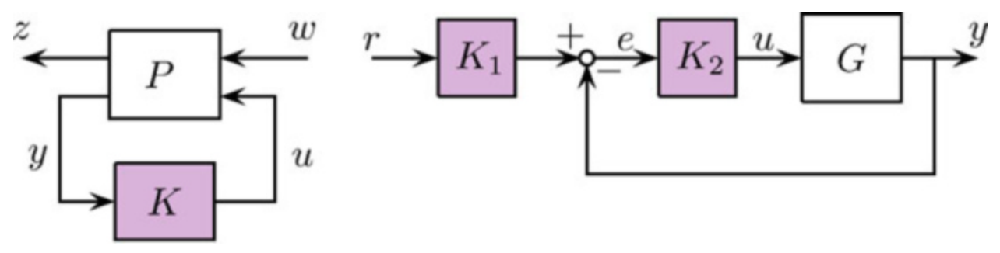

> Image description: This figure, captioned "Optimization-Based Control Design Techniques and Tools, Fig. 1," illustrates two control architectures side-by-side. On the left is a black-box full-order controller represented by two interconnected blocks. The plant is labeled $P$, and the controller is labeled $K$ (shaded in pink). An input $w$ enters $P$, which produces an output $z$. Feedback is provided from the plant output $y$ into $K$, and the controller output $u$ enters back into $P$. On the right, a structured two-degree-of-freedom (2-DOF) control architecture is shown, where $K = \operatorname{block-diag}(K_1, K_2)$. The signal $r$ enters $K_1$, and their outputs are combined at a summation point to create an error signal $e$. The error $e$ enters $K_2$ (shaded pink), which produces output $u$. This $u$ is fed into the plant block $G$, resulting in output $y$. A feedback path connects output $y$ back to the subtraction junction.

Optimization-Based Control Design Techniques and Tools, Fig. 1 Black-box full-order controller $K$ on the left, structured 2-DOF control architecture with $K=\operatorname{block-diag}\left(K_{1}, K_{2}\right)$ on the right

Optimization-Based Control Design Techniques and Tools, Fig. 2 Synthesis of $K=$ block-diag $\left(K_{1}, \ldots, K_{N}\right)$ against multiple requirements or models $P^{(1)}, \ldots, P^{(M)}$. Each $K_{i}(\mathbf{x})$ can be structured
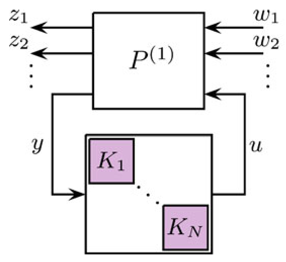

> Image description: A block diagram illustrates a control system synthesis problem. A large rectangular block labeled $P^{(1)}$ represents a plant or model. It has several input and output arrows. Inputs to $P^{(1)}$ include exogenous disturbances or references $w_1, w_2, \ldots$ and measured output $y$. The outputs from $P^{(1)}$ include performance outputs $z_1, z_2, \ldots$ and control input $u$. Below the plant, a larger rectangular block contains a set of $N$ controller blocks, denoted as $K_1, \ldots, K_N$, arranged diagonally. This set is represented by $K = \text{block-diag}(K_1, \ldots, K_N)$. The controller block receives the output $y$ from $P^{(1)}$ as an input and provides the control signal $u$ back to $P^{(1)}$, forming a closed-loop feedback structure. The arrows indicate the directional flow of signals between the plant and the controller. The diagram represents the synthesis of a structured controller $K$ to meet various requirements or model constraints.
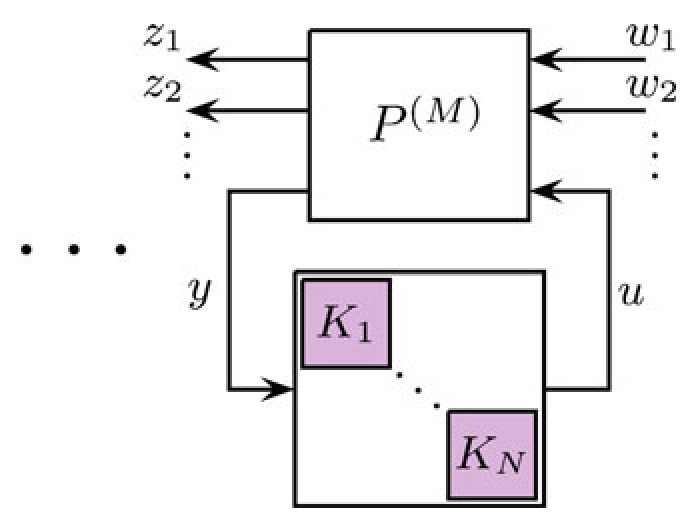

> Image description: A technical block diagram illustrating a control system synthesis framework. At the top, a large rectangular block labeled $P(M)$ represents a plant or generalized model. It has several input and output arrows: two outputs on the left labeled $z_1$ and $z_2$ (followed by ellipsis), and two inputs on the right labeled $w_1$ and $w_2$ (followed by ellipsis). Below the plant block, a second, larger rectangular block contains a set of smaller, shaded purple blocks labeled $K_1$ through $K_N$. This lower block represents a structured controller $K = \text{block-diag}(K_1, \dots, K_N)$. Feedback loops connect the two blocks: a signal $y$ flows from the plant block output to the controller input, and a control signal $u$ flows from the controller output back to the plant block input. The diagram depicts the standard setup for structured control synthesis, where a composite controller is designed to manage a plant subject to multiple requirements or models.

In the case of a PID, the tunable parameters are $\mathbf{x}=\left(\tau, k_{P}, k_{I}, k_{D}\right)$, for observer-based controllers $\mathbf{x}$ regroups the estimator and statefeedback gains ( $K_{f}, K_{c}$ ), for reduced order controllers $n_{K}<n_{P}$ the tunable parameters $\mathbf{x}$ are the $n_{K}^{2}+n_{K} n_{y}+n_{K} n_{u}+n_{y} n_{u}$ unknown entries in ( $A_{K}, B_{K}, C_{K}, D_{K}$ ), and in the decentralized form $\mathbf{x}$ regroups the unknown entries in $A_{K 1}, \ldots, D_{K q}$. In contrast, fullorder controllers have the maximum number $N=n_{P}^{2}+n_{P} n_{y}+n_{P} n_{u}+n_{y} n_{u}$ of degrees of freedom and are referred to as unstructured or as black-box controllers.

More sophisticated controller structures $K(\mathbf{x})$ arise from architectures like, for instance, a 2-DOF control arrangement with feedback block $K_{2}$ and a set-point filter $K_{1}$ as in Fig. 1 (right). Suppose $K_{1}$ is the 1 st-order filter $K_{1}(s)=a /(s+a)$ and $K_{2}$ the PI feedback $K_{2}(s)=k_{P}+k_{I} / s$. Then the transfer $T_{r y}$ from $r$ to $y$ can be represented as the feedback connection of $P$ and $K(\mathbf{x})$ with
$P:=\left[\begin{array}{c|ccc}A & 0 & 0 & B \\ \hline C & 0 & 0 & D \\ 0 & I & 0 & 0 \\ -C & 0 & I & -D\end{array}\right], K(\mathbf{x}):=\left[\begin{array}{cc}K_{1}(s) & 0 \\ 0 & K_{2}(s)\end{array}\right]$,
where $K(\mathbf{x})$ takes a typical block-diagonal structure featuring the tunable elements $\mathbf{x}= \left(a, k_{P}, k_{I}\right)$.

In much the same way, arbitrary multi-loop interconnections of fixed-model elements with tunable controller blocks $K_{i}(\mathbf{x})$ can be rearranged as in Fig. 2 so that $K(\mathbf{x})$ captures all tunable blocks in a decentralized structure general enough to cover most engineering applications.

The structure concept is equally useful to deal with the second central challenge in control design: system uncertainty. The latter may be handled with $\mu$-synthesis techniques (Stein and Doyle 1991) if a parametric uncertain model is available. A less ambitious but often more practical alternative consists in optimizing the structured controller $K(\mathbf{x})$ against a finite set of plants $P^{(1)}, \ldots, P^{(M)}$ representing model variations due to uncertainty, aging, sensor and actuator breakdown, and un-modeled dynamics, in tandem with the robustness and performance specifications. This is again formally covered by Fig. 2 and leads to a multi-objective constrained optimization problem of the form
minimize $\quad f(\mathbf{x})=\max _{k \in \mathrm{SOFT}, i \in I_{k}}\left\|T_{w_{i} z_{i}}^{(k)}(K(\mathbf{x}))\right\|$


<!-- source_pdf_page: 1024 -->
subject to $g(\mathbf{x})=\max _{k \in \mathrm{HARD}, j \in J_{k}}\left\|T_{w_{j} z_{j}}^{(k)}(K(\mathbf{x}))\right\| \leq 1$
$K(\mathbf{x})$ structured and stabilizing

$$
\begin{equation*}
\mathbf{x} \in \mathbb{R}^{n} \tag{4}
\end{equation*}
$$

where $T_{w_{i} z_{i}}^{(k)}$ denotes the $i$ th closed-loop robustness or performance channel $w_{i} \rightarrow z_{i}$ for the $k$ th plant model $P^{(k)}(s)$. The rationale of (4) is to minimize the worst-case cost of the soft constraints $\left\|T_{w_{i} z_{i}}^{(k)}\right\|, k \in$ SOFT while enforcing the hard constraints $\left\|T_{w_{j} z_{j}}^{(k)}\right\| \leq 1, k \in$ HARD. Note that in the mathematical programming terminology, soft and hard constraints are classically referred to as objectives and constraints. The terms soft and hard point to the fact that hard constraints prevail over soft ones and that meeting hard constraints for solution candidates is mandatory.

## Optimization Techniques Over the Years

During the late 1990s, the necessity to develop design techniques for structured regulators $K(\mathbf{x})$ was recognized (Fares et al. 2001), and the limitations of synthesis methods based on algebraic Riccati equations (AREs) or linear matrix inequalities (LMIs) became evident, as these techniques can only provide black-box controllers. The lack of appropriate synthesis techniques for structured $K(\mathbf{x})$ led to the unfortunate situation, where sophisticated approaches like the $H_{\infty}$ paradigm developed by academia since the 1980s could not be brought to work for the design of those controller structures $K(\mathbf{x})$ preferred by practitioners. Design engineers had to continue to rely on heuristic and ad hoc tuning techniques, with only limited scope and reliability. As an example, post-processing to reduce a black-box controller to a practical size is prone to failure. It may at best be considered a fill-in for a rigorous design method which directly computes a reduced-order controller. Similarly, hand-tuning of the parameters $\mathbf{x}$ remains a puzzling task because of the loop interactions and fails as soon as complexity increases.

In the late 1990s and early 2000s, a change of methods was observed. Structured $\mathrm{H}_{2}$ - and $H_{\infty}$-synthesis problems (3) were addressed by bilinear matrix inequality (BMI) optimization, which used local optimization techniques based on the augmented Lagrangian method (Fares et al. 2001; Noll et al. 2002; Kocvara and Stingl 2003), sequential semidefinite programming methods (Fares et al. 2002; Apkarian et al. 2003), and non-smooth methods for BMIs (Noll et al. 2009; Lemaréchal and Oustry 2000). However, these techniques were based on the bounded real lemma or similar matrix inequalities and were therefore of limited success due to the presence of Lyapunov variables, i.e., matrixvalued unknowns, whose dimension grows quadratically in $n_{P}+n_{K}$ and represents the bottleneck of that approach.

The epoch-making change occurs with the introduction of non-smooth optimization techniques (Noll and Apkarian 2005; Apkarian and Noll 2006b,c, 2007) to programs (3) and (4). Today non-smooth methods have superseded matrix inequality-based techniques and may be considered the state of the art as far as realistic applications are concerned. The transition took almost a decade.

Alternative control-related local optimization techniques and heuristics include the gradient sampling technique of Burke et al. (2005), derivative-free optimization discussed in Kolda et al. (2003) and Apkarian and Noll (2006a) and particle swarm optimization; see Oi et al. (2008) and references therein and also evolutionary computation techniques (Lieslehto 2001). The last three classes do not exploit derivative information and rely on function evaluations only. They are therefore applicable to a broad variety of problems including those where function values arise from complex numerical simulations. The combinatorial nature of these techniques, however, limits their use to small problems with a few tens of variable. More significantly, these methods often lack a solid convergence theory. In contrast, as we have demonstrated over recent years (Apkarian and Noll 2006b; Noll et al. 2008),


<!-- source_pdf_page: 1025 -->
specialized non-smooth techniques are highly efficient in practice, are based on a sophisticated convergence theory, are capable of solving medium-size problems in a matter of seconds, and are still operational for large-size problems with several hundreds of states.

## Non-smooth Optimization Techniques

The benefit of the non-smooth casts (3) and (4) lies in the possibility to avoid searching for Lyapunov variables, a major advantage as their number $\left(n_{P}+n_{K}\right)^{2} / 2$ usually largely dominates $n$, the number of true decision parameters $\mathbf{x}$. Lyapunov variables do still occur implicitly in the function evaluation procedures, but this has no harmful effect for systems up to several hundred states. In abstract terms, a non-smooth optimization program has the form

$$
\begin{array}{ll}
\operatorname{minimize} & f(\mathbf{x}) \\
\text { subject to } & g(\mathbf{x}) \leq 0  \tag{5}\\
& \mathbf{x} \in \mathbb{R}^{n}
\end{array}
$$

where $f, g: \mathbb{R}^{n} \rightarrow \mathbb{R}$ are locally Lipschitz functions and are easily identified from the cast in (4).

In the realm of convex optimization, nonsmooth programs are conveniently addressed by so-called bundle methods, introduced in the late 1970s by Lemaréchal (1975). Bundle methods are used to solve difficult problems in integer programming or in stochastic optimization via Lagrangian relaxation. Extensions of the bundling technique to non-convex problems like (3) or (4) were first developed in Apkarian and Noll (2006b,c, 2007), Apkarian et al. (2008), Noll et al. (2009), and, in more abstract form, Noll et al. (2008).

Figure 3 shows a schematic view of a non-convex bundle method consisting of a descent-step generating inner loop (yellow block) comparable to a line search in smooth optimization, embedded into the outer loop
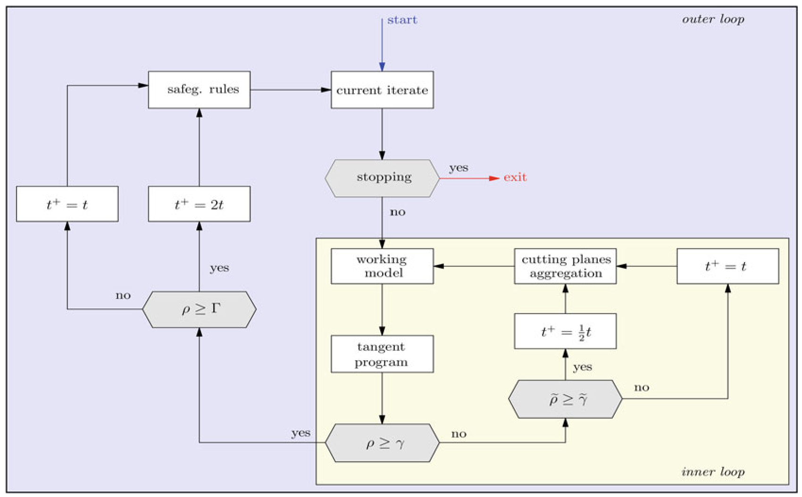

> Image description: A flowchart titled "Fig. 3 Flowchart of proximity control bundle algorithm" depicts an iterative optimization process consisting of an "outer loop" and an "inner loop." The outer loop begins at a "start" node, proceeding to "current iterate." A decision block "stopping" branches to "exit" if "yes" or continues to the inner loop if "no." The inner loop is contained within a yellow shaded region. It follows a sequence from "working model" to "tangent program." A decision block $\rho \geq \gamma$ leads back to the outer loop (if "yes") or moves to a sub-process involving "cutting planes aggregation" (if "no"). This sub-process includes a decision $\tilde{\rho} \geq \bar{\gamma}$ and updates to the variable $t^+$. If $\tilde{\rho} \geq \bar{\gamma}$ is "no," $t^+ = t$ is set before returning to the "working model." If "yes," $t^+ = \frac{1}{2}t$ is set. The outer loop contains a secondary logic path where $\rho \geq \Gamma$ determines whether $t^+ = 2t$ or $t^+ = t$ is applied before returning to "safeg. rules."

Optimization-Based Control Design Techniques and Tools, Fig. 3 Flowchart of proximity control bundle algorithm


<!-- source_pdf_page: 1026 -->
(blue box), where serious iterates are processed, stopping criteria are applied, and the model tradition is assured. Serious steps or iterates refer to steps accepted in a line search, while null steps are unsuccessful steps visited during the search. By model tradition, we mean continuity of the model between (serious) iterates $x^{j}$ and $x^{j+1}$ by recycling some of the older planes used at counter $j$ into the new working model at $j+1$. This avoids starting the first inner loop $k=1$ at $j+1$ from scratch and therefore saves time.

At the core of the interaction between inner and outer loop is the management of the proximity control parameter $\tau$, which governs the stepsize $\left\|\mathbf{x}-\mathbf{y}^{k}\right\|$ between trial steps $\mathbf{y}^{k}$ at the current serious iterate $\mathbf{x}$. Similar to the management of a trust region radius or of the stepsize in a line search, proximity control allows to force shorter trial steps if agreement of the local model with the true objective function is poor and allows larger steps if agreement is satisfactory.

Oracle-based bundle methods traditionally assure global convergence in the sense of subsequences under the sole hypothesis that for every trial point $\mathbf{x}$, the function value $f(\mathbf{x})$ and a Clarke subgradient $\phi \in \partial f(\mathbf{x})$ are provided. In automatic control applications, it is as a rule possible to provide more specific information, which may be exploited to speed up convergence.

Computing function value and gradients of the $H_{2}$ norm $f(\mathbf{x})=\left\|T_{w z}(P, K(\mathbf{x}))\right\|_{2}$ requires essentially the solution of two Lyapunov equations of size $n_{P}+n_{K}$ (see Apkarian et al. 2007; Rautert and Sachs 1997). For the $H_{\infty}$ norm, $f(\mathbf{x})= \left\|T_{w z}(P, K(\mathbf{x}))\right\|_{\infty}$, function evaluation is based on the Hamiltonian algorithm of Benner et al. (2012) and Boyd et al. (1989). The Hamiltonian matrix is of size $n_{P}+n_{K}$ so that function evaluations may be costly for very large plant state dimension ( $n_{P}>500$ ), even though the number of outer loop iterations of the bundle algorithm is not affected by a large $n_{P}$ and generally relates to $n$, the dimension of $\mathbf{x}$. The additional cost for subgradient computation for large $n_{P}$ is relatively cheap as it relies on linear algebra (Apkarian and Noll 2006b).

## Computational Tools

The novel non-smooth optimization methods became available to the engineering community since 2010 via the MATLAB Robust Control Toolbox (Robust Control Toolbox 4.2 2012; Gahinet and Apkarian 2011). Routines HINFSTRUCT, LOOPTUNE, and SYSTUNE are versatile enough to define and combine tunable blocks $K_{i}(\mathbf{x})$, to build and aggregate design requirements $T_{w z}^{(k)}$ of different nature, and to provide suitable validation tools. Their implementation was carried out in cooperation with P. Gahinet (MathWorks). These routines further exploit the structure of problem (4) to enhance efficiency (see Apkarian and Noll 2006b, 2007).

It should be mentioned that design problems with multiple hard constraints are inherently complex. It is well known that even simultaneous stabilization of more than two plants $P^{(j)}$ with a structured control law $K(\mathbf{x})$ is NP-complete so that exhaustive methods are expected to fail even for small to medium problems. The principled decision made in Apkarian and Noll (2006b) and reflected in the MATLAB routines is to rely on local optimization techniques instead. This leads to weaker convergence certificates but has the advantage to work successfully in practice. In the same vein, in (4) it is preferable to rely on a mixture of soft and hard requirements, for instance, by the use of exact penalty functions (Noll and Apkarian 2005). Key features implemented in the mentioned MATLAB routines are discussed in Apkarian (2013), Gahinet and Apkarian (2011), and Apkarian and Noll (2007).

## Design Example

Design of a feedback regulator is an interactive process, in which tools like SYSTUNE, LOOPTUNE, or HINFSTRUCT support the designer in various ways. In this section we illustrate their enormous potential by solving a multi-model, fixed-structure reliable flight control design problem.


<!-- source_pdf_page: 1027 -->
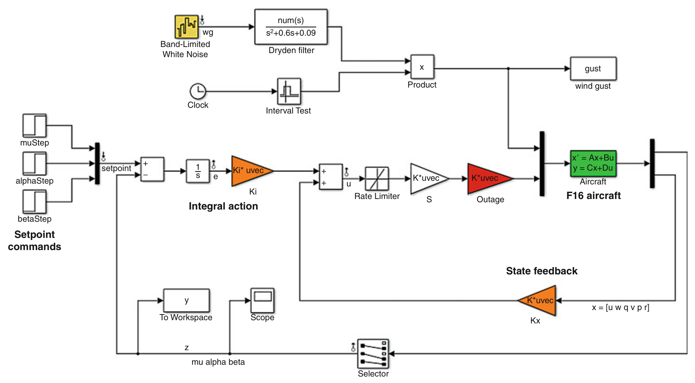

> Image description: A Simulink block diagram illustrates a synthesis interconnection for reliable control for an F16 aircraft model. The system incorporates several interconnected components. At the top, a "Band-Limited White Noise" block feeds into a "Dryden filter," characterized by the transfer function $num(s)/(s^2 + 0.6s + 0.9)$, which represents atmospheric turbulence. The output is multiplied by a "Clock" block, representing an "Interval Test," to produce "wind gust." The control structure includes "Setpoint commands" (muStep, alphaStep, betaStep) summed into a "setpoint." The error signal passes through an "Integral action" block ($1/s$) multiplied by $K_i \cdot uvec$. This signal undergoes rate limiting and is subjected to a simulated "Outage" block ($K \cdot uvec$). A "State feedback" loop is implemented where the aircraft state $x = [u \ w \ q \ v \ p \ r]$ is multiplied by $Kx$ and subtracted from the control input. The "F16 aircraft" plant is defined by state-space equations $\dot{x'} = Ax' + Bu$ and $y = Cx + Du$.
Optimization-Based Control Design Techniques and Tools, Fig. 4 Synthesis interconnection for reliable control

Optimization-Based Control Design Techniques and Tools, Table 1 Outage scenarios where 0 stands for failure
| Outage cases | Diagonal of outage gain |  |  |  |  |
| :--- | :--- | :--- | :--- | :--- | :--- |
| Nominal mode | 1 | 1 | 1 | 1 | 1 |
| Right elevator outage | 0 | 1 | 1 | 1 | 1 |
| Left elevator outage | 1 | 0 | 1 | 1 | 1 |
| Right aileron outage | 1 | 1 | 0 | 1 | 1 |
| Left aileron outage | 1 | 1 | 1 | 0 | 1 |
| Left elevator and right aileron outage | 1 | 0 | 0 | 1 | 1 |
| Right elevator and right aileron outage | 0 | 1 | 0 | 1 | 1 |
| Right elevator and left aileron outage | 0 | 1 | 1 | 0 | 1 |
| Left elevator and left aileron outage | 1 | 0 | 1 | 0 | 1 |


In reliable flight control, one has to maintain stability and adequate performance not only in nominal operation but also in various scenarios where the aircraft undergoes outages in elevator and aileron actuators. In particular, wind gusts must be alleviated in all outage scenarios to maintain safety. Variants of this problem are addressed in Liao et al. (2002).

The open loop F16 aircraft in the scheme of Fig. 4 has six states, the body velocities $u, v, w$ and pitch, roll, and yaw rates $q, p, r$. The state is available for control as is the flight-path bank angle rate $\mu$ (deg/s), the angle of attack $\alpha$ (deg), and the sideslip angle $\beta$ (deg). Control inputs are the left and right elevator, left and right aileron,
and rudder deflections (deg). The elevators are grouped symmetrically to generate the angle of attack. The ailerons are grouped antisymmetrically to generate roll motion. This leads to three control actions as shown in Fig. 4. The controller consists of two blocks, a $3 \times 6$ state-feedback gain matrix $K_{x}$ in the inner loop and a $3 \times 3$ integral gain matrix $K_{i}$ in the outer loop, which leads to a total of $27=\operatorname{dim} \mathbf{x}$ parameters to tune.

In addition to nominal operation, we consider eight outage scenarios shown in Table 1.

The different models associated with the outage scenarios are readily obtained by premultiplication of the aircraft control input by a diagonal matrix built from the rows in Table 1.


<!-- source_pdf_page: 1028 -->
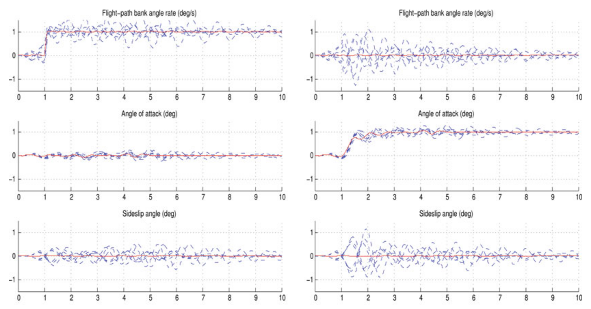
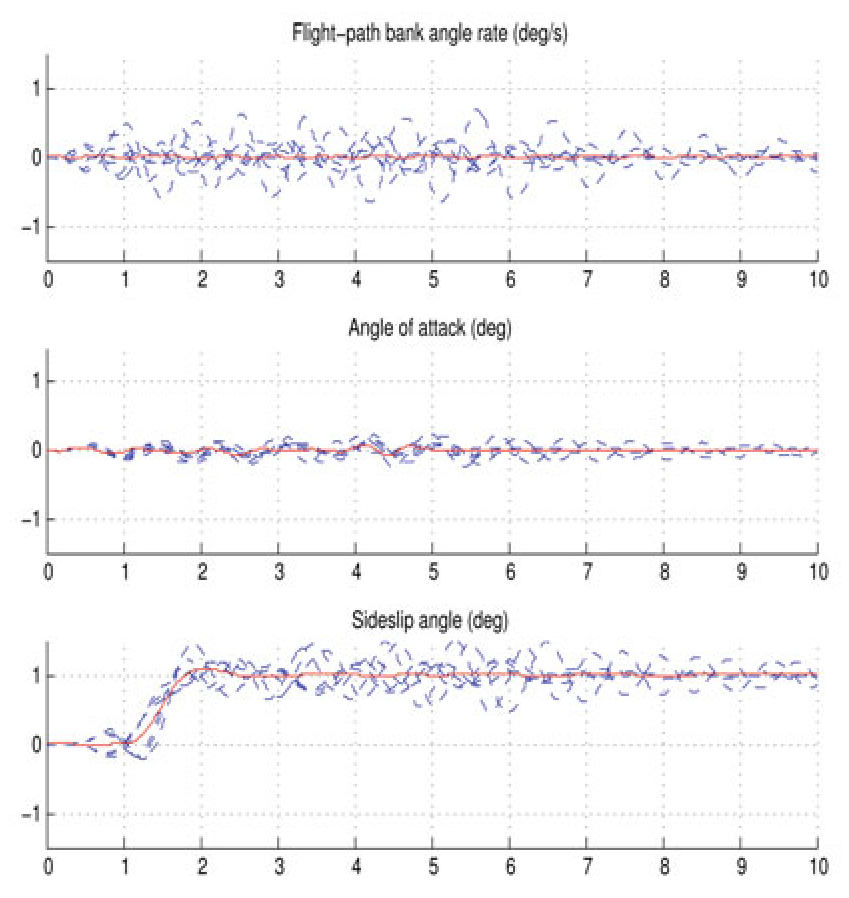

> Image description: A figure from a textbook titled "Optimization-Based Control Design Techniques and Tools" shows three stacked line graphs illustrating system responses to step changes. The figure, labeled as Figure 5, displays "Responses to step changes in $\mu, \alpha$, and $\beta$ for nominal design." The top plot shows "Flight-path bank angle rate (deg/s)" on the y-axis, ranging from -1 to 1, and time from 0 to 10 seconds on the x-axis. The data oscillates around zero. The middle plot displays "Angle of attack (deg)" on the y-axis, ranging from -1 to 1, against time on the x-axis. The values fluctuate near zero. The bottom plot shows "Sideslip angle (deg)" on the y-axis, ranging from -1 to 1, against time on the x-axis. The signal shows a step increase around 1 second, stabilizing near a value of 1. All plots feature a solid red line representing the nominal response and a dashed blue line representing stochastic noise or variations.

Optimization-Based Control Design Techniques and Tools, Fig. 5 Responses to step changes in $\mu, \alpha$, and $\beta$ for nominal design

The design requirements are as follows:

- Good tracking performance in $\mu, \alpha$, and $\beta$ with adequate decoupling of the three axes.
- Adequate rejection of wind gusts of $5 \mathrm{~m} / \mathrm{s}$.
- Maintain stability and acceptable performance in the face of actuator outage.
Tracking is addressed by an LQG cost (Maciejowski 1989), which penalizes integrated tracking error $e$ and control effort $u$ via

$$
\begin{equation*}
J=\lim _{T \rightarrow \infty} E\left(\frac{1}{T} \int_{0}^{T}\left\|W_{e} e\right\|^{2}+\left\|W_{u} u\right\|^{2} d t\right) \tag{6}
\end{equation*}
$$

Diagonal weights $W_{e}$ and $W_{u}$ provide tuning knobs for trade-off between responsiveness, control effort, and balancing of the three channels. We use $W_{e}=\operatorname{diag}(20,30,20), W_{u}=I_{3}$ for normal operation and $W_{e}=\operatorname{diag}(8,12,8), W_{u}=I_{3}$ for outage conditions. Model-dependent weights


<!-- source_pdf_page: 1029 -->
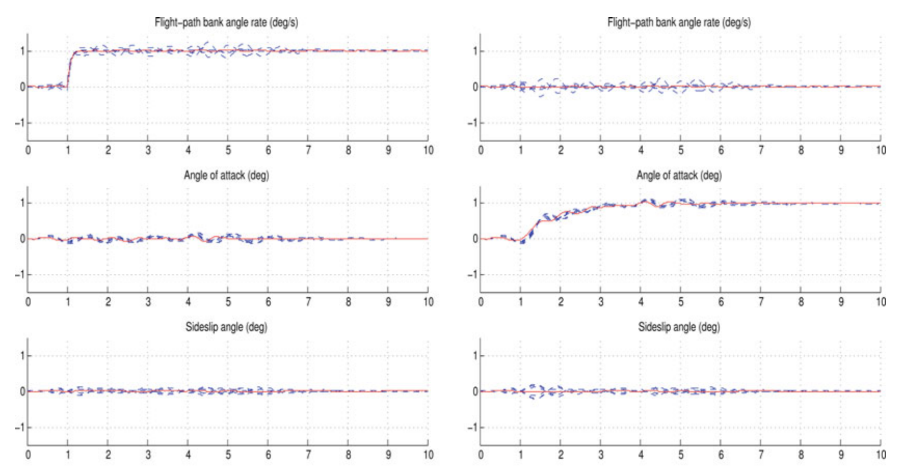

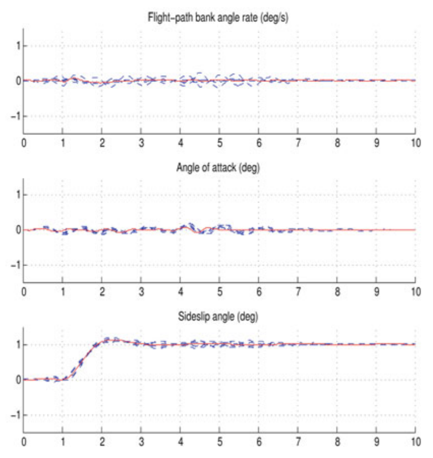

> Image description: This figure from "Optimization-Based Control Design Techniques and Tools" contains three vertically stacked line graphs illustrating the time-domain responses to step changes in $\mu$, $\alpha$, and $\beta$ for a fault-tolerant control design. The x-axis for all plots represents time in seconds, ranging from 0 to 10 seconds. The top plot displays the "Flight-path bank angle rate (deg/s)," showing a near-zero response with minor oscillations around the zero baseline. The middle plot shows the "Angle of attack (deg)" response, which remains near zero with small-amplitude oscillations. The bottom plot depicts the "Sideslip angle (deg)" response, which exhibits a clear step change from 0 to 1 degree around $t=1.5$ seconds, followed by damped oscillations that settle near 1 degree by $t=7$ seconds. Each plot includes a solid red line (likely the reference or ideal response) and a dashed blue line (the actual system response), showing how the controller handles disturbances or step inputs to maintain stability.
Optimization-Based Control Design Techniques and Tools, Fig. 6 Responses to step changes in $\mu, \alpha$, and $\beta$ for fault-tolerant design

allow to express the fact that nominal operation prevails over failure cases. Weights for failure cases are used to achieve limited deterioration of performance or of gust alleviation under deflection surface breakdown.

The second requirement, wind gust alleviation, is treated as a hard constraint limiting the variance of the error signal $e$ in response to white noise $w_{g}$ driving the Dryden wind gust model.

In particular, the variance of $e$ is limited to 0.01 for normal operation and to 0.03 for the outage scenarios.

With the notation of section "Non-smooth Optimization Techniques," the functions $f(\mathbf{x})$ and $g(\mathbf{x})$ in (5) are $f(\mathbf{x}):=\max _{k=1, \ldots, 9}\left\|T_{r z}^{(k)}(\mathbf{x})\right\|_{2}$ and $g(\mathbf{x}):=\max _{k=1, \ldots, 9}\left\|T_{w_{g} e}^{(k)}(\mathbf{x})\right\|_{2}$, where $r$ denotes the set-point inputs in $\mu, \alpha$, and $\beta$. The regulated output $z$ is


<!-- source_pdf_page: 1030 -->
$$
z^{T}:=\left[\left(W_{e}^{1 / 2} e\right)^{T}\left(W_{u}^{1 / 2} u\right)^{T}\right]^{T}
$$

with $\mathbf{x}=\left(\operatorname{vec}\left(K_{i}\right), \operatorname{vec}\left(K_{x}\right)\right) \in \mathbb{R}^{27}$. Soft constraints are the square roots of $J$ in (6) with appropriate weightings $W_{e}$ and $W_{u}$, hard constraints the RMS values of $e$, suitably weighted to reflect variance bounds of 0.01 and 0.03 . These requirements are covered by the Variance and WeightedVariance options in Robust Control Toolbox 4.2 (2012).

With this setup, we tuned the controller gains $K_{i}$ and $K_{x}$ for the nominal scenario only (nominal design) and for all nine scenarios (fault-tolerant design). The responses to setpoint changes in $\mu, \alpha$, and $\beta$ with a gust speed of $5 \mathrm{~m} / \mathrm{s}$ are shown in Fig. 5 for the nominal design and in Fig. 6 for the fault-tolerant design. As expected, nominal responses are good but notably deteriorate when faced with outages. In contrast, the fault-tolerant controller maintains acceptable performance in outage situations. Optimal performance (square root of LQG cost $J$ in (6)) for the fault-tolerant design is only slightly worse than for the nominal design ( 26 vs. 23). The non-smooth program (5) was solved with SYSTUNE, and the fault-tolerant design ( 9 models, 11 states, 27 parameters) took 30 s on Mac OS X with 2.66 GHz Intel Core i7 and 8 GB RAM. The reader is referred to Robust Control Toolbox 4.2 (2012) or higher versions, for further examples, and additional details.

## Future Directions

From an application viewpoint, non-smooth optimization techniques for control system design and tuning will become one of the standard techniques in the engineer's toolkit. They are currently studied in major European aerospace industries.

Future directions may include:

- Extension of these techniques to gain scheduling in order to handle larger operating domains.
- Application of the available tools to integrated system/control when both system physical characteristics and controller elements are
optimized to achieve higher performance. Application to fault detection and isolation may also reveal as an interesting vein.


## Cross-References

- H-Infinity Control
- Optimization Based Robust Control
- Robust Synthesis and Robustness Analysis Techniques and Tools


## Bibliography

Apkarian P (2013) Tuning controllers against multiple design requirements. In: American control conference (ACC), Washington, DC, pp 3888-3893
Apkarian P, Noll D (2006a) Controller design via nonsmooth multi-directional search. SIAM J Control Optim 44(6): 1923-1949
Apkarian P, Noll D (2006b) Nonsmooth $H_{\infty}$ synthesis. IEEE Trans Autom Control 51(1):71-86
Apkarian P, Noll D (2006c) Nonsmooth optimization for multidisk $H_{\infty}$ synthesis. Eur J Control 12(3): 229-244
Apkarian P, Noll D (2007) Nonsmooth optimization for multiband frequency domain control design. Automatica 43(4):724-731
Apkarian P, Noll D, Thevenet JB, Tuan HD (2003) A spectral quadratic-SDP method with applications to fixed-order $H_{2}$ and $H_{\infty}$ synthesis. Eur J Control 10(6):527-538
Apkarian P, Noll D, Rondepierre A (2007) Mixed $H_{2} / H_{\infty}$ control via nonsmooth optimization. In: Proceedings of the 46th IEEE conference on decision and control, New Orleans, pp 4110-4115
Apkarian P, Noll D, Prot O (2008) A trust region spectral bundle method for nonconvex eigenvalue optimization. SIAM J Optim 19(1):281-306
Benner P, Sima V, Voigt M (2012) $L_{\infty}$-norm computation for continuous-time descriptor systems using structured matrix pencils. IEEE Trans Autom Control 57(1):233-238
Boyd S, Balakrishnan V, Kabamba P (1989) A bisection method for computing the $H_{\infty}$ norm of a transfer matrix and related problems. Math Control Signals Syst 2(3):207-219
Burke J, Lewis A, Overton M (2005) A robust gradient sampling algorithm for nonsmooth, nonconvex optimization. SIAM J Optim 15:751-779
Fares B, Apkarian P, Noll D (2001) An augmented lagrangian method for a class of LMI-constrained problems in robust control theory. Int J Control 74(4): 348-360


<!-- source_pdf_page: 1031 -->
Fares B, Noll D, Apkarian P (2002) Robust control via sequential semidefinite programming. SIAM J Control Optim 40(6): 1791-1820
Gahinet P, Apkarian P (2011) Structured $H_{\infty}$ synthesis in MATLAB. In: Proceedings of the IFAC world congress, Milan, pp 1435-1440
Kocvara M, Stingl M (2003) A code for convex nonlinear and semidefinite programming. Optim Methods Softw 18(3):317-333
Kolda TG, Lewis RM, Torczon V (2003) Optimization by direct search: new perspectives on some classical and modern methods. SIAM Rev 45(3):385-482
Lemaréchal C (1975) An extension of Davidon methods to nondifferentiable problems. In: Balinski ML, Wolfe P (eds) Nondifferentiable optimization. Mathematical programming study, vol 31. North-Holland, Amsterdam, pp 95-109
Lemaréchal C, Oustry F (2000) Nonsmooth algorithms to solve semidefinite programs. In: El Ghaoui L, Niculescu S-I (eds) SIAM advances in linear matrix inequality methods in control series. SIAM
Liao F, Wang JL, Yang GH (2002) Reliable robust flight tracking control: an LMI approach. IEEE Trans Control Syst Technol 10:76-89
Lieslehto J (2001) PID controller tuning using evolutionary programming. In: American control conference, Arlington, Virginia, vol 4, pp 2828-2833
Maciejowski JM (1989) Multivariable feedback design. Addison-Wesley, Wokingham
Noll D, Apkarian P (2005) Spectral bundle methods for nonconvex maximum eigenvalue functions: first-order methods. Math Program B 104(2): 701-727
Noll D, Torki M, Apkarian P (2002) Partially augmented lagrangian method for matrix inequality constraints. Submitted Rapport Interne, MIP, UMR 5640, Maths. Dept. - Paul Sabatier University
Noll D, Prot O, Rondepierre A (2008) A proximity control algorithm to minimize nonsmooth and nonconvex functions. Pac J Optim 4(3):571-604
Noll D, Prot O, Apkarian P (2009) A proximity control algorithm to minimize nonsmooth and nonconvex semiinfinite maximum eigenvalue functions. J Convex Anal 16(3-4):641-666
Oi A, Nakazawa C, Matsui T, Fujiwara H, Matsumoto K, Nishida H, Ando J, Kawaura M (2008) Development of PSO-based PID tuning method. In: International conference on control, automation and systems, Seoul, Korea, pp 1917-1920
Rautert T, Sachs EW (1997) Computational design of optimal output feedback controllers. SIAM J Optim 7(3):837-852
Robust Control Toolbox 4.2 (2012) The MathWorks Inc., Natick
Stein G, Doyle J (1991) Beyond singular values and loopshapes. AIAA J Guid Control 14:5-16
Varga A, Looye G (1999) Symbolic and numerical software tools for LFT-based low order uncertainty modeling. In: Proceedings of the CACSD'99 symposium, Cohala, pp 1-6

# Option Games: The Interface Between Optimal Stopping and Game Theory

Benoit Chevalier-Roignant ${ }^{1}$ and Lenos Trigeorgis ${ }^{2}$<br>${ }^{1}$ Oliver Wyman, Munich, Germany<br>${ }^{2}$ University of Cyprus, Nicosia, Cyprus


#### Abstract

Managers can stake a claim by committing to capital investments today that can influence their rivals' behavior or take a "wait-and-see" or step-by-step approach to avoid possible adverse market consequences tomorrow. At the core of this corporate dilemma lies the classic trade-off between commitment and flexibility. This tradeoff calls for a careful balancing of the merits of flexibility against those of commitment. This balancing is captured by option games.


## Keywords

Game theory; Option games; Optimal stopping; Real options

## Introduction

The global competitive environment has become increasingly more challenging as modern economies undergo unprecedented changes in the midst of the global economic turmoil. Realworld dilemmas corporate managers face today are driven by the interplay among strategic and market uncertainty. The tech industry has evolved most rapidly, putting companies unable to respond to market developments and technological breakthroughs at severe disadvantage. Corporate management's plans and how they implement their strategy will likely determine whether the firm will survive and be successful in the marketplace or become extinct.


<!-- source_pdf_page: 1032 -->
Formulating the right strategy in the right competitive environment at the right time is a nontrivial task. Whether to invest in a new technology, a new product or enter a new market is a strategic decision of immense importance. Corporate management must assess strategic options with proper analytical tools that can help determine whether to commit to a particular strategic path, given scarce or costly resources, or whether to stay flexible. Oftentimes, firms need to position themselves flexibly to capitalize on future opportunities as they emerge, while limiting potential losses arising from adverse future circumstances. In many cases, corporate managers find themselves in need to revise their decision plans in view of actual market developments when facing an uncertain future; they can then decide to undertake only those projects with sufficiently high prospects in the future to justify commitment at that time. This needs to be balanced with the need to make irreversible strategic commitments to seize first-mover advantage presenting rivals with a fait accompli to which they have no choice but adapt.

## Capital Budgeting Ignoring Strategic Interactions

## Net Present Value

Prevailing management approaches simplify matters and often lead to investment decisions that are detrimental to the firm's long-term wellbeing. Suppose a firm's future cash flow at time $t$ is given by a random variable $X_{t}$. Cash flows then evolve as a geometric Brownian motion

$$
d X_{t}=g X_{t} d t+\sigma X_{t} d B_{t} \text { and } X_{0} \equiv x
$$

with drift parameter $g$ and volatility $\sigma$. The Brownian motion ( $B_{t} ; t \geq 0$ ) captures exogenous market uncertainty. The standard criterion used in corporate finance is based on discounted cash flows (DCF) or net present value (NPV). This consists in assessing the current value of a project by discounting the expected future cash flows $E\left[X_{t}\right]$ at a constant discount rate, $r$. Management supposedly creates shareholder value by under-
taking projects with positive NPV, i.e., projects for which the present value of cash flows, $v(x)= \int_{0}^{\infty} e^{-r t} E\left[X_{t}\right] d t$, exceeds the necessary investment cost, $I$. In the present case, the firm will invest under the zero-NPV criterion if

$$
\begin{equation*}
\frac{x}{r-g} \geq I \tag{1}
\end{equation*}
$$

This traditional criterion views investment opportunities as now-or-never decisions under passive management. However, this precludes the possibility to adjust future decisions in case the market develops off the expected path. While market uncertainty is factored in through the discount rate, the flexibility management has is typically not properly accounted for.

## Real Options Analysis

It has become standard practice in finance and strategy to interpret real investment opportunities as being analogous to financial options. This view is well accepted among academics and practitioners alike and is at the core of real options analysis (ROA). ROA is an extension of optionpricing theory to real investment situations (Myers 1977; Trigeorgis 1996). This approach effectively allows one to capture the dynamic nature of decision-making since it factors in management's flexibility to revise and adapt its decision in the face of market uncertainty. ROA allows managers with flexibility to adapt to actual market developments as uncertainty gets resolved. Managers may, for example, delay the start (or closure) of a project depending on its prospects. This approach leverages on optimal stopping theory (e.g., see Bensoussan and Lions 1982; Dixit and Pindyck 1994) and is considered to be more reflective of real decision-making than traditional methods. In the case the firm can delay the decision to invest, for example, the problem is one of optimal stopping:

$$
V(x)=\max _{T} E\left[e^{-r T}\left(v\left(X_{T}\right)-I\right)\right]
$$

by ROA, the discount rate $r$ is the risk-free interest (Dixit and Pindyck 1994; Trigeorgis 1996). The time of managerial action, $T$, is


<!-- source_pdf_page: 1033 -->
now a strategic decision variable random by nature as the decision maker faces an uncertain environment. This problem has an analytical solution characterized by a threshold policy, say a trigger $\bar{X}$, given by

$$
\begin{equation*}
\frac{\bar{X}}{r-g}=\frac{b}{b-1} I \tag{2}
\end{equation*}
$$

where $b$ is the positive root of a quadratic function (e.g., see Dixit and Pindyck 1994) and $b /(b-1)>1$. When decisions are costly or difficult to reverse, corporate managers would be more cautious and careful to make decisions. A firm should not always commit immediately even if the NPV criterion (1) indicates so - but wait until the gross project value is sufficiently positive to cover the investment cost I by a factor larger than one, as expressed in (2). Investing prematurely may destroy shareholder value. Real options may justify sometimes undertaking projects with negative (static) net present value if it creates a platform for growth options or delaying projects with positive NPV.

## Accounting for Strategic Interactions in Capital Budgeting

## Strategic Uncertainty

As natural monopolies have lost their secular well-protected positions owing to market liberalization in the European Union and elsewhere across the globe, strategic interdependencies have become new key challenge for managers. At the same time sectors traditionally populated by multiple firms have undergone significant consolidation, often resulting in oligopolistic situations with a reduced number of players. The ongoing economic crisis has amplified these consolidation pressures. These two ongoing phenomena - liberalization and consolidation - have put high on the corporate agenda the assessment of strategic options under competition. Standard real options analysis often examines investment decisions as if the option holder has a proprietary right to exercise. This perspective may not be realistic in the new oligopolistic environment as several
firms may share the right to a related investment opportunity in the industry.

## Game Theory

In oligopolistic industries, firms often have difficulty predicting how rivals will behave and make decisions based on beliefs about their likely behavior. A theory that helps characterize beliefs and form predictions about which strategies opponents will follow is helpful in analyzing such oligopolistic situations. Game theory has traditionally been used to frame strategic interactions arising in conflict situations involving parties with different objectives or interests. It attempts to model behavior in strategic situations or games in which one party's success in making choices depends on the choices of other players through influencing one another's welfare. Game theory adopts a different perspective on optimization, as the focus is on the formation of beliefs about how rivals' optimal strategies. Finance theory has been primarily concerned with "moves by nature," while game theory focuses on "optimization problems" involving multiple players. To solve a game, one needs to reduce a complex multiplayer problem into a simpler structure that captures the essence of the conflict situation. One can then derive useful predictions about how rivals are likely to react in a given situation. Game theory helped reshape microeconomics by providing analytical foundations for the study of market behavior and has been at the foundation of the Nobel prize winning research field of industrial organization.

Dynamic game theory (see, e.g., Basar and Olsder 1999) addresses problems in which several parties are in repeated interaction. Strategic management approaches based on dynamic economic theory can provide a richer foundation for understanding developments and competitive reactions within an industry. As firm competitiveness involves interactions among several players (rivals, suppliers or clients), game theoretic analysis brings important insights into strategic management in addressing such issues as first- and second-mover advantages, firm entry and exit decisions, strategic commitment, reputation, signaling, and other informational


<!-- source_pdf_page: 1034 -->
effects. A key lesson is that, when firms react to one another, it may sometimes be appropriate for one firm to take an aggressive stance in expectation that rivals will back off. Dynamic industrial organization includes the analysis of "games of timing" such as preemption games or war of attrition, whereby firms decide on appropriate investment timing under rivalry.

## Option Games

The earlier optimal stopping problem falls in the category of "games of timing" when a firm's entry decision influences another firm's market strategy. Option games are most suitable to help model situations where a firm that has a real option to (dis)invest faces rivalry. Here, the problem consists in finding a Nash equilibrium solution for the two-player equivalent of the above optimal stopping problem. This solution must also satisfy certain dynamic consistency criteria. For sequential investments, the follower is faced with a single-agent optimal investment timing problem; it will thus enter if the gross project value exceeds the investment cost by a sufficient factor. A firm entering the market early on, i.e., a leader, earns temporary monopoly rents as long as demand remains below the follower's entry threshold. Following the follower's entry, the firms act as a duopoly. As long as the leader's value exceeds the follower's, there is an incentive for one firm to invest, but not necessarily for both of them, leading to a "coordination problem." The competitive pressure will dissipate away the leader's firstmover advantage, leading to a market entry point that is not socially optimal and to rent dissipation. Unfortunately, the multiplayer problem does not involve a simple analytical solution, since at each point a duopolist firm might end up in any of four distinct situations (two-by-two matrix) depending on the rival's entry decision. Option games indicate in each situation which driving force (commitment vs. flexibility) prevails and whether to go ahead with the investment or wait and see. Main drivers of the prevailing market
equilibrium include the riskiness of the venture, $\sigma$, the magnitude of the first-mover advantage and the exclusive or shared ability to reap the benefits of the investment vis-à-vis rivals. When firms can grasp a large first-mover advantage from investing early but cannot differentiate themselves sufficiently from each other, they may be tempted to wage a preemptive war, investing prematurely at an early market stage that actually kills option value. If firms are more on an equal footing but do not see much benefit from investing early, they may prefer to wait and invest (jointly) at a later stage when the future market is sufficiently mature. If, however, one firm has a comparative cost advantage that dominates (e.g., a radical or drastic technological superiority) its rival industry, participants may prefer a consensual leaderfollower investment arrangement involving less option value destruction.

## Conclusions

Corporate management's strategic tool kit should provide clearer guidance on whether to pursue a wait-and-see stance in the face of uncertain market developments or jump on the first-mover bandwagon to build competitive advantage. We discussed two different modeling approaches that provide complementary perspectives and insights to help management deal with issues of flexibility versus commitment: real options and dynamic game theory. While each approach separately might turn a blind eye to flexibility or commitment, an integrative perspective through "options games" might provide the right balance and serve as a tool kit for adaptive competitive strategy. Both perspectives ultimately aim to derive better insights into industry dynamics under industry conditions characterized by both market and strategic uncertainty.

Option games pave the way for a consistent approach in addressing managerial decisionmaking, elevating the art of strategy to scientific analysis. Option games integrates in a common, consistent framework recent advances made in


<!-- source_pdf_page: 1035 -->
these diverse set of disciplines. This emerging field that represents a promising strategic management tool that can help guide managerial decisions through the complexity of the modern competitive marketplace.

## Cross-References

- Auctions
- Learning in Games


## Recommended Reading

Smit and Trigeorgis (2004) discuss related tradeoffs with discrete-time real option techniques. Grenadier (2000) and Huisman (2001) examine a number of continuous-time models. ChevalierRoignant and Trigeorgis (2011) synthesize both types of "option games." An overview of the literature is provided in Chevalier-Roignant et al. (2011).

## Bibliography

Basar T, Olsder GJ (1999) Dynamic noncooperative game theory, 2nd edn. SIAM, Philadelphia
Bensoussan A, Lions J-L (1982) Application of variational inequalities in stochastic control. North Holland, Amsterdam
Chevalier-Roignant B, Trigeorgis L (2011) Competitive strategy: options and games. MIT, Cambridge, MA
Chevalier-Roignant B, Flath CM, Huchzermeier A, Trigeorgis L (2011) Strategic investment under uncertainty: a synthesis. Eur J Oper Res 215(3):639-50
Dixit AK, Pindyck RS (1994) Investment under uncertainty. Princeton University Press, Princeton
Grenadier S (2000) Game choices: the intersection of real options and game theory. Risk Books, London
Huisman KJM (2001) Technology investment: a game theoretic real options approach. Springer, Boston
Myers SC (1977) Determinants of corporate borrowing. J Financ Econ 5(2): 147-175
Smit HTJ, Trigeorgis L (2004) Strategic investment: real options and games. Princeton University Press, Princeton
Trigeorgis (1996) Real options. MIT, Cambridge, NA

# Oscillator Synchronization

Bruce A. Francis<br>Department of Electrical and Computer Engineering, University of Toronto, Toronto, ON, Canada


#### Abstract

The nonlinear Kuramoto equations for $n$ coupled oscillators are derived and studied. The oscillators are defined to be synchronized when they oscillate at the same frequency and their phases are all equal. A control-theoretic viewpoint reveals that synchronized states of Kuramoto oscillators are locally asymptotically stable if every oscillator is coupled to all others. The problem of synchronization in Kuramoto oscillators is closely related to rendezvous, consensus, and flocking problems in distributed control. These problems, with their elegant solution by graph theory, are discussed briefly.


## Keywords

Graph theory; Kuramoto model; Laplacian; Oscillator; Synchronization

## Introduction

An oscillator is an electronic circuit or other kind of dynamical system that produces a periodic signal. If several oscillators are coupled together in some fashion and the periodic signals that they each produce are of the same frequency and are in phase, the oscillators are said to be synchronized. The book Sync: The Emerging Science of Spontaneous Order, by Strogatz, introduces a wide variety of phenomena where oscillators synchronize. Some examples from biology: networks of pacemaker cells in the heart, circadian pacemaker cells in the suprachiasmatic nucleus of the brain,


<!-- source_pdf_page: 1036 -->
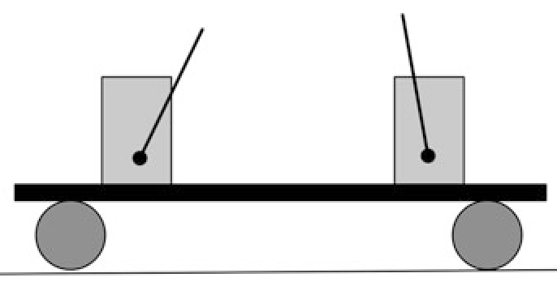

> Image description: A textbook figure, titled "Oscillator Synchronization, Fig. 1," illustrates two metronomes placed on a horizontal black board. The board is supported by two cylindrical objects, described in the caption as pop cans, situated at either end. Each metronome is depicted as a gray rectangle with a black dot at its base, from which a thin black rod extends diagonally upward, representing the pendulum. The two metronomes are positioned symmetrically on the left and right sides of the board. According to the caption, the metronomes are released at the same frequency but at different times. The diagram serves to demonstrate the physical phenomenon of synchronization, where the mechanical coupling through the shared board causes the two oscillating metronomes to eventually tick in unison despite their initial phase difference. The image provides a simplified visual model of coupled oscillators in a mechanical system.
Oscillator Synchronization, Fig. 1 Two metronomes on a board that is on two pop cans. After the metronomes are let go at the same frequency but at different times, they soon become synchronized and tick in unison.

metabolic synchrony in yeast cell suspensions, groups of synchronously flashing fireflies, and crickets that chirp in unison. Engineering examples include clock synchronization in distributed communication networks and electric power networks with synchronous generators.

A very simple example of oscillator synchronization was discovered by Christiaan Huygens, the prominent Dutch scientist and mathematician who lived in the 1600s. One of his contributions was the invention of the pendulum clock, where a pendulum swings back and forth with a constant frequency. Huygens observed that two pendulum clocks in his house synchronized after some time. The explanation for this phenomenon is that the pendula were coupled mechanically through the wooden frame of the house. The same principle can be observed by a fun, simple experiment. As in Fig. 1, put two pop cans on a table, on their sides and parallel to each other. Place a board on top of them, and place two (or more) metronomes on the board. Set the metronomes to tick at the same frequency. Start them off ticking but not in unison. Within a few minutes they will be ticking in unison.

In this essay we derive what are known as the Kuramoto equations, a mathematical model of $n$ oscillators, and then we study when they will synchronize.

## The Kuramoto Model

In 1975 the Japanese researcher Yoshiki Kuramoto gave one of the first serious mathemati-
cal studies of coupled oscillators. To derive Kuramoto's equations, we begin with a simple hypothetical setup. Imagine $n$ runners going around a circular track. Suppose they're all going at roughly the same speed, but each adjusts his/her speed based on the speeds of his/her nearest neighbors. If some runner passes another, that one tends to speed up to close the gap. The synchronization question is do the runners eventually end up running together in a tight pack?

Idealize the runners to be merely points, numbered $k=1, \ldots, n$. They move on the unit circle in the complex plane. A point on the unit circle can be written as $\mathrm{e}^{j \theta}$, where $j$ denotes the unit imaginary number and $\theta$ denotes the angle measured counterclockwise from the positive real axis. The position of point $k$ at time $t$ is $z_{k}(t)= \mathrm{e}^{j\left(\omega t+\theta_{k}(t)\right)}$, where $\omega$ is the nominal rotational speed in $\mathrm{rad} / \mathrm{s}$, and $\theta_{k}(t)$ is the difference between the actual angle at time $t$ and the nominal angle $\omega t$. Notice that $\omega$ is a constant positive real number and it is the same for all $n$ points. As in circuit theory, it simplifies the mathematics to refer all the positions to the sinusoid $\mathrm{e}^{j \omega t}$, and therefore we define the local position of point $k$ to be $p_{k}(t)=z_{k}(t) / \mathrm{e}^{j \omega t}$, i.e., $p_{k}(t)=\mathrm{e}^{j \theta_{k}(t)}$. Differentiate the local position with respect to time and let "dot" denote $d / d t: \dot{p}_{k}=\mathrm{e}^{j \theta_{k}} j \dot{\theta}_{k}$. Define the local rotational velocity $v_{k}=\dot{\theta}_{k}$ and substitute into the preceding equation:

$$
\begin{equation*}
\dot{p}_{k}=v_{k} j p_{k} . \tag{1}
\end{equation*}
$$

The local velocity $v_{k}$ could be positive or negative. Notice that if we view $p_{k}$ as a vector from the origin and view multiplication by $j$ as rotation by $\pi / 2$, then $j p_{k}$ can be viewed as tangent to the circle at the point $p_{k}$ - see the picture on the left in Fig. 2.

Now we propose a feedback law for $v_{k}$ in Eq. (1); see the picture on the right in Fig. 2. Take $v_{k}$ proportional to the projection of $p_{i}$ onto the tangent at $p_{k}$, that is, $v_{k}=\left\langle p_{i}, j p_{k}\right\rangle$. Here the inner product between two complex numbers $v, w$ is $\langle v, w\rangle=\operatorname{Re} \bar{v} w$. (You may check that this is equivalent to the usual dot product of vectors in $\mathbb{R}^{2}$.) Thus from (1) the model to get $k$ to close the gap is $\dot{p}_{k}=\left\langle p_{i}, j p_{k}\right\rangle j p_{k}$.


<!-- source_pdf_page: 1037 -->
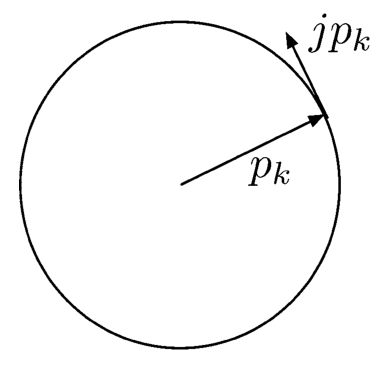

> Image description: A diagram illustrating vector relationships related to oscillator synchronization. The figure depicts a circle with a central origin point. Two arrows originate from the center and move towards the circumference. One arrow points towards the right along a radial line, labeled with the variable $p_{k}$. A second, shorter arrow originates from the tip of the $p_{k}$ vector and points tangentially to the circle in a counter-clockwise direction; this vector is labeled $j p_{k}$. The orientation of $j p_{k}$ is perpendicular to $p_{k}$, representing a ninety-degree rotation in a complex plane or phase space. The diagram visually represents the relationship between a state variable $p_{k}$ and its derivative or phase-shifted counterpart $j p_{k}$.
Oscillator Synchronization, Fig. 2 Left: The vectors $p_{k}$ and $j p_{k}$. Right: The local velocity $v_{k}$

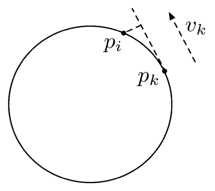

> Image description: A technical diagram illustrates components of oscillator synchronization, specifically representing points and vectors on a circular trajectory. The figure features a solid black circle centered in the frame. Two points are marked on the circumference of this circle: $p_{i}$ and $p_{k}$, located in the upper-right quadrant. A dashed straight line segment connects $p_{i}$ and $p_{k}$, representing a chord across the circle. Extending from the point $p_{k}$, a dashed line is oriented tangent to the circle, indicating the direction of motion. A black arrow labeled $v_{k}$ is positioned alongside this tangent line, pointing upward and outward, representing the local velocity vector at point $p_{k}$. The diagram uses mathematical notation to define the geometric relationship between the specific positions ($p_{i}$, $p_{k}$) and the local velocity ($v_{k}$) within a circular path.
Oscillator Synchronization, Fig. 2 Left: The vectors $p_{k}$ and $j p_{k}$. Right: The local velocity $v_{k}$

More generally, suppose that point $k$ pays attention to not just point $i$ but a fixed set of points called its neighbors. Let $\mathcal{N}_{k}$ denote the index set of neighbors of point $k$ and for simplicity assume $\mathcal{N}_{k}$ does not depend on time. We consider the control law $v_{k}=\sum_{i \in \mathcal{N}_{k}}\left\langle p_{i}, j p_{k}\right\rangle$ and thereby arrive at the model of the evolution of the positions $p_{k}$ :

$$
\dot{p}_{k}=\sum_{i \in \mathcal{N}_{k}}\left\langle p_{i}, j p_{k}\right\rangle j p_{k} .
$$

However, the Kuramoto model gives the evolution of the angles $\theta_{k}$ rather than the points $p_{k}$. To find the equation for $\theta_{k}$, we observe that

$$
\begin{aligned}
\left\langle p_{i}, j p_{k}\right\rangle & =\operatorname{Re}\left(\bar{p}_{i} j p_{k}\right) \\
& =\operatorname{Re}\left(\mathrm{e}^{-j \theta_{i}} j \mathrm{e}^{j \theta_{k}}\right) \\
& =\sin \left(\theta_{i}-\theta_{k}\right)
\end{aligned}
$$

In this way, the controlled points move according to

$$
\dot{p}_{k}=\sum_{i \in \mathcal{N}_{k}} \sin \left(\theta_{i}-\theta_{k}\right) j p_{k} .
$$

Substitute in $p_{k}=\mathrm{e}^{j \theta_{k}}$ and then cancel $j p_{k}$ :

$$
\begin{equation*}
\dot{\theta}_{k}=\sum_{i \in \mathcal{N}_{k}} \sin \left(\theta_{i}-\theta_{k}\right), \quad k=1, \ldots, n . \tag{2}
\end{equation*}
$$

This is the Kuramoto model of coupled oscillators in terms of the phases of the oscillators. There are $n$ coupled nonlinear ordinary differential equations.

Equation (2) has the vector form $\dot{\theta}=g(\theta)$. There are some variations in the literature about
the state space associated with this equation. It is important to get the state space right because otherwise the concepts of stability and synchronization become shaky. The phase angles $\theta_{k}$ are real numbers with units of radians, so at first glance the state space is $\mathbb{R}^{n}$. But the angles are defined modulo $2 \pi$ and so their values are restricted to lie in the interval $[0,2 \pi)$. In this way the state space becomes $[0,2 \pi)^{n}$. For example, if $n=2$ the state space is the square $[0,2 \pi) \times[0,2 \pi)$ viewed as a subset of the plane $\mathbb{R}^{2}$. The mapping $\phi \mapsto \mathrm{e}^{j \phi}$ is a one-to-one correspondence from the interval $[0,2 \pi)$ to the unit circle in the complex plane $\mathbb{C}$. This unit circle is usually denoted $\mathbb{S}^{1}$, the superscript signifying the circle's dimension as a manifold. By this correspondence the state space of (2) is the $n$-fold product $\mathbb{S}^{1} \times \cdots \times \mathbb{S}^{1}$, and this is sometimes called the $n$-torus, denoted $\mathbb{T}^{n}$.

To recap, in what follows, the state space is $[0,2 \pi)^{n}$. This is an $n$-dimensional manifold rather than a vector space.

## Synchronization

Control-theoretic methods, for example, that of Sepulchre et al. (2007), have been insightful. We address now the question of whether or not the oscillators in (2) synchronize, that is, the phases asymptotically converge to a common value. In the state space, $[0,2 \pi)^{n}$, the set of synchronized states is the set of vectors $\theta$ of the form $c \mathbf{1}$, where $c \in[0,2 \pi)$ and $\mathbf{1}$ is the vector of 1 's. The simplest case is when every point is a neighbor of every other point, i.e., $\mathcal{N}_{k}$ contains every integer in the set $1, \ldots, n$ except $k$. Then (2) becomes

$$
\begin{equation*}
\dot{\theta}_{k}=\sum_{i=1}^{n} \sin \left(\theta_{i}-\theta_{k}\right), \quad k=1, \ldots, n . \tag{3}
\end{equation*}
$$

Let us show that if the initial phases $\theta_{k}(0)$ are all close enough together, then $\theta(t)$ converges asymptotically to a synchronized state. This will show that the synchronized states are locally asymptotically stable in a certain sense.

As stated before, Eq. (3) has the form $\dot{\theta}= g(\theta)$. The function $g(\theta)$ is the gradient of a


<!-- source_pdf_page: 1038 -->
positive definite function. Indeed, let $r \mathrm{e}^{j \psi}$ denote the average of the points $\mathrm{e}^{j \theta_{1}}, \ldots, \mathrm{e}^{j \theta_{n}}$. Of course, $r$ and $\psi$ are functions of $\theta$, and so we have

$$
r(\theta) \mathrm{e}^{j \psi(\theta)}=\frac{1}{n}\left(\mathrm{e}^{j \theta_{1}}+\cdots+\mathrm{e}^{j \theta_{n}}\right)
$$

and therefore

$$
r(\theta)=\frac{1}{n}\left|\mathrm{e}^{j \theta_{1}}+\cdots+\mathrm{e}^{j \theta_{n}}\right| .
$$

The average of $n$ points on the unit circle lives inside the unit disc, and therefore $r(\theta)$ is a real number between 0 and 1 . It equals 1 if and only if the $n$ points are equal, that is, the $n$ phases are equal, and this is the state where the phases are synchronized.

Define the function

$$
\begin{aligned}
V(\theta) & =\frac{n^{2}}{2} r(\theta)^{2} \\
& =\frac{1}{2}\left|\mathrm{e}^{j \theta_{1}}+\cdots+\mathrm{e}^{j \theta_{n}}\right|^{2} \\
& =\frac{1}{2}\left(\mathrm{e}^{j \theta_{1}}+\cdots+\mathrm{e}^{j \theta_{n}}\right)\left(\mathrm{e}^{-j \theta_{1}}+\cdots+\mathrm{e}^{-j \theta_{n}}\right) .
\end{aligned}
$$

Thus

$$
\frac{\partial V(\theta)}{\partial \theta_{k}}=\sin \left(\theta_{1}-\theta_{k}\right)+\cdots+\sin \left(\theta_{n}-\theta_{k}\right)
$$

and therefore (3) can be written as $\dot{\theta}= \partial V(\theta) / \partial \theta$. This is a gradient equation. If $\theta(0)$ is chosen so that all the phases are close enough together, then $r(\theta(0))$ will be close to 1 , and therefore $\theta$ will move in a direction to increase $V(\theta)$, that is, increase $r(\theta)$, until in the limit $r(\theta)=1$ and the phases are synchronized.

There are results, e.g., Sepulchre et al. (2008), when the coupling is not all-to-all. Also, the term "synchronization" is used more generally than just for oscillators Wieland et al. (2011).

## Rendezvous, Consensus, Flocking, and Infinitely Many Oscillators

Synchronization of coupled oscillators is closely related to other problems known as rendezvous,
consensus, or flocking problems. Phase synchronization is replaced by the requirement of mobile robots gathering at some location, by the requirement of temperature sensors in a sensor network converging to the same temperature estimate, or by the requirement that mobile robots should head in the same direction. The simplest form of these problems has the equations

$$
\begin{equation*}
\dot{\theta}_{k}=\sum_{i \in \mathcal{N}_{k}}\left(\theta_{i}-\theta_{k}\right), \quad k=1, \ldots, n . \tag{4}
\end{equation*}
$$

Notice that this can be obtained from the Kuramoto model (2) merely by replacing $\sin \left(\theta_{i}-\theta_{k}\right)$ by $\theta_{i}-\theta_{k}$ in (2), that is, by linearizing the latter at a synchronized state. We shall continue to call $\theta_{k}$ a phase of an oscillator. When do the phases evolving according to (4) synchronize? The answer to the question involves a lovely collaboration between graph theory and dynamics.

Introduce a directed graph that is in one-toone correspondence with the neighbor structure. The graph is made up of $n$ nodes, one for each oscillator. From each node there is an arrow to every neighbor of that node; that is, from node $k$ is an arrow to every node in $\mathcal{N}_{k}$. Denote the adjacency matrix and the degree matrix of the graph by, respectively, $A$ and $D$. That is, $a_{i j}=1$ if $j$ is a neighbor of $i$ and $d_{i i}$ equals the sum of the elements on row $i$ of $A$. The Laplacian of the graph is defined to be $L=D-A$. Then (4) is equivalent to simply

$$
\begin{equation*}
\dot{\theta}=-L \theta, \tag{5}
\end{equation*}
$$

where $\theta$ is still the vector with elements $\theta_{1}, \ldots, \theta_{n}$. Whether or not synchronization occurs depends on the connectivity of the graph. We stop here and refer the reader to the articles - Averaging Algorithms and Consensus and - Flocking in Networked Systems

Suppose there are an infinite but countable number of oscillators in the model (5). When will they synchronize? To answer this, we have to be more specific.

Let us allow an infinite number of oscillators numbered by the integers, positive, zero, and negative. Denote the phases by $\theta_{k}$ and let $\theta$


<!-- source_pdf_page: 1039 -->
denote the phase vector, whose $k$ th component is $\theta_{k}$. Assume each oscillator has only finitely many neighbors, let $\mathcal{N}_{k}$ denote the set of neighbors of oscillator $k$, and let $L$ be the Laplacian of the associated graph. Finally, let $\theta(t)$ evolve according to the Eq. (5). This equation isn't automatically well posed in the sense that there may not be a solution defined for all $t>0$. We have to impose a framework so that solutions do indeed exist. One natural space in which to place $\theta(0)$ is $\ell^{2}$, the Hilbert space of square-summable sequences. If $L$ is a bounded operator on $\ell^{2}$, then so is $\mathrm{e}^{-L t}$ for every $t>0$, and hence the phase vector exists and belongs to $\ell^{2}$ for every $t>0$. Another natural space in which to place $\theta(0)$ is $\ell^{\infty}$, the Banach space of bounded sequences. Again, a phase vector exists for all $t>0$ if $L$ is a bounded operator on $\ell^{\infty}$.

The following example is from Feintuch and Francis (2012). Take the neighbor sets to be $\mathcal{N}_{k}=\{k-1\}$. The graph is a chain: There is an arrow from node $k$ to node $k-1$, for every $k$, and the Laplacian is the infinite matrix with 1 on the diagonal, -1 on the first subdiagonal, and zero elsewhere. This Laplacian is a bounded operator on both $\ell^{2}$ and $\ell^{\infty}$. Now the vector $c \mathbf{1}$, where $\mathbf{1}$ is the vector of all 1 's, belongs to $\ell^{\infty}$ for every real number $c$, but it belongs to $\ell^{2}$ only for $c=0$. So the phases can potentially synchronize at any value in $\ell^{\infty}$, but only at 0 in $\ell^{2}$. For the example under discussion, if the initial phase vector is in $\ell^{2}$, then the phases synchronize at 0 . By contrast, there exist initial phase vectors in $\ell^{\infty}$ such that synchronization does not occur. Even worse, $\lim _{t \rightarrow \infty} \theta(t)$ does not exist. The conclusion is that whether or not the oscillators will synchronize is a difficult question in general.

## Summary and Future Directions

The Kuramoto model is a widely used paradigm for coupled oscillators. The model has the form $\dot{\theta}=f(E \theta)$, where $\theta$ is the vector of phases, the matrix $E$ maps $\theta$ into the vector of possible differences $\theta_{i}-\theta_{k}$, and $f$ is a function. The Kuramoto model considered in this essay is not
the most general. A more general model allows different frequencies $\omega_{k}$ instead of just one, and also a coupling gain $K$, leading to the model

$$
\begin{equation*}
\dot{\theta}_{k}=\omega_{k}+\frac{K}{n} \sum_{i \in \mathcal{N}_{k}} \sin \left(\theta_{i}-\theta_{k}\right), \quad k=1, \ldots, n \tag{6}
\end{equation*}
$$

An important problem associated with the Kuramoto model is to determine which synchronized states are stable. The linearized equation is interesting in its own right and relates to problems of rendezvous, consensus, and flocking.

Reference Dörfler and Bullo (2014) offers some questions for future study. In particular, it would be interesting to extend the Kuramoto model beyond the first-order oscillators of (2). Also, the case of general neighbor sets has much room for exploration.

Asymptotic stability is a robust property. For example, if the origin is asymptotically stable for the system $\dot{x}=A x$, it remains so if $A$ is perturbed by a sufficiently small amount. This is because the spectrum of a matrix is a continuous function of the matrix. The sketch in Fig. 1 vividly depicts the concept of synchronized oscillators. A topic for future study is that of robustness. Mathematically, if the two metronomes are identical, they will synchronize perfectly this can be proved. Of course, physically two metronomes cannot be identical, and yet they will synchronize if they are close enough physically. A mathematical study of this phenomenon might be interesting.

## Cross-References

- Averaging Algorithms and Consensus
- Flocking in Networked Systems
- Graphs for Modeling Networked Interactions
- Networked Systems
- Vehicular Chains


## Recommended Reading

The literature on the Kuramoto model is huge - there are now many hundreds of journal


<!-- source_pdf_page: 1040 -->
papers continuing the study of oscillators using Kuramoto's model. There is space here only to highlight a few sources.

You can find a mathematical study of coupled metronomes in Pantaleone (2002). Also, Pantaleone's webpage Pantaleone describes some experimental observations. Kuramoto's original paper is Kuramoto (1975). Dörfler and Bullo have recently written a comprehensive survey (Dörfler and Bullo (2014)). Strogatz has written extensively on oscillator synchronization. His book Sync is fascinating and is highly recommended (Strogatz 2004). See also Strogatz (2000) and Strogatz and Stewart (1993). The papers Scardovi et al. (2007) and Dörfler and Bullo (2011) are recommended for more recent results, the latter treating the general model (6).

Getting phases in oscillators to synchronize is a special case of getting the states or outputs of coupled systems asymptotically to converge to a common value. There is a very large number of references on these subjects, a seminal one being Jadbabaie et al. (2003); others are Lin et al. (2007) and Moreau (2005). Regarding infinitely many oscillators, the physics literature treats only a continuum of oscillators, whereas countably many oscillators are the subject of Feintuch and Francis (2012).

Acknowledgments I greatly appreciate the help from Luca Scardovi, Florian Dörfler, and Francesco Bullo.

## Bibliography

Dörfler F, Bullo F (2011) On the critical coupling for Kuramoto oscillators. SIAM J Appl Dyn Syst 10(3): 1070-1099
Dörfler F, Bullo F (2014) Synchronization in complex networks of phase oscillators: a survey. Automatica, 50(6), June 2014. To appear.
Feintuch A, Francis B (2012) Infinite chains of kinematic points. Automatica 48:901-908
Jadbabaie A, Lin J, Morse AS (2003) Coordination of groups of mobile autonomous agents using nearest neighbor rules. IEEE Trans Automatic Control 48(6):988-1001
Kuramoto Y (1975) Self-entrainment of a population of coupled nonlinear oscillators. In: Araki H (ed) Volume 39 of International symposium on mathematical problems in theoretical physics, Kyoto. Lecture Notes in Physics. Springer, p 420

Lin Z, Francis BA, Maggiore M (2007) State agreement for coupled nonlinear systems with time-varying interaction. SIAM J Control Optim 46:288-307
Moreau L (2005) Stability of multi-agent systems with time-dependent communication links. IEEE Trans Automatic Control 50:169-182
Pantaleone J. Webpage. http://salt.uaa.alaska.edu/jim/
Pantaleone J (2002) Synchronization of metronomes. Am J Phys 70(10):992-1000
Scardovi L, Sarlette A, Sepulchre R (2007) Synchronization and balancing on the N-torus. Syst Control Lett 56:335-341
Sepulchre R, Paley DA, Leonard NE (2007) Stabilization of planar collective motion: all-to-all communication. IEEE Trans Automatic Control 52(5):811-824
Sepulchre R, Paley DA, Leonard NE (2008) Stabilization of planar collective motion with limited communication. IEEE Trans Automatic Control 53(3): 706-719
Strogatz SH (2000) From Kuramoto to Crawford: exploring the onset of synchronization in populations of coupled oscillators. Physica D 143:1-20
Strogatz SH (2004) Sync: the emerging science of spontaneous order. Hyperion Books, New York
Strogatz SH, Stewart I (1993) Coupled oscillators and biological synchronization. Sci Am 269:102-109
Wieland P, Sepulchre R, Allgower F (2011) An internal model principle is necessary and sufficient for linear output synchronization. Automatica 47:1068-1074

## Output Regulation Problems in Hybrid Systems

Sergio Galeani<br>Dipartimento di Ingegneria Civile e Ingegneria Informatica, Università di Roma "Tor Vergata", Roma, Italy


#### Abstract

This entry discusses some of the salient features of the output regulation problem for hybrid systems, especially in connection with the steadystate characterization. In order to better highlight such peculiarities, the discussion is mostly focused on the simplest class of linear timeinvariant systems exhibiting such behaviors. In comparison with the usual regulation theory, the role played by the zero dynamics and by the presence of more inputs than outputs is particularly striking.


<!-- source_pdf_page: 1041 -->
## Keywords

Disturbance rejection; Hybrid systems; Internal model principle; Output regulation; Tracking; Zero dynamics

## Introduction

Output regulation is one of the most classical problems in control theory, and its celebrated solution in the linear time-invariant case (Davison 1976; Francis and Wonham 1976) is characterized by remarkable elegance and ideas (like the internal model principle). While the extension to nonlinear systems is still an active field of investigation, the study of output regulation for hybrid systems is also being actively pursued, and several surprising results have already appeared for the linear case, suggesting that a richer structure arises in hybrid output regulation problems due to the interplay between flow and jump dynamics.

The problem can be stated as follows. A known exosystem $\mathcal{E}$ with initial state belonging to a suitably defined set $\mathcal{W}_{0}$ produces a signal $w$ possibly affecting both the plant $\mathcal{P}$ and the compensator $\mathcal{C}$; the compensator has to guarantee that for any initial state of $\mathcal{E}$ in a set $\mathcal{W}_{0}$ :

- All closed-loop responses are bounded.
- The output $e$ of $\mathcal{P}$ asymptotically converges to zero.
In order to avoid trivialities, the exosystem $\mathcal{E}$ is assumed to be such that its state evolution from nonzero initial states in $\mathcal{W}_{0}$ is bounded and not asymptotically converging to zero, both in forward and in backward time.

Two typical embodiments of the output regulation problem are the disturbance rejection and the reference tracking problems. In disturbance rejection, $w$ acts as a disturbance on $\mathcal{P}$ and cannot be measured by $\mathcal{C}$, and the output $e$ from which the effect of $w$ has to be canceled is the actual plant output. In reference tracking, $w$ contains the references to be tracked by an output $y_{r}$ of $\mathcal{P}$, so that $w$ can be assumed to be known by $\mathcal{C}$; by defining the regulated output $e$ as $e=y_{r}-r$, the reference tracking problem is cast as an output regulation problem.

The solution of an output regulation problem entails the solution of two subproblems: the definition of a set of zero output steady-state solutions and the asymptotic stabilization of such solutions (or at least making them attractive; in many cases of interest, the achievement of this last objective actually yields asymptotic stabilization). As a matter of fact, the stabilization subproblem is already widely studied and described per se; for this reason, after some short remarks in section "Stabilization Obstructions in Hybrid Regulation", the remainder of this presentation will focus only on steady-state-related issues, for the simplest class of systems which exhibit the most peculiar and interesting phenomena of hybrid steady-state behavior (see in particular section "Key Features in Hybrid vs Classical Output Regulation"). For concreteness, only hybrid systems $\mathcal{E}, \mathcal{P}$ characterized by linear time-invariant (flow and jump) dynamics will be considered; following Goebel et al. (2012, Chap. 2), a two-dimensional parameterization of hybrid time $(t, k) \in \mathbb{R} \times \mathbb{N}$ will be used, with $t$ measuring the flow of (usual) time and $k$ counting the number of jumps experienced by the solution (see Fig. 1 for a specific example). So, the exosystem $\mathcal{E}$ will be described at time $(t, k)$ by

$$
\begin{align*}
\dot{w} & =S w, & & (w, t, k) \in \mathcal{C}_{\mathcal{E}},  \tag{1a}\\
w^{+} & =J w, & & (w, t, k) \in \mathcal{D}_{\mathcal{E}}, \tag{1b}
\end{align*}
$$

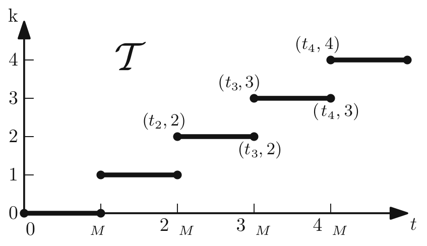

> Image description: A mathematical diagram illustrating a hybrid time domain $\mathcal{T}$ is presented on a Cartesian coordinate system with axes $t$ (horizontal) and $k$ (vertical). The $t$-axis represents continuous time with increments marked $0$, $M$, $2M$, $3M$, $4M$, and $5M$, while the $k$-axis represents discrete jumps with integer values $0, 1, 2, 3, 4$. The diagram depicts a sequence of horizontal line segments representing the duration of states. Each segment is defined by a starting and ending point marked with dots. These points are labeled with coordinates $(t_i, i)$. Specifically, the segments are: - From $(0,0)$ to $(M,0)$ - From $(M,1)$ to $(2M,1)$ - From $(2M,2)$ to $(3M,2)$, labeled as $(t_2, 2)$ to $(t_3, 2)$ - From $(3M,3)$ to $(4M,3)$, labeled as $(t_3, 3)$ to $(t_4, 3)$ - From $(4M,4)$ to $(5M,4)$, labeled as $(t_4, 4)$ to a final point. The dots signify $(t, k) \in \mathcal{T}$ points where jumps in the hybrid system occur.

Output Regulation Problems in Hybrid Systems, Fig. 1 Hybrid time domain $\mathcal{T}$ for a "sampled data" hybrid system. Dots indicate $(t, k) \in \mathcal{T}$ when jumps occur (see section "Hybrid Steady-State Generation" for the $t_{k}$ notation)


<!-- source_pdf_page: 1042 -->
and the plant $\mathcal{P}$ will be described at time $(t, k)$ by

$$
\begin{array}{rlr}
\dot{x} & =A x+B u+P w, & (x, u, t, k) \in \mathcal{C}_{\mathcal{P}} \\
x^{+} & =E x+R w, & (x, u, t, k) \in \mathcal{D}_{\mathcal{P}}  \tag{2b}\\
e & =C x+Q w, &
\end{array}
$$

with $x(t, k) \in \mathbb{R}^{n}, u(t, k) \in \mathbb{R}^{m}, e(t, k) \in \mathbb{R}^{p}$, $w(t, k) \in \mathbb{R}^{q}$, and suitably defined flow sets $\mathcal{C}_{\mathcal{E}}$, $\mathcal{C}_{\mathcal{P}}$ and jump sets $\mathcal{D}_{\mathcal{E}}, \mathcal{D}_{\mathcal{P}}$.

## Stabilization Obstructions in Hybrid Regulation

The achievement of asymptotic stabilization of the desired (zero output) steady-state responses for the considered class of linear hybrid systems crucially depends on whether the plant $\mathcal{P}$ and the exosystem $\mathcal{E}$ have synchronous jump times or not.

## Asynchronous Jumps

Typically, jumps in $\mathcal{P}$ and $\mathcal{E}$ will be asynchronous, and this will cause the undesirable phenomenon that genuinely close trajectories will look "distant" around each jump when the distance is measured according to the usual Euclidean norm. The simplest illustration of such phenomenon consists in considering two trajectories of the same system starting from $\varepsilon$-close initial conditions. Consider the system

$$
\dot{v}=1, \quad v \in[0,1], \quad v^{+}=0, \quad v \notin(0,1),
$$

with the initial states $v_{0}=0$ and $v_{1}=\varepsilon, 0< \varepsilon<1$. The two ensuing solutions at time $(t, k)$ are immediately computed as

$$
\begin{aligned}
& v\left(t, k ; v_{0}\right)=t-k, \quad t \in[k, k+1] \\
& v\left(t, k ; v_{1}\right)= \begin{cases}t-k+\varepsilon, & t \in[k, k+1-\varepsilon] \\
t-k+\varepsilon-1, & t \in[k+1-\varepsilon, k+1]\end{cases}
\end{aligned}
$$

Hence, the (Euclidean) distance between the two solutions at time $(t, k)$ is given by

$$
d(t, k)= \begin{cases}\varepsilon, & t \in[k, k+1-\varepsilon] \\ (1-\varepsilon), & t \in[k+1-\varepsilon, k+1]\end{cases}
$$

in other words, choosing $\varepsilon>0$ as small as desired, arbitrarily close initial conditions generate trajectories which are apart by a finite amount (as close as desired to 1 ) during the arbitrarily small time intervals where $t \in[k+1-\varepsilon, k+1]$. Since stability deals with trajectories remaining close forever and attractivity deals with trajectories getting closer and closer, examples such as the one above pose serious issues when defining (let alone establish) stability and attractivity in the hybrid case. Similar problems arise not only in output regulation problems but also in other areas like state tracking, observers, and general interconnections of hybrid systems.

However, intuition suggests (and mathematics confirms, by using a suitable notion of "distance") that such trajectories are close indeed. Several approaches have been proposed in order to overcome such difficulty. Considering as an example a bouncing ball tracking another bouncing ball, the problematic time intervals are those between the bounce of the first ball hitting the ground and the bounce of the other ball; in such a case, the modified distances are defined by either

- Allowing to exclude sufficiently short "problematic" intervals (possibly requiring that their length asymptotically tends to zero); see, e.g., Galeani et al. $(2008,2012)$
- Considering alternative "mirrored" trajectories computed as if the last jump did not happen; see, e.g., Forni et al. (2013a,b)
- Using a "stretched" distance function $\delta$ such that when point $a$ is in the jump set and its image via the jump map is $g(a)$, then $\delta(a, b)=\delta(g(a), b)$; see, e.g., Biemond et al. (2013).

While the first approach has been proposed first, the other two (which are strongly related) have the advantage of providing (under mild additional hypotheses) global control Lyapunov functions.


<!-- source_pdf_page: 1043 -->
Finally, it is worth noting that the most adequate tools to address similar issues for general hybrid systems are the "graphical distance" among hybrid arcs and related concepts (see Goebel et al. 2012, Chap. 5).

## Synchronous Jumps

When synchronous jumps are considered, the above issue disappears, and asymptotic stabilization becomes a much simpler matter. Although synchronous jumps look more like an exception than a rule in hybrid systems, they are very reasonable for specific classes of problems.

In order to have synchronous jumps, some authors have considered the use of "jump inputs" which impose a jump at a certain time, which can be physically reasonable in some systems, e.g., two tanks separated by a movable wall, assuming that when the wall is removed the fluid reaches the equilibrium configuration almost instantaneously.

Another relevant class consists of "sampled data" systems, whose jumps are essentially due to digital components which operate at a fixed sampling rate, which will be considered in the rest of this entry. In such a case, letting $\tau_{M}$ be the sampling period, the time domain of the hybrid system is fixed as (see Fig. 1)

$$
\begin{equation*}
\mathcal{T}:=\left\{(t, k): t \in\left[k \tau_{M},(k+1) \tau_{M}\right], k \in \mathbb{Z}\right\}, \tag{3}
\end{equation*}
$$

all jumps happen exactly for $(t, k)$ with $t=(k+$ 1) $\tau_{M}$, and then (1) can be simplified as

$$
\begin{align*}
\dot{w} & =S w,  \tag{4a}\\
w^{+} & =J w, \tag{4b}
\end{align*}
$$

and (2) can be simplified as

$$
\begin{align*}
\dot{x} & =A x+B u+P w,  \tag{5a}\\
x^{+} & =E x+R w,  \tag{5b}\\
e & =C x+Q w, \tag{5c}
\end{align*}
$$

since flow and jump times are clear from the context.

For the latter class of systems, by using linear time-invariant hybrid control laws and observers
(and an easily provable separation principle), it is easily shown that:

- Under a hybrid stabilizability hypothesis, state feedback stabilization of (5) is easily achieved.
- Output feedback stabilization of (5) from $e$ is also trivial under an additional hybrid detectability hypothesis.
- Under hybrid detectability of the cascade of (4) and (5), $w$ can be asymptotically estimated from $e$.
Due to the above facts, it can be assumed without loss of generality that (5) is asymptotically stable (equivalently, that all eigenvalues of $E e^{A \tau_{M}}$ have modulus strictly less than one). Asymptotic stability then yields incremental stability, since letting $\hat{x}$ and $\check{x}$ denote two motions under the same inputs $u, w$ and only differing in their initial states, it is immediate to see that their difference $\tilde{x}:=\hat{x}-\check{x}$ evolves as

$$
\begin{aligned}
\dot{\tilde{x}}= & \dot{\hat{x}}-\dot{\dot{x}}=A \hat{x}+B u+P w \\
& -(A \check{x}+B u+P w), \\
\tilde{x}^{+}= & \hat{x}^{+}-\check{x}^{+}=E \hat{x}+R w-(E \check{x}+R w),
\end{aligned}
$$

that is, $\dot{\tilde{x}}=A \tilde{x}, \tilde{x}^{+}=E \tilde{x}$, and so it is just a free motion of the plant, asymptotically converging to zero. Incremental stability implies that regulation is achieved as soon as it is shown that for any exogenous input $w$ it is possible to find an input $u$ and an initial state of (5) such that $e$ is identically zero, since then any other motion arising from a different initial state will asymptotically converge to the motion with identically zero $e$. Moreover, it is easy to see that asymptotic stability of the origin actually implies uniform, global, and exponential stability of any trajectory for such systems.

## Hybrid Steady-State Generation

From this point on, the rest of the presentation will be focused only on the case where the problem data are of the form (3) to (5), since this allows to provide an uncluttered view on some


<!-- source_pdf_page: 1044 -->
peculiar features of hybrid steady-state motions, without the burden of having to take care of delicate stability issues arising in more general contexts.

Based on the preceding discussion, there is no loss of generality at this point in assuming that:

- Plant (5) is asymptotically stable, which is equivalent to all eigenvalues of $E e^{A \tau_{M}}$ having a magnitude strictly less than one.
- Exosystem (4) is Poisson stable, which is equivalent to all eigenvalues of $J e^{S \tau_{M}}$ having a magnitude equal to one.
It is also customary to distinguish between full information and error feedback regulation, where in the first case controller $\mathcal{C}$ has access to the complete state $(w, x)$ of the cascade of $\mathcal{E}$ and $\mathcal{P}$, whereas in the second case $\mathcal{C}$ can only measure the output $e$ of $\mathcal{P}$.

Having assumed asymptotic stability of plant $\mathcal{P}$, the only role of compensator $\mathcal{C}$ consists in generating the correct steady-state input, since then, by incremental stability of $\mathcal{P}$, asymptotic regulation is ensured from any initial state. Recalling the expression of $\mathcal{T}$ in (3), for the following developments it is useful to define the jump times $t_{k}$ and the elapsed time of flow since last jump $\sigma$ as

$$
t_{k}:=k \tau_{M}, \quad \sigma(t, k):=t-k \tau_{M} ;
$$

the arguments of $\sigma(t, k)$ will usually be omitted since clear from the context. Note that $\sigma$ satisfies $\dot{\sigma}=1, \sigma^{+}=0$, and it is often explicitly introduced as an additional timer variable.

## The Full Information Case

Consider the candidate steady-state motion and input:

$$
\left[\begin{array}{c}
x_{s s}(t, k)  \tag{6}\\
u_{s s}(t, k)
\end{array}\right]=\left[\begin{array}{c}
\Pi(\sigma) \\
\Gamma(\sigma)
\end{array}\right] w(t, k)
$$

Requiring that such expressions actually characterize a response of the considered plant, as well as the associated output is zero, amounts to ask that:

- During flows, $\dot{x}_{s s}(t, k)$ has to satisfy the two equations:

$$
\begin{aligned}
\dot{x}_{s s}(t, k)= & \dot{\Pi}(\sigma) w(t, k)+\Pi(\sigma) \dot{w}(t, k) \\
\dot{x}_{s s}(t, k)= & A x_{s s}(t, k)+B u_{s s}(t, k) \\
& +P w(t, k)
\end{aligned}
$$

- At jumps, $x_{s s}^{+}(t, k)$ has to satisfy the two equations:

$$
\begin{aligned}
x_{s s}^{+}\left(t_{k+1}, k\right) & =\Pi(0) w^{+}\left(t_{k+1}, k\right) \\
x_{s s}^{+}\left(t_{k+1}, k\right) & =E x_{s s}\left(t_{k+1}, k\right)+R w\left(t_{k+1}, k\right)
\end{aligned}
$$

- For the output $e_{s s}$ to be identically zero:

$$
0=C x_{s s}(t, k)+Q w(t, k)
$$

Substituting (6) in the above conditions and considering that such relations should hold for all values of $w$, the following hybrid regulator equations are obtained:

$$
\begin{align*}
\dot{\Pi}(\sigma)+\Pi(\sigma) S & =A \Pi(\sigma)+B \Gamma(\sigma)+P  \tag{7a}\\
\Pi(0) J & =E \Pi\left(\tau_{M}\right)+R,  \tag{7b}\\
0 & =C \Pi(\sigma)+Q . \tag{7c}
\end{align*}
$$

Equations (7) can be shown to be both necessary and sufficient for (6) to solve the output regulation problem under the considered assumptions. Once a solution of (7) is available, the full information regulator simply reduces to the timevarying static feedforward controller

$$
\begin{equation*}
u(t, k)=\Gamma(\sigma) w(t, k) \tag{8}
\end{equation*}
$$

which just provides as input the steady-state input $u_{s s}$ characterized as in (6); in fact, since (5) is incrementally stable (as follows from its asymptotic stability, which was assumed without loss of generality), its output response under the control law (8) must converge to the output response associated to (6).

For later use, note that in the non-hybrid case where $\mathcal{P}$ and $\mathcal{E}$ only flow

$$
\begin{equation*}
\dot{w}=S w, \tag{9a}
\end{equation*}
$$


<!-- source_pdf_page: 1045 -->
$$
\begin{align*}
& \dot{x}=A x+B u+P w,  \tag{9b}\\
& e=C x+Q w, \tag{9c}
\end{align*}
$$

the candidate steady state (6) is replaced by

$$
\left[\begin{array}{c}
x_{s s}(t)  \tag{10}\\
u_{s s}(t)
\end{array}\right]=\left[\begin{array}{l}
\Pi \\
\Gamma
\end{array}\right] w(t)
$$

and (7) reduces to the celebrated regulator equations (or Francis equations)

$$
\begin{align*}
\Pi S & =A \Pi+B \Gamma+P,  \tag{11a}\\
0 & =C \Pi+Q, \tag{11b}
\end{align*}
$$

and, as above, assuming without loss of generality that the plant is asymptotically stable, the full information regulator reduces to the timeinvariant static feedforward controller:

$$
\begin{equation*}
u(t, k)=\Gamma w(t, k) \tag{12}
\end{equation*}
$$

## The Error Feedback Case

When the exosystem state is not measured, a dynamic compensator of the form

$$
\begin{align*}
\dot{\xi} & =F \xi+G e  \tag{13a}\\
\xi^{+} & =L \xi  \tag{13b}\\
u & =H \xi \tag{13c}
\end{align*}
$$

which is also supposed to flow and jump according to the a priori fixed time domain $\mathcal{T}$ considered for the plant, is introduced, and the corresponding candidate steady-state motion including $\xi$ is

$$
\left[\begin{array}{c}
x_{s s}(t, k)  \tag{14}\\
\xi_{s s}(t, k) \\
u_{s s}(t, k)
\end{array}\right]=\left[\begin{array}{c}
\Pi(\sigma) \\
\Sigma(\sigma) \\
\Gamma(\sigma)
\end{array}\right] w(t, k)
$$

By following similar steps as above, requiring invariance of such a manifold in the space of $(x, \xi, u, w)$, as well as zero output on it, leads to the conclusion that in addition to (7), the following relations must be satisfied as well:

$$
\begin{equation*}
\dot{\Sigma}(\sigma)+\Sigma(\sigma) S=F \Sigma(\sigma), \tag{15a}
\end{equation*}
$$

$$
\begin{align*}
\Sigma(0) J & =L \Sigma\left(\tau_{M}\right) .  \tag{15b}\\
\Gamma(\sigma) & =H \Sigma(\sigma), \tag{15c}
\end{align*}
$$

Equations (7) and (15) can be shown to be both necessary and sufficient for (13) to solve the output regulation problem under the considered assumptions and generalize the corresponding conditions for the non-hybrid case where $\mathcal{P}$ and $\mathcal{E}$ only flow (see (9)) and (13) and (14) are replaced by

$$
\begin{align*}
\dot{\xi} & =F \xi+G e,  \tag{16a}\\
u & =H \xi,  \tag{16b}\\
{\left[\begin{array}{c}
x_{s s}(t) \\
\xi_{s s}(t) \\
u_{s s}(t)
\end{array}\right] } & =\left[\begin{array}{c}
\Pi \\
\Sigma \\
\Gamma
\end{array}\right] w(t), \tag{16c}
\end{align*}
$$

and (15) reduces to

$$
\begin{align*}
\Sigma S & =F \Sigma  \tag{17a}\\
\Gamma & =H \Sigma \tag{17b}
\end{align*}
$$

Relations (17) are an expression of the internal model principle, stating that in order to achieve error feedback regulation, the compensator $\mathcal{C}$ must include a suitable "copy" of the exosystem, namely, (17a) imposes a constraint on the $\xi$ dynamics of $\mathcal{C}$ which, coupled with (17b), ensures that the signal $u_{s s}=\Gamma w$ used in the full information case can be equivalently produced (without measuring $w!$ ) as $u_{s s}=H \Sigma \xi$. A similar interpretation can be given to (15), which must be required in addition to (7) in order for (13) to solve the hybrid error feedback output regulation problem.

## Key Features in Hybrid vs Classical Output Regulation

While the previous section mainly aimed at showing how the classical theory generalizes in the hybrid case (at least for a special class of hybrid systems), the aim of this section is to point out some of the striking differences between the two


<!-- source_pdf_page: 1046 -->
cases. Before proceeding further, and in order to keep focus on the characterization of the steadystate response, it is worth mentioning here that although time-varying systems will be considered, no issue regarding nonuniform stability (like in general nonautonomous systems) arises since the timer $\sigma$ just ranges in the compact set $\left[0, \tau_{M}\right]$ due to the assumed periodic structure of $\mathcal{T}$ (see also the end of section "Synchronous Jumps").

Comparing the classical and the hybrid output regulator and considering that $\mathcal{P}$ and $\mathcal{E}$ are time invariant, it seems somewhat strange that in the output feedback case the linear time-invariant regulator (16a) and (16b) generalizes to a hybrid linear time-invariant regulator (13), whereas in the full information case the linear time-invariant regulator (12) generalizes to a hybrid linear timevarying regulator (8).

One argument in favor of the time-varying regulator (8) is based on the following consideration. It is well known that (11) has a unique solution in the case of a square plant ( $m=p$ ) under the nonresonance condition between the zeros of $\mathcal{P}$ and the eigenvalues of $\mathcal{E}$, requiring that

$$
\operatorname{rank}\left[\begin{array}{cc}
A-s I & B \\
C & 0
\end{array}\right]=n+p, \quad \forall s \in \Lambda(S),
$$

where $\Lambda(S)$ denotes the spectrum of $S$. In such a case, (11) amounts to a system of $n q+p q$ linear equations in $n q+m q$ unknowns (the elements of $\Pi, \Gamma$ ), which might be expected to be satisfied since $m \geq p$. If one were trying to use the unique constant solution ( $\Pi, \Gamma$ ) of (11) as a solution of (7), clearly (7a) and (7c) would be satisfied, but then (7b) would impose other $n q$ equations on $\Pi$ which would unlikely be satisfied. For this reason, apparently the additional degree of freedom offered by choosing time dependent $\Pi$ and $\Gamma$ might be of help. In fact, it can be shown that if $m=p$ and under a hybrid nonresonance condition (involving $E e^{A \tau_{M}}$ and $J e^{S \tau_{M}}$ ) between $\mathcal{P}$ and $\mathcal{E}$, (7a) and (7b) have a unique solution for any choice of $\Gamma(\sigma)$, so that the design boils down to satisfying (7c) by choosing $\Gamma(\sigma)$; but is this always possible? In order to answer this nontrivial question, a different path must be followed. While a complete formal analysis can
be performed, the following discussion will be mainly based on showing the simplest examples exhibiting the pathologies of interest.

Consider the system with $\tau_{M}=1$ (so that $t_{k}=k$, for all $k \in \mathbb{Z}$ ) and

$$
\begin{align*}
\dot{w} & =0,  \tag{18a}\\
w^{+} & =-w,  \tag{18b}\\
{\left[\begin{array}{l}
\dot{x}_{1} \\
\dot{x}_{2}
\end{array}\right] } & =\left[\begin{array}{cc}
-1 & 0 \\
0 & -2
\end{array}\right]\left[\begin{array}{l}
x_{1} \\
x_{2}
\end{array}\right]+  \tag{18c}\\
{\left[\begin{array}{l}
x_{1}^{+} \\
x_{2}^{+}
\end{array}\right] } & =\left[\begin{array}{cc}
0 & 1 \\
2 e & 1
\end{array}\right]\left[\begin{array}{l}
x_{1} \\
x_{2}
\end{array}\right],  \tag{18~d}\\
e & =\left[\begin{array}{ll}
0 & 1
\end{array}\right]\left[\begin{array}{l}
x_{1} \\
x_{2}
\end{array}\right]-w . \tag{18e}
\end{align*}
$$

The unique steady-state solution achieving output regulation can be simply computed. In fact, by (18a) and (18b),

$$
w(t, k)=(-1)^{k} w(0,0)
$$

then, by (18e) it appears that $e_{s s}=0, \forall(t, k) \in \mathcal{T}$ implies

$$
\begin{gathered}
x_{2, s s}(t, k)=w(t, k)=(-1)^{k} w(0,0), \\
\forall(t, k) \in \mathcal{T},
\end{gathered}
$$

which in turn implies that $\dot{x}_{2, s s}=0$ for all $t \in (k, k+1), k \in \mathbb{Z}$ and the unique steady-state input

$$
u_{s s}=2 x_{2, s s}-w .
$$

Since (18d) implies that $x_{1, s s}\left(t_{k+1}, k+1\right)= x_{2, s s}\left(t_{k+1}, k\right)=w\left(t_{k+1}, k\right)$ and (18c) implies that $x_{1, s s}(t, k)=-e^{-(t-k)} x_{1, s s}\left(t_{k}, k\right)$, for $t \in \left(t_{k}, t_{k+1}\right)$, it follows that

$$
\begin{equation*}
x_{1, s s}(t, k)=-e^{-\left(t-t_{k}\right)} w\left(t_{k}, k\right), \quad t \in\left(t_{k}, t_{k+1}\right) \tag{19}
\end{equation*}
$$

which finally is coherent with the jump equation for $x_{2, s s}$ in (18d) since


<!-- source_pdf_page: 1047 -->
$$
\begin{align*}
x_{2, s s}\left(t_{k+1}, k+1\right) & =2 e x_{1, s s}\left(t_{k+1}, k\right)+x_{2, s s}\left(t_{k+1}, k\right) \\
& =2 e\left(-e^{-1}\right) w\left(t_{k}, k\right)+w\left(t_{k}, k\right)  \tag{20a}\\
& =-w\left(t_{k}, k\right)  \tag{20b}\\
& =(-1)^{k+1} w(0,0) \tag{20c}
\end{align*}
$$

Before commenting the meaning of the above derived steady-state evolution, it is worth noting that (18) might actually derive from an original system with (18c) replaced by

$$
\left[\begin{array}{c}
\dot{x}_{1}  \tag{21}\\
\dot{x}_{2}
\end{array}\right]=\left[\begin{array}{cc}
-1 & 0 \\
1 & -2
\end{array}\right]\left[\begin{array}{l}
x_{1} \\
x_{2}
\end{array}\right]+\left[\begin{array}{l}
0 \\
1
\end{array}\right] u+\left[\begin{array}{l}
0 \\
1
\end{array}\right] w,
$$

under the preliminary state feedback

$$
\begin{equation*}
u=-x_{1}+v . \tag{22}
\end{equation*}
$$

Such a feedback renders the subspace $\left\{x: x_{2}=0\right\}$ unobservable (when the system only flows) and reveals that the dynamics of $x_{1}$ in (18c) is the flow zero dynamics of $\mathcal{P}$, that is, the zero dynamics of $\mathcal{P}$ when jumps are inhibited. Having set the stage, several interesting observations can be made now.

The flow zero dynamics samples the exogenous signal $w$ at jumps and then evolves according to its own modes (see (19)). In fact, while in the classical case (10) the state and input at steady state can be expressed as a constant matrix times the current value of $w$, the real nature of the time dependence of $\Gamma$ and $\Pi$ in (6) is linked to this phenomenon of sampling $w\left(t_{k}, k\right)$ and propagating along the zero dynamics. A suitable analysis shows that $\Pi(\sigma), \Gamma(\sigma)$ contain products of matrices with rightmost factor $e^{-S \sigma}$ (which recovers $w\left(t_{k}, k\right)=e^{-S \sigma} w(t, k)$ from the current value $w(t, k)$ of $w$ ) and leftmost factor containing the fundamental matrix of the flow zero dynamics. It is worth mentioning that the "motion along the zeros" in the present context is strongly related to the same kind of motions used for perfect tracking in non-hybrid systems. The above insight about the nature of the dependence on $\sigma$ in (6) also reveals why in the output feedback case (13) such dependence is not needed: the required modes of the flow zero dynamics in
that case are provided by copying them in the compensator dynamics!

An even stronger consequence of the analysis above is a flow zero dynamics internal model principle, which essentially states that any output feedback compensator solving the output regulation problem must be able to produce as free responses (during flow) a suitable subset of the natural modes of the flow zero dynamics (and a suitably modified version applies to the feedforward static compensator (8)). It is worth noting that while the classical internal model principle requires exact knowledge of the exosystem modes (which is kind of a mild requirement, especially when the exosystem models references, or constant offsets), the flow zero dynamics internal model principle requires the exact knowledge of the modes of the zero dynamics, which typically depends on not precisely known plant parameters; clearly, this fact poses serious questions in view of the achievement of robust regulation.

A final point, also raising serious issues about what can be robustly achieved (and how) in the setting of hybrid output regulation, is the fact that generically, existence of solutions is not robust to arbitrarily small parameter variations. In particular, looking again at the computations in (20), it should be clear that the involved functions are all fixed by previous reasonings, whereas satisfaction of (20) crucially depends on exact cancellations of certain coefficients. Any small variations of such coefficients in (18d) imply that the problem admits no steady state yielding zero output. This fact is in sharp contrast with classical regulation, where the nonresonance condition ensures existence of (different) solutions for small parameter variations. It has to be noted, though, that under additional conditions, robust existence of solutions is guaranteed if the plant is fat, that is, $m>p$. Using again the previous example, this is the case if an additional input is introduced

$$
\left[\begin{array}{c}
\dot{x}_{1} \\
\dot{x}_{2}
\end{array}\right]=\left[\begin{array}{cc}
-1 & 0 \\
0 & -2
\end{array}\right]\left[\begin{array}{l}
x_{1} \\
x_{2}
\end{array}\right]+\left[\begin{array}{ll}
1 & 0 \\
0 & 1
\end{array}\right]\left[\begin{array}{l}
u_{1} \\
u_{2}
\end{array}\right]+\left[\begin{array}{l}
0 \\
1
\end{array}\right] w,
$$

since then even a constant (suitably chosen) value of $u_{1}$ can be used to ensure that when the time to


<!-- source_pdf_page: 1048 -->
jump arrives, the value of $x_{1}$ is such to ensure a correct jump for $x_{2}$ (remember that since $x_{1}$ is unobservable during flows, its motion can be changed as wished if this helps with ensuring that the observable $x_{2}$ achieves zero output).

## Summary and Future Directions

The investigation of the output regulation problem for hybrid systems is still at a very early stage. While the issues of stabilization of the manifold where regulation is achieved seem to be a relatively better understood topic (possibly drawing from a richer literature on stabilization of hybrid systems), the geometry and design of such manifold appear to involve several much more intricate issues, whose understanding will be crucial in order to achieve more complete solutions.

Already in the very simplified case of linear dynamics and synchronous jumps, the important role played by the whole flow zero dynamics for feasibility (existence of solutions in the nominal parameter values) and by the availability of more inputs than outputs for well posedness (existence of solutions for slightly perturbed parameter values) marks a strong difference with the linear non-hybrid case, where both properties are granted by satisfaction of the nonresonance condition, which only involves the spectrum of the zero dynamics, even for square plants.

While the expected final goal of this investigation should hopefully lead to the design of robust output regulators based on a suitable internal model principle, a deeper understanding of the structure of the steady-state motion achieving regulation, as well as of the effect of additional inputs in shaping it, seems to be an important preliminary step towards such goal.

## Cross-References

- Hybrid Dynamical Systems, Feedback Control of
- Nonlinear Zero Dynamics
- Regulation and Tracking of Nonlinear Systems


## Recommended Reading

Foundational contributions on classical output regulation are Francis and Wonham (1976), Davison (1976), and Wonham (1985); more recent monographs include Huang (2004), Trentelman et al. (2001), Pavlov et al. (2005), Saberi et al. (2000), and Byrnes et al. (1997). Goebel et al. (2012) provides a solid introduction to a powerful and elegant framework for hybrid systems, including a thorough discussion of stability issues related to those mentioned here. Regulation problems (mainly reference tracking) for classes of hybrid systems with asynchronous jumps are presented in Biemond et al. (2013), Forni et al. (2013a,b), Morarescu and Brogliato (2010), and Galeani et al. $(2008,2012)$; synchronous jumps (and the ensuing advantages) are considered e.g., Sanfelice et al. (2013). The class of linear systems with synchronous jumps considered in sections "Hybrid Steady State Generation" and "Key Features in Hybrid vs Classical Output Regulation" has been proposed in Marconi and Teel (2010, 2013) and studied in Cox et al. $(2011,2012)$; the issues related to flow zero dynamics, fat plants and robustness have been discussed in Carnevale et al. (2012a,b, 2013), partly developing remarks contained in Galeani et al. $(2008,2012)$.

## Bibliography

Biemond J, van de Wouw N, Heemels W, Nijmeijer H (2013) Tracking control for hybrid systems with state-triggered jumps. IEEE Trans Autom Control 58(4):876-890
Byrnes CI, Priscoli FD, Isidori A (1997) Output regulation of uncertain nonlinear systems. Birkhäuser, Boston
Carnevale D, Galeani S, Menini L (2012a) Output regulation for a class of linear hybrid systems. Part 1: trajectory generation. In: Conference on decision and control, Maui, pp 6151-6156
Carnevale D, Galeani S, Menini L (2012b) Output regulation for a class of linear hybrid systems. Part 2: stabilization. In: Conference on decision and control, Maui, pp 6157-6162
Carnevale D, Galeani S, Sassano M (2013) Necessary and sufficient conditions for output regulation in a class of hybrid linear systems. In: Conference on decision and control, Florence, pp 2659-2664


<!-- source_pdf_page: 1049 -->
Cox N, Teel AR, Marconi L (2011) Hybrid output regulation for minimum phase linear systems. In: American control conference, San Francisco, pp 863-868
Cox N, Marconi L, Teel AR (2012) Hybrid internal models for robust spline tracking. In: Conference on decision and control, Maui, pp 4877-4882
Davison E (1976) The robust control of a servomechanism problem for linear time-invariant multivariable systems. IEEE Trans Autom Control 21(1):25-34
Forni F, Teel AR, Zaccarian L (2013a) Follow the bouncing ball: Global results on tracking and state estimation with impacts. IEEE Trans Autom Control 58(6): 1470-1485
Forni F, Teel AR, Zaccarian L (2013b) Reference mirroring for control with impacts. Daafouz J, Tarbouriech S, Sigalotti M (eds) Hybrid systems with constraints. John Wiley \& Sons, Inc., Hoboken, pp 213-260. doi: 10.1002/9781118639856.ch8

Francis B, Wonham W (1976) The internal model principle of control theory. Automatica 12(5):457-465
Galeani S, Menini L, Potini A, Tornambe A (2008) Trajectory tracking for a particle in elliptical billiards. Int J Control 81(2): 189-213
Galeani S, Menini L, Potini A (2012) Robust trajectory tracking for a class of hybrid systems: an internal model principle approach. IEEE Trans Autom Control 57(2):344-359
Goebel R, Sanfelice R, Teel A (2012) Hybrid dynamical systems: modeling, stability, and robustness. Princeton University Press, Princeton

Huang J (2004) Nonlinear output regulation: theory and applications, vol 8. Society for Industrial Mathematics, Philadelphia
Marconi L, Teel AR (2010) A note about hybrid linear regulation. In: Conference on decision and control, Atlanta, pp 1540-1545
Marconi L, Teel AR (2013) Internal model principle for linear systems with periodic state jumps. IEEE Trans Autom Control 58(11): 2788-2802
Morarescu I, Brogliato B (2010) Trajectory tracking control of multiconstraint complementarity lagrangian systems. IEEE Trans Autom Control 55(6): 1300-1313
Pavlov AV, Wouw N, Nijmeijer H (2005) Uniform output regulation of nonlinear systems: a convergent dynamics approach. Birkhäuser, Boston
Saberi A, Stoorvogel A, Sannuti P (2000) Control of linear systems with regulation and input constraints. Springer, London
Sanfelice RG, Biemond JJ, van de Wouw N, Heemels W (2013) An embedding approach for the design of state-feedback tracking controllers for references with jumps. Int J Robust Nonlinear Control. doi:10.1002/rnc. 2944
Trentelman HL, Stoorvogel AA, Hautus MLJ (2001) Control theory for linear systems. Springer, London
Wonham W (1985) Linear multivariable control: a geometric approach. Applications of mathematics, vol 10, 3rd edn. Springer, New York
