<!-- source_pdf_page: 1050 -->
## P

## Parallel Robots

Frank C. Park<br>Robotics Laboratory, Seoul National University, Seoul, Korea


#### Abstract

Parallel robots are closed chains consisting of a fixed and moving platform that are connected by a set of serial chain legs. Parallel robots typically possess both actuated and passive joints and may even be redundantly actuated. Although more structurally complex and possessing a smaller workspace, parallel robots are usually designed to exploit one or more of the natural advantages they possess over their serial counterparts, e.g., higher stiffness, increased positioning accuracy, and higher speeds and accelerations. In this chapter we provide an overview of the kinematic and dynamic modeling of parallel robots, a description of their singularity behavior, and basic methods developed for their control.


## Keywords

Closed kinematic chain; Closed loop mechanism; Parallel manipulator

## Introduction

A parallel robot refers to a kinematic chain in which a fixed platform and moving platform are connected to each other by several serial chains, or legs. The legs, which typically have the same kinematic structure, are connected to the fixed and moving platforms at points that are distributed in a geometrically symmetric fashion. The Stewart-Gough platform (Fig. 1) is a wellknown example of a parallel robot: each of the six legs is a UPS structure (i.e., consisting of rigid links serially connected by a universal, prismatic, and spherical joint), with the prismatic joint actuated. Other examples of parallel robots include the $6 \times$ RUS platform of Fig. 2, the haptic interface device of Fig. 3, and the eclipse mechanism of Fig. 4.

Parallel robots can be regarded as a special class of closed chain mechanisms (i.e., chains that contain one or more closed loops) and are purposely designed to exploit the specific advantages afforded by the closed chain structure, e.g., for improved stiffness, greater positioning accuracy, or higher speed. Parallel robots should be distinguished from two or more cooperating serial robots that may form closed loops during execution of a task (e.g., a robotic hand grasping an object). Some of the fastest velocities and accelerations recorded by industrial robots have been achieved by parallel robots, primarily by


<!-- source_pdf_page: 1051 -->
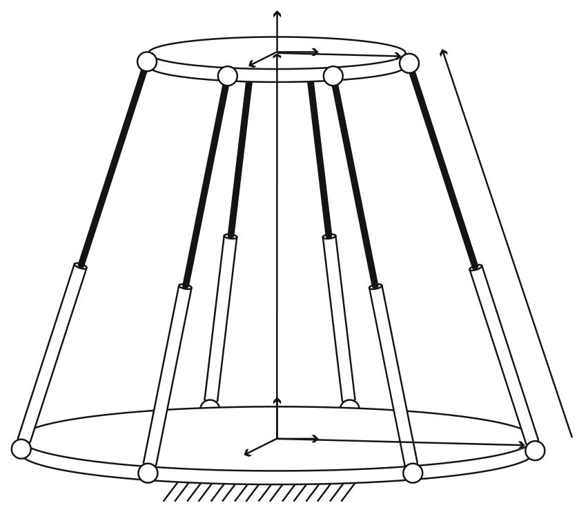

> Image description: This technical diagram illustrates a Stewart-Gough platform, a type of parallel robot. The mechanism consists of two parallel circular end-effectors connected by six extensible telescopic legs (actuators). The bottom platform is fixed to a ground plane, indicated by hatched lines. The diagram includes coordinate systems to define the robot's kinematics. At the center of the top platform, a three-axis Cartesian coordinate system is shown with small arrows indicating directional vectors. Similarly, a coordinate system is centered on the bottom platform. A long vertical axis passes through the center of the assembly, and a large diagonal arrow on the right suggests a range of motion or orientation change. The six legs connect specific joints on the upper ring to corresponding joints on the lower ring, forming a parallel kinematic chain. The visual arrangement emphasizes the relationship between the fixed base and the movable top platform through multiple simultaneous constraints.
Parallel Robots, Fig. 1 Stewart-Gough platform

placing the actuators on the fixed platform and thereby minimizing the mass of the moving parts.

Many of the model-based techniques developed for the control of traditional serial chain robots are also applicable to a large class of parallel robots. On the other hand, kinematic and dynamic models for parallel robots are inherently more complex. Parallel robots also possess features not found in serial robots, e.g., passive joints, the possibility of redundant actuation, and a diverse range of singularity behavior, that need to be considered when designing a control law. We therefore begin with a brief overview of the kinematic and dynamic modeling of parallel robots before discussing their control.

## Modeling

## Kinematics

Whereas the kinematic degrees of freedom, or mobility, of a serial chain robot can be obtained as the sum of the degrees of freedom of each of the joints, the situation is somewhat more complex for parallel robots and closed chains in general, since only a subset of the joints can be independently actuated. The mobility of a parallel robot corresponds to the total degrees of freedom of the joints that can be independently actuated. In some cases the number of actuated joint degrees
of freedom may exceed the kinematic degrees of freedom, in which case we say that the robot is redundantly actuated.

A parallel robot with a designated end-effector frame also has a notion of forward and inverse kinematics. While for serial chains the forward kinematics is a well-defined mapping and the inverse kinematics can typically have multiple solutions, for parallel robots the situation is less straightforward. For the Stewart-Gough platform of Fig. 1, in which the leg lengths can be adjusted by actuating the prismatic joints, the inverse kinematics is unique and straightforward to obtain, whereas the forward kinematics will have multiple solutions. For other types of parallel robots in which the legs themselves contain one or more closed loops, both the forward and inverse kinematics can have multiple solutions.

The notion of kinematic singularities for parallel robots is also much more involved than the case for serial robots. Whereas kinematic singularities for serial chain robots are characterized by configurations at which the forward kinematics Jacobian (i.e., the linear mapping relating joint velocities to end-effector frame velocities) becomes singular, for parallel robots and closed chains in general, there exist other notions of singularities not found in serial chains. For example, given a parallel robot with kinematic mobility $m$ - if the parallel robot consists only of one degree-of-freedom joints, this implies that exactly $m$ joints can be actuated - there may exist configurations in which these $m$ joints cannot be independently actuated. Conversely, even if the $m$ actuated joints are each fixed to some value, the parallel robot may fail to be a structure, i.e., some of the links may be able to move.

In the above scenario, choosing a different set of $m$ actuated joints may remedy this situation, in which case such singularities are referred to as actuator singularities. Configurations at which singularity behavior occurs regardless of which joints are actuated are denoted configuration singularities. The final class of singularities are endeffector singularities, which correspond to the usual serial chain notion of kinematic singularity, in which the end-effector loses one or more degrees of freedom of available motion.


<!-- source_pdf_page: 1052 -->
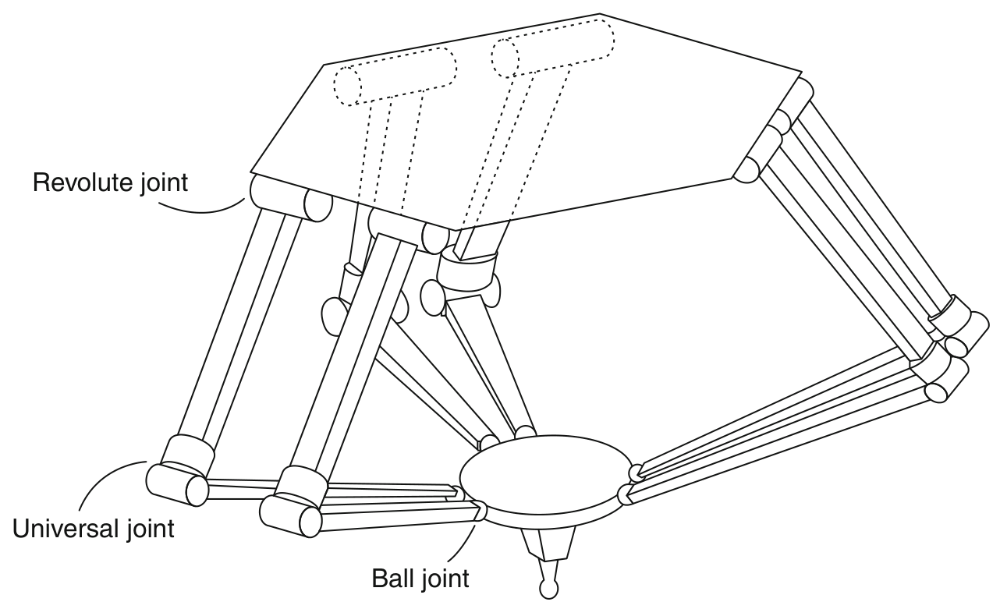
Parallel Robots, Fig. $26 \times$ RUS platform

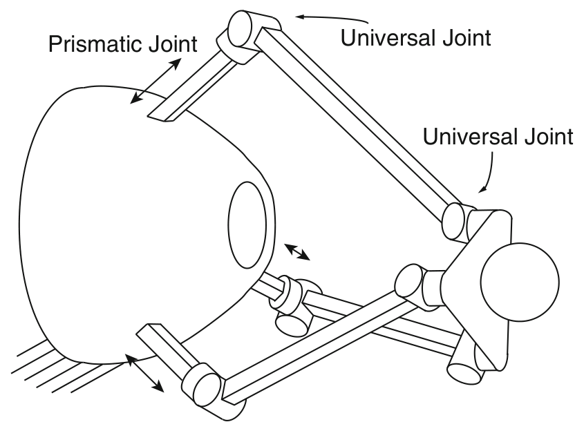

> Image description: A black and white line drawing illustrates a parallel robot, identified by the caption as a "$3 \times P U U$ haptic interface." The mechanism consists of a large, rounded central platform connected to a smaller, human-like handle assembly by three identical kinematic chains. Each chain contains one prismatic joint and two universal joints. Visible text labels the components: "Prismatic Joint" and "Universal Joint" are explicitly marked with arrows pointing to their respective parts. Double-headed arrows indicate the possible degrees of freedom for the prismatic joints, which allow for translational movement along the link axes. The universal joints are positioned between the prismatic links and the central platform, as well as between the links and the handle assembly, allowing for rotational movement. The architecture shows a parallel structure where three identical limbs act in parallel to control the position and orientation of the handle via the central platform.
Parallel Robots, Fig. 3 A $3 \times P U U$ haptic interface

## Dynamics

In the case of a parallel robot whose actuated degrees of freedom coincides with its kinematic mobility $m$, it is possible to choose an independent set of generalized coordinates of dimension $m$, denoted $q \in \mathbb{R}^{m}$ and typically identified with the actuated joints, and to express the dynamics in the standard form

$$
\begin{equation*}
M(q) \ddot{q}+C(q, \dot{q}) \dot{q}+G(q)=\tau, \tag{1}
\end{equation*}
$$

where $\tau \in \mathbb{R}^{m}$ denotes the vector of input joint torques, $M(q)$ denotes the $n \times n$ mass matrix, the matrix-vector product $C(q, \dot{q}) \dot{q}$ denotes the vector of Coriolis terms, and $G(q) \in \mathbb{R}^{m}$

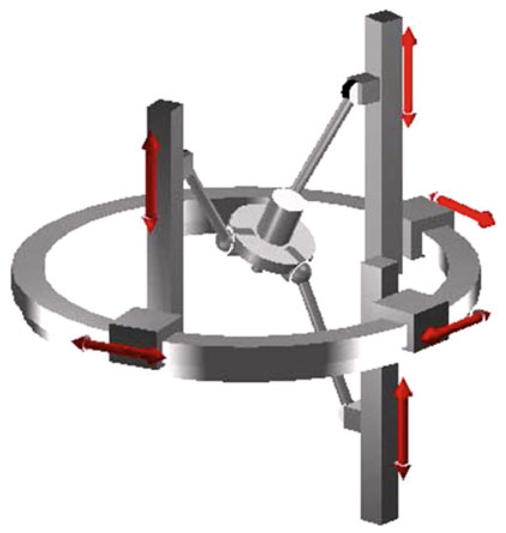

> Image description: A 3D grayscale rendering illustrates a "3 $\times$ PPRS eclipse parallel mechanism," a type of parallel robot. The mechanism consists of a central hub connected to an outer circular ring through three identical kinematic chains. Each chain features a vertical linear actuator (Prismatic joint) that moves along a vertical axis, indicated by bidirectional red arrows. Each vertical column is connected to the central hub via a linkage assembly comprising a revolute joint (R), a prismatic joint (P), and another revolute joint (S). The central hub appears to be a cylindrical component capable of rotation or translation, positioned at the intersection of the three vertical axes. The red arrows denote the degrees of freedom: bidirectional arrows on the vertical columns represent vertical linear movement, while horizontal red arrows on the outer ring indicate potential rotational or sliding motion along the circumference. The overall structure is a symmetrical assembly designed for specialized spatial manipulation.
Parallel Robots, Fig. 4 The $3 \times$ PPRS eclipse parallel mechanism

denotes the vector of gravitational forces. The structure of the dynamic equations is identical to that for serial chain robots. Also like the case for serial chain robots, the Coriolis matrix term $C(q, \dot{q}) \in \mathbb{R}^{m \times m}$ is not unique, so that one should ensure that the correct $C(q, \dot{q})$ is used in, e.g., any control law whose stability depends on the matrix $\dot{M}(q)-2 C(q, \dot{q})$ being skewsymmetric.


<!-- source_pdf_page: 1053 -->
It is also important to keep in mind that the $q$ must satisfy the kinematic constraint equations imposed by the loop closure constraints. That is, if $\theta \in \mathbb{R}^{n}$ denotes the vector of all joints (both actuated and passive), then $q \in \mathbb{R}^{m}, m \leq n$, will be a subset of $\theta$ whose values can only be obtained by solution of the kinematic constraint equations; depending on the nature of the kinematic constraints, one may have to resort to iterative numerical methods.

If the parallel robot is redundantly actuated, then the dynamics are subject to a further set of constraints on the input torques. Letting $q_{e}$ denote the set of independent generalized coordinates and $q_{a}$ be the vector of all actuated joints, the vector of actuated joint torques $\tau_{a}$ must then further satisfy $S^{T} \tau_{a}=W^{T} \tau$, where $\tau$ denotes the vector of joint torques for an equivalent tree structure system that moves identically to the redundantly actuated parallel robot and $W$ and $S$ are defined, respectively, by

$$
\begin{equation*}
S=\frac{\partial \theta}{\partial q_{e}}, \quad W=\frac{\partial q_{a}}{\partial q_{e}} . \tag{2}
\end{equation*}
$$

Compared to the dynamics for serial chain robots, the dynamics for parallel robots is, in general, considerably more complex and computationally involved. The recursive algorithms that are available for computing the inverse and forward dynamics of serial chain robots can also be used to develop similar recursive algorithms for parallel robot dynamics; however, the computations will be considerably more involved and require multiple iterations.

## Motion Control

## Exactly Actuated Parallel Robots

For parallel robots whose actuated degrees of freedom match the kinematic mobility (this excludes the set of all redundantly actuated parallel robots), most control laws developed for serial chain robots are also applicable. This is not altogether surprising in light of the similarity in the structure of the kinematic and dynamic equations between serial and parallel robots. Control
laws for serial robots are also covered in this handbook, and we refer the reader to ▷ Linear Matrix Inequality Techniques in Optimal Control for the essential details. Here we summarize the most basic control laws and point out any additional computational or other requirements that are needed when applying these laws to parallel robots. Note that other control laws and techniques developed for serial chain robots, e.g., robust, sliding mode, can also be applied with the same additional considerations and requirements outlined below:

1. Computed torque control: Computed torque control for parallel robots has the same control law structure as for serial robots, i.e.,

$$
\begin{equation*}
\tau=M(q)\left(-K_{p} e-K_{v} \dot{e}\right)+\tau_{f f}, \tag{3}
\end{equation*}
$$

where $e$ denotes the tracking error, $K_{p}$ and $K_{v}$ are the proportional and derivative feedback gain matrices, and $\tau_{f f}$ denotes the feedforward term required to cancel the nonlinear dynamics. Robust versions of computed torque control are also applicable to parallel robots under the same set of conditions, e.g., establishing appropriate bounds on the mass matrix eigenvalues and on the norm of the Coriolis matrix.
2. Augmented PD control: The augmented PD control law for serial robots is also applicable to parallel robots, i.e.,
$\tau=-K_{p} e-K_{v} \dot{e}+M(q) \ddot{q}_{d}+C(q, \dot{q}) \dot{q}+G(q)$,
where $q_{d}$ is the reference trajectory to be tracked and $K_{p}$ and $K_{v}$ are the proportional and derivative feedback gains. Asymptotic stability is also established under the same conditions.
3. Adaptive control: Because the dynamic equations for parallel robots are also linear in the link mass and inertial parameters, i.e.,

$$
\begin{equation*}
M(q) \ddot{q}+C(q, \dot{q}) \dot{q}+G(q)=\Phi(q, \dot{q}, \ddot{q}) p, \tag{5}
\end{equation*}
$$


<!-- source_pdf_page: 1054 -->
where $p$ denotes the vector of link mass and inertial parameters, adaptive control laws developed for serial robots can also be used.
4. Other control methods: There exist numerous control methods developed for serial robots, e.g., task space or operational space control, sliding mode control, and various nonlinear control techniques; with few exceptions most of these algorithms can also be applied to exactly actuated parallel robots with minimal modification.

## Redundantly Actuated Parallel Robots

As described earlier, parallel robots exhibit a much more diverse range of singularity behavior than their serial counterparts, many of which depend on the choice of actuated joints (actuator singularities). One way to eliminate actuator singularities is via redundant actuation, i.e., the total degrees of freedom of the actuated joints exceeds the kinematic mobility of the mechanism. Redundant actuation offers some protection in the event of failed actuators and, when combined with an appropriate control law, offers an effective means of reducing joint backlash, increasing speed and payload and stiffness, controlling compliance through the generation of internal forces, and even improving power efficiency (as an analogy, the human musculoskeletal system is redundantly actuated by antagonistic muscles). Of course, redundant actuation introduces a new set of control challenges, since the control inputs must be designed so as not to conflict with the kinematic constraints inherent in the parallel robot; loosely speaking, the actuated joints can no longer be independently controlled, since the consequences of unintended antagonistic actuation may be catastrophic.

The control of cooperating manipulators (see - Optimal Control and Mechanics) has a long history in robotics, and many of the control techniques developed for such multi-arm systems can also be applied to redundantly actuated parallel robots. One can also apply the control strategies developed for exactly actuated parallel robots to the redundantly actuated case, but modifications
are necessary to account for the different structure of the dynamic equations.

Like all model-based control algorithms, the above control laws are subject to model uncertainties. Whereas in serial chains the effects of model uncertainty simply lead to errors in tracking, for redundantly actuated parallel robots, the consequences can lead to internal forces in addition to end-effector tracking errors. Perhaps the most significant effect of any modeling errors is that, unlike the serial chain case, the kinematic errors can potentially alter the shape of the configuration space (recall that the configuration space will in general be a curved space for closed chains) and also interfere with any PD feedback introduced into the control. The development of control laws that are robust to such modeling errors and disturbances remains an open and ongoing area of research in parallel robot control.

## Force Control

Both hybrid force-position control and impedance control are well-known and widely applied concepts in serial robots and can be extended in a straightforward manner to exactly actuated parallel robots. Recall that the basic feature of hybrid force-position control is that the task space is decomposed into force- and positioncontrolled directions, whereas in impedance control, the goal is have the robot maintain a certain desired spatial stiffness in the task space. Controllers that combine aspects of forceposition and impedance control have also been proposed and developed for both serial robots and exactly actuated parallel robots. Modeling errors will cause deviations in both the forceand position-controlled directions - leading to motions in force-controlled directions and forces in position-controlled directions - which can be addressed by, e.g., a switching control strategy.

The problem of force control for redundantly actuated parallel robots, which encompasses both force-position and impedance control, has also received some attention in the literature.


<!-- source_pdf_page: 1055 -->
The main difference with the exactly actuated case is that internal forces can now be generated, which requires a more detailed and coordinateinvariant examination of stiffness. Control methods that combine elements of force-position and impedance control for redundantly actuated parallel robots have received only limited attention in the literature.

## Cross-References

- Linear Matrix Inequality Techniques in Optimal Control
- Optimal Control and Mechanics
- Optimal Control via Factorization and Model Matching
Optimal Sampled-Data Control


## Recommended Reading

The monograph (Merlet 2006) offers a detailed and comprehensive treatment of all aspects of parallel robots, with a particularly thorough treatment of the kinematics and singularity analysis. Mueller (2008) provides an excellent survey of the dynamics and control of redundantly actuated parallel robots and is based on the preceding work (Mueller 2005). Cheng et al. (2003) examines in detail the dynamic model for redundantly actuated parallel robots and the basic control strategies; Nakamura and Ghodoussi (1989) also examines dynamic models for redundantly actuated parallel robots. Stiffness analysis and control of redundantly actuated parallel robots are addressed in Yi and Freeman (1993), Chakarov (2004), and Fasse and Gosselin (1998). Analysis of specific parallel robots engaged in various control tasks includes Caccavale et al. (2003), Honegger et al. (1997), Kim et al. (2001), and Satya et al. (1995). The basic references on robot control are Murray et al. (1994), Spong et al. (2006), Anderson and Spong (1988), and Ghorbel (1995) focuses on PD control for closed chains.

## Bibliography

Anderson RJ, Spong MW (1988) Hybrid impedance control of robotic manipulators. IEEE J Robot Autom 4:549-556
Caccavale F, Siciliano B, Villani L (2003) The Tricept robot: dynamics and impedance control. IEEE/ASME Trans Mechatron 8:263-268
Chakarov D (2004) Study of the antagonistic stiffness of parallel manipulators with actuation redundancy. Mech Mach Theory 39:583-601
Cheng H, Yiu Y-K, Li Z (2003) Dynamics and control of redundantly actuated parallel manipulators. IEEE Trans Mechatron 8(4):483-491
Fasse ED, Gosselin CM (1998) On the spatial impedance control of Gough-Stewart platforms. In: Proceedings of the IEEE international conference on robotics and automation, Leuven, pp 1749-1754
Ghorbel F (1995) Modeling and PD control of closedchain mechanical systems. In: Proceedings of the IEEE conference on decision and control, New Orleans
Honegger M, Codourey A, Burdet E (1997) Adaptive control of the Hexaglide, a 6-DOF parallel manipulator. In: Proceedings of the IEEE international conference on robotics and automation, Washington, DC, pp 543-548
Kim J, Park FC, Ryu SJ, Kim J, Hwang JC, Park C, Iurascu CC (2001) Design and analysis of a redundantly actuated parallel mechanism for rapid machining. IEEE Trans Robot Autom 17(4):423-434
Merlet JP (1988) Force feedback control of parallel manipulators. In: Proceedings of the IEEE international conference on robotics automation, Philadelphia, pp 1484-1489
Merlet JP (2006) Parallel robots. Springer, Heidelberg
Mueller A (2005) Internal prestress control of redundantly actuated parallel manipulators and its application to backlash avoiding control. IEEE Trans Robot 21(4):668-677
Mueller A (2008) Redundant actuation of parallel manipulators. In: Wu H (ed) Parallel manipulators: towards new applications. I-Tech Publishing, Vienna
Murray R, Li ZX, Sastry S (1994) A mathematical introduction to robotic manipulation. CRC Press, Boca Raton
Nakamura Y, Ghodoussi M (1989) Dynamics computation of closed-link robot mechanisms with nonredundant and redundant actuators. IEEE Trans Robot Autom 5(3):294-302
Satya SM, Ferreira PM, Spong MW (1995) Hybrid control of a planar 3-DOF parallel manipulator for machining operations. Trans N Am Manuf Res Inst/SME 23:273-280
Spong MW, Hutchinson S, Vidyasagar M (2006) Robot modeling and control. Wiley, New York
Yi B-J, Freeman RA (1993) Geometric analysis of antagonistic stiffness in redundantly actuated parallel mechanisms. J Robot Syst 10:581-603


<!-- source_pdf_page: 1056 -->
## Particle Filters

Fredrik Gustafsson<br>Division of Automatic Control, Department of Electrical Engineering, Linköping University, Linköping, Sweden


#### Abstract

The particle filter computes a numeric approximation of the posterior distribution of the state trajectory in nonlinear filtering problems. This is done by generating random state trajectories and assigning a weight to them according to how well they predict the observations. The weights are instrumental in a resampling step, where trajectories are either kept or thrown away. This exposition will focus on explaining the main principles and the main theory in an intuitive way, illustrated with figures from a simple scalar example. A real-time application is used to graphically show how the particle filter solves a nontrivial nonlinear filtering problem.


## Keywords

Estimation; Kalman filter; Nonlinear filtering; Sequential Monte Carlo

## Introduction

The particle filter computes an arbitrarily good solution to nonlinear filtering problems. The goal in nonlinear filtering is to compute the posterior distribution of the state vector in a dynamic model, given measurements that are related to the state. Bayes rule provides a recursive but computationally intractable solution. Monte Carlo (MC) methods can essentially solve all Bayesian inference problems.

However, for nonlinear filtering, the complexity increases exponentially in time. The MC approach would be to generate a large number of state trajectories (called particles) and their corresponding sequences of predicted measurements and then weighs together the trajectories according to how well the predicted and actual measurement sequences match each other.

With increasing time, the fit is deemed to be poor, since the state space increases exponentially in time. This is usually referred to as the depletion (or degeneracy) problem. The approach in the particle filter is to simulate only one step at the time and then resample the trajectories if needed. For this reason, the particle filter is sometimes referred to as a sequential Monte Carlo method. The resampling step keeps the trajectories that give a good fit, while the bad ones are discarded. The novel idea in the particle filter when it was first published in 1993 was the introduction of this resampling step.

Depletion is still a problem, despite the resampling step. Mitigating depletion has ever since the beginning been the most pressing issue in applied particle filtering. This tutorial will present the basic particle filter algorithm and discuss ways to avoid depletion problems both in general terms and in a simple example.

The particle filter computes an approximation to the Bayes optimal filter, conditioned on a sequence of observations and a nonlinear nonGaussian system. It is important to note that the PF approximates the posterior distribution of the state trajectory, from which the mean and covariance are easily extracted. In contrast, the extended Kalman filter (EKF) computes the mean and covariance for an approximate dynamical system (linearized with Gaussian noise). The unscented Kalman filter (UKF) likewise also approximates the mean and covariance. Both EKF and UKF can only approximate unimodal (one peak) posterior distributions. There are filter bank approximations, like the interacting multiple model (IMM) algorithm, that can keep track of a given number of modes in the posterior.


<!-- source_pdf_page: 1057 -->
However, the PF does this in a more natural way.

## The Basic Particle Filter

Nonlinear filtering aims at estimating the distribution of a state sequence $x_{1: N}= \left(x_{1}, x_{2}, \ldots, x_{N}\right)$ from a sequence of observations $y_{1: N}=\left(y_{1}, y_{2}, \ldots, y_{N}\right)$, given a state space model of the form

$$
\begin{align*}
x_{k+1}=f\left(x_{k}, v_{k}\right) \quad & \text { or } \quad p\left(x_{k+1} \mid x_{k}\right)  \tag{1a}\\
y_{k}=h\left(x_{k}, e_{k}\right) & \text { or } \quad p\left(y_{k} \mid x_{k}\right) . \tag{1b}
\end{align*}
$$

Here, $v_{k}$ denotes process noise, and $e_{k}$ is the measurement noise. The stochastic variables $v_{k}, e_{k}$ for all $k$ and $x_{0}$ are assumed mutually independent, with known distributions $p_{v}, p_{e}$, and $p_{x_{0}}$, which are all being part of the model specification.

The particle filter (PF) works with a set of random trajectories. Each trajectory is formed recursively by iteratively simulating the model with some randomness and then updating the likelihood of each trajectory based on the observation. In words, we first evaluate the set of particles at hand by comparing how well they predict the current observation. In this way, the particles are assigned a weight. We keep the particles with large weight and throw away the particles with small weight, using a stochastic resampling procedure. After this step, we get a smaller set of particles, where many particles have several replicas. We then simulate each particle to the next observation time using the dynamical model. After this prediction step, all particles will be unique (because they are based on different realizations of the process noise). Below, the basic algorithm (sometimes called bootstrap PF or sequential importance resampling (SIR) PF) is summarized.

- Define a set of random states (particles) by sampling $x_{0}^{(i)} \sim p_{x_{0}}\left(x_{0}\right)$.
- Iterate in $k=0,1, \ldots$ :

1 Measurement update: Compute the weight $\omega_{k}^{(i)}=p_{e}\left(y_{k}-h\left(x_{k}^{(i)}\right)\right)$ and normalize so $\sum_{i=1}^{N} \omega_{k}^{(i)}=1$.

2 Resampling: Resample each particle with probability $\omega_{k}^{(i)}$.
3 Time update: Simulate one time step by taking $v_{k}^{(i)} \sim p_{v}\left(v_{k}\right)$ and then set $x_{k+1}^{(i)}= f\left(x_{k}^{(i)}, v_{k}^{(i)}\right)$.
The main design parameter here is the number $N$ of particles. A common trick to make the filter more robust is to increase the variance of $p_{v}$ and $p_{e}$ above. This is called dithering (or jittering) and is a practical way to get more robust nonlinear filters.

To illustrate some of the aspects and for later reference, a simple example will be introduced.

## Example: First-Order Linear Gaussian Model

The Kalman filter (KF) provides the posterior distribution in an analytical form for linear Gaussian models and is thus suitable for evaluations and comparisons. A linear Gaussian model looks like

$$
\begin{align*}
x_{k+1} & =F x_{k}+v_{k}, \quad v_{k} \sim \mathrm{~N}(0, Q)  \tag{2a}\\
y_{k} & =H x_{k}+e_{k}, \quad e_{k} \sim \mathrm{~N}(0, R)  \tag{2b}\\
x_{0} & \sim \mathrm{~N}\left(\mu_{0}, P_{0}\right), \tag{2c}
\end{align*}
$$

We will use the scalar case for the illustrations, and the figures that follow are based on $F=0.9$, $H=1, Q=1, R=0.01, P_{0}=1$. The particle filter in the scalar case simplifies to the Matlab algorithm in Table 1. Figure 1 compares the sample-based representation of the PF with the Gaussian distribution provided by the KF for the first two time steps. This shows how well the marginal distribution $p\left(x_{k} \mid y_{1: k}\right)$ is approximated by the samples $x_{k}^{(i)}$ from the PF . A rule of thumb is that 30 samples are needed to approximate a univariate Gaussian distribution. As will be discussed later, the number of samples is effectively only 10 here, which explains the small deviation of the Gaussian functions.

To illustrate the fundamental depletion problem in the PF, the set of trajectories $x_{1: k}^{(i)}$ that


<!-- source_pdf_page: 1058 -->
Particle Filters, Table 1 Matlab code for scalar linear Gaussian model

```
% Simulation
y=filter([0 H],[1 -F],[sqrt(P0)*randn(1,1);...
        sqrt (Q) *randn (N-1,1)])+sqrt (R) *randn (N,1);
% Particle filter
x=mu0+sqrt(P0)*randn(N,1);
for k=1:K
    w= exp(-(y(k)-H*x).^2/R); % Measurement update
    w=w/sum(w); % Normalization
    xhat(k)=w'*x; % Estimate
    P(k)=w'*(x-xhat(k)).^2; % Variance
    x=resample(x,w); % Resampling
    x=F*x+sqrt (Q)*randn (N,1); % Time update
end
```

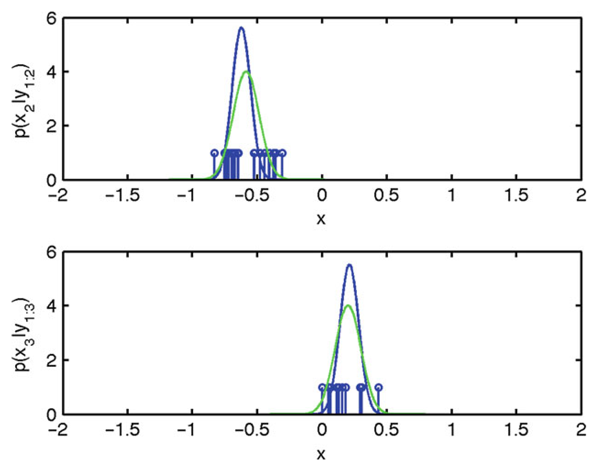

> Image description: Two plots are presented vertically, labeled as Figure 1, illustrating the performance of particle filters. Both plots compare a set of discrete samples $\{x_{k}^{(i)}\}_{i=1:N}$ (shown as blue stems) against two continuous distributions: a Gaussian approximation of the particles (blue curve) and the true posterior distribution provided by the Kalman filter (green curve). The top plot shows $p(x_2|y_{1:2})$ on the y-axis against $x$ on the x-axis. The blue Gaussian curve is peaked around $x = -0.5$, while the green curve is shorter and slightly broader. A set of blue vertical stems representing samples is distributed near the peak. The bottom plot shows $p(x_3|y_{1:3})$ on the y-axis against $x$ on the x-axis. The distributions have shifted rightward; the blue Gaussian curve and green curve are now centered near $x = 0$. Similar to the top plot, blue stems represent the particle samples near the center of the distributions.
Particle Filters, Fig. 1 Set of samples $\left\{x_{k}^{(i)}\right\}_{i=1: N}$ compared to first a Gaussian approximation of the particles (blue) and second to the true posterior distribution provided by the Kalman filter (green)

approximates the posterior (smoothing) distribution $p\left(x_{k} \mid y_{1: k}\right)$ is illustrated in Fig. 2. The upper plot shows a case where the trajectories are all the same initially. The behavior in the upper plot is typical for the basic particle filter in cases where the measurements are more informative than the state transition model (small measurement noise, $R<Q$ ). The lower plot shows a particle filter that is working better, and the modification is explained in the following section.

## Proposal Distributions

The time update in the basic PF predicts particles in step 4 according to the dynamic model. The most general derivation of the particle filter allows for sampling from a more general proposal (also called importance) distribution. This proposal distribution can be any function that can be sampled from, and it can depend on both the previous state and the current measurement. From a filtering perspective, it may appear as


<!-- source_pdf_page: 1059 -->
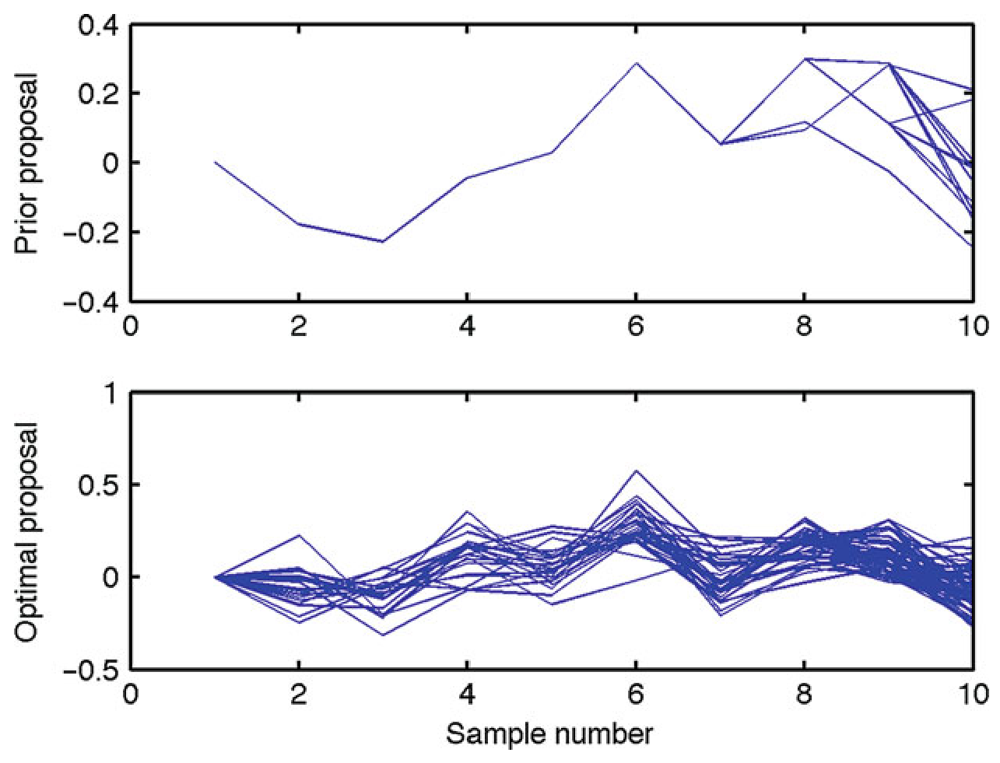

> Image description: This figure contains two line plots stacked vertically, illustrating the trajectories of particle filters under different proposal distributions. Both plots share a common x-axis labeled "Sample number" ranging from 0 to 10. The top plot, titled "Prior proposal," shows a set of trajectories that quickly diverge. Most trajectories follow a single path initially, but toward the later samples (samples 7 through 10), they spread out significantly, with some values rising toward 0.3 and others falling toward -0.3. According to the caption, this "bad" prior proposal leads to particle depletion. The bottom plot, titled "Optimal proposal," shows a much denser set of trajectories that remain more tightly clustered around the zero line. While there is visible fluctuation, the trajectories do not diverge as drastically as the top plot. This represents a "good" proposal distribution. The visual comparison demonstrates how the optimal proposal maintains a more representative sample set of the state space.
Particle Filters, Fig. 2 Set of trajectories $\left\{x_{1: 10}^{(i)}-\right. \left.x_{1: 10}\right\}_{i=1: N}$ for two different proposal distributions, one bad one (prior) leading to particle depletion and one good

one (likelihood). Note that the smoothing distribution $p\left(x_{k} \mid y_{1: 10}\right)$ can be approximated with the set of particles $\left\{x_{k}^{(i)}\right\}_{i=1: N}$ using the marginalization principle
"cheating" to look at the next measurement when doing the time update, but one has to look at a full cycle of the iteration scheme.

If a proposal distribution of the functional form $q\left(x_{k} \mid x_{k-1}, y_{k}\right)$ is used, then steps 1 and 3 have to be modified as follows:

1 Weight update: Time and measurement updates:

$$
\begin{align*}
w_{k \mid k-1}^{(i)} & \propto w_{k-1 \mid k-1}^{(i)} \frac{p\left(x_{k}^{(i)} \mid x_{k-1}^{(i)}\right)}{q\left(x_{k}^{(i)} \mid x_{k-1}^{(i)}, y_{k}\right)}  \tag{3a}\\
w_{k \mid k}^{(i)} & \propto w_{k \mid k-1}^{(i)} p\left(y_{k} \mid x_{k}^{(i)}\right) \tag{3b}
\end{align*}
$$

3 Prediction: Generate samples from the proposal

$$
\begin{equation*}
x_{k+1}^{(i)} \sim q\left(x_{k+1} \mid x_{k}^{(i)}, y_{k+1}\right) \tag{3c}
\end{equation*}
$$

The most natural proposal distributions are the following:

- The prior $q\left(x_{k+1} \mid x_{k}^{(i)}, y_{k+1}\right)=p\left(x_{k+1} \mid x_{k}^{(i)}\right)$, as used in the basic PF.
- The likelihood $q\left(x_{k+1} \mid x_{k}^{(i)}, y_{k+1}\right) \propto p\left(y_{k+1} \mid x_{k+1}\right)$. For the model (2), the proposal becomes $\mathrm{N}\left(y_{k} / h, R_{k} / h^{2}\right)$.
- The optimal (minimizing weight variance) choice $q\left(x_{k+1} \mid x_{k}^{(i)}, y_{k+1}\right) \propto p\left(y_{k+1} \mid x_{k+1}\right) p\left(x_{k+1} \mid x_{k}^{(i)}\right)$. For the model (2), the optimal proposal is provided by one cycle of the Kalman filter, initialized with the particle $x_{k}^{(i)}$.
The optimal proposal keeps the weights constant, and this would in theory avoid depletion, where depletion is interpreted as excessive weight variance. Figure 2 compares the set of trajectories for the prior and likelihood proposals, respectively. Apparently, the likelihood proposal is to prefer here, since it suffers less from depletion in the particle history. The practical limitation with the last two alternatives is that one has to be able to sample from the likelihood, so in practice there needs to be more measurements than states in the model.


<!-- source_pdf_page: 1060 -->
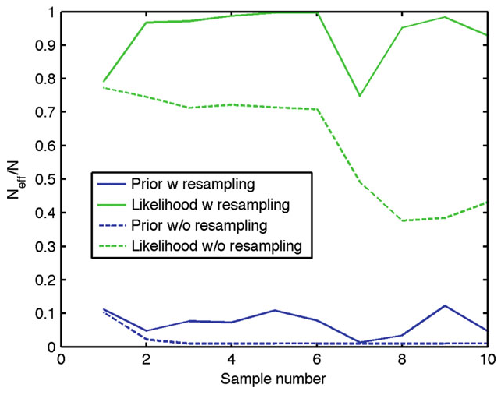

> Image description: A line graph titled "Particle Filters, Fig. 3" illustrates the ratio of effective number of particles to total particles, $N_{\text{eff}}/N$, for two different proposals over 10 sample numbers. The y-axis represents the ratio $N_{\text{eff}}/N$ ranging from 0 to 1, while the x-axis represents the Sample number from 1 to 10. The figure compares two methodologies: using the prior versus using the likelihood, both with and without resampling. The "Likelihood w resampling" (solid green line) maintains high values, mostly between 0.75 and 1.0, indicating high particle efficiency. The "Likelihood w/o resampling" (dashed green line) shows a significant downward trend, dropping from approximately 0.77 to 0.4. Conversely, both "Prior" curves—the "Prior w resampling" (solid blue line) and "Prior w/o resampling" (dashed blue line)—remain very low, staying below 0.15 throughout the samples. This visualizes the efficiency of different proposal distributions in particle filtering.
Particle Filters, Fig. 3 The efficient number of particles $N_{\text {eff }}(k) / N$ for prior proposal (blue) and likelihood proposal (green) ( $N=1,000$ )

## Adaptive Resampling

Resampling is crucial to avoid depletion. Without resampling, all trajectories except for one will get zero weight quite quickly. However, there is no need to resample at every iteration. Actually, resampling increases the weight variance, which is undesired. The question is how to decide if resampling is needed. The efficient number of particles estimated as

$$
\begin{equation*}
N_{\mathrm{eff}}(k)=\frac{1}{\sum_{i=1}^{N}\left(w_{k \mid k}^{(i)}\right)^{2}}, \tag{4}
\end{equation*}
$$

is one suitable indicator. If all particles have the same weight $w_{k \mid k}^{(i)}=1 / N$, then $N_{\text {eff }}(k)=N$. Conversely, if one weight is one and all other zero, then $N_{\text {eff }}(k)=1$. Thus, $N_{\text {eff }}$ can be interpreted as a measure of how many particles that actually contribute to the solution.

Figure 3 shows the evolution of $N_{\text {eff }}(k)$ for prior and likelihood proposals, respectively. With resampling in every iteration, the likelihood pro-
posal performs very well with $N_{\text {eff }}(k) \approx N$, while the prior proposal effectively uses only $10 \%$ of the particles. Thus, $N_{\text {eff }}(k)$ is a good indicator of the quality of the proposal distribution.

In Fig. 1, $N=100$ so effectively 10 samples are contributing to the Gaussian approximation, which as mentioned before is too small a number to get a good result.

As a comparison, Fig. 3 also shows $N_{\text {eff }}$ if resampling is never used, then $N_{\text {eff }}(k)$ normally decreases over time. The likelihood proposal does not decrease as fast as the prior proposal, and for this very short data sequence resampling is really not needed at all.

In summary, resampling increases weight variance and decreases the performance of the filter. On the other hand, without resampling the effective number of particles converges monotonously to only one. So, the idea of adaptive resampling is natural. The key idea is to resample only if the effective number of particles is small. The usual rule of thumb is that resampling is needed if $N_{\text {eff }}(k)<2 N / 3$.


<!-- source_pdf_page: 1061 -->
Resampling was the main contribution in Gordon et al. (1993) to get a working algorithm.

## Marginalization

The posterior distribution approximation provided by the particle filter converges with the number of particles. In theory, the convergence rate is $g_{k} / N$, where $g_{k}$ is a polynomial function in time $k$. In practice, it appears that the required number of particles increases very quickly with state dimension. Unless a very good proposal distribution is found, the practical limit for the state dimension is around 3-4 as a rough rule of thumb.

For applications with a large number of states, one can in many cases still use the particle filter. The idea is to find a linear Gaussian substructure in the model and then divide the state vector $x_{k}$ into two parts: $x_{k}^{l}$ for the states that appear linearly and $x_{k}^{n}$ for the remaining states. Bayes rule provides the factorization

$$
\begin{equation*}
p\left(x_{k}^{l}, x_{1: k}^{n} \mid y_{1: k}\right)=p\left(x_{k}^{l} \mid x_{1: k}^{n}, y_{1: k}\right) p\left(x_{1: k}^{n} \mid y_{1: k}\right) \tag{5}
\end{equation*}
$$

With a linear Gaussian substructure for $x_{k}^{l}$, given the whole trajectory $x_{1: k}^{n}$, then the Kalman filter applies and provides a Gaussian distribution for the first factor in (5). The second factor is resolved using a marginalization procedure so that the particle filter can be applied.

The bottom line is that each particle is associated with one Kalman filter. The method is called Rao-Blackwellized particle filter, or marginalized particle filter, in literature.

## Illustrative Application: Navigation by Map Matching

A nontrivial application where the PF solves a nonlinear filtering problem, where Kalman filterbased approaches would fail, is described in Forssell et al. (2002). The problem is to compute a robust estimate of the position of a car, without using infrastructure such as cellular networks or
satellites. The approach is based on measuring wheel speeds on one axle and from that dead reckon a nominal trajectory using standard odometric formulas. A road map is then used as a measurement, to rule out impossible or unlikely maneuvers. There is no numeric measurement $y_{k}$ in this approach, but the likelihood $p\left(y_{k} \mid x_{k}\right)$ in the model (1b) is large when $x_{k}$ corresponds to a road position and decays quickly to zero outside the road network. Figure 4 illustrates the particle cloud gradually focuses around the true position with time. In particular, the number of modes in the posterior distributions is rather high initially, but decreases over time, in particular after each turn.

The particle filter is sometimes believed to be too computer intensive for real-time applications. As described in Forssell et al. (2002), this demonstrator implemented a particle filter on a pocket computer anno 2001 with $N=15,000$ particles running in 10 Hz . Thus, the computational complexity of the particle filter should not be overemphasized in practice.

## Summary and Future Directions

The particle filter can be seen as a black-box solution to the nonlinear filtering problem, where any nonlinear dynamical model with arbitrary noise distributions can be plugged in. The main tuning parameter is the number of particles, and the PF will work in theory if this number is large enough. In practice, there are many tricks the user has to be aware of to mitigate the curse of dimensionality (depletion) that occurs for large state spaces (more than three) or long time sequences (more than a couple of samples). One engineering trick is dithering, to increase the variance in the involved noise distributions from their nominal values. More theoretical ways to mitigate depletion include clever choices of proposal distributions to sample from and marginalization (to solve a subset of the estimation problem with a Kalman filter).

Current and future research directions include the issues above. A further trend concerns the related smoothing problem, which is


<!-- source_pdf_page: 1062 -->
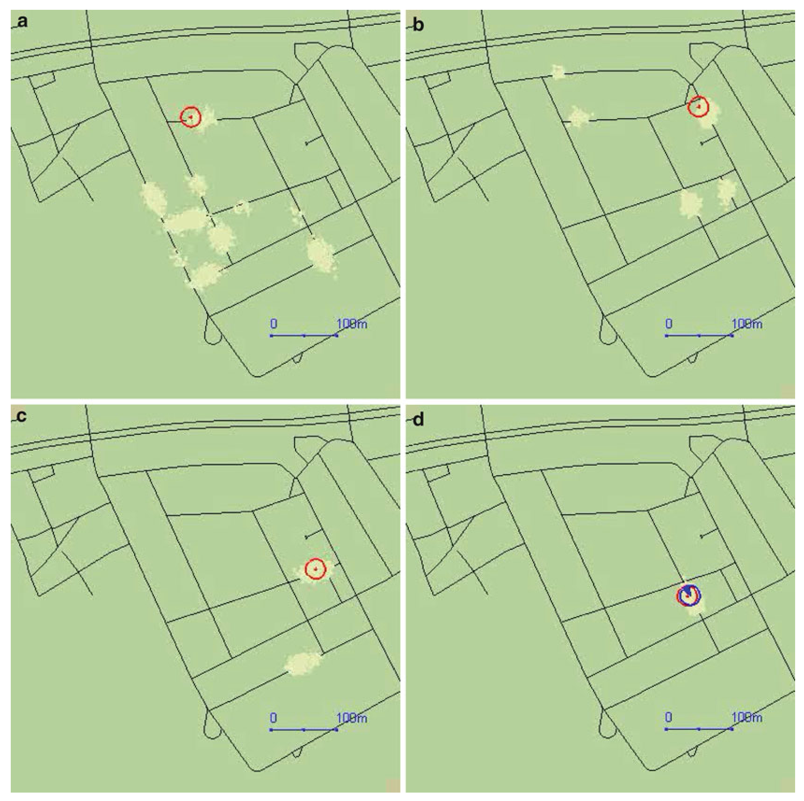

> Image description: A textbook figure titled "Fig. 4 Car navigation using wheel speed and a street map" contains four sequential maps labeled **a** through **d**, illustrating the evolution of a particle filter's position posterior distribution for a car's navigation. Each panel features a green street map with black lines representing roads. Pale yellow irregular clusters represent the particle-based probability distribution of the vehicle's position. Red circles indicate the true position of the vehicle. * **Panel a:** Shows a highly multimodal distribution with several large, disconnected yellow clusters scattered across multiple road segments, indicating high uncertainty. * **Panel b:** Shows the clusters beginning to merge and migrate toward a specific area. * **Panel c:** Shows the distribution concentrating into a single, smaller cluster near a red circle. * **Panel d:** Shows a highly unimodal distribution, where the single yellow cluster is tightly localized around the red circle, indicating successful convergence. Each panel includes a blue scale bar indicating 100 meters.
Particle Filters, Fig. 4 Car navigation using wheel speed and a street map. The figures illustrate of how the particle representation of the position posterior distribution of position (course state is now shown) improves over time. After four turns, the posterior is essentially unimodal, and

a position marker can be shown. The circle denotes GPS position, which is only used for comparison. (a) After first turn. (b) After second turn. (c) After third turn. (d) After fourth turn
interesting in itself, but which has turned out to be instrumental in joint state and parameter estimation problems. There are also many attempts to make the particle filter more robust, including ideas of filter banks and invoking a second layer of sampling algorithms to implement the proposal distribution. There is also a trend to use the particle filter as a computational
engine for more complex problems, such as the simultaneous localization and mapping (SLAM) problem, and to approximate the probability hypothesis density (PHD) for multisensor multi-target tracking. Finally, there are a large number of papers reporting on applications in traditional as well as new disciplines.


<!-- source_pdf_page: 1063 -->
## Cross-References

- Estimation, Survey on
- Extended Kalman Filters
- Kalman Filters
- Nonlinear Filters
- Nonlinear System Identification Using Particle Filters


## Recommended Reading

Particle filtering (PF) as a research area started with the seminal paper (Gordon et al. 1993) and the independent developments in Kitagawa (1996) and Isard and Blake (1998). The state of the art is summarized in the article collection Doucet et al. (2001), the surveys Liu and Chen (1998), Arulampalam et al. (2002), Djuric et al. (2003), Cappé et al. (2007), Gustafsson (2010), and the monograph Ristic et al. (2004).

## Bibliography

Arulampalam S, Maskell S, Gordon N, Clapp T (2002) A tutorial on particle filters for online nonlinear/nonGaussian Bayesian tracking. IEEE Trans Signal Process 50(2):174-188
Cappé O, Godsill SJ, Moulines E (2007) An overview of existing methods and recent advances in sequential Monte Carlo. IEEE Proc 95:899
Djuric PM, Kotecha JH, Zhang J, Huang Y, Ghirmai T, Bugallo MF, Miguez J (2003) Particle filtering. IEEE Signal Process Mag 20:19
Doucet A, de Freitas N, Gordon N (eds) (2001) Sequential Monte Carlo methods in practice. Springer, New York
Forssell U, Hall P, Ahlqvist S, Gustafsson F (2002) Novel map-aided positioning system. In: Proceedings of FISITA, Helsinki, number F02-1131
Gordon NJ, Salmond DJ, Smith AFM (1993) A novel approach to nonlinear/non-Gaussian Bayesian state estimation. IEE Proc Radar Signal Process 140: 107-113
Gustafsson F (2010) Particle filter theory and practice with positioning applications. IEEE Trans Aerosp Electron Mag Part II Tutor 7:53-82
Isard M, Blake A (1998) Condensation - conditional density propagation for visual tracking. Int J Comput Vis 29(1):5-28
Kitagawa G (1996) Monte Carlo filter and smoother for non-Gaussian nonlinear state space models. J Comput Graph Stat 5(1):1-25

Liu JS, Chen R (1998) Sequential Monte Carlo methods for dynamic systems. J Am Stat Assoc 93:1032-1044
Ristic B, Arulampalam S, Gordon N (2004) Beyond the Kalman filter: particle filters for tracking applications. Artech House, London

## Perturbation Analysis of Discrete Event Systems

Yorai Wardi ${ }^{1}$ and Christos G. Cassandras ${ }^{2}$<br>${ }^{1}$ School of Electrical and Computer Engineering, Georgia Institute of Technology, Atlanta, GA, USA<br>${ }^{2}$ Division of Systems Engineering, Center for Information and Systems Engineering, Boston University, Brookline, MA, USA


#### Abstract

Perturbation analysis (PA) is a systematic methodology for estimating the sensitivities (gradient) of performance measures in discrete event systems (DES) with respect to various model or control parameters of interest. PA takes advantage of the special structure of DES sample realizations and is based entirely on observable system data. In particular, it does not require knowledge of the stochastic characterizations of the random processes involved and is simple to implement in a nonintrusive manner. PA estimators, therefore, enable implementations for real-time control in addition to off-line optimization. The article presents the main ideas and statistical properties of PA techniques for both DES and recent generalizations to stochastic hybrid systems (SHS), especially for the simplest class of sensitivity estimators known as infinitesimal perturbation analysis (IPA).


## Keywords

Gradient estimation; Sample-path techniques; Sensitivity analysis; Stochastic flow models; Queueing networks


<!-- source_pdf_page: 1064 -->
## Introduction

Sensitivity analysis is an essential component of the system design process in a wide variety of application areas. In essence, it provides quantitative variations of performance metrics resulting from possible perturbations in design set points and, hence, can be used in optimization and control as well as provide measures of performance robustness. Perturbation analysis (PA) is a systematic technique for computing samplebased sensitivity estimators of performance metrics in discrete event systems (DES) by using the special properties of their sample realizations. The effectiveness of such estimators (e.g., unbiasedness) depends on the characteristics of the DES to which PA is applied and on the specific performance metric of interest. The purpose of this article is to present and explain some of the main ideas and fundamental techniques of PA .

Figure 1 depicts an abstract schematic where the operation of a stochastic system depends on a parameter $\theta$ that is chosen from a given set $\Theta$. Let $J(\theta)$ be an expected value performance function of the system, and suppose that $J(\theta)= E[L(\theta)]$, where $E[\cdot]$ denotes expectation and $L(\theta)$ is a sample realization computable from a sample path of the system. In many situations $J(\theta)$ lacks a closed-form expression, and its sample realization, $L(\theta)$, provides the most practical way for its estimation. Applications of sensitivity analysis often concern the effects of perturbations in the parameter $\theta$ on the sample realization $L(\theta)$. Denoting such perturbations by $\Delta \theta$, their effects can be characterized by the difference term $L(\theta+\Delta \theta)-L(\theta)$. PA provides such difference terms from the same sample path that was used for computing $L(\theta)$. Furthermore, if $\theta \in R^{n}$ and the function $L(\cdot)$ is differentiable, then PA can compute the gradient term $\nabla L(\theta)$

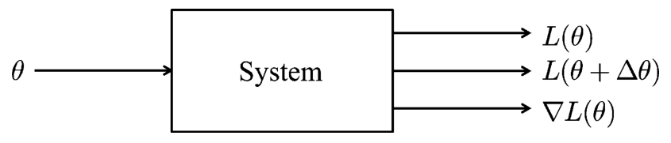

> Image description: A diagram labeled "Fig. 1 Framework for perturbation analysis (PA)" illustrates a system-based approach to sensitivity analysis. The diagram consists of a central rectangular block labeled "System." A single input arrow, labeled with the parameter vector $\theta$, enters the left side of the System block. The System block produces three distinct output arrows pointing to the right, representing different evaluations based on the input parameter. The first output is the original function value, $L(\theta)$. The second output represents a perturbed function value, $L(\theta + \Delta\theta)$, where a small change $\Delta\theta$ is applied to the input. The third output is the gradient of the function, $\nabla L(\theta)$. In an engineering context, this framework shows how a system can be used to estimate performance metrics ($L$) and sensitivity information (the gradient) by comparing the response of the original state to the response of a slightly perturbed state.
Perturbation Analysis of Discrete Event Systems,
Fig. 1 Framework for perturbation analysis (PA)

from the same sample path. These sample pathbased sensitivities can be used, under suitable conditions, to estimate the quantities $J(\theta+\Delta \theta)- J(\theta)$ and $\nabla J(\theta)$, respectively.

The PA theory was pioneered by Yu-Chi Ho who led its eventual development by his own group and other researchers over two decades. The early works were motivated by optimal resource management problems in manufacturing and concerned the effects of buffer allocation on throughput in transfer lines (Ho and Cassandras 1983; Ho et al. 1979). Subsequently PA was developed in the setting of queueing networks by virtue of their wide use as models in applications. In this setting, typically $\theta$ is a set point parameter affecting service times, inter-arrival times, routing fractions, buffer sizes, and various flow control laws; $J(\theta)$ is an expected value performance metric like average delay, throughput, and loss; and $L(\theta)$ is a sample realization of $J(\theta)$. The special structure of sample paths of queueing networks often yields simple PA algorithms for the difference terms $L(\theta+\Delta \theta)-L(\theta)$, as well as the gradient term $\nabla L(\theta)$, from the common sample path. The PA techniques for computing $L(\theta+\Delta \theta)-L(\theta)$ are collectively referred to as finite perturbation analysis (FPA), while those for computing $\nabla L(\theta)$ are called infinitesimal perturbation analysis (IPA) (Ho et al. 1983). Much of the development of PA has focused on IPA, rather than FPA, due to its greater simplicity and natural use in optimization, and, hence, it will be the focal point of this article. For comprehensive expositions of PA and its various techniques, please see Ho and Cao (1991), Glasserman (1991), and Cassandras and Lafortune (2008).

The purpose of the IPA gradient, $\nabla L(\theta)$, is to estimate $\nabla J(\theta)$. This, however, is only useful as long as $\nabla L(\theta)$ is an unbiased realization of $\nabla J(\theta)$, namely,

$$
E[\nabla L(\theta)]=\nabla E[L(\theta)]=\nabla J(\theta),
$$

and in this case it is said that IPA is unbiased (Cao 1985). Since $J(\theta)=E[L(\theta)]$, unbiasedness means the commutativity of the operators of differentiation with respect to $\theta$ and integration (expectation) in the probability space, and this is


<!-- source_pdf_page: 1065 -->
closely related to the condition that, w.p.1, the random function $L(\theta)$ is continuous throughout $\Theta$. As a matter of fact, the two conditions are practically synonymous. However, shortly after the emergence of IPA, it became apparent that in many queueing models of interest, $L(\theta)$ is not continuous and, hence, IPA is not unbiased (Heidelberger et al. 1988). Subsequently various techniques to overcome this problem were explored, including the so-called cut and paste of the sample paths and re-parametrization of the underlying probability space via statistical conditioning. For a more comprehensive coverage of such techniques, please see Cassandras and Lafortune (2008) and references therein. These techniques can yield unbiased gradient estimators in principle but often at the expense of prohibitive computing costs. Recently an alternative approach has emerged, based on stochastic flow models (SFM) that are comprised of fluid queues (Cassandras et al. 2002). It extends, significantly, the class of models and problems where IPA is unbiased and has the added advantage of yielding very simple gradient estimators.

The following sections of this article present IPA in the general setting of DES, explain the limits of its scope in queueing models, describe alternative PA techniques for extending those limits, present the SFM approach, and conclude with some thoughts on future research directions.

## DES Setting for IPA

IPA can be applied to any DES modeled as a stochastic timed automaton, defined in Cassandras and Lafortune (2008) and discussed in - Models for Discrete Event Systems: An Overview. Briefly, a stochastic timed automaton is a sextuple ( $\mathcal{E}, \mathcal{X}, \Gamma, p, p_{0}, G$ ), where $\mathcal{E}$ is an event set, $\mathcal{X}$ is a state space, and $\Gamma(x) \subseteq \mathcal{E}$ is the set of feasible events when the state is $x$, defined for all $x \in \mathcal{X}$. The initial state is drawn from $p_{0}(x)=P\left[X_{0}=x\right]$. Subsequently, given that the current state is $x$, with each feasible event $i \in \Gamma(x)$, we associate a clock value $Y_{i}$, which represents the time until event $i$ is to occur. Thus, comparing all such clock values, we identify the
triggering event $E^{\prime}=\arg \min _{i \in \Gamma(x)}\left\{Y_{i}\right\}$, where $Y^{*}=\min _{i \in \Gamma(x)}\left\{Y_{i}\right\}$ is the inter-event time (the time elapsed since the last event occurrence). To simplify the notation we define $e^{\prime}:=E^{\prime}$. Thus, with $e^{\prime}$ determined, the state transition probabilities $p\left(x^{\prime} ; x, e^{\prime}\right)$ are used to specify the next state $x^{\prime}$. Finally, the clock values are updated: $Y_{i}$ is decremented by $Y^{*}$ for all $i$ (other than the triggering event) which remain feasible in $x^{\prime}$, while the triggering event (and all other events which are activated upon entering $x^{\prime}$ ) is assigned a new lifetime sampled from a distribution $G_{i}$. The set $G=\left\{G_{i}: i \in \mathcal{E}\right\}$ defines the stochastic clock structure of the automaton.

Let $T_{\alpha, n}$ denote the $n$th occurrence time of event $\alpha \in \mathcal{E}$, and let $V_{\alpha, n}$ denote a realization of the lifetime event distribution $G_{\alpha}$ such that $V_{\alpha, n}=T_{\alpha, n}-T_{\beta, m}$ for some (any) event $\beta \in \mathcal{E}$ and $m \in\{1,2, \ldots\}$. One can then always write $T_{\alpha, n}=V_{\beta_{1}, k_{1}}+\ldots+V_{\beta_{s}, k_{s}}$ for some $s$. Let us now consider a parameter $\theta \in R$ which can only affect one or more of the event lifetime distributions $G_{\alpha}(x ; \theta)$; in particular, $\theta$ does not affect the state transition mechanism. The case where $\theta \in R^{n}$ can be handled in similar ways, but the one-dimensional case permits us to use the derivative notation rather than the gradient symbol, which simplifies the presentation. Viewing lifetimes as functions of $\theta, V_{\alpha, k}(\theta)$, it can be shown (under mild technical conditions, see Glasserman (1991)) that

$$
\begin{equation*}
\frac{d V_{\alpha, k}}{d \theta}=-\frac{\left[\partial G_{\alpha}(x ; \theta) / \partial \theta\right]_{\left(V_{\alpha, k}, \theta\right)}}{\left[\partial G_{\alpha}(x ; \theta) / \partial x\right]_{\left(V_{\alpha, k}, \theta\right)}}, \tag{1}
\end{equation*}
$$

where the subscript ( $V_{\alpha, k}, \theta$ ) indicates that the corresponding derivative of $G_{\alpha}$ is evaluated at the point ( $V_{\alpha, k}, \theta$ ). This describes how a perturbation in $\theta$ generates a perturbation in the associated event lifetime $V_{\alpha, k}$. Such a perturbation can now propagate through the DES to affect various event occurrence times according to the dynamics prescribed by the stochastic timed automaton. Event time derivatives $d T_{\alpha, n}(\theta) / d \theta$ are given by

$$
\begin{equation*}
\frac{d T_{\alpha, n}}{d \theta}=\sum_{\beta, m} \frac{d V_{\beta, m}}{d \theta} \eta(\alpha, n ; \beta, m) \tag{2}
\end{equation*}
$$


<!-- source_pdf_page: 1066 -->
where $\eta(\alpha, n ; \beta, m)$ is a triggering indicator taking values in $\{0,1\}$ so that $\eta(\alpha, n ; \beta, m)=1$ if the $n$th occurrence of event $\alpha$ is triggered by the $m$ th occurrence of $\beta, \eta(\alpha, n ; \alpha, n)=1$ for all $\alpha \in \mathcal{E}, \eta\left(\alpha, n ; \beta^{\prime}, m^{\prime}\right)=1$ if $\eta(\alpha, n ; \beta, m)=1$ and $\eta\left(\beta, m ; \beta^{\prime}, m^{\prime}\right)=1$, and $\eta(\alpha, n ; \beta, m)=0$ otherwise.

This leads to a general-purpose algorithm for evaluating event time derivatives along an observed sample path (see Algorithm 1) of a DES modeled as a stochastic timed automaton. In particular, we define a perturbation accumulator, $\Delta_{\alpha}$, for every event $\alpha \in \mathcal{E}$. The accumulator $\Delta_{\alpha}$ is updated at event occurrences in two ways: (i) It is incremented by $d V_{\alpha} / d \theta$ whenever an event $\alpha$ occurs, and (ii) it is coupled to an accumulator $\Delta_{\beta}$ whenever an event $\beta($ possibly $\beta=\alpha)$ occurs that activates an event $\alpha$. No particular stopping condition is specified, since this may vary depending on the problem of interest.

Sample Function Derivatives. Since many sample performance functions $L(\theta)$ of interest can be expressed in terms of event times $T_{\alpha, n}$, we can use (2) and Algorithm 1

```
Algorithm 1 General-purpose IPA algorithm for
stochastic timed automata
1. Initialization
        If event $\alpha$ is feasible at $x_{0}: \Delta_{\alpha}:=$
    $d V_{\alpha, 1} / d \theta$
        Else, for all other $\alpha \in \mathcal{E}: \Delta_{\alpha}:=0$
2. Whenever event $\beta$ is observed
    If event $\alpha$ is activated with new lifetime $V_{\alpha}$ :
    2.1. Compute $d V_{\alpha} / d \theta$ through (1)
    2.2. $\Delta_{\alpha}:=\Delta_{\beta}+d V_{\alpha} / d \theta$
```

in order to obtain derivatives of the form $d L(\theta) / d \theta$. As an example, a large class of such functions is of the form

$$
L_{T}(\theta)=\int_{0}^{T} C(x(t, \theta)) d t
$$

where $C(x(t, \theta))$ is a bounded cost associated with operating the system at state $x(t, \theta)$. Then,

$$
\frac{d L_{T}}{d \theta}=\sum_{k=1}^{N(T)} \frac{d T_{k}}{d \theta}\left[C\left(x_{k-1}\right)-C\left(x_{k}\right)\right]
$$

where $N(T)$ counts the total number of events observed in $[0, T]$ and $x_{k}$ is the state remaining fixed in any interval ( $T_{k}, T_{k+1}$ ) with $T_{k}=T_{\alpha, n}$ for some $\alpha \in \mathcal{E}, n=1,2, \ldots$.

## Estimation of Performance Measure Deriva-

tives. Using $d L_{T}(\theta) / d \theta$ from above, we can obtain unbiased estimates of $d J / d \theta$ if the following condition holds:

$$
\frac{d J(\theta)}{d \theta}=E\left[\frac{d L_{T}(\theta)}{d \theta}\right] .
$$

As mentioned earlier, this key condition is closely related to the continuity of the sample performance functions. A discontinuity often is caused by a swap in the order of two events that results from small variations in $\theta$ and yields different future state trajectories. However, it is possible that the future state trajectory following the occurrence of the two events is invariant under their order, and in this case the two events are said to commute. This commuting condition, defined by Glasserman, was shown to be identical, under broad assumptions, to the continuity of the sample functions $L(\theta)$ and, hence, to the unbiasedness of IPA (Glasserman 1991).

The main ideas discussed in this section will next be illustrated on a simple queue.

## Queueing Example

Consider the IPA gradient (derivative) of the expected sojourn time (delay) in a GI/G/1 queue with respect to a real-valued parameter of its arrival process. Assume that the queue is empty at time $t=0$, and it serves its customers according to the order of their arrivals. Let us denote by $a_{k}, k=1,2, \ldots$, the arrival times, and by $s_{k}, k=1,2, \ldots$, the service times of consecutive customers. Furthermore, we denote by $v_{k}, k= 1,2, \ldots$, the $k$ th inter-arrival time, namely, $v_{k}= a_{k}-a_{k-1}$, where $a_{0}:=0$. Observe that the queue is a stochastic timed automaton as defined earlier,


<!-- source_pdf_page: 1067 -->
with event space \{arrival, departure\}, state space $\{0,1, \ldots\}$ representing the queue's occupancy, and feasible event set \{arrival\} when $x=0$ and \{arrival, departure\} when $x>0$.

Let $\theta \in R$ is a parameter of the distribution of the inter-arrival times, and, hence, the realizations of $v$ depend on $\theta$ in a functional manner. For example, if the arrival process is Poisson and $\theta$ is its rate, then a realization of the inter-arrival times has the form $v=-\theta \ln (1-\omega)$, where $\omega \in[0,1]$ is a uniform variate. To emphasize the dependence of $v$ on $\theta$, we denote it by $v(\theta)$, while its dependence on $\omega$ is implicit. Similarly, the arrival times depend on $\theta$ and, hence, are denoted by $a_{k}(\theta)$, but the service times $s_{k}$ do not depend on $\theta$. The departure time of the $k$ th customer and its delay depend on $\theta$ and are denoted by $d_{k}(\theta)$ and $D_{k}(\theta)$, respectively. The forthcoming paragraphs discuss the derivatives of these functions with respect to $\theta$; we use the prime symbol to indicate such derivatives in order to simplify the notation.

Define the sample performance function

$$
L_{N}(\theta):=N^{-1} \sum_{k=1}^{N} D_{k}(\theta)
$$

for a given $N>0$. Under stability conditions, with probability 1 (w.p.1), $\lim _{N \rightarrow \infty} L_{N}(\theta)= J(\theta)$, where $J(\theta)$ denotes the mean of the delay's stationary distribution. The role of IPA is to estimate $J^{\prime}(\theta)$ via the sample derivative $L_{N}^{\prime}(\theta)$, and this is justified as long as $\lim _{N \rightarrow \infty} L_{N}^{\prime}(\theta)= J^{\prime}(\theta)$ w.p.1. In this case, IPA is said to be strongly consistent. In contrast, unbiasedness pertains to the performance function $J_{N}(\theta):=E\left[L_{N}(\theta)\right]$ and means that $E\left[L_{N}^{\prime}(\theta)\right]=J_{N}^{\prime}(\theta)$. The concepts of strong consistency and unbiasedness are closely related except that the latter concerns finite-horizon processes while the former pertains to stationary distributions in steady state. Both concepts have been extensively investigated in recent years: strong consistency in the setting of Markov chains and Markov decision processes Cao (2007) and unbiasedness in the context of stochastic hybrid systems, as will be described in the sequel. We will focus the rest of the discussion on the issue of unbiasedness.

Since $L_{N}(\theta)=N^{-1} \sum_{k=1}^{N} D_{k}(\theta)$, its IPA derivative is $L_{N}^{\prime}(\theta)=N^{-1} \sum_{k=1}^{N} D_{k}^{\prime}(\theta)$, and since $D_{k}(\theta)=a_{k}(\theta)-d_{k}(\theta)$, it follows that $D_{k}^{\prime}(\theta)=a_{k}^{\prime}(\theta)-d_{k}^{\prime}(\theta)$. The last two derivative terms are computable via the following recursive procedures. First, $a_{k}(\theta)=a_{k-1}(\theta)+v_{k}(\theta)$, and, hence,

$$
a_{k}^{\prime}(\theta)=a_{k-1}^{\prime}(\theta)+v_{k}^{\prime}(\theta) .
$$

The term $v_{k}^{\prime}(\theta)$ has to be obtained directly from the realization of $v$, and this often is possible since such realizations depend functionally on $\theta$; for instance, in the previous example, $v= -\theta \ln (1-\omega)$ and, hence, $v^{\prime}(\theta)=-\ln (1-\omega)$. Next, $d_{k}(\theta)$ is given by the Lindley equation

$$
d_{k}(\theta)=\max \left\{a_{k}(\theta), d_{k-1}(\theta)\right\}+s_{k},
$$

and, therefore, denoting by $\ell_{k}$ the index of the customer that started the busy period containing customer $k$, we have that

$$
d_{k}^{\prime}(\theta)=a_{\ell_{k}}^{\prime}(\theta)
$$

From these recursive relations it follows that $D_{k}^{\prime}(\theta)=0$ if customer $k$ starts a busy period and $D_{k}^{\prime}(\theta)=-\sum_{i=\ell_{k}+1}^{k} v_{i}^{\prime}(\theta)$ if customer $k$ does not start a busy period.

These equations shed light on the structure of IPA in a general class of queueing networks. First there is the perturbation generation, namely, the sampling of derivative (gradient) terms directly from the sample sequence of variates ( $\omega$ ) which defines the sample path; that was $v^{\prime}(\theta)$ in the above example. These terms drive the recursive equations that yield the IPA derivatives. The recursive equations often are based on the tracking of certain events such as the start of busy periods or idle periods, and the process of tracking the derivatives through them is referred to as perturbation propagation. In the above example it is obvious how the perturbation propagation tracks the busy periods at the queue. Furthermore, in a network setting, the perturbations can propagate from one queue to the next in a natural fashion. For instance, suppose that customers departing


<!-- source_pdf_page: 1068 -->
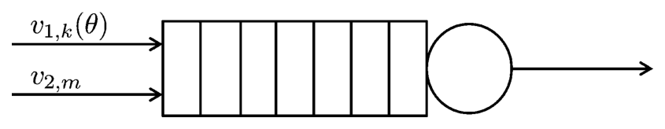

> Image description: A schematic diagram labeled "Fig. 2 Queue with two customer classes" illustrates a queueing system model. On the left side, two horizontal arrows represent input streams entering a rectangular block representing a queue. The upper input stream is labeled with the variable $v_{1,k}(\theta)$, and the lower input stream is labeled with $v_{2,m}$. These inputs enter a queue composed of six vertical rectangular segments, representing discrete slots or positions for customers. To the right of the queue, a large circle represents a single service station or server. A single horizontal arrow exits the circle toward the right, representing the output of the system. The diagram visually depicts a multi-class queueing process where two distinct types of arrivals enter a single queue to be processed by one server.
Perturbation Analysis of Discrete Event Systems,
Fig. 2 Queue with two customer classes

from the queue analyzed above enter a second queue. Then the derivative terms $d_{k}^{\prime}(\theta)$ of the upstream queue act as the derivative terms $a_{k}^{\prime}(\theta)$ of the downstream queue. This structure of perturbations' generation and propagation through the tracking of busy periods and other events often yields simple recursive algorithms for computing the IPA derivatives.

Concerning the issue of unbiasedness, it is clear that in the above example, the sample function $L_{N}(\theta)$ is continuous in $\theta$ and, hence, IPA is unbiased. However, in many systems of interest the IPA, derivative is biased. For example, consider the two-input, single-server queue shown in Fig. 2, where customers are served according to their arrival order regardless of source. Suppose that $\theta$ is a parameter of the upper arrival process, but not of the lower arrival process, and denote the respective inter-arrival times of the input streams by $v_{1, k}(\theta), k=1,2, \ldots$, and $v_{2, m} m=1,2, \ldots$, as indicated in the figure. Furthermore, let $d_{1, k}(\theta)$ denote the departure time from the queue of the $k$ th customer that came from the upper source, and let $d_{2, m}(\theta)$ denote the departure time from the queue of the $m$ th customer that came from the lower source. Similarly, let $D_{1, k}(\theta)$ and $D_{2, m}(\theta)$ be the delays of the $k$ th customer from the upper source and the $m$ th customer from the lower source, respectively. Lastly, in analogy with the previous example, consider the sample performance functions $L_{1, N}(\theta):=N^{-1} \sum_{k=1}^{N} D_{1, k}(\theta)$ and $L_{2, N}(\theta):= N^{-1} \sum_{m=1}^{N} D_{2, m}(\theta)$.

The IPA derivatives $L_{1, N}^{\prime}(\theta)$ and $L_{2, N}^{\prime}(\theta)$ have quite similar expressions to those derived earlier, but they are not unbiased. To see this point, suppose that $v_{1, k}(\cdot)$ is a monotone increasing function of $\theta$, and consider the functions $a_{1, k}(\theta)$, $d_{1, k}(\theta)$, and $d_{2, k}(\theta)$ for a common sample path. Suppose that at some point $\bar{\theta}$ the order of arrivals of the $n$th customer from the upper source
and the $m$ th customer from the lower source is swapped. Then the service order of these customers will be swapped as well, inducing discontinuities in $d_{1, k}(\theta)$ and $d_{2, m}(\theta)$ at the point $\theta=\bar{\theta}$. Consequently, the sample performance functions $L_{1, N}(\theta)$ and $L_{2, N}(\theta)$ also will be discontinuous at $\theta=\bar{\theta}$, and hence, their IPA derivatives are biased. Furthermore, if the queue is a part of a network and its output process directs customers to other queues, then the discontinuities in the various traffic processes will propagate downstream.

The causes of biasedness in queueing networks include multiple customer classes, nonMarkovian routing, and loss (spillover) due to finite buffers. This leaves out a limited class of networks where IPA can be unbiased and, hence, useful in applications. The following sections describe various approaches to overcome this problem.

## IPA Extensions

When IPA fails (because the commuting condition is violated or a sample function exhibits discontinuities in $\theta$ ), one can still use the PA approach to derive unbiased performance sensitivity estimates. There are two ways to accomplish this: (i) by modifying the stochastic timed automaton model so that IPA is "made to work" and (ii) by paying the price of more information collected from the observed sample path, in which case, the same essential PA philosophy can lead to unbiased and strongly consistent estimators, but these are no longer as simple as IPA ones. Regarding (i), the main idea here is that there may be more than one way to construct (statistically equivalent) sample paths of a stochastic DES, and while one way leads to discontinuous sample functions $L(\theta)$, another does not; a variety of such ways is provided in Cassandras and Lafortune (2008). Regarding (ii), the methodology of smoothed perturbation analysis (SPA) (Gong and Ho 1987) provides a generalization of IPA in which more information is extracted from a DES sample path in order to gain some knowledge about the magnitude of jumps in $L(\theta)$.


<!-- source_pdf_page: 1069 -->
The main idea of SPA lies in the "smoothing property" of conditional expectation. If we are willing to extract information from a sample path and denote it by $\mathcal{Z}$, called the characterization of the sample path, then we can evaluate, not just the sample function $L(\theta)$, but also the conditional expectation $E[L(\theta) \mid \mathcal{Z}]$ (provided we have some distributional knowledge based on which this expectation can be evaluated). This can result in a much smoother function of $\theta$ than $L(\theta)$. Thus, starting with the condition for an IPA estimator to be unbiased,

$$
\nabla J(\theta)=E[\nabla L(\theta)],
$$

we rewrite the left-hand side above as shown below, replacing $J(\theta)=E[(L(\theta)]$ by the expectation of a conditional expectation:

$$
\begin{equation*}
\nabla J(\theta)=\nabla E[L(\theta)]=\nabla E[E[L(\theta) \mid \mathcal{Z}]], \tag{3}
\end{equation*}
$$

where the inner expectation is a conditional one and the conditioning is on the characterization $\mathcal{Z}$. Treating $E[L(\theta) \mid \mathcal{Z}]$ as the new sample function, we expect it to be "smoother" than $L(\theta)$, and, in particular, continuous in $\theta$. Then, under some additional conditions (comparable to those made in the development of IPA) the interchange of differentiation and expectation in (3) can be justified:

$$
\nabla J(\theta)=E[\nabla E[L(\theta) \mid \mathcal{Z}]] .
$$

Letting $L_{\mathcal{Z}}(\theta):=E[L(\theta) \mid \mathcal{Z}]$, the SPA estimator of $\nabla J(\theta)$ is

$$
\begin{equation*}
[\nabla J(\theta)]_{\mathrm{SPA}}=\nabla L_{\mathcal{Z}}(\theta) . \tag{4}
\end{equation*}
$$

Naturally, the idea is to minimize the amount of added information represented by $\mathcal{Z}$, since this incurs added costs we would like to avoid. The choice of the characterization $\mathcal{Z}$ generally depends on the sample function considered and the system under study.

A number of other extensions to IPA have also been developed (see Cassandras and Lafortune 2008). It is also worth mentioning that the PA approach can be applied to a parameter $\theta$ taking
values from a finite set $\Theta=\left\{\theta_{0}, \theta_{1}, \ldots, \theta_{M}\right\}$. The theory of concurrent estimation and sample path constructability provides techniques to estimate performance measures of the DES through the process of constructing sample paths under each of $\theta_{0}, \theta_{1}, \ldots, \theta_{M}$; for details see Cassandras and Lafortune (2008).

## SFM Framework for IPA

The stochastic flow model (SFM) framework essentially consists of fluid queues which forego the notion of the individual customer and focus instead on the aggregate flow. In such a fluid queue, traffic and service processes are characterized by instantaneous flow rates as opposed to the arrival, departure, and service times of discrete customers. The SFM qualifies as a stochastic hybrid system with bilayer dynamics: discrete event dynamics at the upper layer and time-driven dynamics at the lower layer. The discrete events are associated with abrupt (discontinuous) changes in traffic-flow processes, such as the boundaries of busy periods at the queues. In contrast, the timedriven dynamics describe the continuous evolution of flow rates between successive discrete events, usually by differential equations or explicit functional terms. Performance metrics that are natural to SFMs typically reflect quantitative measures of flow rates, like average throughput, buffer workload, and loss.

Due to the smoothing effects of SFMs, they appear to provide a far more natural setting for IPA than their analogous discrete queueing counterparts. Furthermore, their IPA gradients often are computable via extremely simple algorithms that are based entirely on the observed sample path. Consequently SFMs could, in principle, be implemented on the sample paths generated by an actual system rather than simulations thereof and thus be used in real-time optimization.

All of this next will be explained via a concrete example of a queue which, though simple, captures the salient features of the SFM setting for IPA. For a more comprehensive discussion, please see Cassandras et al. (2010), Wardi et al. (2010), and Yao and Cassandras (2013).


<!-- source_pdf_page: 1070 -->
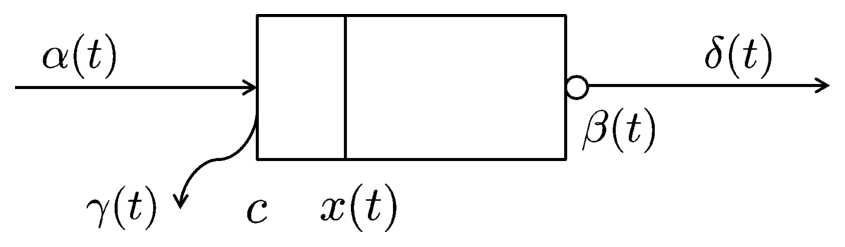

> Image description: A diagram from a textbook titled "Fig. 3 Basic SFM" illustrates a discrete-event system model represented as a rectangular block. The block's state is defined by a variable $x(t)$, while its capacity or characteristic is denoted by $c$. The system's dynamics are governed by three time-dependent processes indicated by arrows. An input flow $\alpha(t)$ enters the left side of the block. A loss or leakage process $\gamma(t)$ exits from the bottom-left side of the block, represented by a curved arrow. An output flow $\beta(t)$ exits from the right side of the block, indicated by a straight arrow originating from a small circle on the right boundary. This output flow leads to a further variable $\delta(t)$ shown at the far right. The figure visually represents a mass or state balance in a system where inputs, outputs, and internal losses affect the time-varying state $x(t)$.
Perturbation Analysis of Discrete Event Systems, Fig. 3 Basic SFM

Consider the fluid queue depicted in Fig. 3 whose input and output flow rate processes are denoted, respectively, by $\alpha(t)$ and $\delta(t)$. The output flow process depends on the input flow process via the action of the server as well as the buffer size. The server is characterized by an instantaneous processing rate, denoted by $\beta(t)$, and the buffer size, namely, the maximum amount of fluid the buffer can hold, is denoted by $c$. Fluid overflow occurs when the inflow (arrival) rate exceeds the service rate while the buffer is full, and the overflow (loss) rate is denoted by $\gamma(t)$.

Suppose that $\alpha(t)$ and $\beta(t)$ are random functions defined on a suitable probability space, and assume that they are piecewise continuous and of bounded variation w.p.1. In order to describe their functional relations to $\delta(t)$ and $\gamma(t)$, we define the state variable to be the amount of fluid in the buffer (workload) and denote it by $x(t)$. The dynamics of the system evolve according to the following one-sided differential equation,

$$
\frac{d x}{d t^{+}}= \begin{cases}0, & \text { if } x(t)=0 \text { and } \alpha(t) \leq \beta(t) \\ 0, & \text { if } x(t)=c \text { and } \alpha(t) \geq \beta(t) \\ \alpha(t)-\beta(t), & \text { otherwise }\end{cases}
$$

and $\delta(t)$ and $\gamma(t)$ are related to them via

$$
\delta(t)=\left\{\begin{array}{l}
\beta(t), \text { if } x(t)>0 \\
\alpha(t), \text { if } x(t)=0,
\end{array}\right.
$$

and

$$
\gamma(t)= \begin{cases}\alpha(t)-\beta(t), & \text { if } x(t)=c \\ 0, & \text { if } x(t)<c .\end{cases}
$$

Network arrangements of such fluid queues, with specified routing and control schemes, provide a rich class of SFMs.

Let $\theta \in R$ be a parameter of the inflow rate, the service rate, or a network control law; for
instance, $\theta$ can be the on time of the flow from an off/on source, a uniform rate of the server, or the threshold level in a threshold-based flow control. Then the aforementioned traffic processes are functions of $\theta$ and $t$ and, hence, are denoted by $\alpha(\theta ; t), \beta(\theta ; t), x(\theta ; t)$, etc. Fix the parameter $\theta$, and consider the evolution of the system over a given time horizon $[0, T]$. Performance measures of interest in applications include the average loss rate over the horizon $[0, T]$ and the average workload there which is related to the delay by Little's Law. Related to them are the sample performance functions $L_{\gamma, T}(\theta):=\int_{0}^{T} \gamma(\theta, t) d t$ and $L_{x, T}(\theta):=\int_{0}^{T} x(\theta, t) d t$; the former is called the loss volume and the latter, the cumulative workload.

To illustrate the forms of their IPA derivatives, consider the basic SFM shown in Fig. 3, and let $\theta$ be its buffer size, namely, $\theta=c$. We say that a busy period of the queue is lossy if it incurs some loss at any amount. Let us denote by $N_{T}$ the number of lossy busy periods in the horizon $[0, T]$. Then (see Cassandras et al. 2002), the IPA derivative of the loss volume has the following form:

$$
L_{\gamma, T}^{\prime}(\theta)=-N_{T},
$$

where again we use the prime symbol to denote derivative with respect to $\theta$. This formula amounts to a counting process and indeed it is very simple. As an example, Fig. 4 depicts a typical state trajectory derived from a sample path. It is readily seen that the first busy period is lossy while the second one is not, and therefore, $L_{\gamma, T}^{\prime}(\theta)=-1$.

Concerning the cumulative workload, suppose that the queue has $M$ lossy busy periods in the time interval $[0, T]$, and let us enumerate them by the counter $m=1, \ldots, M$. Moreover, denote by $u_{m}$ the first time the buffer becomes full in its $m$ th lossy busy period and by $v_{m}$, the end-time of that busy period. Then (see Cassandras et al. 2002),

$$
L_{x, T}^{\prime}(\theta)=\sum_{m=1}^{M}\left(v_{m}-u_{m}\right) .
$$

In the example provided by Fig. 4, $L_{x, T}^{\prime}(\theta)= v_{1}-u_{1}$.


<!-- source_pdf_page: 1071 -->
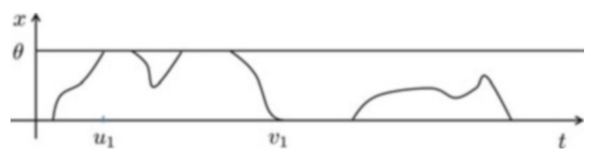

> Image description: A line graph titled "Fig. 4 State trajectory of the SFM" depicts the state $x$ as a function of time $t$. The vertical axis is labeled $x$, with a specific threshold value marked as $\theta$. The horizontal axis is labeled $t$. A horizontal line is drawn across the plot at the level of $\theta$, representing a critical threshold or setpoint. Below this threshold, several continuous, wavy curves represent the state trajectory $x(t)$ over time. These curves fluctuate above and below the $t$-axis, representing the dynamic behavior of the system. Several key time points are marked along the horizontal axis: $u_1$ and $v_1$. The curves interact with the $\theta$ threshold, with some segments reaching the threshold line and others remaining below it. The overall figure illustrates how a system's state evolves and reacts relative to a specific threshold over time.
Perturbation Analysis of Discrete Event Systems, Fig. 4 State trajectory of the SFM

These equations for the IPA derivatives not only are very simple, but require no knowledge of the specific form of the processes $\{\alpha(t)\}$ or $\{\beta(t)\}$, their realizations, or underlying probability law. They depend only on limited information which is directly observed from the sample path and, hence, are said to be nonparametric or model free. Furthermore, they have been shown to possess considerable robustness to modeling variations that do not cause significant alterations of the busy periods of the queue. A case of interest is when the SFM formalism is used as an abstraction of a queue. Then the above IPA formulas that were derived from an analysis of the SFM can be successfully applied to sample paths that are generated from the discrete queue. This is in contrast to the IPA formulas that are derived from the discrete queue, which generally are highly biased.

All of these properties of IPA in the SFM setting, including its unbiasedness, simplicity, the nonparametric nature of its algorithms, and its robustness to model variations, have had extensions to SFM networks and systems beyond the basic model (see Cassandras et al. 2010; Wardi et al. 2010; Yao and Cassandras 2013). As mentioned above, this suggests the potential application of IPA not only in system optimization via off-line simulation but also in real-time control where the sample paths are generated from the actual system.

## Summary and Future Directions

In the past 10 years, the focus of research on IPA has shifted from the setting of queueing systems to the framework of SFMs. The main reason for this shift is that IPA yields unbiased
gradient estimators for a considerably richer class of networks and performance functions in the SFM setting than for their analogous queueing models. Furthermore, the algorithms for computing the IPA gradients often are nonparametric, robust to modeling variations, and very simple to compute, and, hence, they hold out promise of implementations in real-time control in addition to off-line optimization.

In analogy with the extension of the scope of IPA from queueing systems to stochastic timed automata, the SFM framework has been extended to stochastic hybrid systems (SHS), defined in Cassandras et al. (2010). In such systems, including SFMs, the functional description of the time-driven dynamics is changed according to the occurrence of specific events. However, whereas in SFMs these dynamics are described by explicit functional relations, in SHS they are expressed by differential equations. The aforementioned, appealing properties of IPA gradients in the SFM setting appear to have extensions to the wider context of SHS.

Future directions in the use of IPA are expected to focus on the control of high-speed large-volume networks and, more generally, the control of stochastic hybrid systems.

## Cross-References

- Models for Discrete Event Systems: An Overview
- Perturbation Analysis of Steady-State Performance and Sensitivity-Based Optimization


## Bibliography

Cao X-R (1985) Convergence of parameter sensitivity estimates in a stochastic experiment. IEEE Trans Autom Control 30:834-843
Cao X-R (2007) Stochastic learning and optimization: a sensitivity-based approach. Springer, Boston
Cassandras CG, Lafortune S (2008) Introduction to discrete event systems, 2nd edn. Springer, New York
Cassandras CG, Wardi Y, Melamed B, Sun G, Panayiotou CG (2002) Perturbation analysis for on-line control and optimization of stochastic fluid models. IEEE Trans Autom Control 47: 1234-1248


<!-- source_pdf_page: 1072 -->
Cassandras CG, Wardi Y, Panayiotou CG, Yao C (2010) Perturbation analysis and optimization of stochastic hybrid systems. Eur J Control 16:642-664
Glasserman P (1991) Gradient estimation via perturbation analysis. Kluwer, Boston
Gong WB, Ho YC (1987) Smoothed perturbation analysis of discrete event systems. IEEE Trans Autom Control 32:858-866
Heidelberger P, Cao X-R, Zazanis M, Suri, R (1988) Convergence properties of infinitesimal perturbation analysis estimates. Manag Sci 34:1281-1302
Ho YC, Cao, X-R (1991) Perturbation analysis of discrete event dynamical systems. Kluwer, Boston
Ho YC, Cassandras CG (1983) A new approach to the analysis of discrete event dynamic systems. Automatica 19:149-167
Ho YC, Eyler MA, Chien DT (1979) A gradient technique for general buffer storage design in a serial production line. Int J Prod Res 17:557-580
Ho YC, Cao X-R, Cassandras CG (1983) Infinitesimal and finite perturbation analysis for queueing networks. Automatica 19:439-445
Wardi Y, Adams R, Melamed B (2010) A unified approach to infinitesimal perturbation analysis in stochastic flow models: the single-stage case. IEEE Trans Autom Control 55:89-103
Yao C, Cassandras CG (2013) Perturbation analysis and optimization of multiclass multiobjective stochastic flow models. Discret Event Dyn Syst 21:219-256

## Perturbation Analysis of Steady-State Performance and Sensitivity-Based Optimization

Xi-Ren Cao<br>Department of Finance and Department of Automation, Shanghai Jiao Tong University, Shanghai, China<br>Institute of Advanced Study, Hong Kong<br>University of Science and Technology, Hong Kong, China


#### Abstract

We introduce the theories and methodologies that utilize the special features of discrete event dynamic systems (DEDSs) for perturbation analysis (PA) and optimization of steady-state performance. Such theories and methodologies usually take different perspectives from the traditional optimization approaches and therefore may lead to new insights and efficient algorithms.


The topic discussed includes the gradient-based optimization for systems with continuous parameters and the direct-comparison-based optimization for systems with discrete policies, which is an alternative to dynamic programming and may apply when the latter fails. Furthermore, these new insights can also be applied to continuoustime and continuous-state dynamic systems, leading to a new paradigm of optimal control.

## Keywords

Gradient estimation; Sample-path techniques; Sensitivity analysis; Queueing networks

## Introduction

In this chapter, we introduce the theories and methodologies that utilize the special features of discrete event dynamic systems (DEDSs) for perturbation analysis (PA) and optimization of steady-state performance. Such theories and methodologies usually take different perspectives from the traditional optimization approaches and therefore may lead to new insights and efficient algorithms. Furthermore, these new insights can also be applied to continuous-time and continuous state dynamic systems, leading to a new paradigm of optimal control.

As discussed in ▷ Perturbation Analysis of Discrete Event Systems, perturbation analysis (PA) can be applied to both performance in finite-period and steady-state performance. This chapter will mainly focus on the latter and a related topic, the sensitivity-based optimization of steady-state performance of stochastic discrete event dynamic systems.

## Gradient-Based Approaches

## Basic Ideas

The gradient-based performance optimization of discrete event dynamic systems (DEDSs) consists of three steps:


<!-- source_pdf_page: 1073 -->
1. Developing efficient algorithms to estimate the performance gradients using the special features of a DEDS
2. Studying the properties of the gradient estimates, including investigating whether they are unbiased and/or strongly consistent
3. With the gradient estimates, developing efficient optimization algorithms
Steps 1 and 2 are referred to as PA, and Step 3 is usually done together with standard gradientbased optimization approaches, such as hillclimbing type of approaches and stochastic approximation approaches such as the RobbinsMonro algorithm (Robbins and Monro 1951).

Our focus here is on PA for steady-state performance. The main principle for estimating the gradients of steady-state performance is decomposition. In a DEDS, a small change in the value of a system parameter induces a series of changes on the system's sample path; each of such changes is called a perturbation. A single perturbation alone will affect the sample path and therefore affect the system performance. Such an effect is typically small, and therefore, the linear superposition usually holds. Thus, the effect of a small parameter change on the steady-state performance can be determined by summing up the effects of all the perturbations induced (or generated) by the parameter change. This principle is illustrated by Fig. 1, and it applies to many different systems with different performance criteria. Following the principle, efficient algorithms can be developed, and their strong consistency can be
proved Cao (2007). Its application to queueing systems and Markov systems will be discussed in the following two subsections.

## Queueing Systems

The gradient-based approach for DEDSs starts with queueing systems, known as infinitesimal perturbation analysis (IPA), or simply PA , - Perturbation Analysis of Discrete Event Systems. Queueing systems are widely used as a model for many DEDSs in literature and have very unique structural features, and PA utilizes such special features to develop fast algorithms to estimate the performance gradients.

We first give a brief explanation for the simple rules of PA of queueing systems (Ho and Cao 1983, 1991). Consider a closed Jackson network with $M$ servers and $N$ customers. The service times of customers at server $i$ are exponentially distributed with service rate $\mu_{i}, i=1,2, \cdots, M$. After a customer completes its service at server $i$, it goes to server $j$ with a routing probability $q_{i j}, i, j=1,2, \cdots, M$. The service discipline is first come first served. The number of customers at server $i$ is denoted as $n_{i}$, and the system state is denoted as $\boldsymbol{n}=\left(n_{1}, n_{2}, \cdots, n_{M}\right)$. The state process is $\boldsymbol{n}(t)=\left(n_{1}(t), n_{2}(t), \cdots, n_{M}(t)\right)$ with $n_{i}(t)$ being the number of customers at server $i$ at time $t, i=1,2, \cdots, M, t \geq 0$. Define $T_{l}$ as the $l$ th state transition time of the process $\boldsymbol{n}(t)$.
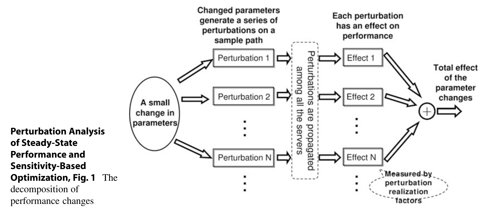


<!-- source_pdf_page: 1074 -->
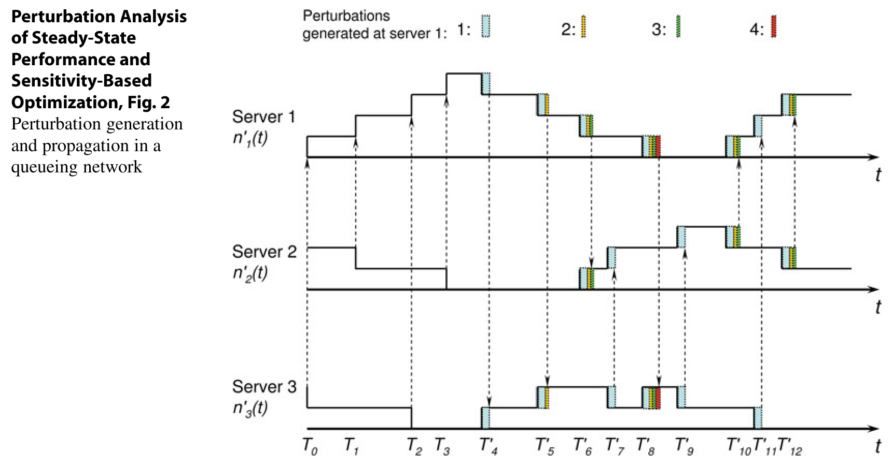

Figure 2 illustrates an example of a sample path where each stair-style line represents a trajectory of the number of customers at one server, and the customer transitions among servers are indicated by dotted arrows.

An exponentially distributed service time with rate $\mu$ can be generated according to $s=-\frac{1}{\mu} \ln \zeta$, where $\zeta$ is a uniformly distributed random number in $[0,1]$. Now let the service rate of a server, say server $k$, change from $\mu_{k}$ to $\mu_{k}+\Delta \mu_{k}$, $\Delta \mu_{k} \ll \mu_{k}$. Then the service time $s$ will change to $s^{\prime}=-\frac{1}{\mu_{k}+\Delta \mu_{k}} \ln \zeta$ (the same $\zeta$ is used for both $s$ and $s^{\prime}$ ). Thus, the perturbation of the service time induced by the change in $\mu_{k}$ is

$$
\begin{equation*}
\Delta s=s^{\prime}-s \approx-\frac{\Delta \mu_{k}}{\mu_{k}} s . \tag{1}
\end{equation*}
$$

In summary, because of a small (infinitesimal) change of service rate $\Delta \mu_{k}$, every customer's service completion time at server $k$ will obtain (be delayed by) a perturbation that is proportional to its original service time with a multiplier $-\frac{\Delta \mu_{k}}{\mu_{k}}$. This is the rule of perturbation generation.

Next, we observe that a perturbation will affect the service starting and completion times of other customers in the same server and in other servers in the network. We say a perturbation will be propagated through the network.

First, the perturbations generated at a server will accumulate until this server is idle. When the server enters an idle period, all its perturbations will be lost. (After the idle period, the service starting time is determined by the customer that terminates the idle period, which carries the perturbation of another server.) Second, when a customer finishes its service at server $i$ and enters server $j$ after an idle period of server $j$, server $j$ will obtain the same amount of perturbations as server $i$. If server $j$ is not idle at this time, the perturbation at server $i$ will only affect the arrival time of this customer and will not affect any other customers/servers.

Figure 2 illustrates the perturbation generation and propagation process of a network in which the service rate of server 1 is decreased with an infinitesimal amount. Given a system sample path obtained by simulation or observation, we can record the perturbations of all servers as they are generated and propagated along the sample path. From the perturbations we can get a perturbed sample path and finally get the performance changes caused by the change in the service rate. Specifically, we have the following algorithm for the perturbations of the service completion times (if server $k$ 's service rate is perturbed).

In Step 2, we add $s_{k, l}$ as the perturbation generated, instead $-\frac{\Delta \mu_{k}}{\mu_{k}} s_{k, l}$ as indicated by (1).


<!-- source_pdf_page: 1075 -->
```
Algorithm 1 Perturbation Analysis
    Initialization: Set variables $\Delta_{i}=0, i=1,2, \cdots, M$.
    Perturbation generation: At the $l$ th service completion
    time of server $k$, set $\Delta_{k}=\Delta_{k}+s_{k, l}, l=1,2, \cdots$,
    where $s_{k, l}$ is the service time of the $l$ th customer at
    server $k$.
    Perturbation propagation: If a customer from server $i$
    terminates an idle period of server $j$, set $\Delta_{j}=\Delta_{i}$,
    $i, j=1,2, \cdots, M$.
```

The factor $-\frac{\Delta \mu_{k}}{\mu_{k}}$ will be canceled when estimating performance derivatives with respect to $\Delta \mu_{k}$. The algorithm yields a perturbed sample path. With the original path and the perturbed path, we can estimate the original and perturbed (steady-state) throughput, then the estimates of its derivative with respect to $\mu_{k}$ can be obtained, and it is proved that the estimate is strongly consistent. Only a few lines need to be added in the simulation code to obtain the derivatives. Experiments show that the results are very accurate (error is around 5\%, compared with analytical results, Ho and Cao 1983).

## Markov Systems

The decomposition principle shown in Fig. 1 has been applied to Markov systems (Cao 2007).

Consider an irreducible and aperiodic Markov chain $\mathbf{X}=\left\{X_{n}: n \geq 0\right\}$ on a finite state space $\mathcal{S}=\{1,2, \cdots, M\}$ with transition probability matrix $P=[p(j \mid i)] \in[0,1]^{M \times M}$. Let $\pi=\left(\pi_{1}, \ldots, \pi_{M}\right)$ be the vector representing its steady-state probabilities and $f= \left(f_{1}, f_{2}, \cdots, f_{M}\right)^{T}$ be the reward (or cost) vector, where "T" represents transpose. We have $P e= e$, where $e=(1,1, \cdots, 1)^{T}$ is an M-dimensional vector whose all components equal 1 , and we have $\pi=\pi P$. We consider the long-term average (steady-state) performance defined as

$$
\begin{align*}
\eta & =E_{\pi}(f)=\sum_{i=1}^{M} \pi_{i} f_{i} \\
& =\pi f=\lim _{L \rightarrow \infty} \frac{F_{L}}{L}, \quad \text { w.p.1, } \tag{2}
\end{align*}
$$

where

$$
F_{L}=\sum_{l=0}^{L-1} f\left(X_{l}\right) .
$$

Let $P^{\prime}$ be another ergodic transition probability matrix on the same state space. Suppose $P$ changes to $P(\delta)=P+\delta Q=\delta P^{\prime}+(1-\delta) P$, with $\delta>0, Q=P^{\prime}-P=[q(j \mid i)]$, and the reward function $f$ keeps the same. We have $Q e=0$. The performance measure will change to $\eta(\delta)=\eta+\Delta \eta(\delta)$. The derivative of $\eta$ in the direction of $Q$ is defined as $\frac{d \eta(\delta)}{d \delta}=\lim _{\delta \rightarrow 0} \frac{\Delta \eta(\delta)}{\delta}$.

In this discrete-state Markov system, a perturbation means that the system is perturbed from one state $i$ to another state $j$. For example, consider the case where $q(i \mid k)=\frac{1}{2}, q(j \mid k)=\frac{1}{2}$, and $q(l \mid k)=0$ for all $l \neq i, j$. Suppose that these probabilities change to $q(i \mid k)=\frac{1}{2}+\delta$, $q(j \mid k)=\frac{1}{2}-\delta$, and $q^{\prime}(l \mid k)=0$ for all $l \neq i, j$. Then it may happen that at some time in the original sample path the system transits from state $k$ to state $i$, but in the perturbed path it transits from state $k$ to state $j$ instead. In this case, we say that the change in transition probabilities induces a perturbation from $i$ to $j$ at this time. To study the effect of such a perturbation, we consider two independent sample paths $\mathbf{X}=\left\{X_{n} ; n \geq 0\right\}$ and $\mathbf{X}^{\prime}=\left\{X_{n}^{\prime} ; n \geq 0\right\}$ with $X_{0}=i$ and $X_{0}^{\prime}=j$; both of them have the same transition matrix $P$. The average effect of a perturbation from $i$ to $j$, $i, j=1, \cdots, M$, on $F_{L}$ can be measured by the perturbation realization factor defined as

$$
\begin{gather*}
d(i, j)=\lim _{L \rightarrow \infty} E\left[\sum_{l=0}^{L-1}\left(f\left(X_{l}^{\prime}\right)-f\left(X_{l}\right)\right) \mid X_{0}\right. \\
\left.=i, X_{0}^{\prime}=j\right] \tag{3}
\end{gather*}
$$

The matrix $D \in \mathcal{R}^{M \times M}$, with $d(i, j)$ as its $(i, j)$ th element, is called a realization matrix. We can prove that $D$ satisfies the equation (Cao 2007)

$$
\begin{equation*}
D-P D P^{T}=F, \tag{4}
\end{equation*}
$$

where $F=f e^{T}-e f^{T}$. Because $d(i, j)= -d(j, i)$, for any $i, j$, we may define a vector $g=(g(1), \cdots, g(M))^{T}$ such that


<!-- source_pdf_page: 1076 -->
$$
\begin{equation*}
d(i, j)=g(j)-g(i), \tag{5}
\end{equation*}
$$

and $D=g e^{T}-e g^{T} \cdot g$ is called a performance potential, which can be estimated with many sample path-based algorithms, and it satisfies the Poisson equation (Cao 2007)

$$
\begin{equation*}
(I-P+e \pi) g=f \tag{6}
\end{equation*}
$$

Intuitively, (3) and (5) indicate that every visit to state $i$ contributes to $F_{L}$ on the average by the amount of $g(i)$, so the effect of a perturbation from $i$ to $j$ is $d(i, j)=g(j)-g(i)$. Now, we consider a sample path consisting of $L$ transitions. Among these transitions, on the average there are $L \pi_{i}$ transitions at which the system is at state $i$. After being at state $i$, the system jumps to state $j$ on the average $L \pi_{i} p(j \mid i)$ times. If the transition probability matrix $P$ changes to $P(\delta)=P+\delta Q$, then the change in the number of visits to state $j$ after being at state $i$ is $L \pi_{i} q(j \mid i) \delta=L \pi_{i}\left[p^{\prime}(j \mid i)-p(j \| i)\right] \delta$. This contributes a change of $\left\{L \pi_{i}\left[p^{\prime}(j \mid i)-\right.\right. p(j \mid i)] \delta\} g(i)$ to $F_{L}$. Thus, the total change in $F_{L}$ due to the change of $P$ to $P(\delta)$ is

$$
\begin{aligned}
\Delta F_{L}= & \sum_{i, j=1}^{M} L \pi_{i}\left[p^{\prime}(j \mid i)-p(j \mid i)\right] \delta g(i) \\
& =L(\pi Q g) \delta
\end{aligned}
$$

Finally, we have

$$
\begin{equation*}
\frac{d \eta}{d \delta}=\lim _{\delta \rightarrow 0} \frac{1}{\delta} \frac{\Delta F_{L}}{L}=\pi Q g=\pi\left(P^{\prime}-P\right) g . \tag{7}
\end{equation*}
$$

If the reward function also changes from $f$ to $f(\delta)=f+\delta\left(f^{\prime}-f\right)$, then (7) becomes

$$
\begin{equation*}
\frac{d \eta}{d \delta}=\pi\left[\left(P^{\prime} g+f^{\prime}\right)-(P g+f)\right] . \tag{8}
\end{equation*}
$$

## Further Works

The ideas described in the previous subsections may stimulate new research topics in theoretical analysis, estimation algorithms, and applications. Here we can only give a very brief review for some of them.

1. There is a large literature on whether the PA-based derivative estimates are unbiased (finite period) and/or strongly consistent (steady state). This was first formulated in Cao (1985) and was further discussed in Heidelberger et al. (1988). By now, there have been extensive studies in this direction: proving the unbiasedness or consistency for various systems and modifying the approach for system when the IPA estimates are not unbiased (e.g., Cassandras and Lafortune 1999; Fu and Hu 1997; Glasserman 1991). This also includes the recently proposed fluid model; see ▷ Perturbation Analysis of Discrete Event Systems.
2. Another research topic is how to develop fast and efficient algorithms for estimating the performance gradients, especially in the case of Markov systems; see e.g., Cao and Wan (1998), Baxter and Bartlett (2001), and Cao (2005). This is called policy gradients in the reinforcement learning literature.
3. There are also research works on how the gradient estimates and policy iteration (see section "Direct Comparison and Policy Iteration") can be combined with stochastic approximation approaches to develop fast convergent optimization algorithms; see Marbach and Tsitsiklis (2001) for gradient-based approach and Fang and Cao (2004) for policy iteration-based approach.

## Direct Comparison and Policy Iteration

The sensitivity-based view has been extended to optimization in discrete spaces of policies. With this view, we can develop a new approach to performance optimization based on a direct comparison of the performance of any two policies. This provides an alternative to the standard dynamic programming to solving the Markov decision processes (MDP) types of problems; it also has been applied to solve some problems when the standard MDP fails (Cao 2007; Cao and Wan 2013).


<!-- source_pdf_page: 1077 -->
In an MDP, there is an action space denoted as $\mathcal{A}$. For simplicity, we only consider the discrete case. When the system is at any state $i \in \mathcal{S}$, an action $\alpha=d(i)$ is taken, which controls the system transition probability, denoted as $p^{\alpha}(j \mid i), i, j \in \mathcal{S}$, and the reward function, denoted as $f(i, \alpha)$. The mapping $d: \mathcal{S} \rightarrow \mathcal{A}$ is called a policy. Since a policy corresponds to a transition probability matrix $P^{d}=\left[p^{d(i)}(j \mid i)\right]_{i, j=1}^{M}$ and the reward vector $f^{d}=(f(1, d(1)), \cdots, f(M, d(M)))^{T}$, we also call the pair $(P, f)$ a policy.

Consider two policies $(P, f)$ and $\left(P^{\prime}, f^{\prime}\right)$, and assume that the Markov chain under both policies is ergodic. We use prime " ' " to denote the quantities associated with ( $P^{\prime}, f^{\prime}$ ). First, multiplying both sides of the Poisson equation (6) with $\pi^{\prime}$ on the left and after some calculations, we get

$$
\begin{equation*}
\eta^{\prime}-\eta=\pi^{\prime}\left\{\left(P^{\prime} g+f^{\prime}\right)-(P g+f)\right\} . \tag{9}
\end{equation*}
$$

This is called a performance difference formula, and many optimization results can be derived from it in an intuitive way.

## Policy Iteration and the Optimality Equation

The difference formula (9) has a nice decomposition structure: it contains two factors, the first one $\pi^{\prime}$, which does not depend on $P$, and the second one $\left(P^{\prime} g+f^{\prime}\right)-(P g+f)$, in which all the parameters are known except the performance potential $g$, which can be obtained by only analyzing system with $P$. This nice feature makes the difference formula the basis of performance optimization.

For two $M$-dimensional vectors $a$ and $b$, we define $a=b$ if $a(i)=b(i)$ for all $i= 1,2 \cdots, M ; a \leq b$ if $a(i) \leq b(i)$ for all $i= 1,2 \cdots, M ; a<b$ if $a(i)<b(i)$ for all $i= 1,2 \cdots, M$; and $a \preceq b$ if $a(i)<b(i)$ for at least one $i$ and $a(j)=b(j)$ for other components. The relation $\leq$ includes $=, \preceq$, and $<$. Similar definitions are used for the relations $>, \succeq$, and $\geq$.

Next, we note that $\pi^{\prime}(i)>0$ for all $i= 1,2, \cdots, M$. Thus, from (9), we know that if $\left(P^{\prime}-P\right) g+\left(f^{\prime}-f\right) \succeq 0$, then $\eta^{\prime}-\eta>0$.

From (9) and the fact $\pi^{\prime}>0$, the proof of the following lemma is straightforward.

Lemma 1 If $P g+f \preceq(\leq) P^{\prime} g+f^{\prime}$, then $\eta<(\leq) \eta^{\prime}$.

It is interesting to note that in the lemma, we use only the potentials with one Markov chain, i.e., $g$. Thus, because of the special structure of the performance difference formula (9), if the condition in Lemma 1 holds, to compare the performance measures under two policies, we may only need the potentials with one policy.

Policy iteration and the optimality equation can be easily derived from (9) and Lemma 1.

```
Algorithm 2 Policy Iteration
    Guess an initial policy $d_{0}$, and set $k=0$.
    (Policy evaluation) Obtain the potential $g^{d k}$ by solving
    the Poisson equation $\left(I-P^{d_{k}}\right) g^{d_{k}}+\eta^{d_{k}} e=f^{d_{k}}$ or
    estimating it on a sample path. (The superscript " $d_{k}$ "
    is added to quantities associated with policy $d_{k}$.)
    (Policy improvement) Choose
        $d_{k+1} \in \arg \left\{\max _{d \in \mathcal{D}}\left[f^{d}+P^{d} g^{d k}\right]\right\}$,
```

```
    component-wise (i.e., to determine an action for each
    state). If in state $i$, action $d_{k}(i)$ attains the maximum,
    and set $d_{k+1}(i)=d_{k}(i)$.
    If $d_{k+1}=d_{k}$, stop; otherwise, set $k:=k+1$ and go
    to Step 2.
```

It follows directly from Lemma 1 that when the iteration does not stop, the performance improves at each iteration. It can be proved easily by construction that the iteration stops at an optimal policy. Again, from Lemma 1, when the iteration stops at a polict $\hat{d}$, it holds

$$
\begin{equation*}
\eta^{\hat{d}} e+g^{\hat{d}}=\max _{d \in \mathcal{D}}\left\{f^{d}+P^{d} g^{\hat{d}}\right\} . \tag{11}
\end{equation*}
$$

This is the Hamilton-Jacobi-Bellman (HJB) optimality equation. If we further define the Q-factor,

$$
\begin{equation*}
\left.Q^{d}(i, \alpha)=f(i, \alpha)+\sum_{j} p^{\alpha}(j \mid i) g^{d}(j)\right] . \tag{12}
\end{equation*}
$$

Then the policy iteration equation (10) and the HJB equation (11) become


<!-- source_pdf_page: 1078 -->
$$
\begin{equation*}
d_{k+1}(i):=\arg \max _{\alpha \in \mathcal{A}}\left\{Q^{d_{k}}(i, \alpha)\right\} \tag{13}
\end{equation*}
$$

and

$$
\begin{equation*}
Q^{\hat{d}}(i, \alpha)=\max _{\beta \in \mathcal{A}}\left\{Q^{\hat{d}}(i, \beta)\right\} \tag{14}
\end{equation*}
$$

The only difference between (8) and (9) is that $\pi$ in (8) is replaced by $\pi^{\prime}$ in (9). This leads to an interesting observation: policy iteration in MDPs in fact chooses the policy with the steepest directional derivative as the policy in the next iteration. Therefore, policy iteration in fact can be viewed as the "gradient-based" optimization in a discrete space.

In our approach, the HJB equation and policy iteration are obtained from the performance difference equation (9), which compares the performance of any two policies. It is hence called a direct-comparison based approach. This approach also applies to more general problems, such as multichain Markov systems, systems with absorbing states, and problems with other performance criteria such as the discounted performance and the bias, etc.

The direct-comparison approach has been successfully applied to the $n$ th-bias optimality problem (Cao 2007). Essentially, starting with the performance difference formulas (those similar to (9) for different performance), we can develop a simple and direct approach to derive the results that are equivalent to the sensitive discount optimality for multichain Markov systems with long-run average criteria (Puterman 1994), and no discounting is needed and no dynamic programming is used. The approach, motivated by the development for discrete event dynamic systems, provides a clear overall picture for the area of MDP.

The direct-comparison approach can also be applied to some problems where dynamic programming fails, including the event-based optimization problems, where the sequence of events may not be Markovian; see the next section.

## Event-Based Optimization

It is well known that for most systems modeled by Markov processes, the state spaces are too
large, and it is not computationally feasible to implement policy iteration or to solve the HJB equations. On the other hand, in many practical problems in engineering, finance, and social sciences, control actions are only taken when certain events occur. For example, in the traffic control of a network of subnetworks, often times one cannot control the traffic in the same subnetwork, and control actions are only applied when there are packets transferring among different subnetworks. In a portfolio management problem, the investor sells or buys stocks when the price history experiences some predetermined patterns (e.g., reaches some level). In a sensor network, actions are taken only when one of the sensors detects some abnormal situations. In a material handling problem, actions are taken when the inventory level falls below certain threshold.

Conceptually, anything happened in the past can be chosen as an event. However, the number of such events is too big (much bigger than the number of states), and studying all these events makes analysis infeasible and defeats our original purpose. Therefore, to properly define events, we need to strike a balance between the generality on one hand and the applicability on the other hand.

In the event-based setting, an event $e$ is defined as a set of state transitions with certain common properties. That is, $e:=\{\langle i, j\rangle: i, j \in \mathcal{S}$ and $\langle i, j\rangle$ has common properties $\}$, where $\langle i, j\rangle$ denotes a state transition from $i$ to $j$. This definition can also be easily generalized to represent a finite sequence of state transitions. We shall see that in many real problems, the number of events requiring control actions is usually much smaller than that of the states.

An event-based policy $d$ is defined as a mapping from $\mathcal{E}$ to $\mathcal{A}$, with $\mathcal{E}$ being the space of all events. That is, $d: \mathcal{E} \rightarrow \mathcal{A}$. Let $\mathcal{D}_{e}$ denote the set of all the stationary and deterministic policies. The reward function under policy $d$ is denoted as $f^{d}=f(i, d(e))$, and the associated long-run average performance is denoted as $\eta^{d}$. When an event $e$ happens, we choose an action $a=d(e)$ according to a policy $d$, where $e \in \mathcal{E}$ and $d \in \mathcal{D}_{e}$. Our goal is to find an optimal policy $\hat{d}$ which maximizes the long-run average performance as follows.


<!-- source_pdf_page: 1079 -->
$$
\begin{equation*}
\hat{d}=\arg \max _{d \in \mathcal{D}_{e}}\left\{\eta^{d}\right\} \tag{15}
\end{equation*}
$$

The main difficulty in developing the eventbased optimization theories and algorithms lies in the fact that the sequence of events is usually not Markovian. The standard optimization approach such as dynamic programming does not apply to such problems. However, we can apply the direct-comparison approach to this event-based optimization problem. Here we give a very brief discussion.

Consider an event-based policy $d, d \in \mathcal{D}_{e}$. When event $e$ occurs, the conditional transition probability is denoted as $p^{d(e)}(j \mid i, e)$. Let $\pi^{d}(i \mid e)$ be the conditional steady-state probability of state $i$ when event $e$ occurs under policy $d$. Define the aggregated Q-factor

$$
\begin{gather*}
Q^{d}(e, \alpha)=\sum_{i} \pi^{d}(i \mid e) \\
\times\left[f(i, \alpha)+\sum_{j} p^{\alpha}(j \mid i, e) g^{d}(j)\right] . \tag{16}
\end{gather*}
$$

We may use these aggregated Q-factors to develop an event-based policy iteration algorithms as Algorithm 2 and obtain the policy iteration equation (cf. (13))

$$
\begin{equation*}
d_{k+1}(e):=\arg \max _{\alpha \in \mathcal{A}}\left\{Q^{d_{k}}(e, \alpha)\right\}, \quad e \in \mathcal{E}, \tag{17}
\end{equation*}
$$

and the event-based HJB optimality equation (cf. (14)) is

$$
\begin{equation*}
Q^{\hat{d}}(e, \alpha)=\max _{\beta \in \mathcal{A}}\left\{Q^{\hat{d}}(e, \beta)\right\} . \tag{18}
\end{equation*}
$$

It can be proved that if the conditional probability $\pi^{h}(i \mid e)$ does not depend on the policy; i.e.,

$$
\begin{equation*}
\pi^{h}(i \mid e)=\pi^{d}(i \mid e), \quad \forall i, e, \quad \text { and } h, d, \tag{19}
\end{equation*}
$$

then policy iteration (17) indeed leads to a sequence of increasing performance and (18) specifies an event-based optimal policy.

The event-based aggregated Q-factor (16) can be estimated on a sample path in the same way as for potentials (Cao 2007). The number of events requiring actions is usually much smaller than the
number of states, and in some cases such as the network admission control problem, it is linear to the system size.

The crucial condition for the above eventbased optimization is (19). There are many problems, such as the control of the networks of networks and the portfolio management problem, for which the condition holds; there are also many problems for which the condition does not hold. The error in applying (18) and policy iteration (17) comes from the difference between $\pi^{h}(i \mid e)$ and $\pi^{d}(i \mid e)$ at each iteration. Further research is needed.

We use a computer network as an example, in which each computer or router can be modeled as a queueing subnetwork and the computer network is then a network of such subnetworks. Assume that there is an $M$ subnetwork, and subnetwork $m, m=1,2, \cdots, M$, consists of $k_{m}$ servers. The number of customers at the $j$ th server of subnetwork $m$ is denoted as $n_{m, j}$, $j=1,2, \cdots, k_{m}$, and the number of customers in all the servers in subnetwork $m$ is denoted as $N_{m}=\sum_{j=1}^{k_{m}} n_{m, j}$. Suppose the service time is exponentially distributed, then the system state is $\mathbf{n}:=\left(n_{1,1}, \cdots, n_{1, k_{1}} ; \cdots ; n_{M, 1}, \cdots, n_{M, k_{M}}\right)$, and the aggregated state is $\mathbf{N}:=\left(N_{1}, \cdots, N_{M}\right)$. Suppose that the transition probabilities among the servers in the same subnetwork are fixed and we can only control the transition probabilities among the subnetworks, and furthermore, we can only observe $\mathbf{N}$. Then the problem can be modeled as an event-based optimization with an event being a customer transition among subnetworks, and meanwhile, the aggregated state is $\mathbf{N}$. It can be proved that the condition (19) holds, and therefore, we may apply policy iteration (17) and HJB equation (18).

Many existing problems fit the event-based framework. For example, in a partially observable Markov decision process (POMDP), we may define an observation, or a sequence of observations, as an event. Other examples include state and time aggregations, hierarchical control (hybrid systems), and options. Different events can be defined to capture the special features in these different problems. In this sense, the event-based


<!-- source_pdf_page: 1080 -->
approach may provide a unified view to these different problems (Cao 2007).

## The Sensitivity-Based Approach and Optimal Control

We refer to the approaches discussed in the previous sections the sensitivity-based approach. When the parameters are continuous, it is the gradient-based approach, and the focus is on developing efficient algorithms that utilize the particular system structure to estimate the gradients (to justify the algorithms, the unbiasedness or the consistency of the estimates should be proved). When the parameters are discrete, it is the directcomparison approach that leads to policy iteration and the HJB equations, and policy iteration can be viewed as the gradient-based method in discrete spaces. This approach is different from the conventional dynamic programming, and it has been successfully applied to MDP with different criteria and the $n$-bias optimization problems as well as the event-based optimization and some other problems that dynamic programming fails.

This sensitivity-based approach was motivated by the study of discrete event dynamic systems (DEDS). It has been realized that the principles and methodologies developed for DEDSs also apply to the optimization of continuous-time and continuous-state (CTCS) systems. Here are some examples:

1. CTCS systems: For CTCS systems, the dynamic is driven by Brownian motions or Levy processes. The transition probability matrix in DEDS should be replaced by the infinitesimal generator in CTCS, which is an operator on the space of continuous functions. With the performance difference formulas, we can redevelop the stochastic optimal control theory for many performance measures, including the long-run average, discounted performance, and finite horizon problems, with no dynamic programming; see Cao et al. (2011).
2. Time-inconsistent optimization problems: In behavioral finance, people's preference is modeled with a distorted probability. For example, a risk-taking person buys lotteries,
because in her/his mind, s/he enlarges the possibility of winning a large sum, and a risk averse person buys insurance, because s/he is afraid of a big loss and therefore enlarges its probability.
The optimization problem with a distorted probability suffers from the time-inconsistent issue; i.e., an optimal policy for the problem in period $[t, T), 0<t<T$, is not optimal in the same period for the problem in $[0, T]$. Thus, the standard dynamic programming fails.

The gradient-based approach has been applied to the portfolio management problem with probability distortion. With this approach, we discovered that the performance with distorted probability maintains some sort of linearity called monolinearity. This property shed new insights to the portfolio management problem and the nonlinear expected utility theory (Cao and Wan 2013).

## Conclusion

A sensitivity-based approach has been developed to the performance optimization of discrete event dynamic systems (DEDS). The approach utilizes the dynamic structure of DEDS. For systems with continuous parameters, it is the gradient-based optimization, in which the special feature of a DEDS helps in developing efficient algorithms to estimate the performance derivatives; for systems with discrete policies, it is the direct-comparisonbased approach, with which policy iteration and HJB equations can be derived intuitively by using the performance difference formulas. Policy iteration can be viewed as the gradient method in a discrete space. The estimation of gradients and the implementation of policy iteration can be carried out on a given sample path, and efficient online learning algorithms can be developed (Cao 2007).

The sensitivity-based approach was developed for DEDSs, but its principle also applies to systems with continuous-state spaces. The approach provides an alternative to the traditional dynamic programming and therefore can be applied to some problems where dynamic programming does not work.


<!-- source_pdf_page: 1081 -->
## Cross-References

Models for Discrete Event Systems: An Overview

- Perturbation Analysis of Discrete Event Systems

Acknowledgments This research was supported in part by the Collaborative Research Fund of the Research Grants Council, Hong Kong Special Administrative Region, China, under Grant No. HKUST11/CRF/10 and 610809.

## Bibliography

Baxter J, Bartlett PL (2001) Infinite-horizon policygradient estimation. J Artif Intell Res 15: 319-350
Cao XR (1985) Convergence of parameter sensitivity estimates in a stochastic experiment. IEEE Trans Autom Control 30:834-843
Cao XR (2005) A basic formula for online policy gradient algorithms. IEEE Trans Autom Control 50(5):696-699
Cao XR (2007) Stochastic learning and optimization - a sensitivity-based approach. Springer, New York
Cao XR, Wan YW (1998) Algorithms for sensitivity analysis of Markov systems through potentials and perturbation realization. IEEE Trans Control Syst Technol 6:482-494
Cao XR, Wan XW (2013) Analysis of non-linear behavior - a sensitivity-based approach. submitted

Cao XR, Wang DX, Lu T, Xu YF (2011) Stochastic control via direct comparison. Discret Event Dyn Syst Theory Appl 21:11-38
Cassandras CG, Lafortune S (1999) Introduction to discrete event systems. Kluwer Academic Publishers, Boston
Fang HT, Cao XR (2004) Potential-based on-line policy iteration algorithms for Markov decision processes. IEEE Trans Autom Control 49:493-505
Fu MC, Hu JQ (1997) Conditional Monte Carlo: gradient estimation and optimization applications. Kluwer Academic Publishers, Boston
Glasserman P (1991) Gradient estimation via perturbation analysis. Kluwer Academic Publishers, Boston
Heidelberger P, Cao XR, Zazanis M, Suri R (1988) Convergence properties of infinitesimal perturbation analysis estimates. Manag Sci 34:1281-1302
Ho YC, Cao XR (1983) Perturbation analysis and optimization of queueing networks. J Optim Theory Appl 40:559-582
Ho YC, Cao XR (1991) Perturbation analysis of discreteevent dynamic systems. Kluwer Academic Publisher, Boston
Marbach P, Tsitsiklis TN (2001) Simulation-based optimization of Markov reward processes. IEEE Trans Autom Control 46:191-209

Puterman ML (1994) Markov decision processes: discrete stochastic dynamic programming. Wiley, New York
Robbins H, Monro S (1951) A stochastic approximation method. Ann Math Stat 22:400-407

## PID Control

Sebastian Dormido ${ }^{1}$ and Antonio Visioli ${ }^{2}$
${ }^{1}$ Departamento de Informatica y Automatica, UNED, Madrid, Spain
${ }^{2}$ Dipartimento di Ingegneria Meccanica e Industriale, University of Brescia, Brescia, Italy

## Synonyms

Proportional-Integral-Derivative Control


#### Abstract

Since their introduction in industry a century ago, proportional-integral-derivative (PID) controllers have become the de facto standard for the process industry. In this entry, fundamentals of PID control are outlined, starting from the basic control law. Additional functionalities and the tuning and automatic tuning of the parameters are then considered.


## Keywords

Anti-windup; Autotuning; Controller tuning; Derivative action; PI control; Proportional control; Proportional-integral-derivative control; Ziegler-Nichols

## Introduction

A proportional-integral-derivative (PID) controller is a three-term controller that has a long history in the automatic control field, starting from the beginning of the last century. Owing to its intuitiveness and relative simplicity, in addition to the satisfactory performance that it is


<!-- source_pdf_page: 1082 -->
able to provide with a wide range of processes, it has become the de facto standard controller in industry. It has been evolving along with the progress of technology, and nowadays it is very often implemented in digital form rather than with pneumatic or electrical components. It can be found in virtually all kinds of control equipments, either as a stand-alone (singlestation) controller or as a functional block in Programmable Logic Controllers (PLCs) and Distributed Control Systems (DCSs). Actually, the new potentialities offered by the development of the digital technology and of the software packages have led to a significant growth of the research in the PID control field: new effective tools have been devised for the improvement of the analysis and design methods of the basic algorithm as well as for the improvement of the additional functionalities that are implemented with the basic algorithm in order to increase its performance and its ease of use.

The success of the PID controllers is also enhanced by the fact that they often represent the fundamental component for more sophisticated control schemes that can be implemented when the basic control law is not sufficient to achieve the required performance or when a more complicated control task is of concern.

## Basics

Using a PID controller means applying a feedback controller that consists of the sum of three types of control actions: a proportional action, an integral action, and a derivative action.

The proportional control action is proportional to the current control error, according to the expression

$$
\begin{equation*}
u(t)=K_{p} e(t)=K_{p}(r(t)-y(t)), \tag{1}
\end{equation*}
$$

where $u$ is the controller output, $K_{p}$ is the proportional gain, $r$ is the reference signal, and $y$ is the process output. Its meaning is straightforward, since it implements the typical operation of increasing the control variable when the control error is large (with appropriate sign). The transfer
function of a proportional controller can be trivially derived as

$$
\begin{equation*}
C(s)=K_{p} . \tag{2}
\end{equation*}
$$

The main drawback of using a pure proportional controller is that, in general, it cannot set to zero the steady-state error. This motivates the addition of a bias (or reset) term $u_{b}$, namely,

$$
\begin{equation*}
u(t)=K_{p} e(t)+u_{b} \tag{3}
\end{equation*}
$$

The value of $u_{b}$ can then be adjusted manually until the steady-state error is reduced to zero.

In commercial products, the proportional gain is often replaced by the proportional band $P B$, which is the range of error that causes a full-range change of the control variable, i.e.,

$$
\begin{equation*}
P B=\frac{100}{K_{p}} . \tag{4}
\end{equation*}
$$

The integral action is proportional to the integral of the control error, i.e.,

$$
\begin{equation*}
u(t)=K_{i} \int_{0}^{t} e(\tau) d \tau \tag{5}
\end{equation*}
$$

where $K_{i}$ is the integral gain. It appears that the integral action is related to the past values of the control error. The corresponding transfer function is

$$
\begin{equation*}
C(s)=\frac{K_{i}}{s} . \tag{6}
\end{equation*}
$$

The presence of an integral action allows to reduce the steady-state error to zero when a step reference signal is applied or a step load disturbance occurs. In other words, the integral action is able to set automatically the correct value of $u_{b}$ in (3) so that the steady-state error is zero. For this reason, the integral action is also often called automatic reset.

While the proportional action is based on the current value of the control error and the integral action is based on the past values of the control error, the derivative action is based on the predicted future values of the control error. An ideal derivative control law can be expressed as


<!-- source_pdf_page: 1083 -->
$$
\begin{equation*}
u(t)=K_{d} \frac{d e(t)}{d t} \tag{7}
\end{equation*}
$$

where $K_{d}$ is the derivative gain. The corresponding controller transfer function is

$$
\begin{equation*}
C(s)=K_{d} s . \tag{8}
\end{equation*}
$$

The meaning of the derivative action can be better understood by considering the first two terms of the Taylor series expansion of the control error at time $T_{d}$ ahead:

$$
\begin{equation*}
e\left(t+T_{d}\right) \simeq e(t)+T_{d} \frac{d e(t)}{d t} \tag{9}
\end{equation*}
$$

If a control law proportional to this expression is considered, i.e.,

$$
\begin{equation*}
u(t)=K_{p}\left(e(t)+T_{d} \frac{d e(t)}{d t}\right) \tag{10}
\end{equation*}
$$

this naturally results in a PD controller. The control variable at time $t$ is therefore based on the predicted value of the control error at time $t+T_{d}$. For this reason, the derivative action is also called anticipatory control, or rate action, or pre-act.

The combination of the proportional, integral, and derivative actions can be done in different ways. In the so-called ideal or non-interacting form, the PID controller is described by the following transfer function:

$$
\begin{equation*}
C_{i}(s)=K_{p}\left(1+\frac{1}{T_{i} s}+T_{d} s\right) \tag{11}
\end{equation*}
$$

where $K_{p}$ is the proportional gain, $T_{i}$ is the integral time constant, and $T_{d}$ is the derivative time constant. An alternative representation is the series or interacting form:

$$
\begin{align*}
C_{s}(s) & =K_{p}^{\prime}\left(1+\frac{1}{T_{i}^{\prime} s}\right)\left(T_{d}^{\prime} s+1\right) \\
& =K_{p}^{\prime}\left(\frac{T_{i}^{\prime} s+1}{T_{i}^{\prime} s}\right)\left(T_{d}^{\prime} s+1\right) \tag{12}
\end{align*}
$$

where the fact that a modification of the value of the derivative time constant $T_{d}^{\prime}$ affects also the proportional action justifies the nomenclature
adopted. Suitable conversion formulae can be applied to obtain an ideal PID controller equivalent to a series one. Obtaining an equivalent PID controller in series form starting from an ideal one is possible only if the zeros of the ideal PID controller are real.

## Additional Functionalities

The expression (11) or (12) of a PID controller is actually not employed in practical cases because of a few problems that can be solved with suitable modifications of the basic control law.

## Modifications of the Derivative Action

From Expressions (11) and (12), it appears that the controller transfer function is not proper, because of the derivative action, and therefore, it cannot be implemented in practice. Indeed, the high-frequency gain of the pure derivative action is responsible for the amplification of the measurement noise in the manipulated variable. This problem can be solved by filtering the derivative action with (at least) a first-order low-pass filter. The filter time constant should be selected in order to suitably filter the noise and to avoid a significant influence on the dominant dynamics of the PID controller. Thus, it can be selected as $T_{d} / N$, where $N$ generally assumes a value between 1 and 33, although in the majority of the practical cases its setting falls between 8 and 16 . Alternatively, the overall control variable can be filtered.

Another issue related to the derivative action that has to be considered is the so-called derivative kick. In fact, when an abrupt (stepwise) change of the set-point signal occurs, the derivative action is very large, and this results in a spike in the control variable signal, which is undesirable. This problem could be simply avoided by applying the derivative term to the process output only instead of the control error. In this case, the ideal (not filtered) derivative action becomes

$$
\begin{equation*}
u(t)=-K_{p} T_{d} \frac{d y(t)}{d t} \tag{13}
\end{equation*}
$$


<!-- source_pdf_page: 1084 -->
Obviously, when the set-point signal is constant, applying the derivative term to the control error or to the process variable is equivalent. Thus, the load disturbance rejection performance is the same in both cases.

## Set-Point Weighting for Proportional Action

A typical problem with the design of a feedback controller is to achieve a high performance both in the set-point following task and in the load disturbance rejection task at the same time. For example, for stable processes, a fast load disturbance rejection is achieved with a high-gain (aggressive) controller, which gives an oscillatory set-point step response on the other side. This problem can be approached by using a two-degree-of-freedom control architecture, where a feedback controller is designed to achieve a high bandwidth and therefore a satisfactory load disturbance rejection performance, and then the setpoint signal is filtered before applying it to the closed-loop system.

In the context of PID control, this can be achieved by weighting the set-point signal for the proportional action, that is, to define the proportional action as follows:

$$
\begin{equation*}
u(t)=K_{p}(\beta r(t)-y(t)), \tag{14}
\end{equation*}
$$

where the value of $\beta$ is between 0 and 1 .
In this way, the control scheme has a feedback controller (11), and the set-point signal is filtered by the system

$$
\begin{equation*}
F(s)=\frac{1+\beta T_{i} s+T_{i} T_{d} s^{2}}{1+T_{i} s+T_{i} T_{d} s^{2}} \tag{15}
\end{equation*}
$$

The load disturbance rejection task is decoupled from the set-point following task, and obviously it does not depend on the weight $\beta$, which can be employed to smooth the (step) set-point signal in order to damp the response to a setpoint change. The smaller the value of $\beta$, the smaller the overshoot and the higher the rise time.

## Anti-windup

One of the most well-known possible sources of performance degradation is the so-called integrator windup phenomenon, which occurs when the controller output saturates (typically when a large set-point change occurs). In this case, the system operates as in the open-loop case, since the actuator is at its maximum (or minimum) limit, regardless of the process output value. The control error decreases more slowly than in the ideal case (where there are no saturation limits), and therefore, the integral term becomes large (it winds up). Thus, even when the value of the process variable attains that of the reference signal, the controller still saturates due to the integral term, and this generally yields large overshoots and settling times.

In order to cope with this problem, an additional functionality designed for this purpose can be conveniently used. This can be done in different ways. For example, in the conditional integration approach, the integration is stopped when the control variable saturates and the control error and the control variable have the same sign. Alternatively, in the back-calculation approach, the integral term is recomputed when the controller saturates by feeding back the difference of the saturated and unsaturated control signal.

## Tuning

The selection of the PID parameters, i.e., the tuning of the PID controller, is obviously the crucial issue in the overall controller design. This operation should be performed in accordance with the control specifications (which should take into account the set-point following, the load disturbance rejection, the control effort, and the robustness of the system). A major advantage of the PID controller is that its parameters have a clear physical meaning, and therefore, manual tuning is relatively simple. For example, for stable processes, increasing the proportional gain leads, in general, to a faster but more oscillatory response. In fact, by increasing $K_{p}$ for the same value of the control error, the proportional control action increases, and so does the aggressiveness


<!-- source_pdf_page: 1085 -->
of the controller. Then, increasing the integral time constant (i.e., decreasing the effect of the integral action) results, in general, in a slower response but in a more damped system. This is because a larger value of $T_{i}$ implies a smaller value of the control action at a given time instant of the transient response (assuming the same values of the past control errors). Finally, increasing the derivative time constant gives a damping effect. Indeed, if the set point is constant, the derivative action is proportional to the derivative of the process variable with a negative sign, and therefore, the derivative action increases (with a negative sign) when the slope of the transient response increases (so that a big overshoot is avoided). However, in this context, much care should be taken to avoid increasing the derivative time constant too much as an opposite effect might occur in this case and an unstable system could eventually result. This is because the prediction over a too long time interval might be wrong.

The above considerations can be understood by considering a transient response in the time domain but also by considering the frequency response of the system and how it changes by modifying the PID parameters. For example, the effect of increasing the three controller actions can be seen as translating any point of the Nyquist plot in each of the directions shown in Fig. 1.

From another point of view, analogous considerations can be done by considering the Bode plot. For example, considering a PID controller in ideal form with a filter on the overall control action, the effect of modifying the three parameters in the controller Bode plot is shown in Fig. 2. The effects of the parameter modification in the achieved performance can be better ascertained by plotting the frequency response of the loop transfer function for different cases. As an example, consider the process $P(s)= 1 /(10 s+1) e^{-4 s}$ and the PID controller $C(s)= K_{p}\left(1+\frac{1}{T_{i} s}+T_{d} s\right) \frac{1}{T_{f} s+1}$ where the parameters are in the following ranges: $K_{p} \in[2,15 / 4]$, $T_{i} \in[4,16], T_{d} \in[1.5,4]$, being always $T_{f}=$ 0.1. From Fig. 3, it appears that an increment of $K_{p}$ yields an increment of the bandwidth and a decrement of the phase margin. Conversely, an increment of $T_{i}$ has an opposite effect. Finally, it can be seen that the increment of $T_{d}$ initially yields to an increment of the bandwidth and of the phase margin at the same time, but then a sudden increment of the bandwidth occurs, and this corresponds to a sudden decrement of the phase margin (because of the dead time of the process) with a possible loss of stability.

In any case, in order to ease the procedure, a large number of tuning rules have been proposed in the last century, starting from the well-known Ziegler-Nichols ones (Nichols and Ziegler 1942).

PID Control, Fig. 1 Effect of an increment of the three PID control actions on a point of the Nyquist plot
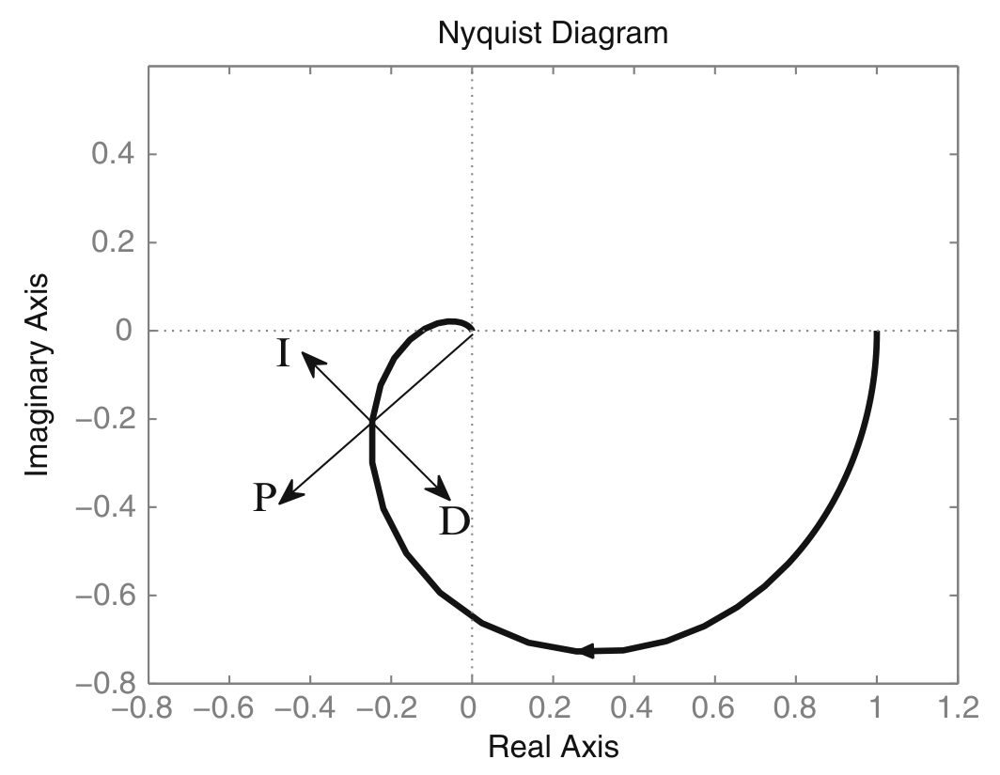

> Image description: A Nyquist plot illustrates the effect of incrementing the three PID control actions on a specific point within the complex plane. The graph features a Real Axis (horizontal) and an Imaginary Axis (vertical) as primary coordinates. A solid black curve represents the Nyquist plot, starting near the origin (0,0), sweeping through the lower right quadrant towards the real value of 1, and returning towards the origin. Within the plot, a specific point on the curve is marked with three diverging arrows labeled **P**, **I**, and **D**. These arrows indicate the directional change in the plot resulting from an incremental increase in the Proportional, Integral, and Derivative gains, respectively: * **P (Proportional):** Points towards the third quadrant (negative real and negative imaginary). * **I (Integral):** Points towards the third quadrant, slightly more vertical than P. * **D (Derivative):** Points towards the fourth quadrant (positive real and negative imaginary).


<!-- source_pdf_page: 1086 -->
Different approaches in this context are analyzed hereafter.

## Empirical Tuning

Empirical tuning methods (like the ZieglerNichols and its refinements, Cohen-Coon, or Chien-Hrones-Reswick ones (O'Dwyer 2006)) consist in selecting the parameters of the PID controllers by using some empirical formulae which give the PID gains based on parameters of the process. Usually, the process parameters are those of a first-order-plus-dead-time (FOPDT) model or the ultimate gain and frequency of the process itself (the ultimate gain is the largest value of a proportional-only control that produces a sustained oscillation of the process variable, that is, that results in a marginally stable closedloop system, while the ultimate frequency is the frequency of the corresponding sustained oscillation). These parameters can be obtained by means of a simple open-loop (step response) or closed-loop (relay feedback) experiment.

## Model-Based Tuning

In model-based tuning (like the Dahlin's and Haalman's methods and the Internal Model Control one (O'Dwyer 2006)), the PID control law is determined analytically starting from a process model and by selecting an appropriate (closedloop) target transfer function. The user generally selects the desired closed-loop time constant as a tuning parameter which allows the handling of the trade-off between aggressiveness and robustness (and control effort). In this context, according to the well-known SIMC (Simplified Internal Model Control) tuning rules (Skogestad 2003), the closed-loop time constant should be selected equal to the dead time of the process.

## Optimal Tuning

Optimal tuning rules aim at minimizing a given objective function. Usually, an integral function of the control error is selected for this purpose, for example,

$$
\begin{equation*}
J=\int_{0}^{\infty} t^{n} e^{2}(t) d t \tag{16}
\end{equation*}
$$

where $n=0,1,2$ or the Integrated Absolute Error

$$
\begin{equation*}
I A E=\int_{0}^{\infty}|e(t)| d t \tag{17}
\end{equation*}
$$

By solving the optimization problem for different kinds of (normalized) processes and by interpolating the results, it has been possible to obtain tuning formulae that give the PID gains based on the process parameters. Actually, it should be noted that as no (robustness) constraints are considered in the optimization procedure, a poor robustness may eventually result in the control system.

## Robust Tuning

Recently, tuning rules which explicitly consider the robustness issue have been devised. In particular, the maximum of the sensitivity function is often considered as robustness index. A selected value of $M_{s}$ is then employed as a constraint in finding the optimal PID parameters which minimize a given performance index. An additional constraint on the maximum complementary sensitivity function can also be considered. For example, the AMIGO tuning rules (Åström and Hägglund 2004) have been devised by applying this approach, where the integral gain is maximized in order to obtain the best reduction of load disturbances.

## Automatic Tuning

The functionality of automatically identifying the process model and tuning the controller based on that model is called automatic tuning (or, simply, auto-tuning) ( - Autotuning). In particular, an identification experiment is performed after an explicit request of the operator, and the values of the PID parameters are updated at the end of it (for this reason, the overall procedure is also called one-shot automatic tuning or tuning-on-demand). The design of an automatic tuning procedure involves many critical issues, such as the choice of the identification procedure (usually based on an open-loop step response or on a relay feedback experiment), of the a priori selected


<!-- source_pdf_page: 1087 -->
PID Control, Fig. 2 Effect of an increment of three PID parameters on the controller Bode plot. The modifications are considered separately, namely, two parameters are fixed, while the other is modified
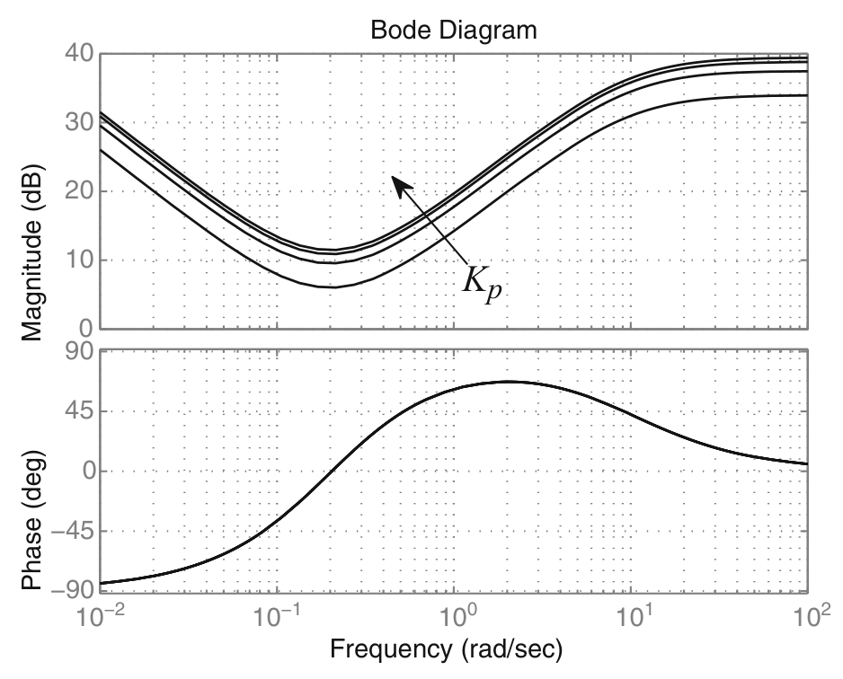

> Image description: This figure presents two Bode plots, illustrating the magnitude and phase response of a PID controller as parameters are modified. The x-axis represents frequency in rad/sec on a logarithmic scale, ranging from $10^{-2}$ to $10^{2}$. The top plot shows Magnitude in decibels (dB) on a linear scale from 0 to 40. The bottom plot shows Phase in degrees (deg) on a linear scale from -90 to 90. The magnitude plot displays three distinct curves that shift upward as the proportional gain, $K_p$, increases, indicated by a diagonal arrow pointing toward higher magnitude values. This indicates that increasing $K_p$ raises the overall gain across all frequencies. The phase plot displays a single curve that starts at -90 degrees at low frequencies, peaks near 60 degrees around 3 rad/sec, and decays toward 0 degrees at high frequencies. The caption indicates that these plots show the effect of incrementing three PID parameters separately.
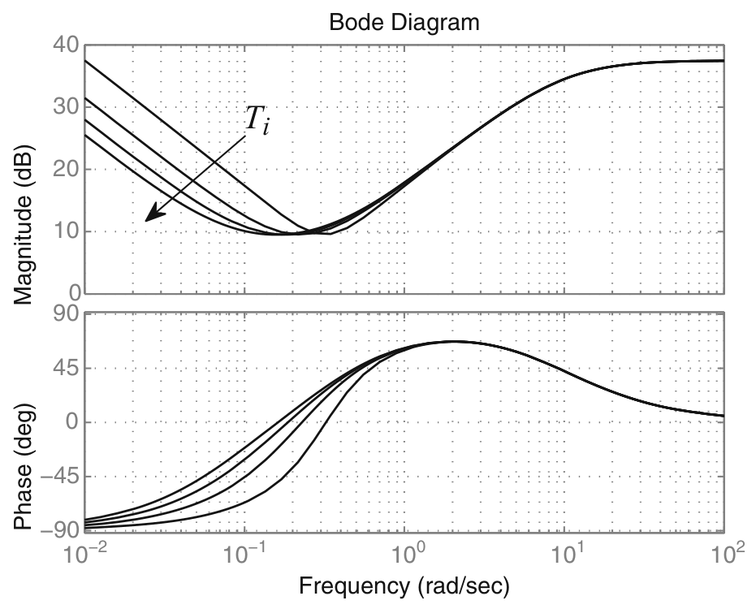

> Image description: This figure displays a Bode diagram consisting of two vertically stacked plots. The top plot shows Magnitude in decibels (dB) on the y-axis (ranging from 0 to 40) versus Frequency in rad/sec on a logarithmic x-axis (from $10^{-2}$ to $10^2$). The bottom plot shows Phase in degrees (deg) on the y-axis (ranging from -90 to 90) against the same frequency x-axis. The magnitude plot contains four curves that converge at higher frequencies. An arrow points diagonally downward toward the lower magnitude curves, labeled with the variable $T_i$. This indicates that increasing the parameter $T_i$ results in a decrease in low-frequency magnitude. In the phase plot, the four curves correspond to the same variations, showing a shift in the phase response at lower frequencies. All curves converge to a similar high-frequency magnitude and a phase peak near $2 \text{ rad/sec}$.
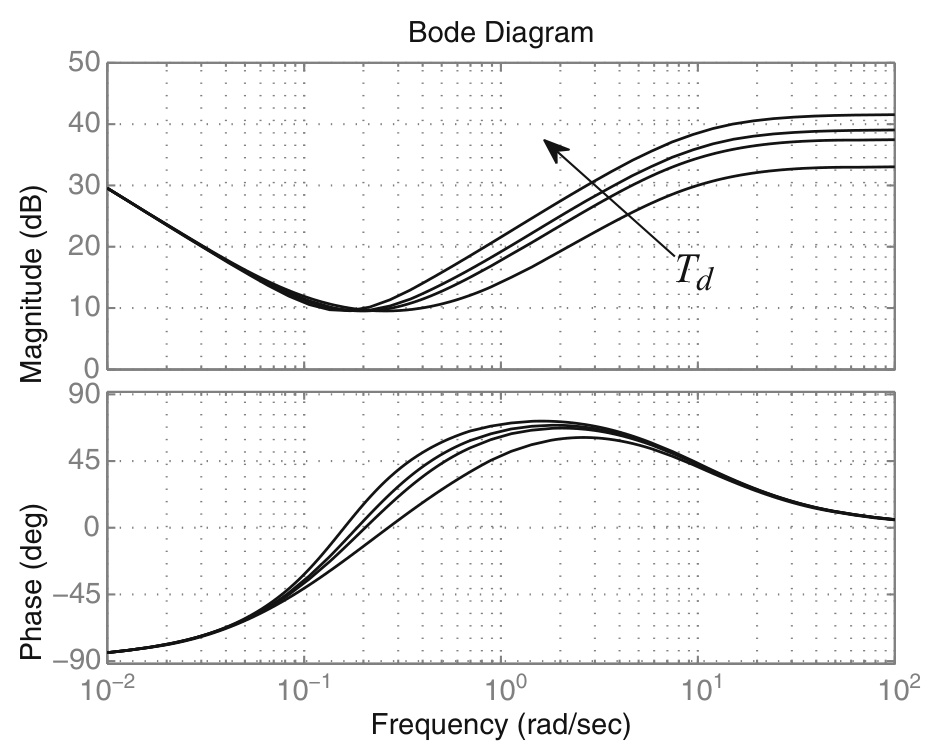

> Image description: This Bode diagram illustrates the frequency response changes resulting from an increase in the parameter $T_d$. The figure is divided into two plots: a magnitude plot in decibels (dB) on the top and a phase plot in degrees (deg) on the bottom, both plotted against frequency in radians per second (rad/sec) on a logarithmic scale ranging from $10^{-2}$ to $10^2$. In the magnitude plot, an upward-pointing arrow indicates that as $T_d$ increases, the magnitude curves shift upward, particularly in the mid-to-high frequency range (approximately $1$ to $100$ rad/sec), leading to higher gain. In the phase plot, the curves also shift upward as $T_d$ increases, indicating a phase lead (a shift toward more positive degree values) across the central frequency range. The curves converge at very low frequencies (around $-90^\circ$) and show distinct behaviors at high frequencies. This visualizes how varying a single PID parameter independently affects the system's gain and phase characteristics.


<!-- source_pdf_page: 1088 -->
## PID Control, Fig. 3

Example of the effect of an increment of three PID parameters on the loop transfer function Bode plot. The modifications are considered separately, namely, two parameters are fixed, while the other is modified
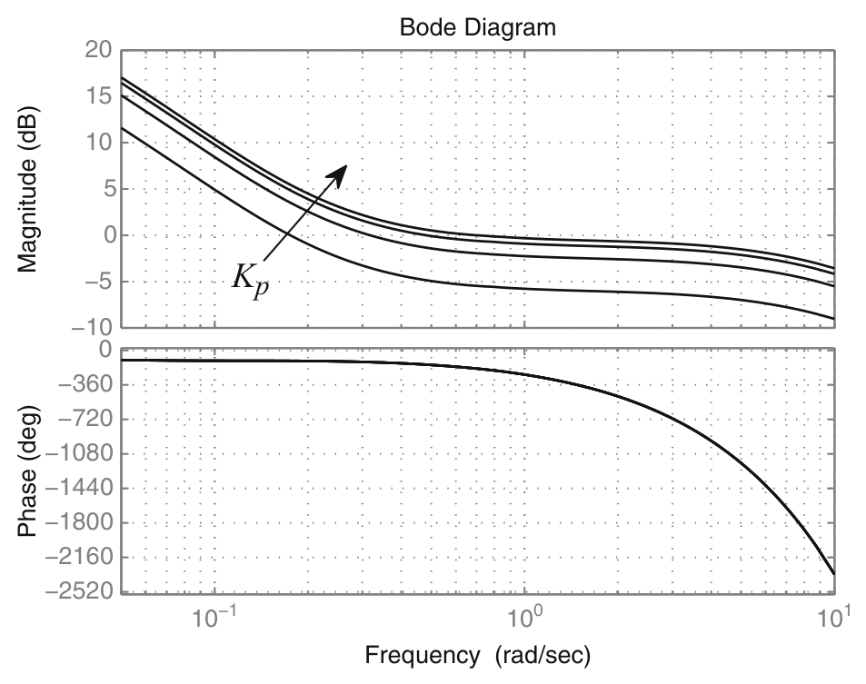
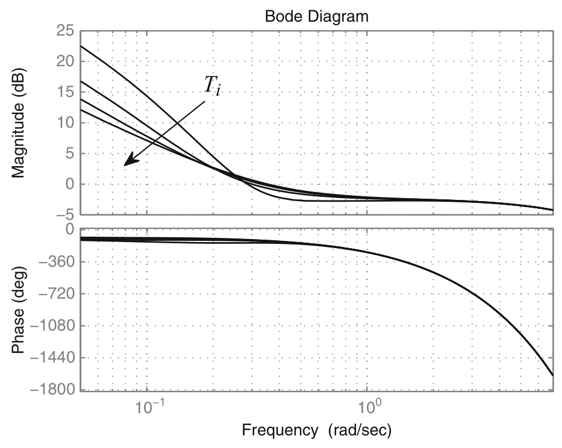
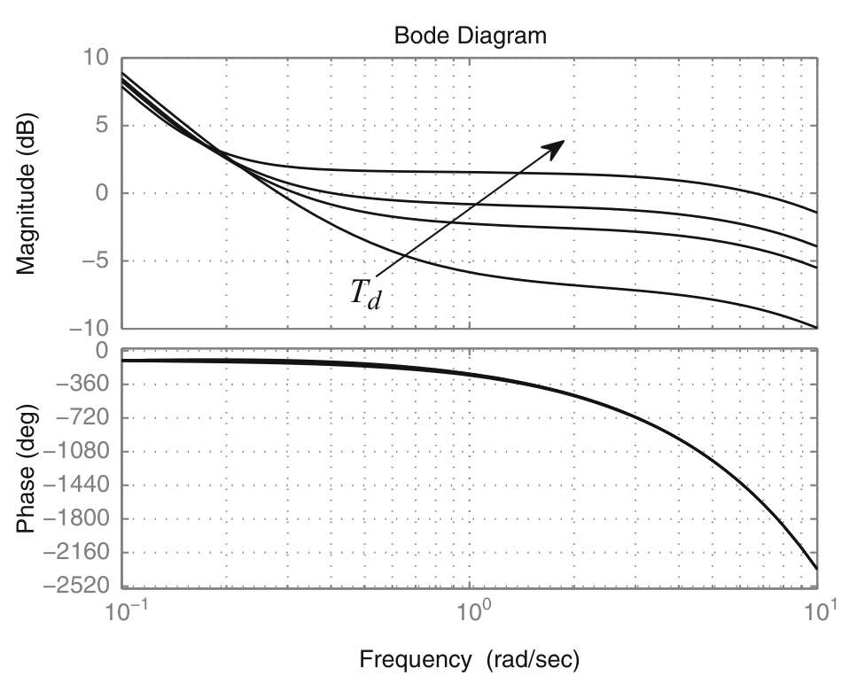


<!-- source_pdf_page: 1089 -->
(parametric or non parametric) process model, and of the tuning rule.

The one-shot automatic tuning functionality is available in practically all the single-station controllers available on the market. More advanced control units might provide a self-tuning functionality, where the identification procedure is continuously performed during routine process operation in order to track possible changes of the system dynamics and the PID parameters values are adaptively modified. In this case, all the issues related to adaptive control have to be taken into account. In particular, performance assessment methodologies, which are capable to evaluate if the PID design can be improved, are of significant relevance in this context ( ↽ Controller Performance Monitoring).

## Design Tools

Although one of the major advantages of PID controllers is their relative simplicity, Computer-Aided Control System Design tools ( ↓ Computer-Aided Control Systems Design: Introduction and Historical Overview) have been developed in order to help the user in their design (starting from the identification of the process) by taking into account the different control requirements in a given application (Guzman et al. 2008). In this context, all the additional functionalities can be considered, as well as more complex control architectures where, in any case, the PID control is still the basic element ( - Control Structure Selection, - Control Hierarchy of Large Processing Plants: An Overview).

## Summary and Future Directions

PID controllers are the most employed controllers in industry, and the knowledge about their use is well established, with the presence of many effective tuning and automatic tuning techniques. Despite this, PID controllers are still being developed under many points of view. For example, design methodologies for more complex control
schemes (like cascade control or control of multivariable systems with or without the use of a decoupling strategy) can be improved. Further, the advancement of the technologies poses new problems that need to be addressed. For example, the use of wireless sensors and actuators calls for event-based PID controllers whose design should take into account the asynchronous sampling. The availability of faster and faster microprocessors has also stimulated an increasing interest in fractional-order PID controllers which allows a more flexible design at the expense of an increment of the complexity.

## Recommended Reading

Basic concepts of PID controllers can be found in almost every book on process control. For a detailed treatment, see (Åström and Hägglund 2006) where all the methodological as well as technological aspects are covered. An excellent collection of tuning rules can be found in O'Dwyer (2006). More advanced topics can be found in Tan et al. (1999), Yu (2006), Johnson and Moradi (2005), Knospe (2006), Visioli (2006), Wang et al. (2008), Visioli and Zhong (2010), and Vilanova and Visioli (2012).

## Cross-References

- Autotuning
- Computer-Aided Control Systems Design: Introduction and Historical Overview
- Control Hierarchy of Large Processing Plants: An Overview
- Controller Performance Monitoring
- Control Structure Selection


## Bibliography

Åström KJ, Hägglund T (2004) Revisiting the ZieglerNichols step response method for PID control. J Process Control 14:635-650
Åström KJ, Hägglund T (2006) Advanced PID control. ISA Press, Research Triangle Park


<!-- source_pdf_page: 1090 -->
Guzman JL, Åström KJ, Dormido S, Hägglund T, Berenguel M, Piguet Y (2008) Interactive learning modules for PID control. IEEE Control Syst Mag 28:118-134
Johnson MA, Moradi MH (eds) (2005) PID control - new identification and design methods. Springer, London
Knospe C (ed) (2006) PID control. IEEE Control Syst Mag 26(1):30-31. Special section
Nichols NB, Ziegler JG (1942) Optimum settings for automatic controllers. Trans ASME 64:759-768
O'Dwyer A (2006) Handbook of PI and PID tuning rules. Imperial College Press, London
Skogestad S (2003) Simple analytic rules for model reduction and PID controller tuning. J Process Control 13:291-309
Tan KK, Wang Q-G, Hang CC, Hägglund T (1999) Advances in PID control. Springer, London
Vilanova R, Visioli A (eds) (2012) PID control in the third millennium: lessons learned and new approaches. Springer, London
Visioli A (2006) Practical PID control. Springer, London
Visioli A, Zhong Q-C (2010) Control of integral processes with dead time. Springer, London
Wang Q-G, Ye Z, Cai WJ, Hang CC (2008) PID control for multivariable processes. Springer, London
Yu CC (2006) Autotuning of PID controllers: a relay feedback approach. Springer, London

## Pilot-Vehicle System Modeling

Alexander Efremov
Moscow Aviation Institute, Moscow, Russia


#### Abstract

The main types and variables of pilot-aircraft systems and pilot control response characteristics are considered. The basic regularities of pilot behavior exposed in closed-loop systems are briefly discussed. Different types of models of pilot behavior are reviewed including classical models (McRuer's and structural) and an optimal control model.


## Keywords

Crossover pilot model; Describing function; Manual control; Pilot behavior; Pilot optimal control model Remnant spectral density; Structural model

## Introduction

Modern flight control and navigation systems are characterized by two features: (1) they employ fly-by-wire controls and (2) they introduce extensive automation support into the cockpit, ranging from complex augmented flight control systems in manual control modes to powerful flight management computers and autopilots that assume responsibility for most flight control tasks (and which may operate the aircraft in ways that are difficult for pilots to monitor and understand). These modern systems leave the pilot in a supervisory control mode most of the time. Consequently, crew members monitor, supervise, plan, and, in essence, serve as information managers. The level of supervisory control tasks can be different from conventional command control in which the operator issues auto-pilot commands ("set altitude", "set airspeed," etc.) and task-level control in which the operator issues commands such as "line formation," "trail formation," etc. Although civilian pilots have experience flying their aircraft manually, they are seldom in active, direct control of the aircraft. However, if a failure or unexpected upset occurs, they are required to assume control immediately. As for military pilots, they (especially fighter pilots) use manual control in the majority of piloting tasks.

The effective use of manned flight vehicles has always required a satisfactory match of vehicle characteristics (which include vehicle dynamics, control manipulators, displays) with the human pilot's characteristics as a flight controller. The provision of proper vehicle handling qualities by the flight control system and display and manipulator design has often posed serious problems which the vehicle system engineer must solve.

Their solutions require the knowledge of mutual interactions between the pilot and the vehicle. The understanding of such interactions requires a mathematical theory which can be used to explain known findings and to predict new ones. For handling qualities, such theory is based on the methods of control engineering and treats the pilot-vehicle system as a closed-loop (in general, a multiloop) entity. The sine qua non of the theory is a model of pilot dynamic characteristics


<!-- source_pdf_page: 1091 -->
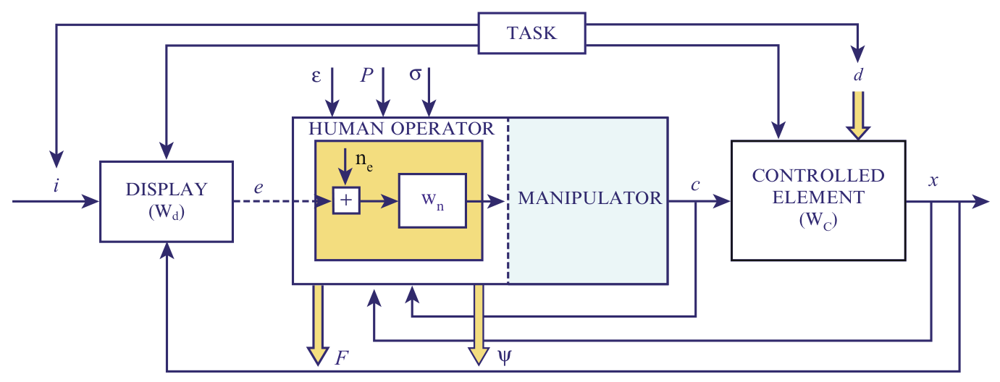

> Image description: A block diagram titled "Pilot-Vehicle System Modeling, Fig. 1 Pilot-aircraft system" illustrates a closed-loop control system. The system components include a **Display ($W_d$)**, a **Human Operator**, a **Manipulator**, and a **Controlled Element ($W_c$)**. An input signal $i$ enters the **Display ($W_d$)**, which outputs an error signal $e$ to the **Human Operator**. The Human Operator consists of an internal summing junction, an error signal $n_e$, and a transfer function $w_n$. Inputs to the Human Operator include $\epsilon$, $P$, and $\sigma$. The operator's output passes through a **Manipulator**, resulting in a control signal $c$ that enters the **Controlled Element ($W_c$)**. The Controlled Element is influenced by a disturbance $d$ and outputs a system state $x$. Feedback loops return signals from the Controlled Element back to the **Display**, the **Human Operator**, and the **Manipulator**. Additionally, a **Task** block provides feedback to the Controlled Element. Outputs $F$ and $\psi$ are extracted from the Human Operator.
Pilot-Vehicle System Modeling, Fig. 1 Pilot-aircraft system

in a form suitable for application using relatively conventional control engineering techniques. An adequate description of a pilot's dynamics response characteristics is not easily obtained because of the pilot's inherent adaptability and capacity for learning.

## Main Variables of the Pilot-Aircraft System

The pilot-aircraft manual control system, shown in Fig. 1, is characterized by a number of variables. The main group of these variables is the so-called task variables which comprise all the system inputs (command inputs $i(t)$, disturbances $d(t)$ ) and control system elements (display, manipulators, and controlled element dynamics, which is defined by the aircraft frame and flight control system dynamics).

A specific feature of pilot-aircraft systems is the dependence of the piloting task on the task variables. For different piloting tasks, these variables or their parameters differ too. Stability of the closed-loop system is always a necessary, though not sufficient, criterion for the control strategy. Consequently, the pilot's dynamics are profoundly affected by the display and controlled element dynamics, because his response must be adapted to provide the necessary loop stability and accuracy. The characteristics of the other task variables $(i(t), d(t))$, related to the mission and control strategy, also exert direct influence on the pilot dynamics, although their effects are more
in the nature of adjustment and emphasis than of changes in fundamental form.

These variables constitute an enormous range of possible conditions and piloting tasks. In addition to the task variables, the other groups of variables-procedural ( $p$-instructions, training schedule order of presentation of trials etc.), environmental ( $\varepsilon$-illumination, vibration, temperature, and so forth), pilot centered ( $\sigma$-physical condition, motivation etc.)-have less influence on pilot-aircraft system features.

## Types of Pilot-Aircraft Systems

The structure of the pilot-aircraft system depends on the piloting task. Some tasks (for example, the pitch tracking task) can be interpreted with the help of the single loop compensatory block diagram. In that case the pilot perceives only the error signal, $y(t)=e(t)=i(t)-x(t)$, and control $c(t)$. Figure 1 is the pilot pitch control command. The other tasks require more complicated descriptions. For example, the landing task is a multiloop compensatory task, where the inner loop closed by the pilot is the pitch control loop. Some piloting tasks are multichannel control tasks, in which the pilot perceives several visual stimuli (for example pitch angle and bank angle) and generates commands in several channels too. Pilots also perceive stimuli of different sensing modalities (visual, vestibular, kinesthetic). In cases where these influence his actions, the multimodality of the pilot-aircraft system has to be analyzed.


<!-- source_pdf_page: 1092 -->
A great many past experiments in which human dynamic measurements were taken have been conducted for investigation of compensatory tracking tasks. Some practical piloting tasks (e.g., aim-to-aim tracking in case when the target flies against a background of clouds) correspond to pursuit conditions. In that case, the pilot perceives the information about the error signal $e(t)$ and the input signal $i(t)$.

In many piloting tasks the single loop compensation system defines the main features of more complicated types of pilot-aircraft systems and its flying qualities. Therefore, this type of the system has been investigated in more depth.

## Pilot Control Response Characteristics

The most obvious aspect of human dynamic behavior in a manual control task is the pilot's control actions within that task. When the key variables are fixed and the signals in the control loop are approximately time stationary over an interval of interest, the pilot-vehicle system can be presented as a quasi-linear system. In that case, the pilot response can be presented by two components: the pilot-describing function, $W_{p}(j \omega)$, taking into account the linear portion of pilot response on the stimulus $e(t)$, and remnant $n_{e}(t)$, which takes into account all nonlinear, nonstationary effects of pilot behavior (Fig. 2).

In the majority of piloting tasks $n_{e}(t)$ is a stationary process characterizing the remnant spectral density $S_{n_{e} n_{e}}(\omega)$ (McRuer and Krendel 1974). The pilot control response characteristics $W_{p}(j \omega)$ and $S_{n_{e} n_{e}}(\omega)$ depend explicitly on the task variables (McRuer and Jex 1967; McRuer et al. 1968). In much experimental research, the technique for identification of these characteristics was based on the use of an input signal consisting of the sum of non-harmonically-related sine waves with cut off frequency $\omega_{i}$ at $1.5,2.5$, and $4 \mathrm{rad} / \mathrm{s}$ and different controlled element dynamics (Allen and Jex 1972; Magdaleno 1972; Shirley 1969).

In addition to control response, other types of pilot's responses also characterize his behavior: physiological ( $F$ ) and psychophysiological $\psi$ responses (Fig. 1). For one of the psychophysiological response characteristics, the pilot opinion rating (PR) is widely used in experimental investigations as well as for the measurement of pilot control response. Pilot opinion ratings are defined by specialized scales (e.g., the CooperHarper scale (Cooper and Harper 1969)).

## Modeling Pilot Behavior in Manual Control

Experimental investigations have demonstrated a specific regularity: for a variety of forcing functions and controlled elements the slope of the

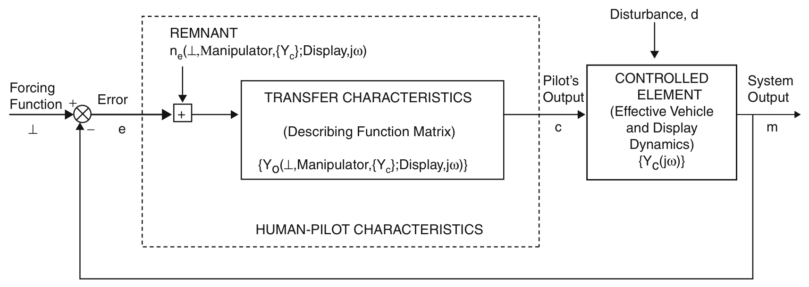

> Image description: A block diagram titled "Pilot-Vehicle System Modeling, Fig. 2 Quasi-linear paradigm for the human pilot" illustrates a feedback control loop. The system consists of two main blocks: the "HUMAN-PILOT CHARACTERISTICS" (dashed boundary) and the "CONTROLLED ELEMENT (Effective Vehicle and Display Dynamics)." The process begins with a "Forcing Function, $\perp$," which enters a summation junction to create an "Error, $e$." This error signal enters the human-pilot block, where it is modified by a "REMNANT, $n_e(\perp, \text{Manipulator}, \{Y_c\}; \text{Display}, j\omega)$" and processed through "TRANSFER CHARACTERISTICS (Describing Function Matrix), $\{Y_o(\perp, \text{Manipulator}, \{Y_c\}; \text{Display}, j\omega)\}$." The resulting "Pilot's Output, $c$," is fed into the Controlled Element. The Controlled Element also receives a "Disturbance, $d$," and produces a "System Output, $m$." A feedback arrow returns the output $m$ to the initial summation junction to be compared with the forcing function.
Pilot-Vehicle System Modeling, Fig. 2 Quasi-linear paradigm for the human pilot


<!-- source_pdf_page: 1093 -->
Pilot-Vehicle System Modeling, Fig. 3 Pilot structural model
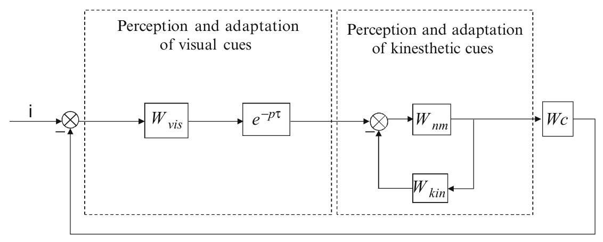

> Image description: A block diagram titled "Pilot structural model" illustrates a feedback control system representing pilot behavior. The system is divided into two dashed rectangular blocks: "Perception and adaptation of visual cues" and "Perception and adaptation of kinesthetic cues." The process begins with an input signal labeled "$i$," which enters a summing junction. The error signal is processed by the first block containing a weight $W_{vis}$ and a time delay component $e^{-p\tau}$. The output of this block feeds into the second block. This second block consists of a summing junction, a weight $W_{nm}$, and a feedback loop containing $W_{kin}$ that feeds back into the junction. Finally, the signal passes through a weight $W_c$. A feedback line returns from the output of the $W_{nm}$ block back to the initial summing junction, indicating a closed-loop control structure. The model represents how visual and kinesthetic sensory feedback influences the system response.
open-loop describing function $\left|W_{\text {OL }}(j \omega)\right|$ vs frequency was unity, i.e., $-20 d B / d e c$ in the region of the crossover frequency $\omega_{c}$ (McRuer and Jex 1967). This observation has led to the conclusion that near $\omega_{c}, W_{\mathrm{OL}}(j \omega)$ can be presented by the "crossover model" (McRuer and Jex 1967)

$$
W_{\mathrm{OL}}(j \omega)=W_{p}(j \omega) \cdot W_{C}=\frac{\omega_{c}}{j \omega} e^{-j \omega \tau_{e}}
$$

This model has two parameters:

$$
\begin{aligned}
\omega_{c} & =\omega_{c o}\left(\omega_{c}\right)+\Delta \omega\left(\omega_{i}\right) \\
\tau_{e} & =\tau_{o}\left(\omega_{c}\right)+\Delta \tau\left(\omega_{i}\right)
\end{aligned}
$$

For the controlled element dynamics $W_{C}= \frac{K}{s(T s+1)}$, the increase of constant T leads to an increase of $\tau_{0}$ and a decrease of $\omega_{C 0}$. The empirical dependences of $\Delta \omega_{c}$ and $\Delta \tau_{e}$ on $\omega_{i}$ obtained for the rectangular form of input spectrum are the following: $\Delta \omega=0.18 \omega_{i}, \Delta \tau=-0.07 \omega_{i}$.

McRuer proposed several modifications of the open-loop system crossover and pilot describing function models (McRuer and Krendel 1974). One of the simplest ones (used widely in many researches) which might be recommended for description of pilot-aircraft system characteristics in the crossover frequency range is the following

$$
W_{p}(j \omega)=K_{p} \frac{T_{L} j \omega+1}{T_{1} j \omega+1} e^{-j \omega \tau_{e}}
$$

The selection of the parameters $K_{p}, T_{L}$, and $T_{I}$ is carried out by using "adjustment rules" so that the closed-loop system conforms to experimental frequency response characteristics. These adjustment rules reflect the main features of pilot behavior - adaptation and optimization.

A more complicated model of pilot describing function ("structural model") was offered by R. Hess $(1979,1984)$. It takes into account the additional inner loop generated by the pilot as a result of his response to the kinesthetic cue (Fig. 3). The modification of this model (Efremov and Tjaglik 2011) demonstrated good agreement with the pilot describing function as measured in experiments. One of the features of this modified model is the criterion used for the parameter optimization: $I=\min \left[\sigma_{e}^{2}\right]$ or $I=\min \left[\sigma_{e}^{2}+\right. \beta \sigma_{n}^{2}$ ]. This procedure requires the knowledge of the pilot remnant spectral density. For the single loop system, such a model was developed by Levison et al. (1969).

$$
S_{n_{e} n_{e}}(\omega)=0.01 \pi \frac{\sigma_{e}^{2}+\sigma_{\dot{e}}^{2} T_{L}^{2}}{1+T_{L}^{2} \omega^{2}}
$$

In the limited number of researches, the classic approach to pilot modeling considered above was used for more complicated types of the pilotaircraft system, when the pilot perception of motion cues was taken into account (multimodality system (Hess 1990)) or for a case of the multiloop pilot-aircraft system (Stapleford et al. 1967).

A different approach to pilot behavior modeling was developed by Kleiman et al. (1970). It is based on the modern optimal control theory and assumes that the pilot's goal is to minimize the cost function:

$$
I=\lim _{T} \frac{1}{T} \int_{0}^{T}\left(x Q x^{T}+u Q_{c} u^{T}+\dot{u} G_{c} \dot{u}^{T}\right) d t
$$

The model takes into account the main pilot limitation parameters: time delay in perception,


<!-- source_pdf_page: 1094 -->
Pilot-Vehicle System Modeling, Fig. 4 Optimal pilot model
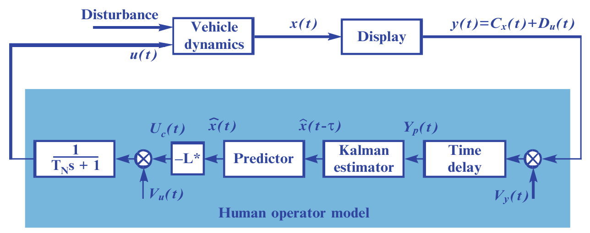

> Image description: A block diagram illustrates a pilot-vehicle system modeling approach, specifically depicting an "Optimal pilot model" (Fig. 4). The system consists of a vehicle subsystem and a "Human operator model" in a closed-loop configuration. In the vehicle subsystem, "Disturbance" inputs act upon "Vehicle dynamics." The output state variable is $x(t)$, which passes through a "Display" block, resulting in the observed output $y(t) = C_x(t) + D_u(t)$. The human operator model processes the output $y(t)$. The signal path includes a "Time delay" block producing $Y_p(t)$, followed by a "Kalman estimator" outputting $\hat{x}(t-\tau)$. A "Predictor" then produces the state estimate $\hat{x}(t)$. The control signal $U_c(t)$ is determined by a gain block labeled $-L^*$, which then incorporates an external input $V_u(t)$. After combining these components, the output $u(t)$ is fed back to the "Vehicle dynamics" block through a transfer function $\frac{1}{T_N s + 1}$.

the observation and motor noises, and the neuromuscular dynamics.

The predictive part of the model consists of the optimal controller $\left(-L^{*}\right)$, Kalman filter and predictor (Fig.4). The software for definition of these elements allows the use of this model for the different types of the pilot-aircraft systems.

The classical and optimal pilot behavior models have been applied widely for different manual control tasks: the development of alternative criteria for flying qualities (Efremov et al. 1998; Neal and Smith 1971), the flight control system (Schmidt 1979) and display design (Klein and Clement 1973), the analysis of reasons for pilotinduced oscillation (McRuer 1997) and the development of means for its suppression (Efremov 1995), and many others.

In some of the researches, attempts have been made to find the relationship between the parameters of the closed-loop system, pilot control response characteristics, and pilot opinion ratings. The technique developed in these researches is called the "paper pilot technique" (Anderson 1970). The following modification of this technique has enabled a close match between the results of mathematical modeling (PR, $\mathrm{T}_{L}$, accuracy, etc.) of the different types of the pilotaircraft system and the results of experimental investigations (Efremov and Ogloblin 2006).

## Summary and Future Directions

Pilot behavior has been studied extensively for single-loop stationary manual control tasks. Two approaches to the mathematical modeling of the pilot behavior have been
developed: classical and optimal control. Both of them have produced good agreement with experimental results. The discussed models describe one of the main features of the pilot adaptation - "parameter adaptation", when a change of any task variable causes a change of human operator control response characteristics. Only a limited number of experimental investigations have been carried out for more complicated cases: multiloop and multimodality pilot-aircraft closed-loop systems. Broader investigations are necessary in the future to obtain accurate pilot mathematical models for these cases. Future investigation in pilot behavior modeling area is also necessary for better formulations of other aspects of pilot adaptation:

- "Structural adaptation", when the pilot selects the loops and the best type of behavior (compensatory, pursuit, etc.) appropriate for the different task variables and, in the case of the flight control system, changes in dynamics.
- "Goal adaptation", when a change of the piloting task or a failure in the controlled element dynamics is accompanied by a change of the goals.
Other future directions in pilot modeling are the development of models to predict the results in the case of sharp changes of controlled element dynamics, to optimize the controlled element dynamics, to define the relationship between the pilot control response characteristics and his opinion rating in different piloting tasks, to get new criteria for the handling qualities, prediction of pilot-induced oscillations, and to solve many other manual control problems.


<!-- source_pdf_page: 1095 -->
## Cross-References

- Aircraft Flight Control
- Motorcycle Dynamics and Control


## Bibliography

Allen RW, Jex H (1972) A simple Fourier analysis technique for measuring the dynamic response of manual control systems. IEEE Trans Syst Man Cybern SMC-2(5):638-643
Anderson RO (1970) A new approach to the specification and evaluation of flying qualities. AFFDL-TR-69-120, Wright-Patterson AFB, Ohio, Air Force Flight Dynamics Lab, June 1970
Cooper GE, Harper RP (1969) The use of pilot rating in the evaluation of aircraft handling qualities. NASA TN-D-5153. Moffett Field, CA, NASA Ames Research Center, Apr 1969
Efremov AV (1995) Development and application of the methods for pilot aircraft system research to the manual control tasks of modern vehicles. In: AGARD conference proceedings No. 556 Dual usage in military and commercial technology in guidance and control, Oct 1995
Efremov AV, Ogloblin AV (2006) Progress-in-the-loop investigations for flying qualities prediction and evaluation. ICAS Congress, Hamburg, Sept 2006
Efremov AV, Tjaglik MS (2011) The development of perspective displays for highly precise tracking tasks. In: Holzapfel F, Theil S (eds) Advances in aerospace guidance, navigation and control. Springer-Verlag, Berlin/Heidelberg, pp 163-174
Efremov AV, Ogloblin AV, Predtechensky AN, Rodchenko VV (1992) Pilot as a dynamic system. Mashinostroenije, Moscow, pp 1-343
Efremov AV, Ogloblin AV, Koshelenko AV (1998) Evaluation and prediction of aircraft handling qualities. A collection of technical Papers AIAA Atmospheric Flight Mechanics Conference and Exhibit. AIAA - 98-4145, Boston, 10-12 Aug 1998
Hess R (1979) Structural model of the adaptive human behavior. J Guid Control 3(5):416-423
Hess R (1984) The effects of time delay on systems subject to manual control. J Guid Control Dyn 7:165-174
Hess R (1990) A model of human use of motion cues. J Guid Control Dyn 13(3):476-486
Kleiman D, Baron S, Levison W (1970) An optimal control model of human response, parts 1,2. Automatica 6(3):357-369
Klein R, Clement W (1973) Application of manual control display theory to the development of flight director systems for STOL aircraft AFFDL-72-152
Levison W, Baron S, Kleiman D (1969) A model for controller remnant. IEEE Trans MMS-10(4):101-108

Magdaleno RE (1972) Serial segments method for measuring remnant. IEEE Trans Syst Man Cybern SMC-2(5):674-678
McRuer DT (1997) Aviation safety and pilot control understanding and preventing unfavorable pilot-vehicle interactions. National Academy Press, Washington, DC
McRuer DT, Jex HR (1967) A review of quasilinear pilot models. IEEE Trans HFE-8(3):231-249
McRuer DT, Krendel ES (1974) Mathematical models of human pilot behavior. AGARDograph 188:1-72
McRuer DT, Hofmann LG, Jex HR et al (1968) New approaches to human pilot/vehicle dynamic analysis. AFFDL-TR-67-150
Neal TP, Smith RE (1971) A flying qualities criterion for the design of a fighter flight control systems. J Aircraft 8(10):803-809
Schmidt D (1979) Optimal flight control synthesis via pilot modeling. J Guid Control Dyn 4(2):308-312
Shirley R (1969) Application of modified fast Fourier transform to calculate human operator describing functions. IEEE Trans Man-Machine Syst MMS-10(4):140-144
Stapleford R, Ashkenas J et al (1967) Analysis of several handling quality topics pertinent to advanced manned aircraft. AFFDL-TR-67-2, Wright-Patterson ASB, Ohio, Air Force Flight Dynamics Lab, June 1967

## PLC

## Programmable Logic Controllers

## Polynomial/Algebraic Design Methods

Vladimír Kučera<br>Faculty of Electrical Engineering, Czech Technical University of Prague, Prague, Czech Republic


#### Abstract

Polynomial techniques have made important contributions to systems and control theory. Algebraic formalism offers several useful tools for control system design. In most cases, control systems are designed to be stable and to meet additional performance specifications, such as optimality or robustness. The basic tool is a


<!-- source_pdf_page: 1096 -->
parameterization of all controllers that stabilize a given plant. Optimal or robust controllers are then obtained by an appropriate selection of the parameter. An alternative tool is a reduction of controller synthesis to a solution of a polynomial equation of specific type. These two polynomial/algebraic approaches will be presented as closely related rather than isolated alternatives.

## Keywords

Controller synthesis; Linear systems; Polynomial equation approach to control system design; Youla-Kučera parameterization of stabilizing controllers

## Stabilizing Controllers

The majority of control problems can be formulated using the diagram shown in Fig. 1. Given a plant $S$, determine a controller $R$ such that the feedback control system is stable and satisfies some additional performance specifications, such as reference tracking, disturbance attenuation, optimality, or robustness.

Suppose that the plant and the controller are linear time-invariant single-input single-output continuous-time systems with real rational transfer functions $S$ and $R$, respectively. Stability is understood as the input-output stability, i.e., whenever the exogenous inputs $\delta$ and $\rho$ are essentially bounded in amplitude, so too are the output signals $\mu$ and $\eta$ (hence also $\varepsilon$ and $\nu$ ).

It is natural to separate the design task into two consecutive steps: (1) stabilization and (2) achievement of additional performance specifications. To do this, all solutions of the first step, i.e., all controllers that stabilize the given plant, must be found.

How can one characterize such controllers? Denote $H_{s}$ the reference-to-error transfer function (sometimes called the sensitivity function) and $H_{c}$ the disturbance-to-control transfer function (the so-called complementary sensitivity function) in the closed-loop control system, namely,

$$
H_{s}=\frac{1}{1+S R}, \quad H_{c}=\frac{S R}{1+S R}
$$

Now suppose that $S$ can be expressed as the ratio of two coprime polynomials, $S=b / a$, and that the controller has alike form, $R=q / p$. Then the two closed-loop transfer functions can be written as

$$
\begin{aligned}
H_{s} & =a \frac{p}{a p+b q}:=a X, \\
H_{c} & =b \frac{q}{a p+b q}:=b Y
\end{aligned}
$$

Consequently, if $R$ stabilizes $S$, then the rational functions $X$ and $Y$ are bound to be stable. These functions cannot be arbitrary, however, since $H_{s}+H_{c}=1$. The stability equation follows as

$$
a X+b Y=1
$$

Any stabilizing controller for $S$ can be expressed as $R=Y / X(=q / p)$, where $X$ and $Y$ are a stable rational solution pair of the stability equation. This solution can be expressed in parametric form:

$$
X=x+b W, \quad Y=y-a W,
$$

furnishing in turn an explicit parameterization of the set of all stabilizing controllers for $S$ :

$$
R=\frac{y-a W}{x+b W},
$$

known as the Youla-Kučera parameterization. Here $x$ and $y$ are any polynomials satisfying the Bézout equation $a x+b y=1$, while $W$ is a free parameter ranging over the set of stable real rational functions such that $x+b W$ is not identically zero.

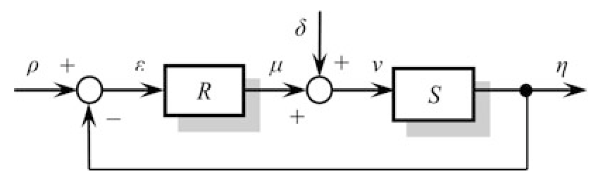

> Image description: This block diagram illustrates a feedback control system. The process begins with a reference input $\rho$ entering a summation junction marked with a "$+$" sign. This junction also receives a negative feedback signal from the output $\eta$ via a return path marked with a "$-$". The resulting error signal $\epsilon$ is fed into a block labeled $R$. The output of block $R$ is the variable $\mu$. This signal enters a second summation junction, where it is added ($+$) to a disturbance input $\delta$. The sum of these two inputs produces the signal $v$, which is fed into a second block labeled $S$. The output of block $S$ is the system output $\eta$. The diagram shows a closed-loop configuration where the output $\eta$ is fed back to the initial summation junction to regulate the system. The variables involved are $\rho$, $\epsilon$, $\mu$, $\delta$, $v$, and $\eta$.
Polynomial/Algebraic Design Methods, Fig. 1 Feedback control system


<!-- source_pdf_page: 1097 -->
Example 1 Consider an integrator plant $S(s)= 1 / s$. The Bézout equation admits a solution $x= 0, y=1$ so that the set of all stabilizing controllers for $S$ is given by

$$
R(s)=\frac{1-s W}{W}
$$

for any stable real rational $W \neq 0$.
The parameter

$$
W(s)=\frac{1}{s+1}
$$

yields $R=1$, a proportional gain controller. The parameter

$$
W(s)=\frac{s}{s^{2}+s+1}
$$

results in a proportional-integral controller

$$
R(s)=1+\frac{1}{s}
$$

Taking $W=1$ leads to the stabilizing controller $R(s)=1-s$. The feedback system is stable, but it has a pole at $s=\infty$.

## Additional Performance Specifications

There is a simple formula that generates all the stabilizing controllers for a given plant. Using this formula, we can obtain a parameterization of all stable closed-loop transfer functions that can be obtained by stabilizing a given plant. The bonus is that the parameterization is affine in the free parameter $W$. In contrast, the controller $R$ appears in a nonlinear fashion:

$$
\begin{aligned}
{\left[\begin{array}{l}
v \\
y
\end{array}\right] } & =\frac{1}{1+S R}\left[\begin{array}{cc}
1 & R \\
S & S R
\end{array}\right]\left[\begin{array}{l}
d \\
r
\end{array}\right] \\
& =\left[\begin{array}{ll}
a(x+b W) & a(y-a W) \\
b(x+b W) & b(y-a W)
\end{array}\right]\left[\begin{array}{l}
d \\
r
\end{array}\right] .
\end{aligned}
$$

As $R$ and $W$ are in a one-to-one correspondence, it is convenient to use $W$ in lieu of $R$ in the
design process and calculate $R$ subsequently. Thus, the parameterization of all stabilizing controllers makes it possible to separate the design process into two steps: the determination of all stabilizing controllers and the selection of the parameter that achieves the remaining design specifications. The extra benefit is that both tasks are linear.

## Asymptotic Properties

Asymptotic properties of control systems can easily be accommodated in the sequential design procedure. These include the elimination of an offset due to step references, the ability of system output to follow a class of reference signals, or the asymptotic elimination of specific disturbances.

In Fig. 1, asymptotic reference tracking means that the output $\eta$ follows the reference $\rho$ as time approaches infinity, which is to say that the error $\varepsilon$ approaches zero for large times. On the other hand, we speak of asymptotic disturbance elimination if the effect of the disturbance $\delta$ decreases at the output $\eta$ for increasing time. In terms of Laplace transforms, $\varepsilon=H_{s} \rho$ and $\eta=S H_{s} \delta$ are to be stable rational functions.

Example 8.1 Consider the plant $S(s)=1 /(s+$ 1). The Bézout equation admits a solution $x=0$, $y=1$. The set of all stabilizing controllers for $S$ is

$$
R(s)=\frac{1-(s+1) W}{W}
$$

for any stable real rational $W \neq 0$. The achievable sensitivity transfer functions are $H_{s}=(s+1) W$.

To track a step reference, $\rho=1 / s$, we must take $W=s W_{1}$ for any stable rational $W_{1} \neq 0$. To eliminate a sinusoidal disturbance, $\delta=s /\left(s^{2}+\omega^{2}\right)$, we constrain the parameter as $W=\left(s^{2}+\omega^{2}\right) W_{2}$ for any stable rational $W_{2} \neq$ 0 . To meet both requirements, we simply take $W=s\left(s^{2}+\omega^{2}\right) W_{3}$ for any stable rational $W_{3} \neq$ 0 , say $W=s\left(s^{2}+\omega^{2}\right) /(s+1)^{4}$.

The resulting controller is

$$
R(s)=\frac{3 s^{3}+\left(6-\omega^{2}\right) s^{2}+\left(4-\omega^{2}\right) s+1}{s\left(s^{2}+\omega^{2}\right)}
$$


<!-- source_pdf_page: 1098 -->
The controller obtained in Example 8.1 demonstrates the internal model principle: the unstable modes to be followed or eliminated must be generated by the controller unless they are present in the plant.

## $\mathbf{H}_{\mathbf{2}}$ Optimal Control

The sequential design procedure will be further illustrated on the design of linear-quadratic optimal controllers. Given a plant with transfer function $S=b / a$, the task is to find a controller that stabilizes the control system of Fig. 1 while minimizing the $H_{2}$ norm of some closedloop transfer function, say of the complementary sensitivity function $H_{c}$.

The $H_{2}$ norm is defined for any strictly proper rational function $G$ analytic on the imaginary axis as

$$
\|G\|_{2}=\sqrt{\frac{1}{2 \pi} \int_{-\infty}^{\infty}|G(j \omega)|^{2} d \omega}
$$

The set of complementary sensitivity functions that can be achieved in the stabilized control system is

$$
H_{c}=b(y-a W)
$$

where $W$ is a free stable rational parameter. The parameter will be selected so as to minimize the $H_{2}$ norm of $H_{c}$.

Let $\alpha \beta$ be a polynomial defined by keeping the stable (in $\operatorname{Re} s<0$ ) zeros of $a b$ while replacing the unstable (in $\operatorname{Re} s \geq 0$ ) ones with their negative values. Then $a b / \alpha \beta$ is inner (or all pass) and

$$
\left\|H_{c}\right\|_{2}=\left\|\frac{\alpha \beta}{a b} H_{c}\right\|_{2}=\left\|\frac{\alpha y \beta}{a}-\alpha W \beta\right\|_{2} .
$$

Consider the decomposition

$$
\frac{\alpha y \beta}{a}=r+\frac{q}{a}
$$

where $r$ is a polynomial and $q / a$ is strictly proper. With this decomposition,

$$
\left\|H_{c}\right\|_{2}^{2}=\left\|\frac{q}{a}\right\|_{2}^{2}+\|r-\alpha W \beta\|_{2}^{2}
$$

because $q / a$ and $r-\alpha W \beta$ are orthogonal and thus the cross-terms contribute nothing to the norm. The last expression is a complete square whose first part is independent of $W$. Hence the minimizing parameter is $W=r / \alpha \beta$, and if it is indeed stable and admissible, it defines the unique optimal controller. Otherwise, no optimal controller exists.

The consequent minimum norm equals

$$
\min _{W}\left\|H_{c}\right\|_{2}=\left\|\frac{q}{a}\right\|_{2} .
$$

Example 8.2 To illustrate, consider the plant $S(s)=1 /(s-1)$. The class of all stabilizing controllers for $S$ is found to be

$$
R(s)=\frac{1-(s-1) W}{W}
$$

for a free stable rational parameter $W \neq 0$. The complementary sensitivity transfer function is

$$
H_{c}(s)=1-(s-1) W .
$$

Now $\alpha=s+1, \beta=1$ and the polynomial part of

$$
\frac{\alpha y \beta}{a}=\frac{s+1}{s-1}=1+\frac{2}{s-1}
$$

is $r=1$. Thus $H_{c}$ attains minimum $H_{2}$ norm for

$$
W(s)=\frac{1}{s+1}
$$

and the corresponding optimal controller is $R(s)=2$.

The optimal complementary sensitivity function is

$$
H_{c}(s)=\frac{2}{s+1}
$$

and $\left\|H_{c}\right\|_{2}=\sqrt{2}$.

## Robust Stabilization

The notion of robust stability addresses stabilization of plants subject to modeling errors, when the actual plant may differ from the nominal model, using a fixed controller. The ultimate goal is to stabilize the actual plant. The actual plant is


<!-- source_pdf_page: 1099 -->
unknown, however, so the best one can do is to stabilize a large enough set of plants.

Thus the basis technique to model plant uncertainty is to model the plant as belonging to a set. Such a set can be either structured - for example, there is a finite number of uncertain parameters - or unstructured: the frequency response lies in a set in the complex plane for every frequency. The unstructured uncertainty model is more important for several reasons. On the one hand, it is well suited to represent highfrequency modeling errors, which are generically present and caused by such effects as infinitedimensional electromechanical resonance, transport delays, and diffusion processes. On the other hand, the unstructured model of uncertainty leads to a simple and useful design theory.

The unstructured set of plants is usually constructed as a neighborhood of the nominal plant, with the uncertainty represented by additive or multiplicative perturbations. The size of the neighborhood is measured by a suitable norm, most common being the $H_{\infty}$ norm that is defined for any rational function $G$ analytic on the imaginary axis as

$$
\|G\|_{\infty}=\sup _{\omega}|G(j \omega)|
$$

Let us illustrate the design for robust stability under unstructured norm-bounded multiplicative perturbations. Consider a nominal plant with transfer function $S$ and its neighborhood $S_{\Delta}$ defined by

$$
S_{\Delta}:=(1+F \Delta) S
$$

where $F$ is a fixed stable rational function and $\Delta$ is a variable stable rational function such that $\|\Delta\|_{\infty} \leq 1$.

The idea behind this uncertainty model is that $F \Delta$ is the normalized plant perturbation away from 1:

$$
\frac{S_{\Delta}}{S}-1=F \Delta
$$

Hence if $\|\Delta\|_{\infty} \leq 1$, then for all frequencies $\omega$

$$
\left|\frac{S_{\Delta}(j \omega)}{S(j \omega)}-1\right|=|F(j \omega)|
$$

so that $|F(j \omega)|$ provides the uncertainty profile while $\Delta$ accounts for phase uncertainty.

Now suppose that $R$ is a controller that stabilizes the nominal plant $S$. Applying the small gain theorem, $R$ is seen to stabilize the entire family of plants $S_{\Delta}$ if and only if

$$
\left\|H_{c} F\right\|_{\infty}<1
$$

This is a necessary and sufficient condition for robust stabilization of the nominal plant $S$.

The set of all stabilizing controllers for $S= b / a$ is described by the formula

$$
R=\frac{y-a W}{x+b W}
$$

where $a x+b y=1$ and $W$ is a free stable rational parameter. The robust stability condition then reads

$$
\|b(y-a W) F\|_{\infty}<1
$$

Any stable rational $W$ that satisfies this inequality then defines a robustly stabilizing controller $R$ for $S$. In case $W$ actually minimizes the norm, one obtains the best robustly stabilizing controller.

Example 8.3 Consider a plant with the transfer function

$$
S_{\tau}(s)=\frac{s+1}{s-1} e^{-\tau s}
$$

where the time delay $\tau$ is known only to the extent that it lies in the interval $0 \leq \tau \leq 0.2$. The task is to find a controller that stabilizes the uncertain plant $S_{\tau}$. The time-delay factor $e^{-\tau s}$ can be treated as a multiplicative perturbation of the nominal plant

$$
S(s)=\frac{s+1}{s-1}
$$

by embedding $S_{\tau}$ in the family

$$
S_{\Delta}:=(1+F \Delta) S
$$

where $\Delta$ ranges over the set of stable rational functions such that $\|\Delta\|_{\infty} \leq 1$. To do this, $F$


<!-- source_pdf_page: 1100 -->
Polynomial/Algebraic Design Methods, Fig. 2 Bode plots of $F$ (dotted) and $e^{-0.2 s}-1$ (solid)

Bode Plots
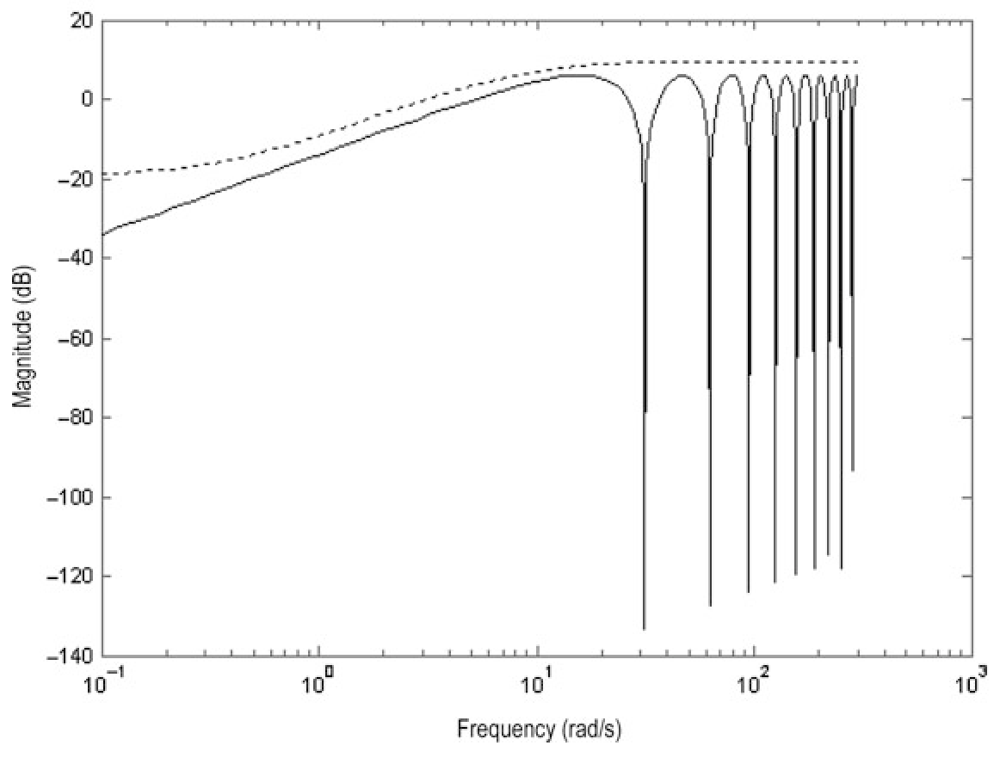

should be chosen so that the normalized perturbation satisfies

$$
\left|\frac{S_{\Delta}(j \omega)}{S(j \omega)}-1\right|=\left|e^{-j \omega \tau}-1\right| \leq|F(j \omega)|
$$

for all $\omega$ and $\tau$. A little time with the Bode magnitude plot shows that a suitable uncertainty profile is

$$
F(s)=\frac{3 s+1}{s+9} .
$$

Figure 2 is the Bode magnitude plot of this $F$ and $e^{-\tau s}-1$ for $\tau=0.2$, the worst value.

The task of stabilizing the uncertain plant $S_{\tau}$ is thus replaced by that of stabilizing every element in the set $S_{\Delta}$, that is to say, by robustly stabilizing the nominal plant $S$ with respect to the multiplicative perturbations defined by $F$.

The set of all stabilizing controllers for $S$ is found to be

$$
R(s)=\frac{0.5-(s-1) W}{-0.5+(s+1) W}
$$

where $W \neq 0.5 /(s+1)$ is any stable rational parameter. The robust stability condition reads

$$
\|P-Q W\|_{\infty}<1
$$

where

$$
\begin{aligned}
& P(s)=0.5(s+1) \frac{3 s+1}{s+9} \\
& Q(s)=(s-1)(s+1) \frac{3 s+1}{s+9}
\end{aligned}
$$

Since $Q$ has one unstable zero at $s=1$, it follows from the maximum modulus theorem that the minimum of the $H_{\infty}$ norm taken over all stable rational functions $W$ is $P(1)=0.4<1$ and this minimum is achieved for

$$
W(s)=\frac{P(s)-P(1)}{Q(s)}=\frac{1}{10} \frac{15 s+31}{(s+1)(3 s+1)} .
$$

Thus, the robust stability condition is satisfied, and the corresponding best robustly stabilizing controller is

$$
R(s)=\frac{2}{13} \frac{s+9}{s+1} .
$$

## Polynomial Equation Approach

In order to determine the set of all stabilizing controllers for a given plant, it is enough to determine one particular solution of the Bézout equation. It is therefore plausible that performance


<!-- source_pdf_page: 1101 -->
specifications in addition to stability can be met by selecting an appropriate solution of a polynomial equation that is related to the Bézout equation.

The reduction of controller synthesis to solving polynomial equations is referred to as the polynomial equation approach to control system design. The equations involved are Diophantine equations of the form

$$
a p+b q=d
$$

where $a, b$, and $d$ are given polynomials and $p$, $q$ are polynomials to be found. Such an equation is solvable for any $d$ if and only if $a$ and $b$ are coprime polynomials. Then, the solution set is given by

$$
p=p_{0}+b t, \quad q=q_{0}-a t
$$

where $p_{0}, q_{0}$ is a particular solution and $t$ is an arbitrary polynomial.

Such an equation is in fact the pole placement equation. Thus, pole placement is a prototype control problem.

## Pole Placement

The requirement of stability places all closedloop system poles within the left half-plane Re $s<0$. Very often, however, we wish to allocate the poles to a specific region of the half-plane or to achieve specific pole positions.

Given a plant $S=b / a$, the set of all stabilizing controllers for $S$ is

$$
R=\frac{y-a W}{x+b W}
$$

where $x, y$ are polynomials such that $a x+b y=$ 1 and $W$ is a free stable rational parameter. Let $W=w / d$ for a stable polynomial $d$. Then

$$
R=\frac{d y-a w}{d x+b w}:=\frac{q}{p}
$$

and the closed-loop pole polynomial is given by

$$
a p+b q=d(a x+b y)=d .
$$

Thus $W$ parameterizes all stabilizing controllers for $S$, the denominator polynomial $d$ of $W$ specifies the positions of the control system poles, and the numerator polynomial $w$ of $W$ represents the remaining degrees of freedom, i.e., parameterizes all stabilizing controllers that assign the specified poles.

Example 8.4 Consider the plant $S(s)=1 /(s-1)$ and the set of stabilizing controllers for $S$ :

$$
R(s)=\frac{1-(s-1) W}{W}, \quad W \neq 0
$$

Let the desired pole locations be given by the polynomial $d=s^{2}+2 s+1$. This is achieved by putting $W=w / d$ for an arbitrary numerator polynomial $w \neq 0$.

It is to be noted that $d$ specifies the poles at finite positions only. Poles at $s=\infty$ will occur whenever $R$ is not proper rational. To avoid this situation, $w$ should be constrained to $w=s+\omega$ for any real $\omega$. Then the set of controllers that achieve the desired pole placement is

$$
R(s)=\frac{(3-\omega) s+(1+\omega)}{s+\omega} .
$$

Alternatively, one can solve the pole placement equation $a p+b q=d$ directly. The solution set is

$$
p=t, \quad q=s^{2}+2 s+1-(s-1) t
$$

and $q / p$ is proper if and only if $t=s+\omega, \omega$ real.

## $\mathbf{H}_{\mathbf{2}}$ Optimal Control

The $H_{2}$ optimal control is a special case of pole placement. Indeed, the optimal controller is given by
$R=\frac{y-a W}{x+b W}=\frac{y-a \frac{r}{\alpha \beta}}{x+b \frac{r}{\alpha \beta}}=\frac{\alpha y \beta-a r}{\alpha x \beta+b r}:=\frac{q}{p}$
and

$$
\begin{aligned}
a p+b q & =a(\alpha x \beta+b r)+b(\alpha y \beta-a r) \\
& =\alpha \beta(a x+b y)=\alpha \beta .
\end{aligned}
$$


<!-- source_pdf_page: 1102 -->
Thus, the (finite) pole positions of the $H_{2}$ optimal control system are given by the pole polynomial $d=\alpha \beta$. The system has no poles at $s=\infty$ as the optimal complementary sensitivity function $H_{c}$ is strictly proper.

The pole placement equation, however, has more than one solution. Which one is optimal? The one with $q / a$ is strictly proper. It is the solution pair $p, q$ with $q$ having a least degree.

Example 8.5 Let us reconsider Example 8.2. As an alternative, one can solve the Diophantine equation

$$
(s-1) p+q=s+1
$$

for the solution pair $p, q$ such that $q /(s-1)$ is strictly proper. This yields the least-degree solution pair with respect to $q$, namely, $p=1$, $q=2$. The optimal controller is $R=q / p=2$.

## Summary and Future Directions

The benefits of representing stabilizing controllers by a single parameter include (1) easy accommodation of additional design specifications by selecting an appropriate parameter, (2) all transfer functions in a stabilized system are linear in the parameter (while they are nonlinear in the controller), and (3) the parameter belongs to a smaller set of stable rational functions (while the controller is any rational).

The results presented here for linear timeinvariant systems with rational transfer functions can be generalized to extend the scope of the theory to include distributed-parameter systems, time-varying systems, and even nonlinear systems.

The transfer functions of distributedparameter systems are no longer rational, and coprime factorizations cannot be assumed a priori to exist. The coefficients of timevarying systems are functions of time, and the operations of multiplication and differentiation do not commute. In nonlinear systems, transfer functions are replaced by input-output maps.

Technical assumptions may prevent one from parameterizing the entire set of internally stabilizing controllers; still, the subset may be large enough for practical purposes. For many systems of physical and engineering interest, the above difficulties can be circumvented and the algebraic/polynomial approach carries over with suitable modifications.

## Cross-References

- Control of Linear Systems with Delays
- Feedback Stabilization of Nonlinear Systems
- H-Infinity Control
- $\mathrm{H}_{2}$ Optimal Control
- Linear State Feedback
- Robust Synthesis and Robustness Analysis Techniques and Tools
- Spectral Factorization
- Tracking and Regulation in Linear Systems


## Recommended Reading

The use of polynomials, in one way or another, in feedback control system design can be traced back to Newton et al. (1957) and Jury (1958). The authors noted that for a closed-loop system to be stable, $H_{c}$ must absorb the plant unstable zeros. The plant was assumed to be stable; if this assumption were dropped, $H_{s}$ would have been found to absorb the plant unstable poles. These conditions are equivalent to polynomial divisibility conditions and hence to the Bézout stability equation, which appears later in Kučera (1974).

The first attempt to use polynomials in an explicit manner is due to Volgin (1962), a student of Tsypkin. He obtained a solution of the pole placement problem through the solution of a polynomial equation, known as the pole placement equation. Åström (1970) published a polynomial equation solution to the minimum variance control problem for minimum-phase plants. The ultimate publication that presents


<!-- source_pdf_page: 1103 -->
the polynomial equation approach to multi-input multi-output control system design is Kučera (1979).

The underlying problem in any control system design is that of stability. It is logical to design the control system step by step: stabilization first and then the additional performance specifications. To do this, we need to know any and all stabilizing controllers for the given plant.

This problem was first addressed and solved for finite-dimensional, linear time-invariant systems using transfer function methods; see Larin et al. (1971), Kučera (1975), Youla et al. (1976a,b), and Kučera (1979). A state-space representation of all stabilizing controllers was derived later by Nett et al. (1984).

It took decades to appreciate the importance of the result and come up with applications. The milestones were the observations by Desoer et al. (1980) that the polynomial fraction approach can be extended to linear systems with nonrational transfer functions, as well as the result by Hammer (1985) showing that the approach is applicable to a broad class of nonlinear systems. Further generalizations were obtained by Paice and Moore (1990), Anderson (1998), and Quadrat $(2003,2006)$.

The parameterization of all controllers that stabilize a given plant was labeled the YoulaKučera parameterization in Anderson (1998). This result launched an entirely new area of research and has ultimately become a new paradigm for control system design.

Tutorial textbooks on this subject include Vidyasagar (1985), Doyle et al. (1992), and Kučera (2003, 2011). The reader is further referred to the survey papers by Kučera (1993), Anderson (1998), and Kučera (2007).

Advanced and recent applications of the Youla-Kučera parameterization include stabilization under constrained inputs (Henrion et al. 2001), robust stabilization with fixed-order controllers (Henrion et al. 2003), accommodation of time-domain constraints on inputs and outputs (Henrion et al. 2005a), and determination of least-order stabilizing controllers (Henrion et al. 2005b).

## Bibliography

Anderson BDO (1998) From Youla-Kučera to identification, adaptive and nonlinear control. Automatica 34:1485-1506
Åström KJ (1970) Introduction to stochastic control theory. Academic, New York
Desoer CA, Liu RW, Murray J, Saeks R (1980) Feedback system design: the fractional representation approach to analysis and synthesis. IEEE Trans Autom Control 25:399-412
Doyle JC, Francis BA, Tannenbaum AR (1992) Feedback control theory. Macmillan, New York
Hammer J (1985) Nonlinear system stabilization and coprimeness. Int J Control 44:1349-1381
Henrion D, Tarbouriech S, Kučera V (2001) Control of linear systems subject to input constraints: a polynomial aproach. Automatica 37:597-604
Henrion D, Šebek M, Kučera V (2003) Positive polynomials and robust stabilization with fixedorder controllers. IEEE Trans Autom Control 48: 1178-1186
Henrion D, Tarbouriech S, Kučera V (2005a) Control of linear systems subject to time-domain constraints with polynomial pole placement and LMIs. IEEE Trans Autom Control 50:1360-1364
Henrion D, Kučera V, Molina-Cristobal A (2005b) Optimizing simultaneously over the numerator and denominator polynomials in the Youla-Kučera parametrization. IEEE Trans Autom Control 50:1369-1374
Jury EI (1958) Sampled-data control systems. Wiley, New York
Kučera V (1974) Closed-loop stability of discrete linear single variable systems. Kybernetika 10:146-171
Kučera V (1975) Stability of discrete linear feedback systems. In: Proceedings of the 6th IFAC world congress, Boston, vol 1, pp 44.1
Kučera V (1979) Discrete linear control: the polynomial equation approach. Wiley, Chichester
Kučera V (1993) Diophantine equations in control a survey. Automatica 29:1361-1375
Kučera V (2007) Polynomial control: past, present, and future. Int J Robust Nonlinear 17:682-705
Kučera V (2003) Parametrization of stabilizing controllers with applications. In: Voicu M (ed) Advances in automatic control. Kluwer, Boston, pp 173-192
Kučera V (2011) Algebraic design methods. In: Levine WS (ed) The control handbook: control system advanced methods, 2nd edn. CRC, Boca Raton
Larin VB, Naumenko KI, Suntsev VN (1971) Spectral methods for synthesis of linear systems with feedback (in Russian). Naukova Dumka, Kiev
Nett CN, Jacobson CA, Balas MJ (1984) A connection between state-space and doubly coprime fractional representations. IEEE Trans Automat Control 29:831-832
Newton G, Gould L, Kaiser JF (1957) Analytic design of linear feedback controls. Wiley, New York


<!-- source_pdf_page: 1104 -->
Paice ADB, Moore JB (1990) On the Youla-Kučera parametrization of nonlinear systems. Syst Control Lett 14:121-129
Quadrat A (2003) On a generalization of the Youla-Kučera parametrization. Part I: the fractional ideal approach to SISO systems. Syst Control Lett 50:135-148
Quadrat A (2006) On a generalization of the Youla-Kučera parametrization. Part II: the lattice approach to MIMO systems. Math Control Signal 18:199-235
Vidyasagar M (1985) Control system synthesis: a factorization approach. MIT, Cambridge
Volgin LN (1962) The fundamentals of the theory of controlling machines (in Russian). Soviet Radio, Moscow
Youla DC, Bongiorno JJ, Jabr HA (1976a) Modern Wiener-Hopf design of optimal controllers, part I: the single-input case. IEEE Trans Autom Control 21:3-14
Youla DC, Jabr HA, Bongiorno JJ (1976b) Modern Wiener-Hopf design of optimal controllers, part II: the multivariable case. IEEE Trans Autom Control 21: 319-338

## Power System Voltage Stability

## Costas Vournas

School of Electrical and Computer Engineering,
National Technical University of Athens, Zografou, Greece


#### Abstract

Voltage stability of electric power systems is a challenging topic both theoretically and in practice. This article touches briefly on the main aspects of the problem and highlights theoretical foundations and fundamental methods for voltage stability analysis. The single-load radial system is used to introduce relevant concepts, such as the $P V$ curve and the instability mechanism, while the implications for a meshed, multiple-load system are briefly outlined. Some applications to practical problems are briefly enumerated.


## Keywords

Active and reactive power; Load dynamics; Load tap changers (LTC); Maximum power transfer; $P V$ curve; Stability conditions

## Introduction

Voltage stability is related to the maximum power transfer in an AC (alternating current) network. In normal conditions, system load demand should never come close to this limit. As, however, electricity demand started swelling after 1970s with an increasingly faster pace, transmission network investments could not follow closely enough. Investment cost in transmission is usually high, and difficulties with environmental constraints and "not in my back yard" mentality of local communities did not make transmission network expansion any easier. Power systems are thus relying for their continuing operation more and more on (reactive power) compensation and automatic controls to maintain transmission capacity of relatively weakening networks.

As a result several instances of voltage instability started to appear in several industrialized countries after the 1980s (Taylor 1994) leading to smaller or larger area blackouts, much to the surprise of the power engineering community that was not prepared to deal with this type of events, in which a usual and expected phase of gradual voltage decline suddenly precipitates to an uncontrollable voltage drop leading to partial or total blackout after a succession of equipment disconnection by protection devices.

In power system engineering practice, voltage drops following load ramping or sudden events, such as equipment loss (line, generator switching, etc.), usually referred to in power engineering literature as contingencies, are calculated by solving a set of nonlinear algebraic equations known as the power flow problem. As these are "steadystate" equations, the dynamic aspect leading to an accelerating, cascading failure is not obvious. One should notice however in the above account the keyword "nonlinear": nonlinear equations at the maximum power transfer limit no longer have a solution. This was and is one of the keys in understanding the voltage stability problem. To take it one step further, close to the loss of solution (loss of equilibrium), a set of dormant (up to this point) dynamics become dominant leading the system to instability. The following sections will explain these notions.


<!-- source_pdf_page: 1105 -->
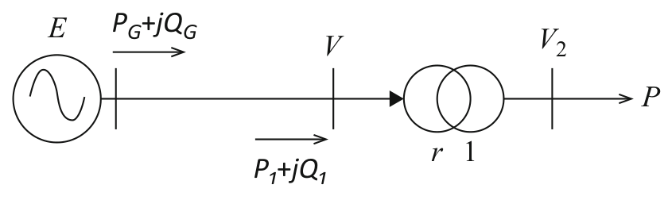

> Image description: Figure 1, titled "Single-load radial system," presents a single-line diagram of a power system model. On the left, an AC generator is represented by a circle containing a sine wave, labeled with internal voltage $E$. An arrow indicates complex power flow $P_G + jQ_G$ from the generator toward a transmission line. This line connects to a bus labeled with voltage $V$. Below the line, a second arrow denotes complex power $P_1 + jQ_1$ flowing toward the next component. The line connects to a transformer symbol, labeled with impedance or ratio parameters $r$ and $1$. Following the transformer, there is another bus labeled with voltage $V_2$. Finally, an arrow points rightward from this bus toward a load, indicated by the variable $P$. The diagram illustrates the sequential flow of power and voltage from a generation source through a transmission network and transformer to a single load.
Power System Voltage Stability, Fig. 1 Single-load radial system

## Single Generator-Load (Radial) System

## Maximum Power Transfer

In any electric network (DC or AC), there is a maximum power that can be transferred between any two nodes. In a two-node radial system, the maximum power transfer coincides with the wellknown impedance matching conditions. For a radial AC system, when the load is restricted to a constant power factor, the impedance matching condition is that the source (network) impedance is equal in magnitude to the load impedance.

Consider the radial system of Fig. 1. In this system we assume that the load active power $P$ (and possibly reactive power $Q$ ) is fed through a transformer with adjustable tap ratio $r$ (in per unit). The tap is automatically adjusted by a load tap changer (LTC) so as to keep the secondary voltage $V_{2}$ within a deadband. We will consider throughout that the LTC is a part of the load.

The simplest case for this radial system is when both the line and transformer are lossless ( $P_{G}=P_{1}=P$ ) and the load is kept to unity power factor $(Q=0)$. The generator is assumed as a constant voltage source $E$. If we further assume that the transformer leakage reactance is negligible ( $Q_{1}=Q=0$ in Fig. 1), the maximum power transfer in this simple case is encountered when the load impedance, as seen from the primary ( $r^{2} / G$ ), is equal to the line reactance:

$$
\begin{equation*}
X=r^{2} / G \tag{1}
\end{equation*}
$$

where the load conductance $G=P / V_{2}^{2}$. It can be readily shown that the maximum power in this case is $P_{\max }=E^{2} / 2 X$. Note that this is a static condition that is not related to how the load varies with the voltage $V_{2}$.

The most popular way of visualizing the maximum power condition is through the $P V$ curve of Fig. 2, in which the consumed (transferred) power $P$ is plotted versus the primary (transmission) side voltage $V$.

In Fig. 2 the nose-shaped solid line is the network characteristic corresponding to all possible solution of the network equations for a given $P$ (or $V$ ). The maximum power transfer is easily identified as the tip of the curve (point C ). Note that $P V$ curves can be plotted for any load power factor and line resistance.

## Load Dynamics and Voltage Stability

As stated above, maximum power transfer is a static condition based on network equations only. To identify its relation to voltage stability, some form of load dynamics must be introduced. Load dynamics are generally changing the load characteristics so as to adjust load power consumption $P$ to a given load demand $P_{o}$. As a disturbance usually reduces voltage (and thus consumption of a voltage-sensitive load), load dynamics tend to restore the consumption to the pre-disturbance demand.

Load restoration can be continuous, for instance, represented by a time-varying conductance following the ODE:

$$
\begin{equation*}
T \dot{G}=\frac{P_{o}}{V_{o}^{2}}-\frac{P}{V_{o}^{2}}=\frac{P_{o}}{V_{o}^{2}}-G\left(\frac{V_{2}}{V_{o}}\right) \tag{2}
\end{equation*}
$$

Clearly in this case, the stability condition is that the consumption $P=G V_{2}^{2}$ increases with the increase of the load conductance $G$ :

$$
\begin{equation*}
\frac{\partial P}{\partial G}>0 \tag{3}
\end{equation*}
$$

It is easily verified from Fig. 2 that this condition is met only in the upper part of the $P V$ curve before point C , whereas in the lower part, after point C , increased conductance results in lower consumption violating (3). Clearly at C , (3) holds as an equality.

Assuming the load on the secondary side to be a constant admittance, we can distinguish two types of load characteristics in Fig. 2: the


<!-- source_pdf_page: 1106 -->
Power System Voltage Stability, Fig. $2 P V$ curve of the radial system
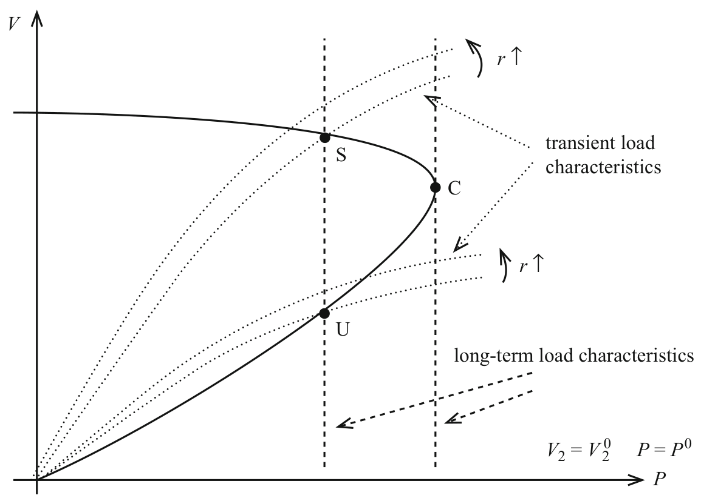

transient (short-term) load characteristic shown with dotted lines corresponds to a specific transformer tap ratio $r$, whereas the long-term load characteristic corresponds to equilibrium conditions where $V_{2}$ is within the deadband and approximately equal to $V_{o}$ and is shown with dashed lines for different load demands.

Load dynamics can also be discrete, e.g., driven by the tap changing transformer of Fig. 1. As the LTC is trying to restore the secondary voltage, it will reduce $r$ when $V_{2}<V_{o}-d$ and will increase r when $V_{2}>V_{o}+d$, where $d$ is half of the deadband.

The effect of tap ratio increase in the upper and lower part of the $P V$ curve is shown in Fig. 2 (points S and U ). In the upper part, increased $r$ will reduce consumption which implies that $V_{2}$ is also reduced as expected. In the lower part (point U), increased $r$ will increase consumption indicating an increased $V_{2}$ and thus an unstable LTC operation. The stability condition in this case is

$$
\begin{equation*}
\frac{\partial V_{2}}{\partial r}<0 \tag{4}
\end{equation*}
$$

Clearly for either discrete or continuous dynamics, at the maximum power point C , a stable and an unstable equilibrium branch come together, leaving no equilibrium points for higher demand. In bifurcation theory this point is known as a saddle-node bifurcation (SNB).

## Effect of Generation

The generator behind the constant voltage source $E$ of Fig. 1 supplies the active power consumed by the load (it would cover also active losses, if present). In practice this means that it requires a governor with PI (proportional plus integral) control, as is customary for autonomous systems and a prime mover of the required capacity. The generator also maintains the constant voltage $E$ assumed in the calculations. This requires an automatic voltage regulator (AVR), which can be assumed in this simple example as being also of PI type. The AVR is adjusting the DC rotor (field) current of the synchronous generator so as to maintain the terminal voltage constant.

For a given load, the active and reactive generation $P_{G}+j Q_{G}$ required is directly calculated from the network equations. The electromotive force (EMF) corresponding to the field current can then be determined using standard synchronous machine equations and preferably taking into account the saturation of the machine iron core (Van Cutsem and Vournas 1998). It should be noted that due to thermal constraints, it is not possible to exceed a maximum rotor current in continuous operation. This results in a rotor current limit that is enforced by the generator overexcitation limiter (OEL). If loading conditions are such that the OEL is activated, the generator terminal voltage


<!-- source_pdf_page: 1107 -->
$E$ cannot be maintained constant, and thus the voltage source $E$ has to be replaced by a constant EMF in series with the generator reactance. This leads to a much more restrictive limit for the maximum power transfer.

In power flow calculations, the generator excitation limit is usually represented by a maximum allowable reactive generation $Q_{G}^{\max }$. When this limit is reached, the reactive generation remains constant, and thus the terminal voltage is allowed to vary, i.e., the generator becomes a PQ bus. Note however that $Q_{G}^{\max }$ of an actual generator is not constant but depends on terminal voltage and on active generation.

In any case the overexcitation limit of synchronous generators and the resulting limitation of the reactive support they offer is an important factor determining maximum power and thus voltage stability limits. In practice voltage instability is reached only after some critical generators have reached the overexcitation limit.

## Voltage Instability Mechanism

Following the preceding discussion, it is possible to describe the mechanism of voltage instability as follows (Van Cutsem and Vournas 1998):

> Voltage instability stems from the attempt of load dynamics to restore power consumption beyond the capability of the combined transmission and generation system.

A voltage instability incident can occur either through a gradual load increase up to the maximum power limit or most commonly following a contingency (or a cascade of contingencies) drastically reducing the maximum power transfer below the pre-contingency demand. Thus, any attempt at restoring power to the pre-contingency demand will induce an unstable response leading to voltage collapse.

As the load dynamics are the driving force of voltage instability, the time scale of load restoration is the one characterizing voltage stability. Thus, fast recovering loads, such as induction motors and power electronics-driven devices, tend to restore load in a second or less and constitute what is known in power system
dynamic analysis as the short-term time scale (Kundur et al. 2004). Study of relevant problems (motor stalling, etc.) is part of short-term voltage stability analysis.

In a slower time scale of several seconds up to minutes, load recovery dynamics include the LTCs and thermostatically controlled loads. This is the time scale of long-term voltage stability analysis (Kundur et al. 2004). Note that for longterm voltage stability, the short-term dynamics such as those of motors and generators are considered to be in equilibrium. In system representation this assumption leads to the replacement of short-term differential equations with algebraic equilibrium equations. This assumption is known as the quasi-steady-state (QSS) approximation.

## Multiple-Load (Meshed) System

The single-load system of Fig. 1 serves well in defining the voltage stability problem and helps visualize its significance through the $P V$ curve representation and the maximum loading or critical point C . In actual power systems, however, there are multiple loads defining a multidimensional space where it is sometimes tricky to apply the simple concepts of Fig. 1. For instance, it is important to distinguish between the supply system which can be represented by a Thevenin equivalent and the consumption part where loads affect each other and cannot be examined individually, one at a time.

Consider the power system of Fig. 3, where multiple generators are feeding a number of loads through a meshed network represented by the complex admittance matrix Y. The steady-state conditions of the system including generation and load are traditionally represented by the power flow equations:

$$
\begin{array}{r}
\left(P_{G i}+\mathrm{jQ}_{G i}\right)-\left(P_{A i}+\mathrm{jQ}_{A i}\right)-\hat{V}_{i} \\
\sum_{j=1}^{N} \hat{V}_{i} Y_{i j}^{*} \hat{V}_{j}^{*}=0 \quad i=1, \ldots, N \tag{5}
\end{array}
$$

Using real variables, (5) can be written as

$$
\begin{equation*}
\mathbf{g}(\mathbf{x}, \mathbf{p})=0 \tag{6}
\end{equation*}
$$


<!-- source_pdf_page: 1108 -->
Power System Voltage Stability, Fig. 3 Meshed power system
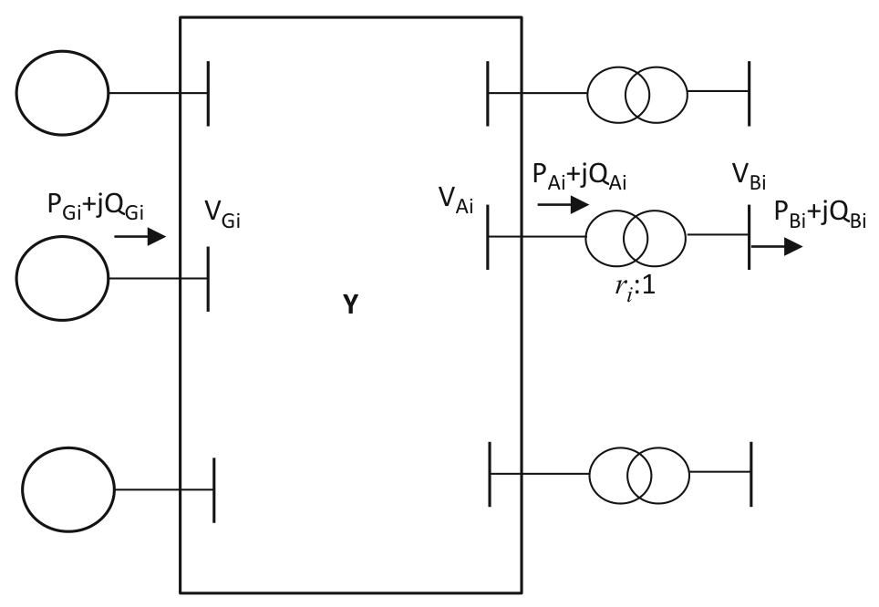

> Image description: A technical schematic diagram titled "Fig. 3 Meshed power system" illustrates the electrical representation of a power system model for voltage stability analysis. The diagram is divided into two main sections: a left-side generator section and a right-side load section, separated by a central rectangular block labeled **Y**, representing the bus admittance matrix. On the left, three voltage sources (generators) are shown. The middle generator is explicitly labeled with an outgoing current/power vector $P_{Gi} + jQ_{Gi}$ and a terminal voltage $V_{Gi}$. On the right, three load branches are shown, each connected via a transformer. The central load branch is labeled with a voltage $V_{Ai}$ at the input, an outgoing power vector $P_{Ai} + jQ_{Ai}$, and a transformer with a turns ratio $r_i:1$. The resulting output voltage is $V_{Bi}$ with an outgoing power vector $P_{Bi} + jQ_{Bi}$. The diagram uses standard electrical engineering notation to represent power flow from generation to load through an admittance matrix.

where $\mathbf{p}$ is the vector of independent parameters (load demands, generator setpoints) and $\mathbf{x}$ the vector of dependent variables (voltages and angles).

Note that in this representation, the load is referred to the primary side of LTC transformers as in Fig. 1. This can be considered constant at equilibrium corresponding, for instance, to secondary (distribution side) voltage restoration at its setpoint value $V_{B i}= V_{o i}$.

Concerning generators the active power $P_{G i}$ cannot be treated as constant when load is varying, so there has to be a participation factor attached to each generator bus that will represent primary or secondary frequency regulation characteristic (Van Cutsem and Vournas 1998). This is sometimes referred to as the distributed slack bus approach. For reactive power the limits $Q_{G i}^{\max }$ of reactive support should be set, beyond which the generator voltage is no longer constant (switch from $P V$ to $P Q$ bus).

The solution of the $N$ nonlinear complex equations (5) for a given load demand determines all complex voltages in the system. As in the simple radial system case, there may exist multiple solutions, some of which unstable, or no solutions at all. The stability limits, where (3) and (4) hold as equalities for the radial system, are now given by the singularity of the Jacobian of the equilibrium conditions (6):

$$
\begin{equation*}
\operatorname{det} \mathbf{D}_{\mathbf{x}} \mathbf{g}=0 \tag{7}
\end{equation*}
$$

The stability limit can be determined also by the singularity of the state matrix (Medanic et al. 1987; Van Cutsem and Vournas 1998):

$$
\begin{equation*}
\operatorname{det} \mathbf{A}=\operatorname{det}\left[\frac{\partial V_{i}}{\partial r_{j}}\right]=0 \tag{8}
\end{equation*}
$$

Note that the impedance matching condition for a single load amounts to the diagonal element $a_{i i}=0$ which is much more strict than the singularity condition (8) that marks the actual onset of instability. The points satisfying (7) and (8) are critical points and form a multidimensional manifold in parameter space called bifurcation surface.

## Applications

The above analysis briefly touches on fundamentals. Detailed analysis tools for voltage stability include (but are not limited to) continuation power flow, VQ curves, time simulation (shortterm, long-term, QSS), sensitivity, and eigenvalue/singular value analysis. Voltage security analysis is presently applied online in various control centers based on the above methods of analysis for a large number of contingencies. Countermeasures to voltage instability and collapse cover a wide spectrum, from automatic reactive devices switching to special protection controls and load shedding as a last resort. Further details can be sought in textbooks Taylor (1994) and Van Cutsem and Vournas (1998).


<!-- source_pdf_page: 1109 -->
## Cross-References

- Modeling of Dynamic Systems from First Principles
- Stability Theory for Hybrid Dynamical Systems
Time-Scale Separation in Power System Swing Dynamics: Singular Perturbations and Coherency


## Bibliography

Kundur P et al (2004) Definition and classification of power system stability IEEE/CIGRE joint task force on stability terms and definitions. IEEE Trans Power Syst 19:1387-1401
Medanic J, Ilic-Spong M, Christensen J (1987) Discrete models of slow voltage dynamics for under load tapchanging transformer coordination. IEEE Trans Power Syst 2:873-882
Taylor CW (1994) Power system voltage stability. EPRI power system engineering series. McGraw-Hill, New York
Van Cutsem T, Vournas C (1998) Voltage stability of electric power systems. Kluwer Academic, Boston (Springer, 2008)

## Powertrain Control for Hybrid-Electric and Electric Vehicles

## Giorgio Rizzoni

Department of Mechanical and Aerospace Engineering, Center for Automotive Research, The Ohio State University, Columbus, OH, USA


#### Abstract

Powertrain electrification and hybridization have rapidly become part of the portfolio of all major automotive manufacturers, ranging from hybrid-electric, to plug-in hybrid-electric, to battery-electric vehicles, to hybrid-hydraulic and hybrid-mechanical solutions. The increased complexity of the powertrain systems associated with hybrid vehicles presents interesting control challenges and problems, and this entry describes the more common architectures of hybrid-electric


vehicle powertrains and their operation, focusing on the important problem of optimal control for energy management of hybrid-electric vehicles, on mode switching, and on battery management. In the conclusion, a connection is made between these problems and their interaction with intelligent transportation systems.

## Keywords

Battery management; Intelligent transportation systems; Vehicle-grid interaction

## Introduction

Increasingly stringent fuel economy and emissions regulations have required the automotive industry to consider more fuel-efficient powertrains and alternative primary sources of transportation fuels. Powertrain electrification and hybridization have rapidly become part of the portfolio of all major automotive manufacturers, ranging from hybrid-electric, to plug-in hybrid-electric, to battery-electric vehicles, to hybrid-hydraulic and hybrid-mechanical solutions. The increased complexity of the powertrain systems associated with hybrid vehicles presents interesting control challenges and problems. This entry describes control problems associated with hybridelectric vehicles (HEVs) and battery-electric vehicles (BEVs).

## HEV Powertrains

An HEV powertrain contains at least two power sources: a primary engine - typically a combustion engine or a fuel cell fueled by a chemical fuel (in liquid or gaseous form) - and a secondary power source that makes use of a rechargeable energy storage system (RESS) that permits buffering the power demand of the vehicle so as to provide choices in the use of the power sources. While it is possible to design hybrid powertrains using secondary hydraulic or mechanical energy conversion and storage devices (hydraulic pump/motors and accumulators, mechanical flywheels), the majority of hybrid


<!-- source_pdf_page: 1110 -->
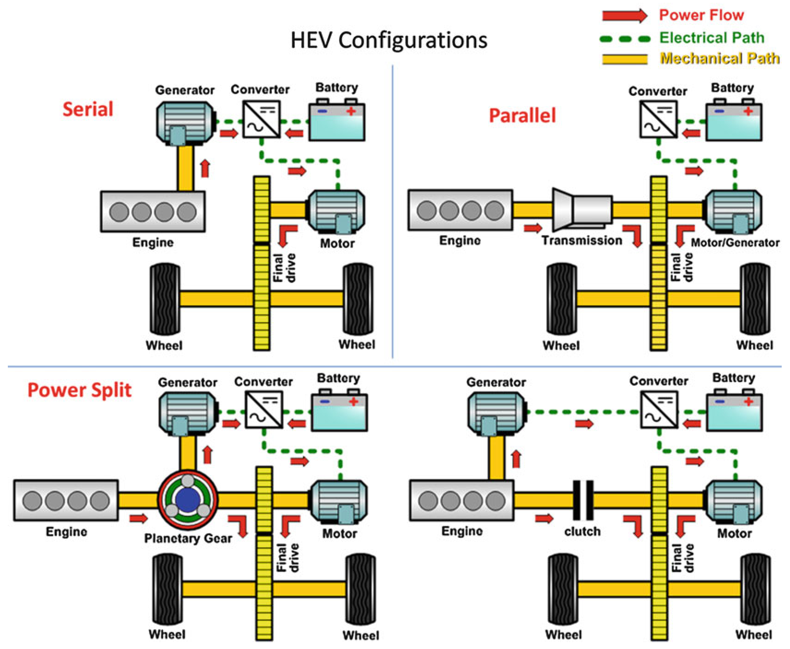

> Image description: This textbook figure illustrates three primary Hybrid-Electric Vehicle (HEV) configurations: **Serial**, **Parallel**, and **Power Split**. A legend defines three connection types: red arrows for **Power Flow**, green dashed lines for **Electrical Path**, and yellow thick lines for **Mechanical Path**. 1. **Serial Configuration**: The engine is mechanically decoupled from the wheels, powering only a generator. The generator sends electrical energy via a converter to a battery and a motor, which provides mechanical power to the final drive and wheels. 2. **Parallel Configuration**: Both the engine and a motor/generator are mechanically connected to the final drive through a transmission. The motor/generator can either draw power from the battery via a converter or send power back to the battery. 3. **Power Split Configuration**: Features two sub-diagrams. One uses a planetary gear set to split power between a generator (connected to the engine) and a motor. The other uses a clutch to manage the connection between the engine and the motor/final drive.

Powertrain Control for Hybrid-Electric and Electric Vehicles, Fig. 1 Hybrid powertrain configurations (After Rizzoni and Peng (2013), courtesy: Dr. Chiao-Ting Li, the University of Michigan)
powertrains in use today employ electric machines and electrochemical energy storage devices (batteries and supercapacitors); thus, this entry focuses exclusively on hybrid-electric vehicles (HEVs). Electric vehicles (EVs) can be viewed as a special case of HEVs in which no internal combustion engine is present, and many of the considerations that follow apply also to hydraulic and mechanical hybrids. HEVs may be classified according to their powertrain architecture as shown in Fig. 1.

A series HEV powertrain employs an electric machine (EM) to propel the vehicle while using an internal combustion engine (ICE) coupled to a second EM as an electrical generator set. In a series HEV, the electrical generator set can provide power directly to the electric traction
system, via an electrical DC bus, or can charge an RESS (e.g., battery), or can perform both functions Motive power to the vehicle is delivered by the primary EM. Thus, a series HEV blends electrical power from an RESS with electrical power generated by an ICE-powered generator set to provide motive power to the vehicle. Deciding how much electrical power to draw from each of the two power sources to meet the power demand of the vehicle is an important control objective. A further feature of interest is the ability to recover some of the kinetic energy of the vehicle during braking events by using the traction EM in generator mode to recharge the RESS.

A parallel HEV powertrain blends mechanical power from the ICE and one or more EMs


<!-- source_pdf_page: 1111 -->
through appropriate mechanical coupling and transmission elements to deliver motive power to the vehicle or to recharge the RESS. In a parallel HEV powertrain, the same EM is used to provide power to the vehicle (motor mode) and to provide energy to the RESS (generator mode); in the latter case, the RESS can be recharged either by providing power from the ICE in excess of that required by the vehicle or by converting the kinetic energy of the vehicle into electrical power through the braking action of the EM.

A third configuration, the one that is most commonly found among passenger vehicles in commercial production today, is the power-split $H E V$, in which the benefits of both series and parallel HEVs are achieved most commonly by using one or more planetary gear sets to couple two EMs - to the ICE on one side and to the driveline on the other.

Regardless of architecture, HEV powertrains enable fuel savings and emissions reductions by operating in a variety of modes that include load leveling, regenerative braking, engine startstop, and transmission optimization (Miller 2004; Rizzoni and Peng 2013). All of these functions benefit from the availability of an RESS and of bidirectional power converters, that is, the electric drive system(s) that can serve both motor and generator functions.

## HEV Operation

An HEV is considered charge sustaining if the RESS is recharged only by power supplied by the ICE or by regenerative braking. If, on the other hand, the vehicle is designed to deplete energy stored in the RESS during the course of a trip, ending the trip with a lower state of stored energy than at the start and requiring recharging from the electrical grid, the vehicle is called charge depleting and is commonly referred to as a plug-in HEV (PHEV). PHEVs can in turn be subdivided into blended-mode PHEVs, in which stored electrical energy and fuel chemical energy are used jointly to achieve minimum overall energy use, and extended-range electric vehicles (EREVs), in which electrical energy is used exclusively to power the vehicle, until a lower bound is reached,
at which point the vehicle uses both ICE and EM(s) to behave like a charge-sustaining hybrid. In principle, any of the architectures of Fig. 1 can be used in any of these modes. A battery-electric vehicle, or BEV, is an extreme case of an EREV, in which the vehicle is not equipped with an ICE. Miller (2004) provides an excellent overview of the technology underlying each of the powertrain architectures mentioned so far.

## Control Problems in X-EVs

Let us refer to the general case of a hybrid or electric vehicle as an X-EV, with the X in X-EV representing any of the architecture discussed so far: $\mathrm{X}-=\mathrm{H}, \mathrm{PH}, \mathrm{ER}$, or B . X-EVs enable multiple configurations and operating modes of the powertrain, presenting a number of interesting control problems above and beyond those that are already present in non-hybrid powertrains (e.g., engine and transmission control). In general, the control architecture of an HEV is hierarchical, with a higher-level (supervisory) controller that manages the power flows and mode changes (e.g., from electric to hybrid in an EREV) to meet the vehicle fuel economy, emissions, performance, and drivability requirements. Figure 2 depicts a hierarchical control architecture in use in a prototype PHEV.

In an X-EV, two problems are especially important: optimal energy management, that is, the ability to optimize the energy use of a vehicle during a trip, and mode switching, that is, the ability to select the appropriate operating mode and to smoothly switch between modes.

The higher-level controller issues set points to lower-level controllers that are used to manage the ICE, the EM(s), the mechanical transmission system, the brake system, and the RESS, as well as other auxiliary functions in the vehicle. In this article we primarily consider the higher-level controller and focus on two problems that are especially relevant to HEVs: optimal energy management and mode switching. In addition, we also consider the battery controller (often called battery


<!-- source_pdf_page: 1112 -->
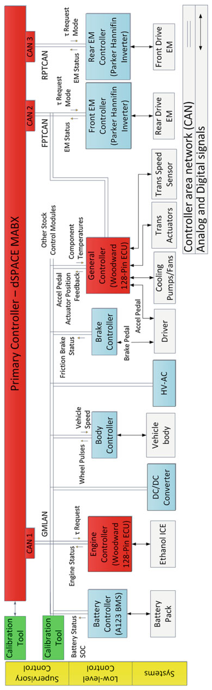

> Image description: A hierarchical diagram titled "Powertrain Control for Hybrid-Electric and Electric Vehicles" illustrates the control architecture for a hybrid-electric vehicle (HEV). The system is organized into three vertical layers: Systems, Low-level Control, and Supervisory Control. At the base, the Systems layer contains hardware components like the Battery Pack, Ethanol ICE, Vehicle body, Driver, and Electric Motors (Front/Rear EM). The Low-level Control layer includes controllers such as the Battery Controller (A123 BMS), Engine Controller (Woodward 128-Pin ECU), Body Controller, Brake Controller, General Controller (Woodward 128-Pin ECU), and Trans Actuators. The Supervisory Control layer is represented by a large, vertical "Primary Controller – dSPACE MABX" communicating via three CAN channels: CAN 1 (GMLAN), CAN 2 (FPTCAN/RPTCAN), and CAN 3. Directional arrows indicate data flow, such as Engine Status, Vehicle Speed, and $\tau$ (torque) requests, between the controllers and physical components. Additional calibration tools monitor Battery Status and SOC.
Powertrain Control for Hybrid-Electric and Electric Vehicles, Fig. 2 Hierarchical structure of an HEV controller (Courtesy: The Ohio State University EcoCAR 2 Team)


<!-- source_pdf_page: 1113 -->
management system or BMS), which while being a low-level control is very specific to X-EVs.

## Optimal Energy Management

The optimal energy management problem in an X-EV consists of finding the control $u(t)$ that leads to the minimization of a performance index $J$ over the time horizon $t-t_{f}$, corresponding to a driving cycle, or trip; the problem is subject to constraints that are related:
(i) To physical limitations of the actuators and the energy stored in the RESS
(ii) To the requirement to maintain the RESS state of energy within prescribed limits (in a charge-sustaining X-EV) or to track a specified RESS stored energy trajectory (in charge-depleting X-EVs)
Let $L(\cdot)$ be a suitable function of the system states and inputs that accounts for the quantities we wish to minimize, for example, fuel consumption or emissions of carbon dioxide. Then, we define the cost function

$$
\begin{equation*}
J(x(t), u(t))=\int_{t_{0}}^{t_{f}} L(x(t), u(t), t) d t \tag{1}
\end{equation*}
$$

which is to be minimized for every trip. In general, the exact driving cycle, or profile, associated with a trip is not completely known; thus, a causal solution to this problem is impossible to achieve without making some assumptions. Various approaches to solve (1) have been proposed over the years; we cite (i) dynamic programming (DP), (ii) local optimization solutions as surrogates of a global solution, (iii) Pontryagin's minimum principle (PMP), and (iv) rule-based methods. Onori et al. (2014) provide a comprehensive overview of the problem as well as detailed examples. We briefly review approaches (i), (ii), and (iii) in the present article.

## Global Optimization by Dynamic Programming

If the driving cycle, represented by the vehicle instantaneous velocity over time, $v(t)$ is known, it is possible to cast (1) in such a form that
a DP solution is possible. For example, in a charge-sustaining X-EV, one can find the sequence of inputs that minimizes the trip fuel consumption while sustaining the desired state of charge of a battery and meeting the speed profile of the vehicle. In this problem, the input is the power supplied by the battery to the electric machine, and the state of charge of the battery, SOC, is the only state; all other subsystems (engine, electric drives, transmission, etc.) are modeled via quasi-static efficiency models that can be represented by algebraic equations (e.g., Willans lines, Rizzoni et al. 1999) or by maps. The vehicle velocity profile, $\nu(t)$ is converted to a vehicle power request, $P_{\text {REQ }}(t)$, knowing the vehicle load characteristics (aerodynamic, inertial, rolling and drivetrain friction, and road grade). In turn, the power required to meet a specific load profile is the sum of the power delivered by the ICE and EM, $P_{\text {REQ }}(t)=P_{\text {ICE }}(t)+P_{\text {BAT }}(t)$. So, for example, we seek the control input, $P_{\mathrm{BAT}}(t)$, that corresponds to the minimum fuel consumption, that is, $\min _{\left\{P_{\mathrm{ICE}}(t), P_{\mathrm{BAT}}(t) \forall t\right\}} \int_{t_{0}}^{t_{f}} \dot{m}_{f}(t) d t$, while delivering the requested vehicle power. The problem has physical constraints in the actuators (maximum and minimum power that can be delivered by ICE and EM), as well as the requirement for the control policy to be charge sustaining, which is translated into the additional condition $\operatorname{SOC}\left(t_{0}\right)=\operatorname{SOC}\left(t_{f}\right)$. While this is only a sketch of the problem formulation (see Onori et al. (2014) for a detailed treatment), it should be clear that it is possible to find a DP solution. If the vehicle is charge depleting, the problem can be similarly formulated with $\operatorname{SOC}\left(t_{f}\right)<\operatorname{SOC}\left(t_{0}\right)$.

In practice, this approach requires complete information of the vehicle velocity profile, and DP is not an implementable, causal solution to the X-EV energy management problem. It is, however, a very useful tool to establish a benchmark for a problem or as an aid in developing a rule base (Onori et al. 2014). Stochastic DP methods have been proposed to circumvent the need to know the driving cycle exactly (see, e.g., Tate et al. 2007).


<!-- source_pdf_page: 1114 -->
Local Optimization by Equivalent Fuel Consumption Minimization
A heuristic approach that has met with success is to solve (1) as a local optimization problem, wherein $\int_{t_{0}}^{t_{f}} \min _{\left\{P_{I C E}(t), P_{B A T}(t) \forall t\right\}} \dot{m}_{f}(t) d t$ is used as an approximation for $\min _{\left\{P_{I C E}(t), P_{B A T}(t) \forall t\right\}} \int_{t_{0}}^{t_{f}} \dot{m}_{f}(t) d t$. This approach gives rise to the Equivalent fuel Consumption Minimization Strategy (ECMS) (Paganelli et al. 2001), which accounts for the use of stored electrical energy, in units of chemical fuel use (g/s), such that one can define an "equivalent fuel consumption" taking into account the cost of the electrical energy used to produce $P_{\mathrm{BAT}}(t)$ by way of the fuel that must be used at a future time to replenish the stored electrical energy in the RESS. The equivalent fuel consumption is defined in (2):

$$
\begin{align*}
\dot{m}_{f, e q}(t)= & \dot{m}_{f}(t)+\dot{m}_{e q}(t)=\dot{m}_{f}(t) \\
& +s(t) \frac{E_{\text {batt }}}{Q_{L H V}} S \dot{O C}(t) \tag{2}
\end{align*}
$$

In (2), $\dot{m}_{f, e q}$ is the equivalent fuel consumption, $\dot{m}_{f}$ is the actual chemical fuel consumption, $\dot{m}_{e q}$ is the virtual fuel consumption corresponding to the use of electricity stored in the battery (to be replenished in the future), $E_{\mathrm{BAT}}$ is the energy capacity of the battery, $Q_{\mathrm{LHV}}$ is the lower heating value of the chemical fuel, and $s(t)$ is the equivalence factor that assigns a cost to the use of electricity. Then, the global minimization problem of (1), with $L(\cdot)$ equal to $\dot{m}_{f, e q}$, becomes the problem of finding $\int_{t_{0}}^{t_{f}} \min _{\left\{P_{I C E}(t), P_{B A T}(t) \forall t\right\}} \dot{m}_{f}(t) d t$. This approach, which can be easily implemented, has been used widely and has been shown to closely approximate the global optimal solution if sufficient knowledge of the vehicle driving cycle is available. The method does requires empirical calibration and tuning of the equivalence factor, $s(t)$, the optimal value of which is dependent on the driving cycle. Such calibration could be automated by using a predictor to generate a short-horizon estimate of the driving cycle and an
adaptor to generate an appropriate $s(t)$ (Musardo et al. 2005).

## Optimization by Pontryagin's Minimum Principle

Pontryagin's minimum principle (PMP) can also be employed to solve the X-EV energy management problem. If, again, the fast dynamics of the system are neglected the state equation is

$$
\begin{equation*}
\dot{x}(t)=f(x, u, t)=-\frac{1}{E_{B A T}} I_{B A T}(x, u, t) \tag{3}
\end{equation*}
$$

where $x=S O C$ is the state of charge of the battery, $E_{\mathrm{BAT}}$ is the energy capacity of the battery, and $I_{\mathrm{BAT}}$ is the instantaneous battery current. If the input is the power requested of the battery, $P_{\text {BAT }}(t)$, which in turn determines the engine power request, $P_{\text {ICE }}(t)$, and hence the fuel consumption, then the Hamiltonian function can be defined to be

$$
\begin{align*}
H\left(x(t), P_{B A T}(t), \lambda(t)\right)= & \dot{m}_{f}\left(P_{B A T}(t)\right)-\lambda(t) \\
& f\left(x(t), P_{B A T}(t), t\right)(4) \tag{4}
\end{align*}
$$

In (4), $f(\cdot)$ is given by Eq. (3), and the control $P_{B A T}(t)$ that which minimizes Eq. (4) at each time instant is

$$
\begin{equation*}
P_{B A T}^{*}(t)=\arg \min _{P_{B A T}} H\left(x(t), P_{B A T}(t), \lambda(t)\right) \tag{5}
\end{equation*}
$$

The co-state variable, $\lambda(t)$, is the solution of

$$
\begin{equation*}
\dot{\lambda}(t)=-\lambda(t) \frac{\partial f(x(t), u(t))}{\partial x} \tag{6}
\end{equation*}
$$

Eqs. 3 and 5, with boundary conditions $x\left(t_{0}\right)$ and $x\left(t_{f}\right)$, can be solved numerically; in Serrao et al. $(2009,2011)$ it is shown that the co-state $\lambda(t)$ is related to the equivalence factor of Eq. (2), confirming that the intuitive ECMS solution is in fact the PMP solution, providing that the equivalence factor (or co-state) is time varying and satisfies

$$
\begin{array}{r}
H(t, x, u, \lambda)=\dot{m}_{f}+\lambda(t) \dot{x}(t) \quad \text { and } \\
s(t)=-\lambda(t) \frac{Q_{L H V}}{E_{B A T}} \tag{7}
\end{array}
$$


<!-- source_pdf_page: 1115 -->
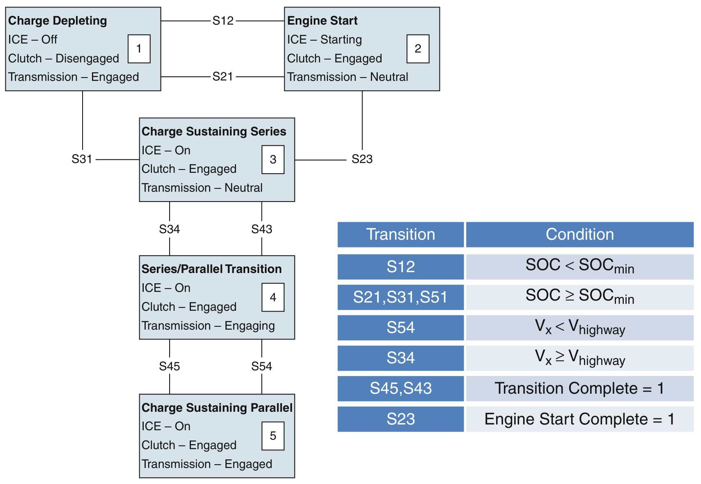

> Image description: This state diagram, titled "Powertrain Control for Hybrid-Electric and Electric Vehicles," illustrates various operating modes for a Plug-in Hybrid Electric Vehicle (PHEV). The diagram consists of five numbered states connected by transition labels. State 1 is **Charge Depleting**, where the Internal Combustion Engine (ICE) is off, the clutch is disengaged, and the transmission is engaged. A transition $S_{12}$ leads to State 2, **Engine Start**, where the ICE is starting, the clutch is engaged, and the transmission is neutral. From State 2, transition $S_{23}$ moves to State 3, **Charge Sustaining Series**, characterized by an on ICE, engaged clutch, and neutral transmission. State 3 transitions via $S_{34}$ to State 4, **Series/Parallel Transition**, where the transmission is engaging. Finally, transitions $S_{45}$ and $S_{43}$ lead to State 5, **Charge Sustaining Parallel**, where both the ICE and transmission are engaged. A provided lookup table defines transition conditions: $S_{12}$ occurs when $SOC < SOC_{min}$; $S_{34}$ occurs when $V_x \geq V_{highway}$; and $S_{23}$ occurs when "Engine Start Complete = 1."

Powertrain Control for Hybrid-Electric and Electric Vehicles, Fig. 3 State diagram illustrating mode switching in a PHEV (Courtesy: The Ohio State University EcoCAR 2 Team)

The PMP solution is also cycle dependent, as the optimal initial condition for the co-state is dependent on the driving cycle. This dependence on the driving cycle, whether expressed in terms of an equivalent fuel consumption in the ECMS solution or as the initial condition of the co-state in the PMP solution, is an unavoidable consequence of the fact that the fuel consumption of a vehicle is strongly dependent on the driving conditions, which affect the vehicle load.

The basic concepts outlined above continue to be the subject of further development; for example, integrating available trip information available from navigation and geographical information systems into predictive energy management algorithms and considering battery aging as a cost in the optimization function are but two of the research areas being pursued.

## Mode Switching

X-EV architectures permit multiple operating modes to exploit the design and control flexibility available in the powertrain. Some examples are the following: an X-EV could operate in pure EV mode or in hybrid mode (whether series, parallel, or power-split), could use special control algorithms during regenerative braking events to provide maximum energy recovery without adversely affecting brake and vehicle stability control systems, and could implement special start-stop control strategies that minimize fuel consumption at idle without adversely affecting engine cold- or warm-start emissions and without inducing unwanted transient vibrations (Canova et al. 2009). Figure 3 depicts an example of a state flow diagram that could be implemented in a finite state machine. Mode switching can result in drivability problems (Wei and Rizzoni 2004), that is, in undesirable


<!-- source_pdf_page: 1116 -->
transient response characteristics during mode changes. An X-EV can, in this context, be represented as a hybrid system (Koprubasi et al. 2007).

## Battery Management Systems

The most common RESS in hybrid vehicle is the electrochemical battery. A hybrid or electric vehicle uses a battery pack that is typically composed of modules, which are in turn comprised of battery cells connected in series and parallel. Battery management systems are necessary to provide charge balancing, cell protection, state of charge and state of health estimation, and other functions related to the management of the stored energy. A good overview of battery systems and associated control problems may be found in Rahn and Wang (2013).

Two important problems related to battery management are state of charge (SOC) and state of health (SOH) estimation. SOC estimation is a necessary component of any battery management system. The SOC of battery is defined by the following equations, in which $x$ is the SOC, $Q_{B A T}$ is the battery capacity in ampere-hours, and $\eta$ is the battery charging/discharging efficiency:

$$
\begin{align*}
\dot{x}(t)= & \frac{\eta}{Q_{B A T}(t)} \cdot I_{B A T}(t) \quad x(t)=x\left(t_{0}\right) \\
& +\frac{1}{3,600 \cdot Q_{B A T}(t)} \int_{t_{0}}^{t_{f}} I_{B A T}(\tau) \cdot d \tau \tag{8}
\end{align*}
$$

In practice, there are two problems with using current integration (also called Coulomb counting) to estimating SOC: (i) errors in numerical integration accumulate and may cause significant bias error in the estimate, and (ii) the actual capacity of the battery is unknown during vehicle operation, as it changes over time due to battery aging. A second SOC estimation approach consists of correlating the battery open-circuit voltage to the SOC, but this approach also suffers from significant uncertainty, as the open-circuit voltage-SOC correlation curves are only accurate in stationary conditions (constant temperature, with battery at rest). SOC estimation has been the subject of
much research and has seen the use of Kalman filters, extended Kalman filters, particle filters, and other estimation approaches (Chaturvedi et al. 2010).

The SOH of a battery degrades over time due to two principal factors: capacity fade and power fade (which can also be thought of as conductance fade caused by an increase in the internal resistance of the battery). These phenomena are the result of complex electrochemical interactions that are specific to battery chemistry. The ability to estimate the capacity and resistance of a battery during actual operation is a very important aspect of battery management. As in the case of SOC estimation, no direct measurement is possible outside of controlled laboratory conditions; hence, estimation algorithms must be employed (Chaturvedi et al. 2010). It is important to observe that SOC and SOH estimation algorithms operate on two completely different time scales, as the SOC of a battery fluctuates over time windows of minutes or hours, while the SOH changes very slowly over time, with measurable changes occurring over periods of months or years.

## Summary and Future Directions

In summary, the control of X-EV powertrains is a rich subject for control theoreticians and practitioners, presenting topics related to optimization and optimal control (for energy management, battery aging), hybrid control (for drivability), adaptive and predictive control, and estimation. Further, the electrification of ground vehicles presents interesting opportunities to integrate vehicles with the electric power and communication networks infrastructures. The following paragraphs describe two such opportunities.

## Vehicle-Grid Interaction

As the penetration of plug-in vehicles, PHEVs and BEVs, increases, their impact on the electric power grid cannot be neglected; the consideration of increased electric power demand and of the


<!-- source_pdf_page: 1117 -->
timing of vehicle charging must be included in the control/optimization of the electric power grid.

The electric grid and the transportation system are the two largest sectors that produce greenhouse gas emissions. When large numbers of vehicles are electrified and draw power from the electric grid, it is important to aim for reduced overall greenhouse gas emissions rather than just shifting emissions from tailpipes to power plant stacks. Controlling the charging of plug-in vehicles to alleviate the impact to the grid has been studied, including the idea of using plugin vehicles as ancillary services to the grid, possibly with significant renewable power sources connected to the grid. Modeling and simulating this integrated system require information on detailed grid load profiles, power generation pricing and carbon emissions, wind statistics, and vehicle usage statistics. In addition, charging control must balance multiple factors: grid stability, fully charging all vehicles, minimizing data collection and communication, and overall system carbon emission minimization.

## Intelligent Transportation Systems

X-EVs, as well as conventional vehicles, will benefit from the ability to analyze traffic and geographical information in real time to quantify the effects of infrastructure, environment, and traffic flow on vehicle fuel economy and emissions, and to permit the application of forecasting and optimization methods for energy management (Gong et al. 2011; Wollaeger et al. 2012). There are significant opportunities to achieve significant fuel savings and emissions reduction by considering the large-scale interactions of vehicles with one another and with the infrastructure, further exploiting the flexibility inherent in X-EVs.

## Cross-References

- Engine Control
- Optimal Control and Pontryagin's Maximum Principle
Optimal Control and the Dynamic Programming Principle


## Bibliography

Canova M, Guezennec Y, Yurkovich S (2009) On the control of engine start/stop dynamics in a hybrid electric vehicle. ASME J Dyn Syst Meas Control 131: 061005
Chaturvedi NA, Klein R, Christensen J, Ahmed J, Kojic A (2010) Algorithms for advanced battery management systems. IEEE Control Syst Mag 30(2):49-68
Gong Q, Tulpule P, Midlam-Mohler S, Marano V, Rizzoni G (2011) The role of ITS in PHEV performance improvement. In: American control conference, San Francisco
Koprubasi K, Westervelt ER, Rizzoni G (2007) Toward the systematic design of controllers for smooth hybrid electric vehicle mode changes. In: Proceedings of the American control conference, Anchorage
Miller JM (2004) Propulsion systems for hybrid vehicles. The Institution of Electrical Engineers, London
Musardo C, Rizzoni G, Guezennec Y, Staccia B (2005) A-ECMS: an adaptive algorithm for hybrid electric vehicle energy management. Eur J Control 11(4-5): 509-524
Onori S, Serrao L, Rizzoni G (2014) Energy management strategies for hybrid electric vehicles. Springer, Berlin
Paganelli G, Ercole G, Brahma A, Guezennec Y, Rizzoni G (2001) General supervisory control policy for the energy optimization of charge-sustaining hybrid electric vehicles. JSAE 22: 511-518
Rahn C, Wang C-Y (2013) Battery systems engineering. Wiley, New York
Rizzoni G, Peng H (2013) Hybrid and electric vehicles: the role of dynamics and control. ASME Dyn Syst Control Mag 1(1): 10-17
Rizzoni G, Guzzella L, Baumann B (1999) Unified modeling of hybrid-electric vehicle drivetrains. IEEE/ASME Trans Mechatron 4(3):246-257
Serrao L, Onori S, Rizzoni G (2009) ECMS as a realization of Pontryagin's minimum principle for HEV control. In: Proceedings of the 2009 American control conference, Portland
Serrao L, Onori S, Rizzoni G (2011) A comparative analysis of energy management strategies for hybrid electric vehicles. ASME J Dyn Syst Meas Control 133:1-9
Tate ED, Grizzle JW, Peng H (2007) Shortest path stochastic control for hybrid electric vehicles. Int J Robust Nonlinear Control 18(14): 1409-1429
Wei X, Rizzoni G (2004) Objective metrics of fuel economy, performance and driveability - a review. SAE Technical paper 2004-01-1338
Wollaeger SK, Onori S, Di Cairano S, Filev D, Ozguner U, Rizzoni G (2012) Cloud-computing based velocity profile generation for minimum fuel consumption: a dynamic programming based solution. In: American control conference, Montreal, 27-29 June 2012


<!-- source_pdf_page: 1118 -->
# Programmable Logic Controllers

Georg Frey<br>Saarland University, Saarbrücken, Germany

## Synonyms

PLC


#### Abstract

Programmable logic controllers (PLCs) are a special form of computing hardware and software tailored for use in industrial control. The hardware is built for rough environments and offers various input and output ports for industrial sensor and actuator signals as well as communication systems. The main software features are hard real-time capabilities and a set of standardized programming languages specifically designed for the realization of automation functions.


## Keywords

Function blocks; Ladder diagram; Ladder logic; Logic control; Real-time control

## Introduction

Since the 1970s, the programmable logic controller (PLC) has been the primary workhorse of industrial automation. For a long time, it has provided a distinct field of research, development, and application, mainly for control engineering. This area has produced its own design methods and programming languages. Due to its importance for industrial application, a lot of these methods have been standardized by the International Electrotechnical Commission (IEC). Currently the most influential standards are IEC 61131 (John and Tiegelkamp 2010) and IEC 61499 (Vyatkin 2011). While the latter one is dedicated to distributed systems, IEC 61131 covers the PLC as such. This standard
consists of several parts. The most important ones are:
Part 1 : General information. This part covers the CONCEPT of PLCs. It describes the general idea and typical functionalities, most importantly, the cyclic processing of the application program working on a stored image of the input and output values.
Part 2 : Equipment requirements and tests. Here requirements on the PLC HARDWARE (electrical, mechanical, and functional) and corresponding tests are defined.
Part 3 : Programming languages. This is the most important part of the standard. Based on already existing PLC programming languages, a harmonization of the SOFTWARE structure was achieved. This includes a general software model together with a set of different standardized programming languages. IEC 61131-3 paved the way from proprietary programming solutions to a set of well-accepted languages, allowing easier training of PLC programmers and - to some extent - the reuse of application solutions on different hardware platforms.
While Part 2 is of importance for PLC manufacturers only, Parts 1 and 3 contain relevant information for PLC users, especially for designers of PLC control applications. Before discussing these points, the definition of PLC from IEC 61131-1 is reproduced and discussed:

> A PLC is a digital electrical system used in manufacturing. It utilizes programmable memory to store practice-oriented control programs. Thus is suitable for implementation of specific functions such as combinatorial control, sequence control, time-, count- and arithmetic functions. Due to its special arrangement of digital or analog input/output, it is used for controlling various machines and processes. (...)

This definition is focused on the usage of the device and would - taken out of the context - also cover industrial PCs or microcontroller-based control solutions. The specifics of PLC hardware


<!-- source_pdf_page: 1119 -->
are discussed in Part 2 of the standard. However, much more important for distinguishing a PLC from other control hardware are the properties of the execution model described in Part 2 and discussed in the following.

## Execution Model

In designing PLC applications, the execution model has to be considered. The main idea is the cyclic execution together with an I/O image. While microcontrollers and PCs typically use an event-based execution model (the application waits for external events from the environment interrupts - and reacts accordingly), the PLC follows a time-based scheme (the application scans the environment at instances in time often a fixed cycle time - and reacts on the new status of the input ports).
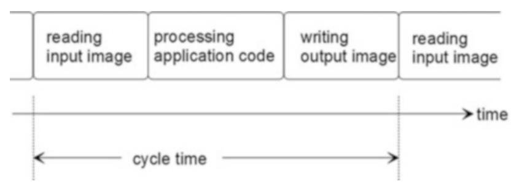

A PLC cycle consists of three iterated steps: input reading, program execution, and output writing. Together with the concept of the process image - a reserved memory space where input and output variables are stored - this execution model leads to the following:
(a) During one cycle, input and output values are kept fixed, i.e., a change in input signal values during a cycle will not be seen by the program executed. This means that a temporal change in an input signal value that is shorter than the cycle time may not be registered by the PLC at all.
(b) Changes in output signal settings by the program will be switched to the actual output ports only after execution of the complete program. This actually means that for an output signal where the value is changed several
times during one program execution, only the last change will be set to the hardware output of the PLC.
(c) The response time of a PLC, i.e., the time between a change in an input signal and the corresponding reaction at the output port of a PLC, lies between one and two PLC cycles, depending on when the change at the input port occurs relative to the PLC cycle.
While the time needed for input reading and output writing is constant over all cycles, the time for program execution may vary due to conditional execution of some program parts. However, normally the PLC is operated with a fixed cycle time set high enough to allow for the worst-case execution time of the application program.

The advantage of the described concept is the deterministic behavior of the resulting system with a very simple way to determine the timing behavior. This is important for most PLC applications:
(a) Open-loop control, where the reaction to a change of an input signal has to be reached in a limited time, especially in safety-critical applications.
(b) Closed-loop control, where the design of a discrete-time control algorithm is based on the assumption of a fixed sample-time.
To realize control functions, an application program has to be written for the PLC. To this end, Part 3 of the IEC 61131 defines a software model together with a set of programming languages.

## Software Model and Programming

The original idea that led to the development of the first programmable logic controller (PLC) in 1968 was to replace hardwired control equipment at machines. Back then, the controllers of machines, for example, lathes or grinders, typically consisted of a cabinet of interconnected relays. The size of such a controller could be considerable and its failure rate was high due to mechanical defects of single relays. Furthermore, the initial setup was very time-consuming and error prone, because the relays (often hundreds of them) had to be wired by hand. The biggest


<!-- source_pdf_page: 1120 -->
drawback of this technology, however, was the problems arising if a controller had to be changed, employing a new function or adjusting to a new production task. Then the hardwired structure had at least partially to be disassembled and rewired. Here was the main advantage of a controller that could be adjusted by changing software instead of hardware.

Since the first PLCs in the early seventies reached the market, graphical programming methods are used to develop the control algorithms. These are ladder diagram (LD, sometimes also referred to as ladder logic) and later function block diagram (FBD). The implementation of LD on the very first PLC (the Modicon 084) was intended to allow an easy access for the people doing hardwired relay logic until then. (More on the history of PLCs can be found on the website of Dick Morley, commonly known as the father of the PLC (http://www.barn.org/FILES/historyofplc. html).)

LD, at least in its early forms, is basically the graphical representation of its hardwired forefather. The name ladder comes from the fact that on both sides of the drawing, there is a power rail and horizontally between those rails, like rungs on a ladder, sequences of logical element are drawn. The basic of these elements are relays (switches), depending on input signals or internal variables, and coils (memories to store variables and set output signals). The ladder is processed in a top-down and left-right fashion.

Figure 1 shows an example of an LD. Every rung can be read as an IF THEN ELSE statement. The first rung of the ladder means IF (Var1 $=1$ AND Var2 $=1$ ) THEN ( $\operatorname{Var} 3:=1$; Var4 $:=0$ ) ELSE (Var3 $:=0$; Var4 $:=1$ ). The second rung is $\mathrm{IF}(\operatorname{Var} 3=1$ OR $\operatorname{Var} 4=0)$ THEN (Var1 : $=$ 1) ELSE (Var1 $:=0$ ).

While LD resembles relay logic, FBD is a graphical mimicking of the wiring of simple logic gates, like AND, OR, NOT, or FLIP-FLOP. Both languages (LD as well as FBD) are still part of the IEC 61131-3. However, they are not well suited for the description of sequential and concurrent algorithms because they have no means

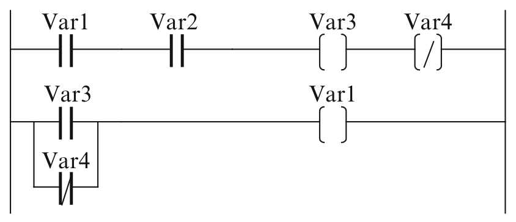

> Image description: This figure illustrates an example of a PLC program written in Ladder Diagram (LD) logic. The diagram consists of two horizontal parallel branches (rungs) connected to vertical power rails on the left and right. The first rung contains four contacts in series. These are labeled from left to right as: a normally open contact `Var1`, a normally open contact `Var2`, a normally open contact `Var3`, and a normally closed contact `Var4`. The second rung contains a parallel sub-circuit on the left side and a single contact on the right. The parallel sub-circuit consists of a normally open contact `Var3` in series with a normally closed contact `Var4` (branching beneath it). This sub-circuit then leads into a single normally open contact labeled `Var1` on the right side of the rung. In engineering terms, the diagram represents Boolean logic operations used in industrial automation to control outputs based on input variable states.
Programmable Logic Controllers, Fig. 1 Example of a PLC program written in Ladder Diagram (LD)

for the visual description of the control flow in a program.

The IEC 61131-3 standard also contains a language that is intended for the graphical description of sequential and concurrent behavior: the sequential function chart (SFC). The SFC is based on Grafcet (David 1995) and represents a form of Petri net (with very special dynamics and functionality). Due to its high functionality, SFC can be easily applied for the structuring of a PLC program on a high level. However, it is cumbersome (and by the standard also not intended) to use for the specification of a lowlevel sequential algorithm, as, for example, the alternative switching between two motors.

In addition to the three graphical languages, there are also two textual languages in the standard: the assembler-like Instruction List (IL) and the Pascal-like Structured Text (ST).

The decision for one of the languages is based on functional aspects of the application to be realized (high-level languages SFC and ST vs. low-level languages LD, IL, and FBD) but also on traditions in the application domain (e.g., LD in automotive manufacturing vs. FBD in process industry), the geographical region (e.g., LD in the US vs. IL in Germany), and the preferences of the programmer (graphical vs. textual). To allow for flexible solutions and the optimal choice of languages, IEC 61131-3 allows the use of different languages for different parts of the control application.

An application in IEC 61131-3 is structured into program organization units (POUs). Each of the POUs contains a header in a unified syntax for parameter and variable definitions and a body for


<!-- source_pdf_page: 1121 -->
the actual program code. This body can be written in any one of the defined PLC languages.

There are three types of POUs: Program, Function Block, and Function. A program is the top-level POU of a PLC application. Only in a program, variables can be linked to actual input and output ports. A program can call Function Blocks which in turn may call other function blocks. Programs and function blocks can also call Functions. A POU of type function has no internal memory while a Function Block has memory.

IEC 61131-3 introduced the type and instance concept into PLC programming. A Function Block is always the instantiation of a Function Block Type. Each instantiation gets its own name and variable space. This concept is similar to - but much older than - the classobject instantiation idea of object-oriented programming languages. The exclusive use of symbolic variables without direct references to hardware addresses or ports in Function Blocks allows their easy reuse in one or more applications and the definition of widely applicable Function Block (Type) Libraries.

## Summary and Future Directions

PLCs are a proven technology in industrial automation. They follow a simple but deterministic execution and software model. This is the main reason why PLCs are still here and will be here for quite some time to come even if there is faster and fancier technology like embedded PCs available.

Currently the third edition of IEC 61131-3 is nearly ready for publishing. In addition to minor corrections, this new edition adds some concepts from object-oriented programming to the existing software model. First tools on the market already support these extensions.

For the future, two trends can be seen. First, there is a growing trend to integrate PLC programming into model-based software development processes: either by generating PLC code from existing model-based toolchains or by integrating model-based approaches, especially from
the object-oriented domain, into PLC programming environments. Either way this is due to the fact that the complexity in PLC application is rising while the development time should be decreased.

Second, there is a growing interest in the use of formal methods in the PLC domain. In recent years, a lot of interdisciplinary work was aimed in this direction. This work results in the formalization of different steps in the control design process depending on what problems are to be solved (Frey and Litz 2000):

1. The demand for reduced development time and the possible reuse of existing software modules result in the need for a formal approach to the development of the PLC programs.
2. The demand for high-quality solutions and especially the application of PLC in safetycritical processes result in the need for validation procedures, i.e., formal methods to prove specific static and dynamic properties of the programs.
3. The large numbers of already installed PLC programs, together with the high expense of programming, lead to the search for verification and validation methods that can be applied directly to programs written in PLCspecific programming languages such as ladder diagram.
To conclude, more than 50 years after its invention, the PLC is still an industrial success story, and due to ever-increasing demands on the complexity and correctness of its applications, it also still provides much room for further research and development.

## Cross-References

- Applications of Discrete-Event Systems
- Control Hierarchy of Large Processing Plants: An Overview
- Modeling, Analysis, and Control with Petri Nets
- Supervisory Control of Discrete-Event Systems


<!-- source_pdf_page: 1122 -->
## Bibliography

David R (1995) Grafcet: a powerful tool for specification of logic controllers. IEEE Trans Control Syst Technol 3:253-268
Frey G, Litz L (2000) Formal methods in PLC programming. In: Proceedings of the IEEE conference on systems man and cybernetics SMC 2000, Nashville, Tennessee, pp 2431-2436
John K, Tiegelkamp M (2010) IEC 61131-3: programming industrial automation system: concepts and programming languages, requirements for programming systems, aids to decision-making tools, 2nd edn. Springer, Berlin
Vyatkin V (2011) IEC 61499 as enabler of distributed and intelligent automation: state-of-the-art review. IEEE Trans Ind Inform 7:768-781

## Proportional-Integral-Derivative Control

PID Control

## Pursuit-Evasion Games and Zero-Sum Two-Person Differential Games

Pierre Bernhard
INRIA-Sophia Antipolis Méditerranée, Sophia Antipolis, France


#### Abstract

Differential games arose from the investigation, by Rufus Isaacs in the 1950s, of pursuitevasion problems. In these problems, closed-loop strategies are of the essence, although defining what is exactly meant by this phrase, and what is the "Value" of a differential game, is difficult. For closed-loop strategies, there is no such thing as a "two-sided maximum principle," and one must resort to the analysis of Isaacs' equation, a Hamilton Jacobi equation. The concept of viscosity solutions of HamiltonJacobi equations has helped solve several of these issues.


## Keywords

Closed loop strategies; Isaacs’ condition; Viscosity solutions

## Historical Perspective

The history of differential games (DG in short) starts with Rufus Isaacs, who coined the phrase in his pioneering work of the early 1950s (Isaacs 1951), which was largely ignored until the publication of his book Isaacs (1965). Through the investigation of particular problems, Isaacs invented by himself (with his own names) the concepts of state and control variables, of feedback, his "tenet of transition" - better known as Bellman's optimality principle - the (Hamilton-Jacobi-Caratheodory-)Isaacs equation, barriers, some difficult corner conditions ("equivocal lines"), singular arcs ("universal lines"), etc.

Another very early work was Kelendzerize's chapter "A Pursuit Problem" in the historical book by Pontryagin et al. (1962), but it lacked closed-loop strategies.

John Breakwell and a few followers (Breakwell and Merz 1969; Breakwell 1977) picked up Isaacs' work where he had left it, still working on particular problems, but adding the power of the computer to analyze the solution of Isaacs' equation via the structure and singularities of fields of extremal trajectories, while most of the literature concentrated on making precise the concepts of closed-loop strategies and of the Value of the game. Prominent figures in that quest are Krasovskii and Subbotin (1977), Fleming (1961), Friedman (1971), Blaquière et al. (1969), Elliot and Kalton (1972), Emilio and Roxin (1969), and Varaiya and Lin (1969) who together invented the concept of non-anticipative strategies.

The major later innovation was Crandall and Lions' viscosity solutions of PDEs (Crandal and Lions 1983; Lions 1982) applied to DGs and its Isaacs equation by Evans and Souganidis (1984) and Lions and Souganidis (1985).

We also refer the reader to the entry (Quincampoix 2009) of another Springer Encyclopedia.


<!-- source_pdf_page: 1123 -->
## General Setup

We shall be interested in (continuous time) twoperson zero-sum DGs with complete information, this last phrase meaning that both players know exactly and instantly the state of the system, but (usually) not their opponent's control.

The available space of a short article does not allow us to attempt to give the most general setup of a zero-sum two-person perfectinformation differential game. We shall therefore concentrate on a typical class, with a finite dimensional state space, as follows. The data are:

1. A two-player dynamical system with state $x \in \mathbb{R}^{n}$, control variables $u \in \mathrm{U} \subset \mathbb{R}^{\ell}, v \in \mathrm{~V} \subset \mathbb{R}^{m}$ ( U and V will often be assumed compact), and its dynamics

$$
\dot{x}=f(t, x, u, v), \quad x\left(t_{0}\right)=x_{0} .
$$

Denoting $\mathcal{U}$ and $\mathcal{V}$ the sets of measurable functions from $\mathbb{R}$ to $\mathbf{U}$ and V respectively, one assumes regularity and growth conditions on $f$ to guarantee existence and uniqueness of the solution $x(\cdot)$ for all ( $t_{0}, x_{0}$ ) and all $(u(\cdot), v(\cdot)) \in \mathcal{U} \times \mathcal{V}$.
2. A termination condition, often given by a target set $\mathcal{T} \in \mathbb{R} \times \mathbb{R}^{n}$, open or closed according to necessity, defining a final time as $t_{1}= \inf \{t \mid(t, x(t)) \in \mathcal{T}\}$. If $\mathcal{T}=\{T\} \times \mathbb{R}^{n}$, final time is fixed and equal to $T$. The question of whether there is a finite $t_{1}$ is one of central interest in pursuit-evasion games.
3. Sets of admissible closed-loop strategies $\Phi$ and $\Psi$. One should choose them in such a way that replacing ( $u, v$ ) by a pair ( $\phi, \psi$ ) $\in \Phi \times \Psi$ in the dynamics always produces a (unique) admissible pair of control functions $(u(\cdot), v(\cdot))=\Gamma\left(t_{0}, x_{0} ; \phi, \psi\right) \in \mathcal{U} \times \mathcal{V}$.
4. A performance measure, or payoff, typically

$$
J\left(t_{0}, x_{0} ; u(\cdot), v(\cdot)\right)= \begin{cases}K\left(t_{1}, x\left(t_{1}\right)\right)+\int_{t_{0}}^{t_{1}} L(t, x(t), u(t), v(t)) \mathrm{d} t & \text { if } t_{1}<\infty \\ \infty & \text { if } t_{1}=\infty\end{cases}
$$

We let
$G\left(t_{0}, x_{0} ; \phi, \psi\right):=J\left(t_{0}, x_{0} ; \Gamma\left(t_{0}, x_{0} ; \phi, \psi\right)\right)$.
5. A concept of "solution," where the first player wants to minimize the performance index while the second one wishes to maximize it. (In our choice of definition of $J$, we have assumed that player one wants over anything else to make the game terminate. If we define $J$ as the integral even for infinite end-time, Isaacs' tenet of transition may not hold.)

If

$$
\begin{aligned}
& \inf _{\phi \in \Phi} \sup _{\psi \in \Psi} G\left(t_{0}, x_{0} ; \phi, \psi\right) \\
& =\sup _{\psi \in \Psi} \inf _{\phi \in \Phi} G\left(t_{0}, x_{0} ; \phi, \psi\right)=V\left(t_{0}, x_{0}\right)
\end{aligned}
$$

then $V$ is called the Value function of the game. Several concepts of upper Value and
lower Value may be defined (including the first and second terms above) that have to coincide for a Value to exist.
Isaacs' Condition In the framework of this short entry, we shall always assume that the game satisfies Isaacs' condition. It bears on the Hamiltonian $H(t, x, p, u, v):=L(t, x, u, v)+ \langle p, f(t, x, u, v)\rangle$ and reads

$$
\begin{align*}
& \forall(t, x, p) \in \mathbb{R} \times \mathbb{R}^{n} \times \mathbb{R}^{n}, \\
& \inf _{u \in \mathrm{U}} \sup _{v \in \mathrm{~V}} H(t, x, p, u, v) \\
& =\sup _{v \in \mathrm{~V}} \inf _{u \in \mathrm{U}} H(t, x, p, u, v) . \tag{1}
\end{align*}
$$

## Strategies and Value

In pursuit-evasion games, the concept of closedloop strategies is of the essence, and it is extremely important for all DGs. Yet, allowing state


<!-- source_pdf_page: 1124 -->
feedback strategies such as $u(t)=\phi(t, x(t))$, $v(t)=\psi(t, x(t))$, poses a difficult problem: what classes $\Phi$ and $\Psi$ of functions $\phi$ and $\psi$ to allow? The notations $\inf _{\phi}$ or $\sup _{\psi}$ have no meaning if one does not answer that question. Experience tells us that discontinuous feedbacks are necessary to find the solution of many examples, but then existence, or uniqueness, of the solution of the dynamical equation cannot be guaranteed.

Isaacs' K-strategies were a partial attempt to address this issue. More developed concepts were proposed, from limit of piecewise constant, or piecewise open-loop, controls (Fleming 1961; Friedman 1971) to extensions of the notion of solution of a differential equation (Krasovskii and Subbotin 1977), also proving the existence of a Value. The equivalence of all these Values was an issue until the advent of viscosity solutions of Isaacs' equation.

A tool used to accommodate state-feedback strategies (Bernhard 1977) is

Lemma 1 (Berkovitz) If $\mathcal{V} \subset \Psi$, then, $\forall \phi$ for which this expression is well defined,

$$
\sup _{\psi \in \Psi} G\left(t_{0}, x_{0} ; \phi, \psi\right)=\sup _{v(\cdot) \in \mathcal{V}} G\left(x_{0}, t_{0}, \phi, v(\cdot)\right)
$$

As a consequence, a saddle-point ( $\phi^{\star}, \psi^{\star}$ ) solution is defined by

$$
\begin{align*}
& \forall u(\cdot) \in \mathcal{U}, \forall v(\cdot) \in \mathcal{V} \\
& G\left(t_{0}, x_{0} ; \phi^{\star}, v(\cdot)\right) \leq V\left(t_{0}, x_{0}\right) \\
& \leq G\left(t_{0}, x_{0} ; u(\cdot), \psi^{\star}\right) \tag{2}
\end{align*}
$$

confronting the closed-loop saddle point strategies to open-loop controls only. (This proves useful in the analysis of Nash equilibria of nonzero-sum DGs.)

Another consequence of Berkovitz' lemma is that if a DG has a saddle point in open-loop controls, it is a saddle point over closed-loop controls as well. (But the existence condition may be less stringent for the later.) The relationship between different forms of the strategies has been
further clarified by Başar (1977) and Başar and Olsder (1982).

As far as the existence of the Value is concerned, the problem for a large class of DGs is solved with non-anticipative strategies defined as $\Phi: \mathcal{V} \rightarrow \mathcal{U}$ such that

$$
\begin{aligned}
\forall t,\left[\forall s<t \quad v_{1}(s)\right. & \left.=v_{2}(s)\right] \Rightarrow\left[\phi\left(v_{1}(\cdot)\right)(t)\right. \\
& \left.=\phi\left(v_{2}(\cdot)\right)(t)\right]
\end{aligned}
$$

and likewise for $\Psi$ (notice that for this concept of strategies, (2) is the natural formulation of a saddle point) and with the notion of viscosity solution of Isaacs' equation. See Theorem 1 below.

## Games of Pursuit Evasion

An important class of DGs is the game of pursuit evasion. Typically, in these games the state $x$ is composed of a sub-vector $y$ of Pursuer state(s) and a sub-vector $z$ of Evader state(s). The dynamical function $f$ is separated likewise, the dynamics of the Pursuer depending on the Pursuer's control(s) and that of the Evader on the Evader's control(s). Typically, the payoff is time until capture defined as $(t, x(t)) \in \mathcal{T}$ (the target is often called capture set). This form of DG automatically satisfies Isaacs' condition (1).

## Qualitative Game

In pursuit-evasion games, the main issue is to distinguish initial states, called capturable, for which a Pursuer's strategy causing finite-time capture against any defense exists, from those, called safe, for which the Evader has a strategy guaranteeing escape against any defense. This is the topic of the qualitative game or game of kind (Isaacs). A theorem of the alternative is one which states that for a particular (class of) game(s), every initial state is either capturable or safe. Such theorems have been proved for classes of pursuit-evasion games covering essentially all cases of interest, under Isaacs condition (1) with $L=0$ (Cardaliaguet 1996; Cardaliaguet et al. 2001; Krasovskii and Subbotin 1977).


<!-- source_pdf_page: 1125 -->
Capturable states are separated from safe states by a barrier, a piecewise smooth manifold which has to be semipermeable. This means that for all $(t, x)$ on the barrier where this barrier is a smooth manifold with normal $v(t, x)$, it should hold that

$$
\begin{aligned}
& \min _{u \in \mathrm{U}} \max _{v \in \mathrm{~V}}\langle v(t, x), f(t, x, u, v)\rangle \\
& \quad=\max _{v \in \mathrm{~V}} \min _{u \in \mathrm{U}}\langle v(t, x), f(t, x, u, v)\rangle=0
\end{aligned}
$$

A minimax pair $(u, v)=(\hat{\varphi}(t, x, v), \hat{\psi}(t, x, v))$ is called a pair of semipermeable strategies. If the boundary of the capture set is a smooth manifold with local outward normal $n(t, x)$, its usable part is the region where $\inf _{u \in \mathrm{U}} \sup _{v \in \mathrm{~V}}\langle n(t, x), f(t, x, u, v)\rangle<0$. The natural barrier is a semipermeable manifold constructed backward from its boundary (the BUP), with $n$ as final $v$ and using the characteristic equations:

$$
\dot{x}=f(x, \hat{\phi}, \hat{\psi}), \quad \dot{v}^{t}=-v^{t} \frac{\partial f(t, x, \hat{\varphi}, \hat{\psi})}{\partial x}
$$

(These trajectories are abnormal trajectories of the calculus of variations). In most examples, only part of the manifold thus constructed is a barrier, and the complete barrier is made of manifolds pieced together according to a junction condition insuring that the corners "do not leak" (Breakwell), analogous to the corner conditions of the next section.

## Quantitative Game

The quantitative game, or game of degree (Isaacs), is played inside the capture zone, typically with time of capture as the payoff. It is ruled by Isaacs' equation in a fashion similar to that of games of finite duration (see below). Yet, the interplay between the qualitative and the quantitative game may be quite subtle and plays a prominent role in determining the actual capture zone. The Value function is usually discontinuous across other barriers inside the capture zone.

## Other Approaches

Other approaches have been developed to solve games of pursuit evasion.

An early approach by Pontryagin (1967), extended by Pshenichnyi (1968), used geometric methods for linear pursuit-evasion games with convex compact control sets. Krasovskii's stable bridges (Krasovskii and Subbotin 1977) are a concept close to Isaacs' semipermeability. Patsko and Turova (2001) have developed, for some families of DGs, an efficient numerical procedure to compute recursively hypersurfaces of constant time-to-capture, whose discontinuities display the barriers. Cardaliaguet et al. (1999) have developed a theoretical and numerical procedure building on Aubin's viability theory, which requires less regularity on the data than other approaches.

Provided that care be applied, a quantitative game may be transformed into a family of qualitative games - an approach used by Krasovskii, Blaquière et al., and Cardaliaguet et al. - and conversely, a fruitful approach is to investigate capturability of initial states as a function of a parameter defining the "size" of the capture set, imbedding the qualitative game into a quantitative game of the type game of approach.

## Games of Finite Duration

Wherever termination of the game is not an issue, the major tool in investigating a DG is Isaacs' equation, a partial differential equation bearing on the Value function:

$$
\begin{aligned}
& \forall(t, x) \notin \mathcal{T}, \quad \frac{\partial V}{\partial t}(t, x) \\
& \quad+\min _{u \in \mathrm{U}} \max _{v \in \mathrm{~V}} H\left(t, x, \nabla_{x} V, u, v\right)=0,
\end{aligned}
$$

$$
\begin{equation*}
\forall(t, x) \in \mathcal{T}, \quad V(t, x)=K(t, x) . \tag{3}
\end{equation*}
$$

For any DG where all trajectories are transverse to the boundary $\partial \mathcal{T}$, and with adequate regularity conditions on the data (and still under condition (1)), it holds that

Theorem 1 The $D G$ has a Value in nonanticipative strategies, which is the only bounded,


<!-- source_pdf_page: 1126 -->
uniformly continuous viscosity solution of the equation obtained by changing signs in (3) as $-\partial V / \partial t-\min _{u \in \mathrm{U}} \max _{v \in \mathrm{~V}} H=0$. And all other Values coincide.

One possible way to solve Isaacs' equation is via the investigation of its field of characteristics. Their equations are Isaacs' retrograde path equations: let $(\hat{u}, \hat{v})=(\hat{\varphi}(t, x, p), \hat{\psi}(t, x, p))$ be the saddle point of $H(t, x, p, u, v)$, assumed here to be unique, one integrates from the target set backward:

$$
\begin{align*}
\dot{x} & =f(t, x, \hat{u}, \hat{v})  \tag{4}\\
\dot{p} & =-\left(\frac{\partial H(t, x, p, \hat{u}, \hat{v})}{\partial x}\right)^{t} \tag{5}
\end{align*}
$$

The above equations are similar to Pontryagin's maximum principle equations. However, a major difference lies in the corner conditions. While Pontryagin's theorem extends to control theory the Erdman-Weierstrass condition stating that the adjoint vector (here $p$ ) is continuous along an extremal trajectory, in (4) and (5), $p$ is to coincide with $\nabla_{x} V$ and may be discontinuous along an extremal trajectory. These discontinuities cannot be found by a local analysis along an isolated trajectory and require that a complete field of extremals be constructed, synthesizing a state feedback strategy.

The analysis of the conditions that hold at such corners, equivocal manifolds (Isaacs), envelope manifolds (Breakwell), and focal manifolds (Merz), has been a large part of the early IsaacsBreakwell theory. It has been for its larger part synthesized by Bernhard (1977), except a general constructive analysis of focal manifolds which had to wait until Melikyan and Bernhard (2005).

The absence of a "two-sided Pontryagin principle" for closed-loop differential games forces one to resort to the solution of Isaacs' equation or an equivalent. This is the reason why no practical method of solution exists beyond a state dimension of 3 or 4 , counting time if the game is not time invariant. An exception is the linear quadratic game. (See article ▷ Linear Quadratic Zero-sum Two-person Differential Games in this encyclopaedia).

## Conclusion

Except for very particular games, "solving" a DG remains a difficult task. Numerical methods suffer the famous "curse of dimensionality." Moreover, many of them strive to compute the Value function. But the optimal strategies typically depend on the gradient of the Value function, requiring a stronger convergence of the approximation algorithms than pointwise, or $C^{0}$ or $L^{2}$, if they are to be computed as well. Further advances in numerical algorithms tackling this problem would be useful, as well as uncovering new classes of DGs for which further analytical results could be obtained.

## Cross-References

- Dynamic Noncooperative Games
- Game Theory: Historical Overview
- Linear Quadratic Zero-Sum Two-Person Differential Games


## Bibliography

Başar T (1977) Informationally nonunique equilibrium solutions in differential games. SIAM J Control Optim 15:636-660
Başar T, Olsder GJ (1982) Dynamic noncooperative game theory. Academic, London/New York
Bernhard P (1977) Singular surfaces in differential games, an introduction. In: Haggedorn P, Olsder GJ, Knobloch H (eds) Differential games and applications. Lecture notes in information and control sciences, vol 3. Springer, Berlin, pp 1-33
Blaquière A, Gérard F, Leitmann G (1969) Quantitative and qualitative games. Academic, New York
Breakwell JV, Merz AV (1969) Toward a complete solution of the homicidal chauffeur game. In: Ho Y-C, Leitmann G (eds) Proceedings of the first international conference on the theory and applications of differential games, Amherst
Breakwell JV (1977) Lecture notes. In: Hagedorn P, Knobloch HW, Olsder G-J (eds) Theory and applications of differential games. Springer lecture notes in control and information sciences, vol 3. Springer, Berlin, pp 70-95
Cardaliaguet P (1996) A differential game with two players and one target. SIAM J Control Optim 34:1441-1460


<!-- source_pdf_page: 1127 -->
Cardaliaguet P , Quincampoix M , Saint-Pierre P (1999) Set-valued numerical methods for optimal control and differential games. In: Nowak A (ed) Stochastic and differential games. Theory and numerical methods. Annals of the international society of dynamic games. Birkhaüser, Boston, pp 177-247
Cardaliaguet P, Quincampoix M, Saint-Pierre P (2001) Pursuit differential games with state constraints. SIAM J Control Optim 39:1615-1632
Crandal MG, Lions P-L (1983) Viscosity solutions of Hamilton Jacobi equations. Trans Am Math Soc 277:1-42
Elliot RJ, Kalton NJ (1972) The existence of value in differential games of pursuit and evasion. J Differ Equ 12:504-523
Evans LC, Souganidis PE (1984) Differential games and representation formulas for solutions of Hamilton-Jacobi-Isaacs equations. Indiana Univ Math J 33:773-797
Fleming WK (1961) The convergence problem for differential games. Math Anal Appl 3:102-116
Friedman A (1971) Differential games. Wiley, New York
Isaacs R (1965) Differential games, a mathematical theory with applications to optimization, control and warfare. Wiley, New York
Isaacs RP (1951) Games of pursuit. Technical report P-257, The Rand corporation

Krasovskii N, Subbotin A (1977) Jeux différentiels. MIR, Moscow
Lions P-L (1982) Generalized solutions of HamiltonJacobi equations. Pitman, Boston
Lions P-L, Souganidis PE (1985) Differential games, optimal control, and directional derivatives of viscosity solutions of Bellman's and Isaacs' equations. SIAM J Control Optim 23:566-583
Melikyan A, Bernhard P (2005) Geometry of optimal trajectories around a focal singular surface in differential games. Appl Math Optim 52:23-37
Patsko VS, Turova VL (2001) Level sets of the value function in differential games with the homicidal chauffeur dynamics. Int Game Theory Rev 3:67-112
Pontryagin LS (1967) Linear differential games I and II. Soviet Math Doklady 8:769-771, 910-912
Pontryagin LS, Boltyanskii VG, Gamkrelidze RV, Mishenko EF (1962) The mathematical theory of optimal processes. Wiley, New York
Pshenichnyi BN (1968) Linear differential games. Autom Remote Control 29:55-67
Quincampoix M (2009) Differential games. In: Meyers N (ed) Encyclopaedia of complexity and system science. Springer, New York, pp 1948-1956
Roxin EO (1969) The axiomatic approach in differential games. J Optim Theory Appl 3(3): 153-163
Varaiya P, Lin Y (1969) Existence of saddlepoint in differential games. SIAM J Control 7: 141-157
