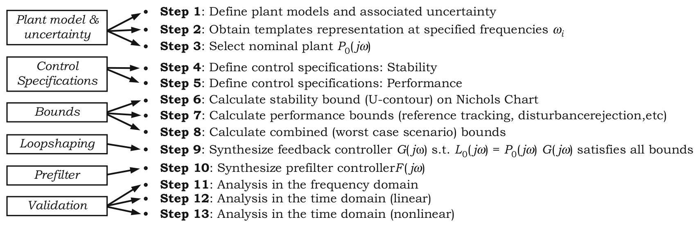
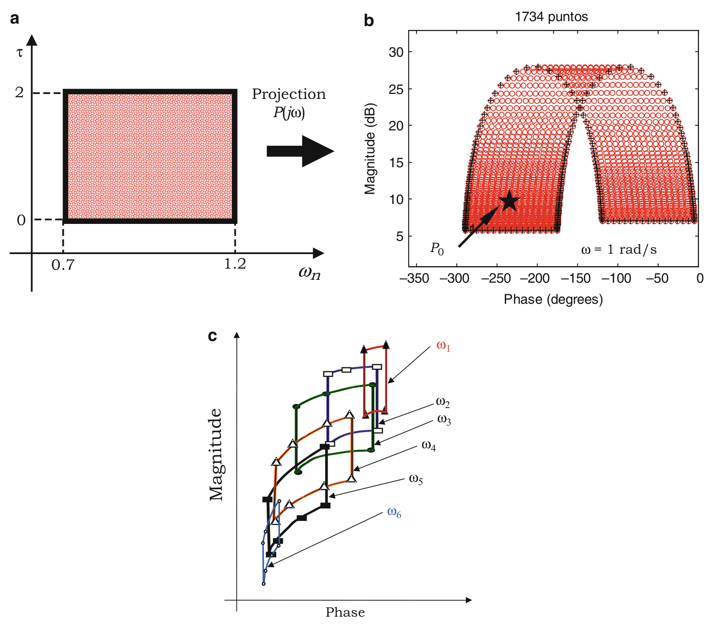
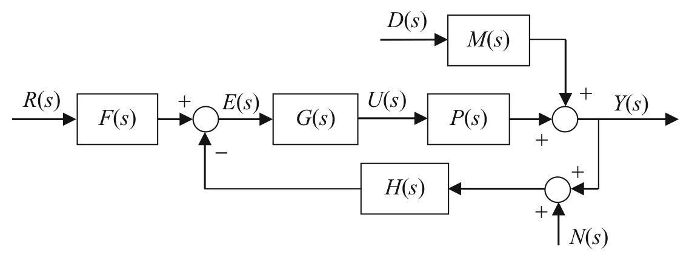
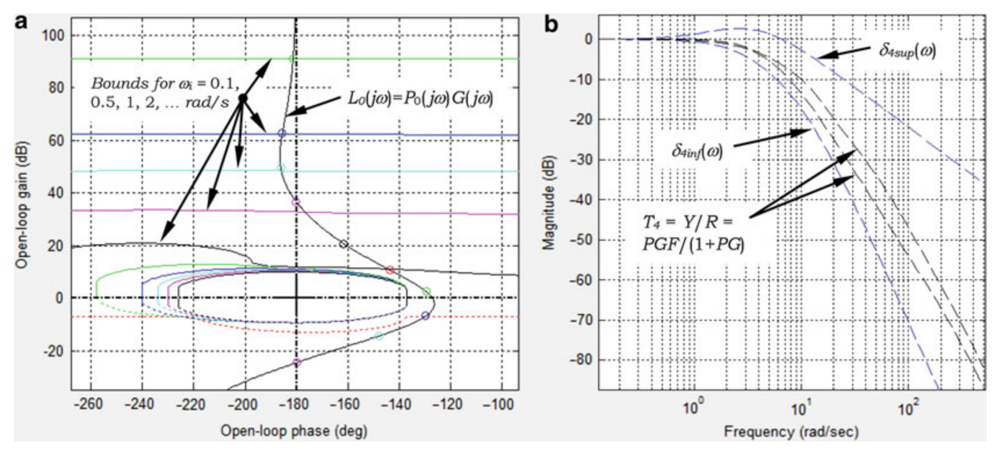

<!-- source_pdf_page: 1128 -->
## Q

## QFT

Quantitative Feedback Theory

## Quantitative Feedback Theory

Mario Garcia-Sanz
Case Western Reserve University, Cleveland, OH, USA

## Synonyms

QFT

#### Abstract

Designing reliable and high-performance control systems is an essential priority of every control engineering project. In many practical circumstances the presence of model uncertainty challenges the design. One robust control approach for these cases, deeply rooted in the classical frequency domain, is quantitative feedback theory (QFT). Providing a control solution that guarantees the achievement of a multi-objective set of performance specifications for every plant within the model uncertainty (quantification), QFT balances the trade-off between the simplicity of the compensator

structure and the minimization of the activity of the controller at each frequency ("cost of feedback"). Previous results indicate that the QFT methodology has been able to provide successful control solutions to a large variety of real applications, including linear and non-linear plants, stable and unstable systems, multi-input multi-output processes, minimum and non-minimum phase plants, containing timedelay, lumped or distributed parameters, etc.

## Keywords

Frequency domain control; Quantitative controller design; Robust control

## Definition

Quantitative Feedback Theory (QFT) is a robust control engineering design methodology that uses the feedback to simultaneously and quantitatively: (1) reduce the effects of plant uncertainty and (2) satisfy performance control specifications. The method searches for a controller that guarantees the satisfaction of the required performance specifications for every plant within the model uncertainty (robust control).

QFT is rooted in the classical frequency domain. It involves Bode diagrams and Nichols charts (magnitude/phase diagrams). It relies on the observation that feedback is needed when

<!-- source_pdf_page: 1129 -->
the plant presents model uncertainty and/or there are uncertain disturbances. QFT balances quantitatively: (a) the simplicity of the controller structure, (b) the minimization of the so-called cost of feedback, controller magnitude at each frequency, (c) the plant model uncertainty and (d) the achievement of the desired performance specifications, all at each frequency of interest. The technique has been successfully applied to a wide variety of real-world control problems.

## Historical Notes

Many of the frequency domain fundamentals were established by Hendrik Bode in his seminal book Network Analysis and Feedback Amplifier Design, published in 1945 (Van Nostrand). The book strongly influenced the understanding of automatic control theory for many years, especially where system sensitivity and feedback constraints are concerned.

Almost 20 years later, in 1963, a new influential book entitled Synthesis of Feedback Systems (Academic Press), written by Isaac Horowitz, proposed for the first time a formal combination of the frequency domain methodology with plant model uncertainty (robust control) under a quantitative analysis. The new book addressed an extensive set of sensitivity problems in feedback control and was the first work in which a control problem was treated quantitatively in a systematic way. The book laid the foundation
for a new control design methodology that had been introduced briefly in a previous paper by Horowitz in 1959: the one that became known as Quantitative feedback theory (or QFT) in the early 1970s.

## Fundamentals

A detailed study of the $Q F T$ fundamentals and applications can be found in the books written by Garcia-Sanz and Houpis (2012), Houpis et al. (2006), Sidi (2002), Yaniv (1999), and Horowitz (1993); see the "Recommended Reading" section.

The QFT methodology provides a multicriteria engineering understanding of the controller design process, as it quantifies the balance among the controller structure, cost of feedback, performance specifications, and model plant uncertainty at each frequency of interest. The basic steps of the QFT methodology are summarized in Fig. 1 and are presented in the following sub-sections.

## Define Plant Model and Uncertainty: Templates Generation (Steps 1, 2 \& 3)

First of all, the dynamics of the plant to be controlled are described in the frequency domain. Taking the plant model in terms of transfer functions with mixed parametric, nonparametric and even model structure uncertainty, the frequency domain description is carried out

> Image description: Figure 1, "Summary of QFT controller design methodology," is a flow diagram consisting of six rectangular blocks on the left, each connected via arrows to a sequence of numbered procedural steps. The first block, "Plant model & uncertainty," leads to Step 1 (define plant models and uncertainty), Step 2 (obtain templates representation at specified frequencies $\omega_i$), and Step 3 (select nominal plant $P_0(j\omega)$). "Control Specifications" maps to Step 4 (Stability) and Step 5 (Performance). "Bounds" relates to Step 6 (calculate stability bound/U-contour on Nichols Chart), Step 7 (calculate performance bounds), and Step 8 (calculate combined worst case scenario bounds). "Loopshaping" leads to Step 9 (synthesize feedback controller $G(j\omega)$ such that $L_0(j\omega) = P_0(j\omega)G(j\omega)$ satisfies all bounds). "Prefilter" maps to Step 10 (synthesize prefilter controller $F(j\omega)$). Finally, "Validation" covers Step 11 (frequency domain analysis), Step 12 (linear time domain analysis), and Step 13 (nonlinear time domain analysis).
Quantitative Feedback Theory, Fig. 1 Summary of QFT controller design methodology

<!-- source_pdf_page: 1130 -->

> Image description: This three-part figure illustrates the mapping from a 2-dimensional parameter space to a Nichols chart within the context of Quantitative Feedback Theory. **Panel a** shows a rectangular 2D parameter space defined by variables $\tau$ on the vertical axis (ranging from 0 to 2) and $\omega_{II}$ on the horizontal axis (ranging from 0.7 to 1.2). An arrow labeled "Projection $P(j\omega)$" points from this rectangle to panel b. **Panel b** displays a Nichols chart plotting Magnitude (dB) against Phase (degrees). A red "template" composed of 1734 points is plotted for $\omega = 1 \text{ rad/s}$. A black star marked $P_0$ is indicated by an arrow within the template. **Panel c** depicts several overlapping templates at different frequencies, labeled $\omega_1$ through $\omega_6$. These templates show how the magnitude-phase relationship evolves across the frequency range $\omega \in [\omega_{\text{min}}, \omega_{\text{max}}]$.
Quantitative Feedback Theory, Fig. 2 From the parameter space to the Nichols chart: (a) 2-dimensional parameter space, (b) Template of the plant $P(j \omega)$ at $\omega=1 \mathrm{rad} / \mathrm{s}$, (c) Typical templates for frequencies $\omega \in\left[\omega_{\text {min }}, \omega_{\text {max }}\right]$

by calculating "templates", which are sets of complex numbers at each frequency of interest $\omega \in\left[\omega_{\text {min }}, \omega_{\text {max }}\right] \mathrm{rad} /$ second : a projection of the $n$-dimensional parameter space through the transfer function/functions onto the Nichols chart.

As an example, and for " $\omega=1 \mathrm{rad} / \mathrm{s}$, Fig. 2b represents the QFT template of the 3-parameter plant $P(j \omega)=\exp (-j \omega \tau) / \left((j \omega)^{2}+2 \zeta \omega_{n}(j \omega)+\omega_{n}^{2}\right)$, with $\omega_{n} \quad \in [0.7,1.2], \quad \tau \quad \in[0,2]$, and $\zeta =0.02$.

Each template $\Im P\left(j \omega_{i}\right)=\left\{P\left(j \omega_{i}\right)\right\}$ represents on the Nichols chart and at a specific frequency $\omega_{i}$ all the possible plants within the model uncertainty (see Fig. 2c). One particular case, defined as a set of specific parameters of the $n$-dimensional parameter space is arbitrarily selected to define the nominal plant $P_{0}(j \omega)$, a member of the family of plants within the uncertainty (see Fig. 2b).

## Define Control Specifications (Steps 4 \& 5)

The standard two-degree-of-freedom (2DOF) control system diagram is shown in Fig. 3.

<!-- source_pdf_page: 1131 -->
Quantitative Feedback
Theory, Fig. 3
Multi-Input-Single-Output
2DOF feedback control system. $s \sim j \omega$

> Image description: This block diagram illustrates a Multi-Input-Single-Output (MISO) 2-Degree-of-Freedom (2DOF) feedback control system in the Laplace domain ($s$). The primary forward path begins with the reference input $R(s)$, which passes through a block $F(s)$. The output of $F(s)$ enters a summing junction with a positive sign, resulting in the error signal $E(s)$. This error signal flows through block $G(s)$ to produce the control signal $U(s)$, which then passes through the plant block $P(s)$. The output $Y(s)$ is the summation of the plant output and a disturbance $D(s)$ processed through block $M(s)$. A feedback loop is formed by summing $Y(s)$ and noise $N(s)$ at a junction, passing the result through block $H(s)$, and feeding it back with a negative sign to the primary summing junction. The diagram maps the relationships between the reference $R(s)$, disturbance $D(s)$, noise $N(s)$, and the final output $Y(s)$.

It includes the set of uncertain plants $P(j \omega)$ to be controlled, the disturbance dynamics $M(j \omega)$, the feedback path dynamics $H(j \omega)$, and the loop controller $G(j \omega)$ and prefilter $F(j \omega)$, both to be design. On the other hand, $R(j \omega)$, $E(j \omega), U(j \omega), Y(j \omega), \mathrm{D}(j \omega)$, and $N(j \omega)$ are vectors representing respectively the reference input, signal error, controller output, plant output, disturbance input, and sensor noise input. From the diagram (Fig. 3), it is easy to derive the following three input/output equations (note the dependency on $j \omega$ is removed):
$Y=\frac{P G}{1+P G H} F R+\frac{M}{1+P G H} D-\frac{P G H}{1+P G H} N ;$
$U=\frac{G}{1+P G H} F R-\frac{G H}{1+P G H}(M D+N)$ and
$E=\frac{1}{1+P G H} F R-\frac{H M}{1+P G H} D-\frac{H}{1+P G H} N$

Without losing generality, and with a straightforward block diagram manipulation, $F(s)$ and $G(s)$ can be modified to have $H(s)=1$. Now, the stability and performance specifications are defined by limiting the magnitude of each transfer function of the three previous equations at each frequency of interest, $\left|T_{k}(j \omega)\right| \leq \delta_{k}(\omega), k=1-$ 4, such that,
Stability and noise reduction: $\left|T_{1}(j \omega)\right|=$

$$
\begin{aligned}
& \left|\frac{Y(j \omega)}{R(j \omega) F(j \omega)}\right|=\left|\frac{Y(j \omega)}{N(j \omega)}\right|=\left|\frac{P(j \omega) G(j \omega)}{1+P(j \omega) G(j \omega)}\right| \\
& \leq \delta_{1}(\omega), \quad \omega \in \Omega_{1}
\end{aligned}
$$

Disturbance rejection: $\left|T_{2}(j \omega)\right|=\left|\frac{Y(j \omega)}{D(j \omega)}\right|=$

$$
\left|\frac{M(j \omega)}{1+P(j \omega) G(j \omega)}\right| \leq \delta_{2}(\omega), \quad \omega \in \Omega_{2},
$$

Control effort reduction: $\left|T_{3}(j \omega)\right| \quad=$

$$
\begin{aligned}
& \left|\frac{U(j \omega)}{M(j \omega) D(j \omega)}\right|=\left|\frac{U(j \omega)}{N(j \omega)}\right|=\left|\frac{U(j \omega)}{R(j \omega) F(j \omega)}\right|= \\
& \left|\frac{G(j \omega)}{1+P(j \omega) G(j \omega)}\right| \leq \delta_{3}(\omega), \quad \omega \in \Omega_{3}
\end{aligned}
$$

Reference tracking: $\delta_{4 \text { inf }}(\omega)<\left|T_{4}(j \omega)\right|=$

$$
\begin{aligned}
& \left|\frac{Y(j \omega)}{R(j \omega)}\right| \\
& \delta_{\left.4 \sup ^{( } \omega\right),}=\left|F(j \omega) \frac{P(j \omega) G(j \omega)}{1+P(j \omega) G(j \omega)}\right| \leq \\
& \omega \in \Omega_{4},
\end{aligned}
$$

$$
\begin{gathered}
\frac{\left|G(j \omega) P_{d}(j \omega)\right|}{\left|G(j \omega) P_{e}(j \omega)\right|} \frac{\left|1+G(j \omega) P_{e}(j \omega)\right|}{\left|1+G(j \omega) P_{d}(j \omega)\right|} \leq \delta_{4}(\omega) \\
=\frac{\delta_{4 \mathrm{sup}}(\omega)}{\delta_{4 \mathrm{inf}}(\omega)}, \quad \omega \in \Omega_{4}
\end{gathered}
$$

## QFT Bounds (Steps 6, 7 \& 8)

For the nominal plant $P_{0}(j \omega)$, the QFT methodology converts the stability and performance specifications $\delta_{k}(\omega)$ and the model plant uncertainty into a set of constrains or bounds for each frequency of interest on the Nichols chart (the Horowitz-Sidi Bounds).

The $\omega_{i}$ plant template, $\Im P\left(j \omega_{i}\right)=\left\{P\left(j \omega_{i}\right)\right\}$, is approximated by a finite set of plants $\left\{P_{r}\left(j \omega_{i}\right)\right.$, $r=1,2 \ldots\}$. Each plant can be expressed in its polar form as $P_{r}\left(j \omega_{i}\right)=p\left(\omega_{i}\right) \exp \left(j \theta\left(\omega_{i}\right)\right)= p \angle \theta$. Likewise the controller polar form is $G\left(j \omega_{i}\right)=g\left(\omega_{i}\right) \exp (j \phi)=g \angle \phi$, with a controller phase $\phi$ that varies from $-2 \pi$ to 0 . Therefore, and for every frequency $\omega_{i}$, the previous control specifications $\left\{\left|T_{k}\left(j \omega_{i}\right)\right| \leq\right. \left.\delta_{k}\left(\omega_{i}\right), k=1, \ldots, 4\right\}$ are translated into a set of quadratic inequalities with the format $I_{\omega_{i}}^{k}\left(p, \theta, \delta_{k}, \phi\right)=a g^{2}+b g+c \geq 0$, such that,

<!-- source_pdf_page: 1132 -->

> Image description: This figure consists of two plots, labeled (a) and (b), illustrating Quantitative Feedback Theory (QFT) design principles. **Plot (a)** is a Nichols chart, plotting Open-loop gain (dB) versus Open-loop phase (deg). It shows several colored curves representing design bounds for various frequencies $\omega_i$. A specific curve is labeled $L_0(j\omega) = P_0(j\omega)G(j\omega)$, representing the design loop shaping. Arrows point from text describing the bounds $\omega_i = 0.1, 0.5, 1, 2, \dots \text{rad/s}$ toward the corresponding colored boundary curves on the chart. **Plot (b)** shows Magnitude (dB) versus Frequency (rad/sec) on a log-linear scale. It compares the complementary sensitivity function $T_4 = Y/R = PGF/(1+PG)$ against two frequency-dependent performance specifications: $\delta_{4\text{sup}}(\omega)$ (upper bound) and $\delta_{4\text{inf}}(\omega)$ (lower bound). The plot illustrates the tracking performance relative to these specified design envelopes across a frequency range.
Quantitative Feedback Theory, Fig. 4 (a) QFT-bounds and $G(j \omega)$ design -loopshaping-. (b) Prefilter $F(j \omega)$ design: reference tracking specifications $\delta_{4 \text { sup }}(\omega)$ and

$\delta_{4 \text { inf }}(\omega)$, and upper and lower limits of $T_{4}$ due to the plant uncertainty: $\delta_{4 \text { inf }}(\omega) \leq \quad\left|T_{4}\right| \leq \delta_{4 \text { sup }}(\omega)$

## Controller $\boldsymbol{G}(\mathbf{j} \boldsymbol{\omega})$ Design: Loop-Shaping (Step 9)

Although the objective of designing a controller for an infinite number of plants seems to be a very arduous task (there is an infinite number of plants due to the model uncertainty), the integration of all the information (uncertainty and specifications) in a set of simple curves (the QFT bounds) will allow the designer to use just a single plant, the nominal plant $P_{0}$, and the bounds to design the controller.

Then, in the design stage (loop-shaping), the controller $G(j \omega)$ is synthesized on the Nichols chart by adding poles and zeros until the nominal loop, defined as $L_{0}(j \omega)=P_{0}(j \omega) G(j \omega)$, lies near its bounds (see Fig.4a). The bounds express the plant models with uncertainty and the performance specifications at each frequency. An optimal controller in the sense of QFT will be obtained if $L_{0}(j \omega)$ lies exactly on the bounds at each frequency. Practically speaking, a good design will place $L_{0}(j \omega)$ above the continuousline bounds and below the dashed-line bounds, and will have the minimum possible magnitude at every frequency. A general formulation for the controller structure $G(s)$ is expressed by the following transfer function:

<!-- source_pdf_page: 1133 -->
$$
G(s)=\frac{k_{G} \prod_{i=1}^{n_{r z}}\left(\frac{s}{z_{i}}+1\right) \prod_{i=1}^{n_{c z} / 2}\left(\frac{s^{2}}{\left|z_{i}\right|^{2}}+\frac{2 \operatorname{Re}\left(z_{i}\right)}{\left|z_{i}\right|^{2}} s+1\right)}{s^{r} \prod_{j=1}^{m_{r p}}\left(\frac{s}{p_{j}}+1\right) \prod_{j=1}^{m_{c p} / 2}\left(\frac{s^{2}}{\left|p_{j}\right|^{2}}+\frac{2 \operatorname{Re}\left(p_{j}\right)}{\left|p_{j}\right|^{2}} s+1\right)}
$$

where $k_{G}$ is the controller gain, $z_{i}$ is a zero (real or complex) with $m_{r z}$ and $m_{c z}$ the number of real and complex zeroes respectively, and $p_{j}$ is a pole (real or complex) with $m_{r p}$ and $m_{c p}$ the number of real and complex poles respectively ( $m_{c z}$ and $m_{c p}$ even numbers). The controller may have also some poles at the origin (integrators), with $r=0$, 1 or 2 , etc.

## Prefilter $F(j \omega)$ Design (Step 10)

If the feedback system includes a reference tracking problem, then the best choice is to use a prefilter $F(s)$ - the second degree of freedom. While the feedback controller $G(s)$ reduces the effect of the uncertainty and improves stability, disturbance rejection, and other specifications, the prefilter $F(s)$ is designed to fulfill reference tracking requirements. Figure 4b shows a typical prefilter design in the Bode diagram. $\delta_{4 \text { sup }}(\omega)$ and $\delta_{4 \text { inf }}(\omega)$ are the reference tracking specifications, defined as a band (outer dashed lines, Fig. 4b). The transfer function $T_{4}$ shows an upper and a lower limit (inner dashed lines, Fig. 4b) due to the plant uncertainty. After an appropriate prefilter design, the $T_{4}$ limits will be in the middle of the $\delta_{4 \text { sup }}-\delta_{4 \text { inf }}$ band:

$$
\begin{aligned}
\delta_{4 \mathrm{inf}}(\omega) & \leq\left|T_{4}\right| \leq \delta_{4 \mathrm{sup}}(\omega),\left|T_{4}(j \omega)\right|=\left|\frac{Y(j \omega)}{R(j \omega)}\right| \\
& =\left|\frac{P(j \omega) G(j \omega)}{1+P(j \omega) G(j \omega)} F(j \omega)\right|
\end{aligned}
$$

## Validation (Steps 11, 12, 13)

Once the design of the controller (and prefilter if needed) is finished, it will be convenient to analyze the performance of the complete control system under different scenarios, including: (a) frequency domain analysis of each specification for all the significant plants within the model uncertainty and (b) time domain simulations, typically using a Monte Carlo campaign for the
uncertainty, first with the linear system and then with nonlinear elements (saturation, etc.).

## Programs and Data

Computer-aid-design (CAD) tools have definitely facilitated the use of QFT. The MATLAB code of the interactive object-oriented QFT CAD tool developed by Garcia-Sanz et al. for ESAESTEC (2014) can be found at http://cesc.case. edu/OurQFTCT.htm (free download). Another popular QFT CAD tool in the 1990s, developed by Borghesani, Chait \& Yaniv, can be found at http://www.terasoft.com/products/QFT/index. html.

## Applications and Future Directions

- QFT has been successfully applied to a wide variety of control problems, including stable and unstable plants minimum and non-minimum phase systems, single-input single-output and multiple-input multipleoutput processes, with linear and nonlinear characteristics, longtime delay, distributed parameter systems, and time-varying plants; and has been combined with feed-forward control topologies, multi-loop systems, etc. Also, QFT has been used in many real-world applications: e.g., flight control, wind energy, water treatment plants, spacecraft, power systems, mechanical systems, motion control, chemical reactors, etc. (see Garcia-Sanz and Houpis 2012; Houpis et al. 2006).
- Future research on QFT includes among others new multiple-input multiple-output techniques, nonlinear plants, distributed parameter systems, load-sharing control, etc.

<!-- source_pdf_page: 1134 -->
## Cross-References

- Classical Frequency-Domain Design Methods
- Polynomial/Algebraic Design Methods
- Robust Adaptive Control
- Spectral Factorization

## Bibliography

Garcia-Sanz M, Houpis CH (2012) Wind energy systems: control engineering design. Part I: QFT control. Part II: wind turbines control with QFT. CRC/Taylor \& Francis, Boca Raton, Florida
Garcia-Sanz M, Mauch A, Philippe C (2014) The QFT control toolbox (QFTCT): an interactive objectoriented Matlab CAD tool for QFT robust control systems design. European space agency ESA-ESTEC, Public University of Navarra, Case Western Reserve University, 2008-2014. Free download at http://cesc. case.edu/OurQFTCT.htm
Horowitz IM (1959) Fundamental theory of automatic linear feedback control systems. IRE Trans Autom Control 4:5-19
Horowitz I (1993) Quantitative feedback design theory (QFT). QFT Publications, Denver, Colorado
Houpis CH, Rasmussen SJ, Garcia-Sanz M (2006) Quantitative feedback theory: fundamentals and applications, 2nd edn. CRC/Taylor and Francis, Boca Raton, Florida
Sidi M (2002) Design of robust control systems: from classical to modern practical approaches. Krieger Publishing, Malabar, Florida
Yaniv O (1999) Quantitative feedback design of linear and non-linear control systems. Kluver Academic, Boston, Massachusetts

## Quantized Control and Data Rate Constraints

Girish N. Nair
Department of Electrical \& Electronic Engineering, University of Melbourne, Melbourne, VIC, Australia

#### Abstract

This article briefly describes the topic of quantized control with limited data rates. The focus

Supported by Australian Research Council grant DP110102401

is on the problem of stabilizing a linear timeinvariant plant over a digital channel and the associated data rate theorems. It is shown that the deepest results in this area require a unified treatment of its communications and control aspects.

## Keywords

Control under communication constraints; Quantization; Quantized control

## Introduction

One of the standard assumptions of classical control theory is that the signals sent from sensors to controllers and from controllers to actuators take continuous values with infinite precision. The advent of computer-based and digitally networked control systems challenged this assumption, since the analog plant outputs or control variables in such systems must be reduced to finite bit strings or discrete symbols for storage, manipulation, and transmission. This process of converting a continuous-valued variable into a finite-valued one is called quantization and entails a potentially significant loss of resolution and closed-loop performance. Quantized control is concerned with the analysis and design of control systems which feature such analog-to-digital conversions in the feedback loop.

There is a vast literature on this topic and the aim of this article is to briefly explain some of its key ideas. For reasons of space, the discussion is largely confined to the question of how to stabilize a linear time-invariant plant over a digital channel. It is shown that the deepest results here emerge from treating the communications and control aspects jointly, instead of separately. The reader is referred to the survey (Nair et al. 2007) and the references therein for a discussion of other issues such as optimality and transient performance.

<!-- source_pdf_page: 1135 -->
## Quantization

Quantization has long been an object of study in communications and information theory see Gersho and Gray (1993) and the references therein. In its simplest form, a signal $x(\cdot): \mathbb{R} \rightarrow \mathbb{R}^{n}$ is first sampled at regular time intervals $t=0, \tau, 2 \tau, \ldots$ to yield a discrete-time signal $(x(k \tau))_{k \in \mathbb{Z}}$, with the sampling frequency $1 / \tau$ chosen to be greater than the Nyquist frequency of $x$ (i.e., twice its bandwidth). Each sample $x_{k}:=x(k \tau)$ is then passed through a static, memoryless quantizer $Q$ to yield a quantized discrete-time signal

$$
\begin{equation*}
x_{k}^{q}=Q\left(x_{k}\right) \in\left\{q^{1}, \ldots q^{M}\right\} \subset \mathbb{R}^{n}, \quad k \in \mathbb{Z}_{\geq 0} . \tag{1}
\end{equation*}
$$

which can take $M$ distinct values in $\mathbb{R}^{n}$. If the quantizer is known to both transmitter and receiver, each of these $M$ values can be represented by a binary string with $\left\lceil\log _{2} M\right\rceil$ bits. When the input dimension $n=1$, the quantizer is called scalar; otherwise, it is a vector quantizer. The regions $R^{i}:=Q^{-1}\left(q^{i}\right), 1 \leq i \leq M$, are called the quantizer cells and together form a partition of $\mathbb{R}^{n}$. Thus an $M$-valued quantizer is fully defined by its quantizer cells $R^{i}$ and associated quantizer points $q^{i}, 1 \leq i \leq M$.

The quantization error or quantizer noise is defined as $n_{k}:=x_{k}^{q}-x_{k}$. When the inputs $x_{k}$ are identically distributed random variables, then a standard goal is to design $Q$ so as to minimize the mean-square quantizer noise

$$
\begin{equation*}
D:=\mathrm{E}\left[\left\|Q\left(x_{k}\right)-x_{k}\right\|^{2}\right], \tag{2}
\end{equation*}
$$

where $\mathrm{E}[\cdot]$ is the expectation functional. This yields an optimal quantizer $Q_{*}$ with cells that satisfy the nearest-neighbor property, i.e.,

$$
x \in R_{*}^{i} \Rightarrow\left\|Q_{*}(x)-q_{*}^{i}\right\| \leq\left\|Q_{*}(x)-q_{*}^{j}\right\|, \forall j \neq i .
$$

When $\|\cdot\|$ is the Euclidean norm (possibly weighted), the quantizer cells $R_{*}^{i}, 1 \leq i \leq m$, are convex polygons and form a Voronoi partition of $\mathbb{R}^{n}$, and furthermore $q_{*}^{i}$ is the centroid of $R_{*}^{i}$ with respect to the stationary distribution $F_{X}$ of
$x_{k}$, i.e., $q_{*}^{i}=\mathrm{E}\left[x_{k} \mid x_{k} \in R_{*}^{i}\right]$. As a consequence, the optimal quantizer is statistically unbiased, i.e., $\mathrm{E}\left[n_{k}\right]=0$, and furthermore $x_{k}$ and the quantizer noise $n_{k}$ are uncorrelated at time $k$, i.e., $\mathrm{E}\left[x_{k} n_{k}^{\mathrm{T}}\right]=0$. However, note that $n_{k}$ and $x_{j}$ may be correlated for $j \neq k$, and ( $n_{k}$ ) may itself be a correlated process.

If $Q$ is not optimal but $M$ is large (i.e., the quantizer is high resolution or fine), then $\mathrm{E}\left[x_{k} n_{k}^{\mathrm{T}}\right]=\mathrm{o}(1 / M)$, provided that $q^{i}$ is the centroid of $R^{i}$ with respect to Lebesgue measure $\mu$ and $x_{k}$ has a probability density function (pdf) $f_{X}$ with suitable continuity properties. The reasoning here is that each region $R_{i}$ will typically be very small, so that $f_{X}$ will not vary much on each $R^{i}$, yielding a conditional pdf of $x_{k}$ given $R_{i}$ that is approximately uniform on $R_{i}$.

When $Q$ is a scalar uniform quantizer on an interval $[a, b]$, these considerations yield the asymptotic formula

$$
\begin{equation*}
D \approx(b-a)^{2} /\left(12 M^{2}\right) \tag{3}
\end{equation*}
$$

provided that the overload regions - i.e., the tails of $f_{X}(x)$ on the regions $x<a$ or $x>b-$ make negligible contributions to $D$. Note that this expression does not depend on the distribution of the input. For large $M$, it can be shown that the optimal vector quantizer has a normalized point density proportional to $f_{X}^{1 / 3}$ and yields

$$
\begin{equation*}
D_{\min } \approx \frac{c}{M^{2}}\left(\int f_{X}(x)^{1 / 3} \mathrm{~d} \mu(x)\right)^{3} \tag{4}
\end{equation*}
$$

where the constant $c$ depends only on $n$.

## Quantized Control: Basic Formulation

Much of the theory of quantized control concerns finite-dimensional linear time-invariant (LTI) plants. A formulation is provided in this section to help fix ideas, for the case of a single feedback loop containing a single errorless digital channel.

Consider the discrete-time plant

$$
\begin{equation*}
x_{k+1}=A x_{k}+B u_{k}+v_{k}, \quad y_{k}=F x_{k}+w_{k}, \tag{5}
\end{equation*}
$$

<!-- source_pdf_page: 1136 -->
where at every time $k \in \mathbb{Z}_{\geq 0}, x_{k} \in \mathbb{R}^{n}$ is the state with $x_{0}$ unknown, $u_{k} \in \mathbb{R}^{m}$ is the control input, $y_{k} \in \mathbb{R}^{p}$ is the measured output, $v_{k} \in \mathbb{R}^{n}$ is unknown process noise, $w_{k} \in \mathbb{R}^{p}$ is unknown measurement noise, and $A, B$, and $F$ are constant known matrices of appropriate dimensions. For the problem to be well posed, assume that the matrix pairs ( $A, B$ ) and ( $F, A$ ) are, respectively, reachable and observable. Suppose that the output sensors communicate with the controller over a digital channel that can carry one symbol $s_{k}$ from a finite, possibly time-varying alphabet $\mathbb{S}_{k}$ of cardinality $M_{k} \geq 1$ during the ( $k+1$ )-th sampling interval. Assume for simplicity that the channel is errorless, with negligible propagation delay. The asymptotic average rate at which the channel transports data may then be defined as

$$
\begin{equation*}
R:=\varliminf_{k \rightarrow \infty} \frac{1}{k} \sum_{j=0}^{k-1} \log _{2} M_{j}(\text { bits/sample }) \tag{6}
\end{equation*}
$$

Note that if the channel alphabet $\mathcal{S}_{k}$ is constant or varies periodically with $k$, the inferior limit reduces to a straight limit.

In full generality, each transmitted symbol may depend on all past and present measurements and past symbols,

$$
\begin{equation*}
s_{k}=\gamma_{k}\left(y_{0}^{k}, s_{0}^{k-1}\right) \in \mathcal{S}_{k}, \quad \forall k \in \mathbb{Z}_{\geq 0} \tag{7}
\end{equation*}
$$

where $\gamma_{k}$ is the coder mapping at time $k$. At time $k$ the controller has $s_{0}, \ldots, s_{k}$ available and then applies a control law of the general form

$$
\begin{equation*}
u_{k}=\delta_{k}\left(s_{0}^{k}\right) \in \mathbb{R}^{m}, \quad \forall k \in \mathbb{Z}_{\geq 0} \tag{8}
\end{equation*}
$$

where $\delta_{k}$ is the controller mapping at time $k$.
In practice, additional memory or structural constraints are usually placed on the general coding and control rules (7) and (8). For instance, if a static quantizer of the form (1) is used, then the coding alphabet $\mathcal{S}_{k} \equiv \mathcal{S}$ will be constant and $s_{k} \equiv \gamma\left(y_{k}\right)$ will represent the index of the quantizer cell that contains $y_{k}$. Similarly, a static, memoryless controller is captured by setting $u_{k}=\delta\left(s_{k}\right)$ in (8).

Finite-dimensional coding and control laws may be formulated by defining internal coder and controller states $\psi_{k}^{\gamma}$ and $\psi_{k}^{\delta}$ with local updates of the form

$$
\begin{gather*}
s_{k}=\gamma\left(y_{k}, \psi_{k-1}^{\gamma}\right), \quad \psi_{k}^{\gamma}=\phi\left(s_{k}, \psi_{k-1}^{\gamma}\right)  \tag{9}\\
\psi_{k}^{\delta}=\eta\left(s_{k}, \psi_{k-1}^{\delta}\right), \quad u_{k}=\delta\left(\psi_{k}^{\delta}\right) \tag{10}
\end{gather*}
$$

If the states $\psi_{k}^{\gamma}$ and $\psi_{k}^{\delta}$ are finite valued, then the coding and control laws are called finite-state.

## Additive Noise Model

Early approaches to quantized control modeled quantization errors as additive noise, in order to allow the use of well-developed tools from linear stochastic control (Curry 1970). While this was reasonable at high quantizer resolution, it failed to capture two key properties.

A simple example illustrates this. Consider a scalar, noiseless, fully observed, unstable LTI plant-i.e., (5) with $n=1, A=a$ with $|a|>1$, $B, C=1$, and $w_{k}, v_{k}=0-$ where $x_{0}$ is a random variable. Under static, high-resolution uniform quantization, the data available to the controller is expressed as a noisy linear measurement

$$
y_{k}^{\prime}:=Q\left(x_{k}\right)=x_{k}+n_{k}, \quad k \in \mathbb{Z}_{\geq 0},
$$

where the quantizer error process ( $n_{k}$ ) is treated as zero mean white noise uncorrelated with $\left(x_{k}\right)$ and having constant variance given by (3).

The first shortcoming of this approach is that it precludes the possibility of asymptotic meansquare stability, which would effectively require the controller to estimate the initial state $x_{0}$ with a mean-square error diminishing strictly faster than $a^{-2 k}$. This turns out to be impossible under the uncorrelatedness assumption and the constraint $|a|>1$.

However, in the seminal paper (Delchamps 1990), it was shown that asymptotic stability could in fact be achieved, by using a nonlinear controller that exploited the correlation between successive quantizer errors. To see this, suppose

<!-- source_pdf_page: 1137 -->
that the unknown initial state $x_{0}$ is confined to a known interval $\left[-l_{0}, l_{0}\right]$. At time $k \geq 0$, suppose that $l_{k} \geq 0, k=1,2, \ldots$ represent bounds to be determined on the future states $x_{k}$. Let $Q$ be a static one-bit quantizer - i.e., with $M=2-$ such that $Q(x)=1$ if $x \geq 0$ and $Q(x)=-1$ if $x<0$. At time $k$ let $u_{k}=-0.5 a l_{k} Q(x)$ so that

$$
x_{k+1}=\left\{\begin{array}{ll}
a\left(x_{k}-0.5 l_{k}\right) & \text { if } 0 \leq x_{k} \leq x_{k} \\
a\left(x_{k}+0.5 l_{k}\right) & \text { if }-l_{k} \leq x_{k}<0
\end{array} .\right.
$$

$\Rightarrow\left|x_{k+1}\right| \leq 0.5|a| l_{k}=: l_{k+1}$.
If $|a|<2$ then $l_{k} \rightarrow 0$, and asymptotic stability is achieved uniformly and with exponential convergence.

However, the main drawback of the additive white noise model is that it does not predict the loss of closed-loop stability that can result when the quantizer resolution is too coarse. This is because the number $M$ of quantizer points only serves to determine the variance of the additive noise $n_{k}$ : reducing $M$ increases the variance of $n_{k}$ and the mean-square states, but they remain bounded over time. In contrast, a rigorous analysis reveals that stability is impossible by any means, linear or nonlinear, when $M$ drops below a certain threshold.

Numerous proofs of this loss of stability exist. In a stochastic setting, the argument is based on fixing the coder and controller and expanding out the closed-loop dynamics of the scalar LTI plant to write

$$
\begin{equation*}
x_{k}=a^{k} x_{0}-a^{k} z_{k} \tag{11}
\end{equation*}
$$

where $z_{k}:=-a^{-k} \sum_{j=0}^{k-1} a^{k-j-1} u_{j}$. As $z_{k}$ is a function of $s_{0}^{k-1} \in \mathcal{S}^{k}$, it can take at most $M^{k}$ values. Furthermore, in the absence of noise, it is fully determined by $x_{0}$, for a given coding and control policy (7) and (8). Thus $z_{k}$ can be regarded as the output $Q_{k}^{\prime}\left(x_{0}\right)$ of an $M^{k}$-valued quantizer. Substituting this into (11) yields

$$
x_{k}=a^{k}\left(x_{0}-Q_{k}^{\prime}\left(x_{0}\right)\right)
$$

From the asymptotic quantizer result (4), it then follows that for large $k$,

$$
\mathrm{E}\left[x_{k}^{2}\right] \geq c \frac{a^{2 k}}{M^{2 k}}\left(\int f_{X_{0}}(x)^{1 / 3} \mathrm{~d} \mu(x)\right)^{3}
$$

Thus a necessary condition for asymptotic meansquare stabilizability is that $M>|a|-$ see Nair and Evans (2000) for details.

## The Data Rate Theorem

The discussions above emphasized the need for a more rigorous approach to quantized control. In the literature, the necessary condition $M>|a|$ was first derived in a nonrandom setting, where it was shown to be both sufficient and necessary to be able to ensure uniform stability (Baillieul 1999; Wong and Brockett 1999).

The sufficiency argument is constructive. Let $Q$ be an $M$-level uniform quantizer on $[-1,1]$, with cells formed by partitioning $[-1,1]$ into $M$ subintervals $R^{1}, \ldots, R^{M}$ of equal length and setting $Q(z)$ to be the midpoint of $R^{i}$ when $z \in R^{i}$. Suppose that at time $k$ the unknown state $x_{k}$ lies in a known interval $[-l, l]$, and set $u_{k}=-a l Q\left(x_{k} / l\right)$. Thus

$$
\begin{aligned}
\left|x_{k+1}\right| & =|a|\left|x_{k}-l Q\left(x_{k} / l\right)\right| \\
& =|a| l\left|\frac{x}{l}-Q\left(\frac{x}{l}\right)\right| \leq|a| \frac{l}{M}
\end{aligned}
$$

When $M>|a|$, the right-hand side $<l$. Thus $x_{k+1} \in[-l, l]$ as well, and boundedness is achieved. Uniform asymptotic stability can be achieved by replacing the constant parameter $l$ in the argument above with a time-varying bound $l_{k}$, updated as $l_{k+1}=|a| l_{k} / M \rightarrow 0$.

The necessity argument is based on volume partitioning. The basic idea is to fix an arbitrary coding and control policy and let $m_{k}$ be the Lebesgue measure of the set of values that $x_{k}$ can take at time $k \in \mathbb{Z}_{\geq 0}$. After $k$ time steps, the plant dynamics expand this uncertainty volume $m_{0}$ by a factor $|a|^{k}$. However, the coder effectively divides this region into $M^{k}$ disjoint, exhaustive pieces, each of which is shifted by the controller. As Lebesgue measure is translation invariant, it then

<!-- source_pdf_page: 1138 -->
follows that $m_{k} \geq|a|^{k} m_{0} / M^{k}$. Consequently $M$ must exceed $|a|$ if the closed loop is uniformly asymptotically stable.

The tight criterion $M>|a|$, or equivalently $R>\log _{2}|a|$, was the first instance of the data rate theorem. Volume-partitioning arguments and Jordan canonical forms can be used to generalize it to LTI plants with vector-valued states, yielding the necessary and sufficient condition

$$
\begin{equation*}
R>\sum_{i:\left|\lambda_{i}\right| \geq 1} \log _{2}\left|\lambda_{i}\right|=: H, \tag{12}
\end{equation*}
$$

where $\lambda_{1}, \ldots, \lambda_{n}$ are the eigenvalues of $A$. This criterion is remarkably universal, having been shown to be tight for a variety of settings and objectives: e.g., for asymptotic $r$-th moment stabilizability with random, unbounded $x_{0}$ and no process or measurement noise (Nair and Evans 2003); uniform stabilizability with bounded $x_{0}$ and no process or measurement noise (Baillieul 2002); uniform stabilizability with bounded initial state, process, and measurement noise (Hespanha et al. 2002; Tatikonda and Mitter 2004); and mean-square stabilizability with random, unbounded initial state, process, and measurement noise (Nair and Evans 2004).

The deep nature of (12) becomes even clearer when it is noted that the right-hand side of (12) coincides with the intrinsic entropy generation rate $H$ of the (open-loop) plant, in both the Kolmogorov-Sinai and topological senses; that is, it describes the growth rate of the number of distinguishable state trajectories. Thus the data rate theorem states that stability is possible iff the communication rate in the feedback loop exceeds the rate at which the plant generates uncertainty. This interpretation leads to the notion of feedback entropy (see cross-reference to article by C. Kawan).

## Zooming Quantized Control

When the plant noise and initial state of the plant (5) are bounded, stability (in a uniform sense) can be guaranteed by applying a linear observer to track the plant states with bounded error and then
applying a suitable static, memoryless coding and control policy on the observer states $x_{k}^{o}$.

However, if the noise or initial state has unbounded support - e.g., when they are Gaussian or when prior bounds on them are not known - then stability cannot be achieved by any such static memoryless scheme or indeed by any scheme where the control inputs (8) are bounded (Nair and Evans 2004). The explanation is simple: due to the infinite support, there is a nonzero probability that the propagated state $A x_{t}$ will be beyond reach of the control input at some time $t$. The unstable plant dynamics then amplify this shortfall, causing the same phenomenon to occur with increasing probability at subsequent times and inevitably leading to instability.

One solution is to use a zooming quantizer, i.e., having a dynamic range $l_{k}>0$ that is not bounded a priori but expands or contracts according to the most recent symbol (Brockett and Liberzon 2000). In the noiseless case, if this symbol corresponds to the "overload region" of the quantizer (as indicated by a special symbol), then the range is updated as $l_{k+1}:=\phi_{\text {out }} l_{k}$, where $\phi_{\text {out }}>1$ is the "zoom-out" factor. Otherwise $l_{k+1}:=\phi_{i n} l_{k}$, where $\phi_{i n}<1$ is the "zoomin" coefficient.

In the communications literature such schemes are called adaptive quantizers (Goodman and Gersho 1974). If $\phi_{\text {out }}$ is sufficiently large compared to the unstable open-loop eigenvalues, and if $\phi_{i n}$ is not too small, then global asymptotic stability ensues. With unbounded noise in the plant, variants of this scheme guarantee meansquare stability at any data rate satisfying (12) (Nair and Evans 2004) or input-to-state stability (Liberzon and Nesic 2007).

Zooming quantization is an important example of a finite-dimensional coder-controller (9) and (10), with $l_{k}$ playing the role of an internal state variable. As the range update is driven by the symbols, both coder and controller can each generate identical copies of $l_{k}$, provided that there are no errors in the channel and they both start from the same initial range $l_{0}$. The important issue of how to design a scheme that can cope with mismatched initial internal states or a small level of channel errors is as yet largely unexplored.

<!-- source_pdf_page: 1139 -->
## Erroneous Digital Channels

The information-theoretic aspects of quantized control become especially pronounced when the channel is not error-free. In this case, the data rate theorem (12) can be extended, but in ways that are highly dependent on the precise setting and stability objective.

A common figure of merit for a stochastic discrete memoryless channel (DMC) is its ordinary capacity $C$. This is defined operationally as the largest block-code bit rate that can be transmitted across the channel with negligible probability of decoding error, and also coincides with the largest rate of Shannon information across the channel (Shannon 1948). For a noiseless LTI plant with random initial state controlled over a DMC, the condition $C>H$ is a tight criterion for almost sure (a.s.) asymptotic stabilizability (Matveev and Savkin 2007a). This is a natural generalization of (12).

On the other hand, if the objective is to bound the state moments of a scalar LTI plant subject to bounded process noise, then the achievability of this goal is determined by the anytime capacity $C_{\text {any }}$ (Sahai and Mitter 2006): this is essentially given by the fastest decay rate of the decoding error probability.

However, if the aim is a.s. boundedness of an LTI plant with random initial state and bounded, nonstochastic process noise, then the stabilizability criterion changes again to $C_{0 f}>H$ (Matveev and Savkin 2007b). Here $C_{0 f}$ is the zero-error feedback capacity of the channel, defined as the largest block-code bit rate that can be transmitted across the channel with exactly zero probability of decoding error and with perfect channel feedback (Shannon 1956).

As $C_{0 f}<C_{\text {any }}<C$ for most channels, these conditions do not coincide. This suggests that there is no universal, operationally relevant information theory for feedback control over errorprone channels: such a theory must instead be tailored to match the underlying objectives and assumptions. For systems with nonstochastic disturbances, preliminary steps in this direction have been taken in Nair $(2012,2013)$. The reader is also referred to You and Xie (2011) and Minero
et al. (2013) for information-theoretic analyses of stochastic linear systems controlled via Markov channels.

## Summary and Future Directions

This article described the key elements of quantized control with finite data rates, emphasizing the interplay between coding and control. A great deal is now known about the fundamental limitations on stability in quantized control systems consisting a single feedback loop. Two major directions for future research suggest themselves:

- Little work has been done on designing optimal coding and control schemes or determining optimal costs at a given rate, apart from one or two special cases and structural results - see Nair et al. (2007) and the references therein. It is very unlikely that explicit, closed-form solutions will be possible. However, numerical approaches based on the Lloyd-Max algorithm, particle filtering, and model-predictive control may prove fruitful.
- Networked control systems usually consist of a number of subsystems interconnected over a network. Furthermore, in multi-agent systems the main objective may not be stability, but rather coordination or consensus to a common state. Comparatively little is known about the data rate requirements and informationtheoretic aspects of these problems.

## Cross-References

## - Data Rate of Nonlinear Control Systems and Feedback Entropy

## Bibliography

Baillieul J (1999) Feedback designs for controlling device arrays with communication channel bandwidth constraints. In: ARO workshop on smart structures, Pennsylvania State University

<!-- source_pdf_page: 1140 -->
Baillieul J (2002) Feedback designs in information-based control. In: Pasik-Duncan B (ed) Stochastic theory and control: proceedings of a workshop held in Lawrence, Kansas. Springer, pp 35-57
Brockett RW, Liberzon D (2000) Quantized feedback stabilization of linear systems. IEEE Trans Autom Control 45(7): 1279-1289
Curry RE (1970) Estimation and control with quantized measurements. MIT, Cambridge
Delchamps DF (1990) Stabilizing a linear system with quantized state feedback. IEEE Trans Autom Control 35:916-924
Gersho A, Gray RM (1993) Vector quantization and signal compression. Kluwer, Boston
Goodman DJ, Gersho A (1974) Theory of an adaptive quantizer. IEEE Trans Comms 22: 1037-1045
Hespanha J, Ortega A, Vasudevan L (2002) Towards the control of linear systems with minimum bit-rate. In: Proceedings of the 15th international symposium on the mathematical theory of networks and systems (MTNS), U. Notre Dame
Liberzon D, Nesic D (2007) Input-to-state stabilization of linear systems with quantized state measurements. IEEE Trans Autom Control 52:767-781
Matveev AS, Savkin AV (2007a) An analogue of Shannon information theory for detection and stabilization via noisy discrete communication channels. SIAM J Control Optim 46(4): 1323-1367
Matveev AS, Savkin AV (2007b) Shannon zero error capacity in the problems of state estimation and stabilization via noisy communication channels. Int J Control 80:241-255
Minero P, Coviello L, Franceschetti M (2013) Stabilization over Markov feedback channels: the general case. IEEE Trans Autom Control 58(2):349-362
Nair GN (2012) A nonstochastic information theory for feedback. In: Proceedings of the IEEE conference decision and control, Maui, pp 1343-1348

Nair GN (2013) A nonstochastic information theory for communication and state estimation. IEEE Trans Autom Control 58(6): 1497-1510
Nair GN, Evans RJ (2000) Stabilization with data-ratelimited feedback: tightest attainable bounds. Syst Control Lett 41(1):49-56
Nair GN, Evans RJ (2003) Exponential stabilisability of finite-dimensional linear systems with limited data rates. Automatica 39:585-593
Nair GN, Evans RJ (2004) Stabilizability of stochastic linear systems with finite feedback data rates. SIAM J Control Optim 43(2):413-436
Nair GN, Fagnani F, Zampieri S, Evans RJ (2007) Feedback control under data rate constraints: an overview. Proc IEEE 95(1):108-137. In special issue on Technology of Networked Control Systems
Sahai A, Mitter S (2006) The necessity and sufficiency of anytime capacity for stabilization of a linear system over a noisy communication link part 1: scalar systems. IEEE Trans Inf Theory 52(8): 3369-3395
Shannon CE (1948) A mathematical theory of communication. Bell Syst Tech J 27:379-423, 623-656. Reprinted in 'Claude Elwood Shannon Collected Papers', IEEE Press, 1993
Shannon CE (1956) The zero-error capacity of a noisy channel. IRE Trans Inf Theory 2:8-19
Tatikonda S, Mitter S (2004) Control under communication constraints. IEEE Trans Autom Control 49(7):1056-1068
Wong WS, Brockett RW (1999) Systems with finite communication bandwidth constraints II: stabilization with limited information feedback. IEEE Trans Autom Control 44:1049-1053
You K, Xie L (2011) Minimum data rate for mean square stabilizability of linear systems with Markovian packet losses. IEEE Trans Autom Contr 56(4): 772-785
