<!-- source_pdf_page: 1141 -->
## R

# Randomized Methods for Control of Uncertain Systems

Fabrizio Dabbene and Roberto Tempo CNR-IEIIT, Politecnico di Torino, Torino, Italy

#### Abstract

In this article, we study the tools and methodologies for the analysis and design of control systems in the presence of random uncertainty. For analysis, the methods are largely based on the Monte Carlo simulation approach, while for design new randomized algorithms have been developed. These methods have been successfully employed in various application areas, which include systems biology; aerospace control; control of hard disk drives; high-speed networks; quantized, embedded, and electric circuits; structural design; and automotive and driver assistance.

## Keywords

Chernoff bound; Hoeffding inequality; Monte Carlo simulation; Randomization algorithms

## Preliminaries

Randomized methods for control deal with the design of uncertain and complex systems. They
have been originally developed for linear systems affected by structured uncertainty, usually expressed in the so-called $M-\Delta$ configuration. A similar approach may be followed when dealing with uncertainty in other contexts, such as uncertainty in the environment (random disturbances) or even when there is no uncertainty in the problem formulation, but the complexity of the problem is such that randomized methods may be the best approach, since these methods are known to break the curse of dimensionality, see Tempo et al. (2013) for details.

For the sake of simplicity, we consider here an uncertain plant transfer function $P(s, q)$ affected by parametric uncertainty

$$
q=\left[q_{1} \ldots q_{\ell}\right]^{T}
$$

bounded in a set $\mathbb{Q} \subset \mathbb{R}^{\ell}$. The objective is to design the parameters $\theta \in \mathbb{R}^{n}$ of a controller transfer function $C(s, \theta)$ so to guarantee robustly some desired performance. This is reformulated as the problem of finding a design satisfying some uncertain constraints of the form

$$
f(\theta, q) \leq \text { for all } q \in \mathbb{Q} .
$$

In other words, the goal is to design a robust controller which satisfies the uncertain constraints. Specific examples of these constraints include an $\mathcal{H}_{\infty}$ or $\mathcal{H}_{2}$ norm bound on the closed-loop sensitivity function or time-domain specifications.

Since this objective may be too hard to achieve in many situations, we are relaxing it as follows:

<!-- source_pdf_page: 1142 -->
we would like to design controller parameters $\theta \in \mathbb{R}^{n}$ such that a certain violation is allowed, i.e.,

$$
\left\{\begin{array}{l}
f(\theta, q) \leq 0 \text { for all } \mathrm{q} \in \mathbb{Q}_{\text {good }} ; \\
f(\theta, q)>0 \text { for all } \mathrm{q} \in \mathbb{Q}_{\text {bad }}
\end{array}\right.
$$

where the good and bad sets satisfy the equations

$$
\left\{\begin{array}{l}
\mathbb{Q}_{\text {good }} \cup \mathbb{Q}_{\text {bad }}=\mathbb{Q} ; \\
\mathbb{Q}_{\text {good }} \cap \mathbb{Q}_{\text {bad }}=\emptyset,
\end{array}\right.
$$

and the goal is to guarantee that the bad set $\mathbb{Q}_{\text {bad }}$ is "small" enough. To state this concept more precisely, we assume that $q \in \mathbb{Q}$ is a random vector with given probability density function (pdf), and we introduce the probability of violation and the controller reliability.

Definition 1 (Probability of Violation and Reliability) The probability of violation for the controller parameters $\theta \in \mathbb{R}^{n}$ is defined as

$$
V(\theta) \doteq \operatorname{Prob}\{q \in \mathbb{Q}: f(\theta, q)>0\} .
$$

The reliability of the design $\theta \in \mathbb{R}^{n}$ is given by

$$
R(\theta)=1-V(\theta) .
$$

In this context, we are satisfied if, given a violation level $\alpha \in(0,1)$, the probability of violation is sufficiently small, i.e., $V(\theta) \leq \alpha$. We remark that relaxing the requirement of robust satisfaction of the uncertain constraints $f(\theta, q) \leq 0$ to a probabilistic one (by means of the probability of violation) is not helpful computationally because computing exactly the probability $V(\theta)$ is very hard in general because it requires to solve a multidimensional integral over the nonconvex domain defined by $f(\theta, q)>0$, with $q \in \mathbb{Q} \subset \mathbb{R}^{\ell}$. The problem is then resolved introducing Monte Carlo randomized algorithms (formally defined in the next section). This is a computational approach which leads to solutions which are often denoted as PAC (probably approximately correct) (Vidyasagar 2002).

More precisely, for fixed design $\theta \in \mathbb{R}^{n}$, to compute a Monte Carlo approximation based on $N$ random simulations, we generate $N$ independent identically distributed (iid) random
samples of $q \in \mathbb{Q}$, called the multisample, of the uncertainty $q$ according to the given probability density function

$$
q^{(1 \ldots N)}=\left\{q^{(1)}, \ldots, q^{(N)}\right\} \in \mathbb{Q}^{N} .
$$

The cardinality $N$ of the multisample $q^{(1 \ldots N)}$ is often referred to as the sample complexity (Vidyasagar 2001). The empirical violation of the design $\theta$ is then defined.

Definition 2 (Empirical Violation) For given $\theta \in \mathbb{R}^{n}$, the empirical violation of $V(\theta, \mathrm{q})$ with respect to the multisample $q^{(1 \ldots N)}= \left\{q^{(1)}, \ldots, q^{(N)}\right\} \in \mathbb{Q}^{N}$ is given by

$$
\hat{V}_{N}\left(\theta, q^{(1 \ldots N)}\right) \doteq \frac{1}{N} \sum_{i=1}^{N} \mathbb{I}_{f}\left(\theta, q^{(i)}\right)
$$

where $\mathbb{I}_{f}\left(\theta, q^{(i)}\right)$ is the indicator function

$$
\mathbb{I}_{f}\left(\theta, q^{(i)}\right) \doteq\left\{\begin{array}{l}
0 \text { if } f\left(\theta, q^{(i)}\right) \leq 0 \\
1 \quad \text { otherwise. }
\end{array}\right.
$$

## Monte Carlo Randomized Algorithms for Analysis

In this section, we study Monte Carlo randomized algorithms for analysis, i.e., when the controller parameters are fixed, and in particular we concentrate on a PAC computation of the probability of violation. In agreement with classical notions in computer science (Mitzenmacher and Upfal 2005; Motwani and Raghavan 1995), a randomized algorithm (RA) is formally defined as an algorithm that makes random choices during its execution to produce a result. This implies that, even for the same input data, the algorithm might produce different results at different runs, and, moreover, the results may be incorrect. Therefore, statements regarding properties of these algorithms are necessarily of probabilistic nature.

Formally, the probabilistic parameters $\varepsilon$, $\delta \in(0,1)$ called accuracy and confidence, respectively, are introduced. For any $\theta$, the PAC approach provides an empirical violation which is

<!-- source_pdf_page: 1143 -->
an approximation $\hat{V}_{N}\left(\theta, q^{(1 \ldots N)}\right)$ to $V(\theta)$ within accuracy $\varepsilon$, and this event holds with confidence $1-\delta$.

## Monte Carlo Randomized Algorithm

Given a design $\theta \in \mathbb{R}^{n}$, a Monte Carlo randomized algorithm (MCRA) is a randomized algorithm that provides an approximation $\hat{V}_{N}\left(\theta, q^{(1 \ldots N)}\right)$ to $V(\theta)$ based on the multisample $q^{(1 \ldots N)}$. Given accuracy $\varepsilon$ and confidence $\delta$, the approximation may be incorrect, i.e.,

$$
\left|V(\theta)-\hat{V}\left(\theta, q^{(1 \ldots N)}\right)\right|>\epsilon
$$

but the probability of such an event is bounded, and it is smaller than $\delta$.

In general, the results obtained by an MCRA as well as its running time would be different from one run to another since the algorithm is based on random sampling. As a consequence, the computational complexity of such an algorithm is usually measured in terms of its expected running times. MCRA are efficient because the expected running time is of polynomial order in the problem size (Tempo et al. 2013). Onesided and two-sided Monte Carlo randomized algorithms may be also defined (Tempo and Ishii 2007).

To derive the probabilistic properties of MCRA, we need to state the so-called Hoeffding inequality, which provides a bound on the error between the probability of violation and the empirical violation (Vidyasagar 2002).

## Two-Sided Hoeffding Inequality

For fixed $\theta \in \mathbb{R}^{n}$ and $\varepsilon \in(0,1)$, we have

$$
\begin{aligned}
\operatorname{Prob} & \left\{q^{(1 \ldots N)} \in \mathbb{Q}^{N}:\left|V(\theta)-\hat{V}\left(\theta, q^{(1 \ldots N)}\right)\right|\right. \\
> & \epsilon\} \leq 2 \mathrm{e}^{-2 N \epsilon^{2}}
\end{aligned}
$$

For fixed accuracy $\varepsilon$, we observe that the righthand side of this equation approaches zero exponentially. Furthermore, if we bound the right-hand side of this equation with confidence $\delta$, we immediately obtain the classical (additive)

Chernoff bound (Chernoff 1952) which is stated next.

## Chernoff Bound

For any $\varepsilon \in(0,1)$ and $\delta \in(0,1)$, if

$$
N \geq \frac{1}{2 \epsilon^{2}} \log \frac{2}{\delta}
$$

then, with probability greater than $1-\delta$, we have

$$
\left|V(\theta)-\hat{V}\left(\theta, q^{(1 \ldots N)}\right)\right| \leq \epsilon .
$$

The Chernoff bound provides an indication of the required sample size, i.e., it provides the so-called sample complexity. More precisely, the sample complexity of a randomized algorithm is defined as the minimum cardinality of the multisample $q^{(1 \ldots N)}$ that needs to be drawn in order to achieve the desired accuracy $\varepsilon$ and confidence $\delta$. Notice that the confidence enters the Chernoff bound in a logarithmic fashion, while accuracy enters quadratically, and therefore, it is much more expensive computationally. Other large deviation inequalities and sample complexity bounds are discussed in the literature, including in particular the (multiplicative) Chernoff bound and the log-over-log bound for computing the so-called empirical maximum (Tempo et al. 1997). We refer to Vidyasagar (2002) for additional details.

Remark 1 (Las Vegas Randomized Algorithms) Las Vegas randomized algorithms (LVRA) are based on random samples generated according to a discrete probability density function, instead of a continuous pdf as in the case of Monte Carlo. Therefore, contrary to MCRA, LVRA provide the "correct answer" with probability one because the entire search space can be fully explored. However, because of randomization, the running time of an LVRA is random (similarly to MCRA) and may be different in each execution. Hence, it is of interest to study the expected running time of the algorithm. It is noted that the expectation is with respect to the random samples generated during the execution of the algorithm and not to the problem data. Classical examples of LVRA are within computer science

<!-- source_pdf_page: 1144 -->
and include the well-known randomized quicksort (RQS) algorithm for ranking numbers, which is implemented in a C library of the UNIX operating system (Knuth 1998). Other more recent developments in systems and control regarding these algorithms are for the PageRank computation in the Google search engine (Ishii and Tempo 2010), consensus over large-scale networks (Fagnani and Zampieri 2008), localization and coverage control of robotic networks (Bullo et al. 2012), and opinion dynamics (Frasca et al. 2013). These problems are generally formulated in a graph theoretic setting consisting of nodes and links, and either the nodes or the links are randomly selected according to a given "local" protocol (often called gossip) based on a given discrete pdf.

## Randomized Algorithms for Control Design

This section deals with control problems which require computing a design $\theta \in \mathbb{R}^{n}$ satisfying some probabilistic properties on the uncertain constraints $f(\theta, q)$. Two classes of problems, feasibility and optimization, are considered.

## Feasibility Problem

Given uncertain constraints $f(\theta, q)$ and level $\propto \in (0,1)$, compute $\theta \in \mathbb{R}^{n}$ such that

$$
\begin{equation*}
V(\theta)=\operatorname{Prob}\{q \in \mathbb{Q}: f(\theta, q)>0\} \leq \propto . \tag{1}
\end{equation*}
$$

The second problem relates to the optimization of a linear function of the design parameters under probability constraints.

## Optimization Problem

Given uncertain constraints $f(\theta, q)$, a linear objective function $c^{T} \theta$ and level $p \in(0,1)$, solve the constrained optimization problem

$$
\begin{align*}
\min _{\theta} \quad c^{T} \theta & \\
\operatorname{subject} \text { to } V(\theta) & =\operatorname{Prob}\{q \in \mathbb{Q}: f(\theta, q)>0\} \\
& \leq p \tag{2}
\end{align*}
$$

Optimization problems subject to constraints of the form $V(\theta)=\operatorname{Prob}\{q \in \mathbb{Q}: f(\theta, q)>0\} \leq$ α are often called chance constraint optimization (Uryasev 2000).

Most of the algorithms that have been studied in the literature follow two main paradigms and are often based on the following convexity assumption.

## Convexity Assumption

The uncertain constraint $f(\theta, q)$ is convex in $\theta$ for any fixed value of $q \in \mathbb{Q}$.

The two solution paradigms that have been proposed are now summarized. The algorithms have been implemented in the Toolbox RACT (Randomized Algorithms Control Toolbox) for probabilistic analysis and control design in the presence of uncertainty (Tremba et al. 2008).

## Paradigm 1 (Sequential Approach)

Under the convexity assumption, we study the Feasibility Problem (1). The algorithms presented in the literature (see, e.g., (Calafiore et al. 2011) for finding a probabilistic feasible design) follow a general iterative scheme (Fig. 1), which consists of successive randomization steps to handle uncertainty and optimization steps to update the design parameters. In particular, these algorithms share two fundamental ingredients:

1. A probabilistic oracle which performs a random check, with the objective to assess whether the probability of violation $V\left(\theta^{(k)}\right)$ of the current candidate solution $\hat{\theta}^{(k)}$ is smaller than a given level $p$ and returns a certificate of unfeasibility, that is, a value $q^{(k)}$ such that $f\left(\hat{\theta}^{(k)}, q^{(k)}\right)>0$, when the candidate solution is found unfeasible
2. An update rule $\psi_{\text {upd }}$ which exploits the convexity of the problem for constructing a new candidate solution $\hat{\theta}^{(k+1)}$ based on the probabilistic oracle outcome
In this paradigm, the algorithm returns a design $\hat{\theta}_{k}$ such that

$$
V\left(\hat{\theta}_{k}\right)=\operatorname{Prob}\left\{q \in \mathbb{Q}: f\left(\hat{\theta}_{k}, q\right)>0\right\} \leq \rho
$$

<!-- source_pdf_page: 1145 -->
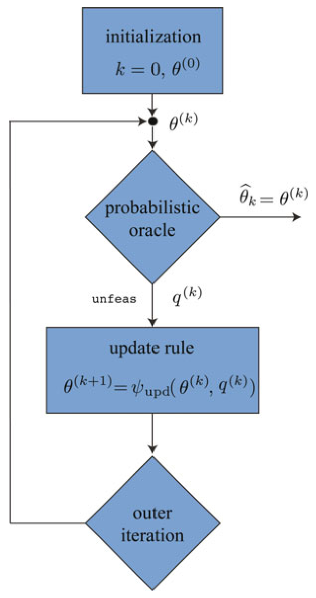

> Image description: A flowchart titled "Paradigm for sequential design consisting of probabilistic oracle and update rule" illustrates an iterative optimization or control loop. The process begins with an "initialization" block where variables $k=0$ and $\theta^{(0)}$ are set. A central feedback loop is formed by four main stages. The process enters the first decision diamond labeled "probabilistic oracle" with input $\theta^{(k)}$. One output branch leads to a result $\widehat{\theta}_k = \theta^{(k)}$, while another branch, labeled "unfeas" (infeasible), provides a value $q^{(k)}$. This value enters an "update rule" rectangular block defined by the equation $\theta^{(k+1)} = \psi_{\text{upd}}(\theta^{(k)}, q^{(k)})$. The resulting updated parameter $\theta^{(k+1)}$ flows into an "outer iteration" decision diamond. If the iteration continues, an arrow loops back to the input of the probabilistic oracle, resuming the cycle with the new $\theta$ value. The diagram represents a sequential decision-making process used in engineering for managing uncertain systems.
Randomized Methods for Control of Uncertain Systems, Fig. 1 Paradigm for sequential design consisting of probabilistic oracle and update rule

is larger than $1-\delta$. That is, the violation probability associated to the design $\hat{\theta}_{k}$ is smaller than the level $\rho$, and this event holds with large confidence $1-\delta$.

## Paradigm 2 (Scenario Approach)

Under the convexity assumption, we study the optimization problem (2). We remark that, even under these assumptions, solving this problem is very hard computationally because the probabilistic constraint is nonconvex. To alleviate this difficulty, we reformulate problem (2) as a socalled scenario problem introduced in Calafiore and Campi (2006), which is now described.

For randomly extracted scenarios $q^{(1 \ldots N)}$, this approach requires to compute $\theta \in \mathbb{R}^{n}$ that solves the convex optimization problem subject to a finite number of sampled constraints

$$
\hat{\theta}_{N}=\begin{array}{cc}
\min _{\theta} & c^{T} \theta  \tag{3}\\
\text { subject to } & f\left(\theta, q^{i}\right) \leq 0, i=1, \ldots, N
\end{array}
$$

In this paradigm, the algorithm returns in oneshot a design $\hat{\theta}_{N}$ and the sample complexity $N$ such that

$$
V\left(\hat{\theta}_{N}\right)=\operatorname{Prob}\left\{q \in \mathbb{Q}: f\left(\hat{\theta}_{N}, q\right)>0\right\} \leq \rho
$$

is larger than $1-\delta$. That is, the violation probability associated to the design $\hat{\theta}_{N}$ is smaller than the level $p$, and this event holds with large confidence $1-\delta$.

## Concluding Remarks

Other probabilistic approaches have been proposed in the literature for control design, which are not based on the convexity assumption. A noticeable example is the strategy based on statistical learning theory (Valiant 1984; Vapnik 1998) which has the objective to design a controller without any convexity assumptions (Alamo et al. 2009). In particular, in Alamo et al. (2013), the general class of sequential probabilistic validation (SPV) algorithms has been introduced. A specific SPV algorithm tailored to scenario problems, providing a sequential scheme for dealing with the optimization problem, has been recently studied in Chamanbaz et al. (2013).

## Cross-References

- Markov Chains and Ranking Problems in Web Search
- Stability and Performance of Complex Systems Affected by Parametric Uncertainty
- Uncertainty and Robustness in Dynamic Vision

## Bibliography

Alamo T, Tempo R, Camacho E (2009) A randomized strategy for probabilistic solutions of uncertain feasibility and optimization problems. IEEE Trans Autom Control 54:2545-2559
Alamo T, Tempo R, Luque A, Ramirez D (2013) The sample complexity of randomized methods for analysis and design of uncertain systems. arXiv:13040678 (accepted for publication)

<!-- source_pdf_page: 1146 -->
Bullo F, Carli R, Frasca P (2012) Gossip coverage control for robotic networks: dynamical systems on the space of partitions. SIAM J Control Optim 50(1):419-447
Calafiore G, Campi M (2006) The scenario approach to robust control design. IEEE Trans Autom Control 51(1):742-753
Calafiore G, Dabbene F, Tempo R (2011) Research on probabilistic methods for control system design. Automatica 47:1279-1293
Chamanbaz M, Dabbene F, Tempo R, Venkataramanan V, Wang Q (2013) Sequential randomized algorithms for convex optimization in the presence of uncertainty. arXiv: 1304.2222
Chernoff H (1952) A measure of asymptotic efficiency for tests of a hypothesis based on the sum of observations. Ann Math Stat 23:493-507
Fagnani F, Zampieri S (2008) Randomized consensus algorithms over large scale networks. IEEE J Sel Areas Commun 26(4):634-649
Frasca P, Ravazzi C, Tempo R, Ishii H (2013) Gossips and prejudices: ergodic randomized dynamics in social networks. In: Proceedings of the 4th IFAC workshop on distributed estimation and control in networked systems, Koblenz
Ishii H, Tempo R (2010) Distributed randomized algorithms for the PageRank computation. IEEE Trans Autom Control 55:1987-2002
Knuth D (1998) The art of computer programming. Sorting and searching, vol 3. Addison-Wesley, Reading
Mitzenmacher M, Upfal E (2005) Probability and computing: randomized algorithms and probabilistic analysis. Cambridge University Press, Cambridge
Motwani R, Raghavan P (1995) Randomized algorithms. Cambridge University Press, Cambridge
Tempo R, Ishii H (2007) Monte Carlo and Las Vegas randomized algorithms for systems and control: an introduction. Eur J Control 13:189-203
Tempo R, Bai EW, Dabbene F (1997) Probabilistic robustness analysis: explicit bounds for the minimum number of samples. Syst Control Lett 30:237-242
Tempo R, Calafiore G, Dabbene F (2013) Randomized algorithms for analysis and control of uncertain systems, with applications. Communications and control engineering series, 2nd edn. Springer, London
Tremba A, Calafiore G, Dabbene F, Gryazina E, Polyak B, Shcherbakov P, Tempo R (2008) RACT: randomized algorithms control toolbox for MATLAB. In: Proceedings 17th IFAC world congress, Seoul, pp 390-395
Uryasev SP (ed) (2000) Probabilistic constrained optimization: methodology and applications. Kluwer Academic, New York
Valiant L (1984) A theory of the learnable. Commun ACM 27(11):1134-1142
Vapnik V (1998) Statistical learning theory. Wiley, New York
Vidyasagar M (2001) Randomized algorithms for robust controller synthesis using statistical learning theory. Automatica 37:1515-1528
Vidyasagar M (2002) Learning and generalization: with applications to neural networks, 2nd edn. Springer, New York

## Realizations in Linear Systems Theory

Panos J. Antsaklis ${ }^{1}$ and A. Astolfi ${ }^{2,3}$ ${ }^{1}$ Department of Electrical Engineering, University of Notre Dame, Notre Dame, IN, USA ${ }^{2}$ Department of Electrical and Electronic Engineering, Imperial College London, London, UK ${ }^{3}$ Dipartimento di Ingegneria Civile e Ingegneria Informatica, Università di Roma Tor Vergata, Roma, Italy

#### Abstract

When a state variable description of a linear system is known, then its input-output behavior can be easily realized by interconnecting simpler components. The problem of realization refers to the following: given an input-output description such as the impulse response, or the transfer function in the case of time-invariant systems, find a state variable description, the impulse response of which is the given one. Existence and minimality conditions are discussed. We are interested in realizations of minimum order which is the case when the realization is both controllable and observable. Realizations in both the continuous-time and discrete-time systems are discussed.

## Keywords

Controllability; Irreducible; Minimal order; Observability; Realizations

## Introduction

The problem of system realization is as follows: given an external description of a linear system, specifically its impulse response (or its transfer function in the case of a time-invariant system), determine an internal state variable description that generates the given impulse response (or the

<!-- source_pdf_page: 1147 -->
transfer function). The name reflects the fact that if a (continuous-time) state variable description is known, an operational amplifier circuit can be easily built to realize (actually simulate) the system response.

Before we discuss realizations, we review the key relations between internal state variable and external impulse response or transfer function descriptions.

Consider a system described by

$$
\begin{equation*}
\dot{x}=A(t) x+B(t) u, \quad y=C(t) x+D(t) u, \tag{1}
\end{equation*}
$$

where $x(t)$, the state vector, is a column vector of dimension $n\left(x(t) \in \mathbb{R}^{n}\right)$ and $u(t) \in \mathbb{R}^{m}, y(t) \in \mathbb{R}^{p}$ are the inputs and outputs of the system. $A(t) \in \mathbb{R}^{n \times n}, B(t) \in \mathbb{R}^{n \times m}, C(t) \in \mathbb{R}^{p \times n}$, $D(t) \in \mathbb{R}^{p \times m}$ with entries continuous functions. The output response is given by

$$
\begin{equation*}
y(t)=C(t) \Phi\left(t, t_{0}\right) x_{0}+\int_{0}^{t} H(t, \tau) u(\tau) d \tau \tag{2}
\end{equation*}
$$

where $\Phi\left(t, t_{0}\right)$ is the $n \times n$ transition matrix of $\dot{x}=A(t) x, x\left(t_{0}\right)=x_{0}$ is the initial condition, and $H(t, \tau)$ is the $p \times m$ impulse response matrix given by

$$
H(t, \tau)= \begin{cases}C(t) \Phi(t, \tau) B(t) &  \tag{3}\\ +D(t) \delta(t-\tau) & t \geq \tau, \\ 0 & t<\tau,\end{cases}
$$

where $\delta(t-\tau)$ is the impulse (delta or Dirac) function applied at time $t=\tau$. Recall that $H(t, \tau)$ denotes the response at time $t$ when an impulse input is applied at time $\tau$ assuming zero initial conditions.

In the time-invariant system, (1) becomes

$$
\begin{equation*}
\dot{x}=A x+B u, \quad y=C x+D u, \tag{4}
\end{equation*}
$$

and the output response in this case is

$$
\begin{equation*}
y(t)=C e^{A t} x_{0}+\int_{0}^{t} H(t, \tau) u(\tau) d \tau \tag{5}
\end{equation*}
$$

where, without loss of generality, the initial time $t_{0}$ was taken to be zero. In this case, the impulse response is

$$
H(t, \tau)= \begin{cases}C e^{A(t-\tau)} B+D \delta(t-\tau) & t \geq \tau,  \tag{6}\\ 0 & t<\tau .\end{cases}
$$

Recall that time invariance implies that $H(t, \tau)=H(t-\tau, 0)$, and so $\tau$, which is the time an impulse input is applied to the system, can be taken to be zero ( $\tau=0$ ), without loss of generality, to give $H(t, 0)$. The transfer function of the system is the (one-sided or unilateral) Laplace transform of $H(t, 0)$, namely,

$$
\begin{equation*}
H(s)=\mathcal{L}[H(t, 0)]=C(s I-A)^{-1} B+D . \tag{7}
\end{equation*}
$$

A realization of $H(t, \tau)$ is any state variable description (1), $\{A(t), B(t), C(t), D(t)\}$, the impulse response of which is $H(t, \tau)$, that is, (3) is satisfied, similarly for the time-invariant case when (6) is satisfied.

In the time-invariant case, a realization is commonly defined in terms of the transfer function matrix $H(s)$. Then a realization of $H(s)$ is any state variable description (4), $\{A, B, C, D\}$, the transfer function of which is $H(s)$, that is, (7) is satisfied.

There are alternative conditions under which a set of $\{A, B, C, D\}$ is a realization of some $H(s)$. To this end, expand $H(s)$ in a Laurent series to obtain

$$
\begin{equation*}
H(s)=H_{0}+H_{1} s^{-1}+H_{2} s^{-2}+\cdots \tag{8}
\end{equation*}
$$

The matrices $H_{i}, i=0,1,2, \ldots$ are called Markov parameters of the system and can be determined as follows:

$$
\begin{aligned}
& H_{0}=\lim _{s \rightarrow \infty} H(s), \quad H_{1}=\lim _{s \rightarrow \infty} s\left(H(s)-H_{0}\right) \\
& H_{k}=\lim _{s \rightarrow \infty} s^{k}\left(H(s)-\Sigma_{i=0}^{k-1} H_{i} s^{-i}\right), \quad k \geq 1
\end{aligned}
$$

It can be shown that a set $\{A, B, C, D\}$ is a realization of $H(s)$ if and only if

$$
\begin{equation*}
H_{0}=D \text { and } H_{i}=C A^{i-1} B, \quad i=1,2, \ldots . \tag{9}
\end{equation*}
$$

<!-- source_pdf_page: 1148 -->
Below we introduce conditions for the existence of a realization given $H(t, \tau)$ or $H(s)$.

Note that if a realization does exist, then there is an infinite number of realizations. One could see this, for example, by considering equivalent descriptions of a realization - all have the same impulse response or transfer function.

## Existence and Minimality

It can be shown that $H(t, \tau)$ is realizable as the impulse response of a system described by (1) if and only if $H(t, \tau)$ can be decomposed into

$$
\begin{equation*}
H(t, \tau)=M(t) N(\tau)+D(t) \delta(t-\tau), \tag{10}
\end{equation*}
$$

for $t \geq \tau$, where $M, N$, and $D$ are $p \times n, n \times m$, and $p \times m$ matrices, respectively, with continuous real-valued entries and with $n$ finite. If in addition to (10), $M(t)$ and $N(t)$ are differentiable and

$$
\begin{equation*}
H(t, \tau)=H(t-\tau, 0) \tag{11}
\end{equation*}
$$

then $H(t, \tau)$ is realizable as the impulse response of a system described by a time-invariant system (4).

In the time-invariant case, it is more common to work with a given transfer function $H(s)$. Then $H(s)$ is realizable, as the transfer function matrix of a time-invariant system described by (4), if and only if $H(s)$ is a matrix of rational functions and satisfies

$$
\begin{equation*}
\lim _{s \rightarrow \infty} H(s)<\infty, \tag{12}
\end{equation*}
$$

that is, if and only if $H(s)$ is a proper rational matrix or equivalently if and only if

$$
\begin{equation*}
\lim _{s \rightarrow \infty} H(s)=D \tag{13}
\end{equation*}
$$

is a constant.
We are interested in realizations (4) of a given transfer function matrix $H(s)$ of least order $n \left(A \in \mathbb{R}^{n \times n}\right)$, called minimal or irreducible realizations of $H(s)$.

The following two results completely solve the minimal realization problem.

Theorem 1 An $n$-dimensional realization $\{A, B, C, D\}$ of $H(s)$ is minimal (irreducible, of least order) if and only if it is both reachable (or controllable) and observable.

Note that if $(A, B)$ is not controllable, then by separating the controllable and uncontrollable parts of the system by an equivalence transformation and taking only the controllable part, one can still obtain $H(s)$ because the uncontrollable part of the system cancels out in $H(s)$. Similarly for observability. So controllability and observability are necessary conditions for minimality. It can be shown that they are also sufficient.

Theorem 2 If a minimal realization of order $n$ is found, then any other minimal realization may be obtained via equivalence transformation.

Specifically, if $\{A, B, C, D\}$ and $\{\bar{A}, \bar{B}, \bar{C}, \bar{D}\}$ are realizations of $H(s)$ and $\{A, B, C, D\}$ is minimal, then $\{\bar{A}, \bar{B}, \bar{C}, \bar{D}\}$ is also minimal if and only if there exists a nonsingular matrix $P$ such that
$\bar{A}=P A P^{-1}, \quad \bar{B}=P B, \quad \bar{C}=C P^{-1}, \quad \bar{D}=D$.

## Discrete-Time Linear Systems

The definitions and results for the discrete-time case are completely analogous to the ones in the continuous-time case. They are summarized below for completeness.

Consider systems described by

$$
\begin{gather*}
x(k+1)=A(k) x(k)+B(k) u(k),  \tag{15}\\
y(k)=C(k) x(k)+D(k) u(k) .
\end{gather*}
$$

The output response is
$y(k)=C(k) \Phi\left(k, k_{0}\right) x_{0}+\sum_{i=k_{0}}^{k-1} H(k, i) u(i), k>k_{0}$,
where $\Phi\left(k, k_{0}\right)$ is the $n \times n$ transition matrix and $H(k, i)$ is the $p \times m$ discrete-impulse (pulse) response:

<!-- source_pdf_page: 1149 -->
$$
\begin{align*}
& \Phi(k, l)=\left\{\begin{array}{cc}
A(k-1) \cdots A(l) & k>l, \\
I & k=l,
\end{array}\right.  \tag{17}\\
& H(k, i)=\left\{\begin{array}{cc}
C(k) \Phi(k, i+1) B(i) & k>i, \\
D(k) & k=i, \\
0 & k<i .
\end{array}\right. \tag{18}
\end{align*}
$$

In the time-invariant case, Eqs. (15) and (16) become

$$
\begin{align*}
x(k+1) & =A x(k)+B u(k), \\
y(k) & =C x(k)+D u(k), \tag{19}
\end{align*}
$$

and

$$
\begin{equation*}
y(k)=C A^{k} x_{0}+\sum_{i=0}^{k-1} H(k, i) u(i), \quad k>0, \tag{20}
\end{equation*}
$$

where, without loss of generality, $k_{0}$ is taken to be zero.

The discrete-impulse (pulse) response in now given by

$$
H(k, i)= \begin{cases}C A^{k-(i+1)} B & k>i,  \tag{21}\\ D & k=i, \\ 0 & k<i .\end{cases}
$$

Since the system is time invariant, $H(k, i)= H(k-i, 0)$ and $i$, the time the pulse input is applied, can be taken to be zero. The transfer function matrix for (19) is the (one-sided or unilateral) $z$-transform of $H(k, 0)$ :

$$
\begin{equation*}
H(z)=\mathcal{Z}\{H(k, 0)\}=C(z I-A)^{-1} B+D . \tag{22}
\end{equation*}
$$

It can be shown that given a $p \times m$ matrix $H(k, i), k \geq i$, it is realizable as the pulse response of a system (15) if and only if $H(k, i)$ can be decomposed as

$$
H(k, i)= \begin{cases}M(k) N(i) & k>i  \tag{23}\\ D(k) & k=i\end{cases}
$$

If, in addition, $H(k, i)=H(k-i, 0)$, then it is realizable via a time-invariant description (19).

Similarly to the continuous-time case, $H(z)$ is realizable as the transfer function matrix of a system described by (19) if and only if

$$
\begin{equation*}
\lim _{z \rightarrow \infty} H(z)<\infty \tag{24}
\end{equation*}
$$

A realization (19) of $H(z)$ is minimal if and only if it is reachable (controllable from the origin) and observable. And if (19) is a minimal realization of $H(z)$, then any other minimal realization is equivalent to (19).

## Realization Algorithms

Given a transfer function $H(s)$ (or $H(z)$ ), we are interested in finding a minimal (irreducible, or of least order) realization of the form (4) (or (19)).

First note that there are methods to determine the order $n$ of a minimal realization directly from $H(s)$ via the characteristic polynomial and notions such as McMillan degree of $H(s)$ or via the Markov parameters of $H(s)$ and the Hankel matrix. This can be done without finding a minimal realization. Knowing the order of a minimal realization in advance is useful as it provides a guide as to what we should expect when we determine an actual realization. Details may be found in the references below.

In special cases, it is possible that the realization algorithm results directly in a controllable and observable and therefore minimal realization. It is more common however for the algorithm to result in just an either controllable or observable realization, in which case an extra step is needed to isolate the uncontrollable, say, part of the realization and take only the part that it is both controllable and observable. The reader should consult any of the references below for detailed descriptions of several realization algorithms.

Here an example is given of a single-input, single-output system where the resulting realization is controllable and observable, therefore minimal.

## Example 1

$$
H(s)=\frac{b_{2} s^{2}+b_{1} s+b_{0}}{s^{3}+a_{2} s^{2}+a_{1} s+a_{0}}
$$

<!-- source_pdf_page: 1150 -->
$$
\begin{aligned}
A & =\left[\begin{array}{ccc}
0 & 1 & 0 \\
0 & 0 & 1 \\
-a_{0}-a_{1}-a_{2}
\end{array}\right], \quad B=\left[\begin{array}{l}
0 \\
0 \\
1
\end{array}\right], \\
C & =\left[b_{0}, b_{1}, b_{2}\right],
\end{aligned}
$$

is controllable ( $(A, B)$ have a form called controller form) and observable and therefore minimal realization of $H(s)$; note that all cancellations are assumed to have already taken place between numerator and denominator of a transfer function $H(s)$. This algorithm easily generalizes to the case when the degree of the denominator of $H(s)$ is $n$ (in this example it is 3 ). Note that if $\lim _{s \rightarrow \infty} H(s)=D \neq 0$, then apply the previous algorithm to $\hat{H}(s)=H(s)-D$ to obtain $A, B$, and $C$.

## Summary

The state variable realization of impulse responses and transfer functions was one of the early problems addressed by system theory. Its solution provides clear understanding of the relations between external (input-output) and internal descriptions of systems. A key result is that any minimal order realization is controllable and observable. Many realization algorithms may be found in the literature. Extensions to polynomial matrix descriptions can also be found in the literature, as well as extensions to partial realizations.

## Cross-References

- Linear Systems: Continuous-Time, Time-Invariant State Variable Descriptions
- Linear Systems: Continuous-Time, Time-Varying State Variable Descriptions
- Linear Systems: Discrete-Time, Time-Invariant State Variable Descriptions
- Linear Systems: Discrete-Time, Time-Varying, State Variable Descriptions
- Linear Systems: Continuous-Time Impulse Response Descriptions
- Linear Systems: Discrete-Time Impulse Response Descriptions

## Recommended Reading

A clear understanding of the relationship between external and internal descriptions of systems is one of the principal contributions of systems theory. This topic was developed in the early 1960s with original contributions from Gilbert (1963) and Kalman (1963). The role of controllability and observability in minimal realization is due to Kalman (1963); see also Kalman et al. (1969). For extensive historical comments, see Kailath (1980). The time-varying case is treated in Brockett (1970), Antsaklis and Michel (2006), and Rugh (1996).

## Bibliography

Antsaklis PJ, Michel AN (2006) Linear systems. Birkhauser, Boston
Brockett RW (1970) Finite dimensional linear systems. Wiley, New York
Gilbert E (1963) Controllability and observability in multivariable control systems. SIAM J Control 1:128-151
Kailath T (1980) Linear systems. Prentice-Hall, Englewood Cliffs
Kalman RE (1963) Mathematical description of linear systems. SIAM J Control 1:152-192
Kalman RE, Falb PL, Arbib MA (1969) Topics in mathematical system theory. McGraw-Hill, New York
Moore BC (1981) Principal component analysis in linear systems: controllability, observability and model reduction. IEEE Trans Autom Control AC-26:17-32
Rugh WJ (1996) Linear systems theory, 2nd edn. PrenticeHall, Englewood Cliffs

## Real-Time Optimization of Industrial Processes

Jorge Otávio Trierweiler
Group of Intensification, Modelling, Simulation, Control and Optimization of Processes (GIMSCOP), Department of Chemical Engineering, Federal University of Rio Grande do Sul (UFRGS), Porto Alegre, RS, Brazil

## Synonyms

RTO

<!-- source_pdf_page: 1151 -->

#### Abstract

RTO aims to optimize the operation of the process taking into account economic terms directly. There are several fundamental gears for smooth operating of an RTO solution. The RTO loop is an extension of feedback control system and consists of subsystems for (a) steady-state detection, (b) data reconciliation and measurement validation, (c) process model updating, and (d) model-based optimization followed by solution validation and implementation. There are several alternatives for each one of these subsystems. This contribution introduces some of the currently used approaches and gives some perspectives for future works in this area.

## Keywords

Data reconciliation; Model updating; Online optimization; Parameter selection; Steady-state detection

## Introduction

Effectiveness, efficiency, product quality, process safety, and low environmental impact are the main driving forces for the improvement of the operation of industrial processes. Real-time (or online) optimization (RTO) is one of the options that are available to achieve these goals and is attracting considerable industrial interest due to its direct and indirect benefits.

RTO systems are model-based, closed-loop process control systems whose objective is to maintain the process operation as nearly as possible to the optimal operating point. Such RTO systems use rigorous process models and current economic information to predict the optimal process operating conditions. Additionally, RTO can mitigate and reject long-term disturbances and performance losses (e.g., due to fouling of heat exchangers or deactivation of catalysts).

The direct benefit from applying RTO is improving the economic performance in terms of increasing the profit of the plant and reducing energy consumption and pollutant emissions.

These are also called the online benefits. The indirect benefits result from the tools used in the implementation of RTO. For instance, a better understanding of the processes can be employed to debottleneck the plant and to reduce operating difficulties. In addition, abnormal measurement information obtained from gross error detection can help instrumentation and process engineers to troubleshoot the plant instrument errors. Parameter estimation is very useful for process engineers to evaluate the equipment conditions and to identify decreasing efficiencies and other sources of problems. Furthermore, the detailed process simulation of the model used in online optimization can be used for process monitoring and serve as a training tool for new operators. Finally, the rigorous process model can be used for process maintenance, advanced process control, process design, facility planning, and process monitoring.

Real-time optimization (RTO) solutions have been developed since the early 1980s, and nowadays there are many petrochemical and chemical applications, especially in the production of ethylene and propylene in fluid catalytic cracking units (FCCUs) (Darby et al. 2011). Other successful industrial applications are mentioned in Alkaya et al. (2009) with the respective economic returns.

## Control Layers and the RTO Concept

Usually the process control is stratified into several layers, which have different response times and control objectives. RTO is located in an intermediate layer that provides the connection between plant scheduling (medium-term planning) and the control system (short-term process performance). In a plant control hierarchy, process disturbances are controlled using process controllers, whereas the RTO system must track changes in the optimum operating conditions caused by low-frequency process changes (e.g., raw material quality and composition, catalyst deactivation).

The typical structure of an RTO system is shown in Fig.1, which depicts the elements of the closed-loop system. The RTO loop is

<!-- source_pdf_page: 1152 -->
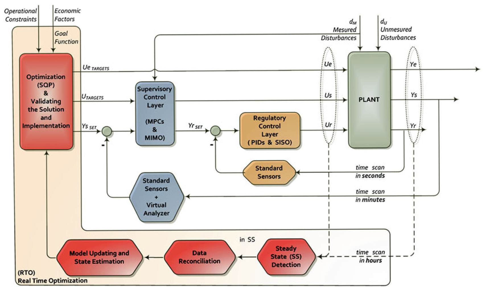

> Image description: A block diagram titled "Real-Time Optimization of Industrial Processes, Fig. 1 Basic structure of the traditional RTO" illustrates the hierarchical control structure of an industrial plant. At the top, an **Optimization (SQP) & Validating the Solution and Implementation** block receives operational constraints, economic factors, and a goal function. It outputs target variables ($Ue_{TARGETS}$, $Us_{TARGETS}$, and $Ys_{SET}$) to the lower control layers. The control hierarchy consists of three main layers: 1. **Supervisory Control Layer (MPCs & MIMO)**, which receives $Ys_{SET}$ and outputs $Ur$ to the plant. 2. **Regulatory Control Layer (PIDs & SISO)**, which adjusts the plant based on feedback from standard sensors. 3. **Real-Time Optimization (RTO)** layer at the bottom, involving **Steady State (SS) Detection**, **Data Reconciliation**, and **Model Updating and State Estimation**. The **PLANT** block is influenced by measured disturbances ($d_M$) and unmeasured disturbances ($d_U$). Feedback loops consist of standard sensors (sampling in seconds/minutes) and virtual analyzers (sampling in minutes), feeding back into the control and optimization layers.
Real-Time Optimization of Industrial Processes, Fig. 1 Basic structure of the traditional RTO

an extension of the feedback control system and consists of subsystems for (a) steady-state detection, (b) data reconciliation and measurement validation, (c) process model updating, and (d) model-based optimization followed by solution validation and implementation. Once the plant operation has reached a steady state, the plant data ( $y=[Y e, Y s, Y r]$ ) are gathered and validated to detect and correct gross errors in the process measurements, and at the same time the measurements may be reconciled using material and energy balances to ensure that the data set used for model updating is consistent. These validated measurements are used to estimate model parameters ( $\theta$ ) to ensure that the model represents the plant faithfully at the current operating point. Then, the optimum controller set points ( $Y S_{S E T}$ ) and manipulated targets ( $U_{\text {TARGETS }}$ and Ue TARGETS) are calculated using the updated model and are transferred to the advanced process controllers after they have been validated to be effectively applied.

Each layer in Fig. 1 has its own specific tasks as discussed in the following:

1. Regulatory layer. This layer is focused on basic (e.g., temperature, flow rate) and inventory (e.g., level and pressure) control ensuring safety and operational stability for the industrial plant. The holdups of vapors and gases are measured by pressure sensors, while the holdups of liquids and solids are measured by level and weighing sensors. In the case of unstable processes, the regulatory layer is also responsible for their stabilization, e.g., by temperature control of industrial reactors. No industrial process can operate without this control layer. The typical operation time scan is in the order of seconds. For its design, typical questions that have to be answered are the following: "How to ensure safe unit operation?" "How to quickly meet the demands coming from the supervisory layer or from the operators?" "How to prevent disturbances to propagate throughout the plant?" The control technology that prevails in this layer is SISO (single-input-single-output) PID controllers, with very few cases where the derivative action is effectively employed. In Fig. 1, $Y r$ are the controlled variables of this

<!-- source_pdf_page: 1153 -->
layer (e.g., levels, flow rates, pressures, temperatures, pH ), and $U r$ are the corresponding manipulated variables, typically control valves.
2. Supervisory layer. This layer is concerned with the quality of the final product. The goal is to ensure the specifications without infringing the operating limits of the equipment. Typically, in this layer there is a strong interaction between the controlled variables, requiring tailored multi-look control structures or the use of multivariate control techniques. The dominant advanced technology in this layer is model predictive control (MPC). In this layer the calculations and updates are performed on the time scale of minutes and the typical associated question is "how to ensure the quality of the final product while satisfying the operating constraints and improving the profitability by reducing the variability of the product parameters?" Here the controlled variables ( $Y s$ ) are usually related to the product quality and the manipulated variables are the set points for the regulatory layer $Y r_{S E T}$ and additional manipulated variables (Us) not used by the regulatory layer (e.g., variable frequency drive).
3. RTO layer. Here the main focus is the profitability of the process. Specifications and operating points (i.e., set points and targets for the manipulated variables) are determined by solving an optimization problem that aims at maximizing the profitability of the process under stationary conditions. When the optimal operating point is close to the operational limits, the real-time optimization is quite straightforward, since it is enough to take the process to these limits, which is usually done by solving a linear programming (LP) optimization problem. Such simple solutions are effective especially in cases where it is known that to maximize or to minimize the flow rate of a given stream will maximize the profitability. As this kind of solution can be easily implemented, most commercial predictive controllers already have an LP or QP layer integrated, using as a model the gain of the dynamic model used in the MPC. However, for processes with large recycling streams and
pronounced nonlinearity, this type of solution is not enough to bring the system to its optimal operating conditions. In this case, it is essential to use a nonlinear optimizer that aims at driving the system to operate in the best operating region. When the industrial process works essentially in steady state, the problem can be solved using stationary models. The solutions offered on the market typically involve the use of a stationary process simulator (e.g., Aspen Plus, PRO II). The RTO sampling times are in the time scale of hours and the questions to be answered are the following: "What is the best way of operation?" "How to increase the profitability of the process?" "How to decrease energy consumption and to increase the process efficiency?"

## Four Elements of Classical Real-Time Optimization

A standard RTO solution requires that all four calculation blocks illustrated in Fig. 1 work together smoothly. In fact, each block can be formulated as an optimization problem by itself. Sometimes these optimization problems are combined together. Below the alternative techniques that can be applied to each of these subsystems are discussed.

## Steady-State Detection (SSD)

As indicated in Fig. 1, the RTO loop execution begins with the detection of a steady state. Identifying a steady state may be difficult because process variables are noisy and measurements do not settle at a constant value. Being at a steady state can be defined as an acceptable constancy of the measurements over a given period of time. Therefore, tests for stationarity are commonly based on checking the constancy of the measured quantities.

Mejía et al. (2010) compared 6 different approaches to SSD using 5,760 simulated data sets. They concluded that the method based on the estimation of the absolute value of the first and the second derivatives defined by

<!-- source_pdf_page: 1154 -->
$$
\begin{equation*}
I_{D E R}=\left|\frac{\widehat{d y}}{d x}\right|+10\left|\frac{\widehat{d^{2} y}}{d t^{2}}\right| \tag{1}
\end{equation*}
$$

gives the best results. Although this idea is quite simple, as being at a steady state means zero derivatives by definition, it has some implementation issues, due to signal noise and outliers. These problems can be reduced by smoothing the plant data using smoothing splines, noncausal Butterworth filters, or wavelet decompositions. The second best compared approach was the local autocorrelation (Mejía et al. 2010) followed by the two statistical nonparametric tests of independence hypothesis proposed by Bebar (2005) and by the method of Cao and Rhinehart (1995).

## Data Reconciliation (DR)

Within the mathematical models of industrial processes, the balance equations that result from conservation laws of mass, energy, etc., are the core that cannot be subject to debate. If the measured data do not satisfy the balance equations, this fact must be attributed to measurement errors or to fundamental model inadequacies. Ruling out the latter, as measurement errors are always present, before using the measured data, they should be adjusted to obey the conservation laws and other constraints, e.g., of their ranges. The adjustment using optimization techniques combined with the statistical theory of errors is called data reconciliation. Unfortunately the adjustment of all variables can be greatly affected by "gross errors" in one variable, so such errors must be detected.

The relationship between a measurement of a variable and its true value can be represented by

$$
\begin{equation*}
y_{m}=y+\overbrace{e_{r}+e_{g}}^{\text {error }} \tag{2}
\end{equation*}
$$

where $y_{m}$ and $y$ are the measured and true values, while $e_{r}$ and $e_{g}$ are the random and gross errors, respectively. The random errors ( $e_{r}$ ) are assumed to be zero mean and normally distributed (Gaussian), since they are the result of the simultaneous effect of several causes. The gross errors ( $e_{g}$ ) are caused by large nonrandom events. They can
be subdivided into measurement-related errors, such as malfunctioning sensors (e.g., incorrect calibration, sensor degradation, or damage to the electronics), and processes-related errors, such as process leaks.

In the absence of gross errors, the simplest version of data reconciliation can be stated as a quadratic programming (QP) problem

$$
\begin{equation*}
\min _{y} \frac{1}{2}\left(y-y_{m}\right)^{T} Q^{-1}\left(y-y_{m}\right) \tag{3}
\end{equation*}
$$

subject to the linear or linearized constraint related to the process model, written as

$$
A \cdot y-c=0 .
$$

The covariance matrix ( $Q$ ), which is usually diagonal, captures the variance of the sensors and is responsible to distribute the errors among the measurements $\left(y_{m}\right)$. The solution of this problem is the reconciled value that for this simple case is given analytically by

$$
\begin{aligned}
y= & {\left[I-Q A^{T}(A Q A)^{-1} A\right] y_{m} } \\
& +Q A^{T}\left(A Q A^{T}\right)^{-1} c
\end{aligned}
$$

A rigorous formulation of the reconciliation problem is possible even with nonlinear constraints; only the general existence and uniqueness of a solution is not warranted theoretically.

Several statistical tests have been constructed for the detection of gross errors. Some of them are based in the distribution of the constraint residuals, i.e., $r_{c}=A \cdot y_{m}-c$, and others are based on the distribution of the estimated error after the reconciliation procedure, i.e., $\hat{e}= y_{m}-y$. The evaluation of $r_{c}$ does not require solving previously the associated data reconciliation problem. For a complete discussion and review, see Narasimhan and Jordache (1999) and Sequeira et al. (2002).

## Model Updating

A key, yet difficult, decision in model parameter adaptation is to select the parameters that are

<!-- source_pdf_page: 1155 -->
adapted. These parameters should be identifiable and represent actual changes in the process, and their adaptation should help to approach the true process optimum. Clearly, the smaller the subset of parameters, the better the confidence in the parameter estimates and the lower the required excitation (also the better the regularization effect). But too few adjustable parameters can lead to misleading models and thus wrong proposals for operational changes.

In general, the parameter estimation and updating are limited not only by the lack of information available from experimental data but also by the correlation between the parameters that are identified. The estimation of correlated parameters leads to a high degree of uncertainty in the model, since different combinations of parameter values lead to the same value of the objective function in the estimation problem.

The selection of the right number of parameters to be identified can be done by the analysis of the sensitivity matrix $(S)$. The elements of $S, s_{i j}$, are the partial derivatives of the measurement $y_{i}$ with respect to the parameter $\theta j$ evaluated at the current value of the parameter $\left(\theta_{0}\right)$, i.e.,

$$
\begin{equation*}
s_{i j}=\left.\left(\frac{\partial y_{i}}{\partial \theta_{j}}\right)\right|_{\theta=\theta_{0}} \tag{4}
\end{equation*}
$$

In general, different parameters and measurements have distinct magnitudes. Therefore, scaling is a key issue that has a strong impact on the results. Traditionally each element of the matrix $S$ is scaled by the initial guess $\theta_{0 j}$ of the parameter and by the average value of the measurement $i\left(\overline{y_{s i}}\right)$. The scaled elements $s_{s, i j}$ are then given by

$$
\begin{equation*}
s_{s, i j}=\left.\left(\frac{\theta_{0 j}}{\overline{y_{s i}}}\right)\left(\frac{\partial y_{i}}{\partial \theta_{j}}\right)\right|_{\theta=\theta_{0}} \tag{5}
\end{equation*}
$$

This scaling procedure has some problems, once it requires both a good initial guess for the parameters and representative average values for the measurements. But the main drawback is that it does not consider the multivariable nature existing among all parameters and outputs. To solve these drawbacks, Botelho et al. (2012) proposed
to apply diagonal scaling matrices $L$ and $R$ that result from the solution of the convex optimization problem to find the minimized condition number of the sensitivity matrix, $\gamma(L S R)$, i.e.,

$$
\begin{aligned}
& \min _{L, R} \gamma(L S R) \\
& \text { s.t.L } \in \Re^{\text {nyXny }} \text {, diagonal and nonsingular }(6) \\
& \quad R \in \Re^{n \theta X n \theta} \text {, diagonal and nonsingular }
\end{aligned}
$$

This convex optimization problem can be solved using the LMI (linear matrix inequality) approach as described by Boyd et al. (1994). With the optimized scaling matrices $L$ and $R$, the scaled sensitivity matrix $S_{s}$ is given by

$$
\begin{equation*}
S_{s}=L S R \tag{7}
\end{equation*}
$$

With $S_{s}$, the best subset of parameters to be estimated can be determined using the non-square relative gain array matrix (NSRGA) as also proposed by Botelho et al. (2012). The NSRGA can be easily calculated for the scaled sensitivity matrix by

$$
\begin{equation*}
N S R G A\left(S_{s}\right) \underline{\underline{\operatorname{def}}} S_{s} \circ\left(S_{s}^{\dagger}\right)^{T} \tag{8}
\end{equation*}
$$

where $\left(S_{s}^{\dagger}\right)^{T}$ is the transpose of the pseudoinverse of $S_{s}$ and ∘ is the entrywise product (also known as the Hadamard or element-wise product). The rows of $N S R G A\left(S_{s}\right)$ are related to the output measurements, whereas the columns are related to the parameters. The sum of the values in each column, whose values can vary between 0 and 1, reflects the relevance of each parameter, and it can be used to sort in descending order their influence on the outputs. When the sum of a column is close to 1 , the corresponding parameter has a small correlation with the other ones and a strong influence on the output measurements.

Figure 2 illustrates the typical ordering produced by sorting the $N S R G A\left(S_{s}\right)$ in descending order. Thus, it is possible to have an idea of which parameters should be selected for estimation. The values presented in this figure suggest that the parameters $P 11$ and $P 4$ have very small correlation with the others and should be selected as updated parameters, whereas the parameters $P 12$

<!-- source_pdf_page: 1156 -->
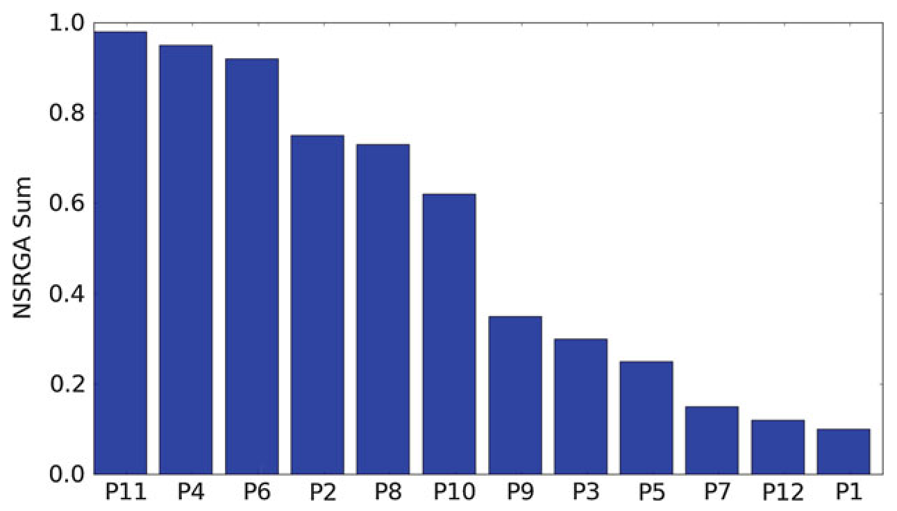

> Image description: This bar chart, titled "Fig. 2 Illustrative example of using $NSRGA(S_s)$ to rank the parameters," presents a performance comparison of various parameters labeled along the x-axis. The vertical y-axis represents the "NSRGA Sum" on a scale from 0.0 to 1.0. The chart displays twelve distinct categories, represented by blue bars, arranged in descending order of their NSRGA Sum values. The parameters, ranked from highest to lowest, are: P11, P4, P6, P2, P8, P10, P9, P3, P5, P7, P12, and P1. The bar for P11 is closest to the 1.0 value, indicating it has the highest rank, while P1 has the lowest value, nearing 0.1. This visual data serves to illustrate the ranking of specific parameters based on the NSRGA metric within an industrial process optimization context.
Real-Time Optimization of Industrial Processes, Fig. 2 Illustrative example of using $N S R G A\left(S_{s}\right)$ to rank the parameters

and $P 1$ show the opposite behavior and should not be updated.

## Solving the Optimization Problem

Nonlinear programs for RTO can be formulated using models of different complexities. For example, RTO can be based on process models similar to those used for design and analysis, using commercial simulators (e.g., Aspen Plus, PRO II, HYSYS, etc.). On the other hand, because these problems need to be solved at regular intervals (at least every few hours), detailed simulation models can be partly replaced by correlations or operating curves that are fitted to the process and updated on a longer time scale.

If a rigorous process model is used, the number of nonlinear equations can be very large. The model is usually built by linking smaller submodels. The optimization problem can be formulated as the following nonlinear programming problem (NLP):

$$
\begin{gather*}
\min _{x_{M}, S_{M}} f\left(x_{M}, S_{M}\right) \\
\text { s.t. } \\
M_{1}\left(x_{M 1}, S_{M 1} ; \theta_{M 1}\right)=0 \\
\vdots \\
M_{n}\left(x_{M n}, S_{M n} ; \theta_{M n}\right)=0 \\
O C\left(x_{M}, S_{M}\right) \leq 0  \tag{9}\\
x_{M}=\left[x_{M 1}, \ldots, x_{M n}\right], S_{M}=\left[S_{M 1}, \ldots, S_{M n}\right],
\end{gather*}
$$

where $M_{i}$ are the unit modules that can be solved by a tailored procedure in the modular approach or all together in the equation-oriented approach. Each unit model $M_{i}$ has internal variables $x_{M i}$ and parameters $\theta_{M i}$. These unit models are connected by the input and output streams $S_{M i}$. Additionally, there are operating constraints $O C$ to capture the possible lower and upper bounds and other equipment constraints. The objective function $f\left(x_{M}, S_{M}\right)$ is based on an economic model that involves the raw materials, products, and operating costs.

Successive quadratic programming (SQP) has become the most popular method for solving these nonlinear constrained optimization problems. SQP converges the equality and inequality constraints simultaneously with the optimality conditions. This strategy requires relatively few function evaluations and often performs efficiently for process optimization problems. The NLP solver can be implemented in a nonintrusive way, similar to recycle convergence modules that are already in place. As a result, the structure of the simulation environment and the unit operation blocks does not need to be modified in order to include the optimization, so that SQP can be easily incorporated within existing modular simulators and therefore be applied directly to flow sheets modeled in these commercial simulators. However, in this case derivative

<!-- source_pdf_page: 1157 -->
information must be obtained by numerical differentiation which increases the effort and slows down convergence near the optimum.

For fully equation-oriented models with the exact first and second derivatives for all constraints and objective functions, efficient NLP algorithms were developed. For instance, large equation-based models can be solved efficiently with structured barrier NLP solvers (see Biegler 2010 for a detailed overview). But for problems where function evaluations are expensive, and gradients and Hessians are difficult to obtain, it is not clear that large-scale NLP solvers should be applied. Black-box optimization models with inexact (or approximated) derivatives and few decision variables are poorly served by large-scale NLP solvers, and derivative-free optimization algorithms should be considered instead. For the standard RTO problems formulated using modular process simulator model, SQP and reducedspace SQP methods are expected to perform well (see Alkaya et al. 2009; Biegler 2010 for detailed discussion).

After solving the RTO optimization problem, it is necessary to decide if the solution can be implemented. For this, it is necessary to verify if the dominant cause of the plant changes is noise, since in this case implementing these changes could lower the profit. Thus, an important challenge in RTO results analysis is to determine when to implement the calculated changes (Miletic and Marlin 1996).

## Summary and Future Directions

RTO aims at optimizing the operation of the process taking into account economic terms directly. There are several fundamental needs for a smooth operation of an RTO solution. The central point is the mathematical modeling which can be a complex first principle model or be based on simple operating curves. If a good model is available, it is necessary to have a good characterization of the inlet streams (properties and composition), to employ data reconciliation and gross error detection and steady-state identification. Finally, the efficiency of the optimizer is a key issue.

Due to the time and resources needed to implement and maintain an RTO solution, a full RTO project involves a certain high risk. Therefore, in cases where simpler and easier approaches can be applied with equivalent economic benefits, they should be used instead. For processes with large recycle streams, it is worthwhile to apply the classical RTO strategy, i.e., the one discussed in the last section. In this case the optimal solution is not trivial, once it is not simply the maximal capacity of the plant. For the cases where the optimal operating constraint is a direct consequence of the operating process capacity, the economic optimization can be easily included in the LP or QP layer implemented usually within a model predictive controller.

In the previous section, the so-called twostep approach, where the measurements are used to refine the process model, which is then used to repeat the optimization, was described. Several RTO schemes have emerged since the development of this two-step approach in the 1970s. Recently, it has been proposed to update the model differently. Instead of adjusting the model parameters, one updates correction terms that are added to the cost and constraint functions of the optimization problem. The technique, labeled as modifier adaptation (RTO-MA), forces the modeled cost and constraints to match the plant values (Gao and Engell 2005; Marchetti et al. 2009). The main advantage of RTO-MA compared to the two-step approach lies in its ability to converge to the true plant optimum, even in the presence of structural plant-model mismatch. RTO-MA is a static optimization method which means that its application to a continuous process requires waiting for reaching the steady state before taking measurements, updating the correction terms, and repeating the numerical optimization. Hence, several iterations are generally required before convergence can be achieved. In contrast, implicit methods, such as self-optimizing control (Skogestad 2000) and NCO tracking (François et al. 2005), propose to adjust the inputs online in a control-inspired manner. Especially simple to be implemented is the "self-optimizing" approach, where a feedback control structure is chosen so that maintaining

<!-- source_pdf_page: 1158 -->
some function of the measured variables constant automatically maintains the process near an economically optimal steady state in the presence of disturbances. The problem is posed from a plantwide perspective, since the economics are determined by overall plant behavior.

The classical steady-state RTO has some drawbacks related to its low frequency of execution. It is normally run twice or three times per day and one does not consider the cost of transiting from one operating condition to another. Some plants need to respond to market changes very quickly, like grade changes in polymerization and petroleum process. In these processes, market competition requires the capability to accommodate fast and costeffective transitions so that companies can produce and sell on demand at favorable prices. To provide this capability, dynamic RTO is being developed and implemented in industrial processes. The largest difference between steadystate and dynamic RTOs is that traditional RTO only provides optimal operating conditions at the steady state, while dynamic RTO provides a trajectory of changes of operating conditions. Dynamic RTO does not require steady-state conditions to be applied. The formulation and solution of the problem DRTO are very similar to the approach used to solve nonlinear predictive controllers (NMPC), with the primary difference the inclusion of economic aspects in the objective function (Engell 2007).

## Cross-References

- Control Structure Selection
- Industrial MPC of Continuous Processes
- Model-Based Performance Optimizing Control
- Model-Predictive Control in Practice

## Recommended Reading

As a number of design decisions must be made in the construction of a RTO system, there is no single approach how to implement it. The elements of the solution were discussed
here which should be viewed as a starting point for further reading. The review paper by Engell (2007) discusses and compares several approaches for RTO and DRTO giving a quite general and broad perspective of the area. For the reader interested more in the solution and formulation of the optimization problems, the book by Biegler (2010) is a very good starting point and gives a complete discussion about the solvers currently used, illustrating the application with several examples. For data reconciliation and gross error detection the book by Narasimhan and Jordache (1999) is a good starting point. Finally, an industrial discussion about RTO and alternative approaches that have been used in the industry can be found in Darby et al. (2011).

## Bibliography

Alkaya D, Vasamtharajan S, Biegler LT (2009) Successive quadratic programming: applications in the process industry. In: Floudas CA, Pardalos PM (eds) Encyclopedia of optimization. Springer, Berlin, pp 3853-3864
Bebar M (2005) Regelgütebewertung in kontinuierlichen verfahrenstechnischen Anlagen. Ruhr-Universität Bochum
Biegler L (2010) Nonlinear programming: concepts, algorithms, and applications to chemical processes. MOSSIAM series on optimization. Society for Industrial and Applied Mathematics: Mathematical Optimization Society, Philadelphia
Botelho VR, Trierweiler LF, Trierweiler JO (2012) A new approach for practical identifiability analysis applied to dynamic phenomenological models. Paper presented at the International symposium on advanced control of chemical processes - ADCHEM 2012, Singapura
Boyd S, El Ghaoui L, Feron E, Balakrishnan V (1994) Linear matrix inequalities in system and control theory. Studies in applied and numerical mathematics. Society for Industrial and Applied Mathematics, Philadelphia
Cao S, Rhinehart RR (1995) An efficient method of on-line identification of steady state. Rev J Process Control 5:11
Darby ML, Nikolaou M, Jones J, Nicholson D (2011) RTO: an overview and assessment of current practice. Rev J Process Control 21(6):874-884. doi:http://dx. doi.org/10.1016/j.jprocont.2011.03.009
Engell S (2007) Feedback control for optimal process operation. Rev J Process Control 17(3):203-219. doi:http://dx.doi.org/10.1016/j.jprocont.2006.10.011

<!-- source_pdf_page: 1159 -->
François G, Srinivasan B, Bonvin D (2005) Use of measurements for enforcing the necessary conditions of optimality in the presence of constraints and uncertainty. Rev J Process Control 15(6):701-712. doi:http://dx.doi.org/10.1016/j.jprocont.2004.11.006
Gao W, Engell S (2005) Iterative set-point optimization of batch chromatography. Rev Comput Chem Eng 29(6):1401-1409. doi:http://dx.doi.org/10.1016/j. compchemeng.2005.02.035
Marchetti A, Chachuat B, Bonvin D (2009) Modifieradaptation methodology for real-time optimization. Rev Ind Eng Chem Res 48(13):6022-6033. doi:10.1021/ie801352x
Mejía RIG, Duarte MB, Trierweiler JO (2010) Avaliação do desempenho e ajuste automático de métodos de identificação de estado estacionário. In: ABEQ (ed) COBEQ 2010 Congresso Brasileiro de Engenharia Química, 10, Foz do Iguaçú
Miletic I, Marlin T (1996) Results analysis for real-time optimization (RTO): deciding when to change the plant operation. Rev Comput Chem Eng 20(Supplement 2):S1077-S1082. doi:http://dx.doi.org/10.1016/ 0098-1354(96)00187-1
Narasimhan S, Jordache C (1999) The importance of data reconciliation and gross error detection-1. In: Data reconciliation and gross error detection. Gulf Professional, Burlington, pp 1-31
Sequeira SE, Graells M, Puigjaner L (2002) Real-time evolution for on-line optimization of continuous processes. Rev Ind Eng Chem Res 41(7):1815-1825. doi:10.1021/ie0104641
Skogestad S (2000) Plantwide control: the search for the self-optimizing control structure. Rev J Process Control 10(5):487-507. doi:http://dx.doi.org/10.1016/ S0959-1524(00)00023-8

## Redundant Robots

Stefano Chiaverini
Dipartimento di Ingegneria Elettrica e dell’Informazione "Maurizio Scarano", Università degli Studi di Cassino e del Lazio Meridionale, Cassino (FR), Italy

#### Abstract

Redundancy may occur in different ways in a robotic system. This entry focuses on the resolution of kinematic redundancy, i.e., on the techniques for exploiting the redundant degrees of freedom in the solution of the inverse kinematics problem; this is indeed an issue of

major relevance for motion planning and control purposes.

## Keywords

Algorithmic singularity; Kinematic singularity; Optimization; Redundancy; Task-oriented kinematics; Task-space augmentation

## Introduction

Redundant robots possess more resources than those strictly required to execute their task; this provides the robot with an increased capacity of facing real-world applications by allowing to handle performance issues besides the mere achievement of a given motion trajectory.

Redundancy may occur in the sensory system, in the mechanical structure, and/or in the actuation system, thus allowing, e.g., fault accommodation, multisensory perception, dexterous motion, and load sharing. Nevertheless, unless otherwise specified, by redundant robot it is meant one that has a kinematically redundant mechanical structure, i.e., provided with more degrees of freedom than those strictly required to execute its task; this also typically leads to a redundancy in the number of actuators and sensors. Noticeably, kinematic redundancy is usually the key to handle the avoidance of singular configurations, the occurrence of joint limits, the engagement of obstacles in the workspace, and the minimization of joint torques or energy. In practice, if properly managed, the increased dexterity characterizing kinematically redundant robots may allow them to achieve a higher degree of autonomy.

In principle, no robot is inherently redundant; rather, there are certain tasks with respect to which it may become redundant. Nevertheless, since most papers in the classical literature on the topic have dealt with robotic manipulators (for which a general task consists in tracking an endeffector motion trajectory requiring six degrees of freedom), a robot arm with seven or more joints is often considered as a typical example of an inherently redundant manipulator. However,

<!-- source_pdf_page: 1160 -->
even robot arms with fewer degrees of freedom, like conventional six-joint industrial manipulators, may become kinematically redundant for specific tasks, such as simple end-effector positioning without constraints on the orientation.

In the case of traditional industrial applications involving nonredundant mechanical structures, the occurrence of singular configuration and/or the presence of obstacles in the workcell resulted in the need of a carefully structured (and static) working space where the motion of the manipulator could be planned in advance.

On the other hand, the presence of redundant degrees of freedom allows motions of the manipulator that do not displace the end effector (the so-called self-motions or internal motions); this implies that the same end-effector task can be executed with several different joint motions, giving the possibility of better exploiting the workspace of the manipulator and ultimately resulting in a more versatile robotic arm (see Fig. 1). Such feature is a key to allow operation in unstructured and/or dynamically varying environments that characterize advanced industrial applications and service robotics scenarios.

The biological archetype of a robotic manipulator is the human arm, which, not surprisingly, also inspires the terminology used to characterize the serial-chain structure of a robot arm. Remarkably, a simple look at the human arm kinematics from the torso to the hand allows to recognize seven degrees of freedom (three at the shoulder,

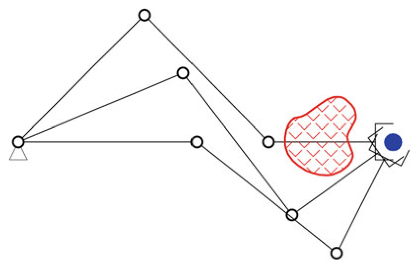

> Image description: A technical diagram illustrating a robotic arm mechanism demonstrating redundant self-motion. The mechanism is a multi-link linkage structure composed of several connected rods and joints (represented by white circles). The structure is anchored on the left by a fixed support (triangle). On the right, the end-effector is positioned at a specific location marked by a large blue dot. This end-effector is subject to constraint, as indicated by the geometric lines converging near it. A large, irregular red shape with a cross-hatched pattern represents a stationary obstacle located directly between the main links of the arm and the blue end-effector position. The diagram demonstrates the concept of redundancy: the arm's internal configuration can change (self-motion) while maintaining the blue end-effector's exact position. The visual goal is to show that specific limb configurations exist that keep the end-effector at the blue spot while successfully avoiding contact with the red obstacle.
Redundant Robots, Fig. 1 A self-motion of the arm that keeps the end-effector positioned at the blue spot. It is possible to choose configurations that both take the blue spot and avoid the red obstacle

one at the elbow, and three at the wrist) that make a manipulator kinematically redundant.

The kinematic arrangement of the human arm has been replicated in a number of robots often termed as human-armlike manipulators (see, e.g., Fig. 2). Manipulators with a larger number of joints are often called hyperredundant robots and include - among others - snakelike robots (Fig. 3).

The use of two or more robotic structures to execute a task (as in the case of cooperating manipulators or multifingered hands or multiarm/multilegged robots) also gives rise to kinematic redundancy. A headed multilimb structure is typical of a humanoid robot (Fig. 4). Redundant mechanisms also include vehiclemanipulator systems (Fig. 5).

Although the realization of a kinematically redundant structure raises a number of issues from the point of view of mechanical design, this entry focuses on the techniques for exploiting the redundant degrees of freedom in the solution

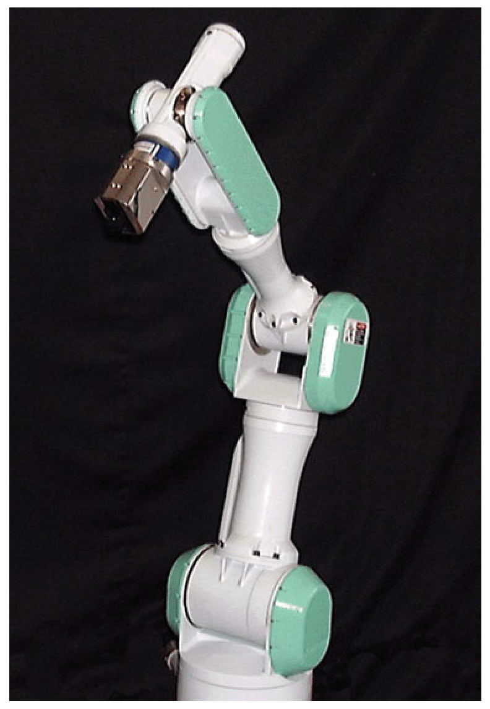

> Image description: A studio photograph displays the Mitsubishi PA-10 manipulator, a white robotic arm with light green joint covers, positioned against a black background. The manipulator is shown in a semi-flexed posture, showcasing its multi-jointed configuration. The robotic arm consists of several interconnected segments and rotary joints. Starting from the base, the structure ascends through a vertical segment into a series of articulated joints. One large joint is visible near the bottom, followed by a middle segment that transitions into another joint assembly mid-arm. The arm then angles upward through a third jointed section towards the end effector. The end effector is a metallic, rectangular component attached to the final joint, oriented downward and slightly toward the viewer. The light green covers identify the primary axes of movement at each articulating point. The image provides a clear side profile of the robot's kinematic chain, illustrating its degrees of freedom and physical articulation.
Redundant Robots, Fig. 2 The Mitsubishi PA-10 manipulator

<!-- source_pdf_page: 1161 -->
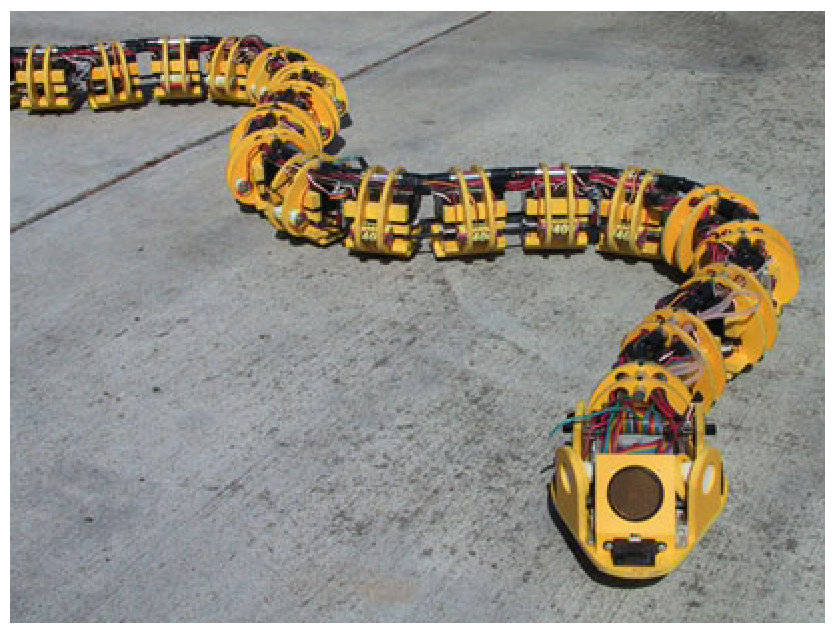

> Image description: A high-angle, medium shot shows the SnakeRobots.com S7 snake robot prototype, a modular, yellow, segmented robotic snake laying on a concrete surface. The robot is composed of multiple interconnected, rectangular yellow modules linked in a continuous, undulating chain. Each module contains visible internal components, including colored wiring (red, black, green, white) and black electronic hardware. The modules are arranged in a winding, S-shaped curve across the grey, textured concrete. The robot's head, located in the foreground, features a dark, circular lens and a small, rectangular sensor. The series of modules tapers slightly towards the tail in the background. The image illustrates the modular design and multi-jointed structure characteristic of redundant snake robots designed for complex locomotion.
Redundant Robots, Fig. 3 The SnakeRobots.com S7 snake robot prototype

> Image description: The provided image shows a humanoid robot, not a snake robot. It is a full-body shot of the Honda ASIMO robot standing against a plain, light-colored background. The robot is constructed from white and grey plastic panels. Visible labels on the robot's chest include the word "ASIMO" in black uppercase letters, positioned above the "HONDA" logo in red uppercase letters. The robot has a large, dark, rounded head with two prominent, dark circular areas representing its eyes or sensors. The robot's right arm is raised in a waving gesture, showing an open hand with five distinct fingers. Its left arm is positioned at its side. The robot's legs are thick and segmented, suggesting multiple degrees of freedom for walking. The caption "Redundant Robots, Fig. 3 The SnakeRobots.com S7 snake robot prototype" is provided, but it does not match the visual content of the image, which clearly depicts a humanoid robot.
Redundant Robots, Fig. 4 The Honda ASIMO

of the inverse kinematics problem. This is an issue of major relevance for motion planning and control purposes.

## Task-Oriented Kinematics

The relationship between the $N$ variables representing the configuration $\boldsymbol{q}$ of an articulated

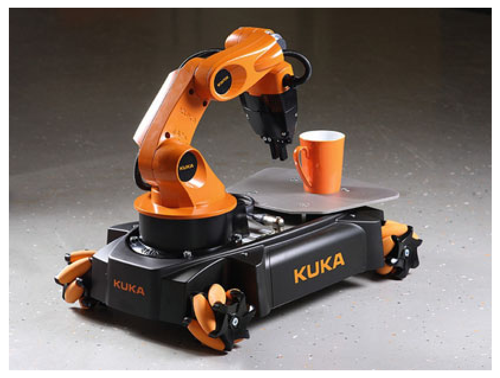

> Image description: A professional studio photograph depicts the KUKA youBot, a small-scale mobile manipulator robot, positioned on a smooth, neutral floor. The robot features a mobile base equipped with four sets of orange omnidirectional wheels, enabling highly maneuverable movement. Mounted on this base is a vertical pedestal supporting a circular, flat metal platform. The central feature is a high-degree-of-freedom, orange robotic arm consisting of multiple articulated segments and joints. The arm is configured in a raised posture, with its end-effector hovering directly above a small, orange ceramic mug situated on the circular platform. The KUKA brand name is clearly visible in white lettering on the side of the black base and in smaller black text on the arm's segments. The image serves as a technical representation of a mobile manipulator system, illustrating the integration of a mobile platform with a multi-jointed robotic arm for tasks such as object manipulation.
Redundant Robots, Fig. 5 The KUKA youBot

manipulator in the joint space and the $M$ variables describing an assigned task $\boldsymbol{t}$ in an appropriate task space constitutes a task-oriented kinematics; this can be established at the position, velocity, or acceleration level. Typically, one has $N \geq M$, so that the joints can provide at least the degrees of freedom required for the end-effector task. If $N>M$ strictly, the manipulator is kinematically redundant.

At the position level, the direct kinematics equation takes on the form

$$
\begin{equation*}
t=k_{\mathrm{t}}(q), \tag{1}
\end{equation*}
$$

where $\boldsymbol{k}_{\mathrm{t}}$ is a nonlinear vector function.
Besides the direct kinematics expressed at the position level, it is useful to consider the firstorder differential kinematics (Whitney 1969)

$$
\begin{equation*}
\dot{\boldsymbol{t}}=\boldsymbol{J}_{\mathrm{t}}(\boldsymbol{q}) \dot{\boldsymbol{q}}, \tag{2}
\end{equation*}
$$

that can be obtained by differentiating Eq. (1) w.r.t. time. In (2), the mapping between the taskspace and the joint-space velocities is held by the $M \times N$ task Jacobian matrix $\boldsymbol{J}_{\mathrm{t}}(\boldsymbol{q})=\partial \boldsymbol{k}_{\mathrm{t}} / \partial \boldsymbol{q}$ (also called analytic Jacobian).

Remarkably, $\dot{\boldsymbol{t}}$ expresses the rate of change of the variables adopted to describe the task and thus does not necessarily have the meaning of an endeffector velocity. In general, by denoting the endeffector spatial velocity $\boldsymbol{v}_{N}$ as the stack of the 3D

<!-- source_pdf_page: 1162 -->
translational and angular end-effector velocities, the following relationship holds

$$
\begin{equation*}
\dot{\boldsymbol{t}}=\boldsymbol{T}(\boldsymbol{t}) \boldsymbol{v}_{N}, \tag{3}
\end{equation*}
$$

where $\boldsymbol{T}$ is an $M \times 6$ transformation matrix.
For a given manipulator, the mapping

$$
\begin{equation*}
\boldsymbol{v}_{N}=\boldsymbol{J}(\boldsymbol{q}) \dot{\boldsymbol{q}} \tag{4}
\end{equation*}
$$

relates a joint-space velocity to the corresponding end-effector velocity through the $6 \times N$ geometric Jacobian matrix $\boldsymbol{J}$.

By comparing (2)-(4), the relation between the geometric Jacobian and the task Jacobian can be found as

$$
\begin{equation*}
J_{\mathrm{t}}(q)=T(t) J(q) . \tag{5}
\end{equation*}
$$

Further differentiation of (2) w.r.t. time provides the following relationship between the acceleration variables:

$$
\begin{equation*}
\ddot{\boldsymbol{t}}=\boldsymbol{J}_{\mathrm{t}}(\boldsymbol{q}) \ddot{\boldsymbol{q}}+\dot{\boldsymbol{J}}_{\mathrm{t}}(\boldsymbol{q}, \dot{\boldsymbol{q}}) \dot{\boldsymbol{q}} . \tag{6}
\end{equation*}
$$

This equation is also known as second-order differential kinematics.

## Singularities

A robot configuration $\boldsymbol{q}$ is singular if the task Jacobian matrix is rank deficient at it. Considering the role of $\boldsymbol{J}_{\mathrm{t}}$ in (2) and (6), it is easy to realize that at a singular configuration, it is impossible to generate end-effector task velocities or accelerations in certain directions. Further insight can be gained by looking at (5), which indicates that a singularity may be due to a loss of rank of the transformation matrix $\boldsymbol{T}$ and/or of the geometric Jacobian matrix $\boldsymbol{J}$.

Rank deficiencies of $\boldsymbol{T}$ are only related to the mathematical relationship between $\boldsymbol{v}_{N}$ and $\boldsymbol{t}, \dot{\boldsymbol{t}}$; for this reason, a configuration at which $\boldsymbol{T}$ is singular is referred to as a representation singularity. A representation singularity is not directly related to the true motion capabilities of the manipulator structure, which can be instead inferred by the analysis of the geometric Jacobian matrix. Rank
deficiencies of $\boldsymbol{J}$ are in fact related to loss of mobility of the manipulator end effector; indeed, end-effector velocities exist in this case that are unfeasible for any velocity commanded at the joints. A configuration at which $\boldsymbol{J}$ is singular is referred to as a kinematic singularity.

Since redundancy resolution methods involve the inversion of the task differential kinematics (2) and (6), the handling of singularities through proper treatment of the Jacobian matrix is very important. However, due to space limitations, this topic is out of the scope of this entry and in the following, we will assume that the Jacobian matrices at issue are all full rank.

## Null-Space Velocities

With a full-rank task Jacobian, at each configuration an $N-M$ dimensional null space of $\boldsymbol{J}_{\mathrm{t}}$ exists made of the set of joint-space velocities that yield zero task velocity; these are thus called null-space velocities in short.

Remarkably, the components of $\dot{\boldsymbol{q}}$ in the nullspace of $\boldsymbol{J}_{\mathrm{t}}$ produce a change in the configuration of the manipulator without affecting its task velocity. This can be exploited to achieve additional goals - like obstacle or singularity avoidance - in addition to the realization of a desired task motion and constitutes the core of redundancy resolution approaches.

## Inverse Differential Kinematics

The inverse kinematics problem can be solved by inverting the direct kinematics equation (1), the first-order differential kinematics (2) or the second-order differential kinematics (6). With a time-varying desired task reference, it is convenient to solve the differential kinematic relationships because these represent linear equations with the task Jacobian as the coefficient matrix.

For a kinematically redundant manipulator, the general solution of (2) or (6) can be expressed by resorting to the pseudoinverse $\boldsymbol{J}_{\mathrm{t}}^{\dagger}$ of the task Jacobian matrix (Whitney 1969).

The general solution of (2) can be written as

$$
\begin{equation*}
\dot{\boldsymbol{q}}=\boldsymbol{J}_{\mathrm{t}}^{\dagger}(\boldsymbol{q}) \dot{\boldsymbol{t}}+\boldsymbol{N}_{\boldsymbol{J}_{\mathrm{t}}}(\boldsymbol{q}) \dot{\boldsymbol{q}}_{0}, \tag{7}
\end{equation*}
$$

<!-- source_pdf_page: 1163 -->
where

$$
N_{J_{\mathrm{t}}}(q)=I-J_{\mathrm{t}}^{\dagger}(q) J_{\mathrm{t}}(q)
$$

is an orthogonal projection matrix into the nullspace of $\boldsymbol{J}_{\mathrm{t}}$, and $\dot{\boldsymbol{q}}_{0}$ is an arbitrary joint-space velocity; the second part of the solution is therefore a null-space velocity. The particular solution obtained by setting $\dot{\boldsymbol{q}}_{0}=\mathbf{0}$ in (7) is known as the pseudoinverse solution.

As for the second-order kinematics (6), its solution can be expressed in the general form

$$
\begin{equation*}
\ddot{\boldsymbol{q}}=\boldsymbol{J}_{\mathrm{t}}^{\dagger}(\boldsymbol{q})\left(\ddot{\boldsymbol{t}}-\dot{\boldsymbol{J}}_{\mathrm{t}}(\boldsymbol{q}, \dot{\boldsymbol{q}}) \dot{\boldsymbol{q}}\right)+\boldsymbol{N}_{\boldsymbol{J}_{\mathrm{t}}}(\boldsymbol{q}) \ddot{\boldsymbol{q}}_{0}, \tag{8}
\end{equation*}
$$

where $\ddot{\boldsymbol{q}}_{0}$ is an arbitrary joint-space acceleration.
In summary, for a kinematically redundant manipulator, the inverse kinematics problem admits an infinite number of solutions, so that a methodology to select one of them is needed.

## Redundancy Resolution via Optimization

An approach to redundancy resolution is based on the optimization of suitable performance criteria.

## Performance Criteria

The availability of redundant degrees of freedom can be used to improve the value of performance criteria during the motion. These criteria may depend on the robot joint configuration only or involve also velocities and/or accelerations.

The most frequently considered performance objective for trajectory tracking tasks is singularity avoidance. In fact, singularities lead to decreased mobility, and adding kinematic redundancy allows to reduce the extension of the workspace region where the manipulator is necessarily at a singular configuration (unavoidable singularities Baillieul et al. 1984). Possible performance criteria to drive the manipulator motion out of avoidable singularities are configuration-dependent functions that characterize the distance from singular configurations, i.e., the manipulability measure,
the condition number, and the smallest singular value of $\boldsymbol{J}_{t}$.

Since kinematic inversion produces very high joint velocities in the vicinity of singular configurations, a conceptually different possibility is to minimize the norm of the joint velocity generated by the redundancy resolution scheme.

Redundancy can be also used to keep a robot away from undesired regions of the joint space or of the task space. For example, it might be desired that a manipulator avoids reaching mechanical joint limits (Liégeois 1977). Another interesting application is obstacle avoidance, which can be enforced by minimizing suitable artificial potential functions defined on the basis of the image of the obstacle region in the configuration space.

Many other performance criteria can be found in the literature.

## Local Optimization

Equation (7) provides least-squares solutions to the end-effector task constraint (2), so that it minimizes $\|\dot{\boldsymbol{t}}-\boldsymbol{J} \dot{\boldsymbol{q}}\|$.

The simplest form of local optimization is represented by the pseudoinverse solution that provides the joint velocity with the minimum norm among those which realize the task constraint. Clearly, the joint movement generated by this locally optimal solution does not provide global velocity minimization along the entire manipulator motion; therefore, singularity avoidance is not guaranteed (Baillieul et al. 1984).

In terms of the inverse differential kinematics problem, the least-squares property may quantify the accuracy of the end-effector task realization, while the minimum norm property may be relevant for the feasibility of the joint-space velocities.

Another possibility is to use the general solution (7), choosing $\dot{\boldsymbol{q}}_{0}$ as

$$
\begin{equation*}
\dot{\boldsymbol{q}}_{0}=-k_{H} \nabla H(\boldsymbol{q}), \tag{9}
\end{equation*}
$$

where $k_{H}$ is a scalar stepsize and $\nabla H(\boldsymbol{q})$ denotes the gradient of a scalar configuration-dependent performance criterion $H$ which is desired to minimize (Liégeois 1977).

<!-- source_pdf_page: 1164 -->
As for the second-order solution (8), choosing $\ddot{\boldsymbol{q}}_{0}=\mathbf{0}$ gives the minimum norm acceleration solution.

## Global Optimization

Local optimization algorithms can lead to unsatisfactory performance over long-duration tasks. It is therefore natural to consider the possibility of selecting $\dot{\boldsymbol{q}}_{0}$ in (7) so as to minimize integral criteria of the form

$$
\int_{t_{i}}^{t_{f}} H(\boldsymbol{q}) d t
$$

defined over the whole duration of the task. Unfortunately, the solution of these problems (naturally formulated within the Calculus of Variations framework) may not exist and does not admit a closed form in general. One way to make the problem solvable is to use an integral criterion in quadratic form in the joint velocities or accelerations. However, this is more easily done at the second-order kinematic level (see section "Second-Order Redundancy Resolution").

## Redundancy Resolution via Task Augmentation

Another approach to redundancy resolution consists in augmenting the task vector so as to tackle additional objectives expressed as constraints.

## Extended Jacobian

The extended Jacobian technique (Baillieul 1985) enforces an appropriate number of functional constraints to be fulfilled along with the original end-effector task.

Given an objective function $g(\boldsymbol{q})$, if $\boldsymbol{J}_{\mathrm{t}}$ has full rank a set of $N-M$ independent constraints can be obtained from the equation

$$
\left.\frac{\partial g(\boldsymbol{q})}{\partial \boldsymbol{q}}\right|_{\boldsymbol{q}=\widehat{\boldsymbol{q}}} \boldsymbol{N}_{\boldsymbol{J}_{\mathrm{t}}}(\widehat{\boldsymbol{q}})=\mathbf{0}^{\mathrm{T}},
$$

where $\widehat{\boldsymbol{q}}$ is the current joint configuration such that the function $g(\boldsymbol{q})$ is at an extreme; these
$N-M$ independent constraints can be written in vector form as

$$
\boldsymbol{h}(\widehat{\boldsymbol{q}})=\mathbf{0}
$$

For a motion that tracks a trajectory $\boldsymbol{t}(t)$ by keeping $g(\boldsymbol{q})$ extremized at each time, it is

$$
\left[\begin{array}{c}
\boldsymbol{t}(t) \\
\mathbf{0}
\end{array}\right]=\left[\begin{array}{c}
\boldsymbol{k}_{\mathrm{t}}(\boldsymbol{q}(t)) \\
\boldsymbol{h}(\boldsymbol{q}(t))
\end{array}\right],
$$

that, similarly to (1) and (2), leads to define an extended Jacobian matrix as

$$
\boldsymbol{J}_{\mathrm{ext}}(\boldsymbol{q})=\left[\begin{array}{c}
\boldsymbol{J}_{\mathrm{t}}(\boldsymbol{q}) \\
\frac{\partial \boldsymbol{h}(\boldsymbol{q})}{\partial \boldsymbol{q}}
\end{array}\right] .
$$

Therefore, if the initial joint configuration extremizes $g(\boldsymbol{q})$ and provided that $\boldsymbol{J}_{\text {ext }}$ does not become singular, the time integral of the inverse mapping

$$
\dot{\boldsymbol{q}}=\boldsymbol{J}_{\mathrm{ext}}^{-1}(\boldsymbol{q})\left[\begin{array}{l}
\dot{\boldsymbol{t}}  \tag{10}\\
0
\end{array}\right]
$$

tracks the assigned end-effector trajectory $\boldsymbol{t}(t)$ propagating joint configurations that extremize $g(\boldsymbol{q})$.

The extended Jacobian method has a major advantage over the pseudoinverse solution in that it is cyclic, i.e., it generates repetitive joint motion from a repetitive task motion. Moreover, solution (10) can be made equivalent to (7) via suitable choice of the vector $\dot{\boldsymbol{q}}_{0}$ (Baillieul 1985).

## Augmented Jacobian

The task-space augmentation approach is based on the direct definition of a constraint task to be fulfilled along with the end-effector task (Sciavicco and Siciliano 1988).

In detail, let $\boldsymbol{t}_{\mathrm{c}}$ collect $P$ variables that describe the additional tasks to be fulfilled besides the end-effector task $\boldsymbol{t}$. In the general case, it is $P \leq N-M$ although full redundancy exploitation suggests to consider exactly $P=N-M$.

The relation between the joint-space and the constraint-task coordinates can be considered as a direct kinematics equation

<!-- source_pdf_page: 1165 -->
$$
\boldsymbol{t}_{\mathrm{c}}=\boldsymbol{k}_{\mathrm{c}}(\boldsymbol{q}),
$$

where $\boldsymbol{k}_{\mathrm{c}}$ is a continuous nonlinear vector function. At this point, an augmented task can be defined by stacking the end-effector task with the constraint task as

$$
\boldsymbol{t}_{\mathrm{a}}=\left[\begin{array}{c}
\boldsymbol{t} \\
\boldsymbol{t}_{\mathrm{c}}
\end{array}\right]=\left[\begin{array}{c}
\boldsymbol{k}_{\mathrm{t}}(\boldsymbol{q}) \\
\boldsymbol{k}_{\mathrm{c}}(\boldsymbol{q})
\end{array}\right] .
$$

According to this definition, finding a joint configuration $\boldsymbol{q}$ that brings $\boldsymbol{t}_{\mathrm{a}}$ at some desired value means to satisfy both the end effector and the constraint task at the same time.

A solution to this problem can be found at the differential level by inverting the mapping

$$
\begin{equation*}
\dot{\boldsymbol{t}_{\mathrm{a}}}=\boldsymbol{J}_{\mathrm{a}}(\boldsymbol{q}) \dot{\boldsymbol{q}} \tag{11}
\end{equation*}
$$

where the matrix

$$
\boldsymbol{J}_{\mathrm{a}}(\boldsymbol{q})=\left[\begin{array}{l}
\boldsymbol{J}_{\mathrm{t}}(\boldsymbol{q}) \\
\boldsymbol{J}_{\mathrm{c}}(\boldsymbol{q})
\end{array}\right]
$$

is termed augmented Jacobian and $\boldsymbol{J}_{\mathrm{c}}(\boldsymbol{q})= \partial \boldsymbol{k}_{\mathrm{c}} / \partial \boldsymbol{q}$ is the $P \times N$ constraint-task Jacobian matrix.

A particular choice for the constraint-task vector is $\boldsymbol{t}_{\mathrm{c}}=\boldsymbol{h}(\boldsymbol{q})$, with $\boldsymbol{h}$ defined as explained in section "Extended Jacobian", that allows the augmented Jacobian method to embed the extended Jacobian one.

## Algorithmic Singularities

The specification of additional goals besides tracking the end-effector task raises the possibility that configurations exist at which the augmented kinematics problem is singular while the sole end-effector task kinematics is not; these configurations are termed algorithmic singularities (Baillieul 1985). With reference to the velocity mappings (10) and (11), an algorithmically singular configuration is one at which the extended and the augmented Jacobians, respectively, are singular while $\boldsymbol{J}_{\mathrm{t}}$ is full rank.

Remarkably, algorithmic singularities arise from the way in which the constraint task conflicts with the end-effector task and are not
a problem of the specific inverse kinematic technique (Baillieul 1985). This is easily understandable in simple situations such as that of a desired trajectory passing through an obstacle, where either the trajectory is tracked or the obstacle is avoided, so that both tasks cannot be achieved together. If the origin of the conflict between the two tasks has a clear meaning, the algorithmic singularity may be avoided by keenly specifying the constraint task case-by-case; otherwise, analytical tools must be adopted.

## Task Priority

Conflicts between the end-effector task and the constraint task are handled in the framework of the task-priority strategy by suitably assigning an order of priority to the given tasks and then satisfying the lower-priority task only in the nullspace of the higher-priority task (Maciejewski and Klein 1985; Nakamura et al. 1987). The idea is that, when an exact solution does not exist, the reconstruction error should only affect the lowerpriority task.

With reference to solution (7), the task-priority method consist in computing $\dot{\boldsymbol{q}}_{0}$ so as to suitably achieve the $P$-dimensional constraint-task velocity $\dot{\boldsymbol{t}}_{\mathrm{c}}$. Remarkably, the projection of $\ddot{q}_{0}$ onto the null-space of $J_{t}$ ensures lower priority of the constraint task with respect to the end-effector task since it results in a null-space velocity for the end-effector task.

Consistently with the defined order of priority between the two tasks, a reasonable choice is then to guarantee exact tracking of the primarytask velocity while minimizing the constrainttask velocity reconstruction error $\dot{\boldsymbol{t}_{\mathrm{c}}}-\boldsymbol{J}_{\mathrm{c}} \dot{\boldsymbol{q}}$; this gives (Maciejewski and Klein 1985)
$\dot{\boldsymbol{q}}=\boldsymbol{J}_{\mathrm{t}}^{\dagger}(\boldsymbol{q}) \dot{\boldsymbol{t}}+\left(\boldsymbol{J}_{\mathrm{c}}(\boldsymbol{q}) \boldsymbol{N}_{\boldsymbol{J}_{\mathrm{t}}}(\boldsymbol{q})\right)^{\dagger}\left(\dot{\boldsymbol{t}}_{\mathrm{c}}-\boldsymbol{J}_{\mathrm{c}}(\boldsymbol{q}) \boldsymbol{J}_{\mathrm{t}}^{\dagger}(\boldsymbol{q}) \dot{\boldsymbol{t}}\right)$.

It can be recognized that the problem of algorithmic singularities still remains; in fact, the matrix $\boldsymbol{J}_{\mathrm{c}} \cdot \boldsymbol{N}_{\boldsymbol{J}_{\mathrm{t}}}$ may lose rank with full-rank $\boldsymbol{J}_{\mathrm{t}}$ and $\boldsymbol{J}_{\mathrm{c}}$. However, differently from the taskspace augmentation approach, correct primarytask solutions are expected as long as the sole

<!-- source_pdf_page: 1166 -->
primary-task Jacobian matrix is full rank. On the other hand, out of the algorithmic singularities, the task-priority strategy gives the same solution as the task-space augmentation approach; this implies that close to an algorithmic singularity, the solution becomes ill-conditioned and large joint velocities may result.

Another approach is to relax minimization of the secondary-task velocity reconstruction constraint and simply pursue tracking of the components of $\boldsymbol{J}_{\mathrm{c}}^{\dagger} \dot{\boldsymbol{t}}_{\mathrm{c}}$ that do not conflict with the primary task (Chiaverini 1997), namely,

$$
\begin{equation*}
\dot{\boldsymbol{q}}=\boldsymbol{J}_{\mathrm{t}}^{\dagger}(\boldsymbol{q}) \dot{\boldsymbol{t}}+\boldsymbol{N}_{\boldsymbol{J}_{\mathrm{t}}}(\boldsymbol{q}) \boldsymbol{J}_{\mathrm{c}}^{\dagger}(\boldsymbol{q}) \dot{\boldsymbol{t}_{\mathrm{c}}} . \tag{13}
\end{equation*}
$$

A nice property of solution (13) is that algorithmic singularities are decoupled from the singularities of $\boldsymbol{J}_{\mathrm{c}}$.

## Second-Order Redundancy Resolution

Redundancy resolution at the acceleration level allows the consideration of dynamic performance along the manipulator motion. Moreover, the obtained acceleration profiles (together with the corresponding positions and velocities) can be directly used as reference signals of task-space dynamic controllers.

The simplest scheme operating at the acceleration level is represented by (8) with $\ddot{\boldsymbol{q}}=\mathbf{0}$. Similar to the velocity-level pseudoinverse solution, the joint motion generated by this locally optimal solution does not result in global acceleration minimization. Remarkably, provided that the appropriate boundary conditions are satisfied, this solution leads to the minimization of the integral of $\dot{\boldsymbol{q}}^{\mathrm{T}} \dot{\boldsymbol{q}}$ (Kazerounian and Wang 1988).

More flexibility in the choice of performance criteria is obviously obtained by considering the full second-order solution (8). Let the manipulator dynamic model be expressed as

$$
\boldsymbol{\tau}=\boldsymbol{H}(\boldsymbol{q}) \ddot{\boldsymbol{q}}+\boldsymbol{c}(\boldsymbol{q}, \dot{\boldsymbol{q}})+\boldsymbol{\tau}_{g}(\boldsymbol{q})
$$

where $\boldsymbol{\tau}$ is the vector of actuator torques, $\boldsymbol{H}$ is the manipulator inertia matrix, $\boldsymbol{c}$ is the vector of
centrifugal/Coriolis terms, and $\boldsymbol{\tau}_{g}$ is the gravitational torque vector. Choosing the null-space acceleration in (8) as

$$
\begin{aligned}
& \ddot{\boldsymbol{q}}_{0}=-\left(\boldsymbol{H}(\boldsymbol{q}) \boldsymbol{N}_{\boldsymbol{J}_{\mathrm{t}}}(\boldsymbol{q})\right)^{\dagger} \\
& \cdot\left(\boldsymbol{H}(\boldsymbol{q}) \boldsymbol{J}_{\mathrm{t}}^{\dagger}(\boldsymbol{q})\left(\ddot{\boldsymbol{t}}-\dot{\boldsymbol{J}}_{\mathrm{t}}(\boldsymbol{q}, \dot{\boldsymbol{q}}) \dot{\boldsymbol{q}}\right)+\boldsymbol{c}(\boldsymbol{q}, \dot{\boldsymbol{q}})+\boldsymbol{\tau}_{g}(\boldsymbol{q})\right)
\end{aligned}
$$

leads to the local minimization of the actuator torque norm $\boldsymbol{\tau}^{\mathrm{T}} \boldsymbol{\tau}$ (Hollerbach and Suh 1987).

Another interesting inverse solution, which minimizes the integral of the manipulator kinetic energy, is the following Kazerounian and Wang (1988):

$$
\begin{aligned}
\ddot{\boldsymbol{q}}= & J_{\mathrm{t}, \boldsymbol{H}}^{\dagger}(\boldsymbol{q})\left(\ddot{\boldsymbol{t}}-\dot{\boldsymbol{J}}_{\mathrm{t}}(\boldsymbol{q}, \dot{\boldsymbol{q}}) \dot{\boldsymbol{q}}\right) \\
& +\left(\boldsymbol{I}-J_{\mathrm{t}, \boldsymbol{H}}^{\dagger}(\boldsymbol{q}) J_{\mathrm{t}}(\boldsymbol{q})\right) \boldsymbol{H}^{-1}(\boldsymbol{q}) \boldsymbol{c}(\boldsymbol{q}, \dot{\boldsymbol{q}}),
\end{aligned}
$$

where the inertia-weighted task Jacobian pseudoinverse can be computed as

$$
\begin{aligned}
\boldsymbol{J}_{\mathrm{t}, \boldsymbol{H}}^{\dagger}(\boldsymbol{q})= & \boldsymbol{H}^{-1}(\boldsymbol{q}) \boldsymbol{J}_{\mathrm{t}}^{\mathrm{T}}(\boldsymbol{q}) \\
& \left(\boldsymbol{J}_{\mathrm{t}}(\boldsymbol{q}) \boldsymbol{H}^{-1}(\boldsymbol{q}) \boldsymbol{J}_{\mathrm{t}}^{\mathrm{T}}(\boldsymbol{q})\right)^{-1} .
\end{aligned}
$$

Once again, the correct boundary conditions must be used.

## Summary and Future Directions

To discuss kinematic redundancy, the concept of task-oriented kinematics has been first recalled with the basic methods for its inversion at the velocity and acceleration level. Next, different methods to solve kinematic redundancy at the velocity level have been arranged in two main categories, namely, those based on the optimization of suitable performance criteria and those relying on the augmentation of the task space. Finally, redundancy resolution methods at the acceleration level have been considered in order to take into account dynamics issues, e.g., torque or kinetic energy minimization.

Besides the classical linear algebra methods and optimization tools still ever under investigation, new methodological approaches to

<!-- source_pdf_page: 1167 -->
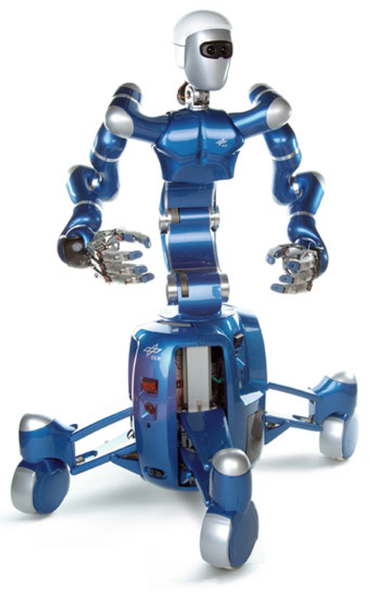

> Image description: A studio photograph displays a blue and silver humanoid robot, identified by the caption as "The DLR rolling justin," set against a plain white background. The robot features a humanoid upper body with a white, oval head containing two dark, circular eye sensors. Its torso is blue, connected to a heavy, blue motorized base with four articulated, silver-tipped wheels or stabilizing legs that extend outward to provide a wide support footprint. The upper body consists of two articulated arms with multiple blue segments and silver joint housings, ending in multi-fingered silver grippers. The neck is a silver cylindrical component connecting the head to the torso. The lower base houses internal electronic components, visible through an open side panel revealing circuit boards and wiring. The design emphasizes a modular, humanoid morphology integrated into a mobile, wheeled platform for research applications.
Redundant Robots, Fig. 6 The DLR rolling justin

redundancy resolution recently include learning algorithms (Rolf et al. 2010) and soft computing techniques (Liu and Li 2006). Active fields of new applications are in sensorial redundancy for data fusion (Luo and Chang 2012) and in systems (like the one in Fig.6) with a large number of degrees of freedom, namely, hyperredundant robots (Salvietti et al. 2009), humanoids (Kanoun and Laumond 2010), and multirobot systems (Antonelli et al. 2010).

## Cross-References

- Cooperative Manipulators
- Optimal Control and Mechanics
- Robot Motion Control

## Recommended Reading

Because of space and scope limitations, in drawing on overview of such a mature and welldeveloped topic, there are a number of techniques
and details that go neglected in any case; a slightly more extensive treatment of kinematic redundancy, including a touch on singularity robustness, cyclicity, and hyperredundant manipulators with related first-reading bibliography can be found in Chiaverini et al. (2008). Other major issues of interest that could not be covered here are in the use of kinematic redundancy for fault tolerance, for improved grasping, and for motion/force control; see, e.g., Roberts et al. (2008), Prats et al. (2011), and Khatib (1990), respectively.

## Bibliography

Antonelli G, Arrichiello F, Chiaverini S (2010) Flocking for multi-robot systems via the null-space-based behavioral control. Swarm Intell 4(1):37-56
Baillieul J (1985) Kinematic programming alternatives for redundant manipulators. In: Proceedings of the 1985 IEEE international conference on robotics and automation, St. Louis, pp 722-728
Baillieul J, Hollerbach J, Brockett R (1984) Programming and control of kinematically redundant manipulators. In: Proceedings of the 23th IEEE conference on decision and control, Las Vegas, pp 768-774
Chiaverini S (1997) Singularity-robust task-priority redundancy resolution for real-time kinematic control of robot manipulators. IEEE Trans Robot Autom 13:398-410
Chiaverini S, Oriolo G, Walker I (2008) Kinematically redundant manipulators. In: Siciliano B, Khatib O (eds) Springer handbook of robotics. Springer, Berlin, pp 245-268
Hollerbach J, Suh K (1987) Redundancy resolution of manipulators through torque optimization. IEEE J Robot Autom 3:308-316
Kanoun O, Laumond JP (2010) Optimizing the stepping of a humanoid robot for a sequence of tasks. In: Proceedings of the 10th IEEE-RAS international conference on humanoid robots, Nashville, pp 204-209
Kazerounian K, Wang Z (1988) Global versus local optimization in redundancy resolution of robotic manipulators. Int J Robot Res 7(5):3-12
Khatib O (1990) Motion/force redundancy of manipulators. In: Proceedings of the Japan-USA symposium on flexible automation, Kyoto, pp 337-342
Liégeois A (1977) Automatic supervisory control of the configuration and behavior of multibody mechanisms. IEEE Trans Syst Man Cybern 7:868-871
Liu Y, Li Y (2006) A new method of executing multiple auxiliary tasks by redundant nonholonomic mobile manipulators. In: Proceedings of the 2006 IEEE/RSJ international conference on intelligent robots and systems, Beijing, pp 1-6

<!-- source_pdf_page: 1168 -->
Luo R, Chang CC (2012) Multisensor fusion and integration: a review on approaches and its applications in mechatronics. IEEE Trans Ind Inform 8:49-60
Maciejewski A, Klein C (1985) Obstacle avoidance for kinematically redundant manipulators in dynamically varying environments. Int J Robot Res 4(3):109-117
Nakamura Y, Hanafusa H, Yoshikawa T (1987) Taskpriority based redundancy control of robot manipulators. Int J Robot Res 6(2):3-15
Prats M, Sanz P, del Pobil A (2011) The advantages of exploiting grasp redundancy in robotic manipulation. In: Proceedings of the 5th international conference on automation, robotics and applications, Wellington, pp 334-339
Roberts R, Hyun G, Maciejewski A (2008) Fundamental limitations on designing optimally faulttolerant redundant manipulators. IEEE Trans Robot 24:1224-1237
Rolf M, Steil J, Gienger M (2010) Goal babbling permits direct learning of inverse kinematics. IEEE Trans Auton Ment Dev 2:216-229
Salvietti G, Zhang H, Gonzalez-Gomez J, Prattichizzo D, Zhang J (2009) Task priority grasping and locomotion control of modular robot. In: Proceedings of the 2009 IEEE international conference on robotics and biomimetics, Guilin, pp 1069-1074
Sciavicco L, Siciliano B (1988) A solution algorithm to the inverse kinematic problem for redundant manipulators. IEEE J Robot Autom 4:403-410
Whitney D (1969) Resolved motion rate control of manipulators and human prostheses. IEEE Trans Man Mach Syst 10(2):47-53

## Regulation and Tracking of Nonlinear Systems

Lorenzo Marconi
C.A.SY. Ü- DEI, University of Bologna, Bologna, Italy

#### Abstract

A classical problem in control theory is the design of feedback laws such that the effect of exogenous inputs on selected output variables is asymptotically rejected. This includes problems of asymptotic tracking and disturbance rejection. In this entry, the fundamentals of the theory are presented, as well as constructive procedures for the design of a controller, which embeds an "internal model" of the generator of the exogenous inputs. Current and future research directions are also discussed.

## Keywords

Nonlinear output regulation; Robust control; Stabilization of nonlinear systems; Tracking

## Introduction

The problem of controlling a dynamical systems in such way that a "regulated" output tracks reference signals or rejects exogenous disturbances is ubiquitous in control theory. Among various possible different approaches to the solution of this problem, in this entry we present the socalled theory of nonlinear output regulation. A distinctive feature of this theory is that reference/disturbance signals to be tracked/rejected are thought of as unknown functions of time, which belong to the set of all trajectories generated by an autonomous nonlinear system (the so-called exosystem). Fundamental in this setting is the concept of internal model, developed in the early 1970s for linear systems by Francis and Wonham (1976) and subsequently extended, beginning with the work (Isidori and Byrnes 1990), to the case nonlinear systems. Since these early contributions, nonlinear output regulation has been an active research domain, in which constant improvements have brought the theory to a stage of full maturity. In this entry we introduce the fundamental principles of the nonlinear output regulation theory and the associated design tools. The entry ends with an overview of actual research trends and future research directions.

## The Generalized Tracking Problem for Nonlinear Systems

We consider the class of time-invariant smooth nonlinear systems described in the form

$$
\begin{align*}
\dot{x} & =f(w, x, u) \\
e & =h(w, x)  \tag{1}\\
y & =k(w, x)
\end{align*}
$$

in which $x \in \mathbb{R}^{n}$ is the state, $u \in \mathbb{R}^{m}$ is the control input, $y \in \mathbb{R}^{q}$ is the measured output, and

<!-- source_pdf_page: 1169 -->
$e \in \mathbb{R}^{p}$ is the regulation error. The input $w \in \mathbb{R}^{s}$ models exogenous signals that might represent references to be tracked, exogenous disturbances to be rejected, or also parametric uncertainties. In this framework the problem is to design a controller of the form

$$
\begin{align*}
& \dot{\xi}=\varphi(\xi, y) \quad \xi \in \mathbb{R}^{v}  \tag{2}\\
& u=\gamma(\xi, y)
\end{align*}
$$

such that the associated closed-loop system (1)-(2) has bounded trajectories $(x(t), \xi(t))$ and the resulting error $e(t)=h(w(t), x(t))$ is asymptotically vanishing, i.e., $\lim _{t \rightarrow \infty} e(t)=0$. The previous framework encompasses several standard control problems, such as the problem in which a system of the form $\dot{x}=f(x, u)$, with measured output $y=k(x)$ and regulated output $y_{\mathrm{r}}=h_{\mathrm{r}}(x)$, must be controlled in such a way that $y_{\mathrm{r}}(t)$ asymptotically tracks a reference signal $y^{*}(t)$. This is the case, in fact, if we set $w(t)=y^{*}(t)$, define $e=h(w, x)=w-h_{\mathrm{r}}(x)$, and drop the dependence from $w$ in the functions $f(\cdot)$ and $k(\cdot)$ in (1). Similarly, the previous framework lends itself to capture a scenario of disturbance suppression, in which, in a system of the form $\dot{x}=f(d, x, u)$, with measured output $y=k(x)$ and regulated output $y_{\mathrm{r}}=h(x)$, the effect of a disturbance $d(t)$ on the regulated output $y_{\mathrm{r}}(t)$ must be asymptotically rejected. This is the case if we set $w(t)=d(t)$ and drop the dependence on $w$ in $h(\cdot)$ and $k(\cdot)$ in (1). Similarly, by letting $h(x)=x$ and interpreting the variable $w$ as parametric uncertainty, the previous setting captures the problem of robust output feedback stabilization, at the origin, of an uncertain system of the form $\dot{x}=f(w, x, u)$ with measured output $y=k(w, x)$. Of course, the general case of tracking reference signals in presence of exogenous disturbances can be cast in a similar manner.

The ability of solving the problem in question strongly depends on the amount of knowledge one assumes about the exogenous variable $w$ in the design of the controller (2). Among the different options available, in this entry we present the so-called theory of output regulation, in which the exogenous variable is assumed to be an un-
known member of a known family of functions of time. Specifically, it is assumed that $w(t)$ is an unspecified member of the set of all trajectories generated by an autonomous nonlinear system of the form

$$
\begin{equation*}
\dot{w}=s(w) \tag{3}
\end{equation*}
$$

as its initial condition $w(0)$ ranges on a prescribed set $W \subset \mathbb{R}^{s}$. In this framework, system (3), usually referred to as the "exosystem," is assumed to be known and its knowledge potentially exploitable in the design of (2). The specific "member" $w(t)$ of the family, however, is unspecified as the initial condition $w(0)$ is not known. The fact of regarding $w(t)$ as unknown member of a known family seems to be the right trade-off between the favorable but unrealistic situation in which $w(t)$ is assumed to be perfectly known and the opposite realistic but conservative situation in which $w(t)$ is regarded as a totally unknown signal. An elementary, and yet meaningful, example is given by the case in which $w(t)$ belongs to the family of periodic functions of time with an unspecified frequency, phase, and amplitude. In this case the exosystem (3) is a nonlinear system of the form $\left(w \in \mathbb{R}^{3}\right)$

$$
\dot{w}_{1}=w_{2} \quad \dot{w}_{2}=-w_{3}^{2} w_{1} \quad \dot{w}_{3}=0
$$

Solutions of the previous system, in fact, are periodic functions, with frequency $w_{3}(t) \equiv w_{3}(0)$ and amplitude and phase depending on the specific initial condition $\left(w_{1}(0), w_{2}(0)\right)$. Other situations, such as exosystems modeling nonlinear oscillators, can be dealt with in a similar fashion.

In the previous context, the problem of output regulation can be formally cast as follows. Let $X \subset \mathbb{R}^{n}$ be a set of initial conditions for (1). Then, the problem consists in finding a controller of the form (2), with initial conditions in a set $\Xi \subset \mathbb{R}^{\nu}$, such that the trajectories of the closedloop system (1)-(2) augmented with (3), originating from an initial condition $(w(0), x(0), \xi(0)) \in W \times X \times \Xi$, are bounded and $\lim _{t \rightarrow \infty} e(t)=0$ uniformly in the initial conditions (The property of "uniformity" is relevant in the context of output regulation. It reflects the requirement that the time needed for the error $e(t)$ to reach an

<!-- source_pdf_page: 1170 -->
$\epsilon$-neighborhood of the origin only depends on the set $W \times X \times-i$, where the initial conditions are supposed to range, and on $\epsilon$ but not on the particular value of the initial condition within $W \times X \times \Xi$.). Depending on the assumptions on the set $X$ where the initial conditions of the plant are assumed to range, the problem is further classified in semiglobal output regulation, if the set $X$ is a known compact but otherwise arbitrary set of $\mathbb{R}^{n}$, or global output regulation if $X=\mathbb{R}^{n}$.

## Output Regulation Principles

## Steady State for Nonlinear Systems and Internal Model Principle

Since the objective is to design the controller such that the effect of the exogenous variable is asymptotically rejected by the regulation error, it is apparent that any approach to the solution of the problem of output regulation must be necessarily grounded on a precise characterization of the notion of "steady state" for a nonlinear system. As it is the case for the familiar version of this concept in linear systems theory, a notion of "steady state," for the system consisting of (1)-(3), should be able to capture the "limiting behavior" - if any - that such system asymptotically approaches when the "transient behavior," due to the effect of specific initial conditions of plant and controller, fades out and a "persistent behavior," induced only by the specific exogenous input, emerges. In this respect, the mathematical tool that has been shown to be at the core of a rigorous notion of steady state for nonlinear systems is the one of $\omega$-limit set of a set. We refer the reader to Hale et al. (2002) for a definition of this notion and to Byrnes and Isidori (2003) for a description of its use in the characterization of the steadystate behavior of a nonlinear system. In this entry, we simply observe that if the trajectories of the system (3)-(1)-(2) that originate from the set of initial conditions $W \times X \times \Xi$ are bounded (which, in turn, is one of the requirements of the problem in question), then there exists a compact set $\mathcal{A} \subset \mathbb{R}^{s} \times \mathbb{R}^{n} \times \mathbb{R}^{v}$, which is precisely the $\omega$-limit set of the set $W \times X \times \Xi$ under the dynamics of (3)-(1)(2), that is invariant for the closed-loop system
and that uniformly attracts its trajectories. The set $\mathcal{A}$ is usually referred to as steady-state locus, while the restriction of the closed-loop dynamics to the set $\mathcal{A}$ are the steady-state dynamics of the closed-loop system. The latter characterize the "limiting behavior" of the system towards which all the closed-loop trajectories converge to. Unlike the case of linear systems, though, in a nonlinear context we cannot expect, in general, that the steady-state behavior is only governed by the exogenous $w$, namely, that the asymptotic behavior of the closed-loop system is totally independent of the initial conditions of the plant and of the regulator. Assuming that the set $W$ is compact and invariant for ( 3 ), it can be proven (see Isidori and Byrnes 2008) that the set $\mathcal{A}$ is the graph of a set-valued map defined on $W$, namely, that there exists a map $\sigma: W \rightarrow \mathbb{R}^{n} \times \mathbb{R}^{\nu}$, which is set-valued in general, such that
$\mathcal{A}=\left\{(w, x, \xi) \in W \times \mathbb{R}^{n} \times \mathbb{R}^{v}:(x, \xi) \in \sigma(w)\right\}$.

Clearly the steady-state locus and the associated steady-state dynamics of the closed-loop system depend on the design of the controller (2). The role of the latter is not only to enforce the existence of a steady state, which is equivalent to enforce bounded closed-loop trajectories, but also to guarantee that the error converges asymptotically to zero uniformly in the initial conditions. In this respect, by bearing in mind the asymptotic properties of the set $\mathcal{A}$, it can be seen that a sufficient condition under which a regulator of the form (2) solves the problem of output regulation is that the steady-state locus is "shaped" in such a way that the regulation error is zero on it, namely,

$$
\begin{equation*}
\mathcal{A} \subset\{(w, x, \xi): h(w, x)=0\} . \tag{4}
\end{equation*}
$$

In fact, it can be proved that condition (4) is not only sufficient but also necessary (see Byrnes and Isidori 2003) as a consequence of the requirement that the error converges to zero uniformly in the initial conditions. That is, any regulator that solves the problem in question necessarily enforces a steady state such that the steady-state locus fulfills (4).

<!-- source_pdf_page: 1171 -->
In view of the previous considerations, a crucial property required to any regulator is to induce a steady-state locus $\mathcal{A}$ fulfilling (4). This key feature can be further elaborated by highlighting two necessary conditions, involving separately the plant and the regulator, leading to the notions of regulator equations and internal model property. To this purpose, consider the simplified, yet relevant, case in which the map $\sigma(\cdot)$ is singlevalued and smooth, and let $\pi(w)$ and $\tau(w)$ be the two components of $\sigma(w)$ associated to $x$ and $\xi$, respectively. By letting

$$
\begin{equation*}
c(w)=\gamma(\tau(w), k(w, \pi(w))) \tag{5}
\end{equation*}
$$

it is immediately realized that the fact that $\mathcal{A}$ is invariant for (1)-(3) implies that the functions $\pi(\cdot)$ and $\tau(\cdot)$ necessarily fulfill

$$
\begin{equation*}
\frac{\partial \pi(w)}{\partial w} s(w)=f(w, \pi(w), c(w)) \tag{6}
\end{equation*}
$$

and

$$
\begin{equation*}
\frac{\partial \tau(w)}{\partial w} s(w)=\varphi(\tau(w), k(w, \pi(w))) \tag{7}
\end{equation*}
$$

for all $w \in W$. Furthermore, the fact that $e$ must be zero on $\mathcal{A}$ (see (4)) implies that necessarily

$$
\begin{equation*}
h(w, \pi(w))=0 \tag{8}
\end{equation*}
$$

for all $w \in W$. Equations (6) and (8), interpreted as equations in the unknown $\pi(w)$ and $c(w)$, involve only the regulated plant (1) and are known as regulator equations (see Isidori 1995; Isidori and Byrnes 1990). The functions $c(w(t))$ and $\pi(w(t))$, with $w(t)$ solution of (3), represent, respectively, the desired steady-state control input and state towards which the actual control input $u$ and state $x$ of (1) should converge in order to have the regulation goal fulfilled. On the other hand, Eqs. (5) and (7), interpreted as equations in the unknown $\tau(w)$, point out the so-called internal model property required to any regulator solving the output regulation problem, that is, the ability of the regulator to reproduce the ideal steadystate input $c(w(t))$, for all possible $w(t)$ solution of (3), once it is driven by the measured output of
the plant in the ideal steady state (namely, by the function $k(w(t), \pi(w(t))))$. In fact, this property can be achieved by incorporating in the controller an appropriate "internal model" of the exogenous dynamics (3).

## Regulator Design

As emphasized in the previous discussion, the design of the regulator involves the fulfillment of two crucial properties. The first is the internal model property, namely, the ability of generating, by means of the regulator outputs, all possible "feedforward inputs" which force an identically zero regulation error and, in turn, to guarantee the existence of an invariant steadystate set on which the error is identically zero. The second property asks that such a steadystate set is asymptotically stable for the closedloop system with a domain of attraction including the set of initial conditions. A systematic design procedure of regulators simultaneously fulfilling the previous two properties can be found under sufficient conditions that essentially restrict the class of regulated plants (1). In particular, in the following, we consider the class of single inputsingle output systems that are affine in the input $u$, with a measurable error variable (i.e., $e=y$ ) and that after an appropriate change of coordinates can be written in the form

$$
\begin{array}{ll}
\dot{z}=f_{z}(w, z, e) & z \in \mathbb{R}^{n-1}  \tag{9}\\
\dot{e}=a(w, z, e)+b(w, z, e) u & e, u \in \mathbb{R}
\end{array}
$$

with $f_{z}(\cdot, \cdot, \cdot), a(\cdot, \cdot, \cdot)$, and $b(\cdot, \cdot, \cdot)$ smooth functions with $b(w, z, e) \neq 0$ for all $(w, z, e)$. Systems of this kind possess a well-defined unitary relative degree (The restriction to systems with unitary relative degree is just made for sake of simplicity. Higher relative degree can be equally dealt with, Isidori (1995).) between the input $u$ and the output $e$, and the Eqs. (9) are said to be in normal form (see Isidori 1995, 2013). In these coordinates an easy calculation shows that the solution of the regulator Eqs. (6) and (8) takes the form $\pi(w)=\left(\pi_{z}(w), 0\right)$, where $\pi_{z}(\cdot): W \rightarrow \mathbb{R}^{n-1}$ is a solution of

<!-- source_pdf_page: 1172 -->
$$
\frac{\partial \pi_{z}(w)}{\partial w} s(w)=f_{z}\left(w, \pi_{z}(w), 0\right),
$$

and

$$
c(w)=-\frac{a\left(w, \pi_{z}(w), 0\right)}{b\left(w, \pi_{z}(w), 0\right)} .
$$

In addition, we further restrict the class of systems by asking for a minimum-phase property (Isidori 1995, 2013). In the present context, the property in question amounts to asking that the set $\mathcal{B}=\left\{(w, z) \in W \times \mathbb{R}^{n-1}: z=\pi_{z}(w)\right\}$ is asymptotically stable for the system

$$
\begin{aligned}
\dot{w} & =s(w) \\
\dot{z} & =f_{z}(w, z, 0)
\end{aligned}
$$

with a domain of attraction containing $W \times Z$, with $Z$ the set where the initial condition of $z$ is expected to range.

Existence of the relative degree and the property of minimum-phase are all what is needed to design a regulator. The regulator takes the form

$$
\begin{align*}
& \dot{\xi}=F \xi+G(\gamma(\xi)+\kappa(e)) \quad \xi \in \mathbb{R}^{v} \\
& u=\gamma(\xi)+\kappa(e) \tag{10}
\end{align*}
$$

in which ( $F, G$ ) is a controllable pair and $\gamma(\cdot)$ and $\kappa(\cdot)$ are real-valued functions to be properly designed. In particular, it can be shown (see Marconi et al. 2007) that if $\nu$, the dimension of the regulator is taken sufficiently large relative to the dimension of $w$ (specifically, $v \geq 2 s+2$ ) and if $F$ is any matrix whose eigenvalues have negative real part, there exist a continuously differentiable function $\tau(\cdot)$ and a continuous function $\gamma(\cdot)$ such that

$$
\begin{align*}
\frac{\partial \tau(w)}{\partial w} s(w) & =F \tau(w)+G c(w)  \tag{11}\\
c(w) & =\gamma(\tau(w))
\end{align*}
$$

for all $w \in W$. This being the case, it is seen that the regulator (10) fulfills conditions (5)-(7) and therefore has the internal model property, regardless of how $\kappa(\cdot)$ is chosen, provided that $\kappa(0)=0$. In particular, in the closedloop system (3), (9), and (10), the invariant set $\mathcal{A}=\left\{(w, z, e, \xi) \in W \times \mathbb{R}^{n-1} \times \mathbb{R} \times \mathbb{R}^{v}: z=\right. \left.\pi_{z}(w), e=0, \xi=\tau(w)\right\}$ fulfills (4) regardless
of how $\kappa(\cdot)$ is chosen. The function $\kappa(\cdot)$ is a degree of freedom that can be chosen to make the steady-state set $\mathcal{A}$ asymptotically stable. In this respect the minimum-phase assumption and the fact that $F$ is a Hurwitz matrix play a role. In fact, the closed-loop system (3), (9), and (10), interpreted as a system with state ( $w, z, e$ ), input $\kappa(\cdot)$, and output $e$, have relative degree one and it is minimum-phase. This fact makes it possible to use standard high-gain arguments to show that there exists a function $\kappa(\cdot)$ such that the set $\mathcal{A}$ is asymptotically stable for the closed-loop systems with a domain of attraction containing any (arbitrarily large) compact set of initial conditions (see Marconi et al. 2007; Teel and Praly 1995).

The delicate part in the procedure illustrated above is the design of the function $\gamma(\cdot)$ that is required to fulfill (11) for a suitable $\tau(\cdot)$. Exact, although hardly implementable in practice, expressions for the function $\gamma(\cdot)$ can be found in Marconi and Praly (2008). More constructive design procedures can be found at the price of restricting the class of systems and exosystems that can be dealt with. Such procedures require that the autonomous dynamical system with "output" $u *$

$$
\begin{aligned}
\dot{w} & =s(w) \\
u^{*} & =c(w),
\end{aligned}
$$

namely, the system characterizing all possible ideal steady-state inputs, is "immersed" into a system exhibiting certain structural properties (Loosely speaking, the autonomous system with output $\Sigma$ is immersed into the autonomous system with output $\tilde{\Sigma}$ if the set of all possible functions of time generated as outputs of $\Sigma$ is a subset of the set of all possible functions generated as outputs of $\tilde{\Sigma}$.). In this respect a number of alternative solutions have been proposed in literature that differ for the kind of underlying immersion assumption and consequent regulator design procedure. Immersion into a linear known observable system (see Byrnes et al. 1997; Huang and Lin 1994; Khalil 1994; Serrani et al. 2000), immersion into a linear unknown (but linearly parameterized) system (Serrani et al. 2001), immersion into a linear system having a nonlinear output map (Chen and Huang 2004), immersion

<!-- source_pdf_page: 1173 -->
into a nonlinear system linearizable by output injection (Delli Priscoli 2004), immersion into a system in canonical observability form Byrnes and Isidori (2004), and immersion into a system in a nonlinear adaptive observability form Delli Priscoli et al. (2006a,b) are a few examples of approaches proposed in literature.

## Summary and Future Directions

The theory of output regulation for nonlinear systems is an active area of investigation. Research efforts are, in particular, addressed to the problems of weakening the minimumphase assumption and of identifying robust design procedures, to asymptotically stabilize the steady-state locus, not necessarily based on high-gain principles. Recently, the problem of output regulation for multivariable systems has been also addressed (Isidori and Marconi 2012). In this case a paradigm shift in the design of the regulator and of the stabilizer is expected to deal with the problem in its full generality. Finally, it is worth mentioning that the theory of output regulation and internal model-based design methods are being used for the problem of reaching a consensus between the outputs of a network of nonlinear systems exchanging relative information over a communication graph. In this case it has been proved the necessity of internal model-based regulators (Wieland 2010) and the research activity is now conveyed to identify constructive design strategies for classes of nonlinear systems and network topologies.

## Cross-References

- Differential Geometric Methods in Nonlinear Control
- Lyapunov's Stability Theory
- Nonlinear Zero Dynamics
- Tracking and Regulation in Linear Systems

## Bibliography

Byrnes CI, Isidori A (2003) Limit sets, zero dynamics and internal models in the problem of nonlinear output regulation. IEEE Trans Autom Control 48:1712-1723

Byrnes CI, Isidori A (2004) Nonlinear internal models for output regulation. IEEE Trans Autom Control 49:2244-2247
Byrnes CI, Delli Priscoli F, Isidori A, Kang W (1997) Structurally stable output regulation of nonlinear systems. Automatica 33:369-385
Chen Z, Huang J (2004) Global robust servomechanism problem of lower triangular systems in the general case. Syst Control Lett 52:209-220
Delli Priscoli F (2004) Output regulation with nonlinear internal models. Syst Control Lett 53: 177-185
Delli Priscoli F, Marconi L, Isidori A (2006a) A new approach to adaptive nonlinear regulation. SIAM J Control Optim 45:829-855
Delli Priscoli F, Marconi L, Isidori A (2006b) Nonlinear observers as nonlinear internal models. Syst Control Lett 55:640-649
Francis BA, Wonham WM (1976) The internal model principle of control theory. Automatica 12:457465
Hale JK, Magalhães LT, Oliva WM (2002) Dynamics in infinite dimensions. Springer, New York
Huang J (2004) Nonlinear output regulation: theory and applications. SIAM, Philadelphia
Huang J, Lin CF (1994) On a robust nonlinear multivariable servomechanism problem. IEEE Trans Autom Control 39:1510-1513
Isidori A (1995) Nonlinear control systems, 3rd edn. Springer, Berlin/New York
Isidori A (2013) Nonlinear zero dynamics. In: Encyclopedia of systems and control. Springer
Isidori A, Byrnes CI (1990) Output regulation of nonlinear systems. IEEE Trans Autom Control 25:131-140
Isidori A, Byrnes CI (2008) Steady-state behaviors in nonlinear systems with an application to robust disturbance rejection. Ann Rev Control 32:1-16
Isidori A, Marconi L (2008) System regulation and design, geometric and algebraic methods’. In: Encyclopedia of complexity and system science. Section control and dynamical systems. Springer, Heidelberg
Isidori A, Marconi L (2012) Shifting the internal model from control input to controlled output in nonlinear output regulation. In: Proceedings of the 51th IEEE conference on decision and control, Maui
Isidori A, Marconi L, Serrani A (2003) Robust autonomous guidance: an internal model-based approach. Limited series advances in industrial control. Springer, London
Khalil H (1994) Robust servomechanism output feedback controllers for feedback linearizable systems. Automatica 30:587-1599
Marconi L, Praly L (2008) Uniform practical output regulation. IEEE Trans Autom Control 53(5):1184-1202
Marconi L, Praly L, Isidori A (2007) Output stabilization via nonlinear luenberger observers. SIAM J Control Optim 45(6):2277-2298
Pavlov A, van de Wouw N, Nijmeijer H (2006) Uniform output regulation of nonlinear systems: a convergent dynamics approach. Birkhauser, Boston

<!-- source_pdf_page: 1174 -->
Serrani A, Isidori A, Marconi L (2000) Semiglobal output regulation for minimum-phase systems. Int J Robust Nonlinear Control 10:379-396
Serrani A, Isidori A, Marconi L (2001) Semiglobal nonlinear output regulation with adaptive internal model. IEEE Trans Autom Control 46:1178-1194
Teel AR, Praly L (1995) Tools for semiglobal stabilization by partial state and output feedback. SIAM J Control Optim 33:1443-1485
Wieland P (2010) From static to dynamic couplings in consensus and synchronization among identical and non-identical systems. PhD thesis, Universität Stuttgart

## Risk-Sensitive Stochastic Control

Hideo Nagai
Osaka University, Osaka, Japan

#### Abstract

Motivated by understanding "robustness" from the view points of stochastic control, the studies of risk-sensitive control have been developed. The idea was applied to portfolio optimization problems in mathematical finance, from which new kinds of problem on stochastic control, named "large deviation control," have been brought, and currently the studies are in progress.

## Keywords

Large deviation control; Mathematical finance; Robustness

## Risk-Sensitive Criterion

Risk-sensitive stochastic control has the criterion

$$
\begin{equation*}
J(x, 0 ; T ; \gamma)=\frac{1}{\gamma} \log E\left[e^{\gamma\left\{\int_{0}^{T} f\left(X_{s}, u_{s}\right) d s+\varphi\left(X_{T}\right)\right\}}\right] \tag{1}
\end{equation*}
$$

with $\gamma \neq 0$, where $X_{t}$ is the state variable process defined by the controlled stochastic differential equation

$$
\begin{equation*}
d X_{t}=\sigma\left(X_{t}\right) d B_{t}+b\left(X_{t}, u_{t}\right) d t, \quad X_{0}=x \tag{2}
\end{equation*}
$$

with the control parameter process $u_{t}$. Here $\sigma(x): R^{N} \mapsto R^{N} \otimes R^{d}$ and $b(x, u): R^{N} \times R^{m} \mapsto R^{N}$. When $\gamma \rightarrow 0$, the criterion behaves as

$$
\begin{aligned}
& J(x, 0 ; T ; \gamma) \sim E\left[\int_{0}^{T} f\left(X_{s}, u_{s}\right) d s+\varphi\left(X_{T}\right)\right] \\
& +\frac{\gamma}{2} \operatorname{Var}\left[\int_{0}^{T} f\left(X_{s}, u_{s}\right) d s+\varphi\left(X_{T}\right)\right]+O\left(\gamma^{2}\right) .
\end{aligned}
$$

Then, minimizing the criterion with $\gamma>0$ is considered to be risk averse, while with $\gamma<0$ it is to be risk seeking. The problem minimizing the classical criterion $E\left[\int_{0}^{T} f\left(X_{s}, u_{s}\right) d s+\varphi\left(X_{T}\right)\right]$ corresponds to the case of $\gamma=0$, which is risk neutral.

When $f(x, u)=\frac{1}{2} x^{*} Q x+\frac{1}{2} u^{*} S u, \varphi(x)= \frac{1}{2} x^{*} U x$, and $b(x, u)=A x+C u, \sigma(x) \equiv \Sigma$ with constant matrices $Q, S, U, A, C, \Sigma$, minimizing the criterion subject to the state variable processes $X_{t}$ is called a linear exponential quadratic Gaussian (LEQG) control problem, where one may assume $Q$ and $U$ to be nonnegative definite and $S$ positive definite.

## H-J-B Equations

The Hamilton-Jacobi-Bellman (H-J-B) equation for the problem minimizing criterion $J$ defined by (1) among the controlled processes governed by (2) is seen to be

$$
\left\{\begin{array}{l}
\frac{\partial v}{\partial t}+\frac{1}{2} \operatorname{tr}\left[a(x) D^{2} v\right]+H(x, \nabla v)=0  \tag{3}\\
v(T, x)=\varphi(x),
\end{array}\right.
$$

where $a(x):=\left(a^{i j}(x)\right)=\left(\left(\sigma \sigma^{*}\right)^{i j}(x)\right)$ and

$$
H(x, p)=\frac{\gamma}{2} p^{*} a(x) p+\inf _{u}\left\{b(x, u)^{*} p+f(x, u)\right\} .
$$

In an LEQG case, where we assume that $Q, U$ are nonnegative definite and $S$ positive definite, the H-J-B equation has the solution expressed as

$$
v(t, x)=\frac{1}{2} x^{*} P(t) x+G(t),
$$

by using the solutions $G(t)$ of ordinary differential equation

<!-- source_pdf_page: 1175 -->
$$
\dot{G}(t)+\frac{1}{2} \operatorname{tr}\left[P \Sigma \Sigma^{*}\right]=0, \quad G(T)=0
$$

and $P(t)$ of the Riccati equation

$$
\begin{aligned}
\dot{P}(t) & +P A+A^{*} P-P\left(C S^{-1} C^{*}-\gamma \Sigma \Sigma^{*}\right) \\
& P+Q=0
\end{aligned}
$$

with the terminal condition $P(T)=U$, provided that it has a nonnegative definite solution $P(t)$. However, it may occur that the Riccati equation does not have any solution if $\gamma$ is large. In that case, we say that the risk-sensitive control problem "breaks down." Namely, there is no control which makes the criterion have a finite value. On the other hand, if it has a solution, then the optimal feedback control is seen to be $-S^{-1} C^{*} P(t) x$ and the optimal diffusion process turns out to be the solution to
$d X_{t}=\Sigma d B_{t}+\left(A X_{t}-C S^{-1} C^{*} X_{t}\right) d t, X_{0}=x$.

The situation can extend to certain general cases. Under sufficiently general conditions one can say that if H-J-B equation (3) has a solution, then no "breakdown" occurs in the corresponding risksensitive stochastic control problem (cf. Bensoussan and Nagai 2000; Bensoussan et al. 1998; Nagai 1996).

The LEQG problems were first investigated in Jacobson (1973), and then a theory of the LEQG control with complete or partial state information is developed in Whittle (1981) and Bensoussan and Van Schuppen (1985). Development of the studies of nonlinear risk-sensitive control can be seen in Bensoussan et al. (1998), Nagai (1996), Fleming and McEneaney (1995), etc.

## Singular Limits and $\boldsymbol{H}^{\boldsymbol{\infty}}$ Control

The large deviation theory of Freidlin-Wentzell applies to the risk-sensitive control problem with the criterion

$$
\begin{equation*}
J_{\epsilon}(x, 0 ; T)=\frac{\epsilon}{\theta} \log E\left[e^{\left.\frac{\theta}{\epsilon} \int_{0}^{T}\left\{\frac{1}{2} u_{s}^{*} S\left(X_{s}\right) u_{s}+V\left(X_{s}\right)\right\} d s\right)}\right] \tag{4}
\end{equation*}
$$

and the controlled dynamics

$$
\begin{equation*}
d X_{t}=\sqrt{\epsilon} \sigma\left(X_{t}\right) d B_{t}+\left\{b\left(X_{t}\right)+C\left(X_{t}\right) u_{t}\right\} d t . \tag{5}
\end{equation*}
$$

The corresponding H-J-B equation is

$$
\begin{align*}
& \left\{\begin{array}{l}
\frac{\partial v_{\epsilon}}{\partial t}+\frac{\epsilon}{2} \operatorname{tr}\left[a(x) D^{2} v_{\epsilon}\right]+H_{0}\left(x, \nabla v_{\epsilon}\right)+V=0 \\
v_{\epsilon}(T, x)=0
\end{array}\right. \\
& H_{0}(x, p)=\frac{\theta}{2} p^{*} a(x) p+b(x)^{*} p  \tag{6}\\
& \quad+\inf _{u \in R^{m}}\left\{u^{*} C(x) p+\frac{1}{2} u^{*} S(x) u\right\} \\
& \quad=b(x)^{*} p-\frac{1}{2} p^{*}\left\{C S^{-1} C(x)^{*}-\theta a(x)\right\} p .
\end{align*}
$$

By employing viscosity solution theory, we can see that, when sending $\epsilon \rightarrow 0$, the solution $v_{\epsilon}$ of (6) converges to the viscosity solution $w$ of the equation

$$
\left\{\begin{array}{l}
\frac{\partial w}{\partial t}+H_{0}(x, \nabla w)+V=0  \tag{7}\\
w(T, x)=0
\end{array}\right.
$$

Noting that $H_{0}(x, p)$ can be regarded as

$$
\begin{aligned}
& H_{0}(x, p)=\sup _{z}\left\{z^{*} p-\frac{1}{2 \theta} z^{*} a(x)^{-1} z\right\} \\
& \quad+\inf _{u}\left\{u^{*} C(x) p+\frac{1}{2} u^{*} S(x) u\right\}
\end{aligned}
$$

Equation (7) is written as

$$
\begin{aligned}
& \frac{\partial w}{\partial t}+\sup _{z}\left\{z^{*} D w-\frac{1}{2 \theta}(D w)^{*} a(x)^{-1} D w\right\} \\
& \quad+\inf _{u}\left\{u^{*} C(x) D w+\frac{1}{2} u^{*} S(x) u\right\}=0 \\
& w(T, x)=0
\end{aligned}
$$

This equation has a unique viscosity solution under suitable conditions. Further, $w(0, x)$ is characterized as the lower value of the differential game with the criterion

$$
I\left(0, T ; z_{.}, u(z .)\right)=\int_{0}^{T} \Psi\left(x_{s}, z_{s}, u(z .)_{s}\right) d s
$$

$\Psi(x, z, u)=-\frac{1}{2 \theta} z^{*} a(x)^{-1} z+\frac{1}{2} u^{*} S(x) u+V(x)$ and the controlled dynamics
$d x_{s}=\left\{b\left(x_{s}\right)+z_{s}+C\left(x_{s}\right) u\left(z_{.}\right)_{s}\right\} d s, \quad x_{0}=x$,
where $z_{s}$ is a measurable, $R^{N}$-valued function on $[0, T]$ such that $\int_{0}^{T}\left|z_{s}\right|^{2} d s<\infty$ and the set of such $\left\{z_{s}\right\}$ is denoted by $\mathcal{Z}_{T}$. Further, let $\mathcal{U}$ be the

<!-- source_pdf_page: 1176 -->
totality of a measurable, $R^{m}$-valued function such that $\int_{0}^{T}\left|u_{s}\right|^{2} d s<\infty$ and $u(z$.$) be a map defined$ on $\mathcal{Z}$ with its value on $\mathcal{U}$ such that whenever for each $0 \leq \tau \leq T$ and $z^{(1)}, z^{(2)} \in \mathcal{Z}, z^{(1)}(s)= z^{(2)}(s)$, almost everywhere on $0 \leq s \leq \tau$, then $u\left(z_{.}^{(1)}\right)_{s}=u\left(z_{.}^{(2)}\right)_{s}$, a.e. on $0 \leq s \leq \tau$, and the set of such $u(z$.$) is denoted by \Gamma_{U}$. Thus, the lower value of the game is defined as

$$
w(0, x)=\inf _{u(z) \in \Gamma_{U}} \sup _{z \in \mathcal{Z}} I\left(0, T ; z_{.}, u(z .)\right)
$$

(cf. Bensoussan and Nagai 1997 and references therein). The differential game is known to be related to $H^{\infty}$ or Robust control. If $\theta$ is large, then H-J-B equation (6) may fail to have a solution (cf. Bensoussan and Nagai 1997, 2000). The size of $\theta$ ensuring the existence of solution to (6) is related to the level of robustness which the above differential game concerns (Basar and Bernhard 1991; Bensoussan and Nagai 1997, 2000; Bensoussan et al. 1998; Whittle 1990).

## Risk-Sensitive Asset Management

The idea of risk-sensitive control applies to mathematical finance (Bielecki and Pliska 1999; Fleming 1995). Consider a market model with $m+1$ securities, where the security prices are defined by

$$
\begin{gathered}
d S^{0}(t)=r\left(X_{t}\right) S^{0}(t) d t \\
d S^{i}(t)=S^{i}(t)\left\{\alpha^{i}\left(X_{t}\right) d t+\sum_{k=1}^{n+m} \sigma_{k}^{i}\left(X_{t}\right) d B_{t}^{k}\right\}
\end{gathered}
$$

$i=1, \ldots m$, with an $n+m$ dimensional Brownian motion process $B_{t}= \left(B_{t}^{1}, B_{t}^{2}, \ldots, B_{t}^{n+m}\right)$ defined on a filtered probability space ( $\Omega, \mathcal{F}, P ; \mathcal{F}_{t}$ ). The volatilities $\sigma$, the instantaneous mean returns $\alpha$ of the risky assets, and the interest rate $r$ of the riskless asset are affected by the economic factors $\left(X_{t}^{1}, \ldots, X_{t}^{n}\right)$ defined as the solution of the stochastic differential equation
$d X_{t}=\beta\left(X_{t}\right) d t+\lambda\left(X_{t}\right) d B_{t}, \quad X(0)=x \in R^{n}$.

Let us set the total wealth $W_{T}$ of an investor to be $W_{T}=\sum_{i} N_{T}^{i} S_{T}^{i}$ with $N_{T}^{i}$, number of the share invested to $i$ th security $S_{T}^{i}$ at time $T$, and $W_{0}$ the initial wealth. Expected power utility maximization maximizing $\frac{1}{\gamma} E\left[W_{T}^{\gamma}\right]=\frac{1}{\gamma} E\left[e^{\gamma \log W_{T}}\right]$, $\gamma<1, \neq 0$ (Merton 1990) is equivalent to

$$
\begin{equation*}
\sup \frac{1}{\gamma} \log E\left[e^{\gamma \log W_{T}}\right] \tag{8}
\end{equation*}
$$

and it has been studied in terms of "risk-sensitive asset management." When introducing portfolio proportion $h_{t}^{i}$ invested to $i$ th security defined by $h^{i}(t)=\frac{N^{i}(t) S^{i}(t)}{W(t)}$ for each $i=0, \ldots, m$ and setting $h(t)^{*}=\left(h^{1}(t), h^{2}(t), \ldots, h^{m}(t)\right)$, the total wealth $W_{t}$ turns out to satisfy

$$
\begin{aligned}
\frac{d W(t)}{W(t)}= & \left\{r\left(X_{t}\right)+h(t)^{*} \hat{\alpha}\left(X_{t}\right)\right\} d t \\
& +h(t)^{*} \sigma\left(X_{t}\right) d B_{t}
\end{aligned}
$$

under the self-financing condition, where $\hat{\alpha}(x)= \alpha(x)-r(x) \mathbf{1}, \mathbf{1}=(1,1, \ldots, 1)^{*}$. In considering the maximization problem, the portfolio proportion $h_{t}$ is considered an investment strategy to be controlled and assumed to be $\mathcal{G}_{t}^{S, X}:= \sigma(S(u), X(u), u \leq t)$ progressively measurable in the case of full information. The problem is often considered under partial information where $h_{t}$ is assumed to be $\mathcal{G}_{t}^{S}:=\sigma(S(u), \quad u \leq t)$ measurable. Here we first discuss the case of full information, and the set of admissible strategies $\mathcal{A}(T)$ (or $\mathcal{A}$ ) is determined as the totality of $\mathcal{G}_{t}^{S, X}$ progressively measurable investment strategies satisfying some suitably defined integrability conditions.

Considering (8) for $\gamma<0$ amounts to studying the minimization problem

$$
\begin{equation*}
\hat{v}(0, x)=\inf _{h \in \mathcal{A}(T)} \log E\left[e^{\gamma \log W_{T}(h)}\right] \tag{9}
\end{equation*}
$$

Then introducing a probability measure $p^{h}$ defined by

<!-- source_pdf_page: 1177 -->
$P^{h}(A)=E\left[e^{\gamma \int_{0}^{T} h_{s}^{*} \sigma\left(X_{s}\right) d W_{s}-\frac{\gamma^{2}}{2} \int_{0}^{T} h_{s}^{*} \sigma \sigma^{*}\left(X_{s}\right) h_{s} d s}: A\right]$,
$A \in \mathcal{F}_{T}$, the value function is expressed as

$$
\begin{aligned}
\hat{v}(0, x)= & \gamma \log W_{0}+\inf _{h \in \mathcal{A}(T)} \\
& \log E^{h}\left[e^{-\gamma \int_{0}^{T} \eta\left(X_{s}, h_{s}\right) d s}\right]
\end{aligned}
$$

with the initial wealth $W_{0}$, where

$$
\eta(x, h)=-h^{*} \hat{\alpha}(x)+\frac{1-\gamma}{2} h^{*} \sigma \sigma^{*}(x) h-r(x)
$$

and $\hat{\alpha}(x)=\alpha(x)-r(x)$ 1. By using the Brownian motion $B_{t}^{h}:=B_{t}-\gamma \int_{0}^{t} \sigma^{*}\left(X_{s}\right) h_{s} d s$ under the new probability measure $P^{h}$, the dynamics of the economic factor $X_{t}$ is written as

$$
\begin{equation*}
d X_{t}=\left\{\beta\left(X_{t}\right)+\gamma \lambda \sigma^{*}\left(X_{t}\right) h_{t}\right\} d t+\lambda\left(X_{t}\right) d B_{t}^{h} \tag{10}
\end{equation*}
$$

Thus, we arrive at the risk-sensitive control problem with the value function $\hat{v}(0, x)$ and the controlled dynamics $X_{t}$ governed by (10). Note that $\frac{1-\gamma}{2}>0$ for $\gamma<1$ and that the case where $\gamma<0$ is called risk averse, which we mainly discuss here. Then the corresponding H-J-B equation is deduced as

$$
\left\{\begin{array}{l}
\frac{\partial v}{\partial t}+\frac{1}{2} \operatorname{tr}\left[\lambda \lambda^{*} D^{2} v\right]+\frac{1}{2}(D v)^{*} \lambda \lambda^{*} D v  \tag{11}\\
+\inf _{h}\left\{\left[\beta+\gamma \lambda \sigma^{*} h\right]^{*} D v-\gamma \eta(x, h)\right\}=0 \\
v(T, x)=\gamma \log W_{0}
\end{array}\right.
$$

which can be rewritten as

$$
\left\{\begin{array}{l}
\frac{\partial v}{\partial t}+\frac{1}{2} \operatorname{tr}\left[\lambda \lambda^{*} D^{2} v\right]+\beta_{\gamma}^{*} D v  \tag{12}\\
+\frac{1}{2}(D v)^{*} \lambda N_{\gamma}^{-1} \lambda^{*} D v-U_{\gamma}=0 \\
v(t, x)=\gamma \log W_{0}
\end{array}\right.
$$

Here $U_{\gamma}=-\frac{\gamma}{2(1-\gamma)} \hat{\alpha}^{*}\left(\sigma \sigma^{*}\right)^{-1} \hat{\alpha}+r(x), \beta_{\gamma}= \beta+\frac{\gamma}{1-\gamma} \lambda \sigma^{*}\left(\sigma \sigma^{*}\right)^{-1} \hat{\alpha} \quad$ and $\quad N_{\gamma}^{-1}=I+ \frac{\gamma}{1-\gamma} \sigma^{*}\left(\sigma \sigma^{*}\right)^{-1} \sigma$. Under suitable conditions H -J-B equation (12) has a solution with sufficient regularities (Bensoussan et al. 1998; Nagai 2003). Moreover, identification

$$
\begin{equation*}
v(0, x ; T) \equiv v(0, x)=\hat{v}(0, x) \tag{13}
\end{equation*}
$$

can be verified. Further, $\hat{h}\left(t, X_{t}\right)=\frac{1}{1-\gamma}\left(\sigma \sigma^{*}\right)^{-1} \left\{\hat{\alpha}\left(X_{t}\right)+\sigma \lambda^{*} D v\left(t, X_{t}\right)\right\}$ is the optimal investment strategy for problem (9) (Nagai 2003).

A typical example is the case of linear Gaussian model such that $r(x)=r, \alpha(x)=A x+a$, $\sigma(x)=\Sigma, \beta(x)=B x+b, \lambda(x)=\Lambda$, where $A, B, \Sigma, \Lambda$ are constant matrices; $a, b$ are constant vectors; and $r$ is a constant. Then, the solution to (12) has an explicit representation as $v(t, x)=\frac{1}{2} x^{*} P(t) x+q(t)^{*} x+k(t)$, where $P(t)$ is the negative semi-definite solution to the Riccati equation

$$
\begin{align*}
\dot{P}(t)+ & P(t) \Lambda N^{-1} \Lambda^{*} P(t)+K_{1}^{*} P(t)+P(t) K_{1} \\
& +\frac{\gamma}{1-\gamma} A^{*}\left(\Sigma \Sigma^{*}\right)^{-1} A=0, \quad P(T)=0 \tag{14}
\end{align*}
$$

and $q(t), k(t)$ are, respectively, the solutions to

$$
\begin{align*}
& \dot{q}(t)+\left(K_{1}+\Lambda N^{-1} \Lambda P(t)\right)^{*} q(t)+P(t) b \\
& +\frac{\gamma}{1-\gamma}\left(A^{*}+P(t) \Lambda \Sigma^{*}\right)\left(\Sigma \Sigma^{*}\right)^{-1} \hat{a}=0, q(T)=0 \tag{15}
\end{align*}
$$

and

$$
\begin{align*}
& \dot{k}(t)+\frac{1}{2} \operatorname{tr}\left[\Lambda \Lambda^{*} P(t)\right]+\frac{1}{2} q(t)^{*} \Lambda \Lambda^{*} q(t) \\
& +\frac{\gamma}{2(1-\gamma)}\left(\hat{a}+\Sigma \Lambda^{*} q(t)\right)^{*}\left(\Sigma \Sigma^{*}\right)^{-1} \\
& \left(\hat{a}+\Sigma \Lambda^{*} q(t)\right)=0 \\
& k(T)=\gamma \log W_{0} \tag{16}
\end{align*}
$$

where $K_{1}:=B+\frac{\gamma}{1-\gamma} \Lambda \Sigma^{*}\left(\Sigma \Sigma^{*}\right)^{-1} A, \hat{a}= a-r \mathbf{1}$ and $N^{-1}:=I+\frac{\gamma}{1-\gamma} \Sigma^{*}\left(\Sigma \Sigma^{*}\right)^{-1} \Sigma$. In this case the optimal strategy has a more explicit form: $\hat{h}_{t}=\frac{1}{1-\gamma}\left(\Sigma \Sigma^{*}\right)^{-1}\left[\hat{a}+A X_{t}\right]+ \frac{1}{1-\gamma}\left(\Sigma \Sigma^{*}\right)^{-1}\left[\Sigma \Lambda^{*} q(t)+\Sigma \Lambda^{*} P(t) X_{t}\right] \quad$ (cf. Davis and Lleo 2008; Kuroda and Nagai 2002).

The economic factor $X_{t}$ may be more suitably considered to be unobservable and then the problem should be formulated as the risk-sensitive stochastic control problem under partial information. Indeed, one can formulate the problem by regarding the $\log$ prices $Y_{t}^{i}:=\log S_{t}^{i}, i= 0,1,2, \ldots, m$ as the observable quantities and the economic factor $X_{t}$ as the unobservable system process. As for linear Gaussian models and hidden Markov models, the problems are reduced to the ones of full information by obtaining the relevant controlled dynamics in a finite dimension through deducing the filtering equation by

<!-- source_pdf_page: 1178 -->
the methods of change of measure (Nagai 1999; Nagai and Runggaldier 2008). Further, one can obtain the explicit form of the optimal strategy, which is $\mathcal{G}_{t}^{S}$ measurable, in the case of linear Gaussian model (Nagai 1999) as the parallel result to the above.

Linear Gaussian models for $0<\gamma<1$ are extensively studied in Fleming and Sheu (1999, 2002). In that case, one concerns the problems

$$
\begin{equation*}
\sup _{h} \log E\left[e^{\gamma \log W_{T}(h)}\right] \tag{17}
\end{equation*}
$$

or

$$
\begin{equation*}
\bar{\chi}(\gamma)=\sup _{h} \varlimsup_{T \rightarrow \infty} \frac{1}{T} \log E\left[e^{\gamma \log W_{T}(h)}\right] . \tag{18}
\end{equation*}
$$

If $0<\gamma$ is small, there is a stationary solution of (14) and the verification theorem holds for the problem on infinite horizon (so does for the problem on a finite time horizon). Further, under some conditions there is a threshold $\bar{\gamma}$ such that $\bar{\chi}(\gamma)=\infty$ for $\bar{\gamma}<\gamma$. To know explicitly the size of $\bar{\gamma}$ is important, while it is limited to the case of 1 dimension to be able to realize.

## Problems on Infinite Horizon

The value for the problem on infinite time horizon counterpart of (9) is defined as

$$
\begin{gather*}
\hat{\chi}(\gamma)=\inf _{h \in \mathcal{A}} \chi(h ; \gamma),  \tag{19}\\
\chi(h ; \gamma)=\underline{\lim }_{T \rightarrow \infty} \frac{1}{T} \log E\left[e^{\gamma \log W_{T}(h)}\right]
\end{gather*}
$$

when suitably setting the set $\mathcal{A}$ of admissible strategies. The corresponding H-J-B equation of ergodic type for the problem is seen to be

$$
\begin{align*}
& \chi(\gamma)=\frac{1}{2} \operatorname{tr}\left[\lambda \lambda^{*} D^{2} w\right]+\beta_{\gamma}^{*} D w \\
& \quad+\frac{1}{2}(D w)^{*} \lambda N_{\gamma}^{-1} \lambda^{*} D w-U_{\gamma} \tag{20}
\end{align*}
$$

However, when setting as $\mathcal{A}=\left\{h .\left.\right|_{[0, T]} \in\right. \mathcal{A}(T), \quad \forall T\}$, identification of $\hat{\chi}(\gamma)$ with the solution $\chi(\gamma)$ to the H-J-B equation (20) cannot be seen in general. Indeed, even in the case of
linear Gaussian model, such identification does not always hold (Fleming and Sheu 1999; Kuroda and Nagai 2002; Nagai 2003) if $\gamma<0$. Instead, introduce the asymptotic value

$$
\tilde{\chi}(\gamma)=\varliminf_{T \rightarrow \infty} \frac{1}{T} \hat{v}(0, x ; T) .
$$

Then we can see that $\chi(\gamma)=\tilde{\chi}(\gamma)$ under sufficiently general conditions (cf. Hata et al. 2010; Nagai 2012).

In the case of the linear Gaussian model, the solution to the H-J-B equation of ergodic type is given by $w(x)=\frac{1}{2} x^{*} \bar{P} x+\bar{q}^{*} x$ with the stationary solutions $\bar{P}$ of (14) and $\bar{q}$ of (15), and if

$$
\bar{P} \lambda \Sigma^{*}\left(\Sigma \Sigma^{*}\right)^{-1} \Sigma \Lambda^{*} \bar{P}<A^{*}\left(\Sigma \Sigma^{*}\right)^{-1} A
$$

holds, then one can see that $\chi(\gamma)=\hat{\chi}(\gamma)$ (Kuroda and Nagai 2002). Further, the optimal strategy is given by $\hat{h}_{t}=\hat{h}\left(X_{t}\right)$, with $\hat{h}(x)= \frac{1}{1-\gamma}\left(\Sigma \Sigma^{*}\right)^{-1}\left[\hat{a}+\Sigma \Lambda^{*} \bar{q}+\left(A+\Sigma \Lambda^{*} \bar{P}\right) x\right]$ (Kuroda and Nagai 2002). Decomposition as $\hat{h}_{t}=\frac{1}{1-\gamma} \hat{h}_{t}^{1}+\frac{1}{1-\gamma} \hat{h}_{t}^{2}:=\frac{1}{1-\gamma}\left(\Sigma \Sigma^{*}\right)^{-1}[\hat{a}+ \left.A X_{t}\right]+\frac{1}{1-\gamma}\left(\Sigma \Sigma^{*}\right)^{-1}\left[\Sigma \Lambda^{*} \bar{q}+\Sigma \Lambda^{*} \bar{P} X_{t}\right]$ is regarded as a generalization of Merton's Mutual Funds Theorem (Davis and Lleo 2008; Merton 1990). Here $\hat{h}_{t}^{1}$ is a log utility portfolio (Kelly portfolio) (Kelly 1956). See also Nagai and Peng (2002) concerning the partial information counterparts of the results in Kuroda and Nagai (2002).

In relation to the above problems on mathematical finance, a new kind of problem studying

$$
\begin{equation*}
I(\kappa)=\varliminf_{T \rightarrow \infty} \frac{1}{T} \inf _{h \in \mathcal{A}(T)} \log P\left(\log W_{T}(h) \leq \kappa T\right) \tag{21}
\end{equation*}
$$

for a given constant $\kappa$, arises, and it is called "downside risk minimization." The problem is considered "large deviation control" and can be discussed as the dual to risk-sensitive asset management (19) in the risk-averse case $\gamma<0$ (Hata et al. 2010; Nagai 2011, 2012). Indeed, we obtain

<!-- source_pdf_page: 1179 -->
$$
I(\kappa)=-\inf _{k \in(-\infty, \kappa]} \sup _{\gamma<0}\{\gamma k-\hat{\chi}(\gamma)\} .
$$

Further, an asymptotically optimal strategy is given as follows. For given $\kappa$, take $\gamma(\kappa)$ which attains the supremum in $\sup _{\gamma<0}\{\gamma \kappa-\hat{\chi}(\gamma)\}$, then the optimal strategy $\hat{h}\left(t, X_{t}\right), 0 \leq t \leq T$ for problem (9) with $\gamma=\gamma(\kappa)$ forms the asymptotically optimal strategy for (21). Historically, the studies of "upside maximization" concerning

$$
\bar{I}(\kappa)=\sup _{h \in \mathcal{A}} \varlimsup_{T \rightarrow \infty} \frac{1}{T} \log P\left(\log W_{T}(h) \geq \kappa T\right)
$$

have been preceding (cf. Pham 2003), and the duality relationship between this and (18) was discussed. To develop further studies for the problem, there are difficulties to know the size of $\bar{\gamma}$ (Cf. Fleming and Sheu 1999, 2002).

## Cross-References

- Credit Risk Modeling
- Financial Markets Modeling
- Investment-Consumption Modeling
- Option Games: The Interface Between Optimal Stopping and Game Theory

## Bibliography

Basar T, Bernhard P (1991) $H^{\infty}$ - optimal control and related minimax design problems. Birkhäuger, Boston/Cambridge
Bensoussan A (1992) Stochastic control of partially observable systems. Cambridge University Press, Cambridge
Bensoussan A, Nagai H (1997) Min-max characterization of a small noise limit on risk-sensitive control. SIAM J Control Optim 35:1093-1115
Bensoussan A, Nagai H (2000) Conditions for no breakdown and Bellman equations of risk-sensitive control. Appl Math Optim 42:91-101
Bensoussan A, Van Schuppen JH (1985) Optimal control of partially observable stochastic systems with an exponential-of-integral performance index. SIAM J Control Optim 23:599-613
Bensoussan A, Frehse J, Nagai H (1998) Some results on risk-sensitive control with full information. Appl Math Optim 37:1-41

Bielecki TR, Pliska SR (1999) Risk sensitive dynamic asset management. Appl Math Optim 39: 337-360
Davis M, Lleo S (2008) Risk-sensitive benchmarked asset management. Quant Financ 8:415-426
Fleming WH (1995) Optimal investment models and risk-sensitive stochastic control. IMA vol Math Appl 65:75-88
Fleming WH, McEneaney WM (1995) Risk-sensitive control on an infinite horizon. SIAM J Control Optim 33:1881-1915
Fleming WH, Sheu SJ (1999) Optimal long term growth rate of expected utility of wealth. Ann Appl Probab 9(3):871-903
Fleming WH, Sheu SJ (2002) Risk-sensitive control and an optimal investment model. II. Ann Appl Probab 12(2): 730-767
Hata H, Nagai H, Sheu SJ (2010) Asymptotics of the probability minimizing a "down-side" risk. Ann Appl Probab 20:52-89
Jacobson DH (1973) Optimal stochastic linear systems with exponential performance criteria and their relation to deterministic differential games. IEEE Trans Autom Control 18:124-131
Kelly $\mathbf{J}$ (1956) A new interpretation of information rate. Bell Syst Tech J 35:917-926
Kuroda K, Nagai H (2002) Risk sensitive portfolio optimization on infinite time horizon. Stoch Stoch Rep 73:309-331
Merton RC (1990) Continuous time finance. Blackwell, Malden
Nagai H (1996) Bellman equations of risk-sensitive control. SIAM J Cont Optim 34:74-101
Nagai H (1999) Risk-sensitive dynamic asset management with partial information. In: "Stochastics in finite and infinite dimensions", a volume in honor of G. Kallianpur. Birkhäuser, Boston, pp 321-340
Nagai H (2003) Optimal strategies for risk-sensitive portfolio optimization problems for general factor models. SIAM J Control Optim 41:1779-1800
Nagai H (2011) Asymptotics of the probability minimizing a "down-side" risk under partial information. Quant Financ 11:789-803
Nagai H (2012) Downside risk minimization via a large deviation approach. Ann Appl Probab 22: 608-669
Nagai H, Peng S (2002) Risk-sensitive dynamic portfolio optimization with partial information on infinite time horizon. Ann Appl Probab 12(1):173-195
Nagai H, Runggaldier WJ (2008) PDE approach to utility maximization for market models with hidden Markov factors. In: Dalang et al (ed) Seminar on stochastic analysis, random fields and applications V. Progress in probability. Birkhäser, Basel, pp 493-506
Pham H (2003) A large deviations approach to optimal long term investment. Financ Stoch 7: 169-195
Whittle P (1981) Risk-sensitive linear/quadratic/Gaussian control. Adv Appl Probab 13:764-767
Whittle P (1990) A risk-sensitive maximum principle. Syst Control Lett 15:183-192

<!-- source_pdf_page: 1180 -->
Robot Grasp Control Domenico Prattichizzo University of Siena, Siena, Italy

#### Abstract

Robotic grasping is the process of establishing a physical connection between the robot (or an appendage of the robot called the gripper) and an external object in such a way that the robot can exert forces and torques on the object. Grasp control requires the satisfaction of contact constraints, of which two types are considered. Form constraints specify geometric configurations of the gripper that bring it into contact with the object to be grasped. This article is principally concerned with force constraints and force closure that specify forces exerted on the object that are sufficient to lift, move, or otherwise manipulate it.

## Keywords

Force constraints; Force closure; Grasp constraints; Grasp matrix; Hand Jacobian; Twists; Wrenches

## Introduction

Grasp control refers to the art of controlling the motion of an object by constraining its dynamics through contacts with a hand. The process of controlling the grasp is not limited to robotic hands only but also applies to human hands (Johansson and Edin 1991) and to all other mechanisms using contact constraints to control the motion of the manipulated object (Brost and Goldberg 1996).

A crucial role in the control of grasping is played by contact constraints. All the interactions between the robotic hand and the grasped object occur at the contacts whose understanding is paramount (Salisbury and Roth 1983). The unilateral nature of contact interaction in grasping
makes the control problems much more challenging than cooperative manipulation where multiple arms hold the object rigidly allowing bilateral force transmission at each contact point (Chiacchio et al. 1991).

The importance of unilateral contact constraints in grasping led a large part of the literature to focus on the closure properties of the grasp (Bicchi 1995). Those properties refer to the ability of a grasp to prevent motions of the grasped object relying only on unilateral frictionless constraints in case of form closure (Reuleaux 1876) and on contact constraints with friction in case of force closure (Nguyen 1988). While form closure is a purely geometric property of the grasp and depends on where the unilateral contact points are on the object, force closure depends on the ability that the robotic hand has to resist and apply forces to the object through the contacts while satisfying the friction constraints. In other terms force closure directly involves the control of the robotic hand kinematics and not only the geometry of the contacts (Bicchi 1995). This entry focuses on force-closed grasps.

The optimal choice of the contact points on the object surface is a critical issue known as grasp planning. Among the many optimal criteria that have been proposed in the literature to choose the contact points, I want to recall the one proposed in Ferrari and Canny (1992) where the grasping configuration is evaluated according to the magnitude of the largest worst-case disturbance wrench that can be resisted by the grasp.

Many approaches have been studied in the literature on grasp planning in the presence of uncertainties. The uncertainty can be either due to the shape of the object which is partially known or partially sensed as in Goldfeder et al. (2009) or due to the errors in positioning the fingers on the object during the grasping (Roa and Suarez 2009). In what follows all the parameters of the grasp including those related to the hand, the object, and the contact points are assumed to be known with no uncertainties.

The main objective of grasp control is that of tracking a desired trajectory with the grasped object by applying a set of contact forces

<!-- source_pdf_page: 1181 -->
satisfying the friction constraints (Bicchi and Kumar 2000). Complex in-hand object motions can be obtained by rolling and sliding the contact points on the object surface as proposed in Montana (1988) or by using finger gaiting to get large-scale motions (Han and Trinkle 1998). This entry deals with non-rolling and non-sliding contact points and summarizes the fundamental theory of computed-torque control for object trajectory and internal force control proposed in Li et al. (1989). For a comprehensive review of the theory of grasping and its control, the reader is referred to Murray et al. (1994), Shimoga (1996), Okamura et al. (2000), Bicchi and Kumar (2000), and Prattichizzo and Trinkle (2008).

## Contact and Grasp Model

Notations and definitions on grasping are taken from Prattichizzo and Trinkle (2008). Refer to Fig. 1 and let $\{N\}$ represent the inertial frame fixed to the palm of the robotic hand. Let $u= \left[p^{T}, \phi^{T}\right]^{T} \in \mathbb{R}^{6}$ denote the vector describing the position and orientation of frame $\{B\}$, fixed to the object, relative to $\{N\}$. Vector $\phi$ expresses the

Euler angles, the pitch-roll-yaw variables, or the exponential coordinates parameterizing $S O(3)$. Denote by $v=\left[v^{T} \omega^{T}\right]^{T} \in \mathbb{R}^{6}$ the twist of the object. It is worth to note that $v$ is not equal to $\dot{u}$, but satisfies $v=U(u) \dot{u}$ where matrix $U \in \mathbb{R}^{6 \times 6}$ is such that $U U^{T}$ is the identity matrix, and the dot over the variable implies differentiation with respect to time (Murray et al. 1994). The joint variables of the robotic hand are defined by $q=\left[\begin{array}{lll}q_{1} & \ldots & q_{n_{q}}\end{array}\right]^{T} \in \mathbb{R}^{n_{q}}$. Let $n_{c}$ be the number of contact points. The position of contact point $i$ in $\{N\}$ is defined by the vector $c_{i} \in \mathbb{R}^{3}$, in the contact point frame $\{C\}_{i}$ whose axes are $\left\{\hat{n}_{i}, \hat{t}_{i}, \hat{o}_{i}\right\}$ where the unit vector $\hat{n}_{i}$ is normal to the tangent plane at the contact, and directed toward the object while the other two unit vectors are orthogonal and lie in the tangent plane.

Two matrices are of utmost importance in grasp analysis: the grasp matrix $G$ and the hand Jacobian $J$. These two matrices are computed using the complete grasp matrix, the complete Jacobian, and the contact selection matrix that are defined as follows: the transpose of the complete grasp matrix $\tilde{G}^{T} \in \mathbb{R}^{6 n_{c} \times 6}$ maps the object twist to the $n_{c}$ twist vectors of the contact frames $\{C\}_{i}$ as thought on the object $v_{c, \text { obj }}=\tilde{G}^{T} v$, while

Robot Grasp Control,
Fig. 1 A two-fingered hand grasping an object
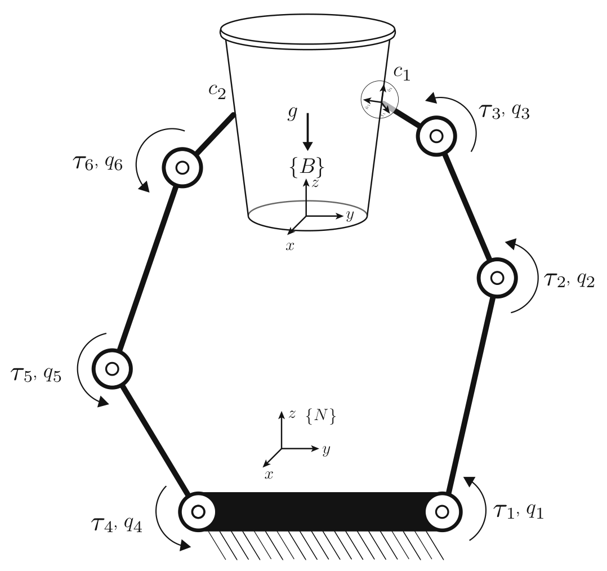

> Image description: Fig. 1 shows a schematic diagram of a two-fingered hand grasping an object, representing a robotic manipulation task. The system consists of a base frame $\{N\}$ and a body frame $\{B\}$ attached to a tapered object. The object is grasped by two multi-link fingers. The left finger consists of links connected by joints with variables $(\tau_5, q_5)$ and $(\tau_6, q_6)$, with contact points $c_2$ and $c_1$ indicated on the object. The right finger features joints with variables $(\tau_3, q_3)$ and $(\tau_2, q_2)$. The base features joints with variables $(\tau_1, q_1)$ and $(\tau_4, q_4)$ connecting to a fixed ground. A gravity vector $g$ points downward. Each joint is labeled with its corresponding torque $\tau_i$ and generalized coordinate $q_i$. Axes for frames $\{N\}$ and $\{B\}$ are explicitly shown, defining the coordinate systems for the global and object-fixed environments.

<!-- source_pdf_page: 1182 -->
the complete hand Jacobian Matrix $\tilde{J} \in \mathbb{R}^{6 n_{c} \times n_{q}}$ maps the joint velocities to the twists of the contact frames as thought on the hand $v_{c, \text { hnd }}=\tilde{J} \dot{q}$.

When a contact occurs between the hand and the object, assuming no sliding, some components of the relative contact twist between the object and the hand are set to zero according to the used contact model. In this entry the hardfinger (HF) and the soft-finger (SF) contact models are considered (Mason and Salisbury 1985). Those components are selected by the contact selection matrix which selects $m$ components of the relative contact twists for all the contacts and sets them to zero: $H\left(v_{c, \text { hnd }}-v_{c, \mathrm{obj}}\right)=0$. For more details on how to compute the contact selection matrix, the reader is referred to Prattichizzo and Trinkle (2008). Then the following contact constraint equation is obtained:

$$
\left[J-G^{T}\right]\left[\begin{array}{l}
\dot{q}  \tag{1}\\
v
\end{array}\right]=0
$$

where the transpose of the grasp matrix and the hand Jacobian are finally defined by multiplying the contact selection matrix and the transpose of the complete grasp matrix and the complete hand Jacobian as

$$
\begin{aligned}
G^{T} & =H \tilde{G}^{T} \in \mathbb{R}^{m \times 6} \\
J & =H \tilde{J} \quad \in \mathbb{R}^{m \times n_{q}}
\end{aligned}
$$

In the force domain, the wrenches that the hand applies to the object at the contact points are collected in the vector $\lambda$. Correspondingly, on the hand, a force vector $-\lambda$, opposite to the preceding one, is applied by the object through the contact points. At each contact point, the contact wrenches have components only along the directions constrained by the contact model. Furthermore, contact force components must satisfy the friction constraints (see section "Force Closure and Grasp Control"). More specifically, the $m$-dimensional vector $\lambda=\left[\begin{array}{lll}\lambda_{1}^{T} & \ldots & \lambda_{n_{c}}^{T}\end{array}\right]^{T}$ contains the contact wrench components applied to the object through the $n_{c}$ contacts, where the wrench at contact $i$ is defined, for the different contact models here considered, as $\lambda_{i}= \left[\begin{array}{lll}f_{i n} & f_{i t} & f_{i o}\end{array}\right]^{T}$ for the HF contact model and
$\lambda_{i}=\left[\begin{array}{llll}f_{i n} & f_{i t} & f_{i o} & m_{i n}\end{array}\right]^{T}$ for the SF contact model. The subscripts indicate one normal ( $n$ ) and two tangential $(t, o)$ components of contact force $f_{i}$ and moment $m_{i}$ at contact $i$.

In terms of forces, the grasp matrix maps the transmitted contact wrenches $\lambda$ to the set of wrenches that the hand can apply to the object $G \lambda$, and the transpose of hand Jacobian maps the contact forces $-\lambda$ to the corresponding vector of joint loads $-J^{T} \lambda$.

Grouping all the noncontact wrenches applied to the object in $g \in \mathbb{R}^{6}$ and all the noncontact contributions to the joint loads of the robotic hand in $\tau \in \mathbb{R}^{n_{q}}$, the rigid-body dynamic equations of the whole system, consisting of the hand and of the grasped object, are

$$
\begin{aligned}
& M_{\mathrm{obj}}(u) \dot{v}+N_{\mathrm{obj}}(u, v)=G \lambda+g \\
& M_{\mathrm{hnd}}(q) \ddot{q}+N_{\mathrm{hnd}}(q, \dot{q})=-J^{T} \lambda+\tau
\end{aligned}
$$

where $M_{\mathrm{obj}}(\cdot)$ and $M_{\mathrm{hnd}}(\cdot)$ are symmetric, positive definite inertia matrices and $N_{\text {obj }}(\cdot, \cdot)$ and $N_{\text {hnd }}(\cdot, \cdot)$ are the velocity-product terms for the object and the hand, respectively. For the sake of simplicity, the gravity terms are disregarded.

The dynamics of the hand and object are not independent but depend on the kinematic constraints imposed by the contact model (1)

$$
\begin{array}{r}
{\left[\begin{array}{r}
-G \\
J^{T}
\end{array}\right] \lambda=\left[\begin{array}{l}
\bar{g} \\
\bar{\tau}
\end{array}\right]}  \tag{2}\\
\text { subject to } J \dot{q}=G^{T} v
\end{array}
$$

where

$$
\begin{aligned}
& \bar{g}=g-M_{\mathrm{obj}}(u) \dot{v}-N_{\mathrm{obj}}(u, v) . \\
& \bar{\tau}=\tau-M_{\mathrm{hnd}}(q) \ddot{q}-N_{\mathrm{hnd}}(q, \dot{q})
\end{aligned}
$$

It is worth underlying that dynamics can be disregarded for slow motions of the hand and of the object, while it becomes very relevant in applications with high-speed grasping and manipulation as discussed in Namiki et al. (2003).

<!-- source_pdf_page: 1183 -->
## Controllable Wrenches and Twists

From the first equation in (2) to impose any motion to the object by contact forces, the grasp matrix $G$ must be full row rank, i.e., $\operatorname{rank}(G)=$ 6, which is equivalent to have a trivial null space of $G^{T}$, i.e., $\mathcal{N}\left(G^{T}\right)=0$. This is an important property of the grasp which has been referred to as non-indeterminate in Prattichizzo and Trinkle (2008) to reflect the idea that the contacts on the object are placed in a way that there are no twists of the object that are not controllable by contact wrenches.

However, this condition depends only on the contacts on the object and does not consider the role of the hand kinematics which comes from the second equation in (2) and from the contact constraint. Under the simplifying assumption that $\mathcal{N}\left(J^{T}\right)=0$, referred to as non-defective grasp in Prattichizzo and Trinkle (2008), it is simple to verify that, for any given contact wrench $\lambda$, a control torque $\tau$ exists which is able to apply the given contact wrench. The mechanical interpretation of this assumption is that when $\mathcal{N}\left(J^{T}\right)=0$, there are no contact forces resisted by the robotic hand constraints, i.e., with zero joint load. The simplifying assumption of non-defective grasps ensures that $\mathcal{N}\left(J^{T}\right) \cap \mathcal{N}(G)=0$ which is a necessary condition to determine the contact force $\lambda$ from the rigid-body equation (2) as shown in Prattichizzo and Trinkle (2008).

If a grasp is non-defective, it means that each finger of the robotic hand involved in the contact with the object must have a number of joints sufficient to control all the components of the contact wrench. For example, in the case of two HF contact points occurring at the fingertips of a two-fingered robotic hand, each finger must have at least three joints and must be in a non-singular configuration.

This entry does not consider whole-hand or power grasps which, differently from the fingertip grasps, exploit the whole surface of the fingers, including the palm, to constraint the object. The analysis of controllable wrenches and twists for whole-arm grasps, taking into account the hand and object dynamics, can be found in Prattichizzo and Bicchi (1997).

## Force Closure and Grasp Control

The dynamic formulation of the grasp with the contact kinematic constraints given in (2) holds only if the contact forces satisfy the friction law imposing constraints on the components of the contact force and moment. Limiting the analysis to HF contact models, Coulomb friction law requires that the components of contact force $\lambda_{i}$ at the $i$-th contact lie inside the friction cone $\mathcal{F}_{i}$

$$
\begin{equation*}
\mathcal{F}_{i}=\left\{\left(f_{i n}, f_{i t}, f_{i o}\right) \mid \sqrt{f_{i t}^{2}+f_{i o}^{2}} \leq \mu_{i} f_{i n}\right\} \tag{3}
\end{equation*}
$$

where $\mu_{i}$ represents the friction coefficient at the $i$-th contact. Extending to all contact points, $\lambda$ is constrained to lie in $\mathcal{F}$ where $\mathcal{F}$ is the generalized friction cone defined as: $\mathcal{F}=\mathcal{F}_{1} \times \cdots \times \mathcal{F}_{n_{c}}= \left\{\lambda \in \mathbb{R}^{m} \mid \lambda_{i} \in \mathcal{F}_{i} ; i=1, \ldots, n_{c}\right\}$.

While grasping an object, the applied contact forces must be consistent with the friction constraints. This is not straightforward for the grasp control and requires to exploit the beneficial characteristics of the internal forces. From the object dynamics in (2), for a given $\bar{g}$, one gets

$$
\begin{equation*}
\lambda=-G^{+} \bar{g}+N(G) \gamma \tag{4}
\end{equation*}
$$

where $G^{+}$denotes the generalized inverse of the grasp matrix and $N(G)$ denotes a matrix whose columns form a basis for $\mathcal{N}(G)$, and $\gamma$ is a vector parameterizing the solution set. The contact force $\lambda$ consists of a particular solution balancing the $\bar{g}$ term and of a homogeneous solution belonging to the null space of the grasp matrix.

In general, the particular solution $-G^{+} \bar{g}$ does not satisfy the friction constraint (3) at all the contact points and needs the homogeneous solution $\lambda_{h}=N(G) \gamma$ to keep the contact forces within the friction cones. Contact forces $\lambda_{h}$ in $\mathcal{N}(G)$ are referred to as internal forces since they do not contribute to the object dynamics, i.e., $G \lambda_{h}=$ 0. Instead, these forces affect the tightness of the grasp and play a crucial role in maintaining grasps that rely on friction. The existence of a nontrivial null space of the grasp matrix is a

<!-- source_pdf_page: 1184 -->
desirable property and has been referred to as graspability (Prattichizzo and Trinkle 2008).

Another relevant and desirable property of the grasp is the frictional force closure which means that for any noncontact wrench $\bar{g}$, an internal force $\lambda_{h}$ exists such that the contact force $\lambda$ in (4) belongs to the generalized friction cone $\mathcal{F}$. In Murray et al. (1994) the authors state that a grasp has frictional form closure if and only if the grasp matrix is full row rank (non-indeterminate grasp) and there exists $\lambda_{h}$ such that $G \lambda_{h}=0$ and $\lambda_{h}$ belong to the interior of the generalized friction cone $\mathcal{F}$.

Grasp control is about using contact forces, which must satisfy the friction constraints, so as to let the object to track a given trajectory. This is also referred to as dexterous manipulation (Bicchi and Kumar 2000). In Li et al. (1989), a computedtorque controller is proposed to track both the desired trajectory of the grasped object $u_{\text {des }}$ and the desired internal force $\lambda_{h, \text { des }}$. Under the additional simplifying assumption that the robotic hand Jacobian is invertible, i.e., there are no redundant motions of the fingers, the computedtorque control law

$$
\begin{aligned}
\tau= & N_{\mathrm{hnd}}(q, \dot{q})+J^{T} G^{+} N_{\mathrm{obj}}(u, v) \\
& -M_{\mathrm{hnd}} J(q) J^{-1} \dot{J} \dot{q}+M_{\mathrm{ho}} \dot{U} \dot{u} \\
& +M_{\mathrm{ho}} U\left(\ddot{u}_{\mathrm{des}}-K_{v} \dot{e}_{u}-K_{u} e_{u}\right) \\
& +J^{T}\left(\lambda_{h, \mathrm{des}}-K_{s} \int e_{\lambda_{h}}\right),
\end{aligned}
$$

with $M_{\mathrm{ho}}=M_{\mathrm{hnd}} J(q) J^{-1} G^{T}+J^{T} G^{+} M_{\mathrm{obj}} J$ guarantees that both the trajectory and the internal force errors

$$
\begin{aligned}
e_{u} & =u-u_{\mathrm{des}} \\
e_{\lambda_{h}} & =\lambda_{h}-\lambda_{h, \mathrm{des}}
\end{aligned}
$$

with respect to the desired object trajectory $u_{\text {des }}$ and internal force $\lambda_{h, \text { des }}$ converge to zero according to a second- and first-order dynamics, respectively.

$$
\begin{aligned}
\ddot{e}_{u}+K_{v} \dot{e}_{u}+K_{u} e_{u} & =0 \\
e_{\lambda_{h}}+K_{s} \int e_{\lambda_{h}} & =0
\end{aligned}
$$

where $K_{v}, K_{u}$, and $K_{s}$ are positive definite matrices.

The computed-torque controller proposed in Li et al. (1989) guarantees only that the desired object trajectory and the desired internal forces are asymptotically tracked, but it does not ensure the non-violation of friction constraints by the contact forces. To guarantee that the contact force vectors remain in the friction cone during the manipulation, a force distribution problem must be solved at each time instant. The force closure assumption ensures that a solution exists that satisfies the friction constraints during the manipulation. This solution, which becomes the reference for the internal force control, can be found with an efficient algorithm, based on the minimization of a convex function that checks the force closure property at each time instant (Bicchi 1995).

## Summary and Future Directions

The basic foundation of grasp control has been reviewed with a particular attention to modeling of contact constraints, force closure, and control of object motion and internal forces. This entry did not explicitly address grasp stability that is often equated to grasp closure, because all external forces can be balanced by the hand. A more formal analysis of grasp stability in terms of deflection from an equilibrium point has been proposed for hands with general kinematics in Jen et al. (1996).

The computed-torque control is a classical approach to the grasp control. For a deeper study of other approaches to grasp control based on passivity theory, the reader is referred to Wimboeck et al. (2011).

Recent developments in underactuated robotic hands Birglen et al. (2008) have led to a renewed interest in grasp control. Designing hand with a lower number of actuators has a lot of advantages in terms of robustness and reliability but dramatically reduces the dexterous manipulation abilities which can be recovered only by designing new control algorithms (Prattichizzo et al. 2013).

## Cross-References

- Force Control in Robotics
- Parallel Robots

<!-- source_pdf_page: 1185 -->
- Robot Visual Control
- Walking Robots

## Recommended Reading

Grasp synthesis and dexterous manipulation are important research topics. Grasp synthesis is the problem of choosing the posture of the hand and contact point locations to optimize a grasp quality metric. One of the first studies of grasp synthesis for multi-fingered hands was undertaken in Jameson (1985) where the author proposed a Levenberg-Marquardt algorithm to search the surface of an object for the locations of three points that would achieve force closure. Since this work, many other metrics and approaches to searching for high-quality grasps have been implemented as discussed in Nguyen (1988), Pollard (1997), Park and Starr (1992), Chen and Burdick (1993), and references therein.

Dexterous manipulation is the capability of manipulating an object so as to arbitrarily steer its configuration in space. Research on dexterous manipulation first appeared in Hanafusa and Asada (1979) where the authors developed a plan to turn a nut onto a bolt. Since then a progression of increasingly complex manipulation tasks have been studied to varying degrees of detail. For the planar case the reader is referred to Mason (1982), Brost (1991), Peshkin and Sanderson (1988), Lynch (1996), and references therein. Several approaches have been proposed to planning and execute dexterous manipulation tasks in three dimensions continues in Cherif and Gupta (1999), Han et al. (2000), and Higashimori et al. (2007). Dexterous manipulation can be evaluated with manipulability ellipsoids of velocity and force as proposed in Chiacchio et al. (1991) for multiple-fingered systems and more recently in Prattichizzo et al. (2012) for underactuated robotic hands.

## Bibliography

Bicchi A (1995) On the closure properties of robotic grasping. Int J Robot Res 14(4):319-334

Bicchi A, Kumar V (2000) Robotic grasping and contact: a review. In: Proceedings of the IEEE international conference on robotics and automation, San Francisco, pp 348-353
Bicchi A, Prattichizzo D (1998) Manipulability of cooperating robots with passive joints. In: Proceedings of the IEEE international conference on robtotics and automation, Leuven, pp 1038-1044
Birglen L, Gosselin CM, Laliberté T (2008) Underactuated robotic hands, vol 40. Springer, Berlin
Brost RC (1991) Analysis and planning of planar manipulation tasks. Carnegie Mellon University Pittsburgh, PA, USA. PhD thesis
Brost RC, Goldberg KY (1996) A complete algorithm for designing planar fixtures using modular components. IEEE Trans Robot Autom 12(1):31-46
Chen IM, Burdick JW (1993) Finding antipodal point grasps on irregularly shaped objects. IEEE Trans Robot Autom 9(4):507-512
Cherif M, Gupta KK (1999) Planning quasi-static fingertip manipulation for reconfiguring objects. IEEE Trans Robot Autom 15(5):837-848
Chiacchio P, Chiaverini S, Sciavicco L, Siciliano B (1991) Global task space manipulability ellipsoids for multiple-arm systems. IEEE Trans Robot Autom 7(5):678-685
Ferrari C, Canny J (1992) Planning optimal grasps. In: Proceedings of the IEEE international conference on robtotics and automation, Nice. IEEE, pp 2290-2295
Goldfeder C, Ciocarlie M, Peretzman J, Hao Dang, Allen PK (2009) Data-driven grasping with partial sensor data. In: Proceedings of the IEEE/RSJ international conference on intelligent robots and systems (IROS 2009), St. Louis, pp 1278-1283

Han L, Li Z, Trinkle JC, Qin Z, Jiang S (2000) The planning and control of robot dexterous manipulation. In: Proceedings of the IEEE international conference on robotics and automation, San Francisco, pp 263-269
Han L, Trinkle JC (1998) Dextrous manipulation by rolling and finger gaiting. In: Proceedings of the IEEE international conference on robtotics and automation, Leuven, vol 1. IEEE, pp 730-735
Hanafusa H, Asada H (1979) Handling of constrained objects by active elastic fingers and its applications to assembly. Trans Soc Instrum Control Eng 15(1):61-66
Higashimori M, Kimura M, Ishii I, Kaneko M (2007) Friction independent dynamic capturing strategy for a 2D stick-shaped object. In: Proceedings of the IEEE international conference on robotics and automation, Roma, pp 217-224
Jameson J (1985) Analytic techniques for automated grasp. Department of Mechanical Engineering, Stanford University. PhD thesis
Jen F, Shoham M, Longman RW (1996) Liapunov stability of force-controlled grasps with a multi-fingered hand. Int J Robot Res 15(2): 137-154
Johansson RS, Edin BB (1991) Mechanisms for grasp control. In: Pedotti A, Ferrarin M (eds) Restoration of walking for paraplegics. Recent advancements and

<!-- source_pdf_page: 1186 -->
trends, 3rd edn. Edizioni Pro Juventute/IOS, Milano, pp 57-65
Li Z, Hsu P, Sastry S (1989) Grasping and coordinated manipulation by a multifingered robot hand. Int J Robot Res 8(4):33-50
Lynch K (1996) Nonprehensile manipulation: mechanics and planning. Carnegie Mellon University School of Computer Science, March. PhD thesis
Mason MT (1982) Manipulator grasping and pushing operations. PhD thesis, Massachusetts Institute of Technology, June 1982. Reprinted in Robot hands and the mechanics of manipulation. MIT, Cambridge
Mason MT, Salisbury JK (1985) Robot hands and the mechanics of manipulation. MIT, Cambridge
Montana DJ (1988) The kinematics of contact and grasp. Int J Robot Res 7(3): 17-32
Murray RM, Li Z, Sastry SS (1994) A mathematical introduction to robotic manipulation. CRC, Boca Raton
Namiki A, Imai Y, Ishikawa M, Kaneko M (2003) Development of a high-speed multifingered hand system and its application to catching. In: Proceedings of the IEEE/RSJ international conference on intelligent robots and systems, Las Vegas, vol 3. IEEE, pp 26662671
Nguyen V (1988) Constructing force-closure grasps. Int J Robot Res 7(3):3-16
Okamura AM, Smaby N, Cutkosky MR (2000) An overview of dexterous manipulation. In: Proceedings of the IEEE international conference on robotics and automation, San Francisco, pp 255-262
Park YC, Starr GP (1992) Grasp synthesis of polygonal objects using a three-fingered robot hand. Int J Robot Res 11(3): 163-184
Peshkin MA, Sanderson AC (1988) Planning robotic manipulation strategies for workpieces that slide. IEEE J Robot Autom 4(5):524-531
Pollard NS (1997) Parallel algorithms for synthesis of whole-hand grasps. In: Proceedings of the IEEE international conference on robotics and automation, Albuquerque
Prattichizzo D, Bicchi A (1997) Consistent task specification for manipulation systems with general kinematics. J Dyn Syst Meas Control 119(4):760-767
Prattichizzo D, Malvezzi M, Gabiccini M, Bicchi A (2012) On the manipulability ellipsoids of underactuated robotic hands with compliance. Robot Auton Syst 60(3):337-346. Elsevier
Prattichizzo D, Malvezzi M, Gabiccini M, Bicchi A (2013) On motion and force controllability of precision grasps with hands actuated by soft synergies. IEEE Trans Robot 29(6): 1440-1456
Prattichizzo D, Trinkle JC (2008) Grasping. In: Siciliano B, Kathib O (eds) Handbook of robotics. Springer, Berlin, pp 671-700
Reuleaux F (1876) The kinematics of machinery. Macmillan, London. Republished by Dover, New York, 1963
Roa MA, Suarez R (2009) Computation of independent contact regions for grasping 3-D objects. IEEE Trans Robot 25(4):839-850

Salisbury JK, Roth B (1983) Kinematic and force analysis of articulated mechanical hands. J Mech Trans Autom Des 105(1):35-41
Saxena A, Driemeyer J, Ng AY (2008) Robotic grasping of novel objects using vision. Int J Robot Res 27(2): 157-173
Shimoga KB (1996) Robot Grasp synthesis algorithms: a survey. Int J Robot Res 15(3):230-266
Wimboeck T, Ott C, Albu-Schaffer A, Hirzinger G (2011) Comparison of object-level grasp controllers for dynamic dexterous manipulation. Int J Robot Res 31(1):3-23

## Robot Motion Control

Mark W. Spong Erik Jonsson School of Engineering and Computer Science, The University of Texas at Dallas, Richardson, TX, USA

#### Abstract

The motion control problem for robots, both for manipulator arms and for wheeled mobile robots, is to determine a time sequence of control inputs to achieve a desired motion, or output, response. The control inputs are usually motor currents but can be translated into torques or velocities for the purpose of control design. The desired motion is typically given by a reference trajectory, consisting of positions and velocities that are generated from motion planning and trajectory generation algorithms designed to calculate collision-free paths, taking into account various kinematic and dynamic constraints on the robot. In this chapter we give an overview of some common control methods for motion control of robots, concentrating on the control of manipulator arms.

## Keywords

Adaptive control; Feedback linearization; Inverse kinematics; Motion planning; Passivity-based control; PID control; Robust control

<!-- source_pdf_page: 1187 -->
## Introduction

We consider the motion control problem for an $n$-degree-of-freedom robot manipulator, such as shown schematically in Fig. 1. The variables $\theta_{1}, \ldots, \theta_{n}$ are the joint variables, which define the configuration of the robot at each instant of time.

A robot manipulator is fundamentally a positioning device designed to move material, parts, tools, or specialized devices through variable programmed motions for the performance of a variety of tasks (Robot Institute of America, 1980). Thus, manipulator tasks, such as materials transfer, welding, and painting, and even tasks involving the control of interaction forces, such as assembly or grinding, are performed through the coordination and control of the motion of the joints of the robot.

A typical robot control architecture is shown in Fig. 2, which is designed to translate sensing into action, through motion planning, trajectory generation, and feedback control. In this entry we concentrate on the function of the controller.

## Motion Planning

The desired joint motions are specified as reference trajectories (positions and velocities) generated from motion planning algorithms that must determine collision-free paths taking into account various kinematic and dynamic constraints on the robot (Lavelle 2006). A detailed discussion of motion planning is outside the scope of this entry. The motion planning problem begins by

Robot Motion Control,
Fig. 1 Six-link robot manipulator
decomposing a given task into a discrete set of end-effector motions. A continuous path for the end-effector in the task space is then computed, taking into account issues of joint limits and collisions with objects in the workspace, including self-collisions.

Finding optimal paths in configuration space is computationally complex, and methods have been developed to determine feasible, suboptimal paths using various methods such as artificial potential functions, grid search, and roadmaps (Lavelle 2006).

Once a feasible path in task space is determined, a trajectory, which is a timeparameterized function in task space or configuration space, is computed. To compute configuration space or joint space trajectories from task space trajectories, the inverse kinematics of the manipulator is used.

## Trajectory Generation

To simplify computation, joint-level trajectories are typically generated by calculating the inverse kinematics only at discrete points along the task space trajectory and then interpolating between these points. Two of the most common interpolation schemes utilize either polynomials in time or trapezoidal velocity profiles.

For example, a cubic polynomial reference trajectory, $\theta^{r}(t)$, may be specified as

$$
\theta^{r}(t)=a_{0}+a_{1} t+a_{2} t^{2}+a_{3} t^{3}
$$

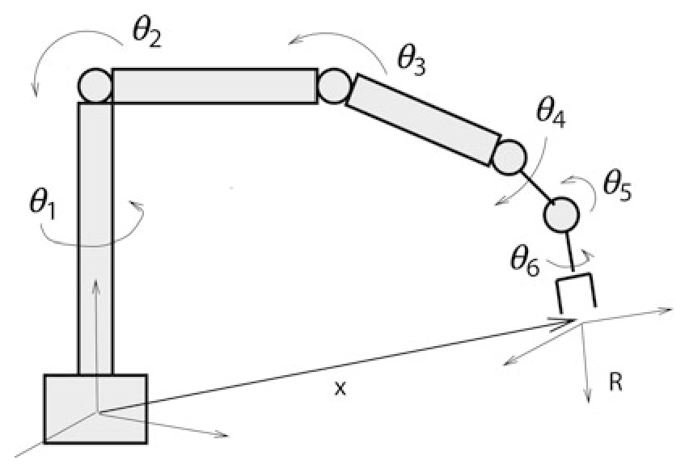

<!-- source_pdf_page: 1188 -->
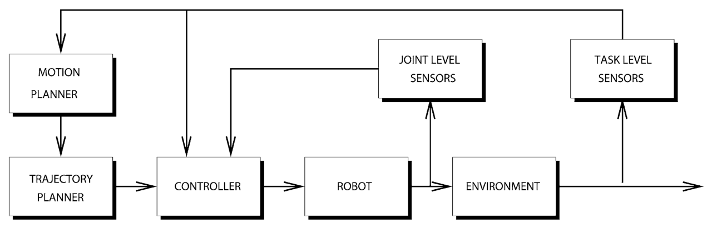

> Image description: This block diagram illustrates a robot control architecture, illustrating the functional relationships between planning, control, and sensing components. The flow begins with the **MOTION PLANNER**, which directs the **TRAJECTORY PLANNER**. The trajectory planner sends commands to the **CONTROLLER**, which in turn sends signals to the **ROBOT**. The robot interacts with the **ENVIRONMENT**, which produces feedback through two distinct sensor paths. The **JOINT LEVEL SENSORS** provide direct feedback from the robot's movements to the controller. Meanwhile, **TASK LEVEL SENSORS** monitor the environment and provide feedback that bypasses the controller to influence both the motion planner and the controller. A single line connects the task level sensors back to the motion planner, indicating a high-level feedback loop for situational awareness. The system operates as a closed-loop control system, where environmental feedback informs both high-level strategic planning and low-level tactical execution to achieve desired robotic motions.
Robot Motion Control, Fig. 2 Control architecture for robot control

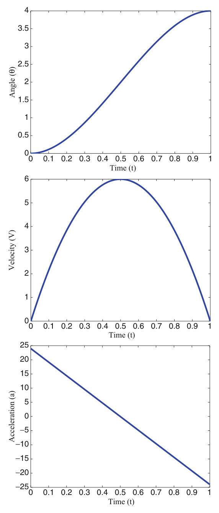

> Image description: This figure consists of three vertically stacked line graphs, each plotting a different kinematic variable against time ($t$) from 0 to 1 second. The x-axis for all three plots is labeled "Time ($t$)." The top plot shows "Angle ($\theta$)" versus time. The curve starts at zero and increases monotonically in a sigmoidal shape, reaching approximately 4 radians at $t=1$. The middle plot shows "Velocity ($V$)" versus time. The curve is a symmetric parabola that starts at
Robot Motion Control, Fig. 3 A cubic polynomial reference trajectory

If the desired positions and velocities of the joint variable are specified at initial and final times, $t_{0}$ and $t_{f}$, respectively, it is a simple calculation to determine the four polynomial coefficients, $a_{0}, \ldots, a_{3}$. The reference velocity and acceleration are then given by

$$
\dot{\theta}^{r}(t)=a_{1}+2 a_{2} t+3 a_{3} t^{2}
$$

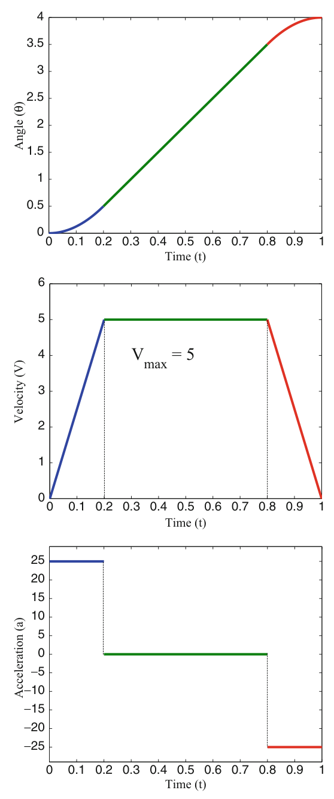

> Image description: This textbook figure, titled "Robot Motion Control, Fig. 4 Trapezoidal velocity profile," illustrates a trapezoidal velocity profile through three synchronized time-series plots: Angle ($\theta$), Velocity ($V$), and Acceleration ($a$), all plotted against Time ($t$) from 0 to 1 unit. The middle plot shows the velocity profile, characterized by three distinct phases: a linear increase (acceleration) to $V_{\text{max}} = 5$ from $t=0$ to $t=0.2$, a constant velocity plateau at $V=5$ from $t=0.2$ to $t=0.8$, and a linear decrease (deceleration) back to zero from $t=0.8$ to $t=1.0$. The bottom plot shows the corresponding step-like acceleration: a constant $+25$ for the first $0.2$ units, $0$ during the constant velocity phase, and $-25$ during deceleration. The top plot shows the resulting angle ($\theta$), which increases quadratically during acceleration, linearly during the constant velocity phase, and quadratically during deceleration, totaling a displacement of $4$ radians.
Robot Motion Control, Fig. 4 Trapezoidal velocity profile

$$
\ddot{\theta}^{r}(t)=2 a_{2}+6 a_{3} t
$$

A typical cubic polynomial trajectory is shown in Fig. 3.

A trapezoidal velocity profile is illustrated in Fig. 4.

In this case, the velocity of the joint angle increases linearly to a maximum value, $V_{\text {max }}$,

<!-- source_pdf_page: 1189 -->
which remains constant for a period of time and then decreases linearly.

## Independent Joint Control

The simplest approach to control design for a multi-degree-of-freedom manipulator is to treat each link of the robot as a single-input/single-output (SISO) system and design the controllers independently for each link. Proportional, integral, derivative (PID) control is the most common method employed in this case. This approach works well for highly geared manipulators moving at relatively low speeds, since the large gear reduction and low speed tend to reduce the coupling effects among the various links. More advanced linear or nonlinear control methods can be used to achieve higher performance at the expense of added complexity of the control system.

The basic architecture of such a system, using a linear model to represent the dynamics of each joint of the robot, is shown in the frequency domain in Fig. 6.

The control design objective is to choose the compensator in such a way that the plant output $\theta$ tracks or follows a desired output, given by the reference signal, $\theta^{r}$. The control signal, however, is not the only input acting on the system. Disturbances, which are really inputs that we do not control, also influence the behavior of the output. Therefore, the controller must be designed, in addition, so that the effects of the disturbance, $D$, on the plant output are reduced. If this is accomplished, the plant is said to reject the disturbances. The twin objectives of tracking and disturbance rejection are central to any control methodology.

The plant transfer function, $P(s)$, represents the dynamics of a single degree-of-freedom system, typically inertia and damping,

$$
\begin{equation*}
P(s)=\frac{1}{J s^{2}+B s} \tag{1}
\end{equation*}
$$

$C(s)$ is a PID compensator

$$
\begin{equation*}
u(s)=\left(K_{p}+\frac{K_{i}}{s}+K_{d} s\right)\left(\theta^{r}(s)-\theta(s)\right) \tag{2}
\end{equation*}
$$

where $K_{p}, K_{i}, K_{d}$ are the proportional, integral, and derivative gains, respectively, and $\theta^{r}(s)- \theta(s)$ is the tracking error between the reference trajectory $\theta^{r}(s)$ and joint variable $\theta(s)$.

## Set-Point Tracking

If the reference trajectory $\theta^{r}$ is a constant set point, then the closed-loop transfer function, $T(s)$, from $\theta^{r}$ to $\theta$ (with $D=0$ ) is

$$
\begin{aligned}
T(s) & =\frac{P(s) C(s)}{1+P(s) C(s)} \\
& =\frac{K_{d} s^{2}+K_{p} s+K_{i}}{J s^{3}+\left(B+K_{d}\right) s^{2}+K_{p} s+K_{i}}
\end{aligned}
$$

Applying the Routh-Hurwitz criterion, it follows that the closed-loop system is stable if the gains are positive and

$$
\begin{equation*}
K_{i}<\frac{\left(B+K_{d}\right) K_{p}}{J} \tag{3}
\end{equation*}
$$

In addition, the presence of the integral control term, $\frac{K_{i}}{s}$, guarantees zero steady-state error to a constant disturbance term $D$.

## Feedforward Control

In order to track nonconstant reference signals, such as a cubic polynomial trajectory or trapezoidal velocity trajectory, a feedforward term may be superimposed on the PID control signal as shown in Fig. 5. Under the condition that the plant $P(s)$ is minimum phase, the feedforward transfer function $F(s)$ can be taken as $1 / P(s)$, the inverse of the plant. This guarantees asymptotic tracking of any time-varying reference trajectory provided the closed-loop transfer function is stable.

PID control is, by far, the most common type of control used in industry due to its simplicity. The main problem in implementing PID control is in the tuning, that is, in the choice of the

<!-- source_pdf_page: 1190 -->
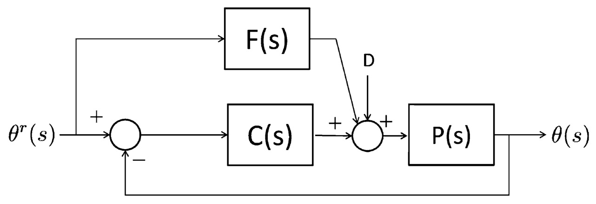

> Image description: A control engineering block diagram titled "Robot Motion Control, Fig. 5 Feedforward control architecture." The diagram illustrates a control loop with two parallel paths: a feedback path and a feedforward path. The input is represented by the variable $\theta^r(s)$. This input splits into two branches. The upper branch leads into block $F(s)$, representing the feedforward controller, and then enters a summation junction. The lower branch enters a second summation junction after being subtracted from the output of block $P(s)$. The output of the lower junction enters block $C(s)$, representing the feedback controller. The output of $C(s)$ enters a third summation junction, which also receives the signal from $F(s)$ and an external disturbance input labeled $D$. The resulting signal enters block $P(s)$, representing the plant. The system output is $\theta(s)$, which is fed back to the first summation junction via a feedback loop.
Robot Motion Control, Fig. 5 Feedforward control architecture

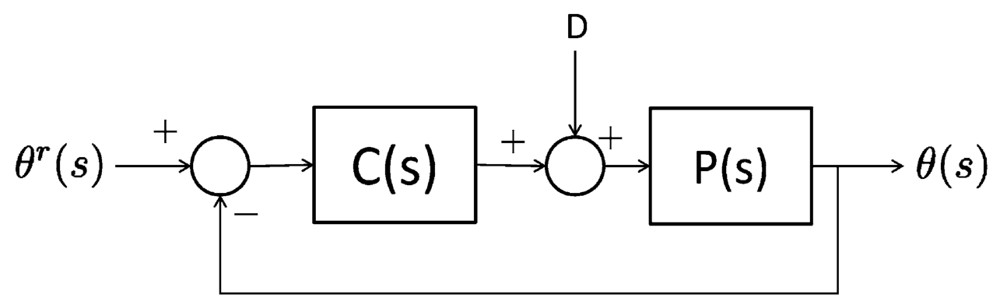

> Image description: This engineering block diagram, titled "Robot Motion Control, Fig. 5 Feedforward control architecture," illustrates a closed-loop control system with an added feedforward component. The system begins with a reference input, $\theta^r(s)$, which enters a summation junction with a positive sign. The feedback signal, derived from the output $\theta(s)$, is returned to this junction with a negative sign, creating an error signal. This error signal is processed by the controller block, labeled $C(s)$. The output of
Robot Motion Control, Fig. 6 Single-axis control

proportional, derivative, and integral gains. As we see from the inequality ( 3 ), the magnitude of the integral gain $K_{i}$ is limited by the stability constraint. Therefore, one common design rule of thumb is to first set $K_{i}=0$ and design the proportional and derivative gains, $K_{p}$ and $K_{d}$, to achieve the desired transient behavior (rise time, settling time, and so forth) and then to choose $K_{i}$ within the limits imposed by (3) to remove the steady-state error.

## Advanced Control Methods

Advanced control methods for robots generally aim to take into account issues such as dynamic coupling between joints; compliance in the joints or links; uncertainty in the inertia parameters, such as the masses and moments of inertia of the links; and robustness to sensor noise and other effects. A common model of the dynamics of $n$-link, rigid robots, i.e., without consideration of friction, elasticity in the joints or links, and other effects, is given by the so-called Euler-Lagrange equations

$$
\begin{equation*}
M(\theta) \ddot{\theta}+C(\theta, \dot{\theta}) \dot{\theta}+g(\theta)=\tau \tag{4}
\end{equation*}
$$

where $\theta=\left(\theta_{1}, \theta_{2}, \ldots, \theta_{n}\right)^{T}$ is the vector of configuration (joint) variables as in Fig. 1. The $n$-dimensional vectors, $\dot{\theta}$ and $\ddot{\theta}$, are then the joint velocities and accelerations, respectively. The $n \times n$ matrix, $M(\theta)$, is called the inertia matrix. The vectors $C(\theta, \dot{\theta}) \dot{\theta}$ and $g(\theta)$ are Coriolis and centrifugal forces and gravitational forces, respectively.

Equation (4) is a system of $n$ coupled, nonlinear, second-order equations and is, in fact, a representation of Newton's Second Law of Motion, where the (generalized) forces acting on the joints of the robot $(\tau-C(\theta, \dot{\theta}) \dot{\theta}-g(\theta))$ equate to the mass times acceleration, given by $M(\theta) \ddot{\theta}$.

In this case, the control problem becomes one of choosing the control input torque vector $\tau(t)$, as a function of time, so that the solution, ( $\theta(t)$, $\dot{\theta}(t))$, of Eq. (4) tracks a reference trajectory of joint positions and velocities, $\left(\theta^{r}(t), \dot{\theta}^{r}(t)\right)$.

## Feedback Linearization Control

An intuitive method of control for this system is the method of feedback linearization, which computes the input torque $\tau$ according to

<!-- source_pdf_page: 1191 -->
$$
\begin{align*}
& \tau=M(\theta) a+C(\theta, \dot{\theta}) \dot{\theta}+g(\theta)  \tag{5}\\
& a=\ddot{\theta}^{r}+K_{d}\left(\dot{\theta}^{r}-\dot{\theta}\right)+K_{p}\left(\theta^{r}-\theta\right) \tag{6}
\end{align*}
$$

with $K_{d}, K_{p}$ matrices of appropriate velocity and position error gains.

The control law given by Eqs. (5) and (6) is often referred to as the method of inverse dynamics although historically, the method of inverse dynamics control was implemented as a feedforward control

$$
\begin{align*}
& \tau=M\left(\theta^{r}\right) a+C\left(\theta^{r}, \dot{\theta}^{r}\right) \dot{\theta}^{r}+g\left(\theta^{r}\right)  \tag{7}\\
& a=\ddot{\theta}^{r}+K_{d}\left(\dot{\theta}^{r}-\dot{\theta}\right)+K_{p}\left(\theta^{r}-\theta\right) \tag{8}
\end{align*}
$$

using the reference position and velocity in place of the measured state. The primary reason for implementing the inverse dynamics in this fashion was the lack of sufficiently fast computation to enable computation of the terms in Eq. (5) in real time. The nonlinearities in Eq. (7) could be precomputed offline and stored to facilitate realtime implementation. With the advent of faster computers, the feedback linearization control is now feasible in real time.

Equations (5) and (6) form a so-called inner-loop/outer-loop architecture (Fig. 7). The significance of this architecture is that the nonlinear inner-loop control term (5) results in a linear system with input $a$ and output $\theta$. The design of the outer-loop control can then take advantage of control methods for linear systems. In fact, the control (6) in this case is simply a PD control with feedforward acceleration.

The result of the controller (5) and (6) is a closed-loop system in terms of the tracking error, $e(t)=\theta(t)-\theta^{r}(t)$, that satisfies the linear equation

$$
\begin{equation*}
\ddot{e}+K_{d} \dot{e}+K_{p} e=0 \tag{9}
\end{equation*}
$$

and therefore, the tracking error converges exponentially to zero for any given reference trajectory.

## Task Space Linearization

The inner-loop/outer-loop control architecture above can be modified to track trajectories directly in the task space. Moreover, one can achieve task space tracking by modifying only the outer-loop control $a$ in Eq. (6) while leaving the inner-loop control (5) unchanged. Let $X \in R^{6}$ represent the end-effector position and orientation and let $X^{r}(t)$ be a reference trajectory in task space. Since $X$ is a function of the joint variables $\theta$, we have

$$
\begin{align*}
& \dot{X}=J(\theta) \dot{\theta}  \tag{10}\\
& \ddot{X}=J(\theta) \ddot{\theta}+\dot{J}(\theta) \dot{\theta} \tag{11}
\end{align*}
$$

where $J$ is the manipulator Jacobian. If we now choose the outer-loop term $a$ according to

$$
\begin{equation*}
a=J^{-1}\left\{a_{X}-\dot{J} \dot{\theta}\right\} \tag{12}
\end{equation*}
$$

with

$$
\begin{equation*}
a_{X}=\ddot{X}^{r}-K_{0}\left(X-X^{r}\right)-K_{1}\left(\dot{X}-\dot{X}^{r}\right) \tag{13}
\end{equation*}
$$

we see that the result is a linear system in the task space tracking error $\widetilde{X}(t)=X(t)-X^{r}(t)$

$$
\begin{equation*}
\ddot{\widetilde{X}}+K_{1} \dot{\widetilde{X}}+K_{0} \widetilde{X}=0 \tag{14}
\end{equation*}
$$

Robot Motion Control,
Fig. 7 Inner-loop/ outer-loop control architecture
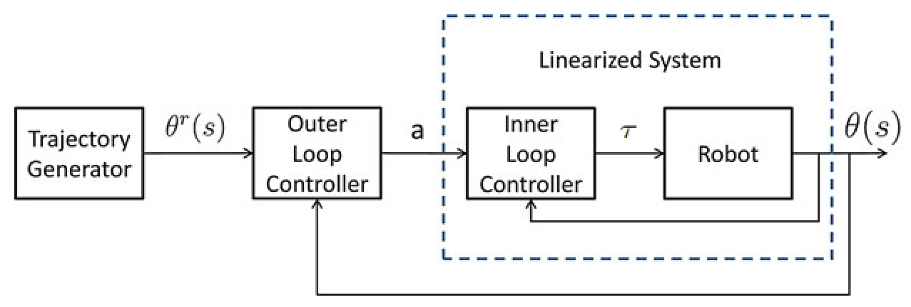

> Image description: A block diagram titled "Fig. 7 Inner-loop/ outer-loop control architecture" illustrates a cascaded control system for a robot. The process begins with a "Trajectory Generator" outputting a reference signal, $\theta^r(s)$, which serves as the input to the "Outer Loop Controller." The "Outer Loop Controller" produces a control signal, $a$, which acts as the input for the "Inner Loop Controller." These two components are contained within a dashed rectangular boundary labeled "Linearized System." The "Inner Loop Controller" generates a control torque, $\tau$, which is sent to the "Robot" block. The "Robot" output is the system state, $\theta(s)$. Feedback loops are present for both stages: the "Robot" output is fed back to the "Inner Loop Controller" to close the inner loop, and it is also fed back to the "Outer Loop Controller" to close the outer loop. This hierarchical structure represents a standard nested control architecture used to manage complex robotic dynamics.

<!-- source_pdf_page: 1192 -->
Therefore, a modification of the outer-loop control achieves a linear and decoupled system directly in the task space coordinates without the need to compute a joint space trajectory and without the need to modify the nonlinear innerloop control.

It is important to note that the above result is valid in the case of six degree-of-freedom manipulators when the Jacobian $J$ is square and invertible. The case when the Jacobian is not invertible, for example, at kinematic singularities, or when the number of joints is not equal to the dimension of the task space is outside the scope of this entry.

## Robust and Adaptive Control

There are several theoretical and practical challenges to the method of feedback linearization control discussed in the previous section. For example, in order to compute Eq. (5), one must have exact knowledge of the parameters defining Eq. (4). In addition, effects of compliance, friction, and so on are not modeled by Eq. (4) and so the stability and performance of the system predicted by Eq. (9) may not be achieved in practice. This has stimulated a great deal of research into robust and adaptive control, control of elasticity, and other issues.

In distinguishing between robust control and adaptive control, we follow the commonly accepted notion that a robust controller is a fixed controller designed to satisfy performance specifications over a given range of uncertainties, whereas an adaptive controller incorporates some sort of online parameter estimation. This distinction is important. For example, in a repetitive motion task, the tracking errors produced by a fixed robust controller would tend to be repetitive as well, whereas tracking errors produced by an adaptive controller might be expected to decrease over time as the plant and/or control parameters are updated based on runtime information. At the same time, adaptive controllers that perform well in the face of parametric uncertainty may not perform well in the face of other types of
uncertainty such as external disturbances or unmodeled dynamics.

## Robust Feedback Linearization

If we denote by $\hat{M}(\theta), \hat{C}(\theta, \dot{\theta})$, and $\hat{g}(\theta)$ expressions for the terms $M(\theta), C(\theta, \dot{\theta})$, and $g(\theta)$ in the equations of motion (4) based on nominal or estimated values of the true parameters, we can define a control input

$$
\begin{equation*}
u=\hat{M}(\theta)(a+\delta a)+\hat{C}(\theta, \dot{\theta}) \dot{\theta}+\hat{g}(\theta) \tag{15}
\end{equation*}
$$

where $a$ is as defined in Eq. (6) and $\delta a$ represents an additional control intended to compensate for the parameter uncertainty. This leads to the state space model in terms of the tracking error $e$

$$
\dot{e}=A e+B\{\delta a+\eta\}
$$

where $\eta$ represents the uncertainty resulting from inexact cancellation of nonlinearities and

$$
A=\left[\begin{array}{cr}
0 & I \\
-K_{0} & -K_{1}
\end{array}\right] ; \quad B=\left[\begin{array}{l}
0 \\
I
\end{array}\right]
$$

Under the assumption that the uncertainty is bounded as $\|\eta\| \leq \rho(e, t)$, the control term $\delta a$ can be chosen as
$\delta a= \begin{cases}-\rho(e, t) \frac{B^{T} P e}{\left\|B^{T} P e\right\|} & ; \text { if }\left\|B^{T} P e\right\|>\epsilon \\ -\frac{\rho(e, t)}{\epsilon} B^{T} P e & ; \text { if }\left\|B^{T} P e\right\| \leq \epsilon\end{cases}$
The Lyapunov function

$$
\begin{equation*}
V=e^{T} P e \tag{16}
\end{equation*}
$$

where $P$ is a symmetric, positive definite matrix satisfying a Lyapunov equation

$$
\begin{equation*}
A^{T} P+P A+Q=0 \tag{17}
\end{equation*}
$$

for a given symmetric positive definite matrix $Q$ can be used to show uniform ultimate boundedness of all trajectories, where the size of the

<!-- source_pdf_page: 1193 -->
ultimate boundedness set depends on $\epsilon$. This is a practical notion of asymptotic stability in the sense that the tracking errors can be made small.

## Passivity-Based Control

Passivity-based control is an alternative to feedback linearization control considered previously and relies on some fundamental structural properties of the Euler-Lagrange equations, primarily linearity in the parameters and passivity.

The passivity property (Ortega and Spong 1989) of robot dynamics follows from the fact that the matrix $N(q, \dot{q})=\dot{M}(q)-2 C(q, \dot{q})$ is skew symmetric, that is, the components $n_{j k}$ of $N$ satisfy $n_{j k}=-n_{k j}$ (Spong et al. 2006). This property implies that the total energy $E$ of the robot satisfies

$$
\begin{equation*}
\dot{E}=\dot{\theta}^{T} u \tag{18}
\end{equation*}
$$

and can be used to design provably correct robust and adaptive control laws.

## Linearity in the Parameters

The robot equations of motion are defined in terms of certain parameters, such as link masses, moments of inertia, etc. The complexity of the dynamic equations makes the determination of these parameters a difficult task. Fortunately, the equations of motion are linear in these inertia parameters in the following sense: There exists an $n \times \ell$ matrix function $Y(q, \dot{q}, \ddot{q})$ and an $\ell$-dimensional constant vector $\Phi$ such that the Euler-Lagrange equations can be written as

$$
\begin{equation*}
M(\theta) \ddot{\theta}+C(\theta, \dot{\theta}) \dot{\theta}+g(\theta)=Y(\theta, \dot{\theta}, \ddot{\theta}) \Phi \tag{19}
\end{equation*}
$$

The function $Y(\theta, \dot{\theta}, \ddot{\theta})$ is called the regressor and $\Phi \in R^{\ell}$ is the parameter vector. The dimension of the parameter space, that is, the number of parameters needed to write the dynamics in this way, is not unique, and finding a minimal set of parameters that can parameterize the dynamic equations is difficult in general.

## Passivity-Based Robust Control

The passivity and linearity-in-the-parameters properties of the robot dynamics can be exploited to design robust and adaptive controllers that do not attempt to cancel the system nonlinearities as in the inverse dynamics approach. A passivitybased robust controller may be defined as

$$
\begin{equation*}
u=\hat{M}(\theta) a+\hat{C}(\theta, \dot{\theta}) v+\hat{g}(\theta)-K r \tag{20}
\end{equation*}
$$

where the quantities $v, a$, and $r$ are given as

$$
\begin{aligned}
& v=\dot{\theta}^{r}-\Lambda \tilde{\theta} \\
& a=\dot{v}=\ddot{\theta}^{r}-\Lambda \dot{\tilde{\theta}} \\
& r=\dot{\theta}-v=\dot{\tilde{\theta}}+\Lambda \tilde{\theta}
\end{aligned}
$$

and $K$ is a diagonal matrix of positive gains.
Using the linearity-in-the-parameters property, the closed-loop system can be written as

$$
\begin{align*}
& M(\theta) \dot{r}+C(\theta, \dot{\theta}) r+K r=Y(\theta, \dot{\theta}, a, v) \\
& (\hat{\Phi}-\Phi) \tag{21}
\end{align*}
$$

In the robust passivity-based approach, the term $\hat{\Phi}$ is chosen as

$$
\hat{\Phi}=\Phi_{0}+\delta \Phi
$$

where $\Phi_{0}$ is a fixed nominal parameter vector and $\delta \Phi$ is an additional control term. The additional term $\delta \Phi$ can be designed according to

$$
\delta \Phi=\left\{\begin{aligned}
-\rho \frac{Y^{T} r}{\left\|Y^{T} r\right\|} & \text {; if }\left\|Y^{T} r\right\|>\epsilon \\
-\frac{\rho}{\epsilon} Y^{T} r & \text {; if }\left\|Y^{T} r\right\| \leq \epsilon
\end{aligned}\right.
$$

where $\rho$ is a (constant) bound on the parameter uncertainty. Uniform ultimate boundedness of the tracking errors follows using the Lyapunov function

$$
V=\frac{1}{2} r^{T} M(\theta) r+\tilde{\theta}^{T} \Lambda K \tilde{\theta}
$$

<!-- source_pdf_page: 1194 -->
where, as before, the size of the ultimate boundedness set depends on the parameter $\epsilon$.

## Passivity-Based Adaptive Control

In the adaptive version of this approach, we consider again the control law (20) and the resulting closed-loop system

$$
M(\theta) \dot{r}+C(\theta, \dot{\theta}) r+K r=Y(\hat{\Phi}-\Phi)
$$

In this case, the term $\hat{\Phi}$ is taken as the output of an estimator

$$
\begin{equation*}
\dot{\hat{\Phi}}=-\Gamma^{-1} Y^{T}(\theta, \dot{\theta}, a, v) r \tag{22}
\end{equation*}
$$

The Lyapunov function

$$
V=\frac{1}{2} r^{T} M(\theta) r+\tilde{\theta}^{T} \Lambda K \tilde{\theta}+\frac{1}{2} \tilde{\Phi}^{T} \Gamma \tilde{\Phi}
$$

can be used to show global convergence of the tracking errors to zero and boundedness of the parameter estimates.

One of the problems with the adaptive control approaches considered here is the socalled parameter drift problem. It can be shown that the estimated parameters converge to the true parameters provided the reference trajectory satisfies the condition of persistency of excitation

$$
\alpha I \leq \int_{t_{0}}^{t_{0}+T} Y^{T}\left(\theta_{r}, \dot{\theta}_{r}, \ddot{\theta}_{r}\right) Y\left(\theta^{r}, \dot{\theta}^{r}, \ddot{\theta}^{r}\right) d t \leq \beta I
$$

for all $t_{0}$, where $\alpha, \beta$, and $T$ are positive constants.

## Summary and Future Directions

We have discussed the commonly applied methods of PID control, feedback linearization control, as well as robust and adaptive control for
motion control of robot manipulators. There is a large and relatively mature body of literature on these methods, and in fact, the material here is now contained in standard textbooks in robotics, such as Siciliano et al. (2010) and Spong et al. (2006).

Future directions in robot motion control include the full integration of vision, force, and position feedback, cooperative control of multiple arms, and advances in machine learning and human-robot interaction. Direct control of robots through brain-machine interfaces is also an active area of research and will enable new areas of applications such as medical assistive robots.

## Cross-Referenes

- Adaptive Control, Overview
- Cooperative Manipulators
- Flexible Robots
- Force Control in Robotics
- Lyapunov's Stability Theory
- Robot Teleoperation

## Recommended Reading

Many of the fundamental theoretical problems in motion control of robot manipulators were solved during an intense period of research from about the mid-1980s until the early-1990s during which time researchers first began to exploit the structural properties of manipulator dynamics such as feedback linearizability, skew symmetry and passivity, multiple time-scale behavior, and other properties. For a more advanced treatment of some of these topics, the reader is referred to Spong et al. (1992) and Canudas de Wit et al. (1996).

A survey of robust control of robots up to about 1990 is found in Abdallah et al. (1991). The passivity-based robust control result here is due to Spong (1992). The first results in passivitybased adaptive control of manipulators were in Horowitz and Tomizuka (1986) and Slotine and Li (1987). The Lyapunov stability proof

<!-- source_pdf_page: 1195 -->
of passivity-based adaptive control is due to Spong et al. (1990). A unifying treatment of adaptive manipulator control from a passivity perspective was presented in Ortega and Spong (1989).

## Bibliography

Abdallah C, Dawson DM, Dorato P, Jamshidi M (1991) A survey of robust control of rigid robots. IEEE Control Syst Mag 11(2):24-30
Canudas de Wit C et al (1996) Theory of robot control. Springer, Berlin
Horowitz R, Tomizuka M (1986) An adaptive control scheme for mechanical manipulators - compensation of nonlinearities and decoupling control. Trans ASME J Dyn Syst Meas Control 108:127-135
Hunt LR, Su R, Meyer G (1983) Design for multiinput nonlinear systems. In: Brockett RW et al (eds) Differential geometric control theory. Birkhauser, Boston/Basel/Stuttgart, pp 268-298
Lavelle SM (2006) Planning algorithms. Cambridge University Press, Cambridge
Markiewicz BR (1973) Analysis of the computed torque drive method and comparison with conventional position servo for a computer-controlled manipulator. NASA-JPL Technical Memo, pp 33-61
Ortega R, Spong MW (1989) Adaptive motion control of rigid robots: a tutorial. Automatica 25(6): 877-888
Siciliano B, Sciavicco L, Villani L, Oriolo G (2010) Robotics: modeling, planning, and control. Springer, London
Slotine J-JE, Li W (1987) On the adaptive control of robot manipulators. Int J Robot Res 6(3): 147-157
Spong MW (1987) Modeling and control of elastic joint robots. Trans ASME J Dyn Syst Meas Control 109:310-319
Spong MW (1992) On the robust control of robot manipulators. IEEE Trans Autom Control AC-37(11):1782-1786
Spong MW, Vidyasagar M (1987) Robust linear compensator design for nonlinear robotic control. IEEE J Robot Autom RA 3(4): 345-350
Spong MW, Ortega R, Kelly R (1990) Comments on 'adaptive manipulator control: a case study'. IEEE Trans Autom Control 35:761-762
Spong MW, Lewis FL, Abdallah CT (1992) Robot control: dynamics, motion planning, and analysis. IEEE, New York
Spong MW, Hutchinson S, Vidyasagar M (2006) Robot modeling and control. Wiley, New York
Tarn TJ, Bejczy AK, Isidori A, Chen Y (1984) Nonlinear feedback in robot arm control. In: Proceedings of the IEEE conference on decision and control, Las Vegas, pp 736-751

## Robot Teleoperation

Claudio Melchiorri Dipartimento di Ingegneria dell'Energia Elettrica e dell'Informazione, Alma Mater Studiorum Università di Bologna, Bologna, Italy

#### Abstract

Robots may allow human beings to physically interact with remote objects and environments. This possibility is known as robot teleoperation and permits to operate in conditions or environments dangerous for human operators. Although teleoperation was among the first developments in robotics back in the 1950's, still nowadays there are important and difficult challenges for researchers and scientists, showing the intrinsic difficulties of this fascinating field of robotics.

## Keywords

Bilateral control; Force reflection; Robot teleoperation; Time delay

## Introduction

A robotic teleoperation system allows to reproduce the actions of a human operator and to interact physically with objects and environments placed at a distance. This possibility has always attracted the human being, and telemanipulation has been one of the first fields to be developed in robotics: the first modern applications of this type of technology are dated back to the 1940s and the early 1950s for handling radioactive material (Goertz and Thompson 1954), for underwater and space applications (Martin and Kuban 1985; Vertut and Coiffet 1986), and for human prostheses (Kobrinskii 1960). For an overview on applications, see Sheridan (1992), Hokayem and Spong (2006), Ferre et al. (2007) and the related references. Nevertheless, despite the research interest and the many existing devices, many

<!-- source_pdf_page: 1196 -->
challenging problems have still to be fully solved both from the technical and control point of view.

In these notes, an overview on robot teleoperation is presented. In particular, the following points are illustrated:

- General description of a telemanipulation system and of its key components: the "master," the "slave," and the "communication channel"
- Overview on applications and existing devices
- Some control techniques for telemanipulation systems: "traditional" force reflection, shared compliance control, Passivity-based control, predictive control, four-channel architecture

## General Description of a Telemanipulation System

A telemanipulator is a complex mechatronic system in which the main elements are a master (or local) and a slave (or remote) device, interconnected by a communication channel. The overall system is interfaced on one side (the master) with a human operator and on the other (the slave) with the environment: see Fig. 1.

Both the master and slave devices have a local controller, with a hardware/software complexity that can be quite different depending on the
system and task to be executed. Key features of this type of devices, usually not present in a typical robotic manipulation system, are:

1. A human operator is involved in the loop for the (high-level) control of the task execution.
2. It is necessary to provide to the operator, possibly in real time, data related to the task. This implies the presence of a suitable user interface and the selection of proper signals transmitted to the operator. These signals, e.g., related to forces applied to the environment, relevant positions of the slave, graphical video data, and tactile or acoustic information, have strong implications on the control properties and performances of the system.
3. A communication channel is present between the master and the slave. This channel may represent a source of problems when timedelays are present since, as well known from the control theory, delays in a feedback loop may generate instability. Problems of this type, firstly observed in a force feedback scheme in 1965 (Ferrel 1966), arise, for example, in underwater or space operations. Note that even time-delays of the order of the tenth of a second may create instability problems.

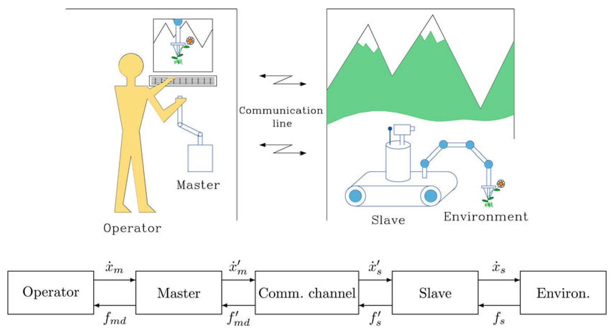

> Image description: Figure 1 illustrates a robot teleoperation system through a conceptual diagram and a corresponding block scheme. The top diagram depicts an Operator controlling a "Master" device, which communicates via a "Communication line" to a "Slave" robot located in a remote "Environment" (depicted with mountains). The Master setup includes a visual interface for the operator. The bottom block scheme represents the system's control loop. Signals flow from the Operator to the Master, through a "Comm. channel," to the "Slave," and finally to the "Environ." (environment). The reverse loop returns from the environment through the slave and communication channel back to the operator. Variables are denoted with subscripts $m$ (master) and $s$ (slave): $\dot{x}_m$ and $f_{md}$ represent master-side motion and force commands, while $\dot{x}'_m$ and $f'_{md}$ represent transmitted signals. On the slave side, $\dot{x}'_s$ and $f'_s$ represent received signals, while $\dot{x}_s$ and $f_s$ represent actual slave motion and environmental force feedback.
Robot Teleoperation, Fig. 1 A telemanipulation system and its block scheme representation. Subscripts $m$ and $s$ refer to variables at the master and slave site, respectively

<!-- source_pdf_page: 1197 -->
In the block diagram of Fig. 1, some implicit choices have been made. The operator specifies a desired velocity ( $\dot{x}_{m}$ ) to be applied to the environment through the master, the communication channel, and the slave and receives back a force signal ( $f_{m d}$ ). In the figure, the flow of the signals could be reversed as well, letting the operator specify a force to the environment and receiving back a velocity information. This is equivalent to reversing the roles of the master and slave devices. When this operation is possible, the teleoperation system is defined bilaterally controlled (Bejczy and Handlykken 1981).

One of the goals of the control system is to have, in steady state, the slave velocity equal to the master velocity, i.e., $\dot{x}_{s}=\dot{x}_{m}$, and similarly for the forces, $f_{m d}=f_{s}$. When this is accomplished, the teleoperator is defined transparent (Lawrence 1993).

In this general framework, the main features of the components of a telemanipulator are the following.

## The Master

The master, or local system, is the interface through which the operator specifies commands to the whole device. Typical features of the master are:

- Capability of assigning tasks to the slave and providing the operator with relevant information about the task development. In fact, an important feature of the master is its capability of providing the operator with the telepresence, i.e., the sensation of being in some manner involved with task execution. In this respect, several solutions have been adopted, varying from joysticks and/or consoles (Hirzinger et al. 1992) to exoskeletons (Bergamasco et al. 2007; Smith et al. 1992) and so on. In these devices, different types of signals may be reflected to the operator, from simple graphical data to full kinetostatic information.
- Capability of acquiring and processing data from both the operator and the slave. Typical elaborations are filtering, prediction, delay compensation, modeling of remote and local dynamics, and so on.

## The Slave

The slave, or remote system, is the part of the teleoperator which directly interacts with the environment for task execution. Requirements similar to the master may be specified for the slave system:

- A robotic system for the interaction with the environment and the execution of the task planned by the operator. This part, usually provided with autonomous features, has to be in some way customized to operate in particular environments, e.g., submarine, outer space, and nuclear areas. Note that the kinematics and the dynamics of the remote manipulator may be different from those of the local one (when present), originating several problems when telepresence is needed for task execution (Colgate 1993).
- Signal acquisition and processing. Sensory capability is a main requirement for the slave device, which is often equipped with video cameras, force/tactile sensors, proximity sensors, and so on.
- Capability of data processing. Also the remote site must be able to elaborate the information needed for task execution. In fact, besides other considerations, the destabilizing effects caused by communication delays and/or restricted bandwidths of transmission must be compensated locally, providing the slave system with a certain degree of autonomy.

## The Communication Line

The communication line represents the link between the master and slave sites. Different platforms may be used for this purpose, from radio connections by means of satellites to cables for underwater operations. The main drawback that can be introduced by this element is a delay, due both to a physical delay in the transmission line (e.g., in a long satellite communication) and to limited bandwidth of the hardware. This delay, that sometimes is not even constant, can cause noticeable instability problems if proper compensating actions are not taken.

<!-- source_pdf_page: 1198 -->
## An Overview on Applications

Use of telemanipulators, in the broader sense of the terminology, may be found in a number of different applications developed since the early 1950s. First examples of these devices have been designed and realized for operations in radioactive environments and for human limb prostheses. At the moment, this type of technology is applied in a number of different fields: space, underwater, medicine, hazardous environments, security, simulators, and so on.

## Space Applications

Robotics is used in space for exploration, scientific experiments, and commercial activities. Main reasons of space telerobotics are the high costs and the hostile environment for human beings. For many years, the main example of teleoperation in space was applications in space shuttle activities where the operators had a direct control of the task executed by the manipulator. Nowadays, an important application of robot technology is for planetary missions, where autonomous telerobots are required and the operator has only a supervisory control of the task. Main directions of current research activity for space robotics are the development of arms for both intra-vehicular and extravehicular activities, freeflying platforms, and planetary rovers.

Among the most known examples of robot arms for space one can list the Canadian Remote Manipulator System (RMS), installed on the US space shuttles. The 6 degree-of-freedom (dof) arm, built by the Canadian firm SPAR, had a flexible, 15 m long structure and was capable of executing preprogrammed and/or teleoperated tasks. Five arms have been built, working on space shuttles from 1981 to 2011. Since 2001 the Canadarm 2 is used on the ISS (International Space Station). This 7 dof, 17.6 m long arm is used for assembly and maintenance purposes.

Concerning planetary exploration, a first successful space telerobotic program has been the Mars Viking Program, which performed scientific experiments on Mars in 1976. More recently, NASA has sent to Mars the rovers Sojourner
in 1997 (working for about 3 months) and Spirit and Opportunity, which arrived in 2004. Opportunity is still working (January 2014), see http://marsrovers.jpl.nasa.gov/home/index.html. New missions on Mars with other, more complex, rovers are currently planned by NASA.

With the current technological possibilities, further substantial developments in this field are slowed down by the large amount of money and time required to guarantee a successful mission. However, relevant technical problems still exist due to reliability requirements, weight constraints, hostile environments and communication time-delays (ranging from 1 s in earth orbits to $4-40 \mathrm{~min}$ or more for planetary missions).

## Underwater

After the first successful military applications of underwater telerobotics (in 1966 the US Navy's CURV - Cable-controlled Underwater Recovery Vehicle - was successfully employed to retrieve a nuclear bomb from the ocean), extensive use of ROVs (remote operated vehicles) has started in the 1980s for offshore operations for oil/gas industry. At the moment, underwater telerobotics is mainly used for business, military missions, and scientific expeditions. Telerobotic (autonomous) tasks are usually limited to small routine tasks rather than complete activities, for example, simple tool switching operations, repetitive bolt/nut screwing, and piloting to new locations. First examples of underwater teleoperation were mainly based on manned submersibles, either free swimming or connected to a surface ship, and with teleoperated arms on the outer structure. In more recent operations, human operators remotely control the submersibles by long fiber-optic cables for data communication, increasing the costs and complexity of the missions.

Probably, the most important users are in the business field, where it is more convenient to use teleoperated devices rather than human divers to perform inspections and repairs on deep sea equipment. The main users of telesubmersibles are the oil and communication (telephone) industries, where underwater pipes and cables require routine operations. The scientific community uses this technology for marine biological,

<!-- source_pdf_page: 1199 -->
geological, and archeological missions, while the military have used telerobotics in many salvage operations, such as plane or watercraft recovery.

The conditions of the water environment, e.g., the high pressures, the poor visibility, and the communication difficulties, cause the major problems in this field. In order to solve the problems due to the high pressure, a very robust mechanical structure and (typically) hydraulic actuators are employed. On the other hand, vision problems are not so easily solved, being related to several factors of the environment. External lighting is necessary, and other technologies (e.g., sonar) are sometimes used. Computer graphic simulation may help the user during task execution in partially known environments. For references, see, e.g., Ridao et al. (2007).

## Medical Telerobotics

Several teleoperated devices are found in the medical field. In fact, robotic manipulators are used to perform surgery, diagnose illnesses or injuries, help impaired people, and train specialized medical personnel.

Robotic systems of different complexities have been developed since the 1950s for aid to impaired people. Among the most common systems are automated wheelchairs, controlled by voice or by joysticks for hand, mouth, eye, or head movements.

At the moment, there is a relevant interest in applying teleoperated devices in microsurgery operations, e.g., eye surgery, where small precise movements are needed. The movements of the operator are scaled down by the mechanism so that very fine operations can be performed while maintaining a suitable telepresence effect. Another important class of surgical process consists of the so-called minimally invasive procedures. In this case, the surgeon operates through small insertions using thin medical instruments and small video cameras. The increased difficulties for the surgeon are partially compensated by computers, which are used to create virtual environments where the use of telepresence plays a fundamental role.

A very attractive application is the use of telemanipulators in remote surgery operations.

Telediagnosis may also broaden the range of a single doctor by allowing to exam a patient visually or viewing records on a computer interface. Finally, telepresence is becoming very important for the instruction of specialized doctors and to perform rehearsals before the actual operation.

## Security

Applications in this area aim to employ telerobotic devices for the protection of persons and properties. Most systems used in this area are teleoperated devices since these tasks require decision capabilities and intelligence levels not currently possible for machines, although the use of autonomous systems is more and more frequent.

In the area of security, robots may be used for patrolling buildings and for protection purposes. These devices can either be autonomous or teleoperated. Military applications adopt principally teleoperation, mainly for locating enemies or dangerous equipment without direct risk for human personnel. Unmanned aeroplanes or teleoperated devices for the detection and destruction of mines or bombs are well-known examples of this technology. Teleoperation is also used for fire extinguishing, in order to spray water or chemical agents with remotely operated vehicles.

## Telerobotics in Hazardous Environments

Robots may substitute human beings for operations in hazardous environments; as a matter of fact, nuclear industry was the first important user of modern teleoperating devices. Telerobotics is applied in several nuclear or chemical plants and also for military applications (e.g., for building military equipment and arms) in a variety of tasks. Besides direct handling of radioactive or chemical material, robots are used in waste cleanup/disposal and plant inspection. Ammunition disposal also makes use of telerobotic machines.

## Telerobotics in Mining and Other Industries

Besides the typical use of robots in a number of industrial applications (assembly, welding, painting, and so on), other applications of robotic

<!-- source_pdf_page: 1200 -->
systems in nonconventional production processes have been developed, for example, in mines, constructions, agriculture, warehousing, and many other activities.

Use of telemanipulators for mining applications, despite the relevant motivations such as high costs and risks of human work, finds difficulties and limitations caused by the particular environment and the relevant level of autonomy requested to operate in mines. As a matter of fact, the mining industry has only recently started to experiment teleoperated devices; see e.g., Duff et al. (2010). These machines are being developed to perform frame wall building, structure testing, hole drilling, wall blasting, mine digging, and so on.

In construction tasks, not considering that all construction/destruction machinery controlled by a human can be regarded as examples of teleoperators (e.g., cranes and front-end loaders), applications of real telerobotic systems are not so numerous because of the unstructured environments and the nonrepetitive tasks. Current work in this area concerns the development of machines for earth movement, construction of structures, building window washing, bridge inspection and maintenance, and power line repair.

## The Control Problem

For the development of a reliable teleoperation system, providing force feedback to the user, the problems caused by the interaction of the robotic device with the environment and the possible time-delays caused by the communication channel have to be properly considered and solved.

In telemanipulation without either force feedback to the operator or a local compliance control, the remote manipulator is strictly controlled according to the master position signal. As a consequence, the system results in being stiff, and errors between the master and slave positions may cause excessive and undesired contact forces.

In bilateral telemanipulation, it has been proven that a profitable manner for increasing system performances (e.g., in terms of task completion time, total contact time, and cumulative contact force) is to reflect back to the operator information about the force applied to the environment. On the other hand, it results that the force reflection gain, that gives to the operator the feeling of the interaction, destabilizes the system, especially when time-delays are present.

Control schemes for robotic teleoperation devices can be classified according to the general structures reported in Fig. 2, showing the direct teleoperation, the coordinated teleoperation, and the supervisory control schemes. In the direct teleoperation scheme, possible only for negligible time delays, the operator has direct control of the slave robot and receives feedback in real time. In the coordinated teleoperation scheme, the operator still controls the remote robot, but low-level control loops in the slave system are present because time delays do not allow the operator to control directly the actuators. In the supervisory control scheme, the remote site has more autonomy and task execution is controlled locally, while the operator gives mainly high-level commands and acts as a supervisor. A local loop is present also at the master side, indicating the presence of (usually) a model (graphical, mathematical, etc.) of the slave site to improve performances in case of large time delays.

Some of the main control architectures for teleoperation devices presented in literature to deal with the problems of time-delay and force reflection are now briefly described and commented. The considered architectures are the "traditional" force reflection, the shared compliance control, the passivity-based teleoperation, the predictive control, and the fourchannel scheme. However, many other control schemes have been presented in the literature; see, e.g., Arcara and Melchiorri (2002), Hirche et al. (2007), and therefore what is presented here is a brief, though significant, overview in order

<!-- source_pdf_page: 1201 -->
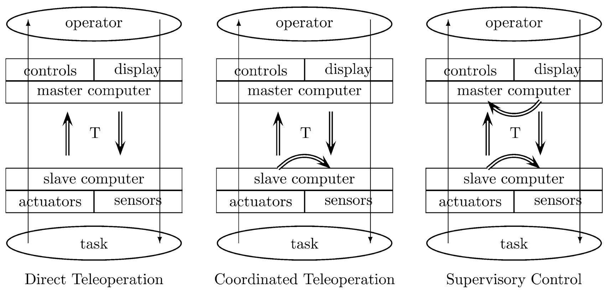

> Image description: This diagram, labeled "Fig. 2 Possible structures of bilateral control schemes for robotic teleoperation," illustrates three hierarchical architectures for remote robot control. All three schemes follow a vertical data flow between an "operator" at the top and a "task" at the bottom, connected through a bidirectional communication loop consisting of a "master computer" and a "slave computer." 1. **Direct Teleoperation**: Features a linear control loop where the master computer sends signals directly to the slave computer, and sensor data returns to the operator via the master computer. An arrow labeled "T" represents the communication channel. 2. **Coordinated Teleoperation**: Adds a feedback loop where the master computer communicates with the slave computer, which in turn influences the master computer's output (arrow "T"), creating a coordinated control structure. 3. **Supervisory Control**: Features a more complex, non-linear loop where both master and slave computers exchange information via multiple arrows (including one labeled "T"), implying higher-level computational oversight during the teleoperation process.
Robot Teleoperation, Fig. 2 Possible structures of bilateral control schemes for robotic teleoperation

Robot Teleoperation, Fig. 3 The "traditional force reflection" transmission scheme
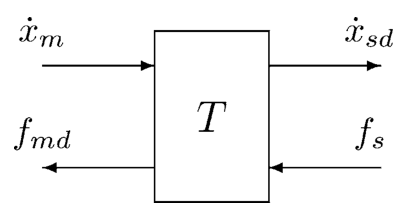

> Image description: A schematic diagram titled "Robot Teleoperation, Fig. 3 The 'traditional force reflection' transmission scheme" illustrates a block diagram representing a transmission system $T$. The diagram consists of a central rectangular block labeled with a capital $T$. There are four directed arrows representing signals passing through the block: 1. **Input (Top-Left):** An arrow labeled $\dot{x}_m$ points into the top-left side of block $T$. 2. **Output (Top-Right):** An arrow labeled $\dot{x}_{sd}$ points out from the top-right side of block $T$. 3. **Output (Bottom-Left):** An arrow labeled $f_{md}$ points out from the bottom-left side of block $T$. 4. **Input (Bottom-Right):** An arrow labeled $f_s$ points into the bottom-right side of block $T$. In an engineering context, the diagram depicts the relationship between master/slave velocities ($\dot{x}$) and forces ($f$), where the block $T$ represents the communication or control scheme that maps these variables between two points.

to focus on the major problems encountered in this field and on some of the approaches for their solutions.

## Traditional Force Reflection Teleoperation

The simplest manner of transmitting the remote force to the operator is to reflect it directly, without any particular elaboration, as shown in Fig. 3. The resulting transmission equations are

$$
\left\{\begin{array}{l}
f_{m d}(t)=f_{s}(t-T)  \tag{1}\\
\dot{x}_{s d}(t)=\dot{x}_{m}(t-T)
\end{array}\right.
$$

where $T$ is the time-delay introduced by the communication network and subscript $d$ indicates the desired set point for the master ( $m$ ) and slave ( $s$ ) controllers.

This technique presents relevant instability problems due to time-delays. As a matter of fact, it is possible to verify that the communication channel does not present strictly passive properties, even for limited bandwidths of the input signals $\dot{x}_{m}$ and $f_{s}$. This result is valid also considering an attenuation between $f_{m d}$ and $f_{s}$, i.e., introducing a force reflection gain $G_{f r}<1.0$ in (1) and computing therefore $f_{m d}(t)=G_{f r} f_{s}(t-T)$. The attenuation reduces the telepresence sensation and degrades the performances, but still does not cause a passive (then stable) network. The nonpassive channel has the global effect of introducing in the overall system energy flows that, if not properly reduced by the local controllers, contribute to destabilize the telemanipulator.

The dynamics of the overall system may be described by the following two sets of equations: the first taking into account the master dynamics and the force transmitted by the communication channel and the second including the slave dynamics, the position signals of the channel, and the local position controller:

<!-- source_pdf_page: 1202 -->
$$
\left\{\begin{array} { r l }
{ M _ { m } \dot { x } _ { m } ( t ) } & { = - f _ { m d } ( t ) - B _ { m } \dot { x } _ { m } ( t ) - K _ { h } x _ { m } ( t ) } \\
{ f _ { m d } ( t ) } & { = f _ { s } ( t - T ) }
\end{array} \left\{\begin{array}{rl}
M_{s} \dot{x}_{s}(t) & =f_{s}(t)-B_{s} \dot{x}_{s}(t) \\
\dot{x}_{s d}(t) & =S_{p} \dot{x}_{m}(t-T) \\
f_{s}(t) & =K_{p}\left[x_{s d}(t)-x_{s}(t)\right]
\end{array}\right.\right.
$$

In the above equations, $M_{i}$ and $B_{i}, i=m, s$, are masses and damping factors at the master and slave sites, $K_{h}$ represents the operator (simply modeled as a stiffness) and $K_{p}$ the slave position controller. The gain $S_{p}$ has been added, with respect to Eq. (1), in order to scale velocity variables between the two robotic systems.

It can be shown that this control scheme does not guarantee stability in the presence of time delays, although in practical applications stability may still be achieved for small time delays due to dissipation introduced by friction and the local controllers.

## Shared Compliance Control

As previously mentioned, both the interactions of the robotic device with the environment and the effects of time-delays have to be considered in the definition of control strategies for telemanipulation systems. The position-error based force reflection scheme deals with both these effects (Kim et al. 1992). This scheme is based on the computation of the feedback signal $f_{m d}$ as a force proportional to the error between master and slave positions:

$$
f_{m d}(t)=G_{f r}\left[x_{m}(t)-x_{s}(t-T)\right]
$$

This signal gives to the operator a sensation related to the difference between the postures of the robotic devices caused either by interactions or delays. Note that in this manner an elastic (proportional) element is introduced between the positions of the robots. This allows to obtain a stable behavior of the overall system comprehensive of local controllers, at least for limited values of $G_{f r}$.

An additional feature for dealing with problems due to time-delays is the so-called shared compliance control (SCC). A local, autonomous force feedback is realized at the slave site in order
to program active compliance and damping of the robotic device. This control action is important when compliance has to be realized between the (stiff) mechanical device and its environment and during the collision or contact phases. The overall control system is therefore based on sharing autonomous and human-driven control actions. A block diagram of the whole system, including the master and slave dynamics $\left(1 /\left(M_{m} s^{2}+B_{m} s+\right.\right. \left.K_{h}\right)$ and $1 /\left(M_{s} s^{2}+B_{s} s\right)$ respectively), the force reflection gain ( $G_{f r}$ ), the shared compliance controller ( $G_{c c}$ ), and an environment model ( $K_{e}$ ), is shown in Fig. 4.

For a given time-delay, the force reflection gain $G_{f r}$ can be increased with respect to the traditional force reflection scheme. In any case, when the time-delay increases, the gain has to be correspondingly decreased to guarantee stability, i.e., the value of $G_{f r}$ depends directly on the amount of time-delay. In fact, also this control scheme in general does not present passivity features, although it can be shown that it may be stable (for a limited range of time delays) with a proper choice of the control parameters.

## Passivity-Based Teleoperation

A control scheme inspired by the passivity theory (Van der Schaft 2000) is now described. Basic consideration is that the communication channel may represent, if proper actions are not taken, a non-passive element between the master and slave. With proper modifications, the transmission line presents passive properties, and therefore, the stability of the overall system may be achieved for any value of the time-delay $T$.

## Lossless Transmission Line

Results of passivity and scattering theories can be used to show that in traditional force reflection teleoperation, Eq. (1), the instability of the overall system in presence of time-delays is caused by

<!-- source_pdf_page: 1203 -->
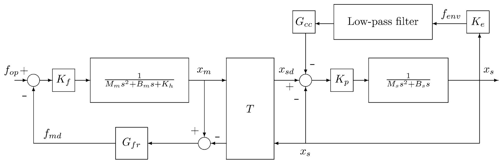

> Image description: A block diagram illustrates a robot teleoperation system featuring position-error based force reflection with sliding control compensation (SCC) at the remote site. The system architecture consists of two main control loops. On the left, a master-side controller takes input $f_{op}$ and processes it through a gain $K_f$ and a second-order transfer function $\frac{1}{M_m s^2 + B_m s + K_h}$, yielding the master position $x_m$. This signal enters a block $T$, while a feedback path through $G_{fr}$ returns a force $f_{md}$ to the input. On the right, the remote site processes position $x_s$ through a block $\frac{1}{M_s s^2 + B_s s}$ with input gain $K_p$. A command signal $x_{sd}$ is derived from the error between the output and a compensation signal from $G_{cc}$. The signal $G_{cc}$ is generated from an environmental force $f_{env}$ through a gain $K_e$ and a low-pass filter. The block $T$ facilitates coupling between the master and remote systems.
Robot Teleoperation, Fig. 4 Position-error based force reflection with SCC at the remote site

the non passive properties of the communication channel (Niemeyer and Slotine 1991). On the other hand, it has been shown that the definition of a communication network based on a lossless transmission line provides the system with passivity features for any time-delay (Anderson and Spong 1989), facilitating therefore the stability of the overall system.

For the definition of a lossless transmission line, it is convenient to refer, instead of the velocity and force variables $\dot{x}, f$ at each port (see Fig. 3), to the equivalent wave variables $u$ and $v$ that are related to the passivity formalism and whose definition derives from the theory of electric circuits. By using these variables, it is possible to describe the power balance in a circuit as the difference of two positive terms which consider the input and the output power. In fact, by introducing the input wave $u=\left[u_{m}^{T}, u_{s}^{T}\right]^{T}$ and the output wave $v=\left[v_{m}^{T}, v_{s}^{T}\right]^{T}$, the power balance in the teleoperator can be expressed as

$$
P=\frac{1}{2}\left(u^{T} u-v^{T} v\right)=f^{T} \dot{x}=\left[f_{m}^{T}, f_{s}^{T}\right]\left[\begin{array}{c}
\dot{x}_{m} \\
-\dot{x}_{s}
\end{array}\right]
$$

By considering a proper scaling factor $b$, defined as the characteristic impedance of the transmission line, the previous equation defines the following transformations between power and wave variables:

$$
\begin{aligned}
& u_{m}=\frac{1}{\sqrt{2 b}}\left(f_{m}+b \dot{x}_{m}\right) \quad u_{s}=\frac{1}{\sqrt{2 b}}\left(f_{s}-b \dot{x}_{s}\right) \\
& v_{m}=\frac{1}{\sqrt{2 b}}\left(f_{m}-b \dot{x}_{m}\right) \quad v_{s}=\frac{1}{\sqrt{2 b}}\left(f_{s}+b \dot{x}_{s}\right)
\end{aligned}
$$

The resulting network is described by

$$
\left\{\begin{array}{l}
f_{m d}(t)=f_{s}(t-T)+b\left[\dot{x}_{m}(t)-\dot{x}_{s d}(t-T)\right] \\
\dot{x}_{s d}(t)=\dot{x}_{m}(t-T)+\frac{1}{b}\left[f_{m d}(t-T)-f_{s}(t)\right]
\end{array}\right.
$$

In terms of wave variables, the passivity-based communication network is described as (see Fig. 5)

$$
\left\{\begin{array}{l}
f_{m d}(t)=b \dot{x}_{m}(t)+\sqrt{2 b} v_{m}(t) \\
\dot{x}_{s d}(t)=-\frac{1}{b}\left[f_{s}(t)-\sqrt{2 b} v_{s}(t)\right]
\end{array}\right.
$$

In analogy with electric networks, impedance adaptation should be added to both extremities of the transmission line, as described e.g., in Niemeyer and Slotine (1991).

## Predictive Control

In a well-known example of space telerobotics, the ROTEX project (Hirzinger et al. 1992), the problems introduced by force feedback and timedelays have been solved in a different manner. In fact, in this case the force information is not transmitted to the operator, and an extensive use of graphic simulation and telesensor programming is made to help control of the task execution.

In particular, the predictive display technique (Sheridan 1992) has been employed for generating and extrapolating beforehand visual indications, such as cursors or wire frame models of the manipulator and its environment. These information are generated by the control system and assist the operator in driving the task

<!-- source_pdf_page: 1204 -->
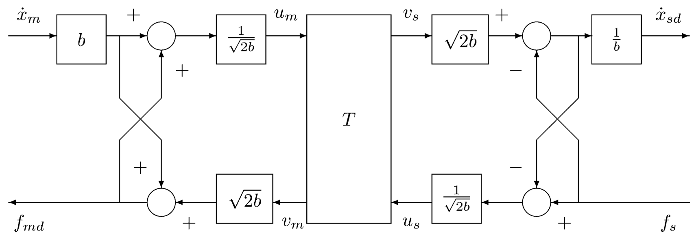

> Image description: A technical block diagram titled "Robot Teleoperation, Fig. 5 Transmission line based on passivity" illustrates a bilateral teleoperation control architecture. The system features two main signal paths, master and slave, connected through a central transformation block labeled $T$. On the master side (left), the input velocity $\dot{x}_m$ passes through a gain block $b$ toward a summation junction. The output signal, $u_m$, is scaled by $\frac{1}{\sqrt{2b}}$ before entering block $T$. The output of $T$, labeled $v_m$, is scaled by $\sqrt{2b}$ and summed with the master side signals to produce the master force feedback $f_{md}$. On the slave side (right), the output of $T$, labeled $v_s$, is scaled by $\sqrt{2b}$ and enters a summation junction. The signal $u_s$ is scaled by $\frac{1}{\sqrt{2b}}$ before entering $T$. The output $\dot{x}_{sd}$ is produced by scaling $v_s$ by $\frac{1}{b}$. The slave force input is $f_s$, which is processed through a summation junction to form $u_s$.
Robot Teleoperation, Fig. 5 Transmission line based on passivity

execution more efficiently. In this case, a proper prediction algorithm has to be set on the basis of current initial conditions of the manipulator and, possibly, of current control variables.

In telerobotics, predictive displays have to be purposely designed in order to consider the prediction of motions of the manipulator. Usually, the task is graphically simulated in real time, without time-delay, exploiting a model of the remote environment and of the slave device. The operator can observe the task executed by the remote system on the screen, where a simulated copy (with $T=0 \mathrm{~s}$ ) of the robotic device can be superimposed on the real operating device in the scene of the remote site. In this manner, the operator may program appropriate actions for the interaction with the environment.

This type of task planning helps when a noticeable time-delay occurs. In fact, when operators deal with relevant time-delays (e.g., larger than 1 s ), usually they operate with a "move and wait" strategy, conservatively specifying only small displacements to the remote robot. By using predictive display, the time required to execute complex tasks is greatly reduced. On the other hand, the operator has only visual information about the remote environment and the task execution.

## Four-Channel Scheme

A generalization of the scheme of Fig. 1, the so-called four-channel architecture (Hirche et al. 2007; Lawrence 1993), is shown in Fig. 6. In this scheme, both the velocity and force signal of
the master and slave are transmitted, and with a proper choice of the four blocks $C_{1}, C_{2}, C_{3}$, and $C_{4}$ many design goals can be achieved, in particular concerning the stability and the transparency of the overall system. In particular, if $C_{3}=C_{4}=0$, the standard velocity-force transmission scheme is obtained, while ideal transparency is achieved if $C_{1}=Z_{c s}, C_{2}=C_{3}= I, C_{4}=-Z_{c m}$. In the figure, the blocks $Z_{m}$ and $Z_{s}$ represent the master and the slave dynamics (impedances), respectively, while $C_{m}$ and $C_{s}$ are the local master and slave controllers, $f_{h}^{*}$ is an external force applied by the user, and $f_{e}^{*}$ an exogenous force from the environment.

## Summary and Future Directions

In these notes, an overview on telemanipulation has been presented with the aim of giving a general presentation of the impact of this area of robotics on both industry and research, of outlining typical problems encountered in dealing with remote manipulation systems, and of illustrating some approaches for their solution.

In this respect, it has to be pointed out that, besides the control schemes considered in these notes (purposely developed for telerobotic systems), many other schemes have been presented in the literature (see, e.g., Hokayem and Spong 2006, Ferre et al. 2007, and Arcara and Melchiorri 2002). More in general, however, a relevant literature exists, and important results have been presented from a methodological point of

<!-- source_pdf_page: 1205 -->
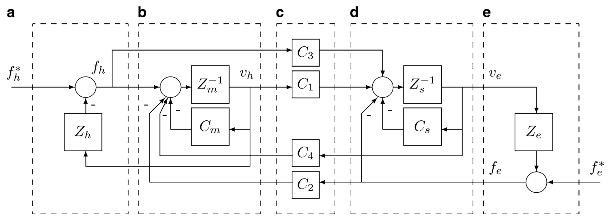

> Image description: A block diagram illustrating a four-channel architecture for robot teleoperation, divided into five functional sections: (a) human operator, (b) master controller, (c) communication line, (d) slave controller, and (e) environment. In section **a**, the reference input $f_h^*$ enters a summing junction with feedback from block $Z_h$, outputting the signal $f_h$. In section **b**, $f_h$ enters a summing junction where it is modified by feedback from $C_m$ and an additional signal from $C_4$. The resulting signal passes through a delay block $Z_m^{-1}$ to produce $v_h$. Section **c** contains the communication components $C_3$, $C_1$, $C_4$, and $C_2$. Block $C_3$ receives $f_h$ and feeds into section **d**. Block $C_1$ receives $v_h$ and feeds into section **d**. In section **d**, $C_3$, $C_1$, and $C_2$ signals are summed with feedback from block $C_s$ and the output of a delay block $Z_s^{-1}$. The resulting signal $v_e$ passes to section **e**. In section **e**, $v_e$ enters block $Z_e$ to produce $f_e$, which is summed with a reference $f_e^*$ to complete the feedback loop via $C_2$.
Robot Teleoperation, Fig. 6 Block scheme of the four-channel architecture. (a) The human operator. (b) Master controller. (c) Communication line. (d) Slave controller. (e) Environment

view to face control problems of time-delay systems: see for example, Gu et al. (2003).

There are, however, other important aspects of telemanipulation which, for space constraints, can only be mentioned here, such as the "impedance shaping" (typical in applications in which there is a relevant dynamic/mechanical difference between the master and slave mechanisms) or criteria for defining (and measuring) performance of teleoperator systems, such as the "time to completion," criteria based on energy consumption, dexterity, and so on. Other interesting, and important, extensions are the possibility of controlling remote teams of robots cooperating for the execution of a common task (e.g., for aerial inspections, transport of heavy loads, etc.).

Future developments of robotic teleoperation systems will deal with the technological improvements of the user interface, giving to the operator more "realistic" feedback of the remote environment, the application of this type of technology to more complex situations, and the use of multirobot systems controlled either by one or more cooperating users. Control will play in any case a fundamental role in these scenarios.

## Cross-References

- Advanced Manipulation for Underwater Sampling
- Control of Linear Systems with Delays
- Disaster Response Robot
- Force Control in Robotics
- Model-Predictive Control in Practice
- Redundant Robots
- Robot Visual Control

## Recommended Reading

Introductory and historical perspectives of telemanipulation, along with descriptions of several interesting applications of this technology, may be found in Ferre et al. (2007), Hokayem and Spong (2006), Sheridan (1992), and Vertut and Coiffet (1986). Specific applications, e.g., space, underwater, medical, and hazardous environment, are described in Duff et al. (2010), Hirzinger et al. (1992), http://marsrovers.jpl.nasa.gov/home/index.html, and Ridao et al. (2007). Some of the main control schemes specifically developed for this type of robotic devices are reported in Anderson and Spong (1989), Arcara and Melchiorri (2002), Colgate (1993), Hirche et al. (2007), Kim et al. (1992), and Niemeyer and Slotine (1991), while some basic background material on control theory is available in Gu et al. (2003) and Van der Schaft (2000).

## Bibliography

Anderson JA, Spong MW (1989) Bilateral control of teleoperators with time delay. IEEE Trans Autom Control 34(5):494-501

<!-- source_pdf_page: 1206 -->
Arcara P, Melchiorri C (2002) Control schemes for teleoperation with time delay: a comparative study. Int J Robot Auton Syst 38(1):49-64
Bejczy AK, Handlykken M (1981) Generalization of bilateral force-reflecting control of manipulators. In: Proceedings of the 4th Rom-An-Sy, Warsaw, pp 242-255
Bergamasco M, Frisoli A, Avizzano CA (2007) Exoskeletons as man-machine interface systems for teleoperation and interaction in virtual environments. In: Ferre M, Buss M, Aracil R, Melchiorri C, Balaguer C (eds) Advances in telerobotics. Springer, Berlin
Colgate JE (1993) Robust impedance shaping telemanipulation. IEEE Trans Robot Autom 9(4):374-384
Duff E, Caris C, Bonchis A, Taylor K, Gunn C, Adcock M (2010) The development of a telerobotic rock breaker. In: Howard A, Iagnemma K, Kelly A (eds) Field and service robotics. Springer tracts in advanced robotics, vol 62. Springer, Berlin/Heidelberg, pp 411-420
Ferre M, Buss M, Aracil R, Melchiorri C, Balaguer C (eds) (2007) Advances in telerobotics. Springer, Berlin
Ferrel WR (1966) Delayed force feedback. IEEE Trans Hum Factors Electr HFE-8:449-455
Goertz RC, Thompson RC (1954) Electronically controlled manipulators. Nucleonics 12(11): 46-47
Gu K, Kharitonov V, Chen J (2003) Stability of time-delay systems. Birkhauser, Boston
Hirche S, Ferre M, Barrio J, Melchiorri C, Buss M (2007) Bilateral control architectures for telerobotics. In: Ferre M, Buss M, Aracil R, Melchiorri C, Balaguer C (eds) Advances in telerobotics. Springer, Berlin
Hirzinger G, Grunwald G, Brunner B, Heindl J (1992) A sensor-based telerobotic system for the space robot experiment ROTEX. In: Workshop on teleoperation and orbital robotics, 1992 IEEE international conference on robotics and automation, Nice
Hokayem PF, Spong MW (2006) Bilateral teleoperation: an historical survey. Automatica 42:2035-2057
http://marsrovers.jpl.nasa.gov/home/index.html
Kim WS, Hannaford B, Bejczy AK (1992) Forcereflecting and shared compliant control in operating telemanipulators with time delay. IEEE Trans Robot Autom 8(2): 176-185
Kobrinskii A (1960) The thought control the machine: development of a bioelectric prosthesis. In: Proceedings of the 1st IFAC world congress on automatic control, Moscow
Lawrence DA, (1993) Stability and transparency in bilateral teleoperation. IEEE Trans Robot Autom 9(5): 624-637
Martin HL, Kuban DP (1985) Teleoperated robotics in hostile environments. Robotics International of SME, Dearborn
Niemeyer G, Slotine JJE (1991) Stable adaptive teleoperation. IEEE J Ocean Eng 16(1):152-162
Ridao P, Carreras M, Hernandez E, Palomeras N (2007) Underwater telerobotics for collaborative research. In: Ferre M, Buss M, Aracil R, Melchiorri C, Balaguer C (eds) Advances in telerobotics. Springer, Berlin

Sheridan TB (1992) Telerobotics, automation, and human supervisory control. MIT, Cambridge
Smith FM, Backman DK, Jacobsen SC (1992) Telerobotic manipulator for hazardous environments. J Robot Syst 9(2):251-260
Van der Schaft AJ (2000) L2-gain and passivity techniques in nonlinear control. Springer communications and control engineering series, 2nd edn. Springer, London
Vertut J, Coiffet P (1986) Robot technology, vol 3A: teleoperation and robotics: evolution and development. Prentice-Hall

## Robot Visual Control

François Chaumette Inria, Rennes, France

#### Abstract

This article presents the basic concepts of visionbased control, that is, the use of visual data to control the motions of a robotics system. It details the modeling steps allowing the design of kinematics control schemes. Applications are also described.

## Keywords

Jacobian; Kinematics; Robot control; Visual servoing

## Introduction

Visual control, also named visual servoing, refers to the use of computer vision data as input of realtime closed-loop control schemes to control the motion of a dynamic system, a robot typically (Chaumette and Hutchinson 2008; Hutchinson et al. 1996). It can be seen as sensor-based control from a vision sensor and relies on techniques from image processing, computer vision, and control theory.

An iteration of the control scheme consists of the following steps:

<!-- source_pdf_page: 1207 -->
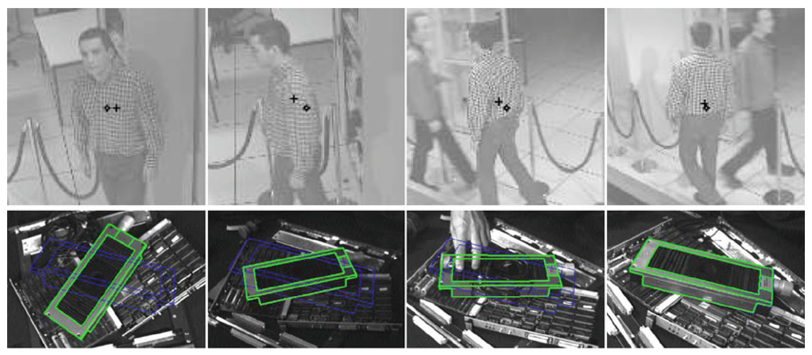

> Image description: A grayscale four-panel composite figure from a textbook illustrating two different visual servoing tasks. The figure is organized into two horizontal rows. The top row contains four sequential grayscale images depicting a pedestrian tracking task. A person in a checkered shirt walks through a scene; small black crosshairs are superimposed on the person’s torso, indicating target tracking coordinates via a pan-tilt camera. The bottom row contains four sequential grayscale images depicting a robotic control task involving object manipulation. A small, rectangular object is being targeted within a cluttered field of similar items. Green bounding boxes represent the desired target pose, while blue bounding boxes represent the current estimated pose of the object. The sequence shows the alignment process as the robot's visual feedback moves the green target box to coincide with the object's orientation and position.

Robot Visual Control, Fig. 1 A few images acquired during two visual servoing tasks: on the top, pedestrian tracking using a pan-tilt camera; on the bottom, control-
ling the 6 degrees of freedom of an eye-in-hand system so that an object appears at a particular position in the image (shown in blue)

- Acquire an image.
- Extract some useful image measurements.
- Compute the current value of the visual features used as inputs of the control scheme.
- Compute the error between the current and the desired values of the visual features.
- Update the control outputs, which are usually the robot velocity, to regulate that error to zero, i.e., to minimize its norm.
For instance, for the first example depicted on Fig. 1, the image processing part consists in extracting and tracking the center of gravity of the moving people, the visual features are composed of the two Cartesian coordinates of this center of gravity, and the control schemes compute the pan and tilt velocities so that the center of gravity is as near as possible of the image center despite the unknown motion of the people. In the second example where a camera mounted on a six-degrees-of-freedom robot arm is considered, the image measurements are a set of segments that are tracked in the image sequence. From these measurements and the knowledge of the 3D object model, the pose from the camera to the object is estimated and used as visual features. The control scheme now computes the six components of the robot velocity so that this pose reaches a particular desired value corresponding
to the object position depicted in blue on the images.

## Basic Theory

Main if not all visual servoing tasks can be expressed as the regulation to zero of an error $\mathbf{e}(t)$ which is defined by

$$
\begin{equation*}
\mathbf{e}(t)=\mathbf{s}(\mathbf{m}(\mathbf{r}(t)), \mathbf{a})-\mathbf{s}^{*}(t) . \tag{1}
\end{equation*}
$$

The parameters in (1) are defined as follows (Chaumette and Hutchinson 2008). The vector $\mathbf{m}(\mathbf{r}(t))$ is a set of image measurements (e.g., the image coordinates of interest points, or the area, the center of gravity, and other geometric characteristics of an object). These image measurements depend on the pose $\mathbf{r}(t)$ between the camera and the environment. They are used to compute a vector $\mathbf{s}(\mathbf{m}(\mathbf{r}(t)), \mathbf{a})$ of visual features, in which a is a set of parameters that represent potential additional knowledge about the system (e.g., coarse camera intrinsic parameters or 3D model of objects). The vector $\mathbf{s}^{*}(t)$ contains the desired value of the features, which can be either constant in the case of a fixed goal or

<!-- source_pdf_page: 1208 -->
varying if the task consists in following a specified trajectory.

Visual servoing schemes mainly differ in the way that the visual features are designed. As represented on Fig. 2, the two most classical approaches are named image-based visual servoing (IBVS), in which $\mathbf{s}$ consists of a set of 2D parameters that are directly expressed in the image (Espiau et al. 1992; Weiss et al. 1987), and pose-based visual servoing (PBVS), in which s consists of a set of 3D parameters related to the pose between the camera and the target (Weiss et al. 1987; Wilson et al. 1996). In that case, the 3D parameters have to be estimated from the image measurements either through a pose estimation process using the knowledge of the 3D target model, or through a partial pose estimation process using the properties of the epipolar geometry between the current and the desired images, or finally through a triangulation process if a stereovision system is considered. Inside IBVS and PBVS approaches, many possibilities exist depending on the choice of the features. Each choice will induce a particular behavior of the system. There also exist hybrid approaches, named $2-1 / 2 \mathrm{D}$ visual servoing, which combine 2D and 3D parameters in $\mathbf{s}$ in order to benefit from the advantages of IBVS and PBVS while avoiding their respective drawbacks (Malis et al. 1999).

The design of the control scheme is based on the link between the time variation of the features

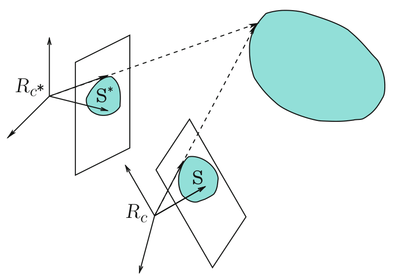

> Image description: An engineering diagram titled "Robot Visual Control, Fig. 2" illustrates two perspectives of a visual servoing task. On the right, a large teal-colored irregular shape represents a target object in 3D space. Two planes, representing image sensor views, are positioned relative to the object. The top-left view shows an image frame labeled $S^*$ within a rectangular plane. This frame is associated with a coordinate system labeled $R_{c^*}$, represented by three orthogonal axes (vertical, horizontal, and depth). Dashed lines connect points on the target object to corresponding points in the $S^*$ frame, indicating a projection. The bottom-center view shows an image frame labeled $S$ within a tilted rectangular plane. This frame is associated with a different coordinate system labeled $R_{c}$. Similar dashed lines connect the object to the $S$ frame. The diagram illustrates the relationship between different camera frames ($R_{c}$ and $R_{c^*}$) and their corresponding image projections ($S$ and $S^*$) to describe visual control approaches.
Robot Visual Control, Fig. 2 If the goal is to move the camera from frame $R_{c}$ to the desired frame $R_{c^{*}}$, two main approaches are possible: IBVS on the left, where the

and the robot control inputs, which are usually the velocity of the robot joints $\mathbf{q}$. This relation is given by

$$
\begin{equation*}
\dot{\mathbf{s}}=\mathbf{J}_{\mathrm{s}} \dot{\mathbf{q}}+\frac{\partial \mathbf{s}}{\partial t} \tag{2}
\end{equation*}
$$

where $\mathbf{J}_{\mathbf{s}}$ is the features Jacobian matrix, defined from the equation above similarly as the classical robot Jacobian. For an eye-in-hand system (see the left part of Fig. 3), the term $\frac{\partial \mathbf{s}}{\partial t}$ represents the time variation of $\mathbf{s}$ due to a potential object motion, while for an eye-to-hand system (see the right part of Fig. 3) it represents the time variation of $\mathbf{s}$ due to a potential sensor motion.

As for the features Jacobian, in the eye-inhand configuration, it can be decomposed as Chaumette and Hutchinson (2008)

$$
\begin{equation*}
\mathbf{J}_{\mathbf{s}}=\mathbf{L}_{\mathbf{s}}{ }^{c} \mathbf{V}_{n} \mathbf{J}(\mathbf{q}) \tag{3}
\end{equation*}
$$

where

- $\mathbf{J}(\mathbf{q})$ is the robot Jacobian such that $\mathbf{v}_{n}= \mathbf{J}(\mathbf{q}) \dot{\mathbf{q}}$ where $\mathbf{v}_{n}$ is the robot end effector velocity.
- ${ }^{c} \mathbf{V}_{n}$ is the spatial motion transform matrix from the vision sensor to the end effector. It is given by

$$
{ }^{c} \mathbf{V}_{n}=\left[\begin{array}{cc}
{ }^{c} \mathbf{R}_{n} & {\left[{ }^{c} \mathbf{t}_{n}\right]_{\times}{ }^{c} \mathbf{R}_{n}}  \tag{4}\\
\mathbf{0} & { }^{c} \mathbf{R}_{n}
\end{array}\right]
$$

where ${ }^{c} \mathbf{R}_{n}$ and ${ }^{c} \mathbf{t}_{n}$ are respectively, the rotation matrix and the translation vector between
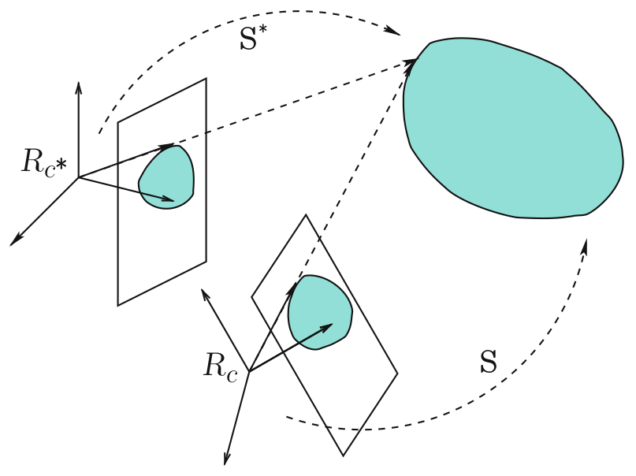
features $\mathbf{s}$ and $\mathbf{s}^{*}$ are expressed in the image, and PBVS on the right, where the features $\mathbf{s}$ and $\mathbf{s}^{*}$ are related to the pose between the camera and the observed object

<!-- source_pdf_page: 1209 -->

#### Abstract

Robot Visual Control, Fig. 3 In visual servoing, the vision sensor can be either mounted on the robot (eye-in-hand configuration) or remote and observing the robot (eye-to-hand configuration). For the same robot motion, the motion produced in the image will be opposite from one configuration to the other

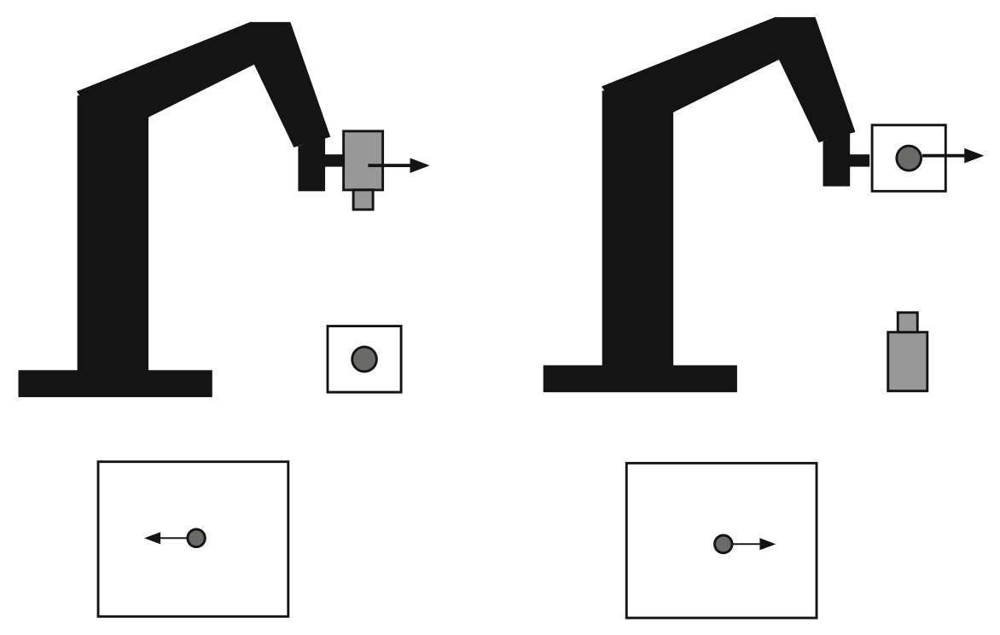

> Image description: This diagram, titled "Robot Visual Control, Fig. 3," illustrates the difference between eye-in-hand and eye-to-hand visual servoing configurations. The image is divided into two parallel scenarios. On the left, representing the "eye-in-hand" configuration, a robotic arm is shown with a grey sensor (camera) mounted directly at its end-effector. A black arrow indicates a rightward movement of the sensor. Below the robot, a grey target dot is centered within a bounding box. At the very bottom, a rectangular image frame shows the dot moving leftward, indicated by a left-pointing arrow, showing the opposite motion relative to the robot. On the right, representing the "eye-to-hand" configuration, the same robotic arm moves rightward, but the sensor is depicted as a separate rectangular block placed stationary below the arm. Below this, a corresponding image frame shows the dot moving rightward, following the direction of the robot's movement.
the sensor frame and the end effector frame and where $\left[{ }^{c} \mathbf{t}_{n}\right]_{\times}$is the skew symmetric matrix associated to ${ }^{c} \mathbf{t}_{n}$. Matrix ${ }^{c} \mathbf{V}_{n}$ is constant when the vision sensor is rigidly attached to the end effector, which is usually the case. Thanks to the robustness of closed-loop control schemes, a coarse approximation of ${ }^{c} \mathbf{R}_{n}$ and ${ }^{c} \mathbf{t}_{n}$ is sufficient in practice to get an estimation of ${ }^{c} \mathbf{V}_{n}$. If needed, an accurate estimation is possible through classical hand-eye calibration methods.

- $\mathbf{L}_{\mathbf{s}}$ is the interaction matrix of $\mathbf{s}$ defined such that $\mathbf{s}=\mathbf{L}_{\mathbf{s}} \mathbf{v}$ where $\mathbf{v}$ is the relative velocity between the camera and the environment.
In the eye-to-hand configuration, the features Jacobian $\mathbf{J}_{\mathbf{s}}$ is composed of Chaumette and Hutchinson (2008)

$$
\begin{equation*}
\mathbf{J}_{\mathbf{s}}=-\mathbf{L}_{\mathbf{s}}{ }^{c} \mathbf{V}_{f}{ }^{f} \mathbf{V}_{n} \mathbf{J}(\mathbf{q}) \tag{5}
\end{equation*}
$$

where

- ${ }^{f} \mathbf{V}_{n}$ is the spatial motion transform matrix from the robot reference frame to the end effector frame. It is known from the robot kinematics model.
- ${ }^{c} \mathbf{V}_{f}$ is the spatial motion transform matrix from the camera frame to the reference frame. It is constant as long as the camera does not move. In that case, similarly as for the eye-in-hand configuration, a coarse approximation of ${ }^{c} \mathbf{R}_{f}$ and ${ }^{c} \mathbf{t}_{f}$ is usually sufficient to get an estimation of ${ }^{c} \mathbf{V}_{f}$.

A lot of works have concerned the modeling of the visual features and the determination of the analytical form of the interaction matrix. To give just an example, in the case of an image point with normalized Cartesian coordinates $\mathbf{x}= (x, y)$ and whose 3D corresponding point has depth $Z$, its interaction matrix is given by Espiau et al. (1992)

$$
\mathbf{L}_{\mathbf{x}}=\left[\begin{array}{cccccc}
-1 / Z & 0 & x / Z & x y & -\left(1+x^{2}\right) & y  \tag{6}\\
0 & -1 / Z & y / Z & 1+y^{2} & -x y & -x
\end{array}\right]
$$

where the three first columns contain the elements related to the three components of the translational velocity and where the three last columns contain the elements related to the three components of the rotational velocity.

By just changing the parameters representing the same image point, that is, by using the cylindrical coordinates defined by $\boldsymbol{\gamma}=(\rho, \theta)$ with $\rho=\sqrt{x^{2}+y^{2}}$ and $\theta=\operatorname{Arctan}(y / x)$, the interaction matrix of these parameters has a completely different form (Chaumette and Hutchinson 2008):

$$
\mathbf{L}_{\gamma}=\left[\begin{array}{ccccc}
-c / Z & -s / Z & \rho / Z & \left(1+\rho^{2}\right) s & -\left(1+\rho^{2}\right) c  \tag{7}\\
s /(\rho Z) & -c /(\rho Z) & 0 & c / \rho & s / \rho \\
& -1
\end{array}\right]
$$

where $c=\cos \theta$ and $s=\sin \theta$. This implies that using the Cartesian coordinates or the cylindrical coordinates as visual features will induce a different behavior, that is, a different robot

<!-- source_pdf_page: 1210 -->
trajectory and a different trajectory of the point in the image.

Currently, the analytical form of the interaction matrix is available for most classical geometrical primitives, such as segments, straight lines, ellipses, moments related to planar objects of any shape (Chaumette 2004), and also coordinates of 3D points and pose parameters. Methods also exist to estimate off-line or online a numerical value of the interaction matrix. Omnidirectional vision sensors, the coupling between a camera and structured light, and even 2D echographic probes have also been studied. A large variety of visual features is thus available for many vision sensors.

Once the modeling step has been performed, the design of the control scheme can be quite simple. The most classical control scheme has the following form (Chaumette and Hutchinson 2008):

$$
\begin{equation*}
\dot{\mathbf{q}}=-\lambda \widehat{\mathbf{J}}_{\mathbf{s}}^{+}\left(\mathbf{s}-\mathbf{s}^{*}\right)+\widehat{\mathbf{J}}_{\mathbf{s}}^{+} \frac{\partial \mathbf{s}^{*}}{\partial t}-\widehat{\mathbf{J}}_{\mathbf{s}}^{+} \frac{\widehat{\partial \mathbf{s}}}{\partial t} \tag{8}
\end{equation*}
$$

where $\lambda$ is a positivive gain tuning the rate of convergence of the system and $\widehat{\mathbf{J}}_{\mathbf{s}}{ }^{+}$is the MoorePenrose pseudo inverse of an approximation or an estimation of the features Jacobian. The exact value of all its elements is indeed generally unknown since it depends of the intrinsic and extrinsic camera parameters, as well as of some 3D parameters such as the depth of the point in Eqs. (6) and (7).

The second term of the control scheme anticipates for the variation of $\mathbf{s}^{*}$ in the case of a nonconstant desired value. The third term compensates as much as possible a possible target motion in the eye-in-hand case and a possible camera motion in the eye-to-hand case. They are both null in the case of a fixed desired value and a motionless target or camera. They try to remove the tracking error in the other cases.

Following the Lyapunov theory, the stability of the system can be studied (Chaumette and Hutchinson 2008). Generally, visual servoing schemes can be demonstrated to be locally asymptotically stable (i.e., the robot will converge if it starts from a local neighborhood of
the desired pose) if the errors introduced in $\widehat{\mathbf{J}_{\text {s }}}$ are not too strong. Some particular visual servoing schemes can be demonstrated to be globally asymptotically stable (i.e., the robot will converge whatever its initial pose) under similar conditions.

Finally, when the visual features do not constrain all the robot degrees of freedom, it is possible to combine the visual task with supplementary tasks such as, for instance, joint limits avoidance or the visibility constraint (to be sure that the target considered will always remain in the camera field of view). In that case, the redundancy framework can be applied and the error to be regulated to zero has the following form:

$$
\begin{equation*}
\mathbf{e}={\widehat{\mathbf{J}_{\mathbf{s}}}}^{+}\left(\mathbf{s}-\mathbf{s}^{*}\right)+\left(\mathbf{I}-\widehat{\mathbf{J}}_{\mathbf{s}}^{+} \widehat{\mathbf{J}}_{\mathbf{s}}\right) \mathbf{e}_{2} \tag{9}
\end{equation*}
$$

where (I $\left.-\widehat{\mathbf{J}_{\mathbf{S}}}+\widehat{\mathbf{J}_{\mathbf{S}}}\right)$ is a projection operator on the null space of the visual task so that the supplementary task $\mathbf{e}_{2}$ will be achieved at best under the constraint that the visual task is realized (Espiau et al. 1992). A similar control scheme to (8) is now given by

$$
\begin{equation*}
\dot{\mathbf{q}}=-\lambda \mathbf{e}-\frac{\widehat{\partial \mathbf{e}}}{\partial t} \tag{10}
\end{equation*}
$$

This scheme has for instance been applied for the first example depicted on Fig. 4 where the rotational motion of the mobile robot is controlled by vision, while its translational motion is controlled by the odometry to move at a constant velocity.

## Applications

Potential applications of visual servoing are numerous. It can be used as soon as a vision sensor is available and a task is assigned to a dynamic system to control its motion. A non-exhaustive list of examples is (see Fig. 4):

- The control of a pan-tilt-zoom camera, as illustrated in Fig. 1 for the pan-tilt case
- Grasping using a robot arm

<!-- source_pdf_page: 1211 -->
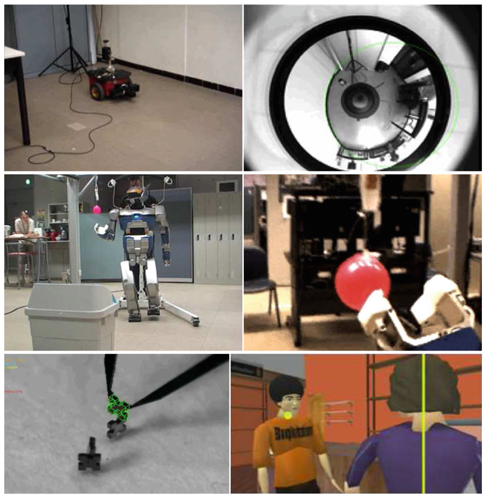

> Image description: This figure, titled "Robot Visual Control, Fig. 4 Few applications of visual servoing," consists of five panels demonstrating robotic tasks. The top row displays two views: on the left, a mobile robot moves through a room; on the right, a fish-eye view from an omnidirectional vision sensor shows a green circular boundary indicating the sensor's field of view. The middle row presents two images: on the left, a humanoid robot stands in a lab setting next to a gray bin; on the right, a close-up view shows a robotic manipulator grasping a red balloon. The bottom row displays two images: on the left, a first-person view from a robotic effector approaching a small black object on the floor; on the right, a simulated environment showing a character in an orange shirt interacting with a person in a purple shirt, with a yellow vertical line indicating a reference axis in the digital workspace.

Robot Visual Control, Fig. 4 Few applications of visual servoing: navigation of a mobile robot to follow a wall using an omnidirectional vision sensor (top row), grasping

- Locomotion and dexterous manipulation with a humanoid robot
- Micro- or nano-manipulation of MEMS or biological cells
- Pipe inspection by an underwater autonomous vehicle
- Autonomous navigation of a mobile robot in indoor or outdoor environment
- Aircraft landing
- Autonomous satellite rendezvous
a ball with a humanoid robot (middle row), assembly of MEMS and film of a dialogue within the constraints of a script in animation (bottom row)
- Biopsy using ultrasound probes or heart motion compensation in medical robotics
- Virtual cinematography in animation

## Summary and Future Directions

Visual servoing is basically a nonlinear control problem. Several modeling works have been realized to design visual features so that the control

<!-- source_pdf_page: 1212 -->
problem is transformed as much as possible to a linear control problem, leading to better stability properties. On one hand, improvements on this topic are still expected. On the other hand, the design of advanced control schemes, such as optimal control or model predictive control, is another way to make improvements. Then, taking into account dynamic constraints, such as nonholonomic constraints or underactuated systems, also necessitates the design of specific control laws.

## Cross-References

- Lyapunov's Stability Theory
- Redundant Robots
- Robot Motion Control

## Recommended Reading

In addition to the classical tutorial Hutchinson et al. (1996) and the most recent one Chaumette and Hutchinson (2008), the books Corke (1997, 2011) and the collection of papers Hashimoto (1993), Kriegman et al. (1998), and Chesi et al. (2010) provide a good overview of past and recent works in the field. The other references below cited in text present the main pioneering contributions in visual servoing.

## Bibliography

Chaumette F (2004) Image moments: a general and useful set of features for visual servoing. IEEE Trans Robot 20(4):713-723
Chaumette F, Hutchinson S (2008) Visual servoing and visual tracking. In: Siciliano B, Khatib O (eds) Handbook of robotics, Chap. 24. Springer, Dordrecht, pp 563-583
Chesi G, Hashimoto K (eds) (2010) Visual servoing via advanced numerical methods. LNCIS, vol 401. Springer, Berlin
Corke P (1997) Visual control of robots: highperformance visual servoing. Wiley, New York
Corke P (2011) Robotics, vision and control. Springer tracts in advanced robotics, vol 73. Springer, Berlin
Espiau B, Chaumette F, Rives P (1992) A new approach to visual servoing in robotics. IEEE Trans Robot Autom 8(3):313-326

Hashimoto K (ed) (1993) Visual servoing: real-time control of robot manipulators based on visual sensory feedback. World Scientific, Singapore
Hutchinson S, Hager G, Corke P (1996) A tutorial on visual servo control. IEEE Trans Robot Autom 12(5):651-670
Kriegman D, Hager G, Morse S (eds) (1998) The confluence of vision and control. LNCIS, vol 237. Springer, London
Malis E, Chaumette F, Boudet S (1999) 2-1/2D visual servoing. IEEE Trans Robot Autom 15(2):238-250
Weiss L, Sanderson A, Neuman C (1987) Dynamic sensor-based control of robots with visual feedback. IEEE J Robot Autom 3(5):404-417
Wilson W, Hulls C, Bell G (1996) Relative end-effector control using cartesian position-based visual servoing. IEEE Trans Robot Autom 12(5):684-696

## Robust Adaptive Control

Anuradha M. Annaswamy Active-adaptive Control Laboratory, Department of Mechanical Engineering, Massachusetts Institute of Technology, Cambridge, MA, USA

#### Abstract

Robust adaptive control pertains to the satisfactory behavior of adaptive control systems in the presence of nonparametric perturbations such as disturbances, unmodeled dynamics, and time delays. This article covers the highlights of robust adaptive controllers, methods used, and results obtained. Both methods of achieving robustness, which include modifications in the adaptive law and persistent excitation in the reference input, are presented. In both cases, results obtained for robustness to disturbances and unmodeled dynamics are discussed.

## Keywords

Dead zone; Global boundedness; Parameter projection; Persistent excitation; Robustness; s-modification

<!-- source_pdf_page: 1213 -->
## Introduction

The central problem in adaptive control pertains to regulation and tracking of systems in the presence of parametric uncertainties. The classical adaptive control problem solved in 1980 assumed that the underlying transfer function had unknown parameters, but no other uncertainties. No disturbances, delays, time variations in parameters, or unmodeled dynamics were assumed to be present. Under these ideal conditions, it was shown that an adaptive controller can be designed so that the closed-loop system has bounded signals and that asymptotic regulation and tracking were possible.

With asymptotic regulation and tracking achieved under such ideal conditions, the goal of robust adaptive control was to ensure globally bounded signals in the closed-loop adaptive system when the plant was subjected to a variety of nonparametric perturbations such as external disturbances, time-varying parameters, unmodeled dynamics, and time delays. With adaptation in the control parameters in the ideal case accommodating parametric uncertainties, the approaches developed in robust adaptive control focused on developing solutions in the perturbed case to accommodate nonparametric uncertainties and improving on the classical adaptive controller which either underperformed or even exhibited instability with the introduction of nonparametric perturbations.

We briefly present the adaptive control solutions for the ideal case before proceeding with robust adaptive control.

## Classical Adaptive Control

## Adaptive Control of Plants with State Feedback

One of the very first problems where stable adaptive control was solved was for the case when states are accessible (Narendra and Kudva 1972), with the plant given by (The argument $t$ is suppressed for the sake of convenience, except for emphasis.)

$$
\begin{equation*}
\dot{x}_{p}=A_{p} x_{p}+b \lambda u \tag{1}
\end{equation*}
$$

where $A_{p} \in \mathbb{R}^{n \times n}$ and the scalar $\lambda$ are unknown parameters with $b$ and the sign of $\lambda$ known and ( $A_{p}, b$ ) controllable. An adaptive controller that ensures global boundedness and asymptotic regulation and tracking for such plants is of the form

$$
\begin{equation*}
u=\theta_{x}^{T}(t) x_{p}+\theta_{r}(t) r, \tag{2}
\end{equation*}
$$

and the adaptive laws for adjusting the unknown parameters are given by

$$
\begin{equation*}
\dot{\theta}=-\operatorname{sign}(\lambda) \Gamma \omega b_{m}^{T} P e, \tag{3}
\end{equation*}
$$

where $\omega=\left[x_{p}^{T}, r\right]^{T}$ and $\theta=\left[\theta_{x}^{T}, \theta_{r}\right]^{T}, x_{m}$ is the state of a reference model

$$
\begin{equation*}
\dot{x}_{m}=A_{m} x_{m}+b r \tag{4}
\end{equation*}
$$

with $A_{m}$ Hurwitz, and $P$ being the solution of the Lyapunov equation $A_{m}^{T} P+P A_{m}=-Q, Q>0$. The reference model in (4) is to be chosen so that certain matching conditions are satisfied, which are of the form

$$
\begin{equation*}
A_{p}+b \lambda \theta_{x}^{\star T}=A_{m}, \quad \lambda \theta_{r}^{*}=1 \tag{5}
\end{equation*}
$$

for some $\theta^{*}=\left[\theta_{x}^{* T}, \theta_{r}^{*}\right]^{T}$. In such a case, the controller in (2) and (3) guarantees stability and ensures that $x(t)$ tracks $x_{m}(t)$. The underlying Lyapunov function is quadratic in $e$ and the parameter error $\tilde{\theta}=\theta-\theta^{*}$, given by

$$
\begin{equation*}
V=\frac{1}{2}\left(e^{T} P e+\lambda \tilde{\theta}^{T} \Gamma^{-1} \tilde{\theta}\right) \tag{6}
\end{equation*}
$$

with a negative semi-definite time derivative $\dot{V}$ given by

$$
\begin{equation*}
\dot{V} \leq-e^{T} Q e . \tag{7}
\end{equation*}
$$

## Adaptive Control of Plants with Output Feedback

Consider the single-input single-output (SISO) system of equations

<!-- source_pdf_page: 1214 -->
$$
\begin{equation*}
y(t)=W(s) u(t) \tag{8}
\end{equation*}
$$

where $u \in \Re$ is the input, $y \in \Re$ the measurable output, and $s$ the differential operator. The transfer function of the plant is parameterized as

$$
\begin{equation*}
W(s) \triangleq k_{p} \frac{Z(s)}{P(s)} \tag{9}
\end{equation*}
$$

where $k_{p}$ is a scalar and $Z(s)$ and $P(s)$ are monic polynomials with $\operatorname{deg}(Z(s))<\operatorname{deg}(P(s))$. The following assumptions will be made throughout:

Assumption $1 W(s)$ is minimum phase.
Assumption 2 The sign of $k_{p}$ is known.
Assumption 3 The relative degree $n^{*}$ and the order of $W(s)$ are known.

The goal is to design a control input $u$ so that the output $y$ in (8) tracks the output $y_{m}$ of the reference system

$$
\begin{equation*}
y_{m}(t)=W_{m}(s) r(t) \triangleq k_{m} \frac{Z_{m}(s)}{P_{m}(s)} r(t) \tag{10}
\end{equation*}
$$

where $k_{m}$ is a scalar and $Z_{m}(s)$ and $P_{m}(s)$ are monic polynomials with $W_{m}(s)$ relative degree $n^{*}$.

The structure of the adaptive controller is now presented:

$$
\begin{align*}
\dot{\omega}_{1}(t) & =\Lambda \omega_{1}+b_{\lambda} u(t)  \tag{11}\\
\dot{\omega}_{2}(t) & =\Lambda \omega_{2}+b_{\lambda} y(t)  \tag{12}\\
\omega(t) & \triangleq\left[r(t), \omega_{1}^{T}(t), y(t), \omega_{2}^{T}(t)\right]^{T}  \tag{13}\\
\theta(t) & \triangleq\left[k(t), \theta_{1}^{T}(t), \theta_{0}(t), \theta_{2}^{T}(t)\right]^{T}  \tag{14}\\
u & =\theta^{T}(t) \omega \tag{15}
\end{align*}
$$

where $\Lambda \in \Re^{(n-1) \times(n-1)}$ is Hurwitzx, $b_{\lambda} \in \Re^{n-1}$, $\omega_{1}, \omega_{2} \in \Re^{n-1}$, and $\theta \in \Re^{2 n}$ is an adaptive gain vector with $k(t) \in \Re, \theta_{1}(t) \in \Re^{n-1}, \theta_{2}(t) \in \Re^{n-1}$, and $\theta_{0}(t) \in \Re$.

The update law for the adaptive parameter differs depending on whether the relative degree of $W_{m}(s)$ is unity or greater than one and can be described as follows:

$$
\begin{equation*}
\dot{\theta}(t)=-\operatorname{sign}\left(k_{p}\right) \Gamma e_{y} \omega \quad n^{*}=1 \tag{16}
\end{equation*}
$$

and

$$
\begin{equation*}
\dot{\theta}(t)=-\operatorname{sign}\left(k_{p}\right) \Gamma \frac{e_{a} \zeta}{1+\zeta^{T} \zeta} \quad n^{*} \geq 2 \tag{17}
\end{equation*}
$$

where $e_{y}=y-y_{m}, e_{a}$ is an augmented error, and $\zeta$ is a modified regressor, both of which are determined by the following equations:

$$
\begin{align*}
\zeta & =W(s) \omega, \quad \omega=\left[r, \omega_{1}^{T}, y, \omega_{2}^{T}\right]^{T},  \tag{18}\\
e_{2} & =\theta^{T} \zeta-W(s)\left[\theta^{T} \omega\right]  \tag{19}\\
e_{a} & =e_{y}+k_{1}(t) e_{2}  \tag{20}\\
\dot{k}_{1} & =-\frac{e_{a} e_{2}}{1+\zeta^{T} \zeta} \tag{21}
\end{align*}
$$

The results of Narendra and Annaswamy (2005) guarantee that the above adaptive controller in Eqs. (11)-(21) will guarantee that $e_{y}(t)$ tends to zero as $t \rightarrow \infty$ with all signals remaining bounded in both the $n^{*}=1$ and $n^{*} \geq 2$ cases.

## Need for Robust Adaptive Control

When a disturbance $\eta$ is present, the plant dynamics often is of the form

$$
\begin{equation*}
\dot{x}_{p}=A_{p} x_{p}+b \lambda(u+\eta(t)) \tag{22}
\end{equation*}
$$

while the reference model and the controller remain the same as in (4) and (2), respectively. This in turn necessitates new tools for the analysis and synthesis of adaptive systems. The main reason for this is the fact that the standard Lyapunov function candidate given by

$$
\begin{equation*}
V=\frac{1}{2} e^{T} P e+\frac{1}{2} \lambda \tilde{\theta}^{T} \Gamma^{-1} \tilde{\theta} \tag{23}
\end{equation*}
$$

together with the parameter adjustment as in (3) yields a time derivative

$$
\begin{equation*}
\dot{V} \leq-\frac{1}{2} e^{T} Q e+k_{1}\|e\| d_{0} \quad k_{1}>0, \tag{24}
\end{equation*}
$$

where $d_{0}$ is an upper bound on the perturbation $\eta$. The second term on the right-hand side of (24)

<!-- source_pdf_page: 1215 -->
causes $\dot{V}$ to be sign indefinite. This is because $V$ is a function of both $e$ and $\tilde{\theta}$, and therefore, the second term can be large compared to the first with the second argument of $V, \tilde{\theta}$, which can be arbitrary, causing $\dot{V}$ to be sign indefinite. The same property is what caused $\dot{V}$ to be semi-definite in the ideal case. Hence, in this perturbed case, no guarantees of boundedness can be provided. In fact, it can be shown that if $\eta(t)$ is chosen in a particular manner, the closedloop signals can actually be shown to become unbounded, either in the presence of bounded disturbances (Narendra and Annaswamy 2005) or with unmodeled dynamics (Rohrs et al. 1985). This in turn led to the area of robust adaptive control.

Various approaches that have been developed under the rubric of robust adaptive control can be grouped into two categories. The first of these is related to modifications in the adaptive laws so as to ensure boundedness. These changes consist of modifications in the adaptive law (3) as

$$
\begin{equation*}
\dot{\theta}=-\Gamma \omega(t) b_{m}^{T} P e-\sigma g(\theta, e) \tag{25}
\end{equation*}
$$

The problem then reduces to finding a suitable $g(\theta, e)$. This is discussed in detail in the next sec-
tion. The second approach used in adaptive control pertains to the use of a persistently exciting reference signal $r$. The latter ensures parameter convergence of the adaptive system and therefore exponential stability. This in turn ensures robustness of the overall system. These details are addressed in section "Robust Adaptive Control with Persistently Exciting Reference Input."

## Robust Adaptive Control with Modifications in the Adaptive Law

## Robustness to Bounded Disturbances

When a bounded input disturbance $\eta$ is present, the plant dynamics is changed as

$$
\begin{equation*}
\dot{x}_{p}=A_{p} x_{p}+b \lambda(u+\eta(t)), \tag{26}
\end{equation*}
$$

while the reference model and the controller remain the same as in (4) and (2), respectively. As mentioned above, a modification to the adaptive law as in (25) is needed. Over the years, different choices have been suggested for the nonlinear function $g(\theta, e)$. For example, these are chosen as

$$
g(\theta, e)= \begin{cases}\theta & \text { Ioannou and Sun (2013) }  \tag{27}\\ \|e\| \theta & \text { Narendra and Annaswamy (2005) } \\ \theta\left(1-\frac{\|\theta\|}{\theta_{\max }}\right)^{2} & \text { Kreisselmeier and Narendra (1982) }\end{cases}
$$

where $\theta_{\max }$ is a known bound on the parameter $\theta$. (One can choose to set $\sigma$ to zero if $\|\theta\| \leq \theta_{\text {max }}$, as is done in Ioannou and Sun (2013), Tsakalis and Ioannou (1987) and many other references in the literature.) An alternate approach that is different from (25) is to not have an additive term $g(\cdot, \dot{)}$ but rather set $\dot{\theta}=0$ whenever the error $e$ is small in some sense. Such a dead zone approach was suggested, for example, in Egardt (1979) and Peterson and Narendra (1982). It can be shown that each one of these choices leads to boundedness, which is described below. Without loss of generality, we assume that $\lambda>0$.

With the same Lyapunov function candidate as in (23), its time derivative now becomes

$$
\begin{align*}
\dot{V} \leq & -\frac{1}{2} e^{T} Q e+k_{1}\|e\|\|\eta\| \\
& -\frac{1}{2}\|\tilde{\theta}\|^{T} g(\theta, e), \quad k_{1}>0 \tag{28}
\end{align*}
$$

The property of $g(.,$.$) , together with the fact that \eta$ is bounded, ensures that $\dot{V}<0$ outside a compact set $\Omega$ in the ( $e, \tilde{\theta}$ ) space. This ensures global boundedness of both $e$ and $\tilde{\theta}$. Boundedness of $x_{p}$ follows.

<!-- source_pdf_page: 1216 -->
In all of the above methods, the idea behind adding the term $g(e, \theta)$ is this: the parameter $\theta$ can drift away from the correct direction due to the term $k_{1}\|e\|\|\eta\|$, and the construction of $g(e, \theta)$ is such that it counteracts this drift and keeps the parameter in check, by adding a negative quadratic term in $\tilde{\theta}$. The boundedness of both $e$ and $\theta$ is simultaneously assured in the above since $V$ has a time derivative $\dot{V}$ that is nonpositive outside a compact set in the ( $e, \tilde{\theta}$ ) space. It should be noted however that this was possible to a large extent because $\eta$ was bounded, and as a result, the sign-indefinite term remained linear in $\|e\|$.

An alternative procedure, originally proposed in Pomet and Praly (1992) and revised and refined in Khalil (2001) and Lavretsky (2010), proceeds
in a slightly different manner. Here, the boundedness of $\theta$ is first established, independent of the error equation. It should be noted that a similar approach is adopted in the context of output feedback in plants with higher relative degree by using normalization and an augmented error approach (Narendra and Annaswamy 2005). In Khalil (2001) and Lavretsky (2010), no normalization is used but a projection algorithm. This is described below.

The projection algorithm for adjusting the parameter $\theta$ is given by

$$
\begin{equation*}
\dot{\theta}=\operatorname{Proj}(\theta, y), \tag{29}
\end{equation*}
$$

where

$$
\operatorname{Proj}(\theta, y)= \begin{cases}y-\frac{\nabla f(\theta)(\nabla f(\theta))^{T}}{\|\nabla f(\theta)\|^{2}} y f(\theta)  \tag{30}\\ & \text { if }\left[f(\theta)>0 \wedge y^{T} \nabla f(\theta)>0\right] \\ y & \text { otherwise }\end{cases}
$$

$$
\begin{align*}
y & =-e^{T} P b \omega  \tag{31}\\
f(\theta) & =\frac{\|\theta\|^{2}-\theta_{\max }^{\prime 2}}{\varepsilon^{2}+2 \varepsilon \theta_{\max }^{\prime}} \tag{32}
\end{align*}
$$

where $\theta_{\text {max }}^{\prime}$ and $\varepsilon$ are arbitrary positive constants, and $\Omega_{0}$ and $\Omega_{1}$ are defined as

$$
\begin{align*}
& \Omega_{0}=\left\{\theta \in \mathbb{R}^{n} \mid f(\theta) \leq 0\right\}  \tag{33}\\
& \Omega_{1}=\left\{\theta \in \mathbb{R}^{n} \mid f(\theta) \leq 1\right\} .
\end{align*}
$$

From the above relations, one can show that

$$
\theta(0) \in \Omega_{0} \Longrightarrow \theta(t) \in \Omega_{1} .
$$

In addition,

$$
\begin{equation*}
\theta_{\max }^{\prime}=\max _{\theta \in \Omega_{0}}(\|\theta\|), \quad \theta_{\max }=\max _{\theta \in \Omega_{1}}(\|\theta\|) \tag{34}
\end{equation*}
$$

where $\theta_{\text {max }}=\theta_{\text {max }}^{\prime}+\varepsilon$ (Matsutani et al. 2011).

## Robustness to Unmodeled Dynamics

One of the major observations in the early eighties was the stark difference between the system signals in the ideal adaptive system and the perturbed adaptive system when the perturbation was due to a commonly present unmodeled dynamics such as those of an actuator used for control implementation. Among other references, the publication in Rohrs et al. (1985) pointed out the fact that when an adaptive controller prescribed for a first-order plant is evaluated with unmodeled dynamics present, instability occurs readily and for a wide range of command signals. A number of solutions have been suggested to alleviate this instability and form the subject matter of this section.

We consider the plant in (26) with an additional unmodeled dynamics so that

$$
\begin{align*}
& \dot{x}_{p}=A_{p} x_{p}+b \lambda v \\
& \dot{x}_{\eta}=A_{\eta} x_{\eta}+b_{\eta} u, \quad v=\tilde{c}_{\eta}^{T} x_{\eta} . \tag{35}
\end{align*}
$$

<!-- source_pdf_page: 1217 -->
where $A_{\eta}$ is a Hurwitz matrix. If $\eta=v-u$, then the plant dynamics can be rewritten as

$$
\begin{equation*}
\dot{x}_{p}=A_{p} x_{p}+b \lambda(u+\eta) \tag{36}
\end{equation*}
$$

Unlike the bounded disturbance case, no upper bound $d_{0}$ can be assumed to exist as $\eta$ is a statedependent disturbance. It is this that causes a huge difference between deriving boundedness in section "Robustness to Bounded Disturbances" and here in section "Robustness to Unmodeled Dynamics." Significant effort has been extended in the adaptive control community in this regard. These results fall into two categories (i) that assure global boundedness for a narrow class of unmodeled dynamics and (ii) that assure semiglobal boundedness for a slightly larger class of unmodeled dynamics. More recently, some results have been obtained that are able to establish global boundedness with minimal restrictions on the unmodeled dynamics. In what follows, we give examples of each of the above two cases as well as the recent results.

## Global Boundedness in the Presence of a Small Class of Unmodeled Dynamics

For the plant in (26), under assumptions in (5), the plant can be rewritten as

$$
\begin{equation*}
\dot{x}=A_{m} x+b \lambda\left(u+\theta_{x}^{* T} x+\eta\right) \tag{37}
\end{equation*}
$$

where $\lambda$ and $\theta_{x}^{*}$ are unknown, $A_{m}$ and $b$ are known, and $\eta=v-u$ whose state-space representation can be shown to be of the form

$$
\begin{equation*}
\dot{x}_{\eta}=A_{\eta} x_{\eta}+b_{\eta} u, \quad \eta=c_{\eta}^{T} x_{\eta} \tag{38}
\end{equation*}
$$

for some vector $c_{\eta}$.
For a class of unmodeled dynamics $\left\{c_{\eta}, A_{\eta}, b_{\eta}\right\}$, if the control input in (2) and the projection algorithm in (29) with $y$ and $f(\theta)$ chosen as in (31) and (32) are used, one can guarantee boundedness. In particular, if the inequality

$$
\begin{equation*}
k \theta_{x, \max } \lambda_{\max }\left(\frac{b_{0}}{\sigma_{A_{\eta}}}\right)<1 \tag{39}
\end{equation*}
$$

is satisfied, where $b_{0}$ is an upper bound on $\left\|b_{\eta}\right\|$ and $\sigma_{A}$ denotes the singular value of the matrix $A$, then boundedness follows. That is, robustness of adaptive controllers can be ensured if the unmodeled dynamics is fast and their zeros are restricted in some sense.

A specific example of such an unmodeled dynamics is given by

$$
\begin{equation*}
c_{\eta}^{T}\left(s I-A_{\eta}\right)^{-1} b_{\eta}=\frac{-2 \mu s}{1+\mu s} \tag{40}
\end{equation*}
$$

## Global Boundedness for a Large Class of Unmodeled Dynamics: A First-Order Example

A different approach can be taken for the problem of unmodeled dynamics which allows a global result, for a class of adaptive systems (Hussain et al. 2013). The main idea here is to use the projection algorithm and use properties of adaptive systems in conjunction with linear time-varying systems. This is presented in this section using a first-order plant.

We consider the control of

$$
\begin{equation*}
\dot{x}_{p}(t)=a_{p} x_{p}(t)+k_{p} v(t) \tag{41}
\end{equation*}
$$

where $a_{p}$ is unknown and $k_{p}$ is known. It is assumed that $\left|a_{p}\right| \leq \bar{a}$, where $\bar{a}$ is a known positive constant. The unmodeled dynamics is given by (38) with

$$
\begin{equation*}
G_{\eta}(s) \triangleq c_{\eta}^{T}\left(s I_{n \times n}-A_{\eta}\right)^{-1} b_{\eta} . \tag{42}
\end{equation*}
$$

The goal is to design the control input such that $x_{p}(t)$ follows $x_{m}(t)$ which is specified by the reference model

$$
\begin{equation*}
\dot{x}_{m}(t)=a_{m} x_{m}(t)+k_{m} r(t) \tag{43}
\end{equation*}
$$

where $a_{m}<0$ and $r(t)$ is the reference input. The adaptive controller we propose is given by

$$
\begin{equation*}
u(t)=\theta(t) x_{p}(t)+\frac{k_{m}}{k_{p}} r(t) \tag{44}
\end{equation*}
$$

where the parameter $\theta(t)$ is updated using a projection algorithm given by

<!-- source_pdf_page: 1218 -->
$$
\begin{align*}
\dot{\theta}(t)= & \gamma \operatorname{Proj}\left(\theta(t),-x_{p}(t)\left(x_{p}(t)-x_{m}(t)\right)\right) \\
& \gamma>0 \tag{45}
\end{align*}
$$

and

$$
\operatorname{Proj}(\theta, y)= \begin{cases}\frac{\theta_{\text {max }}^{2}-\theta^{2}}{\theta_{\text {max }}^{2}-\theta_{\text {max }}^{\prime 2}} y & {\left[\theta \in \Omega_{A}, y \theta>0\right]}  \tag{46}\\ y & \text { otherwise }\end{cases}
$$

$$
\begin{align*}
& \Omega_{0}=\left\{\theta \in \mathbb{R}^{1} \mid-\theta_{\max }^{\prime} \leq \theta \leq \theta_{\max }^{\prime}\right\} \\
& \Omega_{1}=\left\{\theta \in \mathbb{R}^{1} \mid-\theta_{\max } \leq \theta \leq \theta_{\max }\right\}  \tag{47}\\
& \Omega_{A}=\Omega_{1} \backslash \Omega_{0}
\end{align*}
$$

with positive constants $\theta_{\text {max }}^{\prime}$ and $\theta_{\text {max }}$ given by

$$
\begin{equation*}
\theta_{\max }^{\prime}>\frac{\bar{a}+\left|a_{m}\right|}{k_{p}}, \quad \theta_{\max }=\theta_{\max }^{\prime}+\varepsilon_{0}, \tag{48}
\end{equation*}
$$

where $\varepsilon_{0}$ is an arbitrary constant. It can be shown that if $\theta_{\text {max }}$ is chosen as in (48), then the closed
adaptive system specified by Eqs. (41)-(48) always has guaranteed bounded solutions for a class of unmodeled dynamics $G_{\eta}(s)$. There is an optimal value of $\varepsilon_{0}$, however, for which a largest class of $G_{\eta}(s)$ can be found.

It should be noted that in the Rohrs example in Rohrs et al. (1985), the plant is first order, with $a_{p}=-1$, and

$$
\begin{equation*}
G_{\eta}=\frac{w_{n}^{2}}{s^{2}+2 \zeta \omega_{n} s+\omega_{n}^{2}}, \tag{49}
\end{equation*}
$$

for $\zeta=1, \quad \omega_{n}=15$. It is easy to show that for these values of $\zeta$ and $\omega_{n}$, if $\theta_{\text {max }}=17$, then Eq. (48) is satisfied and that the closed-loop system is robust to $G_{\eta}$.

In general, for a first-order plant as in (41), it can be shown that the adaptive system is robust for $G_{\eta}$ for all $\left(\zeta, \omega_{n}\right)$ that satisfy the following inequalities for all $\left|a_{p}\right| \leq \bar{a}$ :

$$
\begin{align*}
-a_{p} \zeta^{2}+f\left(a_{p}, \omega_{n}\right) \zeta-\frac{k_{p} \theta_{\max }}{4} & >0  \tag{50}\\
\omega_{n} & >\omega_{n_{\min }}
\end{align*}
$$

where

$$
\begin{align*}
f\left(a_{p}, \omega_{n}\right) & =\frac{a_{p}^{2}+\omega_{n}^{2}}{2 \omega_{n}} \\
w_{n_{\min }} & =\max \left(\frac{\bar{a}}{2 \zeta}, 2 \zeta \bar{a}, \sqrt{\bar{a} k_{p} \theta_{\max }}\left\{1+\sqrt{1-\frac{\bar{a}}{k_{p} \theta_{\max }}}\right\}\right) \tag{51}
\end{align*}
$$

When a time delay $\tau$ is present in the plant to be controlled, the plant under consideration can be represented as in (37) where

$$
\eta(t)=u(t-\tau)-u(t)
$$

Similar results of global boundedness can be derived in this case as well (Matsutani 2013; Matsutani et al. 2012, 2013).

## Robust Adaptive Control with Persistently Exciting Reference Input

We return to the plant in (26) with the control input as in (2) and the adaptive law as in (3).

When $\eta(t)$ is bounded with a finite upper bound $d_{0}$, it can be shown that no modifications are necessary in the adaptive law to ensure boundedness if the reference input is persistently exciting. It can be shown that if the reference input $r(t)$ is such that the vector $\omega^{*}$ defined as $\omega^{*}=\left[x_{m}^{T}, r\right]^{T}$ is persistently exciting with
$\left|\frac{1}{T} \int_{t}^{t+T} \omega^{* T}(\tau) w d \tau\right| \geq k d_{0} \quad \forall t \geq t_{0}, \forall w \in \mathbb{R}^{n}$
where $k, T$ are finite constants and $w$ is a unit vector, then the adaptive system is well behaved,

<!-- source_pdf_page: 1219 -->
i.e., has globally bounded solutions (Narendra and Annaswamy 2005).

An alternative approach for achieving robustness has been addressed in Anderson et al. (1986) that addresses local stability in the presence of persistently exciting signals. The starting point for this investigation is (35) but when all states are not accessible. Assuming that an output $y= c_{p}^{T} x_{p}$ is measurable and a controller as in (11)(15) and a reference model as in (10) are used, the underlying error equation can be written as

$$
\begin{equation*}
e_{1}=\bar{W}_{m}(s)\left(\tilde{\theta}^{\top} \omega+\bar{v}\right) \tag{52}
\end{equation*}
$$

where $\bar{W}_{m}(s)$ is asymptotically stable, $\tilde{\theta}$ is the parameter error vector, and $\bar{v}$ is the effect of the unmodeled dynamics $\eta$ at the output. Suppose the standard adaptive law is used, and as a first step the perturbation $\bar{v}$ is ignored, the underlying error equation and the adaptive law are given by

$$
\begin{align*}
e_{1} & =\bar{W}_{m}(s) \tilde{\theta}^{\top} \omega  \tag{53}\\
\dot{\tilde{\theta}} & =-\mu e_{1} \omega, \quad \mu>0 . \tag{54}
\end{align*}
$$

If the origin in the $\left(e_{1}, \tilde{\theta}\right)$ space of (53) and (54) is exponentially stable, all solutions of (52) are bounded for sufficiently small initial conditions and $\bar{v}(t)$. Therefore, the question that is of interest is the set of conditions of persistent excitation that will assure such an exponential stability. This is addressed in Anderson et al. (1986). The underlying tool is the Method of Averaging (Arnold 1982; Hale 1969; Krylov and Bogoliuboff 1943) used in the study of nonlinear oscillations and addresses the stability property of the differential equation

$$
\begin{equation*}
\dot{x}=\mu f(x, t, \mu), \quad x(0)=x_{0} \tag{55}
\end{equation*}
$$

where $\mu$ is a small parameter. By a process of averaging, the nonautonomous system in (55) is approximated by an autonomous differential equation in $x_{a v}$, an averaged value of $x$. This autonomous system, which is easier to analyze, can be used to derive stability properties of (55).

In order to use the method of averaging for robust adaptive control, we write Eqs. (53) and (54) as

$$
\left[\begin{array}{c}
\dot{e}  \tag{56}\\
\dot{\tilde{\theta}}
\end{array}\right]=\left[\begin{array}{cc}
A & b \omega^{\top} \\
-\mu \omega h^{\top} & 0
\end{array}\right]\left[\begin{array}{l}
e \\
\tilde{\theta}
\end{array}\right]
$$

Theorem 1 Let $\omega(t)$ be bounded, almost periodic, and persistently exciting. Then there exists a $c^{*}>0$ such that for all $\mu \in\left(0, c^{*}\right]$, the origin of (56) is exponentially stable if

$$
\begin{align*}
& \Re\left[\lambda_{i}\left(\int_{0}^{T} \omega(t) \bar{W}_{m}(s) \omega^{\top}(t) d t\right)\right]>0 \\
& \quad \forall i=1, \ldots, n \tag{57}
\end{align*}
$$

and is unstable if

$$
\begin{align*}
& \Re\left[\lambda_{j}\left(\int_{0}^{T} \omega(t) \bar{W}_{m}(s) \omega^{\top}(t) d t\right)\right]<0 \\
& \quad \text { for some } j=1, \ldots, n \tag{58}
\end{align*}
$$

In Kokotovic et al. (1985), it is further shown that $\omega(t)$ can be expressed at $\omega(t)=\sum_{k=-\infty}^{\infty} \Omega\left(i v_{k}\right) \exp \left(i v_{k} t\right) \quad$ and the inequality in (57) can be satisfied if the condition

$$
\begin{equation*}
\sum_{k=-\infty}^{\infty} \Re\left[\bar{W}_{m}\left(i v_{k}\right)\right] \Re\left[\Omega\left(i v_{k}\right) \bar{\Omega}^{\top}\left(i v_{k}\right)\right]>0 \tag{59}
\end{equation*}
$$

is satisfied, where $\bar{\Omega}\left(i v_{k}\right)$ is the complex conjugate of $\Omega\left(i v_{k}\right)$. Given a general transfer function $\bar{W}_{m}(s)$, there exists a large class of functions $\omega$ that satisfies (59), even when $\bar{W}_{m}(s)$ is not SPR.
$\omega$ in Theorem 1 is not an independent variable but rather an internal variable of the nonlinear system in (56). Hence, it cannot be shown to be bounded or persistently exciting. If $\omega_{*}$ represents the signal corresponding to $\omega$ in the reference model, it can be made to satisfy (57) by the proper choice of the reference input. Expressing $\omega= \omega_{*}+\omega_{e}, \omega$ will also be bounded, persistently exciting, and satisfy (57) if $\omega_{e}$ is small. This can be achieved by choosing the initial conditions $e\left(t_{0}\right)$ and $\tilde{\theta}\left(t_{0}\right)$ in (56) to be sufficiently small.

<!-- source_pdf_page: 1220 -->
The conditions of Theorem 1 are then verified, and for a sufficiently small $\mu$, exponential stability of the origin of (56) follows.

Theorem 1 provides conditions for exponential stability and instability when the solutions of the adaptive system are sufficiently close to the tuned solutions. These are very valuable in understanding the stability and instability mechanisms peculiar to adaptive control in the presence of different types of perturbations. Many of these results have been summarized and presented in a unified fashion in Anderson et al. (1986).

## Cross-References

- Adaptive Control, Overview
- History of Adaptive Control
- Nonlinear Adaptive Control
- Stochastic Adaptive Control

## Bibliography

Anderson BDO, Bitmead RR, Johnson CR Jr, Kokotovic PV, Kosut RL, Mareels IM, Praly L, Riedle BD (1986) Stability of adaptive systems: passivity and averaging analysis. MIT, Cambridge
Arnold VI (1982) Geometric methods in the theory of differential equations. Springer, New York
Egardt B (1979) Stability of adaptive controllers. Springer, New York
Hale JK (1969) Ordinary differential equations. WileyInterscience, New York
Hussain H, Matsutani M, Annaswamy A, Lavretsky E (2013) Adaptive control of scalar plants in the presence of unmodeled dynamics. In: 11th IFAC international workshop, ALCOSP, Caen, France, Jul 2013
Ioannou P, Sun J (2013) Robust adaptive control. Dover, Mineola
Khalil H (2001) Nonlinear systems, ch. 14.5. Prentice Hall, Upper Saddle River
Kokotovic P, Riedle B, Praly L (1985) On a stability criterion for continuous slow adaptation. Syst Control Lett 6:7-14
Kreisselmeier G, Narendra KS (1982) Stable model reference adaptive control in the presence of bounded disturbances. IEEE Trans Autom Control 27:1169-1175
Krylov AN, Bogoliuboff NN (1943) Introduction to nonlinear mechanics. Princeton University Press, Princeton
Lavretsky E (2010) Adaptive output feedback design using asymptotic properties of LQG/LTR controllers. IEEE Trans Autom Control 57:1587-1591

Matsutani M (2013) Robust adaptive flight control systems in the presence of time delay. Ph.D. dissertation, Massachusetts Institute of Technology
Matsutani M, Annaswamy A, Gibson T, Lavretsky E (2011) Adaptive systems with guaranteed delay margins. In: 50th IEEE conference on decision and control and European control conference, Orlando, FL
Matsutani M, Annaswamy A, Lavretsky E (2012) Guaranteed delay margins for adaptive control of scalar plants. In: 2012 IEEE 51st annual conference on decision and control (CDC), Maui, Hawaii, pp 7297-7302
Matsutani M, Annaswamy A, Lavretsky E (2013) Guaranteed delay margins for adaptive systems with state variables accessible. In: American control conference, Washington, DC
Narendra KS, Annaswamy AM (2005) A new adaptive law for robust adaptation without persistent excitation. IEEE Trans Autom Control, 32:134-145
Narendra KS, Annaswamy AM (2005) Stable adaptive systems. Dover, Mineola
Narendra KS, Kudva P (1972) Stable adaptive schemes for system identification and control - parts I \& II. IEEE Trans Syst Man Cybern 4:542-560
Peterson B, Narendra K (1982) Bounded error adaptive control. IEEE Trans Autom Control 27(6): 1161-1169
Pomet J, Praly L (1992) Adaptive nonlinear regulation: estimation from the Lyapunov equation. IEEE Trans Autom Control 37(6):729-740
Rohrs C, Valavani L, Athans M, Stein G (1985) Robustness of continuous-time adaptive control algorithms in the presence of unmodeled dynamics. IEEE Trans Autom Control 30(9):881-889
Tsakalis K, Ioannou P (1987) Adaptive control of linear time-varying plants. Automatica 23(4):459-468

## Robust Control in Gap Metric

## Li Qiu

Hong Kong University of Science and Technology, Hong Kong SAR, China

#### Abstract

Robust control needs to start with a model of system uncertainty. What is a good uncertainty model? First it needs to capture the possible system perturbations and uncertainties. Second it needs to be mathematically tractable. The gap metric was introduced by Zames and El-Sakkary for this purpose. Its study climaxed in an awardwinning paper by Georgiou and Smith. A modified gap, called the $v$-gap, was later discovered by

<!-- source_pdf_page: 1221 -->
Vinnicombe and was shown to have advantages. With these metrics in hand, robust stabilization issues can be nicely addressed.

## Keywords

Gap metric; H-infinity control; v-gap metric; Robust stabilization; Uncertain system

## Introduction

The gap is rooted in mathematical literature for the purpose of measuring the distance between unbounded operators (Kato 1976). It is introduced to control theory by Zames and El-Sakkary (1980) to measure the distance between systems and subsequently to model an uncertain system, with the recognition that a possibly unstable system is simply a possibly unbounded operator. Here only continuous-time systems will be treated. Discrete-time systems can be treated in an analogous way. Let us identify a linear timeinvariant (LTI) system with its transfer function. The set of $m$-input $p$-output finite-dimensional LTI systems is then identified with the set $\mathcal{R}^{p \times m}$ of $p \times m$ real rational matrices. Such a system can be considered as a linear operator from input space $\mathcal{H}_{2}^{m}$ to output space $\mathcal{H}_{2}^{p}$, defined by the input-output relation $y=P u$. Here $\mathcal{H}_{2}$ is the collection of all bounded-energy signals $x(s)$ satisfying

$$
\begin{aligned}
\|x\|_{2}:= & \sup _{\sigma>0}\left(\frac{1}{2 \pi} \int_{-\infty}^{\infty}|x(\sigma+j \omega)|^{2} d \omega\right)^{1 / 2} \\
& <\infty
\end{aligned}
$$

This operator is possibly unbounded since for an input $u \in \mathcal{H}_{2}^{m}$, the corresponding output $y=P u$ is not necessarily in $\mathcal{H}_{2}^{p}$. It is bounded if and only if $P$ is stable, i.e., if and only if $P \in \mathcal{R} \mathcal{H}_{\infty}^{p \times m}$, the set of $p \times m$ real rational matrices bounded over $\operatorname{Re} s>0$. In this case, the induced operator norm is the $\mathcal{H}_{\infty}$ norm of $P$ :

$$
\|P\|_{\infty}=\sup _{\operatorname{Re} s>0} \bar{\sigma}[P(s)]=\sup _{\omega \in \mathbb{R}} \bar{\sigma}[P(j \omega)] .
$$

No matter whether or not $P$ is stable, we define the graph of $P$ as

$$
\mathcal{G}_{P}=\left\{\left[\begin{array}{l}
u \\
y
\end{array}\right] \in \mathcal{H}_{2}^{m+p}: y=P u\right\},
$$

i.e., the graph is the set of all finite energy inputoutput pairs. It is easy to see that $\mathcal{G}_{P}$ is a linear subspace of $\mathcal{H}_{2}^{m+p}$ and a little more effort shows that it is closed. Hence it uniquely corresponds to a bounded linear operator on $\mathcal{H}_{2}^{m+p}$, called the orthogonal projection onto $\mathcal{G}_{P}$, denoted by $\Pi_{\mathcal{G}_{P}}$. Now with two systems $P_{1}, P_{2} \in \mathcal{R}^{p \times m}$, the gap in between is defined as

$$
\delta\left(P_{1}, P_{2}\right)=\left\|\Pi_{\mathcal{G}_{P_{1}}}-\Pi_{\mathcal{G}_{P_{2}}}\right\| .
$$

That the gap is a metric in $\mathcal{R}^{p \times m}$ follows from the fact that the induced operator norm used above defines a metric on the set of all orthogonal projections.

With the gap between two systems, an uncertain system described by the gap is simply a gap metric ball with a center $P$, called the nominal system, and a radius $r$, qualifying the amount of uncertainty:

$$
\mathcal{B}(P, r)=\left\{\tilde{P} \in \mathcal{R}^{p \times m}: \delta(\tilde{P}, P)<r\right\}
$$

## Gap Computation and Robust Stabilization

With the basic definitions constructed above, the following questions are then asked:
Computation: How can the gap between two systems be computed?
Analysis: How much stability robustness does a stable feedback system have against gap uncertainty in the plant or in both the plant and the controller?
Synthesis: How can a feedback controller be designed so that the feedback system has optimal robustness against gap uncertainty?
For the question on computation, it is rather easy to see that if $P_{1}$ and $P_{2}$ are static, also said to be memoryless, systems, i.e., $P_{1}(s)=K_{1}$ and $P_{2}(s)=K_{2}$, then

<!-- source_pdf_page: 1222 -->
$$
\begin{aligned}
\delta\left(P_{1}, P_{2}\right)= & \bar{\sigma}\left[\left(I+K_{1} K_{1}^{\prime}\right)^{-1 / 2}\right. \\
& \left.\left(K_{1}-K_{2}\right)\left(I+K_{2}^{\prime} K_{2}\right)^{-1 / 2}\right] .
\end{aligned}
$$

In the single-input-single-output case, this is exactly the chordal distance between two numbers $K_{1}$ and $K_{2}$. Hence the expression above generalizes the chordal distance between two complex numbers to constant matrices. What if $P_{1}$ and $P_{2}$ are dynamic systems? It is not until Georgiou (1988) when the computation of the gap was settled by using the coprime factorization.

For each $P \in \mathcal{R}^{p \times m}$, there are

$$
\left[\begin{array}{cc}
\tilde{V} & -\tilde{U} \\
-\tilde{N} & \tilde{M}
\end{array}\right],\left[\begin{array}{cc}
M & U \\
N & V
\end{array}\right] \in \mathcal{R} \mathcal{H}_{\infty}^{(m+p) \times(m+p)}
$$

such that $P=N M^{-1}=\tilde{M}^{-1} \tilde{N}$ and

$$
\left[\begin{array}{cc}
\tilde{V} & -\tilde{U} \\
-\tilde{N} & \tilde{M}
\end{array}\right]\left[\begin{array}{ll}
M & U \\
N & V
\end{array}\right]=\left[\begin{array}{ll}
I & 0 \\
0 & I
\end{array}\right] .
$$

These matrices are said to give a doubly coprime factorization of $P$. Also $P=N M^{-1}$ and $P= \tilde{M}^{-1} \tilde{N}$ are said to be right and left coprime factorizations, respectively. In the doubly coprime factorization, we can further require

$$
\begin{aligned}
& M^{T}(-s) M(s)+N^{T}(-s) N(s)=I \text { and } \\
& \tilde{M}(s) \tilde{M}^{T}(s)+\tilde{M}(s) \tilde{M}^{T}(s)=I
\end{aligned}
$$

In this case, the coprime factorizations are said to be normalized.

Theorem 1 (Computation of the gap) Let $P_{i}=N_{i} M_{i}^{-1}, i=1,2$, be normalized right coprime factorizations. Then

$$
\delta\left(P_{1}, P_{2}\right)=\max \left\{\inf _{Q \in \mathcal{R} \mathcal{H}_{\infty}^{m \times m}}\left\|\left[\begin{array}{c}
M_{1} \\
N_{1}
\end{array}\right]-\left[\begin{array}{c}
M_{2} \\
N_{2}
\end{array}\right] Q\right\|_{\infty,} \inf _{Q \in \mathcal{R} \mathcal{H}_{\infty}^{m \times m}}\left\|\left[\begin{array}{c}
M_{2} \\
N_{2}
\end{array}\right]-\left[\begin{array}{c}
M_{1} \\
N_{1}
\end{array}\right] Q\right\|_{\infty}\right\} .
$$

The problems of finding the two infima above are $\mathcal{H}_{\infty}$ model-matching problems, special forms of $\mathcal{H}_{\infty}$ control problems. See article ▷ Optimal Control via Factorization and Model Matching and article ▷ H-Infinity Control in this encyclopedia. In principle, they can be solved using the standard ways.

The analysis and synthesis questions are satisfactorily answered by Georgiou and Smith (1990). Let us consider the feedback system shown in Fig. 1.

Such a feedback system is denoted by a plant and controller pair or simply a feedback pair $(P, C) \in \mathcal{R}^{p \times m} \times \mathcal{R}^{m \times p}$. This closed-loop system is stable if the transfer matrix from $\left[\begin{array}{c}w_{1} \\ -w_{2}\end{array}\right]$ to $\left[\begin{array}{l}u_{1} \\ y_{2}\end{array}\right]$, nicknamed the Gang of Four matrix,

$$
\begin{aligned}
\text { GoF } & =\left[\begin{array}{cc}
(I+P C)^{-1} & (I+P C)^{-1} C \\
C(I+P C)^{-1} P(I+P C)^{-1} C
\end{array}\right] \\
& =\left[\begin{array}{l}
I \\
P
\end{array}\right](I+P C)^{-1}\left[\begin{array}{ll}
I & C
\end{array}\right]
\end{aligned}
$$

is stable, i.e., belongs to $\mathcal{R} \mathcal{H}_{\infty}$.
Theorem 2 (Stability margin) Assume ( $P, C$ ) form a stable closed-loop system. All feedback systems ( $\tilde{P}, C$ ) with $\tilde{P} \in \mathcal{B}(P, r)$ are stable if and only if $r \leq\|G o F\|_{\infty}^{-1}$.

It follows from Theorem 2 that $\|G o F\|_{\infty}^{-1}$ is the stability margin of the closed-loop system in Fig. 1. The natural design problem is then to design a controller $C$ for a given $P$ such that $\|G o F\|_{\infty}^{-1}$ is maximized or equivalently $\|G o F\|_{\infty}$ is minimized. Such a problem again is an $\mathcal{H}_{\infty}$ control problem, which is the topic of article -H -Infinity Control in this encyclopedia. It is realized by Georgiou and Smith (1990) that this particular $\mathcal{H}_{\infty}$ control problem has some unique features. Let $P$ have a normalized doubly coprime factorization and let

$$
R(s)=M^{T}(-s) U(s)+N^{T}(-s) V(s) .
$$

Then

<!-- source_pdf_page: 1223 -->
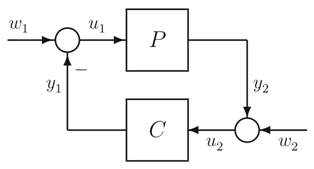

> Image description: An engineering block diagram illustrating an uncertain feedback system, titled "Robust Control in Gap Metric, Fig. 1." The diagram consists of two main functional blocks: a plant block labeled $P$ and a controller block labeled $C$. The system is arranged in a closed-loop feedback structure. The signal $w_1$ enters a summation junction where it is compared with feedback signal $y_1$ (with a negative sign) to produce the input signal $u_1$. This $u_1$ flows into the plant block $P$. The output of the plant is $y_2$. This output $y_2$ enters a second summation junction, which also receives an external disturbance signal $w_2$. The resulting signal $u_2$ is fed into the controller block $C$. The output of the controller is the feedback signal $y_1$, which is fed back to the first junction. The arrows indicate the flow of signals through the feedback loop, representing a standard control system architecture with exogenous inputs $w_1$ and $w_2$.
Robust Control in Gap Metric, Fig. 1 An uncertain feedback system

$$
\inf _{C}\|G o F\|_{\infty}=\left(1+\inf _{Q \in \mathcal{R} \mathcal{H}_{\infty}^{m \times p}}\|R-Q\|_{\infty}\right)^{1 / 2} .
$$

The minimization over $Q$ above is a oneblock $\mathcal{H}_{\infty}$ model-matching problem. It can be solved rather easily, much more easily than the $\mathcal{H}_{\infty}$ model-matching problem arising in the computation of gap. After finding an optimal $Q$, an optimal controller is obtained as

$$
C=-(U-M Q)(V-N Q)^{-1} .
$$

Qiu and Davison (1992a) extended Theorem 2 to the case when both the plant and controller are subject to uncertainty.

Theorem 3 (The arcsin theorem) Assume $(P, C)$ form a stable closed-loop system. All
feedback systems $(\tilde{P}, \tilde{C}) \in \mathcal{B}\left(P, r_{P}\right) \times \mathcal{B}\left(C, r_{C}\right)$ are stable if and only if

$$
\arcsin r_{P}+\arcsin r_{C} \leq \arcsin \|G o F\|_{\infty}^{-1} .
$$

This theorem further strengthens the role of $\|G o F\|_{\infty}^{-1}$ as the stability robustness of the feedback system $(P, C)$.

## The $\nu$-Gap

Partly because of the lack of efficient ways in computing the gap, there were efforts in seeking other metrics on $\mathcal{R}^{p \times m}$ with better numerical and analytical properties. Several such metrics were proposed, including the graph metric by Vidyasagar (1984), pointwise gap metric by Qiu and Davison (1992b), and $\nu$-gap metric by Vinnicombe (1993). The winner is the v-gap which is defined by ingeniously exploring the special structures and properties of rational matrices in $\mathcal{R}^{p \times m}$. For $P_{1}, P_{2} \in \mathcal{R}^{p \times m}$, let $P_{i}=N_{i} M_{i}^{-1}, i=1,2$, be normalized right coprime factirizations. Define the $\nu$-gap metric as

$$
\delta_{\nu}\left(P_{1}, P_{2}\right)=\sup _{\omega \in \mathbb{R}} \bar{\sigma}\left\{\left[I+P_{1}(j \omega) P_{1}(j \omega)^{*}\right]^{-1 / 2}\left[P_{1}(j \omega)-P_{2}(j \omega)\right]\left[I+P_{2}(j \omega)^{*} P_{2}(j \omega)\right]^{-1 / 2}\right\}
$$

if $\operatorname{det}\left[M_{2}^{T}(-s) M_{1}(s)+N_{2}^{T}(-s) N_{1}(s)\right]$ has equal number of unstable poles and zeros and $\delta_{\nu}\left(P_{1}, P_{2}\right)=1$ otherwise. Apparently $\nu$-gap is easier to compute than the gap. When the polezero number condition is satisfied, the $v$-gap is the peak of the chordal distance between the system frequency responses. The $v$-gap is no greater than the gap, i.e.,

$$
\delta_{v}\left(P_{1}, P_{2}\right) \leq \delta\left(P_{1}, P_{2}\right) .
$$

Hence the $\nu$-gap ball

$$
\mathcal{B}_{v}(P, r)=\left\{\tilde{P} \in \mathcal{R}^{p \times m}: \delta_{v}(\tilde{P}, P)<r\right\}
$$

is a superset of the gap ball with the same center and radius. Theorems 2 and 3 can be restated
with the gap balls $\mathcal{B}$ replaced by the new gap balls $\mathcal{B}_{v}$. Consequently the restated Theorems 2 and 3 are less conservative than the original versions for the gap. The optimal robust stabilization problems for the gap and the $\nu$-gap are the same: design $C$ to maximizing $\|G o F\|_{\infty}^{-1}$ for a given $P$.

## Summary and Future Directions

The gap, as well as the $\nu$-gap, and the associated robust control theory can be extended to infinite dimensional systems as in Georgiou and Smith (1992) and Ball and Sasane (2012), time-varying systems as in Foias, Georgiou, and Smith et al.

<!-- source_pdf_page: 1224 -->
(1993) and Feintuch (1998), and even nonlinear systems as in Georgiou and Smith (1997), Anderson et al. (2002), James et al. (2005), and Bian and French (2005), in varying degrees. There are still research opportunities in these extensions. The use of normalized coprime factorizations seems to be an obstacle in these extensions.

For a plant $P$, the controller optimizing $\|G o F\|_{\infty}$ is not always a good controller. This gives another example where "optimal" is not always equal to "good." One reason is that the actual plant uncertainty cannot necessarily be well described by a gap ball or a $\nu$-gap ball. Another reason is that performance issues other than the stability robustness, such as tracking and disturbance rejection, are not taken into account in the optimization. The actual plant uncertainty might be better described by a gap ball centered at a frequency-shaped plant $\tilde{P}=W_{o} P W_{i}$ where $W_{i}$ and $W_{o}$ are real rational weighting matrices which can also be chosen to address tracking and disturbance rejection requirements. In this case, an optimal controller $\tilde{C}$ can then be designed to optimize the GoF matrix corresponding the shaped plant $\tilde{P}$. Finally $C=W_{i} \tilde{C} W_{o}$ is used as a designed controller for the original plant $P$. With the proper choice of $W_{i}$ and $W_{o}$, it is more likely that a good controller will result. This loop-shaping design method was proposed in McFarlane and Glover (1992) and further developed in Vinnicombe (2001).

In the process of obtaining the arcsin theorem, it has been realized that the gap and even more so the $v$-gap are closely related to the canonical angles between linear subspaces. In fact the gap is the sin of the largest canonical angle between certain subspaces and the largest canonical angle itself is also a metric, a better one in some geometric sense. For the latest development on canonical angles, see Qiu et al. (2008) and Zhang and Qiu (2010).

In addition to the effort in deepening and expanding the notion of gap and its use in robust control, there is also effort in making it more accessible and more closely related to classical frequency response analysis; see Qiu and Zhou (2013). It again appears that the use of coprime factorizations in the current theory is hindering this effort. Hence, circumventing the use of
coprime factorizations, normalized or not, in the development of the gap would help its extension and popularization.

## Cross-References

- H-Infinity Control
- Optimal Control via Factorization and Model Matching
- Robust Synthesis and Robustness Analysis Techniques and Tools

## Recommended Reading

The most authoritative work on gap, $\nu$-gap and the associated robust stabilization theory is the comprehensive monograph Vinnicombe (2001). This theory is inherently an input-output frequency domain theory. However many related computations, such as those of doubly normalized coprime factorizations, $\mathcal{H}_{\infty}$ model matching, and the optimal controller synthesis, can be done using state-space formulas and further using MATLAB programs. Vinnicombe (2001) contains a list of such state-space formulas. This theory provides a good example of the once popular and successful philosophy behind the linear multivariable control theory: thinking in terms of transfer functions and computing in term of statespace equations.

The system and control background needed to understand and study the gap, the v-gap, and robust stabilization, in particular the coprime factorization and frequency domain stabilization theory, can be found in Vidyasagar (1985).

The book Zhou and Doyle (1998) also contains considerable content on gap based robust control.

## Bibliography

Anderson BDO, Brinsmead TS, De Bruyne F (2002) The Vinnicombe metric for nonlinear operators. IEEE Trans Autom Control 47:1450-1465
Ball JA, Sasane AJ (2012) Extension of the v-metric. Complex Anal Oper Theory 6:65-89

<!-- source_pdf_page: 1225 -->
Bian W, French M (2005) Graph topologies, gap metrics, and robust stability for nonlinear systems. SIAM J Control Optim 44:418-443
El-Sakkary AK (1985) The gap metric: robustness of stabilization of feedback systems. IEEE Trans Autom Control 30:240-247
Feintuch A (1998) Robust control theory in Hilbert space. Springer, New York
Foias C, Georgiou TT, Smith MC (1993) Robust stability of feedback systems: a geometric approach using the gap metric. SIAM J Control Optim 31:1518-1537
Georgiou TT (1988) On the computation of the gap metric. Syst Control Lett 11:253-257
Georgiou TT, Smith MC (1990) Optimal robustness in the gap metric. IEEE Trans Autom Control 35:673-687
Georgiou TT, Smith MC (1992) Robust stabilization in the gap metric: controller design for distributed plants. IEEE Trans Autom Control 37:1133-1143
Georgiou TT, Smith MC (1997) Robustness analysis of nonlinear feedback systems: an input-output approach. IEEE Trans Autom Control 42:1200-1221
Glover K, McFarlane DC (1989) Robust stabilization of normalized coprime factor plant descriptions with $\mathcal{H}_{\infty}$ bounded uncertainties. IEEE Trans Autom Control 34:821-830
James MR, Smith MC, Vinnicombe G (2005) Gap metrics, representations and nonlinear robust stability. SIAM J Control Optim 43:1535-1582
Kato T (1976) Perturbation theory for linear operators, 2nd edn. Springer, Berlin
McFarlane DC, Glover K (1992) A loop shaping design procedure using $\mathcal{H}_{\infty}$-synthesis. IEEE Trans Autom Control 37:759-769
Qiu L, Davison EJ (1992a) Feedback stability under simultaneous gap metric uncertainties in plant and controller. Syst Control Lett 18:9-22
Qiu L, Davison EJ (1992b) Pointwise gap metrics on transfer matrices. IEEE Trans Autom Control 37:741-758
Qiu L, Zhang Y, Li CK (2008) Unitarily invariant metrics on the Grassmann space. SIAM J Matrix Anal 27:501-531
Qiu L, Zhou K (2013) Preclassical tools for postmodern control. IEEE Control Syst Mag 33(4): 26-38
Vidyasagar M (1984) The graph metric for unstable plants and robustness estimates for feedback stability. IEEE Trans Autom Control 29:403-418
Vidyasagar M (1985) Control system synthesis: a factorization approach. MIT, Cambridge
Vinnicombe G (1993) Frequency domain uncertainty and the graph topology. IEEE Trans Autom Control 38:1371-1383
Vinnicombe G (2001) Uncertainty and feedback: $\mathcal{H}_{\infty}$ loop-shaping and the $v$-gap metric. Imperial Collage Press, London
Zames G, El-Sakkary AK (1980) Unstable systems and feedback: the gap metric. In: Proceedings of the 16th Allerton conference, Illinois, pp 380-385
Zhang Y, Qiu L (2010) From subadditive inequalities of singular values to triangular inequalities of canonical angles. SIAM J Matrix Anal Appl 31:1606-1620

Zhou K, Doyle JC (1998) Essentials of robust control. Prentice Hall, Upper Saddle River

# Robust Control of Infinite Dimensional Systems

Hitay Özbay Department of Electrical and Electronics Engineering, Bilkent University, Ankara, Turkey

#### Abstract

Basic robust control problems are studied for the feedback systems where the underlying plant model is infinite dimensional. The $\mathcal{H}_{\infty}$ optimal controller formula is given for the mixed sensitivity minimization problem with rational weights. Key steps of the numerical computations required to determine the controller parameters are illustrated with an example where the plant model include time delay terms.

## Keywords

Coprime factorizations; Direct design methods; Inner-outer factorizations

## Introduction

Robust control deals with the feedback system shown in Fig. 1, where $P_{\Delta}$ represents the uncertain physical plant and $C$ is a fixed controller to be designed.

Here, it is assumed that the controller and the plant are linear time invariant (LTI) systems and
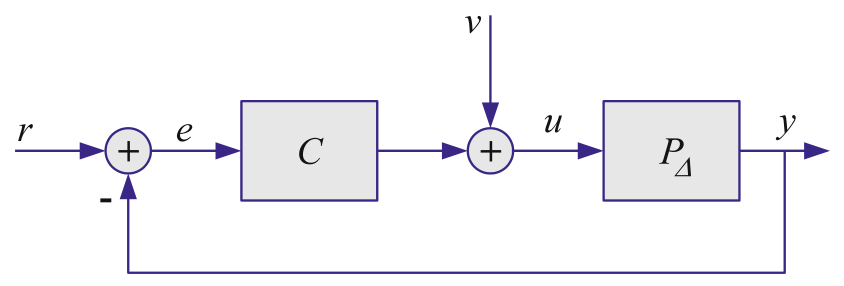

> Image description: A block diagram illustrating a feedback system $\mathcal{F}\left(C, P_{\Delta}\right)$ for the robust control of infinite dimensional systems. The system is composed of a fixed controller block, labeled $C$, and an uncertain plant block, labeled $P_{\Delta}$. A reference input $r$ enters a summing junction with a negative feedback signal, resulting in the error signal $e$. This error signal is the input to the controller $C$. The output of the controller is combined with an external disturbance or input $v$ at another summing junction to produce the control signal $u$. This control signal $u$ serves as the input to the plant $P_{\Delta}$. The resulting output $y$ is fed back to the initial summing junction, completing the feedback loop. The diagram represents a standard closed-loop control structure where the objective is to maintain system performance despite the uncertainty represented by $P_{\Delta}$.

Robust Control of Infinite Dimensional Systems, Fig. 1 Feedback system $\mathcal{F}\left(C, P_{\Delta}\right)$ with fixed controller $C$ and uncertain plant $P_{\Delta}$

<!-- source_pdf_page: 1226 -->
they are represented by their transfer functions. Furthermore, $P_{\Delta}$ satisfies the following conditions:

$$
P_{\Delta}(s)=P(s)+\Delta(s)
$$

where $P$ is the nominal plant model, with $P(s)$ and $P_{\Delta}(s)$ having the same number of poles in $\mathbb{C}_{+}$; and there is a known uncertainty bound $W(s)$ satisfying

$$
|\Delta(j \omega)|<|W(j \omega)| \quad \forall \omega \in \mathbb{R}
$$

Definition 1 All $P_{\Delta}$ satisfying the above conditions are said to be in the set of uncertain plants $\mathcal{P}$, which is characterized by the given functions $P(s)$ and $W(s)$.

Depending on physical system modeling, other forms of uncertainty representations can be more convenient than the additive unstructured uncertainty model taken here; see, e.g., Doyle et al. (1992), Özbay (2000), and Zhou et al. (1996) for the examples of multiplicative, coprime factor, parametric, and structured uncertainty descriptions. Note that for notational convenience and simplicity of the presentation, single-input-single-output (SISO) plants are considered here; for extensions to multi-input-multi-output (MIMO) plants, see, e.g., Curtain and Zwart (1995).

When the plant under consideration is infinite dimensional, the transfer function $P(s)$ is irrational, i.e., it cannot be expressed as a ratio of two polynomials (it does not admit a finitedimensional state-space representation). Typical examples of such systems are spatially distributed parameter systems modeled by partial differential equations, fractional-order systems, and systems with time delays. The reader is referred to Curtain and Morris (2009) for examples of transfer functions of distributed parameter systems. There are many interesting industrial applications where fractional-order transfer functions are used for modeling and control, see, e.g., Monje et al. (2010); typically, such functions are rational in $s^{\alpha}$, where $\alpha$ is a rational number in the open interval ( 0,1 ). Transfer functions of systems with time delays involve terms like $e^{-h s}$ where $h>0$ is the delay; see Sipahi et al. (2011) for
various real-life examples where time-delay models appear. Transfer functions considered here are functions of the complex variable $s$ with real coefficients, so $\overline{P(\bar{s})}=P(s)$ where $\bar{s}$ denotes the complex conjugate of $s$.

Definition 2 A linear time invariant system $H$ is said to be stable if its transfer function $H(s)$ is bounded and analytic in $\mathbb{C}_{+}$. In this case, the system norm is

$$
\|H\|=\|H\|_{\infty}=\sup _{\operatorname{Re}(s)>0}|H(s)|
$$

which is equivalent to the energy amplification through the system $H$; see Doyle et al. (1992) and Foias et al. (1996).

Definition 2 is sometimes called the $\mathcal{H}_{\infty}$ stability, and in this setting, the set of all stable plants is the function space $\mathcal{H}_{\infty}$. It is worth noting that for infinite-dimensional systems, there are other definitions of stability (Curtain and Zwart 1995; Desoer and Vidyasagar 2009), leading to different measures of the system norm.

## Robust Control Design Objectives

Let $\mathcal{F}\left(C, P_{\Delta}\right)$ denote the feedback system shown in Fig. 1. This system is said to be robustly stable if all the transfer functions from external inputs $(r, v)$ to internal signals $(e, u)$ are in $\mathcal{H}_{\infty}$ for all $P_{\Delta} \in \mathcal{P}$. In the controller design, robust stability of the feedback system is the primary constraint.

The feedback system $\mathcal{F}\left(C, P_{\Delta}\right)$ is robustly stable if and only if the following conditions hold; see, e.g., Doyle et al. (1992) and Foias et al. (1996),
(a) $S, C S, P S \in \mathcal{H}_{\infty}$, where $S=(1+P C)^{-1}$, and
(b) $\|\mathrm{W} \mathrm{CS}\|_{\infty} \leq 1$.

In order to illustrate these design constraints for robustly stabilizing controller, as an example, consider a strictly proper stable plant, i.e.,

$$
P \in \mathcal{H}_{\infty} \quad \text { with } \quad \lim _{|s| \rightarrow \infty}|P(s)|=0
$$

<!-- source_pdf_page: 1227 -->
In this case, all controllers in the form $C= Q /(1-P Q)$ satisfy condition (a) for any $Q \in \mathcal{H}_{\infty}$ (moreover, any controller $C$ satisfying (a) must be in this form for some $Q \in \mathcal{H}_{\infty}$ ). Now consider a rational $W(s)$ with a stable $Q$ such that $|Q(j \omega)|$ is a continuous function of $\omega \in \mathbb{R}$. Then, condition (b) becomes

$$
\begin{aligned}
\|W Q\|_{\infty} \leq 1 \Longleftrightarrow & |Q(j \omega)| \leq|W(j \omega)|^{-1} \\
& \forall \omega \in \mathbb{R} .
\end{aligned}
$$

So, whenever the modeling uncertainty is "large" on a frequency band $\omega \in \Omega$, the magnitude of $Q$ should be "small" in this region.

When the plant is unstable, say $p \in \mathbb{C}_{+}$is a pole of $P(s)$ of multiplicity one, conditions (a) and (b) impose a restriction on the controller, that leads to

$$
\begin{aligned}
1 & \geq\|\mathrm{WCS}\|_{\infty} \geq\left|\frac{W(p)}{N(p)}\right| \text { where } N(p) \\
& =\lim _{s \rightarrow p} \frac{(s-p)}{(s+\bar{p})} P(s)
\end{aligned}
$$

So, a necessary condition, for (b) to hold in this case, is $|W(p)| \leq|N(p)|$, which means that the modeling uncertainty at the unstable pole of the plant should be small enough for the existence of a robustly stabilizing controller. This is one of the fundamental quantifiable limitations of feedback systems with unstable plants; see Stein (2003) for further discussions on other limitations.

Many other performance-related design objectives, such as reference tracking and disturbance attenuation, are captured by the sensitivity minimization, which is defined as finding a controller satisfying (a) and achieving

## (c) $\left\|W_{1} S\right\|_{\infty} \leq \gamma$

for the smallest possible $\gamma>0$, for a given stable sensitivity weight $W_{1}(s)$. Selection of $W_{1}$ depends on the class of reference signals and disturbances considered; see Doyle et al. (1992), Özbay (2000), and Stein (2003) for general guidelines. Stability robustness and performance objectives defined above can be blended to define a single
$\mathcal{H}_{\infty}$-optimization problem, known as the mixed sensitivity minimization: given $W_{1}, W_{2}, P$, find a controller $C$ satisfying (a) and achieving
(d) $\left\|\left[\begin{array}{l}W_{1} S \\ W_{2} T\end{array}\right]\right\|_{\infty}:=$

$$
\sup _{\operatorname{Re}(s)>0}\left(\left|W_{1}(s) S(s)\right|^{2}+\left|W_{2}(s) T(s)\right|^{2}\right)^{\frac{1}{2}} \leq \gamma
$$

for the smallest possible $\gamma>0$, where $T(s):=1-S(s)$ and $W_{2}(s)$ represents the multiplicative uncertainty bound, with $\left|W_{2}(j \omega)\right|=|W(j \omega)| /|P(j \omega)|, \quad \forall \omega \in \mathbb{R}$. The smallest achievable $\gamma$ is the optimal performance level $\gamma_{\text {opt }}$ and the corresponding controller is denoted by $C_{\text {opt }}$. Typically, when $P$ is infinite dimensional so is the optimal controller.

## Design Methods

## Approximation of the Plant

One possible way to design a robust controller for an infinite-dimensional plant $P$ is to design a robust controller $C_{a}$ for an approximate finitedimensional plant $P_{a}$; (for a frequency domain approximation technique for infinite-dimensional systems, see Gu et al. 1989). When $W_{1}, W_{2}$, and $P_{a}$ are finite dimensional, standard state-space methods, Zhou et al. (1996), can be used to find an $\mathcal{H}_{\infty}$ controller $C_{a}$ achieving

$$
\left\|\left[\begin{array}{l}
W_{1} S_{a} \\
W_{2} T_{a}
\end{array}\right]\right\|_{\infty} \leq \gamma_{a}
$$

for the smallest possible $\gamma_{a}$, where $S_{a}:=(1+ \left.P_{a} C_{a}\right)^{-1}$ and $T_{a}=\left(1-S_{a}\right)$. Then, the controller $C=C_{a}$ satisfies (a) and achieves the performance objective $(d)$ with
$\gamma=\left(\gamma_{a}+\varepsilon\right) \frac{1}{1-\varepsilon}, \quad \varepsilon:=\left\|C_{a} S_{a}\left(P-P_{a}\right)\right\|_{\infty}$,
where it is assumed that the approximation of the plant is made in such a way that $\varepsilon<1$. Clearly, if $\gamma_{a} \rightarrow \gamma_{\text {opt }}$ as $\varepsilon \rightarrow 0$, then $\gamma \rightarrow \gamma_{\text {opt }}$ as

<!-- source_pdf_page: 1228 -->
$\varepsilon \rightarrow 0$. The conditions under which $\gamma_{a} \rightarrow \gamma_{\text {opt }}$ are discussed in Morris (2001).

## Direct Design Methods

The classical two-Riccati equation approach, Zhou et al. (1996), developed for finitedimensional systems, has been extended to various classes of infinite-dimensional systems by using the state-space techniques where semigroup theory plays an important role; see van Keulen (1993) for further details.

In order to illustrate some of the key steps of a frequency domain method developed in Foias et al. (1996), consider a specific example where the plant is given as

$$
\begin{align*}
P(s) & =\frac{(s-1)(s+2) e^{-h s}}{\left(s^{2}+2 s+2\right)\left(s+1-3 e^{-2 h s}\right)}, \\
h & =\ln (2) \approx 0.693 \tag{1}
\end{align*}
$$

First, compute the location of the poles in $\mathbb{C}_{+}$ using available numerical tools for finding the roots of quasi-polynomials; see, e.g., Sipahi et al. (2011) for references. For the simple example chosen here, $P(s)$ has only one pole in $\mathbb{C}_{+}$, at $s=0.5$ (for larger values of $h$, the number of unstable poles of $P$ may be higher). Now, the plant can be factored as follows:

$$
\begin{equation*}
P(s)=\frac{M_{N}(s) N_{O}(s)}{M_{D}(s)} \tag{2}
\end{equation*}
$$

where

$$
M_{N}(s)=\frac{s-1}{s+1} e^{-h s} \quad M_{D}(s)=\frac{s-0.5}{s+0.5}
$$

are all-pass (inner) transfer functions and

$$
\begin{gathered}
N_{O}(s)=\frac{(s+2)(s+1)}{\left(s^{2}+2 s^{2}+2\right)(s+0.5)} \\
\left(\frac{s-0.5}{s+1-3 e^{-2 h s}}\right)
\end{gathered}
$$

is a minimum-phase (outer) transfer function. Note that

$$
\begin{align*}
\frac{s-0.5}{s+1-3 e^{-2 h s}} & =\frac{1}{1+H_{F}(s)} \\
H_{F}(s) & =1.5 \frac{1-e^{-2 h(s-0.5)}}{s-0.5} \tag{3}
\end{align*}
$$

The impulse response of $H_{F}$ is $h_{F}(t)=1.5 e^{t / 2}$ when $t \in[0,2 h]$ and $h_{F}(t)=0$ otherwise. Stability of $N_{O}$ can also be verified from the Nyquist graph of $H_{F}$. Also, note that $N_{O}(s)$ can be factored as $N_{O}(s)=N_{1}(s) N_{2}(s)$ where

$$
\begin{aligned}
& N_{1}(s)=\frac{(s+2)(s+1)}{\left(s^{2}+2 s^{2}+2\right)}\left(\frac{1}{1+H_{F}(s)}\right), \\
& N_{2}(s)=\frac{1}{s+0.5}
\end{aligned}
$$

with $N_{1}, N_{1}^{-1} \in \mathcal{H}_{\infty}$ and $N_{2}$ is finite-dimensional (first order in this example).

The above steps illustrate coprime factorizations and inner-outer factorizations for systems with time delays (retarded case). For systems represented by PDEs or integrodifferential equations, plant transfer function can be factored similarly, provided that the poles and zeros in $\mathbb{C}_{+}$can be computed numerically.

When the plant is in the form (2) given above and the weights $W_{1}$ and $W_{2}$ are rational, the optimal performance level and the corresponding optimal controller is obtained by the following procedure (see Foias et al. (1996) for details).

- Controller parameterization transforms the mixed sensitivity minimization to a problem of finding the smallest $\gamma>0$ for which there exists $Q \in \mathcal{H}_{\infty}$ such that

$$
\left\|\left[\begin{array}{c}
W_{1} \\
0
\end{array}\right]-\left[\begin{array}{c}
W_{1} N_{2} \\
-W_{2} N_{2}
\end{array}\right] M_{N}\left(R+M_{D} Q\right)\right\|_{\infty} \leq \gamma
$$

where $R(s)$ is a rational function (whose order is one less than the order of $M_{D}$ ) satisfying certain interpolation conditions at the zeros of $M_{D}(s)$.

- A spectral factorization determines $W_{0} \in \mathcal{H}_{\infty}$ such that $W_{0}^{-1} \in \mathcal{H}_{\infty}$ and

$$
\begin{aligned}
& \left(\left|W_{1}(j \omega)\right|^{2}+\left|W_{2}(j \omega)\right|^{2}\right)\left|N_{2}(j \omega)\right|^{2} \\
& \quad=\left|W_{0}(j \omega)\right|^{2} \quad \forall \omega \in \mathbb{R},
\end{aligned}
$$

<!-- source_pdf_page: 1229 -->
(here, it is assumed that $W_{2} N_{2}$ and $\left(W_{2} N_{2}\right)^{-1}$ are in $\mathcal{H}_{\infty}$ ).

- By using the norm preserving property of the unitary matrices and the commutant lifting theorem, it has been shown that

$$
\gamma_{\mathrm{opt}}=\left\|\left[\begin{array}{l}
\Gamma \\
\Upsilon
\end{array}\right]\right\|
$$

where $\Gamma$ is the Hankel operator whose symbol is

$$
M_{D}(-s)\left(M_{N}(-s) W_{0}^{-1}(-s) N_{2}(-s) W_{1}(-s) W_{1}(s)-W_{0}(s) R(s)\right)
$$

and $\Upsilon$ is the Toeplitz operator whose symbol is $W_{1}(s) W_{2}(s) N_{2}(s) W_{0}^{-1}(s)$. Moreover, under mild technical assumptions, the optimal controller is obtained from a nonzero $\psi_{o} \in \mathcal{H}_{2}$ satisfying

$$
\left(\gamma_{\mathrm{opt}}^{2}-\left(\Gamma^{*} \Gamma+\Upsilon^{*} \Upsilon\right)\right) \psi_{o}=0
$$

The operator $\left(\Gamma^{*} \Gamma+\Upsilon^{*} \Upsilon\right)$ is in the form of a skew-Toeplitz operator that gives the name to this approach. See Foias et al. (1996) for a detailed exposition.

## Optimal $\mathcal{H}_{\infty}$-Controller

The above steps have been implemented, and the final optimal controller expression has been obtained in a simplified form described below.

Let $\alpha_{1}, \ldots, \alpha_{\ell} \in \mathbb{C}_{+}$be the zeros of $M_{D}(s)$, i.e., unstable poles of the plant (for simplicity of the exposition, they are assumed to be distinct). The sensitivity weight can be written as $W_{1}(s)=n W_{1}(s) / d W_{1}(s)$, for two coprime polynomials $n W_{1}$ and $d W_{1}$ with $\operatorname{deg}\left(n W_{1}\right) \leq \operatorname{deg}\left(d W_{1}\right)=: n_{1} \geq 1$. Define

$$
E_{\gamma}(s):=\left(\frac{W_{1}(-s) W_{1}(s)}{\gamma^{2}}-1\right)
$$

and let $\beta_{1}, \ldots, \beta_{2 n_{1}}$ be the zeros of $E_{\gamma}(s)$, enumerated in such a way that $-\beta_{n_{1}+k}= \beta_{k} \in \overline{\mathbb{C}}_{+}$, for $k=1, \ldots, n_{1}$. For notational convenience, assume that the zeros of $E_{\gamma}$ are distinct for $\gamma=\gamma_{\text {opt }}$.

Now define a rational function depending on $\gamma>0$ and the weights $W_{1}$ and $W_{2}$,

$$
F_{\gamma}(s):=\gamma \frac{d W_{1}(-s)}{n W_{1}(s)} G_{\gamma}(s)
$$

where $G_{\gamma} \in \mathcal{H}_{\infty}$ is an outer function determined from the spectral factorization
$G_{\gamma}(-s) G_{\gamma}(s)$

$$
=\left(1+\frac{W_{2}(-s) W_{2}(s)}{W_{1}(-s) W_{1}(s)}-\frac{W_{2}(-s) W_{2}(s)}{\gamma^{2}}\right)^{-1}
$$

With the above definitions, under certain mild conditions (satisfied generically in most practical cases), the optimal controller can be expressed as

$$
\begin{equation*}
C_{\mathrm{opt}}(s)=\frac{E_{\gamma}(s) M_{D}(s) F_{\gamma}(s) L(s)}{1+M_{N}(s) F_{\gamma}(s) L(s)} N_{O}^{-1}(s) \tag{4}
\end{equation*}
$$

where $\gamma=\gamma_{\text {opt }}$ and $L(s)=L_{2}(s) / L_{1}(s)$ with polynomials $L_{1}$ and $L_{2}$, of degree $n_{1}+\ell-1$, determined from the interpolation conditions:

$$
\begin{array}{rlrl}
L_{1}\left(\beta_{k}\right)+M_{N}\left(\beta_{k}\right) F_{\gamma}\left(\beta_{k}\right) L_{2}\left(\beta_{k}\right) & =0 & k & =1, \ldots, n_{1} \\
L_{1}\left(\alpha_{k}\right)+M_{N}\left(\alpha_{k}\right) F_{\gamma}\left(\alpha_{k}\right) L_{2}\left(\alpha_{k}\right) & =0 & k & =1, \ldots, \ell \\
L_{2}\left(-\beta_{k}\right)+M_{N}\left(\beta_{k}\right) F_{\gamma}\left(\beta_{k}\right) L_{1}\left(-\beta_{k}\right) & =0 & k & =1, \ldots, n_{1} \\
L_{2}\left(-\alpha_{k}\right)+M_{N}\left(\alpha_{k}\right) F_{\gamma}\left(\alpha_{k}\right) L_{1}\left(-\alpha_{k}\right) & =0 & k & =1, \ldots, \ell
\end{array}
$$

<!-- source_pdf_page: 1230 -->
The above system of equations can be rewritten in the matrix form

$$
\begin{equation*}
\mathcal{R}_{\gamma} \Phi=0 \tag{5}
\end{equation*}
$$

where the $2\left(n_{1}+\ell\right) \times 1$ vector $\Phi$ contains the coefficients of $L_{1}$ and $L_{2}$, and $\mathcal{R}_{\gamma}$ is a $2\left(n_{1}+\right. \ell) \times 2\left(n_{1}+\ell\right)$ matrix which can be computed numerically when $\gamma$ is fixed. The optimal performance level $\gamma_{\text {opt }}$ is the largest $\gamma$ which makes $\mathcal{R}_{\gamma}$ singular. The corresponding nonzero $\Phi$ gives $L(s)$, and hence, all the components of $C_{\text {opt }}$ are computed.

Example 1 Consider the weighted sensitivity minimization for the plant (1) with the following first-order weights:

$$
\begin{equation*}
W_{1}(s)=\frac{1}{s}, \quad W_{2}(s)=k s \tag{6}
\end{equation*}
$$

where $k>0$ represents the relative importance of the multiplicative uncertainty with respect to the tracking performance under steplike reference inputs (see Doyle et al. 1992; Özbay 2000). With (6) the functions $E_{\gamma}(s)$ and $F_{\gamma}(s)$ are computed as
$E_{\gamma}(s)=\frac{1+\gamma^{2} s^{2}}{-\gamma^{2} s^{2}}, \quad F_{\gamma}(s)=\frac{-\gamma s}{k s^{2}+k_{\gamma} s+1}$,
where $\quad k_{\gamma}=\sqrt{2 k-\frac{k^{2}}{\gamma^{2}}}$.

In this example $\ell=1$ and $n_{1}=1$, with $\alpha_{1}= 0.5, \beta_{1}=j / \gamma$. For $k=0.1$, the largest $\gamma$ which makes $\mathcal{R}_{\gamma}$ singular is $\gamma_{\text {opt }}=7.452$, and the coefficients of the corresponding $L(s)$ are computed from the SVD of $\mathcal{R}_{\gamma_{\mathrm{opt}}}$,

$$
L(s)=\frac{-0.0867-0.99623 s}{-0.0867+0.99623 s}=\frac{0.087+s}{0.087-s} .
$$

Note that zeros of $E_{\gamma}(s) M_{D}(s)$ in $\overline{\mathbb{C}}_{+}$appear as roots of the equation

$$
1+M_{N}(s) F_{\gamma}(s) L(s)=0 .
$$

Hence, there are internal unstable pole-zero cancelations in the representation (4). An internally stable implementation of this controller is shown in Gumussoy (2011) using a realization similar to (3).

The above approach can also be extended to a class of infinite-dimensional plants with infinitely many poles in $\mathbb{C}_{+}$; see Gumussoy and Özbay (2004) for technical details.

## Summary and Future Directions

This entry briefly summarized robust control problems involving linear time invariant infinitedimensional plants with dynamic uncertainty models. Salient features of these robust control problems are captured by the mixed sensitivity minimization problem, for which a numerical computational procedure is outlined under the assumption that the weights are rational functions. Note that different types of plant models involving probabilistic, parametric, or structured (MIMO case) uncertainty are left out in this entry. Other robust control problems that are not discussed here include simultaneous stabilization (control of finitely many plant models by a single robust controller) and strong stabilization (robust control with the added restriction that the controller must be stable) of infinite-dimensional systems. Stable robust controller design techniques for different types of systems with time delays are illustrated in Özbay (2010) and Wakaiki et al. (2013); see also their references.

For practical implementation of infinitedimensional robust controllers, it is important to find low-order approximations of stable irrational transfer functions with prescribed $\mathcal{H}_{\infty}$ error bound. There exist many different approximation techniques for various types of transfer functions, but there is still need for computationally efficient algorithms in this area. Another interesting topic along the same lines is direct computation of fixed-order $\mathcal{H}_{\infty}$ controllers for infinitedimensional plants. In fact, computation of $\mathcal{H}_{\infty^{-}}$ optimal PID controllers is still a challenging

<!-- source_pdf_page: 1231 -->
problem for infinite-dimensional plants, except for some time-delay systems satisfying certain simplifying structural assumptions. Advances in numerical optimization tools will play critical roles in the computation of low (or fixed)-order robust controller design for infinite-dimensional plants; see, e.g., Gumussoy and Michiels (2011) for recent results along this direction.

In the past, robust control of infinitedimensional systems found applications in many different areas such as chemical processes, flexible structures, robotic systems, transportation systems, and aerospace. Robust control problems involving systems with timevarying and uncertain time delays appear in control of networks and control over networks. Ongoing research in the networked systems area include generalization of these problems to more complex and interconnected systems.

There are also many interesting robust control problems in biological systems, where typical underlying plant models are nonlinear and infinite dimensional. Some of these problems are solved under simplifying assumptions; it is expected that robust control theory will make significant contributions to this field by extensions of the existing results to more realistic plant and uncertainty models.

## Cross-References

- Control of Linear Systems with Delays
- Flexible Robots
- H-Infinity Control
- Model Order Reduction: Techniques and Tools
- Networked Systems
- Optimal Control via Factorization and Model Matching
- Optimization Based Robust Control
- PID Control
- Robust Control in Gap Metric
- Spectral Factorization
- Stability and Performance of Complex Systems Affected by Parametric Uncertainty
- Structured Singular Value and Applications: Analyzing the Effect of Linear Time-Invariant Uncertainty in Linear Systems

## Bibliography

Curtain R, Morris K (2009) Transfer functions of distributed parameter systems: a tutorial. Automatica 45:1101-1116
Curtain R, Zwart HJ (1995) An introduction to infinite-dimensional linear systems theory. Springer, New York
Desoer CA, Vidyasagar M (2009) Feedback systems: input-output properties. SIAM, Philadelphia
Doyle JC, Francis BA, Tannenbaum AR (1992) Feedback control theory. Macmillan, New York
Foias C, Özbay H, Tannenbaum A (1996) Robust control of infinite-dimensional systems: frequency domain methods. Lecture notes in control and information sciences, vol 209. Springer, London
Gu G, Khargonekar PP, Lee EB (1989) Approximation of infinite-dimensional systems. IEEE Trans Autom Control 34:610-618
Gumussoy S (2011) Coprime-inner/outer factorization of SISO time-delay systems and FIR structure of their optimal $\mathcal{H}_{\infty}$ controllers. Int J Robust Nonlinear Control 22:981-998
Gumussoy S, Michiels W (2011) Fixed-order H-infinity control for interconnected systems using delay differential algebraic equations. SIAM J Control Optim 49(5):2212-2238
Gumussoy S, Özbay H (2004) On the mixed sensitivity minimization for systems with infinitely many unstable modes. Syst Control Lett 53:211-216
Meinsma G, Mirkin L, Zhong Q-C (2002) Control of systems with I/O delay via reduction to a one-block problem. IEEE Trans Autom Control 47:1890-1895
Monje CA, Chen YQ, Vinagre BM, Xue D, Feliu V (2010) Fractional-order systems and controls, fundamentals and applications. Springer, London
Morris KA (2001) $\mathcal{H}_{\infty}$-output feedback of infinitedimensional systems via approximation. Syst Control Lett 44:211-217
Özbay H (2000) Introduction to feedback control theory. CRC Press LLC, Boca Raton
Özbay H (2010) Stable $\mathcal{H}_{\infty}$ controller design for systems with time delays. In: Willems JC et al (eds) Perspectives in mathematical system theory, control, and signal processing. Lecture notes in control and information sciences, vol 398. Springer, Berlin/Heidelberg, pp 105-113
Sipahi R, Niculescu S-I, Abdallah CT, Michiels W, Gu K (2011) Stability and stabilization of systems with time delay. IEEE Control Syst Mag 31(1):38-65
Stein G (2003) Respect the unstable. IEEE Control Syst Mag 23(4):12-25
van Keulen B (1993) $\mathcal{H}_{\infty}$-control for distributed parameter systems: a state space approach. Birkhäuser, Boston
Wakaiki M, Yamamoto Y, Özbay H (2013) Stable controllers for robust stabilization of systems with infinitely many unstable poles. Syst Control Lett 62:511-516

<!-- source_pdf_page: 1232 -->
Zhong QC (2006) Robust control of time-delay systems. Springer, London
Zhou K, Doyle JC, Glover K (1996) Robust and optimal control. Prentice-Hall, Upper Saddle River

## Robust Fault Diagnosis and Control

Steven X. Ding
University of Duisburg-Essen, Duisburg, Germany

#### Abstract

Aiming at increasing system reliability and availability, integration of fault diagnosis into feedback control systems and integrated design of control and diagnosis receive considerable attention in research and industrial applications. In the framework of robust control, integrated diagnosis and control systems are designed to meet the demand for system robustness. The core of such systems is an observer that delivers needed information for a robust fault detection and feedback control.

diagnosis. Initiated by Nett et al. (1988), study on the integrated design of control and diagnosis has received much attention, both in the research and application domains. The original idea of the integrated design scheme proposed by Nett et al. (1988) is to manage the interactions between the control and diagnosis in an integrated manner (Ding 2009; Jacobson and Nett 1991).

Robustness is an essential performance for model-based control and diagnostic systems. In the control and diagnosis framework, robustness is often addressed in different context (Ding 2013) and thus calls for special attention in the integrated design of control and diagnostic systems. In their study on fault-tolerant controller architecture, Zhou and Ren (2001) have proposed to deal with the integrated design in the framework of the Youla parametrization of stabilization controllers (Zhou et al. 1996), which also builds the basis for achieving high robustness in an integrated control and diagnosis system. Below, we present the basic ideas and some representative schemes and methods for the integrated design of robust diagnosis and control systems.

## Plant Model and Factorization Technique

Consider linear time invariant (LTI) systems given in the state space representation

$$
\begin{aligned}
\dot{x}(t) & =A x(t)+B u(t)+E_{d} d(t)+E_{f} f(t) \\
y(t) & =C x(t)+D u(t)+F_{d} d(t)+F_{f} f(t) \\
z(t) & =C_{z} x(t)+D_{z} u(t)
\end{aligned}
$$

where $x \in \mathcal{R}^{n}, y \in \mathcal{R}^{m}, u \in \mathcal{R}^{k_{u}}$ stand for the plant state, output, and input vectors, respectively. $z \in \mathcal{R}^{k_{z}}$ is the controlled output vector. $d \in \mathcal{R}^{k_{d}}, f \in \mathcal{R}^{k_{f}}$ denote disturbance and fault vectors, respectively. $A, B, C, D, C_{z}, D_{z}, E_{d}, E_{f}, F_{d}, F_{f}$ are known matrices of appropriate dimensions.

A transfer matrix $G(s)=D+C(s I- A)^{-1} B$ with the minimal state space realization ( $A, B, C, D$ ) can be factorized into

<!-- source_pdf_page: 1233 -->
$$
\begin{aligned}
G(s) & =\hat{M}^{-1}(s) \hat{N}(s) \\
\hat{M}(s) & =I-C\left(s I-A_{L}\right)^{-1} L \\
\hat{N}(s) & =D+C\left(s I-A_{L}\right)^{-1} B_{L} \\
A_{L} & =A-L C, B_{L}=B-L D
\end{aligned}
$$

where $L$ is selected so that $A_{L}$ is stable and can be interpreted as an observer gain matrix. This factorization is called left coprime (Zhou et al. 1996).

## Parametrization of Stabilizing Controllers

Let

$$
u(s)=K(s) y(s)
$$

be an LTI feedback controller. By means of the well-known Youla parametrization (Zhou et al. 1996), all stabilizing controllers can be described and parametrized by

$$
\begin{aligned}
& K(s)=\left(\hat{X}(s)-Q_{c}(s) \hat{N}(s)\right)^{-1} . \\
& \quad\left(\hat{Y}(s)-Q_{c}(s) \hat{M}(s)\right) \\
& \hat{X}(s)=I-F\left(s I-A_{L}\right)^{-1} B_{L} \\
& \hat{Y}(s)=F\left(s I-A_{L}\right)^{-1} L
\end{aligned}
$$

where $Q_{c}(s)$ is a stable parameter matrix, and $F$ is selected so that $A_{F}=A+B F$ is stable and can be interpreted as a state feedback gain matrix.

## Parametrizations of Residual Generators

Given the system under consideration, an LTI residual generator is a dynamic system with $u(t), y(t)$ as its inputs and $r(t)$ as output which satisfies, for $d(t)=0, f(t)=0$,

$$
\forall x(0), u(t), \lim _{t \rightarrow \infty} r(t)=0
$$

Residual generation is the first step for a successful fault diagnosis. The generated residual vector
is an indicator for the occurrence of a fault. It is well known that all LTI residual generators can be parametrized by

$$
r(s)=R(s)(\hat{M}(s) y(s)-\hat{N}(s) u(s))
$$

where $R(s)$ is a stable parameter matrix and called post-filter (Ding 2013).

## Integration of Controller and Residual Generator into a Control Loop

It is remarkable that both the feedback controllers and residual generators can be parametrized based on the left coprime factorization of the plant model. This is the basis for an integration of diagnosis and control into a feedback control system. In Ding et al. (2010), it is demonstrated that the abovementioned Youla parametrization form is in fact an observer-based feedback controller, which can be expressed by
$u(s)=F \hat{x}(s)+Q_{c}(s)(\hat{N}(s) u(s)-\hat{M}(s) y(s))$
where $\hat{x}(s)$ is a state estimate delivered by a fullorder state observer (Anderson 1998; Zhou et al. 1996). Moreover, the residual generator can also be written as

$$
r(s)=R(s) r_{o}(s), r_{o}(s)=y(s)-\hat{y}(s)
$$

with $\hat{y}(s)$ being the output estimate delivered by an observer (Ding 2013). As a result, a stabilization feedback controller and residual generator can be integrated into a dynamic system of the following form:

$$
\begin{aligned}
\dot{\hat{x}}(t) & =A \hat{x}(t)+B u(t)+L r_{o}(t) \\
& =A_{L} \hat{x}(t)+B_{L} u(t)+L y(t) \\
r_{o}(t) & =y(t)-\hat{y}(t), \hat{y}(t)=C \hat{x}(t)+D u(t) \\
{\left[\begin{array}{c}
u(s) \\
r(s)
\end{array}\right] } & =\left[\begin{array}{c}
F \hat{x}(s) \\
0
\end{array}\right]+\left[\begin{array}{c}
-Q_{c}(s) \\
R(s)
\end{array}\right] r_{o}(s)
\end{aligned}
$$

<!-- source_pdf_page: 1234 -->
The core of the above control and diagnostic system is a state observer that delivers a state estimation $\hat{x}(t)$ and the primary residual vector $r_{o}(t)$. The design parameters of this integrated control and diagnosis system are $L, F$; the observer and state feedback control gain matrices, as well as $Q_{c}(s), R(s)$.

## Robustness of Diagnostic and Control Systems

While in the robust control framework, the controller design is typically formulated as minimizing a system norm of the transfer function matrix from the disturbance vector $d$ to the control output $z$ (Zhou et al. 1996), the design objective of a robust fault detection system consists in an optimal trade-off between the robustness against $d$ and the sensitivity to the fault vector $f$. Considering that

$$
\begin{aligned}
r(s) & =R(s)(y(s)-\hat{y}(s)) \\
& =R(s)\left(\hat{N}_{d}(s) d(s)+\hat{N}_{f}(s) f(s)\right) \\
\hat{N}_{d}(s) & =F_{d}+C\left(s I-A_{L}\right)^{-1}\left(E_{d}-L F_{d}\right) \\
\hat{N}_{f}(s) & =F_{f}+C\left(s I-A_{L}\right)^{-1}\left(E_{f}-L F_{f}\right)
\end{aligned}
$$

Ding (2013), the design objective can be formulated as

$$
\sup _{R(s)} \frac{\left\|R(s) \hat{N}_{f}(s)\right\|_{\text {index }}}{\left\|R(s) \hat{N}_{d}(s)\right\|}
$$

or in a suboptimum form as finding $R(s)$ so that for some given $\alpha>0, \beta>0$

$$
\left\|R(s) \hat{N}_{d}(s)\right\| \leq \alpha,\left\|R(s) \hat{N}_{f}(s)\right\|_{\text {index }}>\beta .
$$

Similar to the robust controller design, a (system) norm like $\mathcal{H}_{2}$ or $\mathcal{H}_{\infty}$ norm, denoted by $\|\cdot\|$, is applied for the evaluation of the influence of the disturbances. Differently, the evaluation of the sensitivity to the fault vector, expressed by $R(s) \hat{N}_{f}(s)$, can be realized using either a system norm or the so-called $\mathcal{H}_{-}$index, denoted by
$\|\cdot\|_{-}$, which indicates the minimum influence of $f$ on $r$ (Ding 2013).

In order to detect the fault occurrence reliably and successfully, a decision-making procedure is needed. It consists of a further evaluation of the residual signal and a detection logic. Typically, a signal norm of $r$, e.g., $\mathcal{L}_{2}$ norm, and a simple detection logic like

$$
\left\{\begin{array}{l}
\|r\|>J_{t h} \Longrightarrow \text { Alarm for fault } \\
\|r\| \leq J_{t h} \Longrightarrow \text { Fault-free }
\end{array}\right.
$$

are adopted for this purpose, where $J_{t h}$ is a further design parameter and called threshold (Ding 2013). The threshold setting depends on the dynamics of $r$, its norm-based evaluation, and has significant influence on the fault detection performance. For the purpose of reducing false alarms, the threshold is often set as

$$
\begin{aligned}
J_{t h} & =\sup _{f=0,\|d\| \leq d_{d}}\|r\| \\
& =\sup _{f=0,\|d\| \leq d_{d}}\left\|R(s) \hat{N}_{d}(s) d(s)\right\|
\end{aligned}
$$

That is, the threshold is set to be the maximum value of the influence of the disturbances on the residual signal in the fault-free case. Thus, different designs of the residual generator will result in different threshold settings. In this context, an optimal design of a fault diagnosis system is understood as an integrated design of the residual generator, the evaluation function, and the threshold (Ding 2013).

## An Integrated Design Scheme for Robust Diagnosis and Control

Assume that the system under our consideration satisfies the following conditions:

- $\|d\|_{2} \leq \delta_{d}$.
- ( $A, B$ ) is stabilizable and ( $C, A$ ) is detectable.
- $D=0$.
- $D_{z}^{T} D_{z}>0$ and $F_{d} F_{d}^{T}>0$.
- $\left[\begin{array}{cc}A-j \omega I & B \\ C_{z} & D\end{array}\right]$ has full column rank for all $\omega$.
- $\left[\begin{array}{cc}A-j \omega I & E_{d} \\ C & F_{d}\end{array}\right]$ has full row rank for all $\omega$.

<!-- source_pdf_page: 1235 -->
Then, the following observer and state feedback gain matrices

$$
\begin{aligned}
& L^{*}=\left(E_{d} F_{d}^{T}+Y C^{T}\right)\left(F_{d} F_{d}^{T}\right)^{-1} \\
& F^{*}=-\left(D_{z}^{T} D_{z}\right)^{-1}\left(B^{T} X+D_{z}^{T} C_{z}\right)
\end{aligned}
$$

as well as

$$
Q_{c}^{*}(s)=0, R^{*}(s)=\left(F_{d} F_{d}^{T}\right)^{-1 / 2}
$$

result in an optimal integrated design of the robust diagnostic and control system with

- $\mathcal{H}_{2}$ optimal control performance
- Maximal fault detectability and the optimal threshold setting

$$
J_{t h}=\sup _{f=0,\|d\| \leq \delta_{d}}\|r\|_{2}=\delta_{d}
$$

where $Y \geq 0, X \geq 0$ are respectively the solution of the following two Riccati equations:

$$
\begin{aligned}
& A Y+Y A^{T}+E_{d} E_{d}^{T}-\left(E_{d} F_{d}^{T}+Y C^{T}\right) \\
& \left(F_{d} F_{d}^{T}\right)^{-1}\left(E_{d} F_{d}^{T}+Y C^{T}\right)^{T}=0 \\
& A^{T} X+X A+C_{z}^{T} C_{z}-\left(C_{z}^{T} D_{z}+X B\right) \\
& \left(D_{z}^{T} D_{z}\right)^{-1}\left(C_{z}^{T} D_{z}+X B\right)^{T}=0
\end{aligned}
$$

That $L^{*}, F^{*}$ lead to minimizing the $\mathcal{H}_{2}$ norm of the transfer matrix from $d$ to $z$ is a wellknown result (Zhou et al. 1996). The optimal fault detection performance can be understood from two different viewpoints:

- Optimum in the sense of

$$
\begin{array}{r}
\forall \omega, \quad \sup _{R(s)} \frac{\sigma_{i}\left(R(j \omega) \hat{N}_{f}(j \omega)\right)}{\left\|R(s) \hat{N}_{d}(s)\right\|_{\infty}} \\
=\sigma_{i}\left(\left(F_{d} F_{d}^{T}\right)^{-1 / 2} \hat{N}_{f}^{*}(j \omega)\right)
\end{array}
$$

where $\quad \sigma_{i}\left(R(j \omega) \hat{N}_{f}(j \omega)\right) \quad$ is the $i$-th singular value of matrix $R(j \omega) \hat{N}_{f}(j \omega)$, $i=1, \cdots, k_{f}, \hat{N}_{f}^{*}(s)=\left.\hat{N}_{f}(s)\right|_{L=L^{*}}$ (Ding 2013).

- A fault that can be detected by any LTI detection system will also be detected using the detection system with the above parameter and threshold setting. Thus, this detection system provides the maximal fault detectability (Ding 2013).

It is worth remarking that:

- The assumptions mentioned above are standard in the $\mathcal{H}_{2}$ optimal control (Zhou et al. 1996).
- The optimization problem

$$
\forall \omega, \sup _{R(s)} \frac{\sigma_{i}\left(R(j \omega) \hat{N}_{f}(j \omega)\right)}{\left\|R(s) \hat{N}_{d}(s)\right\|_{\infty}}
$$

is a more general form of the so-called $\mathcal{H}_{-} / \mathcal{H}_{\infty}$ or $\mathcal{H}_{\infty} / \mathcal{H}_{\infty}$ optimization of observer-based fault detection systems, and thus, its solution is called unified solution (Ding 2013).

- The solution given above is a state space realization of the robust fault detection problems, which is e.g., described by Ding (2013) in Theorem 7.16.
- This integrated design scheme can also be applied to discrete-time and stochastic systems (Ding 2013).

## Summary and Future Directions

Increasing reliability and availability of advanced automatic control systems is of considerable practical interests. Integration of fault diagnosis into feedback control systems and integrated design of robust control and diagnosis are useful solutions for real-time applications (Ding 2009). They can also be integrated into a fault-tolerant control system (Blanke et al. 2006; Zhou and Ren 2001). A further potential application field is fault diagnosis in feedback control loops using embedded residual signals (Ding et al. 2010).

From the viewpoint of research, integrated design of robust control and diagnosis in nonlinear and time-varying dynamic systems

<!-- source_pdf_page: 1236 -->
are challenging issues. The $\mathcal{L}_{2}$-gain technique for nonlinear control (Van der Schaft 2000) and the fault detection scheme proposed by Li and Zhou (2009) are promising and useful results for the future investigations in this area.

## Cross-References

- Fault Detection and Diagnosis
- Fault-Tolerant Control
- Robust $\mathcal{H}_{2}$ Performance in Feedback Control

## Bibliography

Anderson BDO (1998) From Youla-Kucera to identification, adaptive and nonlinear control. Automatica 34:1485-1506
Blanke M, Kinnaert M, Lunze J, Staroswiecki M (2006) Diagnosis and fault-tolerant control, 2nd edn. Springer, Berlin/New York
Ding SX (2009) Integrated design of feedback controllers and fault detectors. Ann Rev Control 33:124-135
Ding SX (2013) Model-based fault diagnosis techniques - design schemes, algorithms and tools, 2nd edn. Springer, London
Ding SX, Yang G, Zhang P, Ding EL, Jeinsch T, Weinhold N, Schulalbers M (2010) Feedback control structures, embedded residual signals and feedback control schemes with an integrated residual access. IEEE Trans Control Syst Technol 18:352-367
Gertler JJ (1998) Fault detection and diagnosis in engineering systems. Marcel Dekker, New York
Isermann R (2006) Fault diagnosis systems. Springer, Berlin Heidelberg
Jacobson CA, Nett CN (1991) An integrated approach to controls and diagnostics using the four parameter controller. IEEE Control Syst 11:22-28
Li X, Zhou K (2009) A time domain approach to robust fault detection of linear time-varying systems. Automatica 45:94-102
Nett CN, Jacobson CA, Miller AT (1988) An integrated approach to controls and diagnostics. In: Proceedings of ACC, Atlanta, Georgia, pp 824-835
Patton RJ, Frank PM, Clark RN (eds) (2000) Issues of fault diagnosis for dynamic systems. Springer, London
van der Schaft A (2000) L2 - gain and passivity techniques in nonlinear control. Springer, London
Zhou K, Ren Z (2001) A new controller architecture for high performance, robust, and fault-tolerant control. IEEE Trans Autom Control 46:1613-1618
Zhou K, Doyle JC, Glover K (1996) Robust and optimal control. Prentice-Hall, Upper Saddle River

## Robust $\mathcal{H}_{2}$ Performance in Feedback Control

Fernando Paganini Universidad ORT Uruguay, Montevideo, Uruguay

#### Abstract

This entry discusses an important compromise in feedback design: reconciling the superior performance characteristics of the $\mathcal{H}_{2}$ optimization criterion, with robustness requirements expressed through induced norms such as $\mathcal{H}_{\infty}$. The fact that both criteria have frequency-domain characterizations and involve similar state-space machinery motivated many researchers to seek an adequate combination. We review here robust $\mathcal{H}_{2}$ analysis methods based on convex optimization developed in the 1990s and comment on their implications for controller synthesis.

## Keywords

Linear matrix inequalities; Mixed $\mathcal{H}_{2} / \mathcal{H}_{\infty}$ control; Robustness analysis; Structured uncertainty

## Introduction

Can mathematics help us deal with the inevitable theory-practice gap? Should we be optimistic and assume that discrepancies between models and nature are random and neutral towards our actions or be pessimistic and design for the worst such discrepancies? Feedback control theory has struggled with these questions, perhaps more so than other fields.

During the surge of optimal control in the 1960s, optimism carried the day. A prominent example is the LQG ( $\mathcal{H}_{2}$ ) regulator, which minimizes the effect of random disturbances and has an elegant state-space solution; in comparison, the frequency-domain designs of classical control appeared primitive and conservative. But the

<!-- source_pdf_page: 1237 -->
pessimists struck back in the late 1970s, showing things could go very wrong (unstable) with LQG, when a parameter variation was introduced in the plant model. This ushered in the robust control era of the 1980s, with its worst-case analysis of stability over deterministic sets of plants, leading to other design metrics such as $\mathcal{H}_{\infty}$ control. In this mentality, exogenous disturbances were also treated as an adversary to be protected against in the worst case, perhaps an excess of pessimism.

The robust $\mathcal{H}_{2}$ problem incarnates the search for a middle ground, where stability is treated with the conservatism it deserves, but performance is optimized for a more neutral noise. This entry summarizes efforts made around the 1990s to seek this compromise.

## $\mathcal{H}_{2}$ Optimal Control

In the feedback diagram of Fig. 1, signals are vector valued, and we focus on continuous time. $G$ is a linear system with a given state-space representation. Initially omit the upper loop (set $\Delta=0$ ). The LQG regulator is the controller $K$ that internally stabilizes the feedback loop and minimizes the variance of the error variable $z$, assuming the input $v$ is white Gaussian noise.

For an alternative description, denote by $\hat{T}_{z v}(s)$ the closed-loop transfer function from $v$ to $z$; we wish to design $K$ such that $\hat{T}_{z v}(s)$ is analytic in $\operatorname{Re}(s) \geq 0$ and has minimum $\mathcal{H}_{2}$ norm, defined by

$$
\begin{equation*}
\left\|\hat{T}_{z v}\right\|_{\mathcal{H}_{2}}=\left(\int_{-\infty}^{\infty} \operatorname{Tr}\left(\hat{T}_{z v}(j \omega)^{*} \hat{T}_{z v}(j \omega)\right) \frac{d \omega}{2 \pi}\right)^{\frac{1}{2}} \tag{1}
\end{equation*}
$$

here $\mathbf{T r}$ denotes matrix trace and * denotes conjugate transpose. The equivalence between this $\mathcal{H}_{2}-$ optimal control and LQG follows from classical filtering, modeling $v$ as uncorrelated components of unit power spectral density over all frequency. By adding a filter in the input of $G$, noise of known, colored spectrum can be accommodated as well.

A different motivation, in the case of scalar $v$, is to observe that $\left\|\hat{T}_{z v}\right\|_{\mathcal{H}_{2}}^{2}$ is the energy ( $\mathcal{L}_{2}$ norm square) of the system impulse response.

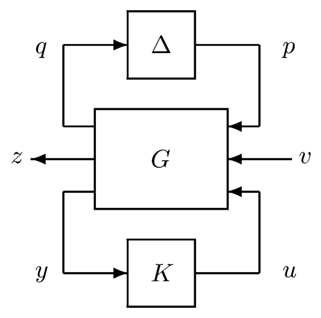

> Image description: This technical diagram illustrates a block diagram for a feedback control system with model uncertainty, as indicated by the caption "Robust $\mathcal{H}_{2}$ Performance in Feedback Control, Fig. 1 Feedback control and model uncertainty." The diagram contains three rectangular blocks: a central large block labeled $G$, a top block labeled $\Delta$, and a bottom block labeled $K$. In the central system, the plant $G$ has an input $v$ on the right and an output $z$ on the left. The top block, representing model uncertainty $\Delta$, is connected in a feedback loop with $G$; the output of $G$ is labeled $q$, which serves as the input to $\Delta$, and the output of $\Delta$ is labeled $p$, which feeds back into $G$. The bottom block $K$ represents the controller. It receives the output $y$ from block $G$ as its input and provides the control signal $u$ back into the plant $G$. All connections are indicated by unidirectional arrows showing the flow of signals between components.
Robust $\mathcal{H}_{2}$ Performance in Feedback Control, Fig. 1 Feedback control and model uncertainty

Thus it measures the transient error in response to known inputs or initial conditions which may be generated by an impulse.

The $\mathcal{H}_{2}$ (LQG) optimal feedback has an elegant solution, computable in state-space through two algebraic Riccati equations (AREs). Its quick popularity was, however, hampered due to its lack of stability margins: a small error in model parameters can make the closed-loop unstable (Doyle 1978). This motivated methods to explicitly address such modeling errors.

## Model Uncertainty and Robustness

Suppose some parameter in the model of $G$ is uncertain, $\alpha=\alpha_{0}+\kappa \delta, \delta \in[-1,1]$; often, the normalized variation $\delta$ can be "pulled out" into the uncertainty block $\Delta$ of Fig. 1. The same technique can account for unmodeled linear timeinvariant (LTI) dynamics, e.g., high frequency effects: they can be "covered" by a normalized transfer function $\hat{\Delta}(j \omega)$ and frequency weights that connect it to $G$. Even further, a nonlinear or time-varying (NL,TV) modeling error can be represented through an operator $\Delta$ in signal space. The references contain details on this modeling technique.

To analyze the effect of such errors, suppose $K$ has been chosen to stabilize $G$ and $M$ is the resulting closed-loop system, with state-space representation

$$
\begin{equation*}
\dot{x}=A x+B_{p} p+B_{v} v, \tag{2}
\end{equation*}
$$

<!-- source_pdf_page: 1238 -->
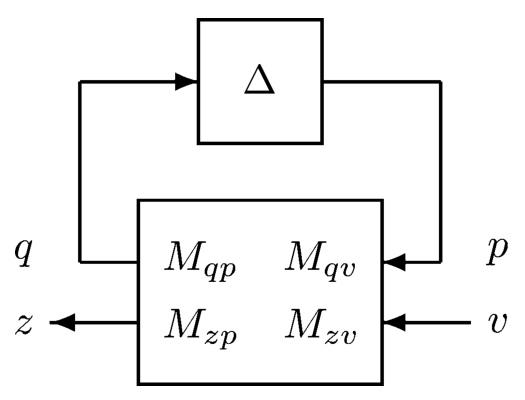

> Image description: A black-and-white schematic diagram, identified as Figure 2, illustrates a robustness analysis setup for robust $\mathcal{H}_2$ performance in feedback control. The diagram consists of two rectangular blocks interconnected in a feedback loop. The top block is labeled with the Greek letter $\Delta$ and represents an uncertainty or perturbation block. It is connected via two directed arrows forming a loop: an input arrow entering from the left, carrying variable $q$ from the bottom block, and an output arrow exiting to the right, carrying variable $p$ into the bottom block. The larger bottom block contains a $2 \times 2$ matrix of sub-blocks: $M_{qp}$ (top-left), $M_{qv}$ (top-right), $M_{zp}$ (bottom-left), and $M_{zv}$ (bottom-right). The block has two inputs: $p$ from the right (feedback) and $v$ from the right (external input). The block has one output, $z$, exiting from the left side. This structure represents a standard linear fractional transformation (LFT) setup used to analyze how perturbations $\Delta$ affect the system performance from $v$ to $z$.
Robust $\mathcal{H}_{2}$ Performance in Feedback Control, Fig. 2 Robustness analysis setup

$$
\begin{aligned}
q & =C_{q} x \\
z & =C_{z} x
\end{aligned}
$$

$A$ is an $n \times n$ stable (Hurwitz) matrix, and for simplicity there are no feed-through terms. Figure 2, represents the interconnection of $M$ with the uncertainty.

To quantify the size of uncertainty, it is convenient to use an induced norm (gain) in signal space and constrain $\Delta$ to the normalized ball $\{\|\Delta\| \leq 1\}$. If the subsystem $M_{q p}$ in feedback with $\Delta$ satisfies itself the induced norm constraint $\left\|M_{q p}\right\|<1$, the small gain theorem implies robust stability over the entire ball. Focusing for the rest of this article on the $\mathcal{L}_{2}$ signal space (square-integrable functions), the latter induced norm is equivalent to the $\mathcal{H}_{\infty}$ norm of the transfer function:

$$
\left\|\hat{M}_{q p}(s)\right\|_{\mathcal{H} \infty}:=\operatorname{ess} \sup _{\omega \in \mathbb{R}} \bar{\sigma}\left(\hat{M}_{q p}(j \omega)\right),
$$

where $\bar{\sigma}(\cdot)$ denotes matrix maximum singular value.

This motivates $\mathcal{H}_{\infty}$-optimal control: design $K$ to minimize the above quantity with internal stability. This problem also admits state-space solutions based on AREs and thus is a valid competing paradigm to $\mathcal{H}_{2}$.

To accommodate multiple sources of uncertainty within Fig. 1, we can use a block diagonal structure:

$$
\begin{equation*}
\Delta=\operatorname{diag}\left[\Delta_{1}, \ldots, \Delta_{d}\right] \tag{3}
\end{equation*}
$$

Here, different uncertainty blocks (parametric, LTI, LTV, or NL) enter in separate "channels"; $\mathbf{B}_{\Delta}$ denotes the unit ball of operators with the prescribed structure. For stability studies, causality of the operator is required.

Robust stability under structured uncertainty is a rich topic: we refer to the article on the structured singular value ( $\mu$ ) in this encyclopedia. We invoke here robustness conditions based on the set $\Lambda$ of positive definite matrix scalings or multipliers of the form:

$$
\begin{equation*}
\Lambda=\operatorname{diag}\left[\lambda_{1} I, \ldots, \lambda_{d} I\right] \tag{4}
\end{equation*}
$$

with submatrices of the same dimensions as the blocks in (3), thus commuting with a matrix $\Delta$ of that structure.

Consider the frequency family of matrix inequalities

$$
\begin{align*}
& \hat{M}_{q p}^{*}(j \omega) \Lambda(\omega) \hat{M}_{q p}(j \omega)-\Lambda(\omega)<0 \quad \forall \omega ; \\
& \quad \Lambda(\omega) \in \Lambda . \tag{5}
\end{align*}
$$

At each $\omega$, this is a linear matrix inequality (LMI); testing its feasibility is a convex, tractable problem. A solution implies the scaled-small gain condition

$$
\bar{\sigma}\left(\Lambda(\omega)^{\frac{1}{2}} \hat{M}_{q p}(j \omega) \Lambda^{-\frac{1}{2}}(\omega)\right)<1 ;
$$

this " $\mu$ upper bound" implies robust stability when uncertainty is LTI, through commuting $\Lambda(\omega)$ with $\hat{\Delta}(j \omega)$.

If uncertainty is NLTV, (5) must be strengthened to enforce $\Lambda(\omega) \equiv \Lambda$, constant in frequency. This condition turns out to be both necessary and sufficient for robust stability. Here the LMIs would be coupled in frequency; however, the Kalman-YakubovichPopov lemma reduces them to an equivalent LMI in terms of the state-space matrices in (2), with variables $\Lambda \in \boldsymbol{\Lambda}$ and an $n \times n$ matrix $P>0$ :

$$
\left[\begin{array}{cc}
A^{*} P+P A+C_{q}^{*} \Lambda C_{q} & P B_{p}  \tag{6}\\
B_{p}^{*} P & -\Lambda
\end{array}\right]<0 .
$$

<!-- source_pdf_page: 1239 -->
What about performance? The mapping $T_{z v}(\Delta)$ between the disturbance $v$ and the error $z$ now depends on the uncertainty. The default procedure in robust control has been to measure performance with the same induced norm, evaluating $\left\|T_{z v}(\Delta)\right\|_{\mathcal{L}_{2} \rightarrow \mathcal{L}_{2}}$ in the worst-case over $\Delta \in \mathbf{B}_{\Delta}$. This can be computed with similar complexity to establishing robust stability. It amounts, however, to treating noise with the same worst-case mentality as stability, a questionable choice. For instance, in LTI systems the worst-case signals are sinusoids at the worst frequency and spatial direction; while one should protect against such signals arising in the $\Delta$-loop due to instability, it is not natural to expect them as external disturbances, which are usually of broad spectrum.

## Robust $\mathcal{H}_{2}$ Performance Analysis

In the absence of uncertainty, the $\mathcal{H}_{2}$ norm of the nominal mapping $T_{z v}(0)=M_{z v}$ provides a natural performance criterion, measuring the response to flat-spectrum disturbances or the transient response. When uncertainty is present, it motivates a worst-case analysis of stability; a natural combination is to impose robust $\mathcal{H}_{2}$ performance: evaluating the worst-case $\mathcal{H}_{2}$ norm of $T_{z v}(\Delta)$ over the uncertainty class $\mathbf{B}_{\boldsymbol{\Delta}}$. We will highlight some methods based on semidefinite programming to perform such evaluations; for further details and comparisons, we refer to Paganini and Feron (1999).

## A Frequency Domain Robust Performance Criterion

Consider the following optimization:
$\mathbf{J}_{\mathbf{f}}:=\inf \int_{-\infty}^{\infty} \boldsymbol{\operatorname { T r }}(Y(\omega)) \frac{d \omega}{2 \pi}$, subject to

$$
\hat{M}(j \omega)^{*}\left[\begin{array}{cc}
\Lambda(\omega) & 0  \tag{7}\\
0 & I
\end{array}\right] \hat{M}(j \omega)-\left[\begin{array}{cc}
\Lambda(\omega) & 0 \\
0 & Y(\omega)
\end{array}\right]<0
$$

for each $\omega$, and $\Lambda(\omega) \in \Lambda$.
Here $\hat{M}$ is the transfer function in Fig. 2; a submatrix of the above includes (5), implying
robust stability under structured LTI uncertainty. Furthermore, we have the robust $\mathcal{H}_{2}$ performance bound (Paganini 1999):

$$
\begin{equation*}
\sup _{\Delta \in \mathbf{B}_{\Delta}^{\text {LII }}}\left\|T_{z v}(\Delta)\right\|_{\mathcal{H}_{2}}^{2} \leq \mathbf{J}_{\mathbf{f}} \tag{8}
\end{equation*}
$$

We sketch the argument based on the Fourier transforms $\hat{p}(j \omega)$, etc., for signals in Fig. 2. Applying the quadratic form in (7) to the joint vector of $\hat{p}$ and $\hat{v}$ gives
$\sum_{i=1}^{d} \lambda_{i}(\omega)\left|\hat{q}_{i}\right|^{2}+|\hat{z}|^{2} \leq \sum_{i=1}^{d} \lambda_{i}(\omega)\left|\hat{p}_{i}\right|^{2}+\hat{v}^{*} Y(\omega) \hat{v}$.
The subvectors $\hat{p}_{i}, \hat{q}_{i}$ correspond to uncertainty blocks, $\hat{p}_{i}=\hat{\Delta}_{i}(j \omega) \hat{q}_{i}$; since $\bar{\sigma}\left(\hat{\Delta}_{i}(j \omega)\right) \leq 1$, $\left|\hat{q}_{i}\right| \geq\left|\hat{p}_{i}\right|$. Also $\lambda_{i}(\omega)>0$, so these terms can be simplified, leading to

$$
\left|\hat{T}_{z v}(j \omega) \hat{v}\right|^{2}=|\hat{z}|^{2} \leq \hat{v}^{*} Y(\omega) \hat{v}
$$

This means $\hat{T}_{z v}(j \omega)^{*} \hat{T}_{z v}(j \omega) \leq Y(\omega)$ for every $\Delta$, and therefore the $\mathcal{H}_{2}$ norm bound

$$
\left\|T_{z v}(\Delta)\right\|_{\mathcal{H}_{2}}^{2} \leq \int_{-\infty}^{\infty} \boldsymbol{\operatorname { T r }}(Y(\omega)) \frac{d \omega}{2 \pi}
$$

holds, from which (8) follows.
The computation involved in (7) at each frequency is a semidefinite program (SDP): minimizing the linear cost $\boldsymbol{\operatorname { T r }}(Y(\omega))$ subject to an LMI constraint, a tractable problem. Adding a frequency sweep, we have a practical method to bound the desired robust performance.

The inequality (8) is in general strict. Beyond the usual conservatism of convex bounds for $\mu$, when noise is of dimension $m$, a conservatism of up to this order may appear; an improvement to address this issue with augmented SDPs is given in Sznaier et al. (2002). Finally, causality of the uncertainty is not imposed in the frequencydomain criterion.

As in the study of robust stability, we wish to extend the analysis to NLTV uncertainty blocks. Now the mapping $T_{z v}(\Delta)$ can no longer be represented by a transfer function, so what is the " $\mathcal{H}_{2}$ " cost? We return to our motivation for this

<!-- source_pdf_page: 1240 -->
performance notion: to measure the effect of disturbances of flat spectrum.

In Paganini (1999), the flat-spectrum property is imposed as a deterministic constraint on the input disturbances. For the scalar $v$ case, define $W_{\eta, B} \subset \mathcal{L}_{2}$ by the family of integral quadratic constraints:

$$
\int_{-\beta}^{\beta}|v(j \omega)|^{2} \frac{d \omega}{2 \pi} \begin{cases}\leq \frac{\beta}{\pi}+\eta & \forall \beta ;  \tag{9}\\ \geq \frac{\beta}{\pi}-\eta, & \beta \in[0, B] .\end{cases}
$$

This imposes that the cumulative spectrum is approximately linear (to a tolerance $\eta>0$ ), up to bandwidth $B$, and has sublinear growth beyond that. Extensions to vector-valued signals are also given. For a stable LTI system $T_{z v}$, it is not difficult to verify that

$$
\left\|T_{z v}\right\|_{\mathcal{H}_{2}}^{2}=\lim _{\substack{n \rightarrow 0 \\ B \rightarrow \infty}} \sup _{v \in W_{\eta, B}}\left\|T_{z v} v\right\|_{2}^{2}
$$

but the right-hand side applies to NLTV systems as well. The following result can be established in the latter case:

$$
\lim _{\substack{\eta \rightarrow 0 \\ B \rightarrow \infty}} \sup _{v \in W_{\eta, B}, \Delta \in \mathbf{B}_{\Delta}^{\mathrm{NLTV}}}\left\|T_{z v}(\Delta) v\right\|_{2}^{2}=\mathbf{J}_{\mathbf{f}}^{\prime}
$$

where the right-hand side is the variant of (7) with the restriction that $\Lambda(\omega) \equiv \Lambda$, constant in frequency. In this case the characterization is exact, with equality above. This follows from a duality argument in function space, where $Y(\omega)$ appears as the multiplier for the constraint in (9). While coupled in frequency, $\mathbf{J}_{\mathbf{f}}{ }^{\prime}$ is again equivalent to a finite-dimensional SDP in state space.

Let us review, instead, a different state-space method, motivated by alternate definitions of the $\mathcal{H}_{2}$ cost.

## A State-Space Criterion Invoking Causality

Consider the semidefinite program
$\mathbf{J}_{\mathbf{s}}:=\inf \boldsymbol{\operatorname { T r }}\left(B_{v}^{*} P B_{v}\right)$ subject to $P>0, \Lambda \in \Lambda$,

$$
\left[\begin{array}{cc}
A^{*} P+P A+C_{q}^{*} \Lambda C_{q}+C_{z}^{*} C_{z} & P B_{p}  \tag{10}\\
B_{p}^{*} P & -\Lambda
\end{array}\right]<0 .
$$

The LMI above is very similar to (6); indeed it provides a robust stability certificate and in addition a bound on a generalized $\mathcal{H}_{2}$ cost, for arbitrary (NLTV) causal uncertainty blocks. Again, we sketch the argument.

For stability, consider the system of Fig. 2 with $v \equiv 0$, initial condition $x(0)=x_{0}$. Define the storage function $V(x)=x^{*} P x$; differentiating it under (2) and applying the LMI (10) to the joint vector of $x(t), p(t)$ yield
$\dot{V}+|z|^{2} \leq-q^{*} \Lambda q+p^{*} \Lambda p=\sum_{i=1}^{d} \lambda_{i}\left(\left|p_{i}\right|^{2}-\left|q_{i}\right|^{2}\right)$.

Integrating the above over ( $0, t$ ), the sum on the right becomes nonpositive because $\lambda_{i}>0$ and the operator $\Delta_{i}: q_{i} \rightarrow p_{i}$ is causal and contractive. This leads to

$$
\begin{equation*}
V(x(t))+\int_{0}^{t}|z(\tau)|^{2} d \tau \leq V\left(x_{0}\right) \tag{11}
\end{equation*}
$$

which implies Lyapunov stability; the bound can be sharpened to prove asymptotic stability. Also, letting $t \rightarrow \infty$ yields the energy bound $\|z\|_{2}^{2} \leq V\left(x_{0}\right)$.

Suppose now that $x_{0}$ is generated by applying to the (causal) system at rest, an impulse $v(t)= \delta(t)$, assumed scalar. The result is $x(0+)= B_{v}$, so $V\left(x_{0}\right)=B_{v}^{*} P B_{v}$; the impulse response energy of $T_{z v}(\Delta)$ is thus bounded. Minimizing over $P, \Lambda$ leads to the robust $\mathcal{H}_{2}$ performance bound

$$
\sup _{\Delta \in \mathbf{B}_{\Delta}^{\text {NLTV }}}\left\|T_{z v}(\Delta) \delta(t)\right\|_{2}^{2} \leq \mathbf{J}_{\mathbf{s}}
$$

where the $\mathcal{H}_{2}$ cost is generalized as the impulse response energy. An extension to multiple impulse channels is available. This kind of result was first obtained by Stoorvogel (1993) for unstructured uncertainty.

An alternate notion of $\mathcal{H}_{2}$ cost for NLTV systems, also considered in Stoorvogel (1993), is the average output variance when the input

<!-- source_pdf_page: 1241 -->
is random white noise. This is formalized by replacing (2) with a stochastic differential equation (e.g., Oksendal 1985) and extending the bound (11) using Ito calculus; for details see Paganini and Feron (1999). The following robust $\mathcal{H}_{2}$ performance bound is obtained:

$$
\limsup _{\tau \rightarrow \infty} \frac{1}{\tau} \int_{0}^{\tau} E|z(t)|^{2} d t . \leq \mathbf{J}_{\mathbf{s}} \quad \forall \Delta \in \mathbf{B}_{\Delta}^{\mathbf{N L T V}}
$$

What if the uncertainty is time invariant? Incorporating frequency-dependent scalings, with causality, into the state-space approach must be done approximately, generating $\hat{\Lambda}(j \omega)$ through the span of a predefined finite basis of causal, rational transfer functions. Searching over this basis for a bound on the impulse response energy can be pursued with state-space SDPs, now of a size increasing with the basis dimensionality. We refer to Feron (1997) for details.

## Robust $\mathcal{H}_{2}$ Synthesis

Prior sections have focused on the robustness analysis of a closed-loop system $M$, obtained from $G$ after designing a nominally stabilizing controller. Can we synthesize $K$ with robust $\mathcal{H}_{2}$ performance as an objective? We overview some contributions to this question.

## Multiobjective $\mathcal{H}_{2} / \mathcal{H}_{\infty}$ Control

Let us discuss first the more modest objective of optimizing nominal $\mathcal{H}_{2}$ performance while guaranteeing robust stability. If the uncertainty block $\Delta$ in Fig. 2 is unstructured, the problem is equivalent to

$$
\text { Minimize }\left\|\hat{M}_{z v}\right\|_{\mathcal{H}_{2}}, \text { subject to }\left\|\hat{M}_{q p}\right\|_{\mathcal{H}_{\infty}}<1 .
$$

Using a Youla parameterization of stabilizing controllers, $\hat{M}(s)$ depends affinely on a stable parameter $\hat{Q}(s)$; this makes the optimization over $\hat{Q}$ convex. However it has been shown to give infinite-dimensional solutions that must be approximated by suitable truncations; see Sznaier et al. (2000) and references therein.

To better exploit the state-space structure common to $\mathcal{H}_{2}$ and $\mathcal{H}_{\infty}$ synthesis, Bernstein and Haddad (1989) proposed a simplification: minimize an auxiliary cost that upper bounds the $\mathcal{H}_{2}$ norm while imposing the $\mathcal{H}_{\infty}$ constraint, through a common storage function. This cost is optimized by controllers of the order of the plant, characterized in terms of coupled AREs; later on Khargonekar and Rotea (1991) recast this problem using convex optimization. Also Zhou et al. (1994) and Doyle et al. (1994) studied the dual (transpose) structure.

The latter version is in fact directly related to the analysis condition (10), with a fixed $\Lambda=\lambda I$. A matrix $P$ satisfying this condition imposes the $\mathcal{H}_{\infty}$ norm restriction and upper bounds the nominal $\mathcal{H}_{2}$ cost. This idea of imposing multiple objectives through a common storage function has more general applicability: Scherer et al. (1997) showed that all such problems admit tractable synthesis based on LMIs, with solutions of the same order as the plant.

## Synthesis for Robust Performance

We have seen that rather than just an upper bound on nominal performance, (10) ensures the more stringent robust $\mathcal{H}_{2}$ performance requirement; therefore it becomes the basis of a robust $\mathcal{H}_{2}$ synthesis technique. In Stoorvogel (1993) this method is laid out for unstructured uncertainty: search linearly over the scalar $\lambda$ and solve the auxiliary cost synthesis problem for each $\lambda$.

What about structured uncertainty? We run here into a general difficulty of such synthesis questions, even for robust stability alone. In that case, seeking simultaneously a controller $K$ and a scaling $\Lambda$ so that conditions (5) or (6) are satisfied by the resulting $M$ is not a computationally friendly problem. In the absence of a general solution method, iterating between an $\mathcal{H}_{\infty}$ design of $K$ for fixed $\Lambda$ and the analysis conditions to find $\Lambda$ is commonly used for design.

Things can be no easier for robust $\mathcal{H}_{2}$ performance, but the iterative procedure does generalize to the conditions in (10): for fixed $K$, the SDP will return structured $\Lambda$ 's, which can then be fixed for a multiobjective synthesis step based on the "auxiliary cost" in (10) as discussed above. If constant $\Lambda$ are used (designing for NLTV

<!-- source_pdf_page: 1242 -->
uncertainty), all controllers obtained are of the order of the plant.

If uncertainty is LTI, an alternative is to carry out the analysis step in the frequency domain, finding a $\Lambda(\omega), Y(\omega)$ through (7). In the corresponding situation for $\mu$-synthesis, where only $\Lambda(\omega)$ is found, a step of fitting and spectral factorization is needed to approximate such scalings through a rational weights, which are then incorporated into $\mathcal{H}_{\infty}$ synthesis. A similar frequency weight in the performance channel can approximate the effect of $Y(\omega)$, thus relying on weighted $\mathcal{H}_{\infty}$ synthesis to pursue the $\mathcal{H}_{2}$ performance objective. Of course, the order of the resulting controllers is increased.

## Summary and Future Directions

The tradeoff between performance and robustness is essential to feedback control. In the case of linear multivariable design, it motivated a compromise between $\mathcal{H}_{2}$ performance and $\mathcal{H}_{\infty}$-type robustness, pursued with the statespace and frequency-domain tools common to these metrics. We have highlighted robust $\mathcal{H}_{2}$ analysis conditions obtained in the 1990s based on semidefinite programming, which provided the greatest flexibility to integrate the aforementioned tools and different points of view (worst-case, average case) present in this problem. As in other situations, the robust synthesis question has proven more difficult: design cannot be "automated" to the degree that was once envisioned.

The passage of time makes issues that once attracted strong attention look narrow in scope, so it is not natural to indicate directions that directly follow on this work. Perhaps the best legacy that the robust $\mathcal{H}_{2}$ generation can take to other problems is the willingness to integrate various disciplines (dynamics, operator theory, stochastics, optimization) to face the demands of applied mathematical research.

## Cross-References

- H-Infinity Control
- KYP Lemma and Generalizations/Applications
- Linear Quadratic Optimal Control
- LMI Approach to Robust Control
- Structured Singular Value and Applications: Analyzing the Effect of Linear Time-Invariant Uncertainty in Linear Systems

## Recommended Reading

LQG control is covered in many textbooks, e.g., Anderson and Moore (1990). A standard text for robust control with an $\mathcal{H}_{\infty}$ perspective, including structured singular values, the Youla parameterization, and the Riccati equation solution for $\mathcal{H}_{\infty}$ synthesis, is Zhou et al. (1996); see also Sánchez-Peña and Sznaier (1998) with application examples. The textbook of Dullerud and Paganini (2000) incorporates the more recent developments based on LMIs; see Boyd and Vandenberghe (2004) for background on semidefinite programming.

## Bibliography

Anderson B, Moore JB (1990) Optimal control: linear quadratic methods. Prentice Hall, Englewood Cliffs
Bernstein DS, Haddad WH (1989) LQG control with an $\mathcal{H}_{\infty}$ performance bound: a Riccati equation approach. IEEE Trans Autom Control 34(3):293-305
Boyd S, Vandenberghe L (2004) Convex optimization. Cambridge University Press, Cambridge
Doyle J (1978) Guaranteed margins for LQG regulators. IEEE Trans Autom Control 23(4):756-757
Doyle J, Zhou K, Glover K, Bodenheimer B (1994) Mixed $\mathcal{H}_{2}$ and $\mathcal{H}_{\infty}$ performance objectives II: optimal control. IEEE Trans Autom Control 39(8): 1575-1587
Dullerud GE, Paganini F (2000) A course in robust control theory: a convex approach. Texts in applied mathematics, vol 36. Springer, New York
Feron E (1997) Analysis of robust $\mathcal{H}_{2}$ performance using multiplier theory. SIAM J Control Optim 35(1): 160-177
Khargonekar P, Rotea M (1991) Mixed $\mathcal{H}_{2} / \mathcal{H}_{\infty}$ control: a convex optimization approach. IEEE Trans Autom Control 36(7):824-837
Oksendal B (1985) Stochastic differential equations. Springer, New York
Paganini F (1999) Convex methods for robust $\mathcal{H}_{2}$ analysis of continuous time systems. IEEE Trans Autom Control 44(2):239-252
Paganini F, Feron E (1999) LMI methods for robust $\mathcal{H}_{2}$ analysis: a survey with comparisons. In: El Ghaoui L, Niculescu S (Eds) Recent advances on LMI methods in control. SIAM, Philadelphia

<!-- source_pdf_page: 1243 -->
Sánchez-Peña R, Sznaier M (1998) Robust systems theory and applications. Wiley, New York
Scherer C, Gahinet P, Chilali M (1997) Multiobjective output-feedback control via LMI-optimization. IEEE Trans Autom Control 42:896-911
Stoorvogel AA (1993) The robust $\mathcal{H}_{2}$ control problem: a worst-case design. IEEE Trans Autom Control 38(9):1358-1370
Sznaier M, Rotstein H, Bu J, Sideris A (2000) An exact solution to continuous-time mixed $\mathcal{H}_{2} / \mathcal{H}_{\infty}$ control problems. IEEE Trans Autom Control 45(11):2095-2101
Sznaier M, Amishima T, Parrilo PA, Tierno J (2002) A convex approach to robust $\mathcal{H}_{2}$ performance analysis. Automatica 38:957-966
Zhou K, Glover K, Bodenheimer B, Doyle J (1994) Mixed $\mathcal{H}_{2}$ and $\mathcal{H}_{\infty}$ performance objectives I: robust performance analysis. IEEE Trans Autom Control 39(8):1564-1574
Zhou K, Doyle J, Glover K (1996) Robust and optimal control. Prentice Hall, Upper Saddle River

## Robust Model-Predictive Control   Saša Raković   Oxford University, Oxford, UK

#### Abstract

Model-predictive control (MPC) is indisputably one of the rare modern control techniques that has significantly affected control engineering practice due to its unique ability to systematically handle constraints and optimize performance. Robust MPC (RMPC) is an improved form of the nominal MPC that is intrinsically robust in the face of uncertainty. The main objective of RMPC is to devise an optimization-based control synthesis method that accounts for the intricate interactions of the uncertainty with the system, constraints, and performance criteria in a theoretically rigorous and computationally tractable way. RMPC has become an area of theoretical relevance and practical importance but still offers the fundamental challenge of reaching a meaningful compromise between the quality of structural properties and the computational complexity.

## Keywords

Model-predictive control; Robust optimal control; Robust stability

## Introduction

RMPC is an optimization-based approach to the synthesis of robust control laws for constrained control systems subject to bounded uncertainty. RMPC synthesis can be seen as an adequately defined repetitive decision-making process, in which the underlying decision-making process is a suitably formulated robust optimal control (ROC) problem. The underlying ROC problem is specified in such a way so as to ensure that all possible predictions of the controlled state and corresponding control actions sequences satisfy constraints and that the "worst-case" cost is minimized. The decision variable in the corresponding ROC problem is a control policy (i.e., a sequence of control laws) ensuring that different control actions are allowed at different predicted states, while the uncertainty takes on a role of the adversary. RMPC utilizes recursively the solution to the associated ROC problem in order to implement the feedback control law that is, in fact, equal to the first control law of an optimal control policy.

A theoretically rigorous approach to RMPC synthesis can be obtained either by employing, in a repetitive fashion, the dynamic programming solution of the corresponding ROC problem or by solving online, in a recursive manner, an infinite-dimensional optimization problem (Rawlings and Mayne 2009). In either case, the associated computational complexity renders the exact RMPC synthesis hardly ever tractable. This computational impracticability of the theoretically exact RMPC, in conjunction with the convoluted interactions of the uncertainty with the evolution of the controlled system, constraints, and control objectives, has made RMPC an extremely challenging and active research field. It has become evident that a prominent challenge is to develop a form of RMPC synthesis that adequately handles

<!-- source_pdf_page: 1244 -->
the effects of the uncertainty and yet is computationally plausible. Contemporary research proposals aim to address the inevitable trade-off between the quality of guaranteed structural properties and the corresponding computational complexity. A categorization of the existing proposals for RMPC synthesis can be based on the treatment of the effects of the uncertainty. In this sense, two alternative approaches to RMPC synthesis appear to be dominant.

The first category of the alternative approaches is represented by the methods that utilize, when possible, inherent robustness of nominal MPC synthesis. These proposals deploy a nominal MPC, albeit designed for a suitably modified control system, constraints, and control objectives. Such approaches are computationally practicable. However, the effects of the uncertainty are taken care of in an indirect way; the robustness properties of the controlled dynamics are frequently addressed via an a posteriori input-to-state stability analysis, which might be unnecessarily conservative and geometrically insensitive. Equally important drawbacks of these approaches to RMPC synthesis arise due to the fact that the nominal MPC synthesis is itself an inherently fragile (nonrobust) process; in particular, the stability property of the conventional MPC might fail to be robust (Grimm et al. 2004) and, furthermore, the optimal control of constrained discrete time systems, employed for the nominal MPC synthesis, can be a fragile process itself (Raković 2009).

The second category of RMPC design methods encapsulates the approaches that take the effects of the uncertainty into account more directly. These proposals are compatible with the emerging consensus: there is a need for the deployment of the simplifying approximations of the underlying control policy and sensible prioritization and modification of control objectives so as to simultaneously enhance computational tractability and ensure a priori guarantees of the desirable topological properties and system-theoretic rigor. The simplifying parameterizations of the control policy are employed primarily to allow for a computationally
efficient handling of the interactions of the uncertainty with the evolution of the controlled system and constraints. The control objectives are prioritized and modified when necessary, in order to ensure that the corresponding ROC problem is computationally tractable. The effectiveness of such methods depends crucially on the ability to detect a sufficiently rich parameterization of control policy and to devise a systematic way for meaningful simplification of control objectives.

In a stark contrast to a well-matured theory of the nominal MPC synthesis, a systematic assessment of, and unified exposure to, the current state of affairs in the RMPC field is a highly demanding chore. Nevertheless, it is possible to outline the main aspects of the exact RMPC synthesis and to provide an overview of the dominant simplifying approximations.

## Contemporary Setting and Uncertainty Effect

The contemporary approach to the exact RMPC synthesis is now delineated in a step-by-step manner.

The system: The most common setting in RMPC synthesis considers the control systems modelled, in discrete time, by

$$
\begin{equation*}
x^{+}=f(x, u, w), \tag{1}
\end{equation*}
$$

where $x \in \mathbb{R}^{n}, u \in \mathbb{R}^{m}, \mathrm{w} \in \mathbb{R}^{p}$, and $x^{+} \in \mathbb{R}^{n}$ are, respectively, the current state, control and uncertainty, and the successor state, while $f(\cdot, \cdot, \cdot): \mathbb{R}^{n} \times \mathbb{R}^{m} \times \mathbb{R}^{p} \rightarrow \mathbb{R}^{n}$ is the state transition map assumed to be continuous. Thus, when $x_{k}, u_{k}$, and $w_{k}$ are the state, the control, and the uncertainty at the time instance $k$, then $x_{k+1}=f\left(x_{k}, u_{k}, w_{k}\right)$ is the state at the time instance $k+1$.

The constraints: The system variables $x, u$, and $w$ are subject to hard constraints:

$$
\begin{equation*}
(x, u, w) \in \mathbb{X} \times \mathbb{U} \times \mathbb{W} \tag{2}
\end{equation*}
$$

<!-- source_pdf_page: 1245 -->
where the constraint sets $\mathbb{X}$ and $\mathbb{U}$ represent state and control constraints, while the constraint set $\mathbb{W}$ specifies geometric bounds on the uncertainty. The constraint sets $\mathbb{X} \subset \mathbb{R}^{n}, \mathbb{U} \subset \mathbb{R}^{m}$, and $\mathbb{W} \subset \mathbb{R}^{p}$ are assumed to be compact.

The control policy: It is necessary to specify, in a manner that is compatible with the type and nature of the uncertainty, the information available for the RMPC synthesis. The traditional state feedback setting treats the case in which, at any time instance $k$, the state $x_{k}$ is known when the current control $u_{k}$ is determined, while the values of the current and future uncertainty $\left(w_{k+i}\right)$ are not known but are guaranteed to take the values within the uncertainty constraint set $\mathbb{W}$ (i.e., $w_{k+i} \in \mathbb{W}$ ). Within this setting, the use of a control policy,

$$
\begin{equation*}
\Pi_{N-1}:=\left\{\pi_{0}(\cdot), \pi_{1}(\cdot), \ldots, \pi_{N-1}(\cdot)\right\}, \tag{3}
\end{equation*}
$$

where $N$ is the prediction horizon and each $\pi_{k}(\cdot): \mathbb{R}^{n} \rightarrow \mathbb{R}^{m}$ is a control law, is structurally permissible and desirable.

## The generalized state and control predictions:

Because of the uncertainty, the ordinary state and control predictions, as employed in the nominal MPC, are not suitable. Clearly, when $x$ and $\kappa(x)$ are the current state and control, then the successor state $x^{+}$can take any value in the possible set of successor states $\{f(x, \kappa(x), w): w \in \mathbb{W}\}$. Consequently, it is necessary to consider suitably generalized state and control predictions. The interaction of the uncertainty with the predicted behavior of the system is captured naturally by invoking the maps $F(\cdot, \cdot)$ and $G(\cdot, \cdot)$ specified, for any subset $X$ of $\mathbb{R}^{n}$ and any control function $\kappa(\cdot): \mathbb{R}^{n} \rightarrow \mathbb{R}^{m}$, by

$$
\begin{align*}
& F(X, \kappa):=\{f(x, \kappa(x), w): x \in X, w \in \mathbb{W}\} \text { and } \\
& G(X, \kappa):=\{\kappa(x): x \in X\} . \tag{4}
\end{align*}
$$

Within the considered setting, the corresponding state and control predictions are, in fact, setvalued and, for each relevant $k$, obey the relations
$X_{k+1}=F\left(X_{k}, \pi_{k}\right)$ and $U_{k}=G\left(X_{k}, \pi_{k}\right)$, with

$$
\begin{equation*}
X_{0}:=\{x\} \tag{5}
\end{equation*}
$$

The set sequences $\mathbf{X}_{N}:=\left\{X_{0}, X_{1}, \ldots, X_{N-1}, X_{N}\right\}$ and $\mathbf{U}_{N-1}:=\left\{U_{0}, U_{1}, \ldots, U_{N-1}\right\}$ represent the possible sets of the predicted states and control actions, which are commonly known as the state and control tubes. Evidently, the state and control tubes are functions of the initial state $x$ and a control policy $\Pi_{N-1}$. Reversely, for a given initial state $x$, any structurally permissible control policy $\Pi_{N-1}$ results in the possible sets of the predicted states and control actions.

The robust constraint satisfaction: One of the primary objectives in RMPC synthesis is to ensure that the generalized state and control predictions satisfy state and control constraints. Because of the repetitive nature of RMPC, it would be ideal to consider the control policy and generalized state and control predictions over the infinite horizon (i.e., for $N=\infty$ ). Unfortunately, this is hardly ever practicable in a direct fashion. When the prediction horizon is finite, the robust constraint satisfaction reduces to the conditions that for all $k=0,1, \ldots, N-1$, the set inclusions

$$
\begin{equation*}
X_{k} \subseteq \mathbb{X} \text { and } U_{k} \subseteq \mathbb{U} \tag{6}
\end{equation*}
$$

hold true and that the possible set of states $X_{N}$ at the prediction time instance $N$ satisfies the set inclusion

$$
\begin{equation*}
X_{N} \subseteq \mathbb{X}_{f} \tag{7}
\end{equation*}
$$

where $\mathbb{X}_{f} \subseteq \mathbb{X}$ is a suitable terminal constraint set.

The terminal constraint set: In order to account for the utilization of the control policy $\Pi_{N-1}$ and generalized state and control predictions over the finite horizon $N$ and to ensure that these can be prolonged indirectly over the infinite horizon, a terminal constraint set is employed. This set is obtained by considering the uncertain dynamics

$$
\begin{equation*}
x^{+}=f\left(x, \kappa_{f}(x), w\right) \tag{8}
\end{equation*}
$$

<!-- source_pdf_page: 1246 -->
controlled by a local control function $\kappa_{f}(\cdot)$. The design of a control law $\kappa_{f}(\cdot)$ is usually performed offline in an optimal manner by considering the unconstrained version of the system (1), while the terminal constraint set $\mathbb{X}_{f}$ accounts locally for the state and control constraints. The terminal constraint set $\mathbb{X}_{f}$ is assumed to be compact and robust positively invariant for the dynamics (8) and constraint sets (2). Thus, the set $\mathbb{X}_{f}$ and a local control function $\kappa_{f}(\cdot)$ satisfy

$$
\begin{align*}
& F\left(\mathbb{X}_{f}, \kappa_{f}\right) \subseteq \mathbb{X}_{f} \subseteq \mathbb{X} \text { and } \mathbb{U}_{f} \\
& \quad:=G\left(\mathbb{X}_{f}, \kappa_{f}\right) \subseteq \mathbb{U} \tag{9}
\end{align*}
$$

or, equivalently, $\mathbb{X}_{f} \subseteq \mathbb{X}$, and for all $x \in \mathbb{X}_{f}$, it holds that $\kappa_{f}(x) \in \mathbb{U}$ and $\forall w \in \mathbb{W}$, $f\left(x, \kappa_{f}(x), w\right) \in \mathbb{X}_{f}$. The most appropriate choice for $\mathbb{X}_{f}$ is the maximal robust positively invariant set for the dynamics (8) and constraint sets (2).

The generalized origin: Due to the presence of the uncertainty, the stabilization of the origin might not be attainable and, thus, it might be necessary to consider the origin in a generalized sense. The most natural candidate for the generalized origin is a minimal robust positively invariant set for the dynamics (8) and constraint sets (2). This set is entirely determined by the associated state set dynamics

$$
\begin{equation*}
X^{+}=F\left(X, \kappa_{f}\right), \tag{10}
\end{equation*}
$$

which are completely induced by the local dynamics (8) and the uncertainty constraint set $\mathbb{W}$. The generalized origin, namely, the minimal robust positively invariant set, is compact and well defined in the case when the local control function $\kappa_{f}(\cdot)$ ensures that the corresponding map $F\left(\cdot, \kappa_{f}\right)$ is a contraction on the space of compact subsets of $\mathbb{X}_{f}$ (Artstein and Raković 2008), which we assume to be the case. The generalized origin $\mathbb{X}_{\mathcal{O}}$ is the unique solution to the fixed-point set equation.

$$
\begin{equation*}
X=F\left(X, \kappa_{f}\right), \tag{11}
\end{equation*}
$$

and is an exponentially stable attractor for the state set dynamics (10) with the basin of attraction being the space of compact subsets of $\mathbb{X}_{f}$. Thus, the conventional $(0,0)$ fixed-point pair ought to be replaced by the fixed-point pair of sets $\left(\mathbb{X}_{\mathcal{O}}, \mathbb{U}_{\mathcal{O}}\right)$ required to satisfy

$$
\begin{align*}
& \mathbb{X}_{\mathcal{O}}=F\left(\mathbb{X}_{\mathcal{O}}, \kappa_{f}\right) \subseteq \text { interior }\left(\mathbb{X}_{f}\right) \text { and } \\
& \mathbb{U}_{\mathcal{O}}:=G\left(\mathbb{X}_{\mathcal{O}}, \kappa_{f}\right) \subseteq \mathbb{U}_{f} \tag{12}
\end{align*}
$$

The generalized cost functions: The performance requirements are, as usual, expressed via a cost function, which is obtained by considering a stage cost function $\ell(\cdot, \cdot): \mathbb{X} \times \mathbb{U} \rightarrow \mathbb{R}_{+}$and a terminal cost function $V_{f}(\cdot): \mathbb{X}_{f} \rightarrow \mathbb{R}_{+}$. The stage cost function $\ell(\cdot, \cdot)$ is continuous and, due to the uncertainty, adequately lower bounded w.r.t. to the generalized origin $\mathbb{X}_{\mathcal{O}}$. The latter condition requires that for all $x \in \mathbb{X}$ and all $u \in \mathbb{U}$, the function $\ell(\cdot, \cdot)$ satisfies

$$
\begin{equation*}
\alpha_{1}\left(\operatorname{dist}\left(\mathbb{X}_{\mathcal{O}}, x\right)\right) \leq \ell(x, u) \tag{13}
\end{equation*}
$$

where $\alpha_{1}(\cdot)$ is a $\mathcal{K}$-class (Kamke's) function and $\operatorname{dist}\left(\mathbb{X}_{\mathcal{O}}, \cdot\right)$ is the distance function from the set $\mathbb{X}_{\mathcal{O}}$. The consideration of the generalized origin requires the additional condition that for all $x \in \mathbb{X}_{\mathcal{O}}$, the use of local control function $\kappa_{f}(\cdot)$ is "free of charge" w.r.t. $\ell(\cdot, \cdot)$, i.e., that for all $x \in \mathbb{X}_{\mathcal{O}}$, we have

$$
\begin{equation*}
\ell\left(x, \kappa_{f}(x)\right)=0 . \tag{14}
\end{equation*}
$$

As in the case of the terminal constraint set $\mathbb{X}_{f}$, the terminal cost function $V_{f}(\cdot)$ is employed to account for the utilization of the finite prediction horizon $N$, and it should provide locally a theoretically suitable upper bound of the highly desired infinite horizon cost. The terminal cost function $V_{f}(\cdot)$ is assumed to be continuous and adequately upper bounded w.r.t. the generalized origin $\mathbb{X}_{\mathcal{O}}$. The latter bound reduces to the requirement that for all $x \in \mathbb{X}_{f}$, we have

$$
\begin{equation*}
V_{f}(x) \leq \alpha_{2}\left(\operatorname{dist}\left(\mathbb{X}_{\mathcal{O}}, x\right)\right), \tag{15}
\end{equation*}
$$

where, as above, $\alpha_{2}(\cdot)$ is a $\mathcal{K}$-class function. In addition, the terminal cost function $V_{f}(\cdot)$ satisfies locally a usual condition for robust stabilization,

<!-- source_pdf_page: 1247 -->
which is expressed by the requirement that for all $x \in \mathbb{X}_{f}$ and all $w \in \mathbb{W}$, it holds that

$$
\begin{equation*}
V_{f}\left(f\left(x, \kappa_{f}(x), w\right)\right)-V_{f}(x) \leq-\ell\left(x, \kappa_{f}(x)\right) . \tag{16}
\end{equation*}
$$

The cost function $V_{N}(\cdot, \cdot, \cdot)$ is defined, for all $x \in \mathbb{X}$, all $\Pi_{N-1}$, and all $\mathbf{w}_{N-1}:= \left\{w_{0}, w_{1}, \ldots, w_{N-1}\right\}$, by

$$
\begin{equation*}
V_{N}\left(x, \Pi_{N-1}, \mathbf{w}_{N-1}\right):=\sum_{k=0}^{N-1} \ell\left(x_{k}, u_{k}\right)+V_{f}\left(x_{N}\right), \tag{17}
\end{equation*}
$$

where, for notational simplicity, $u_{k}:=\pi_{k}\left(x_{k}\right)$ and $x_{k}:=x_{k}\left(x, \Pi_{N-1}, \mathbf{w}_{N-1}\right)$ denote the solution of (1) when the initial state is $x$, control policy is $\Pi_{N-1}$, and uncertainty realization is $\mathbf{w}_{N-1}$.

The exact ROC: In view of the uncertainty, the corresponding exact ROC problem $\mathbb{P}_{N}(x)$, for any $x \in \mathbb{X}$, aims to optimize the "worstcase" performance so that it takes the form of an infinite-dimensional minimaximization:

$$
\begin{align*}
J_{N}\left(x, \Pi_{N-1}\right) & :=\max _{\mathbf{w}_{N-1} \in \mathbb{W}^{N}} V_{N}\left(x, \Pi_{N-1}, \mathbf{w}_{N-1}\right), \\
V_{N}^{0}(x) & :=\min _{\Pi_{N-1} \in \Pi_{N-1}(x)} J_{N}\left(x, \Pi_{N-1}\right), \\
\Pi_{N-1}^{0}(x) & \in \arg \min _{\Pi_{N-1} \in \Pi_{N-1}(x)} J_{N}\left(x, \Pi_{N-1}\right), \tag{18}
\end{align*}
$$

where $\boldsymbol{\Pi}_{N-1}(x)$ denotes the set of the constraint admissible control policies defined, for all $x \in \mathbb{X}$, by
$\Pi_{N-1}(x):=\left\{\Pi_{N-1}:\right.$ conditions (5)-(7) hold $\}$.

The value function $V_{N}^{0}(\cdot)$ might not admit a unique optimal control policy, so that $\Pi_{N-1}^{0}(\cdot)$ represents a selection from the set of optimal control policies (this selection is usually induced by a numerical solver employed for the online calculations). The effective domain $\mathcal{X}_{N}$ of the value function $V_{N}^{0}(\cdot)$ and associated optimal control policy $\Pi_{N-1}^{0}(\cdot)$ is given by

$$
\begin{equation*}
\mathcal{X}_{N}:=\left\{x \in \mathbb{R}^{n}: \Pi_{N-1}(x) \neq \emptyset\right\} . \tag{20}
\end{equation*}
$$

and is known in the literature as the $N$-step minmax controllable set to a target set $\mathbb{X}_{f}$. Within the considered setting, the set $\mathcal{X}_{N}$ is a compact subset of $\mathbb{X}$ such that $\mathbb{X}_{f} \subseteq \mathcal{X}_{N}$.

The exact RMPC: The exact RMPC synthesis requires online solution of the minimaximization (18) in order to implement numerically the control law $\pi_{0}^{0}(\cdot)$. The control law $\pi_{0}^{0}(\cdot)$ is well defined for all $x \in \mathcal{X}_{N}$, and it induces the controlled uncertain dynamics specified, for all $x \in \mathcal{X}_{N}$, by
$x^{+} \in \mathcal{F}(x), \mathcal{F}(x):=\left\{f\left(x, \pi_{0}^{0}(x), w\right): w \in \mathbb{W}\right\}$.

Within the considered setting, the exact RMPC law $\pi_{0}^{0}(\cdot)$ renders the $N$-step min-max controllable set $\mathcal{X}_{N}$ robust positively invariant. Namely, for all $x \in \mathcal{X}_{N}$, it holds that

$$
\begin{equation*}
\mathcal{F}(x) \subseteq \mathcal{X}_{N} \subseteq \mathbb{X} \text { and } \pi_{0}^{0}(x) \in \mathbb{U} \tag{22}
\end{equation*}
$$

Furthermore, the associated value function $V_{N}^{0}(\cdot): \mathcal{X}_{N} \rightarrow \mathbb{R}_{+}$is, by construction, a Lyapunov certificate verifying the robust asymptotic stability of the generalized origin $\mathbb{X}_{\mathcal{O}}$ for the controlled uncertain dynamics (21) with the basin of attraction being equal to the $N$-step min-max controllable set $\mathcal{X}_{N}$. More precisely, for all $x \in \mathcal{X}_{N}$, it holds that
$\alpha_{1}\left(\operatorname{dist}\left(\mathbb{X}_{\mathcal{O}}, x\right)\right) \leq V_{N}^{0}(x) \leq \alpha_{3}\left(\operatorname{dist}\left(\mathbb{X}_{\mathcal{O}}, x\right)\right)$,
where $\alpha_{3}(\cdot)$ is a suitable $\mathcal{K}$-class function, while for all $x \in \mathcal{X}_{N}$ and all $x^{+} \in \mathcal{F}(x)$, it holds that

$$
\begin{equation*}
V_{N}^{0}\left(x^{+}\right)-V_{N}^{0}(x) \leq-\alpha_{1}\left(\operatorname{dist}\left(\mathbb{X}_{\mathcal{O}}, x\right)\right) . \tag{24}
\end{equation*}
$$

Clearly, under fairly natural conditions, the exact RMPC synthesis induces rather strong structural properties, but the associated computational complexity is overwhelming. However, in the above overview, the effects of the uncertainty have been "dissected" and the "basic building blocks" employed for the exact RMPC synthesis have been clearly identified. In turn, this step-bystep overview suggests indirectly the meaningful

<!-- source_pdf_page: 1248 -->
and simplifying approximations in order to enhance computational practicability.

## Computational Simplifications

The computational intractability of the exact RMPC synthesis can be tackled by considering suitable parameterizations of control policy $\Pi_{N-1}$ and associated state and control tubes $\mathbf{X}_{N}$ and $\mathbf{U}_{N-1}$ and by adopting computationally simpler performance criteria.

The core simplification is the use of finitedimensional parameterization of control policy. The control policy should be suitably parameterized so as to allow for the utilization of both the least conservative generalized state and control predictions and a range of simpler, but sensible, cost functions.

The explicit form of the exact state and control tubes is usually highly complex, and it is computationally beneficial to employ, when feasible, the implicit representation of the possible sets of predicted state and control actions. An alternative is to utilize outer-bounding approximations of the exact state and control tubes; these are obtained by making use of simpler sets that usually admit finite-dimensional parameterizations. In the latter case, the exact set dynamics of the state and control tubes given by (5) are usually relaxed to set inclusions

$$
\begin{aligned}
& \left\{x_{0}\right\} \subseteq X_{0}, \text { and, } F\left(X_{k}, \pi_{k}\right) \subseteq X_{k+1} \\
& \quad \text { and } G\left(X_{k}, \pi_{k}\right) \subseteq U_{k} .
\end{aligned}
$$

The generalized origin, i.e., the minimal robust positively invariant set $\mathbb{X}_{\mathcal{O}}$, is an integral component for the analysis. Its explicit computation is rather demanding and, hence, its use for the online calculations might not be convenient. A computationally feasible alternative is to deploy the terminal constraint set $\mathbb{X}_{f}$ as a "relaxed form" of the generalized origin; this is particularly beneficial when the local control function $\kappa_{f}(\cdot)$ is optimal w.r.t. infinite horizon cost associated with the unconstrained version of the system (1).

The performance requirements should be carefully prioritized and modified when necessary, in
such a way so as to be expressible by the cost functions that do not require intractable minimax optimization but still ensure that the associated value function verifies the robust stability and attractivity of the generalized origin $\mathbb{X}_{\mathcal{O}}$ or the terminal constraint set $\mathbb{X}_{f}$.

The outlined guidelines have played a pivotal role in devising a number of theoretically sound and computationally efficient parameterized RMPC syntheses within the setting of linear control systems subject to additive disturbances and polytopic constraints. In this linear-polytopic setting, the state transition map $f(\cdot, \cdot, \cdot)$ of (1) is linear:

$$
\begin{equation*}
f(x, u, w)=A x+B u+w, \tag{25}
\end{equation*}
$$

where the matrix pair $(A, B) \in \mathbb{R}^{n \times n} \times \mathbb{R}^{n \times m}$ is assumed to be known and strictly stabilizable. The local control function $\kappa_{f}(\cdot)$ and associated local uncertain dynamics are linear:

$$
\begin{equation*}
u=K x \text { and } x^{+}=(A+B K) x+w . \tag{26}
\end{equation*}
$$

The matrix $K \in \mathbb{R}^{m \times n}$ is designed offline and is such that the eigenvalues of the matrix $A+B K$ are strictly inside of the unit circle. The constraint sets $\mathbb{X}$ and $\mathbb{U}$ are polytopes (A polytope is a convex and compact set specified by finitely many linear/affine inequalities, or by a convex hull of finitely many points) in $\mathbb{R}^{n}$ and $\mathbb{R}^{m}$ that contain the origin in their interior. The uncertainty constraint set $\mathbb{W}$ is a polytope in $\mathbb{R}^{n}$ that contains the origin.

The terminal constraint set $\mathbb{X}_{f}$ is the maximal robust positively invariant for $x^{+}=(A+B K) x+ w$ and constraint set $\left(\mathbb{X}_{K}, \mathbb{W}\right)$ where $\mathbb{X}_{K}:=\{x \in \mathbb{X}: K x \in \mathbb{U}\}$. The set $\mathbb{X}_{f}$ is assumed to be a polytope in $\mathbb{R}^{n}$ that contains the generalized origin $\mathbb{X}_{\mathcal{O}}$ (which is the minimal robust positively invariant set for $x^{+}=(A+B K) x+w$ and constraint set $\left.\left(\mathbb{X}_{K}, \mathbb{W}\right)\right)$ in its interior.

It has recently been demonstrated that the major simplified RMPC syntheses in the linearpolytopic setting employ control policies within the class of separable state feedback (SSF) control policies (Raković 2012). More precisely, the predictions of the overall states $x_{k}$ and

<!-- source_pdf_page: 1249 -->
associated control actions $u_{k}$ are parameterized in terms of the predictions of the partial states $x_{(j, k)}, j=0,1, \ldots, k$ and partial control actions $u_{(j, k)}, j=0,1, \ldots, k$ via

$$
\begin{equation*}
x_{k}=\sum_{j=0}^{k} x_{(j, k)} \text { and } u_{k}=\sum_{j=0}^{k} u_{(j, k)}, \tag{27}
\end{equation*}
$$

where, for notational simplicity, $u_{k}:=\pi_{k}\left(x_{k}\right)$ and $u_{(j, k)}:=\pi_{(j, k)}\left(x_{(j, k)}\right)$. To ensure the dynamical consistency with (25), the predicted partial states $x_{(j, k)}$ evolve according to

$$
\begin{equation*}
x_{(j, k+1)}=A x_{(j, k)}+B u_{(j, k)}, \tag{28}
\end{equation*}
$$

(for $j=0,1, \ldots, N-1$ and $k=j, j+ 1 \ldots, N-1$ ), while the "partial" initial conditions $x_{(k, k)}$ satisfy

$$
\begin{align*}
& x_{(0,0)}=x \text { and }  \tag{29a}\\
& x_{(k, k)}=w_{k-1} \text { for } k=1,2, \ldots, N . \tag{29b}
\end{align*}
$$

As elaborated on in Raković (2012) and Raković et al. (2012), the utilization of the SSF control policy allows for:

- The deployment of the highly desirable implicit representation of the exact state and control tubes induced by the SSF control policy. This implicit representation is parameterized via $O\left(N^{2}\right)$ decision variables.
- The numerically convenient formulation of the robust constraint satisfaction via $O\left(N^{2}\right)$ linear/affine inequalities and equalities.
- The computationally efficient minimization of an upper bound of the "worst-case" cost for which the stage and terminal cost functions are specified in terms of the weighted distances from the terminal constraint set $\mathbb{X}_{f}$ and the associated control set $\mathbb{U}_{f}=K \mathbb{X}_{f}$.
As shown in Raković (2012) and Raković et al. (2012), the RMPC control laws, based on the use of the SSF control policy, can be implemented online by solving a standard convex optimization problem whose complexity (in terms of the numbers of decision variables and affine inequalities and equalities) is $O\left(N^{2}\right)$. The corresponding

RMPC synthesis ensures directly that the terminal constraint set $\mathbb{X}_{f}$ is robustly exponentially stable, and it also induces indirectly the robust exponential stability of the generalized origin $\mathbb{X}_{\mathcal{O}}$.

The previously dominant control policy parameterizations include time-invariant affine state feedback (TIASF), time-varying affine state feedback (TVASF), and affine in the past disturbances feedback (APDF) control policies. All of these parameterizations are subsumed by the SSF control policy, as all of them induce additional structural restrictions on the parameterizations of the predicted state and control actions specified in (27) and on the associated dynamics given by (28), (29) and (30). In particular, the TIASF control policy (Chisci et al. 2001; Gossner et al. 1997) imposes structural restrictions that, for each relevant $k$,

$$
\begin{equation*}
u_{(j, k)}=K x_{(j, k)} \text { for } j=1,2, \ldots, k \tag{30}
\end{equation*}
$$

where $K$ is the local control matrix of (26). The TVASF control policy (Löfberg 2003) induces less restrictive requirements that, for each relevant $k$,

$$
\begin{equation*}
u_{(j, k)}=K_{(j, k)} x_{(j, j)} \text { for } j=1,2, \ldots, k \tag{31}
\end{equation*}
$$

where the matrices $K_{(j, k)} \in \mathbb{R}^{m \times n}$ are part of the decision variable. The APDF control policy (Goulart et al. 2006; Löfberg 2003) is an algebraic reparameterization of the TVASF control policy, which requires the conditions that, for each relevant $k$,

$$
\begin{equation*}
u_{(j, k)}=M_{(j, k)} x_{(j, k)} \text { for } j=1,2, \ldots, k \tag{32}
\end{equation*}
$$

where the matrices $M_{(j, k)} \in \mathbb{R}^{m \times n}$ are part of the decision variable. A comprehensive tradeoff analysis between the quality of guaranteed structural properties and the associated computational complexity and a theoretically meaningful ranking of the existing RMPC syntheses in the linear-polytopic setting is reported in the recent plenary paper (Raković 2012). Therein, it is demonstrated that the dominant approach is the RMPC synthesis utilizing the SSF control policy

<!-- source_pdf_page: 1250 -->
(Raković 2012) (also known as the parameterized tube MPC (Raković et al. 2012)).

## Summary and Future Directions

The exact RMPC synthesis has reached a remarkable degree of theoretical maturity in the general setting. The corresponding theoretical advances are, however, accompanied with the impeding computational complexity. On the bright side of the things, a number of rather sophisticated RMPC synthesis methods, which are both computationally efficient and theoretically sound, have been developed for the frequently encountered linear-polytopic case.

The further advances in the RMPC field might be driven by the utilization of more structured types and models of the uncertainty. The challenge of devising a computationally efficient and theoretically sound RMPC synthesis might need to be tackled in several phases; the initial steps might focus on adequate RMPC synthesis for particular classes of nonlinear control systems. Finally, it would seem reasonable to expect that the lessons learned in the RMPC field might play an important role for the research developments in the fields of the stochastic and adaptive MPC.

## Cross-References

- Nominal Model-Predictive Control
- Stochastic Model Predictive Control

## Recommended Reading

The recent monograph (Rawlings and Mayne (2009)) provides an in-depth systematic exposure to the RMPC field and is also a rich source of relevant references. The invaluable overview of the theory and computations of the maximal and minimal robust positively invariant sets can be found in (Artstein and Raković (2008), Kolmanovsky and Gilbert (1998), Raković et al. (2005), and Blanchini and Miani (2008)). The important paper (Scokaert and Mayne (1998))
points out the theoretical benefits of the use of the control policy, but it also indicates indirectly the computational impracticability of the associated feedback min-max RMPC. The early tube MPC synthesis (Mayne et al. 2005) is both computationally efficient and theoretically sound, and it represents an important step forward in the linear-polytopic setting. The so-called homothetic tube MPC synthesis (Raković et al. 2013) is a recent improvement of the first generation of the tube MPC synthesis (Mayne et al. 2005), and it has a high potential to effectively handle the parametric uncertainty of the matrix pair ( $A, B$ ). The current state of the art in the linear-polytopic setting is reached by the RMPC synthesis using the SSF control policy (Raković 2012; Raković et al. 2012). The output feedback RMPC synthesis in the linear-polytopic setting can be handled with direct extensions of the tube MPC syntheses (Mayne et al. 2009).

## Bibliography

Artstein Z, Raković SV (2008) Feedback and invariance under uncertainty via set iterates. Automatica 44(2):520-525
Blanchini F, Miani S (2008) Set-theoretic methods in control. Systems \& control: foundations \& applications. Birkhauser, Boston/Basel/Berlin
Chisci L, Rossiter JA, Zappa G (2001) Systems with persistent disturbances: predictive control with restricted constraints. Automatica 37:1019-1028
Gossner JR, Kouvaritakis B, Rossiter JA (1997) Stable generalised predictive control in the presence of constraints and bounded disturbances. Automatica 33(4):551-568
Goulart PJ, Kerrigan EC, Maciejowski JM (2006) Optimization over state feedback policies for robust control with constraints. Automatica 42(4):523-533
Grimm G, Messina MJ, Tuna SE, Teel AR (2004) Examples when nonlinear model predictive control is nonrobust. Automatica 40:1729-1738
Kolmanovsky IV, Gilbert EG (1998) Theory and computation of disturbance invariant sets for discrete time linear systems. Math Problems Eng Theory Methods Appl 4:317-367
Löfberg J (2003) Minimax approaches to robust model predictive control. Ph.D. dissertation, Department of Electrical Engineering, Linköping University, Linköping
Mayne DQ, Seron M, Raković SV (2005) Robust model predictive control of constrained linear systems with bounded disturbances. Automatica 41:219-224

<!-- source_pdf_page: 1251 -->
Mayne DQ, Raković SV, Findeisen R, Allgöwer F (2009) Robust output feedback model predictive control of constrained linear systems: time varying case. Automatica 45:2082-2087
Raković SV (2009) Set theoretic methods in model predictive control. In: Lalo Magni, Davide Martino Raimondo and Frank Allgöwer (eds) Nonlinear model predictive control: towards new challenging applications. Lecture notes in control and information sciences, vol 384. Springer, Berlin/Heidelberg, pp 41-54
Raković SV (2012) Invention of prediction structures and categorization of robust MPC syntheses. In: Proceedings of the $4^{\text {th }}$ IFAC conference on nonlinear model predictive control NMPC 2012, Noordwijkerhout. Plenary Paper, 245-273
Raković SV, Kerrigan EC, Kouramas KI, Mayne DQ (2005) Invariant approximations of the minimal robustly positively invariant set. IEEE Trans Autom Control 50(3):406-410
Raković SV, Kouvaritakis B, Cannon M, Panos C, Findeisen R (2012) Parameterized tube model predictive control. IEEE Trans Autom Control 57(11):2746-2761
Raković SV, Kouvaritakis B, Cannon M (2013) Equinormalization and exact scaling dynamics in homothetic tube model predictive control. Syst Control Lett 62(2):209-217
Rawlings JB, Mayne DQ (2009) Model predictive control: theory and design. Nob Hill Publishing, Madison
Scokaert POM, Mayne DQ (1998) Min-max feedback model predictive control for constrained linear systems. IEEE Trans Autom Control 43:1136-1142

## Robust Synthesis and Robustness Analysis Techniques and Tools

Gary Balas ${ }^{1}$, Andrew Packard ${ }^{2}$, and Peter Seiler ${ }^{1}$ ${ }^{1}$ Aerospace Engineering and Mechanics Department, University of Minnesota, Minneapolis, MN, USA ${ }^{2}$ Mechanical Engineering Department, University of California, Berkeley, CA, USA

#### Abstract

This entry provides a brief summary of the synthesis and analysis tools that have been developed by the robust control community. Many software tools have been developed to implement the ma-

Gary Balas: deceased.

jor theoretical techniques in robust control. These software tools have enabled robust synthesis and analysis techniques to be successfully applied to numerous industrial applications.

## Keywords

Integral quadratic constraint; Linear matrix inequality; Model uncertainty; Robust control toolbox; Structured singular values

## Introduction

Robust control is a methodology to address the effect of uncertainty on feedback systems. This approach includes techniques and tools to model system uncertainty, assess stability and/or performance characteristics of the uncertain system, and synthesize controllers for uncertain systems. The theory was developed over a number of years. The foundational results can be found in classical papers Packard and Doyle (1993a), Desoer et al. (1980), Doyle (1978, 1982), Doyle et al. (1989), Doyle and Stein (1981), Megretski and Rantzer (1997), Safonov (1982), Willems (1971), and Zames (1981) and more recent textbooks Boyd et al. (1994), Desoer and Vidyasagar (2008), Dullerud and Paganini (2000), Francis (1987), Skogestad and Postlethwaite (2005), Vidyasagar (1985), and Zhou et al. (1996). It should be emphasized that this entry is not meant to be a survey and more complete references to the literature can be found in the cited textbooks. The remainder of this entry discusses the main theoretical and computational tools for robust synthesis and robustness analysis.

## Notation

$\mathbf{R}$ and $\mathbf{C}$ denote the set of real and complex numbers, respectively. $\mathbf{R}^{m \times n}$ and $\mathbf{C}^{m \times n}$ denote the sets of $m \times n$ matrices whose elements are in $\mathbf{R}$ and $\mathbf{C}$, respectively. A single superscript index is used for vectors, e.g., $\mathbf{R}^{n}$ denotes the set of $n \times 1$ vectors whose elements are in $\mathbf{R}$. For a

<!-- source_pdf_page: 1252 -->
matrix $M \in \mathbf{C}^{m \times n}, M^{T}$ denotes the transpose and $M^{*}$ denotes the complex conjugate transpose. A matrix $M$ is Hermitian (Skew-Hermitian) if $M=M^{*}\left(M=-M^{*}\right)$. The maximum singular value of a matrix $M$ is denoted by $\bar{\sigma}(M)$. The trace of a matrix $M$, denoted $\operatorname{tr}[M]$, is the sum of the diagonal elements. $M=M^{*}$ is a positive semidefinite matrix, denoted $M \succeq 0$, if all eigenvalues are nonnegative. $M=M^{*}$ is negative semidefinite, denoted $M \preceq 0$, if $-M \succeq 0 . \mathcal{L}_{2}^{n}[0, \infty)$ is the space of functions $u:[0, \infty) \rightarrow \mathbf{R}^{n}$ satisfying $\|u\|<\infty$ where $\|u\|:=\left[\int_{0}^{\infty} u(t)^{T} u(t) d t\right]^{0.5}$. For $u \in \mathcal{L}_{2}^{n}[0, \infty)$, $u_{T}$ denotes the truncated function $u_{T}(t)=u(t)$ for $t \leq T$ and $u(t)=0$ otherwise. The extended space, denoted $\mathcal{L}_{2 e}$, is the set of functions $u$ such that $u_{T} \in \mathcal{L}_{2}$ for all $T \geq 0$. The Fourier transform $\hat{v}:=\mathcal{F}(v)$ maps the time domain signal $v \in \mathcal{L}_{2}^{n}[0, \infty)$ to the frequency domain by

$$
\begin{equation*}
\hat{v}(j \omega):=\int_{0}^{\infty} e^{-j \omega t} v(t) d t \tag{1}
\end{equation*}
$$

Capital letters are used to represent dynamical systems. For linear systems, the same letter is used to represent the system, its convolution kernel, as well as its frequency-response function. Lowercase letters denote time-signals, and $\omega$ represents the continuous-time frequency variable. For an $m \times n$ system $G$, define the $H_{\infty}$ and $H_{2}$ norms as $\|G\|_{\infty}=\sup _{\omega} \bar{\sigma}(G(j \omega))$ and $\|G\|_{2}=\sqrt{\frac{1}{2 \pi} \int_{-\infty}^{\infty} \operatorname{tr}\left[G(j \omega)^{*} G(j \omega)\right] d \omega}$. The $\mathcal{L}_{1}$ norm of $G$ is defined as $\|G\|_{1}= \max _{1 \leq i \leq m} \sum_{j=1}^{n} \int_{0}^{\infty}\left|g_{i j}(t)\right| d t$ where $g_{i j}(t)$ is the response of the $i$ th output due to a unit impulse in the $j$ th input. The entry describes continuous-time systems. Most results carry over, in a similar form, to discrete-time systems.

## Theoretical Tools

## Uncertainty Modeling

In order to analyze and/or design for the degrading effects of uncertainty, it is imperative that explicit models of uncertainty be characterized. Two distinct forms of uncertainty are
considered: signal uncertainty and model uncertainty. Signal uncertainty represents external signals (plant disturbances, sensor noise, reference signals) as sets of time functions, with explicit descriptions. For example, a particular reference input might be characterized as belonging to the set $\left\{\frac{4}{2 s+1} d: d \in \mathcal{L}_{2},\|d\|_{2} \leq 1\right\}$. This set is often referred to as a weighted ball in $\mathcal{L}_{2}$. The transfer function $\frac{4}{2 s+1}$ is called a weighting function and it shapes the normalized signals $d$, in a manner that its output represents the actual traits of the reference inputs that occur in practice.

Model uncertainty represents unknown or partially specified gains (more generally, operators) that relate pairs of signals in the model. For example, $z$ and $w$ are signals within a model and are related by an operator $\mathcal{N}$ as $w=\mathcal{N}(z)$. Typical partial specifications either constrain $\mathcal{N}$ to be drawn from a specified set or describe the set of signals $(w, z)$ that $\mathcal{N}$ allows. An uncertain parameter $\delta$ is modeled as time-invariant (i.e., constant), belonging to the interval $[a, b]$ and relating $z$ and $w$ as $w(t)=\delta z(t)$. An uncertain linear dynamic element, $\Delta$ is modeled as linear, timeinvariant, causal system, described by a convolution kernel $\delta$ whose frequency-response function (i.e., Fourier transform) satisfies $\max _{\omega}|\hat{\delta}(j \omega)| \leq$ 1 , and relating $z$ and $w$ as $w=\delta \star z$. More generally, consider an $\mathcal{L}_{2}$ bounded, causal operator, mapping $\mathcal{L}_{2, e} \rightarrow \mathcal{L}_{2, e}$ relating the signals as $w=\Delta(z)$. The behavior of $\Delta$ is unknown but constrained by a family of multipliers, $\left\{\Pi_{\alpha}\right\}_{\alpha \in \mathcal{A}}$. Specifically, each $\Pi_{\alpha}$ is a Hermitian, matrixvalued function of frequency, and for any $z \in \mathcal{L}_{2}$, the mapping $\Delta$ is known to satisfy

$$
\int_{-\infty}^{\infty}\left[\begin{array}{c}
\hat{z}(j \omega) \\
\hat{w}(j \omega)
\end{array}\right]^{*} \Pi_{\alpha}(\omega)\left[\begin{array}{c}
\hat{z}(j \omega) \\
\hat{w}(j \omega)
\end{array}\right] d \omega \geq 0
$$

This is called an integral quadratic constraint (IQC) description of $\Delta$, as the input/output pairs of $\Delta$ satisfy a family of quadratic, integral constraints. These different descriptions of model uncertainty are related. For example, if $w(t)= \delta z(t)$, with $w(t) \in \mathbf{R}^{n}$ and $z(t) \in \mathbf{R}^{n}$, and $\delta \in \mathbf{R},|\delta| \leq 1$, then for any Hermitian-valued $X: \mathbf{R} \rightarrow \mathbf{C}^{n \times n}$ with $X(\omega) \succeq 0$ for all $\omega \in \mathbf{R}$ and Skew-Hermitian $Y: \mathbf{R} \rightarrow \mathbf{C}^{n \times n}$,

<!-- source_pdf_page: 1253 -->
$$
\begin{gathered}
\int_{-\infty}^{\infty}\left[\begin{array}{c}
\hat{z}(j \omega) \\
\hat{w}(j \omega)
\end{array}\right]^{*}\left[\begin{array}{cc}
X(\omega) & Y(\omega) \\
Y^{*}(\omega) & -X(\omega)
\end{array}\right]\left[\begin{array}{c}
\hat{z}(j \omega) \\
\hat{w}(j \omega)
\end{array}\right] d \omega \\
=\int_{-\infty}^{\infty} \hat{z}^{*}(j \omega)\left[\left(1-\delta^{2}\right) X(\omega)\right] \hat{z}(j \omega) d \omega
\end{gathered}
$$

which is always $\succeq 0$. Hence, the uncertain parameter can be recast as an operator satisfying an infinite family of IQCs. Nonlinear operators may also satisfy IQCs and it is common to "model" known nonlinear elements (e.g., saturation) by enumerating IQCs that they satisfy (Megretski and Rantzer 1997). An uncertain dynamic model is made up of an interconnection of these uncertain elements with a known (usually) linear system $G$.

## Performance Metric

The main goal of robustness analysis is to assess the degrading effects of uncertainty. For this, a concrete notion of performance is needed, resulting in a mathematical/computational exercise to quantify the average or worst-case effects of the two types of uncertainty, signal and model, described earlier. In the robust control framework, adequate performance is characterized in terms of the variability of possible behavior of particular signals. For instance, in the presence of reference inputs and disturbance inputs, as well as parameter uncertainty, it is required that tracking errors ( $e$ ) and control inputs ( $u$ ) remain small. A common measure of smallness is the $\mathcal{L}_{2}$ norm of signals. Typically, frequencydependent weighting functions are used to preferentially weight one frequency range over another and/or to weight one signal relative to another. In this way, adequate performance be defined as $\left\|W\left[\begin{array}{l}e \\ u\end{array}\right]\right\|_{2} \leq 1$, where $W$ is a stable, linear system, called the "output" weighting function. Weighting functions are often used to transform a collection of performance objectives into a single norm bound objective in the robust control framework.

## Robustness Analysis

Robustness analysis refers to the task of ascertaining the stability and/or performance characteristics of the uncertain system, given the
limited knowledge about the uncertain information. The main result from Megretski and Rantzer (1997) concerns the stability of the interconnection shown in Fig. 1, where $G$ is a known, stable, linear system and $\Delta$ is an operator that satisfies the IQC defined by $\Pi$. Under some important technical conditions, the theorem states "if there exists an $\epsilon>0$ such that

$$
\left[\begin{array}{c}
G(j \omega)  \tag{2}\\
I
\end{array}\right]^{*} \Pi(\omega)\left[\begin{array}{c}
G(j \omega) \\
I
\end{array}\right] \preceq-\epsilon I
$$

for all $\omega \in \mathbf{R}$, then the interconnection is stable." Stability here refers to finite $\mathcal{L}_{2}$ gain from inputs ( $r_{1}, r_{2}$ ) to loop signals ( $u_{1}, u_{2}$ ).

Multiple IQCs satisfied by $\Delta$ can be incorporated into the analysis. In particular, assume that $\Delta$ satisfies the IQCs defined by the multipliers $\left\{\Pi_{k}\right\}_{k=1}^{N}$. Then $\Delta$ satisfies the IQC defined by any mutliplier of the form $\Pi^{\alpha}:=\sum_{k=1}^{N} \alpha_{k} \Pi_{k}$ where $\alpha_{k} \geq 0$. The stability test amounts to a semi-infinite, semidefinite feasibility problem: find nonnegative scalars $\left\{\alpha_{k}\right\}_{k=1}^{N}$ such that for some $\epsilon>0$,

$$
\left[\begin{array}{c}
G(j \omega)  \tag{3}\\
I
\end{array}\right]^{*} \Pi^{\alpha}(\omega)\left[\begin{array}{c}
G(j \omega) \\
I
\end{array}\right] \preceq-\epsilon I
$$

for all $\omega \in \mathbf{R}$. This infinite family of matrix inequalities (one for each frequency) can be equivalently expressed as a finite-dimensional linear matrix inequality (LMI) under some additional restrictions.

The structured singular value ( $\mu$ ) approach provides an alternative robust stability test in the case of only linear, time-invariant uncertainty

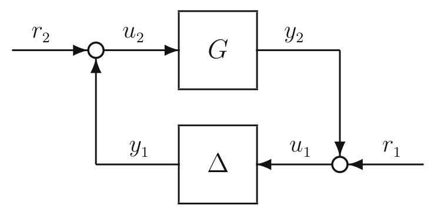

> Image description: This block diagram illustrates a feedback interconnection for an IQC (Integral Quadratic Constraint) stability test. The system consists of two primary functional blocks, $G$ and $\Delta$, connected in a closed-loop configuration. The upper path features block $G$. An input signal $r_2$ enters a summation junction where it is combined with a feedback signal $y_1$ to form the input $u_2$. The output of block $G$ is $y_2$. This $y_2$ signal flows into a second summation junction, which also receives an external input $r_1$. The output of this junction is defined as $u_1$. The lower path features block $\Delta$, which receives input $u_1$ and produces output $y_1$, which is then fed back to the first summation junction. Arrows indicate the directional flow of signals through the network, establishing a standard feedback loop structure used in robust control analysis.
Robust Synthesis and Robustness Analysis Techniques and Tools, Fig. 1 Feedback interconnection for IQC stability test

<!-- source_pdf_page: 1254 -->
(parametric or dynamic). Suppose $\Delta$ is drawn from a set of matrices, $\boldsymbol{\Delta} \subseteq \mathbf{C}^{m \times n}$ of the form

$$
\begin{aligned}
\boldsymbol{\Delta}=\{ & \operatorname{diag}\left[\delta_{1}^{r} I_{t_{1}}, \ldots, \delta_{V}^{r} I_{t_{V}},\right. \\
& \left.\delta_{1}^{c} I_{r_{1}}, \ldots, \delta_{S}^{c} I_{r_{S}}, \Delta_{1}, \ldots, \Delta_{F}\right]: \\
& \left.\delta_{k}^{r} \in \mathbf{R}, \delta_{i}^{c} \in \mathbf{C}, \Delta_{j} \in \mathbf{C}^{m_{j} \times n_{j}}\right\}
\end{aligned}
$$

The inclusion of complex-valued, uncertain matrices within $\boldsymbol{\Delta}$ may seem unusual and hard to motivate. However, in terms of their effect on stability, these are equivalent to the uncertain linear dynamic element introduced earlier in the Uncertainty Modeling section. This is discussed in more detail in the entry - Structured Singular Value and Applications: Analyzing the Effect of Linear Time-Invariant Uncertainty in Linear Systems.

Using the Nyquist stability criterion, the $(G, \Delta)$ interconnection is stable for all $\Delta \in \boldsymbol{\Delta}$, with $\bar{\sigma}(\Delta)<\beta$ if and only if $G$ is stable, and

$$
\operatorname{det}(I-G(j \omega) \Delta) \neq 0
$$

for all $\Delta \in \boldsymbol{\Delta}$ with $\bar{\sigma}(\Delta)<\beta$ and all $\omega \in \mathbf{R}$ including $\omega=\infty$. The importance of the nonvanishing determinant condition warrants a definition of its own, the structured singular value. For a matrix $M \in \mathbf{C}^{n \times m}$, and $\boldsymbol{\Delta}$ as given, define

$$
\mu_{\Delta}(M):=\frac{1}{\min \{\bar{\sigma}(\Delta): \Delta \in \Delta, \operatorname{det}(I-M \Delta)=0\}}
$$

unless no $\Delta \in \boldsymbol{\Delta}$ makes ( $I-M \Delta$ ) singular, then $\mu_{\Delta}(M):=0$. In this parlance, the $(G, \Delta)$ interconnection is stable for all $\Delta \in \boldsymbol{\Delta}$, with $\bar{\sigma}(\Delta)<\beta$ if and only if

$$
\mu_{\Delta}(G(j \omega)) \leq \frac{1}{\beta}
$$

for all $\omega \in \mathbf{R}$ including $\omega=\infty$.
In summary, the structured singular value approach employs a Nyquist-based argument, resulting in a nonvanishing determinant condition, which must hold over all frequency and all possible frequency-response values of the uncertain elements. However, checking the nonvanishing determinant is difficult, and sufficient conditions,
in the form of semidefinite programs (Doyle 1982; Fan et al. 1991) to ensure this are derived. This results in semidefinite feasibility problems which must hold at all frequencies. It is common to verify these only on a finite grid of frequencies, which is equivalent to ensuring that the closedloop poles cannot migrate across the stability boundary at these frequencies. Semidefinite programs can be defined which carve out intervals around these fixed frequencies to completely guarantee stability.

## Robust Synthesis

Synthesis refers to the mathematical design of the control law. The nominal synthesis problem (with no uncertainty) is formulated using the generic feedback structure shown in Fig. 2. The various signals in the diagram are the control inputs $u$, measurements $y$, exogenous disturbances $d$, and regulated variables $e . P$ is a generalized plant that contains all information required to specify the synthesis problem. This includes the dynamics of the actual plant being controlled as well as any frequency domain weights that are used to specify the performance objective. The objective of an optimal control problem is to synthesize a controller $K$ that minimizes the closed-loop (e.g., $H_{2}, H_{\infty}, \mathcal{L}_{1}$ ) norm from disturbances ( $d$ ) to regulated variables ( $e$ ), i.e., solve

$$
\min _{\text {allowable } K}\left\|F_{L}(P, K)\right\|
$$

where $F_{L}(P, K)$ denotes the system obtained by closing the controller $K$ around the lower loop of $P$. The $H_{2}, H_{\infty}$, and $\mathcal{L}_{1}$ optimal control problems refer to the choice of the specific norm $\left\|F_{L}(P, K)\right\|$ used to specify the performance. A generalization of the $H_{\infty}$ performance objective is simply to require that the closed-loop map from $d \rightarrow e$ satisfy an IQC defined by a given multiplier $\Pi$, called the performance multiplier, Apkarian and Noll (2006). The $H_{2}, H_{\infty}$ and $\mathcal{L}_{1}$ optimal control problems formulated as in Fig. 2 only involve signal uncertainty. In other words, these design problems do not explicitly account for the effects of model uncertainty.

<!-- source_pdf_page: 1255 -->
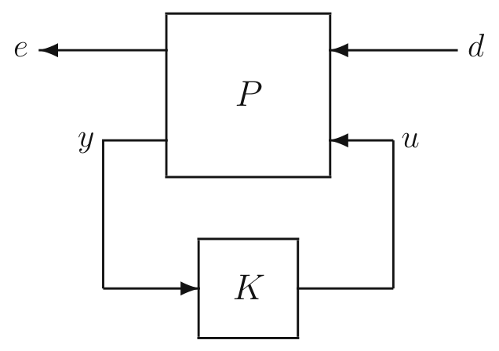

> Image description: A block diagram titled "Fig. 2 Feedback interconnection for $H_{2}, H_{\infty}$, and $\mathcal{L}_{1}$ optimal control" illustrates a standard feedback control loop. The diagram consists of two main rectangular blocks, labeled $P$ (the plant) and $K$ (the controller), connected in a closed-loop configuration. The plant block $P$ receives two inputs: an external disturbance or reference signal $d$ and a control input $u$. It has one output $y$, which represents the measured output, and one additional output $e$, representing the error or performance metric. The controller block $K$ is connected in a feedback loop; it receives the measured output $y$ from the plant and produces the control signal $u$, which is fed back into the plant. Black arrows indicate the unidirectional flow of signals through the system. This structure represents the fundamental interconnection used in robust control synthesis and analysis.
Robust Synthesis and Robustness Analysis Techniques and Tools, Fig. 2 Feedback interconnection for $H_{2}, H_{\infty}$, and $\mathcal{L}_{1}$ optimal control

Robust synthesis refers to control design that explicitly accounts for model uncertainty. It is usually formulated as a worst-case optimization, where the controller is chosen to minimize the worst-case effect of the signal and model uncertainty, loosely

$$
\min _{\text {allowable } K} \max _{\text {allowable } d, \Delta}\|T(d, \Delta, K)\|
$$

where $d$ is a set of exogenous disturbances and $\Delta$ corresponds to the model uncertainty set. $T$ represents the closed-loop relationship between $d, \Delta$ and the controller $K . \mu$-synthesis is a specific technique developed to synthesize control algorithms which achieve robust performance, i.e., performance in the presence of signal and model uncertainty. The objective of $\mu$-synthesis is to minimize over all stabilizing controllers $K$, the peak value of $\mu_{\Delta}\left(F_{L}(P, K)\right)$ of the closed-loop transfer function defined by the interconnection in Fig. 3. $P$ is the generalized plant model. The $\Delta$ block is the uncertain element from the set $\boldsymbol{\Delta}$, which parameterizes all of the assumed model uncertainty in the problem. The $\mu$-synthesis optimization has high computational complexity (so-called NP-hard problem), though practical algorithms and software have been developed to design controllers using this control technique (Balas et al. 2013). Alternative robust synthesis approaches exist and often involve nonlinear optimization algorithms (Apkarian and Noll 2006). Drastic simplification regarding the models and uncertainty can be made resulting in problems that can be solved using LMI and

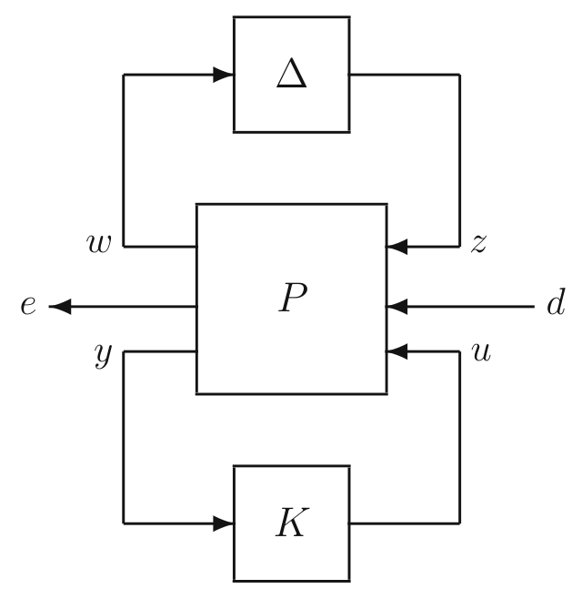

> Image description: A block diagram illustrating a standard control configuration used in robust control theory, specifically for $\mu$-synthesis. The diagram features four central blocks interconnected by arrows representing signal flow. At the center is the generalized plant model, labeled $P$. At the top is the uncertainty block, labeled $\Delta$. At the bottom is the controller block, labeled $K$. The following signal connections are visible: * **Exogenous disturbance ($d$):** An input arrow pointing into $P$. * **Control input ($u$):** An input arrow pointing into $P$ from the $K$ block. * **Measured output ($y$):** An output arrow from $P$ to the $K$ block. * **Error/Performance output ($e$):** An output arrow pointing away from $P$. * **Uncertainty feedback loop:** Signal $w$ exits $P$ and enters $\Delta$, while signal $z$ exits $\Delta$ and enters $P$, creating a feedback loop between the plant and the uncertainty block. This structure represents a closed-loop system designed to achieve robust performance in the presence of model uncertainty.
Robust Synthesis and Robustness Analysis Techniques and Tools, Fig. 3 Feedback interconnection for $\mu$ synthesis

semidefinite programming techniques (Boyd and Barrat 1991; Boyd et al. 1994).

## Computational Tools

The MATLAB Robust Control Toolbox is a commercially available software product that is part of the Mathworks control product line. It is tightly integrated with Control System Toolbox and Simulink products (Balas et al. 2013). The Robust Control Toolbox includes tools to analyze and design multi-input, multioutput control systems with uncertain elements. The primary building blocks, called uncertain elements or atoms, are uncertain real parameters and uncertain linear, time-invariant objects. These can be used to create coarse and simple or detailed and complex descriptions of model uncertainty. The uncertain object data structure eliminates the need to generate models of uncertainty and control analysis and design problem formulations, thereby allowing the practicing engineer to apply advanced robust control theory to their applications. Functions are available to analyze the robust stability, robust performance, and worst-case performance of uncertain multivariable system models using the structured singular value, $\mu$. The Robust Control Toolbox also includes multivariable

<!-- source_pdf_page: 1256 -->
control synthesis tools to compute controllers that optimize worst-case performance and identify worst-case parameter values.

The IQC-Beta Toolbox is a publicly available robust analysis toolbox based on the IQC framework (Jönsson et al. 2004). A wide range of robust stability and performance analysis tests are available for uncertain, nonlinear, and timevarying systems. IQC-Beta is written in MATLAB and works seamlessly with the Control System Toolbox objects and basic interconnection functions. The Users manual nicely complements the literature on IQCs. The Computer Aided Control System Design package in Scilab, an open source numerical computation software, includes functionality for robustness analysis and the synthesis of robust control algorithms for multivariable systems (http://www.scilab.org/).

## Conclusions

Robust control analysis and synthesis software tools are widely available and have been extensively used by industry since the late 1980s. The availability of software tools for robustness analysis and synthesis played a major role in their wide and ubiquitous adoption in industry. They have been successfully applied to a variety of applications including aircraft flight control, launch vehicles, satellites, compact disk players, disk drives, backhoe excavators, nuclear power plants, helicopters, thin film extrusion, gas- and diesel-powered engines, missile autopilots, heating and ventilation systems, process control, and active suspension systems.

## Cross-References

- LMI Approach to Robust Control
- Optimization Based Robust Control
- Structured Singular Value and Applications: Analyzing the Effect of Linear Time-Invariant Uncertainty in Linear Systems

## Bibliography

Apkarian P, Noll D (2006) IQC analysis and synthesis via nonsmooth optimization. Syst Control Lett 55:971-981
Balas GJ, Packard AK, Chiang RC, Safonov M (2013) MATLAB robust control toolbox. The Mathworks Inc.
Boyd S, Barrat C (1991) Linear controller design: limits of performance. Prentice Hall
Boyd S, El Ghaoui L, Feron E, Balakrishnan V (1994) Linear matrix inequalities in system and control theory. SIAM, Philadelphia
Desoer C, Vidyasagar M (2008) Feedback systems: inputoutput properties. Classics in applied mathematics. SIAM, Philadelphia
Desoer C, Liu R, Murray J, Saeks R (1980) Feedback system design: a fractional representation approach to analysis and synthesis. IEEE Trans Autom Control 25(6):399-412
Doyle J (1978) Guaranteed margins for LQG regulators. IEEE Trans Autom Control 23(4): 756-757
Doyle J (1982) Analysis of feedback systems with structured uncertainties. IEE Proc Part D 129(6):242-251
Doyle J, Stein G (1981) Multivariable feedback design: concepts for a clasical/modern synthesis. IEEE Trans Autom Control 26(1):4-16
Doyle J, Glover K, Khargonekar P, Francis B (1989) State-space solutions to standard $H_{2}$ and $H_{\infty}$ control problems. IEEE Trans Autom Control 34(8):831-847
Dullerud G, Paganini F (2000) A course in robust control theory: a convex approach. Springer, New York
Fan MKH, Tits AL, Doyle JC (1991) Robustness in the presence of mixed parametric uncertainty and unmodeled dynamics. IEEE Trans Autom Control 36(1):25-38
Francis B (1987) A course in $\mathcal{H}_{\infty}$ control theory. Lecture notes in control and information sciences, vol 88. Springer, Berlin/New York
Jönsson U, Kao CY, Megretski A, Rantzer A (2004) A guide to IQC $\beta$ : a MATLAB toolbox for robust stability and performance analysis
Megretski A, Rantzer A (1997) System analysis via integral quadratic constraints. IEEE Trans Autom Control 42(6):819-830
Packard A, Doyle J (1993) The complex structured singular value. Automatica 29(1):71-109
Safonov M (1982) Stability margins of diagonally perturbed multivariable feedback systems. IEE Proc Part D 129(6):251-256
Skogestad S, Postlethwaite I (2005) Multivariable feedback control: analysis and design. Wiley, Hoboken
Vidyasagar M (1985) Control system synthesis: a factorization approach. MIT, Cambridge
Willems JC (1971) Least squares stationary optimal control and the algebraic Riccati equation. IEEE Trans Autom Control 16:621-634
Zames G (1981) Feedback and optimal sensitivity: model reference transformations, multiplicative seminorms,

<!-- source_pdf_page: 1257 -->
and approximate inverses. IEEE Trans Autom Control 26(1):301-320
Zhou K, Doyle J, Glover K (1996) Robust and optimal control. Prentice Hall, Upper Saddle River

## Robustness Analysis of Biological Models

Steffen Waldherr ${ }^{1}$ and Frank Allgöwer ${ }^{2}$
${ }^{1}$ Institute for Automation Engineering, Otto-von-Guericke-Universität Magdgeburg, Magdeburg, Germany
${ }^{2}$ Institute for Systems Theory and Automatic Control, University of Stuttgart, Stuttgart, Germany

#### Abstract

Robustness analysis is the process of checking whether a system's function is maintained despite perturbations. Robustness analysis of biological models is typically applied to differential equation models of biochemical reaction networks. While robustness is primarily a yes-or-no question, for many applications in biological models, it is also desired to compute a quantitative robustness measure. Such a measure is usually defined to be the maximum size of perturbations that the system can still tolerate. In addition, it is often of interest to specifically compute fragile perturbations, i.e., perturbations for which the system loses its function.

## Keywords

Biochemical reaction networks; Fragile perturbations; Parametric uncertainty; Robustness measure; Structural uncertainty

## Introduction

In biological systems analysis, robustness is the property that a system maintains its function in the face of internal or external perturbations (Kitano 2007). For a robustness analysis, one
therefore needs to specify the system to be analyzed, the function that should be maintained, and the perturbation class.

The models to which robustness analysis is applied are mostly differential equation models of biochemical reaction networks. They are generally written as

$$
\begin{equation*}
\dot{x}=S v(x), \tag{1}
\end{equation*}
$$

where $x \in \mathbb{R}^{n}$ is the vector of intracellular concentrations; $S \in \mathbb{R}^{n \times m}$ is the stoichiometric matrix, containing the information how the individual network components participate in the reactions; and $v(x) \in \mathbb{R}^{m}$ is the reaction rate vector, in most cases a nonlinear function of the concentrations $x$.

The biological functions that are being studied by robustness analysis are very broad, pertaining to the wide range of biological functions implemented by biochemical reaction networks. Specific problems being considered are:

1. The occurrence of qualitative dynamical patterns such as sustained oscillations or multistability, where the system converges to one of multiple stable steady states depending on initial conditions or external stimuli (Eissing et al. 2005; Ma and Iglesias 2002).
2. The steady-state concentration value for a subset of the biochemical network's components (Shinar and Feinberg 2010; Steuer et al. 2011).
3. Quantitative measures derived from the network's dynamics, for example, the period of sustained oscillations (Stelling et al. 2004).
For the perturbation classes, two approaches can be distinguished. In parametric robustness analysis, a parametrized biological model is given, and the perturbation consists in varying the values of the parameters away from their nominal value. In structural robustness analysis, perturbations to the interaction structure of the network or the functional form of the reaction rate functions $v(x)$ are considered. Robustness analysis with these perturbation classes is presented in more detail below.

The perturbation class is also relevant for two applications of robustness analysis which

<!-- source_pdf_page: 1258 -->
go beyond simply deciding whether a system is robust or not. First, it is often of interest to get a better quantification of robustness than a binary decision. Then, it is common to define a robustness measure, which usually quantifies how large perturbations can be without affecting the system's function ( Ma and Iglesias 2002; Morohashi et al. 2002). Such a measure requires an appropriate definition of the perturbation size. With parametric perturbations, norms in parameter space are often useful ( Ma and Iglesias 2002; Waldherr and Allgöwer 2011). With structural perturbations, the proximity of interaction functions in function space (Breindl et al. 2011) or the number of changes in the interaction structure can be evaluated.

Second, one often desires to compute specific non-robust perturbations, i.e., perturbations within the given class for which the system loses the considered functionality. There is a close relation between non-robust perturbations and the robustness measure, in that the norm of the smallest non-robust perturbation is equal to the robustness measure. Yet, it is often easier to compute a robustness measure than a non-robust perturbation. Especially algorithms that give a lower bound on the robustness measure will usually not provide a non-robust perturbation.

An illustration of the key characteristics in robustness analysis is shown in Fig.1. This also illustrates that any norm-based robustness

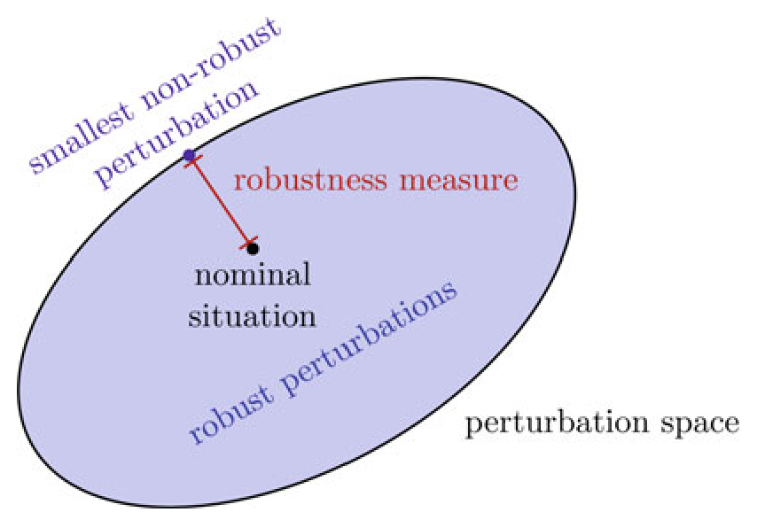

> Image description: An educational diagram titled "Robustness Analysis of Biological Models, Fig. 1 Illustration of key characteristics in robustness analysis" illustrates the concept of robustness within a defined "perturbation space," represented by a light-blue shaded ellipse. At the center of this space is a black dot labeled "nominal situation." A red line segment extends from the nominal situation to the edge of the ellipse. This segment is labeled "robustness measure." The endpoint of this line on the boundary represents the "smallest non-robust perturbation." The area within the ellipse, excluding this shortest distance, is labeled as "robust perturbations." In engineering and biological modeling terms, the diagram visualizes robustness as the distance from a baseline state (nominal situation) to the nearest point of failure or instability (the boundary of the perturbation space). A larger "robustness measure" implies a system that can withstand larger deviations before becoming non-robust.
Robustness Analysis of Biological Models, Fig. 1 Illustration of key characteristics in robustness analysis

measure depends on the nominal situation, where no perturbation is present.

When performing robustness analysis on a mathematical model of the considered system, the potential mismatch between model and system has to be kept in mind. By comparing the mathematical analysis results to experimental observations, robustness analysis methods are also useful for the validation or invalidation of biological network models (Bates and Cosentino 2011).

## Robustness Analysis with Parametric Perturbations

Robustness analysis with parametric perturbations is applied to parametrized differential equation models of biochemical reaction networks, which are described by an equation of the form

$$
\begin{equation*}
\dot{x}=S v(x, \mu), \tag{2}
\end{equation*}
$$

where $\mu \in \mathbb{R}^{p}$ is a vector of parameters. Such parameters may, for example, represent the total expression level of proteins involved in the reaction network, where usually a large variability due to the stochastic process of gene expression occurs.

This entry focuses on two specific system functionalities for robustness with respect to parametric perturbations, the qualitative dynamical behavior, and the steady-state level of a subset of the network's components. These are particularly relevant for biological models: the dynamical behavior often represents qualitative biological regulatory mechanisms, whereas the steady-state level of network components with a downstream regulatory effect is important for the stimulus-response relation of a biological network.

## The Qualitative Dynamical Behavior

Considering the qualitative dynamical behavior, it is of interest to distinguish situations of a globally stable equilibrium point, multiple locally stable equilibrium points, or sustained oscillations due to a limit cycle or more complex attractors. Since changes in these dynamical patterns

<!-- source_pdf_page: 1259 -->
correspond to the occurrence of bifurcations in the model dynamics (2), this type of robustness analysis is closely related to bifurcation analysis. In the case of scalar, positive parameters $\mu$, a corresponding robustness measure $D O R$ has been defined by Ma and Iglesias (2002) as

$$
\begin{equation*}
D O R=1-\max \left\{\frac{\check{\mu}}{\mu_{0}}, \frac{\mu_{0}}{\hat{\mu}}, 0\right\}, \tag{3}
\end{equation*}
$$

where $\check{\mu}$ and $\hat{\mu}$ are the closest bifurcation points smaller and larger than $\mu$, respectively. The robustness measure $D O R$ is between 0 and 1 and indicates how much the parameter can be varied before reaching a bifurcation: for any multiplicative perturbation of less than $(1-D O R)^{-1}$, no bifurcation will occur. A generalization to multiparametric models has been proposed in Waldherr and Allgöwer (2011): their robustness measure $\varrho$ is defined as
$\varrho=\sup \{\varrho \geq 1 \mid$ no bifurcation occurs in the

$$
\begin{equation*}
\text { hyperrectangle } \left.\left[\varrho^{-1} \mu_{0}, \varrho \mu_{0}\right]\right\} \text {. } \tag{4}
\end{equation*}
$$

The measure $\varrho$ directly gives the multiplicative parameter variation up to which no bifurcation occurs.

In general, the information required for a bifurcation-based robustness measure will only be available from a complete bifurcation analysis of the model. When restricting the types of bifurcations that are considered to bifurcations of equilibrium point, one can however check robustness by studying linear approximations at the system's equilibrium points. Since the reaction rates $v(x, \mu)$ are usually modeled as polynomial or rational functions, polynomial programming methods can be applied to compute a robustness measure (Waldherr and Allgöwer 2011) in this case.

## The Steady-State Output Concentration

In biochemical network analysis, mostly linear outputs of the form

$$
\begin{equation*}
y=C x, \tag{5}
\end{equation*}
$$

with $C \in \mathbb{R}^{q \times n}$ are considered. A common special case is that the rows of $C$ are a subset of the rows of the identity matrix in $\mathbb{R}^{n}$, i.e.,

$$
\begin{equation*}
C=\left(e_{i}^{\mathrm{T}}\right)_{i \in \mathcal{I}_{y}} \tag{6}
\end{equation*}
$$

and $\mathcal{I}_{y} \subset\{1,2, \ldots, n\}$ is the index set defining the output concentrations.

A biochemical network has a robust steadystate output concentration, if the steady-state output $\bar{y}$ is independent of the parameters $\mu$ (Steuer et al. 2011). For a steady-state map $\bar{y}=h(\mu)$, this corresponds to the condition

$$
\begin{equation*}
h^{\prime}(\mu)=0 . \tag{7}
\end{equation*}
$$

For the special case of an output given by (6), a sufficient and necessary condition for steady-state output robustness has been discovered by Steuer et al. (2011). The condition amounts to checking that a vector $P$, which describes the perturbation of the reaction rates under parameter variations, is in a subspace $\mathcal{I}=\operatorname{im} M+\operatorname{ker} S \operatorname{diag}(\alpha)$ for any $\alpha$ in the kernel of $S$, where $M$ is a matrix composed of the normalized derivatives of the reaction rates with respect to the concentrations which do not appear in the output. A notable underlying assumption here is that the network's steady state does not undergo any local bifurcations within the considered parameter region, which directly relates back to the robustness analysis discussed in the previous section.

For the special case where parameters are the concentrations of conserved chemical species, a sufficient condition for steady-state output robustness has also been discovered by Shinar and Feinberg (2010). They propose the term absolute concentration robustness for this property. Here, the assumption that no local bifurcations occur within the considered parameter region is not required a priori but rather is also a consequence of the proposed condition.

<!-- source_pdf_page: 1260 -->
## Robustness Analysis with Structural Perturbations

Robustness analysis with parametric perturbations is based on the assumption that the reaction rate expressions are exact and that all perturbations are captured by parameter variations. This assumption can hardly be justified for many practical models, and an analysis with structural perturbations becomes necessary. Such analyses have discovered models which are very robust against parametric perturbations but nonrobust against structural perturbations (Jacobsen and Cedersund 2008).

The biological functions for which rigorous results on structural robustness are available are again related to the nonoccurrence of bifurcations in the model. For the restriction to local bifurcations of equilibria, linear systems theory offers efficient analysis tools for structural robustness.

In a first step, a structural perturbation of the network's interaction graph was suggested (Jacobsen and Cedersund 2008). This approach considers the network's Jacobian

$$
\begin{equation*}
A=S \frac{\partial v}{\partial x}(\bar{x}) \tag{8}
\end{equation*}
$$

evaluated at a steady state $\bar{x}$. The Jacobian is then perturbed to

$$
\begin{equation*}
\tilde{A}=\operatorname{diag} A+(A-\operatorname{diag} A)(I+\Delta) \tag{9}
\end{equation*}
$$

where $\operatorname{diag} A$ is the diagonal of $A$ and $\Delta$ is a perturbation matrix, containing uncertain timeinvariant linear systems as elements.

As an alternative approach, Waldherr et al. (2009) have suggested a structural perturbation of the reaction rate expressions. Thereby, the network's Jacobian is perturbed to

$$
\begin{equation*}
\tilde{A}=S\left(\frac{\partial v}{\partial x}(\bar{x})+\Delta\right) \tag{10}
\end{equation*}
$$

In the case of real $\Delta$, this perturbation simply corresponds to a change in the reaction rate slopes at steady state.

With both approaches, robustness analysis with structured singular values can be applied to test for changes in the local dynamics at the considered equilibrium point. This allows to evaluate a model's robustness against this type of structural perturbations and also yields nonrobust perturbations.

## Summary and Future Directions

Robustness analysis of biological models is well established in biological network theory. Mathematical methods rooted in systems and control are particularly beneficial for approaching this task.

While this entry focuses on models of biochemical reaction networks given by differential equations, the robustness analysis problem has also been studied in other model frameworks, for example, discrete dynamical models (Chaves et al. 2006). Yet, beyond simulation-based studies, robustness analysis is still an open problem in many practically relevant biological model classes. This concerns, for example, stochastic models or models on the cell population level.

In a similar manner, it will be important to extend the perturbation classes that are being considered and to include, for example, timevarying or other perturbations that are relevant for biological models. Concerning the biological function, most robustness analysis methods focus on the steady-state behavior. In the future, it will be of interest to also take, for example, the transient dynamics into account.

In linear systems theory, the concept of robust performance is well established. While efforts have been made to transfer that concept to biochemical networks (Doyle and Stelling 2005), it remains difficult to quantify performance of such networks, thus impeding the development of stringent robustness analysis tools. One of the reasons for this difficulty is certainly that biological performance is more naturally defined in the time domain than in the frequency domain, which narrows the conclusions that could be drawn from a direct application of classical robust performance analysis methods.

<!-- source_pdf_page: 1261 -->
## Cross-References

- Computational Complexity Issues in Robust Control
- Deterministic Description of Biochemical Networks
Structured Singular Value and Applications:
Analyzing the Effect of Linear Time-Invariant Uncertainty in Linear Systems

## Bibliography

Bates D, Cosentino C (2011) Validation and invalidation of systems biology models using robustness analysis. IET Syst Biol 5(4):229-244
Breindl C, Waldherr S, Wittmann DM, Theis FJ, Allgöwer F (2011) Steady-state robustness of qualitative gene regulation networks. Int J Robust Nonlinear Control 21(15):1742-1758. doi:10.1002/rnc.1786, http:// dx.doi.org/10.1002/rnc. 1786

Chaves M, Sontag ED, Albert R (2006) Methods of robustness analysis for Boolean models of gene control networks. IEE Proc Syst Biol 153(4):154167. doi:10.1049/ip-syb:20050079, http://dx.doi.org/ 10.1049/ip-syb:20050079

Doyle FJ, Stelling J (2005) Robust performance in biophysical networks. In: Proceedings of the 16th IFAC World Congress, Prague
Eissing T, Allgöwer F, Bullinger E (2005) Robustness properties of apoptosis models with respect to parameter variations and intrinsic noise. IEE Proc Syst Biol 152(4):221-228. doi:10.1049/ip-syb:20050046
Jacobsen EW, Cedersund G (2008) Structural robustness of biochemical network models-with application to the oscillatory metabolism of activated neutrophils. IET Syst Biol 2(1):39-47. http://link.aip.org/link/? SYB/2/39/1
Kitano H (2007) Towards a theory of biological robustness. Mol Syst Biol 3:137. doi:10.1038/msb4100179, http://dx.doi.org/10.1038/msb4100179
Ma L, Iglesias PA (2002) Quantifying robustness of biochemical network models. BMC Bioinform 3:38
Morohashi M, Winn AE, Borisuk MT, Bolouri H, Doyle J, Kitano H (2002) Robustness as a measure of plausibility in models of biochemical networks. J Theor Biol 216(1):19-30. doi:10.1006/jtbi.2002.2537, http:// dx.doi.org/10.1006/jtbi.2002.2537

Shinar G, Feinberg M (2010) Structural sources of robustness in biochemical reaction networks. Science 327(5971):1389-1391. doi:10.1126/science.1183372, http://dx.doi.org/10.1126/science. 1183372
Stelling J, Gilles ED, Doyle III FJ (2004) Robustness properties of circadian clock architectures. Proc Natl Acad Sci 101(36):13210-13215. doi:10.1073/pnas.0401463101, http://dx.doi.org/
10.1073/pnas.0401463101

Steuer R, Waldherr S, Sourjik V, Kollmann M (2011) Robust signal processing in living cells. PLoS Comput Biol 7(11):e1002218. http://dx.doi.org/10.1371 \%2Fjournal.pcbi. 1002218
Waldherr S, Allgöwer F (2011) Robust stability and instability of biochemical networks with parametric uncertainty. Automatica 47:1139-1146. doi:10.1016/j.automatica.2011.01.012, http://dx.doi. org/10.1016/j.automatica.2011.01.012
Waldherr S, Allgöwer F, Jacobsen EW (2009) Kinetic perturbations as robustness analysis tool for biochemical reaction networks. In: Proceedings of the 48th IEEE Conference on Decision and Control, Shanghai, pp 4572-4577. doi:10.1109/CDC.2009.5400939, http://dx.doi.org/10.1109/CDC.2009.5400939

## Robustness Issues in Quantum Control

Ian R. Petersen School of Engineering and Information Technology, University of New South Wales, the Australian Defence Force Academy, Canberra, Australia

#### Abstract

Robust quantum control theory is concerned with the design of controllers for quantum systems taking into account uncertainty is the model of the system. The robust open-loop control of quantum systems is discussed in this entry. Also discussed is the robust stability analysis problem for quantum systems, and two forms of quantum small gain theorem are presented. In addition, the entry discusses the design of robust quantum feedback control systems.

## Keywords

Ensemble controllability; $H^{\infty}$ control; Minimax control; Quantum control; Robustness; Robust stability

This work was supported by the Australian Research Council (ARC).

<!-- source_pdf_page: 1262 -->
## Introduction

The control of systems whose dynamics are governed by the laws of quantum mechanics is the subject of quantum control theory. The topic of quantum control theory is covered in the companion article Petersen (2014). As in the case of classical control theory, the models used in quantum control are often subject to uncertainties. This motivates the study of robust quantum control, in which the quantum systems to be controlled are modeled as uncertain quantum systems, e.g., see Mabuchi and Khaneja (2005). A related problem is the problem of robust estimation and filtering for uncertain quantum systems, e.g., see Yamamoto and Bouten (2009). The issue of robust stability is particularly important in the case of quantum feedback control since in this case, there is always the possibility of instability. An important area of quantum control theory is open-loop quantum control; see Petersen (2014). Since uncertainties arise in the quantum system models being considered, the robustness of openloop quantum control systems is also important, e.g., see Li and Khaneja (2009), Rabitz (2002), and Owrutsky and Khaneja (2012).

This entry surveys some of the important research results on robust quantum control which have arisen in various application areas. These include some recent results on robust open-loop control of quantum systems; see Zhang and Rabitz (1994). Also considered are some recent results on robust stability analysis results for uncertain quantum systems, which amount to quantum versions of the classical small gain theorem; see Petersen et al. (2012). Finally, the entry looks at robust quantum feedback controller design; see James et al. (2008) and Dong et al. (2009).

## Robust Open-Loop Control of Quantum Systems

In the robust open-loop control of quantum systems, the quantum system is modeled in the Schrödinger picture. The models can be given
either in terms of the Schrödinger equation for the system state $|\psi(t)\rangle$ :

$$
\begin{equation*}
i \frac{\partial}{\partial t}|\psi(t)\rangle=\left[H_{0}+\sum_{k=1}^{m} u_{k}(t) H_{k}\right]|\psi(t)\rangle \tag{1}
\end{equation*}
$$

or the master equation for the system density operator $\rho$ :

$$
\begin{equation*}
\dot{\rho}(t)=-i\left[\left(H_{0}+\sum_{k=1}^{m} u_{k}(t) H_{k}\right), \rho(t)\right] \tag{2}
\end{equation*}
$$

e.g., see Petersen (2014). In these equations, $H_{0}$ is the free Hamiltonian of the system and $H_{k}$ are corresponding control Hamiltonians. In the robust open-loop control of quantum systems, these quantities are assumed to be uncertain and the control law $u_{k}(t)$ is to be designed to guarantee an adequate level of performance for all possible values of the uncertainties. Here, performance is measured in terms of the fidelity between the actual final state or density matrix of the system and the desired final state or density matrix, e.g., see Nielsen and Chuang (2000).

In the minimax optimal control approach to robust open-loop control of quantum systems, the uncertainties in the Hamiltonian are represented in terms of a vector quantity $w$ which is subject to constraints. Then, the robust control problem is the minimax optimal control problem

$$
\min _{u} \max _{w} J(u, w)
$$

where $J(u, w)$ is a suitable cost function, and the problem is subject to the constraints defined by the system dynamics (1) and the constraints on the uncertainty $w$; see Zhang and Rabitz (1994). Some standard numerical procedures have been proposed to solve this minimax optimal control problem with applications in chemical physics; see Zhang and Rabitz (1994).

Related to the robust open-loop control of quantum systems is the control of inhomogeneous quantum ensembles. In this problem, the same control signal $u_{k}(t)$ is applied to a large number of quantum particles in an ensemble. Also, the Hamiltonians corresponding

<!-- source_pdf_page: 1263 -->
to individual particles may have different parameter values, and so this problem is equivalent to a robust open-loop quantum control problem, e.g., see Li and Khaneja (2006). In studying this problem, the issue of controllability has been considered (see, e.g., Li and Khaneja 2009) as in the standard open-loop quantum control problem; see Petersen (2014). Also, numerical methods have been proposed for constructing an optimal control law for inhomogeneous ensembles, e.g., see Ruths and Li (2012) and Owrutsky and Khaneja (2012). This approach has arisen in applications to chemical physics.

## Robustness Analysis for Uncertain Quantum Systems

The problem of robust stability analysis for uncertain quantum systems was considered in the paper D'Helon and James (2006) which was concerned with the feedback interconnection of two quantum optical systems as shown in Fig. 1. In this interconnection, each of the quantum systems is linear quantum optical systems described in the Heisenberg picture by linear quantum stochastic differential equations (QSDEs) of the form

$$
\begin{align*}
& \mathrm{d} x(t)=A x(t) \mathrm{d} t+B \mathrm{~d} u(t) ; \\
& \mathrm{d} y(t)=C x(t) \mathrm{d} t+D \mathrm{~d} u(t) ; \tag{3}
\end{align*}
$$

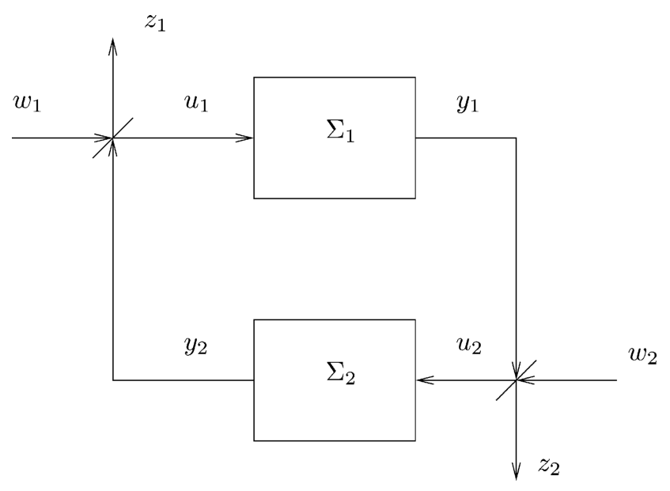

> Image description: A block diagram titled "Fig. 1 Feedback interconnection of two quantum optical systems" illustrates the feedback interconnection of two systems, labeled $\Sigma_1$ and $\Sigma_2$. System $\Sigma_1$ receives an input $u_1$ and produces an output $y_1$. System $\Sigma_2$ receives an input $u_2$ and produces an output $y_2$. The interconnection is closed-loop: the output $y_1$ is fed forward to serve as the input $u_2$ for $\Sigma_2$. The output $y_2$ is fed back to become the input $u_1$ for $\Sigma_1$. External disturbances or signals are introduced at the junctions: $w_1$ enters the junction for $u_1$, and $w_2$ enters the junction for $u_2$. Additionally, two performance outputs, $z_1$ and $z_2$, are measured at their respective input junctions. The arrows indicate the direction of signal flow, representing a typical control loop structure used to analyze robustness in quantum optical setups.
Robustness Issues in Quantum Control, Fig. 1 Feedback interconnection of two quantum optical systems

see James et al. (2008) and Petersen (2014) for more details on this class of quantum system models. Here, $x(t)$ are vector system variables which are operators on the underlying Hilbert space of the system. Also, the input and output fields are decomposed as $\mathrm{d} u(t)=\beta_{u}(t) \mathrm{d} t+\mathrm{d} \tilde{u}(t)$ and $\mathrm{d} y(t)=\beta_{y}(t) \mathrm{d} t+\mathrm{d} \tilde{y}(t)$ where $\beta_{u}(t), \beta_{y}(t)$ denote the signal parts of the quantities $\mathrm{d} u(t)$, $\mathrm{d} y(t)$, respectively. Furthermore, $\mathrm{d} \tilde{u}(t), \mathrm{d} \tilde{y}(t)$ denote the noise parts of the quantities $\mathrm{d} u(t), \mathrm{d} y(t)$, respectively, e.g., see James et al. (2008). Such a system is stable and has a finite gain $g>0$ if there exist constants $\mu>0$ and $\lambda>0$ such that

$$
\begin{aligned}
& \int_{0}^{t}\left\langle\left\|\beta_{y}(\tau)\right\|^{2}\right\rangle \mathrm{d} t \leq \mu+\lambda t \\
& \quad+\int_{0}^{t}\left\langle\left\|\beta_{u}(\tau)\right\|^{2}\right\rangle \mathrm{d} t \quad \forall t>0 ;
\end{aligned}
$$

e.g., see D'Helon and James (2006) and James and Gough (2010). Here, $\langle\cdot\rangle$ denotes quantum expectation.

The two quantum optical systems shown in Fig. 1 are interconnected via beam splitters which are described by equations

$$
\begin{aligned}
& u_{1}=\epsilon_{1} w_{1}-\sqrt{1-\epsilon_{1}^{2}} y_{2} ; z_{1}=\sqrt{1-\epsilon_{1}^{2}} w_{1}+\epsilon_{1} y_{2} ; \\
& u_{2}=\epsilon_{2} w_{2}-\sqrt{1-\epsilon_{2}^{2}} y_{1} ; z_{2}=\sqrt{1-\epsilon_{2}^{2}} w_{2}+\epsilon_{2} y_{1}
\end{aligned}
$$

where $\epsilon_{1} \in(0,1)$ and $\epsilon_{2} \in(0,1)$ are given constants. The quantum small gain theorem established in D'Helon and James (2006) shows that if each of the quantum systems in Fig. 1 is stable and has finite gains $g_{1}>0$ and $g_{2}>0$ respectively such that $\sqrt{1-\epsilon_{1}^{2}} \sqrt{1-\epsilon_{2}^{2}} g_{1} g_{2}<1$, then the feedback interconnected system will also be stable and have a finite gain. This result can be thought of as a stability robustness result if the first quantum system is regarded as the nominal quantum system and the second quantum system is regarded as being the uncertain part of the system subject to the given finite gain constraint.

An alternative approach to the robust stability analysis of uncertain quantum systems considers an uncertain quantum system described using the ( $S, L, H$ ) description (see Petersen (2014) and

<!-- source_pdf_page: 1264 -->
Gough and James (2009) for more details on this class of quantum systems). Here, the system Hamiltonian is described in terms of vectors of annihilation and creation operators $a$ and $a^{\#}$, respectively, as

$$
H=\frac{1}{2}\left[a^{\dagger} a^{T}\right] M\left[\begin{array}{c}
a \\
a^{\#}
\end{array}\right]+\frac{1}{2} \tilde{\zeta}^{\dagger} \Delta \tilde{\zeta}
$$

where $M$ is a known complex Hermitian matrix describing the nominal Hamiltonian, $\Delta$ is a complex Hermitian uncertainty matrix subject to the norm bound $\|\Delta\| \leq \frac{2}{\gamma}$, and $\tilde{\zeta}=E\left[\begin{array}{c}a \\ a^{\#}\end{array}\right]$. Also, $E$ is a known complex matrix describing the uncertainty structure. Furthermore, it is assumed that $S=I$ and the coupling operator vector $L$ is such that $\left[\begin{array}{c}L \\ L^{\#}\end{array}\right]=N\left[\begin{array}{c}a \\ a^{\#}\end{array}\right]$ where $N$ is a known complex matrix. This uncertain quantum system is robustly mean square stable if the $H^{\infty}$ norm bound condition

$$
\left\|E\left(s I+i J M+\frac{1}{2} J N^{\dagger} J N\right)^{-1} J E^{\dagger}\right\|_{\infty}<\frac{\gamma}{2}
$$

is satisfied where $J=\left[\begin{array}{cc}I & 0 \\ 0 & -I\end{array}\right]$; see Petersen et al. (2012).

## Robust Feedback Control of Quantum Systems

## Schrödinger Picture Approaches to Robust Measurement-Based Quantum Feedback Control

A number of results have appeared which use Schrödinger picture models (see Petersen 2014) in robust measurement-based quantum feedback control. These results are based on uncertain quantum system models of the form (1) or (2) and extend the results mentioned above by allowing for measurements of the quantum system in order to achieve improved robustness against uncertainties in the system Hamiltonian. For example, consider a quantum system of the form (1) with uncertainties in the system Hamiltonian. Then a
measurement feedback robust control scheme can be constructed which involves periodic projective measurements on the system. In a projective measurement of the quantum system (1), the state $|\psi(t)\rangle$ collapses to an eigenstate of $H_{0}$ corresponding to the measurement outcome obtained. The sliding mode control algorithm uses openloop time optimal control (see Petersen 2014) to steer the state of the system back to a specified eigenstate of the system whenever a measurement is obtained which does not correspond to this desired eigenstate; see Dong and Petersen (2009). This desired eigenstate is referred to as the sliding mode domain, and the state of the system is guaranteed to stay within the sliding mode domain with a specified probability provided that the measurement sampling period in the proposed feedback control algorithm is chosen to be sufficiently fast; see Dong and Petersen (2009). In the case of two-level quantum systems, this sliding mode control approach is implemented using a Lyapunov method for open-loop quantum control to steer the system back to the sliding mode domain; see Petersen (2014) and Dong and Petersen (2012). In all of these cases, robustness is ensured by including uncertainty in the underlying quantum system models and then taking this into account in the design of the control laws and sampling period.

Another approach to the measurementbased robust quantum feedback control problem involves an extension of the robust open-loop control results considered in section "Robust Open-Loop Control of Quantum Systems." In this approach, robust open-loop control results are extended to solve the problem of stabilization of an ensemble of quantum particles; see Beauchard et al. (2012).

## Heisenberg Picture Approaches to Robust Quantum Feedback Control

Consider a quantum linear system modeled in the Heisenberg picture by quantum stochastic differential equations (QSDEs) as follows:

$$
\begin{align*}
& \mathrm{d} x(t)=A x(t) \mathrm{d} t+B \mathrm{~d} w(t) ; \\
& \mathrm{d} y(t)=C x(t) \mathrm{d} t+D \mathrm{~d} w(t) ; \tag{4}
\end{align*}
$$

<!-- source_pdf_page: 1265 -->
see Petersen (2014) for details on this class of quantum system models which arises in the area of quantum optics. In the robust quantum feedback control problem, the matrices $A, B, C$, $D$ may be uncertain and a feedback controller can be designed using the quantum $H^{\infty}$ control approach to ensure that the resulting closed-loop system is robustly stable; see James et al. (2008). In the case of measurement-based feedback control, the controller is a classical system described by linear stochastic differential equations of the form

$$
\begin{align*}
& \mathrm{d} x_{K}(t)=A_{K} x_{k}(t) \mathrm{d} t+B_{K} \mathrm{~d} y(t) \\
& \beta_{u}(t) \mathrm{d} t=C_{K} x_{k}(t) \mathrm{d} t \tag{5}
\end{align*}
$$

see Petersen (2014). In the case of coherent feedback control, the controller is another quantum linear system described by QSDEs of the form
$\mathrm{d} x_{K}(t)=A_{K} x_{k}(t) \mathrm{d} t+B_{K} \mathrm{~d} y(t)+\bar{B}_{K} \mathrm{~d} \bar{w}_{K}(t)$

$$
\begin{equation*}
\mathrm{d} y_{K}(t)=C_{K} x_{k}(t) \mathrm{d} t+\bar{D}_{K} \mathrm{~d} \bar{w}_{K}(t) ; \tag{6}
\end{equation*}
$$

see Petersen (2014).
In this approach to robust quantum feedback control, the uncertainty in the quantum system being controlled is represented by uncertainty in the matrix $A$ as $A=\tilde{A}+\tilde{B} \Delta \tilde{C}$ where $\Delta$ is a constant but unknown uncertain matrix satisfying the bound $\Delta^{T} \Delta \leq I$. The controller, which may be either a classical controller or a coherent controller, is designed using the quantum $H^{\infty}$ approach. Then the resulting closed-loop system will be robustly stable; see James et al. (2008). Similarly, in the case of uncertainty in the plant Hamiltonian matrix such as considered in section "Robustness Analysis for Uncertain Quantum Systems" or uncertainty in the form of an uncertain subsystem connected optically to the plant in feedback, also as considered in section "Robustness Analysis for Uncertain Quantum Systems," then the quantum $H^{\infty}$ approach combined with the robust stability analysis results of section "Robustness Analysis for Uncertain Quantum Systems" shows that the quantum $H^{\infty}$ method can also be used to design robustly stabilizing controllers in these cases.

## Summary and Future Directions

To date there have been only a few papers published in the general area of robust quantum control. The results which were considered in this entry covered open-loop and feedback quantum control problems along with stability robustness analysis problems. A common theme in the results which were considered is that they were based on uncertain quantum mechanical models. It is expected that future research in this area will intensify as the use of feedback control becomes more prevalent in areas of experimental quantum technology.

## Cross-References

- Control of Quantum Systems
- H-Infinity Control
- LMI Approach to Robust Control
- Optimization Based Robust Control

## Bibliography

Beauchard K, da Silva PSP, Rouchon P (2012) Stabilization for an ensemble of half-spin systems. Automatica 48(1):68-76
D'Helon C, James M (2006) Stability, gain, and robustness in quantum feedback networks. Phys Rev A 73:053803
Dong D, Petersen IR (2009) Sliding mode control of quantum systems. New J Phys 11:105033
Dong D, Petersen IR (2012) Sliding mode control of twolevel quantum systems. Automatica 48(5):725-735
Dong D, Lam J, Petersen IR (2009) Robust incoherent control of qubit systems via switching and optimization. Int J Control 83(1):206-217
Gough J, James MR (2009) The series product and its application to quantum feedforward and feedback networks. IEEE Trans Autom Control 54(11):2530-2544
James M, Gough J (2010) Quantum dissipative systems and feedback control design by interconnection. IEEE Trans Autom Control 55(8):1806-1821
James MR, Nurdin HI, Petersen IR (2008) $H^{\infty}$ control of linear quantum stochastic systems. IEEE Trans Autom Control 53(8):1787-1803
Li J-S, Khaneja N (2006) Control of inhomogeneous quantum ensembles. Phys Rev A 73:030302
Li J-S, Khaneja N (2009) Ensemble control of Bloch equations. IEEE Trans Autom Control 54(3):528-536

<!-- source_pdf_page: 1266 -->
Mabuchi H, Khaneja N (2005) Principles and applications of control in quantum systems. Int J Robust Nonlin Control 15:647-667
Nielsen M, Chuang I (2000) Quantum computation and quantum information. Cambridge University Press, Cambridge
Owrutsky P, Khaneja N (2012) Control of inhomogeneous ensembles on the Bloch sphere. Phys Rev A 86:022315
Petersen IR (2014) Quantum control. In: Samad T, Baillieul J (eds) Encyclopedia of systems and control. Springer, Heidelberg/Germany
Petersen IR, Ugrinovskii V, James MR (2012) Robust stability of uncertain linear quantum systems. Philos Trans R Soc A 370(1979):5354-5363
Rabitz H (2002) Optimal control of quantum systems: origins of inherent robustness to control field fluctuations. Phys Rev A 66:063405
Ruths J, Li J-S (2012) Optimal control of inhomogeneous ensembles. IEEE Trans Autom Control 57(8):2021-2032
Yamamoto N, Bouten L (2009) Quantum risk-sensitive estimation and robustness. IEEE Trans Autom Control 54(1):92-107
Zhang H, Rabitz H (1994) Robust optimal control of quantum molecular systems in the presence of disturbances and uncertainties. Phys Rev A 49:2241-2254

## RTO

Real-Time Optimization of Industrial Processes

## Run-to-Run Control in Semiconductor Manufacturing

James Moyne
Mechanical Engineering Department, University of Michigan, Ann Arbor, MI, USA

## Abstract

Run-to-run (R2R) control is a form of adaptive model-based process control that can be tailored to environments where the process is discrete, dynamic, and highly unobservable; this is characteristic of processes in the semiconductor manufacturing industry. It generally has, at
its roots, a rather straightforward approach to adaptive model-based control such as a first-order linear plant model with moving average weighting applied to adapt the (zeroth-order) constant term in the model. Most of the complexity of R2R control science lies and will continue to lie in extensions to support practical application of R2R control in semiconductor manufacturing facilities of the future; these extensions include support for weighting and bounding of parameters, run-time modeling of a large number of disturbance types, and incorporating prediction information such as virtual metrology and yield prediction into the control solution.

## Keywords

Adaptive control; Advanced process control (APC); EWMA control; Feed-forward and feedback control; Model-based control; R2R control; Run-to-run control; Single-threaded control; Virtual metrology; Wafer-to-wafer control; Yield prediction

## Introduction

The semiconductor manufacturing industry involves the processing of semiconductor "wafers" using a variety of physical and chemical processes to produce dies or "chips" that contain a number of nanometer size features organized in layers. As feature sizes shrink, the industry must innovate to maintain acceptable product yield and throughput. One effective dimension of innovation that has been utilized since the early 1990s is model-based process control. The use of this technology in semiconductor manufacturing has been largely industry specific due to unique industry requirements and been given the name "run-to-run (R2R) control."

R2R control is defined as "...a form of discrete process and machine control in which the product recipe with respect to a particular machine process is modified ex situ, i.e., between

<!-- source_pdf_page: 1267 -->
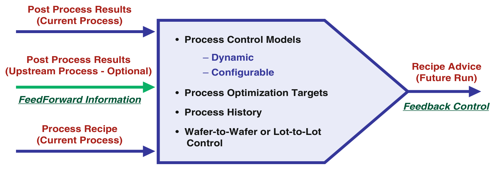

> Image description: A technical diagram titled "Run-to-Run Control in Semiconductor Manufacturing" illustrates the input/output structure of a typical R2R control solution. On the left, three sets of inputs flow into a central blue hexagonal block via arrows. These inputs include: 1. **Post Process Results (Current Process)**, 2. **Post Process Results (Upstream Process - Optional)**, categorized as **FeedForward Information**, and 3. **Process Recipe (Current Process)**. The central block contains the core control mechanisms: **Process Control Models** (noted as **Dynamic** and **Configurable**), **Process Optimization Targets**, **Process History**, and **Wafer-to-Wafer or Lot-to-Lot Control**. On the right, a single large arrow emerges from the block, representing the system output: **Recipe Advice (Future Run)**, which functions as **Feedback Control**. The diagram illustrates how historical and current process data are processed through mathematical models to provide optimized setpoints for future manufacturing runs.
Run-to-Run Control in Semiconductor Manufacturing, Fig. 1 Input/output structure of a typical R2R control solution

machine 'runs,' so as to minimize process drift, shift, and variability" (Moyne et al. 2000). (The "recipe" is the group of process settings for a process or process step, e.g., temperature, flow, and pressure.) The term "R2R control" was coined in the early 1990s in the semiconductor industry as the industry struggled to come up with mechanisms to keep critical semiconductor manufacturing processes such as chemical vapor deposition (CVD), chemical mechanical polishing (CMP), and reactive ion etching (RIE) under control. The processes are highly unobservable and are subjected to a number of disturbances. However, many of these disturbances can be modeled or tracked as they create measurable shifts in the process (e.g., after a maintenance operation) or gradual drifts in the process (e.g., chamber wall "seasoning" of an etch process over time, resulting in polymer buildup on chamber walls, causes changes to the operational effectiveness of the tool). Process and product quality is generally assessed through metrology measurements made ex situ, i.e., after the process is complete; examples of post-process metrology parameters are wafer average deposited or removed film thickness and film uniformity. R2R control generally uses statistically developed models of tool process operation updated or "tuned" with process metrology feedback information on a "run-torun" basis to keep the process under control and process quality high, in the face of these process drifts and shifts, as shown in Fig. 1. Note that the granularity of control could be wafer-to-wafer, or batch-to-batch ("lot-to-lot"), etc.

## Run-to-Run Control Approach

Because the processes are highly unobservable and dynamic, rather simple model forms are usually employed with filtering techniques used to track process shift and drift. The most commonly utilized R2R controller in the industry is the exponentially weighted moving average (EWMA) controller. The algorithm uses a linear model with an additional constant term. (Equations will use the following notation: arrays of vectors will be capitals, vectors will be lower case, and indexing within a vector or matrix will be lower case with subscripts. In addition, the special subscript " $t$ " will be reserved for time or run number information.)

$$
\begin{equation*}
Y=A x+c \tag{1}
\end{equation*}
$$

where:

$$
\begin{aligned}
& \mathbf{y}=\text { System output, } \\
& \mathbf{x}=\text { Input (Recipe), } \\
& \mathbf{A}=\text { Slope coefficients for equation, } \\
& \mathbf{c}=\text { Constant term for linear model. }
\end{aligned}
$$

Each output represents a target of control (usually measured by pre- and post-process metrology tools), and each input represents an adjustable parameter in the recipe.

$$
\begin{align*}
& y_{1}=a_{11} x_{1}+a_{12} x_{2}+\ldots a_{1 m} x_{m}+c_{1} \\
& \ldots \\
& y_{n}=a_{n 1} x_{1}+a_{n 2} x_{2}+\ldots a_{n m} x_{m}+c_{n} \tag{2}
\end{align*}
$$

<!-- source_pdf_page: 1268 -->
The models are generally developed by executing a design of experiments (DOE), where the process area is explored with respect to the allowed variation of the process inputs by processing wafers with various input settings (see, e.g., Box and Draper 1987). Statistical packages are then used to determine the base model of the form described in (1) at the normal process operating point. As the processes are dynamic, the base model is updated on a "run-to-run" basis to compensate for model error. The algorithm operates under the assumption that the underlying process is locally approximated by a first-order linear polynomial model in the form of equation (1) and that this polynomial model can be maintained near a local optimal point solely by updating the constant term "c."

The control process involves updating the model and then using that model to compute a recipe update. The model is updated by first comparing the actual process output, $\mathrm{Y}_{\mathrm{t}}$, to the model-predicted process output, $\mathrm{AX}_{\mathrm{t}}$. Using an EWMA filtering technique as an example, the constant term, $\mathrm{c}_{\mathrm{t}}$ can be updated as follows:

$$
\begin{equation*}
c_{\mathrm{t}}=\alpha\left(y_{\mathrm{t}}-A x_{\mathrm{t}}\right)+(1-\alpha) c_{\mathrm{t}-1} \tag{3}
\end{equation*}
$$

where $\alpha$ is a weighting factor between 0 and 1 , often called a "forgetting factor." Note that because of the additive nature of the EWMA series, the $\mathrm{C}_{\mathrm{t}}$ calculation only requires knowledge (and storage) of the previous run measurements; this, combined with its relative simplicity, led to the widespread adoption of EWMA as the R2R controller filter of choice in this industry during the 1990s and early 2000s.

Once the model is updated, the process recipe is calculated. Since there are generally more inputs that can be tuned than outputs measured, the process is underdetermined and there is an infinite solution space. Approaches such as Lagrange multipliers are used to determine the solution that is closest to the previous solution (Moyne et al. 2000).

Many extensions and alternatives to this basic approach have been developed and deployed over the past 10 years. These include (1) the replacement of EWMA filtering with
other approaches such as the more general Kalman filtering, (2) explicitly modeling drift (termed "predictor corrector"), (3) modeling updates to first-order terms (in the "A" matrix), and (4) leveraging phenomenological models that capture process knowledge in equation forms, customized and tuned with statistical data. Perhaps the most important extensions to the basic approach involve addressing the practical issues associated with control systems application in this area. For example, providing capabilities for addressing bounding, weighting, and granularity (e.g., integer) of input and output settings often requires much more programming effort than supporting the core algorithm (Moyne et al. 2000).

## Current Status and Future Extensions

Over the past 10 years, R2R control has evolved from a value-added capability applied to a few processes, to a required component to achieve cost and productivity competitiveness in most processes in the semiconductor manufacturing industries (ITRS 2014). As part of this evolution, a number of common trends in the R2R control space have emerged:
Support for fab-wide reusable and reconfigurable solutions for $R 2 R$ control: As the benefits of R2R control were proven across multiple processes in semiconductor fabrication facilities, the focus turned to reusable and reconfigurable integrated "fab-wide" solutions for R2R control. The event-based capabilities described in Chapter 9 of Moyne et al. (2000) were leveraged to provide these solutions as they allow for integration and configuration of R2R control solutions to the particular application environment. This eventbased approach has also been used to integrate R2R control with other capabilities such as fault detection and classification (FDC), work scheduling, and "virtual metrology" (see below), to provide another level of benefits towards improved product yield and throughput (Khan et al. 2007; Moyne 2004, 2009).

<!-- source_pdf_page: 1269 -->
Movement to more granular control: The evermore stringent requirements on product quality are being addressed in large part by a movement from batch-level control (often called "lot-based control" in this domain), to waferlevel control (usually called "wafer-to-wafer" (W2W) control), to within-wafer (WIW) control. Although the granularity has changed, the basic approach to control has not. It is important to note that the improvement in quality associated with this trend results mostly from the use of pre-(process) metrology to reject incoming product disturbances, rather than post metrology to address the dynamics of the plant model (ITRS 2014; Moyne et al. 2000).
Support for control across multiple recipes using "single-threaded control": Semiconductor manufacturing process control systems are characterized by a number of disturbance types that usually can be modeled as independent from the base process model and from each other. Perhaps the most common type of disturbance that is addressed is recipe or product change. When there is a change in product and related product recipe, a single-process model must be adjusted to capture this disturbance while maintaining knowledge of process drift and/or shift. Oftentimes this process disturbance can be modeled as a shift to the overall process. Thus, the process model of equation (1) can be adjusted to the following:

$$
\begin{equation*}
\mathrm{Y}=\mathrm{Ax}+\mathrm{c}_{1}+\mathrm{c}_{2}+\mathrm{c}_{3}+\ldots+\mathrm{c}_{\mathrm{n}} \tag{4}
\end{equation*}
$$

where:
$\mathrm{c}_{1}, \mathrm{c}_{2}, \ldots \mathrm{c}_{\mathrm{n}-1}=$ constant terms associated with modeled disturbances such as product
$\mathrm{c}_{\mathrm{n}}=$ constant term associated with process dynamics (drift and shift)
$\mathrm{c}_{1}+\mathrm{c}_{2}+\ldots \mathrm{c}_{\mathrm{n}}=\mathrm{c}$ in Eq. (1)
Approaches have been devised for the assessment of $\mathrm{c}_{\mathrm{i}}$ associated with a particular disturbance type (Edgar et al. 2004; Zou 2013); the result is that a single-control model can be used across multiple product recipes and other disturbance types.
Enhancing R2R control with "virtual metrology": Ex-situ metrology plays a crucial role in semiconductor manufacturing as it is often the only source of product quality data before and after a process. However, given its high capital equipment cost and cycle time impact on critical processes, optimizing metrology by minimizing wasteful use and optimizing measurement value is important. Virtual metrology (VM) is a new technology rapidly gaining acceptance in the marketplace as an efficient and cost-effective way to optimize and augment metrology value. VM is a modeling and metrology prediction solution whereby process and product data, such as in situ fault detection (FD) information and upstream metrology information, is correlated to post-process metrology data. This same data can then be used to predict metrology information when conventional metrology data is not available (Cheng et al. 2011; Khan et al. 2007).

One of the uses of VM that is expected to become prominent over the next decade is in support of enhanced R2R control. As shown in Fig. 2, fault detection (FD) summary information
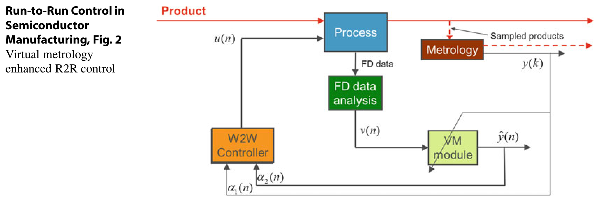

> Image description: Figure 2 illustrates a control system diagram for "Run-to-Run (R2R) Control in Semiconductor Manufacturing," enhanced with a Virtual Metrology (VM) module. The system begins with a "Product" flow moving from left to right. A "Process" block receives a control input $u(n)$ and produces "FD data" (fault detection data). This FD data flows into an "FD data analysis" block, which outputs $v(n)$ to a "VM module." The VM module generates an estimate $\hat{y}(n)$, representing virtual metrology. Simultaneously, physical "Metrology" is performed on "sampled products" to produce measured values $y(k)$. The control loop is completed by a "W2W Controller" (Run-to-Run Controller). This controller receives feedback through two paths: the actual measurements $y(k)$ (via $\alpha_2(n)$) and the VM estimates $\hat{y}(n)$ (via $\alpha_1(n)$). The controller then updates the input $u(n)$ to the Process, creating a closed-loop feedback system that integrates both physical and virtual measurements.

<!-- source_pdf_page: 1270 -->
is used along with adaptive VM modeling to predict metrology information. The VM predictions are then used to fill in the measurement gaps in feed-forward and feedback control thus enabling wafer-to-wafer or even within-wafer control. One of the research challenges is to optimally tune the control to best utilize both the real and predicted metrology information. This requires that VM data contain information on predicted measurement data quality (Khan et al. 2007).
$u(n)$ Tunable process inputs
$v(n)$ FD summary information
$y(k)$ Metrology measurement data for measured wafers
$\hat{y}(n)$ Predicted metrology measurements for all wafers
$\alpha_{1}(n)$ Feedback filter coefficient for feedback of measured data
$\alpha_{2}(n)$ Feedback filter coefficient for feedback of predicted data
Movement towards interprocess and eventually fab-wide control: The generally accepted vision of the future of advanced process control (APC) in general is a fabrication-wide fully integrated solution that incorporates all of the APC capabilities (R2R control, FDC, fault prediction, and statistical process control) as well as predictive capabilities such as predictive scheduling, predictive maintenance, virtual metrology, and predictive yield (ITRS 2014). Opportunities for research and development exist with the integration of these technologies, especially as the powers of the predictive domain are tapped. For example, it is expected that R2R control will eventually incorporate predicted yield as a target with feedback to multiple coordinated process controllers (Moyne and Schulze 2010). Thus, the future of research in R2R control, while evolving, should remain strong in the coming years.

## Summary and Future Directions

R2R control is a form of adaptive model-based process control that is tailored to environments where the process is discrete, dynamic, and highly unobservable; this is characteristic of processes in the semiconductor manufacturing
industry. R2R control has evolved from a strictly research effort in the early 1990s to a required facility-wide capability in all of semiconductor manufacturing. It generally has, at its roots, a rather straightforward approach to adaptive model-based control. Most of the complexity of R2R control science lies and will continue to lie in extensions to support practical application of R2R control in semiconductor manufacturing facilities of the future.

The science of R2R control will continue to expand as the academic and industry communities look to incorporating capabilities that will allow R2R control to continue to be an integral part of the fabrication facility of the future. One key research direction over the next decade is the development of approaches for incorporating virtual metrology and yield prediction into control solutions. Other focus areas will likely include hybrids of R2R control and continuous process control, learning mechanisms for single-threaded control in "high-mix" environments where there are a large number of disturbances that should be modeled, phenomenological R2R control models, and model libraries that combine stochastic information with process physics and chemistry knowledge, control solutions that are more directly optimized to financial parameters such as yield and throughput, and R2R control solutions that incorporate other analysis capabilities, such as FDC, either algorithmically or via event-based control rule approaches. Each of these topics provides significant opportunity for research as well as benefit in application to semiconductor manufacturing facilities.

## Cross-References

- Adaptive Control, Overview
- Controllability and Observability
- Event-Triggered and Self-Triggered Control
- Experiment Design and Identification for Control
- Fault Detection and Diagnosis
- Kalman Filters
- Moving Horizon Estimation
- Nominal Model-Predictive Control

<!-- source_pdf_page: 1271 -->
- Robust Model-Predictive Control
- Stochastic Model Predictive Control

## Bibliography

Advanced Process Control (APC) Conference Proceedings (2000-2014), titles available at http://www. apcconference.com
Box GEP, Draper NR (1987) Empirical model-building and response surfaces. Wiley, New York
Cheng F-T et al. (2011) Benefit model of virtual metrology and integrating AVM Into MES. IEEE Trans Semicond Manuf 24(2):261-272
Edgar TF, Firth SK, Bode C (2004) Multi-product run-to-run control for high-mix fabs. (session keynote) AEC/APC Asia, Hsinchu, (2004), (available at http:// 140.113.156.45/files/reference/2nd\%20AEC-APC \%20Symposium\%20Asia/APCAEC/presentations/ session_KeynoteInvited/Edgar_Thomas.pdf)
International Technology Roadmap for Semiconductors (ITRS), 2014 Edition, Semiconductor Industry Association. Available at http://www.itrs.net. (See especially "Factory Integration" chapter)

Khan A, Moyne J, Tilbury D (2007) Fab-wide control utilizing virtual metrology (invited). IEEE Trans Semicond Manuf-Spec Issue on Adv Process Control 20(7):364-375
Moyne J (2004) The evolution of APC: the move to total factory control (invited). Solid State Technol 47(9):47-52
Moyne J (2009) A blueprint for enterprise-wide deployment of advanced process control. Solid State Technol 52(7):35-37
Moyne J, Del Castillo E, Hurwitz A (2000) Run-to-run control in semiconductor manufacturing. CRC, Boca Raton
Moyne J, Schulze B (2010) Yield management enhanced advanced process control system (YMeAPC): part I, description and case study of feedback for optimized multi-process control. IEEE Trans Semicond Manuf Spec Issue Adv Process Control 23(2): 221-235
Zou J (2013) Method and system for estimating context offsets for run-to-run control in a semiconductor fabrication facility. United States Patent, Patent Number US 8,355,810 B2 (Filed, Jan 2010; Issued, Jan 2013)
