<!-- source_pdf_page: 1272 -->
## S

## Sampled-Data H-Infinity Optimization

## Tongwen Chen

Department of Electrical and Computer
Engineering, University of Alberta, Edmonton, AB, Canada

#### Abstract

$\mathcal{H}_{\infty}$ optimization is central in robust control. When controllers are implemented by computers, sampled-data control systems arise. Designing $\mathcal{H}_{\infty}$-optimal controllers in purely continuous time or in purely discrete time is standard in robust control; in this entry, we discuss the process of sampled-data optimization, namely, designing digital controllers based on a continuous-time $\mathcal{H}_{\infty}$ performance measure.

## Keywords

Computer control; $\mathcal{H}_{\infty}$ discretization; Robust control; Sampled-data systems

## Introduction

Robust control deals mainly with controller design against uncertainties in system modeling and disturbances. The central tool used is $\mathcal{H}_{\infty}$ optimization.

In continuous time, consider the standard setup in Fig. 1, where $G$ is the generalized plant and $K$ is the controller; $G$ has two inputs ( $w$, the exogenous input, and $u$, the control input) and two outputs ( $z$, the output to be controlled, and $y$, the measured output); $K$ processes $y$ to generate $u$. The $\mathcal{H}_{\infty}$-optimal control problem is to design $K$ to stabilize $G$ and minimize the $\mathcal{H}_{\infty}$ norm of the closed-loop system in Fig. 1 from $w$ to $z$, denoted $T_{z w}$. When both $G$ and $K$ are continuous-time, linear time-invariant (LTI), the $\mathcal{H}_{\infty}$ norm, $\left\|T_{z w}\right\|$, relates to the frequency response matrix $\widehat{T}_{z w}(j \omega)$ as follows:

$$
\left\|T_{z w}\right\|=\sup _{\omega} \bar{\sigma}\left[\widehat{T}_{z w}(j \omega)\right]
$$

where $\bar{\sigma}$ indicates the maximum singular value. This $\mathcal{H}_{\infty}$-optimal control problem in the LTI case is solvable by many techniques, e.g., Riccati equations and linear matrix inequalities - see robust control textbooks by Zhou et al. (1996) and Dullerud and Paganini (2000).

## Sampled-Data Control

When controllers are implemented by digital computers, periodic samplers and zero-order holds are used to model analog-to-digital and digital-to-analog conversion. Replacing $K$ in Fig. 1 by sampler $S$ (with period $h$ ), discretetime controller $K_{d}$, and zero-order hold $H$ (synchronized with $S$ ), we obtain a sampled-data

<!-- source_pdf_page: 1273 -->
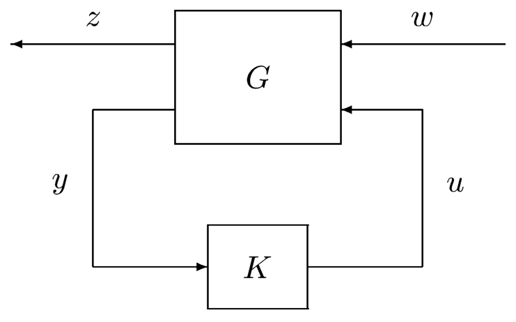

> Image description: Figure 1 shows a block diagram representing a standard continuous-time control setup. The diagram consists of two main functional blocks: a large upper block labeled $G$ and a smaller lower block labeled $K$, forming a closed-loop feedback system. The block $G$ has three signal connections: an external input $w$ entering from the right, an output $z$ exiting to the left, and a feedback loop connection. The signal $y$ is the output of block $G$, which flows into the input of block $K$. The output of block $K$ is labeled $u$, which is fed back as an input into block $G$ from the right side. This configuration illustrates a feedback interconnection where the controller $K$ processes the measured output $y$ to generate a control signal $u$ for the plant $G$, while $w$ acts as an external disturbance or reference and $z$ represents the controlled output.
Sampled-Data H-Infinity Optimization, Fig. 1 Standard control setup in continuous time

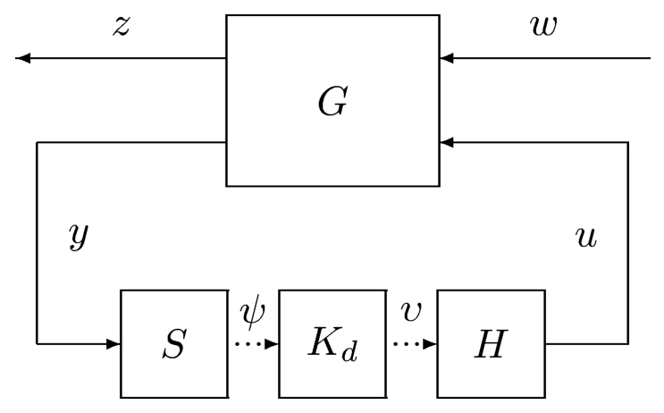

> Image description: A block diagram titled "Sampled-Data H-Infinity Optimization, Fig. 1 Standard control setup in continuous time" illustrates a control system architecture. The diagram features a large central block labeled $G$, representing the plant or system being controlled. The system includes inputs $w$ (exogenous input) and $u$ (control input), and outputs $z$ (error/performance output) and $y$ (measured output). A feedback loop is established via a controller assembly. The output signal $y$ enters block $S$. The output of $S$, labeled $\psi$, feeds into block $K_d$, whose output $v$ enters block $H$. The output of
Sampled-Data H-Infinity Optimization, Fig. 2 Sampled-data control setup

control system shown in Fig. 2; here, $S$ converts $y$ into a discrete-time sequence $\psi ; K_{d}$, a realtime algorithm in the computer, inputs $\psi$ and computes another sequence $v$, which is converted by $H$ into $u$.

There are in general three approaches to design a digital controller $K_{d}$ : design a continuoustime controller $K$ and then implement digitally via approximation, discretize the plant and then design $K_{d}$ in discrete time, and finally, design $K_{d}$ directly based on continuous-time performance specifications (Chen and Francis 1995). The last approach is followed in the $\mathcal{H}_{\infty}$ optimization framework.

## Sampled-Data $\mathcal{H}_{\infty}$ Discretization

The sampled-data $\mathcal{H}_{\infty}$ control problem is to design $K_{d}$ directly to stabilize $G$ in Fig. 2 and minimize $\left\|T_{z w}\right\|$. Notice that even if $G$ is LTI in continuous time and $K_{d}$ is LTI in discrete time, the closed-loop system $T_{z w}$ is no longer LTI, due to the presence of $S$ and $H$ in the control loop;

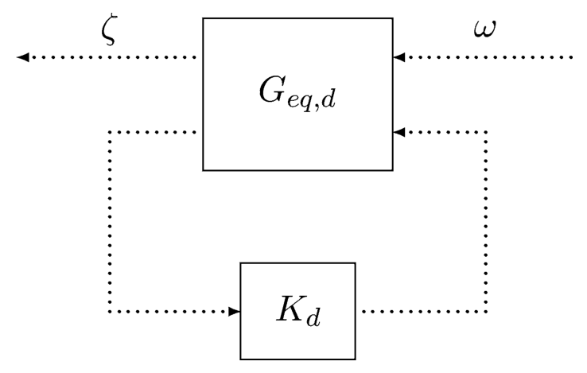

> Image description: This block diagram illustrates a closed-loop control system. The system consists of two main functional blocks: a large upper block labeled $G_{eq,d}$ and a smaller lower block labeled $K_{d}$. The relationship between these blocks is formed by a feedback loop indicated by dotted arrows. The upper block, $G_{eq,d}$, has a dotted input arrow labeled $\omega$ entering from the right and a dotted output arrow labeled $\zeta$ exiting to the left. A feedback path connects the output of $G_{eq,d}$ via a dotted line on the left, through the $K_{d}$ controller, and returns to the input of $G_{eq,d}$ via a dotted line on the right. This structure represents a sampled-data $\mathcal{H}_{\infty}$ control problem where the objective is to design the discrete-time controller $K_{d}$ to stabilize the plant $G$ and minimize the closed-loop transfer function $\|T_{zw}\|$.
Sampled-Data H-Infinity Optimization, Fig. 3 The equivalent discrete-time system

in this case, the $\mathcal{H}_{\infty}$ norm is interpreted as the $\mathcal{L}_{2}$-induced norm:

$$
\left\|T_{z w}\right\|=\sup \left\{\|z\|_{2}:\|w\|_{2}=1\right\} ;
$$

here, $\|\cdot\|_{2}$ represents the $\mathcal{L}_{2}$ norm on signals.
The sampled-data $\mathcal{H}_{\infty}$ control problem has been shown to be equivalent to a purely discretetime $\mathcal{H}_{\infty}$ control problem (Kabamba and Hara 1993; Bamieh and Pearson 1992; Toivonen 1992); the process is known as sampled-data $\mathcal{H}_{\infty}$ discretization: for $\gamma>0$, construct an LTI discrete-time system $G_{\text {eq }, d}$ connected to $K_{d}$ as in Fig. 3; the two systems, $T_{z w}$ in Fig. 2 and $T_{\zeta \omega}: \omega \mapsto \zeta$ in Fig. 3, are equivalent in that $\left\|T_{z w}\right\|<\gamma$ if $\left\|T_{\zeta \omega}\right\|<\gamma$, where the latter norm is $\ell_{2}$-induced, and since $T_{\zeta \omega}$ is LTI in discrete time, it equals the $\mathcal{H}_{\infty}$ norm of the corresponding transfer function $\widehat{T}_{\zeta \omega}(z)$. Thus, pure discretetime techniques are immediately applicable.

There are several ways to present this discretization. However, the computation is quite involved and hence is not given here; interested readers can find details in the papers by Kabamba and Hara (1993), Bamieh and Pearson (1992), and Toivonen (1992), or the book by Chen and Francis (1995). Note that the $\mathcal{H}_{\infty}$ discretization process is not quite exact in the sense that $G_{\text {eq., } d}$ depends on $\gamma$ (Chen and Francis 1995).

## Summary and Future Directions

In sampled-data $\mathcal{H}_{\infty}$ optimization, the key idea is to address the hybrid nature of the problem,

<!-- source_pdf_page: 1274 -->
considering intersample behavior in formulation; the main tool is the so-called continuous lifting (Yamamoto 1994; Bamieh and Pearson 1992), making use of periodicity of sampled-data systems.

The ideas and tools developed in sampleddata control theory are still being used in emerging areas such as hybrid systems and networked control systems. For example, in event-triggered control systems, information exchange and control updating are not time driven but are done by certain event-triggering schemes, resulting in necessarily nonlinear and time-varying closedloop dynamics; the analysis and synthesis issues in such systems are still challenging.

## Cross-References

- H-Infinity Control
- LMI Approach to Robust Control
- Optimal Sampled-Data Control
- Optimization Based Robust Control

## Recommended Reading

The continuous-time $\mathcal{H}_{\infty}$ control problem and its solutions are discussed extensively in several textbooks, e.g., Zhou et al. (1996) and Dullerud and Paganini (2000). The discrete-time $\mathcal{H}_{\infty}$ control problem was solved via the approach of Riccati equations in Iglesias and Glover (1991). The sampled-data $\mathcal{H}_{\infty}$ control problem was solved simultaneously with different methods in Kabamba and Hara (1993), Bamieh and Pearson (1992), and Toivonen (1992); details of the solution discussed here can be found in the book by Chen and Francis (1995).

## Bibliography

Bamieh B, Pearson JB (1992) A general framework for linear periodic systems with application to $\mathcal{H}_{\infty}$ sampled-data control. IEEE Trans Autom Control 37:413-435
Chen T, Francis BA (1995) Optimal sampled-data control systems. Springer, London

Dullerud GE, Paganini F (2000) A course in robust control theory: a convex approach. Springer, New York
Iglesias P, Glover K (1991) State-space approach to discrete-time $\mathcal{H}_{\infty}$ control. Int J Control 54:1031-1073
Kabamba PT, Hara S (1993) Worst case analysis and design of sampled-data control systems. IEEE Trans Autom Control 38:1337-1357
Toivonen HT (1992) Sampled-data control of continuoustime systems with an $\mathcal{H}_{\infty}$ optimality criterion. Automatica 28:45-54
Yamamoto Y (1994) A function space approach to sampled data control systems and tracking problems. IEEE Trans Autom Control 39:703-713
Zhou K, Doyle J, Glover K (1996) Robust and optimal control. Prentice Hall, Upper Saddle River, New Jersey

## Sampled-Data Systems

Panos J. Antsaklis ${ }^{1}$ and H.L. Trentelman ${ }^{2}$ ${ }^{1}$ Department of Electrical Engineering, University of Notre Dame, Notre Dame, IN, USA

${ }^{2}$ Johann Bernoulli Institute for Mathematics and Computer Science, University of Groningen, Groningen, AV, The Netherlands

#### Abstract

For digital devices to interact with the physical world, an interface is needed that transforms the signals from analog to digital and vice versa. Ideal samplers and zero-order hold devices are incorporated to derive discrete-time models of continuous-time systems. State variable descriptions and transfer functions are used.

## Keywords

Continuous-time approximations; Digital control; Discrete-time approximations; Quantization; Reconstruction; Sampled-data systems; Sampling

## Introduction

Sampled-data systems are discrete-time models of continuous-time processes useful in the digital

<!-- source_pdf_page: 1275 -->
control of continuous-time systems. A digital controller cannot communicate directly with a continuous system and an interface is needed.

Consider a continuous-time system having $u(t)$ as its input and $y(t)$ as its output.
A/D Converter: The continuous-time signal $y(t)$ is converted into a discrete-time signal $\{\bar{y}(k)\}, k \geq 0, k \in \mathbb{Z}$, which is a sequence of values $\{\bar{y}(0), \bar{y}(1), \cdots\}$ determined by the relation

$$
\begin{equation*}
\bar{y}(k)=y\left(t_{k}\right) \tag{1}
\end{equation*}
$$

This is the ideal A/D (analog to digital) converter that samples $y(t)$ at times $t_{0}, t_{1}, t_{2} \cdots$ producing the sequence $\left\{y\left(t_{0}\right), y\left(t_{1}\right), \cdots\right\}$ also denoted as $\left\{y\left(t_{k}\right)\right\}$.
D/A Converter: The D/A (digital to analog) converter receives as its input a sequence $\{\bar{u}(k)\}, k=0,1,2, \cdots$ and outputs a (piecewise) continuous-time signal $u(t)$ determined by

$$
\begin{equation*}
u(t)=\bar{u}(k), \quad t_{k} \leq t<t_{k+1}, k=0,1,2, \cdots . \tag{2}
\end{equation*}
$$

That is, this D/A converter keeps the value of $u(t)$ constant at the last value of the sequence entered, until a new value comes in. Such a device is called a zero-order hold (ZOH) device.

## Higher-Order Hold

The ZOH device described above implements a particular procedure of data reconstruction or extrapolation. The general problem is as follows:

Given a sequence of real numbers $\{\bar{f}(k)\}$, $k=k_{0}, k_{0}+1, \cdots$ derive $f(t), t \geq t_{0}$ so that

$$
f\left(t_{k}\right)=\bar{f}(k), \quad k=k_{0}, k_{0}+1, \cdots
$$

Clearly, there is a lot of flexibility in assigning values to $f(t)$ in between the samples $\bar{f}(k)$; in other words there is a lot of flexibility in assigning the intersample behavior in $f(t)$.

A way to approach the problem is to start by writing a power series expansion of $f(t)$ for $t$, $t_{k} \leq t<t_{k+1}$, namely,

$$
\begin{aligned}
f(t)= & f\left(t_{k}\right)+f^{(1)}\left(t_{k}\right)\left(t-t_{k}\right)+\frac{f^{(2)}\left(t_{k}\right)}{2!} \\
& \left(t-t_{k}\right)^{2}+\cdots
\end{aligned}
$$

where $f^{(n)}\left(t_{k}\right)=\left.\frac{d^{(n)} f(t)}{d t^{n}}\right|_{t=t_{k}}$, that is, the $n$th order derivative of $f(t)$ evaluated at $t=t_{k}$ (assuming that the derivatives exist).

Now if the function $f(t)$ is approximated in the interval $t_{k} \leq t<t_{k+1}$ by the constant value $f\left(t_{k}\right)$ taken to be equal to $\bar{f}(k)$, then

$$
f(t)=f\left(t_{k}\right) \quad(=\bar{f}(k)), t_{k} \leq t<t_{k+1}
$$

which is exactly the relation implemented by a ZOH . Note that here the zero-order derivative of the power series is used which leads to an approximation by a constant which is a zerodegree polynomial.

It is clear that more than the first term in the power series can be taken to approximate $f(t)$. If, for example, the first two terms are taken, then

$$
\begin{aligned}
f(t) & =f\left(t_{k}\right)+f^{(1)}\left(t_{k}\right)\left(t-t_{k}\right) \\
& =f\left(t_{k}\right)+\frac{f\left(t_{k}\right)-f\left(t_{k-1}\right)}{t_{k}-t_{k-1}}\left(t-t_{k}\right) \\
& =\bar{f}(k)+\frac{\bar{f}(k)-\bar{f}(k-1)}{t_{k}-t_{k-1}}\left(t-t_{k}\right)
\end{aligned}
$$

for $t_{k} \leq t<t_{k+1}$, where an approximation for the derivative $f^{(1)}(t)$ has been used. The approximation between $t_{k}$ and $t_{k+1}$ is a ramp with slope determined by $f\left(t_{k}\right)=\bar{f}(k)$ and the previous value $f\left(t_{k-1}\right)=\bar{f}(k-1)$. Here the first-order derivative of the power series is used which leads to an approximation by a first-degree polynomial. A device that implements such approximation is called a first-order hold (FOH). Similarly, we can define a second-order hold. Note that the formula of the above FOH is derived if we decide to use a first-degree polynomial to approximate $f(t)$ on $t_{k} \leq t<t_{k+1}$ and then enforce $f\left(t_{k}\right)=\bar{f}(k)$ and $f\left(t_{k-1}\right)=\bar{f}(k-1)$. This approach is known as polynomial interpolation.

Obtaining a continuous (or piecewise continuous) function from given discrete values may be seen as a continualization procedure. Contrast

<!-- source_pdf_page: 1276 -->
this with the discretization procedure introduced by sampling earlier in this section.
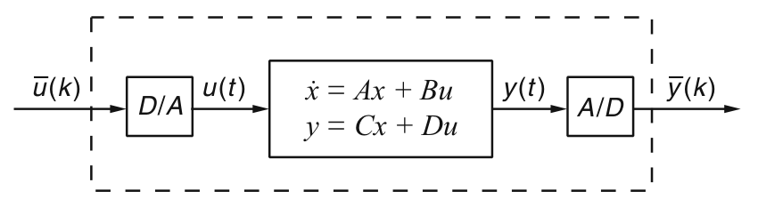

The continuous-time system with input $u(t)$ and output $y(t)$ together with the interface A/D and D/A converters can be seen as a system that receives a sequence of values $\{\bar{u}(k)\}$ as its input and produces a sequence of output values $\{\bar{y}(k)\}$. A digital controller can receive the system output $\{\bar{y}(k)\}$ as input and produce a $\{\bar{u}(k)\}$.

Quantization: The sampled output $\bar{y}(k) \in \mathbb{R}$ and it can take on an infinite number of values. In a digital device, however, a variable can take on only a finite number of values - this is because of the finite wordlength that is of the finite number of bits in the registers. So for $\{\bar{y}(k)\}$ to be used by a digital controller, an additional step is needed, that is, $\bar{y}(k)$ needs to be quantized. Under quantization, for example, values $2.315,2.308,2.3$ with a 0.1 quantization step are all represented as 2.3. Quantization is an approximation and for short wordlengths, fewer number of levels, may lead to significant errors. Here we do not consider quantization.

## Discrete-Time Models

Let a linear, continuous-time, time-invariant system be described by

$$
\begin{align*}
& \dot{x}(t)=A x(t)+B u(t), \\
& y(t)=C x(t)+D u(t) . \tag{3}
\end{align*}
$$

If we consider some initial time $t_{k}$, its state response for $t \geq t_{k}$ is

$$
\begin{equation*}
x(t)=e^{A\left(t-t_{k}\right)} x\left(t_{k}\right)+\int_{t_{k}}^{t} e^{A(t-\tau)} B u(\tau) d \tau \tag{4}
\end{equation*}
$$

In view of (2), in a ZOH the input $u(t)$ will remain constant and equal to $u\left(t_{k}\right)(=\bar{u}(k))$ for a time period $t_{k+1}-t_{k}$. So
$x(t)=e^{A\left(t-t_{k}\right)} \bar{x}(k)+\left[\int_{t_{k}}^{t} e^{A(t-\tau)} B d \tau\right] \bar{u}(k)$,
where $\bar{x}(k)=x\left(t_{k}\right), \bar{u}(k)=u\left(t_{k}\right)$. For $t=t_{k+1}$, (5) becomes

$$
\begin{equation*}
\bar{x}(k+1)=\bar{A}(k) \bar{x}(k)+\bar{B}(k) \bar{u}(k) \tag{6}
\end{equation*}
$$

where $\bar{A}(k) \triangleq e^{A\left(t_{k+1}-t_{k}\right)}$ and $\bar{B}(k) \triangleq \int_{t_{k}}^{t_{k+1}} e^{A\left(t_{k+1}-\tau\right)} B d \tau$.

Consider now the output $y(t)$ and assume that it is sampled at times $t_{k}^{\prime}$ that do not necessarily coincide with the instants $t_{k}$ at which the input is adjusted $\left(t_{k} \leq t_{k}^{\prime}<t_{k+1}\right)$. Then if $\bar{y}(k) \triangleq y\left(t_{k}^{\prime}\right)$,

$$
\begin{equation*}
\bar{y}(k)=\bar{C}(k) \bar{x}(k)+\bar{D}(k) \bar{u}(k) \tag{7}
\end{equation*}
$$

where

$$
\begin{gathered}
\bar{C}(k)=C e^{A\left(t_{k}^{\prime}-t_{k}\right)} \\
\bar{D}(k)=C\left[\int_{t_{k}}^{t_{k}^{\prime}} e^{A\left(t_{k}^{\prime}-\tau\right)} d \tau\right] B+D
\end{gathered}
$$

In the case when all $k=0,1,2, \cdots, t_{k}^{\prime}=t_{k}$ and $t_{k+1}-t_{k}=T$ a constant period, called the sampling period. Then the sampled-data system is given by

$$
\begin{align*}
\bar{x}(k+1) & =\bar{A} \bar{x}(k)+\bar{B} \bar{u}(k) \\
\bar{y}(k) & =\bar{C} \bar{x}(k)+\bar{D} \bar{u}(k) \tag{8}
\end{align*}
$$

where

$$
\begin{aligned}
& \bar{A}=e^{A T}, \quad \bar{B}=\left[\int_{0}^{T} e^{A \tau} d \tau\right] B \\
& \bar{C}=C, \quad \bar{D}=D
\end{aligned}
$$

The intersample behavior of the continuous system can be determined using (5).

Example 1 Let the continuous-time system be given by (3) where
$A=\left[\begin{array}{ll}0 & 1 \\ 0 & 0\end{array}\right], B=\left[\begin{array}{l}0 \\ 1\end{array}\right], C=\left[\begin{array}{ll}1 & 0\end{array}\right], D=0$,

<!-- source_pdf_page: 1277 -->
and let $T$ denote the sampling period. The transfer function of the continuous-time system is $\hat{H}(s)=C(s I-A)^{-1} B=1 / s^{2}$, the double integrator. The discrete-time state-space representation of the system, which represents the continuous-time system preceded by a zero-order hold (D/A converter) and followed by a sampler [an (ideal) A/D converter], both sampling synchronously at a rate of $1 / \mathrm{T}$, is given by $\bar{x}(k+1)= \bar{A} \bar{x}(k)+\bar{B} \bar{u}(k), \bar{y}(k)=\bar{C} x(k)$, where

$$
\begin{aligned}
& \bar{A}=e^{A T}=\sum_{j=1}^{\infty}\left(T^{j} / j!\right) A^{j}=\left[\begin{array}{ll}
1 & 0 \\
0 & 1
\end{array}\right]+ \\
& {\left[\begin{array}{ll}
0 & 1 \\
0 & 0
\end{array}\right] T=\left[\begin{array}{ll}
1 & T \\
0 & 1
\end{array}\right],} \\
& \bar{B}=\left(\int_{0}^{T} e^{A \tau} d \tau\right) B \\
& =\left(\int_{0}^{T}\left[\begin{array}{ll}
1 & \tau \\
0 & 1
\end{array}\right] d \tau\right)\left[\begin{array}{l}
0 \\
1
\end{array}\right] \\
& =\left[\begin{array}{cc}
T & T^{2} / 2 \\
0 & T
\end{array}\right]\left[\begin{array}{l}
0 \\
1
\end{array}\right]=\left[\begin{array}{c}
T^{2} / 2 \\
T
\end{array}\right], \\
& \bar{C}=C=\left[\begin{array}{ll}
1 & 0
\end{array}\right] .
\end{aligned}
$$

The transfer function (relating $\bar{y}$ to $\bar{u}$ ) is given by

$$
\begin{aligned}
\hat{H}(z) & =\bar{C}(z I-\bar{A})^{-1} \bar{B} \\
& =\left[\begin{array}{ll}
1 & 0
\end{array}\right]\left[\begin{array}{cc}
z-1 & -T \\
0 & z-1
\end{array}\right]^{-1}\left[\begin{array}{c}
T^{2} / 2 \\
T
\end{array}\right] \\
& =\left[\begin{array}{ll}
1 & 0
\end{array}\right]\left[\begin{array}{cc}
1 /(z-1) & T /(z-1)^{2} \\
0 & 1 /(z-1)
\end{array}\right] \\
& {\left[\begin{array}{c}
T^{2} / 2 \\
T
\end{array}\right] } \\
& =\frac{T^{2}}{2} \frac{(z+1)}{(z-1)^{2}}
\end{aligned}
$$

If we focus on single-input, single-output systems and consider ideal sampler A/D and ZOH D/A, then given the transfer function $G(s)$ of the continuous system, there is a direct formula to determine the transfer function of its discrete approximation $H(z)$, namely,

$$
\begin{equation*}
H(z)=\left(1-z^{-1}\right) Z\{G(s) / s\} \tag{9}
\end{equation*}
$$

Here $Z\{G(s) / s\}$ means that first the inverse Laplace transform of $G(s) / s$ is taken to obtain $f(t) \triangleq\left[\mathcal{L}^{-1}(G(s) / s)\right]$. The function $f(t)$ is then sampled to obtain $f(k T), k=0,1,2, \cdots$ and the z-transform of $f(k T)$ is evaluated. To illustrate, in the above example $G(s)=\frac{1}{s^{2}}, G(s) / s=\frac{1}{s^{3}}$, and $f(t)=\mathcal{L}^{-1}\left(\frac{1}{s^{3}}\right)=\frac{1}{2} t^{2}, t \geq 0$. Then

$$
\begin{aligned}
H(z) & =\left(1-z^{-1}\right) Z\left\{\frac{1}{2}(k T)^{2}\right\} \\
& =\left(1-z^{-1}\right) \frac{T^{2}}{2} Z\left\{k^{2}\right\} \\
& =\frac{T^{2}}{2} \frac{z+1}{(z-1)^{3}}
\end{aligned}
$$

as before.

## Summary

Sampled-data systems arise in the digital control of systems and include both continuous and discrete-time dynamics. Discrete-time approximations of continuous-time systems using ideal samplers and ZOH devices were derived using state variable descriptions. Extensions include quantization and lead to hybrid dynamical systems which include both continuous and discrete variable dynamics.

A variation of the approach described in this entry of deriving sampled-data systems uses the discrete-time delta operator. This approach has the advantage that as the sampling period $T \rightarrow$ 0 , the discrete-time model reverts to the original continuous-time model, which is not the case with the more common approach described above.

## Cross-References

- Linear Systems: Continuous-Time, Time-Invariant State Variable Descriptions
- Linear Systems: Discrete-Time, Time-Invariant State Variable Descriptions

<!-- source_pdf_page: 1278 -->
## Recommended Reading

State variable and transfer function descriptions are covered in a variety of textbooks including Antsaklis and Michel (2006), Kailath (1980), Chen (1984), and DeCarlo (1989). For additional material on sampled-data systems, refer to Aström and Wittenmark (1990), Franklin et al. (1998), Jury (1958), and Ragazzini and Franklin (1958).

## Bibliography

Antsaklis PJ, Michel AN (2006) Linear systems. Birkhauser, Boston
Aström KJ, Wittenmark B (1990) Computer-controlled systems: theory and design. Prentice-Hall, Englewood Cliffs
Chen CT (1984) Linear system theory and design. Holt, Rinehart and Winston, New York
DeCarlo RA (1989) Linear systems. Prentice-Hall, Englewood Cliffs
Franklin GF, Powell DJ, Workma ML (1998) Digital control of dynamic systems, 3rd edn. Addison-Wesley Longman Inc., Menlo Park, CA
Jury EI (1958) Sampled-data control systems. Wiley, New York
Kailath T (1980) Linear systems. Prentice-Hall, Englewood Cliffs
Ragazzini JR, Franklin GF (1958) Sampled-data control systems. McGraw-Hill, New York
Rugh WJ (1996) Linear systems theory, 2nd edn. PrenticeHall, Englewood Cliffs

## Satellite Control

Finn Ankersen
European Space Agency, Noordwijk, The Netherlands

#### Abstract

Spacecraft control systems are described for single and distributed space systems. The attitude dynamics is formulated including flexible and sloshing phenomena, followed by a description

of attitude sensors and actuators. $\mathcal{H}_{\infty}$ and robust controls are formulated as signal-based two degree-of-freedom control architectures. The equations are given for the relative motion dynamics between spacecraft on elliptical orbits with the generic Yamanaka-Ankersen state transition matrix. Formulations are provided for rendezvous and docking scenarios and formation flying control, maneuvers, avionics, and laser metrology systems together with the onboard autonomy needs.

## Keywords

Flexible modes; Formation flying; Fractionated spacecraft; $\mathcal{H}_{\infty}$ control; Multivariable systems; Relative dynamics; Rendezvous and docking; Robust control; Sloshing; Spacecraft attitude control; Spacecraft position control

## Introduction

This entry explains the control needs of spacecraft after they have been separated from the launch vehicle and injected onto their initial orbit.

Actuators and sensors are explained followed by the control objectives. The state-of-theart control techniques and architectures are addressed.

Spacecraft are classically well-known physical systems that can be described by first principles. The advantage is fairly precise plant models and uncertainty characterization of physical parameters. This is well suited for a model-based control design approach.

## Mission Types

From a control point of view, space missions can be split into two main categories according to which physical states need to be controlled:
Attitude Control: This is needed by any spacecraft irrespective of the mission objectives. Such missions are typically low earth orbit (LEO) missions for astronomy, observations,

<!-- source_pdf_page: 1279 -->
and, in higher orbits, constellations for navigation and communication. Further, there are interplanetary and planetary exploration science missions. The pointing requirements vary from a few degrees to milli-arc seconds.
Relative Position Control: Within distributed space systems, this is relevant for rendezvous and docking (RVD) and formation flying (FF) missions. It leads to a 6 degree-offreedom (DOF) control problem as the relative attitude is also needed. The former is mostly for missions to space station logistics infrastructures and the latter for scientific missions. Relative position can also be required during the final stages of controlled planetary landings. Another category is missions with ultrahigh control performance requirements, where the spacecraft platform and the science instrument need to be considered as one coupled system.

## Attitude Control

Fundamentally the three attitude angles $\boldsymbol{\theta}$ and angular rates $\boldsymbol{\omega}$ need to be controlled to a certain reference. See Fig. 1 for definition.

The general rigid body dynamics expressed in a rotating frame(*), which is mostly the case when orbiting a central body, can be expressed as

$$
\begin{equation*}
\mathbf{N}=\frac{d^{*}\left(\mathbf{I} \omega^{*}\right)}{d t}+\omega \times \mathbf{I} \omega^{*} \tag{1}
\end{equation*}
$$

where $\mathbf{I}$ is the constant inertia matrix, $\boldsymbol{\omega}$ is the inertial angular velocity, and $\mathbf{N}$ is the torque acting on the spacecraft (Wie 1998).

The kinematics can be described by one of the 12 sets of Euler angles (can have singularities) or the hypercomplex quaternion vector (no singularities) (Hughes 1986).

The dynamics and kinematics equations need to be linearized and are in the general form of a coupled 12th order system. It is the fundamental model for the rigid body spacecraft control design.

Most modern spacecraft have large flexible appendices in the form of solar panels and large antennae reflectors. Fuel sloshing is a similar lightly damped oscillatory phenomena, which often needs to be taken into consideration. The incorporation of dynamic elements such as flexible panels, antennae, and sloshing fuel can be modeled by Eqs. (2) and (3) provided the overall rotation rate $\boldsymbol{\omega}$ and linear accelerations $\ddot{\mathbf{x}}$ are not too large.

$$
\begin{gather*}
\mathbf{M}_{T}\left[\begin{array}{c}
\ddot{\mathbf{x}} \\
\dot{\boldsymbol{\omega}}
\end{array}\right]=\left[\begin{array}{c}
\mathbf{F} \\
\mathbf{N}
\end{array}\right]-\mathbf{L} \ddot{\boldsymbol{\eta}}  \tag{2}\\
\ddot{\eta}_{k}+2 \zeta_{k} \Omega_{k} \dot{\eta}_{k}+\Omega_{k}^{2} \eta_{k}=-\frac{1}{m_{k}} \mathbf{L}^{\mathrm{T}}\left[\begin{array}{c}
\ddot{\mathbf{x}} \\
\dot{\boldsymbol{\omega}}
\end{array}\right] \tag{3}
\end{gather*}
$$

Satellite Control, Fig. 1 Spacecraft body (black) and reference (red) frames. The frames coincide for $\boldsymbol{\theta}=\mathbf{0}$
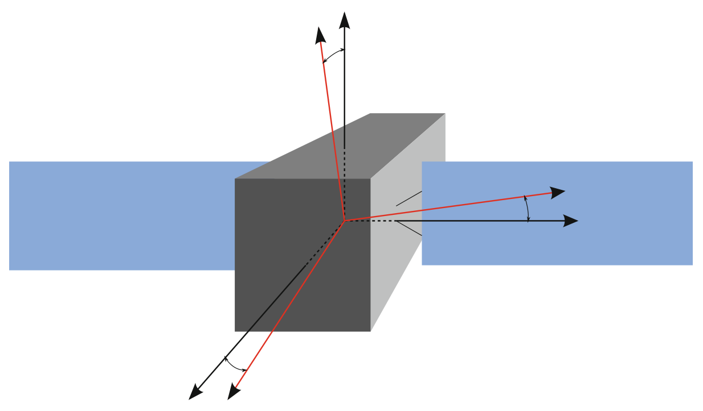

> Image description: This diagram, titled "Fig. 1 Spacecraft body (black) and reference (red) frames," illustrates the orientation relationship between two coordinate systems attached to a rectangular spacecraft body. A gray 3D block represents the spacecraft, with two blue rectangular extensions protruding from its sides. Two sets of orthogonal axes originate from a common center point on the spacecraft's front face. The reference frame is depicted with red arrows, while the spacecraft body frame is shown with black arrows. Curved double-headed arrows indicate the angular displacement between corresponding red and black axes in three dimensions. The caption notes that these frames coincide when the rotation vector $\boldsymbol{\theta} = \mathbf{0}$. This visualization serves to define the attitude or rotational orientation of the spacecraft body relative to a fixed reference frame in space.

<!-- source_pdf_page: 1280 -->
where

| $\mathbf{M}_{T}$ | $:$ rigid body mass/inertia matrix |
| :--- | :--- |
| $\ddot{\mathbf{x}}, \dot{\omega}$ | $:$ linear and angular acceleration |
| $\mathbf{F}, \mathbf{N}$ | $:$ forces and torques on the spacecraft |
| $\eta_{k}$ | $:$ the $k$ th flexible state |
| $\zeta_{k}$ | $:$ the $k$ th flexible damping factor |
| $\Omega_{k}$ | $:$ the $k$ th flexible eigen frequency |
| $m_{k}$ | $:$ the $k$ th modal mass (normalized to 1) |
| $\mathbf{L}$ | $:$ participation matrix of the $k$ th mode |

For attitude only the second row of Eq. (2) is needed, but translation is included here for the sake of completeness and later use.

The sensors utilized are typically gyroscopes for measuring the inertial angular rate, sun sensors to measure orientation at low accuracy, and star trackers for high-precision angular attitude measurements. All of those sensors are linear in their normal operational range and it suffices to use bias noise models for synthesis. Gyros do need a drift estimation and compensation to function properly over longer time. All sensors utilize redundancy for providing measurements around all three axes as well as providing fault tolerance. Some scientific observatory spacecraft use their telescopes for attitude measurements in order to obtain the required precision beyond the capability of star trackers.

The actuators producing pure torques are magnetic torquers, reaction wheels, and control momentum gyros. The last can produce large torques used for rapid slew maneuvers with little power. The last two types have nonlinear issues around low to zero speed due to friction issues. They accumulate angular momentum from asymmetric disturbances. This leads to a need for thrusters for angular momentum offloading. Thrusters are also used to control the attitude directly on many spacecraft. They are mostly of on-off type, though continuous ones exist, and will need to be pulse width modulated (PWM) to obtain quasi-linear behavior. The nonlinear on-off nature needs to be taken into account for the control closed loop analysis. It is done by use of the negative inverse describing function (Ogata 1970) for stability analysis and nonlinear modeling for verification simulations in the time domain. For larger numbers of thrusters, an optimization-based selection algorithm is applied to the controller output.

Before using the plant model in Eq. (2) for a flexible spacecraft, a simpler multivariable model of a rigid spacecraft is used as in Eq. (4):

$$
\dot{\mathbf{x}}=\left[\begin{array}{cc}
\mathbf{0} & \mathbf{B}_{k}  \tag{4}\\
\mathbf{0} & \mathbf{A}_{d}
\end{array}\right] \mathbf{x}+\left[\begin{array}{c}
\mathbf{0} \\
\mathbf{B}_{d}
\end{array}\right] \mathbf{N}
$$

where $\mathbf{x}=\left[\theta_{x}, \theta_{y}, \theta_{z}, \omega_{x}, \omega_{y}, \omega_{z}\right]^{\mathrm{T}}, \mathbf{B}_{k}$ is identity, $\mathbf{B}_{d}=\mathbf{I}^{-1}$, and $\mathbf{A}_{d}$ is the general Jacobian for the dynamics having a real right half-plane (RHP) pole. See Ankersen (2011). The model describes the angular deviation from some reference frame, whose orientation can be arbitrary. It uses the Euler ( $3,2,1$ ) rotation in the kinematics.

The state of the art of attitude control is today mostly based on $\mathcal{H}_{\infty}$ type of robust controllers with synthesis performed in the frequency domain. Requirements are often specified in the time domain, but formal methods exist to transform them into frequency domain weighting functions (ESA Handbook 2011) enhancing both synthesis and analysis. System uncertainties can be formulated as structured linear fractional transformations (LFT) with a general control configuration as illustrated in Fig. 2.

Commonly the $\mathcal{H}_{\infty}$ controller $\mathbf{K}$ is designed, and the lower loop in Fig. 2 is closed via a lower LFT such that $\mathbf{N}=F_{l}(\mathbf{P}, \mathbf{K})$ and robust stability (RS) and robust performance (RP) analysis is performed on the $\mathbf{N}, \boldsymbol{\Delta}$ system (Skogestad and Postlethwaite 1996).

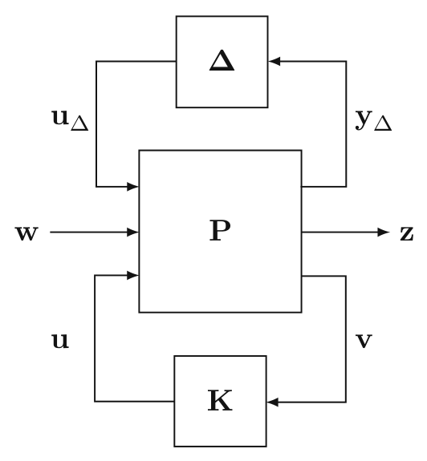

> Image description: A block diagram illustrates a closed-loop feedback control system structure used for robust control analysis. The diagram consists of four main blocks arranged in a vertical hierarchy. At the top, a block labeled $\Delta$ (representing uncertainty) is connected to the central plant block $P$. The output of $P$, labeled $y_\Delta$, serves as the input to $\Delta$, while the output of $\Delta$, labeled $u_\Delta$, serves as an additional input to $P$. The central block $P$ also receives an external input $w$ and produces an output $z$. At the bottom, a controller block $K$ is connected to $P$ in a feedback loop. The output of $P$, labeled $v$, serves as the input to $K$, and the output of $K$, labeled $u$, is fed back into $P$. This setup represents a standard generalized plant configuration where $\Delta$ represents model uncertainty, $P$ is the nominal plant, and $K$ is the controller designed to achieve robust performance.
Satellite Control, Fig. 2 Robust control formulation, where $\boldsymbol{\Delta}$ is the structured uncertainty, $\mathbf{K}$ is the controller, $\mathbf{P}$ the partitioned formulation of the plant with weights, and $\mathbf{w}$ and $\mathbf{z}$ are exogenous inputs and outputs, respectively

<!-- source_pdf_page: 1281 -->
On high performance pointing spacecraft, active vibration suppression of, e.g., cryocoolers is needed. The implementation of control design and recursive system identification can achieve significantly better attenuation compared to classical passive isolation techniques.

Lately optimization-based codesign of structures and control has been performed successfully. A joint performance function is formulated (mass, stiffness, pointing, fuel, etc.) and an optimization is performed (differential evolution algorithm) iterating on control design and finite element models (FEM). A $\mu$-synthesis controller is synthesized, the pointing performance is fulfilled, and $15-20 \%$ mass saving is obtained on the flexible structures. The entire process is fully automated (Falcoz et al. 2013).

## Relative Position Control

For all distributed space systems, relative dynamics is important. Rendezvous and formation flying missions need tracking or maintenance of the desired relative separation, orientation, and position between or among the spacecraft. This is common and independent of the mission type and will be described in general terms ahead of the specific RVD and FF missions.

The general relative position dynamics between centers of mass (COMs) is in Eq. (5), where it is observed that the in-plane motion $(\mathrm{x}, \mathrm{z})$ is decoupled from the out-of-plane motion (y).

$$
\begin{align*}
\ddot{x}-\omega^{2} x-2 \omega \dot{z}-\dot{\omega} z+k \omega^{\frac{3}{2}} x & =\frac{1}{m_{c}} F_{x} \\
\ddot{y}+k \omega^{\frac{3}{2}} y & =\frac{1}{m_{c}} F_{y}  \tag{5}\\
\ddot{z}-\omega^{2} z+2 \omega \dot{x}+\dot{\omega} x-2 k \omega^{\frac{3}{2}} z & =\frac{1}{m_{c}} F_{z}
\end{align*}
$$

where $\omega=\omega(t)$ is the orbital angular rate, $m_{c}$ is the chaser mass, $F_{x y z}$ is the force on the chaser, and $k$ is a constant determined by the orbit and is valid for any Keplerian orbit with eccentricity $\varepsilon<1$.

The Yamanaka-Ankersen equations (Yamanaka and Ankersen 2002) provide the
generalized homogeneous solution in the form of the transition matrix $\boldsymbol{\Phi}$, where the solution can be written as

$$
\begin{equation*}
\mathbf{x}(t)=\boldsymbol{\Lambda}^{-1}(v) \boldsymbol{\Phi}(v) \boldsymbol{\Phi}_{0}^{-1}\left(v_{0}\right) \boldsymbol{\Lambda}\left(v_{0}\right) \mathbf{x}\left(t_{0}\right) \tag{6}
\end{equation*}
$$

where $v$ is the orbital true anomaly and $\Lambda$ are transformation matrices to and from the time domain. The elements of $\boldsymbol{\Phi}$ in Eq. (6) are detailed in (Ankersen 2011), where relevant particular solutions are also to be found. Equation (6) reduces to the well-known Clohessy-Wiltshire equations for circular orbits $(\varepsilon=0)$ (Clohessy and Wiltshire 1960). Equation (6) is used for feedforward control and trajectory propagation in the guidance function. During the final approach (see Fig. 3), a model accounting for the docking port-to-port relative position and the couplings from the relative attitude to the position is utilized and formulated in Eqs. (7) and (8) (Ankersen 2011):

$$
\begin{gather*}
\dot{\mathbf{x}}=\left[\begin{array}{cc}
\mathbf{A}_{p} & \mathbf{0} \\
\mathbf{0} & \mathbf{A}_{c}
\end{array}\right] \mathbf{x}+\left[\begin{array}{cc}
\mathbf{B}_{p} & \mathbf{0} \\
\mathbf{0} & \mathbf{B}_{c}
\end{array}\right] \mathbf{u}  \tag{7}\\
\mathbf{y}=\left[\begin{array}{cccc}
\mathbf{I} & \mathbf{0} & \mathbf{B}_{d c_{1}} & \mathbf{0} \\
\mathbf{0} & \mathbf{I} & \mathbf{0} & \mathbf{B}_{d c_{2}} \\
\mathbf{0} & \mathbf{0} & \mathbf{I} & \mathbf{0} \\
\mathbf{0} & \mathbf{0} & \mathbf{0} & \mathbf{I}
\end{array}\right] \mathbf{x} \tag{8}
\end{gather*}
$$

where $\mathbf{x}=\left[\mathbf{x}_{p}, \dot{\mathbf{x}}_{p}, \boldsymbol{\theta}_{c}, \boldsymbol{\omega}_{c}\right]^{\mathrm{T}}, \mathbf{y}=\left[\mathbf{x}_{p p}, \dot{\mathbf{x}}_{p p}, \boldsymbol{\theta}_{c}\right.$, $\left.\boldsymbol{\omega}_{c}\right]^{\mathrm{T}}$, index $p$ refers to COM positions, index $c$ to chaser attitude, index $p p$ to port-to-port position, and $\mathbf{B}_{d c_{1}}, \mathbf{B}_{d c_{2}}$ are the coupling matrices of the docking port.

A relative motion scenario for a typical RVD mission looks like in Fig.4. During the final approach ( $<300 \mathrm{~m}$ range), the chaser relative attitude and relative position are controlled. During the other phases, the chaser attitude is Earth pointing and the relative position is controlled at the station-keeping (SK) points, $s_{0}, \cdots, s_{4}$ in Fig. 4. The trajectories are typically open loop feedforward controlled (often with midcourse corrections).

The avionics sensors for the attitude control part are generally similar to those described earlier under attitude control in connection with Fig. 1. Active laser CCD type of sensors

<!-- source_pdf_page: 1282 -->
Satellite Control, Fig. 3 Definition of COM-to-COM and port-to-port positions, s and $\mathbf{s}_{p p}$, respectively, between two spacecraft
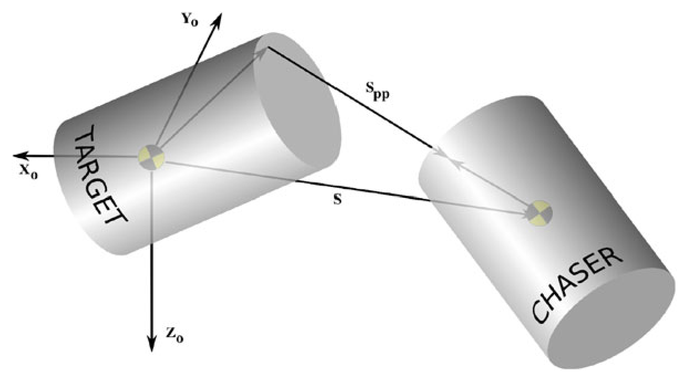

> Image description: A technical diagram from a textbook titled "Satellite Control, Fig. 3" illustrates the spatial relationship between two cylindrical spacecraft: the "TARGET" and the "CHASER." A three-dimensional Cartesian coordinate system is centered on the Target's center of mass (COM), with axes labeled $x_0$, $y_0$, and $z_0$. Two gray arrows represent distance vectors between the spacecraft. One vector, labeled $\mathbf{s}$, originates from the center of mass of the Target and terminates at the center of mass of the Chaser. A second vector, labeled $\mathbf{s}_{pp}$, originates from a point on the surface of the Target and terminates at a point on the surface of the Chaser. According to the caption, these vectors represent the COM-to-COM position ($\mathbf{s}$) and the port-to-port position ($\mathbf{s}_{pp}$) between the two spacecraft. The diagram defines the geometric parameters used to calculate relative motion and proximity during satellite docking or rendezvous operations.

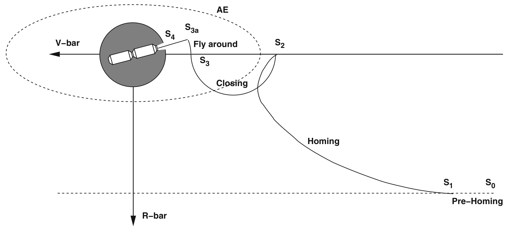

> Image description: This technical diagram illustrates a spacecraft rendezvous trajectory relative to a central body (shaded gray circle). Two primary reference axes are shown: the "V-bar" pointing left and the "R-bar" pointing downward. A dashed elliptical orbit labeled "AE" surrounds the central body. A continuous trajectory curve represents the approach, segmented into labeled stages: "Pre-Homing" (starting at point $S_0$), "Homing" (leading to $S_1$), "Closing" (reaching $S_2$), "Fly around" (traversing $S_3$ to $S_{3a}$), and finally $S_4$ at the target spacecraft. Specific spatial points are marked as $S_0, S_1, S_2, S_3, S_{3a},$ and $S_4$. The diagram geometrically defines the relative motion phases between two spacecraft, transitioning from long-range homing to close-proximity maneuvers around the target vessel.
Satellite Control, Fig. 4 This figure shows the phases of typical relative motion approach. The shaded area is a keepout zone (KOZ) defined for safety reasons. V-bar is the x -axis and R-bar is the z -axis

is used to measure the relative position (range and line-of-sight (LOS) angles) and at short range $(<50 \mathrm{~m})$ the relative attitude. They require a target pattern to provide precise measurements at short range. Accelerometers are used, particularly for pulsed maneuvers. The next generation of RVD GNC systems, test flown, will utilize Lidar, infrared cameras, and visual cameras in combination with advanced image processing providing RVD capabilities with both cooperative and passive target spacecraft.

The actuators are mostly thrusters arranged to achieve controllability for all the 6DOF maneuvers needed. Based upon the controller output, the active thrusters are selected by means of some
type of fuel optimization algorithm. The selected thrusters are then pulse width modulated (PWM) within the sampling time.

The controllers are frequently of multivariable $\mathcal{H}_{\infty}$ type. They are similar to what is described in connection with Fig. 2. Flexible modes and in particular sloshing need to be taken into account using Eq. (2). Sloshing pendulum models are used during boost maneuvers and spring mass damper models during other modes. The couplings between relative attitude and relative position in Eq. (8) can be analytically decoupled setting the matrix $\mathbf{C}$ to identity and premultiplying with a decoupling matrix $\mathbf{V}_{d}$, such that

$$
\begin{equation*}
\mathbf{V}_{d} \mathbf{C}=\mathbf{I} \Leftrightarrow \mathbf{V}_{d}=\mathbf{C}^{-1} \tag{9}
\end{equation*}
$$

<!-- source_pdf_page: 1283 -->
Satellite Control, Fig. 5
Principal structure of the 2 degree-of-freedom controller
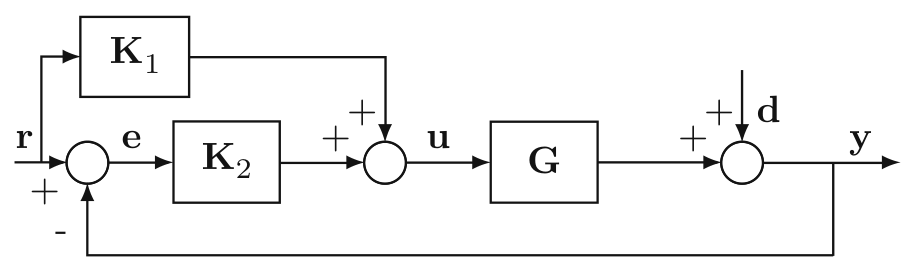

> Image description: This block diagram, captioned "Fig. 5 Principal structure of the 2 degree-of-freedom controller," illustrates a control system architecture. The input signal $r$ enters a summing junction where it is compared against a negative feedback signal from the output $y$, resulting in an error signal $e$. The signal $r$ is also fed into a feedforward block $K_1$. The error signal $e$ passes through a feedback block $K_2$. The outputs of $K_1$ and $K_2$ are combined at a summing junction to produce the control signal $u$, which serves as the input to the plant block $G$. The output of $G$ is then summed with a disturbance signal $d$ to produce the final output $y$. A feedback loop connects the output $y$ back to the initial summing junction with a negative sign, completing the closed-loop structure. This configuration demonstrates a two-degree-of-freedom control topology separating command tracking and disturbance rejection.

and by the inversion theorem for partitioned matrices the upper right partition just changes sign. The designed controller then needs to be premultiplied by $\mathbf{V}_{d}^{-1}$, which facilitates a simpler control design maintaining the 6DOF performance after 2 times 3DOF synthesis.

A 2 degree-of-freedom control architecture as in Fig. 5 is beneficial since much of the performance is achieved by controller $\mathbf{K}_{1}$. The structure of the synthesis formulation is a signal-based model-reference configuration for the $\mathcal{H}_{\infty}$ control rather than the more classical mixed sensitivity type. It has proven to have higher robustness and performance for this type of applications. As an example, consider a controller that has to follow a sawtooth motion of the docking port of the International Space Station (ISS) with an amplitude of 0.4 m and reversal times of 8 s . The signal-based model-reference controller manages to track such a motion with errors less than 0.01 m compared to the best operational performance of 0.08 m .

Formation flying usually includes more than two spacecraft with the need to be controlled relative to each other. The objective of FF is to form an instrument in space, not possible with fixed structures, like a synthetic aperture or an interferometer of large size.

The performance needs are high and require innovative high-precision ( $<1 \mu \mathrm{~m}$ ) metrology sensors. They are based on divergent laser beams for the coarse part to be able to transit from lower to higher accuracy. The fine metrology uses a laser beam and internal interferometers to reach the $\mu \mathrm{m}$ domain. Actuators are in the range of $\mu \mathrm{N}$ thrust, which can be achieved with either cold gas or electrical propulsion thrusters.

The maneuvers realized by entire formations are rotation, resizing, and slew while maintaining the formation in most cases (Alfriend et al. 2010).

Formation flying missions with the highest performance requirements have optical payloads, which need to have internal control loops at component level. To reach the performance required for applications such as optical interferometry, the formation and payload must be considered as one system. The synthesis of a multivariable controller then handles all the cross couplings in the system needed to reach performance. Beyond flexible modes, such systems might also have a need for active vibration damping for systems using cryocoolers.

The GNC architecture is often centralized for nominal science operational modes. For the formation deployment and contingency situations, a decentralized control architecture is needed. This leads to a dual architecture GNC system in general for formation flying systems. The onboard autonomy needs to be fairly high in order to cope with the contingencies in the formation without ground intervention.

Finally there is an emerging concept of fractionated spacecraft. There, a formation consists of a large number of small simple vehicles maneuvering relative to each other fully autonomously based upon the nearest neighbor knowledge and not necessarily information about the entire formation (Cornford 2012).

## Summary and Future Directions

The control of spacecraft has been described for pure attitude control needs and for spacecraft performing relative proximity maneuvers like rendezvous and formation flying. The focus has been on sensors, actuators, dynamics, and the robust control methods applied today.

The further development direction of the field is expected to be increased on board autonomy with replanning capabilities and fault-tolerant

<!-- source_pdf_page: 1284 -->
GNC designs. Model predictive control (MPC) will enter in particular on the guidance functions. More integrated GNC system-level designs, of multidisciplinary nature, are expected.

## Cross-References

- Fault-Tolerant Control
- H-Infinity Control
- Model-Predictive Control in Practice
- Nominal Model-Predictive Control

## Bibliography

Alfriend K, Vadali S, Gurfil P, How J, Breger L (2010) Spacecraft formation flying. Elsevier, Amsterdam/Boston/London
Ankersen F (2011) Guidance, navigation, control and relative dynamics for spacecraft proximity maneuvers. Aalborg University, Denmark. ISBN:978-87-92328-72-4
Bryson A (1999) Control of spacecraft and aircraft. Princeton University Press, Princeton
Clohessy W, Wiltshire R (1960) Terminal guidance system for satellite rendezvous. J Aerosp Sci 27(9): 653-658
Cornford S (2012) Evaluating a fractionated spacecraft system: a business case tool for DARPA's F6 program. In: Aerospace conference, Big Sky. IEEE, Big Sky, MT, pp 1-20
D'Errico M (2012) Distributed space missions for earth system monitoring. Springer, New York
ESA Handbook (2011) ESA pointing error engineering handbook. European Space Agency. http://peet.estec. esa.int
Falcoz A, Watt M, Yu M, Kron A, Menon P, Bates D, Ankersen F, Massotti L (2013) Integrated control and structure design framework for spacecraft applied to BIOMASS satellite. In: 19th IFAC conference on automatic control in aerospace, Würzburg, Germany, 2-6 Sept 2013
Fehse W (2003) Automated rendezvous and docking of spacecraft. Cambridge University Press, Cambridge/New York
Hughes P (1986) Spacecraft attitude dynamics. Wiley, New York
Kaplan M (1976) Modern spacecraft dynamics \& control. Wiley, New York
Ogata K (1970) Modern control engineering. PrenticeHall, Englewood Cliffs
Sidi M (2000) Spacecraft dynamics and control: a practical engineering approach. Cambridge University Press, Cambridge

Skogestad S, Postlethwaite I (1996) Multivariable feedback control. Wiley, Chichester/New York
Wertz J (1980) Spacecraft attitude determination and control. Kluwer, Dordrecht
Wie B (1998) Space vehicle dynamics and control. American Institute of Aeronautics and Astronautics, Reston
Yamanaka K, Ankersen F (2002) New state transfer matrix for relative motion on an arbitrary elliptical orbit. J Guid Control Dyn 25(1):60-66

## Scheduling of Batch Plants

John M. Wassick The Dow Chemical Company, Midland, MI, USA

#### Abstract

For manufacturers operating batch plants, production scheduling is a critical and challenging problem. A thorough understanding of the problem and the variety of solutions approaches is needed to achieve a successful application. This entry will present a brief overview of batch operations and the state of the art of batch plant scheduling for nonexperts in the field.

## Keywords

Dispatching rules; Optimization; Process networks; Production sequencing; Product wheel

Batch plants, manufacturing operations composed of unit operations that operate in batch mode, are the primary manufacturing operations for the production of high margin products such as pharmaceuticals, specialty chemicals, and advanced materials. The scheduling of the sequence of operations over time has a significant impact on the overall performance of a batch plant (White 1989). The economic importance of batch plants, and the importance of scheduling for batch plants, has spawned a large body of

<!-- source_pdf_page: 1285 -->
research on the topic and a variety of commercial offerings.

## The Nature of Batch Plants

In batch operations, the material transformation takes place in stages and the operation of each stage occurs over a specified time while the material remains in a particular unit operation performing that stage of production. (A familiar batch operation is baking a cake. Ingredients and their amounts, specified by a recipe, are combined and then subjected to a constant temperature over specified period of time to produce a cake.) A batch plant may have parallel units for some stages. Other stages may be operated in a continuous flow mode with a storage unit feeding the stage and another storage unit receiving the stage output. The path through the unit operations may be product dependent. Batch plants have highly diverse operational characteristics.

There are two broad categories of batch processes: (1) sequential where a batch moves from one stage to another without losing its identity and (2) networked where batches can be combined or split to feed downstream units (Mendez et al. 2006). Sequential processes can be further classified as single stage, multi-stage, or multipurpose.

The nature of a batch process and the different process structures can be explored by referring to the process depicted in Fig. 1 (Chu et al. 2013). As drawn, this batch plant operates as a multi-stage sequential process where a batch starts in raw material preparation stage (selected
raw materials are loaded and then blended for a specified time), moves to the reaction stage with two parallel units (prepared raw materials plus additives react at a constant temperature for a specified period of time), moves to the finishing stage (intermediate product is subjected to a vacuum for a specified period of time to remove volatile by-products), and finally is processed in the drumming stage (finished product is packaged in drums). If finished product storage tanks were placed between finishing and drumming to allow the drumming stage to be scheduled independently of the first three stages, then the drumming operation would represent a single stage sequential process. If we further assume that for some finished products Reactor 1 produces a batch of precursor for Reactor 2 and that some products produced in the reactors bypass the finishing stage and go directly to drumming, then the underlying plant would be a multi-purpose sequential process. Finally, if intermediate storage tanks exist for storing multiple batches of the precursors produced by Reactor 1 and the contents of the tanks are drawn off to produce multiple, subsequent batches in both reactors then the underlying plant is a networked process.

Besides the general structure of a batch plant, the specific processing requirements, resources needs, and process constraints have significant impact on the complexity of the scheduling problem. One important aspect is limited resources that are shared between different operations. The availability and capacity of shared resources place a severe constraint on the timing of competing operations. Another significant factor is intermediate storage between

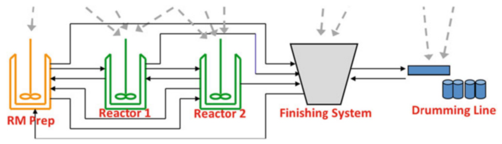

> Image description: This flowchart illustrates an example batch plant process consisting of five primary stages: RM Prep, Reactor 1, Reactor 2, Finishing System, and Drumming Line. The process follows a sequential flow from left to right. Solid arrows indicate material flows originating from limited inventory sources, moving through the processing stages. Dashed arrows represent material flows originating from unlimited inventory sources, feeding into the RM Prep, Reactor 1, Reactor 2, and Finishing System stages. The workflow begins at RM Prep, which feeds into Reactor 1. The output of Reactor 1 moves to Reactor 2, and the output of Reactor 2 proceeds to the Finishing System. The Finishing System then feeds into the Drumming Line, where the final product is stored in blue drums. Additionally, there are feedback loops represented by solid arrows returning from the Finishing System and Reactor 2 back to preceding stages (RM Prep and Reactor 1, respectively), indicating recycling or reprocessing within the batch plant.
Scheduling of Batch Plants, Fig. 1 Example batch plant (Solid lines represent material flows from limited inventory. Dashed lines represent material flow from unlimited inventory)

<!-- source_pdf_page: 1286 -->
stages and the inventory policies that are enforced. Like shared resources, intermediate storage places hard constraints on the timing of upstream and downstream stages, especially when no storage is available. A third important constraint on scheduling is product transition policies that dictate what operations need to be performed to move from one product to another in a given stage. Such operations, sometimes called setups, might involve cleaning, or producing buffer batches to isolate the chemistry of one product from another. These operations involve costs and subtract from the productive use of the equipment so they have significant impact on the sequencing of products through the plant.

## Production Scheduling of Batch Plants

Production scheduling in a batch plant involves three fundamental decisions: (1) determining the size of each batch in each stage, (2) assigning
a batch to a processing unit in each stage, and (3) determining the sequence and timing of processing on each unit. These decisions are well illustrated by a graphical planning board or Gantt chart as shown in Fig. 2 (Chu et al. 2013). Personnel charged with creating and managing production schedules often rely on such a graphical tool to construct, analyze and report the schedule. Generally production schedules are determined using the information listed in Table 1.

The scope of the scheduling decisions is defined by the level of process detail considered in the scheduling problem. This idea can be examined by referring to Figs. 1 and 2. Such a Gantt chart could apply to a batch plant with four stages of production: raw material preparation, reaction, finishing, and drumming, with two parallel reactors in the reaction stage. If dedicated finished product storage exists with large enough capacity to cover the process lead time then one schedule could be confined to the first three stages of production and a different schedule applied to the drumming stage. The scope of the scheduling problem could be further reduced if raw material

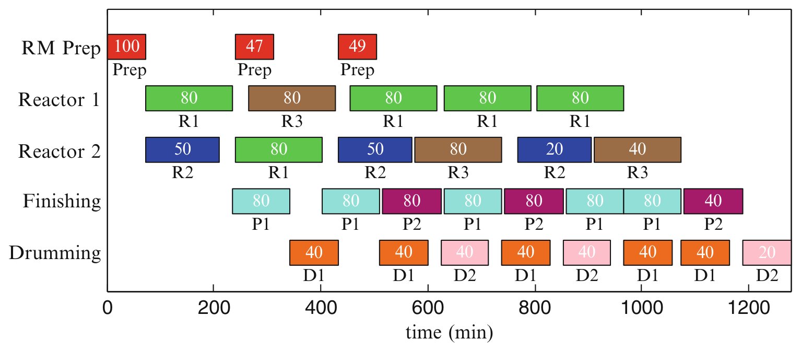

> Image description: A Gantt chart illustrates a production schedule for a batch plant across four sequential stages: RM Prep, Reactor 1, Reactor 2, Finishing, and Drumming. The x-axis represents time in minutes, ranging from 0 to 1200. The "RM Prep" stage consists of three discrete preparation tasks (labeled "Prep") with durations of 100, 47, and 49 minutes. The "Reaction" stage utilizes two parallel resources: - **Reactor 1** handles five sequential tasks (labeled R1 or R3) with durations of 80 minutes each. - **Reactor 2** handles five sequential tasks (labeled R2 or R3) with varying durations: 50, 80, 50, 80, 20, and 40 minutes. The "Finishing" stage follows the reaction stage, consisting of eight tasks (labeled P1 or P2) with durations of 80 or 40 minutes. The final stage, "Drumming," consists of seven tasks (labeled D1 or D2) with durations of 40 or 20 minutes, occurring concurrently with the finishing and reaction stages.
Scheduling of Batch Plants, Fig. 2 Gantt chart of a production schedule

Scheduling of Batch Plants, Table 1 Information generally used to construct a production schedule
| Scheduling information | Examples |
| :--- | :--- |
| Detailed production recipes | Batch times, processing rates, unit ratios, sequence dependencies |
| Equipment data | Capacities, availabilities, product suitability |
| Facility information | Shared resource availability and capacities, storage capacities |
| Production costs | Raw materials, utilities, setups, cleanings, manpower |
| Production targets | Inventory replenishments, customer orders with due dates |
| Current process status | Current inventories, operations in progress, schedule items fixed in future time |

<!-- source_pdf_page: 1287 -->
preparation only takes place just in time to load a reactor rather than execute as soon as possible. In this situation, the time for raw material preparation could be added to the reactor batch time and the schedule would involve only the reactors and the finishing system with the raw material unit or units schedule implied by the reactor schedule. At a higher level still, the first three stages of production could be considered a production train and scheduling could then be reduced to planning campaigns of batches for each product over time with the detailed synchronization of the individual stages left to operations personnel. Obviously with each level of abstraction some efficiency in the schedule is lost and subsequently the opportunity to increase throughput of the plant.

In most batch plants a person with a title such as "production scheduler" is charged with the scheduling decisions. In general, the production scheduler is responsible for delivering a production schedule that meets customer orders on time and maintains finished product inventory while dealing with rush orders, late deliveries, equipment breakdowns and other contingencies. Generally schedulers develop and publish a schedule to manufacturing on a regular basis (e.g., every 2 days, once a week, etc.) and then monitor ongoing circumstances (e.g., actual production vs. plan, new demand, etc.) to determine if minor adjustments to the schedule are needed or if a complete new schedule needs to be published. The construction of a schedule can be an iterative process involving negotiations with manufacturing, supply chain, sales, maintenance and logistics. The tools available to the production scheduler can have a significant impact on the quality of schedules they produce.

It is evident from the description above that production scheduling of batch plants is really carried out as an exercise in rescheduling in response to disturbances identified through feedback from the process and market. Under these circumstances production scheduling serves as a form of high level feedback control of the process. In this regard the manipulated variables are the production amounts for each product and the controlled variables are the inventory levels
and customer service levels for each product. A scheduling problem can be converted to a state-space formulation and compared to model predictive control (Subramanian et al. 2012).

## Solution Approaches

The solution approaches applied to scheduling batch plants cover a wide spectrum of sophistication. A very simple form is nothing more than a sequence of batches maintained on a white board in the plant control room. A level above this would be the use of custom spreadsheets for arranging batches chronologically and computing finished product inventory. Another step up is the use of a manually manipulated Gantt chart as illustrated in Fig. 2, possibly pre-populated by an automated planning application that determines the volume to be produced across the units of production while leaving the detailed sequencing and timing decisions to the production scheduler. The highest level of sophistication involves an automatically generated schedule with the application retrieving all the necessary data from the appropriate business databases and plant control system.

Regardless of the level of sophistication, all solution approaches rely on two fundamental components for developing a schedule. One is the modeling paradigm used to represent the physical system in a more abstract way. The primary components are: material balances in terms of batches or units of measure (e.g., pounds), and timing information as either precedence-based describing the order of operations or time gridbased describing the instant at which any operation takes place. Time can either be described by a continuous representation or divided into discrete increments. Within these two aspects of the modeling framework, significant freedom exists to describe the scheduling problem. The second fundamental component is the solution method used to generate the schedule. Each method has its strengths; therefore solutions combining methods are also used. The essential problem is to produce the information needed to draw the Gantt chart in Fig. 2 given the information in Table 1.

<!-- source_pdf_page: 1288 -->
## Product Wheel

While the primary objective of production scheduling is to meet customer orders while managing finished product inventory, other operational issues need to be managed, such as minimizing product transition costs, minimizing variability in manufacturing operations, keeping the scheduling process simple, and balancing the tradeoff between production lead times, inventory, and transition losses. The product wheel is a practical approach widely used in industry to address these competing issues. A product wheel is a regular repeating sequence of products made on a specific unit operation or an entire production process. A product wheel is typically depicted as a pie chart as shown in Fig. 3. Segments of the pie, called spokes of the wheel, represent a production campaign of a particular product. The size of the spoke represents the length of the campaign relative to the overall duration, or cycle time, of the wheel.

A product wheel has specific design parameters to address various operations objectives. The sequences is fixed and optimized for minimum transition costs. The overall cycle time is fixed and optimized to balance lead time and inventory costs. The campaign size or spokes for each product are sized to match average demand for each product. The fixed pattern of the product wheel provides manufacturing with a predictable operational rhythm and the production scheduler with a very structured decision framework. Refer to King and King (2013) for a complete treatment of product wheels.

In practice, the duration of a campaign for a given product will vary from cycle to cycle as it

> Image description: A pie chart titled "Fig. 3 Product wheel" illustrates a scheduling cycle for batch plants, represented by six distinct wedge-shaped segments labeled A through F. The segments are arranged in a circular sequence around a central point, with visible gaps between them suggesting a discrete, sequential process. The segments are color-coded and vary in size: * **Segment A** is blue and represents a moderate portion of the circle. * **Segment B** is the largest segment, colored dark red, occupying the largest area. * **Segment C** is olive green and follows B. * **Segment D** is purple and follows C. * **Segment E** is a small teal wedge. * **Segment F** is orange and precedes A, completing the wheel. In an engineering context, this "product wheel" represents a production schedule where different products or batches (A-F) are cycled through a plant, with the relative sizes of the wedges potentially representing the duration or capacity allocated to each specific product in a recurring schedule.
Scheduling of Batch Plants, Fig. 3 Product wheel

will be sized to replenish any inventory consumed in the previous cycle. Low volume products may not be made on every cycle, although they will have a fixed location in the sequence. This same approach applies to make-to-order products that are not inventoried but produced to fill specific orders. Thus, in some cases a product wheel may be composed of several different but repeating cycles.

## Dispatching Rules Used in Discrete Manufacturing

Batch processes are closely related to discrete manufacturing. Batches processed on a unit are analogous to jobs processed on a machine. Much of the literature on machine scheduling has focused on the analysis of the specifics encountered in general classes of problems such as single machines, parallel machines, flow shops and job shops, and developing constructive scheduling rules where a schedule is built up by adding one job at a time (Blackstone et al. 1982). Under certain circumstances these rules used for machine scheduling can be applied to scheduling batch plants. This allows one to take advantage of a great body of literature, and at times, very simple scheduling rules that have proven optimality or worst case performance limits.

Consider again the batch process referred to in Fig. 1 which has two parallel reactors. The two reactors can be modeled as a single stage process and scheduled like parallel machines using the simple shortest processing time first (SPT) rule if the following circumstances hold: (1) raw material preparation can be included in the batch time of reactors, (2) significant storage exists between the reactors and finishing to essentially isolate the two stages, (3) product specific batch times are identical for both reactors, (4) the number of batches of each product is given (perhaps the result of an inventory policy for make to stock products), and (5) the objective is to minimize the total completion time for all batches. The SPT rule is simply to select, whenever a reactor is free, the batch with the shortest processing time from those yet to be processed. This can be proven to produce an optimal schedule for the given conditions.

<!-- source_pdf_page: 1289 -->
Another simple dispatching rule to mention is the earliest due date first (EDD) rule. This rule is designed for single stage processes without parallel units where each batch has an associated due date. The rule simply orders the batches in increasing order of their due dates to minimize the maximum lateness of all orders.

The conditions needed for the SPT rule or the EDD rule to produce an optimal schedule can be quite restrictive when considering batch processes, however these rules and others found in the machine scheduling literature (Baker and Trietsch 2009) can still produce a good initial schedule even in cases where optimality conditions are not satisfied. Once generated, the schedule can be improved by manual manipulation of the Gantt chart or the application of improvement heuristics.

## Improvement Heuristics

Improvement heuristics try to improve the current schedule by searching for alternative solutions either in the neighborhood of the current schedule or by broadly exploring the solution space. The behavior of these algorithms is determined by tuning parameters that balance the use of the two search techniques and the underlying algorithm that performs the search. Improvement heuristics generally have the following basic procedure:
Step 1: Initialize - determine a starting schedule
Step 2: Generate alternatives - build modifications to the current schedule
Step 3: Check for improvements in modified schedule - if no improvement is found return to Step 2 otherwise proceed to Step 4
Step 4: Check for termination - terminate the algorithm if the number of iterations is exceeded or minimal improvement is obtained.
Many improvement heuristics are inspired by processes found in nature. Two of the more popular heuristics are simulated annealing which mimics the crystal formation during the cooling process of dense matter (Ryu et al. 2001) and genetic algorithms that mimic the evolution of a species over time (Löhl et al. 1988). A key aspect of improvement heuristics is the representation of the schedule in context of the algorithm used. For problems with complicated constraints this becomes a challenge. Nevertheless, when tuned
properly and used where they fit the problem, improvement heuristics can produce very good schedules quickly.

## Tree Search Methods

The scheduling solutions considered so far have taken a relatively simple view of a batch process as a single stage process or a flow shop. In situations where a batch plant involves shared resources, complicated transition rules or is a process network, tree search methods are better suited because they can deal with a large number of degrees of freedom and many types of constraints. Tree search methods rely on representing alternative schedules as the final nodes in a tree where intermediate nodes represent partial solutions of the schedule. To be practical, these methods must be able to effectively search through the tree while pruning non promising branches (see Fig. 4). Three of the most popular techniques are mathematical programming, constraint programming, and beam search.

Mathematical programming solution techniques for scheduling generally convert the problem to a mixed integer linear programming (MILP) formulation where branching at nodes of the tree represent alternative values of the integer or binary variables. The tree is searched by a branch-and-bound algorithm which eliminates a node and the branch that emanates from it if the lower bound of the objective function represented by the terminal nodes of the branch is larger than the current best schedule. The MILP formulation can be stated generically as

$$
\begin{aligned}
& \min \quad z=c x+f y \\
& \text { s.t. } A x+B y \geq b \\
& x \in \Re_{+}^{n}, y \in\{0,1\}^{p}
\end{aligned}
$$

where $c, f, b$ are vector of constants, $A$ and $B$ are matrices of constants, and the solution is defined

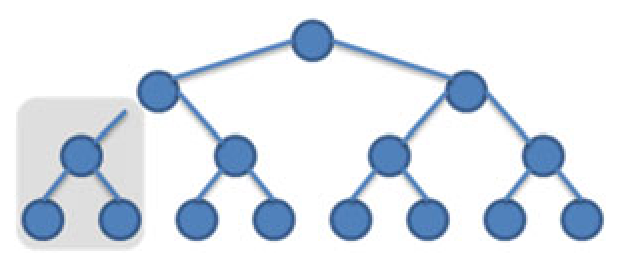

> Image description: This figure, titled "Fig. 4 Trimming the solution tree" from a text on "Scheduling of Batch Plants," illustrates a hierarchical tree structure used in optimization or search algorithms. The diagram consists of blue circular nodes connected by blue lines, forming a branching tree structure. The tree begins with a single root node at the top level, which branches into two intermediate nodes. These intermediate nodes further branch down to a third level of nodes. The structure shows a typical decision tree where each node represents a potential state or solution component. On the far left, a specific subtree is highlighted within a light grey rectangular box, indicating a subset of the solution space being targeted or "trimmed." This visual representation demonstrates the process of pruning or selecting specific branches within a larger computational search space to improve efficiency in scheduling problems.
Scheduling of Batch Plants, Fig. 4 Trimming the solution tree

<!-- source_pdf_page: 1290 -->
by the vector variables $x$ and $y$. A key feature of using mathematical programming is to represent the relationships implied in Table 1 and Fig. 1 in terms of algebraic descriptions. The advantage of this approach is that a proven optimal solution exists for a problem stated this way. This provides the means to assess the quality of the solution and the impact of implementing the solution. The drawback of this approach is that since binary variables are used to represent the assignment of a batch to a processing unit, and the sequence and timing of processing on each unit, their number grows rapidly with the number of units and the length of the scheduling horizon. However, the performance of modern computing hardware and commercial solvers for MILP problems has allowed industrial size problems to be tackled.

A large variety of modeling paradigms have been developed to produce a MILP solution (Floudas and Lin 2004; Mendez et al. 2006). They address both sequential and networked processes using continuous time or discrete time representations. For sequential processes, time slot approaches have been developed. For networked processes, the resource task network and the state task network have been investigated by many researchers and have been used in industrial applications.

Constraint programming (CP) formulates a problem by writing constraints; but unlike the MILP method, the CP method stresses the feasibility of solutions rather than optimality. Another important difference is that constraints in the CP method do not have to be formulated as algebraic relationships but can be a more general form, thus making it easier in CP to represent complicated constraints. CP processes the constraints sequentially to reduce the space of possible solutions. At each node in the tree, CP processes one constraint after another, reducing the search space at each constraint. Being much newer than mathematical programming, constraint programming has a smaller body of literature to review but excellent performance has been reported in the literature (Baptiste et al. 2001).

In the beam search method, the branch-andbound algorithm is modified to only evaluate the most promising nodes at any given level of the search tree (Ow and Morton 1988). The number
of nodes evaluated is called the beam width and it is a key tuning parameter of the method. Another important element of the method is the technique used to retain nodes for complete evaluation. The technique must balance speed versus thorough evaluation to keep the method practical without discarding promising nodes. The beam search method applied to scheduling has been investigated by many authors (Sabuncuoglu and Bayiz 1999).

## Simulation

The simulation approach to scheduling batch plants relies on representing the plant and the relationships inferred by Table 1 in a computer program whose algorithms recreate the behavior of the plant when executed. Generally, the simulators used for batch operations apply discrete event simulation (DES) where entities that have attributes like size, due date, priority, etc. are operated on by activities for a specified duration. Fundamental to DES are the use of queues to hold entities until conditions in the simulation allow them to proceed to their next activity. Time in a DES does not proceed in a continuous manner but rather advances when activities occur. Simulation has the advantage of being able to describe processes and operating policies of arbitrary complexity and model variability in the process operation. Simulators can be used to evaluate manually created schedules or can be combined with optimization and heuristics to produce schedules by simulation-based optimization (Pegden 2011).

An alternative to DES for batch scheduling is the use of multi-agent simulators which are composed of semiautonomous agents assigned to represent the operation of the process and the associated decision making. Each agent has a local goal and communicates with other agents to accomplish it. Like DES, multi-agent simulators are capable of describing very complicated processes. A production schedule can be built through negotiations between agents (Chu et al. 2013).

## Selecting a Solution Approach

The selection of the approach for a given batch plant should be value-based, balancing improved revenue with long term cost of ownership by

<!-- source_pdf_page: 1291 -->
considering such factors as the technical competency of the production scheduler, the expected capacity utilization of the plant, the operational complexity of the plant, and the cost to maintain the scheduling application. The key is to obtain the least complicated solution by reducing the scheduling problem to the highest level of abstraction and by using the simplest solution method that provides an effective schedule. See Harjunkoski et al. (2013) and Pinedo (2008) for a survey of methods and recommendations for their practical application.

## Summary and Future Directions

While there are a great variety of solution methods for scheduling, there are still promising research areas to be investigated. The recent introduction of sophisticated, object oriented process control systems with ties to enterprise management systems sets the stage for the development of automatic, real time scheduling. It is here that the principles of feedback control can be applied to batch plant scheduling. Pursuit of this goal will require continued development of fast, adaptive scheduling methods, real time assessment techniques of schedule performance, and tight integration of scheduling with the process control.

## Cross-References

- Control and Optimization of Batch Processes
- Models for Discrete Event Systems: An Overview

## Bibliography

Baker KR, Trietsch D (2009) Principles of sequencing and scheduling. Wiley, Hoboken
Baptiste P, Le Pape C, Nuijten W (2001) Constrainedbased scheduling: applying constraint programming to scheduling problems. Kluwer Academic, Dordrecht
Blackstone JH, Phillips DT, Hogg GL (1982) A state-ofthe art survey of dispatching rules for manufacturing job shop operations. Int J Prod Res 20:27-45
Chu Y, Wassick JM, You F (2013) Efficient scheduling method of complex batch processes with general network structure via agent-based modeling. AIChE J. doi:10.1002/aic. 14101 (accepted)

Floudas CA, Lin XX (2004) Continuous-time versus discrete-time approaches for scheduling of chemical processes: a review. Comput Chem Eng 28:2109-2129
Harjunkoski I, Maravelias C, Bongers P, Castro P, Engell S, Grossmann I, Hooker J, Méndez C, Sand G, Wassick J (2013, submitted) Scope for industrial applications of production scheduling models and solution methods. Comput Chem Eng 60:277-296
King PL, King JS (2013) The product wheel handbook: creating balanced flow in high-mix process operations. Productivity Press, New York
Löhl T, Schulz C, Engell S (1988) Sequencing of batch operations for a highly coupled production process: genetic algorithms versus mathematical programming. Comput Chem Eng 22:S579-S585
Mendez CA, Cerda J, Grossmann IE, Harjunkoski I, Fahl M (2006) State-of-the-art review of optimization methods for short-term scheduling of batch processes. Comput Chem Eng 30:913-946
Ow PS, Morton TE (1988) Filtered beam search in scheduling. Int J Prod Res 26:35-62
Pegden DD (2011) Business benefits of Simio's riskbased planning and scheduling (RPS). In: Simio resources - white papers. http://www.simio.com/ resources/white-papers/. Accessed 1 June 2013
Pinedo ML (2008) Scheduling: theory, algorithms, and practice, 3rd edn. Springer, New York
Ryu JH, Lee HK, Lee IB (2001) Optimal scheduling for a multiproduct batch process with minimization of penalty on due date period. Ind Eng Chem Res 40:228-233
Sabuncuoglu I, Bayiz M (1999) Job shop scheduling with beam search. Eur J Oper Res 118:390-412
Subramanian K, Maravelias CT, Rawlings JB (2012) A state-space model for chemical production scheduling. Comput Chem Eng 47:97-110
White CH (1989) Productivity analysis of a large multiproduct batch processing facility. Comput Chem Eng 13:239-245
Wong TN, Leungy CW, Mak KL, Fung RYK (2006) Integrated process planning and scheduling/rescheduling an agent-based approach. Int J Prod Res 44:3627-3655

## Singular Trajectories in Optimal Control

Bernard Bonnard ${ }^{1}$ and Monique Chyba ${ }^{2}$ ${ }^{1}$ Institute of Mathematics, University of Burgundy, Dijon, France ${ }^{2}$ University of Hawaii-Manoa, Manoa, HI, USA

#### Abstract

Singular trajectories arise in optimal control as singularities of the end-point mapping. Their importance has long been recognized, at first in the

<!-- source_pdf_page: 1292 -->
Lagrange problem in the calculus of variations where they are lifted into abnormal extremals. Singular trajectories are candidates as minimizers for the time-optimal control problem, and they are parameterized by the maximum principle via a pseudo-Hamiltonian function. Moreover, besides their importance in optimal control theory, these trajectories play an important role in the classification of systems for the action of the feedback group.

## Keywords

Abnormal extremals; End-point mapping; Martinet flat case in sub-Riemannian geometry; Pseudo-Hamiltonian

## Introduction

The concept of singular trajectories in optimal control corresponds to abnormal extrema in optimization. Suppose that a point $x^{*} \in X \simeq \mathbb{R}^{n}$ is a point of extremum for a smooth function $\mathcal{L}: \mathbb{R}^{n} \rightarrow \mathbb{R}$ under the equality constraints $F(x)=0$ where $F: X \rightarrow Y$ is a smooth mapping into $Y \simeq \mathbb{R}^{p}, p<n$. The Lagrange multiplier rule (Agrachev et al. 1997) asserts the existence of nonzero pairs ( $\lambda_{0}, \lambda^{*}$ ) of Lagrange multipliers such that $\lambda_{0} \mathcal{L}^{\prime}\left(x^{*}\right)+\lambda^{*} F^{\prime}\left(x^{*}\right)=0$. The normality condition is given by $\lambda_{0} \neq 0$, and the abnormal case corresponds to the situation when the rank of $F^{\prime}\left(x^{*}\right)$ is strictly less than $p$.

Abnormal extremals have played an important role in the standard calculus of variations (Bliss 1946). Indeed, consider a classical Lagrange problem:

$$
\begin{array}{r}
\frac{d x}{d t}(t)=F(x(t), u(t)), \min _{u(.)} \int_{0}^{T} L(x(t), u(t)) d t \\
x(0)=x_{0}, x(T)=x_{1}
\end{array}
$$

where $x(t) \in X \simeq \mathbb{R}^{n}, u(t) \in \mathbb{R}^{m}, F$ and $L$ are smooth. Using an infinite dimensional framework, the Lagrange multiplier rule still holds and an abnormal extremum corresponds to a singularity of the set of constraints.

## Definition

Consider a system of $\mathbb{R}^{n}: \frac{d x}{d t}(t)=F(x(t), u(t))$ where $F$ is a smooth mapping from $\mathbb{R}^{n} \times \mathbb{R}^{m}$ into $\mathbb{R}^{n}$. Fix $x_{0} \in \mathbb{R}^{n}$ and $T>0$. The endpoint mapping is the mapping $E^{x_{0}, T}: u(.) \in \mathcal{U} \rightarrow x\left(T, x_{0}, u\right)$ where $\mathcal{U} \subset L^{\infty}[0, T]$ is the set of admissible controls such that the corresponding trajectory $x\left(., x_{0}, u\right)$ is defined on $[0, T]$. A control $u($.$) and its corresponding trajectory are$ called singular on $[0, T]$ if $u(.) \in \mathcal{U}$ is such that the Fréchet derivative $E^{x_{0}, T}$ of the end-point mapping is not of full rank $n$ at $u($.$) .$

## Fréchet Derivative and Linearized System

Given a reference trajectory $x(),. t \in[0, T]$, associated to $u($.$) with x(0)=x_{0}$, and solution of $\frac{d x}{d t}(t)=F(x(t), u(t))$, the system

$$
\dot{\delta x}(t)=A(t) \delta x(t)+B(t) \delta u(t)
$$

with
$A(t)=\frac{\partial F}{\partial x}(x(t), u(t)), B(t)=\frac{\partial F}{\partial u}(x(t), u(t))$
is called the linearized system along the controltrajectory pair ( $u(),. x()$.$) .$

Let $M(t)$ be the fundamental matrix, $t \in [0, T]$ solution of

$$
\dot{M}(t)=A(t) M(t), \quad M(0)=\mathrm{I}_{n} .
$$

Integrating the linearized system with $\delta x(0)=0$, one gets the following proposition.
Proposition 1 The Fréchet derivative of $E^{x_{0}, T}$ at $u($.$) is given by$

$$
E_{u}^{\prime x_{0}, T}(v)=M(T) \int_{0}^{T} M^{-1}(t) B(t) v(t) d t
$$

<!-- source_pdf_page: 1293 -->
## Computation of the Singular Trajectories and Pontryagin Maximum Principle

According to the previous computations, a control $u($.$) with corresponding trajectory x($.$) is$ singular on $[0, T]$ if the Fréchet derivative $E^{\prime x_{0}, T}$ is not of full rank at $u($.$) . This is equivalent to$ the condition that the linearized system is not controllable (Lee and Markus 1967).

Such a condition is difficult to verify directly since the linearized system is time-depending and the computation is associated to the Maximum Principle (Pontryagin et al. 1962).

Let $p^{*}$ be a nonzero vector such that $p^{*}$ is orthogonal to $\operatorname{Im}\left(E^{x_{0}, T}\right)$ and let $p(t)= p^{*} M(T) M^{-1}(t)$; then $p($.$) is solution of the$ adjoint system

$$
\dot{p}(t)=-p(t) \frac{\partial F}{\partial u}(x(t), u(t))
$$

and satisfies almost everywhere the equality

$$
p(t) \frac{\partial F}{\partial u}(x(t), u(t))=0
$$

Introduce the pseudo-Hamiltonian $H(x, p, u)= \langle p, F(x, u)\rangle$, where $\langle.,$.$\rangle is the Euclidean inner$ product, one gets the following characterization.

Proposition 2 If ( $x, u$ ) is a singular controltrajectory pair on $[0, T]$, then there exists a nonzero adjoint vector $p($.$) defined on [0, T]$ such that ( $x, p, u$ ) is solution a.e. of the following equations:

$$
\begin{array}{r}
\frac{d x}{d t}=\frac{\partial H}{\partial p}(x, p, u), \frac{d p}{d t}=-\frac{\partial H}{\partial x}(x, p, u) \\
\frac{\partial H}{\partial u}(x, p, u)=0 .
\end{array}
$$

## Application to the Lagrange Problem

Consider the problem

$$
\frac{d x}{d t}(t)=F(x(t), u(t)), \min \int_{0}^{T} L(x(t), u(t)) d t
$$

with $x(0)=x_{0}, x(T)=x_{1}$.

Introduce the cost-extended pseudo-Hamiltonian: $\tilde{H}(x, p, u)=\langle p, F(x, u)\rangle+p_{0} L(x, u)$; it follows that the maximum principle is equivalent to the Lagrange multiplier rule presented in the introduction:

$$
\begin{array}{r}
\frac{d \tilde{x}}{d t}=\frac{\partial \tilde{H}}{\partial \tilde{p}}(\tilde{x}, \tilde{p}, u), \frac{d \tilde{p}}{d t}=-\frac{\partial \tilde{H}}{\partial \tilde{x}}(\tilde{x}, \tilde{p}, u) \\
\frac{\partial \tilde{H}}{\partial u}(\tilde{x}, \tilde{p}, u)=0
\end{array}
$$

where $\tilde{x}=\left(x, x^{0}\right)$ is the extended state variable solution of $\frac{d x}{d t}=F(x, u), \frac{d x^{0}}{d t}=L(x, u)$ and $\tilde{p}=\left(p, p_{0}\right)$ is the extended adjoint vector. One has the condition $\left\langle\tilde{p}, \tilde{E}_{u}^{\prime x_{0}, T}(v)\right\rangle=0$ where $\tilde{E}^{x_{0}, T}$ is the cost-extended end-point mapping.

## The Role of Singular Extremals in Optimal Control

While the traditional treatment in optimization of singular extremals is to consider them as a pathology, in modern optimal control, they play an important role which is illustrated by two examples from geometric optimal control.

## Singular Trajectories in Quantum Control

Up to a normalization (Lapert et al. 2010), the time minimization saturation problem is to steer in minimum time the magnetization vector $M= (x, y, z)$ from the north pole of the Bloch Ball $N=(0,0,1)$ to its center $O=(0,0,0)$. The evolution of the system is described by the Bloch equation in nuclear magnetic resonance (Levitt 2008)

$$
\begin{array}{r}
\frac{d x}{d t}=-\Gamma x+u_{2} z \\
\frac{d y}{d t}=-\Gamma-u_{1} z \\
\frac{d z}{d t}=\gamma(1-z)+u_{1} y-u_{2} x
\end{array}
$$

where ( $\Gamma, \gamma$ ) are proportional to the inverse of the relaxation times and $u=\left(u_{1}, u_{2}\right)$ is the control radio frequency-magnetic field bounded according to $|u| \leq M$. Due to the $z$-symmetry of revolution, one can restrict the problem to the 2D single-input case

<!-- source_pdf_page: 1294 -->
$$
\frac{d y}{d t}=-\Gamma y-u z, \frac{d z}{d t}=\gamma(1-z)+u y
$$

that can be written as $\frac{d q}{d t}=F(q)+u G(q)$.
According to the maximum principle, the time-optimal solutions are the concatenations of regular extremals for which $u(t)= M \operatorname{sign}\langle p(t), G(q(t))\rangle$ and singular arcs where $\langle p(t), G(q(t))\rangle=0, \forall t$, and $p(t)$ is solution of the adjoint system. Differentiating with respect of time and using the Lie bracket notation $[X, Y](q)=\frac{\partial X}{\partial q}(q) Y(q)-\frac{\partial Y}{\partial q}(q) X(q)$, we get

$$
\begin{aligned}
\langle p,[G, F](q)\rangle & =0 \\
\langle p,[[G, F], G](q)\rangle+u\langle p,[[G, F], F](q)\rangle & =0
\end{aligned}
$$

This leads to two singular arcs:

- The vertical line $y=0$, corresponding to the $z$-axis of revolution
- The horizontal line $z=\frac{\gamma}{2(\gamma-\Gamma)}$

The interesting physical case is when $2 \Gamma> 3 \gamma$ where the vertical singular line is such that $-1<\frac{\gamma}{2(\gamma-\Gamma)}<0$. In this case, the time minimum solution is represented on Fig. 1. On Fig. 2 we draw the experimental solution in the deoxygenated blood case, compared with the standard inversion recovery sequence.

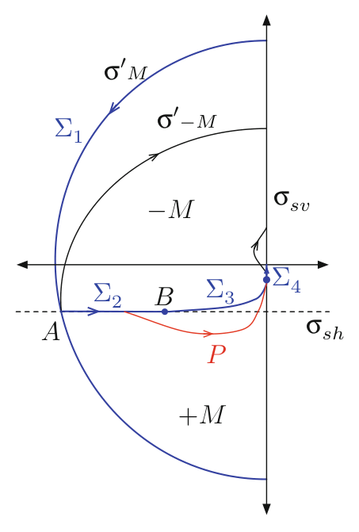

> Image description: This mathematical phase portrait features two perpendicular axes with arrows indicating direction. The vertical axis contains the label $\sigma_{sv}$, and the horizontal axis contains $\sigma_{sh}$. A dashed horizontal line intersects the vertical axis at a point labeled $\Sigma_4$. The diagram illustrates several trajectories (curves) with directional arrows. A large blue curve, labeled $\Sigma_1$, forms a semi-circle encompassing the left side of the plot. Inside, a black curve labeled $\sigma'_{-M}$ arches toward the vertical axis. The interior is divided into regions labeled $-M$ (upper) and $+M$ (lower). A specific sequence of paths is shown in the lower quadrant: a blue trajectory moves from point $A$ through $\Sigma_2$ and $\Sigma_3$ toward $\Sigma_4$, passing through point $B$. A red trajectory, labeled $P$, deviates from the blue path near $B$, curving downward before approaching $\Sigma_4$. Other labels include $\sigma'_M$ on the upper blue curve and various $\Sigma$ indices marking specific points or segments.
Singular Trajectories in Optimal Control, Fig. 1 The computed optimal solution is the following concatenation: bang arc $\sigma_{M}^{\prime}$ with the horizontal singular arc $\sigma_{s h}$ followed by a bang arc $P$ and finally the singular vertical arc $\sigma_{s v}$

## Abnormal Extremals in SR Geometry

Sub-Riemannian geometry was introduced by R.W. Brockett as a generalization of Riemannian geometry (Brockett 1982; Montgomery 2002) with many applications in control (for instance, in motion planning (Bellaiche et al. 1998; Gauthier and Zakalyukin 2006) and quantum control). Its formulation in the framework of control theory is
$\dot{q}(t)=\sum_{i=1}^{m} u_{i}(t) F_{i}(q(t)), \min _{u(.)} \int_{0}^{T}\left(\sum_{i=1}^{m} u_{i}^{2}(t) d t\right)$
where $q \in U$ open set in $\mathbb{R}^{n}, m<n$ and $F_{1}, \cdots, F_{m}$ are smooth vector fields which forms an orthonormal basis of the distribution they generate.

According to the maximum principle, normal extremals are solutions of the Hamiltonian vector field $\mathbf{H}_{n}, H_{n}=\frac{1}{2}\left(\sum_{i=1}^{m} H_{i}(q, p)^{2}\right), H_{i}= \left\langle p, F_{i}(q)\right\rangle$ for $i=1, \cdots m$. Again abnormal extremals can be computed by differentiating the constraint $H_{i}=0$ along the extremals. Their first occurrence takes place in the so-called Martinet flat case: $n=3, m=2, F_{1}, F_{2}$ are given by

$$
F_{1}=\frac{\partial}{\partial x}+\frac{y^{2}}{2} \frac{\partial}{\partial z}, F_{2}=\frac{\partial}{\partial y}
$$

where $q=(x, y, z) \in U$ neighborhood of the origin, and the metric is given by $d s^{2}= d x^{2}+d y^{2}$. The singular trajectories are contained in the Martinet plane $M: y=0$ and are the lines $z=z_{0}$. An easy computation shows that they are optimal for the problem. We represent below the role of the singular trajectories when computing the sphere of small radius, from the origin, intersected with the Martinet plane (Fig. 3).

## Summary and Future Directions

Singular trajectories play an important role in many optimal control problem such as in quantum control and cancer therapy (Schättler and Ledzewicz 2012). They have to be carefully analyzed in any applications; in particular in

<!-- source_pdf_page: 1295 -->
## Singular Trajectories in Optimal Control, Fig. 2

Experimental result. Usual inversion sequence in green, optimal computed sequence in blue
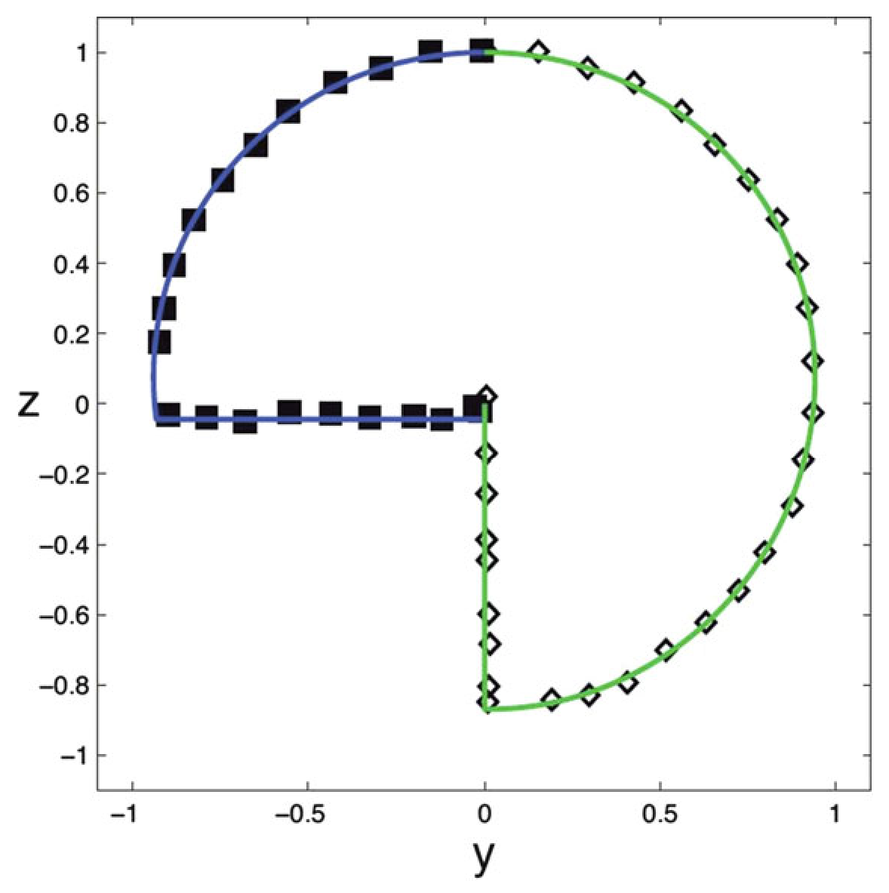

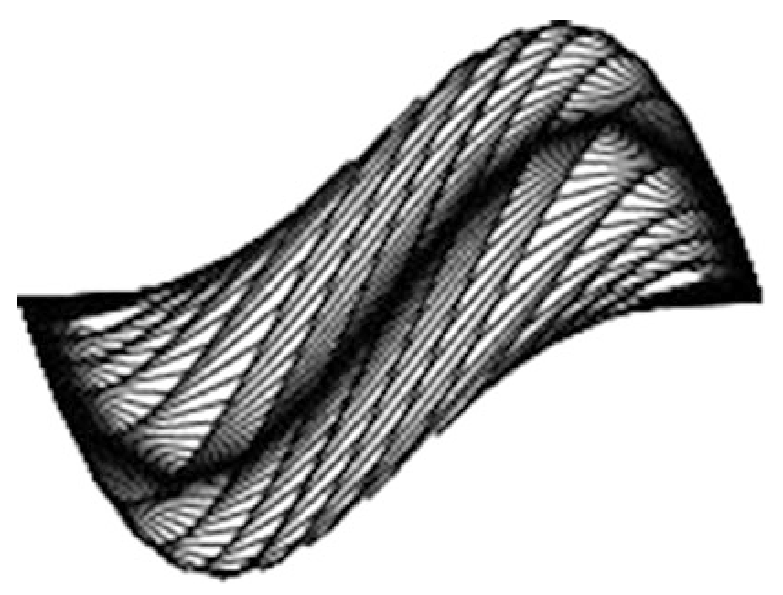

> Image description: This black-and-white figure illustrates a complex three-dimensional geometric projection. The image displays a series of dense, curved, overlapping line segments that create a sense of volume and depth. According to the caption, this is a projection of a singular Riemannian (SR) sphere onto the $x z$-plane. The lines are arranged in a rhythmic, wavy pattern, forming a structure that appears to "pinch" or narrow in a specific area, which represents the singular direction. Although there are no explicit coordinate axes or numerical labels within the visual field, the caption defines the mathematical context, stating that the singular line is represented by $x=t$. The overall visual effect is a continuous, flowing surface composed of many individual trajectories, visually demonstrating how the SR sphere behaves near a singular point in the context of optimal control theory.
Singular Trajectories in Optimal Control, Fig. 3 Projection of the SR sphere on the $x z$-plane. The singular line is $x=t$ and the picture shows the pinching of the SR sphere in the singular direction

Boscain and Piccoli (2006) the authors provide for single-input systems in two dimensions a classification of optimal synthesis with singular arcs.

Additionally, from a theoretical point of view, singular trajectories can be used to compute feedback invariants for nonlinear systems (Bonnard and Chyba 2003). In relation, a purely mathemat-
ical problem is the classification of distributions describing the nonholonomic constraints in subRiemannian geometry (Montgomery 2002).

## Cross-References

- Differential Geometric Methods in Nonlinear Control
- Feedback Stabilization of Nonlinear Systems
- Optimal Control and Pontryagin's Maximum Principle
- Robustness Issues in Quantum Control
- Sub-Riemannian Optimization

## Bibliography

Agrachev A, Sarychev AV (1998) On abnormal extremals for lagrange variational problems. J Math Syst Estim Control 8(1):87-118
Agrachev A, Bonnard B, Chyba M, Kupka I (1997) Sub-Riemannian sphere in Martinet flat case. ESAIM Control Optim Calc Var 2:377-448
Bellaiche A, Jean F, Risler JJ (1998) Geometry of nonholonomic systems. In: Laumond JP (ed) Robot motion planning and control. Lecture notes in control and information sciences, vol 229. Springer, London, pp 55-91

<!-- source_pdf_page: 1296 -->
Bliss G (1946) Lectures on the calculus of variations. University of Chicago Press, Chicago
Bloch A (2003) Nonholonomic mechanics and control. Interdisciplinary applied mathematics, vol 24 . Springer, New York
Bonnard B, Chyba M (2003) Singular trajectories and their role in control theory. Mathématiques \& applications, vol 40. Springer, Berlin
Bonnard B, Cots O, Glaser S, Lapert M, Sugny D, Zhang Y (2012) Geometric optimal control of the contrast imaging problem in nuclear magnetic resonance. IEEE Trans Autom Control 57(8): 1957-1969
Boscain U, Piccoli B (2004) Optimal syntheses for control systems on 2-D manifolds. Mathématiques \& applications, vol 43. Springer, Berlin
Brockett RW, (1982) Control theory and singular Riemannian geometry. New directions in applied mathematics. Springer, New York/Berlin, pp 11-27
Gauthier JP, Zakalyukin V (2006) On the motion planning problem, complexity, entropy, and nonholonomic interpolation. J Dyn Control Syst 12(3):371-404
Lapert M, Zhang Y, Braun M, Glaser SJ, Sugny D (2010) Singular extremals for the time-optimal control of dissipative spin 1/2 particles. Phys Rev Lett 104:083001
Lapert M, Zhang Y, Janich M, Glaser SJ, Sugny D (2012) Exploring the physical limits of saturation contrast in magnetic resonance imaging. Nat Sci Rep 2:589
Lee EB, Markus L (1967) Foundations of optimal control theory. Wiley, New York/London/ Sydney
Levitt MH (2008) Spin dynamics: basics of nuclear magnetic resonance, 2nd edn. Wiley, Chichester/Hoboken
Montgomery R (2002) A tour of subriemannian geometries, their geodesics and applications. Mathematical surveys and monographs, vol 91. American Mathematical Society, Providence
Schättler H, Ledzewicz U (2012) Geometric optimal control: theory, methods and examples. Interdisciplinary applied mathematics, vol 38 . Springer, New York
Pontryagin LS, Boltyanskii VG, Gamkrelidze RV, Mishchenko EF (1962) The mathematical theory of optimal processes (Translated from the Russian by Trirogoff KN; edited by Neustadt LW). Wiley Interscience, New York/London

## Small Signal Stability in Electric Power Systems

Vijay Vittal Arizona State University, Tempe, AZ, USA

#### Abstract

Small signal rotor angle stability analysis in power systems is associated with insufficient damping of oscillations under small disturbances.

Rotor angle oscillations due to insufficient damping have been observed in many power systems around the world. This entry overviews the predominant approach to examine small signal rotor angle stability in large power systems using eigenvalue analysis.

## Keywords

Eigenvalues; Eigenvectors; Low-frequency oscillations; Mode shape; Oscillatory modes; Participation factors; Small signal rotor angle stability

## Small Signal Rotor Angle Stability in Power Systems

As power system interconnections grew in number and size, automatic controls such as voltage regulators played critical roles in enhancing reliability by increasing the synchronizing capability between the interconnected systems. As technology evolved the capabilities of voltage regulators to provide synchronizing torque following disturbances were significantly enhanced. It was, however, observed that voltage regulators tended to reduce damping torque, as a result of which the system was susceptible to rotor angle oscillatory instability. An excellent exposition of the mechanism and the underlying analysis is provided in the textbooks (Anderson and Fouad 2003; Sauer and Pai 1998; Kundur 1993), and a number of practical aspects of the analysis are detailed in Eigenanalysis and Frequency Domain Methods for System Dynamic Performance (1989) and Rogers (2000). Two types of rotor angle oscillations are commonly observed. Low-frequency oscillations involving synchronous machines in different operating areas are commonly referred to as inter-area oscillations. These oscillations are typically in the $0.1-2 \mathrm{~Hz}$ frequency range. Oscillations between local machines or a group of machines at a power plant are referred to as plant mode oscillations. These oscillations are typically above the 2 Hz frequency range. The modes associated with rotor angle oscillations are also termed inertial modes of oscillation. Other modes of oscillations associated with the various

<!-- source_pdf_page: 1297 -->
controls also exist. With the integration of significant new wind and photovoltaic generation which are interconnected to the grid using converters, new modes of oscillation involving the converter controls and conventional synchronous generator states are being observed.

The basis for small signal rotor angle stability analysis is that the disturbances considered are small enough to justify the use of linear analysis to examine stability (Kundur et al. 2004). As a result, Lyapunov's first method Vidyasagar (1993) provides the analytical underpinning to analyze small signal stability. Eigenvalue analysis is the predominant approach to analyze small signal rotor angle stability in power systems. Commercial software packages that utilize sophisticated algorithms to analyze large-scale power systems with the ability to handle detailed models of power system components exist.

The power system representation is described by a set of nonlinear differential algebraic equations shown in (1)

$$
\begin{align*}
& \dot{x}=f(x, z)  \tag{1}\\
& 0=g(x, z)
\end{align*}
$$

where $x$ is the state vector and $z$ is a vector of algebraic variables. Small signal stability analysis involves the linearization of (1) around a system operating point which is typically determined by conducting a power flow analysis:

$$
\left[\begin{array}{c}
\Delta \dot{x}  \tag{2}\\
0
\end{array}\right]=\left[\begin{array}{ll}
J_{1} & J_{2} \\
J_{3} & J_{4}
\end{array}\right]\left[\begin{array}{l}
\Delta x \\
\Delta z
\end{array}\right]
$$

The power system state matrix can be obtained by eliminating the vector of algebraic variables $\Delta z$ in (2)

$$
\begin{equation*}
\Delta \dot{x}=\left(J_{1}-J_{2} J_{4}^{-1} J_{3}\right) \Delta x=A \Delta x \tag{3}
\end{equation*}
$$

where $A$ represents the system state matrix. Based on Lyapunov's first method, the eigenvalues of $A$ characterize the small signal stability behavior of the nonlinear system in a neighborhood of the operating point around which the system is linearized. The eigenvectors corresponding to the eigenvalues also provide
significant qualitative information. For each eigenvalue $\lambda_{i}$, there exists a vector $u_{i}$ known as the right eigenvector of $A$ which satisfies the equation

$$
\begin{equation*}
A u_{i}=\lambda_{i} u_{i} \tag{4}
\end{equation*}
$$

There also exists a row vector $v_{i}$ known as the left eigenvector of $A$ which satisfies

$$
\begin{equation*}
v_{i} A=\lambda_{i} v_{i} \tag{5}
\end{equation*}
$$

For a system which has distinct eigenvalues, the right and left eigenvectors form an orthogonal set governed by

$$
\begin{align*}
& v_{i} u_{j}=k_{i j} \\
& \text { where } \\
& k_{i j} \neq 0 i=j  \tag{6}\\
& k_{i j}=0 i \neq j
\end{align*}
$$

One set (either right or left) of eigenvectors are usually scaled to unity and the other set obtained by solving (6) with $k_{i j}=1$. The right eigenvectors can be assembled together as columns of a square matrix $U$, and the corresponding left eigenvectors can be assembled as rows of a matrix $V$; then

$$
\begin{equation*}
V=U^{-1} \tag{7}
\end{equation*}
$$

and

$$
\begin{equation*}
V A U=\Lambda \tag{8}
\end{equation*}
$$

where $\Lambda$ is a diagonal matrix with the distinct eigenvalues as the diagonal entries. The relationship in (8) is a similarity transformation and in the case of distinct eigenvalues provides a pathway to obtain solutions to the linear system of equations (3). Applying the following similarity transformation to (3)

$$
\begin{gather*}
\Delta x=U z \rightarrow \Delta x_{i}(t)=\sum_{j=1}^{n} u_{i j} z_{j} e^{\lambda_{j} t}  \tag{9}\\
U \dot{z}=A U z  \tag{10}\\
\dot{z}=U^{-1} A U z=V A U z=\Lambda z  \tag{11}\\
\dot{z}_{i}(t)=\lambda_{i} z_{i} \Rightarrow z_{i}(t)=z_{i}(0) e^{\lambda_{i} t}  \tag{12}\\
z_{i}(0)=v_{i}^{T} \Delta x(0) \tag{13}
\end{gather*}
$$

<!-- source_pdf_page: 1298 -->
$$
\begin{equation*}
z_{i}(t)=v_{i}^{T} \Delta x(0) e^{\lambda_{i} t} \tag{14}
\end{equation*}
$$

From (9) and (14), it can be observed that the right eigenvector describes how each mode of the system is distributed throughout the state vector (and is referred to as the mode shape), and the left eigenvector in conjunction with the initial conditions of the system state vector determines the magnitude of the mode. The right eigenvector or the mode shape has been often used to identify dynamic patterns in small signal dynamics. One problem with the mode shape is that it is dependent on the units and scaling of the state variables as a result of which it is difficult to compare the magnitudes of entries that are disparate and correspond to states that impact the dynamics differently. This resulted in the development of the participation factors (Pérez-Arriaga et al. 1982) which are dimensionless and independent of the choice of units. The participation factor is expressed as

$$
\begin{equation*}
p_{i k}=v_{i k} u_{i k} \tag{15}
\end{equation*}
$$

The magnitude of the participation factor measures the relative participation of the $i$ th state variable in the $k$ th mode and vice versa.

## Small Signal Stability Analysis Tools for Large Power Systems

Efficient software tools exist that facilitate the application of the methods in section "Small Signal Rotor Angle Stability in Power Systems" to large power systems (Powertech 2012; Martins 1989). These tools incorporate detailed models of power system components and also leverage the sparsity in power systems. The building of the $A$ matrix is a complex task for large power systems with a multitude of dynamic components. The approach in Powertech (2012) utilizes a technique where state space equations are developed for each dynamic component in the system using a solved power flow solution and the dynamic data description for a given system. These state space equations are then coupled based on the system topology, and the system $A$ matrix is derived as in (3). Reference Martins (1989) takes advan-
tage of the sparsity of the Jacobian matrix in (2) and develops efficient algorithms to determine the eigenvalues and eigenvectors. The software tools also provide the flexibility of a number of different options with regard to eigenvalue computations:

1. Calculation of a specific eigenvalue at a specified frequency or with a specified damping ratio
2. Simultaneous calculation of a group of relevant eigenvalues in a specified frequency range or in specified damping ratio range
In addition to the features described above, commercial software packages also provide features to evaluate:
3. Frequency response plots
4. Participation factors
5. Transfer functions, residues, controllability, and observability factors
6. Linear time response to step changes
7. Eigenvalue sensitivities to changes in specified parameters

## Applications of Small Signal Stability Analysis in Power Systems

Small signal stability analysis tools are used for a range of applications in power systems. These applications include:
Analysis of local stability problems - These types of stability problems are primarily associated with the tuning of control associated with the synchronous generator, converter interconnected renewable resources, and HVDC link current control. In certain cases analysis of local stability problems could also involve design of supplementary controllers which enhance the stability region. Since the stability problem pertains to a local portion of the power system, there is significant flexibility in modeling the system. In many instances local stability problems facilitate the use of a simple representation of a power system which could include the particular machine or a local group of machines in question together with a highly equivalenced representation of the rest of the system. In cases where controls other than generator controls influence stability, e.g.,

<!-- source_pdf_page: 1299 -->
static VAr compensators or HVDC links, the system representation would need to be extended to include portions of the system where these devices are located. Typical small signal stability problems that are analyzed include:

1. Power system stabilizer design
2. Automatic voltage regulator tuning
3. Governor tuning
4. DC link current control
5. Small signal stability analysis for subsynchronous resonance
6. Load modeling effects on small signal stability References Eigenanalysis and Frequency Domain Methods for System Dynamic Performance (1989) and Rogers (2000) provide comprehensive examples of the analysis conducted for each of the problems listed above.
Analysis of global stability problems - These types of stability problems are associated with controls that impact generators located in different areas of the power systems. The analysis of these inter-area problems requires a more systematic approach and involves representation of the power system in greater detail. The problems that are analyzed under this category include:
7. Power system stabilizer design
8. HVDC link modulation
9. Static VAr compensator controls References Eigenanalysis and Frequency Domain Methods for System Dynamic Performance (1989) and Rogers (2000) again provide details of the analysis conducted for each of the problems listed under this category.

## Cross-References

- Lyapunov Methods in Power System Stability
- Lyapunov's Stability Theory
- Power System Voltage Stability
- Stability: Lyapunov, Linear Systems

## Bibliography

Anderson PM, Fouad AA (2003) Power system control and stability, 2nd edn. Wiley Interscience, Hoboken

Eigenanalysis and Frequency Domain Methods for System Dynamic Performance (1989) IEEE Special Publication, 90TH0292-3-PWR
Kundur P (1993) Power system stability and control. McGraw Hill, San Francisco
Kundur P, Paserba J, Ajjarapu V, Andersson G, Bose A, Canizares C, Hatziargyriou N, Hill D, Stankovic A, Taylor C, Van Cutsem T, Vittal V (2004) Definition and classification of power system stability. IEEE/CIGRE joint task force on stability terms and definitions report. IEEE Trans Power Syst 19:13871401
Martins N (1989) Efficient eigenvalue and frequency response methods applied to power system small signal stability studies. IEEE Trans Power Syst 1:74-82
Pérez-Arriaga IJ, Verghese GC, Schweppe FC (1982) Selective modal analysis with applications to electric power systems, part 1: Heuristic introduction. IEEE Trans Power Appar Syst 101:3117-3125
Powertech (2012) Small signal analysis tool (SSAT) user manual. Powertech Labs Inc, Surrey
Rogers G (2000) Power system oscillations. Kluwer Academic, Dordrecht
Sauer PW, Pai MA (1998) Power system dynamics and stability. Prentice Hall, Upper Saddle River
Vidyasagar M (1993) Nonlinear systems analysis, 2nd edn. Prentice Hall, Englewood Cliffs

# Spatial Description of Biochemical Networks

Pablo A. Iglesias Electrical \& Computer Engineering, The Johns Hopkins University, Baltimore, MD, USA

#### Abstract

Many biological behaviors require that biochemical species be distributed spatially throughout the cell or across a number of cells. To explain these situations accurately requires a spatial description of the underlying network. At the continuum level, this is usually done using reaction-diffusion equations. Here we demonstrate how this class of models arises. We also show how the framework is used in two popular models proposed to explain spatial patterns during development.

## Keywords

Diffusion; Morphogen gradient; Pattern formation; Reaction-diffusion; Turing instability

<!-- source_pdf_page: 1300 -->
## Introduction

Cells are complex environments consisting of spatially segregated entities, including the nucleus and various other organelles. Even within these compartments, the concentrations of various biochemical species are not homogeneous, but can vary significantly. The proper localization of proteins and other biochemical species to their respective sites is important for proper cell function. This can be because the spatial distribution of signaling molecules itself confers information, such as when a cell needs to respond to a spatially graded cue to guide its motion (Iglesias and Devreotes 2008) or growth pattern (Lander 2013). Alternatively, information that is obtained in one part of the cell must be transmitted to another part of the cell, as when receptor-ligand binding at the cell surface leads to transcriptional responses in the nucleus. Frequently, describing the action of a biological network accurately requires not only that one account for the chemical interactions between the different components but that the spatial distribution of the signaling molecules also be considered.

## Accounting for Spatial Distribution in Models

Mathematical models of biological networks usually assume that reactions take place in wellstirred vessels in which the concentrations of the interacting species are spatially homogeneous and hence need not be accounted for explicitly. These systems also assume that the volume is constant. When the spatial location of molecules in cells is important, the concentration of species changes in both time and space.

## Compartmental Models

One way to account for spatial distribution of signaling components is through compartmental models. As the name suggests, in these models the cell is divided into different regions that are segregated by membranes. Within each compartment, the concentration of the network species
is assumed to be spatially homogeneous. The membranes in these models can be assumed to be either permeable or impermeable. In permeable membranes, information passes through small openings, such as ion channels or nuclear pores, which allow molecules to move from one side of the membrane to the other. With impermeable membranes, information must be transduced by transmembrane signaling elements, such as cell-surface receptors, that bind to a signaling molecule in one side of the membrane and release a secondary effector on the other side. Note that in this case, the membrane itself acts as a third compartment.

Compartmental models offer simplicity, since the reactions that happen in a single region obey the same reaction kinetics usually assumed in spatially homogeneous models. Even when the reactions involve more than one compartment, as in ligand-receptor binding, this can still be described by the usual reaction dynamics. Care must be taken, however, to account properly for the different effects on the respective concentrations as molecules move from one compartment to another. In models of spatially homogeneous systems, there is little practical difference between writing the ordinary-differential equations in terms of molecule numbers or concentrations, since the two are proportional to each other according to the volume, which is constant. In a compartmental model, if the molecule moves from one compartment to another, there is conservation of molecule numbers, but not concentrations. For example, if a species is found in two compartments with volumes $V_{1}$ and $V_{2}$ and transfer rates $k_{12}$ and $k_{21} \mathrm{~s}^{-1}$, then the differential equations describing transport between compartments can be expressed in terms of numbers ( $n_{1}$ and $n_{2}$ ) as follows:

$$
\begin{aligned}
& \frac{\mathrm{d} n_{1}}{\mathrm{~d} t}=-k_{12} n_{1}+k_{21} n_{2} \\
& \frac{\mathrm{~d} n_{2}}{\mathrm{~d} t}=+k_{12} n_{1}-k_{21} n_{2} .
\end{aligned}
$$

Dividing by the respective volumes ( $C_{1}=n_{1} / V_{1}$ and $C_{2}=n_{2} / V_{2}$ ), we obtain equations for the concentrations

<!-- source_pdf_page: 1301 -->
$$
\begin{aligned}
& \frac{\mathrm{d} C_{1}}{\mathrm{~d} t}=-k_{12} C_{1}+k_{21}\left(\frac{V_{2}}{V_{1}}\right) C_{2} \\
& \frac{\mathrm{~d} C_{2}}{\mathrm{~d} t}=+k_{12}\left(\frac{V_{1}}{V_{2}}\right) C_{1}-k_{21} C_{2} .
\end{aligned}
$$

In the former case, the two equations add to zero, indicating that $n_{1}(t)+n_{2}(t)=$ constant. In the latter, if $V_{1} \neq V_{2}$, then $C_{1}(t)+C_{2}(t)$ varies over time as molecules move from one compartment to the other.

## Diffusion and Advection

If the distribution of molecules inside any single compartment is spatially heterogeneous, then models must account for this spatial distribution. At the continuum level, this is done using reaction-diffusion equations. The basic assumption is a conservation principle expressed as a continuity equation:

$$
\frac{\partial \rho}{\partial t}+\nabla j=f,
$$

which relates the changes in the density ( $\rho$ ) of a conserved quantity (in our case, the concentration of a species: $\rho=C$ ) to the flux $j$ and any net production $f$. In biological networks, the latter represents the net effect of all the reactions that affect the concentration of the species including binding, unbinding, production, degradation, post-translational modifications, etc.

In biological models, the flux term usually comes from one of two sources: diffusion or advection. According to Fick's law, diffusive flux is proportional to the negative gradient of the concentration of the species as particles move from regions of high concentration to regions of low concentration. The coefficient of proportionality is the diffusion coefficient, $D$ :

$$
j_{\mathrm{diff}}=-D \nabla C
$$

Fick's law describes thermally driven Brownian motion of molecules at the continuum level. If the species is embedded in a moving field, then the flux is proportional to the velocity of the underlying fluid. In this case, we have advective flow:

$$
j_{\mathrm{adv}}=v C .
$$

In biological systems, advection can arise because of the movement of the cytoplasm, but it can also represent directed transport of molecules, such as the movement of cargo along filaments by processive motors. In general, molecules exhibit both diffusive and advective motion: $j=j_{\text {diff }}+j_{\text {adv }}$, leading to

$$
\frac{\partial C}{\partial t}+\nabla(-D \nabla C+v C)=f,
$$

which, under the assumption that the diffusion coefficient and the transport velocity are independent of spatial location, leads to the reaction-diffusion-advection equation:

$$
\frac{\partial C}{\partial t}=D \nabla^{2} C-v \nabla C+f .
$$

Being a second-order partial differential, the solution requires an initial condition and two boundary conditions. Common choices for the latter include periodic (e.g., in models of closed boundaries) or no-flux (to describe the impermeability of membranes) assumptions.

## Measuring Diffusion Coefficients

Invariably, solving the reaction-diffusion equation requires knowledge of the diffusion coefficient of the molecule. Experimentally, this can be done in a number of ways. In fluorescence recovery after photobleaching (FRAP), a laser is used to photobleach normally fluorescent molecules in a specific area of the cell. As these "dark" molecules are replaced by fluorescent molecules from non-bleached areas, the fluorescent intensity of the bleached area recovers. Higher diffusion leads to faster recovery. The time to half recovery, $\tau_{1 / 2}$, can be used to estimate $D$. If recovery occurs by lateral diffusion, then

$$
D=\frac{r_{0}^{2} \gamma}{4 \tau_{1 / 2}}
$$

where $r_{0}$ is the $1 / e^{2}$ radius of the Gaussian profile laser beam and $\gamma$ is a parameter that depends on the extent of photobleaching, which ranges from 1 to 1.2 (Chen et al. 2006).

<!-- source_pdf_page: 1302 -->
These days, it is increasingly common to measure lateral diffusion coefficients by observing the trajectory of single molecules. A molecule with diffusion coefficient $D$ undergoing Brownian motion in a two-dimensional environment is expected to have mean-square displacement (MSD) equal to

$$
\left\langle r^{2}\right\rangle=4 D t .
$$

Thus, the coefficient $D$ can be obtained by measuring how the MSD changes as a function of the time interval $t$. This method can also show if the molecule is undergoing advection in which case

$$
\left\langle r^{2}\right\rangle=4 D t+v^{2} t^{2} .
$$

This super-diffusive behavior can be seen in the concave nature of the plot of $\left\langle r^{2}\right\rangle$ against $t$. This plot will also reveal barriers to diffusion. For example, if the molecule is confined to move in a circular region of radius $a$, then, as $t$ increases, $\left\langle r^{2}\right\rangle$ cannot exceed $a^{2}$.

Both these methods work best for molecules diffusing on a membrane. For molecules diffusing in the cytoplasm, the three-dimensional imaging required is considerably more difficult, particularly since the diffusion of particles in the cytoplasm ( $D \sim 1-10 \mu \mathrm{~m}^{2} \mathrm{~s}^{-1}$ ) is usually orders of magnitude greater than for membrane-bound proteins ( $D \sim 0.01-0.1 \mu \mathrm{~m}^{2} \mathrm{~s}^{-1}$ ). In this case, an analytical expression can be used to estimate the diffusion coefficient. The diffusion coefficient of a spherical particle of radius $r$ moving in a low Reynolds number liquid with viscosity $\eta$ is given by the Stokes-Einstein equation:

$$
D=\frac{k_{B} T}{6 \pi \eta r} .
$$

The exact viscosity of the cell is unknown, but estimates that $\eta$ is approximately five times that of water lead to diffusion coefficients of cytoplasmic proteins that match those measured using FRAP.

## Diffusion-Limited Reaction Rates

Even in compartments that are considered well stirred, the diffusion of molecules is necessary for
reactions to take place. In particular, before two molecules can react, they must come together. To see how diffusion influences this, suppose that spherical molecules of species $A$ and $B$ with radii $r_{A}$ and $r_{B}$, respectively, come together to form a complex $A B$ at a rate $k_{d}$. This rate represents the likelihood that molecules of $A$ and $B$ collide at random and hence will depend on the diffusion properties of the two species. The molecules in this complex can dissociate at rate $k_{d}^{\prime}$ or can be converted to species $C$ at rate $k_{r}$. Thus, the overall reaction involves two steps:

$$
\begin{gathered}
A+B \underset{k_{d}^{\prime}}{\stackrel{k_{d}}{\rightleftharpoons}} A B \\
A B \xrightarrow{k_{r}} C .
\end{gathered}
$$

Assuming that the system is at quasi-steady-state, that is, the concentration of $A B$ is constant, the effective rate of production $C$ is given by

$$
k_{\mathrm{eff}}=\frac{k_{d} k_{r}}{k_{d}^{\prime}+k_{r}}
$$

There are two regions of operation. If $k_{d}^{\prime} \gg k_{r}$, then $k_{\text {eff }} \approx k_{r}\left(k_{d} / k_{d}^{\prime}\right)$. In this case production is said to be reaction limited. If $k_{d}^{\prime} \ll k_{r}$, then $k_{\text {eff }} \approx k_{d}$ and production is diffusion limited. In this case, it is possible to find $k_{d}$ as a function of the species' diffusion coefficients.

Assume that species $A$ is stationary, in which case the effective diffusion is the sum of the two diffusion coefficients: $D=D_{A}+D_{B}$. The concentration of species $B$ depends on the distance away from molecules of $A$. Because we assume that the reaction rate is fast, at the point of contact $\left(r^{\star}=r_{A}+r_{B}\right)$ the concentration is zero since any molecules of $A B$ are quickly converted to $C$. At the other extreme, as $r \rightarrow \infty$, the concentration approaches the bulk concentration $B_{0}$. According to Fick's law, this concentration gradient causes a flux density given by $j=-D(\partial B / \partial r)$. The total flux into a sphere of radius $r$ is then

$$
J=4 \pi r^{2} j=-4 \pi D r^{2} \frac{\partial B}{\partial r},
$$

<!-- source_pdf_page: 1303 -->
which, at steady state, is constant. Solving this equation for $B(r)$ using the two boundary equations leads to a flux

$$
J=-4 \pi D B_{0} r^{\star}
$$

from which we have that

$$
k_{d}=4 \pi D r^{\star}
$$

A typical value for $k_{d}$, using the Einstein-Stokes formula, is

$$
\begin{aligned}
4 \pi\left(2 \times \frac{k_{B} T}{6 \pi \eta\left(r^{\star} / 2\right)}\right) r^{\star} & =\frac{8 k_{B} T}{3 \eta} \\
& \approx 10^{3} \mu \mathrm{~m}^{-1} \mathrm{~s}^{-1}
\end{aligned}
$$

## Spatial Patterns

The effect of spatial heterogeneities has been of long interest to developmental biologists, who study how spatial patterns arise. Two distinct models have been proposed to explain how this patterning can arise. Here we introduce these models and discuss their relative merits. Though usually seen as competing models, there is recent evidence suggesting that both models may play complementary roles during development (Reth et al. 2012).

## Morphogen Gradients

A morphogen is a diffusible molecule that is produced or secreted at one end of an organism. Diffusion away from the localized source forms a concentration gradient along the spatial dimension. Morphogens are used to control gene expression of cells lying along this spatial domain. Thus, a morphogen gradient gives rise to spatially dependent expression profiles that can account for spatial developmental patterns (Rogers and Schier 2011).

The mathematics behind the formation of a morphogen gradient are relatively straightforward. The concentration of the morphogen is denoted by $C(x, t)$. There is a constant flux ( $j_{0}$ ) at one end $(x=0)$ of a finite one-dimensional
domain of length $L$, but the morphogen cannot exit at the other end. The species diffuses inside the domain and also decays at a rate proportional to its concentration $(f=-k C)$. Thus, the concentration is governed by the reactiondiffusion equation:

$$
\frac{\partial C}{\partial t}=D \frac{\partial^{2} C}{\partial x^{2}}-k C
$$

with boundary conditions: $D \frac{\partial C}{\partial x}=-j_{0}$ at $x=0$, and $D \frac{\partial C}{\partial x}=0$ at $x=L$. We focus on the steady state:

$$
\frac{\mathrm{d}^{2} \bar{C}}{\mathrm{~d} x^{2}}=\frac{k}{D} \bar{C}
$$

so that the initial condition is not important. In this case, the distribution of the species is given by

$$
\bar{C}(x)=\frac{\lambda j_{0}}{D} \frac{\cosh ([L-x] / \lambda)}{\sinh (L / \lambda)}
$$

Thus, the shape of the gradient is roughly exponential with parameter $\lambda=\sqrt{D / k}$, known as the dispersion, which specifies the average distance that molecules diffuse into the domain before they are degraded or inactivated. Equally important in determining the gradient, however, is the spatial dimension ( $L$ ) relative to the dispersion, $\Phi=L / \lambda$, a ratio known as the Thiele modulus. If $\Phi \ll 1$, then the concentration will be approximately homogeneous. Alternatively, $\Phi \gg 1$ leads to a sharp transition close to the boundary where there is flux and a relatively flat concentration thereafter.

Though morphogen gradients are commonly used to describe signaling during development, where the gradient can extend across a number of cells, the mathematics described above are equally suitable for describing concentration gradients of intracellular proteins. In this case, the dimension of the cell has a significant effect on the shape of the gradient (Meyers et al. 2006).

As discussed above, morphogen gradients are established in an open-loop mode. As such, the actual concentration experienced at a point downstream of the source of the morphogen will vary depending on a number of parameters, including the flux $j_{0}$ and the rate of degradation $k$.

<!-- source_pdf_page: 1304 -->
Moreover, because the concentration of the morphogen decreases as the distance from the source grows, the relative stochastic fluctuations will increase. How to manage this uncertainty is an active area of research (Rogers and Schier 2011; Lander 2013).

## Diffusion-Driven Instabilities

In 1952, Alan Turing proposed a model of how patterns could arise in biological systems (Turing 1952). His interest was in explaining how an embryo, initially spherical, could give rise to a highly asymmetric organism. He posited that the breaking of symmetry could be a result of the change in the stability of the homogeneous state of the network which would amplify small fluctuations inherent in the initial symmetry. Turing sought to explain how these instabilities could arise using only reaction-diffusion systems.

To illustrate how diffusion-driven instabilities can arise, we work with a single two-species linear reaction network:

$$
\frac{\partial}{\partial t}\left[\begin{array}{l}
C_{1} \\
C_{2}
\end{array}\right]=A\left[\begin{array}{l}
C_{1} \\
C_{2}
\end{array}\right]+\frac{\partial^{2}}{\partial x^{2}} D\left[\begin{array}{l}
C_{1} \\
C_{2}
\end{array}\right]
$$

where $A=\left[\begin{array}{ll}a_{11} & a_{12} \\ a_{21} & a_{22}\end{array}\right]$ specifies the reaction terms and the diagonal matrix $D=\left[\begin{array}{cc}D_{1} & 0 \\ 0 & D_{2}\end{array}\right]$ the diffusion coefficients.

We assume that, in the absence of diffusion, the system is stable, so that $\operatorname{det}(A)>0$ and $\operatorname{trace}(A)<0$. When considering diffusion in a one-dimensional environment of length $L$, we must consider the spatial modes, which are of the form $\exp (i q x)$. In this case, stability of the system requires that $\operatorname{trace}\left(A-q^{2} D\right)<0$ and $\operatorname{det}\left(A-q^{2} D\right)>0$. The former is always true, since $\operatorname{trace}\left(A-q^{2} D\right)=\operatorname{trace}(A)-q^{2}\left(D_{1}+\right. \left.D_{2}\right)<\operatorname{trace}(A)<0$. However, the condition on the determinant can fail since

$$
\begin{align*}
\operatorname{det}\left(A-q^{2} D\right) & =D_{1} D_{2} q^{4}-q^{2}\left(a_{22} D_{1}+a_{11} D_{2}\right) \\
& +\operatorname{det}(A) \tag{1}
\end{align*}
$$

Since $\operatorname{det}(A)>0$, diffusion-driven instabilities can only occur if the term $a_{22} D_{1}+a_{11} D_{2}>0$, by which it follows that at least one of $a_{11}$ or $a_{22}$
must be positive. Since trace $A<0$, it follows that the diagonal terms must have opposite sign. Usually, it is assumed that $a_{11}>0$ and that $a_{22}<$ 0 . Since $\operatorname{det}(A)>0$, it follows that $a_{12}$ and $a_{21}$ must also have opposite sign.

These requirements in the sign pattern of the two molecules lead to one of two classes of systems. In the first class, known as activator/inhibitor systems, the activator (assume species 1) is autocatalytic ( $a_{11}>0$ ) and also stimulates the inhibitor ( $a_{21}>0$ ), which negatively regulates the activator ( $a_{12}<0$ ). In the other class, known as substrate-depletion systems, a product (species 1) is autocatalytic ( $a_{11}>0$ ), but in its production consumes ( $a_{21}<0$ ) the substrate (species 2) whose presence is needed for formation of the product $\left(a_{12}>0\right)$. Note that both systems involve an autocatalytic positive feedback loop ( $a_{11}>0$ ), as well as a negative feedback loop involving both species $\left(a_{12} a_{21}<0\right)$.

The stability condition also imposes a necessary condition on the dispersion of the two species, ( $\lambda_{i}=\sqrt{D_{i} /\left|a_{i i}\right|}$ ), since

$$
a_{22} D_{1}+a_{11} D_{2}>0 \quad \Longrightarrow \quad-\lambda_{1}^{2}+\lambda_{2}^{2}>0
$$

Thus, the species providing the negative feedback (inhibitor or substrate) must have higher dispersion ( $\lambda_{2}>\lambda_{1}$ ). This requirement is usually referred to as local activation and long-range inhibition.

These conditions are necessary, but not sufficient. They ensure that the parabola defined by Eq. 1 has real roots. However, when diffusion takes place in finite domains, the parameter $q$ can only take discrete values $q=2 \pi n / L$ for integers $n$. Thus, for a spatial mode to be unstable, it must be that $\operatorname{det}\left(A-q^{2} D\right)<0$ at specific values of $q$ corresponding to integers $n$. If the dimension of the domain is changing, as would be expected in a growing domain, the parameter $q^{2}$ will decrease over time suggesting that higher modes may lose stability. Thus, the nature of the pattern may evolve over time.

Over the years, Turing's framework has been a popular model among theoretical biologists and has been used to explain countless patterns

<!-- source_pdf_page: 1305 -->
seen in biological systems. It has not had the same level of acceptance among biologists, likely because of the difficulty of mapping a complex biological system involving numerous interacting species into the simple nature of the theoretical model (Kondo and Miura 2010).

## Summary and Future Directions

Spatial aspects of biochemical signaling are increasingly playing a role in the study of cellular signaling systems. Part of this interest is the desire to explain spatial patterns seen in subcellular localizations observed through live cell imaging using fluorescently tagged proteins. The ever-increasing computational power available for simulations is also facilitating this progress. Specially built spatial simulation software, such as the Virtual Cell, is freely available and tailor-made for biological simulations enabling simulation of spatially varying reaction networks in cells of varying size and shape (Cowan et al. 2012).

Of course, cell shapes are not static, but evolve in large part due to the effect of the underlying biochemical system. This requires simulation environments that solve reaction-diffusion systems in changing morphologies. This has received considerable interest in modeling cell motility (Holmes and Edelstein-Keshet 2013).

Another aspect of spatial models that is only now being addressed is the role of mechanics in driving spatially dependent models. For example, it has recently been shown that the interaction between biochemistry and biomechanics can itself drive Turing-like instabilities (Goehring and Grill 2013).

Finally, we note that our discussion of spatially heterogeneous signaling has been based on continuum models. As with spatially invariant systems, this approach is only valid if the number of molecules is sufficiently large that the stochastic nature of the chemical reactions can be ignored. In fact, spatial heterogeneities may lead to localized spots requiring a stochastic approach, even though the molecule numbers are such that a continuum approach would be acceptable if the
cell were spatially homogeneous. The analysis of stochastic interactions in these systems is still much in its infancy and is likely to be an increasingly important area of research (Mahmutovic et al. 2012).

## Cross-References

- Deterministic Description of Biochemical Networks
- Monotone Systems in Biology
- Robustness Analysis of Biological Models
- Stochastic Description of Biochemical Networks

## Bibliography

Chen Y, Lagerholm BC, Yang B, Jacobson K (2006) Methods to measure the lateral diffusion of membrane lipids and proteins. Methods 39:147-153
Cowan AE, Moraru II, Schaff JC, Slepchenko BM, Loew LM (2012) Spatial modeling of cell signaling networks. Methods Cell Biol 110:195-221
Goehring NW, Grill SW (2013) Cell polarity: mechanochemical patterning. Trends Cell Biol 23: 72-80
Holmes WR, Edelstein-Keshet L (2013) A comparison of computational models for eukaryotic cell shape and motility. PLoS Comput Biol 8:e1002793; 2012
Iglesias PA, Devreotes PN (2008) Navigating through models of chemotaxis. Curr Opin Cell Biol 20: 35-40
Kondo S, Miura T (2010) Reaction-diffusion model as a framework for understanding biological pattern formation. Science 329:1616-1620
Lander AD (2013) How cells know where they are. Science 339:923-927
Mahmutovic A, Fange D, Berg OG, Elf J (2012) Lost in presumption: stochastic reactions in spatial models. Nat Methods 9:1163-1166
Meyers J, Craig J, Odde DJ (2006) Potential for control of signaling pathways via cell size and shape. Curr Biol 16:1685-1693
Rogers KW, Schier AF (2011) Morphogen gradients: from generation to interpretation. Annu Rev Cell Dev Biol 27:377-407
Sheth R, Marcon L, Bastida MF, Junco M, Quintana L, Dahn R, Kmita M, Sharpe J, Ros MA (2012) Hox genes regulate digit patterning by controlling the wavelength of a turing-type mechanism. Science 338: 1476-1480
Turing AM (1952) The chemical basis of morphogenesis. Philos Trans R Soc Lond 237:37-72

<!-- source_pdf_page: 1306 -->
## Spectral Factorization

Michael Sebek Department of Control Engineering, Faculty of Electrical Engineering, Czech Technical University in Prague, Prague 6, Czech Republic

#### Abstract

For more than half a century, spectral factorization is encountered in various fields of science and engineering. It is a useful tool in robust and optimal control and filtering and many other areas. It is also a nice control-theoretical concept closely related to Riccati equation. As a quadratic equation in polynomials, it is a challenging algebraic task.

## Keywords

Controller design; $\mathrm{H}_{2}$-optimal control; $\mathrm{H}_{\infty}-$ optimal control; J-spectral factorization; Linear systems; Polynomial; Polynomial equation; Polynomial matrix; Polynomial methods; Spectral factorization

## Polynomial Spectral Factorization

As a mathematical tool, the spectral factorization was invented by Wiener in 1940s to find a frequency domain solution of optimal filtering problems. Since then, this technique has turned up numberless applications in system, network and communication theory, robust and optimal control, filtration, prediction and state reconstruction. Spectral factorization of scalar polynomials is naturally encountered in the area of singleinput single-output systems.

In the context of continuous-time problems, real polynomials in a single complex variable $s$ are typically used. For such a polynomial $p(s)$, its adjoint $p^{*}(s)$ is defined by

$$
\begin{equation*}
p^{*}(s)=p(-s) \tag{1}
\end{equation*}
$$

which results in flipping all roots across the imaginary axis. If the polynomial is symmetric, then $p^{*}(s)=p(s)$ and its roots are symmetrically placed about the imaginary axis.

The symmetric spectral factorization problem is now formulated as follows: Given a symmetric polynomial $b(s)$,

$$
\begin{equation*}
b^{*}(s)=b(s) \tag{2}
\end{equation*}
$$

that is also positive on the imaginary axis

$$
\begin{equation*}
b(i \omega)>0 \text { for all real } \omega \tag{3}
\end{equation*}
$$

find a real polynomial $x(s)$, which satisfies

$$
\begin{equation*}
x(s) x^{*}(s)=b(s) \tag{4}
\end{equation*}
$$

as well as

$$
\begin{equation*}
x(s) \neq 0, \quad \text { Res } \geq 0 . \tag{5}
\end{equation*}
$$

Such an $x(s)$ is then called a spectral factor of $b(s)$. By (5), the spectral factor is a stable polynomial in the continuous-time (Hurwitz) sense.

Obviously, (4) is a quadratic equation in polynomials and its stable solution is the desired spectral factor.

## Example 1 Given

$$
\begin{aligned}
b(s)= & 4+s^{4}=(1+j+s)(1-j+s) \\
& (1+j-s)(1-j-s)
\end{aligned}
$$

(4) results in the spectral factor

$$
x(s)=2+2 s+s^{2}=(1+j+s)(1-j+s) .
$$

When the right-hand side polynomial $b(s)$ has some imaginary-axis roots, the problem formulated strictly as above becomes unsolvable since (3) does not hold and hence (5) cannot be fulfilled. A more relaxed formulation may then find its use requiring only $b(i \omega) \geq 0$ instead of (3) and $x(s) \neq 0$ only for Res $>0$ instead of (5). Clearly, the imaginary-axis roots of $b(s)$ must then appear in $x(s)$ and $x^{*}(s)$ as well.

<!-- source_pdf_page: 1307 -->
In the realm of discrete-time problems, one usually encounters two-sided polynomials, which are polynomial-like objects (In fact, one can stay with standard one-sided polynomials (either in nonnegative or in nonpositive powers only), if every adjoint $p^{*}(z)$ is multiplied by proper power of $z$ to create a one-sided polynomial $\bar{p}(z)= p^{*}(z) z^{n}$.) with positive and/or negative powers of a complex variable $z$, such as, for example, $p(z)=z^{-1}+1+2 z$. Here, the adjoint $p^{*}(z)$ stands simply for

$$
\begin{equation*}
p^{*}(z)=p\left(z^{-1}\right) \tag{6}
\end{equation*}
$$

and the operation results in flipping all roots across the unit circle. If the two-sided polynomial is symmetric, then $p^{*}(z)=p(z)$ and its roots are symmetrically placed about the unit circle.

In its discrete-time version, the spectral factorization problem is stated as follows: Given a symmetric two-sided polynomial $b(z)$ that meets the conditions of symmetry

$$
\begin{equation*}
b^{*}(z)=b(z) \tag{7}
\end{equation*}
$$

and positiveness (here on the unit circle)

$$
\begin{equation*}
b\left(e^{i \omega}\right)>0 \text { real } \omega,-\pi<\omega \leq \pi, \tag{8}
\end{equation*}
$$

find a real polynomial $x(z)$ in nonnegative powers of $z$ to satisfy

$$
\begin{equation*}
x(z) x^{*}(z)=b(z) \tag{9}
\end{equation*}
$$

and

$$
\begin{equation*}
x(z) \neq 0, \quad|z| \geq 1 \tag{10}
\end{equation*}
$$

By (10), the spectral factor is a stable polynomial in the discrete-time (Schur) sense.

Example 2 For

$$
\begin{aligned}
b(z)= & 2 z^{-2}+6 z^{-1}+9+6 z+2 z^{2} \\
= & 2 z^{-2}(z+0.5+0.5 j)(z+0.5-0.5 j) \\
& (z+1+j)(z+1-j) \\
= & 4(z+0.5+0.5 j)(z+0.5-0.5 j) \\
& \times\left(z^{-1}+0.5+0.5 j\right) \\
& \left(z^{-1}+0.5-0.5 j\right)
\end{aligned}
$$

(9) yields

$$
\begin{gathered}
x(z)=1+2 z+2 z^{2}=2(z+0.5+0.5 j) \\
(z+0.5-0.5 j)
\end{gathered}
$$

as the desired spectral factor.
When the right-hand side $b(z)$ possesses some roots on the unit circle, this problem turns out to be unsolvable as (8) fails. If necessary, a less restrictive formulation can then be applied replacing (8) by $b\left(e^{i \omega}\right) \geq 0$ and with $x(z) \neq 0$ only for $|z|>1$ instead of (10). Clearly, the unitcircle roots of $b(z)$ must then appear both in $x(z)$ and $x^{*}(z)$.

When formulated as above, the spectral factorization problem is always solvable and its solution is unique up to the change of sign (if $x$ is a solution, so is $-x$ and no other solutions exist).

## Polynomial Matrix Spectral Factorization

Matrix version of the problem has been encountered since 1960s. In the world of continuoustime problems, real polynomial matrices in a single complex variable $s$ are used. For such a real polynomial matrix $P(s)$, its adjoint $P^{*}(s)$ is defined as

$$
\begin{equation*}
P^{*}(s)=P^{T}(-s) . \tag{11}
\end{equation*}
$$

A polynomial matrix $P(s)$ is symmetric or, more precisely, para-Hermitian, if $P^{*}(s)=P(s)$. Needless to say, only square polynomial matrices can be symmetric.

The matrix spectral factorization problem is defined as follows: Given a symmetric polynomial matrix $B(s)$,

$$
\begin{equation*}
B^{*}(s)=B(s) \tag{12}
\end{equation*}
$$

that is also positive definite on the imaginary axis

$$
\begin{equation*}
B(i \omega)>0 \text { for all real } \omega, \tag{13}
\end{equation*}
$$

find a square real polynomial matrix $X(s)$, which satisfies

$$
\begin{equation*}
X(s) X^{*}(s)=B(s) \tag{14}
\end{equation*}
$$

<!-- source_pdf_page: 1308 -->
and has no zeros in the closed right half plain $\operatorname{Re} s \geq 0$. Such an $X(s)$ is then called a left spectral factor of $B(s)$. A right spectral factor $Y(s)$ is defined similarly by replacing (14) with

$$
\begin{equation*}
Y^{*}(s) Y(s)=B(s) \tag{15}
\end{equation*}
$$

Example 3 For a symmetric matrix

$$
B(s)=\left[\begin{array}{cc}
2-s^{2} & -2-s \\
-2+s & 4-s^{2}
\end{array}\right],
$$

we have

$$
X(s)=\left[\begin{array}{cc}
1.4+s & -0.2 \\
-1.2 & 1.6+s
\end{array}\right]
$$

as a left spectral factor and

$$
Y(s)=\left[\begin{array}{cc}
1+s & 0 \\
-1 & 2+s
\end{array}\right]
$$

as a right one.
As in the scalar case, less restrictive definitions are sometimes used where the given right-hand side matrix $B(s)$ is only nonnegative definite on the imaginary axis and so the spectral factor is free of zeros in the open right half plain $\operatorname{Re} s>0$ only.

In the kingdom of discrete-time, two-sided real polynomial matrices $P(z)$ are used having in general entries with both positive and negative powers of the complex variable $z$. For such a matrix, its adjoint $P^{*}(z)$ is defined by

$$
\begin{equation*}
P^{*}(z)=P^{T}\left(z^{-1}\right) \tag{16}
\end{equation*}
$$

Clearly, if $P(z)$ has only nonnegative powers of $z$, then $P^{*}(z)$ has only nonpositive powers of $z$ and vice versa. A square two-sided polynomial matrix $P(z)$ is (para-Hermitian) symmetric if $P^{*}(z)= P(z)$.

Here is the discrete-time version of matrix spectral factorization problem. Given a two-sided polynomial matrix $B(z)$ that is symmetric

$$
\begin{equation*}
B^{*}(z)=B(z) \tag{17}
\end{equation*}
$$

and positively definite on the unit circle

$$
\begin{equation*}
B\left(e^{i \omega}\right)>0 \text { real } \omega,-\pi<\omega \leq \pi, \tag{18}
\end{equation*}
$$

find a real polynomial matrix $X(z)$ in nonnegative powers of $z$ such that

$$
\begin{equation*}
X(z) X^{*}(z)=B(z) \tag{19}
\end{equation*}
$$

and has no zeros on and outside of the unit circle. Such an $X(z)$ is then called a left spectral factor of $B(z)$. A right (The right and the left spectral factor are sometimes called the factor and the cofactor, respectively, but the terminology is not set at all.) spectral factor $Y(z)$ is defined similarly by replacing (19) with

$$
\begin{equation*}
Y^{*}(z) Y(z)=B(z) \tag{20}
\end{equation*}
$$

Example 4 A symmetric two-sided polynomial matrix

$$
B(z)=\left[\begin{array}{cc}
-2 z^{-1}+5-2 z & 2 z^{-1}-1 \\
-1+2 z & 2 z^{-1}+6+2 z
\end{array}\right]
$$

has a left spectral factor

$$
X(z) \cong\left[\begin{array}{cc}
-1.1+1.9 z & 0.55 \\
-0.8 z & 0.95+2.1 z
\end{array}\right]
$$

and a right spectral factor

$$
Y(z)=\left[\begin{array}{cc}
2 z-1 & 1 \\
0 & 1+2 z
\end{array}\right]
$$

As before, less restrictive formulations are sometimes encountered where the given symmetric $B(z)$ is only nonnegatively definite on the unit circle and so the spectral factor must have no zeros only outside of the unit circle.

When formulated as above, the matrix spectral factorization problem is always solvable. The spectral factors are unique up to an orthogonal matrix multiple. That is, if $X$ and $X^{\prime}$ are two left spectral factors of B , then

$$
\begin{equation*}
X^{\prime}=U X \tag{21}
\end{equation*}
$$

<!-- source_pdf_page: 1309 -->
where $U$ is a constant orthogonal matrix $U U^{T}= I$, while if $Y$ and $Y^{\prime}$ are two right spectral factors of $B$, then

$$
\begin{equation*}
Y^{\prime}=Y V \tag{22}
\end{equation*}
$$

where $V$ is a constant orthogonal matrix $V^{T} V=I$.

## $\boldsymbol{J}$-Spectral Factorization

In robust control, game theory and several other fields, the symmetric right-hand side in the matrix spectral factorization may have a general signature. With such a right-hand side, standard (positive or nonnegative definite) factorization becomes impossible. Here, a similar yet different $J$-spectral factorization takes its role.

In the context of continuous-time problems, the $J$-spectral factorization problem is formulated as follows. Given a symmetric polynomial matrix $B(s)$,

$$
\begin{equation*}
B^{*}(s)=B(s) \tag{23}
\end{equation*}
$$

find a square real polynomial matrix $X(s)$, which satisfies

$$
\begin{equation*}
X(s) J X^{*}(s)=B(s) \tag{24}
\end{equation*}
$$

where $X(s)$ has no zeros in the open right half plain $\operatorname{Re} \mathrm{s}>0$ and $J$ is a signature matrix of the form

$$
J=\left[\begin{array}{ccc}
I_{1} & 0 & 0  \tag{25}\\
0 & -I_{2} & 0 \\
0 & 0 & 0
\end{array}\right]
$$

with $I_{1}$ and $I_{2}$ unit matrices of not necessarily the same dimensions. The bottom right block of zeros is often missing, yet it is considered here for generality. Such an $X(s)$ is called $a$ left $J$-spectral factor of $B(s)$. A right $J$-spectral factor is defined by

$$
\begin{equation*}
Y^{*}(s) J Y(s)=B(s) \tag{26}
\end{equation*}
$$

instead of (24). For discrete-time problems, the $J$-spectral factorization is defined analogously.

The $J$-spectral factorization problem is quite general having standard (either positive or nonnegative) spectral factorization as a particular case. No necessary and sufficient existence
conditions appear to be known for $J$-spectral factorization. A sufficient condition by Jakubovič (1970) states that the problem is solvable if the multiplicity of the zeros on the imaginary axis of each of the invariant polynomials of the right-hand side matrix is even. In particular, this condition is satisfied whenever $\operatorname{det} B(s)$ has no zeros on the imaginary axis. In turn, the condition is violated if any of the invariant factors is not factorable by itself. An example of a nonfactorizable polynomial is $1+s^{2}$.

The $J$-spectral factors are unique up to a $J$ orthogonal matrix multiple. That is, if $X$ and $X^{\prime}$ are two left $J$-spectral factors of $B$, then

$$
\begin{equation*}
X^{\prime}=U X \tag{27}
\end{equation*}
$$

where $U$ is a $J$-orthogonal matrix $U J U^{T}=J$, while if $Y$ and $Y^{\prime}$ are two right $J$-spectral factors of $B$, then

$$
\begin{equation*}
Y^{\prime}=Y V, \tag{28}
\end{equation*}
$$

where $V$ is a $J$-orthogonal matrix $V^{T} J V=J$.
Example 5 For

$$
B(s)=\left[\begin{array}{cc}
0 & 1-s \\
1+s & 2-s^{2}
\end{array}\right]
$$

the signature matrix reads

$$
J=\left[\begin{array}{cc}
1 & 0 \\
0 & -1
\end{array}\right]
$$

and the right $J$-spectral factor is

$$
Y(s)=\left[\begin{array}{c}
1+s \frac{3-s^{2}}{2} \\
1+s \frac{1-s^{2}}{2}
\end{array}\right]
$$

## Nonsymmetric Spectral Factorization

Spectral factorization can also be non-symmetric. For a scalar polynomial $p$ (either in $s$ or in $z$ ), this means to factor it directly as

$$
\begin{equation*}
p=p^{+} p^{-} \tag{29}
\end{equation*}
$$

<!-- source_pdf_page: 1310 -->
where $p^{+}$is a stable factor of $p$ (having all its roots either in the open left half plane or inside of the unit disc, depending on the variable type) while $p^{-}$is the "remaining" that is unstable factor. Eventual roots of $p$ at the stability boundary either associate to $p^{+}$or to $p^{-}$, depending on the application problem at hand.

For a matrix polynomial $P$, the nonsymmetric factorization is naturally twofold: Either

$$
\begin{equation*}
P=P^{+} P^{-} \tag{30}
\end{equation*}
$$

or

$$
\begin{equation*}
P=P^{-} P^{+} \tag{31}
\end{equation*}
$$

For scalar polynomials, symmetric and nonsymmetric spectral factors are closely related. Given $p$ and having computed a symmetric factor $x$ for $p p^{*}$ as in (4) or (9) to get

$$
\begin{equation*}
x^{*} x=p^{*} p \tag{32}
\end{equation*}
$$

Then

$$
\begin{equation*}
p^{+}=\operatorname{gcd}(p, x) \text { and } p^{-}=\operatorname{gcd}\left(p, x^{*}\right) \tag{33}
\end{equation*}
$$

where $g c d$ stands for a greatest common divisor.
In reverse,

$$
\begin{equation*}
x=p^{+}\left(p^{-}\right)^{*} \text { and } x^{*}=p^{-}\left(p^{+}\right)^{*} . \tag{34}
\end{equation*}
$$

Unfortunately, no such relations exist for the matrix case.

Example 6 For example,

$$
p(s)=1-s^{2}
$$

factorizes into

$$
p^{+}(s)=1+s, \quad p^{-}(s)=1-s
$$

while for

$$
P(s)=\left[\begin{array}{cc}
1+s & 0 \\
1+s^{2} & 1-s
\end{array}\right]
$$

we have

$$
P^{-}(s)=\left[\begin{array}{ll}
1 & 1 \\
s & 1
\end{array}\right], P^{+}(s)=\left[\begin{array}{cc}
s & -1 \\
1 & 1
\end{array}\right] .
$$

## Algorithms and Software

Spectral factorization is a crucial step in the solution of various control, estimation, filtration, and other problems. It is no wonder that a variety of methods has been developed over the years for the computation of spectral factors. The most popular ones are briefly mentioned here. For details on particular algorithms, the reader is referred to the papers recommended for further reading.

## Factor Extraction Method

If all roots of the right-hand side polynomial are known, the factorization becomes trivial. Just write the right-hand side as a product of first and second order factors and then collect the stable ones to create the stable factor. If the roots are not known, one can first enumerate them and then proceed as above. Somewhat surprisingly, a similar procedure can be used for the matrix case. To every zero, a proper matrix factor must be extracted. For further details, see Callier (1985) or Henrion and Sebek (2000).

## Bauer's Algorithm

This procedure is an iterative scheme with linear rate of convergence. It relies on equivalence between the polynomial spectral factorization and the Cholesky factorization of a related infinitedimensional Toeplitz matrix. For further details, see Youla and Kazanjian (1978).

## Newton-Raphson Iterations

An iterative algorithm with quadratic convergence rate based on consecutive solutions of symmetric linear polynomial Diophantine equations. It is inspired by the classical Newton's method for finding a root of a function. To learn more, read Davis (1963), Ježek and Kučera (1985), Vostrý (1975).

## Factorization via Riccati Equation

In state-space solution of various problems, an algebraic Riccati equation plays the role of spectral factorization. It is therefore not surprising that the spectral factor itself can directly be calculated by solution of a Riccati equation. For further info, see e.g. Šebek (1992).

<!-- source_pdf_page: 1311 -->
## FFT Algorithm

This is the most efficient and accurate procedure for factorization of scalar polynomials with very high degrees (in orders of hundreds or thousands). Such polynomials appear in some special problems of signal processing in advanced audio applications involving inversions of dynamics of loudspeakers or room acoustics. The algorithm is based on the fact that logarithm of a product (such as the spectral factorization equation) turns into a sum of logarithms of particular entries. For details, see Hromčík and Šebek (2007)

All the procedures above are either directly programmed or can be easily composed from the functions of Polynomial Toolbox for Matlab, which is a third-party Matlab toolbox for polynomials, polynomial matrices and their applications in systems, signals, and control. For more details on the toolbox, visit www.polyx.com.

## Consequences and Comments

Polynomial and polynomial matrix spectral factorization is an important step when frequency domain (polynomial) methods are used for optimal and robust control, filtering, estimation, or prediction. Numerous particular examples can be found throughout this Encyclopedia as well as in the textbooks and papers recommended for further reading below.

Spectral factorization of rational functions and matrices is an equally important topic but it is omitted here due to lack of space. Inquiring readers are referred to the papers Oara and Varga (2000) and Zhong (2005).

## Cross-References

- Basic Numerical Methods and Software for Computer Aided Control Systems Design
- Classical Frequency-Domain Design Methods
- Computer-Aided Control Systems Design: Introduction and Historical Overview
- Control Applications in Audio Reproduction
- Discrete Optimal Control
- Extended Kalman Filters
- Frequency-Response and Frequency-Domain Models
- H-Infinity Control
- $\mathrm{H}_{2}$ Optimal Control
- Kalman Filters
- Optimal Control via Factorization and Model Matching
- Optimal Sampled-Data Control
- Polynomial/Algebraic Design Methods
- Quantitative Feedback Theory
- Robust Synthesis and Robustness Analysis Techniques and Tools

## Recommended Reading

Nice tutorial books on polynomials and polynomial matrices in control theory and design are Kučera (1979), Callier and Desoer (1982), and Kailath (1980)
The concept of spectral factorization was introduced by Wiener (1949), for further information see later original papers Wilson (1972) or Kwakernaak and Šebek (1994) as well as survey papers Kwakernaak (1991), Sayed and Kailath (2001) or Kučera (2007).
Nice applications of spectral factorization in control problems can be found e.g. in Green et al. (1990), Henrion et al. (2003) or Zhou and Doyle (1998). For its use of in other engineering problems see e.g. Sternad and Ahlén (1993).

## Bibliography

Callier FM (1985) On polynomial matrix spectral factorization by symmetric extraction. IEEE Trans Autom Control 30:453-464
Callier FM, Desoer CA (1982) Multivariable feedback systems. Springer, New York
Davis MC (1963) Factorising the spectral matrix. IEEE Trans Autom Control 8:296
Green M, Glover K, Limebeer DJN, Doyle J (1990) A $J$ spectral factorization approach to $H$-infinity control. SIAM J Control Opt 28:1350-1371
Henrion D, Sebek M (2000) An algorithm for polynomial matrix factor extraction. Int J Control 73(8):686-695
Henrion D, Šebek M, Kučera V (2003) Positive polynomials and robust stabilization with fixed-order controllers. IEEE Trans Autom Control 48:1178-1186
Hromčík M, Šebek M (2007) Numerical algorithms for polynomial Plus/Minus factorization. Int J Robust Nonlinear Control 17(8):786-802
Jakubovič VA (1970) Factorization of symmetric matrix polynomials. Dokl. Akad. Nauk SSSR, 194(3):532535

<!-- source_pdf_page: 1312 -->
Ježek J, Kučera V (1985) Efficient algorithm for matrix spectral factorization. Automatica 29: 663-669
Kailath T (1980) Linear systems. Prentice-Hall, Englewood Cliffs
Kučera V (1979) Discrete linear control: the polynomial equation approach. Wiley, Chichester
Kučera V (2007) Polynomial control: past, present, and future. Int J Robust Nonlinear Control 17:682-705
Kwakernaak H (1991) The polynomial approach to a H-optimal regulation. In: Mosca E, Pandolfi L (eds) H-infinity control theory. Lecture Notes in Maths, vol 1496. Springer, Berlin
Kwakernaak H, Šebek M (1994) Polynomial $J$-spectral factorization. IEEE Trans Autom Control 39:315-328
Oara C, Varga A (2000) Computation of general innerouter and spectral factorizations. IEEE Trans Autom Control 45:2307-2325
Sayed AH, Kailath T (2001) A survey of spectral factorization methods. Numer Linear Algebra Appl 8(6-7):467-496
Sternad M, Ahlén A (1993) Robust filtering and feedforward control based on probabilistic descriptions of model errors. Automatica 29(3):661-679
Šebek M (1992) $J$-spectral factorization via Riccati equation. In: Proceedings of the 31st IEEE CDC, Tuscon, pp 3600-3603
Vostrý Z (1975). New algorithm for polynomial spectral factorization with quadratic convergence. Kybernetika 11:415, 248
Wiener N (1949) Extrapolation, interpolation and smoothing of stationary time series. Wiley, New York
Wilson GT (1972) The factorization of matricial spectral densities. SIAM J Appl Math 23:420
Youla DC, Kazanjian NN (1978) Bauer-type factorization of positive matrices and the theory of matrix polynomials orthogonal on the unit circle. IEEE Trans Circuits Syst 25:57
Zhong QC (2005) $J$-spectral factorization of regular para-Hermitian transfer matrices. Automatica 41: 1289-1293
Zhou K, Doyle JC (1998) Essentials of robust control. Prentice-Hall, Upper Saddle River

## Stability and Performance of Complex Systems Affected by Parametric Uncertainty

Boris Polyak and Pavel Shcherbakov Institute of Control Science, Moscow, Russia

## Abstract

Uncertainty is an inherent feature of all reallife complex systems. It can be described in
different forms; we focus on the parametric description. The simplest results on stability of linear systems under parametric uncertainty are the Kharitonov theorem, edge theorem, and graphical tests. More advanced results include sufficient conditions for robust stability with matrix uncertainty, LMI tools, and randomized methods. Similar approaches are used for robust control synthesis, where performance issues are crucial.

## Keywords

Edge theorem; Kharitonov theorem; Linear systems; Matrix; Parametric uncertainty and robustness; Quadratic stability; Randomized methods; Robust and optimal design; Robust stability; Tsypkin-Polyak plot

## Introduction

Mathematical models for systems and control are often unsatisfactory due to the incompleteness of the parameter data. For instance, the ideas of off-line optimal control can only be applied to real systems if all the parameters, exogenous perturbations, state equations, etc. are known precisely. Moreover, feedback control also requires a detailed information which is not available in most cases. For example, to drive a car with fourwheel control, the controller should be aware of the total weight, location of the center of gravity, weather conditions, and highway properties as well as many other data which may not be known. In that respect, even such a relatively simple reallife system can be considered a complex one; in such circumstances, control under uncertainty is a highly important issue.

The focus in this article is on the parametric uncertainty; other types of uncertainty can be treated in more general models of robustness. This topic became particularly popular in the control community in the mid- to late 1980s of the previous century; at large, the results of this activity have been summarized in the monographs (Ackermann 1993; Barmish 1994; Bhattacharyya et al. 1995).

<!-- source_pdf_page: 1313 -->
We start with problems of stability of polynomials with uncertain parameters and present the simplest robust stability results for this case together with the most important machinery. Next, we consider stability analysis for the matrix uncertainty; most of the results are just sufficient conditions. We present some useful tools for the analysis, such as the LMI technique and randomized methods. Robust control under parametric uncertainty is the next step; we briefly discuss several problem formulations for this case.

## Stability of Linear Systems Subject to Parametric Uncertainty

Consider the closed-loop linear, time invariant continuous time state space system

$$
\begin{equation*}
\dot{x}=A x, \quad x(0)=x_{0}, \tag{1}
\end{equation*}
$$

where $x(t) \in \mathbb{R}^{n}$ is the state vector, $x_{0}$ is an arbitrary finite initial condition, and $A \in \mathbb{R}^{n \times n}$ is the state matrix. The system is stable (i.e., no matter what $x_{0}$ is, the solutions tend to zero as $t \rightarrow \infty$ ) if and only if all eigenvalues $\lambda_{i}$ of the matrix $A$ have negative real parts:

$$
\begin{equation*}
\operatorname{Re} \lambda_{i}<0, \quad i=1, \ldots, n, \tag{2}
\end{equation*}
$$

in which case, $A$ is said to be a Hurwitz matrix. If it is known precisely, checking condition (2) is immediate. For instance, one might compute the characteristic polynomial

$$
\begin{align*}
p(s)= & \operatorname{det}(s I-A)=a_{0}+a_{1} s+\cdots+ \\
& a_{n-1} s^{n-1}+s^{n} \tag{3}
\end{align*}
$$

of $A$ (here, $I$ is the identity matrix) and use any of the stability tests (e.g., the Routh algorithm, Routh-Hurwitz test, and graphical tests such as the Mikhailov plot or Hermite-Biehler theorem), see Gantmacher (2000). Alternatively, the eigenvalues can be directly computed using the currently available software, such as Matlab.

However, things get complicated if the knowledge of the matrix $A$ is incomplete; for instance,
it can depend on the (real) parameters $q= \left(q_{1}, \ldots, q_{m}\right)$ which take arbitrary values within the given intervals:

$$
\begin{equation*}
A=A(q), \quad \underline{q}_{i} \leq q_{i} \leq \bar{q}_{i}, \quad i=1, \ldots, m . \tag{4}
\end{equation*}
$$

In that case, we arrive at the robust stability problem; i.e., the goal is to check if condition (2) holds for all matrices in the family (4).

The two main components of any robust stability setup are the feasible set $\mathcal{Q} \subset \mathbb{R}^{\ell}$, in which the uncertain parameters are allowed to take their values (usually a ball in some norm; e.g., the box as in (4)), and the uncertainty structure, which defines the functional dependence of the coefficients on the uncertain parameters. Of the most interest are the affine and multiaffine dependence; typically, more general situations are hard to handle.

## Simple Solutions

In some cases, the robust stability problem admits a simple solution. Perhaps the most striking example is the so-called Kharitonov theorem (Kharitonov 1978); also see Barmish (1994), where this seminal result is referred to as a spark because of its transparency and elegance.

Namely, consider the interval polynomial family

$$
\begin{align*}
\mathcal{P}=\{p(s) & =q_{0}+q_{1} s+\cdots+q_{n} s^{n}, \\
\underline{q}_{i} & \left.\leq q_{i} \leq \bar{q}_{i}, \quad i=0, \ldots, n\right\}, \tag{5}
\end{align*}
$$

where the coefficients $q_{i}$ are allowed to take values in the respective intervals independently of each other and distinguish the following four elements in this family:

$$
\begin{aligned}
& p_{1}(s)=\underline{a}_{0}+\underline{q}_{1} s+\bar{q}_{2} s^{2}+\bar{q}_{3} s^{3}+\ldots \\
& p_{2}(s)=\underline{q}_{0}+\bar{q}_{1} s+\bar{q}_{2} s^{2}+\underline{q}_{3} s^{3}+\ldots \\
& p_{3}(s)=\bar{q}_{0}+\bar{q}_{1} s+\underline{q}_{2} s^{2}+\underline{q}_{3} s^{3}+\ldots \\
& p_{4}(s)=\bar{q}_{0}+\underline{q}_{1} s+\underline{q}_{2} s^{2}+\bar{q}_{3} s^{3}+\ldots
\end{aligned}
$$

By the Kharitonov theorem, the interval family (5) is robustly stable (i.e., all polynomials

<!-- source_pdf_page: 1314 -->
in (5) are Hurwitz having all roots with negative real parts) if and only if the four Kharitonov polynomials, $p_{1}, p_{2}, p_{3}$, and $p_{4}$, are Hurwitz.

A simple and transparent proof of this result can be obtained using the value set concept (Zadeh and Desoer 1963) and the zero exclusion principle (Frazer and Duncan 1929), the two general tools which are in the basis of many results in the area of robust stability. We illustrate these concepts via robust stability of polynomials.

Given the uncertain polynomial family

$$
\mathcal{P}(s, Q)=\{p(s, q), \quad q \in \mathcal{Q}\}
$$

the set

$$
\mathcal{V}(\omega)=\{p(j \omega, q): \quad \omega \geq 0, q \in \mathcal{Q}\}
$$

is referred to as the value set, which is, by definition, the set on the complex plane obtained by fixing the argument $s$ to be $j \omega$ for a certain value of $\omega$ and letting the uncertain parameter vector $q$ sweep the feasible domain.

The zero exclusion principle states that, under certain regularity requirements, the uncertain polynomial family is robustly stable if and only if it contains a stable element and the following condition holds:

$$
\begin{equation*}
0 \notin \mathcal{V}(\omega) \quad \forall \omega \geq 0 \tag{6}
\end{equation*}
$$

To use this machinery, one has to be able to compute efficiently the value set and check condition (6). For the interval family (5), the value set can be shown to be the rectangle with coaxial edges and the vertices being the values of the four Kharitonov polynomials; see Fig. 1.

Being an extremely propelling result, the Kharitonov theorem is not free of drawbacks. First of all, it is not capable of determining the maximal lengths of the uncertainty intervals that retain the robust stability. This relates to an important notion of robust stability margin; for simplicity, we define this quantity for the case of the interval family (5). Namely, introduce the nominal polynomial $p_{0}(s)$ with coefficients

$$
q_{i}^{0}=\left(\bar{q}_{i}+\underline{q}_{i}\right) / 2,
$$

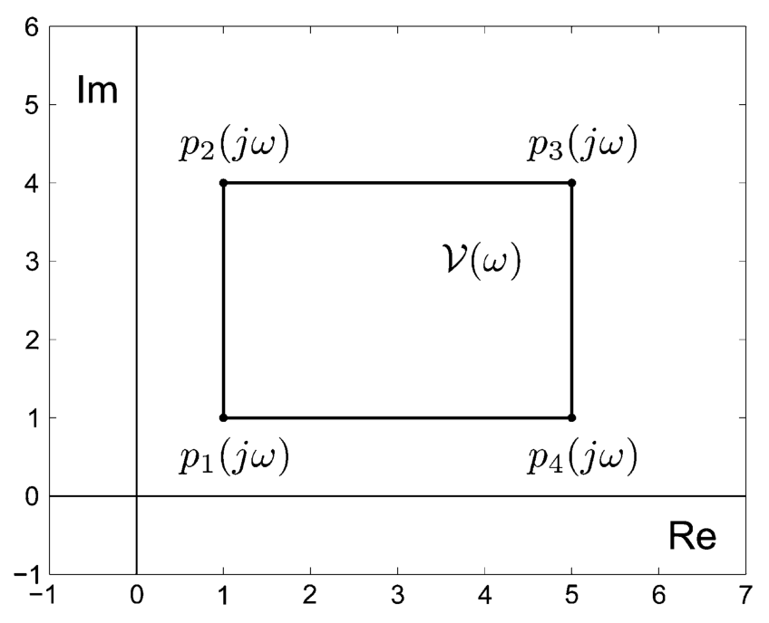

> Image description: A technical diagram titled "Stability and Performance of Complex Systems Affected by Parametric Uncertainty, Fig. 1 The Kharitonov rectangular value set" illustrates a value set in the complex plane. The figure features a Cartesian coordinate system with a horizontal axis labeled "Re"
Stability and Performance of Complex Systems Affected by Parametric Uncertainty, Fig. 1 The Kharitonov rectangular value set

and the scaling factors

$$
\alpha_{i}=\left(\bar{q}_{i}-\underline{q}_{i}\right) / 2
$$

for the deviations of the coefficients. Then the robust stability margin $r_{\text {max }}$ is defined as follows:

$$
\begin{align*}
& r_{\max }=\sup \left\{r: p(s, q)(5) \text { is stable } \forall q_{i}:\right. \\
& \left.\left|q_{i}-q_{i}^{0}\right| \leq r \alpha_{i}, \quad i=1, \ldots, n\right\} . \tag{7}
\end{align*}
$$

Anther drawback of the Kharitonov result is its inapplicability to the discrete-time case (Schur stability of polynomials).

A more flexible graphical test for robust stability uses the so-called Tsypkin-Polyak plot (Tsypkin and Polyak 1991), which is defined as the parametric curve on the complex plane:
$z(\omega)=x(\omega)+j y(\omega), j=\sqrt{-1} ; 0 \leq \omega<\infty$,
where

$$
\begin{align*}
& x(\omega)=\frac{q_{0}^{0}-q_{2}^{0} \omega^{2}+\ldots}{\alpha_{0}+\alpha_{2} \omega^{2}+\ldots} \\
& y(\omega)=\frac{q_{1}^{0}-q_{3}^{0} \omega^{2}+\ldots}{\alpha_{1}+\alpha_{3} \omega^{2}+\ldots} \tag{8}
\end{align*}
$$

Then, by the Tsypkin-Polyak criterion, the polynomial family (5) is robustly stable if and only if the following conditions hold: (i) $q_{0}^{0}>\alpha_{0}$,

<!-- source_pdf_page: 1315 -->
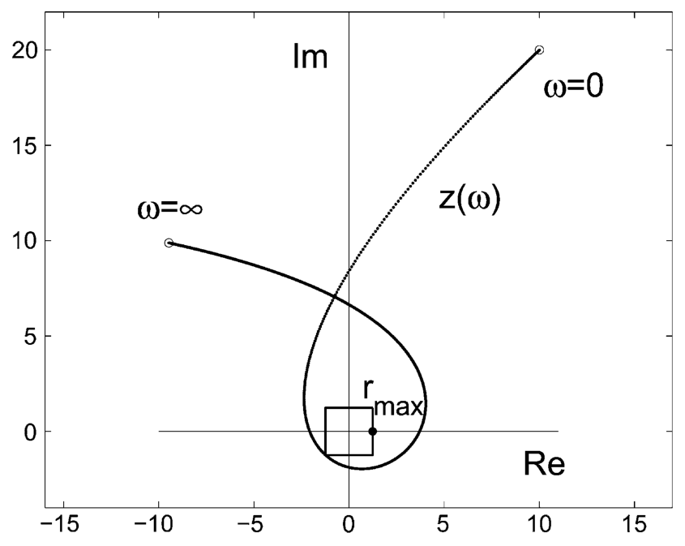

> Image description: A complex plane plot titled "Fig. 2 The Tsypkin-Polyak plot" illustrates the trajectory of a complex variable $z(\omega)$ in the complex plane, where the horizontal axis is labeled "Re" (Real) and the vertical axis is labeled "Im" (Imaginary). The plot shows a continuous curve representing the function $z(\omega)$ as $\omega$ varies. The curve starts at the point $(10, 20)$ corresponding to $\omega = 0$ and ends at the point $(-10, 10)$ corresponding to $\omega = \infty$. The curve loops through the fourth quadrant, passing through the origin's vicinity. A specific point on the loop is labeled $r_{\max}$ with a small square indicator located near the origin. The axes range from -15 to 15 for both real and imaginary parts. This plot is used to analyze the stability and performance of complex systems subject to parametric uncertainty.
Stability and Performance of Complex Systems Affected by Parametric Uncertainty, Fig. 2 The Tsypkin-Polyak plot

$q_{n}^{0}>\alpha_{n}$, and (ii) as $\omega$ changes zero to infinity, the curve $z(\omega)$ goes consecutively through $n$ quadrants in the counterclockwise direction and does not intersect the unit square with the vertices $( \pm 1, \pm j)$.

Unlike the Kharitonov theorem, with this test, the robust stability margin of family (5) can be determined as the size of the maximal square inscribed in the curve $z(\omega)$; see Fig. 2. Moreover, with minor modifications, this test applies to dependent uncertainty structures where the coefficient vector $q=\left(q_{0}, \ldots, q_{n}\right)^{\top}$ is confined to a ball in $\ell_{p}$-norm, not to a box as in (5).

On top of that, the Tsypkin-Polyak plot can be built for discrete-time systems which do not admit any counterparts of the Kharitonov theorem.

It is fair to say that interval polynomial families is an idealization, since the coefficients of the characteristic polynomial can hardly be thought of as the physical parameters of the real-world system. As a step towards more realistic formulations, consider the affine polynomial family of the form

$$
\begin{align*}
p(s)= & p_{0}(s)+\sum_{i=1}^{m} q_{i} p_{i}(s), \quad\left|q_{i}\right| \leq 1, \\
& i=1, \ldots, m, \tag{9}
\end{align*}
$$

where $p_{i}$ are the given polynomials and the $q_{i} \mathrm{~s}$ are the uncertain parameters (clearly, they can
be scaled to take values in the segment $[-1,1]$ ). The famous edge theorem (Bartlett et al. 1988) claims that checking the robust stability of such a family is equivalent to checking the edges of the uncertainty box, i.e., the points $q \in \mathbb{R}^{m}$ with all but one components being fixed to $\pm 1$, while the "free" coordinate varies in $[-1,1]$.

## Complex Solutions

Obviously, the affine model (9) covers just a small part of problems with parametric uncertainty. Closed-form solutions cannot be obtained in the general case; however, many important classes of systems can be analyzed efficiently.

Thus, in the engineering practice, block diagram description of systems is often more convenient than differential equations of the form (1). The blocks are associated with typical elements such as amplifiers, integrators, lag elements, and oscillators, which are connected in a certain circuit. In this case, transfer functions are the most adequate tool for dealing with such systems. For instance, the transfer function of the lag element is given by

$$
W(s)=1 /(T s+1),
$$

where the scalar $T$ is the time constant of the element. In terms of differential equations, this means that the input $u(t)$ of a block and its output $x(t)$ satisfy the equation $T \dot{x}+x=u$.

Assume now we have a set of $m$ cascade connected elements with uncertain time constants

$$
\begin{equation*}
\underline{T}_{i} \leq T_{i} \leq \bar{T}_{i}, \quad i=1, \ldots, m, \tag{10}
\end{equation*}
$$

with known lower and upper bounds. The characteristic polynomial of such a connection embraced by the feedback with gain $k$ is known to have the form

$$
\begin{equation*}
p(s)=k+\left(1+T_{1} s\right) \cdots\left(1+T_{m} s\right) . \tag{11}
\end{equation*}
$$

Hence, the robust stability problem reduces to checking if all polynomials (11) with constraints (10) are Hurwitz. Note that the coefficients of such a polynomial depend multilinearly on the uncertain parameters $T_{i}$

<!-- source_pdf_page: 1316 -->
(cf. linear dependence in (9)), making the problem much more complicated.

The solution of the problem above was obtained in Kiselev et al. (1997) for many important special cases; the closely related problem of finding the "critical gain" (the maximal value of $k$ retaining the robust stability) was also addressed.

Using the similar technique, closed-form solutions can be obtained for a number of similar problems such as robust sector stability, robust stability of distributed systems, robust $D$-decomposition, to name just a few.

## Difficult Problems: Possible Approaches

In spite of the apparent progress obtained in the area of parametric robustness, the list of unsolved problems is still quite large. Moreover, some of the formulations were shown to be NP-hard, making it hard to believe that any efficient solution methods will ever be found.

One of such fundamental problems is robust stability of the interval matrix. Specifically, assume that the entries $a_{i j}$ of the matrix $A$ in (1) are interval numbers

$$
\underline{a}_{i j} \leq a_{i j} \leq \bar{a}_{i j}, \quad i, j=1, \ldots, n ;
$$

the problem is to check if the interval matrix is robustly stable, i.e., if the eigenvalues of all matrices in this family have negative real parts. Numerous attempts to prove a Kharitonov-like theorem for matrices have failed, and the results by Nemirovskii (1994) on NP-hardness showed that these generalizations are not possible. It was also shown that the edge theorem for matrix families is not valid. The other NP-hard problems in robustness include the analysis of systems with interval delays, parallel connection of uncertain blocks, problem (11)-(10) with nested segments $\left[\underline{T}_{i}, \bar{T}_{i}\right]$, and others.

However, a change in the statement of the problem often allows for simple and elegant solutions. We mention three fruitful reformulations.

In the first approach, the uncertain parameters are assumed to have random rather than deterministic nature; for instance, they are assumed to be uniformly distributed over the respective intervals of uncertainty. We next specify an acceptable
tolerance $\varepsilon$, say $\varepsilon=0.01$, and check if the resulting random family of polynomials is stable with probability no less than $(1-\varepsilon)$; see Tempo et al. (2013) for a comprehensive exposition of such a randomized approach to robustness.

In many of the NP-hard robustness problems, such a reformulation often leads to exact or approximate solutions. Moreover, the randomized approach has several attractive properties even in the situations where the deterministic solution is available. Indeed, the deterministic statements of robustness problems are minimax; hence, the answer is dictated by the "worst" element in the family, whereas these critical values of the uncertain parameters are rather unlikely to occur. Therefore, by neglecting a small risk of violation of the stability, the admissible domains of variation of the parameters may be considerably extended. This effect is known as the probabilistic enhancement of robustness margins; it is particularly tangible for the large number of the parameters. Another attractive property of the randomized approach is its low computational complexity which only slowly grows with increase of the number of uncertain parameters.

To illustrate, let us turn back to problem (11)(10) and use the value set approach. In the considered problem, this set can be efficiently built.

Assume now that the parameters $T_{i}$ are independent random variables uniformly distributed over the respective segments (10) and consider the random variable
$\eta=\eta(\omega)=\log (p(j \omega)-k)=\sum_{i=1}^{m} \log \left(1+j \omega T_{i}\right)$.

The right-hand side of the last relation is the sum of independent complex-valued random variables; for $m$ large, its behavior obeys the central limit theorem, so that the probability that $\eta$ belongs to the respective confident ellipse $\mathcal{E}=\mathcal{E}(\omega)$ is close to unity. In other words, we have

$$
p(j \omega) \approx k+e^{\mathcal{E}} \doteq \mathcal{G}(\omega)
$$

and the set $\mathcal{G}(\omega)$ is referred to as a probabilistic predictor of the value set $\mathcal{V}(\omega)$; it is the shifted

<!-- source_pdf_page: 1317 -->
set of points of the form $e^{z}, z \in \mathcal{E} \subset \mathbb{C}$. The predictor $\mathcal{G}(\omega)$ constitutes a small portion of the deterministic value set $\mathcal{V}(\omega)$, yielding the probabilistic enhancement of the robustness margin.

Note also that the computation of $\mathcal{E}$ and $e^{\mathcal{E}}$ is nearly trivial and, in contrast to the construction of the true value set $\mathcal{V}$, the complexity does not grow with increase of $m$.

The second approach to solving "hard" problems in robust stability relates to the notion of superstability (Polyak and Shcherbakov 2002). The matrix $A$ of system (1) (and the system itself) is said to be superstable, if its entries $a_{i j}, i, j= 1, \ldots, n$, satisfy the relations

$$
a_{i i}<0, \quad \min _{i}\left(-a_{i i}-\sum_{j \neq i}\left|a_{i j}\right|\right)=\sigma>0 .
$$

The following estimate holds for the solutions of the superstable system (1):

$$
\|x(t)\|_{\infty} \leq\|x(0)\|_{\infty} e^{-\sigma t},
$$

i.e., it is stable, and the (nonsmooth) function $\|x\|_{\infty}$ is a Lyapunov function for the system. Since the condition of superstability is formulated in terms of linear inequalities on the entries of $A$, checking robust superstability of affine (and in particular, interval) matrix families is immediate. Similar situation holds for so-called positive systems.

The third approach to robustness analysis relates to quadratic stability (Leitmann 1979; Boyd et al. 1994). Namely, a family of systems is said to be robustly quadratically stable if it possesses a common quadratic Lyapunov function $V(x)= x^{\top} P x$ with positive definite matrix $P$. In other words, an uncertain family of matrices $A(q), q \in \mathcal{Q}$ has to satisfy the following set of the matrix Lyapunov-type inequalities:

$$
\begin{equation*}
A(q) P+P A(q)^{\top} \prec 0, \quad q \in \mathcal{Q}, \quad P \succ 0, \tag{13}
\end{equation*}
$$

where the symbols $\prec, \succ$ stand for the signdefiniteness of a matrix.

The inequality above is referred to as a linear matrix inequality (LMI), (Boyd et al. 1994); there exist both efficient numerical methods for solving
such inequalities (interior point methods) and various software, e.g., Matlab. This approach can be directly applied at least in the following two cases: (i) the set $\mathcal{Q}$ contains a finite number of points and (ii) $\mathcal{Q}$ is a polyhedron and the dependence $A(q)$ is affine. In the general setup or in the high-dimensional problems, randomized methods can be employed.

Finding the quadratic robust stability margin (by analogy with the stability margin, this is the maximum span of the feasible set $\mathcal{Q}$ that allows for the existence of the common Lyapunov function) in this problem is also possible; it reduces to the minimization of a linear function over the solutions of a similar LMI.

Note that the approaches based on superstability and quadratic stability provide only sufficient conditions for robustness.

## Robust Control

So far, of our primary interest was in assessing the robust stability of a closed-loop system with synthesized linear feedback. A more important problem is to design a controller that makes the closed-loop system robustly stable and guarantees certain robust performance of the system.

## Robust Stabilization

Let the linear system

$$
\dot{x}=A(q) x+B u
$$

depend on the vector $q \in \mathcal{Q}$ of uncertain parameters. In the simplest form, the problem of robust stabilization consists in finding the linear static state feedback

$$
u=K x
$$

that guarantees the robust stability of the closedloop system. Alternatively, static or dynamic output robustly stabilizing controllers can be considered in the situations where only the linear output $y=C x$ of the system is available, but not the complete state vector $x$.

If the number of controller parameters to be tuned is small (which is the case for PI or PID controllers), then the design can be accomplished using the $D$-decomposition technique.

<!-- source_pdf_page: 1318 -->
In the general formulation, the problem of robust design is complicated; it can, however, be addressed with the use of randomized methods (Tempo et al. 2013). Other plausible approaches include superstability and quadratic stability; respectively, the problem reduces to solving linear programs or linear matrix inequalities in the coefficients of the controller.

## Robust Performance

Needless to say, the robust stabilization problem is not the only one in the area of optimal control. As a rule, a certain cost function is always involved (say, integral quadratic), and its desired value should be guaranteed for all admissible values of the uncertain parameters. Moreover, robust stability is a necessary condition for such a guaranteed estimate to exist. This sort of problems can often be cast in the form of LMIs which must be satisfied for all admissible values of the parameters. Such robust LMIs can be solved either directly or using various randomized techniques presented in Tempo et al. (2013).

## Conclusions

In spite of the considerable progress attained in the parametric robustness of complex systems, this topic is still a vivid and active research area. To date, randomization, superstability, and quadratic stability present the most efficient and diverse tools for the analysis and design of systems affected by parametric uncertainty.

## Cross-References

- H-Infinity Control
- LMI Approach to Robust Control
- Optimization Based Robust Control
- Randomized Methods for Control of Uncertain Systems

## Bibliography

Ackermann J (1993) Robust control: systems with uncertain physical parameters. Springer, London

Barmish BR (1994) New tools in robustness of linear systems. Macmillan, New York
Bartlett AC, Hollot CV, Lin H (1988) Root locations of an entire polytope of polynomials: it suffices to check the edges. Math Control Sig Syst 1(1):61-71
Bhattacharyya SP, Chapellat H, Keel LH (1995) Robust control: the parametric approach. Prentice Hall, Upper Saddle River
Boyd S, El Ghaoui L, Feron E, Balakrishnan V (1994) Linear matrix inequalities in system and control theory. SIAM, Philadelphia
Frazer RA, Duncan WJ (1929) On the criteria for the stability of small motions. Proc R Soc Lond A 124(795):642-654
Gantmacher FR (2000) The theory of matrices. AMS, Providence
Kharitonov VL (1978) Asymptotic stability of an equilibrium position of a family of systems of linear differential equations. Differentsial'nye Uravneniya 14:20862088
Kiselev ON, Le Hung Lan, Polyak BT (1997) Frequency responses under parametric uncertainty. Autom Remote Control 58(Pt. 2, 4):645-661
Leitmann G (1979) Guaranteed asymptotic stability for some linear systems with bounded uncertainties. J Dyn Syst Measure Control 101(3):212-216
Nemirovskii AS (1994) Several NP-hard problems arising in robust stability analysis. Math Control Sig Syst 6(1):99-105
Polyak BT, Shcherbakov PS (2002) Superstable linear control systems. I. Analysis; II. Design. Autom Remote Control 63(8):1239-1254; 63(11):1745-1763
Tempo R, Calafiore G, Dabbene F (2013) Randomized algorithms for analysis and control of uncertain systems, with applications, 2nd edn. Springer, London
Tsypkin YZ, Polyak BT (1991) Frequency domain criteria for $l^{p}$-robust stability of continuous systems. IEEE Trans Autom Control 36(12):1464-1469
Zadeh LA, Desoer CA (1963) Linear system theory - a state space approach. McGraw-Hill, New York

## Stability Theory for Hybrid Dynamical Systems

Andrew R. Teel Electrical and Computer Engineering Department, University of California, Santa Barbara, CA, USA

#### Abstract

This entry provides a short introduction to modeling of hybrid dynamical systems and then focuses on stability theory for these systems. It provides

<!-- source_pdf_page: 1319 -->
definitions of asymptotic stability, basin of attraction, and uniform asymptotic stability for a compact set. It points out mild assumptions under which different characterizations of asymptotic stability are equivalent, as well as when an asymptotically stable compact set exists. It also summarizes necessary and sufficient conditions for asymptotic stability in terms of Lyapunov functions.

## Keywords

Asymptotic stability; Basin of attraction; Hybrid system; Lyapunov function

## Introduction

A hybrid dynamical system combines continuous change and instantaneous change. Instantaneous change is the only type of change available for variables like counters, switches, and logic variables. Instantaneous change may also be a good approximation of what occurs to velocities in mechanical systems at the time of an impact with a wall, floor, or some other rigid body. At other times, velocities evolve continuously. Continuous change is also natural for position variables, continuous timers, and voltages and currents. For mathematical convenience, it is typical in the analysis of hybrid dynamical systems to embed all of these variables into a Euclidean space, with the understanding that many points in the state space will never be reached. For example, a logic variable that naturally takes values in the set \{off, on\} is typically embedded in the real number line where its two distinct values are associated with two distinct numbers, the only numbers that this variable will visit during its evolution.

A finite-dimensional dynamical system that exhibits continuous change exclusively is typically modeled by an ordinary differential equation, or sometimes a more flexible differential inclusion. A system that exhibits purely instantaneous change is typically modeled by a difference equation or inclusion. Consequently, a hybrid dynamical system combines a differential equation or inclusion with a difference equation
or inclusion. A big part of the modeling effort for hybrid systems is directed at determining which type of evolution should be allowed at each point in the state space. To this end, subsets of the state space are specified where each type of behavior is allowed, like in the description of the heating system given above.

Though the behavior of a hybrid dynamical system can be quite complex and nonconventional, it is still reasonable to ask the same stability questions for them that might be asked about classical differential or difference equations. Moreover, the same stability analysis tools that are used for classical systems are also quite useful for hybrid dynamical systems. The emphasis of this entry is on basic stability theory for hybrid dynamical systems, focusing on definitions and tools that also apply to classical systems.

## Mathematical Modeling

## System Data

A hybrid dynamical system with state $x$ belonging to a Euclidean space $\mathbb{R}^{n}$ combines a differential equation or inclusion, written formally as $\dot{x}=f(x)$ or $\dot{x} \in F(x)$, with a difference equation or inclusion $x^{+}=g(x)$ or $x^{+} \in G(x)$, where $\dot{x}$ indicates the time derivative and $x^{+}$ indicates the value after an instantaneous change. The mapping $f$ or $F$ is called the flow map, while the mapping $g$ or $G$ is called the jump map. A complete model also specifies where in the state space continuous evolution is allowed and where instantaneous change is allowed. The set where continuous evolution is allowed is called the flow set and is denoted $C$, whereas the set where instantaneous change is allowed is called the jump set and is denoted $D$. The overall model, using inclusions for generality, is written formally as

$$
\begin{array}{cc}
x \in C & \dot{x} \in F(x) \\
x \in D & x^{+} \in G(x) \tag{1b}
\end{array}
$$

## Solutions

It is natural for solutions of (1) to be functions of two different types of time: a variable $t$ that keeps track of the amount of ordinary time that has

<!-- source_pdf_page: 1320 -->
elapsed and a variable $j$ that counts the number of jumps. There is a special structure to the types of domains that are allowed. A compact hybrid time domain is a set $E \subset \mathbb{R}_{\geq 0} \times \mathbb{Z}_{\geq 0}$, that is, a subset of the product of the nonnegative real numbers and the nonnegative integers, of the form

$$
E=\bigcup_{i=0}^{J}\left(\left[t_{i}, t_{i+1}\right] \times\{i\}\right)
$$

for some $J \in \mathbb{Z}_{\geq 0}$ and some sequence of nondecreasing times $0=t_{0} \leq t_{1} \leq \cdots \leq t_{J+1}$. It is possible for several of these times to be the same, which would correspond to more than one jump at the given time. A hybrid time domain is a set $E \subset \mathbb{R}_{\geq 0} \times \mathbb{Z}_{\geq 0}$ such that for each $(T, J) \in E$, the set $E \cap([0, T] \times\{0, \ldots, J\})$ is a compact hybrid time domain. In contrast to a compact hybrid time domain, a hybrid time domain may have an infinite number of intervals, or it may have a finite number of intervals with the last one being unbounded or of the form $\left[t_{J}, t_{J+1}\right)$; that is, it may be open on the right. A hybrid arc is a function $x$, defined on a hybrid time domain, such that $t \mapsto x(t, j)$ is locally absolutely continuous for each $j$; in particular, $t \mapsto x(t, j)$ is differentiable for almost every $t$ where it is defined, and this mapping is the integral of its derivative. The notation "dom $x$ " denotes the domain of $x$. Finally, a hybrid arc is a solution of (1) if the following two properties are satisfied:

1. For $\varepsilon>0,(s, j),(s+\varepsilon, j) \in \operatorname{dom} x$ implies that $x(t, j) \in C$ and $\dot{x}(t, j) \in F(x(t, j))$ for almost all $t \in[s, s+\varepsilon]$.
2. $(t, j),(t, j+1) \in$ dom $x$ implies that $x(t, j) \in D$ and $x(t, j+1) \in G(x(t, j))$.
For a hybrid system with no flow dynamics, each solution has a time domain of the form $\{0\} \times \{0, \ldots, J\}$ for some $J \in \mathbb{Z}_{\geq 0}$ or $\{0\} \times \mathbb{Z}_{\geq 0}$. For a hybrid system with no jump dynamics, each solution has a time domain of the form $[0, \infty) \times\{0\},[0, T] \times\{0\}$, or $[0, T) \times\{0\}$ for some $T \geq 0$. No assumptions are made in this entry to guarantee existence of nontrivial solutions since stability theory does not hinge on existence of solutions; rather, it simply makes statements about the behavior of solutions when they exist. To
ensure robustness of various stability properties, the following basic regularity assumptions are usually imposed.

Assumption 1 The data ( $C, F, D, G$ ) satisfy the following conditions:

1. The sets $C$ and $D$ are closed.
2. The set-valued mapping $F$ is outer semicontinuous, locally bounded, and $F(x)$ is nonempty and convex for each $x \in C$.
3. The set-valued mapping $G$ is outer semicontinuous, locally bounded, and $G(x)$ is nonempty for each $x \in D$.

To elaborate further, a set-valued mapping, like $F$, is said to be outer semicontinuous if for each convergent sequence $\left\{\left(x_{i}, y_{i}\right)\right\}_{i=0}^{\infty}$ that satisfies $y_{i} \in F\left(x_{i}\right)$ for all $i \in \mathbb{Z}_{\geq 0}$, its limit, denoted $(x, y)$, satisfies $y \in F(x)$. It is said to be locally bounded if for each bounded set $K_{1} \subset \mathbb{R}^{n}$ there exists a bounded set $K_{2} \subset \mathbb{R}^{n}$ such that, for every $x \in K_{1}$, every $y \in F(x)$ belongs to $K_{2}$; the latter condition is sometimes written $F\left(K_{1}\right) \subset K_{2}$. If $C$ is closed, $f$ is a function $f: C \rightarrow \mathbb{R}^{n}$ that is continuous, and $F$ is a setvalued mapping that has the single value $f(x)$ for each $x \in C$ and is empty for $x \notin C$, then $F$ is outer semicontinuous, locally bounded, and $F(x)$ is nonempty and convex for each $x \in C$.

## Stability Theory

## Definitions and Relationships

Given a dynamical system, predicting or controlling the system's long-term behavior is of primary importance. A system's long-term behavior may be more complicated than just converging to an equilibrium point. This fact motivates studying stability of and convergence to a set of points. For simplicity, this entry focuses on stability of sets that are compact, that is, they are closed and bounded. A variety of stability concepts are defined below. Each of these concepts applies to continuous-time or discrete-time systems as readily as to hybrid systems.

A compact set $\mathcal{A} \subset \mathbb{R}^{n}$ is said to be Lyapunov stable for (1) if for each $\varepsilon>0$ there exists $\delta>0$ such that for every solution of $(1), x(0,0) \in \mathcal{A}+\delta \mathbb{B}$ implies $x(t, j) \in \mathcal{A}+\varepsilon \mathbb{B}$ for all $(t, j) \in$

<!-- source_pdf_page: 1321 -->
$\operatorname{dom} x$, where $\mathcal{A}+\delta \mathbb{B}$ indicates the set of points whose distance to the set $\mathcal{A}$ is less than or equal to $\delta$. In order for a compact set to be Lyapunov stable for (1), it must be forward invariant for (1), that is, each solution of (1) with $x(0,0) \in \mathcal{A}$ satisfies $x(t, j) \in \mathcal{A}$ for all $(t, j) \in \operatorname{dom} x$. However, forward invariance does not necessarily imply Lyapunov stability.

For a compact set $\mathcal{A} \subset \mathbb{R}^{n}$, its basin of attraction for (1), denoted $\mathcal{B}_{\mathcal{A}}$, is the set of points from which each solution to (1) is bounded and each solution to (1) having an unbounded time domain converges to $\mathcal{A}$, the latter being written mathematically as $\lim _{t+j \rightarrow \infty}|x(t, j)|_{\mathcal{A}}=0$ where $|x(t, j)|_{\mathcal{A}}$ denotes the distance of $x(t, j)$ to the set $\mathcal{A}$. Each point that does not belong to $C \cup D$ belongs to $\mathcal{B}_{\mathcal{A}}$ since there are no solutions from such points. A compact set $\mathcal{A}$ is said to be attractive for (1) if its basin of attraction contains a neighborhood of itself, that is, there exists $\varepsilon>0$ such that $\mathcal{A}+\varepsilon \mathbb{B} \subset \mathcal{B}_{\mathcal{A}}$. A compact set $\mathcal{A}$ is said to be globally attractive if $\mathcal{B}_{\mathcal{A}}=\mathbb{R}^{n}$.

A compact set is said to be asymptotically stable for (1) if it is Lyapunov stable and attractive for (1). A compact set is said to be globally asymptotically stable for (1) if it asymptotically stable for (1) and $\mathcal{B}_{\mathcal{A}}=\mathbb{R}^{n}$. It is useful to know that the basin of attraction for an asymptotically stable set is always open.

Theorem 1 Under Assumption 1, if a compact set is asymptotically stable for (1), then its basin of attraction is an open set.

A compact set $\mathcal{A} \subset \mathbb{R}^{n}$ is said to be uniformly attractive for (1) if it is attractive for (1) and for each compact set $K \subset \mathcal{B}_{\mathcal{A}}$ and each $\delta>0$ there exists $T>0$ such that for every solution $x$ of (1), $x(0,0) \in K$ and $t+j \geq T$ imply $x(t, j) \in \mathcal{A}+\delta \mathbb{B}$. A compact set is said to be uniformly globally attractive for (1) if it is globally attractive and uniformly attractive for (1). Uniform attractivity goes beyond attractivity by asking that the amount of time it takes each solution to get close to $\mathcal{A}$ is uniformly bounded over initial conditions in compact subsets of the basin of attraction.

A compact set $\mathcal{A} \subset \mathbb{R}^{n}$ is said to be Lagrange stable relative to an open set $O \supset \mathcal{A}$ for (1) if for each compact set $K_{1} \subset O$ there exists a compact
set $K_{2} \subset O$ such that for every solution of (1), $x(0,0) \in K_{1}$ implies $x(t, j) \in K_{2}$ for all $(t, j) \in$ dom $x$. In Lagrange stability for the case $O= \mathbb{R}^{n}$, a bound on the initial conditions is given and a bound on the ensuing solutions must be found; this is in contrast to Lyapunov stability where a bound on the solutions is given and a bound on the initial conditions must be found.

A compact set is said to be uniformly asymptotically stable for (1) if it is Lyapunov stable, attractive, Lagrange stable relative to its basin of attraction, and uniformly attractive for (1). A compact set is said to be uniformly globally asymptotically stable for (1) if it is uniformly asymptotically stable for (1) and $\mathcal{B}_{\mathcal{A}}= \mathbb{R}^{n}$. There is no difference between asymptotic stability and uniform asymptotic stability under Assumption 1.

Theorem 2 Under Assumption 1, a compact set is uniformly asymptotically stable for (1) if and only if it is locally asymptotically stable for (1).

As noted earlier, forward invariance does not imply Lyapunov stability. However, when coupled with uniform attractivity, Lyapunov stability ensues.

Theorem 3 Under Assumption 1, a compact set is uniformly asymptotically stable for (1) if and only if it is forward invariant and uniformly attractive for (1).

Asymptotic stability can be converted to global asymptotic stability by shrinking the flow and jump sets to be compact subsets of the basin of attraction. However, global asymptotic stability of a compact set $\mathcal{A}$ for $x \in C, \dot{x}=f(x)$ for each compact set $C$ does not necessarily imply global asymptotic stability of $\mathcal{A}$ for $\dot{x}=f(x)$.

In some situations it is easier to assert the existence of a compact asymptotically stable set than it is to find one explicitly. In this direction, given a set $X \subset \mathbb{R}^{n}$, consider the set of points $z$ with the property that there exist a sequence of solutions $\left\{x_{i}\right\}_{i=0}^{\infty}$ to (1) with initial conditions in $X$ and a sequence of times $\left\{\left(t_{i}, j_{i}\right)\right\}_{i=0}^{\infty}$ with $\left(t_{i}, j_{i}\right) \in \operatorname{dom} x_{i}$ for each $i \in \mathbb{Z}_{\geq 0}$ such that $z=\lim _{i \rightarrow \infty} x_{i}\left(t_{i}, j_{i}\right)$. This set of points is called the $\omega$-limit set of $X$ for (1) and is denoted $\Omega(X)$.

<!-- source_pdf_page: 1322 -->
Theorem 4 Let Assumption 1 hold. For the system (1), if $X$ is compact and $\Omega(X)$ is nonempty and contained in the interior of $X$ (i.e., there exists $\varepsilon>0$ such that $\Omega(X)+\varepsilon \mathbb{B} \subset X$ ), then the set $\Omega(X)$ is compact and uniformly asymptotically stable with basin of attraction containing $X$ and equal to the basin of attraction for $X$.

## Robustness

A given model ( $C, F, D, G$ ) may have some mismatch with a physical process that it aims to describe. One way to capture some of this mismatch is to consider the behavior of solutions to a system with inflated data ( $C_{\delta}, F_{\delta}, D_{\delta}, G_{\delta}$ ), $\delta \geq 0$, defined as follows:

$$
\begin{align*}
C_{\delta} & :=\left\{x \in \mathbb{R}^{n}:(x+\delta \mathbb{B}) \cap C \neq \varnothing\right\}  \tag{2a}\\
F_{\delta}(x) & :=\overline{\operatorname{co}} F((x+\delta \mathbb{B}) \cap C)+\delta \mathbb{B}  \tag{2b}\\
D_{\delta} & :=\left\{x \in \mathbb{R}^{n}:(x+\delta \mathbb{B}) \cap D \neq \varnothing\right\}  \tag{2c}\\
G_{\delta} & :=G((x+\delta \mathbb{B}) \cap D)+\delta \mathbb{B} . \tag{2d}
\end{align*}
$$

The notation $x+\delta \mathbb{B}$ indicates a closed ball of radius $\delta$ centered at the point $x$. Evaluating a set-valued mapping at a set of points means to collect all vectors that belong to the setvalued mapping at any point in the set that serves as the argument of the set-valued mapping. The notation " $\overline{\operatorname{co}} F((x+\delta \mathbb{B}) \cap C)$ " indicates the closed, convex hull of the set $\left\{f \in \mathbb{R}^{n}: f \in F(z), z \in(x+\delta \mathbb{B}) \cap C\right\}$. Note that $\left(C_{0}, F_{0}, D_{0}, G_{0}\right)=(C, F, D, G)$. More generally, the components of ( $C, F, D, G$ ) are contained in ( $C_{\delta}, F_{\delta}, D_{\delta}, G_{\delta}$ ). The inflation data in (2) satisfy the regularity properties of Assumption 1 when ( $C, F, D, G$ ) do.

Proposition 1 If the data ( $C, F, D, G$ ) satisfy Assumption 1 then, for each $\delta>0$, the inflated data $\left(C_{\delta}, F_{\delta}, D_{\delta}, G_{\delta}\right)$ satisfy Assumption 1.

From the point of view of asymptotic stability, the behavior of solutions to ( $C_{\delta}, F_{\delta}, D_{\delta}, G_{\delta}$ ) for $\delta>0$ small is not too different from those of $(C, F, D, G)$.

Theorem 1 Under Assumption 1, if $\mathcal{A}$ is asymptotically stable with basin of attraction $\mathcal{B}_{\mathcal{A}}$ for the hybrid system with data ( $C, F, D, G$ ), then for
each $\varepsilon>0$ and each compact set $K$ satisfying $K \subset \mathcal{B}_{\mathcal{A}}$, there exist $\delta>0$ and a compact set $\mathcal{A}_{\delta} \subset \mathcal{A}+\varepsilon \mathbb{B}$ that is asymptotically stable with $K \subset \mathcal{B}_{\mathcal{A}_{\delta}}$ for ( $C_{\delta}, F_{\delta}, D_{\delta}, G_{\delta}$ ).

The robustness result of Theorem 1 has several consequences beyond the observations in the preceding examples. One of the consequences is the following reduction principle.

Theorem 2 Under Assumption 1, if $\mathcal{A}_{1}$ is asymptotically stable with basin of attraction $\mathcal{B}_{\mathcal{A}_{1}}$ for the hybrid system with data ( $C, F, D, G$ ) and the compact set $\mathcal{A}_{2} \subset \mathcal{A}_{1}$ is globally asymptotically stable for the hybrid system with data ( $C \cap \mathcal{A}_{1}, F, C \cap \mathcal{A}_{2}, G$ ), then the compact set $\mathcal{A}_{2}$ is asymptotically stable with basin of attraction $\mathcal{B}_{\mathcal{A}_{1}}$ for the hybrid system with data $(C, F, D, G)$.

## Lyapunov Functions

Arguably the most common method for establishing asymptotic stability is known as Lyapunov's method and uses a Lyapunov function. A function $V: \mathbb{R}^{n} \rightarrow \mathbb{R}_{\geq 0}$ is a Lyapunov function candidate for (1) if it is continuously differentiable on an open neighborhood of the flow set $C$, it is defined for all $x \in C \cup D \cup G(D)$ (dom $V$ denotes the set of points where it is defined), and it is continuous on its domain. Some of these conditions can be relaxed but are imposed in this entry to keep the discussion simple. Given a compact set $\mathcal{A}$ and an open set $O$ satisfying $\mathcal{A} \subset O \subset \mathbb{R}^{n}$, a Lyapunov function candidate for (1) is called a Lyapunov function for ( $\mathcal{A}, O$ ) if:
(L1) For $x \in(C \cup D \cup G(D)) \cap O, V(x)=0$ if and only if $x \in \mathcal{A}$.
(L2) For each $x \in C \cap O$ and $f \in F(x)$, $\langle\nabla V(x), f\rangle \leq 0$.
(L3) For each $x \in D \cap O$ and $g \in G(x), V(g)- V(x) \leq 0$.
A Lyapunov function for ( $\mathcal{A}, O$ ) is called a proper Lyapunov function for $(\mathcal{A}, O)$ if, in addition,
(L4) $\lim _{i \rightarrow \infty} V\left(x_{i}\right)=\infty$ when the sequence $\left\{x_{i}\right\}_{i=0}^{\infty}$, satisfying $x_{i} \in(C \cup D \cup G(D)) \cap O$ for all $i \in \mathbb{Z}_{\geq 0}$, is unbounded or approaches the boundary of $O$.
The next result does not use Assumption 1, though the rest of the results in this entry do.

<!-- source_pdf_page: 1323 -->
Theorem 3 Let $\mathcal{A} \subset O \subset \mathbb{R}^{n}$ with $\mathcal{A}$ compact and $O$ open. If there exists a Lyapunov function for ( $\mathcal{A}, O$ ), then $\mathcal{A}$ is Lyapunov stable for (1). If there exists a proper Lyapunov function for ( $\mathcal{A}, O$ ) then $\mathcal{A}$ is also Lagrange stable with respect to $O$ for (1).

We can also conclude asymptotic stability from a Lyapunov function when it is known that there are no complete solutions along which the Lyapunov function is equal to a positive constant.

Theorem 4 Let $\mathcal{A} \subset O \subset \mathbb{R}^{n}$ with $\mathcal{A}$ compact and $O$ open. Under Assumption 1, if there exists a Lyapunov function for ( $\mathcal{A}, O$ ) and there is no solution $x$ of (1) starting in $O \backslash \mathcal{A}$ that has an unbounded time domain and satisfies $V(x(t, j))= V(x(0,0))$ for all $(t, j) \in \operatorname{dom} x$, then $\mathcal{A}$ is uniformly asymptotically stable for (1). If the Lyapunov function is a proper Lyapunov function for ( $\mathcal{A}, O$ ), then the basin of attraction for $\mathcal{A}$ contains $O$.

The simplest way to rule out solutions that keep a Lyapunov function equal to a positive constant is by finding a (proper) strict Lyapunov function for ( $\mathcal{A}, O$ ), which is a (proper) Lyapunov function for $(\mathcal{A}, O)$ that also satisfies:
(L2') For each $x \in(C \cap O) \backslash \mathcal{A}$ and $f \in F(x)$, $\langle\nabla V(x), f\rangle<0$.
(L3') For each $x \in(D \cap O) \backslash \mathcal{A}$ and $g \in G(x)$, $V(g)-V(x)<0$.

Theorem 5 Let $\mathcal{A} \subset O \subset \mathbb{R}^{n}$ with $\mathcal{A}$ compact and $O$ open. Under Assumption 1, if there exists a strict Lyapunov function for ( $\mathcal{A}, O$ ), then $\mathcal{A}$ is uniformly asymptotically stable for (1). If there exists a proper strict Lyapunov function for ( $\mathcal{A}, O$ ), then $\mathcal{A}$ is uniformly asymptotically stable for (1) with basin of attraction containing $O$.

While a strict Lyapunov function can be difficult to find, and this fact has motivated other more sophisticated stability analysis tools that have appeared in the literature, it is reassuring to know that whenever $\mathcal{A}$ is compact and asymptotically stable, there exists a proper strict Lyapunov function for $\left(\mathcal{A}, \mathcal{B}_{\mathcal{A}}\right)$.

Theorem 6 Under Assumption 1, if the compact set $\mathcal{A}$ is asymptotically stable for (1), then there exists a proper strict Lyapunov function for $\left(\mathcal{A}, \mathcal{B}_{\mathcal{A}}\right)$. More specifically, for each $\lambda>0$ there exists a smooth function $V$ with $\operatorname{dom} V= \mathcal{B}_{\mathcal{A}}$ that $V(x)=0$ if and only if $x \in \mathcal{A}$, $\lim _{i \rightarrow \infty} V\left(x_{i}\right)=\infty$ when the sequence $\left\{x_{i}\right\}_{i=0}^{\infty}$, satisfying $x_{i} \in \mathcal{B}_{\mathcal{A}}$ for all $i \in \mathbb{Z}_{\geq 0}$, is unbounded or tends to the boundary of $\mathcal{B}_{\mathcal{A}}$, and such that:

1. For all $x \in C \cap \mathcal{B}_{\mathcal{A}}$ and $f \in F(x)$, $\langle\nabla V(x), f\rangle \leq-\lambda V(x)$.
2. For all $x \in D \cap \mathcal{B}_{\mathcal{A}}$ and $g \in G(x)$, $V(g) \leq \exp (-\lambda) V(x)$.

## Summary and Future Directions

Under Assumption 1, stability theory for hybrid dynamical systems is very similar to stability theory for differential equations or difference equations with continuous right-hand sides. In particular, Lyapunov functions are a very common analysis tool for hybrid dynamical systems, though a Lyapunov function can be difficult to find in the same way that they are challenging to find for classical systems. With stability theory for hybrid dynamical systems firmly in place, future research is expected to exploit this theory more fully for the development of control algorithms with new capabilities.

## Cross-References

Hybrid Dynamical Systems, Feedback Control of
Lyapunov's Stability Theory

## Bibliography

Bainov DD, Simeonov PS (1989) Systems with impulse effect: stability, theory, and applications. Ellis Horwood Limited, Chichester
Branicky MS (1998) Multiple Lyapunov functions and other analysis tools for switched and hybrid systems.
IEEE Trans Autom Control 43:1679-1684

<!-- source_pdf_page: 1324 -->
DeCarlo RA, Branicky MS, Pettersson S, Lennartson B (2000) Perspectives and results on the stability and stabilizability of hybrid systems. Proc IEEE 88(7):10691082
Goebel R, Sanfelice RG, Teel AR (2009) Hybrid dynamical systems. IEEE Control Syst Mag 29(2):28-93
Goebel R, Sanfelice RG, Teel AR (2012) Hybrid dynamical systems. Princeton University Press, Princeton
Haddad W, Chellaboina V, Nersesov SG (2006) Impulsive and hybrid dynamical systems. Princeton University Press, Princeton
Hespanha JP (2004) Uniform stability of switched linear systems: extensions of LaSalle's invariance principle. IEEE Trans Autom Control 49(4):470-482
Lakshmikantham V, Bainov DD, Simeonov PS (1989) Theory of impulsive differential equations. World Scientific, Singapore/Teaneck
Liberzon D (2003) Switching in systems and control. Birkhauser, Boston
Liberzon D, Morse AS (1999) Basic problems in stability and design of switched systems. IEEE Control Syst Mag 19(5):59-70
Lygeros J, Johansson KH, Simić SN, Zhang J, Sastry SS (2003) Dynamical properties of hybrid automata. IEEE Trans Autom Control 48(1):2-17
Matveev A, Savkin AV (2000) Qualitative theory of hybrid dynamical systems. Birkhauser, Boston
Michel AN, Hou L, Liu D (2008) Stability of dynamical systems: continuous, discontinuous, and discrete systems. Birkhauser, Boston
van der Schaft A, Schumacher H (2000) An introduction to hybrid dynamical systems. Springer, London/New York
Yang T (2001) Impulsive control theory. Springer, Berlin/ New York

## Stability: Lyapunov, Linear Systems

A. Astolfi

Department of Electrical and Electronic Engineering, Imperial College London, London, UK
Dipartimento di Ingegneria Civile e Ingegneria Informatica, Università di Roma Tor Vergata, Roma, Italy

## Abstract

The notion of stability allows to study the qualitative behavior of dynamical systems. In particular it allows to study the behavior of trajectories close to an equilibrium point or to a motion.

The notion of stability that we discuss has been introduced in 1882 by the Russian mathematician A.M. Lyapunov, in his doctoral thesis; hence, it is often referred to as Lyapunov stability. In this entry we discuss and characterize Lyapunov stability for linear systems.

## Keywords

Eigenvalues; Equilibrium points; Linear systems; Motions; Stability

## Introduction

Consider a linear, time-invariant, finitedimensional system, i.e., a system described by equations of the form

$$
\begin{align*}
\sigma x & =A x+B u, \\
y & =C x+D u, \tag{1}
\end{align*}
$$

with $x(t) \in I R^{n}, u(t) \in I R^{m}, y(t) \in I R^{p}$ and $A \in I R^{n \times n}, B \in I R^{n \times m}, C \in I R^{p \times n}$, and $D \in I R^{p \times m}$ constant matrices. In Eq. (1) $\sigma x(t)$ stands for $\dot{x}(t)$ if the system is continuous-time and for $x(t+1)$ if the system is discrete-time. Since the system is time-invariant, it is assumed, without loss of generality, that all signals are defined for $t \geq 0$, that is, if the system is continuous-time, then $t \in I R^{+}$, i.e., the set of non-negative real numbers, whereas if the system is discrete-time, then $t \in Z^{+}$, i.e., the set of non-negative integers. For ease of notation, the argument " $t$ " is dropped whenever this does not cause confusion, and we use the notation $t \geq 0$ to denote either $I R^{+}$or $Z^{+}$. Finally, we use either $x(t, x(0), u)$ or $x(t)$ to denote the solution of the first of equations (1) at a given time $t \geq 0$, with the initial condition $x(0)$ and the input signal $u$. The former is used when it is important to keep track of the initial state and external input $u$, whereas the latter is used whenever there is not such a need.

Definition 1 (Equilibrium) Consider the system (1). Assume the input $u$ is constant, i.e., $u(t)=u_{0}$ for all $t \geq 0$ and for some constant

<!-- source_pdf_page: 1325 -->
$u_{0}$. A state $x_{e}$ is an equilibrium of the system associated to the input $u_{0}$ if $x_{e}=x\left(t, x_{e}, u_{0}\right)$, for all $t \geq 0$.

## Proposition 1 (Equilibria of linear systems)

Consider the system (1) and assume $u(t)=u_{0}$, for all $t$, where $u_{0}$ is a constant vector. Then the following hold.

- If $u_{0}=0$ then the origin is an equilibrium.
- For continuous-time systems, if $A$ is invertible, for any $u_{0}$ there is a unique equilibrium $x_{e}= -A^{-1} B u_{0}$. If $A$ is not invertible, the system has either infinitely many equilibria or it has no equilibria.
- For discrete-time systems, if $I-A$ is invertible, for any $u_{0}$ there is a unique equilibrium $x_{e}= (I-A)^{-1} B u_{0}$. If $I-A$ is not invertible, the system has either infinitely many equilibria or it has no equilibria.

Proposition 2 Consider the continuous-time, time-invariant, linear system

$$
\begin{aligned}
& \dot{x}=A x+B u, \\
& y=C x+D u,
\end{aligned}
$$

and the initial condition $x(0)=x_{0}$. Then, for all $t \geq 0$,

$$
\begin{equation*}
x(t)=e^{A t} x_{0}+\int_{0}^{t} e^{A(t-\tau)} B u(\tau) d \tau \tag{2}
\end{equation*}
$$

and
$y(t)=C e^{A t} x_{0}+\int_{0}^{t} C e^{A(t-\tau)} B u(\tau) d \tau+D u(t)$.

Proposition 3 Consider the discrete-time, timeinvariant, linear system (to simplify the notation we use $x^{+}(t)$ to denote $x(t+1)$ and we drop the argument $t$ )

$$
\begin{aligned}
x^{+} & =A x+B u, \\
y & =C x+D u,
\end{aligned}
$$

and the initial condition $x(0)=x_{0}$. Then, for all $t \geq 0$,

$$
\begin{equation*}
x(t)=A^{t} x_{0}+\sum_{i=0}^{t-1} A^{t-1-i} B u(i) \tag{4}
\end{equation*}
$$

and

$$
\begin{equation*}
y(t)=C A^{t} x_{0}+\sum_{i=0}^{t-1} C A^{t-1-i} B u(i)+D u(t) \tag{5}
\end{equation*}
$$

## Definitions

In this section we provide some notions and definitions which are applicable to general dynamical systems.

Definition 2 (Lyapunov stability) Consider the system (1) with $u(t)=u_{0}$, for all $t \geq 0$ and for some constant $u_{0}$. Let $x_{e}$ be an equilibrium point. The equilibrium is stable (in the sense of Lyapunov) if for every $\epsilon>0$ there exists a $\delta=\delta(\epsilon)>0$ such that $\left\|x(0)-x_{e}\right\|<\delta$ implies $\left\|x(t)-x_{e}\right\|<\epsilon$, for all $t \geq 0$, where the notation $\|\cdot\|$ denotes the Euclidean norm in $\mathbb{R}^{n}$.

In stability theory the quantity $x(0)-x_{e}$ is called initial perturbation, and $x(t)$ is called perturbed evolution. Therefore, the definition of stability can be interpreted as follows. An equilibrium point $x_{e}$ is stable if however we select a tolerable deviation $\epsilon$, there exists a (possibly small) neighborhood of the equilibrium $x_{e}$ such that all initial conditions in this neighborhood yield trajectories which are within the tolerable deviation.

The property of stability dictates a condition on the evolution of the system for all $t \geq 0$. Note, however, that in the definition of stability, we have not requested that the perturbed evolution converge asymptotically, that is, for $t \rightarrow \infty$, to $x_{e}$. This convergence property is very important in applications, as it allows to characterize the situation in which not only the perturbed evolution remains close to the unperturbed evolution, but it also converges to the initial (unperturbed) evolution. To capture this property we introduce a new definition.

<!-- source_pdf_page: 1326 -->
Definition 3 (Asymptotic stability) Consider the system (1) with $u(t)=u_{0}$, for all $t \geq 0$ and for some constant $u_{0}$. Let $x_{e}$ be an equilibrium point. The equilibrium is asymptotically stable if it is stable and if there exists a constant $\delta_{a}>0$ such that $\left\|x(0)-x_{e}\right\|<\delta_{a}$ implies $\lim _{t \rightarrow \infty}\left\|x(t)-x_{e}\right\|=0$.

In summary, an equilibrium point is asymptotically stable if it is stable, and whenever the initial perturbation is inside a certain neighborhood of $x_{e}$, the perturbed evolution converges, asymptotically, to the equilibrium point, which is thus said to be attractive. From a physical point of view, this means that all sufficiently small initial perturbations give rise to effects which can be a priori bounded (stability) and which vanish asymptotically (attractivity).

It is important to highlight that, in general, attractivity does not imply stability: it is possible to have an equilibrium of a system which is not stable (i.e., it is unstable), yet for all initial perturbations, the perturbed evolution converges to the equilibrium. This however is not the case for linear systems, as discussed in section "Stability of Linear Systems". We conclude the section with two simple examples illustrating the notions that have been introduced.

Example 1 Consider the discrete-time system $x^{+}=-x$, with $x(t) \in I R$. This system has a unique equilibrium at $x_{e}=0$. Note that for any initial condition $x_{0} \in I R$, one has

$$
x_{2 t-1}=-x_{0}, \quad x_{2 t}=x_{0}
$$

for all $t \geq 1$ and integer. This implies that the equilibrium is stable, but not attractive.

Example 2 Consider the continuous-time system

$$
\dot{x}_{1}=\omega x_{2}, \quad \dot{x}_{2}=-\omega x_{1},
$$

with $\omega$ a positive constant. The system has a unique equilibrium at $x_{e}=0$. This equilibrium is stable, but not attractive. To see this note that, along the trajectories of the system, $x_{1} \dot{x}_{1}+x_{2} \dot{x}_{2}=0$, and this implies that, along the trajectories of the system, $x_{1}^{2}(t)+x_{2}^{2}(t)$ is
constant, i.e., $x_{1}^{2}(t)+x_{2}^{2}(t)=x_{1}^{2}(0)+x_{2}^{2}(0)$. Therefore, the state of the system remains on the circle centered at the origin and with radius $\sqrt{x_{1}^{2}(0)+x_{2}^{2}(0)}$, for all $t \geq 0$ : the condition for stability holds with $\delta(\epsilon)=\epsilon$.

Definition 4 (Global asymptotic stability) Consider the system (1) with $u(t)=u_{0}$, for all $t \geq 0$ and for some constant $u_{0}$. Let $x_{e}$ be an equilibrium point. The equilibrium is globally asymptotically stable if it is stable and if, for all $x(0), \lim _{t \rightarrow \infty}\left\|x(t)-x_{e}\right\|=0$.

The property of (global) asymptotic stability can be strengthened imposing conditions on the convergence speed of $\left\|x(t)-x_{e}\right\|$.

Definition 5 (Exponential stability) Consider the system (1) with $u(t)=u_{0}$, for all $t \geq 0$ and for some constant $u_{0}$. Let $x_{e}$ be an equilibrium point. The equilibrium is exponentially stable if there exists $\lambda>0$, in the case of continuous-time systems, and $0<\lambda<1$ in the case of discretetime systems, such that for all $\epsilon>0$, there exists a $\delta=\delta(\epsilon)>0$ such that $\left\|x(0)-x_{e}\right\|<\delta$ implies $\left\|x(t)-x_{e}\right\|<\epsilon e^{-\lambda t}$, in the case of continuoustime systems, and $\left\|x(t)-x_{e}\right\|<\epsilon \lambda^{t}$, in the case of discrete-time systems, for all $t \geq 0$.

Definition 6 (Stability of motion) Consider the system (1). Let

$$
\mathcal{M}=\left\{(t, x(t)) \in T \times I R^{n}\right\}
$$

with $x(t)=x\left(t, x_{0}, u\right)$, for given $x_{0}$ and $u$, and $T=I R^{+}$, in the case of continuous-time systems, and $T=Z^{+}$, in the case of discretetime systems, be a motion. The motion is stable if for every $\epsilon>0$ there exists a $\delta=\delta(\epsilon)>0$ such that $\left\|x(0)-x_{0}\right\|<\delta$ implies

$$
\begin{equation*}
\left\|x(t, x(0), u)-x\left(t, x_{0}, u\right)\right\|<\epsilon \tag{6}
\end{equation*}
$$

for all $t \geq 0$.
The notion of stability of a motion is substantially the same as the notion of stability of an equilibrium. The important issue is that the time-parametrization is important, i.e., a motion is stable if, for small initial perturbations, the

<!-- source_pdf_page: 1327 -->
perturbed evolution is close, for any fixed $t \geq$ 0 , to the non-perturbed evolution. This does not mean that if the perturbed and unperturbed trajectories are close, then the motion is stable: in fact the trajectories may be close but may be followed with different timing, which means that for some $t \geq 0$ condition (6) may be violated.

## Stability of Linear Systems

The notion of stability relies on the knowledge of the trajectories of the system. As a result, even if this notion is very elegant and useful in applications, it is in general hard to assess stability of an equilibrium or of a motion. There are, however, classes of systems for which it is possible to give stability conditions without relying upon the knowledge of the trajectories. Linear systems belong to one such class. In this section we study the stability properties of linear systems, and we show that, because of the linear structure, it is possible to assess the properties of stability and attractivity in a simple way. To begin with, we recall some properties of linear systems.

Proposition 4 Consider a linear, time-invariant system. (Asymptotic) stability of one motion implies (asymptotic) stability of all motions. In particular, (asymptotic) stability of any motion implies and is implied by (asymptotic) stability of the equilibrium $x_{e}=0$.

The above statement, together with the result in Proposition 1, implies the following important properties.

Proposition 5 If the origin of a linear system is asymptotically stable, then, necessarily, the origin is the only equilibrium of the system for $u=0$. Moreover, asymptotic stability of the zero equilibrium is always global. Finally, asymptotic stability implies exponential stability.

The above discussion shows that the stability properties of a motion (e.g., an equilibrium) of a linear system are inherited by all motions of the system. Moreover, for linear systems, local properties are always global properties. This means
that, with some abuse of terminology, we can refer the stability properties to the linear system, for example, we say that a linear system is stable to mean that all its motions are stable. Stability properties of a linear, time-invariant system are therefore properties of the free evolution of its state: for this class of systems, it is possible to obtain simple stability tests.

Proposition 6 A linear, time-invariant system is stable if and only if $\left\|e^{A t}\right\| \leq k$, for continuoustime systems, or $\left\|A^{t}\right\| \leq k$, for discrete-time systems, for all $t \geq 0$ and for some $k>0$. It is asymptotically stable if and only if $\lim _{t \rightarrow \infty} e^{A t}=0$, for continuous-time systems, or $\lim _{t \rightarrow \infty} A^{t}=0$, for discrete-time systems. To state the next result we need to define the geometric multiplicity of an eigenvalue. To this end we recall a few facts. Consider a matrix $A \in I R^{n \times n}$ and a polynomial $p(\lambda)$. The polynomial $p(\lambda)$ is a zeroing polynomial for $A$ if $p(A)=0$. Note that, by Cayley-Hamilton Theorem, the characteristic polynomial of $A$ is a zeroing polynomial for $A$. Among all zeroing polynomials there is a unique monic polynomial $p_{M}(\lambda)$ with smallest degree. This polynomial is called the minimal polynomial of $A$. Note that the minimal polynomial of $A$ is a divisor of the characteristic polynomial of $A$. If $A$ has $r \leq n$ distinct eigenvalues $\lambda_{1}, \ldots, \lambda_{r}$, then

$$
p_{M}(\lambda)=\left(\lambda-\lambda_{1}\right)^{m_{1}}\left(\lambda-\lambda_{2}\right)^{m_{2}} \cdots\left(\lambda-\lambda_{r}\right)^{m_{r}} \text {, }
$$

where the number $m_{i}$ denotes, by definition, the geometric multiplicity of $\lambda_{i}$, for $i=1, \cdots, r$. This means that the geometric multiplicity of $\lambda_{i}$ equals the multiplicity of $\lambda_{i}$ as a root of $p_{M}(\lambda)$. Recall, finally, that the multiplicity of $\lambda_{i}$ as a root of the characteristic polynomial is called algebraic multiplicity.

Proposition 7 The equilibrium $x_{e}=0$ of a linear, time-invariant system is stable if and only if the following conditions hold.

- In the case of continuous-time systems, the eigenvalues of $A$ with geometric multiplicity equal to one have non-positive real part, and the eigenvalues of $A$ with geometric multiplicity larger than one have negative real part.

<!-- source_pdf_page: 1328 -->
- In the case of discrete-time systems, the eigenvalues of $A$ with geometric multiplicity equal to one have modulo not larger than one, and the eigenvalues of $A$ with geometric multiplicity larger than one have modulo smaller than one.

Proof Let $\lambda_{1}, \lambda_{2}, \cdots, \lambda_{r}$, with $r \geq 1$, be the distinct eigenvalues of $A$, i.e., the distinct roots of the characteristic polynomial of $A$. Then

$$
e^{A t}=\sum_{i=1}^{r} \sum_{k=1}^{m_{i}} R_{i k} \frac{t^{k-1}}{(k-1)!} e^{\lambda_{i} t},
$$

for some matrices $R_{i k}$, where $m_{i}$ is the geometric multiplicity of the eigenvalue $\lambda_{i}$. This matrix is bounded if and only if the conditions in the statement hold. Similarly,

$$
A^{t}=\sum_{i=1}^{r} \sum_{k=1}^{m_{i}} R_{i k} \frac{t^{k-1}}{(k-1)!} \lambda_{i}^{t-k+1},
$$

for some matrices $R_{i k}$, and this is bounded if and only if the conditions in the statement hold. ✓

Proposition 8 The equilibrium $x_{e}=0$ of a linear, time-invariant system is asymptotically stable if and only if the following conditions hold.

- In the case of continuous-time systems, the eigenvalues of $A$ have negative real part.
- In the case of discrete-time systems, the eigenvalues of $A$ have modulo smaller than one.

Proof The proof is similar to the one of the previous proposition, once it is noted that, for the considered class of systems and as stated in Proposition 6, asymptotic stability implies and is implied by boundedness and convergence of $e^{A t}$ or $A^{t}$.

Remark 11.1 For linear, time-varying systems, i.e., systems described by equations of the form

$$
\begin{aligned}
\sigma x & =A(t) x+B(t) u, \\
y & =C(t) x+D(t) u,
\end{aligned}
$$

it is possible to provide stability conditions in the spirit of the boundedness and convergence conditions in Proposition 6. These require the definition of a matrix, the so-called monodromy matrix, which describes the free evolution of the state of the system. It is, however, not possible to provide conditions in terms of eigenvalues of the matrix $A(t)$ similar to the conditions in Propositions 7 and 8 .

We conclude this discussion with an alternative characterization of asymptotic stability in terms of linear matrix inequalities.

Proposition 9 The equilibrium $x_{e}=0$ of a linear, time-invariant system is asymptotically stable if and only if the following conditions hold.

- In the case of continuous-time systems, there exists a symmetric positive definite matrix $P=P^{\prime}$ such that $A^{\prime} P+P A<0$.
- In the case of discrete-time systems, there exists a symmetric positive definite matrix $P= P^{\prime}$ such that $A^{\prime} P A-P<0$.

To complete our discussion we stress that stability properties are invariant with respect to changes in coordinates in the state space.

Corollary 1 Consider a linear, time-invariant system and assume it is (asymptotically) stable. Then any representation obtained by means of a change of coordinates of the form $x(t)=L \hat{x}(t)$, with $L$ constant and invertible, is (asymptotically) stable.

Proof The proof is based on the observation that the change of coordinates transforms the matrix $A$ into $\tilde{A}=L^{-1} A L$ and that the matrices $A$ and $\tilde{A}$ are similar, that is, they have the same characteristic and minimal polynomials.

## Summary and Future Directions

The property of Lyapunov stability is instrumental to characterize the qualitative behavior of dynamical systems. For linear, time-invariant systems, this property can be studied on the basis of

<!-- source_pdf_page: 1329 -->
the location, and multiplicity, of the eigenvalues of the matrix $A$. The property of Lyapunov stability can be studied for more general classes of systems, including nonlinear systems, distributed parameter systems, and hybrid systems, to which the basic definitions given in this article apply.

[^0]
# State Estimation for Batch Processes

Wolfgang Mauntz Fakultät Bio- und Chemieingenieurwesen, Technische Universität Dortmund, Dortmund, Germany

#### Abstract

The information about certain safety or quality parameters during a batch process is valuable for a variety of reasons. In case a direct measurement is too expensive, too slow or nonexisting, a state estimator estimating the desired quantities based on a model and various other measurements may be a good alternative. The most prominent method is calorimetry, where the heat of reaction is measured. This entry gives an overview of different alternatives that support a safe and successful batch operation.

## Keywords

Calorimetry; Observer; Soft sensor; State estimator

## Recommended Reading

Classical references on Lyapunov stability theory and on stability theory for linear systems are given below.

## Bibliography

Antsaklis PJ, Michel AN (2007) A linear systems primer. Birkhäuser, Boston
Brockett RW (1970) Finite dimensional linear systems. Wiley, London
Hahn W (1967) Stability of motion. Springer, New York
Khalil HK (2002) Nonlinear systems, 3rd edn. PrenticeHall, Upper Saddle River
Lyapunov AM (1992) The general problem of the stability of motion. Taylor \& Francis, London
Trentelman HL, Stoorvogel AA, Hautus MLJ (2001) Control theory for linear systems. Springer, London
Zadeh LA, Desoer CA (1963) Linear system theory. McGraw-Hill, New York

## Introduction

Continuous processes are used to produce a product at a constant rate. They are designed to operate at constant conditions, i.e., the state of the process (conversion, temperatures, pressures, concentrations, etc.) does not vary. In contrast, (semi-)batch processes execute a recipe which means that they are typically operated within a wide range of states. The state of the (semibatch) process should constantly be monitored. This information is useful for several purposes:

- Process safety: abnormal process states such as the accumulation of hazardous substances or reactive materials may lead to dangerous situations such as runaway reactions. The earlier an abnormal state is detected, the better it can be corrected, and the higher is the probability that loss can be avoided.

[^0]:    Cross-References

    - Feedback Stabilization of Nonlinear Systems
    - Linear Systems: Continuous-Time, Time-Invariant State Variable Descriptions
    - Linear Systems: Continuous-Time, Time-Varying State Variable Descriptions
    - Linear Systems: Discrete-Time, Time-Invariant State Variable Descriptions
    - Linear Systems: Discrete-Time, Time-Varying, State Variable Descriptions
    - Lyapunov's Stability Theory
    - Lyapunov Methods in Power System Stability
    - Power System Voltage Stability
    - Small Signal Stability in Electric Power Systems
    - Stability and Performance of Complex Systems Affected by Parametric Uncertainty

<!-- source_pdf_page: 1330 -->
- Quality: if the batch is not operated along the standard trajectory, off-spec product may result which in turn results in extra effort and/or second-grade product if this is discovered in time and in a customer complaint if not discovered before delivery.
- Profit: the better the state is known, the less conservative the underlying control scheme needs to be and the more the process can be pushed to its limits. This may lead to a higher throughput, less by-products, or less energy consumption. Advanced control schemes which are typically applied for this purpose require knowledge of the state of the process.
The literature offers a wide range of ways to monitor a batch process. In some processes, the observation of simple measurements like temperatures, pressures, and the time that a process step takes for execution is sufficient to guarantee for safe standard product in minimum time. Examples include some meltpolymerizations.

However, as soon as the process is more complex, more information than just temperatures and pressures is required to monitor the process to meet the goals mentioned above. It may be sufficient to measure other easy to measure properties like conductivities, flow rates, pH values, sound velocities, attenuations, etc. However, in many cases these measurements do not give the complete state of the system. Properties like complex gas phase compositions cannot be measured this way. This might require the installation of more sophisticated measurements as, e.g., NIR spectroscopy, online gas chromatography, Raman spectroscopy, or ion mobility spectroscopy. These measurements require significant effort in terms of installation cost and maintenance. In other situations, no online measurement may be available at all. These cases include the measurement of the distribution of the molecular weight in a polymer melt.

In these cases, where direct online measurements are either too expensive or not available at all, several methods are available to obtain information on the status of the batch ( ▷ Estimation, Survey on).

## - Statistical Methods

Experiences from historical batches are used in a statistical way to predict whether a batch runs normally. This can, e.g., be accomplished by defining a golden batch and a corresponding corridor around these trajectories. More sophisticated methods use principal component analysis (PCA) or partial least squares (PLS) to get a hint at abnormal situations. These methods are even capable of pointing at the origin of a possible problem. They are restricted to problem detection and typically cannot be used for control purposes.

## - Model-Based State Estimation

The state of the system (temperatures, pressures, concentrations, etc.) is estimated online which allows for problem detection as well as control applications. This method will be described in more detail in the next chapter.
General reviews of state estimation techniques can be found in Besancon (2007), Schei (2008), and a review of industrial applications is, e.g., given in Fortuna et al. (2007).

## Model-Based State Estimation

The basic idea of a state estimator (which is frequently also called observer or soft sensor) is to run a mathematical model of the process in parallel to the process itself, to compare the available measurements to the values which are predicted by the model, and to correct the estimated state by a suitable function of the observed error, usually an additive correction term that depends on the error. For a state estimator to converge to the true state, the considered system needs to be observable. For details, see ▷ Controllability and Observability. The scheme of a state estimator is sketched in Fig. 1. The real system processes the input $\mathbf{u}$ to give the system state $\mathbf{x}$ which is affected by the system noise $\boldsymbol{\xi}$. The measurements $\mathbf{y}$ are perturbed by the measurement noise $\varphi$. The model predicts a system state $\hat{\mathbf{x}}$ and a measurement $\hat{\mathbf{y}}$. The difference between the measured value $\mathbf{y}$ and predicted value $\hat{\mathbf{y}}$ is then fed back to correct the estimated state.

<!-- source_pdf_page: 1331 -->
## State Estimation for Batch Processes, Fig. 1

Principle of a state estimator
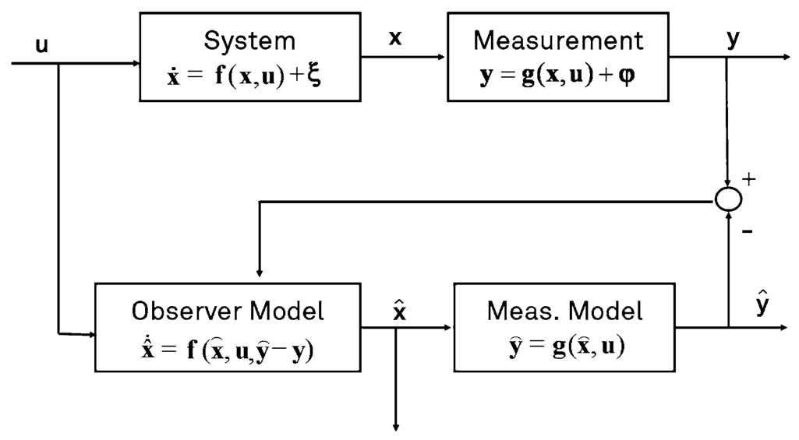

For linear systems, the most commonly used state estimators are the Luenberger observer and the Kalman filter ( $\triangleright$ Kalman Filters). Both multiply the prediction error $(\mathbf{y}-\hat{\mathbf{y}})$ by a weighting matrix $\mathbf{K}$ to update the estimated state $\hat{\mathbf{x}}$ :

$$
\dot{\hat{\mathbf{x}}}=\mathbf{A} \hat{\mathbf{x}}+\mathbf{B u}+\mathbf{K}(\mathbf{y}-\hat{\mathbf{y}})
$$

The two techniques use different approaches for determining the matrix $\mathbf{K}$ :
Luenberger Observer The basic assumption is that the deviation $\mathbf{e}(t)$ between $\mathbf{x}$ and $\hat{\mathbf{x}}$ is due to wrong initial values $\hat{\mathbf{x}}_{\mathbf{0}}$. $\mathbf{K}$ is computed by choosing the desired speed of convergence of the error

$$
\begin{aligned}
\dot{\mathbf{e}}(t) & =\dot{\mathbf{x}}(t)-\dot{\hat{\mathbf{x}}}(t) \\
& =(\mathbf{A}-\mathbf{K C}) \mathbf{e}(t)
\end{aligned}
$$

to zero. This is done by placing the eigenvalues of the matrix ( $\mathbf{A}-\mathbf{K C}$ ) in the left half plane.
Kalman Filter The basic assumption is that the error $\mathbf{e}(t)$ is caused by white noise in the system $\xi$ as well as in the measurement $\varphi$. The idea is to minimize the expectation of the quadratic error

$$
\min _{\hat{\mathbf{x}}} E\left((\hat{\mathbf{x}}(t)-\mathbf{x}(t))^{T}(\hat{\mathbf{x}}(t)-\mathbf{x}(t))\right) .
$$

$\mathbf{K}$ is computed from the noise covariance matrices and the system dynamics and varies with time.

The tuning of the state estimators is not trivial. The larger the absolute value of the eigenvalues in the Luenberger approach, the faster the error will converge to zero but the more prone the state estimator will be to measurement noise. A similar trade-off exists for the Kalman filter where the covariance matrices of the noise terms $\boldsymbol{\xi}$ and $\boldsymbol{\varphi}$ and the covariance of the initial state $\boldsymbol{\xi}_{0}$ need to be defined.

For nonlinear systems, a variety of approaches is available. The most frequently used estimators are based on using the nonlinear model for the prediction of the state and linearizations of the system dynamics are used to update the matrix K. The extended Kalman filter (EKF) ( □ Extended Kalman Filters) and the extended Luenberger observer (ELO) are representatives of this class of approaches. The EKF is most widely used. Extensions are the constrained EKF and the unscented EKF.

As examples are known where the EKF fails due the nonlinearity of the system, methods based on ideas other than the linearization of system dynamics have been developed. These methods include the moving horizon estimator (MHE) ( ↽ Moving Horizon Estimation) and the particle filter. Because of the increasing capabilities of modern computers and significant improvements in dynamic optimization algorithms, the MHE is a very promising alternative. The idea of the method is to minimize the sum of the squared errors of the system noise $\xi_{l}$, the measurement noise $\varphi_{l}$, and the error of the initial state $\xi_{k-N}$ which are weighted by weighing matrices $\mathbf{P}_{k}, \mathbf{Q}$ and $\mathbf{R}$ over a predefined horizon of past sampling steps $k-N, \ldots, k$

<!-- source_pdf_page: 1332 -->
$$
\begin{gathered}
\min _{\xi_{i}, \varphi_{j}} \xi_{k-N}^{T} \mathbf{P}_{k}^{-1} \xi_{k-N}+\sum_{l=k-N+1}^{k-1} \xi_{l}^{T} \mathbf{Q}^{-1} \xi_{l} \\
+\sum_{l=k-N+1}^{k} \varphi_{l}^{T} \mathbf{R}^{-1} \varphi_{l}
\end{gathered}
$$

s.t. the system model and the measurement equations are satisfied and further inequality constraints (e.g., physical limits of variables) hold.

The possibility to define constraints on the estimated states, e.g., that concentrations must be nonnegative, is an important advantage of the MHE approach. If the horizon is reduced to one single measurement, the constrained extended Kalman filter results which combines the simplicity of the EKF with the possibility to include constraints on the estimated states. Efficient implementations of the MHE have led to the method being capable of estimating the state of rather large systems in real time (Diehl et al. 2006; Küpper and Engell 2007).

## Calorimetry

Temperature measurements are probably the cheapest available measurements in chemical processes, and most plants are typically well equipped with temperature sensors. To exploit temperature measurements, e.g., for the observation of exothermic or endothermic reactions, heat balances are set up and solved for the heat of reaction which then enables the computation of the reaction rate. This is typically referred to as calorimetry. Reviews are given, e.g., in Hergeth (2006), McKenna et al. (2000), and Landau (1996). For ajacketed
reactor, the heat balance around a semi-batch reactor typically reads (see also Fig. 2)

$$
\begin{align*}
C_{P, R} \frac{d T_{R}}{d t}= & \dot{Q}_{R}+k A\left(T_{J}-T_{R}\right) \\
& +\sum_{i} \dot{m}_{F, i} c_{p, F i}\left(T_{F, i}-T_{R}\right), \tag{1}
\end{align*}
$$

where $\dot{Q}_{R}$ represents the heat of reaction, $k A$ the overall heat transfer coefficient between the reactor content and the jacket, $T_{R}$ the reactor temperature, $T_{J}$ the jacket temperature, $T_{F}$ the feed temperature, $C_{P, R}$ the overall heat capacity of the reactor, and the last term on the right side is the enthalpy added by the feed to the reactor. If $k A$ is known, $\dot{Q}_{R}$ can directly be computed as all other quantities in Eq. (1) are known or measured. This is referred to as heat flow calorimetry.

In industrial practice, $k A$ usually is not known and varies over time due to changes of the filling level, changes of the viscosity of the reaction mixture, and fouling. Then other heat balances and measurements can be added to enable a direct computation or estimation of $k A$. Typically, the jacket heat balance is chosen

$$
\begin{align*}
C_{P, J} \frac{d T_{J}}{d t}= & k A\left(T_{R}-T_{J}\right)+k A_{\mathrm{jack}}\left(T_{\mathrm{env}}-T_{J}\right) \\
& +\dot{m}_{J} c_{p, J}\left(T_{J, i n}-T_{J}\right) \tag{2}
\end{align*}
$$

If necessary, also other phenomena like direct heat losses from the reactor content to the environment or the influence of the reactor lid can be taken into account by adding additional terms or additional heat balances. This method is called heat balance calorimetry.

In order to compute $\dot{Q}_{R}$ and $k A$ from Eqs. (1) and (2), two different approaches can be used:

1. Equations (1) and (2) are solved to give

$$
\begin{align*}
& \widehat{k A}=\frac{C_{P, J} \frac{d T_{J}}{d t}-k A_{\mathrm{jack}}\left(T_{\mathrm{env}}-T_{J}\right)-\dot{m}_{J} c_{p, J}\left(T_{J, i n}-T_{J}\right)}{T_{R}-T_{J}}  \tag{3a}\\
& \hat{\dot{Q}}_{R}=C_{P, R} \frac{d T_{R}}{d t}-k A\left(T_{J}-T_{R}\right)-\sum_{i} \dot{m}_{F, i} c_{p, F i}\left(T_{F, i}-T_{R}\right) \tag{3b}
\end{align*}
$$

<!-- source_pdf_page: 1333 -->
State Estimation for Batch Processes, Fig. 2 The reactor and its jacket as considered for calorimetry
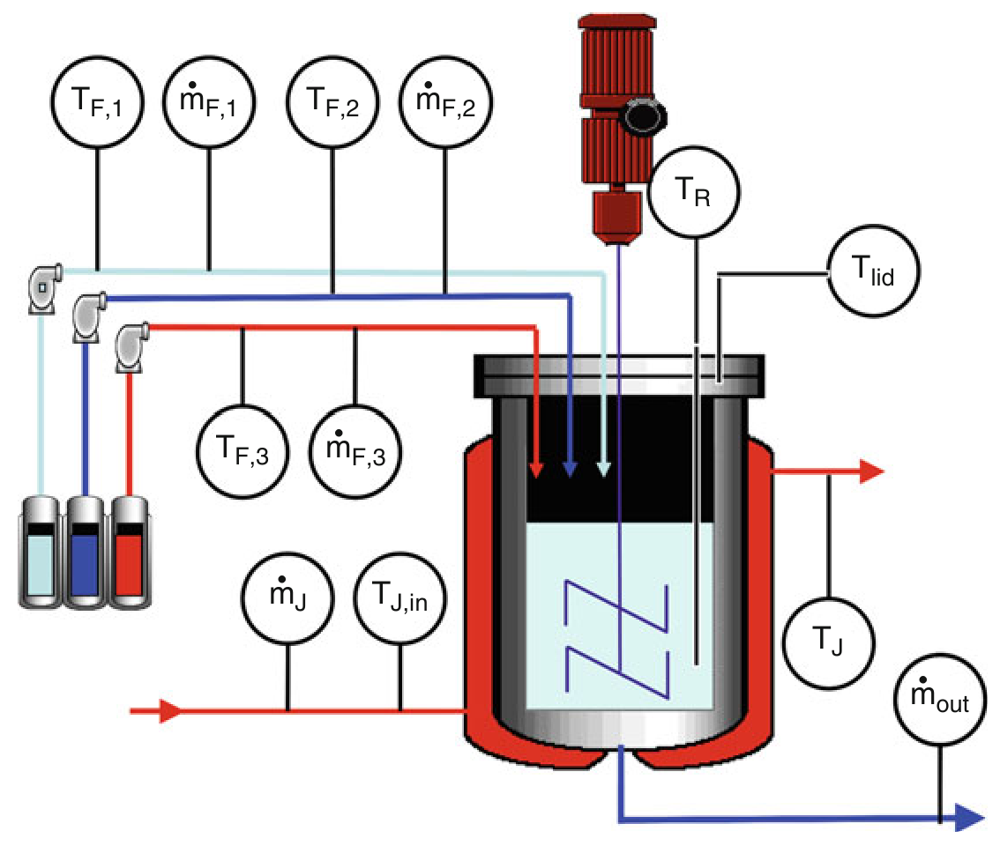

> Image description: This diagram illustrates a batch reactor system and its surrounding cooling/heating jacket, intended for calorimetric state estimation. The setup consists of an insulated reactor vessel surrounded by a jacket. Three feed lines enter the reactor from the left, represented by light blue, dark blue, and red lines. Each feed is equipped with a flow meter ($\dot{m}_{F,1}, \dot{m}_{F,2}, \dot{m}_{F,3}$) and a temperature sensor ($T_{F,1}, T_{F,2}, T_{F,3}$). The reactor interior contains a stirrer and a temperature sensor ($T_R$). A temperature sensor is also placed on the lid ($T_{\text{lid}}$). The jacket receives fluid

In this approach, the derivatives need to be computed from the measurements which introduces noise in the evaluation and requires a filtering either of the derivatives or of the estimates.
2. Equations (1) and (2) are implemented in a nonlinear state estimator. To estimate the unknown quantities $\widehat{k A}$ and $\hat{\dot{Q}}_{R}$ by this approach, additional assumptions about their dynamics must be made. A common approach is to add the so-called dummy derivatives

$$
\begin{aligned}
& \frac{d \hat{\dot{Q}}_{R}}{d t}=0 \\
& \frac{d \widehat{k A}}{d t}=0
\end{aligned}
$$

The tuning of calorimetric estimation schemes has been discussed in the literature, but for each case, tests in simulation runs using recorded batch data should be performed.
Experimental results of the application of the direct solution equations (3) and an EKF for the estimation of $\dot{Q}_{R}$ and $k A$ are shown in Fig. 3. A laboratory-scale 101 metal reactor was filled with water. Cold water was injected into the reactor to simulate the feed of reactants. The reactor is
equipped with a heating rod by which different values of $\dot{Q}_{R}$ could be simulated. Figure 3a shows the measured temperatures and the feed stream; Fig. 3b shows the estimates. The dotted line displays the measured power uptake, the thin, black line represents the estimates from the evaluation of Eqs. (3), and the gray line shows the results obtained with an EKF. The EKF was tuned slightly more aggressively than the PT1-filter that was used to filter the values of $\hat{\dot{Q}}_{R}$ and $\widehat{k A}$ that were obtained from Eqs. (3).

It can be seen that the quality of both evaluation methods is comparable. A difference in performance can be seen in the estimation of $k A$ at the points in time where $T_{R} \approx T_{J}$. This is due to the denominator in Eq. (3b) which becomes $\approx 0$. At this point, $k A$ is unobservable. The EKF estimates of $k A$ are more smooth. This does not have an impact on the estimation of $\dot{Q}_{R}$ because the heat transfer from the jacket to the reactor is zero at this point. This behavior is of importance if $\widehat{k A}$ is used in other algorithms, e.g., for control purposes.

A practical problem is the determination of the parameters of the system model. Especially the heat capacity of the reactor $C_{P, R}$ is difficult to determine as it is not clear how much impact the reactor material has. Also the heat capacities of

<!-- source_pdf_page: 1334 -->
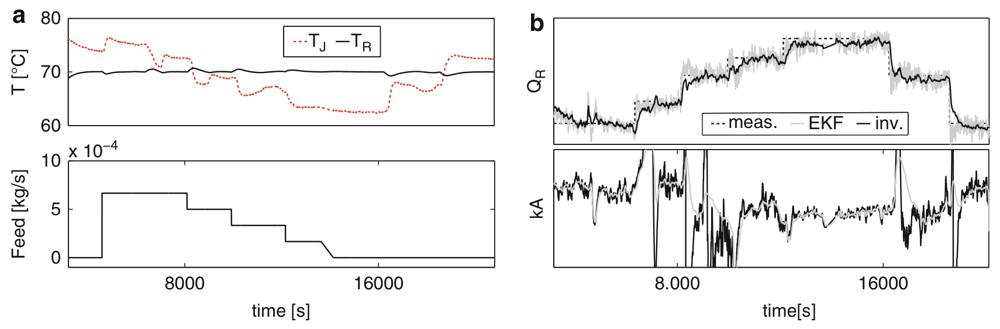

> Image description: Figure 3 illustrates state estimation results for a batch process, divided into two panels, **a** and **b**. Panel **a** shows the relationship between temperature and feed rate over time. The top plot displays temperature ($T$ in $^\circ\text{C}$) on the y-axis against time [s] on the x-axis. It features two curves: $T_J$ (red dashed line) and $T_R$ (black solid line). The bottom plot shows the Feed rate (in $\text{kg/s} \times 10^{-4}$) as a step-wise function decreasing over time. Panel **b** compares different estimation methods. The top plot shows heat flow ($Q_R$) vs. time [s], comparing measured data (**meas.**, dashed black line), Extended Kalman Filter estimates (**EKF**, grey line), and estimates from inverted equations (**inv.**, solid black line). The bottom plot displays current ($kA$) vs. time [s], showing significant fluctuations and noise in the measured signal compared to the smoother estimations.
State Estimation for Batch Processes, Fig. 3 Illustration of the results of direct estimation (Eqs. 3) and the use of an EKF. (a) Measured data. (b) Estimates from inverted equations (3) and EKF as well as measured $\hat{\dot{Q}}_{R}$

intermediate products and mixtures with the raw materials and final products may not be known. That is why typically $C_{P, R}$ is considered a "free" parameter which is used to fit the estimates to measured data. If the adjustment of the available parameters is not sufficient to yield a satisfactory performance of the estimator, further extensions can be considered:

- If pressurized vessels are considered, the wall thickness may be considerable, and the heat accumulation may influence the results. In this case, the extension of the set of equations by an equation for the heat transfer through the wall may be considered (Saenz de Buruaga et al. 1997).
- If large-scale vessels are considered, the cooling fluid in the jacket may not be perfectly mixed, and a temperature gradient will be present. In many cases, cooling coils are welded on the outside surface of the reactor. In this case, the equation for the perfectly mixed jacket (Eq. (2)) should be replaced by a model for a plug flow reactor (Krämer and Gesthuisen 2005).
- For large industrial reactors, the perfect mixing assumption of the reactor contents does not necessarily hold true. Especially if polymerization reactions are considered, the reactor content may become rather viscous. A straightforward method to cope with this problem is a detailed computational fluid dynamics (CFD) simulation. However, due
to the numerical complexity, this appears infeasible for online applications. A practical alternative is the placement of several temperature sensors and using a weighted average over their readings. A different approach is the usage of a multi-zonal model, the idea of which resembles the idea of a CFD model; however the number of zones (elements) is much smaller (Bezzo et al. 2004).
Heat balance calorimetry becomes inaccurate if the mass flow through the jacket is so large that the temperature difference between the cooling stream entering the jacket and leaving the jacket ( $T_{J, i n}-T_{J}$ ) is in the order of magnitude of the measurement error. This mode of operation is typically used in laboratory-scale reactors to avoid temperature gradients in the jacket. To estimate the states in such setups, a technique called temperature oscillation calorimetry (TOC) can be used. The idea is to add a small but well-measurable sinusoidal signal to the typically constant set point of the reactor temperature $T_{R}$ (see Fig. 4 for an example). The reaction of the jacket temperature to the oscillating reactor temperature can be used to compute $k A$, e.g., by estimating its amplitude $\delta T_{J}$ (Tietze et al. 1996) or by adding an additional equation which describes the second derivative of the reactor temperature $\frac{d^{2} T_{R}}{d t^{2}}$ to the set of heat balances (Mauntz et al. 2007).

Calorimetry estimates the total heat of the reactions in the reactor. It can be used to estimate

<!-- source_pdf_page: 1335 -->
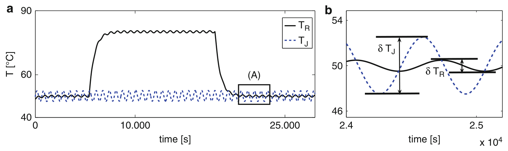

> Image description: This figure, titled "State Estimation for Batch Processes, Fig. 4," illustrates an example experiment applying Total Observer Control (TOC). It consists of two subplots, (a) and (b). Subplot (a) displays temperature ($T$ in $^\circ\text{C}$) versus time (in seconds) for two variables: $T_R$ (solid black line) and $T_J$ (dashed blue line). The $T_R$ profile shows a baseline around $50^\circ\text{C}$, a significant step increase to approximately $80^\circ\text{C}$ between $5,000$ and $20,000$ seconds, and a subsequent return to the baseline. Both signals exhibit high-frequency oscillations. A small rectangular area labeled "(A)" is highlighted in the steady-state region after $20,000$ seconds. Subplot (b) provides a magnified view of area (A). It zooms in on the time interval between $2.4 \times 10^4$ and $2.5 \times 10^4$ seconds. The plot shows the oscillatory nature of the signals, specifically identifying the amplitude of the oscillations for both variables: $\delta T_J$ (indicated by a vertical double-headed arrow for the blue dashed line) and $\delta T_R$ (indicated by a vertical double-headed arrow for the black solid line).
State Estimation for Batch Processes, Fig. 4 Example experiment where TOC is applied. (a) Complete example. (b) Zoom of rectangle (A)

the overall chemical conversion of a process. Due to its integral character, the heat of reaction of parallel and consecutive reactions cannot be estimated separately (Hergeth 2006). However, if models of the chemical kinetics are known and reliable, it is possible to couple this kinetic model with calorimetry and to observe the complete state of the reaction based on calorimetric estimates. This solution may however not be robust as slight errors in the kinetic model may lead to significant errors in the estimates of all concentrations. In order to build a more robust state estimator, additional measurements should be installed and integrated into the state estimator. For example, for reactions including a phase change from the gas phase to the liquid phase, a pressure measurement may be suitable. For some polymerization reactions, sound velocity and sound attenuation measurements can be valuable (Brandt et al. 2012). The additional measurement can be incorporated into the observation scheme by augmenting the measurement model g (see Fig. 1) by the corresponding measurement equation.

## Summary

In this contribution, different methods that can be used to determine the states of (semi-)batch reactions have been described. State estimation is useful to reconcile measurement errors and whenever direct online measurements are either too expensive or not available at all.

Linear state estimation is a mature topic. However as chemical batch reactors in most cases have nonlinear dynamics, nonlinear methods should be applied. Extensions of linear state estimators based on linearizations of the system (e.g., the EKF) are the most widely used nonlinear state estimators. However examples are known where these estimators fail. Thus, other approaches, e.g., based on online optimization (MHE), have been developed. They deliver promising results in terms of observation quality and computational speed even for large-scale systems.

The most widespread application of state estimation techniques in batch processes is calorimetry which is suitable for significantly exothermic or endothermic reactions. The heat balances around the reactor contents and the jacket are set up and solved. The estimated heat of reaction is used to estimate the chemical conversion of the process. The method makes use of commonly installed temperature measurements in the reactor. Extensions to include other measurements have been discussed. Problems that typically occur in laboratoryscale reactors can be overcome with the help of temperature oscillation calorimetry.

## Cross-References

- Control and Optimization of Batch Processes
- Controllability and Observability
- Estimation, Survey on
- Extended Kalman Filters

<!-- source_pdf_page: 1336 -->
- Kalman Filters
- Moving Horizon Estimation
- Observers in Linear Systems Theory

## Bibliography

Besancon G (2007) Nonlinear observers and applications. Springer, Berlin/New York
Bezzo F, Macchietto S, Pantelides CC (2004) A general methodology for hybrid multizonal/CFD models, part I. Theoretical framework AND part II. Automatic zoning. Comput Chem Eng 28:501-525
Brandt H, Sühling D, Engell S (2012) Monitoring emulsion polymerization processes by means of ultra-sound velocity measurements. In: AIChE annual meeting, Pittsburgh, Oct 28-Nov 2
Diehl M, Kühl P, Bock HG, Schlöder JP, Mahn B, Kallrath J (2006) Combined nonlinear MPC and MHE for a copolymerization process. In: $16{ }^{\text {th }}$ European symposium on computer aided process engineering, Garmisch-Patenkirchen, Germany, July 1013, pp 1527-1532
Fortuna L, Graziani S, Rizzo A, Xibilia MG (2007) Soft sensors for monitoring and control of industrial processes. Springer, London
Hergeth WD (2006) On-line monitoring of chemical reactions. Ullmann's encyclopedia of industrial chemistry. 7th online edn. Wiley-VCH, Weinheim
Küpper A, Engell S (2007) Optimizing control of the hashimoto smb process: Experimental application. In: 8th international IFAC symposium on dynamics and control of process control, Cancun, 6-8 June 2007
Krämer S, Gesthuisen R (2005) Simultaneous estimation of the heat of reaction and the heat transfer coefficient by calorimetry: estimation problems due to model simplification and high jacket flow rates - theoretical development. Chem Eng Sci 60:4233-4248
Landau RN (1996) Expanding the role of reaction calorimetry. Thermochim Acta 289:101-126
Mauntz W, Diehl M, Engell S (2007) Moving horizon estimation and optimal excitation in temperature oscillation calorimetry. In: DYCOPS, Cancun, 6-8 June 2007
McKenna TF, Othman S, Févotte G, Santos AM, Hammouri H (2000) An integrated approach to polymer reaction engineering: a review of calorimetry and state estimation. Polym React Eng 8(1):1-38
Saenz de Buruaga I, Armitage PD, Leiza JR, Asua JM (1997) Nonlinear control for maximum production rate of latexes of well-defined polymer composition. Ind Eng Chem Res 36:4243-4254
Schei TS (2008) On-line estimation for process control and optimization applications. J Process Control 18:821-828
Tietze A, Lüdke I, Reichert K-H (1996) Temperature oscillation calorimetry in stirred tank reactors. Chem Eng Sci 51(11):3131-3137

# Statistical Process Control in Manufacturing

O. Arda Vanli ${ }^{1}$ and Enrique Del Castillo ${ }^{2}$ ${ }^{1}$ Department of Industrial and Manufacturing Engineering, High Performance Materials Institute Florida A\&M University and Florida State University, Tallahassee, FL, USA ${ }^{2}$ Department of Industrial and Manufacturing Engineering, The Pennsylvania State University, University Park, PA, USA

#### Abstract

Statistical process control has been successfully utilized for process monitoring and variation reduction in manufacturing applications. This entry aims to review some of the important monitoring methods. Topics discussed include: Shewhart's model, $\bar{X}$ and $R$ control charts, EWMA and CUSUM charts for monitoring small process shifts, process monitoring for autocorrelated data, and integration of statistical and engineering (or automatic) control techniques. The goal is to provide readers from control theory, mechanical engineering, and electrical engineering an expository overview of the key topics in statistical process control.

## Keywords

CUSUM; EWMA; Feedback control; Shewhart control chart; Time-series analysis

## Introduction

Variation control is an important goal in manufacturing. The main set of tools for variation control used in discrete-part manufacturing industries up to the 1960s was developed by W. Shewhart in the 1920s and is known today as statistical process control, or SPC (Shewhart 1939). Shewhart's SPC model assumes that the process varies about a fixed mean and that consecutive observations from a process are independent, as follows:

<!-- source_pdf_page: 1337 -->
$$
\begin{equation*}
Y_{t}=\mu_{0}+\epsilon_{t} \tag{1}
\end{equation*}
$$

in which $\mu_{0}$ is the in-control process mean and $\epsilon_{t}$ is iid (independent identically distributed) white noise $\epsilon \stackrel{\text { iid }}{\sim} N\left(0, \sigma^{2}\right)$. The Shewhart model can be used in distinguishing assignable cause variation from common cause variation. For example, a mean change from $\mu_{0}$ to $\mu_{1}=\mu_{0}+\delta$ (where $\delta$ is the unknown magnitude of change) or a variance increase from $\sigma_{0}^{2}$ to $\sigma_{1}^{2}$ at an unknown point in time can be detected as assignable causes.

The objective of this entry is to highlight some of the important references in the SPC literature and to discuss similarities and joint applications SPC has with automatic process control. The literature on statistical process control and applications to engineering problems is vast; therefore, no effort is made for an exhaustive review. More complete reviews of the literature on statistical process control and adjustment methods can be found in texts including Montgomery (2013), Ryan (2011), and Del Castillo (2002).

## Shewhart Control Charts

Shewhart's $\bar{X}$ and $R$ control charts are used to distinguish between common cause and assignable causes of variation (Shewhart 1939) by monitoring, respectively, the process mean and process variance. "Common cause" variation is the natural variability of the process due to uncontrollable factors in the environment that is not avoidable without substantial changes
to the process. "Assignable cause" variation is due to unwanted disturbances or upsets to the process that can be detected and removed to produce acceptable quality products. When only common cause variation exists, the process is said to be operating "in statistical control." Assignable causes of variation include operator changes, machine calibration errors or raw material variation between suppliers.

Another concept that is closely related to the Shewhart's model is process capability. Process capability indices are used to assess whether the process is operating in a satisfactory manner with respect to the engineering specifications. It is crucial to attain a stable process (eliminating all problematic causes) before undertaking such a capability analysis because only when the samples come from a stable probability distribution can the future behavior of the process be predicted "within probability limits determined by the common cause system" (Box and Kramer 1992).

Figure 1 illustrates the two main phases, referred to as Phase I and Phase II, in constructing Shewhart charts (Sullivan 2002), using semiconductor lithography process data given in Montgomery (2013). It is desired to establish a statistical control of the width of the resist using $\bar{X}$ and $R$ charts. Twenty-five preliminary subgroups, each of size five wafers, were taken at one-hour intervals and the resist width is measured. In Phase I, "retrospective analysis," the historical data from the process is analyzed to bring an initially out-of-control process into
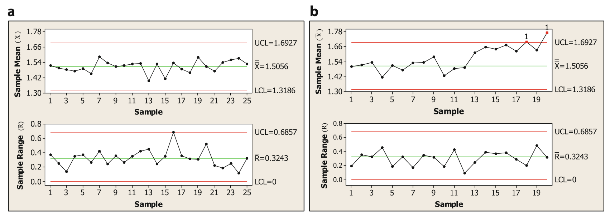

> Image description: This figure displays two sets of Shewhart control charts, labeled (a) and (b), used for Statistical Process Control in manufacturing. Part (a) shows Phase I analysis, while part (b) shows Phase II analysis. Each part contains two stacked plots. The upper plot is a Sample Mean ($\bar{X}$) chart, with the y-axis ranging from 1.30 to 1.78. The lower plot is a Sample Range ($R$) chart, with a y-axis ranging from 0.0 to 0.8. Both charts use "Sample" on the x-axis as the independent variable. In both (a) and (b), the $\bar{X}$ charts feature three horizontal lines: an Upper Control Limit (UCL) at 1.6927, a center line at the process mean ($\bar{\bar{X}}$) of 1.5056, and a Lower Control Limit (LCL) at 1.3186. Similarly, the $R$ charts feature a UCL of 0.6857, a center line at the average range ($\bar{R}$) of 0.3243, and an LCL of 0. In (a), all data points fall within the control limits. In (b), the $\bar{X}$ chart shows points numbered '1' that exceed the UCL.

Statistical Process Control in Manufacturing, Fig. 1 Shewhart $\bar{X}$ and $R$ charts from (a) Phase I analysis and (b) Phase II analysis

<!-- source_pdf_page: 1338 -->
statistical control. Subgroups $y_{1}, \ldots, y_{n}$ of size $n$ are taken, and subgroup average $\bar{y}$ is used to monitor process mean $\mu_{0}$, and the subgroup range is used to monitor standard deviation of the process mean $\sigma_{\bar{Y}}=\sigma / \sqrt{n}$. The upper and lower control limits are found for the $\bar{X}$ chart as $\{U C L, L C L\}=\mu_{0} \pm L \sigma_{\bar{Y}}$ where $L$ is a constant representing the width of the control limits. Commonly chosen three-sigma limits (i.e., $L=3$ ) provide a probability $p=0.0027$ that a single point falls outside the limits when process is in control ("false alarm probability"). Points that fall outside the control limits are investigated, and if an assignable cause was identified, then this point is omitted and control limits are recalculated. This is repeated until no further points plot outside the limits. In Phase II these charts are used to detect shifts in the process mean and variability.

The $\bar{X}$ and $R$ charts from Phase I data in Fig. 1a indicate statistical control; hence the computed control limits can be used for Phase II monitoring. Twenty additional subgroups (also of size 5) are taken in Phase II while the control charts are in use. The Phase II charts shown in Fig. 1b indicate that process variability is stable but the process mean has shifted at subgroup 18. The general trend in the $\bar{X}$ chart indicates that process mean probably has shifted earlier around subgroup 13.

## EWMA, CUSUM, and Changepoint Estimation

Shewhart charts can detect large magnitude process upsets reasonably well; however, they are relatively slow to detect small shifts. In order to reduce the reaction time for smaller shifts, a set of "runs" rules (e.g., two out of three runs beyond $2 \sigma$ limits or four out of five runs beyond $1 \sigma$ limits) has been proposed Western Electric (1956). A more systematic method is to accumulate information over successive observations using CUSUM and EWMA statistics rather than basing the detection on a single sample. In the cumulative sum (CUSUM) chart, a running total $\sum_{i=1}^{t}\left(\bar{Y}_{t}-\mu_{0}\right)$ is plotted against subgroup number $t$, and a shift from the in-control mean $\mu_{0}$ is
signaled by an upward or downward linear trend in the plot. A two-sided CUSUM is defined as Woodall and Adams (1993):
$S_{t}^{ \pm}=\max \left\{ \pm Z_{t}-k+S_{t-1}^{ \pm}, 0\right\}$ for $t=1,2, \ldots$
where $S_{t}^{+}$and $S_{t}^{-}$are the one-sided upper and lower cusums, respectively, $Z_{t}=\left(\bar{Y}_{t}-\mu_{0}\right) / \sigma_{\bar{Y}}$ is the standardized subgroup average, $k=\mid \mu_{1}- \mu_{0} \mid /(2 \sigma)$ is the reference value, and $\mu_{1}$ is the level of process mean to be detected. An out-ofcontrol signal is given at the first $t$ for which $S_{t}> h$ where $h$ is a suitably chosen threshold, usually selected based on the desired average number of samples to signal an alarm, also called the average run length (ARL). The recommended value for the threshold $h$ is 4 or 5 (corresponding to four or five times the process standard deviation $\sigma$ ), and the value for the reference $k$ is almost always taken as 0.5 (corresponding to shift size $\left|\mu_{1}-\mu_{0}\right|=\sigma$ )(Montgomery 2013).

Another chart that accumulates deviations over several samples is the exponentially weighted moving average (EWMA) which is based on the statistic (Lucas and Saccucci 1990)

$$
\begin{equation*}
Z_{t}=\lambda \bar{Y}_{t}+(1-\lambda) Z_{t-1} \tag{3}
\end{equation*}
$$

where $0<\lambda<1$ is a smoothing constant. Smaller $\lambda$ provides large smoothing (similar to a large subgroup size $n$ in the Shewhart charts). The starting value is the in-control mean $Z_{0}=\mu_{0}$. It can be shown that $Z_{t}$ is a weighted average of all previous sample means, where the weights decrease geometrically with the age of the subgroup mean. The EWMA statistic is plotted against the control limits $\mu_{0} \pm L \sigma_{\bar{Y}} \sqrt{(\lambda /(2-\lambda))\left[1-(1-\lambda)^{2 t}\right]}$. Shewhart charts that are effective for large shifts are more useful for Phase I, and CUSUM or EWMA charts that are effective for small shifts are more appropriate for Phase II.

We illustrate in Fig. 2 how to monitor with CUSUM and EWMA charts with the lithography data. The in-control process mean and standard deviation $\mu_{0}$ and $\sigma$ are found from the Phase I data. CUSUM upper and lower statistics $S_{t}^{ \pm}$ computed with Phase II data are plotted in Fig. 2a

<!-- source_pdf_page: 1339 -->
a
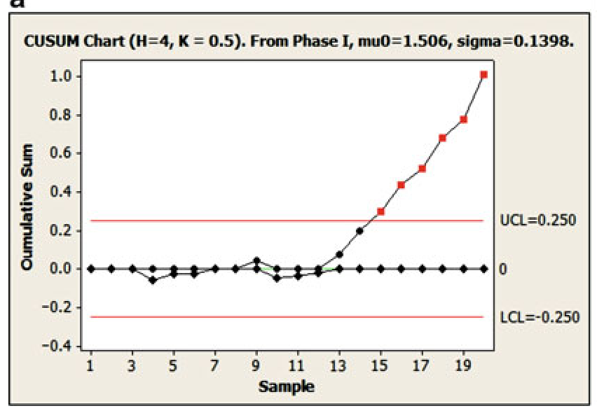

b
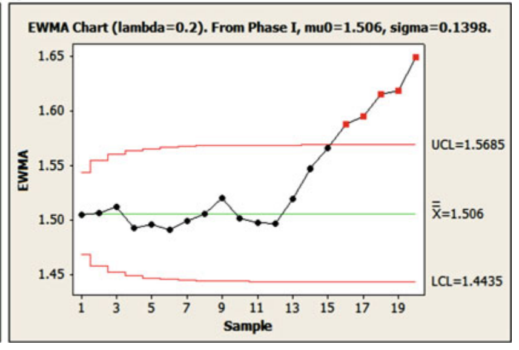

> Image description: This image displays an Exponentially Weighted Moving Average (EWMA) control chart used for statistical process control. The chart plots the EWMA statistic on the y-axis against the sample number (1 to 20) on the x-axis. According to the title, the parameters are $\lambda = 0.2$, target mean $\mu_0 = 1.506$, and standard deviation $\sigma = 0.1398$. Three horizontal red lines represent the control limits: the Upper Control Limit (UCL) is $1.5685$, the Lower Control Limit (LCL) is $1.4435$, and the centerline ($\bar{x}$) is $1.506$ in green. The black data points represent the EWMA values, which initially fluctuate near the centerline. However, starting around sample 12, the values show a clear upward trend. At sample 16, the points cross the UCL and continue rising, culminating in a red data point at sample 20 at approximately $1.65$. This upward trend above the UCL indicates that the process has drifted out of statistical control.

Statistical Process Control in Manufacturing, Fig. 2 Phase II charts for lithography data (a) CUSUM chart and (b) EWMA chart
(reference value $k=0.5$ and threshold $h=4$ are used.). The upper cusum statistic $S_{t}^{+}$crosses the upper control limit indicating an upward shift at subgroup 15. The EWMA statistic applied with $\lambda=0.2$ on Phase II data, shown Fig. 2b, crosses the upper control limit at subgroup 16. Both charts have improved the reaction times of the Shewhart chart.

When a control chart signals an assignable cause, it does not indicate when the process change actually occurred. Estimating the instant of the change, or changepoint estimation, is especially useful in Phase I analysis where little is known about the process, and it is important to identify and remove the out-of-control samples from consideration (Hawkins et al. 2003; Basseville and Nikiforov 1993; Pignatiello and Samuel 2001). The process is modeled as

$$
\begin{align*}
& Y_{i} \sim N\left(\mu_{1}, \sigma^{2}\right) \text { for } i=1,2, \ldots, \tau \\
& Y_{i} \sim N\left(\mu_{2}, \sigma^{2}\right) \text { for } i=\tau+1, \ldots, n \tag{4}
\end{align*}
$$

where $\tau$ is the unknown changepoint, at which the in-control mean $\mu_{1}$ is assumed to shift to a new value $\mu_{2}$ assuming $\mu_{1}, \sigma$ are known but $\mu_{2}$ is unknown. A generalized likelihood ratio (GLR) test statistic $\Lambda_{t}=\sum_{i=1}^{t} \log f_{2}\left(y_{i}\right) / f_{1}\left(y_{i}\right)$ is used to test the hypothesis of a changepoint against the null hypothesis that there is no change. Assuming normality $f(y)=1 / \sqrt{2 \pi \sigma} \exp [-(y- \mu)^{2} /\left(2 \sigma^{2}\right)$ ] is the probability density function of the quality characteristic. The changepoint model
is equivalent to the CUSUM chart when all parameters $\mu_{1}, \mu_{2}$ and $\sigma$ are known a priori. For the lithography Phase II data in Fig. 1b, it can be shown that the changepoint can be estimated as subgroup 13.

## SPC on Controlled and Autocorrelated Processes

It is well known that automatic control performance relies heavily on the accuracy of the process models. An active field of research in recent years is the monitoring of controlled systems using SPC charts (Box and Kramer 1992) in order to reduce the effect of model accuracy. Shewhart charts can be used to monitor the output of a feedback-controlled process; however, as the controller effectively corrects the shift, only a short window of opportunity is provided to detect the shift (Vander Wiel et al. 1992). Tsung and Tsui (2008) showed that monitoring the control actions gives better run-length performance than monitoring the output for small- and mediumsize shifts, and monitoring the output gives better performance for large shifts. In monitoring controlled processes, measurements taken at short intervals with positive autocorrelation usually inflate the rate of false alarms (Harris and Ross 1991). Widening the control limits and monitoring the residuals of a time-series model fitted to the observations are some of the strategies

<!-- source_pdf_page: 1340 -->
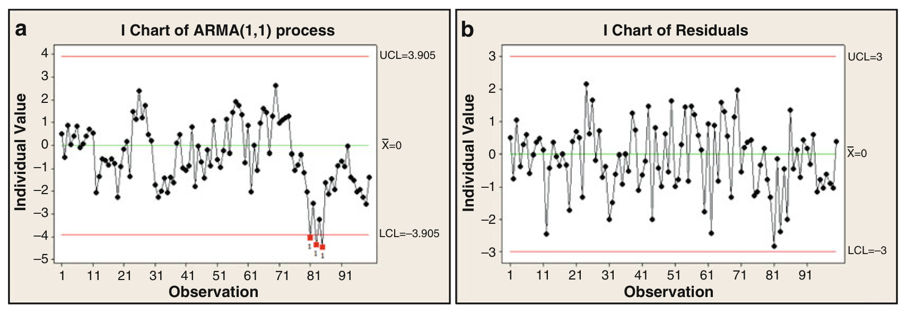

> Image description: The image contains two side-by-side line charts labeled **a** and **b**, demonstrating Statistical Process Control for an autocorrelated process and its residuals. **Figure a** is titled "**I Chart of ARMA(1,1) process**." The vertical axis represents the "**Individual Value**" (ranging from -5 to 4), and the horizontal axis represents the "**Observation**" number (from 1 to 100). A green centerline is marked at $\bar{X}=0$. Red horizontal lines indicate the upper control limit (**UCL=3.905**) and lower control limit (**LCL=-3.905**). Black data points are connected by thin gray lines. Near observation 81, three red data points fall below the LCL, indicating process instability. **Figure b** is titled "**I Chart of Residuals**." The vertical axis shows the "**Individual Value**" (-3 to 3), and the horizontal axis shows "**Observation**." It features a green centerline at $\bar{X}=0$ and red control limits at **UCL=3** and **LCL=-3**. The residual data points appear randomly distributed around the centerline without points falling outside the control limits, indicating that the model has successfully captured the process autocorrelation.

Statistical Process Control in Manufacturing, Fig. 3 (a) Shewhart chart for autocorrelated process. (b) Shewhart chart for residuals

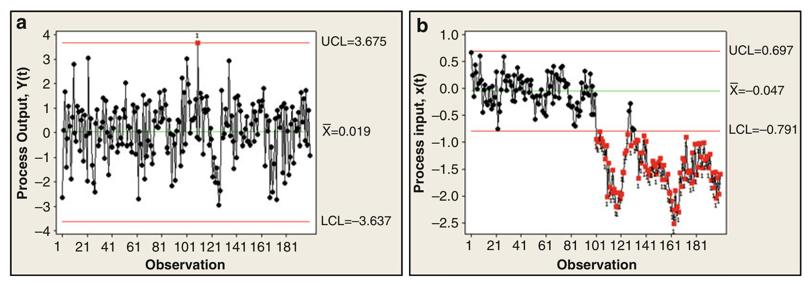

> Image description: This figure displays two Shewhart control charts used in statistical process control. Panel **(a)** shows a "Shewhart chart for autocorrelated process" where the y-axis is "Process Output, $Y(t)$" and the x-axis is "Observation." The plot contains black data points connected by lines, with a single red outlier marked at observation ~110. Horizontal control limits are shown: an upper control limit (UCL) at 3.675, a lower control limit (LCL) at -3.637, and a mean ($\bar{X}$) at 0.019 represented by a green line. Panel **(b)** shows a "Shewhart chart for residuals" where the y-axis is "Process input, $x(t)$" and the x-axis is "Observation." It features a mean ($\bar{X}$) of -0.047 (green line), a UCL of 0.697, and an LCL of -0.791 (both red lines). The data points transition from black to red after observation 100, as the values drop significantly below the LCL.
Statistical Process Control in Manufacturing, Fig. 4 (a) Shewhart chart for controlled process $Y_{t}$. (b) Shewhart chart for input $X_{t}$

employed to reduce the number of false alarms (Alwan and Roberts 1988).

To illustrate the effects of autocorrelation, we consider simulated data from an autoregressive moving average $\operatorname{ARMA}(1,1)$ time-series disturbance process $D_{t}=0.8 D_{t-1}+\epsilon_{t}-0.3 \epsilon_{t-1}$ (Box et al. 1994) defined with the white noise process $\epsilon_{t} \stackrel{\text { iid }}{\sim} N\left(0,1^{2}\right)$ (with in-control mean $\mu_{0}=0$ and variance $\sigma_{D}^{2}=1.694$ ). Figure 3a shows a realization of the process monitored with a Shewhart chart (control limits at $\mu_{0} \pm 3 \sigma_{D}$ ). Due to autocorrelation, false alarms are signaled at samples 81-83. Figure 3b shows the control chart monitoring of the residuals of an ARMA( 1,1 ) model. Residuals (standard normal with mean 0 and variance 1) are not autocorrelated, so the Shewhart chart for residuals does not signal any false alarms.

We illustrate monitoring of controlled processes with simulated data from a transfer function model $Y_{t}=2 X_{t-1}+D_{t}$ where $X_{t}$ are the adjustments made on the process. A proportional integral control rule $X_{t}=-0.1 Y_{t}-0.15 \sum_{i=1}^{t} Y_{i}$ is employed, and the disturbance $D_{t}$ is assumed to follow the ARMA model considered earlier. As an assignable cause, the disturbance mean has shifted at sample 100 by a magnitude of $3 \sigma_{D}$. Figure 4 shows the Shewhart charts monitoring the output $Y_{t}$ and the input $X_{t}$. The effect of assignable cause (at sample 100) on the output is quickly removed by the controller; however, a sustained shift remains in the control input. The control chart for the input Fig. 4b signals the first alarm at sample 101 (much quicker) than the control chart for the output Fig. 4a which signals at sample 110 .

<!-- source_pdf_page: 1341 -->
## Summary and Future Directions

In this entry we reviewed some of the commonly used statistical process monitoring methods for manufacturing systems. Due to space limitations, only several important topics including Phase I and Phase II monitoring with Shewhart, EWMA, and CUSUM charts were discussed, highlighting main applications with numerical examples. Other current research areas include multivariate methods for monitoring processes with multiple quality characteristics taking advantage of relationships among them (Lowry and Montgomery 1992), profile monitoring for processes that generate functional data (Woodall et al. 2004), multistage monitoring for processes with multiple processing steps and variation transmission (Tsung et al. 2008), and run-to-run EWMA control for semiconductor manufacturing processes that require handling of multiple types of products, operators, and machine tools (Butler and Stefani 1994).

## Cross-References

- Controller Performance Monitoring
- Multiscale Multivariate Statistical Process Control
- Run-to-Run Control in Semiconductor Manufacturing

## Bibliography

Alwan LC, Roberts HV (1988) Time-series modeling for statistical process control. J Bus Econ Stat 6(1):87-95
Basseville ME, Nikiforov IV (1993) Detection of abrupt changes: theory and application. Prentice-Hall, Englewood Cliffs
Box GEP, Kramer T (1992) Statistical process monitoring and feedback adjustment: a discussion. Technometrics 34(3):251-267
Box GEP, Jenkins GW, Reinsel GC (1994) Time series analysis, forecasting and control. Prentice Hall, Englewood Cliffs, NJ
Butler SW, Stefani JA (1994) Supervisory run-to-run control of polysilicon gate etch using in situ ellipsometry. IEEE Trans Semicond Manuf 7(2):193-201
Del Castillo E (2002) Statistical process adjustment for quality control. Wiley, New York

Harris TJ, Ross WH (1991) Statistical process control procedures for correlated observations. Can J Chem Eng 69(1):48-57
Hawkins DM, Peihua Q, Chang WK (2003) The changepoint model for statistical process control. J Qual Technol 35(4):355-366
Lowry CA, Montgomery DC (1995) A review of multivariate control charts. IIE Trans 27(6):800-810
Lucas JM, Saccucci MS (1990) Exponentially weighted moving average control schemes: properties and enhancements. Technometrics 32(1):1-12
Montgomery DM (2013) Introduction to statistical quality control. 7th edn. Wiley, New York
Pignatiello JJ, Jr, Samuel TR (2001) Estimation of the change point of a normal process mean in SPC applications. J Qual Technol 33(1):82-95
Ryan TP (2011) Statistical methods for quality improvement, 3rd edn. Wiley, New York
Shewhart WA (1939) Statistical method from the viewpoint of quality control. The Graduate School of the Department of Agriculture, Washington, D.C.
Sullivan JH (2002) Detection of multiple change points from clustering individual observations. J Qual Technol 34(4):371-383
Tsung F, Tsui KL (2003) A mean-shift pattern study on integration of SPC and APC for process monitoring. IIE Trans 35(3):231-242
Tsung F, Li Y, Jin M (2008) Statistical process control for multistage manufacturing and service operations. Int J Serv Oper Inform 3(2):191-204
Vander Wiel SA, Tucker WT, Faltin FW, Doganaksoy N (1992) Algorithmic statistical process control: concepts and an application. Technometrics 34(3):286297
Western Electric (1956) Statistical Quality Control Handbook, Western Electric Corporation, Indianapolis, IN
Woodall WH, Adams BM (1993) The statistical design of CUSUM charts. Qual Eng 5(4):559-570
Woodall WH, Spitzner DJ, Montgomery DC, Gupta S (2004) Using control charts to monitor process and product quality profiles. J Qual Technol 36(3):309320

## Stochastic Adaptive Control

Tyrone Duncan and Bozenna Pasik-Duncan Department of Mathematics, University of Kansas, Lawrence, KS, USA

#### Abstract

Stochastic adaptive control denotes the control of partially known stochastic control systems. The stochastic control systems can be described by discrete- or continuous-time Markov chains

<!-- source_pdf_page: 1342 -->
or Markov processes, linear and nonlinear difference equations, and linear and nonlinear stochastic differential equations. The solution of a stochastic adaptive control problem typically requires the identification of the partially known stochastic system and the simultaneous control of the partially known system using the information from the concurrent identification scheme. Two desirable goals for the solution of a stochastic adaptive control problem are called self-tuning and self-optimality. Self-tuning denotes the convergence of the family of adaptive controls indexed by time to the optimal control for the true system. Self-optimizing denotes the convergence of the long-run average costs to the optimal longrun average cost for the true system. Typically to achieve the self-optimality, it is important that the family of parameter estimators from the identification scheme be strongly consistent, that is, this family converges (almost surely) to the true parameter values. Thus, with self-optimality, asymptotically a partially known system can be controlled as well as the corresponding known system.

## Keywords

Bayesian estimation; Brownian motion; Markov processes; Self-tuning regulators

## Motivation and Background

In almost every formulation of a stochastic control problem from a physical system, the physical system is incompletely known so the stochastic system model is only partially known. This lack of knowledge can often be described by some unknown parameters for a mathematical model, and the noise inputs for the model can describe unmodeled dynamics or perturbations to the system. The lack of knowledge of some parameters of the model can be modeled either by random variables with known prior distributions or as fixed unknown values. The former description requires Bayesian estimation, and the latter description requires parameter estimation such as least squares or maximum likelihood.

Stochastic adaptive control arose as a natural evolution from the results in stochastic control, and in particular it developed for some wellknown control problems. The optimal control of Markov chains had been developed for some time, so it was natural to investigate the adaptive control of Markov chains. Mandl (1973) was probably the first to consider this adaptive control problem in generality. His conditions for strong consistency of a family of estimators were fairly restrictive. Borkar and Varaiya (1982) simplified the conditions for the estimation part of the problem by only requiring convergence of the estimators of the parameters so that the resulting transition probabilities of the Markov chain are identical to the transition probabilities for the true optimal solution.

A second major direction for stochastic adaptive control is described by ARMAX (autoregressive-moving average with exogenous inputs) models. These are discrete-time models that can be described in terms of polynomials in a time shift operator. A closely related and often equivalent model is multidimensional linear difference equations in a state-space form. Since the solution of the infinite time horizon stochastic control problem was available in the late 1950s, it was natural to consider the adaptive control problem. Methods such as least squares, weighted least squares, maximum likelihood, and stochastic approximation were used for parameter identification and a certainty equivalence adaptive control for the system, that is, using the current estimate of the parameters as the true parameters to verify self-optimality. An important development in stochastic adaptive control is a result called the self-tuning regulator where the convergence of estimators of unknown parameters implied the convergence of the output tracking error (Astrom and Wittenmark 1973; Goodwin et al. 1981; Guo 1995, 1996; Guo and Chen 1991; Kumar 1990).

A number of monographs treat various aspects of stochastic adaptive control problems, e.g., Astrom and Wittenmark (1989), Chen and Guo (1991), Kumar and Varaiya (1986), and Ljung and Soderstrom (1983). An extensive survey article on the early years of stochastic adaptive control is given by Kumar (1985).

<!-- source_pdf_page: 1343 -->
## Structures and Approaches

Various requirements can be made for the adaptive control of a stochastic system. It can only be required that the family of adaptive controls is stabilizing the unknown system or that the family of adaptive controls converges to the optimal control for the true system or that the family of adaptive controls has a long-run average cost that is equal to the optimal average cost for the true system. The identification part of the adaptive control problem can be Bayesian estimation (Kumar 1990) if the parameters are assumed to be random variables or parameter estimation (Bercu 1995; Lai and Wei 1982) if the parameters are assumed to be unknown constants. The identification scheme may also incorporate information about the running cost.

For linear systems with white noise inputs, it is well known to use least squares (or equivalently maximum likelihood) estimation to estimate parameters. However, for stochastic adaptive control problems, the sufficient conditions for the family of estimators to be strongly consistent are fairly restrictive (e.g., Lai and Wei 1982), and in fact the family of estimators may not even converge in general. A weighted least squares estimation scheme can guarantee convergence of the family of estimators (Bercu 1995) and can often be strongly consistent (Guo 1996). Some other estimation methods are stochastic approximation (Guo and Chen 1991) and an ordinary differential equation approach (Ljung and Soderstrom 1983). For discrete-time nonlinear systems, a family of strongly consistent estimators may not converge sufficiently rapidly even to stabilize the nonlinear system (Guo 1997).

The study of stochastic adaptive control of continuous-time linear stochastic systems with long-run average quadratic costs developed somewhat after the corresponding discrete-time study (e.g., Duncan and Pasik-Duncan 1990). A solution with basically the natural assumptions from the solution of the known system problem using a weighted least squares identification scheme is given in Duncan et al. (1999).

Another family of stochastic adaptive control problems is described by linear stochastic
equations in an infinite dimensional Hilbert space. These models can describe stochastic partial differential equations and stochastic hereditary differential equations. Some linear-quadratic-Gaussian control problems have been solved, and these solutions have been used to solve some corresponding stochastic adaptive control problems (e.g., Duncan et al. 1994a).

Optimal control methods such as Hamilton-Jacobi-Bellman equations and a stochastic maximum principle have been used to solve stochastic control problems described by nonlinear stochastic differential equations (Fleming and Rishel 1975). Thus, it was natural to consider stochastic adaptive control problems for these systems. The results are more limited than the results for linear stochastic systems (e.g., Duncan et al. 1994b).

Other stochastic adaptive control problems have recently emerged that are modeled by multi-agents, such as mean field stochastic adaptive control problems (e.g., Nourian et al. 2012).

## A Detailed Example: Adaptive Linear-Quadratic-Gaussian Control

This example is a model that is the most well known continuous-time stochastic adaptive control problem. Likewise for a known continuoustime system, this stochastic control problem is the most basic and well known. The controlled system is described by the following stochastic differential equation:

$$
\begin{aligned}
d X(t) & =A X(t) d t+B U(t) d t+C d W(t) \\
X(0) & =X_{0}
\end{aligned}
$$

where $X(t) \in \mathbb{R}^{n}, U(t) \in \mathbb{R}^{m}$, and ( $W(t), t \geq 0$ ) is an $\mathbb{R}^{p}$-valued standard Brownian motion and ( $A, B, C$ ) are appropriate linear transformations. $X(t)$ is the state of the system at time $t$ and $U(t)$ is the control at time $t$. It is assumed that $A, B, C$ are unknown linear transformations. The cost functional, $J(\cdot)$, is a long-run average (ergodic) quadratic cost functional that is given by

<!-- source_pdf_page: 1344 -->
$$
\begin{aligned}
J(U)= & \lim \sup _{T \rightarrow \infty} \frac{1}{T} \int_{0}^{T}<Q X(t), X(t)> \\
& +<R U(t), U(t)>d t
\end{aligned}
$$

where $R>0$ and $Q \geq 0$ are symmetric linear transformations and $<\cdot, \cdot>$ is the canonical inner product in the appropriate Euclidean space. The standard assumptions for the control of the known system are made also for the adaptive control problem, that is, the pair ( $A, B$ ) is controllable and $\left(A, Q^{\frac{1}{2}}\right)$ is observable. An optimal control for the known system is

$$
U^{0}(t)=-R^{-1} B^{T} S X(t)
$$

where $S$ is the unique positive, symmetric solution of the following algebraic Riccati equation:

$$
A^{T} S+S A-S B R^{-1} B^{T} S+Q=0
$$

The optimal cost is

$$
J\left(U^{0}\right)=\operatorname{tr}\left(C^{T} S C\right)
$$

The unknown quantity $C^{T} C$ can be identified given $(X(t), t \in[a, b])$ for $a<b$ arbitrary from the quadratic variation of Brownian motion, so the identification of $C$ is not considered here. Since it is assumed that the pair ( $A, B$ ) is unknown, the system equation is rewritten in the following form:

$$
d X(t)=\theta^{T} \varphi(t) d t+C d W(t)
$$

where $\theta^{T}=[A B]$ and $\varphi^{T}(t)=\left[X^{T}(t) U^{T}(t)\right]$. A family of continuous-time weighted least squares recursive estimators ( $\theta(t), t \geq 0$ ) of $\theta$ is given by the following stochastic equation:

$$
\begin{aligned}
d \theta(t) & =a(t) P(t) \varphi(t)\left[d X^{T}(t)-\varphi^{T}(t) \theta(t) d t\right] \\
d P(t) & =-a(t) P(t) \varphi(t) \varphi^{T}(t) P(t) d t
\end{aligned}
$$

where $(a(t), t \geq 0)$ is a suitable family of positive stochastic weights (Duncan et al. 1999). A family of estimates ( $\hat{\theta}(t), t \geq 0$ ) is obtained from ( $\theta(t), t \geq 0$ ) and is expressed as $\hat{\theta}(t)=[A(t) B(t)]$ (Duncan et al. 1999).

A process $(S(t), t \geq 0)$ is obtained using $(A(t), B(t))$ by solving the following stochastic algebraic Riccati equation for each $t \geq 0$ :

$$
\begin{aligned}
& A^{T}(t) S(t)+S(t) A(t) \\
& \quad-S(t) B(t) R^{-1} B^{T}(t) S(t)+Q=0
\end{aligned}
$$

A certainty equivalence method is used to determine the control, that is, it is assumed that the pair $(A(t), B(t))$ is the correct pair for the true system, so a certainty equivalence adaptive control $U(t)$ is given by

$$
U(t)=R^{-1} B^{T} S(t) X(t)
$$

It can be shown (Duncan et al. 1999) that the family of estimators $((A(t), B(t)), t \geq 0)$ is strongly consistent and that the family of adaptive controls given by the previous equality is selfoptimizing, that is, the long-run average cost $J(U)=J\left(U^{0}\right)=\operatorname{tr}\left(C^{T} S C\right)$ where $S$ is the solution of the algebraic Riccati equation for the true system.

## Future Directions

A number of important directions for stochastic adaptive control are easily identified. Only three of them are described briefly here. The adaptive control of the partially observed linear-quadraticGaussian control problem (Fleming and Rishel 1975) is a major problem to be solved using the same assumptions of controllability and observability as for the known system. This problem is a generalization of the example given above where the output (linear transformation) of the system is observed with additive noise and the family of controls is restricted to depend only on these observations. Another major direction is to modify the detailed example above by replacing the Brownian motion in the stochastic equation for the state by an arbitrary fractional Brownian motion or by an arbitrary square-integrable stochastic process with continuous sample paths. For this latter problem it is necessary to use recent results for optimal controls for the true

<!-- source_pdf_page: 1345 -->
system and to have strongly consistent families of estimators. A third major direction is the adaptive control of nonlinear stochastic systems.

## Cross-References

- Stochastic Linear-Quadratic Control
- System Identification: An Overview

Acknowledgments Research supported by NSF grant DMS 1108884, AFOSR grant FA9550-12-1-0384, and ARO grant W911NF-10-1-0248.

## Bibliography

Astrom KJ, Wittenmark B (1973) On self-tuning regulators. Automatica 9:185-199
Astrom KJ, Wittenmark B (1989) Adaptive control. Addison-Wesley, Reading
Bercu B (1995) Weighted estimation and tracking for ARMAX models. SIAM J Control Optim 33:89-106
Borkar V, Varaiya P (1982) Identification and adaptive control of Markov chains. SIAM J Control Optim 20:470-489
Chen HF, Guo L (1991) Identification and stochastic adaptive control. Birkhauser, Boston
Duncan TE, Pasik-Duncan B (1990) Adaptive control of continuous time linear systems. Math Control Signals Syst 3:43-60
Duncan TE, Maslowski B, Pasik-Duncan B (1994a) Adaptive boundary and point control of linear stochastic distributed parameter systems. SIAM J Control Optim 32:648-672
Duncan TE, Pasik-Duncan B, Stettner L (1994b) Almost self-optimizing strategies for the adaptive control of diffusion processes. J Optim Theory Appl 81:470-507
Duncan TE, Guo L, Pasik-Duncan B (1999) Adaptive continuous-time linear quadratic Gaussian control. IEEE Trans Autom Control 44:1653-1662
Fleming WH, Rishel RW (1975) Deterministic and stochastic optimal control. Springer, New York
Goodwin G, Ramadge P, Caines PE (1981) Discrete time stochastic adaptive control. SIAM J Control Optim 19:820-853
Guo L (1995) Convergence and logarithm laws of selftuning regulators. Automatica 31:435-450
Guo L (1996) Self-convergence of weighted least squares with applications. IEEE Trans Autom Control 41:7989
Guo L (1997) On critical stability of discrete time adaptive nonlinear control. IEEE Trans Autom Control 42:1488-1499
Guo L, Chen HF (1991) The Astrom-Wittenmark selftuning regulator revisited and ELS based adaptive trackers. IEEE Trans Autom Control 36:802-812

Kumar PR (1985) A survey of some results in stochastic adaptive control. SIAM J Control Optim 23:329-380
Kumar PR (1990) Convergence of adaptive control schemes with least squares estimates. IEEE Trans Autom Control 35:416-424
Kumar PR, Varaiya P (1986) Stochastic systems, estimation, identification and adaptive control. Prentice-Hall, Englewood Cliffs
Lai TL, Wei CZ (1982) Least square estimation is stochastic regression models with applications to identification and control of dynamic systems. Ann Stat 10:154166
Ljung L, Soderstrom T (1983) Theory and practice of recursive identification. MIT, Cambridge
Mandl P (1973) On the adaptive control of finite state Markov processes. Z Wahr Verw Geb 27:263-276
Nourian M, Caines PE, Malhame RP (2012) Mean field LQG control in leader-follower stochastic multi-agent systems: likelihood ratio based adaptation. IEEE Trans Autom Control 57:2801-2816

## Stochastic Description of Biochemical Networks

João P. Hespanha ${ }^{1}$ and Mustafa Khammash ${ }^{2} { }^{1}$ Center for Control, Dynamical Systems and Computation, University of California, Santa Barbara, CA, USA
${ }^{2}$ Department of Biosystems Science and Engineering, Swiss Federal Institute of Technology at Zurich (ETHZ), Basel, Switzerland

#### Abstract

Conventional deterministic chemical kinetics often breaks down in the small volume of a living cell where cellular species (e.g., genes, mRNAs, etc.) exist in discrete, low copy numbers and react through reaction channels whose timing and order is random. In such an environment, a stochastic chemical kinetics framework that models species abundances as discrete random variables is more suitable. The resulting models consist of continue-time discrete-state Markov chains. Here we describe how such models can be formulated and numerically simulated, and we present some of the key analysis techniques for studying such reactions.

<!-- source_pdf_page: 1346 -->
## Keywords

Chemical master equation; Gillespie algorithm; Moment dynamics; Stochastic biochemical reactions; Stochastic models

## Introduction

The time evolution of a spatially homogeneous mixture of chemically reacting molecules is often modeled using a stochastic formulation, which takes into account the inherent randomness of thermal molecular motion. This formulation is important when modeling complex reactions inside living cells, where small populations of key reactants can set the stage for significant stochastic effects. In this entry, we review the basic stochastic model of chemical reactions and discuss the most common techniques used to simulate and analyze this model.

## Stochastic Models of Chemical Reactions

We start by considering a set of $N$ molecular species (reactants) $\mathcal{S}_{1}, \ldots, \mathcal{S}_{N}$ that are confined to a fixed volume $\Omega$. These species react through $M$ possible reactions $R_{1}, \ldots, R_{M}$. In this formulation of chemical kinetics, we shall assume that the system is in thermal equilibrium and is well mixed. Thus, the reacting molecules move due to their thermal energy. The population of the different reactants is described by a random process $X(t)=\left(X_{1}(t) \ldots X_{N}(t)\right)^{T}$, where $X_{i}(t)$ is a random variable that models the abundance (in terms of the number of copies) of molecules of species $\mathcal{S}_{i}$ in the system at time $t$. For the allowable reactions, we shall only consider elementary reactions. These could either be monomolecular, $\mathcal{S}_{i} \rightarrow$ products, or bimolecular, $\mathcal{S}_{i}+\mathcal{S}_{j} \rightarrow$ products. Upon the firing of reaction $R_{k}$, a transition occurs from some state $X=\boldsymbol{x}_{i}$ right before the reaction fires to some other state $X=\boldsymbol{x}_{i}+ \boldsymbol{s}_{k}$, which reflects the change in the population immediately after the reaction has fired. $\boldsymbol{s}_{k}$ is referred to as the stoichiometric vector. The set

| Stochastic Description of Biochemical |  |
| :--- | :--- |
| Networks, Table 1 Propensity functions for elementary |  |
| reactions. The constants $c, c^{\prime}$, and $c^{\prime \prime}$ are related to $k$, |  |
| $k^{\prime}$, and $k^{\prime \prime}$, the reaction rate constants from deterministic |  |
| mass-action kinetics. Indeed it can be shown that $c=k$, |  |
| $c^{\prime}=k^{\prime} / \Omega$, and $c^{\prime \prime}=2 k^{\prime \prime} / \Omega$ |  |
| Reaction type |  |
| $S_{i} \rightarrow$ Products | Propensity function |
| $S_{i}+S_{j} \rightarrow$ Products $\quad(i \neq j)$ | $c \boldsymbol{x}_{i}$ |
| $S_{i}+S_{i} \rightarrow$ Products | $c^{\prime} \boldsymbol{x}_{i} \boldsymbol{x}_{j}$ |

of allowable $M$ reactions defines the so-called stoichiometry matrix:

$$
S=\left[s_{1} \cdots s_{M}\right] .
$$

To each reaction $R_{k}$, we associate a propensity function, $w_{k}(\boldsymbol{x})$ that describes the rate of that reaction. More precisely, $w_{k}(\boldsymbol{x}) h$ is the probability that, given the system is in state $\boldsymbol{x}$ at time $t$, $R_{k}$ fires once in the time interval $[t, t+h)$. The propensity functions for elementary reactions is given in Table 1.

## Limiting to the Deterministic Regime

There is an important connection between the stochastic process $X(t)$, as represented by the continuous-time discrete-state Markov chain described above, and the solution of a related deterministic reaction rate equations obtained from mass-action kinetics. To see this, let $\Phi(t)= \left[\Phi_{1}(t), \ldots, \Phi_{N}(t)\right]^{T}$ be the vector concentrations of species $S_{1}, \ldots, S_{N}$. According to mass-action kinetics, $\Phi(\cdot)$ satisfies the ordinary differential equation:

$$
\dot{\Phi}=S f(\Phi(t)), \quad \Phi(0)=\Phi_{0} .
$$

In order to compare the $\Phi(t)$ with $X(t)$, which represents molecular counts, we divide $X(t)$ by the reaction volume to get $X^{\Omega}(t)=X(t) / \Omega$. It turns out that $X^{\Omega}(t)$ limits to $\Phi(t)$ : According to Kurtz (Ethier and Kurtz 1986), for every $t \geq 0$ :
$\lim _{\Omega \rightarrow \infty} \sup _{s \leq t}\left|X^{\Omega}(s)-\Phi(s)\right|=0, \quad$ almost surely.

<!-- source_pdf_page: 1347 -->
Hence, over any finite time interval, the stochastic model converges to the deterministic mass-action one in the thermodynamic limit. Note that this is only a large volume limit result. In practice, for a fixed volume, a stochastic description may differ considerably from the deterministic description.

## Stochastic Simulations

Gillespie's stochastic simulation algorithm (SSA) constructs sample paths for the random process $X(t)=\left(X_{1}(t) \ldots X_{N}(t)\right)^{T}$ that are consistent with the stochastic model described above (Gillespie 1976). It consists of the following basic steps:

1. Initialize the state $X(0)$ and set $t=0$.
2. Draw a random number $\tau \in(0, \infty)$ with exponential distribution and mean equal to $1 / \sum_{k} w_{k}(X(t))$.
3. Draw a random number $k \in\{1,2, \ldots, M\}$ such that the probability of $k=i \in \{1,2, \ldots, M\}$ is proportional to $w_{i}(X(t))$.
4. Set $X(t+\tau)=X(t)+s_{k}$ and $t=t+\tau$.
5. Repeat from (2) until $t$ reaches the desired simulation time.
By running this algorithm multiple times with independent random draws, one can estimate the distribution and statistical moments of the random process $X(t)$.

## The Chemical Master Equation (CME)

The chemical master equation (CME), also known as the forward Kolmogorov equation, describes the time evolution of the probability that the system is in a given state $\boldsymbol{x}$. The CME can be derived based on the Markov property of chemical reactions. Suppose the system is in state $\boldsymbol{x}$ at time $t$. Within an error of order $\mathcal{O}\left(h^{2}\right)$, the following statements apply:

- The probability that an $R_{k}$ reaction fires exactly once in the time interval $[t, t+h)$ is given by $w_{k}(\boldsymbol{x}) h$.
- The probability that no reactions fire in the time interval $[t, t+h)$ is given by $1-\sum_{k} w_{k}(\boldsymbol{x}) d x$.
- The probability that more than one reaction fires in the time interval $[t, t+h)$ is zero.
Let $P(\boldsymbol{x}, t)$, denote the probability that the system is in state $\boldsymbol{x}$ at time $t$. We can express $P(x, t+h)$ as follows:

$$
\begin{aligned}
& P(\boldsymbol{x}, t+h)=P(\boldsymbol{x}, t)\left(1-\sum_{k} w_{k}(\boldsymbol{x}) h\right) \\
& \quad+\sum_{k} P\left(\boldsymbol{x}-s_{k}, t\right) w_{k}\left(\boldsymbol{x}-s_{k}\right) h+\mathcal{O}\left(h^{2}\right)
\end{aligned}
$$

The first term on the right-hand side is the probability that the system is already in state $\boldsymbol{x}$ at time $t$, and no reactions occur in the next $h$. In the second term on the right-hand side, the $k$ th term in the summation is the probability that the system at time $t$ is an $R_{k}$ reaction away from being at state $\boldsymbol{x}$ and that an $R_{k}$ reaction takes place in the next $h$.

Moving $P(\boldsymbol{x}, t)$ to the left-hand side, dividing by $h$, and taking the limit as $h$ goes to zero yields the chemical master equation (CME):

$$
\begin{gather*}
\frac{d P(\boldsymbol{x}, t)}{d t}=\sum_{k=1}^{M}\left(w_{k}\left(\boldsymbol{x}-\boldsymbol{s}_{k}\right) P\left(\boldsymbol{x}-\boldsymbol{s}_{k}, t\right)\right. \\
\left.-w_{k}(\boldsymbol{x}) P(\boldsymbol{x}, t)\right) \tag{1}
\end{gather*}
$$

The CME defines a linear dynamical system in the probabilities of the different states (each state is defined by a specific number of molecules of each of the species). However, there are generally an infinite number of states, and the resulting infinite linear system is not directly solvable. One approach to overcome this difficulty is to approximate the solution of the CME by truncating the states. A particular truncation procedure that gives error bounds is called the finite-state projection (FSP) (Munsky and Khammash 2006). The key idea behind the FSP approach is to keep those states that support the bulk of the probability distribution while projecting the remaining infinite states onto a single "absorbing" state. See Fig. 1.

The left panel in the figure shows the infinite states of a system with two species. The arrows indicate transitions among states caused

<!-- source_pdf_page: 1348 -->
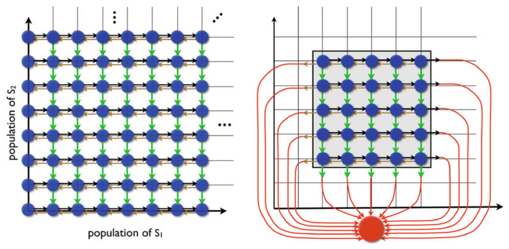

> Image description: Figure 1, titled "The finite-state projection," provides a stochastic description of biochemical networks. It consists of two diagrams representing state spaces. The left diagram shows a two-dimensional grid of blue circular nodes representing discrete states. The horizontal axis is labeled "population of $S_1$" and the vertical axis is labeled "population of $S_2$." Interconnecting the nodes are directed arrows: green arrows point downward, while brown arrows point horizontally, representing transitions between states. Ellipses indicate that the grid extends beyond the visible frame. The right diagram illustrates the concept of the finite-state projection. It features the same grid of blue nodes, but a subset of these nodes is enclosed within a shaded gray rectangular block. This central block represents a truncated finite state space. Red curved arrows originate from all nodes in the grid and converge toward a single large red node at the bottom, representing the probability mass being "lost" or projected outside the finite subspace.
Stochastic Description of Biochemical Networks, Fig. 1 The finite-state projection

by allowable chemical reactions. The underlying stochastic process is a continuous-time discretestate Markov process. The right panel shows the projected (finite-state) system for a specific projection region (box). The projection is obtained as follows: transitions within the retained sates are kept, while transitions that emanate from these states and end at states outside the box are channeled to a single new absorbing state. Transitions into the box are deleted. The resulting projected system is a finite-state Markov process. The probability of each of its finite states can be computed exactly. It can be shown that the truncation, as defined here, gives a lower bound for the probability for the original full system. The FSP algorithm provides a way for constructing an approximation of the CME that satisfies any prespecified accuracy requirement.

## Moment Dynamics

While the probability distribution $P(\boldsymbol{x}, t)$ provides great detail on the state $\boldsymbol{x}$ at time $t$, often statistical moments of the molecule copy numbers already provide important information about their variability, which motivates the construction
of mathematical models for the evolution of such models over time.

Given a vector of integers $m:=\left(m_{1}, m_{2} \ldots\right.$, $m_{n}$ ), we use the notation $\mu^{(m)}$ to denote the following uncentered moment of $X$ :

$$
\mu^{(m)}:=\mathrm{E}\left[X_{1}^{m_{1}} X_{2}^{m_{2}} \cdots X_{n}^{m_{n}}\right] .
$$

Such moment is said to be of order $\sum_{i} m_{i}$. With $N$ species, there are exactly $N$ first-order moments e $\left[X_{i}\right], \forall i \in\{1,2, \ldots, N\}$, which are just the means; $N(N-1) / 2$ second-order moments $\mathrm{e}\left[X_{i}^{2}\right], \forall i$ and $\mathrm{e}\left[X_{i} X_{j}\right], \forall i \neq j$, which can be used to compute variances and covariance; $N(N-1)(N-2) / 6$ third-order moments; and so on.

Using the CME (1), one can show that

$$
\begin{aligned}
\frac{d \mu^{(m)}}{d t}= & \mathrm{E}\left[\sum _ { k } w _ { k } ( X ) \left(\left(X_{1}+\boldsymbol{s}_{1, k}\right)^{m_{1}}\left(X_{2}-\boldsymbol{s}_{2, k}\right)^{m_{2}}\right.\right. \\
& \left.\left.\cdots\left(X_{N}-\boldsymbol{s}_{N, k}\right)^{m_{N}}-X_{1}^{m_{1}} X_{2}^{m_{2}} \cdots X_{N}^{m_{N}}\right)\right],
\end{aligned}
$$

and, because the propensity functions are all polynomials on $\boldsymbol{x}$ (cf. Table 1), the expected value in the right-hand side can actually be written as a linear combination of other uncentered moments of $X$. This means that if we construct a

<!-- source_pdf_page: 1349 -->
vector $\mu$ containing all the uncentered moments of $x$ up to some order $k$, the evolution of $\mu$ is determined by a differential equation of the form

$$
\begin{equation*}
\frac{d \mu}{d t}=A \mu+B \bar{\mu}, \quad \mu \in \mathbb{R}^{K}, \bar{\mu} \in \mathbb{R}^{\bar{K}} \tag{2}
\end{equation*}
$$

where $A$ and $B$ are appropriately defined matrices and $\bar{\mu}$ is a vector containing moments of order larger than $k$. The equation (2) is exact, and we call it the (exact) $k$-order moment dynamics, and the integer $k$ is called the order of truncation. Note that the dimension $K$ of (2) is always larger than $k$ since there are many moments of each order. In fact, in general, $K$ is of order $n^{k}$.

When all chemical reactions have only one reactant, the term $B \bar{\mu}$ does not appear in (2), and we say that the exact moment dynamics are closed. However, when at least one chemical reaction has two or more reactants, then the term $B \bar{\mu}$ appears, and we say that the moment dynamics are open since (2) depends on the moments in $\bar{\mu}$, which are not part of the state $\mu$. When all chemical reactions are elementary (i.e., with at most two reactants), then all moments in $\bar{\mu}$ are exactly of order $k+1$.

Moment closure is a procedure by which one approximates the exact (but open) moment dynamics (2) by an approximate (but now closed) equation of the form

$$
\begin{equation*}
\dot{v}=A v+B \varphi(v), \quad v \in \mathbb{R}^{K} \tag{3}
\end{equation*}
$$

where $\varphi(\nu)$ is a column vector that approximates the moments in $\bar{\mu}$. The function $\varphi(v)$ is called the moment closure function, and ( 3 ) is called the approximate $k$ th-order moment dynamics. The goal of any moment closure method is to construct $\varphi(v)$ so that the solution $v$ to (3) is close to the solution $\mu$ to (2).

There are three main approaches to construct the moment closure function $\varphi(\cdot)$ :

1. Matching-based methods directly attempt to match the solutions to (2) and (3) (e.g., Singh and Hespanha 2011).
2. Distribution-based methods construct $\varphi(\cdot)$ by making reasonable assumptions on the statis-
tical distribution of the molecule counts vector $x$ (e.g., Gomez-Uribe and Verghese 2007).
3. Large volume methods construct $\varphi(\cdot)$ by assuming that reactions take place on a large volume (e.g., Van Kampen 2001).
It is important to emphasize that this classification is about methods to construct moment closure. It turns out that sometimes different methods lead to the same moment closure function $\varphi(\cdot)$.

## Conclusion and Outlook

We have introduced complementary approaches to study the evolution of biochemical networks that exhibit important stochastic effects.

Stochastic simulations permit the construction of sample paths for the molecule counts, which can be averaged to study the ensemble behavior of the system. This type of approach scales well with the number of molecular species, but can be computationally very intensive when the number of reactions is very large. This challenge has led to the development of approximate stochastic simulation algorithms that attempt to simulate multiple reactions in the same simulation step (e.g., Rathinam et al. 2003).

Solving the CME provides the most detailed and accurate approach to characterize the ensemble properties of the molecular counts, but for most biochemical systems such solution cannot be found in closed form, and numerical methods scale exponentially with the number of species. This challenge has led to the development of algorithms that compute approximate solutions to the CME, e.g., by aggregating states with low probability, while keeping track of the error (e.g., Munsky and Khammash 2006).

Moment dynamics is attractive in that the number of $\mathrm{k} t h$-order moments only scales polynomially with the number of chemical species, but one only obtains closed dynamics for very simple biochemical networks. This limitation has led to the development of moment closure techniques to approximate the open moment dynamics by a closed system of ordinary differential equations.

<!-- source_pdf_page: 1350 -->
## Cross-References

- Deterministic Description of Biochemical Networks
- Robustness Analysis of Biological Models
- Spatial Description of Biochemical Networks

## Bibliography

Ethier SN, Kurtz TG (1986) Markov processes: characterization and convergence. Wiley series in probability and mathematical statistics: probability and mathematical statistics. Hoboken, New Jersey
Gillespie DT (1976) A general method for numericallysimulating the stochastic time evolution of coupled chemical reactions. J Comput Phys 22:403-434
Gomez-Uribe CA, Verghese GC (2007) Mass fluctuation kinetics: capturing stochastic effects in systems of chemical reactions through coupled mean-variance computations. J Chem Phys 126(2):024109-024109-12
Munsky B, Khammash M (2006) The finite state projection algorithm for the solution of the chemical master equation. J Chem Phys 124:044104
Rathinam M, Petzold LR, Cao Y, Gillespie DT (2003) Stiffness in stochastic chemically reacting systems: the implicit tau-leaping method. J Chem Phys 119(24): 12784-12794
Singh A, Hespanha JP (2011) Approximate moment dynamics for chemically reacting systems. IEEE Trans Autom Control 56(2):414-418
Van Kampen NG (2001) Stochastic processes in physics and chemistry. Elsevier Science, Amsterdam

## Stochastic Dynamic Programming

Qing Zhang
Department of Mathematics, The University of Georgia, Athens, GA, USA

#### Abstract

This article is concerned with one of the traditional approaches for stochastic control problems: Stochastic dynamic programming. Brief descriptions of stochastic dynamic programming methods and related terminology are provided. Two asset-selling examples are presented to illustrate the basic ideas. A list of topics and references are also provided for further reading.

## Keywords

Asset-selling rule; Bellman equation; Hamilton-Jacobi-Bellman equation; Markov decision problem; Optimality principle; Stochastic control; Viscosity solution

## Introduction

The term dynamic programming was introduced by Richard Bellman in the 1940s. It refers to a method for solving dynamic optimization problems by breaking them down into smaller and simpler subproblems.

To solve a given problem, one often needs to solve each part of the problem (subproblems) and then put together their solutions to obtain an overall solution. Some of these subproblems are of the same type. The idea behind the dynamic programming approach is to solve each subproblem only once in order to reduce the overall computation.

The cornerstone of dynamic programming (DP) is the so-called principle of optimality which is described by Bellman in his 1957 book (Bellman 1957):

> Principle of Optimality: An optimal policy has the property that whatever the initial state and initial decision are, the remaining decisions must constitute an optimal policy with regard to the state resulting from the first decision.

This principle of optimality gives rise to DP (or optimality) equations, which are referred to as Bellman equations in discrete-time optimization problems or Hamilton-Jacobi-Bellman (HJB) equations in continuous-time ones. Such equations provide a necessary condition for optimality in terms of the value of the underlying decision problem. By and large, an optimal control policy in most cases can be obtained by solving the associated Bellman (HJB) equation. In view of this, dynamic programming is a powerful tool for a broad range of control and decision-making problems. When the underlying system is driven by certain type of random

<!-- source_pdf_page: 1351 -->
disturbance, the corresponding DP approach is referred to as stochastic dynamic programming.

## Terminology

The following concepts are often used in stochastic dynamic programming.

An objective function describes the objective of a given optimization problem (e.g., maximizing profits, minimizing cost, etc.) in terms of the states of the underlying system, decision (control) variables, and possible random disturbance.

State variables represent the information about the current system under consideration. For example, in a manufacturing system, one needs to know the current product inventory in order to decide how much to produce at the moment. In this case, the inventory level would be one of the state variables.

The variables chosen at any time are called the decision or control variables. For instance, the rate of production over time in the manufacturing system is a control variable. Typically, control variables are functions of state variables. They affect the future states of the system and the objective function.

In stochastic control problems, the system is also affected by random events (noise). Such noise is referred to system disturbance. The noise is often not available a priori. Only their probabilistic distributions are known.

The goal of the optimization problem is to choose control variables over time so as to either maximize or minimize the corresponding objective function. For example, in order to maximize the overall profits, a manufacturing firm has to decide how much to produce over time so as to maximize the revenue by meeting the product demand and minimize the costs associated with inventory. The best possible value of the objective is called value function, which is given in terms of the state variables.

In the next two sections, we give two examples to illustrate how stochastic DP methods are used in discrete and continuous time.

## An Asset-Selling Example (Discrete Time)

Consider a person wants to sell an asset (e.g., a car or a house). She is offered an amount of money every period (say, a day). Let $v_{0}, v_{1}, \ldots, v_{N-1}$ denote the amount of these random offers. Assume they are independent and identically distributed. At the end of each period, the person has to decide whether to accept the offer or reject it. If she accepts the offer, she can put the money in a bank account and receive a fixed interest rate $r>0$; if she rejects the offer, she waits till the next period. Rejected offers cannot be recycled. In addition, she has to sell her asset by the end of the $N$ th period and accept the last offer $v_{N-1}$ if all previous offers have been rejected. The goal is to decide when to accept an offer to maximize the overall return at the $N$ th period.

In this example, for each $k, v_{k}$ is the random disturbance. The control variables $u_{k}$ take values in $\{$ sell, hold $\}$. The state variables $x_{k}$ are given by the equations

$$
x_{0}=0 ; \quad x_{k+1}= \begin{cases}\text { sold } & \text { if } u_{k}=\text { sell } \\ v_{k} & \text { otherwise }\end{cases}
$$

Let
$h_{N}\left(x_{N}\right)= \begin{cases}x_{N} & \text { if } x_{N} \neq \text { sold }, \\ 0 & \text { otherwise } .\end{cases}$
$h_{k}\left(x_{k}, u_{k}, v_{k}\right)= \begin{cases}(1+r)^{N-k} x_{k} & \text { if } x_{k} \neq \text { sold } \\ & \text { and } u_{k}=\text { sell } \\ 0 & \text { otherwise. }\end{cases}$
for $k=0,1, \ldots, N-1$.

Then, the payoff function is given by

$$
E_{\left\{v_{k}\right\}}\left(h_{N}\left(x_{N}\right)+\sum_{k=0}^{N-1} h_{k}\left(x_{k}, u_{k}, v_{k}\right)\right) .
$$

Here, $E_{\left\{v_{k}\right\}}$ represents the expected value over $\left\{v_{k}\right\}$. The corresponding value functions $V_{k}\left(x_{k}\right)$ satisfy the following Bellman equations:

<!-- source_pdf_page: 1352 -->
$$
\begin{aligned}
& V_{N}\left(x_{N}\right)= \begin{cases}x_{N} & \text { if } x_{N} \neq \text { sold } \\
0 & \text { otherwise }\end{cases} \\
& V_{k}\left(x_{k}\right)=\left\{\begin{array}{l}
\max \left((1+r)^{N-k} x_{k}, E V_{k+1}\left(v_{k}\right)\right) \\
0
\end{array}\right. \\
& \text { if } x_{k} \neq \text { sold } \\
& \text { otherwise }
\end{aligned} .
$$

The optimal selling rule can be given as (assuming $x_{k} \neq$ sold) (see Bertsekas 1987):
accept the offer

$$
v_{k-1}=x_{k} \text { if }(1+r)^{N-k} x_{k} \geq E V_{k+1}\left(v_{k}\right),
$$

reject the offer

$$
v_{k-1}=x_{k} \text { if }(1+r)^{N-k} x_{k}<E V_{k+1}\left(v_{k}\right)
$$

Given the distribution for $v_{k}$, one can compute $V_{k}$ backwards and solve the Bellman equations, which in turn leads to the above optimal selling rule.

Note that such backward iteration only works with finite horizon dynamic programming. When working with an infinite horizon (discounted or long-run average) payoff function, often used methods are value iteration (successive approximation) and policy iteration. The idea is to construct a sequence of functions recursively so that they converge pointwise to the value function. For description of these iteration methods, their convergence properties, and error bound analysis, we refer the reader to Bertsekas (1987).

Next, we consider a continuous-time assetselling problem.

## An Asset-Selling Example (Continuous Time)

Suppose a person wants to sell her asset. The price $x_{t}$ at time $t \in[0, \infty)$ of her asset is given by a stochastic differential equation

$$
\frac{d x_{t}}{x_{t}}=\mu d t+\sigma d w_{t}
$$

where $\mu$ and $\sigma$ are known constants and $w_{t}$ is the standard Brownian motion representing the disturbance. Suppose the transaction cost is $K$ and the discount rate $r$. She has to decide when to sell her asset to maximize an expected return. In this example, the state variable is price $x_{t}$, control variable is a function of selling time $\tau$, and the payoff function is given by

$$
J(x, \tau)=E e^{-r \tau}\left(x_{\tau}-K\right) .
$$

Let $V(x)$ denote the value function, i.e., $V(x)= \sup _{\tau} J(x, \tau)$. Then the associate HJB equation is given by

$$
\begin{gather*}
\min \left\{r V(x)-x \mu \frac{d V(x)}{d x}-\frac{x^{2} \sigma^{2}}{2} \frac{d^{2} V(x)}{d x^{2}}\right. \\
V(x)-K\}=0 . \tag{1}
\end{gather*}
$$

Let

$$
x^{*}=\frac{K \beta}{\beta-1}
$$

where

$$
\beta=\frac{1}{\sigma^{2}}\left(\frac{\sigma^{2}}{2}-\mu+\sqrt{\left(\mu-\frac{\sigma^{2}}{2}\right)^{2}+2 r \sigma^{2}}\right)
$$

Then the optimal selling rule can be given as (see Øksendal 2007):

$$
\left\{\begin{array}{l}
\text { sell if } x_{t} \geq x^{*} \\
\text { hold if } x_{t}<x^{*}
\end{array}\right.
$$

In general, to solve an optimal control problem via the DP approach, one first needs to solve the associate Bellman (HJB) equations. Then, these

<!-- source_pdf_page: 1353 -->
solutions can be used to come up with an optimal control policy. For example, in the above case, given the value function $V(x)$, one should hold if

$$
r V(x)-x \mu \frac{d V(x)}{d x}-\frac{x^{2} \sigma^{2}}{2} \frac{d^{2} V(x)}{d x^{2}}=0
$$

and sell when $V(x)-K=0$. The threshold level $x^{*}$ is the exact dividing point between the first part equals zero and the second part vanishes. In addition, one can also provide a theoretical justification in terms of a verification theorem to show that the solution obtained this way is indeed optimal (see Fleming and Rishel (1975), Fleming and Soner (2006), or Yong and Zhou (1999)).

## HJB Equation Characterization and Computational Methods

In continuous-time optimal control problem, one major difficulty that arises in solving the associated HJB equations (e.g., (1)) is the characterization of the solutions. In most cases, there is no guarantee that the derivatives or partial derivatives exist. In this connection, the concept of viscosity solutions developed by Crandall and Lions in the 1980s can often be used to characterize the solutions and their uniqueness. We refer the reader to Fleming and Soner (2006) for related literature and applications. In addition, we would like to point out that closed-form solutions are rare in stochastic control theory and difficult to obtain in most cases. In many applications, one needs to resort to computational methods. One typical way to solve an HJB equation is the finite difference methods. An alternative is Kushner's Markov chain approximation methods; see Kushner and Dupuis (1992).

## Summary and Future Directions

In this article, we have briefly stated stochastic DP methods, showed how they work in two simple examples, and discussed related issues. One serious limitation of the DP approach is the so-called curse of dimensionality. In other
words, the DP does not work for problems with high dimensionality. Various efforts have been devoted to search for approximate solutions. One approach developed in recent years is the multi-time-scale approach. The idea is to classify random events according to the frequency of their occurrence. Frequent occurring events are grouped together and treated as a single "state" to achieve the reduction of dimensionality. We refer the reader to Yin and Zhang $(2005,2013)$ for related literature and theoretical development. Finally, we would like to mention that stochastic DP has been used in many applications in economics, engineering, management science, and finance. Some applications can be found in Sethi and Thompson (2000). Additional references are also provided at the end for further reading.

## Cross-References

- Backward Stochastic Differential Equations and Related Control Problems
- Numerical Methods for Continuous-Time Stochastic Control Problems
- Risk-Sensitive Stochastic Control
- Stochastic Adaptive Control
- Stochastic Linear-Quadratic Control
- Stochastic Maximum Principle

## Bibliography

Bellman RE (1957) Dynamic programming. Princeton University Press, Princeton
Bertsekas DP (1987) Dynamic programming. Prentice Hall, Englewood Cliffs
Davis MHA (1993) Markov models and optimization. Chapman \& Hall, London
Elliott RJ, Aggoun L, Moore JB (1995) Hidden Markov models: estimation and control. Springer, New York
Fleming WH, Rishel RW (1975) Deterministic and stochastic optimal control. Springer, New York
Fleming WH, Soner HM (2006) Controlled Markov processes and viscosity solutions, 2nd edn. Springer, New York
Hernandez-Lerma O, Lasserre JB (1996) Discrete-time Markov control processes: basic optimality criteria. Springer, New York
Kushner HJ, Dupuis PG (1992) Numerical methods for stochastic control problems in continuous time. Springer, New York

<!-- source_pdf_page: 1354 -->
Kushner HJ, Yin G (1997) Stochastic approximation algorithms and applications. Springer, New York
$\emptyset$ ksendal B (2007) Stochastic differential equations, 6th edn. Springer, New York
Pham H (2009) Continuous-time stochastic control and optimization with financial applications. Springer, New York
Sethi SP, Thompson GL (2000) Optimal control theory: applications to management science and economics, 2nd edn. Kluwer, Boston
Sethi SP, Zhang Q (1994) Hierarchical decision making in stochastic manufacturing systems. Birkhäuser, Boston
Yin G, Zhang Q (2005) Discrete-time Markov chains: two-time-scale methods and applications. Springer, New York
Yin G, Zhang Q (2013) Continuous-time Markov chains and applications: a two-time-scale approach, 2nd edn. Springer, New York
Yin G, Zhu C (2010) Hybrid switching diffusions: properties and applications. Springer, New York
Yong J, Zhou XY (1999) Stochastic control: Hamiltonian systems and HJB equations. Springer, New York

## Stochastic Games and Learning

Krzysztof Szajowski Faculty of Fundamental Problems of Technology, Institute of Mathematics and Computer Science, Wroclaw University of Technology, Wroclaw, Poland

#### Abstract

A stochastic game was introduced by Lloyd Shapley in the early 1950s. It is a dynamic game with probabilistic transitions played by one or more players. The game is played in a sequence of stages. At the beginning of each stage, the game is in a certain state. The players select actions, and each player receives a payoff that depends on the current state and the chosen actions. The game then moves to a new random state whose distribution depends on the previous state and the actions chosen by the players. The procedure is repeated at the new state, and the play continues for a finite or infinite number of stages. The total payoff to a player is often taken to be the discounted sum of the stage payoffs

or the limit inferior of the averages of the stage payoffs.

A learning problem arises when the agent does not know the reward function or the state transition probabilities. If an agent directly learns about its optimal policy without knowing either the reward function or the state transition function, such an approach is called model-free reinforcement learning. $Q$-learning is an example of such a model.
$Q$-learning has been extended to a noncooperative multi-agent context, using the framework of general-sum stochastic games. A learning agent maintains $Q$-functions over joint actions and performs updates based on assuming Nash equilibrium behavior over the current $Q$-values. The challenge is convergence of the learning protocol.

## Keywords

Asynchronous dynamic programming; Dynamic programming; Equilibrium; Markov decision process; $Q$-learning; Reinforcement learning; Repeated game

## Introduction

## A Stochastic Game

Definition 1 (Stochastic games) A stochastic game is a dynamic game with probabilistic transitions played by one or more players. The game is played in a sequence of stages. At the beginning of each stage, the game is in a certain state. The players select actions, and each player receives a payoff that depends on the current state and the chosen actions. The game then moves to a new random state whose distribution depends on the previous state and the actions chosen by the players. The process is repeated at the new state, and the play continues for a finite or infinite number of stages.

The total payoff to a player can be defined in various ways. It depends on the payoffs at each stage and strategies chosen by players. The aim of the players is to control their total payoffs in the game by appropriate actions.

<!-- source_pdf_page: 1355 -->
The notion of a stochastic game was introduced by Lloyd Shapley (1953) in the early 1950s. Stochastic games generalize both Markov decision processes (see also MDP) and repeated games. A repeated game is equivalent to a stochastic game with a single state. The stochastic game is played in discrete time with past history as common knowledge for all the players. An individual strategy for a player is a map which associates with each given history a probability distribution on the set of actions available to the players. The players' actions at stage $n$ determines the players' payoffs at this stage and the state $s \in \mathfrak{S}$ at stage $n+1$.

## Learning

Learning is acquiring new, or modifying and reinforcing existing, knowledge, behaviors, skills, values, or preferences, and may involve synthesizing different types of information. The ability to learn is possessed by humans, animals, and some machines which will be later called agents. In the context of this entry, learning refers to a particular class of stochastic game theoretical models.

Definition 2 (Learning in stochastic games) A learning problem arises when an agent does not know the reward function or the state transition probabilities. If the agent directly learns about its optimal policy without knowing either the reward function or the state transition function, such an approach is called model-free reinforcement learning. $Q$-learning is an example of such a model.

Learning models constitute a branch of larger literature. Players follow a form of behavioral rule, such as imitation, regret minimization, or reinforcement. Learning models are most appropriate in settings where players have a good understanding of their strategic environment and where the stakes are high enough to make forecasting and optimization worthwhile. The known approaches are formulated as minimax- $Q$ (Littman 1994), Nash-Q (Hu and Wellman 1998), tinkering with learning rates ("Win or Learn Fast"WoLF, Bowling and Veloso 2001) and multiple timescale $Q$-learning (Leslie and Collins 2005).

## Model of Stochastic Game

Let us assume that the environment is modeled by the probability space ( $\Omega, \mathcal{F}, \mathbf{P}$ ). An $N$-person stochastic game is described by the objects $\left(\mathfrak{N}, \mathfrak{S}, X_{k}, A_{k}, r_{k}, q\right)$ with the interpretation that:

1. $\mathfrak{N}$ is a set of players, with $|\mathfrak{N}|=N \in \mathbb{N}$.
2. $\mathfrak{S}$ is the set of states of the game, and it is finite.
3. $\vec{X}=X_{1} \times X_{2} \times \ldots \times X_{N}$ is the state of actions, where $X_{k}$ is a nonempty, finite space of actions for player $k$.
4. $A_{k}$ 's are correspondences from $\mathfrak{S}$ into nonempty subsets of $X_{k}$. For each $s \in \mathfrak{S}$, $A_{k}(s)$ represents the set of actions available to player $k$ in state $s$. For $s \in \mathfrak{S}$, denote $\vec{A}(s)=A_{1}(s) \times A_{2}(s) \times \ldots \times A_{N}(s)$.
5. $r_{k}: \mathfrak{S} \times \vec{X} \rightarrow \Re$ is a payoff function for player $k$.
6. $q$ is a transition probability from $\mathfrak{S} \times \vec{X}$ to $\mathfrak{S}$, called the law of motion among states. If $s$ is a state at a certain stage of the game and the players select $\vec{x} \in \vec{A}(s)$, then $q(\cdot \mid s, \vec{x})$ is the probability distribution of the next state of the game.
The stochastic game generates two processes:
7. $\left\{\sigma_{n}\right\}_{n=1}^{T}$ with values in $\mathfrak{S}$
8. $\left\{\alpha_{n}\right\}_{n=1}^{T}$ with values in $\vec{X}$

## Strategies

Let $\mathfrak{H}=\mathfrak{S}_{1} \times \vec{X}_{1} \times \mathfrak{S}_{2} \times \cdots$ be the space of all infinite histories of the game and $\mathfrak{H}_{n}=\mathfrak{S}_{1} \times \vec{X}_{1} \times \mathfrak{S}_{2} \times \vec{X}_{2} \times \ldots \mathfrak{S}_{n}$ the histories up to stage $n$.

Definition 3 A player's strategy $\pi=\left\{\alpha_{n}\right\}_{n=1}^{T}$ consists of random maps $\alpha_{n}: \Omega \times \mathfrak{H}_{n} \rightarrow X$. In other words, the strategy associates with each given history a probability distribution dependent on the set of actions available to the player. If $\alpha_{n}$ is dependent on the history only, it is called deterministic.

The mathematical description of the strategies can be made as follows:

1. For player $i \in \mathbb{N}$, a deterministic strategy specifies a choice of actions for the player at every stage of every possible history.

<!-- source_pdf_page: 1356 -->
2. A mixed strategy is a probability distribution over deterministic strategies.
3. Restricted classes of strategies:
4. A behavioral strategy - a mixed strategy in which the mixing takes place at each history independently.
5. A Markov strategy - a behavioral strategy such that for each time $t$, the distribution over actions depends only on the current state, but the distribution may be different at time $t$ than at time $t^{\prime} \neq t$.
6. A stationary strategy - a Markov strategy in which the distribution over actions depends only on the current state (not on the time $t$ ).

## The Total Payoff Types

For any profile of strategies $\pi=\left(\pi_{1}, \ldots, \pi_{N}\right)$ of the players and every initial state $s_{1}=s \in \mathfrak{S}$, a probability measure $P_{s}^{\pi}$ and a stochastic process $\left\{\sigma_{n}, \alpha_{n}\right\}$ are defined on $\mathfrak{H}$ in a canonical way, where the random variables $\sigma_{n}$ and $\alpha_{n}$ describe the state and the actions chosen by the players, respectively, on the $n$th stage of the game. Let us define $E_{s}^{\pi}$ the expectation operator with respect to the probability measure $P_{s}^{\pi}$. For each profile of strategies $\pi=\left(\pi_{1}, \ldots, \pi_{N}\right)$ and every initial state $s \in \mathfrak{S}$, the following are considered:

1. The expectedT-stage payoff to player $k$, for any finite horizon $T$, defined as

$$
\Phi_{k}^{T}(\pi)(s)=E_{s}^{\pi}\left(\sum_{n=1}^{T} r_{k}\left(\sigma_{n}, \alpha_{n}\right)\right)
$$

2. The $\beta$-discounted expected payoff to player $k$, where $\beta \in(0,1)$ is called the discount factor, defined as

$$
\Phi_{k}^{\beta}(\pi)(s)=E_{s}^{\pi}\left(\sum_{n=1}^{\infty} \beta^{n-1} r_{k}\left(\sigma_{n}, \alpha_{n}\right)\right)
$$

3. The average payoff per unit time for player $k$ defined as

$$
\Phi_{k}(\pi)(s)=\underset{T}{\lim \sup } \frac{1}{T} \Phi_{k}^{T}(\pi)(s)
$$

## Equilibria

Let $\pi^{*}=\left(\pi_{1}^{*}, \ldots, \pi_{N}^{*}\right) \in \Pi$ be a fixed profile of the players' strategies. For any strategy $\pi_{k} \in \Pi_{k}$ of player $k$, we write ( $\pi_{-k}^{*}, \pi_{k}$ ) to denote the strategy profile obtained from $\pi^{*}$ by replacing $\pi_{k}^{*}$ with $\pi_{k}$.

Definition 4 (A Nash equilibrium) A strategy profile $\pi^{*}=\left(\pi_{1}^{*}, \ldots, \pi_{N}^{*}\right) \in \Pi$ is called a Nash equilibrium (in $\Pi$ ) for the average payoff stochastic game if no unilateral deviations from it are profitable, that is, for each $s \in S$,

$$
\Phi_{k}\left(\pi^{*}\right)(s) \geq \Phi_{k}\left(\pi_{-k}^{*}, \pi_{k}\right)(s)
$$

for every player $k$ and any strategy $\pi_{k}$.
Definition 5 (An $\boldsymbol{\varepsilon}$-Nash equilibrium) A strategy profile $\pi^{*}=\left(\pi_{1}^{*}, \ldots, \pi_{N}^{*}\right)$ is called an $\varepsilon$-(Nash) equilibrium of the average payoff stochastic game if for every $k \in \mathfrak{N}$, we have

$$
\Phi_{k}\left(\pi^{*}\right)(s) \geq \Phi_{k}\left(\pi_{-k}^{*}, \pi_{k}\right)(s)-\epsilon,
$$

for the given $\varepsilon>0$ and all $\pi_{k}$.
Nash equilibria and $\varepsilon$-Nash equilibria are analogously defined for the $T$-stage stochastic games, $\beta$-discounted stochastic games, and the average payoff per unit time stochastic games.

## Construction of an Equilibrium

For stochastic games with a finite state space and finite action spaces, the existence of a stationary equilibrium has been shown (cf. Herings and Peeters 2004). The stationary strategies at time $t$ do not depend on the entire history of the game up to that time. This allows reduction of the problem of finding discounted stationary equilibria in a general $n$-person stochastic game to that of finding a global minimum in a nonlinear program with linear constraints. Solving this nonlinear program is equivalent to solving a certain nonlinear system for which it is known that the objective value in the global minimum is zero (cf. Filar et al. 1991). However, as is noted by Breton (1991), the convergence of an optimization algorithm to the global optimum is not guaranteed.

<!-- source_pdf_page: 1357 -->
The solution of the finite horizon finite stochastic game can be construct by dynamic programming (see, e.g., Nowak and Szajowski 1998; Tijms 2012). For discounted games, the solution construction is based on an equivalence (the two-person case is presented here for simplicity):

1. $\left(\pi_{1}^{*}, \pi_{2}^{*}\right)$ is an equilibrium point in the discounted stochastic game with equilibrium payoffs $\left(\Phi_{1}^{\beta}\left(\vec{\pi}^{*}\right), \Phi_{2}^{\beta}\left(\vec{\pi}^{*}\right)\right)$.
2. For each $s \in \mathfrak{S}$, the pair $\left(\pi_{1}^{*}(s), \pi_{2}^{*}(s)\right)$ constitutes an equilibrium point in the static bimatrix game ( $B_{1}(s), B_{2}(s)$ ) with equilibrium payoffs $\left(\Phi_{1}^{\beta}\left(s, \vec{\pi}^{*}\right), \Phi_{2}^{\beta}\left(s, \vec{\pi}^{*}\right)\right)$, where for players $k=1,2$, and pure actions $\left(a_{1}, a_{2}\right) \in A_{1}(s) \times A_{2}(s)$, an admissible action space at state $s$, the elements of $B_{k}(s)$ related to $\left(a_{1}, a_{2}\right)$

$$
\begin{align*}
b_{k}\left(s, a_{1}, a_{2}\right):= & (1-\beta) r_{k}\left(s, a_{1}, a_{2}\right) \\
& +\beta E_{s}^{\left(a_{1}, a_{2}\right)} \Phi_{k}^{\beta}\left(\vec{\pi}^{*}\right) \tag{1}
\end{align*}
$$

An algorithm for recursive computation of stationary equilibria in stochastic games can be derived from (1). It starts with bimatrix games with $\beta=0$, and then a careful equilibrium selection process guarantees its convergence under mild assumptions on the model (see, e.g., Herings and Peeters 2004).

## A Brief History of the Research on Stochastic Games

The notion of a stochastic game was introduced by Shapley (1953) in the early 1950s. It is a dynamic game with probabilistic transitions played by one or more players. The game is played in a sequence of stages. At the beginning of each stage, the game is in a certain state. The players select actions, and each player receives a payoff that depends on the current state and the chosen actions. The game then moves to a new random state whose distribution depends on the previous state and the actions chosen by the players. The process is repeated at the new state, and the play continues for a finite or an infinite number of stages. The total payoff to a player is often taken to be the discounted sum of the stage
payoffs or the limit inferior of the averages of the stage payoffs.

The theory of nonzero-sum stochastic games with the average payoffs per unit time for the players started with the papers by Rogers (1969) and Sobel (1971). They considered finite state spaces only and assumed that the transition probability matrices induced by any stationary strategies of the players are irreducible. Until now, only special classes of nonzero-sum average payoff stochastic games have been shown to possess Nash equilibria (or $\varepsilon$-equilibria). A review of various cases and results for generalization to infinite state spaces can be found in the survey paper by Nowak and Szajowski (1998).

## Learning in Stochastic Game

The problem of an agent learning to act in an unknown world is both challenging and interesting. Reinforcement learning has been successful at finding optimal control policies for a single agent operating in a stationary environment, specifically a Markov decision process. Learning to act in multi-agent systems offers additional challenges (see the following surveys: Shoham and Leyton-Brown 2009, Chap. 7; Weiß and Sen 1996; Buşoniu et al. 2010). We provide here, an overview of a general idea of learning for single and multi-agent systems:

1. Goals of single-agent reinforcement learning are to determine the optimal value and a control policy which maximizes the payoff. The model of such a system can be built based on the framework of Markov decision processes with discounted payoff. Suppose the policy is stationary and defined by a function $h: \mathfrak{S} \rightarrow X$. Such a policy defines what action should be taken in each state: $\alpha_{n}(\cdot):=h(\cdot)$. There are various ways to learn the optimal policy. The most straightforward way is based on the $Q$ values: $\mathrm{Q}^{h}(s, a)=\sum_{j=0}^{\infty} \beta_{j+1}^{j r}$. The greedy action is $a=\underset{a^{\prime} \in A(s)}{\arg \max } Q^{h}\left(s, a^{\prime}\right)$ (see the article on $Q$-learning in Reinforcement learning).

<!-- source_pdf_page: 1358 -->
2. Multi-agent reinforcement learning can be employed to solve a single task, or an agent may be required to perform a task in an environment with other agents, either human, robot, or software ones. In either case, from an agent's perspective, the world is not stationary. In particular, the behavior of the other agents may change as they also learn to better perform their tasks. This type of a multi-agent nonstationary world creates a difficult problem for learning to act in these environments. Such a nonstationary scenario can be viewed as a game with multiple players. In game theory, in the study of such problems, there is generally an underlying assumption that the players have similar adaptation and learning abilities. Therefore, the actions of each agent affect the task achievement of the other agents. It allows to build the value of the game and an equilibrium strategy profile in following steps. Stochastic games can be seen as an extension of the single-agent Markov decision process framework to include multiple agents whose actions all impact the resulting rewards and the next state. They can also be viewed as an extension of the framework of matrix games. Such a view emphasizes the difficulty of finding the optimal behavior in stochastic games since the optimal behavior of any one agent depends on the behavior of other agents. A comprehensive study of the multi-agent learning techniques for stochastic games does not yet exist. For the interested reader, there are monographs by Fudenberg and Levine (1998) and Shoham and Leyton-Brown (2009) and the special issue of the journal Artificial Intelligence (Vohra and Wellman 2007), which could be consulted.

Despite its interesting properties, $Q$-learning is a very slow method that requires a long period of training for learning an acceptable policy. In practice, to reduce the problem, there are parallel computing implementation models of $Q$ learning.

## Summary and Future Directions

Details concerning solution concepts for stochastic games can be found in Filar and Vrieze (1997).

The refinements of the Nash equilibrium concept have been known in the economic dynamic games (see Myerson 1978). The Nash equilibrium concept may be extended gradually when the rules of the game are interpreted in a broader sense, so as to allow preplay or even intraplay communication. A well-known extension of the Nash equilibrium is Aumann's correlated equilibrium (see Aumann 1987), which depends only on the normal form of the game. Two other solution concepts for multistage games have been proposed by Forges (1986): the extensive form correlated equilibrium, where the players can observe private exogenous signals at every stage, and the communication equilibrium, where the players are furthermore allowed to transmit inputs to an appropriate device at every stage. An application of the notion of correlated equilibria for stochastic games can be found in Nowak and Szajowski (1998).

In economics, in the context of economic growth problems, Ramsey (1928) has introduced an overtaking optimality and independently (Rubinstein 1979) for repeated games. The criterion has been investigated for some stochastic games by Carlson and Haurie (1995) and Nowak (2008), and others. The existence of overtaking optimal strategies is a subtle issue, and there are counterexamples showing that one has to be careful with making statements on overtaking optimality.

Regarding a stochastic game and learning, let us mention that the first idea can be found in the papers by Brown (1951) and Robinson (1951). Some convergence results for a fictitious play have been given by Shoham and LeytonBrown (2009) in Theorem 7.2.5. An important example showing non-convergence was given by Shapley (1964). In multi-person stochastic games and learning, convergence to equilibria is a basic stability requirement (see, e.g., Greenwald and Hall 2003; Hu and Wellman 2003). This means that the agents' strategies should eventually converge to a coordinated equilibrium. Nash equilibrium is most frequently used, but their usefulness is suspected. For instance, in Shoham and Leyton-Brown (2009), there is an argument that the link between stage-wise convergence to

<!-- source_pdf_page: 1359 -->
Nash equilibria and the performance in stochastic games is unclear.

## Cross-References

- Dynamic Noncooperative games
- Evolutionary Games
- Iterative Learning Control
- Learning in Games
- Stochastic Adaptive control

## Bibliography

Aumann RJ (1987) Correlated equilibrium as an expression of Bayesian rationality. Econometrica 55:1-18. doi:10.2307/1911154
Bowling M, Veloso M (2001) Rational and convergent learning in stochastic games. In: Proceedings of the 17th international joint conference on artificial intelligence (IJCAI), Seattle, pp 1021-1026
Breton M (1991) Algorithms for stochastic games. In: Raghavan TES, Ferguson TS, Parthasarathy T, Vrieze OJ (eds) Stochastic games and related topics: in honor of Professor L. S. Shapley, vol 7. Springer Netherlands, Dordrecht, pp 45-57. doi:10.1007/978-94-011-3760-7_5
Brown GW (1951) Iterative solution of games by fictitious play. In: Koopmans TC (ed) Activity analysis of production and allocation. Wiley, New York, Chap. XXIV, pp 374-376
Buşoniu L, Babuška R, Schutter BD (2010) Multi-agent reinforcement learning: an overview. In: Srinivasan D, Jain LC (eds) Innovations in multi-agent systems and application-1. Springer, Berlin, pp 183-221
Carlson D, Haurie A (1995) A turnpike theory for infinite horizon open-loop differential games with decoupled controls. In: Olsder GJ (ed) New trends in dynamic games and applications. Annals of the international society of dynamic games, vol 3 . Birkhäuser, Boston, pp 353-376
Filar J, Vrieze K (1997) Competitive Markov decision processes. Springer, New York
Filar JA, Schultz TA, Thuijsman F, Vrieze OJ (1991) Nonlinear programming and stationary equilibria in stochastic games. Math Program 50(2, Ser A):227237. doi:10.1007/BF01594936

Forges $F$ (1986) An approach to communication equilibria. Econometrica 54:1375-1385. doi:10.2307/1914304
Fudenberg D, Levine DK (1998) The theory of learning in games, vol 2. MIT, Cambridge
Greenwald A, Hall K (2003) Correlated-Q learning. In: Proceedings 20th international conference on machine learning (ISML-03), Washington, DC, 21-24 Aug 2003, pp 242-249

Herings PJ-J, Peeters RJAP (2004) Stationary equilibria in stochastic games: structure, selection, and computation. J Econ Theory 118(1):32-60. doi:10.1016/j.jet.2003.10.001
Hu J, Wellman MP (1998) Multiagent reinforcement learning: theoretical framework and an algorithm. In: Proceedings of the 15th international conference on machine learning, New Brunswick, pp 242-250
Hu J, Wellman MP (2003) Nash Q-learning for generalsum stochastic games. J Mach Learn Res 4:1039-1069
Leslie DS, Collins EJ (2005) Individual $Q$-learning in normal form games. SIAM J Control Optim 44(2):495514. doi:10.1137/S0363012903437976

Littman ML (1994) Markov games as a framework for multi-agent reinforcement learning. In: Proceedings of the 13th international conference on machine learning, New Brunswick, pp 157-163
Myerson RB (1978) Refinements of the Nash equilibrium concept. Int J Game Theory 7(2):73-80. doi:10.1007/BF01753236
Nowak AS (2008) Equilibrium in a dynamic game of capital accumulation with the overtaking criterion. Econ Lett 99(2):233-237. doi:10.1016/j.econlet .2007.05.033
Nowak AS, Szajowski K (1998) Nonzerosum stochastic games. In: Bardi M, Raghavan TES, Parthasarathy T (eds) Stochastic and differential games: theory and numerical methods. Annals of the international society of dynamic games, vol 4. Birkhäser, Boston, pp 297342. doi:10.1007/978-1-4612-1592-9_7

Ramsey F (1928) A mathematical theory of savings. Econ J 38:543-559
Robinson J (1951) An iterative method of solving a game. Ann Math 2(54):296-301. doi:10.2307/1969530
Rogers PD (1969) Nonzero-sum stochastic games, PhD thesis, University of California, Berkeley. ProQuest LLC, Ann Arbor
Rubinstein A (1979) Equilibrium in supergames with the overtaking criterion. J Econ Theory 21:1-9. doi:10.1016/0022-0531(79)90002-4
Shapley L (1953) Stochastic games. Proc Natl Acad Sci USA 39:1095-1100. doi:10.1073/pnas.39.10 . 1095
Shapley L (1964) Some topics in two-person games. Ann Math Stud 52:1-28
Shoham Y, Leyton-Brown K (2009) Multiagent systems: algorithmic, game-theoretic, and logical foundations. Cambridge University Press, Cambridge. doi:10.1017/CBO9780511811654
Sobel MJ (1971) Noncooperative stochastic games. Ann Math Stat 42:1930-1935. doi:10.1214/aoms/ 1177693059
Tijms H (2012) Stochastic games and dynamic programming. Asia Pac Math Newsl 2(3):6-10
Vohra R, Wellman M (eds) (2007) Foundations of multiagent learning. Artif Intell 171:363-452
Weiß G, Sen S (eds) (1996) Adaption and learning in multi-agent Systems. In: Proceedings of the IJCAI'95 workshop, Montréal, 21 Aug 1995, vol 1042. Springer, Berlin. doi:10.1007/3-540-60923-7

<!-- source_pdf_page: 1360 -->
# Stochastic Linear-Quadratic Control

Shanjian Tang Fudan University, Shanghai, China

#### Abstract

In this short article, we briefly review some major historical studies and recent progress on continuous-time stochastic linear-quadratic (SLQ) control and related mean-variance (MV) hedging.

## Keywords

Bellman's quasilinearization; BMO-martingale; Mean-variance hedging; Monotone convergence; Quadratic backward stochastic differential equations; Riccati equation

## Introduction

A stochastic linear-quadratic (SLQ) control problem is the optimal control of a linear stochastic dynamic equation subject to an expected quadratic cost functional of the system state and control. As shown in Athans (1971), it is a typical case of optimal stochastic control both in theory and application. Due to the linearity of the system dynamics and the quadratic feature of the cost functions, the optimal control law is usually synthesized into a feedback (also called closed) form of the optimal state, and the corresponding proportional coefficients are specified by the associated Riccati equation. In what follows, we restrict our exposition within the continuoustime SLQ problem, and further, mainly for the finite-horizon case.

The initial study on the continuous-time SLQ problem seems to be due to Florentin (1961). However, his linear stochastic control system is assumed to be Gaussian. That is, the system noise is additive and has neither multiplication with the state nor with the control. Such a case is usually
termed as the linear-quadratic Gaussian (LQG) problem, and in the case of complete observation, the optimal feedback law remains to be invariant when the white noise vanishes. The continuoustime partially observable case was first discussed by Potter (1964) and a more general formulation was later given by Wonham (1968a). It is proved that the optimal control can be obtained by the following two separate steps: (1) generate the conditional mean estimate of the current state using a Kalman filter and (2) optimally feed back as if the conditional mean state estimate was the true state of the system. This result is referred to as the certainty equivalence principle or the strict separation theorem. Different assumptions were discussed by Tse (1971) for the separation of control and state estimation.

Wonham (1967, 1968b, 1970) investigated the SLQ problem in a fairly general systematic framework. In the first two papers, his stochastic system is able to admit a state-dependent noise. Finally, Wonham (1970) considered the following very general (admitting both stateand control-dependent noise) linear stochastic differential system driven by a $d$-dimensional Brownian motion $W=\left(W^{1}, W^{2}, \cdots, W^{d}\right)$ :

$$
\begin{aligned}
X_{t}= & x+\int_{0}^{t}\left(A_{s} X_{s}+B_{s} u_{s}\right) d t \\
& +\int_{0}^{t} \sum_{i=1}^{d}\left(C_{s}^{i} X_{s}+D_{s}^{i} u_{s}\right) d W_{s}^{i}, \quad t \in[0, T]
\end{aligned}
$$

and the following cost functional:

$$
\begin{aligned}
J(u)= & E\left\langle M X_{T}, X_{T}\right\rangle \\
& +E \int_{0}^{T}\left[\left\langle Q_{t} X_{t}, X_{t}\right\rangle+\left\langle N_{t} u_{t}, u_{t}\right\rangle\right] d t
\end{aligned}
$$

Here, $T>0, X_{t} \in R^{n}$ is the state at time $t$, and $u_{t} \in R^{m}$ is the control at time $t$. Assume that all the coefficients $A, B ; C^{i}, D^{i}, i= 1,2, \ldots, d ; Q, N$ are piecewisely continuous matrix-valued (of suitable dimensions) functions of time, and $M, Q_{t}$ are nonnegative matrices and $N_{t}$ is uniformly positive. Wonham (1970) gave the following Riccati equation:

<!-- source_pdf_page: 1361 -->
$$
\left\{\begin{align*}
-\dot{K}_{t} & =A_{t}^{*} K_{t}+K_{t} A_{t}+C_{t}^{i *} K_{t} C_{t}^{i}-\Gamma_{t}\left(K_{t}\right)\left(N_{t}+D_{t}^{i *} K_{t} D_{t}^{i}\right) \Gamma_{t}\left(K_{t}\right), \quad t \in[0, T) ;  \tag{1}\\
K_{T} & =M .
\end{align*}\right.
$$

Here, the asterisk stands for transpose, the repeated superscripts imply summation from 1 to $d$, and the function $\Gamma$ is defined by

$$
\Gamma_{t}(K):=-\left(N_{t}+D_{t}^{i} K D_{t}^{i}\right)^{-1}\left(K B_{t}+C_{t}^{i *} K D_{t}^{i}\right)^{*}
$$

for time $t \in[0, T]$ and any $K \in \mathscr{S}_{+}^{n}:=$ \{all nonnegative $n \times n$ matrices\}. This Riccati equation is a nonlinear ordinary differential equation (ODE). Since the nonlinear term $\Gamma_{t}(K)\left(N_{t}+D_{t}^{i *} K D_{t}^{i}\right) \Gamma_{t}(K)$ in the right-hand side is not uniformly Lipschitz in $K$ in general, the standard existence and uniqueness theorem of ODEs does not directly tell whether this Riccati equation has a unique continuous solution in $\mathscr{S}_{+}^{n}$. To solve this issue, Wonham (1970) used Bellman's principle of quasilinearization and constructed the following sequence of successive linear approximating matrix-valued ODEs.

Define for $(t, K, \tilde{\Gamma}) \in[0, T] \times R^{n \times n} \times R^{m \times n}$,

$$
\begin{align*}
F_{t}(K, \tilde{\Gamma}):= & {\left[A_{t}+B_{t} \tilde{\Gamma}\right]^{*} K+K\left[A_{t}+B_{t} \tilde{\Gamma}\right] } \\
& +\left[C_{t}^{i}+D_{t}^{i} \tilde{\Gamma}\right]^{*} K\left[C_{t}^{i}+D_{t}^{i} \tilde{\Gamma}\right] \\
& +Q_{t}+\tilde{\Gamma}^{*} N_{t} \tilde{\Gamma} . \tag{2}
\end{align*}
$$

For $K \in \mathscr{S}_{+}^{n}$, the matrix $F_{t}(K, \tilde{\Gamma})- F_{t}\left(K, \Gamma_{t}(K)\right)$ is nonnegative, that is,

$$
\begin{equation*}
F_{t}(K, \tilde{\Gamma}) \geq F_{t}\left(K, \Gamma_{t}(K)\right), \quad \forall \tilde{\Gamma} \in R^{m \times n} . \tag{3}
\end{equation*}
$$

Riccati equation (1) can then be written into the following form:

$$
\left\{\begin{align*}
-\dot{K}_{t} & =F_{t}\left(K_{t}, \Gamma_{t}\left(K_{t}\right)\right), \quad t \in[0, T) ;  \tag{4}\\
K_{T} & =M .
\end{align*}\right.
$$

The iterating linear approximations are therefore structured as follows: Set $K^{0} \equiv M$ and for $l= 1,2, \ldots$,

$$
\left\{\begin{align*}
-\dot{K}_{t}^{l} & =F_{t}\left(K_{t}^{l}, \Gamma_{t}\left(K_{t}^{l-1}\right)\right), \quad t \in[0, T) ;  \tag{5}\\
K_{T}^{l} & =M .
\end{align*}\right.
$$

Using the above minimal property (3) of $F_{t}(K, \cdot)$ at $\Gamma_{t}(K)$, Wonham showed that the unique nonnegative solution $K^{l}$ of ODE (5) is monotonically decreasing in the sequential number $l=1,2, \ldots$. Using the method of monotone convergence, the sequence of solutions $\left\{K^{l}\right\}$ is shown to converge to some $K \in \mathscr{S}_{+}^{n}$, which turns out to solve Riccati equation (1).

## The Case of Random Coefficients and Backward Stochastic Riccati Equation

Bismut $(1976,1978)$ are the first studies on the SLQ problem with random coefficients. Let $\left\{\mathscr{F}_{t}, t \in[0, T]\right\}$ be the completed natural filtration of $W$. When the coefficients $A, B ; C^{i}, D^{i}, i=1,2, \ldots, d ; Q, N$ and $M$ may be random, with $A, B ; C^{i}, D^{i}, i= 1,2, \ldots, d ; Q, N$ being $\mathscr{F}_{t}$-adapted and essentially bounded and $M$ being $\mathscr{F}_{T}$-measurable and essentially bounded, Bismut $(1976,1978)$ used the stochastic maximum principle for optimal control and derived the following Riccati equation:

$$
\left\{\begin{align*}
-d K_{t}= & {\left[A_{t}^{*} K_{t}+K_{t} A_{t}+C_{t}^{i *} K_{t} C_{t}^{i}+C_{t}^{i *} L_{t}^{i}+L_{t}^{i} C_{t}^{i}\right.}  \tag{6}\\
& \left.-\Psi_{t}\left(K_{t}, L_{t}\right)\left(N_{t}+D_{t}^{i *} K_{t} D_{t}^{i}\right) \Psi_{t}\left(K_{t}, L_{t}\right)\right] d t-L^{i} d W_{t}^{i}, \quad t \in[0, T) ; \\
K_{T}= & M
\end{align*}\right.
$$

<!-- source_pdf_page: 1362 -->
where the function $\Psi_{t}$ for $t \in[0, T]$ is defined as follows:

$$
\begin{aligned}
\Psi_{t}(K, L) & :=-\left(N_{t}+D_{t}^{i} K D_{t}^{i}\right)^{-1}\left(K B_{t}+C_{t}^{i *} K D_{t}^{i}+L^{i} D_{t}^{i}\right)^{*}, \forall K \in \mathscr{S}_{+}^{n}, \forall L \\
& :=\left(L^{1}, \cdots, L^{d}\right) \in\left(R^{n \times n}\right)^{d}
\end{aligned}
$$

Peng (1992b) used his stochastic Hamilton-Jacobi-Bellman equation to the SLQ problem and also derived the above equation. They both established the existence and uniqueness of an adapted solution of backward stochastic Riccati equation (6) when the function $\Psi_{t}(K, L)$ does not contain $L$. However, Bismut used the fixedpoint method, and Peng (1992b) used Bellman's principle of quasilinearization and the method of monotone convergence. Neither methodology works for the general case of quadratic growth in the second unknown variable $L$ in the drift of the stochastic equation. Bismut $(1976,1978)$ and Peng (1999) stated the general case as an open problem. By considering the stochastic equation for the inverse of $K_{t}$, Kohlmann and Tang (2003a) solved some particular cases where the function $\Psi_{t}(K, L)$ can depend on $L$. Tang (2003) finally solved the general case, using the method of stochastic flows.

In the general case, the optimal feedback coefficient $\Psi_{t}\left(K_{t}, L_{t}\right)$ at time $t$ depends on $L_{t}$ in a linear manner, which is in general not essentially bounded with respect to ( $t, \omega$ ). Kohlmann and Tang (2003b) observed that the stochastic integral process $\int_{0}^{\cdot} L_{t}^{i} d W_{t}^{i}$ is a BMO-martingale.

## Indefinite SLQ Problem

Chen (1985) contains a theory of singular (the control weighting matrix vanishing in the quadratic cost functional) LQG control, which is a particular type of indefinite SLQ problems. In the deterministic linear-quadratic (LQ) control theory, the well posedness (i.e., the value function is finite on $\left.[0, T] \times R^{n}\right)$ of the problem suggests that the control weighting matrix $N$ in the quadratic cost functional be positive definite. In the stochastic case, when $N_{t}$ is slightly negative,
the SLQ may still be well posed if the control could also increase the intensity of the system noise. Peng (1992a) used an indefinite but wellposed SLQ problem to illustrate his new secondorder stochastic maximum principle. Chen et al. (1998) gave a deeper study on this feature of the SLQ problem. Yong and Zhou (1999) gave a systematic account of the progress around in the indefinite SLQ problem.

## Mean-Variance Hedging

In the theory of finance, Duffie and Richardson (1991) introduced the SLQ control model to hedge a contingent claim in an incomplete market. Schweizer (1992) developed a first framework for MV hedging, and then it was extended to a very general setting in Gouriéroux et al. (1998). Before 2000, the martingale method was used to solve the MV hedging problem. Kohlmann and Zhou (2000) began to use the standard SLQ theory to derive the optimal hedging strategy for a general contingent claim in a financial market of deterministic coefficients, and such a SLQ methodology was subsequently extended to very general settings for financial markets by Kohlmann and Tang (2002, 2003b), Bobrovnytska and Schweizer (2004), and Jeanblanc et al. (2012). See more detailed surveys on the literature by Pham (2000), Schweizer (2010), and Jeanblanc et al. (2012).

## Summary and Future Directions

In comparison to the continuous-time deterministic LQ theory, the continuous-time SLQ theory has the following two striking features: An indefinite SLQ problem may be well posed, and the

<!-- source_pdf_page: 1363 -->
optimal feedback coefficient may be unbounded due to its linear dependence on the martingale part $L$ of the stochastic solution of the Riccati equation. Due to the second feature, the convergence of the sequence of successive approximations constructed via Bellman's quasilinearization still remains to be solved in the general case. This problem partially motivates Delbaen and Tang (2010) to study the regularity of unbounded stochastic differential equations and also may help to explain the necessity of rich studies on mean-variance hedging and closedness of stochastic integrals with respect to semimartingales (as in Delbaen et al. 1994, 1997) in various general settings.

## Cross-References

## - Stochastic Maximum Principle

## Recommended Reading

The theory of SLQ control in various contexts is available in textbooks, monographs, or papers. Anderson and Moore (1971, 1989), Bensoussan (1992), and Chen (1985) include good accounts of the LQG control theory. Wonham (1970) includes a full introduction to the SLQ problem with deterministic piecewise continuous-time coefficients. Bismut (1978) gives a systematic and readable French introduction to SLQ problem with random coefficients. Yong and Zhou (1999) include an extensive discussion on the well-posed indefinite SLQ problem. Tang (2003) gives a complete solution of a general backward stochastic Riccati equation.

## Bibliography

Anderson BDO, Moore JB (1971) Linear optimal control. Prentice-Hall, Englewood Cliffs
Anderson BDO, Moore JB (1989) Optimal control: linear quadratic methods. Prentice-Hall, Englewood Cliffs
Athans $M$ (1971) The role and use of the stochastic linear-quadratic-Gaussian problem in control system design. IEEE Trans Autom Control AC-16(6):529-552

Bensoussan A (1992) Stochastic control of partially observable systems. Cambridge University Press, Cambridge
Bismut JM (1976) Linear quadratic optimal stochastic control with random coefficients. SIAM J Control Optim 14:419-444
Bismut JM (1978) Contrôle des systems linéaires quadratiques: applications de l'intégrale stochastique. In: Dellacherie C, Meyer PA, Weil M (eds) Séminaire de probabilités XII. Lecture Notes in Math 649. Springer, Berlin, pp 180-264
Bobrovnytska O, Schweizer M (2004) Mean-variance hedging and stochastic control: beyond the Brownian setting. IEEE Trans Autom Control 49:396-408
Chen H (1985) Recursive estimation and control for stochastic systems. Wiley, New York, pp 302-335
Chen S, Li X, Zhou X (1998) Stochastic linear quadratic regulators with indefinite control weight costs. SIAM J Control Optim 36:1685-1702
Delbaen F, Tang S (2010) Harmonic analysis of stochastic equations and backward stochastic differential equations. Probab Theory Relat Fields 146:291-336
Delbaen F et al (1994) Weighted norm inequalities and closedness of a space of stochastic integrals. C R Acad Sci Paris Sér I Math 319:1079-1081
Delbaen F et al (1997) Weighted norm inequalities and hedging in incomplete markets. Financ Stoch 1: 181-227
Duffie D, Richardson HR (1991) Mean-variance hedging in continuous time. Ann Appl Probab 1:1-15
Florentin JJ (1961) Optimal control of continuoustime, Markov, stochastic systems. J Electron Control 10:473-488
Gouriéroux C, Laurent JP, Pham H (1998) Meanvariance hedging and numéraire. Math Financ 8: 179-200
Jeanblanc M et al (2012) Mean-variance hedging via stochastic control and BSDEs for general semimartingales. Ann Appl Probab 22:2388-2428
Kohlmann M, Tang S (2002) Global adapted solution of one-dimensional backward stochastic Riccati equations, with application to the mean-variance hedging. Stoch Process Appl 97: 255-288
Kohlmann M, Tang S (2003a) Multidimensional backward stochastic Riccati equations and applications. SIAM J Control Optim 41:1696-1721
Kohlmann M, Tang S (2003b) Minimization of risk and linear quadratic optimal control theory. SIAM J Control Optim 42:1118-1142
Kohlmann M, Zhou XY (2000) Relationship between backward stochastic differential equations and stochastic controls: a linear-quadratic approach. SIAM J Control Optim 38:1392-1407
Peng S (1992a) New developments in stochastic maximum principle and related backward stochastic differential equations. In: Proceedings of the 31st conference on decision and control, Tucson, Dec 1992. IEEE, pp 2043-2047
Peng S (1992b) Stochastic Hamilton-Jacobi-Bellman equations. SIAM J Control Optim 30: 284-304

<!-- source_pdf_page: 1364 -->
Peng S (1999) Open problems on backward stochastic differential equations. In: Chen S, Li X, Yong J, Zhou XY (eds) Control of distributed parameter and stochastic systems, IFIP, Hangzhou. Kluwer, pp 267272
Pham H (2000) On quadratic hedging in continuous time. Math Methods Oper Res 51:315-339
Potter JE (1964) A guidance-navigation separation theorem. Experimental Astronomy Laboratory, Massachusetts Institute of Technology, Cambridge, Rep. RE-11, 1964
Schweizer M (1992) Mean-variance hedging for general claims. Ann Appl Probab 2:171-179
Schweizer M (2010) Mean-variance hedging. In: Cont R (ed) Encyclopedia of quantitative finance. Wiley, New York, pp 1177-1181
Tang S (2003) General linear quadratic optimal stochastic control problems with random coefficients: linear stochastic Hamilton systems and backward stochastic Riccati equations. SIAM J Control Optim 42:53-75
Tse E (1971) On the optimal control of stochastic linear systems. IEEE Trans Autom Control AC-16(6):776785
Wonham WM (1967) Optimal stationary control of a linear system with state-dependent noise. SIAM J Control 5:486-500
Wonham WM (1968a) On the separation theorem of stochastic control. SIAM J Control 6:312-326
Wonham WM (1968b) On a matrix Riccati equation of stochastic control. SIAM J Control 6:681-697. Erratum (1969); SIAM J Control 7:365
Wonham WM (1970) Random differential equations in control theory. In: Bharucha-Reid AT (ed) Probabilistic methods in applied mathematics. Academic, New York, pp 131-212
Yong JM, Zhou XY (1999) Stochastic controls: Hamiltonian systems and HJB equations. Springer, New York

## Stochastic Maximum Principle

Ying Hu
IRMAR, Université Rennes 1, Rennes Cedex, France

#### Abstract

The stochastic maximum principle (SMP) gives some necessary conditions for optimality for a stochastic optimal control problem. We give a summary of well-known results concerning stochastic maximum principle in finitedimensional state space as well as some recent developments in infinite-dimensional state space.

## Keywords

Adjoint process; Backward stochastic differential equations; Brownian motion; Hilbert-Schmidt operators

## Introduction

The problem of finding sufficient conditions for optimality for a stochastic optimal control problem with finite-dimensional state equation had been well studied since the pioneering work of Bismut (1976, 1978). In particular, Bismut introduced linear backward stochastic differential equations (BSDEs) which have become an active domain of research since the seminal paper of Pardoux and Peng in 1990 concerning (nonlinear) BSDEs in Pardoux and Peng (1990).

The first results on SMP concerned only the stochastic systems where the control domain is convex or the diffusion coefficient does not contain control variable. In this case, only the firstorder expansion is needed. This kind of SMP was developed by Bismut (1976, 1978), Kushner (1972), and Haussmann (1986). It is important to note that (Bismut 1978) introduced linear BSDE to represent the first-order adjoint process.

Peng made a breakthrough by establishing the SMP for the general stochastic optimal control problem where the control domain need not to be convex and the diffusion coefficient can contain the control variable. He solved this general case by introducing the second-order expansion and second-order BSDE. We refer to the book Yong and Zhou (1999) for the account of the theory of SMP in finite-dimensional spaces and describe Peng's SMP in the next section.

Despite the fact that the problem has been solved in complete generality more than 20 years ago, the infinite-dimensional case still has important open issues both on the side of the generality of the abstract model and on the side of its applicability to systems modeled by stochastic partial differential equations (SPDEs). The last section is devoted to the recent development of SMP in infinite-dimensional space.

<!-- source_pdf_page: 1365 -->
## Statement of SMP

## Formulation of Problem

Let ( $\Omega, \mathcal{F}, \mathbb{P}$ ) be a complete probability space, on which an $m$-dimensional Brownian motion $W$ is given. Let $\left\{\mathcal{F}_{t}\right\}_{t \geq 0}$ be the natural completed filtration of $W$.

We consider the following stochastic controlled system:

$$
\begin{gather*}
d x(t)=b(x(t), u(t)) d t+\sigma(x(t), u(t)) d W(t) \\
x(0)=x_{0} \tag{1}
\end{gather*}
$$

with the cost functional

$$
\begin{equation*}
J(u(\cdot))=\mathbb{E}\left\{\int_{0}^{T} f(x(t), u(t)) d t+h(x(T))\right\} \tag{2}
\end{equation*}
$$

In the above, $b, \sigma, f, h$ are given functions with appropriate dimensions. ( $U, d$ ) is a separable metric space.

We define

$$
\begin{align*}
\mathcal{U}=\{u & :[0, T] \times \Omega \\
& \left.\rightarrow U \mid u \text { is }\left\{\mathcal{F}_{t}\right\}_{t \geq 0}-\text { adapted }\right\} . \tag{3}
\end{align*}
$$

The optimal problem is: Minimize $J(u(\cdot))$ over $\mathcal{U}$.

Any $\bar{u} \in \mathcal{U}$ satisfying

$$
\begin{equation*}
J(\bar{u})=\inf _{u \in \mathcal{U}} J(u) \tag{4}
\end{equation*}
$$

is called an optimal control. The corresponding $\bar{x}$ and $(\bar{x}, \bar{u})$ is called an optimal state
process/trajectory and optimal pair, respectively.

In this section, we assume the following standard hypothesis:

Hypothesis 1 1. The functions $b: \mathbb{R}^{n} \times U \mapsto \mathbb{R}^{n}, \sigma=\left(\sigma^{1}, \cdots, \sigma^{m}\right): \mathbb{R}^{n} \times U \mapsto \mathbb{R}^{n \times m}$, $f: \mathbb{R}^{n} \times U \mapsto \mathbb{R}$ and $h: \mathbb{R}^{n} \mapsto \mathbb{R}$ are measurable functions.
2. For $\varphi=b, \sigma^{j}, j=1, \cdots, m, f$, the functions $x \mapsto \varphi(x, u)$ and $x \mapsto h(x)$ are $C^{2}$, denoted $\varphi_{x}$ and $\varphi_{x x}$ (respectively, $h_{x}$ and $h_{x x}$ ), which are also continuous functions of $(x, u)$.
3. There exists a constant $K>0$ such that

$$
\left|\varphi_{x}\right|+\left|\varphi_{x x}\right|+\left|h_{x}\right|+\left|h_{x x}\right| \leq K,
$$

and

$$
|\varphi|+|h| \leq K(1+|x|+|u|) .
$$

## Adjoint Equations

Let us first introduce the following backward stochastic differential equations (BSDEs).

$$
\begin{align*}
d p(t)= & -\left\{b_{x}(\bar{x}(t), \bar{u}(t))^{T} p(t)\right.  \tag{5}\\
& +\sum_{j=1}^{m} \sigma_{x}^{j}(\bar{x}(t), \bar{u}(t))^{T} q_{j}(t) \\
& \left.-f_{x}(\bar{x}(t), \bar{u}(t))\right\} d t+q(t) d W(t) \\
p(T)= & -h_{x}(\bar{x}(T))
\end{align*}
$$

The solution ( $p, q$ ) to the above BSDE (firstorder BSDE) is called the first-order adjoint process.

$$
\begin{align*}
& d P(t)=-\left\{b_{x}(\bar{x}(t), \bar{u}(t))^{T} P(t)+P(t) b_{x}(\bar{x}(t), \bar{u}(t))+\sum_{j=1}^{m} \sigma_{x}^{j}(\bar{x}(t), \bar{u}(t))^{T} P(t) \sigma_{x}^{j}(\bar{x}(t), \bar{u}(t))\right. \\
& \quad+\sum_{j=1}^{m}\left\{\sigma_{x}^{j}(\bar{x}(t), \bar{u}(t))^{T} Q_{j}(t)+Q_{j}(t) \sigma_{x}^{j}(\bar{x}(t), \bar{u}(t))\right\} \\
& \left.\quad+H_{x x}(\bar{x}(t), \bar{u}(t), p(t), q(t))\right\} d t+\sum_{j=1}^{m} Q_{j}(t) d W^{j}(t)  \tag{6}\\
& P(T)=-h_{x x}(\bar{x}(T))
\end{align*}
$$

<!-- source_pdf_page: 1366 -->
where the Hamiltonian $H$ is defined by

$$
\begin{align*}
H(x, u, p, q)= & \langle p, b(x, u)\rangle \\
& +\operatorname{tr}\left[q^{T} \sigma(x, u)\right]-f(x, u) \tag{7}
\end{align*}
$$

The solution $(P, Q)$ to the above BSDE (secondorder BSDE) is called the second-order adjoint process.

## Stochastic Maximum Principle

Let us now state the stochastic maximum principle.

Theorem 1 Let $(\bar{x}, \bar{u})$ be an optimal pair of problem. Then there exist a unique couple ( $p, q$ ) satisfying (5) and a unique couple ( $P, Q$ ) satisfying (6), and the following maximum condition holds:

$$
\begin{align*}
& H(\bar{x}(t), \bar{u}(t), p(t), q(t))-H(\bar{x}(t), u, p(t), q(t)) \\
& \quad-\frac{1}{2} \operatorname{tr}\left(\{\sigma(\bar{x}(t), \bar{u}(t))-\sigma(\bar{x}(t), u)\}^{T} P(t)\{\sigma(\bar{x}(t), \bar{u}(t))-\sigma(\bar{x}(t), u)\}\right) \geq 0 \tag{8}
\end{align*}
$$

## SMP in Infinite-Dimensional Space

The problem of finding sufficient conditions for optimality for a stochastic optimal control problem with infinite-dimensional state equation, along the lines of the Pontryagin maximum principle, was already addressed in the early 1980s in the pioneering paper (Bensoussan 1983).

Whereas the Pontryagin maximum principle for infinite-dimensional stochastic control problems is a well-known result as far as the control domain is convex (or the diffusion does not depend on the control; see Bensoussan 1983; Hu and Peng 1990), for the general case (that is when the control domain need not be convex and the diffusion coefficient can contain a control variable), existing results are limited to abstract evolution equations under assumptions that are not satisfied by the large majority of concrete SPDEs.

The technical obstruction is related to the fact that (as it was pointed out in Peng 1990) if the control domain is not convex, the optimal control has to be perturbed by the so-called spike variation. Then if the control enters the diffusion, the irregularity in time of the Brownian trajectories imposes to take into account a second variation process. Thus, the stochastic maximum principle has to involve an adjoint process for the second variation. In the finite-dimensional case, such a process can be characterized as the solution
of a matrix-valued backward stochastic differential equation (BSDE), while in the infinitedimensional case, the process naturally lives in a non-Hilbertian space of operators and its characterization is much more difficult. Moreover, the applicability of the abstract results to concrete controlled SPDEs is another delicate step due to the specific difficulties that they involve such as the lack of regularity of Nemytskii-type coefficients in $L^{p}$ spaces.

Concerning results on the infinite-dimensional stochastic Pontryagin maximum principle, as we already mentioned, in Bensoussan (1983) and Hu and Peng (1990), the case of diffusion independent on the control is treated (with the difference that in Hu and Peng (1990) a complete characterization of the adjoint to the first variation as the unique mild solution to a suitable BSDE is achieved).

The paper Tang and Li (1994) is the first one in which the general case is addressed with, in addition, a general class of noises possibly with jumps. The adjoint process of the second variation $\left(P_{t}\right)_{t \in[0, T]}$ is characterized as the solution of a BSDE in the (Hilbertian) space of HilbertSchmidt operators. This forces to assume a very strong regularity on the abstract state equation and control functional that prevents application of the results in Tang and Li (1994) to SPDEs.

Then in the papers by Fuhrman et al. (2012, 2013), the state equation is formulated, only in a semiabstract way in order, on one side, to cope

<!-- source_pdf_page: 1367 -->
with all the difficulties carried by the concrete nonlinearities and, on the other, to take advantage of the regularizing properties of the leading elliptic operator.

Recently in Lü and Zhang (2012), $P_{t}$ was characterized as "transposition solution" of a backward stochastic evolution equation in $\mathcal{L}\left(L^{2}(\mathcal{O})\right)$. Coefficients are required to be twice Fréchet differentiable as operators in $L^{2}(\mathcal{O})$. Finally, even more recently in a couple of preprints (Du and Meng (2012, 2013)), the process $P_{t}$ is characterized in a similar way as it is in Fuhrman et al. (2012, 2013). Roughly speaking it is characterized as a suitable stochastic bilinear form. As it is the case in Lü and Zhang (2012), in Du and Meng $(2012,2013)$ as well, the regularity assumptions on the coefficients are too restrictive to apply directly the results in Lü and Zhang (2012), Du and Meng $(2012,2013)$ to controlled SPDEs.

## Cross-References

- Backward Stochastic Differential Equations and Related Control Problems
- Numerical Methods for Continuous-Time Stochastic Control Problems
- Stochastic Adaptive Control
- Stochastic Linear-Quadratic Control

## Bibliography

Bensoussan A (1983) Stochastic maximum principle for distributed parameter systems. J Frankl Inst 315(5-6):387-406

Bismut JM (1976) Linear quadratic optimal stochastic control with random coefficients. SIAM J Control Optim 14(3):419-444
Bismut JM (1978) An introductory approach to duality in optimal stochastic control. SIAM Rev 20(1):62-78
Du K, Meng Q (2012) Stochastic maximum principle for infinite dimensional control systems. arXiv:1208.0529
Du K, Meng Q (2013) A maximum principle for optimal control of stochastic evolution equations. SIAM J Control Option 51(4):4343-4362
Fuhrman M, Hu Y, Tessitore G (2012) Stochastic maximum principle for optimal control of SPDEs. C R Math Acad Sci Paris 350(13-14):683-688
Fuhrman M, Hu Y, Tessitore G (2013) Stochastic maximum principle for optimal control of SPDEs. Appl Math Optim 68(2):181-217

Haussmann UG (1986) A stochastic maximum principle for optimal control of diffusions. Pitman research notes in mathematics series, vol 151. Longman Scientific \& Technical, Harlow/Wiley, New York
Hu Y, Peng S (1990) Maximum principle for semilinear stochastic evolution control systems. Stoch Stoch Rep 33(3-4):159-180
Kushner HJ (1972) Necessary conditions for continuous parameter stochastic optimization problems. SIAM J Control 10:550-565
Lü Q, Zhang X (2012) General Pontryagin-type stochastic maximum principle and backward stochastic evolution equations in infinite dimensions. arXiv:1204.3275
Pardoux E, Peng S (1990) Adapted solution of a backward stochastic differential equation. Syst Control Lett 14(1):55-61
Peng S (1990) A general stochastic maximum principle for optimal control problems. SIAM J Control Optim 28(4):966-979
Tang S, Li X (1994) Maximum principle for optimal control of distributed parameter stochastic systems with random jumps. In: Markus L, Elworthy KD, Everitt WN, Lee EB (eds) Differential equations, dynamical systems, and control science. Lecture notes in pure and applied mathematics, vol 152. Dekker, New York, pp 867-890
Yong J, Zhou XY (1999) Stochastic controls: Hamiltonian systems and HJB equations. Applications of mathematics, vol 43. Springer, New York

## Stochastic Model Predictive Control

Basil Kouvaritakis and Mark Cannon
Department of Engineering Science, University of Oxford, Oxford, UK

#### Abstract

Model predictive control (MPC) is a control strategy that has been used successfully in numerous and diverse application areas. The aim of the present entry is to discuss how the basic ideas of MPC can be extended to problems involving random model uncertainty with known probability distribution. We discuss cost indices, constraints, closed-loop properties, and implementation issues.

\section*{Keywords}

Mean-square stability; Recursive feasibility; Stochastic Lyapunov function

<!-- source_pdf_page: 1368 -->
## Introduction

Stochastic model predictive control (SMPC) refers to a family of numerical optimization strategies for controlling stochastic systems subject to constraints on the states and inputs of the controlled system. In this approach, future performance is quantified using a cost function evaluated along predicted state and input trajectories. This leads to a stochastic optimal control problem, which is solved numerically to determine an optimal open-loop control sequence or alternatively a sequence of feedback control laws. In MPC, only the first element of this optimal sequence is applied to the controlled system, and the optimal control problem is solved again at the next sampling instant on the basis of updated information on the system state. The numerical nature of the approach makes it applicable to systems with nonlinear dynamics and constraints on states and inputs, while the repeated computation of optimal predicted trajectories introduces feedback to compensate for the effects of uncertainty in the model.

Robust MPC (RMPC) tackles problems with hard state and input constraints, which are to be satisfied for all realizations of model uncertainty. However, RMPC is too conservative in many applications and stochastic MPC (SMPC) provides less conservative solutions by handling a wider class of constraints which are to be satisfied in mean or with a specified probability. This is achieved by taking explicit account of the probability distribution of the stochastic model uncertainty in the optimization of predicted performance. Constraints limit performance and an advantage of MPC is that it allows systems to operate close to constraint boundaries. Stochastic MPC is similarly advantageous when model uncertainty is stochastic with known probability distribution and the constraints are probabilistic in nature.

Applications of SMPC have been reported in diverse fields, including finance and portfolio management, risk management, sustainable development policy assessment, chemical and process industries, electricity generation and distribution, building climate control,
andtelecommunications network traffic control. This entry aims to summarize the theoretical framework underlying SMPC algorithms.

## Stochastic MPC

Consider a system with discrete time model

$$
\begin{align*}
x^{+} & =f(x, u, w)  \tag{1}\\
z & =g(x, u, v) \tag{2}
\end{align*}
$$

where $x \in \mathbb{R}^{n_{x}}$ and $u \in \mathbb{R}^{n_{u}}$ are the system state and control input and $x^{+}$is the successor state (i.e., if $x_{i}$ is the state at time $i$, then $x^{+}=x_{i+1}$ is the state at time $i+1$ ). Inputs $w \in \mathbb{R}^{n_{w}}$ and $v \in \mathbb{R}^{n_{v}}$ are exogenous disturbances with unknown current and future values but known probability distributions, and $z \in \mathbb{R}^{n_{z}}$ is a vector of output variables that are subject to constraints.

The optimal control problem that is solved online at each time step in SMPC is defined in terms of a performance index $J_{N}(x, \hat{\mathbf{u}}, \hat{\mathbf{w}})$ evaluated over a future horizon of $N$ time steps. Typically in $\operatorname{SMPC} J_{N}(x, \hat{\mathbf{u}}, \hat{\mathbf{w}})$ is a quadratic function of the following form (in which $\|x\|_{Q}^{2}=x^{T} Q x$ )

$$
\begin{equation*}
J_{N}(x, \hat{\mathbf{u}}, \hat{\mathbf{w}})=\sum_{i=0}^{N-1}\left(\left\|\hat{x}_{i}\right\|_{Q}^{2}+\left\|\hat{u}_{i}\right\|_{R}^{2}\right)+V_{f}\left(\hat{x}_{N}\right) \tag{3}
\end{equation*}
$$

for positive definite matrices $Q$ and $R$, and a terminal cost $V_{f}(x)$ defined as discussed in section "Stability and Convergence." Here $\hat{\mathbf{u}}:= \left\{\hat{u}_{0}, \ldots, \hat{u}_{N-1}\right\}$ is a postulated sequence of control inputs and $\hat{\mathbf{x}}(x, \hat{\mathbf{u}}, \hat{\mathbf{w}}):=\left\{\hat{x}_{0}, \ldots, \hat{x}_{N}\right\}$ is the corresponding sequence of states such that $\hat{x}_{i}$ is the solution of (1) at time $i$ with initial state $\hat{x}_{0}=x$, for a given sequence of disturbance inputs $\hat{\mathbf{w}}:=\left\{\hat{w}_{0}, \ldots, \hat{w}_{N-1}\right\}$. Since $\hat{\mathbf{w}}$ is a random sequence, $J_{N}(x, \hat{\mathbf{u}}, \hat{\mathbf{w}})$ is a random variable, and the optimal control problem is therefore formulated as the minimization of a cost $V_{N}(x, \hat{\mathbf{u}})$ derived from $J_{N}(x, \hat{\mathbf{u}}, \hat{\mathbf{w}})$ under specific assumptions on $\hat{\mathbf{w}}$. Common definitions of $V_{N}(x, \hat{\mathbf{u}})$ are as follows.

<!-- source_pdf_page: 1369 -->
(a) Expected value cost:

$$
V_{N}(x, \hat{\mathbf{u}}):=\mathbb{E}_{x}(J(x, \hat{\mathbf{u}}, \hat{\mathbf{w}}))
$$

where $\mathbb{E}_{x}(\cdot)$ denotes the conditional expectation of a random variable ( ⋅ ) given the model state $x$.
(b) Worst-case cost, assuming $\hat{w}_{i} \in \mathcal{W}$ for all $i$ with probability 1 , for some compact set $\mathcal{W} \subset \mathbb{R}^{n_{w}}$ :

$$
V_{N}(x, \hat{\mathbf{u}}):=\max _{\hat{\mathbf{w}} \in \mathcal{W}^{N}} J(x, \hat{\mathbf{u}}, \hat{\mathbf{w}}) .
$$

(c) Nominal cost, assuming $\hat{w}_{i}$ is equal to some nominal value, e.g., if $\hat{w}_{i}=0$ for all $i$, then

$$
V_{N}(x, \hat{\mathbf{u}}):=J(x, \hat{\mathbf{u}}, \mathbf{0}),
$$

where $\mathbf{0}=\{0, \ldots, 0\}$.
The minimization of $V_{N}(x, \hat{\mathbf{u}})$ is performed subject to constraints on the sequence of outputs $\hat{z}_{i}:=g\left(\hat{x}_{i}, \hat{u}_{i}, \hat{v}_{i}\right), i \geq 0$. These constraints may be formulated in various ways, summarized as follows, where for simplicity we assume $n_{z}=1$.
(A) Expected value constraints: for all $i$,

$$
\mathbb{E}_{x}\left(\hat{z}_{i}\right) \leq 1 .
$$

(B) Probabilistic constraints pointwise in time:

$$
\operatorname{Pr}_{x}\left(\hat{z}_{i} \leq 1\right) \geq p,
$$

for all $i$ and for a given probability $p$.
(C) Probabilistic constraints over a future horizon:

$$
\operatorname{Pr}_{x}\left(\hat{z}_{i} \leq 1, i=0,1, \ldots, N\right) \geq p
$$

for a given probability $p$.
In (B) and (C), $\operatorname{Pr}_{x}(\mathcal{A})$ represents the conditional probability of an event $\mathcal{A}$ that depends on the sequence $\hat{\mathbf{x}}(x, \hat{\mathbf{u}}, \hat{\mathbf{w}})$, given that the initial model state is $\hat{x}_{0}=x$; for example the probability $\operatorname{Pr}_{x}\left(\hat{z}_{i} \leq 1\right)$ depends on the distribution of $\left\{\hat{w}_{0}, \ldots, \hat{w}_{i-1}, \hat{v}_{i}\right\}$.

The important special case of state constraints can also be handled by (A)-(C) through appropriate choice of the function $g(x, u, v)$. For example the constraint $\operatorname{Pr}_{x}(h(x) \leq 1) \geq p$, for a given function $h: \mathbb{R}^{n} \rightarrow \mathbb{R}$, can be expressed in the form (B) with $z=g(x, u, v):= h(f(x, u, w))$ and $v:=w$ in (2).

In common with other receding horizon control strategies, SMPC is implemented via the following algorithm. At each discrete time step:
(i) Minimize the cost index $V_{N}(x, \hat{\mathbf{u}})$ over $\hat{\mathbf{u}}$ subject to the constraints on $\hat{z}_{i}, i \geq 0$, given the current system state $x$.
(ii) Apply the control input $u=\hat{u}_{0}^{*}(x)$ to the system, where $\hat{\mathbf{u}}^{*}(x)=\left\{\hat{u}_{0}^{*}(x), \ldots, \hat{u}_{N-1}^{*}(x)\right\}$ is the minimizing sequence given $x$.
If the system dynamics (1) are unstable, then performing the optimization in step (i) directly over future control sequences can result in a small set of feasible states $x$. To avoid this difficulty the elements of the control sequence $\hat{\mathbf{u}}$ are usually expressed in the form $\hat{u}_{i}=u_{T}\left(\hat{x}_{i}\right)+s_{i}$, where $u_{T}(x)$ is a locally stabilizing feedback law, and $\left\{s_{0}, \ldots, s_{N-1}\right\}$ are optimization variables in step (i).

## Constraints and Recursive Feasibility

The constraints in (B) and (C) include hard constraints ( $p=1$ ) as a special case, but in general the conditions (A)-(C) represent soft constraints that are not required to hold for all realizations of model uncertainty. However, these constraints can only be satisfied if the state belongs to a subset of state space, and the requirement (common in MPC) that the optimization in step (i) of the SMPC algorithm should remain feasible if it is initially feasible therefore implies additional constraints. For example, the condition $\operatorname{Pr}_{x}\left(\hat{z}_{0} \leq 1\right) \geq p$ can be satisfied only if $x$ belongs to the set for which there exists $\hat{u}_{0}$ such that $\operatorname{Pr}_{x}\left(g\left(x, \hat{u}_{0}, \hat{v}_{0}\right) \leq 1\right) \geq p$. Hence, soft constraints implicitly impose hard constraints on the model state.

SMPC algorithms typically handle the conditions relating to feasibility of constraint sets in

<!-- source_pdf_page: 1370 -->
one of two ways. Either the SMPC optimization is allowed to become infeasible (often with penalties on constraint violations included in the cost index), or conditions ensuring robust feasibility of the SMPC optimization at all future times are imposed as extra constraints in the SMPC optimization.

The first of these approaches has been used in the context of constraints (C) imposed over a horizon, for which conditions ensuring future feasibility are generally harder to characterize in terms of algebraic conditions on the model state than (A) or (B). A disadvantage of this approach is that the closed-loop system may not satisfy the required soft constraints, even if these constraints are feasible when applied to system trajectories predicted at initial time.

The second approach treats conditions for feasibility as hard constraints and hence requires a guarantee of recursive feasibility, namely, that the SMPC optimization must remain feasible for the closed-loop system if it is feasible initially. This can be achieved by requiring, similarly to RMPC, that the conditions for feasibility of the SMPC optimization problem should be satisfied for all realizations of the sequence $\hat{\mathbf{w}}$. For example, for given $\hat{x}_{0}=x$, there exists $\hat{\mathbf{u}}$ satisfying that the conditions of (B) if

$$
\begin{align*}
& \operatorname{Pr}_{\hat{x}_{i}}\left(g\left(\hat{x}_{i}, \hat{u}_{i}, \hat{v}_{i}\right) \leq 1\right) \geq p, i=0,1, \ldots  \tag{4a}\\
& \hat{x}_{i} \in X \forall\left\{\hat{w}_{0}, \ldots, \hat{w}_{i-1}\right\} \in \mathcal{W}^{i}, i=1,2, \ldots \tag{4b}
\end{align*}
$$

where $X$ is the set

$$
X=\left\{x: \exists u \text { such that } \operatorname{Pr}_{x}(g(x, u, v) \leq 1) \geq p\right\} .
$$

Furthermore, an SMPC optimization that includes the constraints of (4) must remain feasible at subsequent times (since (4) ensures the existence of $\hat{\mathbf{u}}^{+}$such that each element of $\hat{\mathbf{x}}\left(f\left(x, \hat{u}_{0}, \hat{w}_{0}\right), \hat{\mathbf{u}}^{+}, \hat{\mathbf{w}}^{+}\right)$lies in $X$ for all $\hat{w}_{0} \in \mathcal{W}$ and all $\hat{\mathbf{w}}^{+} \in \mathcal{W}^{N}$ ).

Satisfaction of (4) at each time step $i$ on the infinite horizon $i \geq N$ can be ensured through a finite number of constraints by introducing constraints on the $N$-step-ahead state $\hat{x}_{N}$. This
approach uses a fixed feedback law, $u_{T}(x)$, to define a postulated input sequence after the initial $N$-step horizon via $\hat{u}_{i}=u_{T}\left(\hat{x}_{i}\right)$ for all $i \geq N$. The constraints of (4) are necessarily satisfied for all $i \geq N$ if a constraint

$$
\hat{x}_{N} \in X_{T}
$$

is imposed, where $X_{T}$ is robustly positively invariant with probability 1 under $u_{T}(x)$, i.e.

$$
\begin{equation*}
f\left(x, u_{T}(x), w\right) \in X_{T}, \forall x \in X_{T}, \forall w \in \mathcal{W}, \tag{5}
\end{equation*}
$$

and furthermore the constraint $\operatorname{Pr}_{x}(z \leq 1) \geq p$ is satisfied at each point in $X_{T}$ under $u_{T}(x)$, i.e.,

$$
\operatorname{Pr}_{x}\left(g\left(x, u_{T}(x), v\right) \leq 1\right) \geq p, \forall x \in X_{T} .
$$

Although the recursively feasible constraints (4) account robustly for the future realizations of the unknown parameter $w$ in (1), the key difference between SMPC and RMPC is that the conditions in (4) depend on the probability distribution of the parameter $v$ in (2). It also follows from the necessity of hard constraints for feasibility that the distribution of $w$ must in general have finite support in order that feasibility can be guaranteed recursively. On the other hand the support of $v$ in the definition of $z$ may be unbounded (an important exception being the case of state constraints in which $v=w$ ).

## Stability and Convergence

This section outlines the stability properties of SMPC strategies based on cost indices (a)-(c) of section "Stochastic MPC" and related variants. We use $V_{N}^{*}(x)=V_{N}\left(x, \hat{\mathbf{u}}^{*}(x)\right)$ to denote the optimal value of the SMPC cost index, and $X_{T}$ denotes a subset of state space satisfying the robust invariance condition (5). We also denote the solution at time $i$ of the system (1) with initial state $x_{0}=x$ and under a given feedback control law $u=\kappa(x)$ and disturbance sequence $\mathbf{w}=\left\{w_{0}, w_{1}, \ldots\right\}$ as $x_{i}(x, \kappa, \mathbf{w})$.

The expected value cost index in (a) results in mean-square stability of the closed-loop system provided the terminal term $V_{f}(x)$ in (3) satisfies

<!-- source_pdf_page: 1371 -->
$$
\begin{aligned}
& \mathbb{E}_{x} V_{f}\left(f\left(x, u_{T}(x), w\right) \leq V_{f}(x)-\|x\|_{Q}^{2}\right. \\
& \quad-\left\|u_{T}(x)\right\|_{R}^{2}
\end{aligned}
$$

for all $x$ in the terminal set $X_{T}$. The optimal cost is then a stochastic Lyapunov function satisfying

$$
\begin{aligned}
& \mathbb{E}_{x} V_{N}^{*}\left(f\left(x, \hat{u}_{0}^{*}(x), w\right)\right) \leq V_{N}^{*}(x)-\|x\|_{Q}^{2} \\
& \quad-\left\|\hat{u}_{0}^{*}(x)\right\|_{R}^{2} .
\end{aligned}
$$

For positive definite $Q$ this implies the closedloop system under the SMPC law is mean-square stable, so that $x_{i}\left(x, \hat{u}_{0}^{*}, \mathbf{w}\right) \rightarrow 0$ as $i \rightarrow \infty$ with probability 1 for any feasible initial condition $x$. For the case of systems (1) subject to additive disturbances, the modified cost

$$
\begin{aligned}
V_{N}(x, \hat{\mathbf{u}}):= & \mathbb{E}_{x}\left[\sum_{i=0}^{N-1}\left(\left\|\hat{x}_{i}\right\|_{Q}^{2}+\left\|\hat{u}_{i}\right\|_{R}^{2}-l_{s s}\right)\right. \\
& \left.+V_{f}\left(\hat{x}_{N}\right)\right]
\end{aligned}
$$

where $l_{s s}:=\lim _{i \rightarrow \infty} \mathbb{E}_{x}\left(\left\|x_{i}\left(x, u_{T}, \mathbf{w}\right)\right\|_{Q}^{2}+\right. \left\|u_{i}\right\|_{R}^{2}$ ) under $u_{i}=u_{T}\left(x_{i}\right)$ results in the asymptotic bound

$$
\lim _{n \rightarrow \infty} \frac{1}{n} \sum_{i=0}^{n-1} \mathbb{E}_{x}\left(\left\|x_{i}\left(x, \hat{u}_{0}^{*}, \mathbf{w}\right)\right\|_{Q}^{2}+\left\|u_{i}\right\|_{R}^{2}\right) \leq l_{s s}
$$

along the closed-loop trajectories of (1) under the SMPC law $u_{i}=\hat{u}_{0}^{*}\left(x_{i}\right)$, for any feasible initial condition $x$.

For the worst-case cost (b), if $V_{f}(x)$ is designed as a control Lyapunov function for (1), with

$$
V_{f}\left(f\left(x, u_{T}(x), w\right) \leq V_{f}(x)-\|x\|_{Q}^{2}-\left\|u_{T}(x)\right\|_{R}^{2}\right.
$$

for all $w \in \mathcal{W}$ and all $x \in X_{T}$, then $V_{N}^{*}(x)$ is a Lyapunov function satisfying
$V_{N}^{*}\left(f\left(x, \hat{u}_{0}^{*}(x), w\right) \leq V_{N}^{*}(x)-\|x\|_{Q}^{2}-\left\|\hat{u}_{0}^{*}(x)\right\|_{R}^{2}\right.$
for all $w \in \mathcal{W}$, implying $x=0$ is an asymptotically stable equilibrium of (1) under the SMPC law $u=\hat{u}_{0}^{*}(x)$. Clearly the system model (1) cannot be subject to unknown additive disturbances in this case. However, for the case in which the system (1) is subject to additive disturbances, a variant of this approach uses a modified cost which is equal to zero inside some set of states, leading to asymptotic stability of this set rather than an equilibrium point. Also in the context of additive disturbances, an alternative approach uses an $\mathcal{H}_{\infty}$-type cost,

$$
\begin{array}{r}
V_{N}(x, \hat{\mathbf{u}}):=\max _{\hat{\mathbf{w}} \in \mathcal{W}^{N}}\left[\sum _ { i = 0 } ^ { N - 1 } \left(\left\|\hat{x}_{i}\right\|_{Q}^{2}+\left\|\hat{u}_{i}\right\|_{R}^{2}-\right.\right. \\
\left.\left.\gamma^{2}\left\|\hat{w}_{i}\right\|^{2}\right)+V_{f}\left(\hat{x}_{N}\right)\right]
\end{array}
$$

for which the closed-loop trajectories of (1) under the associated SMPC law $u_{i}=\hat{u}_{0}^{*}\left(x_{i}\right)$ satisfy

$$
\begin{aligned}
& \sum_{i=0}^{\infty}\left(\left\|x_{i}\left(x, \hat{u}_{0}^{*}, \mathbf{w}\right)\right\|_{Q}^{2}+\left\|u_{i}\right\|_{R}^{2}\right) \leq \gamma^{2} \\
& \sum_{i=0}^{\infty}\left\|w_{i}\right\|^{2}+V_{N}^{*}\left(x_{0}\right)
\end{aligned}
$$

provided $V_{f}\left(f\left(x, u_{T}(x), w\right)\right) \leq V_{f}(x)- \left(\|x\|_{Q}^{2}+\left\|u_{T}(x)\right\|_{R}^{2}-\gamma^{2}\|w\|^{2}\right)$ for all $w \in \mathcal{W}$ and $x \in X_{T}$.

Algorithms employing the nominal cost (c) typically rely on the existence of a feedback law $u_{T}(x)$ such that the system (1) satisfies, in the absence of constraints and under $u_{i}=u_{T}\left(x_{i}\right)$, an input-to-state stability (ISS) condition of the form

$$
\begin{equation*}
\sum_{i=0}^{\infty}\left(\left\|x_{i}\left(x, u_{T}, \mathbf{w}\right)\right\|_{Q}^{2}+\left\|u_{i}\right\|_{R}^{2}\right) \leq \gamma^{2} \sum_{i=0}^{\infty}\left\|w_{i}\right\|^{2}+\beta \tag{6}
\end{equation*}
$$

for some $\gamma$ and $\beta>0$. If $V_{f}(x)$ satisfies

$$
\begin{aligned}
& V_{f}\left(f\left(x, u_{T}(x), 0\right)\right) \leq V_{f}(x)-\left(\|x\|_{Q}^{2}\right. \\
& \left.\quad+\left\|u_{T}(x)\right\|_{R}^{2}\right)
\end{aligned}
$$

<!-- source_pdf_page: 1372 -->
for all $x \in X_{T}$, then the closed-loop system under SMPC with the nominal cost (c) satisfies an ISS condition with the same gain $\gamma$ as the unconstrained case (6) but a different constant $\beta$.

## Implementation Issues

In general stochastic MPC algorithms require more computation than their robust counterparts because of the need to determine the probability distributions of future states. An important exception is the case of linear dynamics and purely additive disturbances, for which the model (1)(2) becomes

$$
\begin{align*}
x^{+} & =A x+B u+w  \tag{7}\\
z & =C x+D u+v \tag{8}
\end{align*}
$$

where $A, B, C, D$ are known matrices. In this case the expected value constraints (A) and probabilistic constraints (B), as well as hard constraints that ensure future feasibility of the SMPC optimization in each case, can be invoked nonconservatively through tightened constraints on the expectations of future states. Furthermore, the required degree of tightening can be computed off-line using numerical integration of probability distributions or using random sampling techniques, and the online computational load is similar to MPC with no model uncertainty.

The case in which the matrices $A, B, C, D$ in the model (7)-(8) depend on unknown stochastic parameters is more difficult because the predicted states then involve products of random variables. An effective approach to this problem uses a sequence of sets (known as a tube) to recursively bound the sequence of predicted states via one step-ahead set inclusion conditions. By using polytopic bounding sets that are defined as the intersection of a fixed number of half-spaces, the complexity of these tubes can be controlled by the designer, albeit at the expense of conservative inclusion conditions. Furthermore, an application of Farkas' Lemma allows these sets
to be computed online through linear conditions on optimization variables.

Random sampling techniques developed for general stochastic programming problems provide effective means of handling the soft constraints arising in SMPC. These techniques use finite sets of discrete samples to represent the probability distributions of model states and parameters. Furthermore bounds are available on the number of samples that are needed in order to meet specified confidence levels on the satisfaction of constraints. Probabilistic and expected value constraints can be imposed using random sampling, and this approach has also been applied to the case of probabilistic constraints over a horizon (C) through a scenariobased optimization approach.

## Summary and Future Directions

This entry describes how the ideas of MPC and RMPC can be extended to the case of stochastic model uncertainty. Crucial in this development is the assumption that the uncertainty has bounded support, which allows the assertion of recursive feasibility of the SMPC optimization problem. For simplicity of presentation we have considered the case of full-state feedback. However, stochastic MPC can also be applied to the output feedback case using a state estimator if the probability distributions of measurement and estimation noise are known.

An area of future development is optimization over sequences of feedback policies. Although an observer at initial time cannot know the future realizations of random uncertainty, information on $\hat{x}_{i}$ will be available to the controller $i$-steps ahead, and, as mentioned in section "Stochastic MPC" in the context of feasible initial condition sets, $\hat{u}_{i}$ must therefore depend on $\hat{x}_{i}$. In general the optimal control decision is of the form $\hat{u}_{i}=\mu_{i}\left(\hat{x}_{i}\right)$ where $\mu_{i}(\cdot)$ is a feedback policy. This implies optimization over arbitrary feedback policies, which is generally considered to be intractable since the required online computation grows exponentially with the

<!-- source_pdf_page: 1373 -->
horizon $N$. However, approximate approaches to this problem have been suggested which optimize over restricted classes of feedback laws, and further developments in this respect are expected in the future.

## Cross-References

- Distributed Model Predictive Control
- Economic Model Predictive Control
- Nominal Model-Predictive Control
- Robust Model-Predictive Control
- Tracking Model Predictive Control

## Recommended Reading

A historical perspective on SMPC is provided by Åström and Wittenmark (1973), Charnes and Cooper (1963), and Schwarm and Nikolaou (1999). A treatment of constraints stated in terms of expected values can be found, for example, in Primbs and Sung (2009). Probabilistic constraints and the conditions for recursive feasibility can be found in Kouvaritakis et al. (2010) for the additive case, whereas the general case of multiplicative and additive uncertainty is described in Evans et al. (2012), which uses random sampling techniques. Random sampling techniques were developed for random convex programming (Calafiore and Campi 2005) and were used in a scenario-based approach to predictive control in Calafiore and Fagiano (2013). An output feedback SMPC strategy incorporating state estimation is described in Cannon et al. (2012).

The use of the expectation of a quadratic cost and associated mean-square stability results are discussed in Lee and Cooley (1998). Robust stability results for MPC based on worst-case costs are given by Lee and Yu (1997) and Mayne et al. (2005). Input-to-state stability of MPC based on a nominal cost is discussed in Marruedo et al. (2002).

Descriptions of SMPC based on closed-loop optimization can be found in Lee and Yu (1997) and Stoorvogel et al. (2007). These algorithms are computationally intensive and approximate
solutions can be found by restricting the class of closed-loop predictions as discussed, for example, in van Hessem and Bosgra (2002) and Primbs and Sung (2009).

## Bibliography

Åström KJ, Wittenmark B (1973) On self tuning regulators. Automatica 9(2): 185-199
Calafiore GC, Campi MC (2005) Uncertain convex programs: randomized solutions and confidence levels. Math Program 102(1):25-46
Calafiore GC, Fagiano L (2013) Robust model predictive control via scenario optimization. IEEE Trans Autom Control 58(1):219-224
Cannon M, Cheng Q, Kouvaritakis B, Rakovic SV (2012) Stochastic tube MPC with state estimation. Automatica 48(3):536-541
Charnes A, Cooper WW (1963) Deterministic equivalents for optimizing and satisficing under chance constraints. Oper Res 11(1):19-39
Evans M, Cannon M, Kouvaritakis B (2012) Robust MPC for linear systems with bounded multiplicative uncertainty. In: IEEE conference on decision and control, Maui, pp 248-253
Kouvaritakis B, Cannon M, Raković SV, Cheng Q (2010) Explicit use of probabilistic distributions in linear predictive control. Automatica 46(10):17191724
Lee JH, Cooley BL (1998) Optimal feedback control strategies for state-space systems with stochastic parameters. IEEE Trans Autom Control 43(10):14691475
Lee JH, Yu Z (1997) Worst-case formulations of model predictive control for systems with bounded parameters. Automatica 33(5):763-781
Marruedo DL, Alamo T, Camacho EF (2002) Input-tostate stable MPC for constrained discrete-time nonlinear systems with bounded additive uncertainties. In: IEEE conference on decision and control, Las Vegas, pp 4619-4624
Mayne DQ, Seron MM, Raković SV (2005) Robust model predictive control of constrained linear systems with bounded disturbances. Automatica 41(2):219224
Primbs JA, Sung CH (2009) Stochastic receding horizon control of constrained linear systems with state and control multiplicative noise. IEEE Trans Autom Control 54(2):221-230
Schwarm AT, Nikolaou M (1999) Chance-constrained model predictive control. AIChE J 45(8):17431752
Stoorvogel AA, Weiland S, Batina I (2007) Model predictive control by randomized algorithms for systems with constrained inputs and stochastic disturbances. http://wwwhome.math.utwente.nl/~ stoorvogelaa/subm01.pdf

<!-- source_pdf_page: 1374 -->
van Hessem DH, Bosgra OH (2002) A conic reformulation of model predictive control including bounded and stochastic disturbances under state and input constraints. In: IEEE conference on decision and control, Las Vegas, pp 4643-4648

## Stock Trading via Feedback Control

B. Ross Barmish ${ }^{1}$ and James A. Primbs ${ }^{2}$ ${ }^{1}$ University of Wisconsin, Madison, WI, USA ${ }^{2}$ University of Texas at Dallas, Richardson, TX, USA

#### Abstract

This article covers stock trading from a feedback control point of view. To this end, the mechanics and practical considerations associated with the use of feedback-based algorithms are explained for both real-world trading and scenarios involving numerical simulation.

## Keywords and Phrases

Feedback Control; Finance; Model-Free; Stock Trading

## Introduction

Stock trading involves the purchase and sale of shares of ownership in public companies by an individual or entity such as a pension fund, mutual fund, hedge fund, or endowment. These shares are typically traded in markets, such as the New York Stock Exchange and the NASDAQ, with the trader's goal generally being to increase wealth. The words feedback control in the title of this article broadly refer to the use of information such as prices, profits and losses which becomes available to the trader over time and is used to make purchase and sales decisions according to some set of rules. That is, the size of the stock position being held varies with time. The mapping from information to the investment level is called the feedback law and is typically described with a closed-loop configuration and
classical algorithms which come from the body of research called control theory; e.g., see Astrom and Murray (2008).

For simplicity, in this article, we restrict attention to trading a single stock while noting that the concepts described herein are readily modified to address the multi-stock case, i.e., a portfolio. To our knowledge, the basic idea of viewing portfolios in a control-theoretic setting goes back to Merton (1969) where optimal control concepts are explicitly used; see also Samuelson (1969) where a less general formulation is considered. Whereas the theoretical foundations in their work rely on idealized assumptions such as "frictionless markets" and "continuous trading," the main objective in this article is to describe the practical considerations and complexities which arise in real-world stock trading via feedback control and associated simulations. That is, the exposition to follow includes no significant idealizing assumptions and emphasizes implementation issues and constraints which are encountered by the practitioner; i.e., the purpose of this article is to describe trading mechanics in a feedback context. Hence, when we define a trading strategy in the sequel, we include no significant discussion of performance metrics related to risk and return; the reader is referred to the book by Luenberger (1998) for coverage of these topics.

## Feedback Versus Open-Loop Control

We first elaborate on the definitions above by pointing out the distinction between trading a stock via feedback control and its alternative, "open-loop control." This is done via simple examples: Suppose an investor buys $\$ 1,000$ of stock at time $t=0$ with the a priori plan to make no changes in this position until some prespecified future time $t=T$. Then, this buy-and-hold trading strategy falls within the realm of open-loop control. If instead this same investor adds $\$ 1,000$ to the position every month, then this type of dollar-cost averaging strategy would still fall into the open-loop category. That is, in both scenarios, no information is being used to modify the stock position over time. Finally, suppose this same investor makes a \$1,000 purchase only at the end

<!-- source_pdf_page: 1375 -->
of those months over which the account value has decreased. Then this type of buy-low investor is now using a simple feedback control strategy because gain-loss information is being used to modify the stock position over time. The ability of feedback to cope with the uncertainty of future price movements is an important advantage of its use in trading.

## Closed-Loop Feedback Configuration

To describe stock trading via feedback control in a more formal manner, the first step involves the creation of a closed-loop feedback configuration involving the trader and the broker; see Fig. 1. In the figure, the feedback controller resides inside the block labeled "trader." There is a wide diversity of possible algorithms which the trader can use to modify the investment level over time. In some cases, a fixed model for future stock prices is central to the trading algorithm. Oftentimes, no stock price model is used at all, and trading signals are generated based on "price patterns." This falls under the umbrella "technical analysis" in its purest form; e.g., see the books by Kirkpatrick and Dahlquist (2007) and Lo and Hasanhodzic (2010) for further details. In any event, regardless of the trading method used, the time-varying control signal is the investment level $I(t)$.

## Discrete Time and Short Selling

Since this article aims to describe real-world stock-trading mechanics as opposed to theoretical
results, we work in discrete time. That is, the initial investment at time $t=0$ is denoted by $I_{0}=I(0)$, and assuming trade updates can be performed every $\Delta t$ units of time, $I(t)$ is replaced by $I(k) \doteq I(k \Delta t)$. We also allow for the possibility that $I(k)<0$. In this case, the trader is called a short seller and the following is meant: Shares valued at $I(k)$ are borrowed from the broker and immediately sold in the market in the hope that the price will decline. If such a decline occurs, the short seller can "cover" the position and realize a profit by buying back the stock and returning the borrowed shares to the broker. Alternatively, if the stock price increases, the short seller can continue to hold the position with a "paper loss" or buy back the borrowed stock at a loss. For the more classical case when $I(k)>0$, the trade is said to be long. Finally, to conclude this section, analogous to what was done for the investment, we use the notation $p(k), g(k)$, and $V(k)$ to represent the stock price, trading gains or losses, and account value at time $t=k \Delta t$.

## First Ingredient: Price Data

A trading system, be it a simulation or realmoney implementation, involves sequential price data $p(k)$. This can be obtained either in real time or can be historical stock market data. As far as historical data is concerned, there are various recognized sources that provide end-of-day "closing prices," adjusted for splits and dividends. These can be downloaded for free from Yahoo! Finance. Another possibility, available from the Wharton

Stock Trading via Feedback Control, Fig. 1 Feedback loop involving trader and broker
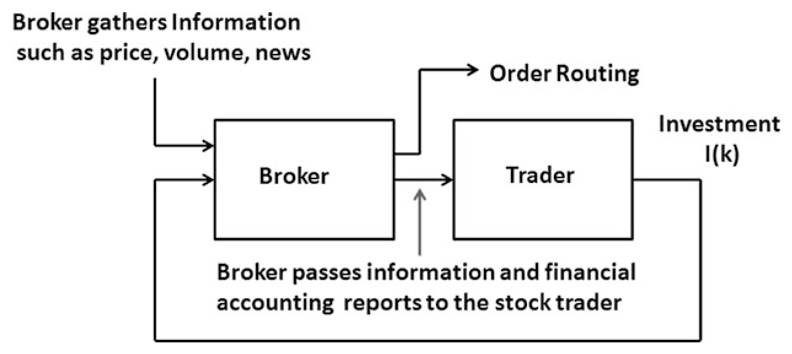

> Image description: Figure 1, titled "Stock Trading via Feedback Control," illustrates a feedback loop between a "Broker" and a "Trader." The diagram depicts a cyclical information and action flow. At the beginning of the process, the Broker receives external inputs, described as "Broker gathers Information such as price, volume, news." The Broker then interacts with the Trader via two main pathways: 1. **Information Flow:** An arrow indicates that the "Broker passes information and financial accounting reports to the stock trader." 2. **Action Flow:** An output arrow from the Broker points toward "Order Routing," which directs actions toward the Trader. The Trader then produces an output labeled "Investment $I(k)$." A feedback line carries this investment signal from the Trader back to the Broker, closing the loop. This structure represents a control system where the trader's investment decisions are informed by broker-provided data, which in turn is influenced by the trader's prior actions.

<!-- source_pdf_page: 1376 -->
Research Data Services for a subscription fee, is the comprehensive database of historical prices at time scales from monthly to tick by tick.

It is also possible to conduct stock-trading simulations using synthetic data. For example, one of the most common ways that synthetic prices are generated is via a geometric Brownian motion process. That is, a process drift $\mu$ and a volatility $\sigma>0$, say on an annualized basis, are provided to the simulator, and prices are generated sequentially in time via a recursion such as the Euler scheme with iterates

$$
p(k+1)=(1+\mu \Delta t+\sigma \epsilon(k) \sqrt{\Delta t}) p(k)
$$

where $\Delta t$ is measured in years and $\epsilon(k)$ is a zero-mean normally distributed random variable with unit standard deviation. A code used for simulation of stock trading should also include a check that $p(k) \geq 0$. The reader is referred to the textbook by Oksendal (1998) for a detailed description of this celebrated stochastic price model.

## Second Ingredient: The Feedback Law

The second ingredient for trading is the previously mentioned mapping taking the information available to the trader to the amount invested $I(k)$. This feedback law is the "heart" of the controller and allows it to adapt to uncertain and changing market conditions. Perhaps the simplest example of a stock-trading feedback law is obtained using a classical linear time-invariant controller. In this case, the trader modulates the level of investment $I(k)$ in proportion to the cumulative gains or losses from trading according to the formula

$$
I(k)=I_{0}+K g(k) .
$$

This is an example of technical analysis with no stock price model being used; see Fig. 2.

Using the feedback law above, the trader initially invests $I(0)=I_{0}$ in the stock and then begins to monitor the cumulative gain or loss $g(k)$ associated with this investment. One begins
with states $g(0)=0$ and $I(0)$ and subsequently changes $I(k)$ if the position begins to either make or lose money depending on the movement of the stock. The constant of proportionality $K$ above, the so-called feedback gain, is used to scale the investment level. When $I_{0}$ and $K$ are positive, $I(k)$ is initially positive and the trade is long. Alternatively, when $I_{0}$ and $K$ are negative, $I(k)$ is initially negative; hence, the trader is a short seller. This type of classical linear feedback is an example of a strategy which falls within the wellknown class of "trend followers."

As a second example, we consider a long trade with $I_{0}, K>0$ and investor who wishes to limit the trade to some level $I_{\text {max }}>I_{0}$. In this case, the feedback loop includes a nonlinear saturation block, see Fig. 3, and the update equation for investment is

$$
I(k)=\min \left\{I_{0}+K g(k), I_{\max }\right\} .
$$

A short-trade version of the above can similarly be defined and there are also variations of this scheme, involving the notion of "reset," which assures that excessive time is not spent in the saturation regime when the stock price is falling after a long period of increase or decrease.

In the formula above and in the sequel, for simplicity, we allow $I(k)$ to represent a fractional number of shares. In practice, this type of fractional holding is only allowed in some restricted situations such as reinvestment of dividends or dollar allocations to buy shares of a mutual fund. However, in cases where a significant number of shares are being bought or sold, the use of fractional shares is a good approximation which can be used for all practical purposes. Finally, to conclude this section, we mention a subtlety which is easily overlooked in a simulation: If the intention of the trader is to be "long," then $I(k)<$ 0 should be ruled out by including the condition $I(k)=\max \{I(k), 0\}$ as part of the control logic.

## Order-Filling Mechanics

At time $t=k \Delta t$, the trader specifies the desired investment update to the broker who is responsible for providing a "fill" via interaction

<!-- source_pdf_page: 1377 -->
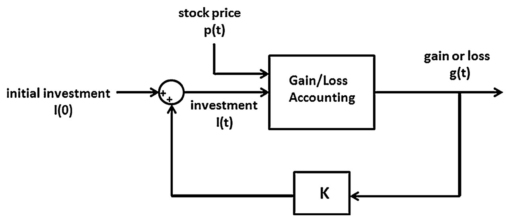

> Image description: This engineering block diagram, titled "Stock trading via linear feedback," illustrates a control system model for stock trading. The system features a primary signal flow where an "initial investment $I(0)$" enters a summing junction. At this junction, it is combined with a feedback signal to become the current "investment $I(t)$." This investment $I(t)$, along with an external input "stock price $p(t)$," enters a central functional block labeled "Gain/Loss Accounting." The output of this block is the "gain or loss $g(t)$." A feedback loop is established from the output $g(t)$ through a gain block labeled "K," which then returns to the summing junction. In control engineering terms, this represents a closed-loop system where the gain or loss determines the subsequent investment amount through a linear feedback mechanism. The arrows indicate the directional flow of information and capital through the computational process.
Stock Trading via Feedback Control, Fig. 2 Stock trading via linear feedback

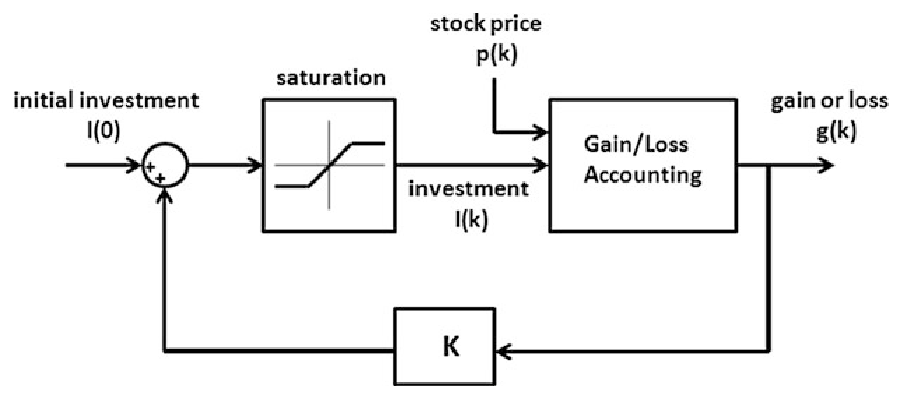

> Image description: This block diagram, titled "Stock Trading via Feedback Control, Fig. 2," illustrates a closed-loop control system applied to stock trading. The system begins with an "initial investment $I(0)$" entering a summing junction. The output of this junction passes through a "saturation" block, which produces the current "investment $I(k)$." The investment $I(k)$ and an external input, the "stock price $p(k)$," serve as inputs to a "Gain/Loss Accounting" block. The output of this block is the "gain or loss $g(k)$." This output is fed into a feedback loop containing a gain block labeled "$K$," which returns to the summing junction. The relationship demonstrates how past gains or losses influence future investment amounts through linear feedback, while the saturation block constrains the investment magnitude. The variables $I(k)$, $p(k)$, and $g(k)$ represent the time-dependent investment amount, stock price, and financial outcome, respectively.
Stock Trading via Feedback Control, Fig. 3 Feedback loop with saturation

with the stock exchange. The way this step is carried out depends on a number of factors: If the stock being purchased is not heavily traded, there may be "liquidity" issues which manifest themselves as "bid-ask spread." In general, there will always exist an ask price and a bid price for any stock in the market. To see how a liquidity issue can arise, imagine a trader who wishes to purchase 100 shares at the ask price of $\$ 100$ per share. If there are only 75 shares available at $\$ 100$, the trader will need to pay more for the second portion of the purchase. For example, if there are 500 shares available with an ask price of $\$ 102$ and transaction costs charged by the broker are 5 cents per share, the following will occur: The trader will obtain 100 shares with two "partial fills" and end up with an average acquisition cost of $\$ 100.55$. This type of bid-ask gap scenario may arise for a large trader such as a hedge fund. For example, if millions of shares are being purchased at time $t=k \Delta t$, the price
of the final shares acquired may be significantly higher than the initial shares.

In the case when a stock trades with large daily volume, if large "market movers" such as hedge funds are not transacting, it can often be assumed in simulations that the trader is a price taker. That is, one assumes bid-ask spread is zero and trading is said to be "highly liquid." The final point to mention is that there are different order types which can be specified by the trader. The three most common order types are called market, limit, and stop.

The bottom line on order filling is as follows: When stock trading is carried out or simulated, all of the complications above can be handled via appropriate interpretation of the stock price $p(k)$ at time $t=k \Delta t$. This is accomplished as follows: When a trade is executed, be it with multiple transactions or as a special order type, we take $p(k)$ to be the average weighted price. For example, to illustrate for a long trade involving

<!-- source_pdf_page: 1378 -->
two transactions, suppose a trader arrives at investment level $I(k)$ via two trades: the first is investment $I_{a}(k)$ to purchase shares at price $p_{a}(k)$ and the second is an investment $I_{b}(k)$ to purchase shares at price $p_{b}(k)$. Then, the average cost to acquire these shares is readily calculated to be

$$
p(k)=\frac{p_{a}(k) p_{b}(k)}{p_{a}(k) I_{b}(k)+p_{b}(k) I_{a}(k)} \Delta I(k) .
$$

where $\Delta I(k)$ is the amount of the stock transaction at time $t=k \Delta t$. This quantity is given by

$$
\Delta I(k)=I(k)-(1+\rho(k-1)) I(k-1)
$$

where

$$
\rho(k-1) \doteq \frac{p(k)-p(k-1)}{p(k-1)}
$$

is the percentage change in the stock price from $k-1$ to $k$. Subsequently, transactions at later times $t>k \Delta t$ can be carried out as if all shares were acquired at price $p(k)$.

When this multiple-transaction issue arises in real trading, it may not be possible to predict in advance what price $p(k)$ will result. For example, in the 100 -share scenario above, the outcome depended on the bid-ask queue. Notice that this did not present a problem as far as gain-loss accounting is concerned; i.e., the average price per share $\$ 100.55$ was readily calculated. However, when it comes to simulation, a model for "share acquisition" would need to be assumed. For example, for the case of geometric Brownian motion described earlier, a common model is that the trader is a price taker and that liquidity is sufficiently high so that an order involving investment $\Delta I(k)$ is filled at the sample-path price $p(k)$; i.e., no averaging over multiple transactions is required.

## Gain-Loss Accounting

A broker generally provides frequent updates on gains and losses $g(k)$ attributable to stock price changes. That is,

$$
g(k+1)=g(k)+\rho(k) I(k)-T(k)
$$

where $T(k)$ is the so-called transaction costs, most of which consist of the broker's commission. These costs are charged for each trade and are much lower nowadays versus decades ago. For example, using a discount broker, one can easily obtain commission rates of less than $\$ 5$ per trade, even when a large number of shares are being transacted. Modulo the transaction costs, the equation above simply states that the change in the cumulative gain or loss $\Delta g(k)$ over a time increment $\Delta t$ is equal to the investment $I(k)$ multiplied by the return on the stock $\Delta p(k) / p(k)$.

## Interest Accumulation and Margin Charges

In many brokerage accounts, it is possible to borrow funds or shares from the broker to purchase or short sell a stock. This is referred to as trading on margin and the broker will charge an interest rate on the borrowed funds known as the margin rate. While in practice there is a limit on how much money can be borrowed, it can be quite large; e.g., hedge funds can easily obtain access to many multiples of their account value. Another possibility is that the trader is not fully invested and the account contains "idle cash" on which interest, paid by the broker, accrues.

To cover both the interest and margin accrual, we work with the account cash, surplus or shortfall, to determine whether interest is accrued or margin charges need to be paid. For a long trade with $I(k)>0$ for the period $\Delta t$, we work with the broker interest rate, often called the risk-free return, $r_{f}>0$, or the broker margin rate $m$ to obtain the interest accrual

$$
\begin{aligned}
A(k)= & r_{f} \max \{V(k)-I(k), 0\} \\
& +m \min \{V(k)-I(k), 0\} .
\end{aligned}
$$

For the case of a short trade with $I(k)<0$, the formula above will only hold for traders with very large accounts who have sufficient leverage with the broker so as to be allowed to capitalize on the proceeds of a short sale. For the typical

<!-- source_pdf_page: 1379 -->
small- to medium-size trading account, the shortsale proceeds are generally "held aside" and the account is "marked to market" on a daily basis. As a result, the $A(k)$ equation above needs to be revised to account for "cash in reserve" and turns out to provide smaller interest rate accruals to the trader.

Finally, the broker's report generally includes the entire value of the account $V(k)$. This number is made up of the stock positions, either idle or borrowed cash and "dividends" $D(k)$ which may be paid periodically to the trader by the company whose shares are being held. Thus, the broker performs the calculation

$$
V(k+1)=V(0)+g(k)+A(k)+D(k)
$$

and a trader can typically see these updates in real time.

## Collateral Requirements and Margin Calls

When formulating the simulation model for trading, it is important to take account of the fact that the size of the trader's investment $I(k)$ is limited by the collateral requirements of the broker. For example, when a long stock position falls dramatically, a trader on margin may find that $I(k)$ exceeds the account value $V(k)$ by too large an amount to meet the broker's collateral requirements. In this case, new transactions are "stopped" and a so-called in guates results; i.e., to avoid forced liquidation of positions to bring the account back into compliance, the trader must deposit new assets or cash into the account within a short prespecified time period. In simulations, for a brokerage account with total market value $V(k)$, a constraint of the sort

$$
|I(k)| \leq \gamma V(k)
$$

can be imposed with $\gamma=2$ being rather typical.

## Simulation Example

We provide a simulation example illustrating the use of control in stock trading and its ability to adapt to the inherent uncertainty in stock price
movements. Figure 4 shows the daily closing prices from January 1, 2008 to June 1, 2012 of Google (GOOG), traded on the NASDAQ stock exchange. The figure also includes the 50day simple moving average $p_{\text {av }}(k)$ which will be used with a control law whose investment level depends on sign changes in $p(k)-p_{\mathrm{av}}(k)$; see Brock et al. (1992) where moving average crossing strategies are studied. There is no trading during the first 50 days while the moving average is being initialized. Subsequently, the trading begins at the first instant $k=k^{*}$ when the moving average has been crossed. For $k \geq k^{*}$, the control law for the investment level is given by

$$
I(k)=I_{0} \operatorname{sign}\left\{p(k)-p_{\mathrm{av}}(k)\right\}
$$

where $I_{0}=\$ 20,000$ is used in the simulation. To make the example more interesting, we assume initial account value $V(0)=\$ 10,000$. Hence, the issue of margin is immediately in play. In the simulation, we use risk-free rate $r_{f}=0.015$ corresponding to $1.5 \%$ per annum and a margin rate $m=0.03$ corresponding to $3 \%$ per annum. It is assumed that interest may be obtained on the proceeds of short sales at the risk-free rate. Google does not pay a dividend, so no adjustment of closing prices is required. A transaction cost of $\$ 3$ per trade is charged. This charge occurs every day of trading because the position is adjusted daily to target $I(k)= \pm \$ 20,000$. We assume the broker imposes a collateral constraint of $|I(k)| \leq 2 V(k)$ to limit $I(k)$ when sufficient funds are not available. Furthermore, we assume that it is possible to hold a fractional number of shares and that a "market-on-close" order each day is filled at the closing price. Finally, Fig. 4 also shows the evolution of the account value $V(k)$ over time.

## Summary and Future Directions

This article concentrated entirely on trading mechanics and simulation using strategies based on control-theoretic considerations. In a future version of the encyclopedia, it would be desirable to include a "companion" article which covers the topic of performance metrics. That is, once trading or simulation is complete, it is natural to

<!-- source_pdf_page: 1380 -->
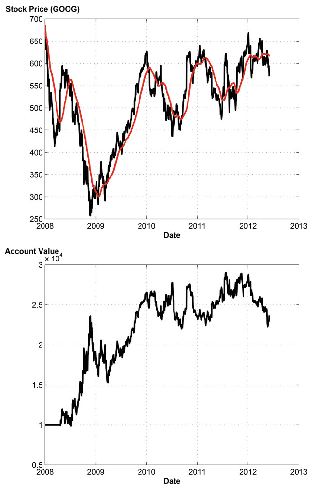

> Image description: Figure 4, titled "Feedback trading of Google," consists of two vertically stacked time-series plots illustrating the relationship between Google (GOOG) stock prices and a corresponding account value from 2008 to 2012. The top plot, labeled "Stock Price (GOOG)," shows the stock's movement on the y-axis (ranging from 250 to 700) against time on the x-axis. It contains two lines: a jagged black line representing the actual market price and a smoother red line, likely representing a filtered or modeled trend. The bottom plot displays "Account Value" on the y-axis (scaled by $10^4$, ranging from 0.5 to 3) over the same time period. This plot shows a single, highly volatile black line representing the cumulative value of a trading account. The data suggests a correlation where fluctuations in the stock price correspond to changes in the account value, reflecting the results of a feedback control trading strategy.
Stock Trading via Feedback Control, Fig. 4 Feedback trading of Google

ask whether the algorithm used was successful or not. To this end, there is a large body of literature covering measures for risk and return which are important for performance strategy evaluation purposes. One highlight of this literature is the paper by Artzner et al. (1999) on coherent risk measures, a topic pursued in current research.

## Cross-References

- Financial Markets Modeling
- Inventory Theory
- Investment-Consumption Modeling
- Option Games: The Interface Between Optimal Stopping and Game Theory

<!-- source_pdf_page: 1381 -->
## Recommended Reading

In addition to the basic references cited in the previous sections, there is a growing body of literature on stock trading and financial markets with a control-theoretic flavor. In contrast to this article, the focal point in this literature is largely performance-related issues rather than the "nuts and bolts" of stock-trading mechanics which are described here. For the uninitiated reader, one starting reference for an overview of the literature would be the tutorial paper by Barmish et al. (2013). To provide a capsule summary, it is convenient to subdivide the literature into two categories: The first category, called modelbased approaches, involves an underlying parameterized model structure which may or may not be completely specified. The second category of papers, called model-free approaches, falls under the previously mentioned umbrella of technical analysis. That is, the stock price is viewed as an external input with no predictive model for its evolution. In addition, no parameter estimation is involved and feedback trade signals are generated based on some observed "patterns" of prices or trading gains. Thus, this line of research highlights the ability of feedback to cope with the uncertainty of an unmodelled price process.

## Bibliography

Artzner P, Delbaen F, Eber J, Heath D (1999) Coherent measures of risk. J Math Financ 9:203-208
Astrom KJ, Murray RM (2008) Feedback systems, an introduction for scientists and engineers. Princeton University Press, Princeton
Barmish BR, Primbs JA, Malekpour S, Warnick S (2013) On the basics for simulation of feedbackbased stock trading strategies: an invited tutorial. IEEE conference on decision and control, Florence. IEEE, pp 7181-7186
Brock W, Lakonishok J, LeBaron B (1992) Simple technical trading rules and the stochastic properties of stock returns. J Financ 47:1731-1764
Kirkpatrick CD, Dahlquist JR (2007) Technical analysis: the complete resource for financial market technicians. Financial Times Press, New York
Lo AW, Hasanhodzic J (2010) The evolution of technical analysis: financial prediction from Babylonian tablets to Bloomberg terminals. Bloomberg Press, New York

Luenberger DG (1998) Investment science. Oxford, London
Merton RC (1969) Lifetime portfolio selection under uncertainty: the continuous time case. Rev Econ Stat 51:247-257
Oksendal B (1998) Stochastic differential equations: an introduction with applications. Springer, New York
Samuelson PA (1969) Lifetime portfolio selection by dynamic stochastic programming. Rev Econ Stat 51:239-246

## Strategic Form Games and Nash Equilibrium

Asuman Ozdaglar Laboratory for Information and Decision Systems, Department of Electrical Engineering and Computer Science, Massachusetts Institute of Technology, Cambridge, MA, USA

## Synonyms

## Nash Equilibrium

#### Abstract

This chapter introduces strategic form games, which provide a framework for the analysis of strategic interactions in multi-agent environments. We present the main solution concept in strategic form games, Nash equilibrium, and provide tools for its systematic study. We present fundamental results for existence and uniqueness of Nash equilibria and discuss their efficiency properties. We conclude with current research directions in this area.

## Keywords

Efficiency; Existence; Nash equilibrium; Strategic form games; Uniqueness

## Introduction

Many problems in communication, decision, and technological networks as well as in social and economic situations depend on human choices,

<!-- source_pdf_page: 1382 -->
which are made in anticipation of the behavior of the others in the system. Examples include how to map your drive over a road network, how to use the communication medium, and how to choose strategies for resource use and more conventional economic, financial, and social decisions such as which products to buy, which technologies to invest in, or who to trust. The defining feature of all of these interactions is the dependence of an agent's objective (payoff, utility, or survival) on others' actions. Game theory focuses on formal analysis of such strategic interactions. Here, we will review strategic form games, which focus on static game-theoretic interactions and present the relevant solution concept.

## Strategic Form Games

A strategic form game is a model for a static game in which all players act simultaneously without knowledge of other players' actions.

Definition 1 (Strategic Form Game) A strategic form game is a triplet
$\left\langle\mathcal{I},\left(S_{i}\right)_{i \in \mathcal{I}},\left(u_{i}\right)_{i \in \mathcal{I}}\right\rangle$ where:

1. $\mathcal{I}$ is a finite set of players, $\mathcal{I}=\{1, \ldots, I\}$.
2. $S_{i}$ is a nonempty set of available actions for player $i$.
3. $u_{i}: S \rightarrow \mathbb{R}$ is the utility (payoff) function of player $i$ where $S=\prod_{i \in \mathcal{I}} S_{i}$.

We will use the terms action and (pure) strategy interchangeably. (We will later use the term "mixed strategy" to refer to randomizations over actions.) We denote by $s_{i} \in S_{i}$ an action for player $i$, and by $s_{-i}=\left[s_{j}\right]_{j \neq i}$ a vector of actions for all players except $i$. We refer to the tuple $\left(s_{i}, s_{-i}\right) \in S$ as an action (strategy) profile or outcome. We also denote by $S_{-i}=\prod_{j \neq i} S_{j}$ the set of actions (strategies) of all players except $i$. Our convention throughout will be that each player $i$ is interested in action profiles that "maximize" his utility function $u_{i}$.

The next two examples illustrate strategic form games with finite and infinite strategy sets.

Example 1 (Finite Strategy Sets) We consider a two-player game with finite strategy sets. Such a
game can be represented in matrix form, where the rows correspond to the actions of player 1 and columns represent the actions of player 2. The cell indexed by row $x$ and column $y$ contains a pair ( $a, b$ ), where $a$ is the payoff to player 1 and $b$ is the payoff to player 2, i.e., $a=u_{1}(x, y)$ and $b=u_{2}(x, y)$. This class of games is sometimes referred to as bimatrix games. For example, consider the following game of "Matching Pennies."
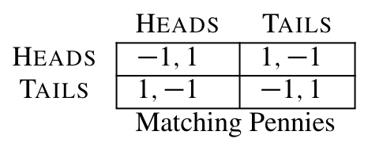

This game represents "pure conflict" in the sense that one player's utility is the negative of the utility of the other player, i.e., the sum of the utilities for both players at each outcome is "zero." This class of games is referred to as zerosum games (or constant-sum games) and has been studied extensively in the game theory literature (Basar and Olsder 1995).

Example 2 (Infinite Strategy Sets) We next present a game with infinite strategy sets. We consider a simple network game where two players send data or information flows over a communication network represented by a single link. Each player $i$ derives a value for sending $s_{i}$ units of flow over the link given by

$$
v_{i}\left(s_{i}\right)= \begin{cases}a_{i} s_{i}-\frac{s_{i}^{2}}{2} & \text { if } s_{i} \leq a_{i}, \\ \frac{a_{i}^{2}}{2} & \text { if } s_{i} \geq a_{i},\end{cases}
$$

where $a_{i} \in[0,1]$ is a player-specific scalar. Each player also incurs a per-flow delay or latency cost, due to congestion on the link, represented by the function $l(s)=s$, where $s$ is the total flow on the link, i.e., $s=s_{1}+s_{2}$ (see Fig. 1). The resulting interactions can be represented by the strategic form game $\left\langle\mathcal{I},\left(S_{i}\right),\left(u_{i}\right)\right\rangle$, which consists of:

1. A set of two players, $\mathcal{I}=1,2$
2. A strategy set $S_{i}=[0,1]$ for each player $i$, where $s_{i} \in S_{i}$ represents the amount of flow player $i$ sends over the link
3. A utility function $u_{i}$ for each player $i$ given by value derived from sending $s_{i}$ units of flow minus the total latency cost, i.e.,

<!-- source_pdf_page: 1383 -->
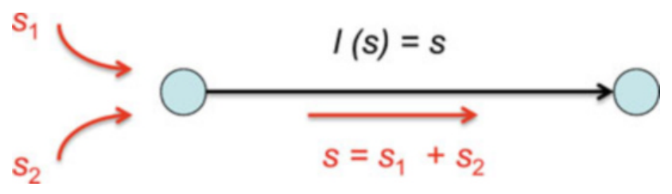

> Image description: Figure 1, titled "A network game with two players," depicts a schematic representation of a network interaction. The diagram consists of two light blue circular nodes connected by a horizontal black line with an arrowhead pointing from left to right. On the left side, two red curved arrows point toward the first node, labeled with the variables $S_1$ and $S_2$. Below the central black line, a straight red arrow points right, accompanied by the equation $S = S_1 + S_2$ in red text. Above the black line, the mathematical expression $I(s) = s$ is written in black. The figure illustrates a system where two inputs, $S_1$ and $S_2$, are aggregated into a total sum $S$, which then flows through a directed edge or link represented by the identity function $I(s)=s$.
Strategic Form Games and Nash Equilibrium, Fig. 1 A network game with two players

$$
u_{i}\left(s_{1}, s_{2}\right)=v_{i}\left(s_{i}\right)-s_{i} l\left(s_{1}+s_{2}\right) .
$$

## Nash Equilibrium

We next introduce the fundamental solution concept for strategic form games, Nash equilibrium. A Nash equilibrium captures a steady state of the play in a strategic form game such that each player acts optimally given their "correct" conjectures about the behavior of the other players.

Definition 2 (Nash Equilibrium) A (pure strategy) Nash equilibrium of a strategic form game $\left\langle\mathcal{I},\left(S_{i}\right),\left(u_{i}\right)_{i \in \mathcal{I}}\right\rangle$ is a strategy profile $s^{*} \in S$ such that for all $i \in \mathcal{I}$, we have

$$
u_{i}\left(s_{i}^{*}, s_{-i}^{*}\right) \geq u_{i}\left(s_{i}, s_{-i}^{*}\right) \quad \text { for all } s_{i} \in S_{i} .
$$

Hence, a Nash equilibrium is a strategy profile $s^{*}$ such that no player $i$ can profit by unilaterally deviating from his strategy $s_{i}^{*}$, assuming every other player $j$ follows his strategy $s_{j}^{*}$. The definition of a Nash equilibrium can be restated in terms of best-response correspondences.

## Definition 3 (Nash Equilibrium - Restated)

Let $\left\langle\mathcal{I},\left(S_{i}\right),\left(u_{i}\right)_{i \in \mathcal{I}}\right\rangle$ be a strategic form game. For any $s_{-i} \in S_{-i}$, consider the best-response correspondence of player $i, B_{i}\left(s_{-i}\right)$, given by

$$
\begin{gathered}
B_{i}\left(s_{-i}\right)=\left\{s_{i} \in S_{i} \mid u_{i}\left(s_{i}, s_{-i}\right) \geq u_{i}\left(s_{i}^{\prime}, s_{-i}\right)\right. \\
\text { for all } \left.s_{i}^{\prime} \in S_{i}\right\} .
\end{gathered}
$$

We say that an action profile $s^{*}$ is a Nash equilibrium if

$$
s_{i}^{*} \in B_{i}\left(s_{-i}^{*}\right) \quad \text { for all } i \in \mathcal{I} .
$$

Thus, if we define the best-response correspondence $B(s)=\left[B_{i}\left(s_{-i}\right)\right]_{i \in \mathcal{I}}$, the set of Nash equilibria is given by the set of fixed points of $B(s)$. Below, we give two examples of games with pure strategy Nash equilibria.

Example 3 (Battle of the Sexes) Consider a twoplayer game with the following payoff structure:

|  | Ballet | Soccer |
| :--- | :---: | :---: |
| Ballet | 2,1 | 0,0 |
| Soccer | 0,0 | 1,2 |
|  | Battle of the Sexes |  |

This game, referred to as the Battle of the Sexes game, represents a scenario in which the two players wish to coordinate their actions but have different preferences over their actions. This game has two pure strategy Nash equilibria, i.e., the strategy profiles (Ballet, Ballet) and (Soccer, Soccer).

Example 4 Recall the network game given in Example 2. To simplify the computations, let us assume without loss of generality that $a_{1} \geq a_{2} \geq \frac{a_{1}}{3}$. It can be seen that the best-response functions (single-valued in this case) of the players are given by

$$
B_{i}\left(s_{-i}\right)=\max \left\{0, \frac{a_{i}-s_{-i}}{3}\right\} \quad \text { for } i=1,2 .
$$

The unique pure strategy Nash equilibrium of this game is the fixed point of these functions given by

$$
\left(s_{1}^{*}, s_{2}^{*}\right)=\left(\frac{3 a_{1}-a_{2}}{8}, \frac{3 a_{2}-a_{1}}{8}\right) .
$$

## Mixed Strategy Nash Equilibrium

Consider the two-player "penalty kick" game between a penalty taker and a goalkeeper that has the same payoff structure as the matching pennies:
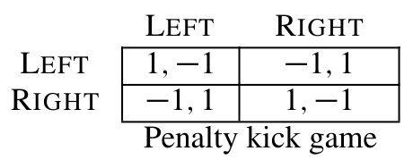

<!-- source_pdf_page: 1384 -->
This game does not have a pure strategy Nash equilibrium. It can be verified that if the penalty taker (column player) commits to a pure strategy, e.g., chooses left, then the best response of the goalkeeper (row player) would be to choose the same side leading to a payoff of -1 for the penalty taker. In fact, the penalty taker would be better off following a strategy which randomizes between left and right, ensuring that the goalkeeper cannot perfectly match his action. This is the idea of "randomized" or mixed strategies which we will discuss next.

We first introduce some notation. Let $\Sigma_{i}$ denote the set of probability measures over the pure strategy (action) set $S_{i}$. We use $\sigma_{i} \in \Sigma_{i}$ to denote the mixed strategy of player $i$. When $S_{i}$ is a finite set, a mixed strategy is a finite-dimensional probability vector, i.e., a vector whose elements denote the probability with which a particular action will be played. For example, if $S_{i}$ has two elements, the set of mixed strategies $\Sigma_{i}$ is the one-dimensional probability simplex, i.e., $\Sigma_{i}= \left\{\left(x_{1}, x_{2}\right) \mid x_{i} \geq 0, x_{1}+x_{2}=1\right\}$. We use $\sigma \in \Sigma=\prod_{i \in \mathcal{I}} \Sigma_{i}$ to denote a mixed strategy profile. Note that this implicitly assumes that players randomize independently. We similarly denote $\sigma_{-i} \in \Sigma_{-i}=\prod_{j \neq i} \Sigma_{j}$.

Following von Neumann-Morgenstern expected utility theory, we extend the payoff functions $u_{i}$ from $S$ to $\Sigma$ by

$$
u_{i}(\sigma)=\int_{S} u_{i}(s) d \sigma(s)
$$

i.e., the payoff of a mixed strategy $\sigma$ is given by the expected value of pure strategy payoffs under the distribution $\sigma$.

We are now ready to define the mixed strategy Nash equilibrium.

Definition 4 (Mixed Strategy Nash Equilibrium) A mixed strategy profile $\sigma^{*}$ is a mixed strategy Nash equilibrium if for each player $i$,

$$
u_{i}\left(\sigma_{i}^{*}, \sigma_{-i}^{*}\right) \geq u_{i}\left(\sigma_{i}, \sigma_{-i}^{*}\right) \quad \text { for all } \sigma_{i} \in \Sigma_{i}
$$

Note that since $u_{i}\left(\sigma_{i}, \sigma_{-i}^{*}\right)=\int_{S_{i}} u_{i}\left(s_{i}, \sigma_{-i}^{*}\right) d \sigma_{i}\left(s_{i}\right)$, it is sufficient to check only pure strategy
"deviations" when determining whether a given profile is a Nash equilibrium. This leads to the following characterization of a mixed strategy Nash equilibrium.

Proposition 1 A mixed strategy profile $\sigma^{*}$ is a mixed strategy Nash equilibrium if and only if for each player $i$,

$$
u_{i}\left(\sigma_{i}^{*}, \sigma_{-i}^{*}\right) \geq u_{i}\left(s_{i}, \sigma_{-i}^{*}\right) \quad \text { for all } s_{i} \in S_{i}
$$

We also have the following useful characterization of a mixed strategy Nash equilibrium in finite strategy set games.

Proposition 2 Let $G=\left\langle\mathcal{I},\left(S_{i}\right)_{i \in \mathcal{I}},\left(u_{i}\right)_{i \in \mathcal{I}}\right\rangle$ be a strategic form game with finite strategy sets. Then, $\sigma^{*} \in \Sigma$ is a Nash equilibrium if and only if for each player $i \in \mathcal{I}$, every pure strategy in the support of $\sigma_{i}^{*}$ is a best response to $\sigma_{-i}^{*}$.

Proof Let $\sigma^{*}$ be a mixed strategy Nash equilibrium, and let $E_{i}^{*}=u_{i}\left(\sigma_{i}^{*}, \sigma_{-i}^{*}\right)$ denote the expected utility for player $i$. By Proposition 1, we have

$$
E_{i}^{*} \geq u_{i}\left(s_{i}, \sigma_{-i}^{*}\right) \quad \text { for all } s_{i} \in S_{i} .
$$

We first show that $E_{i}^{*}=u_{i}\left(s_{i}, \sigma_{-i}^{*}\right)$ for all $s_{i}$ in the support of $\sigma_{i}^{*}$ (combined with the preceding relation, this proves one implication). Assume to arrive at a contradiction that this is not the case, i.e., there exists an action $s_{i}^{\prime}$ in the support of $\sigma_{i}^{*}$ such that $u_{i}\left(s_{i}^{\prime}, \sigma_{-i}^{*}\right)<E_{i}^{*}$. Since $u_{i}\left(s_{i}, \sigma_{-i}^{*}\right) \leq E_{i}^{*}$ for all $s_{i} \in S_{i}$, this implies that

$$
\sum_{s_{i} \in S_{i}} \sigma_{i}^{*}\left(s_{i}\right) u_{i}\left(s_{i}, \sigma_{-i}^{*}\right)<E_{i}^{*}
$$

which is a contradiction. The proof of the other implication is similar and is therefore omitted.

It follows from this characterization that every action in the support of any player's equilibrium mixed strategy yields the same payoff. This characterization extends to games with infinite strategy sets: $\sigma^{*} \in \Sigma$ is a Nash equilibrium if and only if for each player $i \in \mathcal{I}$, given $\sigma_{-i}^{*}$, no action

<!-- source_pdf_page: 1385 -->
in $S_{i}$ yields a payoff that exceeds his equilibrium payoff, and the set of actions that yields a payoff less than his equilibrium payoff has $\sigma_{i}^{*}$-measure zero.

Example 5 Let us return to the Battle of the Sexes game.
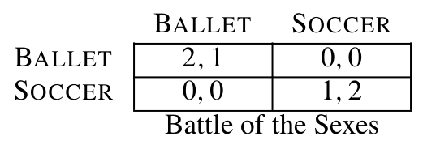

Recall that this game has 2 pure strategy Nash equilibria. Using the characterization result in Proposition 2, we show that it has a unique mixed strategy Nash equilibrium (which is not a pure strategy Nash equilibrium). First, by using Proposition 2 (and inspecting the payoffs), it can be seen that there are no Nash equilibria where only one of the players randomizes over its actions. Now, assume instead that player 1 chooses the action Ballet with probability $p \in (0,1)$ and Soccer with probability $1-p$ and that player 2 chooses Ballet with probability $q \in(0,1)$ and Soccer with probability $1-q$. Using Proposition 2 on player 1's payoffs, we have the following relation:

$$
2 \times q+0 \times(1-q)=0 \times q+1 \times(1-q)
$$

Similarly, we have

$$
1 \times p+0 \times(1-p)=0 \times p+2 \times(1-p) .
$$

We conclude that the only possible mixed strategy Nash equilibrium is given by $q=\frac{1}{3}$ and $p=\frac{2}{3}$.

## Existence of Nash Equilibrium

The first question that one contemplates in analyzing a strategic form game is whether it has a pure or mixed strategy Nash equilibrium. While it may be possible to explicitly construct a Nash equilibrium (using either computational means or characterization results), this may be a tedious task in the case of both large finite strategy set games or infinite strategy set games with
complicated utility functions. One is therefore often interested in establishing existence of an equilibrium, using conditions on the utility functions and constraint sets, before trying to understand its properties. In the sequel, we present results on existence of an equilibrium for games with finite and infinite strategy sets. The proofs of such existence results typically use fixed point arguments on the best-response correspondences of the players. They are omitted here and can be found in graduate-level game theory text books (see Fudenberg and Tirole 1991 and Myerson 1991).

## Finite Strategy Set Games

We have seen that while the matching pennies game (and the penalty kick game with the same payoff structure) does not have a pure strategy Nash equilibrium, it has a mixed strategy Nash equilibrium. The next theorem, states that this existence result extends to all finite strategy set games.

Theorem 1 (Nash) Every strategic form game with finite strategy sets has a mixed strategy Nash equilibrium.

## Infinite Strategy Set Games

A stronger result on existence of a pure strategy Nash equilibrium can be established in infinite strategy set games under some topological conditions on the utility functions and constraint sets (see Debreu 1952, Fan 1952, and Glicksberg 1952).

Theorem 2 (Debreu, Fan, Glicksberg) Consider a strategic form game $\left\langle\mathcal{I},\left(S_{i}\right)_{i \in \mathcal{I}},\left(u_{i}\right)_{i \in \mathcal{I}}\right\rangle$ with infinite strategy sets such that for each $i \in \mathcal{I}$ :

1. $S_{i}$ is convex and compact.
2. $u_{i}\left(s_{i}, s_{-i}\right)$ is continuous in $s_{-i}$.
3. $u_{i}\left(s_{i}, s_{-i}\right)$ is continuous and quasiconcave in $s_{i}$. (Let $X$ be a convex set. A function $f: X \rightarrow \mathbb{R}$ is quasiconcave if every upper level set of the function, i.e., $\{x \in X \mid f(x) \geq \alpha\}$ for every scalar $\alpha$, is a convex set (see Bertsekas et al. 2003).)
The game has a pure strategy Nash equilibrium.

<!-- source_pdf_page: 1386 -->
Note that Theorem 1 is a special case of this result. For games with finite strategy sets, mixed strategy sets are simplices and hence are convex and compact, and utilities are linear in (mixed) strategies; hence, they are concave functions of (mixed) strategies (and continuous functions of mixed strategy profiles).

The next example shows that quasiconcavity cannot be dispensed with in the previous existence result.

Example 6 Consider the game where two players pick a location $s_{1}, s_{2} \in \mathbb{R}^{2}$ on the circle. The payoffs are

$$
u_{1}\left(s_{1}, s_{2}\right)=-u_{2}\left(s_{1}, s_{2}\right)=d\left(s_{1}, s_{2}\right)
$$

where $d\left(s_{1}, s_{2}\right)$ denotes the Euclidean distance between $s_{1}$ and $s_{2} \in \mathbb{R}^{2}$. It can be verified that this game does not have a pure strategy Nash equilibrium. However, the strategy profile where both players mix uniformly on the circle is a mixed strategy Nash equilibrium.

Without quasiconcavity, one can establish the following existence result (see Glicksberg 1952).

Theorem 3 (Glicksberg) Consider a strategic form game $\left\langle\mathcal{I},\left(S_{i}\right)_{i \in \mathcal{I}},\left(u_{i}\right)_{i \in \mathcal{I}}\right\rangle$, where the $S_{i}$ are nonempty compact metric spaces and the $u_{i}: S \rightarrow \mathbb{R}$ are continuous functions. The game has a mixed strategy Nash equilibrium.

## Uniqueness of Nash Equilibrium

Another important question that arises in the analysis of strategic form games is whether the Nash equilibrium is unique. This is important for the predictive power of Nash equilibrium since with multiple equilibria, the outcome of the game cannot be uniquely pinned down. The following result by Rosen provides sufficient conditions for uniqueness of an equilibrium in games with infinite strategy sets (see Rosen 1965). (Except for games that are strictly dominant solvable, there are no general uniqueness results for finite strategic form games.)

We first introduce some notation to state this result. Given a scalar-valued function $f: \mathbb{R}^{n} \rightarrow \mathbb{R}$, we use the notation $\nabla f(x)$ to denote the gradient vector of $f$ at point $x$, i.e.,

$$
\nabla f(x)=\left[\frac{\partial f(x)}{\partial x_{1}}, \ldots, \frac{\partial f(x)}{\partial x_{n}}\right]^{T} .
$$

Given a scalar-valued function $F: \prod_{i=1}^{I} \mathbb{R}^{m_{i}} \rightarrow \mathbb{R}$, we use the notation $\nabla_{i} F(x)$ to denote the gradient vector of $F$ with respect to $x_{i}$ at point $x$, i.e.,

$$
\nabla_{i} F(x)=\left[\frac{\partial F(x)}{\partial x_{i}^{1}}, \ldots, \frac{\partial F(x)}{\partial x_{i}^{m_{i}}}\right]^{T}
$$

We use the notation $\nabla F(x)$ to denote

$$
\begin{equation*}
\nabla F(x)=\left[\nabla_{1} F_{1}(x), \ldots, \nabla_{I} F_{I}(x)\right]^{T} . \tag{1}
\end{equation*}
$$

We assume that the strategy set $S_{i}$ of each player $i$ is given by

$$
\begin{equation*}
S_{i}=\left\{x_{i} \in \mathbb{R}^{m_{i}} \mid h_{i}\left(x_{i}\right) \geq 0\right\}, \tag{2}
\end{equation*}
$$

where $h_{i}: \mathbb{R}^{m_{i}} \mapsto \mathbb{R}$ is a concave function. (Since $h_{i}$ is concave, it follows that the set $S_{i}$ is a convex set.) The next definition introduces the key condition used in establishing the uniqueness of a pure strategy Nash equilibrium.

Definition 5 We say that the utility functions $\left(u_{1}, \ldots, u_{I}\right)$ are diagonally strictly concave for $x \in S$, if for every $x^{*}, \bar{x} \in S$, we have

$$
\left(\bar{x}-x^{*}\right)^{T} \nabla u\left(x^{*}\right)+\left(x^{*}-\bar{x}\right)^{T} \nabla u(\bar{x})>0 .
$$

We can now state the result on uniqueness of pure strategy Nash equilibrium in strategic form games.

Theorem 4 (Rosen) Consider a strategic form game $\left\langle\mathcal{I},\left(S_{i}\right),\left(u_{i}\right)\right\rangle$. For all $i \in \mathcal{I}$, assume that the strategy sets $S_{i}$ are given by Eq. (2), where $h_{i}$ is a concave function, and there exists some $\tilde{x}_{i} \in \mathbb{R}^{m_{i}}$ such that $h_{i}\left(\tilde{x}_{i}\right)>0$. Assume also that the utility functions $\left(u_{1}, \ldots, u_{I}\right)$ are diagonally strictly concave for $x \in S$. Then, the game has a unique pure strategy Nash equilibrium.

<!-- source_pdf_page: 1387 -->
We next provide a tractable sufficient condition for the utility functions to be diagonally strictly concave. Let $U(x)$ denote the Jacobian of $\nabla u(x)$ [see Eq. (1)]. Specifically, if the $x_{i}$ are all 1-dimensional, then $U(x)$ is given by

$$
U(x)=\left(\begin{array}{ccc}
\frac{\partial^{2} u_{1}(x)}{\partial x_{1}^{2}} & \frac{\partial^{2} u_{1}(x)}{\partial x_{1} \partial x_{2}} & \cdots \\
\frac{\partial^{2} u_{2}(x)}{\partial x_{2} \partial x_{1}} & \ddots & \\
\vdots & &
\end{array}\right) .
$$

Proposition 3 (Rosen) For all $i \in \mathcal{I}$, assume that the strategy sets $S_{i}$ are given by Eq. (2), where $h_{i}$ is a concave function. Assume that the symmetric matrix $\left(U(x)+U^{T}(x)\right)$ is negative definite for all $x \in S$, i.e., for all $x \in S$, we have

$$
y^{T}\left(U(x)+U^{T}(x)\right) y<0, \quad \forall y \neq 0 .
$$

Then, the payoff functions ( $u_{1}, \ldots, u_{I}$ ) are diagonally strictly concave for $x \in S$.

Rosen's sufficient conditions for uniqueness are quite strong. Recent work has extended such uniqueness results to hold under weaker conditions using differential topology tools. The main idea is to provide sufficient conditions so that the indices of all stationary points can be shown to be positive, which from a generalization of the Poincare-Hopf theorem (Simsek et al. 2007, 2008) implies that there exists a unique equilibrium (see Simsek et al. 2005 for applications of this methodology to several network games).

## Efficiency of Nash Equilibria

Because the Nash equilibrium corresponds to the fixed point of the best-response correspondences of the players, there is no presumption that it is efficient or maximizes any well-defined weighted sum of utility functions of the players. This fact is clearly illustrated by the well-known Prisoner's Dilemma game. For some $a>0, b>0$, and $c>0$ with $a>b$, the payoff matrix is given by:

Don't Confess Confess

Don't Confess Confess
| $a, a$ | $b-c, a+c$ |
| :---: | :---: |
| $a+c, b-c$ | $b, b$ |
| Prisoner's Dilemma |  |

This game, generally used for capturing the dilemma of cooperation among selfish agents, has a unique (pure strategy) Nash equilibrium. (In fact each player has a dominant strategy, see Fudenberg and Tirole 1991, which is (Confess, Confess)). This clearly illustrates two aspects of the inefficiencies that arise in Nash equilibria. First, the unique Nash equilibrium is Pareto inferior meaning that if both players cooperated and chose Don't Confess, they would both obtain the higher payoff of $a$. Second, the extent of inefficiency can be arbitrarily large based on the values of $a$ and $b$. We can capture this by the efficiency loss (or Price of Anarchy as known in the literature) defined as

Efficiency Loss $=\inf _{\text {parameters }} \frac{\sum_{i} u_{i}(\text { equilibrium })}{\sum_{i} u_{i}(\text { social optimum })}$,
where the social optimum is the strategy profile that maximizes the sum of utility functions. In the preceding example, this is clearly

$$
\inf _{a, b} \frac{b}{a}=0,
$$

showing that efficiency loss can be arbitrarily large. In problems that have more structure, the efficiency loss can be bounded away from zero. A well-known example is by Pigou, which showed that in a network routing game where the congestion penalty can be described by linear latency functions (see Example 2), the efficiency loss is $3 / 4$ (Pigou 1920). Roughgarden and Tardos in an important contribution (Roughgarden and Tardos 2000) showed that this is a lower bound for such routing games over all possible network topologies.

## Summary and Future Directions

This article has provided an introduction to the basics of strategic form games. After defining the concept of Nash equilibrium, which is the basis of much of recent game theory, we have

<!-- source_pdf_page: 1388 -->
presented fundamental results on its existence and uniqueness. We also briefly discussed issues of efficiency of Nash equilibria.

Though game theory is a mature field, there are still several important areas for inquiry. The first is a more systematic analysis and categorization of classes of games by their equilibrium and efficiency properties. Recent work by Candogan et al. $(2010,2011,2013)$ provides tools for systematically analyzing equivalence classes of games that may be useful for such an investigation. The second area that is very much active concerns computational issues, which we have not considered here. Recent literature showed that computation of Nash equilibria in finite strategy set games is potentially hard and focused on developing algorithms for computing approximate Nash equilibria (see Daskalakis et al. 2006 and Lipton et al. 2003). Ongoing research in this area focuses on infinite strategy set games and exploits special structure to develop algorithms for computing (exact and approximate) Nash equilibria (Parrilo 2006; Stein et al. 2008). A third area is to develop a better application of tools of strategic form games and understand the resulting efficiency losses in networks and large-scale systems. Work in this area uses gametheoretic models to investigate resource allocation, pricing, and investment problems in networks (Johari and Tsitsiklis 2004; Acemoglu and Ozdaglar 2007; Acemoglu et al. 2009; Njoroge et al. 2013). A fourth area of research is to develop and apply alternative solution concepts for strategic form games. While some of the research in game theory has focused on subsets of Nash Equilibria (see Fudenberg and Tirole 1991), from a computational point of view, the set of correlated equilibria, which is a superset of the set of Nash Equilibria, is also attractive since it can be represented as the optimal solution set of a linear program. Correlated equilibrium can be implemented using a correlation scheme (a trusted party) or cryptographic tools as shown in Izmalkov et al. (2007). Recent work investigates alternative solution concepts for symmetric games intermediate between Nash and correlated equilibria (Stein et al. 2013), which can be implemented using specific correlation schemes.

## Cross-References

- Dynamic Noncooperative Games
- Game Theory: Historical Overview
- Linear Quadratic Zero-Sum Two-Person Differential Games

## Bibliography

Acemoglu D, Ozdaglar A (2007) Competition and efficiency in congested markets. Math Oper Res 32(1):1-31
Acemoglu D, Bimpikis K, Ozdaglar A (2009) Price and capacity competition. Games Econ Behav 66(1):1-26
Basar T, Olsder GJ (1995) Dynamic noncooperative game theory. Academic, London/New York
Bertsekas D, Nedich A, Ozdaglar A (2003) Convex analysis and optimization. Athena Scientific, Belmont
Candogan O, Ozdaglar A, Parrilo PA (2010) A projection framework for near- potential games. In: Proceedings of the IEEE conference on decision and control, CDC, Atlanta
Candogan O, Menache I, Ozdaglar A, Parrilo PA (2011) Flows and decompositions of games: harmonic and potential games. Math Oper Res 36(3):474-503
Candogan O, Ozdaglar A, Parrilo PA (2013, forthcoming) Dynamics in near-potential games. Games Econ Behav 82:66-90
Daskalakis C, Goldberg PW, Papadimitriou CH (2006) The complexity of computing a Nash equilibrium. In: Proceedings of the 38th ACM symposium on theory of computing, STOC, Seattle
Debreu D (1952) A social equilibrium existence theorem. Proc Natl Acad Sci 38:886-893
Fan K (1952) Fixed point and minimax theorems in locally convex topological linear spaces. Proc Natl Acad Sci 38:121-126
Fudenberg D, Tirole J (1991) Game theory. MIT, Cambridge
Glicksberg IL (1952) A further generalization of the Kakutani fixed point theorem with application to Nash equilibrium points. Proc Natl Acad Sci 38:170-174
Izmalkov S, Lepinski M, Micali S, Shelat A (2007) Transparent computation and correlated equilibrium. Working paper
Johari R, Tsitsiklis JN (2004) Efficiency loss in a network resource allocation game. Math Oper Res 29(3):407-435
Lipton RJ, Markakis E, Mehta A (2003) Playing large games using simple strategies. In: Proceedings of the ACM conference in electronic commerce, EC, San Diego
Myerson RB (1991) Game theory: analysis of conflict. Harvard University Press, Cambridge
Njoroge P, Ozdaglar A, Stier-Moses N, Weintraub G (2013) Investment in two-sided markets and the net

<!-- source_pdf_page: 1389 -->
neutrality debate. Forthcoming in Review of Network Economics
Parrilo PA (2006) Polynomial games and sum of squares optimization. In: Proceedings of the IEEE conference on decision and control, CDC, San Diego
Pigou AC (1920) The economics of welfare. Macmillan, London
Rosen JB (1965) Existence and uniqueness of equilibrium points for concave N-person games. Econometrica 33(3):520-534
Roughgarden T, Tardos E (2000) How bad is selfish routing? In: Proceedings of the IEEE symposium on foundations of computer science, FOCS, Redondo Beach
Simsek A, Ozdaglar A, Acemoglu D (2005) Uniqueness of generalized equilibrium for box-constrained problems and applications. In: Proceedings of the Allerton conference on communication, control, and computing, Monticello
Simsek A, Ozdaglar A, Acemoglu D (2007) Generalized Poincare-Hopf theorem for compact nonsmooth regions. Math Oper Res 32(1): 193-214
Simsek A, Ozdaglar A, Acemoglu D (2008) Local indices for degenerate variational inequalities. Math Oper Res 33(2):291-301
Stein N, Ozdaglar A, Parrilo PA (2008) Separable and low-rank continuous games. Int J Game Theory 37(4):475-504
Stein N, Ozdaglar A, Parrilo PA (2013) Exchangeable equilibria, part I: symmetric bimatrix games. Working paper

## Stream of Variations Analysis

Jianjun Shi
Georgia Institute of Technology, Atlanta, GA, USA

#### Abstract

Stream of variation (SoV) theory is a unified, model-based method for modeling, analyzing, and controlling variation in multistage manufacturing systems. A SoV model represents variation and its propagation in a multistage system using the recursive structure of state space models; such models can be derived from physical knowledge and/or estimated empirically using system operational data. Immediately, the SoV model enables integrated design and optimization for product and process tolerancing, allocation of distributed

sensors in production lines, and evaluation of multistage system designs. With the help of these functions, the SoV method fulfills the objectives of system monitoring, diagnosis, and control and, ultimately, reduces a system's variation during its operation. The SoV method can be further extended to model the interactions among product quality and tooling reliability, known as the quality and reliability chain effects, which is the crucial element in carrying out quality-ensured maintenance, as well as system reliability evaluation and optimization. The SoV theory has been successfully implemented in assembly, machining, and semiconductor manufacturing processes. More research and development are needed to extend the SoV theory to manufacturing systems with complex configurations.

## Keywords

Data fusion; Engineering-driven statistics; Multistage manufacturing system; Quality improvement; Variation reduction

## Introduction

A multistage system refers to a system consisting of multiple units, stations, or operations to finish a final product or a service. Multistage systems are ubiquitous in modern manufacturing processes and service systems. In most cases, the final product or service quality of a multistage system is determined by complex interactions among multiple stages - the quality characteristics of one stage are not only influenced by the local variations at that stage but also by the variations propagated from upstream stages. Multistage systems present significant challenges for quality engineering research and system improvement.

The stream of variation (SoV) theory has been developed to understand and represent the complex production stream and data stream involved in the modeling and analysis of variation and its propagation in a multistage manufacturing system (Fig. 1).

<!-- source_pdf_page: 1390 -->
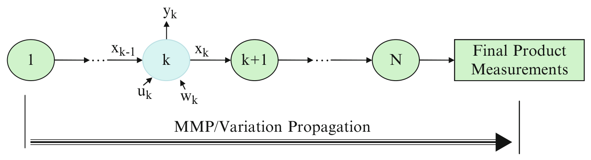

> Image description: A flowchart diagram illustrates variation propagation in a multistage manufacturing process (MMP) using a series of connected circular nodes representing process stages, labeled $1$, $k$, $k+1$, and $N$. A long, double-lined arrow at the bottom spans the entire sequence, labeled "MMP/Variation Propagation." The central stage, labeled $k$ in a light blue circle, shows the flow of variables: an input state $x_{k-1}$ from the previous stage, an output state $x_k$ to the next stage, an input control $u_k$, a disturbance $w_k$, and a measurement $y_k$. The stages are connected sequentially by rightward-pointing arrows, with ellipses indicating intermediate steps between stage $1$ and $k$, and between $k+1$ and $N$. The final stage $N$ feeds into a green rectangular block labeled "Final Product Measurements." The diagram models how deviations (variations) propagate through a sequential system of stages to influence the final product.

Stream of Variations Analysis, Fig. 1 Variation propagation in a multistage manufacturing process (MMP) and notations in SoV modeling (Reproduced from Shi 2006)

## Stream of Variation Model

The foundation of the SoV theory is a mathematical model that links the key product quality characteristics with key process control characteristics (e.g., fixture error, machine error, etc.) in a multistage system. This model has a state space representation that describes the deviation and its propagation in an $N$-stage process (as shown in Fig. 1) and takes the form of
$\mathbf{x}_{k}=\mathbf{A}_{k-1} \mathbf{x}_{k-1}+\mathbf{B}_{k} \mathbf{u}_{k}+\mathbf{w}_{k}, \quad k=1,2, \ldots, N$,
$\mathbf{y}_{k}=\mathbf{C}_{k} \mathbf{x}_{k}+\mathbf{v}_{k}, \quad\{k\} \subset\{1,2, \ldots, N\}$,
where $k$ is the stage index, $\mathbf{x}_{k}$ is the state vector representing the key quality characteristics of the product (or intermediate work piece) after stage $k, \mathbf{u}_{k}$ is the control vector representing the tooling deviations (e.g., no fault occurs if all tooling deviations are within their tolerances; fault occurs when excessive tooling deviations are beyond their tolerances; active adjustments of tooling deviations can be done to achieve error compensation objectives) at stage $k$, and $\mathbf{y}_{k}$ is the measurement vector representing product quality measurements at stage $k$. Vectors $\mathbf{w}_{k}$ and $\mathbf{v}_{k}$ represent modeling error and sensing error, respectively. The coefficient matrices $\mathbf{A}_{k}, \mathbf{B}_{k}$, and $\mathbf{C}_{k}$ are determined by product and process design information: $\mathbf{A}_{k}$ represents the impact of the deviation transition from stage $k-1$ to stage $k, \mathbf{B}_{k}$ represents the impact of the local tooling deviation on the product quality at stage $k$, and $\mathbf{C}_{k}$ is the measurement matrix, which can be
obtained from the defined quality features of the product at stage $k$.

If we repeat the modeling efforts for each stage from $k=1$ to $N$, we will get the deviation and its propagation throughout the multistage manufacturing systems. By taking variances on both sides of (1) and (2) and by assuming independence among certain variables, we will obtain the variation and its propagation model for the multistage manufacturing system.

The SoV models (1) and (2) can be obtained from product and process design information and/or from the system operational data. In Shi (2006), two basic modeling methods, a physicsdriven method and a data-driven method, were investigated. In the physics-driven modeling, the kinematic relationships between key control characteristics (KCC) and key product characteristics (KPC) are identified through a detailed physical analysis of the product and manufacturing process. A set of carefully defined coordinate systems are defined to represent the whole system, including the quality features in the part coordinates, part orientation to fixture/machine coordinates, and tooling to fixture/machine coordinates. Based on these coordinate systems, SoV models (1) and (2) are obtained using the state space model framework. In the data-driven modeling approach, system operational data are measured for those selected KPC and KCC variables. System identification and estimation methods are adopted to construct the SoV model. In some cases, data mining and clustering techniques are used to identify inherent relationships of the system in pre-processing. The SoV model may have different formulations, such as

<!-- source_pdf_page: 1391 -->
the state space model, input-output model, and piecewise linear regression tree model. In most cases, engineering-driven statistical analysis is commonly used in the data analysis and modeling efforts.

With models (1) and (2), variation reduction can be achieved in both design and manufacturing phases by using mathematical optimization to make optimal decisions. However, significant challenges exist in both the model development for specific processes and model utilization to realize the benefits of the analytical capability of this model. These challenges are addressed in the SoV methodological research (Shi 2006). In more detail, the SoV methodology addresses the following important questions for variation reduction in a multistage manufacturing process.

## SoV-Enabled Monitoring and Diagnosis

In multistage manufacturing systems, it is challenging to systematically find the root causes of a severe variability in terms of isolating both the manufacturing station and the underlying cause in that station. During continuous production, excessive product variation may occur at any stage of a multistage manufacturing system due to worn tooling, tooling breakage, and/or abnormal incoming part variation. The SoV theory presents systematic approaches for root cause identification. In this approach, a new concept of "statistical methods driven by engineering models" is proposed to integrate the product and process design knowledge with the on-line statistics. By solving the difference equation of models (1) and (2) and with some mathematical simplifications, the SoV model can be transformed into an inputoutput format as

$$
\begin{equation*}
\mathbf{y}=\boldsymbol{\Gamma} \cdot \mathbf{u}+\boldsymbol{\varepsilon}, \tag{3}
\end{equation*}
$$

where $\mathbf{y}$ is an $n \times 1$ vector of product quality measurements, $\boldsymbol{\Gamma}$ is an $n \times p$ constant system matrix determined by product/process designs, $\mathbf{u}$ is a $p \times 1$ random vector representing the process faults, and $\boldsymbol{\varepsilon}$ is an $n \times 1$
random vector representing measurement noises, un-modeled faults, and high-order nonlinear terms. During production, the product quality features ( $\mathbf{y}$ ) are measured, and the data are used to conduct statistical analysis based on the model (1) to identify root causes. Two basic methods are developed for root cause diagnosis: (i) variation pattern matching: In this method, all potential variation patterns can be obtained from the matrix $\boldsymbol{\Gamma}$ resulting from the off-line system design. During the system operation, observed variation patterns can be obtained from the covariance matrix of $\mathbf{y}$. A pattern matching can be performed to identify the root causes. (ii) estimation-based diagnosis: With the SoV model and availability of on-line measurement of quality feature (y), the deviation value of $\mathbf{u}$ can be estimated on-line. A hypothesis testing of $\mathbf{u}$ and its variance reveals the significant changes that occurred to $\mathbf{u}$, corresponding to the root causes of the system. Various estimators and their performances are evaluated in the diagnosis study (Chapter 11 of Shi 2006).

## SoV-Enabled Sensor Allocation and Diagnosability

The issue of diagnosability refers to the problem of whether the product measurements contain sufficient information for the diagnosis of critical process faults, i.e., if root causes of process faults can be diagnosed. The diagnosability analysis is investigated based on model (3) that links potential process faults (u) and product quality measurements (y). In the SoV theory, a set of criteria is developed to evaluate the mean diagnosability and variance diagnosability for a system. Similar to observability in control theory, diagnosability is determined by the $\mathbf{A}_{k}, \mathbf{B}_{k}$, and $\mathbf{C}_{k}$ matrices ( $k=1, \ldots, \mathrm{~N}$ ) in the SoV models (1) and (2) (or the $\boldsymbol{\Gamma}$ matrix in model (3)). In some cases, only a subset of variables (vs. specific root cause variables) can be identified as potential root causes of the process faults, which are referred to as minimum diagnosable classes.

One emphasis in the SoV-enabled diagnosability study is to promote the concept of the "process-oriented measurement" strategy. In

<!-- source_pdf_page: 1392 -->
current industrial practice, most of the existing measurement strategies focus on the product coherence inspection (i.e., product-oriented measurements), which is effective for detecting product imperfection, but may not be effective to identify the root causes of product quality failures. The SoV theory proposes a "processoriented measurement" concept with a distributed sensing strategy. In this strategy, selected key control characteristics, as well as selected key product characteristics, will be measured in the selected stages for both detecting product defects and identifying their root causes.

## SoV-Enabled Design and Optimization

Variation analysis and design evaluations are conducted in the product and process design stage to identify critical components, features, and manufacturing operations. With the SoV model defined in (3) and certain assumptions, we can represent the KPC-to-KCC relationship as

$$
\begin{equation*}
\tilde{\boldsymbol{\Sigma}}_{y}=\sum_{k=1}^{N} \boldsymbol{\Gamma}_{k} \boldsymbol{\Sigma}_{u_{k}} \boldsymbol{\Gamma}_{k}^{T}, \tag{4}
\end{equation*}
$$

where $\tilde{\boldsymbol{\Sigma}}_{y}$ is the variance-covariance matrix of product quality features resulting from the variance-covariance matrix ( $\boldsymbol{\Sigma}_{u_{k}}$ ) of tooling errors. Based on (3) and (4), the following four tasks can be performed: (i) tolerance analysis by allocating the tooling tolerance ( $\mathbf{u}_{k}$ ) and then predicting the final product tolerance $\left(\mathbf{y}_{N}\right)$; (ii) tolerance synthesis by fixing the final product tolerance ( $\mathbf{y}_{N}$ ) and then assigning the tolerance for individual tooling components ( $\mathbf{u}_{k}$ ) with certain cost objectives minimized; (iii) sensitivity study by identifying the critical tooling components ( $\mathbf{u}_{k}$ ) that have significant impacts on the final production variation through evaluation of the defined sensitivity indices; and (iv) process planning by optimizing parameters in $\mathbf{A}_{k}$ and $\mathbf{B}_{k}$ matrices to minimize the final product variation.

One unique feature of SoV-enabled design and optimization is to provide a unified method for
simultaneous optimization of product and process tooling tolerance, as well as process planning. This is because the SoV models (1) and (2) represent the product quality features ( $\mathbf{x}_{k}$ and $\mathbf{y}_{k}$ ), tooling features ( $\mathbf{u}_{k}$ ), and the process planning formation ( $\mathbf{A}_{k}$ and $\mathbf{B}_{k}$ ) within one mathematical model. As a result, a math-based optimization is feasible to achieve the best quality through process-oriented tolerance synthesis for product and process, as well as optimized process planning.

## SoV-Enabled Process Control and Quality Compensation

The SoV model provides the opportunity to apply active control for dimensional variation reduction in a multistage manufacturing system. The basic idea is to implement a system-level control strategy during production to minimize the end-of-line product variance, which is propagated from upstream manufacturing stages. An optimal control scheme was devised to use the state space structure of the SoV model by treating the control as a stochastic discrete-time predictive control problem. The optimization index for determining the optimal control action is formulated as

$$
\begin{align*}
& J_{k}^{*}=\min _{\mathbf{u}_{k}} J_{k}=\min _{\mathbf{u}_{k}} E\left[\hat{\mathbf{y}}_{N \mid k}^{T} \mathbf{Q}_{N} \hat{\mathbf{y}}_{N \mid k}+\mathbf{u}_{k}^{T} \mathbf{R}_{k} \mathbf{u}_{k}\right], \\
& \text { s.t. } C_{k, c}^{\mathrm{L}} \leq u_{k, c} \leq C_{k, c}^{\mathrm{U}}, \quad k=1, \ldots, N, c=1, \ldots, n_{u, k} . \tag{5}
\end{align*}
$$

where $\hat{\mathbf{y}}_{N \mid k}$ denotes the product quality at the final stage $N$ that is predicted at stage $k$ and $n_{u, k}$ is the dimension of the control action $\mathbf{u}_{k}$. The constraints $\left[\mathcal{C}_{k, c}^{L}, \mathcal{C}_{k, c}^{U}\right]$ define the upper and lower actuator limits that can be applied on each part/substage. $\mathbf{Q}_{N} \in \mathbf{R}^{m \times m}$ is a positive semidefinite matrix, and $\mathbf{R}_{k} \in \mathbf{R}^{n \times n}$ is a positive definite matrix.

This optimization index takes the form of the widely accepted cost function of a linear-quadratic regulator under the predictive control framework and thus satisfies the common requirements in control theory. Various research topics have been investigated under this framework, including the feed-forward control for multistage process, cautious control

<!-- source_pdf_page: 1393 -->
considering model uncertainties, and actuator layout optimization in control system designs.

## SoV-Enabled Product Quality and Reliability Chain Modeling and Analysis

There is a complex, intricate relationship between product quality and tooling reliability in a multistage manufacturing system. A degraded (or failed) production tool leads to a large variability in product quality and/or an excessive number of defects; on the other hand, excessive variability of product quality features accelerates the degradation and failure rates of production tooling at the station thereafter. For a multistage manufacturing system, these interactions are more complex as variations propagate from one stage to the next stage. Thus, a "chain effect" between the product quality (Q) and tooling reliability (R) can be observed and thus noted as the "QR chain" effect. Modeling of the QR chain is an integrated effort of the SoV model and the semi-Markov process model. The QR chain model plays an essential role in system reliability modeling and maintenance decisions and has led to new concepts of quality-ensured maintenance strategy, and tolerance synthesis considering tool degradation and system down time.

## Summary and Future Directions

The concept of stream of variation for multistage systems can be applied to a very broad range of systems, although the existing work mostly focuses on the quality control of multistage discrete manufacturing processes. A comprehensive discussion on the stream of variation theory for a multistage manufacturing system is summarized in a monograph (Shi 2006). In addition, Shi and Zhou (2009) provides a survey of emerging methodologies for tackling various issues in multistage systems including modeling, analysis, monitoring, diagnosis, control, inspection, and design optimization.

The success of the multistage system framework in manufacturing processes will certainly stimulate the application of this framework to other systems. For example, monitoring and diagnosis of the abnormalities in throughput, cycle time, and lead time of a multistage production system are very promising application areas under the multistage system framework. The supply chain and logistics management, which involve multiple suppliers/venders in an interconnected fashion, can be treated as another multistage system with network structures. Most service systems such as health-care clinics, hospitals, and transportation systems are inherently multistage as well. It will be interesting to expand the stream of variation theory to these broadly defined multistage systems for their quality control, variation reduction, and other system-level performance improvement.

## Cross-References

- Fault Detection and Diagnosis
- Multiscale Multivariate Statistical Process Control
- Statistical Process Control in Manufacturing

## Recommended Reading

The monograph (Shi 2006) provides detailed results of the stream of variation theory discussed in this entry. In addition, the first five chapters of Shi (2006) provide views of basic statistical and system analysis tools needed for the SoV research and development. Some recent developments related to the SoV theory and applications are summarized in a review paper (Shi and Zhou 2009).

## Bibliography

Shi J (2006) Stream of variation modeling and analysis for multistage manufacturing processes. CRC, Boca Raton, 469pp. ISBN:0-8493-2151-4
Shi J, Zhou S (2009) Quality control and improvement for multistage systems: a survey. IIE Trans Qual Reliab Eng 41:744-753

<!-- source_pdf_page: 1394 -->
# Structured Singular Value and Applications: Analyzing the Effect of Linear Time-Invariant Uncertainty in Linear Systems

Andrew Packard ${ }^{1}$, Peter Seiler ${ }^{2}$, and Gary Balas ${ }^{2}$ ${ }^{1}$ Mechanical Engineering Department, University of California, Berkeley, CA, USA ${ }^{2}$ Aerospace Engineering and Mechanics Department, University of Minnesota, Minneapolis, MN, USA

#### Abstract

This entry presents the most commonly used formulations of robust stability and robust $\mathcal{H}_{\infty}$ performance for linear systems with highly structured, linear, time-invariant uncertainty. The structured singular value function ( $\mu$ ) is specifically defined for this purpose, involving a problem-specific set, called the uncertainty set. With the uncertainty set chosen, $\mu$ is a realvalued function defined on complex matrices of a fixed dimension. A few key properties are easily derived from the definition and then applied to solve the robustness analysis problem. Computation of $\mu$, which is required to implement the analysis tests, is difficult, so computable and refinable upper and lower bounds are derived.

## Keywords

Robustness analysis; Robust control; Structured uncertainty

## Notation, Definition, and Properties

$\mathbf{R}$ and $\mathbf{C}$ are the real and complex numbers; $\mathbf{C}_{+}=\{\gamma \in \mathbf{C}: \operatorname{Re}(\gamma) \geq 0\} ; \mathbf{C}^{n}$ is the set of $n \times 1$ vectors and $\mathbf{C}^{n \times m}$ the set of $n \times m$ matrices

Gary Balas: deceased.
with elements in $\mathbf{C}$. $\bar{\sigma}(\cdot)$ refers to the maximum singular value of a matrix; for $A \in \mathbf{C}^{n \times n}$, $\rho(A)$ is the spectral radius (largest, in magnitude, eigenvalue of $A$ ), and $\rho_{\mathbf{R}}(A)$ is the real spectral radius (largest, in magnitude, real, eigenvalue of $A) ; \mathcal{R}$ is the ring of proper rational functions, $\mathcal{S}=\left\{g \in \mathcal{R}: g\right.$ has no poles in $\left.\mathbf{C}_{+}\right\} ; \mathcal{S}^{\bullet \times \bullet}$ denotes matrices with elements in $\mathcal{S}$, where the exact dimensions are unspecified, but clear from context; finally, no notational distinction is made between a linear system, its transfer function, and/or its frequency response function.

Let $R, S$, and $F$ be nonnegative integers and $r_{1}, \ldots, r_{R}, \quad s_{1}, \ldots, s_{S}, \quad$ and $\quad f_{1}, \ldots, f_{F}$ be positive integers. Define sets $\boldsymbol{\Delta}_{\mathbf{R}}:= \left\{\operatorname{diag}\left[\delta_{1} I_{r_{1}}, \cdots, \delta_{R} I_{r_{R}}\right]: \delta_{i} \in \mathbf{R}\right\}$,

$$
\begin{aligned}
\boldsymbol{\Delta}_{\mathbf{C}}:= & \left\{\operatorname{diag}\left[\delta_{1} I_{s_{1}}, \cdots, \delta_{S} I_{s S}, \Delta_{1}, \cdots, \Delta_{F}\right]\right. \\
& \left.: \delta_{i} \in \mathbf{C}, \Delta_{k} \in \mathbf{C}^{f_{k} \times f_{k}}\right\}
\end{aligned}
$$

and their diagonal augmentation, $\boldsymbol{\Delta}:= \left\{\operatorname{diag}\left[\Delta_{R}, \Delta_{C}\right]: \Delta_{R} \in \boldsymbol{\Delta}_{\mathbf{R}}, \Delta_{C} \in \boldsymbol{\Delta}_{\mathbf{C}}\right\} \subseteq \mathbf{C}^{n \times n}$. The set $\boldsymbol{\Delta}$ is called the block structure. The block structure can be generalized to handle nonsquare blocks in $\boldsymbol{\Delta}_{\mathbf{C}}$ at the expense of additional notation. If $R=0$, then $\boldsymbol{\Delta}$ is called a complex block structure. If $S=F=0$, then $\boldsymbol{\Delta}$ is called a real block structure. For $M \in \mathbf{C}^{n \times n}$, $\mu_{\Delta}(M)$ is defined as
$\mu_{\Delta}(M):=\frac{1}{\min \{\bar{\sigma}(\Delta): \Delta \in \Delta, \operatorname{det}(I-M \Delta)=0\}}$
unless no $\Delta \in \boldsymbol{\Delta}$ makes $I-M \Delta$ singular, in which case $\mu_{\Delta}(M):=0$, (Doyle 1982; Safonov 1982). The function $\mu_{\Delta}(\cdot): \mathbf{C}^{n \times n} \rightarrow \mathbf{R}$ is upper semicontinuous. Following Fan et al. (1991), the constraint set in the definition can be written as $\left\{\bar{\sigma}(\Delta): \exists w, z \in \mathbf{C}^{n}, w=M z, z=\Delta w, w \neq 0_{n}\right\}$, so that without loss of generality, at the minimum, the elements $\Delta_{1}, \ldots, \Delta_{F}$ each have rank equal to 1 . For specific block structures, simplifications occur: if $R=S=0$ and $F=1$, then $\mu_{\Delta}(M)=\bar{\sigma}(M)$; if $R=F=0$ and $S=1$, then $\mu_{\Delta}(M)=\rho(M)$; and if $S=F=0$ and $R=1$, then $\mu_{\Delta}(M)=\rho_{\mathbf{R}}(M)$. In general $\rho_{\mathbf{R}}(M) \leq \mu_{\Delta}(M) \leq \bar{\sigma}(M)$. Associated with $\boldsymbol{\Delta}$ define $\mathbf{B}_{\boldsymbol{\Delta}}:=\{\Delta \in \boldsymbol{\Delta}: \bar{\sigma}(\Delta) \leq 1\}$. Since

<!-- source_pdf_page: 1395 -->
$I-M \Delta$ is singular if and only if $M \Delta$ has an eigenvalue exactly equal to 1 , it follows that $\mu_{\Delta}(M)=\max _{\Delta \in \mathbf{B}_{\Delta}} \rho_{\mathbf{R}}(M \Delta)$. If $\Delta$ is a complex block structure, then $\rho_{\mathbf{R}}(\cdot)$ can be replaced with $\rho(\cdot)$, and in that case $\mu_{\boldsymbol{\Delta}}(\cdot): \mathbf{C}^{n \times n} \rightarrow \mathbf{R}$ is continuous.

A common application is to quantify the effect (in structured singular value terms) that an uncertain matrix $\Delta$ has on the expression $F_{L}(M, \Delta):=M_{11}+M_{12} \Delta\left(I-M_{22} \Delta\right)^{-1} M_{21}$, a linear fractional transformation (LFT) of $\Delta$ by $M$. This is conceptually straightforward (informally called the main loop theorem) using the Schur formula for determinants. Specifically, let $\boldsymbol{\Delta}_{\mathbf{1}} \subseteq \mathbf{C}^{n_{1} \times n_{1}}, \boldsymbol{\Delta}_{\mathbf{2}} \subseteq \mathbf{C}^{n_{2} \times n_{2}}$ be block structures $\Delta$ and $\subseteq \mathbf{C}^{\left(n_{1}+n_{2}\right) \times\left(n_{1}+n_{2}\right)}$ be their block-diagonal augmentation. For $M \in \mathbf{C}^{\left(n_{1}+n_{2}\right) \times\left(n_{1}+n_{2}\right)}, \mu_{\boldsymbol{\Delta}}(M)<1$ if and only if $\mu_{\Delta_{2}}\left(M_{22}\right)<1$ and

$$
\max _{\Delta_{2} \in \mathbf{B}_{\Delta_{2}}} \mu_{\Delta_{1}}\left(F_{L}\left(M, \Delta_{2}\right)\right)<1
$$

Finally (Packard and Pandey 1993) if $\boldsymbol{\Delta}_{\mathbf{1}}$ is a block structure, and $\boldsymbol{\Delta}_{\mathbf{2}}$ is a complex block structure, and $M$ satisfies $\mu_{\Delta_{1}}\left(M_{11}\right)<\mu_{\Delta}(M)$, then $\mu_{\Delta}(\cdot)$ is continuous on an open ball around $M$. Loosely speaking, "if there are any complex blocks, and $M$ is such that they matter, then $\mu$ is continuous at $M$." This means that at points of discontinuity, only $\Delta_{R} \in \boldsymbol{\Delta}_{\mathbf{R}}$ need to be nonzero. For any polynomial $p: \mathbf{C}^{n} \rightarrow \mathbf{C}$, there is a minimum-norm root (using $\|\cdot\|_{\infty}$ on $\mathbf{C}^{n}$ ) whose components all have equal modulus (Doyle 1982). Defining

$$
\mathbf{Q}_{\Delta}:=\left\{\operatorname{diag}\left[\Delta_{R}, \Delta_{C}\right]: \bar{\sigma}\left(\Delta_{R}\right) \leq 1, \Delta_{C}^{*} \Delta_{C}=I\right\}
$$

and employing this result (Young and Doyle 1997) derives that $\mu_{\Delta}(M)=\max _{Q \in \mathbf{Q}_{\Delta}} \rho_{\mathbf{R}}(M Q)$. This gives a generalized maximum-modulus-like theorem for LFTs (Packard and Pandey 1993). Revisiting the setup for the main loop theorem, assume further that $\boldsymbol{\Delta}_{\mathbf{2}}$ is a complex block structure. If $\mu_{\Delta_{2}}\left(M_{22}\right)<1$, then

$$
\max _{\Delta_{2} \in \mathbf{B}_{\Delta_{2}}} \mu_{\Delta_{1}}\left(F_{L}\left(M, \Delta_{2}\right)\right)=\max _{Q_{2} \in \mathbf{Q}_{\Delta_{2}}} \mu_{\Delta_{1}}\left(F_{L}\left(M, Q_{2}\right)\right) .
$$

This leads to specialized results per Boyd and Desoer (1985), Packard and Pandey (1993), and Tits and Fan (1995) for stable transfer function matrices. For any block structure $\boldsymbol{\Delta} \subseteq \mathbf{C}^{n \times n}$ and $M \in \mathcal{S}^{n \times n}$, then

$$
\begin{aligned}
& \max \left\{\sup _{\omega \in \mathbf{R}} \mu_{\Delta}(M(j \omega)), \mu_{\Delta}(M(\infty))\right\} \\
& =\max \left\{\sup _{s \in \mathbf{C}_{+}} \mu_{\Delta}(M(s)), \mu_{\Delta}(M(\infty))\right\} .
\end{aligned}
$$

## Robustness of Stability and Performance

There are several uncertain system formulations that all result in the same $\mu$-analysis test to assess the robustness of stability and/or performance (Wall et al. 1982; Foo and Postlethwaite 1988). In this article, we present the simplest and most common interpretation. Consider an interconnection of known systems, $\left\{G_{i}\right\}_{i=1}^{M}$, and unknown systems $\left\{\Gamma_{k}\right\}_{k=1}^{N}$, as described by

$$
\left[\begin{array}{c}
q_{1} \\
e \\
q_{2}
\end{array}\right]=H\left[\begin{array}{l}
z_{1} \\
d \\
z_{2}
\end{array}\right]
$$

where $z_{1}=\operatorname{diag}\left[G_{1}, \ldots, G_{M}\right]\left(q_{1}+w_{1}\right)$, $z_{2}=\operatorname{diag}\left[\Gamma_{1}, \ldots, \Gamma_{N}\right]\left(q_{2}+w_{2}\right)$, and $H \in \mathbf{R}^{\left(n_{1}+n_{e}+n_{2}\right) \times\left(p_{1}+n_{d}+p_{2}\right)}$ (naturally partitioned as a block 3-by-3 array). This is depicted in Fig. 1. Each $G_{i}$ and $\Gamma_{k}$ is assumed to be a finitedimensional, time-invariant linear system, with proper transfer function, and a stabilizable and detectable internal state-space description.

The interconnection is well posed if for any initial conditions and any (say) piecewise continuous inputs $w_{1}, w_{2}$, and $d$, there exist unique solutions to the interconnection equations. By manipulating the state-space or transfer function descriptions of a well-posed interconnection, a state-space model or proper transfer function description for the map from ( $d, w$ ) to ( $e, z$ ) can be derived. A well-posed interconnection is stable if the resultant state-space model is internally stable - the eigenvalues of its " $A$ " matrix are in

<!-- source_pdf_page: 1396 -->
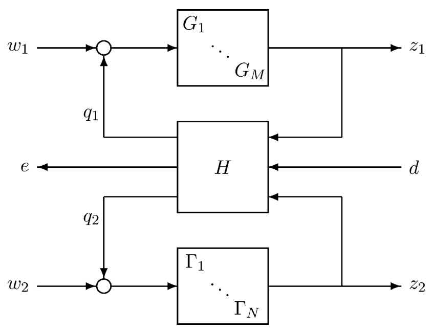

> Image description: This block diagram illustrates a feedback interconnection structure used in control theory for uncertainty analysis. The system is composed of several interconnected blocks: a central block labeled $H$, and two peripheral subsystems. The first subsystem consists of a series of blocks, $G_1$ through $G_M$. An input $w_1$ is summed with a feedback signal $q_1$ before entering the $G$-blocks. The output of this subsystem is $z_1$. The second subsystem consists of blocks $\Gamma_1$ through $\Gamma_N$. An input $w_2$ is summed with feedback signal $q_2$ before entering the $\Gamma$-blocks, resulting in output $z_2$. The central block $H$ receives feedback signals $z_1$ and $z_2$ as inputs. It also receives an external disturbance input $d$ and produces an error output $e$. The outputs $q_1$ and $q_2$ are derived from $H$, closing the feedback loops. This structure represents a generalized plant framework for analyzing system robustness.
Structured Singular Value and Applications: Analyzing the Effect of Linear Time-Invariant Uncertainty in Linear Systems, Fig. 1 Interconnection of $G_{1}, \ldots, G_{M}, \Gamma_{1}, \ldots, \Gamma_{N}$

the open, left-half plane. Given some restrictions on the values of the elements of $\Gamma$, robustness analysis poses the question: is the interconnection well posed and stable for all possible values of $\Gamma$ ? And if so, then is the $\|\cdot\|_{\infty}$ gain from $d$-to- $e \leq 1$ for all possible values of $\Gamma$ ? The goal of the analysis is to confirm "yes" or supply a particular $\Gamma$ which proves that the answer is "no" (by rendering the interconnection ill-posed, unstable, or with $d$-to- $e$ gain $>1$ ). Standard linear systems theory gives that the interconnection is well posed if and only if

$$
\operatorname{det}\left(I-\left[\begin{array}{ll}
H_{11} & H_{13} \\
H_{31} & H_{33}
\end{array}\right]\left[\begin{array}{cc}
G(\infty) & 0 \\
0 & \Gamma(\infty)
\end{array}\right]\right) \neq 0,
$$

and that the interconnection is stable if and only if the transfer function matrix $T^{w, z}$, mapping $\left[w_{1} ; w_{2}\right]$ to $\left[z_{1} ; z_{2}\right]$, is an element of $\mathcal{S}^{\bullet \times \bullet}$.

The assumptions on each $\Gamma_{k}$ are of three kinds: (i) $\Gamma_{k}$ is a stable linear system, known only to satisfy $\left\|\Gamma_{k}\right\|_{\infty}<1$; (ii) $\Gamma_{k}$ is a stable linear system of the form $\gamma_{k} I$, where the scalar linear system $\gamma_{k}$ is known to satisfy $\left\|\gamma_{k}\right\|_{\infty}<1$; (iii) $\Gamma_{k}$ is a constant gain, of the form $\gamma_{k} I$, where the scalar $\gamma_{k} \in \mathbf{R}$ is known to satisfy $-1< \gamma_{k}<1$. Note the similarity between this and the block structure $\boldsymbol{\Delta}$ (via $\boldsymbol{\Delta}_{\mathbf{R}}$ and $\boldsymbol{\Delta}_{\mathbf{C}}$ ) introduced earlier. After rearrangement, this block-diagonal augmentation of uncertain systems is a normbounded (by 1) element of the set

$$
\begin{array}{r}
\boldsymbol{\Gamma}:=\left\{\operatorname{diag}\left[\Gamma_{R}, \Gamma_{U}\right]: \Gamma_{R} \in \boldsymbol{\Delta}_{\mathbf{R}}, \Gamma_{U} \in \mathcal{S}^{\bullet \times \bullet}\right. \\
\left.\Gamma_{U}\left(s_{0}\right) \in \boldsymbol{\Delta}_{\mathbf{C}} \forall s_{0} \in \mathbf{C}_{+}\right\}
\end{array}
$$

Since 0 is a possible value of $\Gamma$, two necessary conditions (denoted c. 1 and c.2, respectively) for robust well-posedness and stability are at $\Gamma=0$, specifically $\operatorname{det}\left(I-G(\infty) H_{11}\right) \neq 0$ and $V:=G(s)\left(I-H_{11} G(s)\right)^{-1} \in \mathcal{S}^{\bullet \times \bullet}$. Assuming $\operatorname{det}\left(I-G(\infty) H_{11}\right) \neq 0$ (i.e., c.1), the Schur formula for block determinants reduces the wellposedness condition to

$$
\begin{array}{r}
\operatorname{det}\left(I-\Gamma(\infty)\left[H_{33}+H_{31}\left(I-G(\infty) H_{11}\right)^{-1}\right.\right. \\
\left.\left.G(\infty) H_{13}\right]\right) \neq 0 .
\end{array}
$$

Define $M:=H_{33}+H_{31} G\left(I-H_{11} G\right)^{-1} H_{13} \in \mathcal{S}^{\bullet \times \bullet}$, and $X:=I-\Gamma M$. Then

$$
T^{w, z}=\left[\begin{array}{cc}
V+V H_{13} X^{-1} \Gamma H_{31} V & V H_{13} X^{-1} \Gamma \\
X^{-1} \Gamma H_{31} V & X^{-1} \Gamma
\end{array}\right]
$$

Assuming c.2, namely, $V \in \mathcal{S}^{\bullet \times \bullet}$, then $X^{-1} \in \mathcal{S}^{\bullet \times \bullet}$ implies that $T^{w, z} \in \mathcal{S}^{\bullet \times \bullet}-$ moreover $T^{w, z} \in \mathcal{S}^{\bullet \times \bullet}$ implies that $X^{-1}=I+T_{22}^{w, z} M \in \mathcal{S}^{\bullet \times \bullet}$. Finally, since both $M$ and $\Gamma$ are stable, it follows that $X^{-1} \in \mathcal{S}^{\bullet \times \bullet}$ if and only if $\operatorname{det}\left(I-M\left(s_{0}\right) \Gamma\left(s_{0}\right)\right) \neq 0 \quad \forall s_{0} \in \mathbf{C}_{+}$. The maximum-modulus property gives the robustness theorem. With the definition of $M$ and conditions c. 1 and c.2, the uncertain system is robustly stable and well posed if and only if

$$
\max \left\{\sup _{\omega \in \mathbf{R}} \mu_{\Delta}(M(j \omega)), \mu_{\Delta}(M(\infty))\right\} \leq 1 .
$$

Indeed, if the condition holds, then by maximummodulus theorem and the definition of $\mu$, it follows that $\operatorname{det}(I-M(s) \Gamma(s)) \neq 0$ for all $s \in \mathbf{C}_{+}$as well as $s=\infty$, since $\Gamma(s) \in \boldsymbol{\Delta}$ and $\bar{\sigma}(\Gamma(s))<1$. This gives well-posedness and stability for all such $\Gamma$, as desired (an alternate proof, using the Nyquist criterion is also common). Conversely, if the condition is violated, then at some frequency ( 0 , nonzero, or $\infty$ ), $\mu$ is larger than 1 , as evidenced by a (constant matrix) $\Delta \in \boldsymbol{\Delta} \subseteq \mathbf{C}^{n \times n}, \bar{\sigma}(\Delta)<1$, which causes singularity. If the frequency is nonzero (and finite),

<!-- source_pdf_page: 1397 -->
the interpolation lemmas in the appendix enable replacing the complex blocks with stable, realrational entries. Otherwise ( 0 or $\infty$ ), the matrix is such that $\mu$ is continuous, and hence a finite, nonzero frequency also has $\mu>1$, or only the real blocks are necessary to cause singularity. In all cases, $\Gamma \in \Gamma$ with $\|\Gamma\|_{\infty}<1$ exists to cause ill-posedness or instability (Tits and Fan 1995).

Robustness of performance, measured as $\left\|T^{e, d}\right\|_{\infty}$, can be addressed, using the main loop theorem, and an additional complex full block (recall $\bar{\sigma}(\cdot)=\mu_{\Delta}(\cdot)$ when $F=1, S=R=0$ ). Define

$$
\begin{aligned}
M_{P}:= & {\left[\begin{array}{ll}
H_{22} & H_{23} \\
H_{32} & H_{33}
\end{array}\right]+\left[\begin{array}{l}
H_{21} \\
H_{31}
\end{array}\right] } \\
& G\left(I-H_{11} G\right)^{-1}\left[\begin{array}{ll}
H_{12} & H_{13}
\end{array}\right]
\end{aligned}
$$

and $\boldsymbol{\Delta}_{P}:=\left\{\operatorname{diag}\left[\Delta_{P}, \Delta\right]: \Delta_{P} \in \mathbf{C}^{n_{d} \times n_{e}}\right.$, $\Delta \in \boldsymbol{\Delta}\}$. With conditions c. 1 and c.2, the uncertain system is robustly stable and well posed and satisfies $\left\|T^{e, d}\right\|_{\infty} \leq 1$ if and only if

$$
\max \left\{\sup _{\omega \in \mathbf{R}} \mu_{\boldsymbol{\Delta}_{P}}\left(M_{P}(j \omega)\right), \mu_{\boldsymbol{\Delta}_{P}}\left(M_{P}(\infty)\right)\right\} \leq 1 .
$$

## Computations

The robust stability and robust performance theorems require computing $\mu$ on the frequency response function $M(j \omega)$. Computing $\mu$ is known to be a computationally difficult problem (Toker and Ozbay 1998), so exact computational methods are generally not pursued. Reliable algorithms have been developed which yield upper and lower bounds, which are often sufficiently close for many engineering problems.

## Lower Bounds

Recall that $\mu_{\Delta}(M)=\max _{\Delta \in \mathbf{B}_{\Delta}} \rho_{\mathbf{R}}(M \Delta)= \max _{Q \in \mathbf{Q}_{\Delta}} \rho_{\mathbf{R}}(M Q)$. Practically speaking, these maximizations yield lower bounds for $\mu_{\Delta}(M)$, since the global maximum may not be attained. In addition to gradient-based ascent methods, the optimality conditions for $Q \in \mathbf{Q}_{\boldsymbol{\Delta}}$ to be a local maximum of the function $\rho_{\mathbf{R}}(M \Delta)$ on the set
$\mathbf{B}_{\boldsymbol{\Delta}}$ can be derived (Young and Doyle 1997). A solution approach, similar to a Jacobi iteration, leads to an iteration that resembles combinations of the familiar power methods for spectral radius and maximum singular value. If the iteration converges (which is not guaranteed), a lower bound for $\mu_{\boldsymbol{\Delta}}(M)$ (along with a corresponding $\Delta \in \boldsymbol{\Delta}$ ) is produced. Studies with matrices constructed to have $\mu_{\Delta}(M)=1$ suggest that the iteration is very reliable for complex block structures, though usually quite poor for purely real block structures. There are several, more computationally demanding algorithms available for purely real block structures (de Gaston and Safonov 1988; Sideris and Sanchez Pena 1989). For the common situation, with both real and complex blocks, where continuity is assured, the power algorithm generally has adequate performance.

## Upper Bounds

Define $\mathbf{G}_{\boldsymbol{\Delta}}:=\left\{G=-G^{*}: G \Delta=-\Delta^{*} G^{*} \forall \Delta \in \boldsymbol{\Delta}\right\}$, $\mathbf{D}_{\boldsymbol{\Delta}}:=\left\{D=D^{*} \succ 0: D \Delta=\Delta D \quad \forall \Delta \in \boldsymbol{\Delta}\right\}$, subsets of $\mathbf{C}^{n \times n}$. Elements of $\mathbf{D}_{\boldsymbol{\Delta}}$ are of the form $\quad \operatorname{diag}\left[D_{r_{1}}, \ldots, D_{r_{R}}, D_{s_{1}}, \ldots, D_{s_{S}}, d_{1} I_{f_{1}}\right.$, $\left.\ldots, d_{F} I_{f_{F}}\right]$, and therefore $D \in \mathbf{D}_{\boldsymbol{\Delta}}$ implies that $D^{\frac{1}{2}} \in \mathbf{D}_{\boldsymbol{\Delta}}$ too. Likewise,

$$
\begin{aligned}
\mathbf{G}_{\boldsymbol{\Delta}}:= & \left\{\operatorname{diag}\left[G_{R}, 0\right]: G_{R}=-G_{R}^{*} \in \mathbf{C}^{\bullet \times \bullet}\right. \\
& \left.G_{R} \Delta_{R}=\Delta_{R} G_{R} \forall \Delta_{R} \in \boldsymbol{\Delta}_{\mathbf{R}}\right\}
\end{aligned}
$$

A concise derivation (Helmersson 1995) verifies the upper bound formula (Fan et al. 1991). If $\beta>0, G \in \mathbf{G}_{\boldsymbol{\Delta}}$, and $D \in \mathbf{D}_{\boldsymbol{\Delta}}$ satisfy $M^{*} D M- \beta^{2} D+G M+M^{*} G^{*} \preceq 0$, then $\mu_{\Delta}(M) \leq \beta$. Indeed, if $\Delta \in \boldsymbol{\Delta}$ has $\operatorname{det}(I-M \Delta)=0$, there exist nonzero $w, z \in \mathbf{C}^{n}$ with $w=M z, z=\Delta w$. Certainly $z^{*}\left(M^{*} D M-\beta^{2} D+G M+M^{*} G^{*}\right) z \leq$ 0 . Making substitutions gives

$$
\begin{aligned}
0 \geq & w^{*} D w-\beta^{2} w^{*} \Delta^{*} D \Delta w \\
& +w^{*} \Delta^{*} G w+w^{*} G^{*} \Delta w \\
= & w^{*} D w-\beta^{2} w^{*} D^{\frac{1}{2}} \Delta^{*} \Delta D^{\frac{1}{2}} \\
& w+w^{*} \Delta^{*} G w-w^{*} \Delta^{*} G w \\
= & w^{*} D^{\frac{1}{2}}\left(I-\beta^{2} \Delta^{*} \Delta\right) D^{\frac{1}{2}} w .
\end{aligned}
$$

<!-- source_pdf_page: 1398 -->
Since $D$ is invertible and $w \neq 0_{n}$, it must be that $\bar{\sigma}(\Delta) \geq \beta^{-1}$, as desired. The constraint $M^{*} D M-\beta^{2} D+G M+M^{*} G^{*} \preceq 0$ is a linear matrix inequality (LMI) in the variables $D$ and $G$. Minimizing $\beta$ over $G \in \mathbf{G}_{\boldsymbol{\Delta}}$ and $D \in \mathbf{D}_{\boldsymbol{\Delta}}$ subject to the LMI constraint (using Boyd and El Ghaoui 1993, for instance) yields the best upper bound that this inequality can produce.

## Further Perspectives

The robustness tests involve bounding $\mu_{\Delta}(M(j \omega))$ over the entire real axis. A common approach is to use a dense frequency gridding and upper/lower bound calculations at each gridded point. The advantages, simplicity and trivial parallelization, are offset with disadvantages, in that the peak value (over $\mathbf{R}$ ) may not be reflected accurately by the peak across the finite grid. In fact, such a grid-based test determines the smallest $\Delta \in \boldsymbol{\Delta}$ which can cause a pole to migrate from the left-half plane into the righthalf plane at exactly one of the frequency grid points (as opposed to any location). Nevertheless, with some continuity assurances in place and a dense grid, this is often adequate knowledge for most engineering decisions. However, the bruteforce grid approach can be avoided by treating the frequency-variable ( $\omega$ ) as an additional real parameter (since $M(j \omega)$ is an LFT of $\frac{1}{\omega}$ ) (Ferreres et al. 2003). This is a generalization of the Hamiltonian methods to compute the $\mathcal{H}_{\infty}$ norm of a linear system without a frequency grid, coupled with an alternative form of the upper bound (Young et al. 1995). Moreover, if only the peak value (upper bound, say) across frequency is desired, this approach can be fast, as some calculations rule out large frequency ranges to not contain the peak.

Improved upper bounds can be derived using higher-order arguments, changing the LMI constraint into a sum-of-squares constraint (which ultimately is just a larger LMI). Alternatively, branch-and-bound techniques are especially useful at reducing the conservativeness of the ( $D, G$ ) upper bound when there are several real parameters $(R>0)$ (Newlin and Young 1997).

## Appendix: Interpolation Lemmas

Two interpolation lemmas make the connection between robustness to constant-gain, complexvalued uncertainties ( $\boldsymbol{\Delta}$ ) and stable, finitedimensional, time-invariant linear systems described by ODEs with real coefficients ( $\boldsymbol{\Gamma}$ ). Lemma 1 is used (block by block and element by element on the relevant vector directions within each block) to interpolate complex blocks causing singularity into real-rational blocks which cause singularity at a particular frequency.

Lemma 1 Given a positive $\bar{\omega}>0$ and a complex number $\delta$, with $\operatorname{Imag}(\delta) \neq 0$, there is a $\beta>0$ such that by proper choice of sign $\pm\left.|\delta| \frac{s-\beta}{s+\beta}\right|_{s=j \bar{\omega}}=\delta$.

Lemma 2 Suppose $M \in \mathbf{C}^{n \times n}$ and $\bar{\omega}>0$. If $\Delta \in \boldsymbol{\Delta}$ satisfies $\operatorname{det}\left(I_{n}-M \Delta\right)=0$, then there is a $\Gamma \in \Gamma$ with $\|\Gamma\|_{\infty} \leq \bar{\sigma}(\Delta)$ and $\operatorname{det}\left(I_{n}-\right. M \Gamma(j \bar{\omega}))=0$.

## Summary and Future Directions

The structured singular value, $\mu$, is a linear algebra construct, defined to exactly deal with linear, time-invariant uncertainty in linear systems. The main issues are computational, focused on efficient manners to compute reasonably tight upper and lower bounds at each frequency and, more specifically, ascertain the peak value across frequency. Alternatives to the worst-case approach to robustness analysis are gaining favor and may be applicable in analysis and design situations where the abstraction of a worst-case view is too conservative (Calafiore et al. 2000).

## Cross-References

- Fundamental Limitation of Feedback Control
- KYP Lemma and Generalizations/Applications
- Linear Systems: Continuous-Time, Time-Invariant State Variable Descriptions
- LMI Approach to Robust Control
- Optimization Based Robust Control

<!-- source_pdf_page: 1399 -->
- Robust Control in Gap Metric
- Robust Fault Diagnosis and Control
- Robust $\mathcal{H}_{2}$ Performance in Feedback Control

## Recommended Reading

A comprehensive list of references, including theory, computations, and diverse applications would require many pages. The list below is minimal and does not do justice to the many researchers who have made significant contributions to this subject. In addition to the cited work, connections to Kharitonov's theorem can be found in Chen et al. (1994). Textbooks, such as Dullerud and Paganini (2000) and Zhou et al. (1996), include derivations and additional citations.

## Bibliography

Boyd S, Desoer CA (1985) Subharmonic functions and performance bounds on linear time-invariant feedback systems. IMA J Math Control Inf 2:153170
Boyd S, El Ghaoui L (1993) Method of centers for minimizing generalized eigenvalues. Linear Algebra Appl 188:63-111
Calafiore GC, Dabbene F, Tempo R (2000) Randomized algorithms for probabilistic robustness with real and complex structured uncertainty. IEEE Trans Autom Control 45(12):2218-2235
Chen J, Fan MKH, and Nett CN (1994) Structured singular values and stability analysis of uncertain polynomials, part 1 and 2. Syst Control Lett 23:53-65 and 97-109
de Gaston RRE, Safonov MG (1988) Exact calculation of the multiloop stability margin. IEEE Trans Autom Control 33(2): 156-171
Doyle J (1982) Analysis of feedback systems with structured uncertainties. IEE Proc Part D 129(6):242250
Dullerud G, Paganini F (2000) A course in robust control theory, vol 6. Springer, New York
Fan MKH, Tits AL, Doyle JC (1991) Robustness in the presence of mixed parametric uncertainty and unmodeled dynamics. IEEE Trans Autom Control 36(1):25-38
Ferreres G, Magni JF, Biannic JM (2003) Robustness analysis of flexible structures: practical algorithms. Int J Robust Nonlinear Control 13(8):715-733

Foo YK, Postlethwaite I (1988) Extensions of the small$\mu$ test for robust stability. IEEE Trans Autom Control 33(2):172-176
Helmersson A (1995) Methods for robust gain scheduling. PhD thesis, Linköping
Newlin MP, Young PM (1997) Mixed $\mu$ problems and branch and bound techniques. Int J Robust Nonlinear Control 7:145-164
Packard A, Pandey P (1993) Continuity properties of the real/complex structured singular value. IEEE Trans Autom Control 38(3):415-428
Safonov MG (1982) Stability margins of diagonally perturbed multivariable feedback systems. Control Theory Appl IEE Proc D 129:251-256. IET
Sideris A, Sanchez Pena RS (1989) Fast computation of the multivariable stability margin for the real interrelated uncertain parameters. IEEE Trans Autom Control 34(12): 1272-1276
Tits A, Fan MKH (1995) On the small- $\mu$ theorem. Automatica 31(8):1199-1201
Toker O, Ozbay H (1998) On the complexity of purely complex mu ; computation and related problems in multidimensional systems. IEEE Trans Autom Control 43(3):409-414
Wall J, Doyle JC, Stein G (1982) Performance and robustness analysis for structured uncertainty. In: IEEE conference on decision and control, Orlando, pp 629-636
Young PM, Doyle JC (1997) A lower bound for the mixed $\mu$ problem. IEEE Trans Autom Control 42(1):123128
Young P, Newlin M, Doyle J (1995) Computing bounds for the mixed $\mu$ problem. Int J Robust Nonlinear Control 5(6):573-590
Zhou K, Doyle JC, Glover K (1996) Robust and optimal control, vol 40. Prentice Hall, Upper Saddle River

## Sub-Riemannian Optimization

Roger Brockett Harvard University, Cambridge, MA, USA

#### Abstract

Optimization problems arising in the control of some important types of physical systems lead naturally to problems in sub-Riemannian optimization. Here we provide context and background material on the relevant mathematics and discuss some specific problem areas where these ideas play a role.

<!-- source_pdf_page: 1400 -->
## Keywords

Carnot-Carathéodory metric; Lie algebras; Periodic processes; Subelliptic operators; SubRiemannian geodesics; Symmetric spaces

## Introduction

After a start in the early 1970s, over the last two decades, sub-Riemannian geometry and the related theory of subelliptic operators have become popular topics in the control literature. Their study is sometimes linked to questions involving the dynamics and control of mechanical systems with nonholonomic (nonintegrable) constraints and the use of what has classically been called quasi-coordinates because both subjects depend on Lie algebraic techniques. However, here we limit ourselves to problems in sub-Riemannian optimization per se, describing how they arise in various areas of physics and engineering. Most famously, the second law of thermodynamics, as recast by Carathéodory in differential geometric form, provides an example of the reach of subRiemannian geometry into the engineering world.

The statement of control theoretic problems often begins with a description of the system of interest in differential equation form:

$$
\dot{x}=f(x)+\sum u_{i} g_{i}(x) ; x \in X, u \in \mathbb{R}^{m}
$$

with $X$ an $n$-dimensional manifold. In wellmotivated control problems, $n$ is almost always larger than $m$; the dimension of the space of controls is less than the dimension of the state space. In the case of mechanical systems, the phrase under actuated is sometimes used to characterize this, but the situation is ubiquitous. The analysis is complicated by presence of the immutable drift term $f$. When it is desired to use an optimization principle to find a good choice for $u$, one introduces a performance measure, often of the form

$$
\eta=\int_{0}^{t_{1}} L(x, u) d t
$$

and attempts to minimize $\eta$ subject to whatever constraints there may be on $u$ and $x$. If there is no drift term and if the Lie algebra generated by $\left\{g_{1}, g_{2}, \cdots, g_{m}\right\}$ defines a distribution that spans the tangent space of $X$ at every point, the problem falls under the purview of sub-Riemannian geometry. In this case, one can describe the situation as $\dot{x}=G(x) u$ with $G$ being an $x$-dependent rectangular matrix of rank $m$ everywhere.

This entry is written from a control theory point of view. The problems discussed here provided the impetus for some later mathematical work, often not discussing the motivation. The purely mathematical work is de-emphasized here, much as the mathematical work often gives little or no attention to the control theoretic work that preceded it.

## The Distance Function

A prototype control problem leading to sub Riemannian geometry is that of steering the system $\dot{x}_{1}=u_{1} \dot{x}_{2}=u_{2} \dot{x}_{3}=x_{1} u_{2}-x_{2} u_{1}$ from one state to another while minimizing

$$
\eta=\int_{0}^{1} \sqrt{u_{1}^{2}+u_{2}^{2}} d t
$$

It might seem that this is just a minor change from a standard shortest path problem in Riemannian geometry, e.g., it might be thought as a limiting case of a standard Riemannian geodesic problem in which the infinitesimal length is given by

$$
\begin{gathered}
(d s)^{2}=\left[\begin{array}{lll}
d x_{1} & d x_{2} & d x_{3}
\end{array}\right]\left[\begin{array}{ccc}
1 & 0 & -y \\
0 & 1 & x \\
-y & x & \epsilon+x^{2}+y^{2}
\end{array}\right]^{-1} \\
{\left[\begin{array}{l}
d x_{1} \\
d x_{2} \\
d x_{3}
\end{array}\right]}
\end{gathered}
$$

and $\epsilon$ is allowed to go to zero. However, because when $\epsilon$ equals zero this matrix is singular, it cannot be used to define the equations for geodesics. The most direct attack seems to be to use a Lagrange multiplier to enforce the condition on $x_{3}$, which leads to the minimization of

<!-- source_pdf_page: 1401 -->
$$
\eta=\int_{0}^{1} \dot{x}_{1}^{2}+\dot{x}_{2}^{2}+\lambda\left(x_{1} \dot{x}_{2}-x_{2} \dot{x}_{1}\right) d t
$$

This yields a set of $\lambda$-dependent linear equations for $x_{1}$ and $x_{2}$. Solving these shows that the projections of the minimum length trajectories onto the ( $x_{1}, x_{2}$ )-plane are circular arcs.

In Riemannian geometry, the set of points which are of distance $r$ from a given point will, for $r$ sufficiently small, form a co-dimension one manifold diffeomorphic to a sphere. In this qualitative sense, Riemannian spaces are locally isotropic. In sub-Riemannian geometry, the set of points of distance $r>0$ from a distinguished point $x_{0}$ does not have such a simple structure. For example, for the problem just discussed, we have the approximations

$$
\begin{aligned}
& d=\sqrt{x_{1}^{2}+x_{2}^{2}}+\left|x_{3}\right| /\left(x_{1}^{2}+x_{2}^{2}\right) \\
& \quad \text { for }\left|x_{3}\right| \ll\left(x_{1}^{2}+x_{2}^{2}\right)
\end{aligned}
$$

and

$$
\begin{aligned}
d= & 2 \pi\left|x_{3}\right|-\sqrt{8 \pi\left(x_{1}^{2}+x_{2}^{2}\right)\left|x_{3}\right|} \\
& \text { for } \sqrt{x_{1}^{2}+x_{2}^{2}} \ll\left|x_{3}\right|
\end{aligned}
$$

That is, for points bounded by paraboloids, defining a region near the ( $x_{1}, x_{2}$ )-plane, the distance is close to the Riemannian distance, whereas in a cone containing the $x_{3}$ axis, the distance is close to the square root of the Riemannian distance. These approximations make it clear that $d\left(x_{1}, x_{2}, x_{3}\right)$ is not differentiable at points on the $x_{3}$ axis. There is much more that can be said here. One interesting topic concerns the number of trajectories that satisfy the first-order necessary conditions and join a point to the origin.

## More Examples

Consider the kinematic equations of the unicycle. If $(x, y)$ are the coordinates of the center of the wheel and $\theta$ is the heading angle, then these are

$$
\dot{x}=\cos \theta u_{2} ; \dot{y}=\sin \theta u_{2} ; \dot{\phi}=u_{1}
$$

It is of interest to generate a "shortest path" between two points in $(x, y, \theta)$-space where shortest is defined as the integral of some function of $x, y, \theta, u_{1}, u_{2}$. This is typical of the kind of path planning problems in which nonholonomic constraints lead to sub-Riemannian problems. A variety of such problems arise in robotics with optimal steering programs for cars being one example.

As an example involving a compact manifold, let $X$ be the space of 3-by-3 orthogonal matrices and consider the system described by

$$
\dot{x}=\left[\begin{array}{ccc}
0 & u_{1} & u_{2} \\
-u_{1} & 0 & 0 \\
-u_{2} & 0 & 0
\end{array}\right] x
$$

In this case, the manifold $X$ is three dimensional and the control space is two dimensional. If we wish to minimize the integral of $u^{2}+v^{2}$ subject to $x(0)=x_{0}$ and $x(1)=x_{1}$, we have a typical sub-Riemannian geodesic problem.

If the controls contain random effects, efforts to analyze the situation lead to related problems in stochastic process. The most widely studied of these are described by an Itô equation of the form

$$
d x=f(x) d t+\sum g_{i}(x) d w_{i}
$$

The corresponding equation for the evolution of the probability density $\rho(t, x)$ can be put in the form

$$
\begin{aligned}
\frac{\partial \rho}{\partial t}= & \sum a_{i}(x) \frac{\partial}{\partial x_{i}} \rho(t, x) \\
& +\sum b_{i j}(x) \frac{\partial}{\partial x_{i}} \frac{\partial}{\partial x_{j}} \rho(t, x)
\end{aligned}
$$

However, rather than the right-hand side being a fully elliptic operator, as it would be in a typical heat equation (e.g., the Laplace-Beltrami operator), the symmetric matrix $B(x)=b_{i j}(x)$ is singular. If the $g_{i}$ satisfy the bracket-generating condition, the density equation is said to be subelliptic. The system described by the Itô equation

<!-- source_pdf_page: 1402 -->
$$
\left[\begin{array}{l}
d x_{1} \\
d x_{2} \\
d x_{3}
\end{array}\right]=\left[\begin{array}{ccc}
-d t & d w_{1} & d w_{2} \\
-d w_{1} & -d t / 2 & 0 \\
-d w_{2} & 0 & -d t / 2
\end{array}\right]\left[\begin{array}{l}
x_{1} \\
x_{2} \\
x_{3}
\end{array}\right]
$$

evolves on the two-sphere and the spectrum of the subelliptic operator is discrete. The diffusion time constants, i.e., the eigenvalues of the subelliptic operator, can be computed explicitly and compared with those of the fully elliptic operator, i.e., the standard Laplacian on the spherical shell.

Much has been written on the ways in which subelliptic diffusion does, and does not, share the properties of the ordinary diffusion equation.

## A Special Structure

A rich, and especially tractable, class of subRiemannian problems come from the following situation. Suppose that $\mathcal{G}$ is a Lie group with Lie algebra $G$ and that $\mathcal{H}$ is a closed subgroup with Lie algebra $H$. According to one definition, the pair $\mathcal{H} \subset \mathcal{G}$ is said to define a symmetric space if the Lie algebra $G$, viewed as a vector space, is the direct sum of $H$ and $K$ with $[H, K] \subset K$ and $[K, K] \subset H$. Let $x$ evolve in $\mathcal{G}$ as

$$
\dot{x}=u x ; x \in \mathcal{G} ; u \in K
$$

For the sake of exposition, suppose that $\mathcal{G}$ is a matrix Lie group. We look for paths joining $x_{0}$ and $x_{1}$ that are shortest in the sense that

$$
\eta=\int_{0}^{1}\|u\| d t
$$

is minimized, where $\|u\|^{2}=\operatorname{tr}\left(u^{T} u\right)$. (This leads to the same trajectories as those which minimize the integral of $\|u\|^{2}$.) To find the first-order necessary conditions using the maximum principle, define a Hamiltonian as $h(x, p, u)=\operatorname{tr}\left(p^{T} u x+\right. \left.u^{T} u\right)$. Thus, $\dot{p}=-u^{T} p$ and minimizing over $u$ implies $2 u=-\pi_{1}\left(x p^{T}\right)$ where $\pi_{1}$ is the projection onto $K$. The product $m=x p^{T}$ satisfies $\dot{m}= \left[m, \pi_{1}(m)\right]$. Using the structural properties of the Lie algebra, we see that $(d / d t) \pi_{0}(m)=0$ and that $(d / d t) \pi_{1}(m)=\left[\pi_{1}(m), m_{0}\right]$. Working out the implications, we see that trajectories of the
form $x(t)=e^{a t} e^{(b-a) t}$ with $a \in H$ and $b \in K$ satisfy the first-order optimality conditions.

To illustrate, we consider the generalization of an earlier example. Let $X$ be the space of $n$-by$n$ orthogonal matrices and consider the system described by

$$
\dot{x}=\left[\begin{array}{ccccc}
0 & u_{1} & u_{2} & \cdots & u_{n-1} \\
-u_{1} & 0 & 0 & \cdots & 0 \\
-u_{2} & 0 & 0 & \cdots & 0 \\
\vdots & \vdots & \vdots & \cdots & \vdots \\
-u_{n-1} & 0 & 0 & \cdots & 0
\end{array}\right] x
$$

Here the role of $H$ is played by the sub-algebra of the set of real $n$-by- $n$ skew-symmetric matrices consisting those whose first row and column vanish and $K$ consists of the subset whose lower-right $(n-1)$-by- $(n-1)$ sub-matrix vanishes. In this case, the paths satisfying the firstorder necessary conditions take the form $x(t)= e^{h t} e^{(k-h) t} x(0)$.

## Nonintegrability and Cyclic Processes

Of course nonintegrable stands in opposition to the word integrable, as it is used in the consideration of integration performed along paths, e.g.,
$I=\int_{\gamma} g_{1}(x) d x_{1}+g_{2}(x) d x_{2}+\cdots+g_{n}(x) d x_{n}$

If the path $\gamma$ starts at $\bar{x}$ and ends at $\hat{x}$, then the equality of mixed partials $\partial g_{i} / \partial x_{j}=\partial g_{j} / \partial x_{i}$ implies that along any two paths with these end points, the integral has the same value, provided that one of the paths can be continuously deformed into the other with the $g_{i}$ being well defined along the deformation. In particular, if $\gamma$ is a closed curve so $\bar{x}=\hat{x}$, then under these assumptions, the integral is zero.

On the other hand, there is a large list of important processes in biology and engineering, such as those involving the thermodynamic cycles of internal combustions engines or air conditioners, that depend critically on nonintegrable effects. These include cyclic phenomena such as

<!-- source_pdf_page: 1403 -->
walking and breathing and a widely used mechanisms for efficient voltage conversion in electrical engineering. Thus, both nature and technology provide examples of processes in which the pistons, valves, etc. move along a smooth path and at the end of a cycle return to their initial configuration, while a related integral is not zero. Perhaps, the best-known path problem of this type is the Carnot cycle.

Questions about sub-Riemannian optimization enter here both as the optimization of the path defining the cycle and in the optimal regulation of the output of such cyclic processes. In general, the output can adjust both the amplitude and frequency of the cycle (volume of air per cycle and respiration rate), although in some cases one or the other of these might be fixed. For example, cruise control for automobiles regulates the frequency (rpm) of the engine but cannot adjust the stroke length of the pistons, whereas speed control of a running animal ordinarily involves adjusting both the length of the stride and the "steps" per minute. The primary considerations for these control processes are stability and response time, with the shape of the cycles being determined by some measure of efficiency. It seems that the optimization of such regulatory processes deserves more attention.

## Cross-References

- Learning Theory
- Markov Chains and Ranking Problems in Web Search
- Modeling, Analysis, and Control with Petri Nets
- Nonlinear Adaptive Control
- Redundant Robots

## Recommended Reading

Material on sub-Riemannian geometry can be found in the very readable survey (Strichartz 1986) and in more depth in Gromov (1996). The examples discussed here have mostly come from the literature Brockett (1973a,b), Baillieul
(1975), and Brockett (1999) and these papers contain motivational material as well. Symmetric spaces are discussed in the sub-Riemannian context in Strichartz (1986), but for the optimization aspect, see Brockett (1999). Reference Brockett (2003) studies the regulation of sub-Riemannian cycles.

## Bibliography

Baillieul J (1975) Some optimization problems in geometric control theory. PhD thesis, Harvard University
Brockett R (1973a) Lie theory and control systems defined on spheres. SIAM J Appl Math 25:213-225
Brockett R (1973b) Lie algebras and lie groups in control theory. In: Mayne DQ, Brockett RW (eds) Geometric methods in system theory. Reidel, Dordrecht, pp 4382
Brockett R (1999) Explicitly solvable control problems with nonholonomic constraints. In: Proceedings of the 1999 CDC conference, Phoenix, pp 13-16
Brockett R (2003) Pattern generation and the control of nonlinear systems. IEEE Trans Autom Control 48:1699-1712
Gromov M (1996) Carnot-Carathéodory spaces seen from within. Sub-Riemannian geometry. Progress in mathematics, vol 144. Birkhäuser, Basel, pp 79-323
Strichartz RS (1986) Sub-Riemannian geometry. J Diff Geom 24:221-263

## Subspace Techniques in System Identification

Michel Verhaegen
Delft Center for Systems and Control, Delft
University, Delft, The Netherlands

#### Abstract

An overview is given of the class of subspace techniques (STs) for identifying linear, timeinvariant state-space models from input-output data. STs do not require a parametrization of the system matrices and as a consequence do not suffer from problems related to local minima that often hamper successful application of parametric optimization- based identification methods.

<!-- source_pdf_page: 1404 -->
The overview follows the historic line of development. It starts from Kronecker's result on the representation of an infinite power series by a rational function and then addresses, respectively, the deterministic realization problem, its stochastic variant, and finally the identification of a statespace model given in innovation form.

The overview summarizes the fundamental principles of the algorithms to solve the problems and summarizes the results about the statistical properties of the estimates as well as the practical issues like choice of weighting matrices and the selection of dimension parameters in using these STs in practice. The overview concludes with probing some future challenges and makes suggestions for further reading.

## Keywords

Extended observability matrix; Hankel matrix; Innovation model; State-space model; Singular value decomposition (SVD)

## Introduction

Subspace techniques (STs) for system identification address the problem of identifying statespace models of MIMO dynamical systems. The roots of ST were laid by the German mathematician Leopold Kronecker ( ${ }^{\circ} 1823-{ }^{\dagger} 1891$ ). In Kronecker (1890) Kronecker established that a power series could be represented by a rational function when the rank of the Hankel operator with that power series as its symbol was finite. In the early 1990s of the twentieth century, new generalizations of the idea of Kronecker were presented for identifying linear, time-invariant (LTI) state-space models from input-output data or output data only. These new generalizations were formulated from different perspectives, namely, within the context of canonical variate analysis (Larimore 1990), within a linear algebra context (Van Overschee and De Moor 1994; Verhaegen 1994), and subspace splitting (Jansson and Wahlberg 1996). Despite their different origin, the close relationship between these methods was quickly established by a unifying theorem that
interpreted these methods as a singular value decomposition (SVD) of a weighted matrix from which an estimate of the column space of the observability matrix or the row space of the state sequence of the given system or Kalman filter for observing the state of that system is derived (Van Overschee and De Moor 1995). This subspace calculation is the key feature that leads to the indication by ST for system identification or subspace identification methods (SIM).

The STs are attractive complementary techniques to the maximum likelihood or prediction error framework. They do not require the user to specify a parametrization of the system matrices of the state-space model, and the user is not confronted with the problems due to possible local minima of a nonlinear parameter optimization method that is often necessary in estimating the parameters of a state-space model via, e.g., prediction error methods. Though the statistical properties such as consistency and efficiency have been investigated, such as in Bauer and Ljung (2002), the estimates obtained via ST are in general not optimal in the statistical minimum variance sense. However, practical evidence with the use of ST in a wide variety of problems has indicated that ST provides accurate estimates. As such they are often used as an initialization to the maximum likelihood or prediction error parametric identification methods.

In this chapter we make a distinction between output only or stochastic identification problems and input-output or combined deterministicstochastic identification problems. The first occurs when identifying, e.g., the eigenmodes of a bridge from ambient acceleration responses of the bridge. The second occurs when, in addition to ambient excitations that cannot be directly measured, controlled excitations through actuators integrated in the system are used during the collection of the input-output data.

The outline of this chapter is as follows. In the next section, we formulate the LTI state-space model identification problems and outline the general strategy of ST. The presentation of ST is given according to the historical development of ST. It starts with a summary of the solution to the deterministic realization problem, which

<!-- source_pdf_page: 1405 -->
considers the noise-free "impulse" response of the system. Subsequently we present the stochastic realization problem which considers the output-only identification problem where the output is assumed to be a filtered zeromean, white-noise sequence. The ST solution is discussed assuming samples of the covariance function of the output to be given. The deterministic-stochastic identification problem is considered in section "Combined Determin-istic-Stochastic ST." In this section we first consider open-loop identification experiments. For this case, the basic linear regression problem is formulated that is at the heart of many ST. Second reference is made to a framework for analyzing and understanding the statistical properties of ST, the selection of the order, as well as to a number of open problems in the understanding of important choices the user has to made. Closed-loop identification experiments are considered in the third part of section "Combined Deterministic-Stochastic ST," while the fourth part makes a brief reference to ST papers that go beyond the LTI case.

Finally we provide a brief overview on future research directions and conclude with some recommended literature for further exploration.

## ST in Identification: Problems and Strategy

The LTI system to be analyzed in this chapter is given by the following state-space model:

$$
\begin{align*}
x(k+1) & =A x(k)+B u(k)+K e(k) \\
y(k) & =C x(k)+D u(k)+e(k) \tag{1}
\end{align*}
$$

with $u(k) \in \mathbb{R}^{m}$ the (measurable) input, $e(k)$ a zero-mean, white-noise sequence with $E\left[e(k) e(k)^{T}\right]=R, y(k) \in \mathbb{R}^{\ell}$ the (measurable) output, and $x(k) \in \mathbb{R}^{n}$ the state vector. This model is in the so-called innovation form since the sequence $e(k)$ is the innovation signal in a Kalman filtering context.

The historical sequence of ST developments considers the following open-loop problem formulations. In the deterministic realization problem, the innovation sequence $e(k)$ is zero, and the input $u(k)$ is an impulse. The stochastic realization problem considers the case where the input $u(k)$ is zero and the given data is assumed to be samples of the covariance function of the output. The combined deterministic-stochastic identification problem considers the model (1) for generic input $u(k)$.

The general strategy of ST is to formulate an intermediate step in deriving the parameters of the system matrices of interest from the given data; see Fig. 1. This intermediate step makes the ST different from the parametric model identification framework that aims for a direct estimation of the parameters of the system matrices by (in general) nonlinear parameter optimization techniques. The intermediate step in ST aims to determine a matrix from the given data that reveals an (approximation of an) essential subspace of the unknown system. This essential subspace can be

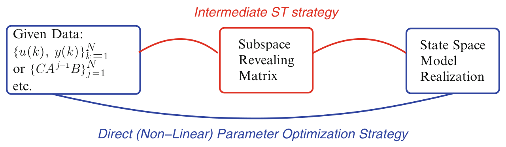

> Image description: This flowchart illustrates two different approaches for system identification: the "Intermediate ST strategy" and the "Direct (Non-Linear) Parameter Optimization Strategy." The process begins with a blue box on the left labeled "**Given Data**," which includes sets such as $\{u(k), y(k)\}_{k=1}^N$ or $\{CA^{j-1}B\}_{j=1}^N$. The **Intermediate ST strategy**, indicated by red curved arrows, proceeds through an intermediate step: a red box labeled "**Subspace Revealing Matrix**." This leads to the final step, a blue box on the right labeled "**State Space Model Realization**." This path suggests an indirect approach to parameter estimation via subspace identification. In contrast, the **Direct (Non-Linear) Parameter Optimization Strategy** is represented by a single blue curved arrow connecting the "**Given Data**" box directly to the "**State Space Model Realization**" box, bypassing the intermediate matrix step.
Subspace Techniques in System Identification, Fig. 1 Schematic representation of the intermediate step of ST to derive from the given data (input-output data $\{u(k), y(k)\}$, Markov parameters $\left\{C A^{j-1} B\right\}$, etc.) a subspace revealing matrix, from which the subspace of interest is computed via, e.g., singular value decomposition and that enables the computation of the state-space model

realization by solving a (convex) linear least-squares problem. The commonly used approach to directly go from the given data to a state-space realization via in general nonlinear parameter optimization methods is indicated by the arrow directly connecting the given data box to the state-space realization box

<!-- source_pdf_page: 1406 -->
the extended observability matrix of (1) as given by the matrix $\mathcal{O}_{s}$ :

$$
\mathcal{O}_{s}=\left[\begin{array}{c}
C \\
C A \\
\cdots \\
C A^{s-1}
\end{array}\right] \quad \text { for } s>n,
$$

or the state sequence of a Kalman filter designed for (1). Essential for ST is that both the intermediate step to reveal the subspace of interest and the subsequent derivation of the system matrices from that subspace and the given data are done via convex optimization methods and/or linear algebra methods.

## Realization Theory: The Progenitor of ST

## The Deterministic Realization Problem

In the 1960s, the cited result of Kronecker inspired independently Ho and Kalman, Silverman and Youla, and Tissi to present an algorithm to construct a state-space model from a Hankel matrix of impulse response coefficients (Schutter 2000). This breakthrough gave rise to the field of realization theory. One key problem in realization theory that paved the way for subspace identification is the determination of a minimal realization from a finite number of samples of the impulse response of a deterministic system, assumed to have a minimal representation as in (1) for $e(k) \equiv 0$. The samples of the impulse response are called the Markov parameters. The minimal realization sought for is the LTI model with quadruple of system matrices $\left[A_{T}, B_{T}, C_{T}, D\right]$, with $A_{T} \in \mathbb{R}^{n \times n}$ and $n$ minimal such that the pair ( $A_{T}, C_{T}$ ) is observable, the pair ( $A_{T}, B_{T}$ ) is controllable, and the transfer function $D+C_{T}\left(z I-A_{T}\right)^{-1} B_{T}$ equals $D+ C(z I-A)^{-1} B$ with $z$ the complex variable of the $z$-transform. When $A$ is stable, the latter transfer function can be written into the matrix power series:

$$
\begin{equation*}
D+C(z I-A)^{-1} B=D+\sum_{j=1}^{\infty} C A^{j-1} B z^{-j} \tag{2}
\end{equation*}
$$

Following the cited result of Kronecker, the solution to the minimum realization problem is based on the construction of the (block-)Hankel matrix $H_{s, N}$ constructed from the Markov parameters $\left\{C A^{j-1} B\right\}_{j=1}^{N}$ as

$$
H_{s, N}=\left[\begin{array}{cccc}
C B & C A B & \cdots & C A^{N-s} B  \tag{3}\\
\vdots & & \ddots & \vdots \\
C A^{s-1} B & C A^{s} B & \cdots & C A^{N-1} B
\end{array}\right]
$$

For the deterministic realization problem, the intermediate ST step simply is the storage of the impulse response data into a Hankel matrix. The subsequent step is to derive from this matrix a subspace from which the system matrices can be either read-off or computed via linear least squares. How this is done is outlined next.

When the order $n$ of the minimal realization is known and the Hankel matrix dimension parameters $s, N$ are chosen such that

$$
\begin{equation*}
s>n \quad N \geq 2 n-1 \tag{4}
\end{equation*}
$$

the Hankel matrix $H_{S, N}$ has rank $n$. A numerically reliable way to compute that rank is via the SVD of $H_{s, N}$. Under the assumption that the rank of $H_{s, N}$ is $n$, we can denote that SVD as $U_{n} \Sigma_{n} V_{n}^{T}$, with $\Sigma_{n} \in \mathbb{R}^{n \times n}$ positive definite and with the columns of the matrices $U_{n}$ and $V_{n}$ orthonormal. By the minimality of (1) (for $e(k) \equiv 0$ ), $H_{s, N}$ can be factored as $\mathcal{O}_{s}\left[B A B \cdots A^{N-s} B\right]=\mathcal{O}_{s} \mathcal{C}_{N-s+1}$ or as $\left(U_{n} \Sigma_{n}^{\frac{1}{2}}\right)\left(\Sigma_{n}^{\frac{1}{2}} V_{n}^{T}\right)$, and these factors are related as

$$
\begin{aligned}
U_{n} \Sigma_{n}^{\frac{1}{2}}=\mathcal{O}_{s} T^{-1}=\mathcal{O}_{s, T} \quad \Sigma_{n}^{\frac{1}{2}} V_{n}^{T} & =T \mathcal{C}_{N-s+1} \\
& =\mathcal{C}_{N-s+1, T}
\end{aligned}
$$

for $T \in \mathbb{R}^{n \times n}$ a nonsingular transformation. Therefore $\mathcal{O}_{s, T}$ resp. $\mathcal{C}_{N-s+1, T}$ act as the extended observability resp. controllability matrix of a similarly equivalent triplet of system matrices ( $A_{T}, B_{T}, C_{T}$ ). This correspondence allows to read-off the system matrices $C_{T}$ and $B_{T}$ as the first $\ell$ rows of the matrix $\mathcal{O}_{s, T}$ and the first $m$ columns of $\mathcal{C}_{N-s+1, T}$ resp. Further

<!-- source_pdf_page: 1407 -->
the shift-invariance property of the extended observability resp. controllability matrices allows to find the system matrix $A_{T}$ of the minimal realization. For example, consider the extended observability matrix $\mathcal{O}_{s}$, then the shift-invariance property states that:

$$
\begin{equation*}
\mathcal{O}_{s, T}(1:(s-1) \ell,:) A_{T}=\mathcal{O}_{s, T}(\ell+1: s \ell,:) \tag{5}
\end{equation*}
$$

where the notation $M(u: v,:)$ indicates the submatrix of $M$ from rows $u$ to rows $v$. The shift-invariance property delivers a set of linear equations from which the system matrix $A_{T}$ can be computed via the solution of a linear leastsquares problem when $s>n$.

Finding the dimension parameters $s$ (and $N$ ) of the Hankel matrix $H_{S, N}$ is a nontrivial problem in general. When only the Markov parameters are given and the knowledge that they stem from a finite-order state-space model, a possible sequential strategy is to select $s$ and $N$ equal to the upperbounds in (4) for presumed orders $n$ and $n+1$, respectively. When the rank of the Hankel matrices for these two selections of $s$ (and $N$ ) is identical, the right dimensioning of the Hankel matrix $H_{s, N}$ is found. Otherwise the presumed order is increased by one.

## The Stochastic Realization Problem

The output-only identification problem aims at determining a mathematical model from a measured multivariate time series $\{y(k)\}_{k=1}^{N}$ with $y(k) \in \mathbb{R}^{\ell}$. Such a model can be then used for predicting future values of the (output) data from past values.

In the vein of the revival of the work of Kronecker on realizing dynamical systems from its impulse response, Faure and a number of contemporaries like Akaike and Aoki made pioneering contributions to extend this methodology to stochastic processes (Van Overschee and De Moor 1993). These extensions are known as solutions to the stochastic realization problem.

This problem is formulated for $y(k)$ to be a Markovian stochastic process. Reusing the notation in (1) $y(k)$ is assumed to be generated by (1) with the input $u(k) \equiv 0$. The $A$ matrix in (1) is again assumed to be stable. The given data in
the early formulations of the stochastic realization problem was the samples of the covariance function

$$
R_{y}(j)=E\left[y(k) y(k-j)^{T}\right]
$$

These samples define the strictly positive real spectral density function of $y(k)$ :

$$
\begin{equation*}
\Phi_{y}(z)=\sum_{j=-\infty}^{\infty} R_{y}(j) z^{-j}>0 \tag{6}
\end{equation*}
$$

Given the samples of the covariance function $R_{y}(j)$, the stochastic realization problem was to find an innovation model representation of the form

$$
\begin{align*}
\hat{x}(k+1) & =A_{T} \hat{x}(k)+K_{T} e^{\prime}(k) \\
\tilde{y}(k) & =C_{T} \hat{x}(k)+e^{\prime}(k) \tag{7}
\end{align*}
$$

with $e^{\prime}(k)$ a zero-mean, white-noise input with covariance matrix $R_{e}$, the pair ( $A_{T}, C_{T}$ ) observable, and $A_{T}$ stable, such that the spectral density functions $\Phi_{y}(z)$ and $\Phi_{\tilde{y}}(z)$ are equal.

The partial similarity between this problem and the minimal realization problem becomes clear when expressing the covariance function samples $R_{y}(j)$ in terms of the system matrices in (1)-for $u(k) \equiv 0$ as

$$
\begin{equation*}
R_{y}(j)=C A^{j-1} G \quad \text { for } j \neq 0 \tag{8}
\end{equation*}
$$

with the matrices $G$ and $R_{y}(0)$ derived from the following covariance expressions:

$$
\begin{align*}
E\left[x(k) x(k)^{T}\right] & =\Sigma_{x}: \Sigma_{x} \\
& =A \Sigma_{x} A^{T}+K R K^{T} \tag{9}
\end{align*}
$$

$$
E\left[x(k+1) y(k)^{T}\right]=G: G
$$

$$
\begin{equation*}
=A \Sigma_{x} C^{T}+K R \tag{10}
\end{equation*}
$$

$$
E\left[y(k) y(k)^{T}\right]=R_{y}(0): R_{y}(0)
$$

$$
\begin{equation*}
=C \Sigma_{x} C^{T}+R \tag{11}
\end{equation*}
$$

Since the spectral density has a two-sided series expansion, there is a so-called forward stochastic

<!-- source_pdf_page: 1408 -->
realization problem (considering $R_{y}(j)$ for $j \geq 0$ only) and a backward version. Here we only treat the forward one. Drawing the parallel between the samples of the covariance function $R_{y}(j)$, as given in (6)-(8) and the Markov parameters in (2), we can use the deterministic tools from realization theory to find a minimal realization ( $A_{T}, C_{T}, G_{T}$ ).

The intermediate ST step in the stochastic realization problem is the construction of a Hankel matrix similar to the matrix $H_{s, N}$ as in the deterministic realization problem but now from the samples of the covariance function $R_{y}(j)$ in (8).

With the triplet ( $A_{T}, C_{T}, G_{T}$ ) determined, the innovation model (7) is classically completed via the solution of a Riccati equation in the unknown $\Sigma_{x}$. This Riccati equation results by noting that $R>0$, and therefore, $K R K^{T}$ can be written as $K R(R)^{-1} R^{T} K^{T}$. This reduces the expression for $\Sigma_{x}$ in (9) with the help of (10) and (1) as

$$
\begin{align*}
\Sigma_{x}= & A \Sigma_{x} A^{T}+\left(G-A \Sigma_{x} C^{T}\right)\left(R_{y}(0)\right. \\
& \left.-C \Sigma_{x} C^{T}\right)^{-1}\left(G-A \Sigma_{x} C^{T}\right)^{T} \tag{12}
\end{align*}
$$

By replacing the triplet ( $A, C, G$ ) with the found minimal realization ( $A_{T}, C_{T}, G_{T}$ ) in this Riccati equation, its solution $\Sigma_{x, T}$ enables in the end to define the missing quantities as

$$
\begin{align*}
R_{e} & =R_{y}(0)-C_{T} \Sigma_{x, T} C_{T}^{T} \\
K_{T} & =\left(G_{T}-A_{T} \Sigma_{x, T} C_{T}^{T}\right) R_{e}^{-1} \tag{13}
\end{align*}
$$

By the positive realness of $\Phi_{y}(z)$ and the similar equivalence between the triplets ( $A_{T}, C_{T}, G_{T}$ ) and ( $A, C, G$ ), the solution $\Sigma_{x, T}$ is positive definite.

A persistent problem in solving the stochastic realization problem has existed for a long time when using approximate values of the samples $R_{y}(j)$. This problem is that the estimated power spectrum based on estimates of the triplet ( $A_{T}, C_{T}, G_{T}$ ) is no longer positive real.

An approximate solution overcoming the problem of the loss of positive realness of the
estimated power spectrum was provided in the vein of the ST developed in the early 1990s as discussed in the next section.

## Combined Deterministic-Stochastic ST

## Identification of LTI MIMO Systems in Open Loop

Since the golden 1960s and 1970s of the twentieth century, many attempts have been made to make the insights from deterministic and stochastic realization theory useful for system identification. To mention a few, there are attempts to use the solutions to the deterministic realization problem with measured or estimated impulse response data. One such method is known under the name of the eigensystem realization algorithm (ERA) (Juang and Pappa 1985) and has been used for modal analysis of flexible structures, like bridges, space structures, etc. Although these methods tend to work well in practice for these resonant structures that vibrate (strongly), they did not work well for other type of systems and an input different from an impulse. Extensions to the stochastic realization problem considered the use of finite sample average estimates of the covariance function as an attempt to make the method work with finite data length sequences. As indicated in section "The Stochastic Realization Problem," these approximations of the covariance function tended to violate the positive realness property of the underlying power spectrum.

In the early 1990s of the twentieth century, new breakthroughs were made working directly with the input-output data of an assumed LTI system without the need to first compute the Markov parameters or estimating the samples of covariance functions. Pioneers that contributed to these breakthroughs were Van Overschee and De Moor, introducing the N4SID approach (Van Overschee and De Moor 1994); Verhaegen, introducing the MOESP approach (Verhaegen 1994); and Larimore, presenting ST in the framework of canonical variate analysis (CVA) (Larimore 1990).

These three pioneering contributions considered the identification of the state-space model

<!-- source_pdf_page: 1409 -->
(1) from the input-output data $\{u(k), y(k)\}_{k=1}^{N}$ recorded in open loop. The pair ( $A, C$ ) was assumed to be observable, and the pair $(A, K R)$ controllable. The innovation noise covariance matrix $R$ was assumed to be positive definite.

The formulation of the intermediate ST step from which these three pioneering contributions can be derived (by weighting the result of Theorem 1) and that is at the heart of many more variants is summarized in Theorem 1. This theorem requires two preparations: first the storage of the input and output sequences into (block-) Hankel matrices and relating these Hankel matrices via the model parameters and second to make three observations about the model (1) when presented in the prediction form. This form is obtained by replacing $x(k)$ by $\hat{x}(k)$ and $e(k)$ by $y(k)- C \hat{x}(k)-D u(k)$ and is given by

$$
\begin{align*}
\hat{x}(k+1)= & (A-K C) \hat{x}(k) \\
& +(B-K D) u(k)+K y(k) \\
y(k)= & C \hat{x}(k)+D u(k)+e(k) \tag{14}
\end{align*}
$$

To compact the notation we make the following substitutions: $\mathcal{A}=(A-K C)$ and $\mathcal{B}=[(B-$ KD) K].

Let the Hankel matrix with the "future" part $\{y(k)\}_{k=p+1}^{N}$ be defined as

$$
Y_{f}=\left[\begin{array}{ccc}y(p+1) & y(p+2) & \cdots  \tag{15}\\ y(p+2) & y(N-f+1) \\ \vdots & \ddots & \\ y(p+f) & \cdots & y(N)\end{array}\right]
$$

for the dimensioning parameters $p$ and $f$ selected such that

$$
p \geq f>n
$$

In a similar way we define the Hankel matrices $U_{f}$ and $E_{f}$ from the input $u(k)$ and the innovation $e(k)$, respectively. Then with the definition of the (block-)Toeplitz matrix $T_{u}$ from the quadruple of system matrices ( $A, B, C, D$ ) as

$$
T_{u}=\left[\begin{array}{cccc}
D & 0 & \cdots & 0 \\
C B & D & & 0 \\
C A B & C B & & 0 \\
& & \ddots & \\
C A^{f-1} B & C A^{f-2} B & \cdots & D
\end{array}\right]
$$

and similarly the definition of the Toeplitz matrix $T_{e}$ from the quadruple of system matrices ( $A, K, C, I$ ), we can relate the data Hankel matrices $Y_{f}$ and $U_{f}$ as

$$
\begin{align*}
Y_{f}= & O_{f}[\hat{x}(p+1) \cdots \hat{x}(N-f+1)] \\
& +T_{u} U_{f}+T_{e} E_{f} \\
= & O_{f} \hat{X}_{f}+T_{u} U_{f}+T_{e} E_{f} \tag{16}
\end{align*}
$$

Based on the prediction form (14), 3, key observations are made to support the rational of the intermediate step summarized in Theorem 1:
O1: The standard assumption that the transfer function from $e(k)$ to $y(k)$ is minimum phase leads to the fact that matrix $\mathcal{A}$ is stable. Therefore, there exists a finite integer $p$ such that

$$
\mathcal{A}^{p} \approx 0
$$

O2: The state-pace model of (14) has inputs $u(k)$ and $y(k)$. Grouping both together into the new vector $z(k)=\left[\begin{array}{l}u(k) \\ y(k)\end{array}\right]$ enables to express the state $\hat{x}(k+p)$ as $\hat{x}(k+p)=\mathcal{A}^{p} \hat{x}(k)+\sum_{j=1}^{p} \mathcal{A}^{j-1} \mathcal{B} z(k+p-j)$
for $k \geq 1$. With the assumption that $\mathcal{A}^{p} \approx 0$ and the definition of the inputoutput data vector sequence $Z(k)= \left[z(k)^{T} \cdots z(k+p-1)^{T}\right]^{T}$, we have the following approximation of the state:
$\hat{x}(k+p) \approx\left[\mathcal{A}^{p-1} \mathcal{B} \cdots \mathcal{B}\right] Z(k)=\mathcal{L}^{z} Z(k)$

As such the state sequence $\hat{X}_{f}$ in (16) can be approximated by

$$
\mathcal{L}^{z} Z_{p}=\mathcal{L}^{z}[Z(1) Z(2) \cdots Z(N-f-p+1)] .
$$

<!-- source_pdf_page: 1410 -->
O3: The (approximate) knowledge of the row space of the state sequence in $\hat{X}_{f}$ makes that the unknown system matrices $(\mathcal{A}, \mathcal{B}, C, D, K)$ appear (approximately) linearly in the model (14).
The intermediate ST step to retrieve a matrix with relevant subspaces is summarized in the following theorem taken from Peternell et al. (1996).

Theorem 1 (Peternell et al. 1996) Consider the model (1) with all stochastic processes assumed to be ergodic and with the input $u(k)$ to be statistically uncorrelated from the innovation $e(\ell)$ for all $k, \ell$. Consider the following least-squares problem:

$$
\left[\begin{array}{ll}
\hat{L}_{N}^{u} & \hat{L}_{N}^{z}
\end{array}\right]=\arg \min _{L^{u}, L^{z}}\left\|Y_{f}-\left[\begin{array}{ll}
L^{u} & L^{z}
\end{array}\right]\left[\begin{array}{l}
U_{f}  \tag{17}\\
Z_{p}
\end{array}\right]\right\|_{F}^{2}
$$

with $\|.\|_{F}^{2}$ denoting the Frobenius norm of a matrix, then

$$
\lim _{N \rightarrow \infty} \hat{L}_{N}^{z}=\mathcal{O}_{f} \mathcal{L}_{z}+\mathcal{O}_{f} \mathcal{A}^{p} \Delta_{z}
$$

with $\Delta_{z}$ a bounded matrix.
The theorem delivers the matrix $\hat{L}_{N}^{z}$ via the solution of a convex linear least-squares problem that has asymptotically (in the number of measurements $N$ ) the extended observability matrix $\mathcal{O}_{f}$ as its column space and that has asymptotically (in the number of measurements as well as in the dimension parameter $p$ ) the matrix $\mathcal{L}^{z}$ as its row space. Based on the expression of the state sequence $\hat{X}_{f}$ given in the observation O2 above, the estimate of the row space of $\mathcal{L}^{z}$ delivers an estimate of the row space of the state sequence $\mathcal{X}_{f}$. The observation O3 then shows that this intermediate step allows to derive an estimate of the system matrices $[A, B, C, D, K]$ (up to a similarity transformation) via a linear leastsquares problem.

## Towards Understanding the Statistical Properties

Many ST variants for system identification using data recorded in open loop have been developed since the early 1990s of the twentieth
century. These variants mainly differ in the use of weighting matrices $\mathcal{W}_{\ell}$ and $\mathcal{W}_{r}$ in the product $\mathcal{W}_{\ell} \hat{L}_{N}^{z} \mathcal{W}_{r}$ prior to computing the subspaces of interest. The effect on the accuracy and the statistical properties of the estimated model by these weighting matrices is yet not fully understood as is that of the dimensioning parameters $p$ and $f$ in the definition of the data Hankel matrices $Y_{f}, U_{f}, Z_{p}$. Only for very specific restrictions results have been achieved. For example, in Bauer and Ljung (2002), it has been shown that when the input $u(k)$ in (1) is either non-present or zeromean white noise, as well as when the system order $n$ of the underlying system to be known and letting in addition to the dimension parameter $p$ and the number of data points $N$ the dimension parameter $f$ go to infinity, that the weighting matrices selected to represent the CVA approach (Larimore 1990) yield an optimal minimum variance estimate. A framework for analyzing the statistical properties like consistency and asymptotic distribution of the estimates determined by the class of STs that were discovered in the 1990s is given in Bauer (2005).

The minimum variance property of the estimates by the CVA approach (Larimore 1990) is theoretically not yet proven for more generic and practically relevant experimental conditions. For these cases, the choices of the different weighting matrices, the dimensioning parameters $f, p$, as well as selecting the system order are often diverted to user. Despite this fact, practical evidence has shown that STs are able to accurately identify state-space models for LTI MIMO systems under industrially realistic circumstances. As such they are by now accepted and widely used as a common engineering tool in various areas, such as model-based control, fault diagnostics, etc. Further they generally provide excellent initial estimates to the nonlinear parametric optimization methods in prediction error or maximum likelihood estimation methods.

## Identification of LTI MIMO Systems in Closed Loop

The least-squares problem (17) in Theorem 1 leads to biased estimates when using

<!-- source_pdf_page: 1411 -->
input-output data that is recorded in a closed-loop identification experiment. This is because of the correlation between the measurable input and the innovation sequence. A number of solutions have been developed to overcome this problem. We refer to the paper van der Veen et al. (2013) for an overview of a number of these rescues. A simple and performant rescue is described here based on the work in Chiuso (2010). The intermediate ST step in order to avoid biased estimates is to estimate a high-order vector autoregressive models with exogenous inputs, a so-called VARX model:

$$
\begin{equation*}
\min _{\Theta} \sum_{k=1}^{N-p}\|y(k+p)-\Theta Z(k)-D u(k+p)\|_{2}^{2} \tag{18}
\end{equation*}
$$

Using the result on the approximation of the state vector $\hat{x}(k+p)$ in observation O 2 , it can be shown that the solution $\hat{\Theta}$ of (18) is an approximation of the parameter vector:

$$
\hat{\Theta}=\left[\widehat{C \mathcal{A}^{p-1} \mathcal{B}} \cdots \widehat{\mathcal{C} \mathcal{B}}\right]
$$

Then using this solution $\hat{\Theta}$ and O 1 above leads to the following "subspace revealing matrix" (cf. Fig. 1):

$$
\left[\begin{array}{cccccc}
\widehat{C \mathcal{A}^{p-1} \mathcal{B}} & \widehat{C \mathcal{A}^{p-2} \mathcal{B}} & \cdots & \widehat{C \mathcal{A}^{p-f} \mathcal{B}} & \cdots & \widehat{C \mathcal{B}}  \tag{19}\\
0 & \widehat{C \mathcal{A}^{p-1} \mathcal{B}} & \widehat{C \mathcal{A}^{p-f+1} \mathcal{B}} & \cdots & \widehat{C \mathcal{A B}} \\
\vdots & & \ddots & & & \\
0 & 0 & \cdots & \widehat{C \mathcal{A}^{p-1} \mathcal{B}} & \cdots & \widehat{C \mathcal{A}^{f-1} \mathcal{B}}
\end{array}\right]
$$

As in the open-loop case of section "Identification of LTI MIMO Systems in Open Loop," column and row weighting matrices as well as changing the size of the subspace revealing matrix (19) can be used to influence the accuracy of the estimates (Chiuso 2010). The subspace of interest of this weighted subspace revealing matrix is its row space that is an approximation of that of the state sequence $\hat{X}_{f}$ as in (16), now extended to make the size compatible to the weighted version of (19). Similarly as in the open-loop case, knowledge of this subspace turns the estimation of the system matrices $[A, B, C, D, K]$ (up to a similarity transformation) into a linear least-squares problem. The statistical asymptotic properties of this closed-loop ST and the treatment of the dimensioning parameters have also been studied in Chiuso (2010). Here, the result is proven that the asymptotic variance of any system invariant of the model estimated via the above closed-
loop ST is a nonincreasing function of the dimensioning parameter $f$ when the input $u(k)$ to the plant is generated by an LQG controller with a white-noise reference input.

## Beyond LTI Systems

The summarized discrete-time ST methodology has been extended in various ways. A number of important extensions including representative papers are towards continuous-time systems (van der Veen et al. 2013), using frequencydomain data (Cauberghe 2006) or for different classes of nonlinear systems, like blockoriented Wiener and/or Hammerstein and linear parameter-varying systems (van Wingerden and Verhaegen 2009). ST for linear time-varying systems with changing dimension of the state vector is treated in Verhaegen and Yu (1995), and finally we mention the developments to make ST recursive (van der Veen et al. 2013).

<!-- source_pdf_page: 1412 -->
## Summary and Future Directions

Subspace techniques aim at simplifying the system identification cycle and make it more user-friendly. Still a number of challenges persist in improving on this general goal. A critical one is the "optimal" selection of the weighting matrices and the dimensioning parameters $p$ and $f$ of the subspace revealing matrix. Optimality here can be expressed, e.g., by the minimality of the variance of the estimates but could also be viewed more generally in relationship with the use of the model, e.g., in terms of the performance of a model-based closed-loop design. A profound theoretical framework is necessary to fully automate the selection of the weighting matrices and dimensioning and order indices. This would substantially contribute to fully automated identification procedures for doing system identification (for linear systems).

A second challenge is to better integrate ST with robust controller design. This requires the assessment of the model quality and the selection of an optimal input. Particular to the integration of ST to control design is the striking similarity of data equations used in ST and model predictive control. The challenge is to further exploit this similarity to develop datadriven model predictive control methodologies that are robust w.r.t. the identified model uncertainty.

One interesting development in ST is the use of regularization via the nuclear norm in order to improve the model order selection with respect to, e.g., SVD-based ST in Liu and Vandenberghe (2010).

A final challenge is to extend ST for LTI systems to other classes of dynamic systems, such as nonlinear, hybrid, and large-scale systems.

## Cross-References

- Linear Systems: Discrete-Time, Time-Invariant State Variable Descriptions
- Realizations in Linear Systems Theory
- Sampled-Data Systems
- System Identification: An Overview

## Recommended Reading

The recommended readings for further study are the books that appeared on the topic of subspace identification. In the books Verhaegen and Verdult (2007) and Katayama (2005), the topic of subspace identification is treated in a wider context for classroom teaching at the MSc level since more elaborate topics relevant in the understanding of ST are treated, such as key results from linear algebra, linear least squares, and Kalman filtering. The book Van Overschee and De Moor (1996) is focused on subspace identification only and also emphasizes the success of ST on various applications. All these books provide access to numerical implementations for getting hands-on experience with the methods. The integration of subspace methods with other identification approaches is done in the toolbox (Ljung 2007).

There also exist a number of overview articles. An overview of the early developments of ST since the 1990s of the twentieth century is given in Viberg (1995). Here also the link between ST for identifying dynamical systems and the signal processing application of direction-ofarrival problems was clearly made. A more recent overview article is van der Veen et al. (2013). In this article also reference is made to the statistical analysis and closed-loop application of ST.

Many papers have appeared reporting successful application of subspace methods in practical applications. We refer to the book Van Overschee and De Moor (1996) and the overview paper van der Veen et al. (2013).

## Bibliography

Bauer D (2005) Asymptotic properties of subspace estimators. Automatica 41(3):359-376

<!-- source_pdf_page: 1413 -->
Bauer D, Ljung L (2002) Some facts about the choice of the weighting matrices in larimore type of subspace algorithms. Automatica 38(5):763-773
Cauberghe B , Guillaume P , Pintelon R , Verboven P (2006) Frequency-domain subspace identification using \{FRF\} data from arbitrary signals. J Sound Vib 290(3-5):555-571
Chiuso A (2010) Asymptotic properties of closedloop cca-type subspace identification. IEEE-TAC 55(3):634-649
Jansson M, Wahlberg B (1996) A linear regression approach to state-space subspace systems. Signal Process 52:103-129
Juang J-N, Pappa RS (1985) Approximate linear realizations of given dimension via Ho's algorithm. J Guid Control Dyn 8(5):620-627
Katayama T (2005) Subspace methods for system identification. Springer, London
Kronecker L (1890) Algebraische reduktion der schaaren bilinearer formen. S.B. Akad. Berlin, pp 663-776
Larimore W (1990) Canonical variate analysis in identification, filtering, and adaptive control. In: Proceedings of the 29th IEEE conference on decision and control, 1990, Honolulu, vol 2, pp 596-604
Liu Z, Vandenberghe L (2010) Interior-point method for nuclear norm approximation with application to system identification. SIAM J Matrix Anal Appl 31(3):1235-1256
Ljung $L$ (2007) The system identification toolbox: the manual. The MathWorks Inc., Natick. 1st edition 1986, 7th edition 2007
Peternell K, Scherrer W, Deistler M (1996) Statistical analysis of novel subspace identification methods. Signal Process 52(2): 161-177
Schutter BD (2000) Minimal state space realization in linear system theory: an overview. J Comput Appl Math 121(1-2):331-354
van der Veen GJ, van Wingerden JW, Bergamasco M, Lovera M, Verhaegen M (2013) Closed-loop subspace identification methods: an overview. IET Control Theory Appl 7(10):1339-1358
Van Overschee P, De Moor B (1993) Subspace algorithms for the stochastic identification problem. Automatica 29(3):649-660
Van Overschee P, De Moor B (1994) N4sid: subspace algorithms for the identification of combined deterministic-stochastic systems. Automatica 30(1):75-93
Van Overschee P, De Moor B (1995) A unifying theorem for three subspace system identification algorithms. Automatica 31(12): 1853-1864
Van Overschee P, De Moor B (1996) Identification for linear systems: theory - implementation - applications. Kluwer Academic Publisher Group, Dordrecht
van Wingerden J, Verhaegen M (2009) Subspace identification of bilinear and LPV systems for open and closed loop data. Automatica 45(2):372-381
Verhaegen M (1994) Identification of the deterministic part of mimo state space models given in innovations form from input-output data. Automatica 30(1):61-74

Verhaegen M, Verdult V (2007) Filtering and identification: a least squares approach. Cambridge University Press, Cambridge/New York
Verhaegen M, Yu X (1995) A class of subspace model identification algorithms to identify periodically and arbitrarily time-varying systems. Automatica 31(2):201-216
Viberg M (1995) Subspace-based methods for the identification of linear time-invariant systems. Automatica 31(12): 1835-1851

# Supervisory Control of Discrete-Event Systems

W.M. Wonham Department of Electrical \& Computer Engineering, University of Toronto, Toronto, ON, Canada

#### Abstract

We introduce background and base model for supervisory control of discrete-event systems, followed by discussion of optimal controller existence, a small example, and summary of control under partial observations. Control architecture and symbolic computation are noted as approaches to manage state space explosion.

## Keywords

Asynchronous; Control architectures; Controllability; Discrete; Dynamics; Finite automata; Observability; Optimality; Regular languages; Symbolic computation

## Introduction

Discrete-event (dynamic) systems (DES or DEDS) constitute a relatively new area of control science and engineering, which has taken its place in the mainstream of control research. Recently, DES have been combined with continuous systems in an area called hybrid systems.

<!-- source_pdf_page: 1414 -->
Problems and methods for DES have been investigated for some time, although not necessarily with a "control" flavor. The parent domains can be identified as operations research and software engineering.

Operations research deals with systems of interconnected stores and servers which operate on processed items. For instance, manufacturing systems employ queues, buffers, and bins (which store workpieces). These are served by machines, robots, and automatic guided vehicles (AGVs), which process workpieces. The main problems are to measure quantitative performance and establish trade-offs, for instance flow vs. cost, and to optimize design parameters such as buffer size and maintenance frequency.

The relevant areas of software engineering include operating systems control, concurrent computing, and real-time (embedded or reactive) systems, with focus on synchronization algorithms that enforce mutual exclusion and resource sharing in the presence of concurrency, as in the classical problems of Readers \& Writers and Dining Philosophers. The main objectives are (i) to guarantee safety ("Nothing bad will ever happen"), as in mutual exclusion and deadlock prevention, and (ii) to guarantee liveness ("Something good will happen eventually"), for instance, successful computational termination and eventual access to a desired resource.

## DES from a Control Viewpoint

With these domains in mind, we consider DES from a control viewpoint. In general, control deals with dynamic systems, defined as entities consisting of an internal state space, together with a state-evolution or transition structure, and equipped (for control purposes) with both an input mechanism for actuation and an output channel for observation and feedback. The objective of control is to bring together information and dynamics in some purposeful combination: the interplay between observation and control or decision-making is fundamental.

In this framework, a DES is a dynamic system that is discrete, in time and usually in state
space; is asynchronous or event driven, that is driven by events or instantaneous happenings in time (which may or may not include the tick of a clock); and is nondeterministic, namely, embodies internal chance or other unmodeled mechanisms of choice which govern its state transitions. With a manufacturing system, for example, the dynamic state might include the status of machines (idle, working, down, under maintenance or repair), the contents of queues and buffers, and the locations and loads of robots and AGVs, while transitions (discrete events) occur when queues and buffers are incremented or decremented, robots load or unload, and machines start work, finish work, or break down (the "choice" between finishing work successfully and breaking down, being thus nondeterministic). In this example and many others, the objectives of design and analysis include logical correctness in the presence of concurrency and timing constraints, and quantitative performance such as rates of production, all of which depend crucially on feedback control synthesis and optimization. To this end the models will tend to be DES or hybrid systems. Nevertheless one finds the continuing relevance of standard control-theoretic concepts like feedback, stability, controllability, and observability, along with their roles in large-system architectures embodying hierarchical, decentralized, and distributed functional organization.

Here we focus on models and problems from which explicit constraints of timing are absent and which can be considered in a framework of finite-state machines and the corresponding regular languages. While the theory has been generalized to more flexible and technically advanced settings, our restricted framework is already rich enough to support numerous applications and remains challenging for large systems of industrial size.

## Base Model for Control of DES

The formal structure of a DES to be controlled will resemble the simple "machine" called MACH shown in Fig. 1. The state set of MACH

<!-- source_pdf_page: 1415 -->
is $Q=\{I, W, D\}$, interpreted as Idle, Working, or Broken Down. MACH is initialized at state $q_{o}=I$, denoted by an entering arrow without source. The transition structure is displayed in Fig. 1 as a transition diagram, whose nodes are the states $q \in Q$ and edges are the transitions, each labeled with a symbol $\sigma$ in the alphabet $\Sigma$, here $\{w, c, b, r\}$. If a transition (labeled) $\sigma$ is an edge from $q$ to $q^{\prime}$, then "the event $\sigma$ can occur at state $q$." Transitions (or events) are interpreted as instantaneous in time, while states are thought of as locations where MACH is able to reside for some indeterminate time interval. The occurrence of $w$ means "MACH enters the Working state from Idle" and similarly for $c, b, r$. These transitions determine the state-transition function of MACH, denoted by $\delta: Q \times \Sigma \rightarrow Q$. Thus $\delta(I, w)=W, \delta(W, b)=D$, and so on. Notice that $\delta$ is a partial function, defined at each state $q \in Q$ for only a subset of event (labels) in $\Sigma$. To denote that $\delta(q, \sigma)$ is defined at state $q \in Q$ for the event $\sigma \in \Sigma$, we write $\delta(q, \sigma)!$. The function $\delta$ can be extended in a standard way to $\delta: Q \times \Sigma^{*} \rightarrow Q$, where $\Sigma^{*}$ is the set of all finite strings of elements of $\Sigma$, including the empty string $\epsilon$. Thus $\delta(q, \epsilon):=q$ and inductively if $q^{\prime}:=\delta(q, s)!$, then

$$
\delta(q, s . \sigma):=\delta(\delta(q, s), \sigma):=\delta\left(q^{\prime}, \sigma\right)
$$

whenever $\delta\left(q^{\prime}, \sigma\right)!$. Graphically the strings $s= \sigma_{1} \ldots \sigma_{k} \in \Sigma^{*}$ for which $\delta(q, s)!$ are precisely those for which there exists a path in the transition diagram starting from $q$ and having successive edges labeled $\sigma_{1}, \ldots, \sigma_{k}$.

We call any subset of $\Sigma^{*}$ (i.e., any set of strings of elements from $\Sigma$ ) a language over

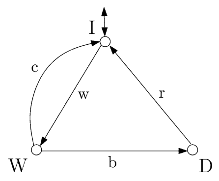

> Image description: A diagram illustrates a triangular relationship between three labeled nodes: I, W, and D. The node labeled **I** is at the top vertex. It has a bidirectional vertical arrow pointing both into and out of the node. Two directed edges connect the nodes: a curved arrow labeled **c** points from W to I, and a straight arrow labeled **w** points from I to W. The node labeled **W** is at the bottom-left vertex. A straight arrow labeled **b** points from W to node **D**. The node labeled **D** is at the bottom-right vertex. A straight arrow labeled **r** points from D back to node **I**. The configuration suggests a feedback loop or a control system structure within the context of discrete-event systems, where information or signals flow between the components denoted by the variables I, W, D, c, w, r, and b.
Supervisory Control of Discrete-Event Systems, Fig. 1 MACH

$\Sigma$ and accordingly speak of sublanguages of a language over $\Sigma$.

For MACH, the execution of a production cycle, namely the event sequence (or string) w.c, or a work-breakdown-repair cycle, the string w.b.r., can be considered successful, and the corresponding string is said to be marked. States which are entered by marked strings are marked states and identified in a transition diagram by an outgoing arrow with no target. In Fig. 1, the only marked state happens to be the initial state, which is thus shown with a double arrow; in general there could be several marked states, which may or may not include the initial state. The marked states comprise a subset $Q_{m} \subseteq Q$, which may be empty (at one extreme) or equal to $Q$ (at the other). The case $Q_{m}=Q$ (all states marked) would imply that every string of events is considered as significant or successful as any other, while the case $Q_{m}=\varnothing$ (no state marked, so there are no successful strings) plays a technical role in computation.

In general a generator is a tuple $\mathbf{G}=$ ( $Q, \Sigma, \delta, q_{o}, Q_{m}$ ) usually interpreted physically as for MACH above, but mathematically consisting merely of the finite-state set $Q$, finite alphabet $\Sigma$, marked subset $Q_{m} \subseteq Q$, with initial state $q_{o} \in Q$, and (partial) transition function $\delta: Q \times \Sigma \rightarrow Q$. Additionally we bring in the closed behavior $L(\mathbf{G})$ of $\mathbf{G}$, defined as all the strings of $\Sigma^{*}$ which $\mathbf{G}$ can generate starting from the initial state, in the sense

$$
L(\mathbf{G}):=\left\{s \in \Sigma^{*} \mid \delta\left(q_{o}, s\right)!\right\} .
$$

Of central importance also is the marked behavior of $\mathbf{G}$, namely, the sublanguage of $L(\mathbf{G})$ given by

$$
L_{m}(\mathbf{G}):=\left\{s \in L(\mathbf{G}) \mid \delta\left(q_{o}, s\right) \in Q_{m}\right\} .
$$

We need several definitions. A string $s^{\prime}$ is a prefix of a string $s \in \Sigma^{*}$, written $s^{\prime} \leq s$, if $s^{\prime}$ can be extended to $S$, namely, there exists a string $w$ in $\Sigma^{*}$ such that $s^{\prime} . w=s$. The closure of a language $M \subseteq \Sigma^{*}$ is the language $\bar{M}$ consisting of all prefixes of strings in $M$ :

$$
\bar{M}:=\left\{s^{\prime} \in \Sigma^{*} \mid s^{\prime} \leq s \text { for some } s \text { in } M\right\}
$$

<!-- source_pdf_page: 1416 -->
A language $N$ over $\Sigma$ is (prefix-)closed if it contains all its prefixes, namely, $N=\bar{N}$. In this notation $\mathbf{G}$ is said to be nonblocking if $L(\mathbf{G})= \overline{L_{m}(\mathbf{G})}$, namely, any (generated) string in $L(\mathbf{G})$ is a prefix of, and so can be extended to, a marked string of $\mathbf{G}$.

The semantics of $\mathbf{G}$ (its mathematical meaning) is simply the pair of languages $L_{m}(\mathbf{G})$, $L(\mathbf{G})$. In general the latter may be infinite subsets of $\Sigma^{*}$, while $\mathbf{G}$ itself is a finite object, considered to represent an algorithm for the generation of its behaviors. Unless $\mathbf{G}$ is trivial (has empty state set), it is always true that $\epsilon \in L(\mathbf{G})$.

Transition labeling of $\mathbf{G}$ is deterministic: at every $q$, at most one transition is defined for each given event $\sigma$, namely,

$$
\delta(q, \sigma)=q^{\prime} \& \delta(q, \sigma)=q^{\prime \prime} \text { implies } q^{\prime}=q^{\prime \prime} .
$$

It is quite acceptable, however, that at distinct states $q$ and $r$, both $\delta(q, \sigma)!$ and $\delta(r, \sigma)!$ (where these evaluations are usually not equal).

To formulate a control problem for $\mathbf{G}$, we first adjoin a control technology or mechanism by which $\mathbf{G}$ may be actuated to affect its temporal behavior, namely, determine the strings it is permitted to generate. To this end we assume that a subset of events $\Sigma_{c} \subseteq \Sigma$, called the controllable events, are capable of being enabled or disabled by an external controller. Think of a traffic light being turned green or red to allow or prohibit passage (vehicle transition) through an intersection. The complementary event subset $\Sigma_{u}:=\Sigma-\Sigma_{c}$ is uncontrollable; events $\sigma \in \Sigma_{u}$ cannot be externally disabled but may be considered permanently enabled. For $\mathbf{G}=$ MACH one might reasonably assume $\Sigma_{c}=\{w, r\}, \Sigma_{u}= \{c, b\}$. At a given state $q$ of $\mathbf{G}$, it will be true in general that $\delta(q, \sigma)!$ both for some (controllable) events $\sigma \in \Sigma_{c}$ and for some (uncontrollable) events $\sigma \in \Sigma_{u}$. Among the $\sigma \in \Sigma_{c}$, at a given time, some may be externally enabled and others disabled. So, $\mathbf{G}$ will nondeterministically choose its next generated event from the subset
$\left\{\sigma \in \Sigma_{u} \mid \delta(q, \sigma)!\right\} \cup\left\{\sigma \in \Sigma_{c} \mid \delta(q, \sigma)!\&\right. \sigma$ is externally enabled\}

We formalize external enablement by a supervisory control function $V: L(\mathbf{G}) \rightarrow \operatorname{Pwr}(\Sigma)$, where $P w r($.$) stands for power set. For s \in L(\mathbf{G})$, the evaluation $V(s)$ is defined to be the event subset
$V(s):=\Sigma_{u} \cup\left\{\sigma \in \Sigma_{c} \mid \sigma\right.$ is externally enabled

$$
\begin{equation*}
\text { following } s\} \tag{2}
\end{equation*}
$$

In other words, the set (1) is expressible as

$$
\begin{equation*}
V(s) \cap\{\sigma \in \Sigma \mid s . \sigma \in L(\mathbf{G})\} \tag{3}
\end{equation*}
$$

namely, the subset of events that, immediately following the generation of $s$ by $\mathbf{G}$, are either enabled by default (executable events in $\Sigma_{u}$ ) or else by the external controller's decision (a subset of executable events in $\Sigma_{c}$ ).

It is now easy to visualize how the generating action of $\mathbf{G}$ is restricted by the action of $V($.$) .$ Initially (having generated the empty string) $\mathbf{G}$ chooses $\sigma_{1} \in V(\epsilon)$. Proceeding inductively, after $\mathbf{G}$ has generated $s=\sigma_{1} . \sigma_{2} \ldots \sigma_{k} \in L(\mathbf{G}), s$ is fed back to the controller, which evaluates $V(s)$ according to (2), announcing the result to $\mathbf{G}$, which then chooses $\sigma_{k+1}$ in (3), and the process repeats. Of course the process would terminate any time the set ( 3 ) happened to become empty (although it need not). In any case, we denote the subset of $L(\mathbf{G})$ so determined as $L(V / \mathbf{G})$, called the closed behavior of $V / \mathbf{G}$, where the latter symbol (formally undefined) stands for $\mathbf{G}$ under the supervision of $V$. It is clear that supervision is a feedback process (Fig. 2), inasmuch as the choice of $\sigma_{k+1}$ in (3) is not, in general, known in advance, hence must be executed before the succeeding evaluation $V\left(s . \sigma_{k+1}\right)$ can allow the generating process to continue. With the closed behavior of $V / \mathbf{G}$ now determined, we define the marked behavior

$$
\begin{equation*}
L_{m}(V / \mathbf{G}):=L(V / \mathbf{G}) \cap L_{m}(\mathbf{G}) \tag{4}
\end{equation*}
$$

namely, those marked strings of $\mathbf{G}$ that survive under supervision by $V$. Thus supervisory control is nonblocking if $L(V / \mathbf{G})=\overline{L_{m}(V / \mathbf{G})}$.

<!-- source_pdf_page: 1417 -->
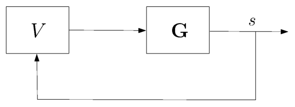

> Image description: A block diagram illustrating a feedback control loop, labeled as "Fig. 2 Feedback loop $V / \mathbf{G}$" in the caption. The diagram consists of two primary rectangular blocks connected in a circular series. The first block is labeled with the variable $V$. An arrow originates from the right side of block $V$ and points toward the left side of the second block, labeled with the variable $\mathbf{G}$. From the right side of block $\mathbf{G}$, an output arrow points to the right, labeled with the variable $s$. A feedback line originates from the output path after block $\mathbf{G}$ and travels downward and to the left, eventually pointing upward into the bottom of block $V$, completing the closed-loop system. The diagram represents a standard control system structure where the output $s$ is fed back to the input of block $V$, creating a dependency between the output and the input.
Supervisory Control of Discrete-Event Systems, Fig. 2 Feedback loop $V / \mathbf{G}$

## Existence of Controls for DES: Controllability

Of fundamental interest is the question: what sublanguages of $L(\mathbf{G})$ qualify as a language $L(V / \mathbf{G})$ for some choice of supervisory control function $V$ ? In other words, what is the scope of controlled behavior(s) for a given $\mathbf{G}$ ? So far we know that $L(V / \mathbf{G})$ is a sublanguage of $L(\mathbf{G})$, but it is not usually the case that an arbitrary sublanguage would qualify. For instance, the empty string language $\{\epsilon\} \neq L(V / \mathbf{G})$ for any $V$ as in (2) above, in case $\delta\left(q_{o}, \sigma\right)!$ for some $\sigma$ in $\Sigma_{u}$, for such $\sigma$ cannot be disabled.

Assume $\mathbf{G}$ is equipped with the technology of controllable events, hence uncontrollable events $\Sigma_{u} \subseteq \Sigma$. We make the basic definition: the language $K \subseteq \Sigma^{*}$ is controllable (with respect to $\mathbf{G}$ ) provided

For all $s \in \bar{K}$ and for all $\sigma \in \Sigma_{u}$,

$$
\begin{equation*}
\text { whenever } s . \sigma \in L(\mathbf{G}) \text { then } s . \sigma \in \bar{K} \text {. } \tag{5}
\end{equation*}
$$

Informally, a string $s$ can never exit from $\bar{K}$ as the result of the execution by $\mathbf{G}$ of an uncontrollable event: $\bar{K}$ is invariant under the uncontrollable flow. In terms of $\mathbf{G}=\mathbf{M A C H}$, above, the languages $\{\epsilon\},\{w b, w c\}$ are controllable, but $\{w\},\{w, w c w\}$ are not. For instance, $H:=\{w, w c w\}$ has closure $\bar{H}=\{\epsilon, w, w c, w c w\}$, which contains the string $s:=w$, but $s b=w b$ can be executed in MACH, $b$ is uncontrollable, and $s b$ has exited from $\bar{H}$. It is logically trivial from (5) that the empty language $\emptyset$ (with no strings whatever) is controllable.

We can now answer the fundamental question posed above.

Given a nonempty sublanguage $K \subseteq L(\mathbf{G})$, there exists a supervisory control function $V$
such that $\bar{K}=L(V / \mathbf{G})$, if and only if $K$ is controllable.

This result exhibits the $L(V / \mathbf{G})$ property in a structured way; furthermore, both the containment $K \subseteq L(\mathbf{G})$ and the controllability property (5) (or its absence) can be effectively (algorithmically) decided in case $K$ itself is the closed or marked behavior of some given DES over $\Sigma$.

A key fact easily provable from (5) is that the family of all controllable languages (with respect to a fixed $\mathbf{G}$ ) is algebraically closed under union, namely,

If $K_{1}$ and $K_{2}$ are controllable languages,

$$
\begin{equation*}
\text { then so is } K_{1} \cup K_{2} . \tag{7}
\end{equation*}
$$

In fact (7) can be extended to an arbitrary finite or infinite union of controllable languages.

Given $\mathbf{G}$ as above, considered as the plant to be controlled, suppose a new (regular) language $E$ is specified, as the maximal set of strings that we are prepared to tolerate for generation by $\mathbf{G}$; for instance, $E$ could be considered the legal language for $\mathbf{G}$ (irrespective of what $\mathbf{G}$ is potentially capable of generating, namely, $L(\mathbf{G})$ ). Let us confine attention to the sublanguage of $E$ that contains only marked strings of $\mathbf{G}$, namely, $E \cap L_{m}(\mathbf{G})$. We now bring in the family $\mathcal{C}(E \cap \left.L_{m}(\mathbf{G})\right)$ of all controllable sublanguages of $E \cap L_{m}(\mathbf{G})$ (including the empty language). From (7) and its infinite extension, there follows the existence of the controllable language

$$
\begin{equation*}
K_{\text {sup }}:=\cup\left\{K \mid K \in \mathcal{C}\left(E \cap L_{m}(\mathbf{G})\right)\right\} \tag{8}
\end{equation*}
$$

We have $K_{\text {sup }} \subseteq E \cap L_{m}(\mathbf{G})$, and clearly if $K^{\prime}$ is controllable and $K^{\prime} \subseteq E \cap L_{m}(\mathbf{G})$, then $K^{\prime} \subseteq K_{\text {sup }} . K_{\text {sup }}$ is therefore the supremal (largest) controllable sublanguage of $E \cap L_{m}(\mathbf{G})$. Furthermore, if $K_{\text {sup }}$ is nonempty, then by (6) there exists a supervisory control $V$ such that

<!-- source_pdf_page: 1418 -->
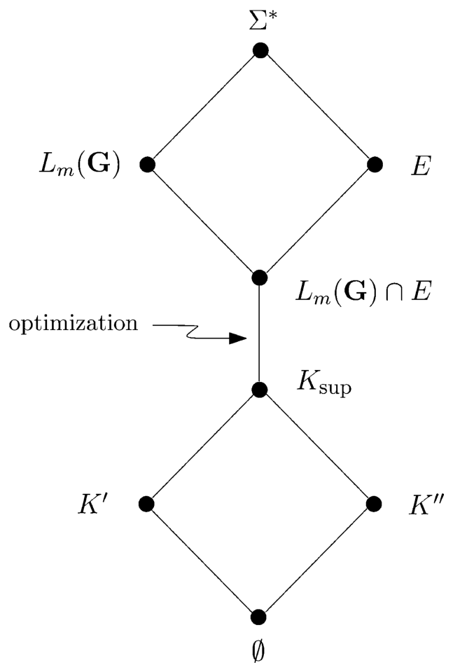

> Image description: A Hasse diagram illustrates a hierarchical relationship between mathematical sets, organized in a diamond-shaped lattice structure. At the top of the diagram is the set $\Sigma^*$, which branches downward into two intermediate sets: $L_m(\mathbf{G})$ on the left and $E$ on the right. These two sets converge at a junction labeled $L_m(\mathbf{G}) \cap E$, representing their intersection. Below this intersection, a vertical line segment points toward a node labeled $K_{\text{sup}}$. A thin arrow labeled "optimization" points directly to this vertical segment, indicating an optimization process occurring between the intersection and the supervisor. From $K_{\text{sup}}$, the diagram branches downward into two more sets, $K'$ and $K''$, which finally converge at the bottom-most element, the empty set $\emptyset$. The diagram visually represents the hierarchical structure of supervisory control for discrete-event systems, showing how a supervisor $K_{\text{sup}}$ is derived from the intersection of plant languages.
Supervisory Control of Discrete-Event Systems, Fig. 3 Hasse diagram

$K_{\text {sup }}=L(V / \mathbf{G})$; in this sense $V$ is optimal (maximally permissive), allowing the generation by $\mathbf{G}$ of the largest possible set of marked strings that the designer considers legal. We have thus established abstractly the existence and uniqueness of an optimal control for given $\mathbf{G}$ and $E$. This simple conceptual picture is displayed (Fig. 3) as a Hasse diagram, in which nodes represent sublanguages of $\Sigma^{*}$ and rising lines (edges) the relation of sublanguage containment.

In a Hasse diagram it could be that $K_{\text {sup }}$ collapses to the empty language $\emptyset$. This means that there is no supervisory control for the problem considered, either because the specifications are too severe and the problem is over-constrained or because the control technology is inadequate (more events need to be controllable).

Under the finite-state assumption, $K_{\text {sup }}$ is effectively representable by a DES KSUP, which may serve as the optimal feedback controller, as displayed in Fig. 4. Here a string $s$ generated by G drives KSUP; at each state of KSUP, the events defined in its transition structure are exactly those available to $\mathbf{G}$ for nondeterministic execution (in its corresponding state) at the next

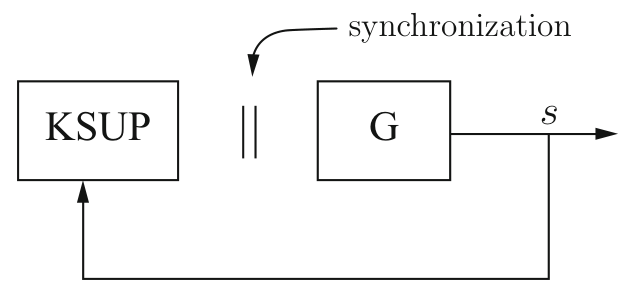

> Image description: This diagram illustrates a feedback control loop consisting of two main functional blocks: **KSUP** and **G**. The block labeled **G** produces an output variable denoted as $s$. This output $s$ is fed back into the **KSUP** block via a feedback loop at the bottom of the diagram. A label "synchronization" with a curved arrow points towards the space between the two blocks, specifically directed at double vertical lines ($\parallel$) that represent the interconnection or synchronization between the controller and the system. In engineering terms, the diagram depicts a control system where a controller (**KSUP**) regulates a system (**G**) through a feedback loop. The output string $s$ from the system acts as the input to the controller. The synchronization symbol indicates that the transition events in the controller's finite-state structure are aligned with the nondeterministic execution capabilities of the system.
Supervisory Control of Discrete-Event Systems, Fig. 4 Implementation of $V / \mathbf{G}$

step of the process. In this way the feedback control process is inductively well defined. The computational complexity of this design (cf. (8)) is $O\left(|\mathbf{E}|^{2} \cdot|\mathbf{G}|^{2}\right)$ where $\mathbf{E}$ is a DES with $L_{m}(\mathbf{E})=E$ and $|\cdot|$ denotes state size. The controller state size is $|\mathbf{K S U P}| \leq|\mathbf{E}| \cdot|\mathbf{G}|$, the product bound being of typical order.

## Supervisory Control Design: Small Factory

The following example, Small Factory (SF), is an illustration of supervisor design. As in Fig. 5, SF consists of two machines MACH1 and MACH2 each similar to MACH above, connected by a buffer BUF of capacity 2. In case of breakdown the machines can be repaired by a SERVICE facility as shown. Transition structures of the machines and design specifications are also displayed in Fig. 5. $\Sigma_{c}\left(\Sigma_{u}\right)$ are odd (even) numbered events. When self-looped with all irrelevant events to form BUFSPEC, the latter specifies that the machines must be controlled in such a way that BUF is not overflowed (an attempt by MACH1 to deposit a workpiece in BUF when it is full) or subject to underflow (an attempt by MACH2 to take a workpiece from BUF when it is empty). In addition, SERVICE must enforce priority of repair for MACH2: when the latter is down, repair of MACH1 (if in progress) must be interrupted and only resumed after MACH2 has been repaired; this logic is expressed by BRSPEC (appropriately self-looped). To form the plant model $\mathbf{G}$ for the DES to be controlled, we compute the synchronous product of MACH1 and MACH2. The result, say $\mathbf{G}=\mathbf{F A C T}$, is a DES of which the components MACHi are free

<!-- source_pdf_page: 1419 -->
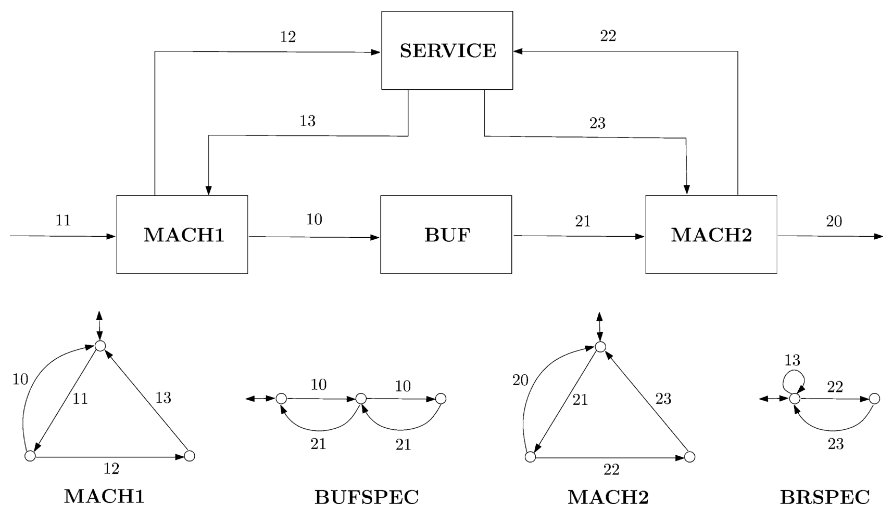

> Image description: An engineering diagram titled "Fig. 5 Small factory" illustrates the supervisory control of a discrete-event system. The top part features a block diagram of interconnected components. A signal flows from left to right through **MACH1**, **BUF**, and **MACH2**. An external input (11) enters **MACH1**, and an output (20) exits **MACH2**. **MACH1** and **MACH2** are connected to a central **SERVICE** block through various control signals: 12 and 13 from **MACH1**, and 22 and 23 to **MACH2**. The **BUF** (buffer) block receives signal 10 from **MACH1** and sends signal 21 to **MACH2**. The bottom portion provides state-transition diagrams for the components: * **MACH1**: A triangular state graph with transitions 10, 11, 12, and 13. * **BUFSPEC**: A linear transition model with signals 10 and 21. * **MACH2**: A triangular state graph with transitions 20, 21, 22, and 23. * **BRSPEC**: A cyclic state graph involving transitions 13, 22, and 23.
Supervisory Control of Discrete-Event Systems, Fig. 5 Small factory

to execute their events independently except for synchronization on events that are shared (here, none). Similarly we form the synchronous product of BUFSPEC and BRSPEC to obtain the full specification DES SPEC. We now execute the optimization step in the Hasse diagram (Fig. 3); this yields the SF controller KSUP(21,47) with 21 states and 47 transitions. Online synchronization of KSUP with FACT will result in generation of the optimal controlled behavior $K_{\text {sup }}$ by the feedback loop. Since $K_{\text {sup }} \subseteq L_{m}(\mathbf{G})$ by (8), our marking conventions ensure that KSUP is nonblocking.

In general the language $K_{\text {sup }}$ will include in its structure not only the constraints required by control but also the physical constraints enforced by the plant structure itself (here, FACT). The latter are thus redundant in the online synchronization of the plant with the controller KSUP. A more economical controller is obtained if the plant constraints are projected out of KSUP to obtain a reduced controller, say KSIM. Mathematically, projection amounts to constructing a control congruence or dynamically (and control) consistent partition on the state set of KSUP and taking the cells of this partition, abstractly, as the new
states for KSIM. In SF KSUP $(21,47)$ is reduced to $\mathbf{K S I M}(5,18)$, which when synchronized with FACT yields exactly KSUP but is less than onequarter the state size. In practice a state size reduction factor of ten or more is not uncommon.

## Supervisor Architecture and Computation

As noted earlier, the state size $|\mathbf{K S U P}|$ of controller KSUP is on the order of the product of state sizes of the plant, say |PLANT|, and specification, say $|\mathbf{S P E C}|$. As these in turn are the synchronous products of individual plant components or partial specifications, $|\mathbf{K S U P}|$ tends to increase exponentially with the numbers of plant components and specifications, the phenomenon of exponential state space explosion. The result is that centralized or monolithic controllers such as KSUP can easily reach astronomical state sizes in realistic industrial models, thereby becoming infeasible in terms of computer storage for practical design. This issue can be addressed in two basic ways: by decentralized and hierarchical architectures, possibly in heterarchical

<!-- source_pdf_page: 1420 -->
combination, and by symbolic DES representation and computation, where what is stored are not DES and their controller transition structures in extensional (explicit) form, but instead intensional or algorithmic recipes from which the required state and control variable evaluations are computed online when actually needed.

## Supervisory Control Under Partial Observations

Hierarchical control is one example of control under partial observations, a high-level manager (say) observing not full low-level operation but rather an abstraction. Partial observation has been studied mainly for abstractions given by natural projections. For a DES $\mathbf{G}$ over alphabet $\Sigma$, let $\Sigma_{o} \subseteq \Sigma$ be a subalphabet interpreted as the events that can be recorded by some external observer. A mapping $P: \Sigma^{*} \rightarrow \Sigma_{o}^{*}$ is called a natural projection if its action is simply to erase from a string $s$ in $\Sigma^{*}$ all the events in $s$ (if any) that do not belong to $\Sigma_{o}$, while preserving the order of events in $\Sigma_{o} . P$ extends naturally to a mapping of languages over $\Sigma$. One can then implement an induced operator on DES, say Project $(\mathbf{G})=\mathbf{P G}$, with semantics

$$
L_{m}(\mathbf{P G})=P L_{m}(\mathbf{G}), L(\mathbf{P G})=P L(\mathbf{G}) .
$$

While in worst cases $|\mathbf{P G}|$ can be exponentially larger than $|\mathbf{G}|$, such blowup seems to be rare, and typically $|\mathbf{P G}| \leq|\mathbf{G}|$, namely, $P$ results in simplification of the model $\mathbf{G}$. By use of $P$ it is possible to carry over to DES the controltheoretic concept of observability. Two strings $s, s^{\prime} \in \Sigma^{*}$ are look-alikes with respect to $P$ if $P s=P s^{\prime}$, namely, are indistinguishable to an observer (or channel) modeled by $P$. Thus, given $\mathbf{G}$ and $P$ as above, a sublanguage $K \subseteq L(\mathbf{G})$ is observable if, roughly, look-alike strings in $\bar{K}$ have the same one-step extensions in $\bar{K}$ that are compatible with membership in $L(\mathbf{G})$ and also satisfy a consistency condition with respect to membership in $L_{m}(\mathbf{G})$. For control under observations through $P$, one defines a supervisory
control function $V: L(\mathbf{G}) \rightarrow \operatorname{Pwr}(\Sigma)$ to be feasible if it assumes the same value on look-alike strings, in other words respects the observation constraint enforced by $P$. It then turns out that a language $K \subseteq L_{m}(\mathbf{G})$ can be synthesized in a feedback loop including $\mathbf{G}$ and the feedback channel $P$ if and only if $K$ is both controllable and observable.

Although this result is conceptually satisfying, it is computationally inconvenient because, by contrast with controllability, the property of sublanguage observability is not in general closed under union. A substitute for observability is sublanguage normality, a stronger property than observability but one that is indeed closed under union. Since the family of controllable and normal sublanguages of a given specification language is nonempty (the empty language belongs) and is closed under union, a (unique) supremal (or optimal) element exists and can be computed; it therefore solves the problem of supervisory control under partial observations, albeit under the normality restriction. The latter has the feature that the resulting supervisor can only disable a controllable event if the latter is observable, i.e., belongs to $\Sigma_{o}$. In some applications this restriction might preclude the existence of a solution altogether; in others it could be harmless, or even desirable as a safety property, in that if the intended disablement of a controllable event happened to fail, and the event occurred after all, the fault would necessarily be observable and thus optimistically remediable in good time.

An intermediate property is known that is weaker than normality but stronger than observability, called relative observability. The family of relatively observable sublanguages of a given specification language is closed under union and thus does possess a supremal element, which in the regular case can be effectively computed. When combined with controllability, relative observability yields a solution to the problem of supervisory control under partial observations which places no limitation on the disablement of unobservable controllable events. Examples show that a nontrivial solution of this type may exist in cases where the normality solution is empty.

<!-- source_pdf_page: 1421 -->
## Summary and Future Directions

Supervisory control of discrete-event systems, while relatively new, has reached a first level of maturity in that it is soundly based in a standard framework of (especially) finitestate machines and regular languages. It has effectively incorporated its own versions of control-theoretic concepts like stability (in the sense of nonblocking), controllability, observability, and optimality (in the sense of maximal permissiveness). Modular architectures and, on the computational side, symbolic approaches enable design of both monolithic and heterarchical/distributed controllers for DES models of industrial size. Major challenges remain, especially to develop criteria by which competing architectures can be meaningfully compared and to organize control functionality in ways that are not only tractable but also transparent to the human user and designer.

## Cross-References

- Applications of Discrete-Event Systems
- Models for Discrete Event Systems: An Overview

## Bibliography

Cassandras CG, Lafortune S (2008) Introduction to discrete event systems. Springer, New York
Cieslak R, Desclaux C, Fawaz A, Varaiya P (1988) Supervisory control of discrete-event processes with partial observations. IEEE Trans Autom Control 33:249-260
Lin F, Wonham WM (1988) On observability of discreteevent systems. Inf Sci 44:173-198
Ma C, Wonham WM (2005) Nonblocking supervisory control of state tree structures. Lecture notes in control and information sciences, vol 317. Springer, Berlin
Ramadge PJ, Wonham WM (1987) Supervisory control of a class of discrete event processes. SIAM J Control Optim 25:206-230
Seatzu C et al (ed) (2013) Control of discrete-event systems. Springer, London/New York
Wonham WM (1997-2013) Supervisory control of discrete-event systems. Department of Electrical and Computer Engineering, University of Toronto. Available at http://www.control.utoronto.ca/~wonham

# Switching Adaptive Control

Minyue Fu School of Electrical Engineering and Computer Science, University of Newcastle, Callaghan, NSW, Australia

#### Abstract

Switching adaptive control is one of the advanced approaches to adaptive control. By employing an array of simple candidate controllers, a properly designed monitoring function and switching law, this approach is capable to search in real time for a correct candidate controller to achieve the given control objective such as stabilization and set-point regulation. This approach can deal with large parameter uncertainties and offers good robustness against unmodelled dynamics. This article offers a brief introduction to switching adaptive control, including some historical background, basic concepts, key design components, and technical issues.

## Keywords

Adaptive control; Hybrid systems; Multiple models; Supervisory control; Switching logic; Uncertain systems

## Introduction

Switching adaptive control, also known as switched adaptive control or multiple model adaptive control, refers to an adaptive control technique which deploys a set of controllers and a switching law to achieve a given control objective. The concept of switching adaptive control is generalized from the traditional gain scheduling technique (Leith and Leithead 2000). As in the standard adaptive control setting, the model for the controlled plant is assumed to contain uncertain parameters, and the control objective is to stablize the system and, in many cases, to deliver certain performance using

<!-- source_pdf_page: 1422 -->
real-time information in the measured output. What differentiates switching adaptive control from gain scheduling is that the uncertain parameters are not directly measured and the switching is determined by the system response. This seemingly minor difference is very important because parameter estimation may not be possible due to the lack of persistent excitation; moreover, the sensitivity of the measured output is often suppressed by the feedback control which makes closed-loop identification of the uncertain parameters difficult. Compared with classical adaptive control, switching adaptive control has better inherent robustness against parameter uncertainties and unmodelled dynamics.

By early 1980s, the classical adaptive control theory for linear systems had been well established under a set of so-called classical assumptions, which include:

- Known order of the plant (or known maximum order of the plant)
- Known relative degree of the plant
- Minimum phase dynamics
- Known sign of the high-frequency gain (which is the gain of the plant when the input is highfrequency sinusodial signal)
At the same time, it was recognized that the classical adaptive control approach has inherent robustness problems against even miniature unmodelled dynamics (Rohrs et al. 1985). While this generated a wave of research aiming at robustification of the classical adaptive control theory (see, e.g., Ioannou and Sun 1996), a new line of research took place aiming at relaxing the classical assumptions. Nussbaum (1983) paved the way by showing that knowledge of the sign of the high-frequency gain can be avoided for a first order linear system. Morse (1985) developed a "universal controller" which can adaptively stablize any strictly proper, minimum-phase system with relative degree not exceeding two. Martensson (1985) gave a very surprising result by showing that asymptotic stabilization can be achieved adaptively by simply assuming that there exists a finite order stabilizer. But Martensson's controller is impractical due to the need for exhaustive online search of the stabilizer and subsequent excessively high overshoots. Switching adaptive
control was then introduced in Fu and Barmish (1986), aiming at achieving adaptive stabilization with minimal assumptions and a guarantee of exponential convergence rate for the state. In contrast to the work of Martensson, a compactness requirement is made on the set of possible plants and an upper bound on the order of the plant is assumed. These assumptions allow a set of possible plants to be partitioned into a finite number of subsets, with each stabilizable by a single controller. A monitoring function and a switching law are then designed to sequentially eliminate incorrect candidate controllers until an appropriate controller is found. Due to the fact that the number of candidate controllers may be large, many follow-up works on switching adaptive control focused on speeding up the switching process by eliminating incorrect candidate controllers without trying them (Zhivoglyadov et al. 2000, 2001). These results can also deal with slowly time-varying parameters and infrequent parameter jumps.

Another major breakthrough came from the works of Morse $(1996,1997)$ under the term of supervisory control. His work considers setpoint regulation for uncertain linear systems. A different compactness requirement is used to allow unmodelled dynamics in the system. More specifically, the given uncertain linear system is assumed to belong to a union of sub-families of systems, with each sub-family having a linear controller capable to achieve set-point regulation. Suitably defined output-squared estimation errors are used as monitoring functions and a candidate controller is selected whose corresponding performance signal is the smallest. The major advantages of this switching law are that the "correct" controller can usually be quickly identified without cycling through all possible candidate controllers, leading to a good closed-loop performance.

More recent research on switching adaptive control focuses on more systematic and alternative approaches to the design of candidate controllers and switching laws; see, e.g., Anderson et al. (2000), Hespanha et al. (2001), and Morse (2004). Generalizations to nonlinear systems are also found Battistelli et al. (2012).

<!-- source_pdf_page: 1423 -->
## Design of Switching Adaptive Control

A switching adaptive controller consists of the following key ingredients:

- Design of control covering
- Design of monitoring function
- Selection of dwell time

For illustrative purposes, we consider an adaptive stabilization problem where the system has the following model:

$$
\begin{aligned}
& \dot{x}(t)=A x(t)+B u(t) \\
& y(t)=C x(t)
\end{aligned}
$$

with state $x(t) \in R^{n}$ for some $1 \leq n \leq n_{\text {max }}$ and the measured output $y(t) \in R^{r}$. The given set of uncertain plants $\Sigma$ consits of triplets ( $A, B, C$ ) and we use the notation $\Sigma^{(n)}$ to denote the subset of $\Sigma$ consisting of those plants having order $n$. It is assumed that every possible plant $(A, B, C) \in \Sigma$ is a minimal realization (i.e., both controllable and observable) and that every $\Sigma^{(n)}$ is a compact set (i.e., it is closed and bounded). The control objective is to design an adaptive controller to drive the state to zero asymptotically, i.e., $x(t) \rightarrow$ 0 as $t \rightarrow \infty$. It is clear that each possible plant in $\Sigma$ admits a linear dynamic stabilizer. An alternative description of the uncertain plant is introduced in Morse $(1996,1997)$ where its transfer function is a member of a continuously parameterized set of admissible transfer functions of the form

$$
\Sigma \subset \bigcup_{p \in \mathcal{P}}\left\{v_{p}+\delta:\|\delta\| \leq \varepsilon_{p}\right\}
$$

In the above, $\mathcal{P}$ is a compact set in a finite dimensional space, $v_{p}$ is a nominal transfer function with its coefficients depending continuously on $\mathrm{p}, \delta$ is the transfer function of some unmodelled dynamics, $\|\delta\|$ represents a shifted $H_{\infty}$ norm (obtained by first shifting the poles of $\delta$ slightly to the right and then computing its $H_{\infty}$ norm), and $\varepsilon_{p}$ is sufficiently small so that each set of plants $\left\{\nu_{p}+\delta:|\delta| \leq \varepsilon\right\}$ is stabilizable by a single controller for all $p \in \mathcal{P}$.

Control covering: The purpose is to decompose the given set of plants into a union of subsets such that each subset $P_{i}$ admits a single controller $K_{i}$ (called candidate controller) to achieve the given control objective. This is typically done using two properties: inherent robustness of linear controllers and the existence of a finite cover for any compact set. More specifically, if a candidate controller renders a desired control objective for a given plant, then the same objective is maintained when the plant is perturbed slightly. For example, Fu and Barmish (1986) uses the fact that if a given plant is stabilized by a controller then the same controller stabilizes all the plants with sufficiently small parameter perturbations. Similarly, Morse $(1996,1997)$ uses the fact that the same controller achieves set-point regulation for a small neighborhood of plants. Combining this property with the finite covering property yields

$$
\Sigma=\bigcup_{i=1}^{N} \Sigma_{i}
$$

such that each subset $\Sigma_{i}$ admits a single controller $K_{i}$.

Monitoring Function: The generation of the adaptive switching controller is accomplished using a switching law or switching logic whose task is to determine, at each time instant, which candidate controller is to be applied. The core of the switching law is a monitoring function. Its very basic role is to be able to detect whether the applied candidate controller is consistent with the corresponding plant subset so that wrong candidate controllers can be eliminated one by one until an appropriate controller is found. A major difficulty for switching adaptive control design is that persistent excitation is not assumed. Consequently, it is not always possible to detect the correct plant subset using the measured output. The key idea is to check which plant subsets are consistent with the generated output.

One simple monitoring function uses a finitetime $L_{2}$ norm of the measured output:

$$
V(t, \tau)=\int_{t-\tau}^{t}\|y(s)\|^{2} d s
$$

<!-- source_pdf_page: 1424 -->
where $\tau$ is the so-called dwell time. It turns out that for some properly chosen dwell time, a correctly applied candidate controller is able to guarantee some decay property for the monitoring function, i.e., $V(t, \tau) \leq e^{-\lambda \tau} V(t-\tau, \tau)$ for some $\lambda>0$. This property is sufficient to allow a wrong candidate controller to be eliminated. However, much smarter monitoring functions can be designed so that infeasible candidate controllers (those not corresponding to the true plant) can be eliminated without even being applied. This can be done using the falsification approach in parameter estimation where the basic idea is to eliminate all plant subsets $\Sigma_{i}$ inconsistent with the measured output signal. For example, consider the following discrete-time model:

$$
\begin{aligned}
y(t)= & -a_{1} y(t-1)-a_{2} y(t-2) \\
& +b_{1} u(t-1)+b_{2} u(t-2)+w(t)
\end{aligned}
$$

where $a_{i}$ and $b_{i}$ are uncertain parameters and $\mathrm{w}(\mathrm{t})$ is a bounded disturbance, i.e., $|w(t)| \leq \delta$ for some $\delta$. For this example, we may eliminate all the uncertain parameter subsets which violate the following constraint (Zhivoglyadov et al. 2000):

$$
\begin{aligned}
& \mid y(t)+a_{1} y(t-1)+a_{2} y(t-2) \\
& \quad-b_{1} u(t-1)-b_{2} u(t-2) \mid \leq \delta
\end{aligned}
$$

More generally, one can use the so-called multiestimator (Morse 1996, 1997) which involves an array of estimators, one for each plant subset $\Sigma i$ using its nominal model. The output estimation error $e$, $(l)$ for each such estimator is then used to construct a monitoring function, e.g.,

$$
V_{i}(t, \tau)=\int_{t-\tau}^{t} e^{-2 \lambda(t-s)}\left\|e_{i}(s)\right\|^{2} d s
$$

where $\tau$ is the dwell time as before and $\lambda>0$ is an exponential weighting parameter used to guarantee the decay rate of the monitoring function as before. Instead of using the monitoring functions to eliminate infeasible candidate controllers, the candidate controller corresponding to the least estimation error, as measured by the least monitoring function, is selected. The main advantage
of the multi-estimator based monitoring functions is that falsification of candidate controllers is done implicitly and a "correct" controller can be quickly reached, leading to good performance.

Dwell Time: The dwell time $\tau$ as defined above is a critical component in switching adaptive control. Serving in the monitoring function, this is the minimum nonzero amount of time for a candidate controller to be applied before switching. That is, this provides a sufficient time lag to build the monitoring function so that its exponential decay property is detected when a correct candidate controller is applied. This will allow detection of infeasible plant subsets and selection of a "correct" controller. The use of a dwell time also avoids arbitrarily fast switching, thus gauranteeing the solvability of the system dynamics.

The dwell time can be selected a priori by using the fact that if a matrix $A$ is stable, then there exist some positive values $\lambda$ and $\tau$ such that $\left\|e^{A t}\right\| \leq e^{-\lambda \tau}$ for all $i>\tau$. This leads to the desired exponential decaying property

$$
V(t, \tau) \leq e^{-\lambda \tau V}(t-\tau, \tau)
$$

for the aforementioned monitoring function for adaptive stabilization.

Alternatively, the dwell time can be chosen implicitly. Hespanha et al. (2001) suggest a hysteresis switching logic method. This method employs a hysteresis parameter $h>0$. Suppose the candidate controller $K_{j}$ is applied at time $t_{i}$, then $K_{j}$ is kept until the next switching time $t_{i+1}$ which is the minimum $t \leq t_{i}$, such that

$$
(1+h) \min _{1 \leq k \leq N} V_{k}\left(t, t-t_{i}\right) \leq V_{j}\left(t, t-t_{i}\right)
$$

Because $\mathrm{h}>0$, the time difference $t_{l+1}-t_{i}>0$ is lower bounded, which implies the existence of a dwell time.

## Summary and Future Directions

Switching adaptive control is a conceptually simple control technique capable to deal with large

<!-- source_pdf_page: 1425 -->
parameter uncertainties. The use of simple candidate controllers (typically linear) imply good closed-loop behavior and good robustness against unmodelled dynamics. Although the discussion above assumes that the number of plant subsets is finite, this assumption is not essential; see Anderson et al. (2000).

Switching adaptive control renders the closedloop system a switched system or hybrid system, for which a wide range of tools are available to aid the analysis of such a system; see, e.g., Liberzon (2003). However, unique features of such a system arise from the fact that the switching mechanism is chosen by the designer, rather than being a part of the given plant. How to best design the switching mechanism is an interesting issue.

Future works for switching adaptive control include:

1. How to simplify the design of candidate controllers. Finite covering based design often yields a large number of plant subsets, hence a large number of candidate controllers. Since most of the candidate controllers do not need to apply (which is the case when falsification based switching logic is used, for example), smarter ways are needed for the design of candidate controllers.
2. Wider applications. Most of the research so far focuses on stabilization and set-point regulation (which is essentially a stabilization problem). How to incorporate general performance criteria is an essential and yet challenging issue.
3. Better design of monitoring functions and the corresponding switching logic. Most existing monitoring functions use a finite-time $L_{2}$ norm of the output (or regulation error), with the key feature that some exponential decay property is guaranteed when the candidate controller is "correct." Note that the key purpose of the monitoring function and the corresponding switching logic is to allow fast falsification of infeasible candidate controllers. Thus, a much wider range of monitoring functions can possibly be used. In particular, how to incorporate set membership identification techniques (Milanese and Taragna 2005) may be of particular interest.

## Cross-References

- Adaptive Control, Overview
- Hybrid Dynamical Systems, Feedback Control of
- Robust Model-Predictive Control
- Stability and Performance of Complex Systems Affected by Parametric Uncertainty

## Bibliography

Anderson BDO, Brinsmead T, Bruyne FD, Hespanha JP, Liberzon D, Morse AS (2000) Multiple model adaptive conrol. Part 1: finite controller coverings. Int J Robust Nonlinear Control 10(11-12):909-929
Battistelli G, Hespanha JP, Tesi P (2012) Supervisory control of switched nonlinear systems. Int J Adapt Control Signal Process 26(8):723-738. Special issue on Recent Trends on the Use of Switching and Mixing in Adaptive Control
Fu M, Barmish BR (1986) Adaptive stabilization of linear systems via switching control. IEEE Trans Autom Control 31(12): 1097-1103
Hespanha JP, Liberzon D, Morse AS, Anderson BDO, Brinsmead T, Bruyne FD (2001) Multiple model adaptive control. Part 2: switching. Int J Robust Nonlinear Control 11:479-496
Ioannou P, Sun J (1996) Robust adaptive control. Prentice Hall, Upper Saddle River
Leith DJ, Leithead WE (2000) Survey of gain-scheduling analysis and design. Int J Control 73(11):1001-1025
Liberzon D (2003) Switching in systems and control. Birkhäuser, Boston
Martensson B (1985) The order of any stabilizing regulator is sufficient information for adaptive stabilization. Syst Control Lett 6:87-91
Milanese M, Taragna M (2005) $H$-infinity set membership identification: a survey. Automatica 41:20192032
Morse AS (1985) A three-dimensional universal controller for the adaptive stabiliztion of any strictly proper minimum-phase system with relative degree not exceeding two. IEEE Trans Autom Control 30(12):1188-1191
Morse AS (1996) Supervisory control of famillies of linear set-point controllers part I: exact matching. IEEE Trans Autom Control 41(10): 1413-1431
Morse AS (1997) Supervisory control of families of linear set-point controllers part II: robustness. IEEE Trans Autom Control 42(11): 1500-1515
Morse AS (2004) Lecture notes on logically switched dynamical systems. In: Nistri P, Stefani G (eds) Nonlinear and optimal control theory. Springer, Berlin, pp 61-162
Nussbaum RD (1983) Some remarks on a conjecture in parameter adaptive control. Syst Control Lett 3:243-246

<!-- source_pdf_page: 1426 -->
Rohrs CE, Valavani L, Athans M, Stein G (1985) Robustness of continuous-time adaptive control algorithms in the presence of un-modeled dynamics. IEEE Trans Autom Control 30(9):881-889
Zhivoglyadov PV, Middleton RH, Fu M (2000) Localization based switching adaptive control for time-varying discrete-time systems. IEEE Trans Autom Control 45(4):752-755
Zhivoglyadov PV, Middleton RH, Fu M (2001) Further results on localization based switching adaptive control. Automatica 37:257-263

## Synthesis Theory in Optimal Control

Ugo Boscain ${ }^{1,2}$ and Benedetto Piccoli ${ }^{3}$ ${ }^{1}$ CNRS CMAP, École Polytechnique, Palaiseau, France ${ }^{2}$ Team GECO INRIA Saclay, Palaiseau, France ${ }^{3}$ Mathematical Sciences and Center for Computational and Integrative Biology, Rutgers University, Camden, NJ, USA

#### Abstract

In this entry we review the theory of optimal synthesis. We describe the steps necessary to solve an optimal control problem and the sufficient conditions for optimality given by the theory. We describe some relevant examples that have important applications in mechanics, in the theory of hypo-elliptic operators and for the study of models of geometry of vision. Finally, we discuss the problem of optimal stabilization and the difficulties encountered if one tries to give the solution to the problem in feedback form.

## Keywords

Affine control systems; Extremals; Pontryagin Maximum Principle; Sub-Riemannian geometry; Time-optimal synthesis

## Optimal Control

An optimal control problem with fixed initial and terminal conditions can be seen as a problem
of calculus of variations under nonholonomic constraints:

$$
\begin{gather*}
\dot{q}(t)=f(q(t), u(t))  \tag{1}\\
\int_{0}^{T} L(q(t), u(t)) d t \rightarrow \min (T \text { fixed or free })  \tag{2}\\
q(0)=q_{0}, q(T)=q_{1} \tag{3}
\end{gather*}
$$

Here we make the following set of assumptions:
(H) $q$ belongs to a finite-dimensional smooth manifold $M$ of dimension $n$. As a function of time $q($.$) is assumed to be Lipschitz continuous.$ The control $u($.$) is a L^{\infty}$ function taking values in a set $U \subset \mathbb{R}^{m}$. For simplicity, we assume that the functions $f$ and $L$, defined on $M \times \mathbb{R}^{m}$, are smooth.

The dynamics $\dot{q}(t)=f(q(t), u(t))$ play the role of the nonholonomic constraint (nonholonomic means that it is a constraint on the velocity but not necessarily on the position).

Solving an optimal control problem in general is a very difficult task. Usually, to attack such a problem, the steps are the following:

- STEP 0: EXISTENCE. First, one has to guarantee the existence of a solution to (1)-(3). The most important sufficient condition for the existence of minimizers is the famous Filippov theorem (see for instance Agrachev and Sachkov (2004) for a proof) saying the following: introduce a new variable (the socalled augmented state) $\hat{q}:=\left(q^{0}, q\right) \in \mathbb{R} \times M$ satisfying the following dynamics:

$$
\begin{align*}
\dot{\hat{q}}(t) & =\binom{\dot{q}^{0}(t)}{\dot{q}(t)}=\binom{L(q(t), u(t))}{f(q(t), u(t))} \\
& =: \hat{f}(\hat{q}(t), u(t)) \tag{4}
\end{align*}
$$

then if (i) $U$ is compact; (ii) the set of velocities $F(\hat{q}):=\{\hat{f}(\hat{q}, u) \mid u \in U\}$ is convex for every $\hat{q}$; (iii) for every $T>0$ and $\hat{q}_{0} \in \mathbb{R} \times M$, there exists a compact set $K \subset \mathbb{R} \times M$ such that all solutions of (4) starting from $\hat{q}_{0}$ stay in $K$ for $t \in[0, T]$; then there exist Lipschitz minimizers. Other theorems that can be applied in more general functional classes or under less restrictive hypotheses can

<!-- source_pdf_page: 1427 -->
be found in the literature. See for instance Bressan and Piccoli (2007), Cesari (1983), and Vinter (2010).

- STEP 1: FIRST ORDER NECESSARY CONDITIONS. In optimal control, the first order necessary conditions for optimality are given by the celebrated Pontryagin Maximum Principle (Pontryagin et al. 1961) (see also Agrachev and Sachkov (2004) for a more recent viewpoint). The Pontryagin Maximum Principle (PMP for short) extends the (Hamiltonian version of the) EulerLagrange equations of calculus of variations to problems with nonholonomic constraints. For a discussion about the relation between variational problems under nonholonomic constrains and variational principles in nonholonomic mechanics, see Bloch (2003).
The PMP restricts the set of candidate optimal trajectories starting from $q_{0}$ to a family of trajectories, called extremals, parameterized by a covector $p(0) \in T_{q_{0}}^{*} M$. In addition, there are two kinds of special extremals: (i) the singular extremals for which the maximization condition given by the PMP does not permit directly obtaining the control and (ii) the abnormal extremals which are candidate optimal trajectories for any cost function. For certain classes of problems, abnormal extremals and singular trajectories coincide.

The set of all trajectories satisfying the PMP (in general having intersections and not being all optimal forever) is called an extremal synthesis. The requirement that the trajectories starting from $q_{0}$ reach the final point $q_{1}$ (at time $T$, fixed or free) is usually not very useful at this step. This requirement is rather made at STEP 4.

## - STEP 2. HIGHER ORDER CONDITIONS.

Higher order conditions are used to restrict further the set of candidate optimal trajectories. The most important conditions are those used to eliminate singular extremals (which usually are very hard to treat) as the Goh condition and the generalized LegendreClebsch conditions (see for instance Agrachev and Sachkov 2004). Other theories that provide higher order conditions (which apply
also to extremals that are not singular) are for instance: higher order maximum principles (Bressan 1985; Krener 1977), generalized Morse-Maslov index theories (Agrachev and Sachkov 2004), and envelope theory (Sussmann 1986, 1989, see also Boscain and Piccoli 2004, Cap. 1.3.2).

- STEP 3. SELECTION OF THE OPTIMAL TRAJECTORIES. This step is the most difficult one. Indeed, one should check that each extremal of the extremal synthesis does not intersect another extremal having a smaller cost at the intersection point. This comparison should be done not only among extremals which are close, one to the other, but among all of them. The problem is indeed global.
One of the techniques to address this problem in a very elegant way takes the name of optimal synthesis theory, and was developed almost together with the birth of the Pontryagin Maximum Principle. This theory dates back to the paper of Boltyanskii (1966) and was further developed by Brunovsky (1980, 1978), Sussmann (1980, 1979), and Piccoli and Sussmann (2000).

Roughly speaking, the theory of optimal synthesis permits to conclude that if one has an extremal synthesis having certain regularity properties, then this extremal synthesis is indeed an optimal synthesis.

An optimal synthesis is a collection of optimal trajectories starting from $q_{0}$ and reaching the various points of the space:
$\mathcal{S}_{q_{0}}=\left\{\gamma_{q}():.\left[0, T_{q}\right] \rightarrow M \mid q \in M, \gamma_{q}\right.$ is a trajectory of (1) minimizing the cost $\int_{0}^{T_{q}} L\left(q(t), u(t) d t\right.$ with $\left.\gamma(0)=q_{0}, \gamma(T)=q\right\}$

An optimal synthesis should also verify the following condition: if $\gamma_{q}$ defined on $[0, T]$ and $\gamma_{q}^{\prime}$ defined on $\left[0, T^{\prime}\right]$ (with $\left.T^{\prime} \in\right] 0, T[$ ) belong to $\mathcal{S}_{q_{0}}$ and we have $q^{\prime}=\gamma_{q}\left(T^{\prime}\right)$ then $\gamma_{q^{\prime}}=\left.\gamma_{q}\right|_{\left[0, T^{\prime}\right]}$. More details are given in the next section.

- STEP 4. SELECTION OF THE TRAJECTORY REACHING THE FINAL POINT. Once an optimal synthesis is computed,

<!-- source_pdf_page: 1428 -->
one selects the optimal trajectory reaching the desired final point solving the equation $\gamma(T)=q_{1}$, in the set of all trajectories belonging to the optimal synthesis.

Remark 1 Notice that one could require that the final point is reached at STEP 1. This would considerably reduce the set of candidate optimal trajectories already at STEP 1, but would not permit to apply the powerful (global) theorems of STEP 3. As a consequence, one would be obliged to compare by hands all extremals going from $q_{0}$ to $q_{1}$.

## Sufficient Conditions for Optimality: The Theory of Optimal Synthesis

There exists a general principle for which every synthesis formed by extremals is optimal under very mild regularity conditions. We will illustrate a classical case of a feedback smooth on a stratification, due to Boltianskii and Brunovsky, see Boltyanskii (1966) and Brunovsky (1980, 1978). More general results can be found in Piccoli and Sussmann (2000). This principle is very strong and is valid only because the synthesis is a global object, while given a single trajectory satisfying PMP, there is no regularity condition which ensures optimality.

For simplicity, from now on, we assume that $M=\mathbb{R}^{n}$ is an Euclidean space and $q_{0}=0$ and indicate by $\mathcal{S}$ a candidate optimal synthesis from 0 , the general case follows easily. A set $P \subset M$ is said a curvilinear open polytope of dimension $p$, if there exists a polytope (i.e., bounded closed region intersection of a finite number of halfspaces) $P^{\prime} \subset \mathbb{R}^{p}$ and a smooth map $\phi: \mathbb{R}^{p} \rightarrow \mathbb{R}^{n}$, injective with jacobian having maximal rank at every point, such that $\phi\left(P^{\prime} \backslash \partial P^{\prime}\right)=P$.

Let $\Omega$ be an open subset of $M$ (for the induced topology) containing the origin in its interior. We say that $\mathcal{S}$ is a Boltyanskii-Brunovsky regular synthesis, briefly BB synthesis, if the following holds.

There exists a 6-tuple $\Xi=\left(\mathcal{P}, \mathcal{P}_{1}, \mathcal{P}_{2}, \Pi, \Sigma, u\right)$ such that
(BB1) $\mathcal{P}$ is a collection of curvilinear open polyhedra and $\Omega$ is disjoint union of elements of $\mathcal{P}$. If $P_{j} \neq P_{k} \in \mathcal{P}$ and $P_{k} \cap \overline{P_{j}} \neq \rho$ then $P_{k} \subset \partial P_{j}$ and $\operatorname{dim}\left(P_{k}\right)<\operatorname{dim}\left(P_{j}\right) .\{0\} \in \mathcal{P}$ and the elements of $\mathcal{P}$ are called "cells".
(BB2) $\mathcal{P} \backslash\{\{0\}\}$ is the disjoint union of $\mathcal{P}_{1}$ (the set of "type I cells") and $\mathcal{P}_{2}$ (the set of "type II cells"),
(BB3) the feedback $u:\left\{q: \exists P_{1} \in \mathcal{P}_{1}, q \in\right. \left.P_{1}\right\} \rightarrow U$ and $\Pi: \mathcal{P}_{1} \rightarrow \mathcal{P}$ are maps, $\Sigma: \mathcal{P}_{2} \rightarrow \mathcal{P}_{1}$ is a multifunction, with non empty values, such that the following properties are satisfied:
(i) The function $u$ is of class $\mathcal{C}^{1}$ on each cell.
(ii) If $P_{1} \in \mathcal{P}_{1}$, then $f(q, u(q)) \in T_{q} P_{1}$ (the tangent space to $P_{1}$ at $q$ ) for every $q \in P_{1}$. In addition, for each $q \in P_{1}$, if we let $\xi_{q}$ be the maximally defined solution to the initial value problem

$$
\begin{equation*}
\dot{\xi}=f(\xi, u(\xi)), \quad \xi(0)=x, \quad \xi \in P_{1}, \tag{5}
\end{equation*}
$$

and define $t_{q}=\sup \operatorname{Dom}\left(\xi_{q}\right)$, then the limit $\xi_{q}\left(t_{q}-\right):=\lim _{t_{\uparrow q}} \xi_{q}(t)$ exists and belongs to $\prod\left(P_{1}\right)$.
(iii) If $P_{2} \in \mathcal{P}_{2}$, then for each $q \in P_{2}$ and $P \in \Sigma\left(P_{2}\right)$ there exists a unique curve $\xi_{q}^{P}:\left[0, t_{q}^{P}[\rightarrow \Omega\right.$ such that the restriction of $\xi_{q}^{P}$ to $\left.] 0, t_{q}^{P}\right]$ is a maximally defined integral curve of the vector field $f(\cdot, u(\cdot))$ on $P$, and $\xi_{q}^{P}(0)=q$.
(iv) On every cell $P_{1} \in \mathcal{P}_{1}, q \rightarrow t_{q}$ is a continuously differentiable function, and $(t, q) \rightarrow \xi_{q}(t),(t, q) \rightarrow u_{q}(t):=u\left(\xi_{q}(t)\right)$ are continuously differentiable maps on the set

$$
E(P):=\left\{(t, q): q \in P_{1}, t \in\left[0, t_{q}\right]\right\} .
$$

If $P_{2} \in P_{2}$ the same holds for every $t_{q}^{P}, \xi_{q}^{P}, u_{q}^{P}$, with $P \in \Sigma\left(P_{2}\right)$.
(v) For every $q \in \Omega \backslash\{0\}$, the trajectory $\gamma_{q}$ : $\left[0, T_{q}\right] \rightarrow M, \gamma_{q} \in \mathcal{S}$, is obtained by piecing together the trajectories on every single cell. Moreover, $\gamma_{q}$ changes cell a finite number of times.

<!-- source_pdf_page: 1429 -->
Theorem 1 (Sufficiency theorem for BB synthesis) Let $\mathcal{S}$ be a $B B$ synthesis on $M$ formed by extremal trajectories, then $\mathcal{S}$ is optimal.

Remark 2 Theorem 1 can be proved also for synthesis on an open subset $\Omega$ of $M$, under suitable conditions, see Piccoli and Sussmann (2000).

## Some Relevant Examples

Even if the sufficient conditions for optimality given by the theory of optimal synthesis are very powerful, in general computing explicitly an optimal synthesis is very hard and the complexity grows quickly with the dimension of the space. The main difficulties are:

- The integration of the Hamiltonian equations given by the PMP (which in general is not integrable, unless there are many symmetries);
- The characterisation of singular and abnormal extremals;
- The verification of the hypotheses of the sufficient conditions for optimality given by synthesis theory.
For these reasons, the computation of optimal synthesis is already challenging in dimension 2, and few examples have been solved in dimension 3. In higher dimensions, only very symmetric problems have been completely solved. In the following, we list some of the most relevant optimal synthesis that have been computed up to now.

## Time-Optimal Synthesis for Affine Control Systems on 2-D Manifolds

Let $M$ be a 2-D manifold and consider the problem of finding the time-optimal synthesis starting from a point $q_{0}$ for a system of the type

$$
\begin{equation*}
\dot{q}=F(q)+u G(q), \quad|u| \leq 1, \quad F\left(q_{0}\right)=0 \tag{6}
\end{equation*}
$$

Here we assume that $F$ and $G$ are Lie-bracket generating. The condition $F\left(q_{0}\right)=0$ guarantees local controllability around $q_{0}$, for a generic pair ( $F, G$ ). A complete theory for this kind of systems, was developed in Bressan and Piccoli (1998), Piccoli (1996), and Boscain and Piccoli (2004), under generic conditions on the vector
fields $F$ and $G$. More precisely, in Boscain and Piccoli (2004) it was provided: (i) an algorithm building explicitly the time-optimal synthesis; (ii) a classification of synthesis in terms of graphs; (iii) a classification of synthesis singularities; (iv) an analysis of the properties of the minimum time function.

Here we just recall that optimal trajectories are a finite concatenation of bang (trajectories corresponding to constant control +1 or -1 ) and singular arcs (for which the control may correspond to something different from +1 or -1 ).

Under generic conditions, the optimal synthesis provides a stratification of $M$. In the regions of dimension 2 , the control is either +1 or -1 . The regions of dimension 1 called Frame Curves can be: (i) arcs of optimal trajectories (that may be bang or singular); (ii) switching curves (i.e., curves made of points in which the control switches from +1 or -1 , or viceversa); (iii) overlap curves (i.e., curves made of points where the extremals lose their optimality). The region of dimension 0 called Frame Points are points where frame curves intersect. Generically, they can be of 23 types. See Boscain and Piccoli (2004, p. 60).

## Some Relevant Time-Optimal Synthesis for 3D Problems

As we saw in the previous section, for minimum time problems in dimension 2, many results can be obtained, and in most cases a time-optimal synthesis can be constructed. The situation is different for time-optimal problems in dimension 3. Indeed, beside trivial cases, the time-optimal synthesis was computed in full details for few examples only. One is the Reed and Shepp's car,

$$
\begin{align*}
\left(\begin{array}{c}
\dot{x} \\
\dot{y} \\
\dot{\theta}
\end{array}\right)= & u_{1}\left(\begin{array}{c}
\cos \theta \\
\sin \theta \\
0
\end{array}\right) \\
& +u_{2}\left(\begin{array}{c}
0 \\
0 \\
1
\end{array}\right),\left|u_{1}\right|,\left|u_{2}\right| \leq 1 \tag{7}
\end{align*}
$$

<!-- source_pdf_page: 1430 -->
The time-optimal synthesis for this problem was computed in Soueres and Laumond (1996). The extreme complexity of the optimal synthesis obtained for this simple example had the effect that no other time-optimal synthesis in dimension 3 or larger, with one or two bounded controls, were computed up to the last 2 -years.

Very recently, the interest in time-optimal synthesis for systems of the type

$$
\begin{equation*}
\dot{q}=\sum_{i=1}^{m} u_{1} F_{i}(q), \quad\left|u_{i}\right| \leq 1, \quad(i=1, \ldots, m) \tag{8}
\end{equation*}
$$

where $q$ belongs to a $n$-dimensional manifold and $2 \leq m \leq n$, has attracted new attention.

This is indeed a problem of nonstrictly convex sub-Finsler geometry that appears in the study of asymptotic cones of nilpotent groups in geometric group theory (Gromov 1981; Breuillard and Le Donne 2012).

## Sub-Riemannian Geometry

A very important class of optimal control problems is the one called sub-Riemannian. Let $M$ be a $n$-dimensional manifold $(n \geq 2)$ and consider the problem of finding the time-optimal synthesis starting from a point $q_{0}$ for the problem

$$
\begin{gather*}
\dot{q}=\sum_{i=1}^{m} u_{i} F_{i}(q), \quad \int_{0}^{1} \sqrt{\sum_{i=1}^{m} u_{i}^{2}} d t \rightarrow \min \\
(2 \leq m \leq n) \tag{9}
\end{gather*}
$$

Here we assume that the family of vector fields $\left\{F_{i}\right\}_{i=1 \ldots m}$ is Lie-bracket generating. This kind of optimal-control problems includes Riemannian geometry and many of its generalizations that usually take the name of sub-Riemannian geometry (see Bellaiche (1996), Montgomery (2002) and the pioneering work by Brockett (1982)). The complete time optimal synthesis was computed in a few relevant cases:

- The Heisenberg group (Gaveau 1977; Gershkovich and Vershik 1988).
- The local 3-dimensional contact case, under generic conditions (Agrachev 1996; El-Alaoui et al. 1996).
- Some relevant left-invariant problem on simple Lie groups, i.e., $S O(3), S U(2), S l(2)$, see Boscain and Rossi (2008).
- The left-invariant problem on the group of rototranslation $S E(2)$ that has important applications in models of geometry of vision (Boscain et al. 2012; Sachkov 2011; Petitot 2008).
- In dimension bigger than 3, only the quasiHeisenberg case (Charlot 2002) and certain multidimensional generalizations of the Heisenberg case has been computed (Beals et al. 1996).
- In dimension 2, problems of type (8) are called problems of almost-Riemannian geometry. The basic example (the so-called Grushin case) was studied in Bellaiche (1996) and the study of the synthesis in the generic case, permitted to obtain some generalizations of the Gauss-Bonnet theorem (Agrachev et al. 2008).

Some of the synthesis mentioned above permitted to obtain important results for the theory of hypoelliptic operators (Hormander 1967). Moreover, they permitted to clarify the relation between small-time heat kernel asymptotics and the properties of the value function for the problem (9). See for instance Barilari et al. (2012) and references therein.

## Connections with the Stabilization Problem

Consider now the control system $\dot{q}(t)= f(q(t), u(t))$, under the hypothesis (H). Fix $q_{0} \in M$ and assume that there exists $u_{0} \in U$ such that $f\left(q_{0}, u_{0}\right)=0$. A stabilization problem can be stated as follows:
$(\mathbf{P})$ : For every $\bar{q} \in M$, find a trajectory of the control system $\dot{q}(t)=f(q(t), u(t))$, (under hypothesis $(\mathrm{H})$ ) with boundary conditions $q(0)=\bar{q}, \quad q(T)=q_{0}$. (Here T could be required to be finite or not, depending on the problem.)
An elegant way of giving a solution to the problem (P) is to give a stabilizing feedback, namely

<!-- source_pdf_page: 1431 -->
a function $K(q)$ such that for every $\bar{q} \in M$ the solution of

$$
\begin{equation*}
\dot{q}(t)=f(q(t), K(t)) \tag{10}
\end{equation*}
$$

with initial condition $q(0)=\bar{q}$ steers $\bar{q}$ to $q_{0}$.
It is well known that in general it is not possible to give the solution to $(\mathbf{P})$ in feedback form. Indeed there may be topological constraints (in the sense of Brockett, see for instance Brockett (1983)) that prevent such a feedback to be continuous. Hence, in general, one cannot guarantee existence and uniqueness of classical or Caratheodory solutions to the ODE (10). This problem attracted a lot of attention since the pioneering work of Brockett and several approaches have been proposed: e.g., via generalized concept of solutions, patchy feedback, time varying feedback etc. (see for instance Clarke et al. 1997; Ancona and Bressan 1999; Coron 1992).

Sometimes one considers an "optimal control" variant of the problem ( $\mathbf{P}$ ):
(Po): For every $\bar{q} \in M$, find the trajectory of the control system $\dot{q}(t)=f(q(t), u(t))$, (under hypothesis (H)) minimizing the $\operatorname{cost} \int_{0}^{T} L(q(t), u(t)) d t$ (here $T$ can be fixed or free), with boundary conditions $q(0)=\bar{q}, \quad q(T)=q_{0}$.
The cost can be an additional constraint given by the problem, or can be added artificially to have a method and a good concept of solution to solve problem (P). Indeed, a way of giving the solution to problem (Po) (and hence to $(\mathbf{P})$ ) is to find the optimal synthesis starting from $q_{0}$ for the problem
(-Po): for every $\bar{q} \in M$, solve

$$
\left\{\begin{array}{c}
\dot{q}=-f(q, u), u \in U \\
\int_{0}^{T} L(q(t), u(t)) d t \rightarrow \min \\
q(0)=q_{0}, q(T)=\bar{q}
\end{array}\right.
$$

and then to reverse the time. In other words if $\gamma:[0, T] \rightarrow M$ is the solution of ( $-\mathbf{P o}$ ) steering $q_{0}$ in $\bar{q}$, then $\gamma(T-t)$ is the solution to (Po) steering $\bar{q}$ in $q_{0}$. This type of solution to problem (Po) is called an "optimal stabilizing synthesis".

## Extracting a Feedback from an Optimal Synthesis

It is interesting to see what happens if one tries to extract a feedback from an optimal stabilizing synthesis.

If each optimal trajectory of the optimal synthesis corresponds to a regular enough control (e.g., smooth or piecewise) the feedback corresponding to the optimal synthesis can be defined easily in the following way: if ( $\gamma(),. \mathrm{u}()$.$) defined$ in $[0, T]$ is a pair trajectory-control of the optimal synthesis, then $K(\gamma(t))=u(t)$ for every $t \in [0, T]$.

However, as already mentioned, in most of the situations $K(q)$ is not continuous. (Notice that even in the case in which all trajectories of the optimal synthesis are smooth it may happen that $K(q)$ is not continuous.) Hence, in general, one cannot guarantee existence and uniqueness of classical or Caratheodory solutions to the ODE (10).

One could think of enlarging the concept of the solution of (10) by using Filippov, Krasowski, or CLSS (Clarke et al. 1997) solutions (see for instance Marigo and Piccoli 2002, Piccoli and Sussmann 2000 and references therein). However none of these types of solutions are adapted to give the solution of an optimal stabilization problem in feedback form. To fix the ideas, let us consider the case of Filippor solutions. In Piccoli and Sussmann (2000) the authors build examples of optimal synthesis for which the corresponding feedbacks generate solutions that are either Filippov but nonoptimal or optimal but not Filippov. The same can be done with the other types of solutions mentioned above. Also, it is possible to build an example showing an optimal stabilizing synthesis for which the corresponding feedback generates non optimal trajectories even in classical sense. This is presented in the next section.

Hence, at the moment an optimal stabilizing synthesis remains the only possible concept of solution for an optimal stabilizing problem.

<!-- source_pdf_page: 1432 -->
## Synthesis Theory in Optimal Control, Fig. 1

An optimal stabilizing synthesis for which the corresponding feedback generates nonoptimal trajectories
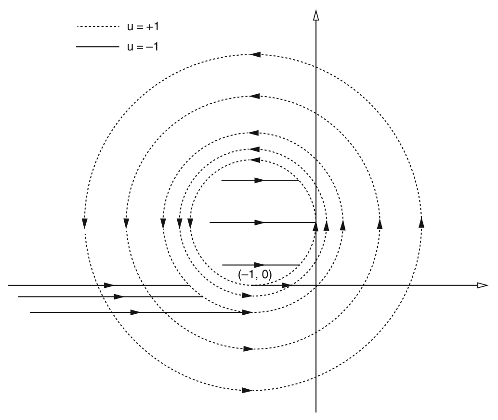

## An Example of a Time-Optimal Synthesis Whose Feedback Generates Nonoptimal Trajectories

We present an example exhibiting the phenomenon of nonuniqueness of trajectories for the closed-loop equation arising from the feedback extracted from an optimal synthesis. In particular the optimal feedback admits nonoptimal (classical) solutions. This well illustrates the importance of using the synthesis as concept of solution for an optimal stabilization problem.

Consider the planar system:

$$
\dot{q}=F(q)+u G(q), \quad|u| \leq 1,
$$

where $q=(x, y)$ and:

$$
F(q)=\binom{1-\frac{y}{2}}{\frac{x+1}{2}}, \quad G(q)=\binom{-\frac{y}{2}}{\frac{x+1}{2}},
$$

and the target is the origin.
The trajectories corresponding to the constant control equal to -1 are straight horizontal lines going from left to right, while those corresponding to +1 are circles centered at the point $(-1,1)$, running counterclockwise. The optimal synthesis is described in Fig. 1. For a proof of optimality see Piccoli and Sussmann (2000).

Starting from the point $(-1,0)$, we have an infinite number of classical solutions to the discontinuous optimal feedback. Indeed at that point we have $F+G=F-G$, so given any natural number $n$, the trajectory running $n$ times on the circle centered at $(-1,1)$ and then going to the origin with control -1 is a classical solution to the discontinuous optimal feeback. However, only the one corresponding to $n=0$ is optimal.

About other concepts of solutions starting from $(-1,0)$, one can prove the following. Krasowski or CLSS include classical solutions (and hence produce many nonoptimal trajectories). There is only one Filippov solution, that is the one that rotates indefinitely on the circle and never goes to the origin. This trajectory is not a solution to the stabilization problem since it does not reach the target.

## Cross-References

## - Optimal Control and Mechanics   - Sub-Riemannian Optimization

Acknowledgments The first author has been supported by the European Research Council, ERC StG 2009 "GeCoMethods", contract number 239748.

<!-- source_pdf_page: 1433 -->
## Bibliography

Agrachev A (1996) Exponential mappings for contact subRiemannian structures. J Dyn Control Syst 2(3):321358
Agrachev AA, Sachkov YuL (2004) Control theory from the geometric viewpoint. Encyclopedia of mathematical sciences, vol 87. Springer, Berlin/New York
Agrachev A, Boscain U, Sigalotti M (2008) A Gauss-Bonnet-like formula on two-dimensional almostRiemannian manifolds. Discret Contin Dyn Syst A 20:801-822
Ancona F, Bressan A (1999) Patchy vector fields and asymptotic stabilization. ESAIM Control Optim Calc Var 4:445-471
Barilari D, Boscain U, Neel RW (2012) Small time heat asymptotics at the sub-Riemannian cut locus. J Differ Geom 92(3):373-416
Beals R, Gaveau B, Greiner P (1996) The Green function of model step two hypoelliptic operators and the analysis of certain tangential Cauchy Riemann complexes. Adv Math 121(2):288-345
Bellaiche A (1996) The tangent space in sub-Riemannian geometry. In: Bellaiche A, Risler J-J (eds) SubRiemannian geometry. Progress in mathematics, vol 144. Birkhuser, Basel, pp 1-78
Bloch A (2003) Nonholonomic mechanics and control. Interdisciplinary applied mathematics, vol 24 . Springer, New York
Boltyanskii V (1966) Sufficient condition for optimality and the justification of the dynamic programming principle. SIAM J Control Optim 4:326-361
Boscain U, Piccoli B (2004) Optimal synthesis for control systems on 2-D manifolds. SMAI, vol 43. Springer, Berlin/New York
Boscain U, Rossi F (2008) Invariant Carnot-Caratheodory metrics on $\mathrm{S}^{3}$, SO(3), SL(2) and Lens Spaces. SIAM J Control Optim 47:1851-1878
Boscain U, Duplaix J, Gauthier JP, Rossi F (2012) Anthropomorphic image reconstruction via hypoelliptic diffusion. SIAM J Control Optim 50(3):1309-1336
Breuillard E, Le Donne E (2012) On the rate of convergence to the asymptotic cone for nilpotent groups and subfinsler geometry. PNAS. doi:10.1073/pnas. 1203854109
Bressan A (1985) A high order test for optimality of bangbang controls. SIAM J Control Optim 23(1):38-48
Bressan A, Piccoli B (1998) A generic classification of time optimal planar stabilizing feedbacks. SIAM J Control Optim 36(1):12-32
Bressan A, Piccoli B (2007) Introduction to the mathematical theory of control. AIMS series on applied mathematics, vol 2. American Institute of Mathematical Sciences, Springfield
Brockett R (1982) Control theory and singular Riemannian geometry. In: New directions in applied mathematics (Cleveland, 1980). Springer, New York/Berlin, pp 11-27
Brockett R (1983) Asymptotic stability and feedback stabilization. In: Brockett RW, Millman RS, Suss-
mann HJ (eds) Differential geometric control theory. Birkhäuser, Boston, pp 181-191
Brunovsky P (1978) Every normal linear system has a regular time-optimal synthesis. Math Slovaca 28:81100
Brunovsky P (1980) Existence of regular syntheses for general problems. J Differ Equ 38:317-343
Cesari L (1983) Optimization-theory and applications: problems with ordinary differential equations. Springer, New York
Clarke F, Ledyaev Yu, Subbotin A, Sontag E (1997) Asymptotic controllability implies feedback stabilization. IEEE Trans Autom Control 42:1394-1407
Charlot G (2002) Quasi-contact S-R metrics: normal from in $\mathbb{R}^{2 n}$, wave front and caustic in $\mathbb{R}^{4}$. Acta Appl Math 74(3):217-263
Coron JM (1992) Global asymptotic stabilization for controllable systems without drift. Math Control Signals Syst 5:295-312
Dubins LE (1957) On curves of minimal length with a constraint on average curvature and with prescribed initial and terminal position and tangents. Am J Math 79:497-516
El-Alaoui El-H Ch, Gauthier J-P, Kupka I (1996) Small sub-Riemannian balls on $\mathbb{R}^{3}$. J Dyn Control Sys 2(3):359-421
Gaveau B (1977) Principe de moindre action, propagation de la chaleur et estimées sous elliptiques sur certains groupes nilpotents. Acta Math 139(1-2):95-153
Gershkovich V, Vershik A (1988) Nonholonomic manifolds and nilpotent analysis. J Geom Phys 5:407-452
Gromov M (1981) Groups of polynomial growth and expanding maps. Inst Hautes Ètudes Sci Publ Math 53:53-73
Hormander L (1967) Hypoelliptic second order differential equations. Acta Math 119:147-171
Krener AJ (1977) The high order maximal principle and its application to singular extremals. SIAM J Control Optim 15(2):256-293
Marigo A, Piccoli B (2002) Regular syntheses and solutions to discontinuous ODEs. ESAIM Control Optim Calc Var 7:291-308
Montgomery R (2002) A tour of subriemannian geometries, their geodesics and applications. Mathematical surveys and monographs, vol 91. American Mathematical Society, Providence
Petitot J (2008) Neurogéométrie de la vision, Modèles mathématiques et physiques des architectures fonctionnelles. Les Éditions de l' École Polythecnique
Piccoli B (1996) Classifications of generic singularities for the planar time-optimal synthesis. SIAM J Control Optim 34(6): 1914-1946
Piccoli B, Sussmann HJ (2000) Regular synthesis and sufficiency conditions for optimality. SIAM J Control Optim 39(2):359-410
Pontryagin LS et al (1961) The mathematical theory of optimal processes. Wiley, New York
Reeds JA, Shepp LA (1990) Optimal Path for a car that goes both forwards and backwards. Pac J Math 145:367-393

<!-- source_pdf_page: 1434 -->
Sachkov Yu (2011) Cut locus and optimal synthesis in the sub-Riemannian problem on the group of motions of a plane. ESAIM COCV 17:293-321
Sigalotti M, Chitour Y (2006) Dubins' problem on surfaces II: nonpositive curvature. SIAM J Control Optim 45:457-482
Soueres P, Laumond JP (1996) Shortest paths synthesis for a car-like robot. IEEE Trans Autom Control 41(5):672-688
Sussmann HJ (1979) Subanalytic sets and feedback control. J Differ Equ 31(1):31-52
Sussmann HJ (1980) Analytic stratifications and control theory. In: Proceedings of the international congress of mathematicians (Helsinki, 1978), Academia Scientiarum Fennica, Helsinki, pp 865-871
Sussmann HJ (1986) Envelopes, conjugate points, and optimal bang-bang extremals. In: Algebraic and geometric methods in nonlinear control theory. Mathematics and its applications, vol 29. Reidel, Dordrecht, pp 325346
Sussmann HJ (1989) Envelopes, higher-order optimality conditions and Lie Brackets. In: Proceedings of the 1989 IEEE conference on decision and control, Tampa, FL, USA
Vinter R (2010) Optimal control. Birkhäuser, Basel/Boston

## Synthetic Biology

Domitilla Del Vecchio ${ }^{1}$ and Richard M. Murray ${ }^{2}$ ${ }^{1}$ Department of Mechanical Engineering, Massachusetts Institute of Technology, Cambridge, MA, USA ${ }^{2}$ Control and Dynamical Systems, Caltech, Pasadena, CA, USA

#### Abstract

The past decade has seen tremendous advances in DNA recombination and measurement techniques. These advances have reached a point in which de novo creation of biomolecular circuits that accomplish new functions is now possible, leading to the birth of a new field called synthetic biology. Sophisticated functions that are highly sought in synthetic biology range from recognizing and killing cancer cells, to neutralizing radioactive waste, to efficiently transforming feedstock into fuel, to control the differentiation of tissue cells. To reach these

objectives, however, there are a number of open problems that the field has to overcome. Many of these problems require a system-level understanding of the dynamical and robustness properties of interacting systems, and hence, the field of control and dynamical systems theory may highly contribute. In this entry, we review the basic technology employed in synthetic biology and a number of simple modules and complex systems created using this technology and discuss key system-level problems along with challenging research questions for the field of control theory.

## Keywords

Biomolecular systems; Gene expression; Robustness; Modularity

## Introduction to Synthetic Biology

Synthetic biology is an emerging engineering discipline in which the biochemical and biophysical principles present in living organisms are used to engineer new systems (Baker et al. 2006). These systems will have the ability of accomplishing a number of remarkable tasks, such as turning waste into energy sources, neutralizing radioactive waste, detecting environmental pathogens, or recognizing cancer cells with the aim of targeting them for deletion. While synthetic biology can be employed to create new functionalities, it can also enable the understanding of fundamental design principles of living systems. In fact, implementing a circuit with a prescribed behavior provides a powerful means to test hypotheses regarding the underlying biological mechanisms.

The functions of living organisms are controlled by biomolecular circuits, in which proteins and genes interact with each other through activation and repression interactions forming complex networks. A common signal carrier is the concentration of the active form of a protein, which can be controlled through a number of mechanisms, including gene expression regulation and post-translational

<!-- source_pdf_page: 1435 -->
modification. Through the process of gene expression, proteins are produced by their corresponding genes, whose production rates can be activated or repressed by other proteins (transcription factors). Once the proteins are produced, they can be activated or inhibited, by other proteins or smaller molecules, through post-translation modification processes including covalent modification, such as phosphorylation, and allosteric modification (Alon 2007). We next describe some salient aspects of gene expression focusing, for simplicity, on prokaryotic systems.

A gene is a piece of DNA whose expression rate can often be controlled by a DNA sequence upstream of the gene itself, called promoter. The promoter contains the binding regions for the RNA polymerase, an enzyme that transcribes the gene into a messenger RNA molecule, which is then translated into protein by the ribosomes. The promoter also contains operator sites, which are binding regions where other proteins, called transcription factors, can bind. If these proteins are activators, they will help the RNA polymerase in binding the promoter to start transcription. By contrast, if these proteins are repressors, they will prevent the RNA polymerase from binding the promoter. These activation and repression interactions are highly nonlinear and often stochastic; therefore, the most commonly used modeling frameworks include systems of nonlinear ordinary differential equations, stochastic differential equations, or the chemical master equation (Gillespie 1977, 2000).

The basic technique for constructing synthetic circuits is that of assembling, through the process of cloning, DNA sequences with prescribed combinations of promoters and genes such that a desired network of activation and repression interaction is created. For example, if we would like to create an inverter where protein A represses protein B , we can simply place the gene of B under the control of a promoter repressed by protein A. Currently, there is a library of parts that one can use to assemble a desired circuit this way. The set of parts includes promoters, gene coding sequences, terminators, and ribosome binding sites. Terminators are DNA sequences placed at
the end of a gene to make the RNA polymerase terminate transcription, while ribosome binding sites are DNA sequences placed at the beginning of a gene, which establish the rate at which ribosomes will bind to the mRNA, determining the overall translation rate (Endy 2005). An area of intense research is the expansion of the library by creating mutations of existing parts or by assembling new ones.

Once a DNA sequence is created that encodes the desired circuit, it is inserted in a living cell either on the chromosome itself or on DNA plasmids. When the circuit is inserted in the chromosome, it will be in one copy, while when it is inserted in DNA plasmids, it will be in as many copies as the plasmid copy number. Plasmid copy number can vary from low copy ( $5-10$ copies), to medium copy ( 20 copies), to high copy (about 100 copies). Once in the cell, the circuit will have the required resources to function, including RNA polymerase, ribosomes, amino acids, and ATP (the cell energy currency). In this sense, the cell can be viewed as a chassis for the synthetic circuits. The operation of the circuit can then be observed by monitoring the concentration of reporters, that is, of proteins that are easy to detect and quantify. These include fluorescent proteins, that is, proteins that exhibit bright fluorescence when exposed to light of a specific wave length. Examples include the green, red, blue, and yellow fluorescent proteins. These fluorescent proteins are mainly employed in two different ways to measure the amount of a protein of interest. One can fuse the gene of the fluorescent protein with the gene expressing the protein of interest. Alternatively, one can use the protein of interest as a transcription factor of the fluorescent protein. In both cases, the concentration of the fluorescent protein will provide an indirect measurement of the concentration of the protein of interest.

It is also possible to apply external inputs to a circuit to control the activity of transcription factors. This is accomplished through the use of inducers, which are small signaling molecules that can be injected in the cell culture and enter the cell wall. These inducers bind specific transcription factors and either activate them,

<!-- source_pdf_page: 1436 -->
allowing the transcription factor to bind the promoter operator sites, or inhibit them, reducing the transcription factor's ability to bind the promoter operator sites.

## Examples of Synthetic Biology Modules

A number of modules comprising two or three genes have been fabricated in the earlier days of synthetic biology (Atkinson et al. 2003; Becskei and Serrano 2000; Elowitz and Leibler 2000; Gardner et al. 2000; Stricker et al. 2008). We can group them into oscillators (Atkinson et al. 2003; Elowitz and Leibler 2000; Stricker et al. 2008), mono-stable systems (Becskei and Serrano 2000), and bistable systems called toggle switches (Gardner et al. 2000). More recently, feedforward loops have also been fabricated (Bleris et al. 2011).

Oscillators. The creation of circuits whose protein concentrations oscillate periodically in time has been a major focus. In fact, the ability of creating an oscillator has the potential of shedding light into the mechanisms at the basis of natural clocks, such as circadian rhythms and the cell cycle. Oscillator designs can be divided into two types: loop oscillators (Elowitz and Leibler 2000), in which repression/activation interactions occur in a loop topology, or oscillators based on the interplay between an autocatalytic loop and negative feedback (Atkinson et al. 2003; Stricker et al. 2008) (see Fig. 1).

The design requirements of synthetic circuits are usually explored through models of varying detail, starting with the use of low-dimensional "toy models," which are composed of a set of nonlinear ordinary differential equations describing the rate of change of the circuit's proteins. These models allow application of a number of tools from dynamical systems theory to infer parameter or structural requirements for a desired behavior. After toy models are analyzed, largerscale mechanistic models are constructed, which include all the intermediate species taking part in the biochemical reactions. These models can be

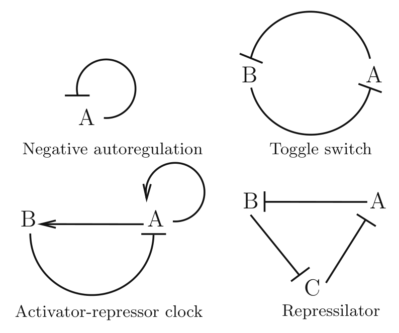

> Image description: This textbook figure illustrates four fundamental synthetic gene regulatory circuits. The top-left diagram, labeled **Negative autoregulation**, shows a single variable, **A**, where a curved arrow with a perpendicular bar at the end feeds back into itself, indicating self-repression. The top-right diagram, labeled **Toggle switch**, depicts two variables, **A** and **B**, arranged in a mutual inhibition loop. A curved line with a repressive bar connects **A** to **B**, and another connects **B** back to **A**. The bottom-left diagram, labeled **Activator-repressor clock**, shows a feedback loop between **A** and **B**. **A** activates itself via a curved arrow and activates **B** via a standard arrow. **B** then represses **A** via a curved line with a repressive bar. The bottom-right diagram, labeled **Repressilator**, shows a three-component cyclic inhibitory network. Variables **A**, **B**, and **C** are connected in a ring of mutual inhibition, where **A** represses **B**, **B** represses **C**, and **C** represses **A**.
Synthetic Biology, Fig. 1 Early gene circuits that have been fabricated in bacteria E. coli: the negatively autoregulated gene (Becskei and Serrano 2000), the toggle switch (Gardner et al. 2000), the activator-repressor clock (Atkinson et al. 2003), and the repressilator (Elowitz and Leibler 2000)

either deterministic or stochastic. Simulation is usually required for the study of these more complicated models, and the Gillespie algorithm is often employed for stochastic simulations (Gillespie 1977).

As an example of a toy model and related analysis, consider the activator-repressor clock of Atkinson et al. (2003) shown in Fig. 1. This oscillator is composed of an activator A activating itself and a repressor B, which, in turn, represses the activator A . Both activation and repression occur through transcription regulation. Denoting in italics the concentration of species, a toy model of this clock can be written as

$$
\begin{align*}
\dot{A} & =\frac{\beta_{A}\left(A / K_{a}\right)^{n}+\beta_{0, A}}{1+\left(A / K_{a}\right)^{n}+\left(B / K_{b}\right)^{m}}-\gamma_{A} A, \\
\dot{B} & =\frac{\beta_{B}\left(A / K_{a}\right)^{n}+\beta_{0, B}}{1+\left(A / K_{a}\right)^{n}}-\gamma_{B} B, \tag{1}
\end{align*}
$$

in which $\gamma_{A}$ and $\gamma_{B}$ represent protein decay (due to dilution and/or degradation). The functions $\left(\beta_{A}\left(A / K_{a}\right)^{n}+\beta_{0, A}\right) /\left(1+\left(A / K_{a}\right)^{n}+\left(B / K_{b}\right)^{m}\right)$ and $\left(\beta_{B}\left(A / K_{a}\right)^{n}+\beta_{0, B}\right) /\left(1+\left(A / K_{a}\right)^{n}\right)$ are called Hill functions and are the most commonly used models for transcription regulation (Alon 2007). The first Hill function in system (1) increases with $A$ and decreases with $B$, while

<!-- source_pdf_page: 1437 -->
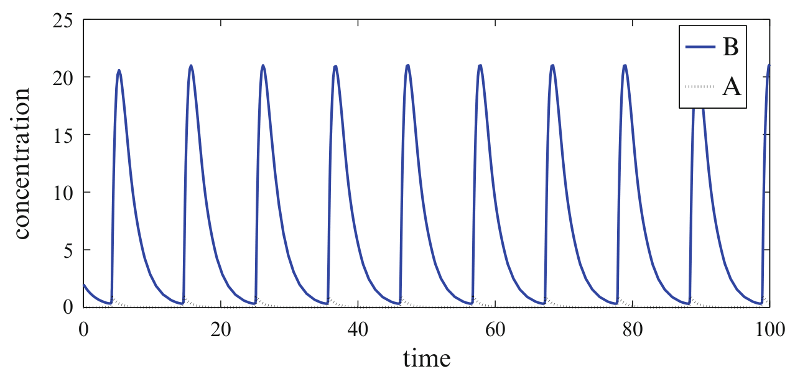

> Image description: A line graph titled "Activator-repressor clock time trajectory" illustrates the concentration of two substances, A and B, over time. The x-axis represents "time" from 0 to 100, and the y-axis represents "concentration" from 0 to 25. The plot features two data series: a solid blue line representing substance B and a dotted grey line representing substance A. Substance B displays a periodic, oscillatory pattern characterized by rapid increases in concentration followed by gradual exponential decays. The peaks of substance B reach a concentration of approximately 21 units, occurring at regular intervals (roughly every 13–15 time units). In contrast, substance A is represented by a series of very low-amplitude, flat-looking dotted lines that remain near a concentration of 1 throughout the observed duration. The graph depicts a rhythmic, oscillatory biological clock mechanism where the concentrations of the two components fluctuate periodically.
Synthetic Biology, Fig. 2 Activator-repressor clock time trajectory

the second one increases with $A$, as expected since A is an activator and B is a repressor. The key mechanism by which this system displays sustained oscillations is a supercritical Hopf bifurcation with bifurcation parameter the relative timescale of the activator dynamics with respect to the repressor dynamics (Del Vecchio 2007). Specifically, as the activator dynamics become faster than the repressor dynamics, the system goes through a supercritical Hopf bifurcation and a stable periodic orbit appears (Fig. 2).

Mono-stable systems. The mono-stable system engineered through negative autoregulation was fabricated with the aim of understanding the role of negative feedback in attenuating biological noise. The results of Becskei and Serrano (2000) clearly showed that negative autoregulation can reduce intrinsic noise. Furthermore, the results of Austin et al. (2005) demonstrated that while low frequency noise is attenuated, noise at high frequency can be amplified by negative autoregulation in accordance with Bode's integral formula (Åström and Murray 2008).

Bistable systems. The toggle switch of Gardner et al. (2000) was the first bistable system constructed. It constitutes the simplest circuit with memory, in which the state of the system can be switched from one equilibrium (low, high) to the other (high, low) by external inputs. Once the system state is switched to one of these two equilibria, it will stay there unless another external perturbation is applied.

Feedforward loops. While the early circuits described so far were fabricated mainly to investigate design principles for limit cycles and for robustness, many more circuits after those have been fabricated with the aim of solving concrete engineering problems. As an example, the incoherent feedforward circuit of Bleris et al. (2011) was fabricated in bacteria E. coli with the aim of making protein production independent of DNA plasmid copy number. In fact, DNA copy number fluctuates stochastically with possibly large deviations from the nominal value. As a consequence, the concentration of proteins expressed from genes residing on a plasmid also fluctuates stochastically. In order to make protein concentration independent of an unknown DNA copy number, one could leverage principles for disturbance rejection such as integral control. While an explicit integral control action is particularly hard to implement through biological parts, incoherent feedforward loops are easier to implement and can accomplish the same disturbance rejection task. In these loops, the disturbance input affects the output through two branches, one in which the disturbance activates the output and a longer one in which the disturbance represses the output (Alon 2007). If these two branches are appropriately balanced, the steady-state value of the output will be practically independent of the disturbance input, leading to disturbance rejection to constant or slowly changing disturbances.

<!-- source_pdf_page: 1438 -->
## From Modules to Systems

One approach to creating systems that can accomplish sophisticated tasks is to assemble together simpler modules, such as those described in the previous section (Purnick and Weiss 2009). For example, the artificial tissue homeostasis circuit proposed by Miller et al. (2012) is composed of several interconnected modules, including an activator-repressor clock, a toggle switch, a couple of inverters, and an "and" gate. Control of tissue homeostasis refers to the ability of regulating a cell type to a constant level in a multicellular community. This ability is central in several diseases such as cancer and diabetes, in which tissue homeostasis is misregulated. The design proposed by Miller et al. (2012) illustrates how a synthetic biological circuit can be modularly created to accomplish this complicated regulation function.

Layered logic gates are often necessary in order to integrate multiple signals. Moon et al. (2012) have constructed an "and" gate that integrates more than two signals by cascading pairs of "and" gates. Of course, problems of latency become more relevant as the number of layers increases and methods to mitigate these effects are being developed.

An application that requires the integration of multiple signals is the cell-type classifier of Xie et al. (2011). Here, a synthetic gene circuit is created that integrates sensory information from a number of molecular markers to determine whether a cell is in a specific state, that is, cancer, and, in such a case, produces a protein output triggering cell death. The design of this circuit is based on the composition of three key modules. Specifically, a double inversion module senses high levels of a molecular marker, a single inversion module senses low levels of a molecular marker, and a logical "and" module finally integrates the outputs of the other two modules to produce the output protein.

Finally, biofuels are another high-impact application of synthetic biology (Peralta-Yahya et al. 2012). Metabolic engineering has been
employed for a long time in order to engineer microbes to produce advanced biofuels with similar properties to petroleum-based fuels. One challenge in using microbes (or other living organisms) to convert feedstock into biofuel is that of overcoming the endogenous cell regulation to achieve sufficiently high yields such that advanced biofuels are economically advantageous. Specifically, engineered pathways are optimized on the basis of nominal operating conditions, but these conditions often change when microbes are in bioreactors. To mitigate this problem, synthetic gene circuits have been designed to sense the metabolic status of the host and regulate key points in the metabolic pathway to optimize yield (Zhang et al. 2012).

## Main System-Level Challenges to Design

One major challenge in synthetic biology is the ability of going from simple modules to larger sophisticated systems (Purnick and Weiss 2009). Problems in advancing in this direction can be divided into two categories: "hardware" problems and system-level problems. Hardware problems include issues such as the availability of enough orthogonal parts to allow scaling up the size of synthetic circuits. We do not expand on this here and instead focus on system-level problems. These include issues such as context dependence (Cardinale and Arkin 2012), that is, the fact that modules behave in a poorly predictable way once interacting together in the cell environment. This is a major obstacle to creating larger circuits that behave predictably.

Problems of context dependence can be further divided into three qualitatively different types: (a) inter-modular interactions, (b) interactions of synthetic circuits with the cell machinery, (c) perturbations in the external environment. We analyze each of them separately.
(a) When modules are connected to each other to create larger systems, a protein in an upstream module is used as an "input" to

<!-- source_pdf_page: 1439 -->
a downstream module. This fact creates a "loading" on the upstream system due to the fact that the output protein cannot take part in the upstream module reactions whenever it is taking part in the downstream module reactions. As a consequence, the behavior of the upstream system changes compared to when the system functions in isolation (Del Vecchio et al. 2008; Saez-Rodriguez et al. 2004). These loading effects have been called retroactivity to extend the notion of loading and impedance to biomolecular systems. Accordingly, solutions to mitigate this problem are being investigated (Franco et al. 2011; Jayanthi and Del Vecchio 2011; Mishra et al. 2013).
(b) Ideally, the cell should function as a "chassis" for synthetic biology circuits. In practice, this is not the case because the endogenous circuitry interacts with synthetic circuits even when parts that are orthogonal to the endogenous systems are employed. A major example of this interaction is the depletion of cellular resources, such as ATP, RNA polymerase, and ribosomes, which are required for the operation of synthetic circuits. This depletion reduces cell fitness, with deleterious consequences also for synthetic circuits, a phenomenon called "metabolic burden" (Bentley et al. 1990). A more subtle phenomenon than purely reducing cell fitness is that synthetic circuits compete with each other for the same resources. This fact creates implicit and unwanted coupling among circuits with unpredictable consequences. Approaches to mitigate these problems are under investigation. One direction is the use of orthogonal RNA polymerase and ribosomes (Wenlin and Chin 2009; Rackham and Chin 2005). A completely different, but complementary, direction is that of establishing implementable design principles that allow circuits to function robustly despite fluctuations in the resources they use.
(c) The external environment where a cell operates has a number of physical attributes, which may also be subject to perturba-
tions. These physical attributes include temperature, acidity, nutrients' level, etc. Perturbations in these attributes often lead to poor cell fitness or to nonstandard growth conditions, ultimately leading to synthetic circuits malfunctions.

## Summary and Future Directions

The future of synthetic biology highly depends on the ability of scaling up the complexity of design to create more sophisticated functions. While a number of issues, such as the availability of enough orthogonal parts, can be successfully addressed by (nontrivial) fabrication of new parts, issues such as context dependence require a system-level dynamic understanding of circuits and their interactions. Here is where control and dynamical systems theory could greatly contribute. Control theory has proven critical to reason about and engineer robustness in a number of concrete applications including aerospace and automotive systems, robotics and intelligent machines, manufacturing chains, electrical, power, and information networks. Similarly, control theory could enable the understanding of principles that ensure robust behavior of synthetic circuits once interacting with each other in the cell environment, leading to the ultimate progress of synthetic biology.

A number of challenges need to be addressed for the successful application of control and dynamical systems theory to synthetic biology. The behavior of synthetic circuits is highly nonlinear and, as a consequence, control theoretic tools designed for understanding robustness in linear systems are not directly applicable. Understanding how to exploit the rich structure of biomolecular circuits to quantitatively reason about robustness to interconnections, competition for shared resources, and fluctuations of temperature and nutrients is likely to have a major impact. Even with this understanding, however, the question of how to implement robust designs with the currently available biomolecular mechanisms must be addressed. Stochasticity is another major problem since the behavior of synthetic circuits is intrin-

<!-- source_pdf_page: 1440 -->
sically noisy. Unfortunately, the availability of analytical tools that allow quantification of how perturbations and uncertainty propagate through a nonlinear stochastic system is still limited, and designers often resort to stochastic simulation. Finally, the values of the salient parameters of the available parts are poorly known. Physical attributes such as binding affinities, ribosome binding site strengths, promoter strengths, etc. are only known within very coarse bounds. These bounds are also usually determined based on a specific organism and in specific growth conditions, which may be different from the ones in which the circuit is ultimately running. Hence, a central question is how to design and implement a system such that the prescribed behavior is robust to all sources of perturbations described above within a large range of possible parameter values.

## Cross-References

- Deterministic Description of Biochemical Networks
- Identification and Control of Cell Populations
- Robustness Analysis of Biological Models
- Stochastic Description of Biochemical Networks

## Bibliography

Alon U (2007) An introduction to systems biology. Design principles of biological circuits. Chapman-Hall, Boca Raton
Åström KJ, Murray RM (2008) Feedback systems. Princeton University Press, Princeton
Atkinson MR, Savageau MA, Meyers JT, Ninfa AJ (2003) Development of genetic circuitry exhibiting toggle switch or oscillatory behavior in Escherichia coli. Cell 113:597-607
Austin DW, Allen MS, McCollum JM, Dar RD, Wilgus JR, Sayler GS, Samatova NF, Cox CD, Simpson ML (2005) Gene network shaping of inherent noise spectra. Nature 439:608-611
Baker D, Church G, Collins J, Endy D, Jacobson J, Keasling J, Modrich P, Smolke C, Weiss R (2006) Engineering life: building a FAB for biology. Sci Am 294:44-51
Becskei A, Serrano L (2000) Engineering stability in gene networks by autoregulation. Nature 405:590-593

Bentley WE, Mirjalili N, Andersen DC, Davis RH, Kompala DS (1990) Plasmid-encoded protein: the principal factor in the "metabolic burden" associated with recombinant bacteria. Biotechnol Bioeng 35(7):668681
Bleris L, Xie Z, Glass D, Adadey A, Sontag E, Benenson Y (2011) Synthetic incoherent feedforward circuits show adaptation to the amount of their genetic template. Mol Syst Biol 7:519
Cardinale S, Arkin AP (2012) Contextualizing context for synthetic biology - identifying causes of failure of synthetic biological systems. Biotechnol J 7:856-866
Del Vecchio D (2007) Design and analysis of an activatorrepressor clock in E. coli. In: Proceedings of the American control conference, New York, pp 1589-1594
Del Vecchio D, Ninfa AJ, Sontag ED (2008) Modular cell biology: retroactivity and insulation. Mol Syst Biol 4:161
Elowitz MB, Leibler S (2000) A synthetic oscillatory network of transcriptional regulators. Nature 403:339342
Endy D (2005) Foundations for engineering biology. Nature 438(24):449-452
Franco E, Friedrichs E, Kim J, Jungmann R, Murray R, Winfree E, Simmel FC (2011) Timing molecular motion and production with a synthetic transcriptional clock. Proc Natl Acad Sci. doi:10.1073/pnas.1100060108
Gardner TS, Cantor CR, Collins JJ (2000) Construction of the genetic toggle switch in Escherichia Coli. Nature 403:339-342
Gillespie DT (1977) Exact stochastic simulation of coupled chemical reactions. J Phys Chem 81:2340-2361
Gillespie DT (2000) The chemical Langevin equation. J Chem Phys 113:297-306
Jayanthi S, Del Vecchio D (2011) Retroactivity attenuation in bio-molecular systems based on timescale separation. IEEE Trans Autom Control 56:748-761
Miller M, Hafner M, Sontag E, Davidsohn N, Subramanian S, Purnick P, Lauffenburger D, Weiss R (2012) Modular design of artificial tissue homeostasis: robust control through synthetic cellular heterogeneity. PLoS Comput Biol 8:e1002579
Mishra D, Rivera-Ortiz P, Del Vecchio D, Weiss R (2013) A load driver device for engineering modularity in biological networks. Nat Biotechnol (Under review, accepted and to appear)
Moon TS, Lou C, Tamsir A, Stanton BC, Voigt CA (2012) Genetic programs constructed from layered logic gates in single cells. Nature 491:249-253
Peralta-Yahya PP, Zhang F, del Cardayre SB, Keasling JD (2012) Microbial engineering for the production of advanced biofuels. Nature 488:320-328
Purnick P, Weiss R (2009) The second wave of synthetic biology: from modules to systems. Nat Rev Mol cell Biol 10:410-422
Rackham O, Chin JW (2005) A network of orthogonal ribosome-mRNA pairs. Nat Chem Biol 1(3):159-166
Saez-Rodriguez J, Kremling A, Conzelmann H, Bettenbrock K, Gilles ED (2004) Modular analysis of

<!-- source_pdf_page: 1441 -->
signal transduction networks. IEEE Control Syst Mag 24(4):35-52
Stricker J, Cookson S, Bennett MR, Mather WH, Tsimring LS, Hasty J (2008) A fast, robust and tunable synthetic gene oscillator. Nature 456:516-519
Wenlin A, Chin JW (2009) Synthesis of orthogonal transcription translation networks. Proc Natl Acad Sci 106(21):8477-8482
Xie Z, Wroblewska L, Prochazka L, Weiss R, Benenson K (2011) Multi-input rnai-based logic circuit for identification of specific cancer cells. Science 333:1307-1311
Zhang F, Carothers JM, Keasling JD (2012) Design of a dynamic sensor-regulator system for production of chemicals and fuels derived from fatty acids. Nat Biotechnol 30:354-359

## System Identification Software

## Brett Ninness

School of Electrical and Computer Engineering, University of Newcastle, Newcastle, Australia

#### Abstract

This contribution discusses various aspects important to software for system identification. Essential functionality for existing practice and the algorithmic fundamentals this relies on are considered together with a brief discussion of additional commonly useful support tools. Since software is intimately tied to the hardware that it runs on, a discussion on this topic follows with an emphasis on considering how future system identification software developments might best align with clear current and future trends in computer architecture developments.

## Keywords

System identification; Computer-aided design; Parameter estimation; Software

## Introduction

Fundamental to the practice of system identification is the employment of appropriate soft-
ware to compute system estimates and evaluate their properties. One option is for the user to code the necessary routines themselves in their computer language of choice. For simple situations, such as least-squares estimation with a linearly parametrized model, this approach is feasible.

However, it quickly becomes onerous and time consuming as one moves even slightly beyond this simple example. In response to this, researchers have developed a number of software packages designed to accommodate classes of data formats, model structures, and estimation methods.

The purpose of this contribution is to profile the support that available system identification software provides, the underlying foundations on which this software depends, and the future capabilities that may be expected due to trends in desktop and portable computer capacity.

The material to follow depends on explanations, definitions, and background presented in - System Identification: An Overview, by Ljung, which should be read in conjunction with this contribution.

## Essential Functionality

The essence of system identification software packages is that they implement an identification method $\mathcal{I}$ as defined in ▷ System Identification: An Overview.

Typically, this involves taking a model structure specification $\mathcal{M}(\theta)$ together with $N$ observed data points $Z_{N}$ and translating that to a cost function $V_{N}(\theta)$ for which a minimizer

$$
\begin{equation*}
\hat{\theta} \triangleq \underset{\theta \in D_{\mathcal{M}}}{\arg \min } V_{N}(\theta) \tag{1}
\end{equation*}
$$

is then computed in order to deliver a system estimate $\mathcal{M}(\hat{\theta})$.

While the details of these fundamental operations vary according to the chosen model structure and method, there are some shared aspects. To pick a starting point, subspace-based estimation methods ( ↽ Subspace Techniques in System

<!-- source_pdf_page: 1442 -->
Identification) have been one of the most significant developments in the near history of system identification, and they fundamentally involve a first stage of setting up and solving the optimization problem

$$
\begin{equation*}
\hat{\beta}=\underset{\beta}{\arg \min }\|Y-\Phi \beta\|_{F}^{2}, \tag{2}
\end{equation*}
$$

where $Y, \Phi$ are data-dependent matrices, $\beta$ is a $\theta$ - dependent matrix, and $\|\cdot\|_{F}$ is the Frobenius norm, which, for an $m \times n$ matrix $A$, is defined as

$$
\begin{equation*}
\|A\|_{F}=\sqrt{\sum_{i=1}^{m} \sum_{j=1}^{n}\left|a_{i j}\right|^{2}} \tag{3}
\end{equation*}
$$

This is a classic least-squares optimization problem, which also arises in other system identification contexts, particularly when the prediction $\hat{y}(t \mid \theta)$ is a linear function of $\theta$.

As is well known Golub and Loan (1989), the minimizer $\hat{\beta}$ satisfies the "normal equations"

$$
\begin{equation*}
\left(\Phi^{T} \Phi\right) \hat{\beta}=\Phi^{T} Y \tag{4}
\end{equation*}
$$

and if $\Phi^{T} \Phi$ is invertible, this allows for a closedform solution

$$
\begin{equation*}
\hat{\beta}=\left(\Phi^{T} \Phi\right)^{-1} \Phi^{T} Y \tag{5}
\end{equation*}
$$

While formally correct, no system identification software packages would compute $\hat{\beta}$ in this manner since it is computationally inefficient and sensitive to numerical rounding errors.

Drawing on decades of study on this topic in the numerical computations literature (Golub and Loan 1989), system identification software packages rely on the QR factorization

$$
\Phi=Q R=\left[\begin{array}{l|l}
Q_{1} & Q_{2} \tag{6}
\end{array}\right]\left[\frac{R_{1}}{0}\right]
$$

where $Q$ is square and satisfies $Q^{T} Q=I$ (the identity matrix) and $R$ contains the upper triangular square and invertible block $R_{1}$. This decomposition of $\Phi$ allows the normal Eq. (4) to be re-expressed as

$$
\begin{equation*}
R_{1} \hat{\beta}=Q_{1}^{T} Y \tag{7}
\end{equation*}
$$

Since $R_{1}$ is upper triangular, the solution $\hat{\beta}$ may then be found by elementary and numerically robust backward substitution (Golub and Loan 1989).

The importance of efficient and accurate solution of normal equations to any system identification software is not limited to these subspace or linearly parametrized cases. For instance, the very general class of prediction error methods encompassed by the formulation (1) involves a $\operatorname{cost} V_{N}(\theta)$ that depends on the vector

$$
\begin{equation*}
E(\theta) \triangleq\left[\varepsilon\left(t_{1}, \theta\right), \cdots, \varepsilon\left(t_{N}, \theta\right)\right]^{T} \tag{8}
\end{equation*}
$$

of differences between the observed data and the response of a model parametrized by $\theta$. In the case of time-domain data, the elements of (8) are defined by

$$
\begin{equation*}
\varepsilon(t, \theta) \triangleq y(t)-\hat{y}(t \mid \theta) \tag{9}
\end{equation*}
$$

In this general situation, it is most commonly the case that no closed-form solution for the optimization problem (1) exists.

The strategy then taken by most system identification software packages is to employ a gradient-based search for a minimizer. These methods are motivated by the use of a linear approximation of $E(\theta)$ about a current putative minimizer $\theta_{k}$ according to

$$
\begin{equation*}
E(\theta) \approx E\left(\theta_{k}\right)+J\left(\theta_{k}\right)\left(\theta-\theta_{k}\right), \tag{10}
\end{equation*}
$$

where $J\left(\theta_{k}\right)$ denotes the Jacobian matrix

$$
\begin{equation*}
\left.J\left(\theta_{k}\right) \triangleq \frac{\partial E(\theta)}{\partial \theta}\right|_{\theta=\theta_{k}} \tag{11}
\end{equation*}
$$

In the very common situation where $V_{N}(\theta)$ is a quadratic function of $E(\theta)$, this implies the associated approximation

$$
\begin{align*}
V_{N}(\theta) & =\operatorname{Trace}\left\{E^{T}(\theta) E(\theta)\right\} \\
& =\|E\|_{F}^{2} \approx\left\|E\left(\theta_{k}\right)+J\left(\theta_{k}\right)\left(\theta-\theta_{k}\right)\right\|_{F}^{2} . \tag{12}
\end{align*}
$$

<!-- source_pdf_page: 1443 -->
Via this reasoning, computation of an appropriate "search direction" $p=\theta-\theta_{k}$ again involves the efficient solution of a linear least-squares problem of the form (2), namely,

$$
\begin{equation*}
p=\underset{p}{\arg \min }\left\|E\left(\theta_{k}\right)+J\left(\theta_{k}\right) p\right\|_{F}^{2} . \tag{13}
\end{equation*}
$$

More generally, system identification software packages extend this rationale and solve (1) by generating a sequence of iterations $\left\{\theta_{k}\right\}$, which are refined according to

$$
\begin{equation*}
\theta_{k+1}=\theta_{k}+\mu p \tag{14}
\end{equation*}
$$

where $\mu$ is a step length that at each iteration $k$ may be altered until a cost decrease

$$
\begin{equation*}
V_{N}\left(\theta_{k+1}\right)<V_{N}\left(\theta_{k}\right) \tag{15}
\end{equation*}
$$

is achieved and the search direction $p$ again involves the solution of normal equations

$$
\begin{equation*}
\left[J\left(\theta_{k}\right)^{T} J\left(\theta_{k}\right)+\lambda I\right] p=-J\left(\theta_{k}\right)^{T} E\left(\theta_{k}\right) . \tag{16}
\end{equation*}
$$

The choice $\lambda>0$ implies what is called a Levenberg-Marquardt method, while $\lambda=0$ leads to a so-called Gauss-Newton update strategy, and there are further variants such as "trust region" methods that are typically offered as options.

Via (16) we see that again system identification software comes to fundamentally depend on underpinning numerical linear algebra, in this case, again via the QR decomposition.

Another decomposition, the singular value decomposition (SVD), also has a significant role to play, particularly with respect to subspace-based methods where it is essential to the extraction of an estimated system parametrization $\hat{\theta}$ from $\hat{\beta}$ referred to in (2).

In addition to matrix decompositions, other system identification methods depend on many other even more fundamental linear algebra tools such as basic matrix/vector operations, matrix inversion, and eigen-decomposition. Because of this dependence, most (Ljung 2012; Kollár et al. 2006; Young and Taylor 2012; Garnier et al.

2012; Ninness et al. 2013) but not all (Hjalmarsson and Sjöberg 2012) currently available system identification software packages are built upon the MathWorks MATLAB (originally short for "matrix laboratory") package, which provides an efficient interface to the widely accepted standard numerical linear algebra libraries LAPACK and EISPACK. For example, solving (2) efficiently and robustly via QR decomposition and backsubstitution of (7) is achieved transparently using the MATLAB backslash operator with the simple command: beta = Phi\Y.

## Additional Functionality and the Decision-Making Process

As emphasized in ▷ System Identification: An Overview, the provision of an estimated model is typically an iterative process (illustrated diagrammatically in Fig. 4 of ▷ System Identification: An Overview) of which just one component is the implementation of an identification method $\mathcal{I}$ to deliver a system estimate $\mathcal{M}(\hat{\theta})$.

In addition to this "essential functionality," system identification software must also provide tools and a logistical support for the decisionmaking process of assessing $\mathcal{M}(\hat{\theta})$ and, based on this, perhaps altering aspects such as the choice of model structure $\mathcal{M}$, the experiment design $\mathcal{X}$, or indeed the identification method $\mathcal{I}$.

To support this, system identification software packages may offer further capabilities such as:

1. Nonparametric estimation methods that deliver estimates of linear system frequency response without involving a parametrized model structure $\mathcal{M}(\theta)$ and hence not involving (1)
2. Data preprocessing tools, such as to remove trends and to frequency selectively prefilter data before use
3. Visualization tools to display and compare the time- and frequency-domain response of estimated models
4. Model validation tools to determine if estimated models can be falsified by observed data

<!-- source_pdf_page: 1444 -->
5. Model accuracy measures that deliver statistical confidence bounds on estimated parameters
6. Additional data processing tools such as Kalman filtering and smoothing routines and sequential Monte Carlo (particle filter) routines that are used to compute $V_{N}(\theta)$ but have many other applications
7. Graphical user interface (GUI) support in order to aid organization of the various aspects of data preprocessing, model structure selection, algorithm selection, estimate computation, model validation, and model visualization
8. The employment of symbolic computation capabilities to aid complex model structure specification and preprocessing for efficient numerical implementation (Hjalmarsson and Sjöberg 2012)
Note that with the exception of this last point (8), the computations associated with this additional functionality again depend fundamentally on efficient numerical linear algebra software.

## Computing Platforms

Currently available system identification software packages are designed for standard desktop computing environments, and as such
their capabilities are intimately tied to those of the central processing unit (CPU), memory, and other architectural features of this hardware.

For instance, the linear algebra underpinnings just discussed are typically implemented in serially coded form, and hence bus bandwidth, together with memory and CPU speed, will be the fundamental factor affecting software performance. Taking CPU speed as an example, the evolution of clock speed for the very commonly used Intel architecture CPUs is shown as the red curve in Fig. 1 and, as can be seen, has largely plateaued over the last decade after two orders of magnitude growth in the decade preceding it.

As a result, and roughly speaking, system estimates that took a minute to compute in the early 1990s took under a second to compute in the early part of this century, but are essentially no faster to compute now, a further decade later.

As a result, while system identification software has continued to grow in sophistication, in areas that involve high computational burdens, such as estimation of complex and highdimensional model structures, or the implementation of compute intensive algorithms, the capability of system identification software has been hardware limited for some time.

At the same time, as the blue line in Fig. 1 illustrates, Moore's law continues to hold, and

System Identification Software, Fig. 1 Trends in desktop CPU capacity taking Intel as an example. Serial throughput speeds have long plateaued, but transistor density continues to grow, which delivers growing multiple cores
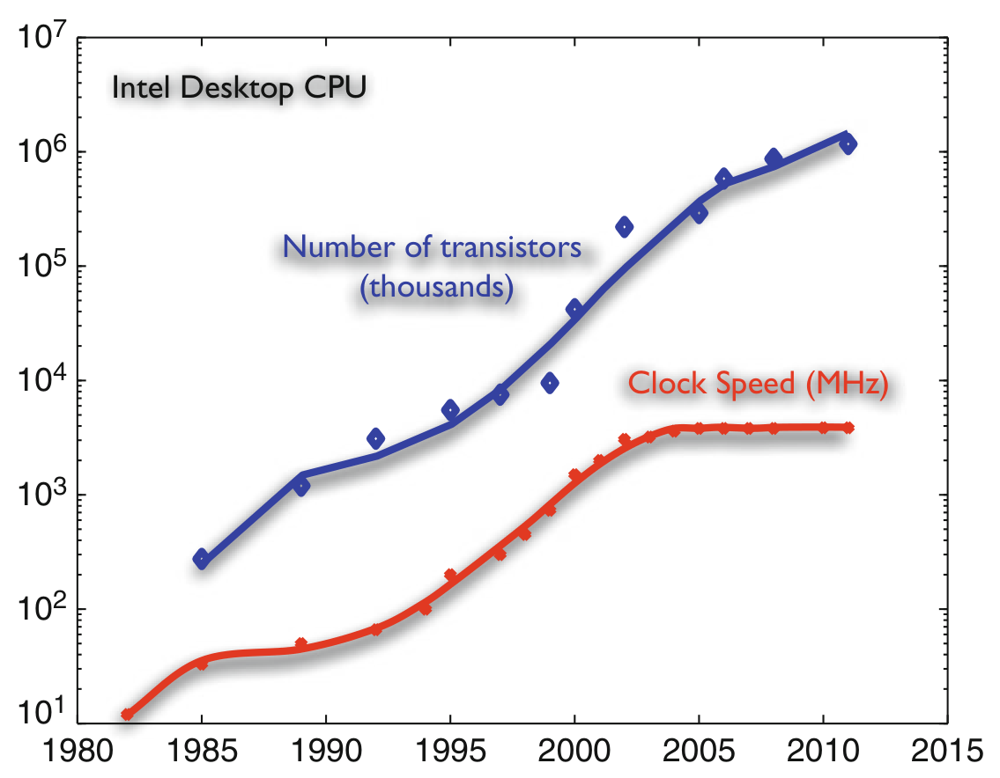

> Image description: A line graph titled "Intel Desktop CPU" illustrates the historical trends of two key semiconductor metrics from 1982 to 2011. The y-axis is a logarithmic scale spanning from $10^1$ to $10^7$. The blue line represents the "Number of transistors (thousands)," showing a consistent, near-exponential upward trajectory, rising from approximately $3 \times 10^2$ thousand in the mid-1980s to over $10^6$ thousand by 2011. This indicates a continuous increase in transistor density. The red line represents "Clock Speed (MHz)." It shows an initial steady increase from approximately $10^1$ MHz to $10^3$ MHz between 1982 and 2004. However, after 2004, the curve plateaus at roughly $3 \times 10^3$ MHz, indicating a stagnation in serial throughput speeds. In summary, the figure demonstrates that while clock speeds have reached a plateau, the number of transistors has continued to grow exponentially, a trend that facilitates the shift toward multi-core architectures.

<!-- source_pdf_page: 1445 -->
transistor densities continue to increase. While this is delivering no greater serial CPU speed, it is delivering multiple CPU core availability. Future advances in system identification software capability will therefore need to exploit the potential for parallel computation.

Indeed, in current MATLAB, the fundamental numerical linear algebra routines previously mentioned such as QR-based solution of normal equations, eigenvalue, and SVD decompositions will all automatically execute on multiple computational threads on multicore-enabled machines. Expanding this to take advantage of even higher levels of parallelism is the subject of current research.

While these developments will deliver performance enhancements for existing system identification methods, they will also open up the possibility for new tools to be added to system identification software suites.

For example, in addition to the existing subspace, prediction error, and maximum likelihood methods just mentioned, there is another important estimation approach that does not involve the solution of an optimization problem such as (1) or (2) and for which there is always a closedform expression for the parameter estimate. It is the conditional mean estimate

$$
\begin{equation*}
\hat{\theta}=\mathbf{E}\{\theta \mid Y\}, \tag{17}
\end{equation*}
$$

which is a Bayesian approach that depends on the calculation of the posterior density of the parameters $\theta$ given the data $Y$ according to

$$
\begin{equation*}
p(\theta \mid Y)=\frac{p(Y \mid \theta) p(\theta)}{p(Y)}, \tag{18}
\end{equation*}
$$

where $p(\theta)$ is a prior that allows for incorporation of user knowledge (before observing the data) and $p(Y \mid \theta)$ is the usual data likelihood.

Not only does this estimate have an explicit formulation; it is also the minimum mean square error estimate in that for any other estimate $\hat{\beta}= f(Y)$ computed as any other measurable function $f$ of the data $Y$, it holds that

$$
\begin{equation*}
\mathbf{E}\left\{\|\theta-\hat{\theta}\|^{2}\right\} \leq \mathbf{E}\left\{\|\theta-\hat{\beta}\|^{2}\right\} . \tag{19}
\end{equation*}
$$

In this sense, the conditional mean (17) is the most accurate estimate. Furthermore, quantifications of estimation accuracy may be directly obtained via the marginal densities $p\left(\theta_{i} \mid Y\right)$ of individual parameter vector values $\theta_{i}$.

Nevertheless, it is currently not widely used. There are no doubt philosophical reasons for this stemming from the well-known debate between frequentist and Bayesian perspectives on inference (Efron 2013).

Another key reason is that it is difficult to compute. It requires the evaluation of a multidimensional integral,

$$
\begin{equation*}
\mathbf{E}\{\theta \mid Y\}=\iint \cdots \int \theta p\left(\theta \mid \mathcal{Y}_{N}\right) \mathrm{d} \theta_{1} \cdots \mathrm{~d} \theta_{n} \tag{20}
\end{equation*}
$$

as does the computation of the marginal densities

$$
\begin{align*}
p\left(\theta_{i} \mid \mathcal{Y}_{N}\right)= & \int \cdots \int p\left(\theta \mid \mathcal{Y}_{N}\right) \mathrm{d} \theta_{1} \\
& \cdots \mathrm{~d} \theta_{i-1} \mathrm{~d} \theta_{i+1} \cdots \mathrm{~d} \theta_{n} \tag{21}
\end{align*}
$$

Evaluating these quantities requires adding fundamentally new capability beyond efficient linear algebra support to system identification software. It involves adding capability for numerical integration.

Integration in one dimension is straightforward. The well-known and used Simpson's rule is remarkably efficient in that the relationship between the computational error and the number of grid points $m$ obeys

$$
\begin{equation*}
\text { Error }=O\left(m^{-4}\right) \tag{22}
\end{equation*}
$$

so that every order of magnitude increase in $m$ delivers four extra digits of precision. However, (20) is an $n_{\theta}=\operatorname{dim}\{\theta\}$ dimensional integral, and $m$ grid points on each of $n_{\theta}$ axes imply

$$
\begin{equation*}
M=m^{n_{\theta}} \tag{23}
\end{equation*}
$$

function evaluations. This can blow up quite quickly, as illustrated in Fig. 2 for the case of only modest $m=30$ grid points and with respect to the very simple problem of estimating a

<!-- source_pdf_page: 1446 -->
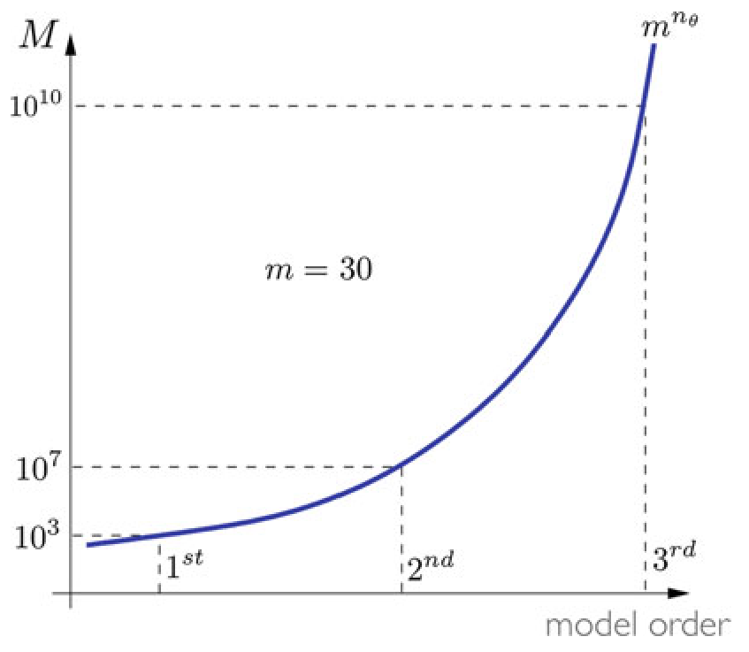

> Image description: A mathematical plot illustrates the relationship between model order and the number of function evaluations ($M$) required for Simpson's rule integration. The vertical axis represents $M$ on a logarithmic scale, spanning from $10^3$ to $10^{10}$. The horizontal axis is labeled "model order" and displays three discrete stages: "$1^{st}$", "$2^{nd}$", and "$3^{rd}$" order. A blue curve represents the exponential increase in complexity. At the $2^{nd}$ order, the value of $M$ is marked at $10^7$. At the $3^{rd}$ order, the value reaches $m^{n_\theta}$ at the $10^{10}$ mark. The text within the plot area specifies $m = 30$. According to the provided caption, the exponent $n_\theta$ is defined as $2 \times \text{model order} + 1$. The figure demonstrates how the computational cost grows exponentially as the model complexity increases.

System Identification Software, Fig. 2 Increase in number of function evaluations $M$ required for Simpson's rule integration with $m=30$ grid points on each parameter axis associated with linear output-error models of increasing order. Note that accounting for both numerator and denominator parameters, $n_{\theta}=2 \times$ model order +1
straightforward linear output-error model of increasing order.

On a serial CPU platform, there is an upper limit of time available to wait for a result and hence an upper limit $M$ of function evaluations that are tolerable. Viewed as a function of this, the accuracy of simple Simpson's rule methods is

$$
\begin{equation*}
\text { Error }=O\left(M^{-4 / n_{\theta}}\right), \tag{24}
\end{equation*}
$$

which is not attractive as model complexity and hence $n_{\theta}$ grows.

A further and vitally important problem is that it will generally not be clear where to allocate the $m$ grid points on each axis since the support of the posterior $p(\theta \mid Y)$ is not readily known. Indeed, a main point of computing the multidimensional integrals associated with the marginals (21) is to determine this support.

A strategy to address these difficulties is based on the strong law of large numbers (SLLN). Namely, if random draws $x^{i} \sim p(x)$ from a density $p(x)$ can be obtained, then sample averages of functions of them converge with probability one to the ensemble average expectation, which is an integral:

$$
\begin{equation*}
\frac{1}{M} \sum_{i=1}^{M} f\left(x^{i}\right) \xrightarrow{\text { w.p. } 1} \mathbf{E}\left\{f\left(x^{i}\right)\right\}=\int f(x) p(x) \mathrm{d} x . \tag{25}
\end{equation*}
$$

This principle may then be used as a "randomized" method to compute an estimate $\hat{I}_{M}$ of an integral $I$; viz.,

$$
\begin{equation*}
I=\int f(x) p(x) \mathrm{d} x \approx \hat{I}_{M} \triangleq \frac{1}{M} \sum_{i=1}^{M} f\left(x^{i}\right) \tag{26}
\end{equation*}
$$

Furthermore, if the $x^{i}$ are independent draws, then

$$
\begin{equation*}
\operatorname{Var}\left\{\hat{I}_{M}\right\}=\frac{1}{M^{2}} \sum_{i=1}^{M} \operatorname{Var}\left\{f\left(x^{i}\right)\right\}=\frac{1}{M} \operatorname{Var}\{f(x)\}, \tag{27}
\end{equation*}
$$

and hence the absolute error in integral evaluation is

$$
\begin{equation*}
O\left(\left|I-\hat{I}_{M}\right|\right) \approx O\left(M^{-1 / 2}\right) . \tag{28}
\end{equation*}
$$

The vital point is that as opposed to (24), this error is independent of the dimension of $x$ and hence independent of the dimension of the integral $I$. Furthermore, the grid points are the realizations $\left\{x^{i}\right\}$, which naturally will lie within the support of the integrand $f(x) p(x)$ and do not need to be otherwise designed.

Of course, this depends on a means to draw samples from an arbitrary density $p(\cdot)$ of interest, but simple methods such as the MetropolisHastings methods and "slice sampler" exist to achieve this Mackay (2003).

Importantly too, these randomized methods are ideally suited to exploiting the growing availability of desktop multicore computing platforms. Generating $M$ realizations to form the integral approximation $\hat{I}_{M}$ in (26) may be achieved in one-tenth the time simply by running ten independently initialized random number generators in parallel, each generating one $M / 10$ length realization. The method (26) is thus (in principal) trivial to parallelize.

Furthermore, much greater parallelization and hence also speedup may be achieved by employing the "graphics processing units" (GPUs) in desktop computers. These GPUs are inexpensive because they service a high volume

<!-- source_pdf_page: 1447 -->
consumer demand for interactive gaming, which requires high-speed numerical computation for 3D-projected graphics. As such these GPUs have evolved to provide hundreds of parallel processing cores, each clocked in the gigahertz range.

To give an impression of the computational capability of GPU-based platforms, the singleprecision giga-FLOPS (floating-point operations per second) performance history for NVIDIA brand GPUs and Intel architecture processors designed for desktop applications is profiled in Fig. 3.

This shows theoretical performance, assuming all cores may be fully utilized constantly. In reality, this is never possible due to communication and architecture restrictions. For example, GPU architectures are based on an SIMD (single instruction, multiple data) design, so at any one time many cores must execute the identical instruction, but may do so on different data. Analysis of these and other aspects relevant for system identification software implementation requires detailed study (Lee et al. 2010).

The fact that desktop hardware architectures have and will continue to offer more but not faster processing cores may be exploited in system identification software beyond this Bayesian setting. For example, the last decade has seen great interest in delivering estimation methods for an increasingly broad range of nonlinear model structures, a quite general version of which can be expressed in the nonlinear state-space form

$$
\begin{align*}
x(t+1) & \sim p(x(t+1) \mid x(t), \theta)  \tag{29}\\
y(t) & \sim p(y(t) \mid x(t), \theta) \tag{30}
\end{align*}
$$

In principle, there is no reason why this cannot be straightforwardly addressed by the usual maximum likelihood approach of forming the likelihood

$$
\begin{align*}
p\left(Y_{N} \mid \theta\right)= & \prod_{t=1}^{N} p\left(y(t) \mid Y_{t-1}, \theta\right) \\
& Y_{t}=\{y(1), \cdots, y(t)\} \tag{31}
\end{align*}
$$

and then using this as the cost function $V_{N}(\theta)$ in (1) and then proceeding with the usual gradient-based search. Indeed, there exist explicit formulae for computing the predictive densities $p\left(y(t) \mid Y_{t-1}, \theta\right)$ required in (31). Namely, the coupled measurement update

$$
\begin{aligned}
& p\left(x(t) \mid Y_{t}, \theta\right)=\frac{p(y(t) \mid x(t), \theta) p\left(x(t) \mid Y_{t-1}, \theta\right)}{p\left(y(t) \mid Y_{t-1}, \theta\right)} \\
& p\left(y(t) \mid Y_{t-1}, \theta\right)= \\
& \int p(y(t) \mid x(t), \theta) p\left(x(t) \mid Y_{t-1}\right) \mathrm{d} x(t)
\end{aligned}
$$

and time update

$$
\begin{align*}
& p\left(x(t+1) \mid Y_{t}, \theta\right)= \\
& \int p(x(t+1) \mid x(t), \theta) p(x(t) \mid Y(t), \theta) \mathrm{d} x(t) \tag{32}
\end{align*}
$$

equations.
However, again we are faced with the problem of numerically evaluating multidimensional integrals. The integral dimension this time is that of the state vector $x(t)$, which may be less than that of the parameter vector $\theta$ just discussed, but $2 N$ of these integrals needs to be evaluated in order to compute the likelihood (31), and this needs to be redone for each step of any associated gradientbased search.

Again, a randomized algorithm approach based on the SLLN could be considered as a way forward in system identification software development. Indeed, sequential Monte Carlo (SMC) algorithms (aka particle filtering) (Doucet and Johansen 2011) have been specifically developed to compute the above integrals involved in the time and measurement update, and there has been recent work (Schön et al. 2011; Andrieu et al. 2010) on employing this to develop software for the estimation of the general nonlinear model (29) and (30).

The resulting algorithms are computationally intensive, to the point where implementation on serial CPU architectures means they are limited to deployment on nonlinear model structures of very low state dimension. However, again

<!-- source_pdf_page: 1448 -->
## System Identification Software, Fig. 3

Historical trend of theoretical single-precision giga- FLOPS performance of commodity NVIDIA brand GPUs versus Intel architecture CPUs designed for desktop computing
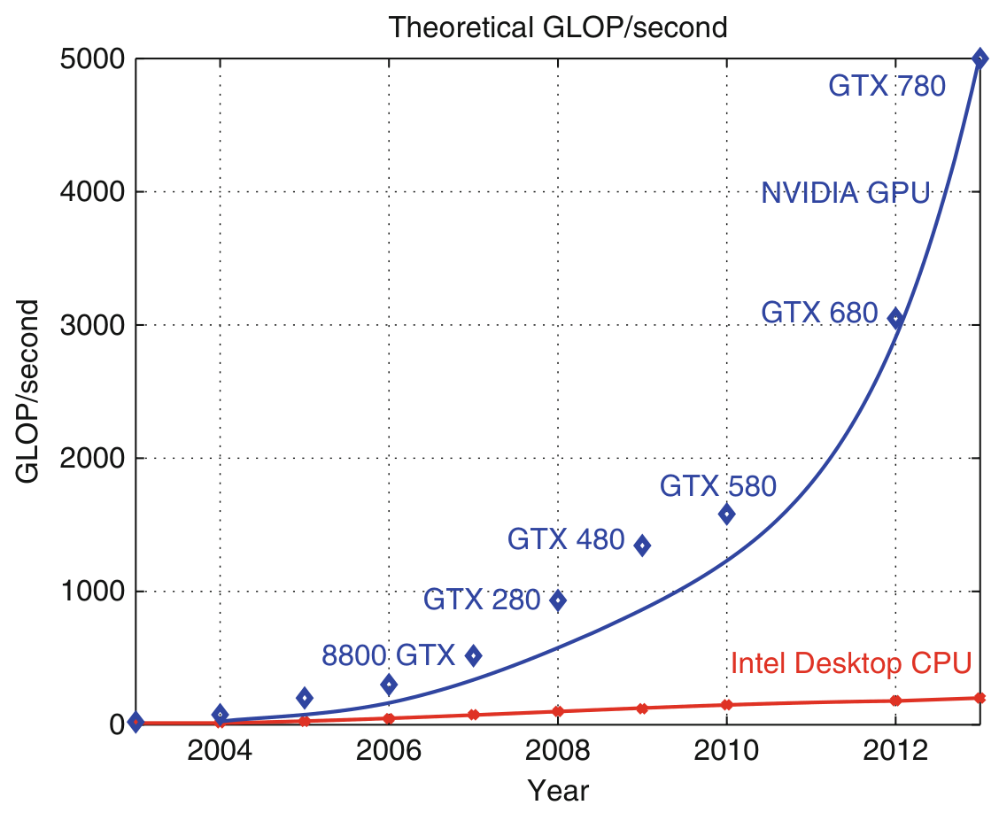
because the SLLN is at the heart of the methods, and averaging over one long run on a serial machine is numerically equivalent (but potentially much faster) to averaging over multiple shorter runs computed in parallel, there is scope for future system identification software to employ these approaches.

## Examples of Available System Identification Software

With the features of current and perhaps future system identification software packages profiled, it may be useful to make specific mention of particular system identification software packages that have been under active development for a substantial period of time. These include the following commercially available packages:

1. The MathWorks System Identification Toolbox (Ljung 2012), which is arguably the most mature and comprehensive system identification software available
2. The GAMAX Frequency Domain System Identification Toolbox (Kollár et al. 2006), which specializes in estimation of models based on measurements in the frequency domain
3. The Adaptx software (Larimore 2000) specializing in the estimation of state-space models using subspace-based methods
Noncommercial and freely available system identification software packages that are relevant include:
4. The "computer-aided program for timeseries analysis and identification of noisy systems" (CAPTAIN) toolbox (Young and Taylor 2012), which provides a platform supporting the "refined instrumental variable" (RIV) algorithm for linear system estimation;
5. The "continuous-time system identification" (CONTSID) toolbox (Garnier et al. 2012), which specializes in the estimation of continuous-time models
6. The "interactive software tool for system identification education" (ITSIE) toolbox (Guzmán et al. 2012), which has an emphasis on education and training in system identification principles
7. The "University of Newcastle identification toolbox" (UNIT) software (Ninness et al. 2013) that is designed as an open platform for researchers to evaluate the performance of new methods relative to established ones

<!-- source_pdf_page: 1449 -->
## Summary and Future Directions

A case can be mounted that at its heart, system identification is about the design of software and the understanding of the results provided by it. Certainly, the field has been built on decades of deep theoretical contributions, but this has been very practically focused either on delivering new algorithms that may be directly implemented or on better understanding the performance of existing algorithms.

Efficient numerical linear algebra routines have traditionally been the foundation of the resulting proven and effective system identification methods and software to date, and these have scaled in effectiveness as desktop computing clock speeds have scaled.

However, the recent past and the foreseeable future see CPU speed as static and with an increasing number of available processor cores. Delivering greater system identification capacity will require the development of methods whose software implementations can harness this growing availability of multiple processor cores.

## Cross-References

- Frequency Domain System Identification
- Nonlinear System Identification Using Particle Filters
- System Identification: An Overview
- System Identification Techniques: Convexification, Regularization, and Relaxation

## Recommended Reading

For readers wishing to gain a deeper understanding of the numerical linear algebra aspects discussed here, the classic text (Golub and Loan 1989) is recommended. Those wishing further background on the calculation of multidimensional integrals via randomized algorithms such as Metropolis-Hastings and slice sampling will find (Mackay 2003) useful. The particle filtering methods mentioned here for nonlinear estimation problems are clearly explained in Doucet
and Johansen (2011). Readers interested in further detail on numerical computations on GPUbased platforms supporting these computations will find (Lee et al. 2010) useful.

## Bibliography

Andrieu C, Doucet A, Holenstein R (2010) Particle Markov chain Monte Carlo methods. J R Stat Soc Ser B 72:1-33
Doucet A, Johansen AM (2011) A tutorial on particle filtering and smoothing: fifteen years later. In: Crisan D, Rozovsky B (eds) Nonlinear filtering handbook. Oxford University Press, London
Efron B (2013) A 250 year argument: belief, behaviour and the bootstrap. Bull Am Math Soc 50:129-146
Garnier H, Gilson M, Laurain V (2012) Developments for the CONTSID toolbox. In: Proceedings of the 16th IFAC symposium on system identification, Brussels. ISBN:978-3-902823-06-9
Golub G, Loan CV (1989) Matrix computations. Johns Hopkins University Press, Baltimore
Guzmán J, Rivera D, Dormido S, Berenguel M (2012) An interactive software tool for system identification. Adv Eng Softw 45:115-123
Hjalmarsson H, Sjöberg J (2012) A mathematica toolbox for signals, systems and identification. In: Proceedings of the 16th IFAC symposium on system identification, Brussels
Kollár I, Pintelon R, Schoukens J (2006) Frequency domain system identification toolbox for Matlab: characterizing nonlinear errors of linear models. In: Proceedings of the 14th IFAC symposium on system identification, Newcastle, pp 726-731
Larimore WE (2000) The adaptx software for automated multivariable system identification. In: Proceedings of the 12th IFAC symposium on system identification, Santa Barbara
Lee A, Yau C, Giles M, Doucet A, Holmes C (2010) On the utility of graphics cards to perform massively parallel simulation of advanced monte-carlo methods. J Comput Graph Stat 19: 769-789
Ljung L (1999) System identification: theory for the user, 2nd edn. Prentice-Hall, New Jersey
Ljung L (2012) MATLAB system identification toolbox users guide, version 8. The Mathworks
Mackay DJ (2003) Information theory, inference, and learning algorithms. Cambridge University Press, Cambridge/New York
Ninness B, Wills A, Mills A (2013) Unit: a freely available system identification toolbox. Control Eng Pract 21:631-644
Schön T, Wills A, Ninness B (2011) System identification of nonlinear state-space models. Automatica 37:39-49
Young PC, Taylor CJ (2012) Recent developments in the CAPTAIN toolbox for Matlab. In: Proceedings of the 16th IFAC symposium on system identification, Brussels. ISBN:978-3-902823-06-9

<!-- source_pdf_page: 1450 -->
## System Identification Techniques: Convexification, Regularization, and Relaxation

Alessandro Chiuso Department of Information Engineering, University of Padova, Padova, Italy

#### Abstract

System identification has been developed, by and large, following the classical parametric approach. In this entry we discuss how regularization theory can be employed to tackle the system identification problem from a nonparametric (or semi-parametric) point of view. Both regularization for smoothness and regularization for sparseness are discussed, as flexible means to face the bias/variance dilemma and to perform model selection. These techniques have also advantages from the computational point of view, leading sometimes to convex optimization problems.

## Keywords

Kernel methods; Nonparametric methods; Optimization; Sparse Bayesian learning; Sparsity

## Introduction

System identification is concerned with automatic model building from measured data. Under this unifying umbrella, this field spans a rather broad spectrum of topics, considering different model classes (linear, hybrid, nonlinear, continuous, and discrete time) as well as a variety of methodologies and algorithms, bringing together in a nontrivial way concepts from classical statistics, machine learning, and dynamical systems.

Even though considerable effort has been devoted to specific areas, such as parametric methods for linear system identification which are by now well developed (see the introductory article

System Identification: An Overview), it is fair to say that modeling still is, by far, the most timeconsuming and costly step in advanced process control applications. As such, the demand for fast and reliable automated procedures for system identification makes this exciting field still a very active and lively one.

Suffices here to recall that, following this classic parametric maximum likelihood (ML)/prediction error (PE) framework, the candidate models are described using a finite number of parameters $\theta \in \mathbb{R}^{n}$. After the model classes have been specified, the following two steps have to be undertaken:
(i) Estimate the model complexity $\hat{n}$.
(ii) Find the estimator $\hat{\theta} \in \mathbb{R}^{\hat{n}}$ minimizing a cost function $J(\theta)$, e.g., the prediction error or (minus) the log-likelihood.
Both of these steps are critical, yet for different reasons: step (ii) boils down to an optimization problem which, in general, is non-convex and as such it is very hard to guarantee that a global minimum is achieved. The regularization techniques discussed in this entry sometimes allow to reformulate the identification problem as a convex program, thus solving the issue of local minima.

In addition fixing the system complexity equal to the "true" one is a rather unrealistic assumption and in practice the complexity $n$ has to be estimated as per step (i). In practice there is never a "true" model, certainly not in the model class considered. The problem of statistical modeling is first of all an approximation problem; one seeks for an approximate description of "reality" which is at the same time simple enough to be learned with the available data and also accurate enough for the purpose at hand. On this issue see also the section "Trade-off Between Bias and Variance" in - System Identification: An Overview. This has nontrivial implications, chiefly the facts that classical order selection criteria are based on asymptotic arguments and that the statistical properties of estimators $\hat{\theta}$ after model selection, called post-model-selection estimators (PMSEs), are in general difficult to study (Leeb and Pötscher 2005) and may lead to undesirable behavior. Experimental evidence shows

<!-- source_pdf_page: 1451 -->
that this is not only a theoretical problem but also a practical one (Pillonetto et al. 2011; Chen et al. 2012). On top of this statistical aspect, there is also a computational one. In fact the model selection step, which includes as special cases also variable selection and structure selection, may lead to computationally intractable combinatorial problems. Two simple examples which reveal the combinatorial explosion of candidate models are the following: (a) Variable selection: consider a high-dimensional time series (MIMO) where not all inputs/outputs are relevant and one would like to select $k$ out of $m$ available input signals where $k$ is not known and needs to be inferred from data; (see, e.g., Banbura et al. (2010) and Chiuso and Pillonetto (2012)), and (b) structure selection: consider all autoregressive models of maximal lag $p$ with only $p_{0}<p$ nonzero coefficients and one would like to estimate how many $\left(p_{0}\right)$ and which coefficients are nonzero. The same combinatorial problem arises in hybrid system identification (e.g., switching ARX models). Given that enumeration of all possible models is essentially impossible due the combinatorial explosion of candidates, selection could be performed using greedy approaches from multivariate statistics, such as stepwise methods (Hocking 1976).

The system identification community, inspired by work in statistics (Tibshirani 1996; Mackay 1994), machine learning (Rasmussen and Williams 2006; Tipping 2001; Bach et al. 2004), and signal processing (Donoho 2006; Wipf et al. 2011), has recently developed and adapted methods based on regularization to jointly perform model selection and estimation in a computationally efficient and statistically robust manner. Different regularization strategies have been employed which can be classified in two main classes: regularization induced by so-called smoothness priors (aka Tikhonov regularization; see Kitagawa and Gersh (1984) and Doan et al. (1984) for early references in the field of dynamical systems) and regularization for selection. This latter is usually achieved by convex relaxation of the $\ell_{0}$ quasinorm (such as $\ell_{1}$ norm and variations thereof such as sum of norms, nuclear norm, etc.) or other non-
convex sparsity-inducing penalties which can be conveniently derived in a Bayesian framework, aka sparse Bayesian learning (SBL) (Mackay 1994; Tipping 2001; Wipf et al. 2011).

The purpose of this entry is to guide the reader through the most interesting and promising results on this topic as well as areas of active research; of course this subjective view only reflects the author's opinion, and of course different authors could have offered a different perspective.

While, as mentioned above, system identification studies various classes of models (ranging from linear to general "nonlinear" models), in this entry, we shall restrict our attention to specific ones, namely, linear and hybrid dynamical systems. The field of nonlinear system identification is so vast (a quote sometimes attributed to S. Ulam has it that the study of nonlinear systems is a sort of "non-elephant zoology") that even though it has largely benefitted from the use of regularization, it cannot be addressed within the limited space of this contribution. The reader is referred to the Encyclopedia chapters - Nonlinear System Identification: An Overview of Common Approaches and - Nonlinear System Identification Using Particle Filters for more details on nonlinear model identification.

## System Identification

Let $u_{t} \in \mathbb{R}^{m}, y_{t} \in \mathbb{R}^{p}$ be, respectively, the measured input and output signals in a dynamical system; the purpose of system identification is to find, from a finite collection of input-output data $\left\{u_{t}, y_{t}\right\}_{t \in[1, N]}$, a "good" dynamical model which describes the phenomenon under observation. The candidate model will be searched for within a so-called "model set" denoted by $\mathcal{M}$. This set can be described in parametric form (see, e.g., Eq. (3) in ▷ System Identification: An Overview) or in a nonparametric form. In this entry we shall use the symbol $\mathcal{M}_{n}(\theta)$ for parametric model classes where the subscript $n$ denotes the model complexity, i.e., the number of free parameters.

<!-- source_pdf_page: 1452 -->
## Linear Models

The first part of the entry will address identification of linear models, i.e., models described by a convolution

$$
\begin{equation*}
y_{t}=\sum_{k=1}^{\infty} g_{t-k} u_{k}+\sum_{k=0}^{\infty} h_{t-k} e_{k} \quad t \in \mathbb{Z} \tag{1}
\end{equation*}
$$

where $g$ and $h$ are the so-called impulse responses of the system and $\left\{e_{t}\right\}_{t \in \mathbb{Z}}$ is a zeromean white noise process which under suitable assumptions is the one-step-ahead prediction error; a convenient description of the linear system (1) is given in terms of the transfer functions

$$
G(q):=\sum_{k=1}^{\infty} g_{k} q^{-k} \quad H(q):=\sum_{k=0}^{\infty} h_{k} q^{-k}
$$

The linear model (1) naturally yields an "optimal" (in the mean square sense) output predictor which shall be denoted later on by $\hat{y}_{t \mid t-1}$. As mentioned above, under suitable assumptions, the noise $e_{t}$ in (1) is the so-called innovation process $e_{t}=y_{t}-\hat{y}_{t \mid t-1}$. See also Eq. (8) in ▷ System Identification: An Overview.

When $g$ and $h$ are described in a parametric form, we shall use the notation $g_{k}(\theta), h_{k}(\theta)$, and, likewise, $G(q, \theta), H(q, \theta)$, and $\hat{y}_{t \mid t-1}(\theta)$.

Example 7 Consider the so-called "output-error" model, i.e., assume $H(q)=1$. An example of parametric model class is obtained restricting $G(q, \theta)$ to be a rational function

$$
G(q, \theta)=K \prod_{i=1}^{n} \frac{q-z_{i}}{q-p_{i}}
$$

where $\theta:=\left[K, p_{1}, z_{1}, \ldots, p_{n}, z_{n}\right]$ is the parameter vector. Note that the parameter vector $\theta$ may subjected to constraints $\theta \in \Theta$, e.g., enforcing that the system be bounded input, bounded output (BIBO) stable $\left(\left|p_{i}\right|<1\right)$ or that the impulse response be real ( $K \in \mathbb{R}$ and poles $p_{i}$ and zeros $z_{i}$ appear in complex conjugate pairs).

An example of nonparametric model is obtained, e.g., postulating that $g_{k}$ is a realization of a Gaussian process (Rasmussen and Williams
2006) with zero mean and a certain covariance function $R(t, s)=\operatorname{cov}\left(g_{t}, g_{s}\right)$. For instance, the choice $R(t, s)=\lambda^{t} \delta_{t-s}$, where $|\lambda|<1$ and $\delta_{k}$ is the Kronecker symbol, postulates that the $g_{t}$ and $g_{s}$ are uncorrelated for $t \neq s$ and that the variance of $g_{t}$ decays exponentially in $t$; this latter condition ensures that each realization $g_{k}$, $k>0$, is BIBO stable with probability one. The exponential decay of $g_{t}$ guarantees that, to any practical purpose, it can be considered zero for $t>T$ for a suitably large $T$. This allows to approximate the OE model with a "long" finite impulse response (FIR) model

$$
\begin{equation*}
G(q)=\sum_{k=1}^{T} g_{k} z^{-k} \tag{2}
\end{equation*}
$$

where $g_{k}, k=1, \ldots, T$, is modeled as a zeromean Gaussian vector with covariance $\Sigma$, with elements $[\Sigma]_{t s}=R(t, s)$.

Remark 1 Note that the model (2), which has been obtained from truncation of a nonparametric model, could in principle be thought as a parametric model in which the parameter vector $\theta$ contains all the entries of $g_{k}, k=1, \ldots, T$. Yet the truncation index $T$ may have to be large even for relatively "simple" impulse responses; for instance, $\left\{g_{k}(\theta)\right\}_{k \in \mathbb{Z}^{+}}$may be a simple decaying exponential, $g_{k}(\theta)=\alpha \rho^{k}$, which is described by two parameters (amplitude and decay rate), yet if $|\rho| \simeq 1$, the truncation index $T$ needs to be large (ideally $T \rightarrow \infty$ ) to obtain sensible results (e.g., with low bias). Therefore, the number of parameters $T(m \times p)$ may be larger (and in fact much larger) than the available number of data points $N$. Under these conditions, the parameter $\theta$ cannot be estimated from any finite data segment unless further constraints are imposed.

## The Role of Regularization in Linear System Identification

In order to simplify the presentation, we shall refer to the linear model (1) and assume that $H(q)=1$, i.e., we consider the so-called linear output-error (OE) models. The extension to more

<!-- source_pdf_page: 1453 -->
general model classes can be found in Pillonetto et al. (2011), Chen et al. (2012), Chiuso and Pillonetto (2012), and references therein.

The main purpose of regularization is to control the model complexity in a flexible manner, moving from families of rigid, finite dimensional parametric model classes $\mathcal{M}_{n}(\theta)$ to flexible, possibly infinite dimensional, models. To this purpose one starts with a "suitably large" model class which is constrained through the use of socalled regularization functionals. To simplify the presentation, we consider the FIR (2). The estimator $\hat{\theta}$ is found as the solution of the following optimization problem

$$
\begin{equation*}
\hat{\theta}=\arg \min _{\theta \in \mathbb{R}^{n}} J_{F}(\theta)+J_{R}(\theta ; \lambda) \tag{3}
\end{equation*}
$$

where $J_{F}(\theta)$ is the "fit" term often measured in terms of average squared prediction errors:

$$
\begin{equation*}
J_{F}(\theta):=\frac{1}{N} \sum_{t=1}^{N}\left\|y_{t}-\hat{y}_{t \mid t-1}(\theta)\right\|^{2} \tag{4}
\end{equation*}
$$

while $J_{R}(\theta ; \lambda)$ is a regularization term which penalizes certain parameter vectors $\theta$ associated to "unlikely" systems. Equation (3) can be seen as a way to deal with the bias-variance tradeoff. The regularization term $J_{R}(\theta ; \lambda)$ may depend upon some regularization parameters $\lambda$ which need to be tuned using measured data. In its simplest instance,

$$
J_{R}(\theta ; \lambda)=\lambda J_{R}(\theta)
$$

where $\lambda$ is a scale factor that controls "how much" regularization is needed. We now discuss different forms of regularization $J_{R}(\theta ; \lambda)$ which have been studied in the literature.

Example 8 Let us consider the FIR model in Eq. (2) and let $\theta$ be a vector containing all the unknown coefficients of the impulse response $\left\{g_{k}\right\}_{k=1, \ldots, T}$. The linear least squares estimator

$$
\begin{equation*}
\hat{\theta}_{L S}:=\arg \min _{\theta} \frac{1}{N} \sum_{t=1}^{N}\left\|y_{t}-\hat{y}_{t \mid t-1}(\theta)\right\|^{2} \tag{5}
\end{equation*}
$$

is ill-posed unless the number of data $N$ is larger (and in fact much larger) that the number of parameters $T$. From the statistical point of view, the estimator (5) would result for large $T$ in small bias and large variance. The purpose of regularization is to render the inverse problem of finding $\theta$ from the data $\left\{y_{t}\right\}_{t=1, \ldots, N}$ well posed, thus better trading bias versus variance. The simplest form of regularization is indeed the socalled ridge regression or its weighted version (aka generalized Tikhonov regularization), where the 2 -norm of the vector $\theta$ is weighted w.r.t. a positive semidefinite matrix $Q$,

$$
\begin{align*}
\hat{\theta}_{\text {Reg }}:= & \arg \min _{\theta} \frac{1}{N} \sum_{t=1}^{N}\left\|y_{t}-\hat{y}_{t \mid t-1}(\theta)\right\|^{2} \\
& +\lambda \theta^{\top} Q \theta \tag{6}
\end{align*}
$$

which result in so-called regularization for smoothness; see section "Regularization for Smoothness." The choice of the weighting $Q$ is highly nontrivial in the system identification context, and the performance of the regularized estimator $\hat{\theta}_{\text {Reg }}$ heavily depends on this.

Remark 2 In order to formalize these ideas for nonparametric models or, equivalently, when the parameter $\theta$ is infinite dimensional, one has to bring in functional analytic tools, such as reproducing kernel Hilbert spaces (RKHS). This is rather standard in the literature on ill-posed inverse problems and has been recently introduced also in the system identification setting (Pillonetto et al. 2011). We shall not discuss these issues here because, we believe, the formalism would render the content less accessible.

Note that this regularization approach admits a completely equivalent Bayesian formulation simply setting

$$
\begin{equation*}
p(y \mid \theta) \propto e^{-J_{F}(\theta)} \quad p(\theta \mid \lambda) \propto e^{-J_{R}(\theta ; \lambda)} \tag{7}
\end{equation*}
$$

The densities $p(y \mid \theta)$ and $p(\theta \mid \lambda)$ are, respectively, the likelihood function and the prior, which in turn may depend on the unknown regularization parameters $\lambda$, aka hyperparameters in this Bayesian formulation. This is straightforward in

<!-- source_pdf_page: 1454 -->
the finite dimensional setting, while it requires some care when $\theta$ is infinite dimensional. With reference to Example 7, and assuming $\theta$ contains the impulse response coefficients $g_{k}$ in (2), $p(\theta \mid \lambda)$ is a Gaussian density with zero mean and covariance $\Sigma$ which may be depend upon some regularization parameters $\lambda$. From the definitions (7), it follows that

$$
\begin{equation*}
p(\theta \mid y, \lambda) \propto p(y \mid \theta) p(\theta \mid \lambda) \tag{8}
\end{equation*}
$$

from which point estimators of $\theta$ can be obtained (e.g., as posterior mean, MAP, etc.). As such, with some abuse of terminology, we shall indifferently refer to $J_{R}(\theta ; \lambda)$ as the "regularization term" or the "prior." The unknown parameter $\lambda$ is used to introduce some flexibility in the regularization term $J_{R}(\theta ; \lambda)$ or equivalently in the prior $p(\theta \mid \lambda)$ and is tuned based on measured data as discussed later on.

The regularization term $J_{R}(\theta ; \lambda)$ can be roughly classified in regularization for smoothness, which attempts to control complexity in a smooth fashion and regularization for sparseness which, on top of estimation, also aims at selecting among a finite (yet possibly very large) number of candidate model classes.

## Regularization for Smoothness

Let us consider a single-input, single-output FIR model of length $T$ (arbitrarily large) and let $\theta:=\left[\begin{array}{llll}g_{1} & g_{2} & \ldots & g_{T}\end{array}\right]^{\top} \in \mathbb{R}^{T}$ be the (finite) impulse response; define also $y \in \mathbb{R}^{N}$ be the vector of output observations, $\Phi$ the regressor matrix with past input samples, and $e$ the vector with innovations (zero mean, variance $\sigma^{2} I$ ). With this notation the convolution input-output equation (1) takes the form

$$
y=\Phi \theta+e
$$

Following the prescriptions of ridge regression, a regularized estimator $\hat{\theta}$ can be found setting

$$
\begin{equation*}
J_{R}(\theta ; \lambda)=\theta^{\top} K^{-1}(\lambda) \theta \tag{9}
\end{equation*}
$$

where the matrix $K(\lambda)$, aka kernel, is tailored to capture specific properties of impulse responses (exponential decay, BIBO stability, smoothness, etc.). Early references include Doan et al. (1984) and Kitagawa and Gersh (1984), while more recent work can be found in Pillonetto and De Nicolao (2010), Pillonetto et al. (2011) and Chen et al. (2012) where several choices of kernels are discussed.

Example 9 The simplest example of kernel is the so-called "exponentially decaying" kernel

$$
\begin{equation*}
K(\lambda):=\gamma D(\rho) \quad D(\rho):=\operatorname{diag}\left\{\rho, \ldots, \rho^{T}\right\} \tag{10}
\end{equation*}
$$

where $\lambda:=(\gamma, \rho)$ with $0<\rho<1$ and $\gamma \geq 0$.
For fixed $\lambda$, the estimator $\hat{\theta}(\lambda)$ is the solution of a quadratic problem and can be written in closed form (aka ridge regression):

$$
\begin{equation*}
\hat{\theta}(\lambda)=K(\lambda) \Phi^{\top}\left(\Phi K(\lambda) \Phi^{\top}+\sigma^{2} I\right)^{-1} y \tag{11}
\end{equation*}
$$

Two common strategies adopted to estimate the parameters $\lambda$ are cross validation (Ljung 1999) and marginal likelihood maximization. This latter approach is based on the Bayesian interpretation given in Eqs. (7) from which one can compute the so-called "empirical Bayes" estimator $\hat{\theta}_{\mathrm{EB}}:= \hat{\theta}\left(\hat{\lambda}_{\mathrm{ML}}\right)$ of $\theta$ plugging in (11) the estimator of $\lambda$ which maximizes the marginal likelihood:

$$
\begin{align*}
\hat{\lambda}_{\mathrm{ML}} & :=\underset{\lambda}{\arg \max } p(\lambda \mid y) \\
& =\underset{\lambda}{\arg \max } \int p(\lambda, \theta \mid y) d \theta \tag{12}
\end{align*}
$$

The main strength of the marginal likelihood is that, by integrating the joint posterior over the unknown hyperparameters $\theta$, it automatically accounts for the residual uncertainty in $\theta$ for fixed $\lambda$. When both $J_{F}$ and $J_{R}$ are quadratic costs, which corresponds to assuming that $e$ and $\theta$ are independent and Gaussian, the marginal likelihood in (12) can be computed in closed form so that

<!-- source_pdf_page: 1455 -->
$$
\begin{align*}
\hat{\lambda}_{\mathrm{ML}}:= & \underset{\lambda}{\arg \min } \log (\operatorname{det}(\Sigma(\lambda))) \\
& +y^{\top} \Sigma^{-1}(\lambda) y \\
\Sigma(\lambda):= & \Phi K(\lambda) \Phi^{\top}+\sigma^{2} I \tag{13}
\end{align*}
$$

It is here interesting to observe that $\hat{\lambda}_{\text {ML }}$ which solves (12) under certain conditions leads to $K\left(\hat{\lambda}_{\mathrm{ML}}\right)=0$ (see Example 10), so that the estimator of $\theta$ in (11) satisfies $\hat{\theta}\left(\hat{\lambda}_{\mathrm{ML}}\right)=0$. This simple observation is the basis of so-called sparse Bayesian learning (SBL); we shall return to this issue in the next section when discussing regularization for sparsity and selection.

Unfortunately the optimization problem (12) (or (13)) is not convex and thus subjected to the issue of local minima. However, both experimental evidence and some theoretical results support the use of marginal likelihood maximization for estimating regularization parameters; see, e.g., Rasmussen and Williams (2006) and Aravkin et al. (2014).

## Regularization for Sparsity: Variable Selection and Order Estimation

The main purpose of regularization for sparseness is to provide estimators $\hat{\theta}$ in which subsets or functions of the estimated parameters are equal to zero.

Consider the multi-input, multi-output OE model

$$
\begin{equation*}
y_{t, j}=\sum_{i=1}^{m} \sum_{k=1}^{T} g_{k, i j} u_{t-k, i}+e_{t, i} \quad j=1, \ldots, p \tag{14}
\end{equation*}
$$

where $y_{t, j}$ denotes the $j$ th component of $y_{t} \in \mathbb{R}^{p}$; let also $\theta \in \mathbb{R}^{T(m+p)}$ be the vector containing all the impulse response coefficients $g_{k, i j}, j= 1, \ldots, p, i=1, \ldots, m$, and $k=1, \ldots, T$. With reference to Eq. (14), simple examples of sparsity one may be interested in are:
(i) Single elements of the parameter vector $\theta$, which corresponds to eliminating specific lags of some variables from the model (14).
(ii) Groups of parameters such as the impulse response from $i$ th input to the $j$ th output
$g_{k, i j}, k=1, \ldots, T$, thereby eliminating the $i$ th input from the model for the $j$ th output.
(iii) The singular values of the Hankel matrix $\mathcal{H}(\theta)$ formed with the impulse response coefficients $g_{k}$; in fact the rank of the Hankel matrix equals the order (i.e., the McMillan degree) of the system. (Strictly speaking any full rank FIR model of length $T$ has McMillan degree $T \times p$. Yet, we consider $\left\{g_{k}\right\}_{k=1, \ldots, T}$ to be the truncation of some "true" impulse response $\left\{g_{k}\right\}_{k=1, \ldots, \infty}$, and, as such, the finite Hankel matrix built with the coefficients $g_{k}$ will have rank equal to the McMillan degree of $G(q)=\sum_{k=1}^{\infty} g_{k} z^{-k}$.)
To this purpose one would like to penalize the number of nonzero terms, let them be entries of $\theta$, groups, singular values, etc. This is measured by the $\ell_{0}$ quasinorm or its variations: group $\ell_{0}$ and $\ell_{0}$ quasinorm of the Hankel singular values, i.e., the rank of the Hankel matrix. Unfortunately if $J_{R}$ is a function of the $\ell_{0}$ quasinorm, the resulting optimization problem is computationally intractable; as such one usually resorts to relaxations. Three common ones are described below.

One possibility is to resort to greedy algorithms such as orthogonal matching pursuit; generically it is not possible to guarantee convergence to a global minimum point.

A very popular alternative is to replace the $\ell_{0}$ quasinorm by its convex envelope, i.e., the $\ell_{1}$ norm, leading to algorithms known in statistics as LASSO (Tibshirani 1996) or its group version Group LASSO (Yuan and Lin 2006):

$$
\begin{equation*}
J_{R}(\theta ; \lambda)=\lambda\|\theta\|_{1} \tag{15}
\end{equation*}
$$

Similarly the convex relaxation of the rank (i.e., the $\ell_{0}$ quasinorm of the singular values) is the so-called nuclear norm (aka Ky Fan n-norm or trace norm), which is the sum of the singular values $\|A\|_{*}:=\operatorname{trace}\left\{\sqrt{A^{\top} A}\right\}$ where $\sqrt{ } \cdot$ denotes the matrix square root which is well defined for positive semidefinite matrices. In order to control the order (McMillan degree) of a linear system, which is equal to the rank of the Hankel matrix $\mathcal{H}(\theta)$ built with the impulse response described

<!-- source_pdf_page: 1456 -->
by the parameter $\theta$, it is then possible to use the regularization term

$$
\begin{equation*}
J_{R}(\theta ; \lambda)=\lambda\|\mathcal{H}(\theta)\|_{*} \tag{16}
\end{equation*}
$$

thus leading to convex optimization problems (Fazel et al. 2001). Both (16) and (15) induce sparse or nearly sparse solutions (in terms of elements or groups of $\theta$ (15) or in terms of Hankel singular values (16)), making them attractive for selection. It is interesting to observe that both $\ell_{1}$ and group $\ell_{1}$ are special cases of the nuclear norm if one considers matrices with fixed eigenspaces. Yet, as well documented in the statistics literature, both (16) and (15) do not provide a satisfactory trade-off between sparsity and shrinking, which is controlled by the regularization parameter $\lambda$. As $\lambda$ varies one obtains the so-called regularization path. Increasing $\lambda$ the solution gets sparser but, unfortunately, it suffers from shrinking of nonzero parameters. To overcome these problems, several variations of LASSO have been developed and studied, such as adaptive LASSO (Zou 2006), SCAD (Fan and Li 2001), and so on. We shall now discuss a Bayesian alternative which, to some extent, provides a better trade-off between sparsity and shrinking than the $\ell_{1}$ norm.

This Bayesian procedure goes under the name of sparse Bayesian learning and can be seen as an extension of the Bayesian procedure for regularization described in the previous section. In order to illustrate the method, we consider its simplest instance. Consider an MIMO system as in (14) with $p=1$ and $m=2$, i.e.,

$$
\begin{align*}
y_{t} & =\sum_{k=1}^{T} g_{k, 1} u_{t-k, 1}+\sum_{k=1}^{T} g_{k, 2} u_{t-k, 2}+e_{t} \\
& =\phi_{t, 1}^{\top} g_{1}+\phi_{t, 2}^{\top} g_{2}+e_{t} \tag{17}
\end{align*}
$$

where $g_{i}:=\left[g_{1, i}, \ldots, g_{t, i}\right]$. Let $\theta:=\left[g_{1}^{\top} g_{2}^{\top}\right]^{\top}$ and assume that the $g_{i}$ 's are independent Gaussian random vectors with zero mean and covariances $\lambda_{i} K$. Letting $\Phi_{i}:=\left[\phi_{1, i}, \ldots, \phi_{N, i}\right]^{\top}$ and following the formulation in (7) and (8), it follows that the marginal likelihood estimator of $\lambda$ takes the form

$$
\begin{align*}
& \hat{\lambda}_{\mathrm{ML}}:=\underset{\lambda_{i} \geq 0}{\arg \min } \log (\operatorname{det}(\Sigma(\lambda)))+y^{\top} \Sigma^{-1}(\lambda) y \\
& \Sigma(\lambda):=\lambda_{1} \Phi_{1} K \Phi_{1}^{\top}+\lambda_{2} \Phi_{2} K \Phi_{2}^{\top}+\sigma^{2} I \tag{18}
\end{align*}
$$

After $\hat{\lambda}_{\text {ML }}$ has been found, the estimator of $\theta$ is found in closed form as per Eq. (11). It can be shown that under certain conditions on the observation vector $y$, the estimated hyperparameters $\hat{\lambda}_{\mathrm{ML}, i}$ lie at the boundary, i.e., are exactly equal to zero. If $\hat{\lambda}_{\mathrm{ML}, i}=0$, then, from Eq. (11), also $\hat{g}_{i}=0$; this reveals that in (17) the $i$ th input does not enter into the model; see also Example 10 for a simple illustration.

These Bayesian methods for sparsity have been studied in a general regression framework in Wipf et al. (2011) under the name of "typeII" maximum likelihood. Further results can be found in Aravkin et al. (2014) which suggest that these Bayesian methods provide a better trade-off between sparsity and shrinking (i.e., are able to provide sparse solution without inducing excessive shrinkage on the nonzero parameters).

Remark 3 A more detailed analysis, see, for instance, Aravkin et al. (2014), shows that LASSO/GLASSO (i.e., $\ell_{1}$ penalties) and SBL using the "empirical Bayes" approach can be derived under a common Bayesian framework starting from the joint posterior $p(\lambda, \theta \mid y)$. While SBL is derived from the maximization $\lambda$ of the marginal posterior, LASSO/GLASSO corresponds to maximizing the joint posterior after a suitable change of variables. For reasons of space, we refer the interested reader to the literature for details.

Recent work on the use of sparseness for variable selection and model order estimation can be found in Wang et al. (2007), Chiuso and Pillonetto (2012); and references therein.

Example 10 In order to illustrate how sparse Bayesian learning leads to sparse solutions, we consider a very simplified scenario in which the measurements equation is

$$
y_{t}=\theta u_{t-1}+e_{t}
$$

<!-- source_pdf_page: 1457 -->
where $e_{t}$ is zero-mean, unit variance Gaussian and white and $u_{t}$ is a deterministic signal. The purpose is to estimate the coefficient $\theta$, which could be possibly equal to zero. Thus, the estimator should reveal whether $u_{t-1}$ influences $y_{t}$ or not.

Following the SBL framework, we model $\theta$ as a Gaussian random variable, with zero mean and variance $\lambda$, independent of $e_{t}$. Therefore, $y_{t}$ is also Gaussian, zero mean, and variance $u_{t-1}^{2} \lambda+1$. Therefore, assuming $N$ data points are available, the likelihood function for $\lambda$ is given by
$L(\lambda)=\prod_{i=1}^{N} \frac{1}{\sqrt{2 \pi\left(u_{t-1}^{2} \lambda+1\right)}} e^{-\frac{1}{2} \sum_{i=1}^{N} \frac{y_{t}^{2}}{u_{t-1}^{2} \lambda+1}}$

Defining now

$$
\hat{\lambda}_{\mathrm{ML}}:=\underset{\lambda \geq 0}{\arg \min }-2 \log L(\lambda)
$$

one obtains that

$$
\hat{\lambda}_{\mathrm{ML}}=\max \left(0, \lambda_{*}\right)
$$

where $\lambda_{*}$ is the solution of

$$
\sum_{t=1}^{N} \frac{u_{t-1}^{4} \lambda+u_{t-1}^{2}\left(1-y_{t}^{2}\right)}{u_{t-1}^{2} \lambda+1}=0
$$

which unfortunately doesn't have a closed form solution. If however we assume that the input $u_{t}$ is constant (without loss of generality say that $u_{t}=1$ ), we obtain that

$$
\lambda_{*}=\frac{1}{N} \sum_{t=1}^{N} y_{t}^{2}-1
$$

thus

$$
\hat{\lambda}_{\mathrm{ML}}=\max \left(0, \frac{1}{N} \sum_{t=1}^{N} y_{t}^{2}-1\right)
$$

Clearly this is a threshold estimator which sets to zero $\hat{\lambda}_{\text {ML }}$ when the sample variance of $y_{t}$
is smaller than the variance of $e_{t}$, which was assumed to be equal to 1 . Thus, the empirical Bayes estimator of $\theta$, as per Eq. (11), is given by

$$
\hat{\theta}=\frac{\hat{\lambda}_{\mathrm{ML}}}{\sum_{i=1}^{N} u_{t-1}^{2} \hat{\lambda}_{\mathrm{ML}}+1} \sum_{i=1}^{N} y_{t} u_{t-1}
$$

which is clearly equal to zero when $\hat{\lambda}_{\mathrm{ML}}=0$.

## Extensions: Regularization for Hybrid Systems Identification and Model Segmentation

An interesting extension of linear systems is a class of so-called hybrid models described by a relation of the form

$$
\begin{array}{rl}
y_{t} & =\hat{y}_{\theta_{k}}(t \mid t-1)+e_{t} \\
\hat{y}_{\theta_{k}}(t \mid t-1) & =L_{\theta_{k}}\left(y_{t}^{-}, u_{t}^{-}\right)  \tag{19}\\
\theta_{k} \in \mathbb{R}^{n_{k}} & k=1, \ldots, K
\end{array}
$$

where the predictor $\hat{y}_{\theta_{k}}(t \mid t-1)$, which is a linear function $L_{\theta_{k}}\left(y_{t}^{-}, u_{t}^{-}\right)$of the "past" histories $y_{t}^{-}:=\left\{y_{t-1}, y_{t-2}, \ldots\right\}$ and $u_{t}^{-}:= \left\{u_{t-1}, u_{t-2}, \ldots\right\}$, is parametrized by a parameter vector $\theta_{k} \in \mathbb{R}^{n_{k}}$; there are $K$ different parameter vectors $\theta_{k}, k=1, \ldots, K$, whose evolution over time is determined by a so-called switching mechanism. The name hybrid hints at the fact that the model is described continuous-valued ( $y$, $u$, and $e$ ) and discrete-valued ( $k$ ) variables.

A well-studied subclass of (19) is composed by the so-called switching ARX models, where the predictor takes the special form

$$
\begin{equation*}
\hat{y}_{\theta_{k}}(t \mid t-1)=\phi_{t}^{\top} \theta_{k} \quad \theta_{k} \in \mathbb{R}^{n_{k}} \tag{20}
\end{equation*}
$$

The regressor $\phi_{t}$ is a finite vector containing inputs $u_{s}$ and outputs $y_{s}$ in a finite past window $s \in[t-1, t-T]$, plus possibly a constant component to model changing "means." The value of $k \in[1, K]$ is determined by the switching mechanism $p\left(\phi_{t}, t\right): \mathbb{R}^{n_{k}} \times \mathbb{R} \rightarrow\{1, \ldots, K\}$.

Two extreme but interesting cases are (i) $p\left(\phi_{t}, t\right)=p_{t}$, where $p(\cdot)$ is an exogenous and not measurable signal, and (ii) $p\left(\phi_{t}, t\right)=p\left(\phi_{t}\right)$,

<!-- source_pdf_page: 1458 -->
where $p(\cdot)$ is an endogenous unknown measurable function of the regression vector $\phi_{t}$. In any case, from the identification point of view, $k$ at time $t$ is not assumed to be known and, as such, the identification algorithm has to operate without knowledge of this switching mechanism.

Identification of systems in the form (20) requires to estimate (a) the number of models $K$ and the position of the switches between different models, (b) the "dimension" of each model $n_{k}$, (c) the value of the parameters $\theta_{k}$, and, possibly, (d) the function $p\left(\phi_{t}, t\right)$ which determines the switching mechanism.

Steps (b) and (c) are essentially as in section "System Identification" (see also the introductory paper - System Identification: An Overview); however, this is complicated by steps (a) and (d), which in particular require that one is able to estimate, from data alone, which system is "active" at each time $t$.

Step (a), which is also related to the problem of model segmentation, has been tackled in the literature; see e.g., Ozay et al. (2012), Ohlsson and Ljung (2013), and references therein, by applying suitable penalties on the number of different models $K$ and/or on the number of switches. Note that $p\left(\phi_{t}, t\right) \neq p\left(\phi_{s}, s\right)$ if and only if $\theta_{t} \neq \theta_{s}$. Based on this simple observation, one can construct a regularization which counts either the number of switches, i.e.,

$$
\begin{equation*}
J_{R}(\theta ; \gamma):=\gamma \sum_{t=2}^{N}\| \| \theta_{t}-\theta_{t-1}\| \|_{0}, \tag{21}
\end{equation*}
$$

or attempts to approximate the total number of different models computing

$$
\begin{equation*}
J_{R}(\theta ; \gamma):=\gamma \sum_{t, s=1}^{N} w(s, t)\| \| \theta_{t}-\theta_{s}\| \|_{0} \tag{22}
\end{equation*}
$$

for a suitable weighting $w(t, s)$; see Ohlsson and Ljung (2013).

As discussed above, these quasinorms lead, in general, to unfeasible optimization problems (NP-hard). An exception is the case where one considers bounded noise, i.e., solves a problem of the form

$$
\begin{equation*}
\min _{\theta_{t}} \sum_{t=2}^{N}\left\|\theta_{t}-\theta_{t-1}\right\|_{0} \quad \text { s.t. } \quad\left\|y_{t}-\phi_{t}^{\top} \theta_{t}\right\|_{\infty}<\epsilon \tag{23}
\end{equation*}
$$

which is shown to be a convex problem; see Ozay et al. (2012). In general relaxations are used, typically using the $\ell_{1} /$ group $-\ell_{1}$ penalties, thus relaxing (21) and (22) to

$$
\begin{align*}
& J_{R}(\theta ; \lambda):=\lambda \sum_{t=2}^{N}\left\|\theta_{t}-\theta_{t-1}\right\|_{1}  \tag{24}\\
& J_{R}(\theta ; \lambda):=\lambda \sum_{t, s=1}^{N} w(s, t)\left\|\theta_{t}-\theta_{s}\right\|_{1}
\end{align*}
$$

This yields to the convex optimization problems:

$$
\begin{equation*}
\min _{\theta_{t}} \sum_{t}\left(y_{t}-\phi_{t}^{\top} \theta_{t}\right)^{2}+\lambda \sum_{t=2}^{N}\left\|\theta_{t}-\theta_{t-1}\right\|_{1} \tag{25}
\end{equation*}
$$

or

$$
\begin{equation*}
\min _{\theta_{t}} \sum_{t}\left(y_{t}-\phi_{t}^{\top} \theta_{t}\right)^{2}+\lambda \sum_{t, s=1}^{N} w(s, t)\left\|\theta_{t}-\theta_{s}\right\|_{1} \tag{26}
\end{equation*}
$$

## Summary and Future Directions

We have presented a bird's eye overview of regularization methods in system identification. By necessity this overview was certainly incomplete and we encourage the reader to browse through the recent literature for new developments on this exciting topic; we hope the references we have provided are a good starting point. While regularization is quite an old topic, we believe it is fair to say that the nontrivial interaction between regularization and system theoretic concepts provides a wealth of interesting and challenging problems. Just to mention a few open questions: (i) how and why smoothness priors relate to system order (McMillan degree), (ii) how can one design kernels which, at the same time, are descriptive for dynamical systems and lead to computationally attractive problems suited for online identification, (iii) how should kernels for multi-output systems be designed, and (iv) which are the statistical properties of Bayesian

<!-- source_pdf_page: 1459 -->
procedures such as SBL and its extensions in the context of system identification. Last but not least, while some results are available, nonlinear system identification still offers significant challenges.

## Cross-References

## - Nonlinear System Identification Using Particle Filters

- Nonlinear System Identification: An Overview of Common Approaches
- Subspace Techniques in System Identification
- System Identification: An Overview

## Recommended Reading

The use of regularization methods for system identification can be traced back to the 1980s, see Doan et al. (1984) and Kitagawa and Gersh (1984); yet it is fair to say that the most significant developments are rather recent and therefore the literature is not established yet. The reader may consult Fazel et al. (2001), Pillonetto et al. (2011), Chen et al. (2012), Chiuso and Pillonetto (2012) and references therein. Clearly all this work has largely benefitted from cross fertilization with neighboring areas and, as such, very relevant work can be found in the fields of machine learning (Bach et al. 2004; Mackay 1994; Tipping 2001; Rasmussen and Williams 2006), statistics (Hocking 1976; Tibshirani 1996; Fan and Li 2001; Wang et al. 2007; Yuan and Lin 2006; Zou 2006), signal processing (Donoho 2006; Wipf et al. 2011) and econometrics (Banbura et al. 2010).

## Bibliography

Aravkin A, Burke J, Chiuso A, Pillonetto G (2014) Convex vs non-convex estimators for regression and sparse estimation: the mean squared error properties of ARD and GLASSO. J Mach Learn Res 15:217-252
Bach F, Lanckriet G, Jordan M (2004) Multiple kernel learning, conic duality, and the SMO algorithm. In:

Proceedings of the 21st international conference on machine learning, Banff, pp 41-48
Banbura M, Giannone D, Reichlin L (2010) Large Bayesian VARs. J Appl Econom 25:71-92
Chen T, Ohlsson H, Ljung L (2012) On the estimation of transfer functions, regularizations and Gaussian processes - revisited. Automatica 48, pp 1525-1535
Chiuso A, Pillonetto G (2012) A Bayesian approach to sparse dynamic network identification. Automatica 48:1553-1565
Doan T, Litterman R, Sims C (1984) Forecasting and conditional projection using realistic prior distributions. Econom Rev 3:1-100
Donoho D (2006) Compressed sensing. IEEE Trans Inf Theory 52:1289-1306
Fan J, Li R (2001) Variable selection via nonconcave penalized likelihood and its oracle properties. J Am Stat Assoc 96:1348-1360
Fazel M, Hindi H, Boyd S (2001) A rank minimization heuristic with application to minimum order system approximation. In: Proceedings of the 2001 American control conference, Arlington, vol 6, pp 47344739
Hocking RR (1976) A biometrics invited paper. The analysis and selection of variables in linear regression. Biometrics 32:1-49
Kitagawa G, Gersh H (1984) A smothness priors-state space modeling of time series with trends and seasonalities. J Am Stat Assoc 79:378-389
Leeb H, Pötscher B (2005) Model selection and inference: facts and fiction. Econom Theory 21:21-59
Ljung L (1999) System identification - theory for the user. Prentice Hall, Upper Saddle River
Mackay D (1994) Bayesian non-linear modelling for the prediction competition. ASHRAE Trans 100:37043716
Ohlsson H, Ljung L (2013) Identification of switched linear regression models using sum-of-norms regularization. Automatica 49:1045-1050
Ozay N, Sznaier M, Lagoa C, Camps O (2012) A sparsification approach to set membership identification of switched affine systems. IEEE Trans Autom Control 57:634-648
Pillonetto G, Chiuso A, De Nicolao G (2011) Prediction error identification of linear systems: a nonparametric Gaussian regression approach. Automatica 47:291305
Pillonetto G, De Nicolao G (2010) A new kernel-based approach for linear system identification. Autonatica 46:81-93
Rasmussen C, Williams C (2006) Gaussian processes for machine learning. MIT, Cambridge
Tibshirani R (1996) Regression shrinkage and selection via the LASSO. J R Stat Soc Ser B 58:267-288
Tipping M (2001) Sparse Bayesian learning and the relevance vector machine. J Mach Learn Res 1:211244
Wang H, Li G, Tsai C (2007) Regression coefficient and autoregressive order shrinkage and selection via the LASSO. J R Stat Soc Ser B 69:63-78

<!-- source_pdf_page: 1460 -->
Wipf D, Rao B, Nagarajan S (2011) Latent variable Bayesian models for promoting sparsity. IEEE Trans Inf Theory 57:6236-6255
Yuan M, Lin Y (2006) Model selection and estimation in regression with grouped variables. J R Stat Soc Ser B 68:49-67
Zou H (2006) The adaptive Lasso and it oracle properties. J Am Stat Assoc 101:1418-1429

## System Identification: An Overview

Lennart Ljung
Division of Automatic Control, Department of Electrical Engineering, Linköping University, Linköping, Sweden

#### Abstract

This entry gives an overview of system identification. It outlines the basic concepts in the area and also serves as an umbrella contribution for the related nine articles on system identifications in this encyclopedia. The basis is the classical statistical approach of parametric methods using maximum likelihood and prediction error methods. The paper also describes the properties of the estimated models for large data sets.

## Keywords

Asymptotic model properties; Dynamical systems; Estimation; Mathematica models; Maximum likelihood; Parameter estimates; Prediction error method; Regularization

## An Introductory Example

System identification is the theory and art of estimating models of dynamical systems, based on observed inputs and outputs. Consider as a concrete example the Swedish aircraft fighter Gripen; see Fig. 1. From one of the earlier test flights, some data were recorded as depicted in Fig. 2.

To design the simulation software and the autopilot, the aircraft manufacturer, the SAAB company, needed a mathematical model for the dynamics of the system. It is a question to describe how, in this case, the pitch rate is affected by the three inputs. A fair amount of knowledge exists about aircraft dynamics, and in industrial practice, "gray-box" models based on Newton's laws of motion and unknown parameters like aerodynamical derivatives are employed to estimate the flight dynamics. Here, for the purpose of illustrating basic principles, let us just try a simple "black-box" difference equation relation. Denote the output, the pitch rate, at sample number $t$ by $y(t)$, and three control inputs at the same time by $u_{k}(t), k=1,2,3$. Then assume that we can write

$$
\begin{align*}
y(t)= & -a_{1} y(t-1)-a_{2} y(t-2)-a_{3} y(t-3) \\
& +b_{1,1} u_{1}(t-1)+b_{1,2} u_{1}(t-2) \\
& +b_{2,1} u_{2}(t-1)+b_{2,2} u_{2}(t-2) \\
& +b_{3,1} u_{3}(t-1)+b_{3,2} u_{3}(t-2) \tag{1}
\end{align*}
$$

In this simple relationship, we can adjust the parameters to fit the observed data as well as possible by a common least squares fit. We use only the 90 first data points of the observed data. That gives certain numerical values of the 9 parameters above:

$$
\begin{align*}
a_{1} & =-1.15, a_{2}=0.50, a_{3}=-0.35 \\
b_{1,1} & =-0.54 b_{1,2}=0.4, b_{2,1}=0.15 \\
b_{2,2} & =0.16, b_{3,1}=0.16, b_{3,2}=0.07 \tag{2}
\end{align*}
$$

We may note that this model is unstable - it has a pole at 1.0026 , but that is in order, because the pitch channel of the real aircraft is unstable at the velocity and altitude in question.

How can we test if this model is reasonable? Since we used only half of the observed data for the estimation, we can test the model on the whole data record. Since the model is unstable it is natural to test it by letting it predict future outputs, say five samples ahead, and compare with the measured outputs. That is done in

<!-- source_pdf_page: 1461 -->
System Identification:
An Overview, Fig. 1 The Swedish aircraft Gripen

System
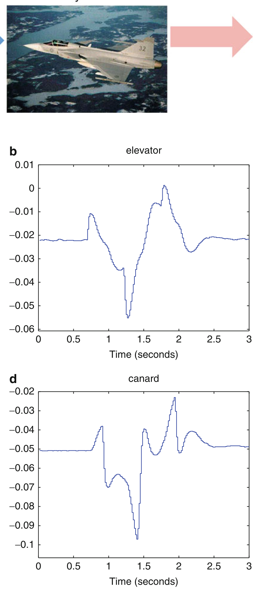

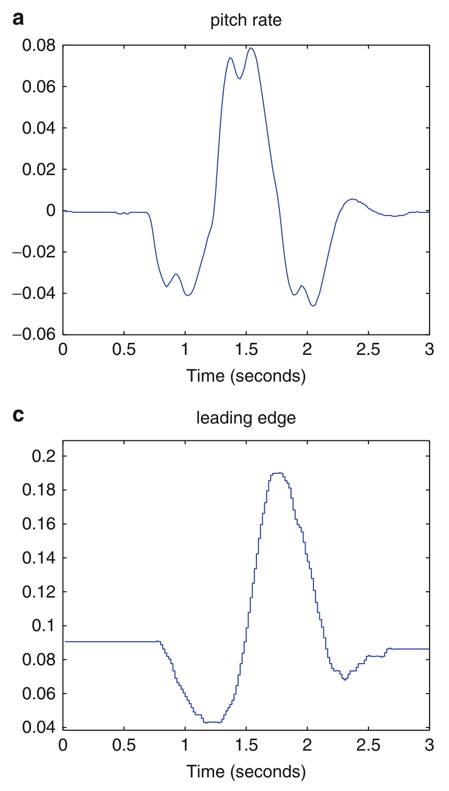

> Image description: This textbook figure displays two line graphs, labeled 'a' and 'c', representing time-series data from an early test flight of a Gripen aircraft. Both graphs share a horizontal axis representing "Time (seconds)" ranging from 0 to 3 seconds. Graph 'a', titled "pitch rate," depicts the angular velocity of the aircraft's pitch motion. The vertical axis ranges from -0.06 to 0.08. The data shows a relatively stable baseline at 0 until approximately 0.7 seconds, followed by an oscillation: a negative dip reaching about -0.04 at 1 second, a sharp peak reaching 0.08 at 1.5 seconds, and a second negative dip near 2 seconds before returning toward zero. Graph 'c', titled "leading edge," shows the leading edge displacement or position. The vertical axis ranges from 0.04 to 0.2. The signal remains constant at 0.09 until 0.7 seconds, then oscillates with a minimum of 0.04 at 1.2 seconds and a maximum peak of approximately 0.19 at 1.7 seconds, before stabilizing back to 0.09.

System Identification: An Overview, Fig. 2 Data from an early test flight of Gripen. These data cover 3 s of flight and are sampled at 60 Hz . (a) The output: pitch rate.

Fig. 3. We see that the simple model (2) provides quite reasonable predictions over data it has not seen before. This could conceivably be improved if more elaborate model structures
(b) Control input 1: elevator angle. (c) Control input 2: leading edge flap. (d) Control input 3: canard angle
than (1) were tried out. Also, in practice more advanced techniques would be required to validate that the estimated model is sufficiently reliable.

<!-- source_pdf_page: 1462 -->
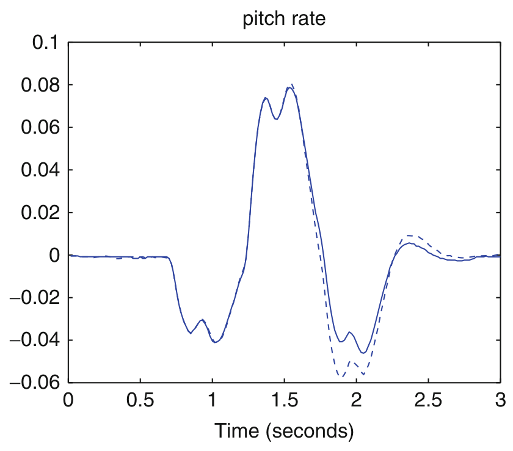

> Image description: A line graph titled "pitch rate" illustrates the comparison between measured and predicted values over time. The vertical y-axis, representing the pitch rate, ranges from -0.06 to 0.1, and the horizontal x-axis represents "Time (seconds)" from 0 to 3. The plot features two lines: a solid blue line representing the "measured output" and a dashed blue line representing the "5-step-ahead prediction." Both signals remain near zero until approximately 0.7 seconds. Following this, the measured output undergoes several fluctuations, dropping to a minimum around -0.04 near 1 second, rising to a peak of approximately 0.08 near 1.5 seconds, and dropping again to about -0.04 near 2 seconds before returning toward zero. The dashed prediction line follows the general trend of the solid measured line but exhibits more significant deviations, particularly between 1.7 and 2.2 seconds, where it reaches lower troughs than the measured signal.
System Identification: An Overview, Fig. 3 The measured output (solid line) compared to the 5-step-ahead prediction one (dashed line)

This simple introductory example points to the basic flow of system identification and it also points to the pertinent issues, which will be listed in the section "The State-of-the-Art Identification Setup."

## Models and System Identification

## The Omnipresent Model

It is clear to everyone in science and engineering that mathematical models are playing increasingly important roles. Today, model-based design and optimization is the dominant engineering paradigm to systematic design and maintenance of engineering systems. It has proven very successful and is widely used in basically all engineering disciplines. Concerning control applications, the aerospace industry is the earliest example on a grand-scale of this paradigm. This industry was very quick to adopt the theory for model-based optimal control that emerged in the 1960s and is spending great efforts and resources on developing models. In the process industry, model predictive control (MPC) has during the last 25 years become the dominant method to optimize production on an intermediate level. MPC uses dynamical models to predict future
process behavior and to optimize the manipulated variables subject to process constraints.

Increasing demands on performance, efficiency, safety, and environmental aspects are pushing engineering systems to become increasingly complex. Advances in (wireless) communications systems and microelectronics are key enablers for this rapid development, allowing systems to be efficiently interconnected in networks, reducing costs and size, and paving the way for new sensors and actuators.

Model-based techniques are also gaining importance outside engineering applications. Let us just mention systems biology and health care. In the latter case it is expected that personalized health systems will become more and more important in the future.

Common to the examples given above are the requirements of permeating sensing, actuation, communication, and computation abilities of the engineering systems, in many cases in distributed architectures. It is also clear that these systems should be able to operate in a reliable way in an uncertain and temporally and spatially changing environment. In many applications, cognitive abilities and abilities to adapt will be important. With systems being decentralized and typically containing many actuators, sensors, states, and nonlinearities, but with limited access to sensor information, model building that delivers models of sufficient fidelity becomes very challenging.

## System Identification: Data-Driven Modeling

Construction of models requires access to observed data. It could be that the model is developed entirely from information in signals from the system ("black-box models") or it could be that physical/engineering insights are combined with such information ("gray-box models"). In any case, verification (validation) of a model must be done in the light of measured data. Theories and methodologies for such model construction have been developed in many different research communities (to some extent independently). System identification is the term used in the control community for

<!-- source_pdf_page: 1463 -->
the area of constructing mathematical models of dynamical systems from measured inputoutput signals. Other communities use other terms for often very similar techniques. The term machine learning has become very common in recent years, e.g., Rasmussen and Williams (2006).

System identification has a history of more than 50 years, since the term was coined by Lotfi Zadeh (1956). It is a mature research field with numerous publications, textbooks, conference series, and software packages. It is often used as an example in the control field of an area with good interaction between theory and industrial practice. The backbone of the theory relies upon statistical grounds, with maximum likelihood methods and asymptotic analysis (in the number of observed data). The goal of the system identification field is to find a model of the plant in question as well as of its disturbances and also to find a characterization of the uncertainty bounds of the description.

## The State-of-the-Art Identification Setup

To approach a system identification problem, like in section "An Introductory Example," a number of questions need to be answered, such as

- What model type, e.g., (1) should be used?
- How should the parameters in the model be adjusted?
- What inputs should be applied to obtain a good model?
- How do we assess the quality of the model?
- How do we gain confidence in an estimated model?
There is a very extensive literature on the subject, with many textbooks, like Ljung (1999), Söderström and Stoica (1989), and Pintelon and Schoukens (2012).

System identification is characterized by five basic concepts:

- $\mathcal{X}$ : The experimental conditions under which the data is generated
- $\mathcal{D}$ : The data

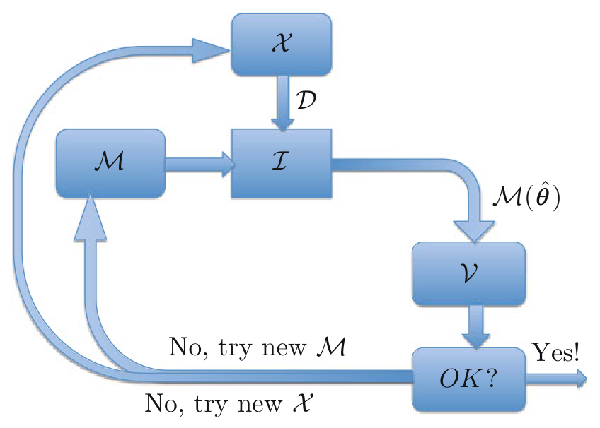

> Image description: A flowchart titled "System Identification: An Overview, Fig. 4 The identification work loop" depicts a cyclic iterative process. The workflow begins with a data set $\mathcal{D}$, which is derived from an input source labeled $\mathcal{X}$. This data $\mathcal{D}$ is fed into a block labeled $\mathcal{I}$. Simultaneously, a model block $\mathcal{M}$ provides input to block $\mathcal{I}$. The output from block $\mathcal{I}$ is $\mathcal{M}(\hat{\theta})$, which serves as the input for a validation block $\mathcal{V}$. The result of the validation is passed to a decision block labeled "OK?". If the answer is "Yes!", the process terminates. If the answer is "No," there are two feedback loops: one leads back to block $\mathcal{M}$ with the instruction "No, try new $\mathcal{M}$," and the other leads back to block $\mathcal{X}$ with the instruction "No, try new $\mathcal{X}$." The diagram illustrates the iterative refinement of models and data collection in system identification.
System Identification: An Overview, Fig. 4 The identification work loop

- $\mathcal{M}$ : The model structure and its parameters $\theta$
- I: The identification method by which a parameter value $\hat{\theta}$ in the model structure $\mathcal{M}(\theta)$ is determined based on the data $\mathcal{D}$
- $\mathcal{V}$ : The validation process that scrutinizes the identified model
See Fig.4. It is typically an iterative process to navigate to a model that passes through the validation test ("is not falsified"), involving revisions of the necessary choices. For several of the steps in this loop, helpful support tools have been developed. It is however not quite possible or desirable to fully automate the choices, since subjective perspectives related to the intended use of the model are very important.

## $\mathcal{M}$ : Model Structures

A model structure $\mathcal{M}$ is a parameterized collection of models that describe the relations between the inputs $u$ and outputs $y$ of the system. The parameters are denoted by $\theta$ so $\mathcal{M}(\theta)$ is a particular model. The model set then is

$$
\begin{equation*}
\mathcal{M}=\left\{\mathcal{M}(\theta) \mid \theta \in D_{\mathcal{M}}\right\} \tag{3}
\end{equation*}
$$

Many ways exist to collect mathematical expressions that encompass a model; see, e.g., - Modeling of Dynamic Systems from First Principles, - Nonlinear System Identification: An Overview of Common Approaches, and

<!-- source_pdf_page: 1464 -->
- Nonlinear System Identification Using Particle Filters. The models may be both linear and nonlinear as well as time invariant and time varying, and it is useful to have as a common ground that a model gives a rule to predict (one-step-ahead) the output at time $t$, i.e., $y(t)$ (a $p$-dimensional column vector), based on observations of previous input-output data up to time $t-1$ (denoted by $Z^{t-1}$ ).

$$
\begin{equation*}
\hat{y}(t \mid \theta)=g\left(t, \theta, Z^{t-1}\right) \tag{4}
\end{equation*}
$$

This covers a broad variety of model descriptions, sometimes in a somewhat abstract way. The descriptions become much more explicit when we specialize to linear models.
A note on "inputs" It is important to include all measurable disturbances that affect $y$ among the inputs $u$ to the system, even if they cannot be manipulated as control inputs. In some cases the system may entirely lack measurable inputs, so the model (4) then just describes how future outputs can be predicted from past ones. Such models are called time series and correspond to systems that are driven by unobservable disturbances. Most of the techniques described in this entry apply also to such models.
A note on disturbances A complete model involves both a description of the input-output relations and a description of how various noise sources affect the measurements. The noise description is essential to understand both the quality of the model predictions and the model uncertainty. Proper control design also requires a picture of the disturbances in the system.

## Linear Models

For linear time invariant systems, a general model structure is given by the transfer function $G$ from input $u$ to output $y$ and the transfer function $H$ from a white noise source $e$ to output additive disturbances (for notational convenience, we specialize to single-input-single-output systems, but all expressions are valid in the multivariable case with simple notational changes):

$$
\begin{align*}
y(t) & =G(q, \theta) u(t)+H(q, \theta) e(t)  \tag{5a}\\
E e^{2}(t) & =\sigma^{2} ; \quad E e(t) e^{T}(k)=0 \text { if } k \neq t \tag{5b}
\end{align*}
$$

(E denotes mathematical expectation.) This model is in discrete time and $q$ denotes the shift operator $q y(t)=y(t+1)$. We assume for simplicity that the sampling interval is a one-time unit. The expansion of $G(q, \theta)$ in the inverse (backwards) shift operator gives the impulse response of the system:

$$
\begin{align*}
G(q, \theta) u(t) & =\sum_{k=1}^{\infty} g_{k}(\theta) q^{-k} u(t) \\
& =\sum_{k=1}^{\infty} g_{k}(\theta) u(t-k) \tag{6}
\end{align*}
$$

The discrete time Fourier transform (or the $z$ transform of the impulse response, evaluated in $z=e^{i \omega}$ ) gives the frequency response of the system:

$$
\begin{equation*}
G\left(e^{i \omega}, \theta\right)=\sum_{k=1}^{\infty} g_{k}(\theta) e^{-i k \omega} \tag{7}
\end{equation*}
$$

The function $G$ describes how an input sinusoid shifts phase and amplitude when it passes through the system.

The additive noise term $v=H e$ is quite versatile, and with a suitable choice of $H$, it can describe a disturbance with arbitrary spectrum. To link with the predictor as a unifying model concept, it is useful to compute the predictor for (5a) (the conditional mean of $y(t)$ given past data), which is

$$
\begin{gather*}
\hat{y}(t \mid \theta)=G(q, \theta) u(t)+\left[1-H^{-1}(q, \theta)\right] \\
{[y(t)-G(q, \theta) u(t)]} \tag{8}
\end{gather*}
$$

Note that the expansion of $H^{-1}$ starts with "1," so the first term starts with $h_{1} q^{-1}$ so there is a delay in $y$. It is easy to interpret the first term as a simulation using the input $u$, adjusted with a prediction of the additive disturbance $v(t)$ at

<!-- source_pdf_page: 1465 -->
time $t$, based on past values of $v$. The predictor is thus an easy reformulation of the basic transfer functions $G$ and $H$. The question now is how to parameterize these.

## Black-Box Models

A black-box model uses no physical insight or interpretation, but is just a general and flexible parameterization. It is natural to let $G$ and $H$ be rational in the shift operator:

$$
\begin{align*}
G(q, \theta) & =\frac{B(q)}{F(q)} ; \quad H(q, \theta)=\frac{C(q)}{D(q)}  \tag{9a}\\
B(q) & =b_{1} q^{-1}+b_{2} q^{-2}+\ldots b_{n b} q^{-n b}  \tag{9b}\\
F(q) & =1+f_{1} q^{-1}+\ldots+f_{n f} q^{-n f}  \tag{9c}\\
\theta & =\left[b_{1}, b_{2}, \ldots, f_{n f}\right] \tag{9~d}
\end{align*}
$$

$C$ and $D$ are like $F$ monic, i.e., start with a "1."
A very common case is that $F=D= A$ and $C=1$ which gives the ARX model (autoregressive with exogenous input):

$$
\begin{align*}
y(t) & =A^{-1}(q) B(q) u(t)+A^{-1}(q) e(t) \text { or }  \tag{10a}\\
A(q) y(t) & =B(q) u(t)+e(t) \text { or } \quad(10 \mathrm{a})  \tag{10b}\\
y(t) & +a_{1} y(t-1)+\ldots+a_{n a} y(t-n a)  \tag{10c}\\
& =b_{1} u(t-1)+\ldots+b_{n b} u(t-n b) \tag{10~d}
\end{align*}
$$

This is the model structure we used in (1) in the introductory example, but for several inputs.

Other common black-box structures of this kind are FIR (finite impulse response model, $F=C=D=1$ ), ARMAX (autoregressive moving average with exogenous input, $F=D=A$ ), and BJ (Box-Jenkins, all four polynomials are different.)

## Gray-Box Models

If some physical facts are known about the system, it is possible to build that into a gray-box model. It could, for example, be that for the airplane in the introduction, the motion equations are known from Newton's laws, but certain
parameters are unknown, like the aerodynamical derivatives. Then it is natural to build a continuous-time state-space model from physical equations:

$$
\begin{align*}
& \dot{x}(t)=A(\theta) x(t)+B(\theta) u(t) \\
& y(t)=C(\theta) x(t)+D(\theta) u(t)+v(t) \tag{11}
\end{align*}
$$

Here $\theta$ are simply some entries of the matrices $A, B, C, D$, corresponding to unknown physical parameters, while the other matrix entries signify known physical behavior. This model can be sampled with well-known sampling formulas (obeying the input inter-sample properties, zeroorder hold, or first-order hold) to give

$$
\begin{align*}
x(t+1) & =\mathcal{F}(\theta) x(t)+\mathcal{G}(\theta) u(t) \\
y(t) & =C(\theta) x(t)+D(\theta) u(t)+w(t) \tag{12}
\end{align*}
$$

The model (12) has the transfer function from $u$ to $y$

$$
\begin{equation*}
G(q, \theta)=C(\theta)[q I-\mathcal{F}(\theta)]^{-1} \mathcal{G}(\theta)+D(\theta) \tag{13}
\end{equation*}
$$

so we have achieved a particular parameterization of the general linear model (5a).

## Continuous-Time Models

The general model description (4) describes how the predictions evolve in discrete time. But in many cases, we are interested in continuoustime (CT) models, like models for physical interpretation and simulation (e.g., electrical circuit simulators like ADS, Spice, Spectre, and Microwave Office use continuous-time models). But CT model estimation is contained in the described framework, as the linear state-space model (11) illustrates. More comments on direct estimation of CT models are given in section "Estimating Continuous Time Models."

## Nonlinear Models

A nonlinear model is a relation (4), where the function $g$ is nonlinear in the input-output data $Z$. There is a rich variation in how to specify the

<!-- source_pdf_page: 1466 -->
function $g$ more explicitly. A quite general way is the nonlinear state-space equation, which is a counterpart to (12):

$$
\begin{align*}
x(t+1) & =f(x(t), v(t), \theta)  \tag{14}\\
y(t) & =h(x(t), e(t), \theta)
\end{align*}
$$

where $v$ and $e$ are white noises. This is further discussed in ▷ Nonlinear System Identification: An Overview of Common Approaches, where $x$ is described as a Markov process with $v$ defining the transitions, and in ▷ Nonlinear System Identification: An Overview of Common Approaches, where (14) ( $v \equiv 0$ ) is related to a continuoustime gray-box model. The latter article also discusses several other nonlinear model structures that can be seen as extensions and modifications of linear models: nonlinear mappings of past input-output data corresponding to (10), mixing static nonlinearities with linear dynamical models, etc.

## $\mathcal{I}$ : Identification Methods: Criteria

The goal of identification is to match the model to the data. Here the basic techniques for such matching will be discussed.

## Time Domain Data

Suppose now we have collected a data record in the time domain

$$
\begin{equation*}
Z^{N}=\{u(1), y(1), \ldots, u(N), y(N)\} \tag{15}
\end{equation*}
$$

Since the model is in essence a predictor, it is quite natural to evaluate it by how well it predicts the measured output. So, form the prediction errors for (4):

$$
\begin{equation*}
\varepsilon(t, \theta)=y(t)-\hat{y}(t \mid \theta) \tag{16}
\end{equation*}
$$

The "size" of this error can be measured by some scalar norm:

$$
\begin{equation*}
\ell(\varepsilon(t, \theta)) \tag{17}
\end{equation*}
$$

and the performance of the predictor over the whole data record $Z^{N}$ becomes

$$
\begin{equation*}
V_{N}(\theta)=\sum_{t=1}^{N} \ell(\varepsilon(t, \theta)) \tag{18}
\end{equation*}
$$

A natural parameter estimate is then

$$
\begin{equation*}
\hat{\theta}_{N}=\underset{\theta \in D_{\mathcal{M}}}{\arg \min } V_{N}(\theta) \tag{19}
\end{equation*}
$$

This is the prediction error method (PEM) and is applicable to general model structures. See, e.g., Ljung (1999) or (2002) for more details. See also - Nonlinear System Identification: An Overview of Common Approaches.

The PEM approach can be embedded in a statistical setting to guarantee optimal statistical properties. The ML methodology below offers a systematic framework to do so:

## A Maximum Likelihood View

If the system innovations $e$ have a probability density function (pdf) $f(x)$, then the criterion function (18) with $\ell(x)=-\log f(x)$ will be the logarithm of the likelihood function. See Lemma 5.1 in Ljung (1999). More specifically, assume that the system has $p$ outputs and that the innovations are Gaussian with zero mean and covariance matrix $\Lambda$, so that

$$
\begin{equation*}
y(t)=\hat{y}(t \mid \theta)+e(t), \quad e(t) \in N(0, \Lambda) \tag{20}
\end{equation*}
$$

for the $\theta$ that generated the data. Then it follows that the negative logarithm of the likelihood function for estimating $\theta$ from $y$ is

$$
\begin{equation*}
L_{N}(\theta)=\frac{1}{2}\left[V_{N}(\theta)+N \log \operatorname{det} \Lambda+N p \log 2 \pi\right] \tag{21}
\end{equation*}
$$

where $V_{N}(\theta)$ is defined by (18), with

$$
\begin{equation*}
\ell(\varepsilon(t, \theta))=\varepsilon^{T}(t, \theta) \Lambda^{-1} \varepsilon(t, \theta) \tag{22}
\end{equation*}
$$

So the maximum likelihood model estimate (MLE) for known $\Lambda$ is obtained by minimizing $V_{N}(\theta)$. If $\Lambda$ is not known, it can be included

<!-- source_pdf_page: 1467 -->
among the parameters and estimated, (Ljung 1999, page 218), which results in a criterion

$$
\begin{equation*}
D_{N}(\theta)=\operatorname{det} \sum_{t=1}^{N} \varepsilon(t, \theta) \varepsilon^{T}(t, \theta) \tag{23}
\end{equation*}
$$

to be minimized.

## The EM Algorithm

The EM algorithm (Dempster et al. 1977) is closely related to the ML technique. It is a method that is especially useful when the ML criterion is difficult to evaluate from the observed data but would be easier to find if certain unobserved latent variables were known. The algorithm alternates between an expectation step estimating the log likelihood and a maximization step bringing the parameter estimate closer in each step to the MLE. Its application to the nonlinear statespace model (14) is described in ▷ Nonlinear System Identification: An Overview of Common Approaches.

## Regularization

Solving for the estimate in (19) is a so-called inverse problem, which means that the solution may be ill conditioned. To deal with that in (18), we could add a quadratic norm:

$$
\begin{equation*}
W_{N}(\theta)=V_{N}(\theta)+\lambda\left(\theta-\theta^{\dagger}\right)^{T} R\left(\theta-\theta^{\dagger}\right) \tag{24}
\end{equation*}
$$

( $\lambda$ is a scaling, $R$ is a positive semidefinite (psd) matrix, and $\theta^{\dagger}$ is a nominal value of the parameters). The estimate is then found by minimizing $W_{N}(\theta)$. The criterion (24) makes sense in a classical estimation framework as an ad hoc modification of the MLE to deal with possible ill-conditioned minimization problems. The added quadratic term then serves as proper (Tikhonov) regularization of an ill-conditioned inverse problem; see, for example, Tikhonov and Arsenin (1977). This criterion is a clear-cut balance between model fit and a penalty on the model parameter size. The amount of penalty is governed by $\lambda$ and $R$.

Other useful regularization penalties could be to add an $\ell_{1}$ norm of the parameter. Such techniques are further discussed in ▷ System Identification Techniques: Convexification, Regularization, and Relaxation.

## Bayesian View

For a broader perspective it is useful to invoke a Bayesian view. Then the sought parameter vector $\theta$ is itself a random vector with a certain pdf. This random vector will of course be correlated with the observations $y$. If we assume that the prior distribution of $\theta$ (before $y$ has been observed) is Gaussian with mean $\theta^{*}$ and covariance matrix $\Pi$,

$$
\begin{equation*}
\theta \in N\left(\theta^{*}, \Pi\right) \tag{25}
\end{equation*}
$$

its prior pdf is

$$
\begin{equation*}
P(\theta)=\frac{1}{\sqrt{(2 \pi)^{p} \operatorname{det}(\Pi)}} e^{-\left(\theta-\theta^{*}\right)^{T} \Pi^{-1}\left(\theta-\theta^{*}\right) / 2} \tag{26}
\end{equation*}
$$

The posterior (after $y$ has been measured) pdf then is by Bayes rule ( $Y$ denoting all measured $y$ signals)

$$
\begin{equation*}
P(\theta \mid Y)=\frac{P(\theta, Y)}{P(Y)}=\frac{P(Y \mid \theta) P(\theta)}{P(Y)} \tag{27}
\end{equation*}
$$

In the last step $P(Y \mid \theta)$ is the likelihood function (cf. the negative log likelihood function $L_{N}(\theta)$ in (21)), $P(\theta)$ is the prior pdf (26), and $P(Y)$ is a $\theta$ independent normalization. Apart from this normalization, and other $\theta$-independent terms, twice the negative logarithm of (27) equals $W_{N}(\theta)$ in (24) with

$$
\begin{equation*}
\lambda R=\Pi^{-1} \tag{28}
\end{equation*}
$$

That means that with (28), the regularized estimate from (24) is the maximum a posteriori (MAP) estimate. As more and more data become available, the role of the prior will tend to zero, so as $N \rightarrow \infty$ the MAP Estimate → MLE.

This Bayesian interpretation of the regularized estimate also gives a clue to select the regularization quantities $\lambda, R, \theta^{*}$.

<!-- source_pdf_page: 1468 -->
For black-box models, a reasonable prior ( $\Pi, \theta^{*}$ ) may not be available. Then it is possible to parameterize them with hyperparameters $\alpha$ and then estimate these through the marginal likelihood:

$$
\begin{equation*}
\hat{\alpha}=\arg \max P(Y \mid \alpha) \tag{29}
\end{equation*}
$$

A survey of how such techniques may improve system identification techniques is given in Pillonetti et al. (2014).

More aspects of the Bayesian view of system identification are given in ▷ System Identification Techniques: Convexification, Regularization, and Relaxation and in - Nonlinear System Identification Using Particle Filters.

## Frequency Domain Data

Frequency domain data are obtained either from frequency analysers or by applying the Fourier transform to measured time domain data. The data could be in the input-output form

$$
\begin{gather*}
Y_{N}\left(e^{i \omega_{k}}\right), U_{N}\left(e^{i \omega_{k}}\right), k=1,2, \ldots, M  \tag{30}\\
Y_{N}(z)=\frac{1}{\sqrt{N}} \sum_{k=1}^{N} y(k) z^{-k} \tag{31}
\end{gather*}
$$

or being observed samples from the frequency function

$$
\begin{gather*}
\hat{\hat{G}}_{N}\left(e^{i \omega_{k}}\right), k=1,2, \ldots, M  \tag{32}\\
\text { e.g., } \hat{\hat{G}}_{N}\left(e^{i \omega}\right)=\frac{Y_{N}\left(e^{i \omega}\right)}{U_{N}\left(e^{i \omega}\right)}(\mathrm{ETFE}) \tag{33}
\end{gather*}
$$

((33) is the empirical transfer function estimate, ETFE).

## Linear Parametric Models

By taking the Fourier transform of (5a), we see that

$$
\begin{equation*}
Y\left(e^{i \omega}\right)=G\left(e^{i \omega}, \theta\right) U\left(e^{i \omega}\right) \tag{34}
\end{equation*}
$$

plus a noise term that has variance

$$
\begin{equation*}
\sigma^{2}\left|H\left(e^{i \omega}, \theta\right)\right|^{2} \tag{35}
\end{equation*}
$$

Simple least squares (LS) curve fitting of (34) says that we should fit observations with weights that are inversely proportional to the measurement variance. That gives the weighted LS criterion

$$
\begin{align*}
V_{N}(\theta)= & \sum_{k=1}^{M} \mid Y\left(e^{i \omega_{k}}\right) \\
& -\left.G\left(e^{i \omega_{k}}, \theta\right) U_{N}\left(e^{i \omega_{k}}\right)\right|^{2} /\left|H\left(e^{i \omega_{k}}, \theta\right)\right|^{2} \tag{36}
\end{align*}
$$

(the constant $\sigma^{2}$ does not affect the minimization of $V_{N}$ ).

It can readily be verified that (36) coincides with (18), $\left(\ell(\varepsilon)=|\varepsilon|^{2}\right)$ by Parseval's identity in case $M=N$ and the frequencies $\omega_{k}$ are selected as the DFT grid.

Notice that (36) can be written as

$$
\begin{align*}
V_{N}(\theta)= & \sum_{k=1}^{M}\left|\frac{Y_{N}\left(e^{i \omega_{k}}\right)}{U_{N}\left(e^{i \omega_{k}}\right)}-G\left(e^{i \omega_{k}}, \theta\right)\right|^{2} \\
& \cdot\left|\frac{U_{N}\left(e^{i \omega_{k}}\right)}{H\left(e^{i \omega_{k}}, \theta\right)}\right|^{2} \tag{37}
\end{align*}
$$

We can see that as a properly weighted curve fitting of the frequency function to the ETFE (33).

See - Frequency Domain System Identification for more details of using frequency domain data for estimating dynamical systems.

## Nonparametric Methods

From frequency domain data, the frequency response functions $G\left(e^{i \omega}\right), H\left(e^{i \omega}\right)$ can also be estimated directly as functions without any parametric model. See Techniques in System Identification for a detailed account of this.

## IV and Subspace Methods

## Instrumental Variables

The family of identification methods that can be described as minimizing a specific criterion function, like (19), covers many theoretically and practically important techniques. Still, several methods do not belong to this family. A useful

<!-- source_pdf_page: 1469 -->
technique is to characterize a good model, as one that gives prediction errors that are uncorrelated with available information:

$$
\begin{equation*}
\hat{\theta}=\operatorname{sol}_{\theta \in D_{\mathcal{M}}} \sum_{t=1}^{N} \varepsilon(t, \theta) \zeta(t, \theta)=0 \tag{38}
\end{equation*}
$$

Here, $\varepsilon(t, \theta)$ is the prediction error (16), and sol means "solution to." The sequence $\{\zeta(t), t= 1, \ldots, N\}$ is constructed from the observed data, possibly also dependent on some design variables that are included in $\theta$. Typically $\zeta(t)$ is constructed from past inputs, so a good model should not have prediction errors that are correlated with past observations. The variables $\zeta$ are called instrumental variables, and there is an extensive literature about how to select these. See, e.g., Ljung (1999), Section 7.5, Söderström and Stoica (1983), and Young (2011).

## Subspace Methods

A related technique is to estimate black-box statespace models like (12) (without any internal parametric structure) by realizing the states from data and then estimating the matrices by least squares method. This gives a powerful family of methods for state-space model estimation. They are described in detail in ▷ Subspace Techniques in System Identification. The major advantage of subspace methods is that they easily apply to multiple-input-multiple-output systems and are non-iterative. A drawback is that the model properties and their dependence on certain design variables are not fully known.

## Errors-in-Variables (EIV) Techniques

The estimation techniques described so far assume that the input has been measured without errors. In some cases, it is natural to assume that both inputs and outputs have measurement errors. The estimation problem then becomes more difficult, and some kind of knowledge about the measurement errors is typically required. In Pintelon and Schoukens (2012), Section 8.2, it is described how criteria of the type (36) are modified in the presence of input noise, and Söderström (2007) can be consulted for a summarizing treatise on

EIV techniques. See also the section "Errors-inVariables Framework" in - Frequency Domain System Identification.

## Asymptotic Properties of the Estimated Models

An estimated model is useless, unless something is known about its reliability and error bounds. Therefore, it is important to analyze the model properties.

## Bias and Variance

The observations, certainly of the output from the system, are affected by noise and disturbances, which of course also will influence the estimated model parameters (19). The disturbances are typically described as stochastic processes, which makes the estimate $\hat{\theta}_{N}$ a random variable. This has a certain pdf and often the analysis is restricted to its mean and variance only. The difference between the mean and a true description of the system measures the bias of the model. If the mean coincides with the true system, the estimate is said to be unbiased. The total error in a model thus has two contributions: the bias and the variance.

## Properties of the PEM Estimate (19) as $N \rightarrow \infty$

Except in simple special cases, it is quite difficult to compute the pdf of the estimate $\hat{\theta}_{N}$. However, its asymptotic properties as $N \rightarrow \infty$ are easier to establish. The basic results can be summarized as follows ( E denotes mathematical expectation; see Ljung (1999), chapters 8 and 9, for a more complete treatment):

- Limit Model:

$$
\begin{align*}
\hat{\theta}_{N} & \rightarrow \theta^{*} \\
& =\arg \min \left[\lim _{N \rightarrow \infty} \frac{1}{N} V_{N}(\theta) \approx \mathrm{E} \ell(\varepsilon(t, \theta))\right] \tag{39}
\end{align*}
$$

<!-- source_pdf_page: 1470 -->
So the estimate will converge to the best possible model, in the sense that it gives the smallest average prediction error.

- Asymptotic Covariance Matrix for Scalar Output Models:
In case the prediction errors $e(t)=\varepsilon\left(t, \theta^{*}\right)$ for the limit model are approximately white, the covariance matrix of the parameters is asymptotically given by:

$$
\begin{equation*}
\operatorname{Cov} \hat{\theta}_{N} \sim \frac{\kappa(\ell)}{N}\left[\operatorname{Cov} \frac{d}{d \theta} \hat{y}(t \mid \theta)\right]^{-1} \tag{40}
\end{equation*}
$$

So the covariance matrix of the parameter estimate is given by the inverse covariance matrix of the gradient of the predictor wrt the parameters. Here (prime denoting derivatives)

$$
\begin{equation*}
\kappa(\ell)=\frac{E\left[\ell^{\prime}(e(t))\right]^{2}}{E \ell^{\prime \prime}(e(t)]^{2}} \tag{41}
\end{equation*}
$$

Note that

$$
\kappa(\ell)=\sigma^{2}=E e^{2}(t) \quad \text { if } \ell(e)=e^{2} / 2
$$

If the model structure contains the true system, it can be shown that this covariance matrix is the smallest that can be achieved by any unbiased estimate, in case the norm $\ell$ is chosen as the logarithm of the pdf of $e$. That is, it fulfills the the Cramér-Rao inequality (Cramér 1946). These results are valid for quite general model structures. Now, specialize to linear models (5a) and assume that the true system is described by

$$
\begin{equation*}
y(t)=G_{0}(q) u(t)+H_{0}(q) e(t) \tag{42}
\end{equation*}
$$

which could be general transfer functions, possibly much more complicated than the model. Then

$$
\begin{align*}
\theta^{*}= & \underset{\theta}{\arg \min } \int_{-\pi}^{\pi}\left|G\left(e^{i \omega}, \theta\right)-G_{0}\left(e^{i \omega}\right)\right|^{2} \\
& \frac{\Phi_{u}(\omega)}{\left|H\left(e^{i \omega}, \theta\right)\right|^{2}} d \omega \tag{43}
\end{align*}
$$

That is, the frequency function of the limiting model will approximate the true frequency function as well as possible in a frequency norm given by the input spectrum $\Phi_{u}$ and the noise model.

- For a linear black-box model

$$
\begin{equation*}
\operatorname{Cov} G\left(e^{i \omega}, \hat{\theta}_{N}\right) \sim \frac{n}{N} \frac{\Phi_{v}(\omega)}{\Phi_{u}(\omega)} \text { as } n, N \rightarrow \infty \tag{44}
\end{equation*}
$$

where $n$ is the model order and $\Phi_{v}$ is the noise spectrum $\sigma^{2}\left|H_{0}\left(e^{i \omega}\right)\right|^{2}$. The variance of the estimated frequency function at a given frequency is thus, for a high-order model, proportional to the noise-to-signal ratio at that frequency. That is a natural and intuitive result.

## Trade-Off Between Bias and Variance

Generally speaking the quality of the model depends on the quality of the measured data and the flexibility of the chosen model structure (3). A more flexible model structure typically has smaller bias, since it is easier to come closer to the true system. At the same time, it will have a higher variance: With higher flexibility it is easier to be fooled by disturbances. So the tradeoff between bias and variance to reach a small total error is a choice of balanced flexibility of the model structure.

As the model gets more flexible, the fit to the estimation data in (19), $V_{N}\left(\hat{\theta}_{N}\right)$, will always improve. To account for the variance contribution, it is thus necessary to modify this fit to assess the total quality of the model. A much used technique for this is Akaike's criterion, (AIC) (Akaike 1974):

$$
\begin{equation*}
\hat{\theta}_{N}=\underset{\mathcal{M}, \theta \in D_{\mathcal{M}}}{\arg \min } 2 L_{N}(\theta)+2 \operatorname{dim} \theta \tag{45}
\end{equation*}
$$

where $L_{N}$ is the negative log likelihood function. The minimization also takes place over a family of model structures with different number of parameters ( $\operatorname{dim} \theta$ ).

For Gaussian innovations $e$ with unknown and estimated variance, AIC takes the form

<!-- source_pdf_page: 1471 -->
$$
\begin{equation*}
\hat{\theta}_{N}=\underset{\mathcal{M}, \theta \in D_{\mathcal{M}}}{\arg \min }\left[\log \operatorname{det}\left[\frac{1}{N} \sum_{t=1}^{N} \varepsilon(t, \theta) \varepsilon^{T}(t, \theta)\right]+2 \frac{\operatorname{dim} \theta}{N}\right] \tag{46}
\end{equation*}
$$

after normalization and omission of modelindependent quantities.

A variant of AIC is to put a higher penalty on the model complexity:

$$
\begin{equation*}
\hat{\theta}_{N}=\arg \min \left[2 L_{N}(\theta)+\operatorname{dim} \theta \log N\right] \tag{47}
\end{equation*}
$$

This is known as Bayesian information criterion (BIC) or Rissanen's minimum description length (MDL) criterion (Rissanen 1978).

Section "V: Model Validation" contains further aspects on the choice of model structure.

## $\mathcal{X}$ : Experiment Design

Experiment design is the question of choosing which signal to measure, the sampling rate, and designing the input.

The theory of experiment design primarily relies upon analysis of how the asymptotic parameter covariance matrix (40) depends on the design variables: so the essence of experiment design can be symbolized as

$$
\min _{\mathcal{X}} \operatorname{trace}\left\{C\left[E \psi(t) \psi^{T}(t)\right]^{-1}\right\}
$$

where $\psi$ is the gradient of the prediction wrt the parameters and the matrix $C$ is used to weight variables reflecting the intended use of the model.

For linear systems the input design is often expressed as selecting the spectrum (frequency contents) of $u$.

This leads to the following recipe: Let the input's power be concentrated to frequency regions where a good model fit is essential and where disturbances are dominating.

Issues of experiment design are treated in much more detail in ▷ Experiment Design and Identification for Control.

The measurement setup, like if band-limited inputs are used to estimate continuous-time models and how the experiment equipment is instrumented with band pass filters (see, e.g., Pintelon and Schoukens 2012, Sections 13.2-3), also belongs to the important experiment design questions.

## $\mathcal{V}$ : Model Validation

Model validation is about examining and scrutinizing an estimated model to check if it can be used for its purpose. These methods unavoidably are problem dependent and contain several subjective elements, and no conclusive procedure for validation can be given. A few useful techniques will be listed in this section. Basically it is a matter of trying to falsify a model under the conditions it will be used for and also to gain confidence in its ability to reproduce new data from the system.

## Falsifying Models: Residual Analysis

An estimated model is never a correct description of a true system. In that sense, a model cannot be "validated." Instead it is instructive to try and falsify it, i.e., confront it with facts that may contradict its correctness. A good principle is to look for the simplest unfalsified model; see, e.g., Popper (1934).

Residual analysis is the leading technique for falsifying models: The residuals, or one-step-ahead prediction errors $\hat{\varepsilon}(t)=\varepsilon\left(t, \hat{\theta}_{N}\right)= y(t)-\hat{y}\left(t \mid \hat{\theta}_{N}\right)$ should ideally not contain any traces of past inputs or past residuals. If they did, it means that the predictions are not ideal. So, it is natural to test the correlation functions

<!-- source_pdf_page: 1472 -->
$$
\begin{align*}
\hat{r}_{\hat{\varepsilon}, u}(k) & =\frac{1}{N} \sum_{t=1}^{N} \hat{\varepsilon}(t+k) u(t)  \tag{48}\\
\hat{r}_{\hat{\varepsilon}}(k) & =\frac{1}{N} \sum_{t=1}^{N} \hat{\varepsilon}(t+k) \hat{\varepsilon}(t) \tag{49}
\end{align*}
$$

and check that they are not larger than certain thresholds. Here $N$ is the length of the data record and $k$ typically ranges over a fraction of the interval $[-N N]$. See, e.g., Ljung (1999), Section 16.6 for more details.

## Comparing Different Models

When several models have been estimated, it is a question to choose the "best one." Then, models that employ more parameters naturally show a better fit to the data, and it is necessary to outweigh that. The model selection criteria AIC (46) and BIC (47) are examples of how such decisions can be taken. They can be extended to regular hypothesis tests where more complex models are accepted or rejected at various test levels (Ljung 1999, Sect. 16.4).

Making comparisons in the frequency domain is a very useful complement for domain experts who are used to think in terms of natural frequencies, natural damping, etc.

## Cross Validation

Cross validation is an important statistical concept that loosely means that the model performance is tested on a data set (validation data) other than the estimation data. There is an extensive literature on cross validation, e.g., Stone (1977), and many ways to split up available data into estimation and validation parts have been suggested. A simple way, often used in system identification, is to use one-half of the data to estimate the model and the other half to evaluate simulation or prediction fit. Trying out different model structures (or other decision variables, like regularization parameters), one then picks the choice that gives the best performance on validation data.

## Other Topics

## Numerical Algorithms and Software Support

The central numerical task to estimate the model lies in the innocent-looking "arg min" in (38). Since the criterion often is non-convex, this global minimization can be nontrivial. Typically some iterative numerical optimization method, like Gauss-Newton, Levenberg-Marquardt, or trust regions, e.g., Nocedal and Wright (2012), is employed. The iterations are initiated at a carefully selected point, for black-box linear systems often based on ARX or subspace estimates.

The practical use of system identification relies upon efficient software support. Many such packages exist. They are further treated along with numerical and computational aspects in ▷ System Identification Software.

## Estimating Continuous-Time Models

Most of the techniques described here formally seem to deal with estimating discrete time model. However continuous-time (CT) models are to be preferred in many contexts, and most of the modeling of physical systems really concern CT models. A natural approach is to do physical modeling in continuous time as in (11) and then do estimation of the CT matrices via the sampled model (12). All the described algorithms and results apply to this approach to CT model estimation. Another approach is to use band-limited inputs and compute the CT Fourier transforms of data (that coincide with the discrete time transforms for band-limited data) and apply - Frequency Domain System Identification.

Yet another approach is to directly fit CT model parameters to discrete time data, using specially designed filters; see, e.g., Garnier and Wang (2008).

## Recursive Estimation

For certain adaptive and in-line applications, it may be necessary to continuously compute the models by recursively updating the estimates. The techniques for that resemble state-estimation

<!-- source_pdf_page: 1473 -->
algorithms and are dealt with in a general setting in - Nonlinear System Identification Using Particle Filters. See also Ch 11 in Ljung (1999).

## Data Management

The collected data often requires particular attention before it can be used for estimation. Issues like missing observations, obviously erroneous values (outliers), slowly varying disturbances, trends, etc., need attention. In industrial applications, a practical question is often to select portions of the data records that contain relevant information for the model building. Such questions are application dependent and related to experiment design and also to database management. Some techniques for preparing data for identification are mentioned in Ch 14 of Ljung (1999).

## Summary and Future Directions

System identification is a mature and wellestablished area in automatic control. The methods are successfully and routinely applied in industrial practice, and the understanding of theoretical issues is mostly excellent. The standard theory relies very much on basic statistical concepts and methods.

What is exciting about future development is what increased computation power may mean for the area: Can nonlinear models be efficiently estimated by massive computational efforts? Will tools inspired by machine learning turn out to be superior to the conventional approaches? Can reliable uncertainty regions be computed for arbitrary noises and without the asymptotic formulas?

Several of these questions are illuminated in the articles listed under Cross-References.

## Cross-References

There are several articles in this encyclopedia that deal with aspects of system identification. They have been coordinated with this overview and the text has listed how they complement the
issues treated here. For easy reference, here is a complete list of associated articles:

- Experiment Design and Identification for Control
- Frequency Domain System Identification
- Modeling of Dynamic Systems from First Principles
- Nonlinear System Identification: An Overview of Common Approaches
- Nonlinear System Identification Using Particle Filters
- Nonparametric Techniques in System Identification
- Subspace Techniques in System Identification
- System Identification Software
- System Identification Techniques: Convexification, Regularization, and Relaxation

## Recommended Reading

A text book that covers and extends the material in this contribution is Ljung (1999). Another text book in the same spirit is Söderström and Stoica (1989), while Pintelon and Schoukens (2012) gives a comprehensive treatment of frequency domain methods. Recursive methods are treated in Young (2011).

Acknowledgments Support from the European Research Council under the advanced grant LEARN, contract 267381, is gratefully acknowledged.

## Bibliography

Akaike H (1974) A new look at the statistical model identification. IEEE Trans Autom Control AC-19:716723
Cramér H (1946) Mathematical methods of statistics. Princeton University Press, Princeton
Dempster A, Laird N, Rubin D (1977) Maximum likelihood from incomplete data via the EM algorithms. J R Stat Soc Ser B 39(1):1-38
Garnier H, Wang L (eds) (2008) Identification of continuous-time models from sampled data. Springer, London

<!-- source_pdf_page: 1474 -->
Ljung L (1999) System identification - theory for the user, 2nd edn. Prentice-Hall, Upper Saddle River
Ljung L (2002) Prediction error estimation methods. Circuits Syst Signal Process 21(1):11-21
Nocedal J, Wright J (2012) Numerical optimization, 2nd edn. Springer, Berlin
Pillonetti G, Dinuzzo F, Chen T, De Nicolao G, Ljung L (2014) Kernel methods in system identification, machine learning and function estimation: a survey. Automatica 50(3):657-683
Pintelon R, Schoukens J (2012) System identification - a frequency domain approach, 2nd edn. IEEE, New York
Popper KR (1934) The logic of scientific discovery. Basic Books, New York
Rasmussen CE, Williams CKI (2006) Gaussian processes for machine learning. MIT, Cambridge

Rissanen J (1978) Modelling by shortest data description. Automatica 14:465-471
Söderström T (2007) Errors-in-variables identification in system identification. Automatica 43(6): 939-958
Söderström T, Stoica P (1983) Instrumental variable methods for system identification. Springer, New York
Söderström T, Stoica P (1989) System identification. Prentice-Hall, London
Stone M (1977) Asymptotics for and against crossvalidation. Biometrica 64(1):29-35
Tikhonov AN, Arsenin VY (1977) Solutions of Ill-posed problems. Winston/Wiley, Washington, DC
Young PC (2011) Recursive estimation and time-series analysis, 2nd edn. Springer, Berlin
Zadeh LA (1956) On the identification problem. IRE Trans Circuit Theory 3:277-281
