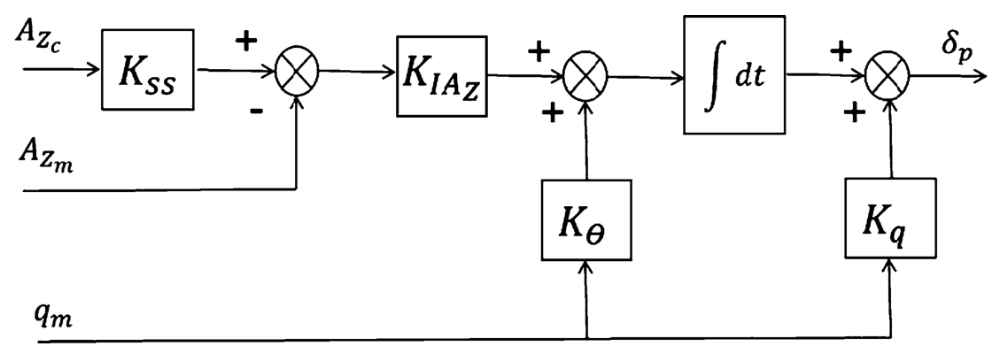
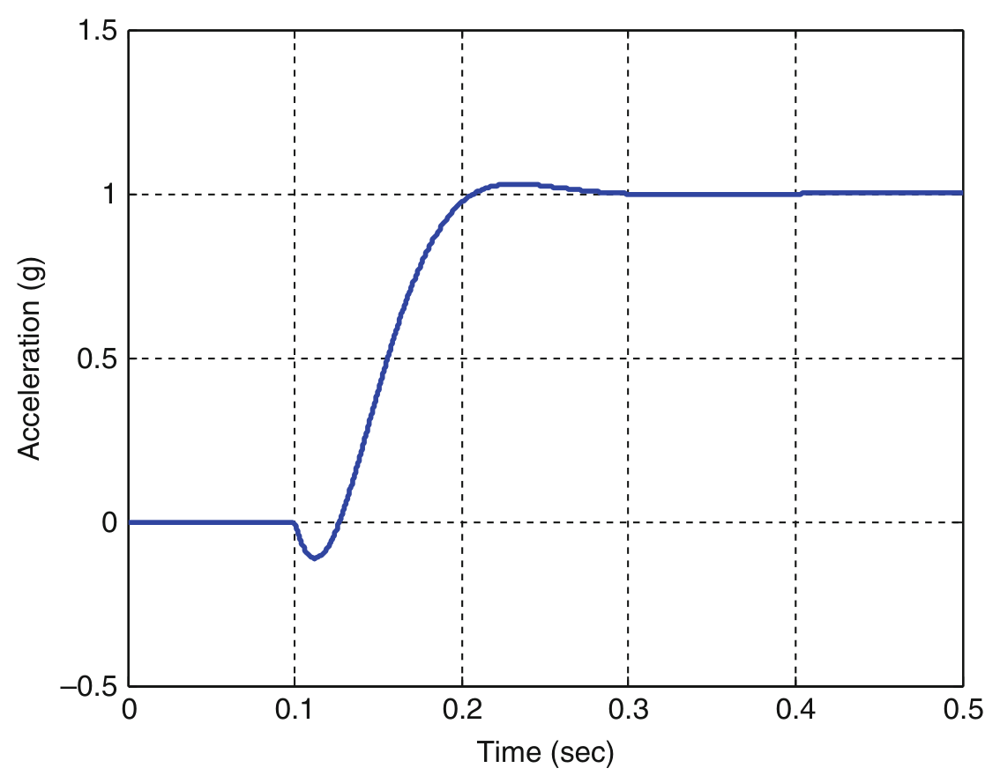
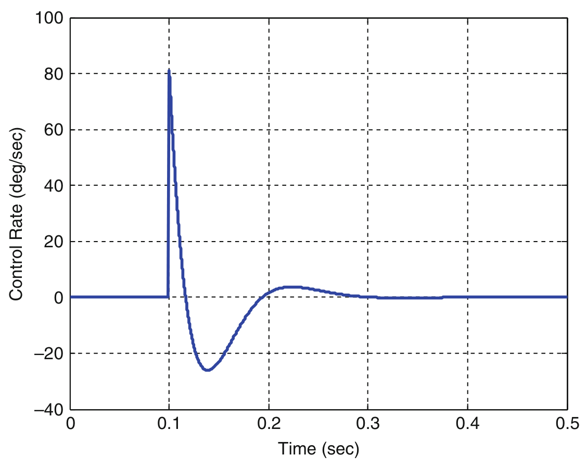
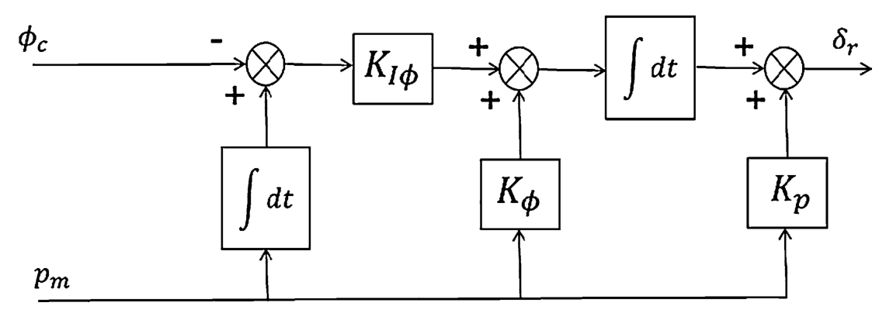
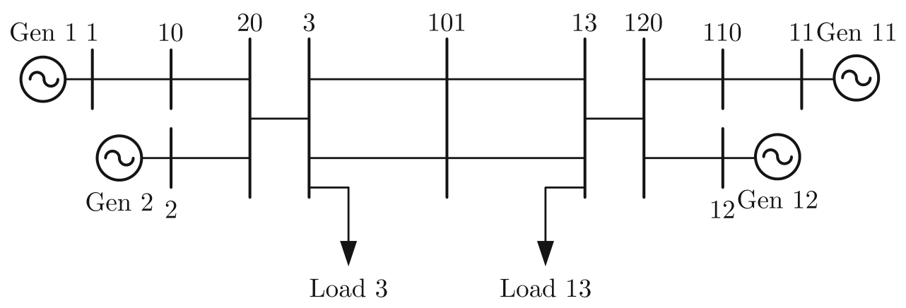
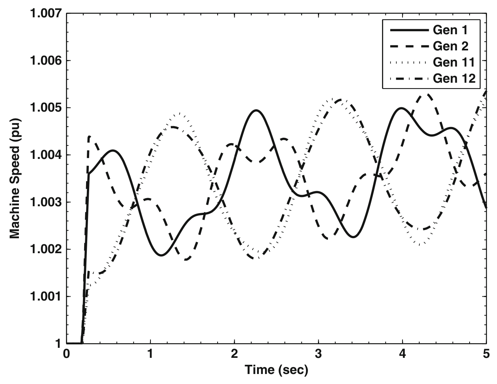
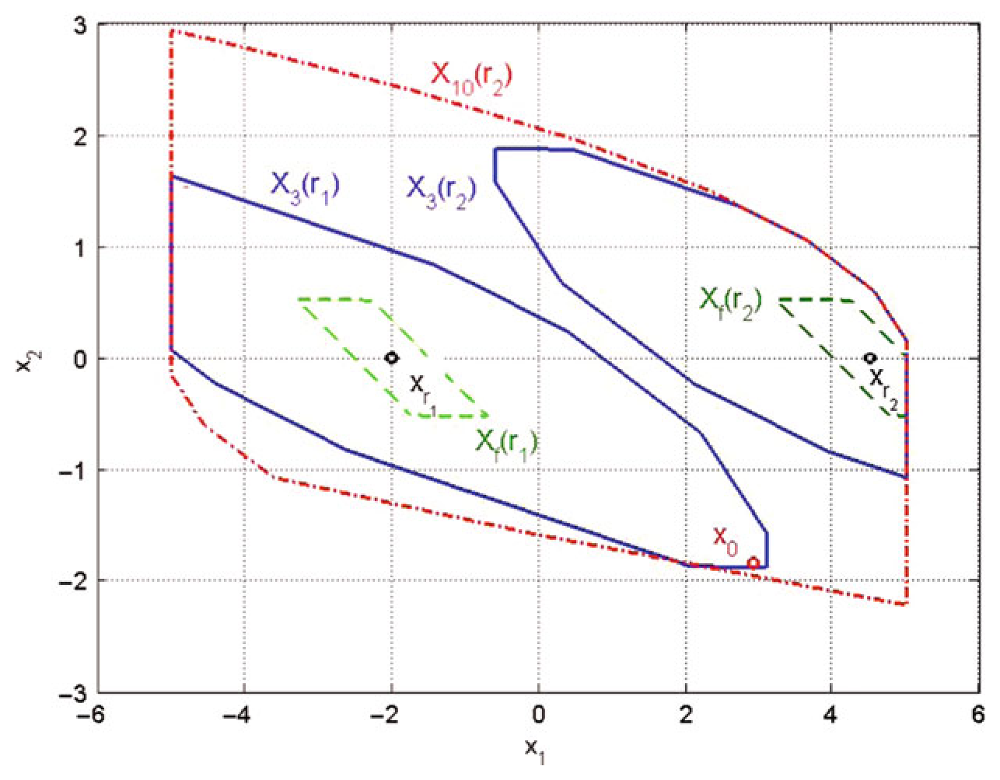
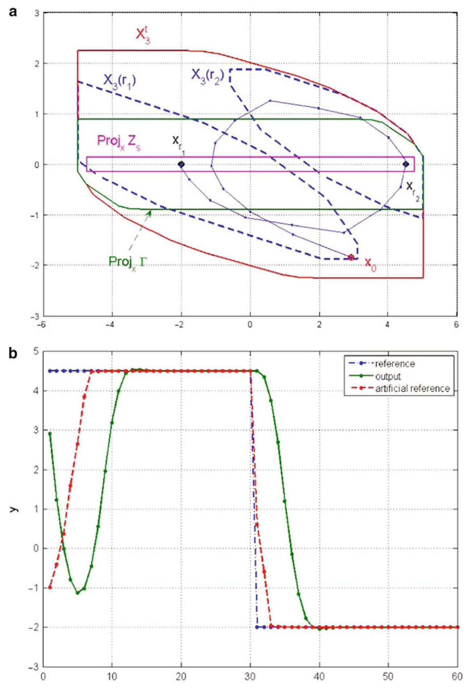
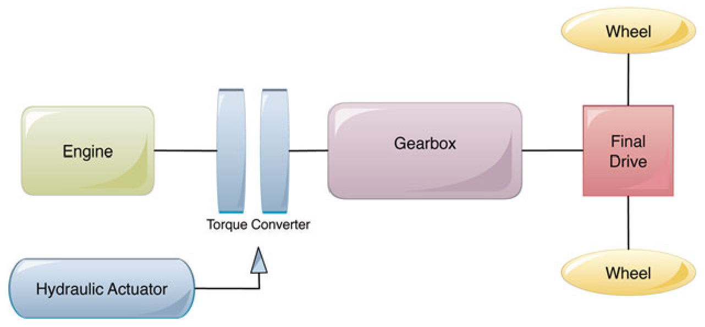
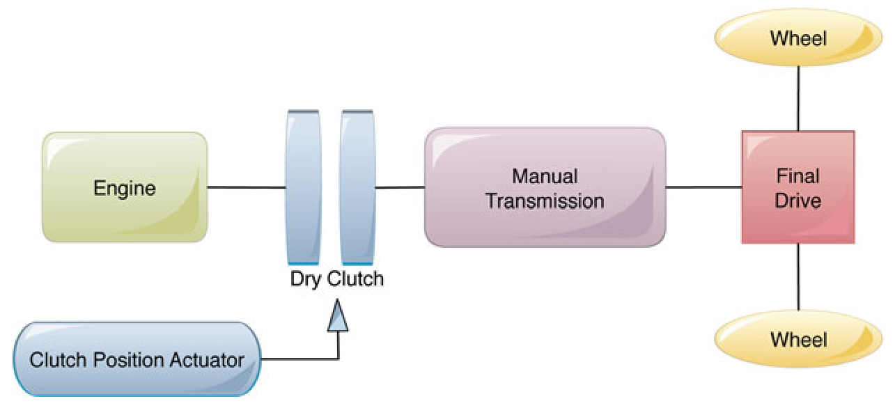

<!-- source_pdf_page: 1475 -->
## T

## Tactical Missile Autopilots

Curtis P. Mracek Raytheon Missile Systems, Waltham, MA, USA

#### Abstract

Tactical missile autopilots are part of the wider guidance navigation and control missile system whose goal is to achieve a successful intercept. The missile autopilot task is to turn guidance commands into fin deflection and is generally divided into two lateral direction (pitch and yaw) controllers and the roll orientation or roll rate controller. These three "channel control" outputs are then mixed to produce fin commands. The controllers can be composed of different architectures but most lateral autopilots use a three loop structure with acceleration and angular rate feedback. The roll controller is usually either a proportional integral (PI) or proportional integral derivative (PID) controller. The controllers are designed using gain scheduling for large flight envelope applications and have nonlinear elements to shape the time response. Integrator reset logic, to deal with control surface saturation, is also an integral part of tactical missile autopilots.

## Keywords

Classical control; Control surfaces; Pitch; Proportional and integral control; Roll channel; Tactical missile; Yaw channels

## Introduction

The purpose of a tactical missile is to intercept targets, and since tactical missile autopilots are part of the larger tactical missile system, they must contribute to that goal. The process by which a missile executes an intercept is by first sensing the target. The target information is then used to generate guidance commands. The guidance commands are determined such that if followed with precision the missile will intercept the target. The problem is to follow with precision. This is where the autopilot comes in. The missile autopilot receives guidance commands and produces control deflections to move the missile in a manner consistent with completing the intercept. There are many control challenges unique to tactical missiles, namely closing velocities can be very high and targets very small and very maneuverable. Usually the guidance commands are acceleration commands though other quantities are sometimes used. For this discussion, acceleration commands will be the autopilot

<!-- source_pdf_page: 1476 -->
commands. Once the acceleration commands or demands (as some in the guidance community call the autopilot inputs) are presented to the autopilot, the autopilot's only concern is to produce the desired command as fast as possible with some level of robustness. The key performance metric is the time of response. The response time is a key factor that drives the miss distance, and thus the probability of a successful intercept. Another metric, though less important than the response time, is the available maneuverability. As mentioned, the autopilot achieves the desired acceleration through moving the control surfaces. Usually, the control surfaces are aerodynamic and either positioned in front of (canard control) or in back of (tail control) the center of gravity. Both tail and canard control surfaces will be called fins for the purposes of this analysis. Some recent missile designs have significantly altered the autopilot design problem by using both canards and tails or other effectors like reaction jets.

The tactical missile autopilot control problem is therefore to produce accelerations by moving the fins in a controlled manner such that the response is as fast as possible while remaining under control under various flight conditions and in the presence of uncertainties (being robust). Tactical missiles autopilots are a classic control challenge in that there is a direct trade between performance and robustness. The tactical autopilot tends to lean toward the performance instead of the robustness because, as the continuing argument goes, "what good is the missile being stable if you miss the target" versus "if the missile is unstable it may never get to the target." So far, relevant analysis has mentioned the controller but mostly ignored robustness. Achieving robustness is done through the use of feedback, and in tactical missiles, inertial sensing devices are used to provide this critical information. These tactical sensors are currently packaged as a complete inertial sensor suite. This suite usually consists of three orthogonal linear accelerometers and three angular rate gyros. One reason guidance commands are the linear acceleration is that the sensing device directly measures this desired quantity.

There are two noticeable differences between tactical missile control and other aerodynamic
control applications. The first is that the dynamics and controls are divided into three distinct channels with each channel nearly independent of the other two. These are the lateral (pitch and yaw) channels and the axial (roll) channel. The pitch and yaw designs are usually very similar, if not identical, and the roll channel is separate. The second is that the controllers (fins) are intertwined. That is, there are no predominately pitch, yaw, or roll controllers, such as there are on airplanes. At least two and sometimes four fins are used in a single channel. This mixing of controls is through what is called a fin mix. This fin mixing occurs in the software (used to be hardware in analog controllers) after the autopilot and prior to the signals being sent to the individual fins.

Historically tactical missile autopilot development has consisted of both a design phase and an analysis phase. This distinction is due to the controller being designed on a subset of the operating envelope. That design is then evaluated at many more conditions to determine if the design works well enough everywhere to be deployed. In both the design and analysis phases, models are used to establish performance and robustness. Linear planar, linear coupled, and nonlinear models are used. The linear models are usually restricted to the early design phases and the frequency response determination of the system. The nonlinear models are used for time domain analysis.

The remainder of the chapter is organized by examining the linear planar pitch and yaw autopilots, followed by roll control. The concept of combining controllers is then presented. This is followed by a short section on other considerations, such as coupled designs and nonlinear elements.

## Pitch and Yaw Control

For tactical missile autopilot development, the equations of motion are usually derived in a body-fixed system with the two lateral velocities replaced by the local angle of attack ( $\alpha$ ) and sideslip angle $(\beta)$. It should be noted that the

<!-- source_pdf_page: 1477 -->
sideslip is not defined as the aircraft sideslip but instead as the equivalent of the angle of attack in the horizontal plane. This is because of the symmetry that is found in missiles that does not exist in aircraft. The nonlinear equations of motion can be found in Blakelock (1991). For tactical missiles there is usually no axial acceleration control, and thus the total velocity equation is uncontrollable and removed from both the design and analysis. For the coupled equations of motion of the system, there are five equations of motion and three control inputs. For a planar view of the problem, the pitch and yaw channels in a tactical missile autopilot are usually separated, and with the appropriate sign changes in the feedback signals can use the same gains. These channels use an inertial measuring device for feedback. Usually these sensors come in a package with three accelerometers and the gyros. The outputs of these devices used in the pitch are the linear acceleration perpendicular to the axial direction and the angular rate of the missile about the other perpendicular axis. That is, the z linear acceleration ( $A_{z m}$ ) and the y angular rate ( $q_{m}$ ). Using the other four sensors would cause coupling between pitch and yaw and roll, and thus this sensor information is usually ignored in the pitch channel. They are available and used in select cases where there is strong aerodynamic coupling, in which case these cross channels can be used to decouple the system. Without getting into the actual definitions of all the variables and the numerical values (see Mracek and Ridgely 2005a for full details), the state space linearized equations of motion for the pitch plane are:

$$
\begin{aligned}
& A=\left[\begin{array}{cc}
1 / \mathrm{V}_{\mathrm{mo}}\left[\frac{Z_{\alpha \mathrm{o}}}{\mathrm{~m}}-\mathrm{A}_{\mathrm{Xo}}\right] & 1 \\
\mathrm{M}_{\alpha o} / \mathrm{I}_{\mathrm{YY}} & 0
\end{array}\right] \\
& B=\left[\begin{array}{c}
Z_{\delta \mathrm{po}} / \mathrm{mV}_{\mathrm{mo}} \\
\mathrm{M}_{\delta \mathrm{po}} / \mathrm{I}_{\mathrm{YY}}
\end{array}\right] \\
& C=\left[\begin{array}{cc}
Z_{\alpha \mathrm{o}} / \mathrm{mg}-\mathrm{M}_{\alpha \mathrm{o}} \bar{x} / \mathrm{gI}_{\mathrm{YY}} & 0 \\
0 & 1
\end{array}\right] \\
& D=\left[\begin{array}{c}
Z_{\delta \mathrm{po}} / \mathrm{mg}-\mathrm{M}_{\delta \mathrm{po}} \bar{x} / \mathrm{gI}_{\mathrm{YY}} \\
0
\end{array}\right]
\end{aligned}
$$

where

$$
\begin{aligned}
& \dot{x}=A x+B u \\
& y=C x+D u
\end{aligned} \quad x=\left[\begin{array}{l}
\alpha \\
q
\end{array}\right] \quad u=\delta_{p} \quad y=\left[\begin{array}{c}
A_{z m} \\
q_{m}
\end{array}\right]
$$

Thus in the most reduced form, the tactical missile autopilot equations of motion reduce to two equations with two variables and one control. This is a very simple control problem. Since full state feedback can be used to provide an "optimal" control solution, only two feedback signals are needed for the above state space problem. For a tail controlled missile, the two state control leads ultimately to increasing missile acceleration in the wrong direction, as faster and faster designs are realized. This is because the system is, in controls language, "non-minimum phase." That is, tail controlled missiles move in the wrong direction before they move in the commanded direction. Canard controlled missiles do not suffer this problem. See Mracek (2005) and Gutman (2003) on the relative merits of canards and tails. If the control rate is used as the input instead of the control position, there would be three states in the basic plant used in the analysis, and three signals would need to be included. Now if we consider the fin position as a variable for feedback with the accelerometer and gyro feedbacks, there are a number of different combinations of sensor feedback signals that can be used to solve the three state problem. There are, in fact, nine possible topologies, two of which are consistently robust, with one topology showing excellent robustness characteristic. For a complete comparison see Mracek and Ridgely (2005b). This topology is shown in Fig. 1. Notice that there is an integral in the formulation. This limits the actual command rate from being infinite when a step command is input to the system. Without the command going through the integrator the controller would see the step, and, since the force instantly produces an acceleration, the feedback would jump (given no actuation delay). A typical acceleration response to a step acceleration command and control deflection rate needed to produce the response is presented in Figs. 2 and 3, respectively.

<!-- source_pdf_page: 1478 -->
Tactical Missile Autopilots, Fig. 1 Three loop pitch topology

> Image description: This diagram, labeled "Fig. 1 Three loop pitch topology," illustrates a block diagram of a control system for a tactical missile autopilot. The signal flow proceeds from left to right, beginning with input variables $A_{Zc}$ and $A_{Zm}$. The $A_{Zc}$ signal enters a block labeled $K_{SS}$ before being compared at a summing junction where $A_{Zm}$ is subtracted. The resulting error signal enters a series of control blocks. It passes through an integral-like controller $K_{IAZ}$, which then meets a summing junction where a feedback signal from $q_m$ (multiplied by gain $K_{\theta}$) is added. The combined signal enters an integration block ($\int dt$). The output of the integrator is then combined at a final summing junction with two feedback components: one via gain $K_{q}$ and another direct addition, ultimately yielding the control output $\delta_p$. The diagram represents a multi-loop architecture involving command tracking and rate feedback.

Tactical Missile Autopilots, Fig. 2
Acceleration response to a step input

> Image description: A line graph titled "Fig. 2 Acceleration response to a step input" from a textbook titled "Tactical Missile Autopilots" illustrates the acceleration response of a system over time. The vertical axis is labeled "Acceleration (g)" with scale increments from -0.5 to 1.5 in intervals of 0.5. The horizontal axis is labeled "Time (sec)" with a scale from 0 to 0.5 seconds, marked every 0.1 seconds. The blue plotted line shows a step response. It remains at 0g until approximately 0.1 seconds, where it experiences a small negative undershoot, reaching roughly -0.1g. The acceleration then increases steadily, crossing the 0.5g mark around 0.15 seconds. It reaches a peak of approximately 1.05g at roughly 0.22 seconds before exhibiting a minor overshoot. The response then settles smoothly at a steady-state acceleration of 1.0g by approximately 0.3 seconds, remaining constant through 0.5 seconds.

Tactical Missile Autopilots, Fig. 3 Control rate usage

> Image description: A line graph from a textbook titled "Tactical Missile Autopilots, Fig. 3 Control rate usage" illustrates the control rate over a 0.5-second time interval. The vertical y-axis represents the Control Rate in degrees per second (deg/sec), ranging from -40 to 100. The horizontal x-axis represents Time in seconds (sec), ranging from 0 to 0.5. The plot shows a constant zero value until 0.1 seconds, where a sharp, transient pulse occurs. The control rate rapidly increases to a peak of approximately 80 deg/sec at about 0.11 seconds, then drops sharply below zero, reaching a minimum of approximately -27 deg/sec at 0.14 seconds. Following this oscillation, the signal exhibits a damped response, returning to zero by 0.3 seconds and remaining at zero for the remainder of the duration. The graph characterizes a highly dynamic, short-duration control command used in missile guidance.

<!-- source_pdf_page: 1479 -->
The feedback control law is:

$$
\begin{aligned}
\delta_{p}= & K_{I A_{z}} K_{s s} \int A_{Z_{c}} d t-K_{I A_{z}} \int A_{Z_{m}} d t \\
& +K_{\theta} \int q_{m} d t+K_{q} q m
\end{aligned}
$$

Clearly, other components within the autopilot loop have to be considered. The control actuation system (CAS) and inertial measurement device characteristics need to be included in the design and synthesis of the autopilot. To this end, the gains are usually selected to provide the best performance (in the time domain) based on constraints. The above optimal control solution provides guaranteed margins, but when the additional components are included in the analysis the margins are an important constraint in the ultimate performance that can be achieved. Like most control problems, the constraints are both time and frequency dependent. Because of the emphasis on performance, some of the margin constraints must be examined closely. For a more detailed treatment of the three loop autopilot see Zarchan (2002).

## Roll Control

Thus far we have discussed the two lateral channels of the missile. That is because those two are the channels that directly affect the miss distance. The third channel does not directly influence the miss but it still is usually controlled. The roll channel is usually the fastest of the channels for a tactical missile. Historically, the three channels were decoupled by moving the roll "out of the
way" of the other channels by designing to a higher bandwidth than the pitch and yaw channels. Because of the need for squeezing performance this practice is not always employed. The cost of not increasing the bandwidth of the roll beyond the pitch and yaw is that the interdependence of the channels needs more scrutiny. The roll channel has only one sensor element, the roll rate senor. This measures the angular rate of the body about its central axis relative to the inertial frame. The objective, and thus the autopilot, can differ depending on the missile application. Mostly the objective would be one of the following: maintain zero roll rate, zero integral of roll rate, or some preferred Euler angle orientation. The last two can be accomplished with the same autopilot architecture, with exception handling for the Euler roll control based on the singularity in the Euler roll angle at $\pm 90^{\circ}$ pitch orientations.

Since there is only one sensor and one control, this channel is a classical SISO system and can be controlled with a proportional derivative (PD) or proportional integral derivative (PID) controller. The three loop topologies with integral roll rate reference are presented in Fig. 4.

## Gain Scheduling

Early generation missiles had analog autopilots and some were marvels of ingenuity. Now digital control is used almost exclusively. As can be readily seen from the above discussion, the autopilots performance is largely dictated by gains within a given topology. Unlike with early autopilots, with digital control the gains can be set precisely and can vary greatly as needed

Tactical Missile Autopilots, Fig. 4 Three loop roll topology

> Image description: This block diagram, titled "Fig. 4 Three loop roll topology" from a textbook on "Tactical Missile Autopilots," illustrates a nested control loop structure. The diagram features several interconnected functional blocks and summing junctions. The input variable $\phi_c$ enters from the top left, being subtracted at the first summing junction. A feedback path from the bottom input variable $p_m$ is integrated over time ($\int dt$) and added back. The output of this first junction passes through a gain block $K_{I\phi}$. At the second summing junction, the signal from $K_{I\phi}$ is added to a signal derived from $p_m$ via the gain block $K_{\phi}$. The resulting signal is then passed through a second integrator block ($\int dt$). Finally, the output of the integrator is added to a signal from $p_m$ passed through a proportional gain block $K_p$ at a third summing junction. The final system output is $\delta_r$. Arrows indicate the unidirectional flow of information through the control loops.

<!-- source_pdf_page: 1480 -->
over a wide range of flight conditions. Rarely can a single set of gains be found that provides adequate performance under all conditions. Thus, the autopilot design process is to design for a large number of flight conditions and then join the individual designs into a coherent whole. Typically, the conditions for the individual designs would be something like Mach number, altitude, and center of mass location. Once the individual gains are designed, they are joined together through an algorithm. Most likely they are "looked up" as a continuous function of the independent variables through some sort of interpolation. This gain changing philosophy is called gain scheduling. There have been some successful attempts for full envelope autopilot design. Dynamic inversion or model-based approaches have also been developed, most notably JDAM (Wise et al. 2005) where the autopilot was borrowed and adjusted on the fly from a sister design. The argument for the validity of this approach is that the flight conditions are not changing rapidly so they can be ignored. Of course the synthesis of the design needs to include examination of "off break point" conditions (flight conditions within the flight envelope that were not considered in the design process) to ensure compliance with stability requirements. History has shown that tactical missile autopilot gains tend to be somewhat power functions of dynamic pressure based on the design constraints.

## Other Considerations

The selection of gains using planar linear models and then scheduling them is not the complete autopilot design exercise. There are other challenges that must be considered. First, the plant equations are coupled through both the kinematic equations and the aerodynamics of the problem. There are two predominant ways to attack this problem in autopilot design. The first is as discussed earlier in which the system is made to be as decoupled as possible, create gains for
the decoupled system and analyze them in the coupled system. The second is to use feedback to create a more integrated design through cross coupling terms.

Besides the coupling there can be other problems. The design problem is hard enough as described above, but we have learned over the years that the models developed earlier have neglected certain aspects of the missile that can lead to problems. One aspect is that missiles can be very flexible, and since an inertial sensor is being used for feedback, the flexible characteristics can drive the missile unstable. The flexible characteristics were examined by Nesline and Nesline (1985). In that paper, the flexible model is presented and a technique for ignoring the first mode is discussed. (It should be noted that the model presented in the appendix has some "typos" and should be used with caution.)

Another aspect is the consideration of nonlinear elements of the autopilot. These could include integrator reset logic, command error limits, and acceleration limits. The three loop autopilot has an integrator and the fact that integrators "wind up" when the output is saturated. For tactical missiles this saturation could be caused by position or rate limits. The integrator should be reset to account for these conditions so that the missile responds quicker when the system is no longer in a saturated condition. The command error limits can be used to modify the response characteristics to achieve a more consistent response. Finally, acceleration limits are used to limit the input into the system such that the guidance commands do not put the missile into a position from which it cannot maintain controlled flight. Generating acceleration limits is a complex topic itself.

## Summary and Future Directions

Tactical missile autopilots are generally designed by separating the problem into two independent

<!-- source_pdf_page: 1481 -->
lateral controls (pitch and yaw), with a third control governing the roll attitude. A good autopilot design produces a balance between performance and robustness and incorporates nonlinear elements and integrator resets. The design process take into account robustness throughout the flight envelope and structural elements.

From a controls standpoint, the future direction of tactical missile autopilot development is in nonlinear, adaptive, and fault tolerant control. Adaptive control is useful not only because it provides a more predictable flight response but also because of the potential in reducing or maybe even eliminating development time.

## Cross-References

- Aircraft Flight Control
- PID Control

## Bibliography

Blakelock JH (1991) Automatic control of aircraft and missiles, 2nd edn. Wiley, New York
Gutman S (2003) Superiority of canards in homing missiles. IEEE Trans Aerosp Electron Syst 39(3): 740-746
Mracek CP (2005) A miss distance study for homing missiles: tail vs canard control. In: Proceedings of the AIAA guidance navigation and control conference, Minneapolis, Aug 2006
Mracek CP, Ridgely DB (2005a) Missile longitudinal autopilots: connections between optimal control and classical topologies. In: Proceedings of the AIAA GNC conference, San Francisco, Aug 2005
Mracek CP, Ridgely DB (2005b) Missile longitudinal autopilots: comparison of multiple three loop topologies. In: Proceedings of the AIAA guidance navigation and control conference, San Francisco, Aug 2005
Nesline FW, Nesline ML (1985) Phase vs gain stabilization of structural feedback oscillations in homing missiles. In: Proceedings of the American control conference, 1985
Wise KA, Lavretsy E, Zimmerman J, Francis JH Jr, Dixon D, Whitehead B (2005) Adaptive flight control of a sensor guided munition. In: Proceedings of the AIAA guidance navigation and control conference, San Francisco, Aug 2005
Zarchan P (2002) Tactical and strategic missile guidance. Progress in Astronautics and Aeronautics, vol 199, 4th edn. AIAA, Reston

# Time-Scale Separation in Power System Swing Dynamics: Singular Perturbations and Coherency

Joe H. Chow Department of Electrical and Computer Systems Engineering, Rensselaer Polytechnic Institute, Troy, NY, USA

#### Abstract

Large power systems often exhibit slow and fast electromechanical oscillations between interconnected synchronous machines. The slow interarea oscillations involve coherent groups of machines swinging together. This coherency phenomenon can be attributed to the coherent areas of machines being weakly coupled, either because of higher impedance transmission lines, heavily loaded transmission lines, or fewer connections between the coherent areas compared to the connections within a coherent area. Singular perturbations can be used to display the time-scale separation of the slow interarea modes and the faster local modes.

## Keywords

Model reduction; Power system oscillations; Singular perturbations; Two-time-scale systems

## Interarea Mode Oscillation in a Power System

A large power system consists of interconnected synchronous machines supplying power to loads via transmission lines. As a dynamical system, it can be considered as the rotating inertias of the synchronous machines interacting electrically through the impedances of the transmission system. During a disturbance, such as a lightning strike on a transmission line, the rotating inertias will oscillate against each other. The frequency and extent of these oscillations

<!-- source_pdf_page: 1482 -->

> Image description: A technical schematic diagram titled "Time-Scale Separation in Power System Swing Dynamics: Singular Perturbations and Coherency, Fig. 1" illustrates a "Twoarea, four-machine system example." The diagram depicts a power grid interconnection between two distinct areas. The first area (left) contains two generators: **Gen 1** connected to bus **1**, and **Gen 2** connected to bus **2**. These are linked through bus **10** and bus **20**. The second area (right) features two generators: **Gen 11** connected to bus **11** and **Gen 12** connected to bus **12**, linked via bus **110** and bus **120**. The two areas are interconnected through a central network consisting of buses **3**, **101**, and **13**. A load, **Load 3**, is connected to bus **3**, while **Load 13** is connected to bus **13**. Black arrows indicate the direction of power outflow for both loads. The schematic uses lines to represent transmission connections between numbered buses.
Time-Scale Separation in Power System Swing Dynamics: Singular Perturbations and Coherency, Fig. 1 Twoarea, four-machine system example

Time-Scale Separation in Power System Swing Dynamics: Singular Perturbations and Coherency, Fig. 2
Machine speed response of the two-area, four-machine system

> Image description: A line graph titled "Fig. 2 Machine speed response of the two-area, four-machine system" illustrates the machine speed (in per-unit, pu) over a five-second time interval. The y-axis represents machine speed, ranging from 1 to 1.007 pu, while the x-axis represents time in seconds, from 0 to 5 seconds. Four distinct line styles represent different generators in a power system: * **Gen 1** (solid black line) * **Gen 2** (long dashed black line) * **Gen 11** (dotted gray line) * **Gen 12** (dash-dot black line) The plot shows the transient response of these machines following an initial disturbance at $t \approx 0.2$ seconds. The machines exhibit oscillatory behavior. Gen 1 and Gen 2 show oscillations with relatively similar frequencies, while Gen 11 and Gen 12 exhibit different oscillatory patterns. This visualization demonstrates the dynamic response and potential coherency within the multi-machine system.

may vary: the local modes of frequencies $1-2.5 \mathrm{~Hz}$ originate from the interactions of a few close-by machines, and the interarea modes of frequencies $0.2-0.8 \mathrm{~Hz}$ involve groups of machines swinging against other groups. Coherency is this phenomenon of groups of machines swinging together against other groups of machines during disturbances.

Coherency can be illustrated in the simple power system shown in Fig. 1 (Rogers 2000). The system consists of two areas: Generators 1 and 2 in Area 1 and Generators 11 and 12 in Area 2. For a disturbance in Area 1, Fig. 2 shows the response of the machine speeds. The interarea mode consists of Generators 1 and 2 swinging coherently against Generators 11 and 12. The
difference between the responses of Generators 1 and 2 is due to the local mode in Area 1, which is excited by the disturbance.

## Coherency Analysis

Coherency with respect to the slow interarea modes, also known as slow coherency, is an inherent property of many power systems. Traditional power systems consist of operating regions dictated by physical or administrative constraints with relatively strong connections within an operating region. These control regions are also interconnected with tielines to share base-load and seasonal power resources as well as to rely on

<!-- source_pdf_page: 1483 -->
each other for reserves. Thus a practical interconnected power system will, by design, necessarily have strong connections within each operating region and weaker connections between the regions. Due to the time-scale separation of the slow interarea modes and the faster local modes, the coherency phenomenon can be analyzed using singular perturbations method provided a suitable small parameter can be identified.

For a simplified coherency analysis, the linearized second-order model of an $N$-machine power system

$$
\begin{equation*}
M \frac{d^{2} \Delta \delta}{d t^{2}}=K \Delta \delta \tag{1}
\end{equation*}
$$

can be used. In (1), $\delta$ is the $N$-dimensional vector of individual machine rotor angles $\delta_{i}, i= 1, \ldots, N, \Delta$ denotes small perturbations, $M$ is the diagonal matrix of machine rotational inertias $m_{i}, i=1, \ldots, N$, and the connection matrix $K$ consists of the linearized synchronizing coefficients $K_{i j}$ between machines $i$ and $j$, denoting the restoring force between the two machines.

An important property of $K$ is

$$
\begin{equation*}
K_{i i}=-\sum_{j=1, j \neq i}^{N} K_{i j} \tag{2}
\end{equation*}
$$

that is, the sum of each row of $K$ is zero. Thus $K$ has a zero eigenvalue, which is known as the system mode. This mode arises due to the lack of a reference, as only the relative angles between the machines are important. It can be eliminated when one of the machines is chosen as the reference.

Suppose the $N$-machine system has $r$ areas of coherent machines, whose internal connections within the areas are stronger than the external connections between the areas. The weak connection strength is denoted by a small parameter $\varepsilon$, which can be the ratio of the relative stiffness of the internal transmission lines versus the external transmission lines, or the ratio of the smaller number of external connections versus the larger number of internal connections, or both. Thus the connection matrix of linearized synchronizing coefficients can be rewritten as

$$
\begin{equation*}
K=K^{I}+\varepsilon K^{E} \tag{3}
\end{equation*}
$$

where $K^{I}$ is the matrix of internal connections and $K^{E}$ is the matrix of external connections scaled by $\varepsilon$. If the machine angles in each coherent area are arranged in consecutive order in the vector $\delta$, then $K^{I}$ is block diagonal with $r$ zero eigenvalues, that is, one system mode per area.

## Singular Perturbation Analysis

To exhibit the time scales in (1) and (3), a transformation to obtain the slow variables and the fast variables is introduced. The slow motion is obtained by defining for each area, an inertiaweighted aggregate variable

$$
\begin{align*}
y^{\alpha} & =\sum_{i=1}^{n_{\alpha}} m_{i}^{\alpha} \Delta \delta_{i}^{\alpha} / m^{\alpha} \\
m^{\alpha} & =\sum_{i=1}^{n_{\alpha}} m_{i}^{\alpha}, \quad \alpha=1,2, \ldots, r \tag{4}
\end{align*}
$$

where $n_{\alpha}$ is the number of machines in area $\alpha, m_{i}^{\alpha}$ is the inertia of machine $i$ in area $\alpha$, and $m^{\alpha}$ is the aggregate inertia of area $\alpha$. For the fast dynamics, we select in each area a reference machine, say the first machine, and define the motions of the other machines in the same area relative to this reference machine by the local variables

$$
\begin{align*}
z_{i-1}^{\alpha} & =\Delta \delta_{i}^{\alpha}-\Delta \delta_{1}^{\alpha}, \quad i=2,3, \ldots, n_{\alpha} \\
\alpha & =1,2, \ldots, r \tag{5}
\end{align*}
$$

The transformations (4) and (5) can be combined to form

$$
\left[\begin{array}{l}
y  \tag{6}\\
z
\end{array}\right]=\left[\begin{array}{c}
M_{a}^{-1} U^{T} M \\
G
\end{array}\right] \Delta \delta
$$

where

$$
\begin{equation*}
U=\operatorname{blockdiag}\left(u_{1}, u_{2}, \ldots, u_{r}\right) \tag{7}
\end{equation*}
$$

<!-- source_pdf_page: 1484 -->
is the grouping matrix with $n_{\alpha} \times 1$ column vectors

$$
\begin{align*}
u_{\alpha} & =\left[\begin{array}{lll}
1 & 1 & \ldots
\end{array}\right]^{T}, \quad \alpha=1,2, \ldots, r  \tag{8}\\
M_{a} & =\operatorname{diag}\left(m^{1}, m^{2}, \ldots, m^{r}\right)=U^{T} M U \tag{9}
\end{align*}
$$

and

$$
\begin{equation*}
G=\operatorname{blockdiag}\left(G_{1}, G_{2}, \ldots, G_{r}\right) \tag{10}
\end{equation*}
$$

with $G_{\alpha}$ being the $\left(n_{\alpha}-1\right) \times n_{\alpha}$ matrix

$$
G_{\alpha}=\left[\begin{array}{ccccc}
-1 & 1 & 0 & . & 0  \tag{11}\\
-1 & 0 & 1 & . & 0 \\
. & . & . & . & . \\
-1 & 0 & 0 & . & 1
\end{array}\right]
$$

The inverse of this transformation is explicitly known

$$
\Delta \delta=\left[U G^{T}\left(G G^{T}\right)^{-1}\right]\left[\begin{array}{l}
y  \tag{12}\\
z
\end{array}\right]
$$

Applying the transformation (6) to the model (1) and (3), the electromechanical model becomes

$$
\begin{align*}
M_{a} \ddot{y} & =\varepsilon K_{a} y+\varepsilon K_{a d} z \\
M_{d} \ddot{z} & =\varepsilon K_{d a} y+\left(K_{d}+\varepsilon K_{d d}\right) z \tag{13}
\end{align*}
$$

where

$$
\begin{align*}
M_{d} & =\left(G M^{-1} G^{T}\right)^{-1}, \quad K_{a}=U^{T} K^{E} U \\
K_{d a} & =U^{T} K^{E} M^{-1} G^{T} M_{d} \\
K_{d a} & =M_{d} G M^{-1} K^{E} U \\
K_{d} & =M_{d} G M^{-1} K^{I} M^{-1} G^{T} M_{d} \\
K_{d d} & =M_{d} G M^{-1} K^{E} M^{-1} G^{T} M_{d} \tag{14}
\end{align*}
$$

Note that $K_{a}, K_{a d}$, and $K_{d a}$ are independent of the internal connection matrix $K^{I}$ because $K^{I} U=0$. Furthermore, $K_{a}$ is negative semidefinite and $K_{d d}$ is negative definite. System (13) is in the standard singularly perturbed form (Kokotović et al. 1986) showing that $y$ is the slow variable and $z$ is the fast variable. Thus $\varepsilon$ is both the weak connection parameter and the
singular perturbation parameter, giving rise to slow coherency.

The dynamics of the singularly perturbed system (13) are approximated by the interarea modes $\pm j \sqrt{-\varepsilon \lambda\left(M^{-1} K_{a}\right)}$ and the local modes $\pm j \sqrt{-\lambda\left(M_{d}^{-1} K_{d d}\right)}$, where $\lambda$ denotes eigenvalues.

## Identifying Coherent Areas

Several methods can be used to identify coherent areas, including the following:

1. Time simulation method (Podmore 1978): This method simulates the dynamic responses to a selected set of disturbances and groups the machines having similar time responses as coherent areas. For a faster simulation, a linearized power system model can be used.
2. Eigenvector method (Chow et al. 1982): This method computes the slow eigenvalues of the matrix $M^{-1} K$ and identifies machines with similar row vectors of the slow eigenvector matrix as coherent machines.
3. Weak link methods (Nath et al. 1985; Zaborszky et al. 1982): These methods search through the transmission line impedances to find the weak links between the areas.

## Applications

The applications of the coherency concept include:

1. Dynamic model reduction (deMello et al. 1975): The synchronous machines in a coherent area can be aggregated into a single equivalent machine, thus reducing the system size. Model reduction programs capable of handling upwards of 30,000 buses are available (Morison and Wang 2013).
2. Interarea mode analysis and damping control design (Larsen et al. 1995): Damping of interarea modes is an operational concern for systems with heavily loaded long-distance transmission lines. The slow coherency concept contributes to the development of damping controller design.

<!-- source_pdf_page: 1485 -->
3. Islanding as a defense mechanism (You et al. 2004): During system disturbances causing severe power flow interruption, the last resort may be to separate the systems into viable islands, avoiding a total system blackout. Coherent areas tend to be natural choices of islands.
In addition to power system analysis, the coherency concept and methods can potentially be applied to dynamic systems with a system mode (eigenvalue equal to 0 for a continuoustime model and eigenvalue equal to 1 for a discrete-time model). An example is the PageRank computation in (Ishii et al. 2012).

## Cross-References

- Consensus of Complex Multi-agent Systems
- Lyapunov Methods in Power System Stability
- Markov Chains and Ranking Problems in Web Search
- Model Order Reduction: Techniques and Tools
- Small Signal Stability in Electric Power Systems

## Recommended Reading

An early investigation of coherency was reported in Podmore and Germond (1977). A recent compilation of power system coherency, model reduction, and interarea oscillation results can be found in Chow (2013).

## Bibliography

Chow JH (ed) (2013) Power system coherency and model reduction. Springer, New York
Chow JH, Peponides G, Kokotović PV, Avramović B, Winkelman JR (1982) Time-scale modeling of dynamic networks with applications to power systems. Springer, New York
deMello RW, Podmore R, Stanton KN (1975) Coherencybased dynamic equivalents: applications in transient stability studies. 1975 PICA conference proceedings, pp 23-31
Ishii H, Tempo R, Bai E-W (2012) A web aggregation approach for distributed randomized PageRank algorithms. IEEE Trans Autom Control 57:2703-2717

Kokotović PV, Khalil H, O'Reilly J (1986) Singular perturbation methods in control: analysis and design. Academic, London
Larsen EV, Sanchez-Gasca JJ, Chow JH (1995) Concepts for design of FACTS controllers to damp power swings. IEEE Trans Power Syst 10:948-956
Morison K, Wang L (2013) Reduction of large power system models: a case study. In: Chow JH (ed) Power system coherency and model reduction. Springer, New York, Chapter 7
Nath R, Lamba SS, Rao KSP (1985) Coherency based system decomposition into study and external areas using weak coupling. IEEE Trans Power Appar Syst PAS-104:1443-1449
Podmore R, Germond A (1977) Dynamic equivalents for transient stability studies. EPRI Report RP-765
Podmore R (1978) Identification of coherent generators for dynamic equivalents. IEEE Trans Power Appar Syst PAS-97(4): 1344-1354
Rogers G (2000) Power system oscillations. Kluwer Academic, Dordrecht
You H, Vittal V, Wang X (2004) Slow coherency-based islanding. IEEE Trans Power Syst 19: 483-491
Zaborszky J, Whang K-W, Huang GM, Chiang L-J, Lin S-Y (1982) A clustered dynamical model for a class of linear autonomous systems using simple enumerative sorting. IEEE Trans Circuit Syst CAS-29:747-758

## Tracking and Regulation in Linear Systems

A. Astolfi

Department of Electrical and Electronic Engineering, Imperial College London, London, UK
Dipartimento di Ingegneria Civile e Ingegneria Informatica, Università di Roma Tor Vergata, Roma, Italy

#### Abstract

Tracking and regulation refer to the ability of a control system to track/reject a given family of reference/disturbance signals modelled as solutions of a differential/difference equation. The problem can be posed as a stabilization problem with a constraint on the steady-state response of the system. For linear, time-invariant, systems, the problem can be solved provided a system of linear matrix equations admits a

<!-- source_pdf_page: 1486 -->
solution. Properties of this system of equations are discussed, together with a general property of all controllers achieving tracking and regulation: the so-called internal model principle.

## Keywords

Internal model principle; Linear systems; Regulation; Tracking

## Introduction

Consider a linear system affected by disturbances and such that its output is required to asymptotically track a certain, prespecified, reference signal. In what follows, we discuss and solve this control problem known as the tracking and regulation problem.

Consider a linear control system described by equations of the form

$$
\begin{align*}
\sigma x & =A x+B u+P d, \\
e & =C x+Q d, \tag{1}
\end{align*}
$$

with $x(t) \in \mathbb{R}^{n}, u(t) \in \mathbb{R}^{m}, e(t) \in \mathbb{R}^{p}$, $d(t) \in \mathbb{R}^{r}$, and $A, B, P, C$, and $Q$ constant matrices. In Eq. (1), $\sigma x=\sigma x(t)$ stands for $\dot{x}(t)$, if the system is continuous-time, and for $x(t+1)$, if the system is discrete-time. Since the system is time-invariant, it is assumed, without loss of generality, that all signals are defined for $t \geq 0$, that is, if the system is continuous-time, then $t \in \mathbb{R}^{+}$, i.e., the set of nonnegative real numbers, whereas if the system is discrete-time, then $t \in \mathbb{Z}^{+}$, i.e., the set of nonnegative integers. For ease of notation, the argument " $t$ " is dropped whenever this does not cause confusion, and we use the notation $t \geq 0$ to denote either $\mathbb{R}^{+}$or $\mathbb{Z}^{+}$.

The signal $d(t)$, denoted exogenous signal, is in general composed of two components: the former models a set of disturbances acting on the system to be controlled and the latter a set of reference signals. In what follows we assume that the exogenous signal is generated by a linear system, denoted exosystem, described by the equation

$$
\begin{equation*}
\sigma d=S d, \tag{2}
\end{equation*}
$$

with $S$ a matrix with constant entries. Note that, under this assumption, it is possible to generate, for example, constant or polynomial references/disturbances and sinusoidal references/disturbances with any given frequency.

The variable $e(t)$, denoted tracking error, is a measure of the error between the ideal behavior of the system and the actual behavior. Ideally, the variable $e(t)$ should be regulated to zero, i.e., should converge asymptotically to zero, despite the presence of the disturbances. If this happens, we say that the tracking error is regulated to zero, i.e., converges asymptotically to zero; hence, the disturbances are not affecting the asymptotic behavior of the system and the output $C x(t)$ is asymptotically tracking the reference signal $-Q d(t)$. In general the tracking error does not naturally converge to zero; hence, it is necessary to determine an input signal $u(t)$ which drives it to zero. The simplest possible way to construct such an input signal is to assume that it is generated via static feedback of the state $x(t)$ of the system to be controlled and of the state $d(t)$ of the exosystem, i.e.,

$$
\begin{equation*}
u=K x+L d \tag{3}
\end{equation*}
$$

In practice it is unrealistic to assume that both $x(t)$ and $d(t)$ are measurable; hence, it may be more natural to assume that the input signal $u(t)$ is generated via dynamic feedback of the error signal only, i.e., it is generated by the system

$$
\begin{align*}
\sigma \chi & =F \chi+G e  \tag{4}\\
u & =H \chi,
\end{align*}
$$

with $\chi(t) \in \mathbb{R}^{\nu}$, for some $\nu>0$, and $F, G$, and $H$ matrices with constant entries.

Using the above definitions, it is possible to formally pose the regulator problem as follows.

Definition 1 (Full information regulator problem) Consider the system (1), driven by the exosystem (2) and interconnected with the controller (3). The full information regulator problem is the problem of determining the matrices $K$

<!-- source_pdf_page: 1487 -->
and $L$ of the controller such that ((S) stands for stability and (R) for regulation):
(S) The system $\sigma x=(A+B K) x$ is asymptotically stable.
(R) All trajectories of the system

$$
\begin{align*}
\sigma d & =S d \\
\sigma x & =(A+B K) x+(B L+P) d  \tag{5}\\
e & =C x+Q d
\end{align*}
$$

are such that $\lim _{t \rightarrow \infty} e(t)=0$.

## Definition 2 (Error feedback regulator prob-

lem) Consider the system (1), driven by the exosystem (2) and interconnected with the controller (4). The error feedback regulator problem is the problem of determining the matrices $F, G$, and $H$ of the controller such that:
(S) The system

$$
\begin{aligned}
& \sigma x=A x+B H \chi, \\
& \sigma \chi=F \chi+G C x,
\end{aligned}
$$

is asymptotically stable.
(R) All trajectories of the system

$$
\begin{align*}
\sigma d & =S d \\
\sigma x & =A x+B H \chi+P d  \tag{6}\\
\sigma \chi & =F \chi+G(C x+Q d) \\
e & =C x+Q d
\end{align*}
$$

are such that $\lim _{t \rightarrow \infty} e(t)=0$.

## The Full Information Regulator Problem

Consider the full information regulator problem and assume the following.

Assumption 1 The matrix $S$ of the exosystem has all eigenvalues with nonnegative real part, in the case of continuous-time systems, or with modulo not smaller than one, in the case of discrete-time systems.

Assumption 2 The system (1) with $d=0$ is reachable.

Assumption 1 implies that there are no initial conditions $d(0)$ such that the signal $d(t)$ converges (asymptotically) to zero. This assumption is not restrictive. In fact, disturbances converging to zero do not have any effect on the asymptotic behavior of the system, and references which converge to zero can be tracked simply by driving the state of the system to zero, i.e., by stabilizing the system. Assumption 2 implies that it is possible to arbitrarily assign the eigenvalues of the matrix $A+B K$ by a proper selection of $K$. Note that, in practice, this assumption can be replaced by the weaker assumption that the system (1) with $d=0$ is stabilizable.

We now present a preliminary result which is instrumental to derive a solution to the full information regulator problem.

Lemma 1 Consider the full information regulator problem. Suppose Assumption 1 holds. Suppose, in addition, that there exist matrices $K$ and $L$ such that condition ( $S$ ) holds.

Then condition $(R)$ holds if and only if there exists a matrix $\Pi \in \mathbb{R}^{n \times r}$ such that the equations

$$
\begin{align*}
\Pi S & =(A+B K) \Pi+(P+B L),  \tag{7}\\
0 & =C \Pi+Q,
\end{align*}
$$

hold.
Proof Consider the system (5) and the coordinates transformation

$$
\begin{aligned}
& \hat{d}=d \\
& \hat{x}=x-\Pi d
\end{aligned}
$$

where $\Pi$ is the solution of the equation

$$
\Pi S=(A+B K) \Pi+(P+B L) .
$$

This equation is a so-called Sylvester equation. The Sylvester equation is a (matrix) equation of the form

$$
A_{1} X=X A_{2}+A_{3}
$$

<!-- source_pdf_page: 1488 -->
in the unknown $X$. This equation has a unique solution, for any $A_{3}$, if and only if the matrices $A_{1}$ and $A_{2}$ do not have common eigenvalues. Note that, by condition ( S ) and Assumption 1, there is a unique matrix $\Pi$ which solves this equation. In the new coordinates $\hat{x}$ and $\hat{d}$, the system is described by the equations

$$
\begin{aligned}
\sigma \hat{d} & =S \hat{d} \\
\sigma \hat{x} & =(A+B K) \hat{x} \\
e & =C \hat{x}+(C \Pi+Q) \hat{d}
\end{aligned}
$$

By condition (S) $\lim _{t \rightarrow \infty} \hat{x}(t)=0$, hence condition (R) holds, by Assumption 1, if and only if $C \Pi+Q=0$. In summary, under the stated assumptions, condition (R) holds if and only if there exists a matrix $\Pi$ such that Eqs. (7) hold.

We are now ready to state and prove the result which provides conditions for the solvability of the full information regulator problem.

Theorem 1 Consider the full information regulator problem. Suppose Assumptions 1 and 2 hold. There exists a full information control law described by Eq. (3) which solves the full information regulator problem if and only if there exist two matrices $\Pi$ and $\Gamma$ such that the equations

$$
\begin{align*}
\Pi S & =A \Pi+B \Gamma+P, \\
0 & =C \Pi+Q, \tag{8}
\end{align*}
$$

hold.
Proof (Necessity) Suppose there exist two matrices $K$ and $L$ such that conditions (S) and (R) of the full information regulator problem hold. Then, by Lemma 1, there exists a matrix $\Pi$ such that Eqs. (7) hold. As a result, the matrices $\Pi$ and $\Gamma=K \Pi+L$ are such that Eqs. (8) hold.
(Sufficiency) The proof of the sufficiency is constructive. Suppose there are two matrices $\Pi$ and $\Gamma$ such that Eqs. (8) hold. The full information regulator problem is solved selecting $K$ and $L$ as follows. The matrix $K$ is any matrix such that the system $\sigma x=(A+B K) x$ is asymptotically stable. By Assumption 2,
such a matrix $K$ does exist. The matrix $L$ is selected as $L=\Gamma-K \Pi$. This selection is such that condition ( S ) of the full information regulator problem holds; hence, to complete the proof, we have only to show that, with $K$ and $L$ as selected above, Eqs. (7) hold. This is trivially the case. In fact, replacing $L$ in (7) yields Eqs. (8), which hold by assumption. As a result, also condition (R) of the full information regulator problem holds, and this completes the proof.

The proof of Theorem 1 implies that a controller which solves the full information regulator problem is described by the equation

$$
u=K x+(\Gamma-K \Pi) d,
$$

with $K$ such that a stability condition holds, and $\Pi$ and $\Gamma$ such that Eqs. (8) hold. By Assumption 2 , the stability condition can be always satisfied. As a result, the solution of the full information regulator problem relies upon the existence of a solution of Eqs. (8).

## The FBI Equations

Equations (8), known as the Francis-ByrnesIsidori (FBI) equations, are linear equations in the unknowns $\Pi$ and $\Gamma$, for which the following statement holds.

Lemma 2 Equations (8), in the unknowns $\Pi$ and $\Gamma$, are solvable for any $P$ and $Q$ if and only if

$$
\operatorname{rank}\left[\begin{array}{cc}
s I-A & B  \tag{9}\\
C & 0
\end{array}\right]=n+p,
$$

for all $s$ which are eigenvalues of the matrix $S$.
For single-input, single-output systems (i.e., $m=p=1$ ), the condition expressed by Lemma 2 has a very simple interpretation. In fact, the complex numbers $s$ such that

$$
\operatorname{rank}\left[\begin{array}{cc}
s I-A & B \\
C & 0
\end{array}\right]<n+1
$$

<!-- source_pdf_page: 1489 -->
are the zeros of the system

$$
\begin{aligned}
\sigma x & =A x+B u, \\
y & =C x,
\end{aligned}
$$

that is the roots of the numerator polynomial of the transfer function $W(s)=C(s I-A)^{-1} B$, i.e., the zeros of $W(s)$. This implies that, for singleinput, single-output systems, the full information regulator problem is solvable if and only if the eigenvalues of the exosystem are not zeros of the transfer function of the system (1) with input $u$, output $e$, and $d=0$.

## The Error Feedback Regulator Problem

To provide a solution to the error feedback regulator problem, we need to introduce a new assumption.

Assumption 3 The system

$$
\begin{align*}
{\left[\begin{array}{l}
\sigma x \\
\sigma d
\end{array}\right] } & =\left[\begin{array}{ll}
A & P \\
0 & S
\end{array}\right]\left[\begin{array}{l}
x \\
d
\end{array}\right]  \tag{10}\\
e & =\left[\begin{array}{ll}
C & Q
\end{array}\right]\left[\begin{array}{l}
x \\
d
\end{array}\right]
\end{align*}
$$

is observable.
Note that Assumption 3 implies observability of the system

$$
\begin{align*}
\sigma x & =A x  \tag{11}\\
y & =C x
\end{align*}
$$

To show this property, note that observability of the system (10) implies that

$$
\operatorname{rank}\left[\begin{array}{cc}
C & Q \\
C A & \vdots \\
\vdots & \vdots \\
C A^{n+r-1} & \vdots
\end{array}\right]=n+r .
$$

This, in turn, implies

$$
\operatorname{rank}\left[\begin{array}{c}
C \\
C A \\
\vdots \\
C A^{n+r-1}
\end{array}\right]=n
$$

and, by Cayley-Hamilton Theorem,

$$
\operatorname{rank}\left[\begin{array}{c}
C \\
C A \\
\vdots \\
C A^{n-1}
\end{array}\right]=n,
$$

which implies observability of system (11). Similarly to what discussed in the case of Assumption 2, Assumption 3 can be replaced by the weaker assumption that the system (10) is detectable. We are now ready to state and prove the result which provides conditions for the solvability of the error feedback regulator problem.

Theorem 2 Consider the error feedback regulator problem. Suppose Assumptions 1-3 hold. There exists an error feedback control law described by Eq. (4) which solves the full information regulator problem if and only if there exist two matrices $\Pi$ and $\Gamma$ such that the equations

$$
\begin{align*}
\Pi S & =A \Pi+B \Gamma+P,  \tag{12}\\
0 & =C \Pi+Q,
\end{align*}
$$

hold.
Remark Theorem 2 can be alternatively stated as follows. Consider the error feedback regulator problem. Suppose Assumptions 1-3 hold. Then the error feedback regulator problem is solvable if and only if the full information regulator problem is solvable.

Proof (Necessity) The proof of the necessity is similar to the proof of the necessity of Theorem 1, hence omitted.
(Sufficiency) The proof of the sufficiency is constructive. Suppose there are two matrices $\Pi$ and $\Gamma$ such that Eqs. (12) hold. Then, by Theorem 1, the full information control law $u= K x+(\Gamma-K \Pi) d$, with $K$ such that the system $\sigma x=(A+B K) x$ is asymptotically stable,

<!-- source_pdf_page: 1490 -->
solves the full information regulator problem. This control law is not implementable, because we only measure $e$. However, by Assumption 3, it is possible to build asymptotic estimates $\xi$ and $\delta$ of $x$ and $d$; hence, implement the control law

$$
\begin{equation*}
u=K \xi+(\Gamma-K \Pi) \delta . \tag{13}
\end{equation*}
$$

To this end, consider an observer described by the equation

$$
\begin{aligned}
{\left[\begin{array}{l}
\sigma \xi \\
\sigma \delta
\end{array}\right]=} & {\left[\begin{array}{ll}
A & P \\
0 & S
\end{array}\right]\left[\begin{array}{l}
\xi \\
\delta
\end{array}\right] } \\
& +\left[\begin{array}{l}
G_{1} \\
G_{2}
\end{array}\right]\left(\left[\begin{array}{ll}
C & Q
\end{array}\right]\left[\begin{array}{l}
\xi \\
\delta
\end{array}\right]-e\right) \\
& +\left[\begin{array}{l}
B \\
0
\end{array}\right]\left[\begin{array}{ll}
K \\
\Gamma
\end{array}\right]
\end{aligned}
$$

The estimation errors $e_{x}=x-\xi$ and $e_{d}= d-\delta$ are such that

$$
\begin{align*}
{\left[\begin{array}{l}
\sigma e_{x} \\
\sigma e_{d}
\end{array}\right]=} & \left(\left[\begin{array}{cc}
A & P \\
0 & S
\end{array}\right]+\left[\begin{array}{l}
G_{1} \\
G_{2}
\end{array}\right]\left[\begin{array}{ll}
C & Q
\end{array}\right]\right) \\
& {\left[\begin{array}{l}
e_{x} \\
e_{d}
\end{array}\right] } \tag{14}
\end{align*}
$$

hence, by Assumption 3, there exist $G_{1}$ and $G_{2}$ that assign the eigenvalues of this error system. Note now that the control law (13) can be rewritten as $u=K x+ (\Gamma-K \Pi) d-\left(K e_{x}+(\Gamma-K \Pi) e_{d}\right) ;$ hence, the control law is composed of the full information control law, which solves the regulator problem, and of an additive disturbance, which decays exponentially to zero. Such a disturbance does not affect the regulation requirement, provided the closed-loop system is asymptotically stable. Therefore, to complete the proof, we need to show that condition (S) holds. In the coordinates $x, e_{x}$, and $e_{d}$, the closed-loop system, with $d=0$, is described by the equations

$$
\begin{align*}
{\left[\begin{array}{l}
\sigma x \\
\sigma e_{x} \\
\sigma e_{d}
\end{array}\right]=} & {\left[\begin{array}{ccc}
A+B K & -B K & -B(\Gamma-K \Pi) \\
0 & A+G_{1} C & P+G_{1} Q \\
0 & G_{2} C & S+G_{2} Q
\end{array}\right] } \\
& {\left[\begin{array}{c}
x \\
e_{x} \\
e_{d}
\end{array}\right] . } \tag{15}
\end{align*}
$$

Recall that the matrices $G_{1}$ and $G_{2}$ have been selected to render system (14) asymptotically stable and that $K$ is such that the system $\sigma x= (A+B K) x$ is asymptotically stable. As a result, system (15) is asymptotically stable.

## The Internal Model Principle

The proof of Theorem 2 implies that a controller which solves the error feedback regulator problem is described by equations of the form (4) with

$$
\begin{align*}
& \chi=\left[\begin{array}{l}
\xi \\
\delta
\end{array}\right], \\
& F=\left[\begin{array}{cc}
A+G_{1} C+B K & P+G_{1} Q+B(\Gamma-K \Pi) \\
G_{2} C & S+G_{2} Q
\end{array}\right],  \tag{16}\\
& G=\left[\begin{array}{l}
G_{1} \\
G_{2}
\end{array}\right], \quad H=[K \Gamma-K \Pi],
\end{align*}
$$

$K, G_{1}$, and $G_{2}$ such that a stability condition holds and $\Pi$ and $\Gamma$ such that Eqs. (12) hold. This controller, and in particular the matrix $F$, possesses a very interesting property.

Proposition 1 (Internal model property) The matrix $F$ in Eq. (16) is such that

$$
F \Sigma=\Sigma S
$$

for some matrix $\Sigma$ of rank $r$. In particular, any eigenvalue of $S$ is also an eigenvalue of $F$.

Proof Let

$$
\Sigma=\left[\begin{array}{c}
\Pi \\
I
\end{array}\right]
$$

and note that $\operatorname{rank} \Sigma=r$, by construction, and that

<!-- source_pdf_page: 1491 -->
$$
\begin{aligned}
F \Sigma & =\left[\begin{array}{c}
A \Pi+G_{1} C \Pi+B K \Pi+P+G_{1} Q \\
+B(\Gamma-K \Pi)-G_{2} C \Pi+S-G_{2} Q
\end{array}\right] \\
& =\left[\begin{array}{c}
(A \Pi+B \Gamma+P)+G_{1}(C \Pi+Q) \\
S-G_{2}(C \Pi+Q)
\end{array}\right] \\
& =\left[\begin{array}{c}
\Pi S \\
S
\end{array}\right]=\Sigma S,
\end{aligned}
$$

hence the first claim. To prove the second claim, let $\lambda$ be an eigenvalue of $S$ and $v$ the corresponding eigenvector. Then $S v=\lambda v$; hence,

$$
F \Sigma v=\Sigma S v=\lambda \Sigma v,
$$

which shows that $\lambda$ is an eigenvalue of $F$ with eigenvector $\Sigma v$, and this proves the second claim.

It is possible to prove that the property highlighted in Proposition 1 is shared by all error feedback control laws which solve the considered regulation problem. This property, which is often referred to as the internal model principle, can be interpreted as follows. The control law solving the regulator problem has to contain a copy of the exosystem, i.e., it has to be able to generate, when $e=0$, a copy of the exogenous signal.

## Summary and Future Directions

The problem of tracking and regulation for linear systems in the presence of references and/or disturbances generated by a linear signal generator has been solved. It has been shown that the problem is solvable provided a system of linear matrix equations admits a solution. The tracking and regulation problem can be studied and solved for more general classes of systems, including nonlinear systems, distributed parameter systems, and hybrid systems, exploiting the same ideas presented in this article.

## Cross-References

- Linear Systems: Continuous-Time, Time-Invariant State Variable Descriptions
- Linear Systems: Continuous-Time, Time-Varying State Variable Descriptions
- Linear Systems: Discrete-Time, Time-Invariant State Variable Descriptions
- Linear Systems: Discrete-Time, Time-Varying, State Variable Descriptions
- Output Regulation Problems in Hybrid Systems
- Regulation and Tracking of Nonlinear Systems
- Tracking Model Predictive Control

## Bibliography

Classical references on the tracking and regulation problem for linear systems are given below.
Gruyitch, LT (2013) Tracking control of linear systems.
CRC, Boca Raton
Wonham, WM (1985) Linear multivariable control: a geometric approach, 3rd edn. Springer, New York

## Tracking Model Predictive Control

Daniel Limon and Teodoro Alamo Departamento de Ingeniería de Sistemas y Automática, Escuela Superior de Ingeniería, Universidad de Sevilla, Sevilla, Spain

#### Abstract

The main objective of tracking model predictive control is to steer the tracking error, that is, the difference between the reference and the output, to zero while the constraints are satisfied. In order to predict the expected evolution of the tracking error, some assumptions on the future values of the reference must be considered. Since the reference may differ from expected, the tracking problem is inherently uncertain.

The most extended case is to assume that the reference will remain constant along the prediction horizon. Tracking predictive schemes for constant references are typically based on a twolayer control structure in which, provided the value of the reference, first, an appropriate set point is computed and then a nominal MPC

<!-- source_pdf_page: 1492 -->
is designed to steer the system to this target. Under certain assumptions, closed-loop stability can be guaranteed if the initial state is inside the feasibility region of the MPC. However, if the value of the reference is changed, then there is no guarantee that feasibility and stability properties of the resulting control law hold. Specialized predictive controllers have been designed to deal with this problem. Particularly interesting is the so-called MPC for tracking, which ensures recursive feasibility and asymptotic stability of the set point when the value of the reference is changed.

The presence of exogenous disturbances or model mismatches may lead to the controlled system to exhibit offset error. Offset-free control in the presence of unmeasured disturbances can be addressed by using disturbance models and disturbance estimators together with the tracking predictive controller.

## Keywords

Loss of feasibility; MPC for tracking; Offset-free control; Set-point tracking

## Introduction

The problem of designing and stabilizing model predictive control (MPC) schemes to regulate a system to the origin has been widely studied, and there are well-known solutions for varied cases including linear, nonlinear, and uncertain systems, among others (Rawlings and Mayne 2009).

The objective of tracking MPC is to ensure a tracking error, which is the difference between a reference or desired output $r$ and the actual output $y$, tends to zero.

The most common tracking problem is when the reference $r$ is constant. In this case, the controller is required to steer the state $x$ of the plant and the control input $u$ applied to the plant to a set point ( $x_{r}, u_{r}$ ) where the tracking error $y_{r}$ is zero and the plant is in equilibrium (at rest); the state $x_{r}$ is called a target. It is also necessary to ensure that $x_{r}$ is asymptotically stable for the controlled
system, i.e., that the state $x$ converges to $x_{r}$ and that, near $x_{r}$, small changes in $x$ cause small changes in the subsequent trajectory. A relatively straightforward solution for this problem exists.

Set-point tracking is a relevant control problem in the process industry in which the plant is typically designed to operate at an equilibrium point that maximizes the profit of the plant. In this case, the optimal set point is calculated online by a real-time optimizer (RTO) according to an economic criteria. The set points remain constant for a long period of time, until the RTO, which is executed at a very low frequency, calculates a different set point. The steady-state target associated to the given set point must be calculated and provided to the MPC to track this target.

The tracking problem is considerably more difficult when the reference $r$ varies in a way not known a priori because MPC is naturally suited to deterministic control problems. Uncertainty requires the "invention" of special techniques so that a variety of solutions have been proposed in the literature to deal with a varying reference (Bemporad et al. 1997; Chisci and Zappa 2003; Limon et al. 2008; Maeder and Morari 2010; Pannocchia and Rawlings 2003; Rossiter et al. 1996).

Another tracking problem arises when there exists a mismatch between the model used for prediction in the optimal control problem and the real plant. If the reference is constant and the model mismatch is sufficiently small not to cause loss of asymptotic stability, the state and control will converge to values at which the predicted tracking error, but not the actual tracking error, is zero. The difference between the predicted and actual values of the output $y$ is known as the offset; offset-free tracking when the reference is constant may be achieved by incorporation of a suitable observer to estimate the offset.

## Notation

The set $\mathbb{I}_{M}$ denotes the set of integers $\{0,1, \cdots, M\} . I_{n}$ denotes the identity matrix in $\mathbb{R}^{n \times n} . \mathbf{z}$ denotes a signal (or time sequence) $\mathbf{z}=\{z(0), z(1), \cdots\}$, whose cardinality is inferred from the context. A signal that depends on a parameter $\theta$ is denoted as $\mathbf{z}(\theta)$ and $z(i ; \theta)$

<!-- source_pdf_page: 1493 -->
denotes its $i$ th element. A closed polyhedron $\mathcal{X} \subset \mathbb{R}^{n}$ is a set that results of the intersection of a finite number of hyperplanes as follows: $\mathcal{X}=\bigcap_{i}\left\{x: F_{i} x \leq f_{i}\right\}$, where $F_{i} \in \mathbb{R}^{1 \times n}$ and $f_{i} \in \mathbb{R}$.

## Problem Statement

In this article, for the sake of simplicity, we consider that the system to be controlled can be modeled as a linear time-invariant system described by a discrete-time state-space linear model:

$$
\begin{align*}
x(k+1) & =A x(k)+B u(k)  \tag{1a}\\
y(k) & =C x(k) \tag{1b}
\end{align*}
$$

where $x(k) \in \mathbb{R}^{n}, u(k) \in \mathbb{R}^{m}$, and $y(k) \in \mathbb{R}^{p}$ are the state, the manipulable inputs, and the outputs of the system at time step $k$, respectively. This model will be used to calculate the predictions in the predictive controller.

The evolution of the plant must be such that the constraint

$$
\begin{equation*}
(x(k), u(k)) \in \mathcal{Z} \tag{2}
\end{equation*}
$$

is satisfied for all $k \geq 0$. The set $\mathcal{Z}$ is a closed polyhedron. Without loss of generality, we assume that $(0,0) \in \mathcal{Z}$.

The main objective of tracking model predictive control is to steer the system output to the reference, that is, steer the tracking error $y-r$ to zero, while the constraints are satisfied. In order to predict the expected evolution of the tracking error, some assumptions on the future values of the reference must be considered. Since the reference may differ from expected, the tracking problem is inherently uncertain.

Thus, assuming that the reference signal is known a priori, $\mathbf{r}=\{r(0), r(1), \cdots\}$, the tracking model predictive control law $\kappa(x(k), \mathbf{r})$ must be designed to ensure that the resulting controlled system

$$
x(k+1)=A x(k)+B \kappa(x(k), \mathbf{r})
$$

$$
y(k)=C x(k)
$$

satisfies the constraints, i.e., $(x(k), u(k)) \in \mathcal{Z}$ for all $k \geq 0$ is stable and, if it is possible, the controlled output converges to the reference, that is,

$$
\lim _{k \rightarrow \infty}\|y(k)-r(k)\|=0 .
$$

It is assumed that the system is stabilizable and that the outputs are linearly independent. It is also considered that the state is measured and available at each sample.

## Tracking MPC for a Constant Reference

The most simple tracking problem is to consider that the reference signal is a constant signal in the future equal to the actual value of the reference, i.e., $r(k)=r$. This control problem is very common in the process industry, for instance, where processes are typically designed to operate at certain equilibrium point.

## Determining the Set Point

Corresponding to each value $r$ of the reference is a set point ( $x_{r}, u_{r}$ ) that is ideally an equilibrium point of the prediction model, i.e., it satisfies

$$
\begin{equation*}
x_{r}=A x_{r}+B u_{r} . \tag{3}
\end{equation*}
$$

The set point ( $x_{r}, u_{r}$ ) is also required to satisfy

$$
\begin{equation*}
y_{r}=C x_{r}=r \tag{4}
\end{equation*}
$$

and

$$
\left(x_{r}, u_{r}\right) \in \mathcal{Z}
$$

so that the tracking error $y-r$ is zero and the constraint (2) is satisfied at the set point. Because the set point is an equilibrium point, the tracking error remains zero once the set point is reached.

Conditions for the existence of a set point possessing the above properties are given in Rawlings and Mayne (2009, Lemma 1.14).

In practice, the condition $\left(x_{r}, u_{r}\right) \in \mathcal{Z}$ is replaced by $\left(x_{r}, u_{r}\right) \in \mathcal{Z}_{s} \subset$ interior $\{\mathcal{Z}\}$ in

<!-- source_pdf_page: 1494 -->
order to ensure that the constraint $\left(x_{r}, u_{r}\right) \in \mathcal{Z}$ is not active at the set point, and the tracking error requirement is slightly relaxed so that the set point is determined by solving

$$
\begin{equation*}
\left(x_{r}, u_{r}\right)=\arg \min _{\left(x_{s}, u_{s}\right) \in \mathcal{Z}_{s}} \ell_{t}\left(x_{s}, u_{s}, r\right) \tag{5}
\end{equation*}
$$

where $\ell_{t}$ is a convex function, typically a quadratic function as follows:

$$
\ell_{t}\left(x_{s}, u_{s}, r\right)=\left\|C x_{s}-r\right\|_{Q_{s}}^{2}+\left\|u_{s}\right\|_{R_{s}}^{2}
$$

This problem is referred to as steady-state target optimization problem (Rao and Rawlings 1999).

## Model Predictive Controller Design

If the reference to be tracked is a constant, i.e., $r(k)=r$ for all $k$, then the control objective is to stabilize the system and steer the initial state $x(0)$ to the set-point state $x_{r}$. As is usual in model predictive control, a finite horizon optimization problem that depends on the current state $x$ and the constant reference $r$ is solved yielding a control sequence $\mathbf{u}^{o}(x, r)= \left\{u^{o}(0 ; x, r), u^{o}(1 ; x, r), \cdots, u^{o}(N-1 ; x, r)\right\}$ and the associated state trajectory $\mathbf{x}^{o}(x, r)= \left\{x^{o}(0 ; x, r)=x, x^{o}(1 ; x, r), \cdots, x^{o}(N ; x, r)\right\}$, where $N$ is the prediction horizon. The first element of this sequence, namely, $u^{o}(0 ; x, r)$, is applied to the system.

Because the reference is constant, the appropriate optimal control problem $P_{N}(x, r)$ is a slight variation of that discussed in the article - Nominal Model-Predictive Control and is defined by

$$
\begin{array}{ll}
\min _{\mathbf{u}} & \sum_{j=0}^{N-1} \ell(x(j), u(j), r)+V_{f}(x(N), r) \\
\text { s.t. } & x(0)=x, \\
& x(j+1)=A x(j)+B u(j), \\
& \quad j \in \mathbb{I}_{N-1} \\
& (x(j), u(j)) \in \mathcal{Z}, \quad j \in \mathbb{I}_{N-1} \\
& x(N) \in X_{f}(r) \tag{6~d}
\end{array}
$$

The stage cost function $\ell(\cdot)$ is a measure of the predicted tracking error set point, that is, $\ell\left(x_{r}, u_{r}, r\right)=0$ and $\ell(x, u, r) \geq \alpha_{1}\left(\left\|x-x_{r}\right\|\right)$. The terminal cost function $V_{f}(\cdot)$ is such that

$$
\alpha_{2}\left(\left\|x-x_{r}\right\|\right) \leq V_{f}\left(x_{r}, r\right) \leq \alpha_{3}\left(\left\|x-x_{r}\right\|\right) .
$$

Functions $\alpha_{i}$ are $\mathcal{K}_{\infty}$ functions (see the article - Nominal Model-Predictive Control). The set of states where this optimization problem is feasible is denoted as $X_{N}(r)$.

The solution of the optimal control problem $P_{N}(x, r)$ yields the receding horizon control law

$$
\kappa_{N}(x, r)=u^{o}(0 ; x, r)
$$

and the system under model predictive control satisfies

$$
\begin{equation*}
x(k+1)=A x(k)+B \kappa_{N}(x(k), r) \tag{7}
\end{equation*}
$$

Because the horizon $N$ is finite, $x_{r}$ is not necessarily asymptotically stable for this system, but asymptotic stability can be ensured if the terminal cost function $V_{f}(\cdot)$ and the terminal region $X_{f}(r)$ are chosen appropriately.

The functions $\ell(\cdot), V_{f}(\cdot)$ and the set $X_{f}(r)$ must satisfy the following condition.

Stability conditions for nominal MPC: For all $x \in X_{f}(r)$, there exists a control input $u$ such that $(x, u) \in \mathcal{Z}$ and the successor state $x^{+}= A x+B u$ are contained in $X_{f}(r)$ and

$$
V_{f}\left(x^{+}, r\right)-V_{f}(x, r) \leq-\ell(x, u, r) .
$$

These conditions are trivially satisfied taking $X_{f}(r)=x_{r}$ and $V_{f}(x, r)=0$.

Under these assumptions, the optimization problem is recursively feasible, i.e., if $P_{N}(x(0), r)$ is feasible, then all subsequent problems $P_{N}(x(i), r)$ are also feasible. Besides, the optimal cost function is a Lyapunov function of the system (7). Then, the set point ( $x_{r}, u_{r}$ ) is an asymptotically stable equilibrium point of the system (7) and the domain of attraction is $X_{N}(r)$.

<!-- source_pdf_page: 1495 -->
## Tracking MPC for a Changing Reference

The previous predictive controller is inherently deterministic, since it is assumed that the reference is known and this will remain constant in the future. However, in a realistic scenario, the reference may be changed without a predefined deterministic law or even randomly. In this section, a tracking predictive controller, for the case when the reference is constant or varying but ultimately constant, is presented.

## Feasibility and Stability Issues

If the reference $r$ is constant, tracking MPC ensures asymptotic stability of the target state $x_{r}$ and convergence to zero of the tracking error $y-r$. However, if the reference $r$ varies, recursive feasibility (i.e., feasibility of $P_{N}(x(k), r(k))$ at each time instant $k$ ) and asymptotic stability may be compromised. For each value of $r$, the feasibility region $X_{N}(r)$ is the set of states for which $P_{N}(x, r)$ has a solution; it is also the domain of attraction for the closed-loop system (7). If $r$ changes value from $r_{1}$ to $r_{2}$, the terminal constraint set $X_{f}\left(r_{2}\right)$ and the terminal cost function $V_{f}\left(\cdot, r_{2}\right)$ have to be computed. The current state
$x$, which lies in $X_{N}\left(r_{1}\right)$, does not necessarily lie in $X_{N}\left(r_{2}\right)$ so that $\kappa_{N}\left(\cdot, r_{2}\right)$ is undefined and the model predictive controller fails.

This phenomenon is illustrated for the double integrator system where

$$
A=\left[\begin{array}{ll}
1 & 1 \\
0 & 1
\end{array}\right], B=\left[\begin{array}{ll}
0 & 0.5 \\
1 & 0.5
\end{array}\right], C=\left[\begin{array}{ll}
1 & 0
\end{array}\right]
$$

and the set of constraints is given by

$$
\mathcal{Z}=\left\{(x, u):\|x\|_{\infty} \leq 5,\|u\|_{\infty} \leq 0.3\right\}
$$

The initial state is $x(0)=(2.91,-1.83)$ and the initial value of the reference is $r_{1}=-2$. The corresponding set point is ( $x_{r_{1}}, u_{r_{1}}$ ) where $x_{r_{1}}= (-2,0)$ and $u_{r_{1}}=(0,0)$. If the reference changes from $r_{1}$ to $r_{2}$, the new set point is $\left(x_{r_{2}}, u_{r_{2}}\right)$ where $x_{r_{2}}=(4.5,0)$ and $u_{r_{2}}=(0,0)$. The horizon is chosen to be $N=3$ and the domains of attraction for the two values of $r$ are, respectively, $X_{3}\left(r_{1}\right)$ and $X_{3}\left(r_{2}\right)$. These two domains, $X_{3}\left(r_{1}\right)$ and $X_{3}\left(r_{2}\right)$, are disjoint. While $r=r_{1}$, the state trajectory commencing at $x(0) \in X_{3}\left(r_{1}\right)$ remains in $X_{3}\left(r_{1}\right)$. If $r$ subsequently changes its value to $r_{2}$ at time $t_{1}$, the model predictive controller

Tracking Model Predictive Control, Fig. 1
Example of the double integrator: terminal regions ( $X_{f}\left(r_{1}\right)$ and $X_{f}\left(r_{2}\right)$ ) and domains of attraction of $\operatorname{MPC}\left(X_{3}\left(r_{1}\right), X_{3}\left(r_{2}\right)\right.$, and $X_{10}\left(r_{2}\right)$ )

> Image description: A line graph depicts terminal regions and domains of attraction for a double integrator model in a 2D Cartesian coordinate system with axes $x_1$ and $x_2$. The axes range from $-6$ to $6$ for $x_1$ and $-3$ to $3$ for $x_2$. Multiple non-overlapping, closed polygons represent different regions. Two small green dashed polygons, labeled $X_1(r_1)$ and $X_1(r_2)$, contain points $x_{r_1}$ and $x_{r_2}$ respectively. A larger blue solid polygon, labeled $X_3(r_1)$ and $X_3(r_2)$, encloses the green regions. An outermost red dash-dotted polygon, labeled $X_{10}(r_2)$, encloses the blue polygon. A single point, $x_0$, is located on the boundary of the blue and red regions. The figure illustrates the hierarchical containment of state-space regions used in Tracking Model Predictive Control.

<!-- source_pdf_page: 1496 -->
fails since $x\left(t_{1}\right)$ does not lie in $X_{3}\left(r_{2}\right)$. This is illustrated in Fig. 1.

These feasibility and stability issues can be overcome if the predictive controller is redesigned for the new set point. This would require the calculation of a new terminal set and a prediction horizon each time the set point changes. For instance, in the example of Fig.1, if the terminal constraint is recalculated for $r_{2}$ and the prediction horizon is chosen as $N=10$, then the MPC controller steers the system to the reference $r_{2}$ since $x(0) \in X_{10}\left(r_{2}\right)$. This recalculation can be done off-line if the set-point changes are a priori known (Findeisen et al. 2000; Wan and Kothare 2003). Other methods to avoid this issue are designing a predictive controller to provide a certain degree of robustness to set-point variations (Pannocchia 2004; Pannocchia and Kerrigan 2005) and a predictive control law with a mode to recover recursive feasibility (Chisci and Zappa 2003; Rossiter et al. 1996) or using specialized predictive control laws (Magni and Scattolini 2005; Magni et al. 2001). Another solution to this case is to use a reference governor and a predictive controller (Bemporad et al. 1997; Olaru and Dumur 2005).

## Stabilizing MPC for Tracking

The idea behind the reference governor is to introduce an artificial reference $r^{a}$ that is manipulated to ensure that the current state is in the domain of attraction $X_{N}\left(r^{a}\right)$ while tends to the actual reference $r$ if $r$ remains constant or tends to a constant. In Limon et al. (2008), this idea is used to formulate the MPC for tracking. The artificial reference $r^{a}$ is an extra decision variable in the optimal control problem to avoid the loss of feasibility issue. In order to enforce the convergence to the actual reference $r$, a term that penalizes the deviation between the artificial reference $r^{a}$ and the actual reference $r, \ell_{o}\left(r^{a}, r\right)$ is added. This function is assumed to be convex in $r^{a}$. A suitable choice of this term is the cost function of the steady-state target calculator (5), i.e., $\ell_{o}\left(r^{a}, r\right)=\ell_{t}\left(x_{r^{a}}, u_{r^{a}}, r\right)$, where $\left(x_{r^{a}}, u_{r^{a}}\right)$ is the artificial set point associated to the artificial reference $r^{a}$.

The optimal model predictive control problem $P_{N}^{t}(x, r)$ for tracking is given by

$$
\begin{align*}
\min _{\mathbf{u}, r^{a}} & \sum_{j=0}^{N-1} \ell\left(x(j), u(j), r^{a}\right)+V_{f}\left(x(N), r^{a}\right) \\
& \quad+\ell_{o}\left(r^{a}, r\right) s . t . x(0)=x,  \tag{8a}\\
& x(j+1)=A x(j)+B u(j), \\
& \quad j \in \mathbb{I}_{N-1}  \tag{8b}\\
& (x(j), u(j)) \in \mathcal{Z}, \quad j \in \mathbb{I}_{N-1}  \tag{8c}\\
& r^{a} \in \mathcal{R}  \tag{8~d}\\
& \left(x(N), r^{a}\right) \in \Gamma \tag{8e}
\end{align*}
$$

where $\mathcal{R}=\left\{r:\left(x_{r}, u_{r}\right) \in \mathcal{Z}_{s}, A x_{r}+B u_{r}=\right. \left.x_{r}, C x_{r}=r\right\}$.

Condition (3) is an extended terminal constraint of both the terminal state $x(N)$ and the artificial reference $r^{a}$. The feasibility region of this optimization problem $X_{N}^{t}$ is the set of states that can be steered to any reference of the set $\mathcal{R}$ in $N$ steps, that is,

$$
X_{N}^{t}=\bigcup_{r^{a} \in \mathcal{R}} X_{N}\left(r^{a}\right)
$$

The terminal cost function $V_{f}(\cdot)$ and the terminal constraint set, $\Gamma$, must satisfy appropriately modified stability conditions in order to ensure recursive feasibility and asymptotic stability of ( $x_{r}, u_{r}$ ). The stability conditions are the following.

Stability conditions for tracking MPC: For all $\left(x, r^{a}\right) \in \Gamma$, there exists a $u$ satisfying:
(i) $(x, u) \in \mathcal{Z}$
(ii) the successor state $x^{+}=A x+B u$ such that $\left(x^{+}, r^{a}\right) \in \Gamma$ and

$$
V_{f}\left(x^{+}, r^{a}\right)-V_{f}\left(x, r^{a}\right) \leq-\ell\left(x, u, r^{a}\right) .
$$

As shown in Limon et al. (2008), if the terminal control law is chosen as $u=K\left(x-x_{r^{a}}\right)+u_{r^{a}}$ with $K$ such that the eigenvalues of $A+B K$ are in the unitary disk, then the terminal set $\Gamma$ can be calculated using standard algorithms to compute positively invariant sets for constrained linear

<!-- source_pdf_page: 1497 -->
systems and it is a polyhedron. A simple choice of the terminal cost and constraint satisfying these assumptions is $V_{f}(\cdot)=0$ and $\Gamma=\left\{\left(x, r^{a}\right):\right. \left.x=x_{r^{a}}\right\}$.

Theorem 1 If the stability conditions for tracking MPC hold, then predictive control law derived from the optimal control problem $P_{N}^{t}(x, r)$ is such that:

1. For all feasible initial state, i.e., $x(0) \in X_{N}^{t}$, and for all $r \in \mathbb{R}^{p}$, the optimization problem is recursively feasible, that is, if $P_{N}^{t}(x(0), r)$ is feasible, then all the subsequent problems $P_{N}^{t}(x(i), r)$ are also feasible.
2. If $r$ is admissible, i.e., $r \in \mathcal{R}$, then the set point ( $x_{r}, u_{r}$ ) is an asymptotically stable equilibrium point of the closed-loop system and the domain of attraction is $X_{N}^{t}$.
3. If $r$ is not admissible, that is, $r \notin \mathcal{R}$, then the set point $\left(x_{r^{*}}, u_{r^{*}}\right)$ such that

$$
r^{*}=\arg \min _{r^{a} \in \mathcal{R}} \ell_{o}\left(r^{a}, r\right)
$$

is asymptotically stable and the domain of attraction is $X_{N}^{t}$.
4. The domain of attraction $X_{N}^{t}$ is larger than the domain of the nominal MPC for any reference $r \in \mathcal{R}$, that is, $X_{N}(r) \subseteq X_{N}^{t}$, and contains all the equilibrium points contained in $\mathcal{Z}_{s}$.
5. If the reference $r(k)$ is not constant and converges to a steady value $r$, the optimization problem is recursively feasible and the set point ( $x_{r}, u_{r}$ ) is an asymptotically stable equilibrium point for all $x(0) \in X_{N}^{t}$.

In Fig. 2a the aforementioned properties are illustrated for the example of the double integrator. The MPC for tracking has been designed with the same prediction horizon $N=3$ and the same terminal control law and the terminal cost function that in the previous tracking MPC case. The initial state is also the same and the reference signal is $r(k)=r_{2}$ for $k \leq 30$ and $r(k)=r_{1}$ for $k>30$. Notice that the tracking MPC cannot be used to do this without redesign. In Fig. 2a, it can be seen that the domain of attraction of the MPC for tracking $X_{3}^{t}$ is larger than the domain provided by the standard tracking MPC $X_{3}\left(r_{1}\right)$ or $X_{3}\left(r_{2}\right)$.

This figure also shows the state portrait of the closed-loop trajectory. In Fig. 2b the trajectories of the reference signal $\mathbf{r}$, the controlled output $\mathbf{y}$, and the artificial target output $y_{r^{a}}=C x_{r^{a}}$ are depicted. Notice the role of the artificial target: $y_{r^{a}}$ differs from the reference in order to guarantee recursive feasibility and finally converges to the reference $r$ to enforce asymptotic stability.

## Offset-Free Tracking

In practice there may exist mismatches between the prediction model and the dynamics of the real plant to be controlled, due, for instance, to un-modeled nonlinearities or unmeasured disturbances. This would require to design the predictive controller to be robust to this uncertain effects. Assuming that the predictive controller based on nominal predictions is robustly stable and considering that the controlled system converges to a steady state, there may exist a steady error between set point and the output.

This offset can be canceled taking into account a prediction model corrected by a disturbance model (Pannocchia and Rawlings 2003). To achieve offset-free control, the disturbance is assumed to be an integrating disturbance as follows:

$$
\begin{align*}
x(k+1) & =A x(k)+B u(k)+B_{d} d(k)  \tag{9a}\\
d(k+1) & =d(k)  \tag{9b}\\
y(k) & =C x(k)+D_{d} d(k) \tag{9c}
\end{align*}
$$

Matrices $B_{d}$ and $D_{d}$ define the disturbance model and these are chosen to guarantee offsetfree control. They are typically chosen as $B_{d}=0$ and $D_{d}=I_{p}$.

The disturbance signal $d(k)$ is estimated using an observer based on the disturbance model. The disturbance model and the estimator gains can be calculated separately, but this may lead to a poor closed-loop performance. A joint design procedure has been proposed in Pannocchia and Bemporad (2007).

<!-- source_pdf_page: 1498 -->

> Image description: A two-part figure illustrating Tracking Model Predictive Control (MPC) for a double integrator. **Figure (a)** is a phase-plane plot showing state-space trajectories and sets. The axes represent states, with the origin at (0,0). A red closed curve, labeled $X_3^t$, represents the terminal set. Within this, several nested dashed blue curves denote different sets $X_3(r_1)$ and $X_3(r_2)$. A solid pink rectangle is labeled $\text{Proj}_x Z_s$, and a green rectangle is labeled $\text{Proj}_x \Gamma$. Trajectories originate from $x_0$ and move toward the target region. **Figure (b)** is a time-series plot showing the relationship between the reference signal, output, and artificial reference. The x-axis represents time, and the y-axis represents the value of $y$. A blue dashed line shows the original step reference. A red dashed line shows the "artificial reference," which smooths the step transition. A solid green line represents the "output," which tracks the artificial reference, demonstrating how the MPC uses the artificial reference to smoothly transition toward the original reference.

Tracking Model Predictive Control, Fig. 2 The double integrator controlled by the MPC for tracking. (a) Comparison of the domains of attraction of the tracking MPC
$X_{3}\left(r_{1}\right)$ and $X_{3}\left(r_{2}\right)$ vs. the domain of attraction of the MPC for tracking $X_{3}^{t}$. (b) Trajectories of the reference, the controlled output, and the artificial reference $r^{a}$

Once the estimated disturbance $\hat{d}$ is available, the corrected prediction model (9) must be used to calculate the MPC target in the steady-state target optimization problem (5) ( $x_{r}, u_{r}$ ) and to calculate the predictions in the optimization problem $P_{N}\left(x, x_{r}, u_{r}, \hat{d}\right)$.

## Future Directions

Tracking model predictive control is an inherently uncertain control problem due to the unexpected changes in the reference. Constant reference tracking has been widely studied and there exist a number of nice solutions.

<!-- source_pdf_page: 1499 -->
The case of trajectory tracking is not as mature as the set-point tracking case. If the reference signal is known a priori, this can be used to calculate the predicted cost. This control problem can be solved by using a two-layer structure: a trajectory planning on top of a predictive control law that steers the system to the trajectory target. Asymptotic stability to the trajectory target can be proved using terminal equality constraint resorting on the regulation problem. Another interesting line is to assume that the reference is the output of a certain dynamic system. For different families of trajectories, such as ramps or sinusoidal signals, Maeder and Morari (2010) has proposed a reference tracking MPC based on extended disturbance models.

The problem of tracking MPC in case of unknown (or changing) reference signals can be considered an open problem that deserves more research efforts.

Another interesting control problem is the tracking of unreachable (equilibrium point as well as trajectory) targets. Recently this problem has been posed as an economic model predictive control problem (Rawlings and Mayne 2009). Therefore, the stabilizing design of economic MPC presented in Angeli et al. (2012) can be extended to the case of tracking unreachable targets.

## Cross-References

- Economic Model Predictive Control
- Nominal Model-Predictive Control
- Regulation and Tracking of Nonlinear Systems
- Tracking and Regulation in Linear Systems

## Recommended Reading

The book Camacho and Bordons (2004) covers the classic approach to the tracking MPC. In Rawlings and Mayne (2009), the authors deal with the tracking MPC in a very general and clear way and survey existing results on stability, target calculation, and offset-free control for linear and nonlinear models. In Muske (1997), the
reachability of set points is studied and in Rao and Rawlings (1999), the target calculation problem. Disturbance models are widely analyzed in Pannocchia and Rawlings (2003), Pannocchia and Bemporad (2007), Maeder et al. (2009), and Maeder and Morari (2010). Another offset-free MPC based on the internal model principle can be found in Magni and Scattolini (2007). Further results on MPC for tracking are addressed in Ferramosca et al. (2009). A survey on the MPC for tracking can be found in Limon et al. (2012).

## Bibliography

Angeli D, Amrit R, Rawlings JB (2012) On average performance and stability of economic model predictive control. IEEE Trans Autom Control 57: 1615-1626
Bemporad A, Casavola A, Mosca E (1997) Nonlinear control of constrained linear systems via predictive reference management. IEEE Trans Autom Control 42:340-349
Camacho EF, Bordons C (2004) Model predictive control, 2nd edn. Springer-Verlag, London
Chisci L, Zappa G (2003) Dual mode predictive tracking of piecewise constant references for constrained linear systems. Int J Control 76:61-72
Ferramosca A, Limon D, Alvarado I, Alamo T, Camacho EF (2009) MPC for tracking with optimal closed-loop performance. Automatica 45:1975-1978
Findeisen R, Chen H, Allgöwer F (2000) Nonlinear predictive control for setpoint families. In: Proceedings of the American control conference, Chicago, USA, pp 260-264
Limon D, Alvarado I, Alamo T, Camacho EF (2008) MPC for tracking of piece-wise constant references for constrained linear systems. Automatica 44:2382-2387
Limon D, Ferramosca A, Alamo T, Gonzalez AH (2012) Model predictive control for changing economic targets. Paper presented at the IFAC conference on nonlinear model predictive control 2012 (NMPC'12), Noordwijkerhout, 23-27 Aug 2012
Maeder U, Morari M (2010) Offset-free reference tracking with model predictive control. Automatica 46(9):1469-1476
Maeder U, Borrelli F, Morari M (2009) Linear offset-free model predictive control. Automatica 45:2214-2222
Magni L, Scattolini R (2005) On the solution of the tracking problem for non-linear systems with MPC. Int J Syst Sci 36(8):477-484
Magni L, Scattolini R (2007) Tracking on non-square nonlinear continuous time systems with piecewise constant model predictive control. J Process Control 17:631-640

<!-- source_pdf_page: 1500 -->
Magni L, De Nicolao G, Scattolini R (2001) Output feedback and tracking of nonlinear systems with model predictive control. Automatica 37:1601-1607
Muske K (1997) Steady-state target optimization in linear model predictive control. Paper presented at the 16th American control conference, Albuquerque, 4-6 June 1997
Olaru S, Dumur D (2005) Compact explicit MPC with guarantee of feasibility for tracking. In: Conference decision and control and European control conference 2005, Seville, Spain, pp 969-974
Pannocchia G (2004) Robust model predictive control with guaranteed setpoint tracking. J Process Control 14:927-937
Pannocchia G, Bemporad A (2007) Combined design of disturbance model and observer for offset-free model predictive control. IEEE Trans Autom Control 52:1048-1053
Pannocchia G, Kerrigan E (2005) Offset-free receding horizon control of constrained linear systems. AIChE J 51:3134-3146
Pannocchia G, Rawlings JB (2003) Disturbance models for offset-free model-predictive control. AIChE J 49:426-437
Rao CV, Rawlings JB (1999) Steady states and constraints in model predictive control. AIChE J 45:1266-1278
Rawlings JB, Mayne DQ (2009) Model predictive control: theory and design, 1st edn. Nob-Hill Publishing, Madison
Rossiter JA, Kouvaritakis B, Gossner JR (1996) Guaranteeing feasibility in constrained stable generalized predictive control. IEEE Proc Control Theory Appl 143:463-469
Wan Z, Kothare MV (2003) An efficient off-line formulation of robust model predictive control using linear matrix inequalities. Automatica 39:837-846

## Transmission

Luigi Iannelli
Università degli Studi del Sannio, Benevento, Italy

#### Abstract

Automotive transmissions are fundamental components in modern vehicles. They are required to make the engine operating at the most efficient operating point for providing the necessary torque at the wheels and minimizing the fuel consumptions. Moreover, transmissions

should be able to smooth or to filter out power source torque oscillations that can appear in the driveline. For achieving such objectives, the automotive industry has looked at different technological solutions. The introduction of electronically controlled transmissions contributed to augment the possibilities of new solutions that would not have been implementable without the flexibility and the performance of electronic control. Thus, recent technological developments of automotive transmissions gave the opportunity to engineers and control scientists for investigating challenging control problems with daily life practical applications.

## Keywords

Actuators; Clutch engagement; Driveline; Dry clutch; Electrohydraulic; Electronic control; Gear shifting; Multivariable control; Optimal control; Powertrain; Sensors; Smart materials; Torque converter

## Introduction

In motor vehicles, the transmission is an important system that transfers the power generated by the internal combustion engine to the wheels, according to the driver's requests. The transmission, together with the engine, the driveshaft, differential, and driven wheels, constitutes the powertrain (sometimes driveline or drive train is used to denote the powertrain excluding the engine and the transmission). The first fundamental objective of a transmission is to adjust the ratio between the wheel speed and the engine speed in order to achieve the optimal operating point of the engine, independently of the vehicle velocity. Indeed, typical internal combustion engines provide low torques at low engine speeds, and, thus, it is necessary to amplify the torque making the engine work at higher speeds when the vehicle is at low speeds, e.g., during a launch from standstill. From an equivalent point of view, the transmission allows to amplify the engine

<!-- source_pdf_page: 1501 -->
torque transferred to the wheels when higher accelerations are needed. For such reasons, every type of transmission has some devices that allow selection of select the ratio between its input shaft angular speed (engine side) and its output shaft angular speed (the side toward the wheels). The transmission's input shaft is connected to the flywheel of the engine, while the output shaft of the transmission is connected to the final drive (containing the differentials) through the drive shaft. (In British English, the term propeller shaft is also used when dealing with a rear-wheeldriven vehicle.) Even though such subsystems are differently located depending on the vehicle layout (if front-wheel or rear-wheel driven or even all-wheel driven), they all are parts of the powertrain and determine its behavior.

Transmissions can be viewed also as systems that allow the transfer of power from the engine to the vehicle in a smooth and efficient way. In order to achieve such basic and fundamental objectives as well as to improve fuel economy, performance, and drivability, many technologies have been introduced into the market of automotive transmissions.

## Types of Transmissions

In manual transmissions (MT), a set of gears provides each the different speed conversion ratios, and any gear can be selected by the driver by acting on the shift lever. For interrupting the power flow during the gear selection, a clutch is requested that disconnects the transmission from the flywheel of the engine and reconnects it just after the selection of the new gear. All such operations are performed manually by the driver.

Automatic transmissions (AT) are the other well-known type of automotive transmissions. Hydraulic ATs do not have the clutch for connecting the transmission to the flywheel; instead they have a torque converter that provides the fluid coupling between the transmission and the engine realizing both a damping of the powertrain vibrations and a torque multiplication. Moreover in ATs, a set of planetary gear allows the selection
of different gear ratios. The driver selects only the operation mode, and the selection of the gear is implemented through the electronic control. The main limits of these transmissions are the low efficiency (particularly due to the slip of the torque converter), a larger space requirement, and a higher weight. The new generations of automatic transmissions have reduced such disadvantages, thanks to the use of lightweight materials and more shifting steps, and, above all, the replacement of conventional hydraulic components by electronic and electrohydraulic counterparts.

Indeed the electronic transmission control not only improves fuel economy, performances, and drivability, but it also gives flexibility and new possibilities (e.g., diagnostics, fault detection, integration with other subsystems) that overcome the intrinsic disadvantages like complexity and development cost (Deur et al. 2006). Electronic transmission control played a fundamental role also in the introduction of new technologies that have exploited automatic control techniques. Thus, in recent years, continuously variable transmissions, automated manual transmissions, dual clutch transmissions, and electrically variable transmissions have appeared in the market, which was traditionally dominated by ATs and MTs (Sun and Hebbale 2005).

An automated manual transmission (AMT) system can be viewed as an MT with some controlled actuators as add-ons: it still has a (dry or wet) clutch assembly and a multispeed gearbox, both of which are equipped with electromechanical or electrohydraulic actuators which are commanded by an electronic control unit. In AMTs the gearshift can be decided automatically by the transmission control unit (TCU) or even manually by the driver. In both cases after the gearshift command, the TCU manages all the shifting steps, through suitable signals sent to the engine, the clutch assembly, and the gearbox. This technology has the advantages of lower weight, lower costs, and higher efficiency with respect to ATs.

It is worth highlighting one limitation of AMTs, the reduction in driving comfort caused by lack of traction during gear shift actuation.

<!-- source_pdf_page: 1502 -->
Indeed the torque interruption leads to perceived jerks due to vehicle acceleration discontinuity and is very different compared to the smoother conventional automatic transmissions with torque converters (Lucente et al. 2007).

Automated manual transmissions have become popular in Europe for their higher performances with respect to MTs and for their lower cost compared to ATs. In North America, instead, their use is limited because of the torque interruption during shifts that causes some discomfort.

An offshoot of the AMT is the dual clutch transmission (DCT), in which the gearbox assembly has two separate and independent clutches, one for odd gears and one for even gears. In a DCT, shifts can be achieved without noticeable torque gap, by applying the engine torque to one clutch while the engine torque is being disconnected from the other clutch. The result is gentle, jerk-free gear shifts with the same comfortable driving of an automatic transmission combined with the efficiency and the performance of an economic manual transmission. In both DCT and AMT, electronic control (in particular aimed to solve the clutch engagement control problem) is the key to ensuring a smooth torque transfer.

As a further transmission technology, the continuously variable transmission (CVT) enables the engine to operate in a wide range of speed and load conditions independently from the speed and the torque requests of the vehicle. A modern CVT system consists of a steel belt that runs between two variable-width pulleys. The distance between pulley cones can be varied to change the gear ratio between shafts, thus generating an infinite number of "gears." A CVT is less efficient than a standard discrete AT due to the losses in the belt-pulley system, but it can improve fuel economy by making the engine work in better operating conditions. Related to CVT is the electrically variable transmission (EVT) that appeared in the market with hybrid electric vehicles recently and use electric machines, namely motors/generators with planetary gear sets, so as to enable the function of CVTs with flexibility, controllability, and better performance. This type
of transmission is usually found in hybrid electric vehicles.

By looking at the different types of automotive transmissions, it is possible to classify electronically controlled transmissions into two groups: discrete ratio and continuously variable transmissions. The first group deals with the problem of automating the shift scheduling ("when-to") or also controlling the shift execution ("howto") (Hrovat and Powers 1988). The latter group deals with control problems that live in a continuous domain (like classical "process control"), and that allows the design of simpler control software. Indeed the discrete ratio transmissions are more complex to control since they determine many large transients of short duration due to gear shifts, and moreover their intrinsic mixed discrete-continuous nature gives rise to dynamic systems in which continuous time dynamics interact with discrete event dynamics. In other words such class of controlled transmissions can be considered a significant application of what control theory calls hybrid systems. This makes transmission control a very interesting and challenging control engineering problem.

## Control Problems for Automotive Transmissions

Electronic control applied to automotive transmissions enables improved efficiency and fuel economy, better shift quality and comfort, and flexible driving. In order to achieve such objectives, different approaches can be used for designing suitable control laws, and a hierarchical approach is often required for dealing with the complexity of the several problems. Thus, recently produced cars together with the engine control unit also have a TCU that manages all transmission operations and sends command signals to actuators in order to perform the desired behavior. Some dedicated devices are then available for tackling challenging control problems and for trying to solve them exploiting classical feedback and/or modern model-based control.

<!-- source_pdf_page: 1503 -->
## Low Level Control

In electronically controlled transmissions, many hydraulic functions of conventional transmissions have to be replaced by electrohydraulic systems. Thus it is a fundamental requirement to be able to control actuators in a suitable way. Usually classical PID regulators are employed for this type of low level controls whose aim consists of regulating some variables to reference values computed by a higher level controller. For instance, in AMTs the concentric slave cylinder is controlled to make the clutch disk follow a position reference signal computed by the TCU. The clutch position reference can be obtained by taking into account some models of the clutch transmission characteristic (Vasca et al. 2011), thus realizing a feedforward/feedback architecture.

Other examples of low level controls in automotive transmissions are related to the clutch fill process (Song et al. 2010) in ATs, or the line pressure control, or also the CVT belt load control.

## Calibration Process

Most of the industrial control strategies applied to automotive transmissions are based on feedforward/feedback architectures. Feedforward control typically relies on detailed models of the transmission that quite often consist of some lookup tables rather than specific physical models. Lookup tables are used also for implementing adaptive feedback controllers, and thus, the use of tables with calibrated variables is widespread in automotive transmission control. With the increasing number of required functionalities, the calibration process for transmission control subsystems becomes more and more complex. Then it becomes important to investigate automated and systematic approaches for the calibration process in order to improve the reliability and performances and, above all, for diminishing the development time.

Of course, a different approach that looks at developing model-based control strategies could be the way to reduce the number of calibration variables and, thus, the calibration effort and time. The main obstacle to that is the uncertain
environment that makes it very challenging to find robust control solutions.

## Gear Shifting

The gear shift execution is a common problem in all discrete ratio transmission. In Figs. 1 and 2, the schemes of two transmission architectures are reported. Although we are looking at completely different typologies like ATs and AMTs, the gear shift problem is almost the same from an abstract point of view: commanding the actuator for getting a desired torque at the primary shaft of the transmission in order to have the possibility of disengaging the old gear, engaging the neutral gear, and then engaging the new gear, without shuffles, and limiting the jerk experienced by the driver. In ATs the basic idea is to control the hydraulic pressures of the torque converter to transfer smoothly the power from the engine to the driveline while minimizing the torque disturbance at the output shaft. Analogously in AMTs with dry clutch, the actuator is commanded for positioning the clutch disk toward the flywheel, exerting a pressure that is transformed into the transmitted torque.

For instance, a wet clutch of an automatic transmission gives the following transmitted torque (Deur et al. 2006):

$$
T=n A_{p} p_{\text {app }} \mu\left(\omega, p_{\text {app }}, \theta\right) r_{e} \operatorname{sgn}(\omega)
$$

where $n$ is the number of friction surfaces, $A_{p}$ is the piston area, $p_{\text {app }}$ is the hydraulic pressure, $\mu$ is the friction coefficient (depending also on the clutch fluid temperature $\theta$ ), $r_{e}$ is the equivalent radius of the clutch, and $\omega$ is the clutch slip speed, i.e., the difference between the engine speed and the speed of the input shaft of the transmission.

For a dry clutch of an automated manual transmission (Vasca et al. 2011),

$$
T=n F_{p p}\left(x_{t o}\right) \mu(\omega, \theta) r_{e} \operatorname{sgn}(\omega)
$$

where $F_{p p}$ is the force exerted by the cushion spring depending on the clutch actuator position $x_{t o}$ and $\theta$ is the clutch disk temperature.

In both cases, the actuator allows regulation of the torque transmitted, respectively, through the

<!-- source_pdf_page: 1504 -->

> Image description: This textbook figure, titled "Transmission, Fig. 1 Architecture of an automatic transmission," provides a block diagram illustrating the mechanical power flow in an automated drivetrain. The diagram consists of several interconnected functional blocks arranged linearly from left to right. The sequence begins with the **Engine**, which serves as the power source. The output from the engine is connected to a **Torque Converter**, which acts as the coupling component. A **Hydraulic Actuator** is shown connected to the torque converter via a directional arrow, indicating its role in controlling or influencing the converter's operation. Following the torque converter, the power flow continues into a **Gearbox**, which is responsible for gear ratio variations. The output of the gearbox is then transmitted to a **Final Drive** unit. Finally, the mechanical energy is distributed to two **Wheels**, represented by oval shapes at the top and bottom right, which are connected to the final drive.
Transmission, Fig. 1 Architecture of an automatic transmission

> Image description: A diagram titled "Fig. 1 Architecture of an automatic transmission" illustrates the mechanical flow of a powertrain. The system consists of several interconnected components arranged linearly from left to right. The power sequence begins with the **Engine**, represented by a light green rectangular block. The engine is connected via a line to a **Dry Clutch**, depicted as two vertical blue cylinders. A **Clutch Position Actuator**, shown as a light blue rounded rectangle at the bottom left, is connected to the Dry Clutch by a white arrow, indicating its control function over the clutch. The output from the Dry Clutch enters a **Manual Transmission**, represented by a large light purple rectangle. Following the transmission, the power flows into the **Final Drive**, shown as a red square. The Final Drive is connected to two **Wheel** components, depicted as light yellow ovals located at the top and bottom right, representing the vehicle's output wheels.
Transmission, Fig. 2 Architecture of an automated manual transmission

torque converter or the dry clutch under a slipping condition. The main problem is that in modern transmissions, there are no low-cost torque sensors, and thus, due also to model uncertainties and highly variable operating conditions, it is not possible to regulate the transmitted torque through a closed-loop scheme. What is usually done is to control the engine speed and/or the speed of the input shaft of the transmission. Quite often, their difference (the slip speed) is the variable to be controlled.

Many different approaches have been proposed in the literature for solving such control problems that can be formulated as simply as a regulation problem of the slip speed or as a more complex multivariable control problem that considers the engine and clutch torques as control variables and the slip speed and vehicle speed as controlled variables, possibly solving the problem through robust control tools. The
problem can be formulated quite naturally also as an optimal control problem that aims to minimize the engagement time, the driveline oscillations, or the dissipated energy. For example, by defining the time derivative of the clutch torque as one control variable, the transmitted torque becomes a state variable, and the energy dissipated during the engagement phase can be expressed as the cross product of two state variables (Garofalo et al. 2002)

$$
E_{d}=\int_{0}^{\bar{t}} \omega(s) T(s) \mathrm{d} s
$$

and the clutch engagement can be expressed as an optimal control problem with free final time (the engagement time, $\bar{t}$ ) and a final state constraint (i.e., $\omega(\bar{t})=0$ ).

Some authors have also proposed a different solution for the gear shifting problem by

<!-- source_pdf_page: 1505 -->
acting through the engine control (Pettersson and Nielsen 2000). The idea is to control the gear shifting using directly the engine as the actuator that allows to modulate the transferred torque to the transmission (see Figs. 1 and 2). In particular the engine is controlled so as to get a zero transferred torque in the transmission and then the neutral gear is engaged. In this way, a virtual clutch is realized.

## Driveline Modeling

When model-based control is used for automotive transmissions, it is important to have a good model of the driveline that is detailed enough for capturing the main dynamics and, at the same time, sufficiently simple to deal with for designing not so complex controllers. Vehicular drivelines have many elastic parts making mechanical resonances occurring. Handling such resonances is important for driveability but also for reducing mechanical stresses. Thus driveline control is crucial not only during gear shifting but also for a more general powertrain control that could manage wheel-speed oscillations induced by sudden accelerations or following from the road roughness.

## Integrated Powertrain Management

Shift scheduling is an additional interesting problem of electronically controlled transmissions. The shift point is usually based on some measurements like the vehicle speed, the maximum acceleration or throttle angle. In this case the control strategy is open-loop and implemented through lookup tables.

As the number of gears increases, the shift schedule gets more complicated. Thus it becomes important to take into account also the actual driving scenario. For example, entering a curve during uphill driving is quite different relative to a downhill driving situation, so it can be very useful getting information on the steering angle, the road grade, vehicle acceleration, etc. More information, together with new degrees of freedom that are available to modern vehicles (e.g., vehicles with electronic throttle control), give the opportunity to realize an integrated powertrain control which coordinates the engine control and
the transmission control allowing to manage the gear scheduling and the gear shifting execution in a more flexible way, trying to optimize the fuel consumption and to improve the driveability (Kim et al. 2007).

## Diagnostics

In all automotive applications, safety is a fundamental issue that becomes more and more critical when the number of subsystems and their interaction increases, as it happens when introducing electronic control. Thus, diagnosing faults of control systems is a challenging problem, in particular when there is limited information. To this aim, systems and control theory can be very useful for designing observer or fault detection algorithms that could deal with these types of problems.

## Summary and Future Directions

In summary transmission control is a fertile application for looking at challenging problems of much interest for both control scientists and engineers, giving the opportunity for investigating topics like optimal control (e.g., for gear shifting and integrated powertrain control), robust control (for driveline modeling and control), estimation (diagnostics), and adaptive and predictive control.

Technological developments could affect the possibilities and the effectiveness of transmission control. Of course new sensing devices can improve the reliability and the precision of the feedback, but they can also open the door to new control architectures. For instance, the phenomenon of inverse magnetostriction that converts material strain into magnetic property changes can be exploited to measure transmitted torque, and some magnetoelastic torque sensors have been investigated by a number of researchers (Klimartin 2003; Pietron et al. 2013). In this way the gear shifting control problem can be attacked by closing the loop on the transmitted torque measurement, avoiding more or less complex torque observers or, at least, improving the control performances.

<!-- source_pdf_page: 1506 -->
Analogous considerations can be carried out at the actuation level. For instance, Kim and Choi (2011) have proposed a new clutch actuator with a self-energizing mechanism so as to amplify the normal force applied on the contact surfaces for the engagement. That idea allows the clutch module to consume less energy for actuating the overall system. Smart-material-based actuation devices were also developed by a number of researchers in recent years (Chaudhuri and Wereley 2012), and some specific applications to automotive transmissions are currently under investigation, like magnetorheological fluid dual clutch transmissions that are discussed in Chen et al. (2012).

At the system level, one of the most interesting research directions deals with the communication and coordination among different control subsystems like the engine control, transmission control, and electronic stability control, with the final aim of integrating all such subsystems for integrated powertrain management.

## Cross-References

Engine Control
Powertrain Control for Hybrid-Electric and Electric Vehicles

## Recommended Reading

Hrovat et al. (2010) give an overview of automotive transmissions in their chapter on powertrain control of the CRC Control Handbook. Of course transmission control is discussed also in classical automotive control books: one of the first well-known books dedicated to automotive control was Kiencke and Nielsen (2005). There a whole chapter on driveline control deals with driveline modeling and gear shifting for clutchbased transmissions. A more recent book on automotive control is Ulsoy et al. (2012) where transmission control for all-wheel drive vehicles is also presented.

In the scientific literature, many papers deal with transmission control: here, in particular, we would like to cite the optimal control approach for ATs by Haj-Fraj and Pfeiffer (2001), a deep discussion on AMT control in Glielmo et al. (2006), and, more recently, papers on DCTs like Kulkarni et al. (2007) and Senatore (2009); in the latter, the author illustrates the wide selection of patents on dual clutch.

Regarding automotive technologies, an overview of automotive sensors can be found in Fleming (2008), while a discussion on smart materials and the integration of mechanics, materials, and electronics (the socalled mechamatronics discipline) are presented by Munhoz et al. (2007).

## Bibliography

Chaudhuri A, Wereley N (2012) Compact hybrid electrohydraulic actuators using smart materials: a review. J Intell Mater Syst Struct 23(6):597-634
Chen D, Xu J, Pan J, Guo X, Sun W (2012) Research and prospect of automobile magneto-rheological fluid dual clutch transmission. In: Proceedings of the 2nd international conference on electronic \& mechanical engineering and information technology, Shenyang, China, pp 98-102
Deur J, Petric J, Asgari J, Hrovat D (2006) Recent advances in control-oriented modeling of automotive power train dynamics. IEEE/ASME Trans Mechatron 11(5):513-523
Fleming WJ (2008) New automotive sensors-a review. IEEE Sens J 8(11):1900-1921
Garofalo F, Glielmo L, Iannelli L, Vasca F (2002) Optimal tracking for automotive dry clutch engagement. In: 15th IFAC world congress, Barcelona, pp 367-372
Glielmo L, Iannelli L, Vacca V, Vasca F (2006) Gearshift control for automated manual transmissions. IEEE/ASME Trans Mechatron 11(1):17-26
Haj-Fraj A, Pfeiffer F (2001) Optimal control of gear shift operations in automatic transmissions. J Frankl Inst 338:371-390
Hrovat D, Powers W (1988) Computer control systems for automotive power trains. IEEE Control Syst Mag 8(4):3-10
Hrovat D, Jankovic M, Kolmanovsky I, Magner S, Yanakiev D (2010) Powertrain control. In: The control handbook. Control applications, 2nd edn. CRC, Boca Raton
Kiencke U, Nielsen L (2005) Automotive control systems: for engine, driveline, and vehicle. Springer, Berlin/Heidelberg

<!-- source_pdf_page: 1507 -->
Kim J, Choi SB (2011) Design and modeling of a clutch actuator system with self-energizing mechanism. IEEE/ASME Trans Mechatron 16(5):953-966
Kim D, Peng H, Bai S, Maguire JM (2007) Control of integrated powertrain with electronic throttle and automatic transmission. IEEE Trans Control Syst Technol 15(3):474-482
Klimartin B (2003) Magnetoelastic torque sensor utilizing a thermal sprayed sense-element for automotive transmission applications. SAE technical paper 2003-01-0711
Kulkarni M, Shim T, Zhang Y (2007) Shift dynamics and control of dual-clutch transmissions. Mech Mach Theory 42(2):168-182
Lucente G, Montanari M, Rossi C (2007) Modelling of an automated manual transmission system. Mechatronics 17(2-3):73-91
Munhoz D, Gregolin J, de Faria L, de Andrade T (2007) Automotive materials: current status, technology trends and challenges. SAE technical paper 2007-01-2671
Pettersson M, Nielsen L (2000) Gear shifting by engine control. IEEE Trans Control Syst Technol 8(3):495-507

Pietron G, Fujii Y, Kucharski J, Yanakiev D, Kapas N, Hermann S, Hogirala R, Green T (2013) Development of magneto-elastic torque sensor for automatic transmission applications. SAE Int J Passeng Cars Mech Syst 6(2):529-534
Senatore A (2009) Advances in the automotive systems: an overview of dual-clutch transmissions. Recent Pat Mech Eng 2(2):93-101
Song X, Zulkefli MAM, Sun Z (2010) Automotive transmission clutch fill optimal control: an experimental investigation. In: Proceedings of the American control conference, Baltimore. IEEE, pp 2748-2753
Sun Z, Hebbale K (2005) Challenges and opportunities in automotive transmission control. In: Proceedings of the American control conference, Portland, pp 32843289
Ulsoy AG, Peng H, Çakmakci M (2012) Automotive control systems. Cambridge University Press, Cambridge
Vasca F, Iannelli L, Senatore A, Reale G (2011) Torque transmissibility assessment for automotive dryclutch engagement. IEEE/ASME Trans Mechatron 16(3):564-573
