<!-- source_pdf_page: 1508 -->
## U

## Uncertainty and Robustness in Dynamic Vision

Mario Sznaier and Octavia Camps Electrical and Computer Engineering Department, Northeastern University, Boston, MA, USA


#### Abstract

Dynamic vision is a subfield of computer vision dealing explicitly with problems characterized by image features that evolve in time according to some underlying dynamics. Examples include sustained target tracking, activity classification from video sequences, and recovering 3D geometry from 2D video data. This article discusses the central role that systems theory can play in developing a robust dynamic vision framework, ultimately leading to vision-based systems with enhanced autonomy, capable of operating in stochastic, cluttered environments.


## Keywords

Event detection; Multiframe tracking; Structure from motion

## Background

In this article, we represent linear time invariant (LTI) systems by their associated transfer matrix
$G(z)$. The "size" of $G(z)$, which plays a key role in assessing the effects of uncertainty, will be measured using the $\mathcal{H}_{\infty}$ norm, defined as $\|G\|_{\infty} \doteq \sup _{\omega} \bar{\sigma}\left(G\left(e^{j \omega}\right)\right.$, where $\bar{\sigma}($.$) denotes$ maximum singular value. For scalar systems, this reduces to the peak value of the frequency response (i.e., the maximum gain of the system). In the matrix case, this definition takes into account both the worst-case frequency and spatial direction. Background material on the $\mathcal{H}_{\infty}$ norm, its computation and its significance in the context of robust control theory, is given in SánchezPeña and Sznaier (1998). A general coverage of linear systems theory, including alternative representations of linear systems and their associated properties, can be found, for instance, in Rugh (1996).

## Multiframe Tracking

A requirement common to most dynamic vision applications is the ability to track objects across frames, in order to collect the data required by a subsequent activity analysis step. Current approaches integrate correspondences between individual frames over time, using a combination of some assumed simple target dynamics (e.g., constant velocity) and empirically learned noise distributions (Isard and Blake 1998; North et al. 2000). However, while successful in many scenarios, these approaches are vulnerable to model uncertainty, occlusion, and appearance changes, as illustrated in Fig. 1.


<!-- source_pdf_page: 1509 -->
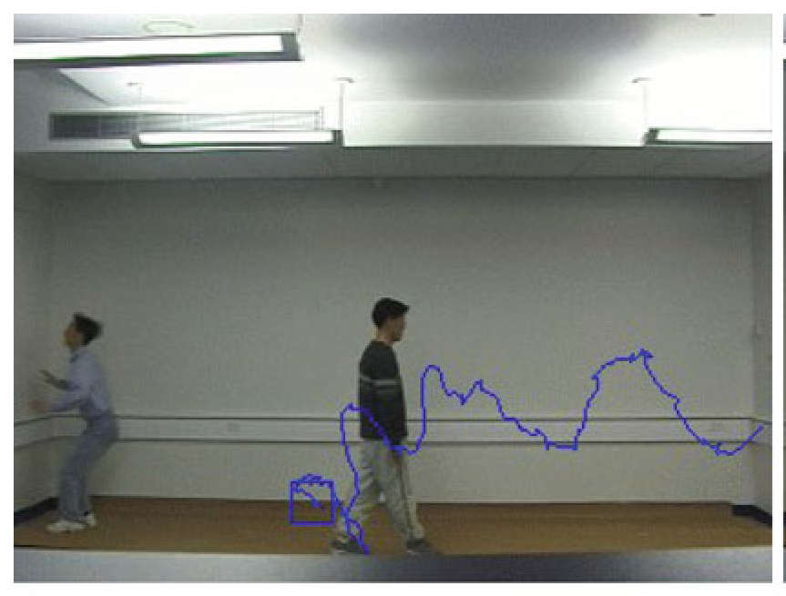
Frame 150


> Image description: Figure 1 from "Uncertainty and Robustness in Dynamic Vision" illustrates an unscented particle filter-based tracking application. The image shows an indoor environment with two people walking; one person is in the foreground, while a second person is partially obscured behind them, creating an occlusion. A blue bounding box is drawn around the lower body of the foreground person. Extending from this bounding box is a continuous, jagged blue line that traces a complex, non-linear path across the background wall. This blue trajectory represents the estimated motion or tracked path of the target. The figure visually demonstrates the ability of the tracking algorithm to maintain a path estimate despite the visual uncertainty and occlusion caused by the second person. There are no explicit axes, mathematical variables, or block diagrams present in this specific photographic figure.
Frame 95

Uncertainty and Robustness in Dynamic Vision, Fig. 1 Unscented particle filter-based tracking in the presence of occlusion

As shown next, the fragility noted above can be avoided by modeling the motion of the target as the output of a dynamical system, to be identified directly from the available data, along with bounds on the identification error. In the sequel, we consider two different cases: (i) the motion of the target is known to belong to a relatively small set of a priori known motion modalities; and (ii) no prior knowledge is available.

The case of known motion models: Consider first the case where a set of models known to span all possible motions of the target is known a priori, as it is often the case with human motion. In this case, the position $y_{k}$ of a given target can be modeled as $y(z)=\mathcal{F}(z) e(z)+\eta(z)$ where $\mathbf{e}$ and $\eta_{k}$ denote a suitable input and measurement noise, respectively, and where $\mathcal{F}$ admits an expansion of the form $\mathcal{F}=\overbrace{\sum_{j=1}^{N_{p}} p_{j} \mathcal{F}^{j}}^{\mathcal{F}_{p}}+\mathcal{F}_{n p}$. Here $\mathcal{F}^{j}$ represent the (known) motion modalities of the target and $\left\|\mathcal{F}_{n p}\right\|_{\infty} \leq K$, e.g., a bound on the maximum admissible approximation error of the expansion $\mathcal{F}_{p}$ to $\mathcal{F}$ is available. In the reminder of this article, we will further assume that a set membership descriptions $\eta_{k} \in \mathcal{N}$ is available and, without loss of generality, that $e(z)=1$ (i.e., motion of the target is modeled as the impulse response of the unknown operator $\mathcal{F}$ ).

In this context, the next location of the target feature $y_{k}$ can be predicted by first identifying the relevant dynamics $\mathcal{F}$ and then using it to propagate its past values. In turn, identifying the dynamics entails finding an operator $\mathcal{F}(z) \in \mathcal{S} \doteq \left\{\mathcal{F}(z): \mathcal{F}=\mathcal{F}_{p}+\mathcal{F}_{n p}\right\}$ such that $y-\eta=\mathcal{F}$, precisely the class of interpolation problem addressed in Parrilo et al. (1999). As shown there, finding such an operator reduces to solving a linear matrix inequality (LMI) feasibility problem. Once this operator is found, it can be used in conjunction with a particle (or a Kalman) filter to predict the future location of the target. Figure 2 shows the tracking results obtained using this approach. Here, we used a combination of a priori information: (i) $5 \%$ noise level and (ii) $\mathcal{F}_{p} \in \operatorname{span}\left[\frac{1}{z-1}, \frac{z}{z-a}, \frac{z}{(z-1)^{2}}, \frac{z^{2}}{(z-1)^{2}}, \frac{z^{2}-\cos \omega z}{z^{2}-2 \cos \omega z+1}\right.$, $\left.\frac{\sin \omega z^{2}}{z^{2}-2 \cos \omega z+1}\right]$ where $a \in\{0.9,1,1.2,1.3,2\}$ and $\omega \in\{0.2,0.45\}$. The experimental information consisted of the position of the target in $N=20$ frames, where it was not occluded. Note that, by exploiting predictive power of the identified model, the Kalman filter is now able to track the target past the occlusion, eliminating the need for using a (more computationally expensive) particle filter.

Unknown motion models: This case could be addressed in principle by performing a purely nonparametric worst-case identification (Parrilo et al. 1999) and then proceeding as above.


<!-- source_pdf_page: 1510 -->
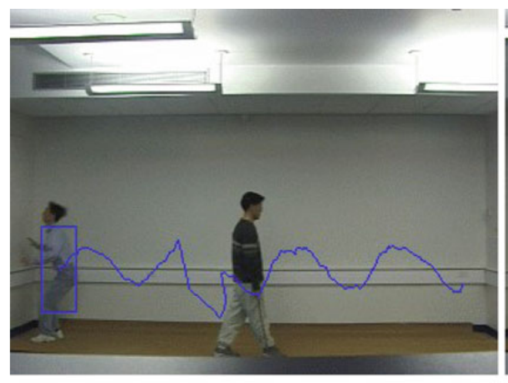
Frame 150

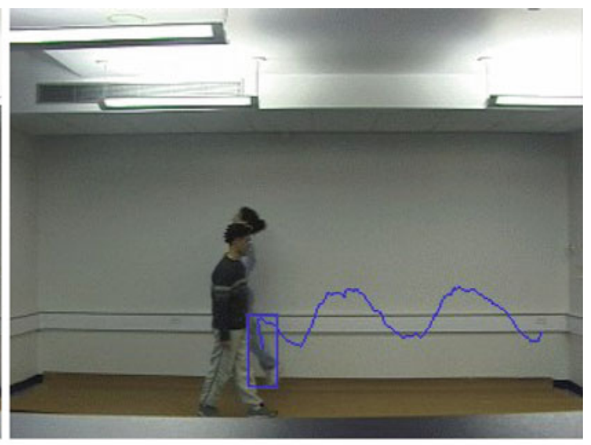

> Image description: Figure 2 from "Uncertainty and Robustness in Dynamic Vision" depicts a person walking through an indoor corridor, demonstrating a visual tracking application. A blue bounding box is overlaid on the lower portion of the person, representing a tracked object. Extending from this bounding box is a continuous, oscillating blue line that traces a path across the wall behind the person. This line shows periodic fluctuations, suggesting a trajectory or a signal measurement over time. The image captures a moment of occlusion, where the person's body partially obscures the background, relating to the caption's mention of using an identified model with a Kalman filter to maintain robust tracking during such events. The scene is a brightly lit room with a plain white wall and a dark floor, providing a clear backdrop for the superimposed tracking elements.
Frame 95

Uncertainty and Robustness in Dynamic Vision, Fig. 2 Using the identified model in combination with Kalman filter allows for robust tracking in the presence of occlusion

However, a potential difficulty here stems from the high order of the resulting model (recall that the order of the central interpolant is the number of experimental data points). If a bound $n$ on the order of the underlying models is available, this difficulty can be avoided by recasting the prediction problem into a rank minimization form, which in turn can be relaxed to a semidefinite optimization. To this effect, recall that (Ding et al. 2008), in the absence of noise, given $2 n$ values of $\left\{\mathbf{y}_{k}\right\}_{k=t-2 n+1}^{t}$, its next value $\mathbf{y}_{t+1}$ is the unique solution to the following rank minimization problem:

$$
\begin{align*}
\mathbf{y}_{t+1} & =\underset{\mathbf{y}}{\operatorname{argmin}}\left\{\operatorname{rank}\left[\mathbf{H}_{n+1}(\mathbf{y})\right]\right\} \text { where } \mathbf{H}_{n+1}(\mathbf{y}) \\
& \doteq\left[\begin{array}{cccc}
\mathbf{y}_{t-2 n+1} & \mathbf{y}_{t-2 n+2} & \cdots & \mathbf{y}_{t-n} \\
\mathbf{y}_{t-2 n+2} & \mathbf{y}_{t-2 n+3} & \cdots & \mathbf{y}_{t-n+1} \\
\vdots & \vdots & \ddots & \vdots \\
\mathbf{y}_{t-n+1} & \mathbf{y}_{t-n+2} & \cdots & \mathbf{y}
\end{array}\right] \tag{1}
\end{align*}
$$

Clearly, the same result holds if multiple elements of the sequence $\mathbf{y}$ are missing, at the price of considering longer sequences (the total number of data points should exceed $2 n$ ). This result allows for handling both noisy and missing data (due, for instance, to occlusion), by simply solving

$$
\begin{aligned}
& \min _{\zeta}\{\operatorname{rank}[\mathbf{H}(\zeta)]\} \quad \text { subject to } \mathbf{v} \in \mathcal{N}_{v} \\
& \text { where } \zeta_{i}=\left\{\begin{array}{l}
\mathbf{y}_{i}-\mathbf{v}_{i} \text { if } i \in \mathcal{I}_{a} \\
\mathbf{x}_{i} \text { if } i \in \mathcal{I}_{m}
\end{array}\right.
\end{aligned}
$$

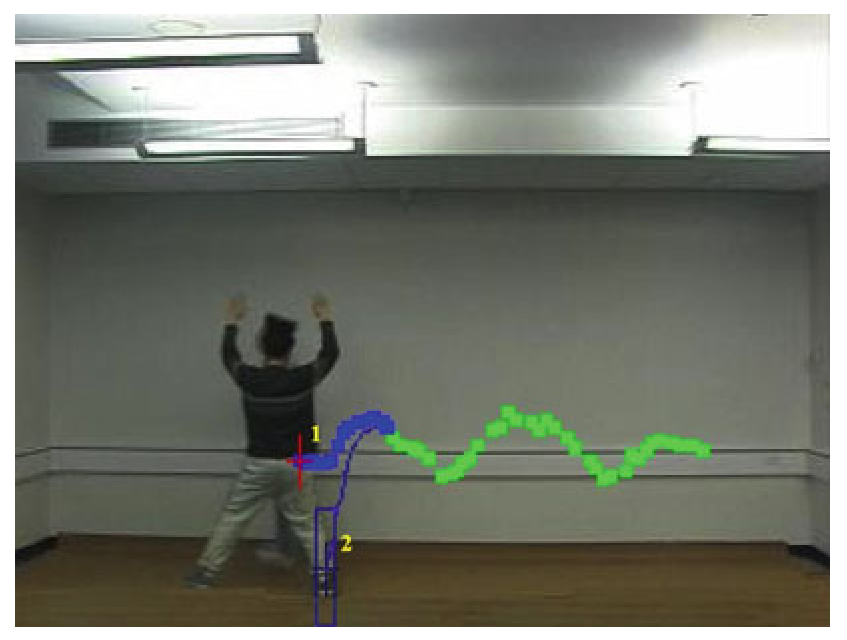

> Image description: This figure illustrates two methods for trajectory prediction overlaid on a video frame of a person in a room. A sequence of green dots represents the observed historical trajectory of a moving object. Two prediction paths are shown: a blue continuous curve labeled with a red "1" near its origin, and a blue line segment labeled with a yellow "2" originating from a blue bounding box near the bottom. According to the caption, "1" represents rank minimization and "2" represents Kalman filtering. The blue curve (1) follows the trend of the green dots to predict future motion, while the path (2) is associated with a rectangular detection box. The visual comparison demonstrates how different estimation techniques handle the continuation of a detected object's movement based on prior observations.
Uncertainty and Robustness in Dynamic Vision, Fig. 3 Trajectory prediction. Rank minimization (1) versus Kalman filtering (2)

$\mathcal{I}_{a}$ and $\mathcal{I}_{m}$ denote the set of available (but noisy) and missing measurements, respectively, and where $\mathcal{N}_{v}$ is a set membership description of the noise $\mathbf{v}$. In the case where $\mathcal{N}_{v}$ admits a convex description, using the nuclear norm as a surrogate for rank (Fazel et al. 2003) allows for reducing this problem to a convex semi-definite program. Examples of these descriptions are balls in $\ell_{\infty}$, e.g., $\mathcal{N} \doteq\left\{v:\left|v_{k}\right| \leq \epsilon\right\}$ or constraints on the norm of $\mathbf{H}_{v}$, the Hankel matrix of the noise sequence, which under mild ergodicity assumptions are equivalent to constraints on the magnitude of the noise covariance. Figure 3 illustrates the effectiveness of this approach.


<!-- source_pdf_page: 1511 -->
As shown there, the rank minimization-based filter successfully predicts the location of the target, while a Kalman filter-based tracker fails due to the substantial occlusion.

## Event Detection and Activity Classification

Using the trajectories generated by the tracking step for activity recognition entails (i) segmenting the data into homogeneous segments each corresponding to a single activity and (ii) classifying these activities, typically based on exemplars from a database of known activities. As shown in the sequel, both steps can be efficiently accomplished by exploiting the properties of the underlying system. The starting point is to model these activities as the output of a switched piecewise linear system. In this context, under suitable dwell time constraints, each switch (indicating a change in the underlying activity) can be identified by simply searching for points associated with discontinuities in the rank of the associated Hankel matrix, as illustrated in Fig. 4. Further, in this framework, the problem of classifying each subactivity can be recast into the behavioral model (in)validation setup shown in Fig. 5. Here $y_{i}($.$) represents the impulse response$ of the (unknown) LTI system $G$, affected by measurement noise $\eta_{i} \in \mathcal{N}$ and uncertainty
$\Delta_{i} \in \mathcal{D}$ that accounts for the variability intrinsic to two different realizations of the same activity. Two different time series are considered to be realizations of the same activity if there exists at least one pair $\left(\eta_{1}, \eta_{2}\right) \in \mathcal{N}^{2}$, one pair $\left(\Delta_{1}, \Delta_{2}\right) \in \mathcal{D}^{2}$, a LTI system $G$ with McMillan degree at most $n_{G}$, and suitable initial conditions $\mathbf{x}_{1}, \mathbf{x}_{2}$ resulting in the observed data. Remarkably, this model (in)validation problem can be reduced to a rank minimization form. In the simpler case where $\Delta_{i}=0$, the problem can be solved using the following algorithm (Sznaier and Camps 2011):

Next, consider the more realistic case where the trajectories are also affected by bounded model uncertainty $\Delta,\|\Delta\|_{\infty} \leq \gamma$, where $\gamma$ is given as part of a priori information. In this scenario, the internal signal $z$ is given by $z(t)=\zeta(t)-\eta(t), \quad \eta \in \mathcal{N}$, where the signal $\zeta$ satisfies

$$
\begin{equation*}
y=(1+\Delta) * \zeta, \text { for some } \Delta \in \mathcal{D} \tag{2}
\end{equation*}
$$

where * denotes convolution. Exploiting Theorem 2.3.6 in Chen and Gu (2000) leads to an LMI condition in the variables $z, \eta$, for feasibility of (2). Thus, the only modification to Algorithm 1 required to handle model uncertainty is to incorporate this additional (convex) constraint to the rank minimization problems. Table 1 shows the results of applying this approach to

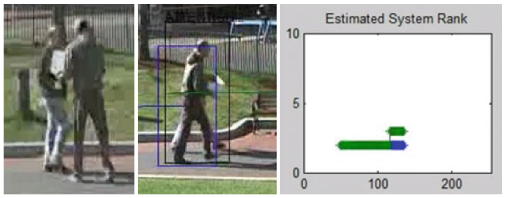

> Image description: This image consists of three panels illustrating the relationship between visual events and mathematical rank changes. The leftmost panel shows two people walking along a path. The central panel shows the same scene, but with a blue bounding box centered on one of the individuals. The rightmost panel is a plot titled "Estimated System Rank." The vertical y-axis is labeled with numerical values from 0 to 10, while the horizontal x-axis is labeled from 0 to 200. A thick green bar is positioned at a low rank value (approximately 2) across a range of x-values. Toward the end of this range (near x=120), a secondary green bar appears above the first, and the primary bar concludes with a blue segment. According to the caption, the sudden upward jump in the rank of the Hankel matrix signifies the specific time instant when the subjects meet and exchange a bag.
Uncertainty and Robustness in Dynamic Vision, Fig. 4 The jump in the rank of the Hankelmatrix corresponds to the time instant where the subjectsmeet and exchange a bag


<!-- source_pdf_page: 1512 -->
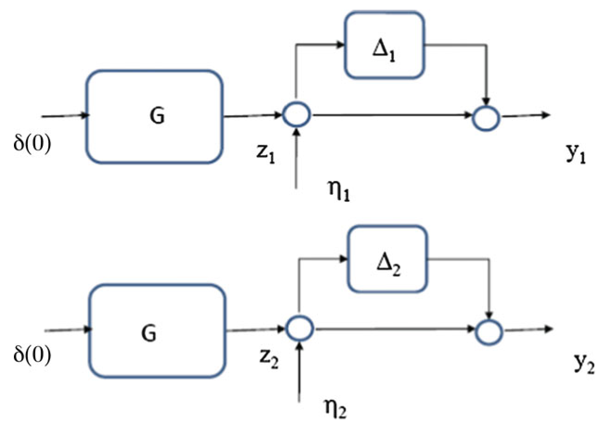

> Image description: Figure 5, titled "Model (in)validation setup," depicts two parallel control system block diagrams representing a setup for assessing uncertainty and robustness in dynamic vision. Both diagrams follow an identical structure. In each, an input signal $\delta(0)$ enters a primary block labeled $G$. The output of $G$ is a signal $z_i$ (where $i=1, 2$), which is then combined at a summation junction with an external disturbance or uncertainty signal $\eta_i$. The resulting signal enters a feedback loop containing a block labeled $\Delta_i$. The output of $\Delta_i$ is fed back into a second summation junction, which produces the final output signal $y_i$. The top diagram uses indices of 1 (labels: $z_1$, $\eta_1$, $\Delta_1$, $y_1$), while the bottom diagram uses indices of 2 (labels: $z_2$, $\eta_2$, $\Delta_2$, $y_2$). The diagrams illustrate how uncertainties ($\Delta_i$) and external noise ($\eta_i$) affect the system outputs $y_i$ relative to the nominal plant $G$.
Uncertainty and Robustness in Dynamic Vision, Fig. 5 Model (in)validation setup

2 video sequences, walking and running, from the KTH database (Laptev et al. 2008). Sample frames from these sequences are shown in Fig. 6. In order to reduce the dimensionality of the data, the frames were first projected into a three-dimensional space using principal component analysis (PCA), and the resulting time series were used as the input to Algorithm 1, assuming $10 \%$ noise and $10 \%$ model uncertainty. As shown in Table 1, the algorithm correctly identifies the subsequences (a)-(c) as being generated by the same underlying activity (walking).

```
Algorithm 1 Behavioral model (in)validation
Data: Noisy measurements $y_{1}, y_{2}$. A priori information: noise description $\eta_{i} \in \mathcal{N}$
1. Solve the following rank-minimization problems:
```

```
2. The given trajectories were generated by the same LTI system with McMillan degree $\leq n_{G}$ iff:
```

| Uncertainty | and | Robustness | in |
| :--- | :--- | :--- | :--- |
| Vision, Table | 1 | Activity | classification |
| Sequences (a)-(c) correspond to walking and (d) to running |  |  |  |
| Activity pair | $\operatorname{Rank}\left(\mathbf{H}_{1}\right)$ | Rank ( $\mathbf{H}_{2}$ ) | $\operatorname{Rank}\left(\left[\begin{array}{ll}\mathbf{H}_{1} & \mathbf{H}_{2}\end{array}\right]\right)$ |
| ( $a, b$ ) | 4 | 4 | 4 |
| ( $a, c$ ) | 4 | 4 | 4 |
| ( $a, d$ ) | 4 | 8 | 8 |

## Summary and Future Directions

Vision-based systems are uniquely positioned to address the needs of a growing segment of the population. Aware sensors endowed with scene analysis capabilities can prevent crime, reduce time response to emergency scenes, and render viable the concept of ultra-sustainable buildings. Moreover, the investment required to accomplish these goals is relatively modest since a large number of cameras are already deployed and networked. Arguably, at this point, one of the critical factors limiting widespread use of these systems is their potential fragility when operating in unstructured scenarios. This article illustrates the key role that control theory can play in developing a comprehensive, provably robust


<!-- source_pdf_page: 1513 -->
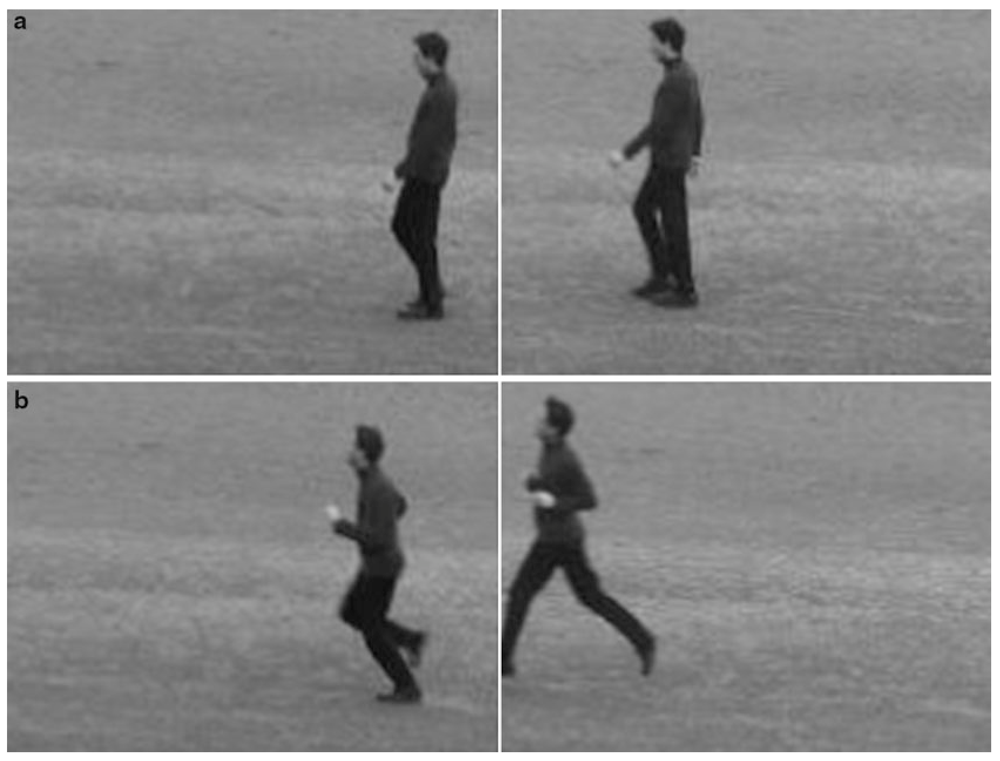

> Image description: A black and white textbook figure, titled "Fig. 6 Sample frames from KTH activity video database," illustrates motion patterns divided into two horizontal rows labeled **a** and **b**. Row **a**, labeled "**(a) Walking**," contains two side-view photographic frames of a person walking from left to right. The first frame shows the person in a mid-stride standing posture, and the second shows them in a forward-leaning walking gait. Row **b**, labeled "**(b) Running**," contains two side-view photographic frames of a person in a more vigorous motion. The first frame captures the person in a deep, lunging stride, and the second frame shows them in an extended running stride with limbs further apart. The backgrounds are uniform and textured, representing a typical outdoor field or ground setting. The figure serves to visually contrast the physiological differences in body posture and limb extension between walking and running activities.
Uncertainty and Robustness in Dynamic Vision, Fig. 6 Sample frames from KTH activity video database. (a) Walking. (b) Running

dynamic vision framework. In turn, computer vision provides a rich environment both to draw inspiration from and to test new developments in systems theory.

## Cross-References

- Particle Filters
- Estimation, Survey on


## Recommended Reading

Details on how to select good features to track can be found in Richard Szeliski (2010). Using dynamics to recover 3D structure from 2D data is covered in Ayazoglu et al. (2010). Finally, further
details on the connection between identification and the problem of extracting actionable information from large data streams can be found, for instance, in Sznaier (2012).

## Bibliography

Ayazoglu M, Sznaier M, Camps O (2010) Euclidean structure recovery from motion in perspective image sequences via Hankel rank minimization. LNCS, vol 6312. Springer, Berlin/New York, pp 71-84
Chen J, Gu G (2000) Control oriented system identification, An $\mathcal{H}_{\infty}$ approach. Wiley, New York
Ding T, Sznaier M, Camps O (2008) Receding horizon rank minimization based estimation with applications to visual tracking. In: Proceedings of the 47th IEEE conference on decision and control, Cancún, Dec 2008, pp 3446-3451


<!-- source_pdf_page: 1514 -->
Fazel M, Hindi H, Boyd SP (2003) Log-det heuristic for matrix rank minimization with applications to hankel and euclidean distance matrices. In: Proceedings of the 2003 ACC, Denver, pp 2156-2162
Isard M, Blake A (1998) CONDENSATION - conditional density propagation for visual tracking. Int J Comput Vis 29(1):5-28
Laptev I, Marszalek M, Schmid C, Rozenfeld B (2008) Learning realistic human actions from movies. In: IEEE computer vision and pattern recognition, Anchorage, pp 1-8
North B, Blake A, Isard M, Rittscher J (2000) Learning and classification of complex dynamics. IEEE Trans Pattern Anal Mach Intell 22(9):1016-1034
Parrilo PA, Sánchez-Peña RS, Sznaier M (1999) A parametric extension of mixed time/frequency domain based robust identification. IEEE Trans Autom Control 44(2):364-369
Rugh WJ (1996) Linear systems theory, 2nd edn. Prentice Hall, Upper Saddle River
Sánchez-Peña RS, Sznaier M (1998) Robust systems theory and applications. Wiley, New York
Szeliski R (2010) Computer vision: algorithms and applications. Springer, New York
Sznaier M (2012) Compressive information extraction: a dynamical systems approach. In: Proceeding of the 2012 symposium on systems identification (SYSID 2012), July 2012, Brussels, pp 1559-1568

Sznaier M, Camps O (2011) A rank minimization approach to trajectory (in)validation. In: 2011 American control conference, pp 675-680

## Underactuated Marine Control Systems

Kristin Y. Pettersen<br>Department of Engineering Cybernetics, Norwegian University of Science and Technology, Trondheim, Norway


#### Abstract

For underactuated marine vessels, the dimension of the configuration space exceeds that of the control input space. This article describes underactuated marine vessels and the control challenges they pose. In particular, there are two main approaches to design control systems for underactuated marine vessels. The first approach reduces the number of degrees of freedom (DOF)


that it seeks to control such that the number of DOF equals the number of independent control inputs. The control problem is then a fully actuated control problem - something that simplifies the control design problem significantly - but special attention then has to be given to the inherent internal dynamics that has to be carefully analyzed. The other approach to design control systems for underactuated marine vessels seeks to control all DOF using only the limited number of control inputs available. The control problem is then an underactuated control problem and is quite challenging to solve. In this article, it is shown how line-of-sight methods can solve the underactuated control problems that arise from path following and maneuvering control of underactuated marine vessels.

## Keywords

Marine vessels; Underactuated marine control problems; Underactuated marine vessels; Underactuation

## Introduction

Marine systems are often equipped with fewer independent actuators than degrees of freedom. Examples include conventional ships/surface vessels that are typically equipped with a main thruster and a rudder or with two independent main thrusters, but without a side thruster. As a result, we have no control force in the sideways direction. This means that the forward motion (the surge motion) and the orientation (the yaw motion) can be controlled directly, while there is no direct way to influence the sideways motion of the surface vessel (the sway motion). The vessel is then said to be underactuated in sway. It is an underactuated system since it has only two independent control inputs, giving force and torque in surge and yaw, while the system has three degrees of freedom: surge, sway, and yaw. This underactuation leads to challenges when it comes to designing the control system.


<!-- source_pdf_page: 1515 -->
## Definition: Underactuated Marine Vessels

In order to properly define what we mean by underactuated marine vessels, we need the mathematical model ( - Mathematical Models of Ships and Underwater Vehicles; Fossen 2011):

$$
\begin{gathered}
M \dot{v}+C(v) v+D(v) v+g(\eta)=\left[\begin{array}{l}
\tau \\
0
\end{array}\right] \\
\dot{\eta}=J(\eta) v
\end{gathered}
$$

where the configuration vector $\eta \in \mathbb{R}^{n}$, the velocity vector $v \in \mathbb{R}^{n}$, while the vector of independent control inputs $\tau \in \mathbb{R}^{m}$. The vessel is underactuated because $n>m$, i.e., the dimension of the configuration space exceeds that of the control input space (Oriolo and Nakamura 1991; Pettersen and Egeland 1996).

The underactuation leads to a second-order nonholonomic constraint

$$
M_{u} \dot{v}+C_{u}(v) v+D_{u}(v) v+g_{u}(\eta)=0
$$

where $M_{u}$ denotes the last $n-m$ rows of the matrix $M$ and $C_{u}(\nu), D_{u}(\nu)$, and $g_{u}(\eta)$ are defined similarly.

Definitions of nonholonomic and holonomic constraints can be found in Goldstein (1980). More facts about these kinds of constraints and conditions for when this second-order nonholonomic can be integrated to either a first-order nonholonomic or a holonomic constraint can be found in Tarn et al. (2003).

## Control of Underactuated Marine Vessels

As we have seen above, the underactuation leads to a constraint, and this gives challenges when it comes to designing the control system. In particular, it can be shown that if $g_{u}(\eta)$ has a zero element, then there exists no continuous or discontinuous state feedback law that can asymptotically stabilize the equilibrium point $(\eta, \nu)= (0,0)$ (Pettersen and Egeland 1996). This means
that in order to stabilize an equilibrium point, control methods from linear or classical nonlinear control theory cannot be applied.

There are two main classes of approaches to control underactuated marine vessels. The first class approaches the control problem by reducing the number of degrees of freedom that are to be controlled, while the other class seeks to control all degrees of freedom using the limited number of control inputs available.

If we reduce the number of degrees of freedom (DOF) that we seek to control, such that the number of DOF agrees with the number of independent control inputs, then we have a fully actuated control problem although the vessel is underactuated. This may at first sight look like a very simple way to design a control system for underactuated marine vessels. Note, however, that then, there will inherently be internal dynamics that needs to be examined carefully (Isidori 1995; Nijmeijer and van der Schaft 1990). Say, for instance, that we only care about controlling the position of the ship, and we choose not to care very much about the orientation of the ship. We do, for instance, want the ship to follow a straight line trajectory ( $x_{r}(t), y_{r}(t)$ ), where $x$ and $y$ give the ship's position in an earth-fixed coordinate system, and the angle giving the ship orientation, $\psi$, is not so important to us. It is quite straightforward to use, for instance, output feedback linearization to this end (Isidori 1995; Nijmeijer and van der Schaft 1990). The resulting dynamics of the subsystem ( $x, y$ ) is then called the external dynamics. We have full control over this using the two independent control inputs and can make it track any smooth trajectory $\left(x_{r}(t), y_{r}(t)\right)$. Everything looks simple when considering the external dynamics only, but the internal dynamics can frequently be hard to predict. The orientation of the ship, given by the yaw angle psi, also needs to be analyzed. The controlled motion will not necessarily have the ship aligned with the tangent of the trajectory, for instance. Firstly, the ship control system that only focuses on the position variables ( $x, y$ ) may equally well result in the ship moving backward along the line; a behavior that is not really desirable with respect to energy efficiency or for passenger comfort. Secondly,


<!-- source_pdf_page: 1516 -->
there will always be environmental disturbances: currents, wind, and waves, and we need to make a thorough stability analysis of the internal dynamics in order to guarantee sufficient robustness properties for these. So to conclude, if you reduce the number of DOF that you seek to control, in order to achieve a fully actuated control problem, then you need to consider the internal dynamics very carefully when dealing with underactuated marine vessels.

If we follow the other approach to controlling underactuated marine vessels, where we seek to control more degrees of freedom than we have independent control inputs, then we not only have an underactuated marine vessel at hand, but we also have an underactuated control problem. This is a challenging control problem, and we will now see how this can be solved for path following and maneuvering control.

## Path Following and Maneuvering Control of Underactuated Marine Vessels

For path following control systems, the control objective is to make the vessel follow a given path $\mathcal{P}$, often defined as a parametrized path
$Y_{d}:=\left\{y \in \mathbb{R}^{m}: \exists \theta \in \mathbb{R}\right.$ such that $\left.y=y_{d}(\theta)\right\}$
where $m \leq n$ and $y_{d}$ is continuously parametrized by the path variable $\theta$. The control objective is thus to force the output $y$ to converge to the desired path $y_{d}(\theta): \lim _{t \rightarrow \infty} \mid y(t)- y_{d}(\theta(t)) \mid=0$. This constitutes a geometric task. When there is also a dynamic task, for instance, a speed assignment like forcing the path speed $\dot{\theta}$ to converge to a desired speed $v_{s}(\theta(t), t)$

$$
\lim _{t \rightarrow \infty}\left|\dot{\theta}(t)-v_{s}(\theta(t), t)\right|=0
$$

then the control problem is an output maneuvering problem (Skjetne et al. 2004).

Line-of-sight (LOS) guidance control has proven to be a powerful tool for path following and maneuvering control of underactuated vessels. LOS guidance is much used in practice
for manual control of ships, where the helmsman typically will steer the vessel toward a point lying a constant distance, called the look-ahead distance, ahead of the vessel along the desired path. LOS guidance is simple, intuitive, and easy to tune, and it can be shown that it provides nice path convergence properties (Breivik and Fossen 2004; Børhaug et al. 2008; Caharija et al. 2012; Fredriksen and Pettersen 2006; Lefeber et al. 2003). For the simplified case without any environmental disturbances and when the desired path is a straight line, the LOS guidance law for an underactuated surface vessel is given by

$$
\psi_{\mathrm{d}}=\psi_{\mathrm{LOS}}=-\tan ^{-1}\left(\frac{y}{\Delta}\right), \quad \Delta>0
$$

where $y$ is the cross-track error. The angle $\psi_{\text {LOS }}$ is called the line-of-sight (LOS) angle, and geometrically, it corresponds to the orientation of the vessel when headed toward the point that lies a distance $\Delta>0$ ahead of the vessel along the path $y=0$, cf. Fig. 1 . The look-ahead distance $\Delta$ is a control design parameter.

In order to handle ocean currents and other environmental disturbances such as wind and waves, the LOS guidance law can be extended with integral action

$$
\begin{aligned}
& \psi_{\mathrm{LOS}}^{m}=-\tan ^{-1}\left(\frac{y+\sigma y_{\mathrm{int}}}{\Delta}\right), \quad \Delta>0 \\
& \dot{y}_{\mathrm{int}}=\frac{\Delta y}{\left(y+\sigma y_{\mathrm{int}}\right)^{2}+\Delta^{2}}
\end{aligned}
$$

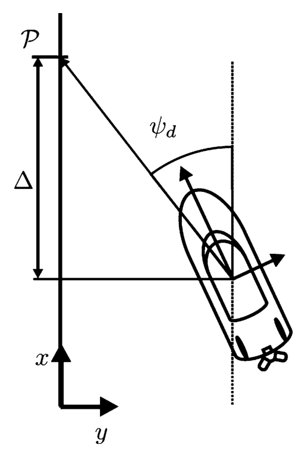

> Image description: This technical diagram, titled "Fig. 1 Illustration of LOS guidance" from the context of "Underactuated Marine Control Systems," illustrates a Line-of-Sight (LOS) guidance geometry for a marine vehicle. The diagram features a Cartesian coordinate system in the bottom-left corner with $x$ and $y$ axes. A vertical reference line (the $x$-axis) is shown on the left, with a specific point $\mathcal{P}$ marked at the top. A vertical distance $\Delta$ is indicated between the horizontal line passing through the vehicle's reference point and the point $\mathcal{P}$. The marine vehicle is depicted as an elongated oval with a propeller at the bottom. Two perpendicular arrows originate from the vehicle's center, representing its local body axes. A dashed vertical line serves as a baseline for measuring the heading angle $\psi_d$. This angle $\psi_d$ is defined between the dashed vertical line and a diagonal line segment connecting the vehicle's center to the target point $\mathcal{P}$.
Underactuated Marine Control Systems, Fig. 1 Illustration of LOS guidance


<!-- source_pdf_page: 1517 -->
where $\sigma>0$ is a design parameter, an integral gain, and $\Delta>0$ has the same interpretation as above. The integral effect will generate a sideslip angle that allows the vessel to stay on the desired path even though affected by environmental disturbances with components normal to the path, even though the vessel has no control forces to act in the sideways direction.

Various standard control techniques can readily be used to track the above guidance commands. LOS guidance can also be extended to the 3D case for path following/maneuvering control of underactuated autonomous underwater vehicles (AUV), cf. the references given above.

## Summary and Future Directions

Underactuated marine vessels are vessels for which the dimension of the configuration space exceeds that of the control input space. There are two main approaches to design control systems for underactuated marine vessels. The first approach reduces the number of degrees of freedom (DOF) that it seeks to control, such that the number of DOF equals the number of independent control inputs. The control problem is then a fully actuated control problem, something that simplifies the control design problem significantly, but special attention then has to be given to the inherent internal dynamics that has to be carefully analyzed. The other approach to design control systems for underactuated marine vessels seeks to control all DOF using only the limited number of control inputs available. The control problem is then an underactuated control problem, and this is a quite challenging control problem. In this entry, it is shown how line-of-sight methods can solve the underactuated control problems that arise from path following and maneuvering control of underactuated marine vessels.

Future developments of underactuated marine control systems will include solving more underactuated control problems of marine vessels taking into account both the complete mathematical model of the vessels and also advanced
mathematical models of all the environmental disturbances in both 2D and 3D.

## Cross-References

- Mathematical Models of Ships and Underwater Vehicles
- Motion Planning for Marine Control Systems
- Underactuated Robots


## Bibliography

Aguiar AP, Pascoal AM (2007) Dynamic positioning and way-point tracking of underactuated AUVs in the presence of ocean currents. Int J Control 80:1092-1108
Breivik M, Fossen TI (2004) Path following of straight lines and circles for marine surface vessels. In: Proceedings of 6th IFAC conference on control applications in marine systems, Ancona, pp 65-70
Børhaug E, Pavlov A, Pettersen KY (2008) Integral LOS control for path following of underactuated marine surface vessels in the presence of constant ocean currents. In: Proceedings of 47th IEEE conference on decision and control, Cancun, 9-11 Dec 2008, pp 4984-4991
Caharija W, Pettersen KY, Gravdahl JT, Børhaug E (2012) Path following of underactuated autonomous underwater vehicles in the presence of ocean currents. In: Proceedings of 51th IEEE conference on decision and control, Maui, Dec 2012, pp 528-535
Encarnacao P, Pascoal AM, Arcak M (2000) Path following for marine vehicles in the presence of unknown currents. In: Proceedings of 6th IFAC international symposium on robot control, Vienna, 21-23 Sept 2000, pp 469-474
Fossen TI (2011) Handbook of marine craft hydrodynamics and motion control. Wiley, Chichester/West Sussex
Fredriksen E, Pettersen KY (2006) Global K-exponential way-point maneuvering of ships: theory and experiments. Automatica 42:677-687
Goldstein H (1980) Classical mechanics, 2nd edn. Addison-Wesley, Reading
Healey AJ, Lienard D (1993) Multivariable sliding mode control for autonomous diving and steering of unmanned underwater vehicles. IEEE J Ocean Eng 18:327-339
Indiveri G, Zizzari AA (2008) Kinematics motion control of an underactuated vehicle: a 3D solution with bounded control effort. In: Proceedings of 2nd IFAC workshop on navigation, guidance and control of underwater vehicles. Killaloe, Ireland
Isidori A (1995) Nonlinear control systems, 3rd edn. Springer, London
Lapierre L, Soetanto D, Pascoal AM (2003) Nonlinear path following with applications to the control of


<!-- source_pdf_page: 1518 -->
autonomous underwater vehicles. In: Proceedings of 42nd IEEE conference on decision and control, Maui, Dec 2003, pp 1256-1261
Lefeber AAJ, Pettersen KY, Nijmeijer N (2003) Tracking control of an under-actuated ship. IEEE Trans Control Syst Technol 11:52-61
Nijmeijer H, van der Schaft AJ (1990) Nonlinear dynamical control systems. Springer, New York
Oriolo G, Nakamura Y (1991) Control of mechanical systems with second-order nonholonomic constraints: underactuated manipulators. In: Proceedings of 30th IEEE conference on decision and control, Brighton, Dec 1991, pp 2398-2403
Pettersen KY, Egeland O (1996) Exponential stabilization of an underactuated surface vessel. In: Proceedings of 35th IEEE conference on decision and control, Kobe, Dec 1996, pp 967-972
Pettersen KY, Egeland O (1999) Time-varying exponential stabilization of the position and attitude of an underactuated autonomous underwater vehicle. IEEE Trans Autom Control 44:112-115
Skjetne R, Fossen TI, Kokotivic PV (2004) Robust output maneuvering for a class of nonlinear systems. Automatica 40:373-383
Tarn T-J, Zhang M, Serrani A (2003) New integrability conditions for classifying holonomic and nonholonomic systems. In: Rantzer A, Byrnes CI (eds) Directions in mathematical systems theory and optimization, Springer, Berlin/Heidelberg, pp 317-331

## Underactuated Robots

Kevin M. Lynch
Mechanical Engineering Department, Northwestern University, Evanston, IL, USA


#### Abstract

Underactuated robots, robots with fewer actuators than degrees of freedom, are found in many robot applications. This entry classifies underactuated robots according to their dynamics and constraints and provides an overview of controllability, stabilization, and motion planning.

\section*{Keywords}

Nonholonomic constraints; Nonlinear control; Underactuation


## Introduction

An underactuated robot is a robot with fewer actuators (control inputs) than the number of variables describing its configuration (degrees of freedom). Some robots have this property unavoidably, while others are specifically designed this way, perhaps to save the cost of actuators. Examples include:

- A cart and pendulum (inverted pendulum). This system has two degrees of freedom, the linear position of the cart and the angle of the pendulum, but only one control input, the acceleration of the cart.
- A car. A car has only two control inputs (steering and forward/backward speed) but at least three degrees of freedom: the position $(x, y)$ and orientation $\theta$ of the chassis. If the steering and/or rolling angles of the wheels are included in the representation of the configuration, the car has even more degrees of freedom.
- A walking robot. When a biped steps with one foot in the air and the toes of the other foot on the ground, there is no actuator at the toes to directly control the angle between the foot and the ground.
- A quadrotor flying robot. A quadrotor has four control currents driving the four propellers, but its configuration is described by six variables: ( $x, y, z$ ) position and roll, pitch, and yaw.
- An underactuated robot hand. Robot hands generally have many joints, up to four per finger for anthropomorphic hands. To reduce cost, a small number of motors (as few as one) may be used to open and close the fingers, with joint motions coupled by springs.
- Robot manipulation. When a robot arm and hand manipulates a rigid object, the entire system, taken together, has at least six more degrees of freedom than actuators - the six degrees of freedom of the object.
In all underactuated robot systems of interest, the fewer control inputs are somehow coupled to all of the degrees of freedom. This entry focuses on coupling through the inertia matrix and kinematic constraints. In addition, this entry


<!-- source_pdf_page: 1519 -->
focuses on control of the full configuration, or more generally the state, of the robot system. Other goals, such as successfully grasping an object with a compliant underactuated hand, are outside the scope of this entry.

## Classification of Underactuated Robots

The robot has $n$ degrees of freedom, and its configuration is written in local coordinates as a column vector $q \in \mathbb{R}^{n}$. If the robot is described as a kinematic system, then its state $x$ is simply $q$ and the control inputs are velocities. If the robot is a mechanical system, then its state is $x= \left[q^{T}, \dot{q}^{T}\right]^{T}$ and the control inputs are accelerations (forces). Let $p$ denote the dimension of the state space, where $p=n$ for a kinematic system and $p=2 n$ for a mechanical system.

The equations of motion of an underactuated robot can be written in the control-affine form

$$
\begin{equation*}
\dot{x}=f(x)+\sum_{i=1}^{m} u_{i} g_{i}(x) \quad \text { where } m<n \text {. } \tag{1}
\end{equation*}
$$

The vector field $f(x)$ is a drift vector field describing the unforced motion of the robot, the $g_{i}(x)$ are linearly independent control vector fields describing how the controls act on the robot, and $u=\left[u_{1}, \ldots, u_{m}\right]^{T}$ is the control. Kinematic systems are commonly drift-free $(f(x)=0)$. For a mechanical system, the drift field $f(x)$ typically includes velocities acting on positions and gravity acting on velocities.

The fact that the number of controls $m$ is less than the number of degrees of freedom $n$ can be viewed as $n-m$ constraints on the motion. For a kinematic system, these are velocity constraints. For a mechanical system, these are acceleration constraints. In addition, a mechanical system may be subject to a separate set of $k$ velocity constraints, often called Pfaffian constraints, of the form

$$
\begin{equation*}
A(q) \dot{q}=0, \tag{2}
\end{equation*}
$$

where $A(q) \in \mathbb{R}^{n \times k}$. Such constraints arise from conservation laws and rolling without slip, for example.

Understanding the integrability of these constraints is key to understanding the controllability of underactuated robots (section "Determining Controllability"). For example, if acceleration constraints can be integrated to yield equivalent velocity constraints, then the dimension of the space of reachable velocities of the mechanical system is reduced. If velocity constraints can be integrated to yield equivalent configuration constraints, then the dimension of the reachable configuration space is reduced. If some velocity constraints are integrable to configuration constraints, we simply eliminate those configuration variables from the description of the system so we can focus on the controllable degrees of freedom. Velocity constraints that cannot be integrated are called nonholonomic, while configuration constraints are called holonomic.

Based on the type of constraints, we can classify underactuated robots into three categories pure kinematic, pure mechanical, and mixed kinematic and mechanical - as described below.

## Pure Kinematic

This category consists of systems with velocities as inputs, as well as mechanical systems that can be modeled by a kinematic reduction that has time-differentiable velocities as controls (Bullo and Lewis 2004; Bullo et al. 2002). (The actual acceleration controls of the original system are the time derivatives of these velocities.) Examples of mechanical systems that can be reduced to kinematic systems include systems with actuators for every degree of freedom (fully actuated systems, of little interest here) and mechanical systems whose acceleration constraints can be completely integrated to equivalent velocity constraints.

Example 1 (Upright rolling wheel) Consider a wheel of radius $R$ rolling upright on a horizontal plane (Fig. 1a). The center of the wheel is ( $p_{x}, p_{y}, p_{z}$ ), and the orientation is described by its "leaning" angle $\theta$, rolling angle $\psi$, and heading angle $\phi$. The constraints that the wheel


<!-- source_pdf_page: 1520 -->
Underactuated Robots, Fig. 1 (a) A wheel in space, then confined to be upright on a horizontal plane with coordinates $\left(p_{x}, p_{y}, \psi, \phi\right)$. (b) A top view of a robotic snakeboard. The configuration is given by ( $p_{x}, p_{y}, \theta$ ) for the board, the steering angle $\phi$ of the wheels, and the angle $\psi$ of the reaction wheel
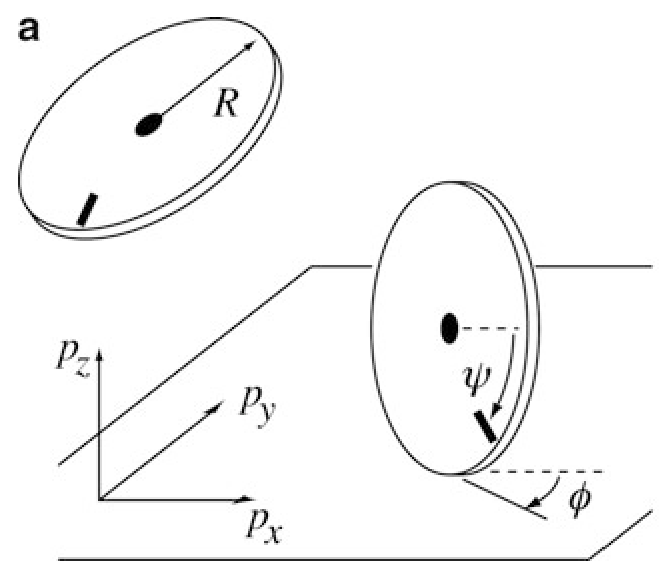

> Image description: Figure 1 consists of two sub-figures, (a) and (b), illustrating robotic configuration spaces. Part (a) shows a circular wheel with radius $R$ in two states: first, floating in space, and second, constrained to remain upright on a horizontal plane. The plane is defined by a 3D coordinate system with axes $p_x$, $p_y$, and $p_z$. On the upright wheel, an angular variable $\psi$ represents the rotation of an internal component relative to a horizontal dashed line, while $\phi$ represents the steering angle of the wheel relative to the $p_x$ axis. Part (b) is described in the caption as a top view of a robotic snakeboard. The configuration of the snakeboard is defined by the variables $(p_x, p_y, \theta)$ for the board's position and orientation, the steering angle $\phi$ of the wheels, and the reaction wheel angle $\psi$. The diagram emphasizes the relationship between physical geometry and mathematical state variables.

b
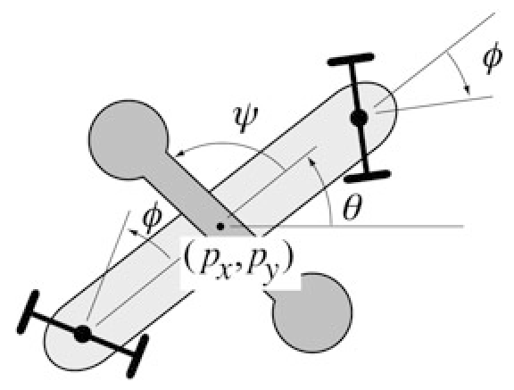

remain upright and touching the plane can be written differentially as $\dot{p}_{z}=0$ and $\dot{\theta}=0$, but these constraints can be integrated to the equivalent configuration constraints $p_{z}=R$ and $\theta=0$, so we eliminate these variables from the description of the configuration and focus on the remaining four coordinates.

Writing the configuration vector as $q= \left[p_{x}, p_{y}, \psi, \phi\right]^{T}$ and the two control inputs as the rolling velocity $u_{1}=\dot{\psi}$ and the heading rate of change $u_{2}=\dot{\phi}$, the control system is

$$
\dot{q}=u_{1} g_{1}(q)+u_{2} g_{2}(q),
$$

where $g_{1}(q)=[R \cos \phi, R \sin \phi, 1,0]^{T}$ and $g_{2}(q)=[0,0,0,1]^{T}$. Implicit in these equations of motion are the two rolling constraints $A(q) \dot{q}=0$, where

$$
A(q)=\left[\begin{array}{llll}
1 & 0 & -R \cos \phi & 0 \\
0 & 1 & -R \sin \phi & 0
\end{array}\right] .
$$

These velocity constraints cannot be integrated to equivalent configuration constraints.

Example 2 (Reaction-wheel satellite) The threedimensional orientation of a satellite can be controlled by spinning internal reaction wheels. The controls to the reaction wheels are torques. By conservation of angular momentum, the total angular momentum $P$ of the satellite is subject to the constraints

$$
P=J \omega+\sum_{i} J_{i} \omega_{i}=\text { constant },
$$

where $J$ is the inertia of the satellite body, $\omega$ is its angular velocity, $J_{i}$ is the inertia of momentum wheel $i$, and $\omega_{i}$ is its angular velocity. These constraints are velocity constraints - given the angular velocity of the momentum wheels, the angular velocity of the satellite is known. Thus, we can treat the original mechanical system as a kinematic system with (differentiable) angular velocities of the momentum wheels as inputs. If the system satisfies $P=0$, the kinematic reduction is drift-free.

While satellite orientation is commonly controlled using three orthogonal reaction wheels (a fully actuated system), two reaction wheels suffice to control the orientation of the kinematic reduction in the case $P=0$. This is apparent from the fact that successive rotations about two orthogonal body-fixed axes (e.g., body-referenced ZYZ Euler angles) are sufficient to arbitrarily orient a rigid body in space.

## Pure Mechanical

This category consists of mechanical systems without any velocity constraints.

Example 3 ( $3 R$ robot arm with a passive joint) The dynamics of a robot arm are determined by its inertia matrix $M(q)$, from which the kinetic energy $K=\frac{1}{2} \dot{q}^{T} M(q) \dot{q}$ is derived, and its potential energy $V(q)$. If one of the joints of the arm rotates freely without an actuator, the arm is underactuated. One such robot is a planar arm with two actuated joints and one passive (Bullo and Lynch 2001; Lynch et al. 2000). For this


<!-- source_pdf_page: 1521 -->
robot, the acceleration constraint arising from the lack of an actuator cannot be integrated to an equivalent velocity constraint.

## Mixed Kinematic and Mechanical

This category consists of mechanical systems with both (1) velocity constraints and (2) acceleration constraints that cannot be integrated.

Example 4 (Snakeboard) The snakeboard is a skateboard with steerable wheels. The rider can locomote without touching the ground by twisting his or her body while steering the wheels. The configuration of a robotic model of the snakeboard and rider (Ostrowski et al. 1994) consists of the position $(x, y)$ and orientation $\theta$ of the board, the steering angle of the wheels (assumed to be coupled to be equal and opposite), and the angle of a reaction wheel representing the rider (Fig. 1b). The controls are the steering torque to the wheels and the driving torque of the reaction wheel. This system is mixed because of the presence of the no-slipping constraint at the wheels.

While in some cases it is obvious whether velocity or acceleration constraints can be integrated to equivalent constraints on configuration or velocity, respectively, in general this is not trivial. Instead of attempting to determine the integrability of constraints, we typically study the reachable sets of the system (1). This is the topic of controllability of nonlinear systems, section "Determining Controllability".

Underactuated robots can also be classified according to the set of available controls $\mathcal{U} \subseteq \mathbb{R}^{m}$. For example, the control set could be a discrete set of points in $\mathbb{R}^{m}$, or only nonnegative values, or a bounded set of $\mathbb{R}^{m}$ containing the origin in the interior. For simplicity, assume $u \in \mathcal{U}=\mathbb{R}^{m}$.

## Control Challenges

## Determining Controllability

For linear systems of the form $\dot{x}=A x+B u, x \in \mathbb{R}^{p}, u \in \mathbb{R}^{m}$, there is one notion of controllability, determined by the Kalman rank condition (KRC). If the rank of the matrix

$$
\left[\begin{array}{lllll}
B & A B & A^{2} B & \ldots & A^{p-1} B
\end{array}\right]
$$

is $p$, then it is possible to transfer the system from any state to any other state in finite time.

Most underactuated systems of the form (1), such as all of the examples given above, are nonlinear systems, however. For nonlinear systems, there are many possible notions of controllability (see Bullo and Lewis 2004; Lynch et al. 2011; Nijmeijer and van der Schaft 1990; Sussmann 1983). Some examples include:

- Small-time local accessibility (STLA) at $x$ : For any time $T>0$, the reachable set starting from $x$ at times $t<T$ contains a fulldimensional subset of the state space.
- Small-time local controllability (STLC) at $x$ : For any time $T>0$, the reachable set starting from $x$ at times $t<T$ contains a neighborhood of $x$.
- Global controllability: The robot can reach any state from any other state.
STLC is strictly stronger than STLA. Neither implies global controllability nor does global controllability imply either of the local properties. STLA and STLC are illustrated in Fig. 2.

STLA can be tested by a Taylor expansion of flows along vector fields. A key object in this study is the Lie bracket of two vector fields $V_{1}(x)$ and $V_{2}(x)$, defined as the new vector field

$$
\left[V_{1}, V_{2}\right]=\frac{\partial V_{2}}{\partial x} V_{1}-\frac{\partial V_{1}}{\partial x} V_{2} .
$$

If the system were to start from $x$ and flow along $V_{1}$ for a short time $\epsilon$, then $V_{2}$ for $\epsilon$, then $-V_{1}$ for $\epsilon$, then $-V_{2}$ for $\epsilon$, a Taylor expansion shows that the net motion of the system would be $\epsilon^{2}\left[V_{1}, V_{2}\right](x)$ (plus terms of order $\epsilon^{3}$ and higher). If this direc-
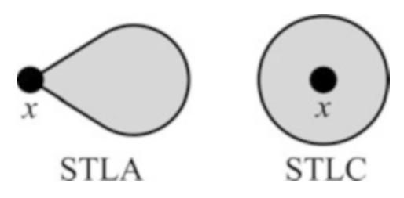

> Image description: A textbook figure labeled "Fig. 2 Example reachable sets in small time for systems that are STLA and STLC at $x$" compares two geometric representations of reachable sets for underactuated robots. The figure consists of two shaded grey regions plotted against a white background. On the left, the region labeled "STLA" is shaped like a teardrop or a teardrop-shaped bulb, where the narrow tip is anchored at a black dot marked "$x$". The bulb expands outward to the right, indicating directional reachability. On the right, the region labeled "STLC" is a perfect circle. The black dot marked "$x$" is located at the exact center of this circle, representing symmetric reachability in all directions around the point $x$. In control theory contexts, STLA refers to Small-Time Local Attainability, where the reachable set has a non-empty interior but may be constrained in certain directions, whereas STLC refers to Small-Time Local Controllability, represented here by the symmetric, circular expansion around the equilibrium point $x$.

Underactuated Robots, Fig. 2 Example reachable sets in small time for systems that are STLA and STLC at $x$


<!-- source_pdf_page: 1522 -->
tion is neither zero nor a linear combination of $V_{1}$ and $V_{2}$, then effectively a new motion direction has been created.

For the upright rolling wheel, the Lie bracket of $g_{1}$ (forward-backward rolling) and $g_{2}$ (turning) is

$$
\left[g_{1}, g_{2}\right]=[R \sin \phi,-R \cos \phi, 0,0]^{T}
$$

a sideways "parallel parking" motion. This new direction increases the dimension of the locally reachable set beyond what could be reached by a local linearization of the nonlinear system.

Roughly speaking, the Lie algebra of a set of vector fields $\mathcal{V}$ is the set of vector fields $\mathcal{V}$, all iterated Lie brackets of these vector fields, and their linear combination. For example, the Lie algebra of $\mathcal{V}=\left\{g_{1}, g_{2}\right\}$ includes $\left[g_{1}, g_{2}\right]$, $\left[g_{1},\left[g_{1}, g_{2}\right]\right],\left[g_{2},\left[g_{1},\left[g_{1}, g_{2}\right]\right]\right]$, etc., as well as their linear combinations. Deeper Lie brackets correspond to higher-order terms in the Taylor expansion of flows.

With these concepts, a theorem due to Chow (1939) says that a system (1) satisfies STLA at $x$ if the dimension of the Lie algebra of $\left\{f, g_{1}, \ldots, g_{m}\right\}$ at $x$ is $p$, the dimension of the state space. This is known as the Lie algebra rank condition (LARC). Most underactuated systems of interest satisfy the LARC but not the KRC. For the upright rolling wheel, the linearization at any $q$ fails the KRC, but the four-dimensional configuration space is spanned by $g_{1}, g_{2},\left[g_{1}, g_{2}\right]$, and $\left[g_{2},\left[g_{1}, g_{2}\right]\right]$ at all $q$, satisfying the LARC. Therefore the system is STLA at all points.

The STLA property can be strengthened to STLC if the system additionally satisfies certain symmetry properties, allowing it to proceed both forward and backward along Lie bracket directions. For example, if $f(x)=0$ and the control set $\mathcal{U}$ contains the origin in the interior, the LARC implies STLC. This is the case for the upright rolling wheel. More general notions of symmetry have also been derived (e.g., Sussmann 1987).

For mechanical systems, STLC can only hold at zero-velocity states where $f(x)=0$. In addition, velocity constraints may prevent the system from reaching a $2 n$-dimensional set in state space. A more relevant question may be
whether the configuration alone can be locally controlled at zero-velocity states. Specialized Lie-algebraic controllability tests have been developed for configuration controllability of mechanical and mixed systems (Bullo and Lewis 2004; Bullo and Lynch 2001; Bullo et al. 2002; Lewis 2000).

Global controllability results often derive from STLC at all states for drift-free systems or from STLA and global properties of the vector fields or the topology of the state space (Choset et al. 2005).

## Feedback Stabilization

For some underactuated robots, the linearization at a state $x$ may satisfy the KRC. An example is an inverted pendulum linearized at a balanced equilibrium state. In this case, it is possible to derive a linear feedback controller, based on the linearization, to stabilize the balanced state.

For many underactuated systems of interest, however, the linearization at a desired state is not controllable. For such systems, a famous theorem due to Brockett (1983), plus subsequent strengthening, implies the following:

Theorem 1 For any drift-free underactuated kinematic system of the form (1), there exists no time-invariant continuous state feedback law that stabilizes the origin.

For example, there exists no continuous statefeedback control law that can stabilize the upright rolling wheel to a desired configuration.

This obstruction to stabilizability has resulted in a number of different approaches to feedback control of underactuated systems, including (1) time-varying feedback control laws, (2) feedback control laws that are discontinuous in the state, and (3) two-degree-of-freedom controllers consisting of a motion planner plus a feedback controller for the easier problem of stabilizing the nominal trajectory. Strategies for planning nominal motions for two-degree-of-freedom controllers are discussed next.

## Motion Planning

Given an initial state $x(0)=x_{\text {start }}$ and a goal state $x_{\text {goal }}$, the motion planning problem for a


<!-- source_pdf_page: 1523 -->
system $\dot{x}=h(x, u)$ is to find a control history $u:[0, T] \rightarrow \mathcal{U}$ such that

$$
x_{\text {goal }}=x_{0}+\int_{0}^{T} h(x(s), u(s)) d s
$$

while avoiding any obstacles that may be present in the environment. It may also be desired to minimize some notion of cost,

$$
J=\int_{0}^{T} L(x(s), u(s)) d s
$$

One choice of $L(s)$ is $u^{T}(s) u(s)$, the square of the control effort.

Ideally the motion planning method would be complete (guaranteed to find a solution in finite time if one exists) or probabilistically complete (if a solution exists, the probability of finding a solution goes to one as time goes to infinity).

A variety of approaches to motion planning have been proposed in the robotics literature. Approaches that apply to underactuated systems include:

- Search-based methods. A popular class of search-based methods are rapidly exploring random trees (RRTs) and variants (LaValle and Kuffner 2001). These approaches offer probabilistic completeness for many systems, including systems with obstacles, but naïve implementations may be slow to find solutions, and the solutions generally do not satisfy optimality criteria.
- Numerical optimization. The control history can be converted to a finite parameterization using representations such as polynomials, cubic B-splines, wavelets, and truncated Fourier series. Numerical optimization methods can then be applied to solve the two-point boundary value problem while minimizing a cost function. Gradient-based numerical optimization methods may yield locally optimal solutions, but they may suffer from numerical convergence problems, and they may get stuck in local minima depending on an initial guess. Optimization methods that do not use gradient information potentially offer globally optimal
solutions, but typically at the expense of significantly longer computation times.
- Fictitious input methods. These methods assume that there is a direct control input available for each Lie bracket motion direction. These fictitious inputs are then converted to a sequence of feasible inputs utilizing the Campbell-Baker-HausdorffDynkin expansion of flows (Lafferriere and Sussmann 1991). In general, these methods require iterative application to account for errors in the approximate conversion.
- Trajectory transformation methods. One way to deal with obstacles is to first use a global motion planner that is complete under the assumption that the robot has no motion constraints. Then the template unconstrained solution is iteratively subdivided into smaller pieces, with each piece replaced by an obstacle-free feasible trajectory generated by a local planner. If the system is driftfree and STLC at all configurations, then it is possible to develop a local planner that guarantees success of the transformation from an unconstrained trajectory to a feasible trajectory as the subdivisions get small enough (Laumond et al. 1994).
Often it is possible to exploit structure of the equations of motion beyond the general form (1). Making use of extra structure can reduce the computational complexity of motion planning.
- Chained form, sinusoidal controls, and averaging. Certain drift-free kinematic systems can be transformed to a canonical chained form. For systems in such a form, sinusoidal controls of integrally related frequencies can be chosen to drive one of the configuration variables to its desired value while having zero net effect on configuration variables already at their desired value. In this way, configuration variables can be driven sequentially to their desired values (Murray and Sastry 1993).

For many underactuated systems, sinusoidal controls can be used to achieve approximate motion in each Lie bracket direction needed to complete the LARC. The resulting periodic motions are sometimes called gaits, and motion planning can be


<!-- source_pdf_page: 1524 -->
achieved using a finite set of gaits (Bullo and Lewis 2004; Ostrowski et al. 1994).

- Differentially flat systems. For certain underactuated systems with $u \in \mathbb{R}^{m}$, there exist a set of $m$ functions $w_{i}$ of the state, the control, and its derivatives,

$$
w_{i}\left(x, u, \dot{u}, \ddot{u}, \ldots, u^{(r)}\right), \quad i=1 \ldots m,
$$

such that the states and control inputs can be expressed as functions of $w$ and its time derivatives. The $w_{i}$ are called flat outputs. The motion planning problem is to find $w(t), t \in [0, T]$, such that $w(0), \dot{w}(0), \ddot{w}(0), \ldots$ and $w(T), \dot{w}(T), \ddot{w}(T), \ldots$ satisfy the constraints specified by $x_{\text {start }}$ and $x_{\text {goal }}$. The problem changes from constrained motion planning in the $p$-dimensional state space to finding a curve satisfying start and end constraints on $w$ and its derivatives (Fliess et al. 1995; Sira-Ramirez and Agrawal 2004).

- Kinematic reductions. Motion planning in configuration space is a lower-dimensional problem than motion planning in configuration-velocity space. Therefore, when a mechanical system can be reduced to a kinematic equivalent, motion planning can be more efficient. Examples include mechanical systems that can be fully reduced to a kinematic system (like the reactionwheel satellite) and mechanical systems that admit rank-1 kinematic reductions vector fields on configuration space that can be followed at any speed, despite the underactuation constraints. These vector fields become primitives for motion planning on configuration space (Bullo and Lewis 2004; Bullo and Lynch 2001; Bullo et al. 2002; Choset et al. 2005).


## Summary and Future Directions

Underactuated systems arise in all areas of robotics, including robot manipulation and aerial, ground, and underwater locomotion. Underactuation raises a number of challenging issues in robot motion planning and control.

While significant progress has been made, further research is needed on computationally efficient motion planning and robust stabilization of nominal trajectories. In addition, although this entry focuses on systems that can be described by a single set of dynamics, many interesting underactuated systems are hybrid systems that experience changing contact constraints. Examples include biped robots striding from one foot to the next and robot manipulators that manipulate objects with changing contact modes (grasping, rolling, pushing, etc.). Further work is needed to incorporate contact models, beyond simple kinematic constraints, and changing equations of motion in motion planning and control of hybrid underactuated systems.

## Cross-References

- Controllability and Observability
- Differential Geometric Methods in Nonlinear Control
- Feedback Linearization of Nonlinear Systems
- Feedback Stabilization of Nonlinear Systems
- Hybrid Dynamical Systems, Feedback Control of
- Lie Algebraic Methods in Nonlinear Control
- Nonlinear Zero Dynamics
- Underactuated Marine Control Systems
- Walking Robots
- Wheeled Robots


## Recommended Reading

Introductions to underactuated robot systems can be found in Choset et al. (2005), Lynch et al. (2011), and Murray et al. (1994).

While this entry focuses on configuration spaces modeled locally as $\mathbb{R}^{n}$, most robotic systems consist of rigid bodies whose positions and orientations can be described globally as elements of the Lie group $S E(3)$ or one of its subgroups: $S E(2), S O(3)$, or $S O(2)$. Geometric methods for control of underactuated systems make use of the extra structure of Lie groups and their Lie algebras, symmetries, and concepts


<!-- source_pdf_page: 1525 -->
from geometric mechanics such as tangent and cotangent bundles, Riemannian metrics on manifolds, symplectic manifolds, connections, fiber bundles, covariant derivatives, etc. Excellent treatments can be found in Bloch et al. (2003), Bullo and Lewis (2004), and Murray et al. (1994).

## Bibliography

Bloch AM, Baillieul J, Brouch PE, Marsden JE (2003) Nonholonomic mechanics and control. Springer, New York
Brockett RW (1983) Asymptotic stability and feedback stabilization. In: Brockett RW, Millman RS, Sussmann HJ (eds) Differential geometric control theory. Birkhauser, Boston
Bullo F, Lewis AD (2004) Geometric control of mechanical systems. Springer, New York/Heidelberg/Berlin
Bullo F, Lynch KM (2001) Kinematic controllability for decoupled trajectory planning of underactuated mechanical systems. IEEE Trans Robot Autom 17(4):402-412
Bullo F, Lewis AD, Lynch KM (2002) Controllable kinematic reductions for mechanical systems: concepts, computational tools, and examples. In: International symposium on the mathematical theory of networks and systems, South Bend, IN, Aug 2002
Choset H, Lynch KM, Hutchinson S, Kantor G, Burgard W, Kavraki L, Thrun S (2005) Principles of robot motion. MIT, Cambridge
Chow W-L (1939) Uber systemen von linearen partiellen differentialgleichungen erster ordnung. Math Ann 117:98-105
Fliess M, Lévine J, Martin P, Rouchon P (1995) Flatness and defect of nonlinear systems: introductory theory and examples. Int J Control 61(6):1327-1361
Lafferriere G, Sussmann H (1991) Motion planning for controllable systems without drift. In: IEEE
international conference on robotics and automation, Sacramento, pp 1148-1153
Laumond J-P, Jacobs PE, Taïx M, Murray RM (1994) A motion planner for nonholonomic mobile robots. IEEE Trans Robot Autom 10(5):577-593
LaValle SM, Kuffner JJ (2001) Rapidly-exploring random trees: progress and prospects. In: Donald BR, Lynch KM, Rus D (eds) Algorithmic and computational robotics: new directions. A. K. Peters, Natick
Lewis AD (2000) Simple mechanical control systems with constraints. IEEE Trans Autom Control 45(8):1420-1436
Lynch KM, Shiroma N, Arai H, Tanie K (2000) Collisionfree trajectory planning for a 3-DOF robot with a passive joint. Int J Robot Res 19(12): 1171-1184
Lynch KM, Bloch AM, Drakunov SV, Reyhanoglu M, Zenkov D (2011) Control of nonholonomic and underactuated systems. In: Levine W (ed) The control systems handbook: control system advanced methods, 2nd edn. Taylor and Francis, Boca Raton
Murray RM, Sastry SS (1993) Nonholonomic motion planning: steering using sinusoids. IEEE Trans Autom Control 38(5):700-716
Murray RM, Li Z, Sastry SS (1994) A mathematical introduction to robotic manipulation. CRC Press, Boca Raton
Nijmeijer H, van der Schaft AJ (1990) Nonlinear dynamical control systems. Springer, New York
Ostrowski J, Lewis A, Murray R, Burdick J (1994) Nonholonomic mechanics and locomotion: the snakeboard example. In: IEEE international conference on robotics and automation, San Diego, CA, pp 2391-2397
Sira-Ramirez H, Agrawal SK (2004) Differentially flat systems. CRC Press, New York
Sussmann HJ (1983) Lie brackets, real analyticity and geometric control. In: Brockett RW, Millman RS, Sussmann HJ (eds) Differential geometric control theory. Birkhauser, Boston
Sussmann HJ (1987) A general theorem on local controllability. SIAM J Control Optim 25(1):158-194
