<!-- source_pdf_page: 1526 -->
## v

# Validation and Verification Techniques and Tools

Christine M. Belcastro NASA Langley Research Center, Hampton, VA, USA

#### Abstract

Validation and verification (V\&V) of advanced control systems is required for their use in fielded systems. A comprehensive V\&V process involving analysis, simulation, and experimental testing should be used to assess closed-loop system performance and identify system limitations. This entry discusses current V\&V methods and tools as well as future research directions for safetycritical control applications.

## Keywords

Closed-loop system stability and performance; Software Verification; Stability and performance robustness; Uncertainties and uncertainty models; Validation of Safety-Critical Systems

## Introduction

Control system validation and verification (V\&V) is an assurance that the closed-loop system (i.e.,
the control system acting on the plant being controlled) remains stable and performs within acceptable performance metrics across the operational region of application. Basic definitions of validation and verification are given below (IEEE 2011).

Validation: The assurance that a product, service, or system meets the needs of the customer and other identified stakeholders. It often involves acceptance and suitability with external customers.

Verification: The evaluation of whether or not a product, service, or system complies with a regulation, requirement, specification, or imposed condition. It is often an internal process.

Control system validation can therefore be thought of as a confirmation that the algorithms are performing their intended functions and an affirmation of their effectiveness in performing these functions. Validation is a rigorous evaluation process that should involve clearly identifying system limitations, including regions of operation within which stability or acceptable levels of performance are not guaranteed. Verification can be thought of as a confirmation that the system implementation in software and hardware is correctly executing the algorithms as designed (and validated). This includes a rigorous evaluation of system requirements and specifications and a clear determination of whether or not they have been met. V\&V methods include analysis, simulation, and experimental testing, which are (ideally) applied in an integrated or iterative manner to corroborate results across methods of

<!-- source_pdf_page: 1527 -->
evaluation. In the case of aircraft flight control and other safety-critical control applications, the V\&V process must ultimately lead to system certification. The following subsections summarize control system V\&V analytical, simulation, and experimental test methods in terms of the current (or recommended) state of practice. A summary and some future research directions for safetycritical control applications are also provided.

## Control System Validation

Validation methods, involving analysis, simulation, and experimental testing, are utilized to ensure against errors and significant deficiencies in the underlying control system algorithms under realistic operational conditions for the intended application. System weaknesses and limitations are also identified through the validation process. Control system validation begins with an analysis of closed-loop system stability, performance, and robustness. Linear systems theory forms the basis for analytical stability and robustness methods and the associated software tools that are currently available for closed-loop system validation. In current practice, stability of nonlinear systems is determined by evaluating the stability of the linearized closed-loop system at numerous equilibrium points across the operating range (or envelope) of the system. Closed-loop stability is assessed by computing the eigenvalues of the linearized closed-loop system at a number of equilibrium points in the region of operation. It should be noted, however, that stability is not guaranteed between the operating points analyzed. Moreover, if the control system utilizes gain scheduling across the operating envelope, stability cannot be guaranteed for interpolated gains between the design points. Relative stability is determined by gain and phase margins for single-input, single-output (SISO) systems and by the multivariable stability margin (see, e.g., Lavretsky and Wise 2013) for multiple-input, multiple-output (MIMO, or multivariable) systems. Time-delay margins, defined as the minimum time delay required to destabilize the closed-loop system, can be determined from
phase margin and verified in nonlinear simulation. Stability robustness is assessed in terms of uncertainties, including parametric uncertainties and unmodeled dynamics in the mathematical model of the plant. Advanced robustness analysis methods based on the structured singular value (Zhou et al. 1996) require the uncertainties to be separated from the nominal plant into what is termed a linear fractional transformation (LFT). Advanced robustness methods can be used to assess stability and performance robustness, as well as worst-case combinations of uncertainties that result in destabilization, loss of performance, or the lowest robustness margins. LFT models can be formulated for the analysis of nonlinearities, expressed as multivariate polynomials, around a trim condition or over subregions within the operational envelope. Stability over a region or subregion of the operating envelope can be guaranteed using linear parameter-varying (LPV) methods (see Apkarian and Gahinet 1995; Packard 1994; Rugh and Shamma 2000; Wu et al. 1996). Nonlinear stability and control are addressed more fully in Slotine and Li (1991) and Khalil (2002), as well as in numerous other texts. Analytical methods and software tools are available in Matlab ${ }^{(R)}$, using the Control System Toolbox ${ }^{\mathrm{TM}}$ and Robust Control Toolbox ${ }^{\mathrm{TM}}$. LFR/LFT modeling methods and software tools are described in Magni (2004, 2006), Hecker et al. (2005), Varga et al. (1998), and Belcastro et al. (2005) and provided in the Robust Control Toolbox ${ }^{\circledR}$. An LPV Toolbox ${ }^{\text {TM }}$ is also under development and will become available soon (see Balas et al. 2013b).

Performance is usually assessed using a highfidelity simulation of the plant under expected operational conditions. The simulation should include nonlinear plant dynamics, noise, disturbances, and any other phenomena anticipated under operation. Nominal performance is assessed in terms of the control system design objectives, which typically include (at a minimum) closedloop steady-state tracking and transient response characteristics. Transient response characteristics typically include delay time, rise time, peak time, maximum overshoot, and settling time (see, e.g., Ogata 1970). Steady-state tracking error is also

<!-- source_pdf_page: 1528 -->
typically assessed. Performance robustness can be evaluated using Monte Carlo simulation techniques (see, e.g., Kroese et al. 2011), in which parameters and operational conditions are varied over numerous simulation runs in order to statistically evaluate an extensive set of uncertainties and operational variations. Stability robustness can also be assessed using Monte Carlo simulation techniques and by utilizing worstcase uncertainties and time-delay margins obtained during analysis. If the plant is a vehicle or robotic manipulator to be operated by a human, the handling qualities must also be evaluated to assess human-system interfaces and interactions. A real-time high-fidelity simulation with a human interface representative of the operational environment is required for this evaluation. For aircraft, piloted simulation evaluations are conducted using a cockpit mock-up, and handling qualities are assessed under various scenarios using the Cooper-Harper Scale (Cooper and Harper 1969). Susceptibility to operator-induced oscillations, for example, resulting from time delays in the controlled response, may typically be uncovered using operator-in-the-loop simulation evaluations.

Experimental testing should be conducted under realistic conditions that cover the entire (potential) operational space of the plant being controlled in order to assess realistic operational performance. For aircraft, this includes flight testing using full-scale and/or subscale test vehicles under nominal and off-nominal conditions. If the analytical and simulation evaluations provide a good match to the experimental evaluations, the test matrix can be comprised of key high-risk conditions to confirm desired behavior.

Validation methods should be applied in an iterative manner comparing results from the analysis, simulation, and experimental tests and going back to reevaluate in one domain based on results from another. For example, analysis results should provide good predictions of results seen in simulation and experimental testing. If a good match is not obtained, the analysis model may have to be improved or another analysis method
utilized to reduce conservatism in the result. Similarly, simulation results should provide a good prediction of experimental test results.

## Control System Verification

System verification is ideally performed by or in collaboration with a computer science specialist to ensure against errors in the software/hardware implementation of the control algorithms. Control system verification begins with an analysis (Rushby 1995, 2009) of the software and hardware implementation requirements to ensure completeness and accuracy in the system specification. Several refinement steps are taken to transform the control system requirements to those implementable on the actual avionics hardware to be fielded. Verification, consisting of tests and analyses, is required to confirm requirements traceability and compliance from one refinement to another, to confirm accuracy of the algorithms, and to assure compliance and robustness of the final code with respect to the original control algorithms, to ensure that no errors are introduced from the refinement itself or related to the target computing platform. Formal analysis methods can be used to evaluate software logic and other software mechanisms for correctness under all operational conditions and to provide correctness proofs. Formal methods can also be utilized for model checking to verify system properties through an exhaustive search of all possible states that can be entered during execution (Berard et al. 1998). One software verification tool is called PVS (Owre et al. 1992), developed by SRI International, and is available on the Internet as an open-source software tool. Other methods and tools are also available from SRI International, as well as other sources.

Simulation techniques are used to evaluate software code, modules, subsystems, and the full system. Once the software has been verified, it is implemented on actual or representative hardware and evaluated using hardware-in-the-loop simulation and experimental testing. Experimental testing should include laboratory evaluations under all possible operational conditions and in

<!-- source_pdf_page: 1529 -->
a relevant application environment. For aircraft, this would include flight testing of the control system on the actual avionics hardware to be fielded.

## Summary and Future Directions

This entry has summarized current and recommended practices for control system V\&V, including methods and tools for analysis, simulation, and experimental testing. The V\&V process ensures against errors and deficiencies in the underlying system algorithms (validation) and in its software/hardware implementation (verification). Analysis, simulation, and experimental testing are performed iteratively to utilize and confirm results between evaluation techniques.

A comprehensive validation process is performed to assure control system effectiveness across the operational envelope of the plant and to identify system limitations and weaknesses. Current analysis methods for control system validation are typically based on linear systems theory and focus on nominal operations under model uncertainties and anticipated disturbances (e.g., noisy measurement signals). This analysis includes stability, performance (e.g., tracking accuracy), and robustness. Advanced robust control analysis methods have been applied to safety-critical applications, such as aircraft (see Fielding et al. 2002; Varga et al. 2012), to assess robust stability and performance. These two references provide a global optimization-based worst-case approach as a "necessary condition" technique for flight control system validation or as a "sufficient condition" technique for invalidation. High-fidelity nonlinear simulation evaluations are performed in batch and real time to assess robustness under system and operational uncertainties and to assess interface effectiveness for human-in-the-loop operations (if applicable). Experimental testing under realistic operationally relevant conditions is performed across key operating conditions to confirm analytical and simulation predictions.

System verification is performed to ensure correctness of the hardware/software implementation. Various analysis and testing methods, including advanced formal analysis methods, are used to assess completeness of the system requirements and specification and software elements (e.g., logic). Model checking techniques are used to verify system properties. Code is tested in simulation and on representative or actual hardware under realistic operationally relevant conditions.

Future research directions will enable the V\&V of nonlinear and adaptive control systems (see, e.g., Hovakimyan and Cao 2010; Tallant et al. 2004) that improve performance under highly uncertain conditions, as well as the V\&V of complex integrated safety-critical systems for operation under off-nominal and hazardous conditions (see Belcastro 2010, 2012). These systems will include diagnostic and prognostic algorithms for integrated vehicle health management, resilient control systems that enable the detection and mitigation of multiple hazards, supervisory systems that provide safety assurance (for safety-critical operations), and intelligent interface and decision-based systems that enable human-optional and fully autonomous operations. These systems will inherently involve stochastic decision-making and nonlinear and adaptive control algorithms. V\&V of these future systems poses significant technical challenges and is the subject of current research. Some of these challenges include the following: (1) development and validation of multidisciplinary simulation models for characterizing hazardous condition effects; (2) validation of adaptive, diagnostic/prognostic, and reasoning algorithms under numerous off-nominal and hazardous conditions; (3) verification of software-intensive highly complex systems; and (4) determining a level of confidence in V\&V results for hazardous application domains that cannot be fully replicated during the evaluations.

Research on modeling and simulation methods is being performed to characterize multidisciplinary effects of off-nominal and hazardous conditions, and validation of these models can be difficult. For aircraft applications, hazardous

<!-- source_pdf_page: 1530 -->
conditions relate to aircraft loss of control (LOC) and precursor conditions. LOC is a complex and highly nonlinear phenomenon for which there is little available data. Hazardous conditions considered in this research include vehicle upset conditions (e.g., stall/departure), vehicle impairment conditions (e.g., failure, icing, and damage), and external disturbances (e.g., inclement weather and wake vortices). Multidisciplinary models under development include aerodynamic, propulsion, and airframe structure effects. For example, simulation models for characterizing aircraft flight dynamics and control effects under upset conditions are currently being developed (see, e.g., Foster et al. 2005; Groen et al. 2012), as well as propulsion effects resulting from the associated reduced flow conditions (Liu et al. 2013). Model validation is being performed using available flight and accident data, as well as experimental testing in the laboratory and through subscale and full-scale flight testing. The enhanced high-fidelity simulation models resulting from this research will be used in the development and validation of onboard control systems designed to detect and mitigate these hazards.

Current research efforts for validating the above future systems include nonlinear robustness analysis methods and software tools (see (Chakraborty et al. 2011a,b), Balas et al. 2013a; Packard et al. 2010; Summers et al. 2013), nonlinear analysis methods for controlled systems (Gill et al. 2012; Kwatny et al. 2013), uncertainty quantification and robustness analysis methods for mixed uncertainties and multiple objectives (Kenny et al. 2012), and the analysis of stochastic filters (see, e.g., Reif et al. 1999; Rhudy et al. 2013a, b, c). The term "mixed uncertainty" refers to aleatory and epistemic uncertainties. Aleatory uncertainties are typically stochastic (or statistical) and represent operational or environmental uncertainties (e.g., turbulence) that cannot be altered or controlled during experiments or fielded applications. Epistemic uncertainties are typically deterministic and arise from lack of knowledge about the plant resulting from modeling assumptions, neglected effects (e.g., unmodeled dynamics), and parametric
uncertainties resulting from inaccurate measurements or operational variability. These analysis methods and tools will be used iteratively with simulation evaluations and experimental testing methods, as described herein, to comprehensively assess nonlinear and adaptive control systems that enable resilience under multiple hazards.

Current research efforts on software verification focus on argument-based safety assurance for highly complex integrated systems of systems; assessment tools for evaluating the safety and coordination of authority and autonomy assignments; methods for ensuring safety-critical properties of distributed systems; and the development of tools and techniques for assessing software-intensive systems in meeting performance safety objectives. Research on software-intensive systems includes the development of methods and tools to detect, diagnose, and predict adverse events due to a software fault or failure once the software has been verified and is in operation. Some recent references on this work include Holloway (2012), Xu et al. (2013), Driscol et al. (2012), Person et al. (2011), and Latorella and Feary (2011).

Research has been initiated on developing methodologies for determining (i.e., quantifying) the predictive capability of the validation process for systems designed to operate under conditions that cannot be fully replicated during evaluations. Predictive capability assessment is an evaluation of the validity and level of confidence that can be placed in the validation process and results under nominal and hazardous conditions (and their associated boundaries). The need for this evaluation arises from the inability to fully evaluate these technologies under actual hazards to be encountered by the fielded system. A detailed disclosure is required of model, simulation, and emulation validity for the off-nominal conditions being considered in the validation, interactions that have been neglected, assumptions that have been made, and uncertainties associated with the models and data. Cross-correlations should be utilized between analytical, simulation, and ground test and flight test results in order to corroborate the results and promote efficiency in covering the very

<!-- source_pdf_page: 1531 -->
large space of operational and off-nominal and hazardous conditions being evaluated. The level of confidence in the validation process and results must be established for subsystem technologies as well as the fully integrated system. This includes an evaluation of error propagation effects across subsystems and an evaluation of integrated system effectiveness in mitigating hazardous conditions and preventing cascading errors, faults, and failures across subsystems. Metrics for performing this evaluation are also needed.

## Cross-References

- Computer-Aided Control Systems Design: Introduction and Historical Overview
- Interactive Environments and Software Tools for CACSD
- Robust Synthesis and Robustness Analysis Techniques and Tools

## Bibliography

Apkarian P, Gahinet P (1995) A convex characterization of gain-scheduled Hinf controllers. IEEE Trans Autom Control AC-40(5):853-864
Balas G, Chiang R, Packard A, Safonov M, Robust control toolbox ${ }^{\text {TM }}$, Matlab ${ }^{\text {® }}$ product family. The Mathworks Inc., Natick, MA, 1994-2014
Balas G, Packard A, Seiler P, Topcu U (2013a) Robustness analysis of nonlinear systems. University of Minnesota. Website http://www.aem.umn.edu/~ AerospaceControl/
Balas GJ, Chaing R, Packard AK, Safonov M (2013b) Robust control toolbox. The Mathworks Inc., Natick, MA
Belcastro CM, Khong TH, Shin J-Y, Balas GJ, Kwatny HG, Chang B-C (2005) Uncertainty modeling for robustness analysis of control upset prevention and recovery systems. In: AIAA guidance, navigation, and control conference and exhibit, AIAA-2005-6427, San Francisco
Belcastro CM (2010) Validation and verification of future integrated safety-critical systems operating under offnominal conditions. In: AIAA guidance, navigation and control conference, Toronto, Aug 2010
Belcastro CM (2012) Validation of safety-critical systems for aircraft loss-of-control prevention and recovery. In: AIAA guidance, navigation, and control conference, Minneapolis, Aug 2012

Berard B, Bidoit M, Finkel A, Laroussinie F, Petit A, Petrucci L, Schnoebelen P (1998) Systems and software verification: model-checking techniques and tools. Springer, Berlin
Chakraborty A, Seiler P, Balas GJ (2011a) Susceptibility of F/A-18 flight controllers to the falling-leaf mode: linear analysis. J Guid Control Dyn 34(1):57-72
Chakraborty A, Seiler P, Balas GJ (2011b) Susceptibility of F/A-18 flight controllers to the falling-leaf mode: nonlinear analysis. J Guid Control Dyn 34(1):73-85
Chen C-T (1998) Linear system theory and design, 3rd edn. Oxford University Press, New York
Control System Toolbox ${ }^{\text {TM }}$, Matlab ${ }^{\text {® }}$ product family. The Mathworks Inc., Natick, MA
Cooper GE, Harper RP Jr (1969) The use of pilot rating in the evaluation of aircraft handling qualities. AGARD report 567, Apr 1969
Doyle JC, Francis BA, Tannenbaum AR (1992) Feedback control theory, Macmillan, New York
Driscol K, Madl G, Hall B (2012) Modeling and analysis of mixed synchronous/asynchronous systems. NASA/CR-2012-217756, Sept 2012
Fielding C, Varga A, Bennani S, Selier M (eds) (2002) Advanced techniques for clearance of flight control laws. Springer, Berlin
Foster JV, Cunningham K, Fremaux CM, Shah GH, Stewart EC, Rivers RA, Wilborn JE, Gato W (2005) Dynamics modeling and simulation of large transport airplanes in upset conditions. In: AIAA guidance, navigation, and control conference, San Francisco
Gill SJ, Lowenberg MH, Krauskopf B, Puyou G, Coetzee E (2012) Bifurcation analysis of the NASA GTM with a view to upset recovery. In: AIAA guidance, navigation, and control conference, Minneapolis, Aug 2012
Groen E, Ledegang W, Field J, Smaili H, Roza M, Fucke L, Nooij S, Goman M, Mayrhofer M, Zaichik L, Grigoryev M, Biryukov V (2012) SUPRA - enhanced upset recovery simulation. In: AIAA guidance, navigation, and control conference, Minneapolis, Aug 2012
Hartmann AK (2009) Practical guide to computer simulations. World Scientific, Hackensack, New Jersey
Hecker S, Varga A, Magni J (2005) Enhanced LFR toolbox for Matlab. Aerosp Sci Technol 9(2):173-180
Holloway CM (2012) Towards understanding the DO-178C/ED-12C assurance case. In: Proceedings of the IET 7th international conference on system safety, Edinburgh, Oct 2012
Hovakimyan N, Cao C (2010) L1 adaptive control theory. Society for Industrial and Applied Mathematics, Philadelphia
IEEE (2011) IEEE guide-adoption of the Project Management Institute (PMI ${ }^{\text {® }}$ ) standard a guide to the Project Management Body of Knowledge (PMBOK ${ }^{\circledR}$ Guide), 4th edn. IEEE, p 452. doi:10.1109/IEEESTD.2011.6086685. Retrieved 7 Dec 2012
Kenny SP, Crespo LG, Giesy DP (2012) UQ tools: the uncertainty quantification toolbox - introduction and tutorial. NASA TM-2012-217561, Apr 2012

<!-- source_pdf_page: 1532 -->
Khalil HK (2002) Nonlinear systems, 3rd edn. Prentice Hall, Upper Saddle River, New Jersey
Kwatny HG, Dongmo J-ET, Chang B-C, Bajpai G, Yasar M, Belcastro C (2013) Nonlinear analysis of aircraft loss of control. J Guid Control Dyn 36(1): 149-162
Kroese DP, Taimre T, Botev ZI (2011) Handbook of Monte Carlo methods. Wiley series in probability and statistics. Wiley, New York
Latorella KA, Feary M (2011) NASA aviation safety programs: human factors focused work. In: 16th International symposium on aviation psychology, Dayton, 2-5 May 2011
Lavretsky E, Wise KA (2013) Robust and adaptive control. Springer, London
Liu Y, Claus RW, Litt JS, Guo T-H (2013) Simulating Effects of High Angle of Attack on Turbofan Engine Performance. In: $51^{\text {st }}$ AIAA Aerospace Sciences Meeting including the New Horizons Forum and Aerospace Exposition, Grapevine, Texas, 7-10 January 2013
Magni J-F (2004) Linear fractional representation toolbox - modeling, order reduction, and gain scheduling. ONERA technical report TR 6/08162 DSCD, Systems Control and Flight Dynamics Department, ONERA, July 2004
Magni J-F (2006) User manual of the linear fractional representation toolbox (version 2.0). Technical report 5/10403.01F, ONERA/DCSD. http://www.onera. fr/staff-en/jean-marc-biannic/docs/lfrtv20s.zip
Matlab ${ }^{\circledR}$, The Mathworks Inc., Natick, MA
Ogata K (1970) Modern control engineering. PrenticeHall, Englewood Cliffs
Owre S, Shankar N, Rushby J (1992) PVS: a prototype verification system. In: CADE 11, Saratoga Springs, June 1992
Packard AK (1994) Gain-scheduling via linear fractional transformations. Syst Control Lett 22:79-92
Packard A, Topcu U, Seiler P, Balas G (2010) Help on SOS. IEEE Control Syst Mag 30(4):18-23
Person SJ, Yang G, Rungta N, Khurshid S (2011) Directed incremental symbolic execution. In: 32nd ACM SIGPLAN conference on programming design and implementation, San Jose, June 4-8 2011
Reif K, Gunther S, Yaz E, Unbehauen R (1999) Stochastic stability of the discrete-time extended Kalman filter. IEEE Trans Autom Control 44(4):714, 728
Rhudy M, Gu Y, Napolitano MR (2013a) An analytical approach for comparing linearization methods in EKF and UKF. Int Journal of Adv Robot Syst, 2013, Vol. 10, 208. doi:10.5772/56370
Rhudy M, Gu Y, Napolitano MR (2013b) Does the unscented Kalman filter converge faster than the extended Kalman filter? A counter example. AIAA guidance navigation and control conference, Boston, Aug 2013
Rhudy M, Gu Y, Gross J, Gururajan S, Napolitano MR (2013c) Sensitivity analysis of extended and unscented Kalman filters for attitude estimation. AIAA J Aerosp Inf Syst 10(3): 131-143
Rugh J, Shamma J (2000) A survey of research on gain scheduling. Automatica 36:1401-1425

Rushby $\mathbf{J}$ (1995) Formal methods and their role in digital systems validation for airborne systems. NASA Contractor report 4673, Aug 1995
Rushby J (2009) Software verification and system assurance. In: 7th IEEE international conference on software engineering and formal methods (SEFM), Hanoi, Nov 2009
Simulink ${ }^{\circledR}$, The Mathworks Inc., Natick, MA
Slotine J-JE, Li W (1991) Applied nonlinear control. Pearson education. Prentice Hall, Upper Saddle River, New Jersey
Summers E, Chakraborty A, Tan W, Topcu U, Seiler P, Balas GJ, Packard AK (2013) Quantitative local $\mathrm{L}_{2}$ gain and reachability analysis for nonlinear systems. Int J Robust Nonlinear Control, 23:1115-1135
Tallant GS, Hull RA, Bose P, Johnson T, Buffington JM, Krogh B, Crum VW, Prasanth R (2004) Validation \& verification of intelligent and adaptive control systems. IEEEAC paper \#1487, Dec 2004
Varga A, Looye G, Moormann D, Grubel G (1998) Automated generation of LFT-based parametric uncertainty descriptions from generic aircraft models. Math Comput Model Dyn Syst 4:249-274
Varga A, Hansson A, Puyou G (2012) Optimization based clearance of flight control laws. Springer, Berlin
Wu F, Packard AK, Becker G (1996) Induced L2-norm control for LPV systems with bounded parameter variation rates. Int J Control 6(9/10):983-998
Xu X, Ulrey M, Brown JA, Mast J, Lapis MB (2013) Safety sufficiency for NextGen: assessment of selected existing safety methods, tools, processes, and regulations. NASA/CR-2013-217801, Feb 2013
Zhou K, Doyle JC (1997) Essentials of robust control. Prentice Hall, Englewood Cliffs, New Jersey
Zhou K, Doyle JC, Glover K (1996) Robust and optimal control. Prentice Hall, Englewood Cliffs, New Jersey

## Vehicle Dynamics Control

Eric Tseng Ford Motor Company, Dearborn, MI, USA

## Abstract

Current prevailing control technology enables vehicle dynamic control through powertrain torque manipulation and individual wheel braking. Longitudinal control can maintain vehicle acceleration/braking capability within the physical limits that the road condition can support, while vehicle lateral control can preserve vehicle steering/handling capability up to the

<!-- source_pdf_page: 1533 -->
maximum capacity offered by the road/tire interaction. Since most of these controllers are driver-assist systems, their objective is to retain the vehicle dynamic state in operating regions familiar to drivers. In general, this implies that the controller will keep the tire in its linear region and avoid excessive slipping, skidding, or sliding.

## Keywords

Active yaw control; Electronic stability control; Evasive maneuvers; Lateral dynamics; Traction assist; Traction control; Vehicle stability assist

## Introduction

Vehicle dynamics control generally refers to the active modification of longitudinal and lateral tire forces and the corresponding dynamics of ground vehicles using sensors and actuators. While it may also include vehicle active or semi-active suspension control (Hrovat 1997), vehicle dynamics control in this entry will focus on traction control - vehicle longitudinal control and electronic stability control - combined vehicle longitudinal and lateral control.

Simply speaking, tire force is generated when there exists a velocity difference between tire tread and the ground, also known as tire slip. As illustrated in Fig. 1, the longitudinal tire force
first grows proportionally with the tire slip, in a so-called linear region, and then saturates as tire slip passes beyond a certain threshold. The figure also shows the coupling effect between longitudinal and lateral tire forces. That is, the available lateral force (as a function of tire slip angle) decreases when the longitudinal tire slip increases, and the available longitudinal force (as a function of tire slip) decreases as the lateral tire slip angle increases. This coupling effect is essential for understanding vehicle dynamics and leads to numerous control applications.

## Traction Control

Since vehicle motion relies on the tire/ground interaction, it is important for the purpose of vehicle controllability to maintain tire/road interaction in a linear and predictable way. Anti-lock braking systems (ABS), and traction control (TC) in particular, monitor and control the tire slip so that the longitudinal tire force can best support and balance the corresponding brake torque (during ABS intervention) or driveline torque (during TC intervention) delivered to the wheels. Without the wheel/tire slip control, tire force may saturate, resulting in both the reduction of longitudinal and lateral tire force capacity, with the corresponding reduction in decelerating/accelerating capability, or loss of road grip/lateral tire force capacity.

Vehicle Dynamics Control, Fig. 1
Longitudinal and lateral tire force as a function of tire slip and slip angle
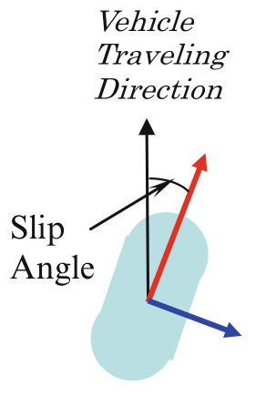

> Image description: A diagram titled "Vehicle Dynamics Control, Fig. 1 Longitudinal and lateral tire force as a function of tire slip and slip angle" illustrates tire kinematics. A light blue shape represents a tire footprint oriented diagonally. From its center, three arrows originate: a black arrow pointing vertically upward, a red arrow pointing diagonally up and to the right, and a blue arrow pointing diagonally down and to the right. The black arrow is labeled "Vehicle Traveling Direction" above it. The angle between the black arrow and the red arrow is explicitly labeled "Slip Angle" with a black curved arc. In an engineering context, the black arrow represents the direction of the vehicle's velocity vector, the red arrow represents the direction of the resultant tire force vector, and the blue arrow represents the lateral tire force. The discrepancy between the velocity direction and the force direction defines the slip angle.

Vehicle Dynamics Control, Fig. 1
Longitudinal and lateral tire force as a function of tire slip and slip angle
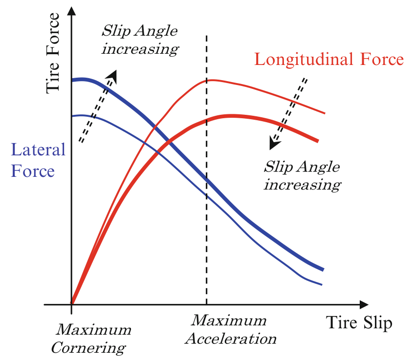

> Image description: A graph titled "Vehicle Dynamics Control, Fig. 1" plots "Tire Force" on the vertical y-axis against "Tire Slip" on the horizontal x-axis. The figure illustrates the relationship between longitudinal and lateral tire forces as slip increases. Two sets of curves are shown: blue curves representing "Lateral Force" and red curves representing "Longitudinal Force." Each color features two curves to indicate the effect of increasing slip angle. The blue lateral force curves start at a high peak (labeled "Maximum Cornering") and decline as tire slip increases. The red longitudinal force curves rise to a peak (labeled "Maximum Acceleration") before declining. Dashed arrows indicate that as "Slip Angle increases," the lateral force curves shift downward and the longitudinal force curves shift downward. The intersection of the maximum lateral and longitudinal force curves highlights the trade-off in tire grip between cornering and acceleration.

<!-- source_pdf_page: 1534 -->
## Control Design

The objective of a TC system is to ensure longitudinal tire force capacity while maintaining a good margin on available lateral force road grip (see Fig.1). Based on the tire force/slip characteristics, this can be achieved by regulating the longitudinal tire slip, roughly defined as the relative velocity between the contact patch of the tire and the road surface. This can be expressed as the difference between the vehicle traveling speed and tire rotational speed, as defined in Eq. 1, according to the Society of Automotive Engineers (SAE), where $V$ is the vehicle speed, $\omega$ is the angular speed of the tire, and $R$ is the effective tire rolling radius. The effective rolling radius is defined so that vehicle speed equals the product of $R$ and $\omega$ (i.e., $V=R \omega$ ) when there is no torque applied to the wheel and the tire is free rolling.

$$
\begin{equation*}
s=\frac{V-R \omega}{V}, \tag{1}
\end{equation*}
$$

At low slip, the longitudinal tire force grows as the slip increases (Carlson and Gerdes 2003), while at high slip it passes its peak and begins to decrease (Deur et al. 2004). High slips occur when wheels are locked during braking or are overspinning during acceleration. A traction control system uses feedback control to regulate wheel/tire slip.

## Sensors and Actuators

To regulate driven wheel slips effectively with closed loop control, wheel speed sensors at the non-driven wheels are utilized for vehicle speed estimation ( $V$ in Eq. 1). In the case of all-wheel drive or four-wheel drive systems, a longitudinal accelerometer is typically added for the speed estimate. As the amount of desired wheel slip may vary depending on maneuvers, accelerator pedal, steering angle, and yaw rate signals may be used as well. Some systems deploy steering wheel angle and yaw rate sensors for direct signal assessment and signal sharing competency, while others estimate these signals based on the speed difference between left and right wheels, for
subsystem modularity across various vehicle configurations and platforms as well as calibration independency.

Powertrain and brake torque modulation are typically used for actuation to regulate driven wheel slips.

## Control System Behavior

Wheel/tire slip targets are typically adjusted based on vehicle driveline configurations as well as vehicle maneuvers. When a vehicle is cornering, a low slip target is generated to assure sufficient margin in lateral tire force capacity. Similarly, rear wheel drive vehicles may warrant a lower slip target than front or all-wheel drive vehicles. When a driver presses hard on the accelerator pedal, the slip target can be raised to accommodate higher acceleration. In addition, the target can be adjusted based on vehicle speed and estimated road available friction, all in an attempt to optimize the longitudinal traction force while keeping sufficient margin on lateral grip (Fodor et al. 1998; Hrovat et al. 2000).

## Uniform Friction Surface: (Uniform mu)

Unless equipped with advanced driveline mechanism such as active limited slip differential or torque vectoring differential (Deur 2010), a vehicle is typically equipped with open differential, thus transmitting the powertrain torque evenly to both left and right driven wheels. Since there is no difference between the left and right wheel torque that can be supported by the uniform driving surface, wheel slip regulation can be quite effectively achieved by modulating only the powertrain torque. One successful example of this is Ford's engine-only traction control system, introduced in 2006 on its Fusion and F150 models, which was well received by media experts and customers (Healey 2005).

## Nonuniform Friction Surface: (Split mu)

For driving surfaces offering different tire/road characteristics, different wheel torque can be supported on different sides. In this case, a

<!-- source_pdf_page: 1535 -->
vehicle equipped with an open differential would transmit only the minimum torque (set by the low friction side) to the road. Any additional driveline torque that cannot be supported by the road surfaces results in spinning the wheel on the low friction side. Since open differential transmits equal amount of torque left and right, the additional tire force available on the higher friction side would not be fully utilized with powertrain only actuation. In this case, by applying additional brake torque at the low road friction side, the driveline torque can be balanced at the higher level offered by the high friction side. Care must be taken to avoid aggressive brake application which can cause driveline and/or half shaft oscillations (Fodor et al. 1998; Hrovat et al. 2000).

## Control Challenges

Given that road/tire interaction varies with multiple environmental factors, the tire force/slip relationship depicted in Fig. 1 is only a qualitative characterization, and the actual optimal slip for a desired traction force is difficult to accurately establish. While the peak traction force and the corresponding road friction potential (i.e., mu ) can be detected once the wheel starts to spin, it is difficult to do so prior to a wheel spin event (Gustafsson 1996).

Since the powertrain actuation is less perceptible yet occasionally sluggish, and the brake application can be fast but intrusive at times, it can be a control challenge to optimize the actuation combination and bandwidth.

If a priori knowledge of friction potential and optimal slip can be learned, detailed powertrain/driveline actuation delay and dynamics can be modeled, and optimal actuation combination and bandwidth can be incorporated; it is conceivable that further improvement in wheel slip and traction control can be achieved, using advanced control approaches such as model predictive control (Borrelli et al. 2006), for example.

## Electronic Stability Control

According to the Society of Automotive Engineers (SAE), an electronic stability control system (ESC) is a computer-controlled system that augments vehicle directional stability by applying and adjusting individual wheel braking. It is operational over the full speed range of the vehicle and is capable of monitoring both driver steering input and vehicle yaw rate to limit vehicle understeering and oversteering, as appropriate.

The wide proliferation of ESC in recent years (Van Zanten 2000) across the vehicle fleet has allowed various evaluation studies of its effectiveness in real-world environments. Among them, the United States NHTSA (National Highway Traffic Safety Administration) study (Dang 2004) concluded that ESC reduces fatal single vehicle crashes by $35 \%$, while single vehicle crashes involving sport utility vehicles (SUVs) are reduced by $67 \%$. Similar conclusions were arrived in other subsequent studies, including the statement that "Electronic stability control could prevent nearly one-third of all fatal crashes ..." from the Insurance Institute for Highway Safety organization (IIHS 2006). Many of these effectiveness studies are summarized in a literature review by Ferguson (2007).

## Control Design

The objective of an ESC system is to provide vehicle controllability and predictability to assist the driver. This can be achieved by preventing excessive deviations between the intended and actual lateral response of the vehicle, especially during critical maneuvers such as a sudden encounter with a slippery/icy road.

During driving, a driver relies on a mental model of the vehicle's response to his/her steering input developed from previous driving experience. A vehicle model, as described in Eq. 2 and Fig. 2, is often used to describe nominal lateral vehicle behaviors.

<!-- source_pdf_page: 1536 -->
Vehicle Dynamics
Control, Fig. 2 Vehicle
cornering model
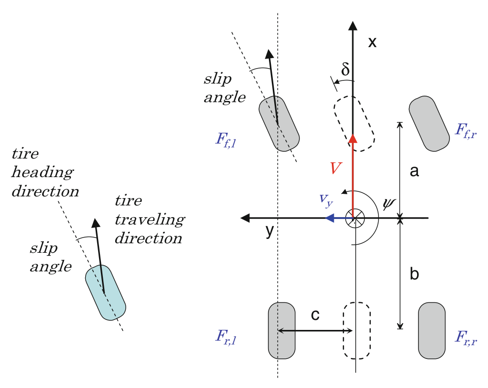

> Image description: This textbook figure, titled "Control, Fig. 2 Vehicle cornering model," illustrates a 2D kinematic model of a vehicle undergoing cornering maneuvers. The diagram consists of two parts. On the left, a close-up view shows a single tire illustrating the "slip angle," which is the angular difference between the "tire heading direction" and the "tire traveling direction." On the right, a top-down schematic shows the vehicle body and its four wheels. A global coordinate system is centered on the vehicle's center of gravity, with axes **x** (longitudinal) and **y** (lateral). The vehicle's velocity is represented by red arrow **V**, and the yaw angle by $\psi$. The front steering angle is denoted as $\delta$. Key geometric parameters include **a** (distance from the center of gravity to the front axle) and **b** (distance to the rear axle). Forces acting on the tires are labeled: $F_{f,l}, F_{f,r}$ for front left/right, and $F_{r,l}, F_{r,r}$ for rear left/right. The dimension **c** represents the vehicle's track width.

$$
\begin{align*}
m \dot{v}_{y}= & -m V \dot{\psi}+F_{y f}\left(v_{y}, V, \delta, F_{x f}\right) \\
& +F_{y r}\left(v_{y}, V, \delta, F_{x r}\right) \\
I \ddot{\psi}= & 2 a F_{y f}-2 b F_{y r} \\
& +c\left(-F_{x f, l}+F_{x f, r}-F_{x r, l}+F_{x r, r}\right) \tag{2}
\end{align*}
$$

rate and lateral acceleration error when both are compared to a nominal vehicle model (Manning and Crolla 2007), or balance between yaw rate error and detected excessive sideslip angle (Di Cairano et al. 2013).
where $m$ is the vehicle mass; $V$ and $V_{y}$ are vehicle longitudinal and lateral velocity, correspondingly; $\dot{\psi}$ is vehicle yaw rate; and $\delta$ is the steering angle. Parameters $a$ and $b$ are the distance between vehicle center of gravity to front and rear axle; $c$ is the half track width. $F_{x}$ and $F_{y}$ denote the longitudinal and lateral/cornering tire force, with subscript indicating longitudinal (x) or lateral (y) direction, as well as the specific corner of the vehicle (front, rear, left, and right).

Note that the corresponding longitudinal dynamics can be described as

$$
\begin{equation*}
m \dot{V}=m v_{y} \dot{\psi}+F_{x f, l}+F_{x r, l}+F_{x f, r}+F_{x r, r} \tag{3}
\end{equation*}
$$

As the available road friction is not always known, a nominal vehicle lateral response derived from a hi-mu surface may not be feasible and may not best represent a driver's intent. To modify the feedback to best adapt to the road condition, ESC would do one or more of the following: Adjust the driver intended yaw rate according to detected lateral acceleration capability (Tseng et al. 1999), balance between yaw

## Control System Behavior

A vehicle can exhibit understeering and/or oversteering behaviors during aggressive lateral maneuvers. Figure 3 illustrates how a vehicle equipped with ESC may provide better controllability.

Understeering - When a vehicle does not turn in as much as desired by the driver (see

<!-- source_pdf_page: 1537 -->
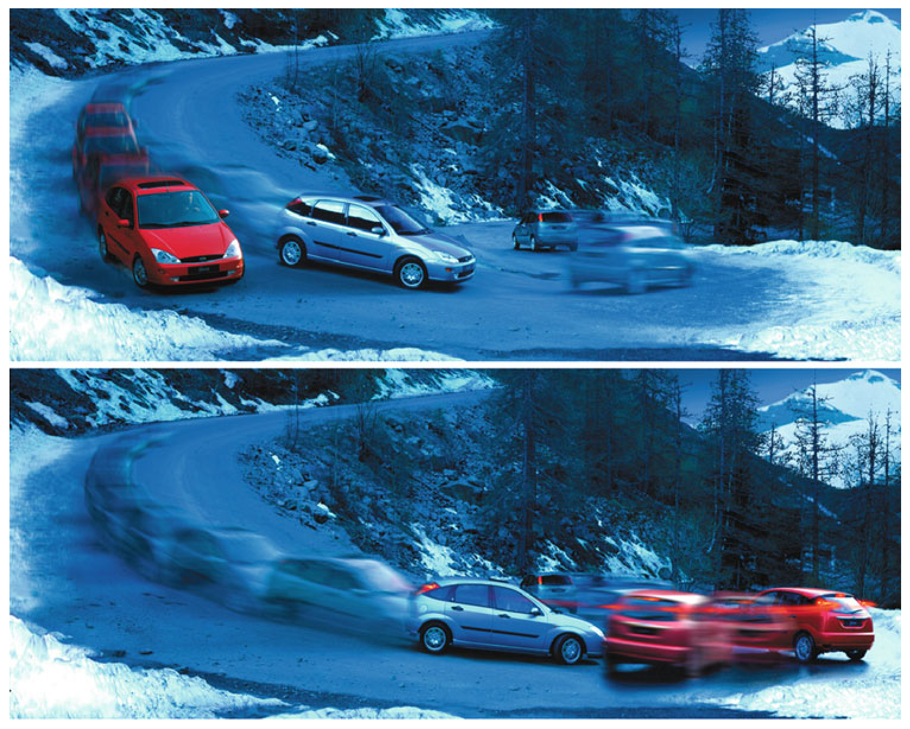

> Image description: This two-panel figure, titled "Vehicle Dynamics Control, Fig. 3 Vehicle going through a hairpin turn," illustrates different driving scenarios on a snow-covered mountain road with a sharp hairpin bend. In the upper image, several vehicles are shown navigating the curve. A red hatchback is positioned on the left, followed by a silver hatchback and a dark car further back. To the right, a blurred silver car indicates motion through the turn. The road is wet or icy, surrounded by snow-covered embankments and dark coniferous trees. The lower image depicts a more dynamic scenario. A silver hatchback is clearly visible in the foreground, while several other vehicles—including red and dark-colored cars—are shown with heavy motion blur, suggesting they are traveling at higher speeds through the curve. This visualization emphasizes the challenges of maintaining control and stability when maneuvering through sharp turns on low-friction, slippery surfaces.
Vehicle Dynamics Control, Fig. 3 Vehicle going through a hairpin turn

upper Fig. 3). In this case, the vehicle yaw rate, an ESC measured/monitored signal, would be less than the driver desired value. For example, a vehicle on ice may experience extreme understeering that keeps the vehicle moving straight even when the steering wheel is turned. In this case, ESC applies corrective yaw moment to increase the yaw rate through individual wheel braking. Most of the longitudinal braking force is applied on rear axle inside wheel in the attempt to increase the lateral force capacity on the front axle while decreasing the lateral force capacity on the rear axle. As such, the vehicle experiences not only the yaw moment correction but also the reduction of understeering tendency with ESC brake application.

Oversteering - When a vehicle turns too much, i.e., yaws with a smaller turning radius than the one needed to negotiate the road (see lower Fig. 3). In this case, the vehicle yaw rate would be
larger than the driver desires. The vehicle tends to build up a large sideslip angle, resulting in a spinout due to the saturation of rear tire force. In this case, ESC applies corrective yaw moment to decrease the size of yaw rate through individual wheel braking. The longitudinal braking force is applied mostly on the front axle outside wheel to preserve the lateral force capacity on the rear axle and decrease the lateral force capacity on the front axle. As such, the vehicle experiences not only the yaw moment correction but also the reduction of oversteering tendency with ESC brake application.

Evasive Maneuver - During an evasive maneuver, such as an aggressive double lane change, the vehicle may first turn in one direction, followed by an oversteer in the other direction. Due to delay and lag of actuator response in practice, feedforward control is typically used to ensure brake

<!-- source_pdf_page: 1538 -->
application would generate corrective yaw moment in the appropriate direction. Further improvement could be possible by using road/traffic preview along with (semi)autonomous intervention based on advanced optimal control such as model predictive control (Falcone et al. 2008), for example.

Skidding and Oversteering - When both front and rear tires experience large tire slip angle, both tire forces are saturated. In this case, the vehicle is operating in a region where the rear tire slip angle can grow rapidly. Unless the front steering is delicately and quickly balanced, the excessive rear tire slip angle could cause the vehicle to spin out. In this case, in addition to applying corrective yaw moment similar to the above oversteering case, ESC may command light braking on all four wheels in an attempt to further slow down the vehicle.

Rollover Mitigation - An ESC system may be extended to further provide a more controllable vehicle behavior and mitigate rollover risks in evasive maneuvers that demand a large and sudden lateral force. For example, Roll Stability Control ${ }^{\text {TM }}$ system introduced at Ford in 2003 monitors vehicle roll behavior in addition to vehicle yaw behavior to assist the driver (Lu et al. 2007).

## Control Challenges

In order to best provide the assistance to drivers' desire, it is important to assess the vehicle dynamic state and driver intention with high fidelity. This can be challenging in the presence of various factors that directly influence the vehicle behavior or sensor readings but are not or cannot be directly measured. For example, the road bank angle information is typically unavailable, but it has a direct influence on the lateral accelerometer measurement and could be misinterpreted as a discrepancy between vehicle yaw rate and lateral force (Tseng 2001; Tseng et al. 2007). And despite its criticality in vehicle dynamics control,
the available road surface friction capacity and the vehicle sideslip angle typically cannot be measured (Tseng 2002, Ryu 2002, Ahn et al. 2013). The driver's intent is prescribed by a mental model in the computer, but we cannot directly read the driver's mind. In addition, the controller should detect when a sensor is misbehaving and giving out false or biased readings (Xu and Tseng 2007). While advanced observers have been developed to address these challenges, it is foreseeable that optimization in these areas could further improve the observer fidelity and overall ESC performance.

## Cross-References

- Lane Keeping
- Motorcycle Dynamics and Control

## Bibliography

Ahn C, Peng H, Tseng HE (2013) Robust estimation of road frictional coefficient. IEEE Trans Control Syst Technol 21(1):1-13
Borrelli F, Bemporad A, Fodor M, Hrovat D (2006) An MPC/hybrid system approach to traction control. IEEE Trans Control Syst Technol 14(2):541-552
Carlson CR, Gerdes JC (2003) Nonlinear estimation of longitudinal tire slip under several driving conditions. Paper presented in American control conference, Denver, June 2003
Dang JN (2004) Preliminary results analyzing the effectiveness of electronic stability control (ESC) systems, Report no. DOT HS-809-790. National Highway Traffic Safety Administration, Washington, DC
Deur J, Asgari J, Hrovat D (2004) A 3D brush-type dynamic tire friction model, vehicle system dynamics. Int J Veh Mech Mobil 42(3):133-173
Deur J, Ivanoviæ V, Hancock M, Assadian F (2010) Modeling and analysis of active differential dynamics. ASME J Dyn Syst Meas Control 132(6): 1-13
Di Cairano S, Tseng HE, Bernardini D, Bemporad A (2013) Vehicle yaw stability control by coordinated active front steering and differential braking in the tire sideslip angles domain. IEEE Trans Control Syst Technol 21(4):1236-1248
Falcone P, Tseng HE, Borrelli F, Asgari J, Hrovat D (2008) MPC-based yaw and lateral stabilization via active front steering and braking. Veh Syst Dyn 46(S1):611-628

<!-- source_pdf_page: 1539 -->
Ferguson S A (2007) The effectiveness of electronic stability control in reducing real-world crashes: a literature review. Traffic Inj Prev 8(4): 329-338
Fodor M, Yester J, Hrovat D (1998) Active control of vehicle dynamics. Paper presented in 17th AIAA/IEEE/SAE digital avionics systems conference, Seattle
Gustafsson F (1996) Estimation and change detection of tire-road friction using the wheel slip. In: Proceedings of the 1996 IEEE international symposium, computer-aided control system design, Dearborn, pp 99-104
Healey JR (2005) Ford's 2006 Fusion Review, "Traction control on the V-6 test car was just right ...". http://usatoday30.usatoday.com/money/autos/reviews/ healey/2005-10-27-fusion_x.htm posted on 27 Oct 2005. Accessed on 30 Aug 2013

Hrovat D (1997) Survey of advanced suspension developments and related optimal control applications. Automatica 33(10): 1781-1817
Hrovat D, Asgari J, Fodor M (2000) Automotive mechatronic systems. In: Leondes CT (ed) Mechatronic systems techniques and applications: volume 2 - transportation and vehicular systems. Gordon and Breach Science Publishers, Amsterdam, pp 1-98
Insurance Institute for Highway Safety (IIHS) (2006) Electronic stability control could prevent nearly onethird of all fatal crashes and reduce rollover risk by as much as $80 \%$; effect is found on single- and multiple-vehicle crashes, News Release 13 June 2006. http://www.iihs.org/news/rss/pr061306.html Accessed 30 Aug 2013
Lu J, Messih D, Salib A, Harmison D (2007) An enhancement to an electronic stability control system to include a rollover control function. SAE Trans 116:303-313
Manning WJ, Crolla, DA (2007) A review of yaw rate and sideslip controllers for passenger vehicles. Trans Inst Meas Control 29(1):117-135
Ryu J, Rossetter EJ, Gerdes JC (2002) Vehicle sideslip and roll parameter estimation using GPS. In: Proceedings of AVEC 2002 6th international symposium of advanced vehicle control, Hiroshima
Tseng HE (2001) Dynamic estimation of road bank angle. Veh Syst Dyn 36(4-5):307-328
Tseng HE (2002) A sliding mode lateral velocity observer. In: Proceedings of AVEC 2002 6th international symposium on advanced vehicle control, Hiroshima, pp 387-392
Tseng HE, Ashrafi B, Madau D, Brown AT, Recker D (1999) The development of vehicle stability control at Ford. IEEE/ASME Trans Mechatron 4(2):223-234
Tseng HE, Xu L, Hrovat D (2007) Estimation of land vehicle roll and pitch angles. Veh Syst Dyn 45(5):433-443
Van Zanten AT (2000) Bosch ESP systems: 5 years of experience. SAE Trans 109(7):428-436
Xu L, Tseng HE (2007) Robust model-based fault detection for a roll stability control system. IEEE Trans Control Syst Technol 15(2):519-528

# Vehicular Chains

Mihailo R. Jovanović Department of Electrical and Computer Engineering, University of Minnesota, Minneapolis, MN, USA

#### Abstract

Even since the pioneering work of Levine and Athans and Melzer and Kuo, control of vehicular formations has been a topic of active research. In spite of its apparent simplicity, this problem poses significant engineering challenges, and it has often inspired theoretical developments. In this article, we view vehicular formations as a particular instance of dynamical systems over networks and summarize fundamental performance limitations arising from the use of local feedback in formations subject to stochastic disturbances. In topology of regular lattices, it is impossible to have coherent large formations, which behave like rigid lattices, in one and two spatial dimensions; yet this is achievable in 3D. This is a consequence of the fact that, in 1D and 2D, local feedback laws with relative position measurements are ineffective in guarding against disturbances with slow temporal variations and large spatial wavelength.

## Keywords

Fundamental performance limitations; Localized control; Optimal control; Relative information exchange; Spatially invariant systems; Toeplitz and circulant matrices; Vehicular formations

## Introduction

Control of vehicular strings has been an active area of research for almost five decades (Levine and Athans 1966; Lin et al. 2012; Melzer and Kuo 1971a, b; Middleton and Braslavsky 2010;

<!-- source_pdf_page: 1540 -->
Seiler et al. 2004; Swaroop and Hedrick 1996, 1999; Varaiya 1993). This problem represents a special instance of more general vehicular formation problems which are encountered in the control of unmanned aerial vehicles, satellite formations, and groups of autonomous robots (Bullo et al. 2009; Mesbahi and Egerstedt 2010). Even for the simplest control objective, in which it is desired to maintain a constant cruising velocity and a constant distance between the neighboring vehicles, it has been long recognized that limited information exchange between the vehicles imposes fundamental performance limitations for control design. In particular, look-ahead strategies that rely only on relative spacing information with respect to the preceding vehicle suffer from string instability. This phenomenon is characterized by unfavorable amplification of disturbances downstream the vehicular string (Middleton and Braslavsky 2010; Seiler et al. 2004; Swaroop and Hedrick 1996, 1999). In order to avoid this unfavorable spatial application, it is typically required to broadcast the state of the leader to the rest of the formation.

While a precise characterization of fundamental performance limitations in the control of vehicular formations is still an open question, in this article we review recent progress in this area. We begin by highlighting performance limits that arise even in optimally controlled vehicular strings. The LQR problem for vehicular strings was originally formulated in pioneering papers by Levine and Athans (1966) and Melzer and Kuo (1971a,b). These formulations were revisited in Jovanović and Bamieh (2005) where it was shown that the time constant of the optimally controlled closed-loop system increases linearly with the number of vehicles. This reference also employed spatially invariant theory (Bamieh et al. 2002) to demonstrate the lack of exponential stability in the limit of an infinite number of vehicles and to explain the arbitrarily slowing rate of convergence observed in numerical studies of finite strings of increasing sizes. We then summarize a recent result that viewed vehicular strings as the 1D version of vehicular formations on regular lattices in arbitrary spatial dimensions and established fundamental
performance limitations of spatially invariant localized feedback strategies with relative position measurements (Bamieh et al. 2012). It was shown that it is impossible to achieve robustness to stochastic disturbances with only localized feedback in 1D and 2D; yet this can be achieved in 3D. This is a consequence of the fact that, in 1D and 2D, local feedback laws are ineffective in guarding against disturbances with slow temporal variations and large spatial wavelength. An "accordion" type of motion experienced by these spatiotemporal modes compromises formation throughput, and it may occur even in formations that are string stable. Since the phenomenon that we describe also occurs in distributed averaging algorithms, global mean first passage time of random walks, effective resistance in electrical networks, and statistical mechanics of harmonic solids, it is relevant for a broad class of networked dynamical systems.

## Optimal Control of Vehicular Strings

We next summarize a linear quadratic regulator problem for vehicular strings (Levine and Athans 1966; Melzer and Kuo 1971a, b) and demonstrate that strategies that penalize only relative position errors between neighboring vehicles yield nonuniform rates of convergence towards the desired formation (Jovanović and Bamieh 2005). In particular, the time constant of the optimally controlled closed-loop system increases linearly with the number of vehicles, and the formation loses exponential stability in the limit of infinite vehicular strings.

## Optimal Control of Finite Strings

A string consisting of $M$ identical unit mass vehicles is shown in Fig. 1a. Each vehicle is modeled as a point mass that obeys the double-integrator dynamics:

$$
\begin{equation*}
\ddot{x}_{n}=u_{n}, \quad n \in\{1, \ldots, M\} \tag{1}
\end{equation*}
$$

<!-- source_pdf_page: 1541 -->
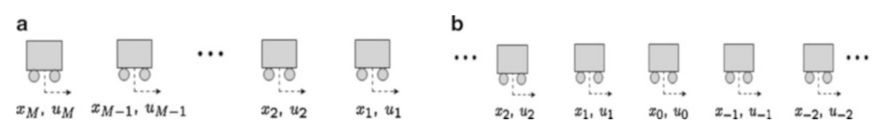

> Image description: A diagram titled "Fig. 1 Finite and infinite strings of vehicles" contains two panels, labeled **a** and **b**, illustrating sequences of rectangular blocks representing vehicles. Each block is depicted with two small circles underneath, signifying wheels, and a horizontal arrow pointing right, representing direction of motion. In panel **a**, a finite sequence is shown, consisting of five distinct vehicle blocks. The blocks are labeled with subscripted variables $(x_i, u_i)$, specifically starting from $x_M, u_M$ and $x_{M-1}, u_{M-1}$ on the left, followed by an ellipsis, and ending with $x_2, u_2$ and $x_1, u_1$ on the right. Panel **b** illustrates an infinite string. The sequence includes vehicle blocks labeled $x_2, u_2$, $x_1, u_1$, $x_0, u_0$, $x_{-1}, u_{-1}$, and $x_{-2}, u_{-2}$, separated by ellipses at both ends to signify the continuation of the chain in both directions. In both panels, the variables $x$ and $u$ represent the state and control/input of each vehicle in the chain.
Vehicular Chains, Fig. 1 Finite and infinite strings of vehicles

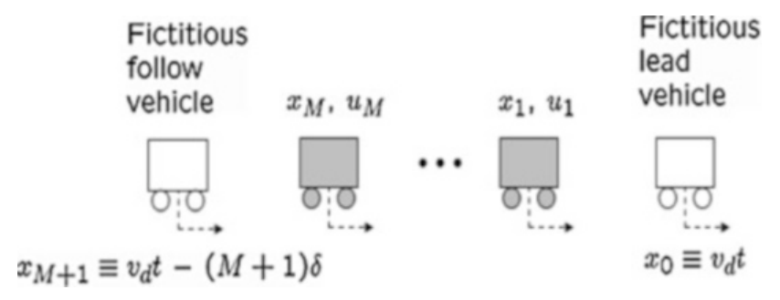

> Image description: An engineering diagram titled "Vehicular Chains, Fig. 1 Finite and infinite strings of vehicles" illustrates a longitudinal sequence of vehicles. The diagram shows a string of $M+1$ vehicles arranged in a line, with arrows indicating movement to the right. On the far right, a white box labeled "Fictitious lead vehicle" is positioned at position $x_0 \equiv v_d t$. To its left, a series of grey-shaded boxes represent the follower vehicles. These are labeled with state variables $x_1, u_1$ through $x_M, u_M$. The leftmost vehicle is a white box labeled "Fictitious follow vehicle." Below this vehicle, a mathematical expression defines its position: $x_{M+1} \equiv v_
Vehicular Chains, Fig. 2 Finite string with fictitious lead and follow vehicles

where $x_{n}$ is the position of the $n$th vehicle and $u_{n}$ is the control applied on the $n$th vehicle. A control objective is to provide the desired constant cruising velocity $\bar{v}$ and to keep the constant distance $\delta$ between the neighboring vehicles. By introducing the absolute position and velocity error variables

$$
\begin{aligned}
& p_{n}(t):=x_{n}(t)-\bar{v} t+n \delta \\
& v_{n}(t):=\dot{x}_{n}(t)-\bar{v}, \quad n \in\{1, \ldots, M\}
\end{aligned}
$$

system (1) can be brought into the state-space form (Melzer and Kuo 1971a, b):

$$
\left[\begin{array}{c}
\dot{p}  \tag{2}\\
\dot{v}
\end{array}\right]=\left[\begin{array}{ll}
0 & I \\
0 & 0
\end{array}\right]\left[\begin{array}{l}
p \\
v
\end{array}\right]+\left[\begin{array}{l}
0 \\
I
\end{array}\right] u=: A \psi+B u
$$

where $p:=\left[p_{1} \cdots p_{M}\right]^{T}, v:=\left[v_{1} \cdots v_{M}\right]^{T}$, and $u:=\left[u_{1} \cdots u_{M}\right]^{T}$.

Following Melzer and Kuo (1971a,b), fictitious lead and follow vehicles, respectively, indexed by 0 and $M+1$, are added to the formation; see Fig. 2. These two vehicles are constrained to move at the desired velocity $\bar{v}$, and the relative distance between them is assumed to be equal to $(M+1) \delta$ for all times. A quadratic performance index that penalizes control effort, relative position, and absolute velocity error variables is associated with system (2):

$$
\begin{align*}
J= & \frac{1}{2} \int_{0}^{\infty}\left(\sum_{n=1}^{M+1} q_{p}\left(p_{n}(t)-p_{n-1}(t)\right)^{2}\right. \\
& \left.+\sum_{n=1}^{M}\left(q_{v} v_{n}^{2}(t)+r u_{n}^{2}(t)\right)\right) d t \\
= & \frac{1}{2} \int_{0}^{\infty}\left(\psi^{*}(t) Q \psi(t)+u^{*}(t) R u(t)\right) d t \tag{3}
\end{align*}
$$

The control problem (2) and (3) is in the standard LQR form with the state and control weights:

$$
Q:=\left[\begin{array}{cc}
Q_{p} & 0 \\
0 & q_{v} I
\end{array}\right], \quad Q_{p}:=q_{p} T_{M}, \quad R:=r I .
$$

Here, $T_{M}$ is an $M \times M$ symmetric Toeplitz matrix with the first row given by $\left[\begin{array}{cccc}2 & -1 & 0 & 0\end{array}\right] \in \mathrm{R}^{M}$.

We next briefly summarize the explicit solution to the LQR problem (2) and (3) and refer the reader to Jovanović and Bamieh (2005) for additional details. By performing a spectral decomposition of the Toeplitz matrix $T_{M}$,

$$
\begin{gather*}
T_{M}=U \Lambda_{T} U^{*}, \quad U U^{*}=U^{*} U=I \\
\Lambda_{T}=\operatorname{diag}\left\{\lambda_{1}\left(T_{M}\right), \ldots, \lambda_{M}\left(T_{M}\right)\right\} \\
\lambda_{n}\left(T_{M}\right)=2\left(1-\cos \frac{n \pi}{M+1}\right), \quad n \in\{1, \ldots, M\} \tag{4}
\end{gather*}
$$

the solution to the LQR algebraic Riccati equation can be represented as
$P:=\left[\begin{array}{cc}P_{1} & P_{0}^{*} \\ P_{0} & P_{2}\end{array}\right], P_{0}=U \Lambda_{0} U^{*}, P_{2}=U \Lambda_{2} U^{*}$, $P_{1}=U \Lambda_{1} U^{*}$.

Here,

$$
\begin{aligned}
& \Lambda_{0}=\sqrt{r q_{p}} \Lambda_{T}^{1 / 2} \\
& \Lambda_{2}=\sqrt{r}\left(2 \sqrt{r q_{p}} \Lambda_{T}^{1 / 2}+q_{v} I\right)^{1 / 2} \\
& \Lambda_{1}=\sqrt{q_{p}} \Lambda_{T}^{1 / 2}\left(2 \sqrt{r q_{p}} \Lambda_{T}^{1 / 2}+q_{v} I\right)^{1 / 2}
\end{aligned}
$$

<!-- source_pdf_page: 1542 -->
and the eigenvalues of the closed-loop $A$-matrix are determined by the solutions to the following system of the uncoupled quadratic equations:

$$
\begin{align*}
s_{n}^{2}+b_{n} s_{n} & +c_{n}=0, \quad n \in\{1, \ldots, M\} \\
c_{n} & :=\left(\lambda_{n}\left(T_{M}\right) q_{p} / r\right)^{1 / 2}  \tag{6}\\
b_{n} & :=\left(2 c_{n}+q_{v} / r\right)^{1 / 2}
\end{align*}
$$

From the above expression, it can be shown that in large-scale formations, the least-stable eigenvalue of the closed-loop system approaches the imaginary axis at the rate that is inversely proportional to the number of vehicles. As can be seen from the PBH detectability test, this is because the pair ( $Q, A$ ) gets closer to losing its detectability as the number of vehicles increases. This clearly indicates that the resulting optimal control strategy leads to closed-loop systems with arbitrarily slow decay rates as the number of vehicles increases. As summarized in section "Optimal Control of Infinite Strings," the absence of a uniform rate of convergence for a finite number of vehicles manifests itself as the absence of exponential stability in the limit of infinite vehicular strings.

## Optimal Control of Infinite Strings

The LQR problem for a system of identical unit mass vehicles in an infinite string (see Fig. 1b) was originally studied in Melzer and Kuo (1971a). As summarized below, using the theory for spatially invariant linear systems (Bamieh et al. 2002), it was shown in Jovanović and Bamieh (2005) that the resulting LQR controller does not provide exponential stability of the closed-loop system due to the lack of detectability of the pair $(Q, A)$.

The infinite dimensional equivalent of (2) is given by

$$
\begin{gather*}
{\left[\begin{array}{c}
\dot{p}_{n} \\
\dot{v}_{n}
\end{array}\right]=\left[\begin{array}{ll}
0 & I \\
0 & 0
\end{array}\right]\left[\begin{array}{l}
p_{n} \\
v_{n}
\end{array}\right]+\left[\begin{array}{l}
0 \\
I
\end{array}\right]} \\
u_{n}=: A_{n} \psi_{n}+B_{n} u_{n}, \quad n \in \mathrm{Z}  \tag{7}\\
J=\frac{1}{2} \int_{0}^{\infty} \sum_{n \in \mathrm{Z}}\left(q_{p}\left(p_{n}(t)-p_{n-1}(t)\right)^{2}\right.  \tag{8}\\
\left.+q_{v} v_{n}^{2}(t)+r u_{n}^{2}(t)\right) d t
\end{gather*}
$$

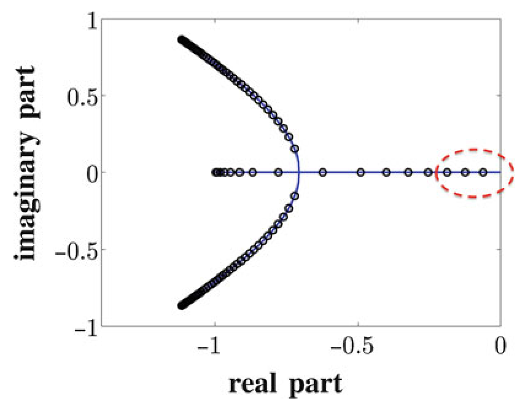

> Image description: A technical plot displays the spectra of closed-loop generators in vehicular strings within a complex plane. The horizontal axis is labeled "real part," ranging from -1 to 0, and the vertical axis is labeled "imaginary part," ranging from -1 to 1. The plot features two types of data representations: discrete black circular symbols representing finite strings ($M=50$) and a solid blue line representing infinite strings. The finite string eigenvalues appear as points that lie along or accumulate near the continuous blue line. The blue line forms a parabolic shape that opens toward the left, with its vertex near the real value of -0.7 and its endpoints extending toward imaginary values of $\pm 0.9$. A red dashed oval highlights a single isolated eigenvalue located near the real part of -0.2 on the imaginary axis, illustrating how eigenvalues accumulate near the stability boundary (the imaginary axis) as the number of vehicles increases.
Vehicular Chains, Fig. 3 The spectra of the closed-loop generators in LQR-controlled finite (symbols) and infinite (solid line) strings of vehicles with $M=50$ and $q_{p}= q_{v}=r=1$. The closed-loop eigenvalues of the finite string are points in the spectrum of the closed-loop infinite string. As the number of vehicles increases, the number of eigenvalues that accumulate in the vicinity of the stability boundary gets larger and larger

with $q_{p}, q_{v}$, and $r$ being positive design parameters. Spatial invariance over a discrete spatial lattice Z can be used to establish that the solution to the LQR problem does not provide an exponentially stabilizing feedback for system (7). In particular, the spectrum of the closedloop generator in an LQR-controlled spatially invariant string of vehicles (7) with performance index (8) is given by the solutions to the following $\theta$-parameterized quadratic equation:

$$
\begin{align*}
& s_{\theta}^{2}+b_{\theta} s_{\theta}+c_{\theta}=0 \\
c_{\theta} & :=\left(2\left(q_{p} / r\right)(1-\cos \theta)\right)^{1 / 2}  \tag{9}\\
b_{\theta} & :=\left(2 c_{\theta}+q_{v} / r\right)^{1 / 2}
\end{align*}
$$

where $\theta \in[0,2 \pi)$ denotes the spatial wave number. By comparing (4), (6) and (9), we see that the closed-loop eigenvalues of the finite string are points in the spectrum of the closed-loop infinite string. Furthermore, from these equations it follows that as the size of the finite string increases, this set of points becomes dense in the spectrum of the infinite string closed-loop $A$-operator. The spectrum of the closed-loop generator, shown in Fig. 3 for $q_{p}=q_{v}=r=1$, illustrates the absence of exponential stability.

<!-- source_pdf_page: 1543 -->
## Coherence in Large-Scale Formations

Fundamental performance limitations arising from the use of local feedback in networks subject to stochastic disturbances were recently examined in Bamieh et al. (2012). For consensus and vehicular formation control problems in topology of regular lattices, it was shown that it is impossible to guarantee robustness to stochastic exogenous disturbances in one and two spatial dimensions. Yet it was proved that this is achievable in 3D. This phenomenon is a consequence of the fact that, in 1D and 2D, local feedback laws are ineffective in guarding against disturbances with large spatial wavelength, and it has also been observed in global mean first passage time of random walks, effective resistance in electrical networks, and statistical mechanics of harmonic solids. We next briefly summarize the implications of these results for the control of vehicular formations and refer the reader to Bamieh et al. (2012) for details.

## Stochastically Forced Vehicular Formations with Local Feedback

Let us consider $M:=N^{d}$ identical vehicles arranged in a $d$-dimensional torus, $\mathrm{Z}_{N}^{d}$, with the double integrator dynamics:

$$
\begin{equation*}
\ddot{x}_{n}=u_{n}+w_{n} \tag{10}
\end{equation*}
$$

where $n:=\left(n_{1}, \ldots, n_{d}\right)$ is a multi-index with each $n_{i} \in \mathrm{Z}_{N}:=\{0, \ldots, N-1\}$, $u$ is the control input, and $w$ is a mutually uncorrelated white stochastic forcing. Each position vector $x_{n}$ is a $d$-dimensional vector with components $x_{n}:=\left[x_{n}^{1} \cdots x_{n}^{d}\right]^{T}$. The control objective is to have the $n$th vehicle follow the absolute desired trajectory $\bar{x}_{n}$ :
$\bar{x}_{n}:=\bar{v} t+n \delta \Leftrightarrow\left[\begin{array}{c}\bar{x}_{n}^{1} \\ \vdots \\ \bar{x}_{n}^{d}\end{array}\right]:=\left[\begin{array}{c}\bar{v}^{1} \\ \vdots \\ \bar{v}^{d}\end{array}\right] t+\left[\begin{array}{c}n_{1} \\ \vdots \\ n_{d}\end{array}\right] \delta$.

In other words, it is desired that all vehicles move with constant heading velocity $\bar{v}$ while
maintaining their respective position in a $\mathrm{Z}_{N}^{d}$ grid with spacing of $\delta$ in each dimension.

By introducing the position and velocity deviations from the desired trajectory,

$$
p_{n}:=x_{n}-\bar{x}_{n}, \quad v_{n}:=\dot{x}_{n}-\bar{v}
$$

and by confining our attention to static-feedback policies,

$$
u(t)=-\left[\begin{array}{ll}
K_{p} & K_{v}
\end{array}\right]\left[\begin{array}{l}
p(t)  \tag{11}\\
v(t)
\end{array}\right]
$$

equations of motion for the controlled system (10) can be brought into the state-space form

$$
\begin{align*}
{\left[\begin{array}{c}
\dot{p} \\
\dot{v}
\end{array}\right] } & =\left[\begin{array}{cc}
0 & I \\
-K_{p}-K_{v}
\end{array}\right]\left[\begin{array}{l}
p \\
v
\end{array}\right]+\left[\begin{array}{l}
0 \\
I
\end{array}\right]  \tag{12}\\
w & =: A \psi+B w \\
z & =C \psi .
\end{align*}
$$

Here, $p$ and $v$ are the position and velocity vectors of all vehicles, $z$ is the performance output, and $w$ is the forcing vector.

## An Example

In one-dimensional formations with nearest neighbor relative position and velocity measurements, the control acting on the $n$th vehicle is given by

$$
\begin{align*}
u_{n}(t)= & -k_{p}^{-}\left(p_{n}(t)-p_{n-1}(t)\right) \\
& -k_{p}^{+}\left(p_{n}(t)-p_{n+1}(t)\right)  \tag{13}\\
& -k_{v}^{-}\left(v_{n}(t)-v_{n-1}(t)\right) \\
& -k_{v}^{+}\left(v_{n}(t)-v_{n+1}(t)\right)
\end{align*}
$$

where $k_{p}^{ \pm}$and $k_{v}^{ \pm}$are positive design parameters. For a system that evolves over a 1D lattice, the feedback gain matrices $K_{p}$ and $K_{v}$ are tridiagonal Toeplitz matrices implying that the closedloop systems have been effectively converted into a mass-spring-damper system shown in Fig. 4. Figure 5 shows the results of a stochastic simulation for the closed-loop system (12) and (13) with 100 vehicles with desired inter-vehicular spacing $\delta=20$ and $k_{p}^{ \pm}=k_{v}^{ \pm}=1$. These plots indicate the lack of formation coherence. This is only discernible when one "zooms out" to view

<!-- source_pdf_page: 1544 -->
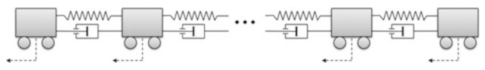

> Image description: A technical diagram titled "Fig. 4 Finite string of vehicles" illustrates a chain of four grey rectangular blocks representing vehicles. Each vehicle is supported by two small circles, indicating rollers or wheels. The vehicles are connected in a series, forming a finite string. Between each adjacent pair of vehicles, there are two parallel connection components: a zigzag line representing a spring and a piston-like symbol representing a damper. The vehicles are linked via these nearest-neighbor connections, indicating a mechanical coupling. Below each vehicle, a dashed arrow points downward and to the left, originating from the rollers. These arrows represent the external forces or control inputs acting on each individual vehicle. The overall arrangement depicts a multi-body system where the motion of one vehicle is coupled to its neighbor through spring and damper elements, signifying a model for string stability or vehicular platoon dynamics through relative position and velocity feedback.
Vehicular Chains, Fig. 4 Finite string of vehicles with a nearest neighbor relative position and velocity feedback

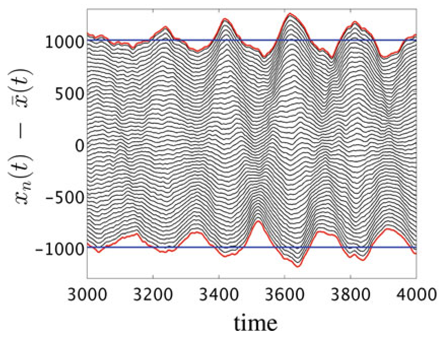

> Image description: This technical plot, identified as Figure 4 from a textbook titled "Vehicular Chains," illustrates the dynamics of a finite string of vehicles using nearest neighbor relative position and velocity feedback. The graph plots the deviation of each vehicle's position from the mean position, represented by the vertical axis variable $x_n(t) - \bar{x}(t)$, against time on the horizontal axis. The time domain ranges from 3000 to 4000 units. The figure displays multiple oscillating black lines, representing the individual trajectories of vehicles within the chain. These lines exhibit wave-like patterns that propagate through the sequence. Two horizontal blue lines mark the upper and lower boundaries of the oscillations, roughly at 1000 and -1000 units. Red lines trace the outermost oscillations, highlighting the amplitude of the system's collective movement. The undulating pattern visually demonstrates how disturbances or movements propagate through the vehicle chain over time.
Vehicular Chains, Fig. 5 Position trajectories of a stochastically forced formation with 100 vehicles controlled with nearest neighbor strategy (13). Left plot

the entire formation. The length of the formation fluctuates stochastically, but with a distinct slow temporal and long spatial wavelength signature. In contrast, the zoomed-in view in Fig. 5 shows a relatively well-regulated vehicle-to-vehicle spacing. In general, small-scale (both temporally and spatially) disturbances are well regulated, while large-scale disturbances are not. This indicates that a local feedback strategy (13) cannot regulate against large-scale disturbances.

## Structural Assumptions

We now list the assumptions on the operators $K_{p}, K_{v}$, and $C$ in (12) under which asymptotic scaling trends summarized in section "Scaling of Variance per Vehicle with System Size" are obtained.
(A1) Spatial invariance. Operators $K_{p}, K_{v}$, and $C$ in (12) are spatially invariant with respect to $\mathrm{Z}_{N}^{d}$.
(A2) Spatial localization. The feedback (11) uses only local information from a neighborhood of width $2 q$, where $q$ is independent of $N$.
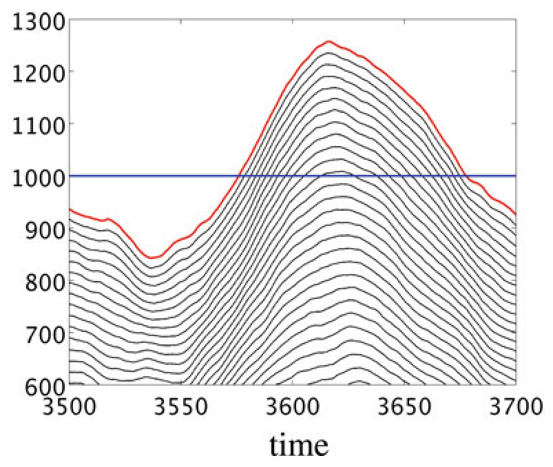
demonstrates accordion-like motion of the entire formation; right plot shows that vehicle-to-vehicle distances are relatively well regulated
(A3) Reflection symmetry. The interactions between vehicles exhibit mirror symmetry.
(A4) Coordinate decoupling. For $d \geq 2$, control in each coordinate direction depends only on measurements of position and velocity error vector components in that coordinate.
While assumptions (A3) and (A4) were made to simplify calculations, assumptions (A1) and (A2) were essential for the developments in Bamieh et al. (2012).

## Performance Measures

We next examine the dependence of the steadystate variance of stochastically forced system (12) on the number of vehicles. In the presence of relative position or velocity measurements, the matrix $A$ in (12) is not necessarily Hurwitz, and the state $\psi$ may not have finite steady-state variance. However, for connected networks, the performance output $z$ that does not penalize the motion of the mean will have finite steady-state variance; this is because the modes of $A$ at the origin will be unobservable from $z$. The steadystate variance of $z$,

<!-- source_pdf_page: 1545 -->
$$
\begin{equation*}
V:=\sum_{n \in Z_{N}^{d}} \lim _{t \rightarrow \infty} \mathcal{E}\left(z_{n}^{T}(t) z_{n}(t)\right) \tag{14}
\end{equation*}
$$

is quantified by the square of the $H_{2}$ norm of the system (12) from $w$ to $z$, and it can be determined from the solution of the algebraic Lyapunov equation.

We next summarize two different performance measures for stochastically forced vehicular formations.
(P1) Local error. This is a measure of the difference of neighboring vehicles positions from the desired spacing. In 1D, the performance output of the $n$th vehicle is given by

$$
z_{n}:=p_{n}-p_{n-1} .
$$

In $d$-dimensions, the performance output vector contains as its components the local error in each respective dimension. Since this output involves quantities local to any vehicle within a formation, the corresponding steadystate variance is referred to as a microscopic performance measure, $V_{\text {micro. }}$.
(P2) Deviation from average. This is a measure of the deviation of each vehicle's position error from the average of the overall position error.

$$
\begin{equation*}
z_{n}:=p_{n}-\frac{1}{M} \sum_{j \in \mathrm{Z}_{N}^{d}} p_{j} . \tag{15}
\end{equation*}
$$

Since this output determines deviation from average, and thereby quantities that are far apart in
the network, the corresponding steady-state variance is referred to as a macroscopic performance measure, $V_{\text {macro }}$.

## Scaling of Variance per Vehicle with System Size

We next summarize asymptotic bounds for both microscopic and macroscopic performance measures derived in Bamieh et al. (2012). The upper bounds result from simple feedback laws similar to the one given in (13). In the situations where either absolute position or velocity measurement are available, additional terms proportional to $p_{n}$ and $v_{n}$ will appear in (13). The lower bounds have been obtained for any linear static feedback control policy satisfying the structural assumptions (A1)-(A4) and the following constraint on control variance at each vehicle:

$$
\begin{equation*}
\mathcal{E}\left(u_{n}^{T} u_{n}\right) \leq U_{\max } . \tag{16}
\end{equation*}
$$

Under this constraint, the equivalence between scaling trends of lower and upper bounds can be established. As illustrated in Table 1, the dependence of the asymptotic bounds on the number of vehicles is strongly influenced by the underlying spatial dimension $d$.

Since the macroscopic performance measure captures how well the formation regulates against large-scale disturbances, the scaling results presented in Table 1 demonstrate that local feedback with relative position measurements is unable to regulate against these large-scale

Vehicular Chains, Table 1 Asymptotic scalings of microscopic and macroscopic performance measures in terms of the total number of vehicles $M=N^{d}$, the spatial dimensions $d$, and the control effort per vehicle $U_{\max }$. Quantities listed are up to a multiplicative factor that is independent of $M$ or $U_{\text {max }}$ :

| Feedback type | $V_{\text {micro }} / M$ | $V_{\text {macro }} / M$ |
| :--- | :--- | :--- |
| Absolute position Absolute velocity | $\frac{1}{U_{\text {max }}}$ | $\frac{1}{U_{\text {max }}}$ |
| Relative position Absolute velocity | $\frac{1}{U_{\text {max }}}$ | $\frac{1}{U_{\max }}\left\{\begin{array}{rr}M & d=1 \\ \log (M) & d=2 \\ 1 & d \geq 3\end{array}\right.$ |
|  |  |  |
| Relative position Relative velocity | $\frac{1}{U_{\text {max }}^{2}}\left\{\begin{array}{rr}M & d=1 \\ \log (M) & d=2 \\ 1 & d \geq 3\end{array}\right.$ | $\frac{1}{U_{\max }^{2}}\left\{\begin{array}{rl}M^{3} & d=1 \\ M & d=2 \\ M^{1 / 3} & d=3 \\ \log (M) & d=4 \\ 1 & d \geq 5\end{array}\right.$ |

<!-- source_pdf_page: 1546 -->
disturbances in 1D. To the contrary, in higher spatial dimensions, local feedback can regulate against large-scale disturbances and provide formation coherence. As shown in Table 1, the "critical dimension" needed to achieve network coherence depends on the type of feedback strategy: dimension 3 for relative position and absolute velocity feedback and dimension 5 for relative position and velocity feedback.

## Summary and Future Directions

For stochastically forced vehicular formations in topology of regular lattices, we have summarized fundamental performance limitations resulting from the use of local feedback. Even for formations that are string stable, local feedback is not capable of guarding against slowly varying disturbances with long spatial wavelength in 1D and 2D. The observed phenomenon also arises in distributed averaging and estimation algorithms, global mean first passage time of random walks, effective resistance in electrical networks, and statistical mechanics of harmonic solids. Since performance measures that we used to quantify robustness to disturbances are easily extensible to networks with arbitrary topology and more complex node dynamics, they can be used to evaluate performance of a broad class of networked dynamical systems in future studies.

## Cross-References

- Averaging Algorithms and Consensus
- Flocking in Networked Systems
- Networked Systems
- Oscillator Synchronization

[^0]dependent limitations of local feedback. IEEE Trans Autom Control 57(9): 2235-2249
Bullo F, Cortés J, Martínez S (2009) Distributed control of robotic networks. Princeton University Press, Princeton
Jovanović MR, Bamieh B (2005) On the ill-posedness of certain vehicular platoon control problems. IEEE Trans Autom Control 50(9):1307-1321
Levine WS, Athans M (1966) On the optimal error regulation of a string of moving vehicles. IEEE Trans Autom Control AC-11(3):355-361
Lin F, Fardad M, Jovanović MR (2012) Optimal control of vehicular formations with nearest neighbor interactions. IEEE Trans Autom Control 57(9):2203-2218
Melzer SM, Kuo BC (1971a) Optimal regulation of systems described by a countably infinite number of objects. Automatica 7:359-366
Melzer SM, Kuo BC (1971b) A closed-form solution for the optimal error regulation of a string of moving vehicles. IEEE Trans Autom Control AC-16(1):50-52
Mesbahi M, Egerstedt M (2010) Graph theoretic methods in multiagent networks. Princeton University Press, Princeton
Middleton RH, Braslavsky JH (2010) String instability in classes of linear time invariant formation control with limited communication range. IEEE Trans Autom Control 55(7):1519-1530
Seiler P, Pant A, Hedrick K (2004) Disturbance propagation in vehicle strings. IEEE Trans Autom Control 49(10): 1835-1842
Swaroop D, Hedrick JK (1996) String stability of interconnected systems. IEEE Trans Autom Control 41(2):349-357
Swaroop D, Hedrick JK (1999) Constant spacing strategies for platooning in automated highway systems. J Dyn Syst Meas Control 121(3):462-470
Varaiya P (1993) Smart cars on smart roads: problems of control. IEEE Trans Autom Control 38(2): 195-207

## Vibration Control System Design for Buildings

Hidekazu Nishimura
Graduate School of System Design and
Management, Keio University, Yokohama, Japan

#### Abstract

This entry reviews vibration control system design of buildings in terms of energy dissipation and seismic isolation including full active control devices and semi-active or passive

[^0]:    Bibliography

    Bamieh B, Paganini F, Dahleh MA (2002) Distributed control of spatially invariant systems. IEEE Trans Autom Control 47(7): 1091-1107
    Bamieh B, Jovanović MR, Mitra P , Patterson S (2012) Coherence in large-scale networks: dimension

<!-- source_pdf_page: 1547 -->
devices. Vibration control of buildings subjected to dynamic loadings such as large earthquakes, strong winds, or heavy traffic is one of the most important factors to take into consideration to secure the users. Since energy dissipation is the key technology in vibration control, many kinds of devices have been developed for structural mitigation. Seismic retrofit of buildings is very important because long-period earthquakes occur at considerable distances from the seismic center. Here, we introduce the application of specific devices to the vibration control system design of real buildings, especially in Japan, where there are many earthquakes.

## Keywords

Active control; Base isolation; Energy dissipation; Seismic response control; Seismic retrofit; Semi-active control; Vibration control

## Introduction

Vibration control of buildings subjected to dynamic loadings such as large earthquakes, strong winds, or heavy traffic is one of the most important factors to consider for the safety of building occupants. Energy dissipation is the key technology in vibration control, and many kinds of devices have been developed for structural mitigation (Soong and Spencer 2002; Spencer and Nagarajaiah 2003). In Japan, the 2011 earthquake occurred on the Pacific coast of Tohoku, prolonged for an extended period to the Tokyo area 400 km away from the seismic center, and caused fatal damages to the buildings of the surrounding areas.

Therefore, seismic retrofitting of buildings is very important in Japan because long-period earthquakes occur at sites far away from their seismic center as well. In particular, old super-high-rise buildings are concentrated in the central ward of Tokyo, Shinjuku, and they have been built on the basis of the theory of flexible structures. During a long-period earthquake, super-high-rise buildings have very
large displacement (about 0.5 m ) because of resonance vibration and may need a few minutes to dissipate the structural vibrations. These buildings need to be retrofitted by adding some energy dissipating devices, such as active mass dampers (AMDs), tuned mass dampers, rotating inertial mass dampers, and passive/semi-active base isolation devices.

This entry reviews a vibration control system design of buildings in terms of energy dissipation and seismic isolation including full active control devices and semi-active or passive devices. We introduce the application of specific devices to the vibration control system design of real buildings.

## Active Mass Damper

Active, semi-active, or passive mass damper systems have been installed in a large number of high-rise buildings as shown in Fig. 1 (Soong and Spencer 2002; Spencer and Nagarajaiah 2003). Although active mass dampers have historically

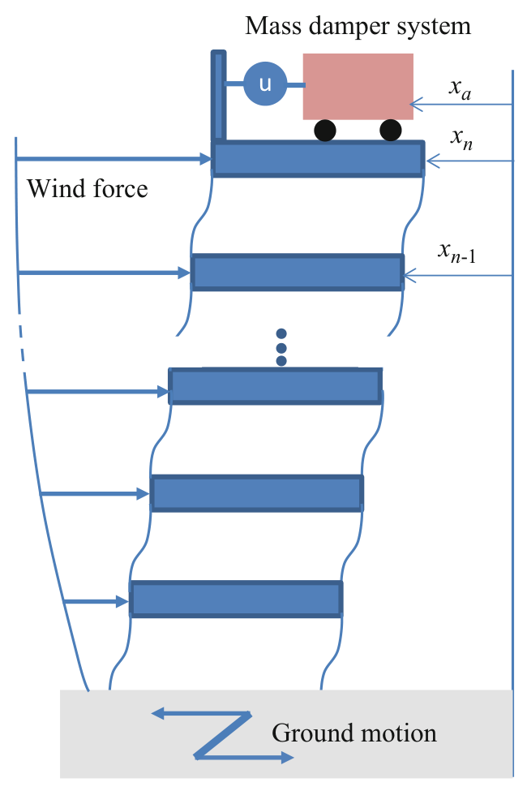

> Image description: An engineering diagram illustrates a multi-story building model equipped with a mass damper system at the top to mitigate structural oscillations. The building is represented by a stack of blue rectangular blocks, with displacement variables $x_n, x_{n-1}, \dots$ assigned to specific floors. External forces are indicated by horizontal arrows: "Wind force" acts on the upper levels, while a jagged arrow at the base represents "Ground motion." At the roof level, a "Mass damper system" consists of a red rectangular mass mounted on wheels. This mass is connected to the top of the structure via a mechanism labeled with a blue circle containing the variable "$u$," representing an actuator for active or semi-active control. The diagram shows how the mass damper system interacts with the building's upper displacement, $x_a$, to provide damping forces against environmental excitations like wind or seismic ground motion.
Vibration Control System Design for Buildings, Fig. 1
Active, semi-active, or passive mass damper system installed in an $n$-storied building subjected to wind force and ground motion

<!-- source_pdf_page: 1548 -->
used ball-screw-type actuators, the IHI Corporation has now developed AMDs driven by a linear motor, making the production of a long stroke type easier than that in the case of the ball-screw-type actuator (Koike et al. 2011). Other advantages of using a linear actuator are lesser noise and vibration, lightweight, and compactness. Thanks to these advantages, it is expected that linear motor type AMDs will be installed in existing buildings as seismic retrofitting devices. To avoid reaching the stroke length limit of the actuator because of a large earthquake, a displacement control of the mass is applied. A phase lead compensation in response to the displacement signal is used to preview the mass stroke.

The two AMDs have been installed in the Docomo Tohoku building of Japan in the same direction to improve by $9.5 \%$ the damping ratio of the 1st mode of the translational vibration. The weight of the mass is $20,000 \mathrm{~kg}$, and the total weight of the device is about $25,000 \mathrm{~kg}$. The control experiment was performed by exciting the building with AMDs, and a damping ratio of $11 \%$ was obtained by activating the vibration control with AMDs.

## Seismic Retrofitting

Shimizu Corporation modified the super-highrise building (height $=100 \mathrm{~m}$ ) in the Shibaura ward of Tokyo, Japan, by installing rotational inertia mass dampers. The rotational inertia mass damper has a mechanism consisting of a ball screw and a rotational inertia mass, with which the relative translational displacement between stories can be changed to rotational motion of the damper to efficiently increase the dissipation of the kinetic energy.

Although in the previous seismic retrofitting many dampers have been distributed in each floor as shown in Fig. 2a, Shimizu Corporation concentrated the rotational inertia mass dampers on the lower floors of the building (e.g., 1-7) as shown in Fig. 2b. The seismic response against the 2011 Tohoku earthquake would now be reduced by about $35 \%$ not only for the maximum displacement but also for the maximum acceleration of the top floor. Moreover, the duration time would become 220 s instead of 400 s . The method of retrofitting super-high-rise buildings is very unique because the lower floors behave as isolation layers of the base isolation system. Although the displacement of the lower floors becomes

Vibration Control System Design for Buildings, Fig. 2 Seismic retrofitting. (a) Distributed energy dissipation device. (b) Energy dissipation device concentrated in lower floors
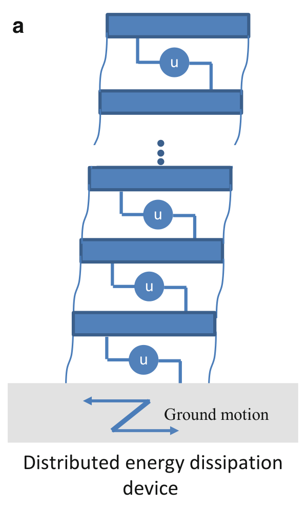

> Image description: A technical diagram labeled "**a**" illustrates a "**Distributed energy dissipation device**" within a structural framework. The figure depicts a vertical column of rectangular blue blocks representing structural floor segments. These segments are interconnected by a series of circular elements, each labeled with the variable "**u**," which represent distributed energy dissipation devices. The devices are arranged in a vertical sequence between the floor blocks, spaced at intervals. At the base of the structure, a light gray rectangular block represents the foundation. A blue jagged arrow pointing leftward is labeled "**Ground motion**," indicating the input seismic force acting on the base. The diagram shows the energy dissipation mechanism distributed throughout the entire height of the structure rather than being concentrated at a single point. The overall engineering concept illustrates how discrete damping components integrated between floor levels can mitigate seismic forces throughout a building's height.
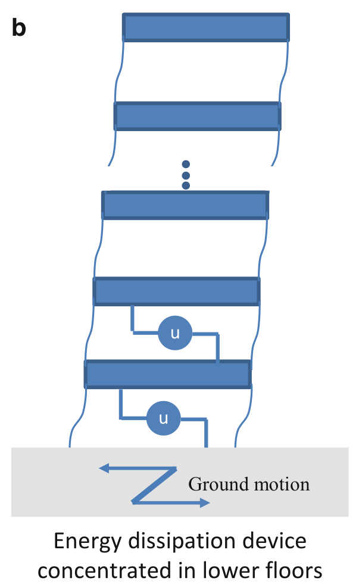

> Image description: A diagram labeled "**b**" illustrates a seismic retrofitting strategy for a multi-story building. The structure is represented by stacked blue rectangular blocks representing floors, with a vertical ellipsis indicating omitted middle floors. Two circular energy dissipation devices, each labeled with the variable "**u**," are integrated into the building's framework. These devices are specifically positioned between the lowest two floors and the ground level, demonstrating the configuration where "Energy dissipation device concentrated in lower floors." At the base, a light gray rectangle represents the ground, containing a zigzag arrow labeled "**Ground motion**," indicating the seismic input acting on the structure. The blue wavy lines on either side of the building blocks suggest structural deformation. The overall engineering concept depicted is the strategic placement of energy dissipation mechanisms at the building's base to mitigate seismic forces.

<!-- source_pdf_page: 1549 -->
slightly larger than that before the retrofit, the whole building has a good seismic response performance.

## Semi-active Base Isolation

The semi-active base isolation system as shown in Fig. 3 has been mounted in a building for the first time in 2000. The building is located on the Yagami campus of the Keio University in Yokohama, Japan, and the base isolation system in two directions consists of eight semi-active hydraulic dampers that can change the damping coefficient in four steps using a controllable orifice. The maximum damping force is 640 kN , while the switching law of damping coefficients is based on the optimal bilinear control theory. The damper is modeled on the lines of the Maxwell model, where a spring and a damper are connected in series, and the objective function on the kinetic energy of the building and the constraint function of the squared damping force are adopted (Yoshida and Fujio 2000).

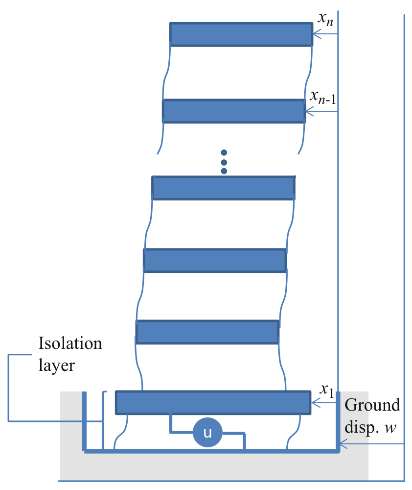

> Image description: A technical schematic diagram illustrates a multi-story building equipped with a semi-active base isolation system. The building is represented by a vertical stack of blue rectangular blocks, signifying different floors. Displacement variables are indicated on the right side, denoted as $x_n, x_{n-1}, \dots, x_1$, with vertical arrows representing the relative movement of each floor. At the base, a thick grey foundation block represents the ground. The ground displacement is labeled as $w$, indicated by a vertical arrow. Between the foundation and the first floor ($x_1$), an isolation layer is positioned. This layer contains a semi-active control element, represented by a circle containing the variable $u$, which is connected to the base and the first floor. The diagram uses wavy lines between several floor blocks to indicate a continuation of levels not explicitly drawn. The overall structure depicts the mechanical relationship between ground motion, the isolation mechanism, and the multi-degree-of-freedom response of the building.
Vibration Control System Design for Buildings, Fig. 3 Semi-active base isolation system

In 2008, another type of semi-active base isolation system has been installed by Collaboration Complex in the Hiyoshi campus of the Keio University in Yokohama, Japan. The system consists of eight semi-active dampers along with eight conventional hydraulic fluid dampers in each direction of the $\mathrm{X}-\mathrm{Y}$ axes. While the maximum force of the semi-active damper and the conventional hydraulic fluid damper is about $1,000 \mathrm{kN}$, the semi-active damper can change the damping coefficient in two steps, high side, $3.68 \mathrm{MNs} / \mathrm{m}$ and low side, $1.23 \mathrm{MNs} / \mathrm{m}$. When an earthquake manifests, the high damping coefficient in normal status is switched to the low side. This switch enables the suppression of the acceleration response of the building at the early stages of the earthquake. After the early stage, according to the acceleration response filtered on the isolation layer, the low damping coefficient should be switched to the high side again to avoid the collision of the building with the foundations.

Magneto-rheological (MR) fluid dampers have been studied by many researchers, and in 2001, two 300 kN MR fluid dampers have been installed in Nihon-Kagaku-Miraikan, the Tokyo National Museum of Emerging Science and Innovation. Similarly in 2003, 400 kN MR fluid dampers have been installed in a residential building in Japan (Fujitani et al. 2003).

Although MR fluid dampers have been controlled by various laws (Jansen and Dyke 2000), a gain-scheduled control method was introduced to control the electric current generated by the electromagnet of the MR damper (Nishimura et al. 2002). A system controlled by a damping force is a bilinear control system, where the control input depends not only on the relative velocity but also on the damping coefficient. A virtual semi-active damper model was proposed that is capable of changing the damping coefficient with the valve open ratio, which is assumed to be governed by the input to the dynamics of 2nd-order system. In this device, the optimized variable damping coefficient is determined by the input. Moreover, the valve opening ratio is limited to certain values to constrain the damping force to the maximum value. However, the controllability of the bilinear control system using the variable damping force

<!-- source_pdf_page: 1550 -->
depends on the relative velocity of the damper. If the relative velocity equals zero, then the system is uncontrollable. Thus, the systems relative to the positive and the negative sides of the relative velocity are separated. Furthermore, the currentforce relationship of the MR damper is considered.

The control method using an MR damper was verified on a 9 m high building-like structure. The structure had four degrees of freedom and a total weight of about $33,000 \mathrm{~kg}$. The MR damper has a maximum force of about 40 kN and its currentforce relationship is nonlinear (Watakabe et al. 2008). The experimental results demonstrated a good seismic isolation performance in comparison with the skyhook control. The gain-scheduled control proposed gently varied the damping force according to the input current.

## Full Active Base Isolation

Full active base isolation systems have been studied by many researchers (Nishimura and Kojima 1999) who evidenced that they are affected by the saturation of the force generated by the actuator following a large earthquake. The seismic isolation performance should be held even though the force saturation occurred. To control the vibrations, it was proposed to use a hyperbolic function for representing the saturation to smooth the input force (Itagaki and Nishimura 2005).

In 2010, the Obayashi Corporation implemented the active base isolation system in real buildings (Endo et al. 2011). Two hydraulic actuators are connected to the building through a spring in each direction of the $\mathrm{X}-\mathrm{Y}$ axes to avoid the transmission of the high-frequency vibration from the actuator to the building. The control system is based on the displacement control of the hydraulic actuator and achieves absolute seismic control. The control force is necessary to eliminate the spring and damper forces in the isolation layer, and the skyhook damper force is added to the control force for the stabilization of the whole system.

A trigger mechanism using a friction damper is equipped with serial hydraulic actuators and
can avoid the transmission of the excess input force from the actuator to the building. If the excess input force is generated from the actuator in fail, the friction damper can absorb a force of about $1,000 \mathrm{kN}$ so as not to damage the building and the actuator itself. The maximum force of the hydraulic actuator is $1,100 \mathrm{kN}$, the maximum displacement of the hydraulic actuator is 200 mm , the maximum displacement of the lead-rubber bearing is 500 mm , the maximum displacement of the trigger mechanism with the friction damper is 750 mm , the spring constant of the connected spring is $16,300 \mathrm{kN} / \mathrm{mm}$, and the maximum stroke is 58 mm . Compared to passive isolation, simulations demonstrated that the base isolation system performed well, especially during earthquakes with maximum acceleration less than $200 \mathrm{~cm} / \mathrm{s}^{2}$.

## Summary and Future Directions

Seismic retrofitting may become increasingly important for protecting buildings from large and long-period earthquakes. The optimization of the structural mitigation as a whole system must be the objective of future studies aiming to achieve an effective energy dissipation and seismic isolation of buildings. Energy harvesting from vibration control or three-dimensional isolation devices will draw attention in the near future.

## Cross-References

- H-Infinity Control
- Linear Quadratic Optimal Control
- LMI Approach to Robust Control
- Modeling of Dynamic Systems from First Principles
- Stochastic Linear-Quadratic Control

## Recommended Reading

Vibration control system design for buildings has been summarized in many journal papers over the last several years. Spencer and Sain

<!-- source_pdf_page: 1551 -->
(1997), Soong and Spencer (2002), and Spencer and Nagarajaiah (2003) discuss applications of vibration control systems to buildings or bridges to support infrastructures. Rossetto and Duffour (2012) and Saatcioglu (2012) discuss earthquakeresistant design and structural mitigation of earthquakes with structural control including with passive devices.

## Bibliography

Endo F, Yamanaka M, Watnabe T, Kageyama M, Yoshida O et al (2011) Advanced technologies applied at the new "Techno Station" building in Tokyo, Japan. Struct Eng Int 21(4):508-513
Fujitani H, Sodeyama H et al (2003) Development of 400 kN magnetorheological damper for a real baseisolated building. In: Proceedings of the SPIE 5052, smart structures and materials 2003: damping and isolation, San Diego, p 265
Itagaki N, Nishimura H (2005) Disturbanceaccommodating gain-scheduled control taking account of actuator saturation. In: Proceedings of the 2005 IEEE conference on control applications, Toronto, 28-31 Aug 2005
Jansen LM, Dyke SJ (2000) Semi-active control strategies for MR dampers: a comparative study. J Eng Mech 126(8):795-803
Koike Y, Imaseki M, Kazama M (2011) Vibration control using rail-guided full-active mass dampers and the application thereof to high-rise buildings.

In: Proceedings of the 5th international symposium on wind effects on buildings and urban environment, Tokyo
Nishimura H, Kojima A (1999) Seismic isolation control for a buildinglike structure. IEEE Control Syst Mag 19(6):38-44
Nishimura H et al (2002) Semi-active vibration isolation control for multi-degree-of-freedom structures. In: ASME 2002 pressure vessels and piping conference, seismic engineering, Vancouver, vol 2, Paper no PVP2002-1446, pp 189-196
Rossetto T, Duffour P (2012) Earthquake resistant design. In: Bobrowsky P. (ed.), Encyclopedia of natural hazards, Springer-Verlag Berlin Heidelberg, pp 1-13, 12 Oct 2012
Saatcioglu M (2012) Structural mitigation. In: Bobrowsky P. (ed.), Encyclopedia of natural hazards, SpringerVerlag Berlin Heidelberg, pp 1-25, 17 Sep 2012
Soong TT, Spencer BF Jr (2002) Supplemental energy dissipation: state-of-the-art and state-of-the practice. Eng Struct 24:243-259
Spencer BF Jr, Nagarajaiah S (2003) State of the art of structural control. J Struct Eng 2003: 845-856
Spencer BF Jr, Sain MK (1997) Controlling buildings: a new frontier in feedback. IEEE Control Syst Mag 17(6):19-35
Watakabe M, Inoue N, Nishimura H et al (2008) Response control performance of semi-active isolation system using the GS control for a multi-degree-of-freedom structure with magneto-rheological fluid damper. J Struct Constr Eng 73(628):875-882 (in Japanese)
Yoshida K, Fujio T (2000) Semi-active base isolation for a building structure. Int J Comput Appl Technol 13(1/2):52-58
