<!-- source_pdf_page: 1552 -->
## W

## Walking Robots

Ambarish Goswami Honda Research Institute, Mountain View, CA, USA

#### Abstract

This article presents an overview of mobile "walking" robots that use their legs to move from one place to another. Walking robots represent a fascinating class of machines which holds the potential for breakthrough applications and inspires multidisciplinary research with rich scientific content. The key feature that separates walking robots from all other classes of mobile robots is their ability to explore unprepared surfaces using discrete footholds. In this respect, these robots are truly the machine counterparts of biological land animals.

## Keywords

Balance; Fall; Gait; Humanoid robots

## Introduction

The adventure of modern robotics is generally considered to have started from the middle of the twentieth century (International Federation
of Robotics 2011). During the first few decades of this new journey, robots were not mobile. Somewhat similar to trees, these so-called "arm" manipulator robots were securely rooted to the ground. The free end of these robots typically consisted of an end-effector "hand" with which a number of mostly manufacturingrelated tasks, such as welding, spray-painting, and pick-and-place operations, were performed. Life was simple, if a bit boring. However, from the end of the 1960s, this started to change.

Fiction writers had earlier imagined a variety of mobile robots such as in "I, Robot" (Asimov 1950), Otho (Hamilton 1940), and Maria (Malone 2004). Scientists and engineers also ventured to build a number of quite sophisticated machines such as the General Electric experimental "walking truck" quadruped robot by Mosher shown in Fig. 1 and the Sparko and Elektro by Westinghouse (http:// en.wikipedia.org/wiki/Elektro). However, they were not considered truly autonomous in the sense we describe modern robots. Some of the major personalities who are primarily responsible for forever transforming the state of stationary existence of robots and giving them intelligent mobility are Profs. I. Kato, M. Vukobratovic, and R. McGhee, followed by Prof. M. Raibert.

Because walking robots used legs for locomotion, they immediately became the mechatronic cousins to the entire range of biological legged creatures, starting from tiny creatures to large animals. Indeed, today we have robotic versions

<!-- source_pdf_page: 1553 -->
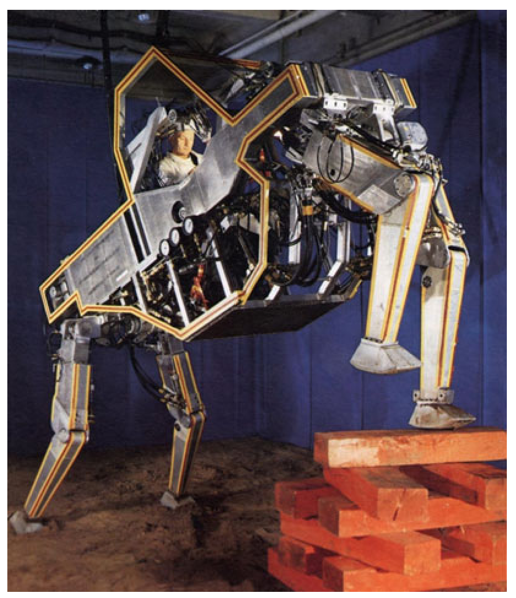

> Image description: Figure 1 shows the GE "walking truck" developed by Mosher, a large-scale, four-legged bipedal-style robotic vehicle designed for uneven terrain. The machine features a prominent, silver metallic chassis with yellow and orange trim outlining its complex, angular geometry. A human operator is visible inside an open cockpit area at the top of the frame. The vehicle's locomotion is provided by four articulated mechanical legs, each composed of multi-jointed metallic segments. The front right leg is captured mid-stride, stepping onto a stack of large, rectangular orange wooden blocks. The rear legs are positioned on a dark, dirt-covered ground surface. Visible engineering components include hydraulic lines, hoses, and circular pressure gauges mounted within the internal structure of the chassis. The image demonstrates the robot's ability to navigate obstacles through articulated limb movement, emphasizing its functional design for heavy-duty, off-road mobility.
Walking Robots, Fig. 1 GE "walking truck" developed by Mosher

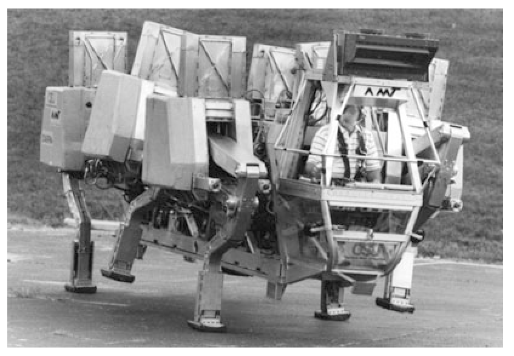

> Image description: This black-and-white photograph, labeled as Figure 1, depicts the GE "walking truck" developed by Mosher. The image shows a large-scale, multi-legged robotic vehicle designed for heavy-duty transport. The machine features several articulated, mechanical legs positioned underneath a massive central chassis. A prominent feature is the enclosed operator's cab at the front, where a person is visible seated behind a transparent window. The chassis is composed of large, block-like structural components and various mechanical housings. Some modules carry the "AMW" logo. The vehicle is shown on a flat, paved surface with a grassy background, illustrating its scale and intended terrestrial operation. The engineering design emphasizes modularity and heavy mechanical limb articulation, suggesting a prototype for high-mobility, heavy-load transport in rugged environments. No axes or mathematical variables are present in this photographic figure.
Walking Robots, Fig. 2 Adaptive suspension vehicle (ASV), Ohio State University

of spiders and cockroaches, geckoes and lizards, dogs and cheetah, and even humanoids. We have seen very large robots such as the ASV (Waldron and McGhee 1986) shown in Fig. 2 and the Dante (Bares and Wettergreen 1999), shown in Fig. 4. We have also seen single-legged robots, which even Mother Nature has not considered creating so far.

## Early History

The early researchers whom we mentioned above started paving the way for walking robots. These robots walked with their legs, explored their own environments, and sometimes even ventured outside. Once these walking robots started appearing on the scene, life was never the same.

Prof. Kato pioneered walking robot research at Waseda University (Japan) through a series of remarkable biped humanoid robots, of which WL-5 is credited with genuine bipedal walking and WL-6 with displaying the first dynamic gait. At the same time, Prof. Vukobratovic was conducting research activities in exoskeleton and other areas at the Mihailo Pupin Institute (former Yugoslavia). He was instrumental in formalizing the concept of dynamic balance using the zero moment point (ZMP) concept (Sardain and Bessonnet 2004; Vukobratović and Juričić 1969), which is used to this day. In the USA, Prof. McGhee conducted path-breaking research on computer-controlled machines at the Ohio State University. He created the Ohio hexapod and later, with colleague Prof. Ken Waldron, developed the truly spectacular Adaptive Suspension Vehicle (ASV) hexapod.

Prof. Raibert started building robots in the USA, first at Carnegie Mellon University and then at Massachusetts Institute of Technology (Raibert 1989). With his colleagues, he created a series of robots, which, unlike their stationary predecessors, were characteristically full of energy. Situation permitting, they would occasionally deviate from conventional walking and running and would burst into aerial somersaults and other acrobatic motions. Prof. Raibert continues to actively shape the field of walking robots to the present day; his company Boston Dynamics (recently acquired by Google Inc.) has introduced a number of highperformance robots, such as LittleDog, BigDog, RHex, Petman, and Atlas.

The hardware, sensing, and control aspects of walking robots were steadily gaining sophistication during the 1990s. However, except for the new appreciation of walking dynamics

<!-- source_pdf_page: 1554 -->
in the study of passive bipedal gait (McGeer 1990), there was no unexpected leap in the world of walking robots. This changed in 1996 when Honda publicly announced the humanoid robot P2, the result of their robotics project, till then unknown to the outside world. This was to be superseded by the P3 robot and then the ASIMO humanoid robot project in 2000, which became another important event in the humanoid robot history.

## Characteristics of Walking Robots

Compared to other forms of land locomotion, legged walking possesses the distinct capability of locomotion using discrete footholds (Raibert 1989). Unlike wheeled mobile robots or cars, walking robots do not need a continuous prepared surface such as paved road, trail, or track in order to travel. By virtue of this single feature, a vast extent of land surface, which is not accessible to wheeled robots, opens up to walking robots. Indeed, at least in principle, walking robots are able to reach almost any location, on earth and on other planets, wherever human and other legged creatures can go.

Legged locomotion is natural to terrains where the only means of locomotion must be through the use of unstructured footholds, which can be irregularly spaced both horizontally and vertically. Due to the unique design of the leg, legged creatures can largely isolate the "payload" or the upper body from the geometric details of the terrain profile during locomotion. Both for biological creatures and for walking robots, this brings benefit in the form of significant energy savings. For walking robots this also reduces mechanical stress, vibration, and wear on the system hardware, which makes them suitable for locomotion in rough natural terrain.

In contrast, wheeled robots are typically faster, mechanically less complex, and energetically more efficient. However, these benefits must be supported by very expensive infrastructure overhead. In many places such expenditure is not practical or not even desirable.

## Classification of Walking Robots

Walking robots have been built in different sizes and morphologies. These robots have ranged in sizes from small hexapods (Lewinger et al. 2005), medium-sized robots (Fig. 4), and relatively large robots such as the BigDog (Raibert et al. 2008) from Boston Dynamics and Toyota iWalk (Fig. 4) and also a few giant robots such as Dante (Bares and Wettergreen 1999) and Ambler (Fig. 4) from CMU and the ASV (Waldron and McGhee 1986) from OSU. With further miniaturization, it is conceivable that we will see even smaller walking robots in the future with unanticipated and surprising application domains. One can also imagine gigantic walking robots in potential applications in large construction sites such as in bridge, building, or ships, but we have not started seeing them just yet.

In terms of the number of legs, we have already seen monopods, Figs. 3b and 4a; bipeds, Fig. 8a-c; tripod, Fig. 4b; quadruped, Fig. 4a, b; hexapods, Figs. 4c, d and 2; octopod, Fig. 4e; and "centipede" robots with many legs, Fig. 4f.

Other than monopods, robots with oddnumbered legs are curiously absent in this list. Creatures with odd-numbered legs are also not found in nature. It is not clear if an engineering rationale is present behind this trend or the biological inspiration is simply missing for the creators of legged robots.

In addition to size and morphology, walking robots can be classified in terms of the number and types of leg joints, type of gait (e.g., walking or running), or the domain of movement. The next section is devoted to the humanoid robots, which is perhaps the most popular class of walking robots.

## Humanoid Robots

Humanoid robots belong to a unique class of two-legged walking robots that has a special place in the popular psyche. These robots are the subject of special affection and fascination due to their similarity with human beings. In fact,

<!-- source_pdf_page: 1555 -->
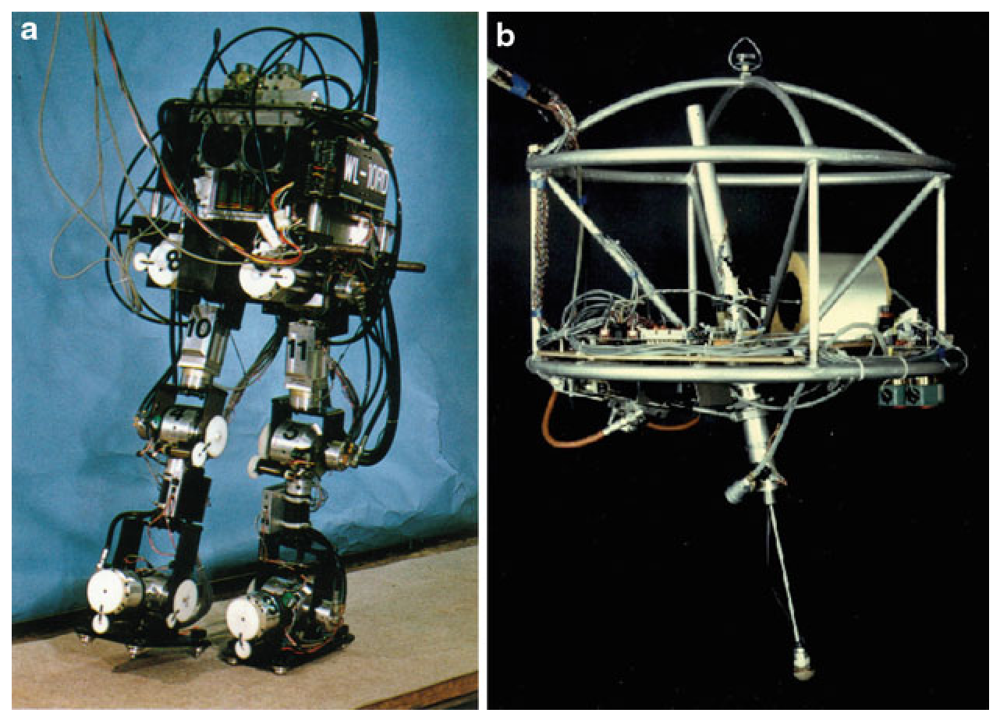

> Image description: Figure 3 presents two examples of early walking robots. Image (a) depicts the Waseda WL-10, a bipedal robot standing upright. The robot's frame features several visible numerical labels for component identification, including "8," "9," "10," and "11" positioned along the torso and upper legs. The structure is composed of articulated mechanical joints and metallic limbs, interconnected by an extensive network of black and multicolored electrical wiring and hydraulic lines. The robot stands on two small, rectangular footpads on a flat surface against a blue background. Image (b) shows a single-legged robot from Boston Dynamics. The device has a skeletal, circular metallic frame with horizontal and vertical supports. Various internal components, such as a cylindrical motor and complex wiring, are visible within the frame. A single articulated leg extends downward from the bottom of the circular structure, ending in a pointed foot component. The background is solid black.
Walking Robots, Fig. 3 Early walking robots: (a) Waseda WL-10 (Image courtesy Atsuo Takanishi) and (b) onelegged robot (Image courtesy of Boston dynamics)

humanoid robots might be the original inspiration behind the entire field of robotics and perhaps also its ultimate goal. Being perpetually inspired by movies and novels, a long-standing dream of the human has been to create a mechatronic replica of themselves, the human, which will be fully general-purpose endowed with all human functionalities except perhaps the full independence of thought and action.

Humanoid robots exist in different sizes, including smaller robots such as NAO (Gouaillier et al. 2009), HOAP, and QRIO (Ishida et al. 2004) and life-sized robots such as HRP, HUBO, and ASIMO. Despite their differences, these robots bear a close resemblance to the kinematic design and proportions of a human being and share a common human-mimicking morphology. Indeed, the perceived similarity between humanoid robots and the human is so close that we routinely describe aspects of such robots using anthropomorphic terms. Terms like head, arm, hand, leg, thigh, shank, ankle, spine, gait, stumble, fall, facial expression, and even emotion are hardly ever used to describe any other man-made device. Some popular humanoid robots are shown in Fig. 9.

At current technical level, humanoid robots cannot compete in their actual utility with robots such as Roomba the vacuum cleaner, the bomb-sniffing robot, or the huge population of fully active and cost-effective welding and spray-painting robots. Yet, our fascination with humanoids remains as strong as ever, and novel applications of such robots are continuously being explored (Fig. 7). Humanoid robots are currently considered in roles of educators (Falconer 2013; Yamasaki and Nakagawa 2006), dance partners (Kosuge 2010), waiters, babysitters, companions for autistic children or for seniors (Robins et al. 2012), security, or emergency response team. Curiously, the functionality of walking is not relevant or central to many of these roles.

## Dynamic Equations of Walking Robots

The dynamic equations of a walking robot can be expressed in the following form:

$$
\begin{equation*}
\boldsymbol{H}(\boldsymbol{q}) \ddot{\boldsymbol{q}}+\boldsymbol{C}(\boldsymbol{q}, \dot{\boldsymbol{q}}) \dot{\boldsymbol{q}}+\boldsymbol{\tau}_{g}(\boldsymbol{q})=\boldsymbol{\Gamma}+\boldsymbol{\Gamma}_{c}+\boldsymbol{\Gamma}_{\mathrm{ext}}, \tag{1}
\end{equation*}
$$

<!-- source_pdf_page: 1556 -->
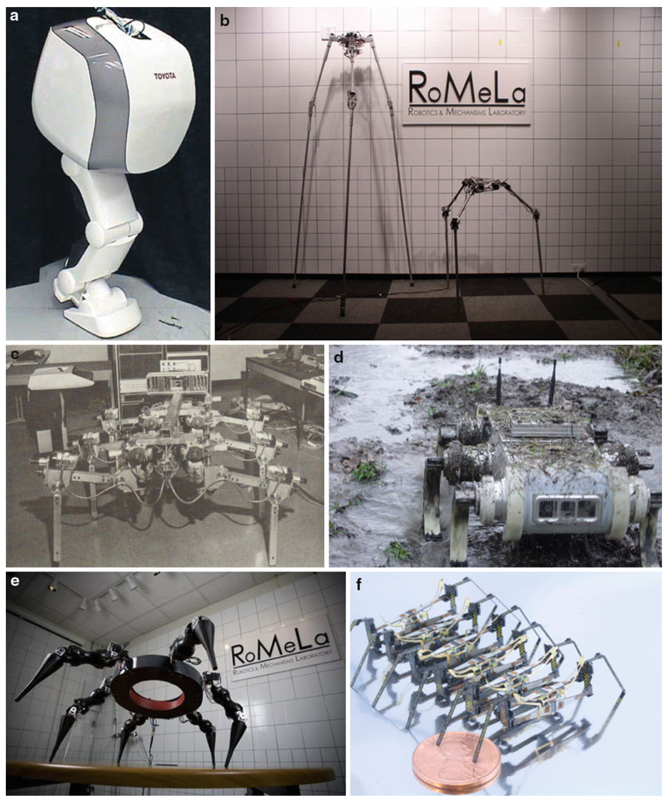

> Image description: A composite image titled "Walking Robots, Fig. 4" displays six distinct robotic systems illustrating varying degrees of complexity in leg configuration. (a) A white, bipedal monopod robot labeled "TOYOTA" is shown in profile. (b) Two tripod robots of different scales are pictured in a lab setting; the larger one is taller and more slender, while the smaller one is more compact. Both are set against a wall featuring the "RoMeLa" logo. (c) A vintage, large-scale hexapod robot from OSU is shown in a black-and-white laboratory setting. (d) A rugged, four-legged RHex robot is pictured in a muddy, outdoor terrain. (e) A large, black multi-legged robot is shown in a laboratory environment, also featuring the "RoMeLa" logo. (f) A microscopic scale robot, resembling a multi-legged insect, is shown next to a copper coin for scale comparison.
Walking Robots, Fig. 4 Walking robots with different number of legs: (a) monopod, Toyota hopping robot; (b) tripod, STriDER, RoMeLa (Image courtesy of Dennis Hong); (c) large hexapod, McGhee, OSU; (d) RHex

(RHex robot image courtesy of Boston Dynamics); (e) octopod, Spider, RoMeLa (Image courtesy of Dennis Hong); and (f) many legs, centipede, Harvard

<!-- source_pdf_page: 1557 -->
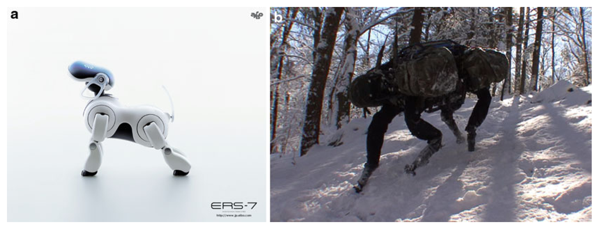

> Image description: This textbook figure, titled "Walking Robots, Fig. 5," compares two different quadruped robots through two side-by-side images, labeled (a) and (b). Image (a) shows a Sony Aibo, a small, consumer-grade domestic robot. It has a sleek, white, stylized body with a rounded head and four short, articulated legs. The text "ERS-7" and a URL are visible in the bottom right corner. Image (b) depicts the Boston Dynamics BigDog robot operating in a snowy, forested outdoor environment. Unlike the domestic Aibo, BigDog is a large-scale, utility-oriented robot. It is seen traversing a snow-covered slope, wearing heavy-duty equipment, including large backpacks mounted on its back. The robot's mechanical legs and dark-colored chassis are visible amidst the trees and shadows of the winter landscape.

Walking Robots, Fig. 5 Two quadruped robots: (a) Sony Aibo (Image courtesy of Sony) and (b) BigDog robot (Image courtesy of Boston Dynamics)

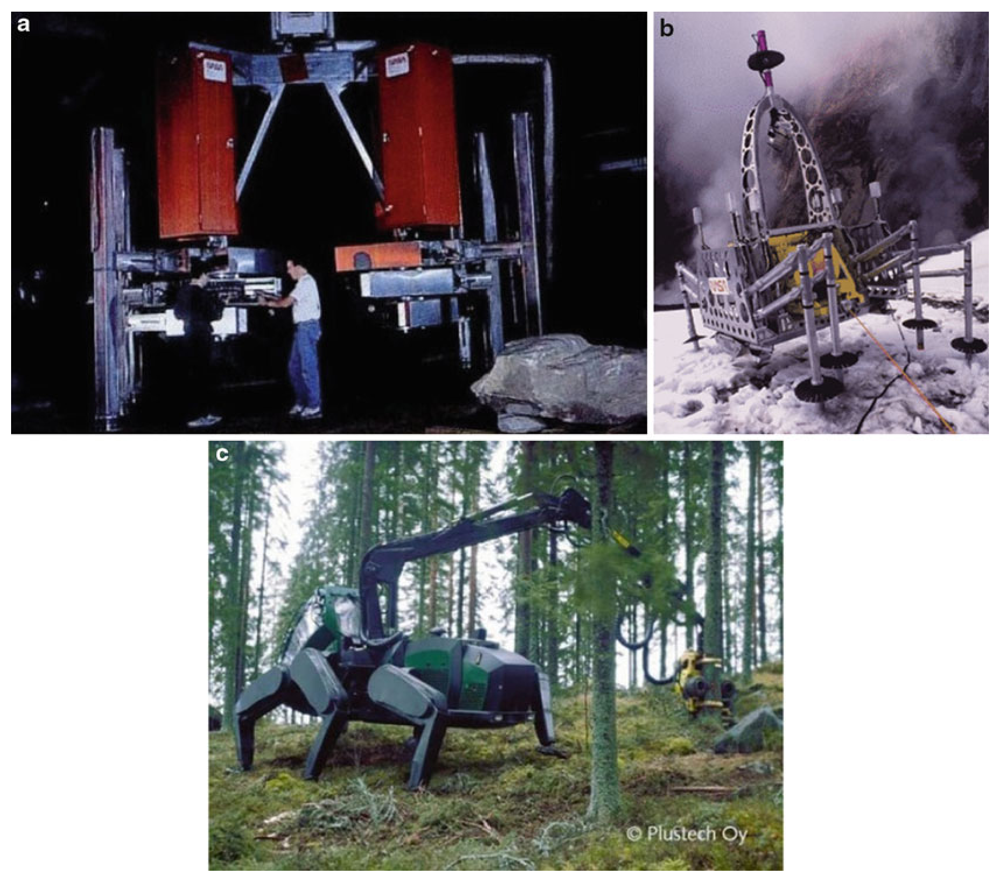

> Image description: A single figure containing three sub-images (a, b, and c) labeled "Walking Robots, Fig. 5." Sub-image **a** shows a large, industrial-looking machine with two prominent orange rectangular components mounted on a metallic frame. Two people are standing near the machine, providing a scale reference. While the caption incorrectly identifies this as the "Sony Aibo," the visual depicts heavy robotic hardware. Sub-image **b** shows a mechanical device with a large circular ring structure and multiple articulated legs or supports resting on a snowy surface. The caption identifies this as the "BigDog robot" from Boston Dynamics. Sub-image **c** displays a large, green quadruped robot with a long, articulated mechanical arm or crane extending upward towards a tree in a forest setting. The caption identifies this as "Sony Aibo," although the visual depicts a large-scale outdoor walking robot. The robot features heavy-duty legs and a complex articulated limb.
Walking Robots, Fig. 6 Large walking robots: (a) Dante II, CMU; (b) Ambler, CMU; and (c) John Deere Walking Tractor

<!-- source_pdf_page: 1558 -->
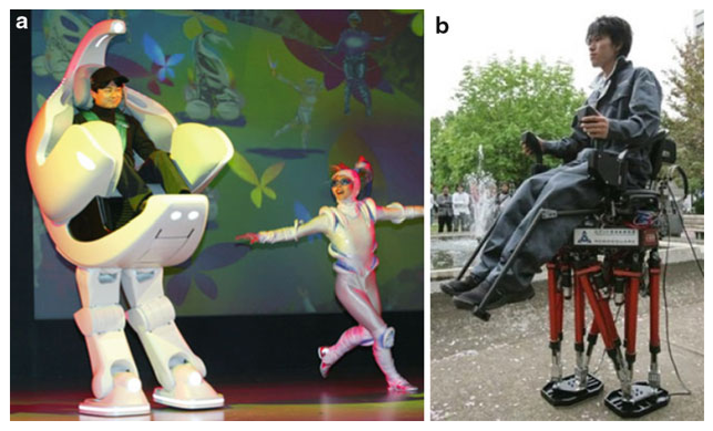

> Image description: This figure, titled "Fig. 7 Novel application of walking robots: human-carrying 'chair' robots," contains two side-by-side images labeled **a** and **b**. Image **a** displays the "iWalk" by Toyota. It features a large, white, futuristic humanoid robot designed to carry a seated person. The robot has a high-backed, bucket-style seat integrated into its torso, where a man is seated. The robot’s lower body consists of two thick, bipedal legs with rounded feet. In the background, a person in a white costume performs a dance move against a colorful backdrop. Image **b** displays the "WL-16RV multi-purpose biped locomotor" from Waseda University. It shows a man in dark clothing seated in a specialized chair-like apparatus mounted on a complex mechanical leg structure. The structure consists of multiple red and black hydraulic or motorized struts connected to flat footplates. The setting appears to be an outdoor park with trees and people in the background.
Walking Robots, Fig. 7 Novel application of walking robots: human-carrying "chair" robots, (a) iWalk of Toyota and (b) WL-16RV multi-purpose biped locomotor from Waseda University (Image courtesy of Atsuo Takanishi)

where $\boldsymbol{q}$ is the vector of the robot's generalized coordinates, which contains the world frame transformation matrix of its base link and all its joint angles. The generalized velocity vector is expressed as $\dot{\boldsymbol{q}}=\left[\begin{array}{ll}\boldsymbol{v}_{B} & \dot{\boldsymbol{\theta}}\end{array}\right]^{T}$ where $\boldsymbol{v}_{B}$ is the base velocity and $\dot{\boldsymbol{\theta}}$ is the vector of joint velocities. Additionally, $\boldsymbol{H}$ is the joint-space inertia matrix; $\boldsymbol{C}$ is the matrix of Coriolis, centrifugal, and gyroscopic terms; and $\boldsymbol{\tau}_{g}$ is the vector of gravity terms. Finally, $\boldsymbol{\Gamma}=\left[\begin{array}{cc}\mathbf{0} & \boldsymbol{\tau}\end{array}\right]^{T}$ is the joint torque vector, $\boldsymbol{\Gamma}_{c}=\boldsymbol{J}_{c}^{T} \boldsymbol{f}_{c}$ is the joint torque resulting from the contact forces $\boldsymbol{f}_{c}$ such as from the ground, and $\boldsymbol{\Gamma}_{\text {ext }}=\boldsymbol{J}_{e}^{T} \boldsymbol{f}_{e}$ is the joint torque due to external interaction forces $\boldsymbol{f}_{e}$.

The contact conditions which the robot must satisfy can be written in the form of Eq. 2. The physical constraints due to ground friction, center of pressure (CoP) condition (explained subsequently), torque limits, etc., can be expressed as in Eq. 3

$$
\begin{align*}
\boldsymbol{J}_{c}(\ddot{\boldsymbol{q}}) & =\boldsymbol{b}(\boldsymbol{q}, \dot{\boldsymbol{q}}),  \tag{2}\\
\boldsymbol{A}\left[\begin{array}{lll}
\ddot{\boldsymbol{q}} & \boldsymbol{\tau} & \boldsymbol{f}_{c}
\end{array}\right]^{T} & \leq \boldsymbol{b}(\boldsymbol{q}, \dot{\boldsymbol{q}}), \tag{3}
\end{align*}
$$

The friction condition ensures that the robot feet do not slide on the ground, and the CoP condition corresponds to maintaining the resultant of the ground reaction force (GRF) within
the perimeter of the support polygon (Sardain and Bessonnet 2004) so that toppling is prevented.

Some of the generalized coordinates of the robot, specifically those which describe the base link of the robot to the world frame, are not powered, as apparent from the joint torque vector representation $\boldsymbol{\Gamma}=\left[\begin{array}{ll}\mathbf{0} & \boldsymbol{\tau}\end{array}\right]^{T}$, in Eq. 1. In other words, the robot is called underactuated. In fact, all walking robots are underactuated, and it is one of the central characteristics that sets these robots apart from other robots. Underactuation plays a very important role in the dynamics, motion planning, and control of walking robots (Chevallereau et al. 2005).

## Balance and Stability

Even after several decades of research, balance maintenance has remained one of the most important issues of walking robots and especially of humanoid robots. Although the basic dynamics of balance are currently understood (Sardain and Bessonnet 2004; Vukobratović and Juričić 1969), robust and general controllers that can deal with discrete and nonlevel foot support as well as large, unexpected, and unknown external disturbances such as from a moving support, a slip, and a trip have not yet emerged.

<!-- source_pdf_page: 1559 -->
Walking Robots, Fig. 8 Two well-known human-sized humanoid robots: (a) ASIMO, Honda. (b) HRP-2, AIST (Image courtesy of AIST). (c) HUBO, Korea
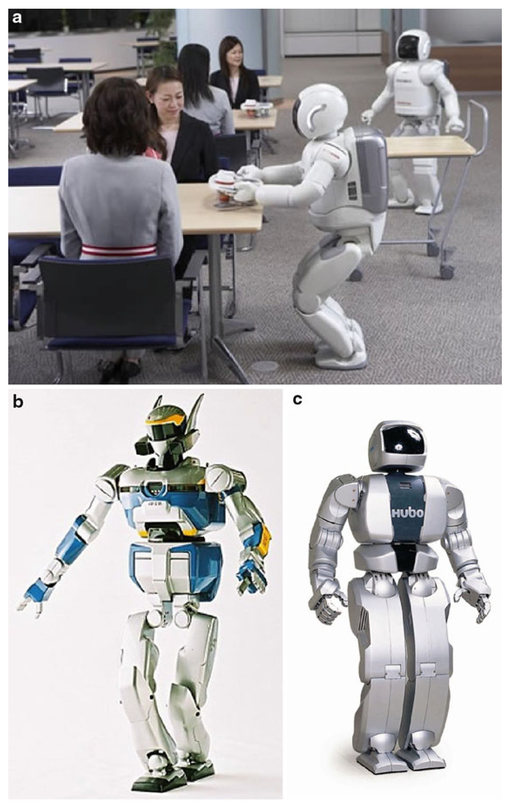

> Image description: This textbook figure, titled "Walking Robots, Fig. 8," presents three images of human-sized humanoid robots labeled (a), (b), and (c). Image (a) shows the ASIMO robot, developed by Honda, in a real-world setting. It is depicted interacting with people in a classroom or office-like environment. The robot is captured in a walking motion, carrying a small tray with cups toward a group of seated people, demonstrating practical application and social interaction capabilities. Image (b) is a studio photograph of the HRP-2 robot from AIST. It features a complex, mechanical humanoid design with visible joints, limbs, and a distinct headpiece. The robot is shown in a standing pose against a plain white background. Image (c) shows the HUBO robot from Korea. It has a streamlined, silver, humanoid design with a rounded head containing sensors and a torso labeled "HUBO." It stands upright against a white background.

In comparison with the elegance and versatility of human balance, present-day humanoid robots appear quite deficient.

Balance generally refers to the ability of a walking robot to maintain a sustained gait with a reasonably upright posture without falling (Kajita and Espiau 2008). Robot gait can be static or dynamic. A robot with a static gait would continue to stay upright even if its joints were suddenly frozen. Static gait and movement under static balance are safe but are slow and lacks
elegance. A dynamic gait is fluid and natural looking as it harnesses and exploits the inertial characteristics of the physical robot. However, the robot must be in motion for it to sustain an upright stature. Suddenly locking the joints may cause a fall.

The location and the nature of the resultant GRF on the support polygon of the robot have been traditionally used to interpret the dynamic state of the robot's movement. The point where the resultant GRF acts on the robot is called its

<!-- source_pdf_page: 1560 -->
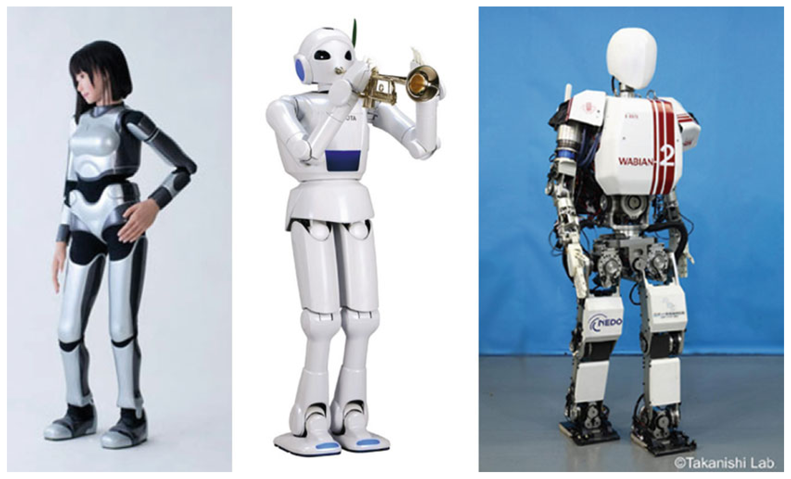

> Image description: This textbook figure, titled "Walking Robots, Fig. 9," presents three distinct examples of humanoid robots arranged side-by-side in a single row. On the left is (a) the AIST HRP-4, a humanoid robot with a realistic, lifelike appearance, featuring a human-shaped head with dark hair and a silver metallic body. In the center is (b) the Toyota Partner Robot, a white, stylized humanoid with a simplified spherical head, depicted while holding a gold-colored trumpet to its mouth. On the right is (c) the Waseda University Wabian, a more mechanical-looking humanoid with visible wiring and components. This robot features a white head and a torso labeled with the text "WABIAN 2" in black and red lettering. The legs of the Wabian robot feature rectangular plates with the label "NEDO" visible on the thighs. The background for the first two images is plain white, while the third image features a blue background.
Walking Robots, Fig. 9 Three popular humanoid robots: (a) AIST HRP-4 (Image courtesy of AIST), (b) Toyota Partner Robot, and (c) Waseda University Wabian (Image courtesy of Atsuo Takanishi)

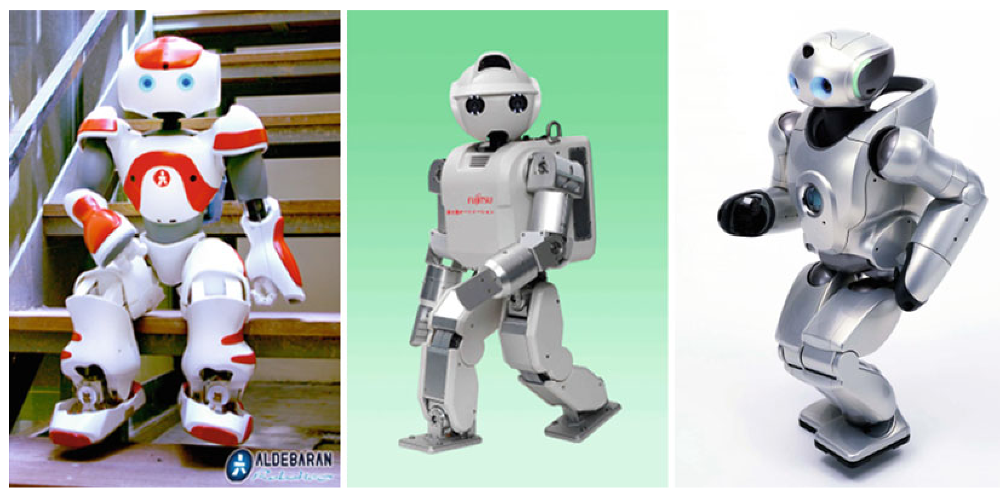

> Image description: Figure 9, titled "Walking Robots," displays three distinct humanoid robots arranged side-by-side. (a) On the left, an ALDEBARAN Robotics humanoid is shown sitting on wooden stairs. This robot features a white and red color scheme, with rounded limbs and a large, expressive head with red eye-like sensors. (b) The center image shows a Toyota Partner Robot against a solid green background. This robot is primarily light grey and has a more functional, industrial design with visible joints and a rectangular torso. (c) On the right, the Waseda University Wabian is shown against a white background. This silver-colored robot features a highly streamlined, aerodynamic design with smooth, metallic surfaces and integrated sensors in its head. The image serves to illustrate different morphological approaches in humanoid robotics, ranging from the social/domestic aesthetic of the ALDEBARAN model to the more industrial and research-oriented designs of the Toyota and Waseda models.
Walking Robots, Fig. 10 Three small humanoid robots: Aldebaran NAO (Image courtesy of Aldebaran), Fujitsu HOAP-2, and Sony QRIO (Image courtesy of Sony)

zero moment point (ZMP), and it is equivalent to the CoP for planar support. Figure 11 explains the concept of CoP.

As shown in Fig. 11, two types of interaction forces act on the foot at the foot/ground interface.

They are the normal forces $\boldsymbol{f}_{n i}$, always directed upward (Fig. 11, left), and the frictional tangential forces $\boldsymbol{f}_{t i}$ (Fig. 11, middle). CoP, denoted by $P$, is the point where the resultant $\boldsymbol{R}_{n}= \sum \boldsymbol{f}_{n i}$ acts. With respect to a coordinate origin

<!-- source_pdf_page: 1561 -->
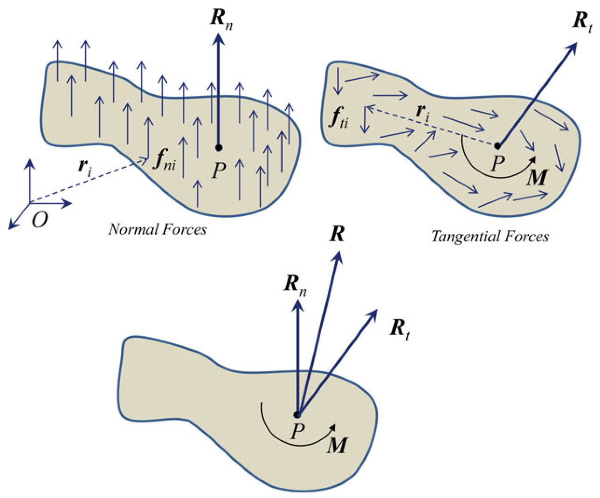

> Image description: A textbook figure labeled "Fig. 11 Definition of center of pressure (CoP)" illustrates the concept of the center of pressure for a humanoid robot's foot. The diagram is divided into three sub-diagrams. The first, "Normal Forces," shows a foot shape with multiple small vertical force arrows ($f_{ni}$) acting upward. A single large resultant vector, $\mathbf{R_n}$, originates from a point $P$ on the foot. A dashed line, $\mathbf{r_i}$, connects the origin $O$ to a force $f_{ni}$. The second, "Tangential Forces," shows a foot with multiple small horizontal force arrows ($f_{ti}$) acting sideways. A large resultant vector, $\mathbf{R_t}$, originates from point $P$. A dashed line, $\mathbf{r_i}$, connects the origin to a force $f_{ti}$. An arrow labeled $\mathbf{M}$ indicates a moment at point $P$. The final diagram combines these elements, showing the total resultant force vector $\mathbf{R}$ as the sum of the normal force $\mathbf{R_n}$ and tangential force $\mathbf{R_t}$ originating from point $P$, where a moment $\mathbf{M}$ is also present.
Walking Robots, Fig. 11 Definition of center of pressure (CoP), shown for one foot of a humanoid robot. The idea can be extended to any walking robot, and in

$O, \boldsymbol{O P}=\frac{\sum \boldsymbol{r}_{i} f_{n i}}{\sum f_{n i}}$, where $\boldsymbol{r}_{i}$ is the vector to the point of action of force $\boldsymbol{f}_{i}$ and $f_{n i}$ is the magnitude of $\boldsymbol{f}_{n i}$.

Because of the unilaterality of the foot/ground constraint $\boldsymbol{f}_{n i} \geq 0$, which implies that $P$ must lie within the support polygon. The resultant of the tangential forces may be represented at $P$ by a force $\boldsymbol{R}_{t}=\sum \boldsymbol{f}_{t i}$ and a moment $\boldsymbol{M}= \sum \boldsymbol{r}_{i} \times \boldsymbol{f}_{t i}$ where $\boldsymbol{r}_{i}$ is the vector from $P$ to the point of application of $\sum \boldsymbol{f}_{t i}$. A basic control objective for walking robots is to maintain the CoP within the perimeter of the support polygon.

## Safety

Safety is a serious concern that is paramount to any application where robots are likely to coexist in interactive human environments. The power of mobility of walking robots adds to this concern.

Out of a number of possible situations where safety is an issue, one that involves a balance
a general setting, a single footprint is replaced by the support polygon which is the convex hull of all ground contact of the robot
loss and fall is particularly worrisome for walking robots. All walking robots, and in fact all mobile robots, are subjected to this unique "failure" mode. A fall may be caused due to unexpected or excessive external forces, unusual or unknown slipperiness, and slope or profile of the ground, causing the robot to slip, trip, or topple. Fall can also result when the balance controller is partially or fully incapacitated due to an internal failure of the robot involving its sensor or actuator.

Fall can be costly in terms of the damage to the robot and also, depending on the shape and size of the robot, can result in external damage and injury to human.

For humanoid robots, fall is a particularly serious issue (Fujiwara et al. 2002). Humanoid robots, similar to humans, have a larger ratio of CoM height to support area size, which makes them more susceptible to fall, in case of a failure. At the same time, due to their higher CoM, a fall of such robots contains generally higher kinetic energy which is able to cause higher damage and injury.

<!-- source_pdf_page: 1562 -->
## Summary

Walking robots represent an important class of autonomous machines which can find application in the general area of service robotics. The power of mobility makes these robots uniquely capable of serving in niche need areas such as plant maintenance and security, disaster response, personal companion, and so on. Humanoid walking robots have attracted strong popular fascination, and this has fueled their rapid development. At present it appears that defense-related applications are the most likely to experience practical use of walking robots.

Walking robots possess interesting and complex kinematics and dynamics. Control of such machines, especially with regard to balancing, motion planning, and reactive behavior, is a rich research area that is challenging and demands special skill-sets.

## Cross-References

- Disaster Response Robot
- Redundant Robots
- Robot Motion Control
- Robot Teleoperation
- Underactuated Robots

## Recommended Reading

Out of the references listed below, Vukobratović and Juričić (1969) is the earliest paper dealing with bipedal robot balance, and it introduces the concept of ZMP. A very good recent overview of legged robots can be found in Kajita and Espiau (2008). Also of interest is the foundational paper on passive bipedal gait by McGeer (1990).

## Bibliography

Asimov I (1950) I, Robot. Bantam Dell, New York, NY
Bares JE, Wettergreen DS (1999) Dante II: technical description, results, and lessons learned. Int J Robot Res 18(7):621-649

Chevallereau C, Westervelt ER, Grizzle JW (2005) Asymptotically stable running for a five-link, fouractuator, planar bipedal robot. Int J Robot Res 24(6):431-464
Falconer J (2013) NAO robot goes to school to help kids with autism. IEEE Specturm, May 2013. http:// spectrum.ieee.org/automaton/robotics/humanoids/ aldebaran-robotics-nao-robot-autism-solution-forkids
Fujiwara K, Kanehiro F, Kajita S, Kaneko K, Yokoi K, Hirukawa H (2002) UKEMI: falling motion control to minimize damage to biped humanoid robot. In: IEEE/RSJ international conference on intelligent robots and systems (IROS), St. Louis, pp 2521-2526
Gouaillier D, Hugel V, Blazevic P, Kilner C, Monceaux J, Lafourcade P, Marnier B, Serre J, Maisonnier B (2009) Mechatronic design of NAO humanoid. In: IEEE international conference on robotics and automation (ICRA), Kobe, pp 2124-2129
Hamilton E (1940). Collected Captain Future, Haffner Press, Royal Oak, Michigan
http://en.wikipedia.org/wiki/Elektro
International Federation of Robotics (IFR) (2011) press release. http://www.ifr.org/news/ifr-press-release/50-years-industrial-robots-410/
Ishida T, Kuroki Y, Takahashi T (2004) Analysis of motions of a small biped entertainment robot. In: IEEE/RSJ international conference on intelligent robots and systems (IROS), Sendai, pp 142-147
Kajita S, Espiau B (2008) Legged robots. In: Siciliano B, Khatib O (eds) Springer Handbook of Robotics. Springer, Berlin, pp 361-389
Kosuge K (2010) Dance partner robot: an engineering approach to human-robot interaction. In: 5th ACM/IEEE international conference on human-robot interaction (HRI), Osaka
Lewinger WA, Branicky MS, Quinn RD (2005) Insectinspired, actively compliant hexapod capable of object manipulation. In: Proceedings of the CLAWAR'2005 8th international conference on climbing and walking robots, Springer-Verlag Berlin Heidelberg
Malone R (2004) Ultimate robot. DK Publishing, New York
McGeer T (1990) Passive dynamic walking. Int J Robot Res 9(2):62-82
Raibert M (1989) Legged robots. In: Brady M (ed) Robotics science. System development foundation benchmark series. MIT, Cambridge
Raibert M, Blankespoor K, Nelson G, Playter R, The BigDog Team (2008) BigDog, the rough-terrain quaduped robot. In: Proceedings of the 17th IFAC world congress, Seoul, pp 10822-10825
Robins B, Dautenhahn K, Dickerson P (2012) Embodiment and cognitive learning - can a humanoid robot help children with autism to learn about tactile social behaviour. Soc Robot Lect Notes Comput Sci 7621:66-75
Sardain P, Bessonnet G (2004) Forces acting on a biped robot. Center of pressure-zero moment point. IEEE Trans Syst Man Cybern 34:630-637

<!-- source_pdf_page: 1563 -->
Vukobratović M, Juričić D (1969) Contribution to the synthesis of biped gait. IEEE Trans Bio-Med Eng 16(1):1-6
Waldron KJ, McGhee RB (1986) The adaptive suspension vehicle. IEEE Control Syst Mag 6(6): 7-12
Yamasaki F, Nakagawa Y (2006) Education using small humanoid robot. In: Proceedings of the 3rd international symposium on autonomous minirobots for research and edutainment (AMiRE 2005), Fukui, pp 248-253

## Wheeled Robots

Giuseppe Oriolo Sapienza Università di Roma, Roma, Italy

#### Abstract

The use of mobile robots in service applications is steadily increasing. Most of these systems achieve locomotion using wheels. As a consequence, they are subject to differential constraints that are nonholonomic, i.e., non-integrable. This article reviews the kinematic models of wheeled robots arising from these constraints and discusses their fundamental properties and limitations from a control viewpoint. An overview of the main approaches for trajectory planning and feedback motion control is provided.

## Keywords

Differential flatness; Nonholonomic constraints; Nonlinear controllability; Smooth stabilizability

## Introduction

Although all robots are, by definition, capable of movement, the expression mobile robots is mainly used to indicate robots that can displace their own base by means of some locomotion mechanism. Most often, this consists of a set of wheels. The main advantage of mobile robots over fixed-base manipulators
is their virtually unlimited workspace. As a consequence, such robots are fundamental in service applications, which require increased capabilities of autonomous motion.

More precisely, from a mechanical viewpoint, a wheeled robot essentially consists of a rigid body (base) equipped with a system of wheels. This basic arrangement may be complicated, for example, by attaching to the base one or more trailers, or by mounting a manipulator on the base (mobile manipulator).

Any wheeled vehicle is subject to kinematic constraints that in general reduce its local mobility while leaving intact the possibility of reaching arbitrary configurations by appropriate maneuvers. For example, any driver knows by experience that, while it is impossible to move instantaneously a car in the direction orthogonal to its heading, it is still possible to park it anywhere, at least in the absence of obstacles. This peculiar feature makes wheeled mobile robots very challenging from the control viewpoint, and in fact, some recent developments in nonlinear control were triggered by the study of these systems.

Here, we will consider only mobile robots that are equipped with conventional wheels, either orientable or fixed (as the front or rear wheels of a car, respectively). Omnidirectional mobile robots realized using, e.g., Mecanum wheels, are not covered in this article. Indeed, the local mobility of these vehicles is unrestricted, and therefore no special control treatment is necessary.

The most popular wheel arrangement for mobile robots is the differential drive, in which two fixed wheels whose axes of rotation coincide are controlled by separate actuators (see Fig. 1). One or more passive (caster) wheels are usually added for statical balance. This wheeled robot is the most agile, in that it can rotate on the spot by applying equal and opposite angular speeds to the wheels. A kinematically equivalent arrangement is the synchro drive, in which three orientable wheels are synchronously driven by two motors through mechanical coupling; the first motor provides traction, whereas the second controls the common orientation of the wheels.

Other possible wheel arrangements are those of a tricycle (one steering and two fixed wheels)

<!-- source_pdf_page: 1564 -->
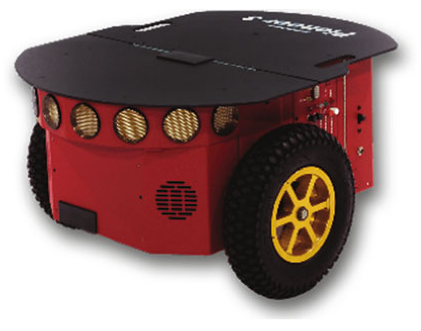

> Image description: A studio photograph features the Pioneer 3 robot by Adept, a mobile differential-drive platform. The robot is presented from a three-quarter perspective against a plain white background. Its primary structure is a bright red, boxy chassis. The top is covered by a wide, flat, black protective plate that extends slightly beyond the chassis edges. A series of circular sensor ports or openings are arranged in a row along the upper front edge of the red chassis, underneath the black top plate. The robot's locomotion is provided by large, rugged, black rubber tires mounted on bright yellow rims. One wheel is clearly visible in the foreground on the right, showcasing a deep tread pattern, while a portion of another wheel is visible on the left. The overall design suggests a heavy-duty, mobile robotic platform designed for research and various autonomous navigation tasks.
Wheeled Robots, Fig. 1 The Pioneer by Adept is a popular differential-drive platform

and of a car (two steering and two fixed wheels). Vehicles of this type are however less common in robotics, due partly to their reduced maneuverability (they have a nonzero turning radius) and partly to their increased mechanical complexity. For example, both these vehicles require a specific device (differential) for distributing traction torque to the driving wheels.

## Modeling

The starting point for modeling wheeled mobile robots is the single wheel. This may be represented as an upright disk rolling on the ground. Its configuration is described by three generalized coordinates: the Cartesian coordinates $(x, y)$ of the contact point with the ground, measured in a fixed reference frame, and the orientation $\theta$ of the disk plane with respect to the $x$ axis (see Fig. 2). The configuration vector is therefore $q=\left(\begin{array}{lll}x & y & \theta\end{array}\right)^{T}$. The pure rolling constraint is expressed as

$$
\left(\begin{array}{ll}
\sin \theta & -\cos \theta \tag{1}
\end{array}\right)\binom{\dot{x}}{\dot{y}}=0
$$

and entails that, in the absence of slipping, the velocity of the contact point has a zero component in the direction orthogonal to the wheel plane. The angular speed of the wheel around the vertical axis is instead unconstrained.

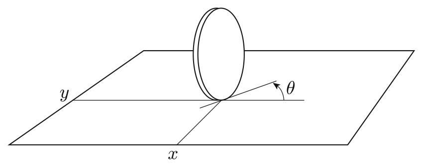

> Image description: A line drawing labeled "Wheeled Robots, Fig. 2" illustrates the generalized coordinates for a single wheel on a 2D plane. The image depicts a circular wheel positioned on a horizontal rectangular plane, representing a surface. The plane is defined by two perpendicular axes labeled $x$ and $y$, indicating a Cartesian coordinate system. A single contact point is shown where the wheel meets the plane. From this contact point, an angular dimension, $\theta$, is indicated by a curved arrow, representing the wheel's rotation angle. The wheel is oriented vertically relative to the $xy$-plane. The diagram serves as a kinematic model, defining the state of a single wheel through its position on the plane and its angular orientation, which are essential variables for modeling the motion of wheeled robots.
Wheeled Robots, Fig. 2 Generalized coordinates for a single wheel

The kinematic constraint (1) is nonholonomic, i.e., it cannot be integrated to a geometric constraint; this may be easily shown using Frobenius theorem, a well-known differential geometry result on integrability of differential forms. An important consequence of this fact is that constraint (1) implies no loss of accessibility in the configuration space of the wheel.

In a single-body vehicle equipped with multiple wheels, the $n$-dimensional configuration vector $q$ consists of the Cartesian coordinates of a representative point on the robot, the orientation of all independently orientable wheels, plus the orientation of the body if there are fixed wheels. By writing one pure rolling constraint like (1) for each independent wheel, orientable or fixed, and expressing it in the chosen generalized coordinates, one obtains a set of $k$ constraints in the form

$$
\begin{equation*}
A^{T}(q) \dot{q}=0 . \tag{2}
\end{equation*}
$$

Kinematic constraints of this form (i.e., linear in the generalized velocities) are called Pfaffian. In wheeled mobile robots, Pfaffian constraints are in general completely nonholonomic.

The $k$ Pfaffian constraints (2) reduce the number of degrees of freedom (i.e., independent instantaneous motions) of the robot to $m=n-k$. In particular, at each configuration $q$, the generalized velocities must belong to the $m$-dimensional null space of matrix $A^{T}(q)$ :

$$
\begin{equation*}
\dot{q}=\sum_{j=1}^{m} g_{j}(q) u_{j}=G(q) u, \tag{3}
\end{equation*}
$$

where vectors $g_{1}(q), \ldots, g_{m}(q)$ are a basis of $\mathcal{N}\left(A^{T}(q)\right)$ and $u=\left(u_{1} \ldots u_{m}\right)^{T}$ is a coefficient

<!-- source_pdf_page: 1565 -->
vector. Kinematically admissible trajectories are the solutions of (3), which is called kinematic model of the wheeled mobile robot. This model can be seen as a nonlinear dynamic system, with $q$ as state and $u$ as input. In particular, system (3) is driftless and has more state variables than control inputs.

For example, consider the unicycle, a rather ideal mobile robot equipped with a single, orientable wheel. The generalized coordinates for this robot are $q=(x y \theta)^{T}$, the same as the single wheel, and the vehicle is subject to the rolling constraint (1). One possible kinematic model for the unicycle is then

$$
\left(\begin{array}{c}
\dot{x}  \tag{4}\\
\dot{y} \\
\dot{\theta}
\end{array}\right)=\left(\begin{array}{c}
\cos \theta \\
\sin \theta \\
0
\end{array}\right) v+\left(\begin{array}{l}
0 \\
0 \\
1
\end{array}\right) \omega,
$$

where $v=\sqrt{\dot{x}^{2}+\dot{y}^{2}}$ and $\omega=\dot{\theta}$ represent, respectively, the driving and steering velocity of the wheel. Both the differential-drive and the synchro-drive robots are kinematically equivalent to the unicycle, i.e., their kinematic model can be put in the form (3) by properly defining $q$ and $u$.

Similar to what is done for robot manipulators, the dynamic models of wheeled mobile robots may be derived following the Euler-Lagrange method. The main difference is the presence of the nonholonomic Pfaffian constraints, which give rise to reaction forces expressed via Lagrange multipliers (Neimark and Fufaev 1972).

## Structural Properties

The nonholonomic nature of wheeled mobile robots has precise consequences in terms of structural properties of the kinematic model (3).

The first, and most important, is that in spite of the reduced number of degrees of freedom, a wheeled robot is controllable in its configuration space; i.e., given two arbitrary configurations, there always exists a kinematically admissible trajectory (with the associated velocity inputs) that transfers the robot from one to the other

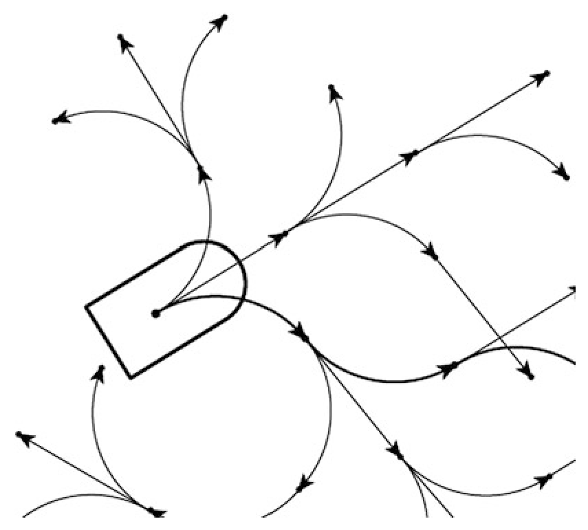

> Image description: A black-and-white diagram titled "Wheeled Robots, Fig. 3" illustrates the movement capabilities of a nonholonomic wheeled robot. The figure features a simplified representation of a robot at the center-left, depicted as a rectangular shape with a rounded front end. From a single point within the robot's base, numerous curved arrows originate and fan out in various directions across the page. These arrows represent potential paths or trajectories that the robot can follow. While the robot's movement is physically constrained (nonholonomic), the divergent directions of the arrows demonstrate that it can eventually reach any point in its configuration space through a series of maneuvers. The arrows vary in curvature and length, spreading from the robot's starting position toward the edges of the frame. The overall composition emphasizes the concept that limited local movement does not prevent a robot from achieving global reachability within its environment.
Wheeled Robots, Fig. 3 In spite of its restricted local mobility, a nonholonomic wheeled robot can reach any point in its configuration space

(Fig. 3). Since the kinematic model (3) is driftless, a well-known result (Chow theorem) implies that it is controllable if and only if the accessibility rank condition holds:

$$
\begin{equation*}
\operatorname{dim} \bar{\Delta}=n, \tag{5}
\end{equation*}
$$

where $\bar{\Delta}$ denotes the involutive closure of distribution $\Delta=\left\{g_{1}, \ldots, g_{m}\right\}$ under the Lie bracket operation. In turn, this is guaranteed to be true in view of the nonholonomy of constraints (2). For example, since the Lie bracket of the two input vector fields in (4) is always linearly independent from them, the kinematic model of the unicycle is controllable.

However, the controllability of wheeled mobile robots is intrinsically nonlinear. In fact, the linear approximation of (3) at any configuration clearly results to be uncontrollable due to the reduced number of inputs. In practice, this means that no linear feedback can stabilize the system at a given configuration. The situation is actually worse: for nonholonomic robots, there exists no continuous time-invariant feedback law that provides point stabilization. This negative result can be established on the basis of a celebrated result on smooth stabilizability of control systems due to Brockett (1983). Note that the result does

<!-- source_pdf_page: 1566 -->
not apply to time-varying stabilizing controllers, which may thus be continuous in $q$.

Another related drawback of wheeled mobile robots is that in general, they do not admit universal controllers, i.e., feedback control laws that can asymptotically stabilize arbitrary state trajectories, either persistent or not (Lizárraga 2004). This means that, in principle, tracking and regulation problems in wheeled robots should be addressed using separate approaches.

All the above limitations of nonholonomic systems are established with reference to the kinematic model, but of course, they are passed on to dynamic models. Altogether, they contribute to making the control problem for wheeled mobile robots much more difficult than, for example, for robotic manipulators, which are linearly controllable, smoothly stabilizable and admit universal controllers.

## Trajectory Planning

Trajectory planning for wheeled robots is a nontrivial problem, because not all trajectories are feasible - once again, a consequence of nonholonomy. This leads to the necessity of maneuvering, i.e., performing certain specific movements, in order to execute transfer motions.

Most kinematic models of wheeled mobile robots exhibit a property known as differential flatness (Fliess et al. 1995): namely, there exists a set of outputs $z$, called flat outputs, such that the state $q$ and the control inputs $u$ can be expressed algebraically as a function of $z$ and its time derivatives up to a certain order $\sigma$ :

$$
\begin{align*}
& q=\varphi\left(z, \dot{z}, \ddot{z}, \ldots, z^{(\sigma)}\right)  \tag{6}\\
& u=\gamma\left(z, \dot{z}, \ddot{z}, \ldots, z^{(\sigma)}\right) . \tag{7}
\end{align*}
$$

As a consequence, once an output trajectory $z(t)$ is specified, the associated state trajectory $q(t)$ and control history $u(t)$ are uniquely determined. For example, the unicycle admits $z=\left(\begin{array}{ll}x & y\end{array}\right)^{T}$ as flat outputs. In fact, once a Cartesian trajectory is assigned for the contact point with the ground, the wheel orientation $\theta(t)$ is constrained to be
tangent to the trajectory; the associated control input $v$ and $\omega$ are then uniquely and algebraically computable from $q(t)$.

Differential flatness is particularly useful for planning. For example, assume that we want to transfer a wheeled mobile robot from an initial configuration $q_{i}$ to a final configuration $q_{f}$. One then computes the corresponding values $z_{i}$ and $z_{f}$ of the flat outputs, plus the appropriate boundary conditions, and uses any interpolation scheme (e.g., polynomial interpolation) to plan the trajectory of $z$. The evolution of the generalized coordinates $q$, together with the associated control inputs $u$, can then be computed algebraically from (6-7). The resulting configuration space trajectory will automatically satisfy the nonholonomic constraints (2).

Another approach to nonholonomic trajectory planning is based on the possibility of putting the equations of most wheeled robots into a canonical format known as a 2 -input chained form

$$
\begin{align*}
\dot{z}_{1} & =w_{1} \\
\dot{z}_{2} & =w_{2} \\
\dot{z}_{3} & =z_{2} w_{1}  \tag{8}\\
& \vdots \\
\dot{z}_{n} & =z_{n-1} w_{1}
\end{align*}
$$

by means of a feedback transformation, i.e., a change of coordinates $z=\alpha(q)$ coupled with an input transformation $w=\beta(q) u$. In particular, this is always possible with kinematic models ( 3 ) for which $n \leq 4$ and $m=2$ (e.g., unicycle or car-like robots). Once the system is cast in the form (8), one may use sinusoidal openloop controls at integrally related frequencies to drive all variables sequentially to their final values (Murray and Sastry 1993). This approach is particularly interesting from a theoretical viewpoint because such control maneuvers achieve motion in the direction of the Lie brackets of the input vector fields.

Note that differential flatness and chainedform transformability are equivalent properties for 2-input nonholonomic mobile robots.

<!-- source_pdf_page: 1567 -->
## Feedback Control

The motion control problem for wheeled mobile robots is generally formulated with reference to the kinematic model (3). For example, in the case of the unicycle (4), this means that the control inputs are directly $v$ and $\omega$, the driving and steering velocities. There are essentially two reasons for taking this simplifying assumption.

First, the kinematic model (3) fully captures the essential nonlinearity of single-body wheeled robots, which stems from their nonholonomic nature. This is another fundamental difference with respect to the case of robotic manipulators, in which the main source of nonlinearity is the inertial coupling among multiple bodies. Second, in mobile robots it is typically not possible to command directly the wheel torques, because there are low-level wheel control loops integrated in the hardware or software architecture. Any such loop accepts as input a reference value for the wheel angular speed, which is then reproduced as accurately as possible by standard regulation actions (e.g., PID controllers). In this situation, the actual inputs available for high-level control are precisely these reference velocities.

Two basic control problems can be considered:

- Trajectory tracking: the robot must asymptotically track a desired Cartesian trajectory $\left(x_{d}(t), y_{d}(t)\right)$.
- Point stabilization: the robot must asymptotically reach a desired configuration $q_{d}$.
From a practical point of view, the most relevant of these problems is certainly the first. This is because mobile robots must be able to operate in unstructured workspaces that invariably contain obstacles. Clearly, forcing the robot to move along (or close to) a trajectory planned in advance reduces considerably the risk of collisions. The point stabilization problem, however, is more difficult and therefore particularly interesting from a scientific perspective. In a certain sense, the relative difficulty of the two problems is reminescent of human car driving: learning to drive a car along a road is relatively easy, whereas parking poses a greater challenge.

## Trajectory Tracking

Several methods are available to drive a wheeled mobile robot in feedback along a desired trajectory. A straightforward possibility is to compute first the linear approximation of the system along the desired trajectory (which, unlike the approximation at a configuration, results to be controllable) and then stabilize it using linear feedback. Only local convergence, however, can be guaranteed with this approach. For the kinematic model of the unicycle, global asymptotic stability may be achieved by suitably morphing the linear control law into a nonlinear one (Canudas de Wit et al. 1993).

In robotics, a popular approach for trajectory tracking is input-output linearization via static feedback. In the case of a unicycle, consider as output the Cartesian coordinates of a point $B$ located ahead of the wheel, at a distance $b$ from the contact point with the ground. The linear mapping between the time derivatives of these coordinates and the velocity control inputs turns out to be invertible provided that $b$ is nonzero; under this assumption, it is therefore possible to perform an input transformation via feedback that converts the unicycle to a parallel of two simple integrators, which can be globally stabilized with a simple proportional controller (plus feedforward). This simple approach works reasonably well. However, if one tries to improve tracking accuracy by reducing $b$ (so as to bring $B$ close to the ground contact point), the control effort quickly increases.

Trajectory tracking with $b=0$ (i.e., for the actual contact point on the ground) can be achieved using dynamic feedback linearization (Oriolo et al. 2002). In particular, this method provides a one-dimensional dynamic compensator that transforms the unicycle into a parallel of two double integrators, which is then globally stabilized with a proportional-derivative controller (plus feedforward). In contrast to static feedback linearization, no residual zero dynamics is present in the transformed system. However, the dynamic compensator has a singularity when the unicycle driving velocity is zero. This is expected, because otherwise the tracking

<!-- source_pdf_page: 1568 -->
controller would represent a universal controller. Note that dynamic feedback linearizability using the $x, y$ outputs is related to them being flat - the two properties are equivalent.

## Point Stabilization

The impossibility of stabilizing a nonholonomic mobile robot using continuous pure-state feedback has generated two main directions of research to solve the problem:

- Discontinuous feedback, i.e., time-invariant control laws $u=\gamma(q)$, where $\gamma$ is discontinuous precisely at the configuration that one seeks to stabilize.
- Time-varying feedback, in the form $u= \gamma(q, t)$ where $\gamma$ may or may not be continuous at the desired configuration.
For the unicycle, a well-known stabilizing controller belonging to the first category was designed by Aicardi et al. (1995) by formulating the problem in polar coordinates centered at the goal and then using a Lyapunov-like analysis to establish asymptotic convergence. The controller, once rewritten in original coordinates, turns out to be discontinuous at the goal (not surprisingly). Although this rules out proper stability in the sense of Lyapunov, this controller is effective in that it produces rather natural approach trajectories to the goal.

Continuous time-varying stabilizers in the sense of Lyapunov exist (Samson 1993) but have mainly theoretical interest due to their provably slow (polynomial) rate of convergence; this is a direct consequence of the fact that the linear approximation of the system is not controllable. A more effective approach is to give up (Lipschitz-) continuity at the desired configuration. As shown by M'Closkey and Murray (1997) and Morin and Samson (2000), this allows to design control laws that guarantee a modified form of exponential convergence to the goal.

Most of the aforementioned control designs both for trajectory tracking and point stabilization - were first developed with reference to the unicycle robot but can be carried out on chained forms,
thereby providing an effective extension to other kinematic models, e.g., the car-like robot.

## Summary and Future Directions

Wheeled mobile robots are increasingly present in applications. Over the last two decades, significant results have been reached in terms of modeling, planning and control of these systems, and the field is now considered to be well established, at least from an application point of view. Nevertheless, a number of research directions are still open, including the following:

- Planning and control for non-flat systems: Relatively harmless wheeled robots (such as a unicycle towing more than one off-hooked trailer) are not flat.
- Robustness: The performance of controllers in the presence of disturbances and model perturbations has not received sufficient attention so far.
- Localization: Feedback control requires accurate measurements of the configuration variables, which in mobile robots cannot be reliably reconstructed from onboard sensors (odometric data). Integration of exteroceptive sensing is essential to this end.
- Vision-based control: As an alternative to localization-based methods, the feedback loop may be closed directly in the image plane, with significant advantages in terms of simplicity and robustness.
- Multi-robot systems: The problem is to control the motion of multiple mobile robots in order to perform a cooperative motion task, e.g., formation control.

## Cross-References

- Differential Geometric Methods in Nonlinear Control
- Feedback Linearization of Nonlinear Systems
- Feedback Stabilization of Nonlinear Systems
- Lie Algebraic Methods in Nonlinear Control
- Vehicle Dynamics Control

<!-- source_pdf_page: 1569 -->
## Recommended Reading

For background material on nonlinear controllability, including the necessary concepts of differential geometry, see Sastry (2005). General introductions to mobile robots can be found in Siegwart and Nourbakhsh (2004), Choset et al. (2005), Morin and Samson (2008), and Siciliano et al. (2009). A classification of wheeled mobile robots based on the number, placement, and type of wheels was proposed by Bastin et al. (1996). A detailed extension of some of the planning and control techniques reviewed in this article to the case of car-like kinematics is given in De Luca et al. (1998). A framework for the stabilization of non-flat nonholonomic robots was presented by Oriolo and Vendittelli (2005). Recent work aimed at designing practical universal controllers was carried out by Morin and Samson (2009).

## Bibliography

Aicardi M, Casalino G, Bicchi A, Balestrino A (1995) Closed loop steering of unicycle-like vehicles via lyapunov techniques. IEEE Robot Autom Mag 2(1): 27-35
Bastin G, Campion G, D'Andréa-Novel B (1996) Structural properties and classification of kinematic and dynamic models of wheeled mobile robots. IEEE Trans Robot Autom 12: 47-62
Brockett RW (1983) Asymptotic stability and feedback stabilization. In: Brockett RW, Millman RS, Sussmann HJ (eds) Differential geometric control theory. Birkhauser, Boston
Canudas de Wit C, Khennouf H, Samson C, Sørdalen OJ (1993) Nonlinear control design for mobile robots. In: Zheng YF (ed) Recent trends in mobile robots. World Scientific, Singapore, pp 121-156
Choset H, Lynch KM, Hutchinson S, Kantor G, Burgard W, Kavraki LE, Thrun S (2005) Principles of robot motion: theory, algorithms, and implementations. MIT, Cambridge

De Luca A, Oriolo G, Samson C (1998) Feedback control of a nonholonomic car-like robot. In: Laumond J-P (ed) Robot motion planning and control. Springer, London, pp 171-253
Fliess M, Lévine J, Martin P, Rouchon P (1995) Flatness and defect of nonlinear systems: introductory theory and examples. Int J Control 61:1327-1361
Lizárraga DA (2004) Obstructions to the existence of universal stabilizers for smooth control systems. Math Control Signals Syst 16:255-277
M'Closkey RT, Murray RM (1997) Exponential stabilization of driftless nonlinear control systems using homogeneous feedback. IEEE Trans Autom Control 42:614-628
Morin P, Samson C (2000) Control of non-linear chained systems: from the Routh-Hurwitz stability criterion to time-varying exponential stabilizers. IEEE Trans Autom Control 45: 141-146
Morin P, Samson C (2008) Motion control of wheeled mobile robots. In: Khatib O, Siciliano B (eds) Handbook of robotics. Springer, New York, pp 799-826
Morin P, Samson C (2009) Control of nonholonomic mobile robots based on the transverse function approach. IEEE Trans Robot 25:1058-1073
Murray RM, Sastry SS (1993) Nonholonomic motion planning: steering using sinusoids. IEEE Trans Autom Control 38:700-716
Neimark JI, Fufaev FA (1972) Dynamics of nonholonomic systems. American Mathematical Society, Providence
Oriolo G, Vendittelli M (2005) A framework for the stabilization of general nonholonomic systems with an application to the plate-ball mechanism. IEEE Trans Robot 21:162-175
Oriolo G, De Luca A, Vendittelli M (2002) WMR control via dynamic feedback linearization: design, implementation and experimental validation. IEEE Trans Control Syst Technol 10: 835-852
Samson C (1993) Time-varying feedback stabilization of car-like wheeled mobile robots. Int J Robot Res 12(1):55-64
Sastry S (2005) Nonlinear systems: analysis, stability and control. Springer, New York
Siciliano B, Sciavicco L, Villani L, Oriolo G (2009) Robotics: modelling, planning and control. Springer, London
Siegwart R, Nourbakhsh IR (2004) Introduction to autonomous mobile robots. MIT, Cambridge

[^0]
[^0]:    This encyclopedia includes no entries for J, X, Y \& Z.

<!-- source_pdf_page: 1570 -->
word版下载：http：／／www．ixueshu．com
