<!-- source_pdf_page: 6 -->
## 第一章 自动控制的一般概念

1－1 图 1－21 是液位自动控制系统原理示意图。在任意情况下，希望液面高度 $c$ 维持不变的试说明系统工作原理并画出系统方块图。

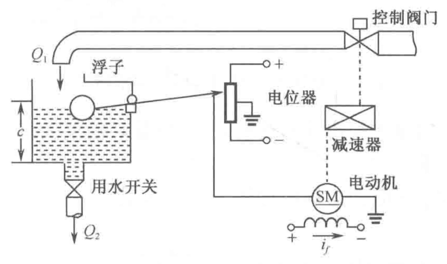

> Image description: This engineering schematic illustrates a liquid level automatic control system. The process involves a tank where the liquid level, denoted by variable $c$, is monitored by a float (浮子). This float is mechanically linked to a potentiometer (电位器), which converts the height of the liquid into an electrical signal. The output of the potentiometer is connected to an electric motor (电动机, SM) with a field current $i_f$. The motor drives a speed reducer (减速器), which in turn operates a control valve (控制阀门) via a dashed mechanical link. This valve regulates the inflow rate $Q_1$ into the tank to balance the outflow rate $Q_2$ through a water-use switch (用水开关). The system forms a closed-loop feedback mechanism: changes in level $c$ adjust the potentiometer, which modifies the motor's action on the control valve, thereby adjusting $Q_1$ to maintain the desired liquid height.
图1－21 液位自动控制系统原理图

解 本题研究液位自动控制系统工作原理，并绘制相应的系统方块图。
当电位器电刷位于中点位置时，电动机不动，控制阀门有一定的开度，使水箱中流人水量与流出水量相等，从而液面保持在希望高度 $c$ 上。一旦流人水量或流出水量发生变化，水箱液面高度 $c$ 便相应变化。例如，当液面升高时，浮子位置亦相应升高，杜杆作用使电位器电刷从中点位置下移，从而给电动机提供一定的控制电压，驱动电动机通过减速器减小阀门开度，使进入水箱的流量减少。此时，水箱液面下降，浮子位置相应下降，直到电位器电刷回到中点位置，系统重新处于平衡状态，液面恢复给定高度。反之，若水箱液位下降，则系统会自动增大阀门开度，加大流人水量，使液位升到给定高度 $c$ 。

液位自动控制系统原理方块图如图 1－1－1 所示。

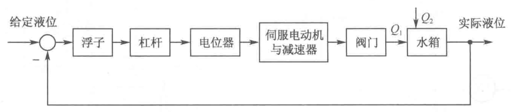

> Image description: This figure is a block diagram of an automatic liquid level control system. The process begins with the input "给定液位" (set liquid level), which enters a summing junction. This signal flows through a series of functional blocks: "浮子" (float), "杠杆" (lever), "电位器" (potentiometer), and "伺服电动机与减速器" (servo motor and reducer). The output from the servo system controls a "阀门" (valve), which regulates the inflow $Q_1$ into a "水箱" (water tank) that also has an outflow $Q_2$. The final output is the "实际液位" (actual liquid level). A feedback loop connects this actual liquid level back to the summing junction, where it is subtracted from the set liquid level. This closed-loop configuration indicates a negative feedback system designed to maintain the water tank's level at a specific target value by adjusting the valve position based on the error signal.
图1－1－1 液位自动控制系统方块图

1－2 图 1－22 是仓库大门自动开闭控制系统原理图。试说明系统自动控制大门开闭的工作原理并画出系统方块图。

解 本题研究位置控制系统工作原理以及相应系统方块图的绘制。
当合上开门开关时，电位器桥式测量电路产生一个偏差电压信号。此偏差电压经放大器放大后，驱动伺服电动机带动绞盘转动，使大门向上提起。与此同时，与大门连在一起的电位器电刷上移，使桥式测量电路重新达到平衡，电动机停止转动，开门开关自动断开。反

<!-- source_pdf_page: 7 -->
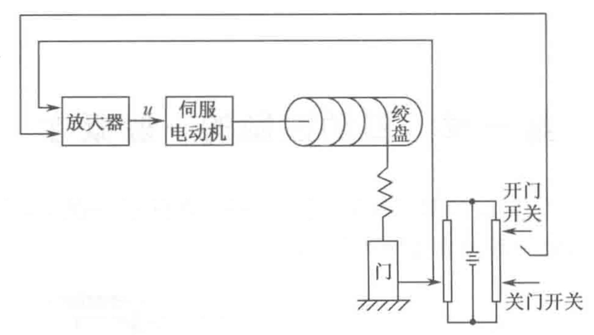

> Image description: This figure is a schematic diagram of an automatic opening and closing control system for warehouse doors (图 1－22 仓库大门自动开闭控制系统原理图). The system consists of several interconnected blocks. On the right, there are two input switches: "开门开关" (Open Door Switch) and "关门开关" (Close Door Switch), connected to a power source. The control loop begins with these switches, which send signals back to an "放大器" (Amplifier). The amplifier outputs a voltage variable $u$ to a "伺服电动机" (Servo Motor). This motor is mechanically coupled to a "绞盘" (Winch), which uses a spring-like mechanism to actuate the "门" (Door) anchored to the ground. A feedback line connects the door's position back to the amplifier, creating a closed-loop control system designed to maintain the door in a specific state based on the switch inputs.
图 1－22 仓库大门自动开闭控制系统原理图

之，当合上关门开关时，伺服电动机反向转动，带动绞盘转动使大门关闭，从而实现了远距离自动控制大门开启的要求。

仓库大门自动控制系统原理方块图如图 1－2－1 所示。

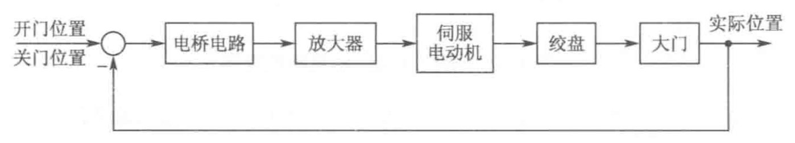

> Image description: This image is a functional block diagram of an automatic control system for warehouse doors (Figure 1-2-1). The process begins with input variables on the left, labeled "开门位置" (Open door position) and "关门位置" (Close door position), which enter a summing junction. The forward path consists of four sequential blocks connected by arrows: "电桥电路" (Bridge circuit), "放大器" (Amplifier), "伺服电动机" (Servo motor), and "绞盘" (Winch). The output of the winch leads to the final block, "大门" (Main door). The system's output is labeled as "实际位置" (Actual position). A feedback loop connects the actual position back to the initial summing junction via a long return arrow. This structure represents a closed-loop control system designed to regulate the physical position of the warehouse door based on the desired input setpoints.
图 1－2－1 仓库大门自动开闭控制系统方块图

1－3 图1－23（a）和（b）均为自动调压系统。设空载时，图（a）无差系统和图（b）有差系统的发电机端电压均为 110 V 。试问带上负载后，图（a）和图（b）中哪个系统能保持 110 V 电压不变？哪个系统的电压会稍低于 110 V ？为什么？

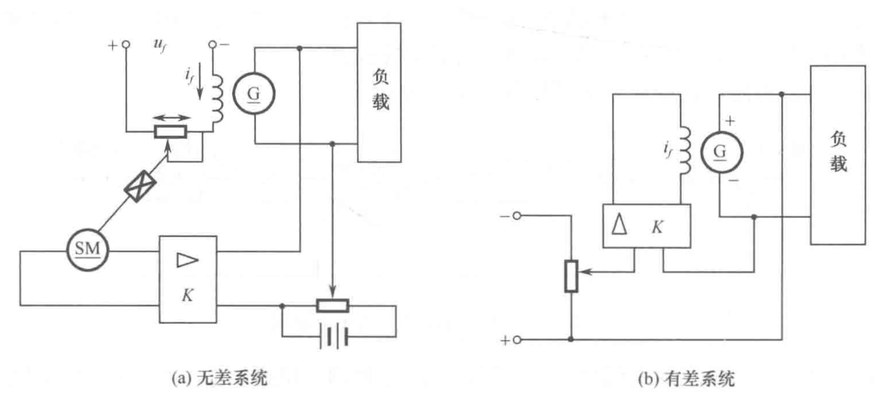

> Image description: The image contains two circuit diagrams, labeled (a) and (b), representing automatic voltage regulator systems. Both figures feature a generator (G) connected to a load (负载). In Figure (a), titled "无差系统" (error-free system), the generator's output is sampled via a voltage divider with a capacitor. This signal enters a controller block $K$, which drives a servo motor (SM). The SM mechanically adjusts a potentiometer to control the field current $i_f$ and field voltage $u_f$. In Figure (b), titled "有差系统" (system with error), the generator's output is sampled through a resistor. This signal enters a controller block $\Delta K$, which directly regulates the field current $i_f$ without a servo motor mechanism. The accompanying caption identifies these as automatic voltage regulation systems and asks to compare their ability to maintain a 110 V terminal voltage under load, specifically questioning which system maintains the exact voltage and which drops slightly below it.
图 1－23 自动调压系统原理图

解 本题通过自动调压系统工作原理的分析，使学生学会区分有差系统和无差系统。
系统带上负载以后，图 1－23（a）和（b）两个系统的端电压均会下降。但是图 1－23（a）中的系统由于自身调压作用能够恢复到 110 V ，而图 $1-23(\mathrm{~b})$ 中的系统不能够恢复到 110 V ，其

<!-- source_pdf_page: 8 -->
端电压将稍低于 110 V 。
对于图1－23（a）电的自动调压系统，当发电机两端电压低于给定电压时，其偏差电压经放大器放大使伺服电机 SM 转动，经减速器带动电刷，使发电机的激磁电流增大，提高发电机 $G$ 的端电压，从而使偏差电压减小，直到偏差电压为零，致使伺服电机停止转动。因此，图1－23（a）中的自动调压系统能保持端电压 110 V 不变。

对予图1－23（b）中的自动调压系统，当发电机两端电压低于给定电压时，其偏差电压直接经放大器使发电机的激磁电流增大，提高发电机的端电压，即发电机 $G$ 的端电压回升，此时偏差电压减小，但偏差电压始终不能为零，因为当偏差电压为零时，激磁电流也为零，发电机不能工作。因此，图 1－23（b）中的自动调压系统端电压会低于 110 V 。

1－4 图 1－24 为水温控制系统原理示意图。冷水在热交换器中由通入的蒸汽加热，从而得到一定温度的热水。冷水流量变化用流量计测量。试绘制系统方块图，并说明为了保持热水温度为期望值，系统

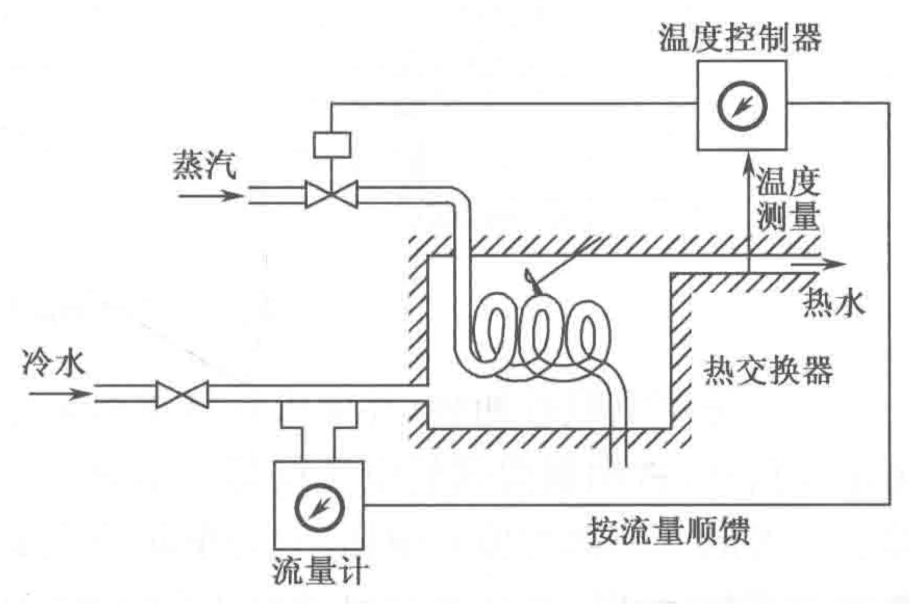

> Image description: This engineering schematic illustrates a water temperature control system. The process involves cold water (冷水) entering a heat exchanger (热交换器), where it is heated by steam (蒸汽) to produce hot water (热水). The diagram shows several key components and feedback loops: 1. **Inputs**: Cold water and steam enter the system from the left via control valves. 2. **Measurement**: A flow meter (流量计) measures the cold water flow rate, sending a signal labeled "flow feedback" (按流量顺馈) to the controller. Simultaneously, a temperature sensor measures the output hot water temperature (温度测量量). 3. **Control**: These signals are sent to a temperature controller (温度控制器), which adjusts the steam valve to regulate heat input. The system represents a feedforward-feedback control architecture designed to maintain a constant hot water temperature despite variations in the cold water flow rate.
图 1－24 水温控制系统原理图

是如何工作的？系统的被控对象和控制装置各是什么？

解 本题通过温度控制系统工作原理的分析，使学生掌握系统方块图的绘制方法，并正确区分被控对象和控制器。

水温控制系统的方块图如图 1－4－1 所示。

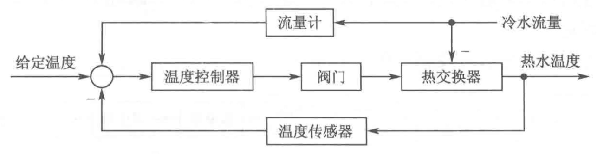

> Image description: This image is a block diagram of a water temperature control system (Figure 1-4-1). The process begins with an input variable, "给定温度" (setpoint temperature), which enters a summing junction. This junction compares the setpoint with feedback from a "温度传感器" (temperature sensor) that monitors the output, "热水温度" (hot water temperature). The resulting error signal is sent to a "温度控制器" (temperature controller), which outputs a signal to a "阀门" (valve). The valve regulates flow into a "热交换器" (heat exchanger). A secondary feedback loop involves "冷水流量" (cold water flow rate), which is measured by a "流量计" (flow meter) and fed back into the system. Arrows indicate the unidirectional flow of signals and materials through these components, illustrating a closed-loop engineering control system designed to maintain a specific output temperature by adjusting valve positioning based on sensor data.
图1－4－1 水温控制系统方块图

水温控制系统是复合控制系统，它的控制方式是把按偏差的闭环控制与按扰动补偿的顺馈控制结合起来。

采用温度负反馈，由温度控制器对热水温度进行自动控制。若热水温度过高，控制器使阀门关小，减小蒸汽量，热水温度回到给定值。冷水流量是主要扰动量，用流量计测量扰动信号，将其送到控制器输人端，进行扰动顺馈补偿。当冷水流量减少时，补偿量减小，通过温度控制器使阀门关小，蒸汽量减少，以保持热水温度恒定。

系统的被控对象是热交换器，被控量是热水温度，控制装置是温度控制器。
1－5 图 1－25 是电炉温度控制系统原理示意图。试分析系统保持电炉温度恒定的工作过程，指出系统的被控对象、被控量以及各部件的作用，最后画出系统方块图。

解 本题以炉温控制系统为例，要求通过工作原理分析，绘制系统方块图，并明确系统组成。

<!-- source_pdf_page: 9 -->
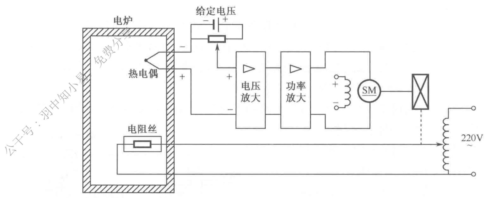

> Image description: Figure 1-25 is a schematic diagram of an electric furnace temperature control system. The system consists of an electric furnace (电炉) containing a thermocouple (热电偶) and a heating element/resistance wire (电阻丝). The feedback loop begins with the thermocouple, which sends a signal to a voltage amplifier (电压放大), followed by a power amplifier (功率放大). This amplified signal drives a servo motor (SM) via an electromagnetic actuator. The motor is mechanically linked to a variable resistor (potentiometer) that adjusts the current flowing from a fixed voltage source (给定电压) into the amplification stage, creating a closed-loop control mechanism. The heating element is powered by a 220V AC supply through a transformer and a power controller regulated by the servo motor's position. The diagram illustrates an analog electronic control system designed to maintain a specific temperature within the furnace.
图 1－25 电炉温度控制系统原理图

电炉使用电阻丝加热，并要求保持炉温恒定。图中采用热电偶来测量炉温并将其转换为电压信号，将测量得到的电压信号反馈到输人端，与给定电压信号反极性连接，实现负反馈。二者的差值称为偏差电压，它经电压放大和功率放大后驱动直流伺服电动机。电动机经减速器带动调压变压器的可动触头，改变电阻丝的供电电压，从而调节炉温。

当炉温偏低时，测量电压 $u$ 小于给定电压 $u_{0}$ ，二者比较的偏差电压为 $\Delta u=u_{0}-u_{\text {。 }}$ 由于 $\Delta u$ 为正，电动机＂正＂转，使调压器的可动触头上移，电阻丝的供电电压增加，电流加大，炉温上升，直至炉温升至给定值为止。此时，$u=u_{0}, \Delta u=0$ ，电动机停止转动，炉温保持恒定。

当炉温偏高时，$\Delta u$ 为负，经放大后使电动机＂反＂转，调压器的可动触头下移，使供电电压减小，直至炉温等于给定值为止。

系统的被控对象是电炉，被控量是电炉炉温，伺服电动机、减速器、调压器是执行机构，热电偶是检测元件。

电炉温度控制系统的方块图如图 1－5－1 所示。

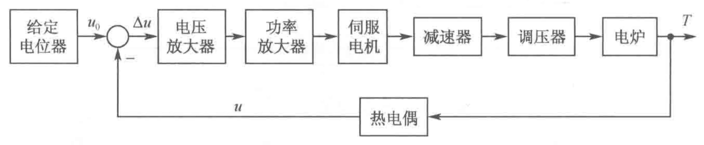

> Image description: This image shows a block diagram of an electric furnace temperature control system (Figure 1-5-1). The process begins with a "给定电位器" (set potentiometer) providing a reference voltage $u_0$. This signal enters a summing junction where it is compared with a feedback voltage $u$ from the "热电偶" (thermocouple), resulting in an error signal $\Delta u$. The forward path consists of several sequential blocks connected by arrows: a "电压放大器" (voltage amplifier), a "功率放大器" (power amplifier), a "伺服电机" (servo motor), a "减速器" (reducer), and a "调压器" (voltage regulator). These components drive the final plant, the "电炉" (electric furnace), which outputs the controlled temperature $T$. A feedback loop connects the output $T$ back to the thermocouple, completing the closed-loop control system designed to maintain the furnace temperature based on the input setpoint.
图1－5－1 电炉温度控制系统方块图

1－6 图 1－26 是自整角机随动系统原理示意图。系统的功能是使接受自整角机 TR 的转子角位移 $\theta_{o}$ 与发送自整角机 TX 的转子角位移 $\theta_{i}$ 始终保持一致。试说明系统是如何工作的，并指出被控对象、被控量以及控制装置各部件的作用并画出系统方块图。

解 本题以角度随动系统为例，要求分析系统工作原理，绘出系统方块图，并明确系统组成。

发送自整角机的转子与给定轴（主动轴）相连；接收自整角机的转子与负载轴（从动轴）相连。TX与 TR组成角差测量电路。若发送自整角机的转子离开平衡位置转过一个角度 $\theta_{i}$ ，则在接收自整角机转子的单相绕组上将感应出一个偏差电压 $u_{e}$ ，它是一个振幅为 $u_{e m}$ 、频率与发送自整角机激磁频率相同的交流调幅电压，即

<!-- source_pdf_page: 10 -->
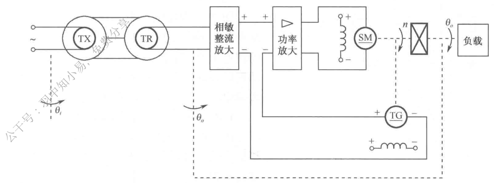

> Image description: This technical diagram illustrates the schematic of a self-correcting angle machine following system (自整角机随动系统). The system begins with an input angle $\theta_i$ driving a transmitter (TX) and receiver (TR) pair. The output from TR enters a "phase-sensitive rectification amplifier" (相敏整流放大), which compares the input signal with feedback from a tachogenerator (TG). The resulting error signal is processed by a "power amplifier" (功率放大), which drives a servo motor (SM) via an inductor/capacitor circuit. The SM provides mechanical output $n$ through a gear mechanism to drive the load (负载), resulting in the output angle $\theta_o$. A feedback loop connects the output shaft back to the TG, creating a closed-loop control system designed to ensure that the output angle $\theta_o$ accurately follows the input angle $\theta_i$. The diagram uses dashed lines and arrows to indicate mechanical coupling and signal flow.
图 1－26 自整角机随动系统原理图

$$
u_{e}=u_{e n} \sin \omega t
$$

在一定范围内，$u_{e m}$ 正比于 $\theta_{i}-\theta_{o}$ ，即 $u_{e m}=k_{e}\left(\theta_{i}-\theta_{o}\right)$ ，其中 $k_{e}$ 为自整角机传递系数，所以可得

$$
u_{e}=k_{e}\left(\theta_{i}-\theta_{o}\right) \sin \omega t
$$

上式为随动系统中接收自整角机所产生的偏差电压的表达式，它是一个振幅随角偏差 $\left(\theta_{i}-\theta_{o}\right)$ 的改变而变化的交流电压。因此，$u_{e}$ 先经过相敏整流放大器变为直流电压，再经过功率放大器放大，放大后的直流信号作用在伺服电动机电枢两端。电动机通过减速器带动负载和接收自整角机的转子，使其跟随发送自整角机的转子旋转，实现 $\theta_{o}=\theta_{i}$ ，以达到跟随的目的。为了使电动机转速恒定、平稳，引入了测速负反馈。

系统的被控对象是负载轴，被控量是负载轴转角 $\theta_{o}$ ，电动机和减速器是执行机构，相敏整流放大器与功率放大器起着放大信号的作用，测速发电机是检测反馈元件，用以改善系统性能。

自整角机随动系统的方块图如图 1－6－1 所示。

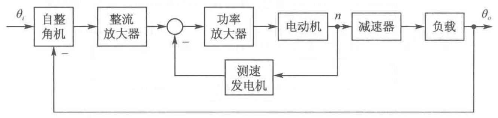

> Image description: This figure is a block diagram of a synchro-following system (自整角机随动系统). The signal flow begins with an input variable $\theta_i$ entering the "Synchro" (自整角机) block. The output passes through a "Current Amplifier" (整流放大器) to a summing junction, where it is compared with a feedback signal from a "Speed Generator" (测速发电机). The resulting error signal enters a "Power Amplifier" (功率放大器), which drives an "Electric Motor" (电动机). The motor's output speed $n$ is sent both to the Speed Generator for inner-loop velocity feedback and forward through a "Reducer" (减速器) to drive the "Load" (负载). Finally, the system output $\theta_o$ is fed back into the Synchro block, completing an outer position loop. The diagram illustrates a closed-loop control system designed to make the load angle track the input angle.
图 1－6－1 自整角机随动系统方块图

1－7 在按扰动控制的开环控制系统中，为什么说一种补偿装置只能补偿一种与之相应的扰动因素？对于图1－6按扰动控制的速度控制系统，当电动机的激磁电压变化时，转速如何变化？该补偿装置能否补偿这个转速的变化？

解 本题研究按扰动控制的开环控制系统的工作原理。
按扰动控制的开环控制系统，是利用可测量的扰动量产生一种补偿作用，以减小或抵消扰动对输出量的影响。显然，这种控制方式是直接从扰动取得信息，并以此改变被控量，所以它只适用于扰动是可测量的场合，而且一个补偿装置只能补偿一种扰动因素，对其余扰动

<!-- source_pdf_page: 11 -->
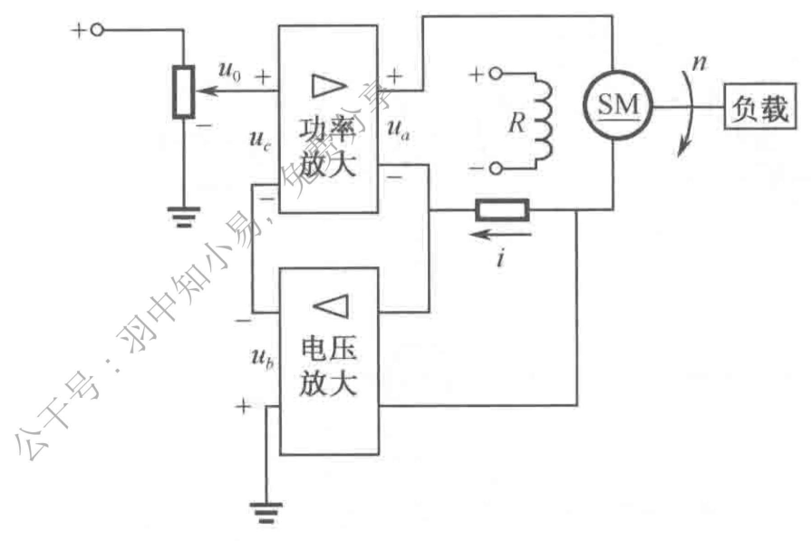

> Image description: A schematic diagram of a speed control system based on disturbance control is shown in Figure 1-6. The circuit consists of two primary amplifier blocks: a "power amplifier" (功率放大) and a "voltage amplifier" (电压放大). An input voltage $u_0$ enters the power amplifier, which outputs $u_a$ to a motor system consisting of a resistor $R$, an inductor, and a synchronous motor (SM). The output current $i$ is monitored via a sensor and fed back into the voltage amplifier. The voltage amplifier then provides a feedback signal $u_c$ to the power amplifier. The SM is connected to a load (负载), with its rotational speed denoted by $n$. Arrows indicate the direction of signal flow and the rotation of the motor shaft. This configuration represents a closed-loop control system designed to regulate motor speed by compensating for disturbances through current feedback.
图1－6 按扰动控制的速度控制系统原理图

均不起补偿作用。
图 1－6 为按电枢电流进行补偿的速度控制系统。当电动机的激磁电压增大时，电动机的转速上升；当电动机的激磁电压减小时，电动机的转速下降。这种补偿装置不能补偿由激磁电压变化引起的转速变化。

1－8 图 1－27 为谷物湿度控制系统原理示意图。在谷物磨粉的生产过程中，有一种出粉最多的湿度，因此磨粉之前要给谷物加水以得到给定的湿度。图中，谷物用传送装置按一定流量通过加水点，加水量由自动阀门控制。

加水过程中，谷物流量、加水前谷物湿度以及水压都是对谷物湿度控制的扰动作用。为了提高控制精度，系统中采用了谷物湿度的顺馈控制，试画出系统方块图。

解 本题要求掌握自动控制系统方块图的绘制方法。

该谷物湿度控制系统是一个按扰动补偿的复合控制系统，如图1－27所示。被控对象是传送装置，被控量是输出谷物的湿度，输入量是希望的谷物湿度。谷物湿度控制系统的方块图如图 1－8－1 所示。

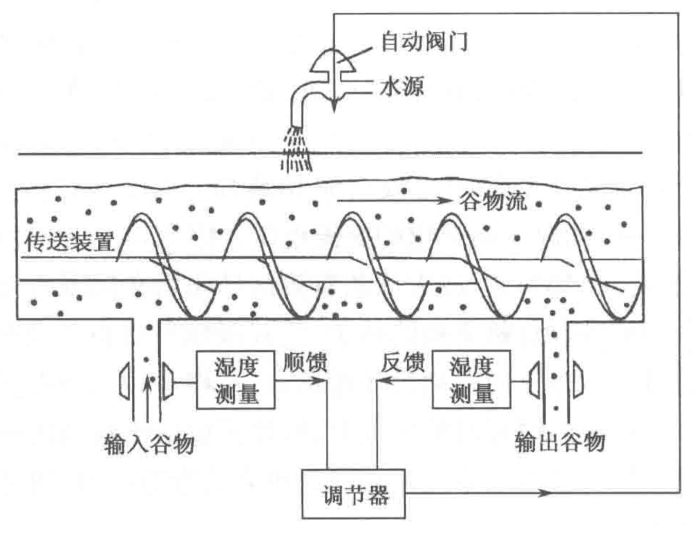

> Image description: This engineering diagram illustrates a grain moisture control system. The central component is a "conveying device" (传送装置) containing an auger that moves a "grain flow" (谷物流) from the "input grain" (输入谷物) to the "output grain" (输出谷物). The system employs two sensors for "moisture measurement" (湿度测量), one at the input and one at the output. The input sensor provides a "feedforward" (顺馈) signal, while the output sensor provides a "feedback" (反馈) signal; both signals are sent to a "controller" (调节器). Based on these inputs, the controller manages an "automatic valve" (自动阀门) connected to a "water source" (水源), which sprays water onto the grain flow to adjust moisture levels. The diagram depicts a closed-loop control architecture designed for disturbance compensation, where input moisture fluctuations are preemptively addressed via feedforward and final output is corrected via feedback.
图1－27 谷物湿度控制系统原理图

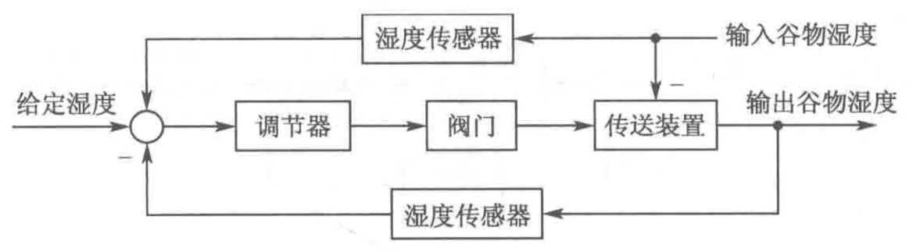

> Image description: This figure is a schematic diagram of a grain moisture control system (图1－27 谷物湿度控制系统原理图). The process begins with a setpoint for moisture (给定湿度) entering a summing junction. This input is compared against feedback from two humidity sensors (湿度传感器). The system follows a forward path: the error signal flows into a regulator (调节器), which controls a valve (阀门), which in turn manages a conveying device (传送装置). The output of this process is the output grain moisture (输出谷物湿度). Two feedback loops are visible. One loop monitors the output grain moisture, while another monitors the input grain moisture (输入谷物湿度) before it enters the conveying device. Both sensors feed back to the initial summing junction via arrows marked with negative signs, indicating a closed-loop negative feedback control system designed to maintain grain moisture at the specified setpoint.
图 1－8－1 谷物湿度控制系统方块图

1－9 图 1－28 为数字计算机控制的机床刀具进给系统。要求将工件的加工任务编制成程序预先存人数字计算机。加工时，步进电动机按照计算机给出的信息动作，完成加工任务。试说明该系统的工作原理。

解 本题研究按给定量控制的开环控制系统的工作原理。
数字计算机控制的机床刀具进给系统是一开环控制系统，被控对象是刀具，被控量是刀具位置，给定量是程序设定的刀具位置。该系统的工作原理是，先由计算机将预先编好的加工过程控制程序转换为控制 $X 、 Y 、 Z$ 三个方向运动的电脉冲信号，然后经过脉冲分配与功率放大，将放大后的信号输入到步进电动机，由步进电动机来控制刀具与工件的相对运动位

<!-- source_pdf_page: 12 -->
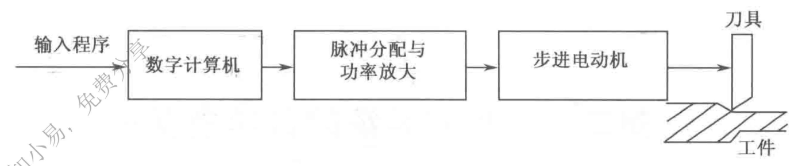

> Image description: A technical block diagram titled "图 1－28 机床刀具进给系统方块图" (Figure 1-28 Block Diagram of Machine Tool Cutting Tool Feed System) illustrates a linear control sequence. The process begins with an input labeled "输入程序" (Input Program), which flows via a rightward arrow into the first block: "数字计算机" (Digital Computer). From there, another arrow leads to a second block labeled "脉冲分配与功率放大" (Pulse Distribution and Power Amplification). A subsequent arrow connects this stage to a third block titled "步进电动机" (Stepper Motor). The final output arrow points toward a vertical representation of a "刀具" (Cutting Tool) interacting with a hatched surface labeled "工件" (Workpiece). Engineering-wise, the diagram depicts an open-loop control system where digital instructions are processed by a computer, converted into power signals for a stepper motor, which then drives the physical movement of a tool against a workpiece.
图 1－28 机床刀具进给系统方块图

置，保证刀尖的运动轨迹符合工件的轮廓形状，这样就可加工出所要求的零件。
1－10 下列各式是描述系统的微分方程，其中 $c(t)$ 为输出量，$r(t)$ 为输入量，试判断哪些是线性定常或时变系统，哪些是非线性系统。
（1）$c(t)=5+r^{2}(t)+t \frac{\mathrm{~d}^{2} r(t)}{\mathrm{d} t^{2}}$ ；
（2）$\frac{\mathrm{d}^{3} c(t)}{\mathrm{d} t^{3}}+3 \frac{\mathrm{~d}^{2} c(t)}{\mathrm{d} t^{2}}+6 \frac{\mathrm{~d} c(t)}{\mathrm{d} t}+8 c(t)=r(t)$ ；
（3）$t \frac{\mathrm{~d} c(t)}{\mathrm{d} t}+c(t)=r(t)+3 \frac{\mathrm{~d} r(t)}{\mathrm{d} t}$ ；
（4）$c(t)=r(t) \cos \omega t+5$ ；
（5）$c(t)=3 r(t)+6 \frac{\mathrm{~d} r(t)}{\mathrm{d} t}+5 \int_{-\infty}^{t} r(\tau) \mathrm{d} \tau$ ；
（6）$c(t)=r^{2}(t)$ ；
（7）$c(t)= \begin{cases}0, & t<6, \\ r(t), & t \geqslant 6 。\end{cases}$
解 本题研究自动控制系统的分类。
可用线性微分方程或差分方程描述的系统，称为线性系统。如果微分方程或差分方程的系数全为常数，则称为线性定常系统；否则称为线性时变系统。

用非线性方程描述的系统称为非线性系统。非线性方程的特点是系数与变量有关，或者方程中含有变量及其导数的高次幂或乘积项。

基于以上定义，可得：
（1）非线性时变系统；
（2）线性定常系统；
（3）线性时变系统；
（4）非线性时变系统；
（5）线性定常系统（将方程两边同时求导）；
（6）非线性定常系统；
（7）线性延迟系统。

