<!-- source_pdf_page: 13 -->
## 第二章 控制系统的数学模型

2－1 在图 1－21 的液位自动控制系统中，设容器横截面积为 $F$ ，希望液位为 $c_{0}$ 。若液体高度变化率与液体流量差 $Q_{1}-Q_{2}$ 成正比，试列写以液位为输出量的微分方程式。

解 本题研究建立液位控制系统的微分方程数学模型。
当 $Q_{1}=Q_{2}$ 时，液位的高度为 $c_{0}$ ；当 $Q_{1} \neq Q_{2}$ 时，液位的高度 $c$ 将发生变化。
由于液体高度变化率与液体流量差 $Q_{1}-Q_{2}$ 成正比，所以有

$$
F \frac{\mathrm{~d} c}{\mathrm{~d} t}=Q_{1}-Q_{2}
$$

则以液位为输出量的微分方程式为

$$
\frac{\mathrm{d} c}{\mathrm{~d} t}=\frac{1}{F}\left(Q_{1}-Q_{2}\right)
$$

2－2 设机械系统如图 2－48 所示，其中 $x_{i}$ 是输人位移，$x_{o}$ 是输出位移。试分别写出各系统的微分方程。

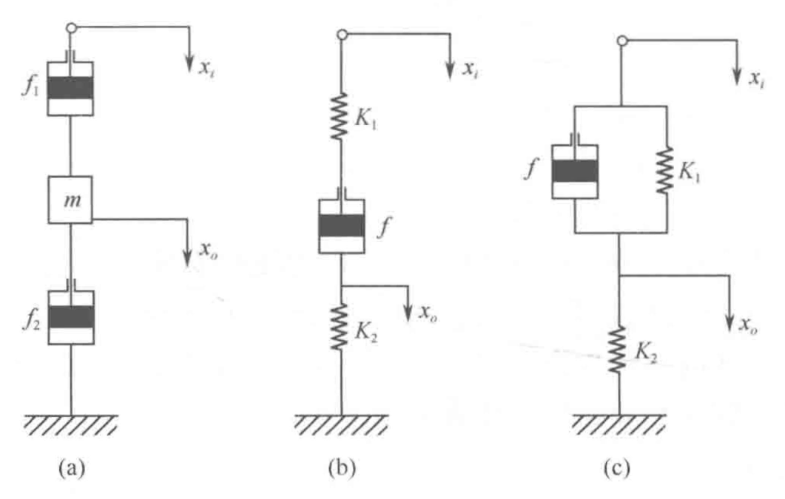

> Image description: This image contains three mechanical system diagrams labeled (a), (b), and (c). Each diagram depicts a vertical arrangement connected to a fixed ground base at the bottom. In all three figures, an input displacement $x_i$ is indicated by a downward arrow at the top, and an output displacement $x_o$ is indicated by a downward arrow at a middle junction point. - **Figure (a)** shows two dampers, labeled $f_1$ and $f_2$, separated by a mass block $m$. The input $x_i$ acts on $f_1$, while the output $x_o$ is measured at mass $m$. - **Figure (b)** features a series arrangement consisting of a spring $K_1$, a damper $f$, and another spring $K_2$. The output $x_o$ is located between damper $f$ and spring $K_2$. - **Figure (c)** shows a parallel combination of a damper $f$ and a spring $K_1$ at the top, which then connects in series to a spring $K_2$ at the bottom. The output $x_o$ is measured between the parallel section and spring $K_2$.
图 2－48 机械系统原理图

解 本题研究建立机械系统的微分方程数学模型。
（1）对于图 2－48（a）所示系统，根据力平衡方程，在不计重力时，可得

$$
f_{1}\left(\dot{x}_{i}-\dot{x}_{o}\right)-f_{2} \dot{x}_{o}=m \ddot{x}_{o}
$$

则系统的微分方程式为

$$
m \frac{\mathrm{~d}^{2} x_{o}}{\mathrm{~d} t^{2}}+\left(f_{1}+f_{2}\right) \frac{\mathrm{d} x_{o}}{\mathrm{~d} t}=f_{1} \frac{\mathrm{~d} x_{i}}{\mathrm{~d} t}
$$

（2）对于图 2－48（b）所示系统，在上部分弹簧与阻尼器之间取辅助点 $A$ ，并设 $A$ 点位移为 $x$ ，方向向下。根据力平衡方程，在不计重力时，可得方程

$$
\begin{aligned}
K_{1}\left(x_{i}-x\right) & =f\left(\dot{x}-\dot{x}_{o}\right) \\
K_{2} x_{o} & =f\left(\dot{x}-\dot{x}_{o}\right)
\end{aligned}
$$

消去中间变量 $x$ ，由于

<!-- source_pdf_page: 14 -->
$$
K_{2} x_{o}=K_{1}\left(x_{i}-x\right), \quad x=x_{i}-\frac{K_{2}}{K_{1}} x_{o}, \quad \dot{x}=\dot{x}_{i}-\frac{K_{2}}{K_{1}} \dot{x}_{o}
$$

故有

$$
K \uparrow K_{2} x_{o}=K_{1} f \dot{x}-K_{1} f \dot{x}_{o}=f K_{1} \dot{x}_{i}-f K_{1} \dot{x}_{o}-f K_{2} \dot{x}_{o}
$$

则系统的微分方程式为

$$
f\left(K_{1}+K_{2}\right) \frac{\mathrm{d} x_{o}}{\mathrm{~d} t}+K_{1} K_{2} x_{o}=K_{1} f \frac{\mathrm{~d} x_{i}}{\mathrm{~d} t}
$$

（3）对于图 2－48（c）所示系统，根据力平衡方程，在不计重力时，可得

$$
K_{1}\left(x_{i}-x_{o}\right)+f\left(\dot{x}_{i}-\dot{x}_{o}\right)=K_{2} x_{o}
$$

则系统的微分方程式为

$$
f \frac{\mathrm{~d} x_{o}}{\mathrm{~d} t}+\left(K_{1}+K_{2}\right) x_{o}=f \frac{\mathrm{~d} x_{i}}{\mathrm{~d} t}+K_{1} x_{i}
$$

2－3 试证明图 2－49（a）的电网络与图 2－49（b）的机械系统有相同的数学模型。

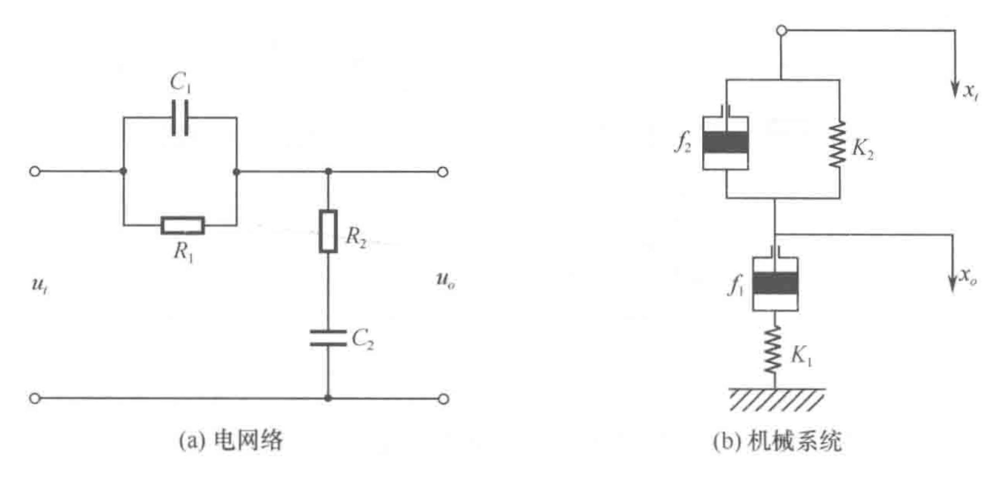

> Image description: This image contains two side-by-side engineering diagrams labeled (a) and (b), illustrating an analogy between electrical and mechanical systems. Figure (a), titled "电网络" (Electrical Network), shows a circuit with an input voltage $u_i$ and output voltage $u_o$. It consists of a parallel combination of a capacitor $C_1$ and a resistor $R_1$, which is connected in series to another parallel branch containing a resistor $R_2$ and a capacitor $C_2$. Figure (b), titled "机械系统" (Mechanical System), depicts a mass-spring-damper system. It features an input displacement $x_i$ acting on a parallel combination of a damper $f_2$ and a spring $K_2$. This assembly is connected in series to another branch consisting of a damper $f_1$ and a spring $K_1$, which is anchored to a fixed ground. The output displacement is labeled as $x_o$. The caption asks to prove that these two systems share the same mathematical model.
图 2－49 电网络与机械系统原理图

解 本题研究用拉氏变换法建立系统的传递函数数学模型。
（1）对于图 2－49（a），根据复数阻抗的方法可得电网络的传递函数为

$$
\begin{aligned}
G_{u}(s) & =\frac{U_{o}(s)}{U_{i}(s)}=\frac{R_{2}+\frac{1}{C_{2} s}}{\frac{R_{1} \cdot \frac{1}{C_{1} s}}{\frac{R_{1}+\frac{1}{C_{1} s}}{}+\left(R_{2}+\frac{1}{C_{2} s}\right)}} \\
& =\frac{R_{1} R_{2} C_{1} C_{2} s^{2}+\left(R_{1} C_{1}+R_{2} C_{2}\right) s+1}{R_{1} R_{2} C_{1} C_{2} s^{2}+\left(R_{1} C_{1}+R_{2} C_{2}+R_{1} C_{2}\right) s+1}
\end{aligned}
$$

（2）对于图 2－49（b），在弹簧 $K_{1}$ 和阻尼器 $f_{1}$ 之间引人辅助点，设其位移为 $x$ ，方向向下。根据力平衡方程，在不计重力时，可得

$$
K_{2}\left(x_{i}-x_{o}\right)+f_{2}\left(\dot{x}_{i}-\dot{x}_{o}\right)=f_{1}\left(\dot{x}_{o}-\dot{x}\right), \quad K_{1} x=f_{1}\left(\dot{x}_{o}-\dot{x}\right)
$$

对上述两式进行拉氏变换，考虑初始条件为零，可得

$$
\begin{gathered}
K_{2} X_{i}(s)-K_{2} X_{o}(s)+f_{2} \cdot s X_{i}(s)-f_{2} \cdot s X_{o}(s)=f_{1} \cdot s X_{o}(s)-f_{1} \cdot s X(s) \\
K_{1} X(s)=f_{1} \cdot s X_{o}(s)-f_{1} \cdot s X(s)
\end{gathered}
$$

消去中间变量 $X(s)=\frac{f_{1} s}{K_{1}+f_{1} s} X_{o}(s)$ ，有

<!-- source_pdf_page: 15 -->
$$
\left(K_{2}+f_{2} s\right) X_{i}(s)=\left(K_{2}+f_{2} s+\frac{K_{1} f_{1} s}{K_{1}+f_{1} s}\right) X_{o}(s)
$$

则机械系统的传递函数为

$$
\begin{aligned}
G_{b}(s) & =\frac{X_{o}(s)}{X_{i}(s)}=\frac{f_{1} f_{2} s^{2}+\left(K_{1} f_{2}+K_{2} f_{1}\right) s+K_{1} K_{2}}{f_{1} f_{2} s^{2}+\left(K_{1} f_{2}+K_{2} f_{1}+K_{1} f_{1}\right) s+K_{1} K_{2}} \\
& =\frac{\frac{f_{1} f_{2}}{K_{1} K_{2}} s^{2}+\left(\frac{f_{1}}{K_{1}}+\frac{f_{2}}{K_{2}}\right) s+1}{\frac{f_{1} f_{2}}{K_{1} K_{2}} s^{2}+\left(\frac{f_{1}}{K_{1}}+\frac{f_{2}}{K_{2}}+\frac{f_{1}}{K_{2}}\right) s+1}
\end{aligned}
$$

通过比较 $G_{a}(s) 、 G_{b}(s)$ 可知：两传递函数的类型相同，即图 2－49（a）的电网络与图 2－49（b）的机械系统有相同的数学模型。

2－4 试分别列写图 2－50 中各无源网络的微分方程式。

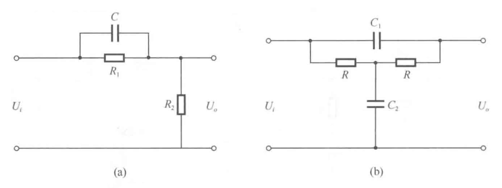

> Image description: The image contains two electrical circuit diagrams labeled (a) and (b). Both circuits represent passive networks with input voltage $U_i$ on the left and output voltage $U_o$ on the right. Circuit (a) consists of a parallel combination of a capacitor $C$ and a resistor $R_1$, which is connected in series with another resistor $R_2$. Resistor $R_2$ connects the output node to the common ground line. Circuit (b) features a more complex bridge-like structure. A capacitor $C_1$ is placed in the top horizontal branch. Below it, two resistors of equal value $R$ are connected in series between the input and output nodes. A second capacitor $C_2$ is connected vertically from the midpoint of these two resistors to the common ground line. The caption indicates that the goal is to write differential equations for each of these passive networks.
图2－50 无源网络电路图

解 本题研究网络数学模型的建立方法。
（1）对于图 2－50（a）所示的无源网络，设通过电阻 $R_{1}$ 的电流为 $i_{1}$（方向自左向右），通过电容 $C$ 的电流为 $i_{2}$（方向自左向右），通过电阻 $R_{2}$ 的电流为 $i$（方向自上向下），根据电压平衡可得

$$
\left\{\begin{array}{l}
R_{1} i_{1}=\frac{1}{C} \int i_{2} \mathrm{~d} t \\
u_{o}=R_{2} i=R_{2}\left(i_{1}+i_{2}\right) \\
u_{i}=R_{1} i_{1}+u_{o}
\end{array}\right.
$$

于是

$$
i_{1}=\frac{u_{i}-u_{o}}{R_{1}}, \quad i_{2}=R_{1} C \frac{\mathrm{~d} i_{1}}{\mathrm{~d} t}=R_{1} C \cdot \frac{1}{R_{1}} \cdot \frac{\mathrm{~d}\left(u_{i}-u_{o}\right)}{\mathrm{d} t}
$$

从而

$$
u_{o}=R_{2} i=R_{2}\left[\frac{u_{i}-u_{o}}{R_{1}}+R_{1} C \cdot \frac{1}{R_{1}} \cdot \frac{\mathrm{~d}\left(u_{i}-u_{o}\right)}{\mathrm{d} t}\right]
$$

整理后可得图2－50（a）所示的无源网络的微分方程为

$$
R_{1} R_{2} C \frac{\mathrm{~d} u_{o}}{\mathrm{~d} t}+\left(R_{1}+R_{2}\right) u_{o}=R_{1} R_{2} C \frac{\mathrm{~d} u_{i}}{\mathrm{~d} t}+R_{2} u_{i}
$$

（2）对于图2－50（b）所示的无源网络，设通过左侧电阻 $R$ 的电流为 $i_{1}$（方向自左向右），通过右侧电阻 $R$ 的电流为 $i_{2}$（方向自右向左），通过电容 $C_{1}$ 的电流为 $i_{2}$（方向自左向右），通过电容 $C_{2}$ 的电流为 $i$（方向自上向下），根据电压平衡可得

<!-- source_pdf_page: 16 -->
于是

从而

$$
\begin{gathered}
\left\{\begin{array}{l}
R i_{1}=R i_{2}+\frac{1}{C_{1}} \int i_{2} \mathrm{~d} t \\
u_{i}=\frac{1}{C_{1}} \int i_{2} \mathrm{~d} t+u_{o} \\
u_{o}=R i_{2}+\frac{1}{C_{2}} \int i \mathrm{~d} t
\end{array}\right. \\
i_{1}=i_{2}+\frac{1}{R C_{1}} \int i_{2} \mathrm{~d} t, \quad i_{2}=C_{1} \frac{\mathrm{~d}\left(u_{i}-u_{o}\right)}{\mathrm{d} t} \\
\frac{\mathrm{~d} u_{o}}{\mathrm{~d} t}=R \frac{\mathrm{~d} i_{2}}{\mathrm{~d} t}+\frac{1}{C_{2}} i
\end{gathered}
$$

又因为 $i=i_{1}+i_{2}$ ，则

即

$$
\begin{aligned}
\frac{\mathrm{d} u_{o}}{\mathrm{~d} t} & =R \frac{\mathrm{~d} i_{2}}{\mathrm{~d} t}+\frac{1}{C_{2}}\left[i_{2}+\frac{1}{R C_{1}} \int i_{2} \mathrm{~d} t+C_{1} \frac{\mathrm{~d}\left(u_{i}-u_{o}\right)}{\mathrm{d} t}\right] \\
\frac{\mathrm{d} u_{o}}{\mathrm{~d} t} & =R C_{1} \frac{\mathrm{~d}^{2}\left(u_{i}-u_{o}\right)}{\mathrm{d} t^{2}}+\frac{1}{C_{2}}\left[\frac{u_{i}-u_{o}}{R}+2 C_{1} \frac{\mathrm{~d}\left(u_{i}-u_{o}\right)}{\mathrm{d} t}\right]
\end{aligned}
$$

整理后可得图2－50（b）所示的无源网络的微分方程

$$
R^{2} C_{1} C_{2} \frac{\mathrm{~d}^{2} u_{o}}{\mathrm{~d} t^{2}}+R\left(2 C_{1}+C_{2}\right) \frac{\mathrm{d} u_{o}}{\mathrm{~d} t}+u_{o}=R^{2} C_{1} C_{2} \frac{\mathrm{~d}^{2} u_{i}}{\mathrm{~d} t^{2}}+2 R C_{1} \frac{\mathrm{~d} u_{i}}{\mathrm{~d} t}+u_{i}
$$

2－5 设初始条件为零，试用拉氏变换法求解下列系统微分方程式，并概略绘制 $x(t)$ 曲线，指出各方程式的模态。
（1） $2 \dot{x}(t)+x(t)=t$ ；
（2）$\ddot{x}(t)+\dot{x}(t)+x(t)=\delta(t)$ ；
（3）$\ddot{x}(t)+2 \dot{x}(t)+x(t)=1(t)$ 。
解 本题考查用拉氏变换法求解线性定常微分方程。
（1） $2 \dot{x}(t)+x(t)=t$ 。由拉氏变换可得

$$
X(s)=\frac{1}{s^{2}(2 s+1)}=\frac{1}{s^{2}}-\frac{2}{s}+\frac{2}{s+0.5}
$$

由拉氏反变换可得

$$
x(t)=t-2+2 \mathrm{e}^{-0.5 t}
$$

由 $x(t)$ 的表达式易得系统的特征根为 $\lambda=-0.5$ ，故该方程的运动模态为 $\mathrm{e}^{-0.5 t}$ 。因此，$x(t)$曲线如图 2－5－1 所示。
（2）$\ddot{x}(t)+\dot{x}(t)+x(t)=\delta(t)$ 。由拉氏变换可得

$$
X(s)=\frac{1}{s^{2}+s+1}=\frac{1}{(s+1 / 2)^{2}+(\sqrt{3} / 2)^{2}}
$$

由拉氏反变换可得

$$
x(t)=\frac{2}{\sqrt{3}} \mathrm{e}^{-0.5 t} \sin \frac{\sqrt{3}}{2} t=1.155 \mathrm{e}^{-0.5 t} \sin (0.866 t)
$$

由 $x(t)$ 的表达式易得系统的特征根为

$$
\begin{equation*}
\lambda_{1,2}=-\frac{1}{2} \pm \mathrm{j} \frac{\sqrt{3}}{2} \tag{- 11 •}
\end{equation*}
$$

<!-- source_pdf_page: 17 -->
故该方程的运动模态为 $\mathrm{e}^{-0.5 t} \sin \frac{\sqrt{3}}{2} t$ 。因此，$x(t)$ 曲线如图 2－5－2 所示。

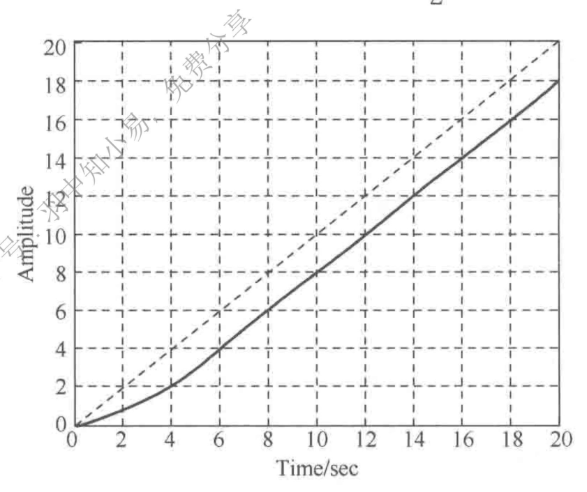

> Image description: A line graph plotted on a Cartesian coordinate system shows the relationship between time and amplitude. The horizontal x-axis is labeled "Time/sec" with numerical markings from 0 to 20 in increments of 2. The vertical y-axis is labeled "Amplitude" with numerical markings from 0 to 20 in increments of 2. The figure contains two distinct curves starting from the origin (0,0). One is a dashed straight line representing a linear relationship, extending diagonally to the point (20, 20). The second is a solid black curve that initially rises more slowly than the dashed line, exhibiting a slight concave-up curvature before transitioning into a nearly linear slope. By the end of the plot at $t=20$, the solid curve reaches an amplitude of approximately 18. The graph illustrates the time-domain response of a system, specifically related to the motion mode described in the caption as $\mathrm{e}^{-0.5 t} \sin \frac{\sqrt{3}}{2} t$.
图2－5－1 系统（1）单位斜坡响应曲线（MATLAB）

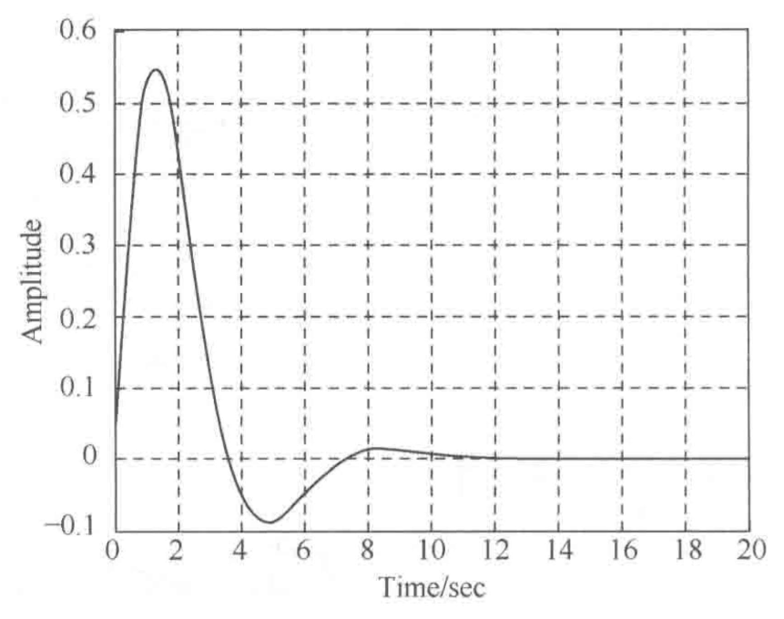

> Image description: The image shows a plot of the unit ramp response curve for "System (1)," generated using MATLAB, as indicated by the caption "图2-5-1 系统（1）单位斜坡响应曲线（MATLAB）." The graph features a Cartesian coordinate system. The horizontal x-axis is labeled "Time/sec" and ranges from 0 to 20 seconds with major tick marks every 2 units. The vertical y-axis is labeled "Amplitude" and ranges from -0.1 to 0.6, with increments of 0.1. A dashed grid overlays the plot area for precise value reading. The plotted curve starts at the origin (0,0), rises sharply to a peak amplitude of approximately 0.54 at around 2 seconds, and then oscillates. It dips to a minimum of about -0.09 near 5 seconds before gradually stabilizing toward an amplitude of zero as time progresses beyond 12 seconds. This represents the transient behavior of the system's response to a ramp input.
图2－5－2 系统（2）单位脉冲响应曲线（MATLAB）

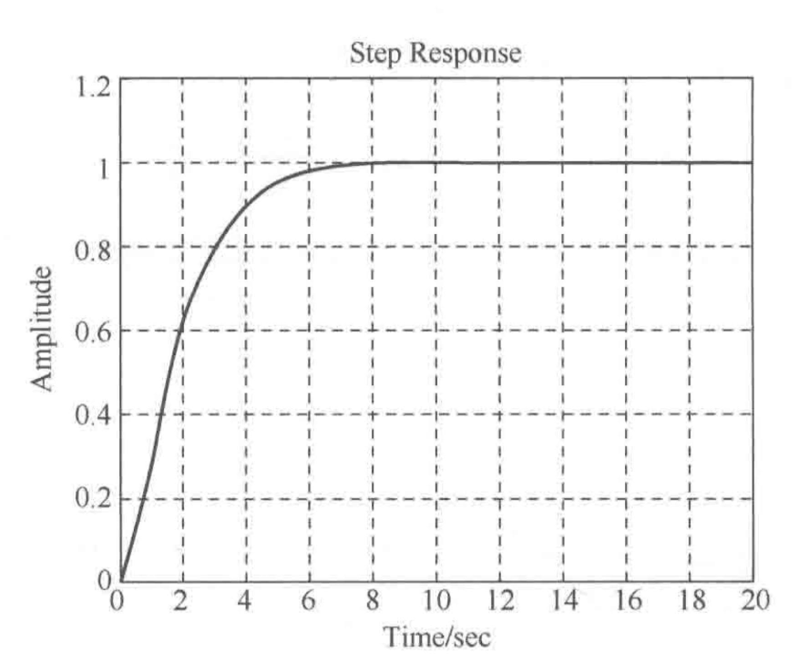

> Image description: This image is a technical plot titled "Step Response," showing the time-domain behavior of a system's output. The horizontal x-axis is labeled "Time/sec" and ranges from 0 to 20 seconds, with major grid markings every 2 seconds. The vertical y-axis is labeled "Amplitude" and ranges from 0 to 1.2, with increments of 0.2. The figure displays a single smooth curve starting at the origin (0,0) and rising asymptotically toward a steady-state value of 1.0. The response is characteristic of a first-order or overdamped second-order system, as it reaches its final value without oscillation or overshoot. The curve begins to flatten significantly around 6 to 8 seconds. According to the Chinese caption "图2－5－2 系统（2）单位脉冲响应曲线（MATLAB）," this is a unit step response curve for System (2) generated using MATLAB software.
图2－5－3 系统（3）单位阶跃响应曲线（MATLAB）

（3）$\ddot{x}(t)+2 \dot{x}(t)+x(t)=1(t)$ 。由拉氏变换可得

$$
\begin{aligned}
X(s) & =\frac{1}{s\left(s^{2}+2 s+1\right)} \\
& =\frac{1}{s}-\frac{1}{(s+1)^{2}}-\frac{1}{s+1}
\end{aligned}
$$

则由拉氏反变换可得

$$
x(t)=1-t \mathrm{e}^{-t}-\mathrm{e}^{-t}
$$

由 $x(t)$ 的表达式易得系统的特征根为

$$
\lambda_{1,2}=-1
$$

故该方程的运动模态为 $t \mathrm{e}^{-t}, \mathrm{e}^{-t}$ 。因此， $x(t)$ 曲线如图 2－5－3 所示。
2－6 在液压系统管道中，设通过阀门的流量 $Q$ 满足流量方程

$$
Q=K \sqrt{P}
$$

式中，$K$ 为比例系数；$P$ 为阀门前后的压差。若流量 $Q$ 与压差 $P$ 在其平衡点 $\left(Q_{0}, P_{0}\right)$附近作微小变化，试导出线性化流量方程。

解 本题考查流量非线性微分方程的线性化，具体做法是，对非线性微分方程在其平衡点附近用泰勒级数展开并取前面的线性项，得到等效的线性化方程。

在平衡点 $\left(Q_{0}, P_{0}\right)$ 处，对流量 $Q$ 泰勒展开并取一次项近似可得

$$
Q \approx Q_{0}+\left.\dot{Q}\right|_{\substack{Q=Q_{0} \\ P=P_{0}}}\left(P-P_{0}\right)=Q_{0}+\frac{K}{2 \sqrt{P_{0}}}\left(P-P_{0}\right)
$$

则线性化流量方程为

$$
\Delta Q=\frac{K}{2 \sqrt{P_{0}}} \Delta P
$$

<!-- source_pdf_page: 18 -->
省去符号＂$\Delta$＂，上式可以简写为

$$
Q=K_{1} P, \quad K_{1}=\frac{K}{2 \sqrt{P_{0}}}
$$

2－7 设弹簧特性由下式描述：

$$
F=12.65 y^{1.1}
$$

其中，$F$ 是弹簧力；$y$ 是变形位移。若弹簧在变形位移 0.25 附近作微小变化，试推导 $\Delta F$ 的线性化方程。

解 本题考查弹簧元件非线性微分方程的线性化，具体做法是对非线性微分方程在其平衡点附近用泰勒级数展开并取前面的线性项，得到等效的线性化方程。

在 $y=0.25$ 处对 $F$ 进行泰勒展开，并取一次项近似可得

$$
F \approx F_{0}+\left.\dot{F}\right|_{y=0.25}(y-0.25)
$$

由上式可知，$\Delta F$ 的线性化方程为

$$
\begin{aligned}
\Delta F & \approx F-2.75=\left.\dot{F}\right|_{y=0.25}(y-0.25) \\
& =12.65 \times 1.1 \times(0.25)^{0.1} \times(y-0.25)=12.11 \Delta y
\end{aligned}
$$

上式亦可简化表示为 $F=12.11 y$ 。
2－8 设晶闸管三相桥式全控整流电路的输人量为控制角 $\alpha$ ，输出量为空载整流电压 $e_{d}$ ，它们之间的关系为

$$
e_{d}=E_{d_{0}} \cos \alpha
$$

式中 $E_{d_{0}}$ 是整流电压的理想空载值，试推导其线性化方程式。
解 本题考查电路非线性微分方程的线性化，具体做法是，对非线性微分方程在其平衡点附近用泰勒级数展开并取前面的线性项，得到等效的线性化方程。

在 $\alpha=\alpha_{0}$ 处对 $e_{d}$ 进行泰勒展开，然后取其一次项近似可得

$$
\left.e_{d} \approx e_{d}\right|_{\alpha=\alpha_{0}}+\left.\dot{e}_{d}\right|_{\alpha=\alpha_{0}}\left(\alpha-\alpha_{0}\right)=\left.e_{d}\right|_{a=\alpha_{0}}-\left[E_{d_{0}} \sin \alpha_{0}\right]\left(\alpha-\alpha_{0}\right)
$$

由上式可得全控整流电路的线性化方程为

$$
\Delta e_{d}=-\left[E_{d_{0}} \sin \alpha_{0}\right] \Delta \alpha
$$

2－9 若系统在阶跃输人 $r(t)=1(t)$ 时，零初始条件下的输出响应 $c(t)=1-\mathrm{e}^{-2 t}+\mathrm{e}^{-t}$ ，试求系统的传递函数和脉冲响应。

解 本题用拉氏变换法研究系统输出响应与传递函数之间的关系。
系统在阶跃输入 $r(t)=1(t)$ ，即 $R(s)=\frac{1}{s}$ 时，系统的输出响应为 $c(t)=1-\mathrm{e}^{-2 t}+\mathrm{e}^{-t}$ ，即

$$
C(s)=\frac{1}{s}-\frac{1}{s+2}+\frac{1}{s+1}=\frac{s^{2}+4 s+2}{s(s+2)(s+1)}
$$

则系统的传递函数为

$$
\frac{C(s)}{R(s)}=\frac{s^{2}+4 s+2}{s(s+2)(s+1)} \cdot s=\frac{s^{2}+4 s+2}{(s+2)(s+1)}
$$

于是，系统脉冲响应为

$$
c(t)=\mathscr{L}^{-1}\left[\frac{s^{2}+4 s+2}{(s+2)(s+1)}\right]=\mathscr{L}^{-1}\left(1-\frac{1}{s+1}+\frac{2}{s+2}\right)
$$

<!-- source_pdf_page: 19 -->
$$
=\delta(t)-\mathrm{e}^{-t}+2 \mathrm{e}^{-2 t} \quad(t \geqslant 0)
$$

2－10 设系统的传递函数为

$$
\frac{C(s)}{R(s)}=\frac{2}{s^{2}+3 s+2}
$$

初始条件 $k(0)=-1, \dot{c}(0)=0$ 。试求单位阶跃输人 $r(t)=1(t)$ 时，系统的输出响应 $c(t)$ 。
解 本题用拉氏变换法研究系统传递函数与输出响应的相互关系。
已知系统的传递函数，则对应的微分方程为

$$
\frac{\mathrm{d}^{2} c(t)}{\mathrm{d} t^{2}}+3 \frac{\mathrm{~d} c(t)}{\mathrm{d} t}+2 c(t)=2 r(t)
$$

对上式两边同时进行拉氏变换。可得

$$
\left[s^{2} C(s)-s c(0)-\dot{c}(0)\right]+3[s C(s)-c(0)]+2 C(s)=2 R(s)
$$

输人为 $r(t)=1(t)$ ，即 $R(s)=\frac{1}{s}$ ，代入初始条件 $c(0)=-1, \dot{c}(0)=0$ ，可得

$$
C(s)=\frac{2-3 s-s^{2}}{s\left(s^{2}+3 s+2\right)}=\frac{1}{s}-\frac{4}{s+1}+\frac{2}{s+2}
$$

对上式进行拉氏反变换，可得系统在阶跃输人 $r(t)=1(t)$ 时输出响应 $c(t)$ 为

$$
c(t)=1-4 \mathrm{e}^{-t}+2 \mathrm{e}^{-2 t} \quad(t \geqslant 0)
$$

2－11 在图 2－51 中，已知 $G(s)$ 和 $H(s)$ 两方框对应的微分方程分别是

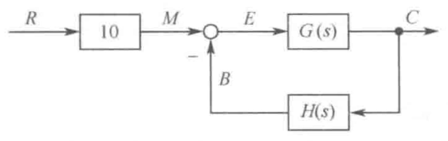

> Image description: A block diagram of a closed-loop control system is shown. The signal flow starts from the input variable $R$, which enters a gain block labeled "10". The output of this block is denoted as $M$. Signal $M$ proceeds to a summing junction, where it is combined with a feedback signal $B$. The summing junction indicates a negative feedback loop, as indicated by the minus sign next to the input from $B$. The resulting error signal $E$ enters the forward path transfer function block $G(s)$. The output of $G(s)$ is the system output variable $C$. A feedback path takes signal $C$ through a transfer function block $H(s)$, producing signal $B$, which returns to the summing junction. The diagram represents a standard negative feedback control loop where $G(s)$ is the plant/controller and $H(s)$ is the feedback sensor.
图2－51 系统结构图

$$
\begin{aligned}
& 6 \frac{\mathrm{~d} c(t)}{\mathrm{d} t}+10 c(t)=20 e(t) \\
& 20 \frac{\mathrm{~d} b(t)}{\mathrm{d} t}+5 b(t)=10 c(t)
\end{aligned}
$$

解 本题研究系统微分方程与系统传递函数的转换方法。
对题设所给的微分方程两边同时进行拉氏变换，由于初始条件均为零，所以有

$$
\left\{\begin{array}{l}
6 s C(s)+10 C(s)=20 E(s) \\
20 s B(s)+5 B(s)=10 C(s)
\end{array}\right.
$$

由上式可得

$$
G(s)=\frac{C(s)}{E(s)}=\frac{20}{6 s+10}=\frac{10}{3 s+5}, \quad H(s)=\frac{B(s)}{C(s)}=\frac{10}{20 s+5}=\frac{2}{4 s+1}
$$

由图2－51可得

$$
\Phi(s)=\frac{C(s)}{R(s)}=\frac{10 G(s)}{1+G(s) H(s)}
$$

将 $G(s)$ 和 $H(s)$ 代人得

$$
\Phi(s)=\frac{C(s)}{R(s)}=\frac{10 \cdot \frac{10}{3 s+5}}{1+\frac{10}{3 s+5} \cdot \frac{2}{4 s+1}}=\frac{100(4 s+1)}{12 s^{2}+23 s+25}
$$

又 $\quad E(s)=M(s)-B(s)=10 R(s)-H(s) C(s)=[10-H(s) \Phi(s)] R(s)$
则

$$
\Phi_{e}(s)=\frac{E(s)}{R(s)}=10-H(s) \Phi(s)=10-\frac{2}{4 s+1} \cdot \frac{100(4 s+1)}{12 s^{2}+23 s+25}
$$

<!-- source_pdf_page: 20 -->
$$
=\frac{10\left(12 s^{2}+23 s+5\right)}{12 s^{2}+23 s+25}
$$

所以传递函数 $C(s) \backslash R(s)$ 和 $E(s) / R(s)$ 分别为

$$
\Phi(s)=\frac{C(s)}{R(s)}=\frac{100(4 s+1)}{12 s^{2}+23 s+25}, \quad \Phi_{e}(s)=\frac{E(s)}{R(s)}=\frac{10\left(12 s^{2}+23 s+5\right)}{12 s^{2}+23 s+25}
$$

2－12 求图 2－52 所示有源网络的传递函数 $U_{0}(s) / U_{i}(s)$ 。

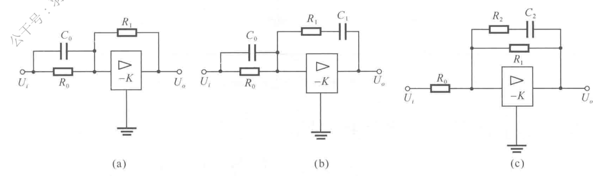

> Image description: This image contains three circuit diagrams, labeled (a), (b), and (c), showing active networks used to determine the transfer function $U_o(s)/U_i(s)$. Each circuit features an operational amplifier with a gain of $-K$, connected to ground. In diagram (a), an input voltage $U_i$ passes through a parallel combination of resistor $R_0$ and capacitor $C_0$. The output $U_o$ is fed back to the input via resistor $R_1$. Diagram (b) is similar, but the feedback path consists of a series combination of resistor $R_1$ and capacitor $C_1$. Diagram (c) shows an input voltage $U_i$ passing through resistor $R_0$. The feedback network consists of two parallel branches: one containing resistor $R_1$, and another containing a series combination of resistor $R_2$ and capacitor $C_2$. All three circuits illustrate different configurations of passive components around an inverting amplifier to create specific frequency responses.
图 2－52 有源网络电路图

解 本题研究用等效复数阻抗方法推导有源网络的传递函数的方法。
（1）对于图2－52（a）所示的有源网络，可得

$$
\frac{U_{o}(s)}{U_{i}(s)}=-\frac{R_{1}}{\frac{R_{0} \cdot \frac{1}{C_{0} s}}{R_{0}+\frac{1}{C_{0} s}}}=-\frac{R_{1}}{R_{0}}\left(R_{0} C_{0} s+1\right)
$$

（2）对于图2－52（b）所示的有源网络，可得

$$
\frac{U_{o}(s)}{U_{i}(s)}=-\frac{R_{1}+\frac{1}{C_{1} s}}{\frac{R_{0} \cdot \frac{1}{C_{0} s}}{R_{0}+\frac{1}{C_{0} s}}}=-\frac{R_{1} C_{1} R_{0} C_{0} s^{2}+\left(R_{1} C_{1}+R_{0} C_{0}\right) s+1}{R_{0} C_{1} s}
$$

（3）对于图2－52（c）所示的有源网络，可得

$$
\frac{U_{o}(s)}{U_{i}(s)}=-\frac{\frac{R_{1} \cdot\left(R_{2}+\frac{1}{C_{2} s}\right)}{R_{1}+\left(R_{2}+\frac{1}{C_{2} s}\right)}}{R_{0}}=-\frac{R_{1}}{R_{0}} \cdot \frac{R_{2} C_{2} s+1}{\left(R_{1}+R_{2}\right) C_{2} s+1}
$$

2－13 由运算放大器组成的控制系统模拟电路如图 2－53 所示，试求闭环传递函数 $U_{o}(s) / U_{i}(s)$ 。

解 本题研究用等效复数阻抗方法推导网络模拟系统的传递函数。
在图 2－53 中，令第一级运算放大器输出为 $U_{1}$ ，第二级运算放大器输出为 $U_{2}$ ，则可得

$$
U_{1}=-\frac{R_{1} \cdot \frac{1}{C_{1} s}}{R_{1}+\frac{1}{C_{1} s}}\left(\frac{U_{i}}{R_{0}}+\frac{U_{o}}{R_{0}}\right)
$$

<!-- source_pdf_page: 21 -->
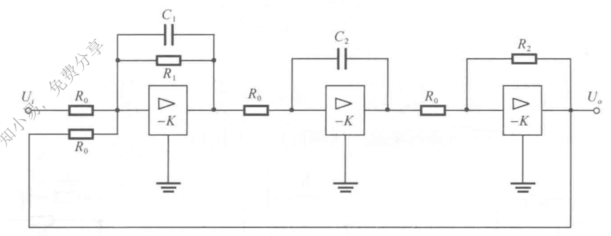

> Image description: The image shows a circuit diagram labeled "图2－53 控制系统模拟电路图" (Figure 2-53 Analog Circuit Diagram of Control System). The schematic depicts three operational amplifier stages connected in series, each represented by a triangle symbol with the gain label $-K$ and grounded emitters. The first stage is an integrator/filter consisting of input resistors $R_0$, a feedback resistor $R_1$, and a feedback capacitor $C_1$. The second stage similarly features a feedback capacitor $C_2$ and an input resistor $R_0$. The third stage uses a feedback resistor $R_2$ and an input resistor $R_0$. The system is configured in a closed-loop feedback arrangement: the output voltage $U_o$ is fed back to the input side, where it meets the input voltage $U$. This structure represents a typical analog controller implementation using operational amplifiers.
图2－53 控制系统模拟电路图

因为 $\frac{U_{2}}{U_{1}}=-\frac{1}{R_{0} C_{2} s}$ ，故有 $U_{1}=-R_{0} C_{2} s U_{2}$ ；又因 $\frac{U_{o}}{U_{2}}=-\frac{R_{2}}{R_{0}}$ ，故有 $U_{2}=-\frac{R_{0}}{R_{2}} U_{o}$ 。则有

$$
U_{1}=-R_{0} C_{2} s U_{2}=\left(-R_{0} C_{2} s\right) \cdot\left(-\frac{R_{0}}{R_{2}} U_{o}\right)=\frac{R_{0}^{2}}{R_{2}} C_{2} s U_{o}
$$

所以

$$
U_{1}=-\frac{R_{1} \cdot \frac{1}{C_{1} s}}{R_{1}+\frac{1}{C_{1} s}}\left(\frac{U_{i}}{R_{0}}+\frac{U_{o}}{R_{0}}\right)=\frac{R_{0}^{2}}{R_{2}} C_{2} s U_{o}
$$

整理后可得闭环传递函数为

$$
\frac{U_{o}}{U_{i}}=\frac{-R_{1} R_{2}}{R_{0}^{3}\left(R_{1} C_{1} s+1\right) C_{2} s+R_{1} R_{2}}
$$

2－14 试参照教材中例 2－2 给出的电枢控制直流电动机的三组微分方程式，画出直流电动机的结构图，并由结构图等效变换求出电动机的传递函数 $\Omega_{m}(s) / U_{a}(s)$ 和 $\Omega_{m}(s) / M_{c}(s)$ 。

解 本题研究将系统的微分方程通过拉氏变换得到系统的传递函数，并根据传递函数画出系统的结构图。

电枢控制直流电动机的三组微分方程式：
电枢回路电压平衡方程

$$
u_{a}(t)=L_{a} \frac{\mathrm{~d} i_{a}(t)}{\mathrm{d} t}+R_{a} i_{a}(t)+C_{e} \omega_{m}(t)
$$

电磁转矩方程

$$
M_{m}(t)=C_{m} i_{a}(t)
$$

电动机轴上的转矩平衡方程 $J_{m} \frac{\mathrm{~d} \omega_{m}(t)}{\mathrm{d} t}+f_{m} \omega_{m}(t)=M_{m}(t)-M_{c}(t)$
对上述三式分别进行拉氏变换并设初始条件为零，可得

$$
\begin{aligned}
& U_{a}(s)-C_{e} \Omega_{m}(s)=\left(L_{a} s+R_{a}\right) I_{a}(s) \\
& M_{m}(s)=C_{m} I_{a}(s) \\
& \left(J_{m} s+f_{m}\right) \Omega_{m}(s)=M_{m}(s)-M_{c}(s)
\end{aligned}
$$

根据此三式可以画出直流电动机的结构图如图 2－14－1。
电动机的传递函数如下：

$$
\frac{\Omega_{m}(s)}{U_{a}(s)}=\frac{\frac{C_{m}}{\left(L_{a} s+R_{a}\right)\left(J_{m} s+f_{m}\right)}}{1+\frac{C_{m} C_{e}}{\left(L_{a} s+R_{a}\right)\left(J_{m} s+f_{m}\right)}}=\frac{C_{m}}{L_{a} J_{m} s^{2}+\left(L_{a} f_{m}+J_{m} R_{a}\right) s+\left(f_{m} R_{a}+C_{m} C_{e}\right)}
$$

<!-- source_pdf_page: 22 -->
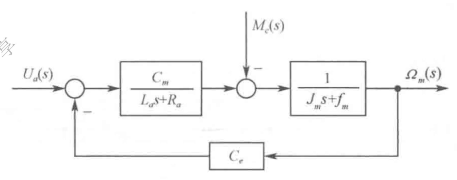

> Image description: This figure is a control system block diagram representing the structure of a DC servo motor (直流伺服电机结构图). The input signal $U_a(s)$ enters from the left, passing through a summing junction that subtracts a feedback signal. This result flows into a transfer function block defined as $\frac{C_m}{L_as + R_a}$. The output of this first block enters a second summing junction, where an external disturbance torque $M_e(s)$ is subtracted. The resulting signal then passes through a final plant block with the transfer function $\frac{1}{J_ms + f_m}$, yielding the system output $\Omega_m(s)$. A feedback loop connects the output $\Omega_m(s)$ back to the initial summing junction via a gain block $C_e$. Arrows indicate the unidirectional flow of signals through the blocks and junctions, illustrating the closed-loop dynamics between voltage input and angular velocity output.
图 2－14－1 直流伺服电机结构图

$$
\frac{\Omega_{m}(s)}{M_{c}(s)}=\frac{-\frac{1}{J_{m} s+f_{m}}}{1+\frac{C_{m} C_{e}}{\left(L_{a} s+R_{a}\right)\left(J_{m} s+f_{m}\right)}}=-\frac{L_{a} s+R_{a}}{L_{a} J_{m} s^{2}+\left(L_{a} f_{m}+J_{m} R_{a}\right) s+f_{m} R_{a}+C_{m} C_{e}}
$$

2－15 某位置随动系统原理图如图 2－54 所示。已知电位器最大工作角度 $\theta_{\max }=330^{\circ}$ ，功率放大级功放系数为 $K_{3}$ ，要求：
（1）分别求出电位器传递系数 $K_{0}$ ，第一级和第二级放大器的放大系数 $K_{1} 、 K_{2}$ ；
（2）画出系统结构图；
（3）简化结构图，求系统传递函数 $\Theta_{o}(s) / \Theta_{i}(s)$ 。

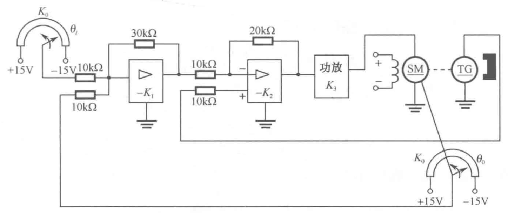

> Image description: This engineering schematic depicts a position-following system. The input is provided by a potentiometer $K_0$ converting an angle $\theta_i$ into a voltage signal via $\pm 15\text{V}$ rails. This signal enters a summing junction formed by two $10\text{k}\Omega$ resistors before reaching the first amplifier stage $-K_1$, which features a feedback resistor of $30\text{k}\Omega$. The output of $-K_1$ passes through another $10\text{k}\Omega$ resistor to the inverting input of a second amplifier $-K_2$, which has a $20\text{k}\Omega$ feedback resistor and a $10\text{k}\Omega$ non-inverting path. The signal then proceeds to a power amplifier block labeled "功放 $K_3$," which drives a servo motor (SM) through an inductor. A tachogenerator (TG) provides feedback, while a second potentiometer $K_0$ monitors the output angle $\theta_o$, closing the loop back to the initial summing junction. The system represents a closed-loop control circuit for precise angular positioning.
图2－54 位置随动系统原理图

解 本题研究通过系统的原理图得出结构图，并简化结构图，求出系统闭环传递函数。
（1）求 $K_{0} 、 K_{1}$ 和 $K_{2}$ 。

$$
\begin{aligned}
& K_{0}=\frac{E}{\theta_{m}}=\frac{30}{330^{\circ} \times \frac{\pi}{180^{\circ}}}=\frac{180}{11 \pi}=5.21(\mathrm{~V} / \mathrm{rad}) \\
& K_{1}=\frac{30 \times 10^{3}}{10 \times 10^{3}}=3, \quad K_{2}=\frac{20 \times 10^{3}}{10 \times 10^{3}}=2
\end{aligned}
$$

（2）系统结构图。假设电动机的时间常数为 $T_{m}$ ，可得直流电动机的传递函数为（忽略电枢电感的影响）

$$
\frac{\Omega(s)}{U_{a}(s)}=\frac{K_{m}}{T_{m} s+1}
$$

其中 $K_{m}$ 为直流电动机的传递系数。假设测速发电机的斜率为 $K_{t}$ ，则其传递函数为

<!-- source_pdf_page: 23 -->
$$
\frac{U_{t}(s)}{\Omega(s)}=K_{t}
$$

由此可见，系统的结构如图 2－15－1 所示。

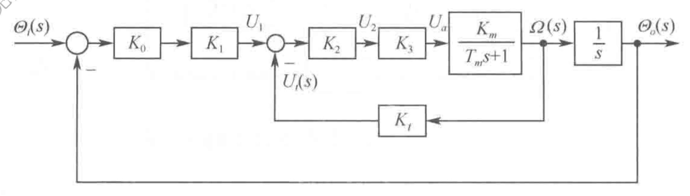

> Image description: This image shows a control system block diagram labeled as Figure 2-15-1. The signal flow begins with an input variable $\Theta_i(s)$, which enters a summing junction. From there, the signal passes through a series of gain blocks $K_0$ and $K_1$, resulting in output $U_1$. The path continues through another summing junction where a feedback signal $\overline{U_1}(s)$ is subtracted. The forward path then proceeds through blocks $K_2$ and $K_3$, producing the control voltage $U_a$. This enters a plant block with the transfer function $\frac{K_m}{T_m s + 1}$, yielding the angular velocity $\Omega(s)$. Two feedback loops are present: an inner loop where $\Omega(s)$ is fed back through gain $K_4$ to the second summing junction, and an outer loop where the final output $\Theta_o(s)$, derived from integrating $\Omega(s)$ via a block $\frac{1}{s}$, is fed back to the initial summing junction.
图2－15－1 位置随动系统结构图

（3）系统传递函数。系统结构图的简化如图 2－15－2 所示。

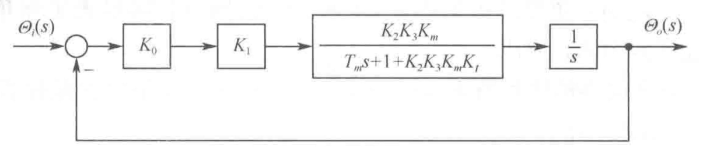

> Image description: This image displays a control system block diagram representing a feedback loop in the Laplace domain ($s$). The input signal, $\Theta_i(s)$, enters from the left into a summing junction. A negative feedback path returns the output signal, $\Theta_o(s)$, to this junction. The forward path consists of four sequential blocks connected by arrows: 1. A gain block labeled $K_0$. 2. A gain block labeled $K_1$. 3. A transfer function block defined as $\frac{K_2 K_3 K_m}{T_m s + 1 + K_2 K_3 K_m K_t}$. 4. An integrator block represented by $\frac{1}{s}$, which produces the final output $\Theta_o(s)$. From an engineering perspective, this diagram illustrates a closed-loop system where the error signal (the difference between input and feedback) is processed through multiple gain stages and a dynamic plant to control the output variable. The caption indicates this is a simplified structure for determining the system's transfer function.
图2－15－2 系统结构图简化

由简化的结构图可得系统的传递函数为

$$
\begin{aligned}
\frac{\Theta_{o}(s)}{\Theta_{i}(s)} & =\frac{K_{0} K_{1} \cdot \frac{K_{2} K_{3} K_{m}}{T_{m} s+1+K_{2} K_{3} K_{m} K_{t}} \cdot \frac{1}{s}}{1+K_{0} K_{1} \cdot \frac{K_{2} K_{3} K_{m}}{T_{m} s+1+K_{2} K_{3} K_{m} K_{t}} \cdot \frac{1}{s}} \\
& =\frac{K_{0} K_{1} K_{2} K_{3} K_{m}}{T_{m} s^{2}+\left(1+K_{2} K_{3} K_{m} K_{t}\right) s+K_{0} K_{1} K_{2} K_{3} K_{m}}
\end{aligned}
$$

2－16 设直流电动机双闭环调速系统的原理线路如图 2－55 所示。

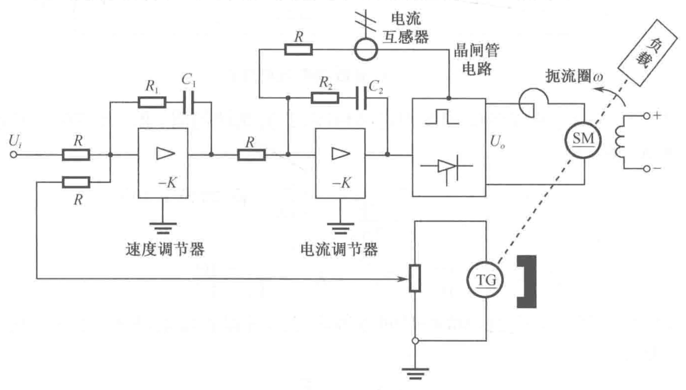

> Image description: A technical schematic diagram illustrates a dual-loop speed control system for a DC motor (SM). The circuit begins with an input voltage $U_i$ passing through a resistive divider into the first stage, labeled "速度调节器" (speed regulator), which consists of an operational amplifier with gain $-K$, resistor $R_1$, and capacitor $C_1$. The output feeds into a second stage, the "电流调节器" (current regulator), also featuring an op-amp with gain $-K$, resistor $R_2$, and capacitor $C_2$. This stage includes a feedback loop via a "电流互感器" (current transformer) and resistor $R$. The signal then enters the "晶闸管电路" (thyristor circuit), producing output voltage $U_o$ to drive the motor SM. A tachogenerator (TG) provides speed feedback, completing the outer loop back to the input. A "扼流圈 $\omega$" (choke coil) and a load are connected to the motor. The system represents a cascaded control architecture for precise motor speed regulation.
图 2－55 直流电动机调速系统原理图

（1）分别求速度调节器和电流调节器的传递函数；

<!-- source_pdf_page: 24 -->
（2）画出系统结构图［设可控硅电路传递函数为 $K_{3} /\left(T_{3} s+1\right)$ ；电流互感器和测速发电机的传递系数分别为 $K_{4}$ 和 $K_{5}$ ；直流电动机的结构图用题 2－14 的结果］；
（3）简化结构图，求系统传递函数 $\Omega(s) / U_{i}(s)$ 。
解 本题研究通过调速系统的原理图得出结构图，并简化结构图求出闭环传递函数。
（1）求调节器的传递函数。速度调节器和电流调节器的传递函数分别为

$$
\begin{aligned}
& G_{1}(s)=-\frac{R_{1}+\frac{1}{C_{1} s}}{R}=-\left(\frac{R_{1}}{R}+\frac{1}{R C_{1} s}\right) \\
& G_{2}(s)=-\frac{R_{2}+\frac{1}{C_{2} s}}{R}=-\left(\frac{R_{2}}{R}+\frac{1}{R C_{2} s}\right)
\end{aligned}
$$

（2）画系统结构图。由于直流电动机的结构图用题 2－14 的结果，同时由于引入了电流反馈，故在电动机的动态结构图中必须把电枢电流 $I_{a}$ 显露出来，于是直流电动机调速系统的结构图如图 2－16－1所示。

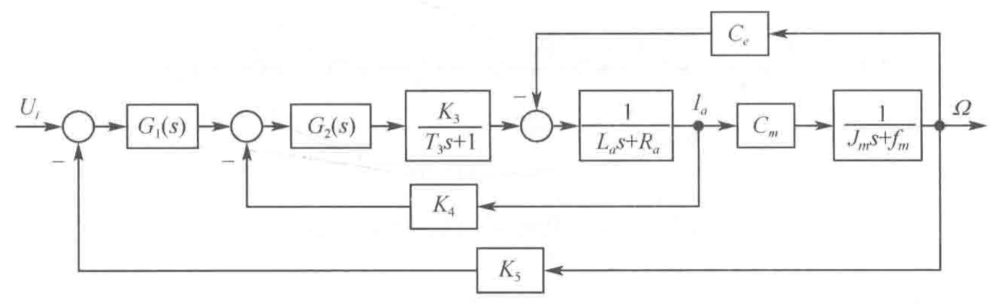

> Image description: This image shows a block diagram of a DC motor speed control system, labeled as Figure 2-16-1. The system is represented by several interconnected blocks and feedback loops. The input signal $U_i$ enters from the left into a summing junction. The forward path consists of transfer functions $G_1(s)$ and $G_2(s)$, followed by a first-order lag block $\frac{K_3}{T_3 s + 1}$. This leads to another summing junction that feeds into the armature circuit block $\frac{1}{L_a s + R_a}$, where the output is the armature current $I_a$. The signal then passes through a gain block $C_m$ and a mechanical plant block $\frac{1}{J_m s + f_m}$ to produce the final output, angular velocity $\Omega$. The system incorporates three feedback loops: an inner loop from $I_a$ back through gain $K_4$, a middle loop from $\Omega$ back through constant $C_e$, and an outer loop from $\Omega$ back through gain $K_5$ to the initial input.
图 2－16－1 直流电动机调速系统结构图

（3）求系统传递函数。为了推导方便，设

$$
G_{3}(s)=\frac{K_{3}}{T_{3} s+1}, \quad G_{4}(s)=\frac{1}{L_{a} s+R_{a}}, \quad G_{5}(s)=\frac{1}{J_{m} s+f_{m}}
$$

则简化结构图如图 2－16－2 所示。

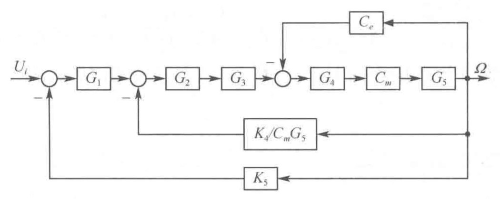

> Image description: This image shows a control system block diagram (Figure 2-16-2) representing a feedback loop for a variable $\Omega$. The input signal $U_i$ enters from the left into a summing junction. The forward path consists of several sequential blocks: $G_1$, another summing junction, $G_2$, $G_3$, a third summing junction, $G_4$, $C_m$, and finally $G_5$, leading to the output $\Omega$. The system incorporates three distinct feedback loops. The innermost loop feeds back from the output $\Omega$ through block $C_e$ into the third summing junction with a negative sign. A middle loop feeds back from $\Omega$ through a block labeled $K_4/C_mG_5$ into the second summing junction. The outermost loop feeds back from $\Omega$ through block $K_5$ to the first summing junction. All feedback paths are indicated by arrows returning from the output to the respective summation points, signifying a closed-loop control architecture designed for stability or regulation of $\Omega$.
图2－16－2 电机调速系统结构图简化

经过反馈连接等效，可得图 2－16－3 所示简化结构图。
由简化的结构图可得系统的传递函数

$$
\frac{\Omega(s)}{U_{i}(s)}=\frac{C_{m} G_{1} G_{2} G_{3} G_{4} G_{5}}{1+K_{4} G_{2} G_{3} G_{4}+C_{e} C_{m} G_{4} G_{5}+C_{m} K_{5} G_{1} G_{2} G_{3} G_{4} G_{5}}
$$

其中

<!-- source_pdf_page: 25 -->
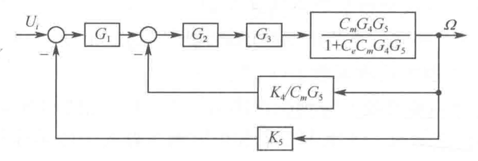

> Image description: This image shows a control system block diagram titled "图2－16－3 电机调速系统结构图简化" (Simplified Structure Diagram of Motor Speed Control System). The system processes an input signal $U_i$ to produce an output speed $\Omega$. The forward path consists of three sequential blocks, $G_1$, $G_2$, and $G_3$, followed by a complex transfer function block: $\frac{C_m G_4 G_5}{1 + C_e C_m G_4 G_5}$. There are two negative feedback loops. The inner loop feeds back from the output $\Omega$ through a block labeled $K_4/C_m G_5$, returning to a summing junction before $G_2$. The outer loop feeds back from $\Omega$ through a block labeled $K_5$, returning to the initial summing junction before $G_1$. Arrows indicate the unidirectional flow of signals between blocks and junctions, representing a typical closed-loop engineering control architecture for motor speed regulation.
图2－16－3 电机调速系统结构图简化

$$
\begin{aligned}
& G_{1}(s)=-\left(\frac{R_{1}}{R}+\frac{1}{R C_{1} s}\right), \quad G_{2}(s)=-\left(\frac{R_{2}}{R}+\frac{1}{R C_{2} s}\right), \\
& G_{3}(s)=\frac{K_{3}}{T_{3} s+1}, \quad G_{4}(s)=\frac{1}{L_{a} s+R_{a}}, \quad G_{5}(s)=\frac{1}{J_{m} s+f_{m}}
\end{aligned}
$$

可用信号流图（图2－16－4）及梅森增益进行验证。

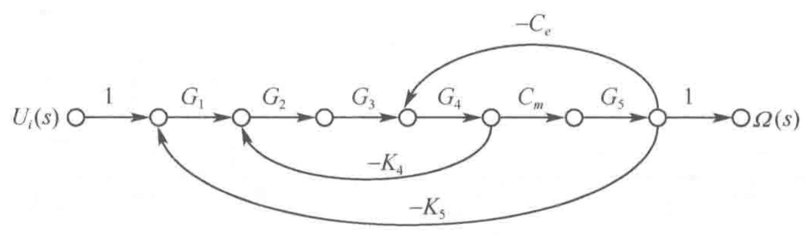

> Image description: This image shows a signal flow graph used in control systems engineering to determine the transfer function between an input and output variable. The input is labeled $U_i(s)$ on the left, and the output is $\Omega(s)$ on the right. The forward path consists of a series of nodes connected by directed edges with gains: $1 \to G_1 \to G_2 \to G_3 \to G_4 \to C_m \to G_5 \to 1$. There are three feedback loops indicated by arrows pointing backward: 1. A short loop from the node after $G_4$ back to itself with gain $-C_e$. 2. An intermediate loop from the node after $C_m$ back to the node before $G_2$ with gain $-K_4$. 3. A long outer loop from the node before $\Omega(s)$ back to the node before $G_1$ with gain $-K_5$. The caption indicates this is Figure 2-16-4, intended for verification using Mason's gain formula.
图2－16－4 电机调速系统信号流图

由图 2－16－4 可知，本系统有一条前向通道，三个单独回路，无互不接触回路，即

$$
\begin{gathered}
L_{1}=-K_{4} G_{2} G_{3} G_{4}, \quad L_{2}=-C_{e} C_{m} G_{4} G_{5}, \quad L_{3}=-C_{m} K_{5} G_{1} G_{2} G_{3} G_{4} G_{5} \\
\Delta=1-\left(L_{1}+L_{2}+L_{3}\right)=1+K_{4} G_{2} G_{3} G_{4}+C_{e} C_{m} G_{4} G_{5}+C_{m} K_{5} G_{1} G_{2} G_{3} G_{4} G_{5} \\
p_{1}=C_{m} G_{1} G_{2} G_{3} G_{4} G_{5}, \quad \Delta_{1}=1
\end{gathered}
$$

由梅森增益公式可得系统的传递函数为

$$
\frac{\Omega(s)}{U_{i}(s)}=\frac{\sum p_{i} \Delta_{i}}{\Delta}=\frac{C_{m} G_{1} G_{2} G_{3} G_{4} G_{5}}{1+K_{4} G_{2} G_{3} G_{4}+C_{e} C_{m} G_{4} G_{5}+C_{m} K_{5} G_{1} G_{2} G_{3} G_{4} G_{5}}
$$

2－17 已知控制系统结构图如图 2－56 所示，试通过结构图的等效变换求系统传递函数 $C(s) / R(s)$ 。

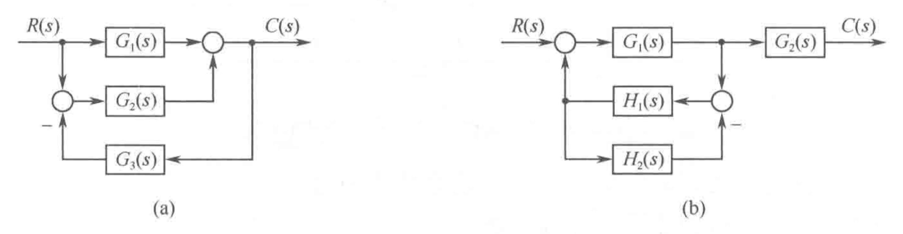

> Image description: This image contains two control system block diagrams, labeled (a) and (b). Both diagrams represent linear time-invariant systems in the Laplace domain. Diagram (a) shows an input signal $R(s)$ entering a forward path through block $G_1(s)$. The output $C(s)$ is formed by the summation of signals from $G_1(s)$ and another parallel branch containing block $G_2(s)$. A feedback loop exists where $C(s)$ passes through block $G_3(s)$ and is subtracted from $R(s)$ before entering $G_2(s)$. Diagram (b) shows an input signal $R(s)$ entering a summing junction, followed by blocks $G_1(s)$ and $G_2(s)$ in series to produce output $C(s)$. There are two feedback paths from the node between $G_1(s)$ and $G_2(s)$: one through block $H_1(s)$ and another through block $H_2(s)$, with the signal from $H_2(s)$ being subtracted at a summing junction before entering $H_1(s)$.
图2－56 题2－17系统结构图

<!-- source_pdf_page: 26 -->
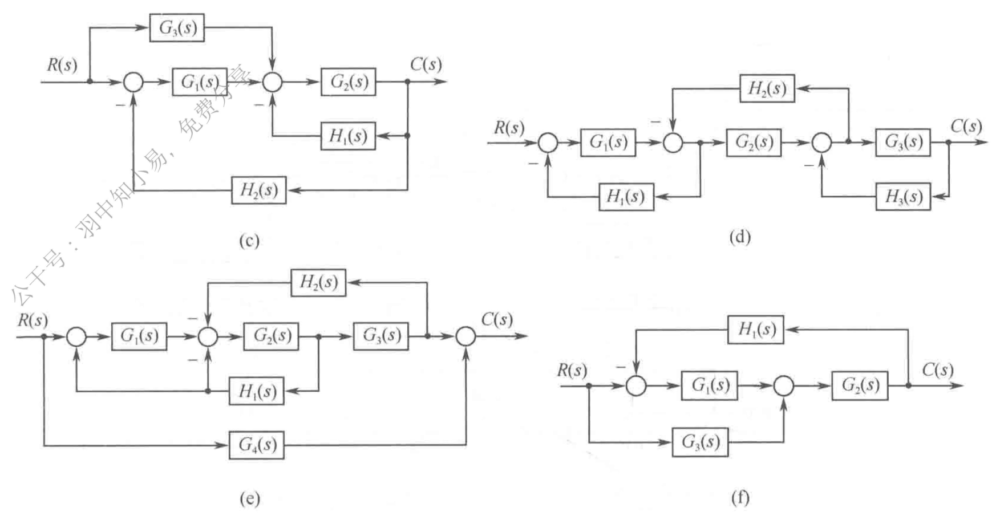

> Image description: This image contains four control system block diagrams labeled (c), (d), (e), and (f) under the caption "图 2－56 题 2－17 系统结构图（续)". Each diagram represents a linear time-invariant system in the s-domain, mapping an input signal $R(s)$ to an output signal $C(s)$. The diagrams consist of functional blocks (transfer functions denoted as $G_n(s)$ and $H_n(s)$), summing junctions (circles with $+$ or $-$ signs), and directed arrows indicating signal flow. - **Diagram (c)** features a forward path through $G_1(s)$ and $G_2(s)$, with multiple feedback loops including $G_3(s)$, $H_1(s)$, and $H_2(s)$. - **Diagram (d)** shows a series of blocks $G_1(s), G_2(s),$ and $G_3(s)$ with nested negative feedback loops via $H_1(s), H_2(s),$ and $H_3(s)$. - **Diagram (e)** includes forward blocks $G_1(s), G_2(s),$ and $G_3(s)$ with three distinct feedback paths through $H_2(s), H_1(s),$ and $G_4(s)$. - **Diagram (f)** displays a simpler structure with forward path $G_1(s)$ and $G_2(s)$, and feedback loops involving $H_1(s)$ and $G_3(s)$.
图 2－56 题 2－17 系统结构图（续）

解 本题研究结构图的等效变换。
（1）图2－56（a）系统。经过比较点后移，可得图2－17－1，则系统传递函数为

$$
\frac{C(s)}{R(s)}=\frac{G_{1}+G_{2}}{1+G_{2} G_{3}}
$$

（2）图2－56（b）系统。经过反馈连接等效，可得图2－17－2，则系统传递函数为

$$
\frac{C(s)}{R(s)}=\frac{G_{1} G_{2}\left(1+H_{1} H_{2}\right)}{1+H_{1} H_{2}-G_{1} H_{1}}
$$

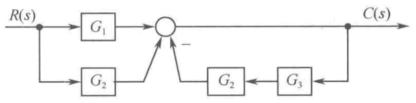

> Image description: This image is a control system block diagram labeled as "图 2－17－1 系统（a）简化结构图." The diagram illustrates a feedback loop with an input variable $R(s)$ on the left and an output variable $C(s)$ on the right. The forward path consists of a signal flowing from $R(s)$ through block $G_1$ to a summing junction (represented by a circle). From the summing junction, the signal proceeds directly to the output $C(s)$. There are two feedback paths returning signals to the summing junction. The first is a direct feed-forward path from $R(s)$ through block $G_2$. The second is a negative feedback loop where the output $C(s)$ passes back through blocks $G_3$ and then another instance of $G_2$ before reaching the summing junction, indicated by a minus sign. Arrows indicate the direction of signal flow throughout the system.
图 2－17－1 系统（a）简化结构图

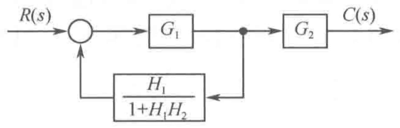

> Image description: This image is a control system block diagram labeled as "图 2－17－1 系统（a）简化结构图." The diagram represents a feedback loop in the s-domain. The process begins with an input signal $R(s)$ entering a summing junction (represented by a circle). From this junction, the forward path proceeds through two sequential blocks: block $G_1$ followed by block $G_2$, leading to the final output variable $C(s)$. A feedback loop branches off from the line between $G_1$ and $G_2$. This feedback path contains a transfer function block labeled $\frac{H_1}{1+H_1 H_2}$, which feeds back into the summing junction. Arrows indicate the unidirectional flow of signals throughout the system. In engineering terms, this depicts a closed-loop control system where the output of the first stage is modified by a feedback mechanism before being processed by the second stage to produce the final output.
图 2－17－2 系统（b）简化结构图

（3）图2－56（c）系统。经过比较点后移，可得图2－17－3，经过并联等效，可得图2－17－4，则系统传递函数为

$$
\frac{C(s)}{R(s)}=\frac{G_{2}\left(G_{1}+G_{3}\right)}{1+G_{2}\left(H_{1}+G_{1} H_{2}\right)}
$$

（4）图 2－56（d）系统。经过比较点前移和引出点后移，可得图 2－17－5；经过反馈连接等效，可得图 2－17－6，则系统传递函数为

$$
\begin{aligned}
\frac{C(s)}{R(s)} & =\frac{\frac{G_{1} G_{2} G_{3}}{\left(1+G_{1} H_{1}\right)\left(1+G_{3} H_{3}\right)}}{1+\frac{G_{1} G_{2} G_{3}}{\left(1+G_{1} H_{1}\right)\left(1+G_{3} H_{3}\right)} \cdot \frac{H_{2}}{G_{1} G_{3}}} \\
& =\frac{G_{1} G_{2} G_{3}}{1+G_{1} H_{1}+G_{2} H_{2}+G_{3} H_{3}+G_{1} H_{1} G_{3} H_{3}}
\end{aligned}
$$

<!-- source_pdf_page: 27 -->
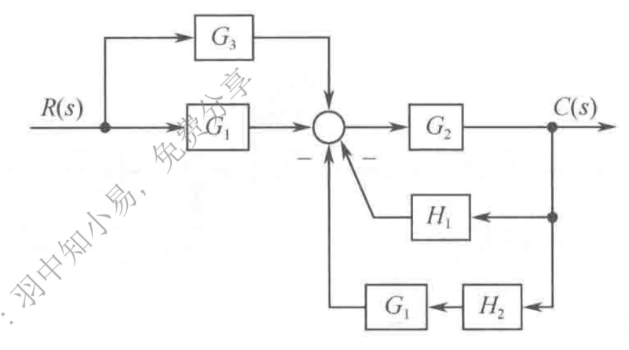

> Image description: A control system block diagram labeled "图2－17－3 系统（c）结构图变换" depicts the relationship between an input signal $R(s)$ and an output signal $C(s)$. The input $R(s)$ splits into two parallel paths. The upper path passes through block $G_3$, while the lower path passes through block $G_1$. Both paths converge at a summing junction. From this junction, the signal flows forward through block $G_2$ to reach the output $C(s)$. The system incorporates two feedback loops originating from $C(s)$ and returning to the summing junction with negative signs. The first feedback loop passes through block $H_1$. The second feedback loop consists of blocks $H_2$ followed by $G_1$. All components are connected by directed arrows indicating signal flow, representing a typical linear time-invariant system in the Laplace domain used for engineering analysis.
图2－17－3 系统（c）结构图变换

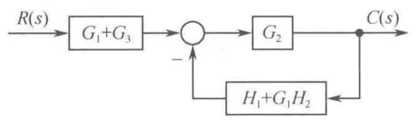

> Image description: A control system block diagram is shown in Figure 2-17-3, titled "系统（c）结构图变换" (System (c) structural diagram transformation). The signal flow proceeds from left to right, starting with the input variable $R(s)$. This input enters a functional block labeled $G_1 + G_3$. The output of this first block leads into a summing junction, which is indicated by a circle. A negative feedback loop returns from the system output $C(s)$ through a feedback block labeled $H_1 + G_1 H_2$, entering the summing junction with a minus sign. Following the summing junction, the signal passes through a second forward block labeled $G_2$ before reaching the final output variable $C(s)$. Arrows indicate the direction of signal flow throughout the loop. In engineering terms, this represents a closed-loop control system characterized by combined transfer functions in both the forward and feedback paths.
图2－17－4 系统（c）简化结构图

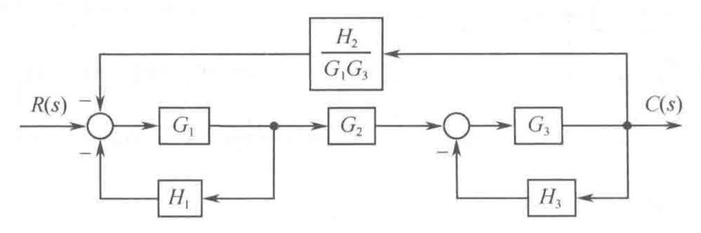

> Image description: A control system block diagram labeled "图2－17－4 系统（c）简化结构图" illustrates a feedback network with three forward blocks and three feedback paths. The input signal $R(s)$ enters from the left into a summing junction. The forward path consists of sequential blocks $G_1$, $G_2$, and $G_3$, leading to the output signal $C(s)$. There are three distinct feedback loops: 1. An inner loop feeds back from the output of $G_1$ through block $H_1$ to the first summing junction. 2. A second inner loop feeds back from the final output $C(s)$ through block $H_3$ to a summing junction located between $G_2$ and $G_3$. 3. An outer global feedback loop feeds back from $C(s)$ through a block labeled $\frac{H_2}{G_1 G_3}$ to the initial summing junction. Arrows indicate signal flow, and minus signs at the summing junctions denote negative feedback.
图 2－17－5 系统（d）结构图变换

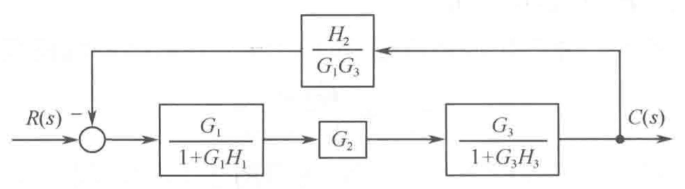

> Image description: A block diagram of a control system is shown in Figure 2-17-5, titled "系统（d）结构图变换" (System (d) structural diagram transformation). The signal flow starts from the input variable $R(s)$ on the left, entering a summing junction. The forward path consists of three sequential blocks: first, a block with the transfer function $\frac{G_1}{1+G_1H_1}$, followed by a block labeled $G_2$, and finally a block with the transfer function $\frac{G_3}{1+G_3H_3}$. The output of this path is the variable $C(s)$. A feedback loop connects the output $C(s)$ back to the summing junction. This return path contains a single block labeled $\frac{H_2}{G_1G_3}$. Arrows indicate the direction of signal flow from left to right through the forward blocks and from right to left through the feedback path, representing a closed-loop control system configuration.
图2－17－6 系统（d）简化结构图

（5）图2－56（e）系统。经过比较点后移和引出点前移，可得图2－17－7；经过并联等效，可得图 2－17－8；经过反馈连接等效，可得图 2－17－9，则系统传递函数为

$$
\frac{C(s)}{R(s)}=\frac{G_{1} G_{2} G_{3}}{1+G_{2}\left(G_{3} H_{2}+H_{1}-G_{1} H_{1}\right)}+G_{4}
$$

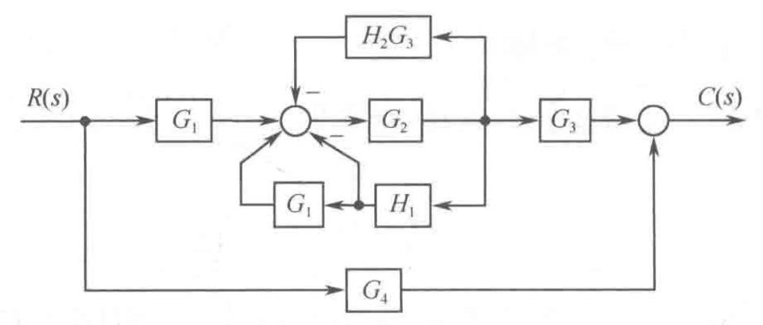

> Image description: A control system block diagram is shown, labeled as "图2－17－7 系统（e）结构图变换". The input variable $R(s)$ enters from the left and splits into two paths. The upper path passes through a series of blocks: first $G_1$, then a summing junction, followed by $G_2$ and $G_3$. There are two feedback loops returning to this summing junction: one passing through block $H_1$ and another through $G_1$ (after $H_1$), and a second loop containing the combined block $H_2 G_3$. The summing junction indicates negative feedback for these paths. The lower path is a direct feed-forward branch from $R(s)$ through block $G_4$, which meets at a final summing junction before the output variable $C(s)$. This diagram represents a complex linear time-invariant system in the s-domain, illustrating signal flow and feedback mechanisms used for stability or tracking analysis.
图2－17－7 系统（e）结构图变换

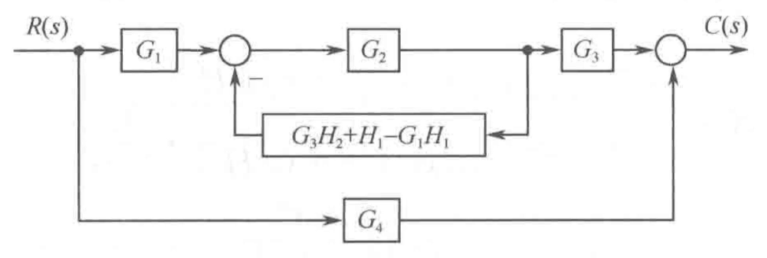

> Image description: This image is a control system block diagram labeled as "图2－17－7 系统（e）结构图变换." The diagram illustrates the relationship between an input signal $R(s)$ and an output signal $C(s)$. The forward path begins with $R(s)$, which splits into two parallel branches. The upper branch passes through block $G_1$ to a summing junction, then through block $G_2$, and finally through block $G_3$ before reaching the final summing junction that produces $C(s)$. A local negative feedback loop exists around $G_2$; it takes the output of $G_2$ and feeds it back through a block labeled $G_3H_2 + H_1 - G_1H_1$ to the first summing junction. The lower parallel branch consists of a single block, $G_4$, which connects $R(s)$ directly to the final output summing junction. Arrows indicate the direction of signal flow from left to right and through the feedback loop.
图2－17－8 系统（e）结构图变换

<!-- source_pdf_page: 28 -->
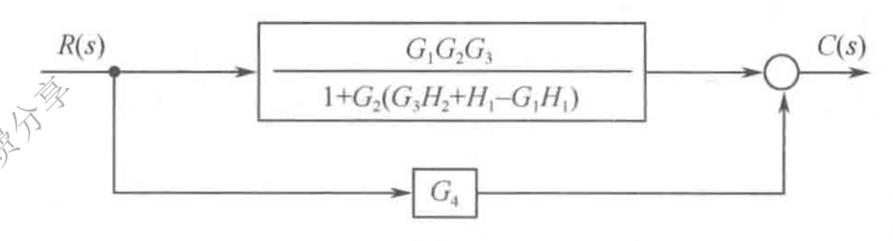

> Image description: A technical block diagram of a control system, labeled as "图2－17－9 系统（e）简化结构图," illustrating the relationship between an input signal $R(s)$ and an output signal $C(s)$. The diagram features two parallel paths connecting the input to the output. The upper path consists of a transfer function block represented by the fraction $\frac{G_1 G_2 G_3}{1 + G_2 (G_3 H_2 + H_1 - G_1 H_1)}$. The lower path contains a single block labeled $G_4$. Arrows indicate the forward flow of signals from left to right. Both paths converge at a summing junction (represented by a circle) before reaching the final output variable $C(s)$. In engineering terms, this represents a simplified structural diagram where the system's overall response is the sum of two parallel transfer functions acting on the reference input $R(s)$.
图2－17－9 系统（e）简化结构图

（6）图2－56（f）系统。经过比较点后移，可得图2－17－10；经过并联等效和反馈连接等效可可得图 2－17－11，则系统传递函数为

$$
\frac{C(s)}{R(s)}=\frac{G_{2}\left(G_{1}+G_{3}\right)}{1+G_{1} G_{2} H_{1}}
$$

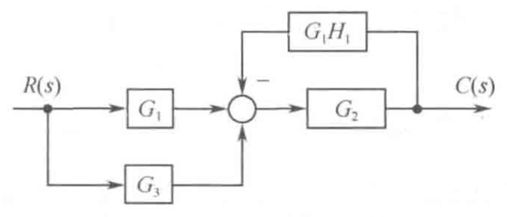

> Image description: A control system block diagram labeled "图2－17－10 系统（f）结构图变换" illustrates the relationship between an input signal $R(s)$ and an output signal $C(s)$. The input $R(s)$ splits into two parallel paths: one passing through block $G_1$ and the other through block $G_3$. These two paths converge at a summing junction, where the output of $G_3$ is added to the output of $G_1$. Following the summing junction, the signal enters block $G_2$, which leads directly to the final output $C(s)$. Additionally, there is a feedback loop originating from the output $C(s)$, passing through a block labeled $G_1H_1$, and returning to the summing junction with a negative sign (indicated by a minus symbol), signifying negative feedback. The diagram uses arrows to denote the unidirectional flow of signals between blocks and junctions in the s-domain.
图2－17－10 系统（f）结构图变换

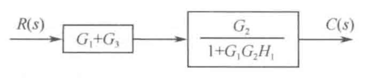

> Image description: This image shows a control system block diagram representing the structural transformation of "System (f)," as indicated by the caption "图2－17－10 系统（f）结构图变换." The diagram consists of two sequential blocks connected by directional arrows, indicating signal flow from left to right. The input variable is labeled $R(s)$. This signal enters the first block, which contains the transfer function $G_1 + G_3$. The output of this first block serves as the input for the second block. The second block features a more complex fractional transfer function: $\frac{G_2}{1 + G_1 G_2 H_1}$. Finally, an arrow leads from the second block to the system output variable, labeled $C(s)$. In engineering terms, this represents a simplified series representation of a control system where the overall transfer function is the product of these two blocks.
图2－17－11 系统（f）简化结构图

2－18 试简化图 2－57 中系统结构图，并求传递函数 $C(s) / R(s)$ 和 $C(s) / N(s)$ 。

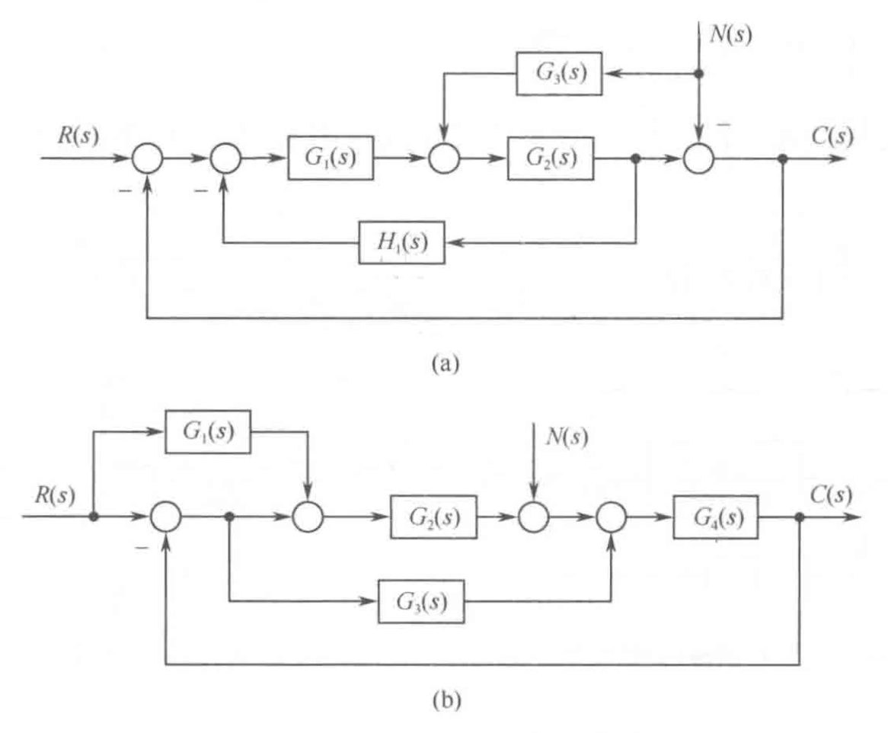

> Image description: This image contains two control system block diagrams, labeled (a) and (b), used for analyzing transfer functions. Diagram (a) shows a feedback system with an input signal $R(s)$, a disturbance $N(s)$, and an output $C(s)$. The forward path consists of blocks $G_1(s)$ and $G_2(s)$. There are two feedback loops: an inner loop containing block $H_1(s)$ returning to the second summing junction, and an outer unity feedback loop returning to the first summing junction. A feedforward path from $N(s)$ passes through $G_3(s)$ before entering a final summing junction. Diagram (b) presents an alternative structure with input $R(s)$, disturbance $N(s)$, and output $C(s)$. The forward path includes blocks $G_2(s)$ and $G_4(s)$. It features a parallel path through $G_1(s)$ leading to a summing junction, a feedback loop via $G_3(s)$, and an overall unity feedback loop. $N(s)$ enters the system as an additive signal before block $G_4(s)$.
图2－57 题2－18系统结构图

解 本题研究结构图的等效变换。
（1）图2－57（a）系统。仅考虑输人 $R(s)$ 作用于系统时，系统的结构图如图2－18－1所示。

经过反馈连接等效，可得图 2－18－2，则系统传递函数为

<!-- source_pdf_page: 29 -->
$\frac{C(s)}{R(s)}=\frac{\frac{G_{1} G_{2}}{1+G_{1} G_{2} H_{1}}}{1+\frac{G_{1} G_{2}}{1+G_{1} G_{2} H_{1}}}$
$\rightarrow G_{1}(s) \rightarrow G_{2}(s) \rightarrow$

图 2－18－1 $\quad N(s)=0$ 时系统（a）结构图
$=\frac{G_{1} G_{2}}{1+G_{1} G_{2}+G_{1} G_{2} H_{1}}$

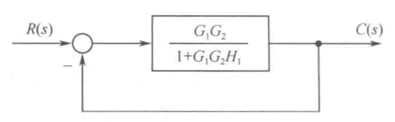

> Image description: A block diagram of a control system is shown in Figure 2-18-1. The system begins with an input signal $R(s)$ entering from the left via an arrow into a summing junction (represented by a circle). A feedback loop returns from the output to this junction, indicated by a minus sign, signifying negative feedback. The output of the summing junction feeds into a central rectangular block containing the transfer function $\frac{G_1 G_2}{1 + G_1 G_2 H_1}$. An arrow points from this block toward the system output $C(s)$. A feedback path connects the output line back to the summing junction. The caption indicates that this is a structural diagram for the case where $N(s)=0$, and it provides an associated mathematical expression: $\frac{G_1 G_2}{1 + G_1 G_2 + G_1 G_2 H_1}$. In engineering terms, this represents a closed-loop system with a specific forward gain and feedback mechanism.
图 2－18－2 $N(s)=0$ 时系统（a）简化结构图

仅考虑扰动 $N(s)$ 作用于系统时，系统的结构图如图 2－18－3 和图 2－18－4 所示。

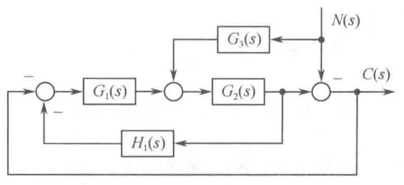

> Image description: A control system block diagram illustrating the effect of a disturbance signal $N(s)$ on the output $C(s)$. The system consists of several functional blocks: forward-path transfer functions $G_1(s)$, $G_2(s)$, and $G_3(s)$, and a feedback path containing $H_1(s)$. The process begins at a summing junction where signals are subtracted. The output passes through block $G_1(s)$ to another summing junction, which adds the signal from $G_3(s)$. This combined signal then flows through block $G_2(s)$. The disturbance $N(s)$ enters the system via two paths: it is fed into block $G_3(s)$ and directly added at a final summing junction before reaching the output $C(s)$. Two feedback loops are present: an inner loop from the output of $G_2(s)$ through $H_1(s)$ back to the first summing junction, and an outer loop feeding $C(s)$ directly back to the start. All signals flow along directed arrows.
图2－18－3 $R(s)=0$ 时系统（a）结构图

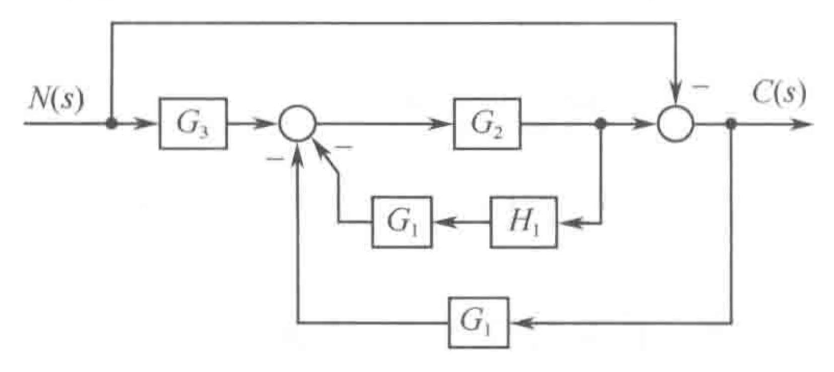

> Image description: A control system block diagram is shown in Figure 2-18-3, illustrating the structure when $R(s)=0$. The input signal $N(s)$ enters from the left and passes through a forward path containing blocks $G_3$ and $G_2$. The system features two negative feedback loops. An inner loop consists of block $H_1$ followed by $G_1$, feeding back from the output of $G_2$ to a summing junction before $G_2$. A second, outer feedback loop contains a block $G_1$, feeding back from the final system output $C(s)$ to the same summing junction. Additionally, there is a direct feed-forward path from $N(s)$ that connects to a final summing junction just before the output $C(s)$. Arrows indicate the direction of signal flow through blocks and summing junctions. The diagram represents a linear time-invariant system in the s-domain, focusing on the relationship between input $N(s)$ and output $C(s)$.
图 2－18－4 $\quad R(s)=0$ 时等效系统（a）结构图

经过反馈连接等效，可得图 2－18－5；经过比较点的移动，可得图 2－18－6，则系统传递函数为

$$
\frac{C(s)}{N(s)}=\left(\frac{G_{2} G_{3}}{1+G_{1} G_{2} H_{1}}-1\right) \cdot \frac{1}{1+\frac{G_{1} G_{2}}{1+G_{1} G_{2} H_{1}}}=-\frac{1-G_{2} G_{3}+G_{1} G_{2} H_{1}}{1+G_{1} G_{2}+G_{1} G_{2} H_{1}}
$$

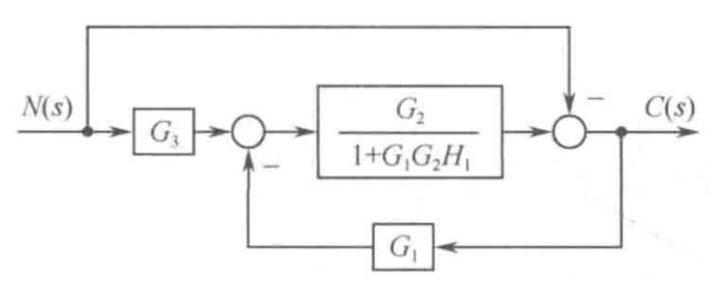

> Image description: A control system block diagram is shown in Figure 2-18-5, illustrating a feedback loop configuration for the case where $R(s)=0$. The input signal $N(s)$ enters from the left and splits into two paths: one feeding directly into a summing junction at the output and another passing through block $G_3$. The signal from $G_3$ enters a first summing junction, which subtracts a feedback signal coming from block $G_1$. The resulting error signal passes through a forward transfer function block labeled $\frac{G_2}{1+G_1 G_2 H_1}$. This output then reaches a final summing junction to produce the system output $C(s)$. A feedback loop is completed by routing $C(s)$ back through block $G_1$ to the first summing junction. The diagram represents the structural transformation of a linear time-invariant system, focusing on the relationship between blocks $G_1$, $G_2$, $G_3$, and the variable $H_1$.
图 2－18－5 $R(s)=0$ 时系统（a）结构图变换

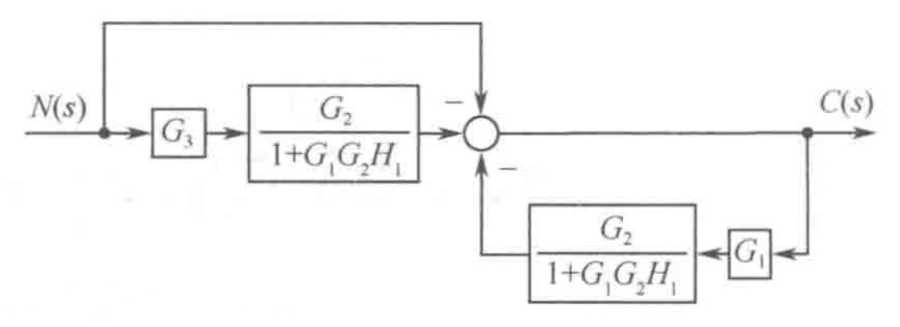

> Image description: This image shows a control system block diagram representing a structural transformation when $R(s)=0$. The input variable is labeled $N(s)$ on the left, and the output variable is $C(s)$ on the right. The signal path from $N(s)$ passes through a block labeled $G_3$ and then through a transfer function block $\frac{G_2}{1+G_1 G_2 H_1}$. This forward path leads into a summing junction. There are two feedback loops returning to this summing junction, both indicated with negative signs ($-$). The upper loop connects the input $N(s)$ directly back to the summer. The lower loop originates from the output $C(s)$, passes through block $G_1$, and then through another transfer function block $\frac{G_2}{1+G_1 G_2 H_1}$. The diagram uses standard engineering notation for Laplace-domain transfer functions, illustrating how different system components ($G_1, G_2, G_3, H_1$) interact to determine the relationship between $N(s)$ and $C(s)$.
图 2－18－6 $R(s)=0$ 时系统（a）简化结构图

（2）图 2－57（b）系统。仅考虑输人 $R(s)$ 作用于系统时，系统的结构图如图 2－18－7 所示。

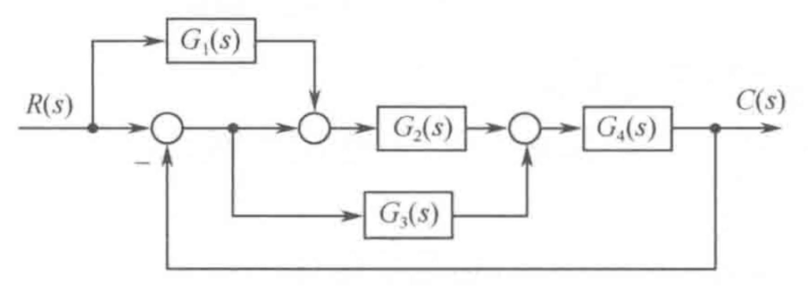

> Image description: A block diagram of a control system in the Laplace domain is shown. The input signal, labeled $R(s)$, enters from the left and splits into two paths. One path goes through a forward block $G_1(s)$ to a summing junction. The other path leads directly to a first summing junction with a negative feedback sign. Following this junction, the signal passes through another summing junction before entering block $G_2(s)$. From $G_2(s)$, the signal reaches a final summing junction where it is combined with a feed-forward path containing block $G_3(s)$. The output of this junction passes through block $G_4(s)$ to produce the system output, labeled $C(s)$. A global feedback loop returns the output $C(s)$ back to the first summing junction. Arrows indicate the direction of signal flow throughout the interconnected blocks and junctions.
图2－18－7 $\quad N(s)=0$ 时系统（b）结构图

<!-- source_pdf_page: 30 -->
经过比较点后移，可得图 2－18－8；经过串联等效和并联等效，可得图 2－18－9；经过比较点后移，可得图 2－18－10，则系统传递函数为

$$
\left.\frac{C(s)}{R(s)}=G_{1} G_{2}+G_{2}+G_{3}\right) \cdot \frac{G_{4}}{1+G_{4}\left(G_{2}+G_{3}\right)}=\frac{G_{4}\left(G_{1} G_{2}+G_{2}+G_{3}\right)}{1+G_{2} G_{4}+G_{3} G_{4}}
$$

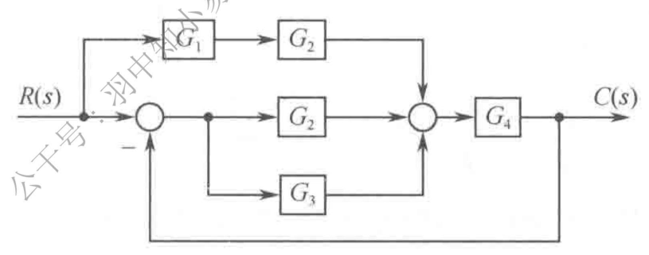

> Image description: A control system block diagram is shown in Figure 2-18-8, titled "System (b) structural diagram transformation when $N(s)=0$." The input signal $R(s)$ enters from the left and splits into two paths. One path goes through blocks $G_1$ and $G_2$ in series, leading directly to a summing junction. The second path enters a summing junction where it is compared with a feedback loop coming from the output $C(s)$. The resulting error signal then branches into two parallel paths: one passing through block $G_2$ and another through block $G_3$. These two signals are combined at a second summing junction. The combined output of this parallel section passes through block $G_4$ to produce the final system output, $C(s)$. A feedback loop connects $C(s)$ back to the first summing junction with a negative sign, indicating a closed-loop control configuration.
图 2－18－8 $N(s)=0$ 时系统（b）结构图变换

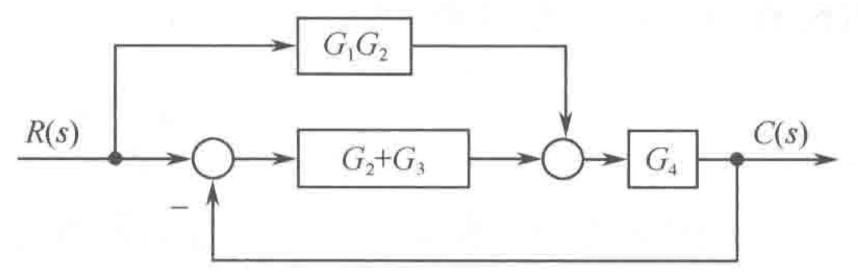

> Image description: A control system block diagram is shown in Figure 2-18-8, titled "图 2－18－8 $N(s)=0$ 时系统（b）结构图变换." The diagram illustrates a feedback loop with an input variable $R(s)$ and an output variable $C(s)$. The signal path from $R(s)$ splits into two parallel branches. The upper branch passes through a block labeled $G_1 G_2$. The lower branch enters a summing junction (indicated by a minus sign for feedback), then proceeds through a block labeled $G_2 + G_3$, and finally reaches another summing junction where it combines with the signal from the upper branch. This combined signal then passes through a final block, $G_4$, to produce the output $C(s)$. A feedback loop connects the output $C(s)$ back to the first summing junction. Arrows indicate the direction of signal flow throughout the system.
图 2－18－9 $N(s)=0$ 时系统（b）结构图变换

仅考虑扰动 $N(s)$ 作用于系统时，系统的结构图如图 2－18－11 所示，则系统传递函数为

$$
\frac{C(s)}{N(s)}=\frac{G_{4}}{1+G_{4}\left(G_{2}+G_{3}\right)}=\frac{G_{4}}{1+G_{2} G_{4}+G_{3} G_{4}}
$$

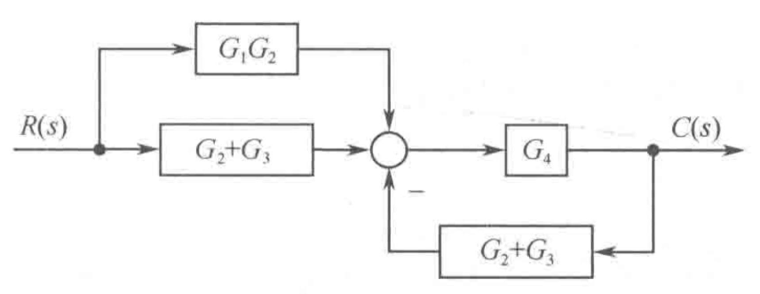

> Image description: A control system block diagram is shown in Figure 2-18-10, titled "Simplified structure diagram of system (b) when $N(s)=0$." The input signal $R(s)$ enters from the left and splits into two forward paths. The upper path passes through a block labeled $G_1G_2$, while the lower path passes through a block labeled $G_2+G_3$. Both paths converge at a summing junction. The output of this summing junction feeds into a final block, $G_4$, which produces the system output $C(s)$. A feedback loop is present, where the signal $C(s)$ is routed back through a block labeled $G_2+G_3$ and enters the summing junction with a negative sign, indicating negative feedback. The diagram uses standard engineering notation for transfer functions in the Laplace domain to represent the relationship between the input reference $R(s)$ and the controlled output $C(s)$.
图2－18－10 $N(s)=0$ 时系统（b）简化结构图

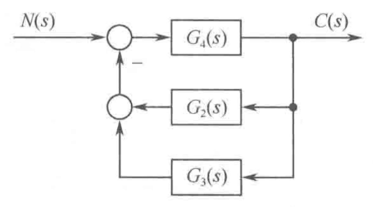

> Image description: A technical block diagram of a control system in the Laplace domain is shown. The input signal, labeled $N(s)$, enters from the left and passes through a summing junction. From this junction, the signal flows forward into a block labeled $G_4(s)$. The output of $G_4(s)$ is designated as $C(s)$. The system features two feedback loops returning from the output $C(s)$ to the input summing junction. One loop passes through block $G_2(s)$, and the other passes through block $G_3(s)$. The outputs of $G_2(s)$ and $G_3(s)$ are combined at a second summing junction before being subtracted from the main signal path at the first junction, as indicated by the minus sign. Arrows indicate the direction of signal flow throughout the system. The caption identifies this as a simplified structure diagram for system (b) when $N(s)=0$.
图 2－18－11 $R(s)=0$ 时系统（b）简化结构图

2－19 试绘制教材中图 2－56 各系统结构图对应的信号流图，并用梅森增益公式求各系统的传递函数 $C(s) / R(s)$ 。

解 本题研究系统的信号流图，以及运用梅森增益公式求传递函数。
（1）图2－56（a）系统。系统信号流图如图2－19－1所示。由图2－19－1可知，本系统有两条前向通道，一个单独回路，即

$$
\begin{array}{ll}
L_{1}=-G_{2} G_{3}, & \Delta=1-L_{1}=1+G_{2} G_{3} \\
p_{1}=G_{1}, & \Delta_{1}=1 \\
p_{2}=G_{2}, & \Delta_{2}=1
\end{array}
$$

由梅森增益公式可得系统的传递函数为

$$
\frac{C(s)}{R(s)}=\frac{\sum p_{i} \Delta_{i}}{\Delta}=\frac{G_{1}+G_{2}}{1+G_{2} G_{3}}
$$

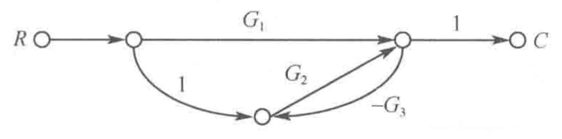

> Image description: A signal flow graph representing "System (a)" is shown in Figure 2-19-1. The diagram consists of nodes and directed edges indicating the flow of signals from an input to an output. The system begins at node $R$ on the left, with a forward arrow leading to a central junction. From this junction, two paths diverge: one direct path leads horizontally to a subsequent node via a branch labeled $G_1$, and another curved path descends to a lower node via a branch labeled $1$. From the lower node, an upward-sloping arrow returns to the main horizontal line with a gain of $G_2$. Additionally, there is a feedback loop returning from the main line back to the lower node, labeled $-G_3$. Finally, a forward path leads from the final junction to the output node $C$ with a gain of $1$. The graph illustrates the algebraic relationships and signal routing within a control system.
图2－19－1 系统（a）信号流图

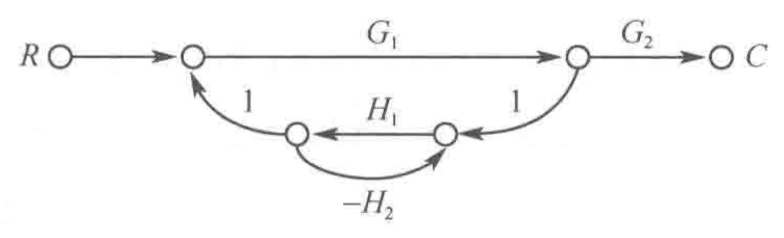

> Image description: This figure is a signal flow graph representing a system, labeled as "图2－19－1 系统（a）信号流图". The diagram consists of nodes connected by directed edges (arrows) indicating the direction of signal flow. The process begins at an input node labeled $R$, which connects to a central node via a forward arrow. From this central node, a primary path leads toward an output node labeled $C$ through a gain block denoted as $G_1$. This path then passes through another node before reaching $C$ via a final gain block $G_2$. A feedback loop is present: from the node between $G_1$ and $G_2$, a signal flows backward through a gain of $1$ to a node, then through $H_1$ to another node, and finally back to the starting central node via a path labeled $-H_2$ and a gain of $1$. This structure represents a classic control system with forward gains and feedback components.
图2－19－2 系统（b）信号流图

<!-- source_pdf_page: 31 -->
（2）图2－56（b）系统。系统信号流图如图2－19－2所示。由图2－19－2可知，本系统有一条前向通道，两个单独回路，即

$$
\begin{gathered}
L_{1}=H_{1}, \quad L_{2}=-H_{1} H_{2}, \quad \Delta=1-\left(L_{1}+L_{2}\right)=1-G_{1} H_{1}+H_{1} H_{2} \\
p_{1}=G_{1} G_{2}, \quad \Delta_{1}=1+H_{1} H_{2}
\end{gathered}
$$

由梅森增益公式可得系统的传递函数为

$$
\frac{C(s)}{R(s)}=\frac{\sum p_{i} \Delta_{i}}{\Delta}=\frac{G_{1} G_{2}\left(1+H_{1} H_{2}\right)}{1-G_{1} H_{1}+H_{1} H_{2}}
$$

（3）图 2－56（c）系统。系统信号流图如图 2－19－3 所示。由图 2－19－3 可知，本系统有两条前向通道，两个单独回路，即

$$
\begin{gathered}
L_{1}=-G_{2} H_{1}, \quad L_{2}=-G_{1} G_{2} H_{2}, \quad \Delta=1-\left(L_{1}+L_{2}\right)=1+G_{2} H_{1}+G_{1} G_{2} H_{2} \\
p_{1}=G_{1} G_{2}, \quad \Delta_{1}=1 \\
p_{2}=G_{2} G_{3}, \quad \Delta_{2}=1
\end{gathered}
$$

由梅森增益公式可得系统的传递函数为

$$
\frac{C(s)}{R(s)}=\frac{\sum p_{i} \Delta_{i}}{\Delta}=\frac{G_{1} G_{2}+G_{2} G_{3}}{1+G_{2} H_{1}+G_{1} G_{2} H_{2}}
$$

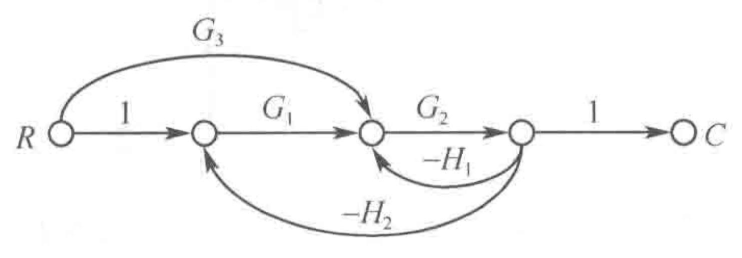

> Image description: A signal flow graph representing system (c), as indicated by the caption "图2-19-3系统（c）信号流图." The diagram consists of four nodes connected by directed edges. The leftmost node is labeled $R$ (input). From $R$, one path leads directly to a second node via an edge with a gain of $1$. A second path, a forward branch labeled $G_3$, arcs over the top to connect $R$ to a third node. This third node is connected to the second node by an edge labeled $G_1$. From the third node, a forward path leads to a fourth node via an edge labeled $G_2$. Finally, the fourth node connects to the rightmost node, labeled $C$ (output), through an edge with a gain of $1$. Two feedback loops are present: one edge labeled $-H_1$ returns from the fourth node to the third node, and another edge labeled $-H_2$ returns from the fourth node back to the second node.
图2－19－3系统（c）信号流图

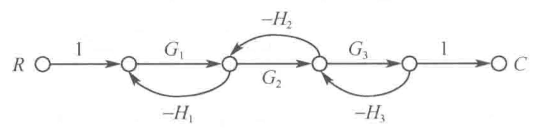

> Image description: A signal flow graph representing system (c), as indicated by the caption "图2-19-3系统（c）信号流图." The diagram depicts a unidirectional flow from an input node $R$ on the left to an output node $C$ on the right. The path consists of several interconnected nodes and directed edges: 1. An initial edge with a gain of $1$ connects node $R$ to the first internal node. 2. A forward path continues through three sequential gains labeled $G_1$, $G_2$, and $G_3$. 3. Three feedback loops are present: - A loop from the second node back to the first with gain $-H_1$. - A loop from the third node back to the second with gain $-H_2$. - A loop from the fourth node back to the third with gain $-H_3$. 4. The final edge connects the last internal node to output $C$ with a gain of $1$. This structure represents a control system with multiple nested feedback loops.
图2－19－4 系统（d）信号流图

（4）图2－56（d）系统。系统信号流图如图2－19－4所示。由图2－19－4可知，本系统有一条前向通道，三个单独回路，其中一对回路互不接触：

$$
\begin{gathered}
L_{1}=-G_{1} H_{1}, \quad L_{2}=-G_{2} H_{2}, \quad L_{3}=-G_{3} H_{3} ; L_{1} \text { 与 } L_{3} \text { 不接触, } L_{1} L_{3}=G_{1} H_{1} G_{3} H_{3} \\
\Delta=1-\left(L_{1}+L_{2}+L_{3}\right)+L_{1} L_{3}=1+G_{1} H_{1}+G_{2} H_{2}+G_{3} H_{3}+G_{1} H_{1} G_{3} H_{3} \\
p_{1}=G_{1} G_{2} G_{3}, \quad \Delta_{1}=1
\end{gathered}
$$

由梅森增益公式可得系统的传递函数为

$$
\frac{C(s)}{R(s)}=\frac{\sum p_{i} \Delta_{i}}{\Delta}=\frac{G_{1} G_{2} G_{3}}{1+G_{1} H_{1}+G_{2} H_{2}+G_{3} H_{3}+G_{1} H_{1} G_{3} H_{3}}
$$

（5）图2－56（e）系统。系统信号流图如图2－19－5所示。由图2－19－5可知，本系统有两条前向通道，三个回路，无不接触回路，即

$$
\begin{gathered}
L_{1}=-G_{2} H_{1}, \quad L_{2}=-G_{2} G_{3} H_{2}, \quad L_{3}=G_{1} G_{2} H_{1} \\
\Delta=1-\left(L_{1}+L_{2}+L_{3}\right)=1+G_{2} H_{1}+G_{2} G_{3} H_{2}-G_{1} G_{2} H_{1} \\
p_{1}=G_{1} G_{2} G_{3}, \quad \Delta_{1}=1 \\
p_{2}=G_{4}, \quad \Delta_{2}=\Delta
\end{gathered}
$$

由梅森增益公式可得系统的传递函数为

<!-- source_pdf_page: 32 -->
$$
\frac{C(s)}{R(s)} k_{z}=\frac{\sum p_{i} \Delta_{i}}{\Delta}=\frac{G_{1} G_{2} G_{3}}{1+G_{2} H_{1}+G_{2} G_{3} H_{2}-G_{1} G_{2} H_{1}}+G_{4}
$$

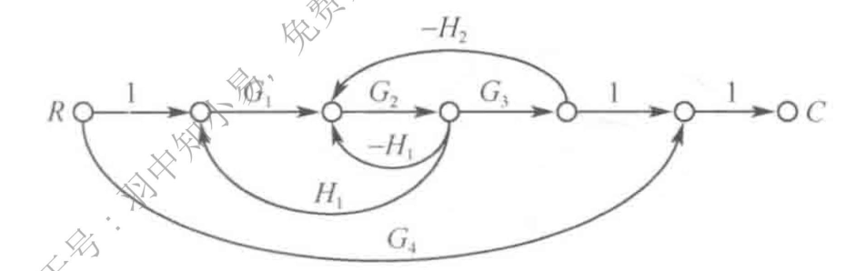

> Image description: A signal flow graph representing a system (labeled as "图2-19-5 系统（e）信号流图") is shown, mapping the path from an input node $R$ to an output node $C$. The graph consists of several nodes connected by directed edges with associated gain variables. From $R$, one path goes through a gain of 1 to a central node, while another bypasses it via a branch labeled $G_4$ leading directly toward the end. Between the input and output, there is a forward path consisting of gains $G_1$, $G_2$, and $G_3$. The system includes feedback loops: one loop returns from the node after $G_1$ back to itself with gain $-H_1$, and another larger loop returns from the node after $G_3$ back to the start of $G_2$ with gain $-H_2$. Additionally, a path labeled $H_1$ connects the node after $G_1$ back toward the input. The final segment leads to output $C$ via two edges with gains of 1.
图2－19－5 系统（e）信号流图

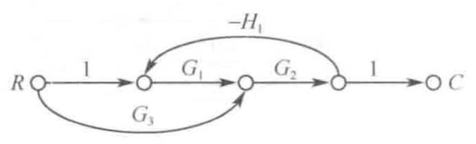

> Image description: This image shows a signal flow graph labeled as "图2-19-5 系统 (e) 信号流图" (Figure 2-19-5 System (e) Signal Flow Graph). The diagram represents a system's mathematical structure using nodes and directed edges. The flow begins at node $R$ on the left, connected by a forward arrow with a gain of $1$ to a second node. From this second node, there is a forward path through an edge labeled $G_1$ leading to a third node, followed by another forward edge labeled $G_2$ leading to a fourth node. This final node connects via an arrow with a gain of $1$ to the output node $C$. The system includes two feedback loops: one returning from the fourth node back to the second node with a label $-H_1$, and another returning from the third node back to the starting node $R$ labeled $G_3$.
图2－19－6 系统（f）信号流图

（6）图 2－56（f）系统。系统信号流图如图 2－19－6所示。由图 2－19－6可知，本系统有两条前向通道，一个单独回路，即

$$
\begin{array}{ll}
L_{1}=-G_{1} G_{2} H_{1}, & \Delta=1-L_{1}=1+G_{1} G_{2} H_{1} \\
p_{1}=G_{1} G_{2}, & \Delta_{1}=1 \\
p_{2}=G_{2} G_{3}, & \Delta_{2}=1
\end{array}
$$

由梅森增益公式可得系统的传递函数为

$$
\frac{C(s)}{R(s)}=\frac{\sum p_{i} \Delta_{i}}{\Delta}=\frac{G_{1} G_{2}+G_{2} G_{3}}{1+G_{1} G_{2} H_{1}}
$$

2－20 画出教材中图 2－57 各系统结构图对应的信号流图，并用梅森增益公式求各系统的传递函数 $C(s) / R(s)$ 和 $C(s) / N(s)$ 。

解 本题研究系统的信号流图，以及运用梅森增益公式求传递函数。
（1）图2－57（a）系统。系统信号流图如图2－20－1所示。
仅考虑输人 $R(s)$ 作用于系统时，本系统有一条前向通道，两个单独回路，即

$$
\begin{gathered}
L_{1}=-G_{1} G_{2} H_{1}, \quad L_{2}=-G_{1} G_{2}, \quad \Delta=1-\left(L_{1}+L_{2}\right)=1+G_{1} G_{2} H_{1}+G_{1} G_{2} \\
p_{1}=G_{1} G_{2}, \quad \Delta_{1}=1
\end{gathered}
$$

由梅森增益公式，可得系统的传递函数

$$
\frac{C(s)}{R(s)}=\frac{\sum p_{i} \Delta_{i}}{\Delta}=\frac{G_{1} G_{2}}{1+G_{1} G_{2} H_{1}+G_{1} G_{2}}
$$

仅考虑扰动 $N(s)$ 作用于系统时，本系统有两条前向通道，两个单独回路，即

$$
\begin{gathered}
L_{1}=-G_{1} G_{2} H_{1}, \quad L_{2}=-G_{1} G_{2}, \quad \Delta=1-\left(L_{1}+L_{2}\right)=1+G_{1} G_{2} H_{1}+G_{1} G_{2} \\
p_{1}=-1, \quad L_{1} \text { 与 } p_{1} \text { 不接触, } \quad \Delta_{1}=1+G_{1} G_{2} H_{1} \\
p_{2}=G_{2} G_{3}, \\
\Delta_{2}=1
\end{gathered}
$$

由梅森增益公式可得系统的传递函数为

$$
\frac{C(s)}{N(s)}=\frac{\sum p_{i} \Delta_{i}}{\Delta}=\frac{G_{2} G_{3}-\left(1+G_{1} G_{2} H_{1}\right)}{1+G_{1} G_{2} H_{1}+G_{1} G_{2}}=-\frac{1-G_{2} G_{3}+G_{1} G_{2} H_{1}}{1+G_{1} G_{2}+G_{1} G_{2} H_{1}}
$$

（2）图2－57（b）系统。系统信号流图如图2－20－2所示。

<!-- source_pdf_page: 33 -->
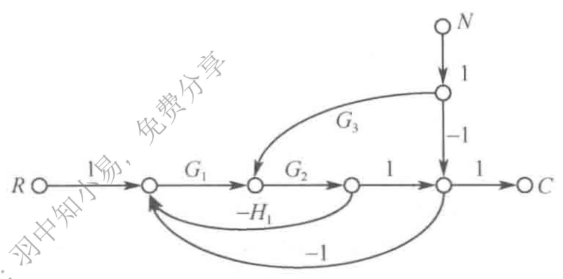

> Image description: A signal flow graph labeled "图 2－20－1 系统（a）信号流图" depicts a system with input node $R$ and output node $C$. The signal flows from left to right through several nodes. From node $R$, an arrow with gain $1$ leads to the first internal node. From there, a forward path continues through gains $G_1$ and $G_2$ toward the final summation node before reaching output $C$ via a gain of $1$. The system includes several feedback loops: one loop returns from the final summation node back to the first internal node with a gain of $-1$, and another local loop exists between the second and third nodes with a gain of $-H_1$. Additionally, there is a path from an external input node $N$ through a gain of $1$ to a node that feeds into the main path via a gain of $-1$. A forward feed-forward path $G_3$ connects this upper branch back to the node after $G_1$.
图 2－20－1 系统（a）信号流图

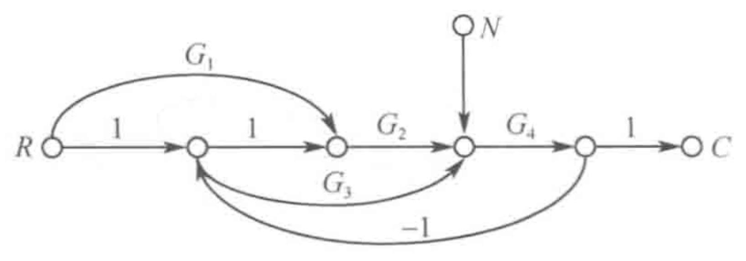

> Image description: A signal flow graph labeled "图 2－20－1 系统（a）信号流图" depicts a system with nodes and directed edges representing signal paths. The graph starts at node $R$ on the left and ends at node $C$ on the right. The main forward path consists of several segments: an edge from $R$ to a middle node with a gain of 1, followed by another edge with a gain of 1 leading to a junction. From this junction, an edge labeled $G_2$ leads to a central node, which also receives an input from node $N$ via a vertical downward arrow. From the central node, an edge labeled $G_4$ leads to a final intermediate node, followed by an edge with a gain of 1 connecting to node $C$. Additionally, there are feedback and feedforward loops: a path labeled $G_1$ arcs from $R$ forward to the junction before $G_2$, and a return path with a gain of $-1$ arcs back from the node after $G_4$ to an earlier node. A path labeled $G_3$ connects the junction before $G_2$ to the central node.
图2－20－2 系统（b）信号流图

仅考虑输人 $R(s)$ 作用于系统时，本系统有三条前向通道，两个单独回路，即

$$
\begin{aligned}
L_{1}=-G_{2} G_{4}, \quad L_{2}= & - & G_{3} G_{4}, \quad \Delta=1 & -\left(L_{1}+L_{2}\right)=1+G_{2} G_{4}+G_{3} G_{4} \\
& p_{1}=G_{2} G_{4}, & & \Delta_{1}=1 \\
& p_{2}=G_{1} G_{2} G_{4}, & & \Delta_{2}=1 \\
& p_{3}=G_{3} G_{4}, & & \Delta_{3}=1
\end{aligned}
$$

由梅森增益公式可得系统的传递函数为

$$
\frac{C(s)}{R(s)}=\frac{\sum p_{i} \Delta_{i}}{\Delta}=\frac{G_{2} G_{4}+G_{1} G_{2} G_{4}+G_{3} G_{4}}{1+G_{2} G_{4}+G_{3} G_{4}}
$$

仅考虑扰动 $N(s)$ 作用于系统时，本系统有一条前向通道，两个单独回路，即

$$
\begin{gathered}
L_{1}=-G_{2} G_{4}, \quad L_{2}=-G_{3} G_{4}, \quad \Delta=1-\left(L_{1}+L_{2}\right)=1+G_{2} G_{4}+G_{3} G_{4} \\
p_{1}=G_{4}, \quad \Delta_{1}=1
\end{gathered}
$$

，由梅森增益公式可得系统的传递函数为

$$
\frac{C(s)}{N(s)}=\frac{\sum p_{i} \Delta_{i}}{\Delta}=\frac{G_{4}}{1+G_{2} G_{4}+G_{3} G_{4}}
$$

2－21 试绘制图 2－58 中系统结构图对应的信号流图，并用梅森增益公式求传递函数 $C(s) / R(s)$ 和 $E(s) / R(s)$ 。

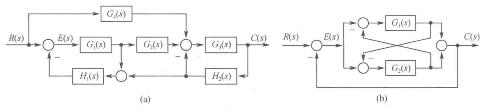

> Image description: The image contains two control system block diagrams, labeled (a) and (b). Both systems represent feedback loops with input signal $R(s)$, error signal $E(s)$, and output signal $C(s)$. Diagram (a) features a forward path consisting of blocks $G_1(s)$, $G_2(s)$, and $G_3(s)$ in series. There are multiple feedback paths: one from the output $C(s)$ through $H_2(s)$, another inner loop involving $H_1(s)$, and a feed-forward path via block $G_4(s)$ that bypasses $G_1(s)$ and $G_2(s)$. Summing junctions indicate where signals are added or subtracted before entering subsequent blocks. Diagram (b) shows a parallel structure where the error signal $E(s)$ splits into two paths containing blocks $G_1(s)$ and $G_2(s)$. These paths cross over, with their outputs summed to produce $C(s)$. A global negative feedback loop connects the output $C(s)$ back to the initial summing junction.
图2－58 题2－21系统结构图

解 本题研究系统的信号流图，以及运用梅森增益公式求解系统传递函数。
（1）图2－58（a）系统。信号流图如图2－21－1所示。
用梅森增益公式求传递函数 $C(s) / R(s)$ ：观察系统信号流图可知，本系统有两条前向通道，三个单独回路，其中一对回路互不接触，即

<!-- source_pdf_page: 34 -->
$$
\begin{array}{cl}
L_{1}=-G_{1} H_{1}, \quad L_{2}=-G_{3} H_{2}, & L_{3}=-G_{1} G_{2} G_{3} H_{1} H_{2} \\
L_{1} \text { 与 } L_{2} \text { 不接触, } & L_{1} L_{2}=G_{1} G_{3} H_{1} H_{2} \\
\left.\Delta=1-\left(L_{1}\right) L_{2}+L_{3}\right)+L_{1} L_{2}=1+G_{1} H_{1}+G_{3} H_{2}+G_{1} G_{2} G_{3} H_{1} H_{2}+G_{1} G_{3} H_{1} H_{2} & \Delta_{1}=1 \\
& p_{1}=G_{1} G_{2} G_{3}, \\
& p_{2}=G_{3} G_{4}, \quad L_{1} \text { 与 } p_{2} \text { 不接触, } \\
& \Delta_{2}=1+G_{1} H_{1}
\end{array}
$$

由梅森增益公式可得传递函数 $C(s) / R(s)$ 为

$$
\frac{C(s)}{R(s)}=\frac{\sum p_{i} \Delta_{i}}{\Delta}=\frac{G_{1} G_{2} G_{3}+G_{3} G_{1}\left(1+G_{1} H_{1}\right)}{1+G_{1} H_{1}+G_{3} H_{2}+G_{1} G_{2} G_{3} H_{1} H_{2}+G_{1} G_{3} H_{1} H_{2}}
$$

用梅森增益公式求传递函数 $E(s) / R(s)$ ：观察系统信号流图可知，本系统有两条前向通道，三个单独回路，其中一对回路互不接触，即

$$
\begin{array}{cll}
L_{1}=-G_{1} H_{1}, & L_{2}=-G_{3} H_{2}, & L_{3}=-G_{1} G_{2} G_{3} H_{1} H_{2} \\
L_{1} & \text { 与 } L_{2} \text { 不接触, } & L_{1} L_{2}=G_{1} G_{3} H_{1} H_{2} \\
\Delta=1-\left(L_{1}+L_{2}+L_{3}\right)+L_{1} L_{2}=1+G_{1} H_{1}+G_{3} H_{2}+G_{1} G_{2} G_{3} H_{1} H_{2}+G_{1} G_{3} H_{1} H_{2} \\
p_{1}=1, \quad L_{2} \text { 与 } p_{1} \text { 不接触, } & \Delta_{1}=1+G_{3} H_{2} \\
p_{2}=-G_{3} G_{4} H_{1} H_{2}, & \Delta_{2}=1
\end{array}
$$

由梅森增益公式可得传递函数 $E(s) / R(s)$ 为

$$
\frac{E(s)}{R(s)}=\frac{\sum p_{i} \Delta_{i}}{\Delta}=\frac{1+G_{3} H_{2}-G_{3} G_{4} H_{1} H_{2}}{1+G_{1} H_{1}+G_{3} H_{2}+G_{1} G_{2} G_{3} H_{1} H_{2}+G_{1} G_{3} H_{1} H_{2}}
$$

（2）图 2－58（b）系统。信号流图如图 2－21－2 所示。

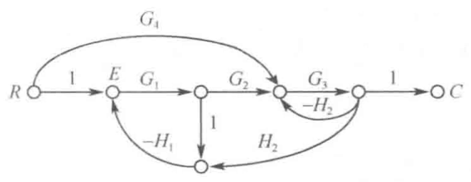

> Image description: A signal flow graph representing a system is shown in Figure 2-58(b). The diagram consists of nodes and directed edges labeled with transfer functions. The signal flows from an input node $R$ to an output node $C$. A forward path exists from $R$ to $E$ with a gain of $1$, then through $G_1$ and $G_2$ to a central node, and finally via $G_3$ and another gain of $1$ to reach $C$. An additional direct feed-forward path connects $R$ directly to the node before $G_3$ with a gain of $G_4$. The system includes feedback loops. One loop goes from the output of $G_1$ back to $E$ via a path labeled $1$ and $-H_1$. A second, larger feedback loop extends from the node after $G_2$ back toward the first loop through paths labeled $-H_2$ and $H_2$. These components represent the mathematical relationships of a control system.
图 2－21－1 系统（a）信号流图

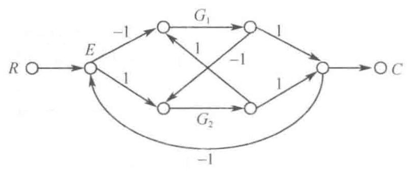

> Image description: A signal flow graph labeled "图 2－21－1 系统（a）信号流图" depicts a system with an input node $R$ and an output node $C$. The signal flows from left to right, starting at $R$, which connects via a directed arrow to node $E$. From node $E$, the path splits into three parallel branches. The top branch goes to node $G_1$ with a gain of $-1$; the middle branch crosses diagonally toward $G_2$ with a gain of $1$; and the bottom branch leads to node $G_2$ with a gain of $1$. Between nodes $G_1$ and $G_2$, there are cross-coupling paths: an arrow from $G_1$ to $G_2$ with a gain of $-1$, and an arrow from $G_2$ to $G_1$ with a gain of $1$. Both $G_1$ and $G_2$ then converge toward node $C$ via paths with gains of $1$. Additionally, a feedback loop exists from node $C$ back to node $E$ with a gain of $-1$.
图 2－21－2 系统（b）信号流图

用梅森增益公式求传递函数 $C(s) / R(s)$ ：观察系统信号流图可知，本系统有四条前向通道，五个单独回路，无不接触回路，即

$$
\begin{aligned}
& L_{1}=G_{1}, \quad L_{2}=-G_{2}, \quad L_{3}=-G_{1} G_{2}, \quad L_{4}=-G_{1} G_{2}, \quad L_{5}=-G_{1} G_{2} \\
& \begin{aligned}
\Delta=1-\left(L_{1}+L_{2}+L_{3}+L_{4}+L_{5}\right) & =1-G_{1}+G_{2}+3 G_{1} G_{2} \\
p_{1}=-G_{1}, \quad \Delta_{1}=1 ; \quad p_{2} & =G_{2}, \quad \Delta_{2}=1 \\
p_{3}=G_{1} G_{2}, \quad \Delta_{3}=1 ; \quad p_{4} & =G_{1} G_{2}, \quad \Delta_{4}=1
\end{aligned}
\end{aligned}
$$

由梅森增益公式可得传递函数 $C(s) / R(s)$ 为

$$
\frac{C(s)}{R(s)}=\frac{\sum p_{i} \Delta_{i}}{\Delta}=\frac{-G_{1}+G_{2}+2 G_{1} G_{2}}{1-G_{1}+G_{2}+3 G_{1} G_{2}}
$$

用梅森增益公式求传递函数 $E(s) / R(s)$ ：观察系统信号流图可知，本系统有一条前向通道，五个单独回路，即

$$
L_{1}=G_{1}, \quad L_{2}=-G_{2}, \quad L_{3}=-G_{1} G_{2}, \quad L_{4}=-G_{1} G_{2}, \quad L_{5}=-G_{1} G_{2}
$$

<!-- source_pdf_page: 35 -->
$$
\begin{gathered}
\Delta=1-\left(L_{1}+L_{2}+L_{3}+L_{4}+L_{5}\right)=1-G_{1}+G_{2}+3 G_{1} G_{2} \\
p_{1}=1, \quad L_{5} \text { 与 } p_{1} \text { 不接触, } \quad \Delta_{1}=1+G_{1} G_{2}
\end{gathered}
$$

由梅森增益公武可得传递函数 $E(s) / R(s)$ 为

$$
\frac{E(s)}{R(s)}=\frac{\sum p_{i} \Delta_{i}}{\Delta}=\frac{1+G_{1} G_{2}}{1-G_{1}+G_{2}+3 G_{1} G_{2}}
$$

面通过结构图等效变换法进行验证。
（3）图2－58（a）系统。结构图如图2－21－3所示。

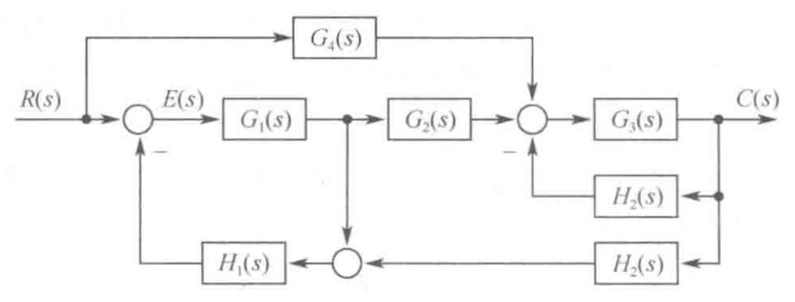

> Image description: This image shows a control system block diagram labeled as Figure 2-58(a). The system processes an input signal $R(s)$ to produce an output signal $C(s)$. The forward path consists of three sequential blocks: $G_1(s)$, $G_2(s)$, and $G_3(s)$. An error signal $E(s)$ is generated at the first summing junction, where $R(s)$ enters. A feed-forward path connects $R(s)$ to a second summing junction via block $G_4(s)$. The system incorporates multiple feedback loops. One loop feeds back from the output $C(s)$ through block $H_2(s)$ to the second summing junction. Another complex feedback path returns from $C(s)$ through another $H_2(s)$ block, sums with a signal coming from between $G_1(s)$ and $G_2(s)$, and then passes through block $H_1(s)$ back to the first summing junction. Arrows indicate the direction of signal flow throughout the network.
图2－21－3 系统（a）结构图

经过反馈连接等效，可得图 2－21－4 所示结构图变换；经过比较点后移，可得图 2－21－5所示简化结构图，则系统传递函数为

$$
\begin{aligned}
\frac{C(s)}{R(s)} & =\left(G_{4}+\frac{G_{1} G_{2}}{1+G_{1} H_{1}}\right) \cdot \frac{\frac{G_{3}}{1+G_{3} H_{2}}}{1+\frac{G_{1} G_{2} G_{3} H_{1} H_{2}}{\left(1+G_{1} H_{1}\right)\left(1+G_{3} H_{2}\right)}} \\
& =\frac{G_{1} G_{2} G_{3}+G_{3} G_{4}\left(1+G_{1} H_{1}\right)}{1+G_{1} H_{1}+G_{3} H_{2}+G_{1} G_{2} G_{3} H_{1} H_{2}+G_{1} G_{3} H_{1} H_{2}}
\end{aligned}
$$

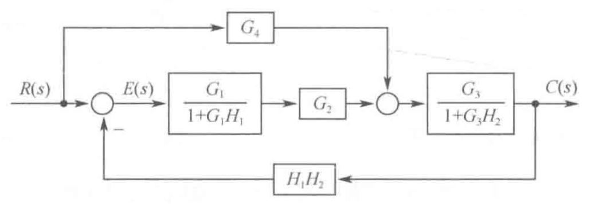

> Image description: A control system block diagram is shown in Figure 2-21-4, titled "系统（a）结构图变换" (System (a) structural diagram transformation). The input signal $R(s)$ enters from the left into a summing junction. From this point, the signal splits: one path goes through block $G_4$ to a second summing junction, and another continues as error signal $E(s)$. The main forward path consists of three sequential blocks: $\frac{G_1}{1+G_1H_1}$, $G_2$, and $\frac{G_3}{1+G_3H_2}$. The output of the first two blocks is summed with the signal from $G_4$ before entering the final block to produce the output $C(s)$. A feedback loop returns the output $C(s)$ through a block labeled $H_1H_2$ back to the initial summing junction with a negative sign, indicating negative feedback. The diagram represents a complex linear time-invariant system in the Laplace domain.
图 2－21－4 系统（a）结构图变换

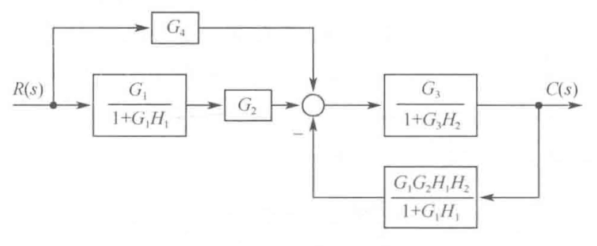

> Image description: A control system block diagram is shown in Figure 2-21-4, titled "系统（a）结构图变换" (System (a) structural diagram transformation). The input signal $R(s)$ enters from the left and splits into two paths. The upper path passes through a block labeled $G_4$. The lower path passes through a block with the transfer function $\frac{G_1}{1+G_1H_1}$, followed by a block labeled $G_2$. These two paths converge at a summing junction, where the output of $G_4$ is added and the output of $G_2$ is subtracted. The resulting signal enters a block with the transfer function $\frac{G_3}{1+G_3H_2}$, leading to the final output $C(s)$. A feedback loop returns from $C(s)$ through a block labeled $\frac{G_1G_2H_1H_2}{1+G_1H_1}$ back to the summing junction. Arrows indicate the unidirectional flow of signals between blocks and junctions, representing the mathematical relationships within the linear time-invariant system.
图2－21－5 系统（a）简化结构图

<!-- source_pdf_page: 36 -->
又由系统结构图可知

$$
E(s)=R(s)-\left(C(s) H_{2}(s)+E(s) G_{1}(s)\right) \cdot H_{1}(s)
$$

即

$$
\left(1+G_{1} H_{1}\right) \frac{E(s)}{R(s)}=1-H_{1} H_{2} \frac{C(s)}{R(s)}
$$

代人 $\frac{C(s)}{R(s)} \frac{G_{1} G_{2} G_{3}+G_{3} G_{4}\left(1+G_{1} H_{1}\right)}{1+G_{1} H_{1}+G_{3} H_{2}+G_{1} G_{2} G_{3} H_{1} H_{2}+G_{1} G_{3} H_{1} H_{2}}$ ，可得

$$
\frac{E(s)}{R(s)}=\frac{1+G_{3} H_{2}-G_{3} G_{4} H_{1} H_{2}}{1+G_{1} H_{1}+G_{3} H_{2}+G_{1} G_{2} G_{3} H_{1} H_{2}+G_{1} G_{3} H_{1} H_{2}}
$$

（4）图2－58（b）系统。将 $G_{2}$ 与左边的比较点移位，可得图2－21－6所示结构图。

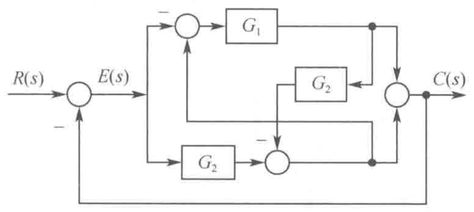

> Image description: This image shows a control system block diagram labeled as Figure 2-58(b). The system begins with an input signal $R(s)$ entering a summing junction, where it is compared with a feedback loop from the output $C(s)$, resulting in an error signal $E(s)$. The signal $E(s)$ branches into two paths. One path leads to a block labeled $G_2$, which then enters another summing junction. The second path goes toward a summing junction that feeds into a block labeled $G_1$. A third internal loop involves another block $G_2$ positioned between the output of $G_1$ and a preceding summing junction. The outputs of these parallel paths are combined at a final summing junction to produce the system output $C(s)$. The diagram illustrates a complex feedback control architecture with multiple nested loops and transfer functions $G_1$ and $G_2$, representing the mathematical relationship between input and output in the s-domain.
图2－21－6 系统（b）结构图

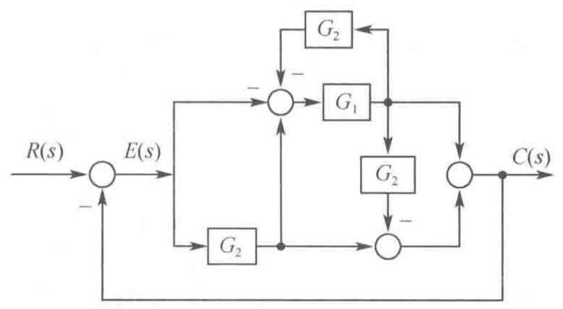

> Image description: This figure is a control system block diagram labeled "图2－21－6 系统（b）结构图." The system begins with an input signal $R(s)$ entering a summing junction, where it is compared with a feedback loop from the output $C(s)$, resulting in the error signal $E(s)$. The signal $E(s)$ splits into two paths: one leading directly to a second summing junction and another passing through a block labeled $G_2$. This $G_2$ path feeds back into the same summing junction and also proceeds forward to a third summing junction. The output of the second summing junction passes through block $G_1$, which then feeds into both a feedback loop containing another $G_2$ block and a final summing junction. The final output $C(s)$ is the result of these combined paths. Arrows indicate the unidirectional flow of signals between blocks and junctions, representing a complex closed-loop control architecture with multiple internal feedback loops.
图 2－21－7 系统（b）结构图变换

经过引出点与比较点的互相移位，可得图2－21－7所示简化结构图；经过比较点合并及并联等效，可得图 2－21－8 所示简化结构图；经过反馈等效和串联等效，可得图 2－21－9 所示，简化结构图，则系统传递函数为

$$
\frac{C(s)}{R(s)}=\frac{G_{2}+\frac{G_{1}\left(G_{2}-1\right)\left(1-G_{2}\right)}{1+G_{1} G_{2}}}{1+G_{2}+\frac{G_{1}\left(G_{2}-1\right)\left(1-G_{2}\right)}{1+G_{1} G_{2}}}=\frac{-G_{1}+G_{2}+2 G_{1} G_{2}}{1-G_{1}+G_{2}+3 G_{1} G_{2}}
$$

又由系统结构图可知

$$
E(s)=R(s)-C(s)
$$

即

$$
\frac{E(s)}{R(s)}=1-\frac{C(s)}{R(s)}
$$

代人 $\frac{C(s)}{R(s)}=\frac{-G_{1}+G_{2}+2 G_{1} G_{2}}{1-G_{1}+G_{2}+3 G_{1} G_{2}}$ ，可得

$$
\frac{E(s)}{R(s)}=\frac{1+G_{1} G_{2}}{1-G_{1}+G_{2}+3 G_{1} G_{2}}
$$

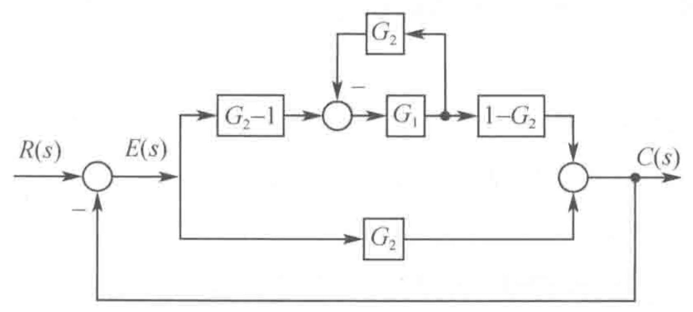

> Image description: A control system block diagram labeled "图2－21－8 系统（b）结构图变换" illustrates a feedback loop with multiple signal paths. The input variable $R(s)$ enters a summing junction to produce the error signal $E(s)$. From $E(s)$, the signal splits into two parallel branches. The upper branch passes through block $G_2-1$, then into another summing junction where it is modified by a local feedback loop containing block $G_2$. This path continues through block $G_1$ and finally through block $1-G_2$. The lower branch consists of a single block, $G_2$. Both branches converge at a final summing junction to produce the output variable $C(s)$. A global feedback loop carries $C(s)$ back to the initial summing junction with a negative sign. Arrows indicate the direction of signal flow from left to right and through the feedback paths.
图2－21－8 系统（b）结构图变换

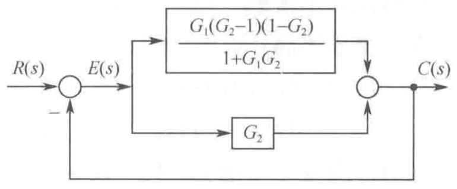

> Image description: A control system block diagram labeled "图2－21－8 系统（b）结构图变换" depicts a feedback loop. The input signal $R(s)$ enters from the left into a summing junction, where it is compared with a feedback signal to produce the error signal $E(s)$. The forward path splits into two parallel branches. The upper branch contains a transfer function block defined as $\frac{G_1(G_2-1)(1-G_2)}{1+G_1G_2}$. The lower branch consists of a single block labeled $G_2$. Both branches converge at a second summing junction to produce the output signal $C(s)$. A feedback loop connects the output $C(s)$ back to the initial summing junction with a negative sign, indicating negative feedback. Arrows indicate the unidirectional flow of signals from left to right through the blocks and backward through the feedback path. The diagram represents a mathematical transformation of a system's structural layout in the s-domain.
图2－21－9 系统（b）简化结构图

<!-- source_pdf_page: 37 -->
2－22 试用梅森增益公式求图2－59中各系统信号流图的传递函数 $C(s) / R(s)$ 。

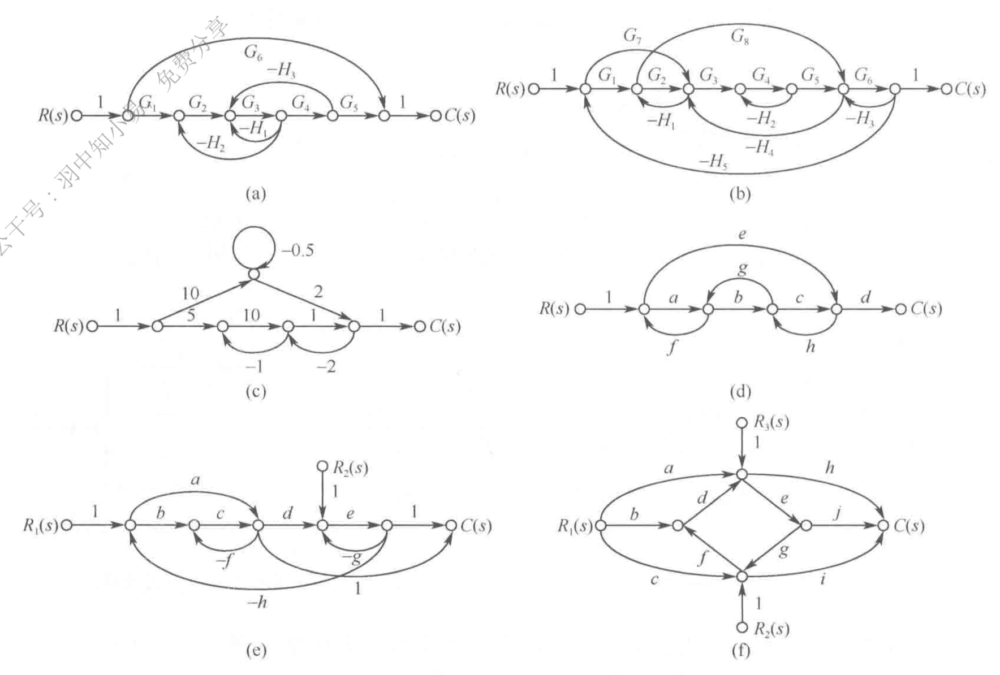

> Image description: This image contains six signal flow graphs, labeled (a) through (f), used to determine transfer functions $C(s)/R(s)$ using Mason's gain formula. Each graph consists of nodes connected by directed edges with associated gains. * **(a)** shows a linear chain from input $R(s)$ to output $C(s)$ via nodes $G_1$ through $G_5$, with feedback loops involving $G_6, -H_3, -H_2,$ and $-H_1$. * **(b)** features a more complex network of forward paths ($G_1$ to $G_6$) and multiple overlapping feedback loops ($-H_1$ through $-H_5$) and feed-forward paths ($G_7, G_8$). * **(c)** uses numerical gains (e.g., 10, 5, -1) with a self-loop of -0.5. * **(d)** employs alphabetical labels ($a$ through $h$) for edge weights. * **(e)** and **(f)** introduce multiple input sources ($R_1(s), R_2(s)$) and complex interconnected paths leading to the output $C(s)$.
图2－59 题2－22系统信号流图

解 本题研究运用梅森增益公式求传递函数。
（1）图2－59（a）系统。考查信号流图2－59（a），其存在两条前向通道，三个单独回路，无不接触回路，即

$$
\begin{aligned}
L_{1} & =-G_{3} H_{1}, \quad L_{2}=-G_{2} G_{3} H_{2}, \quad L_{3}=-G_{3} G_{4} H_{3} \\
\Delta=1 & -\left(L_{1}+L_{2}+L_{3}\right)=1+G_{3} H_{1}+G_{2} G_{3} H_{2}+G_{3} G_{4} H_{3} \\
p_{1} & =G_{1} G_{2} G_{3} G_{4} G_{5}, \quad \Delta_{1}=1 \\
p_{2} & =G_{6}, \quad L_{1}, L_{2}, L_{3} \text { 与 } p_{2} \text { 均不接触, } \quad \Delta_{2}=\Delta
\end{aligned}
$$

由梅森增益公式可得系统的传递函数为

$$
\frac{C(s)}{R(s)}=\frac{\sum p_{i} \Delta_{i}}{\Delta}=\frac{G_{1} G_{2} G_{3} G_{4} G_{5}}{1+G_{3} H_{1}+G_{2} G_{3} H_{2}+G_{3} G_{4} H_{3}}+G_{6}
$$

（2）图2－59（b）系统。考查信号流图2－59（b），其存在四条前向通道，九个单独回路，其中六对回路互不接触，一组三回路互不接触，即

九个单独回路：$L_{1}=-G_{2} H_{1}, L_{2}=-G_{4} H_{2}, L_{3}=-G_{6} H_{3}, \quad L_{4}=-G_{3} G_{4} G_{5} H_{4}$

$$
\begin{array}{ll}
L_{5}=-G_{1} G_{2} G_{3} G_{4} G_{5} G_{6} H_{5}, & L_{6}=-G_{3} G_{4} G_{5} G_{6} G_{7} H_{5}, \quad L_{7}=-G_{1} G_{6} G_{8} H_{5} \\
L_{8}=G_{6} G_{7} G_{8} H_{1} H_{5}, & L_{9}=G_{8} H_{1} H_{4}
\end{array}
$$

六对回路互不接触：$L_{1} L_{2}=G_{2} H_{1} G_{4} H_{2}, L_{1} L_{3}=G_{2} H_{1} G_{6} H_{3}, L_{2} L_{3}=G_{4} H_{2} G_{6} H_{3}$

$$
L_{2} L_{7}=G_{4} H_{2} G_{1} G_{6} G_{8} H_{5}, \quad L_{2} L_{8}=-G_{4} H_{2} G_{6} G_{7} G_{8} H_{1} H_{5}, \quad L_{2} L_{9}=-G_{4} H_{2} G_{8} H_{1} H_{4}
$$

一组三回路互不接触：$L_{1} L_{2} L_{3}=-G_{2} H_{1} G_{4} H_{2} G_{6} H_{3}$

<!-- source_pdf_page: 38 -->
$$
\begin{array}{rlr}
\Delta= & 1+G_{2} H_{1}+G_{4} H_{2}+G_{6} H_{3}+G_{3} G_{4} G_{5} H_{4}+G_{1} G_{2} G_{3} G_{4} G_{5} G_{6} H_{5} \\
& +G_{3} G_{4} G_{5} G_{6} G_{8} H_{5}+G_{1} G_{6} G_{8} H_{5}-G_{6} G_{7} G_{8} H_{1} H_{5}-G_{8} H_{1} H_{4}+G_{2} H_{1} G_{6} H_{3} \\
& \left.+G_{4} H_{2}\left(G_{2}\right) H_{1}+G_{6} H_{3}+G_{1} G_{6} G_{8} H_{5}-G_{6} G_{7} G_{8} H_{1} H_{5}-G_{8} H_{1} H_{4}+G_{2} H_{1} G_{6} H_{3}\right) \\
& p_{1}=G_{1} G_{2} G_{3} G_{4} G_{5} G_{6}, \quad \Delta_{1}=1 \\
& p_{2}=G_{3} G_{4} G_{5} G_{6} G_{7}, \quad \Delta_{2}=1 \\
& p_{3}=G_{1} G_{6} G_{8}, & \Delta_{3}=1+G_{4} H_{2} \\
& p_{4}=-G_{6} G_{7} G_{8} H_{1}, & \Delta_{4}=1+G_{4} H_{2}
\end{array}
$$

由梅森增益公式可得系统的传递函数为

$$
\frac{C(s)}{R(s)}=\frac{\sum p_{i} \Delta_{i}}{\Delta}=\frac{G_{3} G_{4} G_{5} G_{6}\left(G_{1} G_{2}+G_{7}\right)+G_{6} G_{8}\left(G_{1}-G_{7} H_{1}\right)\left(1+G_{4} H_{2}\right)}{\Delta}
$$

（3）图2－59（c）系统。考查信号流图2－59（c），其存在两条前向通道，三个单独回路，两对互不接触回路，即

$$
\begin{aligned}
& L_{1}=-0.5, \quad L_{2}=-1 \times 10, \quad L_{3}=-1 \times 2 \\
& L_{1} \text { 与 } L_{2} \text { 不接触, } L_{1} L_{2}=5 ; \quad L_{1} \text { 与 } L_{3} \text { 不接触, } L_{1} L_{3}=1 \\
& \Delta=1-\left(L_{1}+L_{2}+L_{3}\right)+L_{1} L_{2}+L_{1} L_{3}=1+0.5+10+2+5+1=19.5 \\
& p_{1}=5 \times 10=50, \quad L_{1} \text { 与 } p_{1} \text { 不接触, } \Delta_{1}=1+0.5=1.5 \\
& p_{2}=2 \times 10=20, \quad L_{2} \text { 与 } p_{2} \text { 不接触, } \Delta_{2}=1+10=11
\end{aligned}
$$

由梅森增益公式可得系统的传递函数为

$$
\frac{C(s)}{R(s)}=\frac{\sum p_{i} \Delta_{i}}{\Delta}=\frac{50 \times 1.5+20 \times 11}{19.5}=15.128
$$

（4）图2－59（d）系统。考查信号流图2－59（d），其存在两条前向通道，四个单独回路，一对互不接触回路，即

$$
\begin{gathered}
L_{1}=a f, \quad L_{2}=b g, \quad L_{3}=c h, \quad L_{4}=e f g h ; \quad L_{1} \text { 与 } L_{3} \text { 不接触, } L_{1} L_{3}=a f c h \\
\Delta=1-\left(L_{1}+L_{2}+L_{3}+L_{4}\right)+L_{1} L_{3}=1-a f-b g-c h-e f g h+a c f h \\
p_{1}=a b c d, \\
\Delta_{1}=1 \\
p_{2}=d e, \quad L_{2} \text { 与 } p_{2} \text { 不接触, } \quad \Delta_{2}=1-b g
\end{gathered}
$$

由梅森增益公式可得系统的传递函数为

$$
\frac{C(s)}{R(s)}=\frac{\sum p_{i} \Delta_{i}}{\Delta}=\frac{a b c d+d e(1-b g)}{1-a f-b g-c h-e f g h+a c f h}
$$

（5）图2－59（e）系统。考查信号流图2－59（e）。仅考虑输人 $R_{1}(s)$ 作用时，系统存在四条前向通道，四个单独回路，一对互不接触回路，即

$$
\begin{aligned}
& L_{1}=-c f, L_{2}=-e g, L_{3}=-a d e h, L_{4}=-b c d e h ; L_{1} \text { 与 } L_{2} \text { 不接触, } L_{1} L_{2}=c f e g \\
& \Delta=1-\left(L_{1}+L_{2}+L_{3}+L_{4}\right)+L_{1} L_{2}=1+c f+e g+a d e h+b c d e h+c e f g \\
& p_{1}=b c d e, \\
& p_{2}=a d e, \\
& \Delta_{1}=1 \\
& p_{3}=b c, \quad L_{2} \text { 与 } p_{3} \text { 不接触, } \Delta_{3}=1+e g \\
& p_{4}=a, \quad L_{2} \text { 与 } p_{4} \text { 不接触, } \Delta_{4}=1+e g
\end{aligned}
$$

由梅森增益公式可得此时系统的传递函数为

<!-- source_pdf_page: 39 -->
$$
\frac{C(s)}{R_{h_{s}}(s)}=\frac{\sum p_{i} \Delta_{i}}{\Delta}=\frac{b c d e+a d e+(a+b c)(1+e g)}{1+c f+e g+a d e h+b c d e h+c e f g}
$$

仅考虑输 $R_{2}(s)$ 作用时，系统存在三条前向通道，四个单独回路，一对互不接触回路，即

$$
\begin{array}{ll}
L_{1}=c f, L_{2}=-e g, L_{3}=-a d e h, L_{4}=-b c d e h ; L_{1} \text { 与 } L_{2} \text { 不接触, } L_{1} L_{2}=c f e g \\
\\
p_{1}=e l, \quad L_{1} \text { 与 } p_{1} \text { 不接触, } & \Delta_{1}=1+c f \\
p_{2}=-a e h l, & \Delta_{2}=1 \\
p_{3}=-b c e l h, & \Delta_{3}=1
\end{array}
$$

由梅森增益公式可得此时系统的传递函数为

$$
\frac{C(s)}{R_{2}(s)}=\frac{\sum p_{i} \Delta_{i}}{\Delta}=\frac{e l(1+c f-a h-b c h)}{1+c f+e g+a d e h+b c d e h+c e f g}
$$

（6）图 2－59（f）系统。考查信号流图 2－59（f）。仅考虑输人 $R_{1}(s)$ 作用时，系统存在九条前向通道，一个单独回路，即

$$
\begin{array}{ll} 
& L_{1}=d e f g, \quad \Delta=1-L_{1}=1-d e f g \\
p_{1}=a h, & p_{2}=a e j, \quad p_{3}=a e g i, \quad p_{4}=b d h, \quad p_{5}=b d e j \\
p_{6}=b d e g i, \quad & p_{7}=c i, \quad p_{8}=c d f h, \quad p_{9}=c d e f j \\
& \Delta_{i}=1 \quad(i=1, \cdots, 9)
\end{array}
$$

由梅森增益公式可得此时系统的传递函数为

$$
\frac{C(s)}{R_{1}(s)}=\frac{\sum p_{i} \Delta_{i}}{\Delta}=\frac{a h+a e j+a e g i+b d h+b d e j+b d e g i+c i+c d f h+c d e f j}{1-d e f g}
$$

仅考虑输人 $R_{2}(s)$ 作用时，系统存在三条前向通道，一个单独回路，即

$$
\begin{aligned}
& L_{1}=d e f g, \quad \Delta=1-L_{1}=1-d e f g \\
& p_{1}=i, \quad p_{2}=d f h, \quad p_{3}=d e f j \\
& \Delta_{i}=1 \quad(i=1,2,3)
\end{aligned}
$$

由梅森增益公式可得此时系统的传递函数为

$$
\frac{C(s)}{R_{2}(s)}=\frac{\sum p_{i} \Delta_{i}}{\Delta}=\frac{i+d f h+d e f j}{1-d e f g}
$$

仅考虑输人 $R_{3}(s)$ 作用时，系统存在三条前向通道，一个单独回路，即

$$
\begin{aligned}
& L_{1}=\operatorname{defg}, \quad \Delta=1-L_{1}=1-\operatorname{defg} \\
& p_{1}=h, \quad p_{2}=e j, \quad p_{3}=e g i \\
& \Delta_{i}=1 \quad(i=1,2,3)
\end{aligned}
$$

由梅森增益公式可得此时系统的传递函数为

$$
\frac{C(s)}{R_{3}(s)}=\frac{\sum p_{i} \Delta_{i}}{\Delta}=\frac{h+e j+e g i}{1-d e f g}
$$

2－23 图 2－60 所示为双摆系统，双摆悬挂在无摩擦的旋轴上，并且用弹簧把它们的中点连在一起。假定：摆的质量为 $M$ ；摆杆长度为 $l$ ，摆杆质量不计；弹簧置于摆杆的 $l / 2$ 处，其弹性系数为 $k$ ；摆的角位移很小， $\sin \theta 、 \cos \theta$ 均可进行线性近似处理；当 $\theta_{1}=\theta_{2}$ 时，位于杆中间

<!-- source_pdf_page: 40 -->
的弹簧无变形，且外力输入 $f(t)$ 只作用于左侧的杆。若令 $a=g / l+k / 4 M, b=k / 4 M$ 要求：
（1）列写双摆系统的运动方程；
（2）确定传递函数 $\Theta_{1}(s) / F(s)$ ；
（3）两用双摆系统的结构图和信号流图。
解本题为系统数学模型建立的微分方程法、传递函数法、结构图法和信号流图法的综合运用，其结果可以相互转化与验证。
（1）运动方程。弹簧所受到的压力为

$$
F=k \frac{l}{2}\left(\sin \theta_{1}-\sin \theta_{2}\right)
$$

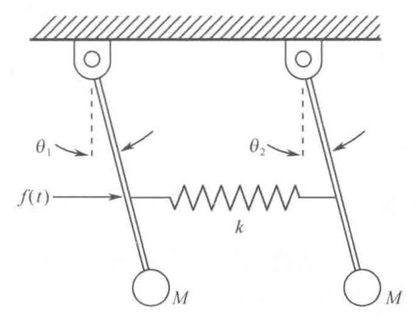

> Image description: This technical diagram illustrates a double pendulum system, as indicated by the caption "图2-60 双摆系统示意图." The system consists of two identical pendulums, each with a mass $M$ at the end, suspended from fixed pivots on a horizontal ceiling. The angular displacement of the left pendulum is labeled $\theta_1$, and the right is $\theta_2$. A spring with stiffness constant $k$ connects the two rods. An external force vector, denoted as $f(t)$, is applied horizontally to the left rod at the point where it attaches to the spring. Arrows indicate the direction of angular movement for both pendulums. The figure represents a coupled mechanical oscillator system used in engineering and physics to study synchronized motion and forced vibrations.
图2－60 双摆系统示意图

左边摆杆的受力方程为

即

$$
\begin{gathered}
f(t) \frac{l}{2} \cos \theta_{1}-F \frac{l}{2} \cos \theta_{1}-M g l \sin \theta_{1}=M l^{2} \frac{\mathrm{~d}^{2} \theta_{1}}{\mathrm{~d} t^{2}} \\
\frac{\mathrm{~d}^{2} \theta_{1}}{\mathrm{~d} t^{2}}=\frac{f(t) \cos \theta_{1}}{2 M l}-\frac{F \cos \theta_{1}}{2 M l}-\frac{g \sin \theta_{1}}{l}
\end{gathered}
$$

右边摆杆的受力方程为

即

$$
\begin{gathered}
F \frac{l}{2} \cos \theta_{2}-M g l \sin \theta_{2}=M l^{2} \frac{\mathrm{~d}^{2} \theta_{2}}{\mathrm{~d} t^{2}} \\
\frac{\mathrm{~d}^{2} \theta_{2}}{\mathrm{~d} t^{2}}=\frac{F \cos \theta_{2}}{2 M l}-\frac{g \sin \theta_{2}}{l}
\end{gathered}
$$

因 $\theta_{1}$ 与 $\theta_{2}$ 很小，故近似有

$$
\begin{array}{ll}
\sin \theta_{1}=\theta_{1}, & \cos \theta_{1}=1 \\
\sin \theta_{2}=\theta_{2}, & \cos \theta_{2}=1
\end{array}
$$

将 $F=k \frac{1}{2}\left(\sin \theta_{1}-\sin \theta_{2}\right)$ 代人左右摆杆的受力方程，并对受力方程作线性化处理，得到两个方程

$$
\begin{aligned}
& \ddot{\theta}_{1}=\frac{1}{2 M l} f(t)-\left(\frac{g}{l}+\frac{k}{4 M}\right) \theta_{1}+\frac{k}{4 M} \theta_{2} \\
& \ddot{\theta}_{2}=\frac{k}{4 M} \theta_{1}-\left(\frac{g}{l}+\frac{k}{4 M}\right) \theta_{2}
\end{aligned}
$$

将 $a=g / l+k / 4 M, b=k / 4 M$ 代人以上两个方程，并令 $\omega_{1}=\dot{\theta}_{1}, \omega_{2}=\dot{\theta}_{2}$ ，得到双摆系统的运动方程

$$
\begin{aligned}
\frac{\mathrm{d} \omega_{1}}{\mathrm{~d} t} & =\ddot{\theta}_{1}=-a \theta_{1}(t)+b \theta_{2}(t)+\frac{1}{2 M l} f(t) \\
\frac{\mathrm{d} \omega_{2}}{\mathrm{~d} t} & =\ddot{\theta}_{2}=b \theta_{1}(t)-a \theta_{2}(t)
\end{aligned}
$$

（2）传递函数。设全部初始条件为零，对系统运动方程进行拉氏变换，有

$$
s^{2} \Theta_{1}(s)=-a \Theta_{1}(s)+b \Theta_{2}(s)+\frac{1}{2 M l} F(s)
$$

<!-- source_pdf_page: 41 -->
$$
s^{2} \Theta_{2}(s)=b \Theta_{1}(s)-a \Theta_{2}(s)
$$

显然

$$
\Theta_{2}(s)=\frac{b}{s^{2}+a} \Theta_{1}(s)
$$

故

$$
\left(s^{2}+a-\frac{b}{s^{2}+a}\right) \Theta_{1}(s)=\frac{1}{2 M l} F(s)
$$

求出

$$
\frac{\Theta_{1}(s)}{F(s)}=\frac{1}{2 M l} \cdot \frac{s^{2}+a}{\left(s^{2}+a\right)^{2}-b^{2}}
$$

（3）结构图与信号流图。依据信号的传递关系，画出系统结构图和信号流图如图 2－23－1及图 2－23－2 所示。

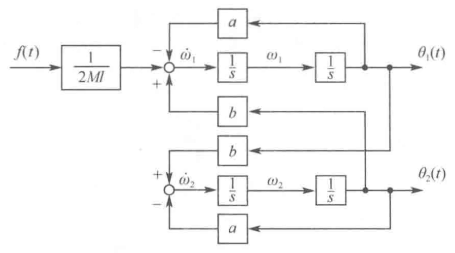

> Image description: A block diagram of a linear control system is shown, representing the relationship between an input signal $f(t)$ and two output signals $\theta_1(t)$ and $\theta_2(t)$. The input $f(t)$ passes through a gain block labeled $\frac{1}{2MI}$ before entering a summing junction. The system consists of two parallel paths with feedback loops. The top path leads to $\theta_1(t)$ via two integrators ($\frac{1}{s}$) and an intermediate variable $\omega_1$. The bottom path leads to $\theta_2(t)$ via two integrators and an intermediate variable $\omega_2$. Cross-coupling is evident: a feedback loop with gain $a$ connects $\theta_1(t)$ back to the first summing junction, and another with gain $a$ connects $\theta_2(t)$ to the second. Additionally, blocks with gain $b$ create cross-feedback between the two paths, connecting $\theta_2(t)$ to the input of the top path and $\theta_1(t)$ to the input of the bottom path.
图 2－23－1 双摆系统结构图

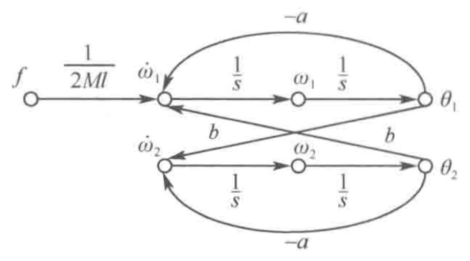

> Image description: This figure is a signal flow graph representing the structural diagram of a double pendulum system (双摆系统结构图). The process begins with an input variable $f$ on the left, connected by an arrow to $\dot{\omega}_1$ via a gain block labeled $\frac{1}{2MI}$. The system consists of two parallel paths. The top path flows from $\dot{\omega}_1$ through an integrator $\frac{1}{s}$ to angular velocity $\omega_1$, and then through another integrator $\frac{1}{s}$ to the output angle $\theta_1$. The bottom path mirrors this, flowing from $\dot{\omega}_2$ through $\frac{1}{s}$ to $\omega_2$, and finally to $\theta_2$. Interconnectivity is shown via feedback loops: a loop returns from $\theta_1$ back to $\dot{\omega}_1$ with a gain of $-a$, and another returns from $\theta_2$ to $\dot{\omega}_2$ with a gain of $-a$. Additionally, cross-coupling arrows with gain $b$ connect $\theta_1$ to $\dot{\omega}_2$ and $\theta_2$ to $\dot{\omega}_1$.
图2－23－2 双摆系统信号流图

信号流图与传递函数：为了便于观察，将信号流图改画为图 2－23－3 所示。由图2－23－3有

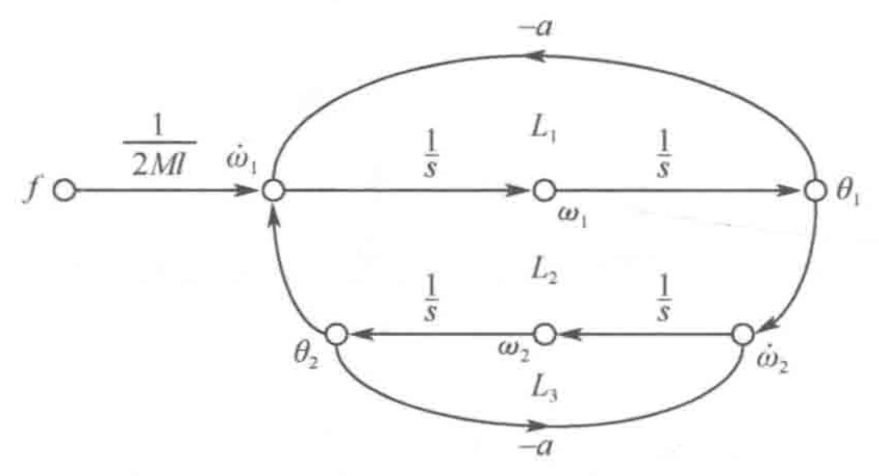

> Image description: A signal flow graph representing a system's transfer function is shown in Figure 2-23-3. The diagram consists of nodes connected by directed edges with associated gains. The input variable $f$ enters the system through a gain block $\frac{1}{2MI}$, leading to node $\dot{\omega}_1$. From $\dot{\omega}_1$, a forward path passes through two integrators ($\frac{1}{s}$) via node $\omega_1 (L_1)$ to reach output node $\theta_1$. A feedback loop returns from $\theta_1$ back to $\dot{\omega}_1$ with a gain of $-a$. A second parallel path extends from $\theta_1$ through node $\dot{\omega}_2$, then through two integrators ($\frac{1}{s}$) via node $\omega_2 (L_2)$ to reach node $\theta_2$. From $\theta_2$, another feedback loop returns to $\dot{\omega}_1$ with a gain of $-a$ ($L_3$). The graph illustrates the dynamic relationships between angular acceleration, velocity, and position for two coupled components.
图 2－23－3 双摆系统信号流图

$$
\begin{gathered}
L_{1}=-\frac{a}{s^{2}}, \quad L_{2}=\frac{b^{2}}{s^{4}}, \quad L_{3}=-\frac{a}{s^{2}} \\
\Delta=1-\left(L_{1}+L_{2}+L_{3}\right)+L_{1} L_{3}, \quad p_{1}=\frac{1}{2 M l s^{2}}, \quad \Delta_{1}=1-L_{3}
\end{gathered}
$$

应用梅森增益公式，即求得

$$
\frac{\Theta_{1}(s)}{F(s)}=\frac{p_{1} \Delta_{1}}{\Delta}=\frac{p_{1}\left(1-L_{3}\right)}{1-\left(L_{1}+L_{2}+L_{3}\right)+L_{1} L_{3}}=\frac{1}{2 M l} \cdot \frac{s^{2}+a}{\left(s^{2}+a\right)^{2}-b^{2}}
$$

2－24 城市生态系统的多回路模型可能包括下列变量：城市人口数量（变量节点 $P$ ）、现代化程度（变量节点 $M$ ）、流人城市人数（变量节点 $C$ ）、卫生设施（变量节点 $S$ ）、疾病数量（变量节点 $D$ ）、单位面积的细菌数（变量节点 $B$ ）、单位面积的垃圾数（变量节点 $G$ ）等。假定各

<!-- source_pdf_page: 42 -->
变量节点间遵循下列因果关系：
（1）$P \rightarrow G \rightarrow B \rightarrow D \rightarrow P$ ；
（2）$P \rightarrow M \rightarrow P$ ；
（3）$P \rightarrow M \rightarrow S \rightarrow D \rightarrow P$ ；
（4）$P \rightarrow M \rightarrow S \rightarrow B \rightarrow D \rightarrow P$ 。
各变量带点间支路增益的符号待确定。例如，改变卫生设施后，将减少单位面积的细菌数，因此绖到 $B$ 传输的支路增益应该为负。试确定各支路增益的正负，用恰当的符号，如 $a, b$ ， $c, \vec{a}, e, f, g, h, k, m$ 等表示支路增益，画出这些因果关系的信号流图，并回答在所给出的四个回路中，哪个是正反馈回路，哪个是负反馈回路？

解 信号流图如图 2－24－1 所示。由图可见，在给出的四个回路中，第一个回路为负反馈回路，其余为正反馈回路。

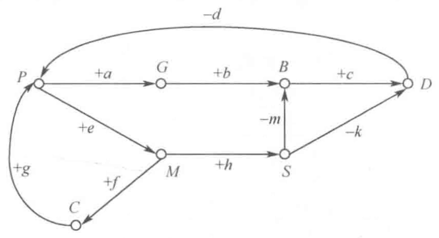

> Image description: A signal flow graph is depicted, consisting of nodes labeled $P$, $G$, $B$, $D$, $M$, $C$, and $S$. Directed edges connect these nodes, each associated with a variable representing gain or transmission. The paths from node $P$ to destination node $D$ include: 1. A direct path via an edge labeled $-d$. 2. A forward path through nodes $G$ and $B$ with labels $+a$, $+b$, and $+c$. 3. A path through nodes $M$ and $S$ with labels $+e$, $+h$, and $-k$. Additionally, there are internal connections: an edge from node $S$ to $B$ labeled $-m$, and a loop involving nodes $P$, $C$, and $M$ via edges $+g$ and $+f$. The figure represents a system of linear equations where the variables on the arrows indicate the coefficients of the signal transmission between different states or components.
图 2－24－1 生态系统的信号流图

