<!-- source_pdf_page: 43 -->
## 第三章 线性系统的时域分析法

3． 1 设某高阶系统可用下列一阶微分方程近似描述：

$$
T_{\dot{c}}(t)+c(t)=\tau \dot{r}(t)+r(t) \quad(1>(T-\tau)>0)
$$

试证明系统的动态性能指标为

$$
t_{r}=2.2 T, \quad t_{s}=\left[3+\ln \left(\frac{T-\tau}{T}\right)\right] T \quad(\Delta=0.05)
$$

证明 首先要明确动态性能指标的概念，然后根据概念来进行证明。
动态性能指标：描述稳定的系统在单位阶跃函数作用下，动态过程随时间 $t$ 的变化状况的指标。

根据系统的微分方程可得到其传递函数

$$
\frac{C(s)}{R(s)}=\frac{\tau s+1}{T s+1}
$$

在单位阶跃输入作用下，有 $R(s)=\frac{1}{s}$ ，于是

则

$$
\begin{aligned}
C(s)=\frac{\tau s+1}{T s+1} \cdot \frac{1}{s} & =\frac{1}{s}-\frac{T-\tau}{T s+1} \\
& =\frac{1}{s}-\frac{T-\tau}{T} \cdot \frac{1}{s+\frac{1}{T}} \\
c(t)= & 1-\frac{T-\tau}{T} \mathrm{e}^{-t / T}
\end{aligned}
$$

$t_{r}$ 表示上升时间，指响应曲线从终值 $10 \%$ 上升到终值 $90 \%$ 所需的时间。令

$$
t_{r}=t_{2}-t_{1}
$$

其中

$$
c\left(t_{1}\right)=1-\frac{T-\tau}{T} \mathrm{e}^{-t_{1} / T}=0.1, \quad c\left(t_{2}\right)=1-\frac{T-\tau}{T} \mathrm{e}^{-t_{2} / T}=0.9
$$

解得

$$
t_{1}=\left[\ln \left(\frac{T-\tau}{T}\right)-\ln 0.9\right] T, \quad t_{2}=\left[\ln \left(\frac{T-\tau}{T}\right)-\ln 0.1\right] T
$$

则

$$
t_{r}=t_{2}-t_{1}=T \ln \frac{0.9}{0.1}=2.2 T
$$

$t_{s}$ 表示调节时间，指响应到达并保持在终值 $\pm 5 \%$ 或 $\pm 2 \%$ 内所需的最短时间。当 $t= t_{s}(\Delta=0.05)$ 时，须有

解得

$$
\begin{gathered}
c\left(t_{s}\right)=1-\frac{T-\tau}{T} \mathrm{e}^{-t_{s} / T}=0.95 \\
t_{s}=\left[\ln \left(\frac{T-\tau}{T}\right)-\ln 0.05\right] T=\left[3+\ln \left(\frac{T-\tau}{T}\right)\right] T
\end{gathered}
$$

显然，当取 $\Delta=0.02$ 时，可得

$$
t_{s}=\left[4+\ln \left(\frac{T-\tau}{T}\right)\right] T
$$


<!-- source_pdf_page: 44 -->
3－2 设系统的微分方程式如下：
（1） $0.2 \dot{c}(t)=2 r(t)$ ；
（2） $0.04 \ddot{c}(t)=0.24 \dot{c}(t)+c(t)=r(t)$ 。
试求系统的单位脉冲响应 $c_{1}(t)$ 和单位阶跃响应 $c_{2}(t)$ 。已知全部初始条件为零。
解 此类问题的解决方法主要是先利用拉氏变换将微分方程转换为系统的传递函数，然后根据拉氏反变换求得系统的各类响应。
（何） $0.2 \dot{c}(t)=2 r(t)$ 系统。
由于初始条件为零，对微分方程两边进行拉氏变换可得

$$
0.2 s C(s)=2 R(s)
$$

则系统的传递函数为

$$
\Phi(s)=\frac{C(s)}{R(s)}=\frac{2}{0.2 s}=\frac{10}{s}
$$

当输人为单位脉冲信号时，$R(s)=1$ ，系统的单位脉冲响应

$$
c_{1}(t)=\mathscr{D}^{-1}[\Phi(s)]=\mathscr{L}^{-1}\left[\frac{10}{s}\right]=10 \quad(t \geqslant 0)
$$

当输人为单位阶跃信号时，$R(s)=\frac{1}{s}$ ，系统的单位阶跃响应

$$
c_{2}(t)=\mathscr{L}^{-1}\left[\Phi(s) \cdot \frac{1}{s}\right]=\mathscr{L}^{-1}\left[\frac{10}{s^{2}}\right]=10 t \quad(t \geqslant 0)
$$

（2） $0.04 \ddot{c}(t)+0.24 \dot{c}(t)+c(t)=r(t)$ 系统。
由于初始条件为零，对微分方程两边进行拉氏变换可得

$$
0.04 s^{2} C(s)+0.24 s C(s)+C(s)=R(s)
$$

则系统的传递函数为

$$
\Phi(s)=\frac{C(s)}{R(s)}=\frac{1}{0.04 s^{2}+0.24 s+1}=\frac{25}{s^{2}+6 s+25}
$$

由 $\Phi(s)=\frac{\omega_{n}^{2}}{s^{2}+2 \zeta \omega_{n} s+\omega_{n}^{2}}$ 的形式可以确定

$$
\omega_{n}^{2}=25, \quad 2 \zeta \omega_{n}=6
$$

则 $\omega_{n}=5 . \zeta=0.6, \omega_{d}=\omega_{n} \sqrt{1-\zeta^{2}}=4, \beta=\arctan \left(\frac{\sqrt{1-\zeta^{2}}}{\zeta}\right)=53.2^{\circ}$ 。
当输人为单位脉冲信号时，$R(s)=1$ ，系统的单位脉冲响应

$$
c_{1}(t)=\frac{\omega_{n}}{\sqrt{1-\zeta^{2}}} \mathrm{e}^{-\zeta \omega_{n} t} \sin \omega_{d} t=6.25 \mathrm{e}^{-3 t} \sin 4 t \quad(t \geqslant 0)
$$

当输入为单位阶跃信号时，$R(s)=\frac{1}{s}$ ，系统的单位阶跃响应

$$
c_{2}(t)=1-\frac{1}{\sqrt{1-\zeta^{2}}} \mathrm{e}^{-\zeta_{\omega} t} \sin \left(\omega_{d} t+\beta\right)=1-1.25 \mathrm{e}^{-3 t} \sin \left(4 t+53.2^{\circ}\right) \quad(t \geqslant 0)
$$

应用 MATLAB 软件包，研究第二个系统的时间响应，MATLAB 程序（仿真曲线见图3－2－1、图3－2－2）如下：

MATLAB 程序 ：exe302．m


<!-- source_pdf_page: 45 -->
num $=[25]$ ；den $=\left[\begin{array}{lll}1 & 6 & 25\end{array}\right]$ ；
\％系统闭环传递函数
$\mathrm{t}=0: 0.02: 4$ ；
figure
impulse（ num，den，t）；grid
figure
\％系统单位脉冲响应
step（num，den，t）；
grid
\％系统单位阶跃响应

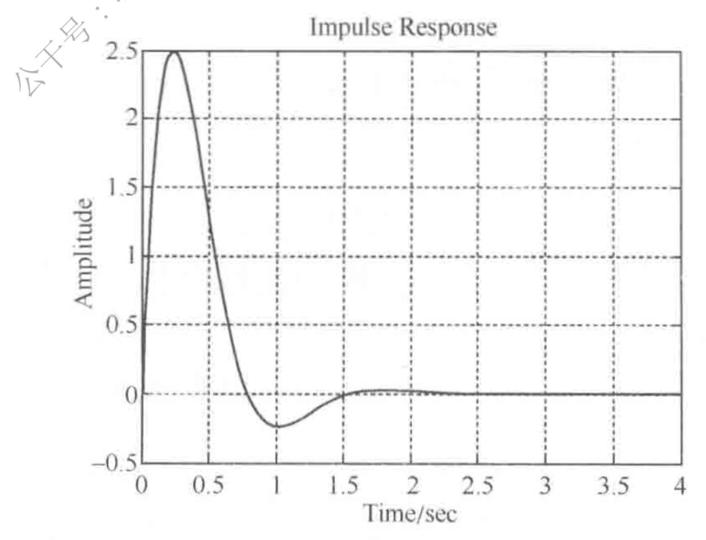

> Image description: The image shows a plot titled "Impulse Response," which is identified by the caption as Figure 3-2-1, representing the unit impulse response curve of system (2) generated via MATLAB. The graph features a Cartesian coordinate system with two axes: the horizontal x-axis represents "Time/sec" ranging from 0 to 4 seconds, and the vertical y-axis represents "Amplitude," ranging from -0.5 to 2.5. A grid of dashed lines is overlaid on the plot for precise reading. The plotted curve starts at the origin (0,0), rises sharply to a peak amplitude of approximately 2.5 at around 0.3 seconds, then descends and crosses the x-axis near 0.7 seconds. It reaches a small negative trough of about -0.2 at roughly 1 second before asymptotically approaching zero as time increases toward 4 seconds. This damped oscillatory behavior is characteristic of a stable linear time-invariant system's response to an impulse input.
图3－2－1 系统（2）的单位脉冲响应曲线（MATLAB）

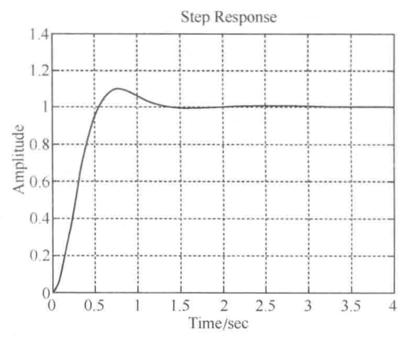

> Image description: A plot titled "Step Response" showing the time-domain response of a system. The vertical y-axis is labeled "Amplitude," ranging from 0 to 1.4 with increments of 0.2. The horizontal x-axis is labeled "Time/sec," ranging from 0 to 4 seconds with major grid markings every 0.5 seconds. The figure displays a single continuous curve starting at the origin (0,0). The response rises sharply, overshooting the steady-state value of 1.0 to reach a peak amplitude of approximately 1.1 around 0.7 seconds. It then oscillates slightly before settling and stabilizing at an amplitude of 1.0 after approximately 2 seconds. This represents a typical underdamped second-order system response to a unit step input, characterized by overshoot and a settling time. The caption identifies this as the unit impulse response curve for "System (2)" generated via MATLAB.
图3－2－2 系统（2）的单位阶跃响应曲线（MATLAB）

3－3 已知各系统的脉冲响应，试求系统闭环传递函数 $\Phi(s)$ ：
（1）$c(t)=0.0125 \mathrm{e}^{-1.25 t}$ ；
（2）$c(t)=5 t+10 \sin \left(4 t+45^{\circ}\right)$ ；
（3）$c(t)=0.1\left(1-\mathrm{e}^{-t / 3}\right) 。$
解 由于输人是单位脉冲信号，即 $R(s)=1$ ，因此系统的脉冲响应的拉氏变换对应系统的闭环传递函数。
（1）$\Phi(s)=\mathscr{L}[c(t)]=\frac{0.0125}{s+1.25}=\frac{0.01}{0.8 s+1}$
（2）$\Phi(s)=\mathscr{L}[c(t)]=\mathscr{L}[5 t+5 \sqrt{2}(\sin 4 t+\cos 4 t)]=\frac{5}{s^{2}}+5 \sqrt{2}\left(\frac{4}{s^{2}+16}+\frac{s}{s^{2}+16}\right)$

$$
=\frac{5}{s^{2}}+\frac{20 \sqrt{2}+5 \sqrt{2} s}{s^{2}+16}=\frac{7.07\left(s^{3}+4.71 s^{2}+11.32\right)}{s^{2}\left(s^{2}+16\right)}
$$

（3）$\Phi(s)=\mathscr{L}[c(t)]=\mathscr{L}\left[0.1\left(1-\mathrm{e}^{-t / 3}\right)\right]=0.1\left[\frac{1}{s}-\frac{3}{3 s+1}\right]=\frac{0.1}{s(3 s+1)}$
3－4 已知二阶系统的单位阶跃响应为

$$
c(t)=10-12.5 \mathrm{e}^{-1.2 t} \sin \left(1.6 t+53.1^{\circ}\right)
$$

试求系统的超调量 $\sigma \%$ 、峰值时间 $t_{p}$ 和调节时间 $t_{s}$ 。
解 此类问题的主要解决方法是将二阶系统的单位阶跃响应的表达式与标准的表达式相比较，解得系统的自然频率和阻尼比，然后运用这些参数计算动态性能指标。

本题二阶系统的单位阶跃响应为

$$
c(t)=10-12.5 \mathrm{e}^{-1.2 t} \sin \left(1.6 t+53.1^{\circ}\right)=10\left[1-1.25 \mathrm{e}^{-1.2 t} \sin \left(1.6 t+53.1^{\circ}\right)\right]
$$

由上式可知，该系统的放大系数是 10 ，但放大系数是不会影响系统的动态性能的。标


<!-- source_pdf_page: 46 -->
准的二阶系统的单位阶跃响应为

$$
\omega^{2}(t)=1-\frac{1}{\sqrt{1-\zeta^{2}}} \mathrm{e}^{-\zeta \omega_{n} t} \sin \left(\omega_{n} \sqrt{1-\zeta^{2}} t+\beta\right)
$$

于是 $\zeta \omega_{n}=1,2, \frac{1}{\sqrt{1-\zeta^{2}}}=1.25, \omega_{n} \sqrt{1-\zeta^{2}}=1.6, \quad \beta=\arccos \zeta=53.1^{\circ}$
解得

$$
\zeta=0.6, \quad \omega_{n}=2
$$

由于 $0<\zeta<1$ ，故该系统为欠阻尼二阶系统，其动态性能指标为
超调量 $\quad \sigma \%=\mathrm{e}^{-\pi \zeta / \sqrt{1-\zeta^{2}}} \times 100 \%=\mathrm{e}^{-0.6 \times 1.25 \pi} \times 100 \%=9.5 \%$
峰值时间 $\quad t_{p}=\frac{\pi}{\omega_{n} \sqrt{1-\zeta^{2}}}=\frac{\pi}{2 \times 0.8}=1.96 \mathrm{~s}$
调节时间 $\quad t_{s}=\frac{3.5}{\zeta \omega_{n}}=\frac{3.5}{1.2}=2.92 \mathrm{~s} \quad(\Delta=5 \%)$
MATLAB 验证结果如下：
MATLAB 程序 ：exe304．m
$\mathrm{wn}=[2] ; \quad \operatorname{kos}=[0.6]$ ；
num $=$ wn 2 ；$\quad$ den $=\left[1,2 *\right.$ kos $\left.* \mathrm{wn}, \mathrm{wn}^{-2}\right]$ ；\％系统闭环传递函数
figure
$\mathrm{t}=0: 0.02: 8$ ；step（num，den，t）；grid \％系统单位阶跃响应

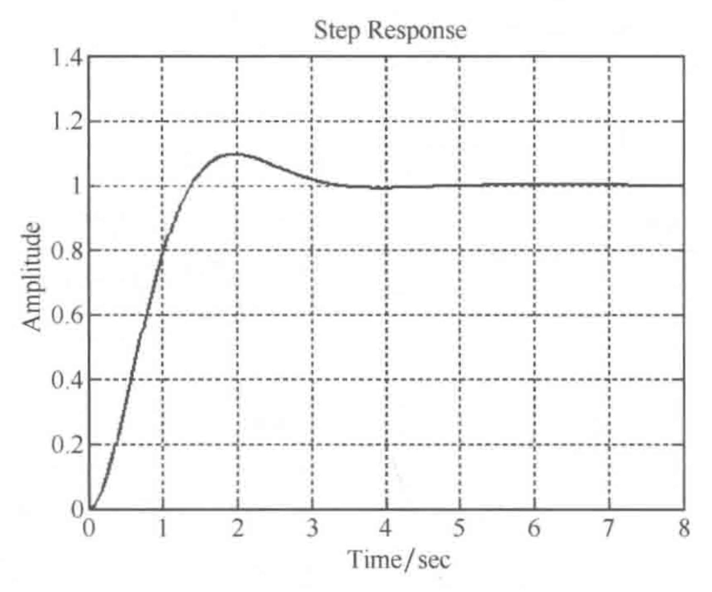

> Image description: This image is a technical plot titled "Step Response," showing the unit step response of a system generated in MATLAB. The graph features a Cartesian coordinate system where the horizontal x-axis represents "Time/sec" ranging from 0 to 8, and the vertical y-axis represents "Amplitude" ranging from 0 to 1.4. The plot displays a single continuous curve starting at the origin (0,0). The response rises sharply, overshooting the steady-state value of 1.0 to reach a peak amplitude of approximately 1.1 at around 2 seconds. Following this peak, the signal exhibits a damped oscillation before settling and stabilizing at an amplitude of 1.0 starting from approximately 4 seconds. This behavior is characteristic of an underdamped second-order system in control engineering, illustrating key performance metrics such as rise time, peak overshoot, and settling time.
图3－4－1 系统的单位阶跃响应曲线（MATLAB）

从图3－4－1可以看出：峰值时间 $t_{p}=1.96 \mathrm{~s}$ ，超调量 $\sigma \%=9.48 \%$ ，调节时间 $t_{s}=2.97 \mathrm{~s}$ 。
3－5 设单位反馈系统的开环传递函数为

$$
G(s)=\frac{0.4 s+1}{s(s+0.6)}
$$

试求系统在单位阶跃输人下的动态性能。
解 由开环传递函数可得系统的闭环传递函数为

$$
\Phi(s)=\frac{G(s)}{1+G(s)}=\frac{0.4 s+1}{s^{2}+s+1}=\frac{0.4(s+2.5)}{s^{2}+s+1}
$$


<!-- source_pdf_page: 47 -->
从 $\Phi(s)$ 的形式可以看出，该系统是比例－微分控制二阶系统，其标准形式为

$$
\begin{gathered}
\Phi(s)=\frac{\omega_{n}^{2}}{z} \cdot \frac{s+z}{s^{2}+2 \zeta_{d} \omega_{n} s+\omega_{n}^{2}} \\
\frac{0.4 s+1}{s^{2}+s+1}=\frac{\omega_{n}^{2}}{z} \cdot \frac{s+z}{s^{2}+2 \zeta_{d} \omega_{n} s+\omega_{n}^{2}}
\end{gathered}
$$

可得 $z$ 衣2． $5, \omega_{n}=1, \zeta_{d}=0.5$ 。由于

$$
\begin{aligned}
r & =\frac{\sqrt{z^{2}-2 \zeta_{d} \omega_{n} z+\omega_{n}^{2}}}{z \sqrt{1-\zeta_{d}^{2}}}=1.007 \\
\psi & =-\pi+\arctan \left(\frac{\omega_{n} \sqrt{1-\zeta_{d}^{2}}}{z-\zeta_{d} \omega_{n}}\right)+\arctan \left(\frac{\sqrt{1-\zeta_{d}^{2}}}{\zeta_{d}}\right) \\
& =-\pi+\arctan \left(\frac{\sqrt{0.75}}{2.5-0.5}\right)+\arctan \left(\frac{\sqrt{0.75}}{0.5}\right)=-1.686 \\
\beta_{d} & =\arctan \left(\frac{\sqrt{1-\zeta_{d}^{2}}}{\zeta_{d}}\right)=\arctan \left(\frac{\sqrt{0.75}}{0.5}\right)=1.047
\end{aligned}
$$

算得该系统的动态性能指标为
峰值时间 $\quad t_{p}=\frac{\beta_{d}-\psi}{\omega_{n} \sqrt{1-\zeta_{d}^{2}}}=3.156 \mathrm{~s}$
超调量 $\quad \sigma \%=r \sqrt{1-\zeta_{d}^{2}} \mathrm{e}^{-\zeta_{d}{ }^{c} \omega^{t} p} \times 100 \%=18.0 \%$

调节时间

$$
\begin{aligned}
t_{s} & =\frac{4+\frac{1}{2} \ln \left(z^{2}-2 \zeta_{d} \omega_{n} z+\omega_{n}^{2}\right)-\ln z-\frac{1}{2} \ln \left(1-\zeta_{d}^{2}\right)}{\zeta_{d} \omega_{n}} \\
& =\frac{4+\ln r}{\zeta_{d} \omega_{n}}=8.01 \mathrm{~s} \quad(\Delta=0.02)
\end{aligned}
$$

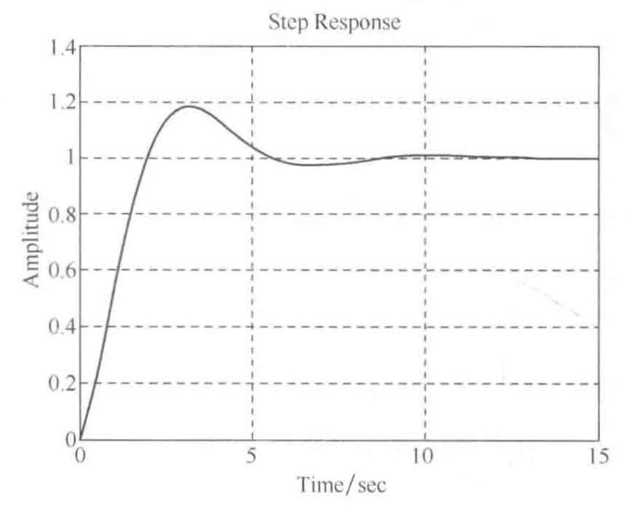

> Image description: This image shows a plot titled "Step Response," which is identified by the caption as Figure 3-5-1, representing a system's unit step response curve generated in MATLAB. The graph features two axes: the vertical y-axis is labeled "Amplitude" and ranges from 0 to 1.4, while the horizontal x-axis is labeled "Time /sec" and ranges from 0 to 15 seconds. The plot displays a single continuous curve starting at the origin (0,0). The response rises sharply, overshooting the steady-state value of 1.0 to reach a peak amplitude of approximately 1.2 around 3 to 4 seconds. It then exhibits damped oscillations, dipping slightly below 1.0 before stabilizing and converging asymptotically toward the final value of 1.0 as time increases. This behavior is characteristic of an underdamped second-order system in control engineering.
图 3－5－1 系统单位阶跃响应曲线（MATLAB）

MATLAB 程序 ：exe305．m
\％建立闭环传递函数模型

$$
\begin{aligned}
& \text { numg }=\left[\begin{array}{lll}
0 . & 4 & 1
\end{array}\right] ; \quad \text { deng }=\left[\begin{array}{llll}
1 & 0 . & 6 & 0
\end{array}\right] ; \\
& \text { numh }=\left[\begin{array}{ll}
1
\end{array}\right] ; \quad \text { denh }=\left[\begin{array}{l}
1
\end{array}\right] ; \\
& {[\text { num, den }]=\text { feedback (numg, deng, numh, denh) }} \\
& \text { sys = tf(num, den); }
\end{aligned}
$$

\％计算系统特征根判断系统稳定性
p＝roots（den）
\％求取系统的单位阶跃响应
figure
$\mathrm{t}=0: 0.1: 15$ ；step（sys，t）；grid
从图3－5－1 中可以看出：峰值时间 $t_{p}=$ 3.2 s ，超调量 $\sigma \%=18.0 \%$ ，调节时间 $t_{s}=7.74 \mathrm{~s}$ 。

3－6 已知控制系统的单位阶跃响应为

$$
c(t)=1+0.2 \mathrm{e}^{-60 t}-1.2 \mathrm{e}^{-10 t}
$$

试确定系统的阻尼比 $\zeta$ 和自然频率 $\omega_{n}$ 。
解 欲确定系统的阻尼比和自然频率，可以通过系统的闭环传递函数获得；而系统的闭


<!-- source_pdf_page: 48 -->
环传递函数恰好是单位脉冲响应的拉氏变换，但已知条件是系统的单位阶跃响应，故可以将其微分得到单位脉冲响应，便可求得结果。

系统的单位脉冲响应为

$$
c(t)=-12 \mathrm{e}^{-60 t}+12 \mathrm{e}^{-10 t}=12\left(\mathrm{e}^{-10 t}-\mathrm{e}^{-60 t}\right)
$$

此时系统的闭环传递函数为

$$
\Phi(s s)=\mathscr{L}[c(t)]=12\left(\frac{1}{s+10}-\frac{1}{s+60}\right)=\frac{600}{s^{2}+70 s+600}=\frac{\omega_{n}^{2}}{s^{2}+2 \zeta \omega_{n} s+\omega_{n}^{2}}
$$

则系统的自然频率和阻尼比为

$$
\omega_{n}=\sqrt{600}=24.5, \quad \zeta=\frac{70}{2 \times \sqrt{600}}=1.43
$$

3－7 设图3－59是简化的飞行控制系统结构图，试选择参数 $K_{1}$ 和 $K_{t}$ ，使系统的 $\omega_{n}=6, \zeta=1$ 。

解 求出图 3－59 所示系统的闭环传递函数，并将其与二阶系统的传递函数的标准形式相比较，便可得所求参数。

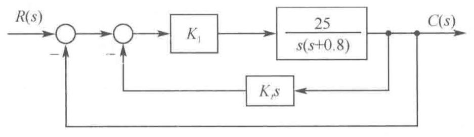

> Image description: This image shows a control system block diagram used to determine a closed-loop transfer function. The input signal is labeled $R(s)$ and the output signal is $C(s)$. The forward path consists of a gain block $K_1$ followed by a plant block with the transfer function $\frac{25}{s(s+0.8)}$. There are two feedback loops returning from the output $C(s)$ to summing junctions before the forward blocks. The inner feedback loop contains a derivative term $K_v s$, while the outer feedback loop is a unity feedback path. Arrows indicate the signal flow from left to right through the forward path and from right to left through the feedback paths. Summing junctions are represented by circles with plus and minus signs, indicating where feedback signals are subtracted from the reference input. The caption in Chinese instructs to find the closed-loop transfer function and compare it with a standard second-order system form to determine specific parameters.
图3－59 飞行控制系统结构图

通过简化结构图，可得系统的开环和闭环传递函数为

$$
\begin{aligned}
G(s) & =\frac{25 K_{1}}{s\left(s+0.8+25 K_{1} K_{t}\right)} \\
\Phi(s) & =\frac{25 K_{1}}{s^{2}+\left(0.8+25 K_{1} K_{t}\right) s+25 K_{1}}
\end{aligned}
$$

二阶系统的传递函数的标准形式为

$$
\Phi(s)=\frac{\omega_{n}^{2}}{s^{2}+2 \zeta \omega_{n} s+\omega_{n}^{2}}
$$

比较可得

$$
25 K_{1}=\omega_{n}^{2}
$$

$$
0.8+25 K_{1} K_{t}=2 \zeta \omega_{n}
$$

解之得

$$
K_{1}=1.44, \quad K_{t}=0.31
$$

3－8 试分别求出图3－60各系统的自然频率和阻尼比，并列表比较其动态性能。

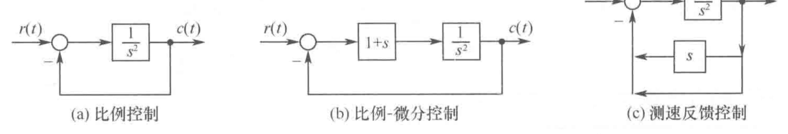

> Image description: This image contains three control system block diagrams labeled (a), (b), and (c). Each diagram represents a feedback loop with an input signal $r(t)$ entering a summing junction, followed by forward-path blocks and a unity feedback path returning from the output $c(t)$. Diagram (a), titled "比例控制" (Proportional Control), features a single plant block $\frac{1}{s^2}$. Diagram (b), titled "比例-微分控制" (Proportional-Derivative Control), adds a controller block $(1+s)$ before the plant block $\frac{1}{s^2}$. Diagram (c), titled "测速反馈控制" (Velocity Feedback Control), shows a parallel structure where the output is fed back through two paths: one direct unity feedback and another passing through a derivative block $s$ before being summed. The figure illustrates different methods of modifying a second-order system's dynamics to affect its natural frequency and damping ratio, as indicated by the Chinese caption requesting a comparison of their dynamic performance.
图3－60 控制系统结构图

解 首先由结构图求出各个系统的闭环传递函数，可得要求的 $\zeta$ 与 $\omega_{n}$ ，然后根据闭环传递函数推导出各个系统的动态性能。
（1）图3－60（a）系统。根据图3－60（a）可得系统闭环传递函数为

$$
\Phi_{a}(s)=\frac{1}{s^{2}+1}
$$

此时，系统的自然频率 $\omega_{n}=1$ ，阻尼比 $\zeta=0$ ，系统为零阻尼系统，其单位阶跃响应


<!-- source_pdf_page: 49 -->
因

$$
\begin{gathered}
c(t)=1-\cos \omega_{n} t=1-\cos t \\
\left.\frac{\mathrm{~d} c(t)}{\mathrm{d} t}\right|_{t=t_{p}}=\sin t_{p}=0 \quad\left(t_{p}=0, \pi, 2 \pi, \cdots\right) \\
t_{p}=\pi=3.142 \mathrm{~s} \\
c\left(t_{p}\right)=1-\cos t_{p}=2 \\
\sigma \%=\frac{c\left(t_{p}\right)-c(\infty)}{c(\infty)}=100 \%
\end{gathered}
$$

对于等幅振荡的无阻尼系统，$t_{s}$ 不存在，也没有意义。
（2）图3－60（b）系统。根据图3－60（b）可得系统闭环传递函数为

$$
\Phi_{l}(s)=\frac{s+1}{s^{2}+s+1}
$$

从 $\Phi_{b}(s)$ 的形式可以看出，该系统是比例－微分控制二阶系统，其标准形式为

$$
\Phi(s)=\frac{\omega_{n}^{2}}{z} \frac{s+z}{s^{2}+2 \zeta_{d} \omega_{n} s+\omega_{n}^{2}}
$$

可得 $z=1, \omega_{n}=1, \zeta_{d}=0.5$ 。因为

$$
\begin{aligned}
r & =\frac{\sqrt{z^{2}-2 \zeta_{d} \omega_{n} z+\omega_{n}^{2}}}{z \sqrt{1-\zeta_{d}^{2}}}=1.155 \\
\psi & =-\pi+\arctan \left(\frac{\omega_{n} \sqrt{1-\zeta_{d}^{2}}}{z-\zeta_{d} \omega_{n}}\right)+\arctan \left(\frac{\sqrt{1-\zeta_{d}^{2}}}{\zeta_{d}}\right)=-60^{\circ} \\
\beta_{d} & =\arctan \left(\frac{\sqrt{1-\zeta_{d}^{2}}}{\zeta_{d}}\right)=60^{\circ}
\end{aligned}
$$

则系统的动态性能指标为

$$
\begin{array}{ll}
\text { 峰值时间 } & t_{p}=\frac{\beta_{d}-\psi}{\omega_{n} \sqrt{1-\zeta_{d}^{2}}}=2.418 \mathrm{~s} \\
\text { 超调量 } & \sigma \%=r \sqrt{1-\zeta_{d}^{2}} \mathrm{e}^{-\zeta_{d} \omega_{n} t_{p}} \times 100 \%=29.9 \% \\
\text { 调节时间 } & t_{s}=\frac{4+\ln r}{\zeta_{d} \omega_{n}}=8.3 \mathrm{~s} \quad(\Delta=2 \%)
\end{array}
$$

（3）图3－60（c）系统。根据图3－60（c）可得系统闭环传递函数为

$$
\Phi_{c}(s)=\frac{1}{s^{2}+s+1}
$$

此时，系统的自然频率 $\omega_{n}=1$ ，阻尼比 $\zeta=0.5$ ，则系统的动态性能指标为

| 性能／系统 | （a） | （b） | （c） |
| :--- | :--- | :--- | :--- |
| $\omega_{n}$ | 1 | 1 | 1 |
| $\zeta$ | 0 | 0.5 | 0.5 |
| $t_{p} / \mathrm{s}$ | 3.142 | 2.418 | 3.628 |
| $\sigma / \%$ | 100 | 29.9 | 16.3 |
| $t_{s} / \mathrm{s}$ | － | 8.3 | 8.8 |

超调量 $\quad \sigma \%=\mathrm{e}^{-\pi \zeta / \sqrt{1-\zeta^{2}}} \times 100 \%=16.3 \%$
峰值时间 $t_{p}=\frac{\pi}{\omega_{n} \sqrt{1-\zeta^{2}}}=\frac{\pi}{1 \times \sqrt{0.75}}$

$$
=3.628 \mathrm{~s}
$$

调节时间 $\quad t_{s}=\frac{4.4}{\zeta \omega_{n}}=8.8 \mathrm{~s} \quad(\Delta=2 \%)$于是，图3－60中各系统的动态性能如左表所示。


<!-- source_pdf_page: 50 -->
MATLAB 程序：exe308．m
\％图（a）闭环传递函数模型
num1 $=[1] ; \quad$ den1 $=\left[\begin{array}{lll}1 & 0 & 1\end{array}\right] ; \quad$ sys1 $=$ tf $($ num1, den1 $) ;$
\％图（b）闭环偻递函数模型
num2 $=\left[\begin{array}{ll}1 & \text { IT }\end{array} ; \quad \operatorname{den} 2=\left[\begin{array}{lll}1 & 1 & 1\end{array}\right] ; \quad \operatorname{sys2}=\operatorname{tf}(\right.$ num2, $\operatorname{den2}) ;$
\％图（圆）闭环传递函数模型
nums）：［1］；$\quad \operatorname{den} 3=\left[\begin{array}{lll}1 & 1 & 1\end{array}\right] ; \quad \operatorname{sys3}=\mathrm{tf}($ num3, $\operatorname{den} 3) ;$
绪 求取各系统的单位阶跃响应
$\mathrm{t}=0: 0.1: 20$ ；
figure（1）
step（sys1，t）；grid
figure（2）
step（sys2，t）；grid
figure（3）
step（sys3，t）；grid
各系统单位阶跃响应曲线如图 3－8－1～图3－8－3所示。

图 3－8－1 表明峰值时间 $t_{p}=3.1 \mathrm{~s}$ ，超调量 $\sigma \%=100 \%$ ，调节时间不存在；图3－8－2表明峰值时间 $t_{p}=2.4 \mathrm{~s}$ ，超调量 $\sigma \%=29.8 \%$ ，调节时

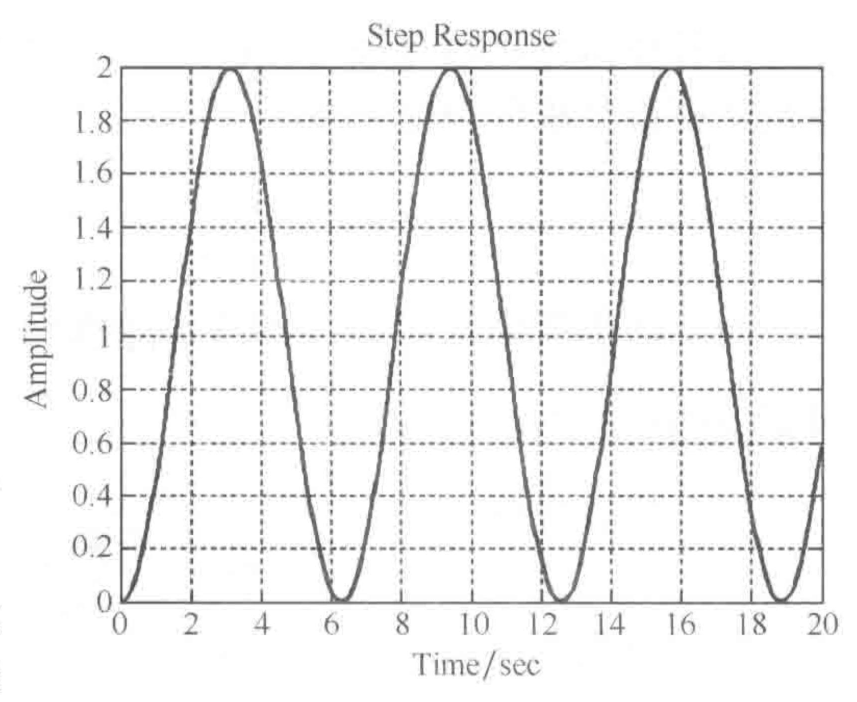

> Image description: This image shows a "Step Response" plot from an engineering textbook, depicting the time-domain behavior of a system. The graph features a vertical y-axis labeled "Amplitude," ranging from 0 to 2, and a horizontal x-axis labeled "Time/sec," ranging from 0 to 20 seconds. The plotted curve is a sustained oscillation that starts at the origin (0,0) and repeatedly peaks at an amplitude of 2 before returning to 0. The waveform is periodic, with peak values occurring approximately every 6 seconds (e.g., around $t=3$, $t=9$, and $t=15$ seconds). From a control systems engineering perspective, this represents an undamped or marginally stable system response to a step input. Because the oscillations do not decay over time, there is no settling time. The accompanying Chinese caption references peak time ($t_p$) and overshoot ($\sigma\%$), noting that for one of the figures, the overshoot is 100% and the regulation (settling) time does not exist.
图3－8－1 系统（a）时间响应（MATLAB）

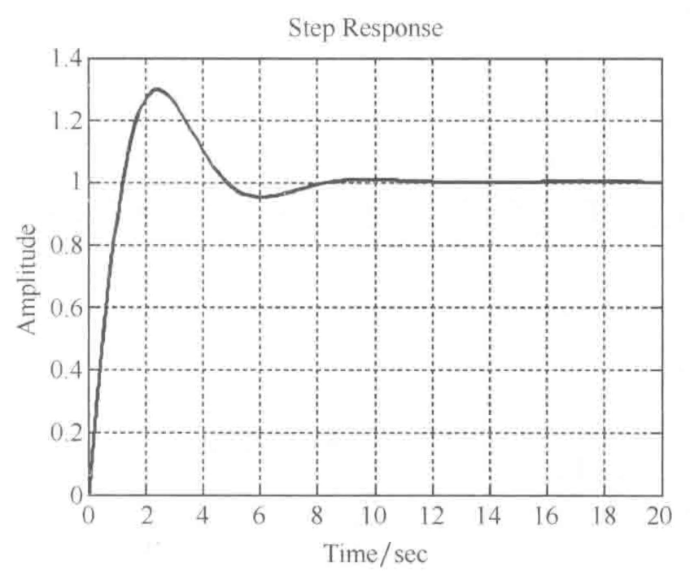

> Image description: A line graph titled "Step Response" illustrates the time-domain behavior of a system. The horizontal x-axis is labeled "Time/sec," ranging from 0 to 20 seconds with increments of 2. The vertical y-axis is labeled "Amplitude," ranging from 0 to 1.4 with increments of 0.2. The plot shows a single continuous curve starting at the origin (0,0). The amplitude rises sharply, peaking at approximately 1.3 around 2 seconds. It then oscillates downward, reaching a minimum slightly below 1.0 near 6 seconds, before stabilizing and converging asymptotically to a steady-state value of 1.0 as time progresses toward 20 seconds. From an engineering perspective, this figure represents the step response of an underdamped second-order system, characterized by visible overshoot and decaying oscillations before reaching equilibrium. The caption identifies it as "图3－8－1 系统（a）时间响应（MATLAB）," indicating a MATLAB simulation of system (a)'s time response.
图3－8－2 系统（b）时间响应（MATLAB）

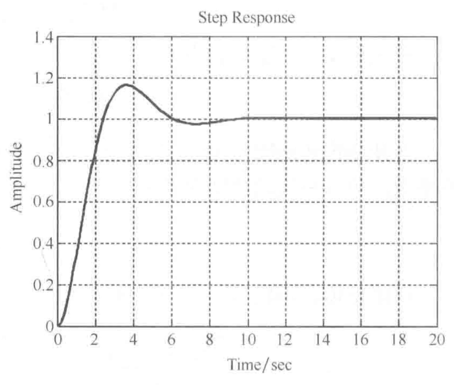

> Image description: The image shows a MATLAB-generated plot titled "Step Response," depicting the time response of system (b) as indicated by the caption "图3－8－2 系统（b）时间响应（MATLAB）." The graph features a Cartesian coordinate system where the horizontal x-axis is labeled "Time /sec" and ranges from 0 to 20 seconds. The vertical y-axis is labeled "Amplitude" and ranges from 0 to 1.4. A single continuous curve starts at the origin (0,0), rises sharply, and reaches a peak amplitude of approximately 1.15 around 4 seconds. Following this overshoot, the signal exhibits damped oscillations before stabilizing and converging to a steady-state value of 1.0 starting around 10 seconds. This represents a typical underdamped second-order system response to a step input, illustrating key engineering characteristics such as rise time, peak overshoot, and settling time.
图3－8－3 系统（c）时间响应（MATLAB）

3－9 设控制系统如图3－61所示。要求：

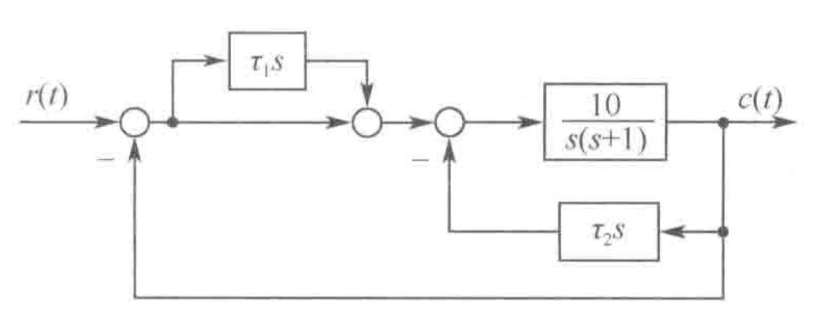

> Image description: A control system block diagram is shown, featuring a feedback loop structure with several components. The input signal $r(t)$ enters from the left into a summing junction. From this point, the signal splits: one path goes through a forward-feed block labeled $\tau_1 s$, which then adds back into the main path at a second summing junction. The resulting signal passes through a third summing junction before entering the plant block, represented by the transfer function $\frac{10}{s(s+1)}$. The output of this block is $c(t)$. Two feedback loops are present: one inner loop where $c(t)$ passes through a block labeled $\tau_2 s$ and returns to the third summing junction with a negative sign, and one outer unity feedback loop returning from $c(t)$ to the first summing junction, also with a negative sign. Arrows indicate the unidirectional flow of signals throughout the system.
图3－61 控制系统结构图

（1）取 $\tau_{1}=0, \tau_{2}=0.1$ ，计算测速反馈校正系统的超调量、调节时间和速度误差；
（2）取 $\tau_{1}=0.1, \tau_{2}=0$ ，计算比例 - 微分校正系统的超调量、调节时间和速度误差。

解 首先求出系统的开环传递函数和闭环传递函数，然后根据开环传递函数利用静态误


<!-- source_pdf_page: 51 -->
差系数法求出速度误差，再根据闭环传递函数求出系统的动态性能指标。
（1）取 $\tau_{1}=0, \tau_{2}=0.1$ 时。系统的开环传递函数为

$$
G(s)=\frac{10}{s(s+2)}
$$

系统的闭环传递函数为

$$
\Phi(s)=\frac{10}{s^{2}+2 s+10}
$$

由开环传递函数可知，该系统是一个I型系统，其速度误差系数 $K_{v}=5$ ，根据静态误差系数法可得系统的速度误差为

$$
e_{s}(\infty)=\frac{1}{K_{v}}=0.2
$$

由闭环传递函数可知，系统的自然频率 $\omega_{n}=\sqrt{10}=3.162$ ，阻尼比 $\zeta=\frac{1}{3.16}=0.316$ ，此时系统的动态性能指标为

峰值时间

$$
t_{p}=\frac{\pi}{\omega_{n} \sqrt{1-\zeta^{2}}}=1.05 \mathrm{~s}
$$

超调量

$$
\sigma \%=\mathrm{e}^{-\pi \zeta / \sqrt{1-\zeta^{2}}} \times 100 \%=35.1 \%
$$

调节时间

$$
t_{s}=\frac{3.5}{\zeta \omega_{n}}=3.5 \mathrm{~s} \quad(\Delta=5 \%), \quad t_{s}=\frac{4.4}{\zeta \omega_{n}}=4.4 \mathrm{~s} \quad(\Delta=2 \%)
$$

（2）取 $\tau_{1}=0.1, \tau_{2}=0$ 时。系统的开环传递函数为

$$
G(s)=\frac{10(0.1 s+1)}{s(s+1)}
$$

系统的闭环传递函数为

$$
\Phi(s)=\frac{s+10}{s^{2}+2 s+10}
$$

由开环传递函数可知，该系统是一个 I 型系统，其速度误差系数为 $K_{v}=10$ ，根据静态误差系数法可得系统的速度误差为

$$
e_{s}(\infty)=\frac{1}{K_{v}}=0.1
$$

由闭环传递函数可知，$\omega_{n}=\sqrt{10}=3.162, \zeta_{d}=\frac{1}{3.16}=0.316, z=10$ 。因为

$$
\begin{aligned}
r & =\frac{\sqrt{z^{2}-2 \zeta_{d} \omega_{n} z+\omega_{n}^{2}}}{z \sqrt{1-\zeta_{d}^{2}}}=1 \\
\psi & =-\pi+\arctan \left(\frac{\omega_{n} \sqrt{1-\zeta_{d}^{2}}}{z-\zeta_{d} \omega_{n}}\right)+\arctan \left(\frac{\sqrt{1-\zeta_{d}^{2}}}{\zeta_{d}}\right)=-1.572 \mathrm{rad} \\
\beta_{d} & =\arctan \left(\frac{\sqrt{1-\zeta_{d}^{2}}}{\zeta_{d}}\right)=1.249 \mathrm{rad}
\end{aligned}
$$

则系统的动态性能指标为
峰值时间

$$
t_{p}=\frac{\beta_{d}-\psi}{\omega_{n} \sqrt{1-\zeta_{d}^{2}}}=0.941 \mathrm{~s}
$$


<!-- source_pdf_page: 52 -->
超调量

$$
\sigma \%=r \sqrt{1-\zeta_{d}^{2}} \mathrm{e}^{-\zeta_{d} \omega_{n} t_{p}} \times 100 \%=37 \%
$$

调节时间

$$
t_{\mathrm{s}}=\frac{3+\ln r}{\zeta_{d} \omega_{n}}=3 \mathrm{~s} \quad(\Delta=5 \%) ; \quad t_{s}=\frac{4+\ln r}{\zeta_{d} \omega_{n}}=4 \mathrm{~s} \quad(\Delta=2 \%)
$$

MATLAB程序：exe309．m
\％测速㡲唔校正系统闭环传递函数

$$
\text { num1-x-10]; } \quad \text { den1 }=\left[\begin{array}{lll}
1 & 2 & 10
\end{array}\right] ; \quad \text { sys1 }=\text { tf }(\text { num } 1, \text { den1 }):
$$

尊比例微分校正系统闭环传递函数

$$
\text { num2 }=\left[\begin{array}{ll}
1 & 10
\end{array}\right] ; \quad \operatorname{den} 2=\left[\begin{array}{lll}
1 & 2 & 10
\end{array}\right] ; \quad \operatorname{sys2}=\operatorname{tf}(\text { num } 2, \operatorname{den} 2) ;
$$

\％求取各系统的单位阶跃响应

$$
\begin{aligned}
& t=0: 0.01: 10 ; \\
& \text { figure(1) } \\
& \text { step(sys1, t); grid } \\
& \text { figure(2) } \\
& \text { step(sys2, t); grid }
\end{aligned}
$$

图 3－9－1 表明峰值时间 $t_{p}=1.05 \mathrm{~s}$ ，超调量 $\sigma \%=35.1 \%$ ，调节时间 $t_{s}=3.54 \mathrm{~s}(\Delta=2 \%)$ ；图3－9－2表明峰值时间 $t_{p}=0.94 \mathrm{~s}$ ，超调量 $\sigma \%=37.1 \%$ ，调节时间 $t_{s}=3.44 \mathrm{~s}(\Delta=2 \%)$ 。

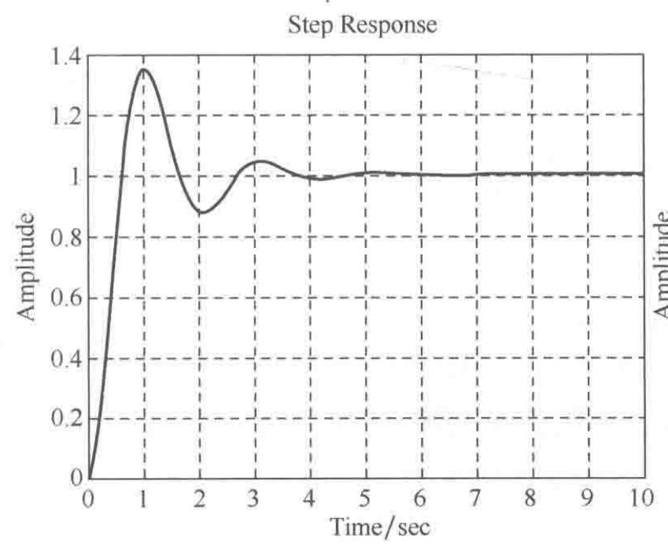

> Image description: This image shows a "Step Response" plot, typical of control systems engineering. The graph features a horizontal x-axis labeled "Time/sec" ranging from 0 to 10 and a vertical y-axis labeled "Amplitude" ranging from 0 to 1.4. The plotted curve represents the system's output over time following a step input. It starts at the origin (0,0), rises sharply to a first peak amplitude of approximately 1.35 at around 1 second, and then exhibits decaying oscillations. The signal eventually stabilizes and converges toward a steady-state value of 1.0 as time increases beyond 5 seconds. The accompanying caption provides specific quantitative performance metrics for two figures (though only one plot is visible). For Figure 3-9-1, it lists a peak time $t_p = 1.05\text{ s}$, an overshoot $\sigma\% = 35.1\%$, and a settling time $t_s = 3.54\text{ s}$ (with a 2% error band). Figure 3-9-2 lists similar values: $t_p = 0.94\text{ s}$, $\sigma\% = 37.1\%$, and $t_s = 3.44\text{ s}$.
图3－9－1 系统（1）时间响应（MATLAB）

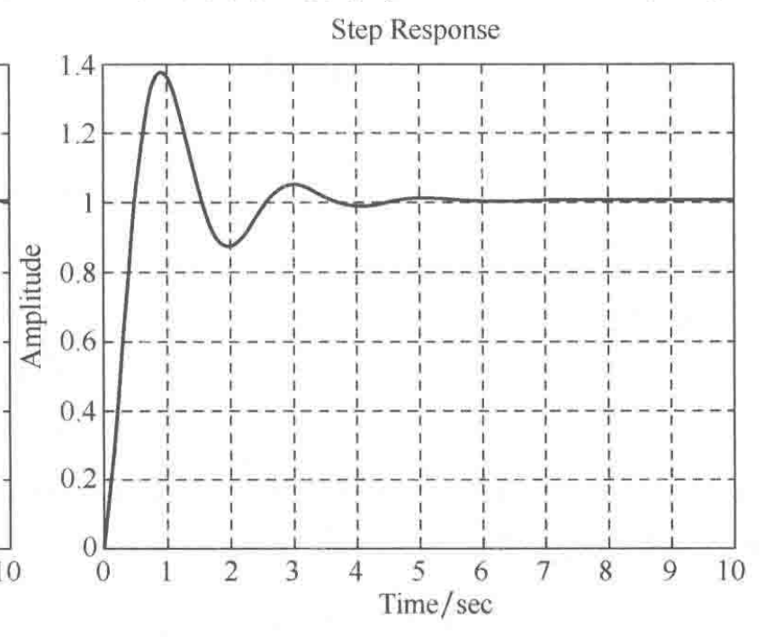

> Image description: This image displays a MATLAB-generated plot titled "Step Response," illustrating the time response of a system (identified in the caption as System 1). The graph features a vertical y-axis labeled "Amplitude" ranging from 0 to 1.4 and a horizontal x-axis labeled "Time/sec" ranging from 0 to 10. The plot shows a characteristic underdamped second-order system response. Starting at the origin (0,0), the amplitude rises sharply, peaking at approximately 1.38 around 1 second. It then oscillates, dipping to about 0.85 at 2 seconds and rising again to roughly 1.05 at 3 seconds. The signal eventually stabilizes and converges toward a steady-state value of 1.0 as time progresses beyond 5 seconds. A dashed horizontal line marks the target amplitude of 1.0, serving as a reference for measuring overshoot and settling time.
图3－9－2 系统（2）时间响应（MATLAB）

3－10 图3－62所示控制系统有（a）和（b）两种不同的结构方案，其中 $T>0$ 不可变。要求：
（1）在这两种方案中，应如何调整 $K_{1} 、 K_{2}$ 和 $K_{3}$ ，才能使系统获得较好的动态性能？
（2）比较说明两种结构方案的特点。

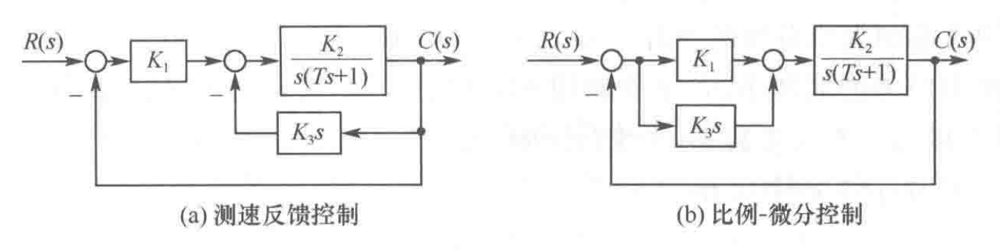

> Image description: This figure contains two block diagrams, labeled (a) and (b), representing different control system structures. Both systems share a plant transfer function $\frac{K_2}{s(Ts+1)}$ and an output variable $C(s)$ fed back to the input reference $R(s)$. In diagram (a), titled "测速反馈控制" (Tachometer Feedback Control), a feedback loop containing the block $K_3 s$ is placed around the plant, creating an inner loop. The forward path includes a gain block $K_1$. In diagram (b), titled "比例-微分控制" (Proportional-Derivative Control), the structure changes to a parallel configuration before the plant. The input signal splits into two paths: one through the proportional gain $K_1$ and another through the derivative term $K_3 s$, which are then summed together. Both diagrams use standard control engineering notation with summing junctions, directional arrows indicating signal flow, and transfer function blocks to illustrate different methods of achieving system stability and dynamic performance.
图3－62 控制系统结构图

解 本题说明如何分别利用测速反馈控制和比例－微分控制来改善二阶系统的动态


<!-- source_pdf_page: 53 -->
性能。
为方便讨论，假设 $T=1$ 。
原系统，即 $\mathrm{K}_{3}=0$ ；
开环传递函数为

$$
G_{0}(s)=\frac{K_{1} K_{2}}{s^{2}+s}
$$

闭季不传递函数为

$$
\Phi_{0}(s)=\frac{K_{1} K_{2}}{s^{2}+s+K_{1} K_{2}}
$$

方案（a）测速反馈控制系统：
开环传递函数为

$$
G_{u}(s)=\frac{K_{1} K_{2}}{s^{2}+\left(1+K_{2} K_{3}\right) s}
$$

闭环传递函数为

$$
\Phi_{a}(s)=\frac{K_{1} K_{2}}{s^{2}+\left(1+K_{2} K_{3}\right) s+K_{1} K_{2}}
$$

方案（b）比例－微分控制系统：
开环传递函数为

$$
G_{b}(s)=\frac{K_{2} K_{3} s+K_{1} K_{2}}{s^{2}+s}
$$

闭环传递函数为

$$
\Phi_{b}(s)=\frac{K_{2} K_{3} s+K_{1} K_{2}}{s^{2}+\left(1+K_{2} K_{3}\right) s+K_{1} K_{2}}
$$

由三者的开环传递函数可知，原系统、测速反馈控制系统与比例－微分控制系统均为 I型系统，其静态速度误差系数分别为

$$
K_{v a}=K_{1} K_{2}, \quad K_{v a}=\frac{K_{1} K_{2}}{1+K_{2} K_{3}}, \quad K_{v b}=K_{1} K_{2}
$$

（1）参数调整措施。
方案（a）测速反馈控制系统：在原系统中引人速度反馈，在不影响系统的自然频率的同时可以增大系统的阻尼比，达到改善系统动态性能的目的，如减小超调量、加快调节时间等。至于测速反馈系数 $K_{3}$ 的选择，要使阻尼比在 $0.4 \sim 0.8$ 之间，从而满足给定的各项动态性能指标。但是，测速反馈会降低系统的开环增益，从而加大系统在斜坡输人时的稳态误差，因此必须考虑加大原系统的开环增益。然而，增加 $K_{1}$ 又会导致阻尼比下降，从而使超调量加大，此时应考虑增加 $K_{2}$ 。下面利用 MATLAB 软件包，形象地说明当引入速度反馈时参数调整的措施。不同参数下，系统阶跃响应曲线如图3－10－1～图3－10－4所示。

MATLAB 程序 ：exe310a．m

$$
k 1=1 ; \quad k 2=5 ; \quad k 3=0.2 ; \quad t=0: 0.01: 15 ;
$$

\％原系统

$$
\begin{array}{ll}
\text { num } 0=[\mathrm{k} 1 * \mathrm{k} 2] ; & \operatorname{den} 0=[11 \mathrm{k} 1 * \mathrm{k} 2] \\
\text { sys } 0=\operatorname{tf}(\text { num } 0, \operatorname{den} 0) ; &
\end{array}
$$


<!-- source_pdf_page: 54 -->
\％测速反馈系统

$$
\begin{aligned}
& \text { num1 }=[\mathrm{k} 1 * \mathrm{k} 2] ; \quad \text { toy } \\
& \text { sys1 }=\text { tf }(\text { num1 }, \text { ten } 1) ;
\end{aligned} \quad \text { den1 }=[11+\mathrm{k} 2 * \mathrm{k} 3 \mathrm{k} 1 * \mathrm{k} 2] ;
$$

$\%$ 测速反馈系统 为了减小稳态误差 增大 k 1

$$
\begin{aligned}
& \mathrm{k} 1=2 ; \\
& \text { num } 2 \times 1 \frac{1}{2} \cdot \mathrm{k} 2=5 ; \quad \mathrm{k} 3=0.2 ; \\
& \text { sys2 }=\operatorname{tf}(\text { num } 2, \operatorname{den} 2) ;
\end{aligned} \quad \operatorname{den} 2=[11+\mathrm{k} 2 * \mathrm{k} 3 \mathrm{k} 1 * \mathrm{k} 2] ;
$$

\％测速反馈系统 为了减小稳态误差 增大 k 2

$$
\begin{array}{ll}
k 1=1 ; \quad k 2=15 ; & k 3=0.2 ; \\
\text { num } 3=[k 1 * k 2] ; & \operatorname{den} 3=[11+k 2 * k 3 k 1 * k 2] ; \\
\text { sys3 }=\text { tf }(\text { num } 3, \text { den } 3) ; &
\end{array}
$$

\％求取各系统的单位阶跃响应

```
figure(1)
step(sys0,t); grid
figure(2)
step(sys1,t): grid
figure(3)
step(sys2,t); grid
figure(4)
step(sys3,t); grid
```

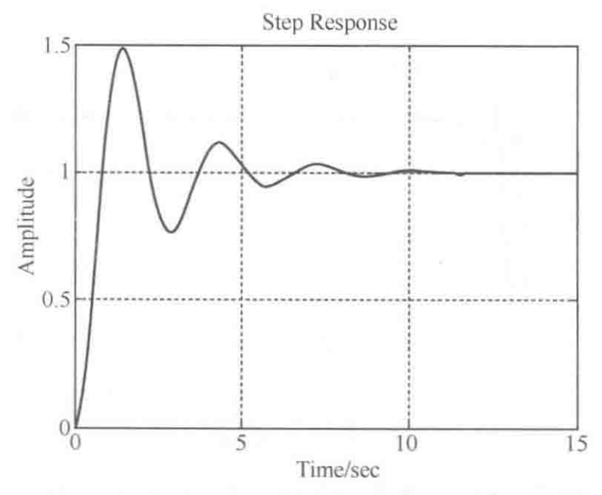

> Image description: A line graph titled "Step Response" illustrates the time-domain behavior of a system's output following a unit step input. The vertical y-axis is labeled "Amplitude," ranging from 0 to 1.5, while the horizontal x-axis is labeled "Time/sec," ranging from 0 to 15. The plot shows an underdamped response characterized by a series of decaying oscillations. Starting at the origin (0,0), the curve rises sharply to a first peak amplitude of approximately 1.5 at around 2 seconds. It then oscillates above and below a steady-state value of 1.0 with decreasing magnitude over time. By approximately 10 seconds, the signal stabilizes and converges to the final value of 1.0. In engineering terms, this figure depicts key performance metrics such as overshoot, settling time, and steady-state error for the original system described in the caption "图3－10－1 原系统单位阶跃响应曲线."
图3－10－1 原系统单位阶跃响应曲线

$$
\left(K_{1}=1, K_{2}=5, K_{3}=0 .\right. \text { MATLAB) }
$$

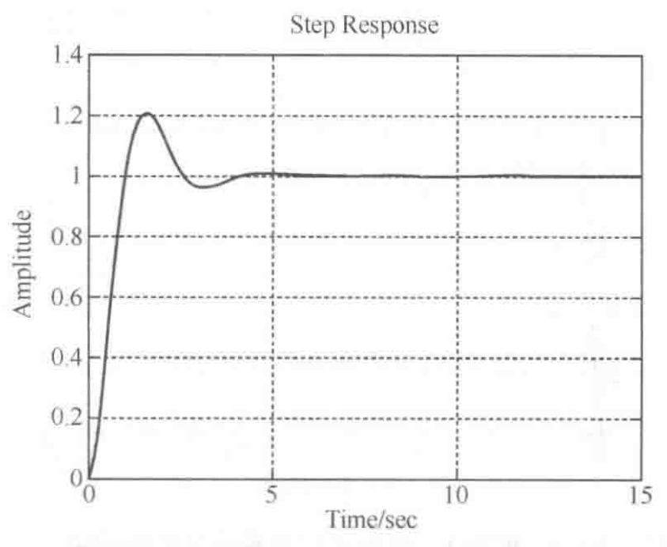

> Image description: This image shows a "Step Response" graph from a textbook, specifically Figure 3-10-2, depicting the unit step response curve of a speed measurement feedback system simulated in MATLAB with parameters $K_1=1$, $K_2=5$, and $K_3=0.2$. The plot features a vertical y-axis labeled "Amplitude" ranging from 0 to 1.4 and a horizontal x-axis labeled "Time/sec" ranging from 0 to 15 seconds. The response curve starts at the origin (0,0), rises sharply, and exhibits an overshoot reaching a peak amplitude of approximately 1.2 around $t=2$ seconds. It then oscillates slightly before settling and stabilizing at a steady-state value of 1.0 after approximately 5 seconds. This graph is used in engineering to analyze the transient performance—such as rise time, overshoot, and settling time—and the stability of a closed-loop control system.
图3－10－2 测速反馈系统单位阶跃响应曲线 （ $K_{1}=1, K_{2}=5, K_{3}=0.2$ ．MATLAB）

方案（b）比例－微分控制系统：比例－微分控制可以增大系统的阻尼比，使超调量下降，调节时间缩短，且不影响系统的自然频率和常值稳态误差。由于采用微分控制后，允许选取较高的开环增益，因此在保证一定的动态性能条件下，可以减小稳态误差。然而，增加 $K_{1}$ 又会导致阻尼比下降，从而超调量加大，此时应考虑增加 $K_{2}$ 。下面利用 MATLAB 软件包，形象地说明比例－微分控制系统参数调整的措施，如图3－10－5～图3－10－8所示。

MATLAB 程序：exe310b．m

$$
k 1=1 ; \quad k 2=5 ; \quad k 3=0.2 ; \quad t=0: 0.01: 15 ;
$$


<!-- source_pdf_page: 55 -->
\％原系统
num0 $=[k 1 * k 2] ; \quad \operatorname{den0}=[11 k 1 * k 2] ; \quad \operatorname{sys0}=\operatorname{tf}(\operatorname{num} 0, \operatorname{den} 0) ;$
\％比例－微分系统
num1 $=[\mathrm{k} 2$ 筹 $\mathrm{k} 3 \mathrm{k} 1 * \mathrm{k} 2]$ ；den1 $=[11+\mathrm{k} 2 * \mathrm{k} 3 \mathrm{k} 1 * \mathrm{k} 2]$ ；sys1＝tf（num1，den1）；
\％比例分微分系统 为了减小稳态误差 增大k1
$k 1<2 ; \quad k 2=5 ; \quad k 3=0.2$ ；
num2 $=[k 2 * k 3 k 1 * k 2]$ ；den2 $=[11+k 2 * k 3 k 1 * k 2]$ ；sys2 $=$ tf $($ num2，den2 $)$ ；
$\%$ 比例－微分系统 为了减小稳态误差 增大 k 2

$$
\begin{aligned}
& k 1=1 ; \quad k 2=15 ; \quad k 3=0.2 ; \\
& \text { num } 3=[k 2 * k 3 k 1 * k 2] ; \quad \operatorname{den} 3=[11+k 2 * k 3 k 1 * k 2] ; \\
& \text { sys3 = tf(num3, den3); }
\end{aligned}
$$

\％求取各系统的单位阶跃响应

$$
\begin{aligned}
& \text { figure(1) } \\
& \text { step(sys0, t); grid }
\end{aligned}
$$

figure（2）
step（sys1，t）；grid
figure（3）
step（sys2，t）；grid
figure（4）
step（sys3，t）；grid

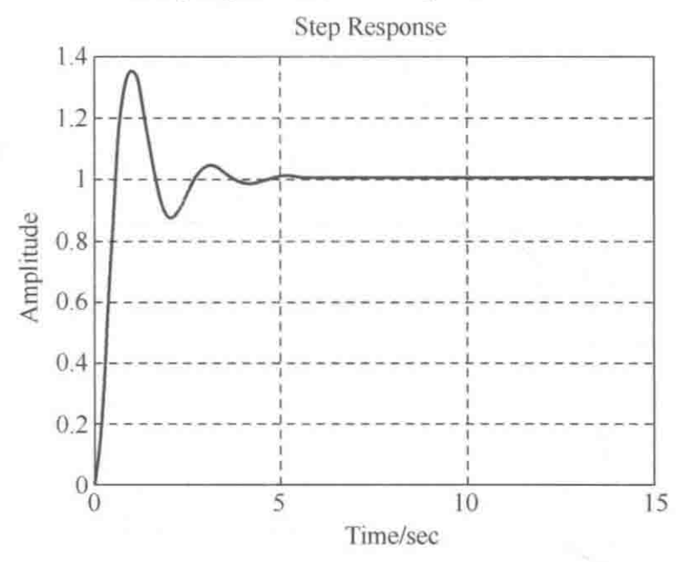

> Image description: A line graph titled "Step Response" illustrates the unit step response of a speed measurement feedback system. The vertical y-axis is labeled "Amplitude," ranging from 0 to 1.4 in increments of 0.2. The horizontal x-axis is labeled "Time/sec," spanning from 0 to 15 seconds with major grid markings every 5 seconds. The plot shows a single continuous curve starting at the origin (0,0). It exhibits an underdamped behavior, characterized by a sharp initial rise that overshoots the steady-state value of 1.0, reaching a peak amplitude of approximately 1.35 around 1 second. The signal then oscillates with decreasing magnitude—dipping to about 0.9 and rising again slightly above 1.0—before stabilizing at an amplitude of 1.0 after approximately 6 seconds. According to the caption, this response is generated via MATLAB for specific parameter values: $K_{1}=2$, $K_{2}=5$, and $K_{3}=0.2$.
图3－10－3 增加 $K_{1}$ 时测速反馈系统单位阶跃响应曲线（ $K_{1}=2, K_{2}=5, K_{3}=0.2$ ．MATLAB）

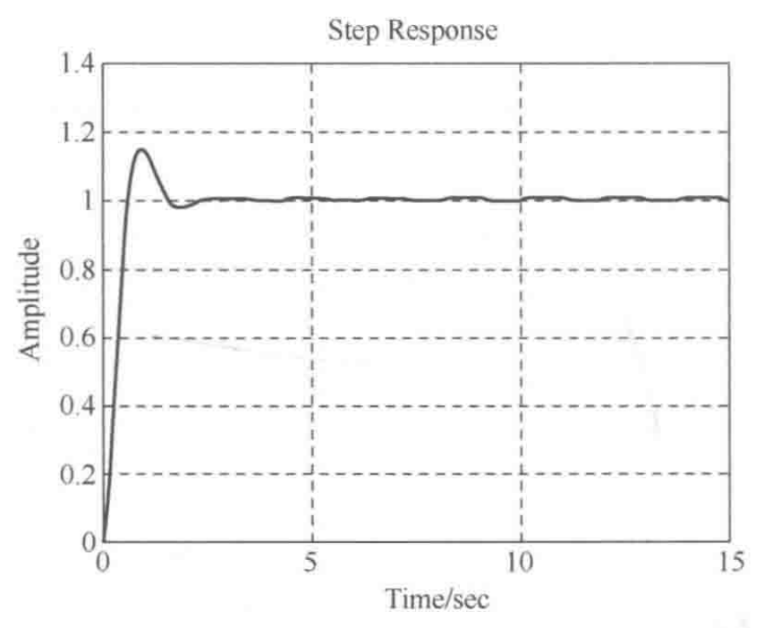

> Image description: This image is a technical plot titled "Step Response," depicting the unit step response curve of a speed measurement feedback system. The graph features a vertical y-axis labeled "Amplitude" ranging from 0 to 1.4 and a horizontal x-axis labeled "Time/sec" ranging from 0 to 15 seconds. The plotted curve starts at the origin (0,0), rises sharply with an initial overshoot reaching approximately 1.1 on the amplitude scale around 1 second, and then oscillates slightly before stabilizing near a steady-state value of 1.0. The plot includes dashed grid lines for easier reading of values. According to the caption, this specific response is generated via MATLAB for parameters $K_1=2$, $K_2=5$, and $K_3=0.2$. In engineering terms, this figure illustrates the transient behavior—specifically the rise time, overshoot, and settling time—of a control system in response to a unit step input.
图3－10－4 增加 $K_{2}$ 时测速反馈系统单位阶跃响应曲线（ $K_{1}=1, K_{2}=15, K_{3}=0.2$ ．MATLAB）

（2）方案特点。测速反馈控制与比例－微分控制都可以改善二阶系统的动态性能，但是它们各有特点。

比例－微分控制对系统的开环增益和自然频率均无影响，测速反馈控制虽不影响自然频率，但会降低开环增益。因此，对于确定的常值稳态误差，测速反馈控制要求有较大的开环增益。

比例－微分控制的阻尼作用产生于系统的输人端误差信号的速度，而测速反馈控制的阻尼作用来源于系统输出端的响应的速度，因此对于给定的开环增益和指令输入速度，后者对应较大的稳态误差值。

比例－微分控制对噪声有明显的放大作用。当系统输入端噪声严重时，一般不宜选用比


<!-- source_pdf_page: 56 -->
例－微分控制。测速反馈控制对系统输人端噪声有滤波作用，因此使用场合比较广泛。

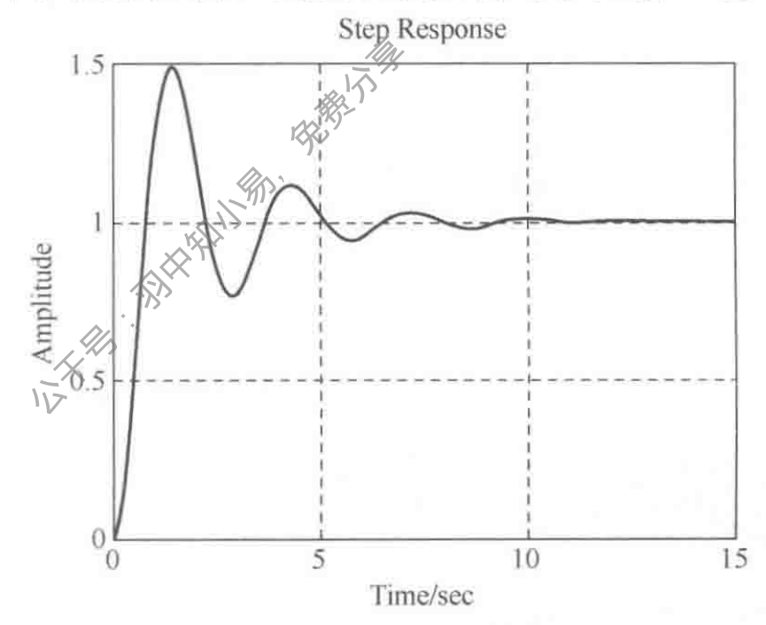

> Image description: A textbook figure titled "Step Response" displays a plot of the unit step response curve for an original system with parameters $K_1=1$, $K_2=5$, and $K_3=0.2$, generated via MATLAB. The graph features a vertical y-axis labeled "Amplitude," ranging from 0 to 1.5, and a horizontal x-axis labeled "Time/sec," ranging from 0 to 15 seconds. The plot shows an underdamped system response starting at the origin (0,0). The curve rises sharply, exhibiting a significant first overshoot that peaks at approximately 1.5 before oscillating around a steady-state value of 1. Subsequent oscillations decrease in amplitude over time, eventually converging to a constant value of 1 as time progresses toward 15 seconds. Dashed grid lines are visible at amplitudes of 0.5 and 1, and at time intervals of 5 and 10 seconds, aiding in the reading of peak values and settling time.
图 3－10－5 原系统单位阶跃响应曲线 （ $K_{1}=1, K_{2}=5, K_{3}=0.2$ ．MATLAB）

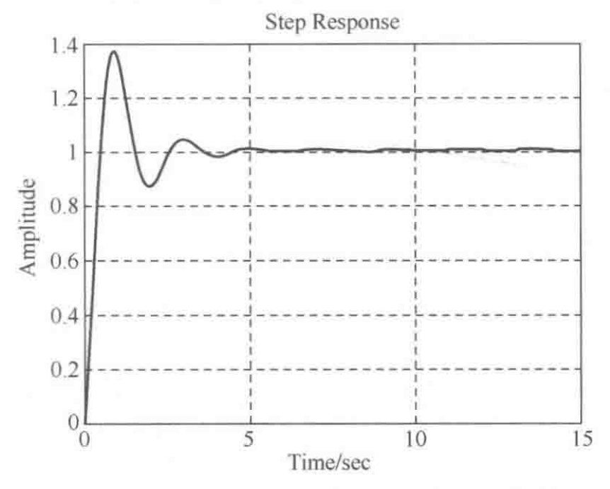

> Image description: This image shows a plot titled "Step Response," representing the unit step response curve of an original system as indicated by the caption (图 3－10－5). The graph features a vertical y-axis labeled "Amplitude" ranging from 0 to 1.4 and a horizontal x-axis labeled "Time/sec" ranging from 0 to 15. The plot displays a single continuous curve that starts at the origin (0,0) and rises sharply, exhibiting an underdamped behavior. The signal overshoots the steady-state value of 1.0, reaching a peak amplitude of approximately 1.38 around $t=1$ second. It then oscillates with decreasing magnitude before settling and converging to a final amplitude of 1.0 after approximately 5 seconds. According to the caption, this response was generated using MATLAB with specific parameters: $K_1=1$, $K_2=5$, and $K_3=0.2$.
图3－10－7 增加 $K_{1}$ 时比例－微分系统单位阶跃响应曲线（ $K_{1}=2, K_{2}=5, K_{3}=0.2$ ．MATLAB）

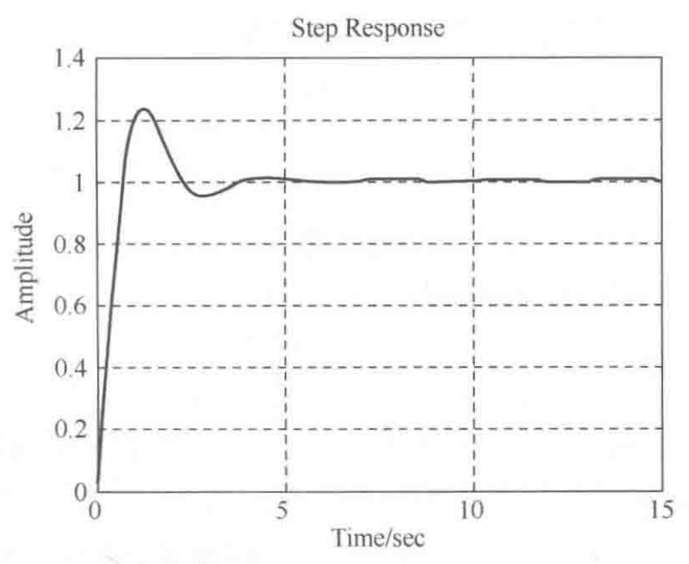

> Image description: A line graph titled "Step Response" illustrates the unit step response of a proportional-derivative system. The vertical y-axis is labeled "Amplitude," ranging from 0 to 1.4 in increments of 0.2. The horizontal x-axis is labeled "Time/sec," ranging from 0 to 15 seconds with major grid markings every 5 seconds. The plot shows a single continuous curve starting at the origin (0,0). It rises sharply, peaking at an amplitude of approximately 1.2 around 1.5 seconds. The signal then exhibits a damped oscillation, dipping slightly below 1.0 before stabilizing and converging to a steady-state value of 1.0 after approximately 5 seconds. This behavior represents the transient response and stability of a control system with specific parameters ($K_1=2, K_2=5, K_3=0.2$) as simulated in MATLAB, characterized by an overshoot followed by convergence to the target setpoint.
图3－10－6 比例－微分控制系统单位阶跃响应曲线 （ $K_{1}=1, K_{2}=5, K_{3}=0.2$ ．MATLAB）

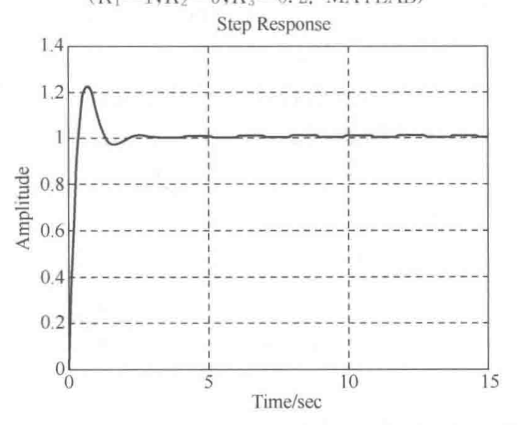

> Image description: This image shows a MATLAB-generated plot titled "Step Response," illustrating the unit step response curve of a proportional-derivative (PD) control system. The x-axis is labeled "Time/sec" and ranges from 0 to 15 seconds, while the y-axis is labeled "Amplitude" and ranges from 0 to 1.4. The graph displays a single continuous line starting at the origin (0,0). It rises sharply, exhibiting an initial overshoot that peaks at approximately 1.2 before oscillating slightly and settling steadily at a final amplitude of 1.0 after about 3 seconds. This behavior represents typical system dynamics including rise time, peak overshoot, and settling time. According to the Chinese caption, the specific control parameters used for this simulation are $K_1=1$, $K_2=5$, and $K_3=0.2$.
图 3－10－8 增加 $K_{2}$ 时比例－微分系统单位阶跃响应曲线（ $K_{1}=1, K_{2}=15, K_{3}=0.2$ ．MATLAB）

## 3－11 已知系统的特征方程为

$$
3 s^{4}+10 s^{3}+5 s^{2}+s+2=0
$$

试用劳斯稳定判据和赫尔维茨稳定判据确定系统的稳定性。
解 首先利用劳斯稳定判据来判定系统的稳定性，列出劳斯表如下所示：

| $s^{4}$ | 3 | 5 | 2 |
| :--- | ---: | ---: | ---: |
| $s^{3}$ | 10 | 1 |  |
| $s^{2}$ | $\frac{47}{10}$ | 2 |  |
| $s^{1}$ | $-\frac{153}{47}$ |  |  |
| $s^{0}$ | 2 |  |  |

显然，由于表中第一列元素的符号有两次改变，所以该系统在 $s$ 右半平面有两个闭环极点。因此，该系统不稳定。

然后，用赫尔维茨稳定判据来判定系统的稳定性。


<!-- source_pdf_page: 57 -->
由特征方程可知 $n=4$ ，且 $a_{0}=3, a_{1}=10, a_{2}=5, a_{3}=1, a_{4}=2$ 。若系统是稳定的，需要满足以下条件：（1）特征方程的各项系数为正；（2）$\Delta_{2}=a_{1} a_{2}-a_{0} a_{3}>0$ ；（3）$\Delta_{2}>a_{1}^{2} a_{4} / a_{3}$ 。

本系统 $a_{i} \hat{0}(i=0,1,2,3,4)$ ，且 $\Delta_{2}=a_{1} a_{2}-a_{0} a_{3}=10 \times 5-3 \times 1=47>0$ ，但是 $a_{1}^{2} a_{4} / a_{3}=\frac{10)^{2} \times 2}{1}=200>\Delta_{2}$ 。由于条件（3）不满足，因此系统不稳定。

最后，MATLAB 验证如下：
MATLAB 程序 ：exe311．m
den $=\left[\begin{array}{lllll}3 & 1 & 0 & 5 & 1 \\ \end{array}\right] ; \quad$ \％系统特征方程
$\mathrm{p}=$ roots（den）\％计算系统特征根
得到系统的特征根为 $p=-2.7362,-0.8767,0.1398+0.5083 \mathrm{j}, 0.1398-0.5083 \mathrm{j}$ 。证实该系统不稳定。

3－12 已知系统的特征方程如下，试求系统在 $s$ 右半平面的根数及虚根值。
（1）$s^{5}+3 s^{4}+12 s^{3}+24 s^{2}+32 s+48=0$ ；
（2）$s^{6}+4 s^{5}-4 s^{4}+4 s^{3}-7 s^{2}-8 s+10=0$ ；
（3）$s^{5}+3 s^{4}+12 s^{3}+20 s^{2}+35 s+25=0$ 。
解 本题考查有特殊情况时劳斯判据的应用。
（1）列劳斯表如下：

| $s^{5}$ | 1 | 12 | 32 |
| :--- | :--- | :--- | :--- |
| $s^{4}$ | 3 | 24 | 48 |
| $s^{3}$ | 4 | 16 |  |
| $s^{2}$ | 12 | 48 | （辅助方程 $F(s)=12 s^{2}+48=0$ 的系数） |
| $s^{1}$ | 0（24） | 0（0） | （ $\mathrm{d} F(s) / \mathrm{d} s=24 s=0$ 的系数） |
| $s^{0}$ | 48 |  |  |

由上表可见，劳斯表中的第一列元素全部大于零，所以系统在 $s$ 右半平面无根。由于辅助方程 $12 s^{2}+48=0$ 的解为 $s_{1,2}= \pm 2 \mathrm{j}$ ，故系统有一对纯虚根为 $s_{1,2}= \pm 2 \mathrm{j}$ 。
（2）列劳斯表如下：

| $s^{6}$ | 1 | －4 | $-7$ | 10 |
| :--- | :--- | :--- | :--- | :--- |
| $s^{5}$ | 4 | 4 | －8 |  |
| $s^{4}$ | －5 | －5 | 10 | （辅助方程 $F(s)=-5 s^{4}-5 s^{2}+10=0$ 的系数） |
| $s^{3}$ | 0（－20） | 0（－10） |  | （ $\mathrm{d} F(s) / \mathrm{d} s=-20 s^{3}-10 s=0$ 的系数） |
| $s^{2}$ | －2．5 | 10 |  |  |
| $s^{1}$ | －90 |  |  |  |
| $s^{0}$ | 10 |  |  |  |

由上表可见，劳斯表中的第一列元素符号改变两次，所以系统在 $s$ 右半平面有两个特征根。由于辅助方程 $-5 s^{4}-5 s^{2}+10=0$ 的解为 $s_{1.2}= \pm \sqrt{2} \mathrm{j}, s_{3.4}= \pm 1$ ，故系统的一对虚根为 $s_{1.2}= \pm \sqrt{2} \mathrm{j}$ 。


<!-- source_pdf_page: 58 -->
（3）列劳斯表如下：
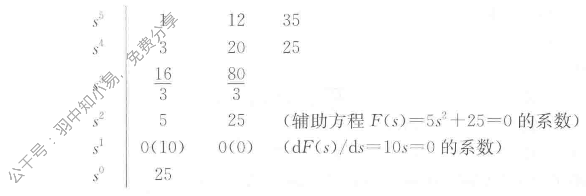

由上表可见，劳斯表中的第一列元素全部大于零，所以系统在 $s$ 右半平面无根。由于辅助方程 $5\left(s^{2}+5\right)=0$ 的解为 $s_{1,2}= \pm \sqrt{5} \mathrm{j}$ ，故系统的一对虚根为 $s_{1,2}= \pm \sqrt{5} \mathrm{j}$ 。

MATLAB 程序：exe312．m
\％系统特征方程
den1 $=\left[\begin{array}{llllll}1 & 3 & 12 & 24 & 32 & 48\end{array}\right] ; \quad \operatorname{den} 2=\left[\begin{array}{lllllll}1 & 4 & -4 & 4 & -7 & -8 & 10\end{array}\right] ; \quad \operatorname{den} 3=\left[\begin{array}{lllllll}1 & 3 & 12 & 20 & 35 & 25\end{array}\right] ;$
\％计算系统特征根
$\mathrm{p} 1=\operatorname{roots}(\operatorname{den} 1) \quad \mathrm{p} 2=\operatorname{roots}(\operatorname{den} 2) \quad \mathrm{p} 3=\operatorname{roots}(\operatorname{den} 3)$
系统的特征根

$$
\begin{aligned}
& p_{1}=-2,-0.5+2.3979 \mathrm{j},-0.5-2.3979 \mathrm{j}, 2 \mathrm{j},-2 \mathrm{j} \\
& p_{2}=-5,1.4142 \mathrm{j},-1.4142 \mathrm{j},-1,1,1 \\
& p_{3}=2.2361 \mathrm{j},-2.2361 \mathrm{j},-1+2 \mathrm{j},-1-2 \mathrm{j},-1
\end{aligned}
$$

3－13 已知单位负反馈系统的开环传递函数为

$$
G(s)=\frac{K(0.5 s+1)}{s(s+1)\left(0.5 s^{2}+s+1\right)}
$$

试确定系统稳定时的 $K$ 值范围。
解 本题研究应用劳斯稳定判据确定参数取值范围，应注意采用闭环特征方程进行计算。

由题设条件，该系统为单位负反馈系统，根据开环传递函数可以列出闭环系统的特征方程

$$
\begin{aligned}
D(s) & =s(s+1)\left(0.5 s^{2}+s+1\right)+K(0.5 s+1) \\
& =s^{4}+3 s^{3}+4 s^{2}+(2+K) s+2 K=0
\end{aligned}
$$

列劳斯表如下：

| $s^{4}$ | 1 | 4 | $2 K$ |
| :---: | :---: | :---: | :---: |
| $s^{3}$ | 3 | $2+K$ |  |
| $s^{2}$ | $\frac{10-K}{3}$ | $2 K$ |  |
| $s^{1}$ | $\frac{20-10 K-K^{2}}{(10-K)}$ |  |  |
| $s^{0}$ | $2 K$ |  |  |

由劳斯稳定判据可得，若系统稳定，$K$ 需满足如下方程组：


<!-- source_pdf_page: 59 -->
$$
\left\{\begin{array}{l}
10-K>0 \\
20-10 K-K^{2}=-(K-1.708)(K+11.708)>0 \\
K>0
\end{array}\right.
$$

解上述方程组可得

$$
K<10, \quad-11.708<K<1.708, \quad K>0
$$

故当 $8<K<1.708$ 时，闭环系统是稳定的。
下面给出 MATLAB 仿真文本，其中 $K$ 可取任意值。当 $K=0.2, K=0.7, K=1.2$ 及 $K=1.7$ 时，系统的单位阶跃响应曲线如图3－13－1～图3－13－4所示。

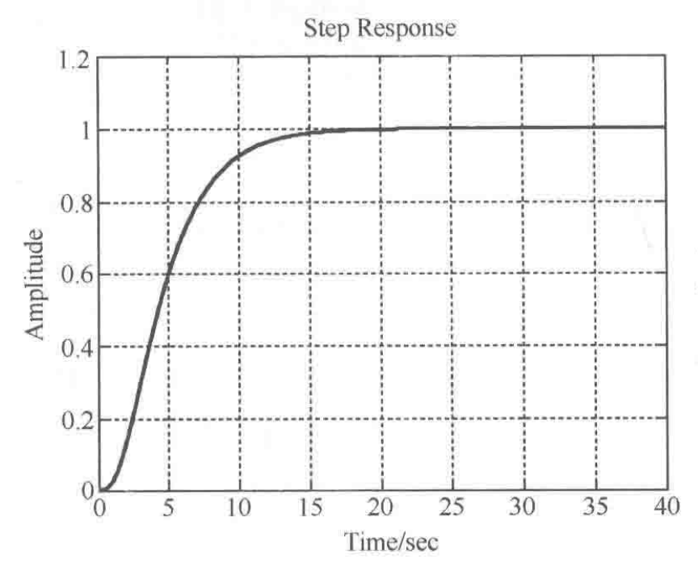

> Image description: This image shows a "Step Response" graph from a textbook, plotting Amplitude on the y-axis against Time/sec on the x-axis. The x-axis ranges from 0 to 40 seconds with increments of 5, and the y-axis ranges from 0 to 1.2 with increments of 0.2. The figure displays a single smooth curve starting at the origin (0,0). The amplitude increases rapidly at first, then slows down as it asymptotically approaches a steady-state value of 1.0. This represents a typical unit step response of a stable control system, characterized by an absence of overshoot or oscillation. According to the provided caption, this plot is one of several MATLAB simulations showing how different values of a parameter $K$ affect the system's transient behavior. The curve demonstrates the time it takes for the system output to reach and settle at its final value.
图 3－13－1 $K=0.2$ 时系统的单位阶跃响应 （MATLAB）

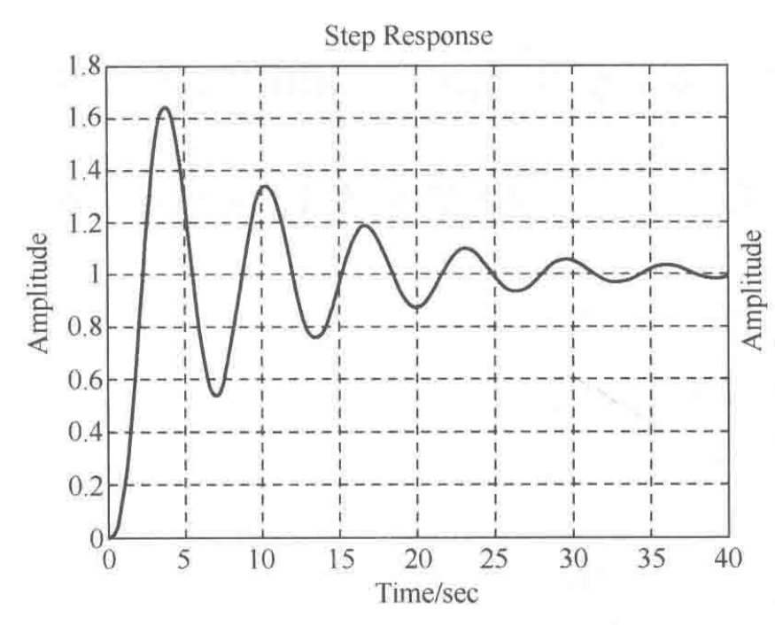

> Image description: A plot titled "Step Response" showing the time-domain response of a system to a unit step input, generated in MATLAB for a gain value of $K=0.2$. The horizontal x-axis is labeled "Time/sec," ranging from 0 to 40 seconds with increments of 5. The vertical y-axes on both sides are labeled "Amplitude," ranging from 0 to 1.8. The figure displays a damped sinusoidal waveform that oscillates around a steady-state value of 1.0. The response starts at the origin (0,0), reaches an initial peak amplitude of approximately 1.6 at roughly 4 seconds, and exhibits subsequent decaying oscillations. This behavior represents an underdamped system characterized by overshoot and ringing before eventually converging toward its final value as time increases.
图 3－13－3 $K=1.2$ 时系统的单位阶跃响应 （MATLAB）

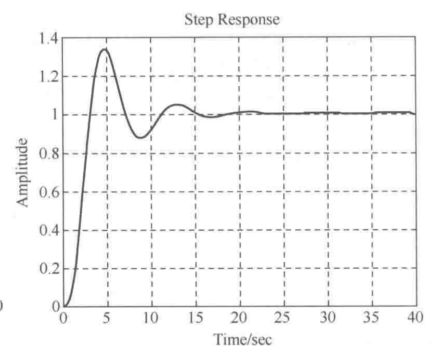

> Image description: This image is a MATLAB-generated plot titled "Step Response," showing the unit step response of a system where $K=1.2$. The graph features a vertical y-axis labeled "Amplitude" ranging from 0 to 1.4 and a horizontal x-axis labeled "Time/sec" ranging from 0 to 40 seconds. The plot displays a single continuous curve starting at the origin (0,0). The response exhibits an underdamped behavior: it rises sharply to a first peak amplitude of approximately 1.35 at around 5 seconds, drops to a trough near 9 seconds, and then oscillates with decreasing magnitude. The signal eventually stabilizes and converges toward a steady-state value of 1.0 as time increases beyond 20 seconds. A dashed horizontal line is visible at the amplitude level of 1.0, serving as the reference for the unit step input.
图3－13－2 $K=0.7$ 时系统的单位阶跃响应 （MATLAB）

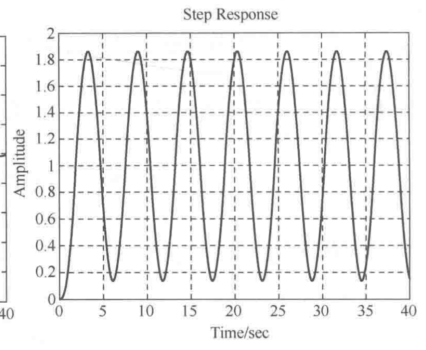

> Image description: The image shows a MATLAB-generated plot titled "Step Response," illustrating the unit step response of a system where $K=0.7$. The graph features a vertical y-axis labeled "Amplitude" ranging from 0 to 2 and a horizontal x-axis labeled "Time/sec" ranging from 0 to 40. The plotted signal is a sustained, undamped sinusoidal oscillation starting at the origin (0,0). The waveform oscillates between a minimum amplitude of approximately 0.1 and a maximum peak of roughly 1.85. The oscillations are periodic and constant in magnitude over time, indicating a marginally stable system or an oscillator. A dashed grid is overlaid on the plot to assist in reading specific values. According to the Chinese caption (图3－13－2), this figure specifically represents the unit step response of the system under the condition $K=0.7$.
图 3－13－4 $K=1.7$ 时系统的单位阶跃响应 （MATLAB）

MATLAB 程序 ：exe313．m
\％$K$ 的取值
$K=[0.2,0.7,1.2,1.7]$
\％各系统的闭环传递函数及单位阶跃响应


<!-- source_pdf_page: 60 -->
```
t=0:0.01:40;
for i = 1:4
    k = K(i)
    numg = [0.5 * k k]; deng = [0.51.5210];
    numhh = [1]; denh = [1];
    [num, den] = feedback( numg, deng, numh, denh); % 闭环传递函数
    sys = tf(num, den);
    figure(i)
    step(sys,t); grid on; % 单位阶跃响应
end
```

3－14 已知系统结构如图 3－63 所示。试用劳斯稳定判据确定能使系统稳定的反馈参数 $\tau$ 的取值范围。

解 应用劳斯稳定判据可以解此题，但具体选值时，尚应兼顾系统的动态性能。

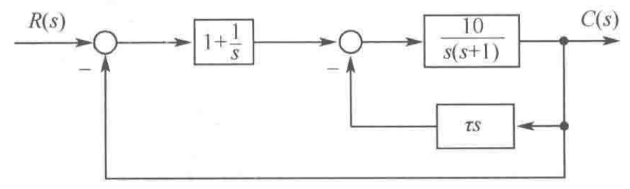

> Image description: This image is a control system block diagram labeled "图3－63 控制系统结构图." The system features a forward path and two feedback loops. The input signal $R(s)$ enters from the left into a summing junction. The resulting error signal passes through an integrator block denoted by $1 + \frac{1}{s}$, then into a second summing junction. This signal then flows through a plant block with the transfer function $\frac{10}{s(s+1)}$, leading to the output variable $C(s)$. There are two feedback paths returning from $C(s)$: an inner loop passing through a derivative-like block labeled $\tau s$ that feeds back negatively into the second summing junction, and an outer unity feedback loop that returns directly to the first summing junction with a negative sign. Arrows indicate the unidirectional flow of signals between blocks and junctions, representing a closed-loop control architecture.
图3－63 控制系统结构图

由图3－63可求得系统的闭环传递函

$$
\Phi(s)=\frac{C(s)}{R(s)}=\frac{10(s+1)}{s^{3}+(1+10 \tau) s^{2}+10 s+10}
$$

则闭环系统的特征方程为

$$
D(s)=s^{3}+(1+10 \tau) s^{2}+10 s+10=0
$$

列劳斯表如下所示：

| $s^{3}$ | 1 | 10 |
| :---: | :---: | :---: |
| $s^{2}$ | $1+10 \tau$ | 10 |
| $s^{1}$ | $\frac{100 \tau}{1+10 \tau}$ |  |
| $s^{0}$ | 10 |  |

由劳斯判据可得，若要使系统稳定，必须满足以下条件：

$$
\left\{\begin{array}{l}
1+10 \tau>0 \\
\frac{100 \tau}{1+10 \tau}>0
\end{array}\right.
$$

解上述不等式组可得 $\tau>0$ 。所以，使系统稳定的反馈参数 $\tau$ 的取值范围为 $\tau>0$ 。
当 $\tau$ 分别取 $0,1,5$ 时，应用 MATLAB 程序，可得系统的单位阶跃响应如图 3－14－1～图 3－14－3 所示。

MATLAB 程序 ：exe314．m
tau $=[0,1,5] ; \quad$ \％tau 的取值
\％各系统单位阶跃响应


<!-- source_pdf_page: 61 -->
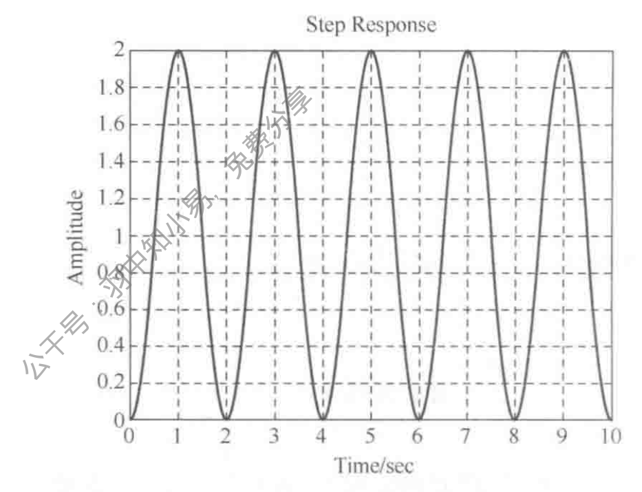

> Image description: A line graph titled "Step Response" illustrates the time-domain behavior of a system. The horizontal x-axis is labeled "Time/sec," ranging from 0 to 10 seconds with increments of 1 second. The vertical y-axis is labeled "Amplitude," ranging from 0 to 2 in increments of 0.2. The plot displays a continuous, undamped sinusoidal oscillation starting at the origin (0,0). The waveform reaches periodic peaks of 2 and troughs of 0. Specifically, peaks occur at $t = 1, 3, 5, 7,$ and $9$ seconds, while troughs occur at $t = 0, 2, 4, 6, 8,$ and $10$ seconds. The constant amplitude indicates a system with no decay over time. According to the caption "图3－14－1 $\tau=0$ 时系统单位阶跃响应（MATLAB）," this represents a unit step response of a system where the time constant $\tau = 0$, generated using MATLAB.
图3－14－1 $\tau=0$ 时系统单位阶跃响应（MATLAB）

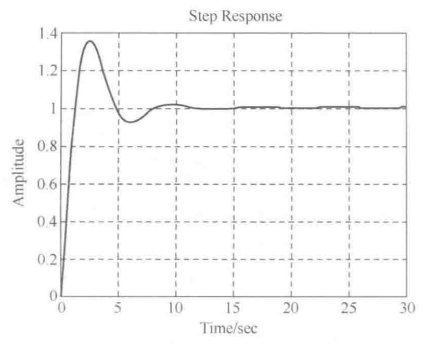

> Image description: A line graph titled "Step Response" illustrates the time-domain behavior of a system's unit step response, as indicated by the caption "图3－14－1 $\tau=0$ 时系统单位阶跃响应（MATLAB）". The vertical y-axis is labeled "Amplitude," with numerical markings from 0 to 1.4 in increments of 0.2. The horizontal x-axis is labeled "Time/sec," ranging from 0 to 30 seconds with major grid lines every 5 seconds. The plotted curve starts at the origin (0,0), rises sharply to a peak amplitude of approximately 1.35 around 2.5 seconds, and then oscillates. It dips to a minimum near 6 seconds before stabilizing and converging toward a steady-state value of 1.0 as time increases beyond 15 seconds. This characteristic waveform represents an underdamped system response, showing overshoot and settling time typical in control engineering analysis.
图 3－14－2 $\tau=1$ 时系统单位阶跃响应（MATLAB）

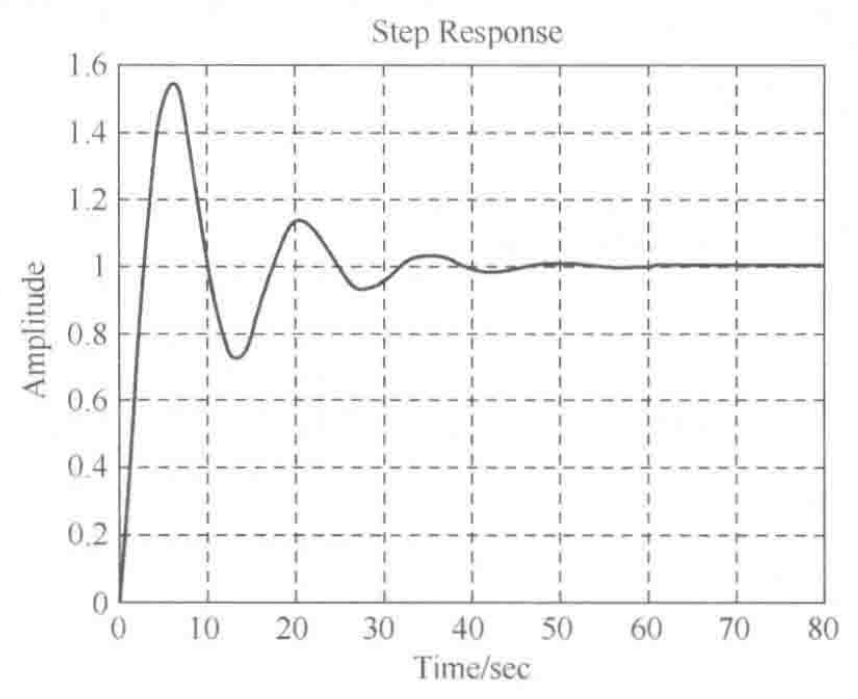

> Image description: A line graph titled "Step Response" illustrates the unit step response of a system where $\tau=1$, as indicated by the caption "图 3－14－2 $\tau=1$ 时系统单位阶跃响应（MATLAB）". The horizontal x-axis is labeled "Time/sec" and ranges from 0 to 80 seconds. The vertical y-axis is labeled "Amplitude" and ranges from 0 to 1.6. The plot shows a damped oscillatory signal starting at the origin (0,0). It reaches a first peak amplitude of approximately 1.5 around 5 seconds, followed by subsequent oscillations with decreasing magnitude. The signal eventually stabilizes and converges to a steady-state value of 1.0 as time increases beyond 50 seconds. This behavior is characteristic of an underdamped second-order system in control engineering, demonstrating overshoot and settling time before reaching equilibrium.
图 3－14－3 $\tau=5$ 时系统单位阶跃响应（MATLAB）

```
for i = 1:3
    k = tau(i); num = [10 10]; den = [1 1 + 10*k 10 10];
    sys = tf(num, den);
    figure(i)
    if i = = 1
        t=0:0.02:10; step(sys,t); grid on;
    elseif i= = 2
        t=0:0.02:30; step(sys,t); grid on;
    else
        t=0:0.02:80; step(sys,t); grid on;
    end
end
```

3－15 已知单位反馈系统的开环传递函数：
（1）$G(s)=\frac{100}{(0.1 s+1)(s+5)}$ ；


<!-- source_pdf_page: 62 -->
（2）$G(s)=\frac{50}{s(0.1 s+1)(s+5)}$ ；
（3）$G(s)=\frac{\mathrm{LO}(2 s+1)}{s+6 s+100)}$ 。
试求输入分别何 $r(t)=2 t$ 和 $r(t)=2+2 t+t^{2}$ 时，系统的稳态误差。
解 萫统的稳态误差可以通过静态误差系数法或终值定理来求解，注意求解系统的稳态误着前必须考查系统是否稳定。
步（1）由于系统为单位负反馈系统，根据开环传递函数可以求得闭环系统的特征方程

$$
D(s)=0.1 s^{2}+1.5 s+105=0
$$

由赫尔维茨判据可知，$n=2$ 且各项系数为正，因此系统是稳定的。
由

$$
G(s)=\frac{100}{(0.1 s+1)(s+5)}=\frac{20}{(0.1 s+1)(0.2 s+1)}
$$

可知，系统是 0 型系统，且 $K=20$ 。由于 0 型系统在 $1(t), t, \frac{1}{2} t^{2}$ 信号作用下的稳态误差分别为 $\frac{1}{1+K}, \infty, \infty$ ，故根据线性叠加原理有：

当系统输人为 $r(t)=2 t$ 时，系统的稳态误差 $e_{\mathrm{st} 1}(\infty)=\infty$ ；
当系统输人为 $r(t)=2+2 t+t^{2}$ 时，系统的稳态误差 $e_{\mathrm{s} 2}(\infty)=\frac{2}{1+K}+\infty+\infty=\infty$ 。
（2）由于系统为单位负反馈系统，根据开环传递函数可以求得闭环系统的特征方程

$$
D(s)=0.1 s^{3}+1.5 s^{2}+5 s+50=0
$$

由赫尔维茨判据可知，$n=3$ ，各项系数 $a_{0}=0.1, a_{1}=1.5, a_{2}=5, a_{3}=50$ 均为正，且 $a_{1} a_{2}= a_{0} a_{5}=2.5>0$ ，因此系统是稳定的。

由

$$
G(s)=\frac{50}{s(0.1 s+1)(s+5)}
$$

可知，系统是I型系统，且 $K=10$ 。由于I型系统在 $1(t), t, \frac{1}{2} t^{2}$ 信号作用下的稳态误差分别为 $0, \frac{1}{K}, \infty$ ，故根据线性叠加原理有：

当系统输人为 $r(t)=2 t$ 时，系统的稳态误差 $e_{s 1}(\infty)=\frac{2}{K}=0.2$ ；
当系统输入为 $r(t)=2+2 t+t^{2}$ 时，系统的稳态误差 $e_{\mathrm{s} 2}(\infty)=0+\frac{2}{K}+\infty=\infty$ 。
（3）由于系统为单位负反馈系统，根据开环传递函数可以求得闭环系统的特征方程

$$
D(s)=s^{2}\left(s^{2}+6 s+100\right)+10(2 s+1)=s^{4}+6 s^{3}+100 s^{2}+20 s+10=0
$$

由赫尔维茨判据可知，$n=4$ ，各项系数 $a_{0}=1, a_{1}=6, a_{2}=100, a_{3}=20, a_{4}=10$ 均为正，且 $\Delta_{2}=a_{1} a_{2}-a_{0} a_{3}=580>0$ ，以及 $\Delta_{2}>a_{1}^{2} a_{4} / a_{3}=18$ ，因此系统是稳定的。

用终值定理来求解系统的稳态误差，有


<!-- source_pdf_page: 63 -->
$$
\begin{aligned}
e_{s}(\infty) & =\lim _{s \rightarrow 0} s E(s)=\lim _{s \rightarrow \infty} s \cdot \frac{1}{1+G(s) H(s)} \cdot R(s) \\
& =\lim _{s \rightarrow 0} s R(s) \cdot \frac{s^{2}\left(s^{2}+6 s+100\right)}{s^{2}\left(s^{2}+6 s+100\right)+10(2 s+1)}
\end{aligned}
$$

当系统输人为 $r(t)=2 t$ 时，$R(s)=\frac{2}{s^{2}}$ ，则

$$
e_{s 1}(\infty)=\lim _{s \rightarrow 0} s \cdot \frac{2}{s^{2}} \cdot \frac{s^{2}\left(s^{2}+6 s+100\right)}{s^{2}\left(s^{2}+6 s+100\right)+10(2 s+1)}=0
$$

当系统输人为 $r(t)=2+2 t+t^{2}$ 时，$R(s)=\frac{2}{s}+\frac{2}{s^{2}}+\frac{2}{s^{3}}=\frac{2\left(s^{2}+s+1\right)}{s^{3}}$ ，故

$$
e_{s 2}(\infty)=\lim _{s \rightarrow 0} s \cdot \frac{2\left(s^{2}+s+1\right)}{s^{3}} \cdot \frac{s^{2}\left(s^{2}+6 s+100\right)}{s^{2}\left(s^{2}+6 s+100\right)+10(2 s+1)}=20
$$

3－16 已知单位反馈系统的开环传递函数：
（1）$G(s)=\frac{50}{(0.1 s+1)(2 s+1)}$ ；
（2）$G(s)=\frac{K}{s\left(s^{2}+4 s+200\right)}$ ；
（3）$G(s)=\frac{10(2 s+1)(4 s+1)}{s^{2}\left(s^{2}+2 s+10\right)}$ 。
试求位置误差系数 $K_{p}$ 、速度误差系数 $K_{v}$ 、加速度误差系数 $K_{a}$ 。
解 根据静态误差系数的定义式可以分别求得位置误差系数、速度误差系数和加速度误差系数。
（1）根据静态误差系数的定义式可得

$$
\begin{aligned}
& K_{p}=\lim _{s \rightarrow 0} G(s) H(s)=\lim _{s \rightarrow 0} \frac{50}{(0.1 s+1)(2 s+1)}=50 \\
& K_{u}=\lim _{s \rightarrow 0} G(s) H(s)=\lim _{s \rightarrow 0} s \cdot \frac{50}{(0.1 s+1)(2 s+1)}=0 \\
& K_{a}=\lim _{s \rightarrow 0} s^{2} G(s) H(s)=\lim _{s \rightarrow 0} s^{2} \cdot \frac{50}{(0.1 s+1)(2 s+1)}=0
\end{aligned}
$$

（2）根据静态误差系数的定义式可得

$$
\begin{aligned}
& K_{p}=\lim _{s \rightarrow 0} G(s) H(s)=\lim _{s \rightarrow 0} \frac{K}{s\left(s^{2}+4 s+200\right)}=\infty \\
& K_{v}=\lim _{s \rightarrow 0} G(s) H(s)=\lim _{s \rightarrow 0} s \cdot \frac{K}{s\left(s^{2}+4 s+200\right)}=\frac{K}{200} \\
& K_{a}=\lim _{s \rightarrow 0} s^{2} G(s) H(s)=\lim _{s \rightarrow 0} s^{2} \cdot \frac{K}{s\left(s^{2}+4 s+200\right)}=0
\end{aligned}
$$

（3）根据静态误差系数的定义式可得

$$
\begin{aligned}
& K_{p}=\lim _{s \rightarrow 0} G(s) H(s)=\lim _{s \rightarrow 0} \frac{10(2 s+1)(4 s+1)}{s^{2}\left(s^{2}+2 s+10\right)}=\infty \\
& K_{u}=\lim _{s \rightarrow 0} G(s) H(s)=\lim _{s \rightarrow 0} s \cdot \frac{10(2 s+1)(4 s+1)}{s^{2}\left(s^{2}+2 s+10\right)}=\infty \\
& K_{a}=\lim _{s \rightarrow 0} s^{2} G(s) H(s)=\lim _{s \rightarrow 0} s^{2} \cdot \frac{10(2 s+1)(4 s+1)}{s^{2}\left(s^{2}+2 s+10\right)}=1
\end{aligned}
$$


<!-- source_pdf_page: 64 -->
3－17 设单位反馈系统的开环传递函数为 $G(s)=1 / T s$ 。试用动态误差系数法求出当输人信号分别为 $r(t)=t^{2} / 2$ 和 $r(t)=\sin 2 t$ 时，系统的稳态误差。

解 本题利脨动态误差系数法来求系统的稳态误差。
由题设嗝知，该系统属于单位反馈系统，则系统的误差传递函数为

$$
\begin{aligned}
\text { (T) }(s) & =\frac{E(s)}{R(s)}=\frac{1}{1+G(s)}=\frac{T s}{1+T s}=T s-(T s)^{2}+(T s)^{3}-(T s)^{4}+\cdots \\
& =C_{0}+C_{1} s+C_{2} s^{2}+C_{3} s^{3}+\cdots
\end{aligned}
$$

所以有

$$
\begin{aligned}
E(s) & =\Phi_{e}(s) R(s)=T s R(s)-(T s)^{2} R(s)+(T s)^{3} R(s)-(T s)^{4} R(s)+\cdots \\
& =\left(C_{0}+C_{1} s+C_{2} s^{2}+C_{3} s^{3}+\cdots\right) R(s)
\end{aligned}
$$

故动态误差系数为

$$
C_{0}=0, \quad C_{1}=T, \quad C_{2}=-T^{2}, \quad C_{3}=T^{3}, \quad C_{4}=-T^{4}, \quad \cdots
$$

本系统为I型系统，有 $C_{1}=\frac{1}{K_{v}}$ ，其中 $K_{v}$ 为静态速度误差系数，故当 $r(t)=t^{2} / 2$ 时，有

$$
e_{\mathrm{s}}(\infty)=\infty
$$

## 又解

对 $E(s)$ 在零初始条件下进行拉氏反变换，可得

$$
e(t)=\operatorname{Tr}(t)-T^{2} \ddot{r}(t)+T^{3} \dddot{r}(t)-T^{4} r^{(4)}(t)+\cdots
$$

当 $r(t)=t^{2} / 2$ 时，显然有

$$
\dot{r}(t)=t, \quad \ddot{r}(t)=1, \quad \dddot{r}(t)=r^{(t)}(t)=\cdots=0
$$

将上述各式代人 $e(t)$ 的表达式，可得

$$
e_{s s}(t)=T t-T^{2}=T(t-T)
$$

故系统的稳态误差为

$$
e_{\mathrm{s}}(\infty)=\lim _{t \rightarrow \infty} e_{\mathrm{s}}(t)=\lim _{t \rightarrow \infty} T(t-T)=\infty
$$

当 $r(t)=\sin 2 t$ 时，显然有

$$
\dot{r}(t)=2 \cos 2 t, \quad \ddot{r}(t)=-2^{2} \sin 2 t, \quad \dddot{r}(t)=-2^{3} \cos 2 t, \quad r^{(t)}(t)=2^{t} \sin 2 t
$$

将上述各式代入 $e(t)$ 的表达式，可得稳态误差

$$
\begin{aligned}
e_{\mathrm{s}}(t) & =T(2 \cos 2 t)-T^{2}\left(-2^{2} \sin 2 t\right)+T^{3}\left(-2^{3} \cos 2 t\right)-T^{4}\left(2^{4} \sin 2 t\right)+\cdots \\
& =\cos 2 t\left[2 T-(2 T)^{3}+(2 T)^{5}-\cdots\right]+\sin 2 t\left[(2 T)^{2}-(2 T)^{4}+(2 T)^{6}-\cdots\right] \\
& =\frac{2 T}{1+4 T^{2}} \cos 2 t+\frac{4 T^{2}}{1+4 T^{2}} \sin 2 t=\frac{2 T}{\sqrt{1+4 T^{2}}} \sin \left(2 t+\arctan \frac{1}{2 T}\right)
\end{aligned}
$$

又解

$$
e_{\mathrm{s}}(t)=\left(C_{0}-C_{2} \omega_{0}^{2}+C_{4} \omega_{0}^{4}-\cdots\right) \sin \omega_{0} t+\left(C_{1} \omega_{0}-C_{3} \omega_{0}^{3}+C_{5} \omega_{0}^{5}-\cdots\right) \cos \omega_{0} t
$$

代人 $C_{i}(i=0,1,2, \cdots)$ 及 $\omega_{0}=2$ ，得

$$
\begin{aligned}
e_{N}(t) & =\left[(2 T)^{2}-(2 T)^{4}+(2 T)^{6}-\cdots\right] \sin 2 t+\left[2 T-(2 T)^{3}+(2 T)^{5}-\cdots\right] \cos 2 t \\
& =\frac{4 T^{2}}{1+4 T^{2}} \sin 2 t+\frac{2 T}{1+4 T^{2}} \cos 2 t=\frac{2 T}{\sqrt{1+4 T^{2}}} \sin \left(2 t+\arctan \frac{1}{2 T}\right)
\end{aligned}
$$


<!-- source_pdf_page: 65 -->
3－18 设控制系统如图 3－64 所示，其中

$$
G(s)=K_{p}+\frac{K}{s}, \quad F(s)=\frac{1}{J s}
$$

输入 $r(t)$ 以及扰动 $n_{1}(t)$ 和 $n_{2}(t)$ 均为单位阶跃函数。试求：
（1）在 $r(t)$ 作用下系统的稳态误差；
（究）在 $n_{1}(t)$ 作用下系统的稳态误差；
（3）在 $n_{1}(t)$ 和 $n_{2}(t)$ 同时作用下系统的稳态误差。

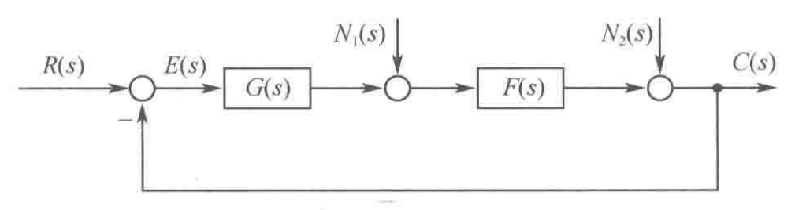

> Image description: This image is a control system block diagram labeled "图3-64 控制系统结构图." The signal flow begins with an input variable $R(s)$ entering a summing junction, where it is compared with a feedback loop to produce the error signal $E(s)$. This signal passes through a functional block $G(s)$, after which another summing junction introduces a disturbance signal $N_1(s)$. The resulting output then enters a second functional block $F(s)$. Following this block, a third summing junction incorporates a second disturbance signal $N_2(s)$ to produce the final system output $C(s)$. A feedback path connects the output $C(s)$ back to the initial summing junction with a negative sign, indicating a closed-loop negative feedback configuration. The diagram uses standard engineering notation to represent the relationship between transfer functions and external noise or disturbances within a linear time-invariant system in the s-domain.
图3－64 控制系统结构图

解 本题为系统在输人及扰动作用下稳态误差的计算。先求出系统在不同作用下的误差函数，再根据终值定理来求系统的稳态误差。
（1）$r(t)$ 作用下系统的稳态误差。误差传递函数为

则

$$
\begin{gathered}
\Phi_{e}(s)=\frac{E(s)}{R(s)}=\frac{1}{1+G(s) F(s)} \\
E(s)=\Phi_{e}(s) R(s)=\frac{R(s)}{1+G(s) F(s)}
\end{gathered}
$$

根据终值定理，系统的稳态误差为

$$
e_{s s}(\infty)=\lim _{s \rightarrow 0} s E(s)=\lim _{s \rightarrow 0} s \cdot \frac{R(s)}{1+G(s) F(s)}
$$

由于 $R(s)=\frac{1}{s}, G(s)=K_{p}+\frac{K}{s}, F(s)=\frac{1}{J s}$ ，故有

$$
e_{s}(\infty)=\lim _{s \rightarrow 0} s \cdot \frac{1}{1+\left(K_{p}+\frac{K}{s}\right) \cdot \frac{1}{J s}} \cdot \frac{1}{s}=\lim _{s \rightarrow 0} \frac{J s^{2}}{J s^{2}+K_{p} s+K}=0
$$

即在 $r(t)=1(t)$ 作用下系统的稳态误差为 0 。
（2）$n_{1}(t)$ 作用下系统的稳态误差。在 $N_{1}(s)$ 作用下系统的输出为

$$
C_{1}(s)=\frac{F(s)}{1+G(s) F(s)} \cdot N_{1}(s)
$$

故 $n_{1}(t)$ 引起的误差函数为

$$
E_{n 1}(s)=0-C_{1}(s)=-\frac{F(s)}{1+G(s) F(s)} \cdot N_{1}(s)
$$

此时系统的稳态误差为

$$
e_{s n 1}(\infty)=\lim _{s \rightarrow 0} s E_{n 1}(s)=\lim _{s \rightarrow 0} s\left[-\frac{F(s)}{1+G(s) F(s)} \cdot N_{1}(s)\right]
$$

由于 $N_{1}(s)=\frac{1}{s}, G(s)=K_{p}+\frac{K}{s}, F(s)=\frac{1}{J s}$ ，故得

$$
e_{s s n l}(\infty)=\lim _{s \rightarrow 0}\left[-\frac{s}{J s^{2}+K_{p} s+K}\right]=0
$$

即在 $n_{1}(t)=1(t)$ 作用下系统的稳态误差为 0 。


<!-- source_pdf_page: 66 -->
（3）$n_{1}(t)$ 和 $n_{2}(t)$ 同时作用下系统的稳态误差。 $N_{1}(s)$ 和 $N_{2}(s)$ 分别作用下系统的误差函数为

$$
\begin{aligned}
& E_{n 1}(s)=0-C_{1}(s)=-\frac{F(s)}{1+G(s) F(s)} \cdot N_{1}(s) \\
& E_{n 2}(s)=0-C_{2}(s)=-\frac{1}{1+G(s) F(s)} \cdot N_{2}(s)
\end{aligned}
$$

故 $n_{1}(\hat{t})$ 和 $n_{2}(t)$ 同时作用引起的误差为

$$
E_{n}(s)=E_{n 1}(s)+E_{n 2}(s)=-\frac{F(s) N_{1}(s)+N_{2}(s)}{1+G(s) F(s)}
$$

此时系统的稳态误差为

$$
\begin{aligned}
e_{s s h}(\infty) & =\lim _{s \rightarrow 0} E_{n}(s)=\lim _{s \rightarrow 0} s\left[-\frac{F(s) N_{1}(s)+N_{2}(s)}{1+G(s) F(s)}\right] \\
& =\lim _{s \rightarrow 0}\left[-\frac{J s^{2}+s}{J s^{2}+K_{p} s+K}\right]=0
\end{aligned}
$$

即在 $n_{1}(t)=1(t)$ 和 $n_{2}(t)=1(t)$ 同时作用下系统的稳态误差为 0 。
显然，从系统结构图3－64可以直接看出：系统对输人 $R(s)$ 为II型系统，对 $N_{1}(s)$ 为I型系统，对 $N_{2}(s)$ 为II型系统，因此当 $R(s) 、 N_{1}(s)$ 和 $N_{2}(s)$ 均为单位阶跃函数时，系统的稳态误差必为零。

3－19 设闭环传递函数的一般形式为

$$
\Phi(s)=\frac{G(s)}{1+G(s) H(s)}=\frac{b_{m} s^{m}+b_{m-1} s^{m-1}+\cdots+b_{1} s+b_{0}}{s^{n}+a_{n-1} s^{n-1}+\cdots+a_{1} s+a_{0}}
$$

误差定义取 $e(t)=r(t)-c(t)$ 。试证：
（1）系统在阶跃信号输入下，稳态误差为零的充分条件是：$b_{0}=a_{0}, b_{i}=0(i=1,2, \cdots$ ， $m)$ ；
（2）系统在斜坡信号输入下，稳态误差为零的充分条件是：$b_{0}=a_{0}, b_{1}=a_{1}, b_{i}=0$（ $i=2$ ， $3, \cdots, m)$ 。

证明 本题主要运用终值定理求证。
系统的误差传递函数为

$$
\begin{align*}
\Phi_{e}(s) & =\frac{E(s)}{R(s)}=\frac{R(s)-C(s)}{R(s)}=1-\Phi(s) \\
& =\frac{\left(a_{0}-b_{0}\right)+\left(a_{1}-b_{1}\right) s+\cdots+\left(a_{m}-b_{m}\right) s^{m}+a_{m+1} s^{m+1}+\cdots+a_{n-1} s^{n-1}+s^{n}}{s^{n}+a_{n-1} s^{n-1}+\cdots+a_{1} s+a_{0}} \tag{m<n}
\end{align*}
$$

（1）当 $b_{0}=a_{0}, b_{i}=0(i=1,2, \cdots, m)$ 时，

$$
\Phi_{e}(s)=\frac{a_{1} s+a_{2} s^{2}+\cdots+a_{n-1} s^{n-1}+s^{n}}{s^{n}+a_{n-1} s^{n-1}+\cdots+a_{1} s+a_{0}}, \quad R(s)=\frac{1}{s}
$$

由终值定理可得

$$
e_{s}(\infty)=\lim _{s \rightarrow 0} s \Phi_{e}(s) R(s)=\lim _{s \rightarrow 0} \frac{a_{1} s+a_{2} s^{2}+\cdots+a_{n-1} s^{n-1}+s^{n}}{s^{n}+a_{n-1} s^{n-1}+\cdots+a_{1} s+a_{0}}=0
$$

因而充分条件得证。
（2）当 $b_{0}=a_{0}, b_{1}=a_{1}, b_{i}=0(i=2,3, \cdots, m)$ 时，


<!-- source_pdf_page: 67 -->
$$
\Phi_{e}(s)=\frac{a_{2} s^{2}+\cdots+a_{n-1} s^{n-1}+s^{n}}{s^{n}+a_{n-1} s^{n-1}+\cdots+a_{1} s+a_{0}}, \quad R(s)=\frac{1}{s^{2}}
$$

由终值定理可得不

$$
\text { (s) } e_{s s}(\infty)=\lim _{s \rightarrow 0} s \Phi_{e}(s) R(s)=\lim _{s \rightarrow 0} \frac{a_{2} s^{1}+\cdots+a_{n-1} s^{n-2}+s^{n-1}}{s^{n}+a_{n-1} s^{n-1}+\cdots+a_{1} s+a_{0}}=0
$$

因而充分条件得证。
3－20 设随动系统的微分方程为

$$
\begin{aligned}
& T_{1} \frac{\mathrm{~d}^{2} c(t)}{\mathrm{d} t^{2}}+\frac{\mathrm{d} c(t)}{\mathrm{d} t}=K_{2} u(t) \\
& u(t)=K_{1}[r(t)-b(t)] \\
& T_{2} \frac{\mathrm{~d} b(t)}{\mathrm{d} t}+b(t)=c(t)
\end{aligned}
$$

其中，$T_{1} 、 T_{2}$ 和 $K_{2}$ 为正常数。若要求 $r(t)=1+t$ 时，$c(t)$ 对 $r(t)$ 的稳态误差不大于正常数 $\varepsilon_{0}$ ，试问 $K_{1}$ 应满足什么条件？已知全部初始条件为零。

解 本题研究系统参数选择与系统稳态误差的关系。然而，不稳定系统是不存在稳态误差问题的，因而首先要考虑参数选择与系统稳定性的关系。由于题设给定的是微分方程，因此要应用拉氏变换得到系统的结构图，然后再解题。
（1）系统的结构图。对题设给定的系统的微分方程进行拉氏变换，有

$$
\begin{aligned}
& \left(T_{1} s^{2}+s\right) C(s)=K_{2} U(s) \\
& U(s)=K_{1}[R(s)-B(s)] \\
& \left(T_{2} s+1\right) B(s)=C(s)
\end{aligned}
$$

由上述方程式可以画出系统的结构图，如图3－20－1所示。

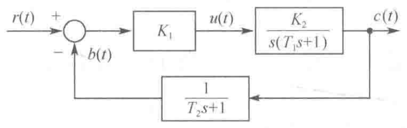

> Image description: A control system block diagram is shown in Figure 3-20-1. The signal flow begins with an input variable $r(t)$ entering a summing junction, where it is compared with a feedback signal to produce the error signal $b(t)$. This signal passes through a forward gain block labeled $K_1$, resulting in the control signal $u(t)$. The signal $u(t)$ then enters a plant transfer function block defined as $\frac{K_2}{s(T_1 s + 1)}$, which produces the system output $c(t)$. A feedback loop returns the output $c(t)$ through a feedback block with the transfer function $\frac{1}{T_2 s + 1}$ back to the summing junction, where it is subtracted from $r(t)$. The diagram represents a closed-loop control system characterized by proportional gain and first-order lag components in both the forward and feedback paths.
图 3－20－1 系统结构图

（2）系统参数选择与系统稳定性的关系。由结构图可求出闭环系统传递函数

$$
\Phi(s)=\frac{K_{1} K_{2}\left(T_{2} s+1\right)}{s\left(T_{1} s+1\right)\left(T_{2} s+1\right)+K_{1} K_{2}}
$$

闭环特征方程为

$$
T_{1} T_{2} s^{3}+\left(T_{1}+T_{2}\right) s^{2}+s+K_{1} K_{2}=0
$$

列劳斯表如下：

| $s^{3}$ | $T_{1} T_{2}$ | 1 |
| :---: | :---: | :---: |
| $s^{2}$ | $T_{1}+T_{2}$ | $K_{1} K_{2}$ |
| $s^{3}$ | $\frac{\left(T_{1}+T_{2}\right)-T_{1} T_{2} K_{1} K_{2}}{T_{1}+T_{2}}$ |  |
| $s^{0}$ | $K_{1} K_{2}$ |  |

显然，在 $T_{1}, T_{2}$ 和 $K_{2}$ 为正常数条件下，使闭环系统稳定的充要条件为


<!-- source_pdf_page: 68 -->
$$
0<K_{1}<\frac{T_{1}+T_{2}}{K_{2} T_{1} T_{2}}
$$

（3）系统参数选择与系统稳态误差的关系。定义系统的误差为 $E(s)=R(s)-C(s)$ ，则

$$
\begin{aligned}
\Phi(g(s) s) & =\frac{E(s)}{R(s)}=1-\Phi(s)=1-\frac{K_{1} K_{2} T_{2} s+K_{1} K_{2}}{T_{1} T_{2} s^{3}+\left(T_{1}+T_{2}\right) s^{2}+s+K_{1} K_{2}} \\
& =\frac{s\left[T_{1} T_{2} s^{2}+\left(T_{1}+T_{2}\right) s+\left(1-K_{1} K_{2} T_{2}\right)\right]}{T_{1} T_{2} s^{3}+\left(T_{1}+T_{2}\right) s^{2}+s+K_{1} K_{2}}
\end{aligned}
$$

由于 $r(t)=1+t$ ，故 $R(s)=\frac{1}{s}+\frac{1}{s^{2}}=\frac{s+1}{s^{2}}$ ，因此由终值定理可得

$$
\begin{aligned}
e_{s}(\infty) & =\lim _{s \rightarrow 0} E(s)=\lim _{s \rightarrow 0} s \Phi_{e}(s) R(s) \\
& =\lim _{s \rightarrow 0} s \cdot\left\{\frac{s\left[T_{1} T_{2} s^{2}+\left(T_{1}+T_{2}\right) s+\left(1-K_{1} K_{2} T_{2}\right)\right]}{T_{1} T_{2} s^{3}+\left(T_{1}+T_{2}\right) s^{2}+s+K_{1} K_{2}}\right\} \cdot \frac{s+1}{s^{2}} \\
& =\frac{1-K_{1} K_{2} T_{2}}{K_{1} K_{2}}
\end{aligned}
$$

令 $e_{\mathrm{ss}}(\infty)=\frac{1-K_{1} K_{2} T_{2}}{K_{1} K_{2}} \leqslant \varepsilon_{0}$ ，可得 $K_{1} \geqslant \frac{1}{K_{2}\left(T_{2}+\varepsilon_{0}\right)}$ 。
考虑到使系统稳定的充要条件为 $0<K_{1}<\frac{T_{1}+T_{2}}{K_{2} T_{1} T_{2}}$ ，故满足题意要求的 $K_{1}$ 值为

$$
\frac{1}{K_{2}\left(T_{2}+\varepsilon_{0}\right)} \leqslant K_{1}<\frac{T_{1}+T_{2}}{K_{2} T_{1} T_{2}}
$$

3－21 机器人应用反馈原理来控制每个关节的方向。由于负载的改变以及机械臂伸展位置的变化，负载对机器人会产生不同的影响。例如，机械爪抓持负载后，就可能使机器人产生偏差。已知机器人关节指向控制系统如图3－65所示，其中负载扰动力矩为 $1 / s$ 。要求：
（1）当 $R(s)=0$ 时，确定 $N(s)=\frac{1}{s}$ 对 $C(s)$ 的影响，指出减少此种影响的方法；
（2）当 $N(s)=0, R(s)=\frac{1}{s}$ 时，计算系统在输出端定义的稳态误差，指出减少此种稳态误差的方法。

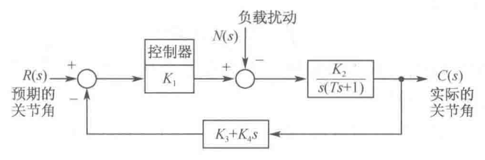

> Image description: A block diagram of a robot joint direction control system is shown. The input signal $R(s)$, representing the expected joint angle, enters a summing junction. The error signal passes through a controller block labeled $K_1$. This output then meets another summing junction where a load disturbance $N(s)$ is added. The combined signal enters a plant block with the transfer function $\frac{K_2}{s(Ts+1)}$. The system's output, $C(s)$, represents the actual joint angle. A feedback loop returns $C(s)$ through a block labeled $K_3 + K_4s$ back to the initial summing junction. Arrows indicate the unidirectional flow of signals from left to right, with a return path for negative feedback. The diagram illustrates a closed-loop control system designed to maintain joint positioning despite external load disturbances.
图3－65 机器人关节指向控制系统结构图

解 本题研究系统参数选择与系统稳态误差的关系。由于只有在系统稳定的前提下，系统稳态误差的计算才有意义，因此首先需要进行稳定性分析，以确定系统参数选取的容许范围。
（1）稳定性分析。令


<!-- source_pdf_page: 69 -->
$$
\begin{gathered}
G_{1}(s)=K_{1}, \quad G_{2}(s)=\frac{K_{2}}{s(T s+1)} \\
H(s)=K_{3}+K_{4} s
\end{gathered}
$$

则闭环传递函数

$$
\Phi(s)=\frac{G_{1}(s) G_{2}(s)}{1+G_{1}(s) G_{2}(s) H(s)}=\frac{K_{1} K_{2}}{T s^{2}+\left(1+K_{1} K_{2} K_{4}\right) s+K_{1} K_{2} K_{3}}
$$

闭环特征方程

$$
D(s)=T s^{2}+\left(1+K_{1} K_{2} K_{4}\right) s+K_{1} K_{2} K_{3}=0
$$

显然，只要参数 $K_{1} 、 K_{2} 、 K_{3} 、 K_{4}$ 以及 $T$ 均为正数，闭环系统一定渐近稳定。
（2）计算 $R(s)=0, N(s)=\frac{1}{s}$ 时，系统的稳态误差 $e_{s n n}(\infty)$ 。在 $N(s)=\frac{1}{s}$ 作用下，闭环系统的输出

$$
C_{n}(s)=-\frac{G_{2}(s)}{1+G_{1}(s) G_{2}(s) H(s)} N(s)=-\frac{K_{2}}{s\left[s(T s+1)+K_{1} K_{2}\left(K_{3}+K_{4} s\right)\right]}
$$

在系统输出端的误差信号

$$
E_{n}(s)=-C_{n}(s)
$$

于是，扰动作用下的稳态误差

$$
e_{s n n}(\infty)=\lim _{s \rightarrow 0} s E_{n}(s)=\lim _{s \rightarrow 0} \frac{K_{2}}{s(T s+1)+K_{1} K_{2}\left(K_{3}+K_{4} s\right)}=\frac{1}{K_{1} K_{3}}
$$

显然，增大前置放大器增益 $K_{1}$ 和关节角位移反馈系数 $K_{3}$ ，可以减小阶跃负载扰动对输出关节角位移的影响。
（3）计算 $N(s)=0, R(s)=\frac{1}{s}$ 时，系统的稳态误差 $e_{\mathrm{sr}}(\infty)$ 。在预期关节角输人作用下，系统的实际关节角输出

$$
C(s)=\frac{G_{1}(s) G_{2}(s)}{1+G_{1}(s) G_{2}(s) H(s)} R(s)=\frac{K_{1} K_{2}}{s(T s+1)+K_{1} K_{2}\left(K_{3}+K_{4} s\right)} R(s)
$$

位于系统输入端的误差信号

$$
E_{r}(s)=R(s)-H(s) C(s)=\left[1-\frac{K_{1} K_{2}\left(K_{3}+K_{4} s\right)}{s(T s+1)+K_{1} K_{2}\left(K_{3}+K_{4} s\right)}\right] R(s)
$$

根据拉氏变换的终值定理

$$
e_{s r r}(\infty)=\lim _{s \rightarrow 0} s E_{r}(s)=0
$$

表明在无负载扰动时，预期阶跃关节角输入不会在系统输人端产生稳态误差。
位于系统输出端的误差信号

$$
E_{r}(s)=R(s)-\Phi(s) R(s)=[1-\Phi(s)] R(s)
$$

当 $R(s)=\frac{1}{s}$ 时，稳态误差

$$
e_{s r r}(\infty)=\lim _{s \rightarrow 0} s E_{r}(s)=1-\Phi(0)=1-\frac{1}{K_{3}}
$$

计算表明，在无负载扰动情况下，预期阶跃关节角输人会在系统输出端产生稳态误差。若取反馈系数 $K_{3}=1$ ，则可使 $e_{s r}(\infty)=0$ 。

3－22 在造纸厂的卷纸过程中，卷开轴和卷进轴之间的纸张张力采用图 3－66 所示的卷


<!-- source_pdf_page: 70 -->
纸张力控制系统进行控制，以保持张力 $F$ 基本恒定。随着纸卷厚度的变化，纸上的张力 $F$会发生变化，因此必须调整电机的转速 $\omega_{0}(t)$ 。如果不对卷进电机的转速 $\omega_{0}(t)$ 进行控制，则当纸张不断地从罗开轴向卷进轴运动时，线速度 $v_{0}(t)$ 就会下降，从而纸张承受的张力 $F$ 会相应减小。

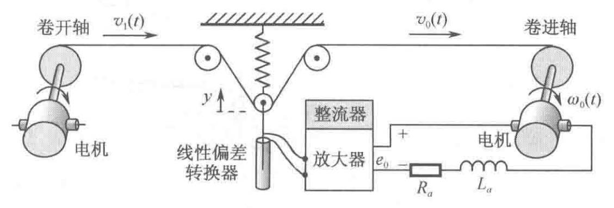

> Image description: This technical diagram, captioned "Figure 3-66 Schematic Diagram of Paper Winding Tension Control System," illustrates a closed-loop feedback system for maintaining tension during paper winding. The process begins at the "unwinding shaft" (卷开轴), where paper moves with velocity $v_1(t)$ toward the "winding shaft" (卷进轴) moving at velocity $v_0(t)$. A dancer arm assembly, consisting of pulleys and a spring, monitors tension; its vertical displacement is labeled as variable $y$. A "linear deviation transducer" (线性偏差转换器) converts this physical movement into an electrical signal. This signal enters a control block containing a "rectifier" (整流器) and an "amplifier" (放大器). The resulting output voltage $e_0$ drives the winding motor. The motor's electrical circuit is modeled with resistance $R_a$ and inductance $L_a$, controlling the angular velocity $\omega_0(t)$ of the winding shaft to regulate the system's overall tension.
图3－66 卷纸张力控制系统原理图

在张力控制系统中，采用三个滑轮和一个弹簧组成的张力测量器，用来测量纸上的张力。记弹簧力为 $K_{1} y$ ，其中 $y$ 是弹簧偏离平衡位置的距离，则张力可以表示为 $2 F=K_{1} y$ ，其中 $F$ 为张力增量的垂直分量。此外，假设线性偏差转换器、整流器和放大器合在一起后，可以表示为 $e_{0}=-K_{2} y$ ；电机的传递系数为 $K_{m}$ ，时间常数为 $T_{m}$ ，卷进轴的线速度在数值上是电机角速度的 2 倍，即 $v_{0}(t)=2 \omega_{0}(t)$ 。于是，电机运动方程为

$$
E_{0}(s)=\frac{1}{K_{m}}\left[T_{m} s \Omega_{0}(s)+\Omega_{0}(s)\right]+K_{3} \Delta F(s)
$$

式中，$K_{3}$ 为张力扰动系数，$\Delta F$ 为张力扰动增量。要求在所给的条件下完成：
（1）绘出张力控制系统结构图，其中应包含张力扰动 $\Delta F(s)$ 和卷开轴速度扰动 $\Delta V_{1}(s)$ ；
（2）当输入为单位阶跃扰动 $\Delta V_{1}(s)=\frac{1}{s}$ 时，确定张力的稳态误差。
解 本题为复杂工程系统建模及扰动作用下稳态误差的计算问题。在计算稳态误差过程中，注意保持系统的稳定性及稳态误差存在性的判别。
（1）绘制张力控制系统结构图。根据题意给定的条件，绘出系统结构图，如图3－22－1所示。

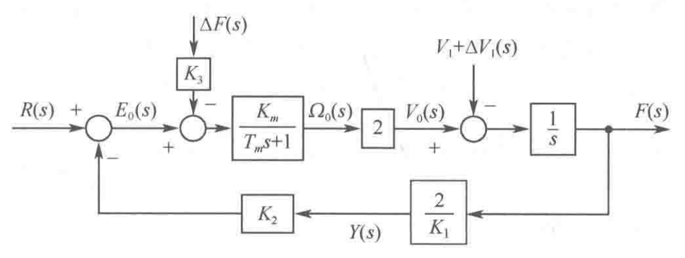

> Image description: This image shows a control system block diagram for tension control, labeled as Figure 3-22-1. The system is represented in the Laplace domain ($s$). The forward path begins with an input $R(s)$ entering a summing junction to produce error signal $E_0(s)$. This signal enters another summing junction where it is combined with a disturbance $\Delta F(s)$ scaled by gain $K_3$. The resulting signal passes through a first-order transfer function block $\frac{K_m}{T_m s + 1}$ to produce angular velocity $\Omega_0(s)$. This is then multiplied by a constant factor of $2$ to yield $V_0(s)$, which enters a final summing junction combined with an external input $V_1 + \Delta V_1(s)$ before passing through an integrator block $\frac{1}{s}$ to produce the output tension $F(s)$. A feedback loop returns $F(s)$ through two blocks: a gain of $\frac{2}{K_1}$, resulting in signal $Y(s)$, and then a gain $K_2$, which feeds back negatively into the initial summing junction.
图3－22－1 张力控制系统结构图

（2）计算 $\Delta V_{1}$ 作用下的稳态误差。由系统结构图可见，系统为二阶系统，因此只要系统中的各参数为正值，张力控制系统始终是稳定的。

由系统结构图还可见，在扰动 $\Delta V_{1}$ 作用点之前的前向通路中，没有纯积分环节，且在反馈通路中没有纯微分环节，因此系统在 $\Delta V_{1}(s)=\frac{1}{s}$ 作用下，必然会产生张力的稳态误差。


<!-- source_pdf_page: 71 -->
令 $R(s)=0, \Delta F(s)=0$ ，则在 $\Delta V_{1}(s)$ 作用下，系统的输出为

$$
F(x) s)=\frac{-\frac{1}{s}}{1+\frac{4 K_{m} K_{2}}{K_{1} s\left(T_{m} s+1\right)}} \Delta V_{1}(s)=-\frac{1}{s+\frac{4 K_{m} K_{2}}{K_{1}\left(T_{m} s+1\right)}} \Delta V_{1}(s)
$$

因为误賸信号

$$
\begin{aligned}
& E_{n}(s)=-F(s)=\frac{1}{s+\frac{4 K_{m} K_{2}}{K_{1}\left(T_{m} s+1\right)}} \Delta V_{1}(s) \\
& \Delta V_{1}(s)=\frac{1}{s}
\end{aligned}
$$

所以张力稳态误差

$$
e_{s m}(\infty)=\lim _{s \rightarrow 0} s E_{n}(s)=\frac{K_{1}}{4 K_{m} K_{2}}
$$

显然，减小 $K_{1}$ 或增大 $K_{2}$ ，可以减小卷开轴速度扰动产生的张力稳态误差。
3－23 现代船舶航向控制系统如图 3－67 所示。 $N(s)$ 表示持续不断的风力扰动，已知 $N(s)=\frac{1}{s}$ ，增益 $K_{1}=5$ 或 $K_{1}=30$ 。要求在下面所给的条件下，确定风力对船舶航向的稳态影响：
（1）假定方向舵的输入 $R(s)=0$ ，系统没有任何其他扰动，或其他调整措施；
（2）证明操纵方向舵能使航向偏离重新归零。

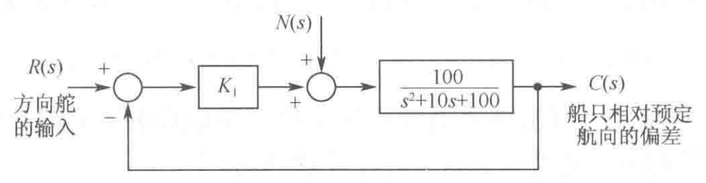

> Image description: A block diagram of a modern ship heading control system is shown. The system is represented in the s-domain, featuring a negative feedback loop. The input signal $R(s)$, labeled as "direction rudder input," enters a summing junction. This signal passes through a gain block $K_1$ before reaching a second summing junction. At this point, an external disturbance signal $N(s)$, representing continuous wind force, is added to the system. The combined signal then enters a plant transfer function block defined as $\frac{100}{s^2 + 10s + 100}$. The output of this block is $C(s)$, labeled as the "deviation of the ship from the intended heading." A feedback line carries $C(s)$ back to the first summing junction, where it is subtracted from $R(s)$. Arrows indicate a unidirectional flow from left to right, with one return path completing the control loop.
图3－67 船舶航向控制系统结构图

解 本题为 0 型系统，也是二阶系统，因此增益 $K_{1}$ 的大小对系统稳定性没有影响，但会影响扰动作用下航向偏差的大小。如果操纵方向舵 $R(s)$ 抵消风力扰动 $N(s)$ 的作用，航向偏差自然可以重新归零。
（1）风力对船舶航向稳态偏差的影响。令 $R(s)=0, G_{1}(s)=\frac{100}{s^{2}+10 s+100}$ ，在 $N(s)= \frac{1}{5}$ 作用下，闭环航向偏离输出

$$
C_{n}(s)=\frac{G_{1}(s)}{1+K_{1} G_{1}(s)} N(s)=\frac{100}{s^{2}+10 s+100\left(1+K_{1}\right)} N(s)
$$

稳态输出

$$
c_{s n n}(\infty)=\lim _{s \rightarrow 0} s C_{n}(s)=\lim _{s \rightarrow 0} \frac{100}{s^{2}+10 s+100\left(1+K_{1}\right)}=\frac{1}{1+K_{1}}
$$

当 $K_{1}=5$ 时，有

$$
c_{s n}(\infty)=\frac{1}{6} \mathrm{rad}=9.55^{\circ}
$$


<!-- source_pdf_page: 72 -->
当 $K_{1}=30$ 时，有

$$
c_{s s n}(\infty)=\frac{1}{31} \mathrm{rad}=1.85^{\circ}
$$

（2）选择 $R(s)$ 使航向偏离归零。在方向舵输人 $R(s)$ 及风力扰动 $N(s)$ 同时作用下，系统航向偏离输出际

$$
S_{1} C(s)=\frac{K_{1} G_{1}(s) R(s)+G_{1}(s) N(s)}{1+K_{1} G_{1}(s)}=\frac{\left[K_{1} R(s)+N(s)\right] G_{1}(s)}{1+K_{1} G_{1}(s)}
$$

若选 $R(s)=-\frac{N(s)}{K_{1}}=-\frac{1}{K_{1} s}$ ，可得航向偏离 $C(s)=0$ 。
3－24 设机器人常用的子爪如图3－68（a）所示，它由直流电机驱动，以改变两个子爪间的夹角 $\theta$ 。手爪控制系统模型如图3－68（b）所示，相应的控制系统结构如图3－68（c）所示。图中，$K_{m}=30, R_{f}=1 \Omega, K_{f}=K_{i}=1, J=0.1, f=1$ 。要求：

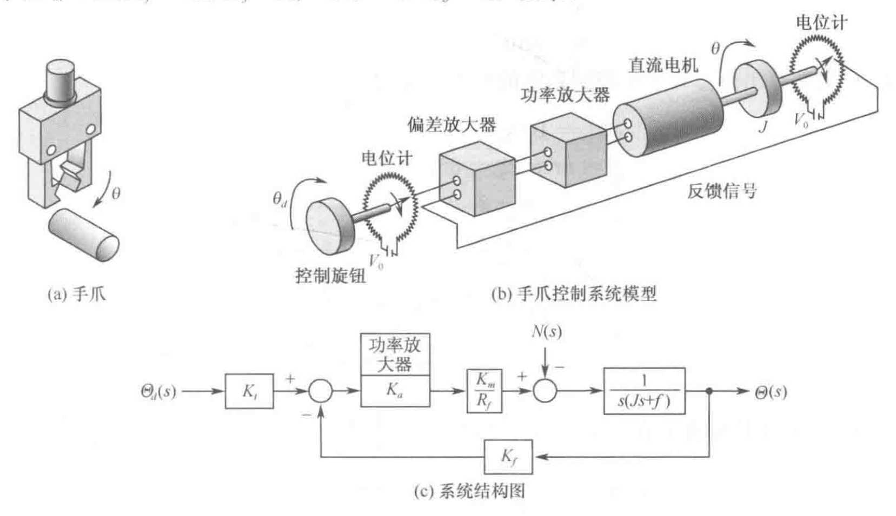

> Image description: This image presents a three-part engineering figure illustrating a robotic gripper control system. Part (a) shows a physical sketch of the gripper with an angle $\theta$. Part (b) provides a functional model: a control knob ($\theta_d$) connects to a potentiometer, followed by an error amplifier and a power amplifier, which drives a DC motor. The motor rotates the gripper, while another potentiometer provides a feedback signal back to the error amplifier. Part (c) is the corresponding block diagram in the Laplace domain. The input $\Theta_d(s)$ passes through gain $K_i$, then enters a summing junction. This is followed by blocks for the power amplifier ($K_a$), motor constants ($K_m/R_f$), and the plant dynamics represented by the transfer function $1/[s(Js+f)]$. The output $\Theta(s)$ is fed back through gain $K_f$ to the summing junction, forming a closed-loop control system.
图3－68 机器人手爪控制系统

（1）当功率放大器增益 $K_{a}=20$ ，输入 $\theta_{d}(t)$ 为单位阶跃信号时，确定系统的单位阶跃响应 $\theta(t)$ ；
（2）当 $\theta_{d}(t)=0, n(t)=1(t)$ 时，确定负载对系统的影响；
（3）当 $n(t)=0, \theta_{d}(t)=t, t>0$ 时，确定系统的稳态误差 $e_{s s}(\infty)$ 。
解 本题属系统时域分析法的综合应用。确定系统的单位阶跃响应，需要确定系统的 $\zeta$ 和 $\omega_{n}$ ，因此需要先求闭环系统传递函数，算出 $\zeta$ 和 $\omega_{n}$ 的具体数值；而确定负载对系统的影响，是指扰动负载在输出端是否会产生稳态误差，从结构图3－68（c）可见，阶跃扰动对系统输出是有影响的。
（1）单位阶跃响应 $\theta(t)$ 。闭环传递函数

$$
\Phi(s)=\frac{\Theta(s)}{\Theta_{d}(s)}=K_{i} \frac{\frac{K_{a} K_{m}}{R_{f}} \cdot \frac{1}{s(J s+f)}}{1+\frac{K_{a} K_{m} K_{f}}{R_{f}} \cdot \frac{1}{s(J s+f)}}
$$


<!-- source_pdf_page: 73 -->
$$
=\frac{K_{i} K_{a} K_{m} / R_{f}}{s(J s+f)+K_{a} K_{m} K_{f} / R_{f}}=\frac{600}{0.1 s^{2}+s+600}
$$

将上式与 $\Phi(s)$ 的称准形式

$$
\Phi(s)=\frac{\omega_{n}^{2}}{s^{2}+2 \zeta \omega_{n} s+\omega_{n}^{2}}
$$

相比较，们得

$$
\omega_{n}=\sqrt{6000}=77.46, \quad \zeta=\frac{10}{2 \omega_{n}}=0.0645
$$

由《自动控制原理（第七版）》教材中式（3－14），得系统单位阶跃响应

$$
\begin{aligned}
\theta(t) & =1-\frac{1}{\sqrt{1-\zeta^{2}}} \mathrm{e}^{-\zeta \omega_{n} t} \sin \left(\omega_{n} \sqrt{1-\zeta^{2}} t+\arctan \frac{\sqrt{1-\zeta^{2}}}{\zeta}\right) \\
& =1-1.0021 \mathrm{e}^{-5 t} \sin \left(77.3 t+86.3^{\circ}\right)
\end{aligned}
$$

于是，可以估算出机器人手爪控制系统的动态性能为

$$
\begin{aligned}
& \sigma \%=100 \mathrm{e}^{-\pi \zeta / \sqrt{1-\zeta^{2}}} \%=81.6 \% \\
& \beta=\arccos \zeta=86.3^{\circ}=1.506 \mathrm{rad} \\
& t_{r}=\frac{\pi-\beta}{\omega_{n} \sqrt{1-\zeta^{2}}}=0.02 \mathrm{~s} \\
& t_{s}=\left\{\begin{array}{l}
\frac{3.5}{\zeta \omega_{n}}=0.7 \mathrm{~s} \quad(\Delta=5 \%) \\
\frac{4.4}{\zeta \omega_{n}}=0.88 \mathrm{~s} \quad(\Delta=2 \%)
\end{array}\right.
\end{aligned}
$$

（2）负载对系统的影响。令 $\Theta_{d}(s)=0, N(s)=\frac{1}{s}$ ，则

$$
\begin{aligned}
& \Theta(s)=-\frac{1}{0.1 s^{2}+s+600} N(s) \\
& E_{n}(s)=-\Theta(s)=\frac{1}{0.1 s^{2}+s+600} N(s) \\
& e_{s n}(\infty)=\lim _{s \rightarrow 0} E_{n}(s)=\frac{1}{600}
\end{aligned}
$$

表明扰动输入幅值在输出端被削弱 600 倍。
（3）单位斜坡输人时稳态误差。已知 $\Theta_{d}(s)=\frac{1}{s^{2}}$ ，故有

$$
\begin{aligned}
e_{\mathrm{s}}(\infty) & =\lim _{s \rightarrow 0} s(s)=\lim _{s \rightarrow 0} s[1-\Phi(s)] \Theta_{d}(s) \\
& =\lim _{s \rightarrow 0} s\left(\frac{0.1 s^{2}+s}{0.1 s^{2}+s+600}\right) \frac{1}{s^{2}}=\frac{1}{600}
\end{aligned}
$$

MATLAB 验证与扩展：
应用 MATLAB 软件包，绘出机器人手爪控制系统的单位阶跃响应曲线，如图 3－24－1 所示；单位斜坡响应曲线，如图 3－24－2 所示；单位阶跃扰动响应曲线，如图 3－24－3 所示；验证系统的动态性能、稳态误差及负载影响；可改变功率放大器增益 $K_{a}$ 的取值，以获得更加满意的系统性能。读者不妨一试。


<!-- source_pdf_page: 74 -->
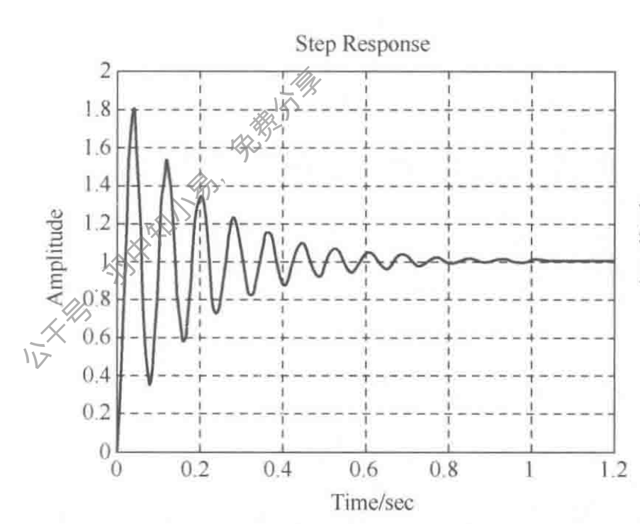

> Image description: The image shows a MATLAB-generated plot titled "Step Response," representing the unit step response curve of a robot control system (as indicated by the Chinese caption). The graph features a Cartesian coordinate system. The horizontal x-axis is labeled "Time/sec" and ranges from 0 to 1.2 seconds, with major grid increments every 0.2 seconds. The vertical y-axis is labeled "Amplitude" and ranges from 0 to 2, with markings every 0.2 units. The plotted curve starts at the origin (0,0) and exhibits a damped oscillatory behavior. It reaches an initial peak amplitude of approximately 1.8 around 0.05 seconds before oscillating around a steady-state value of 1.0. The oscillations decrease in magnitude over time, eventually converging to the final value of 1.0 after approximately 1 second. This visualizes key control system characteristics such as overshoot, settling time, and stability.
图3－24－1 机器人控制系统单位阶跃响应曲线 （MATLAB）

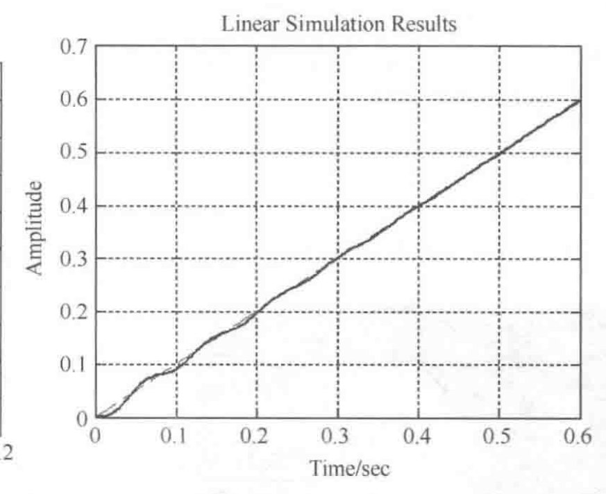

> Image description: This image displays a plot titled "Linear Simulation Results," which represents the unit step response curve of a robot control system generated in MATLAB, as indicated by the Chinese caption (图3-24-1). The graph features two axes: the horizontal x-axis is labeled "Time/sec" and ranges from 0 to 0.6 seconds. The vertical y-axis is labeled "Amplitude" and ranges from 0 to 0.7. A grid of dashed lines overlays the plot area for precise reading. The figure shows two closely overlapping curves starting at the origin (0,0) and increasing linearly over time. Both curves exhibit a slight initial oscillation or ripple before stabilizing into a steady linear ramp, reaching an amplitude of approximately 0.6 at 0.6 seconds. In engineering terms, this plot evaluates the system's transient response and tracking performance in reaction to a step input.
图3－24－2 机器人控制系统单位斜坡响应曲线 （MATLAB）

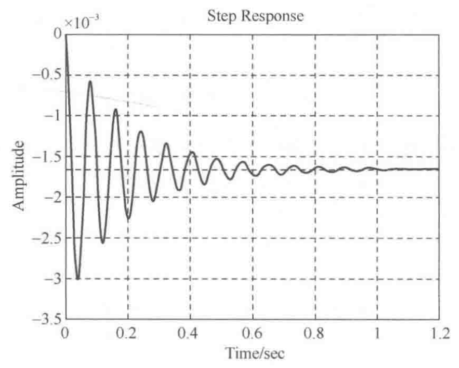

> Image description: This image shows a MATLAB-generated plot titled "Step Response," depicting the time-domain response of a robot control system. The horizontal x-axis is labeled "Time/sec" and ranges from $0$ to $1.2$ seconds. The vertical y-axis is labeled "Amplitude," with values scaled by $10^{-3}$, ranging from $-3.5 \times 10^{-3}$ to $0$. The plot displays a damped oscillatory waveform starting at the origin $(0,0)$. The signal exhibits an initial sharp negative plunge to approximately $-3 \times 10^{-3}$, followed by several oscillations of decreasing amplitude. These oscillations eventually settle toward a steady-state value of approximately $-1.7 \times 10^{-3}$ as time progresses toward $1.2$ seconds. In engineering terms, this represents an underdamped system response characterized by overshoot and ringing before reaching equilibrium. The provided Chinese caption identifies this specifically as the unit ramp response curve for a robot control system.
图 3－24－3 机器人控制系统单位阶跃扰动响应曲线（MATLAB）

MATLAB 程序 ：exe324．m
\％单位阶跃输入响应
num $=[600] ; \quad \operatorname{den}=[0.11600] ; \quad t=0: 0.01: 1.2$ ；
figure
step（num，den，t）；grid
\％单位斜坡输人响应
num $=[600] ; \quad \operatorname{den}=[0.11600] ; \quad t=0: 0.005: 0.6 ; \quad u=t ;$
figure
1sim（num，den，$u, t)$ ；grid
\％单位阶跃扰动响应
num $=[-1] ; \quad$ den $=[0.11600] ; \quad t=0: 0.01: 1.2$ ；
figure
step（num，den，t）；grid
3－25 1984年2月7日，美国宇航员利用手持喷气推进装置，完成了人类历史上的首


<!-- source_pdf_page: 75 -->
次太空行走，如图3－69（a）所示。宇航员机动控制系统结构图如图3－69（b）所示，其中喷气控制器可用增益 $K_{2}$ 表示，$K_{3}$ 为速度反馈增益。若将宇航员以及他手臂上的装置一并考虑，系统总的转动惯量 $J=25 \mathrm{~N} \cdot \mathrm{~m} \cdot \mathrm{~s}^{2} / \mathrm{rad}$ 。要求：
（1）当输人为单位斜坡 $r(t)=t\left(\mathrm{~m} \cdot \mathrm{~s}^{-1}\right)$ 时，确定速度反馈增益 $K_{3}$ 的取值，使系统稳态误差 $e()^{m}(\infty) \leqslant 0.01 \mathrm{~m}$ 。
（务）采用（1）中求得的 $K_{3}$ ，确定 $K_{1} K_{2}$ 的取值，使系统超调量 $\sigma \% \leqslant 10 \%$ 。

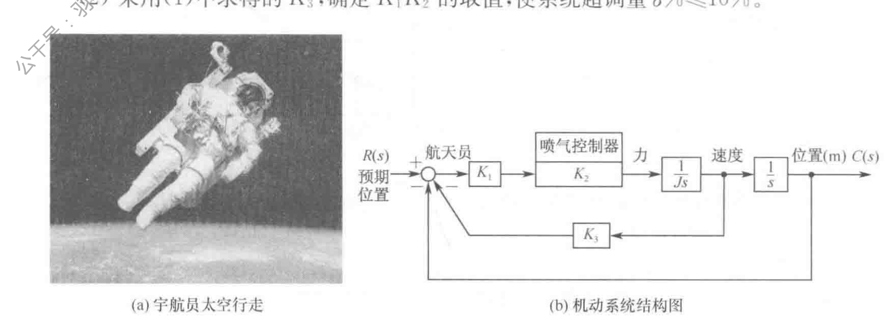

> Image description: This figure consists of two parts: (a) a photograph of an astronaut performing a spacewalk, and (b) a block diagram representing the maneuver control system. The block diagram in part (b) illustrates a feedback control loop. The input is $R(s)$, labeled as "expected position" (预期位置). This enters a summing junction before passing through three sequential blocks: a gain $K_1$ representing the astronaut (航天员), a gain $K_2$ for the jet controller (喷气控制器), and an integrator block $\frac{1}{Js}$ which outputs force (力) to produce velocity (速度). A final integrator $\frac{1}{s}$ converts velocity into the output position $C(s)$ in meters. Two feedback paths are present: a primary inner loop with gain $K_3$ feeding back from the velocity signal, and a secondary outer loop feeding back the final position $C(s)$ to the initial summing junction. The diagram models the mechanical dynamics of an astronaut's movement in space using transfer functions.
图3－69 宇航员机动控制系统

解 本题研究系统参数选择与系统稳态误差和动态性能之间的关系。
（1）确定 $K_{3}$ 值。由图3－69（b）可知，内回路传递函数

$$
G_{0}(s)=\frac{K_{1} K_{2} / J s}{1+K_{1} K_{2} K_{3} / J s}=\frac{K_{1} K_{2}}{J s+K_{1} K_{2} K_{3}}
$$

${ }^{\prime}$ 闭环传递函数

$$
\Phi(s)=\frac{G_{0}(s) / s}{1+G_{0}(s) / s}=\frac{K_{1} K_{2}}{J s^{2}+K_{1} K_{2} K_{3} s+K_{1} K_{2}}
$$

误差传递函数

$$
\Phi_{e}(s)=1-\Phi(s)=\frac{s\left(J s+K_{1} K_{2} K_{3}\right)}{J s^{2}+K_{1} K_{2} K_{3} s+K_{1} K_{2}}
$$

稳态误差

$$
e_{s}(\infty)=\lim _{s \rightarrow 0} s E(s)=\lim _{s \rightarrow 0} s \Phi_{e}(s) R(s)
$$

因 $R(s)=\frac{1}{s^{2}}$ ，故

$$
e_{s}(\infty)=\lim _{s \rightarrow 0} \frac{s^{2}\left(J s+K_{1} K_{2} K_{3}\right)}{J s^{2}+K_{1} K_{2} K_{3} s+K_{1} K_{2}} \cdot \frac{1}{s^{2}}=K_{3}
$$

由于要求 $e_{\mathrm{s}}(\infty) \leqslant 0.01$ ，所以应有 $K_{3} \leqslant 0.01$ ，取 $K_{3}=0.01$ 。
（2）确定 $K_{1} K_{2}$ 值。对于 $\sigma \% \leqslant 10 \%$ ，应有 $\zeta \geqslant 0.6$ 。取 $\zeta=0.6, K_{3}=0.01$ 。令

由

$$
\begin{gathered}
\Phi(s)=\frac{\frac{K_{1} K_{2}}{J}}{s^{2}+\frac{K_{1} K_{2} K_{3}}{J} s+\frac{K_{1} K_{2}}{J}}=\frac{\omega_{n}^{2}}{s^{2}+2 \zeta \omega_{n} s+\omega_{n}^{2}} \\
\omega_{n}^{2}=\frac{K_{1} K_{2}}{J}, \quad 2 \zeta \omega_{n}=\frac{K_{1} K_{2} K_{3}}{J}
\end{gathered}
$$


<!-- source_pdf_page: 76 -->
代人 $J=25, \zeta=0.6, K_{3}=0.01$ ，可得

$$
K_{1} K_{2}\left(K_{1} K_{2}-36 \times 10^{4}\right)=0
$$

显然 $K_{1} K_{2} \neq 0$ ，必看

$$
K_{1} K_{2}=36 \times 10^{4}, \omega_{n}=120
$$

系统梖间响应的 MATLAB 仿真：
应用MATLAB软件包，可得系统单位阶跃响应如图3－25－1所示，而系统单位斜坡响应如图3－25－2所示。

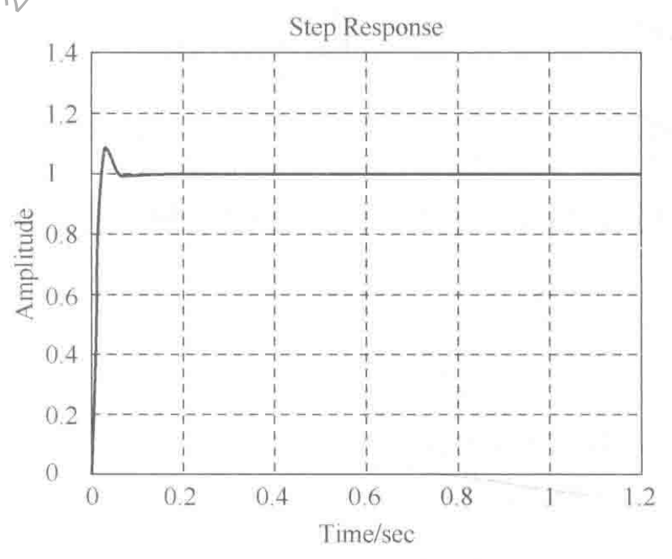

> Image description: This image is a plot titled "Step Response," depicting the time-domain behavior of a system. The vertical y-axis is labeled "Amplitude" and ranges from 0 to 1.4, with increments of 0.2. The horizontal x-axis is labeled "Time/sec" and ranges from 0 to 1.2, with major markings every 0.2 seconds. The graph shows a single continuous curve starting at the origin (0,0). The response rises sharply, exhibiting a slight overshoot that peaks just above an amplitude of 1.0 at approximately 0.05 seconds. Following this peak, the signal undergoes a small oscillation before stabilizing and settling into a steady-state value of exactly 1.0 for the remainder of the time period. In engineering terms, this represents a stable system with a unity steady-state gain and a fast response time characterized by minimal overshoot and damping.
图3－25－1 宇航员控制系统单位阶跃响应曲线 （MATLAB）

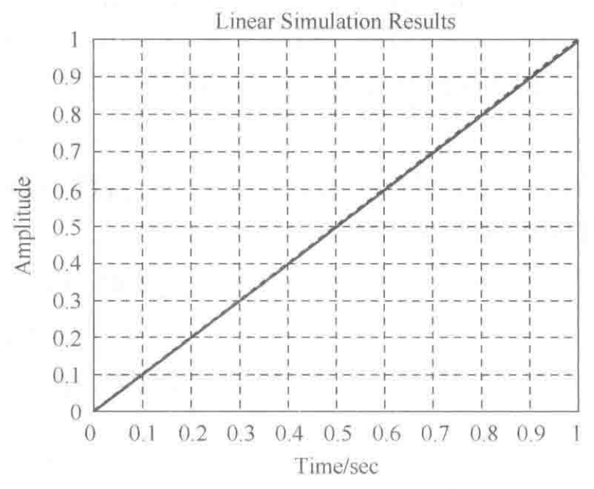

> Image description: The image shows a plot titled "Linear Simulation Results," which represents the unit step response curve of an astronaut control system, as indicated by the Chinese caption (图3-25-1). The graph features a two-dimensional coordinate system. The horizontal x-axis is labeled "Time/sec" and ranges from 0 to 1 in increments of 0.1. The vertical y-axis is labeled "Amplitude" and ranges from 0 to 1 in increments of 0.1. A single, solid diagonal line starts at the origin (0,0) and extends linearly to the point (1,1). A dashed grid overlays the plot area for precise value reading. In engineering terms, this linear relationship indicates a constant rate of change over time, where the amplitude increases proportionally with time until it reaches its final value of 1 at one second.
图3－25－2 宇航员控制系统单位斜坡响应曲钱 （MATLAB）

MATLAB 程序 ：exe325．m
\％单位阶跃输入响应
num $=[360000] ; \quad$ den $=[253600360000] ; \quad t=0: 0.01: 1.2 ;$
figure
step（num，den，u，t）；grid
\％单位斜坡输入响应
num $=[360000]$ ；den＝［253600360000］；$t=0: 0.005: 1 ; u=t$ ；
figure
Isim（num，den，$u, t)$ ；grid
3－26 在喷气式战斗机的自动驾驶仪中，配置有横滚控制系统，其结构图如图3－70所示。要求：
（1）确定闭环传递函数 $\Theta_{c}(s) / \Theta_{d}(s)$ ；
（2）当 $K_{1}$ 分別等于 $0.7 、 3.0$ 和 6.0 时，确定闭环系统的特征根；
（3）在（2）所给的条件下，应用主导极点概念，确定各二阶近似系统，估计原有系统的超调量和峰值时间；
（4）绘出原有系统的实际单位阶跃响应曲线，并与（3）中的近似结果进行比较。
解 本题主要练习系统主导极点的确定与应用。
（1）闭环传递函数。


<!-- source_pdf_page: 77 -->
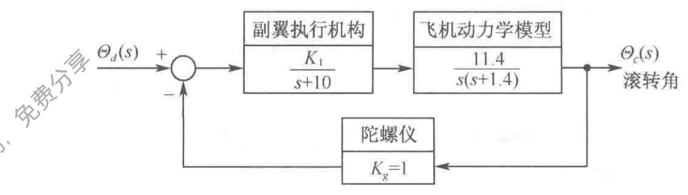

> Image description: A control system block diagram titled "Figure 3-70 Aircraft Roll Angle Control System Structure Diagram" (图 3－70 飞机滚转角控制系统结构图) is shown. The system is a closed-loop feedback loop starting with an input variable $\Theta_d(s)$. This input enters a summing junction, where it is compared with a feedback signal. The forward path consists of two sequential blocks: the "Aileron Actuator" (副翼执行机构) with a transfer function $K_1 / (s+10)$, followed by the "Aircraft Dynamic Model" (飞机动力学模型) with a transfer function $11.4 / [s(s+1.4)]$. The output of this path is the controlled roll angle $\Theta_c(s)$ (滚转角). A feedback loop connects the output $\Theta_c(s)$ back to the summing junction through a block labeled "Gyroscope" (陀螺仪) with a gain $K_g=1$. Arrows indicate the signal flow from left to right in the forward path and right to left in the feedback path.
图 3－70 飞机滚转角控制系统结构图

$$
\frac{\Theta_{c}(s)}{\Theta_{d}(s)}=\frac{11.4 K_{1}}{s(s+1.4)(s+10)+11.4 K_{1}}=\frac{11.4 K_{1}}{s^{3}+11.4 s^{2}+14 s+11.4 K_{1}}
$$

（2）闭环特征根。特征方程

$$
D(s)=s^{3}+11.4 s^{2}+14 s+11.4 K_{1}=0
$$

将 0.7 、3．0 和 6.0 的 $K_{1}$ 分别代入特征方程，并应用 MATLAB 软件包中的求根程序，可以得到相应的特征根。
（1）当 $K_{1}=0.7$ ，有 $D(s)=s^{3}+11.4 s^{2}+14 s+7.98=0$ ，求得

$$
s_{1.2}=-0.65 \pm \mathrm{j} 0.60, \quad s_{3}=-10.09
$$

（2）当 $K_{1}=3.0$ ，有 $D(s)=s^{3}+11.4 s^{2}+14 s+34.2=0$ ，求得

$$
s_{1.2}=-0.52 \pm \mathrm{j} 1.74, \quad s_{3}=-10.36
$$

（3）当 $K_{1}=6.0$ ，有 $D(s)=s^{3}+11.4 s^{2}+14 s+68.4=0$ ，求得

$$
s_{1,2}=-0.36 \pm \mathrm{j} 2.50, \quad s_{3}=-10.69
$$

（3）二阶近似系统及其动态性能。
（1）当 $K=0.7$ ，有 $D(s)=(s+0.65)^{2}+0.6^{2}=s^{2}+1.3 s+0.783=0$ ，令

$$
D(s)=s^{2}+2 \zeta \omega_{n} s+\omega_{n}^{2}=0
$$

有

$$
\omega_{n}=\sqrt{0.783}=0.885, \quad \zeta=\frac{1.3}{2 \omega_{n}}=0.734
$$

估算出

$$
\sigma \%=100 \mathrm{e}^{-\pi \zeta \sqrt{1-\zeta^{2}}} \%=3.4 \%, \quad t_{p}=\frac{\pi}{\omega_{n} \sqrt{1-\zeta^{2}}}=5.23 \mathrm{~s}
$$

（2）当 $K_{1}=3.0$ ，有 $D(s)=(s+0.52)^{2}+1.74^{2}=s^{2}+1.04 s+3.3=0$ ，可得

$$
\omega_{n}=1.817, \quad \zeta=0.286
$$

从而

$$
\sigma \%=39.2 \%, \quad t_{p}=1.80 \mathrm{~s}
$$

（3）当 $K_{1}=6.0$ ，有 $D(s)=s^{2}+0.72 s+6.38=0$ ，可得

$$
\omega_{n}=2.526, \quad \zeta=0.143, \quad \sigma \%=63.5 \%, \quad t_{p}=1.26 \mathrm{~s}
$$

（4）单位阶跃响应曲线。应用 MATLAB 软件包，可以方便地获取各阶跃响应曲线，如图3－26－1～图3－26－3所示。图中，实线为实际系统响应，虚线为近似系统响应。由图可见，两者十分接近。


<!-- source_pdf_page: 78 -->
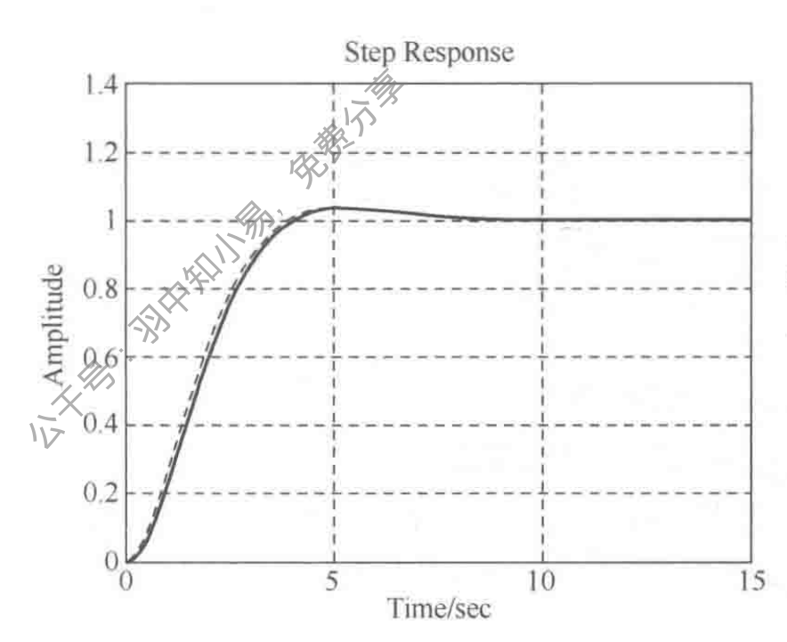

> Image description: A line graph titled "Step Response" illustrates the unit step response curves of an aircraft roll system (as indicated by the caption "图 3－26－1 飞机横滚系统单位阶跃响应曲线"). The horizontal x-axis is labeled "Time/sec," ranging from 0 to 15 seconds with major ticks every 5 units. The vertical y-axis is labeled "Amplitude," scaling from 0 to 1.4 with increments of 0.2. The plot displays two closely aligned curves starting at the origin (0,0). Both curves rise steeply and converge toward a steady-state value of 1. One curve reaches the target amplitude slightly faster than the other. After reaching the peak around 5 seconds, there is a very slight overshoot followed by stabilization as the lines flatten out horizontally at an amplitude of 1. The graph uses dashed grid lines to facilitate reading specific values across the time and amplitude axes.
图 3－26－1 飞机横滚系统单位阶跃响应曲线

（ $K_{1}=0.7$ ，MATLAB）

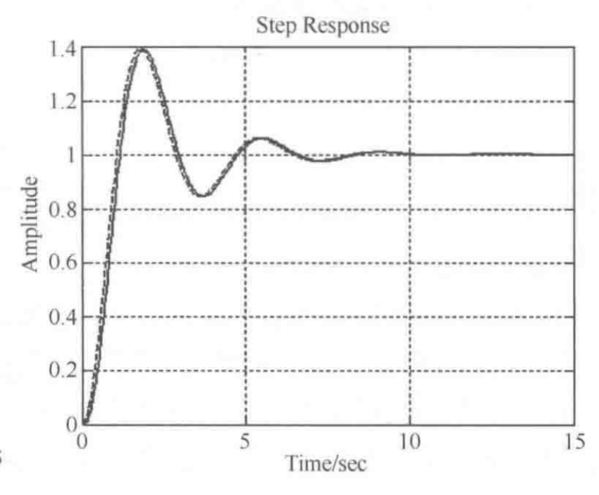

> Image description: The image shows a plot titled "Step Response," depicting the unit step response of an aircraft roll system with a gain $K_1=3$, generated using MATLAB. The graph features two curves: one solid and one dashed, both representing the system's amplitude over time. The vertical y-axis is labeled "Amplitude" and ranges from 0 to 1.4. The horizontal x-axis is labeled "Time/sec" and ranges from 0 to 15 seconds. Both curves exhibit an underdamped behavior, starting at (0,0) and rising sharply to a first peak amplitude of approximately 1.4 around $t=2$ seconds. They then oscillate with decreasing magnitude—dipping to about 0.85 and peaking again near 1.05—before settling and converging to a steady-state value of 1.0 after approximately 10 seconds. The figure illustrates the transient response characteristics, including overshoot and settling time, for the specified control system parameter.
图3－26－2 飞机横滚系统单位阶跃响应曲线 （ $K_{1}=3$ ，MATLAB）

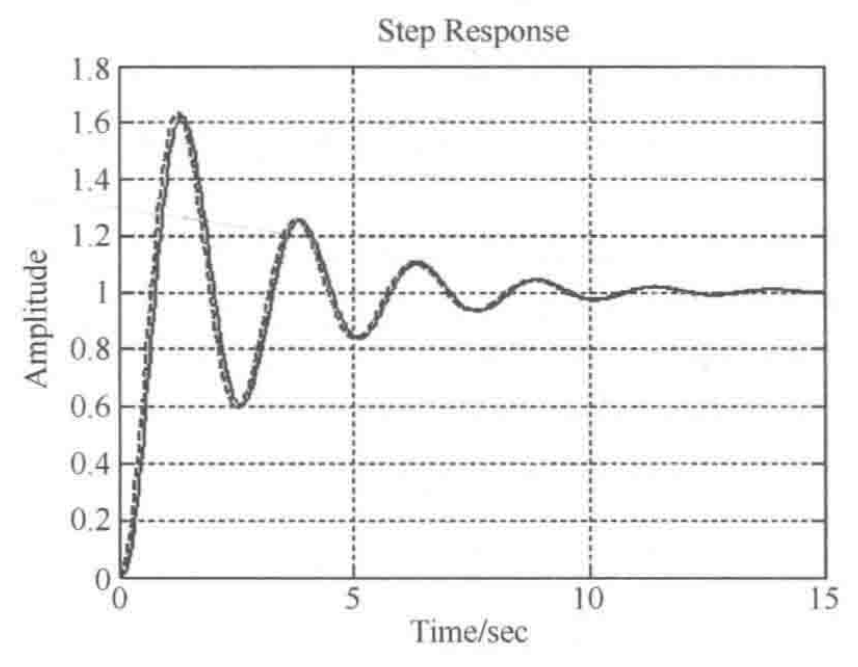

> Image description: This figure is a plot titled "Step Response," showing the unit step response of an aircraft roll system with a gain value of $K_1=3$, generated via MATLAB. The graph features a vertical y-axis labeled "Amplitude" ranging from 0 to 1.8 and a horizontal x-axis labeled "Time/sec" ranging from 0 to 15 seconds. The plot displays two overlapping curves—one solid and one dashed—representing the system's output over time. Both curves exhibit an underdamped behavior, characterized by initial overshoot reaching approximately 1.6 and subsequent decaying oscillations around a steady-state value of 1.0. The oscillations gradually diminish as time increases, with the signal converging toward the final amplitude of 1 after roughly 12 seconds. This visualization is used in engineering to analyze system stability, settling time, and damping characteristics.
图 3－26－3 飞机横滚系统单位阶跃响应曲线 （ $K_{1}=6$ ，MATLAB）

MATLAB 程序 ：exe326．m
$\% K=0.7$ 时系统单位阶跃响应
$\mathrm{k}=0.7$ ；$\quad \mathrm{t}=0: 0.05: 15$ ；
figure
num $=[11.4 * k] ; \quad \operatorname{den}=[111.41411 .4 * k] ; \quad$ \％实际系统
step（num，den，t）；hold on；
num $=[0.783]$ ；$\quad \operatorname{den}=\left[\begin{array}{llll}1 & 1.3 & 0.783\end{array}\right] ; \quad$ \％近似系统
step（num，den，t）；grid
$\% K=3.0$ 时系统单位阶跃响应
$k=3.0$ ；
$\mathrm{t}=0: 0.05: 15 ;$
figure
num $=[11.4 * k] ; \quad \operatorname{den}=[111.41411 .4 * k] ; \quad$ \％实际系统
step（num，den，t）；hold on；
num $=[$ 3． 3$] ; \quad \operatorname{den}=\left[\begin{array}{lllll}1 & 1 & 0 & 3 & 3\end{array}\right] ; \quad$ \％近似系统
step（num，den，t）；grid


<!-- source_pdf_page: 79 -->
$\% K=6$ 时系统单位阶跃响应
$\mathrm{k}=6$ ；
$\mathrm{t}=0: 0.05: 15 ;$
figure
num $=[11 \times 4 * \mathrm{k}]$ ；$\quad \operatorname{den}=[111.41411 .4 * \mathrm{k}]$ ；\％实际系统
step（hum，den，t）；hold on；
nume［6．38］；$\quad \operatorname{den}=\left[\begin{array}{llll}1 & 0.72 & 6.38\end{array}\right]$ ；\％近似系统
step（num，den，t）；grid
3－27 打磨机器人能够按照预先设定的路径（输人指令）对加工后的工件进行打磨拖光。在实践中，机器人自身的偏差、机械加工误差以及工具的磨损等，都会导致打磨加工误差。若利用力反馈修正机器人的运动路径，可以消除这些误差，提高抛光精度。但是，这又可能使接触稳定性问题变得难以解决。例如，在引人腕力传感器构成力反馈的同时，就带来了新的稳定性问题。

打磨机器人的结构图如图 3－71 所示。若可调增益 $K_{1}$ 及 $K_{2}$ 均大于零，试确定能保证系统稳定性的 $K_{1}$ 和 $K_{2}$ 的取值范围。

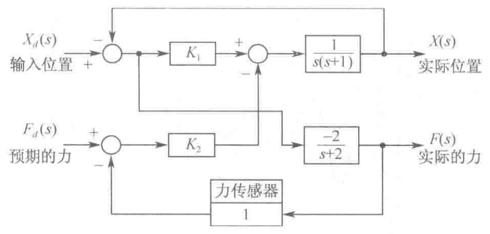

> Image description: A block diagram of a polishing robot's control system is shown. The system consists of two interconnected feedback loops managing position and force. The upper loop controls the actual position $X(s)$ based on an input position $X_d(s)$. This path includes a summing junction, a gain block $K_1$, and a plant transfer function $\frac{1}{s(s+1)}$. A negative feedback loop returns $X(s)$ to the initial summing junction. The lower loop controls the actual force $F(s)$ based on an expected force $F_d(s)$. It features a summing junction, a gain block $K_2$, and a transfer function $\frac{-2}{s+2}$. A force sensor with a gain of 1 provides negative feedback from $F(s)$ back to the input. Additionally, there is a cross-coupling where the error signal from the position loop feeds into the force control path before the plant $\frac{-2}{s+2}$, indicating an integrated position-force control architecture.
图 3－71 打磨机器人结构图

解 本题研究多回路交叉系统参数与稳定性的关系。显然，利用流图法确定系统的特征方程，将可以降低问题的研究难度。

令

$$
G_{1}(s)=\frac{1}{s(s+1)}, \quad G_{2}(s)=\frac{-2}{s+2}
$$

根据流图特征式，闭环特征方程为

$$
D(s)=1+K_{1} G_{1}(s)+G_{2}(s) K_{2} G_{1}(s)=1+\frac{K_{1}}{s(s+1)}-\frac{2 K_{2}}{s(s+1)(s+2)}=0
$$

或者

$$
s^{3}+3 s^{2}+\left(2+K_{1}\right) s+2\left(K_{1}-K_{2}\right)=0
$$

列出劳斯表如下：

$$
\begin{array}{c|cc}
s^{3} & 1 & 2+K_{1} \\
s^{2} & 3 & 2\left(K_{1}-K_{2}\right) \\
s^{1} & \frac{6+K_{1}+2 K_{2}}{3} & \\
s^{0} & 2\left(K_{1}-K_{2}\right) &
\end{array}
$$

由劳斯稳定判据知，使系统稳定的 $K_{1}$ 和 $K_{2}$ 取值范围为

$$
0<K_{2}<K_{1}
$$

3－28 一种新型电动轮椅装有一种非常实用的速度控制系统，使颈部以下有残障的人


<!-- source_pdf_page: 80 -->
士也能自行驾驶这种电动轮椅。该系统在头盔上以 $90^{\circ}$ 间隔安装了四个速度传感器，用来指示前、后、左、右四个方向。头盔传感系统的综合输出与头部运动的幅度成正比。图3－72给出了该控制系统的结构图，其中时间常数 $T_{1}=0.5 \mathrm{~s}, T_{3}=1 \mathrm{~s}, T_{4}=0.25 \mathrm{~s}$ 。要求：
（1）确定使系统稳定的 $K$ 的取值 $\left(K=K_{1} K_{2} K_{3}\right)$ ；
（2）确定增益 $K$ 的取值，使系统单位阶跃响应的调节时间等于 $4 \mathrm{~s}(\Delta=2 \%)$ ，并计算此时系统的特征根。

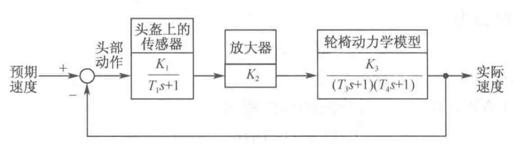

> Image description: A block diagram of a control system for an electric wheelchair is shown. The system is a closed-loop feedback loop. On the left, the input "预期速度" (Expected Velocity) enters a summing junction with a positive sign, while the feedback path from the output has a negative sign. The forward path consists of three sequential blocks: 1. A sensor block labeled "头盔上的传感器" (Helmet Sensor) with a transfer function $\frac{K_1}{T_1s+1}$. The input to this block is "头部动作" (Head Movement). 2. An amplifier block labeled "放大器" with a gain of $K_2$. 3. A dynamics model block labeled "轮椅动力学模型" (Wheelchair Dynamics Model) with a transfer function $\frac{K_3}{(T_3s+1)(T_4s+1)}$. The final output is labeled "实际速度" (Actual Velocity), which is fed back to the summing junction. Arrows indicate the signal flow from left to right through the blocks and back to the start.
图3－72 电动轮椅控制系统结构图

解 本题主要研究根据系统稳定性及动态品质要求，选择系统参数的方法。
（1）使系统稳定的 $K$ 值范围。由系统结构图可得，系统开环传递函数

$$
G(s)=\frac{K_{1} K_{2} K_{3}}{(0.5 s+1)(s+1)(0.25 s+1)}=\frac{8 K}{s^{3}+7 s^{2}+14 s+8}
$$

闭环传递函数

$$
\Phi(s)=\frac{8 K}{s^{3}+7 s^{2}+14 s+8(1+K)}
$$

闭环特征方程

$$
D(s)=s^{3}+7 s^{2}+14 s+8(1+K)=0
$$

列出劳斯表如下：

$$
\begin{array}{c|cc}
s^{3} & 1 & 14 \\
s^{2} & 7 & 8(1+K) \\
s^{1} & \frac{90-8 K}{7} & \\
s^{0} & 8(1+K) &
\end{array}
$$

由劳斯判据知，使闭环系统稳定的 $K$ 范围为

$$
-1<K<11.25
$$

（2）确定使 $t_{s}=4 \mathrm{~s}$ 时的 $K$ 值及特征根。由于

$$
t_{s}=\frac{4.4}{\zeta \omega_{n}}=4 \quad(\Delta=2 \%)
$$

可得 $\zeta \omega_{n}=1.1$ ，故希望特征方程为

$$
\begin{aligned}
(s+b)\left(s^{2}+2 \zeta \omega_{n} s+\omega_{n}^{2}\right) & =(s+b)\left(s^{2}+2.2 s+\omega_{n}^{2}\right) \\
& =s^{3}+(2.2+b) s^{2}+\left(\omega_{n}^{2}+2.2 b\right) s+b \omega_{n}^{2}=0
\end{aligned}
$$

而实际闭环系统特征方程为

$$
D(s)=s^{3}+7 s^{2}+14 s+8(1+K)=0
$$

比较希望特征方程与实际特征方程可得

$$
2.2+b=7
$$


<!-- source_pdf_page: 81 -->
$$
\begin{aligned}
& \omega_{n}^{2}+2.2 b=14 \\
& b \omega_{n}^{2}=8(1+K)
\end{aligned}
$$

解得

$$
b=4.8, \quad \omega_{n}=1.85, \quad K=1.05
$$

此时，闲环特征方程为

$$
(s+4.8)\left(s^{2}+2.2 s+3.42\right)=0
$$

图而，系统的特征根为

$$
s_{1.2}=-1.1 \pm \mathrm{j} 1.49, \quad s_{3}=-4.8
$$

MATLAB 验证：
应用 MATLAB 软件包，可得系统的特征根为

$$
p_{1.2}=-1.1035 \pm \mathrm{j} 1.4846, \quad p_{3}=-4.7929
$$

绘出的单位阶跃响应曲线如图3－28－1所示，并可测得：超调量 $\sigma \%=8.78 \%$ ，调节时间 $t_{s}= 3.44 \mathrm{~s}(\Delta=2 \%)$ 。

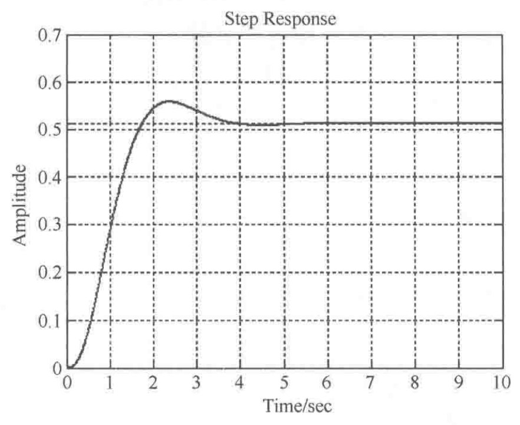

> Image description: This image shows a plot titled "Step Response," depicting the time-domain behavior of a control system. The horizontal x-axis is labeled "Time/sec" and ranges from 0 to 10 seconds, while the vertical y-axis is labeled "Amplitude" and ranges from 0 to 0.7. The graph displays a single continuous curve starting at the origin (0,0). The response rises steeply, overshoots the steady-state value of approximately 0.5, reaches a peak around $t=2.3$ seconds, and then oscillates slightly before stabilizing at the final amplitude of 0.5 after about 4 seconds. According to the provided caption, this is a unit step response curve (Figure 3-28-1). The engineering metrics derived from the plot include an overshoot ($\sigma\%$) of $8.78\%$ and a settling time ($t_s$) of $3.44\text{ s}$ based on a $2\%$ error band ($\Delta=2\%$).
图3－28－1 轮椅控制系统的单位阶跃响应曲线 （MATLAB）

MATLAB 程序 ：exe328．m
\％系统参数

$$
\mathrm{T} 1=0.5 ; \quad \mathrm{T} 3=1 ; \quad \mathrm{T} 4=0.25 ; \quad \mathrm{K}=1.05 ;
$$

\％系统闭环传递函数

$$
\begin{aligned}
& \text { num1 }=[\mathrm{K}] ; \quad \operatorname{den} 1=[\mathrm{T} 11] ; \\
& \text { num2 }=[1] ; \quad \operatorname{den} 2=[\mathrm{T} 3 * \mathrm{~T} 4 \mathrm{~T} 3+\mathrm{T} 41] ; \\
& {[\text { numc }, \text { denc }]=\operatorname{series}(\text { num1 }, \text { den1 }, \text { num2 }, \text { den2 }) ;} \\
& {[\text { num }, \text { den }]=\text { cloop }(\text { numc }, \text { denc }) ;}
\end{aligned}
$$

\％系统的特征根
roots（den）
\％单位阶跃输人响应

$$
t=0: 0.01: 10 ;
$$

figure
step（num，den，t）；grid

3－29 设垂直起飞飞机如图 3－73（a）所示，起飞时飞机的四个发动机将同时工作。垂直起飞时飞机的高度控制系统如图3－73（b）所示。要求：
（1）当 $K_{1}=1$ 时，判断系统是否稳定；

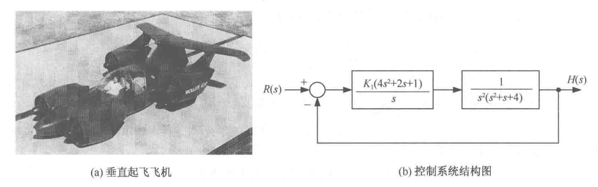

> Image description: This textbook figure consists of two parts illustrating a vertical take-off aircraft's height control system. Part (a) is a grayscale photograph of a vertical take-off aircraft, labeled as "(a) 垂直起飞飞机". Part (b), titled "(b) 控制系统结构图", shows a block diagram for the control system. The input variable $R(s)$ enters a summing junction with a positive sign and a negative feedback loop from the output $H(s)$. The forward path contains two sequential blocks: first, a controller represented by the transfer function $\frac{K_1(4s^2+2s+1)}{s}$, followed by a plant block with the transfer function $\frac{1}{s^2(s^2+s+4)}$. Arrows indicate the signal flow from the input $R(s)$, through the summing junction and blocks, to the final output $H(s)$. The diagram represents a closed-loop feedback control system used to regulate the aircraft's altitude.
图 3－73 垂直起飞飞机高度控制系统


<!-- source_pdf_page: 82 -->
（2）确定使系统稳定的 $K_{1}$ 的取值范围。
解 本题主要研究系统参数与系统稳定性的关系。
系统开环传递函数

$$
G(s)=\frac{K_{1}\left(4 s^{2}+2 s+1\right)}{s^{3}\left(s^{2}+s+4\right)}
$$

闭环特䇛方程

$$
D(s)=s^{5}+s^{4}+4 s^{3}+4 K_{1} s^{2}+2 K_{1} s+K_{1}=0
$$

－列劳斯表如下：

| $s^{5}$ | 1 | 4 | $2 K_{1}$ |
| :---: | :---: | :---: | :---: |
| $s^{4}$ | 1 | $4 K_{1}$ | $K_{1}$ |
| $s^{3}$ | $4\left(1-K_{1}\right)$ | $K_{1}$ |  |
| $s^{2}$ | $\frac{K_{1}\left(15-16 K_{1}\right)}{4\left(1-K_{1}\right)}$ | $K_{1}$ |  |
| $s^{1}$ | $\frac{-32 K_{1}^{2}+47 K_{1}-16}{15-16 K_{1}}$ |  |  |
| $s^{0}$ | $K_{1}$ |  |  |

由劳斯稳定判据，系统稳定的充要条件为

$$
\begin{gathered}
0<K_{1}<1 \\
K_{1}<0.9375 \\
\left(K_{1}-0.9327\right)\left(K_{1}-0.5362\right)<0
\end{gathered}
$$

根据第三个不等式，有

$$
\left\{\begin{array}{ll}
K_{1}-0.9327>0, & K_{1}>0.9327, \\
K_{1}-0.5362<0, & K_{1}<0.5362,
\end{array}\right. \text { 无解 }
$$

或者

$$
\left\{\begin{array}{l}
K_{1}-0.9327<0 \\
K_{1}-0.5362>0
\end{array}\right.
$$

可得

$$
0.5362<K_{1}<0.9327
$$

这一结果同样满足充要条件中的第一和第二两个不等式。最后，使系统稳定的 $K_{1}$ 值范围为

$$
0.5362<K_{1}<0.9327
$$

显然，当取 $K_{1}=1$ 时，闭环系统是不稳定的。
应用 MATLAB 软件包，可以给出 $K_{1}=0.7, K_{1}=0.5, K_{1}=1$ 时系统的单位阶跃响应，分别如图 3－29－1～图 3－29－3 所示。

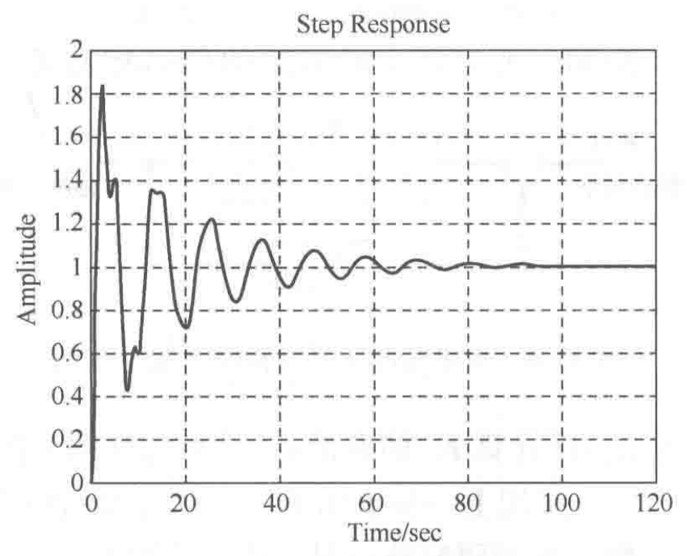

> Image description: This image shows a "Step Response" plot generated using MATLAB software. The graph features a vertical y-axis labeled "Amplitude," ranging from 0 to 2, and a horizontal x-axis labeled "Time/sec," ranging from 0 to 120. The plotted curve represents the system's response to a unit step input. It begins at the origin (0,0) and rises sharply, exhibiting an underdamped behavior characterized by decaying oscillations around a steady-state value of 1. The first peak reaches approximately 1.75, followed by subsequent peaks of decreasing amplitude as the signal converges toward 1 over time. From an engineering perspective, this figure illustrates key performance metrics of a control system, including overshoot, settling time, and stability. According to the provided caption, this specific plot corresponds to one of three different gain values ($K_1$) used to analyze the system's unit step response.
图 3－29－1 垂直起飞高度控制系统的单位阶跃响应（ $K_{1}=0.7$ ，MATLAB）

MATLAB 程序 ：exe329．m


<!-- source_pdf_page: 83 -->
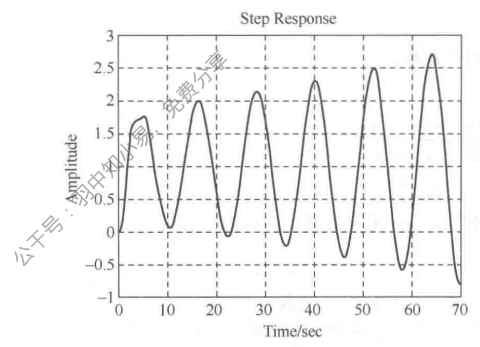

> Image description: A line graph titled "Step Response" illustrates the time-domain behavior of a system, specifically identified by the caption as the unit step response of a vertical takeoff height control system with $K_1 = 0.5$, generated via MATLAB. The horizontal x-axis is labeled "Time/sec," ranging from 0 to 70 seconds with major increments every 10 units. The vertical y-axis is labeled "Amplitude," spanning from -1 to 3. The plot displays a sinusoidal oscillation that begins at the origin (0,0). As time progresses, the amplitude of these oscillations increases, indicating an unstable system where the output diverges over time rather than settling toward a steady state. The peaks and troughs grow progressively larger in both positive and negative directions as the signal moves from left to right across the grid.
图3－29－2 垂直起飞高度控制系统的单位阶跃响应（ $K_{1}=0.5$ ，MATLAB）

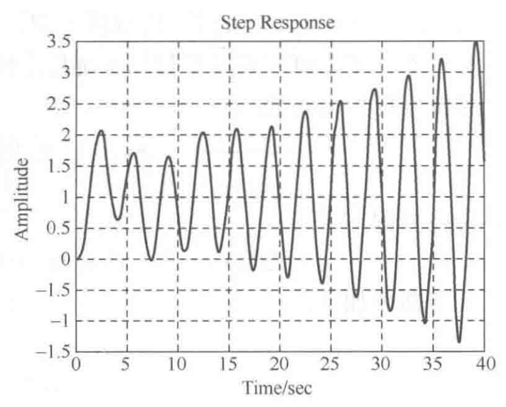

> Image description: The image shows a plot titled "Step Response," representing the unit step response of a vertical takeoff height control system (as indicated by the caption) with a parameter $K_1 = 0.5$, generated in MATLAB. The graph features a Cartesian coordinate system where the horizontal x-axis is labeled "Time/sec" and ranges from 0 to 40 seconds. The vertical y-axis is labeled "Amplitude" and ranges from -1.5 to 3.5. The plot displays an oscillating waveform that begins at the origin (0,0). As time progresses, the oscillations exhibit growing amplitude over time, indicating an unstable system response. The peaks of the oscillations trend upward toward 3.5, while the troughs trend downward toward -1.5. Grid lines are present to assist in reading specific values across both axes.
图 3－29－3 垂直起飞高度控制系统的单位阶跃响应（ $K_{1}=1$ ，MATLAB）

$\% K=0.7$ 时系统单位阶跃响应

$$
\mathrm{k}=0.7 ; \quad \mathrm{t}=0: 0.2: 120
$$

figure

$$
\begin{array}{ll}
\text { num }=[4 * \mathrm{k} 2 * \mathrm{k} \mathrm{k}] ; & \text { den }=\left[\begin{array}{llll}
1 & 1 & 4 & 4 * \mathrm{k} 2 * \mathrm{k} \mathrm{k}
\end{array}\right] \\
\text { step(num, den, } \mathrm{t}) ; & \text { grid; }
\end{array}
$$

\％$K=0.5$ 时系统单位阶跃响应

$$
\begin{array}{ll}
\mathrm{k}=0.5 ; & \mathrm{t}=0: 0.1: 70 ; \\
\text { figure }(2) & \\
\text { num }=[4 * \mathrm{k} 2 * \mathrm{k} \mathrm{k}] ; & \text { den }=[1144 * \mathrm{k} 2 * \mathrm{k} \mathrm{k}] ; \\
\text { step }(\text { num }, \text { den }, \mathrm{t}) ; & \text { grid; }
\end{array}
$$

\％$K=1$ 时系统单位阶跃响应

$$
\begin{array}{ll}
k=1 ; & t=0: 0.1: 40 ; \\
\text { figure }(3) & \\
\text { num }=[4 * k 2 * k k] ; & \text { den }=[1144 * k 2 * k k] \\
\text { step }(\text { num }, \text { den }, t) ; & \text { grid; }
\end{array}
$$

3－30 火星自主漫游车的导向控制系统如图 3－74 所示。该系统在漫游车的前后

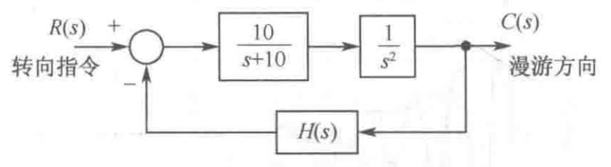

> Image description: A control system block diagram for a Mars autonomous rover's steering control is shown. The input signal, labeled $R(s)$ (转向指令 - steering command), enters from the left into a summing junction with a positive sign. The output of this junction feeds into a forward path consisting of two sequential blocks: a first-order transfer function $\frac{10}{s+10}$ and a second-order integrator $\frac{1}{s^2}$. The final output of the system is labeled $C(s)$ (漫游方向 - roaming direction). A feedback loop branches off from the output $C(s)$, passing through a block labeled $H(s)$ before returning to the summing junction with a negative sign, indicating a closed-loop negative feedback configuration. Arrows indicate the unidirectional flow of signals from the input command through the plant dynamics to the final steering output and back through the feedback sensor block.
图 3－74 火星漫游车导向控制系统结构图

部都装有一个导向轮，其反馈通道传递函数为

$$
H(s)=1+K_{t} s
$$

要求：
（1）确定使系统稳定的 $K_{t}$ 值范围；
（2）当 $s_{3}=-5$ 为该系统的一个闭环特
征根时，试计算 $K_{t}$ 的取值，并计算另外两个闭环特征根；
（3）应用上一步求出 $K_{t}$ 值，确定系统的单位阶跃响应。
解 本题研究通过对系统稳定性和闭环特征根的要求，设计系统的速度反馈系数。一旦把握了闭环根的分布，也就规范了系统的动态性能。
（1）使系统稳定的 $K_{1}$ 值范围。令


<!-- source_pdf_page: 84 -->
$$
G(s)=\frac{10}{s^{2}(s+10)}
$$

则闭环传递函数

$$
\Phi(s)=\frac{G(s)}{1+G(s) H(s)}=\frac{10}{s^{3}+10 s^{2}+10 K_{t} s+10}
$$

闭环特征前程

$$
D(s)=s^{3}+10 s^{2}+10 K_{t} s+10=0
$$

列劳斯表如下：

| $s^{3}$ | 1 | $10 K_{t}$ |
| :---: | :---: | :---: |
| $s^{2}$ | 10 | 10 |
| $s^{1}$ | $10 K_{t}-1$ |  |
| $s^{0}$ | 10 |  |

由劳斯判据知，使系统稳定的 $K_{t}$ 值范围

$$
K_{t}>0.1
$$

（2）当 $s_{3}=-5$ 时 $K_{t}$ 的取值。设希望特征方程为

$$
(s+5)\left(s^{2}+a s+b\right)=s^{3}+(a+5) s^{2}+(b+5 a) s+5 b=0
$$

将上式与实际闭环特征方程相比，有

$$
\begin{aligned}
a+5 & =10 \\
b+5 a & =10 K_{t} \\
5 b & =10
\end{aligned}
$$

解出

$$
a=5, \quad b=2, \quad K_{t}=2.7
$$

令

$$
s^{2}+a s+b=s^{2}+5 s+2=0
$$

求得另外两个闭环特征根为

$$
s_{1}=-0.439, \quad s_{2}=-4.562
$$

（3）确定系统的单位阶跃响应。当取 $K_{t}=2.7$ 时，闭环极点全部为负实极点，同时系统没有闭环有限零点，因此系统的单位阶跃响应必然为非周期形态。

因为

$$
\Phi(s)=\frac{10}{(s+0.439)(s+4.562)(s+5)}
$$

所以

$$
C(s)=\Phi(s) R(s)=\frac{10}{s(s+0.439)(s+4.562)(s+5)}
$$

对上式进行因式分解，可得

$$
C(s)=\frac{1}{s}-\frac{1.213}{s+0.439}+\frac{1.213}{s+4.562}-\frac{1}{s+5}
$$

对上式取拉氏反变换，有单位阶跃响应

$$
c(t)=1-1.213 \mathrm{e}^{-0.439 t}+1.213 \mathrm{e}^{-4.562 t}-\mathrm{e}^{-5 t}
$$

应用 MATLAB 软件包，可绘出系统单位阶跃响应曲线，如图3－30－1所示。


<!-- source_pdf_page: 85 -->
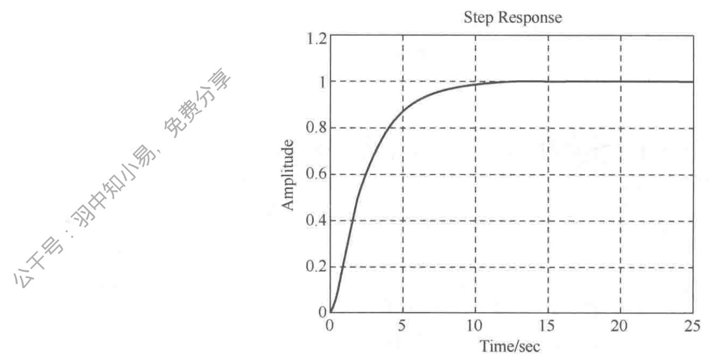

> Image description: A line graph titled "Step Response" illustrates the unit step response curve of a rover's steering system, as indicated by the Chinese caption (图 3－30－1). The vertical y-axis is labeled "Amplitude," with numerical markings from 0 to 1.2 in increments of 0.2. The horizontal x-axis is labeled "Time/sec," showing a range from 0 to 25 seconds with major ticks every 5 seconds. The plot displays a smooth, monotonically increasing curve starting at the origin (0,0). The amplitude rises sharply initially and then gradually levels off, asymptotically approaching a steady-state value of 1.0. A dashed grid is overlaid on the graph for precise reading. In engineering terms, this figure represents the transient and steady-state behavior of the steering system's output in response to a unit step input, demonstrating its stability and convergence time.
图 3－30－1 漫游车导向系统单位阶跃响应曲线（MATLAB）

MATLAB 程序：exe330．m
\％系统的单位阶跃响应

$$
\text { num }=[10] ; \quad \text { den }=\left[\begin{array}{llll}
1 & 10 & 27 & 10
\end{array}\right] ; \quad t=0: 0.05: 25 ;
$$

figure
step（num，den，t）；grid；
3－31 在小于 300 km 的旅行线路上，乘坐磁悬浮列车快捷而方便。一种采用电磁力驱动的磁悬浮列车的构造如图3－75（a）所示，其运行速度可达 $480 \mathrm{~km} / \mathrm{h}$ ，载客量为 400 人。但是，磁悬浮列车的正常运行需要在车体与轨道之间保持 0.635 cm 的气隙，这是一个困难的问题。间隙控制系统结构图如图3－75（b）所示。若控制器取为

$$
G_{c}(s)=\frac{K_{a}(s+2)}{s+12}
$$

其中 $K_{\alpha}$ 为控制器增益。要求：
（1）确定使系统稳定的 $K_{a}$ 值范围；
（2）讨论可否确定 $K_{a}$ 的合适取值，使系统对单位阶跃输人的稳态跟踪误差为零；
（3）取控制器增益 $K_{\alpha}=2$ ，确定系统的单位阶跃响应。

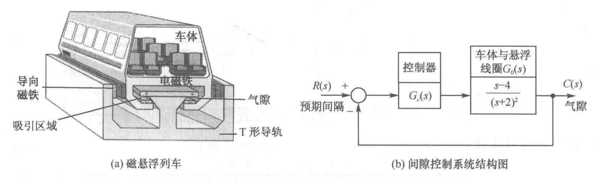

> Image description: This figure, titled "Figure 3-75 Maglev Train Control System," consists of two parts illustrating a magnetic levitation system. Part (a) is a technical drawing of a maglev train showing the vehicle body (车体), electromagnet (电磁铁), and T-shaped guide rail (T形导轨). Labels identify the air gap (气隙), guidance magnet (导向磁铁), and attraction zone (吸引区域), demonstrating the physical arrangement for levitation. Part (b) is a control system block diagram. The input variable $R(s)$ represents the expected gap (预期间隔). This enters a summing junction before passing through a controller block $G_c(s)$. The signal then enters the plant block $G_0(s)$, representing the vehicle body and suspension coil, defined by the transfer function $\frac{s-4}{(s+2)^2}$. The output variable $C(s)$ is the actual air gap (气隙). A feedback loop connects the output $C(s)$ back to the summing junction, forming a closed-loop control system.
图3－75 磁悬浮列车控制系统

解 本题研究的系统分析与设计问题，有三个明显的特点：一是系统具有非最小相位零点；二是在系统稳定的范围内，系统都是过阻尼系统；三是控制与输出具有反向关系。


<!-- source_pdf_page: 86 -->
（1）确定使系统稳定的 $K_{a}$ 值范围。系统开环传递函数

$$
G_{a}(s) G_{0}(s)=\frac{K_{a}(s+2)(s-4)}{(s+12)(s+2)^{2}}=\frac{K_{a}(s-4)}{(s+12)(s+2)}
$$

表明系统是 0 型䇣统，静态位置系数

$$
K_{p}=-\frac{K_{a}}{6}
$$

闭环系统特征方程

$$
\begin{aligned}
D(s) & =(s+12)(s+2)+K_{a}(s-4) \\
& =s^{2}+\left(14+K_{a}\right) s+\left(24-4 K_{a}\right)=0
\end{aligned}
$$

所以，使系统稳定的 $K_{a}$ 值范围为

$$
0<K_{a}<6
$$

（2）计算稳态误差。

$$
e_{s}(\infty)=\frac{1}{1+K_{p}}=\frac{6}{6-K_{a}}
$$

显然，当 $0<K_{a}<6$ 时，$e_{\mathrm{ss}}(\infty) \neq 0$ 。
（3）确定系统单位阶跃响应。令闭环特征多项式

$$
s^{2}+\left(14+K_{a}\right) s+\left(24-4 K_{a}\right)=s^{2}+2 \zeta_{\omega_{n}} s+\omega_{n}^{2}
$$

可得

$$
\omega_{n}=\sqrt{24-4 K_{a}}, \quad \zeta=\frac{14+K_{a}}{2 \sqrt{24-4 K_{a}}}
$$

在不同的 $K_{a}$ 值下，有下表结果。表明系统始终为过阻尼二阶系统。

| $K_{a}$ | 0.1 | 1 | 2 | 3 | 4 | 5 | 5.9 |
| :--- | :--- | :--- | :--- | :--- | :--- | :--- | :--- |
| $\omega_{n}$ | 4.858 | 4.472 | 4.0 | 3.464 | 2.828 | 2.0 | 0.632 |
| $\zeta$ | 1.451 | 1.667 | 2． 0 | 2． 454 | 3． 182 | 4.75 | 15.744 |
| $e_{\mathrm{sw}}(\infty)$ | 1.017 | 1.2 | 1.5 | 2.0 | 3.0 | 6.0 | 60.0 |

当取 $K_{a}=2$ 时，闭环传递函数

$$
\Phi(s)=\frac{2(s-4)}{s^{2}+16 s+16}=\frac{2 s-8}{(s+1.072)(s+14.928)}
$$

系统在单位阶跃作用下的输出

$$
C(s)=\frac{2 s-8}{s(s+1.072)(s+14.928)}=\frac{-0.5}{s}+\frac{0.683}{s+1.072}-\frac{0.183}{s+14.928}
$$

故系统的单位阶跃响应为

$$
c(t)=-0.5+0.683 \mathrm{e}^{-1.072 t}-0.183 \mathrm{e}^{-14.928 t}
$$

应用 MATLAB 软件包，可得磁悬浮系统的时间响应，如图 3－31－1 所示，由图测得： $\sigma \%=0, t_{s}=3.81 \mathrm{~s}(\Delta=2 \%)$ 。仿真表明，在现有控制器作用下，不可能使系统输出渐近跟踪输人阶跃指令。若要求系统在阶跃输入作用下的 $e_{s s}(\infty)=0$ ，应考虑改变控制器的结构，读


<!-- source_pdf_page: 87 -->
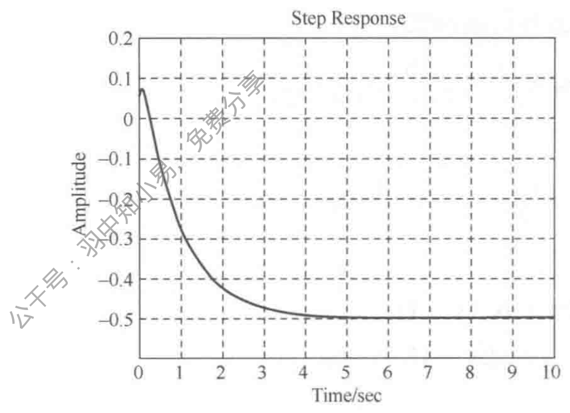

> Image description: A line graph titled "Step Response" illustrates the time-domain response of a magnetic levitation system (as indicated by the caption "图 3－31－1 磁悬浮系统单位阶跃响应"). The horizontal x-axis is labeled "Time/sec," ranging from 0 to 10 seconds. The vertical y-axis is labeled "Amplitude," with values ranging from -0.5 to 0.2. The plot shows a single continuous curve starting at approximately 0.07 at $t=0$. The amplitude rapidly decreases, crossing the zero line shortly after the start and descending steeply between 1 and 3 seconds. The response then levels off asymptotically, reaching a steady-state value of -0.5 by approximately 5 seconds and remaining constant through 10 seconds. This represents the system's stability and final value under a unit step input with a gain $K_a=2$, as specified in the caption.
图 3－31－1 磁悬浮系统单位阶跃响应 （ $K_{a}=2$ ．MATLAB）

者不妨一试。
MATLAB 程序 ：exe331．m
\％系统参数
$\mathrm{Ka}=2 ;$
\％系统闭环传递函数
$\begin{array}{ll}\text { num1 }=\left[\begin{array}{ll}\text { Ka } 2 * \text { Ka }\end{array}\right] ; & \text { den1 }=\left[\begin{array}{ll}1 & 12\end{array}\right] ; \\ \text { num2 }=\left[\begin{array}{ll}1 & -4\end{array}\right] ; & \text { den2 }=\left[\begin{array}{lll}1 & 4 & 4\end{array}\right] ;\end{array}$
［numc，denc］＝series（ num1，den1，num2，
den2）；
［num，den］＝cloop（numc，denc）
\％单位阶跃输入响应
$\mathrm{t}=0: 0.01: 10$ ；
figure
step（num，den，t）；grid


