<!-- source_pdf_page: 88 -->
## 第四章 线性系统的根轨迹法

4－1 设单位负反馈控制系统的开环传递函数为

$$
G(s)=\frac{K(3 s+1)}{s(2 s+1)}
$$

试用解析法绘出开环增益 $K$ 从零变到无穷时的闭环根轨迹图。
解 由题意可知，该系统的闭环传递函数为

$$
\Phi(s)=\frac{G(s)}{1+G(s)}=\frac{K(3 s+1)}{s(2 s+1)+K(3 s+1)}
$$

显然，系统的闭环特征方程为

$$
D(s)=s(2 s+1)+K(3 s+1)=2 s^{2}+(1+3 K) s+K=0
$$

解上述闭环特征方程可得

$$
s_{1}=-\frac{1}{4}\left[3 K+1+\sqrt{(3 K+1)^{2}-8 K}\right], s_{2}=-\frac{1}{4}\left[3 K+1-\sqrt{(3 K+1)^{2}-8 K}\right]
$$

故系统的根轨迹有两条。
采用逐个描点的方法来绘制系统的闭环根轨迹图：
当 $K=0$ 时，$s_{1}=-\frac{1}{2}$ ；随着 $K$ 的增大，$s_{1}$ 单调减小；当 $K=\infty$ 时，$s_{1}=-\infty$ 。
当 $K=0$ 时，$s_{2}=0$ ；随着 $K$ 的增大，$s_{2}$ 也是单调减小；当 $K=\infty$ 时，

$$
\begin{aligned}
s_{2} & =-\frac{1}{4} \lim _{K \rightarrow \infty}\left[3 K+1-\sqrt{(3 K+1)^{2}}-8 K\right] \\
& =-\frac{1}{4} \lim _{K \rightarrow \infty} \frac{1-\frac{\sqrt{(3 K+1)^{2}-8 K}}{3 K+1}}{\frac{1}{3 K+1}} \\
& =-\frac{1}{4} \lim _{K \rightarrow \infty} \frac{\left[1-\frac{\sqrt{(3 K+1)^{2}-8 K}}{3 K+1}\right] \cdot\left[1+\frac{\sqrt{(3 K+1)^{2}-8 K}}{3 K+1}\right]}{\frac{1}{3 K+1} \cdot\left[1+\frac{\sqrt{(3 K+1)^{2}-8 K}}{3 K+1}\right]} \\
& =-\frac{1}{4} \lim _{K \rightarrow \infty} \frac{8 K}{3 K+1+\sqrt{(3 K+1)^{2}-8 K}} \\
& =-\frac{1}{4} \lim _{K \rightarrow \infty} \frac{8}{3+\frac{1}{K}+\sqrt{9-\frac{2}{K}+\frac{1}{K^{2}}}}=-\frac{1}{4} \times \frac{8}{6}=-\frac{1}{3}
\end{aligned}
$$

由此可得，系统的闭环根轨迹图如图 4－1－1、图 4－1－2 所示。
MATLAB 程序 ：exe401．m
$\mathrm{G}=\mathrm{tf}\left(\left[\begin{array}{ll}3 & 1\end{array}\right],\left[\begin{array}{lll}2 & 1 & 0\end{array}\right]\right) ; \quad$ \％建立等效开环传递函数模型
figure
rlocus（G）；


<!-- source_pdf_page: 89 -->
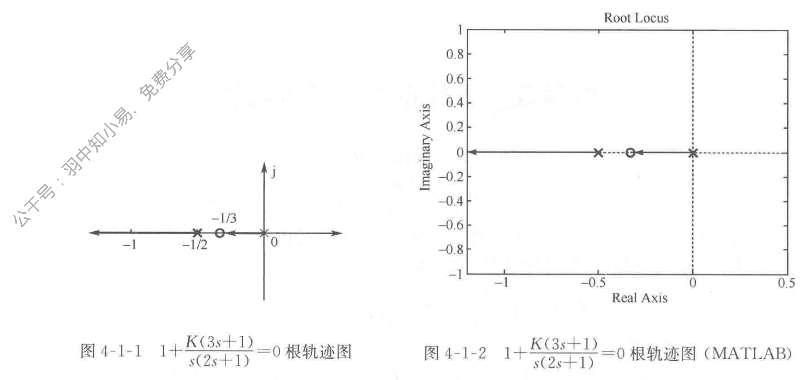

4－2 已知开环零、极点分布如图 4－38 所示，试概略绘出相应的闭环根轨迹图。

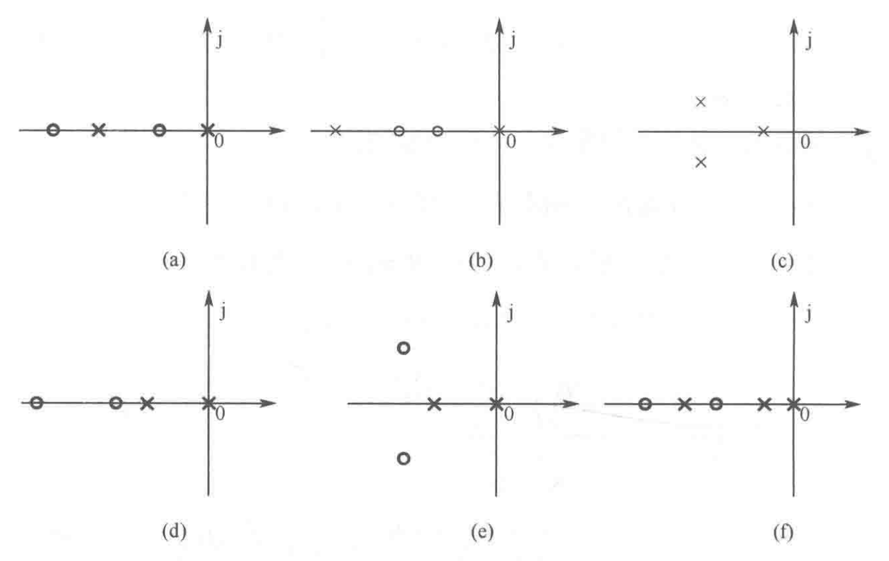

> Image description: The image displays six separate complex plane diagrams, labeled (a) through (f), used to illustrate open-loop pole and zero distributions for root locus analysis. Each diagram features a horizontal real axis and a vertical imaginary axis labeled "j," with the origin marked as "0." In each plot, small circles ($\circ$) represent open-loop zeros and crosses ($\times$) represent open-loop poles. The configurations vary across the subfigures: * (a) shows one pole at the origin, one zero, and another pole to the left. * (b) shows a pole at the origin and two zeros to its left. * (c) features a pole at the origin and a pair of complex conjugate poles. * (d) displays a pole at the origin, a pole, and a zero further left. * (e) contains a pole at the origin, a real pole, and a pair of complex conjugate zeros. * (f) shows a pole at the origin and multiple alternating poles and zeros along the negative real axis.
图 4－38 开环零、极点分布图

解 本题考查根据根轨迹绘制法则，结合开环零、极点的分布，绘制系统的概略根轨迹图的技巧。所有的闭环概略根轨迹如图 4－2－1 所示。

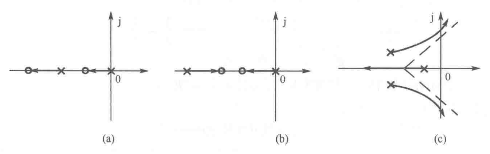

> Image description: This image contains three separate root locus plots, labeled (a), (b), and (c), plotted on a complex plane with a horizontal real axis and a vertical imaginary axis labeled $j$. Each plot shows the distribution of open-loop poles (marked as 'x') and zeros (marked as 'o'). In plot (a), there are two poles and two zeros located on the negative real axis, with root locus branches moving from the poles toward the zeros. Plot (b) also features two poles and two zeros on the negative real axis, but the direction of the arrows indicates a different trajectory between them. Plot (c) displays a more complex system with three poles; one is at the origin ($0$), and two are located symmetrically in the left-half plane. The root locus branches originate from these poles, with some moving toward the left and others curving into the complex plane.
图 4－2－1 闭环概略根轨迹


<!-- source_pdf_page: 90 -->
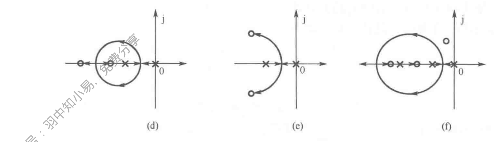

> Image description: The image contains three sub-figures labeled (d), (e), and (f) illustrating closed-loop root loci in the complex plane. Each plot features a horizontal real axis and a vertical imaginary axis labeled "$j$," with the origin marked as "0." In figure (d), the root locus consists of a circle centered on the negative real axis, starting from an open-circle pole and ending at a cross-marked zero. Figure (e) shows two curved branches originating from poles in the left-half plane and converging toward zeros on the real axis. Figure (f) depicts a larger circular trajectory encompassing several alternating poles (open circles) and zeros (crosses) along the negative real axis, with one pole located on the imaginary axis. The engineering meaning relates to control system stability and transient response, where the movement of roots from open-loop poles to zeros as gain varies is visualized.
图 4－2－1 闭环概略根轨迹（续）

4－3 设单位负反馈系统开环传递函数如下，试概略绘出相应的闭环根轨迹图（要求确定分离点坐标 $d$ ）：
（1）$G(s)=\frac{K}{s(0.2 s+1)(0.5 s+1)}$ ；
（2）$G(s)=\frac{K(s+1)}{s(2 s+1)}$ ；
（3）$G(s)=\frac{K^{*}(s+5)}{s(s+2)(s+3)}$ 。
解 本题考查根据根轨迹绘制法则，绘制系统的概略根轨迹图的技巧。
（1）系统的开环传递函数可变换为

$$
G(s)=\frac{K}{s(0.2 s+1)(0.5 s+1)}=\frac{10 K}{s(s+5)(s+2)}
$$

令 $K^{*}=10 K$ ，即 $K^{*}$ 为根轨迹增益。
（1）根轨迹的分支和起点与终点。由于 $n=3, m=0, n-m=3$ ，故根轨迹有三条分支，其起点分别为 $p_{1}=0, p_{2}=-2, p_{3}=-5$ ，其终点都为无穷远处。
（2）实轴上的根轨迹。实轴上的根轨迹分布区为 $[0,-2],[-5,-\infty)$ 。
（3）根轨迹的渐近线。

$$
\sigma_{a}=\frac{0-2-5}{3}=-\frac{7}{3}, \quad \varphi_{a}= \pm \frac{\pi}{3}, \pi
$$

（4）根轨迹的分离点。根轨迹的分离点坐标满足

$$
\frac{1}{d}+\frac{1}{d+2}+\frac{1}{d+5}=0
$$

解得

$$
d_{1}=-0.88, \quad d_{2}=-3.79(\text { 舍去 })
$$

求得分离点的坐标为 $d=-0.88$ 。
根据以上几点，可以画出概略根轨迹如图 4－3－1所示。
（2）系统的开环传递函数可变换为

$$
G(s)=\frac{K(s+1)}{s(2 s+1)}=\frac{0.5 K(s+1)}{s(s+0.5)}
$$

令 $K^{*}=0.5 K$ ，即 $K^{*}$ 为根轨迹增益。
（1）根轨迹的分支和起点与终点。由于 $n=2, m=1, n-m=1$ ，故根轨迹有两条分支，其起点分别为 $p_{1}=0, p_{2}=-0.5$ ，其终点分别为 $z=-1$ 和无穷远处。


<!-- source_pdf_page: 91 -->
（2）实轴上的根轨迹。实轴上的根轨迹分布区为 $[0,-0.5],[-1,-\infty)$ 。
（3）根轨迹的分离点。根轨迹的分离点坐标满足

$$
\frac{1}{d}+\frac{1}{d+0.5}=\frac{1}{d+1}
$$

解得

$$
d_{1}=-0.293, \quad d_{2}=-1.707
$$

故分离点的坐标为 $d_{1}=-0.293, d_{2}=-1.707$ 。
根据以上几点，可以画出概略根轨迹如图 4－3－2 所示。

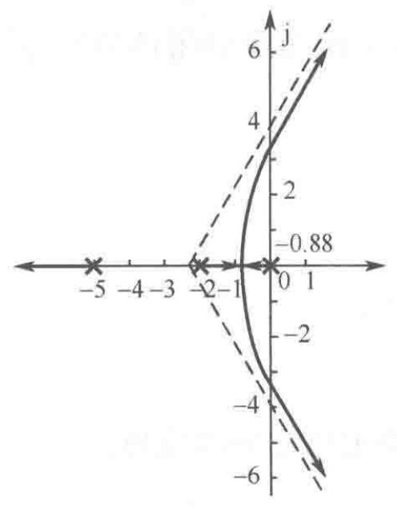

> Image description: This image shows a root locus plot in the complex s-plane, labeled as Figure 4-3-2 according to the caption. The horizontal axis represents the real part ($\sigma$) and the vertical axis represents the imaginary part ($j\omega$). Three poles are marked on the real axis with "x" symbols: one at approximately $-5$, one at $-2$, and one at $-0.88$. The root locus consists of paths starting from these poles. Two branches move toward each other between $-5$ and $-2$, while another branch originates from the pole at $-0.88$ and moves toward the left. The trajectories eventually break away from the real axis, forming a curved path that extends into the right-half plane. This is indicated by a solid line and a dashed line, with arrows pointing outward toward the upper and lower right quadrants, signifying the movement of closed-loop poles as gain increases.
图 4－3－1 $\quad 1+\frac{K}{s(0.2 s+1)(0.5 s+1)}=0$
概略根轨迹图

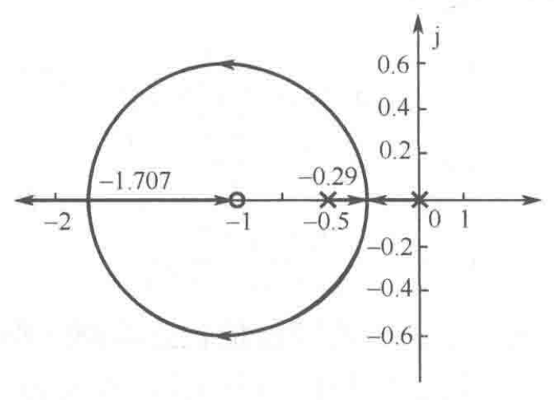

> Image description: A technical diagram showing a root locus plot on the complex plane, labeled as Figure 4-3-1. The horizontal axis represents the real part ($\sigma$) and the vertical axis is labeled $j$, representing the imaginary part. The figure displays a circular trajectory centered on the negative real axis. A starting point (open circle) is located at $-1$, and an ending point (cross) is located at $-0.29$. The locus consists of two symmetric arcs curving into the complex plane, indicated by directional arrows pointing away from the center toward the right. Another cross is visible at the origin $(0,0)$. A specific coordinate on the real axis is labeled as $-1.707$, marking the leftmost point of the circle. The caption indicates this is a sketch of the root locus for the characteristic equation $1+\frac{K}{s(0.2 s+1)(0.5 s+1)}=0$, illustrating system stability and pole movement as gain $K$ varies.
图 4－3－2 $1+\frac{K(s+1)}{s(2 s+1)}=0$
概略根轨迹图

（3）系统的开环传递函数

$$
G(s)=\frac{K^{*}(s+5)}{s(s+2)(s+3)}
$$

（1）根轨迹的分支和起点与终点。由于 $n=3, m=1, n-m=2$ ，故根轨迹有三条分支，其起点分别为 $p_{1}=0, p_{2}=-2, p_{3}=-3$ ，其终点分别为 $z=-5$ 和无穷远处。
（2）实轴上的根轨迹。实轴上的根轨迹分布区为 $[0,-2],[-3,-5]$ 。
（3）根轨迹的渐近线。

$$
\sigma_{a}=\frac{-2-3+5}{3}=0, \quad \varphi_{a}= \pm \frac{\pi}{2}
$$

（4）根轨迹的分离点。根轨迹的分离点坐标满足

$$
\frac{1}{d}+\frac{1}{d+2}+\frac{1}{d+3}=\frac{1}{d+5}
$$

通过试凑可得 $d \approx-0.89$ 。
根据以上几点，可以画出概略根轨迹如图4－3－3所示，仿真图示于图4－3－4～图4－3－6。 MATLAB 程序 ：exe403．m

$$
\begin{array}{ll}
\mathrm{G} 1=\mathrm{zpk}([],[0-5-2], 1) ; & \text { \%建立系统 (1) 开环传递函数模型 } \\
\mathrm{G} 2=\mathrm{zpk}([-1],[0-0.5], 1) ; & \text { \%建立系统 (2) 开环传递函数模型 } \\
\mathrm{G} 3=\mathrm{zpk}([-5],[0-2-3], 1) ; & \text { \%建立系统 (3) 开环传递函数模型 } \\
\text { figure (1) } & \text { \%绘制根轨迹 }
\end{array}
$$


<!-- source_pdf_page: 92 -->
figure（2）
rlocus（G2）；
figure（3）
rlocus（G3）；
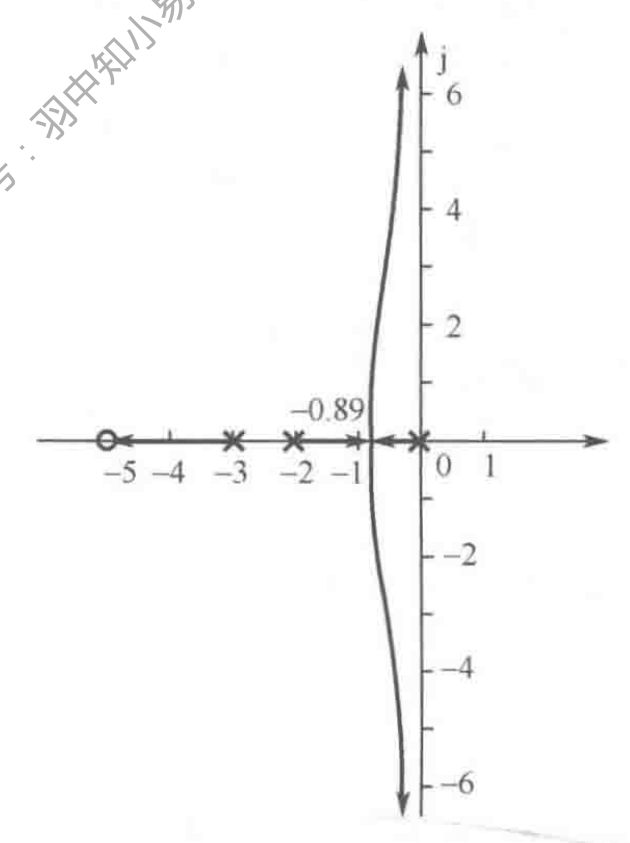

> Image description: A technical diagram showing a root locus plot on the complex s-plane, with the real axis (horizontal) and imaginary axis labeled as $j$ (vertical). The horizontal axis is scaled from $-5$ to $1$. Four open circles (poles) are marked on the real axis at positions $0$, $-2$, $-3$, and $-5$. A closed circle (zero) is located at $-5$. Arrows indicate the direction of the root locus paths. Two branches move toward each other between poles at $0$ and $-2$, breaking away from the real axis at approximately $-0.89$ to form a curved path that extends vertically toward $\pm j6$. Another branch exists on the real axis between $-2$ and $-3$. The caption identifies the characteristic equation as $1+\frac{K^{*}(s+5)}{s(s+2)(s+3)}=0$, indicating this is a control systems engineering plot used to analyze system stability based on gain $K^*$.

图 4－3－3 $1+\frac{K^{*}(s+5)}{s(s+2)(s+3)}=0$
概略根轨迹图
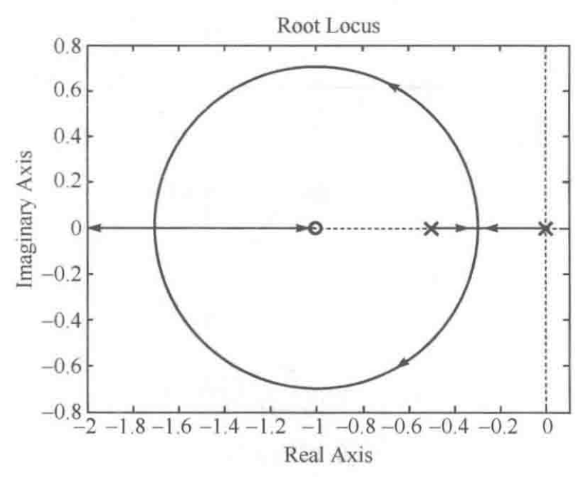

> Image description: A textbook figure titled "Root Locus" displays a root locus plot on a complex plane. The horizontal axis is labeled "Real Axis," ranging from -2 to 0, and the vertical axis is labeled "Imaginary Axis," ranging from -0.8 to 0.8. The plot features two poles marked with 'x' symbols at $s = 0$ and $s = -0.5$, and one zero marked with a circle symbol 'o' at $s = -1$. The root locus consists of a circular path centered on the real axis, with arrows indicating the direction of movement as gain increases. One branch moves from the pole at $s=0$ toward the pole at $s=-0.5$, while another pair of branches forms a circle that eventually converges on the zero at $s=-1$. A final branch extends along the negative real axis toward $-\infty$. The caption provides the characteristic equation: $1+\frac{K^{*}(s+5)}{s(s+2)(s+3)}=0$.

图 4－3－5 $1+\frac{K(s+1)}{s(2 s+1)}=0$ 根轨迹图
（MATLAB）
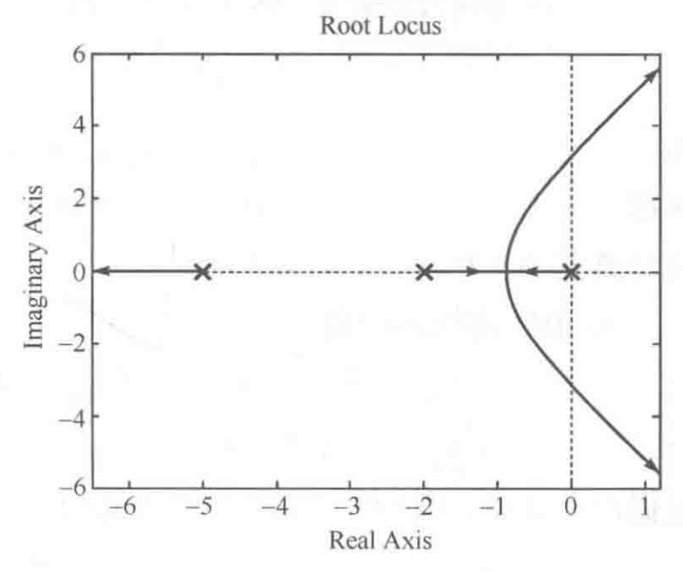

> Image description: A root locus plot generated by MATLAB, labeled as Figure 4-3-5, illustrates the trajectories of the roots for the characteristic equation $1+\frac{K(s+1)}{s(2 s+1)}=0$. The graph features a horizontal "Real Axis" and a vertical "Imaginary Axis," with scales ranging from -6 to 1 on the real axis and -6 to 6 on the imaginary axis. Three poles/zeros are marked with 'x' symbols on the real axis at $s = 0$, $s = -2$, and $s = -5$. The root locus consists of segments along the real axis and a parabolic curve. Specifically, one branch moves from the origin toward the left, while another pair of branches originates near the center and curves symmetrically into the right-half plane (positive real values), indicated by outward-pointing arrows. This visual representation is used in control engineering to analyze system stability as the gain $K$ varies.

图 4－3－4 $\quad 1+\frac{K}{s(0.2 s+1)(0.5 s+1)}=0$
根轨迹图（MATLAB）

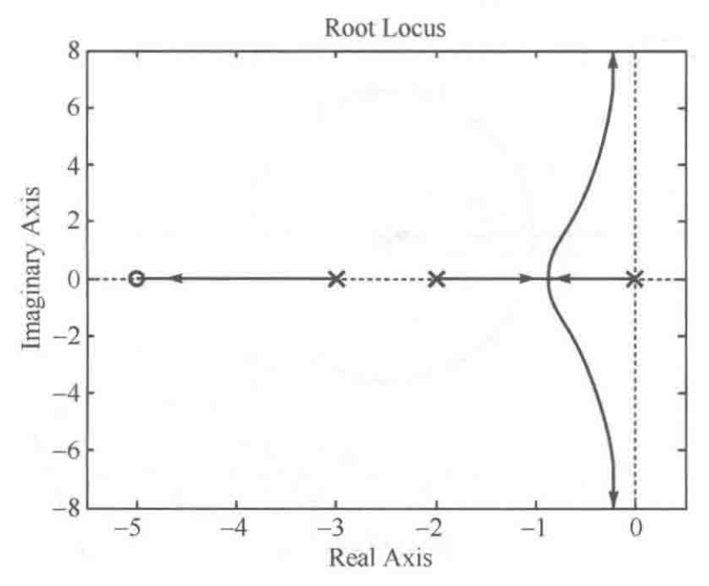

> Image description: This image is a Root Locus plot generated by MATLAB, titled "Root Locus." The graph features a horizontal "Real Axis" ranging from -5 to 0 and a vertical "Imaginary Axis" ranging from -8 to 8. The system's open-loop poles are marked with 'x' symbols at $s = 0$, $s = -2$, and $s = -3$. A single open-loop zero is indicated by a circle 'o' at $s = -5$. The root locus branches originate from the poles and move along the real axis. Specifically, one branch moves from the pole at $s=0$ toward the pole at $s=-2$, while another segment exists between $s=-3$ and $s=-5$. Two branches meet at a breakaway point near $s = -1$, curving away into the complex plane toward the imaginary axis. According to the caption, this plot represents the characteristic equation $1+\frac{K}{s(0.2 s+1)(0.5 s+1)}=0$, illustrating how system stability changes as gain $K$ varies.

Root Locus
图 4－3－6 $1+\frac{K^{*}(s+5)}{s(s+2)(s+3)}=0$ 根轨迹图
（MATLAB）

4－4 已知单位负反馈控制系统开环传递函数如下，试概略画出相应的闭环根轨迹图 （要求算出起始角 $\theta_{p i}$ ）。
（1）$G(s)=\frac{K^{*}(s+2)}{(s+1+\mathrm{j} 2)(s+1-\mathrm{j} 2)}$ ；
（2）$G(s)=\frac{K^{*}(s+20)}{s(s+10+\mathrm{j} 10)(s+10-\mathrm{j} 10)^{\circ}}$ 。
解 本题可根据根轨迹绘制法则求出起始角，并绘制系统的概略根轨迹图。


<!-- source_pdf_page: 93 -->
（1）$G(s)=\frac{K^{*}(s+2)}{(s+1+\mathrm{j} 2)(s+1-\mathrm{j} 2)}$
（1）根轨迹的分支和起点与终点。由于 $n=2, m=1, n-m=1$ ，故根轨迹有两条分支，其起点分别为 $p_{1}=-1-\mathrm{j} 2, p_{2}=-1+\mathrm{j} 2$ ，其终点分别为 $z_{1}=-2$ 和无穷远处。
（2）实轴上的根轨迹。实轴上的根轨迹分布区为 $[-2,-\infty)$ 。
（3）根轨迹的分离点。根轨迹的分离点坐标满足

即

$$
\begin{gathered}
\frac{1}{d+1+\mathrm{j} 2}+\frac{1}{d+1-\mathrm{j} 2}=\frac{1}{d+2} \\
d^{2}+4 d-1=0
\end{gathered}
$$

解得

$$
d_{1}=-4.236, \quad d_{2}=0.236 \text { (舍去) }
$$

故分离点的坐标为 $d=-4.236$ 。
（4）根轨迹的起始角。

$$
\begin{aligned}
& \theta_{p_{1}}=180^{\circ}+\varphi_{\tilde{1}_{1} p_{1}}-\theta_{p_{2} p_{1}}=180^{\circ}+\arctan 2-90^{\circ}=153.43^{\circ} \\
& \theta_{p_{2}}=-153.43^{\circ}
\end{aligned}
$$

根据以上几点，可以画出概略根轨迹如图 4－4－1 所示。
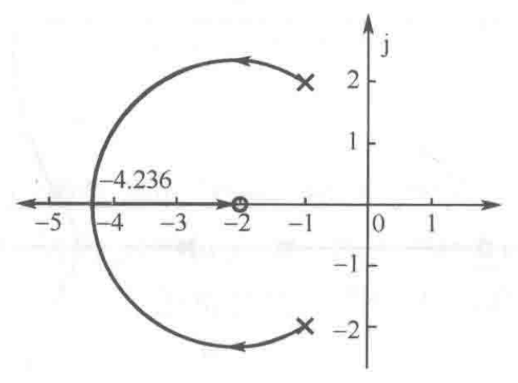

> Image description: A technical diagram showing a root locus plot in the complex s-plane. The horizontal axis represents the real part ($\sigma$) and the vertical axis is labeled $j$ for the imaginary part. The axes are marked with numerical increments from $-5$ to $1$ on the real axis and from $-2$ to $2$ on the imaginary axis. The plot features two open-loop poles, indicated by small circles, located at $s = -2$. Two branches of the root locus emerge from these poles, forming a circular arc that curves toward the left half-plane. The trajectory ends at two open-loop zeros, marked with 'x' symbols, located at approximately $s = -1 \pm 2j$. Arrows along the arcs indicate the direction of increasing gain. A specific point on the real axis is labeled $-4.236$, marking the furthest leftward extent of the locus. This figure illustrates the stability and transient response characteristics of a control system.

图 4－4－1 $1+\frac{K^{*}(s+2)}{(s+1+\mathrm{j} 2)(s+1-\mathrm{j} 2)}=0$
概略根轨迹图
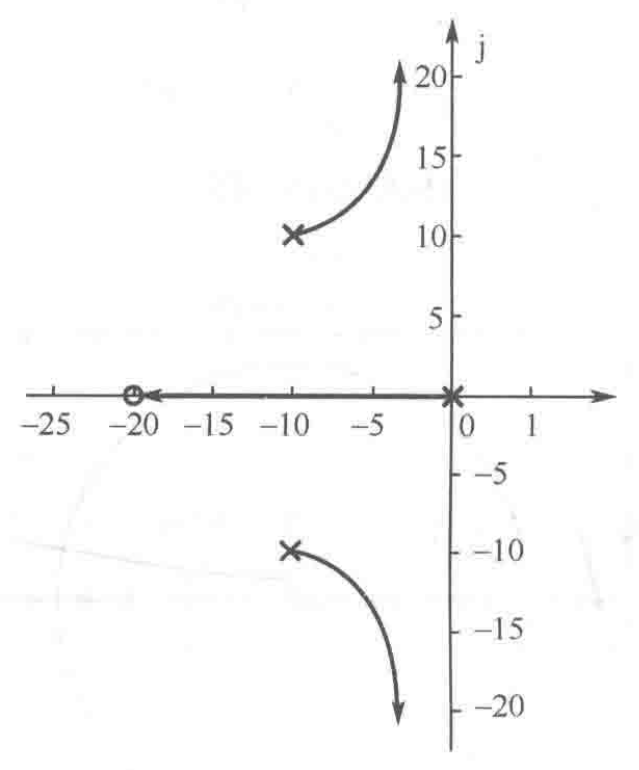

> Image description: A textbook figure showing a root locus plot on the complex s-plane. The horizontal axis represents the real part (sigma) and the vertical axis is labeled $j$, representing the imaginary part. The plot features three starting points marked with crosses: one at the origin $(0, 0)$ and two complex conjugate poles located at approximately $-1 \pm j11$. From these points, root locus branches emerge as arrows. One branch moves along the negative real axis from the origin toward an open circle (zero) located at $s = -20$. The other two branches curve away from the complex poles, moving toward the right and then curving sharply upward and downward toward positive and negative infinity on the imaginary axis. The caption identifies this as a schematic root locus diagram for the characteristic equation $1+\frac{K^{*}(s+2)}{(s+1+\mathrm{j} 2)(s+1-\mathrm{j} 2)}=0$.

图 4－4－2 $\quad 1+\frac{K^{*}(s+20)}{s(s+10+\mathrm{j} 10)(s+10-\mathrm{j} 10)}=0$
概略根轨迹图
（2）$G(s)=\frac{K^{*}(s+20)}{s(s+10+\mathrm{j} 10)(s+10-\mathrm{j} 10)}$
（1）根轨迹的分支和起点与终点。由于 $n=3, m=1, n-m=2$ ，故根轨迹有三条分支，其起点分别为 $p_{1}=-10-\mathrm{j} 10, p_{2}=-10+\mathrm{j} 10, p_{3}=0$ ，其终点分别为 $z_{1}=-20$ 和无穷远处。
（2）实轴上的根轨迹。实轴上的根轨迹分布区为 $[0,-20]$ 。
（3）根轨迹的渐近线。

$$
\sigma_{a}=\frac{-10-\mathrm{j} 10-10+\mathrm{j} 10+20}{3-1}=0, \quad \varphi_{a}= \pm \frac{\pi}{2}
$$


<!-- source_pdf_page: 94 -->
（4）根轨迹的起始角。

$$
\begin{aligned}
& \theta_{p_{1}}=180^{\circ} \% \quad \dagger \quad \varphi_{z_{1} p_{1}}-\theta_{p_{2} p_{1}}-\theta_{p_{3} p_{1}}=180^{\circ}-\arctan 1+\arctan 1=180^{\circ} \\
& \theta_{p_{2}}=180^{\circ}+\varphi_{z_{1} p_{2}}-\theta_{p_{1} p_{2}}-\theta_{p_{3} p_{2}}=180^{\circ}+45^{\circ}-135^{\circ}-90^{\circ}=0^{\circ}
\end{aligned}
$$

根据以上几点分可以画出概略根轨迹如图4－4－2所示，仿真图示于图4－4－3、图4－4－4。
MATLAB 程序 ：exe404．m

G1 $\Rightarrow \mathrm{zpk}([-2],[-1-2 i-1+2 i], 1)$ ；
$\mathrm{G}_{2}=\operatorname{zpk}([-20],[0-10-10 i-10+10 i], 1) ;$
figure（1）
figure（1）
figure（1
rlocus（G1）；
figure（2）
\％建立系统（1）开环传递函数模型
\％建立系统（2）开环传递函数模型
\％绘制根轨迹
rlocus（G2）；
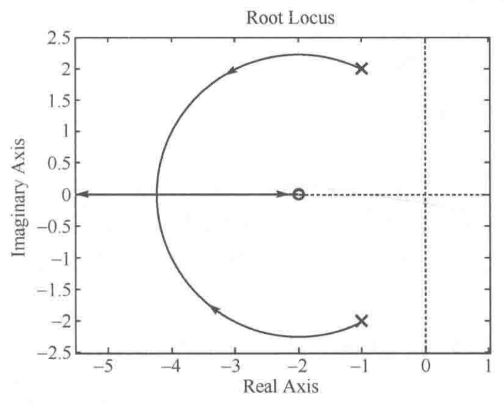

> Image description: This image shows a Root Locus plot on a complex plane, where the horizontal axis is labeled "Real Axis" and the vertical axis is labeled "Imaginary Axis." The plot illustrates the trajectories of system poles as a gain parameter varies. Two starting points (open-loop poles) are marked with 'x' symbols at $(-1, 2\mathrm{j})$ and $(-1, -2\mathrm{j})$. A single open-loop zero is indicated by a small circle at $(-2, 0)$. The root locus consists of two circular arcs originating from the poles that curve leftward and meet at a point near $-4.25$ on the real axis. From this meeting point, a single branch extends along the real axis toward the right, ending at the zero at $-2$. Arrows on the paths indicate the direction of increasing gain. The caption provides the characteristic equation: $1+\frac{K^{*}(s+2)}{(s+1+\mathrm{j} 2)(s+1-\mathrm{j} 2)}=0$.

图 4－4－3 $1+\frac{K^{*}(s+2)}{(s+1+\mathrm{j} 2)(s+1-\mathrm{j} 2)}=0$
根轨迹图（MATLAB）
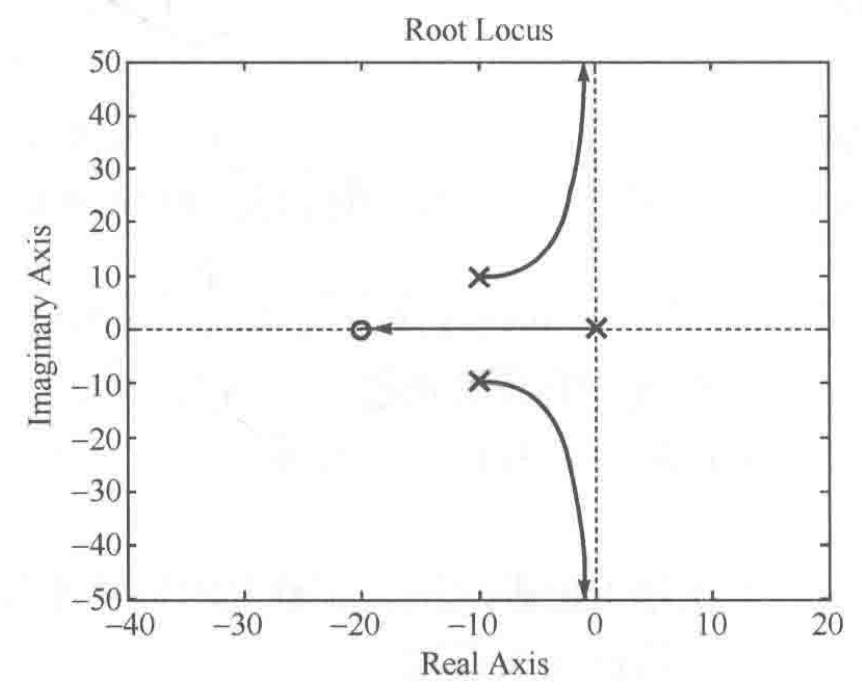

> Image description: This image is a Root Locus plot generated by MATLAB, corresponding to the characteristic equation $1+\frac{K^{*}(s+2)}{(s+1+\mathrm{j} 2)(s+1-\mathrm{j} 2)}=0$. The graph features a horizontal "Real Axis" and a vertical "Imaginary Axis," with scales ranging from -40 to 20 on the x-axis and -50 to 50 on the y-axis. The plot displays three critical points: two open-circle poles located at $-1 \pm 10\mathrm{j}$ (marked with 'x') and one closed-circle zero located at $-2$ (marked with 'o'). The root locus paths originate from the complex poles; one path moves leftward along the real axis toward the zero, while two other branches curve outward, moving toward the imaginary axis and extending vertically toward positive and negative infinity. In control engineering, this diagram illustrates how the closed-loop poles of a system shift as the gain $K^*$ varies.

图 4－4－4 $1+\frac{K^{*}(s+20)}{s(s+10+\mathrm{j} 10)(s+10-\mathrm{j} 10)}=0$
根轨迹图（MATLAB）

4－5 设已知单位反馈控制系统的开环传递函数，要求：
（1）确定 $G(s)=\frac{K^{*}}{s(s+1)(s+10)}$ 产生纯虚根的开环增益；
（2）确定 $G(s)=\frac{K^{*}(s+z)}{s^{2}(s+10)(s+20)}$ 产生纯虚根为 $\pm \mathrm{j} 1$ 的 $z$ 值和 $K^{*}$ 值；
（3）概略绘制 $G(s)=\frac{K^{*}}{s(s+1)(s+3.5)(s+3+\mathrm{j} 2)(s+3-\mathrm{j} 2)}$ 的闭环根轨迹图（要求确定根轨迹的分离点、起始角和与虚轴的交点）。

解 本题考查闭环根轨迹图的绘制，以及求解闭环根轨迹与虚轴的交点。
（1）$G(s)=\frac{K^{*}}{s(s+1)(s+10)}$
由系统的开环传递函数可知系统的闭环特征方程为

$$
D(s)=s(s+1)(s+10)+K^{*}=s^{3}+11 s^{2}+10 s+K^{*}=0
$$

令 $s=\mathrm{j} \omega$ ，将其代人上式得

$$
(\mathrm{j} \omega)^{3}+11(\mathrm{j} \omega)^{2}+10(\mathrm{j} \omega)+K^{*}=\left(-11 \omega^{2}+K^{*}\right)+\mathrm{j} \omega\left(-\omega^{2}+10\right)=0
$$


<!-- source_pdf_page: 95 -->
即

$$
\left\{\begin{array}{l}
-11 \omega^{2}+K^{*}=0 \\
-\omega^{2}+10=0
\end{array}\right.
$$

解得

$$
\omega= \pm \sqrt{10}= \pm 3.162, \quad K^{*}=110
$$

故产生纯的根的开环增益 $K=\frac{K^{*}}{10}=11$ 。
（2）$G(s)=\frac{K^{*}(s+z)}{s^{2}(s+10)(s+20)}$
由系统的开环传递函数可知系统的闭环特征方程为

$$
D(s)=s^{2}(s+10)(s+20)+K^{*}(s+z)=s^{4}+30 s^{3}+200 s^{2}+K^{*} s+K^{*} z=0
$$

将 $s=\mathrm{j} 1$ 代人上式，可得

$$
(\mathrm{j} 1)^{4}+30(\mathrm{j} 1)^{3}+200(\mathrm{j} 1)^{2}+K^{*}(\mathrm{j} 1)+K^{*} z=0
$$

即

$$
\begin{aligned}
& \left\{\begin{array}{l}
1-200+K^{*} z=0 \\
-30+K^{*}=0
\end{array}\right. \\
& z=6.63, \quad K^{*}=30
\end{aligned}
$$

解得
故产生纯虚根为 $\pm \mathrm{j} 1$ 的 $z$ 值和 $K^{*}$ 值分别为 $z=6.63$ 和 $K^{*}=30$ 。
（3）$G(s)=\frac{K^{*}}{s(s+1)(s+3.5)(s+3+\mathrm{j} 2)(s+3-\mathrm{j} 2)}$
（1）根轨迹的分支和起点与终点。由于 $n=5, m=0, n-m=5$ ，故根轨迹有五条分支，其起点分别为 $p_{1}=0, p_{2}=-1, p_{3}=-3.5, p_{4}=-3-\mathrm{j} 2, p_{5}=-3+\mathrm{j} 2$ ，其终点分别都是无穷远处。
（2）实轴上的根轨迹。实轴上的根轨迹分布区为 $[0,-1],[-3.5,-\infty$ ）。
（3）根轨迹的渐近线。

$$
\sigma_{a}=\frac{-1-3.5-3-\mathrm{j} 2-3+\mathrm{j} 2}{5-0}=-2.1, \quad \varphi_{a}= \pm \frac{\pi}{5}, \pm \frac{3 \pi}{5}, \pi
$$

（4）根轨迹的分离点。根轨迹的分离点坐标满足

$$
\frac{1}{d}+\frac{1}{d+1}+\frac{1}{d+3.5}+\frac{1}{d+3+\mathrm{j} 2}+\frac{1}{d+3-\mathrm{j} 2}=0
$$

通过试凑法可得 $d \approx-0.4$ 。
（5）根轨迹与虚轴的交点。由系统的开环传递函数可知系统的闭环特征方程

$$
\begin{aligned}
D(s) & =s(s+1)(s+3.5)(s+3+\mathrm{j} 2)(s+3-\mathrm{j} 2)+K^{*} \\
& =s^{5}+10.5 s^{4}+43.5 s^{3}+79.5 s^{2}+45.5 s+K^{*}=0
\end{aligned}
$$

令 $s=\mathrm{j} \omega$ ，将其代人上式，可得

$$
(\mathrm{j} \omega)^{5}+10.5(\mathrm{j} \omega)^{4}+43.5(\mathrm{j} \omega)^{3}+79.5(\mathrm{j} \omega)^{2}+45.5(\mathrm{j} \omega)+K^{*}=0
$$

即

$$
\left\{\begin{array}{l}
10.5 \omega^{4}-79.5 \omega^{2}+K^{*}=0 \\
\omega^{5}-43.5 \omega^{3}+45.5 \omega=0
\end{array}\right.
$$

由于 $\omega \neq 0$ ，故可解得 $\omega= \pm 1.034$ 或 $\omega= \pm 6.51$ 。其中，$\omega= \pm 6.51$ 属于伪解，故舍去。
因此，$K^{*}=73.04$ 。
（6）根轨迹的起始角。

$$
\begin{aligned}
\theta_{p_{5}} & =540^{\circ}-\theta_{p_{1} p_{5}}-\theta_{p_{2} p_{5}}-\theta_{p_{3} p_{5}}-\theta_{p_{4} p_{5}} \\
& =540^{\circ}-\left(90^{\circ}+\arctan 1.5\right)-135^{\circ}-\arctan 4-90^{\circ}=92.73^{\circ}
\end{aligned}
$$


<!-- source_pdf_page: 96 -->
$$
\theta_{p_{1}}=-92.73^{\circ}
$$

根据以上几点可伐画出闭环根轨迹如图4－5－1所示。仿真图示于图4－5－2。

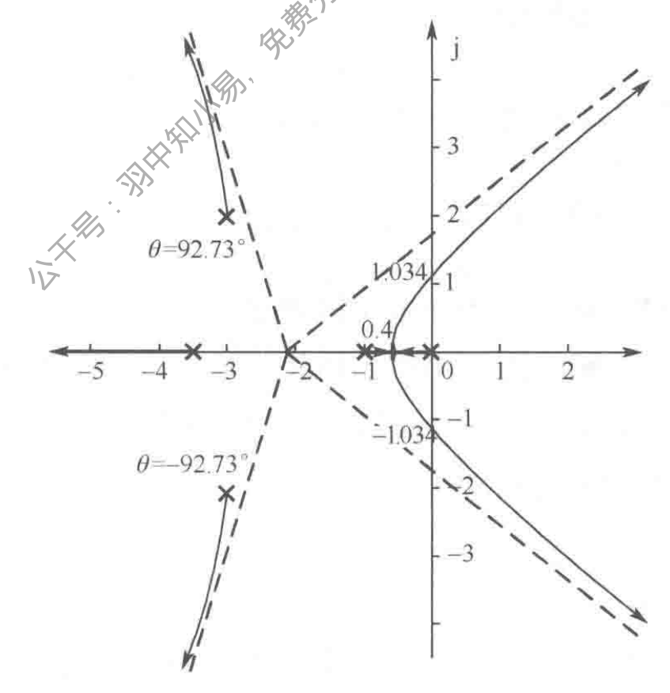

> Image description: A textbook figure depicting a closed-loop root locus plot in the complex plane, with the horizontal axis representing the real part and the vertical axis labeled "j" for the imaginary part. The plot shows two symmetric branches of trajectories starting from open-loop poles on the real axis (marked with 'x') at approximately -0.4 and -2. The branches move toward each other, break away from the real axis, and curve outward into the left-half plane. Dashed lines represent asymptotes that the root locus follows as they extend toward infinity. These asymptotes are labeled with angles $\theta = 92.73^\circ$ and $\theta = -92.73^\circ$. The breakaway point occurs between the poles, and the trajectories cross the imaginary axis at approximately $\pm 1.034j$. Arrows indicate the direction of increasing gain along the locus. The caption indicates this is Figure 4-5-1, illustrating a closed-loop root locus based on previously discussed points.
图 4－5－1 $1+\frac{K^{*}}{s(s+1)(s+3.5)(s+3+\mathrm{j} 2)(s+3-\mathrm{j} 2)}=0$概略根轨迹图

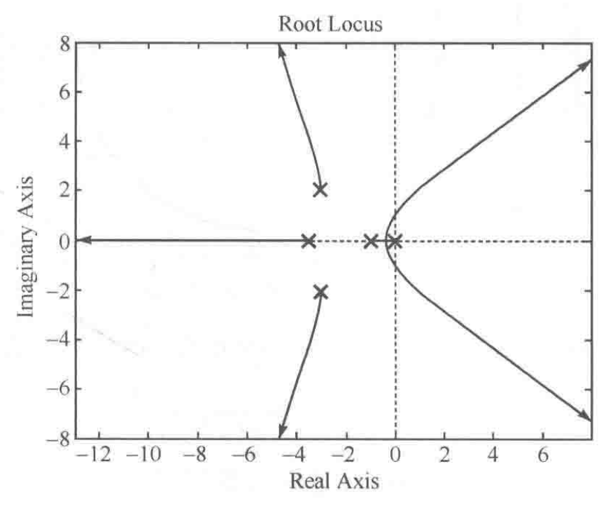

> Image description: This image is a Root Locus plot used in control systems engineering to show the trajectories of closed-loop poles as a gain parameter varies. The graph features a horizontal "Real Axis" and a vertical "Imaginary Axis," both scaled from approximately -13 to 7 and -8 to 8, respectively. Five open-loop poles are marked with 'x' symbols: one at the origin (0), one at -1, one at -4, and a complex conjugate pair at $-3 \pm 2\mathrm{j}$. The root locus consists of several branches indicated by solid lines with arrows showing the direction of increasing gain. One branch moves leftward along the real axis from the origin toward negative infinity. Another set of branches originates near the origin and curves rightward into the unstable region (positive real half-plane). Two other branches originate from the complex poles and curve downward and upward, respectively. The caption provides the characteristic equation: $1+\frac{K^{*}}{s(s+1)(s+3.5)(s+3+\mathrm{j} 2)(s+3-\mathrm{j} 2)}=0$.
图 4－5－2 $1+\frac{K^{*}}{s(s+1)(s+3.5)(s+3+\mathrm{j} 2)(s+3-\mathrm{j} 2)}=0$
根轨迹图（MATLAB）

MATLAB 程序：exe405．m
$\mathrm{G}=\operatorname{zpk}([],[0-1-3.5-3-2 \mathrm{i}-3+2 \mathrm{i}], 1) ;$
rlocus（G）；
\％建立开环传递函数模型
\％绘制根轨迹

4－6 设单位反馈系统的开环传递函数为

$$
G(s)=\frac{K^{*}(s+2)}{s(s+1)}
$$

试从数学上证明：复数根轨迹部分是以 $(-2, j 0)$ 为圆心、以 $\sqrt{2}$ 为半径的一个圆。
证明 由系统的开环传递函数可知，该系统的闭环特征方程为

$$
\begin{aligned}
D(s) & =s(s+1)+K^{*}(s+2) \\
& =s^{2}+\left(K^{*}+1\right) s+2 K^{*}=0
\end{aligned}
$$

解得

$$
s_{1.2}=-\frac{1}{2}\left(K^{*}+1\right) \pm \frac{\mathrm{j}}{2} \sqrt{8 K^{*}-\left(K^{*}+1\right)^{2}}
$$

令

$$
x=-\frac{1}{2}\left(K^{*}+1\right), \quad y=\frac{1}{2} \sqrt{8 K^{*}-\left(K^{*}+1\right)^{2}}
$$

则由 $x=-\frac{1}{2}\left(K^{*}+1\right)$ 可得 $K^{*}=-2 x-1$ ，将其代人 $y$ 的表达式，有

$$
(x+2)^{2}+y^{2}=2
$$

证得复数根轨迹部分是以 $(-2, \mathrm{j} 0)$ 为圆心、以 $\sqrt{2}$ 为半径的一个圆。其仿真图如图4－6－1所示。


<!-- source_pdf_page: 97 -->
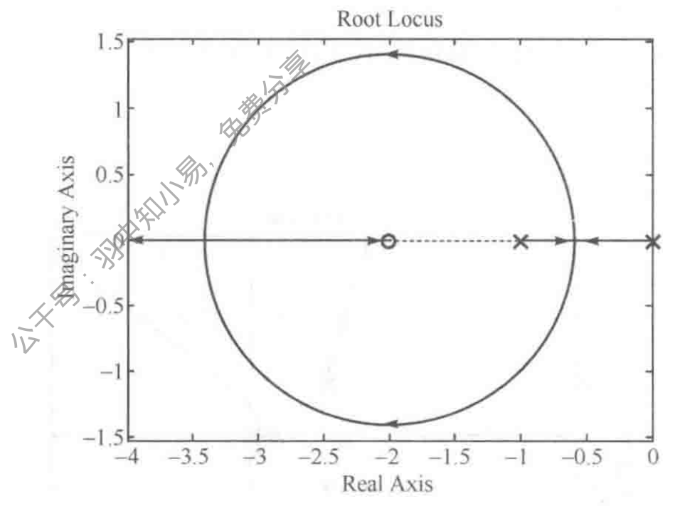

MATLAB 程序 ：exe406．m
$\mathrm{G}=\mathrm{zpk}([-2],[0-1], 1) ; ~ \%$ 建立开环传递函数模型
rlocus（G）； \％绘制根轨迹

4－7 已知开环传递函数为

$$
G(s) H(s)=\frac{K^{*}}{s(s+4)\left(s^{2}+4 s+20\right)}
$$

试概略画出闭环系统根轨迹图。
解 本题可应用根轨迹绘制法则，绘制对称系统的概略根轨迹图，特别注意复平面上的分离点。
图 4－6－1 $1+\frac{K^{*}(s+2)}{s(s+1)}=0$ 根轨迹图（MATLAB）上的分离点。

$$
G(s) H(s)=\frac{K^{*}}{s(s+4)\left(s^{2}+4 s+20\right)}=\frac{K^{*}}{s(s+4)(s+2+\mathrm{j} 4)(s+2-\mathrm{j} 4)}
$$

（1）根轨迹的分支和起点与终点。由于 $n=4, m=0, n-m=4$ ，故根轨迹有四条分支，其起点分别为 $p_{1}=0, p_{2}=-4, p_{3}=-2+\mathrm{j} 4, p_{4}=-2-\mathrm{j} 4$ ，其终点都为无穷远处。
（2）实轴上的根轨迹。实轴上的根轨迹分布区间 $[0,-4]$ 。
（3）根轨迹的渐近线。

$$
\sigma_{a}=\frac{-4-2-\mathrm{j} 4-2+\mathrm{j} 4}{4-0}=-2, \quad \varphi_{a}= \pm \frac{\pi}{4}, \pm \frac{3 \pi}{4}
$$

（4）根轨迹的分离点。根轨迹的分离点坐标满足

$$
\frac{1}{d}+\frac{1}{d+4}+\frac{1}{d+2-\mathrm{j} 4}+\frac{1}{d+2+\mathrm{j} 4}=0
$$

即

$$
d^{3}+6 d^{2}+18 d+20=0
$$

解得

$$
d_{1}=-2, \quad d_{2,3}=-2 \pm \mathrm{j} \sqrt{6}=-2 \pm \mathrm{j} 2.45
$$

（5）根轨迹与虚轴的交点。系统的闭环特征方程式为

$$
D(s)=s(s+4)\left(s^{2}+4 s+20\right)+K^{*}=s^{4}+8 s^{3}+36 s^{2}+80 s+K^{*}=0
$$

令 $s=\mathrm{j} \omega$ ，并代人上式可得

$$
(\mathrm{j} \omega)^{4}+8(\mathrm{j} \omega)^{3}+36(\mathrm{j} \omega)^{2}+80(\mathrm{j} \omega)+K^{*}=\left(\omega^{4}-36 \omega^{2}+K^{*}\right)+\mathrm{j} \omega\left(80-8 \omega^{2}\right)=0
$$

即

解得

$$
\begin{gathered}
\left\{\begin{array}{l}
\omega^{4}-36 \omega^{2}+K^{*}=0 \\
80-8 \omega^{2}=0
\end{array}\right. \\
\omega= \pm \sqrt{10}= \pm 3.16, \quad K^{*}=260
\end{gathered}
$$

故根轨迹与虚轴的交点坐标为 $\omega= \pm 3.16, K^{*}=260$ 。
根据以上分析，画出系统的闭环根轨迹如图 4－7－1 所示。其仿真图如图 4－7－2 所示。 MATLAB 程序：exe407．m

$$
\begin{aligned}
& \mathrm{G}=\operatorname{zpk}([\square,[0-4-2-4 \mathrm{i}-2+4 \mathrm{i}], 1) ; \\
& \operatorname{rlocus}(\mathrm{G}) ;
\end{aligned}
$$

\％建立开环传递函数模型
\％绘制根轨迹


<!-- source_pdf_page: 98 -->
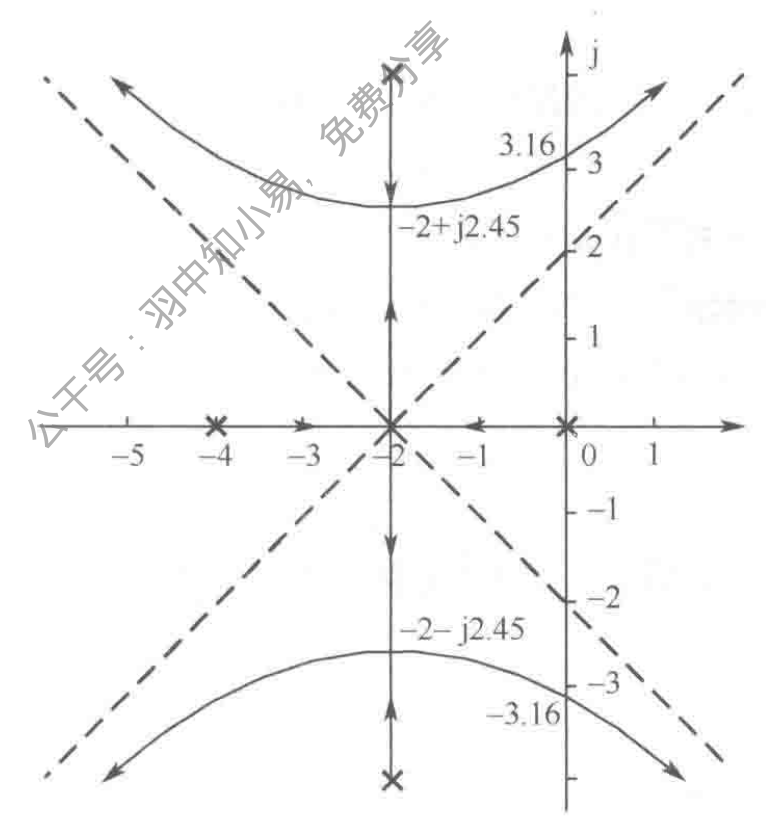

> Image description: A textbook figure, captioned as Figure 4-7-1, illustrates the root locus of the characteristic equation $1 + \frac{K^*}{s(s+4)(s^2+4s+20)} = 0$. The plot is set on a complex plane with a horizontal real axis and a vertical imaginary axis labeled "$j$". Four poles are marked with "x" symbols: one at the origin ($0$), one at $-4$, and a complex conjugate pair at $-2 \pm j\sqrt{16} \approx -2 \pm j4.47$ (though labels in the image specifically indicate points like $-2 + j2.45$ and $-2 - j2.45$). The root locus consists of several branches: a segment on the real axis between $0$ and $-4$, and two curved paths originating from the complex poles. These curves move outward, crossing the imaginary axis at $\pm j3.16$. Dashed lines act as asymptotes, intersecting at $-2$ and extending diagonally toward infinity. Arrows indicate the direction of increasing gain $K^*$.

图 4－7－1 $1+\frac{K^{*}}{s(s+4)\left(s^{2}+4 s+20\right)}=0$
概略根轨迹图

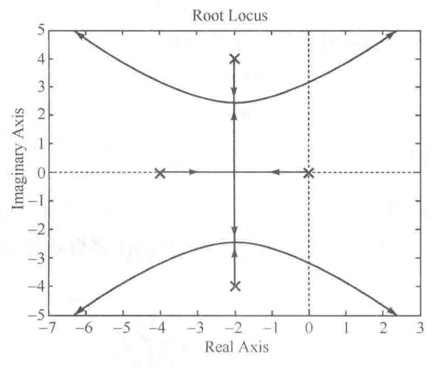

> Image description: A root locus plot is shown in Figure 4-7-1, representing the characteristic equation $1 + \frac{K^*}{s(s+4)(s^2+4s+20)} = 0$. The graph features a horizontal "Real Axis" and a vertical "Imaginary Axis," with a dashed vertical line at zero. Four open-loop poles are marked with 'x' symbols: two on the real axis at $s=0$ and $s=-4$, and a complex conjugate pair at $s = -2 \pm 4j$. The root locus trajectories originate from these poles as gain $K^*$ increases. On the real axis, arrows indicate paths moving inward from $0$ and $-4$ toward each other. From the complex poles, branches move horizontally toward the real axis to meet at a breakaway point near $s=-2$, then diverge vertically and curve outward toward the left and right halves of the s-plane. The plot illustrates system stability and transient response as a function of gain.
图 4－7－2 $\quad 1+\frac{K^{*}}{s(s+4)\left(s^{2}+4 s+20\right)}=0$
根轨迹图（MATLAB）

4－8 已知开环传递函数为

$$
G(s)=\frac{K^{*}(s+2)}{\left(s^{2}+4 s+9\right)^{2}}
$$

试概略绘制其闭环系统根轨迹图。
解 本题可应用根轨迹绘制法则，绘制开环系统具有复重极点时的闭环系统的概略根轨迹图。

$$
G(s)=\frac{K^{*}(s+2)}{\left(s^{2}+4 s+9\right)^{2}}=\frac{K^{*}(s+2)}{(s+2+\mathrm{j} \sqrt{5})^{2}(s+2-\mathrm{j} \sqrt{5})^{2}}
$$

（1）根轨迹的分支和起点与终点。由于 $n=4, m=1, n-m=3$ ，故根轨迹有四条分支，其起点分别为 $p_{1,2}=-2+\mathrm{j} \sqrt{5}, p_{3,4}=-2-\mathrm{j} \sqrt{5}$ ，其中一条根轨迹的终点为 $z_{1}=-2$ ，其余都为无穷远处。
（2）实轴上的根轨迹。实轴上的根轨迹分布区为 $[-2,-\infty)$ 。
（3）根轨迹的渐近线。

$$
\sigma_{a}=\frac{2 \times(-2+\mathrm{j} \sqrt{5})+2 \times(-2-\mathrm{j} \sqrt{5})+2}{4-1}=-2, \quad \varphi_{a}= \pm \frac{\pi}{3}, \pi
$$

（4）根轨迹的分离点。根轨迹的分离点坐标满足

$$
\frac{2}{d+2-\mathrm{j} \sqrt{5}}+\frac{2}{d+2+\mathrm{j} \sqrt{5}}=\frac{1}{d+2}
$$

即

$$
3 d^{2}+12 d+7=0
$$

解得

$$
d_{1}=-3.29, \quad d_{2}=-0.71 \text { (舍去) }
$$

故分离点的坐标为 $d=-3.29$ 。


<!-- source_pdf_page: 99 -->
（5）根轨迹与虚轴的交点。系统的闭环特征方程式为

$$
\begin{aligned}
D(s) & =\left(s^{2}+4 s+9\right)^{2}+K^{*}(s+2) \\
& =s^{4}+8 s^{3}+34 s^{2}+\left(72+K^{*}\right) s+\left(2 K^{*}+81\right)=0
\end{aligned}
$$

令 $s=\mathrm{j} \omega$ ，将其代人上式可得

$$
\begin{gathered}
(\mathrm{j} \omega)^{4}+8(\mathrm{j} \omega)^{3}+34(\mathrm{j} \omega)^{2}+\left(72+K^{*}\right)(\mathrm{j} \omega)+\left(2 K^{*}+81\right) \\
=\left(\omega^{4}-34 \omega^{2}+2 K^{*}+81\right)+\mathrm{j} \omega\left(-8 \omega^{2}+72+K^{*}\right)=0 \\
\left\{\begin{array}{l}
\omega^{4}-34 \omega^{2}+2 K^{*}+81=0 \\
-8 \omega^{2}+72+K^{*}=0
\end{array}\right. \\
\omega= \pm 4.58, \quad K^{*}=96
\end{gathered}
$$

根据以上分析，画出系统的闭环根轨迹如图 4－8－1 所示。其仿真图如图 4－8－2 所示。

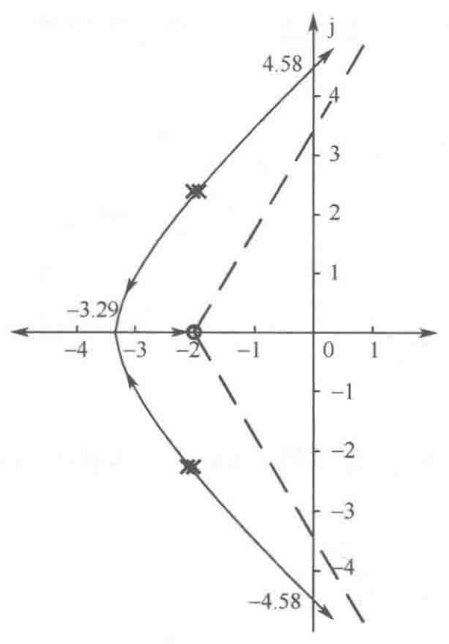

> Image description: A textbook figure showing a closed-loop root locus plot on the complex plane. The horizontal axis represents the real part ($\sigma$) and the vertical axis is labeled $j$ for the imaginary part. The plot features two symmetric branches curving to the left from a starting point at $-2$ (marked with a small circle). These branches extend outward, ending in arrows pointing toward the lower-left and upper-right quadrants. Key numerical labels indicate specific points on the trajectory: the vertex is at $-3.29$ on the real axis, and the curves reach imaginary values of $4.58$ and $-4.58$. Two "x" marks are placed symmetrically along the paths. A dashed curve also originates from $-2$, curving toward the right side of the plane. In control engineering, this diagram illustrates how the system's poles move as a gain parameter varies, indicating stability and damping characteristics.
图 4－8－1 $1+\frac{K^{*}(s+2)}{\left(s^{2}+4 s+9\right)^{2}}=0$ 概略根轨迹图

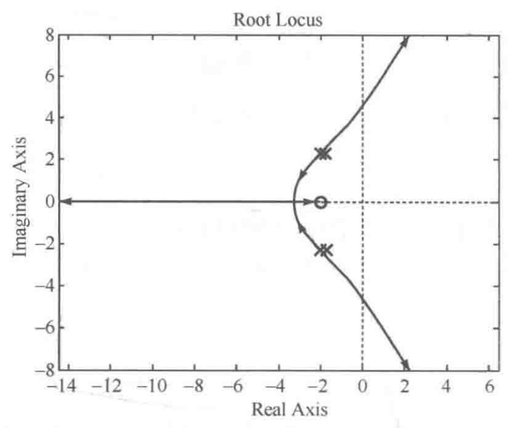

> Image description: This image shows a Root Locus plot for the characteristic equation $1+\frac{K^{*}(s+2)}{(s^{2}+4s+9)^{2}}=0$, as indicated in the caption. The graph features a horizontal "Real Axis" and a vertical "Imaginary Axis," with numerical scales ranging from -14 to 6 on the x-axis and -8 to 8 on the y-axis. The plot displays trajectories (root loci) starting from open-loop poles, marked by 'x' symbols at approximately $s = -2 \pm j\sqrt{5}$, and an open-loop zero marked by a circle 'o' at $s = -2$. The locus branches move toward each other, meeting at the zero on the real axis. From this point, one branch extends linearly along the negative real axis toward $-\infty$, while others curve outward, crossing into the right-half plane (positive real values) as they extend toward infinity in both positive and negative imaginary directions.
图 4－8－2 $1+\frac{K^{*}(s+2)}{\left(s^{2}+4 s+9\right)^{2}}=0$ 根轨迹图（MATLAB）

MATLAB 程序：exe408．m
$G=\operatorname{zpk}([-2],[-2-\operatorname{sqrt}(5) * i-2-\operatorname{sqrt}(5) * i-2+\operatorname{sqrt}(5) * i-2+\operatorname{sqrt}(5) * i], 1) ;$ \％建立开环传递函数模型
figure
rlocus（ G ）；\％绘制根轨迹
4－9 一单位反馈系统，其开环传递函数为

$$
G(s)=\frac{6.9\left(s^{2}+6 s+25\right)}{s\left(s^{2}+8 s+25\right)}
$$

试用根轨迹法计算闭环系统根的位置。
解 本题开环系统具有复数零、极点。在系统概略根轨迹图上，利用根轨迹的模值条件极易确定实轴上的一个闭环极点值，再采用综合除法可方便获得另两个闭环极点值，从而完成本题要求的计算工作。为了检验计算精度，可用 MATLAB 仿真加以验证。


<!-- source_pdf_page: 100 -->
$$
G(s)=\frac{K^{*}\left(s^{2}+6 s+25\right)}{s\left(s^{2}+8 s+25\right)}=\frac{K^{*}(s+3-\mathrm{j} 4)(s+3+\mathrm{j} 4)}{s(s+4-\mathrm{j} 3)(s+4+\mathrm{j} 3)} \quad\left(K^{*}=6.9\right)
$$

（1）根轨迹的分支麻起点与终点。由于 $n=3, m=2, n-m=1$ ，故根轨迹有三条分支，其起点分别为 $p_{1}=0, p_{2}=-4+\mathrm{j} 3, p_{3}=-4-\mathrm{j} 3$ ，其终点分别是 $z_{1}=-3+\mathrm{j} 4, z_{2}=-3-\mathrm{j} 4$ 和无穷远处。
（2）实轴上的根轨迹。实轴上的根轨迹分布区为 $[0,-\infty)$ 。
（3）根轨迹的起始角与终止角。

$$
\begin{aligned}
\theta_{p_{2}} & =180^{\circ}+\varphi_{z_{1} p_{2}}+\varphi_{z_{2} p_{2}}-\theta_{p_{1} p_{2}}-\theta_{p_{3} p_{2}} \\
& =180^{\circ}+\left(-90^{\circ}-45^{\circ}\right)+\left(90^{\circ}+\arctan \frac{1}{7}\right)-\left(90^{\circ}+\arctan \frac{4}{3}\right)-90^{\circ} \\
& =-45^{\circ}+\arctan \frac{1}{7}-\arctan \frac{4}{3}=-90^{\circ} \\
\theta_{p_{3}} & =90^{\circ} \\
\varphi_{z_{1}} & =-180^{\circ}-\varphi_{z_{2} z_{1}}+\theta_{p_{1} z_{1}}+\theta_{p_{2} z_{1}}+\theta_{p_{3} z_{1}} \\
& =-135^{\circ}+\arctan \frac{3}{4}+\arctan 7=-16.26^{\circ} \\
\varphi_{z_{2}} & =16.26^{\circ}
\end{aligned}
$$

可得闭环系统概略根轨迹如图 4－9－1 所示。其仿真图如图 4－9－2 所示。

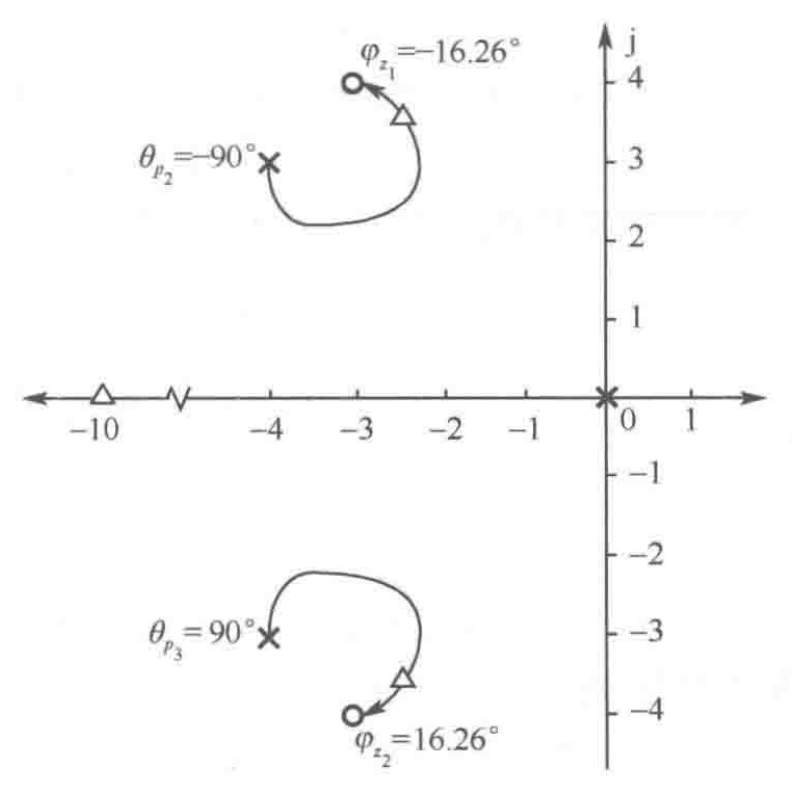

> Image description: A complex plane plot showing the root locus of a closed-loop system. The horizontal axis represents the real part (ranging from -10 to 1) and the vertical axis is labeled "j" for the imaginary part (ranging from -4 to 4). The figure displays two symmetrical trajectories in the left-half plane. One path starts at an open-circle pole $\theta_{p2} = -90^\circ$ located at approximately $(-4, 3)$ and curves toward a point labeled $\phi_{z1} = -16.26^\circ$ near $(-3, 4)$. A mirrored path starts at $\theta_{p3} = 90^\circ$ at approximately $(-4, -3)$ and curves toward $\phi_{z2} = 16.26^\circ$ near $(-3, -4)$. Arrows indicate the direction of movement along these loci. Additional markers (a triangle and a circle) are placed on the real axis at $-10$ and approximately $-6$. The origin $(0,0)$ is marked with an asterisk.
图 4－9－1 $1+\frac{K^{*}\left(s^{2}+6 s+25\right)}{s\left(s^{2}+8 s+25\right)}=0$ 概略根轨迹图 图 4－9－2 $1+\frac{K^{*}\left(s^{2}+6 s+25\right)}{s\left(s^{2}+8 s+25\right)}=0$ 根轨迹图（MATLAB）

在负实轴上任取 $s_{1}$ ，由模值条件

$$
K^{*}=\frac{\prod_{i=1}^{3}\left|s_{1}-p_{i}\right|}{\prod_{j=1}^{2}\left|s_{1}-z_{j}\right|}
$$

可得使 $K^{*}=6.9$ 的 $s_{1}=-10$ 。


<!-- source_pdf_page: 101 -->
系统的闭环特征方程为

$$
\begin{aligned}
D(s) & =s\left(s^{2}+8 s+25\right)+6.9\left(s^{2}+6 s+25\right) \\
& =s^{3}+14.9 s^{2}+66.4 s+172.5=0
\end{aligned}
$$

因已求出 $s_{1}=-10$ 为特征方程式的一个根，故可得

解得

$$
\begin{gathered}
D(s) \approx(s+10)\left(s^{2}+4.9 s+17.4\right)=0 \\
s_{2,3}=-2.45 \pm \mathrm{j} 3.38
\end{gathered}
$$

MATLAB 程序 ：exe409．m
\％系统参数

$$
\text { num }=\left[\begin{array}{lll}
1 & 6 & 25
\end{array}\right] ; \quad \operatorname{den}=\left[\begin{array}{cccc}
1 & 8 & 25 & 0
\end{array}\right] ; \quad \mathrm{K}=6.9 ;
$$

\％绘制根轨迹
rlocus（num，den）：hold on；
\％求 $K=6.9$ 时系统的闭环特征根
rlocus（num，den，K）；
由 MATLAB 程序的根轨迹图（图4－9－2）可以看出，系统的闭环特征根（三角形）为

$$
s_{1}=-9.98, \quad s_{2,3}=-2.46 \pm \mathrm{j} 3.35
$$

4－10 设反馈控制系统中

$$
G(s)=\frac{K^{*}}{s^{2}(s+2)(s+5)}, H(s)=1
$$

要求：
（1）概略绘出系统根轨迹图，并判断闭环系统的稳定性；
（2）如果改变反馈通道传递函数，使 $H(s)=1+2 s$ ，试判断 $H(s)$ 改变后的系统稳定性，研究由于 $H(s)$ 改变所产生的效应。

解 本题应用根轨迹法研究改善结构不稳定系统的稳定性的方法。应用 MATLAB 软件，还可研究安置开环零点的最佳位置。
（1）当 $H(s)=1$ 时，系统的开环传递函数

$$
G(s)=\frac{K^{*}}{s^{2}(s+2)(s+5)}
$$

显然，本系统属结构不稳定系统。
（1）根轨迹的分支和起点与终点。由于 $n=4, m=0, n-m=4$ ，故根轨迹有四条分支，其起点分别为 $p_{1,2}=0, p_{3}=-2, p_{4}=-5$ ，其终点都为无穷远处。
（2）实轴上的根轨迹。实轴上的根轨迹分布区为 $[-2,-5]$ 。
（3）根轨迹的渐近线。

$$
\sigma_{a}=\frac{-5-2}{4-0}=-1.75, \quad \varphi_{a}= \pm \frac{\pi}{4}, \pm \frac{3 \pi}{4}
$$

（4）根轨迹的分离点。根轨迹的分离点坐标满足

$$
\frac{2}{d}+\frac{1}{d+2}+\frac{1}{d+5}=0
$$

即

$$
4 d^{2}+21 d+20=0
$$

解得

$$
d_{1}=-4, \quad d_{2}=-1.25 \text { (舍去) }
$$

故分离点的坐标为 $d=-4$ 。


<!-- source_pdf_page: 102 -->
根据以上分析，画出系统的闭环概略根轨迹如图 4－10－1 所示。其仿真图如图 4－10－2所示。

由系统的闭环根轨迹可知，当 $K$＊从零变到无穷大时，系统始终有特征根在 $s$ 右半平面，所以系统恒不稳定。
（2）当 $H(s)=1+2 s$ 时，系统的开环传递函数

$$
G(s) H(s)=\frac{K_{1}^{*}(s+0.5)}{s^{2}(s+2)(s+5)}
$$

其中 $K_{1}^{*}=2 K^{*}$ ，为根轨迹增益。
（1）根轨迹的分支和起点与终点。由于 $n=4, m=1, n-m=3$ ，故根轨迹有四条分支，起点分别为 $p_{1,2}=0, p_{3}=-2, p_{4}=-5$ ，其中一条根轨迹的终点 $z_{1}=-0.5$ ，其余为无穷远处。
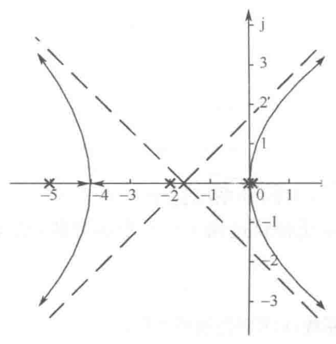

> Image description: A technical diagram showing a root locus plot in the complex s-plane, labeled as Figure 4-10-1. The horizontal axis represents the real part ($\sigma$) and the vertical axis is labeled $j$, representing the imaginary part. The plot features three open-circle poles marked with crosses on the real axis at $s = 0$, $s = -2$, and $s = -5$. Solid lines represent the root locus paths, which originate from these poles. One branch moves from the pole at $-2$ toward the pole at $0$, while another segment exists between $-2$ and $-5$. Two branches break away from the real axis into the complex plane, forming curved trajectories that extend toward infinity. Dashed lines indicate asymptotes that guide the paths of the loci as they move away from the origin. The caption provides the characteristic equation: $1+\frac{K^{*}}{s^{2}(s+2)(s+5)}=0$.

图 4－10－1 $1+\frac{K^{*}}{s^{2}(s+2)(s+5)}=0$ 概略根轨迹图
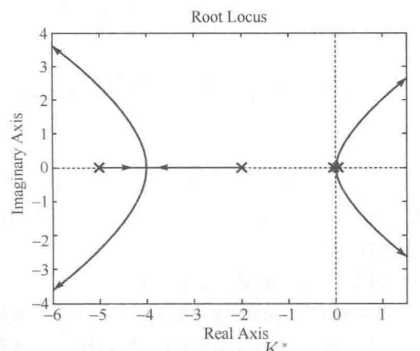

> Image description: This image shows a Root Locus plot used in control systems engineering to analyze the stability of a system. The graph is plotted on a complex plane with the horizontal axis labeled "Real Axis" and the vertical axis labeled "Imaginary Axis." The characteristic equation provided in the caption is $1+\frac{K^{*}}{s^{2}(s+2)(s+5)}=0$. On the real axis, there are open-circle poles located at $s=0$ (double pole), $s=-2$, and $s=-5$. The root locus consists of several branches: two branches originate from the double pole at the origin and immediately move into the right-half plane, curving toward positive infinity. Another pair of branches originates from the poles at $-2$ and $-5$, meeting on the real axis between them before breaking away into the left-half plane to form a circular arc that extends toward negative infinity. Arrows indicate the direction of increasing gain $K^*$.

图 4－10－2 $\quad 1+\frac{K^{*}}{s^{2}(s+2)(s+5)}=0$
根轨迹图（MATLAB）
（2）实轴上的根轨迹。实轴上的根轨迹分支有 $[-5,-\infty),[-0.5,-2]$ 。
（3）根轨迹的渐近线。

$$
\sigma_{a}=\frac{0.5-5-2}{4-1}=-2.17, \quad \varphi_{a}= \pm \frac{\pi}{3}, \pi
$$

（4）根轨迹与虚轴的交点。系统的闭环特征方程式为

即

$$
\begin{aligned}
D(s) & =s^{2}(s+2)(s+5)+K_{1}^{*}(s+0.5) \\
& =s^{4}+7 s^{3}+10 s^{2}+K_{1}^{*} s+0.5 K_{1}^{*}=0 \\
& s^{4}+7 s^{3}+10 s^{2}+2 K^{*} s+K^{*}=0
\end{aligned}
$$

令 $s=\mathrm{j} \omega$ ，将其代人上式可得

$$
(\mathrm{j} \omega)^{4}+7(\mathrm{j} \omega)^{3}+10(\mathrm{j} \omega)^{2}+2 K^{*}(\mathrm{j} \omega)+K^{*}=0
$$

即

$$
\left\{\begin{array}{l}
\omega^{4}-10 \omega^{2}+K^{*}=0 \\
-7 \omega^{3}+2 K^{*} \omega=0
\end{array}\right.
$$

因 $\omega \neq 0$ ，故可解得

$$
K^{*}=22.75, \quad \omega= \pm 2.55
$$

根据以上分析，画出系统的闭环概略根轨迹如图 4－10－3 所示。其仿真图如图 4－10－4 所示。


<!-- source_pdf_page: 103 -->
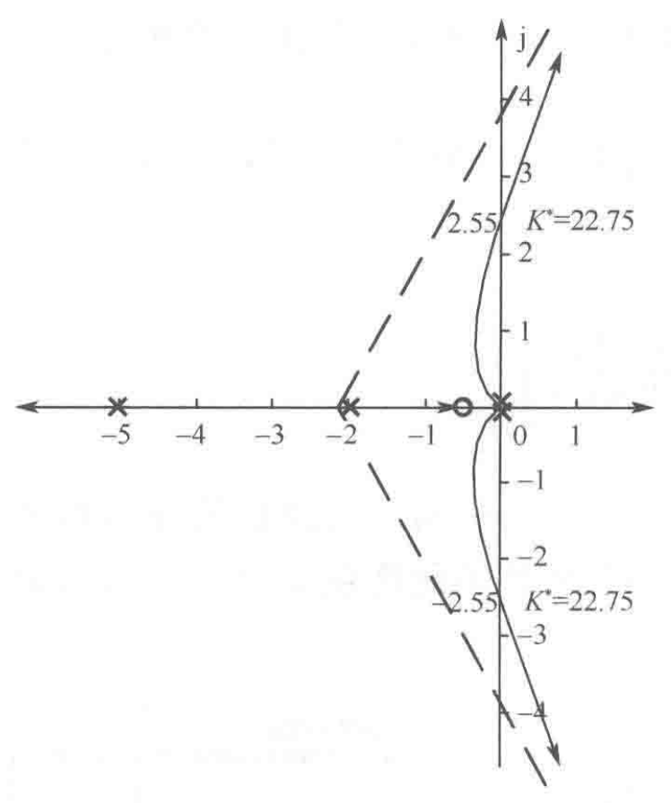

> Image description: This image is a root locus plot from an engineering textbook, illustrating the stability of a system defined by the characteristic equation $1+\frac{2 K^{*}(s+0.5)}{s^{2}(s+2)(s+5)}=0$. The graph features a complex plane with a horizontal real axis and a vertical imaginary axis labeled "$j$". Open circles (poles) are located at $s=0$ (double pole), $s=-2$, and $s=-5$. A cross (zero) is positioned at $s=-0.5$. The root locus consists of several branches: one segment on the real axis between $-0.5$ and $0$, another between $-2$ and $-5$, and two symmetrical curved paths that emerge from the origin, loop into the left-half plane, and then cross back into the right-half plane. The points where the locus crosses the imaginary axis are labeled as $\pm 2.55j$, corresponding to a critical gain of $K^* = 22.75$. Arrows indicate the direction of increasing gain $K^*$.
图 4－10－3 $1+\frac{2 K^{*}(s+0.5)}{s^{2}(s+2)(s+5)}=0$ 概略根轨迹图

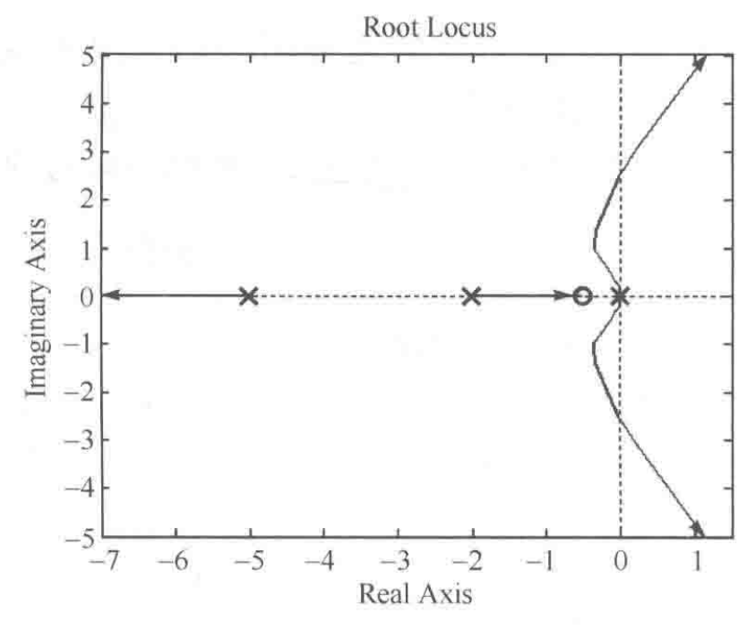

> Image description: This image is a Root Locus plot, labeled as Figure 4-10-3 in the caption, corresponding to the characteristic equation $1+\frac{2 K^{*}(s+0.5)}{s^{2}(s+2)(s+5)}=0$. The graph features a horizontal "Real Axis" and a vertical "Imaginary Axis," with values ranging from -7 to 1 on the real axis and -5 to 5 on the imaginary axis. Three poles are marked with 'x' symbols at $s = 0$ (double pole), $s = -2$, and $s = -5$. One zero is marked with a circle 'o' at $s = -0.5$. The root locus consists of trajectories starting from the poles as gain $K^*$ increases. One branch moves from the pole at $-2$ toward the zero at $-0.5$. Another branch originates from the double pole at 0, splitting into complex conjugate paths that curve into the right-half plane (positive real values). A third branch extends from the pole at $-5$ leftward toward negative infinity.

由系统的闭环根轨迹可知，当 $0<K^{*}<22.75$ 时，闭环系统稳定。所以，由于 $H(s)$ 从 1改变为 $1+2 s$ 使系统增加了一个负实零点，迫使系统根轨迹向 $s$ 左半平面弯曲，从而改善了系统的稳定性。

MATLAB 程序：exe410．m
$\mathrm{G} 1=\mathrm{zpk}([],[0 \quad 0 \quad-2 \quad-5], 1) ; ~ \%$ 建立系统（1）开坏传递函数模型
$\mathrm{G} 2=\mathrm{zpk}([-0.5],[00-2-5], 1) ; ~ \%$ 建立系统（2）开环传递函数模型
figure（1）
图 4－10－4 $1+\frac{2 K^{*}(s+0.5)}{s^{2}(s+2)(s+5)}=0$
根轨迹图（MATLAB）
由系统的闭环根轨迹可知，当 $0<K^{*}<22.75$ 时，闭环系统稳定。所以，由于 $H(s)$ 从 1改变为 $1+2 s$ 使系统增加了一个负实零点，迫使系统根轨迹向 $s$ 左半平面弯曲，从而改善了系纸


> Image description: The provided image is a blank white square and does not contain the figure described in the caption. However, based on the accompanying text, the intended figure is a MATLAB-generated root locus plot for the characteristic equation $1+\frac{2 K^{*}(s+0.5)}{s^{2}(s+2)(s+5)}=0$. In such an engineering diagram, the horizontal axis represents the real part ($\sigma$) and the vertical axis represents the imaginary part ($j\omega$) of the complex s-plane. The plot would show trajectories starting from open-loop poles at $s=0$ (double pole), $s=-2$, and $s=-5$, moving toward a zero at $s=-0.5$ as the gain $K^*$ increases. The caption indicates that for $0 < K^* < 22.75$, the closed-loop poles remain in the left-half plane, ensuring system stability. The addition of the zero at $-0.5$ is noted to pull the root locus to the left, improving transient response and stability margins.
rlocus（G1）；\％绘制根轨迹
figure（2）
rlocus（G2）；
4－11 试绘出下列多项式方程的根轨迹：
（1）$s^{3}+2 s^{2}+3 s+K s+2 K=0$ ；
（2）$s^{3}+3 s^{2}+(K+2) s+10 K=0$ 。
解 本题研究参数根轨迹的绘制方法。
（1）$s^{3}+2 s^{2}+3 s+K s+2 K=0$
由题可得

$$
D(s)=s^{3}+2 s^{2}+3 s+K(s+2)=0
$$

上式可等价表示为

$$
1+G(s)=0
$$

其中等效开环传递函数

$$
G(s)=\frac{K(s+2)}{s^{3}+2 s^{2}+3 s}=\frac{K(s+2)}{s(s+1+\mathrm{j} \sqrt{2})(s+1-\mathrm{j} \sqrt{2})}
$$

（1）根轨迹的分支和起点与终点。由于 $n=3, m=1, n-m=2$ ，故根轨迹有三条分支，其起点分别为 $p_{1}=-1-\mathrm{j} \sqrt{2}, p_{2}=-1+\mathrm{j} \sqrt{2}, p_{3}=0$ ，其终点分别为 $z_{1}=-2$ 和无穷远处。


<!-- source_pdf_page: 104 -->
（2）实轴上的根轨迹。实轴上的根轨迹分布区为 $[0,-2]$ 。
（3）根轨迹的渐近线。

$$
\sigma_{a}=\frac{-1-\mathrm{j} \sqrt{2}-1+\mathrm{j} \sqrt{2}+2}{3-1}=0, \quad \varphi_{a}= \pm \frac{\pi}{2}
$$

（4）根轨迹的起始角。

$$
\begin{aligned}
\theta_{p_{1}} & =180^{\circ}+\varphi_{z_{1} p_{1}}-\theta_{p_{2} p_{1}}-\theta_{p_{3} p_{1}} \\
& =180^{\circ}+\arctan \sqrt{2}-90^{\circ}-\left(180^{\circ}-\arctan \sqrt{2}\right)=19.47^{\circ} \\
\theta_{p_{2}} & =-19.47^{\circ}
\end{aligned}
$$

根据以上几点，可以画出概略根轨迹如图 4－11－1 所示。其仿真图如图 4－11－2 所示。

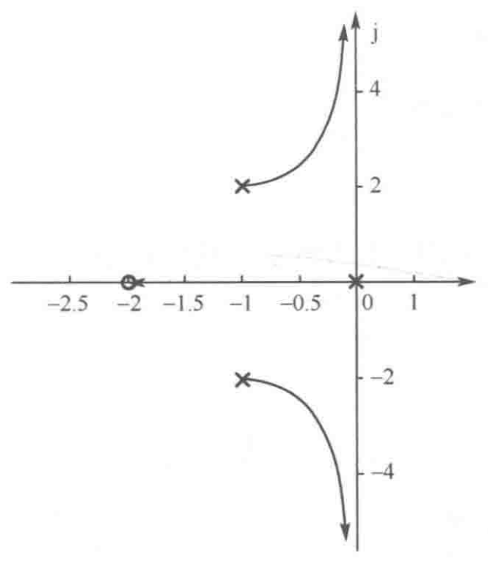

> Image description: A textbook figure showing a root locus plot on the complex plane, with the horizontal axis representing the real part and the vertical axis labeled as $j$ (imaginary part). The origin is marked at 0. The plot features two open-circle poles located on the real axis: one at $-2$ and another at $0$. Two crosses, representing zeros, are positioned symmetrically at $-1 + 2j$ and $-1 - 2j$. Two curved root locus branches originate from the poles. The branch starting at the pole at $0$ moves leftward along the real axis toward the pole at $-2$. Simultaneously, two other trajectories emerge from these points and curve outward into the complex plane, ending at the zeros located at $\pm 2j$. Arrows on these curves indicate the direction of increasing gain. This figure illustrates the stability and transient response characteristics of a control system based on its pole-zero configuration.
图 4－11－1 $s^{3}+2 s^{2}+3 s+K s+2 K=0$
概略根轨迹图

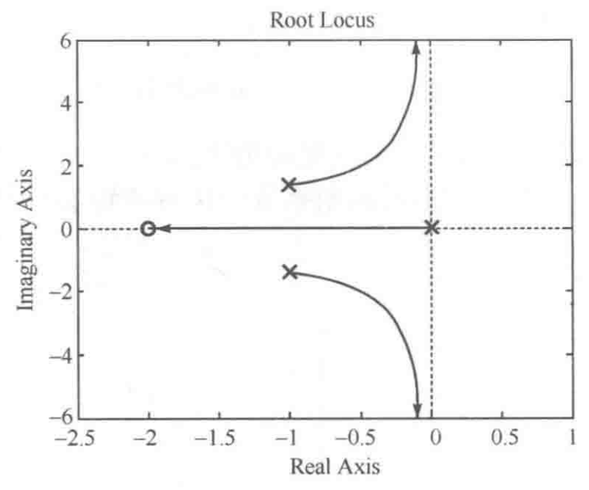

> Image description: A root locus plot is shown in Figure 4-11-1, representing the characteristic equation $s^3 + 2s^2 + (3+K)s + 2K = 0$. The graph features a horizontal Real Axis and a vertical Imaginary Axis. The plot displays three starting points marked with 'x' symbols: one at the origin $(0,0)$ and two complex conjugate poles located at approximately $-1 \pm j1.5$. As the gain $K$ increases, the root locus branches move from these poles. One branch extends along the real axis from the origin toward a circle marker (zero) located at $-2$. Simultaneously, the two complex branches curve to the right, moving toward the imaginary axis and eventually crossing it into the right-half plane. Arrows on the trajectories indicate the direction of root movement as $K$ increases, illustrating the system's transition from stability to instability.
图 4－11－2 $s^{3}+2 s^{2}+3 s+K s+2 K=0$
根轨迹图（MATLAB）

（2）$s^{3}+3 s^{2}+(K+2) s+10 K=0$
由题可得

$$
D(s)=s^{3}+3 s^{2}+2 s+K(s+10)=0
$$

上式可等价表示为

$$
1+G(s)=0
$$

其中等效开环传递函数

$$
G(s)=\frac{K(s+10)}{s^{3}+3 s^{2}+2 s}=\frac{K(s+10)}{s(s+1)(s+2)}
$$

（1）根轨迹的分支和起点与终点。由于 $n=3, m=1, n-m=2$ ，故根轨迹有三条分支，其起点分别为 $p_{1}=0, p_{2}=-1, p_{3}=-2$ ，其终点分别为 $z_{1}=-10$ 和无穷远处。
（2）实轴上的根轨迹。实轴上的根轨迹分布区为 $[0,-1],[-2,-10]$ 。
（3）根轨迹的渐近线。

$$
\sigma_{a}=\frac{-1-2+10}{3-1}=3.5, \quad \varphi_{a}= \pm \frac{\pi}{2}
$$


<!-- source_pdf_page: 105 -->
（4）根轨迹的分离点。根轨迹的分离点坐标满足

$$
\frac{1}{d}+\frac{1}{d+1}+\frac{1}{d+2}=\frac{1}{d+10}
$$

可得

$$
d^{3}+16.5 d^{2}+30 d+10=0
$$

由试凑法可得

$$
d \approx-0.433
$$

（5）根轨迹与虚轴的交点。系统的闭环特征方程式为

$$
D(s)=s^{3}+3 s^{2}+2 s+K(s+10)=0
$$

令 $s=\mathrm{j} \omega$ ，并将其代人上式可得

$$
\begin{gathered}
(\mathrm{j} \omega)^{3}+3(\mathrm{j} \omega)^{2}+2(\mathrm{j} \omega)+K[(\mathrm{j} \omega)+10]=0 \\
\left\{\begin{array}{l}
-3 \omega^{2}+10 K=0 \\
-\omega^{3}+2 \omega+K \omega=0
\end{array}\right.
\end{gathered}
$$

## 即 <br> 因 $\omega \neq 0$ ，故可解得交点处坐标

$$
\omega= \pm 1.69, \quad K=\frac{6}{7}=0.86
$$

则根轨迹与虚轴的交点坐标为 $\pm \mathrm{j} 1.69$ 。
根据以上分析，画出系统的闭环概略根轨迹如图 4－11－3 所示。其仿真图如图 4－11－4所示。

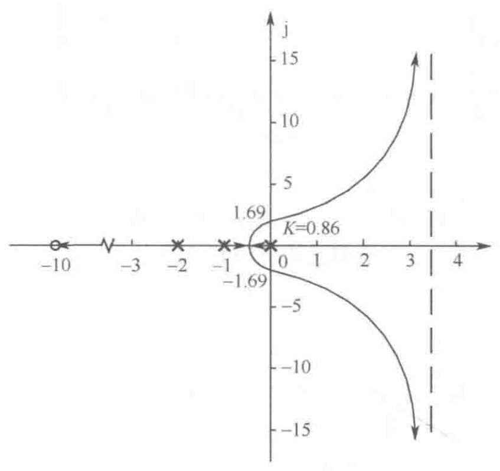

> Image description: A textbook figure showing a root locus plot on the complex plane, where the horizontal axis represents the real part and the vertical axis is labeled "j" for the imaginary part. The plot features several open-loop poles marked with crosses (X) on the negative real axis at approximately -1, -2, and -3, and an open-loop zero marked with a circle (O) at -10. The root locus branches originate from the poles; one branch moves toward the zero at -10, while others move toward each other, break away from the real axis into the complex plane, and curve toward the right. A specific point on the real axis is labeled with a value of approximately -0.69 (indicated by 1.69 and -1.69 for imaginary intercepts), and a gain value $K=0.86$ is noted near the origin. A vertical dashed line is positioned at approximately $s = 3.5$.
图 4－11－3 $s^{3}+3 s^{2}+(K+2) s+10 K=0$
概略根轨迹图

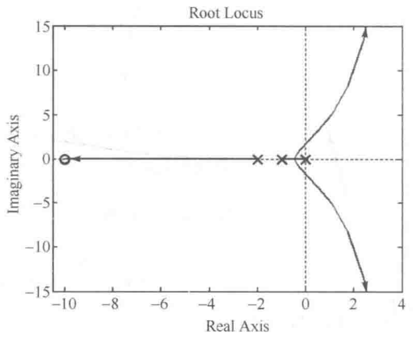

> Image description: A root locus plot for the characteristic equation $s^3 + 3s^2 + (K+2)s + 10K = 0$, as indicated by the caption "图 4－11－3". The graph features a horizontal Real Axis and a vertical Imaginary Axis, with values ranging from -10 to 4 on the real axis and -15 to 15 on the imaginary axis. Three open poles are marked with 'x' symbols on the negative real axis at approximately $s = -2$, $s = -1$, and $s = 0$. A single zero is indicated by a circle 'o' at $s = -10$. The root locus consists of paths starting from the poles as $K$ increases. One branch moves leftward along the real axis toward the zero at -10. Two other branches move toward each other, meet on the real axis near the origin, and then diverge symmetrically into the right-half plane, curving upward and downward with arrows indicating their trajectory toward infinity.
图 4－11－4 $s^{3}+3 s^{2}+(K+2) s+10 K=0$
根轨迹图（MATLAB）

[^0]
[^0]:    MATLAB 程序 ：exe411．m
    $\mathrm{G} 1=\operatorname{zpk}([-2],[0-1-\operatorname{sqrt}(2) * i-1+\operatorname{sqrt}(2) * i], 1)$ ；
    $\mathrm{G2}=\mathrm{zpk}([-10],[0-1-2], 1) ;$
    figure（1）
    rlocus（G1）；
    figure（2）
    rlocus（G2）；
    \％建立方程（1）等效开环传递函数模型
    \％建立方程（2）等效开环传递函数模型
    \％绘制根轨迹


<!-- source_pdf_page: 106 -->
4－12 设系统开环传递函数如下，试画出 $b$ 从零变到无穷时的根轨迹图。
（1）$G(s)=\frac{20}{(s+4)(s+b)}$ ；
（2）$G(s)=\frac{30(s+b)}{s(s+10)}$ 。
解 本题考查参数根轨迹的绘制。
（1）$G(s)=\frac{20}{(s+4)(s+b)}$
系统的闭环特征多项式为

$$
D(s)=(s+4)(s+b)+20=s^{2}+4 s+20+b(s+4)=0
$$

上式可等价表示为

$$
1+G_{1}(s)=0
$$

其中等效开环传递函数

$$
G_{1}(s)=\frac{b(s+4)}{s^{2}+4 s+20}=\frac{b(s+4)}{(s+2+\mathrm{j} 4)(s+2-\mathrm{j} 4)}
$$

（1）根轨迹的分支和起点与终点。由于 $n=2, m=1, n-m=1$ ，故根轨迹有两条分支，其起点分别为 $p_{1}=-2-\mathrm{j} 4, p_{2}=-2+\mathrm{j} 4$ ，其终点分别为 $z_{1}=-4$ 和无穷远处。
（2）实轴上的根轨迹。实轴上的根轨迹分布区为 $[-4,-\infty$ ）。
（3）根轨迹的分离点。根轨迹的分离点坐标满足

$$
\frac{1}{d+2+\mathrm{j} 4}+\frac{1}{d+2-\mathrm{j} 4}=\frac{1}{d+4}
$$

应有 $d^{2}+8 d-4=0$ ，解得

$$
d_{1}=-8.47, \quad d_{2}=0.47 \text { (舍去) }
$$

（4）根轨迹的起始角。

$$
\begin{aligned}
& \theta_{p_{1}}=180^{\circ}+\varphi_{z_{1} p_{1}}-\theta_{p_{2} p_{1}}=180^{\circ}+\arctan 2-90^{\circ}=153.43^{\circ} \\
& \theta_{p_{2}}=-153.43^{\circ}
\end{aligned}
$$

根据以上几点，可以画出概略参数根轨迹如图 4－12－1 所示。其仿真图如图 4－12－2 所示。实际上，可以类似题 4－6 的证明，本题根轨迹是以 $(-4, \mathrm{j} 0)$ 为圆心、以 $\sqrt{2^{2}+4^{2}}=\sqrt{20}=$ 4.47 为半径的圆的一部分。而分离点 $d=-8.47$ 处的 $b$ 值可由模值条件求出：

$$
b=\frac{\prod_{i=1}^{2}\left|d-p_{i}\right|}{|d-z|}=\frac{6.47^{2}+4^{2}}{4.47}=12.94
$$

（2）$G(s)=\frac{30(s+b)}{s(s+10)}$
由题可得

$$
D(s)=s(s+10)+30(s+b)=s^{2}+40 s+30 b=0
$$

上式可等价表示为

$$
1+G_{2}(s)=0
$$

其中等效开环传递函数


<!-- source_pdf_page: 107 -->
$$
G_{2}(s)=\frac{30 b}{s^{2}+40 s}=\frac{30 b}{s(s+40)}
$$

（1）根轨迹的分支和起点与终点。由于 $n=2, m=0, n-m=2$ ，故根轨迹有两条分支，其起点分别为 $p_{1}=0, p_{2}=-40$ ，其终点都为无穷远处。
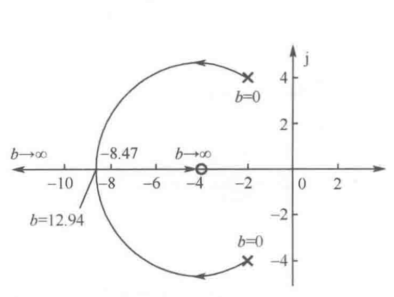

> Image description: This figure is a root locus plot in the complex s-plane, representing the solutions to the characteristic equation $1+\frac{b(s+4)}{(s+2+\mathrm{j} 4)(s+2-\mathrm{j} 4)}=0$. The horizontal axis represents the real part and the vertical axis is labeled "j" for the imaginary part. The plot features two open-loop poles marked with 'x' at $s = -2 \pm \mathrm{j} 4$ (where $b=0$) and one open-loop zero marked with a circle at $s = -4$. As the parameter $b$ increases, the root trajectories originate from the poles and move in circular arcs toward the left. One branch moves toward the zero at $-4$ as $b \to \infty$, while the other branch continues along the real axis toward $-\infty$ as $b \to \infty$. Specific values are labeled on the real axis: a point at $-8.47$ and another at $b=12.94$, indicating the system's stability and damping characteristics for different gain values.

图 4－12－1 $1+\frac{b(s+4)}{(s+2+\mathrm{j} 4)(s+2-\mathrm{j} 4)}=0$概略参数根轨迹图

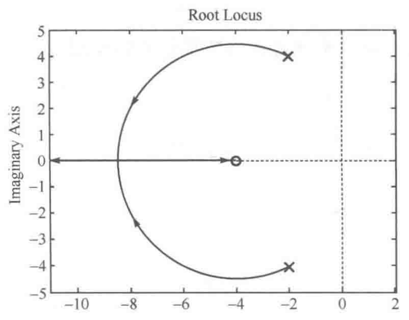

> Image description: A root locus plot is shown in Figure 4-12-1, representing the characteristic equation $1+\frac{b(s+4)}{(s+2+\mathrm{j} 4)(s+2-\mathrm{j} 4)}=0$. The graph features a horizontal axis (real axis) and a vertical "Imaginary Axis," with scales ranging from -12 to 2 on the x-axis and -5 to 5 on the y-axis. Three critical points are marked: an open circle (zero) at $s = -4$ and two crosses (poles) located at $s = -2 \pm \mathrm{j} 4$. The root locus consists of three branches indicated by arrows showing the direction of increasing gain $b$. One branch originates from a pole at $-2 + \mathrm{j} 4$, curves leftward through the complex plane, and terminates at the zero at $-4$. A symmetric branch mirrors this path from the pole at $-2 - \mathrm{j} 4$ toward the same zero. A third branch starts at the zero at $-4$ and extends linearly along the real axis toward negative infinity.
图 4－12－2 $1+\frac{b(s+4)}{(s+2+\mathrm{j} 4)(s+2-\mathrm{j} 4)}=0$
参数根轨迹图（MATLAB）

（2）实轴上的根轨迹。实轴上的根轨迹分布区为 $[0,-40]$ 。
（3）根轨迹的分离点。根轨迹的分离点坐标满足

$$
\frac{1}{d}+\frac{1}{d+40}=0
$$

即 $2 d+40=0$ ，解得

$$
d=-20
$$

根据以上分析，画出系统的闭环概略根轨迹如图 4－12－3 所示。其仿真图如图 4－12－4 所示。分离点 $d=-20$ 处的 $b$ 值，可由模值条件求出为

$$
\begin{aligned}
30 b & =\prod_{i=1}^{2}\left|d-p_{i}\right|=400 \\
b & =13.33
\end{aligned}
$$

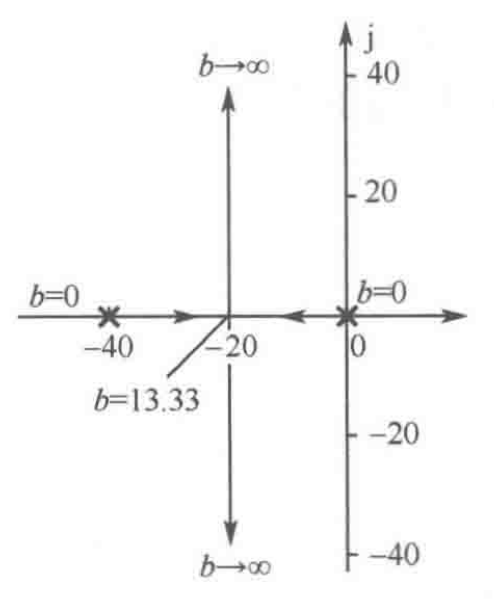

> Image description: This figure is a root locus plot in the complex s-plane, illustrating the roots of the characteristic equation $1 + \frac{30b}{s(s+40)} = 0$. The horizontal axis represents the real part ($\sigma$) and the vertical axis represents the imaginary part ($j\omega$). The plot features two starting points (open-loop poles) located at $s = 0$ and $s = -40$, both labeled with $b=0$. Two branches move toward each other along the real axis, meeting at a breakaway point labeled $b=13.33$ at approximately $s=-20$. From this point, the branches split vertically, moving upward and downward parallel to the imaginary axis. These vertical paths are indicated by arrows pointing away from the real axis, labeled as $b \to \infty$. The plot demonstrates how the system's stability and damping change as the gain parameter $b$ increases.
图 4－12－3 $1+\frac{30 b}{s(s+40)}=0$

概略根轨迹图

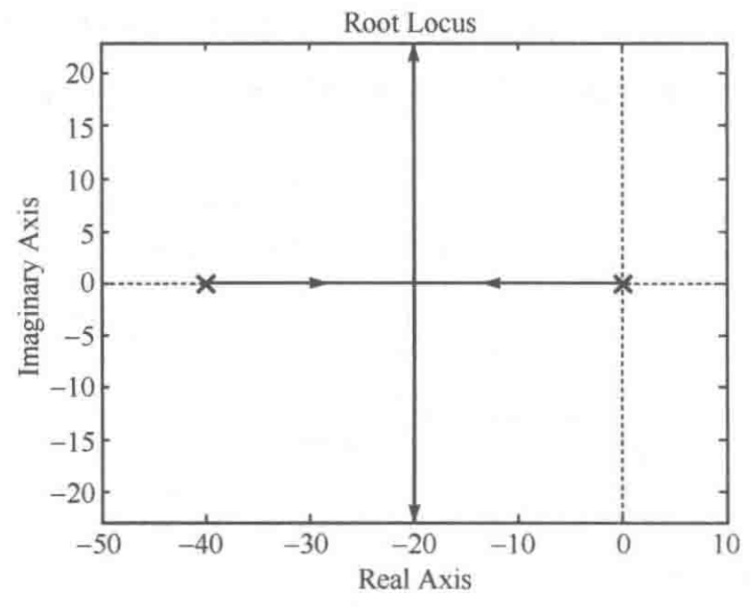

> Image description: This image displays a Root Locus plot on a complex plane, with the horizontal axis labeled "Real Axis" and the vertical axis labeled "Imaginary Axis." The real axis ranges from -50 to 10, while the imaginary axis ranges from -20 to 20. Two poles are marked with 'x' symbols on the real axis at $s = 0$ and $s = -40$. Root locus branches originate from these poles and move toward each other along the real axis. Arrows indicate that the paths meet at a breakaway point located at $s = -20$. From this central point, two vertical arrows extend symmetrically upward and downward, parallel to the imaginary axis. According to the caption, the plot represents the characteristic equation $1+\frac{30 b}{s(s+40)}=0$, illustrating how the closed-loop poles of a system shift as the gain parameter $b$ varies.
图 4－12－4 $\quad 1+\frac{30 b}{s(s+40)}=0$
参数根轨迹图（MATLAB）


<!-- source_pdf_page: 108 -->
MATLAB 程序 ：exe412．m

```
G1 = zpk([-4],[-2-4i -2 + 4*i],1); %建立系统(1)等效开环传递函数模型
G2 = zpk([],[0-40],1); %建立系统(2)等效开坏传递函数模型
figure (1)
    rlocus(G1); %绘制根轨迹
figure（2）
rlocus（G2）；
```

4－13 设控制系统的结构图如图 4－39 所示，试概略绘制其根轨迹图。

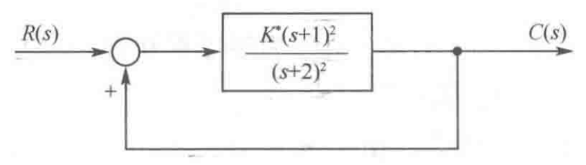

> Image description: A technical diagram of a control system block diagram is shown. The system consists of a summing junction, a forward transfer function block, and a positive feedback loop. An input signal $R(s)$ enters from the left into a circular summing junction. From the summing junction, an arrow points right toward a rectangular block containing the transfer function $\frac{K^*(s+1)^2}{(s+2)^2}$. The output of this block is labeled as $C(s)$, which exits to the right. A feedback path originates from the output line for $C(s)$ and returns to the summing junction via a bottom horizontal line, indicated by a plus sign ($+$) at the junction, signifying positive feedback. The diagram represents a closed-loop control system in the Laplace domain, used here as a basis for sketching a root locus plot as per the provided caption.
图 4－39 控制系统结构图

解 本题考查零度根轨迹的绘制。由图 4－39 可知，该系统是一个正反馈控制系统，其根轨迹为零度根轨迹。

该系统的开环传递函数为

$$
G(s)=\frac{K^{*}(s+1)^{2}}{(s+2)^{2}}
$$

根据绘制零度根轨迹图的法则可得：
（1）根轨迹的分支和起点与终点。由于 $n=2, m=2, n-m=0$ ，故根轨迹有两条分支，其起点分别为 $p_{1}=-2, p_{2}=-2$ ，其终点分别为 $z_{1}=-1, z_{2}=-1$ 。
（2）实轴上的根轨迹。实轴上的根轨迹分布区为全部实轴。
根据以上分析，可以绘制该系统的零度根轨迹如图 4－13－1 所示。其仿真图如图 4－13－2所示。

MATLAB 程序 ：exe413．m
$\mathrm{G}=\operatorname{zpk}\left(\left[\begin{array}{ll}-1 & -1\end{array}\right],\left[\begin{array}{ll}-2 & -2\end{array}\right],-1\right) ;$
\％建立开环传递函数模型
figure
rlocus（G）；
\％绘制根轨迹
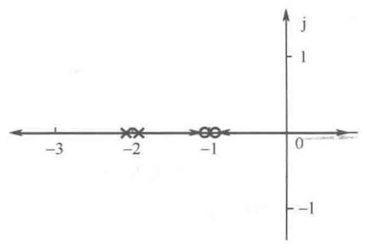

> Image description: A black-and-white engineering diagram showing a root locus plot on the complex s-plane. The horizontal axis represents the real part, with numerical labels at -3, -2, -1, and 0. The vertical axis is labeled "j" for the imaginary part, with markers at 1 and -1. The figure depicts the trajectories of roots for the characteristic equation $1+\frac{K^{*}(s+1)^{2}}{(s+2)^{2}}=0$. Two open circles are located at $s = -1$, representing double open-loop poles or zeros, and two crosses (X) are located at $s = -2$, representing double open-loop poles or zeros. The root locus consists of segments on the real axis connecting these points, indicated by arrows pointing toward the equilibrium positions. This diagram illustrates the stability and transient response characteristics of a control system as the gain $K^*$ varies.

图 4－13－1 $1+\frac{K^{*}(s+1)^{2}}{(s+2)^{2}}=0$ 概略零度根轨迹图
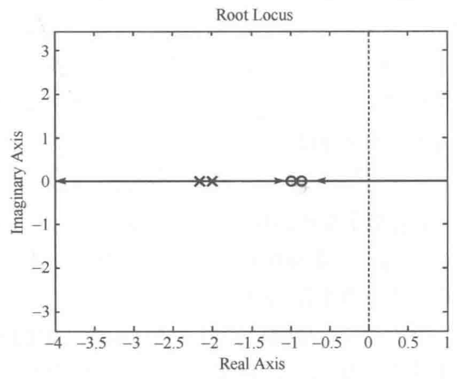

> Image description: A root locus plot is shown in Figure 4-13-1, illustrating the trajectories of roots for the characteristic equation $1 + \frac{K^*(s+1)^2}{(s+2)^2} = 0$. The graph features a horizontal Real Axis from -4 to 1 and a vertical Imaginary Axis from -3 to 3. The plot displays two open-circle poles located at $s = -2$ (marked with 'x') and two closed-circle zeros located at $s = -1$ (marked with 'o'). The root locus exists entirely on the real axis between these points. Arrows indicate the direction of movement as the gain $K^*$ increases: one branch moves from the poles at $-2$ toward the zeros at $-1$, while another branch extends from the pole at $-2$ toward negative infinity along the real axis. A dashed vertical line marks the imaginary axis at zero, separating stable and unstable regions.

图 4－13－2 $1+\frac{K^{*}(s+1)^{2}}{(s+2)^{2}}=0$ 零度根轨迹图（MATLAB）


<!-- source_pdf_page: 109 -->
4－14 设单位反馈控制系统的开环传递函数为

$$
G(s)=\frac{K^{*}(1-s)}{s(s+2)}
$$

试绘制其根轨迹图，并求出使系统产生重实根和纯虚根的 $K^{*}$ 值。
解 本题考查零度根轨迹的绘制。
系统的开环传递函数为

$$
G(s)=\frac{K^{*}(1-s)}{s(s+2)}
$$

由系统的开环传递函数可知，该系统的根轨迹为零度根轨迹。
根据绘制零度根轨迹图的法则可得
（1）根轨迹的分支和起点与终点。由于 $n=2, m=1, n-m=1$ ，故根轨迹有两条分支，其起点分别为 $p_{1}=0, p_{2}=-2$ ，其终点分别为 $z_{1}=1$ 和无穷远处。
（2）实轴上的根轨迹。实轴上的根轨迹分布区为 $[-2,0],[1, \infty)$ 。
（3）根轨迹的分离点。根轨迹的分离点坐标满足

$$
\frac{1}{d}+\frac{1}{d+2}=\frac{1}{d-1}
$$

即 $d^{2}-2 d-2=0$ ，解得

$$
d_{1}=1-\sqrt{3}=-0.732, \quad d_{2}=1+\sqrt{3}=2.732
$$

根据幅值条件可得分离点处的根轨迹增益为

$$
\begin{aligned}
& K_{1}^{*}=\left|\frac{d_{1}\left(d_{1}+2\right)}{1-d_{1}}\right|=\frac{0.732 \times(2-0.732)}{1.732}=0.536 \\
& K_{2}^{*}=\left|\frac{d_{2}\left(d_{2}+2\right)}{1-d_{2}}\right|=\frac{2.732 \times(2+2.732)}{1.732}=7.464
\end{aligned}
$$

（4）根轨迹与虚轴的交点。系统的闭环特征方程式为

$$
D(s)=s^{2}+2 s-K^{*} s+K^{*}=0
$$

令 $s=\mathrm{j} \omega$ ，代人上式可得

即

$$
\begin{gathered}
(\mathrm{j} \omega)^{2}+2(\mathrm{j} \omega)-K^{*}(\mathrm{j} \omega)+K^{*}=0 \\
\left\{\begin{array}{l}
-\omega^{2}+K^{*}=0 \\
2 \omega-K^{*} \omega=0
\end{array}\right.
\end{gathered}
$$

因 $\omega \neq 0$ ，故可解得

$$
\omega= \pm \sqrt{2}, \quad K^{*}=2
$$

根据以上分析，可以绘制该系统的零度根轨迹如图4－14－1所示。其仿真图如图4－14－2所示。实际上，系统根轨迹的复数部分是以零点 $z=1$ 为圆心、以零点到分离点 $d_{1}$ 或 $d_{2}$ 的距离 1.732 为半径的圆。

由于系统产生的重实根对应于根轨迹上的分离点，而系统产生的纯虚根对应于根轨迹与虚轴的交点。因此，使系统产生重实根的 $K^{*}$ 值为 0.536 和 7.464 ，使系统产生纯虚根的 $K$＊值为 2 。


<!-- source_pdf_page: 110 -->
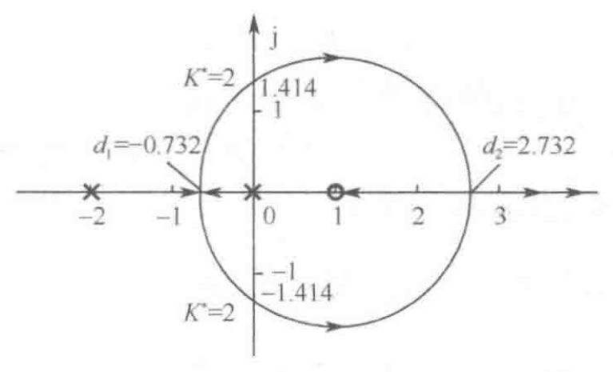

> Image description: A technical diagram showing the root locus for the characteristic equation $1 + \frac{K^*(1-s)}{s(s+2)} = 0$. The plot is set on a complex plane with a horizontal real axis and a vertical imaginary axis labeled "$j$". The root locus consists of a circle centered at $x=1$ with a radius of $\sqrt{2} \approx 1.414$, as indicated by the labels $1.414$ and $-1.414$ on the $j$-axis. Arrows along the circular path indicate the direction of increasing gain $K^*$. Two specific points are marked on the real axis: a starting point at $d_1 = -0.732$ and an ending point at $d_2 = 2.732$. An "X" marks a pole at $-2$, and a circle marks a zero at $1$. The labels $K^*=2$ appear at the intersections of the locus with the imaginary axis, signifying the critical gain for stability.
图 4－14－1 $1+\frac{K^{*}(1-s)}{s(s+2)}=0$ 零度根轨迹图

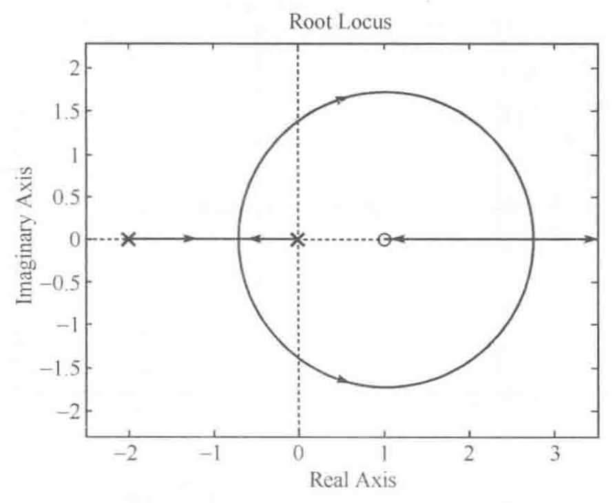

> Image description: A root locus plot is shown in Figure 4-14-1, representing the characteristic equation $1 + \frac{K^*(1-s)}{s(s+2)} = 0$. The graph features a horizontal "Real Axis" and a vertical "Imaginary Axis," with values ranging from -2 to 3 on the real axis and -2 to 2 on the imaginary axis. The plot displays two poles, marked by 'x' symbols at $s=0$ and $s=-2$, and one zero, marked by an 'o' symbol at $s=1$. Root locus branches originate from the poles and move toward the zero or infinity. Specifically, a segment of the locus exists on the real axis between -2 and 0, with arrows indicating movement toward the origin. Another branch emerges from the origin, forms a large circle that crosses the imaginary axis, and eventually converges at the zero at $s=1$. This diagram illustrates how system poles shift as the gain $K^*$ varies.
图 4－14－2 $1+\frac{K^{*}(1-s)}{s(s+2)}=0$ 零度根轨迹图（MATLAB）

MATLAB 程序 ：exe414．m
$\mathrm{G}=\operatorname{zpk}([1],[-20],-1) ;$
\％建立开环传递函数模型
rlocus（G）；$\quad \operatorname{axis}([-1.53 .5-22])$ ；
\％绘制根轨迹
4－15 设控制系统如图 4－40 所示，试概略绘出 $K_{t}=0,0<K_{t}<1, K_{t}>1$ 时的根轨迹。若取 $K_{t}=0.5$ ，试求出 $K=10$ 时的闭环零、极点，并估算系统的动态性能。

解 本题研究闭环根轨迹的绘制及综合应用。
由图4－40所示的结构图可知，系统的开环传递函数为

$$
G(s) H(s)=\frac{K\left(1+K_{t} s\right)}{s(s+1)}=\frac{K K_{t}\left(s+\frac{1}{K_{t}}\right)}{s(s+1)}
$$

（1）当 $K_{t}=0$ 时系统的根轨迹。开环传递函数为

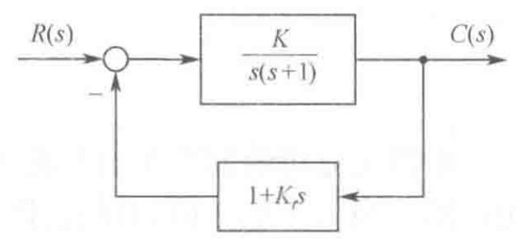

> Image description: This image shows a control system block diagram labeled as "图 4－40 控制系统结构图". The system is represented as a closed-loop feedback loop. On the left, an input signal $R(s)$ enters a summing junction (indicated by a circle). From this junction, the signal flows forward into a primary transfer function block containing the expression $\frac{K}{s(s+1)}$. The output of this block is the system output variable $C(s)$. A feedback path branches off from the output $C(s)$ and passes through a second block containing the expression $1 + K_rs$. This feedback signal returns to the summing junction with a negative sign ($-$), indicating a negative feedback configuration. Arrows indicate the unidirectional flow of signals throughout the loop, moving from input to output and back through the feedback path.
图 4－40 控制系统结构图

$$
G(s) H(s)=\frac{K}{s(s+1)}
$$

（1）根轨迹的分支和起点与终点。由于 $n=2, m=0, n-m=2$ ，故根轨迹有两条分支，其
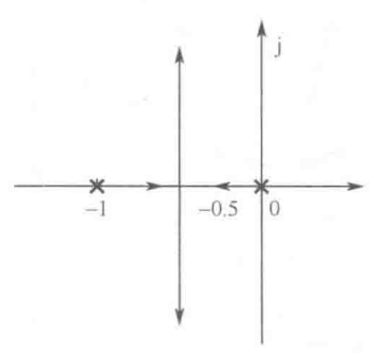

> Image description: A technical diagram illustrating the root locus of a control system characteristic equation, captioned as "图 4－15－1 $1+\frac{K}{s(s+1)}=0$". The figure features a complex plane with a horizontal real axis and a vertical imaginary axis labeled "$j$". Two poles are marked on the real axis with "x" symbols: one at the origin (labeled "0") and another at $-1$. Small arrows point inward from these two points toward each other, indicating the direction of the root locus branches along the real axis. The axes are represented by lines with arrowheads pointing in both positive and negative directions. This figure represents a standard engineering plot used to analyze system stability based on the gain $K$ for a second-order system with poles at $s=0$ and $s=-1$.

图 4－15－1 $\quad 1+\frac{K}{s(s+1)}=0$
概略根轨迹图 $\left(K_{1}=0\right)$起点分别为 $p_{1}=0, p_{2}=-1$ ，其终点都为无穷远处。
（2）实轴上的根轨迹。实轴上的根轨迹分布区为 $[-1,0]$ 。
（3）根轨迹的分离点。根轨迹的分离点坐标满足

$$
\frac{1}{d}+\frac{1}{d+1}=0
$$

解得

$$
d=-0.5
$$

由以上分析绘制系统的概略根轨迹如图 4－15－1 所示。其仿真图如图4－15－2所示。
（2）当 $0<K_{t}<1$ 时系统的根轨迹。开环传递函数为


<!-- source_pdf_page: 111 -->
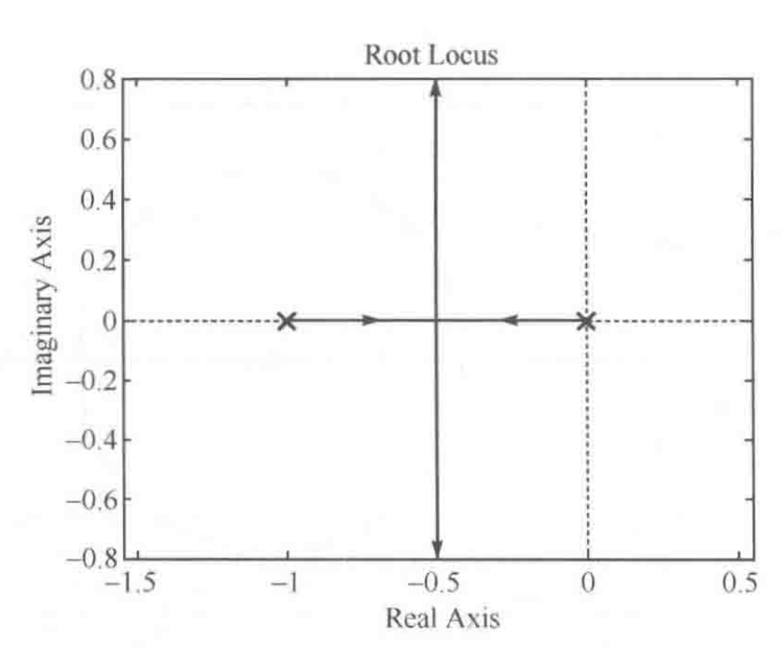

> Image description: A root locus plot is shown in Figure 4-15-2, illustrating the stability of a system defined by the characteristic equation $1 + \frac{K(1+K_t s)}{s(s+1)} = 0$ when $K_i=0$. The graph features a horizontal "Real Axis" and a vertical "Imaginary Axis." Two open-loop poles are marked with 'x' symbols on the real axis at $s = 0$ and $s = -1$. Root locus branches originate from these poles and move toward each other along the real axis. They meet at a breakaway point located at $s = -0.5$, indicated by arrows pointing inward. From this point, the branches diverge vertically in opposite directions, moving parallel to the imaginary axis toward positive and negative infinity. This indicates that as the gain increases, the system's closed-loop poles move from the real axis into the complex plane, affecting the damping and stability of the engineering system.
图 4－15－2 $\quad K_{i}=0$ 时 $1+\frac{K\left(1+K_{t} s\right)}{s(s+1)}=0$
根轨迹图（MATLAB）

$$
\begin{gathered}
G(s) H(s)=\frac{K\left(1+K_{t} s\right)}{s(s+1)}=\frac{K K_{t}\left(s+\frac{1}{K_{t}}\right)}{s(s+1)} \\
\left(0<K_{t}<1\right)
\end{gathered}
$$

（1）根轨迹的分支和起点与终点。由于 $n=2, m=1, n-m=1$ ，故根轨迹有两条分支，其起点分别为 $p_{1}=0, p_{2}=-1$ ，其终点分别为 $z=-\frac{1}{K_{t}}$ 和无穷远处。

由于 $0<K_{t}<1$ ，故负实零点 $z=-\frac{1}{K_{t}}$必位于开环极点 0 和 -1 之左。
（2）实轴上的根轨迹。实轴上的根轨迹分布区为 $\left(-\infty,-\frac{1}{K_{t}}\right]$ 和 $[-1,0]$ 。
（3）根轨迹的分离点。根轨迹的分离点坐标满足

$$
\frac{1}{d}+\frac{1}{d+1}=\frac{1}{d+\frac{1}{K_{t}}}
$$

故有 $d^{2}+\frac{2}{K_{t}} d+\frac{1}{K_{t}}=0$ ，解得

$$
d_{1,2}=\frac{-1 \pm \sqrt{1-K_{t}}}{K_{t}}
$$

由以上分析绘制系统的根轨迹如图 4－15－3 所示。在 $0<K_{t}<1$ 时，根轨迹的复数部分为一圆。当 $K_{t}=0.5$ 时，其仿真图如图 4－15－4 所示。

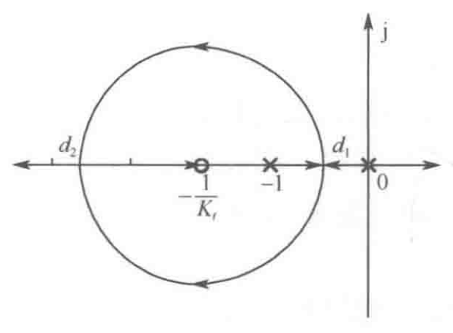

> Image description: This image is a technical diagram showing a root locus plot in the complex s-plane, used for analyzing system stability and performance in control engineering. The horizontal axis represents the real part ($\sigma$) and the vertical axis represents the imaginary part ($j\omega$). The figure displays a circular trajectory centered on the negative real axis. Key labels include an open-circle pole located at $-1/K_t$ and a cross-marked zero (or pole) at $-1$. The circle's diameter extends along the real axis between two points marked $d_2$ (the leftmost intersection) and $d_1$ (the rightmost intersection). An origin point is marked as $0$ on the vertical axis. Arrows on the circular path indicate the direction of movement as a parameter changes. According to the caption, this circle represents the complex part of the root locus when $0 < K_t < 1$.
图 4－15－3 $1+\frac{K\left(1+K_{t} s\right)}{s(s+1)}=0$
概略根轨迹图（ $0<K_{t}<1$ ）

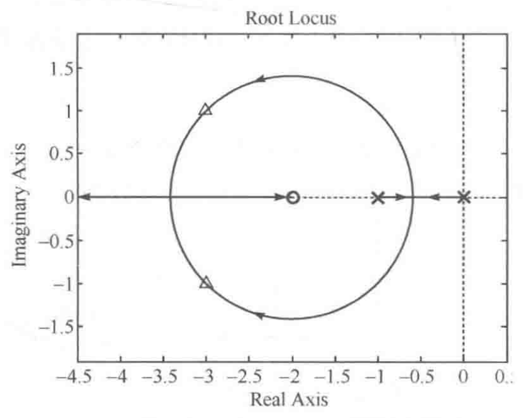

> Image description: This image shows a Root Locus plot on a complex plane, with the horizontal axis labeled "Real Axis" and the vertical axis labeled "Imaginary Axis." The plot illustrates the trajectories of system poles as a gain parameter varies. The locus features several key elements: an open circle at -2 (representing a zero), and crosses at 0 and -1 (representing open-loop poles). A circular trajectory emerges from these points, extending into the complex plane with arrows indicating the direction of movement. The circle reaches peak imaginary values of approximately $\pm 1.3$ and minimum real values around -3. Two small triangles mark specific points on this circular path at roughly $-3 \pm j1$. Additionally, a straight-line segment extends from the zero at -2 toward negative infinity along the real axis. According to the caption, this is a schematic root locus for the characteristic equation $1+\frac{K(1+K_t s)}{s(s+1)}=0$, where $0 < K_t < 1$.
图 4－15－4 $\quad K_{t}=0.5$ 时 $1+\frac{K\left(1+K_{t} s\right)}{s(s+1)}=0$
根轨迹图（MATLAB）

（3）当 $K_{t}>1$ 时系统的开环传递函数为


<!-- source_pdf_page: 112 -->
$$
G(s) H(s)=\frac{K\left(1+K_{t} s\right)}{s(s+1)}=\frac{K K_{t}\left(s+\frac{1}{K_{t}}\right)}{s(s+1)} \quad\left(K_{t}>1\right)
$$

（1）根轨迹的分支和起点与终点。由于 $n=2, m=1, n-m=1$ ，故根轨迹有两条分支，其起点分别为 $p_{1}=0, p_{2}=-1$ ，其终点分别为 $z=-\frac{1}{K_{t}}$ 和无穷远处。

由于 $K_{t}>1$ ，故负实零点 $z=-\frac{1}{K_{t}}$ 必位于开环极点 0 和 -1 之间。
（2）实轴上的根轨迹。实轴上的根轨迹分布区为 $[-1,-\infty),\left[0,-\frac{1}{K_{t}}\right]$ 。
由以上分析绘制系统的概略根轨迹如图 4－15－5 所示。当 $K_{t}=2$ 时，其仿真图如图 4－15－6 所示。
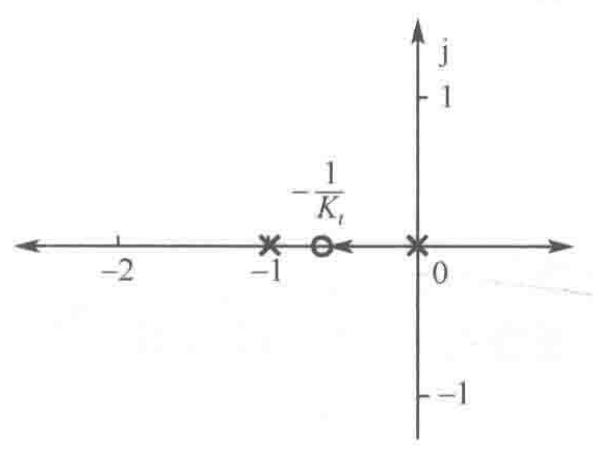

> Image description: A technical diagram showing a root locus plot on the complex s-plane. The horizontal axis represents the real part, with markings at $-2$, $-1$, and $0$. The vertical axis represents the imaginary part (labeled as $j$), with markings at $1$ and $-1$. Two poles are marked with "x" symbols: one at the origin $(0, 0)$ and another at $-1$ on the real axis. A zero is indicated by a small circle located between these two poles, labeled as $-\frac{1}{K_t}$. A horizontal line with arrows pointing in both directions connects the pole at $0$ and the pole at $-1$, passing through the zero. This represents the root locus path along the real axis for a control system's stability analysis. The caption indicates this is Figure 4-15-5, illustrating the system's schematic root locus based on prior analysis.

图 4－15－5 $1+\frac{K\left(1+K_{t} s\right)}{s(s+1)}=0$
概略根轨迹图（ $K_{t}>1$ ）
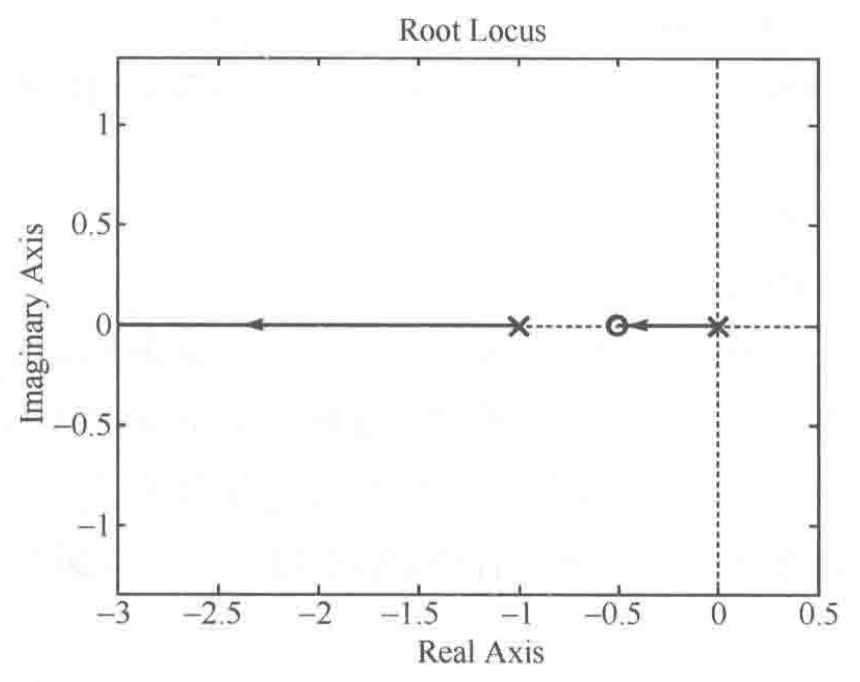

> Image description: A root locus plot is shown in Figure 4-15-5, representing the characteristic equation $1+\frac{K(1+K_ts)}{s(s+1)}=0$ for $K_t > 1$. The graph features a horizontal Real Axis (x-axis) ranging from -3 to 0.5 and a vertical Imaginary Axis (y-axis) ranging from -1 to 1. Three critical points are marked on the real axis: an open circle at approximately -0.5, representing a zero, and two crosses ('x') located at 0 and -1, representing poles. The root locus consists of segments along the real axis. One segment exists between the pole at 0 and the zero at -0.5, with an arrow pointing left toward the zero. Another segment begins at the pole at -1 and extends infinitely to the left (toward negative infinity), indicated by a left-pointing arrow. The dashed line indicates regions where the root locus is not present on the real axis.

图 4－15－6 $K_{t}=2$ 时 $1+\frac{K\left(1+K_{t} s\right)}{s(s+1)}=0$
阶跃响应曲线（MATLAB）
（4）$K_{t}=0.5, K=10$ 时闭环系统零、极点及动态性能。系统的开环传递函数

$$
G(s) H(s)=\frac{10(1+0.5 s)}{s(s+1)}=\frac{5(s+2)}{s(s+1)}
$$

闭环传递函数

$$
\Phi(s)=\frac{G(s)}{1+G(s) H(s)}=\frac{10}{s(s+1)+5(s+2)}
$$

则系统的闭环特征方程为

$$
D(s)=s(s+1)+5(s+2)=s^{2}+6 s+10=0
$$

此时，系统的闭环极点为 $\lambda_{1,2}=-3 \pm \mathrm{j} 1$ ，无闭环零点。
由系统的闭环极点可知 $\zeta \omega_{n}=3, \omega_{n} \sqrt{1-\zeta^{2}}=1$ ，可得

$$
\omega_{n}=\sqrt{10}=3.16, \quad \zeta=0.95, \quad \omega_{d}=1
$$

所以，系统的动态性能指标如下：
调节时间 $t_{s}=\frac{3.5}{\zeta \omega_{n}}=\frac{3.5}{3}=1.17 \mathrm{~s}(\Delta=0.05), t_{s}=\frac{4.4}{\zeta \omega_{n}}=1.47 \mathrm{~s}(\Delta=0.02)$
超调量 $\sigma \%=\mathrm{e}^{-\pi \xi / \sqrt{1-\xi^{2}}} \times 100 \%=0$


<!-- source_pdf_page: 113 -->
MATLAB 程序 ：exe415．m

```
G1 = zpk([],[0 -1],1); % kt = 0 时,开坏传递函数模型
G2 = zpk ([-2],[0 -1],1); % kt = 0.5 时,开环传递函数模型
G3 = zpk ([-0.5],[0-1],1); % kt = 2 时,开环传递函数模型
figure (1)
    rlocus(G1);
figure (2)
    rlocus(G2);
    hold on
    rlocus(G2,5);
```

figure (3)
rlocus(G3);
num $=[10]$; den $=\left[\begin{array}{lll}1 & 6 & 10\end{array}\right]$; 建立闭环传递函数模型
sys $=\mathrm{tf}$ (num, den) ;
$\mathrm{t}=0$ : $0.01: 10$;
figure（4）
step（ $s y s, t$ ）；grid \％求取系统的单位阶跃响应
由图 4－15－4 可以看出，当 $K_{t}=0.5, K=10$ ，即根轨迹增益 $K^{*}=5$ 时的闭环系统极点为 $s_{1,2}=-3 \pm \mathrm{j} 1$（图中三角所示），无闭环零点。

由图 4－15－7 可以看出，超调量 $\sigma \%=0$ ，调节时间 $t_{\mathrm{s}}=1.66 \mathrm{~s}$（ $\Delta=2 \%$ ）。

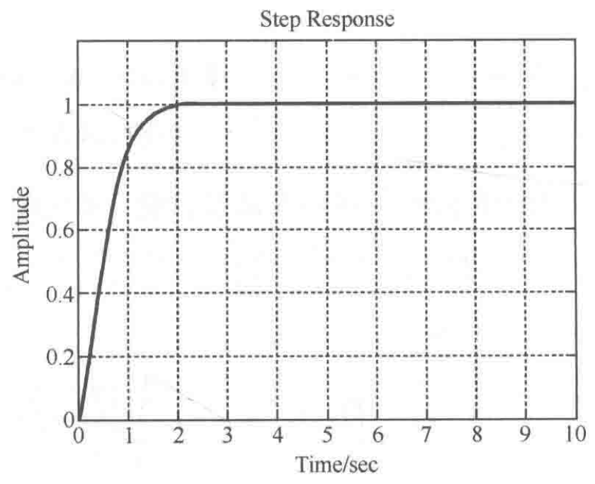

> Image description: This image shows a "Step Response" graph, which is a standard engineering plot used to analyze the transient behavior of a control system. The horizontal x-axis represents "Time/sec," ranging from 0 to 10 seconds, while the vertical y-axis represents "Amplitude," scaled from 0 to 1. The figure displays a single smooth curve starting at the origin (0,0) and rising asymptotically toward a steady-state value of 1. The response is non-oscillatory, indicating an overdamped or critically damped system. According to the provided caption, the overshoot ($\sigma\%$) is 0, meaning the signal does not exceed its final value. Additionally, the settling time ($t_s$) is specified as $1.66\text{ s}$ based on a $2\%$ error band ($\Delta=2\%$), which corresponds to the point where the curve enters and remains within a small range of the final amplitude.
图 4－15－7 $\Phi(s)=\frac{10}{s^{2}+6 s+10}$ 系统单位阶跃响应（MATLAB）

4－16 设控制系统开环传递函数为

$$
G(s)=\frac{K^{*}(s+1)}{s^{2}(s+2)(s+4)}
$$

试分别画出正反馈和负反馈系统的根轨迹图，并指出它们的稳定情况有何不同。
解 本题研究常规根轨迹和零度根轨迹的绘制与分析。
（1）负反馈系统的根轨迹。


<!-- source_pdf_page: 114 -->
（1）根轨迹的分支和起点与终点。由于 $n=4, m=1, n-m=3$ ，故根轨迹有四条分支，其起点分别为 $p_{1,2}=0, p_{3}=-2, p_{4}=-4$ ，其终点分别为 $z_{1}=-1$ 和无穷远处。
（2）实轴上的根轨迹。实轴上的根轨迹分布区为 $[-4,-\infty),[-2,-1]$ 。
（3）根轨迹的渐近线。

$$
\sigma_{a}=\frac{-2-4+1}{4-1}=-1.67, \quad \varphi_{a}= \pm \frac{\pi}{3}, \pi
$$

（4）根轨迹与虚轴的交点。系统的闭环特征方程式为

$$
\begin{aligned}
D(s) & =s^{2}(s+2)(s+4)+K^{*}(s+1) \\
& =s^{4}+6 s^{3}+8 s^{2}+K^{*} s+K^{*}=0
\end{aligned}
$$

令 $s=\mathrm{j} \omega$ ，代人上式可得

$$
(\mathrm{j} \omega)^{4}+6(\mathrm{j} \omega)^{3}+8(\mathrm{j} \omega)^{2}+K^{*}(\mathrm{j} \omega)+K^{*}=0
$$

即

$$
\left\{\begin{array}{l}
\omega^{4}-8 \omega^{2}+K^{*}=0 \\
-6 \omega^{3}+K^{*} \omega=0
\end{array}\right.
$$

因 $\omega \neq 0$ ，故可解得

$$
\omega= \pm \sqrt{2}, \quad K^{*}=12
$$

根据以上分析，画出系统的闭环根轨迹如图4－16－1
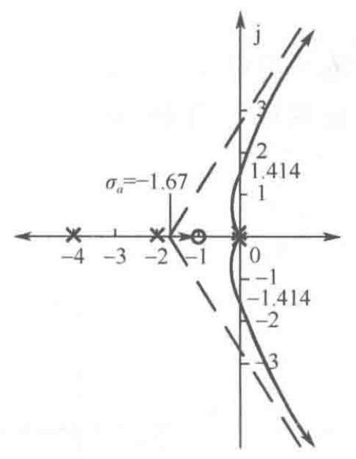

> Image description: A technical diagram showing a root locus plot in the complex s-plane, with the horizontal axis representing the real part ($\sigma$) and the vertical axis representing the imaginary part ($j\omega$). The origin is marked as 0. The plot features two open-loop poles indicated by crosses (x) on the real axis at approximately $-2$ and $-4$. A zero is indicated by a circle (o) at $-1$. The root locus consists of solid lines starting from the poles; one branch moves toward the zero, while others curve away into the right half-plane. Dashed lines indicate asymptotic boundaries. A specific point on the real axis is labeled $\sigma_a = -1.67$, marking a critical value. Numerical labels along the imaginary axis include $1, 1.414, 2,$ and $3$ (and their negative counterparts). The figure illustrates system stability and transient response characteristics based on closed-loop pole locations.

图 4－16－1 $1+\frac{K^{*}(s+1)}{s^{2}(s+2)(s+4)}=0$
概略根轨迹图
图 4－16－1 $1+\frac{K^{*}(s+1)}{s^{2}(s+2)(s+4)}=0$
略根轨迹图所示。其仿真图如图 4－16－2 所示，局部如图 4－16－3 所示。

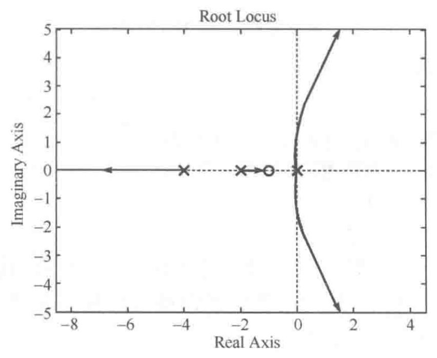

> Image description: A Root Locus plot is displayed on a coordinate system where the horizontal axis is labeled "Real Axis" and the vertical axis is labeled "Imaginary Axis." The axes range from -8 to 4 on the real axis and -5 to 5 on the imaginary axis. The plot features three markers on the real axis: two crosses (poles) located at approximately -4 and -2, and one circle (zero) located between -1 and -2. A third cross is positioned at the origin (0,0). Root locus trajectories are indicated by arrows. One branch extends from a pole at -4 moving leftward toward negative infinity along the real axis. Another set of branches originates near the origin, curving outward into the right-half plane as they move toward positive and negative imaginary values, indicating potential system instability as gain increases. The plot illustrates the movement of closed-loop poles in the s-plane.
图 4－16－2 $1+\frac{K^{*}(s+1)}{s^{2}(s+2)(s+4)}=0$
常规根轨迹图（MATLAB）

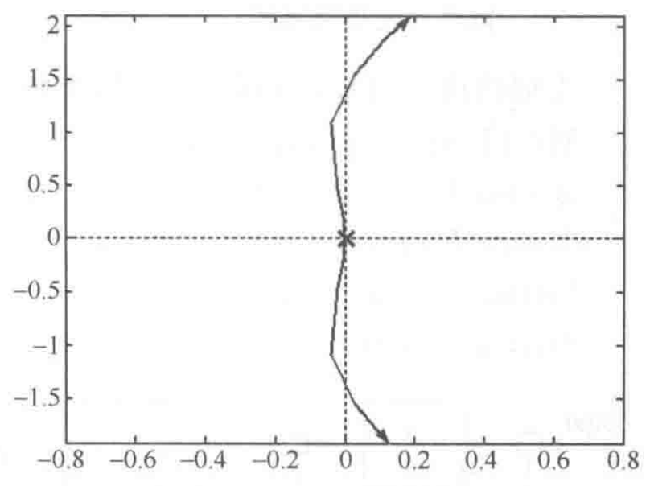

> Image description: This image shows a root locus plot generated in MATLAB for the characteristic equation $1 + \frac{K^*(s+1)}{s^2(s+2)(s+4)} = 0$. The figure features a complex plane with a horizontal real axis (ranging from -0.8 to 0.8) and a vertical imaginary axis (ranging from -1.5 to 2). The root locus consists of trajectories starting from the open-loop poles and moving toward the zeros as the gain $K^*$ increases. A double pole is visible at the origin $(0,0)$, marked with an 'x'. From this point, two branches emerge and curve symmetrically into the right-half plane (RHP). These paths are indicated by arrows pointing away from the real axis toward positive and negative imaginary values. The plot illustrates the system's stability; as the branches cross into the RHP, the system becomes unstable for those specific gain values.
图 4－16－3 常规根轨迹中间的放大部分
（MATLAB）

由根轨迹图可知，当 $0<K^{*}<12$ 时，系统稳定。
（2）正反馈系统的根轨迹。
（1）根轨迹的分支和起点与终点。由于 $n=4, m=1, n-m=3$ ，故根轨迹有四条分支，其起点分别为 $p_{1,2}=0, p_{3}=-2, p_{4}=-4$ ，其终点分别为 $z_{1}=-1$ 和无穷远处。
（2）实轴上的根轨迹。实轴上的根轨迹分布区为 $[-4,-2],[-1, \infty)$ 。
（3）根轨迹的渐近线。


<!-- source_pdf_page: 115 -->
$$
\sigma_{a}=\frac{-2-4+1}{4-1}=-1.67, \quad \varphi_{a}= \pm \frac{2 \pi}{3}, 0
$$

（4）根轨迹的分离点。根轨迹的分离点坐标满足

$$
\frac{2}{d}+\frac{1}{d+2}+\frac{1}{d+4}=\frac{1}{d+1}
$$

由试凑法可得 $d=-3.08$ 。
根据以上分析，画出系统的闭环概略零度根轨迹如图 4－16－4 所示。其仿真图如图 4－16－5 所示。

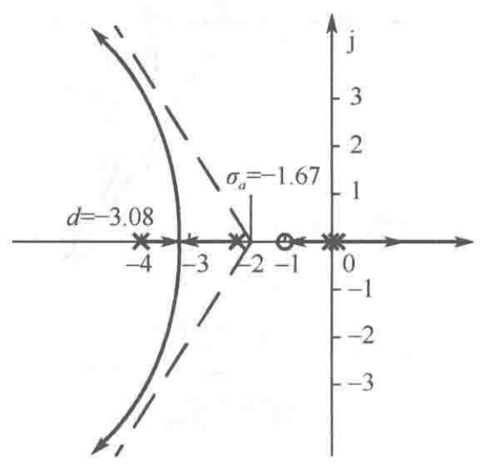

> Image description: A technical diagram showing a closed-loop root locus plot on the complex s-plane. The horizontal axis represents the real part ($\sigma$) and the vertical axis represents the imaginary part ($j\omega$). The figure displays two symmetric curved trajectories (root loci) moving leftward from the origin. One trajectory is represented by a solid line and the other by a dashed line, both terminating with arrows pointing toward negative infinity on the real axis. Key labels include: - A point on the real axis marked $d = -3.08$. - A vertical indicator marking $\sigma_a = -1.67$ on the real axis. - Crosses ($\times$) denoting open-loop poles located at approximately $0$, $-1$, and $-4$. - An open circle ($\circ$) denoting a zero located at $-1$. In engineering terms, this figure illustrates the movement of system poles as a gain parameter varies, indicating the stability and transient response characteristics of a closed-loop control system.
图 4－16－4 $\quad 1+\frac{K^{*}(s+1)}{s^{2}(s+2)(s+4)}=0$
概略零度根轨迹图

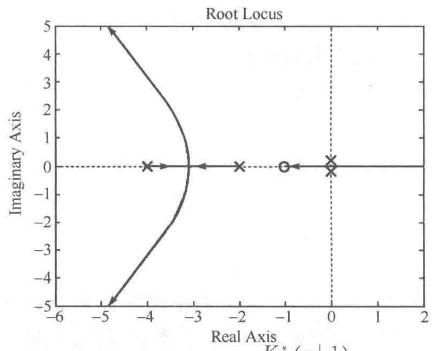

> Image description: This image shows a Root Locus plot for the characteristic equation $1 + \frac{K^*(s+1)}{s^2(s+2)(s+4)} = 0$. The graph is plotted on a complex plane where the horizontal axis represents the "Real Axis" and the vertical axis represents the "Imaginary Axis." The system's open-loop poles are marked with 'x' symbols at $s=0$ (double pole), $s=-2$, and $s=-4$. A single open-loop zero is indicated by a circle 'o' at $s=-1$. The root locus branches originate from the poles and move toward the zeros or infinity as the gain $K^*$ increases. Specifically, two branches emerge from the double pole at the origin; one moves left toward the zero at $-1$, while the other pair curves into the complex plane, moving toward the left half-plane with increasing imaginary components. The arrows on the trajectories indicate the direction of increasing $K^*$.
图 4－16－5 $1+\frac{K^{*}(s+1)}{s^{2}(s+2)(s+4)}=0$
零度根轨迹图（MATLAB）

由根轨迹图可知，当 $K^{*}>0$ 时，系统恒不稳定。
MATLAB 程序：exe416．m

| $\mathrm{G} 1=\operatorname{zpk}\left([-1],\left[\begin{array}{llll}0 & 0 & -2 & -4\end{array}\right], 1\right) ;$ | \％建立开环传递函数模型（负反馈） |
| :--- | :--- |
| $\mathrm{G2}=\operatorname{zpk}\left([-1],\left[\begin{array}{llll}0 & 0 & -2 & -4\end{array}\right],-1\right) ;$ | \％建立开环传递函数模型（正反馈） |
| figure；rlocus（G1）； | \％绘制根轨迹 |
| figure；rlocus（G2）； | \％绘制根轨迹 |


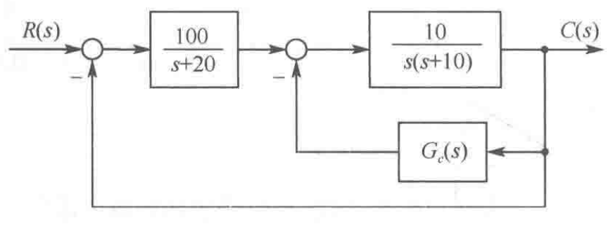

> Image description: This image is a control system block diagram labeled "图 4-41 控制系统结构图." The system consists of two feedback loops. The forward path begins with an input signal $R(s)$ entering a summing junction. This leads to a transfer function block $\frac{100}{s+20}$, which then feeds into a second summing junction. From there, the signal passes through another block $\frac{10}{s(s+10)}$ to produce the output variable $C(s)$. There are two negative feedback paths. The inner loop takes the output $C(s)$, passes it through a controller block $G_c(s)$, and feeds it back into the second summing junction. The outer loop feeds the output $C(s)$ directly back to the first summing junction. Arrows indicate the unidirectional flow of signals throughout the system, representing a standard closed-loop control architecture used in engineering to maintain stability and accuracy.
图 4－41 控制系统结构图

4－17 设控制系统如图 4－41 所示，其中 $G_{c}(s)$ 是为改善性能而加入的校正装置。若 $G_{c}(s)$ 可从 $K_{t} s, K_{a} s^{2}$ 和 $K_{a} s^{2} /(s+20)$ 三种传递函数中任选一种，你选择哪一种？为什么？

解 本题考查参数根轨迹的绘制，并通过根轨迹研究系统性能。
由系统的结构图可知，系统的开环传递函数为

$$
G(s)=\frac{100}{s+20} \cdot \frac{\frac{10}{s(s+10)}}{1+\frac{10 G_{c}(s)}{s(s+10)}}=\frac{1000}{(s+20)\left[s^{2}+10 s+10 G_{c}(s)\right]}
$$

则系统的闭环特征方程为

$$
D(s)=(s+20)\left[s^{2}+10 s+10 G_{c}(s)\right]+1000
$$


<!-- source_pdf_page: 116 -->
$$
=s^{3}+30 s^{2}+200 s+1000+10 G_{c}(s)(s+20)=0
$$

系统的等效开环传递函数为

$$
G_{1}(s)=\frac{10 G_{c}(s)(s+20)}{s^{3}+30 s^{2}+200 s+1000}=0
$$

（1）当 $G_{c}(s)=K_{t} s$ 时。

$$
G_{1}(s)=\frac{10 K_{t} s(s+20)}{(s+23.25)(s+3.375+\mathrm{j} 5.63)(s+3.375-\mathrm{j} 5.63)}
$$

根据绘制常规根轨迹的法则，可得此时的概略参数根轨迹如图 4－17－1 所示。其中分离点方程

$$
d^{4}+40 d^{3}+400 d^{2}-2000 d-20041.5=0
$$

可用试探法求得

$$
d=-6.3
$$

在分离点处，根轨迹增益可用模值条件求出为

$$
K_{t}=0.79
$$

在这种情况下，可以在 $0<K_{t}<0.79$ 范围内，通过改变 $K_{t}$ 的值使系统的主导极点具有 $\zeta=0.707$ 的最佳阻尼比，如图 4－17－2 所示。
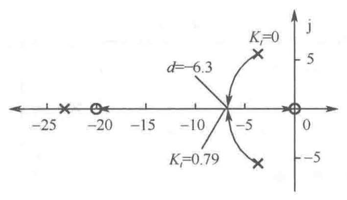

> Image description: This image is a root locus plot from an engineering textbook, depicting the movement of system poles in the complex s-plane. The horizontal axis represents the real part ($\sigma$) and the vertical axis represents the imaginary part ($j\omega$). Key visible elements include: * **Axes:** A horizontal axis with values ranging from $-25$ to $0$ and a vertical axis labeled "$j$" with markers at $5$, $0$, and $-5$. * **Poles/Zeros:** Marked by "x" symbols on the real axis (approximately at $-23$) and at complex locations. A circle with a dot is located at approximately $-21$ and at the origin $(0,0)$. * **Loci:** Curved lines (root loci) originate from poles and converge toward a point on the real axis labeled $d = -6.3$. * **Variables:** Labels $K_t=0$ and $K_t=0.79$ indicate specific gain values along the locus paths, showing how the dominant poles shift as the parameter $K_t$ varies.

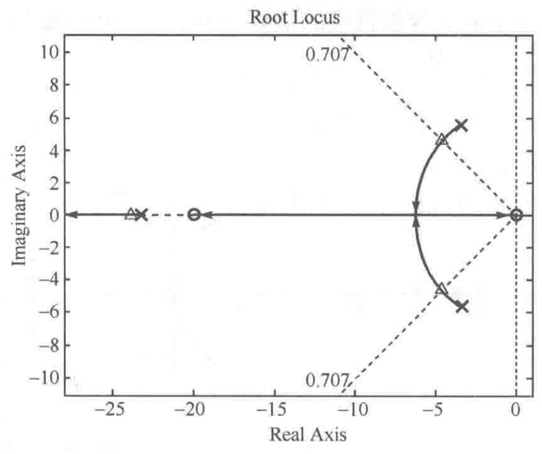

> Image description: A root locus plot is presented on a coordinate system where the horizontal axis represents the "Real Axis" and the vertical axis represents the "Imaginary Axis." The real axis ranges from approximately -27 to 0, while the imaginary axis spans from -10 to 10. The plot features several critical points: an open circle (pole) at the origin $(0,0)$, another open circle at approximately $-20$, and crosses (zeros) located near $-23$ and symmetrically around $\pm 5j$. Solid lines with arrows indicate the trajectory of the roots as a gain parameter increases. Two dashed radial lines originate from the origin, labeled "0.707," representing constant damping ratio ($\zeta$) lines. The root locus branches curve away from the origin, intersecting these $0.707$ lines at specific points marked by triangles. This visualization is used in control engineering to determine the stability and transient response of a system based on the placement of its dominant poles.
图 4－17－2 $1+\frac{10 K_{t} s(s+20)}{s^{3}+30 s^{2}+200 s+1000}=0$

参数根轨迹图（MATLAB）
（2）当 $G_{c}(s)=K_{a} s^{2}$ 时。

$$
G_{1}(s)=\frac{10 K_{a} s^{2}(s+20)}{(s+23.25)(s+3.375+\mathrm{j} 5.63)(s+3.375-\mathrm{j} 5.63)}
$$

根据绘制常规根轨迹的法则，可得到此时的概略参数根轨迹如图 4－17－3 所示。其仿真图如图 4－17－4 所示。

这种情况下，由于 $K_{a}$ 的值越大，系统闭环极点越靠近虚轴，从而使稳定性越差，所以不能通过改变 $K_{a}$ 的值来使系统的性能达到最佳。


<!-- source_pdf_page: 117 -->
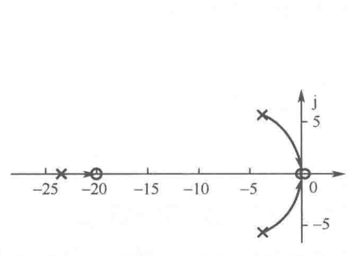

> Image description: This image shows a root locus plot on the complex s-plane, used in control engineering to analyze system stability. The horizontal axis represents the real part ($\sigma$), with labels at $-25$, $-20$, $-15$, $-10$, $-5$, and $0$. The vertical axis represents the imaginary part ($j\omega$), with markers at $5$ and $-5$. The plot features several critical points: an open-loop pole (marked as a circle) at $s = -20$ and another at the origin $s = 0$. Open-loop zeros (marked as crosses) are located at $s = -23$ (approximately) and in a complex conjugate pair near $s = -4 \pm j5$. The root locus branches, indicated by arrows, originate from the poles and move toward the zeros. One branch moves along the real axis from $-20$ toward $-23$, while others curve from the origin toward the complex zeros, illustrating how the closed-loop poles shift as gain $K_a$ varies.

图 4－17－3 $1+\frac{10 K_{a} s^{2}(s+20)}{s^{3}+30 s^{2}+200 s+1000}=0$
概略参数根轨迹图

| Root Locus |  |  |  |  |
| ---: | :--- | ---: | ---: | :---: |

图 4－17－4 $1+\frac{10 K_{a} s^{2}(s+20)}{s^{3}+30 s^{2}+200 s+1000}=0$
参数根轨迹图（MATLAB）
（3）当 $G_{c}(s)=\frac{K_{a} s^{2}}{s+20}$ 时。

$$
G_{1}(s)=\frac{10 K_{a} s^{2}}{(s+23.25)(s+3.375+\mathrm{j} 5.63)(s+3.375-\mathrm{j} 5.63)}
$$

根据绘制常规根轨迹的法则，可得到此时的概略参数根轨迹如图 4－17－5 所示。其仿真图如图 4－17－6 所示。

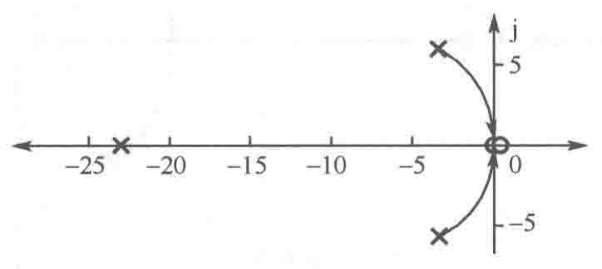

> Image description: A technical plot showing a root locus in the complex s-plane. The horizontal axis represents the real part ($\sigma$), with numerical labels at intervals of -5, ranging from 0 to -25. The vertical axis is labeled $j$, representing the imaginary part, with markings at 5 and -5. Three "x" markers denote open-loop poles: one located on the real axis at approximately -23, and a complex conjugate pair located near $-3 \pm j6$. A small circle at the origin $(0,0)$ represents an open-loop zero. Curved root locus trajectories originate from the poles and converge toward the zero. Specifically, the branches from the complex poles curve inward to meet at the origin, while the branch from the real pole moves rightward along the axis toward the origin. The figure illustrates the movement of closed-loop poles as a system gain varies.
图 4－17－5 $1+\frac{10 K_{a} s^{2}}{s^{3}+30 s^{2}+200 s+1000}=0$
概略参数根轨迹图

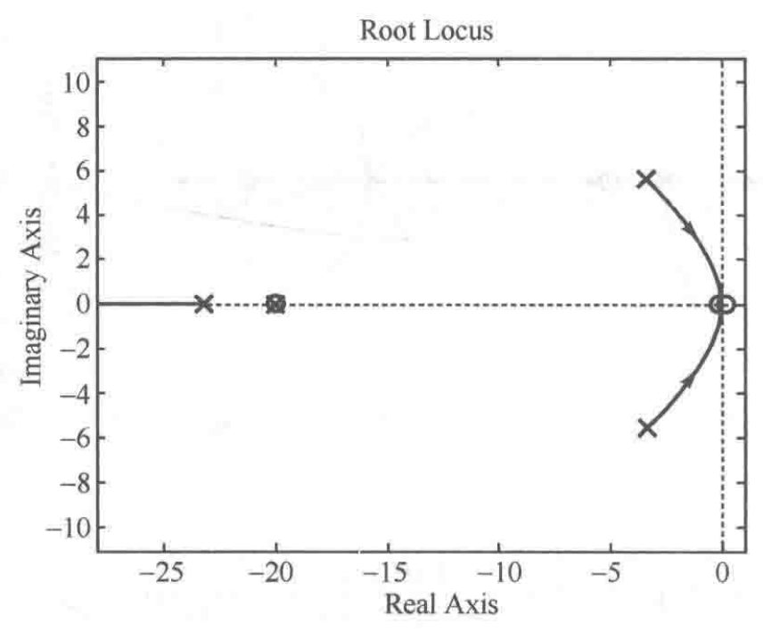

> Image description: A root locus plot is shown in Figure 4-17-5, representing the characteristic equation $1+\frac{10 K_{a} s^{2}}{s^{3}+30 s^{2}+200 s+1000}=0$. The graph features a horizontal "Real Axis" and a vertical "Imaginary Axis," both scaled from approximately -27 to 1 in the real direction and -10 to 10 in the imaginary direction. Three poles, marked with 'x', are visible: one at approximately $s = -23$ and two complex conjugate poles near $s = -3 \pm 6j$. A zero, marked with a circle 'o', is located at the origin ($s=0$). The root locus branches originate from the poles and move toward the zeros as the gain increases. Specifically, arrows indicate that the paths from the complex poles curve inward to meet at the origin, while a segment of the real axis between $s = -23$ and $s = -20$ is also part of the locus.
图 4－17－6 $1+\frac{10 K_{a} s^{2}}{s^{3}+30 s^{2}+200 s+1000}=0$
参数根轨迹图（MATLAB）

这种情况下，也不能通过改变 $K_{a}$ 的值来使系统的性能达到最佳。
通过以上分析，最终选择第一种情况，即 $G_{c}(s)=K_{t} s$ 。
MATLAB 程序：exe417．m
\％建立等效开环传递函数模型
$\mathrm{G} 1=\mathrm{zpk}([0-20], \quad[-23.25-3.375-5.625 \mathrm{i}-3.375+5.625 \mathrm{i}], 1) ;$


<!-- source_pdf_page: 118 -->
$$
\begin{array}{ll}
\mathrm{G} 2=\mathrm{zpk}\left(\left[\begin{array}{ll}
0 & 0
\end{array}-20\right],\right. & [-23.25-3.375-5.625 \mathrm{i}-3.375+5.625 \mathrm{i}], 1) ; \\
\mathrm{G} 3=\mathrm{zpk}([00], & [-23.25-3.375-5.625 \mathrm{i}-3.375+5.625 \mathrm{i}], 1) ; \\
\mathrm{z}=0.707 ; &
\end{array}
$$

\％绘制相应系统的根轨迹

```

figure（1）
1)
    rlocus(G1); sgrid(z,'new') %取阻尼比为0.707
    K=3.02; Kt=K/10; % 最佳阻尼比对应的根轨迹增益, Kt=K/10
    hold on; rlocus(G1,K) % 阻尼比为0.707时, 系统的闭环特征根
```

figure（2）
rlocus(G2) ;
figure（3）
rlocus（G3）；
\％采用方案 1 时，系统的时间响应

```
num1 = [100];
den1 = [1 20];
num2 = [10];
den2 = [1 10 0];
num3 = [Kt 0];
den3 = [0 0 1 ];
[numf, denf] = feedback (num2, den2, num3, den3)
[numc,denc] = series(num1,den1, numf, denf);
[num, den] = cloop(numc, denc);
sys = tf(num, den); t=0:0.001:5;
figure(4)
    step(sys,t); grid on;
```

在采用 $G_{c}(s)=K_{t} s$ 的参数根轨迹图（图4－17－2）上，可以得出分离点 $d=-6.29$ ，其相应的根轨迹增益 $K^{*}=7.89$ ，此时 $K_{t}=0.789$ ；然后作 $\zeta=0.707$ 阻尼比线，其与根轨迹的交点为主导极点 $s_{1,2}=-4.58 \pm \mathrm{j} 4.58$（如图中 $\triangle$ 所示，另一个极点为 $s_{3}=-23.9$ ），相应的根轨迹增益 $K^{*}=3.02$ ，此时 $K_{t}=0.302$ ；最后应用 MATLAB 软件包，可得其单位阶跃响应如图4－17－7所示，其动态性能为

$$
\begin{aligned}
\sigma \% & =4.12 \%, \quad t_{p}=0.737 \mathrm{~s} \\
t_{s} & =0.964 \mathrm{~s} \quad(\Delta=2 \%)
\end{aligned}
$$

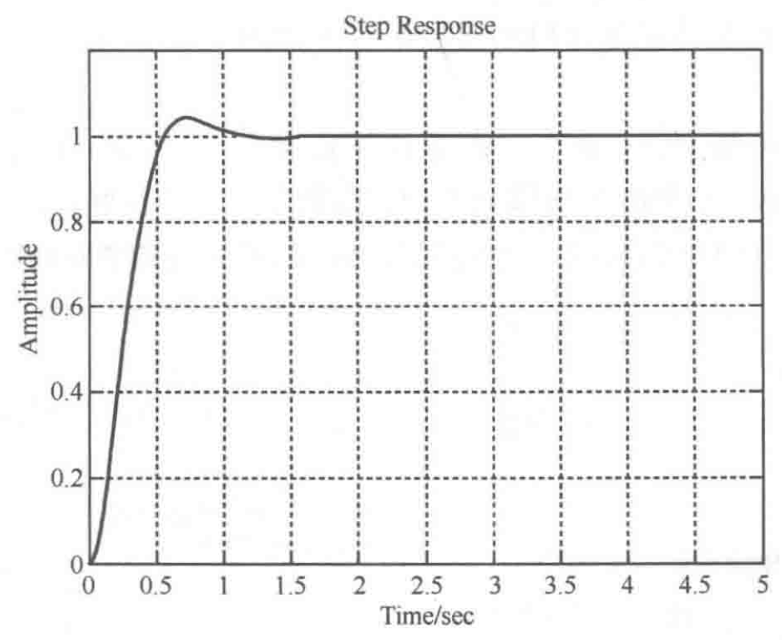

> Image description: A textbook figure titled "Step Response" displays a time-domain plot of a system's output. The horizontal x-axis is labeled "Time/sec," ranging from 0 to 5 seconds with major grid increments every 0.5 seconds. The vertical y-axis is labeled "Amplitude," ranging from 0 to slightly above 1, with dashed grid lines at intervals of 0.2. The plot shows a single continuous curve starting at the origin (0,0). The response rises sharply, overshooting the steady-state value of 1.0 at approximately 0.6 seconds, reaching a peak amplitude of roughly 1.05. It then exhibits a slight oscillation before settling and stabilizing at an amplitude of 1.0 from about 1.5 seconds onward. According to the caption, this represents the system's time response using a controller $G_{c}(s)=K_{t} s$ with $K_{t}=0.302$, simulated in MATLAB.
图 4－17－7 采用 $G_{c}(s)=K_{t} s$ 时系统的时间响应（ $K_{t}=0.302$ ，MATLAB）


<!-- source_pdf_page: 119 -->
应当指出：应用 MATLAB 软件包求单位阶跃响应时，闭环极点在参数根轨迹上确定，而闭环零点应采用原系统的闭环零点。本例无闭环零点。

4－18 设系统如图 4－42 所示。试作闭环系统根轨迹，并分析 $K$ 值变化对系统在阶跃扰动作用下的响应 $c_{n}(t)$ 的影响。

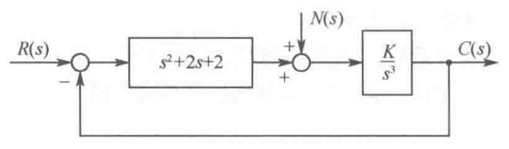

> Image description: This image shows a control system block diagram in the s-domain. The input signal is labeled $R(s)$, which enters a summing junction with a negative feedback loop from the output $C(s)$. The forward path consists of two main blocks and an additive disturbance input $N(s)$. The first block contains the transfer function $s^2 + 2s + 2$. Following this is another summing junction where $N(s)$ is added to the signal. The final block in the chain has the transfer function $\frac{K}{s^3}$, leading to the output $C(s)$. Arrows indicate a unidirectional flow from left to right through the blocks, with a return path completing the feedback loop. In engineering terms, this represents a closed-loop system where $K$ is a gain parameter. The accompanying Chinese caption asks for the root locus of the closed-loop system and an analysis of how changes in $K$ affect the response $c_n(t)$ under step disturbances.
图4－42 控制系统结构图

解 由题意可知

$$
n(t)=1(t), \quad N(s)=\frac{1}{s}
$$

在扰动作用下，系统的闭环传递函数为

$$
\Phi_{n}(s)=\frac{K}{s^{3}+K\left(s^{2}+2 s+2\right)}
$$

系统的闭环特征方程为

$$
D(s)=s^{3}+K\left(s^{2}+2 s+2\right)=0
$$

系统的等效开环传递函数为

$$
G_{1}(s)=\frac{K\left(s^{2}+2 s+2\right)}{s^{3}}=\frac{K(s+1+\mathrm{j})(s+1-\mathrm{j})}{s^{3}}
$$

根据绘制根轨迹的法则可得
（1）根轨迹的分支和起点与终点。由于 $n=3, m=2, n-m=1$ ，故根轨迹有三条分支，其起点分别为 $p_{1,2,3}=0$ ，其终点分别为 $z_{1,2}=-1 \pm \mathrm{j}$ 和无穷远处。
（2）实轴上的根轨迹。实轴上的根轨迹分布区为 $[0,-\infty)$ 。
（3）根轨迹与虚轴的交点。系统的闭环特征方程式为

$$
D(s)=s^{3}+K\left(s^{2}+2 s+2\right)=0
$$

令 $s=\mathrm{j} \omega$ ，代人上式可得

即

$$
(\mathrm{j} \omega)^{3}+K\left[(\mathrm{j} \omega)^{2}+2(\mathrm{j} \omega)+2\right]=0
$$

$$
\left\{\begin{array}{l}
-\omega^{3}+2 K \omega=0 \\
-K \omega^{2}+2 K=0
\end{array}\right.
$$

因 $\omega \neq 0$ ，故可解得交点坐标为

$$
\omega= \pm \sqrt{2}= \pm 1.414, \quad K=1
$$

根据以上分析，画出系统的闭环概略参数根轨迹如图 4－18－1 所示。其仿真图如图 4－18－2所示。

由系统的根轨迹可知：当 $0<K<1$ 时，系统不稳定，$c_{n}(t)$ 发散；而当 $K>1$ 时，系统稳定， $c_{n}(t)$ 收敛；当 $K$ 值在 $K>1$ 基础上继续增大时，系统的稳定性变好，$c_{n}(t)$ 收玫加快；当 $K \rightarrow \infty$时，系统的阻尼比趋近于 0.707 ，响应 $c_{n}(t)$ 的振荡性减弱，系统的调节时间减小，快速性得到改善。

MATLAB 程序：exe418．m
\％绘制参数根轨迹

$$
\begin{array}{ll}
G=\mathrm{zpk}\left([-1-i-1+i],\left[\begin{array}{lll}
0 & 0 & 0
\end{array}\right], 1\right) ; & \text { \% 建立等效开环传递函数模型 } \\
\text { figure }(1) & \text { \% 绘制根轨迹 }
\end{array}
$$

$\% K=2$ 时 系统的单位阶跃扰动响应

$$
\begin{array}{ll}
\text { numg }=\left[\begin{array}{ll}
2
\end{array}\right] ; & \text { deng }=\left[\begin{array}{llll}
1 & 0 & 0 & 0
\end{array}\right] ; \\
\text { numf }=\left[\begin{array}{lll}
1 & 2 & 2
\end{array}\right] ; & \text { denf }=\left[\begin{array}{lll}
0 & 0 & 1
\end{array}\right] ;
\end{array}
$$


<!-- source_pdf_page: 120 -->
```
[num1, den1] = feedback(numg, deng, numf, denf)
sys1 = tf(num1, den1); t=0:0.01:20;
```

figure（2）
step（sys1，t）；grid
$\% K=20$ 时系统的单位阶跃扰动响应
numg $=[20]$ ；
deng $=\left[\begin{array}{llll}1 & 0 & 0 & 0\end{array}\right] ;$
numf＝［11 2 2 ］；
denf $=\left[\begin{array}{lll}0 & 0 & 1\end{array}\right] ;$
［num2，den2］＝feedback（numg，deng，numf，denf）
sys2 $=\operatorname{tf}($ num2, $\operatorname{den} 2) ; t=0: 0.01: 20$ ；
figure（3）
step（sys2，t）；
grid
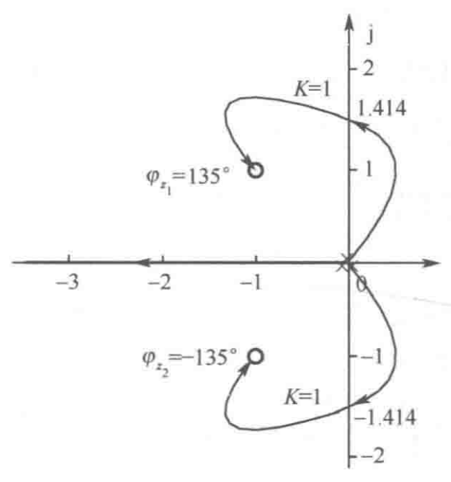

> Image description: A technical plot from a textbook illustrates the root locus of the characteristic equation $1 + \frac{K(s+1+\mathrm{j})(s+1-\mathrm{j})}{s^3} = 0$. The image features a complex plane with a horizontal real axis and a vertical imaginary axis labeled "$j$". The plot shows three branches originating from the origin $(0,0)$. Two branches curve symmetrically into the left-half plane, forming loops that terminate at open-circle poles located at $s = -1 + \mathrm{j}$ and $s = -1 - \mathrm{j}$. These terminal points are labeled with phase angles $\varphi_{z_1} = 135^\circ$ and $\varphi_{z_2} = -135^\circ$, respectively. The third branch extends along the negative real axis toward $-\infty$. Specific gain values are marked on the loops, where $K=1$ corresponds to points at approximately $\pm 1.414\mathrm{j}$ on the imaginary axis. Arrows indicate the direction of increasing gain $K$ along the locus paths.

图 4－18－1 $1+\frac{K(s+1+\mathrm{j})(s+1-\mathrm{j})}{s^{3}}=0$
概略参数根轨迹图
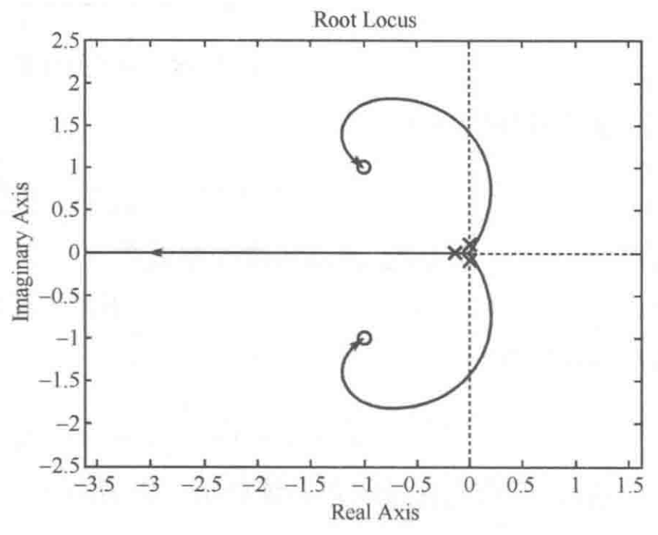

> Image description: A textbook figure titled "Root Locus" displays a complex plane with a horizontal "Real Axis" and a vertical "Imaginary Axis." The axes range from -3.5 to 1.5 on the real axis and -2.5 to 2.5 on the imaginary axis. The plot features three starting points marked by 'x' symbols (open-loop poles) located at the origin $(0,0)$ and slightly to the left on the real axis. From these points, the root locus branches out into symmetrical curved paths. Two branches curve outward into the complex plane, forming loops that spiral inward toward circles marked with 'o' symbols (zeros) located at approximately $-1 \pm 1\mathrm{j}$. A third branch extends linearly along the negative real axis, indicated by a left-pointing arrow. According to the caption, this is a schematic root locus for the characteristic equation $1+\frac{K(s+1+\mathrm{j})(s+1-\mathrm{j})}{s^{3}}=0$, illustrating how system poles migrate as gain $K$ varies.

图 4－18－2 $1+\frac{K(s+1+\mathrm{j})(s+1-\mathrm{j})}{s^{3}}=0$
参数根轨迹图（MATLAB）

分别设 $K=2$ 和 $K=20$ ，应用 MATLAB 软件包可得系统单位阶跃扰动响应曲线如图 4－18－3、图 4－18－4 所示，其动态性能如下：
$K=2$ 时，$\sigma \%=24.6 \% ; \quad t_{p}=2.49 \mathrm{~s} ; \quad t_{\mathrm{s}}=9.95 \mathrm{~s} \quad(\Delta=2 \%)$
$K=20$ 时，$\sigma \%=4.35 \% ; ~ t_{p}=3.03 \mathrm{~s} ; ~ t_{s}=4.05 \mathrm{~s} \quad(\Delta=2 \%)$

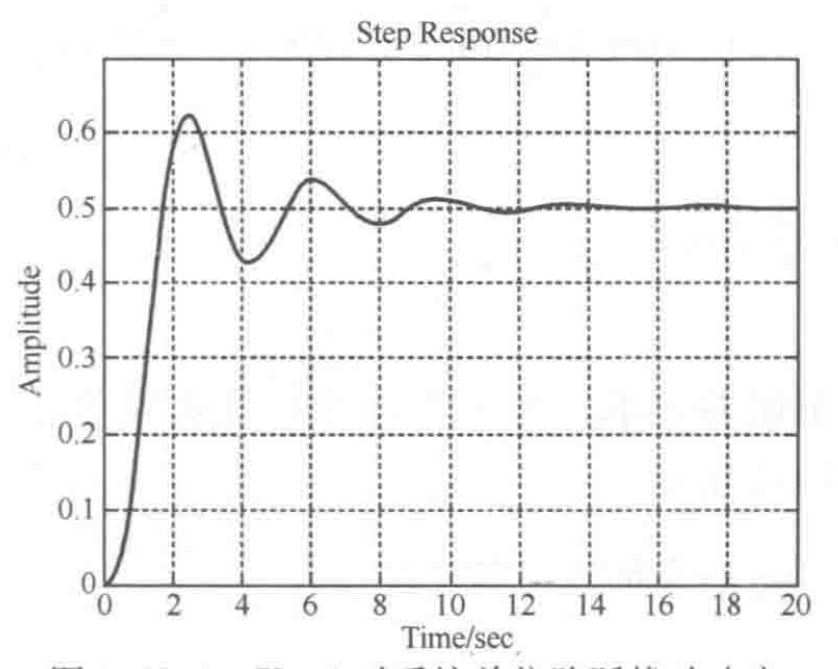

> Image description: This image shows a "Step Response" graph, typical of control systems engineering. The horizontal x-axis is labeled "Time/sec" and ranges from 0 to 20 seconds. The vertical y-axis is labeled "Amplitude" and ranges from 0 to over 0.6. The plot displays a single oscillating curve that starts at the origin (0,0), rises sharply to a first peak of approximately 0.62 around $t=2.5$ seconds, and then undergoes decaying oscillations. The signal eventually stabilizes at a steady-state value of 0.5 as time increases toward 20 seconds. According to the provided caption, this figure represents the system's unit step disturbance response for a specific gain $K$. Based on the visual characteristics—specifically the high overshoot and longer settling time—this plot corresponds to the case where $K=2$, with an overshoot $\sigma\% = 24.6\%$, peak time $t_p = 2.49\text{ s}$, and settling time $t_s = 9.95\text{ s}$.
图 4－18－3 $K=2$ 时系统单位阶跃扰动响应 （MATLAB）

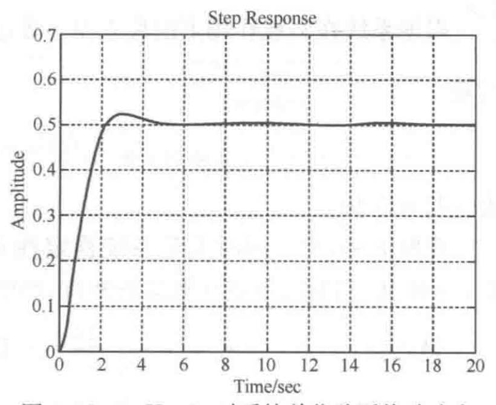

> Image description: This image shows a MATLAB-generated plot titled "Step Response," illustrating the system's response to a unit step disturbance when $K=2$. The graph features a Cartesian coordinate system where the horizontal x-axis is labeled "Time/sec" and ranges from 0 to 20 seconds. The vertical y-axis is labeled "Amplitude" and ranges from 0 to 0.7. The plot displays a single continuous curve starting at the origin (0,0). The response rises sharply, reaching a peak amplitude of approximately 0.52 around $t=3$ seconds before exhibiting a slight overshoot. Following this peak, the signal undergoes minor oscillations and eventually stabilizes, converging to a steady-state value of 0.5 as time increases toward 20 seconds. In engineering terms, this figure depicts the transient and steady-state behavior of a control system's output in response to a step input.
图 4－18－4 $K=20$ 时系统单位阶跃扰动响应 （MATLAB）


<!-- source_pdf_page: 121 -->
4－19 图 4－43 为激光操作控制系统，可用于外科手术时在人体内钻孔。手术要求激光操作系统必须有高度精确的位置和速度响应，因此直流电机的参数选为：激磁时间常数 $T_{1}=0.1 \mathrm{~s}$ ，电机和载荷组合的机电时间常数 $T_{2}=0.2 \mathrm{~s}$ 。要求调整放大器增益 $K$ ，使系统在斜坡输入 $r(t)=A t(A=1 \mathrm{~mm} / \mathrm{s})$ 时，系统稳态误差 $e_{\mathrm{ss}}(\infty) \leqslant 0.1 \mathrm{~mm}$ 。

解 本题从兼顾稳定性、稳态误差和动态性能的综合要求出发，应用根轨迹法来设计合适的系统参数。

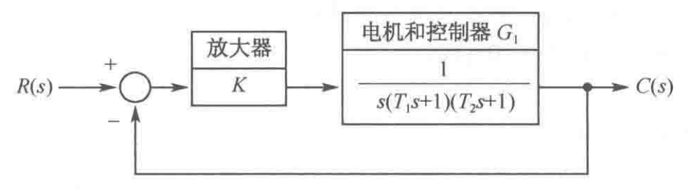

> Image description: This image shows a control system block diagram labeled as "图 4－43 激光操作控制器结构图" (Figure 4-43 Structure Diagram of Laser Operation Controller). The system is a closed-loop feedback architecture. The process begins with an input signal $R(s)$ entering a summing junction, where it is compared against a feedback signal indicated by a minus sign. The resulting error signal flows into the first block, labeled "放大器" (Amplifier) with a gain of $K$. From there, the signal enters a second block titled "电机和控制器 $G_1$" (Motor and Controller $G_1$), which contains the transfer function $\frac{1}{s(T_1s+1)(T_2s+1)}$. The output of this block is the controlled variable $C(s)$. A feedback loop connects the output $C(s)$ back to the summing junction. Arrows indicate a unidirectional flow from left to right through the forward path and from right to left via the feedback path.
图 4－43 激光操作控制器结构图

系统开环传递函数

$$
K G_{1}(s)=\frac{K}{s\left(T_{1} s+1\right)\left(T_{2} s+1\right)}
$$

显然，系统为 I 型系统，静态速度误差系数

$$
K_{v}=K
$$

闭环传递函数

$$
\Phi(s)=\frac{K}{s\left(T_{1} s+1\right)\left(T_{2} s+1\right)+K}=\frac{50 K}{s^{3}+15 s^{2}+50 s+50 K}
$$

$K$ 的选取，应首先保证闭环系统稳定。由劳斯表：

| $s^{3}$ | 1 | 50 |
| :---: | :---: | :---: |
| $s^{2}$ | 15 | $50 K$ |
| $s^{1}$ | $\frac{750-50 K}{15}$ | 0 |
| $s^{0}$ | $50 K$ |  |

可知，为确保系统稳定，应有 $0<K<15$ 。
根据系统在斜坡作用下的稳态误差要求，当 $r(t)=A t(A=1 \mathrm{~mm} / \mathrm{s}), R(s)=\frac{A}{s^{2}}$ 时，稳态误差

$$
e_{s s}(\infty)=\frac{A}{K_{v}}=\frac{1}{K} \leqslant 0.1
$$

故应取 $K \geqslant 10$ 。
现取 $K=10$ ，可同时满足系统稳定性及稳态误差要求。为了考查此时系统的动态性能，令 $K$ 从 0 到 $\infty$ ，作系统概略根轨迹，如图 4－19－1 所示。

渐近线：$\quad \sigma_{a}=\frac{-5-10}{3}=-5, \quad \varphi_{a}= \pm 60^{\circ},-180^{\circ}$
分离点：$\quad \frac{1}{d}+\frac{1}{d+5}+\frac{1}{d+10}=0, \quad d=-2.11$


<!-- source_pdf_page: 122 -->
为了分析 $K_{a}=10$ 时系统的动态性能，可利用模值条件确定相应的闭环极点。当 $K_{a}=10$ 时，系统的根轨迹增益

$$
K^{*}=\frac{K_{a}}{T_{1} T_{2}}=500
$$

根据模值条件，可以首先确定负实轴上 $[-10,-\infty)$ 区间内的闭环极点 $s_{3}$ 。因为

$$
\left|s_{3}\right| \cdot\left|s_{3}-5\right| \cdot\left|s_{3}-10\right|=500
$$

求得 $s_{3}=-13.98$ ；再用 $s+13.98$ 去除闭环特征多项式 $s^{3}+15 s^{2}+50 s+500$ ，得 $s^{2}+1.02 s+$ 35.74 ；令商多项式为零，求得闭环主导极点

$$
s_{1,2}=-0.51 \pm \mathrm{j} 5.96
$$

很明显，激光操作系统的动态性能主要取决于主导极点。由主导极点的数值可知：

$$
\sigma=\zeta \omega_{n}=0.51, \quad \omega_{d}=\omega_{n} \sqrt{1-\zeta^{2}}=5.96
$$

因而

$$
\beta=\arctan \frac{\omega_{d}}{\sigma}=85.1^{\circ}, \quad \zeta=\cos \beta=0.085
$$

于是，在单位阶跃输人指令下，激光操作系统的动态性能为

$$
\sigma \%=100 \mathrm{e}^{-\pi \xi / \sqrt{1-\zeta^{2}}} \%=76.4 \%, \quad t_{s}=\frac{4.4}{\sigma}=8.63 \mathrm{~s} \quad(\Delta=2 \%)
$$

MATLAB 软件包生成的系统根轨迹图如图 4－19－2 所示，系统对阶跃和斜坡信号的响应分别如图 4－19－3、图 4－19－4 所示，由主导极点构成的近似系统对阶跃和斜坡信号的响应分别如图 4－19－5、图 4－19－6 所示。

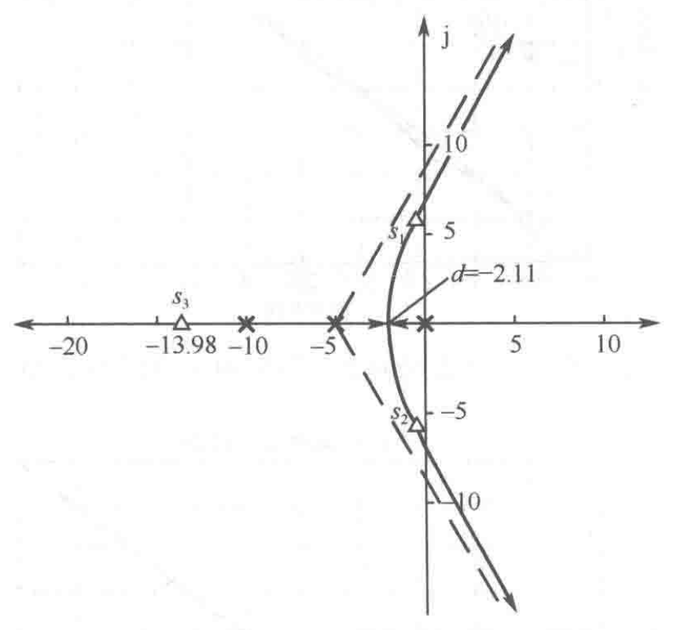

> Image description: This image shows a system root locus plot in the complex s-plane, with the horizontal axis representing the real part and the vertical axis labeled "$j$" representing the imaginary part. The plot features several critical points marked by asterisks on the real axis at approximately $-13.98$, $-10$, $-5$, and near $0$. Two diverging root locus branches are depicted as solid and dashed lines, curving away from the real axis toward the right half-plane, indicated by directional arrows. Specific points along these curves are labeled $s_1$ and $s_2$, with corresponding imaginary values of $5$ and $-5$. A distance label $d = -2.11$ is shown between a point on the real axis and a locus branch. The figure illustrates the movement of system poles as a gain parameter varies, which is fundamental for analyzing stability and transient response in control engineering.
图4－19－1 激光控制系统的概略根轨迹图

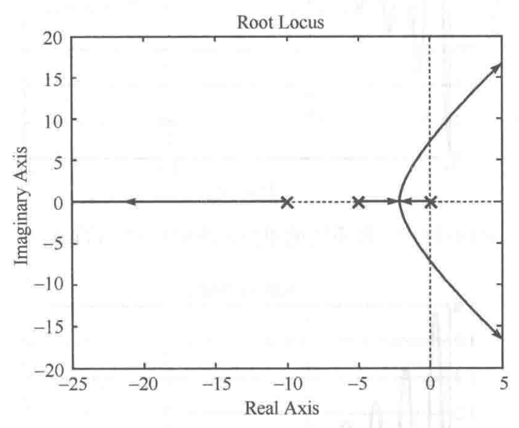

> Image description: This image shows a Root Locus plot for a laser control system (as indicated by the caption "图4-19-1 激光控制系统的概略根轨迹图"). The graph features a horizontal x-axis labeled "Real Axis" ranging from -25 to 5, and a vertical y-axis labeled "Imaginary Axis" ranging from -20 to 20. Three open-loop poles are marked with 'x' symbols on the real axis at approximately 0, -5, and -10. The root locus consists of solid lines starting from these poles. One branch moves leftward along the real axis toward negative infinity. Two other branches originate near the origin, curve away from each other, and move into the right-half plane (positive real values), with arrows indicating their direction toward increasing imaginary values. This trajectory suggests that as system gain increases, the system may transition from stability to instability.
图4－19－2 激光控制系统的根轨迹图（MATLAB）

MATLAB 程序 ：exe419．m
\％系统根轨迹
numc $=[1] ; \quad \operatorname{denc}=\left[\begin{array}{lllll}0.02 & 0.3 & 1 & 0\end{array}\right] ;$
rlocus（numc，denc）；
\％\％原系统 \％\％
\％单位阶跃输人响应
num $=[500] ; \quad \operatorname{den}=[11550500] ; \quad t=0: 0.01: 15$ ；


<!-- source_pdf_page: 123 -->
figure；
step（num，den，t）；grid
\％单位斜坡输入响应
num $=[500]$ ；den $=[11550500] ; \quad t=0: 0.005: 5 ; \quad u=t$ ；
figure；
lsim（num，den，$u, t$ ）；grid
\％\％近似系统 \％\％
\％单位阶跃输入响应
$\mathrm{wn}=5.98 ; \quad \operatorname{kos}=0.085$ ；
num $=$ wn＇2；$\quad$ den $=[1,2 *$ kos $*$ wn，wn－2 $] ; \quad t=0: 0.01: 15$ ；
figure；
step（num，den，t）；grid
\％单位斜坡输入响应
$\mathrm{wn}=5.98 ; \quad \mathrm{kos}=0.085$ ；
num $=$ wn～2；$\quad$ den $=[1,2 *$ kos $*$ wn，wn～2 $] ; \quad t=0: 0.005: 5 ; \quad u=t$ ；
figure；
lsim（num，den，$u, t$ ）；grid

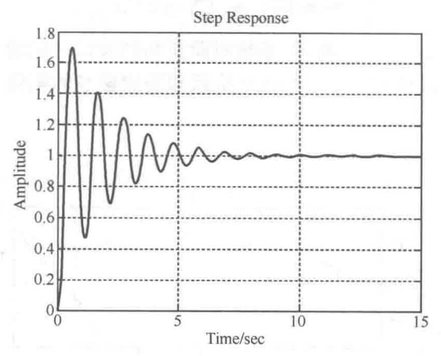

> Image description: This image shows a MATLAB-generated plot titled "Step Response," depicting the unit step response of an original system (as indicated by the caption "图 4－19－3 原系统的单位阶跃响应"). The graph features two axes: the horizontal x-axis is labeled "Time/sec" with a scale from 0 to 15, and the vertical y-axis is labeled "Amplitude," ranging from 0 to 1.8. The plot displays an underdamped oscillatory response that begins at the origin (0,0). The signal exhibits several peaks and troughs of decreasing magnitude over time. The first peak reaches approximately 1.7 units before oscillating around a steady-state value of 1.0. As time progresses toward 15 seconds, the oscillations decay, and the amplitude converges to the final value of 1. In engineering terms, this represents a system with overshoot and settling time characteristics typical of a second-order underdamped control system.
图 4－19－3 原系统的单位阶跃响应（MATLAB）

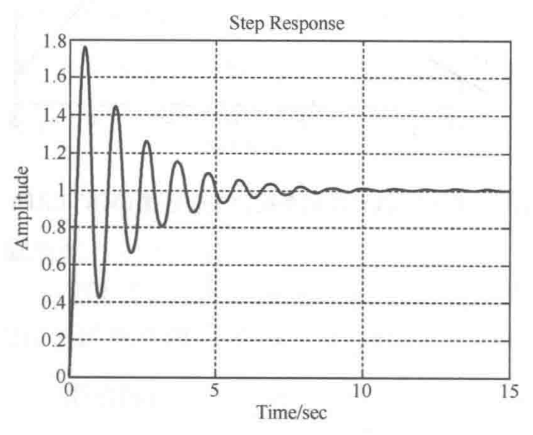

> Image description: This image shows a MATLAB-generated plot titled "Step Response," illustrating the unit step response of an original system (as indicated by the caption "图 4－19－3 原系统的单位阶跃响应"). The graph features two axes: the vertical y-axis is labeled "Amplitude" with a scale from 0 to 1.8, and the horizontal x-axis is labeled "Time/sec" ranging from 0 to 15 seconds. The plot displays a damped sinusoidal waveform that begins at the origin (0,0). It exhibits an initial overshoot reaching approximately 1.8 before oscillating with decreasing amplitude around a steady-state value of 1.0. As time progresses toward 15 seconds, the oscillations decay, and the signal converges to the final value of 1. In engineering terms, this represents an underdamped second-order system response characterized by overshoot and settling time.
图 4－19－5 近似系统的单位阶跃响应（MATLAB）

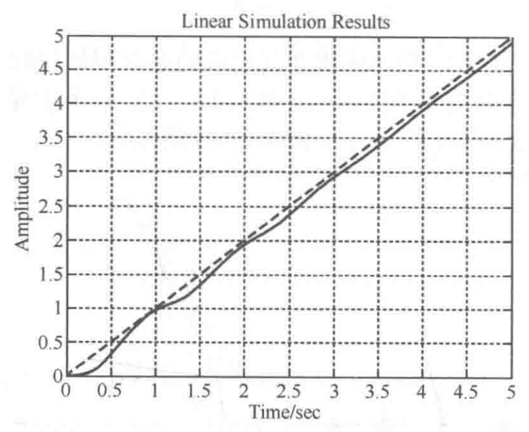

> Image description: A line graph titled "Linear Simulation Results" displays the unit step response of an approximate system, as indicated by the Chinese caption "图 4－19－5 近似系统的单位阶跃响应（MATLAB）". The horizontal x-axis is labeled "Time/sec" and ranges from 0 to 5 seconds. The vertical y-axis is labeled "Amplitude" and ranges from 0 to 5. The plot contains two curves: a dashed straight line representing the ideal reference response and a solid, slightly oscillating curve representing the simulated system's output. Both lines originate at (0,0) and trend upward toward the point (5,5). The solid line exhibits small fluctuations around the dashed line, particularly between 0 and 2 seconds, before converging more closely with the reference as time increases. This visualization compares the actual performance of a linear approximate system against its theoretical ideal response over a five-second interval.
图 4－19－4 原系统的单位斜坡响应（MATLAB）

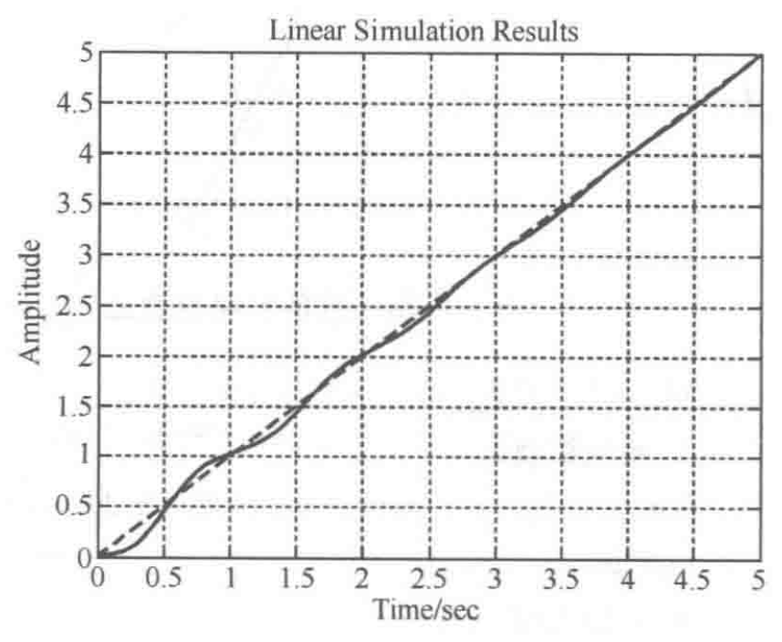

> Image description: A line graph titled "Linear Simulation Results" displays the unit ramp response of a system, as indicated by the Chinese caption "图 4-19-4 原系统的单位斜坡响应 (MATLAB)". The horizontal x-axis is labeled "Time/sec" and ranges from 0 to 5 seconds. The vertical y-axis is labeled "Amplitude" and ranges from 0 to 5. The figure contains two plotted lines: a dashed straight line representing the ideal input ramp and a solid curved line representing the system's actual response. Both start at the origin (0,0) and converge toward the point (5,5). The solid line exhibits an initial transient period with slight oscillations and a lag behind the dashed line between 0 and approximately 2 seconds. After this period, the solid line closely tracks the linear trajectory of the dashed line, indicating that the system is following the ramp input with minimal steady-state error.
图 4－19－6 近似系统的单位斜坡响应（MATLAB）


<!-- source_pdf_page: 124 -->
利用 MATLAB 软件包，从图 4－19－3 与图 4－19－5 可以得
原系统（三阶）的动态性能 $\quad \sigma \%=70.0 \%, \quad t_{s}=7.48 \mathrm{~s}(\Delta=2 \%)$
近似系统（二阶）的动态性能 $\sigma \%=76.5 \%, \quad t_{\mathrm{s}}=7.51 \mathrm{~s}(\Delta=2 \%)$
可见，系统对阶跃输入响应是高度振荡的。因此，在外科手术中，不能采用阶跃信号作为手术指令信号，必须选用低速斜坡信号作为手术指令信号。

4－20 图4－44为空间站示意图。为了有利于产生能量和进行通信，必须保持空间站对太阳和地球的合适指向。空间站的方位控制系统可由带有执行机构和控制器的单位反馈控制系统来表征，其开环传递函数为

$$
G(s)=\frac{K^{*}(s+20)}{s\left(s^{2}+24 s+144\right)}
$$

试画出 $K^{*}$ 值增大时的系统概略根轨迹图，并求出使系统产生振荡的 $K^{*}$ 的取值范围。

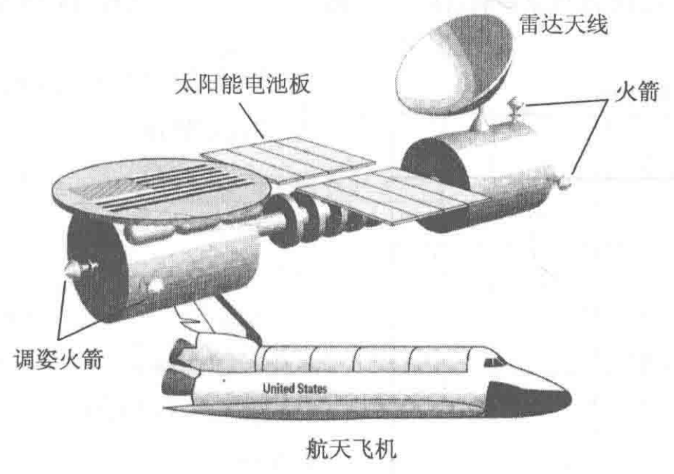

> Image description: This textbook figure, captioned "图4－44 空间站示意图" (Figure 4-44 Schematic Diagram of a Space Station), illustrates the components of a space station and its associated spacecraft. The diagram uses labels in Chinese with leader lines pointing to specific engineering elements. The main structure consists of two large cylindrical modules connected by a central bridge. Atop this assembly are "太阳能电池板" (solar panels) for power generation. One end features a large parabolic dish labeled "雷达天线" (radar antenna). Small propulsion units, labeled as "火箭" (rockets), are positioned on the exterior for station-keeping. On the opposite side, "调姿火箭" (attitude control rockets) are indicated to manage orientation. Below the station is a shuttle-like vehicle labeled "航天飞机" (space plane/shuttle) with "United States" written on its fuselage, shown docked or approaching the station via a connecting arm. The figure depicts the functional relationship between power, communication, propulsion, and transport modules.
图4－44 空间站示意图

解 由开环传递函数

$$
G(s)=\frac{K^{*}(s+20)}{s(s+12)^{2}}
$$

令 $K^{*}$ 从 $0 \rightarrow \infty$ ，可画出系统概略根轨迹如图4－20－1所示。图中
渐近线：

$$
\sigma_{a}=-2, \quad \varphi_{a}= \pm 90^{\circ}
$$

分离点：

$$
\frac{1}{d}+\frac{2}{d+12}=\frac{1}{d+20}, \quad d=-4.75
$$

应用模值条件，可得分离点处的根轨迹增益

$$
K_{d}^{*}=\frac{\prod_{i=1}^{3}\left|d-p_{i}\right|}{|d-z|}=\frac{4.75 \times 7.25^{2}}{15.25}=16.37
$$

因而，当 $K^{*}>16.37$ 时，系统输出将会产生振荡。
应用 MATLAB 软件包，可得系统的根轨迹如图4－20－2所示。若取 $K^{*}=10$ ，可得系统的单位阶跃响应，如图 4－20－3 所示。


<!-- source_pdf_page: 125 -->
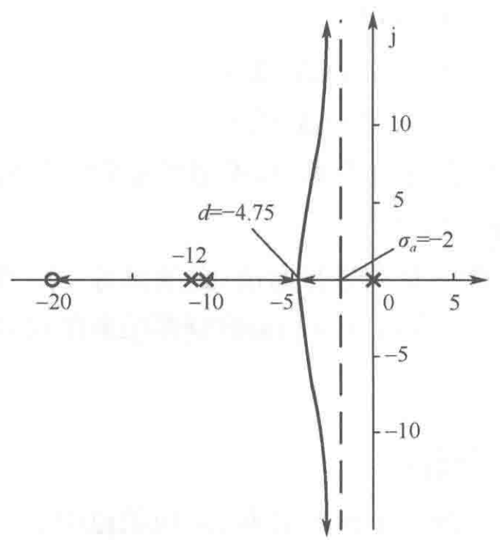

> Image description: A root locus plot for a space station attitude control system is shown in the complex plane, with the horizontal axis representing the real part ($\sigma$) and the vertical axis representing the imaginary part ($j\omega$). The figure displays several poles (marked as 'x') and one zero (marked as 'o'). The zero is located at $-20$. Poles are positioned on the real axis at approximately $-12$, $-4.75$, and $-2$. A root locus branch originates from the pole at $-4.75$ and curves toward the right, moving into the complex plane. Two specific labels highlight critical values: a point $d = -4.75$ on the real axis and a value $\sigma_a = -2$, indicated by a dashed vertical line that serves as a stability or performance boundary. Arrows along the locus indicate the direction of movement as the system gain increases.
图4－20－1 空间站方位控制系统概略根轨迹图

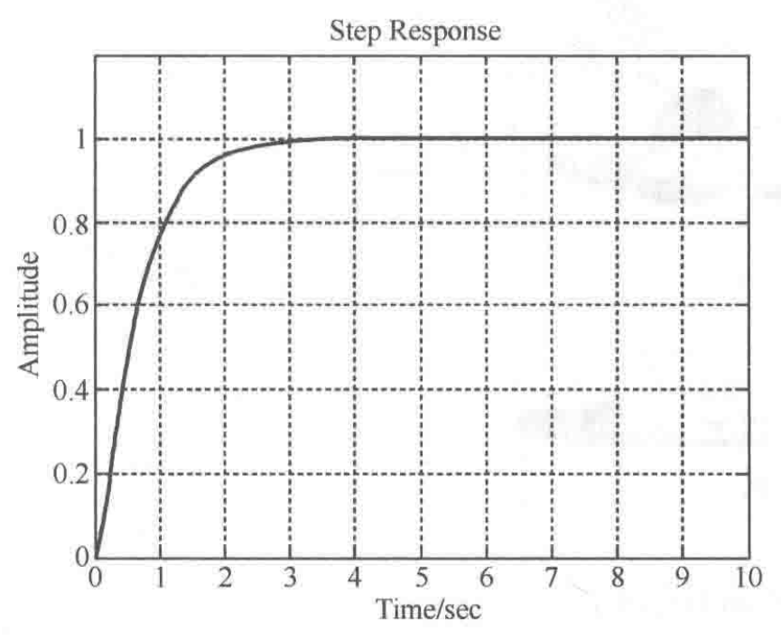

> Image description: The image displays a graph titled "Step Response," illustrating the time-domain behavior of a system's output following a step input. The vertical y-axis is labeled "Amplitude" and ranges from 0 to 1, while the horizontal x-axis is labeled "Time/sec" and spans from 0 to 10 seconds. The plot shows a smooth, monotonically increasing curve that starts at the origin (0,0) and asymptotically approaches a steady-state value of 1. The response exhibits no overshoot or oscillation, characteristic of an overdamped or critically damped system. Specifically, the amplitude reaches approximately 0.8 at 1 second and converges toward its final value near 3 seconds. This figure represents a standard engineering analysis of transient response, used to determine parameters such as rise time and settling time for a control system. Note that the provided caption in Chinese refers to a root locus diagram, which contradicts the visible step response plot.
图 4－20－3 $K^{*}=10$ 时空间站系统单位阶跃响应（MATLAB）

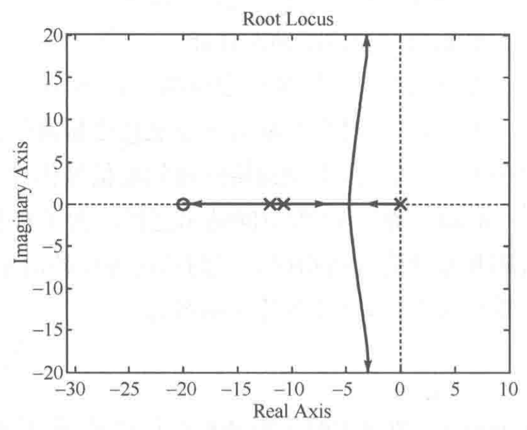

> Image description: A Root Locus plot is shown in this figure, featuring a horizontal "Real Axis" and a vertical "Imaginary Axis." The real axis ranges from -30 to 10, while the imaginary axis ranges from -20 to 20. The plot displays three poles marked with 'x' symbols located on the real axis at approximately $s = 0$, $s = -12$, and $s = -4$. An open circle, representing a zero, is positioned at approximately $s = -20$. Root locus branches are indicated by solid lines with arrows showing the direction of increasing gain. One branch moves from the pole at $-12$ toward the zero at $-20$. Another branch originates from the pole at $0$, moving leftward to meet a branch coming from the pole at $-4$; these two then split and curve vertically toward $\pm 20j$ on the imaginary axis, staying within the left-half plane.
图4－20－2 空间站控制系统根轨迹图（MATLAB）

$$
\begin{aligned}
& \text { MATLAB 程序 : exe420.m } \\
& \text { \% 系统根轨迹 } \\
& \text { numc }=\left[\begin{array}{ll}
1 & 20
\end{array}\right] ; \quad \text { denc }=\left[\begin{array}{llll}
1 & 24 & 144 & 0
\end{array}\right] \text {; } \\
& \text { rlocus(numc,denc); } \\
& \text { \%单位阶跃输人响应 } \\
& \mathrm{K}=10 \text {; } \quad \mathrm{t}=0: 0.01: 10 \text {; } \\
& \text { numc }=[\mathrm{K} 20 * \mathrm{~K}] ; \quad \text { denc }=\left[\begin{array}{lllll}
1 & 24 & 144 & 0
\end{array}\right] ; \\
& \text { [num, den] }=\text { cloop }(\text { numc }, \text { denc }) \\
& \text { figure } \\
& \text { step(num,den,t); grid }
\end{aligned}
$$

4－21 一种由耐热性好、重量轻的材料制成的未来超音速客机如图 4－45（a）所示。该机可容纳 300 名乘客，并配备先进的计算机控制系统，以三倍音速在高空飞行。为该型飞机设

计的一种自动飞行控制系统如图 4－45（b）所示，系统主导极点的理想阻尼比 $\zeta_{0}=0.707$ 。飞机的特征参数为 $\omega_{n}=2.5, \zeta=0.3, \tau=0.1$ 。增益因子 $K_{1}$ 的可调范围较大：当飞机飞行状态从中等重量巡航变为轻重量降落时，$K_{1}$ 可以从 0.02 变至 0.2 。要求：
（1）画出增益 $K_{1} K_{2}$ 变化时，系统的概略根轨迹图；
（2）当飞机以中等重量巡航时，确定 $K_{2}$ 的取值，使系统阻尼比 $\zeta_{0}=0.707$ ；
（3）若 $K_{2}$ 由（2）中给出，$K_{1}$ 为轻重量降落时的增益，试确定系统的阻尼比 $\zeta_{0}$ 。
解 本题综合运用根轨迹技术来设计控制器参数，同时引入了变质量系统的初步概念。
（1）概略根轨迹图。开环传递函数


<!-- source_pdf_page: 126 -->
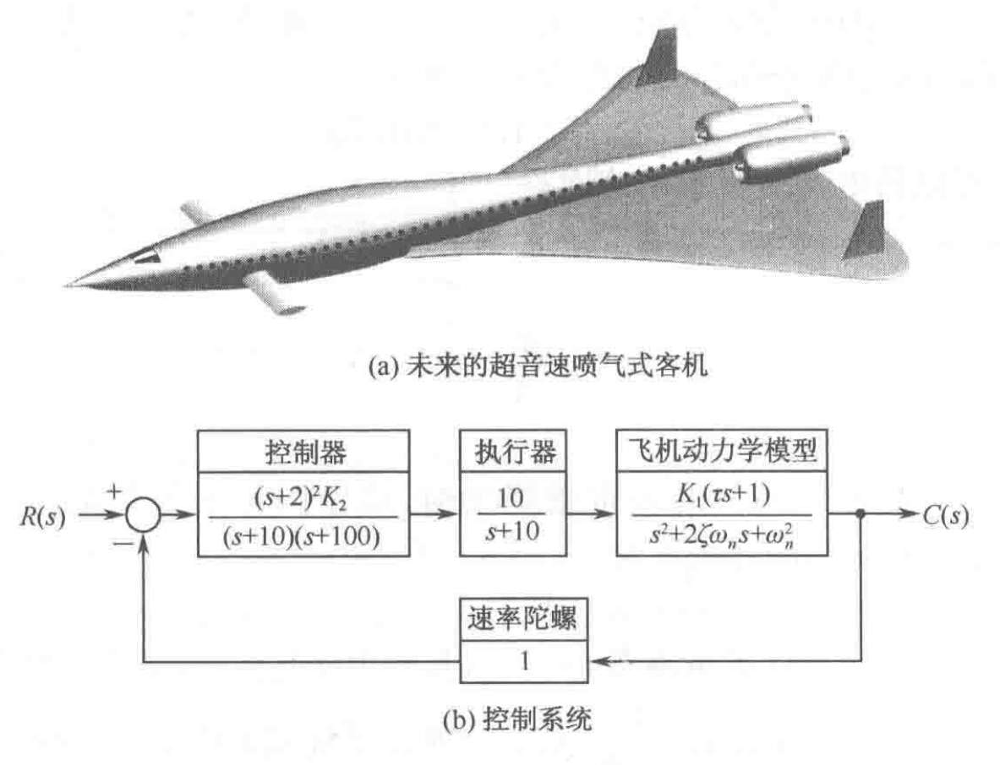

> Image description: This figure consists of two parts illustrating a longitudinal aircraft control system. Part (a) shows a conceptual rendering of a futuristic supersonic jet passenger aircraft. Part (b) presents the corresponding block diagram for the control system in the Laplace domain ($s$). The feedback loop begins with an input signal $R(s)$ entering a summing junction. The forward path consists of three sequential blocks: 1. **Controller (控制器):** Represented by the transfer function $\frac{(s+2)^2 K_2}{(s+10)(s+100)}$. 2. **Actuator (执行器):** Represented by $\frac{10}{s+10}$. 3. **Aircraft Dynamic Model (飞机动力学模型):** Represented by $\frac{K_1(\tau s + 1)}{s^2 + 2\zeta \omega_n s + \omega_n^2}$. The output signal $C(s)$ is fed back to the summing junction through a **Rate Gyro (速率陀螺)** block with a gain of 1. Arrows indicate the unidirectional flow of signals from input to output and back through the feedback loop.
图 4－45 飞机纵向控制系统结构图

$$
G(s)=\frac{10 K_{1} K_{2}(\tau s+1)(s+2)^{2}}{(s+10)^{2}(s+100)\left(s^{2}+2 \zeta \omega_{n} s+\omega_{n}^{2}\right)}
$$

代入 $\tau=0.1, \omega_{n}=2.5, \zeta=0.3$ ，有

$$
G(s)=\frac{K_{1} K_{2}(s+2)^{2}}{(s+10)(s+100)(s+0.75 \pm \mathrm{j} 2.38)}
$$

令 $K^{*}=K_{1} K_{2}$ 从 $0 \rightarrow \infty$ ，可以绘出系统概略根轨迹如图 4－21－1 所示。图中

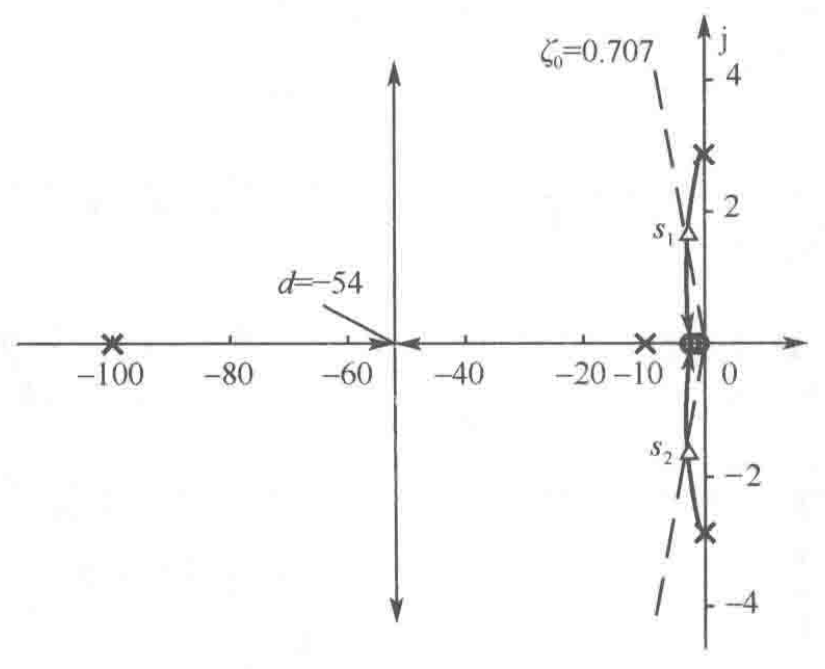

> Image description: A technical plot showing a root locus diagram in the complex s-plane. The horizontal axis represents the real part (sigma) and the vertical axis is labeled with $j$, representing the imaginary part. The figure displays several key elements: * **Poles/Zeros:** Marked by crosses ($\times$) on the real axis at approximately $-100$ and $-10$, and a pair of complex conjugate poles near the imaginary axis. * **Root Locus Paths:** Solid lines originate from the open-loop poles and move toward zeros or infinity as gain $K^*$ increases. * **Labels:** A specific point on the real axis is labeled $d = -54$. A dashed curve indicates a constant damping ratio line, labeled $\zeta_0 = 0.707$. * **Variables:** Points $s_1$ and $s_2$ are marked with triangles along the complex branches of the locus. Engineering-wise, this figure illustrates the stability and transient response characteristics of a control system as the gain varies from $0 \rightarrow \infty$.
图 4－21－1 $1+\frac{K_{1} K_{2}(s+2)^{2}}{(s+10)(s+100)\left(s^{2}+1.5 s+6.25\right)}=0$ 概略根轨迹图

渐近线：$\quad \sigma_{a}=\frac{-1.5-10-100+4}{4-2}=-53.73, \quad \varphi_{a}= \pm 90^{\circ}$
分离点：由

$$
\frac{1}{d+0.75+\mathrm{j} 2.38}+\frac{1}{d+0.75-\mathrm{j} 2.38}+\frac{1}{d+10}+\frac{1}{d+100}=\frac{2}{d+2}
$$

解出

$$
d=--54
$$


<!-- source_pdf_page: 127 -->
（2）当 $K_{1}=0.02$ ，中重量巡航时，确定使 $\zeta_{0}=0.707$ 的 $K_{2}$ 值。在根轨迹图上，作 $\zeta_{0}=$ 0.707 阻尼比线，与复根轨迹部分的交点为主导极点

$$
s_{1,2}=-1.63 \pm \mathrm{j} 1.63
$$

利用模值条件，可以算出 $s_{1}$ 处的根轨迹增益

$$
K^{*}=K_{1} K_{2}=1430
$$

于是求得

$$
K_{2}=\frac{K^{*}}{K_{1}}=71500
$$

以上结果如图 4－21－2 所示。
（3）当 $K_{1}=0.2, K_{2}=71500$ ，轻重量降落时，确定闭环系统阻尼比 $\zeta_{0}$ 。因为 $K^{*}= K_{1} K_{2}=14300$ ，故可确定出闭环极点为

$$
s_{1,2}=-1.96 \pm \mathrm{j} 0.617, \quad s_{3.4}=-53.8 \pm \mathrm{j} 110
$$

由于复极点 $s_{1,2}$ 的位置十分接近重零点 $z=-2$ ，其作用相互削弱，形成近似偶极子，故 $s_{3,4}$ 变为系统主导极点。因为 $\beta=\arctan \frac{110}{53.8}=63.9^{\circ}$ ，所以系统阻尼比 $\zeta_{0}=\cos \beta=0.439$ 。

以上结果可参见图 4－21－3。

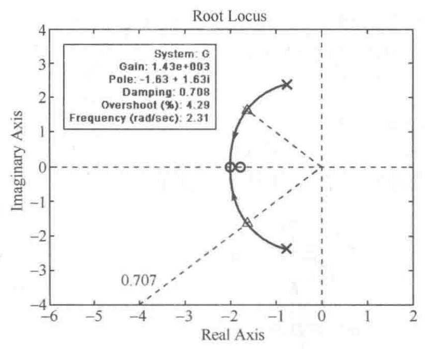

> Image description: A Root Locus plot for "System: G" is shown in this figure, featuring a real axis (horizontal) from -6 to 2 and an imaginary axis (vertical) from -4 to 4. The root locus consists of two symmetrical curved paths originating from open-loop poles on the real axis near -2 and moving toward the right half-plane. A specific operating point is marked with a triangle on the locus, connected by dashed lines to the origin. One line is labeled "0.707," representing the damping ratio ($\zeta$). An inset text box provides detailed system parameters for this point: Gain ($1.43\text{e}+003$), Pole ($-1.63 + 1.63\text{i}$), Damping ($0.708$), Overshoot ($4.29\%$), and Frequency ($2.31 \text{ rad/sec}$). The plot illustrates the relationship between system gain and the resulting closed-loop pole locations, specifically highlighting a design point that achieves a damping ratio of approximately 0.707.
图 4－21－2 中重量巡航时，确定使 $\zeta_{0}=0.707$ 的增益值（MATLAB）

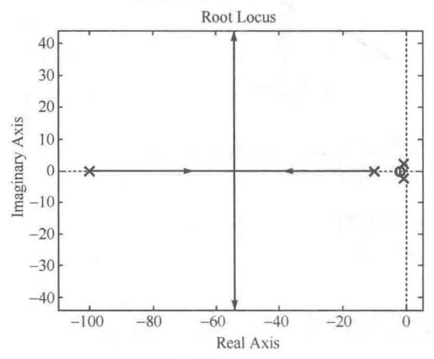

> Image description: A root locus plot is shown in Figure 4-21-2, plotted on a coordinate system where the horizontal axis is labeled "Real Axis" and the vertical axis is labeled "Imaginary Axis." The axes range from approximately -110 to 10 on the real axis and -40 to 40 on the imaginary axis. The plot features three poles marked with 'x' symbols located on the negative real axis: one near 0, one around -10, and another at -100. The root locus consists of segments along the real axis connecting these poles. Arrows indicate the direction of movement for the closed-loop poles as gain increases; specifically, arrows point toward each other between the pole at -100 and the pole near -10, and between the pole near -10 and the pole near 0. A vertical dashed line marks the imaginary axis (zero real part). The figure is used to determine a specific gain value for a damping ratio of $\zeta_{0}=0.707$ during weight cruise.
图 4－21－4 系统根轨迹图（MATLAB）

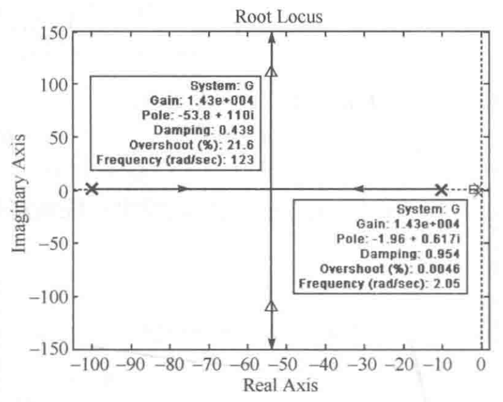

> Image description: This image shows a Root Locus plot generated by MATLAB for a system labeled "System: G". The graph features a horizontal Real Axis ranging from -100 to 0 and a vertical Imaginary Axis ranging from -150 to 150. The root locus consists of paths starting from poles on the real axis, moving toward each other, and then splitting vertically into the complex plane before curving back toward the left. Two data boxes provide specific system parameters at different points along these trajectories for a gain of $1.43\text{e}+004$. The first box identifies a pole at $-53.8 + 110\text{i}$ with a damping ratio of $0.439$, an overshoot of $21.6\%$, and a frequency of $123 \text{ rad/sec}$. The second box identifies a pole at $-1.96 + 0.617\text{i}$ with a damping ratio of $0.954$, an overshoot of $0.0046\%$, and a frequency of $2.05 \text{ rad/sec}$.
图4－21－3 轻重量降落时，确定闭环系统阻尼比（MATLAB）

MATLAB 验证：
运行以下 MATLAB 程序，可以得到系统根轨迹图，如图 4－21－4 所示。当 $K_{1}=0.02$ ，中重量巡航时，确定使 $\zeta_{0}=0.707$ 的 $K_{2}$ 值，可参见图4－21－2；当 $K_{1}=0.2, K_{2}=71500$ ，轻重量降落时，确定闭环系统阻尼比 $\zeta_{0}$ ，可参见图4－21－3；还可以得到中重量巡航时的时间响应曲线，如图4－21－5所示，以及轻重量降落时的时间响应曲线，如图 4－21－6 所示。


<!-- source_pdf_page: 128 -->
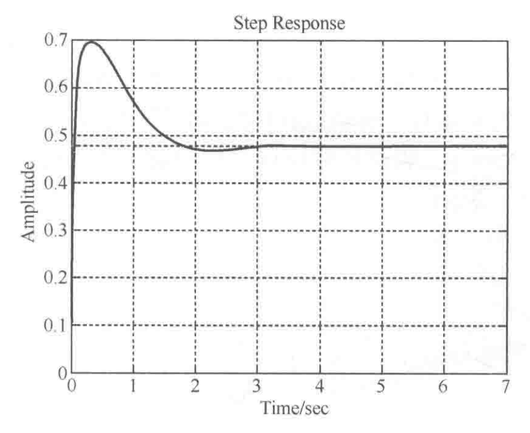

> Image description: A line graph titled "Step Response" illustrates the time-domain behavior of a system's output. The vertical y-axis is labeled "Amplitude," with numerical markings from $0$ to $0.7$. The horizontal x-axis is labeled "Time/sec," ranging from $0$ to $7$ seconds. The plot shows a single continuous curve starting at the origin $(0,0)$. It rises sharply to a peak amplitude of approximately $0.7$ around $0.4$ seconds, then descends and exhibits a slight undershoot before stabilizing. The response eventually settles into a steady-state value of approximately $0.48$. From an engineering perspective, this figure represents a typical underdamped second-order system response to a step input, characterized by overshoot and a settling time of roughly $3$ to $4$ seconds. The caption indicates the context is related to a system during weight cruise (中重量巡航时系统的).
图 4－21－5 中重量巡航时系统的
时间响应曲线（MATLAB）

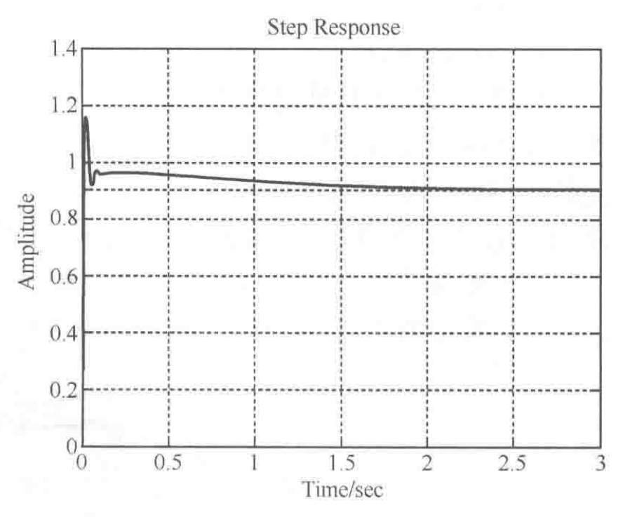

> Image description: This image shows a MATLAB-generated "Step Response" plot representing the time response curve of a system during weight cruise, as indicated by the caption (图 4－21－5). The graph features a vertical y-axis labeled "Amplitude," ranging from 0 to 1.4 in increments of 0.2. The horizontal x-axis is labeled "Time/sec," spanning from 0 to 3 seconds with major grid markings every 0.5 seconds. A dashed grid overlays the plot area for precise reading. The plotted curve begins at the origin (0,0) and rises sharply, exhibiting a significant initial overshoot that peaks slightly above 1.1 around 0.1 seconds. It then drops quickly to approximately 0.9 before stabilizing into a slow, gradual decay. By 3 seconds, the amplitude settles near 0.85. In engineering terms, this illustrates the system's transient response and steady-state behavior following a step input.
图 4－21－6 轻重量降落时系统的
时间响应曲线（MATLAB）

MATLAB 程序：exe421．m
\％建立开环传递函数模型
$G=\operatorname{zpk}([-2-2],[-10-100-0.75+2.38 i-0.75-2.38 i], 1) ; \quad z=0.707 ;$
\％绘制相应系统的根轨迹
figure（1）
rlocus（G）；
figure（2）
rlocus（G）； $\operatorname{sgrid(z,~new)~hold~on;~\% ~}{ }^{\prime}$ 取阻尼比为 0.707
$\operatorname{axis}\left(\left[\begin{array}{llll}-6 & 2 & -5 & 5\end{array}\right]\right) \quad \mathrm{K}=1430$ ；\％最佳阻尼比对应的根轨迹增益
$\operatorname{rlocus}(\mathrm{G}, \mathrm{K})$ \％阻尼比为 0.707 时，系统的闭环特征根
figure（3）
rlocus（G）；hold on；
$\mathrm{K}=14300 ; \quad \operatorname{rlocus}(\mathrm{G}, \mathrm{K})$
\％ $\mathrm{K}=14300$ 时，系统的闭环特征根
\％中重量巡航时的时间响应
$\mathrm{K} 1=0.02 ; \quad \mathrm{K} 2=71500 ; \quad \mathrm{wn}=2.5 ; \quad \mathrm{kos}=0.3$ ；
num1 $=[\mathrm{K} 24 * \mathrm{~K} 24 * \mathrm{~K} 2] ; \quad \operatorname{den} 1=\left[\begin{array}{llll}1 & 110 & 1000\end{array}\right]$ ；
num2 $=[$ K1 $] ; \quad \operatorname{den2}=[12 *$ wn $*$ kos wn2 $]$ ；
［numc，denc］＝series（num1，den1，num2，den2）；
［num，den］$=$ cloop $($ numc, denc $)$ ；roots $($ den $)$ ；\％系统闭环传递函数与闭环极点
sys $=\mathrm{tf}$（num，den）；$\quad \mathrm{t}=0: 0.001: 7$ ；
figure（4）
step（sys，t）；grid on；
\％轻重量降落时的时间响应
$\mathrm{K} 1=0.2 ; \quad \mathrm{K} 2=71500 ; \quad \mathrm{wn}=2.5 ; \quad \mathrm{kos}=0.3 ;$
num1 $=[\mathrm{K} 24 * \mathrm{~K} 24 * \mathrm{~K} 2] ; \quad$ den1 $=\left[\begin{array}{llll}1 & 110 & 1000\end{array}\right]$ ；
num2 $=[\mathrm{K} 1] ; \quad \operatorname{den} 2=[12 * \mathrm{wn} * \mathrm{kos}$ wn 2$]$ ；
［numc，denc］＝series（num1，den1，num2，den2）；
［num，den］＝cloop（numc，denc）；roots（den）；\％系统闭环传递函数与闭环极点
sys $=\mathrm{tf}($ num, den$) ; \quad \mathrm{t}=0: 0.001: 3$ ；


<!-- source_pdf_page: 129 -->
figure（5）
step（sys，t）；
grid on；
4－22 在带钢热轧过程中，用于保持恒定张力的控制系统称为＂环轮＂，其典型结构如图 4－46所示。环轮有一个 $0.6 \sim 0.9 \mathrm{~m}$ 长的臂，其末端有一卷轴，通过电机可将环轮升起，以便挤压带钢。带钢通过环轮的典型速度为 $10.16 \mathrm{~m} / \mathrm{s}$ 。假设环轮位移变化与带钢张力的变化成正比，且设滤波器时间常数 $T$ 可略去不计。要求：
（1）概略绘出 $0<K_{a}<\infty$ 时系统的根轨迹图；
（2）确定增益 $K_{a}$ 的取值，使系统闭环极点的阻尼比 $\zeta \geqslant 0.707$ 。

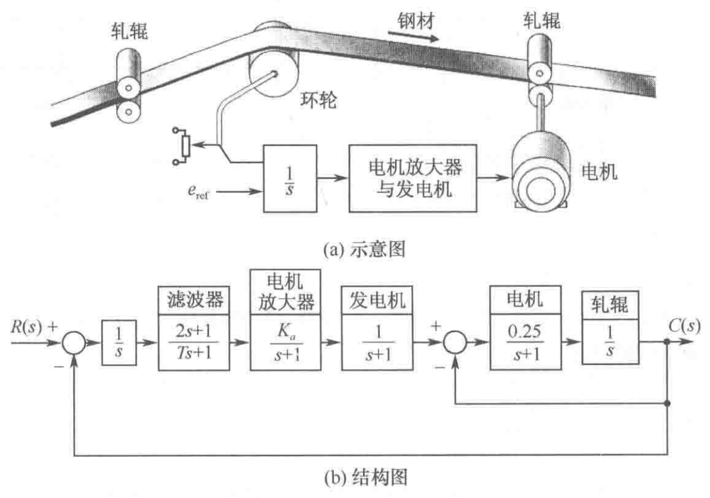

> Image description: This image contains two diagrams illustrating a control system for maintaining constant tension in hot-rolled steel strips, known as a "looper" (环轮). Figure (a) is a schematic diagram showing the physical components: steel strips moving between rollers (轧辊), a looper arm with a pulley, an electric motor (电机), and a block representing the motor amplifier and generator. An input reference signal $e_{ref}$ enters an integrator block ($1/s$). Figure (b) is the corresponding control system block diagram in the s-domain. The forward path starts with the reference input $R(s)$, passing through a summing junction, an integrator ($1/s$), a filter ($\frac{2s+1}{Ts+1}$), a motor amplifier ($\frac{K_a}{s+1}$), a generator ($\frac{1}{s+1}$), another summing junction, a motor ($\frac{0.25}{s+1}$), and finally the looper mechanism ($\frac{1}{s}$) to produce the output $C(s)$. A negative feedback loop connects the output $C(s)$ back to the initial summing junction.
图 4－46 轧钢机控制系统

解 本题主要研究根轨迹的绘制及系统参数选择。
（1）绘系统根轨迹图。电机与轧辊内回路的传递函数为

$$
G_{1}(s)=\frac{0.25}{s(s+1)+0.25}=\frac{0.25}{(s+0.5)^{2}}
$$

令 $T=0$ ，系统开环传递函数为

$$
G(s)=\frac{0.5 K_{a}(s+0.5)}{s(s+0.5)^{2}(s+1)^{2}}=\frac{K^{*}}{s(s+0.5)(s+1)^{2}}
$$

式中，$K^{*}=0.5 K_{a}$ 。概略绘制根轨迹图的特征数据如下：
渐近线：交点与交角

$$
\sigma_{a}=\frac{-2.5}{4}=-0.625, \quad \varphi_{a}= \pm 45^{\circ}, \pm 135^{\circ}
$$

分离点：由

$$
\frac{1}{d}+\frac{1}{d+0.5}+\frac{2}{d+1}=0
$$

解出

$$
d=-0.18
$$

根轨迹与虚轴交点：闭环特征方程

$$
s(s+0.5)(s+1)^{2}+K^{*}=s^{4}+2.5 s^{3}+2 s^{2}+0.5 s+K^{*}=0
$$

列劳斯表：


<!-- source_pdf_page: 130 -->
| $s^{4}$ | 1 |
| :---: | :---: |
| $s^{3}$ | 2.5 |
| $s^{2}$ | 1.8 |
| $s^{1}$ | $\frac{0.9-2.5 K^{*}}{1.8}$ |
| $s^{0}$ | $K^{*}$ |

令 $0.9-2.5 K^{*}=0$ ，得 $K^{*}=0.36$ 。令

$$
\text { 1. } 8 s^{2}+K^{*}=0
$$

代人 $s=\mathrm{j} \omega$ 及 $K^{*}=0.36$ ，解出 $\omega=0.447$ 。交点处 $K_{a}=2 K^{*}=0.72$ 。

系统概略根轨迹图如图 4－22－1 所示。
（2）确定使系统 $\zeta \geqslant 0.707$ 的 $K_{a}$ 。在根轨迹图上，作 $\zeta=0.707$ 阻尼比线，得系统主导极点

$$
s_{1,2}=-0.155 \pm \mathrm{j} 0.155
$$

利用模值条件，得 $s_{1}$ 处的 $K^{*}=0.0612$ ；在分离点 $d$ 处，$K^{*}=0.0387$ 。由于 $K_{a}=2 K^{*}$ ，故取 $0.0774<K_{a} \leqslant 0.1224$ ，可使 $0.707 \leqslant \zeta<$ 1 ；取 $K_{a} \leqslant 0.0774$ ，可使 $\zeta \geqslant 1$ 。

MATLAB 验证：
0.5

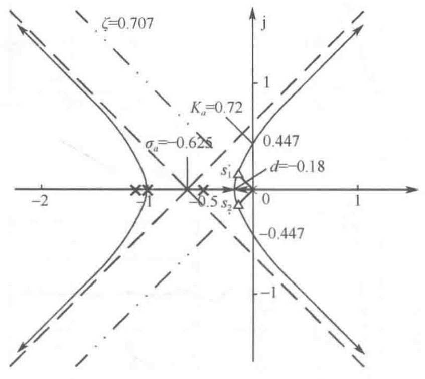

> Image description: A technical plot from a textbook illustrating the root locus of a characteristic equation, as indicated by the caption: $1 + \frac{0.5 K_a}{s(s+1)^2(s+0.5)} = 0$. The figure uses a complex plane with a horizontal real axis and a vertical imaginary axis labeled "$j$". Four open-loop poles are marked on the real axis at $0$, $-0.5$, and two coincident poles at $-1$. The root locus branches emerge from these poles, moving along the real axis before splitting into the complex plane. Two symmetrical curved paths extend toward the right and left, eventually becoming asymptotic straight lines indicated by arrows. Key variables and labels include: - Gain values $K_a = 0.72$ and $\sigma_a = -0.625$. - Damping ratio $\zeta = 0.707$, marking a dashed line from the origin. - Specific points labeled $s_1, s_2$, and a value $d = -0.18$. - Imaginary axis intercepts at $\pm 0.447$.
图 4－22－1 $1+\frac{0.5 K_{a}}{s(s+1)^{2}(s+0.5)}=0$

概略根轨迹图
$\zeta=0.707$ 时，系统主导极点及增益和根轨迹分离点处系统增益如图4－22－2所示；系统根轨迹如图 4－22－3 所示。分别令 $K_{a}$ 为 $0.05,0.11,0.4$ 和 0.8 ，系统的单位阶跃响应如图 4－22－4 所示。
$K_{a}=0.11$ 时，系统动态性能
$\sigma \%=2.17 \%$,
$t_{s}=27.6 \mathrm{~s} \quad(\Delta=2 \%)$
$K_{a}=0.4$ 时，系统动态性能
$\sigma \%=53.2 \%$,
$t_{s}=57.9 \mathrm{~s} \quad(\Delta=2 \%)$

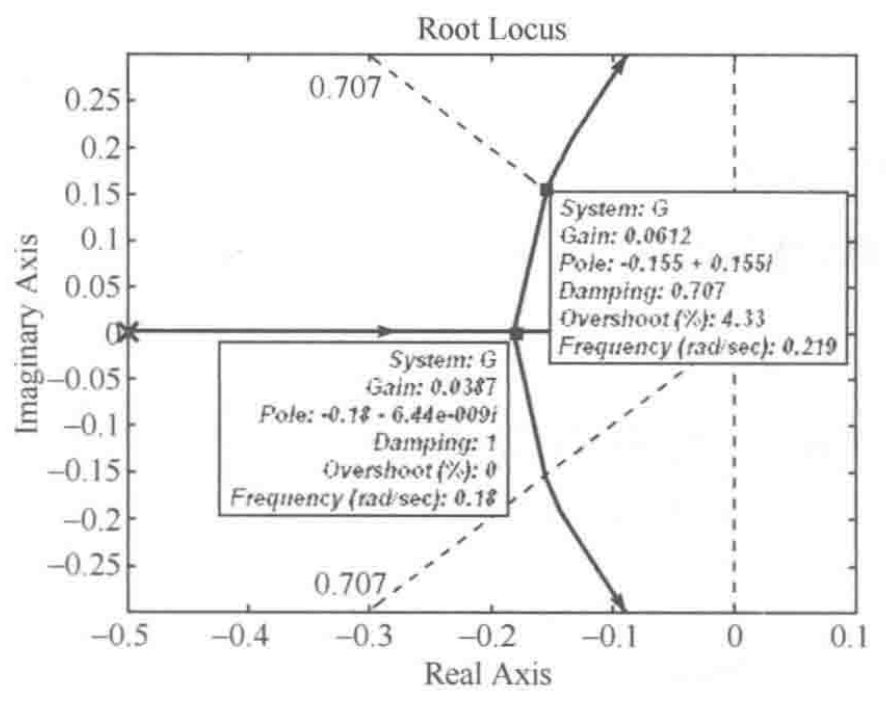

> Image description: A root locus plot is displayed on a coordinate system where the x-axis represents the "Real Axis" and the y-axis represents the "Imaginary Axis." The plot shows trajectories of closed-loop poles as a gain parameter varies. Two data boxes provide specific system parameters at key points along the locus. One box identifies a point on the real axis with a pole at approximately $-0.18$, a gain of $0.0387$, and damping $\zeta = 1$ (zero overshoot). A second box marks a breakaway/separation point where the locus splits into complex conjugate paths; this point has a pole at $-0.155 + 0.155i$, a gain of $0.0612$, and a damping ratio of $0.707$ (overshoot of $4.33\%$). Dashed radial lines originating from the origin are labeled "0.707," indicating constant damping ratio lines. The figure illustrates how to determine the specific gain $K_a$ for a desired damping ratio $\zeta = 0.707$.
图 4－22－2 确定 $\zeta=0.707$ 以及分离点处的 $K_{a}$（MATLAB）

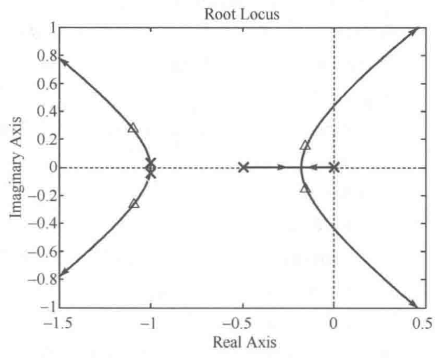

> Image description: A root locus plot from a MATLAB simulation, titled "Root Locus," is shown in Figure 4-22-2. The graph features a horizontal "Real Axis" ranging from -1.5 to 0.5 and a vertical "Imaginary Axis" ranging from -1 to 1. Three open circles (poles) are marked with 'x' on the real axis at approximately -1, -0.5, and 0. The locus consists of several branches: one segment moves along the real axis from -0.5 toward the pole at 0, while others originate from poles at -1 and 0. Two symmetric curved paths emerge from a breakaway point near -0.2 on the real axis, extending outward into the complex plane with arrows indicating direction toward the upper-right and lower-right quadrants, as well as moving leftward from the pole at -1. Small triangles mark specific points along these curves. The figure is used to determine $K_a$ and a damping ratio of $\zeta=0.707$.
图 4－22－3 轧钢机系统根轨迹图 （MATLAB）


<!-- source_pdf_page: 131 -->
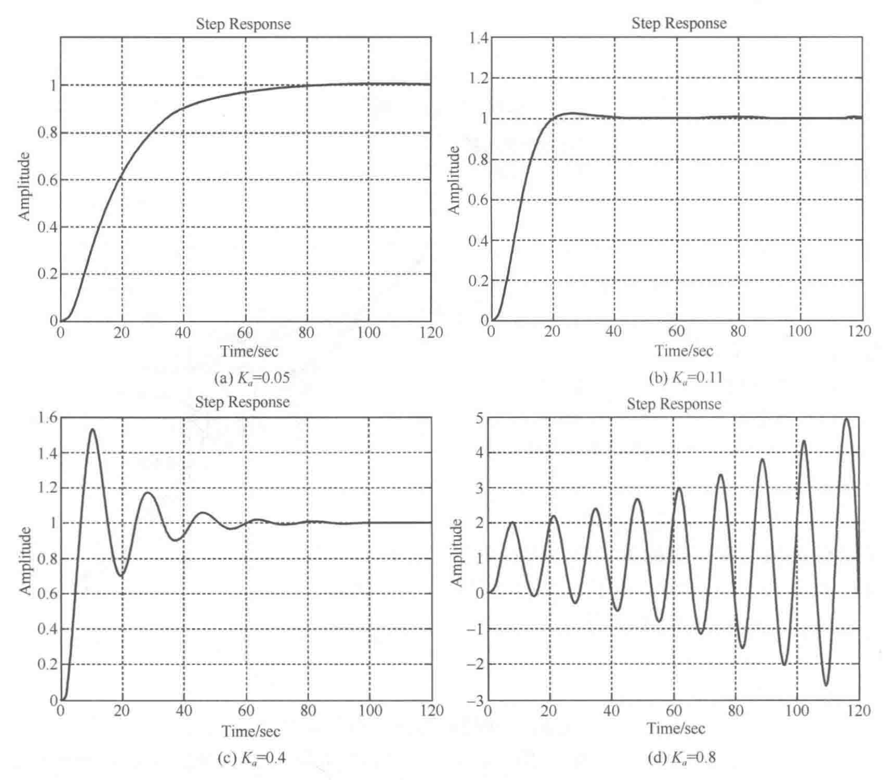

> Image description: This figure consists of four separate plots labeled (a) through (d), showing the "Step Response" of a rolling mill system simulated in MATLAB. Each plot features a vertical axis for "Amplitude" and a horizontal axis for "Time/sec," ranging from 0 to 120 seconds. The figures illustrate how varying the gain parameter $K_d$ affects the system's stability and transient response: * **(a) $K_d=0.05$**: Shows an overdamped response, slowly approaching a steady-state amplitude of 1 without oscillation. * **(b) $K_d=0.11$**: Displays a slightly underdamped response with minimal overshoot before stabilizing at 1. * **(c) $K_d=0.4$**: Shows a more pronounced oscillatory behavior that eventually decays and settles at 1. * **(d) $K_d=0.8$**: Exhibits an unstable system where oscillations grow in amplitude over time. The figure demonstrates the relationship between the gain variable $K_d$ and the resulting stability of the control system.
图 4－22－4 轧钢机系统时间响应（MATLAB）

MATLAB 程序 ：exe4 22．m
\％建立开环传递函数模型

$$
G=\operatorname{zpk}([],[-0-0.5-1-1], 1) ; \quad z=0.707 ;
$$

## \％绘制相应系统的根轨迹

figure（1）

$$
\begin{aligned}
& \operatorname{rlocus}(G) ; \quad \operatorname{sgrid}\left(z,{ }^{\prime} \text { new }{ }^{\prime}\right) \\
& \operatorname{axis}([-0.50 .1-0.30 .3])
\end{aligned} \quad \text { \% 取阻尼比为 } 0.707
$$

figure（2）

$$
\begin{array}{ll}
\mathrm{K}=0.0612 ; & \text { \% 最佳阻尼比对应的根轨迹增益 } \\
\text { hold on; } \quad \operatorname{rlocus}(\mathrm{G}, \mathrm{~K}) & \text { \% 阻尼比为 } 0.707 \text { 时, 系统的闭环特征根 }
\end{array}
$$

$\operatorname{axis}([-1.50 .5-11])$
rlocus（ G ）；
\％ $\mathrm{Ka}=0.05,0.11,0.4,0.8$ 时的阶跃响应
$\mathrm{Ka}=0.05$ ；\％Ka可相应设置

$$
\text { numc }=[0.5 * \mathrm{Ka}] ; \quad \text { denc }=\left[\begin{array}{lllll}
1 & 2.5 & 2 & 0.5 & 0
\end{array}\right] ;
$$


<!-- source_pdf_page: 132 -->
```
[num, den] = cloop(numc, denc); % 系统闭环传递函数
roots(den);
sys = tf(num, den); t=0:0.01:120;
figure(3)
    step(sys,t); grid on;
```

4－23 图 4－47（a）是 V－22 鱼鹰型倾斜旋翼飞机示意图。V－22 既是一种普通飞机，又是一种直升机。当飞机起飞和着陆时，其发动机位置可以如图示那样，使 V－22 像直升机那样垂直起降；而在起飞后，它又可以将发动机旋转 $90^{\circ}$ ，切换到水平位置，像普通飞机一样飞行。在直升机模式下，飞机的高度控制系统如图 4－47（b）所示。
（1）概略绘出当控制器增益 $K_{1}$ 变化时的系统根轨迹图，确定使系统稳定的 $K_{1}$ 值范围；
（2）当 $K_{1}=280$ 时，求系统对单位阶跃输人 $r(t)=1(t)$ 的实际输出 $h(t)$ ，并确定系统的超调量和调节时间（ $\Delta=2 \%$ ）；
（3）当 $K_{1}=280, r(t)=0$ 时，求系统对单位阶跃扰动 $N(s)=1 / s$ 的输出 $h_{n}(t)$ ；
（4）若在 $R(s)$ 和第一个比较点之间增加一个前置滤波器

$$
G_{p}(s)=\frac{0.5}{s^{2}+1.5 s+0.5}
$$

试重做问题（2）。

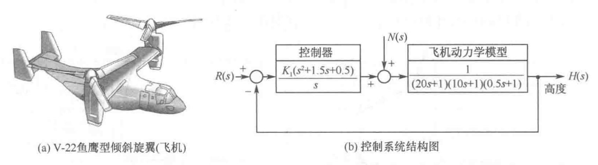

> Image description: This figure, captioned "图 4－47 V－22 旋翼机的高度控制系统," illustrates the height control system of a V-22 Osprey tiltrotor aircraft. It consists of two parts: (a) a photograph of the V-22 aircraft and (b) a block diagram of its control system. The block diagram represents a closed-loop feedback system. The input is the reference signal $R(s)$, which enters a summing junction. This is followed by a controller block labeled "控制器" with the transfer function $\frac{K_1(s^2+1.5s+0.5)}{s}$. The output of the controller is summed with an external disturbance signal $N(s)$ before entering the aircraft dynamics model block, labeled "飞机动力学模型," which has a transfer function of $\frac{1}{(20s+1)(10s+1)(0.5s+1)}$. The final system output is $H(s)$, representing height (高度). A feedback loop connects the output $H(s)$ back to the initial summing junction with a negative sign, completing the control loop.
图 4－47 V－22 旋翼机的高度控制系统

解 本题属于应用根轨迹法设计系统参数的综合性问题，其中包括引入前置滤波器，以抵消闭环零点的不利影响，改善系统性能。
（1）绘制系统的根轨迹图。由图4－47（b）知，系统开环传递函数

$$
G(s)=\frac{K_{1}\left(s^{2}+1.5 s+0.5\right)}{s(20 s+1)(10 s+1)(0.5 s+1)}=\frac{K^{*}(s+0.5)(s+1)}{s(s+0.05)(s+0.1)(s+2)}
$$

式中

$$
K^{*}=0.01 K_{1}
$$

渐近线：交点与交角

$$
\sigma_{a}=-0.325, \quad \varphi_{a}= \pm 90^{\circ}
$$

分离点：

$$
\begin{gathered}
\frac{1}{d}+\frac{1}{d+0.05}+\frac{1}{d+0.1}+\frac{1}{d+2}=\frac{1}{d+0.5}+\frac{1}{d+1} \\
d=-0.022
\end{gathered}
$$

根轨迹与虚轴交点：闭环特征方程为


<!-- source_pdf_page: 133 -->
$$
s(s+0.05)(s+0.1)(s+2)+K^{*}(s+0.5)(s+1)=0
$$

整理得

$$
s^{4}+2.15 s^{3}+\left(0.305+K^{*}\right) s^{2}+\left(0.01+1.5 K^{*}\right) s+0.5 K^{*}=0
$$

列劳斯表：

| $s^{4}$ | 1 |
| :---: | :---: |
| $s^{3}$ | 2.15 |
| $s^{2}$ | $0.3+0.302 K^{*}$ |
| $s^{1}$ | $\frac{0.003-0.622 K^{*}+0.453\left(K^{*}\right)^{2}}{0.3+0.302 K^{*}}$ |
| $s^{0}$ | $0.5 K^{*}$ |

令 $0.453\left(K^{*}\right)^{2}-0.622 K^{*}+0.003=0$ ，解得

$$
K_{1}^{*}=0.005, \quad K_{2}^{*}=1.368
$$

令 $\left(0.3+0.302 K^{*}\right) s^{2}+0.5 K^{*}=0$ ，代入 $s=\mathrm{j} \omega 、 K_{1}^{*}$ 及 $K_{2}^{*}$ ，解得

$$
\omega_{1}=0.09, \quad \omega_{2}=0.977
$$

绘出系统概略根轨迹图，如图 4－23－1 所示。
由于 $K_{1}=100 K^{*}$ ，因此使系统稳定的 $K_{1}$ 值范围为 $0<K_{1}<0.5$ 以及 $K_{1}>136.8$ 。
应用 MATLAB 软件包，得到系统根轨迹图如图 4－23－2 所示。
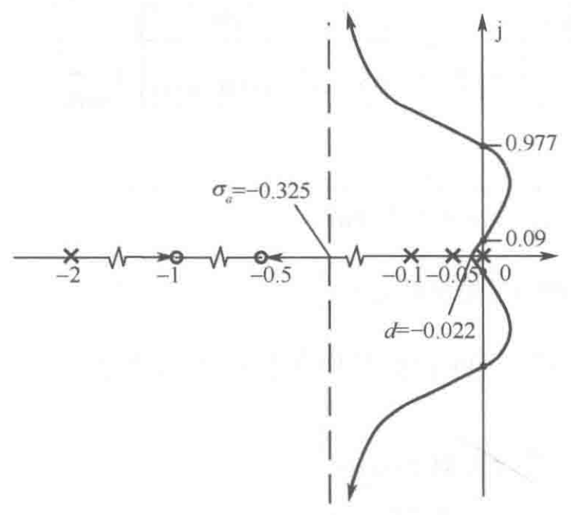

> Image description: A technical plot showing a root locus diagram on the complex plane, with the horizontal axis representing the real part and the vertical axis labeled "j" for the imaginary part. The figure illustrates system stability and poles/zeros. On the real axis, several markers are present: crosses (poles) at -2 and approximately -0.08, and circles (zeros) at -1 and -0.5. A dashed vertical line marks a specific boundary at $\sigma_a = -0.325$. To the right of this boundary, a curved trajectory originates from a pole near the origin, moves slightly into the positive real half-plane reaching a peak value of $d = -0.022$, and then curves back toward the imaginary axis. Two points on this curve are labeled with values: $0.977$ and $0.09$. The plot uses arrows to indicate the direction of the root locus as system parameters vary.

图4－23－1 $1+K_{1} \frac{s^{2}+1.5 s+0.5}{s(20 s+1)(10 s+1)(0.5 s+1)}=0$
概略根轨迹图
$0.305+K^{*}$
$0.01+1.5 K^{*}$
$0.5 K^{*}$
$0.5 K^{*}$

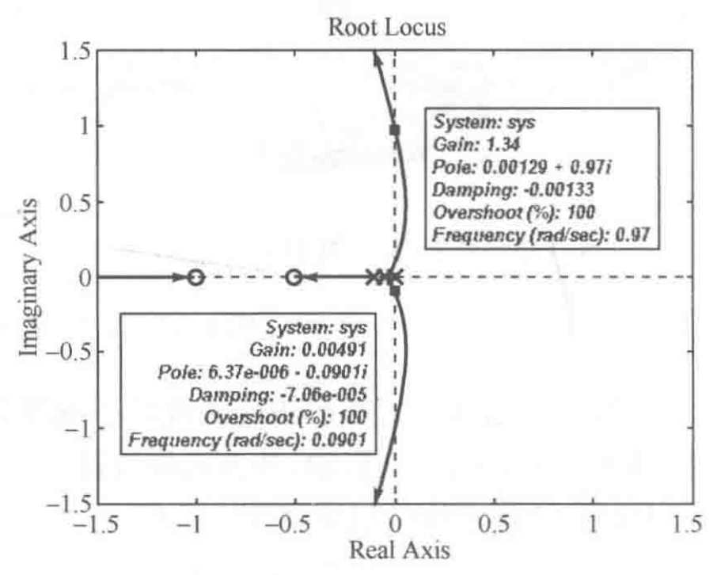

> Image description: A root locus plot is shown in this engineering figure, illustrating the trajectories of system poles as a gain parameter varies. The graph features a horizontal "Real Axis" and a vertical "Imaginary Axis," both ranging from -1.5 to 1.5. The root locus consists of paths starting at open-loop poles (marked by circles on the real axis) and moving toward zeros or infinity. A significant portion of the locus crosses into the right-half plane, forming a curved arc that extends into the positive real region before curving back. Two data boxes provide specific system states: one shows a gain of 0.00491 with a pole near the origin ($6.37\text{e-}006 - 0.0901i$), and another shows a higher gain of 1.34 with a pole at $0.00129 + 0.97i$. Both points indicate negative damping and 100% overshoot, signifying system instability. The caption provides the characteristic equation: $1+K_{1} \frac{s^{2}+1.5 s+0.5}{s(20 s+1)(10 s+1)(0.5 s+1)}=0$.
图 4－23－2 $1+K_{1} \frac{s^{2}+1.5 s+0.5}{s(20 s+1)(10 s+1)(0.5 s+1)}=0$
根轨迹图（MATLAB）

（2）当 $K_{1}=280$ 时，确定系统单位阶跃输人响应。应用 MATLAB 软件包，得到单位阶跃输人时系统的输出响应曲线，如图 4－23－3 中（a）中虚线所示。由图可得

$$
\sigma \%=92.1 \%, \quad t_{s}=43.9 \mathrm{~s} \quad(\Delta=2 \%)
$$

显然，系统动态性能不佳。
（3）当 $K_{1}=280$ 时，确定系统单位阶跃扰动响应。应用 MATLAB 软件包，得到单位阶跃扰动输人下系统的输出响应曲线，如图 4－23－3 中（b）所示。由图可见，扰动响应是振荡


<!-- source_pdf_page: 134 -->
的，但最大振幅约为 0.003 ，故可略去不计。
（4）有前置滤波器时，系统的单位阶跃输人响应（ $K_{1}=280$ ）。无前置滤波器时，闭环传递函数

$$
\Phi_{1}(s)=\frac{2.8(s+0.5)(s+1)}{s^{4}+2.15 s^{3}+3.105 s^{2}+4.21 s+1.4}
$$

有前置滤波器 $G_{p}(s)=\frac{0.5}{s^{2}+1.5 s+0.5}$ 时，闭环传递函数

$$
\Phi_{2}(s)=G_{p}(s) \cdot \Phi_{1}(s)=\frac{1.4}{s^{4}+2.15 s^{3}+3.105 s^{2}+4.21 s+1.4}
$$

可见，$\Phi_{1}(s)$ 与 $\Phi_{2}(s)$ 有相同的极点，但 $\Phi_{1}(s)$ 有 -0.5 和 -1 两个闭环零点，虽可加快响应速度，但却极大增加了振荡幅度，使超调量过大；而 $\Phi_{2}(s)$ 的闭环零点被前置滤波器完全对消，因而最终改善了系统动态性能。

应用 MATLAB 软件包，得有前置滤波器时系统的单位阶跃响应如图 4－23－3（a）中实线所示。

$$
\sigma \%=7.08 \%, \quad t_{s}=25.8 \mathrm{~s} \quad(\Delta=2 \%)
$$

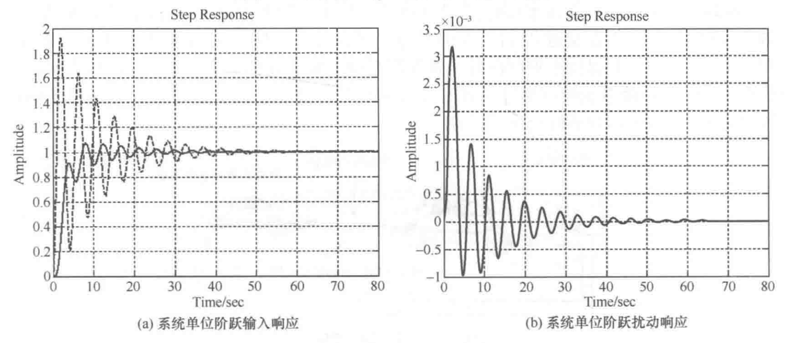

> Image description: The image contains two side-by-side MATLAB plots showing the step response of a V-22 rotorcraft's altitude over time. Both graphs feature "Time/sec" on the x-axis, ranging from 0 to 80 seconds, and "Amplitude" on the y-axis. Plot (a), titled "(a) 系统单位阶跃输入响应" (System Unit Step Input Response), shows two waveforms—one solid and one dashed—oscillating around a steady-state value of 1. The response exhibits significant overshoot and damped oscillations before stabilizing after approximately 50 seconds. Plot (b), titled "(b) 系统单位阶跃扰动响应" (System Unit Step Disturbance Response), displays the system's reaction to a disturbance. The y-axis scale is significantly smaller, indicated by a multiplier of $10^{-3}$. The amplitude oscillates around zero with decreasing magnitude, eventually converging to zero as time progresses. Together, these plots illustrate the aircraft's stability and transient performance in response to both control inputs and external disturbances.
图 4－23－3 V－22 旋翼机的高度时间响应（MATLAB）

MATLAB 程序：exe423．m
\％建立开环传递函数模型
$\mathrm{G}=\mathrm{zpk}([-0.5-1],[0-0.05-0.1-2], 1) ;$
\％绘制相应系统的根轨迹
figure
rlocus（G）；$\quad \operatorname{axis}([-1.5,1.5,-1.5,1.5]) ;$
\％系统输人时间响应
\％原系统
$\mathrm{K}=280$ ；
num1 $=[\mathrm{K} 1.5 * \mathrm{~K} 0.5 * \mathrm{~K}]$ ；
den1 $=\left[\begin{array}{llll}0 & 0 & 1 & 0\end{array}\right]$ ；
num2＝［1］；$\quad \operatorname{den} 2=\left[\begin{array}{lllll}100 & 215 & 30.5 & 1\end{array}\right] ;$
［numc，denc］＝series（num1，den1，num2，den2）；
［numr，denr］＝cloop（numc，denc）；


<!-- source_pdf_page: 135 -->
```
sysr = tf(numr, denr); t=0:0.01:80;
figure
    step(sysr,t); hold on;
% 添加前置滤波器
numf = [0.5]; denf = [1 1.5 0.5];
[num,den] = series(numr,denr,numf,denf);
sys = tf(num, den);
    step(sys,t); grid
% 系统扰动时间响应
K=280;
numh = [K 1.5*K 0.5*K]; denh = [00 1 0 ];
numg = [1]; deng = [100 215 30.5 1];
[numn,denn] = feedback (numg,deng,numh,denh);
sysn= tf(numn, denn)
figure
    step(sysn,t); grid
```

4－24 在未来的智能汽车－高速公路系统中汇集了各种电子设备，可以提供事故、堵塞、路径规划、路边服务和交通控制等实时信息。图4－48（a）所示为自动化高速公路系统，图4－48（b）给出的是保持车辆间距的位置控制系统。要求选择放大器增益 $K_{a}$ 和速度反馈系数 $K_{t}$ 的取值，使系统响应单位斜坡输入 $R(s)=1 / s^{2}$ 的稳态误差小于 0.5 ，单位阶跃响应的超调量小于 $10 \%$ ，调节时间小于 $2 s$（ $\Delta=5 \%$ ）。

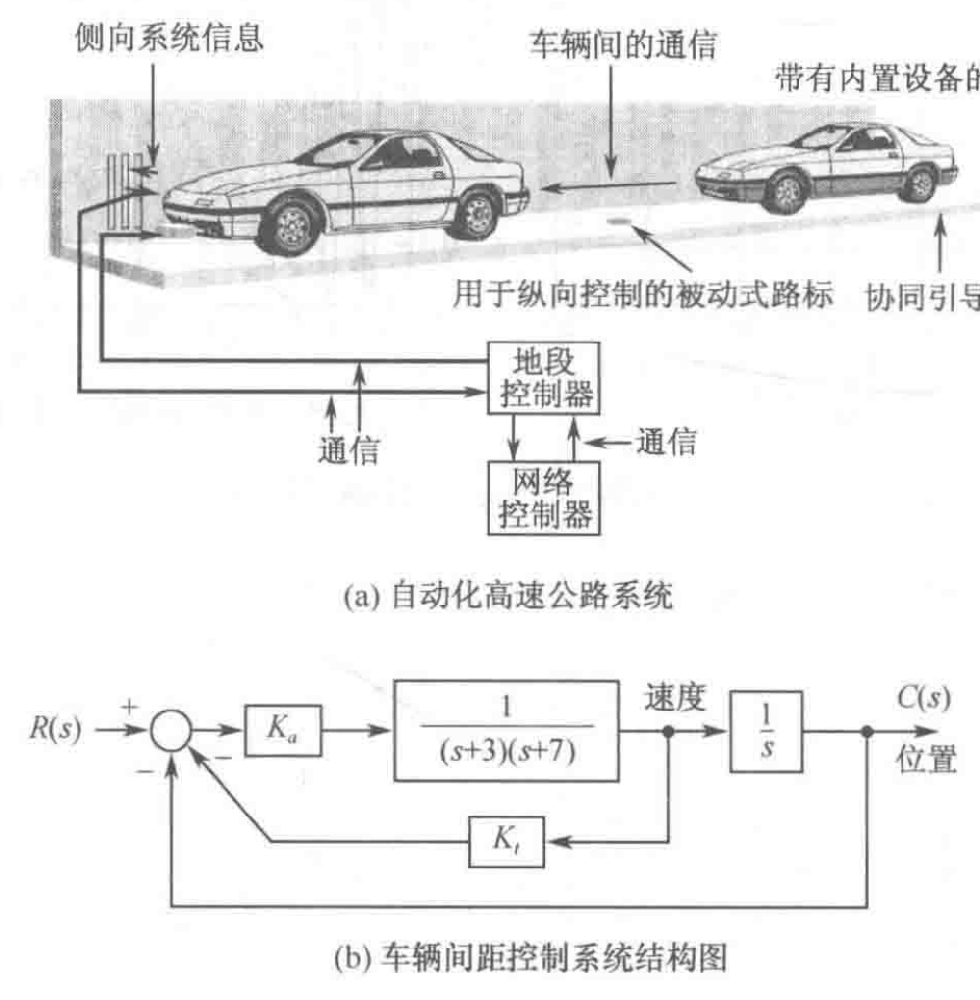

> Image description: This image contains two figures labeled (a) and (b), illustrating an automated highway system for vehicle distance control. Figure (a) is a conceptual diagram showing two cars on a road with infrastructure components. Labels include "侧向系统信息" (lateral system information), "车辆间的通信" (inter-vehicle communication), and "用于纵向控制的被动式路标" (passive roadside markers for longitudinal control). Arrows indicate bidirectional communication between the vehicles, a "地段控制器" (segment controller), and a "网络控制器" (network controller). Figure (b) is a control system block diagram. The input $R(s)$ enters a summing junction, followed by an amplifier gain block $K_a$, a plant transfer function $\frac{1}{(s+3)(s+7)}$, and an integrator $\frac{1}{s}$ to produce the output $C(s)$, labeled as "位置" (position). The signal before the integrator is labeled "速度" (velocity). Two feedback loops are present: one from the velocity signal through gain $K_t$ back to the summing junction, and another from the position output $C(s)$ directly back to the input.
图 4－48 智能汽车一高速公路系统

解 本题应用等效根轨迹技术及 MATLAB 设计软件包，确定多个系统参数的取值。设计过程中，需要综合运用劳斯稳定判据、稳态误差计算法、主导极点法以及动态性能估算法等知识。
（1）稳定性要求。由图4－48（b）知，速度反馈内回路传递函数


<!-- source_pdf_page: 136 -->
$$
G_{1}(s)=\frac{K_{a}}{(s+3)(s+7)+K_{\imath} K_{a}}
$$

开环传递函数

$$
G(s)=\frac{K_{a}}{s\left(s^{2}+10 s+21+K_{t} K_{a}\right)}=\frac{\frac{K_{a}}{21+K_{t} K_{a}}}{s\left(\frac{s^{2}}{21+K_{t} K_{a}}+\frac{10 s}{21+K_{t} K_{a}}+1\right)}
$$

式中，速度误差系数

$$
K_{v}=\frac{K_{a}}{21+K_{t} K_{a}}
$$

闭环传递函数

$$
\Phi(s)=\frac{K_{a}}{s\left(s^{2}+10 s+21+K_{t} K_{a}\right)+K_{a}}=\frac{K_{a}}{s^{3}+10 s^{2}+\left(21+K_{t} K_{a}\right) s+K_{a}}
$$

首先，$K_{t}$ 和 $K_{a}$ 的选取应保证闭环系统具有稳定性。列劳斯表如下：

| $s^{3}$ | 1 | $21+K_{t} K_{a}$ |
| :---: | :---: | :---: |
| $s^{2}$ | 10 | $K_{a}$ |
| $s^{1}$ | $\frac{10\left(21+K_{t} K_{a}\right)-K_{a}}{10}$ |  |
| $s^{0}$ | $K_{a}$ |  |

由劳斯稳定判据知：使闭环系统稳定的充分必要条件是

$$
\begin{aligned}
K_{a}>0, \quad \frac{10\left(21+K_{t} K_{a}\right)-K_{a}}{10} & >0 \\
K_{a}>0, \quad K_{t}>0.1-\frac{21}{K_{a}} &
\end{aligned}
$$

也即
（2）稳态误差要求。根据系统在单位斜坡输入下的稳态误差要求

导出

$$
e_{s}(\infty)=\frac{1}{K_{v}}=\frac{21+K_{t} K_{a}}{K_{a}}<0.5
$$

由于要求 $K_{a}>0$ ，故应有 $\left(0.5-K_{t}\right)>0$ ，因此要求

$$
K_{t}<0.5-\frac{21}{K_{a}}
$$

从系统稳态性能（稳定性与稳态误差）考虑，$K_{t}$ 和 $K_{a}$ 的选取应满足

$$
K_{a}>0, \quad 0.5-\frac{21}{K_{a}}>K_{i}>0.1-\frac{21}{K_{a}}
$$

由于 $K_{t}>0$ ，故应有 $K_{a}>42$ 。于是，$K_{t}$ 和 $K_{a}$ 选取时应满足的条件可进一步表示为

$$
K_{a}>42, \quad 0<K_{i}<0.5-\frac{21}{K_{a}}
$$

显然，取 $K_{t}=0.25, K_{a}>\frac{21}{0.5-K_{t}}=84$ 是一组允许值。 $K_{a}$ 的最终确定，可根据对系统动态性能要求去选取。
（3）动态性能要求。对于二阶系统，若取阻尼比 $\zeta=0.6$ ，则 $\sigma \%=9.5 \%<10 \%$ ，因为要求


<!-- source_pdf_page: 137 -->
$$
t_{s}=\frac{3.5}{\sigma}<2 \quad(\Delta=5 \%)
$$

故应保证 $\sigma>1.75$ 。
在 $s$ 平面上，作了 $\zeta=0.6$ 和 $\sigma>1.75$ 扇形区，令 $K_{t}=0.25, K_{a}$ 从 $0 \rightarrow \infty$ ，作系统根轨迹。在根轨迹图上，$K_{a}$ 的最终确定应使闭环极点位于扇形区域内。闭环特征方程

$$
D(s)=\left(s^{3}+10 s^{2}+21 s\right)+0.25 K_{a}(s+4)=0
$$

等效根轨迹方程

$$
1+K^{*} \frac{s+4}{s(s+3)(s+7)}=0
$$

式中，$K^{*}=0.25 K_{a}$ 。根轨迹参数：
渐近线：

$$
\sigma_{a}=-3, \quad \varphi_{a}= \pm 90^{\circ}
$$

分离点：由

解出

$$
\begin{gathered}
\frac{1}{d}+\frac{1}{d+3}+\frac{1}{d+7}=\frac{1}{d+4} \\
d=-1.78
\end{gathered}
$$

系统概略根轨迹如图 4－24－1 所示。图中，复数根轨迹分支与 $\zeta=0.6$ 阻尼比线的交点为

$$
s_{1.2}=-2.5 \pm \mathrm{j} 3.33
$$

$s_{1}$ 点处的根轨迹增益 $K^{*}=21.5$ ，相应的

$$
K_{a}=\frac{K^{*}}{0.25}=86, \quad K_{v}=\frac{K_{a}}{21+K_{t} K_{a}}=2.024
$$

根据模值条件 $K^{*}=21.5$ ，可以确定第三个闭环极点 $s_{3}=-4.92$ 。此时系统的近似性能

$$
\begin{gathered}
\sigma \%=9.5 \%<10 \% \\
t_{s}=\frac{3.5}{2.5}=1.4 \mathrm{~s}<2.0 \mathrm{~s} \quad(\Delta=5 \%), \quad e_{s}(\infty)=\frac{1}{K_{v}}=\frac{1}{2.024}=0.494<0.5
\end{gathered}
$$

满足全部设计指标要求。
基于 MATLAB 软件包，图 4－24－2 给出 $\zeta=0.6$ 时的根轨迹增益，用以确定 $K_{a}$ 值；车辆间距控制系统根轨迹图，如图 4－24－3 所示，图中 $\triangle$ 表示 $\zeta=0.6$ 时系统的闭环极点。

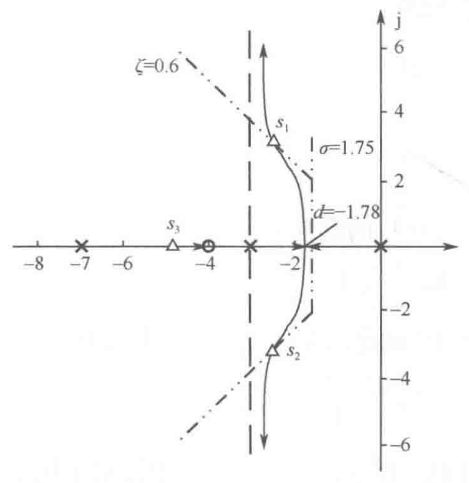

> Image description: This figure is a root locus plot for a vehicle spacing control system, plotted on the complex s-plane with a real axis (horizontal) and an imaginary axis labeled $j$ (vertical). The horizontal axis ranges from $-8$ to $0$. Several key elements are visible: * **Poles/Zeros:** Marked by crosses ($\times$) and circles ($\circ$) along the real axis, including one at approximately $-7$, another near $-4$, and one at $-3$. * **Closed-Loop Poles:** Three points labeled $s_1, s_2,$ and $s_3$ are marked with triangles ($\triangle$), representing system poles when the damping ratio $\zeta = 0.6$. * **Root Locus Paths:** Solid curved lines originate from open-loop poles and move toward the right half-plane. * **Labels:** A dashed line indicates a constant damping ratio $\zeta=0.6$. Vertical markers indicate specific real-part values: $\sigma = 1.75$ and $d = -1.78$. * **Arrows:** Directional arrows on the locus paths indicate increasing gain $K_a$.
图 4－24－1 $1+0.25 K_{u} \frac{s+4}{s(s+3)(s+7)}=0$

概略根轨迹图

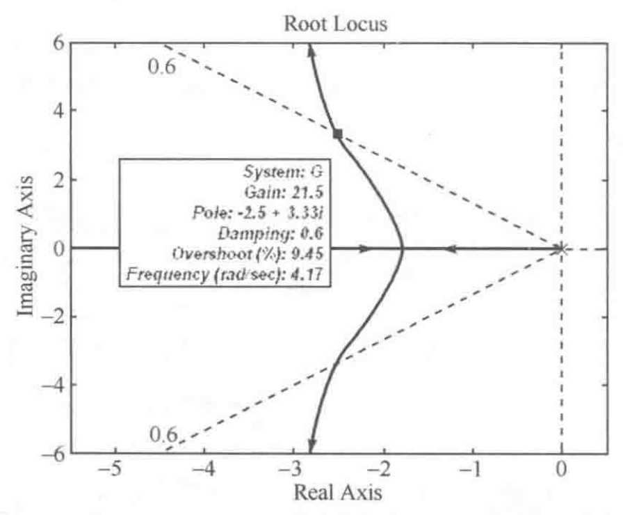

> Image description: This image shows a Root Locus plot from MATLAB used to determine the gain $K_a$ for a damping ratio of $\zeta = 0.6$. The graph features a horizontal "Real Axis" and a vertical "Imaginary Axis," ranging from -5 to 0 and -6 to 6, respectively. Two dashed lines originate from the origin (0,0) and extend outward, labeled as "0.6," representing constant damping ratio lines. The root locus paths are solid black curves starting at the origin and curving leftward into the left-half plane. A specific point on the upper curve is marked with a square, where it intersects the $\zeta = 0.6$ line. An informational text box provides system parameters for this intersection: * **Gain:** 21.5 * **Pole:** $-2.5 + 3.33i$ * **Damping:** 0.6 * **Overshoot (%):** 9.45 * **Frequency (rad/sec):** 4.17
图 4－24－2 确定 $\zeta=0.6$ 处的 $K_{a}$（MATLAB）


<!-- source_pdf_page: 138 -->
（4）设计指标验证。由于实际系统为无有限零点的三阶系统，负实极点 $s_{3}=-4.92$ 会增大系统阻尼，减小超调量。这里仅验证设计指标中的动态性能。作 MATLAB 程序，可得实际系统的单位阶跃输入响应，如图 4－24－4 所示。

由图4－24－4可得系统的动态性能

或

$$
\begin{array}{lll}
\sigma \% & =5 \%, & t_{s}=1.61 \mathrm{~s} \\
& (\Delta=2 \%) \\
\sigma \% & =5 \%, & t_{s}=1.28 \mathrm{~s} \\
& (\Delta=5 \%)
\end{array}
$$

结果满足设计指标要求。

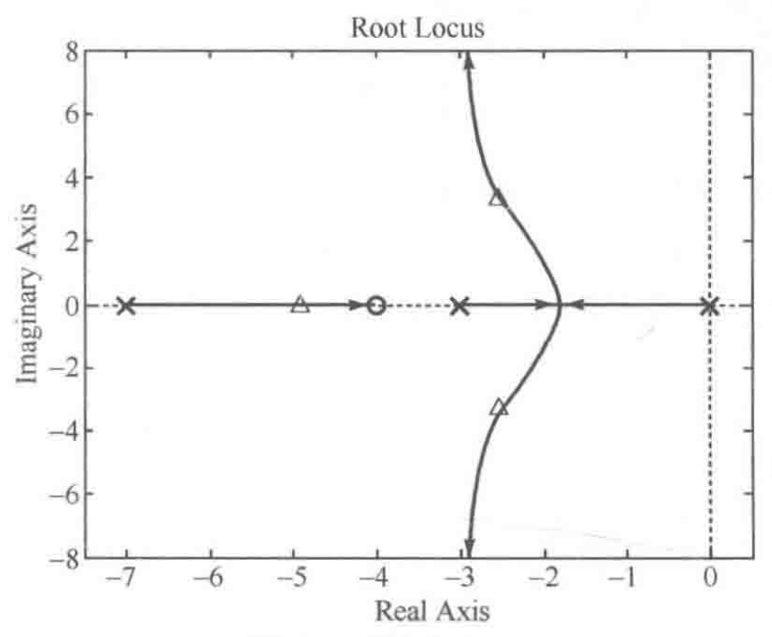

> Image description: This image is a Root Locus plot generated by MATLAB, as indicated by the caption "图 4－24－3 控制系统根轨迹图（MATLAB)". The graph features a horizontal x-axis labeled "Real Axis" ranging from -8 to 0 and a vertical y-axis labeled "Imaginary Axis" ranging from -8 to 8. The plot displays several markers: 'x' symbols representing open-loop poles located at $s = 0$, $s = -3$, and $s = -7$; an 'o' symbol representing an open-loop zero at $s = -4$; and triangle symbols indicating specific points along the locus. The root locus consists of solid lines with arrows showing the trajectory of closed-loop poles as gain increases. One branch moves from the pole at 0 toward the pole at -3, while another pair of branches emerges from the poles at 0 and -3, curves into the complex plane, and eventually trends vertically near the real value of -3.
图 4－24－3 控制系统根轨迹图（MATLAB）

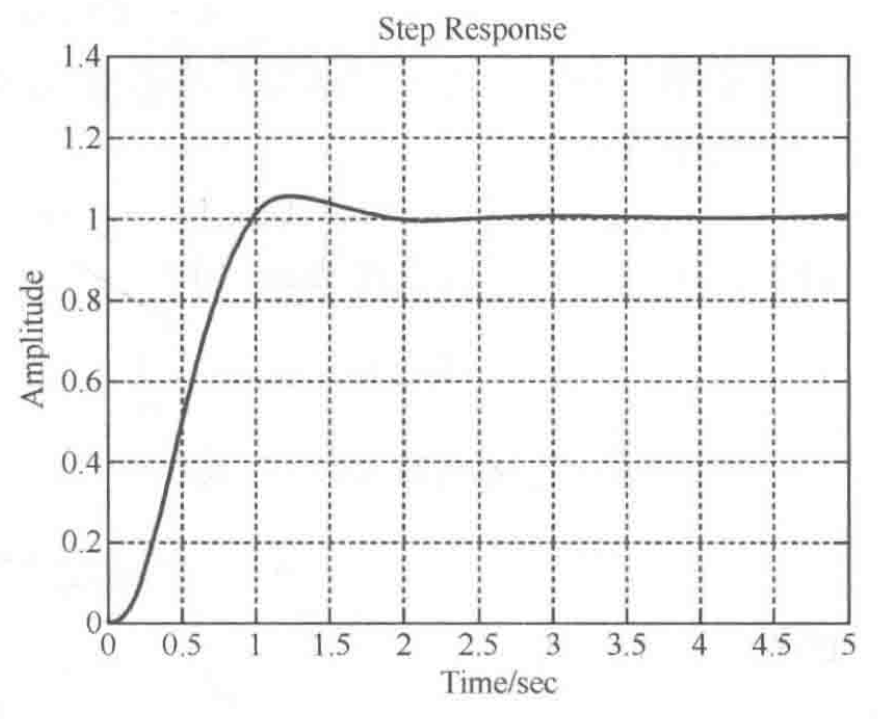

> Image description: The image shows a "Step Response" plot of a control system, likely generated via MATLAB as indicated by the caption. The graph features a vertical y-axis labeled "Amplitude," ranging from 0 to 1.4 in increments of 0.2, and a horizontal x-axis labeled "Time/sec," ranging from 0 to 5 seconds in increments of 0.5. The plot displays a single continuous curve starting at the origin (0,0). The response rises sharply, overshooting the steady-state value of 1.0 at approximately 1.2 seconds with a peak amplitude of roughly 1.05. Following this overshoot, the signal exhibits a slight oscillation before settling and stabilizing at an amplitude of 1.0 starting around 2 to 2.5 seconds. This behavior is characteristic of an underdamped second-order system, illustrating key engineering metrics such as rise time, peak overshoot, and settling time.
图 4－24－4 控制系统的单位阶跃响应（MATLAB）

MATLAB 程序：exe424．m
\％建立等效开环传递函数模型
$\mathrm{G}=\mathrm{zpk}([-4],[0-3-7], 1) ; \quad \mathrm{z}=0.6$ ；
\％绘制相应系统的根轨迹
figure（1）

$$
\begin{aligned}
& \operatorname{rlocus}(G) ; \quad \operatorname{sgrid}(z, \text { 'new' }) \quad \text { \%取阻尼比为 } 0.6 \\
& \operatorname{axis}\left(\left[\begin{array}{llll}
-5.5 & 0.5 & -6 & 6
\end{array}\right]\right)
\end{aligned}
$$

figure（2）

$$
\begin{array}{ll}
\mathrm{K}=21.5 ; & \text { rlocus }(\mathrm{G}) \\
\text { hold on; } & \text { rlocus }(\mathrm{G}, \mathrm{~K})
\end{array}
$$

\％最佳阻尼比对应的根轨迹增益
\％阻尼比为 0.6 时，系统的闭环特征根
\％控制系统的阶跃响应

$$
\begin{aligned}
& \mathrm{Ka}=86 ; \quad \mathrm{Kt}=0.25 \text {; } \\
& \text { numc }=[\mathrm{Ka}] ; \quad \text { denc }=\left[11021+\mathrm{Ka}^{*} \mathrm{Kt} \mathrm{0}\right] \text {; \% 系统开环传递函数 } \\
& \text { [num, den] }=\text { cloop (numc, denc) ; \% 系统闭环传递函数 } \\
& \text { roots(den); \% 系统闭环极点 } \\
& \text { sys }=\mathrm{tf}(\text { num }, \mathrm{den}) ; \quad \mathrm{t}=0: 0.005: 5 ; \\
& \text { figure(3) } \\
& \text { step(sys,t); grid on; }
\end{aligned}
$$


