<!-- source_pdf_page: 139 -->
## 第五章 线性系统的频域分析法

5－1 设系统闭环稳定，闭环传递函数为 $\Phi(s)$ 。试根据频率特性的定义证明：输入为余弦函数 $r(t)=A \cos (\omega t+\varphi)$ 时，系统的稳态输出为

$$
c_{\mathrm{s}}(t)=A \cdot|\Phi(\mathrm{j} \omega)| \cos [\omega t+\varphi+\angle \Phi(\mathrm{j} \omega)]
$$

证明 本题是为了加深对频率特性定义的理解。
对于输人信号

$$
r(t)=A \cos (\omega t+\varphi)=A \cos \omega t \cos \varphi-A \sin \omega t \sin \varphi
$$

对上式两边同时进行拉氏变换，可得

$$
R(s)=A \frac{s \cos \varphi}{s^{2}+\omega^{2}}-A \frac{\omega \sin \varphi}{s^{2}+\omega^{2}}=A \frac{s \cos \varphi-\omega \sin \omega}{s^{2}+\omega^{2}}
$$

假设闭环传递函数 $\Phi(s)$ 可表示为

$$
\Phi(s)=\frac{M(s)}{\left(s+s_{1}\right)\left(s+s_{2}\right) \cdots\left(s+s_{n}\right)}
$$

则系统的输出为

$$
C(s)=\Phi(s) R(s)=\frac{M(s)}{\left(s+s_{1}\right)\left(s+s_{2}\right) \cdots\left(s+s_{n}\right)} \cdot A \cdot \frac{s \cos \varphi-\omega \sin \omega}{s^{2}+\omega^{2}}
$$

上式的因式分解式为

$$
C(s)=\sum_{i=1}^{n} \frac{D_{i}}{s+s_{i}}+\frac{B_{1}}{s+\mathrm{j} \omega}+\frac{B_{2}}{s-\mathrm{j} \omega}
$$

对等式两边同时进行拉氏反变换，可得

$$
c(t)=\sum_{i=1}^{n} D_{i} \mathrm{e}^{-s_{i} t}+B_{1} \mathrm{e}^{-\mathrm{j} \omega t}+B_{2} \mathrm{e}^{\mathrm{j} \omega t}
$$

由于闭环系统稳定， $\operatorname{Res}_{i}<0, i=1,2, \cdots, n$ ，故系统稳态输出为

$$
c_{s s}(t)=B_{1} \mathrm{e}^{-\mathrm{j} \omega t}+B_{2} \mathrm{e}^{\mathrm{j} \omega t}
$$

其中

$$
\begin{aligned}
& B_{1}=\lim _{s \rightarrow-\mathrm{j} \omega} A \Phi(s) \frac{s \cos \varphi-\omega \sin \omega}{s-\mathrm{j} \omega}=\frac{1}{2} A|\Phi(\mathrm{j} \omega)| \mathrm{e}^{-\mathrm{j} \angle \Phi(\mathrm{j} \omega)}(\cos \varphi-\mathrm{j} \sin \varphi) \\
& B_{2}=\lim _{s \rightarrow \mathrm{j} \omega} A \Phi(s) \frac{s \cos \varphi-\omega \sin \omega}{s+\mathrm{j} \omega}=\frac{1}{2} A|\Phi(\mathrm{j} \omega)| \mathrm{e}^{\mathrm{j} \angle \Phi(\mathrm{j} \omega)}(\cos \varphi+\mathrm{j} \sin \varphi)
\end{aligned}
$$

所以可得

$$
\begin{aligned}
c_{s}(t) & =\frac{1}{2} A \cdot|\Phi(\mathrm{j} \omega)|\left[\mathrm{e}^{-\mathrm{j}[\angle \Phi(\mathrm{j} \omega)+\omega t]}(\cos \varphi-\mathrm{j} \sin \varphi)+\mathrm{e}^{\mathrm{j}[\angle \Phi(\mathrm{j} \omega)+\omega t]}(\cos \varphi+\mathrm{j} \sin \varphi)\right] \\
& =A \cdot|\Phi(\mathrm{j} \omega)|\{\cos \varphi \cos [\omega t+\angle \Phi(\mathrm{j} \omega)]-\sin \varphi \sin [\omega t+\angle \Phi(\mathrm{j} \omega)]\} \\
& =A \cdot|\Phi(\mathrm{j} \omega)| \cos [\omega t+\varphi+\angle \Phi(\mathrm{j} \omega)]
\end{aligned}
$$

证毕。
5－2 若系统单位阶跃响应

$$
c(t)=1-1.8 \mathrm{e}^{-4 t}+0.8 \mathrm{e}^{-9 t}
$$


<!-- source_pdf_page: 140 -->
试确定系统的频率特性。
解 本题可以根据系统的阶跃响应求出系统的传递函数，进而求出系统的频率特性。

对系统单位阶跃响应

$$
c(t)=1-1.8 \mathrm{e}^{-4 t}+0.8 \mathrm{e}^{-9 t}
$$

在零初始状态下进行拉氏变换，得

$$
C(s)=\frac{1}{s}-\frac{1.8}{s+4}+\frac{0.8}{s+9}=\frac{36}{s(s+4)(s+9)}
$$

由于系统的输人信号为阶跃信号，即 $R(s)=\frac{1}{s}$ ，故系统的传递函数为

$$
\Phi(s)=\frac{C(s)}{R(s)}=\frac{36}{(s+4)(s+9)}
$$

所以，系统的幅频特性为

$$
M(\omega)=|\Phi(\mathrm{j} \omega)|=\frac{36}{\sqrt{\left(16+\omega^{2}\right)\left(81+\omega^{2}\right)}}
$$

相频特性为

$$
\alpha(\omega)=\angle \Phi(\mathrm{j} \omega)=-\arctan \frac{\omega}{4}-\arctan \frac{\omega}{9}
$$

5－3 设系统结构图如图 5－61 所示，试确定在输人信号

$$
r(t)=\sin \left(t+30^{\circ}\right)-\cos \left(2 t-45^{\circ}\right)
$$

作用下，系统的稳态误差 $e_{\mathrm{s}}(t)$ 。
解 本题先根据控制系统的结构图求出系统的误差传递函数，再根据输人信号为正弦信号（余弦信号），利用频率特性的定义，求出系统的稳态误差。

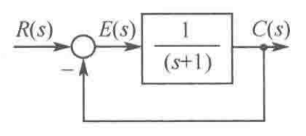

> Image description: This image is a control system block diagram labeled as "图5-61 控制系统结构图." The diagram illustrates a closed-loop feedback system. On the left, an input signal $R(s)$ enters a summing junction (represented by a circle). The output of this junction is the error signal $E(s)$, which serves as the input to a forward transfer function block. The central rectangular block contains the mathematical expression $\frac{1}{(s+1)}$, representing the system's plant or controller. The output from this block is labeled as $C(s)$. A feedback loop consists of a line originating from the output $C(s)$ and returning to the summing junction. This feedback path is marked with a minus sign ($-$), indicating negative feedback, where the output is subtracted from the reference input $R(s)$ to determine the error signal $E(s)$. Arrows indicate the unidirectional flow of signals throughout the system.
图5－61 控制系统结构图

由系统结构图可知，系统的误差传递函数为

$$
\Phi_{e}(s)=\frac{E(s)}{R(s)}=\frac{s+1}{s+2}
$$

则其频率特性为

$$
\Phi_{e}(\mathrm{j} \omega)=\frac{1+\mathrm{j} \omega}{2+\mathrm{j} \omega}=\sqrt{\frac{1+\omega^{2}}{4+\omega^{2}}} \mathrm{e}^{\mathrm{j}\left(\arctan \omega-\arctan \frac{\omega}{2}\right)}
$$

由频率特性定义可知，当输人信号 $r(t)=\sin \left(t+30^{\circ}\right)-\cos \left(2 t-45^{\circ}\right)$ 时，利用线性系统的可加性，则系统的稳态误差为

$$
\begin{aligned}
e_{s s}(t)= & \left.\sqrt{\frac{1+\omega^{2}}{4+\omega^{2}}}\right|_{\omega=1} \sin \left[t+30^{\circ}+\left.\left(\arctan \omega-\arctan \frac{\omega}{2}\right)\right|_{\omega=1}\right] \\
& -\left.\sqrt{\frac{1+\omega^{2}}{4+\omega^{2}}}\right|_{\omega=2} \cos \left[2 t-45^{\circ}+\left.\left(\arctan \omega-\arctan \frac{\omega}{2}\right)\right|_{\omega=2}\right] \\
= & 0.632 \sin \left(t+48.43^{\circ}\right)-0.791 \cos \left(2 t-26.57^{\circ}\right)
\end{aligned}
$$

## 5－4 二阶系统的开环传递函数

$$
G(s)=\frac{\omega_{n}^{2}}{s\left(s+2 \zeta \omega_{n}\right)}
$$

当取 $r(t)=2 \sin t$ 时，系统的稳态输出 $c_{s s}(t)=2 \sin \left(t-45^{\circ}\right)$ ，试确定系统参数 $\omega_{n}, \zeta$ 。


<!-- source_pdf_page: 141 -->
解 本题主要考查根据频率特性的定义，已知输人为正弦信号时系统的稳态输出，求解系统的参数。注意，系统的稳态输出是指闭环系统的输出，故在求系统稳态输出时，应从系统的闭环传递函数着手。

系统闭环传递函数

$$
\Phi(s)=\frac{\omega_{n}^{2}}{s^{2}+2 \zeta \omega_{n} s+\omega_{n}^{2}}
$$

则系统的幅频特性为

$$
M(\omega)=|\Phi(\mathrm{j} \omega)|=\frac{\omega_{n}^{2}}{\sqrt{\left(\omega_{n}^{2}-\omega^{2}\right)^{2}+4 \zeta^{2} \omega_{n}^{2} \omega^{2}}}
$$

相频特性为

$$
\alpha(\omega)=-\arctan \frac{2 \zeta \omega_{n} \omega}{\omega_{n}^{2}-\omega^{2}}
$$

由题设条件知，系统稳态输出

$$
c_{s s}(t)=2 \sin \left(t-45^{\circ}\right)=2 M(1) \sin [t+\alpha(1)]
$$

其中

$$
\begin{gathered}
M(1)=\left.\frac{\omega_{n}^{2}}{\sqrt{\left(\omega_{n}^{2}-\omega^{2}\right)^{2}+4 \zeta^{2} \omega_{n}^{2} \omega^{2}}}\right|_{\omega=1}=\frac{\omega_{n}^{2}}{\sqrt{\left(\omega_{n}^{2}-1\right)^{2}+4 \zeta^{2} \omega_{n}^{2}}}=1 \\
\alpha(1)=-\left.\arctan \frac{2 \zeta \omega_{n} \omega}{\omega_{n}^{2}-\omega^{2}}\right|_{\omega=1}=-\arctan \frac{2 \zeta \omega_{n}}{\omega_{n}^{2}-1}=-45^{\circ}
\end{gathered}
$$

故有

$$
\begin{gathered}
\omega_{n}^{4}=\left(\omega_{n}^{2}-1\right)^{2}+4 \zeta^{2} \omega_{n}^{2} \\
2 \zeta \omega_{n}=\left(\omega_{n}^{2}-1\right)
\end{gathered}
$$

解得

$$
\omega_{n}=1.847, \quad \zeta=0.653
$$

5－5 已知系统开环传递函数

$$
G(s) H(s)=\frac{K(\tau s+1)}{s^{2}(T s+1)}, \quad K, \tau, T>0
$$

试分析并绘制 $\tau>T$ 和 $T>\tau$ 情况下的概略开环幅相特性曲线。
解 本题主要考查根据系统参数之间的关系绘制开环幅相特性曲线，掌握系统参数变化对开环幅相特性曲线的影响。

系统的开环频率特性

$$
G(\mathrm{j} \omega) H(\mathrm{j} \omega)=\frac{K(1+\mathrm{j} \tau \omega)}{-\omega^{2}(1+\mathrm{j} T \omega)}=-\frac{K\left(1+T_{\tau} \omega^{2}\right)}{\omega^{2}\left(1+T^{2} \omega^{2}\right)}-\mathrm{j} \frac{K(\tau-T) \omega}{\omega^{2}\left(1+T^{2} \omega^{2}\right)}
$$

开环幅相特性曲线的起点 $G\left(\mathrm{j} O_{+}\right) H\left(\mathrm{j} O_{+}\right)=\infty \angle-180^{\circ}$ ；终点：$G(\mathrm{j} \infty) H(\mathrm{j} \infty)= 0 /-180^{\circ}$ ，且与实轴无交点。

若 $\tau>T$ ，则 $\operatorname{Re}[G(\mathrm{j} \omega) H(\mathrm{j} \omega)]<0, \operatorname{Im}[G(\mathrm{j} \omega) H(\mathrm{j} \omega)]<0$ ，故开环幅相特性曲线位于第 III 象限，如图 5－5－1 所示；若 $\tau<T$ ，则 $\operatorname{Re}[G(\mathrm{j} \omega) H(\mathrm{j} \omega)]<0, \operatorname{Im}[G(\mathrm{j} \omega) H(\mathrm{j} \omega)]>0$ ，故开环幅相特性曲线位于第 II 象限，如图 5－5－2 所示。

MATLAB 验证：设 $K=1, T=1, \tau=2$ ，则系统开环幅相特性曲线如图 5－5－3 所示；设 $K=1, T=2, \tau=1$ ，则系统开环幅相特性曲线如图 5－5－4 所示。


<!-- source_pdf_page: 142 -->
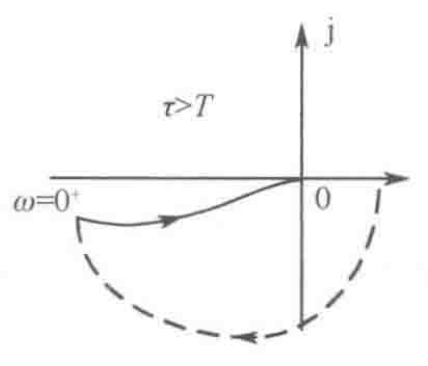

> Image description: This image is a technical plot from a textbook, captioned as "图 5-5-1 $\tau > T$ 时开环幅相特性曲线," which refers to the open-loop frequency response characteristics when $\tau > T$. The figure features a Cartesian coordinate system where the vertical axis is labeled $j$ and the horizontal axis represents frequency $\omega$. The origin is marked with "0". A curved line starts from the horizontal axis at the point labeled $\omega = 0^+$, moves upward and to the right, and terminates at the origin. Below this path, a dashed semicircular arc extends from $\omega = 0^+$ down and back up toward the vertical axis, indicated by an arrow showing a counter-clockwise direction of travel. The inequality $\tau > T$ is centered in the upper half of the plot. In engineering terms, this represents a trajectory in the complex plane used for stability analysis or system response.
图 5－5－1 $\tau>T$ 时开环幅相特性曲线

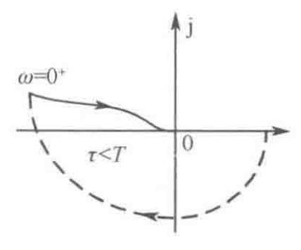

> Image description: A technical diagram illustrating a frequency response curve in the complex plane, likely representing an open-loop Bode plot or Nyquist plot for a control system. The image features a vertical axis labeled $j$ and a horizontal axis with a center point marked as $0$. A solid black line originates from the left on the real axis at a point labeled $\omega=0^+$, curves upward, and terminates at the origin $(0,0)$. A dashed semicircular arc connects the starting point of the curve to the bottom of the vertical axis, with an arrow indicating a clockwise direction. The region enclosed by these paths is labeled with the variable condition $\tau < T$. The Chinese caption "图 5－5－1 $\tau > T$ 时开环幅相特性曲线" indicates this is Figure 5-5-1, showing the open-loop amplitude-phase characteristic curve when $\tau > T$, though the label within the plot specifically denotes $\tau < T$.
图5－5－2 $\tau<T$ 时开环幅相特性曲线

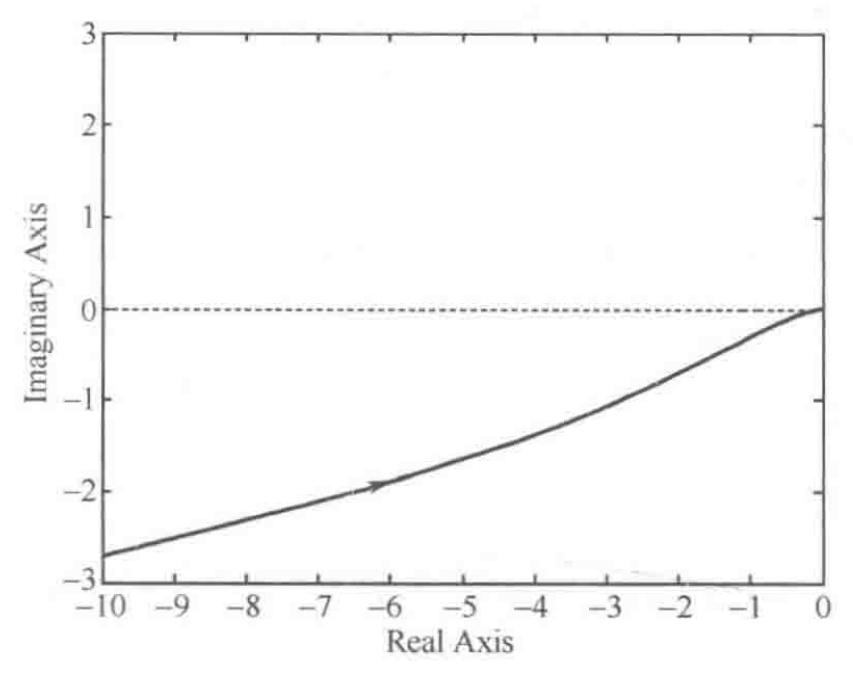

> Image description: A technical plot showing an open-loop frequency response curve in the complex plane. The horizontal axis is labeled "Real Axis" with a scale from -10 to 0, and the vertical axis is labeled "Imaginary Axis" with a scale from -3 to 3. A dashed horizontal line marks the zero value on the imaginary axis. A solid black curve originates at approximately (-10, -2.8) and trends upward and to the right, terminating at the origin (0, 0). An arrow on the curve indicates the direction of movement toward the origin. According to the Chinese caption "图5－5－2 $\tau < T$ 时开环幅相特性曲线," this figure represents the open-loop amplitude-phase characteristic curve under the condition where the time constant $\tau$ is less than $T$. In control engineering, such a plot typically illustrates the stability and frequency response of a system.
图 5－5－3 $K=1, T=1, \tau=2$ 时开环幅相特性曲线（MATLAB）

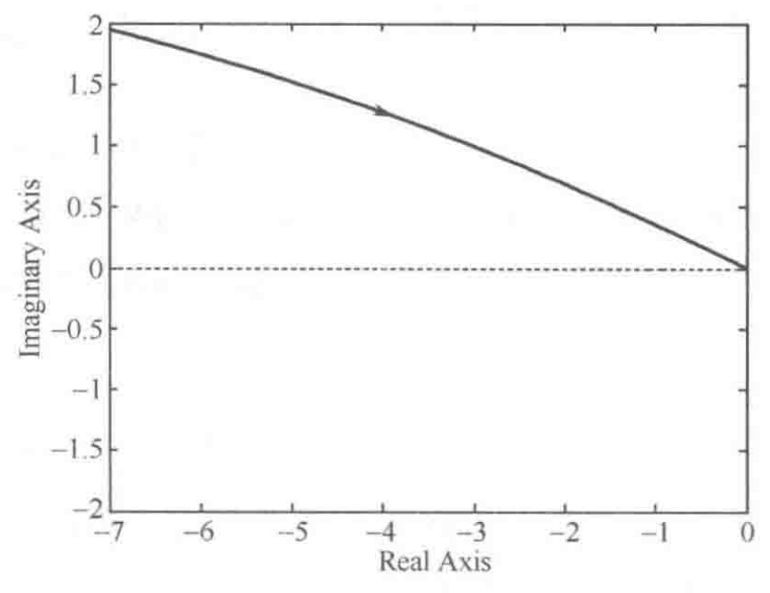

> Image description: A technical plot showing the open-loop frequency response (Nyquist plot) of a system in the complex plane. The horizontal axis is labeled "Real Axis" and ranges from -7 to 0, while the vertical axis is labeled "Imaginary Axis" and ranges from -2 to 2. The figure displays a single continuous line starting at the origin $(0,0)$ and extending linearly into the second quadrant, ending at approximately $(-7, 1.9)$. A small arrow on the line indicates the direction of increasing frequency, moving away from the origin toward the upper-left. The plot is enclosed in a rectangular frame with tick marks every unit along both axes. According to the caption, this MATLAB-generated figure represents the open-loop amplitude and phase characteristics for specific parameters: $K=1$, $T=1$, and $\tau=2$.
图 5－5－4 $K=1, T=2, \tau=1$ 时开环幅相特性曲线（MATLAB）

MATLAB 程序 ：exe505．m
$\mathrm{K}=1 ; \mathrm{t}=2 ; \mathrm{T}=1$ ；
$\mathrm{G} 1=\mathrm{tf}(\mathrm{K} *[\mathrm{t}, 1], \operatorname{conv}([1,0,0],[\mathrm{T}, 1])) ;$
figure（1）；nyquist（G1）；
\％确定系统的传递函数
\％绘制系统的开环幅相特性曲线
$\mathrm{K}=1 ; \mathrm{t}=1 ; \mathrm{T}=2$ ；
$\mathrm{G2}=\mathrm{tf}(\mathrm{K} *[\mathrm{t}, 1], \operatorname{conv}([1,0,0],[\mathrm{T}, 1])) ;$
figure（2）；nyquist（G2）；
5－6 已知系统开环传递函数

$$
G(s) H(s)=\frac{1}{s^{\nu}(s+1)(s+2)}
$$

试分别绘制 $\nu=1,2,3,4$ 时系统的概略开环幅相特性曲线。
解 本题主要考查根据系统不同的型别绘制开环幅相特性曲线的方法，加深了解系统的不同型别对开环幅相曲线的影响。

系统的开环频率特性

$$
G(\mathrm{j} \omega) H(\mathrm{j} \omega)=\frac{1}{(\mathrm{j} \omega)^{\nu}(1+\mathrm{j} \omega)(2+\mathrm{j} \omega)}
$$

（1）当 $\nu=1$ 时

$$
G(\mathrm{j} \omega) H(\mathrm{j} \omega)=\frac{1}{(\mathrm{j} \omega)(1+\mathrm{j} \omega)(2+\mathrm{j} \omega)}=-\frac{3}{\left(1+\omega^{2}\right)\left(4+\omega^{2}\right)}-\mathrm{j} \frac{\left(2-\omega^{2}\right)}{\omega\left(1+\omega^{2}\right)\left(4+\omega^{2}\right)}
$$

开环幅相特性曲线的起点为 $G\left(\mathrm{j} 0_{+}\right) H\left(\mathrm{j} 0_{+}\right)=\infty \angle-90^{\circ}$ ，终点为 $G(\mathrm{j} \infty) H(\mathrm{j} \infty)=0 \angle-270^{\circ}$ 。


<!-- source_pdf_page: 143 -->
与实轴的交点：令 $\operatorname{Im}[G(\mathrm{j} \omega) H(\mathrm{j} \omega)]=0$ ，解得

$$
\left\{\begin{array}{l}
\omega_{x}=\sqrt{2} \\
G\left(\mathrm{j} \omega_{x}\right) H\left(\mathrm{j} \omega_{x}\right)=\operatorname{Re}\left[G\left(\mathrm{j} \omega_{x}\right) H\left(\mathrm{j} \omega_{x}\right)\right]=-\frac{1}{6}
\end{array}\right.
$$

其中 $\omega_{x}$ 为 $G(\mathrm{j} \omega) H(\mathrm{j} \omega)$ 与负实轴交点处的频率。开环幅相特性曲线在第 II 和第 III 象限间变化，如图 5－6－1 所示。
（2）当 $\nu=2$ 时

$$
\begin{aligned}
G(\mathrm{j} \omega) H(\mathrm{j} \omega) & =\frac{1}{-\omega^{2}(1+\mathrm{j} \omega)(2+\mathrm{j} \omega)} \\
& =-\frac{\left(2-\omega^{2}\right)}{\omega^{2}\left(1+\omega^{2}\right)\left(4+\omega^{2}\right)}+\mathrm{j} \frac{3}{\omega\left(1+\omega^{2}\right)\left(4+\omega^{2}\right)}
\end{aligned}
$$

开环幅相特性曲线的起点为 $G\left(\mathrm{j} O_{+}\right) H\left(\mathrm{j} O_{+}\right)=\infty \angle-180^{\circ}$ ，终点为 $G(\mathrm{j} \infty) H(\mathrm{j} \infty)=0 \angle-360^{\circ}$ 。
与虚轴的交点：令 $\operatorname{Re}[G(\mathrm{j} \omega) H(\mathrm{j} \omega)]=0$ ，解得

$$
\left\{\begin{array}{l}
\omega_{y}=\sqrt{2} \\
G\left(\mathrm{j} \omega_{y}\right) H\left(\mathrm{j} \omega_{y}\right)=\operatorname{Im}\left[G\left(\mathrm{j} \omega_{y}\right) H\left(\mathrm{j} \omega_{y}\right)\right]=\frac{\sqrt{2}}{12}
\end{array}\right.
$$

其中 $\omega_{y}$ 为 $G(\mathrm{j} \omega) H(\mathrm{j} \omega)$ 与正虚轴交点处的频率。开环幅相特性曲线在第 I 和第 II 象限间变化，如图 5－6－1 所示。
（3）当 $\nu=3$ 时

$$
\begin{aligned}
G(\mathrm{j} \omega) H(\mathrm{j} \omega) & =\frac{1}{-\mathrm{j} \omega^{3}(1+\mathrm{j} \omega)(2+\mathrm{j} \omega)} \\
& =\frac{3}{\omega^{2}\left(1+\omega^{2}\right)\left(4+\omega^{2}\right)}+\mathrm{j} \frac{2-\omega^{2}}{\omega^{3}\left(1+\omega^{2}\right)\left(4+\omega^{2}\right)}
\end{aligned}
$$

开环幅相特性曲线的起点为 $G\left(\mathrm{j} O_{+}\right) H\left(\mathrm{j} O_{+}\right)=\infty \angle-270^{\circ}$ ，终点为 $G(\mathrm{j} \infty) H(\mathrm{j} \infty)=0 \angle-450^{\circ}$ 。
与实轴的交点：令 $\operatorname{Im}[G(\mathrm{j} \omega) H(\mathrm{j} \omega)]=0$ ，解得

$$
\left\{\begin{array}{l}
\omega_{x}=\sqrt{2} \\
G\left(\mathrm{j} \omega_{x}\right) H\left(\mathrm{j} \omega_{x}\right)=\operatorname{Re}\left[G\left(\mathrm{j} \omega_{x}\right) H\left(\mathrm{j} \omega_{x}\right)\right]=\frac{1}{12}
\end{array}\right.
$$

其中 $\omega_{x}$ 为 $G(\mathrm{j} \omega) H(\mathrm{j} \omega)$ 与正实轴交点处的频率。开环幅相特性曲线在第 I 和第 IV 象限间变化，如图 5－6－1 所示。
（4）当 $\nu=4$ 时

$$
G(\mathrm{j} \omega) H(\mathrm{j} \omega)=\frac{1}{\omega^{4}(1+\mathrm{j} \omega)(2+\mathrm{j} \omega)}=\frac{2-\omega^{2}}{\omega^{4}\left(1+\omega^{2}\right)\left(4+\omega^{2}\right)}-\mathrm{j} \frac{3}{\omega^{3}\left(1+\omega^{2}\right)\left(4+\omega^{2}\right)}
$$

开环幅相特性曲线的起点为 $G\left(\mathrm{j} O_{+}\right) H\left(\mathrm{j} O_{+}\right)=\infty \angle-360^{\circ}$ ，终点为 $G(\mathrm{j} \infty) H(\mathrm{j} \infty)=0 \angle-540^{\circ}$ 。
与虚轴的交点：令 $\operatorname{Re}[G(\mathrm{j} \omega) H(\mathrm{j} \omega)]=0$ ，解得

$$
\left\{\begin{array}{l}
\omega_{y}=\sqrt{2} \\
G\left(\mathrm{j} \omega_{y}\right) H\left(\mathrm{j} \omega_{y}\right)=\operatorname{Im}\left[G\left(\mathrm{j} \omega_{y}\right) H\left(\mathrm{j} \omega_{y}\right)\right]=-\frac{\sqrt{2}}{24}
\end{array}\right.
$$

其中 $\omega_{y}$ 为 $G(\mathrm{j} \omega) H(\mathrm{j} \omega)$ 与负虚轴交点处的频率。开环幅相特性曲线在第 III 和第 IV 象限


<!-- source_pdf_page: 144 -->
间变化，如图 5－6－1 所示。

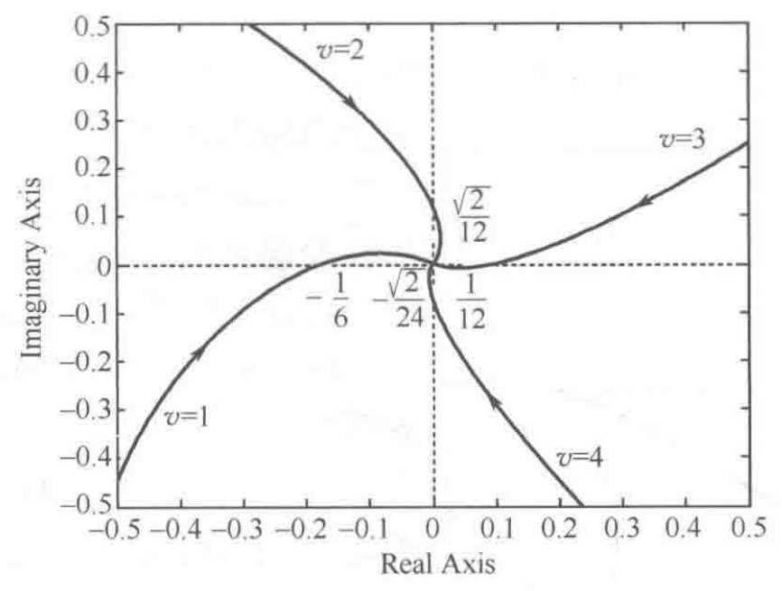

> Image description: A technical plot showing the root locus or trajectories of a system in the complex plane. The horizontal axis is labeled "Real Axis" and the vertical axis is labeled "Imaginary Axis," both ranging from -0.5 to 0.5. Four numbered paths, denoted by the variable $\nu$ ($\nu=1, \nu=2, \nu=3, \nu=4$), are plotted with arrows indicating the direction of movement. The trajectories originate or converge around a central region near the origin. Specific coordinate points are labeled numerically: $-\frac{1}{6}$, $-\frac{\sqrt{2}}{24}$, $\frac{1}{12}$ on the real axis, and $\frac{\sqrt{2}}{12}$ on the imaginary axis. The paths exhibit symmetry across the real axis. Path $\nu=1$ curves into the lower-left quadrant; path $\nu=2$ moves toward the upper-left; path $\nu=3$ extends into the upper-right; and path $\nu=4$ descends into the lower-right. This figure illustrates how system poles or eigenvalues shift as a parameter changes.
图 5－6－1 $v=1 、 2 、 3 、 4$ 时，$G(\mathrm{j} \omega) H(\mathrm{j} \omega)=\frac{1}{(\mathrm{j} \omega)^{\nu}(1+\mathrm{j} \omega)(2+\mathrm{j} \omega)}$ 幅相特性曲线（MATLAB）

MATLAB 程序 ：exe506．m
\％确定传递函数的分子系数
num $=[1]$ ；
\％确定 $v=1,2,3,4$ 系统传递函数的分母系数

$$
\begin{aligned}
& \operatorname{den} 1=[1,3,2,0] ; \\
& \operatorname{den} 2=[1,3,2,0,0] ; \\
& \operatorname{den} 3=[1,3,2,0,0,0] ; \\
& \operatorname{den} 4=[1,3,2,0,0,0,0] ;
\end{aligned}
$$

\％分别绘制 $v=1,2,3,4$ 系统的开环幅相曲线
nyquist（num，den1）；hold on；
nyquist（num，den2）；hold on；
nyquist（num，den3）；hold on；
nyquist（num，den4）；hold on；
\％确定坐标轴的范围
axis $([-0.5,0.5,-0.5,0.5])$ ；hold off；
5－7 已知系统开环传递函数

$$
G(s)=\frac{K\left(-T_{2} s+1\right)}{s\left(T_{1} s+1\right)}, \quad K, T_{1}, T_{2}>0
$$

当取 $\omega=1$ 时，$\angle G(\mathrm{j} \omega)=-180^{\circ},|G(\mathrm{j} \omega)|=0.5$ 。当输人为单位速度信号时，系统稳态误差为 0.1 ，试写出系统开环频率特性表达式。

解 本题主要考查对幅频特性和相频特性定义的理解，并结合系统的稳态误差，求取系统的参数。

系统的开环频率特性

$$
G(\mathrm{j} \omega)=\frac{K\left(1-\mathrm{j} T_{2} \omega\right)}{\mathrm{j} \omega\left(1+\mathrm{j} T_{1} \omega\right)}=\frac{K \sqrt{1+T_{2}^{2} \omega^{2}}}{\omega \sqrt{1+T_{1}^{2} \omega^{2}}} \mathrm{e}^{-\mathrm{j}\left(\arctan T_{2} \omega+90^{\circ}+\arctan T_{1} \omega\right)}
$$

由 $\omega=1$ 时 $\angle G(\mathrm{j} \omega)=-180^{\circ}$ ，可得


<!-- source_pdf_page: 145 -->
$$
-\arctan T_{2}-90^{\circ}-\arctan T_{1}=-180^{\circ}
$$

应有

$$
\arctan T_{1}+\arctan T_{2}=90^{\circ}
$$

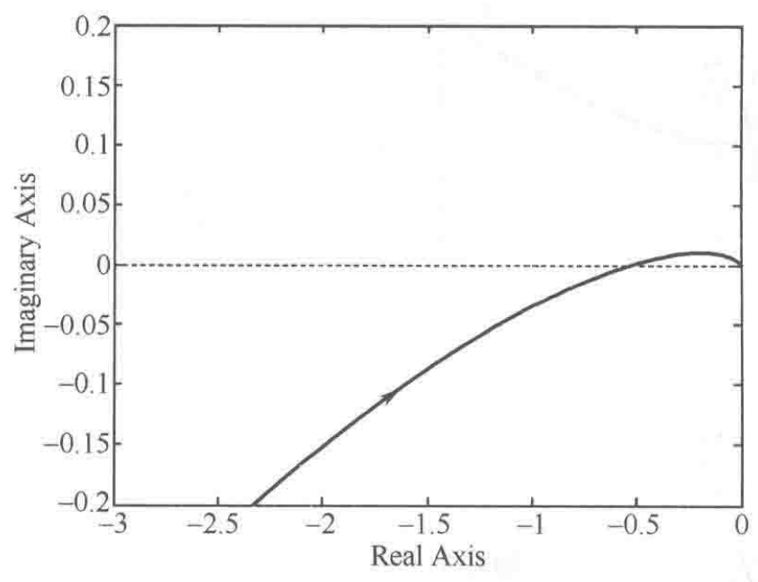

> Image description: A textbook figure showing a Nyquist plot of a frequency response function $G(\mathrm{j}\omega)$. The graph features a horizontal "Real Axis" ranging from -3 to 0 and a vertical "Imaginary Axis" ranging from -0.2 to 0.2. A dashed line marks the zero value on the imaginary axis. A solid black curve starts at the origin $(0,0)$, curves slightly into the positive imaginary region, then arcs downward through the negative imaginary plane toward the left. An arrow on the curve indicates the direction of increasing frequency $\omega$. The accompanying caption provides the transfer function: $G(\mathrm{j} \omega)=\frac{10(1-\mathrm{j} 0.05 \omega)}{\mathrm{j} \omega(1+\mathrm{j} 20 \omega)}$. In engineering terms, this plot represents the polar mapping of the system's open-loop frequency response in the complex plane, used to analyze stability and phase margins.
图 5－7－1 $G(\mathrm{j} \omega)=\frac{10(1-\mathrm{j} 0.05 \omega)}{\mathrm{j} \omega(1+\mathrm{j} 20 \omega)}$

幅相特性曲线（MATLAB）

等式两端取正切，得

$$
\tan \left[\arctan T_{1}+\arctan T_{2}\right]=\infty
$$

根据两角和的三角函数关系，得

$$
\frac{\tan \left(\arctan T_{1}\right)+\tan \left(\arctan T_{2}\right)}{1-\tan \left(\arctan T_{1}\right) \tan \left(\arctan T_{2}\right)}=\infty
$$

表明应有

$$
1-T_{1} T_{2}=0
$$

由 $\omega=1$ 时 $|G(\mathrm{j} \omega)|=0.5$ ，可得

$$
\frac{K \sqrt{1+T_{2}^{2}}}{\sqrt{1+T_{1}^{2}}}=0.5
$$

再由 $r(t)=t$ 时 $e_{\mathrm{ss}}(\infty)=\frac{1}{K}=0.1$ ，可得

$$
K=10
$$

于是由上述三个方程，可解得

$$
T_{1}=20, \quad T_{2}=0.05, \quad K=10
$$

故系统的开环频率特性为

$$
G(\mathrm{j} \omega)=\frac{10(1-\mathrm{j} 0.05 \omega)}{\mathrm{j} \omega(1+\mathrm{j} 20 \omega)}=\frac{10 \sqrt{1+0.0025 \omega^{2}}}{\omega \sqrt{1+400 \omega^{2}}} \mathrm{e}^{-\mathrm{j}\left(\arctan 0.05 \omega+90^{\circ}+\arctan 20 \omega\right)}
$$

系统的开环幅相特性曲线如图 5－7－1 所示。
MATLAB 程序：exe507．m

$$
\begin{aligned}
& \mathrm{K}=10 ; \mathrm{T} 1=20 ; \mathrm{T} 2=0.05 ; \\
& \mathrm{G}=\mathrm{tf}(\mathrm{~K} *[-\mathrm{T} 2,1],[\mathrm{T} 1,1,0]) ; \\
& \text { nyquist }(\mathrm{G}) ; \\
& \operatorname{axis}([-3,0,-0.2,0.2]) ;
\end{aligned}
$$

5－8 已知系统开环传递函数

$$
G(s) H(s)=\frac{10}{s(2 s+1)\left(s^{2}+0.5 s+1\right)}
$$

试分别计算 $\omega=0.5$ 和 $\omega=2$ 时，开环频率特性的幅值 $A(\omega)$ 和相位 $\varphi(\omega)$ 。
解 本题根据幅频特性和相频特性定义来进行计算，以进一步加深对频率特性定义的理解，注意振荡环节的相角计算象限。

系统的开环频率特性

$$
G(\mathrm{j} \omega)=\frac{10}{\mathrm{j} \omega(1+\mathrm{j} 2 \omega)\left(1-\omega^{2}+\mathrm{j} 0.5 \omega\right)}=A(\omega) \mathrm{e}^{\mathrm{j} \varphi(\omega)}
$$

其中

$$
A(\omega)=\frac{10}{\omega \sqrt{\left(1+4 \omega^{2}\right)\left[\left(1-\omega^{2}\right)^{2}+0.25 \omega^{2}\right]}}
$$


<!-- source_pdf_page: 146 -->
$$
\varphi(\omega)= \begin{cases}-90^{\circ}-\arctan 2 \omega-\arctan \frac{0.5 \omega}{1-\omega^{2}}, & 0<\omega \leqslant 1 \\ -90^{\circ}-\arctan 2 \omega-180^{\circ}+\arctan \frac{0.5 \omega}{\omega^{2}-1}, & \omega>1\end{cases}
$$

故当 $\omega=0.5$ 时

$$
\begin{aligned}
& A(\omega)=\left.\frac{10}{\omega \sqrt{\left(1+4 \omega^{2}\right)\left[\left(1-\omega^{2}\right)^{2}+0.25 \omega^{2}\right]}}\right|_{\omega=0.5}=17.89 \\
& \varphi(\omega)=-90^{\circ}-\arctan 2 \omega-\left.\arctan \frac{0.5 \omega}{1-\omega^{2}}\right|_{\omega=0.5}=-153.43^{\circ}
\end{aligned}
$$

当 $\omega=2$ 时

$$
\begin{aligned}
& A(\omega)=\left.\frac{10}{\omega \sqrt{\left(1+4 \omega^{2}\right)\left[\left(1-\omega^{2}\right)^{2}+0.25 \omega^{2}\right]}}\right|_{\omega=2}=0.38 \\
& \varphi(\omega)=-90^{\circ}-\arctan 2 \omega-180^{\circ}+\left.\arctan \frac{0.5 \omega}{\omega^{2}-1}\right|_{\omega=2}=-327.53^{\circ}
\end{aligned}
$$

上述计算结果可用 MATLAB 验证，如图 5－8－1 所示。

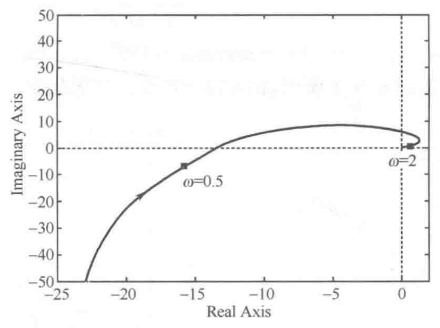

> Image description: A technical plot showing a root locus or frequency response trajectory in the complex plane. The horizontal axis is labeled "Real Axis" with values ranging from -25 to 0, and the vertical axis is labeled "Imaginary Axis" with values from -50 to 50. A single continuous curved line starts at approximately (-23, -50) and arcs upward and to the right, crossing the real axis before curving back toward the origin (0,0). An arrow on the curve indicates a direction of movement from left to right. Two specific points are marked with small squares and labeled with frequency variables: $\omega=0.5$ located in the lower-left quadrant at approximately (-16, -7), and $\omega=2$ located near the origin on the real axis. A dashed vertical line marks the imaginary axis (Real = 0) and a dashed horizontal line marks the real axis (Imaginary = 0).
图 5－8－1 $\quad G(\mathrm{j} \omega)=\frac{10}{\mathrm{j} \omega(1+\mathrm{j} 2 \omega)\left(1-\omega^{2}+\mathrm{j} 0.5 \omega\right)}$ 幅相特性曲线（MATLAB）

MATLAB 程序 ：exe508．m
$G=t f(10, \operatorname{conv}([2,1,0],[1,0.5,1])) ;$
nyquist（G）；
$\operatorname{axis}([-25,2,-50,50])$ ；
5－9 已知系统开环传递函数

$$
G(s) H(s)=\frac{10}{s(s+1)\left(s^{2} / 4+1\right)}
$$

试绘制系统的概略开环幅相特性曲线。
解 本题主要练习含有虚数极点系统的幅相特性的绘制，注意虚数极点对绘制系统幅相曲线的影响。

系统的开环频率特性为

$$
G(\mathrm{j} \omega) H(\mathrm{j} \omega)=\frac{10}{\mathrm{j} \omega(1+\mathrm{j} \omega)\left(1-\omega^{2} / 4\right)}
$$


<!-- source_pdf_page: 147 -->
$$
=-\frac{10}{\left(1+\omega^{2}\right)\left(1-\omega^{2} / 4\right)}-\mathrm{j} \frac{10}{\omega\left(1+\omega^{2}\right)\left(1-\omega^{2} / 4\right)}
$$

开环系统有虚数极点 $s= \pm \mathrm{j} 2$ ，且
当 $\omega=0^{+}$时，$|G(\mathrm{j} \omega) H(\mathrm{j} \omega)|=\left.\frac{10}{\omega\left(1-\omega^{2} / 4\right) \sqrt{\left(1+\omega^{2}\right)}}\right|_{\omega=0^{+}} \rightarrow \infty$ ，且

$$
\begin{aligned}
\operatorname{Re}[G(\mathrm{j} \omega) H(\mathrm{j} \omega)] & =\left.\frac{10}{\left(1+\omega^{2}\right)\left(1-\omega^{2} / 4\right)}\right|_{\omega=0^{+}}=-10 \\
\angle G(\mathrm{j} \omega) H(\mathrm{j} \omega) & =-90^{\circ}-\left.\arctan \omega\right|_{\omega=0^{+}}=-90^{\circ}
\end{aligned}
$$

当 $\omega \rightarrow \infty$ 时，$|G(\mathrm{j} \omega) H(\mathrm{j} \omega)|=\left.\frac{10}{\omega\left(1-\omega^{2} / 4\right) \sqrt{\left(1+\omega^{2}\right)}}\right|_{\omega \rightarrow \infty}=0$ ，且

$$
\angle G(\mathrm{j} \omega) H(\mathrm{j} \omega)=-90^{\circ}-\arctan \omega-\left.180^{\circ}\right|_{\omega \rightarrow \infty}=-360^{\circ}
$$

当 $\omega \rightarrow 2^{-}$时，$|G(\mathrm{j} \omega) H(\mathrm{j} \omega)|=\left.\frac{10}{\omega\left(1-\omega^{2} / 4\right) \sqrt{\left(1+\omega^{2}\right)}}\right|_{\omega \rightarrow 2^{-}} \rightarrow \infty$ ，且

$$
\angle G(\mathrm{j} \omega) H(\mathrm{j} \omega)=-90^{\circ}-\left.\arctan \omega\right|_{\omega 2^{-2}}=-153.4^{\circ}
$$

当 $\omega \rightarrow 2^{+}$时，$|G(\mathrm{j} \omega) H(\mathrm{j} \omega)|=\left.\frac{10}{\omega\left(1-\omega^{2} / 4\right) \sqrt{\left(1+\omega^{2}\right)}}\right|_{\omega \rightarrow 2^{+}} \rightarrow \infty$ ，且

$$
\angle G(\mathrm{j} \omega) H(\mathrm{j} \omega)=-90^{\circ}-\arctan \omega-\left.180^{\circ}\right|_{\omega \rightarrow 2^{+}}=-333.4^{\circ}
$$

系统开环幅相曲线如图 5－9－1 所示，MATLAB 验证结果如图 5－9－2 所示。


> Image description: This image shows a Nyquist plot of an open-loop system's frequency response, plotted on a complex plane with a real axis and an imaginary axis labeled "j". A dashed unit circle centered at the origin is visible. The polar plot consists of a continuous curve representing the variation of the transfer function as the angular frequency $\omega$ changes. Arrows indicate the direction of increasing $\omega$. The curve starts near the negative imaginary axis at $\omega = 0^+$, curves upward and to the left, then crosses the real axis and extends toward the origin as $\omega \to \infty$. Another segment of the plot appears in the third quadrant for values around $\omega = 2^-$, while a corresponding segment exists in the first quadrant for $\omega = 2^+$. Labels such as $\omega=0^+$, $\omega=2^-$, $\omega=2^+$, and $\omega=\infty$ mark specific frequency points along the trajectory.
图 5－9－1 $\quad G(\mathrm{j} \omega) H(\mathrm{j} \omega)=\frac{10}{\mathrm{j} \omega(1+\mathrm{j} \omega)\left(1-\omega^{2} / 4\right)}$
概略幅相特性曲线

MATLAB 程序 ：exe509．m
$\mathrm{G}=\mathrm{tf}(10,[0.25,0.25,1,1,0]) ;$
nyquist（G）；
$\operatorname{axis}([-20,20,-20,20])$ ；

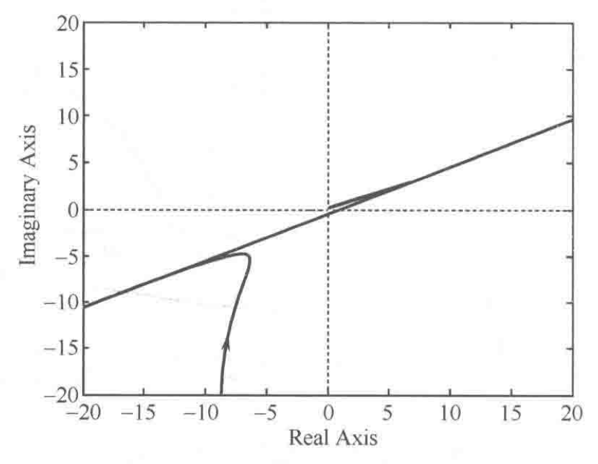

> Image description: This image shows a Nyquist plot of a frequency response function, plotted on a complex plane. The horizontal axis is labeled "Real Axis" and the vertical axis is labeled "Imaginary Axis," both ranging from -20 to 20. The plot consists of a continuous black curve starting from the bottom center (approximately at Real = -9, Imaginary = -20), curving upwards and to the right. It crosses the real axis at the origin (0,0) and continues as a straight diagonal line extending into the first quadrant toward the top-right corner. According to the caption, this represents the open-loop transfer function $G(j\omega)H(j\omega) = \frac{10}{j\omega(1+j\omega)(1-\omega^2/4)}$. In control engineering, this plot is used to analyze the stability of a closed-loop system by observing how the locus encircles the critical point (-1, 0).
图 5－9－2 $\quad G(\mathrm{j} \omega) H(\mathrm{j} \omega)=\frac{10}{\mathrm{j} \omega(1+\mathrm{j} \omega)\left(1-\omega^{2} / 4\right)}$
幅相特性曲线（MATLAB）

5－10 已知系统开环传递函数

$$
G(s) H(s)=\frac{s+1}{s\left(\frac{s}{2}+1\right)\left(\frac{s^{2}}{9}+\frac{s}{3}+1\right)}
$$

要求选择频率点，列表计算 $A(\omega), L(\omega)$ 和 $\varphi(\omega)$ ，并据此在半对数坐标纸上绘制系统开环对数频率特性曲线。


<!-- source_pdf_page: 148 -->
解 本题主要考查根据系统的开环传递函数计算系统开环幅相频率特性、对数幅频特性和相频特性，进而绘制出系统开环对数频率特性曲线。在计算相频特性时，应注意象限问题。

系统的开环频率特性

其中

$$
\begin{gathered}
G(\mathrm{j} \omega)=\frac{1+\mathrm{j} \omega}{\mathrm{j} \omega(1+\mathrm{j} 0.5 \omega)\left[\left(1-\frac{\omega^{2}}{9}\right)+\mathrm{j} \frac{\omega}{3}\right]}=A(\omega) \mathrm{e}^{\mathrm{j} \varphi(\omega)} \\
A(\omega)=\frac{\sqrt{1+\omega^{2}}}{\omega \sqrt{\left(1+\frac{\omega^{2}}{4}\right)\left[\left(1-\frac{\omega^{2}}{9}\right)^{2}+\frac{\omega^{2}}{9}\right]}} \\
\varphi(\omega)=\left\{\begin{array}{lc}
\arctan \omega-90^{\circ}-\arctan \frac{\omega}{2}-\arctan \frac{\frac{\omega}{3}}{1-\frac{\omega^{2}}{9}}, & 0<\omega \leqslant 3 \\
\arctan \omega-90^{\circ}-\arctan \frac{\omega}{2}-180^{\circ}+\arctan \frac{\frac{\omega}{3}}{\frac{\omega^{2}}{9}-1}, & \omega>3
\end{array}\right. \\
L(\omega)=20 \lg A(\omega)=10 \lg \left(1+\omega^{2}\right)-20 \lg \omega-10 \lg \left(1+\frac{\omega^{2}}{4}\right)-10 \lg \left[\left(1-\frac{\omega^{2}}{9}\right)^{2}+\frac{\omega^{2}}{9}\right]
\end{gathered}
$$

令 $\omega$ 为不同值，将计算结果列表如下：

| $\omega /(\mathrm{rad} / \mathrm{s})$ | 0.1 | 1 | 3 | 5 | 10 | 20 |
| :--- | :--- | :--- | :--- | :--- | :--- | :--- |
| $A(\omega)$ | 10.04 | 1.33 | 0.59 | 0.16 | 0.019 | 0.0023 |
| $L(\omega) / \mathrm{dB}$ | 20.03 | 2.48 | －4．58 | －15．92 | －34．42 | －52．77 |
| $\varphi(\omega) /\left({ }^{\circ}\right)$ | －89 | －92．1 | －164．7 | －216．4 | －246．2 | －258．4 |

由上表可绘制出系统开环对数频率特性曲线，如图 5－10－1 所示。


> Image description: This image displays a Bode plot representing the open-loop frequency response of a system, as indicated by the caption "图 5－10－1". The figure consists of two vertically aligned graphs sharing a common logarithmic horizontal axis for angular frequency $\omega$ in radians per second ($\text{rad/s}$), ranging from $10^{-1}$ to $10^2$. The upper graph plots magnitude, labeled as $20\lg|G|/\text{dB}$, on the vertical axis. The curve starts at approximately $20\text{ dB}$ at low frequencies and slopes downward, showing a change in gradient around $\omega = 1$ and another steeper decline after $\omega \approx 3$, eventually reaching $-100\text{ dB}$. The lower graph plots phase angle, labeled as $\phi/(^\circ)$, on the vertical axis. The phase begins at $-90^\circ$, remains relatively constant until $\omega = 1$, then drops sharply through $-180^\circ$ and asymptotically approaches $-270^\circ$ at higher frequencies. Together, these plots characterize the system's stability and frequency response.
图 5－10－1 $G(\mathrm{j} \omega)=\frac{1+\mathrm{j} \omega}{\mathrm{j} \omega(1+\mathrm{j} 0.5 \omega)\left[\left(1-\frac{\omega^{2}}{9}\right)+\mathrm{j} \frac{\omega}{3}\right]}$ 的对数频率特性（MATLAB）


<!-- source_pdf_page: 149 -->
MATLAB 程序 ：exe510．m
$G=\operatorname{tf}([1,1], \operatorname{conv}([0.5,1,0],[1 / 9,1 / 3,1])) ;$
bode（G）；grid
5－11 绘制下列传递函数的对数幅频渐近特性曲线：
（1）$G(s)=\frac{2}{(2 s+1)(8 s+1)}$ ；
（2）$G(s)=\frac{200}{s^{2}(s+1)(10 s+1)}$ ；
（3）$G(s)=\frac{8\left(\frac{s}{0.1}+1\right)}{s\left(s^{2}+s+1\right)\left(\frac{s}{2}+1\right)}$ ；
（4）$G(s)=\frac{10\left(\frac{s^{2}}{400}+\frac{s}{10}+1\right)}{s(s+1)\left(\frac{s}{0.1}+1\right)}$ 。

解 本题主要考查根据系统的传递函数绘制系统对数幅频渐近特性曲线的方法。计算时，注意按大小排列交接频率，并标注斜率变化。
（1）$G(s)=\frac{2}{(2 s+1)(8 s+1)}$
（1）确定各交接频率 $\omega_{i}(i=1,2)$ 及斜率变化值。
最小相位惯性环节：$\omega_{1}=\frac{1}{8}=0.125$ ，斜率减小 $20 \mathrm{~dB} / \mathrm{dec}$
最小相位惯性环节：$\omega_{2}=\frac{1}{2}=0.5$ ，斜率减小 $20 \mathrm{~dB} / \mathrm{dec}$
最小交接频率：$\quad \omega_{\text {min }}=\omega_{1}=\frac{1}{8}=0.125$
（2）绘制低频段（ $\omega<\omega_{\text {min }}$ ）渐近特性曲线。
因为 $\nu=0,20 \lg K=20 \lg 2=6.02 \mathrm{~dB}$ ，则低频段渐近线斜率 $k=0 \mathrm{~dB} / \mathrm{dec}$ ，并且通过点 $(1,20 \lg 2)=(1,6.02 \mathrm{~dB})$ 。
（3）绘制频段 $\omega \geqslant \omega_{\text {min }}$ 渐近特性曲线。

$$
\begin{array}{ll}
\omega_{\min } \leqslant \omega<\omega_{2}, & k=-20 \mathrm{~dB} / \mathrm{dec} \\
\omega \geqslant \omega_{2}, & k=-40 \mathrm{~dB} / \mathrm{dec}
\end{array}
$$

系统开环对数幅频渐近特性曲线如图 5－11－1 所示。
（2）$G(s)=\frac{200}{s^{2}(s+1)(10 s+1)}$
（1）确定各交接频率 $\omega_{i}(i=1,2)$ 及斜率变化值。
最小相位惯性环节：$\omega_{1}=0.1$ ，斜率减小 $20 \mathrm{~dB} / \mathrm{dec}$
最小相位惯性环节：$\omega_{2}=1$ ，斜率减小 $20 \mathrm{~dB} / \mathrm{dec}$
最小交接频率：$\quad \omega_{\min }=\omega_{1}=0.1$
（2）绘制低频段（ $\omega<\omega_{\text {min }}$ ）渐近特性曲线。因为 $\nu=2,20 \lg K=20 \lg 200=46.02 \mathrm{~dB}$ ，则低频段渐近线斜率 $k=-40 \mathrm{~dB} / \mathrm{dec}$ ，并且通过点 $(1,20 \lg 200)=(1,46.02 \mathrm{~dB})$ 。
（3）绘制频段 $\omega \geqslant \omega_{\text {min }}$ 渐近特性曲线。

$$
\begin{array}{ll}
\omega_{\min } \leqslant \omega<\omega_{2}, & k=-60 \mathrm{~dB} / \mathrm{dec} \\
\omega \geqslant \omega_{2}, & k=-80 \mathrm{~dB} / \mathrm{dec}
\end{array}
$$

系统开环对数幅频渐近特性曲线如图 5－11－2 所示。


<!-- source_pdf_page: 150 -->
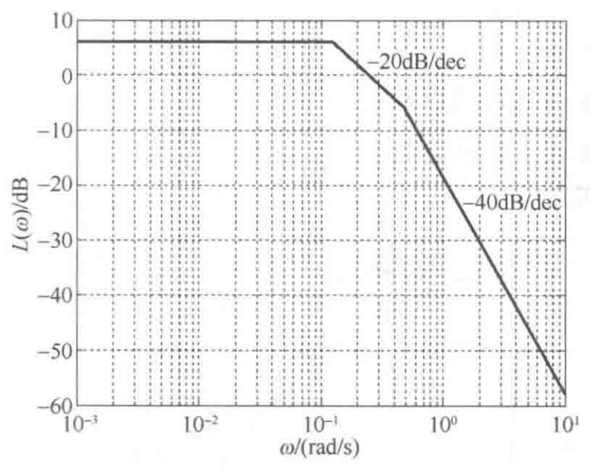

> Image description: This image shows a Bode magnitude plot of a transfer function $G(s) = \frac{2}{(2s+1)(8s+1)}$. The horizontal axis represents angular frequency $\omega$ in radians per second ($\text{rad/s}$) on a logarithmic scale, ranging from $10^{-3}$ to $10^1$. The vertical axis represents the loop gain $L(\omega)$ in decibels ($\text{dB}$), ranging from $-60$ to $10$. The plot begins with a constant low-frequency gain of approximately $6\text{ dB}$. At the first corner frequency $\omega = 0.5\text{ rad/s}$ (corresponding to the time constant $2s$), the slope changes to $-20\text{ dB/dec}$. At the second corner frequency $\omega = 0.125\text{ rad/s}$ (corresponding to $8s$), though the labels are placed further right, the overall asymptotic behavior shows a transition to a steeper decline of $-40\text{ dB/dec}$ as frequency increases toward $10^1\text{ rad/s}$. This illustrates a second-order system's magnitude response.
图 5－11－1 $\quad G(s)=\frac{2}{(2 s+1)(8 s+1)}$

对数幅频渐近特性（MATLAB）

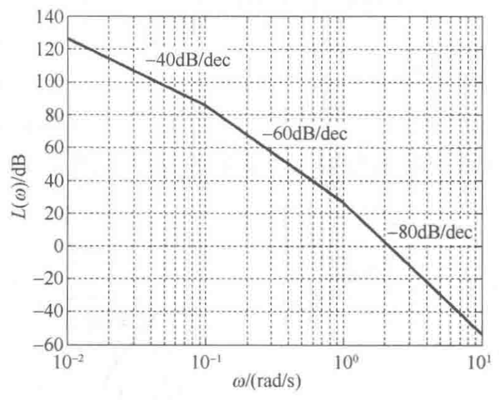

> Image description: This image is a Bode magnitude plot showing the frequency response of a transfer function $G(s) = \frac{200}{s^2(s+1)(10s+1)}$. The horizontal axis represents angular frequency $\omega$ in radians per second ($\text{rad/s}$) on a logarithmic scale, ranging from $10^{-2}$ to $10^1$. The vertical axis represents the loop gain $L(\omega)$ measured in decibels ($\text{dB}$), ranging from $-60$ to $140$. The plot displays a downward-sloping curve with three distinct linear segments indicating changes in the system's roll-off rate. The first segment starts at $120\text{ dB}$ and slopes at $-40\text{ dB/dec}$. At $\omega = 0.1\text{ rad/s}$, the slope changes to $-60\text{ dB/dec}$. Finally, at $\omega = 1\text{ rad/s}$, the slope steepens further to $-80\text{ dB/dec}$. These slopes correspond to the poles of the given transfer function, specifically the double integrator $s^2$ and two first-order lags.
图 5－11－2 $\quad G(s)=\frac{200}{s^{2}(s+1)(10 s+1)}$

对数幅频渐近特性（MATLAB）
（3）$G(s)=\frac{8\left(\frac{s}{0.1}+1\right)}{s\left(s^{2}+s+1\right)\left(\frac{s}{2}+1\right)}$
（1）确定各交接频率 $\omega_{i}(i=1,2,3)$ 及斜率变化值
最小相位一阶微分环节：$\omega_{1}=0.1$ ，斜率增加 $20 \mathrm{~dB} / \mathrm{dec}$
最小相位振荡环节：$\omega_{2}=1$ ，斜率减小 $40 \mathrm{~dB} / \mathrm{dec}$
最小相位惯性环节：$\omega_{3}=2$ ，斜率减小 $20 \mathrm{~dB} / \mathrm{dec}$
最小交接频率：$\quad \omega_{\min }=\omega_{1}=0.1$
（2）绘制低频段（ $\omega<\omega_{\min }$ ）渐近特性曲线，因为 $\nu=1,20 \lg K=20 \lg 8=18.06 \mathrm{~dB}$ ，则低频段渐近线斜率 $k=-20 \mathrm{~dB} / \mathrm{dec}$ ，并且通过点 $(1,20 \mathrm{lg} 8)=(1,18.06 \mathrm{~dB})$ 。
（3）绘制频段 $\omega \geqslant \omega_{\text {min }}$ 渐近特性曲线。

$$
\begin{aligned}
\omega_{\min } \leqslant \omega<\omega_{2}, & k=0 \mathrm{~dB} / \mathrm{dec} \\
\omega_{2} \leqslant \omega<\omega_{3}, & k=-40 \mathrm{~dB} / \mathrm{dec} \\
\omega \geqslant \omega_{3}, & k=-60 \mathrm{~dB} / \mathrm{dec}
\end{aligned}
$$

系统开环对数幅频渐近特性曲线如图 5－11－3 所示。
（4）$G(s)=\frac{10\left(\frac{s^{2}}{400}+\frac{s}{10}+1\right)}{s(s+1)\left(\frac{s}{0.1}+1\right)}$
（1）确定各交接频率 $\omega_{i}(i=1,2,3)$ 及斜率变化值。
最小相位惯性环节：$\quad \omega_{1}=0.1$ ，斜率减小 $20 \mathrm{~dB} / \mathrm{dec}$
最小相位惯性环节：$\omega_{2}=1$ ，斜率减小 $20 \mathrm{~dB} / \mathrm{dec}$
最小相位二阶微分环节：$\omega_{3}=20$ ，斜率增加 $40 \mathrm{~dB} / \mathrm{dec}$
最小交接频率：$\quad \omega_{\text {min }}=\omega_{1}=0.1$
（2）绘制低频段（ $\omega<\omega_{\text {min }}$ ）渐近特性曲线。因为 $\nu=1,20 \lg K=20 \lg 10=20 \mathrm{~dB}$ ，则低频段渐近线斜率 $k=-20 \mathrm{~dB} / \mathrm{dec}$ ，并且通过点 $(1,20 \mathrm{lg} 10)=(1,20 \mathrm{~dB})$ 。


<!-- source_pdf_page: 151 -->
（3）绘制频段 $\omega \geqslant \omega_{\min }$ 渐近特性曲线。

$$
\begin{aligned}
\omega_{\min } \leqslant \omega<\omega_{2}, & k=-40 \mathrm{~dB} / \mathrm{dec} \\
\omega_{2} \leqslant \omega<\omega_{3}, & k=-60 \mathrm{~dB} / \mathrm{dec} \\
\omega \geqslant \omega_{3}, & k=-20 \mathrm{~dB} / \mathrm{dec}
\end{aligned}
$$

系统开环对数幅频渐近特性曲线如图 5－11－4 所示。
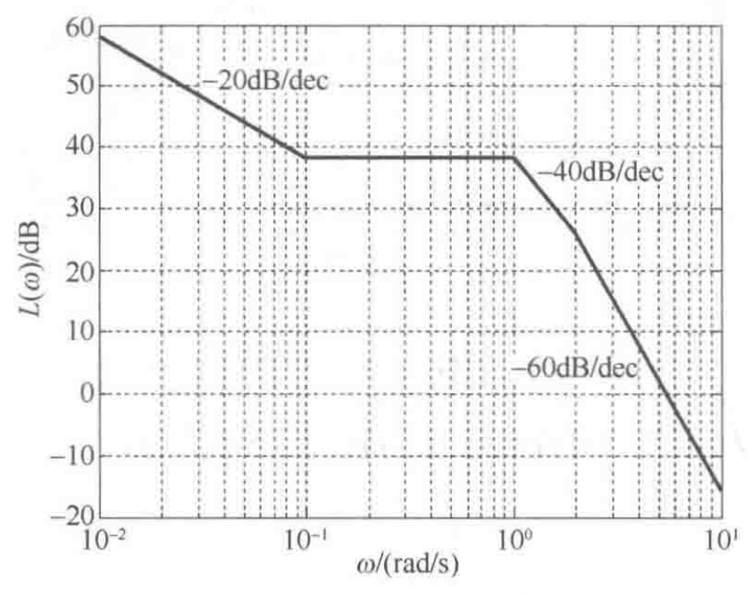

> Image description: This image shows a Bode magnitude plot representing the open-loop logarithmic amplitude-frequency asymptotic characteristics of a system, as indicated by the caption "系统开环对数幅频渐近特性曲线如图 5－11－4 所示。" The graph features a logarithmic scale on the horizontal axis ($\omega$ in rad/s) ranging from $10^{-2}$ to $10^1$, and a linear scale on the vertical axis ($L(\omega)$ in dB) ranging from -20 to 60. The plot consists of three distinct linear segments: 1. A descending slope of $-20\text{dB/dec}$ starting at $\omega = 10^{-2}$. 2. A flat horizontal segment (constant gain) between approximately $10^{-1}$ and $10^0$ rad/s, maintaining a value near 38 dB. 3. A steep descent beginning at $10^0$ rad/s, initially sloping at $-40\text{dB/dec}$ before transitioning to a steeper slope of $-60\text{dB/dec}$. The figure illustrates how the system's gain decreases as frequency increases across different decades.

图 5－11－3 $G(s)=\frac{8\left(\frac{s}{0.1}+1\right)}{s\left(s^{2}+s+1\right)\left(\frac{s}{2}+1\right)}$
对数幅频渐近特性（MATLAB）
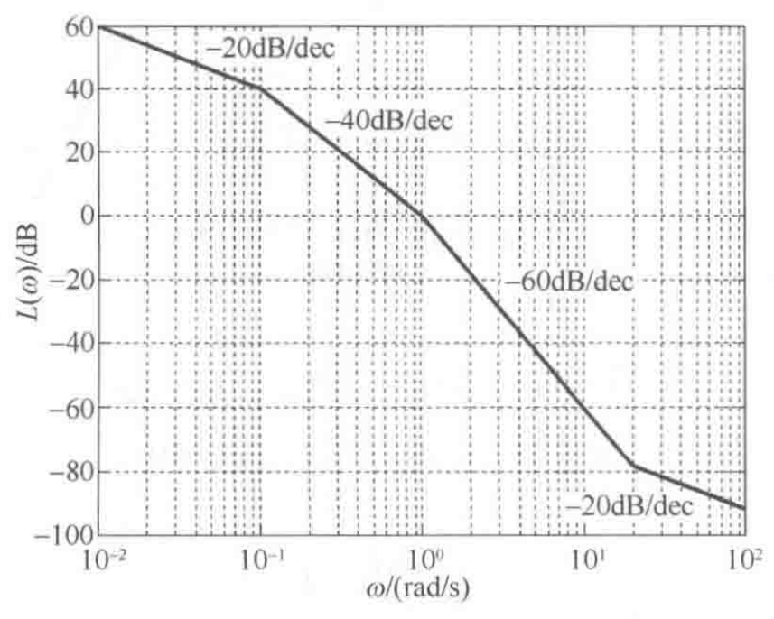

> Image description: This image is a Bode magnitude plot showing the asymptotic frequency response of a transfer function $G(s)$. The vertical axis represents the loop gain $L(\omega)$ in decibels (dB), ranging from $-100$ to $60$. The horizontal axis represents angular frequency $\omega$ in radians per second ($\text{rad/s}$) on a logarithmic scale, spanning from $10^{-2}$ to $10^2$. The plot displays a piecewise linear curve with four distinct slope segments: 1. An initial slope of $-20\text{ dB/dec}$ starting at $60\text{ dB}$. 2. A transition at $\omega = 10^{-1}\text{ rad/s}$ to a steeper slope of $-40\text{ dB/dec}$. 3. A further transition at $\omega = 1\text{ rad/s}$ to a slope of $-60\text{ dB/dec}$. 4. A final transition around $\omega = 10^1\text{ rad/s}$ returning to a slope of $-20\text{ dB/dec}$. The figure illustrates how the system's gain decreases as frequency increases, reflecting the poles and zeros defined in the provided transfer function equation.

图 5－11－4 $G(s)=\frac{10\left(\frac{s^{2}}{400}+\frac{s}{10}+1\right)}{s(s+1)\left(\frac{s}{0.1}+1\right)}$
对数幅频渐近特性（MATLAB）

MATLAB 程序 ：exe511．m
\％确定各系统传递函数
$\mathrm{G} 1=\mathrm{tf}(2,[\operatorname{conv}([2,1],[8,1])]) ;$
$\mathrm{G} 2=\mathrm{tf}(200,[\operatorname{conv}([1,1,0,0],[10,1])]) ;$
$\mathrm{G} 3=\mathrm{tf}(8 *[10,1],[\operatorname{conv}([1,1,1,0],[0,5,1])]) ;$
$\mathrm{G} 4=\mathrm{tf}(10 *[0.0025,0.1,1],[\operatorname{conv}([1,1,0],[10,1])]) ;$
\％调用子程序绘制系统开环对数幅频渐近特性曲线
$\mathrm{w}=10 \mathrm{e}-3: 0.1: 100 ;$
$[\mathrm{x} 1, \mathrm{y} 1]=\mathrm{bd} \_\operatorname{asymp}(\mathrm{G} 1, \mathrm{w}) ;[\mathrm{x} 2, \mathrm{y} 2]=\mathrm{bd} \_\operatorname{asymp}(\mathrm{G} 2, \mathrm{w})$ ；
$[\mathrm{x} 3, \mathrm{y} 3]=\mathrm{bd} \_\mathrm{asymp}(\mathrm{G} 3, \mathrm{w}) ;[\mathrm{x} 4, \mathrm{y} 4]=\mathrm{bd} \_\mathrm{asymp}(\mathrm{G} 4, \mathrm{w})$ ；
figure（1）；semilogx（x1，y1），grid；
figure（2）；semilogx（x2，y2），grid；
figure（3）；semilogx（x3，y3），grid；
figure（4）；semilogx $\left(x 4, y^{4}\right)$ ，grid；
\％子程序：
function $[$ wpos，ypos $]=$ bd＿asymp（G，w）
$\mathrm{G1}=\operatorname{zpk}(\mathrm{G}) ; \operatorname{wpos}=[] ; \operatorname{pos} 1=[]$ ；
if nargin＝＝1，w＝freqint2（G）；end
zer $=\mathrm{G} 1 . \mathrm{z}\{1\}$ ；pol＝G1．p $\{1\}$ ；gain＝G1．k；


<!-- source_pdf_page: 152 -->
```
for i=1:length(zer);
    if isreal(zer(i))
        wpos = [wpos,abs(zer(i))];
        pos1 = [pos1,20];
    else
        if imag(zer(i))>0
                wpos = [wpos,abs(zer(i))];
                pos1 = [pos1,40];
end,end,end
for i = 1:length(pol);
        if isreal(pol(i))
                wpos = [wpos,abs(pol(i))];
                pos1 = [pos1, - 20];
        else
                if imag(pol(i))>0
                    wpos = [wpos,abs(pol(i))];
                    pos1 = [pos1, -40];
end,end,end
wpos = [wpos w(1) w(length(w))];
pos1 = [pos1,0,0];
[wpos,ii] = sort(wpos);pos1 = pos1(ii);
ii=find(abs(wpos)<eps);kslp=0;
w_ start = 1000 * eps;
if length(ii)>0
    kslp = sum(pos1(ii));
    ii=(ii(length(ii))+1):length(wpos);
    wpos = wpos(ii);pos1 = pos1(ii);
end
while 1
    [ypos1,pp] = bode(G,w_start);
    if isinf(ypos1),w_start=w_start * 10;
    else break; end
end
wpos = [w_ start wpos];
ypos(1) = 20 * log10(ypos1);
pos1 = [kslp pos1];
for i=2:length(wpos)
    kslp = sum(pos1(1:i-1));
    ypos(i)= ypos(i-1)+kslp* log10(wpos(i)/wpos(i-1));
end
ii=find(wpos>=w(1)&wpos<=w(length(w)));
wpos = wpos(ii);ypos=ypos(ii);
```


<!-- source_pdf_page: 153 -->
5－12 已知最小相位系统的对数幅频渐近特性曲线如图5－62所示，试确定系统的开环传递函数。

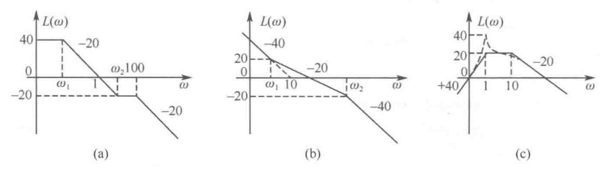

> Image description: This image contains three Bode magnitude plots, labeled (a), (b), and (c), showing the asymptotic log-magnitude frequency response $L(\omega)$ versus angular frequency $\omega$. Each plot features a vertical axis for $L(\omega)$ in decibels and a horizontal axis for $\omega$ on a logarithmic scale. In plot (a), the magnitude starts at 40 dB, drops with a slope of -20 dB/decade starting at corner frequency $\omega_1$, levels off at -20 dB, and then drops again at -20 dB/decade after $\omega_2 = 100$. Plot (b) shows an initial slope of -40 dB/decade, changing to -20 dB/decade at $\omega_1 = 10$, and returning to -40 dB/decade at $\omega_2$. Plot (c) begins with a +40 dB/decade rise, peaks at $\omega=1$ with a value of 20 dB, and then declines at -20 dB/decade after $\omega=10$. These curves represent the frequency characteristics used to determine an open-loop transfer function for a minimum-phase system.
图5－62 系统开环对数幅频渐近特性

解 本题主要考查由最小相位系统的对数幅频渐近特性曲线，并根据其几何性质，确定系统的传递函数。注意，对数幅频渐近特性曲线的低频渐近线的斜率反映系统所包含积分 （微分）环节的个数，而对数幅频渐近特性曲线的斜率变化反映系统所包含环节的类型，斜率变化处所对应的频率即为所包含环节的交接频率。另外，还需注意对振荡环节（二阶微分环节）参数的计算。
（1）图5－62（a）系统。
（1）确定系统积分环节或微分环节的个数。因为对数幅频渐近特性曲线的低频渐近线的斜率为 $0 \mathrm{~dB} / \mathrm{dec}$ ，故 $\nu=0$ 。
（2）确定系统传递函数结构形式。
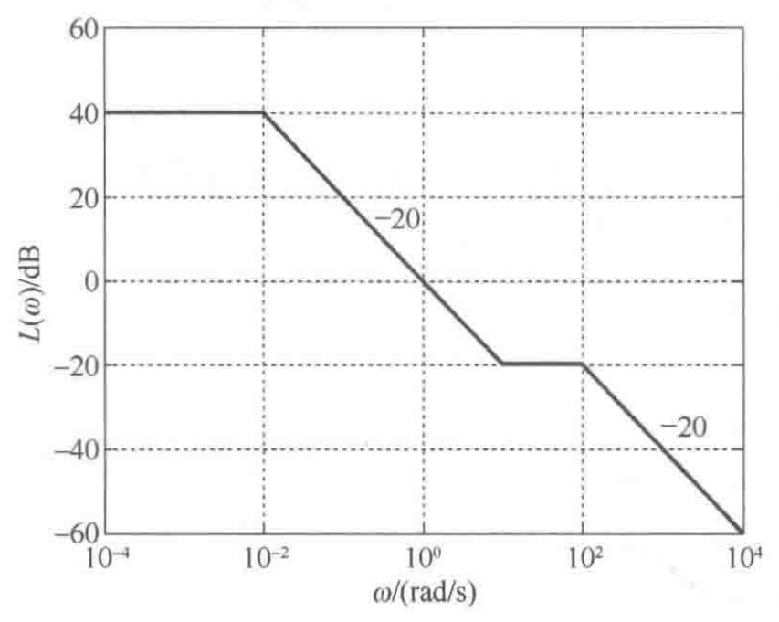

> Image description: This image shows a Bode magnitude plot of a system's open-loop frequency response, denoted as $L(\omega)$ in decibels (dB) on the vertical axis and angular frequency $\omega$ in radians per second ($\text{rad/s}$) on a logarithmic horizontal axis. The plot displays a piecewise linear approximation consisting of three distinct segments: 1. A constant low-frequency gain of $40\text{ dB}$ from $10^{-4}$ to $10^{-2}\text{ rad/s}$, indicating a slope of $0\text{ dB/dec}$. 2. A downward slope of $-20\text{ dB/dec}$ starting at the corner frequency $\omega = 10^{-2}\text{ rad/s}$ and ending at $\omega = 10^1\text{ rad/s}$, where the magnitude reaches $-20\text{ dB}$. 3. A flat region from $10^1$ to $10^2\text{ rad/s}$, followed by another downward slope of $-20\text{ dB/dec}$ extending toward $10^4\text{ rad/s}$. Engineering-wise, the initial $0\text{ dB/dec}$ slope confirms the system has no integrators ($\nu=0$), as noted in the accompanying Chinese text.

图 5－12－1 $G(s)=\frac{100\left(1+\frac{s}{10}\right)}{\left(1+\frac{s}{0.01}\right)\left(1+\frac{s}{100}\right)}$对数幅频渐近特性（MATLAB）
$\omega=\omega_{1}$ 处，斜率变化 $-20 \mathrm{~dB} / \mathrm{dec}$ ，对应惯性环节；
$\omega=\omega_{2}$ 处，斜率变化 $+20 \mathrm{~dB} / \mathrm{dec}$ ，对应一阶微分环节；
$\omega=100$ 处，斜率变化 $-20 \mathrm{~dB} / \mathrm{dec}$ ，对应惯性环节。

因此，系统应具有的传递函数为

$$
G(s)=\frac{K\left(1+\frac{s}{\omega_{2}}\right)}{\left(1+\frac{s}{\omega_{1}}\right)\left(1+\frac{s}{100}\right)}
$$

（3）由给定条件确定传递函数参数。由于低频渐近线通过点 $(1,20 \lg K)$ ，故

$$
20 \lg K=40
$$

解得 $K=100$ ，于是系统的传递函数为

$$
G(s)=\frac{100\left(1+\frac{s}{\omega_{2}}\right)}{\left(1+\frac{s}{\omega_{1}}\right)\left(1+\frac{s}{100}\right)}
$$

再由


<!-- source_pdf_page: 154 -->
$$
\begin{aligned}
& 40=20 \lg \frac{1}{\omega_{1}}, \quad \text { 解得 } \quad \omega_{1}=0.01 \\
& 20=20 \lg \frac{\omega_{2}}{1}, \quad \text { 解得 } \quad \omega_{2}=10
\end{aligned}
$$

于是，系统的传递函数为

$$
G(s)=\frac{100\left(1+\frac{s}{10}\right)}{\left(1+\frac{s}{0.01}\right)\left(1+\frac{s}{100}\right)}
$$

MATLAB 验证结果如图 5－12－1 所示。
（2）图5－62（b）系统。
（1）确定系统积分环节或微分环节的个数。因为对数幅频渐近特性曲线的低频渐近线的斜率为 $-40 \mathrm{~dB} / \mathrm{dec}$ ，故有 $\nu=2$ 。
（2）确定系统传递函数结构形式。
$\omega=\omega_{1}$ 处，斜率变化 $+20 \mathrm{~dB} / \mathrm{dec}$ ，对应一阶微分环节；$\omega=\omega_{2}$ 处，斜率变化 $-20 \mathrm{~dB} / \mathrm{dec}$,对应惯性环节。因此，系统应具有的传递函数为

$$
G(s)=\frac{K\left(1+\frac{s}{\omega_{1}}\right)}{s^{2}\left(1+\frac{s}{\omega_{2}}\right)}
$$

（3）由给定条件确定传递函数参数。由于低频渐近线的延长线通过点 $\left(\omega_{0}, L_{a}\left(\omega_{0}\right)\right)= (10,0)$ 及 $\nu=2$ ，故 $K=\omega_{0}^{\nu}=100$ 。再由 $20= 40 \lg \frac{10}{\omega_{1}}$ ，解得 $\omega_{1}=\sqrt{10}=3.16$ ；由 $20=20 \lg \frac{\omega_{c}}{\omega_{1}}$ ，解得 $\omega_{c}=10 \sqrt{10}=31.6$ ；由 $20=20 \lg \frac{\omega_{2}}{\omega_{c}}$ ，解得 $\omega_{2}=100 \sqrt{10}=316$ ，于是，系统的传递函数为

$$
G(s)=\frac{100\left(1+\frac{s}{3.16}\right)}{s^{2}\left(1+\frac{s}{316}\right)}
$$

MATLAB 验证结果如图 5－12－2 所示。
（3）图5－62（c）系统。
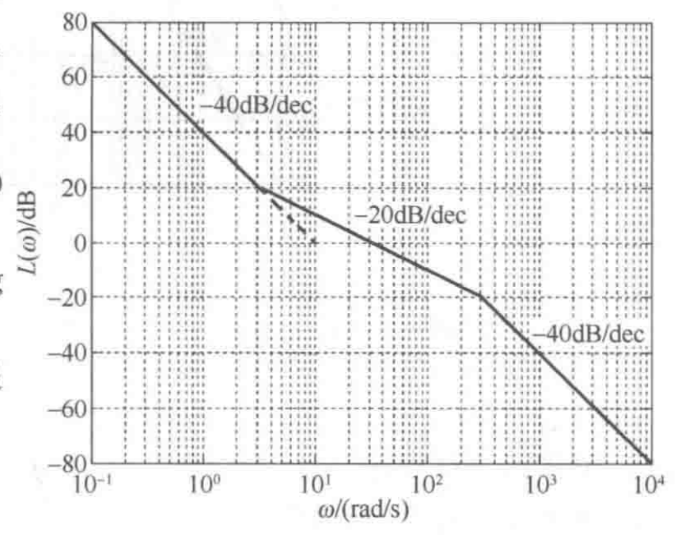

> Image description: This image is a Bode magnitude plot representing the frequency response of a system, labeled as "（3）图5－62（c）系统". The horizontal axis represents angular frequency $\omega$ in radians per second ($\text{rad/s}$) on a logarithmic scale, ranging from $10^{-1}$ to $10^4$. The vertical axis represents the loop gain $L(\omega)$ measured in decibels ($\text{dB}$), ranging from $-80$ to $80$. The plot consists of three distinct linear segments with different slopes: 1. An initial descent starting at $80\text{ dB}$ with a slope of $-40\text{ dB/dec}$. 2. A middle section transitioning to a shallower slope of $-20\text{ dB/dec}$, occurring between approximately $2$ and $300\text{ rad/s}$. 3. A final descent returning to a steeper slope of $-40\text{ dB/dec}$ for frequencies above roughly $300\text{ rad/s}$. A dashed line is also visible near the first transition point, indicating an asymptotic approximation of the system's magnitude response.

图 5－12－2 $G(s)=\frac{100\left(1+\frac{s}{3.16}\right)}{s^{2}\left(1+\frac{s}{316}\right)}$
对数幅频渐近特性（MATLAB）
（1）确定系统积分环节或微分环节的个数。
因为对数幅频渐近特性曲线的低频渐近线的斜率为 $40 \mathrm{~dB} / \mathrm{dec}$ ，故有 $\nu=-2$ 。
（2）确定系统传递函数结构形式。
$\omega=1$ 处，斜率变化 $-40 \mathrm{~dB} / \mathrm{dec}$ ，对应振荡环节；
$\omega=10$ 处，斜率变化 $-20 \mathrm{~dB} / \mathrm{dec}$ ，对应惯性环节。
因此，系统应具有的传递函数为


<!-- source_pdf_page: 155 -->
$$
G(s)=\frac{K s^{2}}{\left(s^{2}+2 \zeta s+1\right)\left(1+\frac{s}{10}\right)}
$$

（3）由给定条件确定传递函数参数。由于低频渐近线通过点 $(1,20 \lg K)$ ，故由

$$
20 \lg K=20
$$

解得

$$
K=10
$$

再由

$$
20 \lg M_{r}=20 \lg \frac{1}{2 \zeta \sqrt{1-\zeta^{2}}}=40-20=20
$$

解得

$$
\zeta=0.05 \quad \text { (其中 } \zeta=0.9987 \text { 不符合题意, 故舍去) }
$$

于是，系统的传递函数为

$$
G(s)=\frac{10 s^{2}}{\left(s^{2}+0.1 s+1\right)\left(1+\frac{s}{10}\right)}
$$

MATLAB 验证结果如图 5－12－3 所示。

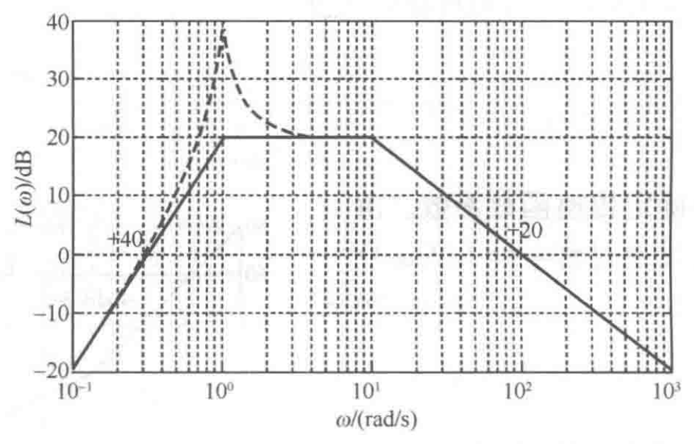

> Image description: A Bode magnitude plot is shown in Figure 5-12-3, illustrating the frequency response of a system. The horizontal axis represents angular frequency $\omega$ in radians per second ($\text{rad/s}$) on a logarithmic scale, ranging from $10^{-1}$ to $10^3$. The vertical axis represents the magnitude $L(\omega)$ in decibels ($\text{dB}$), ranging from $-20$ to $40$. The plot features two curves: a solid line and a dashed line. Both begin with a positive slope of $+40\text{ dB/decade}$. At $\omega = 1\text{ rad/s}$, the solid line levels off into a flat plateau at $20\text{ dB}$ until $\omega = 10\text{ rad/s}$, after which it descends with a negative slope of $-20\text{ dB/decade}$. In contrast, the dashed line exhibits a sharp resonant peak reaching nearly $40\text{ dB}$ at $\omega = 1\text{ rad/s}$ before converging toward the solid line. This figure represents the magnitude characteristics of a transfer function in the frequency domain.
图 5－12－3 $G(s)=\frac{10 s^{2}}{\left(s^{2}+0.1 s+1\right)\left(1+\frac{s}{10}\right)}$ 对数幅频渐近特性（MATLAB）

## MATLAB 程序：exe512．m

## \％确定各系统传递函数

$$
\begin{aligned}
\mathrm{G} 1 & =\operatorname{tf}(100 *[0.1,1],[\operatorname{conv}([100,1],[0.01,1])]) ; \\
\mathrm{G} 2 & =\operatorname{tf}([100 / \operatorname{sqrt}(10), 100],[\operatorname{conv}([1,0,0],[1 /(100 * \operatorname{sqrt}(10)), 1])]) ; \\
\mathrm{G} 3 & =\operatorname{tf}([10,0,0],[\operatorname{conv}([1,0.1,1],[0.1,1])]) ;
\end{aligned}
$$

\％调用子程序绘制系统开环对数幅频渐近特性曲线

```
w= 10e - 3:0.1:10e4;
[x1,y1] = bd_asymp(G1,w); [x2,y2] = bd_ asymp(G2,w);[x3,y3]=bd_asymp(G3,w);
figure(1);semilogx(x1,y1),grid;
figure(2); semilogx(x2,y2),grid;
figure(3); semilogx(x3,y3),grid;
```

5－13 试用奈氏判据分别判断题5－5、题5－6系统的闭环稳定性。
解 本题主要考查如何根据系统的开环幅相曲线，运用奈氏判据来确定不稳定的闭环


<!-- source_pdf_page: 156 -->
极点的个数，进而判别闭环系统的稳定性，特别要注意对含有积分环节开环幅相曲线的处理。
（1）对于题 5－5 中的系统。分别以 $\tau>T$ 和 $T>\tau$ 两种情况来讨论系统闭环稳定性。
当 $\tau>T$ 时，其概略开环幅相曲线如图 5－13－1 所示。因为 $\nu=2$ ，从开环幅相曲线上 $\omega=0^{+}$的对应点起逆时针补作 $180^{\circ}$ 且半径为无穷大的虚圆弧。

由于 $G(s)$ 在 $s$ 右半平面的极点数 $P=0$ ，且由开环幅相曲线知 $N_{-}=0, N_{+}=0$ ，故

$$
N=N_{+}-N_{-}=0
$$

由奈氏判据，算得 $s$ 右半平面的闭环极点数为 $Z=P-2 N=0$ ，所以系统闭环稳定。
当 $\tau<T$ 时，其概略开环幅相曲线如图 5－13－2 所示。因为 $\nu=2$ ，从开环幅相曲线上 $\omega=0^{+}$的对应点起逆时针补作 $180^{\circ}$ 且半径为无穷大的虚圆弧。

由于 $G(s)$ 在 $s$ 右半平面的极点数 $P=0$ ，且由开环幅相曲线知 $N_{-}=1, N_{+}=0$ ，故

$$
N=N_{+}-N_{-}=-1
$$

由奈氏判据，算得 $s$ 右半平面的闭环极点数为 $Z=P-2 N=2$ ，所以系统闭环不稳定。

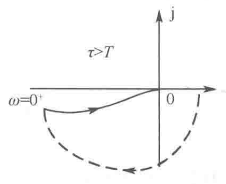

> Image description: A technical plot illustrating the open-loop frequency response (Bode magnitude and phase characteristics) of a system where the time constant $\tau$ is greater than the period $T$. The figure features a Cartesian coordinate system with a vertical axis labeled "$j$" and a horizontal axis representing frequency. A solid curve originates from the origin $(0,0)$ and extends into the second quadrant, curving upwards and to the left. An arrow on this curve indicates its direction of progression. Below the horizontal axis, a dashed semicircular arc connects the end of the solid curve back toward the vertical axis, with an arrow indicating a clockwise path. The region above the horizontal axis is labeled with the condition $\tau > T$. The origin point is marked with a "0", and the leftmost point of the dashed arc is labeled $\omega = 0^+$. This diagram represents the complex plane mapping of a system's frequency response under specific parameter constraints.
图 5－13－1 题 5－5 中 $\tau>T$ 时概略开环幅相特性曲线

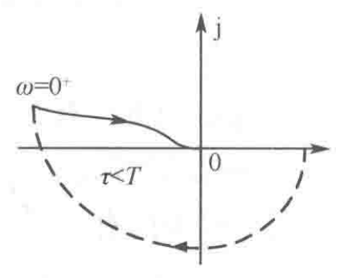

> Image description: A technical plot showing an open-loop frequency response (Bode magnitude and phase characteristics) in the complex plane. The image features a vertical axis labeled "j" and a horizontal axis with a center point marked "0". A solid black curve starts from the left on the real axis at $\omega=0^+$, curves slightly upward, and terminates at the origin (0). An arrow indicates the direction of the curve moving toward the origin. Below this, a dashed semicircular arc connects the starting point on the left to the bottom of the vertical "j" axis, with an arrow indicating a clockwise path. The region inside the arc is labeled $\tau < T$. The Chinese caption identifies this as Figure 5-13-1, representing the approximate open-loop amplitude and phase characteristic curve for Problem 5-5 when $\tau > T$. This figure typically illustrates stability analysis or root locus behavior in control engineering.
图 5－13－2 题 5－5 中 $\tau<T$ 时概略开环幅相特性曲线

（2）对于题 5－6 中的系统。其概略开环幅相特性曲线如图 5－13－3 所示。

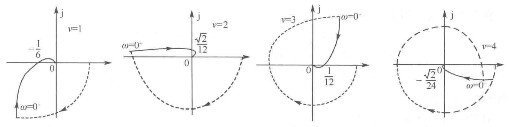

> Image description: This image contains four separate plots showing the trajectories of a variable $j$ relative to an origin $(0,0)$ on Cartesian axes for different values of $\nu$ ($\nu=1, 2, 3, 4$). Each plot features a horizontal axis and a vertical axis labeled $j$. The trajectories are represented by solid and dashed lines with directional arrows indicating the path as $\omega \to 0^+$. Specific coordinate points are labeled on each graph: * For $\nu=1$, a point is marked at $-\frac{1}{6}$ on the horizontal axis. * For $\nu=2$, a peak reaches $\frac{\sqrt{2}}{12}$ on the vertical $j$-axis. * For $\nu=3$, a point is marked at $\frac{1}{12}$ on the vertical $j$-axis. * For $\nu=4$, a point is marked at $-\frac{\sqrt{2}}{24}$ on the horizontal axis. In engineering terms, these plots represent open-loop frequency response characteristics (Nyquist-like plots) for a system under varying parameters of $\nu$.
图5－13－3 题5－6中概略开环幅相特性曲线

（1）当 $\nu=1$ ，从开环幅相特性曲线上 $\omega=0^{+}$的对应点起逆时针补作 $90^{\circ}$ 且半径为无穷大的虚圆弧。由于 $G(s)$ 在 $s$ 右半平面的极点数 $P=0$ ，且由开环幅相曲线知 $N_{-}=0, N_{+}=0$ ，故

$$
N=N_{+}-N_{-}=0
$$

由奈氏判据，算得 $s$ 右半平面的闭环极点数为 $Z=P-2 N=0$ ，所以系统闭环稳定。
（2）当 $\nu=2$ ，从开环幅相特性曲线上 $\omega=0^{+}$的对应点起逆时针补作 $180^{\circ}$ 且半径为无穷大的虚圆弧。由于 $G(s)$ 在 $s$ 右半平面的极点数 $P=0$ ，且由开环幅相曲线知 $N_{-}=1, N_{+}=0$ ，故

$$
N=N_{+}-N_{-}=-1
$$

由奈氏判据，算得 $s$ 右半平面的闭环极点数为 $Z=P-2 N=2$ ，所以系统闭环不稳定。


<!-- source_pdf_page: 157 -->
（3）当 $\nu=3$ ，从开环幅相特性曲线上 $\omega=0^{+}$的对应点起逆时针补作 $270^{\circ}$ 且半径为无穷大的虚圆弧。由于 $G(s)$ 在 $s$ 右半平面的极点数 $P=0$ ，且由开环幅相曲线知 $N_{-}=1, N_{+}=0$ ，故

$$
N=N_{+}-N_{-}=-1
$$

由奈氏判据，算得 $s$ 右半平面的闭环极点数为 $Z=P-2 N=2$ ，所以系统闭环不稳定。
（4）当 $\nu=4$ ，从开环幅相特性曲线上 $\omega=0^{+}$的对应点起逆时针补作 $360^{\circ}$ 且半径为无穷大的虚圆弧。由于 $G(s)$ 在 $s$ 右半平面的极点数 $P=0$ ，且由开环幅相特性曲线知 $N_{-}=1, N_{+}=0$ ，故

$$
N=N_{+}-N_{-}=-1
$$

由奈氏判据，算得 $s$ 右半平面的闭环极点数为 $Z=P-2 N=2$ ，所以系统闭环不稳定。
MATLAB 验证：
利用 MATLAB 软件包中求根程序，可得题 5－5、题 5－6 中闭环特征根数值。
（1）题 5－5。 当 $K=1, T=1, \tau=2$ 时，有

$$
\lambda_{1}=-0.2151+1.3071 \mathrm{j}, \lambda_{2}=-0.2151-1.3071 \mathrm{j}, \lambda_{3}=-0.5698
$$

闭环无正根。 $K=1, T=2, \tau=1$ 时，有

$$
\lambda_{1}=0.1195+0.8138 \mathrm{j}, \lambda_{2}=0.1195-0.8138 \mathrm{j}, \lambda_{3}=-0.739
$$

闭环有两个正根。
（2）题 5－6。当 $\nu=1$ 时，有

$$
\lambda_{1}=-2.3247, \lambda_{2}=-0.3376+0.5623 \mathrm{j}, \lambda_{3}=-0.3376-0.5623 \mathrm{j}
$$

闭环无正根。当 $\nu=2$ 时，有

$$
\begin{aligned}
\lambda_{1}=-1.6924+0.3181 \mathrm{j}, & \lambda_{2}=-1.6924-0.3181 \mathrm{j} \\
\lambda_{3}=0.1924+0.5479 \mathrm{j}, & \lambda_{4}=0.1924-0.5479 \mathrm{j}
\end{aligned}
$$

闭环有两个正根。当 $\nu=3$ 时，有

$$
\begin{gathered}
\lambda_{1}=-2.0985, \quad \lambda_{2}=-0.8683+0.6219 \mathrm{j}, \quad \lambda_{3}=-0.8683-0.6219 \mathrm{j} \\
\lambda_{4}=0.4175+0.4934 \mathrm{j}, \quad \lambda_{5}=0.4175-0.4934 \mathrm{j}
\end{gathered}
$$

闭环有两个正根。当 $\nu=4$ 时，有

$$
\begin{array}{cc}
\lambda_{1}=-1.92, & \lambda_{2}=-1.4228 \\
\lambda_{3}=-0.3758+0.7788 \mathrm{j}, & \lambda_{4}=-0.3758-0.7788 \mathrm{j} \\
\lambda_{5}=0.5472+0.4372 \mathrm{j}, & \lambda_{6}=0.5472-0.4372 \mathrm{j}
\end{array}
$$

闭环有两个正根。

## MATLAB 程序 ：exe513．m

\％题 5－5 中各系统闭环特征方程

$$
\begin{aligned}
& \mathrm{K}=1 ; \mathrm{T} 1=1 ; \mathrm{t} 1=2 ; \operatorname{den} 11=[\mathrm{T} 1,1, \mathrm{~K} * \mathrm{t} 1, \mathrm{~K}] ; \\
& \mathrm{K}=1 ; \mathrm{T} 2=2 ; \mathrm{t} 2=1 ; \operatorname{den} 12=[\mathrm{T} 2,1, \mathrm{~K} * \mathrm{t} 2, \mathrm{~K}] ; \\
& \text { root } 11=\operatorname{roots}(\operatorname{den} 11) ; \\
& \text { root } 12=\operatorname{roots}(\text { den } 12) ;
\end{aligned}
$$

\％题 5－6 中各系统闭环特征方程

$$
\begin{aligned}
& \operatorname{den} 21=[1,3,2,1] ; \operatorname{den} 22=[1,3,2,0,1] ; \\
& \operatorname{den} 23=[1,3,2,0,0,1] ; \operatorname{den} 24=[1,3,2,0,0,0,1] ; \\
& \operatorname{root} 21=\operatorname{roots}(\operatorname{den} 21) ; \operatorname{root} 22=\operatorname{roots}(\operatorname{den} 22) ; \\
& \operatorname{root} 23=\operatorname{roots}(\operatorname{den} 23) ; \operatorname{root} 24=\operatorname{roots}(\operatorname{den} 24) ;
\end{aligned}
$$


<!-- source_pdf_page: 158 -->
5－14 已知下列系统开环传递函数（参数 $K 、 T 、 T_{i}>0 ; i=1,2, \cdots, 6$ ）：
（1）$G(s)=\frac{K}{\left(T_{1} s+1\right)\left(T_{2} s+1\right)\left(T_{3} s+1\right)}$ ；
（2）$G(s)=\frac{K}{s\left(T_{1} s+1\right)\left(T_{2} s+1\right)}$ ；
（3）$G(s)=\frac{K}{s^{2}(T s+1)}$ ；
（4）$G(s)=\frac{K\left(T_{1} s+1\right)}{s^{2}\left(T_{2} s+1\right)}$ ；
（5）$G(s)=\frac{K}{s^{3}}$ ；
（6）$G(s)=\frac{K\left(T_{1} s+1\right)\left(T_{2} s+1\right)}{s^{3}}$ ；
（7）$G(s)=\frac{K\left(T_{5} s+1\right)\left(T_{6} s+1\right)}{s\left(T_{1} s+1\right)\left(T_{2} s+1\right)\left(T_{3} s+1\right)\left(T_{4} s+1\right)}$ ；
（8）$G(s)=\frac{K}{T s-1}$ ；
（9）$G(s)=\frac{-K}{-T s+1}$ ；
（10）$G(s)=\frac{K}{s(T s-1)^{\circ}}$ 。
其系统开环幅相特性曲线分别如图5－63（a）～（j）所示，试根据奈氏判据判定各系统的闭环稳定性，若系统闭环不稳定，确定其 $s$ 右半平面的闭环极点数。

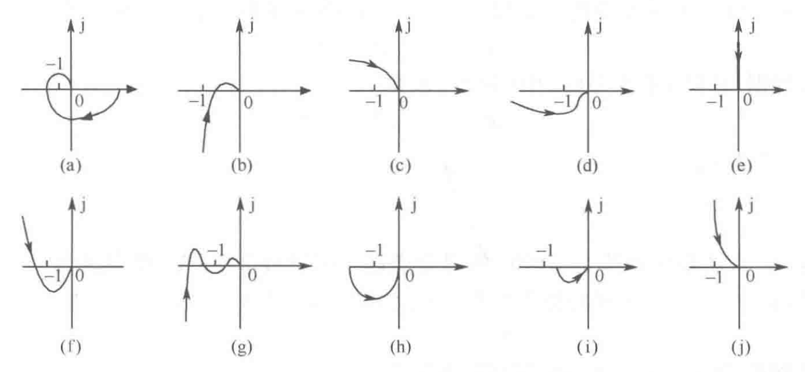

> Image description: This image contains ten separate plots, labeled (a) through (j), depicting open-loop frequency response curves on the complex plane. Each plot features a horizontal real axis and a vertical imaginary axis labeled "$j$". A reference point is marked at $-1$ on the real axis, and the origin is labeled $0$. The figures show various trajectories of complex vectors starting from the right side of the plane and curving toward or around the critical point $(-1, 0)$. Arrows indicate the direction of increasing frequency. In engineering terms, these are Nyquist plots used to determine closed-loop stability based on the Nyquist stability criterion. The curves vary in shape: some encircle the $-1$ point (e.g., a, b), some pass near it (e.g., d, i), and others move away from it (e.g., c, e). The accompanying Chinese caption asks to determine closed-loop stability and the number of unstable poles for each system.
图 5－63 题 5－14 系统开环幅相特性曲线

解 本题主要考查如何根据系统的开环幅相特性曲线，运用奈氏判据来确定不稳定的闭环极点的个数，进而判别闭环系统的稳定性，特别要注意对含有积分环节的开环幅相曲线的处理。
（1）$G(s)=\frac{K}{\left(T_{1} s+1\right)\left(T_{2} s+1\right)\left(T_{3} s+1\right)}$
$G(s)$ 在 $s$ 右半平面的极点数 $P=0$ ，由奈氏曲线知 $N_{-}=1, N_{+}=0$ ，故


<!-- source_pdf_page: 159 -->
$$
N=N_{+}-N_{-}=-1
$$

应用奈氏判据，算得 $s$ 右半平面的闭环极点数为

$$
Z=P-2 N=2
$$

所以系统闭环不稳定，有两个正实部闭环极点。
（2）$G(s)=\frac{K}{s\left(T_{1} s+1\right)\left(T_{2} s+1\right)}$
因为 $\nu=1$ ，从奈氏曲线上 $\omega=0^{+}$的对应点起逆时针补作 $90^{\circ}$ 且半径为无穷大的虚圆弧。由于 $G(s)$ 在 $s$ 右半平面的极点数 $P=0$ ，由奈氏曲线知 $N_{-}=0, N_{+}=0$ ，故

$$
N=N_{+}-N_{-}=0
$$

应用奈氏判据，算得 $s$ 右半平面的闭环极点数为

$$
Z=P-2 N=0
$$

所以系统闭环稳定。
（3）$G(s)=\frac{K}{s^{2}(T s+1)}$
因为 $\nu=2$ ，从奈氏曲线上 $\omega=0^{+}$的对应点起逆时针补作 $180^{\circ}$ 且半径为无穷大的虚圆弧。由于 $G(s)$ 在 $s$ 右半平面的极点数 $P=0$ ，由奈氏曲线知 $N_{-}=1, N_{+}=0$ ，故

$$
N=N_{+}-N_{-}=-1
$$

应用奈氏判据，算得 $s$ 右半平面的闭环极点数为

$$
Z=P-2 N=0-2 \times(-1)=2
$$

所以系统闭环不稳定，有两个正实部闭环极点。
（4）$G(s)=\frac{K\left(T_{1} s+1\right)}{s^{2}\left(T_{2} s+1\right)}$
因为 $\nu=2$ ，从奈氏曲线上 $\omega=0^{+}$的对应点起逆时针补作 $180^{\circ}$ 且半径为无穷大的虚圆弧。由于 $G(s)$ 在 $s$ 右半平面的极点数 $P=0$ ，由奈氏曲线知 $N_{-}=0, N_{+}=0$ ，故

$$
N=N_{+}-N_{-}=0
$$

应用奈氏判据，算得 $s$ 右半平面的闭环极点数为

$$
Z=P-2 N=0
$$

所以系统闭环稳定。
（5）$G(s)=\frac{K}{s^{3}}$
因为 $\nu=3$ ，从奈氏曲线上 $\omega=0^{+}$的对应点起逆时针补作 $270^{\circ}$ 且半径为无穷大的虚圆弧。由于 $G(s)$ 在 $s$ 右半平面的极点数 $P=0$ ，由奈氏曲线知 $N_{-}=1, N_{+}=0$ ，故

$$
N=N_{+}-N_{-}=-1
$$

应用奈氏判据，算得 $s$ 右半平面的闭环极点数为

$$
Z=P-2 N=2
$$

所以系统闭环不稳定，有两个正实部闭环极点。
（6）$G(s)=\frac{K\left(T_{1} s+1\right)\left(T_{2} s+1\right)}{s^{3}}$
因为 $\nu=3$ ，从奈氏曲线上 $\omega=0^{+}$的对应点起逆时针补作 $270^{\circ}$ 且半径为无穷大的虚圆弧。由于 $G(s)$ 在 $s$ 右半平面的极点数 $P=0$ ，由奈氏曲线知 $N_{-}=1, N_{+}=1$ ，故


<!-- source_pdf_page: 160 -->
$$
N=N_{+}-N_{-}=0
$$

应用奈氏判据，算得 $s$ 右半平面的闭环极点数为

$$
Z=P-2 N=0
$$

所以系统闭环稳定。
（7）$G(s)=\frac{K\left(T_{5} s+1\right)\left(T_{6} s+1\right)}{s\left(T_{1} s+1\right)\left(T_{2} s+1\right)\left(T_{3} s+1\right)\left(T_{4} s+1\right)}$
因为 $\nu=1$ ，从奈氏曲线上 $\omega=0^{+}$的对应点起逆时针补作 $90^{\circ}$ 且半径为无穷大的虚圆弧。由于 $G(s)$ 在 $s$ 右半平面的极点数 $P=0$ ，由奈氏曲线知 $N_{-}=1, N_{+}=1$ ，故

$$
N=N_{+}-N_{-}=0
$$

应用奈氏判据，算得 $s$ 右半平面的闭环极点数为

$$
Z=P-2 N=0
$$

所以系统闭环稳定。
（8）$G(s)=\frac{K}{T s-1}$
$G(s)$ 在 $s$ 右半平面的极点数 $P=1$ ，由奈氏曲线知 $N_{-}=0, N_{+}=\frac{1}{2}$ ，故

$$
N=N_{+}-N=\frac{1}{2}
$$

应用奈氏判据，算得 $s$ 右半平面的闭环极点数为

$$
Z=P-2 N=1-2 \times \frac{1}{2}=0
$$

所以系统闭环稳定。
（9）$G(s)=\frac{-K}{-T s+1}$
$G(s)$ 在 $s$ 右半平面的极点数 $P=1$ ，由奈氏曲线知 $N_{-}=0, N_{+}=0$ ，故

$$
N=N_{+}-N_{-}=0
$$

应用奈氏判据，算得 $s$ 右半平面的闭环极点数为

$$
Z=P-2 N=1-2 \times 0=1
$$

所以系统闭环不稳定，有一个正实部闭环极点。
（10）$G(s)=\frac{K}{s(T s-1)}$
因为 $\nu=1$ ，从奈氏曲线上 $\omega=0^{+}$的对应点起逆时针补作 $90^{\circ}$ 且半径为无穷大的虚圆弧。
由于 $G(s)$ 在 $s$ 右半平面的极点数 $P=1$ ，由奈氏曲线知 $N_{-}=\frac{1}{2}, N_{+}=0$ ，故

$$
N=N_{+}-N_{-}=-\frac{1}{2}
$$

应用奈氏判据，算得 $s$ 右半平面的闭环极点数为

$$
Z=P-2 N=1-2 \times\left(-\frac{1}{2}\right)=2
$$

所以系统闭环不稳定，有两个正实部闭环极点。


<!-- source_pdf_page: 161 -->
5－15 根据奈氏判据确定题 5－9 系统的闭环稳定性。
解 本题主要考查如何根据系统的开环幅相特性曲线，运用奈氏判据来确定不稳定的闭环极点的个数，进而判别闭环系统的稳定性，特别要注意对虚极点的处理。

系统开环传递函数

$$
G(s) H(s)=\frac{10}{s(s+1)\left(s^{2} / 4+1\right)}
$$

系统概略开环幅相特性曲线如图 5－15－1 所示。
由于 $\nu=1$ ，从开环幅相特性曲线上对应 $\omega=0^{+}$的点起逆时针补作 $90^{\circ}$ 且半径为无穷大的虚圆弧。因为存在一对纯虚极点 $s= \pm \mathrm{j} 2$ ，故从 $\omega=2^{+}$的对应点起，逆时针补作 $180^{\circ}$ 且半径为无穷大的虚圆弧，所作圆弧如图 5－15－1 所示。

因为 $P=0$ ，由开环幅相特性曲线知 $N=-1, s$ 右半平面闭环极点的个数

$$
Z=P-2 N=0-2 \times(-1)=2
$$

所以闭环系统不稳定，有两个正实部闭环极点。
MATLAB 验证如图 5－15－2 所示。

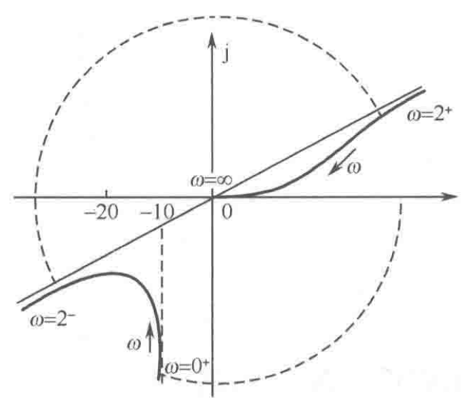

> Image description: This figure is a complex plane plot (s-plane or z-plane) featuring a real axis and an imaginary axis labeled "j". A dashed circle centered at the origin serves as a reference boundary. The image depicts a locus curve representing the movement of poles or zeros as a variable $\omega$ changes. The trajectory begins at the bottom near $\omega=0^+$, moves upward and curves toward the left, passing through $\omega=2^-$ before crossing the real axis into the negative region. The path then continues linearly toward the origin, reaching it at $\omega=\infty$. From the origin, the curve extends into the first quadrant, moving outward as $\omega$ increases, ending at a point labeled $\omega=2^+$. Arrows along the curves indicate the direction of increasing $\omega$. This plot is typically used in control engineering or signal processing to visualize root locus or frequency response characteristics.
图 5－15－1 $\quad G(\mathrm{j} \omega) H(\mathrm{j} \omega)=\frac{10}{\mathrm{j} \omega(1+\mathrm{j} \omega)\left(1-\omega^{2} / 4\right)}$
概略开环幅相特性曲线

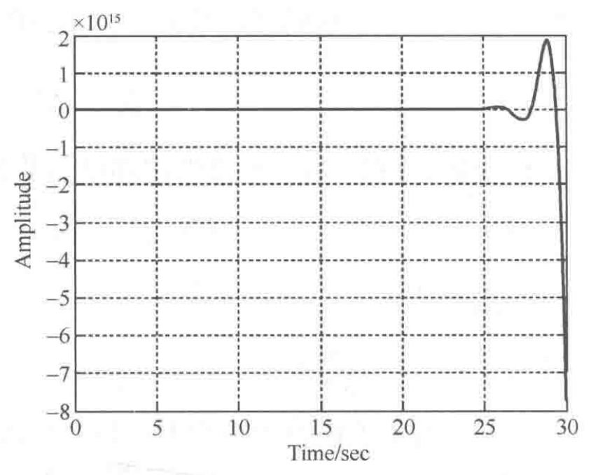

> Image description: The image shows a plot of amplitude versus time in seconds, representing the time-domain response of a system. The horizontal x-axis is labeled "Time/sec" and ranges from 0 to 30. The vertical y-axis is labeled "Amplitude," with values scaled by $10^{15}$, ranging from $-8 \times 10^{15}$ to $2 \times 10^{15}$. The plotted curve remains nearly flat at zero for the majority of the duration, from 0 to approximately 25 seconds. After this point, the signal exhibits rapid, high-amplitude oscillations that grow exponentially in magnitude. The amplitude first peaks positively around $2 \times 10^{15}$ near 28 seconds before plunging sharply toward $-8 \times 10^{15}$ at 30 seconds. In engineering terms, this behavior indicates an unstable system where the output diverges rapidly over time. The provided caption references a transfer function $G(j\omega)H(j\omega)$ involving an integrator and poles, which typically relates to stability analysis in control systems.
图 5－15－2 题 5－9 系统的单位阶跃响应（MATLAB）

MATLAB 程序 ：exe515．m
$\mathrm{GO}=\mathrm{tf}(10,[0.25,0.25,1,1,0])$ ；
$\mathrm{G}=$ feedback $(\mathrm{G} 0,1)$ ；
$t=0: 0.1: 30$ ；
step（ $G, t$ ）；grid
5－16 已知系统开环传递函数

$$
G(s)=\frac{K}{s(T s+1)(s+1)}, \quad K, T>0
$$

试根据奈氏判据，确定其闭环稳定条件：
（1）$T=2$ 时，$K$ 值的范围；
（2）$K=10$ 时，$T$ 值的范围；
（3）$K 、 T$ 值的范围。
解 本题主要考查根据系统的幅相特性曲线，应用奈氏判据，来确定使闭环系统稳定的


<!-- source_pdf_page: 162 -->
参数的取值范围。
系统的开环频率特性

$$
\begin{aligned}
G(\mathrm{j} \omega) & =\frac{K}{\mathrm{j} \omega(1+\mathrm{j} T \omega)(1+\mathrm{j} \omega)} \\
& =-\frac{K(1+T)}{\left(1+\omega^{2}\right)\left(1+T^{2} \omega^{2}\right)}-\mathrm{j} \frac{K\left(1-T \omega^{2}\right)}{\omega\left(1+\omega^{2}\right)\left(1+T^{2} \omega^{2}\right)}
\end{aligned}
$$

开环幅相特性曲线的起点为

$$
G\left(\mathrm{j} O_{+}\right)=-K(1+T)-\mathrm{j} \infty
$$

终点为

$$
G(\mathrm{j} \infty)=0 \angle-270^{\circ}
$$

与实轴的交点：
令 $\operatorname{Im}[G(\mathrm{j} \omega)]=0$ ，解得

$$
\left\{\begin{array}{l}
\omega_{x}=\sqrt{\frac{1}{T}} \\
G\left(\mathrm{j} \omega_{x}\right)=\operatorname{Re}\left[G\left(\mathrm{j} \omega_{x}\right)\right]=-\frac{K T}{T+1}
\end{array}\right.
$$

其中 $\omega_{x}$ 为穿越频率。概略开环幅相特性曲线如图 5－16－1 所示。
由于 $P=0, Z=P-2 N$ ，若使 $Z=0$ ，应有 $N=0$ ，即幅相特性曲线不包围 $(-1, j 0)$ 点。
（1）当 $T=2$ 时 $G(\mathrm{j} \omega)$ 与实轴交于点 $\left(-\frac{2 K}{3}, \mathrm{j} 0\right)$ 。令

$$
-\frac{2 K}{3}>-1
$$

可得使闭环系统稳定的 $K$ 值范围

$$
0<K<1.5
$$

（2）当 $K=10$ 时 $G(\mathrm{j} \omega)$ 与实轴交于点 $\left(-\frac{10 T}{T+1}, \mathrm{j} 0\right)$ 。
令

$$
-\frac{10 T}{T+1}>-1
$$

可得使闭环系统稳定的 $T$ 值范围

$$
0<T<\frac{1}{9}
$$

（3）开环幅相特性曲线与实轴交于点（ $-\frac{K T}{T+1}, \mathrm{j} 0$ ）。
令

$$
-\frac{K T}{T+1}>-1
$$

可得使闭环系统稳定的 $K$ 、 $T$ 值范围

$$
0<K<1+\frac{1}{T} \text { 或 } 0<T<\frac{1}{K-1}
$$

MATLAB 验证：
应用 MATLAB 软件包，对三组使闭环系统稳定的参数组（ $K=1, T=2$ ），（ $K=2, T= 0.5)$ 及 $(K=10, T=0.1)$ 作单位阶跃响应曲线，分别如图 5－16－2、图 5－16－3 和图 5－16－4 所


<!-- source_pdf_page: 163 -->
示，以验证闭环系统稳定性。
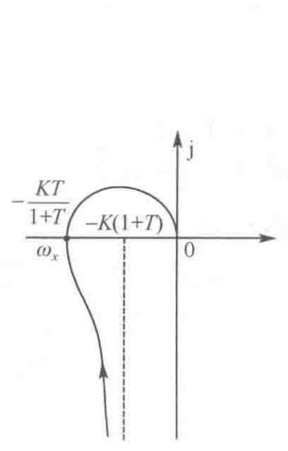

> Image description: This figure displays a Nyquist plot or frequency response curve of a transfer function $G(j\omega)$ in the complex plane. The horizontal axis represents the real part, and the vertical axis (labeled with '$j$') represents the imaginary part. The plot originates from the origin ($0$) and curves into the second quadrant as $\omega$ increases. A key point on the negative real axis is labeled $-K(1+T)$, representing a specific gain value. The curve eventually intersects the real axis at a point labeled $-\frac{KT}{1+T}$, denoted as $\omega_x$. An arrow indicates the direction of the locus moving downward and toward the left as frequency increases. According to the caption, the system is defined by $G(j\omega)=\frac{K}{j\omega(1+jT\omega)(1+j\omega)}$, indicating a third-order system with an integrator. The figure illustrates how the phase shift and magnitude change relative to the parameters $K$ and $T$.

图 5－16－1 $\quad G(\mathrm{j} \omega)=\frac{K}{\mathrm{j} \omega(1+\mathrm{j} T \omega)(1+\mathrm{j} \omega)}$
概略幅相特性曲线

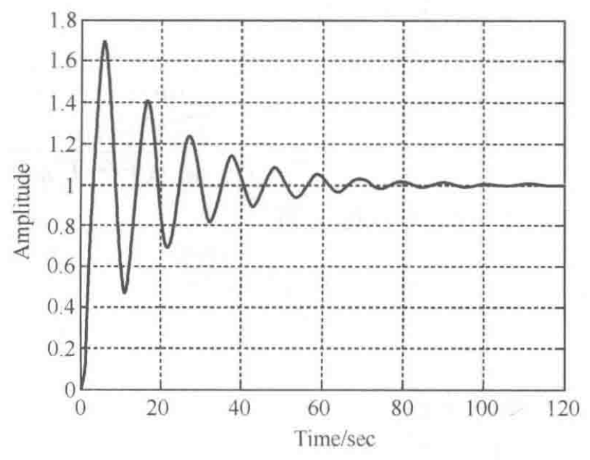

> Image description: The image displays a time-domain response plot, likely representing the step response of a control system. The horizontal x-axis is labeled "Time/sec" and ranges from 0 to 120 seconds. The vertical y-axis is labeled "Amplitude" and ranges from 0 to 1.8. The graph shows an underdamped oscillatory signal that starts at the origin (0,0) and oscillates around a steady-state value of 1.0. The oscillations exhibit decaying amplitude over time, with the first peak reaching approximately 1.7 and subsequent peaks decreasing until the signal stabilizes near 100 seconds. The provided caption references a transfer function $G(\mathrm{j} \omega)=\frac{K}{\mathrm{j} \omega(1+\mathrm{j} T \omega)(1+\mathrm{j} \omega)}$, indicating that this figure illustrates the time-domain behavior associated with such a system's characteristics. The plot visually demonstrates concepts of overshoot, settling time, and stability in an engineering context.
图 5－16－2 $K=1, T=2$ 时系统时间
响应（MATLAB）

MATLAB 程序 ：exe516．m
$\mathrm{K} 1=1 ; \mathrm{T} 1=2$ ；
$\mathrm{G} 1=\mathrm{tf}([\mathrm{K} 1],[\operatorname{conv}([\operatorname{conv}([1,0],[\mathrm{T} 1,1])],[1,1])]) ;$
G11＝feedback（G1，1）；
$\mathrm{K} 2=2 ; \mathrm{T} 2=0.5$ ；
$\mathrm{G} 2=\mathrm{tf}([\mathrm{K} 2],[\operatorname{conv}([\operatorname{conv}([1,0],[\mathrm{T} 2,1])],[1,1])]) ;$
G21＝feedback（G2，1）；
$\mathrm{K} 3=10 ; \mathrm{T} 3=0.1$ ；
$\mathrm{G} 3=\mathrm{tf}([\mathrm{K} 3],[\operatorname{conv}([\operatorname{conv}([1,0],[\mathrm{T} 3,1])],[1,1])]) ;$
G31＝feedback（G3，1）；
figure（1）；step（G11）；grid；
figure（2）；step（G21）；grid；
figure（ 3 ）；step（ G31）；grid；

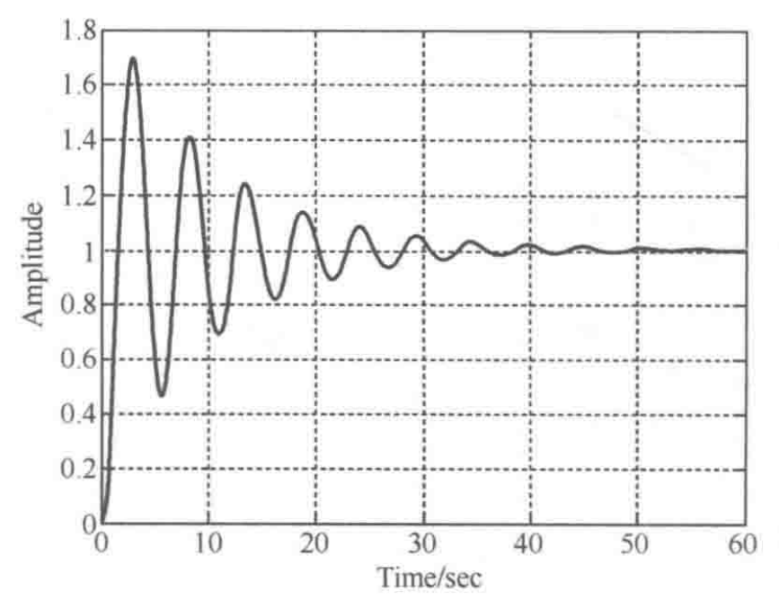

> Image description: This image shows a time-domain response plot of a system, labeled as Figure 5-16-3 with parameters $K=2$ and $T=0.5$. The graph features a vertical y-axis labeled "Amplitude" ranging from 0 to 1.8 and a horizontal x-axis labeled "Time/sec" ranging from 0 to 60. The plot depicts a damped sinusoidal oscillation starting at the origin (0,0). The signal exhibits an initial overshoot reaching approximately 1.7 before oscillating with decreasing amplitude around a steady-state value of 1.0. As time increases toward 60 seconds, the oscillations decay, and the system converges to its final value. In engineering terms, this represents the transient response of an underdamped second-order system, illustrating characteristics such as overshoot, settling time, and steady-state error relative to a unit step input.
图 5－16－3 $K=2, T=0.5$ 时系统时间
响应（MATLAB）

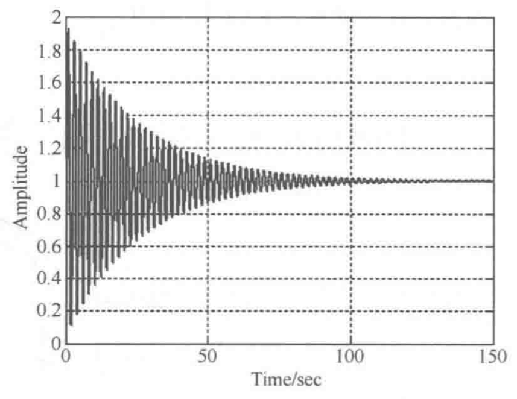

> Image description: The image shows a MATLAB-generated plot of a system's time response, labeled as Figure 5-16-3 with parameters $K=2$ and $T=0.5$. The graph features a horizontal x-axis labeled "Time/sec" ranging from 0 to 150 and a vertical y-axis labeled "Amplitude" ranging from 0 to 2. The plot depicts an underdamped oscillatory response. Starting from an initial value near 0, the signal exhibits high-frequency oscillations that gradually decay in amplitude over time. The oscillations are centered around a steady-state value of 1. As time progresses toward 150 seconds, the amplitude of the fluctuations diminishes until the system converges to a constant value of 1. This represents a typical transient response of a linear system reaching equilibrium after an initial disturbance or step input.
图 5－16－4 $K=10, T=0.1$ 时系统时间
响应（MATLAB）


<!-- source_pdf_page: 164 -->
5－17 试用对数稳定判据判定题 5－10 系统的闭环稳定性。
解 本题主要考查如何根据系统的对数频率特性曲线，运用对数稳定判据来确定不稳定的闭环极点的个数，进而判别闭环系统的稳定性，特别要注意对含有积分环节开环对数频率特性的处理。

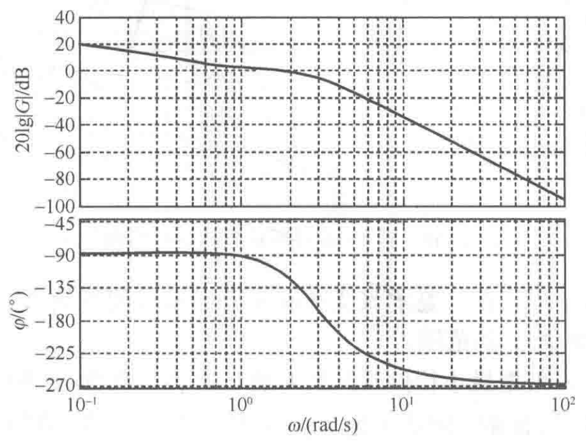

> Image description: This image shows a Bode plot representing the open-loop frequency response of a system, as indicated by the caption "图 5－17－1 题 5－10 的开环对数频率特性（MATLAB）". The figure consists of two vertically aligned graphs sharing a common logarithmic horizontal axis for angular frequency $\omega$ in radians per second ($\text{rad/s}$), ranging from $10^{-1}$ to $10^2$. The top graph displays the magnitude plot, with the vertical axis labeled as $20\lg|G|/\text{dB}$, showing a gain that decreases from approximately $20\text{ dB}$ at low frequencies to $-100\text{ dB}$ at $\omega = 10^2$. The bottom graph displays the phase plot, with the vertical axis labeled as $\varphi/(^\circ)$, showing the phase shifting from $-90^\circ$ down to approximately $-270^\circ$ as frequency increases. Together, these plots characterize the system's stability and frequency response characteristics.
图 5－17－1 题 5－10 的开环对数频率特性（MATLAB）

系统开环传递函数

$$
G(s) H(s)=\frac{(s+1)}{s\left(\frac{s}{2}+1\right)\left(\frac{s^{2}}{9}+\frac{s}{3}+1\right)}
$$

系统开环对数频率特性曲线如图 5－17－1 所示。
因为 $\nu=1$ ，故需要在对数相频特性的低频段曲线向上补作 $1 \times 90^{\circ}$ 的垂线；系统的全部开环极点都位于 $s$ 左半平面，即 $P=0$ 。

在 $L(\omega)>0$ 的频段内，其对数相频曲线没有穿越 $(2 k+1) \times 180^{\circ}$ 线，故 $N_{-}=0$ ， $N_{+}=0$ ，则 $N=N_{+}-N_{-}=0$ ；于是闭环极点位于 $s$ 右半平面的个数为

$$
Z=P-2 N=0
$$

所以系统闭环稳定。
又解：在题 5－10 中的开环对数频率特性曲线 MATLAB 仿真结果中，易得开环截止频率 $\omega_{c}=1.7 \mathrm{rad} / \mathrm{s}$ ，相角裕度 $\gamma= 69.4^{\circ}$ ，故闭环系统稳定。作为一种验证，下面给出该系统的单位阶跃响应曲线，如图 5－17－2 所示。

$$
\begin{aligned}
& \text { MATLAB 程序: exe517.m } \\
& \mathrm{G}=\mathrm{tf}([1,1], \operatorname{conv}([0.5,1,0],[1 / 9,1 / 3,1])) \\
& {[\mathrm{Gm}, \mathrm{Pm}, \mathrm{wx}, \mathrm{wc}]=\operatorname{margin}(\mathrm{G})} \\
& \mathrm{G} 1=\operatorname{feedback}(\mathrm{G}, 1) \\
& \text { step(G1); grid }
\end{aligned}
$$

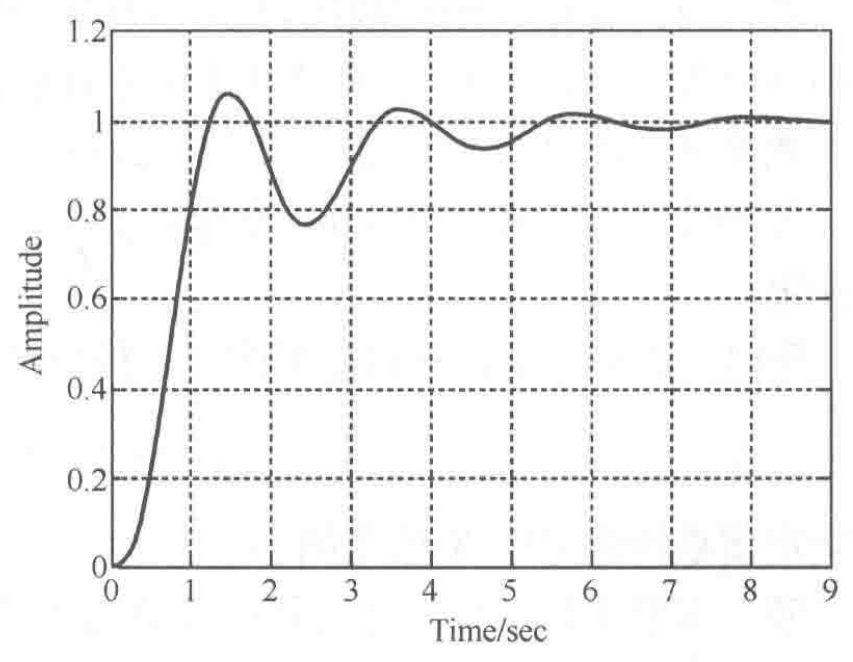

> Image description: The image shows a plot of the unit step response of a system, generated via MATLAB, as indicated by the caption "图 5－17－2 题 5－10 系统的单位阶跃响应 （MATLAB）". The graph features two axes: the horizontal x-axis is labeled "Time/sec" with numerical markings from 0 to 9 in increments of 1. The vertical y-axis is labeled "Amplitude" with numerical values ranging from 0 to 1.2 in increments of 0.2. A dashed grid overlays the plot area. The plotted curve starts at the origin (0,0) and rises steeply, exhibiting an underdamped behavior. It reaches its first peak slightly above 1.0 at approximately 1.4 seconds, followed by decaying oscillations around a steady-state value of 1.0. The amplitude of these oscillations decreases over time, with the signal eventually stabilizing as it approaches 9 seconds.
图 5－17－2 题 5－10 系统的单位阶跃响应 （MATLAB）

\％系统开环传递函数
\％确定系统的开环截止频率和相角裕度
\％系统的闭环传递函数


<!-- source_pdf_page: 165 -->
5－18 已知两个最小相位系统开环对数相频特性曲线如图 5－64 所示。

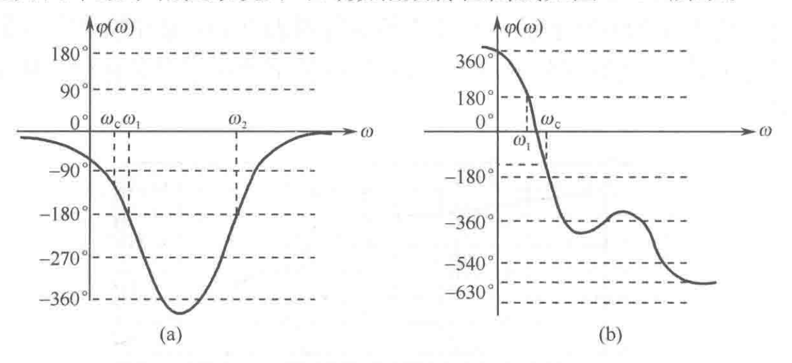

> Image description: The image contains two side-by-side plots, labeled (a) and (b), showing the open-loop phase frequency characteristics $\varphi(\omega)$ of two minimum-phase systems. Both graphs feature a horizontal axis representing angular frequency $\omega$ and a vertical axis representing phase angle $\varphi(\omega)$ in degrees. In plot (a), the phase curve starts near $0^\circ$, dips significantly to a minimum of approximately $-360^\circ$, and then returns toward $0^\circ$. Key markers on the $\omega$-axis include $\omega_c, \omega_1,$ and $\omega_2$. Vertical dashed lines connect specific points on the curve to phase values such as $-90^\circ, -180^\circ, -270^\circ,$ and $-360^\circ$. In plot (b), the phase curve begins at $360^\circ$ and generally trends downward. It crosses the $\omega$-axis at a point between $\omega_1$ and $\omega_c$, continuing to descend with an oscillation before leveling off near $-540^\circ$. Horizontal dashed lines mark intervals of $180^\circ$ from $360^\circ$ down to $-630^\circ$.
图 5－64 题 5－18 开环对数相频特性曲线

试分别确定系统的稳定性。鉴于改变系统开环增益可使系统截止频率变化，试确定系统闭环稳定时，截止频率 $\omega_{c}$ 的范围。

解 本题主要考查根据最小相位系统的对数相频特性曲线，应用对数频率稳定判据判别闭环系统的稳定性，从而确定使系统稳定的 $\omega_{c}$ 的范围。注意，应用对数频率稳定判据要求在 $L(\omega)>0$ 的频率范围内，确定对数相频曲线穿越 $(2 k+1) \times 180^{\circ}$ 线的次数。
（1）图5－64（a）。由图可见 $\varphi\left(\omega_{1}\right)=\varphi\left(\omega_{2}\right)=-180^{\circ}\left(\omega_{1}<\omega_{2}\right)$ ，其中 $\omega_{1}$ 和 $\omega_{2}$ 为 $\varphi(\omega)$ 与 $-180^{\circ}$ 线的交点频率。因为在 $\omega<\omega_{c}$ 的 $L(\omega)>0$ 的频段内，其对数相频曲线没有穿越 $(2 k+$ 1）$\times 180^{\circ}$ 线，故 $N_{-}=0, N_{+}=0$ ，则 $N=N_{+}-N_{-}=0$ 。而系统为最小相位系统，故 $P=0$ ，于是闭环极点位于 $s$ 右半平面的个数为 $Z=P-2 N=0$ ，所以系统闭环稳定。

故当改变系统开环增益 $K$ ，使得截止频率 $\omega_{c}<\omega_{1}$ 或 $\omega_{c}>\omega_{2}$ 时，由对数稳定判据可知，闭环系统仍然保持稳定。
（2）图5－64（b）。由图可见 $\varphi\left(\omega_{1}\right)=180^{\circ}$ ，其中 $\omega_{1}$ 为 $\varphi(\omega)$ 与 $180^{\circ}$ 线的交点频率。因为在 $\omega<\omega_{c}$ 的 $L(\omega)>0$ 的频段内，其对数相频曲线负穿越 $(2 k+1) \times 180^{\circ}$ 线，故 $N_{-}=1, N_{+}=$ 0 ，则 $N=N_{+}-N_{-}=-1$ 。而系统为最小相位系统，故 $P=0$ ，于是闭环极点位于 $s$ 右半平面的个数为 $Z=P-2 N=0-2 \times(-1)=2$ ，所以系统闭环不稳定。

故当改变系统开环增益 $K$ ，使得截止频率 $\omega_{c}<\omega_{1}$ 时，由对数稳定判据可知，可使闭环系统稳定。

5－19 若单位反馈延迟系统的开环传递函数

$$
G(s)=\frac{K \mathrm{e}^{-0.8 s}}{s+1}
$$

试确定使系统稳定的 $K$ 值范围。
解 本题主要考查对含有延迟环节的开环系统应用奈氏判据，确定使闭环系统稳定的系统参数的取值范围，特别要注意含有延迟环节的开环系统的相频特性的变化。

系统的开环频率特性

$$
G(\mathrm{j} \omega)=\frac{K \mathrm{e}^{-\mathrm{j} 0.8 \omega}}{1+\mathrm{j} \omega}=\frac{K}{\sqrt{1+\omega^{2}}} \mathrm{e}^{-\mathrm{j}(0.8 \omega+\arctan \omega)}
$$

令 $-0.8 \omega-\arctan \omega=-\pi$ ，解得穿越频率

$$
\omega_{x}=2.45
$$


<!-- source_pdf_page: 166 -->
而 $G(\mathrm{j} \omega)$ 在负实轴上的坐标为

$$
\left|G\left(\mathrm{j} \omega_{x}\right)\right|=\left.\frac{K}{\sqrt{1+\omega_{x}^{2}}}\right|_{\omega_{x}=2.45}=0.378 K
$$

表明延迟系统开环幅相特性曲线第一次与负实轴的交点为 $(-0.378 K, j 0)$ ，并且随着 $\omega$ 的增大，开环幅相特性曲线与负实轴的交点越来越接近坐标原点，其开环幅相特性曲线如图 5－19－1 所示。
$G(s)$ 在 $s$ 右半平面的极点数 $P=0$ ，由奈氏判据 $Z=P-2 N$ 可知，若使 $Z=0$ ，则 $P=2 N$ ，而 $P=0$ ，故 $N=0$ 。

由奈氏曲线可知：为了保证闭环系统稳定，应有 $-0.378 K>-1$ ；所以，使系统闭环稳定的开环增益 $K$ 范围为

$$
0<K<2.65
$$

MATLAB 程序 ：exe519．m

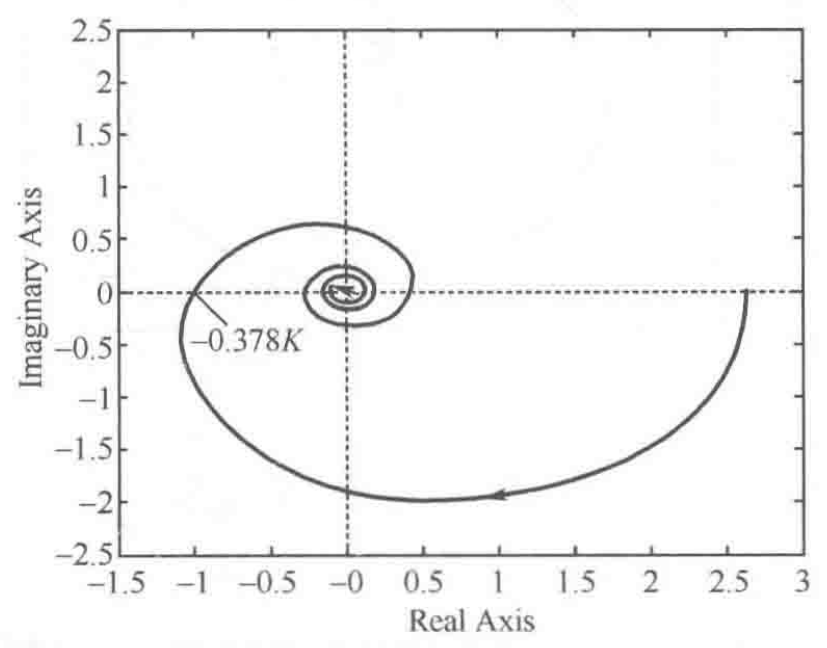

> Image description: A MATLAB-generated plot showing the frequency response (amplitude and phase characteristics) of a transfer function $G(\mathrm{j}\omega)=\frac{K\mathrm{e}^{-\mathrm{j}0.8\omega}}{1+\mathrm{j}\omega}$. The image features a complex plane with a horizontal "Real Axis" ranging from -1.5 to 3 and a vertical "Imaginary Axis" ranging from -2.5 to 2.5. The plot displays a spiral trajectory starting on the real axis at approximately $x=2.6$ and curving counter-clockwise toward the origin. An arrow indicates the direction of the path as frequency $\omega$ increases. The spiral winds inward, crossing the imaginary axis multiple times. A specific point on the curve is labeled $-0.378K$. The figure illustrates how the combination of a first-order lag and a time delay affects the system's phase and magnitude in the complex plane.
图 5－19－1 $G(\mathrm{j} \omega)=\frac{K \mathrm{e}^{-\mathrm{j} 0.8 \omega}}{1+\mathrm{j} \omega}$ 幅相特性（MATLAB）

\％选取 $\omega$ 初始值

$$
w 0=0.01 ;
$$

\％计算系统开环幅相曲线第一次与负实轴相交时的 $\omega$ 值

$$
\begin{aligned}
& \text { while }(-0.8 * \mathrm{w} 0-\operatorname{atan}(\mathrm{w} 0)>-\mathrm{pi}) \\
& \qquad w 0=\mathrm{w} 0+0.01 ;
\end{aligned}
$$

end

$$
w=w 0 ;
$$

\％计算临界开环增益

$$
k=\operatorname{sqrt}\left(1+w^{2} 2\right) ;
$$

\％绘制系统开环幅相特性图

$$
\begin{aligned}
& G=\operatorname{tf}([k],[1,1], \text { 'inputdelay' }, 0.8) \\
& \text { nyquist }(G)
\end{aligned}
$$

5－20 设单位反馈延迟系统的开环传递函数

$$
G(s)=\frac{5 s^{2} \mathrm{e}^{-8}}{(s+1)^{4}}
$$

试确定闭环系统稳定时，延迟时间 $\tau$ 的范围。
解 本题主要考查对含有延迟环节的开环系统应用奈氏判据，确定使闭环系统稳定的系统参数的取值范围，特别要注意含有延迟环节的开环系统的相频特性的变化。注意 $G(\mathrm{j} \omega)$ 中含有负号时的相角变化。

系统的开环频率特性

$$
G(\mathrm{j} \omega)=\frac{-5 \omega^{2} \mathrm{e}^{-\mathrm{j} \omega \omega}}{(1+\mathrm{j} \omega)^{4}}=\frac{5 \omega^{2}}{\left(1+\omega^{2}\right)^{2}} \mathrm{e}^{-\mathrm{j}(-\pi \mid \tau \omega+4 \arctan \omega)}
$$

则开环系统幅频特性为

$$
|G(\mathrm{j} \omega)|=\frac{5 \omega^{2}}{\left(1+\omega^{2}\right)^{2}}
$$


<!-- source_pdf_page: 167 -->
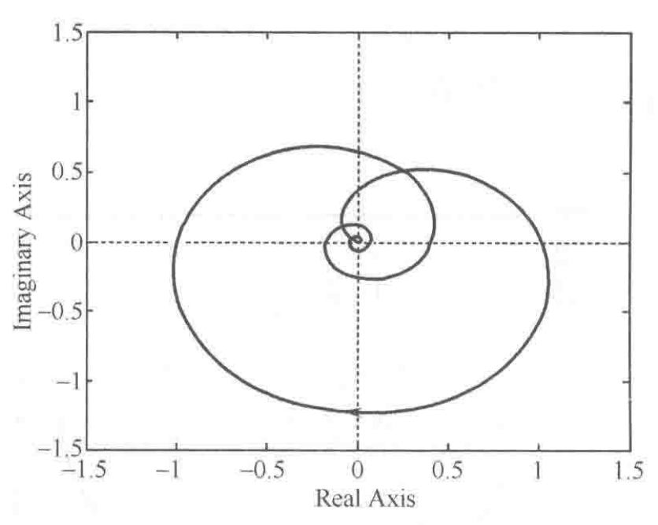

> Image description: A textbook figure, labeled as 图 5-20-1, displays a Nyquist plot of the frequency response function $G(\mathrm{j}\omega) = \frac{-5\omega^2 e^{-\mathrm{j}\omega}}{(1+\mathrm{j}\omega)^4}$. The graph is plotted on a complex plane with a horizontal "Real Axis" and a vertical "Imaginary Axis," both ranging from -1.5 to 1.5. The plot features a spiral trajectory that starts at the origin $(0,0)$ for $\omega=0$ and expands outward as frequency increases, eventually looping back toward the origin as $\omega \to \infty$. The curve extends into all four quadrants, reaching a maximum real value slightly above 1.0 and a minimum imaginary value near -1.2. Dotted lines mark the zero axes of the complex plane. In control engineering, this figure represents the stability and phase margin analysis of a system with a time delay and high-order poles.
图 5－20－1 $\quad G(\mathrm{j} \omega)=\frac{-5 \omega^{2} \mathrm{e}^{-\mathrm{j} \omega}}{(1+\mathrm{j} \omega)^{4}}$
幅相特性曲线（MATLAB）

求其极值可知：当 $\omega=1 \mathrm{rad} / \mathrm{s}$ 时，$|G(\mathrm{j} \omega)|_{\text {max }}=$ 1．25，故当 $\omega>1$ 时，随着 $\omega$ 的增大，$|G(\mathrm{j} \omega)|$ 越来越小。

而由开环系统的相频特性 $\angle G(\mathrm{j} \omega)=\pi- \tau \omega-4 \arctan \omega$ 可知，随着 $\omega$ 增大，相角不断减小；所以，为了保证闭环系统的稳定性，当 $\angle G(\mathrm{j} \omega)=-180^{\circ},|G(\mathrm{j} \omega)|_{\text {max }}$ 所对应点频率应该大于 $1 \mathrm{rad} / \mathrm{s}$ 。

令 $\omega=\omega_{m}$ 时，系统开环幅相特性曲线与负实轴相交，则交点为 $\left(-\frac{5 \omega_{m}^{2}}{\left(1+\omega_{m}^{2}\right)^{2}}, ~ \mathrm{j} 0\right)$ ，并且当 $\omega>1$ 时，随着 $\omega$ 的增大，开环幅相特性曲线与负实轴的交点越来越接近坐标原点。
$G(s)$ 在 $s$ 右半平面的极点数 $P=0$ ，其幅相特性曲线如图 5－20－1，由奈氏判据 $Z=P-2 N$可知：若使 $Z=0$ ，则 $P=2 N$ ，而 $P=0$ ，故应有 $N=0$ 。

令 $-\frac{5 \omega_{m}^{2}}{\left(1+\omega_{m}^{2}\right)^{2}}=-1$ ，解得

$$
\omega_{m}=1.618 \text { 或 } \omega_{m}=0.618 \text { (舍去) }
$$

将 $\omega_{m}=1.618$ 代入 $\pi-\tau \omega_{m}-4 \arctan \omega_{m}=-\pi$ ，解得

$$
\tau=\left.\frac{2 \pi-4 \arctan \omega_{m}}{\omega_{m}}\right|_{\omega_{m}=1.618}=1.369
$$

所以，当 $0<\tau<1.369$ 时，系统闭环稳定。
MATLAB 程序 ：exe520．m
\％确定系统开环幅相曲线第一次与负实轴相交时的 $\omega$ 值
$\mathrm{G} 0=\mathrm{tf}([5,0,0], \operatorname{conv}(\operatorname{conv}([1,1],[1,1]), \operatorname{conv}([1,1],[1,1]))) ;$
$[\mathrm{Gm}, \mathrm{Pm}$, Wcg, Wcp $]=\operatorname{margin}(\mathrm{GO}) ;$
$\mathrm{w}=\mathrm{W} c p ;$
\％选取 $\tau$ 初始值
t0＝0．01；
\％确定使系统稳定的最大延迟时间 $\tau$ 值
while（ $p i-t 0 * w-4 * \operatorname{atan}(w)>-p i$ ）
t0 = t0 + 0.01;
end
$t=t 0$ ；
\％绘制系统开环幅相特性图
$\mathrm{G}=\mathrm{tf}([5,0,0], \operatorname{conv}(\operatorname{conv}([1,1],[1,1]), \operatorname{conv}([1,1],[1,1]))$, ＇inputdelay＇， t$) ;$
nyquist（G）

## 5－21 设单位反馈系统的开环传递函数

$$
G(s)=\frac{a s+1}{s^{2}}
$$


<!-- source_pdf_page: 168 -->
试确定相角裕度为 $45^{\circ}$ 时参数 $a$ 的值。
解 本题主要考查对系统相角裕度定义的理解，并要注意与相角裕度相关的截止频率的定义。

系统的开环频率特性

$$
G(\mathrm{j} \omega)=\frac{1+\mathrm{j} a \omega}{-\omega^{2}}=\frac{\sqrt{1+a^{2} \omega^{2}}}{\omega^{2}} \mathrm{e}^{-\mathrm{j}(\pi-\operatorname{arctarin} \omega)}
$$

其中 $\varphi(\omega)=-\pi+\arctan a \omega$ 。由相角裕度定义可知

$$
=\pi+\varphi\left(\omega_{c}\right)=\arctan a \omega_{c}=\frac{\pi}{4}
$$

解得

$$
\omega_{c}=1 / a
$$

而

$$
\left|G\left(\mathrm{j} \omega_{c}\right)\right|=\left.\frac{\sqrt{1+a^{2} \omega_{c}^{2}}}{\omega_{c}^{2}}\right|_{\omega_{c}=1 / a}=1
$$

解得

$$
a=0.841, \quad \omega_{c}=1.189
$$

MATLAB 验证：由开坏对数频率特性图5－21－1，可以测得

$$
\omega_{c}=1.19 \mathrm{rad} / \mathrm{s}, \quad \gamma=45^{\circ}
$$

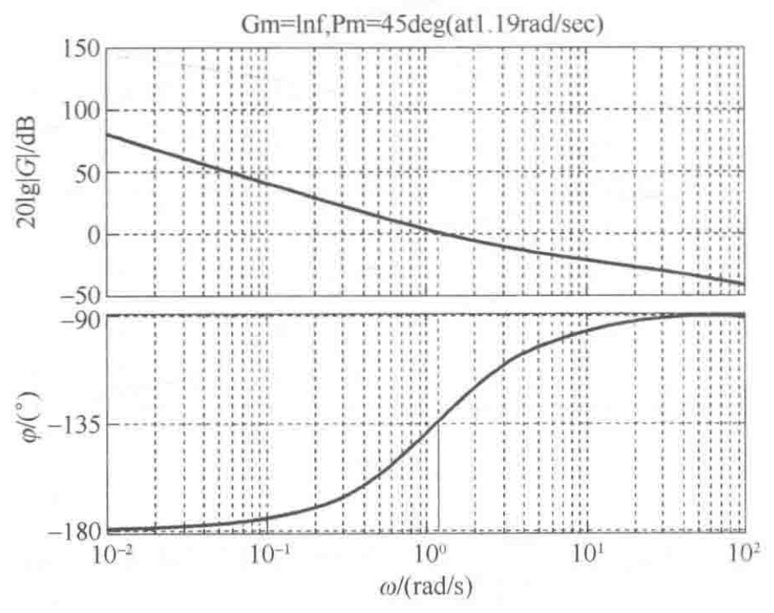

> Image description: This figure presents the open-loop Bode plot of a transfer function $G(\mathrm{j}\omega) = \frac{1+\mathrm{j}a\omega}{-\omega^2}$ with $a=0.841$, generated via MATLAB. The image consists of two vertically stacked plots sharing a logarithmic horizontal axis representing angular frequency $\omega$ in radians per second ($\text{rad/s}$), ranging from $10^{-2}$ to $10^2$. The top plot shows the magnitude response, labeled as $20\lg|G|/\text{dB}$, which decreases linearly on the log-log scale from approximately $80\text{ dB}$ down to $-40\text{ dB}$. The bottom plot displays the phase response $\phi$ in degrees ($^\circ$), starting near $-180^\circ$ at low frequencies and increasing toward $-90^\circ$ at high frequencies. Text at the top specifies stability margins: a gain margin $Gm = \text{Inf}$ and a phase margin $Pm = 45\text{ deg}$ occurring at a frequency of $1.19\text{ rad/sec}$. This represents the frequency response analysis used to determine system stability in control engineering.
图 5－21－1 $\quad G(\mathrm{j} \omega)=\frac{1+\mathrm{j} a \omega}{-\omega^{2}}$ 在 $a=0.841$ 时的开环对数频率特性（MATLAB）

MATLAB 程序 ：exe521．m

```
a = 0.841;
G= tf([a,1],[1,0,0]);
margin(G);grid
```

5－22 对于典型二阶系统，已知参数 $\omega_{n}=3, \zeta=0.7$ ，试确定截止频率 $\omega_{c}$ 和相角裕度 $\gamma$ 。解 本题主要考查如何根据典型二阶系统的参数来求取其频域指标。
典型二阶系统的开环传递函数为

$$
G(s)=\frac{\omega_{n}^{2}}{s\left(s+2 \zeta \omega_{n}\right)}
$$

代人参数 $\omega_{n}=3, \zeta=0.7$ ，得


<!-- source_pdf_page: 169 -->
$$
G(s)=\frac{9}{s(s+4.2)}
$$

二阶系统的开环频率特性

$$
G(\mathrm{j} \omega)=\frac{9}{\mathrm{j} \omega(4.2+\mathrm{j} \omega)}=\frac{9}{\omega \sqrt{17.64+\omega^{2}}} \mathrm{e}^{-\mathrm{j}\left(\frac{\pi}{2}+\arctan \frac{\omega}{4.2}\right)}
$$

由 $\left|G\left(\mathrm{j} \omega_{c}\right)\right|=1$ ，即

$$
\frac{9}{\omega_{c} \sqrt{17.64+\omega_{c}^{2}}}=1
$$

解得 $\omega_{c}=1.94 \mathrm{rad} / \mathrm{s}$ 。
再由

$$
\gamma=180^{\circ}+\varphi\left(\omega_{c}\right)=180^{\circ}-90^{\circ}-\arctan \omega_{c} / 4.2
$$

解得 $\gamma=65.21^{\circ}$ 。
MATLAB 验证：利用 MATLAB 软件包，绘制系统开环对数频率特性，如图 5－22－1 所示。由图5－22－1 测得 $\omega_{c}=1.94 \mathrm{rad} / \mathrm{s}, \gamma=65.2^{\circ}$ 。

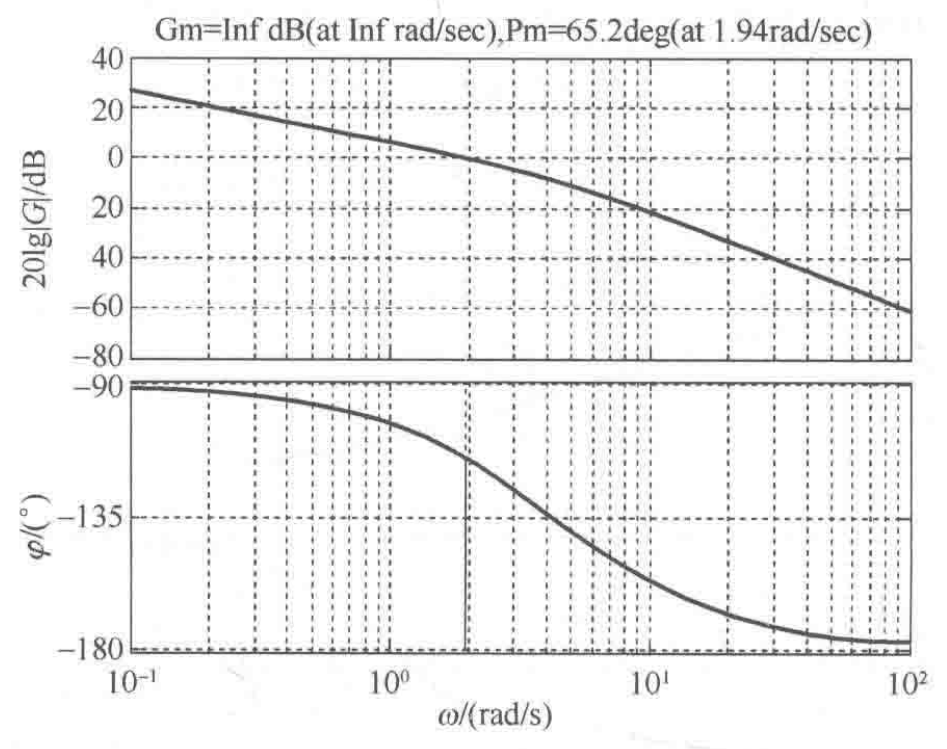

> Image description: This figure is a Bode plot generated by MATLAB, illustrating the open-loop frequency response of a system. It consists of two vertically stacked subplots sharing a logarithmic horizontal axis representing angular frequency $\omega$ in radians per second ($\text{rad/s}$), ranging from $10^{-1}$ to $10^2$. The top plot displays the magnitude $|G|$ in decibels ($20\log_{10}|G|/\text{dB}$), showing a downward slope as frequency increases. The bottom plot shows the phase angle $\varphi$ in degrees ($^\circ$), decreasing from $-90^\circ$ toward $-180^\circ$. Text at the top indicates stability margins: a gain margin ($\text{Gm}$) of infinity and a phase margin ($\text{Pm}$) of $65.2\text{ deg}$ occurring at a crossover frequency $\omega_c = 1.94 \text{ rad/sec}$. A vertical dashed line marks this specific frequency across both plots, connecting the magnitude's $0\text{ dB}$ crossing point to the corresponding phase value to visually determine the phase margin.
图 5－22－1 $\quad G(\mathrm{j} \omega)=\frac{9}{\mathrm{j} \omega(4.2+\mathrm{j} \omega)}$ 的开坏对数频率特性（MATLAB）

MATLAB 程序 ：exe522．m
\％确定系统参数
$\mathrm{wn}=3$ ；keth $=0.7$ ；
\％确定典型二阶系统的传递函数
$\mathrm{G}=\mathrm{tf}\left(\left[\mathrm{wn}^{2} 2\right], \operatorname{conv}([1,0],[1,2 *\right.$ keth $\left.* \mathrm{wn}])\right) ;$
margin（ G ）；grid
5－23 对于典型二阶系统，已知 $\sigma \%=15 \%, t_{s}=3 \mathrm{~s}(\Delta=2 \%)$ ，试计算相角裕度 $\gamma$ 。
解 本题主要考查如何根据典型二阶系统的时域指标来求取其频域指标，要注意典型二阶系统时域指标和频域指标之间的关系。

典型二阶系统的开环传递函数为

$$
G(s)=\frac{\omega_{n}^{2}}{s\left(s+2 \zeta \omega_{n}\right)}
$$

由 $\sigma \%=15 \%, t_{s}=3 \mathrm{~s}$（ $\Delta=2 \%$ ），即


<!-- source_pdf_page: 170 -->
$$
100 \mathrm{e}^{-\pi \xi / \sqrt{1-\xi^{2}}} \%=15 \%, \quad \frac{4.4}{\zeta \omega_{n}}=3(\Delta=2 \%)
$$

有

$$
\begin{aligned}
\zeta & =\frac{1}{\sqrt{1+\left(\frac{\pi}{\ln 0.15}\right)^{2}}} \\
\omega_{n} & =\frac{4.4}{3 \zeta}
\end{aligned}
$$

解得 $\zeta=0.517, \omega_{n}=2.837$ ，则二阶系统的开环频率特性

$$
G(\mathrm{j} \omega)=\frac{8.049}{\mathrm{j} \omega(2.933+\mathrm{j} \omega)}=\frac{8.049}{\omega \sqrt{8.602+\omega^{2}}} \mathrm{e}^{-\mathrm{j}\left(\frac{\pi}{2} \arctan \frac{\omega}{2.933}\right)}
$$

由 $\left|G\left(\mathrm{j} \omega_{c}\right)\right|=1$ ，即

$$
\frac{8.049}{\omega_{c} \sqrt{8.602+\omega_{c}^{2}}}=1
$$

解得 $\omega_{c}=2.2 \mathrm{rad} / \mathrm{s}$ 。再由

$$
\gamma=180^{\circ}+\varphi\left(\omega_{c}\right)=180^{\circ}-90^{\circ}-\arctan \omega_{c} / 2.933
$$

解得 $\gamma=53.1^{\circ}$ 。
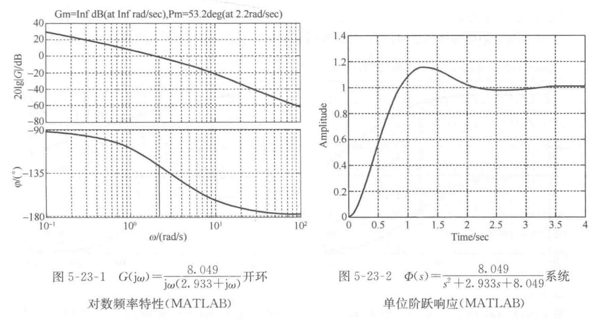

MATLAB 验证：
利用 MATLAB 软件包，针对 $G(\mathrm{j} \omega)=\frac{8.049}{\mathrm{j} \omega(2.933+\mathrm{j} \omega)}$ 作开环对数频率特性，如图 5－23－1 所示。由图5－23－1得 $\omega_{c}=2.2 \mathrm{rad} / \mathrm{s}, \gamma=53.2^{\circ}$ 。

针对 $\Phi(s)=\frac{8.049}{s^{2}+2.933 s+8.049}$ 作单位阶跃响应，如图5－23－2所示。由图5－23－2得 $\sigma \%=15 \%, t_{s}=2.8 \mathrm{~s}(\Delta=2 \%)$ 。

MATLAB 程序：exe523．m
$\operatorname{deta}=0.15 ; \mathrm{ts}=3 ;$


<!-- source_pdf_page: 171 -->
```
keth = sin(atan( - log(deta)/pi)); wn=4.4/(ts * keth); % 确定参数 }\mp@subsup{\omega}{n}{},\zeta\mathrm{ 值
G = tf ([wn2 2],conv([1,0],[1,2* keth * wn])); % 典型二阶系统的传递函数
figure(1);margin(G);grid
G1 = feedback(G,1);
figure(2);step(G1);grid
```

5－24 根据题5－11所绘对数幅频渐近特性曲线，近似确定截止频率 $\omega_{c}$ ，并由此确定相角裕度 $\gamma$ 的近似值。

解 本题主要考查如何根据系统的对数幅频渐近特性曲线确定截止频率，进而确定相角裕度。
（1）$G(s)=\frac{2}{(2 s+1)(8 s+1)}$
由图 5－11－1 对数幅频渐近特性曲线，并根据其几何性质，可以得

$$
20 \lg 2=20 \lg \frac{\omega_{c}}{1 / 8}
$$

解得 $\omega_{c}=0.25 \mathrm{rad} / \mathrm{s}$ 。再由

$$
\gamma=180^{\circ}-\arctan 2 \omega_{c}-\arctan 8 \omega_{c}
$$

解得 $\gamma=90^{\circ}$ 。
MATLAB 验证：
由开环对数频率特性的仿真结果，可以测得 $\omega_{c}=0.196 \mathrm{rad} / \mathrm{s}, \gamma=101^{\circ}$ ，如图5－24－1所示。
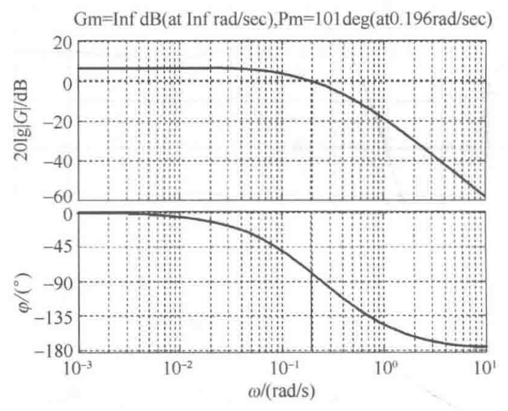

> Image description: This image shows a Bode plot representing the open-loop frequency response of a system, labeled as Figure 5-24-1. The figure consists of two vertically stacked graphs sharing a logarithmic horizontal axis for angular frequency $\omega$ in radians per second ($\text{rad/s}$), ranging from $10^{-3}$ to $10^1$. The top graph plots the magnitude $|G|$ in decibels ($20\lg|G|/\text{dB}$) on the vertical axis, showing a flat response at low frequencies that rolls off as frequency increases. The bottom graph plots the phase angle $\phi$ in degrees ($^\circ$) on the vertical axis, decreasing from $0^\circ$ toward $-180^\circ$. Text at the top indicates stability margins: Gain Margin ($\text{Gm}$) is infinite ($\text{Inf dB}$), and Phase Margin ($\text{Pm}$) is $101\text{ deg}$ at a crossover frequency of $0.196 \text{ rad/sec}$. The caption confirms these values, stating $\omega_c = 0.196 \text{ rad/s}$ and $\gamma = 101^\circ$.

图 5－24－1 $\quad G(s)=\frac{2}{(2 s+1)(8 s+1)}$ 的开环对数频率特性（MATLAB）

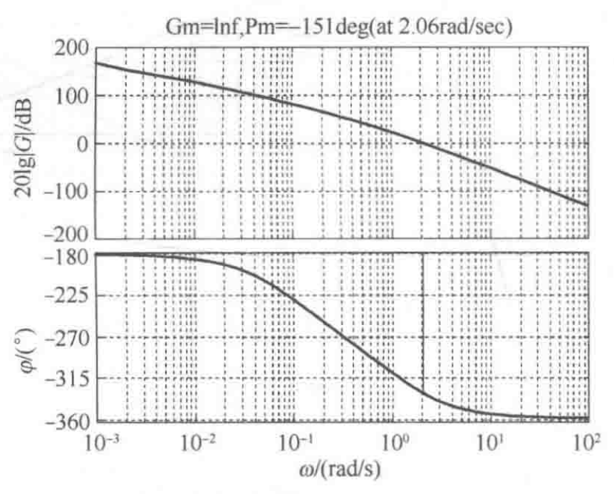

> Image description: This image shows a Bode plot representing the open-loop logarithmic frequency characteristics of a system with the transfer function $G(s) = \frac{2}{(2s+1)(8s+1)}$, as indicated in the caption. The figure consists of two vertically aligned graphs sharing a common horizontal axis for angular frequency $\omega$ in radians per second ($\text{rad/s}$), plotted on a logarithmic scale from $10^{-3}$ to $10^2$. The top graph displays the magnitude plot, with the vertical axis labeled $20\lg|G|/\text{dB}$, showing a downward slope as frequency increases. The bottom graph is the phase plot, with the vertical axis labeled $\varphi/(^\circ)$, ranging from $-180^\circ$ to $-360^\circ$. Text at the top specifies stability margins: Gain Margin ($\text{Gm}$) is infinite ($\text{Inf}$), and Phase Margin ($\text{Pm}$) is $-151\text{ deg}$ at a frequency of $2.06\text{ rad/sec}$. This indicates an unstable system in closed-loop configuration.
图 5－24－2 $G(s)=\frac{200}{s^{2}(s+1)(10 s+1)}$ 的开环对数频率特性（MATLAB）

（2）$G(s)=\frac{200}{s^{2}(s+1)(10 s+1)}$
由图5－11－2对数幅频渐近特性曲线，并根据其几何性质，可以得

$$
20 \lg 200+40 \lg \frac{1}{1 / 10}-60 \lg \frac{1}{10}=80 \lg \frac{\omega_{c}}{1}
$$

解得 $\omega_{c}=2.115 \mathrm{rad} / \mathrm{s}$ 。再由

$$
\gamma=180^{\circ}-180^{\circ}-\arctan \omega_{c}-\arctan 10 \omega_{c}
$$


<!-- source_pdf_page: 172 -->
解得 $\gamma=-152^{\circ}$ 。
MATLAB 验证：
由开环对数频率特性的仿真结果，可以测得 $\omega_{c}=2.06 \mathrm{rad} / \mathrm{s}, \gamma=-151^{\circ}$ ，如图5－24－2所示。
（3）$G(s)=\frac{8\left(\frac{s}{0.1}+1\right)}{s\left(s^{2}+s+1\right)\left(\frac{s}{2}+1\right)}$
由图5－11－3对数幅频渐近特性曲线，根据其几何性质，可以得到

$$
20 \lg 8+20 \lg \frac{1}{0.1}-40 \lg \frac{2}{1}=60 \lg \frac{\omega_{c}}{2}
$$

解得 $\omega_{\mathrm{c}}=5.429 \mathrm{rad} / \mathrm{s}$ 。再由

$$
\gamma=180^{\circ}+\arctan \frac{\omega_{c}}{0.1}-90^{\circ}-\left(180^{\circ}-\arctan \frac{\omega_{c}}{\omega_{c}^{2}-1}\right)-\arctan \frac{\omega_{c}}{2}
$$

解得 $\gamma=-60.04^{\circ}$ 。
MATLAB 验证：
由开环对数频率特性的仿真结果，可以测得 $\omega_{c}=5.34 \mathrm{rad} / \mathrm{s}, \gamma=-59.6^{\circ}$ ，如图5－24－3所示。
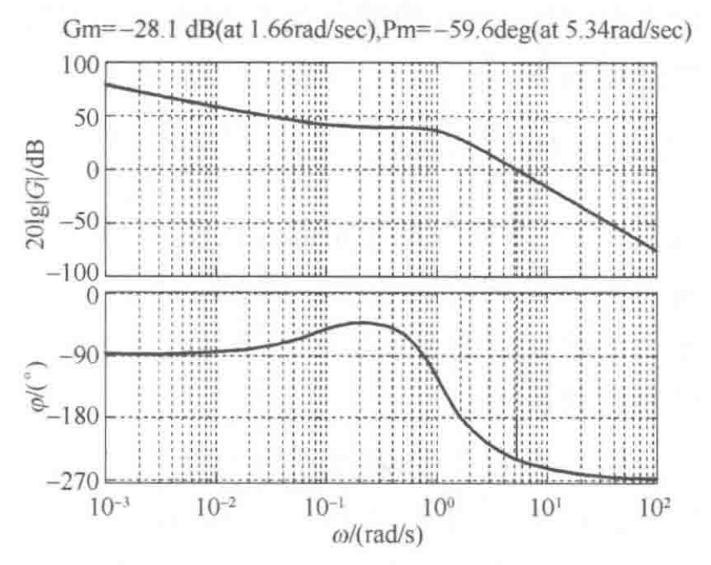

> Image description: This figure presents a Bode plot showing the open-loop frequency response of a system. It consists of two vertically aligned graphs sharing a logarithmic horizontal axis representing angular frequency $\omega$ in rad/s, ranging from $10^{-3}$ to $10^2$. The top graph plots the magnitude $20\lg|G|$ in decibels (dB) against frequency. The curve starts at approximately 80 dB and slopes downward, crossing the 0 dB axis near $\omega = 5.34 \text{ rad/s}$. The bottom graph plots the phase angle $\varphi$ in degrees ($^\circ$) against frequency, starting around $-90^\circ$, peaking slightly, and then descending toward $-270^\circ$. Text at the top specifies stability margins: a gain margin $Gm = -28.1 \text{ dB}$ at $1.66 \text{ rad/sec}$ and a phase margin $Pm = -59.6 \text{ deg}$ at $5.34 \text{ rad/sec}$. The caption identifies the crossover frequency $\omega_c = 5.34 \text{ rad/s}$ and phase margin $\gamma = -59.6^\circ$.

图 5－24－3 $G(s)=\frac{8\left(\frac{s}{0.1}+1\right)}{s\left(s^{2}+s+1\right)\left(\frac{s}{2}+1\right)}$ 的开环
对数频率特性（MATLAB）
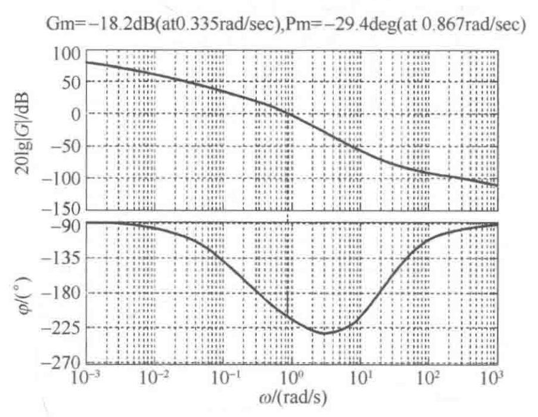

> Image description: This image shows a Bode plot representing the open-loop logarithmic frequency characteristics of a transfer function $G(s)$, generated via MATLAB. The figure consists of two vertically stacked plots sharing a common horizontal axis for angular frequency $\omega$ in radians per second ($\text{rad/s}$), ranging from $10^{-3}$ to $10^3$. The top plot displays the magnitude $20\log_{10}|G|$ in decibels ($\text{dB}$), showing a downward slope as frequency increases. The bottom plot shows the phase angle $\varphi$ in degrees ($^\circ$), starting at $-90^\circ$, dipping to approximately $-240^\circ$, and returning toward $-90^\circ$. Text at the top specifies stability margins: a gain margin $\text{Gm} = -18.2\text{dB}$ at $0.335\text{rad/sec}$ and a phase margin $\text{Pm} = -29.4\text{deg}$ at $0.867\text{rad/sec}$. The caption identifies the specific transfer function $G(s)$ involving an integrator, second-order terms, and first-order lead/lag components.

图 5－24－4 $G(s)=\frac{10\left(\frac{s^{2}}{400}+\frac{s}{10}+1\right)}{s(s+1)\left(\frac{s}{0.1}+1\right)}$ 的开环
对数频率特性（MATLAB）
（4）$G(s)=\frac{10\left(\frac{s^{2}}{400}+\frac{s}{10}+1\right)}{s(s+1)\left(\frac{s}{0.1}+1\right)}$
由图5－11－4对数幅频渐近特性曲线可知 $\omega_{c}=1 \mathrm{rad} / \mathrm{s}$ ，再由

$$
\gamma=180^{\circ}+\arctan \frac{\omega_{c} / 10}{1-\omega_{c}^{2} / 400}-90^{\circ}-\arctan \frac{\omega_{c}}{1}-\arctan \frac{\omega_{c}}{0.1}
$$


<!-- source_pdf_page: 173 -->
解得 $\gamma=-33.57^{\circ}$ 。
MATLAB 验证：
由开环对数频率特性的仿真结果，可以测得 $\omega_{c}=0.867 \mathrm{rad} / \mathrm{s}, \gamma=-29.4^{\circ}$ ，如图5－24－4所示。
MATLAB 程序：exe524．m
\％各系统的开环传递函数

$$
\begin{aligned}
& \mathrm{G} 1=\mathrm{tf}(2,[\operatorname{conv}([2,1],[8,1])]) ; \\
& \mathrm{G} 2=\mathrm{tf}(200,[\operatorname{conv}(\operatorname{conv}([1,1],[10,1]),[1,0,0])]) ; \\
& \mathrm{G} 3=\mathrm{tf}(8 *[10,1],[\operatorname{conv}(\operatorname{conv}([1,0],[0.5,1]),[1,1,1])]) ; \\
& \mathrm{G} 4=\mathrm{tf}(10 *[1 / 400,1 / 10,1],[\operatorname{conv}(\operatorname{conv}([1,0],[1,1]),[10,1])]) ;
\end{aligned}
$$

\％绘制各系统的开环对数频率特性曲线

$$
\begin{aligned}
& \text { figure }(1) \text {; margin }(G 1) \text {;grid } \\
& \text { figure }(2) \text {; margin }(G 2) \text {;grid } \\
& \text { figure }(3) \text {; margin }(G 3) \text {;grid } \\
& \text { figure }(4) \text {; margin }(G 4) \text {;grid }
\end{aligned}
$$

5－25 航船的自动导航系统是反馈控制理论的典型应用。与人工驾驶相比，自动导航

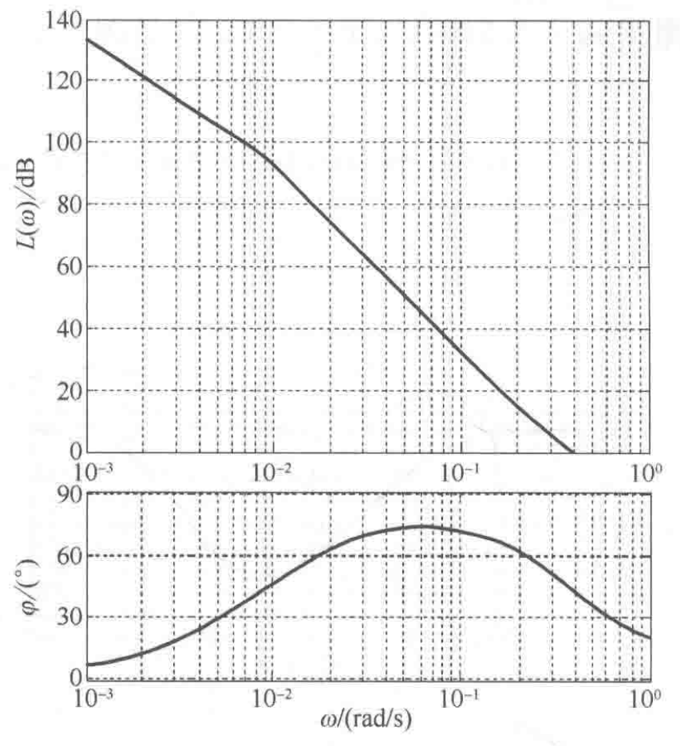

> Image description: This image shows a Bode plot representing the open-loop logarithmic frequency characteristics of an oil tanker's heading control system (as indicated by the Chinese caption "图5－65 油船航向控制系统的开环对数频率特性"). The figure consists of two vertically aligned graphs sharing a common logarithmic horizontal axis for angular frequency $\omega$ in radians per second ($\text{rad/s}$), ranging from $10^{-3}$ to $10^0$. The top graph plots the open-loop gain magnitude $L(\omega)$ in decibels ($\text{dB}$) on the vertical axis. The curve starts at approximately $130\text{ dB}$ at $\omega = 10^{-3}\text{ rad/s}$ and decreases linearly with a negative slope, crossing $0\text{ dB}$ near $\omega = 5 \times 10^{-1}\text{ rad/s}$. The bottom graph plots the phase angle $\varphi$ in degrees ($^\circ$) on the vertical axis. The phase starts near $0^\circ$, rises to a peak of approximately $75^\circ$ around $\omega = 8 \times 10^{-2}\text{ rad/s}$, and then declines toward $20^\circ$ at $\omega = 10^0\text{ rad/s}$.
图5－65 油船航向控制系统的开环对数频率特性

$$
G(s)=\frac{E(s)}{\Delta(s)}=\frac{0.164(s+0.2)(-s+0.32)}{s^{2}(s+0.25)(s-0.009)}
$$

其中，$E(s)$ 为油船偏航角的拉氏变换，$\Delta(s)$ 是舵机偏转角的拉氏变换。试验证图 5－65 所示的油船航向控制系统的开环对数频率特性的形状是否准确。

解 本题主要练习开环系统对数频率特性曲线的计算与绘制。该油船航向控制系统由非最小相位比例环节、积分环节、最小相位与非最小相位一阶微分环节、最小相位与非最小相位惯性环节等六种典型环节
构成。
将开环传递函数化为典型环节构成的形式，可得

$$
\begin{aligned}
G(s) & =\frac{0.164(s+0.2)(-s+0.32)}{s^{2}(s+0.25)(s-0.009)} \\
& =\frac{-4.66(5 s+1)(-3.125 s+1)}{s^{2}(4 s+1)(-111.1 s+1)}
\end{aligned}
$$

令 $K=4.66$ ，并将 $G(s)$ 分解为下表所示典型环节。


<!-- source_pdf_page: 174 -->
| 环节 | 对数幅频／dB | 对数相频 |
| :--- | :--- | :--- |
| $-K$ | $L_{1}(\omega)=20 \lg K=13.37 \mathrm{~dB}$ | $\varphi_{1}(\omega)=-180^{\circ}$ |
| $\frac{1}{s^{2}}$ | $L_{2}(\omega)=-40 \lg \omega$ | $\varphi_{2}(\omega)=-180^{\circ}$ |
| $5 s+1$ | $L_{3}(\omega)=10 \lg \left(1+25 \omega^{2}\right)$ | $\varphi_{3}(\omega)=\arctan 5 \omega$ |
| $\frac{1}{4 s+1}$ | $L_{4}(\omega)=-10 \lg \left(1+16 \omega^{2}\right)$ | $\varphi_{1}(\omega)=-\arctan 4 \omega$ |
| $-3.125 s+1$ | $L_{5}(\omega)=10 \lg \left(1+9.77 \omega^{2}\right)$ | $\varphi_{5}(\omega)=-\arctan 3.125 \omega$ |
| $\frac{1}{-111.1 s+1}$ | $L_{6}(\omega)=-10 \lg \left(1+12343.1 \omega^{2}\right)$ | $\varphi_{6}(\omega)=\arctan 111.1 \omega$ |

令 $\omega$ 为不同值，可以分别算得 $L_{i}(\omega)$ 与 $\varphi_{i}(\omega)(i=1,2,3,4,5,6)$ ，且由 $L(\omega)= \sum_{i=1}^{6} L_{i}(\omega), \varphi(\omega)=\sum_{i=1}^{6} \varphi_{i}(\omega)$ ，得到开环对数幅频特性和对数相频特性，如下表所示。

| $\omega /(\mathrm{rad} / \mathrm{s})$ | 0.004 | 0.01 | 0.02 | 0.07 | 0.1 | 0.2 | 0.4 |
| :--- | :--- | :--- | :--- | :--- | :--- | :--- | :--- |
| $L_{1}$ | 13.37 | 13.37 | 13.37 | 13.37 | 13.37 | 13.37 | 13.37 |
| $L_{2}$ | 95.92 | 80.00 | 67.96 | 46.20 | 40.00 | 27． 96 | 15.92 |
| $L_{3}$ | $1.7 \times 10^{-3}$ | 0.01 | 0.04 | 0.50 | 0.97 | 3.01 | 6.99 |
| $L_{4}$ | $-1 \times 10^{-3}$ | －0．007 | －0．03 | －0．33 | －0．64 | －2．15 | －5．51 |
| $L_{5}$ | $0.7 \times 10^{-3}$ | 0.004 | 0.02 | 0.20 | 0.40 | 1.43 | 4． 09 |
| $L_{6}$ | －0．78 | －3．49 | －7．74 | －17．89 | －20．95 | －26．94 | －32．96 |
| $L(\omega) / \mathrm{dB}$ | 108.5 | 89.9 | 73.6 | 42.1 | 33.2 | 16.7 | 1.9 |
| $\varphi_{1}$ | $-180^{\circ}$ | $-180^{\circ}$ | $-180^{\circ}$ | $-180^{\circ}$ | $-180^{\circ}$ | $-180^{\circ}$ | $-180^{\circ}$ |
| $\varphi_{2}$ | $-180^{\circ}$ | $-180^{\circ}$ | $-180^{\circ}$ | $-180^{\circ}$ | $-180^{\circ}$ | $-180^{\circ}$ | $-180^{\circ}$ |
| $\varphi_{3}$ | $1.15^{\circ}$ | 2． $86^{\circ}$ | $5.71^{\circ}$ | 19． $29^{\circ}$ | $26.57^{\circ}$ | $45.00^{\circ}$ | $63.43^{\circ}$ |
| $\varphi 1$ | $-0.92^{\circ}$ | $-2.29^{\circ}$ | $-4.57^{\circ}$ | $-15.64^{\circ}$ | $-21.80^{\circ}$ | $-38.66^{\circ}$ | $-58.00^{\circ}$ |
| $\varphi_{5}$ | $-0.72^{\circ}$ | $-1.79^{\circ}$ | $-3.58^{\circ}$ | $-12.34^{\circ}$ | $-17.35^{\circ}$ | $-32.00^{\circ}$ | $-51.34^{\circ}$ |
| $\varphi_{5}$ | $23.96^{\circ}$ | $48.00^{\circ}$ | $65.77^{\circ}$ | $82.67^{\circ}$ | $84.86^{\circ}$ | $87.42^{\circ}$ | $88.71^{\circ}$ |
| $\varphi(\omega)$ | $-336.5^{\circ}$ | $-313.2^{\circ}$ | $-296.7^{\circ}$ | $-286.0^{\circ}$ | $-287.7^{\circ}$ | $-298.2^{\circ}$ | $-317.2^{\circ}$ |

根据算出的 $L(\omega)$ 和 $\varphi(\omega)$ ，对比图5－65 对数频率特性可知，该特性曲线的形状除极低频个别点外，基本正确。

MATLAB 验证：


<!-- source_pdf_page: 175 -->
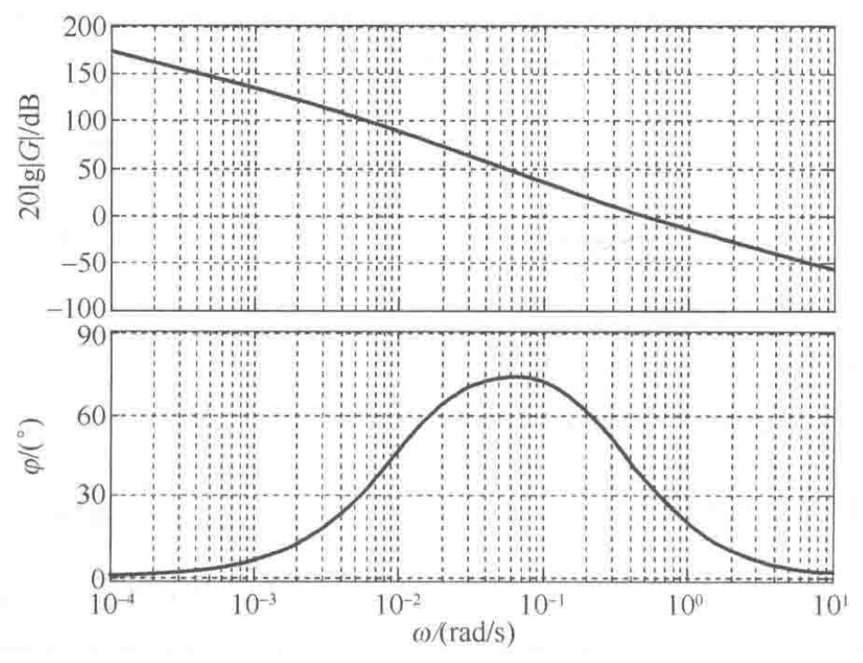

> Image description: This image displays a Bode plot representing the open-loop logarithmic frequency characteristics of an oil tanker heading control system, as indicated by the Chinese caption "图5－25－1 油船航向控制系统开环对数频率特性（MATLAB）". The figure consists of two vertically aligned graphs sharing a common logarithmic horizontal axis for angular frequency $\omega$ in radians per second ($\text{rad/s}$), ranging from $10^{-4}$ to $10^1$. The top graph is the magnitude plot, with the vertical axis labeled $20\lg|G|/\text{dB}$, showing a linear decrease in gain from approximately $170\text{ dB}$ at $\omega = 10^{-4}$ down to roughly $-60\text{ dB}$ at $\omega = 10^1$. The bottom graph is the phase plot, with the vertical axis labeled $\varphi/(^\circ)$, showing a bell-shaped curve. The phase starts near $0^\circ$, peaks at approximately $72^\circ$ around $\omega = 6 \times 10^{-2}\text{ rad/s}$, and returns toward $0^\circ$ as frequency increases.
图5－25－1 油船航向控制系统开环对数频率特性（MATLAB）

应用 MATLAB 软件包，可得开环对数频率特性，如图 5－25－1 所示。
MATLAB 程序 ：exe $525 . \mathrm{m}$

$$
\begin{aligned}
& \text { num }=0.164 *[\operatorname{conv}([1,0.2],[-1,0.32])] ; \\
& \operatorname{den}=[\operatorname{conv}(\operatorname{conv}([1,0,0],[1,0.25]),[1,-0.009])] ; \\
& G=\operatorname{tf}(\text { num }, \text { den }) ; \\
& \text { bode }(G) ; \operatorname{grid}
\end{aligned}
$$

5－26 航天飞机曾成功地完成了检修卫星和哈勃太空望远镜的任务。图5－66（a）是卫星修理示意图，宇航员的脚固定在机械手臂顶端的工作台上，以便他能用双手来完成阻止卫星转动和点火启动卫星等操作。机械臂控制系统如图5－66（b）所示，其中

$$
G_{1}(s)=K=10, \quad H(s)=1
$$

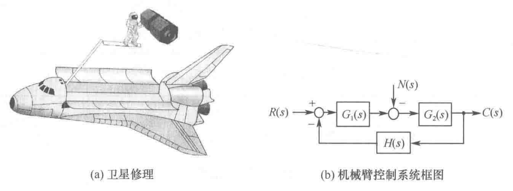

> Image description: This figure consists of two parts illustrating a space shuttle robotic arm control system. Part (a) is an illustration showing a space shuttle in orbit with a deployed mechanical arm and an astronaut working on a satellite. Part (b) presents the corresponding control system block diagram. The input signal $R(s)$ enters a summing junction, where it is compared with a feedback signal from block $H(s)$. The resulting error signal passes through the first controller block $G_1(s)$. This output then enters a second summing junction where an external disturbance signal $N(s)$ is added. The combined signal proceeds through the plant block $G_2(s)$ to produce the final output $C(s)$. A feedback loop connects the output $C(s)$ back to the initial summing junction via block $H(s)$, creating a closed-loop system designed to maintain control of the robotic arm despite disturbances.
图5－66 航天飞机机械臂控制系统

若已知闭环传递函数为

$$
\Phi(s)=\frac{C(s)}{R(s)}=\frac{10}{s^{2}+5 s+10}
$$

要求：
（1）确定系统对单位阶跃扰动的响应表达式 $c_{n}(t)$ 及 $c_{n}(\infty)$ 的值；
（2）计算闭环系统的带宽频率 $\omega_{b}$ 。
解 本题联合应用系统的时域及频域分析方法，分别确定系统的扰动时间响应及系统带宽。


<!-- source_pdf_page: 176 -->
（1）扰动时间响应。设开环传递函数

$$
G(s)=G_{1}(s) G_{2}(s)
$$

则有

$$
G(s)=\frac{\Phi(s)}{1-\Phi(s)}=\frac{10}{s(s+5)}
$$

所以

$$
G_{2}(s)=\frac{1}{s(s+5)}
$$

在单位阶跃扰动 $N(s)$ 作用下，闭环传递函数

$$
\Phi_{n}(s)=-\frac{G_{2}(s)}{1+G(s)}=-\frac{1}{s^{2}+5 s+10}
$$

则单位阶跃扰动产生的输出

$$
C_{n}(s)=\Phi_{n}(s) N(s)=-\frac{1}{s\left(s^{2}+5 s+10\right)}
$$

其中，$N(s)=\frac{1}{s}$ 。对上式进行因式分解，有

$$
C_{n}(s)=-\frac{0.1}{s}+\frac{0.1(s+5)}{(s+2.5)^{2}+1.94^{2}}
$$

进行拉氏反变换，得单位阶跃扰动输出

$$
c_{n}(t)=-0.1+0.164 \mathrm{e}^{-2.5 t} \sin \left(1.94 t+37.8^{\circ}\right)
$$

令 $t \rightarrow \infty$ ，得单位阶跃扰动作用下输出的稳态值

$$
c_{n}(\infty)=-0.1
$$

表明系统对扰动作用的影响可削弱 10 倍。
（2）闭环带宽频率。令

$$
\Phi(s)=\frac{10}{s^{2}+5 s+10}=\frac{\omega_{n}^{2}}{s^{2}+2 \zeta \omega_{n} s+\omega_{n}^{2}}
$$

可得

$$
\omega_{n}=3.162, \quad \zeta=0.79
$$

表明系统具有较大阻尼。由教材中式（6－3），带宽频率

$$
\omega_{b}=\omega_{n} \sqrt{1-2 \zeta^{2}+\sqrt{2-4 \zeta^{2}+4 \zeta^{4}}}=2.8 \mathrm{rad} / \mathrm{s}
$$

MATLAB 验证：
应用 MATLAB 软件包，可以得到系统的单位阶跃扰动响应及闭环对数频率特性，分别如图 5－26－1 及图 5－26－2 所示。由图可测得 $c_{n}(\infty)=-0.1, \omega_{b}=2.8 \mathrm{rad} / \mathrm{s}$ 。

MATLAB 程序 ：exe526．m
$\mathrm{G} 1=\mathrm{tf}([10],[1]) ; \mathrm{G} 2=\mathrm{tf}([1],[1,5,0]) ;$
$\mathrm{G}=\operatorname{series}(\mathrm{G} 1, \mathrm{G} 2) ; ~ \% ~$ 系统开环传递函数
$\mathrm{Gn}=-$ feedback $(\mathrm{G} 2, \mathrm{G} 1) ; \quad$ \％系统误差传递函数
G3 $=$ feedback $(G, 1) ; \quad$ \％系统闭环传递函数
figure（1）；step（Gn）；grid \％绘制系统单位阶跃扰动响应
figure（2）；bode（G3）；grid \％绘制系统闭环对数频率特性


<!-- source_pdf_page: 177 -->
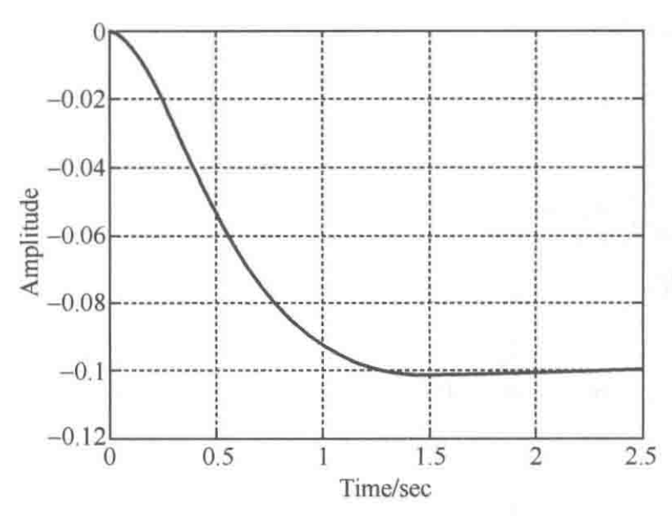

> Image description: The image shows a MATLAB-generated plot illustrating the unit step disturbance response of a Space Shuttle robotic arm system (as indicated by the Chinese caption "图 5－26－1 航天飞机机械臂系统单位阶跃扰动响应"). The graph features two axes: the horizontal x-axis is labeled "Time/sec" and ranges from 0 to 2.5 seconds, while the vertical y-axis is labeled "Amplitude" and ranges from 0 down to -0.12. A single smooth curve begins at the origin (0,0) and descends in a concave manner before leveling off. The response reaches a steady-state value of approximately -0.1 around 1.5 seconds. The plot includes a dashed grid for precise reading of values. Engineering-wise, this represents the system's transient and steady-state behavior when subjected to a unit step disturbance, showing how the amplitude deviates and eventually stabilizes over time.
图 5－26－1 航天飞机机械臂系统单位阶跃扰动响应（MATLAB）

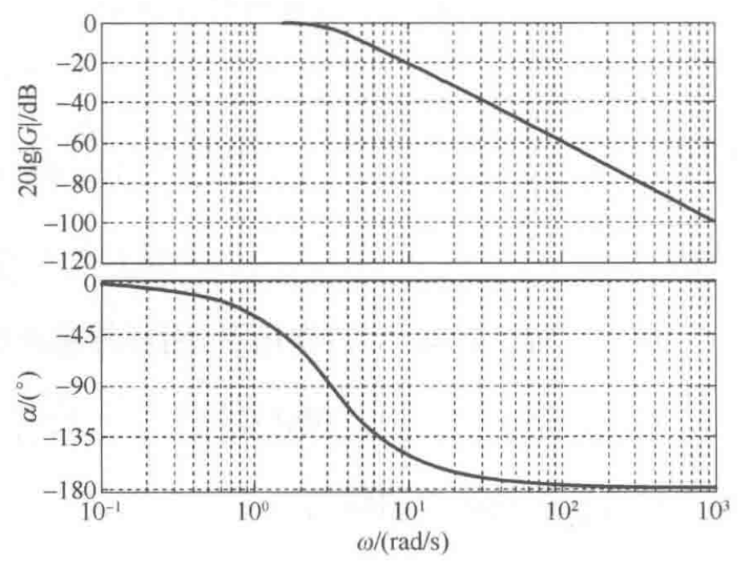

> Image description: This image displays a Bode plot of a system's frequency response, consisting of two vertically stacked graphs sharing a logarithmic horizontal axis for angular frequency $\omega$ in radians per second ($\text{rad/s}$), ranging from $10^{-1}$ to $10^3$. The top graph is the magnitude plot, with the vertical axis labeled $20\lg|G|/\text{dB}$. The curve starts at $0\text{ dB}$ and slopes downward linearly after approximately $3\text{ rad/s}$, reaching roughly $-100\text{ dB}$ at $10^3\text{ rad/s}$. The bottom graph is the phase plot, with the vertical axis labeled $\alpha/(^\circ)$. The phase starts at $0^\circ$, drops sharply between $1\text{ rad/s}$ and $10\text{ rad/s}$, and asymptotically approaches $-180^\circ$ as frequency increases. In engineering terms, this represents a stable system with a low-pass characteristic, where the magnitude decreases and phase shifts negatively as frequency increases. The caption identifies it as a MATLAB simulation of a space shuttle robotic arm system's response to unit step disturbance.
图 5－26－2 航天飞机机械臂系统闭环对数频率特性（MATLAB）

5－27 试验中的旋翼飞机装有一个可以旋转的机翼，如图 5－67 所示。当飞机速度较低时，机翼将处在正常位置；而在飞机速度较高时，机翼将旋转到一个其他的合适位置，以便改善飞机的超音速飞行品质。假定飞机控制系统的 $H(s)=1$ ，且

$$
G(s)=\frac{4(0.5 s+1)}{s(2 s+1)\left[\left(\frac{s}{8}\right)^{2}+\frac{s}{20}+1\right]}
$$

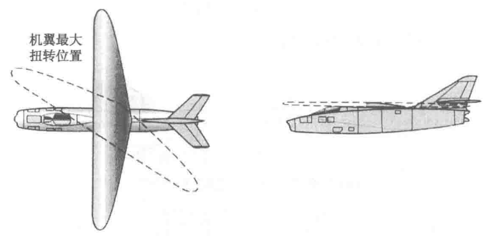

> Image description: The image contains two schematic diagrams of a rotating-wing aircraft, captioned as "图5－67 旋转翼飞机示意图" (Figure 5-67 Schematic Diagram of Rotating-Wing Aircraft). The left diagram shows a top-down view of the aircraft. A large wing is positioned perpendicularly to the fuselage. A dashed elliptical line indicates the rotational path of the wing around the center of the fuselage. Text in Chinese, "机翼最大扭转位置" (Maximum Wing Twist Position), labels the vertical orientation of the wing. The right diagram provides a side profile view of the aircraft. The fuselage is streamlined with a tail fin and rudder. A dashed horizontal line indicates the axis of rotation for the wings, showing how they pivot relative to the main body of the plane. Together, these figures illustrate the mechanical configuration and range of motion for an aircraft featuring a rotating wing system.
图5－67 旋转翼飞机示意图

## 要求：

（1）绘制开环系统的对数频率特性曲线；
（2）确定幅值增益为 0 dB 时对应的频率 $\omega_{c}$ 和相角为 $-180^{\circ}$ 时对应的频率 $\omega_{x}$ 。
解 本题主要练习频率响应法中的基本技能，并巩固有关基本概念。
（1）开环 Bode 图。由给出的 $G(s)$ 的知，开环系统由五种典型环节组成。开环增益 $K=4,20 \lg K=12 \mathrm{~dB}$ 。

开环系统各组成环节特性列表如下，以便绘制 Bode 图。据下表，可以方便绘制开环 Bode 图。图 5－27－1 是已修正后的开环准确 Bode 图。


<!-- source_pdf_page: 178 -->
| 典型环节 | 交接频率 | 斜率变化 | 相角变化 |
| :--- | :--- | :--- | :--- |
| $K$ |  | 0 | $0^{\circ}$ |
| $\frac{1}{s}$ |  | $-20 \mathrm{~dB} / \mathrm{dec}$ | $-90^{\circ}$ |
| $\frac{1}{2 s+1}$ | $\omega_{1}=0.5$ | $-20 \sim-40 \mathrm{~dB} / \mathrm{dec}$ | $\varphi_{1}(\omega)=0^{\circ} \sim-90^{\circ}$ |
| $0.5 s+1$ | $\omega_{2}=2$ | $-40 \sim-20 \mathrm{~dB} / \mathrm{dec}$ | $\varphi_{2}(\omega)=0^{\circ} \sim 90^{\circ}$ |
| $\left(\frac{s}{8}\right)^{2}+2 \times 0.2\left(\frac{s}{8}\right)+1$ | $\omega_{3}=8$ | $-20 \sim-60 \mathrm{~dB} / \mathrm{dec}$ | $\varphi_{3}(\omega)=0^{\circ} \sim-180^{\circ}$ |


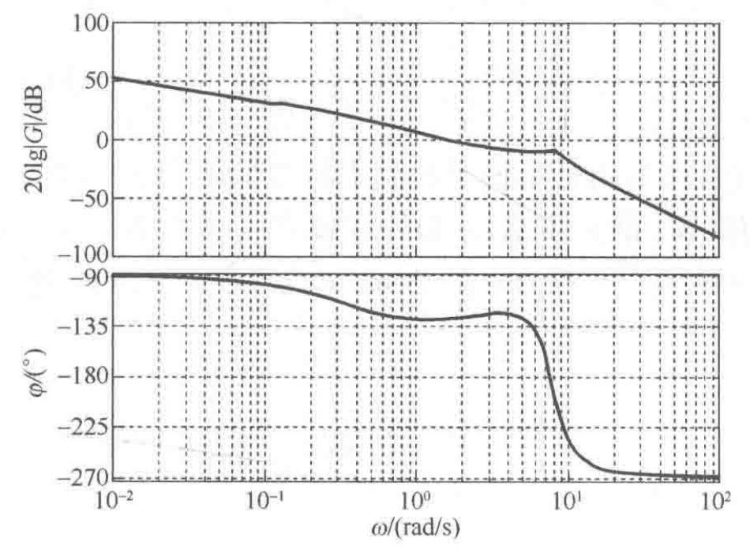

> Image description: This image shows the open-loop Bode plot for a transfer function $G(s)$, as indicated in the caption. The figure consists of two vertically stacked plots sharing a logarithmic horizontal axis representing angular frequency $\omega$ in radians per second ($\text{rad/s}$), ranging from $10^{-2}$ to $10^2$. The top plot is the magnitude curve, with the vertical axis labeled $20\lg|G|/\text{dB}$, showing a general downward slope. The bottom plot is the phase curve, with the vertical axis labeled $\varphi/(^\circ)$, ranging from $-90^\circ$ to $-270^\circ$. From an engineering perspective, these curves describe the frequency response of the system. The magnitude plot shows how gain varies with frequency, while the phase plot illustrates the phase shift introduced by the system's poles and zeros across the spectrum. The plots were generated using MATLAB.
图 5－27－1 $G(s)=\frac{4(0.5 s+1)}{s(2 s+1)\left(s^{2} / 64+s / 20+1\right)}$ 的开环对数频率特性曲线（MATLAB）

（2）截止频率与穿越频率。由已绘出的开环准确 Bode 图 5－27－1 可得：截止频率 $\omega_{c}= 1.6 \mathrm{rad} / \mathrm{s}$ ，穿越频率 $\omega_{x}=7.7 \mathrm{rad} / \mathrm{s}$ 。

MATLAB 程序 ：exe527．m
$\mathrm{G}=\mathrm{tf}(4 *[0.5,1],[\operatorname{conv}(\operatorname{conv}([1,0],[2,1]),[1 / 64,1 / 20,1])]) ;$
bode（ G ）；grid
5－28 在空间机器人与地面测控站之间，存在着较大的通信时延。因此，对火星一类的远距离行星进行星际探索时，要求空间机器人有较高的自主性。空间机器人的自主性要求将影响整个系统的各个方面，包括任务规划、感知系统和机械结构等。只有当每个机器人都配备了完善的感知系统，能可靠地构建并维持环境模型时，星际探索系统才能具备所需要的自主性。美国卡内基－梅隆大学机器人研究所开发研制了一套用于星际探索的系统，其目标机器人是一个六足步行机器人，如图5－68（a）所示。该机器人单足控制系统结构图如图5－68（b）所示。

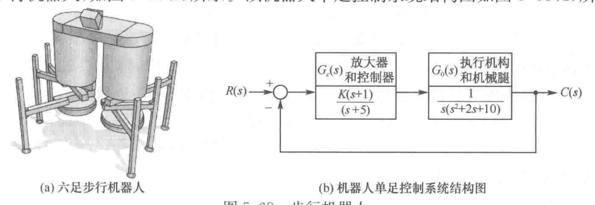

> Image description: This figure consists of two parts illustrating a six-legged walking robot. Figure (a) shows a 3D rendering of the physical robot, featuring a dual-cylinder body supported by six mechanical legs. Figure (b) presents a control system block diagram for a single leg. The system is a closed-loop feedback loop starting with an input variable $R(s)$ entering a summing junction. The forward path consists of two blocks: first, the amplifier and controller $G_c(s)$ with a transfer function $\frac{K(s+1)}{(s+5)}$, followed by the actuator and mechanical leg $G_0(s)$ with a transfer function $\frac{1}{s(s^2+2s+10)}$. The output of this chain is the control variable $C(s)$. A feedback loop connects the output $C(s)$ back to the summing junction. Arrows indicate the signal flow from left to right through the blocks and backward via the feedback path, representing a standard engineering control architecture for robotic limb positioning.
图5－68 步行机器人


<!-- source_pdf_page: 179 -->
要求：
（1）绘制 $K=20$ 时，闭环系统的对数频率特性；
（2）分别确定 $K=20$ 和 $K=40$ 时，闭环系统的谐振峰值 $M_{r}$ 、谐振频率 $\omega_{r}$ 和带宽频率 $\omega_{b}$ 。
解 本题展示在频域中进行空间机器人控制系统参数的设计过程。确定不同增益取值时的系统的频域特征参数，为进一步设计控制系统参数提供必备的技术数据。
（1）$K=20$ 时的闭环系统 Bode 图。开环传递函数

$$
G_{c}(s) G_{0}(s)=\frac{20(s+1)}{s(s+5)\left(s^{2}+2 s+10\right)}
$$

闭环传递函数

$$
\Phi(s)=\frac{20(s+1)}{s(s+5)\left(s^{2}+2 s+10\right)+20(s+1)}=\frac{20(s+1)}{s^{4}+7 s^{3}+20 s^{2}+70 s+20}
$$

应用 MATLAB 软件包，可得闭环系统对数频率特性如图 5－28－1 所示。
（2）确定谐振峰值 $M_{r}$ 、谐振频率 $\omega_{r}$ 和带宽频率 $\omega_{b}$ 。令 $K=20$ ，由图5－28－1可得：谐振峰值 $M_{r}=0$ ；谐振频率 $\omega_{r}$ 不存在；在 $20 \lg |\Phi(\mathrm{j} \omega)|=-3 \mathrm{~dB}$ 处，查出带宽频率 $\omega_{6}= 3.62 \mathrm{rad} / \mathrm{s}$ 。

令 $K=40$ ，因为

$$
20 \lg 40-20 \lg 20=6 \mathrm{~dB}
$$

故可将图5－28－1 中 $20 \lg |\Phi(\mathrm{j} \omega)|$ 向上平移 6 dB ，可得

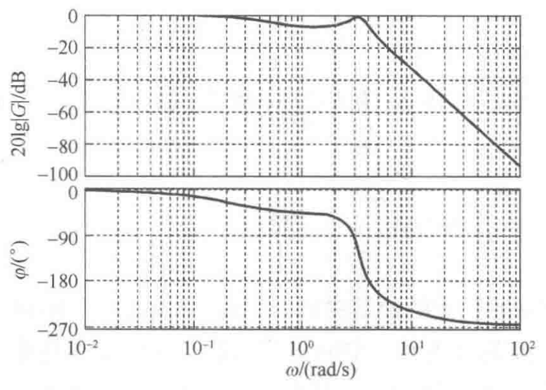

> Image description: This image displays a Bode plot consisting of two vertically stacked graphs representing the frequency response of a system. The horizontal axis for both plots is logarithmic, labeled as $\omega / (\text{rad/s})$, ranging from $10^{-2}$ to $10^2$. The top graph shows the magnitude response, with the vertical axis labeled $20 \lg |G| / \text{dB}$. The curve starts at 0 dB, dips slightly around $1\text{ rad/s}$, peaks near $4\text{ rad/s}$, and then declines linearly with a steep negative slope. The bottom graph shows the phase response, with the vertical axis labeled $\varphi / (^\circ)$. The phase begins at $0^\circ$, gradually decreases to approximately $-90^\circ$ around $2\text{ rad/s}$, and then drops sharply toward $-270^\circ$ as frequency increases. Together, these plots characterize the system's gain and phase shift across a wide frequency spectrum, typical of engineering analysis for control systems or filters.
图 5－28－1 单足机器人控制系统闭环 Bode 图（ $K=20$ ．MATLAB）

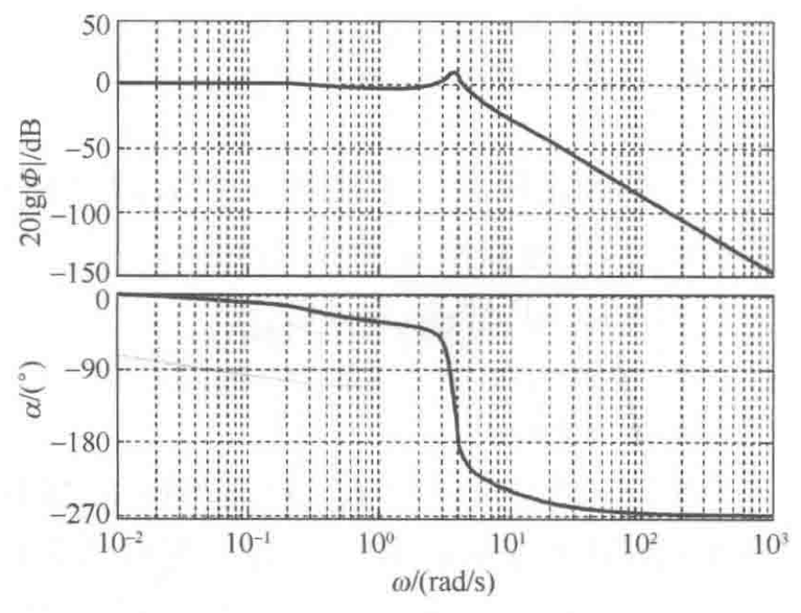

> Image description: This image displays a closed-loop Bode plot for a single-leg robot control system with a gain of $K=20$, generated via MATLAB. The figure consists of two vertically stacked graphs sharing a common logarithmic horizontal axis representing angular frequency $\omega$ in radians per second ($\text{rad/s}$), ranging from $10^{-2}$ to $10^3$. The top graph plots the magnitude response, labeled as $20\lg|\phi|/\text{dB}$, showing a relatively flat response near $0\text{ dB}$ at low frequencies, followed by a resonant peak just before $\omega = 10^1\text{ rad/s}$, and then a steep decline reaching approximately $-150\text{ dB}$ at $10^3\text{ rad/s}$. The bottom graph plots the phase response, labeled as $\alpha/(^\circ)$, which starts near $0^\circ$ and drops sharply around the resonant frequency, eventually asymptotically approaching $-270^\circ$. Together, these curves characterize the system's stability and frequency response.
图 5－28－2 单足机器人控制系统闭环 Bode 图（ $K=40$ ．MATLAB）

$$
\begin{aligned}
M_{r}(\mathrm{~dB})=9.4 \mathrm{~dB}, & M_{r}=2.95 \\
\omega_{r}=3.7 \mathrm{rad} / \mathrm{s}, & \omega_{h}=4.7 \mathrm{rad} / \mathrm{s}
\end{aligned}
$$

MATLAB 验证：
$K=40$ 时的闭环对数频率特性如图 5－28－2 所示。由图 5－28－2 测得

$$
\begin{aligned}
M_{r}(\mathrm{~dB})=9.58 \mathrm{~dB}, & M_{r}=3.01 \\
\omega_{r}=3.68 \mathrm{rad} / \mathrm{s}, & \omega_{b}=4.59 \mathrm{rad} / \mathrm{s}
\end{aligned}
$$

MATLAB 程序 ：exe528．m
$\mathrm{K}=[20,40]$ ；


<!-- source_pdf_page: 180 -->
```
Gc=tf([1],conv([1,0],[1,2,10]));
for i=1:2
    G1 = tf(K(i)*[1,1],[1,5]);
    GO = series(G1,Gc);
    G=feedback(G0,1);
    figure(i);bode(G);grid
end
```

5－29 在脑外科、眼外科等手术中，患者肌肉的无意识运动可能会导致灾难性的后果。为了保证合适的手术条件，可以采用控制系统实施自动麻醉，以保证稳定的用药量，使患者肌肉放松。图5－69为麻醉控制系统模型，试确定控

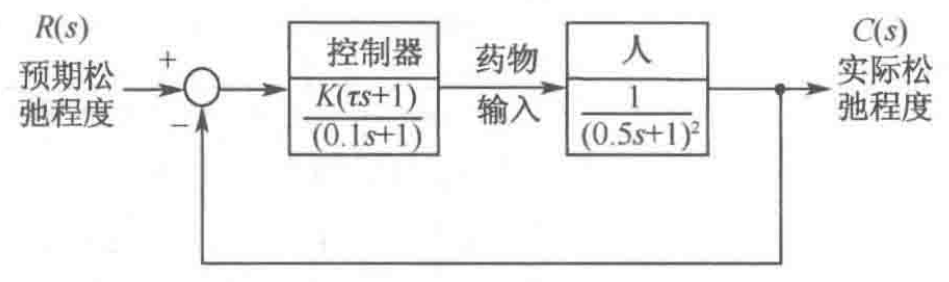

> Image description: A block diagram of an automatic anesthesia control system is shown. The input signal $R(s)$, labeled as "expected relaxation degree" (预期松弛程度), enters a summing junction with a positive sign. A feedback loop returns the output signal $C(s)$, labeled as "actual relaxation degree" (实际松弛程度), to this junction with a negative sign. The error signal flows into a controller block (控制器) with the transfer function $\frac{K(\tau s + 1)}{(0.1s + 1)}$. The output of this block is labeled as "drug input" (药物输入). This signal then enters a second block representing the human body (人), which has the transfer function $\frac{1}{(0.5s + 1)^2}$. The final output of this system is $C(s)$. Arrows indicate a unidirectional flow from left to right through the blocks, with a return path forming a closed-loop negative feedback system designed to maintain stable medication levels for muscle relaxation.
图5－69 麻醉控制系统结构图

制器增益 $K$ 和时间常数 $\tau$ ，使系统谐振峰值 $M_{r} \leqslant 1.5$ ，并确定相应的闭环带宽频率 $\omega_{b}$ 。

解 本题研究根据频域指标，在频域中设计控制器参数的方法，并涉及工程系统设计中利用零、极点相消来简化系统复杂度的措施。

选 $\tau=0.5$ ，可使系统简化为二阶系统，其开环传递函数

$$
G_{c}(s) G_{0}(s)=\frac{K}{(0.1 s+1)(0.5 s+1)}
$$

闭环特征方程

$$
D(s)=(0.1 s+1)(0.5 s+1)+K=0
$$

上式可整理为

因此有

$$
\begin{gathered}
D(s)=s^{2}+12 s+20(1+K)=s^{2}+2 \zeta \omega_{n} s+\omega_{n}^{2}=0 \\
\zeta \omega_{n}=6, \quad K=\frac{\omega_{n}^{2}}{20}-1
\end{gathered}
$$

取 $M_{r}=1.5$ ，由教材中式（6－1），有

$$
M_{r}=\frac{1}{2 \zeta \sqrt{1-\zeta^{2}}}, \quad \zeta \leqslant 0.707
$$

解出 $\zeta=0.36$ ，于是

$$
\omega_{n}=\frac{6}{\zeta}=16.67, \quad K=\frac{277.78}{20}-1=12.89
$$

由教材中式（6－3）算出带宽频率

$$
\omega_{b}=\omega_{n} \sqrt{1-2 \zeta^{2}+\sqrt{2-4 \zeta^{2}+4 \zeta^{4}}}=23.49 \mathrm{rad} / \mathrm{s}
$$

对上述计算结果，可应用 MATLAB 软件包加以验证。闭环系统的 Bode 图如图 5－29－1所示。由图5－29－1可得，$M_{r}=2.81 \mathrm{~dB}, M_{r}=1.38, \omega_{b}=22.8 \mathrm{rad} / \mathrm{s}$ 。

MATLAB 程序 ：exe529．m
$\mathrm{K}=12.89$ ；tou $=0.5$ ；
$\mathrm{G} 1=\mathrm{tf}(\mathrm{K} *[\mathrm{tou}, 1],[0.1,1]) ;$
$\mathrm{G} 2=\mathrm{tf}([1], \operatorname{conv}([0.5,1],[0.5,1])) ;$
G0 $=\operatorname{series}($ G1，G2 $)$ ；


<!-- source_pdf_page: 181 -->
```
G=feedback(G0,1);
W=1;0.01;1000;
bode(G);grid
```

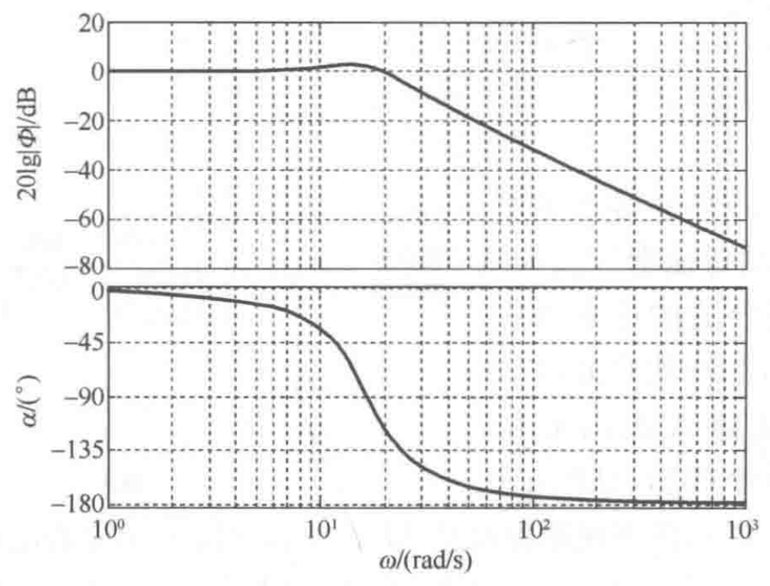

> Image description: This image shows a closed-loop Bode plot of an anesthesia control system generated by MATLAB, as indicated by the caption "图 5－29－1 麻醉控制系统闭环 Bode 图（MATLAB）". The figure consists of two vertically stacked graphs sharing a common logarithmic horizontal axis representing angular frequency $\omega$ in radians per second ($\text{rad/s}$), ranging from $10^0$ to $10^3$. The top graph displays the magnitude response, labeled as $20\lg|\Phi|/\text{dB}$, with values ranging from $-80$ to $20\text{ dB}$. The curve remains flat near $0\text{ dB}$ until approximately $10\text{ rad/s}$, after which it slopes downward. The bottom graph displays the phase response, labeled as $\alpha/(^\circ)$, with values ranging from $0^\circ$ to $-180^\circ$. The phase starts at $0^\circ$, drops sharply around $10\text{ rad/s}$, and asymptotically approaches $-180^\circ$ at higher frequencies. Together, these plots characterize the frequency response of the closed-loop system.
图 5－29－1 麻醉控制系统闭环 Bode 图（MATLAB）


