<!-- source_pdf_page: 182 -->
## 第六章 线性系统的校正方法

6－1 设有单位反馈的火炮指挥仪伺服系统，其开环传递函数为

$$
G_{0}(s)=\frac{K}{s(0.2 s+1)(0.5 s+1)}
$$

若要求系统最大输出速度为 $12^{\circ} / \mathrm{s}$ ，输出位置的容许误差小于 $2^{\circ}$ ，试求：
（1）确定满足上述指标的最小 $K$ 值，计算该 $K$ 值下系统的相角裕度和幅值裕度；
（2）在前向通道中串接超前校正网络

$$
G_{c}(s)=\frac{0.4 s+1}{0.08 s+1}
$$

计算已校正系统的相角裕度和幅值裕度，说明超前校正对系统性能的影响。
解 本题主要考查对系统的相角裕度和幅值裕度定义的理解，以及超前校正对系统动态性能的影响。
（1）确定开环增益 $K$ 。因 $c_{\text {max }}=12^{\circ} / \mathrm{s}, e_{\mathrm{ss}}(\infty)<2^{\circ}, K=K_{v}=\frac{c_{\text {max }}}{e_{\mathrm{ss}}(\infty)} \geqslant 6$ ，故取 $K=6$ 。令

$$
\left|G_{0}\left(\mathrm{j} \omega_{c}\right)\right|=\frac{60}{\omega_{c} \sqrt{\left(\omega_{c}^{2}+25\right)\left(\omega_{c}^{2}+4\right)}}=1
$$

求得待校正系统的截止频率

$$
\omega_{c}=2.92 \mathrm{rad} / \mathrm{s}
$$

故相角裕度为

$$
\gamma=180^{\circ}+\varphi\left(\omega_{c}\right)=\left.\left[90^{\circ}-\arctan 0.2 \omega_{c}-\arctan 0.5 \omega_{c}\right]\right|_{\omega_{c}=2.92}=4.12^{\circ}
$$

再由 $\angle G_{0}\left(\mathrm{j} \omega_{x}\right)=-180^{\circ}$ ，可求得待校正系统的穿越频率 $\omega_{x}$ 。因为

$$
\begin{aligned}
G_{0}(j \omega) & =\frac{6}{j \omega(1+j 0.2 \omega)(1+j 0.5 \omega)} \\
& =-\frac{4.2 \omega^{2}}{\left(0.7 \omega^{2}\right)^{2}+\omega^{2}\left(1-0.1 \omega^{2}\right)^{2}}-j \frac{6 \omega\left(1-0.1 \omega^{2}\right)}{\left(0.7 \omega^{2}\right)^{2}+\omega^{2}\left(1-0.1 \omega^{2}\right)^{2}}
\end{aligned}
$$

令 $\operatorname{Im} G_{0}(\mathrm{j} \omega)=0$ ，得 $\omega_{x}^{2}=10$ ，故穿越频率

$$
\omega_{x}=3.16 \mathrm{rad} / \mathrm{s}
$$

将 $\omega_{x}=3.16 \mathrm{rad} / \mathrm{s}$ 代人 $\operatorname{Re} G_{0}(\mathrm{j} \omega)$ ，得 $G_{0}\left(\mathrm{j} \omega_{x}\right)=-0.859$ ，故增益裕度为

$$
h=\frac{1}{\left|G_{0}\left(\mathrm{j} \omega_{x}\right)\right|}=1.165, \quad h(\mathrm{~dB})=-20 \lg \left|G_{0}\left(\mathrm{j} \omega_{x}\right)\right|=1.33 \mathrm{~dB}
$$

（2）串接超前校正网络后的已校正系统。开环传递函数

$$
G(s)=\frac{6(0.4 s+1)}{s(0.2 s+1)(0.5 s+1)(0.08 s+1)}=\frac{300(s+2.5)}{s(s+5)(s+2)(s+12.5)}
$$

由

$$
\left|G\left(\mathrm{j} \omega_{c}^{\prime}\right)\right|=\frac{300 \sqrt{\omega_{c}^{\prime 2}+6.25}}{\omega_{c}^{\prime} \sqrt{\left(\omega_{c}^{\prime 2}+25\right)\left(\omega_{c}^{\prime 2}+4\right)\left(\omega_{c}^{\prime 2}+156.25\right)}}=1
$$


<!-- source_pdf_page: 183 -->
求得已校正系统的截止频率 $\omega_{c}^{\prime}=3.85 \mathrm{rad} / \mathrm{s}$ ，故相角裕度为

$$
\begin{aligned}
\gamma^{\prime} & =180^{\circ}+\varphi\left(\omega_{c}^{\prime}\right) \\
& =90^{\circ}+\left.\left[\arctan 0.4 \omega_{c}^{\prime}-\arctan 0.2 \omega_{c}^{\prime}-\arctan 0.5 \omega_{c}^{\prime}-\arctan 0.08 \omega_{c}^{\prime}\right]\right|_{\omega_{c}^{\prime}=3.85}=29.74^{\circ}
\end{aligned}
$$

再由 $\angle G\left(\mathrm{j} \omega_{x}^{\prime}\right)=-180^{\circ}$ ，求得已校正系统的穿越频率 $\omega_{x}^{\prime}=7.38 \mathrm{rad} / \mathrm{s}$ ，故增益裕度为

$$
h^{\prime}(\mathrm{dB})=-20 \lg \left|G\left(\mathrm{j} \omega_{x}^{\prime}\right)\right|=9.9 \mathrm{~dB}
$$

从上述结果可以看出：采用超前校正可使系统的相角裕度增加，从而减少超调量，提高稳定性；同时也使截止频率增大，从而减小调节时间，提高系统的快速性。

MATLAB 验证：
待校正系统的开环 Bode 图如图 6－1－1，单位阶跃响应如图 6－1－2，由此测得

$$
\begin{array}{lll}
\omega_{c}=2.92 \mathrm{rad} / \mathrm{s}, & \gamma=4.05^{\circ}, & h(\mathrm{~dB})=1.34 \mathrm{~dB} \\
\sigma \%=83 \%, & t_{p}=1.21 \mathrm{~s}, & t_{s}=37.6 \mathrm{~s}(\Delta=2 \%)
\end{array}
$$

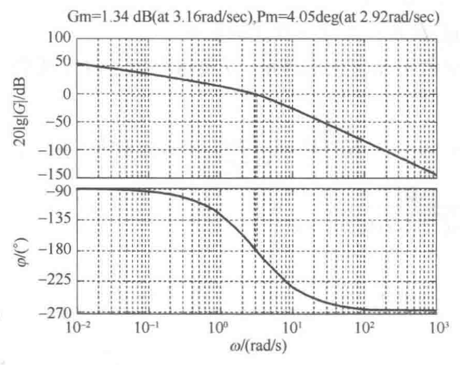

> Image description: This figure presents the open-loop Bode plot of a system to be corrected, generated via MATLAB. The image consists of two vertically aligned graphs sharing a logarithmic horizontal axis representing angular frequency $\omega$ in radians per second ($\text{rad/s}$), ranging from $10^{-2}$ to $10^3$. The top graph plots the magnitude $|G|$ in decibels ($\text{dB}$) on the vertical axis, showing a downward slope that crosses $0\text{ dB}$ near $\omega = 2.92\text{ rad/s}$. The bottom graph plots the phase angle $\varphi$ in degrees ($^\circ$) on the vertical axis, starting at $-90^\circ$ and descending toward $-270^\circ$. Text at the top specifies stability margins: a gain margin ($\text{Gm}$) of $1.34\text{ dB}$ at $3.16\text{ rad/s}$ and a phase margin ($\text{Pm}$) of $4.05\text{ deg}$ at $2.92\text{ rad/s}$. The caption identifies this as "图6－1－1 待校正系统的开环 Bode 图（MATLAB）".
图6－1－1 待校正系统的开环 Bode 图（MATLAB）

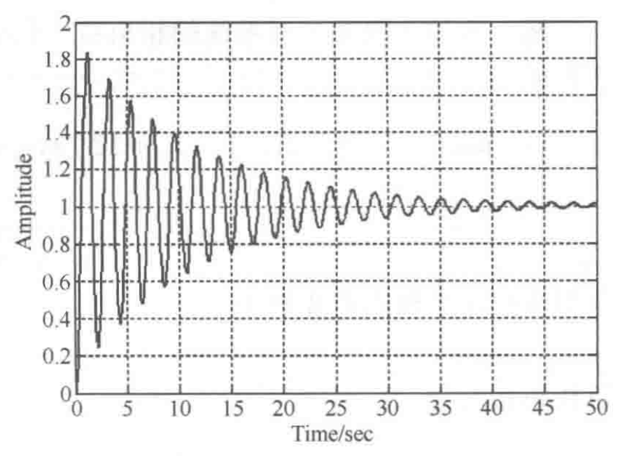

> Image description: The image displays a time-domain plot of a signal's amplitude over time. The vertical y-axis is labeled "Amplitude" and ranges from 0 to 2, with major grid increments every 0.2 units. The horizontal x-axis is labeled "Time/sec" and spans from 0 to 50 seconds, with numerical markers every 5 seconds. The plotted waveform shows a damped oscillation that begins with high amplitude (peaking near 1.8) and gradually converges toward a steady-state value of 1.0 as time increases. The oscillations are periodic, with the peak-to-peak distance decreasing over time, characteristic of an underdamped system response. Although the provided caption mentions an "open-loop Bode plot," the visual content is actually a step response or transient response graph in the time domain. There are no arrows or block diagrams present; only a coordinate system with grid lines and a decaying sinusoidal curve.
图6－1－2 待校正系统时间响应（MATLAB）

$$
\begin{array}{lll}
\omega_{c}^{\prime}=3.85 \mathrm{rad} / \mathrm{s}, & \gamma^{\prime}=29.8^{\circ}, & h^{\prime}(\mathrm{dB})=9.9 \mathrm{~dB} \\
\sigma \%=43 \%, & t_{p}=0.82 \mathrm{~s}, & t_{s}=2.6 \mathrm{~s}(\Delta=2 \%)
\end{array}
$$

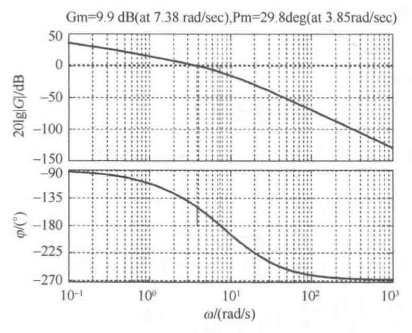

> Image description: This figure presents the open-loop Bode plot of a corrected system generated in MATLAB, as indicated by the caption "图 6－1－3 已校正系统的开环 Bode 图（MATLAB）". The image consists of two vertically aligned graphs sharing a logarithmic horizontal axis representing angular frequency $\omega$ in radians per second ($\text{rad/s}$), ranging from $10^{-1}$ to $10^3$. The top plot displays the magnitude $20\log_{10}|G|$ in decibels ($\text{dB}$), showing a downward slope as frequency increases. The bottom plot shows the phase angle $\phi$ in degrees ($^\circ$), decreasing from $-90^\circ$ toward $-270^\circ$. Text at the top provides key stability metrics: a gain margin $\text{Gm} = 9.9\text{ dB}$ at $7.38\text{ rad/sec}$ and a phase margin $\text{Pm} = 29.8\text{ deg}$ at $3.85\text{ rad/sec}$. These values are critical for evaluating the relative stability of the control system.
图 6－1－3 已校正系统的开环 Bode 图（MATLAB）

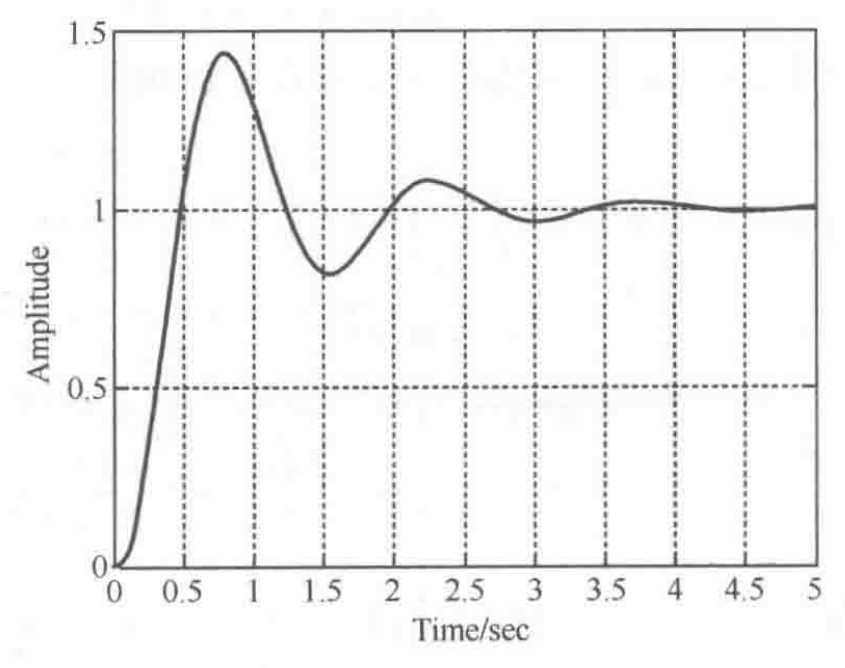

> Image description: The image displays a time-domain response plot of a dynamic system. The vertical y-axis is labeled "Amplitude" and ranges from 0 to 1.5, while the horizontal x-axis is labeled "Time/sec" and ranges from 0 to 5 seconds. The graph shows a single continuous curve starting at the origin (0,0) that exhibits an underdamped oscillatory behavior. The signal rises sharply to a first peak of approximately 1.45 around 0.7 seconds, then drops to a trough near 0.8 at 1.6 seconds, and continues to oscillate with decreasing amplitude. The curve eventually settles and converges toward a steady-state value of 1.0 as time approaches 5 seconds. From an engineering perspective, this represents the step response of a stable second-order system, illustrating key characteristics such as overshoot, settling time, and damping. Note that while the provided caption mentions a "Bode plot," the visual content is actually a time-response graph.
图 6－1－4 已校正系统时间响应（MATLAB）


<!-- source_pdf_page: 184 -->
MATLAB 程序 ：exe601．m
$\mathrm{K}=6$ ；
$\mathrm{G} 0=\mathrm{tf}(\mathrm{K},[\operatorname{conv}([0.2,1,0],[0.5,1])]) ;$
$\mathrm{Gc}=\mathrm{tf}([0.4,1],[0.08,1]) ;$
$\mathrm{G}=\operatorname{series}(\mathrm{Gc}, \mathrm{GO})$ ；
G1＝feedback（G0，1）；
G11 $=$ feedback $(\mathrm{G}, 1)$ ；
$\%$ 待校正系统的开环传递函数
\％超前校正网络的传递函数
\％已校正系统的开环传递函数
\％待校正系统的闭环传递函数
\％已校正系统的闭环传递函数
figure（1）；margin（G0）；grid
figure（2）；margin（G）；grid
figure（3）；step（G1）；grid
figure（4）；step（G11）；grid
6－2 设单位反馈系统的开环传递函数为

$$
G_{0}(s)=\frac{K}{s(s+1)}
$$

试设计一串联超前校正装置，使系统满足如下指标：
（1）相角裕度 $\gamma \geqslant 45^{\circ}$ ；
（2）在单位斜坡输入下的稳态误差

$$
e_{\mathrm{s}}(\infty)<\frac{1}{15} \mathrm{rad}
$$

（3）截止频率 $\omega_{c} \geqslant 7.5 \mathrm{rad} / \mathrm{s}$ 。
解 本题主要考查对串联超前校正方法的掌握。
首先，确定开环增益 $K$ 。由于 $G_{0}(s)$ 为 I 型系统，$K_{v}=K$ ，而技术指标要求在单位斜坡输入下的稳态误差 $e_{s s}(\infty)<\frac{1}{15} \mathrm{rad}$ ，即

$$
e_{s s}(\infty)=\frac{1}{K_{v}}<\frac{1}{15}
$$

故取 $K=20$ ，则待校正系统的传递函数为

$$
G(s)=\frac{20}{s(s+1)}
$$

绘制出待校正系统的对数幅频渐近特性曲线，如图 6－2－1 中 $L^{\prime}(\omega)$ 所示。由图 6－2－1得待校正系统的截止频率 $\omega_{c}^{\prime}=4.47 \mathrm{rad} / \mathrm{s}$ ，算出待校正系统的相角裕度为

$$
\gamma^{\prime}=180^{\circ}-90^{\circ}-\arctan \omega_{c}^{\prime}=12.61^{\circ}
$$

由于截止频率和相角裕度均低于指标要求，故采用超前校正是合适的。

试选取 $\omega_{m}=\omega_{c}^{\prime \prime}=8 \mathrm{rad} / \mathrm{s}$ ，由图6－2－1 查得 $L\left(\omega_{c}^{\prime \prime}\right)=-10.11 \mathrm{~dB}$ ，于是由

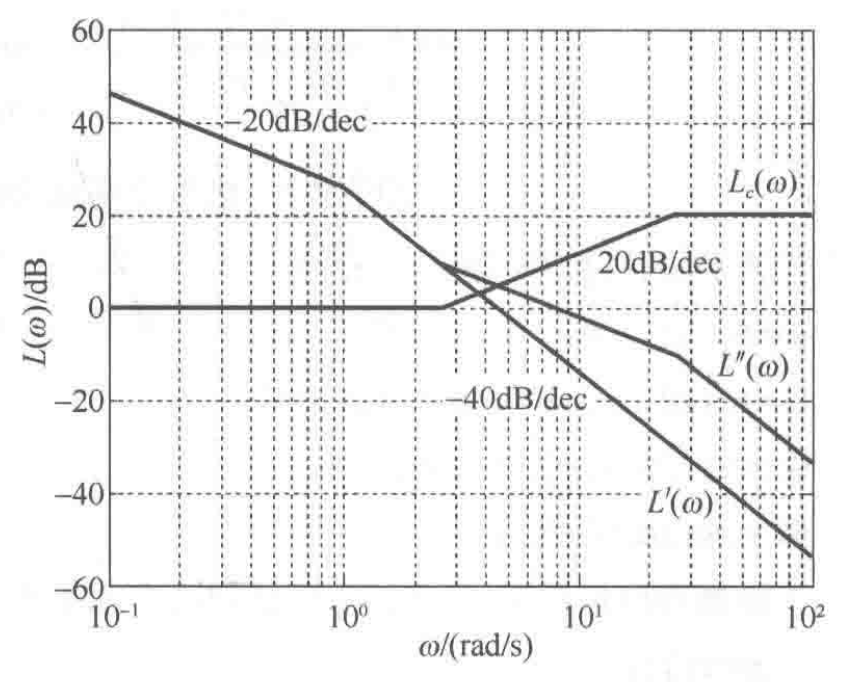

> Image description: This image is a Bode magnitude plot showing the relationship between gain, measured in decibels ($L(\omega)/\text{dB}$), and angular frequency ($\omega$) in radians per second ($\text{rad/s}$). The x-axis uses a logarithmic scale ranging from $10^{-1}$ to $10^2$. The figure displays three distinct curves: 1. **$L_c(\omega)$**: Starts at 0 dB, remains flat until approximately $4 \text{ rad/s}$, then rises with a slope of $+20\text{dB/dec}$ before leveling off at 20 dB. 2. **$L'(\omega)$**: Begins at roughly 45 dB and descends with a constant slope of $-20\text{dB/dec}$ until $4 \text{ rad/s}$, where the slope steepens to $-40\text{dB/dec}$. 3. **$L''(\omega)$**: Follows the same path as $L'(\omega)$ initially but diverges at $4 \text{ rad/s}$, continuing with a shallower negative slope than $L'(\omega)$. Engineering-wise, this plot represents frequency response characteristics of different system components or filter configurations, illustrating how gain varies across the frequency spectrum.
图6－2－1 待校正系统开环对数幅频渐近特性

$$
-L\left(\omega_{c}^{\prime \prime}\right)=10 \lg a, \quad T=\frac{1}{\omega_{c}^{\prime \prime} \sqrt{a}}
$$


<!-- source_pdf_page: 185 -->
算得 $a=10.26, T=0.039$ 。因此，超前网络传递函数为

$$
10.26 G_{c}(s)=\frac{1+0.4 s}{1+0.039 s}
$$

为了补偿无源超前网络产生的增益衰减，放大器的增益应提高 10.26 倍，否则不能保证稳态误差要求。

已校正系统的开环传递函数为

$$
G_{c}(s) G(s)=\frac{20(1+0.4 s)}{s(s+1)(1+0.039 s)}
$$

其对数幅频渐近特性曲线如图6－2－1中 $L^{\prime \prime}(\omega)$ 所示。显然，已校正系统 $\omega_{c}^{\prime \prime}=8 \mathrm{rad} / \mathrm{s}$ ，算出已校正系统的相角裕度为

$$
\begin{aligned}
\gamma & =180^{\circ}+\varphi\left(\omega_{c}^{\prime \prime}\right)=90^{\circ}+\arctan 0.4 \omega_{c}^{\prime \prime}-\arctan \omega_{c}^{\prime \prime}-\arctan 0.039 \omega_{c}^{\prime \prime} \\
& =62.44^{\circ}>45^{\circ}
\end{aligned}
$$

此时，全部性能指标均已满足。
MATLAB 验证：已校正系统开环对数频率特性如图 6－2－2 所示，由此测得

$$
\omega_{c}^{\prime \prime}=7.95 \mathrm{rad} / \mathrm{s}, \quad \gamma=62.5^{\circ}
$$

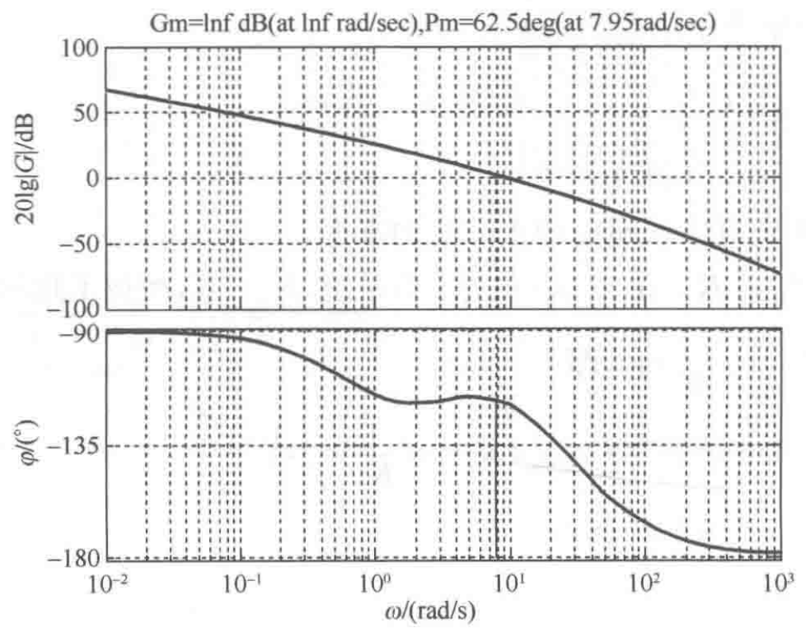

> Image description: This image shows a Bode plot of a corrected system's open-loop transfer function, generated by MATLAB (as indicated by the caption "图 6－2－2 已校正系统开环 Bode 图（MATLAB）"). The figure consists of two vertically stacked plots sharing a logarithmic frequency axis $\omega$ in rad/s, ranging from $10^{-2}$ to $10^3$. The top plot displays the magnitude $20\lg|G|$ in decibels (dB), showing a steady downward slope. The bottom plot shows the phase angle $\phi$ in degrees ($^\circ$), starting at $-90^\circ$ and descending toward $-180^\circ$. Text at the top provides key stability metrics: a gain margin $Gm = \text{inf dB}$ (at infinite frequency) and a phase margin $Pm = 62.5\text{deg}$ occurring at a crossover frequency of $7.95\text{rad/sec}$. In engineering terms, these values indicate the relative stability and robustness of the control system's open-loop response.
图 6－2－2 已校正系统开环 Bode 图（MATLAB）

MATLAB 程序 ：exe602．m

$$
\begin{aligned}
& \mathrm{w}=0.1: 1: 100 \\
& \mathrm{G}=\mathrm{tf}(20,[\operatorname{conv}([1,0],[1,1])]) \\
& \mathrm{Gc}=\mathrm{tf}([0.4,1],[0.039,1]) \\
& \mathrm{G} 1=\operatorname{series}(\mathrm{G}, \mathrm{Gc})
\end{aligned}
$$

\％绘制待校正系统、超前校正网络和已校正系统的对数幅频渐近线
figure（1）；

$$
\begin{aligned}
& {[x, y]=b d_{-} \operatorname{asymp}(G, w) ;[x c, y c]=b d \_\operatorname{asymp}(G c, w) ;} \\
& {[x 1, y 1]=b d \_\operatorname{asymp}(G 1, w) ;} \\
& \operatorname{semilog} x\left(x, y,{ }^{\prime} r^{\prime}\right) ; \text { hold on } \\
& \operatorname{semilog} x\left(x c, y c,{ }^{\prime} b^{\prime}\right) ; \operatorname{semilog} x\left(x 1, y^{1},{ }^{\prime} k^{\prime}\right) ; \text { grid; hold off }
\end{aligned}
$$


<!-- source_pdf_page: 186 -->
\％绘制已校正系统的开环对数幅频和相频曲线
figure（2）；margin（G1）；grid；
6－3 已知一单位反馈最小相位控制系统，其固定不变部分传递函数 $G_{0}(s)$ 和串联校正装置 $G_{c}(s)$ 分别如图6－39（a）和（b）所示。要求：
（1）写出校正前后各系统的开环传递函数；
（2）分析各 $G_{c}(s)$ 对系统的作用，并比较其优缺点。

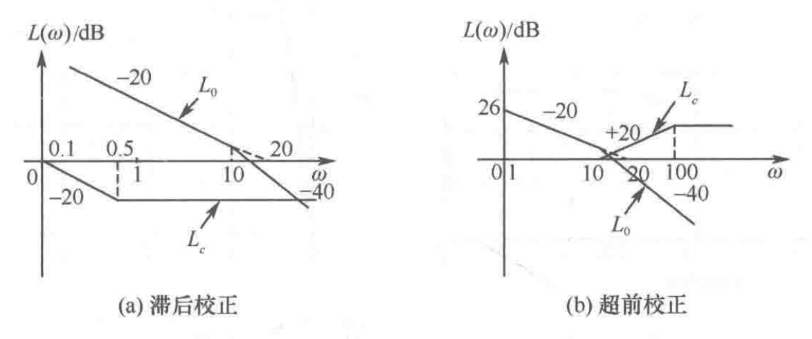

> Image description: The image contains two Bode magnitude plots, labeled (a) and (b), representing open-loop frequency responses in decibels ($L(\omega)/\text{dB}$) versus angular frequency ($\omega$). Plot (a), titled "滞后校正" (Lag Compensation), shows an original system $L_0$ with a constant slope of $-20\text{ dB/dec}$. The compensated system $L_c$ introduces a dip in magnitude between $\omega = 0.1$ and $\omega = 1$, maintaining a lower gain before merging back toward the original curve at higher frequencies, specifically around $\omega = 10$. Plot (b), titled "超前校正" (Lead Compensation), shows $L_0$ starting at $26\text{ dB}$ with a $-20\text{ dB/dec}$ slope. The compensated system $L_c$ deviates from $L_0$ around $\omega = 10$, exhibiting a positive slope of $+20\text{ dB/dec}$ up to $\omega = 100$, where it levels off. This indicates an increase in phase margin and bandwidth compared to the uncompensated system.
图6－39 串联校正系统的对数幅频渐近特性

解 本题主要考查根据系统的开环幅频特性曲线求取传递函数的方法，以及分析不同校正方案对系统性能的影响。
（1）校正前后系统的开环传递函数。由图 6－39 可知，各系统的固定不变部分、校正网络和校正后的传递函数如下：
图6－39（a）$\quad G_{0}(s)=\frac{20}{s(0.1 s+1)}, \quad G_{c}(s)=\frac{2 s+1}{10 s+1}$

$$
G(s)=G_{0}(s) G_{c}(s)=\frac{20(2 s+1)}{s(0.1 s+1)(10 s+1)}
$$

图6－39（b）$\quad G_{0}(s)=\frac{20}{s(0.1 s+1)}, \quad G_{c}(s)=\frac{0.1 s+1}{0.01 s+1}$

$$
G(s)=G_{0}(s) G_{c}(s)=\frac{20}{s(0.01 s+1)}
$$

（2）校正方案分析。对于图6－39（a），采用滞后校正。利用高频衰减特性来减小 $\omega_{c}$ ，提高 $\gamma$ ，从而减少 $\sigma \%$ ；还可以抑制高频噪声，但不利于系统的快速性。

对于图6－39（b），采用超前校正。利用相角超前特性来提高 $\omega_{c}$ 与 $\gamma$ ，从而减少 $\sigma \%$ ；还可以提高系统的快速性，改善系统的动态性能；但抗高频干扰能力较弱。

MATLAB 验证：
图6－39（a）：校正前闭环系统传递函数

$$
\Phi_{0}(s)=\frac{20}{0.1 s^{2}+s+20}
$$

滞后校正后闭环系统传递函数

$$
\Phi(s)=\frac{20(2 s+1)}{s^{3}+10 \cdot 1 s^{2}+41 s+20}
$$

校正前系统时间响应如图 6－3－1 所示，滞后校正后系统时间响应如图 6－3－2 所示。运行 M 文件，可得


<!-- source_pdf_page: 187 -->
校正前 $\omega_{c}=12.5 \mathrm{rad} / \mathrm{s}, \gamma=38.7^{\circ}, \omega_{b}=20 \mathrm{rad} / \mathrm{s}, \sigma \%=30 \%, t_{r}=0.227 \mathrm{~s}, t_{s}=0.752 \mathrm{~s}(\Delta=2 \%)$ ；
校正后 $\omega_{c}=3.77 \mathrm{rad} / \mathrm{s}, \gamma=63.3^{\circ}, \omega_{b}=5.86 \mathrm{rad} / \mathrm{s}, \sigma \%=11 \%, t_{r}=0.778 \mathrm{~s}, t_{\mathrm{s}}=3.11 \mathrm{~s}(\Delta=2 \%)$ 。

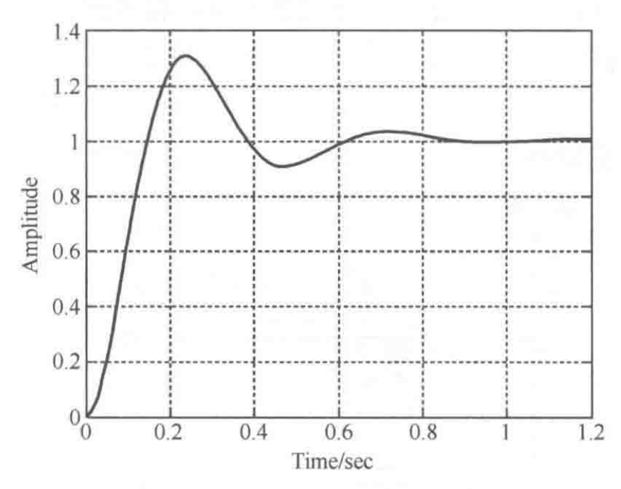

> Image description: The image shows a MATLAB-generated plot representing the time response of a system before correction, as indicated by the caption "图6－3－1 系统（a）校正前时间响应（MATLAB）". The graph features two axes: the vertical y-axis is labeled "Amplitude" with values ranging from 0 to 1.4 in increments of 0.2, and the horizontal x-axis is labeled "Time/sec" with values ranging from 0 to 1.2 in increments of 0.2. A dashed grid overlays the plot area for precise reading. The plotted curve starts at the origin (0,0) and exhibits an underdamped response characteristic. It rises sharply to a first peak amplitude of approximately 1.3 at roughly 0.22 seconds, then oscillates around a steady-state value of 1.0. The oscillations decrease in magnitude over time, with a second smaller peak occurring near 0.7 seconds before the signal stabilizes at an amplitude of 1.0 after approximately 1.0 second.
图6－3－1 系统（a）校正前时间响应（MATLAB）

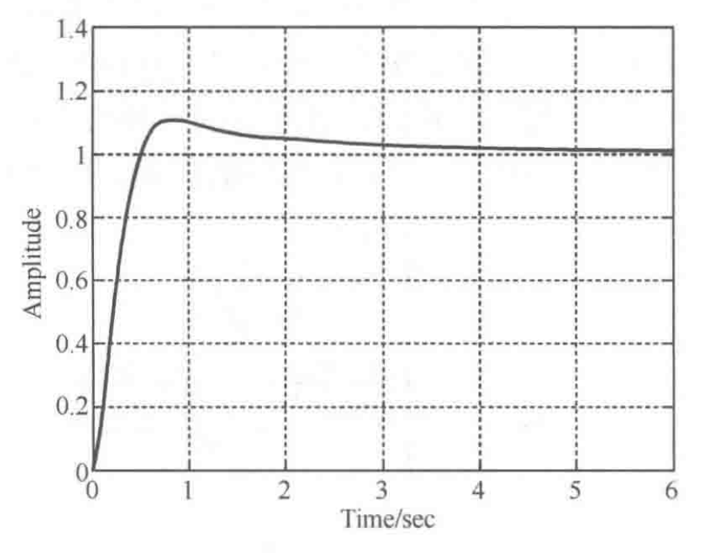

> Image description: This image is a technical plot showing the time response of a system before correction, as indicated by the caption "图6－3－1 系统（a）校正前时间响应（MATLAB)". The graph features a Cartesian coordinate system with two axes. The horizontal x-axis is labeled "Time/sec" and ranges from 0 to 6 seconds. The vertical y-axis is labeled "Amplitude" and ranges from 0 to 1.4. The plot displays a single continuous curve starting at the origin (0,0). The amplitude rises sharply, peaking at approximately 1.1 around 0.8 seconds, before gradually decaying and stabilizing toward a steady-state value of 1.0 as time increases toward 6 seconds. This characteristic shape represents an underdamped step response in control engineering, illustrating the system's transient behavior, including overshoot and settling time, prior to any corrective adjustments.
图6－3－2 系统（a）校正后时间响应（MATLAB）

```
MATLAB 程序: exe603a.m
G01 = tf(20, conv([1,0],[0.1,1]));
Gc1 = tf ([2,1],[10,1]);
G1 = series(G01,Gc1);
clop0 = feedback(G01,1);
clop1 = feedback(G1,1);
figure(1);step(clop0);grid;
figure(2);step(clop1);grid;
```

图6－39（b）：校正前闭环系统传递函数

$$
\Phi_{0}(s)=\frac{20}{0.1 s^{2}+s+20}
$$

超前校正后闭环系统传递函数

$$
\Phi(s)=\frac{20}{0.01 s^{2}+s+20}
$$

校正前系统时间响应如图 6－3－3 所示，超前校正后系统时间响应如图 6－3－4 所示。运行 MATLAB 文件，可得

校正前 $\omega_{c}=12.5 \mathrm{rad} / \mathrm{s}, \gamma=38.7^{\circ}, \omega_{b}=20 \mathrm{rad} / \mathrm{s}, \sigma \%=30 \%, t_{r}=0.227 \mathrm{~s}, t_{s}=0.752 \mathrm{~s}(\Delta=2 \%)$ ；
校正后 $\omega_{c}=19.6 \mathrm{rad} / \mathrm{s}, \gamma=79.8^{\circ}, \omega_{b}=24.3 \mathrm{rad} / \mathrm{s}, \sigma \%=0 \%, t_{s}=0.16 \mathrm{~s}(\Delta=2 \%)$ 。
MATLAB 程序：exe603b．m

$$
\begin{aligned}
& G 02=\operatorname{tf}(20, \operatorname{conv}([1,0],[0.1,1])) \\
& G c 2=\operatorname{tf}([0.1,1],[0.01,1]) \\
& G 2=\operatorname{series}(G 02, G c 2) \\
& \text { clop0 }=\text { feedback }(G 01,1) \\
& \text { clop2 }=\text { feedback }(G 2,1) \\
& \text { figure }(3) ; \operatorname{step}(c l o p 0) ; \text { grid; } \\
& \text { figure }(4) ; \operatorname{step}(c l o p 2) ; \text { grid; }
\end{aligned}
$$

\％待校正系统的开环传递函数
\％超前校正网络的传递函数
$\%$ 待校正系统的闭环传递函数
\％已校正系统的闭环传递函数


<!-- source_pdf_page: 188 -->
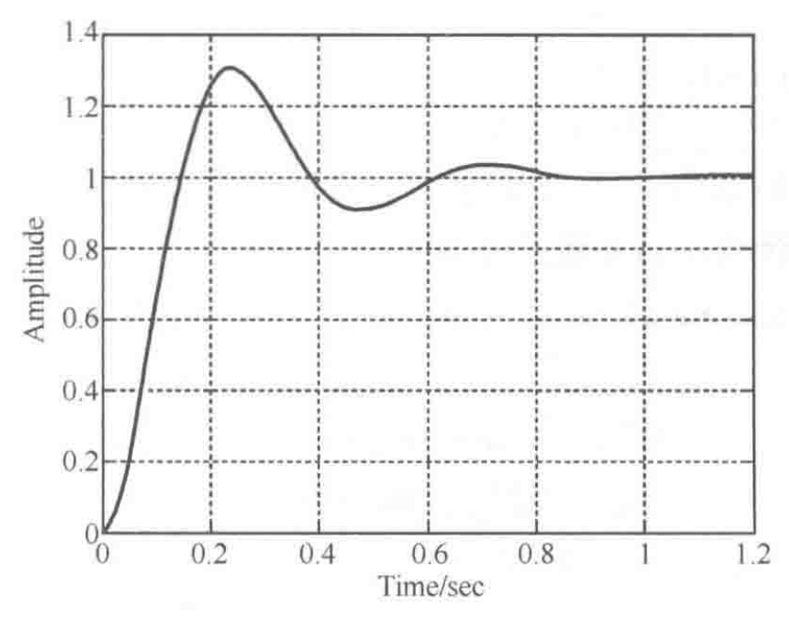

> Image description: This image is a technical plot showing the time response of a system before correction, as indicated by the caption "图 6－3－3 系统（b）校正前时间响应（MATLAB)". The graph features a Cartesian coordinate system where the horizontal x-axis represents "Time/sec" ranging from 0 to 1.2 and the vertical y-axis represents "Amplitude" ranging from 0 to 1.4. The plot displays a single continuous curve starting at the origin (0,0). The response exhibits an underdamped behavior characterized by an initial steep rise, reaching a first peak amplitude of approximately 1.3 at roughly 0.22 seconds. This is followed by a damped oscillation that dips to about 0.9 around 0.45 seconds and reaches a second, smaller peak near 0.7 seconds before eventually stabilizing and converging toward a steady-state value of 1.0 as time approaches 1.2 seconds.
图 6－3－3 系统（b）校正前时间响应（MATLAB）

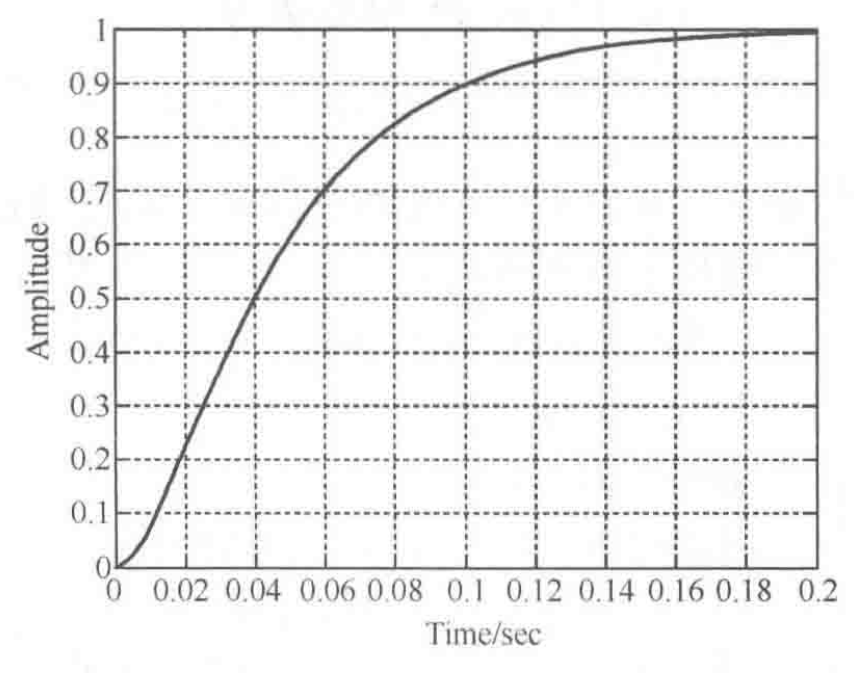

> Image description: This image is a technical plot showing the time response of a system before correction, as indicated by the caption "图 6－3－3 系统（b）校正前时间响应（MATLAB)". The graph features a Cartesian coordinate system with two axes. The vertical y-axis is labeled "Amplitude" and ranges from 0 to 1 in increments of 0.1. The horizontal x-axis is labeled "Time/sec" and ranges from 0 to 0.2 seconds, with major tick marks every 0.02 seconds. The plot displays a single smooth, monotonically increasing curve that starts at the origin (0,0) and asymptotically approaches an amplitude of 1 as time increases. The curve exhibits a characteristic first-order or overdamped second-order system response, showing no overshoot or oscillation. A dashed grid is overlaid on the plot to facilitate precise reading of values across the time and amplitude scales.
图 6－3－4 系统（b）校正后时间响应（MATLAB）

6－4 设单位反馈系统的开环传递函数为

$$
G_{0}(s)=\frac{40}{s(0.2 s+1)(0.0625 s+1)}
$$

（1）若要求已校正系统的相角裕度为 $30^{\circ}$ ，幅值裕度为 $10 \sim 12 \mathrm{~dB}$ ，试设计串联超前校正装置；
（2）若要求已校正系统的相角裕度为 $50^{\circ}$ ，幅值裕度大于 15 dB ，试设计串联滞后校正装置。

解 本题主要考查对串联超前校正和滞后校正方法的掌握。
待校正系统性能：绘制出待校正系统的对数幅频渐近特性曲线，如图6－4－1中 $L^{\prime}(\omega)$ 所示。由图6－4－1得待校正系统的 $\omega_{c}^{\prime}=14.14 \mathrm{rad} / \mathrm{s}$ ，算出待校正系统的相角裕度为

$$
\gamma=180^{\circ}-90^{\circ}-\arctan 0.2 \omega_{c}^{\prime}-\arctan 0.0625 \omega_{c}^{\prime}=-21.99^{\circ}
$$

（1）超前校正。串联超前校正装置要提供的最大的超前相角 $\varphi_{m}=30^{\circ}-\gamma=51.99^{\circ}$ 。由于超前校正要求 $\omega_{c}^{\prime}>14.14 \mathrm{rad} / \mathrm{s}$ ，而当截止频率大于 $16 \mathrm{rad} / \mathrm{s}$ 时相角下降很快，一级串联超前校正无法满足要求；故可采用两级串联超前校正，为了使校正后系统的传递函数简单，先采用第一级超前网络 $G_{c 1}(s)=\frac{0.0625 s+1}{0.005 s+1}$ 。

第一级校正后系统传递函数为

$$
G_{1}(s)=\frac{40}{s(0.2 s+1)(0.005 s+1)}
$$

绘制出第一级校正后系统的对数幅频渐近特性曲线，如图 6－4－1 中 $L_{1}^{\prime \prime}(\omega)$ 所示。由图 6－4－1得第一级校正后系统的 $\omega_{c 1}^{\prime \prime}=14.14 \mathrm{rad} / \mathrm{s}$ ，算出一级校正后系统的相角裕度为

$$
\gamma_{1}^{\prime \prime}=180^{\circ}-90^{\circ}-\arctan 0.2 \omega_{c 1}^{\prime \prime}-\arctan 0.005 \omega_{c 1}^{\prime \prime}=15.43^{\circ}
$$

对于第二级校正装置，设第二级校正装置提供的最大的超前相角 $\varphi_{m 2}(\omega)=30^{\circ}-15.43^{\circ}+ 9.07^{\circ}=23.64^{\circ}$（其中 $9.07^{\circ}$ 为校正装置引人后使截止频率右移而导致相角裕度减小的补偿量）。

由 $a=\frac{1+\sin \varphi_{m}}{1-\sin \varphi_{m}}$ ，解得 $a=2.33$ 。再由图 6－4－1 可查得，当 $\omega_{c}^{\prime \prime}=16.90 \mathrm{rad} / \mathrm{s}$ 时，$L_{1}^{\prime \prime}\left(\omega_{c}^{\prime \prime}\right)= -10 \lg a$ ，而 $T=\frac{1}{\omega^{\prime \prime}{ }_{c} \sqrt{a}}=0.039 \mathrm{~s}$ ，故第二级超前网络 $G_{c 2}(s)=\frac{0.091 s+1}{0.039 s+1}$ 。


<!-- source_pdf_page: 189 -->
二级校正后系统传递函数为

$$
G(s)=\frac{40(0.091 s+1)}{s(0.2 s+1)(0.005 s+1)(0.039 s+1)}
$$

绘制出二级校正后系统的对数幅频渐近特性曲线，如图6－4－1中 $L^{\prime \prime}(\omega)$ 所示。由图6－4－1得二级校正后系统的 $\omega_{c}^{\prime \prime}=16.90 \mathrm{rad} / \mathrm{s}$ ，算出二级校正后系统的相角裕度为

$$
\gamma^{\prime \prime}=90^{\circ}+\arctan 0.091 \omega_{c}^{\prime \prime}-\arctan 0.2 \omega_{c}^{\prime \prime}-\arctan 0.005 \omega_{c}^{\prime \prime}-\arctan 0.039 \omega_{c}^{\prime \prime}=35.23^{\circ}
$$

再由 $\angle G\left(\mathrm{j} \omega_{x}^{\prime \prime}\right)=-180^{\circ}$ ，即

$$
\arctan 0.091 \omega_{x}^{\prime \prime}-90^{\circ}-\arctan 0.2 \omega_{x}^{\prime \prime}-\arctan 0.005 \omega_{x}^{\prime \prime}-\arctan 0.039 \omega_{x}^{\prime \prime}=-180^{\circ}
$$

用试探法，求得已校正系统的相角频率 $\omega_{x}^{\prime \prime}=57.9 \mathrm{rad} / \mathrm{s}$ ，故增益裕度为

$$
h^{\prime \prime}(\mathrm{dB})=-20 \lg \left|G\left(\mathrm{j} \omega_{x}^{\prime \prime}\right)\right|=19.2 \mathrm{~dB}
$$

由上述设计可知性能均满足要求，设计合理。
（2）滞后校正。
（1）由要求的 $\gamma^{\prime \prime}$ 选择 $\omega_{c}^{\prime \prime}$ 。选取 $\varphi\left(\omega_{c}^{\prime \prime}\right)=-6^{\circ}$ ，而 $\gamma^{\prime \prime}=50^{\circ}$ ，于是 $\gamma^{\prime}\left(\omega_{c}^{\prime \prime}\right)=\gamma^{\prime \prime}-\varphi\left(\omega_{c}^{\prime \prime}\right)=56^{\circ}$ 。由 $\gamma^{\prime}=90^{\circ}-\arctan 0.2 \omega^{\prime \prime}{ }_{c}-\arctan 0.0625 \omega^{\prime \prime}{ }_{c}$ ，解得 $\omega^{\prime \prime}{ }_{c}=2.38 \mathrm{rad} / \mathrm{s}$ 。
（2）确定滞后网络参数 $b$ 和 $T$ 。当 $\omega_{c}^{\prime \prime}=2.38 \mathrm{rad} / \mathrm{s}$ 时，由图6－4－2可以测得 $L^{\prime}\left(\omega_{c}^{\prime \prime}\right)=$ 24.51 dB ；再由 $20 \lg b=-L^{\prime}\left(\omega_{c}^{\prime \prime}\right)$ ，解得 $b=0.06$ 。令 $\frac{1}{b T}=0.1 \omega_{c}^{\prime \prime}$ ，求得 $T=70.03 \mathrm{~s}$ 。于是串联滞后校正网络对数幅频渐近特性曲线如图 6－4－2 中 $L_{c}(\omega)$ 所示，其传递函数为

$$
G_{c}(s)=\frac{1+b T s}{1+T s}=\frac{1+4.20 s}{1+70.03 s}
$$

已校正系统的对数幅频渐近特性曲线如图6－4－2中 $L^{\prime \prime}(\omega)$ 所示，其传递函数为

$$
G(s)=\frac{40(1+4.20 s)}{s(0.2 s+1)(0.0625 s+1)(1+70.03 s)}
$$

（3）验算性能指标。

$$
\gamma^{\prime \prime}=90^{\circ}+\arctan 4.2 \omega_{c}^{\prime \prime}-\arctan 0.2 \omega_{c}^{\prime \prime}-\arctan 0.0625 \omega_{c}^{\prime \prime}-\arctan 70.03 \omega_{c}^{\prime \prime}=50.7^{\circ}
$$

再由 $\angle G\left(\mathrm{j} \omega_{x}^{\prime \prime}\right)=-180^{\circ}$ ，即

$$
-90^{\circ}+\arctan 4.2 \omega_{x}^{\prime \prime}-\arctan 0.2 \omega_{x}^{\prime \prime}-\arctan 0.0625 \omega_{x}^{\prime \prime}-\arctan 70.03 \omega_{x}^{\prime \prime}=-180^{\circ}
$$

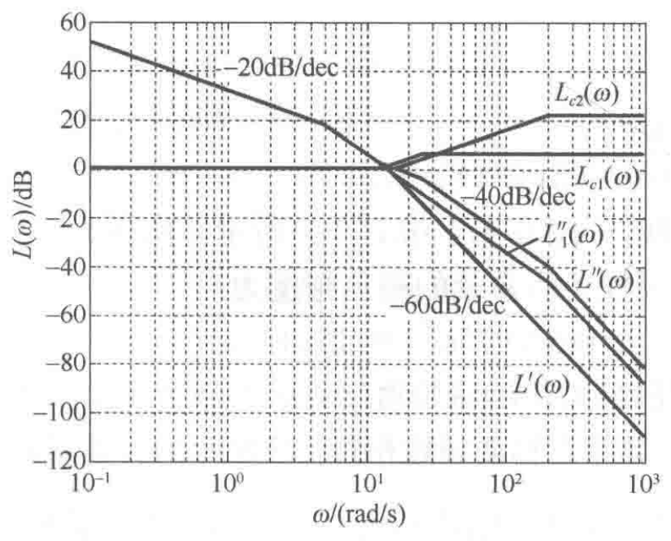

> Image description: This image is a Bode magnitude plot showing the open-loop logarithmic amplitude-frequency asymptotic characteristics of lead compensation, as indicated by the Chinese caption "图6－4－1 超前校正开环对数幅频渐近特性（MATLAB）". The horizontal axis represents angular frequency $\omega$ in radians per second ($\text{rad/s}$) on a logarithmic scale, ranging from $10^{-1}$ to $10^3$. The vertical axis represents the loop gain $L(\omega)$ in decibels ($\text{dB}$), ranging from $-120$ to $60$. Several asymptotic curves are plotted: * **$L_{c1}(\omega)$**: A flat line at $0\text{ dB}$. * **$L_{c2}(\omega)$**: Starts with a slope of $-20\text{ dB/dec}$, levels off, and then rises again. * **$L'(\omega)$, $L''(\omega)$, and $L''_1(\omega)$**: These curves diverge from the $0\text{ dB}$ line at $\omega \approx 10^1\text{ rad/s}$ with downward slopes of $-40\text{ dB/dec}$ and $-60\text{ dB/dec}$, illustrating different system roll-off rates.
图6－4－1 超前校正开环对数幅频渐近特性 （MATLAB）

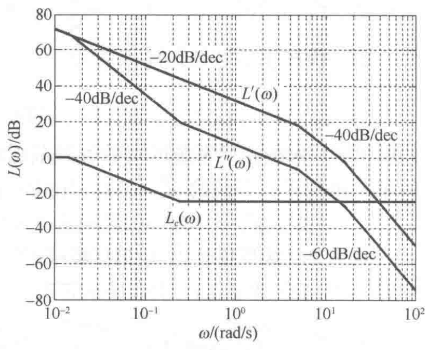

> Image description: This image is a Bode magnitude plot showing the asymptotic frequency response of three different open-loop transfer functions, labeled $L'(\omega)$, $L''(\omega)$, and $L_c(\omega)$. The vertical axis represents gain in decibels ($L(\omega)/\text{dB}$), ranging from $-80$ to $80$, while the horizontal axis is a logarithmic scale for angular frequency ($\omega/(\text{rad/s})$), spanning from $10^{-2}$ to $10^2$. The plot illustrates various slope changes (break points) characteristic of linear systems. Specifically, it highlights slopes of $-20\text{dB/dec}$, $-40\text{dB/dec}$, and $-60\text{dB/dec}$. The curve $L'(\omega)$ starts at approximately $70\text{dB}$ with a $-20\text{dB/dec}$ slope before transitioning to $-40\text{dB/dec}$. Curve $L''(\omega)$ exhibits a steeper initial decline of $-40\text{dB/dec}$, eventually dropping to $-60\text{dB/dec}$. The curve $L_c(\omega)$ starts at $0\text{dB}$ and levels off at approximately $-25\text{dB}$. According to the caption, this figure represents the asymptotic characteristics of lead compensation open-loop systems generated via MATLAB.
图 6－4－2 滞后校正开环对数幅频渐近特性 （MATLAB）


<!-- source_pdf_page: 190 -->
用试探法，可求得已校正系统的穿越频率 $\omega_{x}^{\prime \prime}=8.68 \mathrm{rad} / \mathrm{s}$ ，故增益裕度为

$$
h^{\prime \prime}(\mathrm{dB})=-20 \lg \left|G\left(\mathrm{j} \omega_{x}^{\prime \prime}\right)\right|=18.3 \mathrm{~dB}>15 \mathrm{~dB}
$$

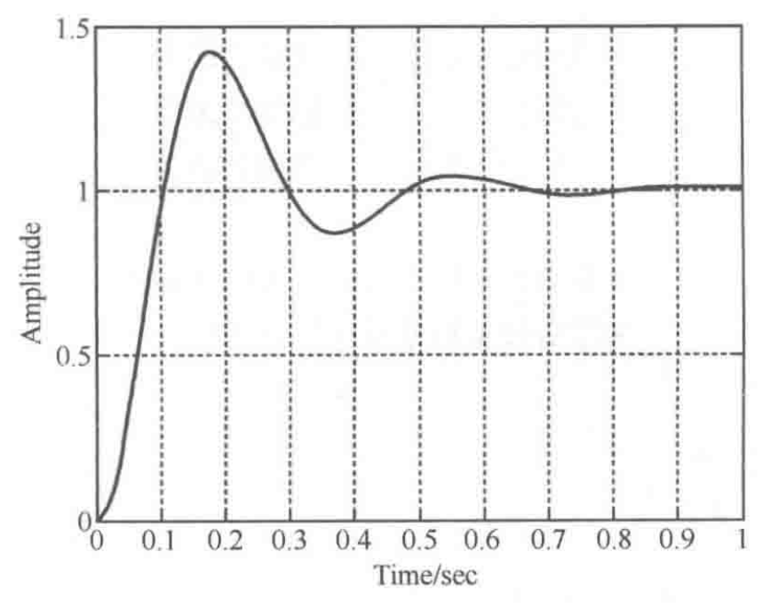

> Image description: This image is a technical plot showing the unit step response of a series lead-compensated system, as indicated by the Chinese caption "图 6－4－3 串联超前校正系统单位阶跃响应 (MATLAB)". The graph features two axes: the vertical y-axis is labeled "Amplitude" with numerical markings at 0, 0.5, 1, and 1.5. The horizontal x-axis is labeled "Time/sec" with a scale ranging from 0 to 1 second in increments of 0.1. The plot displays a single continuous curve starting at the origin (0,0). The response exhibits an underdamped behavior: it rises sharply to a first peak amplitude of approximately 1.4 at roughly 0.18 seconds, drops to a minimum around 0.38 seconds, and then oscillates with decreasing magnitude before stabilizing asymptotically at a steady-state value of 1. This represents the system's transient response and eventual convergence toward the unit step input.
图 6－4－3 串联超前校正系统单位阶跃响应 （MATLAB）

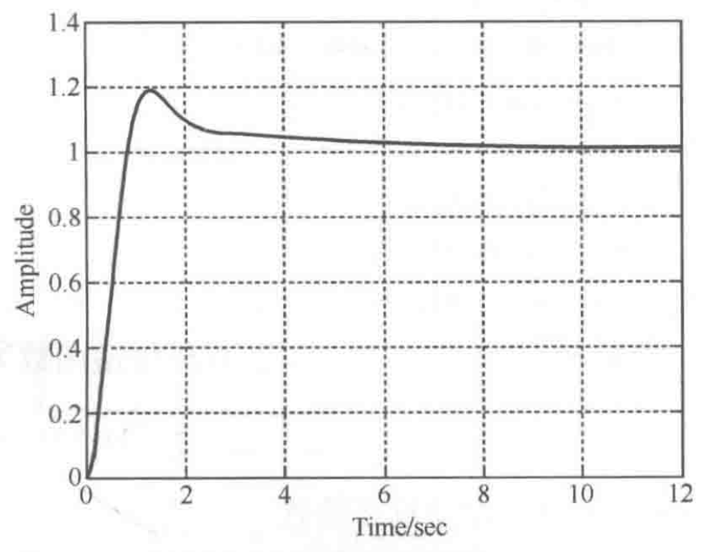

> Image description: This image shows a plot of the unit step response for a series lead-compensated system, generated via MATLAB, as indicated by the caption "图 6－4－3 串联超前校正系统单位阶跃响应（MATLAB）". The graph features a Cartesian coordinate system. The horizontal x-axis is labeled "Time/sec" and ranges from 0 to 12 seconds. The vertical y-axis is labeled "Amplitude" and ranges from 0 to 1.4. A single continuous black curve represents the system's response over time. Starting at the origin (0,0), the amplitude rises sharply, peaking at approximately 1.2 around 1.5 seconds. After this overshoot, the signal gradually decays and stabilizes, asymptotically approaching a steady-state value of 1.0 as time increases toward 12 seconds. The plot illustrates key control engineering characteristics including rise time, maximum overshoot, and settling time for the compensated system.
图 6－4－4 串联滞后校正系统单位阶跃响应 （MATLAB）

## MATLAB 验证：

作出串联超前校正系统的单位阶跃响应，如图 6－4－3 所示，测得

$$
\sigma \%=38.8 \%, t_{p}=0.18 \mathrm{~s}, t_{s}=0.60 \mathrm{~s}(\Delta=2 \%)
$$

作出串联滞后校正系统的单位阶跃响应，如图 6－4－4 所示，测得

$$
\sigma \%=19 \%, t_{p}=1.23 \mathrm{~s}, t_{s}=6.79 \mathrm{~s}(\Delta=2 \%)
$$

MATLAB 程序 ：exe604．m

$$
\begin{aligned}
& \mathrm{w} 1=0.1: 1: 1000 ; \mathrm{w} 2=0.01: 1: 100 ; \\
& \mathrm{G}=\mathrm{tf}(40,[\operatorname{conv}([1,0], \operatorname{conv}([0.2,1],[0.0625,1]))]) ; \% \text { 待校正系统的开环传递函数 }
\end{aligned}
$$

\％超前校正设计

```
$\mathrm{Gc} 1=\mathrm{tf}([0.0625,1],[0.005,1]) ; \mathrm{Gc} 2=\mathrm{tf}([0.091,1],[0.039,1])$;
G1 $=\operatorname{series}(\mathrm{G}, \mathrm{Gc} 1) ; \mathrm{G} 2=\operatorname{series}(\mathrm{G} 1, \mathrm{Gc} 2) ;$
$[\mathrm{x}, \mathrm{y}]=\mathrm{bd} \_\operatorname{asymp}(\mathrm{G}, \mathrm{w} 1) ;[\mathrm{x} 2, \mathrm{y} 2]=\mathrm{bd} \_\operatorname{asymp}(\mathrm{G} 2, \mathrm{w} 1) ;[\mathrm{xc} 1, \mathrm{yc} 1]=\mathrm{bd} \_\operatorname{asymp}(\mathrm{Gc} 1, \mathrm{w} 1) ;$
$[\mathrm{x} 1, \mathrm{y} 1]=\mathrm{bd} \_\operatorname{asymp}(\mathrm{G} 1, \mathrm{w} 1) ;[\mathrm{xc} 2, \mathrm{yc} 2]=\mathrm{bd} \_\operatorname{asymp}(\mathrm{Gc} 2, \mathrm{w} 1) ;$
figure(1);
```

```
semilogx $\left(x, y,{ }^{\prime} r^{\prime}\right)$; hold;
semilogx(xc1,yc1, 'b') ;
semilogx(xc2,yc2, 'b');
semi $\log x\left(x 1, y 1,{ }^{\prime} g^{\prime}\right)$;
$\operatorname{semilog} x\left(x 2, y 2,{ }^{\prime} k^{\prime}\right)$;
grid; hold off;
G11 = feedback(G2,1);
figure(2) ; step( G11) ; grid
\% 滞后校正设计
$\mathrm{Gc}=\mathrm{tf}([4.20,1],[70,03,1]) ; \mathrm{G} 3=\operatorname{series}(\mathrm{G}, \mathrm{Gc}) ;$
```

\％待校正系统对数幅频渐近线 \％第一级超前校正环节对数幅频渐近线 \％第二级超前校正环节对数幅频渐近线 \％一级超前校正后系统对数幅频渐近线 $\%$ 二级超前校正后系统对数幅频渐近线
\％超前校正后系统的闭环传递函数 $\%$ 超前校正后系统单位阶跃响应


<!-- source_pdf_page: 191 -->
```
$[\mathrm{x}, \mathrm{y}]=\mathrm{bd} \_\operatorname{asymp}(\mathrm{G}, \mathrm{w} 2) ;$
$[\mathrm{xc}, \mathrm{yc}]=\mathrm{bd} \_\mathrm{asymp}(\mathrm{Gc}, \mathrm{w} 2) ;[\mathrm{x} 3, \mathrm{y} 3]=\mathrm{bd} \_\mathrm{asymp}(\mathrm{G} 3, \mathrm{w} 2) ;$
figure(3);
semilogx(x,y,'r'); hold on; \%待校正系统对数幅频渐近线
semilogx (xc,yc,' $\mathrm{b}^{\prime}$ ); \%滞后校正环节对数幅频渐近线
semi $\log x\left(x 3, y 3,{ }^{\prime} k^{\prime}\right)$; \%滞后校正后系统对数幅频渐近线
grid; hold off
G22 = feedback (G3,1); \%滞后校正后系统的闭环传递函数
figure(4);step(G22);grid \%滞后校正后系统单位阶跃响应
```

6－5 设单位反馈系统的开环传递函数为

$$
G_{0}(s)=\frac{8}{s(2 s+1)}
$$

若采用滞后－超前校正装置

$$
G_{c}(s)=\frac{(10 s+1)(2 s+1)}{(100 s+1)(0.2 s+1)}
$$

对系统进行串联校正，试绘制系统校正前后的对数幅频渐近特性，并计算系统校正前后的相角裕度。

解 本题主要考查串联滞后－超前校正对系统性能的影响。
绘制出待校正系统、滞后－超前校正装置和已校正系统的对数幅频渐近特性曲线，如图6－5－1中 $L^{\prime}(\omega)$ 、 $L_{c}(\omega)$ 和 $L^{\prime \prime}(\omega)$ 所示。

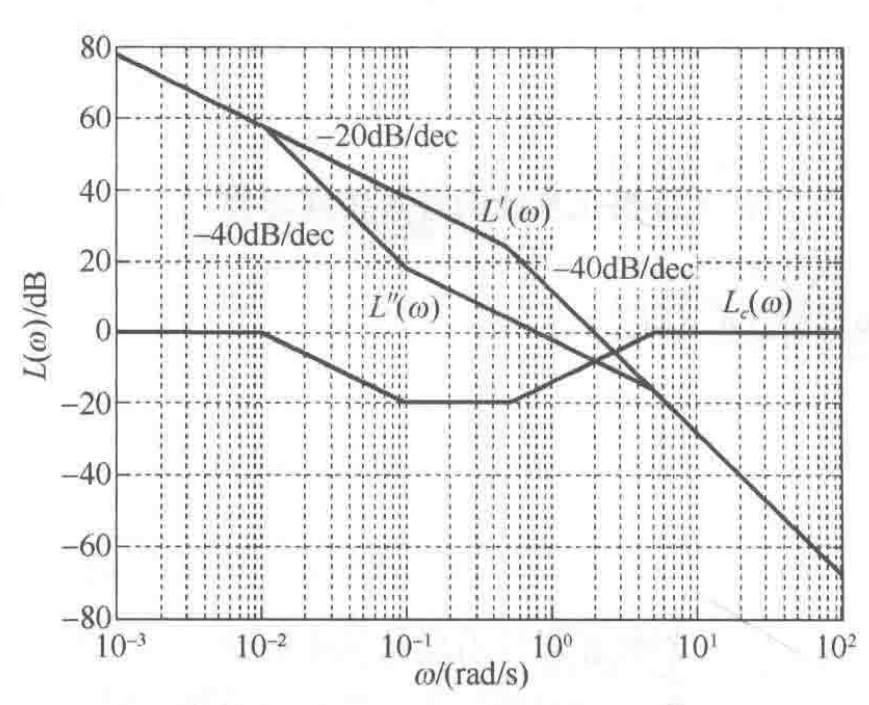

> Image description: This image is a Bode magnitude plot showing the logarithmic amplitude-frequency asymptotic characteristic curves for three different systems. The vertical axis represents gain $L(\omega)$ in decibels (dB), ranging from -80 to 80, while the horizontal axis represents angular frequency $\omega$ in radians per second (rad/s) on a logarithmic scale from $10^{-3}$ to $10^2$. Three distinct curves are plotted: 1. **$L'(\omega)$**: The uncompensated system, starting at approximately 78 dB and decreasing with slopes of -20dB/dec and later -40dB/dec. 2. **$L''(\omega)$**: A curve showing a dip between $10^{-1}$ and $10^0$ rad/s, representing the effect of a lag-lead compensator. 3. **$L_c(\omega)$**: The compensated system, which follows $L'(\omega)$ at low frequencies but is modified to maintain stability and performance across the frequency spectrum. The figure illustrates how compensation alters the system's gain characteristics to achieve desired engineering specifications.
图 6－5－1 开环系统及校正装置的对数幅频渐近特性（MATLAB）

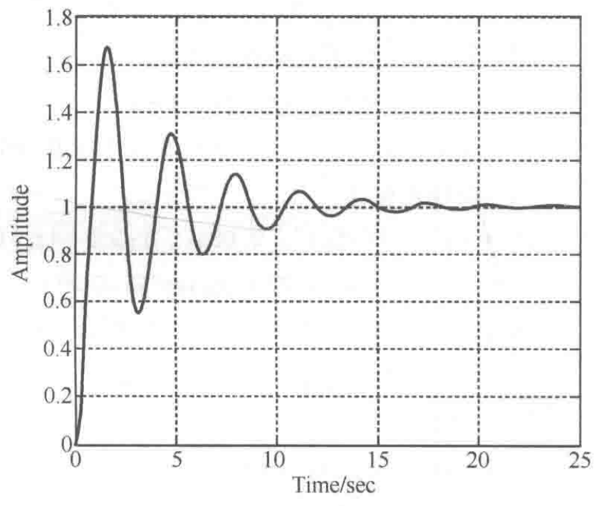

> Image description: The image displays a time-domain response plot of a system's amplitude over time. The horizontal x-axis is labeled "Time/sec" and ranges from 0 to 25 seconds, with major grid increments every 5 seconds. The vertical y-axis is labeled "Amplitude" and ranges from 0 to 1.8, with major grid lines at intervals of 0.2. The plot shows a single continuous curve starting at the origin (0,0) and exhibiting an underdamped oscillatory behavior. The signal reaches its first peak amplitude of approximately 1.65 around 2 seconds, followed by successive oscillations of decreasing magnitude. These oscillations center around a steady-state value of 1.0. As time progresses toward 25 seconds, the amplitude converges to this equilibrium point. In engineering terms, this represents the step response of a second-order system, illustrating characteristics such as overshoot and settling time.
图 6－5－2 待校正系统时间晌应（MATLAB）

由图6－5－1 中 $L^{\prime}(\omega)$ 与 $\omega$ 轴交点，得待校正系统的截止频率 $\omega_{c}^{\prime}=2 \mathrm{rad} / \mathrm{s}$ ，算出待校正系统的相角裕度为

$$
\gamma^{\prime}=180^{\circ}-90^{\circ}-\arctan 2 \omega_{c}^{\prime}=14.04^{\circ}
$$

由图6－5－1中 $L^{\prime \prime}(\omega)$ 与 $\omega$ 轴交点，得已校正系统的截止频率 $\omega_{c}^{\prime \prime}=0.8 \mathrm{rad} / \mathrm{s}$ ，算出已校正系统的相角裕度为

$$
\gamma^{\prime}=180^{\circ}-90^{\circ}+\arctan 10 \omega_{c}^{\prime \prime}-\arctan 100 \omega_{c}^{\prime \prime}-\arctan 0.2 \omega_{c}^{\prime \prime}=74.5^{\circ}
$$


<!-- source_pdf_page: 192 -->
应用 MATLAB 软件包，进行校正效果检验。作待校正系统的单位阶跃响应，如图 6－5－2 所示，测得

$$
\begin{aligned}
\sigma \% & =67 \%, \quad t_{p}=1.61 \mathrm{~s} \\
t_{s} & =14.6 \mathrm{~s}(\Delta=2 \%)
\end{aligned}
$$

作已校正系统的单位阶跃响应，如图6－5－3所示，测得

$$
\begin{gathered}
\sigma \%=8 \% \\
t_{p}=4.89 \mathrm{~s} \quad t_{s}=16.9 \mathrm{~s}(\Delta=2 \%)
\end{gathered}
$$

MATLAB 程序 ：exe605．m

$$
\begin{aligned}
w & =0.001: 1: 100 \\
G 0 & =t f(8,[\operatorname{conv}([1,0],[2,1])])
\end{aligned}
$$

\％待校正系统的开环传递函数

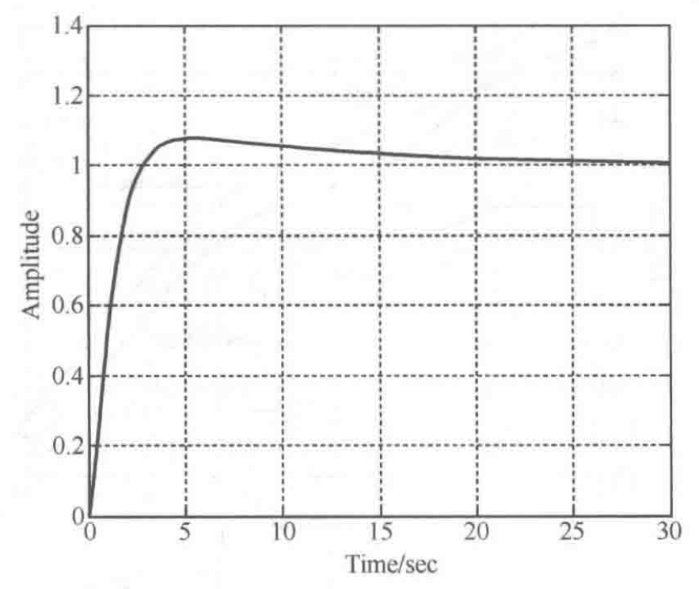

> Image description: The image shows a plot of the time response for a corrected system, as indicated by the caption "图 6－5－3 已校正系统时间响应（MATLAB）". The graph is plotted on a Cartesian coordinate system. The vertical axis (y-axis) is labeled "Amplitude" and ranges from $0$ to $1.4$, with major grid increments of $0.2$. The horizontal axis (x-axis) is labeled "Time/sec" and ranges from $0$ to $30$ seconds, with marked intervals every $5$ seconds. The plot displays a single continuous curve starting at the origin $(0, 0)$. The response rises sharply, reaching a peak amplitude of approximately $1.08$ around $t = 5$ seconds (overshoot). Following this peak, the signal gradually decays and stabilizes toward a steady-state value of $1.0$. This characteristic represents a typical underdamped second-order system response to a step input in control engineering.
图 6－5－3 已校正系统时间响应（MATLAB）

\％滞后－超前校正装置的传递函数

$$
\begin{aligned}
& \operatorname{Gc}=\operatorname{tf}([\operatorname{conv}([10,1],[2,1])],[\operatorname{conv}([100,1],[0.2,1])]) ; \\
& G=\operatorname{series}(G 0, G c) ; \\
& \text { \% 绘制待校正系统、滞后-超前的开环传正装置和已函数 } \\
& {[x, y]=b d \_a \operatorname{symp}(G 0, w) ;[x c, y c]=b d \_a \operatorname{symp}(G c, w) ;} \\
& {[x 1, y 1]=b d \_\operatorname{asymp}(G, w) ;} \\
& \text { figure }(1) ; \\
& \operatorname{semilogx}\left(x, y,{ }^{\prime} r^{\prime}\right) ; \text { hold on; } \\
& \operatorname{semilogx}\left(x c, y c,{ }^{\prime} b^{\prime}\right) ; \operatorname{semilogx}\left(x 1, y 1,{ }^{\prime} k^{\prime}\right) ; \\
& \text { grid; hold off } \\
& \text { \%待校正和已校正系统的闭环传递函数 } \\
& G 1=f e e d b a c k(G 0,1) ; G 11=f e e d b a c k(G, 1) ; \\
& \text { figure( } 2) ; \operatorname{step}(G 1) ; g r i d \\
& \text { figure( } 3) ; \operatorname{step}(G 11) ; g r i d
\end{aligned}
$$

6－6 设单位反馈系统的开环传递函数为

$$
G(s)=\frac{K}{s(s+1)(0.25 s+1)}
$$

（1）若要求已校正系统的静态速度误差系数 $K_{v} \geqslant 5\left(\mathrm{~s}^{-1}\right)$ ，相角裕度为 $\gamma \geqslant 45^{\circ}$ ，试设计串联校正装置；
（2）若除上述指标要求外，还要求系统校正后截止频率 $\omega_{c} \geqslant 2 \mathrm{rad} / \mathrm{s}$ ，试设计串联校正装置。
解 本题主要考查根据待校正系统的性能选择适当的校正装置进行系统校正。
（1）由题意，取 $K=K_{v}=5$ ，则待校正系统传递函数为

$$
G(s)=\frac{5}{s(s+1)(0.25 s+1)}
$$

（1）绘制出待校正系统的对数幅频渐近特性曲线，如图6－6－1中 $L^{\prime}(\omega)$ 所示。由图6－6－1得待校正系统的截止频率 $\omega_{c}^{\prime}=2.24 \mathrm{rad} / \mathrm{s}$ ，算出待校正系统的相角裕度

$$
\gamma^{\prime}=180^{\circ}-90^{\circ}-\arctan \omega_{c}^{\prime}-\arctan 0.25 \omega_{c}^{\prime}=-5.2^{\circ}
$$

表明待校正系统不稳定，可采用串联滞后校正。


<!-- source_pdf_page: 193 -->
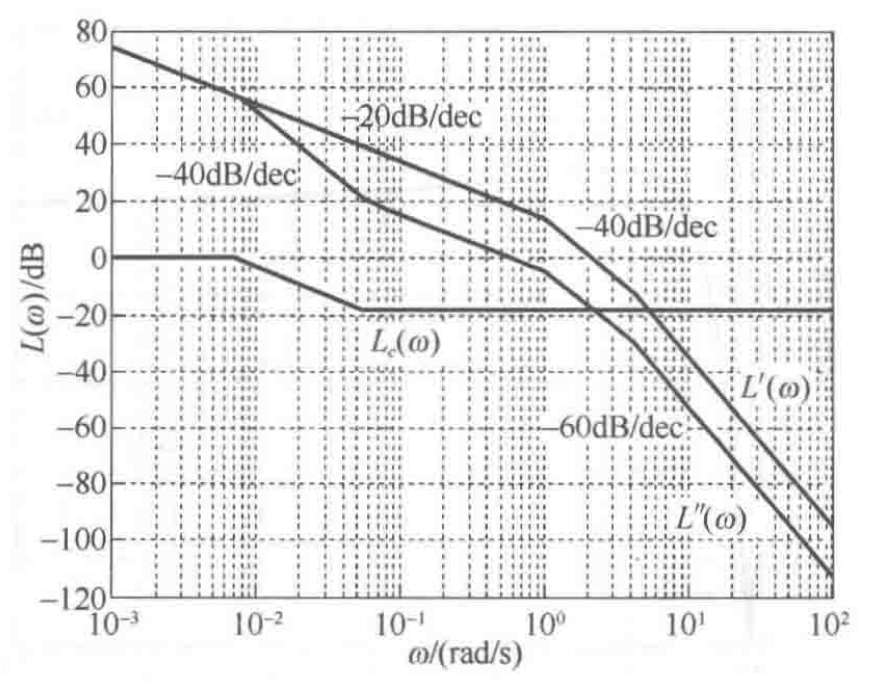

> Image description: This figure is a Bode magnitude plot showing the open-loop logarithmic amplitude-frequency asymptotic characteristics for a system with lag compensation. The horizontal axis represents angular frequency $\omega$ in radians per second ($\text{rad/s}$) on a logarithmic scale, ranging from $10^{-3}$ to $10^2$. The vertical axis represents the loop gain $L(\omega)$ in decibels ($\text{dB}$), ranging from $-120$ to $80$. Three distinct curves are plotted: 1. $L_c(\omega)$: The compensated system's open-loop transfer function, which starts at $0\text{ dB}$, drops with a slope of $-20\text{ dB/dec}$ starting around $10^{-2}\text{ rad/s}$, and levels off at approximately $-20\text{ dB}$. 2. $L'(\omega)$: A curve showing an initial slope of $-40\text{ dB/dec}$, transitioning to $-20\text{ dB/dec}$ between $10^{-2}$ and $1\text{ rad/s}$, then returning to $-40\text{ dB/dec}$. 3. $L''(\omega)$: A curve that follows a similar path but drops more steeply with a slope of $-60\text{ dB/dec}$ after $1\text{ rad/s}$.
图6－6－1 系统开环对数幅频渐近特性（滞后校正）

（2）由要求的 $\gamma^{\prime \prime}$ 选择 $\omega_{c}^{\prime \prime}$ 。选取 $\varphi\left(\omega_{c}^{\prime \prime}\right)= -6^{\circ}$ ，而要求 $\gamma^{\prime \prime}=45^{\circ}$ ，于是 $\gamma^{\prime}\left(\omega_{c}^{\prime \prime}\right)= \gamma^{\prime \prime}-\varphi\left(\omega_{c}^{\prime \prime}\right)=51^{\circ}$ 。由 $\gamma^{\prime}=90^{\circ}-\arctan \omega_{c}^{\prime \prime}- \arctan 0.25 \omega_{c}^{\prime \prime}$ ，解得已校系统的截止频率 $\omega_{c}^{\prime \prime}=0.59 \mathrm{rad} / \mathrm{s}$ 。
（3）确定滞后网络参数 $b$ 和 $T$ 。当 $\omega_{c}^{\prime \prime}=0.59 \mathrm{rad} / \mathrm{s}$ 时，由图6－6－1 可以测得 $L^{\prime}\left(\omega_{c}^{\prime \prime}\right)=18.56 \mathrm{~dB}$ ；再由 $20 \lg b=-L^{\prime}\left(\omega_{c}^{\prime \prime}\right)$ ，解得 $b=0.118$ 。令 $\frac{1}{b T}=0.1 \omega_{c}^{\prime \prime}$ ，求得 $T=$ 143.64 s ，于是串联滞后校正网络的对数幅频特性曲线 $L_{c}(\omega)$ 如图 6－6－1 所示，其传递函数为

$$
G_{c}(s)=\frac{1+b T s}{1+T s}=\frac{1+16.95 s}{1+143.64 s}
$$

已校正系统的对数幅频渐近特性曲线 $L^{\prime \prime}(\omega)$ 如图 6－6－1 所示，其传递函数为

$$
G(s)=\frac{5(1+16.95 s)}{s(s+1)(0.25 s+1)(1+143.64 s)}
$$

（4）验算性能指标。

$$
\gamma^{\prime \prime}=90^{\circ}+\arctan 16.95 \omega_{c}^{\prime \prime}-\arctan \omega_{c}^{\prime \prime}-\arctan 0.25 \omega_{c}^{\prime \prime}-\arctan 143.64 \omega_{c}^{\prime \prime}=46.04^{\circ}>45^{\circ}
$$

满足性能指标要求。
（2）由于要求系统校正后截止频率 $\omega_{c} \geqslant 2 \mathrm{rad} / \mathrm{s}$ ，系统的相角会减小得很快，故应采用串联超前一滞后校正。先采用超前网络 $G_{c 1}(s)=\frac{s+1}{0.08 s+1}$ 。超前校正后系统传递函数为

$$
G_{1}(s)=\frac{5}{s(0.08 s+1)(0.25 s+1)}
$$

绘制出超前校正后系统的对数幅频渐近特性曲线，如图6－6－2中 $L_{1}^{\prime \prime}(\omega)$ 所示。由图6－6－2得超前校正系统后的 $\omega_{c 1}^{\prime \prime}=\sqrt{20} \mathrm{rad} / \mathrm{s}$ ，算出超前校正后系统的相角裕度为

$$
\begin{aligned}
\gamma_{1}^{\prime \prime} & =90^{\circ}-\arctan 0.08 \omega_{c 1}^{\prime \prime}-\arctan 0.25 \omega_{c 1}^{\prime \prime} \\
& =22.14^{\circ}<45^{\circ}
\end{aligned}
$$

不满足要求，再采用滞后校正。
取 $\omega_{c}^{\prime \prime}=2.25 \mathrm{rad} / \mathrm{s}$ ，由图6－6－2可得 $L_{1}^{\prime}\left(\omega_{c}^{\prime \prime}\right)=6.94 \mathrm{~dB}$ ；再由 $20 \lg b=-L_{1}^{\prime \prime}\left(\omega_{c}^{\prime \prime}\right)$ ，解得 $b=0.45$ 。令 $\frac{1}{b T}=0.1 \omega_{c}^{\prime \prime}$ ，求得 $T=$ 9.87 s 。于是滞后校正网络传递函数为

$$
G_{c 2}(s)=\frac{1+b T}{1+T s}=\frac{4.44 s+1}{9.87 s+1}
$$

超前一滞后校正后系统的传递函数为

$$
G(s)=\frac{5(4.44 s+1)}{s(0.08 s+1)(0.25 s+1)(9.87 s+1)}
$$

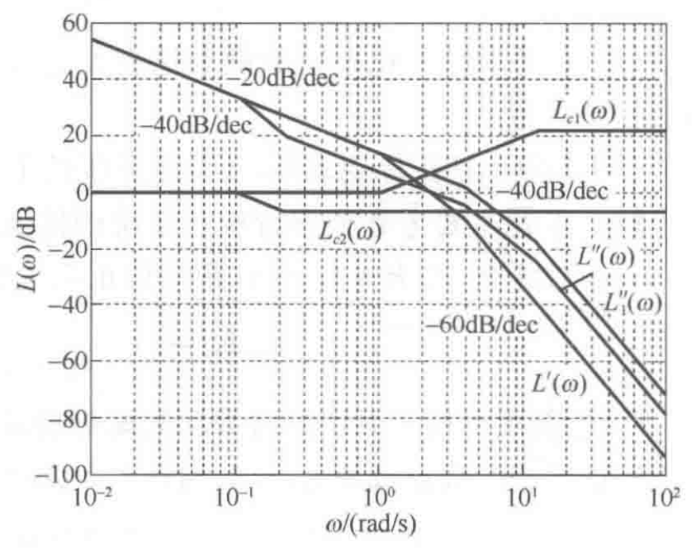

> Image description: This figure is a Bode magnitude plot showing the asymptotic frequency characteristics of open-loop systems for lead-lag compensation. The horizontal axis represents angular frequency $\omega$ in radians per second ($\text{rad/s}$) on a logarithmic scale, ranging from $10^{-2}$ to $10^2$. The vertical axis represents the loop gain $L(\omega)$ in decibels ($\text{dB}$), ranging from $-100$ to $60$. Several curves are plotted: $L_{c1}(\omega)$, $L_{c2}(\omega)$, and three modified curves labeled $L'(\omega)$, $L'_1(\omega)$, and $L''_1(\omega)$. The plot highlights various slope changes, specifically labeling asymptotic slopes of $-20\text{dB/dec}$, $-40\text{dB/dec}$, and $-60\text{dB/dec}$. These lines illustrate how different compensation networks alter the system's gain across a wide frequency spectrum to achieve desired stability or performance criteria. The caption identifies this as "Figure 6-6-2 System Open-Loop Logarithmic Amplitude-Frequency Asymptotic Characteristics (Lead-Lag Correction)."
图6－6－2 系统开坏对数幅频渐近特性（超前－滞后校正）


<!-- source_pdf_page: 194 -->
绘制出超前一滞后校正后系统的对数幅频渐近特性曲线，如图6－6－2中 $L^{\prime \prime}(\omega)$ 所示。由图6－6－2得超前一滞后校正系统后的 $\omega_{c}^{\prime \prime}=2.25 \mathrm{rad} / \mathrm{s}$ ，算出超前一滞后校正后系统的相角裕度为

$$
\gamma^{\prime \prime}=90^{\circ}+\arctan 4 \omega_{c}^{\prime \prime}-\arctan 0.1 \omega_{c}^{\prime \prime}-\arctan 0.25 \omega_{c}^{\prime \prime}-\arctan 8 \omega_{c}^{\prime \prime}=47.8^{\circ}>45^{\circ}
$$

此时，全部性能指标均已满足。
时域性能指标 MATLAB 检验：
作滞后校正系统的单位阶跃响应，如图6－6－3所示，测得

$$
\sigma \%=23 \%, \quad t_{p}=5.4 \mathrm{~s}, \quad t_{s}=23 \mathrm{~s}(\Delta=2 \%)
$$

作滞后－超前校正系统的单位阶跃响应，如图 6－6－4 所示，测得

$$
\sigma \%=19 \%, \quad t_{p}=1.29 \mathrm{~s}, \quad t_{s}=4.42 \mathrm{~s}(\Delta=2 \%)
$$

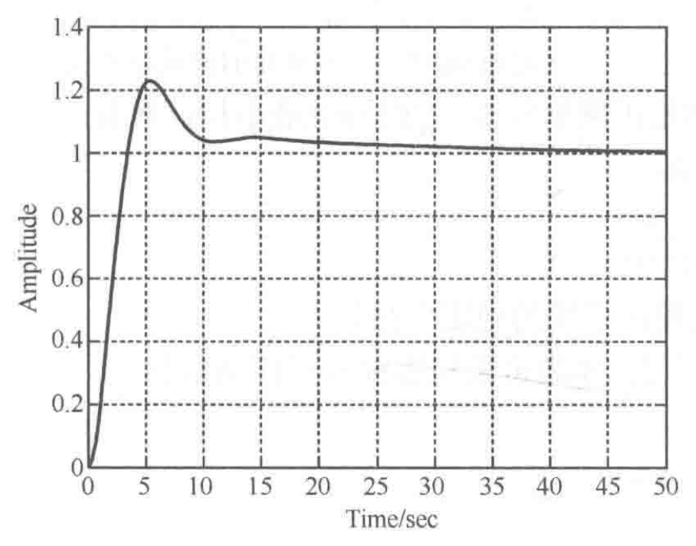

> Image description: The image is a technical plot showing the time response of a lag-compensated system, as indicated by the caption "图 6－6－3 滞后校正系统时间响应（MATLAB）". The graph features a Cartesian coordinate system with two axes. The vertical y-axis is labeled "Amplitude" and ranges from 0 to 1.4 in increments of 0.2. The horizontal x-axis is labeled "Time/sec" and ranges from 0 to 50 seconds, with major grid markings every 5 seconds. The plot displays a single continuous black curve representing the system's output over time. Starting at the origin (0,0), the signal rises sharply, reaching a peak amplitude of approximately 1.2 at around 5 seconds. It then exhibits a slight oscillation, dipping and leveling off as it asymptotically approaches a steady-state value of 1.0. This behavior is characteristic of a control system's step response, illustrating transient characteristics such as overshoot and settling time.
图 6－6－3 滞后校正系统时间响应（MATLAB）

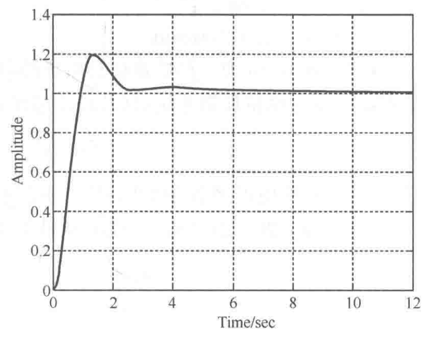

> Image description: The image is a MATLAB-generated plot showing the time response of a lag compensation system (as indicated by the caption "图 6－6－3 滞后校正系统时间响应"). The graph features a vertical y-axis labeled "Amplitude" ranging from 0 to 1.4 and a horizontal x-axis labeled "Time/sec" ranging from 0 to 12 seconds. The plot displays a single continuous curve representing the system's step response. Starting at the origin (0,0), the amplitude rises sharply, reaching a peak overshoot of approximately 1.2 around 1.5 seconds. The signal then oscillates slightly before stabilizing and asymptotically approaching a steady-state value of 1.0 as time increases toward 12 seconds. This visualization is used in control engineering to analyze transient performance characteristics such as rise time, peak overshoot, and settling time for a compensated system.
图 6－6－4 超前－滞后校正系统时间响应（MATLAB）

## MATLAB 程序 ：exe606．m

## \％滞后校正

$$
\begin{array}{ll}
\mathrm{w}=0.001: 1: 100 ; & \\
\mathrm{G}=\mathrm{tf}(5,[\operatorname{conv}([1,0], \operatorname{conv}([1,1],[0.25,1]))]) ; & \text { \% 待校正系统的开环传递函数 } \\
\mathrm{Gc}=\mathrm{tf}([16.95,1],[143.64,1]) ; & \text { \% 滞后校正网络的传递函数 } \\
\mathrm{G} 1=\operatorname{series}(\mathrm{G}, \mathrm{Gc}) ; & \\
{[\mathrm{x}, \mathrm{y}]=\mathrm{bd} \_\mathrm{asymp}(\mathrm{G}, \mathrm{w}) ;[\mathrm{xc}, \mathrm{yc}]=\mathrm{bd} \_\mathrm{asymp}(\mathrm{Gc}, \mathrm{w}) ;} & \\
{[\mathrm{x} 11, \mathrm{y} 11]=\mathrm{bd} \_\mathrm{asymp}(\mathrm{G} 1, \mathrm{w}) ;} &
\end{array}
$$

\％绘制系统校正前、滞后校正网络和校正后的对数幅频渐近线

```
figure(1);
semilogx(x,y,'r'); hold on;
semilogx(xc,yc,'b');
semilogx(x11,y11,'k');
grid;hold off
G11 = feedback(G1,1);
figure(2);step(G11);grid
% 超前-滞后校正
%超前、滞后校正网络和校正后的传递函数
Gc1 = tf ([1,1],[0.08,1]);G2 = series(G,Gc1);
```


<!-- source_pdf_page: 195 -->
```
Gc2 = tf([4.44,1],[9.87,1]);G3 = series(Gc2,G2);
```

\％绘制系统校正前、超前校正网络、滞后校正网络和校正后的对数幅频渐近线

```
$[\mathrm{x}, \mathrm{y}]=\mathrm{bd} \_\mathrm{asymp}(\mathrm{G}, \mathrm{w}) ;$
$[\mathrm{xc} 1, \mathrm{yc} 1]=\mathrm{bd} \_\mathrm{asymp}(\mathrm{Gc} 1, \mathrm{w}) ;[\mathrm{x} 21, \mathrm{y} 21]=\mathrm{bd} \_\mathrm{asymp}(\mathrm{G} 2, \mathrm{w})$;
$[\mathrm{xc} 2, \mathrm{yc} 2]=\mathrm{bd} \_\mathrm{asymp}(\mathrm{Gc} 2, \mathrm{w}) ;[\mathrm{x} 31, \mathrm{y} 31]=\mathrm{bd} \_\mathrm{asymp}(\mathrm{G} 3, \mathrm{w}) ;$
figure(3);
semilogx(x,y,'r'); hold;
semilogx(xc1,yc1,'b'); semilogx(xc21,yc21,'b');
semilogx(x21,y21,'g'); semilogx(x31,y31,' $k^{\prime}$ );
grid; hold off;
G31 = feedback(G3,1);
```

figure(4) ; step( G31) ; grid
\％超前一滞后校正后系统时间响应曲线
6－7 图 6－40 为三种推荐稳定系统的串联校正网络特性，它们均由最小相位环节组成。若控制系统为单位反馈系统，其开环传递函数为

$$
G_{0}(s)=\frac{400}{s^{2}(0.01 s+1)}
$$

试问：（1）这些校正网络特性中，哪一种可使已校正系统的稳定性最好？
（2）为了将 12 Hz 的正弦噪声削弱 10 倍左右，你确定采用哪种校正网络特性？

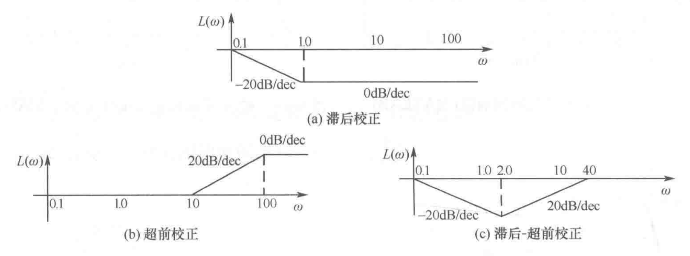

> Image description: The image contains three Bode magnitude plots labeled (a), (b), and (c) showing the asymptotic frequency characteristics of recommended correction networks. Each plot features a vertical axis $L(\omega)$ representing gain in decibels and a horizontal logarithmic axis $\omega$ representing angular frequency. Plot (a), titled "滞后校正" (lag compensation), shows a flat response at low frequencies, followed by a slope of $-20\text{dB/dec}$ between $\omega = 0.1$ and $1.0$, returning to a $0\text{dB/dec}$ slope thereafter. Plot (b), titled "超前校正" (lead compensation), remains flat until $\omega = 10$, then rises with a slope of $20\text{dB/dec}$ up to $\omega = 100$, where it levels off at $0\text{dB/dec}$. Plot (c), titled "滞后-超前校正" (lag-lead compensation), combines these effects, descending at $-20\text{dB/dec}$ from $\omega = 0.1$ to $2.0$, and ascending at $20\text{dB/dec}$ until $\omega = 40$. The figure caption is "图 6－40 推荐的校正网络对数幅频渐近特性."
图 6－40 推荐的校正网络对数幅频渐近特性

解 本题主要考查根据最小相位对数幅值渐近特性求取校正装置的传递函数，并计算各种校正装置对系统稳定性的影响，以及对噪声的削弱作用。
（1）稳定性分析。由图 6－40 可知，各系统的校正网络和校正后的传递函数为
图 6－40（a）：$\quad G_{c}(s)=\frac{s+1}{10 s+1}, \quad G(s)=G_{0}(s) G_{c}(s)=\frac{400(s+1)}{s^{2}(0.01 s+1)(10 s+1)}$绘制出待校正系统、校正网络和已校正系统的对数幅频渐近特性曲线，如图 6－7－1 中 $L^{\prime}(\omega)$ 、 $L_{c}(\omega)$ 和 $L^{\prime \prime}(\omega)$ 所示。由图6－7－1得已校正系统的截止频率 $\omega_{c}^{\prime \prime}=6.32 \mathrm{rad} / \mathrm{s}$ ，算出已校正系统的相角裕度为

$$
\gamma_{a}^{\prime \prime}=180^{\circ}-180^{\circ}+\arctan \omega_{c}^{\prime \prime}-\arctan 10 \omega_{c}^{\prime \prime}-\arctan 0.01 \omega_{c}^{\prime \prime}=-11.70^{\circ}
$$

表明已校正系统不稳定。
图 6－40（b）：$G_{c}(s)=\frac{0.1 s+1}{0.01 s+1}, G(s)=G_{0}(s) G_{c}(s)=\frac{400(0.1 s+1)}{s^{2}(0.01 s+1)^{2}}$


<!-- source_pdf_page: 196 -->
绘制出待校正系统、校正网络和已校正系统的对数幅频渐近特性曲线，如图6－7－2中 $L^{\prime}(\omega)$ 、 $L_{c}(\omega)$ 和 $L^{\prime \prime}(\omega)$ 所示。由图6－7－2得已校正系统的截止频率 $\omega_{c}^{\prime \prime}=40 \mathrm{rad} / \mathrm{s}$ ，算出已校正系统的相角裕度为

$$
\gamma_{b}^{\prime \prime}=180^{\circ}-180^{\circ}+\arctan 0.1 \omega_{c}^{\prime \prime}-2 \arctan 0.01 \omega_{c}^{\prime \prime}=32.36^{\circ}
$$

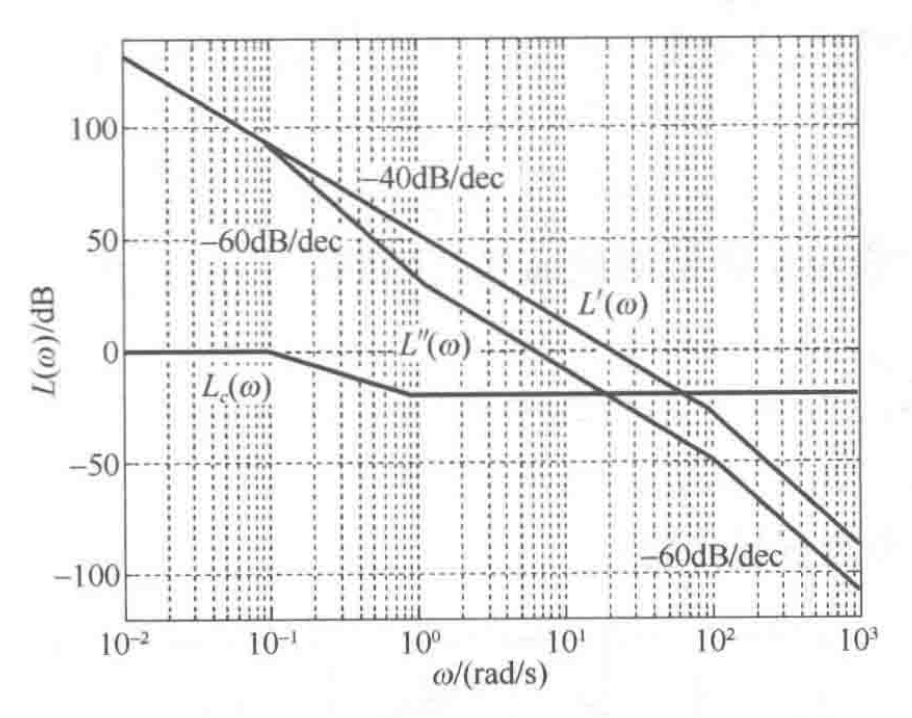

> Image description: A Bode magnitude plot showing the open-loop logarithmic amplitude-frequency asymptotic characteristics for "Scheme (a)," as indicated by the Chinese caption. The horizontal axis represents angular frequency $\omega$ in radians per second ($\text{rad/s}$) on a logarithmic scale, ranging from $10^{-2}$ to $10^3$. The vertical axis represents magnitude $L(\omega)$ in decibels ($\text{dB}$), ranging from $-100$ to over $100$. Three distinct curves are plotted: $L'(\omega)$, $L''(\omega)$, and $L_c(\omega)$. Curve $L'(\omega)$ starts high and descends with a slope of $-40\text{dB/dec}$. Curve $L''(\omega)$ begins with a steeper descent of $-60\text{dB/dec}$ before transitioning. Curve $L_c(\omega)$ remains flat at $0\text{dB}$ until $\omega = 10^{-1}$, then slopes downward before leveling off again around $-20\text{dB}$. The figure illustrates the frequency response and stability characteristics of a control system's open-loop transfer function.
图6－7－1 采用（a）方案时的开环对数幅频渐近特性

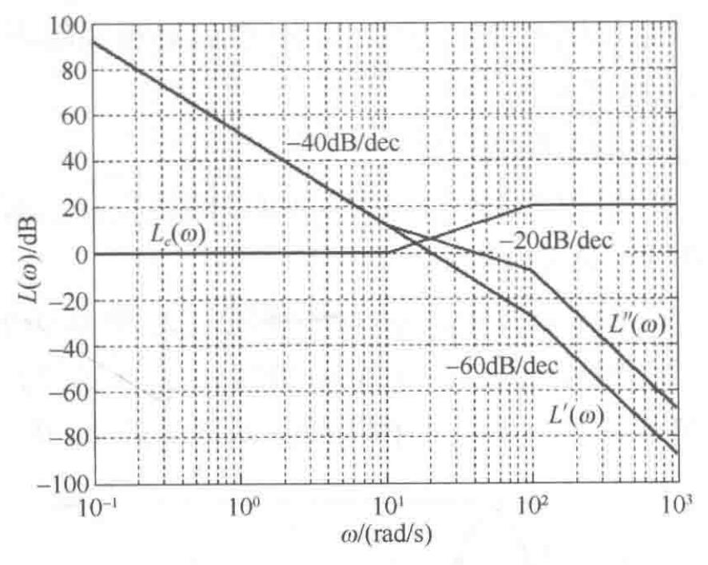

> Image description: A Bode magnitude plot showing the open-loop logarithmic amplitude-frequency asymptotic characteristics for "Scheme (a)". The horizontal axis represents angular frequency $\omega$ in radians per second ($\text{rad/s}$) on a logarithmic scale, ranging from $10^{-1}$ to $10^3$. The vertical axis represents gain $L(\omega)$ in decibels ($\text{dB}$), ranging from $-100$ to $100$. The figure displays several asymptotic curves: - A line starting at approximately $90\text{ dB}$ with a slope of $-40\text{ dB/dec}$. - A horizontal line labeled $L_c(\omega)$ at $0\text{ dB}$ up to $\omega = 10^1$, which then rises and levels off at $20\text{ dB}$ after $\omega = 10^2$. - Two descending curves: $L'(\omega)$, which drops with a slope of $-60\text{ dB/dec}$ starting around $\omega = 10^1$, and $L''(\omega)$, which descends with a slope of $-20\text{ dB/dec}$ after $\omega = 10^2$.
图6－7－2 采用（b）方案时的开环对数幅频渐近特性

$$
\text { 图 } \begin{aligned}
6-40(\mathrm{c}): G_{c}(s) & =\frac{(0.5 s+1)^{2}}{(10 s+1)(0.025 s+1)} \\
G(s) & =G_{0}(s) G_{c}(s)=\frac{400(0.5 s+1)^{2}}{s^{2}(0.01 s+1)(10 s+1)(0.025 s+1)}
\end{aligned}
$$

绘制出待校正系统、校正网络和已校正系统的对数幅频渐近特性曲线，如图6－7－3中 $L^{\prime}(\omega)$ 、 $L_{c}(\omega)$ 和 $L^{\prime \prime}(\omega)$ 所示。由图6－7－3得已校正系统的截止频率 $\omega_{c}^{\prime \prime}=10 \mathrm{rad} / \mathrm{s}$ ，算出已校正系统的相角裕度为

$$
\begin{aligned}
\gamma_{c}^{\prime \prime}= & 180^{\circ}-180^{\circ}+2 \arctan 0.5 \omega_{c}^{\prime \prime} \\
& -\arctan 10 \omega_{c}^{\prime \prime}-\arctan 0.01 \omega_{c}^{\prime \prime} \\
& -\arctan 0.025 \omega_{c}^{\prime \prime}=48.21^{\circ}
\end{aligned}
$$

可见，图 6－7－3 所示的校正网络，与图 6－40（a）和图 6－40（b）所示的校正网

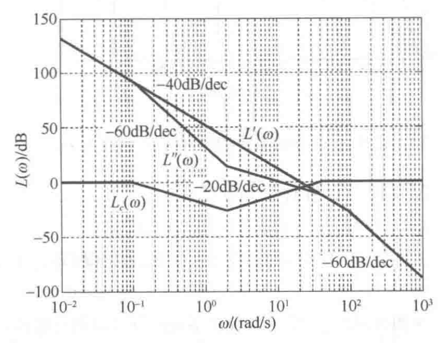

> Image description: A Bode magnitude plot showing three frequency response curves, $L'(\omega)$, $L''(\omega)$, and $L_c(\omega)$, plotted on a logarithmic scale. The vertical axis represents the gain $L(\omega)$ in decibels (dB), ranging from $-100$ to $150$. The horizontal axis represents angular frequency $\omega$ in radians per second ($\text{rad/s}$), spanning from $10^{-2}$ to $10^3$. The curve $L'(\omega)$ starts at approximately $130\text{ dB}$, descends with a slope of $-40\text{ dB/dec}$, and crosses $0\text{ dB}$ near $\omega = 20\text{ rad/s}$. The curve $L''(\omega)$ begins similarly but drops more steeply at $-60\text{ dB/dec}$ before transitioning to a $-20\text{ dB/dec}$ slope. The third curve, $L_c(\omega)$, remains flat at $0\text{ dB}$ until $\omega = 10^{-1}$, dips into negative values reaching a minimum near $\omega = 5$, and then returns to $0\text{ dB}$ around $\omega = 40$ before descending again at $-60\text{ dB/dec}$. The figure illustrates the frequency-domain characteristics of different correction networks.
图6－7－3 采用（c）方案时的开环对数幅频渐近特性

（2）噪声抑制能力分析。当 $f=12 \mathrm{~Hz}$ 时，$\omega=2 \pi f=75.4 \mathrm{rad} / \mathrm{s}$ 。以图6－40（a）所示网络作为校正网络，有

$$
L_{a}(75.4)=\left.20 \lg \frac{400 \omega}{\omega^{2} \times 10 \omega}\right|_{\omega=75.4}=-43.05 \mathrm{~dB}
$$

以图6－40（b）所示网络作为校正网络，有


<!-- source_pdf_page: 197 -->
$$
L_{b}(75.4)=\left.20 \lg \frac{400 \times 0.1 \omega}{\omega^{2}}\right|_{\omega=75.4}=-5.51 \mathrm{~dB}
$$

以图6－40（c）所示网络作为校正网络，有

$$
L_{c}(75.4)=\left.20 \lg \frac{400 \times(0.5 \omega)^{2}}{\omega^{2} \times 10 \omega \times 0.025 \omega}\right|_{\omega=75.4}=-23.05 \mathrm{~dB}
$$

故采用图6－40（c）所示校正网络，对高频噪声抑制能力较好，可以将 12 Hz 的正弦噪声削弱 14.2 倍左右。

动态性能分析：
对图6－40（b）和图6－40（c）的已校正系统，作单位阶跃响应曲线，分别如图6－7－4和图 6－7－5 所示，测得

图6－40（b）：$\sigma \%=47 \%, t_{p}=0.079 \mathrm{~s}, t_{s}=0.26 \mathrm{~s}(\Delta=2 \%)$
图6－40（c）：$\sigma \%=32 \%, t_{p}=0.28 \mathrm{~s}, \quad t_{s}=0.72 \mathrm{~s}(\Delta=2 \%)$
可见，以图 6－40（c）作为校正网络的系统，其动态过程较平稳。

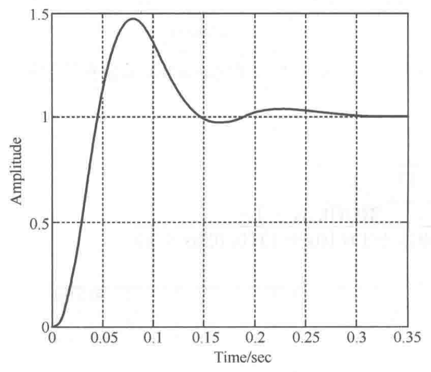

> Image description: A line graph depicting a system's dynamic response over time. The vertical y-axis is labeled "Amplitude" with numerical markers at 0, 0.5, 1, and 1.5. The horizontal x-axis is labeled "Time/sec" with increments of 0.05, ranging from 0 to 0.35. The plot shows a single continuous curve starting at the origin (0,0). The signal rises sharply, peaking at an amplitude of approximately 1.45 around 0.08 seconds. It then exhibits damped oscillations, crossing the steady-state value of 1.0 at roughly 0.16 seconds, reaching a small undershoot, and finally stabilizing at an amplitude of 1.0 after 0.3 seconds. In engineering terms, this figure represents a step response of a control system, illustrating characteristics such as overshoot, settling time, and steady-state error. The accompanying Chinese caption notes that the dynamic process for the system using the correction network in Figure 6-40(c) is relatively stable.
图 6－7－4 采用（b）方案时系统的时间响应（MATLAB）

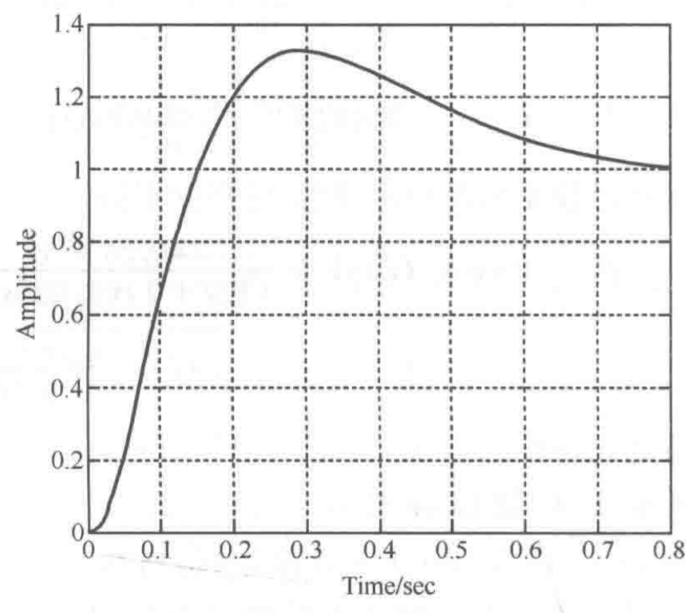

> Image description: The image shows a plot of a system's time response generated by MATLAB, as indicated by the caption "图 6－7－4 采用（b）方案时系统的时间响应（MATLAB）". The graph features a vertical y-axis labeled "Amplitude" and a horizontal x-axis labeled "Time/sec". The x-axis ranges from $0$ to $0.8$ seconds with major grid lines every $0.1$ units. The y-axis ranges from $0$ to $1.4$ with major grid lines every $0.2$ units. A single continuous curve starts at the origin $(0,0)$, rises steeply, and reaches a peak amplitude of approximately $1.3$ at around $0.28$ seconds. After this overshoot, the signal gradually decays and converges toward a steady-state value of $1.0$ as it approaches $0.8$ seconds. In engineering terms, this represents an underdamped second-order system response to a step input, characterized by visible overshoot and settling behavior.
图 6－7－5 采用（c）方案时系统的时间响应（MATLAB）

MATLAB 程序 ：exe607．m
$\mathrm{G}=\mathrm{tf}(400,[\operatorname{conv}([1,0,0],[0.01,1])]) ;$
\％图（b）校正网络和已校正系统的开环和闭环传递函数
$\mathrm{Gc} 2=\mathrm{tf}([0.1,1],[0.01,1]) ; \mathrm{G} 2=\operatorname{series}(\mathrm{G}, \mathrm{Gc} 2) ; \mathrm{G} 21=\operatorname{feedback}(\mathrm{G} 2,1) ;$
\％图（c）校正网络和已校正系统的开环和闭环传递函数
$\mathrm{Gc} 3=\mathrm{tf}([\operatorname{conv}([0.5,1],[0.5,1])],[\operatorname{conv}([10,1],[0.025,1])]) ;$
G3＝series（G，Gc3）；G31＝feedback（G3，1）；
figure（1）；step（G21）；grid
figure（2）；step（G31）；grid
6－8 设单位反馈系统的开环传递函数为

$$
G_{0}(s)=\frac{K}{s(0.1 s+1)(0.01 s+1)}
$$

试设计串联校正装置，使系统特性满足下列指标：


<!-- source_pdf_page: 198 -->
（1）静态速度误差系数 $K_{v} \geqslant 250 \mathrm{~s}^{-1}$ ；
（2）截止频率 $\omega_{c} \geqslant 30 \mathrm{rad} / \mathrm{s}$ ；
（3）相角裕度 $\gamma\left(\omega_{c}\right) \geqslant 45^{\circ}$ 。
解 本题主要考查对串联超前－滞后校正方法的掌握。
（1）取 $K=K_{v}=250$ ，待校正系统的传递函数为

$$
G_{0}(s)=\frac{250}{s(0.1 s+1)(0.01 s+1)}
$$

（2）绘制待校正系统的开环幅频渐近特性曲线如图 6－8－1 中 $L^{\prime}(\omega)$ 所示，由图 6－8－1 得待校正系统的 $\omega^{\prime}{ }_{c}=50 \mathrm{rad} / \mathrm{s}$ ，算出待校正系统的相角裕度为

$$
\gamma^{\prime}=90^{\circ}-\arctan 0.1 \omega_{c}^{\prime}-\arctan 0.01 \omega_{c}^{\prime}=-15.26^{\circ}
$$

表明闭环系统不稳定，由于要求 $\omega_{c} \geqslant 30 \mathrm{rad} / \mathrm{s}$ ，故宜采用滞后－超前校正，其传递函数为

$$
G_{c}(s)=\frac{\left(\frac{s}{\omega_{a}}+1\right)\left(\frac{s}{\omega_{b}}+1\right)}{\left(\frac{a s}{\omega_{a}}+1\right)\left(\frac{s}{a \omega_{b}}+1\right)}
$$

（3）确定网络超前部分交接频率 $\omega_{b}$ 。由图 6－8－1 可知，当 $\omega=10 \mathrm{rad} / \mathrm{s}$ 时，斜率从 $-20 \mathrm{~dB} / \mathrm{dec}$ 变为 $-40 \mathrm{~dB} / \mathrm{dec}$ ，故 $\omega_{b}=10 \mathrm{rad} / \mathrm{s}$ 。
（4）选择 $\omega_{c}^{\prime \prime}$ 并确定 $a$ 。由于要求 $\omega_{c} \geqslant 30 \mathrm{rad} / \mathrm{s}$ ，故选取 $\omega_{c}^{\prime \prime}=34 \mathrm{rad} / \mathrm{s}$ ；由图6－8－1可知，$L^{\prime}\left(\omega_{c}^{\prime \prime}\right)=6.20 \mathrm{~dB}$ ；由 $-20 \lg a+ L^{\prime}\left(\omega_{c}^{\prime \prime}\right)+20 \lg \frac{\omega_{c}^{\prime \prime}}{\omega_{b}}=0$ ，解得 $a=7.35$ 。
（5）确定网络滞后部分交接频率 $\omega_{a}$ 。校正后系统的传递函数为

$$
G(s)=\frac{250\left(\frac{s}{\omega_{a}}+1\right)}{s(0.01 s+1)\left(\frac{s}{73.5}+1\right)\left(\frac{7.35 s}{\omega_{a}}+1\right)}
$$

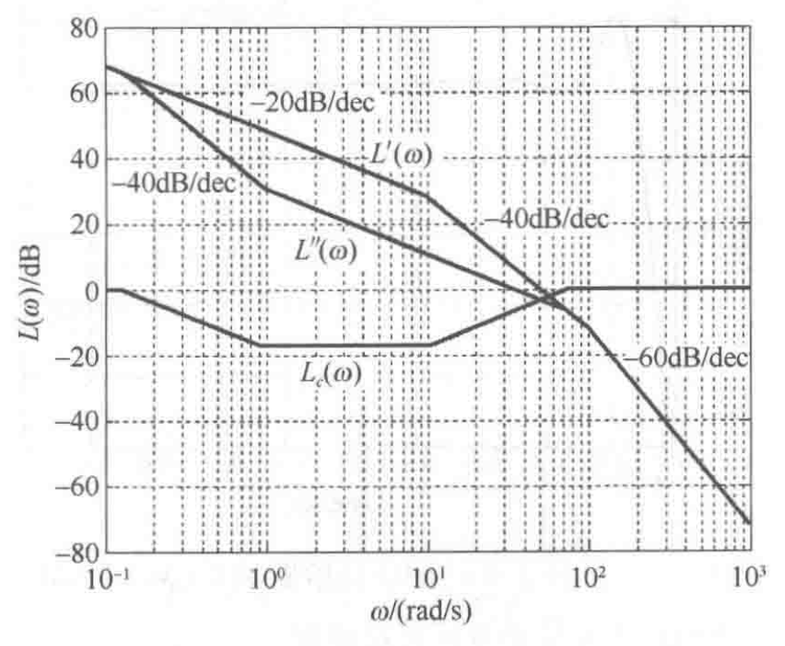

> Image description: This figure is a Bode magnitude plot showing the open-loop logarithmic amplitude-frequency asymptotic characteristics for a lag-lead compensation system. The horizontal axis represents angular frequency $\omega$ in radians per second ($\text{rad/s}$) on a logarithmic scale, ranging from $10^{-1}$ to $10^3$. The vertical axis represents magnitude $L(\omega)$ in decibels ($\text{dB}$), ranging from $-80$ to $80$. Three distinct curves are plotted: $L'(\omega)$, $L''(\omega)$, and $L_s(\omega)$. These curves illustrate different slope transitions. Labels indicate specific asymptotic slopes, including $-20\text{dB/dec}$, $-40\text{dB/dec}$, and $-60\text{dB/dec}$. For example, $L'(\omega)$ starts at approximately $65\text{dB}$ with a $-20\text{dB/dec}$ slope before transitioning to $-40\text{dB/dec}$ around $\omega = 10^1$. The curve $L_s(\omega)$ shows a dip reaching roughly $-20\text{dB}$ between $10^0$ and $10^1 \text{rad/s}$ before rising to meet the other curves near $10^2 \text{rad/s}$.
图 6－8－1 开环对数幅频渐近特性（滞后－超前校正）

$$
\gamma^{\prime \prime}=90^{\circ}+\arctan \frac{\omega_{c}^{\prime \prime}}{\omega_{a}}-\arctan 0.01 \omega_{c}^{\prime \prime}-\arctan \frac{\omega_{c}^{\prime \prime}}{73.5}-\arctan \frac{7.35 \omega_{c}^{\prime \prime}}{\omega_{a}}
$$

解得 $\omega_{a}=0.93 \mathrm{rad} / \mathrm{s}$ 。
所以，校正网络和已校正系统的对数幅频渐近特性曲线如图 6－8－1 中 $L_{c}(\omega)$ 和 $L^{\prime \prime}(\omega)$ 所示，其传递函数为

$$
G_{c}(s)=\frac{(0.1 s+1)(1.08 s+1)}{(0.013 s+1)(7.90 s+1)}, G^{\prime}(s)=\frac{250(1.08 s+1)}{s(0.01 s+1)(0.013 s+1)(7.90 s+1)}
$$

（6）进行性能指标的验算。由图6－8－1可知，已校正系统的截止频率 $\omega_{c}^{\prime \prime}=33 \mathrm{rad} / \mathrm{s}$ ，则校正后系统的相角裕度为

$$
\begin{aligned}
\gamma^{\prime \prime}= & 90^{\circ}+\arctan 1.08 \omega_{c}^{\prime \prime}-\arctan 0.01 \omega_{c}^{\prime \prime} \\
& -\arctan 0.013 \omega_{c}^{\prime \prime}-\arctan 7.90 \omega_{c}^{\prime \prime}=45.06^{\circ}>45^{\circ}
\end{aligned}
$$


<!-- source_pdf_page: 199 -->
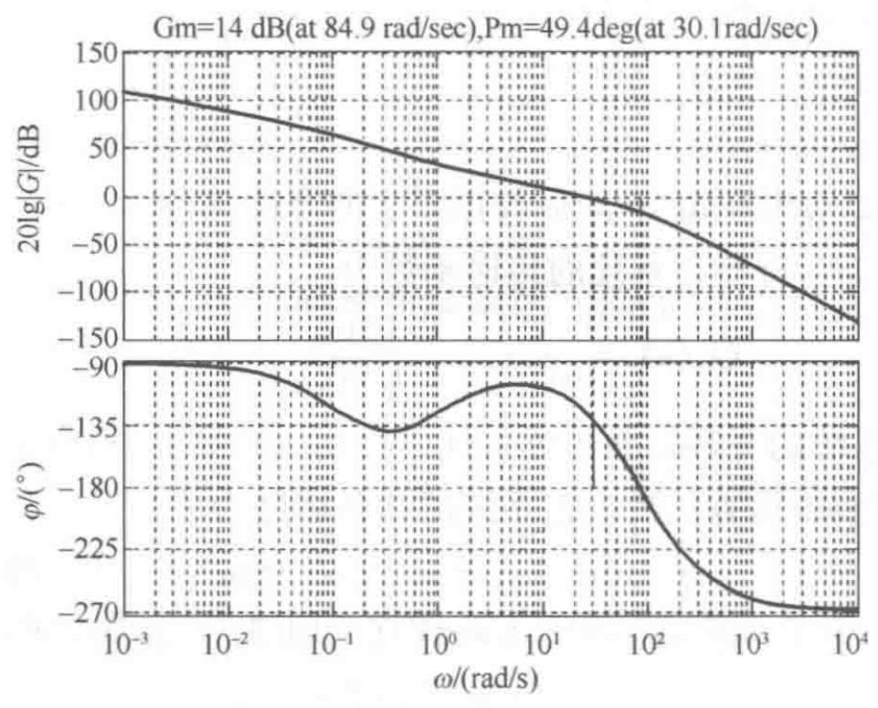

> Image description: This image shows a Bode plot of an open-loop system, generated in MATLAB, as indicated by the caption "图 6－8－2 已校正系统的开环 Bode 图（MATLAB）". The figure consists of two vertically aligned graphs sharing a logarithmic horizontal axis representing angular frequency $\omega$ in radians per second ($\text{rad/s}$), ranging from $10^{-3}$ to $10^4$. The top graph plots the magnitude $20\log_{10}|G|$ in decibels ($\text{dB}$) against frequency, showing a downward slope. The bottom graph plots the phase angle $\varphi$ in degrees ($^\circ$) against frequency, exhibiting a non-linear curve that dips and then rises before descending toward $-270^\circ$. Text at the top specifies stability margins: a gain margin $\text{Gm} = 14\text{ dB}$ at $84.9\text{ rad/sec}$ and a phase margin $\text{Pm} = 49.4\text{ deg}$ at $30.1\text{ rad/sec}$. These values are critical for evaluating the stability of the control system.
图 6－8－2 已校正系统的开环 Bode 图（MATLAB）

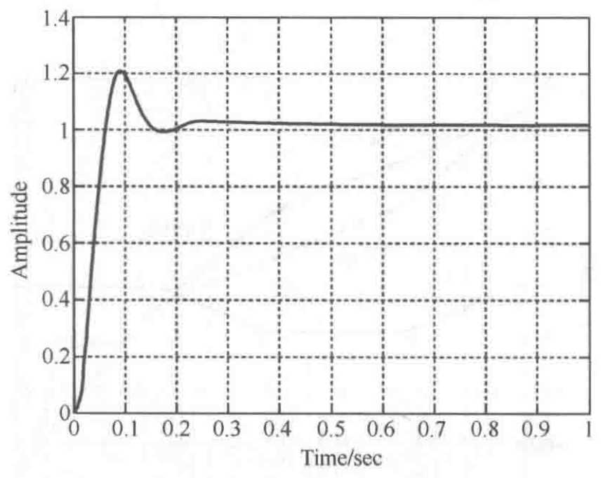

> Image description: The image displays a time-domain response plot of a control system, likely a step response. The vertical y-axis is labeled "Amplitude" and ranges from 0 to 1.4 in increments of 0.2. The horizontal x-axis is labeled "Time/sec" and ranges from 0 to 1 second in increments of 0.1. The plot shows a single continuous curve starting at the origin (0,0). The signal rises sharply, reaching a peak amplitude of approximately 1.2 at roughly 0.09 seconds. It then exhibits a slight undershoot before stabilizing and converging toward a steady-state value of 1.0 as time increases beyond 0.3 seconds. From an engineering perspective, this graph illustrates the transient response characteristics of a system, specifically showing overshoot and settling time. Despite the provided caption mentioning a "Bode plot," the visual content is strictly a time-domain amplitude versus time graph.
图 6－8－3 已校正系统的单位阶跃响应（MATLAB）

所以各项性能指标均满足要求。
MATLAB 检验：作已校正系统的开环 Bode 图，如图 6－8－2 所示，测得

$$
\omega_{c}=30.1 \mathrm{rad} / \mathrm{s}, \quad \gamma=49.4^{\circ}
$$

作已校正系统单位阶跃响应，如图 6－8－3 所示，测得

$$
\begin{gathered}
\sigma \%=20 \%, \quad t_{p}=0.085 \mathrm{~s}, \\
t_{s}=0.27 \mathrm{~s}(\Delta=2 \%)
\end{gathered}
$$

MATLAB 程序 ：exe608．m

$$
\begin{aligned}
& w=0.1: 1: 1000 \\
& G=\operatorname{tf}(250,[\operatorname{conv}([1,0], \operatorname{conv}([0.1,1],
\end{aligned}
$$

$$
[0.01,1]))]) ;
$$

```
% 待校正系统的开环传递函数
% 滞后-超前校正系统的传递函数
Gc=tf([Conv([0.1,1],[1/0.93,1])],[Conv([7.35/0.93,1],[1/73.5,1])]);
G1 = series(G, Gc); %已校正系统的开环传递函数
[x,y] = bd_ asymp(G,w);[xc,yc] = bd_ asymp(Gc,w);
[x1,y1] = bd_ asymp(G1,w);
figure(1);
semilogx(x,y,'r'); hold on;
semilogx(xc,yc,'b');
semilogx(x1,y1,'k');
grid;hold off
figure(2);margin(G1);grid
G11 = feedback (G1,1)
%已校正系统的闭环传递函数
figure(3);step(G11);grid
```


<!-- source_pdf_page: 200 -->
6－9 设复合校正控制系统如图 6－41 所示。若要求闭环回路过阻尼，且系统在斜坡输入作用下的稳态误差为零，试确定 $K$ 值及前馈补偿装置 $G_{r}(s)$ 。

解 本题主要考查按输入补偿的复合校正方法。首先根据根轨迹分离点确定增益 $K$ ，然后按斜坡输入作用下的稳定误差，确定前馈补偿装置 $G_{r}(s)$ 。

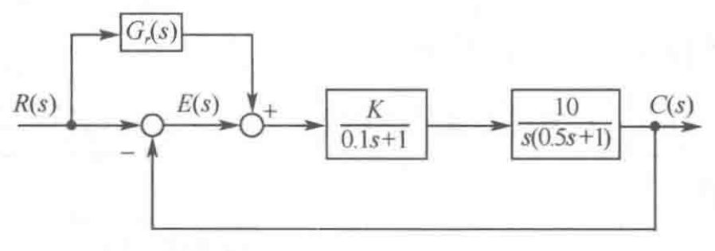

> Image description: This image is a control system block diagram labeled "图6－41 复合控制系统结构图" (Composite Control System Structure Diagram). The system starts with an input signal $R(s)$ that splits into two paths. One path goes directly to a summing junction, while the other passes through a forward-feed block $G_r(s)$. The main feedback loop consists of a second summing junction where the output of $G_r(s)$ is added and the feedback signal from $C(s)$ is subtracted, resulting in an error signal $E(s)$. This signal enters a series of two transfer function blocks: first $\frac{K}{0.1s+1}$, followed by $\frac{10}{s(0.5s+1)}$. The final output is labeled $C(s)$, which is fed back to the initial summing junction. Arrows indicate the unidirectional flow of signals through these components, representing a classic closed-loop control architecture with an additional feedforward component.
图6－41 复合控制系统结构图

由系统结构图 6－41，可得以 $R(s)$ 为输入、以 $E(s)$ 为输出的结构图，如图 6－9－1 所示。
由图6－9－1可得

$$
\frac{E(s)}{R(s)}=\frac{1-G_{r}(s) \frac{10 K}{s(0.1 s+1)(0.5 s+1)}}{1+\frac{10 K}{s(0.1 s+1)(0.5 s+1)}}=\frac{s(0.1 s+1)(0.5 s+1)-10 K G_{r}(s)}{s(0.1 s+1)(0.5 s+1)+10 K}
$$

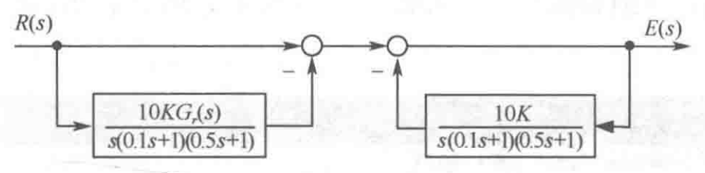

> Image description: This image shows a control system block diagram labeled "图 6－9－1 系统结构图." The diagram illustrates a feedback loop configuration starting from an input variable $R(s)$ on the left and ending at an output error signal $E(s)$ on the right. The system consists of two negative feedback paths. The first path branches from $R(s)$ through a transfer function block $\frac{10KG_r(s)}{s(0.1s+1)(0.5s+1)}$ and returns to a summing junction with a minus sign. A second, similar loop branches from the output $E(s)$ back through a transfer function block $\frac{10K}{s(0.1s+1)(0.5s+1)}$, also returning to a summing junction with a minus sign. Arrows indicate the signal flow from left to right and through the feedback loops. In engineering terms, this represents a system designed to minimize error $E(s)$ using two distinct feedback mechanisms involving second-order dynamics and an integrator.
图 6－9－1 系统结构图

由上式可知系统的闭环方程为

$$
s(0.1 s+1)(0.5 s+1)+10 K=0
$$

若使闭环回路过阻尼，则闭环极点应均为负实数。
系统的等效开环传递函数为

$$
G^{\prime}(s)=\frac{10 K}{s(0.1 s+1)(0.5 s+1)}=\frac{200 K}{s(s+10)(s+2)}=\frac{K^{*}}{s(s+10)(s+2)}
$$

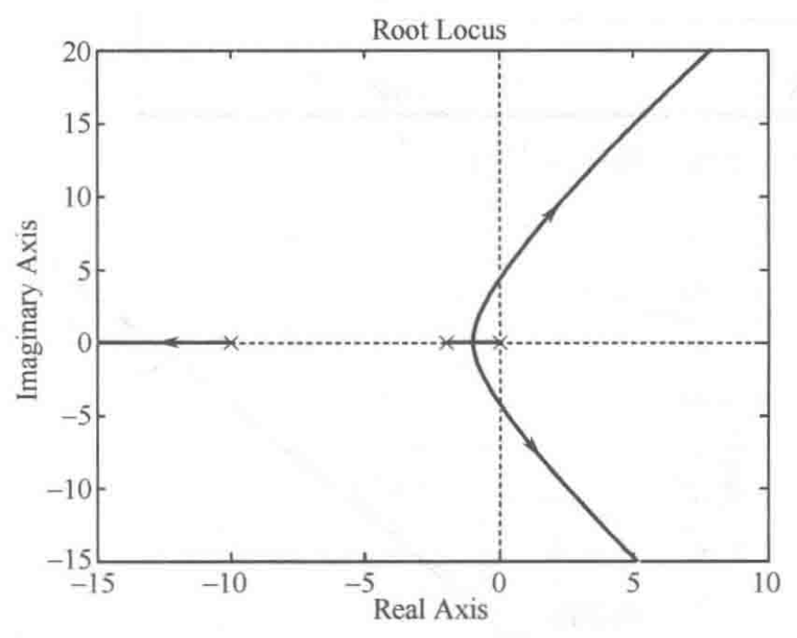

> Image description: A textbook figure titled "Root Locus" displays a plot in the complex s-plane, with the horizontal axis labeled "Real Axis" and the vertical axis labeled "Imaginary Axis." The real axis ranges from -15 to 10, while the imaginary axis ranges from -15 to 20. The figure illustrates the root locus for the characteristic equation $1+\frac{K^{*}}{s(s+10)(s+2)}=0$. Three poles are marked with 'x' symbols on the real axis at $s=0$, $s=-2$, and $s=-10$. The locus consists of three branches: one branch moves along the real axis from $s=-2$ toward $s=0$, while another moves from $s=-10$ toward the left. Two other branches originate from the segment between $s=0$ and $s=-2$, meeting at a breakaway point before curving symmetrically into the right-half plane. Arrows indicate the direction of increasing gain $K^*$.
图 6－9－2 $1+\frac{K^{*}}{s(s+10)(s+2)}=0$ 的根轨迹

令

$$
\frac{1}{d}+\frac{1}{d+2}+\frac{1}{d+10}=0
$$

解得

$$
d_{1}=-0.95 \text {, 或 } d_{2}=-7.06 \text { (舍去) }
$$

则分离点处的开环增益

$$
K=\left.\frac{1}{200}|s(s+10)(s+2)|\right|_{s=-0.95}=0.045
$$

因此，当 $0<K<0.045$ 时，闭环极点均为负实数，也即闭环回路过阻尼。

显然，当 $0<K<0.045$ 时闭环系统稳定，则系统在单位斜坡输入下的稳态误差为

$$
e_{s s}(\infty)=\lim _{s \rightarrow 0} s \cdot E(s)=\lim _{s \rightarrow 0} s \cdot \frac{s(0.1 s+1)(0.5 s+1)-10 K G_{r}(s)}{s(0.1 s+1)(0.5 s+1)+10 K} \cdot R(s)
$$


<!-- source_pdf_page: 201 -->
$$
=\lim _{s \rightarrow 0} s \cdot \frac{s(0.1 s+1)(0.5 s+1)-10 K G_{r}(s)}{s(0.1 s+1)(0.5 s+1)+10 K} \cdot \frac{1}{s^{2}}
$$

若使 $e_{s s}(\infty)=0$ ，应有

$$
\lim _{s \rightarrow 0}\left\{\frac{1}{s} \cdot\left[s(0.1 s+1)(0.5 s+1)-10 K G_{r}(s)\right]\right\}=\lim _{s \rightarrow 0}\left[(0.1 s+1)(0.5 s+1)-\frac{10 K G_{r}(s)}{s}\right]=0
$$

即

$$
G_{r}(s)=\tau s \text {, 且 } 10 K_{\tau}=1
$$

再由 $0<K<0.045$ ，故 $\tau>2.2 \mathrm{~s}$
所以，当 $0<K<0.045$ 和 $G_{r}(s)=\tau s$（其中 $\tau>2.2 \mathrm{~s}$ ）时，闭环回路过阻尼且系统在斜坡输人作用下的稳态误差为零。

MATLAB 验证：exe609．mdl
取 $K=0.04, \tau=2.5, G_{r}(s)=\tau s=2.5 s$ ；在 MATLAB 的 Simulink 环境下搭建复合系统校正后结构图，如图 6－9－3 所示。取仿真时间为 10 s ，运行系统校正后的单位阶跃响应输出和单位斜坡响应输出，分别如图 6－9－4 和图 6－9－5 所示。仿真表明：系统过阻尼，且斜坡输人下无稳态误差。

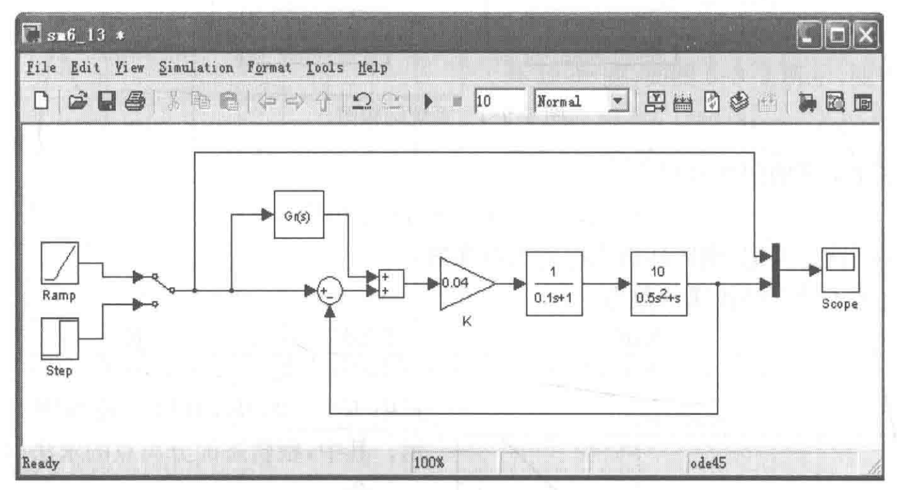

> Image description: This figure shows a MATLAB Simulink block diagram of a corrected composite system. The input section features a switch allowing selection between a "Ramp" and a "Step" signal. The main control loop consists of a forward path and a feedback path. In the forward path, the input enters a summing junction. A parallel branch containing a transfer function $G_r(s)$ feeds into this junction. The output then passes through a gain block labeled $K$ with a value of $0.04$, followed by two transfer functions: $\frac{1}{0.1s+1}$ and $\frac{10}{0.5s^2+s}$. The system employs unity negative feedback, where the final output is fed back to the summing junction. A multiplexer combines the reference input and the system output before sending them to a "Scope" for visualization. According to the caption, $G_r(s) = \tau s = 2.5s$, and the simulation time is set to 10 seconds to analyze step and ramp responses.
图6－9－3 复合控制系统 Simulink 仿真图

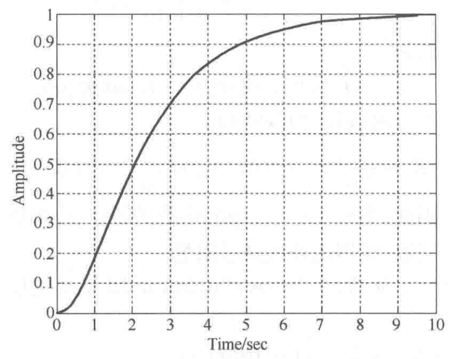

> Image description: The image is a technical plot showing the time-domain response of a control system. The horizontal x-axis is labeled "Time/sec" and ranges from 0 to 10 seconds, with major grid lines every 1 second. The vertical y-axis is labeled "Amplitude" and ranges from 0 to 1, with increments of 0.1. The figure displays a single smooth curve starting at the origin (0,0). It exhibits an initial slow rise, followed by a steep linear increase between approximately 1 and 3 seconds, before asymptotically approaching a steady-state value of 1.0 as time increases toward 10 seconds. This characteristic S-shaped curve represents a typical step response of a higher-order system, indicating the transition from an initial state to a final setpoint without overshoot or oscillation. The caption identifies this as a Simulink simulation plot for a composite control system (复合控制系统).
图 6－9－4 复合控制系统单位阶跃响应（MATLAB）

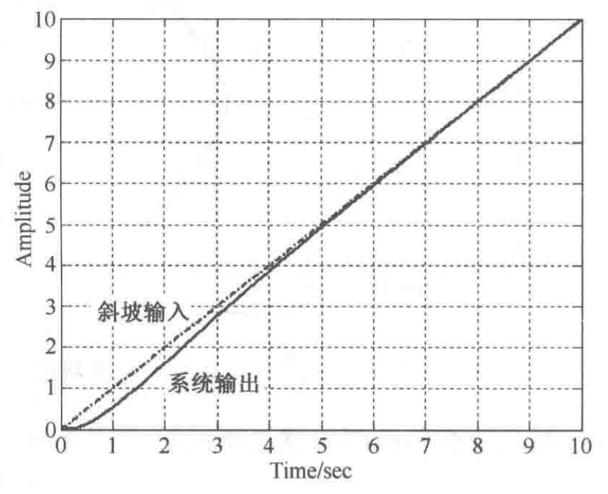

> Image description: The image shows a MATLAB-generated plot depicting the response of a composite control system to a ramp input. The horizontal x-axis is labeled "Time/sec" and ranges from 0 to 10, while the vertical y-axis is labeled "Amplitude" and ranges from 0 to 10. Two curves are plotted: a dashed line representing the "斜坡输入" (ramp input) and a solid line representing the "系统输出" (system output). Both signals start at the origin (0,0). The ramp input increases linearly with a constant slope of 1. The system output initially lags behind the input, exhibiting a curved transient phase before asymptotically approaching the linear path of the input. This behavior illustrates the steady-state tracking error characteristic of a control system responding to a ramp signal. The caption identifies this as "图 6－9－4 复合控制系统单位阶跃响应（MATLAB）," although the visual data specifically shows a ramp response.
图 6－9－5 复合控制系统单位斜坡响应（MATLAB）


<!-- source_pdf_page: 202 -->
6－10 设复合校正控制系统如图 6－42 所示，其中 $N(s)$ 为可测量扰动，$K_{1} 、 K_{2}$ 和 $T$ 均为正常数。若要求系统输出 $C(s)$ 完全不受 $N(s)$ 的影响，且跟踪阶跃指令的误差为零，试确定前馈补偿装置 $G_{c 1}(s)$ 和串联校正装置 $G_{c 2}(s)$ 。

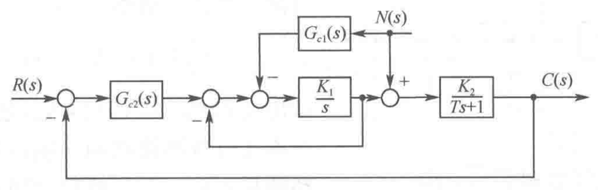

> Image description: This figure is a block diagram of a composite correction control system. The input signal $R(s)$ enters from the left, passing through a summing junction and a series controller $G_{c2}(s)$. A second summing junction follows, leading into a third junction where a feedforward compensation path involving $N(s)$ and $G_{c1}(s)$ is integrated. The main forward path includes an integrator block $\frac{K_1}{s}$ and a first-order lag plant block $\frac{K_2}{Ts+1}$, resulting in the system output $C(s)$. There are two feedback loops: an inner loop returning from the output of the integrator to the second summing junction, and an outer unity feedback loop returning $C(s)$ to the first summing junction. The variable $N(s)$ represents a measurable disturbance entering the system via $G_{c1}(s)$. The diagram illustrates the relationship between reference tracking, disturbance rejection, and plant dynamics in a closed-loop control architecture.
图 6－42 复合控制系统结构图

解 本题主要考查对于按扰动补偿的复合校正方法的掌握程度。根据系统输出 $C(s)$完全不受 $N(s)$ 的影响可确定前馈补偿装置 $G_{c 1}(s)$ ，再按跟踪阶跃指令的误差为零确定串联校正装置 $G_{c 2}(s)$ 。

对图 6－42 系统进行结构图变换，如图 6－10－1 所示。

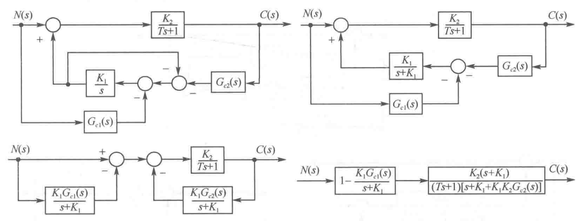

> Image description: This image contains four control system block diagrams illustrating structural transformations of a feedback loop. The input variable is $N(s)$ and the output is $C(s)$. The first diagram shows a complex nested structure with blocks $\frac{K_2}{Ts+1}$, $\frac{K_1}{s}$, $G_{c1}(s)$, and $G_{c2}(s)$, featuring multiple summing junctions and feedback paths. The second diagram simplifies this by replacing the integrator $\frac{K_1}{s}$ with a first-order lag $\frac{K_1}{s+K_1}$. The third diagram further rearranges these components into parallel feedforward and feedback paths, specifically highlighting blocks like $\frac{K_1 G_{c1}(s)}{s+K_1}$ and $\frac{K_1 G_{c2}(s)}{s+K_1}$. The final figure is a simplified series block diagram representing the overall transfer function. It consists of two main blocks: one representing the pre-filter $\frac{K_1 G_{c1}(s)}{1 - \frac{K_1 G_{c1}(s)}{s+K_1}}$ and another complex closed-loop expression involving $K_2, s, T, K_1,$ and $G_{c2}(s)$. Arrows indicate the signal flow from left to right.
图 6－10－1 系统结构图变换

由系统结构图变换图 6－10－1，可得

$$
\frac{C(s)}{N(s)}=\frac{K_{2}\left[s+K_{1}-K_{1} G_{c 1}(s)\right]}{(T s+1)\left[s+K_{1}+K_{1} K_{2} G_{c 2}(s)\right]}
$$

若使系统输出 $C(s)$ 完全不受 $N(s)$ 的影响，应有 $s+K_{1}-K_{1} G_{c 1}(s)=0$ ，即

$$
G_{c 1}(s)=1+\frac{s}{K_{1}}
$$

由图6－42，可得系统的开环传递函数为

$$
G(s)=G_{c 2}(s) \cdot \frac{K_{1}}{s+K_{1}} \cdot \frac{K_{2}}{T s+1}=\frac{K_{1} K_{2}}{\left(s+K_{1}\right)(T s+1)} \cdot G_{c 2}(s)
$$

若使系统跟踪阶跃指令的误差为零，则应有 $G_{c^{2}}(s)=\frac{1}{s}$ ，此时系统的闭环特征方程为

$$
T s^{3}+\left(1+K_{1} T\right) s^{2}+K_{1} s+K_{1} K_{2}=0
$$

为了使闭环系统稳定，则由劳斯稳定判据知，系统的参数应满足

$$
\left(K_{2}-K_{1}\right) T<1
$$


<!-- source_pdf_page: 203 -->
6－11 设复合校正控制系统如图 6－43 所示。图中 $G_{n}(s)$ 为前馈补偿装置的传递函数，

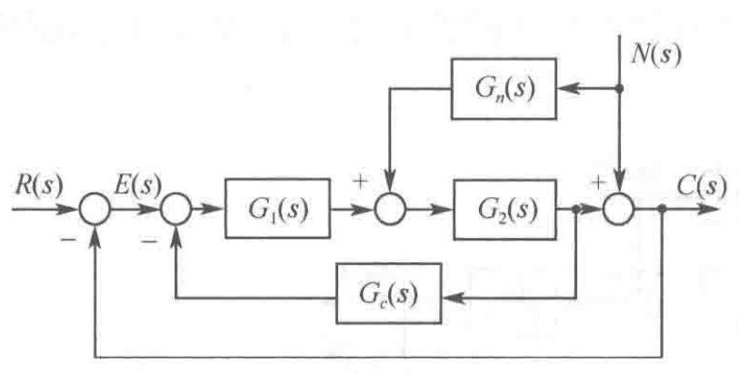

> Image description: A block diagram of a composite correction control system is shown in Figure 6-43. The system consists of several transfer function blocks and summation points connected by directed arrows representing signal flow. The input signal $R(s)$ enters from the left, meeting a summation point to produce the error signal $E(s)$. This signal passes through another summation point before entering block $G_1(s)$. The output of $G_1(s)$ enters a third summation point, where it is combined with a feedforward compensation signal from block $G_n(s)$, which takes an external noise input $N(s)$. The resulting signal passes through block $G_2(s)$ and reaches a final summation point that incorporates the noise $N(s)$ to produce the output $C(s)$. Two feedback loops are present: one from $C(s)$ back to the first summation point, and another passing through controller $G_c(s)$ back to the second summation point.
图6－43 复合控制系统结构图

$G_{c}(s)=K_{t} s$ 为测速发电机的传递函数，$G_{1}(s)$和 $G_{2}(s)$ 为前向通路环节的传递函数，$N(s)$ 为可测量扰动。如果

$$
G_{1}(s)=K_{1}, \quad G_{2}(s)=\frac{1}{s^{2}}
$$

试确定 $G_{n}(s), G_{c}(s)$ 和 $K_{1}$ ，使系统的输出量完全不受可量测扰动的影响，且单位阶跃响应的超调量 $\sigma \%=25 \%$ ，峰值时间 $t_{p}=2 \mathrm{~s}$ 。
解 本题主要考查关于按扰动补偿的复合校正方法。根据系统的输出量完全不受扰动的影响，可确定前馈补偿装置 $G_{n}(s)$ 的形式，再根据系统要求的动态性能指标确定参数 $K_{1}$ 、 $K_{t}$ 和 $G_{c}(s)$ 。

将图 6－43 等效变换如图 6－11－1 所示。由图 6－11－1 可见：

$$
\frac{C(s)}{N(s)}=\frac{1+G_{1}(s) G_{2}(s) G_{c}(s)}{1+G_{1}(s) G_{2}(s)+G_{1}(s) G_{2}(s) G_{c}(s)}\left[1+\frac{G_{2}(s) G_{n}(s)}{1+G_{1}(s) G_{2}(s) G_{n}(s)}\right]
$$

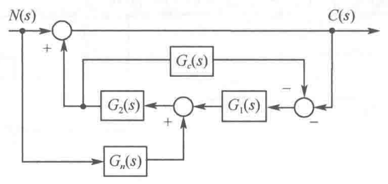

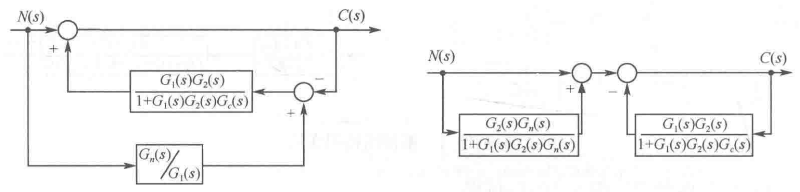

> Image description: This image shows two control system block diagrams illustrating an equivalent transformation of a system structure, captioned as "图 6－11－1 系统结构图等效变换." The left diagram features an input signal $N(s)$ and an output signal $C(s)$. The main forward path is direct from $N(s)$ to $C(s)$. There are two feedback loops: one inner loop containing a block $\frac{G_1(s)G_2(s)}{1+G_1(s)G_2(s)G_c(s)}$ and an outer loop with a block labeled $\frac{G_n(s)}{G_1(s)}$. Summing junctions manage the signal flow, including one that combines $C(s)$ (negative) and the output of the lower block (positive). The right diagram shows the equivalent transformed structure. The input $N(s)$ splits into two parallel paths: a lower path through a block $\frac{G_2(s)G_n(s)}{1+G_1(s)G_2(s)G_n(s)}$ and an upper path that leads to a summing junction. This is followed by another feedback loop containing the block $\frac{G_1(s)G_2(s)}{1+G_1(s)G_2(s)G_c(s)}$, resulting in the output $C(s)$.
图 6－11－1 系统结构图等效变换

为使系统输出完全不受扰动的影响，应使

$$
1+G_{2}(s) G_{n}(s)+G_{1}(s) G_{2}(s) G_{n}(s)=0
$$

于是得

$$
G_{n}(s)=-\frac{1}{G_{2}(s)\left[1+G_{1}(s)\right]}=-\frac{s^{2}}{1+K_{1}}
$$

系统对输入的开环传递函数为

$$
G(s)=\frac{G_{1}(s) G_{2}(s)}{1+G_{1}(s) G_{2}(s) G_{c}(s)}=\frac{K_{1}}{s\left(s+K_{1} K_{t}\right)}=\frac{\omega_{n}^{2}}{s\left(s+2 \zeta \omega_{n}\right)}
$$

按题意要求

$$
\sigma \%=\mathrm{e}^{-\pi \zeta / \sqrt{1-\zeta^{2}}}=25 \%, \quad t_{p}=\frac{\pi}{\omega_{n} \sqrt{1-\zeta^{2}}}=2 \mathrm{~s}
$$

从而解得


<!-- source_pdf_page: 204 -->
$$
\zeta=\frac{\ln 4}{\sqrt{\pi^{2}+(\ln 4)^{2}}}=0.404, \quad \omega_{n}=\frac{\pi}{2 \sqrt{1-\zeta^{2}}}=1.717 \mathrm{rad} / \mathrm{s}
$$

因此

$$
K_{1}=\omega_{n}^{2}=2.948, \quad K_{t}=\frac{2 \zeta \omega_{n}}{K_{1}}=\frac{2 \zeta}{\omega_{n}}=0.471
$$

于是

$$
\begin{aligned}
& G_{c}(s)=K_{t} s=0.471 s \\
& G_{n}(s)=-0.253 s^{2}
\end{aligned}
$$

MATLAB 验证：
对复合控制系统进行 MATLAB 仿真，可得系统单位阶跃响应，如图6－11－2所示，测得

$$
\sigma \%=25 \%, \quad t_{p}=1.99 \mathrm{~s}, \quad t_{s}=5.89 \mathrm{~s}(\Delta=2 \%)
$$

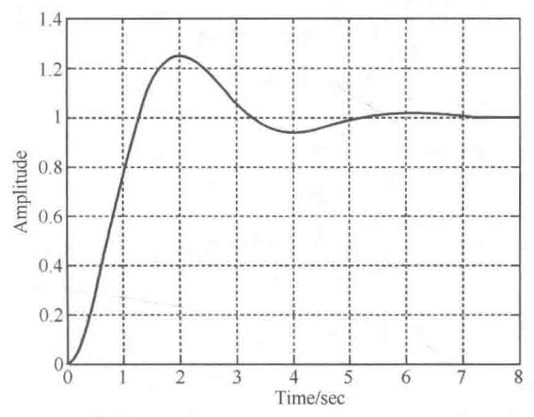

> Image description: The image shows a plot titled "图 6－11－2 复合控制系统时间响应（MATLAB）," depicting the time response of a composite control system. The graph features a Cartesian coordinate system with two axes: the horizontal x-axis is labeled "Time/sec" and ranges from 0 to 8, while the vertical y-axis is labeled "Amplitude" and ranges from 0 to 1.4. The plot displays a single continuous curve starting at the origin (0,0). The response shows an underdamped behavior: it rises sharply, reaching a peak amplitude of approximately 1.25 at around 2 seconds. It then oscillates, dipping to a minimum near 0.9 at 4 seconds and eventually stabilizing at a steady-state value of 1.0 as time approaches 8 seconds. This figure illustrates key engineering performance metrics such as rise time, overshoot, and settling time for the control system's step response.
图 6－11－2 复合控制系统时间响应（MATLAB）

MATLAB 程序 ：exe611．m
$\mathrm{K} 1=2.948 ; \mathrm{Kt}=0.471$ ；
$\mathrm{G} 1=\mathrm{K} 1 ; \mathrm{G} 2=\mathrm{tf}(1,[1,0,0])$ ；前向通道环节的传递函数
$\mathrm{Gc}=\mathrm{tf}([\mathrm{Kt}, 0], 1) ; ~ \%$ 测速发电机的传递函数
G3＝series（G1，G2）；G4＝feedback（ G3，Gc）；
$\mathrm{G}=$ feedback $(\mathrm{G} 4,1)$ ；
\％复合控制系统的闭环传递函数
step（G）；grid
\％复合控制系统单位阶跃响应
6－12 设复合校正控制系统如图 6－33 所示。图中
$G_{1}(s)=K_{1}, \quad K_{1}=2$

$$
\begin{array}{ll}
G_{2}(s)=\frac{K_{2}}{s(s+20 \zeta)}, & K_{2}=50, \zeta=0.5 \\
G_{r}(s)=\frac{\lambda_{2} s^{2}+\lambda_{1} s}{T s+1}, & T=0.2
\end{array}
$$

试确定 $\lambda_{1}$ 和 $\lambda_{2}$ 的数值，使系统等效为III型系统，并讨论寄生因式 $(T s+1)$ 对系统稳定性和动态性

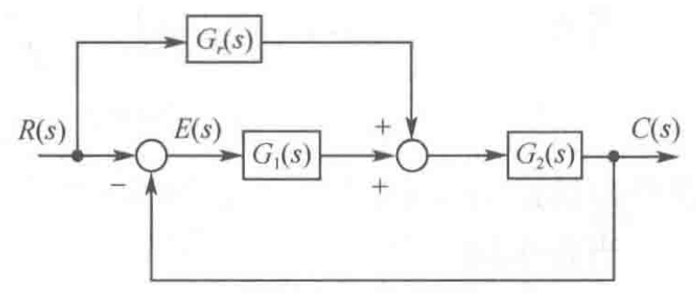

> Image description: This image is a control system block diagram labeled as "图6-33 ＊按输入补偿的复合控制系统结构图." The diagram illustrates a feedback loop with several transfer function blocks and signal summation points. The input variable $R(s)$ enters from the left. It splits into two paths: one goes directly to a summing junction, and the other passes through a feedforward block $G_r(s)$. The first summing junction subtracts a feedback signal from $R(s)$, resulting in an error signal $E(s)$. This signal $E(s)$ then passes through block $G_1(s)$. The output of $G_1(s)$ and the output of $G_r(s)$ are combined at a second summing junction. The resulting sum is passed through block $G_2(s)$, leading to the final system output $C(s)$. A feedback loop connects the output $C(s)$ back to the first summing junction. Arrows indicate the unidirectional flow of signals throughout the composite control system.
图6－33＊按输人补偿的复合控制系统结构图

能的影响。

解 本题主要考查按输人补偿的复合校正方法。先求出系统的等效开环传递函数，根据系统型别的定义确定参数 $\lambda_{1}$ 和 $\lambda_{2}$ ；再根据寄生因子 $\left(T_{s}+1\right)$ 对系统的闭环特征方程的改

[^0]
[^0]:    ＊图6－33 为《自动控制原理（第七版）》正文中的图。


<!-- source_pdf_page: 205 -->
变，讨论其对系统稳定性和动态性能的影响。
由系统的结构图可知，系统的闭环传递函数为

$$
\Phi(s)=\frac{G_{1}(s) G_{2}(s)+G_{r}(s) G_{2}(s)}{1+G_{1}(s) G_{2}(s)}
$$

则系统的等效开环传递函数为

$$
\begin{aligned}
G^{\prime}(s) & =\frac{\Phi(s)}{1-\Phi(s)}=\frac{G_{1}(s) G_{2}(s)+G_{r}(s) G_{2}(s)}{1-G_{r}(s) G_{2}(s)} \\
& =\frac{K_{1} K_{2}(T s+1)+K_{2}\left(\lambda_{2} s^{2}+\lambda_{1} s\right)}{T s^{3}+\left(1+20 \zeta T-K_{2} \lambda_{2}\right) s^{2}+\left(20 \zeta-K_{2} \lambda_{1}\right) s}
\end{aligned}
$$

若使系统等效为III型系统，则应有

$$
\left\{\begin{array}{l}
1+20 \zeta T-K_{2} \lambda_{2}=0 \\
20 \zeta-K_{2} \lambda_{1}=0
\end{array}\right.
$$

解得

$$
\left\{\begin{array}{l}
\lambda_{1}=\frac{20 \zeta}{K_{2}}=0.2 \\
\lambda_{2}=\frac{1+20 \zeta T}{K_{2}}=0.06
\end{array}\right.
$$

由上可知

$$
G_{r}(s)=\frac{0.06 s^{2}+0.2 s}{0.2 s+1}
$$

系统的闭环传递函数为

$$
\Phi(s)=\frac{G_{1}(s) G_{2}(s)+G_{r}(s) G_{2}(s)}{1+G_{1}(s) G_{2}(s)}=\frac{K_{2} \lambda_{2} s^{2}+\left(K_{1} K_{2} T+K_{2} \lambda_{1}\right) s+K_{1} K_{2}}{\left(s^{2}+20 \zeta s+K_{1} K_{2}\right)(T s+1)}
$$

可以看出，未加寄生因式 $(T s+1)$ 前，复合控制系统为二阶系统，因为阻尼比 $\zeta=0.5$ ，故为欠阻尼二阶系统；加入 $(T s+1)$ 后，可以使系统的超调量减少，调节时间缩短，提高系统的快速性。若 $(T s+1)$ 的时间常数越大，则系统响应的超调量越小。

MATLAB 验证：
当寄生因式不存在，即 $T=0$ ，则

$$
\Phi(s)=\frac{K_{2} \lambda_{2} s^{2}+K_{2} \lambda_{1} s+K_{1} K_{2}}{s^{2}+20 \zeta s+K_{1} K_{2}}=\frac{3 s^{2}+10 s+100}{s^{2}+10 s+100}
$$

其单位阶跃响应如图6－12－1所示，测得 $\sigma \%=59.6 \%, t_{p}=0.24 \mathrm{~s}, t_{s}=0.8 \mathrm{~s}$（ $\Delta=2 \%$ ）。
当寄生因式存在，$T=0.2$ ，则

$$
\Phi(s)=\frac{3 s^{2}+30 s+100}{0.2 s^{3}+3 s^{2}+30 s+100}
$$

其单位阶跃响应如图6－12－2所示，测得 $\sigma \%=34 \%, t_{p}=0.2 \mathrm{~s}, t_{s}=0.74 \mathrm{~s}$（ $\Delta=2 \%$ ）。
当寄生因式存在，$T=20$ ，则

$$
\Phi(s)=\frac{3 s^{2}+2010 s+100}{20 s^{3}+201 s^{2}+2010 s+100}
$$

其单位阶跃响应如图6－12－3所示，测得 $\sigma \%=16 \%, t_{s}=0.86 \mathrm{~s}$（ $\Delta=2 \%$ ）。
MATLAB 程序：exe612．m

$$
\begin{array}{ll}
\mathrm{G} 1=\operatorname{tf}([3,10,100],[1,10,100]) ; & \% \mathrm{~T}=0 \text { 时, 闭环系统传递函数 } \\
\mathrm{G} 2=\operatorname{tf}([3,30,100],[0.2,3,30,100]) ; & \% \mathrm{~T}=0.2 \text { 时, 闭环系统传递函数 }
\end{array}
$$


<!-- source_pdf_page: 206 -->
$\mathrm{G} 3=\mathrm{tf}([3,2010,100],[20,201,2010,100]) ;$
figure（1）；step（G1）；grid
figure（2）；step（G2）；grid
figure（3）；step（G3）；grid
$\% \mathrm{~T}=20$ 时，闭环系统传递函数

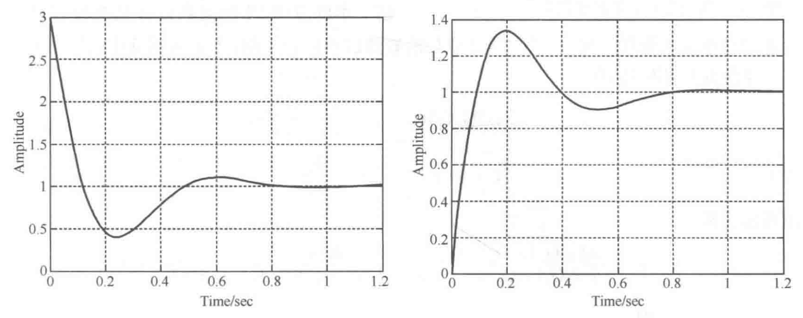

> Image description: The image contains two side-by-side time-domain response plots of a composite control system generated in MATLAB, labeled as Figure 6-12-1 (left) and Figure 6-12-2 (right). Both graphs share identical axes: the horizontal x-axis represents "Time/sec" ranging from 0 to 1.2, and the vertical y-axis represents "Amplitude." In Figure 6-12-1 ($T=0$), the system starts at an initial amplitude of 3.0 and exhibits a damped oscillatory response that settles toward a steady-state value of 1.0 after approximately 0.8 seconds. In Figure 6-12-2 ($T=0.2$), the system starts at an initial amplitude of 0, rises to a peak overshoot of approximately 1.3 around 0.2 seconds, and then oscillates slightly before settling at a steady-state value of 1.0. These plots illustrate how varying the parameter $T$ affects the transient response and stability of the control system.
图6－12－1 复合控制系统时间响应（ $T=0$ ，MATLAB）图6－12－2 复合控制系统时间响应（ $T=0.2$ ，MATLAB）

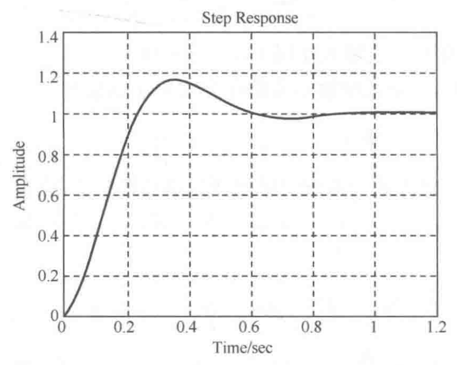

> Image description: This image displays a "Step Response" graph, typical of control systems engineering. The horizontal x-axis is labeled "Time/sec," ranging from 0 to 1.2 seconds with increments of 0.2. The vertical y-axis is labeled "Amplitude," ranging from 0 to 1.4 with increments of 0.2. The plot shows a single continuous curve starting at the origin (0,0). The response rises sharply, overshooting the steady-state value of 1.0 to reach a peak amplitude of approximately 1.18 at around 0.35 seconds. It then oscillates slightly downward before stabilizing and converging asymptotically toward an amplitude of 1.0 as time increases beyond 0.8 seconds. This behavior characterizes an underdamped second-order system response. The provided captions indicate this is a MATLAB simulation of a composite control system's time response for specific parameters ($T=0$ or $T=0.2$).
图6－12－3 复合控制系统时间响应（ $T=20$ ，MATLAB）

6－13 设组合驱动装置如图 6－44 所示。该装置由两个工作滑轮 $A$ 和 $B$ 组成，通过弹性皮带连在一起，挂在弹簧上的第三个拉力滑轮可以将皮带拉紧，而弹簧运动可以视为无摩擦的运动。在组合驱动装置中，主滑轮 $A$ 由直流电机驱动，滑轮 $A$ 和 $B$上都装有测速计，其输出电压与滑轮的转速成正比，利用测得的速度信号，可以估计每个滑轮的转角。

设组合驱动装置的转速控制系统如图 6－45 所示，其中被控对象为组合驱动装置，其传递函数

$$
G_{0}(s)=\frac{10}{(s+6)^{2}}
$$

$G_{c}(s)$ 为 PI 控制器，其传递函数

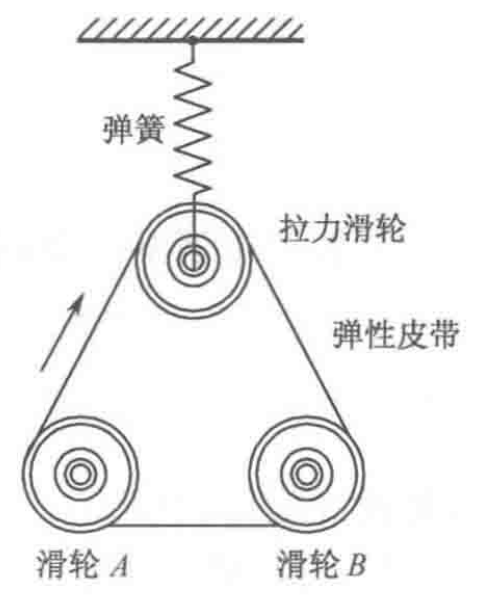

> Image description: A technical schematic titled "图6－44 组合驱动装置示意图" (Schematic of a Combined Drive Device) illustrates a belt-driven pulley system. The assembly consists of three pulleys arranged in a triangular configuration: two base pulleys labeled "滑轮 A" (Pulley A) and "滑轮 B" (Pulley B), and a top tensioning pulley labeled "拉力滑轮" (Tension Pulley). A "弹性皮带" (Elastic Belt) loops around all three pulleys. An arrow on the left side of the belt indicates its direction of motion. The tension pulley is connected to a fixed ceiling support via a "弹簧" (Spring), which applies downward pressure to maintain belt tension. The diagram represents an engineering mechanism designed for power transmission where a spring-loaded idler ensures constant tension in an elastic drive belt across multiple pulleys.
图6－44 组合驱动装置示意图


<!-- source_pdf_page: 207 -->
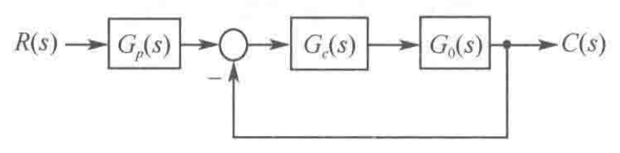

> Image description: This image is a control system block diagram labeled as "图 6－45 组合驱动装置转速控制系统结构图." The diagram illustrates a closed-loop feedback system represented in the s-domain. The signal flow begins with an input variable $R(s)$, which enters a block labeled $G_p(s)$. The output of this block leads into a summing junction (represented by a circle), where it is compared with a feedback signal. The resulting error signal flows forward through two sequential blocks: a controller $G_c(s)$ and a plant or process block $G_0(s)$. The final output variable is denoted as $C(s)$. A feedback loop connects the output $C(s)$ back to the summing junction, indicated by an arrow with a minus sign ($-$), signifying negative feedback. The layout follows standard engineering conventions for linear control systems, showing the relationship between the reference input, controllers, system dynamics, and the controlled output.

图 6－45 组合驱动装置转速控制系统结构图

$$
G_{c}(s)=K_{1}+\frac{K_{2}}{s}
$$

$G_{p}(s)$ 为前置滤波器。要求设计 $G_{c}(s)$ 和 $G_{p}(s)$ ，使系统具有最小节拍响应，且调节时间 $t_{s} \leqslant 1 \mathrm{~s}(\Delta=2 \%)$ 。

解 本题应用 PI 控制器设计具有良好动态性能的最小节拍系统。通常，控制器必须与前置滤波器联合应用，才能达到设计指标要求。

系统的开环传递函数

式中

$$
\begin{gathered}
G(s)=G_{c}(s) G_{0}(s) G_{p}(s)=\frac{K(s+z)}{s(s+6)^{2}} G_{p}(s) \\
K=10 K_{1}, \quad z=\frac{K_{2}}{K_{1}}
\end{gathered}
$$

闭环传递函数

$$
\Phi(s)=\frac{G_{c}(s) G_{0}(s) G_{p}(s)}{1+G_{c}(s) G_{0}(s)}=\frac{K(s+z)}{s^{3}+12 s^{2}+(36+K) s+K_{z}} G_{p}(s)
$$

令 $G_{p}(s)=\frac{z}{s+z}$ ，则

$$
\Phi(s)=\frac{K z}{s^{3}+12 s^{2}+(36+K) s+K z}
$$

该系统为I型系统，在单位阶跃输入作用下，$e_{\mathrm{s}}(\infty)=0$ 。
由教材中表 6－4 知，三阶系统最小节拍标准化传递函数为

$$
\Phi(s)=\frac{\omega_{n}^{3}}{s^{3}+\alpha \omega_{n} s^{2}+\beta \omega_{n}^{2} s+\omega_{n}^{3}}
$$

其中 $\alpha=1.9, \beta=2.20$ 。将上式与系统实际闭环传递函数相比，应有

$$
\alpha \omega_{n}=12, \quad \beta \omega_{n}^{2}=36+K, \quad \omega_{n}^{3}=K z
$$

故求出

$$
\omega_{n}=\frac{12}{\alpha}=6.32, \quad K=\beta \omega_{n}^{2}-36=51.87, \quad z=\frac{\omega_{n}^{3}}{K}=4.87
$$

于是

$$
K_{1}=\frac{K}{10}=5.187, \quad K_{2}=K_{1} z=25.26
$$

所求的 PI 控制器与前置滤波器为

$$
\begin{aligned}
& G_{c}(s)=K_{1}+\frac{K_{2}}{s}=5.187+\frac{25.26}{s} \\
& G_{p}(s)=\frac{z}{s+z}=\frac{4.87}{s+4.87}
\end{aligned}
$$

由教材中表 6－4 知，系统动态性能为

$$
\begin{aligned}
\sigma \% & =1.65 \%, t_{s}=\frac{4.04}{\omega_{n}} \\
& =0.64<1 \quad(\Delta=2 \%)
\end{aligned}
$$

满足设计指标要求。
MATLAB 验证：
应用 MATLAB 软件包，对驱动装置转速控制系统


<!-- source_pdf_page: 208 -->
$$
\Phi(s)=\frac{252.44}{s^{3}+12 s^{2}+87.87 s+252.44}
$$

进行仿真，其单位阶跃响应如图 6－13－1 所示，测得 $\sigma \%=2 \%, t_{s}=0.64 \mathrm{~s} \quad(\Delta=2 \%)$ 。

MATLAB 程序 ：exe613．m
$K 1=5.187 ; K 2=25.26 ; z=4.87$ ；
$\mathrm{Gc}=\mathrm{tf}([\mathrm{K} 1, \mathrm{~K} 2],[1,0])$ ；
\％PI 控制器的传递函数
$\mathrm{GO}=\mathrm{tf}(10,[1,12,36])$ ；
$\mathrm{Gp}=\mathrm{tf}(\mathrm{z},[1, \mathrm{z}])$ ；
$\%$ 前置滤波器的传递函数
G1 $=$ feedback $(\mathrm{Gc} * \mathrm{G} 0,1)$ ；
G2 $=\operatorname{series}(\mathrm{Gp}, \mathrm{G} 1)$ ；
\％系统的闭环传递函数
step（G2）；grid

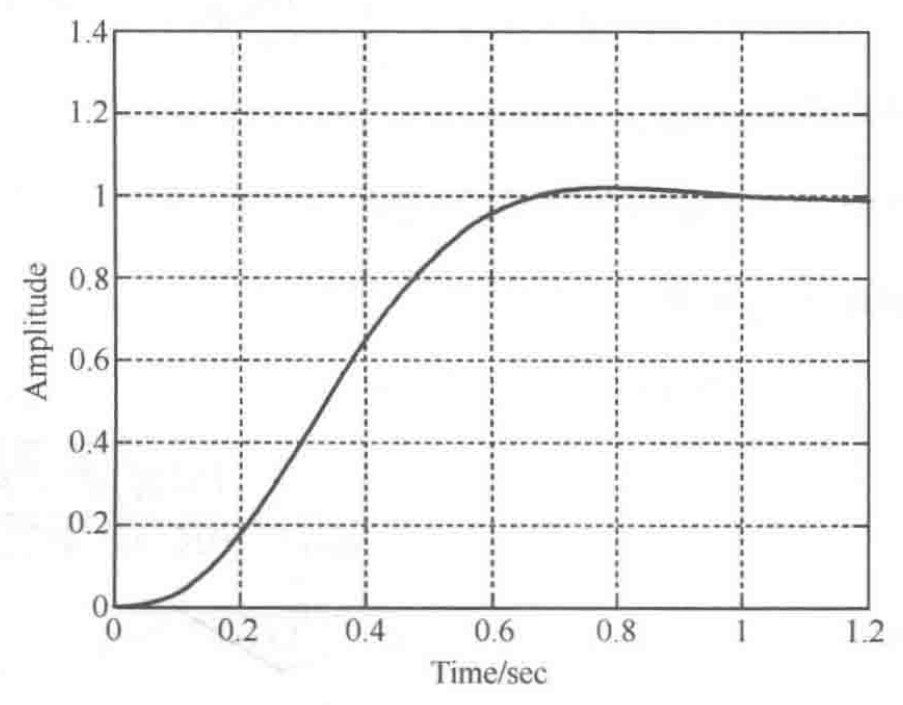

> Image description: The image shows a MATLAB-generated plot representing the time response of a drive device speed control system (as indicated by the Chinese caption "图6－13－1 驱动装置转速控制系统时间响应"). The graph features a Cartesian coordinate system. The horizontal x-axis is labeled "Time/sec" and ranges from 0 to 1.2 seconds, with major grid markings every 0.2 seconds. The vertical y-axis is labeled "Amplitude" and ranges from 0 to 1.4, with increments of 0.2. A single solid black curve illustrates the system's dynamic response to a step input. Starting at (0,0), the amplitude increases smoothly in an S-curve shape, crossing the 0.6 mark around 0.4 seconds. The signal reaches its first peak slightly above 1.0 at approximately 0.8 seconds before exhibiting a minor oscillation and stabilizing asymptotically toward a steady-state value of 1.0. This represents a typical underdamped second-order system response.
图6－13－1 驱动装置转速控制系统时间响应（MATLAB）

6－14 设有前置滤波器的鲁棒控制系统如图 6－46 所示，其中被控对象

$$
G_{0}(s)=\frac{10}{(s+1)(s+2)}
$$

PID 控制器

$$
G_{c}(s)=\frac{K_{3} s^{2}+K_{1} s+K_{2}}{s}
$$

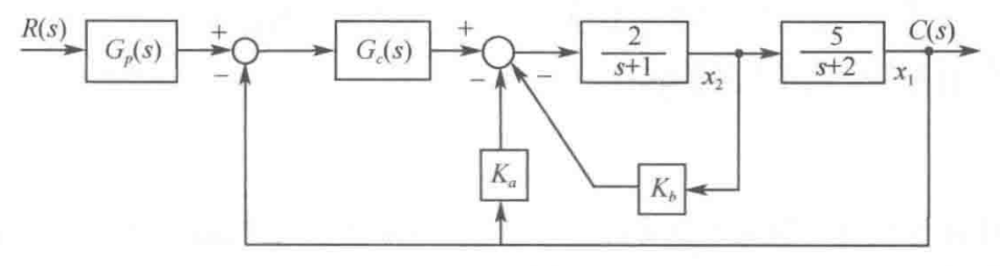

> Image description: This figure is a block diagram of a robust control system with a pre-filter, as indicated by the caption "图 6－46 具有前置滤波器的鲁棒控制系统结构图." The signal flow starts from an input $R(s)$ passing through a pre-filter block $G_p(s)$. This output enters a summing junction where it is compared with a feedback loop from the final output $C(s)$. The resulting error signal passes through a controller block $G_c(s)$ and into a second summing junction. This junction incorporates two negative feedback paths: one from a gain block $K_a$ and another from a gain block $K_b$. The output of this junction enters a plant stage consisting of two sequential transfer functions: $\frac{2}{s+1}$ (with output labeled $x_2$) and $\frac{5}{s+2}$ (with output labeled $x_1$), which equals the final system output $C(s)$. Arrows indicate the unidirectional flow of signals through these components.
图 6－46 具有前置滤波器的鲁棒控制系统结构图

$G_{p}(s)$ 为前置滤波器。设计要求：
（1）当 $K_{a}=10, K_{b}=0$ 时，设计 $G_{c}(s)$ 和 $G_{p}(s)$ ，使系统具有最小节拍响应，即系统在单位阶跃输入作用下 $e_{\mathrm{ss}}(\infty)=0, \sigma \% \leqslant 2 \%, t_{s} \leqslant 1 \mathrm{~s}(\Delta=2 \%)$ ；
（2）若 $G_{0}(s)$ 的两个极点发生 $\pm 50 \%$ 范围摄动，在最坏情况下，被控对象变为

$$
G_{0}(s)=\frac{10}{(s+0.5)(s+1)}
$$

试用（1）中的设计结果对系统性能进行考核，以检验系统的鲁棒性。
解 本题联合采用 PID 控制器与前置滤波器，使系统具有最小节拍响应，保证系统有良好的稳态性能和动态性能；同时，采用内回路反馈包围被控对象，以减少被控对象参数摄动的影响，使系统具有鲁棒性。
（1）PID 控制器与前置滤波器设计。内回路传递函数为
$K_{b}$ 包围部分 $\Phi_{1}(s)=\frac{2}{s+\left(1+2 K_{b}\right)}$


<!-- source_pdf_page: 209 -->
$K_{a}$ 包围部分 $\Phi_{2}(s)=\frac{\frac{5}{s+2} \Phi_{1}(s)}{1+\frac{5 K_{a}}{s+2} \Phi_{1}(s)}=\frac{10}{s^{2}+\left(3+2 K_{b}\right) s+\left(2+10 K_{a}+4 K_{b}\right)}$
开环传递函数为

$$
G(s)=G_{p}(s) G_{c}(s) \Phi_{2}(s)=\frac{10\left(K_{3} s^{2}+K_{1} s+K_{2}\right)}{s\left[s^{2}+\left(3+2 K_{b}\right) s+\left(2+10 K_{a}+4 K_{b}\right)\right]} G_{p}(s)
$$

闭环传递函数

$$
\begin{aligned}
\Phi(s) & =\frac{G(s)}{1+G_{c}(s) \Phi_{2}(s)} \\
& =\frac{10\left(K_{3} s^{2}+K_{1} s+K_{2}\right) G_{p}(s)}{s^{3}+\left(3+2 K_{b}+10 K_{3}\right) s^{2}+\left(2+10 K_{a}+4 K_{b}+10 K_{1}\right) s+10 K_{2}}
\end{aligned}
$$

选择

$$
G_{p}(s)=\frac{K_{2}}{K_{3} s^{2}+K_{1} s+K_{2}}
$$

可得

$$
\Phi(s)=\frac{10 K_{2}}{s^{3}+\left(3+2 K_{b}+10 K_{3}\right) s^{2}+\left(2+10 K_{a}+4 K_{b}+10 K_{1}\right) s+10 K_{2}}
$$

显然，系统在阶跃输入作用下，必有 $e_{\mathrm{s}}(\infty)=0$ 。
为了使系统成为最小节拍系统，根据教材中表 6－4，应有

$$
\Phi(s)=\frac{\omega_{n}^{3}}{s^{3}+1.9 \omega_{n} s^{2}+2.2 \omega_{n}^{2} s+\omega_{n}^{3}}
$$

当 $K_{a}=10, K_{b}=0$ 时，系统实际闭环传递函数为

$$
\Phi(s)=\frac{10 K_{2}}{s^{3}+\left(3+10 K_{3}\right) s^{2}+\left(102+10 K_{1}\right) s+10 K_{2}}
$$

对于三阶最小节拍系统，调节时间要求

$$
t_{s}=\frac{4.04}{\omega_{n}} \leqslant 1
$$

考虑到系统的鲁棒性要求，取 $t_{s}=0.5$ ，故应有 $\omega_{n}=8.08$ 。令标准化传递函数与实际闭环传递函数的对应项系数相等，可得 PID 控制器参数

$$
K_{1}=4.16, \quad K_{2}=52.75, \quad K_{3}=1.24
$$

于是 PID 控制器和前置滤波器为

$$
G_{c}(s)=4.16+\frac{52.75}{s}+1.24 s, \quad G_{p}(s)=\frac{52.75}{1.24 s^{2}+4.16 s+52.75}
$$

系统的实际性能为

$$
e_{s s}(\infty)=0, \quad \sigma \%=1.65 \%, \quad t_{s}=0.5 s(\Delta=2 \%)
$$

（2）鲁棒性检验。在最坏情况下，被控对象传递函数

$$
G_{0}(s)=\frac{10}{(0.5 s+1)(s+1)}=\frac{20}{(s+1)(s+2)}
$$

表明被控对象极点位置摄动 $50 \%$ ，相当于对象增益加大一倍。
内回路传递函数

$$
\Phi_{2}(s)=\frac{20}{s^{2}+\left(3+2 K_{b}\right) s+\left(2+20 K_{a}+4 K_{b}\right)}
$$

由于

$$
G_{c}(s)=\frac{K_{3} s^{2}+K_{1} s+K_{2}}{s}, \quad G_{p}(s)=\frac{K_{2}}{K_{3} s^{2}+K_{1} s+K_{2}}
$$


<!-- source_pdf_page: 210 -->
所以，开环传递函数

$$
G(s)=G_{p}(s) G_{c}(s) \Phi_{2}(s)=\frac{20 K_{2}}{s\left[s^{2}+\left(3+2 K_{b}\right) s+\left(2+20 K_{a}+4 K_{b}\right)\right]}
$$

闭环传递函数
$\Phi(s)=\frac{G(s)}{1+G_{c}(s) \Phi_{2}(s)}=\frac{20 K_{2}}{s^{3}+\left(3+2 K_{b}+20 K_{3}\right) s^{2}+\left(2+20 K_{a}+4 K_{b}+20 K_{1}\right) s+20 K_{2}}$代人上步设计结果 $K_{a}=10, K_{b}=0, K_{3}=1.24, K_{2}=52.75, K_{1}=4.16$ ，得

$$
\Phi(s)=\frac{1055}{s^{3}+27.8 s^{2}+285.2 s+1055}
$$

应用 MATLAB 软件包，可得系统在单位阶跃输入作用下的响应，如图6－14－1所示，测得

$$
e_{s s}(\infty)=0, \quad \sigma \%=0, \quad t_{s}=0.626 \mathrm{~s}
$$

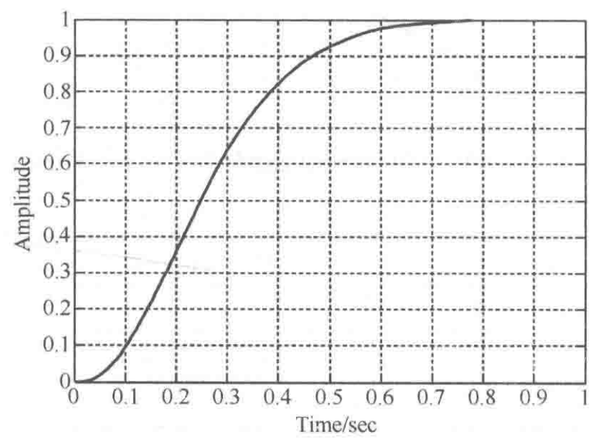

> Image description: The image shows a plot titled "图 6-14-1 系统单位阶跃响应 (MATLAB)," representing the unit step response of a system. The graph is plotted on a Cartesian coordinate system with two axes: the horizontal x-axis is labeled "Time/sec" and ranges from 0 to 1, while the vertical y-axis is labeled "Amplitude" and ranges from 0 to 1. The plot displays a smooth, monotonically increasing curve that starts at the origin (0,0) and asymptotically approaches a steady-state value of 1 as time increases. The curve exhibits a characteristic S-shape typical of higher-order system responses. A grid of dashed lines is overlaid on the plot to facilitate reading specific values. In engineering terms, this figure illustrates how the system's output evolves over time when subjected to a unit step input, showing its transient behavior and final value.
图 6－14－1 系统单位阶跃响应（MATLAB）

MATLAB 程序 ：exe614．m
$\mathrm{t}=0: 0.01: 1$ ；
$\mathrm{Ka}=10 ; \mathrm{Kb}=0 ; \mathrm{K} 1=4.16 ; \mathrm{K} 2=52.75 ; \mathrm{K} 3=1.24$ ；
$\mathrm{G} 1=\mathrm{tf}(20 * \mathrm{~K} 2,[1,3+2 * \mathrm{~Kb}+20 * \mathrm{~K} 3,2+20 * \mathrm{Ka}+4 * \mathrm{~Kb}+20 * \mathrm{~K} 1,20 * \mathrm{~K} 2])$ ；\％系统闭环传递函数 step（ G1，t）；grid
仿真表明在参数变化情况下，系统的性能仍然满足设计指标要求，具有良好的鲁棒性。
当 $K_{b} \neq 0$ 时，可令 $K_{b}$ 为各种可能的数值重做本题，并进行相应的 MATLAB 仿真。
6－15 NASA 的宇航员可以在航天飞机中通过控制机械手将卫星回收到航天飞机的货舱中，如图 6－47（a）所示，图中显示宇航员站在机械臂上工作的情况。该卫星回收系统结构图如图 6－47（b）所示。要求：
（1）当 $T=0.1$ 时，确定 $K_{a}$ 的取值，使系统的相角裕度 $\gamma=50^{\circ}$ ；
（2）当 $T=0.5$ 时，仍采用（1）中确定的 $K_{a}$ ，求此时系统的相角裕度 $\gamma_{1}$ ；
（3）当 $T=0.5$ 时，若要求 $\gamma_{1}=50^{\circ}$ ，试问 $K_{a}$ 值应如何改变？
解 本题为延迟系统的参数设计问题。
延迟环节的幅相特性为

$$
\left.\mathrm{e}^{-s T}\right|_{s=j_{\omega}}=1 \cdot \angle-57.3 T \omega
$$

表明 $\mathrm{e}^{-\mathrm{j} \omega T}$ 不影响开环频率特性的幅值，但会造成相频特性的明显滞后。令


<!-- source_pdf_page: 211 -->
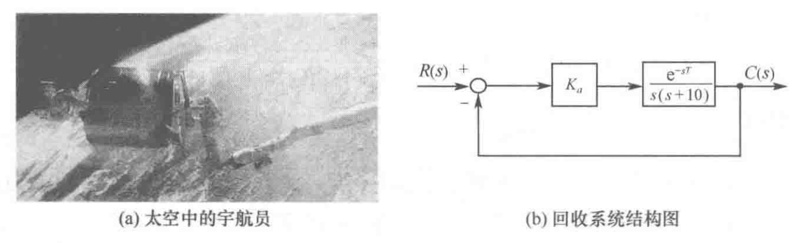

> Image description: This figure, titled "图6－47 卫星回收控制系统" (Satellite Recovery Control System), consists of two parts. Part (a) is a grayscale photograph showing astronauts in space near a spacecraft. Part (b) is a control system block diagram. The block diagram illustrates a closed-loop feedback system. The input signal $R(s)$ enters a summing junction, where it is compared with the feedback signal from the output $C(s)$. The resulting error signal passes through a gain block labeled $K_a$, which then feeds into a plant transfer function represented by the expression $\frac{e^{-sT}}{s(s+10)}$. This second block incorporates a time delay element $e^{-sT}$ and a second-order system denominator. Arrows indicate the unidirectional flow of signals from left to right, with a feedback loop returning the output $C(s)$ to the initial summing junction. The diagram represents the mathematical modeling of the satellite recovery process.
图6－47 卫星回收控制系统

$$
G(s)=\frac{K_{a}}{s(s+10)}, \quad\left|G\left(\mathrm{j} \omega_{c}\right)\right|=\frac{K_{a}}{\omega_{c} \sqrt{\omega_{c}^{2}+10^{2}}}=1
$$

解出系统截止频率

$$
\omega_{c}=\sqrt{-50+\sqrt{2500+K_{a}^{2}}}
$$

故相角裕度

$$
\gamma=180^{\circ}-90^{\circ}-\arctan 0.1 \omega_{c}-57.3 T \omega_{c}
$$

于是，可以算出如下表格：

| $K_{a}$ | 2 | 5 | 10 | 11.5 | 12 | 20 | 30 | 37 |
| :--- | :--- | :--- | :--- | :--- | :--- | :--- | :--- | :--- |
| $\omega_{c}$ | 0.2 | 0.5 | 1.0 | 1.14 | 1.19 | 1.96 | 2.88 | 3.49 |
| $\gamma(T=0.1)$ | $87.7^{\circ}$ | $84.3^{\circ}$ | $78.6^{\circ}$ | $77.0^{\circ}$ | $76.4^{\circ}$ | $67.7^{\circ}$ | $57.4^{\circ}$ | $50.8^{\circ}$ |
| $\gamma_{1}(T=0.5)$ | $83.1^{\circ}$ | $72.8^{\circ}$ | $55.6^{\circ}$ | $50.8^{\circ}$ | $49.1^{\circ}$ | $22.8^{\circ}$ | $-8.6^{\circ}$ | $-29.2^{\circ}$ |


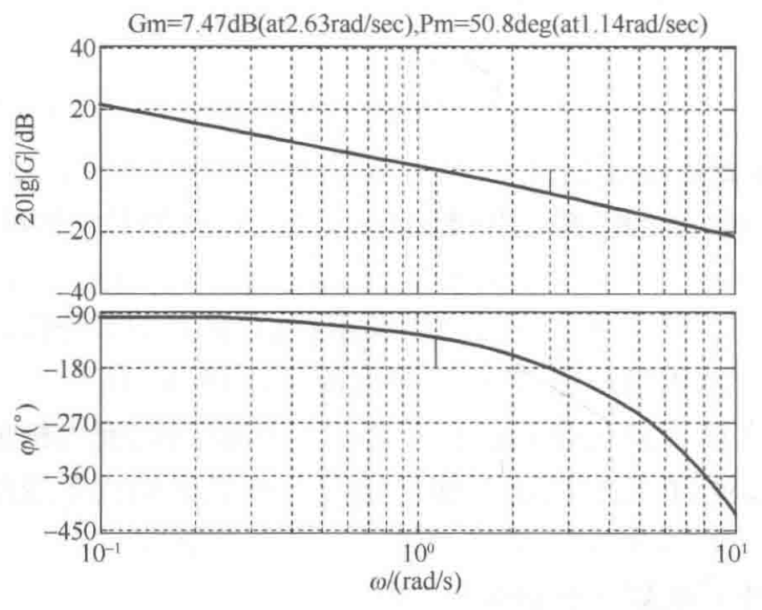

> Image description: This figure presents the open-loop Bode plot of a satellite recovery system, generated via MATLAB. It consists of two vertically aligned graphs sharing a logarithmic frequency axis ($\omega$) measured in rad/s, ranging from $10^{-1}$ to $10^1$. The upper graph displays the magnitude plot, with the vertical axis labeled as $20\lg|G|/\text{dB}$. The magnitude decreases linearly across the frequency range. The lower graph shows the phase plot, with the vertical axis labeled $\phi/(^\circ)$, showing a phase shift that drops from approximately $-90^\circ$ toward $-450^\circ$. Text at the top specifies stability margins: a gain margin ($\text{Gm}$) of $7.47\text{dB}$ at $2.63\text{rad/sec}$ and a phase margin ($\text{Pm}$) of $50.8\text{deg}$ at $1.14\text{rad/sec}$. These values are indicated on the plots by vertical dashed lines connecting the magnitude and phase curves to their respective critical points, used in control engineering to evaluate system stability.
图 6－15－1 卫星回收系统开环 Bode 图（MATLAB）

由表可知：
（1）$T=0.1$ 时，取 $K_{a}=37$ ，可以保证 $\gamma=50^{\circ}$ ；
（2）$T=0.5$ 时，仍取 $K_{a}=37$ ，则 $\gamma_{1}=-29.2^{\circ}$ ，系统不稳定；
（3）$T=0.5$ 时，若要求 $\gamma_{1}=50^{\circ}$ ，则应取 $K_{a}=11.5$ 。

MATLAB 验证：令 $T=0.5, K_{a}=$ 11.5 ，则

$$
G(s)=\frac{11.5 \mathrm{e}^{-0.5 s}}{s(s+10)}
$$

其开环系统的 Bode 图如图 6－15－1 所示，测得

$$
\omega_{c}=1.14 \mathrm{rad} / \mathrm{s}, \quad \gamma=50.8^{\circ}
$$

$$
h(\mathrm{~dB})=7.47 \mathrm{~dB}
$$

在 MATLAB 的 Simulink 环境下搭建系统结构图，如图 6－15－2 所示。设置延迟时间为 0.5 s ，仿真时间为 10 s ，运行可得系统的单位阶跃响应输出如图 6－15－3 所示，由图测得

$$
\sigma \%=19 \%, \quad t_{p}=2.21 \mathrm{~s}, \quad t_{s}=4.51 \mathrm{~s}(\Delta=2 \%)
$$


<!-- source_pdf_page: 212 -->
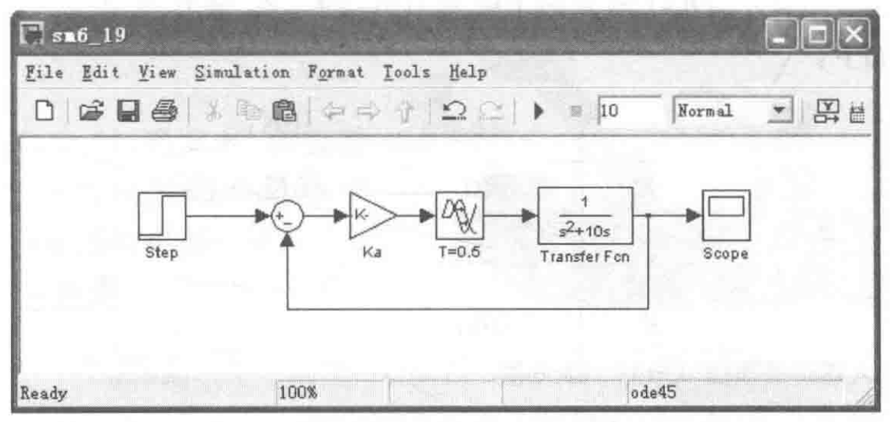

> Image description: A screenshot of a MATLAB Simulink model titled "sm6_19" illustrates a control system for satellite recovery, as indicated by the caption "图 6－15－2 卫星回收系统 Simulink 仿真图." The block diagram consists of several interconnected components arranged linearly from left to right. The process begins with a "Step" input block, which feeds into a summing junction (a circle with a plus and minus sign). This is followed by a gain block labeled "Ka" and a transport delay block labeled "T=0.5." The signal then enters a "Transfer Fcn" block defined by the mathematical expression $1 / (s^2 + 10s)$. Finally, the output is connected to a "Scope" for visualization. A feedback loop returns the output of the transfer function back to the negative terminal of the summing junction. Arrows indicate the unidirectional flow of signals through these blocks, representing a closed-loop control system simulation using the ode45 solver.
图 6－15－2 卫星回收系统 Simulink 仿真图

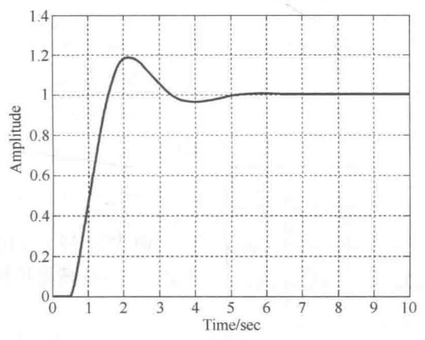

> Image description: The image shows a time-domain response plot from a Simulink simulation of a satellite recovery system (as indicated by the caption "图 6－15－2 卫星回收系统 Simulink 仿真图"). The graph features a vertical y-axis labeled "Amplitude" ranging from 0 to 1.4 and a horizontal x-axis labeled "Time/sec" ranging from 0 to 10. The plotted curve represents a system response that remains at zero until approximately 0.5 seconds, after which it rises sharply. The signal exhibits an overshoot, reaching a peak amplitude of approximately 1.2 at around 2 seconds. It then undergoes damped oscillations, dipping slightly below the steady-state value before stabilizing at an amplitude of 1.0 starting from roughly 6 seconds. This behavior is characteristic of an underdamped second-order system response to a step input, illustrating the system's stability and convergence toward its target setpoint over time.
图 6－15－3 卫星回收系统的时间响应（MATLAB）

MATLAB 程序 ：exe615．m

$$
\begin{aligned}
& \mathrm{T}=0.5 ; \mathrm{Ka}=11.5 ; \\
& \mathrm{G}=\mathrm{tf}\left(\mathrm{Ka},[1,10,0], \text { 'iodelay' }^{\prime}, 0.5\right) ; \\
& \operatorname{margin}(\mathrm{G}) ; \operatorname{grid}
\end{aligned}
$$

6－16 已知汽车点火系统中有一个单位负反馈子系统，其开环传递函数为 $G_{c}(s) G_{0}(s)$ ，其中

$$
G_{0}(s)=\frac{10}{s(s+10)}, \quad G_{c}(s)=K_{1}+\frac{K_{2}}{s}
$$

若已知 $K_{2} / K_{1}=0.5$ ，试确定 $K_{1}$ 和 $K_{2}$ 的取值，使系统主导极点的阻尼比 $\zeta=0.707$ ，而且单位阶跃响应的调节时间 $t_{s} \leqslant 2 \mathrm{~s}(\Delta=5 \%)$ 。

解 本题练习根据系统阻尼比与调节时间的指标要求，设计 PI 控制器参数。设计方法采用了试探法。

系统开环传递函数

$$
G_{c}(s) G_{0}(s)=\frac{10 K_{1}\left(s+K_{2} / K_{1}\right)}{s^{2}(s+10)}=\frac{10 K_{1}(s+0.5)}{s^{2}(s+10)}
$$

闭环特征方程


<!-- source_pdf_page: 213 -->
$$
D(s)=s^{3}+10 s^{2}+10 K_{1} s+5 K_{1}=0
$$

列劳斯表如下：

| $s^{3}$ | 1 | $10 K_{1}$ |
| :---: | :---: | :---: |
| $s^{2}$ | 10 | $5 K_{1}$ |
| $s^{1}$ | $9.5 K_{1}$ |  |
| $s^{0}$ | $5 K_{1}$ |  |

由劳斯判据知，选 $K_{1}>0$ ，便可以保证闭环系统的稳定性。
试取 $K_{1}=5$ ，则闭环特征方程为

$$
s^{3}+10 s^{2}+50 s+25=(s+0.56)\left(s^{2}+9.44 s+44.71\right)=0
$$

故闭环极点

$$
s_{1}=-0.56, \quad s_{2,3}=-4.72 \pm \mathbf{j} 4.74
$$

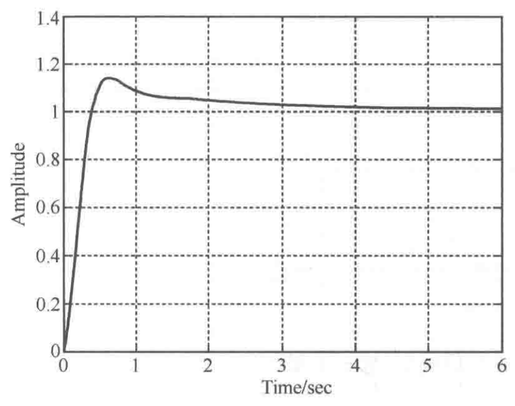

> Image description: The image shows a plot titled "图 6－16－1 汽车点火子系统的时间响应（MATLAB）," depicting the time response of an automotive ignition subsystem. The graph features a Cartesian coordinate system with two axes: the horizontal x-axis is labeled "Time/sec" and ranges from 0 to 6 seconds, while the vertical y-axis is labeled "Amplitude" and ranges from 0 to 1.4. The plot displays a single continuous curve starting at the origin (0,0). The response rises sharply, reaching a peak amplitude of approximately 1.15 at around 0.6 seconds. Following this overshoot, the signal exhibits a slight oscillation before gradually decaying and stabilizing toward a steady-state value of 1.0 as time progresses toward 6 seconds. This represents a typical underdamped second-order system response in engineering, characterized by rise time, peak overshoot, and settling time.
图 6－16－1 汽车点火子系统的时间响应（MATLAB）

其中，闭环极点 $s_{1}=-0.56$ 与闭环零点 $z=$ － 0.5 近似对消，故系统主导极点为 $s_{2,3}$ ，其阻尼比 $\zeta=0.709 \approx 0.707$ ，预期调节时间

$$
t_{s}=\frac{3.5}{\zeta \omega_{n}}=\frac{3.5}{4.72}=0.74 \mathrm{~s}(\Delta=5 \%)
$$

由于 $s_{1}$ 与 $z$ 不能准确对消，故实际调节时间 $t_{\mathrm{s}} \approx 2 \mathrm{~s}$ ，满足指标要求，于是最终得

$$
K_{1}=5, \quad K_{2}=2.5
$$

MATLAB 验证：
应用 MATLAB 软件包，对汽车点火子系统

$$
\Phi(s)=\frac{50(s+0.5)}{s^{3}+10 s^{2}+50 s+25}
$$

进行仿真，其单位阶跃响应如图 6－16－1 所示，测得

$$
\sigma \%=14 \%, \quad t_{p}=0.6 \mathrm{~s}, \quad t_{s}=1.55 \mathrm{~s}(\Delta=5 \%)
$$

MATLAB 程序 ：exe616．m

$$
\begin{aligned}
& \mathrm{K} 1=5 ; \mathrm{K} 2=2.5 ; \\
& \mathrm{G} 0=\mathrm{tf}(10,[1,10,0]) ; \\
& \mathrm{Gc}=\mathrm{tf}([\mathrm{~K} 1, \mathrm{~K} 2],[1,0]) ; \\
& \mathrm{G}=\operatorname{series}(\mathrm{G} 0, \mathrm{Gc}) ; \\
& \mathrm{G} 1=\operatorname{feedback}(\mathrm{G}, 1) ; \\
& \text { step }(\mathrm{G} 1) ; \operatorname{grid}
\end{aligned}
$$

6－17 机器人已广泛应用于核电站的维护与保养。在核工业中，远程机器人主要用来回收和处理核废料，同时也用于监控核反应堆、清除放射性污染和处理意外事故等。图 6－48所示的是核工厂的遥控机器人示意图，其构成的远程监控系统可以完成某些特定操作的监测任务。若系统的开环传递函数为


<!-- source_pdf_page: 214 -->
$$
G_{0}(s)=\frac{K_{a} \mathrm{e}^{-s T}}{(s+1)(s+3)}
$$

要求：
（1）当 $T=0.5 \mathrm{~s}$ 时，确定 $K_{a}$ 的合适取值，使系统阶跃响应的超调量小于 $30 \%$ ，并计算所得系统的稳态误差；
（2）设计校正网络

$$
G_{c}(s)=\frac{s+2}{s+b}
$$

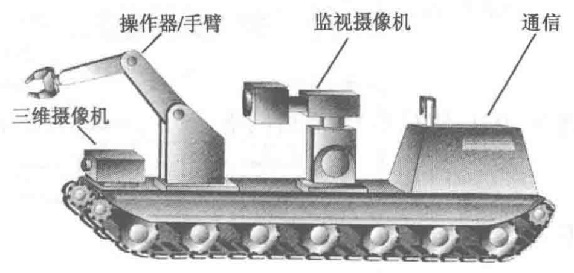

> Image description: A black-and-white technical schematic (Figure 6-48) illustrates a remote-controlled robot designed for nuclear power plants. The robot features a tracked chassis for mobility, supporting several integrated components labeled in Chinese. From left to right, the labels and their corresponding parts are: 1. **三维摄像机** (3D Camera): A small sensor unit mounted at the front of the chassis. 2. **操作器/手臂** (Manipulator/Arm): A jointed robotic arm capable of extending forward and upward, ending in a gripper. 3. **监视摄像机** (Monitoring Camera): A camera mounted on a central pedestal for environmental surveillance. 4. **通信** (Communication): An antenna-like structure located at the rear section of the robot's body. The figure demonstrates an engineering design focused on remote inspection and manipulation in hazardous environments, combining mobility, visual feedback via dual camera systems, and remote communication capabilities.
图6－48 核电厂的遥控机器人示意图

以改进要求（1）中所得系统的性能，使系统的稳态误差小于 $12 \%$ 。
解 本题研究延迟系统的分析与设计问题。通常，在频域中进行设计比较方便，通过选择合适的系统截止频率和相角裕度，可以满足给定的稳态误差和动态性能要求。
（1）确定待校正系统增益 $K_{a}$ ，并计算 $e_{s s}(\infty)$ 。系统开环传递函数

$$
G_{0}(s)=\frac{K_{a} \mathrm{e}^{-0.5 s}}{s^{2}+4 s+3}
$$

因为要求 $\sigma \%<30 \%$ ，由《自动控制原理（第七版）》教材中图3－12表示的欠阻尼二阶系统 $\zeta$与 $\sigma \%$ 关系曲线知，应有 $\zeta>0.36$ 。现取 $\zeta=0.4$ ，由教材中图 $5-46$ 表示的典型二阶系统的 $\gamma \zeta$曲线知，$\gamma=43^{\circ}$ 。

因

$$
\left.\mathrm{e}^{-0.5 s}\right|_{s=j \omega}=1 \cdot \angle-57.3 \times 0.5 \omega
$$

令

$$
\left|G_{0}\left(\mathrm{j} \omega_{c}\right)\right|=\frac{K_{a}}{\sqrt{\left(3-\omega_{c}^{2}\right)^{2}+16 \omega_{c}^{2}}}=1
$$

解出截止频率

$$
\omega_{c}=\sqrt{-5+\sqrt{K_{a}^{2}+16}}
$$

而相角裕度

$$
\gamma=180^{\circ}-\arctan \omega_{c}-\arctan \frac{\omega_{c}}{3}-28.65 \omega_{c}
$$

则 $K_{a} 、 \omega_{c} 、 \gamma$ 关系如下表：

| $K_{a}$ | 3.1 | 4.0 | 6.0 | 6.5 | 7.0 |
| :--- | :--- | :--- | :--- | :--- | :--- |
| $\omega_{c}$ | 0.25 | 0.81 | 1.49 | 1.62 | 1． 75 |
| $\gamma$ | $154^{\circ}$ | $102.7^{\circ}$ | $54.6^{\circ}$ | $46.9^{\circ}$ | $39.4^{\circ}$ |

由表可取 $K_{a}=6.5, \omega_{c}=1.62, \gamma=46.9^{\circ}$ 。由教材中图 5－46 可以查出：$\zeta=0.45$ 。由于静态位置系数 $K_{p}=K_{a} / 3=2.17$ ，故稳态误差

$$
e_{s}(\infty)=\frac{1}{1+K_{p}}=31.5 \%>12 \%
$$

（2）设计校正网络，改善系统性能。开环传递函数

$$
G_{c}(s) G_{0}(s)=\frac{K_{a}(s+2) \mathrm{e}^{-0.5 s}}{(s+1)(s+3)(s+b)}
$$


<!-- source_pdf_page: 215 -->
静态位置误差系数

$$
K_{p}=\frac{2 K_{a}}{3 b}
$$

选 $b=0.1$ ，使 $G_{c}(s)$ 为滞后网络，则 $K_{p}=6.67 K_{a}$ ，故

$$
e_{\mathrm{s}}(\infty)=\frac{1}{1+K_{p}}=\frac{1}{1+6.67 K_{a}}
$$

取 $e_{s s}(\infty)=10 \%$ ，求出 $K_{a}=1.35$ ，可满足 $e_{s s}(\infty)<12 \%$ 的要求。令

$$
\left|G_{c}\left(\mathrm{j} \omega_{c}\right) G_{0}\left(\mathrm{j} \omega_{c}\right)\right|=\frac{1.35 \sqrt{4+\omega_{c}^{2}}}{\sqrt{\left(1+\omega_{c}^{2}\right)\left(9+\omega_{c}^{2}\right)\left(0.01+\omega_{c}^{2}\right)}}=1
$$

求出

$$
\omega_{c}=0.75 \mathrm{rad} / \mathrm{s}
$$

算出相角裕度

$$
\gamma=180^{\circ}+\arctan \frac{\omega_{c}}{2}-\arctan \omega_{c}-\arctan \frac{\omega_{c}}{3}-\arctan 10 \omega_{c}-28.65 \omega_{c}=45.8^{\circ}
$$

校正后系统的动态性能可以估算如下：

$$
\begin{aligned}
\sigma \% & =100\left[0.16+0.4\left(\frac{1}{\sin \gamma}-1\right)\right] \%=31.8 \% \\
K_{0} & =2+1.5\left(\frac{1}{\sin \gamma}-1\right)+2.5\left(\frac{1}{\sin \gamma}-1\right)^{2}=2.98 \\
t_{s} & =\frac{K_{0} \pi}{\omega_{c}}=12.48 \mathrm{~s}
\end{aligned}
$$

上述估算结果是偏保守的，需要进一步验证。
MATLAB－Simulink 仿真验证：
校正前：

$$
G_{0}(s)=\frac{6.5 \mathrm{e}^{-0.5 s}}{(s+1)(s+3)}
$$

校正后：

$$
G_{c}(s) G_{0}(s)=\frac{1.35(s+2) \mathrm{e}^{-0.5 s}}{(s+0.1)(s+1)(s+3)}
$$

在 MATLAB 的 Simulink 环境下搭建系统校正前后结构图，分别如图 6－17－1 和图6－17－2所示。设置延迟时间为 0.5 s ，仿真时间为 20 s ，分别运行可得系统校正前后的单位阶跃响应输出如图 6－17－3 和图 6－17－4 所示。

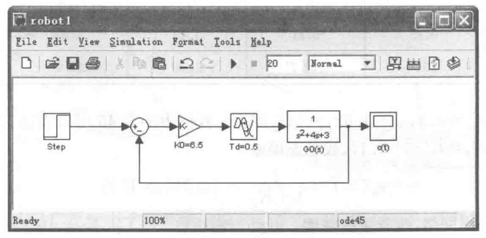

> Image description: A grayscale image shows a MATLAB Simulink block diagram for a control system. The signal flow begins with a "Step" input block, which feeds into a summing junction. From the summing junction, the signal passes through a gain block labeled $K_0=6.5$, followed by a transport delay block labeled $T_d=0.5$. This enters a transfer function block $G_0(s)$ defined as $\frac{1}{s^2+4s+3}$. The output of this block is connected to a scope labeled $\alpha(t)$. A feedback loop returns the system's output from after the transfer function back to the summing junction. The software interface indicates a simulation time setting of 20 seconds and uses the "ode45" solver. Engineering-wise, this represents a closed-loop control system with a second-order plant, incorporating both proportional gain and a time delay in the forward path to analyze its step response.
图 6－17－1 校正前遥控机器人 Simulink 仿真图


<!-- source_pdf_page: 216 -->
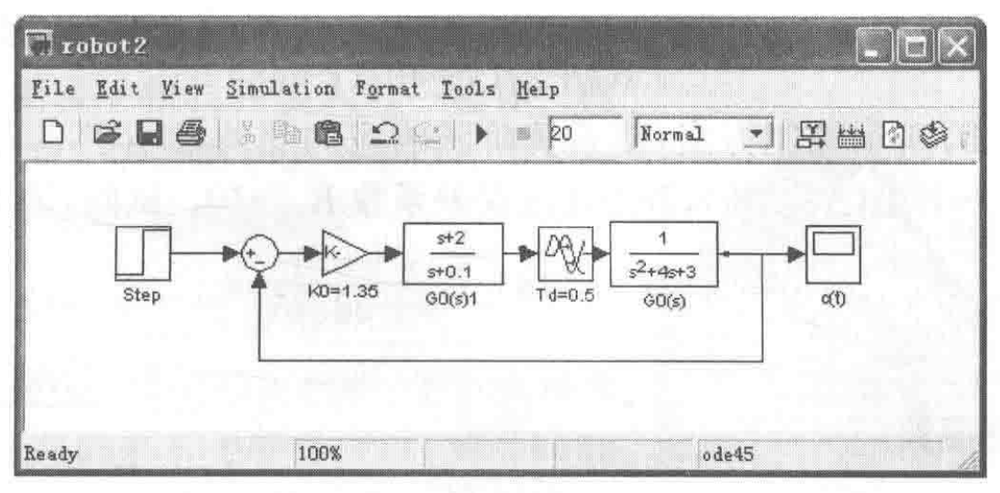

> Image description: A screenshot of a Simulink simulation window titled "robot2" shows a closed-loop control system for a remote-controlled robot. The block diagram consists of several interconnected components linked by arrows indicating signal flow. The process begins with a "Step" input block feeding into a summing junction. This is followed by a gain block labeled $K0=1.35$. Next, the signal passes through a transfer function block $G0(s) = \frac{s+2}{s+0.1}$, then a block labeled $Td=0.5$, and finally another transfer function block $G0(s) = \frac{1}{s^2+4s+3}$. The output is connected to a scope block labeled $\alpha(t)$. A feedback loop returns the final output signal back to the initial summing junction. The software interface includes standard menus (File, Edit, View, etc.) and a simulation toolbar with a time setting of "20" and solver "ode45". The caption identifies this as Figure 6-17-2, showing the corrected Simulink simulation for a remote-controlled robot.
图 6－17－2 校正后遥控机器人 Simulink 仿真图

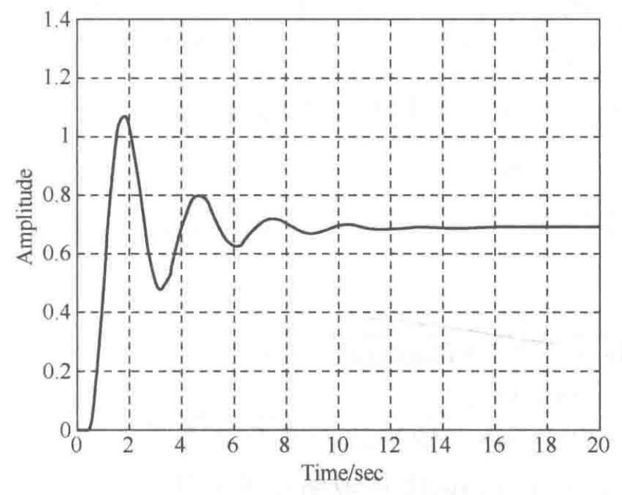

> Image description: A line graph showing the Simulink simulation results for a corrected teleoperated robot is presented in Figure 6-17-2. The horizontal x-axis represents "Time/sec," ranging from 0 to 20 seconds with increments of 2. The vertical y-axis represents "Amplitude," ranging from 0 to 1.4 with increments of 0.2. The plot displays a damped oscillatory response. Starting at the origin (0,0), the amplitude rises sharply, peaking at approximately 1.05 around 2 seconds. It then undergoes several oscillations with decreasing magnitude—dipping to about 0.5 at 3 seconds and peaking again at roughly 0.8 at 5 seconds. As time progresses, the oscillations decay, and the signal stabilizes into a steady-state value of approximately 0.67 starting around 12 seconds. This behavior typically represents the transient response and settling time of a control system reaching a target setpoint.
图 6－17－3 校正前系统时间响应（MATLAB）

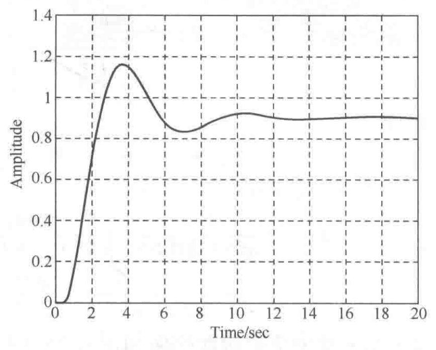

> Image description: The image shows a MATLAB-generated plot of a system's time response before correction (as indicated by the caption "图 6－17－3 校正前系统时间响应"). The graph features a vertical y-axis labeled "Amplitude" ranging from 0 to 1.4 and a horizontal x-axis labeled "Time/sec" ranging from 0 to 20. The plot displays a single continuous curve representing the system's output over time. Starting at (0,0), the signal rises sharply, exhibiting an underdamped behavior characterized by an initial overshoot that peaks at approximately 1.15 around $t=4$ seconds. The response then oscillates with decreasing amplitude—dipping to about 0.85 and rising slightly again—before eventually stabilizing and converging toward a steady-state value of approximately 0.9. This visualization is typical in control engineering to analyze transient performance metrics such as rise time, peak overshoot, and settling time.
图 6－17－4 校正后系统时间响应（MATLAB）

已校正系统的性能为

$$
\sigma \%=28 \%<30 \%, \quad t_{s}=10.9 \mathrm{~s}, \quad e_{s s}(\infty)=10 \%<12 \%
$$

由图 6－17－4 可见，遥控机器人系统采用滞后校正后，减少了系统的稳态误差，使系统的性能满足了设计指标要求，但系统的动态性能不理想，可考虑重选 $b$ 值，或选择滞后－超前网络进行校正。读者不妨一试。

6－18 MANUTEC 机器人具有很大的惯性和较长的手臂，其实物如图6－49（a）所示。机械臂的动力学特性可以表示为

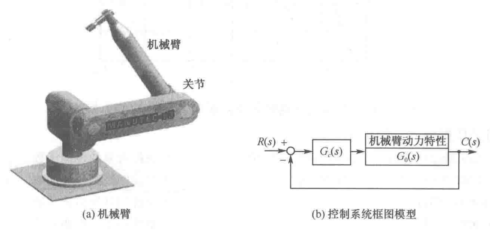

> Image description: This image consists of two parts, labeled (a) and (b), illustrating a robotic arm system. Figure (a) shows a physical photograph of a MANUTEC robotic arm mounted on a base, with Chinese labels pointing to the "mechanical arm" (机械臂) and "joint" (关节). Figure (b) presents a corresponding control system block diagram in the s-domain. The input variable is $R(s)$, which enters a summing junction. The error signal then passes through a controller block labeled $G_c(s)$. This output feeds into a plant block representing the "mechanical arm dynamic characteristics" (机械臂动力特性), denoted as $G_0(s)$. The final system output is $C(s)$. A feedback loop connects the output $C(s)$ back to the summing junction with a negative sign, indicating a closed-loop control architecture designed to regulate the robotic arm's movement based on the difference between the reference input and actual output.
图 6－49 机器人控制


<!-- source_pdf_page: 217 -->
$$
G_{0}(s)=\frac{250}{s(s+2)(s+40)(s+45)}
$$

要求选用图6－49（b）所示控制方案，使系统阶跃响应的超调量小于 $20 \%$ ，上升时间小于 0.5 s ，调节时间小于 $1.2 \mathrm{~s}(\Delta=2 \%)$ ，静态速度误差系数 $K_{v} \geqslant 10$ 。试问：采用超前校正网络

$$
G_{c}(s)=1483.7 \frac{s+3.5}{s+33.75}
$$

是否合适？
解 开环传递函数

$$
\begin{aligned}
G_{c}(s) G_{0}(s) & =\frac{370925(s+3.5)}{s(s+2)(s+33.75)(s+40)(s+45)} \\
& =\frac{10.7\left(\frac{s}{3.5}+1\right)}{s\left(\frac{s}{2}+1\right)\left(\frac{s}{33.75}+1\right)\left(\frac{s}{40}+1\right)\left(\frac{s}{45}+1\right)}
\end{aligned}
$$

可知

$$
K_{v}=10.7>10
$$

闭环传递函数

$$
\begin{aligned}
\Phi(s) & =\frac{370925(s+3.5)}{s(s+2)(s+33.75)(s+40)(s+45)+370925(s+3.5)} \\
& =\frac{370925 s+1298237.5}{s^{5}+120.75 s^{4}+4906.25 s^{3}+70087.5 s^{2}+492425 s+1298237.5}
\end{aligned}
$$

校正后系统的单位阶跃响应如图 6－18－1 所示。MATLAB 仿真表明：$\sigma \%=18 \%<20 \%$ ， $t_{r}=0.29 \mathrm{~s}<0.5 \mathrm{~s}, t_{\mathrm{s}}=1.0 \mathrm{~s}<1.2 \mathrm{~s}, K_{v}=10.7>10$ 。设计指标全部满足，故该超前校正网络是合适的。

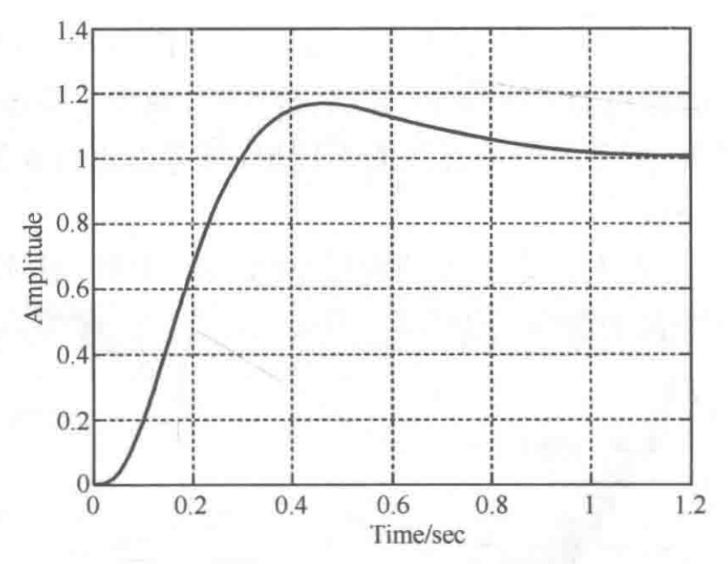

> Image description: This image shows a graph representing the unit step response of a corrected system, labeled as Figure 6-18-1 in the provided caption. The plot features a vertical y-axis labeled "Amplitude" ranging from 0 to 1.4 and a horizontal x-axis labeled "Time/sec" ranging from 0 to 1.2. The graph displays a single continuous curve that starts at the origin (0,0), rises steeply with an initial S-shape, reaches a peak amplitude of approximately 1.18 around 0.45 seconds, and then gradually decays toward a steady-state value of 1.0. This behavior is characteristic of an underdamped second-order system response. According to the caption, the simulation results indicate specific performance metrics: a maximum overshoot ($\sigma\%$) of 18%, a rise time ($t_r$) of 0.29 s, a settling time ($t_s$) of 1.0 s, and a velocity error constant ($K_v$) of 10.7, confirming the lead compensator network meets design specifications.
图 6－18－1 校正后系统的单位阶跃响应曲线（MATLAB）

$$
\begin{array}{ll}
\text { MATLAB 程序: exe618. } \mathrm{m} & \\
\mathrm{GO}=\operatorname{tf}(250, \operatorname{conv}([1,2,0], \operatorname{conv}([1,40],[1,50]))) ; & \text { \% 被控对象的传递函数 } \\
\mathrm{GC}=\operatorname{tf}(1483.7 *[1,3.5],[1,33.75]) ; & \text { \% 超前网络的传递函数 } \\
\mathrm{G}=\operatorname{series}(\mathrm{GC}, \mathrm{GO}) ; & \text { \% 系统的开环传递的闭环传递函数 } \\
\mathrm{G} 1=\operatorname{feedback}(\mathrm{G}, 1) ; &
\end{array}
$$


<!-- source_pdf_page: 218 -->
6－19 双手协调机器人如图 6－50 所示，两台机械手相互协作，试图将一根长杆插人另一物体。已知单个机器人关节的反馈控制系统为单位反馈控制系统，被控对象为机械臂，其传递函数

$$
G_{0}(s)=\frac{4}{s(s+0.5)}
$$

要求设计一个串联超前一滞后校正网络，使系统在单位斜坡输入时的稳态误差不大于 0.0125 ，单位阶跃响应的超调量小于 $25 \%$ ，调节时间小于 $3 \mathrm{~s}(\Delta=2 \%)$ ，并要求给出系统校正前后的单位阶跃输入响应曲线。试问：选用网络

$$
G_{c}(s)=\frac{10(s+2)(s+0.1)}{(s+20)(s+0.01)}
$$

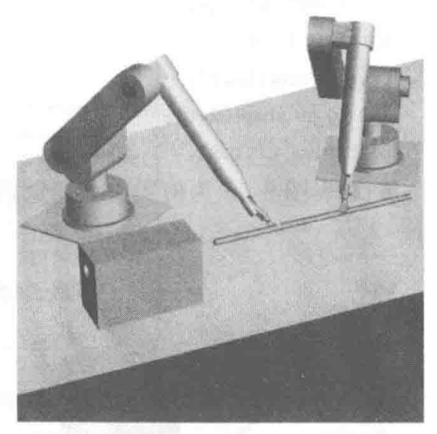

> Image description: A grayscale engineering diagram, labeled as Figure 6-50 (图6－50), illustrates a schematic of a dual-arm coordinated robot system (双手协调机器人示意图). The image depicts two robotic manipulators mounted on separate circular bases atop a flat surface. Each arm consists of multiple segments and joints, designed for articulated movement. The two robots are positioned to interact with a single, thin linear object—likely a rod or bar—resting horizontally between them. The end-effector of the left robot is angled downward, making contact with one end of the object, while the right robot's end-effector is oriented vertically, contacting the opposite end. This configuration demonstrates a coordinated manipulation task where two independent robotic arms work together to hold or move a shared workpiece. There are no visible axes, variables, or arrows in this specific figure.
图6－50 双手协调机器人示意图

是否合适？

解 显然，选用的网络为超前一滞后校正网络。校正后，系统开环传递函数

$$
G_{c}(s) G_{0}(s)=\frac{40(s+2)(s+0.1)}{s(s+0.5)(s+20)(s+0.01)}=\frac{80(0.5 s+1)(10 s+1)}{s(2 s+1)(0.05 s+1)(100 s+1)}
$$

由 $G_{c}(s) G_{0}(s)$ 可见，静态速度误差系数 $K_{v}=80$ ，系统在单位斜坡作用下的稳态误差 $e_{s}(\infty)= \frac{1}{K_{v}}=0.0125$ 满足指标中相关要求。

系统校正前后的单位阶跃响应如图 6－19－1 所示。其中，实线为校正后的时间响应，虚线为校正前的时间响应。仿真表明，校正后系统的 $\sigma \%=23.6 \%<25 \%, t_{p}=1.2 \mathrm{~s}, t_{s}= 2.4 \mathrm{~s}<3 \mathrm{~s}(\Delta=2 \%)$ ，满足设计指标要求。

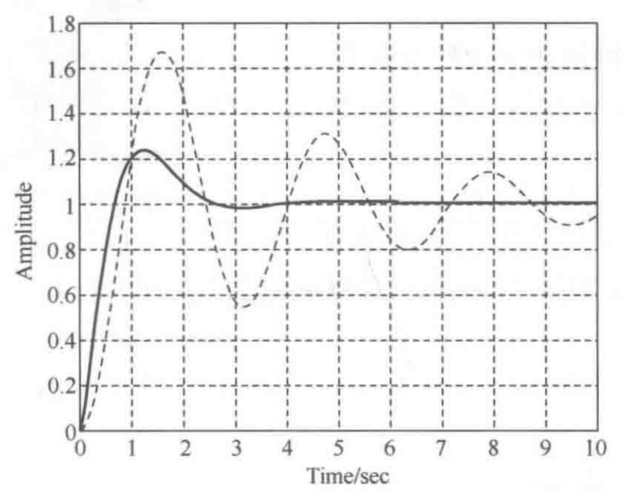

> Image description: This image shows a plot of the unit step response for a system before and after correction, as indicated in Figure 6-19-1. The graph features a vertical y-axis labeled "Amplitude" ranging from 0 to 1.8 and a horizontal x-axis labeled "Time/sec" ranging from 0 to 10 seconds. Two waveforms are plotted: a dashed line representing the time response before correction and a solid line representing the response after correction. Both curves start at (0,0) and oscillate toward a steady-state value of 1. The dashed line exhibits high-amplitude oscillations with significant overshoot. In contrast, the solid line shows a much more damped response, reaching its first peak around $t_p = 1.2\text{ s}$ and settling near the target amplitude by $t_s = 2.4\text{ s}$. This comparison demonstrates that the correction process successfully reduced system overshoot and decreased settling time to meet design specifications.
图 6－19－1 机器人控制系统的时间响应（MATLAB）

MATLAB 程序 ：exe619．m
$\mathrm{GO}=\mathrm{tf}(4, \operatorname{conv}([1,0],[1,0.5])) ;$
\％被控对象的传递函数
\％超前－滞后校正网络的传递函数
$\mathrm{Gc}=\mathrm{tf}(10 * \operatorname{conv}([1,2],[1,0.1]), \operatorname{conv}([1,20],[1,0.01])) ;$
$\mathrm{G}=\operatorname{series}(\mathrm{Gc}, \mathrm{GO})$ ；
G1 $=$ feedback $($ GO，1 $)$ ；
\％待校正系统的闭环传递函数


<!-- source_pdf_page: 219 -->
$$
\begin{aligned}
& \mathrm{G} 2=\operatorname{feedback}(\mathrm{G}, 1) \\
& \mathrm{t}=[0: 0.1: 10] \\
& {[\mathrm{x}, \mathrm{y}]=\operatorname{step}(\mathrm{G} 1, \mathrm{t})} \\
& {[\mathrm{x} 1, \mathrm{y} 1]=\operatorname{step}(\mathrm{G} 2, \mathrm{t})} \\
& \operatorname{plot}\left(\mathrm{t}, \mathrm{x},^{\prime}-.^{\prime}, \mathrm{t}, \mathrm{x} 1, .^{\prime}-^{\prime}\right) ; \text { grid }
\end{aligned}
$$

\％已校正系统的闭环传递函数

6－20 图 6－51 为机器人和视觉系统的示意图，移动机器人利用摄像系统来观测环境信息。已知机器人系统为单位反馈系统，被控对象为

识别子系统

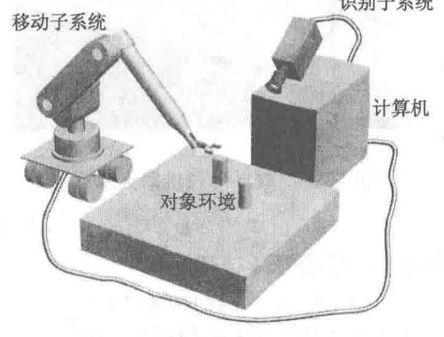

> Image description: A grayscale technical diagram, captioned "图6－51 机器人和视觉系统示意图" (Figure 6-51 Schematic of Robot and Vision System), illustrates a robotic control loop. The system consists of three primary components: 1. **移动子系统 (Mobile Subsystem):** A robotic arm mounted on a wheeled mobile platform, positioned to interact with the environment. 2. **对象环境 (Object Environment):** A rectangular base containing small vertical blocks, serving as the workspace for the robot. 3. **计算机 (Computer):** A block representing the processing unit, which is connected via cables to both the mobile subsystem and a camera. A camera, labeled as part of the **识别子系统 (Identification Subsystem)** at the top right, is mounted atop the computer block and directed toward the object environment. The layout depicts an engineering feedback loop where the vision system identifies objects in the environment and sends data to the computer, which then controls the mobile robot's movements.
图6－51 机器人和视觉系统示意图

机械臂，其传递函数

$$
G_{0}(s)=\frac{1}{(s+1)(0.5 s+1)}
$$

为了使系统阶跃响应的稳态误差为零，采用串联 PI 控制器

$$
G_{c}(s)=K_{1}+\frac{K_{2}}{s}
$$

试设计合适的 $K_{1}$ 与 $K_{2}$ 值，使系统阶跃响应的超调量不大于 $5 \%$ ，调节时间小于 $6 \mathrm{~s}(\Delta=2 \%)$ ，静态速度误差系数 $K_{v} \geqslant 0.9$ 。

解 本题可用试探法确定 PI 控制器参数，调整 $K_{1}$ 与 $K_{2}$ 时，需要综合考虑系统的稳态性能和动态性能要求。

系统开环传递函数

$$
G_{c}(s) G_{0}(s)=\frac{2 K_{1}(s+z)}{s(s+1)(s+2)}=\frac{K_{2}\left(\frac{1}{z} s+1\right)}{s(0.5 s+1)(s+1)}
$$

式中，$z=K_{2} / K_{1}$ 。
对于 PI 控制器，一种可能的选择方案为

$$
z=1.1, \quad K_{1}=0.8182, \quad K_{2}=K_{1} z=0.9
$$

则闭环传递函数为

$$
\Phi(s)=\frac{2 K_{1}(s+z)}{s(s+1)(s+2)+2 K_{1}(s+z)}=\frac{1.64(s+1.1)}{s^{3}+3 s^{2}+3.64 s+1.8}
$$

应用 MATLAB 软件包，可绘出系统单位阶跃响应曲线，如图 6－20－1 所示。仿真结果表明，校正后系统的性能为

$$
\sigma \%=4.6 \%<5 \%, \quad t_{s}=4.93 s<6 s(\Delta=2 \%), \quad K_{v}=K_{2}=0.9
$$

满足设计指标要求。
MATLAB 程序 ：exe620．m

$$
\begin{aligned}
& \mathrm{K} 1=0.8182 ; \mathrm{K} 2=0.9 ; \\
& \mathrm{G} 0=\mathrm{tf}(1, \operatorname{conv}([1,1],[0.5,1])) ; \\
& \mathrm{Gc}=\mathrm{tf}([\mathrm{~K} 1, \mathrm{~K} 2],[1,0]) ; \\
& \mathrm{G}=\operatorname{series}(\mathrm{Gc}, \mathrm{G} 0) ; \\
& \mathrm{G} 1=\operatorname{feedback}(\mathrm{G}, 1) ; \\
& \text { step }(\mathrm{G} 1) ; \operatorname{grid}
\end{aligned}
$$

\％系统的闭环传递函数


<!-- source_pdf_page: 220 -->
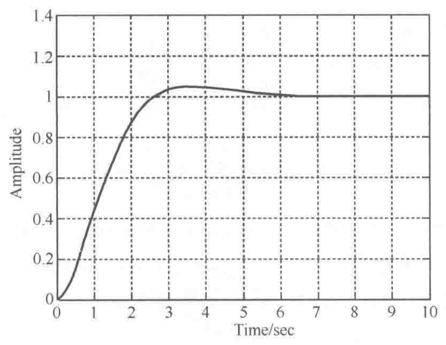

> Image description: The image shows a MATLAB-generated plot representing the unit step response of a robot control system (图6－20－1). The graph features a Cartesian coordinate system with two axes: the horizontal x-axis is labeled "Time/sec" and ranges from 0 to 10, while the vertical y-axis is labeled "Amplitude" and ranges from 0 to 1.4. The plot displays a single continuous curve starting at the origin (0,0). The response rises steeply, crossing an amplitude of 0.6 at approximately 1.5 seconds and reaching a peak overshoot slightly above 1.0 around 3.5 seconds. After this peak, the signal exhibits a slight oscillation before stabilizing and converging to a steady-state value of 1.0 starting from approximately 6 seconds. This curve illustrates typical second-order system characteristics, including rise time, peak overshoot, and settling time in an engineering control context.
图6－20－1 机器人控制系统单位阶跃响应（MATLAB）

6－21 图 6－52（a）所示的大型天线可以用来接收卫星信号。为了能跟踪卫星的运动，必须保证天线的准确定向。天线指向控制系统采用电枢控制的电机来驱动天线，其结构图如图6－52（b）所示。若要求系统斜坡响应的稳态误差小于 $1 \%$ ，阶跃响应的超调量小于 $5 \%$ ，调节时间小于 $2 \mathrm{~s}(\Delta=2 \%)$ 。要求：
（1）设计合适的校正网络 $G_{c}(s)$ ，并绘制校正后系统的单位阶跃响应曲线；
（2）当 $R(s)=0$ 时，计算扰动 $N(s)=1 / s$ 对系统输出 $C(s)$ 的影响。

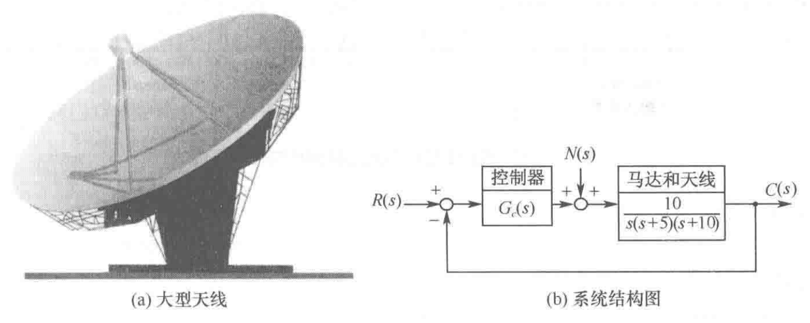

> Image description: This figure consists of two parts illustrating a large antenna pointing control system. Part (a) is a photograph of a large satellite dish antenna. Part (b) is a block diagram representing the system's engineering structure. The block diagram shows a closed-loop feedback system. The input signal $R(s)$ enters a summing junction, where it is compared with the feedback signal from the output $C(s)$. The resulting error signal passes through a controller block labeled $G_c(s)$. Following the controller, another summing junction introduces a disturbance signal $N(s)$. This combined signal then enters the plant block, labeled "马达和天线" (Motor and Antenna), which has a transfer function of $\frac{10}{s(s+5)(s+10)}$. The output of this block is $C(s)$, which is fed back to the initial summing junction. Arrows indicate the unidirectional flow of signals through these components, representing the control loop used to ensure accurate antenna orientation for satellite tracking.
图6－52 天线指向控制系统

解 本题对校正后系统的稳态性能和动态性能均有较高要求，宜选用超前一滞后网络校正。

选用如下超前－滞后校正网络

$$
G_{c}(s)=\frac{8(s+0.01)(s+5.5)}{(s+0.0001)(s+6.5)}
$$

则系统开环传递函数

$$
\begin{aligned}
G_{c}(s) G_{0}(s) & =\frac{80(s+0.01)(s+5.5)}{s(s+0.0001)(s+5)(s+6.5)(s+10)} \\
& =\frac{135.4(100 s+1)(0.18 s+1)}{s(10000 s+1)(0.2 s+1)(0.15 s+1)(0.1 s+1)}
\end{aligned}
$$

可得 $K_{v}=135.4$ ，系统在单位斜坡输人下的稳态误差


<!-- source_pdf_page: 221 -->
$$
e_{s}(\infty)=\frac{1}{K_{v}}=0.74 \%<1 \%
$$

闭环系统特征方程

$$
D(s)=s^{5}+21.5 s^{4}+147.5 s^{3}+405 s^{2}+440.8 s+4.4=0
$$

扰动作用下的系统输出

$$
C_{n}(s)=\frac{10\left(s^{2}+6.5 s+0.00065\right)}{D(s)} N(s)
$$

系统的单位阶跃响应如图 6－21－1 中（a）所示，表明系统的动态性能

$$
\sigma \%=1.23 \%<5 \%, \quad t_{s}=1.67 \mathrm{~s}<2 \mathrm{~s}(\Delta=2 \%)
$$

系统的单位扰动响应如图 6－21－1 中（b）所示，表明最大扰动偏差

$$
c_{n \max }=14.7 \%<15 \%
$$

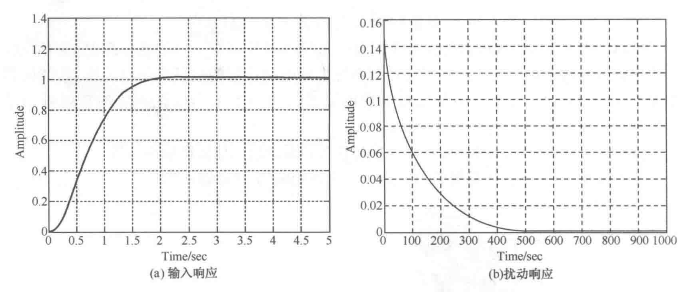

> Image description: The image contains two side-by-side time-domain response plots from MATLAB for an antenna pointing control system, labeled as Figure 6-21-1. Plot (a), titled "输入响应" (Input Response), shows a step response. The vertical axis is "Amplitude" ranging from 0 to 1.4, and the horizontal axis is "Time/sec" ranging from 0 to 5. The curve starts at zero, rises smoothly, and settles at a steady-state amplitude of 1.0 after approximately 2 seconds without overshoot. Plot (b), titled "扰动响应" (Disturbance Response), shows the system's reaction to a disturbance. The vertical axis is "Amplitude" ranging from 0 to 0.16, and the horizontal axis is "Time/sec" ranging from 0 to 1000. The curve begins at an amplitude of approximately 0.15 and decays exponentially toward zero, reaching near-zero values by around 400 seconds.
图6－21－1 天线指向控制系统的时间响应（MATLAB）

MATLAB 程序 ：exe621．m
$\mathrm{G} 0=\mathrm{tf}(10, \operatorname{conv}(\operatorname{conv}([1,0],[1,5]),[1,10])) ; \quad \%$ 被控对象的传递函数
\％超前－滞后校正网络的传递函数

```
Gc=tf(8* conv([1,0.01],[1.5.5]),conv([1,0.0001],[1,6.5]));
G= series(Gc,G0);
G1 = feedback(G,1);
G2 = feedback (G0,Gc);
t=0:0.01:5;
figure(1);step(G1,t);grid
t1 = 0:0.01:1000;
figure(2);step(G2,t1);grid
```

6－22 热轧厂的主要工序是将炽热的钢坯轧成具有预定厚度和尺寸的钢板，所得到的最终产品之一是宽为 3300 mm 、厚为 180 mm 的标准板材。图6－53（a）给出了热轧厂主要设备示意图，它有 1 号台与 2 号台两台主要的辂轧台。辑轧台上装有直径为 508 mm 的大型辊轧台，由 4470 kW 大功率电机驱动，并通过大型液压缸来调节轧制宽度和力度。

热轧机的典型工作流程是：钢坯首先在熔炉中加热，加热后的钢坯通过 1 号台，被辊轧机轧制成具有预期宽度的钢坯，然后通过 2 号台，由辊轧机轧制成具有预期厚度的钢板，最


<!-- source_pdf_page: 222 -->
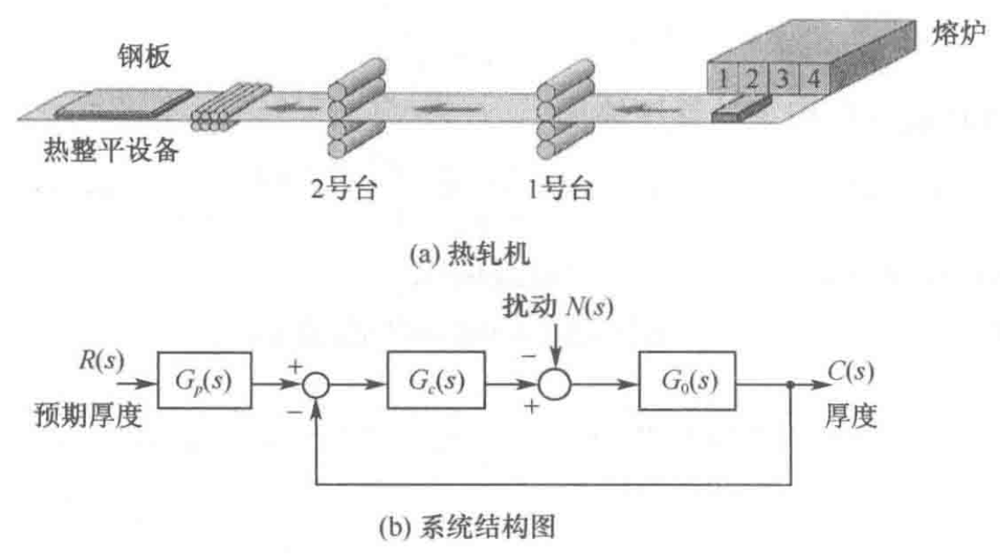

> Image description: This figure, captioned "图6－53 热轧机控制系统" (Hot Rolling Mill Control System), consists of two parts illustrating a mechanical process and its corresponding control system. Part (a) shows a physical diagram of a hot rolling mill. A steel plate (钢板) moves from a furnace (熔炉) through two rolling stands, labeled "1号台" (Stand 1) and "2号台" (Stand 2), toward heat leveling equipment (热整平设备). Part (b) is a block diagram of the control system. The input variable $R(s)$ represents expected thickness (预期厚度), which passes through a block $G_p(s)$. This signal enters a summing junction before passing through a controller block $G_c(s)$. A disturbance signal $N(s)$ (扰动) is added at another summing junction before the plant block $G_0(s)$, resulting in the output variable $C(s)$, representing actual thickness (厚度). A feedback loop connects the output $C(s)$ back to the first summing junction.
图6－53 热轧机控制系统

后再由热整平设备加以整平成型。
热轧机系统控制的关键技术是通过调整辊轧机的间隙来控制钢板的厚度。热轧机控制系统框图如图 6－53（b）所示，其中

$$
G_{0}(s)=\frac{1}{s\left(s^{2}+4 s+5\right)}
$$

而 $G_{c}(s)$ 为具有两个相同实零点的 PID 控制器。要求：
（1）选择 PID 控制器的零点和增益，使闭环系统有两对相等的特征根；
（2）考查（1）中得到的闭环系统，给出不考虑前置滤波器 $G_{p}(s)$ 与配置适当 $G_{p}(s)$ 时，系统的单位阶跃响应；
（3）当 $R(s)=0, N(s)=1 / s$ 时，计算系统对单位阶跃扰动的响应。
解 已知

$$
G_{0}(s)=\frac{1}{s\left(s^{2}+4 s+5\right)}
$$

选择

$$
G_{c}(s)=\frac{K(s+z)^{2}}{s}
$$

当取 $K=4, z=1.25$ 时，有

$$
G_{c}(s)=\frac{4(s+1.25)^{2}}{s}=10+\frac{6.25}{s}+4 s
$$

系统开环传递函数

$$
G_{c}(s) G_{0}(s)=\frac{4(s+1.25)^{2}}{s^{2}\left(s^{2}+4 s+5\right)}
$$

闭环传递函数

$$
\Phi(s)=\frac{G_{c}(s) G_{0}(s)}{1+G_{c}(s) G_{0}(s)}=\frac{4\left(s^{2}+2.5 s+1.5625\right)}{s^{4}+4 s^{3}+9 s^{2}+10 s+6.25}
$$

应用 MATLAB 软件包，可以求出闭环系统特征根为：$s_{1,2}=-1 \pm \mathrm{j} 1.2247 ; s_{3,4}=-1 \pm \mathrm{j} 1.2247$ 。
当不考虑前置滤波器时，单位阶跃输人作用下的系统输出

$$
C(s)=\Phi(s) R(s)=\frac{4\left(s^{2}+2.5 s+1.5625\right)}{s\left(s^{4}+4 s^{3}+9 s^{2}+10 s+6.25\right)}
$$

系统单位阶跃响应曲线如图 6－22－1（a）中实线所示。
当考虑前置滤波器时，选


<!-- source_pdf_page: 223 -->
$$
G_{p}(s)=\frac{1.5625}{(s+1.25)^{2}}
$$

则系统在单位阶跃输人作用下的系统输出

$$
C(s)=G_{p}(s) \Phi(s) R(s)=\frac{6.25}{s\left(s^{4}+4 s^{3}+9 s^{2}+10 s+6.25\right)}
$$

系统单位阶跃响应曲线如图6－22－1（a）中虚线所示。
当 $R(s)=0, N(s)=1 / s$ 时，扰动作用下的闭环传递函数

$$
\Phi_{n}(s)=-\frac{G_{0}(s)}{1+G_{c}(s) G_{0}(s)}=-\frac{s}{s^{4}+4 s^{3}+9 s^{2}+10 s+6.25}
$$

系统输出

$$
C_{n}(s)=\Phi_{n}(s) N(s)=-\frac{1}{s^{4}+4 s^{3}+9 s^{2}+10 s+6.25}
$$

单位阶跃扰动响应曲线如图6－22－1（b）所示。

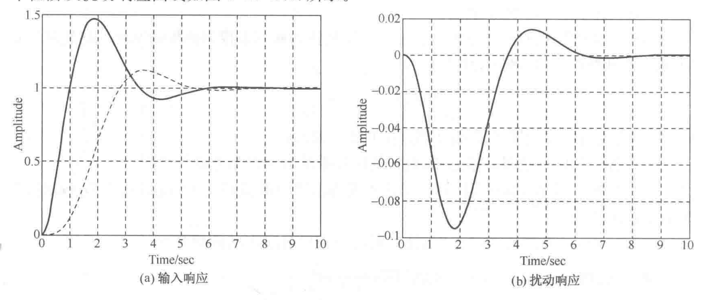

> Image description: The image contains two side-by-side time-domain response plots labeled (a) "输入响应" (Input Response) and (b) "扰动响应" (Disturbance Response). Both graphs feature a horizontal x-axis representing "Time/sec" ranging from 0 to 10 and a vertical y-axis representing "Amplitude." Plot (a) shows two curves responding to an input. A solid line exhibits a significant overshoot, peaking near 1.5 before settling at an amplitude of 1.0 around 6 seconds. A dashed line shows a slower, smoother rise toward the same steady-state value of 1.0. Plot (b), as indicated by the caption "单位阶跃扰动响应曲线如图6－22－1（b）所示" (Unit step disturbance response curve is shown in Figure 6-22-1(b)), displays a single solid line starting at 0, dipping to a minimum of approximately -0.09 at 2 seconds, and then oscillating slightly before stabilizing back toward 0 by 7 seconds.
图6－22－1 热轧机控制系统时间响应（MATLAB）

MATLAB 程序 ：exe622．m

$$
\begin{aligned}
& K=4 ; z=1.25 ; \\
& G 0=\operatorname{tf}(1, \operatorname{conv}([1,0],[1,4,5])) ; \\
& G c=\operatorname{tf}(K * \operatorname{conv}([1, z],[1, z]),[1,0]) ; \\
& G p=\operatorname{tf}(1.5625, \operatorname{conv}([1, z],[1, z])) ; \\
& G 1=\operatorname{feedback}(G c * G 0,1) ; \\
& G 2=\operatorname{series}(G p, G 1) ; \\
& G 3=-\operatorname{feedback}(G 0, G c) ; \\
& \text { eigval = roots }([149106.25]) ; \\
& t=0 ; 0.01 ; 10 ; \\
& {[x, y]=\operatorname{step}(G 1, t) ;[x 1, y 1]=\operatorname{step}(G 2, t) ;} \\
& \text { figure }(1) ; \operatorname{plot}\left(t, x,-^{\prime}, t, x 1,{ }^{\prime}\right) ; \operatorname{grid} \\
& \text { figure }(2) ; \operatorname{step}(G 3, t) ; \operatorname{grid}
\end{aligned}
$$

\％被控对象的传递函数
\％PID 控制器的传递函数
\％前置滤波器的传递函数
\％无前置滤波器的系统闭环传递函数 \％有前置滤波器的系统闭环传递函数 \％系统的扰动传递函数


