<!-- source_pdf_page: 224 -->
## 第七章 线性离散系统的分析与校正

7－1 试根据定义

$$
E^{*}(s)=\sum_{n=0}^{\infty} e(n T) \mathrm{e}^{-n T}
$$

确定下列函数的 $E^{*}(s)$ 和闭合形式的 $E(z)$ ：
（1）$e(t)=\sin \omega t$ ；
（2）$E(s)=\frac{1}{(s+a)(s+b)(s+c)^{\circ}}$ 。
解 本题的目的在于熟悉连续和离散函数形式的转换，需注意所定义的表达式的作用。
（1）$e(t)=\sin \omega t$
本题的关键是应用欧拉公式 $\sin \omega t=\frac{\mathrm{e}^{\mathrm{j} \omega t}-\mathrm{e}^{-\mathrm{j} \omega t}}{2 \mathrm{j}}$ 。

$$
\begin{aligned}
E^{*}(s) & =\sum_{n=0}^{\infty} \sin n \omega T \mathrm{e}^{-n s T}=\sum_{n=0}^{\infty}\left(\frac{\mathrm{e}^{\mathrm{j} \omega n T}-\mathrm{e}^{-\mathrm{j} \omega n T}}{2 \mathrm{j}}\right) \mathrm{e}^{-n s T} \\
& =\frac{1}{2 \mathrm{j}} \sum_{n=0}^{\infty}\left(\mathrm{e}^{\mathrm{j} \omega n T} \mathrm{e}^{-n s T}-\mathrm{e}^{-\mathrm{j} \omega n T} \mathrm{e}^{-n s T}\right)=\frac{1}{2 \mathrm{j}}\left(\frac{1}{1-\mathrm{e}^{\mathrm{j} \omega T} \mathrm{e}^{-s T}}-\frac{1}{1-\mathrm{e}^{-\mathrm{j} \omega T} \mathrm{e}^{-s T}}\right) \\
E(z) & =\frac{1}{2 \mathrm{j}}\left(\frac{1}{1-\mathrm{e}^{\mathrm{j} \omega T} z^{-1}}-\frac{1}{1-\mathrm{e}^{-\mathrm{j} \omega T} z^{-1}}\right)=\frac{z \sin \omega T}{z^{2}-2 z \cos \omega T+1}
\end{aligned}
$$

（2）$E(s)=\frac{1}{(s+a)(s+b)(s+c)}$
本题的关键是要先求出 $e(t)$ 。将 $E(s)$ 展成部分分式，有 $E(s)=\frac{k_{1}}{s+a}+\frac{k_{2}}{s+b}+\frac{k_{3}}{s+c}$ ，式中

$$
k_{1}=\frac{1}{(b-a)(c-a)}, \quad k_{2}=\frac{1}{(a-b)(c-b)}, \quad k_{3}=\frac{1}{(b-c)(a-c)}
$$

于是

$$
e(t)=k_{1} \mathrm{e}^{-a t}+k_{2} \mathrm{e}^{-b t}+k_{3} \mathrm{e}^{-c t}
$$

经采样拉氏变换，得

$$
E^{*}(s)=\frac{k_{1}}{1-\mathrm{e}^{-a T} \mathrm{e}^{-s T}}+\frac{k_{2}}{1-\mathrm{e}^{-b T} \mathrm{e}^{-s T}}+\frac{k_{3}}{1-\mathrm{e}^{-c T} \mathrm{e}^{-s T}}
$$

故有

$$
E(z)=\frac{k_{1}}{1-\mathrm{e}^{-a T} z^{-1}}+\frac{k_{2}}{1-\mathrm{e}^{-b T} z^{-1}}+\frac{k_{3}}{1-\mathrm{e}^{-c T} z^{-1}}
$$

7－2 试求下列函数的 $z$ 变换：
（1）$e(t)=a^{n}$ ；
（2）$e(t)=t^{2} \mathrm{e}^{-3 t}$ ；
（3）$e(t)=\frac{1}{3!} t^{3}$ ；


<!-- source_pdf_page: 225 -->
（4）$E(s)=\frac{s+1}{s^{2}}$ ；
（5）$E(s)=\frac{1-\mathrm{e}^{-s}}{s^{2}(s+1)}$ 。
解 本题的目的在于熟悉 $z$ 变换的各种方法。
（1）$e(t)=a^{n}$
根据 $z$ 变换的定义，有

$$
E(z)=\sum_{n=0}^{\infty} a^{n} z^{-n}=1+a z^{-1}+a^{2} z^{-2}+\cdots+a^{n} z^{-n}+\cdots=\frac{1}{1-a z^{-1}}=\frac{z}{z-a}
$$

（2）$e(t)=t^{2} \mathrm{e}^{-3 t}$
令 $e(t)=t^{2}$ ，查教材中表 7－2 可得

$$
E(z)=\mathscr{L}\left[t^{2}\right]=\frac{T^{2} z(z+1)}{(z-1)^{3}}
$$

根据复位移定理，有

$$
E\left(z \mathrm{e}^{3 T}\right)=\mathscr{L}\left[t^{2} \mathrm{e}^{-3 t}\right]=\frac{T^{2} z \mathrm{e}^{3 T}\left(z \mathrm{e}^{3 T}+1\right)}{\left(z \mathrm{e}^{3 T}-1\right)^{3}}
$$

（3）$e(t)=\frac{1}{3!} t^{3}$
根据 $z$ 变换定义及无穷级数求和，有

$$
\begin{aligned}
E(z) & =\sum_{n=0}^{\infty} \frac{1}{6}(n T)^{3} z^{-n}=\frac{T^{3}}{6} \sum_{n=0}^{\infty} n^{3} z^{-n} \\
& =\frac{T^{3}}{6}\left(z^{-1}+8 z^{-2}+27 z^{-3}+64 z^{-4}+125 z^{-5}+\cdots\right)
\end{aligned}
$$

而

$$
\begin{aligned}
\frac{z\left(z^{2}+4 z+1\right)}{(z-1)^{4}} & =\frac{z^{3}+4 z^{2}+z}{z^{4}-4 z^{3}+6 z^{2}-4 z+1} \\
& =z^{-1}+8 z^{-2}+27 z^{-3}+64 z^{-4}+125 z^{-5}+\cdots
\end{aligned}
$$

因此

$$
E(z)=\frac{T^{3} z\left(z^{2}+4 z+1\right)}{6(z-1)^{4}}
$$

（4）$E(s)=\frac{s+1}{s^{2}}$
将原函数表达式分解为

$$
E(s)=\frac{1}{s}+\frac{1}{s^{2}}
$$

再对各个部分查表7－2，可得

$$
E(z)=\frac{z}{z-1}+\frac{T z}{(z-1)^{2}}=\frac{z(z+T-1)}{(z-1)^{2}}
$$

（5）$E(s)=\frac{1-\mathrm{e}^{-s}}{s^{2}(s+1)}$
将原函数表达式变换为


<!-- source_pdf_page: 226 -->
$$
E(s)=\left[1-\left(\mathrm{e}^{-s T}\right)^{\frac{1}{T}}\right] \frac{1}{s^{2}(s+1)}
$$

由定义 $z=\mathrm{e}^{s T}$ 知，式中 $\left[1-\left(\mathrm{e}^{-s T}\right)^{\frac{1}{T}}\right]$ 即为 $\left(1-z^{-\frac{1}{T}}\right)$ ；式中 $\frac{1}{s^{2}(s+1)}=\frac{1}{s^{2}}-\frac{1}{s}+\frac{1}{s+1}$ ，由对各部分查表，可得 $\frac{T z}{(z-1)^{2}}-\frac{\left(1-\mathrm{e}^{-T}\right) z}{(z-1)\left(z-\mathrm{e}^{-T}\right)^{\circ}}$ 。于是

$$
E(z)=\left(1-z^{-\frac{1}{T}}\right)\left[\frac{T z}{(z-1)^{2}}-\frac{\left(1-\mathrm{e}^{-T}\right) z}{(z-1)\left(z-\mathrm{e}^{-T}\right)}\right]
$$

7－3 试用部分分式法、幂级数法和反演积分法，求下列函数的 $z$ 反变换：
（1）$E(z)=\frac{10 z}{(z-1)(z-2)}$ ；
（2）$E(z)=\frac{-3+z^{-1}}{1-2 z^{-1}+z^{-2}}$ 。
解 本题旨在训练各种 $z$ 反变换的基本技能，表明解决同一问题的方法可以有多种，但结果是相同的。
（1）$E(z)=\frac{10 z}{(z-1)(z-2)}$
（1）部分分式法：

$$
\frac{E(z)}{z}=-\frac{10}{z-1}+\frac{10}{z-2}, \quad E(z)=\frac{10 z}{z-2}-\frac{10 z}{z-1}
$$

查表得

$$
\begin{aligned}
& e(t)=10\left[2^{\frac{t}{T}} \cdot 1(t)-1(t)\right] \\
& e^{*}(t)=\sum_{n=0}^{\infty} e(n T) \delta(t-n T)=\sum_{n=0}^{\infty} 10\left(2^{n}-1\right) \delta(t-n T)
\end{aligned}
$$

（2）幂级数法：

$$
\begin{aligned}
& E(z)=\frac{10 z}{z^{2}-3 z+2}=10 z^{-1}+30 z^{-2}+70 z^{-3}+\cdots \\
& e^{*}(t)=10 \delta(t-T)+30 \delta(t-2 T)+70 \delta(t-3 T)+\cdots
\end{aligned}
$$

（3）反演积分法：

$$
\begin{aligned}
e(n T) & =\operatorname{Res}\left[E(z) \cdot z^{n-1}\right]_{z \rightarrow 1}+\operatorname{Res}\left[E(z) \cdot z^{n-1}\right]_{z \rightarrow 2} \\
& =\operatorname{Res}\left[\frac{10 z^{n}}{(z-1)(z-2)}\right]_{z \rightarrow 1}+\operatorname{Res}\left[\frac{10 z^{n}}{(z-1)(z-2)}\right]_{z \rightarrow 2} \\
& =-10+10 \cdot 2^{n}=10\left(2^{n}-1\right) \\
e^{*}(t) & =\sum_{n=0}^{\infty} 10\left(2^{n}-1\right) \delta(t-n T)
\end{aligned}
$$

（2）$E(z)=\frac{-3+z^{-1}}{1-2 z^{-1}+z^{-2}}$
（1）部分分式法：

$$
\begin{aligned}
& \frac{E(z)}{z}=\frac{-3 z+1}{(z-1)^{2}}=-\frac{2}{(z-1)^{2}}-\frac{3}{z-1} \\
& E(z)=-\frac{2 z}{(z-1)^{2}}-\frac{3 z}{z-1}
\end{aligned}
$$


<!-- source_pdf_page: 227 -->
查表得

$$
\begin{aligned}
& e(t)=-\frac{2 t}{T}-3, e(n T)=-2 n-3 \\
& e^{*}(t)=\sum_{n=0}^{\infty} e(n T) \delta(t-n T)=\sum_{n=0}^{\infty}(-2 n-3) \delta(t-n T)
\end{aligned}
$$

（2）幂级数法：

$$
\begin{aligned}
& E(z)=\frac{-3 z^{2}+z}{z^{2}-2 z+1}=-3-5 z^{-1}-7 z^{-2}-9 z^{-3}-\cdots \\
& e^{*}(t)=-3 \delta(t)-5 \delta(t-T)-7 \delta(t-2 T)-9 \delta(t-3 T)-\cdots
\end{aligned}
$$

（3）反演积分法：

$$
E(z)=\frac{z(-3 z+1)}{(z-1)^{2}}
$$

脉冲传递函数有两个相同的极点，则有

$$
\begin{aligned}
e(n T) & =\operatorname{Res}\left[E(z) z^{n-1}\right]_{z \rightarrow 1}=\frac{1}{1!} \lim _{z \rightarrow 1} \frac{\mathrm{~d}}{\mathrm{~d} z}\left[\frac{(z-1)^{2} z^{n-1}: z(-3 z+1)}{(z-1)^{2}}\right] \\
& =\lim _{z \rightarrow 1}\left[-3(n+1) z^{n}+n z^{n-1}\right]=-2 n-3 \\
e^{*}(t) & =\sum_{n=0}^{\infty}(-2 n-3) \delta(t-n T)
\end{aligned}
$$

7－4 试求下列函数的脉冲序列 $e^{*}(t)$ ：
（1）$E(z)=\frac{z}{(z+1)\left(3 z^{2}+1\right)}$ ；
（2）$E(z)=\frac{z}{(z-1)(z+0.5)^{2}}$ 。
解 本题旨在训练由脉冲传递函数转换为脉冲序列的有效方法。
（1）$E(z)=\frac{z}{(z+1)\left(3 z^{2}+1\right)}$
根据脉冲传递函数的形式，用幂级数法求解最为合适。不难求得

$$
\begin{gathered}
E(z)=\frac{z}{3 z^{3}+3 z^{2}+z+1}=\frac{1}{3} z^{-2}-\frac{1}{3} z^{-3}+\frac{2}{9} z^{-4}-\frac{2}{9} z^{-5}+\cdots \\
e^{*}(t)=\frac{1}{3} \delta(t-2 T)-\frac{1}{3} \delta(t-3 T)+\frac{2}{9} \delta(t-4 T)-\frac{2}{9} \delta(t-5 T)+\cdots
\end{gathered}
$$

（2）$E(z)=\frac{z}{(z-1)(z+0.5)^{2}}$
由于在脉冲传递函数中可以很容易地看出函数极点，故用反演积分法最方便。根据

$$
\begin{aligned}
e(n T) & =\operatorname{Res}\left[E(z) z^{n-1}\right]_{z \rightarrow 1}+\operatorname{Res}\left[E(z) z^{n-1}\right]_{z \rightarrow-0.5} \\
& =\lim _{z \rightarrow 1}\left[\frac{(z-1) z^{n-1} z}{(z-1)(z+0.5)^{2}}\right]+\frac{1}{1!} \lim _{z \rightarrow-0.5} \frac{\mathrm{~d}}{\mathrm{~d} z}\left[\frac{(z+0.5)^{2} z^{n-1} z}{(z-1)(z+0.5)^{2}}\right] \\
& =\frac{4}{9}+\left(-\frac{1}{2}\right)^{n}\left(\frac{4}{3} n-\frac{4}{9}\right)
\end{aligned}
$$

求得

$$
e^{*}(t)=\sum_{n=0}^{\infty}\left[\frac{4}{9}+\left(-\frac{1}{2}\right)^{n}\left(\frac{4}{3} n-\frac{4}{9}\right)\right] \delta(t-n T)
$$


<!-- source_pdf_page: 228 -->
7－5 试确定下列函数的终值：
（1）$E(z)=\frac{T z^{-1}}{\left(1-z^{-1}\right)^{2}}$ ；
（2）$E(z)=\frac{z^{2}}{(z-0.8)(z-0.1)^{\circ}}$ 。
解 本题旨在熟悉 $z$ 变换的终值定理。
（1）$E(z)=\frac{T z^{-1}}{\left(1-z^{-1}\right)^{2}}$
由终值定理可得

$$
e_{s}(\infty)=\lim _{z \rightarrow 1}\left(1-z^{-1}\right) \frac{T z^{-1}}{\left(1-z^{-1}\right)^{2}}=\infty
$$

（2）$E(z)=\frac{z^{2}}{(z-0.8)(z-0.1)}$
由终值定理可得

$$
e_{s}(\infty)=\lim _{z \rightarrow 1}\left(1-z^{-1}\right) \frac{z^{2}}{(z-0.8)(z-0.1)}=0
$$

7－6 已知 $E(z)=Z[e(t)]$ ，试证明下列关系式成立：
（1） $\mathscr{Z}\left[a^{n} e(t)\right]=E\left[\frac{z}{a}\right]$ ；
（2） $\mathscr{Z}[t e(t)]=-T z \frac{\mathrm{~d} E(z)}{\mathrm{d} z}, T$ 为采样周期。
解 本题关键是运用 $z$ 变换的定义证明关系式成立。
（1）求证 $\mathscr{Z}\left[a^{n} e(t)\right]=E\left[\frac{z}{a}\right]$ 。因为 $\mathscr{Z}[e(t)]=\sum_{n=0}^{\infty} e(n T) z^{-n}=E(z)$ ，所以

$$
\mathscr{Z}\left[a^{n} e(t)\right]=\sum_{n=0}^{\infty} e(n T) a^{n} z^{-n}=\sum_{n=0}^{\infty} e(n T)\left(\frac{z}{a}\right)^{-n}=E\left[\frac{z}{a}\right]
$$

（2）求证 $\mathscr{Z}[t e(t)]=-T z \frac{\mathrm{~d} E(z)}{\mathrm{d} z}$ 。由定义知

$$
\begin{aligned}
\mathscr{Z}[t e(t)] & =\sum_{n=0}^{\infty} n T e(n T) z^{-n}=-T z \sum_{n=0}^{\infty}\left[-n e(n T) z^{-n-1}\right] \\
& =-T z \frac{\mathrm{~d} \sum_{n=0}^{\infty}\left[e(n T) z^{-n}\right]}{\mathrm{d} z}=-T z \frac{\mathrm{~d} E(z)}{\mathrm{d} z}
\end{aligned}
$$

7－7 已知差分方程为

$$
c(k)-4 c(k+1)+c(k+2)=0
$$

初始条件为 $c(0)=0, c(1)=1$ 。试用迭代法求输出序列 $c(k), k=0,1,2,3,4$ 。
解 本题旨在训练如何根据差分方程和初始条件求出输出序列。
由已知条件可知

$$
c(k+2)=4 c(k+1)-c(k)
$$

则递推可得

$$
\begin{aligned}
& c(0)=0, \quad c(1)=1 \\
& c(2)=4 c(1)-c(0)=4 \\
& c(3)=4 c(2)-c(1)=15
\end{aligned}
$$


<!-- source_pdf_page: 229 -->
$$
c(4)=4 c(3)-c(2)=56
$$

7－8 试用 $z$ 变换法求解下列差分方程：
（1）$c^{*}(t+2 T)-6 c^{*}(t+T)+8 c^{*}(t)=r^{*}(t)$

$$
r(t)=1(t), \quad c^{*}(0)=0, \quad c^{*}(T)=0
$$

（2）$c^{*}(t+2 T)+2 c^{*}(t+T)+c^{*}(t)=r^{*}(t)$

$$
c(0)=c(T)=0, \quad r(n T)=n(n=0,1,2, \cdots)
$$

（3）$c(k+3)+6 c(k+2)+11 c(k+1)+6 c(k)=0$

$$
c(0)=c(1)=1, \quad c(2)=0
$$

（4）$c(k+2)+5 c(k+1)+6 c(k)=\cos k \frac{\pi}{2}$

$$
c(0)=c(1)=0
$$

解 本题旨在训练用 $z$ 变换求解差分方程的一般性方法。
（1）$c^{*}(t+2 T)-6 c^{*}(t+T)+8 c^{*}(t)=r^{*}(t), \quad r(t)=1(t), \quad c^{*}(0)=0, \quad c^{*}(T)=0$因为

$$
\begin{gathered}
\mathscr{Z}[c(k+2)]=z^{2} C(z)-z^{2} c(0)-z c(1)=z^{2} C(z) \\
\mathscr{Z}[6 c(k+1)]=6 z C(z)-6 z c(0)=6 z C(z) \\
R(z)=\frac{z}{z-1}
\end{gathered}
$$

故原方程可化为

$$
z^{2} C(z)-6 z C(z)+8 C(z)=\frac{z}{z-1}, \quad C(z)=\frac{z}{(z-2)(z-4)(z-1)}
$$

用反演积分法，可得

$$
\begin{aligned}
c(n T) & =\operatorname{Res}\left[C(z) \cdot z^{n-1}\right]_{z \rightarrow 1}+\operatorname{Res}\left[C(z) \cdot z^{n-1}\right]_{z \rightarrow 2}+\operatorname{Res}\left[C(z) \cdot z^{n-1}\right]_{z \rightarrow 4} \\
& =\frac{1}{3}-\frac{1}{2} \cdot 2^{n}+\frac{1}{6} \cdot 4^{n} \\
c^{*}(t) & =\sum_{n=0}^{\infty}\left[\frac{1}{3}-\frac{1}{2} \cdot 2^{n}+\frac{1}{6} \cdot 4^{n}\right] \delta(t-n T)
\end{aligned}
$$

（2）$c^{*}(t+2 T)+2 c^{*}(t+T)+c^{*}(t)=r^{*}(t), c(0)=c(T)=0, r(n T)=n(n=0,1,2, \cdots)$
因为

$$
z^{2} C(z)+2 z C(z)+C(z)=R(z)=\frac{z}{(z-1)^{2}}, \quad C(z)=\frac{z}{(z+1)^{2}(z-1)^{2}}
$$

用反演积分法，可得

$$
\begin{aligned}
c(n T)= & \operatorname{Res}\left[C(z) z^{n-1}\right]_{z \rightarrow 1}+\operatorname{Res}\left[C(z) \cdot z^{n-1}\right]_{z \rightarrow-1} \\
= & \frac{1}{1!} \lim _{z \rightarrow 1} \frac{\mathrm{~d}}{\mathrm{~d} z}\left[\frac{(z-1)^{2} \cdot z \cdot z^{n-1}}{(z+1)^{2}(z-1)^{2}}\right]+\frac{1}{1!} \lim _{z \rightarrow-1} \frac{\mathrm{~d}}{\mathrm{~d} z}\left[\frac{(z+1)^{2} \cdot z \cdot z^{n-1}}{(z+1)^{2}(z-1)^{2}}\right] \\
= & \frac{n-1}{4}+(-1)^{n-1} \frac{n-1}{4} \\
& c^{*}(t)=\sum_{n=0}^{\infty} \frac{n-1}{4}\left[1+(-1)^{n-1}\right] \delta(t-n T)
\end{aligned}
$$

（3）$c(k+3)+6 c(k+2)+11 c(k+1)+6 c(k)=0, c(0)=c(1)=1, c(2)=0$
因为


<!-- source_pdf_page: 230 -->
$$
z^{3} C(z)+6 z^{2} C(z)+11 z C(z)+6 C(z)-z^{3}-7 z^{2}-17 z=0
$$

则有

$$
C(z)=\frac{z^{3}+7 z^{2}+17 z}{z^{3}+6 z^{2}+11 z+6}
$$

用部分分式法，可得

$$
\begin{aligned}
\frac{C(z)}{z} & =\frac{z^{2}+7 z+17}{z^{3}+6 z^{2}+11 z+6}=\frac{11}{2(z+1)}-\frac{7}{z+2}+\frac{5}{2(z+3)} \\
C(z) & =\frac{11 z}{2(z+1)}-\frac{7 z}{z+2}+\frac{5 z}{2(z+3)}
\end{aligned}
$$

对上式各部分查表，可得

$$
c^{*}(t)=\sum_{n=0}^{\infty}\left[\frac{11}{2}(-1)^{n}-7(-2)^{n}+\frac{5}{2}(-3)^{n}\right] \delta(t-n T)
$$

（4）$c(k+2)+5 c(k+1)+6 c(k)=\cos k \frac{\pi}{2}, c(0)=c(1)=0$
查表7－2，可得

于是

$$
\begin{aligned}
R(z)= & z\left[\cos \frac{\pi}{2} t\right]=\frac{z\left(z-\cos \frac{\pi}{2} T\right)}{z^{2}-2 z \cos \frac{\pi}{2} T+1}=\frac{z^{2}}{z^{2}+1} \quad(T=1) \\
& z^{2} C(z)+5 z C(z)+6 C(z)=R(z)=\frac{z^{2}}{z^{2}+1}
\end{aligned}
$$

则有

$$
\begin{aligned}
C(z) & =\frac{z^{2}}{(z+2)(z+3)\left(z^{2}+1\right)}=-\frac{\frac{2}{5} z}{z+2}+\frac{\frac{3}{10} z}{z+3}+\frac{\frac{1}{10}\left(z^{2}-z\right)}{z^{2}+1} \\
& =-\frac{\frac{2}{5} z}{z+2}+\frac{\frac{3}{10} z}{z+3}+\frac{1}{10}\left(\frac{z^{2}}{z^{2}+1}-\frac{z}{z^{2}+1}\right) \\
& =-\frac{\frac{2}{5} z}{z+2}+\frac{\frac{3}{10} z}{z+3}+\frac{1}{10}\left[\frac{z\left(z-\cos \frac{\pi}{2}\right)}{z^{2}-2 z \cos \frac{\pi}{2}+1}-\frac{z \sin \frac{\pi}{2}}{z^{2}-2 z \cos \frac{\pi}{2}+1}\right]
\end{aligned}
$$

对上式各部分查表，可得

$$
c^{*}(t)=\sum_{n=0}^{\infty}\left[-\frac{2}{5}(-2)^{n}+\frac{3}{10}(-3)^{n}+\frac{1}{10}\left(\cos \frac{\pi}{2} n-\sin \frac{\pi}{2} n\right)\right] \delta(t-n T)
$$

MATLAB 程序 ：exe708．m
\％（1）
syms $z$
$c z 1=z /(z-2) /(z-4) /(z-1) ;$
ct1＝iztrans（cz1）
\％（2）
$c z 2=z /(z+1)^{\wedge} 2 /(z-1)^{\wedge} 2 ;$
ct2 $=$ iztrans（cz2）
\％（3）
$c z 3=(z 3+7 * z 2+17 * z) /(z 3+6 * z 2+11 * z+6) ;$
\％定义符号
\％定义脉冲传递函数
\％$z$ 反变换


<!-- source_pdf_page: 231 -->
```
ct3 = iztrans(cz3)
```

\％（4）

$$
\begin{aligned}
& c z 4=z 2 /(z+2) /(z+3) /(z 2+1) \\
& c t 4=i z \operatorname{trans}(c z 4)
\end{aligned}
$$

运行上述文件，可得

```
ct1 =
-1/2*2n+1/6*4n+1/3
ct2 =
1/4*(-1)n-1/4*(-1)n*n-1/4+1/4*n
ct3 =
-7*(-2)n+5/2*(-3)n+11/2*(-1)n
ct4 =
-2/5*(-2)n+3/10*(-3)n+1/20* sum( - (1/_ alpha)ˋn/_ alpha+(1/_ alpha)^n,_alpha=Ro-
otOf(_z2 + 1))
```

7－9 设开环离散系统如图 7－61 所示，试求开环脉冲传递函数 $G(z)$ 。

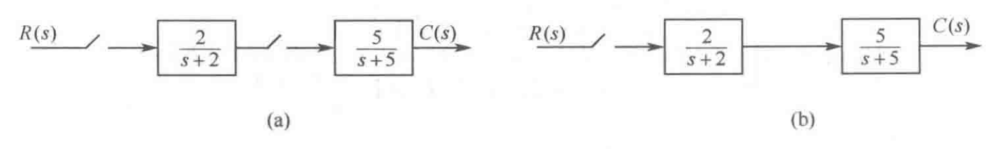

> Image description: The image displays two block diagrams, labeled (a) and (b), representing linear systems in the s-domain. Both diagrams consist of a series of blocks connected by arrows indicating signal flow from left to right. In both figures, the input variable is $R(s)$ and the output variable is $C(s)$. The system contains two transfer function blocks: the first block is $\frac{2}{s+2}$ and the second block is $\frac{5}{s+5}$. The primary difference between the two diagrams is the placement of switches (represented by diagonal line segments). In diagram (a), there are two switches: one before the first block and one between the first and second blocks. In diagram (b), there is only one switch located before the first block, with a continuous connection between the two transfer function blocks. These diagrams illustrate different configurations of signal interruption within a cascaded system.
图 7－61 开环离散系统结构图

解 本题旨在练习如何由开环离散系统的结构图求取脉冲传递函数，需要注意的是 $z$变换无串联性。
（a）$G(z)=G_{1}(z) G_{2}(z)=\mathscr{Z}\left[\frac{2}{s+2}\right] \cdot \mathscr{Z}\left[\frac{5}{s+5}\right]=\frac{2 z}{z-\mathrm{e}^{-2 T}} \cdot \frac{5 z}{z-\mathrm{e}^{-5 T}}$

$$
=\frac{10 z^{2}}{\left(z-\mathrm{e}^{-2 T}\right)\left(z-\mathrm{e}^{-5 T}\right)}
$$

（b）$G(z)=G_{1} G_{2}(z)=\mathscr{Z}\left[\frac{10}{(s+2)(s+5)}\right]=\mathscr{Z}\left[\frac{10}{3}\left(\frac{1}{s+2}-\frac{1}{s+5}\right)\right]$

$$
=\frac{10}{3}\left[\frac{z}{z-\mathrm{e}^{-2 T}}-\frac{z}{z-\mathrm{e}^{-5 T}}\right]=\frac{10 z\left(\mathrm{e}^{-2 T}-\mathrm{e}^{-5 T}\right)}{3\left(z-\mathrm{e}^{-2 T}\right)\left(z-\mathrm{e}^{-5 T}\right)}
$$

7－10 试求图 7－62 闭环离散系统的脉冲传递函数 $\Phi(z)$ 或输出 $z$ 变换 $C(z)$ 。
解 本题旨在练习如何由闭环离散系统的结构图求取脉冲传递函数，需要注意的是 $z$变换无串联性。

图7－62（a）系统：显然 $C(z)=\left[E_{1}(z)-E_{2}(z)\right] G_{1}(z)$ ，则有

$$
\begin{aligned}
& E_{2}(z)=Z\left[C(s) G_{2}(s)\right]=\left[E_{1}(z)-E_{2}(z)\right] G_{1} G_{2}(z) \\
& E_{2}(z)=\frac{G_{1} G_{2}(z)}{1+G_{1} G_{2}(z)} E_{1}(z) \\
& E_{1}(z)=R(z)-G_{3}(z) C(z)
\end{aligned}
$$

联立求解以上各式，可得


<!-- source_pdf_page: 232 -->
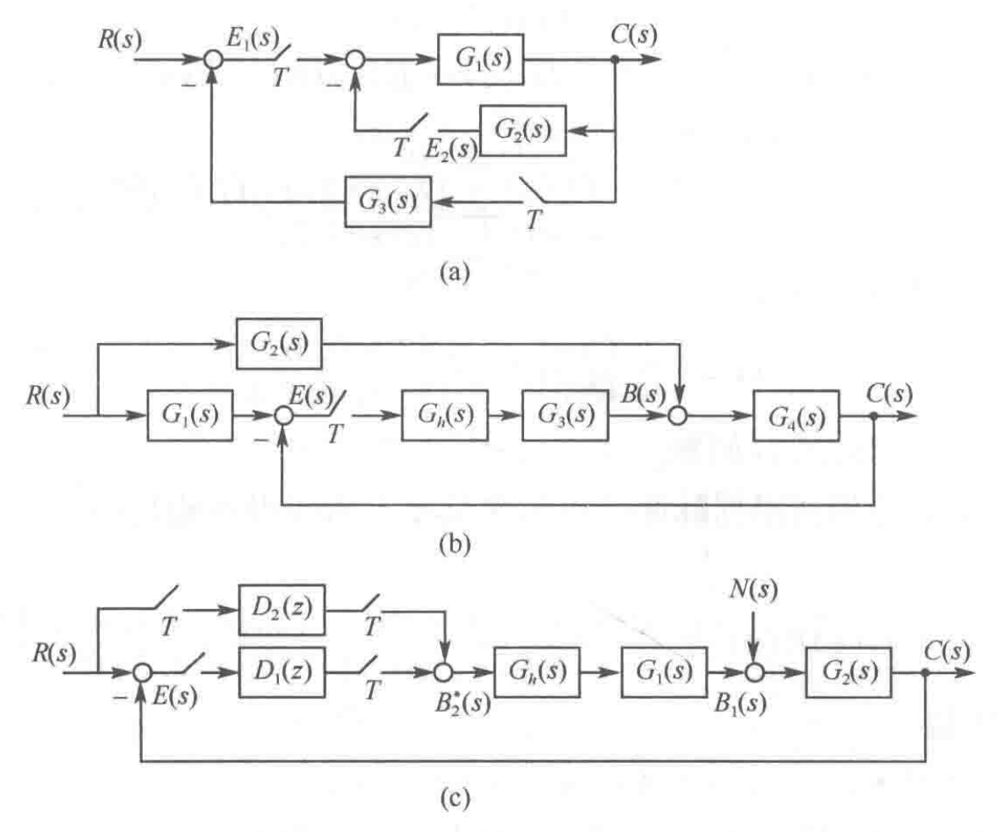

> Image description: This image contains three control system block diagrams labeled (a), (b), and (c). The caption identifies them as closed-loop discrete system structure diagrams. Diagram (a) shows a feedback loop with blocks $G_1(s)$, $G_2(s)$, and $G_3(s)$. It features switches triggered by period $T$, separating signals $E_1(s)$ and $E_2(s)$ to produce output $C(s)$. Diagram (b) depicts a system where input $R(s)$ passes through $G_1(s)$, leading to error signal $E(s)$. The path splits: one branch goes through $G_2(s)$, while the other passes through a sampler ($T$), blocks $G_h(s)$ and $G_3(s)$ to produce $B(s)$, before entering $G_4(s)$ to output $C(s)$. Diagram (c) illustrates a discrete-time system. Input $R(s)$ leads to error $E(s)$, which is sampled at period $T$ and processed by blocks $D_1(z)$ and $D_2(z)$. The combined signal $B^*_2(s)$ passes through $G_h(s)$ and $G_1(s)$, incorporating noise $N(s)$ before entering $G_2(s)$ to output $C(s)$.
图7－62 闭环离散系统结构图

$$
\frac{C(z)}{R(z)}=\frac{G_{1}(z)}{1+G_{1} G_{2}(z)+G_{1}(z) G_{3}(z)}
$$

图7－62（b）系统：因为

$$
\begin{aligned}
& C(s)=\left[R(s) G_{2}(s)+B(s)\right] G_{4}(s) \\
& B(s)=E^{*}(s) G_{h}(s) G_{3}(s) \\
& E(s)=G_{1}(s) R(s)-C(s) \\
& E^{*}(s)=R G_{1}^{*}(s)-C^{*}(s)
\end{aligned}
$$

因而

$$
\begin{aligned}
C(s) & =\left[R(s) G_{2}(s)+E^{*}(s) G_{h}(s) G_{3}(s)\right] G_{4}(s) \\
& =\left\{R(s) G_{2}(s)+\left[R G_{1}^{*}(s)-C^{*}(s)\right] G_{h}(s) G_{3}(s)\right\} G_{4}(s)
\end{aligned}
$$

对上式进行采样拉氏变换，可得

$$
C^{*}(s)=R G_{2} G_{4}^{*}(s)+\left[R G_{1}^{*}(s)-C^{*}(s)\right] G_{h} G_{3} G_{4}^{*}(s)
$$

经 $z$ 变换并整理，有

$$
C(z)=\frac{R G_{2} G_{4}(z)+R G_{1}(z) G_{h} G_{3} G_{4}(z)}{1+G_{h} G_{3} G_{4}(z)}
$$

图7－62（c）系统：由于

$$
\begin{aligned}
& C(s)=\left[N(s)+B_{1}(s)\right] G_{2}(s) \\
& B_{1}(s)=B_{2}^{*}(s) G_{h}(s) G_{1}(s) \\
& B_{2}(z)=R(z) D_{2}(z)+E(z) D_{1}(z) \\
& E(z)=R(z)-C(z)
\end{aligned}
$$

于是

$$
\begin{aligned}
& C(s)=N(s) G_{2}(s)+B_{2}^{*}(s) G_{h}(s) G_{1}(s) G_{2}(s) \\
& C^{*}(s)=N G_{2}^{*}(s)+B_{2}^{*}(s) G_{h} G_{1} G_{2}^{*}(s)
\end{aligned}
$$

$z$ 变换后整理可得


<!-- source_pdf_page: 233 -->
$$
\begin{aligned}
C(z) & =N G_{2}(z)+B_{2}(z) G_{h} G_{1} G_{2}(z) \\
& =N G_{2}(z)+\left[R(z) D_{2}(z)+E(z) D_{1}(z)\right] G_{h} G_{1} G_{2}(z)
\end{aligned}
$$

将 $E(z)=R(z)-C(z)$ 代人上式，整理后可得

$$
C(z)=\frac{N G_{2}(z)+\left[D_{1}(z)+D_{2}(z)\right] G_{h} G_{1} G_{2}(z) R(z)}{1+D_{1}(z) G_{h} G_{1} G_{2}(z)}
$$

7－11 已知脉冲传递函数

$$
G(z)=\frac{C(z)}{R(z)}=\frac{0.53+0.1 z^{-1}}{1-0.37 z^{-1}}
$$

其中 $R(z)=z /(z-1)$ ，试求 $c(n T)$ 。
解 本题旨在训练如何根据脉冲传递函数及输人函数得到输出函数，再选择合适的方法求得输出序列。

$$
C(z)=G(z) R(z)=\frac{0.53 z+0.1}{z-0.37} \cdot \frac{z}{z-1}=\frac{z(0.53 z+0.1)}{(z-0.37)(z-1)}
$$

用反演积分法，可得

$$
\begin{aligned}
c(n T) & =\operatorname{Res}\left[C(z) \cdot z^{n-1}\right]_{z \rightarrow 0.37}+\operatorname{Res}\left[C(z) \cdot z^{n-1}\right]_{z \rightarrow 1} \\
& =\lim _{z \rightarrow 0.37}\left[\frac{(z-0.37) \cdot z^{n} \cdot(0.53 z+0.1)}{(z-0.37)(z-1)}\right]+\lim _{z \rightarrow 1}\left[\frac{(z-1) \cdot z^{n} \cdot(0.53 z+0.1)}{(z-0.37)(z-1)}\right] \\
& =1-0.47 *(0.37)^{n}
\end{aligned}
$$

用幂级数法进行验证，有

$$
C(z)=\frac{z(0.53 z+0.1)}{(z-0.37)(z-1)}=\frac{0.53 z^{2}+0.1 z}{z^{2}-1.37 z+1.37}=0.53+0.8261 z^{-1}+0.9357 z^{-2}+\cdots
$$

其结果与反演法一致。
7－12 设有单位反馈误差采样的离散系统，连续部分传递函数为

$$
G(s)=\frac{1}{s^{2}(s+5)}
$$

输入 $r(t)=1(t)$ ，采样周期 $T=1 \mathrm{~s}$ 。试求：
（1）输出 $z$ 变换 $C(z)$ ；
（2）采样瞬时的输出响应 $c^{*}(t)$ ；
（3）输出响应的终值 $c(\infty)$ 。

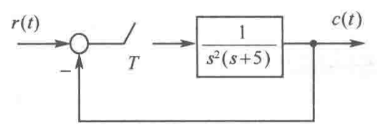

> Image description: A block diagram of a discrete-time control system is shown in Figure 7-12-1 (图 7－12－1 离散系统结构图). The signal flow begins with an input variable $r(t)$ entering a summing junction. A feedback loop returns the output signal $c(t)$ to this junction, where it is subtracted from the input. Following the summing junction, the error signal passes through a sampler denoted by a switch symbol and the label $T$, representing the sampling period. The sampled signal then enters a transfer function block defined as $\frac{1}{s^2(s+5)}$. The output of this block is the system output $c(t)$, which is both the final output of the process and the source for the unity feedback loop. Arrows indicate the unidirectional flow of signals from left to right, with one return path completing the closed-loop architecture.
图 7－12－1 离散系统结构图

解 本题旨在训练如何由连续传递函数获得脉冲传递函数，以及采用合适的方法求得输出脉冲序列和应用终值定理求得输出终值。

离散系统的结构图如图 7－12－1 所示。
（1）输出 $C(z)$ 。由 $T=1 \mathrm{~s}$ ，并查本教材中表7－2得

$$
G(z)=\frac{1}{5}\left[\frac{z}{(z-1)^{2}}-\frac{\left(1-\mathrm{e}^{-5}\right) z}{5(z-1)\left(z-\mathrm{e}^{-5}\right)}\right]=\frac{4.0067 z^{2}+0.9598 z}{25 z^{3}-50.1675 z^{2}+25.335 z-0.1675}
$$

闭环脉冲传递函数

$$
\begin{aligned}
\Phi(z) & =\frac{G(z)}{1+G(z)}=\frac{4.0067 z^{2}+0.9598 z}{25 z^{3}-46.1608 z^{2}+26.2948 z-0.1675} \\
& =\frac{0.1603 z^{2}+0.0384 z}{z^{3}-1.8464 z^{2}+1.0518 z-0.0067}
\end{aligned}
$$


<!-- source_pdf_page: 234 -->
因 $R(z)=\frac{z}{z-1}$ ，故

$$
C(z)=\Phi(z) R(z)=\frac{0.1603 z^{3}+0.0384 z^{2}}{z^{4}-2.8464 z^{3}+2.8982 z^{2}-1.0585 z+0.0067}
$$

（2）采样输出响应 $c^{*}(t)$ 。将 $C(z)$ 展成幂级数，可得

$$
C(z)=0.16 z^{-1}+0.49 z^{-2}+0.94 z^{-3}+1.42 z^{-4}+\cdots
$$

对上式取 $z$ 反变换，得

$$
c^{*}(t)=0.16 \delta(t-T)+0.49 \delta(t-2 T)+0.94 \delta(t-3 T)+1.42 \delta(t-4 T)+\cdots
$$

（3）输出终值 $c(\infty)$ 。先判定系统的稳定性。闭环系统特征方程为

$$
z^{3}-1.8464 z^{2}+1.0518 z-0.0067=0
$$

求得特征值为

$$
z_{1}=0.9167+0.4331 \mathrm{j}, \quad z_{2}=0.9167-0.4331 \mathrm{j}, \quad z_{3}=0.0066
$$

由于 $\left|z_{1}\right|=\left|z_{2}\right|=1.0138>1$ ，所以判定闭环系统不稳定，无法求输出响应的终值。
根据闭环脉冲传递函数，应用 MATLAB 软件包，得到离散系统单位阶跃响应，如图7－12－2所示，证实了闭环是不稳定的。

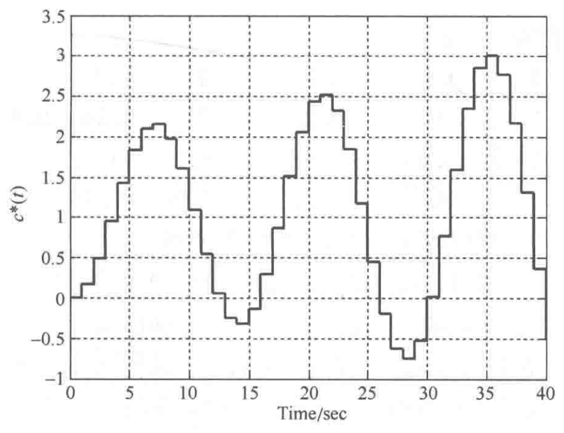

> Image description: A line graph plotting a discrete-time signal, $c^*(t)$, against time in seconds. The x-axis is labeled "Time/sec" and ranges from 0 to 40 with increments of 5. The y-axis is labeled "$c^*(t)$" and ranges from -1 to 3.5 with increments of 0.5. The plot displays a stepped, oscillating waveform that resembles a distorted sine wave. The amplitude of the oscillations increases over time: the first peak reaches approximately 2.1 at around 7 seconds, the second peak reaches approximately 2.5 at 22 seconds, and the third peak reaches nearly 3.0 at 36 seconds. Similarly, the troughs dip lower with each cycle, moving from roughly -0.3 to -0.8. In an engineering context, this growing oscillation indicates an unstable closed-loop system response to a unit step input, as noted in the provided caption.
图 7－12－2 闭环离散系统时间响应（ $T=1 \mathrm{~s}$ ，MATLAB）

MATLAB 程序 ：exe712．m
$\mathrm{t}=0: 1: 40$ ；
dstep（ $[0,0.1603,0.0384,0],[1,-1.8464,1.0518,-0.0067]$ ，t）；
grid；
xlabel（＇$t^{\prime}$ ）；
ylabel（＇c＊（t）＇）；
7－13 试判断下列系统的稳定性：
（1）已知闭环离散系统的特征方程为

$$
D(z)=(z+1)(z+0.5)(z+2)=0
$$

（2）已知闭环离散系统的特征方程为

$$
D(z)=z^{4}+0.2 z^{3}+z^{2}+0.36 z+0.8=0
$$

（要求采用朱利判据）


<!-- source_pdf_page: 235 -->
（3）已知误差采样的单位反馈离散系统，采样周期 $T=1 \mathrm{~s}$ ，开环传递函数

$$
G(s)=\frac{22.57}{s^{2}(s+1)}
$$

解 本题旨在练习判断离散系统稳定性的各种方法。
（1）特征值为 $z_{1}=-1, z_{2}=-0.5, z_{3}=-2$ ，由于 $\left|z_{3}\right|>1$ ，故闭环离散系统不稳定。
（2）由于 $n=4,2 n-3=5$ ，故朱利阵列有 5 行 5 列。根据给定的 $D(z)$ 知

$$
a_{0}=0.8, \quad a_{1}=0.36, \quad a_{2}=1, \quad a_{3}=0.2, \quad a_{4}=1
$$

计算朱利阵列中的元素 $b_{k}$ 和 $c_{k}$ 为

$$
\begin{gathered}
b_{0}=\left|\begin{array}{ll}
a_{0} & a_{4} \\
a_{4} & a_{0}
\end{array}\right|=-0.36, \quad b_{1}=\left|\begin{array}{ll}
a_{0} & a_{3} \\
a_{4} & a_{1}
\end{array}\right|=0.088 \\
b_{2}=\left|\begin{array}{ll}
a_{0} & a_{2} \\
a_{1} & a_{2}
\end{array}\right|=-0.2, \quad b_{3}=\left|\begin{array}{ll}
a_{0} & a_{1} \\
a_{4} & a_{3}
\end{array}\right|=-0.2 \\
c_{0}=\left|\begin{array}{ll}
b_{0} & b_{3} \\
b_{3} & b_{0}
\end{array}\right|=0.0896, \quad c_{1}=\left|\begin{array}{ll}
b_{0} & b_{2} \\
b_{3} & b_{1}
\end{array}\right|=-0.07168, \quad c_{2}=\left|\begin{array}{ll}
b_{0} & b_{1} \\
b_{3} & b_{2}
\end{array}\right|=0.0896
\end{gathered}
$$

作出朱利阵列：

| 行数 | $z^{0}$ | $z^{1}$ | $z^{2}$ | $z^{3}$ | $z^{4}$ |
| :---: | :---: | :---: | :---: | :---: | :---: |
| 1 | 0.8 | 0.36 | 1 | 0.2 | 1 |
| 2 | 1 | 0.2 | 1 | 0.36 | 0.8 |
| 3 | -0.36 | 0.088 | -0.2 | -0.2 |  |
| 4 | -0.2 | -0.2 | 0.088 | -0.36 |  |
| 5 | 0.0896 | -0.07168 | 0.0896 |  |  |

因为

$$
D(1)=3.36>0, \quad D(-1)=2.24>0
$$

$$
\begin{array}{lll}
\left|a_{0}\right|=0.8, & a_{4}=1, & \text { 满足 }\left|a_{0}\right|<a_{4} \\
\left|b_{0}\right|=0.36, & \left|b_{3}\right|=0.2, & \text { 满足 }\left|b_{0}\right|>\left|b_{3}\right| \\
\left|c_{0}\right|=0.0896, & \left|c_{2}\right|=0.0896, & \text { 不满足 }\left|c_{0}\right|>\left|c_{2}\right|
\end{array}
$$

故由朱利稳定判据知，该离散系统不稳定。
（3）开环脉冲传递函数为

$$
\begin{aligned}
G(z) & =Z\left[\frac{22.57}{s^{2}}-\frac{22.57}{s}+\frac{22.57}{s+1}\right]=22.57\left[\frac{z}{(z-1)^{2}}-\frac{z}{z-1}+\frac{z}{z-0.368}\right] \\
& =\frac{22.57 z(0.368 z+0.264)}{(z-1)^{2}(z-0.368)}=\frac{8.306\left(z^{2}+0.717 z\right)}{z^{3}-2.368 z^{2}+1.736 z-0.368}
\end{aligned}
$$

闭环脉冲传递函数为

$$
\Phi(z)=\frac{G(z)}{1+G(z)}=\frac{8.306\left(z^{2}+0.717 z\right)}{z^{3}+5.938 z^{2}+7.694 z-0.368}
$$

特征方程为

$$
D(z)=z^{3}+5.938 z^{2}+7.694 z-0.368=0
$$

求出特征值为

$$
z_{1}=-3.903, \quad z_{2}=-2.043, \quad z_{3}=0.046
$$

由于 $\left|z_{1}\right|>1,\left|z_{2}\right|>1$ ，故闭环系统不稳定。


<!-- source_pdf_page: 236 -->
可用 MATLAB 进行验证，m 文件文本及单位阶跃响应如图 7－13－1 所示。

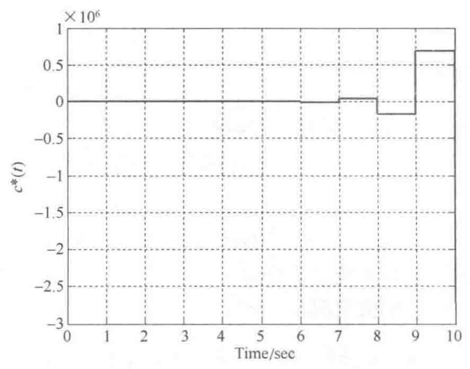

> Image description: A line graph plotted in MATLAB shows the time response of a variable $c^*(t)$. The horizontal x-axis is labeled "Time/sec" and ranges from 0 to 10 seconds. The vertical y-axis represents $c^*(t)$ with values scaled by $10^6$, ranging from $-3 \times 10^6$ to $1 \times 10^6$. The signal remains at zero from $t = 0$ to approximately $t = 7$ seconds. At $t = 7$, there is a small positive step, followed by a negative step to approximately $-0.2 \times 10^6$ at $t = 8$ seconds. Finally, at $t = 9$ seconds, the signal jumps to a positive value of approximately $0.6 \times 10^6$, where it remains until $t = 10$. The figure depicts a series of unit step responses or discrete changes in a control variable over time, as indicated by the provided caption mentioning "单位阶跃响应" (unit step response).
图 7－13－1 离散系统（3）单位阶跃响应（MATLAB）

MATLAB 程序 ：exe713．m

```
t=0:1:10;
dstep([0,8.306,5.9554,0],[1,5.9382,7.694,-0.368],t);
grid;
xlabel('t');
ylabel('c*(t)');
```

7－14 设离散系统如图7－63所示，采样周期 $T=1 \mathrm{~s}, G_{h}(s)$ 为零阶保持器。
要求：
（1）当 $K=5$ 时，分别在 $z$ 域和 $w$ 域中分析系统的稳定性；
（2）确定使系统稳定的 $K$ 值范围。
解 首先求出闭环脉冲传递函数，

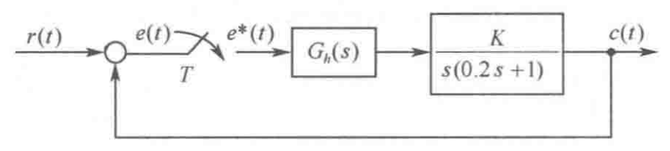

> Image description: This image displays a control system block diagram for a discrete-time feedback loop. The input signal is labeled $r(t)$, which enters a summing junction. The error signal, $e(t)$, flows from the summing junction into a sampler with a sampling period $T$, resulting in the sampled signal $e^*(t)$. The forward path consists of two sequential blocks: a zero-order hold represented by $G_h(s)$ and a plant transfer function defined as $\frac{K}{s(0.2s + 1)}$. The output of this chain is the control signal $c(t)$. A feedback loop connects the output $c(t)$ back to the summing junction, completing the closed-loop system. Arrows indicate the unidirectional flow of signals from left to right through the blocks and backward via the feedback path. In engineering terms, this represents a sampled-data control system where a continuous plant is controlled by a discrete controller.
图 7－63 离散系统结构图

再使用合适的稳定判据对闭环系统进行稳定性分析及确定 $K$ 值的范围。
（1）稳定性分析。

$$
\begin{aligned}
G_{h} G_{0}(z)=\mathscr{Z}\left[G_{h}(s) G_{0}(s)\right] & =\mathscr{Z}\left[\frac{1-\mathrm{e}^{-T_{s}}}{s} \cdot \frac{5}{s(0.2 s+1)}\right]=25\left(1-z^{-1}\right) \mathscr{Z}\left[\frac{1}{s^{2}(s+5)}\right] \\
& =25\left(1-z^{-1}\right) \mathscr{Z}\left[\frac{0.2}{s^{2}}-\frac{0.04}{s}+\frac{0.04}{s+5}\right] \\
& =25\left(1-z^{-1}\right) \mathscr{Z}\left[\frac{0.2 z}{(z-1)^{2}}-\frac{0.04 z}{z-1}+\frac{0.04 z}{z-\mathrm{e}^{-5}}\right] \\
& =\frac{\left(4+\mathrm{e}^{-5}\right) z+\left(1-6 \mathrm{e}^{-5}\right)}{(z-1)\left(z-\mathrm{e}^{-5}\right)}
\end{aligned}
$$

闭环脉冲传递函数为

$$
\Phi(z)=\frac{G_{h} G_{0}(z)}{1+G_{h} G_{0}(z)}=\frac{\left(4+\mathrm{e}^{-5}\right) z+\left(1-6 \mathrm{e}^{-5}\right)}{z^{2}+3 z+\left(1-5 \mathrm{e}^{-5}\right)}
$$

$z$ 域特征方程为


<!-- source_pdf_page: 237 -->
$$
D(z)=z^{2}+3 z+1-5 \mathrm{e}^{-5}=0
$$

求得特征值为

$$
z_{1}=-2.633, \quad z_{2}=-0.367
$$

因 $\left|z_{1}\right|>1$ ，故闭环系统不稳定。
将 $z=\frac{w+1}{w-1}$ 代人 $D(z)$ ，有 $w$ 域特征方程为

$$
D(w)=w^{2}+0.0136 w-0.2149=0
$$

求得特征值为

$$
w_{1}=-0.4704, \quad w_{2}=0.4568
$$

因 $w_{2}>0$ ，故在 $w$ 域分析，闭环系统也不稳定。
（2）确定使系统稳定的 $K$ 值范围。

$$
D(z)=z^{2}+\left[-\left(1+\mathrm{e}^{-5 T}\right)+K\left(\frac{4+\mathrm{e}^{-5 T}}{5}\right)\right] z+\left(\mathrm{e}^{-5 T}+K \frac{1-6 \mathrm{e}^{-5 T}}{5}\right)=0
$$

将 $z=\frac{w+1}{w-1}$ 代人 $D(z)$ ，有

$$
D(w)=0.9933 K w^{2}+(1.9865-0.3838 K) w+(1.0135-0.6094 K)=0
$$

在 $w$ 域中可以用劳斯表来确定 $K$ 值范围，最后可得到 $0<K<1.6631$ 。
令 $K$ 值分别为 5 和 1.5 ，得离散系统单位阶跃响应分别如图 7－14－1 和图 7－14－2 所示。

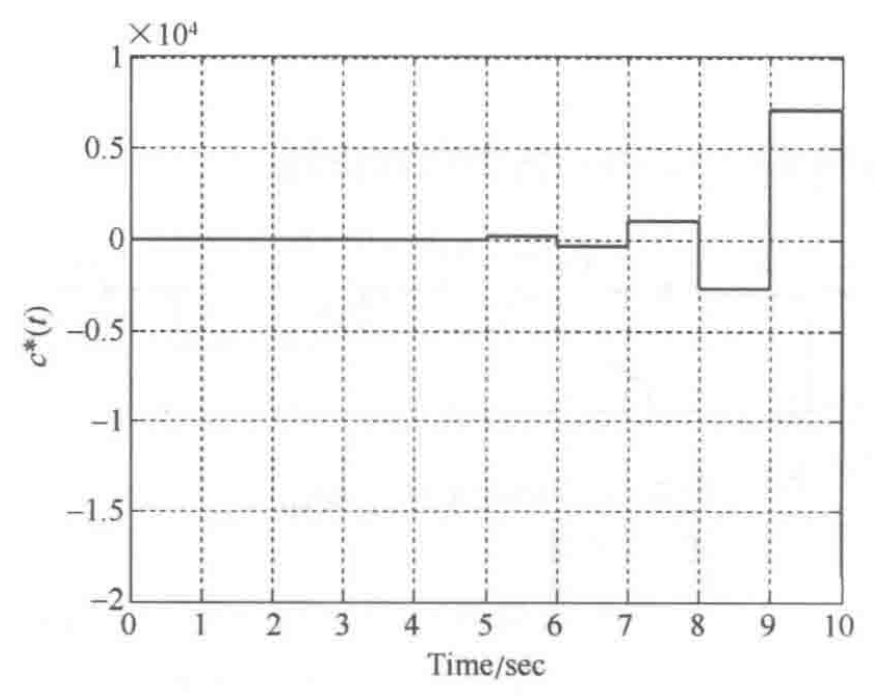

> Image description: A line graph plotting a discrete-time signal, denoted as $c^*(t)$ on the vertical axis, against time in seconds on the horizontal axis. The x-axis ranges from 0 to 10 seconds with increments of 1 second. The y-axis is scaled by a factor of $10^4$, ranging from $-2 \times 10^4$ to $1 \times 10^4$. The signal remains at zero from $t = 0$ to $t = 5$ seconds. Starting at $t = 5$, the signal exhibits a series of step-like changes: it stays near zero until $t = 6$, drops slightly below zero between $t = 6$ and $t = 7$, rises to a small positive value between $t = 7$ and $t = 8$, drops to approximately $-0.3 \times 10^4$ between $t = 8$ and $t = 9$, and finally jumps to approximately $0.6 \times 10^4$ from $t = 9$ to $t = 10$. The figure represents a discrete system response over time.
图 7－14－1 离散系统时间响应（ $K=5$ ．MATLAB）

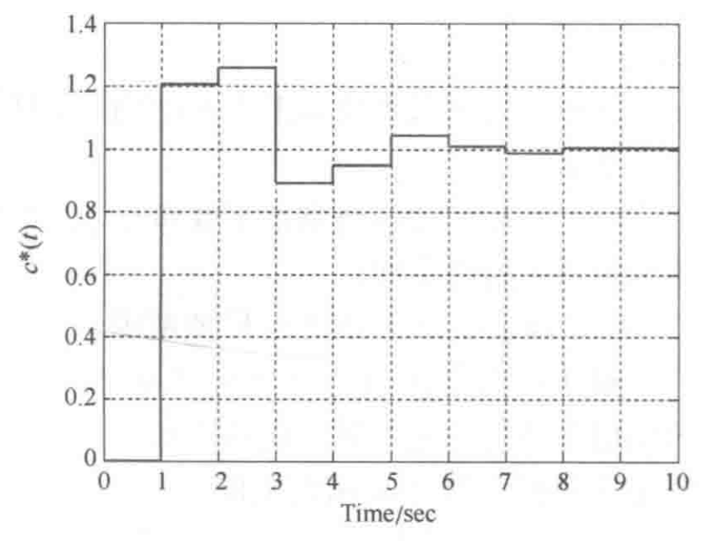

> Image description: The image displays a plot of the time response for a discrete system, as indicated by the caption "图 7-14-1 离散系统时间响应 ($K=5$, MATLAB)". The graph features a horizontal x-axis labeled "Time/sec" ranging from 0 to 10 seconds and a vertical y-axis labeled "$c^*(t)$" with values ranging from 0 to 1.4. The plotted signal is a piecewise constant function, appearing as a series of steps (a staircase waveform). The value remains at 0 until $t=1$ second, where it jumps to approximately 1.2. It then fluctuates between roughly 0.9 and 1.25 in discrete intervals before stabilizing near a value of 1.0 from $t=7$ seconds onward. This representation typically illustrates the set-point or desired reference signal for a control system over time, showing how the target variable changes in discrete steps.
图 7－14－2 离散系统时间响应（ $K=1.5$ ．MATLAB）

\％ $\mathrm{K}=5$
figure（1）
$\mathrm{t}=0: 1: 10$ ；
dstep（［0，4．0067，0．9596］，［1，3，0．9663］，t）；
grid；
xlabel（＇t＇）；
ylabel（＇$c(t)^{\prime}$ ）；
$\% \mathrm{~K}=1.5$
figure（2）
dstep（ $[0,1.202,0.2879],[1,0.1953,0.2946], \mathrm{t}$ ）；


<!-- source_pdf_page: 238 -->
```
grid;
xlabel('t');
ylabel('c*(t)');
```

7－15 设离散系统如图 7－64 所示，其中采样周期 $T=0.2, K=10, r(t)=1+t+t^{2} / 2$ ，试用终值定理法计算系统的稳态误差 $e_{s s}(\infty)$ 。

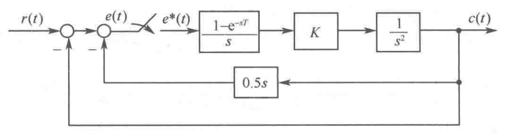

> Image description: This image shows a control system block diagram for a discrete-time feedback loop. The input signal is labeled $r(t)$, which enters a summing junction. The error signal $e(t)$ is generated after the first subtraction and passes through a sampler to become $e^*(t)$. The forward path consists of three sequential blocks: a zero-order hold represented by $\frac{1-e^{-sT}}{s}$, a gain block $K$, and an integrator block $\frac{1}{s^2}$. The output of the system is labeled $c(t)$. There are two feedback loops returning from $c(t)$ to the summing junctions. One loop provides direct unity feedback, while the other passes through a derivative block labeled $0.5s$. Arrows indicate the direction of signal flow from left to right in the forward path and right to left in the feedback paths. The diagram represents a sampled-data control system used for calculating steady-state error.
图 7－64 闭环离散系统结构图

解 本题关键是求出闭环系统的脉冲传递函数。
将系统简化为如图 7－15－1 所示结构。
反馈回路传递函数为

$$
H(s)=1+0.5 s
$$

前向通路传递函数为

$$
G(s)=G_{h}(s) \cdot K \cdot \frac{1}{s^{2}}=\frac{K\left(1-\mathrm{e}^{-T s}\right)}{s^{3}}
$$

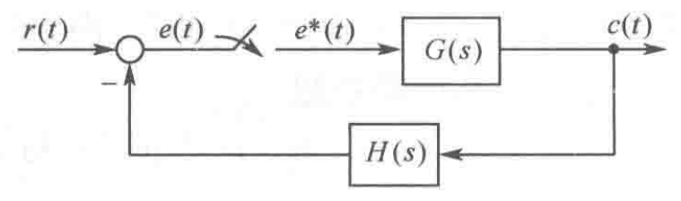

> Image description: This image is a control system block diagram labeled "图 7-15-1 系统简化结构图." The diagram illustrates a closed-loop feedback system using standard engineering notation. The process begins with an input signal $r(t)$ entering a summing junction (represented by a circle). This junction subtracts a feedback signal from the input to produce an error signal $e(t)$. A symbol indicating a switch or discontinuity follows, leading to a modified error signal $e^*(t)$. This signal enters a forward-path block labeled $G(s)$, which outputs the controlled variable $c(t)$. The output $c(t)$ is then fed back through a feedback-path block labeled $H(s)$, returning to the summing junction with a negative sign. Arrows indicate the unidirectional flow of signals throughout the loop, representing the relationship between the reference input, system dynamics, and feedback mechanism in the Laplace domain ($s$).
图 7－15－1 系统简化结构图

对 $G(s) H(s)$ 取 $z$ 变换，有

$$
\begin{aligned}
G H(z) & =\mathscr{Z}[G(s) H(s)]=\left(1-z^{-1}\right) \mathscr{Z}\left[\frac{5 s+10}{s^{3}}\right]=5\left(1-z^{-1}\right) \mathscr{Z}\left[\frac{1}{s^{2}}+\frac{2}{s^{3}}\right] \\
& =5\left(1-z^{-1}\right)\left[\frac{0.2 z}{(z-1)^{2}}+\frac{0.04 z(z+1)}{(z-1)^{3}}\right]=\frac{1.2 z-0.8}{(z-1)^{2}}
\end{aligned}
$$

误差脉冲传递函数为

$$
\Phi_{e}(z)=\frac{1}{1+G H(z)}=\frac{z^{2}-2 z+1}{z^{2}-0.8 z+0.2}
$$

闭环特征方程为

$$
D(z)=z^{2}-0.8 z+0.2=0
$$

求得特征根

$$
z_{1,2}=0.4 \pm \mathrm{j} 0.2
$$

由于 $\left|z_{1,2}\right|<1$ ，故系统稳定。
由

$$
R(z)=\mathscr{Z}\left[1+t+\frac{t^{2}}{2}\right]=\frac{z}{z-1}+\frac{0.2 z}{(z-1)^{2}}+\frac{0.02 z(z+1)}{(z-1)^{3}}
$$

求得系统稳态误差

$$
e_{s}(\infty)=\lim _{z \rightarrow 1}\left(1-z^{-1}\right) \Phi_{e}(z) R(z)=0.1
$$

7－16 设离散系统如图7－65所示，其中 $T=0.1, K=1, r(t)=t$ ，试求静态误差系数 $K_{p}, K_{v}, K_{a}$ ，并求系统稳态误差 $e_{\mathrm{s}}(\infty)$ 。

解 本题关键是先判断系统的稳定性，再求得各个误差系数。
由于开环脉冲传递函数


<!-- source_pdf_page: 239 -->
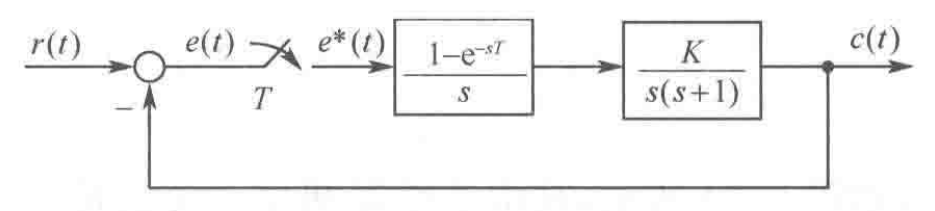

> Image description: This image is a block diagram of a closed-loop discrete system, captioned as "图7－65 闭环离散系统结构图". The signal flow begins with an input variable $r(t)$ entering a summing junction. The output of this junction, the error signal $e(t)$, passes through a sampler with period $T$, resulting in the sampled signal $e^*(t)$. This signal enters a block defined by the transfer function $\frac{1-e^{-sT}}{s}$, which is then followed by a second block with the transfer function $\frac{K}{s(s+1)}$. The final output of the system is labeled as $c(t)$. A feedback loop connects the output $c(t)$ back to the summing junction, where it is subtracted from the input $r(t)$, indicated by a minus sign. Arrows indicate a unidirectional flow from left to right through the forward path and from right to left via the unity feedback path.
图7－65 闭环离散系统结构图

$$
\begin{aligned}
G_{h} G_{0}(z) & =\mathscr{Z}\left[\frac{\left(1-e^{-s T}\right) K}{s^{2}(s+1)}\right]=\left(1-z^{-1}\right) \mathscr{Z}\left[\frac{1}{s^{2}(s+1)}\right]=\left(1-z^{-1}\right) \mathscr{Z}\left[\frac{1}{s^{2}}-\frac{1}{s}+\frac{1}{s+1}\right] \\
& =\left(1-z^{-1}\right)\left[\frac{0.1 z}{(z-1)^{2}}-\frac{z}{z-1}+\frac{z}{z-0.905}\right]=\frac{0.005(z+0.9)}{(z-1)(z-0.905)}
\end{aligned}
$$

闭环误差脉冲传递函数

$$
\Phi_{e}(z)=\frac{1}{1+G_{h} G_{0}(z)}=\frac{(z-1)(z-0.905)}{z^{2}-1.9 z+0.905}
$$

闭环特征方程为

$$
D(z)=z^{2}-1.9 z+0.905=0
$$

求得特征根 $z_{1.2}=0.95 \pm \mathrm{j} 0.087$ 。由于 $\left|z_{1.2}\right|<1$ ，故闭环系统稳定。
系统静态误差系数

$$
\begin{aligned}
& K_{p}=\lim _{z \rightarrow 1}\left[1+G_{h} G_{0}(z)\right]=\infty \\
& K_{v}=\lim _{z \rightarrow 1}(z-1) G_{h} G_{0}(z)=0.1 \\
& K_{a}=\lim _{z \rightarrow 1}(z-1)^{2} G_{h} G_{0}(z)=0
\end{aligned}
$$

根据开环脉冲传递函数的形式，可以判定该系统是 I 型系统，在单位斜坡输入的情况下，稳态误差为

$$
e_{s s}(\infty)=\frac{T}{K_{v}}=1
$$

MATLAB 验证：离散系统单位斜坡响应如图7－16－1所示，可见 $e_{\mathrm{ss}}(\infty)=1$ 。

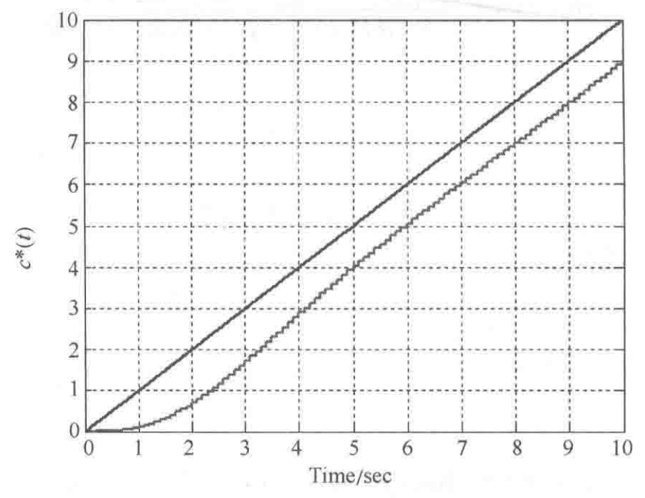

> Image description: This image shows a MATLAB plot illustrating the unit ramp response of a discrete-time system. The graph features a horizontal x-axis labeled "Time/sec" ranging from 0 to 10 and a vertical y-axis labeled "$c^*(t)$" ranging from 0 to 10. Two curves are plotted: a smooth, solid diagonal line representing the ideal reference input (a unit ramp) and a stepped, jagged line representing the system's discrete output response. Both start at the origin $(0,0)$. The output curve follows the general trajectory of the reference line but maintains a constant vertical offset as time increases. From an engineering perspective, this figure demonstrates a steady-state tracking error. According to the provided caption, the steady-state error $e_{\mathrm{ss}}(\infty)$ is equal to 1, which is visually evident by the constant gap between the ideal ramp input and the discrete system's output response.
图 7－16－1 离散系统单位斜坡响应（MATLAB）

MATLAB 程序 ：exe716．m

$$
\begin{aligned}
& \mathrm{T}=0.1 ; \\
& \mathrm{t}=0: 0.1: 10 ; \\
& \text { sys }=\mathrm{tf}([0,0.005,0.0045],[1,-1.9,0.9095], \mathrm{T}) ;
\end{aligned}
$$


<!-- source_pdf_page: 240 -->
```
u=t; %定义系统输人
Isim(sys,u,t,0); %绘制离散系统单位斜坡响应曲线
grid;
xlabel('t');
ylabel('c'(t)');
```

7－17 已知离散系统如图 7－66 所示，其中 ZOH 为零阶保持器，$T=0.25$ 。当 $r(t)= 2+t$ 时，欲使稳态误差小于 0.1 ，试求 $K$ 值。

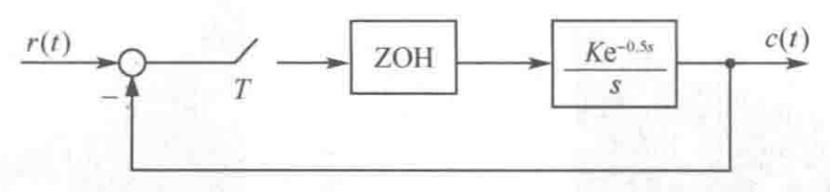

> Image description: A block diagram of a discrete-time control system is shown. The input signal, labeled $r(t)$, enters from the left and meets a summing junction with a negative feedback loop returning from the output $c(t)$. Following the summing junction is a sampler indicated by a switch with a sampling period $T$. The forward path consists of two main blocks: a Zero-Order Hold (ZOH) block followed by a plant transfer function represented as $\frac{Ke^{-0.5s}}{s}$. Arrows indicate the signal flow from left to right, starting at $r(t)$, passing through the sampler and ZOH, then through the plant block to reach the output $c(t)$. A feedback line connects the output $c(t)$ back to the summing junction. The diagram represents a typical closed-loop system incorporating a digital-to-analog interface (ZOH) and a process with a time delay.
图7－66 闭环离散系统结构图

解 本题关键是选择合适的稳定判据对闭环系统进行稳定性分析，选取的 $K$ 值应同时满足稳定性及稳态误差要求。

开环脉冲传递函数为

$$
G(z)=\mathscr{Z}\left[\frac{1-\mathrm{e}^{-T s}}{s} \cdot \frac{K \mathrm{e}^{-0.5 s}}{s}\right]=K\left(1-z^{-1}\right) \mathscr{Z}\left[\frac{\mathrm{e}^{-0.5 s}}{s^{2}}\right]
$$

由于 $T=0.25$ ，故 $\mathrm{e}^{-0.5 s}=\mathrm{e}^{-2 T s}=\frac{1}{z^{2}}$ ，所以 $G(z)=\frac{0.25 K}{z^{2}(z-1)}$ 。闭环误差脉冲传递函数为

$$
\Phi_{e}(z)=\frac{1}{1+G(z)}=\frac{z^{2}(z-1)}{z^{2}(z-1)+0.25 K}
$$

闭环特征方程为

$$
D(z)=z^{3}-z^{2}+0.25 K=0
$$

将 $z=\frac{w+1}{w-1}$ 代人特征方程，得 $w$ 域特征方程

$$
D(w)=0.25 K w^{3}+(2-0.75 K) w^{2}+(4+0.75 K) w+(2-0.25 K)=0
$$

在 $w$ 域中用劳斯表分析系统的稳定性，可以得到使系统稳定的 $K$ 值范围。列劳斯表如下：

$$
\begin{array}{c|cc}
w^{3} & 0.25 K & 4+0.75 K \\
w^{2} & 2-0.75 K & 2-0.25 K \\
w^{1} & \left(8-2 K-0.5 K^{2}\right) /(2-0.75 K) & 0 \\
w^{0} & 2-0.25 K &
\end{array}
$$

由劳斯判据知，使系统稳定的 $K$ 值：

$$
\left\{\begin{aligned}
K & >0 \\
2-0.75 K & >0 \\
8-2 K-0.5 K^{2} & >0 \\
2-0.25 K & >0
\end{aligned}\right.
$$

解得使系统稳定的 $K$ 值范围

$$
0<K<2.47
$$

从满足稳态误差要求考虑，由于

$$
R(z)=\mathscr{Z}[2+t]=\frac{2 z}{z-1}+\frac{T z}{(z-1)^{2}}=\frac{2 z(z-1)+0.25 z}{(z-1)^{2}}
$$


<!-- source_pdf_page: 241 -->
故稳态误差

$$
e_{s}(\infty)=\lim _{z \rightarrow 1}\left(1-z^{-1}\right) \Phi_{e}(z) R(z)=\frac{T}{0.25 K}=\frac{1}{K}
$$

由于要求 $e_{s s}(\infty)<0.1$ ，则应有 $K>10$ 。显然，满足 $e_{s s}(\infty)<0.1$ 的 $K$ 值不存在。
MATLAB 验证：取 $K=2.5$ ，系统的误差输出响应如图 7－17－1 所示，系统是不稳定的；取 $K=2.4$ ，系统误差输出响应如图7－17－2所示，系统稳定，但 $e_{s}(\infty)=0.42>0.1$ 。
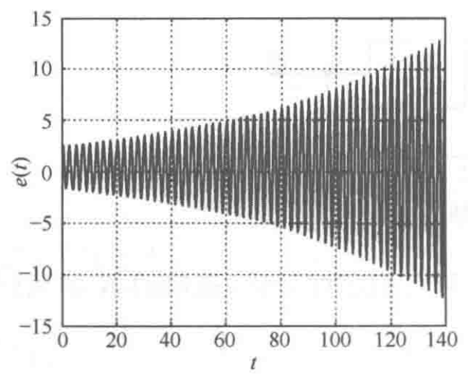

> Image description: The image shows a MATLAB-generated plot of an error output response, labeled as Figure 7-17-1 in the provided caption. The vertical y-axis is labeled $e(t)$ and ranges from -15 to 15. The horizontal x-axis is labeled $t$ (time) and ranges from 0 to 140. The plot displays a high-frequency sinusoidal oscillation whose amplitude increases exponentially over time. Starting near zero at $t=0$, the oscillations grow in magnitude, reaching approximately $\pm 13$ by $t=140$. In engineering terms, this diverging oscillation indicates an unstable system response. According to the caption, this specific behavior occurs when the gain parameter is set to $K=2.5$, confirming that the system is unstable under these conditions.

图 7－17－2 离散系统误差输出响应（ $K=2.4$ ，MATLAB）
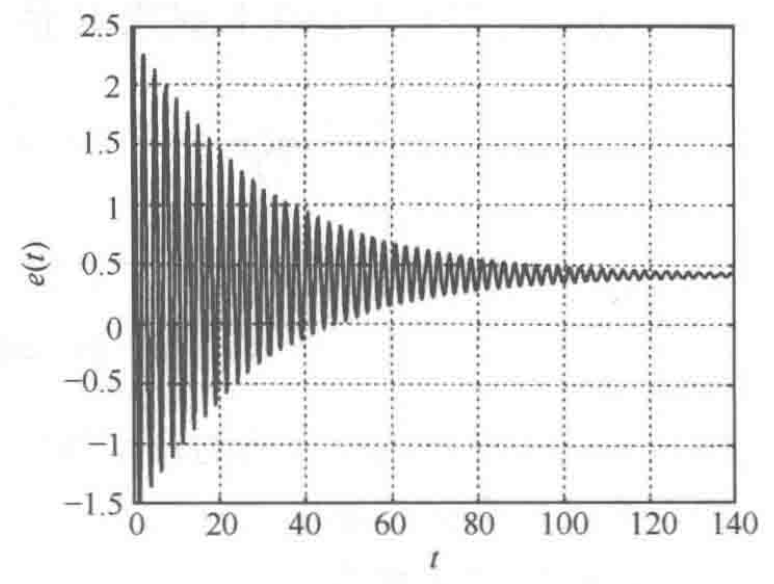

> Image description: The image shows a plot of the error output response for a discrete system, as indicated by the caption "图 7-17-2 离散系统误差输出响应 ($K=2.4$, MATLAB)". The graph features a vertical y-axis labeled $e(t)$ and a horizontal x-axis labeled $t$. The plot displays a damped oscillatory signal starting at approximately $t=0$ with an initial amplitude peaking around 2.2 and dipping to -1.3. As time $t$ increases from 0 toward 140, the oscillations decrease in magnitude, gradually converging toward a steady-state value of approximately 0.4. The grid lines help quantify the decay over time. In engineering terms, this represents the transient response of a system's error signal, showing how it oscillates and eventually stabilizes as it approaches a final value under the specific gain parameter $K=2.4$.

```
MATLAB 程序( K=2.5):exe717a.m
% k = 2.5;
K=2.5;
T=0.25;
G= tf([K],[10],'inputdelay',0.5);
Gz = c2d(G,T,' zoh');
syse = feedback(1,Gz)
t=0:T:140;
u=2+t;
e=l sim(syse,u,t,0);
plot(t,e);grid
xlabel('t');
ylabel('e(t)');
MATLAB 程序(K=2.4):exe717b.m
%K=2.4
K=2.4;
T = 0.25;
G=tf([K],[10],'inputdelay',0.5);
Gz = c2d(G,T,' zoh');
syse = feedback(1,Gz)
t=0:T:140;
u=2+t;
e=lsim(syse,u,t,0);
plot(t,e);grid
xlabel('t');
```


<!-- source_pdf_page: 242 -->
ylabel（＇ $\mathrm{e}(\mathrm{t})^{\prime}$ ）；
7－18 试分别求出教材中图7－64和图7－65系统的单位阶跃响应 $c(n T)$ 。
解 本题旨在训练根据系统结构图求得闭环脉冲传递函数，然后求取时间响应的方法。
（1）图 7－64 系统。前向通路脉冲传递函数

$$
G(z)=K\left(1-z^{-1}\right) \mathscr{Z}\left[\frac{1}{s^{3}}\right]=\frac{K(z-1)}{z} \cdot \frac{T^{2} z(z+1)}{(z-1)^{3}}=\frac{0.2(z+1)}{(z-1)^{2}}
$$

闭环脉冲传递函数为

$$
\Phi(z)=\frac{G(z)}{1+G H(z)}=\frac{\frac{0.2(z+1)}{(z-1)^{2}}}{1+\frac{1.2 z-0.8}{(z-1)^{2}}}=\frac{0.2(z+1)}{z^{2}-0.8 z+0.2}
$$

因 $R(z)=\frac{z}{z-1}$ ，故系统输出为

$$
\begin{aligned}
C(z) & =\Phi(z) R(z)=\frac{0.2(z+1)}{z^{2}-0.8 z+0.2} \cdot \frac{z}{z-1}=\frac{0.2 z^{2}+0.2 z}{z^{3}-1.8 z^{2}+z-0.2} \\
& =0.2 z^{-1}+0.56 z^{-2}+0.808 z^{-3}+0.934 z^{-4}+\cdots
\end{aligned}
$$

所以

$$
c(n T)=0.2 \delta(t-T)+0.56 \delta(t-2 T)+0.808 \delta(t-3 T)+0.934 \delta(t-4 T)+\cdots
$$

系统的单位阶跃响应如图 7－18－1 所示。

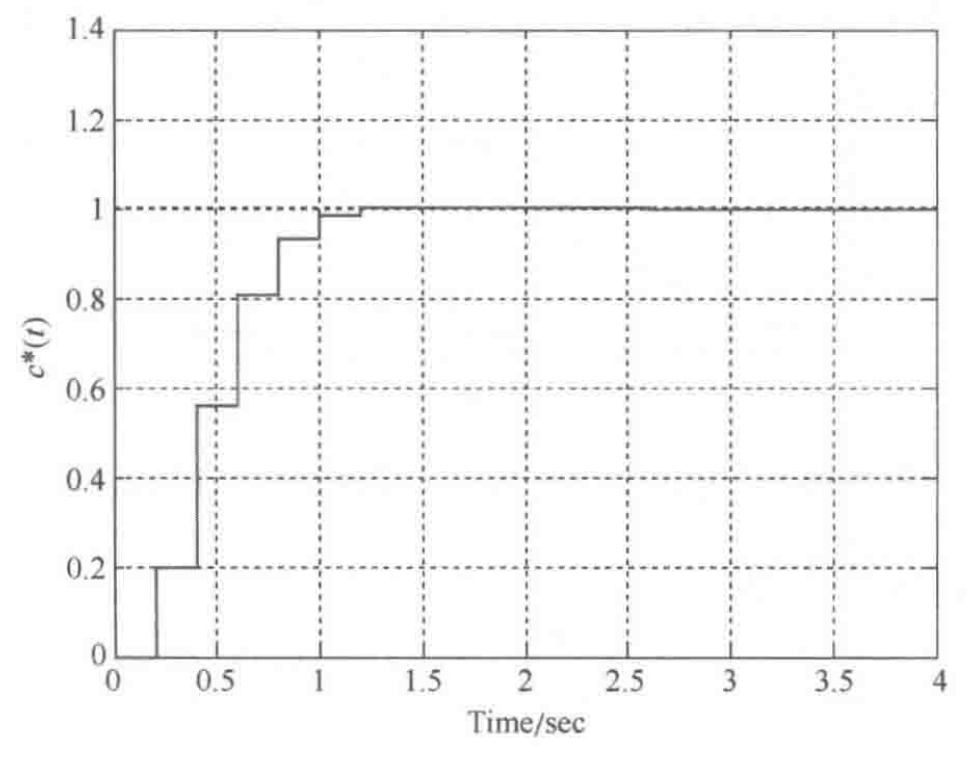

> Image description: This figure shows the unit step response of a system, plotted as $c^*(t)$ versus time in seconds. The horizontal x-axis is labeled "Time/sec" and ranges from 0 to 4, with major grid lines every 0.5 seconds. The vertical y-axis is labeled $c^*(t)$ and ranges from 0 to 1.4, with increments of 0.2. The plot depicts a staircase-like function that begins at zero. It rises in discrete steps at approximately 0.2, 0.4, 0.6, and 0.8 seconds. The signal reaches a steady-state value of 1.0 at approximately $t = 1$ second and remains constant thereafter. A dashed horizontal line is drawn at the value of 1 to indicate the target unit step level. This graph represents how the system output evolves over time in response to a unit step input, characterized by quantized or discrete-time increments before settling.
图7－18－1 图7－64 系统的单位阶跃响应（MATLAB）

MATLAB 程序：exe718a，m
\％图 7－64

```
T=0.2;
t=0:0.2:4;
sys = tf([0,0.2,0.2],[1,-0.8,0.2],T); %定义闭环脉冲传递函数
step(sys,t); %绘制阶跃响应曲线
grid;
xlabel('t');
ylabel('c*(t)');
```


<!-- source_pdf_page: 243 -->
（2）图 7－65 系统。闭环脉冲传递函数为

$$
\Phi(z)=\frac{G(z)}{1+G(z)}=\frac{\frac{0.005(z+0.9)}{(z-1)(z-0.905)}}{1+\frac{0.005(z+0.9)}{(z-1)(z-0.905)}}=\frac{0.005(z+0.9)}{z^{2}-1.9 z+0.905}
$$

系统输出

$$
\begin{aligned}
C(z) & =\Phi(z) R(z)=\frac{0.005(z+0.9)}{z^{2}-1.9 z+0.905} \cdot \frac{z}{z-1} \\
& =\frac{0.005 z^{2}+0.0045 z}{z^{3}-2.9 z^{2}+2.805 z-0.905} \\
& =0.005 z^{-1}+0.019 z^{-2}+0.041 z^{-3}+0.069 z^{-4}+\cdots
\end{aligned}
$$

所以

$$
c(n T)=0.005 \delta(t-T)+0.019 \delta(t-2 T)+0.041 \delta(t-3 T)+0.069 \delta(t-4 T)+\cdots
$$

系统的单位阶跃响应如图 7－18－2 所示。

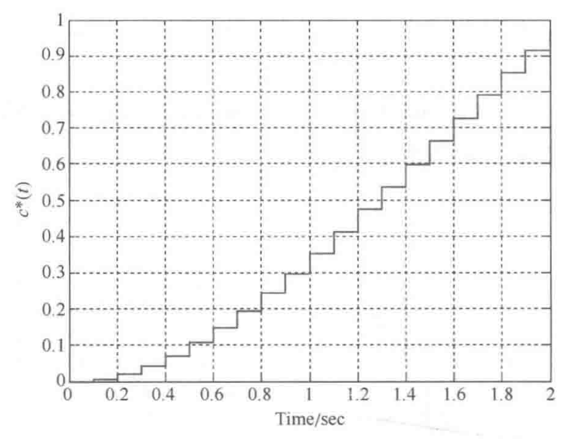

> Image description: A line graph showing the unit step response of a system is presented in Figure 7-18-2. The horizontal x-axis is labeled "Time/sec" and ranges from 0 to 2 seconds, with major tick marks every 0.2 seconds. The vertical y-axis is labeled "$c^*(t)$" and ranges from 0 to 1, with increments of 0.1. The plot displays a staircase-like function that increases monotonically over time. A smooth curve is overlaid on the steps, indicating the ideal response compared to the discretized output. The signal starts at $(0, 0)$ and reaches approximately $0.9$ at $t = 2$ seconds. Grid lines are present for both axes to facilitate value reading. In engineering terms, this figure illustrates a system's time-domain response to a unit step input, characterized by discrete jumps rather than a continuous smooth transition.
图7－18－2 图7－65系统的单位阶跃响应（MATLAB）

MATLAB 程序：exe718b．m
\％图 7－65

$$
\begin{aligned}
& \mathrm{T}=0.1 ; \\
& \mathrm{t}=0: 0.1: 2 ; \\
& \text { sys }=\mathrm{tf}([0,0.005,0.0045],[1,-1.9,0.905], \mathrm{T}) ; ~ \% \text { \%定义闭环脉冲传递函数 } \\
& \text { step( } \mathrm{sys}, \mathrm{t}) ; ~ \\
& \text { grid; } \\
& \text { xlabel }\left(\mathrm{t}^{\prime}\right) ; \\
& \text { ylabel }\left(\mathrm{c}^{\prime} \mathrm{c}^{*}(\mathrm{t})^{\prime}\right) ;
\end{aligned}
$$

7－19 已知离散系统如图 7－67 所示，其中采样周期 $T=1$ ，连续部分传递函数为

$$
G_{0}(s)=\frac{1}{s(s+1)}
$$

试求当 $r(t)=1(t)$ 时，系统无稳态误差、过渡过程在最少拍内结束的数字控制器 $D(z)$ 。


<!-- source_pdf_page: 244 -->
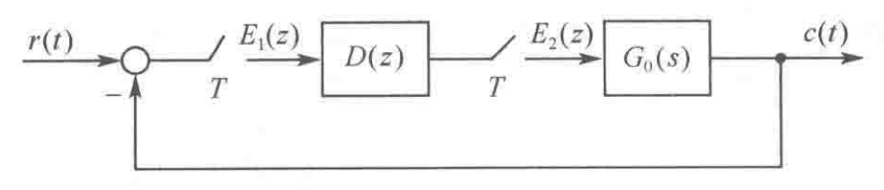

> Image description: This image is a control system block diagram labeled "图 7-67 离散系统结构图," representing a discrete-time control system structure. The signal flow begins with an input variable $r(t)$ entering a summing junction. A feedback loop returns the output signal $c(t)$ to this junction, where it is subtracted from $r(t)$. The resulting error signal passes through a sampler (indicated by a switch symbol and the period $T$) to become the discrete-time signal $E_1(z)$. This signal enters a controller block labeled $D(z)$. The output of this block then passes through another sampler with period $T$, converting it into the discrete-time signal $E_2(z)$. Finally, $E_2(z)$ enters a plant or process block represented by the continuous-time transfer function $G_0(s)$, which produces the final system output $c(t)$. The diagram illustrates the interaction between discrete controllers and continuous plants.
图 7－67 离散系统结构图

解 本题关键是根据输人形式确定数字控制器的形式。因为

$$
R(z)=\frac{A(z)}{\left(1-z^{-1}\right)^{m}}
$$

当 $r(t)=1(t)$ ，则有 $m=1, A(z)=1$ 。因

$$
G_{0}(z)=\mathscr{Z}\left[\frac{1}{s(s+1)}\right]=\mathscr{Z}\left[\frac{1}{s}-\frac{1}{s+1}\right]=\frac{z}{z-1}-\frac{z}{z-\mathrm{e}^{-1}}=\frac{\left(1-\mathrm{e}^{-1}\right) z}{(z-1)\left(z-\mathrm{e}^{-1}\right)}
$$

故对于 $r(t)=1(t)$ 作用，一拍系统的数字控制器

$$
D(z)=\frac{z^{-1}}{\left(1-z^{-1}\right) G_{0}(z)}=\frac{z-0.368}{0.632 z}=1.582\left(1-0.368 z^{-1}\right)
$$

闭环脉冲传递函数

$$
\Phi(z)=\frac{D(z) G_{0}(z)}{1+D(z) G_{0}(z)}=\frac{1}{z}=z^{-1}
$$

MATLAB 验证：系统单位阶跃响应如图 7－19－1 所示，可见该系统为一拍系统。

MATLAB 程序 ：exe719．m

$$
\begin{aligned}
& \mathrm{T}=1 ; \\
& \mathrm{t}=0: 1: 10 ; \\
& \text { sys = } \mathrm{tf}([0,1],[1,0], \mathrm{T}) ; \\
& \text { step(sys, } \mathrm{t}) ; \\
& \text { axis }([0,10,0,1.2]) ; \\
& \text { grid; } \\
& \text { xlabel }\left({ }^{\prime} \mathrm{t}^{\prime}\right) ; \\
& \text { ylabel }\left(\mathrm{c}^{*}(\mathrm{t})^{\prime}\right) ;
\end{aligned}
$$

7－20 设离散系统如图 7－68 所示，

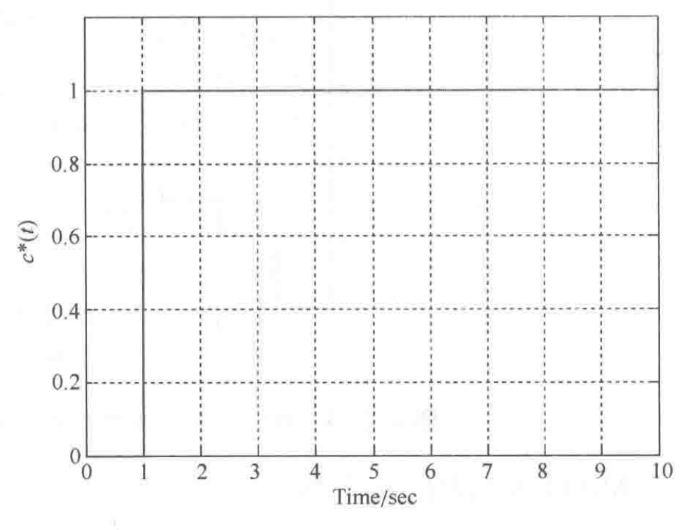

> Image description: The image shows a graph plotting a signal $c^*(t)$ against time in seconds. The horizontal x-axis is labeled "Time/sec" and ranges from 0 to 10, with major tick marks every 1 unit. The vertical y-axis is labeled $c^*(t)$ and ranges from 0 to 1, with increments of 0.2. The plotted function represents a step input signal. From $t = 0$ to $t = 1$, the value of $c^*(t)$ remains at 0. At exactly $t = 1$ second, there is a vertical transition where the signal jumps instantaneously from 0 to 1. For all time values from $t = 1$ to $t = 10$, the signal remains constant at a magnitude of 1. The graph uses a dashed grid for precise value reading. In an engineering context, this depicts a delayed unit step function, often used as a reference input to analyze the transient response of a system.
图 7－19－1 一拍系统单位阶跃响应（MATLAB）

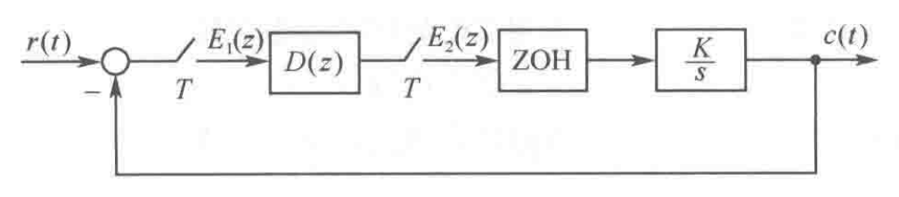

> Image description: This image displays a control system block diagram representing a discrete-time feedback loop. The process begins with an input signal $r(t)$ entering a summing junction, where it is compared with a feedback signal to produce the error signal $E_1(z)$. This signal passes through a digital controller block labeled $D(z)$, resulting in output $E_2(z)$. The discrete-time signals are converted back to continuous-time via a Zero-Order Hold (ZOH) block, which then feeds into a plant represented by the transfer function $K/s$. The final system output is denoted as $c(t)$. A feedback loop connects the output $c(t)$ back to the summing junction with a negative sign. Sampling periods are indicated by the label $T$ between blocks. According to the caption, this figure illustrates the unit step response of a one-beat system using MATLAB.
图 7－68 离散系统结构图

解 本题关键是根据输人形式确定采用几拍系统，再求得数字控制器。
广义被控对象传递函数为


<!-- source_pdf_page: 245 -->
$$
G_{0}(z)=\mathscr{Z}\left[\left(1-\mathrm{e}^{-T_{s}}\right) \frac{K}{s^{2}}\right]=K\left(1-z^{-1}\right) \frac{T z}{(z-1)^{2}}=\frac{K}{z-1}
$$

输入 $z$ 变换

$$
R(z)=\mathscr{Z}\left[R_{0} 1(t)+R_{1} t\right]=\frac{R_{0} z}{z-1}+\frac{R_{1} z}{(z-1)^{2}}
$$

闭环误差脉冲传递函数的形式为

$$
\Phi_{e}(z)=\left(1-z^{-1}\right)^{m}
$$

这里可以令 $m=2$ ，即采用二拍系统，可得数字控制器

$$
D(z)=\frac{1-\Phi_{e}(z)}{G_{0}(z) \Phi_{e}(z)}=\frac{1-\left(1-z^{-1}\right)^{2}}{\frac{K}{z-1}\left(1-z^{-1}\right)^{2}}=\frac{2 z-1}{K(z-1)}
$$

其中 $K$ 值选取不影响闭环系统稳定性。
MATLAB 验证：取 $K=10, R_{0}=R_{1}=1$ ，则系统在 $r(t)=1(t)+t$ 作用下的时间响应如图 7－20－1 所示。

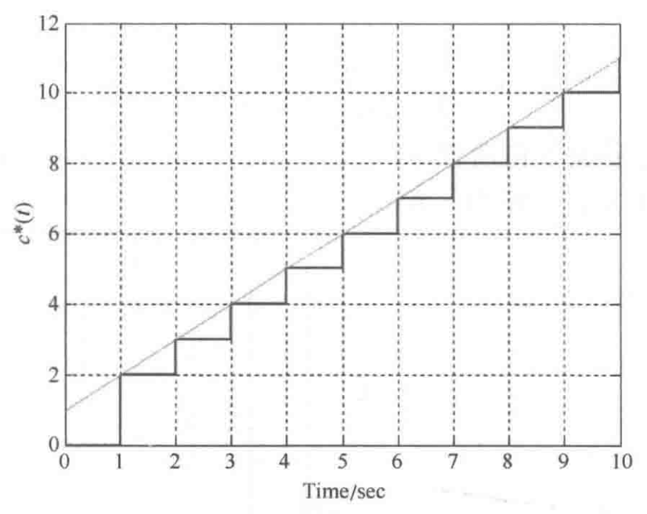

> Image description: This image shows a plot of the time response of a system, labeled as Figure 7-20-1. The horizontal axis represents "Time/sec" ranging from 0 to 10, and the vertical axis is labeled $c^*(t)$, with values ranging from 0 to 12. The figure displays two distinct signals: a continuous linear ramp function starting at $(0, 1)$ and increasing steadily toward $(10, 11)$, and a discrete-step approximation of this line. The step signal remains constant for one-second intervals, incrementing by one unit at each integer time value from $t=1$ to $t=10$. From an engineering perspective, the plot illustrates the system's response under the input $r(t)=1(t)+t$, where a continuous reference signal is compared against a quantized or sampled output. The grid lines facilitate the observation of the tracking error between the ideal linear ramp and the staircase-like step response.
图 7－20－1 $r(t)=1(t)+t$ 时二拍系统的时间响应（MATLAB）

MATLAB 程序 ：exe720．m
$\mathrm{T}=1$ ；
$\mathrm{t}=0: 1: 10$ ；
$\mathrm{Dz}=\mathrm{tf}([2,-1],[10,-10], \mathrm{T}) ; \quad$ \％定义数字控制器
$\mathrm{GO}=\mathrm{tf}(10,[1,-1], \mathrm{T})$ ；\％定义广义被控对象传递函数
sys $=$ feedback $(\mathrm{Dz} * \mathrm{GO}, 1)$ ；\％定义闭环脉冲传递函数
$u=1+t ;$
\％定义系统输入
$\operatorname{lsim}(\mathrm{sys}, \mathrm{u}, \mathrm{t}, 0)$ ；
\％绘制系统时间响应曲线
grid；
7－21 试按无纹波最少拍系统设计方法，分别计算题 7－19 和题 7－20 的 $D(z)$ 。
解 本题关键在于确定合适的无纹波系统的闭环脉冲传递函数的形式。
（1）题 7－19 系统。根据题 7－19 的解答，有

$$
G_{0}(z)=\frac{\left(1-\mathrm{e}^{-1}\right) z}{(z-1)\left(z-\mathrm{e}^{-1}\right)}=\frac{\left(1-\mathrm{e}^{-1}\right) z^{-1}}{\left(1-z^{-1}\right)\left(1-\mathrm{e}^{-1} z^{-1}\right)}
$$


<!-- source_pdf_page: 246 -->
可见，$G_{0}(z)$ 没有零点，有一个延迟因子 $z^{-1}$ ，且在单位圆上有一个极点 $z=1$ 。
当 $r(t)=1(t)$ 时，在最少拍设计中可以令 $\Phi_{e}(z)=1-z^{-1}$ ，显然 $\Phi_{e}(z)$ 补偿了 $G_{0}(z)$ 在单位圆上的极点；而闭环脉冲传递函数

$$
\Phi(z)=1-\Phi_{e}(z)=z^{-1}
$$

由于 $\Phi(z)$ 中没有零点，因此在无纹波系统中不需要再增加阶数。
数字控制器可以设计为

$$
\begin{gathered}
D(z)=\frac{\Phi(z)}{G_{0}(z) \Phi_{e}(z)}=\frac{1.582 z-0.582}{z} \\
E_{2}(z)=D(z) \Phi_{e}(z) R(z)=1.582-0.582 z^{-1}
\end{gathered}
$$

验算
数字控制器的输出序列

$$
e_{2}(0)=1.582, \quad e_{2}(T)=-0.582, \quad e_{2}(2 T)=e_{2}(3 T)=\cdots=0
$$

表明系统从第二拍起 $e_{2}(n T)$ 达到稳态，输出没有纹波。
（2）题 7－20 系统。根据题 7－20 的计算结果，有

$$
G_{0}(z)=\frac{K}{z-1}=\frac{K z^{-1}}{1-z^{-1}}
$$

可见，$G_{0}(z)$ 没有零点，有一个延迟因子 $z^{-1}$ ，且在单位圆上有一个极点 $z=1$ 。
输人 $z$ 变换

$$
R(z)=\frac{R_{0} z^{2}+\left(R_{1}-R_{0}\right) z}{(z-1)^{2}}=\frac{A(z)}{\left(1-z^{-1}\right)^{2}}
$$

在最少拍设计中可以令 $\Phi_{e}(z)=\left(1-z^{-1}\right)^{2}$ ，显然 $\Phi_{e}(z)$ 补偿了 $G_{0}(z)$ 在单位圆上的极点，因而

$$
\Phi(z)=1-\Phi_{e}(z)=z^{-1}\left(2-z^{-1}\right)
$$

由于 $\Phi(z)$ 中没有零点，因此在无纹波系统中不需要再增加阶数。
数字控制器可以设计为

$$
D(z)=\frac{\Phi(z)}{G_{0}(z) \Phi_{e}(z)}=\frac{2-z^{-1}}{K\left(1-z^{-1}\right)}
$$

验算 $E_{2}(z)=D(z) \Phi_{e}(z) R(z)=\frac{2 R_{0}+\left(2 R_{1}-3 R_{0}\right) z^{-1}+\left(R_{0}-R_{1}\right) z^{-2}}{K\left(1-z^{-1}\right)}$

$$
=\frac{1}{K}\left[2 R_{0}+\left(2 R_{1}-R_{0}\right) z^{-1}+R_{1} z^{-2}+R_{1} z^{-3}+R_{1} z^{-4}+R_{1}\left(z^{-5}+\cdots\right)\right]
$$

数字控制器的输出序列

$$
e_{2}(0)=\frac{2 R_{0}}{K}, \quad e_{2}(T)=\frac{2 R_{1}-R_{0}}{K}, \quad e_{2}(2 T)=e_{2}(3 T)=\cdots=\frac{R_{1}}{K}
$$

表明系统从第二拍起 $e_{2}(n T)$ 达到稳态，输出没有纹波。
7－22 用来直播职业足球赛的新型可遥控摄像系统如图 7－69 所示。摄像机可在运动场的上方上下移动。每个滑轮上的电机控制系统如图 7－70 所示，其中被控对象

$$
G_{0}(s)=\frac{10}{s(s+1)(0.1 s+1)}
$$

要求：
（1）设计合适的连续控制器 $G_{c}(s)=\frac{s+a}{s+b}$ ，使系统的相角裕度 $\gamma \geqslant 45^{\circ}$ ；
（2）选择采样周期 $T=0.01 \mathrm{~s}$ ，采用 $G_{c}(s)-D(z)$ 变换方法，求出相应的数字控制器 $D(z)$ 。


<!-- source_pdf_page: 247 -->
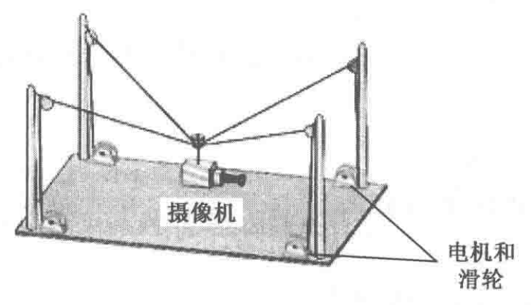

> Image description: The provided image is a technical schematic titled "图 7-69 足球场上的移动摄像机示意图" (Figure 7-69 Schematic of a mobile camera on a football field). The diagram illustrates an engineering setup for a cable-driven camera system. A central camera, labeled as "摄像机," is suspended beneath a network of cables. These cables extend outward and are anchored to four vertical support posts positioned at the corners of a rectangular base. At the base of each post, there are components identified by a label and leader lines as "电机和滑轮" (motors and pulleys). The engineering meaning of this setup is a cable-robot system where synchronized motors and pulleys manipulate the tension and length of the cables to move the camera precisely across a two-dimensional plane above the field. The relationship between the motors at the perimeter and the central camera allows for controlled, multi-directional movement.
图 7－69 足球场上的移动摄像机示意图

解（1）连续控制器设计。若不加控制器 $G_{c}(s)$ ，由系统开环 Bode 图可得 $\omega_{c}=3.01 \mathrm{rad} / \mathrm{s}$ ， $\gamma=1.58^{\circ}$ 。由于要求 $\gamma \geqslant 45^{\circ}$ ，因此采用串联超前校正是必要的。当取 $G_{c}(s)=\frac{s+a}{s+b}$ 时，应有 $a<b$ 。

校正后系统开环传递函数

$$
G_{c}(s) G_{0}(s)=\frac{10(s+a)}{s(s+1)(0.1 s+1)(s+b)}
$$

选 $a=1, b=4$ ，使 $G_{c}(s)$ 成为超前网络，以提高系统相角裕度，则有

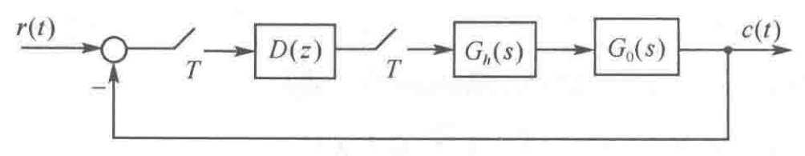

> Image description: This figure is a control system block diagram representing the structure of a motor control system on a pulley (as indicated by the caption "图7-70 滑轮上的电机控制系统结构图"). The signal flow begins with an input variable $r(t)$ entering a summing junction. The output of this junction passes through a sampler with period $T$ into a digital controller block labeled $D(z)$. The signal then exits the digital block, passes through another sampler with period $T$, and enters a continuous-time plant consisting of two sequential blocks: $G_h(s)$ followed by $G_0(s)$. The final output variable is $c(t)$. A feedback loop connects the output $c(t)$ back to the summing junction with a negative sign, indicating a closed-loop negative feedback system. The diagram illustrates a mixed-signal control architecture where a digital controller $D(z)$ manages a continuous-time process defined by transfer functions in the s-domain.
图7－70 滑轮上的电机控制系统结构图

令

$$
\begin{gathered}
G_{c}(s) G_{0}(s)=\frac{2.5}{s(0.1 s+1)(0.25 s+1)} \\
\left|G_{c} G_{0}\left(j \omega_{c}\right)\right|=\frac{2.5}{\omega_{c} \sqrt{\left(1+0.01 \omega_{c}^{2}\right)\left(1+0.0625 \omega_{c}^{2}\right)}}=1
\end{gathered}
$$

可得系统截止频率

$$
\omega_{c}=2.15 \mathrm{rad} / \mathrm{s}
$$

相角裕度

$$
\gamma=180^{\circ}-90^{\circ}-\arctan 0.1 \omega_{c}-\arctan 0.25 \omega_{c}=49.6^{\circ}
$$

满足设计要求。故连续控制器为

$$
G_{c}(s)=\frac{s+1}{s+4}
$$

（2）数字控制器设计。令数字控制器

式中

$$
\begin{gathered}
D(z)=C \frac{z-A}{z-B} \\
A=\mathrm{e}^{-a T}=\mathrm{e}^{-0.01}=0.99, \quad B=\mathrm{e}^{-6 T}=\mathrm{e}^{-0.04}=0.96
\end{gathered}
$$

由于 $s=0$ 时，$z=\left.\mathrm{e}^{s T}\right|_{s=0}=1$ ，故应有 $C \frac{1-A}{1-B}=\frac{a}{b}$ ，于是 $C \frac{a(1-B)}{b(1-A)}=1$ 。最后得数字控制器

$$
D(z)=\frac{z-0.99}{z-0.96}
$$

MATLAB 验证：
图 7－22－1 给出了校正后连续系统开环 Bode 图，由图可得已校正连续系统频域性能 $\omega_{c}=2.15, \gamma=49.6$ 。

MATLAB 程序 ：exe722a．m
$\mathrm{t}=0: 10$ ；
sys $=\mathrm{tf}([2.5],[0.025,0.35,1,0]) ; \%$ 定义闭环脉冲传递函数
bode（sys）；
\％绘制开环 Bode 图


<!-- source_pdf_page: 248 -->
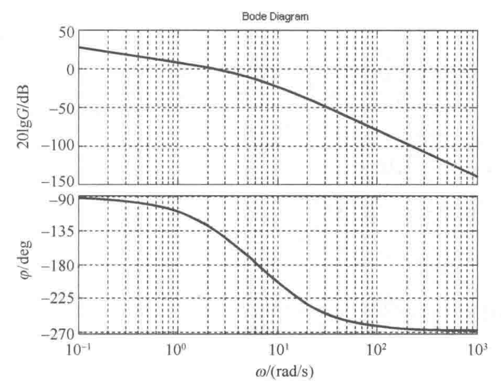

> Image description: This image presents a Bode diagram of a continuous open-loop system generated in MATLAB, as indicated by the caption "图7－22－1 连续系统开环 Bode 图（MATLAB）". The figure consists of two vertically stacked plots sharing a common logarithmic horizontal axis representing angular frequency $\omega$ in radians per second ($\text{rad/s}$), ranging from $10^{-1}$ to $10^3$. The top plot is the magnitude plot, with the vertical axis labeled $20\lg G/\text{dB}$. The curve starts above $0\text{ dB}$ at low frequencies and slopes downward linearly as frequency increases, crossing $0\text{ dB}$ near $\omega = 1\text{ rad/s}$ and reaching approximately $-150\text{ dB}$ at $10^3\text{ rad/s}$. The bottom plot is the phase plot, with the vertical axis labeled $\varphi/\text{deg}$. The phase starts at $-90^\circ$, decreases steadily through $-180^\circ$ around $\omega = 7\text{--}8\text{ rad/s}$, and asymptotically approaches $-270^\circ$ at high frequencies.
图7－22－1 连续系统开环 Bode 图（MATLAB）

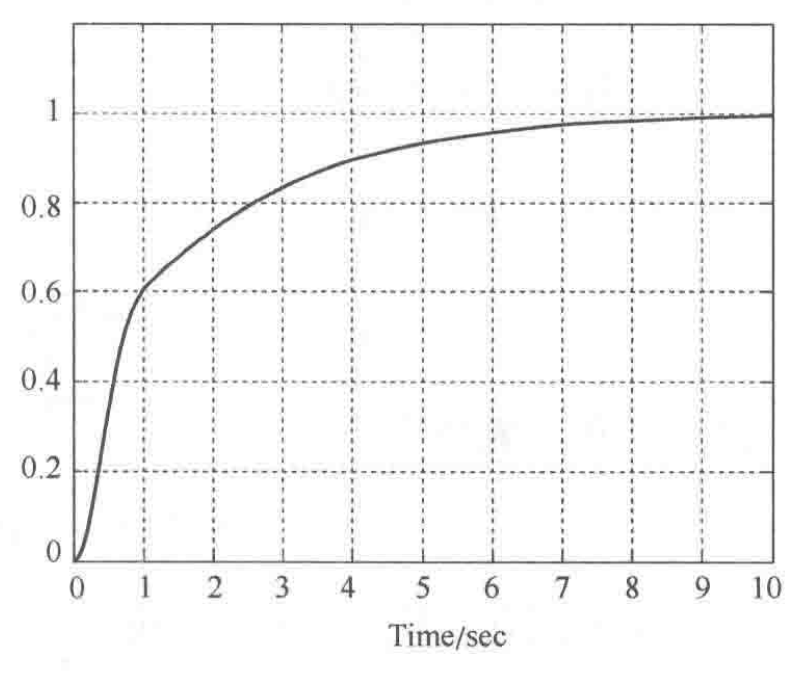

> Image description: The image displays a plot of a system's step response over time. The horizontal x-axis is labeled "Time/sec" and ranges from 0 to 10 seconds, with major grid lines every 1 second. The vertical y-axis represents the output amplitude, ranging from 0 to 1, with increments of 0.2. The graph shows a smooth, monotonically increasing curve that starts at the origin (0,0) and asymptotically approaches a steady-state value of approximately 1. This characteristic shape is typical of a first-order or overdamped second-order system response to a unit step input. The curve rises sharply between 0 and 1 second before its slope gradually decreases as it levels off toward the final value. Despite the provided caption mentioning a "Bode plot," the visual content is strictly a time-domain response plot.
图7－22－2 已校正离散系统时间响应 （ $T=0.001$ ，MATLAB）

grid；
xlabel（ ${ }^{\prime}$ 频率 ${ }^{\prime}$ ）；
图 7－22－2 给出了已校正离散系统单位阶跃响应，测得系统时域性能 $\sigma \%=0, t_{s}=7.61 \mathrm{~s}$ （ $\Delta=2 \%$ ）。

MATLAB 程序 ：exe722b．m

$$
\begin{array}{ll}
\mathrm{T}=0.01 ; & \\
\mathrm{t}=0: 0.01: 10 ; & \\
\mathrm{Gs}=\mathrm{tf}([2.5],[0.025,0.35,1,0]) ; & \text { \%定义广义被控对象传递函数 } \\
\mathrm{Gz}=\mathrm{c} 2 \mathrm{~d}(\mathrm{Gs}, \mathrm{~T}) ; & \text { \%离散化 } \\
\mathrm{Dz}=\mathrm{tf}([1,-0.99],[1,-0.96], \mathrm{T}) ; & \text { \%定义数字控制器 } \\
\text { sys }=\text { feedback }(\mathrm{Gz} * \mathrm{Dz}, 1) ; & \text { \%定义闭环脉冲传递函数 } \\
\text { step }(\operatorname{sys}, \mathrm{t}) ; & \text { \%绘制离散系统单位阶跃响应曲线 } \\
\text { axis }([0,10,0,1.2]) ; & \\
\text { grid; } &
\end{array}
$$

7－23 设数字控制系统如图 7－71 所示，其中 $G(z)$ 包括了零阶保持器和被控对象。已知被控对象

$$
G_{0}(s)=\frac{1}{s(s+10)}
$$

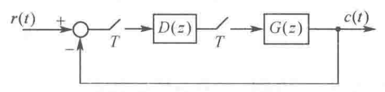

> Image description: This figure is a block diagram of a digital control system, labeled as "图 7-71 数字控制系统结构图." The signal flow begins with an input variable $r(t)$ entering a summing junction. A feedback loop connects the output $c(t)$ back to this junction, where it is subtracted from the input. The resulting error signal passes through a sampler (indicated by a switch and the period $T$) before entering a digital controller block denoted as $D(z)$. The output of $D(z)$ then passes through another sampler with period $T$ before entering a plant or process block denoted as $G(z)$. The final output of the system is $c(t)$. Arrows indicate the unidirectional flow of signals from left to right, with a return path for feedback. In engineering terms, this represents a closed-loop discrete-time control system where digital processing occurs between two sampling stages.
图 7－71 数字控制系统结构图

若采样周期 $T=0.1 \mathrm{~s}$ ，要求：
（1）当 $D(z)=K$ 时，计算脉冲传递函数 $G(z) D(z)$ ；
（2）求闭环系统的 $z$ 特征方程；
（3）计算使系统稳定的 $K$ 的最大值；
（4）确定 $K$ 的合适值，使系统的超调量不大于 $30 \%$ ；
（5）采用（4）中得到的增益 $K$ ，计算闭环脉冲传递函数 $\Phi(z)$ ，并绘出系统的单位阶跃响应曲线；
（6）取 $K=0.5 K_{\text {max }}$ ，求系统闭环极点及超调量；
（7）在（6）所给出的条件下，画出系统的单位阶跃响应曲线。


<!-- source_pdf_page: 249 -->
解 按题意要求，分步求解如下：
（1）计算 $G(z) D(z)$ 。

$$
\begin{aligned}
G(z) D(z) & =\mathscr{Z}\left[K G_{h}(s) G_{0}(s)\right]=\mathscr{Z}\left[\frac{K\left(1-\mathrm{e}^{-s T}\right)}{s^{2}(s+10)}\right]=K\left(1-z^{-1}\right) \mathscr{Z}\left[\frac{1}{s^{2}(s+10)}\right] \\
& =K\left(1-z^{-1}\right) \mathscr{Z}\left[\frac{0.1}{s^{2}}-\frac{0.01}{s}+\frac{0.01}{s+10}\right] \\
& =K\left(1-z^{-1}\right)\left[\frac{0.1 T z}{(z-1)^{2}}-\frac{0.01 z}{z-1}+\frac{0.01 z}{z-\mathrm{e}^{-10 T}}\right]
\end{aligned}
$$

代人 $T=0.1$ ，整理得

$$
G(z) D(z)=0.01 K \frac{0.368 z+0.264}{z^{2}-1.368 z+0.368}
$$

（2）求闭环系统特征方程。由

$$
1+G(z) D(z)=1+0.01 K \frac{0.368 z+0.264}{z^{2}-1.368 z+0.368}=0
$$

可得闭环特征方程

$$
D(z)=z^{2}+(0.0037 K-1.368) z+(0.368+0.00264 K)=0
$$

（3）求使系统稳定的 $K_{\max }$ 。已知

$$
G_{0}(s)=\frac{K_{1}}{s\left(T_{1} s+1\right)}=\frac{0.1}{s(0.1 s+1)}
$$

因 $T=T_{1}=0.1$ ，由表 7－8 知：$T / T_{1}=1$ 时，有

$$
\left(0.1 K T_{1}\right)_{\max }=2.39
$$

可得最大增益

$$
K_{\max }=\frac{2.39}{0.1 T_{1}}=239
$$

（4）确定使 $\sigma \% \leqslant 30 \%$ 的 $K$ 值。利用教材的图 7－49，查出 $T / T_{1}=1$ 且 $\sigma=0.3$ 时的 $0.1 K T_{1}=0.75$ ，故

$$
K=\frac{0.75}{0.1 T_{1}}=75
$$

当取 $K<75$ 时，可有 $\sigma \%<30 \%$ 。
（5）计算 $K=75$ 时的 $\Phi(z)$ 并绘制单位阶跃响应曲线。当 $K=75$ 时，有

$$
G(z) D(z)=\frac{0.75(0.368 z+0.264)}{z^{2}-1.368 z+0.368}
$$

则闭环脉冲传递函数

$$
\Phi(z)=\frac{G(z) D(z)}{1+G(z) D(z)}=\frac{0.276 z+0.198}{z^{2}-1.084 z+0.566}
$$

而相应的闭环极点

$$
z_{1,2}=0.542 \pm \mathrm{j} 0.522
$$

系统单位阶跃响应如图7－23－1所示，测得 $\sigma \%=29 \%, t_{p}=0.4 \mathrm{~s}, t_{s}=1.1 \mathrm{~s}$（ $\Delta=2 \%$ ）。


<!-- source_pdf_page: 250 -->
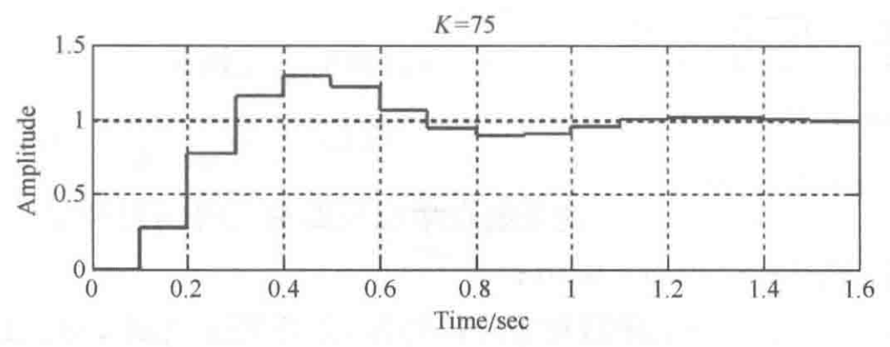

> Image description: The image shows a plot titled "K=75," representing the unit step response of a digital control system generated via MATLAB. The horizontal x-axis is labeled "Time/sec" and ranges from 0 to 1.6 seconds, with major grid markings every 0.2 seconds. The vertical y-axis is labeled "Amplitude" and ranges from 0 to 1.5, with dashed grid lines at intervals of 0.5. The response is depicted as a staircase-like waveform, characteristic of a discrete-time system with a sampling period $T=0.1$ seconds. The signal starts at zero, rises sharply in steps, and reaches a peak amplitude of approximately 1.3 around 0.4 to 0.5 seconds. It then exhibits damped oscillations, eventually settling toward a steady-state value of 1.0 as time progresses toward 1.6 seconds. This figure illustrates the system's transient behavior, including overshoot and settling time for the given gain $K=75$.
图7－23－1 数字控制系统的单位阶跃响应（ $K=75, T=0.1$ ，MATLAB）

MATLAB 程序 ：exe723．m
$\% \mathrm{~K}=75$
$\mathrm{t}=0: 0.1: 1.6$ ；
subplot（2，1，1）；
dstep（ $[0,0.276,0.198],[1,-1.084,0.566], \mathrm{t}$ ）；\％绘制阶跃响应曲线
grid；
\％$K=119.5$
subplot（2，1，2）；
dstep（［0，0．4398，0．3155］，［1，－0．9282，0．6835］，t）；
grid；
（6）求 $K=0.5 K_{\text {max }}$ 时的闭环极点及 $\sigma \%$ 。令 $K=119.5$ ，则闭环特征方程为

$$
\begin{aligned}
D(z) & =z^{2}+(0.0037 K-1.368) z+(0.368+0.00264 K) \\
& =z^{2}-0.926 z+0.683=0
\end{aligned}
$$

求得闭环极点

$$
z_{1,2}=0.463 \pm \mathrm{j} 0.685
$$

由 $T / T_{1}=1$ 及 $0.1 K T_{1}=1.195$ ，查教材中图 7－49 得

$$
\sigma \%=52 \%
$$

（7）画出 $K=119.5$ 时系统的单位阶跃响应曲线。应用 MATLAB 软件包，可以绘出 $K=119.5$ 时系统的单位阶跃响应曲线，如图7－23－2所示，测得 $\sigma \%=53 \%, t_{p}=0.3 \mathrm{~s}$ ， $t_{s}=1.5 \mathrm{~s}(\Delta=2 \%)$ 。

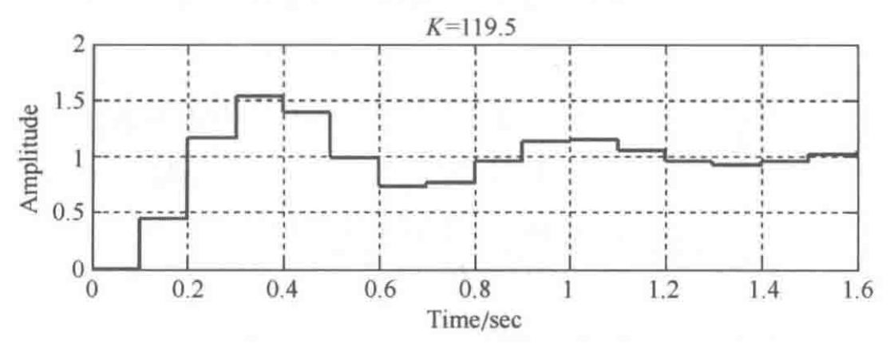

> Image description: A technical plot showing the unit step response of a system for a gain value of $K=119.5$. The graph features a horizontal x-axis labeled "Time/sec" ranging from 0 to 1.6 seconds and a vertical y-axis labeled "Amplitude" ranging from 0 to 2. The plot displays a stepped, oscillating waveform that rises from zero at approximately $t=0.1\text{s}$, reaches a peak amplitude of roughly 1.5 around $t=0.3\text{s}$ to $0.4\text{s}$, and then undergoes damped oscillations. The signal eventually stabilizes toward an amplitude of 1.0 as it approaches $t=1.6\text{s}$. Grid lines are present for both axes to facilitate reading values. According to the provided caption, this response is characterized by a percentage overshoot $\sigma\% = 53\%$, a peak time $t_p = 0.3\text{s}$, and a settling time $t_s = 1.5\text{s}$ for a tolerance of $\Delta=2\%$.
图7－23－2 数字控制系统的单位阶跃响应（ $K=119.5, T=0.1$ ，MATLAB）

7－24设连续的、未经采样的控制系统如图 7－72 所示，其中被控对象为

$$
G_{0}(s)=\frac{1}{s(s+10)}
$$


<!-- source_pdf_page: 251 -->
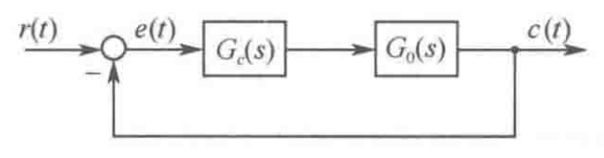

> Image description: This image is a control system block diagram labeled as "图7-72 控制系统结构图." The diagram illustrates a closed-loop feedback system. On the left, an input signal $r(t)$ enters a summing junction (represented by a circle). A negative feedback loop returns from the output $c(t)$ to this junction. The resulting error signal, labeled $e(t)$, serves as the input to the first functional block, $G_c(s)$. The signal then flows through a series of two blocks: the controller $G_c(s)$ followed by the plant or process $G_0(s)$. Arrows indicate the unidirectional flow of signals from left to right. The final output of the system is denoted as $c(t)$. In engineering terms, this represents a standard unity feedback control architecture where the difference between the reference input and the actual output is processed by a compensator and a plant to regulate the system's behavior.
图7－72 控制系统结构图

要求：
（1）设计滞后校正网络

$$
G_{c}(s)=K \frac{s+a}{s+b} \quad(a>b)
$$

使系统在单位阶跃输人时的超调量 $\sigma \% \leqslant 30 \%$ ，且在单位斜坡输人时的稳态误差 $e_{\mathrm{s}}(\infty) \leqslant 0.01$ ；
（2）若为该系统增配一套采样器和零阶保持器，并选采样周期 $T=0.1 \mathrm{~s}$ ，试采用 $G_{\mathrm{c}}(s)- D(z)$ 变换方法，设计合适的数字控制器 $D(z)$ ；
（3）分别画出（1）及（2）中连续系统和离散系统的单位阶跃响应曲线，并比较两者的结果；
（4）另选采样周期 $T=0.01 \mathrm{~s}$ ，重新完成（2）和（3）的工作；
（5）对于（2）中得到的 $D(z)$ ，画出离散系统的单位斜坡响应，并与连续系统的单位斜坡响应进行比较。

解 本题表明，对于低阶系统，采用 $G_{c}(s)-D(z)$ 变换方法，可以方便地确定满足要求的数字控制器；同时指出，系统离散化后会带来一些不希望的特性差异，这些差异的影响随采样周期的减小而降低。
（1）设计连续控制器 $G_{c}(s)$ 。已选滞后网络

$$
G_{c}(s)=K \frac{s+a}{s+b} \quad(a>b)
$$

其中 $K$ 、 $a$ 及 $b$ 待定，则系统开环传递函数

$$
G_{c}(s) G_{0}(s)=\frac{K(s+a)}{s(s+b)(s+10)}=\frac{K_{v}\left(\frac{1}{a} s+1\right)}{s\left(\frac{1}{b} s+1\right)(0.1 s+1)}
$$

式中，$K_{v}=\frac{a K}{10 b}$ 为静态速度误差系数。
闭环特征方程

$$
\begin{aligned}
D(s) & =s(s+b)(s+10)+K(s+a) \\
& =s^{3}+(10+b) s^{2}+(10 b+K) s+a K=0
\end{aligned}
$$

列劳斯表如下：

$$
\begin{array}{c|cc}
s^{3} & 1 & 10 b+K \\
s^{2} & 10+b & a K \\
s^{1} & \frac{K(b-a+10)+10 b(b+10)}{10+b} & \\
s^{0} & a K &
\end{array}
$$

由劳斯判据知，系统稳定的充分必要条件为

$$
a>0, \quad b>0, \quad K(b-a+10)+10 b(b+10)>0
$$

选择 $a=0.7, b=0.1, K=150$ ，因为

$$
K(b-a+10)+10 b(b+10)=1420.1>0
$$


<!-- source_pdf_page: 252 -->
故闭环系统稳定；又因

$$
K_{v}=\frac{a K}{10 b}=105, \quad e_{s}(\infty)=\frac{1}{K_{v}}=0.0095<0.01
$$

故满足稳定误差要求；再令

$$
\left|G_{c} G_{0}\left(\mathrm{j} \omega_{c}\right)\right|=\frac{150 \sqrt{\omega_{c}^{2}+0.7^{2}}}{\omega_{c} \sqrt{\left(\omega_{c}^{2}+0.1^{2}\right)\left(\omega_{c}^{2}+10^{2}\right)}}=1
$$

解出 $\omega_{c}=10.4$ ，算出系统相角裕度

$$
\gamma=180^{\circ}-90^{\circ}+\arctan \frac{\omega_{c}}{a}-\arctan \frac{\omega_{c}}{b}-\arctan \frac{\omega_{c}}{10}=40.6^{\circ}
$$

系统近似为典型二阶系统，由教材中图 5－46 知 $\zeta=0.36$ 。再由教材中图 3－12 知 $\sigma \%= 30 \%$ 。系统全部设计指标满足。
（2）设计数字控制器 $D(z)$ 。已知 $T=0.1, a=0.7, b=0.1$ ，令

其中

$$
\begin{gathered}
D(z)=C \frac{z-A}{z-B} \\
A=\mathrm{e}^{-a T}=0.932, \quad B=\mathrm{e}^{-b T}=0.990
\end{gathered}
$$

进行 $G_{c}(s)-D(z)$ 变换，令

有

$$
\begin{gathered}
C \frac{1-A}{1-B}=K \frac{a}{b} \\
C=K \frac{a(1-B)}{b(1-A)}=154.4
\end{gathered}
$$

得数字控制器

$$
D(z)=154.4 \frac{z-0.932}{z-0.990}
$$

（3）绘制系统单位阶跃响应曲线。
连续系统时：

$$
\begin{gathered}
G_{c}(s) G_{0}(s)=\frac{K(s+a)}{s(s+b)(s+10)}=\frac{150(s+0.7)}{s(s+0.1)(s+10)} \\
\Phi(s)=\frac{G_{c}(s) G_{0}(s)}{1+G_{c}(s) G_{0}(s)}=\frac{150(s+0.7)}{s^{3}+10.1 s^{2}+151 s+105} \\
R(s)=\frac{1}{s}
\end{gathered}
$$

系统输出

$$
C(s)=\Phi(s) R(s)=\frac{150(s+0.7)}{s\left(s^{3}+10.1 s^{2}+151 s+105\right)}
$$

离散系统时 $(T=0.1 \mathrm{~s})$ ：

$$
\begin{gathered}
G_{h}(s) G_{0}(s)=\frac{1-\mathrm{e}^{-s T}}{s} \cdot \frac{1}{s(s+10)} \\
G_{h} G_{0}(z)=\left(1-z^{-1}\right) \mathscr{Z}\left[\frac{1}{s^{2}(s+10)}\right]=\left(1-z^{-1}\right) \mathscr{Z}\left[\frac{0.1}{s^{2}}-\frac{0.01}{s}+\frac{0.01}{s+10}\right] \\
=\frac{0.01(0.368 z+0.264)}{z^{2}-1.368 z+0.368} \\
G_{h} G_{0}(z) D(z)=\frac{0.568(z+0.717)(z-0.932)}{\left(z^{2}-1.368 z+0.368\right)(z-0.99)}
\end{gathered}
$$


<!-- source_pdf_page: 253 -->
$$
\begin{gathered}
\Phi(z)=\frac{G_{h} G_{0}(z) D(z)}{1+G_{h} G_{0}(z) D(z)}=\frac{0.568(z+0.717)(z-0.932)}{z^{3}-1.79 z^{2}+1.6 z-0.743} \\
R(z)=\frac{z}{z-1}
\end{gathered}
$$

系统输出

$$
\begin{aligned}
C(z) & =\Phi(z) R(z)=\frac{0.568\left(z^{3}-0.215 z^{2}-0.668 z\right)}{z^{4}-2.79 z^{3}+3.39 z^{2}-2.343 z+0.743} \\
& =0.568\left(z^{-1}+2.545 z^{-2}+3.05 z^{-3}+2.225 z^{-4}+1.02 z^{-5}+\cdots\right)
\end{aligned}
$$

应用 MATLAB 软件包，可得连续系统和 $T=0.1 \mathrm{~s}$ 时离散系统的单位阶跃响应如图7－24－1所示。由图可见：系统连续时，$\sigma \%=31 \%, t_{p}=0.28 \mathrm{~s}, t_{s}=1 \mathrm{~s}, ~(\Delta=2 \%)$ ；系统离散时，$\sigma \%=78 \%, t_{p}=0.3 \mathrm{~s}, t_{s}=3.1 \mathrm{~s}(\Delta=2 \%)$ 。表明连续系统离散化后，若采样周期较大，则阶跃响应动态性能会恶化，且输出有纹波。

MATLAB 程序：exe724a．m

$$
\begin{aligned}
& T=0.1 ; \\
& \text { sys1 = } t f([150,105],[1,10.1,151,105]) \\
& \text { sys2 = } t f([0.568,-0.1221,-0.3795],[1,-1.79,1.6,-0.743], T) \\
& \text { step(sys1, sys2,4); } \\
& \text { grid; }
\end{aligned}
$$

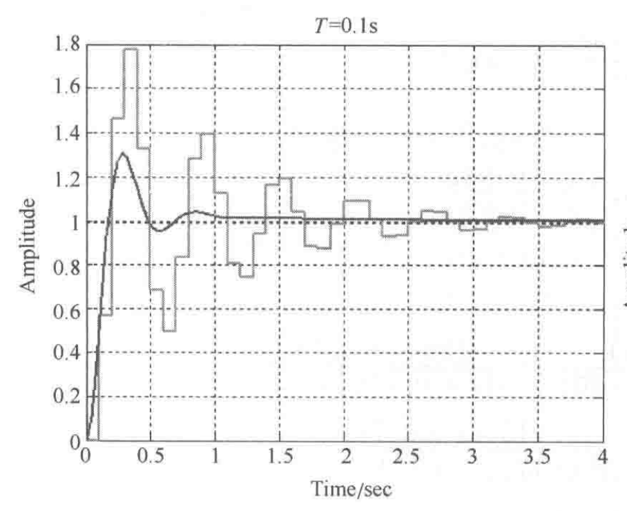

> Image description: A technical plot showing the unit step response of a system with a sampling period $T=0.1\text{s}$. The horizontal x-axis is labeled "Time/sec" and ranges from 0 to 4 seconds, while the vertical y-axis is labeled "Amplitude" and ranges from 0 to 1.8. The figure displays two distinct curves: a smooth continuous line representing the ideal system response and a jagged, stair-step line representing the discrete sampled response. Both signals start at $(0,0)$, exhibit an initial overshoot peaking between $1.2$ and $1.8$, and then oscillate with decreasing amplitude. As time progresses toward 4 seconds, both curves converge and stabilize at a steady-state value of 1.0, indicated by a horizontal dashed reference line. The plot illustrates the relationship between continuous-time dynamics and discrete-time sampling in control systems engineering.
图7－24－1 系统单位阶跃响应曲线

$$
(T=0.1 . \text { MATLAB) }
$$

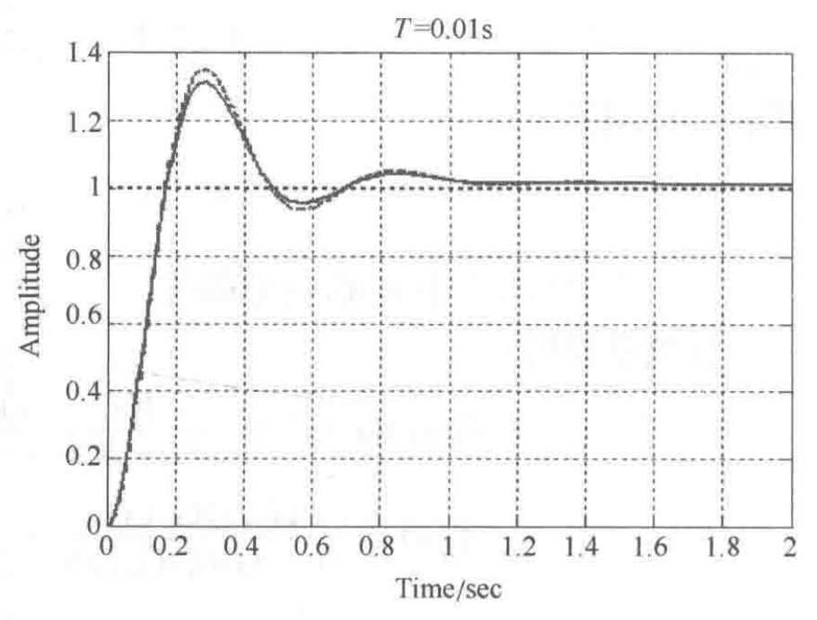

> Image description: This image shows a plot of the unit step response curves for a system, generated in MATLAB with a sampling period of $T=0.01\text{s}$. The graph features a vertical y-axis labeled "Amplitude" ranging from 0 to 1.4 and a horizontal x-axis labeled "Time/sec" ranging from 0 to 2 seconds. The plot displays two closely aligned oscillating curves—one solid and one dashed—that start at the origin $(0,0)$. Both curves exhibit an initial overshoot, peaking around $t=0.3\text{s}$ with an amplitude of approximately 1.3 to 1.4, before undergoing damped oscillations. The signals eventually settle and converge toward a steady-state value of 1.0, indicated by a horizontal dashed reference line. In engineering terms, this figure illustrates the transient response characteristics of a control system, specifically highlighting parameters such as rise time, peak overshoot, and settling time.
图7－24－2 系统单位阶跃响应曲线 （ $T=0.01$ ．MATLAB）

（4）改变采样周期后系统的单位阶跃响应。另选 $T=0.01 \mathrm{~s}$ ，因

$$
G_{c}(s)=K \frac{s+a}{s+b}=150 \frac{s+0.7}{s+0.1}
$$

利用 $G_{c}(s)-D(z)$ 变换，有

其中

$$
\begin{gathered}
C \frac{1-A}{1-B}=K \frac{a}{b} \\
A=\mathrm{e}^{-a T}=\mathrm{e}^{-0,007}=0.993, \\
B=\mathrm{e}^{-b T}=\mathrm{e}^{-0.001}=0.999 \\
C=K \frac{a(1-B)}{b(1-A)}=150
\end{gathered}
$$


<!-- source_pdf_page: 254 -->
故数字控制器为

$$
D(z)=C \frac{z-A}{z-B}=150 \frac{z-0.993}{z-0.999}
$$

广义对象脉冲传递函数

$$
\begin{aligned}
G_{h} G_{0}(z) & =\left(1-z^{-1}\right) \mathscr{Z}\left[\frac{0.1}{s^{2}}-\frac{0.01}{s}+\frac{0.01}{s+10}\right] \\
& =\left(1-z^{-1}\right)\left[\frac{0.1 T z}{(z-1)^{2}}-\frac{0.01 z}{z-1}+\frac{0.01 z}{z-\mathrm{e}^{-10 T}}\right]
\end{aligned}
$$

代入 $T=0.01$ ，有

$$
G_{h} G_{0}(z)=\frac{5 \times 10^{-5}(z+0.9)}{z^{2}-1.905 z+0.905}
$$

系统开环脉冲传递函数

$$
G_{h} G_{0}(z) D(z)=\frac{0.75 \times 10^{-2}(z+0.9)(z-0.993)}{\left(z^{2}-1.905 z+0.905\right)(z-0.999)}
$$

系统闭环脉冲传递函数

$$
\Phi(z)=\frac{G_{h} G_{0}(z) D(z)}{1+G_{h} G_{0}(z) D(z)}=\frac{0.75 \times 10^{-2}(z+0.9)(z-0.993)}{z^{3}-2.897 z^{2}+2.807 z-0.911}
$$

单位阶跃输人

$$
R(z)=\frac{z}{z-1}
$$

系统输出

$$
\begin{aligned}
C(z) & =\Phi(z) R(z)=\frac{0.0075\left(z^{3}-0.093 z^{2}-0.894 z\right)}{z^{4}-3.897 z^{3}+5.704 z^{2}-3.718 z+0.911} \\
& =0.0075\left(z^{-1}+3.8 z^{-2}+8.195 z^{-3}+13.9467 z^{-4}+20.765 z^{-5}+\cdots\right)
\end{aligned}
$$

应用 MATLAB 软件包，可得连续系统和 $T=0.01$ 时离散系统的单位阶跃响应，如图7－24－2所示。由图可见：当采样周期较小时，实线表示的连续系统响应与虚线表示的离散系统响应比较接近，表明系统离散化后动态性能的损失较小。

MATLAB 程序：exe724b．m
$\mathrm{GO}=\operatorname{zpk}([],[0-10], 1) ; \quad \%$ 定义被控对象传递函数
$\mathrm{Gd}=\mathrm{c} 2 \mathrm{~d}\left(\mathrm{G} 0,0.01,{ }^{\prime} \mathrm{zoh}^{\prime}\right) ; \quad$ \％将被控对象离散化
$\mathrm{D}=\operatorname{zpk}([0.993],[0.999], 150,0.01) ;$
$\mathrm{G}=\mathrm{Gd} * \mathrm{D}$
sysd $=$ feedback $(\mathrm{G}, 1)$ ；\％定义闭环系统脉冲传递函数
$\mathrm{t}=0: 0.01: 2$ ；
step（sysd，t）；
grid；
（5）系统单位斜坡响应。连续系统时

$$
\begin{aligned}
& \Phi(s)=\frac{150(s+0.7)}{s^{3}+10.1 s^{2}+151 s+105} \\
& R(s)=\frac{1}{s^{2}} \\
& C(s)=\Phi(s) R(s)
\end{aligned}
$$


<!-- source_pdf_page: 255 -->
$$
=\frac{150(s+0.7)}{s^{2}\left(s^{3}+10.1 s^{2}+151 s+105\right)}
$$

离散系统时（ $T=0.1$ ）

$$
\begin{aligned}
& \Phi(z)=\frac{0.568(z+0.717)(z-0.932)}{z^{3}-1.79 z^{2}+1.6 z-0.743} \\
& R(z)=\frac{T z}{(z-1)^{2}}=\frac{0.1 z}{(z-1)^{2}} \\
& C(z)=\Phi(z) R(z)=\frac{0.0568\left(z^{3}-0.215 z^{2}-0.668 z\right)}{z^{5}-3.79 z^{4}+6.18 z^{3}-5.733 z^{2}+3.086 z-0.743}
\end{aligned}
$$

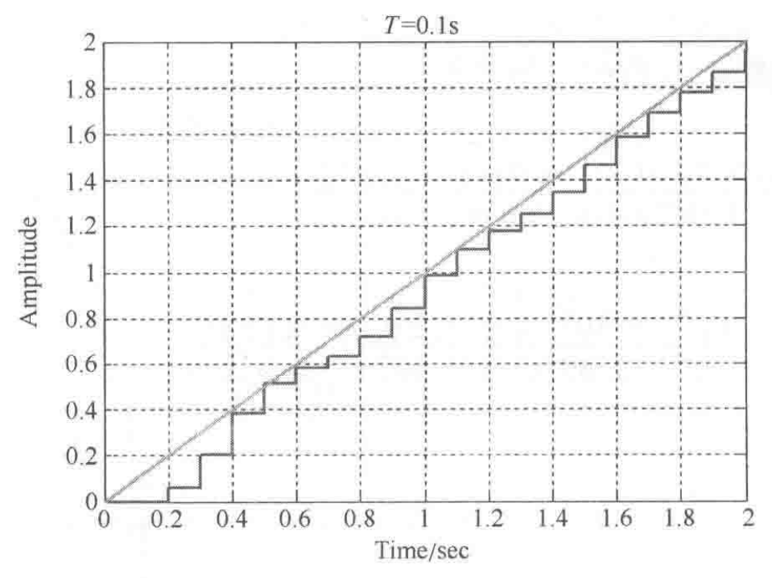

> Image description: This image is a MATLAB-generated plot showing the unit ramp response of a system. The horizontal x-axis is labeled "Time/sec" and ranges from 0 to 2, while the vertical y-axis is labeled "Amplitude" and ranges from 0 to 2. A title at the top indicates a time constant or sampling period of $T=0.1\text{s}$. The figure contains two primary lines: a smooth, diagonal straight line representing the ideal input ramp signal, and a stepped, piecewise-constant line representing the system's discrete response. The stepped line follows the general trajectory of the diagonal line but lags behind it, creating a series of rectangular blocks. This visualization illustrates the steady-state error and the discrete nature of the system's tracking performance relative to a continuous ramp input. The grid consists of solid lines every 0.2 units on both axes with dashed intermediate markers.
图7－24－3 系统单位斜坡响应曲线（MATLAB）

连续系统和离散系统的单位斜坡响应如图 7－24－3 所示。图中，虚线代表斜坡输人。由图可见，离散系统的斜坡输出有纹波。

MATLAB 程序 ：exe724c．m

$$
\begin{aligned}
& \mathrm{T}=0.1 ; \\
& \mathrm{t}=0: 0.1: 2 ; \\
& \mathrm{u}=\mathrm{t} ; \\
& \text { sys }=\mathrm{tf}([0.568,-0.1221,-0.3795], \\
& -179.16,-0743], \mathrm{T})
\end{aligned}
$$

\％绘制系统时间响应曲线
grid；
7－25 设闭环离散系统如图 7－73 所示，若采样周期在 $0 \leqslant T \leqslant 1.2 \mathrm{~s}$ 范围内变化，试在 $T$每增加 0.2 s 之后，绘出系统的单位阶跃输入响应，要求列表记录相应的 $\sigma \%$ 和 $t_{s}(\Delta=2 \%)$ 。

解 当 $T=0$ 时，系统为连续系统，零阶保持器不存在，其闭环传递函数

$$
\Phi(s)=\frac{1}{s^{2}+s+1}=\frac{\omega_{n}^{2}}{s^{2}+2 \zeta \omega_{n} s+\omega_{n}^{2}}
$$

可得 $\zeta=0.5, \omega_{n}=1$ 。单位阶跃响应

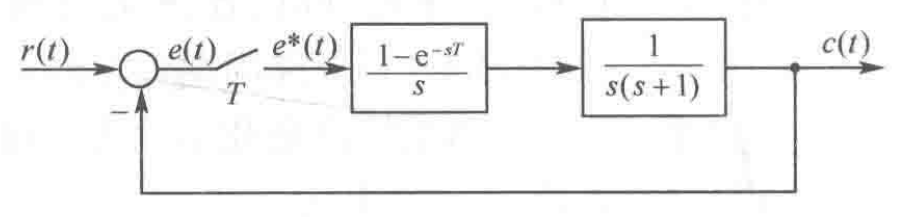

> Image description: A block diagram of a closed-loop discrete system is shown in Figure 7-73 (图7－73 闭环离散系统结构图). The signal flow begins with an input variable $r(t)$ entering a summing junction. The error signal $e(t)$ emerges from the junction and passes through a sampler denoted by a switch labeled $T$, resulting in the sampled signal $e^*(t)$. This signal enters a sequence of two blocks: first, a zero-order hold block with the transfer function $\frac{1 - e^{-sT}}{s}$, followed by a plant block with the transfer function $\frac{1}{s(s+1)}$. The output of this system is $c(t)$. A feedback loop connects the output $c(t)$ back to the summing junction, completing the closed-loop architecture. Arrows indicate the unidirectional flow of signals from left to right through the forward path and from right to left via the feedback path.
图7－73 闭环离散系统结构图

$$
c(t)=1-\frac{1}{\sqrt{1-\zeta^{2}}} \mathrm{e}^{-\zeta \omega_{n} t} \sin \left(\omega_{n} \sqrt{1-\zeta^{2}} t+\beta\right)
$$

式中，$\beta=\arccos \zeta=60^{\circ}$ 。于是有

$$
c(t)=1-1.155 \mathrm{e}^{-0.5 t} \sin \left(0.866 t+60^{\circ}\right)
$$

当 $T \neq 0$ 时，系统为离散系统。开环脉冲传递函数

$$
\begin{aligned}
G(z) & =\left(1-z^{-1}\right) Z\left[\frac{1}{s^{2}(s+1)}\right]=\left(1-z^{-1}\right) Z\left[\frac{1}{s^{2}}-\frac{1}{s}+\frac{1}{s+1}\right] \\
& =\left(1-z^{-1}\right)\left[\frac{T z}{(z-1)^{2}}-\frac{z}{z-1}+\frac{z}{z-\mathrm{e}^{-T}}\right] \\
& =\frac{T\left(z-\mathrm{e}^{-T}\right)-(z-1)\left(z-\mathrm{e}^{-T}\right)+(z-1)^{2}}{(z-1)\left(z-\mathrm{e}^{-T}\right)}
\end{aligned}
$$

闭环脉冲传递函数


<!-- source_pdf_page: 256 -->
$$
\Phi(z)=\frac{T\left(z-\mathrm{e}^{-T}\right)-(z-1)\left(z-\mathrm{e}^{-T}\right)+(z-1)^{2}}{(z-1)\left(z-\mathrm{e}^{-T}\right)+\left[T\left(z-\mathrm{e}^{-T}\right)-(z-1)\left(z-\mathrm{e}^{-T}\right)+(z-1)^{2}\right]}
$$

令 $T$ 分别等于 $0.2,0.4,0.6,0.8,1.0$ 和 1.2 ，可得结果见表7－25－1。
由于 $R(z)=\frac{z}{z-1}, C(z)=\Phi(z) R(z)$ ，故同时将不同 $T$ 值下闭环离散系统的输出序列 $C(z)$ 也列于表 7－25－1 之中。

表 7－25－1
| T／s | $\Phi(z)$ | $C(z)$ |
| :--- | :--- | :--- |
| 0.2 | $\frac{0.019 z+0.017}{z^{2}-1.8 z+0.836}=\frac{0.019(z+0.895)}{(z-0.9 \pm \mathrm{j} 0.161)}$ | $0.019\left(z^{-1}+3.695 z^{-2}+7.71 z^{-3}+11.012 z^{-4}+\cdots\right)$ |
| 0.4 | $\frac{0.07 z+0.062}{z^{2}-1.6 z+0.732}=\frac{0.07(z+0.886)}{(z-0.8 \pm \mathrm{j} 0.303)}$ | $0.07\left(z^{-1}+3.486 z^{-2}+6.732 z^{-3}+10.106 z^{-4}+\cdots\right)$ |
| 0.6 | $\frac{0.149 z+0.122}{z^{2}-1.4 z+0.671}=\frac{0.149(z+0.819)}{(z-0.7 \pm \mathrm{j} 0.425)}$ | $0.149\left(z^{-1}+3.219 z^{-2}+5.655 z^{-3}+7.576 z^{-4}+\cdots\right)$ |
| 0.8 | $\frac{0.249 z+0.192}{z^{2}-1.2 z+0.641}=\frac{0.249(z+0.771)}{(z-0.6 \pm \mathrm{j} 0.53)}$ | $0.249\left(z^{-1}+2.971 z^{-2}+4.696 z^{-3}+5.505 z^{-4}+\cdots\right)$ |
| 1.0 | $\frac{0.368 z+0.264}{z^{2}-z+0.632}=\frac{0.368(z+0.717)}{(z-0.5 \pm j 0.618)}$ | $0.368\left(z^{-1}+2.717 z^{-2}+3.802 z^{-3}+3.802 z^{-4}+\cdots\right)$ |
| 1.2 | $\frac{0.501 z+0.338}{z^{2}-0.8 z+0.639}=\frac{0.501(z+0.675)}{(z-0.4 \pm j 0.692)}$ | $0.501\left(z^{-1}+2.475 z^{-2}+3.016 z^{-3}+2.506 z^{-4}+\cdots\right)$ |


对不同采样周期 $T$ 值下的系统输出进行 MATLAB 仿真，测试相应的动态性能；同时进行连续系统的 MATLAB 仿真，同样记录相应的 $\sigma \%$ 和 $t_{s}(\Delta=2 \%)$ ，列表记录结果示于表7－25－2。

表 7－25－2
| $T / s$ | 0 | 0.2 | 0.4 | 0.6 | 0.8 | 1.0 | 1.2 |
| :---: | :---: | :---: | :---: | :---: | :---: | :---: | :---: |
| $\sigma / \%$ | $16.3 \%$ | $20.6 \%$ | $25.6 \%$ | $31.3 \%$ | $36.9 \%$ | $40.0 \%$ | $51.0 \%$ |
| $t_{s} / s$ | 8.1 | 8.4 | 8.8 | 11.4 | 14.4 | 16.0 | 19.2 |


由表7－25－2可见，系统离散化会恶化系统动态性能；采样周期越大，动态性能下降越厉害。 MATLAB 程序：exe725．m
$\% \mathrm{~T}=0$
sys $=\mathrm{tf}([1],[1,1,1])$ ；
subplot（ $4,2,1$ ）；
step（sys，12）；\％绘制 $\mathrm{T}=0$ 单位阶跃响应曲线
grid；
$\% \mathrm{~T}=0.2$
$\mathrm{T} 1=0.2 ;$
t1＝0：0．2：12；
sysd1 $=\mathrm{tf}([0.019,0.017],[1,-1.8,0.836], \mathrm{T} 1)$ ；
subplot $(4,2,2)$ ；


<!-- source_pdf_page: 257 -->
```
step(sysd1,t1);
%绘制 T=0.2单位阶跃响应曲线
grid;
%T=0.4
T2 =0.4;
t2 = 0:0.4:12;
sysd2 = tf([0.07,0.062],[1,-1.6,0.732],T2);
subplot(4,2,3);
step(sysd2,t2); %绘制 T=0.4单位阶跃响应曲线
grid;
% T = 0.6
T3 = 0.6;
t3=0:0.6:12;
sysd3 = tf([0.149,0.122],[1, - 1.4,0.671],T3);
subplot(4,2,4);
step(sysd3,t3); %绘制 T=0.6单位阶跃响应曲线
grid;
%T=0.8
T4 = 0.8;
t4= 0:0.8:12;
sysd4 = tf([0.249,0.192],[1, -1.2,0.641],T4);
subplot(4,2,5);
step(sysd4,t4); %绘制 T=0.8单位阶跃响应曲线
grid;
% T=1.0
T5 = 1;
t5 = 0:1:12;
sysd5 = tf([0.368,0.264],[1,-1,0.632],T5);
subplot(4,2,6);
step(sysd5,t5);
%绘制 T=1.0单位阶跃响应曲线
grid;
% T = 1.2
T6 =1.2;
t6 = 0:1.2:12;
sysd6 = tf([0.501,0.338],[1,-0.8,0.639],T6);
subplot(4,2,7);
step(sysd6,t6); %绘制 T=1.2单位阶跃响应曲线
grid;
```

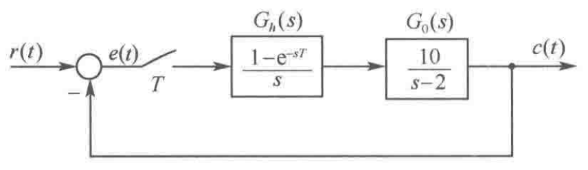

> Image description: This image is a control system block diagram labeled "图 7-74 闭环离散系统结构图," representing a closed-loop discrete system. The signal flow begins with an input variable $r(t)$ entering a summing junction, where it is compared with a feedback loop to produce the error signal $e(t)$. The forward path consists of two main blocks connected by arrows. First, the signal passes through a sampler with period $T$, followed by a block $G_h(s) = \frac{1 - e^{-sT}}{s}$, which represents a zero-order hold. This is then connected to a plant block $G_0(s) = \frac{10}{s - 2}$. The final output of the system is denoted as $c(t)$. A feedback line connects the output $c(t)$ back to the summing junction with a negative sign, completing the closed-loop architecture. The diagram illustrates the interaction between continuous-time components and discrete-time sampling in an engineering control loop.
图 7－74 闭环离散系统结构图

7－26 设具有采样器、保持器的闭环离散系统如图 7－74 所示，当采样周期 $T=$ 0.1 s ，输人信号为单位阶跃信号时，试计算系统输出 $C(z)$ 。

解 因为


<!-- source_pdf_page: 258 -->
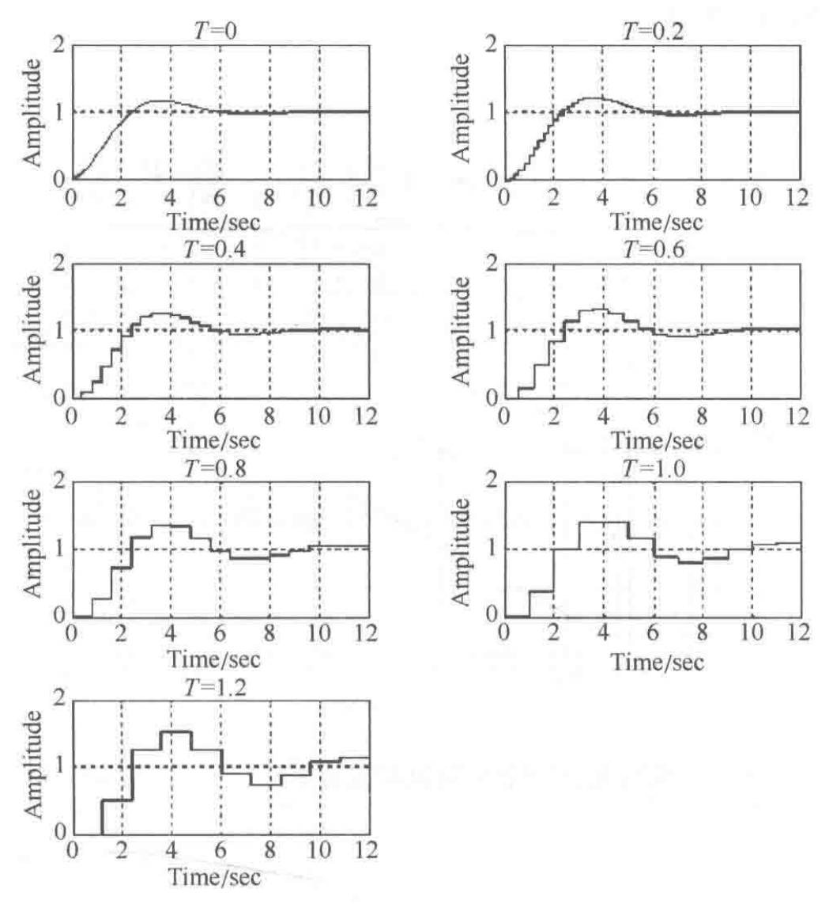

> Image description: This figure consists of seven separate plots illustrating the unit step response of a discrete system for different sampling periods $T$, ranging from $T=0$ to $T=1.2$. Each plot features a vertical y-axis labeled "Amplitude" (scaled 0 to 2) and a horizontal x-axis labeled "Time/sec" (scaled 0 to 12). A dashed horizontal line is drawn at Amplitude = 1, representing the steady-state target of the unit step input. As $T$ increases from 0 to 1.2, the system response transitions from a smooth continuous curve ($T=0$) to an increasingly coarse staircase-like discrete signal. The plots demonstrate how larger sampling intervals affect the stability and convergence of the system; while lower values of $T$ show a damped oscillation settling at 1, higher values of $T$ exhibit larger oscillations and slower convergence toward the steady-state value.
图 7－26－1 离散系统单位阶跃响应（MATLAB）

$$
G(s)=G_{h}(s) G_{0}(s)=\frac{10\left(1-\mathrm{e}^{-s T}\right)}{s(s-2)}
$$

且 $T=0.1$ ，故开环脉冲传递函数

$$
\begin{aligned}
G(z) & =10\left(1-z^{-1}\right) \mathscr{Z}\left[\frac{1}{s(s-2)}\right]=10\left(1-z^{-1}\right) \mathscr{Z}\left[-\frac{0.5}{s}+\frac{0.5}{s-2}\right] \\
& =10\left(1-z^{-1}\right)\left[-\frac{0.5 z}{z-1}+\frac{0.5 z}{z-\mathrm{e}^{2 T}}\right]=\frac{1.107}{z-1.2214}
\end{aligned}
$$

显然，开环离散系统是不稳定的。
由于 $r(t)=1(t), R(z)=\frac{z}{z-1}$ ，故

$$
\Phi(z)=\frac{G(z)}{1+G(z)}=\frac{1.107}{z-0.1144}
$$

显然，闭环极点 $z=0.1144$ ，系统稳定。闭环系统输出

$$
C(z)=\Phi(z) R(z)=\frac{1.107 z}{z^{2}-1.1144 z+0.1144}
$$

利用长除法得

$$
C(z)=0+1.107 z^{-1}+1.234 z^{-2}+1.248 z^{-3}+1.25 z^{-4}+1.25 z^{-5}+\cdots
$$

利用 MATLAB 软件包，可以绘出离散系统的单位阶跃响应如图 7－26－1 所示，测得 $\sigma \%=0 \%, t_{s}=0.2 \mathrm{~s}(\Delta=2 \%), e_{s}(\infty)=0.25$ 。

MATLAB 程序 ：exe726．m
$\mathrm{T}=0.1$ ；
$\mathrm{t}=0.0 .1: 1$ ；


<!-- source_pdf_page: 259 -->
```
sys $=\mathrm{tf}([1.107],[1,-0.1144], \mathrm{T})$;
step(sys, t) ;
grid;
```

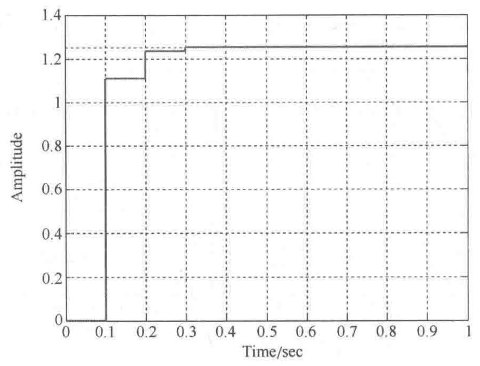

> Image description: This image is a technical plot showing the unit step response curve of a discrete system, as indicated by the caption "图 7－26－2 离散系统的单位阶跃响应曲线 ($T=0.1$, MATLAB)". The graph features a horizontal x-axis labeled "Time/sec" ranging from $0$ to $1$ and a vertical y-axis labeled "Amplitude" ranging from $0$ to $1.4$. The plot displays a discrete-time step response characterized by a staircase-like waveform. The signal remains at zero until $t = 0.1\text{s}$, where it jumps to an amplitude of approximately $1.1$. It then increases in discrete steps at intervals of $T=0.1$ seconds, specifically at $0.2\text{s}$ and $0.3\text{s}$, before asymptotically leveling off at a steady-state value of approximately $1.25$. The grid lines facilitate the reading of these specific time and amplitude coordinates, illustrating the system's transient behavior toward stability.
图 7－26－2 离散系统的单位阶跃响应曲线（ $T=0.1$ ，MATLAB）


