<!-- source_pdf_page: 303 -->
## 第九章 线性系统的状态空间分析与综合

9－1 已知电枢控制的直流伺服电机的微分方程组及传递函数为

$$
\begin{gathered}
u_{a}=R_{a} i_{a}+L_{a} \frac{\mathrm{~d} i_{a}}{\mathrm{~d} t}+E_{b} \\
E_{b}=K_{b} \frac{\mathrm{~d} \theta_{m}}{\mathrm{~d} t} \\
M_{m}=C_{m} i_{a} \\
M_{m}=J_{m} \frac{\mathrm{~d}^{2} \theta_{m}}{\mathrm{~d} t^{2}}+f_{m} \frac{\mathrm{~d} \theta_{m}}{\mathrm{~d} t} \\
\frac{\Theta_{m}(s)}{U_{a}(s)}=\frac{C_{m}}{s\left[L_{a} J_{m} s^{2}+\left(L_{a} f_{m}+J_{m} R_{a}\right) s+\left(R_{a} f_{m}+K_{b} C_{m}\right)\right]}
\end{gathered}
$$

（1）设状态变量 $x_{1}=\theta_{m}, x_{2}=\dot{\theta}_{m}, x_{3}=\ddot{\theta}_{m}$ ，输出量 $y=\theta_{m}$ ，试建立其动态方程；
（2）设状态变量 $\bar{x}_{1}=i_{a}, \bar{x}_{2}=\theta_{m}, \bar{x}_{3}=\dot{\theta}_{m}, y=\theta_{m}$ ，试建立其动态方程；
（3）设 $\boldsymbol{x}=\boldsymbol{T} \overline{\boldsymbol{x}}$ ，确定两组状态变量间的变换矩阵 $\boldsymbol{T}$ 。
解 首先应根据给定的状态变量，确定系统状态变量与输入变量之间的关系，及输出变量与状态变量和输人变量的方程组，再将其改写成向量－矩阵形式，得到动态方程。
（1）建立动态方程。由系统传递函数可直接写出

$$
C_{m} u_{a}=L_{a} J_{m} \dddot{\theta}_{m}+\left(L_{a} f_{m}+J_{m} R_{a}\right) \ddot{\theta}_{m}+\left(R_{a} f_{m}+K_{b} C_{m}\right) \dot{\theta}_{m}
$$

根据题意，取状态变量

$$
x_{1}=\theta_{m}, \quad x_{2}=\dot{\theta}_{m}, \quad x_{3}=\ddot{\theta}_{m}
$$

则状态方程为

$$
\begin{gathered}
\dot{x}_{1}=\dot{\theta}_{m}=x_{2}, \quad \dot{x}_{2}=\ddot{\theta}_{m}=x_{3} \\
\dot{x}_{3}=\dddot{\theta}_{m}=-\frac{R_{a} f_{m}+K_{b} C_{m}}{L_{a} J_{m}} \dot{\theta}_{m}-\left(\frac{f_{m}}{J_{m}}+\frac{R_{a}}{L_{a}}\right) \ddot{\theta}_{m}+\frac{C_{m}}{L_{a} J_{m}} u_{a} \\
=-\frac{R_{a} f_{m}+K_{b} C_{m}}{L_{a} J_{m}} x_{2}-\left(\frac{f_{m}}{J_{m}}+\frac{R_{a}}{L_{a}}\right) x_{3}+\frac{C_{m}}{L_{a} J_{m}} u_{a}
\end{gathered}
$$

输出方程为

$$
y=\theta_{m}=x_{1}
$$

写成向量－矩阵形式，得系统动态方程为

$$
\begin{gathered}
{\left[\begin{array}{l}
\dot{x}_{1} \\
\dot{x}_{2} \\
\dot{x}_{3}
\end{array}\right]=\left[\begin{array}{ccc}
0 & 1 & 0 \\
0 & 0 & 1 \\
0 & -\frac{R_{a} f_{m}+K_{b} C_{m}}{L_{a} J_{m}} & -\left(\frac{f_{m}}{J_{m}}+\frac{R_{a}}{L_{a}}\right)
\end{array}\right]\left[\begin{array}{l}
x_{1} \\
x_{2} \\
x_{3}
\end{array}\right]+\left[\begin{array}{c}
0 \\
0 \\
\frac{C_{m}}{L_{a} J_{m}}
\end{array}\right] u_{a}} \\
y=\left[\begin{array}{lll}
1 & 0 & 0
\end{array}\right]\left[\begin{array}{l}
x_{1} \\
x_{2} \\
x_{3}
\end{array}\right]
\end{gathered}
$$


<!-- source_pdf_page: 304 -->
（2）建立另一动态方程。由系统微分方程组可写出

$$
\begin{gathered}
u_{a}=R_{a} i_{a}+L_{a} \frac{\mathrm{~d} i_{a}}{\mathrm{~d} t}+E_{b}=R_{a} i_{a}+L_{a} \frac{\mathrm{~d} i_{a}}{\mathrm{~d} t}+K_{b} \frac{\mathrm{~d} \theta_{m}}{\mathrm{~d} t} \\
M_{m}=C_{m} i_{a}=J_{m} \frac{\mathrm{~d}^{2} \theta_{m}}{\mathrm{~d} t^{2}}+f_{m} \frac{\mathrm{~d} \theta_{m}}{\mathrm{~d} t}
\end{gathered}
$$

根据题意，取状态变量

$$
\bar{x}_{1}=i_{a}, \quad \bar{x}_{2}=\theta_{m}, \quad \bar{x}_{3}=\dot{\theta}_{m}
$$

则状态方程为

$$
\begin{aligned}
& \dot{\bar{x}}_{1}=-\frac{R_{a}}{L_{a}} i_{a}-\frac{K_{b}}{L_{a}} \dot{\theta}_{m}+\frac{1}{L_{a}} u_{a}=-\frac{R_{a}}{L_{a}} \bar{x}_{1}-\frac{K_{b}}{L_{a}} \bar{x}_{3}+\frac{1}{L_{a}} u_{a} \\
& \dot{x}_{2}=\dot{\theta}_{m}=\bar{x}_{3} \\
& \dot{\bar{x}}_{3}=\frac{C_{m}}{J_{m}} i_{a}-\frac{f_{m}}{J_{m}} \dot{\theta}_{m}=\frac{C_{m}}{J_{m}} \bar{x}_{1}-\frac{f_{m}}{J_{m}} \bar{x}_{3}
\end{aligned}
$$

输出方程为

$$
y=\theta_{m}=\bar{x}_{2}
$$

写成向量－矩阵形式，得系统另一动态方程为

$$
\begin{gathered}
{\left[\begin{array}{c}
\dot{\bar{x}}_{1} \\
\dot{\bar{x}}_{2} \\
\dot{\bar{x}}_{3}
\end{array}\right]=\left[\begin{array}{ccc}
-\frac{R_{a}}{L_{a}} & 0 & -\frac{K_{b}}{L_{a}} \\
0 & 0 & 1 \\
\frac{C_{m}}{J_{m}} & 0 & -\frac{f_{m}}{J_{m}}
\end{array}\right]\left[\begin{array}{c}
\bar{x}_{1} \\
\bar{x}_{2} \\
\bar{x}_{3}
\end{array}\right]+\left[\begin{array}{c}
\frac{1}{L_{a}} \\
0 \\
0
\end{array}\right] u_{a}} \\
y=\left[\begin{array}{lll}
0 & 1 & 0
\end{array}\right]\left[\begin{array}{c}
\bar{x}_{1} \\
\bar{x}_{2} \\
\bar{x}_{3}
\end{array}\right]
\end{gathered}
$$

（3）求变换矩阵。由所设状态变量可知

即

$$
\begin{gathered}
x_{1}=\theta_{m}=\bar{x}_{2}, \quad x_{2}=\dot{\theta}_{m}=\bar{x}_{3}, \quad x_{3}=\ddot{\theta}_{m}=\dot{x}_{3} \\
x_{3}=\dot{\bar{x}}_{3}=\frac{C_{m}}{J_{m}} \bar{x}_{1}-\frac{f_{m}}{J_{m}} \bar{x}_{3}
\end{gathered}
$$

因而两组状态变量间的变换关系为

$$
\boldsymbol{x}=\left[\begin{array}{l}
x_{1} \\
x_{2} \\
x_{3}
\end{array}\right]=\left[\begin{array}{ccc}
0 & 1 & 0 \\
0 & 0 & 1 \\
\frac{C_{m}}{J_{m}} & 0 & -\frac{f_{m}}{J_{m}}
\end{array}\right]\left[\begin{array}{l}
\bar{x}_{1} \\
\bar{x}_{2} \\
\bar{x}_{3}
\end{array}\right]=\boldsymbol{T} \overline{\boldsymbol{x}}
$$

得变换矩阵为

$$
\boldsymbol{T}=\left[\begin{array}{ccc}
0 & 1 & 0 \\
0 & 0 & 1 \\
\frac{C_{m}}{J_{m}} & 0 & -\frac{f_{m}}{J_{m}}
\end{array}\right]
$$

9－2 设系统微分方程为

$$
\ddot{x}+3 \dot{x}+2 x=u
$$


<!-- source_pdf_page: 305 -->
式中 $u$ 为输人量，$x$ 为输出量。
（1）设状态变量 $x_{1}=x, x_{2}=\dot{x}$ ，试列写动态方程；
（2）设状态变换 $x_{1}=\bar{x}_{1}+\bar{x}_{2}, x_{2}=-\bar{x}_{1}-2 \bar{x}_{2}$ ，试确定变换矩阵 $\boldsymbol{T}$ 及变换后的动态方程。

解 本题首先根据给定的状态变量，确定系统状态变量与输人变量之间的关系，及输出变量与状态变量和输人变量的方程组，再将其改写成向量－矩阵形式，得到动态方程。而通过相似变换，也可得到另一组动态方程。
（1）列写动态方程。取 $x_{1}=x, x_{2}=\dot{x}$ 为状态变量。根据系统微分方程可直接写出动态方程为

$$
\left[\begin{array}{l}
\dot{x}_{1} \\
\dot{x}_{2}
\end{array}\right]=\left[\begin{array}{cc}
0 & 1 \\
-2 & -3
\end{array}\right]\left[\begin{array}{l}
x_{1} \\
x_{2}
\end{array}\right]+\left[\begin{array}{l}
0 \\
1
\end{array}\right] u, \quad y=\left[\begin{array}{ll}
1 & 0
\end{array}\right]\left[\begin{array}{l}
x_{1} \\
x_{2}
\end{array}\right]
$$

（2）变换矩阵及其变换后的动态方程。取 $x_{1}=\bar{x}_{1}+\bar{x}_{2}, x_{2}=-\bar{x}_{1}-2 \bar{x}_{2}$ 为状态变量，改写成向量－矩阵形式

$$
\left[\begin{array}{l}
x_{1} \\
x_{2}
\end{array}\right]=\left[\begin{array}{cc}
1 & 1 \\
-1 & -2
\end{array}\right]\left[\begin{array}{l}
\bar{x}_{1} \\
\bar{x}_{2}
\end{array}\right]
$$

得变换矩阵 $\boldsymbol{T}$ 及其逆矩阵为

$$
\boldsymbol{T}=\left[\begin{array}{cc}
1 & 1 \\
-1 & -2
\end{array}\right], \quad \boldsymbol{T}^{-1}=\left[\begin{array}{cc}
2 & 1 \\
-1 & -1
\end{array}\right]
$$

根据 $x=\boldsymbol{T} \bar{x}$ ，得变换后的动态方程为

$$
\begin{gathered}
\dot{\bar{x}}=\boldsymbol{T}^{-1} \boldsymbol{A} \boldsymbol{T} \overline{\boldsymbol{x}}+\boldsymbol{T}^{-1} \boldsymbol{b} u=\left[\begin{array}{cc}
-1 & 0 \\
0 & -2
\end{array}\right] \overline{\boldsymbol{x}}+\left[\begin{array}{c}
1 \\
-1
\end{array}\right] u \\
\overline{\boldsymbol{y}}=\boldsymbol{y}=\boldsymbol{c} \boldsymbol{T} \overline{\boldsymbol{x}}=\left[\begin{array}{ll}
1 & 1
\end{array}\right] \overline{\boldsymbol{x}}
\end{gathered}
$$

上述问题改用 MATLAB 程序 exe902．m 验证，结果完全一致。
MATLAB 程序：exe902．m
$A=\left[\begin{array}{lll}0 & 1 ;-2 & -3\end{array}\right] ; b=\left[\begin{array}{ll}0 & 1\end{array}\right]^{\prime} ; c=\left[\begin{array}{ll}1 & 0\end{array}\right]$ ；
$s y s=s s(A, b, c, 0) ; ~ \%$ 建立系统状态空间模型
$\mathrm{T}=[11 ;-1-2] ; \quad$ \％变换矩阵 $\boldsymbol{T}$
$\mathrm{T} 1=\operatorname{inv}(\mathrm{T}) \%$ 求变换矩阵 $\boldsymbol{T}$ 的逆矩阵
sysT $=\mathrm{ss} 2 \mathrm{ss}(\mathrm{sys}, \mathrm{T} 1)$ \％计算变换后的动态方程
程序运行结果：
T1＝

$$
\begin{array}{rr}
2 & 1 \\
-1 & -1
\end{array}
$$

$\mathrm{a}=$

|  | x 1 | x 2 |
| ---: | ---: | ---: |
| x 1 | -1 | 0 |
| x 2 | 0 | -2 |

$\mathrm{b}=$
ul
x1 1


<!-- source_pdf_page: 306 -->
x2 -1
$c=$

|  | x 1 | x 2 |
| ---: | ---: | ---: |
| y 1 | 1 | 1 |

d＝
u1
y1 0
Continuous－time model．
9－3 设系统微分方程为

$$
\dddot{y}+6 \ddot{y}+11 \dot{y}+6 y=6 u
$$

式中 $u 、 y$ 分别为系统的输人、输出量。试列写可控标准型（即 $\boldsymbol{A}$ 为友矩阵）及可观测标准型 （即 $\boldsymbol{A}$ 为友矩阵转置）状态空间表达式，并画出状态变量图。

解 首先应由系统微分方程写出传递函数，列写出系统的可控标准型，再根据可控标准型与可观测标准型的关系，即得到可观测标准型状态空间表达式。
（1）可控标准型实现。由系统微分方程可写出系统传递函数

$$
\frac{Y(s)}{U(s)}=\frac{6}{s^{3}+6 s^{2}+11 s+6}
$$

利用串联分解法，将 $z$ 作为中间变量，得

$$
\frac{Y(s) Z(s)}{Z(s) U(s)}=\frac{6}{s^{3}+6 s^{2}+11 s+6}
$$

令

$$
\frac{Z(s)}{U(s)}=\frac{1}{s^{3}+6 s^{2}+11 s+6}, \frac{Y(s)}{Z(s)}=6
$$

可写出系统微分方程

$$
\begin{gathered}
\dddot{z}+6 \ddot{z}+11 \dot{z}+6 z=u \\
y=6 z
\end{gathered}
$$

选取状态变量

$$
x_{1}=z, \quad x_{2}=\dot{z}, \quad x_{3}=\ddot{z}
$$

则状态方程为

$$
\begin{aligned}
& \dot{x}_{1}=x_{2} \\
& \dot{x}_{2}=x_{3} \\
& \dot{x}_{3}=-6 x_{1}-11 x_{2}-6 x_{3}+u
\end{aligned}
$$

输出方程为

$$
y=6 x_{1}
$$

其可控标准型动态方程为

$$
\dot{\boldsymbol{x}}=\boldsymbol{A}_{c} \boldsymbol{x}+\boldsymbol{b}_{c} u, \quad y=\boldsymbol{c}_{c} \boldsymbol{x}
$$

其中

$$
\boldsymbol{A}_{c}=\left[\begin{array}{ccc}
0 & 1 & 0 \\
0 & 0 & 1 \\
-6 & -11 & -6
\end{array}\right], \quad \boldsymbol{b}_{c}=\left[\begin{array}{l}
0 \\
0 \\
1
\end{array}\right], \quad \boldsymbol{c}_{c}=\left[\begin{array}{ccc}
6 & 0 & 0
\end{array}\right]
$$

状态变量图如图 9－3－1 所示。


<!-- source_pdf_page: 307 -->
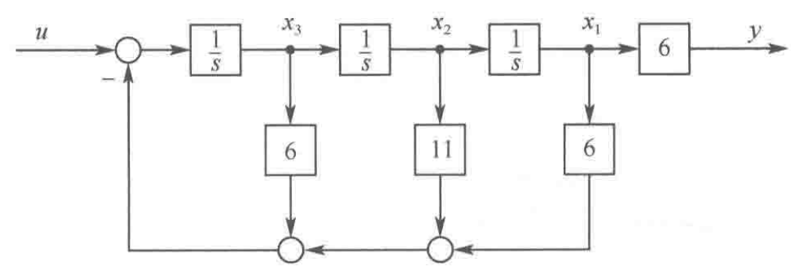

> Image description: A technical diagram representing a state-variable system in controllable canonical form (as indicated by the Chinese caption "图 9－3－1 题 9－3 系统可控标准型状态变量图"). The signal flow starts from an input $u$ entering a summing junction. The forward path consists of three sequential integrator blocks ($\frac{1}{s}$), defining state variables $x_3$, $x_2$, and $x_1$. The output $y$ is derived by multiplying $x_1$ by a gain block of 6. A feedback loop returns signals to the initial summing junction. This loop consists of three parallel paths: $x_1$ is multiplied by 6, $x_2$ is multiplied by 11, and $x_3$ is multiplied by 6. These weighted state variables are summed together before being subtracted from the input $u$. Arrows indicate the unidirectional flow of signals through the integrators and feedback paths.
图 9－3－1 题 9－3 系统可控标准型状态变量图

（2）可观测标准型实现。根据对偶原理可知，可控标准型与可观测标准型的各矩阵之间存在如下关系：

$$
\boldsymbol{A}_{o}=\boldsymbol{A}_{c}^{\mathrm{T}}, \quad \boldsymbol{b}_{o}=\boldsymbol{c}_{c}^{\mathrm{T}}, \quad \boldsymbol{c}_{o}=\boldsymbol{b}_{c}^{\mathrm{T}}
$$

因而根据可控标准型利用对偶关系可直接写出可观测标准型动态方程

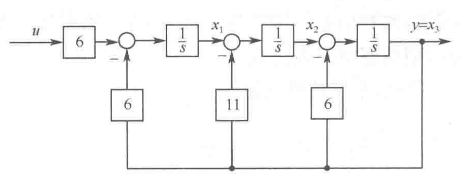

> Image description: A technical block diagram representing a system in observable canonical form (as indicated by the caption "图 9－3－2 题 9－3 系统可观测标准型状态变量图"). The signal flow starts from an input variable $u$ on the left, passing through a gain block of $6$. This output enters a summing junction. The system consists of three integrators ($\frac{1}{s}$) in series, with state variables labeled as $x_1$, $x_2$, and the final output $y = x_3$. Feedback loops return from the output $y$ back to three separate summing junctions. These feedback paths pass through gain blocks with values of $6$, $11$, and $6$ respectively, each entering their respective summing junction with a negative sign (indicated by "$-$"). Arrows indicate a unidirectional flow from left to right for the forward path and right to left for the feedback loops.
图 9－3－2 题 9－3 系统可观测标准型状态变量图

$\dot{\boldsymbol{x}}=\boldsymbol{A}_{o} \boldsymbol{x}+\boldsymbol{b}_{o} u, \quad y=\boldsymbol{c}_{o} \boldsymbol{x}$
其中 $\boldsymbol{A}_{o}=\boldsymbol{A}_{c}^{\mathrm{T}}=\left[\begin{array}{ccc}0 & 0 & -6 \\ 1 & 0 & -11 \\ 0 & 1 & -6\end{array}\right]$
$\boldsymbol{b}_{o}=\boldsymbol{c}_{c}^{\mathrm{T}}=\left[\begin{array}{l}6 \\ 0 \\ 0\end{array}\right], \boldsymbol{c}_{o}=\boldsymbol{b}_{c}^{\mathrm{T}}=\left[\begin{array}{lll}0 & 0 & 1\end{array}\right]$
状态变量图如图 9－3－2 所示。

9－4 已知系统结构图如图9－46所示，其状态变量为 $x_{1}, x_{2}, x_{3}$ 。试求动态方程，并画出状态变量图。

解 首先应根据系统结构图列写微分方程组，再将其改写成向量－矩阵形式，即可得系统的动态方程。

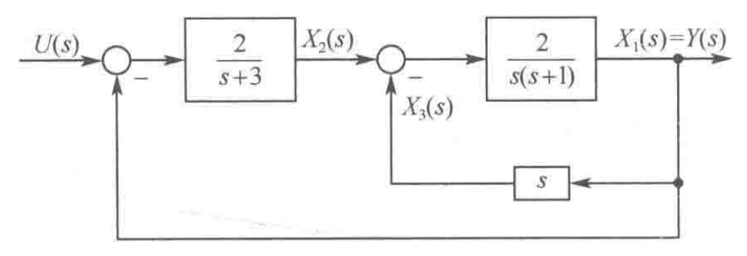

> Image description: A control system block diagram is shown in Figure 9-46 (labeled "图9－46 题 9－4 系统结构图"). The signal flow begins with an input variable $U(s)$ entering a summing junction. This junction subtracts a feedback signal from the output $Y(s)$, which is routed back through a long return path. The resulting signal enters a first transfer function block $\frac{2}{s+3}$, producing the intermediate variable $X_2(s)$. This signal then reaches a second summing junction, where it is combined with a feedback loop containing an integrator block $s$. The output of this junction is labeled $X_3(s)$, which enters a final transfer function block $\frac{2}{s(s+1)}$. The output of this last block is defined as $X_1(s) = Y(s)$. Arrows indicate the unidirectional flow of signals through these blocks and feedback loops, representing a linear time-invariant system in the Laplace domain.
图9－46 题 9－4 系统结构图

将频域参量 $s$ 视作微分算子，由系统结构图可得

$$
\begin{aligned}
2\left(u-x_{1}\right) & =(s+3) x_{2} \\
2\left(x_{2}-x_{3}\right) & =s(s+1) x_{1} \\
x_{3} & =s x_{1} \\
y & =x_{1}
\end{aligned}
$$

经整理可得所要求的动态方程

$$
\begin{aligned}
\dot{x}_{1} & =x_{3} \\
\dot{x}_{2} & =-2 x_{1}-3 x_{2}+2 u \\
\dot{x}_{3} & =2 x_{2}-3 x_{3} \\
y & =x_{1}
\end{aligned}
$$

写成向量－矩阵形式，可得其动态方程为

$$
\left[\begin{array}{l}
\dot{x}_{1} \\
\dot{x}_{2} \\
\dot{x}_{3}
\end{array}\right]=\left[\begin{array}{ccc}
0 & 0 & 1 \\
-2 & -3 & 0 \\
0 & 2 & -3
\end{array}\right]\left[\begin{array}{l}
x_{1} \\
x_{2} \\
x_{3}
\end{array}\right]+\left[\begin{array}{l}
0 \\
2 \\
0
\end{array}\right] u, \quad y=\left[\begin{array}{lll}
1 & 0 & 0
\end{array}\right]\left[\begin{array}{l}
x_{1} \\
x_{2} \\
x_{3}
\end{array}\right]
$$


<!-- source_pdf_page: 308 -->
相应的状态变量图如图 9－4－1 所示。

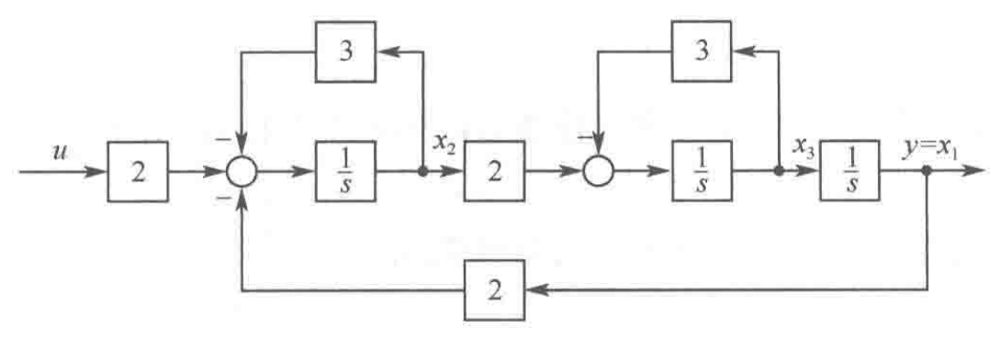

> Image description: This image is a control system block diagram representing state-variable relationships. The input signal $u$ enters from the left, passing through a gain block labeled "2". This signal feeds into a summing junction with two negative feedback loops. The forward path consists of three integrators ($\frac{1}{s}$). The first integrator's output is defined as state variable $x_2$. This signal passes through another gain block "2" before entering a second summing junction, which also has a local negative feedback loop via a gain block "3". The output of the second integrator is state variable $x_3$, which then passes through a final integrator to produce the output $y = x_1$. A global negative feedback loop carries the output $y$ back to the first summing junction through a gain block labeled "2". The diagram illustrates a third-order system where states $x_1, x_2,$ and $x_3$ are interconnected via gains and integration.
图 9－4－1 题 9－4 系统状态变量图

9－5 已知双输人－双输出系统状态方程和输出方程

$$
\begin{aligned}
& \dot{x}_{1}=x_{2}+u_{1} \\
& \dot{x}_{2}=x_{3}+2 u_{1}-u_{2} \\
& \dot{x}_{3}=-6 x_{1}-11 x_{2}-6 x_{3}+2 u_{2} \\
& y_{1}=x_{1}-x_{2} \\
& y_{2}=2 x_{1}+x_{2}-x_{3}
\end{aligned}
$$

写出其向量－矩阵形式并画出状态变量图。
解 本题为线性定常、双输入双输出系统。
（1）根据给定的系统动态方程和输出方程写出其向量－矩阵形式为

$$
\begin{gathered}
{\left[\begin{array}{c}
\dot{x}_{1} \\
\dot{x}_{2} \\
\dot{x}_{3}
\end{array}\right]=\left[\begin{array}{ccc}
0 & 1 & 0 \\
0 & 0 & 1 \\
-6 & -11 & -6
\end{array}\right]\left[\begin{array}{l}
x_{1} \\
x_{2} \\
x_{3}
\end{array}\right]+\left[\begin{array}{cc}
1 & 0 \\
2 & -1 \\
0 & 2
\end{array}\right]\left[\begin{array}{l}
u_{1} \\
u_{2}
\end{array}\right]} \\
{\left[\begin{array}{l}
y_{1} \\
y_{2}
\end{array}\right]=\left[\begin{array}{ccc}
1 & -1 & 0 \\
2 & 1 & -1
\end{array}\right]\left[\begin{array}{l}
x_{1} \\
x_{2} \\
x_{3}
\end{array}\right]}
\end{gathered}
$$

（2）状态变量图如图 9－5－1 所示。

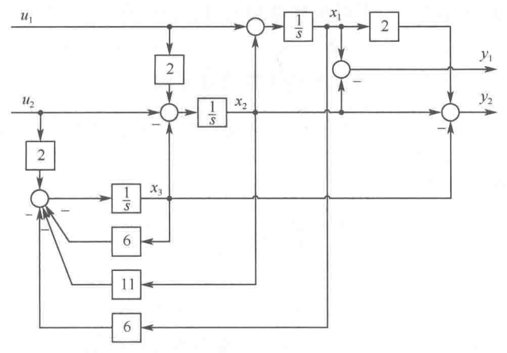

> Image description: This image shows a state-variable diagram (Figure 9-5-1) representing a linear dynamical system. The diagram consists of three integrators labeled $1/s$, which produce the state variables $x_1, x_2,$ and $x_3$. Input signals $u_1$ and $u_2$ enter from the left, while output signals $y_1$ and $y_2$ exit on the right. The system is defined by a network of summing junctions and gain blocks containing numerical constants (e.g., 2, 6, 11). Arrows indicate signal flow: inputs are combined with feedback loops from state variables to drive the integrators. For example, $x_3$ feeds back through gains of 6, 11, and 6 into summing junctions preceding the integrators. The outputs $y_1$ and $y_2$ are formed by linear combinations of the states $x_1, x_2,$ and $x_3$. This visual representation maps directly to a set of state-space differential equations.
图 9－5－1 题 9－5 系统状态变量图


<!-- source_pdf_page: 309 -->
9－6 已知系统传递函数为

$$
G(s)=\frac{s^{2}+6 s+8}{s^{2}+4 s+3}
$$

试求可控标准型（ $\boldsymbol{A}$ 为友矩阵）、可观测标准型（ $\boldsymbol{A}$ 为友矩阵转置）、对角型（ $\boldsymbol{A}$ 为对角阵）的动态方程。

解（1）可控标准型实现。当 $G(s)$ 的分子次数大于等于分母次数时，应用综合除法，得真有理分式形式

$$
G(s)=\frac{s^{2}+6 s+8}{s^{2}+4 s+3}=1+\frac{2 s+5}{s^{2}+4 s+3}
$$

对上式右端第二项进行串联分解并引入中间变量 $z$ ，使

$$
\begin{array}{cc}
\frac{Y(s) Z(s)}{Z(s) U(s)}=\frac{2 s+5}{s^{2}+4 s+3} \\
\text { 令 } \quad \frac{Z(s)}{U(s)}=\frac{1}{s^{2}+4 s+3}, \frac{Y(s)}{Z(s)}=2 s+5
\end{array}
$$

可得微分方程

$$
\begin{aligned}
& \ddot{z}+4 \dot{z}+3 z=u \\
& y=2 \dot{z}+5 z+u
\end{aligned}
$$

选取状态变量

$$
x_{1}=z, \quad x_{2}=\dot{z}
$$

则状态方程为

$$
\dot{x}_{1}=x_{2}, \quad \dot{x}_{2}=-3 x_{1}-4 x_{2}+u
$$

输出方程为

$$
y=5 x_{1}+2 x_{2}+u
$$

其可控标准型动态方程为

$$
\left[\begin{array}{l}
\dot{x}_{1} \\
\dot{x}_{2}
\end{array}\right]=\left[\begin{array}{cc}
0 & 1 \\
-3 & -4
\end{array}\right]\left[\begin{array}{l}
x_{1} \\
x_{2}
\end{array}\right]+\left[\begin{array}{l}
0 \\
1
\end{array}\right] u, \quad y=\left[\begin{array}{ll}
5 & 2
\end{array}\right]\left[\begin{array}{l}
x_{1} \\
x_{2}
\end{array}\right]+u
$$

（2）可观测标准型实现。利用可控标准型与可观测标准型之间的对偶关系

$$
\boldsymbol{A}_{o}=\boldsymbol{A}_{c}^{\mathrm{T}}, \quad \boldsymbol{b}_{o}=\boldsymbol{c}_{c}^{\mathrm{T}}, \quad \boldsymbol{c}_{o}=\boldsymbol{b}_{c}^{\mathrm{T}}, \quad \boldsymbol{d}_{o}=\boldsymbol{d}_{c}
$$

根据可控标准型动态方程可写出可观测标准型动态方程

$$
\left[\begin{array}{l}
\dot{x}_{1} \\
\dot{x}_{2}
\end{array}\right]=\left[\begin{array}{ll}
0 & -3 \\
1 & -4
\end{array}\right]\left[\begin{array}{l}
x_{1} \\
x_{2}
\end{array}\right]+\left[\begin{array}{l}
5 \\
2
\end{array}\right] u, \quad y=\left[\begin{array}{ll}
0 & 1
\end{array}\right]\left[\begin{array}{l}
x_{1} \\
x_{2}
\end{array}\right]+u
$$

（3）对角型实现。由于

$$
G(s)=1+\frac{N(s)}{D(s)}=1+\frac{2 s+5}{s^{2}+4 s+3}
$$

$D(s)$ 可分解为

$$
D(s)=s^{2}+4 s+3=(s+1)(s+3)
$$

其中 $\lambda_{1}=-1, \lambda_{2}=-3$ 为系统的单实极点，则传递函数可展成部分分式之和

$$
\frac{N(s)}{D(s)}=\frac{\frac{3}{2}}{s+1}+\frac{\frac{1}{2}}{s+3}
$$


<!-- source_pdf_page: 310 -->
且有

$$
Y(s)=\left[1+\frac{\frac{3}{2}}{s+1}+\frac{\frac{1}{2}}{s+3}\right] U(s)
$$

若令状态变量

$$
X_{1}(s)=\frac{1}{s+1} U(s), \quad X_{2}(s)=\frac{1}{s+3} U(s)
$$

对上式进行拉氏反变换并展开，有

$$
\begin{gathered}
\dot{x}_{1}=-x_{1}+u, \quad \dot{x}_{2}=-3 x_{2}+u \\
y=\frac{3}{2} x_{1}+\frac{1}{2} x_{2}+u
\end{gathered}
$$

因此对角型动态方程为

$$
\left[\begin{array}{l}
\dot{x}_{1} \\
\dot{x}_{2}
\end{array}\right]=\left[\begin{array}{cc}
-1 & 0 \\
0 & -3
\end{array}\right]\left[\begin{array}{l}
x_{1} \\
x_{2}
\end{array}\right]+\left[\begin{array}{l}
1 \\
1
\end{array}\right] u, \quad y=\left[\begin{array}{ll}
\frac{3}{2} & \frac{1}{2}
\end{array}\right]\left[\begin{array}{l}
x_{1} \\
x_{2}
\end{array}\right]+u
$$

（4）验证。由于系统传递函数 $G(s)=\boldsymbol{c}(s \boldsymbol{I}-\boldsymbol{A})^{-1} \boldsymbol{b}+d$ ，因此有
可控标准型

$$
\begin{aligned}
G_{c}(s) & =\left[\begin{array}{ll}
5 & 2
\end{array}\right]\left[\begin{array}{cc}
s & -1 \\
3 & s+4
\end{array}\right]^{-1}\left[\begin{array}{l}
0 \\
1
\end{array}\right]+1 \\
& =\left[\begin{array}{ll}
5 & 2
\end{array}\right]\left[\begin{array}{ll}
\frac{s+4}{s^{2}+4 s+3} & \frac{1}{s^{2}+4 s+3} \\
\frac{-3}{s^{2}+4 s+3} & \frac{s}{s^{2}+4 s+3}
\end{array}\right]\left[\begin{array}{l}
0 \\
1
\end{array}\right]+1=\frac{s^{2}+6 s+8}{s^{2}+4 s+3}
\end{aligned}
$$

可观测标准型

$$
G_{o}(s)=\left[\begin{array}{ll}
0 & 1
\end{array}\right]\left[\begin{array}{cc}
s & 3 \\
-1 & s+4
\end{array}\right]^{-1}\left[\begin{array}{l}
5 \\
2
\end{array}\right]+1=\frac{s^{2}+6 s+8}{s^{2}+4 s+3}
$$

对角型

$$
G_{\Lambda}(s)=\left[\begin{array}{ll}
\frac{3}{2} & \frac{1}{2}
\end{array}\right]\left[\begin{array}{cc}
s+1 & 0 \\
0 & s+3
\end{array}\right]^{-1}\left[\begin{array}{l}
1 \\
1
\end{array}\right]+1=\frac{s^{2}+6 s+8}{s^{2}+4 s+3}
$$

9－7 已知系统传递函数

$$
G(s)=\frac{5}{(s+1)^{2}(s+2)}
$$

试求约当型（ $\boldsymbol{A}$ 为约当阵）动态方程。
解 将系统传递函数分解为部分分式

$$
G(s)=\frac{Y(s)}{U(s)}=\frac{5}{(s+1)^{2}(s+2)}=\frac{5}{(s+1)^{2}}-\frac{5}{s+1}+\frac{5}{s+2}
$$

令

$$
\begin{aligned}
& X_{1}(s)=\frac{1}{(s+1)^{2}} U(s)=\frac{1}{s+1} X_{2}(s) \\
& X_{2}(s)=\frac{1}{s+1} U(s) \\
& X_{3}(s)=\frac{1}{s+2} U(s)
\end{aligned}
$$


<!-- source_pdf_page: 311 -->
$$
Y(s)=5 X_{1}(s)-5 X_{2}(s)+5 X_{3}(s)
$$

则得

$$
\begin{gathered}
\dot{x}_{1}=-x_{1}+x_{2}, \quad \dot{x}_{2}=-x_{2}+u, \quad \dot{x}_{3}=-2 x_{3}+u \\
y=5 x_{1}-5 x_{2}+5 x_{3}
\end{gathered}
$$

将上式写成向量－矩阵形式，可得其约当标准型实现为

$$
\begin{gathered}
{\left[\begin{array}{l}
\dot{x}_{1} \\
\dot{x}_{2} \\
\dot{x}_{3}
\end{array}\right]=\left[\begin{array}{ccc}
-1 & 1 & 0 \\
0 & -1 & 0 \\
0 & 0 & -2
\end{array}\right]\left[\begin{array}{l}
x_{1} \\
x_{2} \\
x_{3}
\end{array}\right]+\left[\begin{array}{l}
0 \\
1 \\
1
\end{array}\right] u} \\
y=\left[\begin{array}{lll}
5 & -5 & 5
\end{array}\right]\left[\begin{array}{l}
x_{1} \\
x_{2} \\
x_{3}
\end{array}\right]
\end{gathered}
$$

由于系统传递函数 $G(s)=\boldsymbol{c}(s \boldsymbol{I}-\boldsymbol{A})^{-1} \boldsymbol{b}$ ，不妨验证可得

$$
\begin{aligned}
G(s) & =\left[\begin{array}{lll}
5 & -5 & 5
\end{array}\right]\left[\begin{array}{ccc}
s+1 & -1 & 0 \\
0 & s+1 & 0 \\
0 & 0 & s+2
\end{array}\right]^{-1}\left[\begin{array}{l}
0 \\
1 \\
1
\end{array}\right] \\
& =\left[\begin{array}{lll}
5 & -5 & 5
\end{array}\right]\left[\begin{array}{ccc}
\frac{1}{s+1} & \frac{1}{(s+1)^{2}} & 0 \\
0 & \frac{1}{s+1} & 0 \\
0 & 0 & \frac{1}{s+2}
\end{array}\right]\left[\begin{array}{l}
0 \\
1 \\
1
\end{array}\right]=\frac{5}{(s+1)^{2}(s+2)}
\end{aligned}
$$

9－8 已知矩阵

$$
\boldsymbol{A}=\left[\begin{array}{llll}
0 & 1 & 0 & 0 \\
0 & 0 & 1 & 0 \\
0 & 0 & 0 & 1 \\
1 & 0 & 0 & 0
\end{array}\right]
$$

试求 $\boldsymbol{A}$ 的特征方程、特征值、特征向量，并求出变换矩阵将 $\boldsymbol{A}$ 对角化。
解 首先需计算 $\boldsymbol{A}$ 的特征方程，得到 $\boldsymbol{A}$ 的特征值及其与每个特征值相对应的特征向量，再由特征向量构造变换矩阵将 $\boldsymbol{A}$ 对角化。

由于 $\boldsymbol{A}$ 是四阶友矩阵， $\boldsymbol{A}$ 的特征方程为

$$
f(\lambda)=\operatorname{det}(\lambda \boldsymbol{I}-\boldsymbol{A})=\lambda^{4}-1=0
$$

得 $\boldsymbol{A}$ 的特征值为

$$
\lambda_{1}=-1, \quad \lambda_{2}=j, \quad \lambda_{3}=-j, \quad \lambda_{4}=1
$$

令 $p_{i}$ 为特征向量，则由

$$
\boldsymbol{A} \boldsymbol{p}_{i}=\lambda_{i} \boldsymbol{p}_{i}, \quad i=1,2,3,4
$$

可分别求得 $\lambda_{i}$ 所对应的特征向量为

$$
\boldsymbol{p}_{1}=\left[\begin{array}{r}
-0.5 \\
0.5 \\
-0.5 \\
0.5
\end{array}\right], \quad \boldsymbol{p}_{2}=\left[\begin{array}{r}
0.5 \\
0.5 \mathrm{j} \\
-0.5 \\
-0.5 \mathrm{j}
\end{array}\right], \quad \boldsymbol{p}_{3}=\left[\begin{array}{c}
0.5 \\
-0.5 \mathrm{j} \\
-0.5 \\
0.5 \mathrm{j}
\end{array}\right], \quad \boldsymbol{p}_{4}=\left[\begin{array}{l}
-0.5 \\
-0.5 \\
-0.5 \\
-0.5
\end{array}\right]
$$


<!-- source_pdf_page: 312 -->
由于 $\lambda_{i}(i=1,2,3,4)$ 互不相同，故 $\boldsymbol{p}_{i}(i=1,2,3,4)$ 互不相关。可得使 $\boldsymbol{A}$ 对角化的变换矩阵为

$$
\boldsymbol{P}=\left[\begin{array}{rrrr}
-0.5 & 0.5 & 0.5 & -0.5 \\
0.5 & 0.5 \mathrm{j} & -0.5 \mathrm{j} & -0.5 \\
-0.5 & -0.5 & -0.5 & -0.5 \\
0.5 & -0.5 \mathrm{j} & 0.5 \mathrm{j} & -0.5
\end{array}\right]
$$

相应的对角型为

$$
\hat{\boldsymbol{A}}=\boldsymbol{P}^{-1} \boldsymbol{A} \boldsymbol{P}=\left[\begin{array}{cccc}
-1 & 0 & 0 & 0 \\
0 & \mathrm{j} & 0 & 0 \\
0 & 0 & -\mathrm{j} & 0 \\
0 & 0 & 0 & 1
\end{array}\right]
$$

上述问题改用 MATLAB 程序 exe908．m 验证，结果完全一致。
MATLAB 程序：exe 908．m
$\mathrm{A}=\left[\begin{array}{llllllllllllll}0 & 1 & 0 & 0 ; & 0 & 0 & 1 & 0 ; & 0 & 0 & 0 & 1 ; 1 & 0 & 0 \\ \end{array}\right]$ ；
$[\mathrm{P}, \mathrm{e}]=\mathrm{eig}(\mathrm{A})$ \％其中 P 表示变换矩阵， e 表示特征根
$\mathrm{A} 3=\operatorname{inv}(\mathrm{P}) * \mathrm{~A} * \mathrm{P}$
验证结果：
$\mathrm{P}=$

| -0.5000 | 0.5000 | 0.5000 | -0.5000 |
| ---: | ---: | ---: | ---: |
| 0.5000 | $0.0000+0.5000 i$ | $0.0000-0.5000 i$ | -0.5000 |
| -0.5000 | $-0.5000+0.0000 i$ | $-0.5000-0.0000 i$ | -0.5000 |
| 0.5000 | $-0.0000-0.5000 i$ | $-0.0000+0.5000 i$ | -0.5000 |

e＝

| -1.0000 | 0 | 0 | 0 |
| ---: | :---: | :---: | ---: |
| 0 | $0.0000+1.0000 i$ | 0 | 0 |
| 0 | 0 | $0.0000-1.0000 i$ | 0 |
| 0 | 0 | 0 | 1.0000 |

A3＝

$$
\begin{array}{rrrr}
-1.0000-0.0000 i & 0.0000+0.0000 i & 0.0000-0.0000 i & 0.0000+0.0000 i \\
-0.0000-0.0000 i & -0.0000+1.0000 i & 0.0000+0.0000 i & -0.0000+0.0000 i \\
-0.0000+0.0000 i & 0.0000-0.0000 i & 0.0000-1.0000 i & -0.0000-0.0000 i \\
-0.0000-0.0000 i & -0.0000-0.0000 i & -0.0000+0.0000 i & 1.0000-0.0000 i
\end{array}
$$

9－9 已知矩阵

$$
\boldsymbol{A}=\left[\begin{array}{cc}
-1 & 0 \\
0 & 1
\end{array}\right]
$$

试用幂级数法及拉普拉斯变换法求出矩阵指数（即状态转移矩阵）。
解（1）幂级数法。本题是线性定常系统，状态转移矩阵可展开成

$$
\boldsymbol{\Phi}(t)=\mathrm{e}^{\boldsymbol{A} t}=\boldsymbol{I}+\boldsymbol{A} t+\frac{1}{2!} \boldsymbol{A}^{2} t^{2}+\cdots+\frac{1}{k!} \boldsymbol{A}^{k} t^{k}+\cdots
$$

由于


<!-- source_pdf_page: 313 -->
$$
\begin{gathered}
\boldsymbol{A}=\boldsymbol{A}^{3}=\boldsymbol{A}^{5}=\boldsymbol{\cdots}=\left[\begin{array}{cc}
-1 & 0 \\
0 & 1
\end{array}\right] \\
\boldsymbol{A}^{2}=\boldsymbol{A}^{4}=\boldsymbol{A}^{6}=\boldsymbol{\cdots}=\left[\begin{array}{ll}
1 & 0 \\
0 & 1
\end{array}\right]
\end{gathered}
$$

故有

$$
\begin{aligned}
\boldsymbol{\Phi}(t) & =\left[\begin{array}{ll}
1 & 0 \\
0 & 1
\end{array}\right]+\left[\begin{array}{cc}
-t & 0 \\
0 & t
\end{array}\right]+\frac{1}{2!}\left[\begin{array}{cc}
t^{2} & 0 \\
0 & t^{2}
\end{array}\right]+\frac{1}{3!}\left[\begin{array}{cc}
-t^{3} & 0 \\
0 & t^{3}
\end{array}\right]+\frac{1}{4!}\left[\begin{array}{cc}
t^{4} & 0 \\
0 & t^{4}
\end{array}\right]+\cdots \\
& =\left[\begin{array}{cc}
1-t+\frac{1}{2!} t^{2}-\frac{1}{3!} t^{3}+\frac{1}{4!} t^{4}+\cdots & 0 \\
0 & 1+t+\frac{1}{2!} t^{2}+\frac{1}{3!} t^{3}+\frac{1}{4!} t^{4}+\cdots
\end{array}\right] \\
& =\left[\begin{array}{cc}
\mathrm{e}^{-t} & 0 \\
0 & \mathrm{e}^{t}
\end{array}\right]
\end{aligned}
$$

（2）拉普拉斯变换法。

$$
\begin{gathered}
s \boldsymbol{I}-\boldsymbol{A}=\left[\begin{array}{ll}
s & 0 \\
0 & s
\end{array}\right]-\left[\begin{array}{cc}
-1 & 0 \\
0 & 1
\end{array}\right]=\left[\begin{array}{cc}
s+1 & 0 \\
0 & s-1
\end{array}\right] \\
(s \boldsymbol{I}-\boldsymbol{A})^{-1}=\frac{\operatorname{adj}(s \boldsymbol{I}-\boldsymbol{A})}{|s \boldsymbol{I}-\boldsymbol{A}|}=\frac{1}{(s+1)(s-1)}\left[\begin{array}{cc}
s-1 & 0 \\
0 & s+1
\end{array}\right]=\left[\begin{array}{cc}
\frac{1}{s+1} & 0 \\
0 & \frac{1}{s-1}
\end{array}\right]
\end{gathered}
$$

则状态转移矩阵为

$$
\boldsymbol{\Phi}(t)=\mathscr{L}^{-1}\left[(s \boldsymbol{I}-\boldsymbol{A})^{-1}\right]=\left[\begin{array}{cc}
\mathrm{e}^{-t} & 0 \\
0 & \mathrm{e}^{t}
\end{array}\right]
$$

下面通过 MATLAB 程序 exe909．m，验证上述计算结果的正确性。
MATLAB 程序：exe909．m
$A=\left[\begin{array}{lllll}-1 & 0 & 0 & 1\end{array}\right]$ ；
syms s
A1 $=\operatorname{inv}(s * \operatorname{eye}(2)-A)$
ilaplace（A1）
运行结果：
ans＝
$[\exp (-\mathrm{t}), \quad 0]$
［ $0, \exp (\mathrm{t})$ ］
\％创建符号 s
\％求 $(s \boldsymbol{I}-\boldsymbol{A})^{-1}$
\％对 $(\boldsymbol{s} \boldsymbol{I}-\boldsymbol{A})^{-1}$ 取拉普拉斯反变换

结果是一致的。
9－10 试求下列状态方程的解：

$$
\dot{x}=\left[\begin{array}{ccc}
-1 & 0 & 0 \\
0 & -2 & 0 \\
0 & 0 & -3
\end{array}\right] x
$$

解 本题属于线性定常齐次状态方程，方程解为 $\boldsymbol{x}(t)=\mathrm{e}^{A t} \boldsymbol{x}(0)$ ，故需先求出系统的状态转移矩阵 $\mathrm{e}^{A t}$ 。


<!-- source_pdf_page: 314 -->
由于系统状态方程的状态矩阵 $\boldsymbol{A}$ 为对角型，因而有

$$
\mathrm{e}^{\mathbf{A} t}=\left[\begin{array}{ccc}
\mathrm{e}^{-t} & 0 & 0 \\
0 & \mathrm{e}^{-2 t} & 0 \\
0 & 0 & \mathrm{e}^{-3 t}
\end{array}\right]
$$

状态方程的解为

$$
\boldsymbol{x}(t)=\mathrm{e}^{\boldsymbol{A} t} \boldsymbol{x}(0)=\left[\begin{array}{ccc}
\mathrm{e}^{-t} & 0 & 0 \\
0 & \mathrm{e}^{-2 t} & 0 \\
0 & 0 & \mathrm{e}^{-3 t}
\end{array}\right] \boldsymbol{x}(0)
$$

其中 $x(0)$ 为系统的初始状态。
上述步骤关键在于状态转移矩阵 $e^{A t}$ 的计算。下面利用 MATLAB 程序 exe910．m 对其进行求解。

MATLAB 程序 ：exe910．m

$$
A=\left[\begin{array}{lllllll}
-1 & 0 & 0 ; & 0 & -2 & 0 ; 0 & 0 \\
-3
\end{array}\right]
$$

syms s

$$
\begin{aligned}
& \mathrm{A} 1=\operatorname{inv}(\mathrm{s} * \operatorname{eye}(3)-\mathrm{A}) \\
& \text { ilaplace }(\mathrm{A} 1)
\end{aligned}
$$

\％创建符号对象
\％求 $(s \boldsymbol{I}-\boldsymbol{A})^{-1}$
\％对 $(s \boldsymbol{I}-\boldsymbol{A})^{-1}$ 取拉普拉斯反变换，解得状态转移阵

运行结果：

ans $=$

| $[$ | $\exp (-t)$, | 0, |
| :--- | ---: | ---: |
| $[$ | 0, | $\exp (-2 * t)$, |
| $[$ | 0, | $0]$ |

9－11 已知系统状态方程为

$$
\dot{x}=\left[\begin{array}{ll}
1 & 0 \\
1 & 1
\end{array}\right] x+\left[\begin{array}{l}
1 \\
1
\end{array}\right] u
$$

初始条件为 $x_{1}(0)=1, x_{2}(0)=0$ 。试求系统在单位阶跃输入作用下的状态响应。
解 本题属于非齐次状态方程，方程解的形式为

$$
\boldsymbol{x}(t)=\mathrm{e}^{\boldsymbol{A} t} \boldsymbol{x}(0)+\int_{0}^{t} \mathrm{e}^{\boldsymbol{A} \tau} \boldsymbol{b} u(t-\tau) \mathrm{d} \tau
$$

故需先求出系统的状态转移矩阵 $\mathrm{e}^{\mathrm{At}}$ 。
由于

$$
\begin{gathered}
(s \boldsymbol{I}-\boldsymbol{A})=\left[\begin{array}{cc}
s-1 & 0 \\
-1 & s-1
\end{array}\right] \\
(s \boldsymbol{I}-\boldsymbol{A})^{-1}=\frac{1}{(s-1)^{2}}\left[\begin{array}{cc}
s-1 & 0 \\
1 & s-1
\end{array}\right]=\left[\begin{array}{cc}
\frac{1}{s-1} & 0 \\
\frac{1}{(s-1)^{2}} & \frac{1}{s-1}
\end{array}\right]
\end{gathered}
$$

故可采用拉普拉斯变换法求出

$$
\mathrm{e}^{\boldsymbol{A}}=\mathscr{L}^{-1}\left[(s \boldsymbol{I}-\boldsymbol{A})^{-1}\right]=\mathscr{L}^{-1}\left[\begin{array}{cc}
\frac{1}{s-1} & 0 \\
\frac{1}{(s-1)^{2}} & \frac{1}{s-1}
\end{array}\right]=\left[\begin{array}{cc}
\mathrm{e}^{t} & 0 \\
t \mathrm{e}^{t} & \mathrm{e}^{t}
\end{array}\right]
$$

得单位阶跃输入作用下的状态响应为


<!-- source_pdf_page: 315 -->
$$
\boldsymbol{x}(t)=\left[\begin{array}{cc}
\mathrm{e}^{t} & 0 \\
t \mathrm{e}^{t} & \mathrm{e}^{t}
\end{array}\right]\left[\begin{array}{l}
1 \\
0
\end{array}\right]+\int_{0}^{t}\left[\begin{array}{cc}
\mathrm{e}^{\tau} & 0 \\
-\mathrm{e}^{\tau} & \mathrm{e}^{\tau}
\end{array}\right]\left[\begin{array}{l}
1 \\
1
\end{array}\right] \mathrm{d} \tau=\left[\begin{array}{c}
\mathrm{e}^{t} \\
t \mathrm{e}^{t}
\end{array}\right]+\int_{0}^{t}\left[\begin{array}{c}
\mathrm{e}^{\tau} \\
\mathrm{e}^{\tau}+\tau \mathrm{e}^{\tau}
\end{array}\right] \mathrm{d} \tau=\left[\begin{array}{c}
2 \mathrm{e}^{t}-1 \\
2 t \mathrm{e}^{t}
\end{array}\right]
$$

利用 MATLAB 程序 exe911．m，可得系统的单位阶跃输人下的状态响应，如图9－11－1所示。

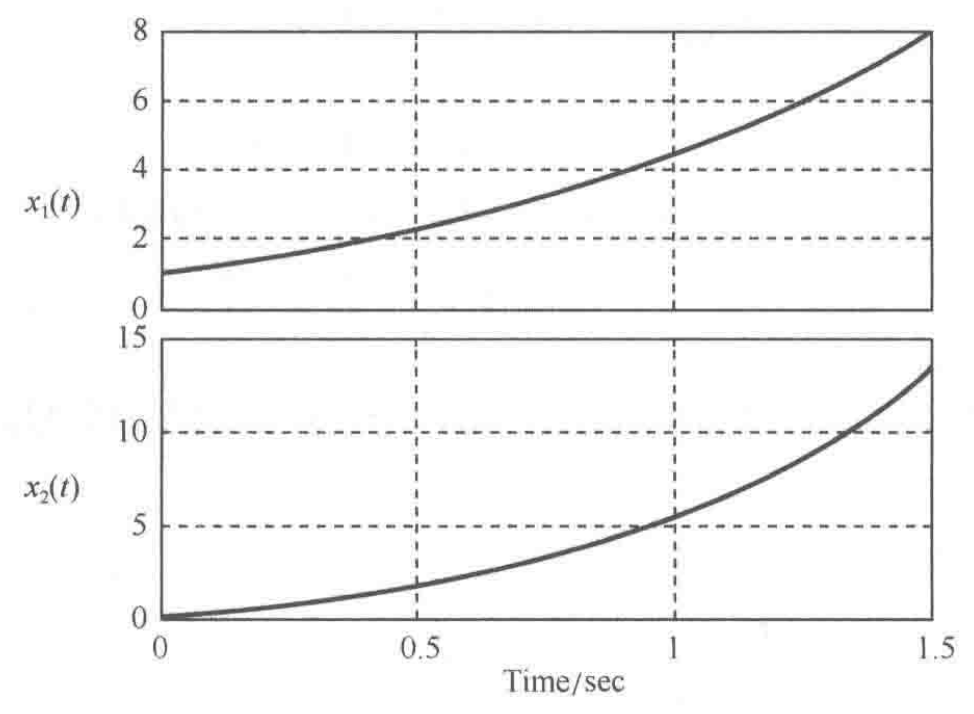

> Image description: This image contains Figure 9-11-1, which displays the state response of a system under unit step input. The figure consists of two vertically stacked time-domain plots sharing a common horizontal axis labeled "Time/sec," ranging from 0 to 1.5 seconds. The top plot shows the variable $x_1(t)$ on the vertical axis, with values ranging from 0 to 8. The curve starts at approximately 1 and increases monotonically in a convex shape, reaching 8 at 1.5 seconds. The bottom plot shows the variable $x_2(t)$ on the vertical axis, with values ranging from 0 to 15. This curve starts at 0 and grows more steeply than $x_1(t)$, ending at approximately 13 at 1.5 seconds. Both plots feature dashed grid lines for scale. In engineering terms, these graphs represent the transient response of two state variables over time following a step input excitation.
图 9－11－1 单位阶跃作用下的系统状态响应（MATLAB）

MATLAB 程序 ：exe911．m
$A=[10 ; 11] ; b=\left[\begin{array}{cc}1 & 1\end{array}\right]^{\prime} ; c=\operatorname{eye}(2) ; d=\operatorname{zeros}(2,1) ;$
sys $=s s(A, b, c, d) ; ~ \%$ 创建系统状态空间模型
syms s \％创建符号对象
A1 $=\operatorname{inv}(s * \operatorname{eye}(2)-A) \quad \%$ 求 $(s \boldsymbol{I}-\boldsymbol{A})^{-1}$
EAT $=$ ilaplace $($ A1 $)$ \％对 $(s \boldsymbol{I}-\boldsymbol{A})^{-1}$ 取拉普拉斯反变换，解得状态转移阵
$t=0: 0.01: 1.5$ ；
$n=$ length $(t) ; u=\operatorname{ones}(1, n)$ ；
$\operatorname{lsim}\left(\mathrm{sys}, \mathrm{u}, \mathrm{t},\left[\begin{array}{ll}1 & 0\end{array}\right]^{\prime}\right)$ ；grid \％求系统的单位阶跃响应
运行结果：
EAT $=$
$\left[\begin{array}{ll}\exp (t), & 0\end{array}\right]$
$[t * \exp (t), \quad \exp (t)]$
9－12 已知线性系统状态转移矩阵

$$
\boldsymbol{\Phi}(t)=\left[\begin{array}{cc}
6 \mathrm{e}^{-t}-5 \mathrm{e}^{-2 t} & 4 \mathrm{e}^{-t}-4 \mathrm{e}^{-2 t} \\
-3 \mathrm{e}^{-t}+3 \mathrm{e}^{-2 t} & -2 \mathrm{e}^{-t}+3 \mathrm{e}^{-2 t}
\end{array}\right]
$$

试求该系统的状态阵 $\boldsymbol{A}$ 。
解 本题可利用状态转移矩阵的性质来求解。因为

$$
\dot{\boldsymbol{\Phi}}(t)=\boldsymbol{A} \boldsymbol{\Phi}(t), \quad \boldsymbol{\Phi}(0)=\boldsymbol{I}
$$

所以

$$
\boldsymbol{A}=\left.\dot{\boldsymbol{\Phi}}(t)\right|_{t=0}=\left.\left[\begin{array}{cc}
-6 \mathrm{e}^{-t}+10 \mathrm{e}^{-2 t} & -4 \mathrm{e}^{-t}+8 \mathrm{e}^{-2 t} \\
3 \mathrm{e}^{-t}-6 \mathrm{e}^{-2 t} & 2 \mathrm{e}^{-t}-6 \mathrm{e}^{-2 t}
\end{array}\right]\right|_{t=0}=\left[\begin{array}{cc}
4 & 4 \\
-3 & -4
\end{array}\right]
$$

与利用 MATLAB 程序 exe912．m 计算得到的结果完全一致。
MATLAB 程序 ：exe912．m


<!-- source_pdf_page: 316 -->
syms t

$$
\begin{array}{rlrl}
\operatorname{phi}= & {[6 * \exp (-t)-5 * \exp (-2 * t) 4 * \exp (-t)-4 * \exp (-2 * t) ;} & & \\
& -3 * \exp (-t)+3 * \exp (-2 * t)-2 * \exp (-t)+3 * \exp (-2 * t)] & & \% \text { 描述状态转移矩阵 } \\
\text { dphi }= & \operatorname{diff}(\mathrm{phi}) ; & & \text { \% 对状态转移矩阵求导数 } \\
A=\text { limit }(\operatorname{dphi}, 0) & & \text { \%计算状态阵 } A
\end{array}
$$

运行结果：

```
phi =
    $[6 * \exp (-\mathrm{t})-5 * \exp (-2 * \mathrm{t}), 4 * \exp (-\mathrm{t})-4 * \exp (-2 * \mathrm{t})]$
    $[-3 * \exp (-t)+3 * \exp (-2 * t),-2 * \exp (-t)+3 * \exp (-2 * t)]$
$\mathrm{A}=$
    $[4,4]$
    $[-3,-4]$
```

9－13 已知系统状态方程

$$
\begin{gathered}
\dot{x}=\left[\begin{array}{ccc}
0 & 1 & 0 \\
-2 & -3 & 0 \\
-1 & 1 & 3
\end{array}\right] x+\left[\begin{array}{l}
0 \\
1 \\
2
\end{array}\right] u \\
y=\left[\begin{array}{lll}
0 & 0 & 1
\end{array}\right] x
\end{gathered}
$$

试求系统传递函数 $G(s)$ 。
解 本题属于线性定常系统，可通过关系式 $G(s)=\boldsymbol{c}(s \boldsymbol{I}-\boldsymbol{A})^{-1} \boldsymbol{b}$ 求解系统传递函数。由系统动态方程知

$$
\begin{gathered}
\boldsymbol{A}=\left[\begin{array}{ccc}
0 & 1 & 0 \\
-2 & -3 & 0 \\
-1 & 1 & 3
\end{array}\right], \quad \boldsymbol{b}=\left[\begin{array}{l}
0 \\
1 \\
2
\end{array}\right], \quad \boldsymbol{c}=\left[\begin{array}{lll}
0 & 0 & 1
\end{array}\right] \\
(s \boldsymbol{I}-\boldsymbol{A})=\left[\begin{array}{ccc}
s & -1 & 0 \\
2 & s+3 & 0 \\
1 & -1 & s-3
\end{array}\right] \\
\operatorname{det}(s \boldsymbol{I}-\boldsymbol{A})=(s+1)(s+2)(s-3)
\end{gathered}
$$

于是系统传递函数为

$$
\begin{aligned}
G(s) & =c(s \boldsymbol{I}-\boldsymbol{A})^{-1} \boldsymbol{b}=\left[\begin{array}{lll}
0 & 0 & 1
\end{array}\right]\left[\begin{array}{ccc}
s & -1 & 0 \\
2 & s+3 & 0 \\
1 & -1 & s-3
\end{array}\right]^{-1}\left[\begin{array}{l}
0 \\
1 \\
2
\end{array}\right] \\
& =\frac{1}{(s+1)(s+2)(s-3)}\left[\begin{array}{lll}
0 & 0 & 1
\end{array}\right]\left[\begin{array}{ccc}
(s+3)(s-3) & s-3 & 0 \\
-2(s-3) & s(s-3) & 0 \\
-(s+5) & (s-1) & (s+1)(s+2)
\end{array}\right]\left[\begin{array}{l}
0 \\
1 \\
2
\end{array}\right] \\
& =\frac{1}{(s+1)(s+2)(s-3)}\left[\begin{array}{lll}
-s-5 & s-1 & (s+1)(s+2)
\end{array}\right]\left[\begin{array}{l}
0 \\
1 \\
2
\end{array}\right] \\
& =\frac{2 s^{2}+7 s+3}{s^{3}-7 s-6}
\end{aligned}
$$

在 MATLAB 中，利用 ss 2 tf 命令可以方便地由状态方程求取系统的传递函数。


<!-- source_pdf_page: 317 -->
MATLAB 程序 ：exe913．m
$A=\left[\begin{array}{lllllll}0 & 1 & 0 ;-2-3 & 0 ;-1 & 1 & 3\end{array}\right] ; b=[0 ; 1 ; 2] ; c=\left[\begin{array}{lll}0 & 0 & 1\end{array}\right]$ ； ［num，den］$=\operatorname{ss2tf}(\mathrm{A}, \mathrm{b}, \mathrm{c}, 0)$ ；
sys $=$ tf （num，den）
\％建立系统状态空间模型
\％求取系统传递函数

运行结果：
Transfer function：
$2 s^{2}+7 s+3$
$s 3-7 s-6$
9－14 试求习题 9－5 所示系统的传递函数矩阵。
解 本题属于线性定常系统，可通过关系式 $G(s)=\boldsymbol{C}(s \boldsymbol{I}-\boldsymbol{A})^{-1} \boldsymbol{B}$ 求解传递函数矩阵。由系统动态方程知

$$
\begin{gathered}
\boldsymbol{A}=\left[\begin{array}{ccc}
0 & 1 & 0 \\
0 & 0 & 1 \\
-6 & -11 & -6
\end{array}\right], \quad \boldsymbol{B}=\left[\begin{array}{cc}
1 & 0 \\
2 & -1 \\
0 & 2
\end{array}\right], \quad \boldsymbol{C}=\left[\begin{array}{ccc}
1 & -1 & 0 \\
2 & 1 & -1
\end{array}\right] \\
(s \boldsymbol{I}-\boldsymbol{A})=\left[\begin{array}{ccc}
s & -1 & 0 \\
0 & s & -1 \\
6 & 11 & s+6
\end{array}\right] \\
\operatorname{det}(s \boldsymbol{I}-\boldsymbol{A})=s^{3}+6 s^{2}+11 s+6
\end{gathered}
$$

于是系统传递函数为

$$
\begin{aligned}
\boldsymbol{G}(s) & =\boldsymbol{C}(s \boldsymbol{I}-\boldsymbol{A})^{-1} \boldsymbol{B}=\left[\begin{array}{ccc}
1 & -1 & 0 \\
2 & 1 & -1
\end{array}\right]\left[\begin{array}{ccc}
s & -1 & 0 \\
0 & s & -1 \\
6 & 11 & s+6
\end{array}\right]^{-1}\left[\begin{array}{cc}
1 & 0 \\
2 & -1 \\
0 & 2
\end{array}\right] \\
& =\frac{1}{s^{3}+6 s^{2}+11 s+6}\left[\begin{array}{ccc}
1 & -1 & 0 \\
2 & 1 & -1
\end{array}\right]\left[\begin{array}{ccc}
s^{2}+6 s+11 & s+6 & 1 \\
-6 & s^{2}+6 s & s \\
-6 s & -11 s-6 & s^{2}
\end{array}\right]\left[\begin{array}{cc}
1 & 0 \\
2 & -1 \\
0 & 2
\end{array}\right] \\
& =\frac{1}{s^{3}+6 s^{2}+11 s+6}\left[\begin{array}{cc}
-s^{2}-4 s+29 & s^{2}+3 s-4 \\
4 s^{2}+56 s+52 & -3 s^{2}-17 s-14
\end{array}\right]
\end{aligned}
$$

同习题 9－13，用 MATLAB 求传递函数的程序 exe914．m 如下。
MATLAB 程序 ：exe914．m

$$
\begin{array}{ll}
A=\left[\begin{array}{lllll}
0 & 1 & 0 ; 0 & 0 & 1 ;-6-11-6
\end{array}\right] ; B=\left[\begin{array}{ll}
1 & 0 ; 2-1 ; 0
\end{array}\right] ; C=\left[\begin{array}{ll}
1-1 & 0 ; 2
\end{array}-1-1\right] ; \\
{[\text { num1, den1 }]=\operatorname{ss} 2 \operatorname{tf}(A, B, C, \operatorname{zeros}(2), 1)} & \% \text { 求第一个输人作用的传递函数 } \\
{[\text { num2, den2 }]=\operatorname{ss2tf}(A, B, C, \operatorname{zeros}(2), 2)} & \text { \%求第二个输人作用的传递函数 }
\end{array}
$$

运行结果：

$$
\begin{array}{rrrr}
\text { num1 }= & & & \\
0 & -1.0000 & -4.0000 & 29.0000 \\
0 & 4.0000 & 56.0000 & 52.0000 \\
\text { den1 }= & & & \\
\begin{array}{l}
1.0000 \\
\text { num2 }=
\end{array} & 6.0000 & 11.0000 & 6.0000
\end{array}
$$


<!-- source_pdf_page: 318 -->
| 0 | 1.0000 | 3.0000 | -4.0000 |
| ---: | ---: | ---: | ---: |
| 0 | -3.0000 | -17.0000 | -14.0000 |
| $\operatorname{den} 2=$ |  |  |  |
| 1.0000 | 6.0000 | 11.0000 | 6.0000 |

9－15 已知差分方程

$$
y(k+2)+3 y(k+1)+2 y(k)=2 u(k+1)+3 u(k)
$$

试列写可控标准型（ $\boldsymbol{A}$ 为友矩阵）离散动态方程，并求出 $u(k)=1$ 时的系统响应。给定 $y(0)=0, y(1)=1$ 。

解 本题通过分解法将差分方程转换成可控标准型离散动态方程，并采用递推法求解出给定输人和初始条件下的系统响应。
（1）由差分方程求可控标准型离散动态方程。对差分方程两端取 $z$ 变换，因

$$
\begin{aligned}
\mathscr{Z}[y(k+2)] & =z^{2} Y(z)-z^{2} y(0)-z y(1)=z^{2} Y(z)-z \\
3 \mathscr{Z}[y(k+1)] & =3[z Y(z)-z y(0)]=3 z Y(z) \\
2 \mathscr{Z}[y(k)] & =2 Y(z) \\
2 \mathscr{Z}[u(k+1)] & =2[z U(z)-z u(0)]=2 z U(z)-2 z \\
3 \mathscr{Z}[u(k)] & =3 U(z)
\end{aligned}
$$

故有

$$
\begin{aligned}
& \left(z^{2}+3 z+2\right) Y(z)=(2 z+3) U(z)-2 z \\
& Y(z)=\frac{2 z+3}{z^{2}+3 z+2} U(z)-\frac{2 z}{z^{2}+3 z+2}
\end{aligned}
$$

在求离散动态系统可控标准型的过程中，仅需考虑

$$
\frac{Y(z)}{U(z)}=\frac{2 z+3}{z^{2}+3 z+2}
$$

在 $Y(z) / U(z)$ 的串联分解中，引入中间变量 $Q(z)$ ，则有

设

$$
\begin{gathered}
z^{2} Q(z)+3 z Q(z)+2 Q(z)=U(z) \\
Y(z)=2 z Q(z)+3 Q(z) \\
X_{1}(z)=Q(z), \quad X_{2}(z)=z Q(z)=z X_{1}(z) \\
z^{2} Q(z)=-2 X_{1}(z)-3 X_{2}(z)+U(z) \\
Y(z)=3 X_{1}(z)+2 X_{2}(z)
\end{gathered}
$$

则

利用 $z$ 反变换关系，可得离散系统动态方程为

$$
\begin{gathered}
x_{1}(k+1)=x_{2}(k) \\
x_{2}(k+1)=-2 x_{1}(k)-3 x_{2}(k)+u(k) \\
y(k)=3 x_{1}(k)+2 x_{2}(k)
\end{gathered}
$$

写成向量－矩阵形式，可控标准型离散动态方程为

$$
\begin{gathered}
\boldsymbol{x}(k+1)=\boldsymbol{G} \boldsymbol{x}(k)+\boldsymbol{h} u(k)=\left[\begin{array}{cc}
0 & 1 \\
-2 & -3
\end{array}\right] \boldsymbol{x}(k)+\left[\begin{array}{l}
0 \\
1
\end{array}\right] u(k) \\
y(k)=\boldsymbol{c x}(k)=\left[\begin{array}{ll}
3 & 2
\end{array}\right] \boldsymbol{x}(k)
\end{gathered}
$$


<!-- source_pdf_page: 319 -->
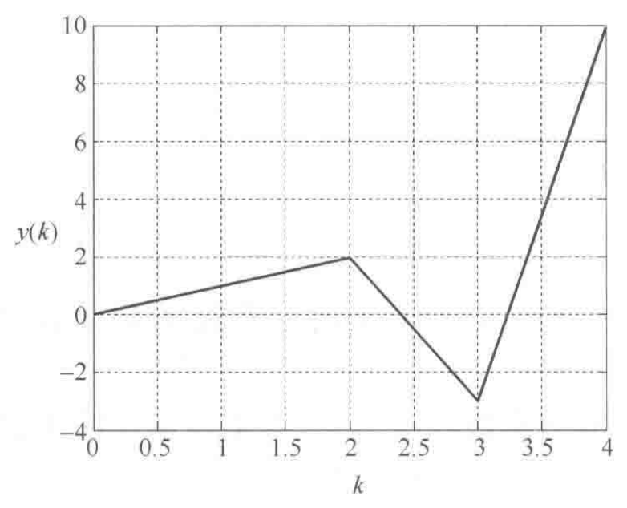

> Image description: This image is a technical plot showing the output time response of a system, as indicated by the caption "图 9－15－1 习题 9－15 在 $u(k)=1$ 作用下的输出时间响应（MATLAB）". The graph features a Cartesian coordinate system with two axes. The horizontal axis is labeled "$k$", representing discrete time steps, ranging from 0 to 4. The vertical axis is labeled "$y(k)$", representing the output response, with values ranging from -4 to 10. The plot displays a piecewise linear sequence of connected data points: starting at $(0, 0)$, it rises linearly to $(2, 2)$, drops sharply to $(3, -3)$, and then increases steeply to end at $(4, 10)$. A grid of dashed lines is overlaid on the plot for easier value retrieval. The figure illustrates how the system output $y(k)$ evolves over time when subjected to a constant input $u(k)=1$.
图 9－15－1 习题 9－15 在 $u(k)=1$ 作用下的输出时间响应（MATLAB）

（2）在给定 $y(0)=0, y(1)=1$ 的条件下，有

$$
\begin{aligned}
& y(2)=2 u(1)+3 u(0)-3 y(1)-2 y(0)=2 \\
& y(3)=2 u(2)+3 u(1)-3 y(2)-2 y(1)=-3 \\
& y(4)=2 u(3)+3 u(2)-3 y(3)-2 y(2)=10 \\
& \ldots \ldots
\end{aligned}
$$

仿真可得离散动态系统在 $u(k)$ 作用下的输出时间响应如图 9－15－1 所示。

9－16 已知连续系统动态方程为

$$
\dot{\boldsymbol{x}}=\left[\begin{array}{ll}
0 & 1 \\
0 & 2
\end{array}\right] x+\left[\begin{array}{l}
0 \\
1
\end{array}\right] u, \quad y=\left[\begin{array}{ll}
1 & 0
\end{array}\right] x
$$

设采样周期 $T=1 \mathrm{~s}$ ，试求离散化动态方程。
解 首先需求出连续系统的状态转移矩阵，再将系统离散化。
（1）采用拉普拉斯变换法求取连续系统的状态转移矩阵 $\boldsymbol{\Phi}(t)$ 。

$$
\begin{gathered}
(s \boldsymbol{I}-\boldsymbol{A})=\left[\begin{array}{cc}
s & -1 \\
0 & s-2
\end{array}\right], \operatorname{det}(s \boldsymbol{I}-\boldsymbol{A})=s(s-2) \\
(s \boldsymbol{I}-\boldsymbol{A})^{-1}=\frac{1}{s(s-2)}\left[\begin{array}{cc}
s-2 & 1 \\
0 & s
\end{array}\right]=\left[\begin{array}{cc}
\frac{1}{s} & \frac{1}{s(s-2)} \\
0 & \frac{1}{s-2}
\end{array}\right] \\
\boldsymbol{\Phi}(t)=\mathrm{e}^{\boldsymbol{A} t}=\mathscr{L}^{-1}\left[(s \boldsymbol{I}-\boldsymbol{A})^{-1}\right]=\mathscr{L}^{-1}\left[\begin{array}{cc}
\frac{1}{s} & -\frac{1}{2}\left(\frac{1}{s}-\frac{1}{s-2}\right) \\
0 & \frac{1}{s-2}
\end{array}\right]=\left[\begin{array}{cc}
1 & -\frac{1}{2}+\frac{1}{2} \mathrm{e}^{2 t} \\
0 & \mathrm{e}^{2 t}
\end{array}\right]
\end{gathered}
$$

（2）离散化状态方程为

$$
\boldsymbol{x}(k+1)=\boldsymbol{\Phi}(T) \boldsymbol{x}(k)+\boldsymbol{G}(T) u(k)
$$

式中， $\boldsymbol{\Phi}(T) 、 \boldsymbol{G}(T)$ 与连续系统状态转移矩阵 $\boldsymbol{\Phi}(t)$ 的关系为

$$
\begin{gathered}
\boldsymbol{\Phi}(T)=\left.\boldsymbol{\Phi}(t)\right|_{t=T}=\left[\begin{array}{cc}
1 & -\frac{1}{2}+\frac{1}{2} \mathrm{e}^{2} \\
0 & \mathrm{e}^{2}
\end{array}\right]=\left[\begin{array}{cc}
1 & 3.1945 \\
0 & 7.3891
\end{array}\right] \\
\boldsymbol{G}(T)=\int_{0}^{T} \boldsymbol{\Phi}(t) \boldsymbol{b} \mathrm{d} t=\int_{0}^{T}\left[\begin{array}{c}
-\frac{1}{2}+\frac{1}{2} \mathrm{e}^{2 t} \\
\mathrm{e}^{2 t}
\end{array}\right] \mathrm{d} t=\left[\begin{array}{c}
-\frac{1}{4}\left(2 T+1-\mathrm{e}^{2 T}\right) \\
\frac{1}{2}\left(\mathrm{e}^{2 T}-1\right)
\end{array}\right]=\left[\begin{array}{l}
1.0973 \\
3.1945
\end{array}\right]
\end{gathered}
$$

因而

$$
x(k+1)=\left[\begin{array}{ll}
1 & 3.1945 \\
0 & 7.3891
\end{array}\right] x(k)+\left[\begin{array}{l}
1.0973 \\
3.1945
\end{array}\right] u(k)
$$

上述的求解过程可以考虑用如下 MATLAB 程序计算，所得结果一致。
MATLAB 程序 ：exe916．m
$\mathrm{A}=\left[\begin{array}{llll}0 & 1 ; 0 & 2\end{array}\right] ; \mathrm{b}=\left[\begin{array}{ll}0 & 1\end{array}\right]^{\prime} ; \mathrm{c}=\left[\begin{array}{ll}1 & 0\end{array}\right] ; \mathrm{d}=0 ; \mathrm{T}=1$ ；
syms s t
\％创建符号对象


<!-- source_pdf_page: 320 -->
$$
\begin{array}{ll}
\mathrm{A} 1=\operatorname{inv}(\mathrm{s} * \operatorname{eye}(2)-\mathrm{A}) ; & \text { \%求 }(s \boldsymbol{I}-\boldsymbol{A})^{-1} \\
\mathrm{EAT}=\operatorname{ilaplace}(\mathrm{A} 1) & \text { \%对 }(s \boldsymbol{I}-\boldsymbol{A})^{-1} \text { 取拉普拉斯反变换, } \mathrm{EAT} \text { 为 } \mathrm{e}^{A t} \\
\text { phiT }=\operatorname{limit}(\mathrm{EAT}, \mathrm{~T}) & \text { \%计算离散化状态方程的 } \boldsymbol{\Phi}(T) \\
\mathrm{L}=\mathrm{EAT} * \mathrm{~b} ; & \text { \% }(t) b \\
\mathrm{~F} 1=\operatorname{inline}\left({ }^{\prime}-0.5+0.5 * \exp (2 * \mathrm{t})^{\prime}\right) ; & \\
\mathrm{F} 2=\operatorname{inline}\left({ }^{\prime} \exp (2 * \mathrm{t})^{\prime}\right) ; & \\
\mathrm{GT}=[\operatorname{quad}(\mathrm{F} 1,0, \mathrm{~T}) ; \operatorname{quad}(\mathrm{F} 2,0, \mathrm{~T})] & \text { \% 积分计算离散化状态方程的 } \boldsymbol{G}(T) \\
\text { 运行结果: } & 1,-1 / 2+1 / 2 * \exp (2 * \mathrm{t})] \\
\mathrm{EAT}= & 0, \\
{[\quad[\quad 1,-1 / 2+1 / 2 * \exp (2 * \mathrm{t})]} \\
\begin{array}{l}
\text { phiT }= \\
{[\quad 0,} \\
{[\quad \exp (2)]} \\
\mathrm{GT}= \\
1.0973
\end{array} \\
3.1945 &
\end{array}
$$

9－17 试判断下列系统的状态可控性：
（1）$\dot{x}=\left[\begin{array}{ccc}-2 & 2 & -1 \\ 0 & -2 & 0 \\ 1 & -4 & 0\end{array}\right] x+\left[\begin{array}{l}0 \\ 0 \\ 1\end{array}\right] u$ ；
（2）$\dot{x}=\left[\begin{array}{lll}1 & 1 & 0 \\ 0 & 1 & 0 \\ 0 & 1 & 1\end{array}\right] x+\left[\begin{array}{l}0 \\ 1 \\ 0\end{array}\right] u$ ；
（3）$\dot{\boldsymbol{x}}=\left[\begin{array}{lll}1 & 1 & 0 \\ 0 & 1 & 0 \\ 0 & 1 & 1\end{array}\right] \boldsymbol{x}+\left[\begin{array}{ll}0 & 0 \\ 0 & 1 \\ 1 & 0\end{array}\right]\left[\begin{array}{l}u_{1} \\ u_{2}\end{array}\right]$ ；
（4）$\dot{x}=\left[\begin{array}{ccc}-4 & & 0 \\ 0 & -4 & \\ & & 1\end{array}\right] x+\left[\begin{array}{l}1 \\ 2 \\ 1\end{array}\right] u_{0}$

解 本题是线性定常系统可控性判别，可采用秩判据判定。若系统为可控标准型，则可直接判定。

线性定常连续系统完全可控的充分必要条件是

$$
\operatorname{rank} \boldsymbol{S}=\operatorname{rank}\left[\begin{array}{llll}
\boldsymbol{B} & \boldsymbol{A} \boldsymbol{B} & \cdots & \boldsymbol{A}^{n-1} \boldsymbol{B}
\end{array}\right]=n
$$

其中 $n$ 为矩阵 $\boldsymbol{A}$ 的维数， $\boldsymbol{S}$ 称为系统的可控性阵。
（1）由题意

$$
\boldsymbol{A}=\left[\begin{array}{ccc}
-2 & 2 & -1 \\
0 & -2 & 0 \\
1 & -4 & 0
\end{array}\right], \quad \boldsymbol{b}=\left[\begin{array}{l}
0 \\
0 \\
1
\end{array}\right]
$$

系统的可控性阵为

$$
\begin{aligned}
& \boldsymbol{S}=\left[\begin{array}{lll}
\boldsymbol{b} & \boldsymbol{A} \boldsymbol{b} & \boldsymbol{A}^{2} \boldsymbol{b}
\end{array}\right]=\left[\begin{array}{ccc}
0 & -1 & 2 \\
0 & 0 & 0 \\
1 & 0 & -1
\end{array}\right] \\
& \operatorname{rank} \boldsymbol{S}=\operatorname{rank}\left[\begin{array}{ccc}
0 & -1 & 2 \\
0 & 0 & 0 \\
1 & 0 & -1
\end{array}\right]=2<3=n
\end{aligned}
$$

由于


<!-- source_pdf_page: 321 -->
所以系统状态不完全可控。
（2）由题意

$$
\boldsymbol{A}=\left[\begin{array}{lll}
1 & 1 & 0 \\
0 & 1 & 0 \\
0 & 1 & 1
\end{array}\right], \quad \boldsymbol{b}=\left[\begin{array}{l}
0 \\
1 \\
0
\end{array}\right]
$$

系统的可控性阵为

$$
\begin{gathered}
\boldsymbol{S}=\left[\begin{array}{lll}
\boldsymbol{b} & \boldsymbol{A} \boldsymbol{b} & \boldsymbol{A}^{2} \boldsymbol{b}
\end{array}\right]=\left[\begin{array}{lll}
0 & 1 & 2 \\
1 & 1 & 1 \\
0 & 1 & 2
\end{array}\right] \\
\operatorname{rank} \boldsymbol{S}=\operatorname{rank}\left[\begin{array}{lll}
0 & 1 & 2 \\
1 & 1 & 1 \\
0 & 1 & 2
\end{array}\right]=2<3=n
\end{gathered}
$$

由于

所以系统状态不完全可控。
（3）由题意

$$
\boldsymbol{A}=\left[\begin{array}{lll}
1 & 1 & 0 \\
0 & 1 & 0 \\
0 & 1 & 1
\end{array}\right], \quad \boldsymbol{B}=\left[\begin{array}{ll}
0 & 0 \\
0 & 1 \\
1 & 0
\end{array}\right]
$$

系统的可控性阵为

$$
\begin{aligned}
& \boldsymbol{S}=\left[\begin{array}{lll}
\boldsymbol{B} & \boldsymbol{A} \boldsymbol{B} & \boldsymbol{A}^{2} \boldsymbol{B}
\end{array}\right]=\left[\begin{array}{llllll}
0 & 0 & 0 & 1 & 0 & 2 \\
0 & 1 & 0 & 1 & 0 & 1 \\
1 & 0 & 1 & 1 & 1 & 2
\end{array}\right] \\
& \operatorname{rank} \boldsymbol{S}=\operatorname{rank}\left[\begin{array}{llllll}
0 & 0 & 0 & 1 & 0 & 2 \\
0 & 1 & 0 & 1 & 0 & 1 \\
1 & 0 & 1 & 1 & 1 & 2
\end{array}\right]=3=n
\end{aligned}
$$

由于

。
所以系统状态完全可控。
（4）由于 $\boldsymbol{A}$ 阵为对角阵， $\boldsymbol{A}$ 阵中相同对角元素对应的 $\boldsymbol{b}$ 中行元素线性相关，所以系统状态不完全可控。当然，因为可控性阵

$$
\begin{gathered}
\boldsymbol{S}=\left[\begin{array}{ccc}
\boldsymbol{b} & \boldsymbol{A} \boldsymbol{b} & \boldsymbol{A}^{2} \boldsymbol{b}
\end{array}\right]=\left[\begin{array}{ccc}
1 & -4 & 16 \\
2 & -8 & 32 \\
1 & 1 & 1
\end{array}\right] \\
\operatorname{rank} \boldsymbol{S}=\operatorname{rank}\left[\begin{array}{ccc}
1 & -4 & 16 \\
2 & -8 & 32 \\
1 & 1 & 1
\end{array}\right]=2<3=n
\end{gathered}
$$

也可得出系统不完全可控的结论。
在 MATLAB 中有专门的命令来判断系统的可控性，先用 ctrb 命令求取系统的可控性矩阵，再用 rank 命令求可控性矩阵的秩，进而判断系统可控性。例如问题（1）的求解过程完全可以用程序 exe917．m 替代。

MATLAB 程序 ：exe917．m

$$
\mathrm{A} 1=[-22-1 ; 0-20 ; 1-40] ; \mathrm{b} 1=[0 ; 0 ; 1]
$$


<!-- source_pdf_page: 322 -->
```
$\mathrm{N}=\operatorname{size}(\mathrm{A} 1) ; \mathrm{n}=\mathrm{N}(1)$;
$\mathrm{S}=\operatorname{ctrb}(\mathrm{A} 1, \mathrm{~b} 1) \%$ 求可控性矩阵
$r=\operatorname{rank}(S) \%$ 计算可控性矩阵的秩
if $\mathrm{r}==\mathrm{n}$
    disp('system is controlled')
else
    disp('system is no controlled')
end
运行结果：
system is no controlled
9－18 已知 $a d=b c$ ，试计算 $\left[\begin{array}{ll}a & b \\ c & d\end{array}\right]^{100}=$ ？
```

解 本题是凯莱－哈密顿定理的灵活应用。设 $\boldsymbol{A}=\left[\begin{array}{ll}a & b \\ c & d\end{array}\right]$ ，则 $\boldsymbol{A}$ 的特征多项式为

$$
f(\lambda)=|\lambda \boldsymbol{I}-\boldsymbol{A}|=\left|\begin{array}{cc}
\lambda-a & -b \\
-c & \lambda-d
\end{array}\right|=\lambda^{2}-(a+d) \lambda+(a d-b c)
$$

根据凯莱－哈密顿定理并考虑到 $a d=b c$ ，于是有

$$
\begin{aligned}
f(\boldsymbol{A}) & =\boldsymbol{A}^{2}-(a+b) \boldsymbol{A}=0 \\
\boldsymbol{A}^{2} & =(a+d) \boldsymbol{A} \\
\boldsymbol{A}^{3} & =\boldsymbol{A}^{2} \boldsymbol{A}=(a+d) \boldsymbol{A}^{2}=(a+d)^{2} \boldsymbol{A} \\
\boldsymbol{A}^{4} & =\boldsymbol{A}^{3} \boldsymbol{A}=(a+d)^{2} \boldsymbol{A}^{2}=(a+d)^{3} \boldsymbol{A}
\end{aligned}
$$

根据数学归纳法有

因此

$$
\begin{gathered}
\boldsymbol{A}^{k}=(a+d)^{k-1} \boldsymbol{A} \\
\boldsymbol{A}^{100}=\left[\begin{array}{ll}
a & b \\
c & d
\end{array}\right]^{100}=(a+d)^{99} \boldsymbol{A}=\left[\begin{array}{ll}
(a+d)^{99} a & (a+d)^{99} b \\
(a+d)^{99} c & (a+d)^{99} d
\end{array}\right]
\end{gathered}
$$

9－19 设系统状态方程为

$$
\dot{x}=\left[\begin{array}{cc}
0 & 1 \\
-1 & a
\end{array}\right] x+\left[\begin{array}{l}
1 \\
b
\end{array}\right] u
$$

设状态可控，试求 $a, b$ 。
解 本题是线性定常系统可控性研究，可采用秩判据求解状态可控条件。
线性定常连续系统完全可控的充分必要条件是

$$
\operatorname{rank} \boldsymbol{S}=\operatorname{rank}\left[\begin{array}{llll}
\boldsymbol{B} & \boldsymbol{A} \boldsymbol{B} & \cdots & \boldsymbol{A}^{n-1} \boldsymbol{B}
\end{array}\right]=n
$$

其中 $n$ 为矩阵 $\boldsymbol{A}$ 的维数， $\boldsymbol{S}$ 称为系统的可控性阵。
由题意

$$
\boldsymbol{A}=\left[\begin{array}{cc}
0 & 1 \\
-1 & a
\end{array}\right], \quad \boldsymbol{b}=\left[\begin{array}{l}
1 \\
b
\end{array}\right]
$$

系统的可控性阵为

$$
\boldsymbol{S}=\left[\begin{array}{ll}
\boldsymbol{b} & \boldsymbol{A} \boldsymbol{b}
\end{array}\right]=\left[\begin{array}{cc}
1 & b \\
b & a b-1
\end{array}\right]
$$

若系统可控，应有


<!-- source_pdf_page: 323 -->
$$
\operatorname{rank} \boldsymbol{S}=\operatorname{rank}\left[\begin{array}{cc}
1 & b \\
b & a b-1
\end{array}\right]=2=n
$$

得

$$
\operatorname{det}\left[\begin{array}{cc}
1 & b \\
b & a b-1
\end{array}\right]=a b-1-b^{2} \neq 0
$$

因此系统可控的条件为 $b^{2} \neq a b-1$ 。
9－20 设系统传递函数为

$$
G(s)=\frac{s+a}{s^{3}+7 s^{2}+14 s+8}
$$

设状态可控，试求 $a$ 。
解 本题首先需将系统传递函数改写成零极点形式，再由系统的零极点情况来讨论系统的可控性。

系统传递函数可改写为

$$
G(s)=\frac{s+a}{s^{3}+7 s^{2}+14 s+8}=\frac{s+a}{(s+1)(s+2)(s+4)}
$$

（1）当 $a=1,2,4$ 时，传递函数可简约，出现零极点对消，系统不可控或不可观测。当系统采用可控性实现时，系统状态完全可控；反之，系统状态不完全可控。
（2）当 $a \neq 1,2,4$ 时，传递函数不可简约，在任意三阶实现情况下，系统状态均完全可控。
（3）由上述分析可知，不可简约型传递函数只能描述系统中可控且可观测部分，是对系统结构的一种不完全描述。

9－21 判断下列系统的输出可控性：
（1）$\dot{x}=\left[\begin{array}{ccc}0 & 1 & 0 \\ 0 & 0 & 1 \\ -6 & -11 & -6\end{array}\right] x+\left[\begin{array}{l}0 \\ 0 \\ 1\end{array}\right] u, \quad y=\left[\begin{array}{lll}1 & 0 & 0\end{array}\right] x$ ；
（2）$\dot{\boldsymbol{x}}=\left[\begin{array}{cccc}-a & & & \mathbf{0} \\ & -b & & \\ \mathbf{0} & & -c & \\ & & & -d\end{array}\right] \boldsymbol{x}+\left[\begin{array}{l}0 \\ 0 \\ 1 \\ 1\end{array}\right] u, \quad y=\left[\begin{array}{llll}1 & 0 & 0 & 0\end{array}\right] \boldsymbol{x} 。$
解 本题是线性定常连续系统的性质研究，其输出完全可控的充分必要条件是

$$
\operatorname{rank} \boldsymbol{S}_{0}=\operatorname{rank}\left[\begin{array}{lllll}
\boldsymbol{C} & \boldsymbol{C A B} & \cdots & \boldsymbol{C A}^{n-1} \boldsymbol{B} & \boldsymbol{D}
\end{array}\right]=q
$$

其中 $q$ 为输出变量的维数， $\boldsymbol{S}_{0}$ 称为系统的输出可控性阵。
（1）由题意

$$
\boldsymbol{A}=\left[\begin{array}{ccc}
0 & 1 & 0 \\
0 & 0 & 1 \\
-6 & -11 & -6
\end{array}\right], \quad \boldsymbol{b}=\left[\begin{array}{l}
0 \\
0 \\
1
\end{array}\right], \quad \boldsymbol{c}=\left[\begin{array}{ccc}
1 & 0 & 0
\end{array}\right], \quad d=0
$$

系统的输出可控性矩阵为

$$
\boldsymbol{S}_{0}=\left[\begin{array}{llll}
c b & c \boldsymbol{A} \boldsymbol{b} & c \boldsymbol{A}^{2} \boldsymbol{b} & d
\end{array}\right]=\left[\begin{array}{llll}
0 & 0 & 1 & 0
\end{array}\right]
$$

由于


<!-- source_pdf_page: 324 -->
$$
\operatorname{rank} \boldsymbol{S}_{0}=\operatorname{rank}\left[\begin{array}{llll}
0 & 0 & 1 & 0
\end{array}\right]=1=q
$$

所以系统输出可控。
若借助于 MATLAB 强大的计算功能，通过程序 exe921．m可以简化上述矩阵运算过程。

MATLAB 程序 ：exe921．m

$$
\begin{aligned}
& \mathrm{A}=\left[\begin{array}{llll}
0 & 1 & 0 ; & 0
\end{array} 01 ;-6-11-6\right] ; \mathrm{b}=[0 ; 0 ; 1] ; \mathrm{c}=\left[\begin{array}{lll}
1 & 0 & 0
\end{array}\right] ; \mathrm{d}=0 ; \\
& \mathrm{N}=\operatorname{size}(\mathrm{c}) ; \mathrm{n}=\mathrm{N}(1) ; \\
& \text { So }=[\mathrm{c} * \mathrm{~b} \mathrm{c} * \mathrm{~A} * \mathrm{~b} \mathrm{c} * \mathrm{~A} * \mathrm{~A} * \mathrm{~b} \mathrm{~d}] \quad \text { \% 计算输出可控性矩阵 } \\
& \mathrm{r}=\operatorname{rank}(\mathrm{So}) \\
& \text { if } \mathrm{r}==\mathrm{n} \\
& \quad \text { disp ('output is controlled') } \\
& \text { else } \\
& \text { disp ('output is no controlled') } \\
& \text { end 控性矩阵的秩, 进而判断系统的输出可控性 }
\end{aligned}
$$

运行结果：
So＝

$$
\begin{array}{llll}
0 & 0 & 1 & 0
\end{array}
$$

$\mathrm{r}=$
1
output is controlled
（2）由题意

$$
\boldsymbol{A}=\left[\begin{array}{ccc}
-a & & \mathbf{0} \\
-b & -c & \\
\mathbf{0} & & -d
\end{array}\right], \quad \boldsymbol{b}=\left[\begin{array}{l}
0 \\
0 \\
1 \\
1
\end{array}\right], \quad \boldsymbol{c}=\left[\begin{array}{llll}
1 & 0 & 0 & 0
\end{array}\right], \quad d=0
$$

系统的输出可控性矩阵为

由于

$$
\begin{gathered}
\boldsymbol{S}_{0}=\left[\begin{array}{lllll}
\boldsymbol{c} \boldsymbol{b} & \boldsymbol{c} \boldsymbol{A} \boldsymbol{b} & \boldsymbol{c \boldsymbol { A } ^ { 2 }} \boldsymbol{b} & \boldsymbol{c A}^{3} \boldsymbol{b} & d
\end{array}\right]=\left[\begin{array}{lllll}
0 & 0 & 0 & 0 & 0
\end{array}\right] \\
\operatorname{rank} \boldsymbol{S}_{0}=\operatorname{rank}\left[\begin{array}{lllll}
0 & 0 & 0 & 0 & 0
\end{array}\right]=0<1=q
\end{gathered}
$$

所以系统输出不可控。
9－22 试判断下列系统的可观性：
（1）$\dot{x}=\left[\begin{array}{ccc}-1 & -2 & -2 \\ 0 & -1 & 1 \\ 1 & 0 & -1\end{array}\right] x+\left[\begin{array}{l}2 \\ 0 \\ 1\end{array}\right] u, \quad y=\left[\begin{array}{lll}1 & 1 & 0\end{array}\right] x$ ；
（2）$\dot{x}=\left[\begin{array}{lll}2 & 0 & 0 \\ 0 & 2 & 0 \\ 0 & 3 & 1\end{array}\right] x, \quad y=\left[\begin{array}{lll}1 & 1 & 1\end{array}\right] x$ ；
（3）$\dot{x}=\left[\begin{array}{cccc}-1 & 1 & & \\ & -1 & 0 & \\ 0 & -2 & 1 \\ 0 & & -2\end{array}\right] x, \quad y=\left[\begin{array}{cccc}1 & 0 & 0 & 0 \\ 0 & 0 & -1 & 0\end{array}\right] x$ ；


<!-- source_pdf_page: 325 -->
（4）$\dot{x}=\left[\begin{array}{ccc}2 & 1 & 0 \\ 0 & 2 & 0 \\ 0 & 0 & -3\end{array}\right] x, \quad y=\left[\begin{array}{lll}0 & 1 & 1\end{array}\right] x$ 。
解 本题是线性定常系统的可观性研究，可采用秩判据判定。若系统为约当标准型或可观测标准型，则可直接判定。

线性定常连续系统完全可观测的充分必要条件是

$$
\operatorname{rank} \boldsymbol{V}=\operatorname{rank}\left[\begin{array}{c}
\boldsymbol{C} \\
\boldsymbol{C A} \\
\vdots \\
\boldsymbol{C A}^{n-1}
\end{array}\right]=n
$$

其中 $n$ 为矩阵 $\boldsymbol{A}$ 的维数， $\boldsymbol{V}$ 为系统的可观测性阵。
（1）由题意

$$
\boldsymbol{A}=\left[\begin{array}{ccc}
-1 & -2 & -2 \\
0 & -1 & 1 \\
1 & 0 & -1
\end{array}\right], \quad \boldsymbol{c}=\left[\begin{array}{ccc}
1 & 1 & 0
\end{array}\right]
$$

系统的可观测阵为

$$
\boldsymbol{V}=\left[\begin{array}{c}
\boldsymbol{c} \\
\boldsymbol{c A} \\
\boldsymbol{c A ^ { 2 }}
\end{array}\right]=\left[\begin{array}{ccc}
1 & 1 & 0 \\
-1 & -3 & -1 \\
0 & 5 & 0
\end{array}\right]
$$

由于

$$
\operatorname{rank} \boldsymbol{V}=\operatorname{rank}\left[\begin{array}{ccc}
1 & 1 & 0 \\
-1 & -3 & -1 \\
0 & 5 & 0
\end{array}\right]=3=n
$$

所以系统状态完全可观测。
（2）由题意

$$
\boldsymbol{A}=\left[\begin{array}{lll}
2 & 0 & 0 \\
0 & 2 & 0 \\
0 & 3 & 1
\end{array}\right], \quad \boldsymbol{c}=\left[\begin{array}{lll}
1 & 1 & 1
\end{array}\right]
$$

系统的可观测阵为

由于

$$
\begin{aligned}
\boldsymbol{V} & =\left[\begin{array}{c}
\boldsymbol{c} \\
\boldsymbol{c A} \\
\boldsymbol{c A}^{2}
\end{array}\right]=\left[\begin{array}{lll}
1 & 1 & 1 \\
2 & 5 & 1 \\
4 & 13 & 1
\end{array}\right] \\
\operatorname{rank} \boldsymbol{V} & =\operatorname{rank}\left[\begin{array}{ccc}
1 & 1 & 1 \\
2 & 5 & 1 \\
4 & 13 & 1
\end{array}\right]=3=n
\end{aligned}
$$

所以系统状态完全可观测。
（3）由于在 $\boldsymbol{A}$ 中存在两个不同元素的约当块，两约当块分别对应的 $\boldsymbol{c}$ 中列向量组的首列非零，可直接判定系统状态完全可观测。

验证：由于可观测阵为


<!-- source_pdf_page: 326 -->
$$
\begin{aligned}
& \boldsymbol{V}=\left[\begin{array}{c}
\boldsymbol{c} \\
\boldsymbol{c A} \\
\boldsymbol{c A}^{2}
\end{array}\right]=\left[\begin{array}{cccc}
1 & 0 & 0 & 0 \\
0 & 0 & -1 & 0 \\
-1 & 1 & 0 & 0 \\
0 & 0 & 2 & -1 \\
1 & -2 & 0 & 0 \\
0 & 0 & -4 & 4 \\
-1 & 3 & 0 & 0 \\
0 & 0 & 8 & -12
\end{array}\right] \\
& \operatorname{rank} \boldsymbol{V}=\operatorname{rank}\left[\begin{array}{cccc}
1 & 0 & 0 & 0 \\
0 & 0 & -1 & 0 \\
-1 & 1 & 0 & 0 \\
0 & 0 & 2 & -1 \\
1 & -2 & 0 & 0 \\
0 & 0 & -4 & 4 \\
-1 & 3 & 0 & 0 \\
0 & 0 & 8 & -12
\end{array}\right]=4=n
\end{aligned}
$$

也可得出系统状态完全可观测的结论。
（4）由于在 $\boldsymbol{A}$ 中存在两个不同元素的约当块，第一个约当块对应的 $\boldsymbol{c}$ 中列向量组的首列为零，可直接判定系统状态不完全可观测。

验证：由于可观测阵为

$$
\begin{gathered}
\boldsymbol{V}=\left[\begin{array}{c}
\boldsymbol{c} \\
\boldsymbol{c A} \\
\boldsymbol{c A}^{2}
\end{array}\right]=\left[\begin{array}{ccc}
0 & 1 & 1 \\
0 & 2 & -3 \\
0 & 4 & 9
\end{array}\right] \\
\operatorname{rank} \boldsymbol{V}=\operatorname{rank}\left[\begin{array}{ccc}
0 & 1 & 1 \\
0 & 2 & -3 \\
0 & 4 & 9
\end{array}\right]=2<3=n
\end{gathered}
$$

因此，系统状态不完全可观测。
在 MATLAB 中提供了专门的命令来判断系统的可观性，先用 obsv 命令求取系统的可观性矩阵，再用 rank 命令求可观性矩阵的秩，进而判断系统可观性。例如问题（1）的求解过程完全可以用程序 exe922．m 替代。

MATLAB 程序 ：exe922．m

$$
\begin{array}{ll}
\mathrm{A} 1=\left[\begin{array}{ll}
-1 & -2
\end{array}-2 ; 0-11 ; 10-1\right] ; \quad \mathrm{b} 1=[2 ; 0 ; 1] ; \mathrm{c} 1=\left[\begin{array}{lll}
1 & 1 & 0
\end{array}\right] ; \\
\mathrm{N}=\operatorname{size}(\mathrm{A} 1) ; \mathrm{n}=\mathrm{N}(1) ; & \text { \% 求可观性矩阵 } \\
\mathrm{V}=\operatorname{obsv}(\mathrm{A} 1, \mathrm{c} 1) & \text { \%计算可观性矩阵的秩 } \\
\mathrm{r}=\operatorname{rank}(\mathrm{V}) & \\
\text { if } \mathrm{r}==\mathrm{n} & \quad \operatorname{disp}(\text { 'system is observable') } \\
\text { else } & \quad \text { disp('system is no observable') }
\end{array}
$$


<!-- source_pdf_page: 327 -->
end
运行结果：
system is observable
9－23 试确定使下列系统可观测的 $a 、 b$ ：

$$
\dot{x}=\left[\begin{array}{ll}
a & 1 \\
0 & b
\end{array}\right] x, \quad y=\left[\begin{array}{ll}
1 & -1
\end{array}\right] x
$$

解 本题是线性定常系统的可观测性研究，可采用秩判据求解状态可观测条件。
线性定常连续系统完全可观测的充分必要条件是

$$
\operatorname{rank} \boldsymbol{V}=\operatorname{rank}\left[\begin{array}{c}
\boldsymbol{c} \\
\boldsymbol{c A} \\
\vdots \\
\boldsymbol{c A}^{n-1}
\end{array}\right]=n
$$

其中，$n$ 为矩阵 $\boldsymbol{A}$ 的维数， $\boldsymbol{V}$ 为系统的可观测性阵。
由题意

$$
\boldsymbol{A}=\left[\begin{array}{ll}
a & 1 \\
0 & b
\end{array}\right], \quad \boldsymbol{c}=\left[\begin{array}{ll}
1 & -1
\end{array}\right]
$$

系统的可观测阵为

$$
\boldsymbol{V}=\left[\begin{array}{c}
\boldsymbol{c} \\
\boldsymbol{c A}
\end{array}\right]=\left[\begin{array}{cc}
1 & -1 \\
a & 1-b
\end{array}\right]
$$

若系统可观测，应有

$$
\operatorname{rank} \boldsymbol{V}=\operatorname{rank}\left[\begin{array}{cc}
1 & -1 \\
a & 1-b
\end{array}\right]=2=n
$$

得

$$
\operatorname{det}\left[\begin{array}{cc}
1 & -1 \\
a & 1-b
\end{array}\right]=1-b+a \neq 0
$$

因此系统可观测的条件为 $a \neq b-1$ 。
9－24 已知系统各矩阵为

$$
\boldsymbol{A}=\left[\begin{array}{lll}
1 & 3 & 2 \\
0 & 4 & 2 \\
0 & 0 & 1
\end{array}\right], \quad \boldsymbol{B}=\left[\begin{array}{ll}
0 & 1 \\
0 & 0 \\
1 & 0
\end{array}\right], \quad \boldsymbol{C}=\left[\begin{array}{lll}
1 & 0 & 0 \\
0 & 0 & 1
\end{array}\right]
$$

试用传递矩阵判断系统可控性、可观测性。
解 本题可通过计算传递函数阵 $(s \boldsymbol{I}-\boldsymbol{A})^{-1} \boldsymbol{B} 、 \boldsymbol{C}(s \boldsymbol{I}-\boldsymbol{A})^{-1}$ 的线性相关性，分别判断系统的可控、可观测性。
（1）判断可控性。

$$
\begin{aligned}
(s \boldsymbol{I}-\boldsymbol{A})^{-1} & =\left[\begin{array}{ccc}
s-1 & -3 & -2 \\
0 & s-4 & -2 \\
0 & 0 & s-1
\end{array}\right]^{-1} \\
& =\frac{1}{(s-1)^{2}(s-4)}\left[\begin{array}{ccc}
(s-1)(s-4) & 3(s-1) & 2(s-1) \\
0 & (s-1)^{2} & 2(s-1) \\
0 & 0 & (s-1)(s-4)
\end{array}\right]
\end{aligned}
$$


<!-- source_pdf_page: 328 -->
$$
(s \boldsymbol{I}-\boldsymbol{A})^{-1} \boldsymbol{B}=\left[\begin{array}{ccc}
s-1 & -3 & -2 \\
0 & s-4 & -2 \\
0 & 0 & s-1
\end{array}\right]^{-1} \cdot\left[\begin{array}{ll}
0 & 1 \\
0 & 0 \\
1 & 0
\end{array}\right]=\frac{1}{(s-1)(s-4)}\left[\begin{array}{cc}
2 & s-4 \\
2 & 0 \\
s-4 & 0
\end{array}\right]
$$

由于 $(s \boldsymbol{I}-\boldsymbol{A})^{-1} \boldsymbol{B}$ 行线性无关，所以系统可控。
验证：由可控性判据可知

$$
\begin{aligned}
& \boldsymbol{S}=\left[\begin{array}{lll}
\boldsymbol{B} & \boldsymbol{A} \boldsymbol{B} & \boldsymbol{A}^{2} \boldsymbol{B}
\end{array}\right]=\left[\begin{array}{cccccc}
0 & 1 & 2 & 1 & 10 & 1 \\
0 & 0 & 2 & 0 & 10 & 0 \\
1 & 0 & 1 & 0 & 1 & 0
\end{array}\right] \\
& \operatorname{rank} \boldsymbol{S}=\operatorname{rank}\left[\begin{array}{cccccc}
0 & 1 & 2 & 1 & 10 & 1 \\
0 & 0 & 2 & 0 & 10 & 0 \\
1 & 0 & 1 & 0 & 1 & 0
\end{array}\right]=3=n
\end{aligned}
$$

因此系统完全可控。
（2）判断可观测性。

$$
\boldsymbol{C}(s \boldsymbol{I}-\boldsymbol{A})^{-1}=\left[\begin{array}{lll}
1 & 0 & 0 \\
0 & 0 & 1
\end{array}\right] \cdot\left[\begin{array}{ccc}
s-1 & -3 & -2 \\
0 & s-4 & -2 \\
0 & 0 & s-1
\end{array}\right]^{-1}=\frac{1}{(s-1)(s-4)}\left[\begin{array}{ccc}
s-4 & 3 & 2 \\
0 & 0 & s-4
\end{array}\right]
$$

由于 $\boldsymbol{C}(s \boldsymbol{I}-\boldsymbol{A})^{-1}$ 列线性无关，所以系统可观测。
验证：由于可观测阵为

$$
\boldsymbol{V}=\left[\begin{array}{c}
\boldsymbol{C} \\
\boldsymbol{C A} \\
\boldsymbol{C A}^{2}
\end{array}\right]=\left[\begin{array}{ccc}
1 & 0 & 0 \\
0 & 0 & 1 \\
1 & 3 & 2 \\
0 & 0 & 1 \\
1 & 15 & 10 \\
0 & 0 & 1
\end{array}\right], \quad \operatorname{rank} \boldsymbol{V}=\operatorname{rank}\left[\begin{array}{ccc}
1 & 0 & 0 \\
0 & 0 & 1 \\
1 & 3 & 2 \\
0 & 0 & 1 \\
1 & 15 & 10 \\
0 & 0 & 1
\end{array}\right]=3=n
$$

因此系统完全可观测。
当然，本题也可利用 MATLAB 的 ctrb 和 obsv 命令分别求取系统的可控性矩阵和可观测性矩阵，再利用 rank 命令求取它们的秩，进而判断系统的可控性和可观测性。

MATLAB 程序 ：exe924．m

$$
\begin{aligned}
& \mathrm{A}=\left[\begin{array}{lllllll}
1 & 3 & 2 ; 0 & 4 & 2 ; 0 & 0 & 1
\end{array}\right] ; \mathrm{B}=\left[\begin{array}{lllll}
0 & 1 ; 0 & 0 ; 1 & 0
\end{array}\right] ; \mathrm{C}=\left[\begin{array}{llllll}
1 & 0 & 0 ; 0 & 0 & 1
\end{array}\right] \text {; } \\
& \mathrm{N}=\operatorname{size}(\mathrm{A}) ; \mathrm{n}=\mathrm{N}(1) \text {; } \\
& \mathrm{S}=\operatorname{ctrb}(\mathrm{A}, \mathrm{~B}) \text { \%计算系统的可控性矩阵 } \\
& \mathrm{r} 1=\operatorname{rank}(\mathrm{S}) \text { \%求可控性矩阵的秩, 进而判断系统的可控性 } \\
& \mathrm{V}=\operatorname{obsv}(\mathrm{A}, \mathrm{C}) \text { \%计算系统的可观测性矩阵 } \\
& \mathrm{r2}=\operatorname{rank}(\mathrm{V}) \% \text { 求可观测性矩阵的秩, 进而判断系统的可观测性 } \\
& \text { if } \mathrm{r} 1==\mathrm{n} \\
& \text { disp('system is controlled') } \\
& \text { else } \\
& \text { disp('system is no controlled') } \\
& \text { end } \\
& \text { if } \mathrm{r} 2==\mathrm{n}
\end{aligned}
$$


<!-- source_pdf_page: 329 -->
```
    disp('system is observable')
else
    disp('system is no observable')
end
```

运行结果：
system is controlled
system is observable
9－25 将下列状态方程化为可控标准型：

$$
\dot{\boldsymbol{x}}=\left[\begin{array}{cc}
1 & -2 \\
3 & 4
\end{array}\right] \boldsymbol{x}+\left[\begin{array}{l}
1 \\
1
\end{array}\right] u
$$

解 本题首先根据可控性矩阵计算出变换矩阵，再通过相似变换得到可控标准型。由题意

$$
\boldsymbol{A}=\left[\begin{array}{cc}
1 & -2 \\
3 & 4
\end{array}\right], \quad \boldsymbol{b}=\left[\begin{array}{l}
1 \\
1
\end{array}\right]
$$

（1）计算系统的可控性矩阵。

$$
\boldsymbol{S}=\left[\begin{array}{ll}
\boldsymbol{b} & \boldsymbol{A} \boldsymbol{b}
\end{array}\right]=\left[\begin{array}{cc}
1 & -1 \\
1 & 7
\end{array}\right]
$$

由于

$$
\operatorname{rank} \boldsymbol{S}=\operatorname{rank}\left[\begin{array}{cc}
1 & -1 \\
1 & 7
\end{array}\right]=2=n
$$

因此系统状态完全可控，可以化为可控标准型。
（2）计算可控性矩阵的逆矩阵 $\boldsymbol{S}^{-1}$ 。

$$
\boldsymbol{S}^{-1}=\frac{1}{8}\left[\begin{array}{cc}
7 & 1 \\
-1 & 1
\end{array}\right]
$$

（3）取出 $\boldsymbol{S}^{-1}$ 的最后一行（即第2行）构成 $\boldsymbol{p}_{1}$ 行向量。

$$
\boldsymbol{p}_{1}=\frac{1}{8}[-1 \quad 1]
$$

（4）构造 $\boldsymbol{P}$ 阵。

$$
\boldsymbol{P}=\left[\begin{array}{c}
\boldsymbol{p}_{1} \\
\boldsymbol{p}_{1} \boldsymbol{A}
\end{array}\right]=\frac{1}{8}\left[\begin{array}{cc}
-1 & 1 \\
2 & 6
\end{array}\right], \quad \boldsymbol{P}^{-1}=\left[\begin{array}{cc}
-6 & 1 \\
2 & 1
\end{array}\right]
$$

$\boldsymbol{P}^{-1}$ 就是将非标准型可控系统化为可控标准型的变换矩阵。
（5）系统的可控标准型为

$$
\dot{\boldsymbol{x}}=\boldsymbol{P} \mathbf{A} \boldsymbol{P}^{-1} \overline{\boldsymbol{x}}+\boldsymbol{P b} u=\left[\begin{array}{cc}
0 & 1 \\
-10 & 5
\end{array}\right] \overline{\boldsymbol{x}}+\left[\begin{array}{l}
0 \\
1
\end{array}\right] u
$$

上述求解过程在 MATLAB中可按以下步骤进行。
MATLAB 程序 ：exe925．m

$$
\begin{array}{ll}
A=\left[\begin{array}{lll}
1 & -2 ; 3 & 4
\end{array}\right] ; b=\left[\begin{array}{ll}
1 & 1
\end{array}\right]^{\prime} ; c=\operatorname{zeros}(2) ; d=0 ; \\
N=\operatorname{size}(A) ; n=N(1) ; & \\
\operatorname{sys}=\operatorname{ss}(A, b, c, d) ; & \text { \%创建系统状态空间模型 } \\
S=\operatorname{ctrb}(A, b) ; & \text { \%计算系统的可控性矩阵 }
\end{array}
$$


<!-- source_pdf_page: 330 -->
```
$\mathrm{n}=\operatorname{rank}(\mathrm{S}) \quad \%$ 求可控性矩阵的秩, 进而判断系统的可控性
if $\mathrm{r}==\mathrm{n}$
    disp('system is controlled')
else
    disp('system is no controlled')
end
$\mathrm{S} 1=\operatorname{inv}(\mathrm{S})$; \%计算可控性矩阵的逆矩阵
$\mathrm{P}=[\mathrm{S} 1(2,:) ; \mathrm{S} 1(2,:)$ * A $]$; \%构造 $\boldsymbol{P}$ 阵
sys1 $=s s 2 s s(s y s, P)$ \%通过相似变换计算系统的可控标准型
运行结果:
system is controlled
a =

\begin{tabular}{ccc} 
& x 1 & x 2 \\
x 1 & 0 & 1 \\
x 2 & -10 & 5
\end{tabular}
    $\mathrm{b}=$
            ul
        x1 $\quad 0$
        $\mathrm{x} 2 \quad 1$
    $c=$
        $\begin{array}{lll} & x 1 & x 2 \\ y 1 & 0 & 0 \\ y 2 & 0 & 0\end{array}$
        $\begin{array}{lll}\mathrm{y} 1 & 0 & 0 \\ \mathrm{y} 2 & 0 & 0\end{array}$
        $=$
        d =
            u1
        y1 $\quad 0$
        y2 $\quad 0$

Continuous－time model
```

9－26 已知系统传递函数为

$$
\frac{Y(s)}{U(s)}=\frac{s+1}{s^{2}+3 s+2}
$$

试写出系统可控不可观测、可观测不可控、不可控不可观测的动态方程。
解 本题首先将系统传递函数改写成零极点形式，再分别写出系统可控不可观测、可观测不可控、不可控不可观测的动态方程

由于

$$
\frac{Y(s)}{U(s)}=\frac{s+1}{s^{2}+3 s+2}=\frac{s+1}{(s+1)(s+2)}=\frac{1}{s+2}
$$

传递函数可以简约，出现了零极点对消，成为一阶系统，因此系统不完全可控或不完全可观测。
（1）可控不可观测动态方程。根据传递函数写出系统的可控标准型实现：

$$
\dot{\boldsymbol{x}}_{c}=\left[\begin{array}{cc}
0 & 1 \\
-2 & -3
\end{array}\right] \boldsymbol{x}_{c}+\left[\begin{array}{l}
0 \\
1
\end{array}\right] u, \quad y=\left[\begin{array}{ll}
1 & 1
\end{array}\right] \boldsymbol{x}_{c}
$$


<!-- source_pdf_page: 331 -->
显然系统状态完全可控，但不可观测。
验证：由于可观测矩阵

$$
\operatorname{rank}\left[\begin{array}{c}
\boldsymbol{c} \\
\boldsymbol{c A}
\end{array}\right]=\operatorname{rank}\left[\begin{array}{cc}
1 & 1 \\
-2 & -2
\end{array}\right]=1<2
$$

故系统不可观测。
（2）可观测不可控动态方程。根据传递函数写出系统的可观测标准型实现：

$$
\dot{x}_{o}=\left[\begin{array}{ll}
0 & -2 \\
1 & -3
\end{array}\right] x_{o}+\left[\begin{array}{l}
1 \\
1
\end{array}\right] u, \quad y=\left[\begin{array}{ll}
0 & 1
\end{array}\right] x_{o}
$$

显然系统状态可观测，但不可控。
验证：由于可控矩阵

$$
\operatorname{rank}\left[\begin{array}{ll}
\boldsymbol{b} & \boldsymbol{A} \boldsymbol{b}
\end{array}\right]=\operatorname{rank}\left[\begin{array}{ll}
1 & -2 \\
1 & -2
\end{array}\right]=1<2
$$

故系统不可控。
（3）不可控不可观测动态方程。将传递函数分解为

$$
\frac{Y(s)}{U(s)}=\frac{s+1}{s^{2}+3 s+2}=\frac{s+1}{(s+1)(s+2)}=\frac{0}{s+1}+\frac{1}{s+2}
$$

写成状态空间表达式

$$
\dot{x}=\left[\begin{array}{cc}
-1 & 0 \\
0 & -2
\end{array}\right] x+\left[\begin{array}{l}
0 \\
1
\end{array}\right] u, \quad y=\left[\begin{array}{ll}
0 & 1
\end{array}\right] x
$$

由约当规范型判据可知，系统显然既不可控也不可观测。
验证：由于可控矩阵

$$
\operatorname{rank}\left[\begin{array}{ll}
\boldsymbol{b} & \boldsymbol{A} \boldsymbol{b}
\end{array}\right]=\operatorname{rank}\left[\begin{array}{cc}
0 & 0 \\
1 & -2
\end{array}\right]=1<2
$$

可观测矩阵

$$
\operatorname{rank}\left[\begin{array}{c}
\boldsymbol{c} \\
\boldsymbol{c A}
\end{array}\right]=\operatorname{rank}\left[\begin{array}{cc}
0 & 1 \\
0 & -2
\end{array}\right]=1<2
$$

故系统不可控且不可观测。
（4）不可简约型传递函数描述，只表征了系统可控可观测的部分，因此具有不完全性。上述写出的仅是其中的一类实现，实现还可以具有其他形式。

9－27 已知系统各矩阵为

$$
\boldsymbol{A}=\left[\begin{array}{cccc}
1 & 0 & 0 & 0 \\
0 & 2 & 0 & 0 \\
-6 & -2 & 3 & 0 \\
3 & -2 & 0 & 4
\end{array}\right], \quad \boldsymbol{b}=\left[\begin{array}{l}
1 \\
0 \\
3 \\
2
\end{array}\right], \quad \boldsymbol{c}=\left[\begin{array}{llll}
-4 & -3 & 1 & 1
\end{array}\right]
$$

试求可控子系统与不可控子系统的动态方程。
解 本题首先判断系统的可控性，并根据系统的可控性矩阵构造变换矩阵，再利用相似变换对系统进行可控性分解，得到可控子系统与不可控子系统的动态方程。
（1）系统可控性矩阵为


<!-- source_pdf_page: 332 -->
$$
\boldsymbol{S}=\left[\begin{array}{llll}
\boldsymbol{b} & \boldsymbol{A} \boldsymbol{b} & \boldsymbol{A}^{2} \boldsymbol{b} & \boldsymbol{A}^{3} \boldsymbol{b}
\end{array}\right]=\left[\begin{array}{cccc}
1 & 1 & 1 & 1 \\
0 & 0 & 0 & 0 \\
3 & 3 & 3 & 3 \\
2 & 11 & 47 & 191
\end{array}\right]
$$

由于

$$
\operatorname{rank} \boldsymbol{S}=2<n=4
$$

故系统状态不完全可控。
（2）从可控性矩阵中选出两个线性无关的列向量 $\left[\begin{array}{llll}1 & 0 & 3 & 2\end{array}\right]^{\mathrm{T}}$ 和 $\left[\begin{array}{llll}1 & 0 & 3 & 11\end{array}\right]^{\mathrm{T}}$ ，附加任意列向量 $\left[\begin{array}{llll}1 & 0 & 0 & 0\end{array}\right]^{\mathrm{T}}$ 和 $\left[\begin{array}{llll}0 & 1 & 0 & 0\end{array}\right]^{\mathrm{T}}$ ，构成非奇异变换阵 $\boldsymbol{P}^{-1}$

$$
\boldsymbol{P}^{-1}=\left[\begin{array}{cccc}
1 & 1 & 1 & 0 \\
0 & 0 & 0 & 1 \\
3 & 3 & 0 & 0 \\
2 & 11 & 0 & 0
\end{array}\right]
$$

（3）计算矩阵 $\boldsymbol{P}$ 和变换后的各矩阵

$$
\begin{gathered}
\boldsymbol{P}=\left(\boldsymbol{P}^{-1}\right)^{-1}=\frac{1}{27}\left[\begin{array}{cccc}
0 & 0 & 11 & -3 \\
0 & 0 & -2 & 3 \\
27 & 0 & -9 & 0 \\
0 & 27 & 0 & 0
\end{array}\right] \\
\boldsymbol{P A} \boldsymbol{P}^{-1}=\frac{1}{27}\left[\begin{array}{cccc}
0 & -108 & -75 & -16 \\
27 & 135 & 21 & -2 \\
0 & 0 & 81 & 18 \\
0 & 0 & 0 & 54
\end{array}\right], \quad \boldsymbol{P b}=\left[\begin{array}{l}
1 \\
0 \\
0 \\
0
\end{array}\right], \quad \boldsymbol{c} \boldsymbol{P}^{-1}=\left[\begin{array}{llll}
1 & 10 & -4 & -3
\end{array}\right]
\end{gathered}
$$

（4）可控子系统动态方程为

$$
\dot{\boldsymbol{x}}_{c}=\frac{1}{27}\left[\begin{array}{cc}
0 & -108 \\
27 & 135
\end{array}\right] \boldsymbol{x}_{c}+\frac{1}{27}\left[\begin{array}{cc}
-75 & -16 \\
21 & -2
\end{array}\right] \boldsymbol{x}_{\bar{c}}+\left[\begin{array}{l}
1 \\
0
\end{array}\right] u, \quad y_{1}=\left[\begin{array}{ll}
1 & 10
\end{array}\right] \boldsymbol{x}_{c}
$$

不可控子系统动态方程为

$$
\dot{x}_{\bar{c}}=\frac{1}{27}\left[\begin{array}{cc}
81 & 18 \\
0 & 54
\end{array}\right] x_{\bar{c}}, \quad y=\left[\begin{array}{ll}
-4 & -3
\end{array}\right] x_{\bar{c}}
$$

上述解题过程可以利用 MATLAB 程序 exe927．m 计算。当然，若直接利用 ctrbf 命令也可得到 MATLAB 默认的可控性分解形式。

MATLAB 程序 ：exe927．m

$$
\begin{aligned}
& \mathrm{A}=\left[\begin{array}{lllllllllll}
1 & 0 & 0 & 0 ; 0 & 2 & 0 & 0 ;-6 & -2 & 3 & 0 ; 3 & -2 \\
0 & 0 & 4
\end{array}\right] ; \mathrm{b}=\left[\begin{array}{llll}
1 & 0 & 3 & 2
\end{array}\right]^{\prime} ; \mathrm{c}=\left[\begin{array}{llll}
-4 & -3 & 1 & 1
\end{array}\right] ; \mathrm{d}=0 \text {; } \\
& \text { sys }=s s(A, b, c, d) ; \quad \text { \%建立系统状态空间模型 } \\
& \mathrm{S}=\operatorname{ctrb}(\mathrm{A}, \mathrm{~b}) \text { \%计算系统的可控性矩阵 } \\
& r=\operatorname{rank}(S) \quad \% \text { 求可控性矩阵的秩, 进而判断系统的可控性 } \\
& \mathrm{P} 1=\left[\mathrm{S}(:, 1) \mathrm{S}(:, 2)\left[\begin{array}{llll}
1 & 0 & 0 & 0
\end{array}\right]^{\prime}\left[\begin{array}{llll}
0 & 1 & 0 & 0
\end{array}\right]^{\prime}\right] \\
& \% \text { 可控性矩阵中选出两个线性无关的列向量并附加任意两个列向量, } \\
& \text { 构成非奇异变换阵 } \boldsymbol{P}^{-1} \\
& \mathrm{P}=\operatorname{inv}(\mathrm{P} 1) \text { \%对变换阵 } \boldsymbol{P}^{-1} \text { 求逆, 得 } \boldsymbol{P} \\
& \mathrm{sys1}=\mathrm{ss} 2 \mathrm{ss}(\mathrm{sys}, \mathrm{P}) \quad \% \text { 通过相似变换对系统进行可控性分解 }
\end{aligned}
$$


<!-- source_pdf_page: 333 -->
$[\mathrm{A} 1, \mathrm{~b} 1, \mathrm{c} 1, \mathrm{P}]=\operatorname{ctrbf}(\mathrm{A}, \mathrm{b}, \mathrm{c})$ ；\％利用 ctrbf 命令，得 MATLAB 默认的可控性分解形式
运行结果：
system is no controlled
$\mathrm{a}=$

|  | x 1 | x 2 | x 3 | x 4 |
| :---: | ---: | ---: | ---: | ---: |
| x 1 | 0 | -4 | -2.778 | -0.5926 |
| x 2 | 1 | 5 | 0.7778 | -0.07407 |
| x 3 | $-1.11 \mathrm{e}-016$ | $-1.11 \mathrm{e}-016$ | 3 | 0.6667 |
| x 4 | 0 | 0 | 0 | 2 |

$\mathrm{b}=$

|  | u 1 |
| :--- | ---: |
| x 1 | 1 |
| x 2 | 0 |
| x 3 | 0 |
| x 4 | 0 |
|  |  |

c＝

|  | x 1 | x 2 | x 3 | x 4 |
| :---: | ---: | ---: | ---: | ---: |
| y 1 | 1 | 10 | -4 | -3 |

d＝
u1
y1 0
Continuous－time model．
9－28 系统各矩阵同习题 9－27，试求可观测子系统与不可观测子系统的动态方程。
解 本题首先判断系统的可观测性，并根据系统的可观测性矩阵构造变换矩阵，再利用相似变换对系统进行可观测性分解，得到可观测子系统与不可观测子系统的动态方程。
（1）系统可观性矩阵为

$$
\begin{gathered}
\boldsymbol{V}=\left[\begin{array}{c}
\boldsymbol{c} \\
\boldsymbol{c A} \\
\boldsymbol{c A ^ { 2 }} \\
\boldsymbol{c A ^ { 3 }}
\end{array}\right]=\left[\begin{array}{cccc}
-4 & -3 & 1 & 1 \\
-7 & -10 & 3 & 4 \\
-13 & -34 & 9 & 16 \\
-19 & -118 & 27 & 64
\end{array}\right] \\
\operatorname{rank} \boldsymbol{V}=3<n=4
\end{gathered}
$$

由于
故系统状态不完全可观测。
（2）从可观测性矩阵中选取三个线性无关的行向量 $\left[\begin{array}{llll}-4 & -3 & 1 & 1\end{array}\right] 、\left[\begin{array}{llll}-7 & -10 & 3 & 4\end{array}\right]$ 和 $\left[\begin{array}{llll}-13 & -34 & 9 & 16\end{array}\right]$ ，再选取一个线性无关的行向量 $\left[\begin{array}{llll}0 & 1 & 0 & 0\end{array}\right]$ ，构成非奇异变换矩阵 $\boldsymbol{T}$

$$
\boldsymbol{T}=\left[\begin{array}{cccc}
-4 & -3 & 1 & 1 \\
-7 & -10 & 3 & 4 \\
-13 & -34 & 9 & 16 \\
0 & 1 & 0 & 0
\end{array}\right]
$$


<!-- source_pdf_page: 334 -->
（3）计算矩阵 $\boldsymbol{T}^{-1}$ 和变换后的各矩阵

$$
\begin{gathered}
\boldsymbol{T}^{-1}=-\frac{1}{12}\left[\begin{array}{cccc}
12 & -7 & 1 & 0 \\
0 & 0 & 0 & -12 \\
60 & -51 & 9 & -24 \\
-24 & 23 & -5 & -12
\end{array}\right], \quad \hat{\boldsymbol{A}}=\boldsymbol{T} \boldsymbol{A} \boldsymbol{T}^{-1}=\left[\begin{array}{cccc}
0 & 1 & 0 & 0 \\
0 & 0 & 1 & 0 \\
12 & -19 & 8 & 0 \\
0 & 0 & 0 & 2
\end{array}\right] \\
\hat{\boldsymbol{b}}=\boldsymbol{T} \boldsymbol{b}=\left[\begin{array}{c}
1 \\
10 \\
46 \\
0
\end{array}\right], \quad \hat{\boldsymbol{c}}=\boldsymbol{c} \boldsymbol{T}^{-1}=\left[\begin{array}{llll}
1 & 0 & 0 & 0
\end{array}\right]
\end{gathered}
$$

（4）可观测子系统动态方程为

$$
\dot{\boldsymbol{x}}_{o}=\left[\begin{array}{ccc}
0 & 1 & 0 \\
0 & 0 & 1 \\
12 & -19 & 8
\end{array}\right] \boldsymbol{x}_{o}+\left[\begin{array}{c}
1 \\
10 \\
46
\end{array}\right] u, \quad y=\left[\begin{array}{lll}
1 & 0 & 0
\end{array}\right] x_{o}
$$

不可观测子系统动态方程为

$$
\dot{x}_{\bar{o}}=2 x_{\bar{o}}
$$

上述解题过程可以利用 MATLAB 程序 exe928．m 计算。当然，若直接利用 obsvf 命令，也可得到 MATLAB 默认的可观测性分解形式。

MATLAB 程序 ：exe928．m

$$
\begin{aligned}
& \mathrm{A}=\left[\begin{array}{llllllllllll}
1 & 0 & 0 & 0 ; & 0 & 2 & 0 & 0 ;-6 & -2 & 3 & 0 ; 3 & -2 \\
0 & 0 & 4
\end{array}\right] ; \mathrm{b}=\left[\begin{array}{llll}
1 & 0 & 3 & 2
\end{array}\right]^{\prime} ; \mathrm{c}=\left[\begin{array}{llll}
-4 & -3 & 1 & 1
\end{array}\right] ; \mathrm{d}=0 \text {; } \\
& \mathrm{N}=\operatorname{size}(\mathrm{A}) ; \mathrm{n}=\mathrm{N}(1) \text {; } \\
& \text { sys }=s s(A, b, c, d) ; \quad \text { \%创建系统状态空间模型 } \\
& \mathrm{S}=\operatorname{obsv}(\mathrm{A}, \mathrm{C}) ; ~ \% \text { 计算系统的可控性矩阵 } \\
& r=\operatorname{rank}(S) ; \quad \% \text { 求可观测性矩阵的秩, 进而判断系统的可观测性 } \\
& \text { if } \mathrm{r}==\mathrm{n} \\
& \text { disp('system is observable') } \\
& \text { else } \\
& \text { disp('system is no observable') } \\
& \text { end } \\
& \mathrm{T}=\left[\mathrm{S}(1,:) ; \mathrm{S}(2,:) ; \mathrm{S}(3,:) ;\left[\begin{array}{llll}
0 & 1 & 0 & 0
\end{array}\right]\right. \text {; } \\
& \text { \%可观测性矩阵中选取三个线性无关的行向量和一个线性无关的行 } \\
& \text { 向量, 构成非奇异变换矩阵 } \boldsymbol{T} \\
& \mathrm{T} 1=\operatorname{inv}(\mathrm{T}) ; \quad \% \text { 求变换矩阵 } \boldsymbol{T} \text { 的逆矩阵 } \\
& \text { sys1 }=s s 2 s s(s y s, T) ; \quad \% \text { 通过相似变换对系统进行可控性分解 } \\
& {[\mathrm{A} 1, \mathrm{~b} 1, \mathrm{c} 1, \mathrm{P}]=\mathrm{obsvf}(\mathrm{~A}, \mathrm{~b}, \mathrm{c}) \text {; \%利用 obsvf 命令, 得 MATLAB 默认的可观测性分解形式 }} \\
& \text { 运行结果: } \\
& \text { system is no observable } \\
& \mathrm{a}= \\
& \text { x1 x2 x3 x4 }
\end{aligned}
$$


<!-- source_pdf_page: 335 -->
```
    x4 0 0 2
b =
        u1
    x1 1
    x2 10
    x3 46
    x4 0
c =
                y1 1 -6.682e-018 3.598e-018 5.551e-017
d =
        u1
    y1 0
Continuous-time model.
```

9－29 设被控系统状态方程为

$$
\dot{x}=\left[\begin{array}{ccc}
0 & 1 & 0 \\
0 & -1 & 1 \\
0 & -1 & 10
\end{array}\right] \boldsymbol{x}+\left[\begin{array}{c}
0 \\
0 \\
10
\end{array}\right] u
$$

可否用状态反馈任意配置闭环极点？求状态反馈阵，使闭环极点位于 $-10,-1 \pm \mathrm{j} \sqrt{3}$ ，并画出状态变量图。

解 本题属于闭环极点配置问题。首先需检验系统的可控性，再通过状态反馈对闭环系统按期望极点进行配置。
（1）验证系统的可控性。系统的可控性判别矩阵为

$$
\begin{gathered}
\boldsymbol{S}=\left[\begin{array}{lll}
\boldsymbol{b} & \boldsymbol{A} \boldsymbol{b} & \boldsymbol{A}^{2} \boldsymbol{b}
\end{array}\right]=\left[\begin{array}{ccc}
0 & 0 & 10 \\
0 & 10 & 90 \\
10 & 100 & 990
\end{array}\right] \\
\operatorname{rank} \boldsymbol{S}=3=n
\end{gathered}
$$

系统状态完全可控，可以利用状态反馈任意配置闭环极点。
（2）取状态反馈控制律为

$$
u=v-\boldsymbol{k} \boldsymbol{x} \text { (其中 } \boldsymbol{k}=\left[\begin{array}{lll}
k_{0} & k_{1} & k_{2}
\end{array}\right] \text { ) }
$$

状态反馈系统状态方程为

$$
\dot{\boldsymbol{x}}=(\boldsymbol{A}-\boldsymbol{b} \boldsymbol{k}) \boldsymbol{x}+\boldsymbol{b} v=\boldsymbol{A} \boldsymbol{x}+\boldsymbol{b} v
$$

其特征多项式为

$$
\begin{aligned}
\operatorname{det}[\lambda \boldsymbol{I}-(\boldsymbol{A}-\boldsymbol{b} \boldsymbol{k})] & =\operatorname{det}\left[\left[\begin{array}{ccc}
\lambda & 0 & 0 \\
0 & \lambda & 0 \\
0 & 0 & \lambda
\end{array}\right]-\left(\left[\begin{array}{ccc}
0 & 1 & 0 \\
0 & -1 & 1 \\
0 & -1 & 10
\end{array}\right]-\left[\begin{array}{c}
0 \\
0 \\
10
\end{array}\right]\left[\begin{array}{lll}
k_{0} & k_{1} & k_{2}
\end{array}\right]\right)\right] \\
& =\lambda^{3}+\left(10 k_{2}-9\right) \lambda^{2}+\left(10 k_{1}+10 k_{2}-9\right) \lambda+10 k_{0}
\end{aligned}
$$

希望特征多项式为

$$
\operatorname{det}(\lambda \boldsymbol{I}-\overline{\boldsymbol{A}})=(\lambda+10)(\lambda+1-\mathrm{j} \sqrt{3})(\lambda+1+\mathrm{j} \sqrt{3})=\lambda^{3}+12 \lambda^{2}+24 \lambda+40
$$

令两特征方程同次项系数相等，可得


<!-- source_pdf_page: 336 -->
$$
k_{0}=4, \quad k_{1}=1.2, \quad k_{2}=2.1
$$

即状态反馈阵为

$$
\boldsymbol{k}=\left[\begin{array}{lll}
4 & 1.2 & 2.1
\end{array}\right]
$$

若利用 MATLAB 命令 acker 设计上述状态反馈阵，程序 exe929．m 如下。 MATLAB 程序 ：exe929．m

$$
\begin{array}{ll}
A=\left[\begin{array}{lll}
0 & 1 & 0 ; 0-1 \\
N= & \operatorname{size}(A) ; n=N(1) ; & \\
p=\left[\begin{array}{ll}
-1 & 0-1+i * \operatorname{sqrt}(3)-1-i * \operatorname{sqrt}(3)
\end{array}\right] ; & \text { \% 设置期望极点位置 } \\
\operatorname{syms~s~k} 0 \mathrm{k} 1 \mathrm{k} 2 & \text { \%计算可控性矩阵 } \\
S=\operatorname{ctrb}(A, b) & \text { \%判断系统的可控性 } \\
r=\operatorname{rank}(S) & \\
\text { if } r==n & \\
\quad \operatorname{disp}\left({ }^{\prime} \operatorname{system~is~controlled')~}\right. & \\
\text { else } & \\
\quad \operatorname{disp}\left({ }^{\prime} \operatorname{system~is~no~controlled')~}\right. & \\
\operatorname{end} & \text { \%求期望特征多项式 } \\
L=\operatorname{det}(s * \operatorname{eye}(3)-(A-b *[k 0 \mathrm{k} 1 \mathrm{k} 2])) ; & \text { \%化简期望特征多项式, 合并同类项 } \\
L 0=\operatorname{collect}(L) & \text { \%计算状态反馈阵 } \\
k=\operatorname{acker}(A, b, p) &
\end{array}\right.
\end{array}
$$

运行结果：
system is controlled
L0＝

$$
\mathrm{s} 3+(-9+10 * \mathrm{k} 2) * \mathrm{~s} 2+(10 * \mathrm{k} 2+10 * \mathrm{k} 1-9) * \mathrm{~s}+10 * \mathrm{k} 0
$$

$\mathrm{k}=$
4.0000
1． 2000
2． 1000
（3）状态反馈系统结构框图如图 9－29－1 所示。

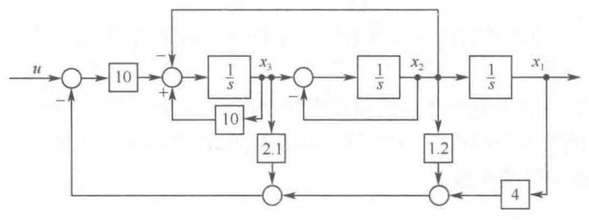

> Image description: A control system block diagram labeled as Figure 9-29-1 depicts a state feedback system structure. The input signal $u$ enters from the left, passing through a summing junction and a gain block of $10$. This leads into a series of three integrators ($\frac{1}{s}$), which define the state variables $x_3$, $x_2$, and $x_1$ in sequence. The system features multiple feedback loops: - A local loop from $x_3$ back to its preceding summing junction with a gain of $10$. - A loop from $x_2$ back to the summing junction before it, with a negative sign. - State feedback paths where $x_1$, $x_2$, and $x_3$ are scaled by gains of $4$, $1.2$, and $2.1$ respectively, then summed and fed back to the primary input junction. - An additional feedback path from $x_2$ returning to the summing junction before the first integrator. The diagram illustrates a linear time-invariant system using state-space representation logic.
图 9－29－1 题 9－29 状态反馈系统结构框图

9－30 设被控系统动态方程为

$$
\dot{x}=\left[\begin{array}{ll}
0 & 1 \\
0 & 0
\end{array}\right] x+\left[\begin{array}{l}
0 \\
1
\end{array}\right] u, \quad y=\left[\begin{array}{ll}
1 & 0
\end{array}\right] x
$$

试设计全维状态观测器，使闭环极点位于 $-r,-2 r(r>0)$ ，并画出状态变量图。
解 本题属于全维观测器设计问题。首先检验系统的可观测性，再对观测器按期望极点进行配置。


<!-- source_pdf_page: 337 -->
（1）检验系统的可观测性。系统的可观测性矩阵为

$$
\begin{gathered}
\boldsymbol{V}=\left[\begin{array}{c}
\boldsymbol{c} \\
\boldsymbol{c A}
\end{array}\right]=\left[\begin{array}{ll}
1 & 0 \\
0 & 1
\end{array}\right] \\
\operatorname{rank} \boldsymbol{V}=2=n
\end{gathered}
$$

系统状态完全可观测，可以进行全维状态观测器设计，由于系统可控，故可任意配置极点。
（2）全维状态观测器结构为

$$
\dot{\hat{\boldsymbol{x}}}=(\boldsymbol{A}-\boldsymbol{h} \boldsymbol{c}) \hat{\boldsymbol{x}}+\boldsymbol{b} u+\boldsymbol{h} y \quad \text { (其中 } \boldsymbol{h}=\left[\begin{array}{ll}
h_{0} & h_{1}
\end{array}\right]^{\mathrm{T}} \text { ) }
$$

全维状态观测器系统矩阵为

$$
\boldsymbol{A}-\boldsymbol{h} \boldsymbol{c}=\left[\begin{array}{ll}
-h_{0} & 1 \\
-h_{1} & 0
\end{array}\right]
$$

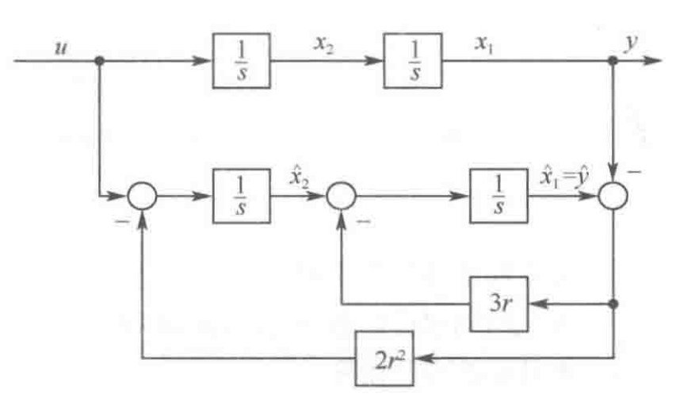

> Image description: This image is a technical block diagram of a state observer system, labeled as "图 9-30-1 题 9-30 状态观测器系统状态变量图." The diagram consists of two parallel paths: an upper plant process and a lower observer process. The top path shows the input signal $u$ passing through two sequential integrator blocks ($\frac{1}{s}$), producing state variables $x_2$ and then $x_1$, which results in the output $y$. The bottom path represents the observer. It starts with a summation point receiving $u$ and a feedback loop from $y$ via a block labeled $2r^2$. This feeds into an integrator producing $\hat{x}_2$. A second summation point subtracts a signal (derived from $y$ through a block labeled $3r$) before passing through another integrator to produce the estimated output $\hat{x}_1 = \hat{y}$. Finally, a subtraction node compares the actual output $y$ with the estimate $\hat{y}$, closing the feedback loop.
图 9－30－1 题 9－30 状态观测器系统状态变量图

观测器特征方程为

$$
|\lambda \boldsymbol{I}-(\boldsymbol{A}-\boldsymbol{h c})|=\lambda^{2}+h_{0} \lambda+h_{1}
$$

期望特征方程为

$$
(\lambda+r)(\lambda+2 r)=\lambda^{2}+3 r \lambda+2 r^{2}
$$

令两特征方程同次项系数相等，可得

$$
h_{0}=3 r, \quad h_{1}=2 r^{2}
$$

$h_{0}, h_{1}$ 分别为 $(\hat{y}-y)$ 引至 $\dot{\hat{x}}_{1}, \dot{\hat{x}}_{2}$ 的反馈系数。被控对象及其全维状态观测器的状态变量图如图 9－30－1 所示。

9－31 设系统传递函数为

$$
\frac{(s-1)(s+2)}{(s+1)(s-2)(s+3)}
$$

试问能否利用状态反馈将传递函数变成

$$
\frac{s-1}{(s+2)(s+3)}
$$

若有可能，求出一个满足要求的状态反馈阵 $K$ ，并画出状态变量图。（提示：状态反馈不改变原传递函数零点。）

解 首先根据传递函数判断系统的可控性，得到系统的向量－矩阵形式，再利用状态反馈不改变原传递函数零点的性质，进行期望极点配置，改变闭环传递函数。
（1）由于系统的传递函数为

$$
\frac{Y(s)}{U(s)}=\frac{(s-1)(s+2)}{(s+1)(s-2)(s+3)}=\frac{s^{2}+s-2}{s^{3}+2 s^{2}-5 s-6}
$$

上式不可简约，无零极点对消，因此系统完全可控，可通过状态反馈任意配置系统极点。
（2）根据系统的传递函数写出系统的可控标准型实现

$$
\begin{gathered}
\dot{\boldsymbol{x}}=\boldsymbol{A} \boldsymbol{x}+\boldsymbol{b} u=\left[\begin{array}{ccc}
0 & 1 & 0 \\
0 & 0 & 1 \\
6 & 5 & -2
\end{array}\right] x+\left[\begin{array}{l}
0 \\
0 \\
1
\end{array}\right] u \\
y=\boldsymbol{c} \boldsymbol{x}=\left[\begin{array}{lll}
-2 & 1 & 1
\end{array}\right] \boldsymbol{x}
\end{gathered}
$$

验证：系统可控性矩阵


<!-- source_pdf_page: 338 -->
$$
\operatorname{rank}\left[\begin{array}{lll}
\boldsymbol{b} & \boldsymbol{A} \boldsymbol{b} & \boldsymbol{A}^{2} \boldsymbol{b}
\end{array}\right]=\operatorname{rank}\left[\begin{array}{ccc}
0 & 0 & 1 \\
0 & 1 & -2 \\
1 & -2 & 9
\end{array}\right]=3
$$

系统完全可控。
（3）由于状态反馈不改变原传递函数零点，因此要求状态反馈将传递函数变为

$$
\frac{Y(s)}{U(s)}=\frac{(s-1)(s+2)}{(s+2)^{2}(s+3)}=\frac{s^{2}+s-2}{s^{3}+7 s^{2}+16 s+12}
$$

（4）设状态反馈矩阵为 $\boldsymbol{k}=\left[\begin{array}{lll}k_{1} & k_{2} & k_{3}\end{array}\right]$ ，系统特征方程为

$$
\begin{aligned}
|\lambda \boldsymbol{I}-(\boldsymbol{A}-\boldsymbol{b} \boldsymbol{k})| & =\left|\left[\begin{array}{ccc}
\lambda & 0 & 0 \\
0 & \lambda & 0 \\
0 & 0 & \lambda
\end{array}\right]-\left(\left[\begin{array}{ccc}
0 & 1 & 0 \\
0 & 0 & 1 \\
6 & 5 & -2
\end{array}\right]-\left[\begin{array}{l}
0 \\
0 \\
1
\end{array}\right]\left[\begin{array}{lll}
k_{1} & k_{2} & k_{3}
\end{array}\right]\right)\right| \\
& =\left|\left[\begin{array}{ccc}
\lambda & -1 & 0 \\
0 & \lambda & -1 \\
k_{1}-6 & k_{2}-5 & \lambda+k_{3}+2
\end{array}\right]\right| \\
& =\lambda^{3}+\left(k_{3}+2\right) \lambda^{2}+\left(k_{2}-5\right) \lambda+k_{1}-6
\end{aligned}
$$

期望特征方程为

$$
(\lambda+2)^{2}(\lambda+3)=\lambda^{3}+7 \lambda^{2}+16 \lambda+12
$$

令两特征方程同次项系数相等，可得

$$
k_{1}=18, \quad k_{2}=21, \quad k_{3}=5
$$

MATLAB 程序 ：exe931．m
$\mathrm{A}=\left[\begin{array}{lllllll}0 & 1 & 0 ; 0 & 0 & 1 ; 6 & 5 & -2\end{array}\right] ; \mathrm{b}=\left[\begin{array}{lll}0 & 0 & 1\end{array}\right]^{\prime} ;$
$p=\left[\begin{array}{lll}-2 & -2 & -3\end{array}\right]$ ；\％设置期望极点位置
$\mathrm{k}=\operatorname{acker}(\mathrm{A}, \mathrm{b}, \mathrm{p}) \quad \%$ 计算系统的状态反馈矩阵 $\boldsymbol{k}$
运行上述程序，也可求得系统状态反馈矩阵为

$$
\boldsymbol{k}=\left[\begin{array}{lll}
18 & 21 & 5
\end{array}\right]
$$

（5）状态反馈后的系统传递函数可简约，出现零极点对消，系统不完全可控或不完全可观测。由于状态反馈不改变系统的可控性，因此状态反馈后系统不可观测。
（6）加人状态反馈后系统的状态变量图如图 9－31－1 所示。

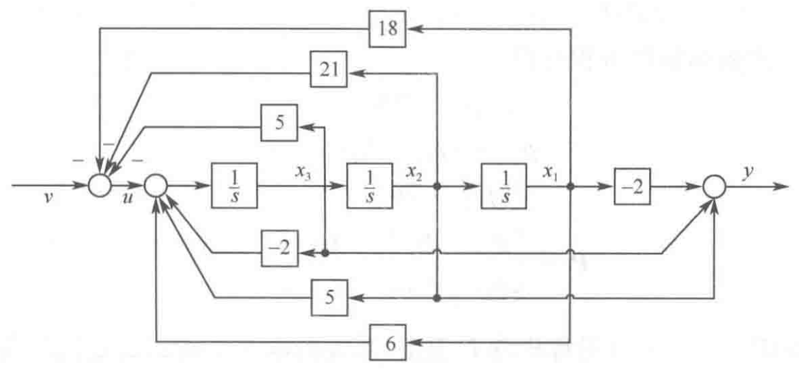

> Image description: A technical block diagram of a control system with state feedback is shown. The signal flow moves from left to right, starting with an input variable $v$ entering a summing junction to produce the control signal $u$. This signal passes through a series of three integrators ($\frac{1}{s}$), defining state variables $x_3$, $x_2$, and $x_1$ respectively. The output $y$ is derived from $x_1$ after passing through a gain block of $-2$. The system features multiple feedback loops with numerical gain blocks: * **State Feedback:** Gains of $6$, $5$, and $-2$ feed back from $x_1$, $x_2$, and $x_3$ respectively to the input summing junction for $u$. * **Additional Loops:** Higher-level feedback paths include gains of $18$ (from $x_1$), $21$ (from $x_2$), and $5$ (from $x_3$) returning to the initial summing junction before $u$. The diagram illustrates a state-space representation where system poles are shifted via full-state feedback.
图 9－31－1 题 9－31 状态反馈系统的状态变量图


<!-- source_pdf_page: 339 -->
9－32 试用李雅普诺夫第二法判断下列线性系统平衡状态的稳定性：

$$
\dot{x}_{1}=-x_{1}+x_{2}, \quad \dot{x}_{2}=2 x_{1}-3 x_{2}
$$

解 本题所研究的系统是线性定常连续系统。首先计算系统的平衡状态，选定正标量函数作为李雅普诺夫能量函数，再通过李雅普诺夫第二法判断系统的稳定性。

显然，原点 $\left(x_{1}=0, x_{2}=0\right)$ 是该系统唯一的平衡状态。
（1）选取正标量函数

$$
V(x)=\frac{1}{2} x_{1}^{2}+\frac{1}{4} x_{2}^{2}
$$

则有

$$
\begin{aligned}
\dot{V}(\boldsymbol{x}) & =x_{1} \dot{x}_{1}+\frac{1}{2} x_{2} \dot{x}_{2}=x_{1}\left(-x_{1}+x_{2}\right)+\frac{1}{2} x_{2}\left(2 x_{1}-3 x_{2}\right) \\
& =-x_{1}^{2}+2 x_{1} x_{2}-\frac{3}{2} x_{2}^{2}=-\left(x_{1}-x_{2}\right)^{2}-\frac{1}{2} x_{2}^{2}
\end{aligned}
$$

对于状态空间中的一切非零 $x$ 满足条件 $V(x)$ 正定和 $\dot{V}(x)$ 负定，故系统的原点平衡状态是大范围渐近稳定的。
（2）平衡状态稳定性的另外一种判别方法。系统的状态方程可以改写成向量－矩阵形式

$$
\left[\begin{array}{l}
\dot{x}_{1} \\
\dot{x}_{2}
\end{array}\right]=\left[\begin{array}{cc}
-1 & 1 \\
2 & -3
\end{array}\right]\left[\begin{array}{l}
x_{1} \\
x_{2}
\end{array}\right]
$$

由于系统的状态矩阵

$$
\boldsymbol{A}=\left[\begin{array}{cc}
-1 & 1 \\
2 & -3
\end{array}\right], \quad \operatorname{det} \boldsymbol{A}=1
$$

即 $\boldsymbol{A}$ 是非奇异的，故原点 $\boldsymbol{x}_{e}=0$ 是该系统唯一的平衡状态。
设系统的李雅普诺夫函数及其导函数分别为

则

$$
\begin{array}{ll}
V(\boldsymbol{x})=\boldsymbol{x}^{\mathrm{T}} \boldsymbol{P x}, & \dot{V}(\boldsymbol{x})=-\boldsymbol{x}^{\mathrm{T}} \boldsymbol{Q x}, \quad \boldsymbol{P}>0, \quad \boldsymbol{Q}>0 \\
& \boldsymbol{A}^{\mathrm{T}} \boldsymbol{P}+\boldsymbol{P A}=-Q
\end{array}
$$

取 $Q=\boldsymbol{I}$ ，上式即为

$$
\left[\begin{array}{cc}
-1 & 2 \\
1 & -3
\end{array}\right]\left[\begin{array}{ll}
p_{11} & p_{12} \\
p_{21} & p_{22}
\end{array}\right]+\left[\begin{array}{ll}
p_{11} & p_{12} \\
p_{21} & p_{22}
\end{array}\right]\left[\begin{array}{cc}
-1 & 1 \\
2 & -3
\end{array}\right]=-\left[\begin{array}{ll}
1 & 0 \\
0 & 1
\end{array}\right]
$$

其中 $p_{12}=p_{21}$ 。求解该矩阵方程可得

解得

$$
\begin{gathered}
-2\left(p_{11}-2 p_{12}\right)=-1 \\
p_{11}-4 p_{12}+2 p_{22}=0 \\
2\left(p_{12}-3 p_{22}\right)=-1 \\
\boldsymbol{P}=\left[\begin{array}{ll}
p_{11} & p_{12} \\
p_{21} & p_{22}
\end{array}\right]=\frac{1}{8}\left[\begin{array}{cc}
14 & 5 \\
5 & 3
\end{array}\right]
\end{gathered}
$$

由于 $p_{11}>0, \operatorname{det} \boldsymbol{P}=\frac{17}{64}>0$ ，故对称矩阵 $\boldsymbol{P}$ 正定，系统的原点平衡状态是大范围渐近稳定的。本题也可以考虑通过 MATLAB 命令 eig 求取系统的特征根，同样可判断系统稳定性。 MATLAB 程序：exe932．m


<!-- source_pdf_page: 340 -->
$$
\begin{aligned}
& A=\left[\begin{array}{lll}
-1 & 1 ; 2 & -3
\end{array}\right] ; \\
& Q=\operatorname{eye}(2) ; \\
& P=1 \operatorname{yap}\left(A^{\prime}, Q\right) \\
& \operatorname{val}=\operatorname{eig}(A)
\end{aligned}
$$

$$
\begin{aligned}
& \text { \%假定 } Q \text { 取为单位正定矩阵 } \\
& \text { \%解李雅普诺夫方程,进而判断系统的稳定性 } \\
& \text { \%求取系统特征根 }
\end{aligned}
$$

运行结果：
$\mathrm{P}=$
1． 7500
0． 6250
0.6250
0.3750
val $=$
－0．2679
－3．7321
9－33 已知系统状态方程为

$$
\dot{\boldsymbol{x}}=\left[\begin{array}{ccc}
2 & \frac{1}{2} & -3 \\
0 & -1 & 0 \\
0 & \frac{1}{2} & -1
\end{array}\right] \boldsymbol{x}+\left[\begin{array}{ll}
1 & 0 \\
0 & 2 \\
1 & 0
\end{array}\right]\left[\begin{array}{l}
u_{1} \\
u_{2}
\end{array}\right]
$$

当 $Q=\boldsymbol{I}$ 时， $\boldsymbol{P}$ 为何？若选 $Q$ 为正半定矩阵，$Q$ 为何？对应 $\boldsymbol{P}$ 为何？判断系统稳定性。
解 本题研究线性定常连续系统的稳定性，需首先计算系统的平衡状态，并选定正定或半正定矩阵 $Q$ ，再计算得到对称阵 $\boldsymbol{P}$ ，通过 $\boldsymbol{P}$ 的正定与否来判断系统的稳定性。

由于 $\operatorname{det} \boldsymbol{A} \neq 0$ ，故 $\boldsymbol{A}$ 非奇异，原点为唯一的平衡状态。
（1）假定 $Q$ 取为单位矩阵

令

$$
\begin{gathered}
\boldsymbol{Q}=\boldsymbol{I}=\left[\begin{array}{lll}
1 & 0 & 0 \\
0 & 1 & 0 \\
0 & 0 & 1
\end{array}\right] \\
\boldsymbol{A}^{\mathrm{T}} \boldsymbol{P}+\boldsymbol{P A}=-\boldsymbol{Q}=-\boldsymbol{I} \\
\boldsymbol{P}=\boldsymbol{P}^{\mathrm{T}}=\left[\begin{array}{lll}
p_{11} & p_{12} & p_{13} \\
p_{12} & p_{22} & p_{23} \\
p_{13} & p_{23} & p_{33}
\end{array}\right]
\end{gathered}
$$

则有

$$
\left[\begin{array}{ccc}
2 & 0 & 0 \\
\frac{1}{2} & -1 & \frac{1}{2} \\
-3 & 0 & -1
\end{array}\right]\left[\begin{array}{lll}
p_{11} & p_{12} & p_{13} \\
p_{12} & p_{22} & p_{23} \\
p_{13} & p_{23} & p_{33}
\end{array}\right]+\left[\begin{array}{ccc}
p_{11} & p_{12} & p_{13} \\
p_{12} & p_{22} & p_{23} \\
p_{13} & p_{23} & p_{33}
\end{array}\right]\left[\begin{array}{ccc}
2 & \frac{1}{2} & -3 \\
0 & -1 & 0 \\
0 & \frac{1}{2} & -1
\end{array}\right]=\left[\begin{array}{ccc}
-1 & 0 & 0 \\
0 & -1 & 0 \\
0 & 0 & -1
\end{array}\right]
$$

展开的代数方程为 $n(n+1) / 2=6$ 个，即

$$
\begin{aligned}
4 p_{11} & =-1 \\
\frac{1}{2} p_{11}+p_{12}+\frac{1}{2} p_{13} & =0 \\
-3 p_{11}+p_{13} & =0 \\
p_{12}-2 p_{22}+p_{23} & =-1
\end{aligned}
$$


<!-- source_pdf_page: 341 -->
$$
\begin{aligned}
-3 p_{12}-\frac{1}{2} p_{13}-p_{23}+\frac{1}{2} p_{33} & =0 \\
-6 p_{13}-2 p_{33} & =-1
\end{aligned}
$$

解得

$$
\boldsymbol{P}=\left[\begin{array}{lll}
p_{11} & p_{12} & p_{13} \\
p_{12} & p_{22} & p_{23} \\
p_{13} & p_{23} & p_{33}
\end{array}\right]=\frac{1}{8}\left[\begin{array}{ccc}
-2 & 4 & -6 \\
4 & 5 & -2 \\
-6 & -2 & 22
\end{array}\right]
$$

由于 $p_{11}=-0.25<0,\left|\begin{array}{ll}p_{11} & p_{12} \\ p_{12} & p_{22}\end{array}\right|=\frac{1}{8}\left|\begin{array}{cc}-2 & 4 \\ 4 & 5\end{array}\right|=-3.25<0, \operatorname{det} \boldsymbol{P}=-81<0$ ，故 $\boldsymbol{P}$ 不定，因此系统不是渐近稳定的。
（2）假定 $\boldsymbol{Q}$ 取为正半定矩阵，即

$$
Q=\left[\begin{array}{lll}
0 & 0 & 0 \\
0 & 1 & 0 \\
0 & 0 & 0
\end{array}\right]
$$

则 $\dot{V}(\boldsymbol{x})=-\boldsymbol{x}^{\mathrm{T}} \boldsymbol{Q x}=-x_{2}^{2}, \dot{V}(\boldsymbol{x})$ 为负半定。
令 $\dot{V}(\boldsymbol{x}) \equiv 0$ ，有 $x_{2} \equiv 0$ ；考虑到状态方程中 $\dot{x}_{3}=\frac{1}{2} x_{2}-x_{3}$ ，解得 $x_{3} \equiv 0$ ；考虑到 $\dot{x}_{1}= 2 x_{1}+\frac{1}{2} x_{2}-3 x_{3}$ ，解得，$x_{1} \equiv 0$ 。表明唯有原点使 $\dot{V}(\mathrm{x}) \equiv 0$ ，故可采用正半定 $Q$ 来简化稳定性分析。

令

$$
\boldsymbol{A}^{\mathrm{T}} \boldsymbol{P}+\boldsymbol{P} \boldsymbol{A}=-Q=-\boldsymbol{I}
$$

$$
\left[\begin{array}{ccc}
2 & 0 & 0 \\
\frac{1}{2} & -1 & \frac{1}{2} \\
-3 & 0 & -1
\end{array}\right]\left[\begin{array}{lll}
p_{11} & p_{12} & p_{13} \\
p_{12} & p_{22} & p_{23} \\
p_{13} & p_{23} & p_{33}
\end{array}\right]+\left[\begin{array}{ccc}
p_{11} & p_{12} & p_{13} \\
p_{12} & p_{22} & p_{23} \\
p_{13} & p_{23} & p_{33}
\end{array}\right]\left[\begin{array}{ccc}
2 & \frac{1}{2} & -3 \\
0 & -1 & 0 \\
0 & \frac{1}{2} & -1
\end{array}\right]=\left[\begin{array}{ccc}
0 & 0 & 0 \\
0 & -1 & 0 \\
0 & 0 & 0
\end{array}\right]
$$

解得

$$
\boldsymbol{P}=\left[\begin{array}{lll}
p_{11} & p_{12} & p_{13} \\
p_{12} & p_{22} & p_{23} \\
p_{13} & p_{23} & p_{33}
\end{array}\right]=\left[\begin{array}{lll}
0 & 0 & 0 \\
0 & \frac{1}{2} & 0 \\
0 & 0 & 0
\end{array}\right]
$$

$\boldsymbol{P}$ 半正定，因此系统非渐近稳定。
（3）最后用特征值判据来检验系统的稳定性。

$$
|\lambda \boldsymbol{I}-\boldsymbol{A}|=\left|\begin{array}{ccc}
\lambda-2 & -\frac{1}{2} & 3 \\
0 & \lambda+1 & 0 \\
0 & -\frac{1}{2} & \lambda+1
\end{array}\right|=(\lambda-2)(\lambda+1)^{2}
$$

特征值为 $2,-1,-1$ ，故系统不稳定。
（4）利用 MATLAB 求解。
MATLAB 程序：exe933．m


<!-- source_pdf_page: 342 -->
$$
\begin{array}{ll}
A=\left[\begin{array}{lll}
2 & 0.5-3 ; & 0-1 \\
0 ; & 0 & 0.5-1
\end{array}\right] ; & \\
Q 1=\operatorname{eye}(3) ; & \text { \% 假定 } Q \text { 取为单位正定矩阵 } \\
P 1=\operatorname{lyap}\left(A^{\prime}, Q 1\right) & \text { \% 解李雅普诺夫方程, 进而判断系统的稳定性 } \\
Q 2=\left[\begin{array}{llllll}
0 & 0 & 0 ; & 0 & 1 & 0 ; \\
0 & 0 & 0
\end{array}\right] ; & \text { \% 假定 } Q \text { 取为半正定矩阵 } \\
P 2=\operatorname{lyap}\left(A^{\prime}, Q 2\right) & \text { \% 求取系雅普诺夫特征根 }
\end{array}
$$

运行结果：

$$
\begin{array}{rlrr}
\mathrm{P} 1= & & & \\
& -0.2500 & 0.5000 & -0.7500 \\
& 0.5000 & 0.6250 & -0.2500 \\
& -0.7500 & -0.2500 & 2.7500 \\
\mathrm{P} 2= & & & \\
& 0.0000 & 0.0000 & 0.0000 \\
& 0.0000 & 0.5000 & -0.0000 \\
& 0.0000 & -0.0000 & -0.0000 \\
\mathrm{val}= & & & \\
& 2 & & \\
- & 1 & & \\
- & 1 & &
\end{array}
$$

9－34 设系统定常离散系统状态方程为

$$
\boldsymbol{x}(k+1)=\left[\begin{array}{ccc}
0 & 1 & 0 \\
0 & 0 & 1 \\
\frac{k}{2} & 0 & 0
\end{array}\right] \boldsymbol{x}(k), \quad k>0
$$

试求使系统渐近稳定的 $k$ 值范围。
解 本题属于线性定常离散系统的稳定性分析问题。首先选定正定矩阵 $Q$ ，计算得到对称阵 $\boldsymbol{P}$ ，再通过 $\boldsymbol{P}$ 的正定与否来讨论系统的稳定性，得到使系统渐近稳定的 $k$ 值范围。

令

$$
\boldsymbol{P}=\boldsymbol{P}^{\mathrm{T}}=\left[\begin{array}{lll}
p_{11} & p_{12} & p_{13} \\
p_{12} & p_{22} & p_{23} \\
p_{13} & p_{23} & p_{33}
\end{array}\right]
$$

选取 $Q=I$ ，代人离散系统李雅普诺夫方程

$$
\boldsymbol{\Phi}^{\mathrm{T}} \boldsymbol{P} \boldsymbol{\Phi}-\boldsymbol{P}=-Q=-\boldsymbol{I}
$$

则有

$$
\left[\begin{array}{lll}
0 & 0 & \frac{k}{2} \\
1 & 0 & 0 \\
0 & 1 & 0
\end{array}\right]\left[\begin{array}{lll}
p_{11} & p_{12} & p_{13} \\
p_{12} & p_{22} & p_{23} \\
p_{13} & p_{23} & p_{33}
\end{array}\right]\left[\begin{array}{ccc}
0 & 1 & 0 \\
0 & 0 & 1 \\
\frac{k}{2} & 0 & 0
\end{array}\right]-\left[\begin{array}{lll}
p_{11} & p_{12} & p_{13} \\
p_{12} & p_{22} & p_{23} \\
p_{13} & p_{23} & p_{33}
\end{array}\right]=\left[\begin{array}{ccc}
-1 & 0 & 0 \\
0 & -1 & 0 \\
0 & 0 & -1
\end{array}\right]
$$

将上式展开可得

$$
\begin{gathered}
\frac{1}{4} k^{2} p_{33}-p_{11}=-1 \\
\frac{1}{2} k p_{13}-p_{12}=0
\end{gathered}
$$


<!-- source_pdf_page: 343 -->
求得

$$
\begin{gathered}
\frac{1}{2} k p_{23}-p_{13}=0 \\
p_{11}-p_{22}=-1, \quad p_{12}-p_{23}=0, \quad p_{22}-p_{33}=-1 \\
\boldsymbol{P}=\left[\begin{array}{ccc}
p_{11} & p_{12} & p_{13} \\
p_{12} & p_{22} & p_{23} \\
p_{13} & p_{23} & p_{33}
\end{array}\right]=\left[\begin{array}{ccc}
\frac{4+2 k^{2}}{4-k^{2}} & 0 & 0 \\
0 & \frac{8+k^{2}}{4-k^{2}} & 0 \\
0 & 0 & \frac{12}{4-k^{2}}
\end{array}\right]
\end{gathered}
$$

使 $\boldsymbol{P}$ 正定的充分必要条件为 $4-k^{2}>0$ 及 $k>0$ 。故 $0<k<2$ 时，系统渐近稳定。由于是线性定常系统，必是大范围一致渐近稳定。

在 MATLAB 中可用 dlyap 命令直接求解离散李雅普诺夫方程，利用程序 exe934．m 验证上述分析结果的正确性。

MATLAB 程序 ：exe934．m

$$
\begin{aligned}
& \mathrm{k}=1 \text {; } \\
& \text { \% 当 } 0<k<2 \text { 时, 系统渐近稳定 } \\
& A=\left[\begin{array}{llllllll}
0 & 1 & 0 ; 0 & 0 & 1 ; 0.5 * k & 0 & 0
\end{array}\right]^{\prime} \text {; } \\
& Q=\operatorname{eye}(3) ; \quad \% \text { 假定 } Q \text { 取为单位正定矩阵 } \\
& \mathrm{P}=\mathrm{dl} \operatorname{yap}(\mathrm{~A}, \mathrm{Q}) \text { \%解离散李雅普诺夫方程, 进而判断系统的稳定性 }
\end{aligned}
$$

运行结果：
$\mathrm{P}=$

| 2.0000 | -0.0000 | 0.0000 |
| ---: | ---: | ---: |
| -0.0000 | 3.0000 | -0.0000 |
| 0.0000 | -0.0000 | 4.0000 |

9－35 设工业机器人如图 9－47 所示，其中两相伺服电机转动肘关节之后，通过小臂移动机器人的手腕。假定弹簧的弹性系数为 $k$ ，阻尼系数为 $f$ ，并选取系统的如下状态变量

$$
x_{1}=\phi_{1}-\phi_{2}, \quad x_{2}=\frac{\omega_{1}}{\omega_{0}}, \quad x_{3}=\frac{\omega_{2}}{\omega_{0}}
$$

其中，$\omega_{0}^{2}=\frac{k\left(J_{1}+J_{2}\right)}{J_{1} J_{2}}$ 。试列写该机器人的状态方程。

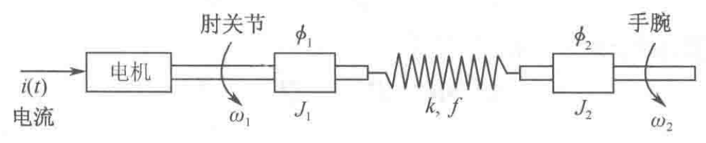

> Image description: This image is a schematic diagram of an industrial robot system (Figure 9-47), represented as a linear block model for mechanical analysis. The process begins on the left with an input current $i(t)$ entering a motor block (电机). This motor drives a shaft connected to an elbow joint (肘关节) characterized by angular velocity $\omega_1$ and moment of inertia $J_1$, with an associated angle $\phi_1$. The system then transitions through a flexible coupling represented by a spring symbol, labeled with stiffness $k$ and damping coefficient $f$. This connects the first stage to a second mass block with moment of inertia $J_2$ and angle $\phi_2$. The sequence terminates at the wrist (手腕), where the output angular velocity is denoted as $\omega_2$. The diagram illustrates the transmission of motion from an electrical input through mechanical components and flexible elements to a final joint.
图 9－47 工业机器人示意图

解 转矩方程

$$
\begin{aligned}
& J_{1} \frac{\mathrm{~d} \omega_{1}}{\mathrm{~d} t}=-k\left(\phi_{1}-\phi_{2}\right)-f \omega_{1}+f \omega_{2}+C_{m} i \\
& J_{2} \frac{\mathrm{~d} \omega_{2}}{\mathrm{~d} t}=k\left(\phi_{1}-\phi_{2}\right)+f\left(\omega_{1}-\omega_{2}\right)
\end{aligned}
$$

式中，$C_{m}$ 为转矩系数。对上两式作如下变换：

$$
\frac{\mathrm{d} \omega_{1}}{\mathrm{~d} t}=-\frac{k}{J_{1}}\left(\phi_{1}-\phi_{2}\right)-\frac{f}{J_{1}} \omega_{1}+\frac{f}{J_{1}} \omega_{2}+\frac{C_{m}}{J_{1}} i
$$


<!-- source_pdf_page: 344 -->
$$
=-\frac{J_{2}}{J_{1}+J_{2}} \cdot \frac{\left(J_{1}+J_{2}\right)}{J_{1} \cdot J_{2}} k\left(\phi_{1}-\phi_{2}\right)-\frac{f}{J_{1}} \omega_{1}+\frac{f}{J_{1}} \omega_{2}+\frac{C_{m}}{J_{1}} i
$$

即

$$
\frac{1}{\omega_{0}} \frac{\mathrm{~d} \omega_{1}}{\mathrm{~d} t}=-\frac{J_{2} \omega_{0}}{J_{1}+J_{2}}\left(\phi_{1}-\phi_{2}\right)-\frac{f}{J_{1}} \cdot \frac{\omega_{1}}{\omega_{0}}+\frac{f}{J_{1}} \cdot \frac{\omega_{2}}{\omega_{0}}+\frac{C_{m}}{J_{1} \omega_{0}} i
$$

以及

$$
\begin{aligned}
\frac{\mathrm{d} \omega_{2}}{\mathrm{~d} t} & =\frac{k}{J_{2}}\left(\phi_{1}-\phi_{2}\right)+\frac{f}{J_{2}}\left(\omega_{1}-\omega_{2}\right) \\
& =\frac{J_{1}}{J_{1}+J_{2}} \cdot \frac{k\left(J_{1}+J_{2}\right)}{J_{1} J_{2}}\left(\phi_{1}-\phi_{2}\right)+\frac{f}{J_{2}}\left(\omega_{1}-\omega_{2}\right)
\end{aligned}
$$

即

$$
\frac{1}{\omega_{0}} \frac{\mathrm{~d} \omega_{2}}{\mathrm{~d} t}=\frac{J_{1} \omega_{0}}{J_{1}+J_{2}}\left(\phi_{1}-\phi_{2}\right)+\frac{f}{J_{2}}\left(\frac{\omega_{1}}{\omega_{0}}-\frac{\omega_{2}}{\omega_{0}}\right)
$$

由题意，取状态变量

故可得

$$
\begin{aligned}
& \dot{x}_{1}=\dot{\phi}_{1}-\dot{\phi}_{2}=\omega_{1}-\omega_{2}=\omega_{0}\left(x_{2}-x_{3}\right) \\
& \dot{x}_{2}=\frac{1}{\omega_{0}} \frac{\mathrm{~d} \omega_{1}}{\mathrm{~d} t}=-\frac{J_{2} \omega_{0}}{J_{1}+J_{2}} x_{1}-\frac{f}{J_{1}} x_{2}+\frac{f}{J_{1}} x_{3}+\frac{C_{m}}{J_{1} \omega_{0}} i \\
& \dot{x}_{3}=\frac{1}{\omega_{0}} \frac{\mathrm{~d} \omega_{2}}{\mathrm{~d} t}=\frac{J_{1} \omega_{0}}{J_{1}+J_{2}} x_{1}+\frac{f}{J_{2}} x_{2}-\frac{f}{J_{2}} x_{3}
\end{aligned}
$$

令 $x=\left[\begin{array}{lll}x_{1} & x_{2} & x_{3}\end{array}\right]^{\mathrm{T}}$ ，将上述一阶微分方程组写为矩阵－向量形式，得工业机器人状态方程

$$
\dot{\boldsymbol{x}}=\omega_{0}\left[\begin{array}{ccc}
0 & 1 & -1 \\
-\frac{J_{2}}{J_{1}+J_{2}} & -\frac{f}{J_{1} \omega_{0}} & \frac{f}{J_{1} \omega_{0}} \\
\frac{J_{1}}{J_{1}+J_{2}} & \frac{f}{J_{2} \omega_{0}} & -\frac{f}{J_{2} \omega_{0}}
\end{array}\right] \boldsymbol{x}+\left[\begin{array}{c}
0 \\
\frac{C_{m}}{J_{1} \omega_{0}} \\
0
\end{array}\right] i
$$

9－36 为了完成空间站装配、卫星捕获等空间操作，航天飞机的货舱内装备了一种可膨胀机械臂的遥操作系统，如图9－48（a）所示。柔性机械臂的模型如图9－48（b）所示，其中 $J$是驱动电机的转动惯量，$u$ 为电机驱动转矩，$\theta_{1}$ 和 $\theta_{2}$ 为柔性臂转角，$k$ 为柔性臂的弹性系数， $M$ 和 $I$ 分别为负载质量与转动惯量，$l$ 为机械臂在负载上的作用点到负载重心的距离。若选取状态变量为 $x_{1}=\theta_{1}, x_{2}=\dot{\theta}_{1}, x_{3}=\theta_{2}, x_{4}=\dot{\theta}_{2}$ ，试列写柔性机械臂系统的线性化状态方程。

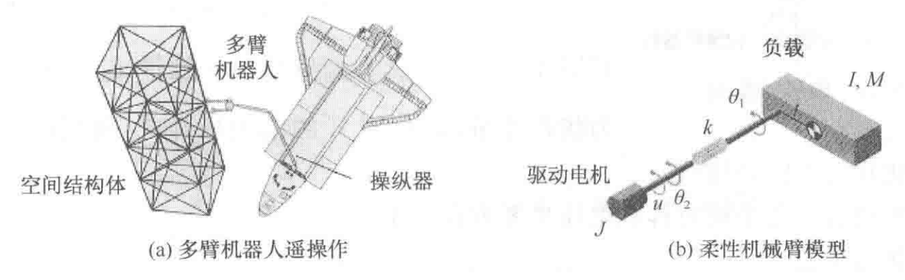

> Image description: This figure consists of two parts illustrating a remote-controlled flexible robotic arm system. Part (a), titled "Remote Operation of Multi-arm Robot," shows a conceptual drawing of a space shuttle deploying a multi-jointed robotic arm to interact with a large "space structure" (空间结构体). A human operator is indicated by the label "manipulator" (操纵器) inside the cockpit. Part (b), titled "Flexible Mechanical Arm Model," provides a simplified engineering schematic for mathematical modeling. It depicts a drive motor with moment of inertia $J$ providing torque $u$. The arm's flexibility is represented by an elastic coefficient $k$, with angular displacements denoted as $\theta_1$ and $\theta_2$. At the end of the arm is a payload (负载) characterized by mass $M$ and moment of inertia $I$. This model represents a two-mass system connected by a spring, used to derive linearized state equations for space assembly operations.
图 9－48 遥操作系统


<!-- source_pdf_page: 345 -->
解 柔性机械臂的运动方程为

$$
\begin{gathered}
I \ddot{\theta}_{1}+M g l \sin \theta_{1}+k\left(\theta_{1}-\theta_{2}\right)=0 \\
J \ddot{\theta}_{2}-k\left(\theta_{1}-\theta_{2}\right)=u
\end{gathered}
$$

选状态变量

$$
x_{1}=\theta_{1}, \quad x_{2}=\dot{\theta}_{1}, \quad x_{3}=\theta_{2}, \quad x_{4}=\dot{\theta}_{2}
$$

有

$$
\begin{aligned}
& \dot{x}_{1}=x_{2} \\
& \dot{x}_{2}=\ddot{\theta}_{1}=-\frac{M g l}{I} \sin \theta_{1}-k \theta_{1}+k \theta_{2}
\end{aligned}
$$

在小转角假设下， $\sin \theta_{1} \approx \theta_{1}$ ，故有

$$
\dot{x}_{2}=-\frac{M g l+k I}{I} x_{1}+k x_{3}
$$

而

$$
\begin{aligned}
& \dot{x}_{3}=\dot{\theta}_{2}=x_{4} \\
& \dot{x}_{4}=\ddot{\theta}_{2}=\frac{k}{J}\left(\theta_{1}-\theta_{2}\right)+\frac{1}{J} u=\frac{k}{J} x_{1}-\frac{k}{J} x_{3}+\frac{1}{J} u
\end{aligned}
$$

令 $\boldsymbol{x}=\left[\begin{array}{llll}x_{1} & x_{2} & x_{3} & x_{4}\end{array}\right]^{\mathrm{T}}$ ，得矩阵一向量形式的柔性机械臂系统线性化状态方程

$$
\dot{\boldsymbol{x}}=\left[\begin{array}{cccc}
0 & 1 & 0 & 0 \\
-\frac{(M g l+k I)}{I} & 0 & k & 0 \\
0 & 0 & 0 & 1 \\
\frac{k}{J} & 0 & -\frac{k}{J} & 0
\end{array}\right] \boldsymbol{x}+\left[\begin{array}{c}
0 \\
0 \\
0 \\
\frac{1}{J}
\end{array}\right] u
$$

9－37 设磁悬浮试验系统如图 9－49 所示。在该系统上方装有一个电磁铁，产生电磁吸

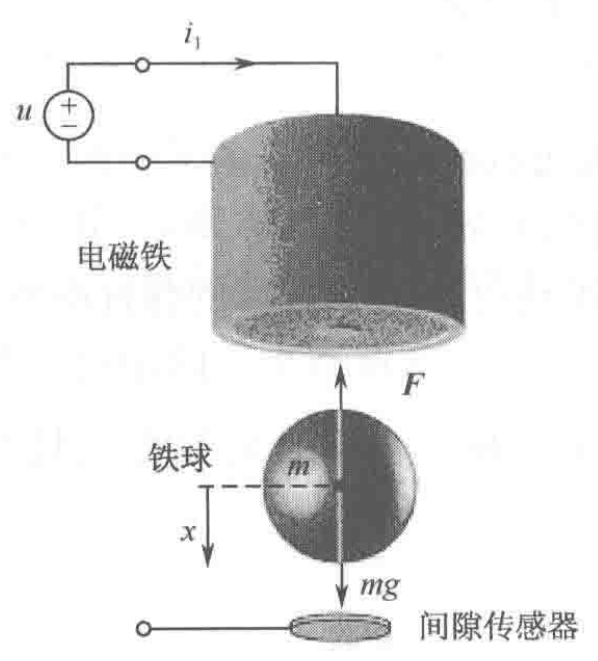

> Image description: A technical diagram of a magnetic levitation experimental system is shown. At the top, an electromagnet (电磁铁) is connected to a voltage source $u$ with current $i_1$. Below the electromagnet, a steel ball (铁球) of mass $m$ is positioned. The figure illustrates two opposing vertical forces acting on the ball: an upward magnetic force $F$ exerted by the electromagnet and a downward gravitational force $mg$. A vertical axis indicates the displacement variable $x$, measured from a reference point to the center of the ball. At the bottom, a gap sensor (间隙传感器) is placed to monitor the position of the ball relative to the base. The arrangement depicts a closed-loop control setup where electrical input regulates the magnetic force to counteract gravity and maintain the levitation height $x$ of the steel ball.
图9－49 磁悬浮系统

力 $\boldsymbol{F}$ ，以便将铁球悬浮于空中。系统的下方装有一个间隙测量传感器，以测量铁球的悬浮间隙。由于没有引入反馈，该磁悬浮试验系统不能稳定工作。

假定电磁铁电感 $L=0.508 \mathrm{H}$ ，电阻 $R=23.2 \Omega$ ，电流 $i_{1}=I_{0}+i$ ，其中 $I_{0}=1.06 \mathrm{~A}$ 是系统的标称工作电流。再假定铁球的质量 $m=1.75 \mathrm{~kg}$ ，铁球悬浮间隙 $\mu_{k}=X_{0}+x$ ，其中 $X_{0}=4.36 \mathrm{~mm}$ 为标称磁悬浮间隙。若电磁吸力满足如下条件：

$$
F=k\left(i / \mu_{g}\right)^{2}
$$

其中 $k=2.9 \times 10^{-4} \mathrm{~kg} \cdot \mathrm{~m}^{2} / \mathrm{A}^{2}$ 。选择 $x_{1}=x, x_{2}=\frac{\mathrm{d} x}{\mathrm{~d} t}, x_{3}=i$为状态变量，试利用 $F$ 的泰勒展开式，列写磁悬浮试验系
统的线性化状态空间表达式。
解 本题应从力平衡方程和电压平衡方程入手。
选择状态变量

故有

$$
\begin{array}{ccc}
x_{1}=x, & x_{2}=\dot{x}, & x_{3}=i \\
\dot{x}_{1}=x_{2}, & \dot{x}_{2}=\ddot{x}, & x_{3}=\frac{\mathrm{d} i}{\mathrm{~d} t}
\end{array}
$$


<!-- source_pdf_page: 346 -->
由力平衡方程

可得

$$
\begin{gathered}
m \ddot{x}=m g-k\left(\frac{i_{1}}{\mu_{g}}\right)^{2}=m g-k\left(\frac{I_{0}+i}{X_{0}+x}\right)^{2} \\
\dot{x}_{2}=g-\frac{k}{m} \cdot \frac{\left(I_{0}+x_{3}\right)^{2}}{\left(X_{0}+x_{1}\right)^{2}}
\end{gathered}
$$

由电压平衡方程

$$
\begin{aligned}
u & =R i_{1}+L \frac{\mathrm{~d} i_{1}}{\mathrm{~d} t}=R\left(I_{0}+i\right)+L \frac{\mathrm{~d}\left(I_{0}+i\right)}{\mathrm{d} t} \\
& =R I_{0}+R i+L \frac{\mathrm{~d} i}{\mathrm{~d} t}
\end{aligned}
$$

可得

$$
\dot{x}_{3}=\frac{\mathrm{d} i}{\mathrm{~d} t}=\frac{1}{L}\left(u-R x_{3}-R I_{0}\right)
$$

将上述一阶微分方程组写成矩阵形式，有

$$
\left[\begin{array}{c}
\dot{x}_{1} \\
\dot{x}_{2} \\
\dot{x}_{3}
\end{array}\right]=\left[\begin{array}{c}
x_{2} \\
g-\frac{k}{m} \frac{\left(I_{0}+x_{3}\right)^{2}}{\left(X_{0}+x_{1}\right)^{2}} \\
\frac{1}{L}\left(u-R x_{3}-R I_{0}\right)
\end{array}\right]
$$

这是非线性形式的状态方程。
对电磁吸力 $\boldsymbol{F}$ 进行泰勒展开，得

$$
\begin{aligned}
& \boldsymbol{F}=k i_{1}^{2} \mu_{g}^{-2}, \quad i_{1}=I_{0}+i, \quad \mu_{g}=X_{0}+x \\
& \Delta F= 2 k \mu_{g}^{-2} i_{1} \Delta i_{1}-2 k i_{1}^{2} \mu_{g}^{-3} \Delta \mu_{g}=\left.\frac{2 k\left(I_{0}+i\right)}{\left(X_{0}+x\right)^{2}}\right|_{0} \Delta i-\left.\frac{2 k\left(I_{0}+i\right)^{2}}{\left(X_{0}+x\right)^{3}}\right|_{0} \Delta x \\
&= \frac{2 k I_{0}}{X_{0}^{2}} \Delta i-\frac{2 k I_{0}^{2}}{X_{0}^{3}} \Delta x
\end{aligned}
$$

考虑增量方程，并略去＂$\Delta$＂符号，有

$$
\begin{aligned}
& \dot{x}_{1}=x_{2} \\
& \dot{x}_{2}=\frac{2 k I_{0}^{2}}{m X_{0}^{3}} x_{1}-\frac{2 k I_{0}}{m X_{0}^{2}} x_{3} \\
& \dot{x}_{3}=-\frac{R}{L} x_{3}+\frac{1}{L} u \\
& y=x_{1}
\end{aligned}
$$

令 $\boldsymbol{x}=\left[\begin{array}{lll}x_{1} & x_{2} & x_{3}\end{array}\right]^{\mathrm{T}}$ ，得线性化状态空间表达式

$$
\begin{aligned}
& \dot{x}=\left[\begin{array}{ccc}
0 & 1 & 0 \\
\frac{2 k I_{0}^{2}}{m X_{0}^{3}} & 0 & -\frac{2 k I_{0}}{m X_{0}^{2}} \\
0 & 0 & -\frac{R}{L}
\end{array}\right] \boldsymbol{x}+\left[\begin{array}{c}
0 \\
0 \\
\frac{1}{L}
\end{array}\right] u=\boldsymbol{A} \boldsymbol{x}+\boldsymbol{b} u \\
& y=\left[\begin{array}{lll}
1 & 0 & 0
\end{array}\right] \boldsymbol{x}=\boldsymbol{c} x
\end{aligned}
$$

代入 $R=23.2, L=0.508, m=1.75, k=2.9 \times 10^{-4}, I_{0}=1.06, X_{0}=4.36 \times 10^{-3}$ ，得到


<!-- source_pdf_page: 347 -->
$$
\begin{gathered}
\boldsymbol{A}=\left[\begin{array}{ccc}
0 & 1 & 0 \\
4494.5 & 0 & -18.48 \\
0 & 0 & -45.67
\end{array}\right], \quad \boldsymbol{b}=\left[\begin{array}{c}
0 \\
0 \\
1.97
\end{array}\right] \\
c=\left[\begin{array}{lll}
1 & 0 & 0
\end{array}\right]
\end{gathered}
$$

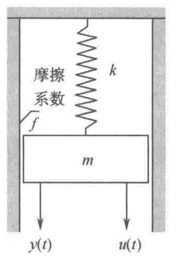

> Image description: A technical schematic titled "图9－50 弹簧－质量－阻尼器系统原理图" illustrates a spring-mass-damper system within a vertical guide. The diagram features a central mass block labeled $m$ positioned at the bottom of a rectangular enclosure. Above the mass is a zig-zag line representing a spring with stiffness coefficient $k$. The interior walls of the enclosure are marked with the symbol $f$, denoting the friction coefficient between the mass and the guide. Two downward-pointing arrows originate from the base of the system: one labeled $y(t)$, representing the output displacement or response over time, and another labeled $u(t)$, representing the input force or excitation. The arrangement depicts a classic second-order mechanical system where an external input $u(t)$ acts upon a mass $m$ constrained by a spring $k$ and damping/friction $f$, resulting in a dynamic output $y(t)$.
图9－50 弹簧－质量－阻尼器系统原理图

9－38 在大功率高性能的摩托车中，常采用图9－50所示的弹簧－质量－阻尼器系统作为减震器。若已知减震器的基本参数为质量 $m=1 \mathrm{~kg}$ ，摩擦系数 $f=9 \mathrm{~kg} \cdot \mathrm{~m} \cdot \mathrm{~s}$ ，弹簧系数 $k=20 \mathrm{~kg} / \mathrm{m}, u(t)$ 为力输入，$y(t)$ 为位移输出。要求完成：
（1）选择状态变量为 $x_{1}=y, x_{2}=\dot{y}$ ，列写系统的动态方程；
（2）计算系统的特征根及状态转移矩阵 $\boldsymbol{\Phi}(t)$ ；
（3）若初始条件 $y(0)=1, \dot{y}(0)=2$ ，在 $0 \leqslant t \leqslant 2$ 内，绘出系统零输人响应 $y(t)$ 及 $\dot{y}(t)$ ；
（4）重新设计 $f$ 和 $k$ 的合适值，使系统特征根 $s_{1}=s_{2}=-10$ ，以减轻震动对车手的影响。

解 按题意要求，分如下步骤设计。
（1）列写系统的动态方程。系统力平衡方程

$$
\begin{gathered}
m \ddot{y}+f \dot{y}+k y=u \\
\ddot{y}=-\frac{f}{m} \dot{y}-\frac{k}{m} y+\frac{1}{m} u
\end{gathered}
$$

选状态变量

则有

$$
\begin{gathered}
x_{1}=y, \quad x_{2}=\dot{y} \\
\dot{x}_{1}=x_{2}, \quad \dot{x}_{2}=-\frac{k}{m} x_{1}-\frac{f}{m} x_{2}+\frac{1}{m} u
\end{gathered}
$$

写成向量－矩阵形式，系统的动态方程为

$$
\begin{gathered}
\dot{\boldsymbol{x}}=\boldsymbol{A} \boldsymbol{x}+\boldsymbol{b} u \\
y=\boldsymbol{c} \boldsymbol{x} \\
\boldsymbol{x}=\left[\begin{array}{ll}
x_{1} & x_{2}
\end{array}\right]^{\mathrm{T}}, \quad \boldsymbol{c}=\left[\begin{array}{ll}
1 & 0
\end{array}\right] \\
\boldsymbol{A}=\left[\begin{array}{cc}
0 & 1 \\
-\frac{k}{m} & -\frac{f}{m}
\end{array}\right]=\left[\begin{array}{cc}
0 & 1 \\
-20 & -9
\end{array}\right], \quad \boldsymbol{b}=\left[\begin{array}{l}
0 \\
\frac{1}{m}
\end{array}\right]=\left[\begin{array}{l}
0 \\
1
\end{array}\right]
\end{gathered}
$$

式中
（2）求系统特征根及状态转移矩阵。系统特征方程

$$
\operatorname{det}(s \boldsymbol{I}-\boldsymbol{A})=\operatorname{det}\left[\begin{array}{cc}
s & -1 \\
20 & s+9
\end{array}\right]=s^{2}+9 s+20=(s+4)(s+5)=0
$$

故特征根：$s_{1}=-4, s_{2}=-5$ 。
状态转移阵

因为

$$
\begin{gathered}
\boldsymbol{\Phi}(t)=\mathrm{e}^{\boldsymbol{A}}=\mathscr{L}^{-1}\left[(s \boldsymbol{I}-\boldsymbol{A})^{-1}\right] \\
(s \boldsymbol{I}-\boldsymbol{A})^{-1}=\left[\begin{array}{cc}
s & -1 \\
20 & s+9
\end{array}\right]^{-1}=\frac{1}{(s+4)(s+5)}\left[\begin{array}{cc}
s+9 & 1 \\
-20 & s
\end{array}\right]
\end{gathered}
$$


<!-- source_pdf_page: 348 -->
$$
=\left[\begin{array}{cc}
\frac{5}{s+4}-\frac{4}{s+5} & \frac{1}{s+4}-\frac{1}{s+5} \\
\frac{20}{s+5}-\frac{20}{s+4} & \frac{5}{s+5}-\frac{4}{s+4}
\end{array}\right]
$$

所以

$$
\boldsymbol{\Phi}(t)=\left[\begin{array}{cc}
5 \mathrm{e}^{-4 t}-4 \mathrm{e}^{-5 t} & \mathrm{e}^{-4 t}-\mathrm{e}^{-5 t} \\
20 \mathrm{e}^{-5 t}-20 \mathrm{e}^{-4 t} & 5 \mathrm{e}^{-5 t}-4 \mathrm{e}^{-4 t}
\end{array}\right]
$$

（3）求系统零输入响应。已知 $x_{1}(0)=y(0)=1, x_{2}(0)=\dot{y}(0)=2$ ，且令 $u(t)=0$ ，有

$$
\boldsymbol{x}(t)=\boldsymbol{\Phi}(t) \boldsymbol{x}(0)=\left[\begin{array}{c}
7 \mathrm{e}^{-4 t}-6 \mathrm{e}^{-5 t} \\
30 \mathrm{e}^{-5 t}-28 \mathrm{e}^{-4 t}
\end{array}\right]
$$

可得

$$
x_{1}(t)=y(t)=7 \mathrm{e}^{-4 t}-6 \mathrm{e}^{-5 t}, \quad x_{2}(t)=\dot{y}(t)=30 \mathrm{e}^{-5 t}-28 \mathrm{e}^{-4 t}
$$

运行 MATLAB 文件 exe938，得系统的零输人响应如图 9－38－1所示。
MATLAB 程序 ：exe938．m
clc；clear
$\mathrm{m}=1 ; \mathrm{f}=9 ; \mathrm{k}=20 ;$
$\mathrm{A}=[01 ;-\mathrm{k} / \mathrm{m}-\mathrm{f} / \mathrm{m}] ; \mathrm{b}=[0 ; 1 / \mathrm{m}] ;$
$c=\operatorname{eye}(2) ; d=0$ ；
sys $=\mathrm{ss}(\mathrm{A}, \mathrm{b}, \mathrm{c}, \mathrm{d})$ ；
$\mathrm{t}=0: 0.01: 2$ ；
$\mathrm{x} 0=[1 ; 2] ;$
initial（sys， $\mathrm{x} 0, \mathrm{t}$ ）
（4）重新设计 $f$ 与 $k$ 。当 $m=1, f$ 及 $k$ 可任选时，质量－弹簧－阻尼器系统的特征方程为

$$
s^{2}+f s+k=0
$$

希望特征方程为

$$
(s+10)^{2}=s^{2}+20 s+100=0
$$

故可选 $k=100, f=20$ ，使系统处于 $\zeta=1$ 的临界阻尼状态。改变 M 文件 exe938 里 $f$ 和 $k$ 的值，再次运行得到系统的零输人响应如图 9－38－2 所示。由图可见，震动的影响已减轻。

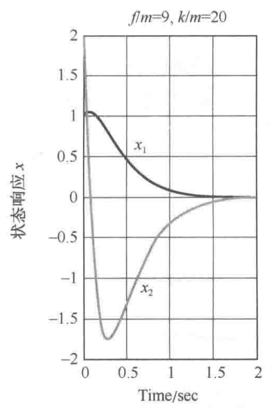

> Image description: A technical plot showing the zero-input response of a system, labeled as Figure 9-38-2. The x-axis represents "Time/sec" ranging from 0 to 2, and the y-axis is labeled "状态响应 $x$" (state response $x$), with values ranging from -2 to 2. The graph displays two curves representing state variables: $x_1$ and $x_2$. Curve $x_1$ starts at a value of 1 and decays exponentially toward zero. Curve $x_2$ starts at 0, drops sharply to a minimum near -1.75 around 0.3 seconds, and then gradually recovers toward zero. Text at the top specifies system parameters: $f/m=9$ and $k/m=20$. According to the caption, these values are used to demonstrate how changing the damping coefficient $f$ and spring constant $k$ affects the system's vibration, noting that the influence of vibrations has been reduced compared to a previous state.
图 9－38－1 系统的零输入响应（MATLAB）

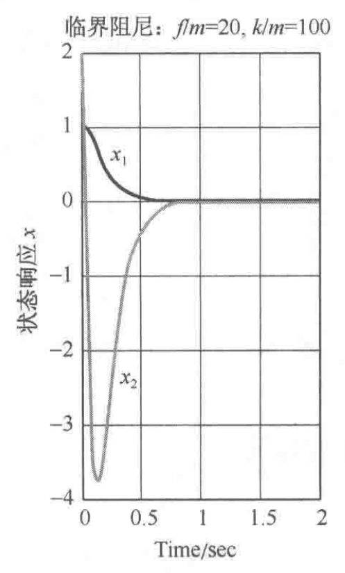

> Image description: This image shows a MATLAB plot of the zero-input response for a system characterized by critical damping (临界阻尼), with parameters $f/m = 20$ and $k/m = 100$. The graph features two curves representing state responses, labeled as $x_1$ and $x_2$. The vertical axis is labeled "状态响应 x" (state response $x$) and ranges from $-4$ to $2$. The horizontal axis is labeled "Time/sec" and ranges from $0$ to $2$ seconds. Curve $x_1$ starts at a value of $1$ and decays exponentially toward zero without oscillation. Curve $x_2$ begins at $0$, drops sharply to a minimum peak near $-3.8$ around $0.2$ seconds, and then recovers to approach zero asymptotically. Both states converge to equilibrium by approximately $1$ second, illustrating the characteristic behavior of a critically damped second-order system returning to its steady state.
图9－38－2 临界阻尼时系统的零输人响应（MATLAB）


<!-- source_pdf_page: 349 -->
9－39 设汽车悬架系统如图 9－51 所示，其中 $X_{1}(s) 、 X_{2}(s)$ 和 $X_{3}(s)$ 为状态变量，$K_{1} 、 K_{2}$和 $K_{3}$ 为状态反馈系数，已知 $K_{1}=1$ 。试确定 $K_{2}$ 和 $K_{3}$ 的合适取值，使闭环系统的三个特征根位于 $s=-3$ 和 $s=-6$ 之间。另外，还要求确定前置增益 $K_{p}$ 值，使系统对阶跃输人的稳态误差为零。

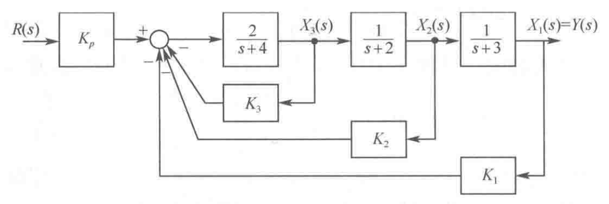

> Image description: This image shows a control system block diagram representing an automotive suspension system. The input signal is labeled $R(s)$, which passes through a pre-gain block $K_p$ into a summing junction. From the summing junction, the signal flows forward through three sequential transfer function blocks: $\frac{2}{s+4}$, $\frac{1}{s+2}$, and $\frac{1}{s+3}$. The system incorporates state feedback via three feedback loops. The output of the first block is $X_3(s)$, which feeds back through gain $K_3$. The output of the second block is $X_2(s)$, which feeds back through gain $K_2$. Finally, the overall system output $X_1(s) = Y(s)$ feeds back through gain $K_1$ to the initial summing junction. All feedback paths are negative, as indicated by the minus signs at the summing point. The diagram illustrates a state-space representation where $X_1(s), X_2(s),$ and $X_3(s)$ serve as state variables used to stabilize the closed-loop system.
图9－51 汽车悬架系统结构图

解 本题可按如下三步求解。
（1）求闭环传递函数。由梅森增益公式

$$
\Phi(s)=\frac{p_{1} \Delta_{1}}{\Delta}
$$

其中

$$
\begin{aligned}
& p_{1}=\frac{2 K_{p}}{(s+2)(s+3)(s+4)} \\
& \Delta=1+\frac{2 K_{3}}{s+4}+\frac{2 K_{2}}{(s+2)(s+4)}+\frac{2 K_{1}}{(s+2)(s+3)(s+4)} \\
& \Delta_{1}=1
\end{aligned}
$$

由于 $K_{1}=1$ ，故可得

$$
\Phi(s)=\frac{2 K_{p}}{s^{3}+\left(9+2 K_{3}\right) s^{2}+\left(26+2 K_{2}+10 K_{3}\right) s+\left(26+6 K_{2}+12 K_{3}\right)}
$$

（2）确定 $K_{2}$ 与 $K_{3}$ 的取值。闭环特征方程

$$
s^{3}+\left(9+2 K_{3}\right) s^{2}+\left(26+2 K_{2}+10 K_{3}\right) s+\left(26+6 K_{2}+12 K_{3}\right)=0
$$

由于 $K_{2}$ 与 $K_{3}$ 的选取应保证闭环系统稳定，故由劳斯表

| $s^{3}$ | 1 | $26+2 K_{2}+10 K_{3}$ |
| :--- | :---: | :---: |
| $s^{2}$ | $9+2 K_{3}$ | $26+6 K_{2}+12 K_{3}$ |
| $s^{1}$ | $\frac{20\left(K_{3}^{2}+0.2 K_{2} K_{3}+0.6 K_{2}+6.5 K_{3}+10.4\right)}{9+2 K_{3}}$ |  |
| $s^{0}$ | $\frac{26+6 K_{2}+12 K_{3}}{26+10}$ |  |

可知，$K_{2} \geqslant 0$ 及 $K_{3} \geqslant 0$ 可以确保闭环系统稳定。
若选

$$
K_{2}=5, \quad K_{3}=2
$$

则闭环特征方程为

$$
s^{3}+13 s^{2}+56 s+80=0
$$

其特征根 $s_{1}=s_{2}=-4, s_{3}=-5$ 。表明特征根 $s \in[-3,-6]$ ，满足设计要求。
（3）求取前置增益 $K_{p}$ 值。在单位阶跃输入作用下，若有 $\Phi(0)=1$ ，必有 $e_{s s}(\infty)=0$ 。因


<!-- source_pdf_page: 350 -->
此，在闭环传递函数中，令

$$
K_{p}=13+3 K_{2}+6 K_{3}
$$

因已知 $K_{2}=5, K_{3}=2$ ，故得 $K_{p}=40$ 。
MATLAB 验证：
应用 MATLAB 软件包，运行 M 文件 exe939．m，作系统单位阶跃响应，如图9－39－1所示，测得 $\sigma \%=0, t_{s}=1.76 \mathrm{~s}(\Delta=2 \%), e_{s s}(\infty)=0$ 。

MATLAB 程序 ：exe939．m

$$
\begin{aligned}
& \mathrm{K} 1=1 ; \mathrm{K} 2=5 ; \mathrm{K} 3=2 ; \mathrm{Kp}=40 ; \\
& \text { num }=[2 * \mathrm{Kp}] ; \\
& \text { den }=[19+2 * \mathrm{~K} 326+2 * \mathrm{~K} 2+10 * \mathrm{~K} 326+6 * \mathrm{~K} 2 \\
& +12 * \mathrm{~K} 3] ;
\end{aligned}
$$

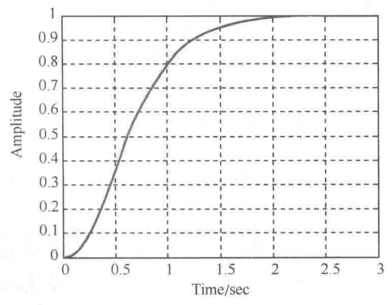

> Image description: The image shows a MATLAB-generated plot titled "图9－39－1 汽车悬架系统时间响应," representing the time response of a vehicle suspension system. The graph features a Cartesian coordinate system with two axes: the vertical y-axis is labeled "Amplitude" and ranges from 0 to 1, while the horizontal x-axis is labeled "Time/sec" and ranges from 0 to 3 seconds. The plot displays a single smooth, S-shaped curve starting at the origin (0,0). The amplitude increases gradually at first, then rises steeply between 0.25 and 1 second, before asymptotically leveling off as it approaches a steady-state value of approximately 1 around 2 seconds. This characteristic represents a typical overdamped or critically damped step response in an engineering system, where the output reaches its final value without oscillation. Grid lines are present to facilitate precise reading of values across both axes.
图9－39－1 汽车悬架系统时间响应（MATLAB）

$\mathrm{t}=0: 0.01: 3$ ；
step（sys，$t$ ）；grid
9－40 在图9－52（a）所示的新型游船上，采用了浮桥和稳定器来减少波浪对游船摇摆的影响，游船摇摆控制系统如图 9－52（b）所示。图中，$X_{1} 、 X_{2}$ 和 $X_{3}$ 为状态变量，$K_{2}$ 和 $K_{3}$ 为状态反馈增益。试确定 $K_{2}$ 和 $K_{3}$ 的合适取值，使闭环特征根为 $s_{1,2}=-2 \pm \mathrm{j} 2, s_{3}=-15$ ，并画出系统在单位阶跃扰动作用下的响应曲线。

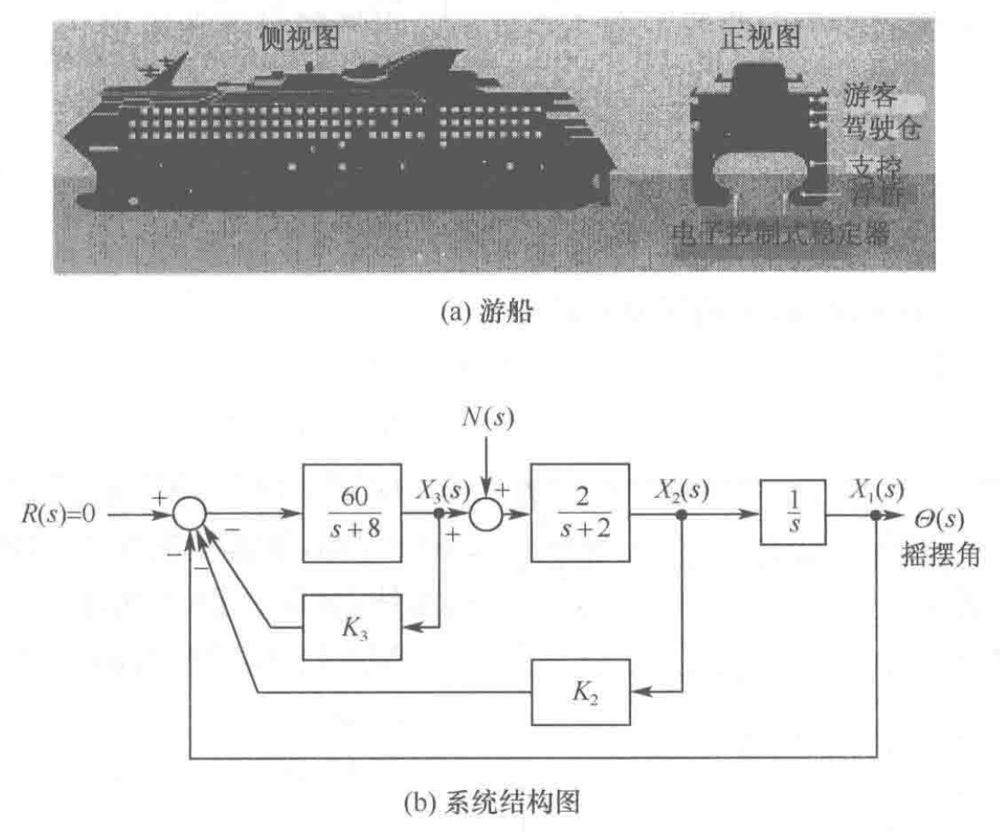

> Image description: This figure consists of two parts illustrating a cruise ship's roll control system. Part (a) shows side and front views of a cruise ship, highlighting components like the bridge and electronic stabilizers used to reduce wave-induced swaying. Part (b) is a block diagram representing the control system in the s-domain. The input $R(s)=0$ enters a summing junction. The forward path consists of three sequential blocks: $\frac{60}{s+8}$, $\frac{2}{s+2}$, and an integrator $\frac{1}{s}$. State variables are labeled between these blocks as $X_3(s)$, $X_2(s)$, and the output $X_1(s) = \Theta(s)$ (roll angle). An external disturbance $N(s)$ enters via a summing junction before the second block. Two feedback loops with gains $K_2$ and $K_3$ feed back from $X_2(s)$ and $X_3(s)$, respectively, to the initial summing junction. A third direct feedback loop connects the output $\Theta(s)$ back to the input.
图 9－52 游船摇摆控制系统

解 本题的求解关键是确定系统在扰动作用下的闭环传递函数，以采用梅森增益公式比较简便。
（1）求扰动作用下的闭环传递函数。由梅森增益公式


<!-- source_pdf_page: 351 -->
$$
\Phi_{n}(s)=\frac{p_{1} \Delta_{1}}{\Delta}
$$

式中

$$
\begin{aligned}
& p_{1}=\frac{2}{s(s+2)}, \quad L_{1}=-\frac{60 K_{3}}{s+8} \\
& L_{2}=-\frac{120 K_{2}}{(s+2)(s+8)}, \quad L_{3}=-\frac{120}{s(s+2)(s+8)} \\
& \Delta=1-\left(L_{1}+L_{2}+L_{3}\right)=1+\frac{60 K_{3}}{s+8}+\frac{120 K_{2}}{(s+2)(s+8)}+\frac{120}{s(s+2)(s+8)} \\
& \Delta_{1}=1-L_{1}=1+\frac{60 K_{3}}{s+8}
\end{aligned}
$$

因此

$$
\Phi_{n}(s)=\frac{2\left(s+8+60 K_{3}\right)}{s^{3}+10\left(1+6 K_{3}\right) s^{2}+\left[16+120\left(K_{2}+K_{3}\right)\right] s+120}
$$

（2）确定 $K_{2}$ 与 $K_{3}$ 的取值。系统实际特征方程

$$
s^{3}+10\left(1+6 K_{3}\right) s^{2}+\left[16+120\left(K_{2}+K_{3}\right)\right] s+120=0
$$

希望特征方程

$$
(s+2+\mathrm{j} 2)(s+2-\mathrm{j} 2)(s+15)=s^{3}+19 s^{2}+68 s+120=0
$$

令特征方程的对应项系数相等，有

$$
\begin{gathered}
10+60 K_{3}=19 \\
16+120\left(K_{2}+K_{3}\right)=68 \\
K_{2}=0.283, \quad K_{3}=0.15
\end{gathered}
$$

解出
（3）绘单位阶跃扰动响应曲线。令 $N(s)=\frac{1}{s}$ ，得游船横滚角输出

$$
\begin{aligned}
\Theta_{n}(s) & =\Phi_{n}(s) N(s)=\frac{2 s+34}{s(s+15)\left(s^{2}+4 s+8\right)} \\
& =\frac{0.283}{s}-\frac{0.002}{s+15}-\frac{0.281(s+4.1)}{(s+2)^{2}+2^{2}}
\end{aligned}
$$

对上式进行拉氏反变换，得横滚角扰动响应

$$
\theta_{n}(t)=0.283-0.002 \mathrm{e}^{-15 t}-0.407 \mathrm{e}^{-2 t} \sin \left(2 t+43.6^{\circ}\right)
$$

MATLAB 验证：

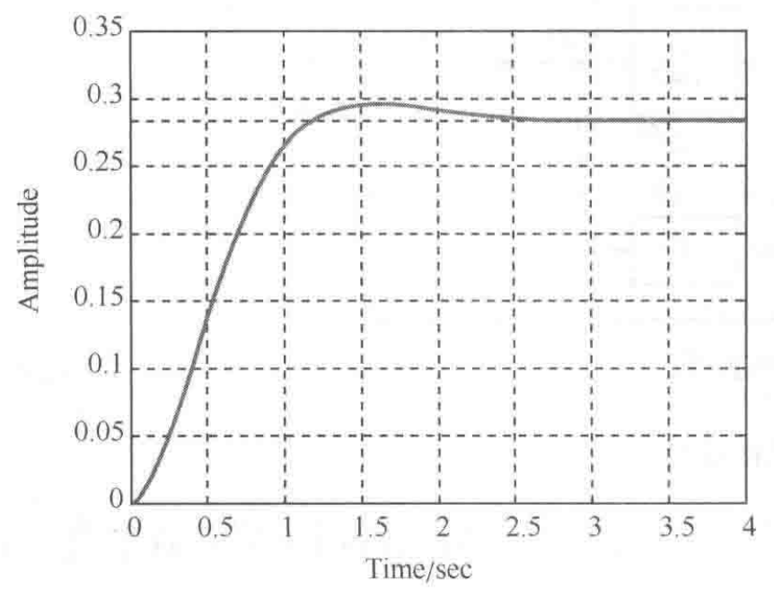

> Image description: The image shows a MATLAB-generated plot representing the roll angle response of a cruise ship to a unit step disturbance, as indicated by the Chinese caption "图9－40－1 游船单位阶跃扰动横滚角响应（MATLAB）". The graph features a two-dimensional coordinate system. The horizontal x-axis is labeled "Time/sec" and ranges from 0 to 4 seconds with increments of 0.5. The vertical y-axis is labeled "Amplitude" and ranges from 0 to 0.35 with increments of 0.05. A dashed grid overlays the plot area for precise reading. The plotted curve starts at the origin (0,0), rises steeply in a smooth concave-down arc, reaches a peak amplitude of approximately 0.3 around 1.5 seconds, and then exhibits a slight damped oscillation before stabilizing at a steady-state value of roughly 0.28 after 2.5 seconds. This represents the dynamic time-domain response of the system to a step input.
图9－40－1 游船单位阶跃扰动横滚角响应（MATLAB）

应用 MATLAB 软件包，运行 M 文件 exe940．m，作游船的单位阶跃扰动横滚角响应曲线，如图 9－40－1 所示。

MATLAB 程序 ：exe940．m
clc；clear
$\mathrm{K} 2=0.283 ; \mathrm{K} 3=0.15$ ；
num $=2 *[18+60 * \mathrm{~K} 3]$ ；
den $=[110+60 * K 316+120 *(K 2+K 3)$
120］；
sysn $=$ tf $($ num，den $) ;$
$\mathrm{t}=0: 0.01: 4$ ；
step（sysn，t）；grid


<!-- source_pdf_page: 352 -->
9－41 设内模控制系统如图 9－53 所示，试设计合适的内模控制器 $G_{c}(s)$ 和状态反馈增益向量 $\boldsymbol{k}_{2}$ ，使系统闭环极点 $s_{1}=s_{2}=s_{3}=-2$ ，且对阶跃输人的稳态跟踪误差为零，最后绘出系统的单位阶跃响应曲线。

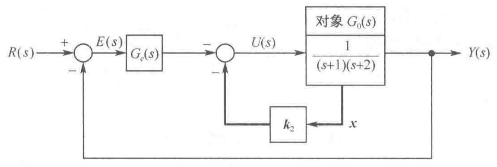

> Image description: A block diagram of a control system is shown, featuring a negative feedback loop. The input signal $R(s)$ enters a summing junction where it is compared with the output $Y(s)$, producing an error signal $E(s)$. This error passes through a controller block labeled $G_c(s)$. The output of the controller enters a second summing junction, which also receives a feedback signal from a state feedback gain block $k_2$. The resulting control signal $U(s)$ is fed into the plant block, denoted as 对象 $G_0(s)$, with a transfer function $\frac{1}{(s+1)(s+2)}$. A state variable $x$ is tapped from within the plant and fed back through the gain $k_2$. The final output of the system is $Y(s)$. Arrows indicate the unidirectional flow of signals throughout the loop. This configuration represents an internal model control system combining a compensator with state feedback to achieve specific closed-loop performance.
图9－53 内模控制系统结构图

解 本题按如下步骤设计。
（1）建立被控对象的动态方程。

$$
G_{0}(s)=\frac{1}{(s+1)(s+2)}=\frac{1}{s^{2}+3 s+2}
$$

令 $\boldsymbol{x}=\left[\begin{array}{ll}x_{1} & x_{2}\end{array}\right]^{\mathrm{T}}$ ，其中 $x_{1}=y$ ，则被控对象的可控标准型为

$$
\dot{x}=A x+b u, \quad y=c x
$$

式中

$$
\boldsymbol{A}=\left[\begin{array}{cc}
0 & 1 \\
-2 & -3
\end{array}\right], \quad \boldsymbol{b}=\left[\begin{array}{l}
0 \\
1
\end{array}\right], \quad \boldsymbol{c}=\left[\begin{array}{cc}
1 & 0
\end{array}\right]
$$

（2）构造增广系统。定义跟踪误差

$$
e(t)=r(t)-y(t)
$$

因 $r(t)=1(t)$ ，有

$$
\dot{e}(t)=-\dot{y}(t)=-c \dot{x}(t)
$$

令 $\boldsymbol{z}(t)=\dot{\boldsymbol{x}}(t), w(t)=\dot{u}(t)$ ，构造

$$
\left[\begin{array}{c}
\dot{e}(t) \\
\dot{z}(t)
\end{array}\right]=\left[\begin{array}{cc}
0 & -\boldsymbol{c} \\
0 & \boldsymbol{A}
\end{array}\right]\left[\begin{array}{c}
e(t) \\
z(t)
\end{array}\right]+\left[\begin{array}{l}
0 \\
\boldsymbol{b}
\end{array}\right] w(t)
$$

即

$$
\left[\begin{array}{l}
\dot{e} \\
\dot{z}_{1} \\
\dot{z}_{2}
\end{array}\right]=\left[\begin{array}{ccc}
0 & -1 & 0 \\
0 & 0 & 1 \\
0 & -2 & -3
\end{array}\right]\left[\begin{array}{l}
e \\
z_{1} \\
z_{2}
\end{array}\right]+\left[\begin{array}{l}
0 \\
0 \\
1
\end{array}\right] w
$$

在上述增广系统方程中

$$
\overline{\boldsymbol{A}}=\left[\begin{array}{ccc}
0 & -1 & 0 \\
0 & 0 & 1 \\
0 & -2 & -3
\end{array}\right], \quad \overline{\boldsymbol{b}}=\left[\begin{array}{l}
0 \\
0 \\
1
\end{array}\right]
$$

（3）检验增广系统的可控性。由于

$$
\operatorname{rank}\left[\begin{array}{ccc}
0 & -\boldsymbol{c} \boldsymbol{b} & -\boldsymbol{c} \boldsymbol{A} \boldsymbol{b} \\
\boldsymbol{b} & \boldsymbol{A} \boldsymbol{b} & \boldsymbol{A}^{2} \boldsymbol{b}
\end{array}\right]=\operatorname{rank}\left[\begin{array}{ccc}
0 & 0 & -1 \\
0 & 1 & -3 \\
1 & -3 & 7
\end{array}\right]=3
$$

表明增广系统可控，可以任意配置闭环系统极点。


<!-- source_pdf_page: 353 -->
（4）确定内模控制律。令 $\boldsymbol{k}_{2}=\left[\begin{array}{ll}k_{2} & k_{3}\end{array}\right], \boldsymbol{k}=\left[\begin{array}{lll}k_{1} & k_{2} & k_{3}\end{array}\right], G_{c}(s)=\frac{k_{1}}{s}$ ，则控制律

$$
u(t)=-k_{1} \int_{0}^{t} e(\tau) \mathrm{d} \tau-k_{2} x_{1}-k_{3} x_{2}
$$

其中 $k_{1} 、 k_{2}$ 和 $k_{3}$ 可按希望闭环极点位置确定。
由题意，希望闭环特征方程

$$
(s+2)^{3}=s^{3}+6 s^{2}+12 s+8=0
$$

实际闭环特征方程为

因为

所以

$$
\begin{gathered}
\operatorname{det}(s \boldsymbol{I}-\overline{\boldsymbol{A}}+\overline{\boldsymbol{b}} \boldsymbol{k})=0 \\
s \boldsymbol{I}-\overline{\boldsymbol{A}}+\overline{\boldsymbol{b}} \boldsymbol{k}=\left[\begin{array}{ccc}
s & 1 & 0 \\
0 & s & -1 \\
k_{1} & 2+k_{2} & s+3+k_{3}
\end{array}\right] \\
\operatorname{det}(s \boldsymbol{I}-\overline{\boldsymbol{A}}+\overline{\boldsymbol{b}} \boldsymbol{k})=s^{3}+\left(3+k_{3}\right) s^{2}+\left(2+k_{2}\right) s-k_{1}=0
\end{gathered}
$$

比较希望特征方程与实际特征方程，可得

$$
k_{1}=-8, \quad k_{2}=10, \quad k_{3}=3
$$

内模控制律

$$
u(t)=8 \int_{0}^{t} e(\tau) \mathrm{d} \tau-10 x_{1}-3 x_{2}
$$

内模控制系统如图 9－41－1 所示。
（5）绘内模控制系统单位阶跃响应。应用 MATLAB 软件包，并根据图 9－41－1在 Simulink环境下搭建内模控制系统，运行可得系统单位阶跃响应如图9－41－2所示，测得 $1 \sigma \%=0, t_{s}=7.75 \mathrm{~s}(\Delta=2 \%), e_{\mathrm{ss}}(\infty)=0$ 。

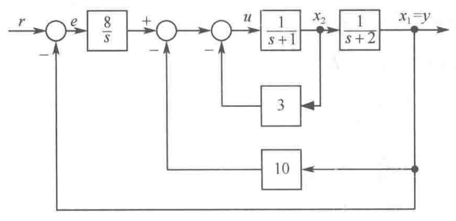

> Image description: This image displays a block diagram of an internal model control system in the Laplace domain. The signal flow begins with an input $r$, which enters a summing junction to produce error $e$. This error passes through a transfer function block $\frac{8}{s}$. The resulting signal enters another summing junction, followed by a third one that produces the control signal $u$. Signal $u$ passes through a plant block $\frac{1}{s+1}$ to become state variable $x_2$, which then passes through a second plant block $\frac{1}{s+2}$ to produce the output $x_1 = y$. The system features three feedback loops: 1. A direct unity feedback loop from $y$ back to the first summing junction. 2. A feedback path from $y$ through a gain block of $10$ to the second summing junction. 3. A local feedback path from $x_2$ through a gain block of $3$ to the third summing junction.
图9－41－1 单位阶跃内模控制系统结构图

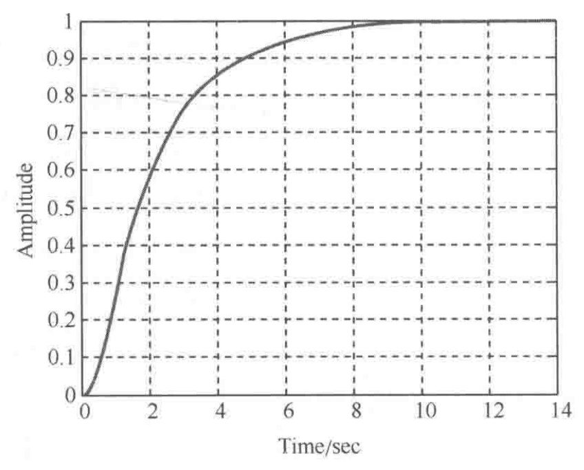

> Image description: The image displays a plot of a system's step response over time. The vertical y-axis is labeled "Amplitude" and ranges from 0 to 1, while the horizontal x-axis is labeled "Time/sec" and ranges from 0 to 14. A single solid black curve starts at the origin (0,0) and rises smoothly in an S-shape, eventually leveling off as it asymptotically approaches a steady-state amplitude of 1. The plot includes a grid of dashed lines for easier value reading. From an engineering perspective, this represents a typical first-order or overdamped second-order system response to a unit step input. The curve shows the transition from an initial state to a final equilibrium value without overshoot or oscillation. Although the caption mentions an "Internal Model Control (IMC) system structure," no block diagram is visible; only the resulting time-domain output signal is shown.
图9－41－2 内模控制系统的单位阶跃响应（MATLAB）

9－42 设单位斜坡内模控制系统如图9－54所示，其中被控对象

$$
G_{0}(s)=\frac{1}{(s+1)(s+2)}
$$

$x_{1}(t)$ 和 $x_{2}(t)$ 为状态变量。试设计合适的内模控制器

$$
G_{c}(s)=\frac{k_{1}+k_{2} s}{s^{2}}
$$


<!-- source_pdf_page: 354 -->
及状态反馈增益 $k_{3}$ 和 $k_{4}$ ，使系统的闭环极点为 $s_{1}=s_{2}=s_{3}=s_{4}=-2$ ，且系统对单位斜坡输入的稳态跟踪误差为零，最后绘出系统的单位斜坡响应曲线。

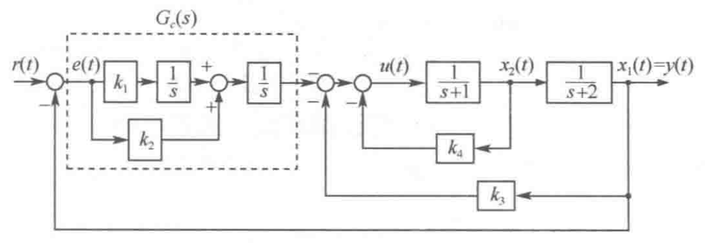

> Image description: This figure is a control system block diagram titled "图9－54 单位斜坡内模控制系统结构图" (Unit Ramp Internal Model Control System Structure Diagram). The system processes an input signal $r(t)$ through a feedback loop to produce an output $y(t)$, where $x_1(t) = y(t)$. The controller, enclosed in a dashed box labeled $G_c(s)$, consists of gain blocks $k_1$ and $k_2$ and two integrators ($1/s$). The error signal $e(t)$ enters this block. Following the controller, the control signal $u(t)$ is fed into a plant consisting of two first-order transfer functions: $1/(s+1)$ and $1/(s+2)$. The system incorporates multiple feedback paths: an inner loop with gain $k_4$ from state variable $x_2(t)$, a middle loop with gain $k_3$ from the output $y(t)$, and a primary outer unity feedback loop returning $y(t)$ to the initial summing junction. Arrows indicate the unidirectional flow of signals between these components.
图9－54 单位斜坡内模控制系统结构图

解 本题按如下步骤求解。
（1）建立被控对象的动态方程。

$$
G_{0}(s)=\frac{1}{s^{2}+3 s+2}
$$

其可控标准型为

$$
\dot{x}=A x+b u, \quad y=c x
$$

式中

$$
\boldsymbol{A}=\left[\begin{array}{cc}
0 & 1 \\
-2 & -3
\end{array}\right], \quad \boldsymbol{b}=\left[\begin{array}{l}
0 \\
1
\end{array}\right], \quad \boldsymbol{c}=\left[\begin{array}{cc}
1 & 0
\end{array}\right]
$$

（2）构造增广系统。令

$$
\begin{aligned}
& e(t)=r(t)-y(t), \quad r(t)=t \\
& \dot{e}(t)=\dot{r}(t)-\dot{y}(t)=1-c \dot{x}(t) \\
& \ddot{e}(t)=-\ddot{y}(t)=-c \ddot{x}(t)
\end{aligned}
$$

令中间变量

$$
z(t)=\ddot{x}(t), \quad w(t)=\ddot{u}(t)
$$

得

$$
\begin{aligned}
& \boldsymbol{z}(t)=\boldsymbol{A} \dot{\boldsymbol{x}}(t)+\boldsymbol{b} \dot{u}(t) \\
& \dot{\boldsymbol{z}}(t)=\boldsymbol{A} \ddot{\boldsymbol{x}}(t)+\boldsymbol{b} \ddot{\boldsymbol{u}}(t)=\boldsymbol{A} \boldsymbol{z}(t)+\boldsymbol{b} \omega(t) \\
& \ddot{e}(t)=-\boldsymbol{c}(t)
\end{aligned}
$$

构造增广系统

$$
\left[\begin{array}{c}
\dot{e}(t) \\
\ddot{e}(t) \\
\dot{z}(t)
\end{array}\right]=\left[\begin{array}{ccc}
0 & 1 & 0 \\
0 & 0 & -c \\
0 & 0 & \boldsymbol{A}
\end{array}\right]\left[\begin{array}{l}
e(t) \\
\dot{e}(t) \\
\boldsymbol{z}(t)
\end{array}\right]+\left[\begin{array}{l}
0 \\
0 \\
\boldsymbol{b}
\end{array}\right] w(t)
$$

即

$$
\left[\begin{array}{l}
\dot{e}(t) \\
\ddot{e}(t) \\
\dot{z}_{1}(t) \\
\dot{z}_{2}(t)
\end{array}\right]=\left[\begin{array}{cccc}
0 & 1 & 0 & 0 \\
0 & 0 & -1 & 0 \\
0 & 0 & 0 & 1 \\
0 & 0 & -2 & -3
\end{array}\right]\left[\begin{array}{l}
e(t) \\
\dot{e}(t) \\
z_{1}(t) \\
z_{2}(t)
\end{array}\right]+\left[\begin{array}{l}
0 \\
0 \\
0 \\
1
\end{array}\right] w(t)
$$

式中

$$
\overline{\boldsymbol{A}}=\left[\begin{array}{cccc}
0 & 1 & 0 & 0 \\
0 & 0 & -1 & 0 \\
0 & 0 & 0 & 1 \\
0 & 0 & -2 & -3
\end{array}\right], \quad \overline{\boldsymbol{b}}=\left[\begin{array}{l}
0 \\
0 \\
0 \\
1
\end{array}\right]
$$


<!-- source_pdf_page: 355 -->
（3）检验增广系统的可控性。

$$
\operatorname{rank}\left[\begin{array}{cccc}
0 & 0 & -\boldsymbol{c} \boldsymbol{b} & -\boldsymbol{c} \boldsymbol{A} \boldsymbol{b} \\
0 & -\boldsymbol{c} \boldsymbol{b} & -\boldsymbol{c} \boldsymbol{A} \boldsymbol{b} & -\boldsymbol{c} \boldsymbol{A}^{2} \boldsymbol{b} \\
\boldsymbol{b} & \boldsymbol{A} \boldsymbol{b} & \boldsymbol{A}^{2} \boldsymbol{b} & \boldsymbol{A}^{3} \boldsymbol{b}
\end{array}\right]=\operatorname{rank}\left[\begin{array}{cccc}
0 & 0 & 0 & -1 \\
0 & 0 & -1 & 3 \\
0 & 1 & -3 & 7 \\
1 & -3 & 7 & -15
\end{array}\right]=4
$$

增广系统可控，可任意配置闭环系统极点，保证跟踪误差渐近收玫。
（4）确定内模控制律。令 $\boldsymbol{k}=\left[\begin{array}{llll}k_{1} & k_{2} & k_{3} & k_{4}\end{array}\right]$ ，则闭环特征方程

$$
\begin{aligned}
\operatorname{det}[s \boldsymbol{I}-\overline{\boldsymbol{A}}+\overline{\boldsymbol{b}} \boldsymbol{k}] & =\operatorname{det}\left[\begin{array}{cccc}
s & -1 & 0 & 0 \\
0 & s & 1 & 0 \\
0 & 0 & s & -1 \\
k_{1} & k_{2} & 2+k_{3} & s+3+k_{4}
\end{array}\right] \\
& =s^{4}+\left(3+k_{4}\right) s^{3}+\left(2+k_{3}\right) s^{2}-k_{2} s-k_{1}=0
\end{aligned}
$$

希望闭环特征方程

$$
(s+2)^{4}=s^{4}+8 s^{3}+24 s^{2}+32 s+16=0
$$

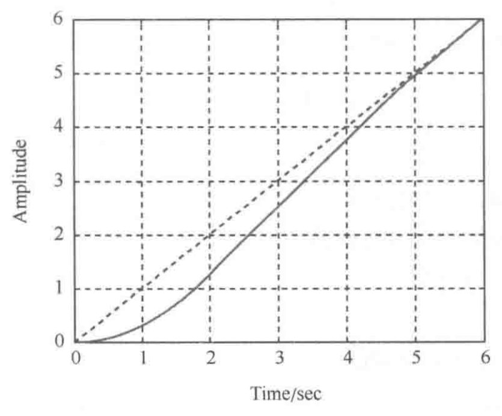

> Image description: This image is a technical plot labeled as Figure 9-42-1, depicting the unit ramp response of an internal model control system generated via MATLAB. The graph features a Cartesian coordinate system with two axes: the vertical y-axis represents "Amplitude" and the horizontal x-axis represents "Time/sec." Both axes are scaled from 0 to 6. The plot contains two distinct lines starting from the origin (0,0). A dashed straight line serves as the reference input, representing a unit ramp with a constant slope of 1. A solid curved line represents the system's actual output response. The solid line initially lags behind the reference, exhibiting a concave-up curvature before gradually aligning with the dashed line. By approximately $t = 6$ seconds, the two lines converge, indicating that the system is tracking the ramp input with decreasing steady-state error over time.
图 9－42－1 内模控制系统的单位斜坡响应（MATLAB）可得内模控制系统的单位斜坡响应如图9－42－1所示。

令实际特征方程与希望特征方程的对应项系数相等，解出

$$
\begin{array}{ll}
k_{1}=-16, & k_{2}=-32 \\
k_{3}=22, & k_{4}=5
\end{array}
$$

于是，内模控制律为

$$
\begin{aligned}
u(t)= & 16 \int_{0}^{t} \int_{0}^{t} e(\tau) \mathrm{d} \tau \mathrm{~d} \tau+32 \int_{0}^{t} e(\tau) \mathrm{d} \tau \\
& -22 x_{1}(t)-5 x_{2}(t)
\end{aligned}
$$

（5）系统单位斜坡响应。
应用 MATLAB 软件包，并根据图 9－54在 Simulink 环境下搭建内模控制系统，运行

9－43 已知被控对象的动态方程

$$
\begin{gathered}
\dot{x}(t)=\boldsymbol{A} x(t)+\boldsymbol{b} u(t) \\
y(t)=c x(t)
\end{gathered}
$$

其中

$$
\boldsymbol{A}=\left[\begin{array}{cc}
0 & 1 \\
-2 & -2
\end{array}\right], \quad \boldsymbol{b}=\left[\begin{array}{l}
1 \\
2
\end{array}\right], \quad \boldsymbol{c}=\left[\begin{array}{ll}
1 & 0
\end{array}\right]
$$

要求设计单位斜坡输人时的内模控制器，使系统闭环极点为 $s_{1,2}=-1 \pm \mathrm{j} 1, s_{3}=s_{4}=-10$ ，并给出单位斜坡内模控制系统结构图与跟踪误差 $e(t)$ 的响应曲线。

解 本题按如下步骤设计。
（1）构造增广系统。令

$$
e=r-y, \quad r=t
$$

有


<!-- source_pdf_page: 356 -->
$$
\dot{e}=\dot{r}-\dot{y}=1-c \dot{x}, \quad \ddot{e}=-c \ddot{x}
$$

令中间变量

$$
z=\ddot{x}, \quad w=\ddot{u}
$$

有

$$
z=A \dot{x}+b \dot{u}, \quad \dot{z}=A z+b w, \quad \ddot{e}=-c z
$$

得增广系统

$$
\left[\begin{array}{c}
\dot{e} \\
\ddot{e} \\
\dot{z}
\end{array}\right]=\left[\begin{array}{ccc}
0 & 1 & 0 \\
0 & 0 & -c \\
0 & 0 & \boldsymbol{A}
\end{array}\right]\left[\begin{array}{c}
e \\
\dot{e} \\
z
\end{array}\right]+\left[\begin{array}{c}
0 \\
0 \\
b
\end{array}\right] w
$$

或者

$$
\begin{aligned}
{\left[\begin{array}{c}
\dot{e} \\
\ddot{e} \\
\dot{z}_{1} \\
\dot{z}_{2}
\end{array}\right] } & =\left[\begin{array}{cccc}
0 & 1 & 0 & 0 \\
0 & 0 & -1 & 0 \\
0 & 0 & 0 & 1 \\
0 & 0 & -2 & -2
\end{array}\right]\left[\begin{array}{c}
e(t) \\
\dot{e}(t) \\
z_{1}(t) \\
z_{2}(t)
\end{array}\right]+\left[\begin{array}{l}
0 \\
0 \\
1 \\
2
\end{array}\right] w \\
\overline{\boldsymbol{A}} & =\left[\begin{array}{cccc}
0 & 1 & 0 & 0 \\
0 & 0 & -1 & 0 \\
0 & 0 & 0 & 1 \\
0 & 0 & -2 & -2
\end{array}\right], \quad \bar{b}=\left[\begin{array}{l}
0 \\
0 \\
1 \\
2
\end{array}\right]
\end{aligned}
$$

（2）检验增广系统的可控性。

$$
\operatorname{rank}\left[\begin{array}{cccc}
0 & 0 & -\boldsymbol{c} \boldsymbol{b} & -\boldsymbol{c} \boldsymbol{A} \boldsymbol{b} \\
0 & -\boldsymbol{c} \boldsymbol{b} & -\boldsymbol{c} \boldsymbol{A} \boldsymbol{b} & -\boldsymbol{c} \boldsymbol{A}^{2} \boldsymbol{b} \\
\boldsymbol{b} & \boldsymbol{A} \boldsymbol{b} & \boldsymbol{A}^{2} \boldsymbol{b} & \boldsymbol{A}^{3} \boldsymbol{b}
\end{array}\right]=\operatorname{rank}\left[\begin{array}{cccc}
0 & 0 & -1 & -2 \\
0 & -1 & -2 & 6 \\
1 & 2 & -6 & 8 \\
2 & -6 & 8 & -4
\end{array}\right]=4
$$

故增广系统可控，可任意配置闭环系统极点。
（3）确定内模控制律。令 $\boldsymbol{k}=\left[\begin{array}{llll}k_{1} & k_{2} & k_{3} & k_{4}\end{array}\right]$ ，闭环特征方程

$$
\begin{aligned}
& \operatorname{det}[s \boldsymbol{I}-(\overline{\boldsymbol{A}}-\overline{\boldsymbol{b}} \boldsymbol{k})]=\operatorname{det}\left[\begin{array}{cccc}
s & -1 & 0 & 0 \\
0 & s & 1 & 0 \\
k_{1} & k_{2} & s+k_{3} & k_{4}-1 \\
2 k_{1} & 2 k_{2} & 2+2 k_{3} & s+2+2 k_{4}
\end{array}\right] \\
= & s^{4}+\left(2+k_{3}+2 k_{4}\right) s^{3}+\left(2-k_{2}+4 k_{3}-2 k_{4}\right) s^{2}-\left(k_{1}+4 k_{2}\right) s-4 k_{1}=0
\end{aligned}
$$

希望特征方程

$$
(s+1+\mathrm{j})(s+1-\mathrm{j})(s+10)^{2}=s^{4}+22 s^{3}+142 s^{2}+240 s+200=0
$$

令实际特征方程与希望特征方程的对应项系数相等，得到

$$
\begin{aligned}
2+k_{3}+2 k_{4} & =22 \\
2-k_{2}+4 k_{3}-2 k_{4} & =142 \\
k_{1}+4 k_{2} & =-240 \\
4 k_{1} & =-200
\end{aligned}
$$

解出

$$
\begin{array}{ll}
k_{1}=-50, & k_{2}=-47.5 \\
k_{3}=22.5, & k_{4}=-1.25
\end{array}
$$

求出内模控制律


<!-- source_pdf_page: 357 -->
$$
u(t)=50 \int_{0}^{t} \int_{0}^{t} e(\tau) \mathrm{d} \tau \mathrm{~d} \tau+47.5 \int_{0}^{t} e(\tau) \mathrm{d} \tau-22.5 x_{1}(t)+1.25 x_{2}(t)
$$

单位斜坡内模控制系统如图 9－43－1 所示。

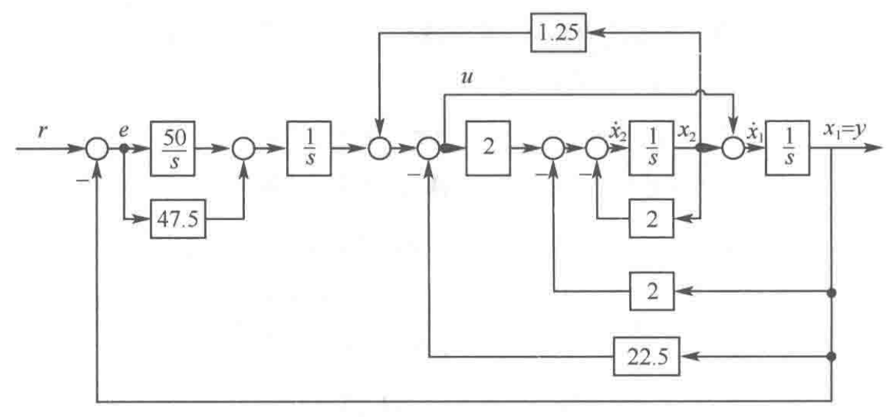

> Image description: A control system block diagram is shown in Figure 9-43-1, representing a unit slope internal model control system. The signal flow begins with an input reference $r$, which enters a summing junction to produce error $e$. This error passes through a parallel combination of an integrator ($50/s$) and a gain block (47.5). The resulting signal proceeds through another integrator ($1/s$) before entering a series of feedback loops. The core plant dynamics are represented by two integrators ($1/s$), with state variables $\dot{x}_2$ and $x_2$ leading to the final output $x_1 = y$. Control input $u$ is generated via a gain block (2). Multiple feedback paths are visible: one from $x_2$ through a gain of 1.25, another from $x_2$ back to $\dot{x}_2$ with a gain of 2, and two paths from the output $y$ returning to previous stages with gains of 2 and 22.5 respectively. A global negative feedback loop connects $y$ back to the initial input $r$.
图9－43－1 单位斜坡内模控制系统结构图

应用 MATLAB 软件包，并根据图 9－43－1 在 Simulink 环境下搭建内模控制系统，运行可得内模控制系统的单位斜坡误差响应，如图 9－43－2 所示。

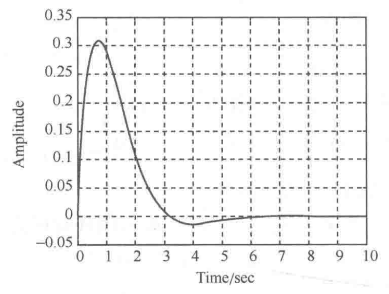

> Image description: This image is a technical plot showing the unit ramp error response of an internal model control system, as indicated by the provided caption. The graph features a Cartesian coordinate system with two axes: the horizontal x-axis represents "Time/sec" ranging from 0 to 10, and the vertical y-axis represents "Amplitude," ranging from -0.05 to 0.35. The plot displays a single continuous curve starting at the origin (0,0). The amplitude rises sharply to a peak of approximately 0.3 at around 0.7 seconds. Following this peak, the curve descends, crossing the zero line near 3 seconds and reaching a slight negative undershoot of about -0.02 around 4 seconds. Finally, the response asymptotically stabilizes toward an amplitude of 0 as time progresses toward 10 seconds. The background consists of a dashed grid for precise value retrieval.
图9－43－2 系统单位斜坡跟踪误差响应曲线（Simulink）

9－44 设带有扰动 $n(t)$ 的单输人－单输出系统的状态空间表达式为

$$
\dot{\boldsymbol{x}}(t)=\boldsymbol{A x}(t)+\boldsymbol{b} u(t), \quad y(t)=\boldsymbol{c x}(t)+n(t)
$$

其中，$x \in R^{n}$ 为状态向量，$u$ 为标量输入，$y$ 为标量输出， $\boldsymbol{A} 、 \boldsymbol{b} 、 \boldsymbol{c}$ 维数适当。
设参考输入 $r(t)=t$ ，扰动信号 $n(t)=1(t)$ ，为阶跃扰动。试论证可设计扰动内模控制器，使系统输出能以零稳态误差渐近跟踪斜坡输人 $t$ ，且不受阶跃扰动 $n(t)$ 的影响。

解 由题设知 $\ddot{r}(t)=0, \dot{n}(t)=0$ ；定义跟踪误差

$$
\begin{equation*}
e(t)=r(t)-y(t)=r(t)-c x(t)-n(t) \tag{1}
\end{equation*}
$$

对式（1）取二阶导数，有

$$
\begin{equation*}
\ddot{e}(t)=\ddot{r}(t)-\ddot{y}(t)=-c \ddot{x}(t) \tag{2}
\end{equation*}
$$

在式（2）中，取中间变量 $z(t)=\ddot{x}(t), w(t)=\ddot{u}(t)$ ，并对 $z(t)$ 取一阶导数，有

$$
\begin{gather*}
\dot{z}(t)=\ddot{\boldsymbol{x}}(t)=\boldsymbol{A} \ddot{\boldsymbol{x}}(t)+\boldsymbol{b} \ddot{u}(t)=\boldsymbol{A} \boldsymbol{z}(t)+\boldsymbol{b} w(t)  \tag{3}\\
\ddot{e}(t)=\ddot{r}(t)-\ddot{y}(t)=-c \ddot{\boldsymbol{x}}(t)=-c z(t) \tag{4}
\end{gather*}
$$

由式（3）和式（4）构造增广系统


<!-- source_pdf_page: 358 -->
$$
\left[\begin{array}{c}
\dot{e}  \tag{5}\\
\ddot{e} \\
\dot{\boldsymbol{z}}
\end{array}\right]=\left[\begin{array}{ccc}
0 & 1 & 0 \\
0 & 0 & -\boldsymbol{c} \\
0 & 0 & \boldsymbol{A}
\end{array}\right]\left[\begin{array}{l}
e \\
\dot{e} \\
\boldsymbol{z}
\end{array}\right]+\left[\begin{array}{l}
0 \\
0 \\
\boldsymbol{b}
\end{array}\right] w
$$

若增广系统（5）可控，即

$$
\operatorname{rank}\left[\begin{array}{cccc}
0 & 0 & -\boldsymbol{c} \boldsymbol{b} & -\boldsymbol{c} \boldsymbol{A} \boldsymbol{b} \\
0 & -\boldsymbol{c} \boldsymbol{b} & -\boldsymbol{c} \boldsymbol{A} \boldsymbol{b} & -\boldsymbol{c} \boldsymbol{A}^{2} \boldsymbol{b} \\
\boldsymbol{b} & \boldsymbol{A} \boldsymbol{b} & \boldsymbol{A}^{2} \boldsymbol{b} & \boldsymbol{A}^{3} \boldsymbol{b}
\end{array}\right]=n+2
$$

则总可以找到状态反馈

$$
w=-\left[\begin{array}{lll}
k_{1} & k_{2} & \boldsymbol{k}_{3}
\end{array}\right]\left[\begin{array}{l}
e  \tag{6}\\
\dot{e} \\
z
\end{array}\right]=-k_{1} e-k_{2} \dot{e}-\boldsymbol{k}_{3} z
$$

使该系统渐近稳定。这表明跟踪误差 $e(t)$ 是渐近收玫的。因此，系统输出能以零稳态误差跟踪参考输人信号 $t$ ，且抑制阶跃扰动 $n(t)=1(t)$ 的影响。

9－45 设有系统

$$
\begin{aligned}
& \dot{x}(t)=\left[\begin{array}{cc}
0 & 1 \\
-2 & -2
\end{array}\right] x(t)+\left[\begin{array}{l}
1 \\
2
\end{array}\right] u(t) \\
& y(t)=\left[\begin{array}{cc}
1 & 0
\end{array}\right] x(t)+n(t)
\end{aligned}
$$

其中 $n(t)=3 t^{2}$ 为输出端扰动信号。要求系统输出能以零稳态误差跟踪斜坡参考输入信号，并克服输出端加速度扰动对跟踪性能的影响。

解 设带有输出端扰动 $n(t)$ 的单输入一单输出系统的状态空间表达式为

$$
\begin{aligned}
& \dot{x}(t)=\boldsymbol{A} \boldsymbol{x}(t)+\boldsymbol{b} u(t) \\
& y(t)=\boldsymbol{c x}(t)+n(t)
\end{aligned}
$$

其中， $\boldsymbol{x} \in R^{n}$ 为状态向量，$u$ 为标量输人，$y$ 为标量输出， $\boldsymbol{A} 、 \boldsymbol{b} 、 \boldsymbol{c}$ 维数适当。
主要考虑参考输入为斜坡信号，输出扰动为加速度信号的情况，即 $r(t)=t, n(t)=3 t^{2}$ 。定义跟踪误差 $e(t)=r(t)-y(t)=r(t)-c x(t)-n(t)$ ，此时

$$
\begin{equation*}
r^{(3)}(t)=0, \quad n^{(3)}(t)=0 \tag{1}
\end{equation*}
$$

对 $e(t)$ 取三阶导数，此时有

$$
\begin{equation*}
e^{(3)}(t)=r^{(3)}(t)-y^{(3)}(t)=-c x^{(3)}(t) \tag{2}
\end{equation*}
$$

根据式（2）取中间变量 $\boldsymbol{z}(t)=\boldsymbol{x}^{(3)}(t)$ ，并对 $\boldsymbol{z}(t)$ 取一阶导数，得

$$
\dot{\boldsymbol{z}}(t)=\boldsymbol{x}^{(4)}(t)=\boldsymbol{A} \boldsymbol{x}^{(3)}(t)+\boldsymbol{b} u^{(3)}(t)
$$

根据上式，再取中间变量 $w(t)=u^{(3)}(t)$ ，有

$$
\begin{equation*}
\dot{\boldsymbol{z}}(t)=\boldsymbol{x}^{(4)}(t)=\boldsymbol{A} \boldsymbol{x}^{(3)}(t)+\boldsymbol{b} u^{(3)}(t)=\boldsymbol{A} \boldsymbol{z}(t)+\boldsymbol{b} \omega(t) \tag{3}
\end{equation*}
$$

选定中间变量后，误差的三阶导数变为

$$
\begin{equation*}
e^{(3)}(t)=r^{(3)}(t)-y^{(3)}(t)=-c x^{(3)}(t)=-c z(t) \tag{4}
\end{equation*}
$$

由式（3）和式（4）构造增广系统为

$$
\left[\begin{array}{c}
\dot{e}  \tag{5}\\
\ddot{e} \\
\ddot{e} \\
\dot{z}
\end{array}\right]=\left[\begin{array}{cccc}
0 & 1 & 0 & 0 \\
0 & 0 & 1 & 0 \\
0 & 0 & 0 & -c \\
0 & 0 & 0 & \boldsymbol{A}
\end{array}\right]\left[\begin{array}{c}
e \\
\dot{e} \\
\ddot{e} \\
z
\end{array}\right]+\left[\begin{array}{l}
0 \\
0 \\
0 \\
b
\end{array}\right] w
$$


<!-- source_pdf_page: 359 -->
若增广系统（5）可控，即

$$
\operatorname{rank}\left[\begin{array}{ccccc}
0 & 0 & 0 & -c b & -c \boldsymbol{A} b \\
0 & 0 & -c b & -c \boldsymbol{A} b & -c \boldsymbol{A}^{2} \boldsymbol{b} \\
0 & -c b & -c \boldsymbol{A} b & -c \boldsymbol{A}^{2} \boldsymbol{b} & -c \boldsymbol{A}^{3} \boldsymbol{b} \\
b & \boldsymbol{A} b & \boldsymbol{A}^{2} \boldsymbol{b} & \boldsymbol{A}^{3} \boldsymbol{b} & \boldsymbol{A}^{4} \boldsymbol{b}
\end{array}\right]=n+3
$$

总可以找到状态反馈

$$
w=-\left[\begin{array}{llll}
k_{1} & k_{2} & k_{3} & k_{4}
\end{array}\right]\left[\begin{array}{c}
e \\
\dot{e} \\
\ddot{e} \\
z
\end{array}\right]=-k_{1} e-k_{2} \dot{e}-k_{3} \ddot{e}-k_{4} z
$$

使该闭环增广系统渐近稳定。
这表明跟踪误差是渐近收玫的，因此系统输出能在扰动作用下以零稳态误差跟踪参考输入信号。

本题可控性矩阵

$$
\operatorname{rank}\left[\begin{array}{ccccc}
0 & 0 & 0 & -1 & -2 \\
0 & 0 & -1 & -2 & 6 \\
0 & -1 & -2 & 6 & 8 \\
1 & 2 & -6 & 8 & -4 \\
2 & -6 & 8 & -4 & -8
\end{array}\right]=5=n+3
$$

满秩，增广系统可控。故可通过状态反馈

$$
w=-\left[\begin{array}{lllll}
k_{1} & k_{2} & k_{3} & k_{4} & k_{5}
\end{array}\right]\left[\begin{array}{c}
e \\
\dot{e} \\
\ddot{e} \\
z_{1} \\
z_{2}
\end{array}\right]=-k_{1} e-k_{2} \dot{e}-k_{3} \ddot{e}-k_{4} z_{1}-k_{5} z_{2}
$$

任意配置闭环增广系统的极点。
如果要求的闭环极点为 $s_{1,2}=-1 \pm \mathrm{j}, s_{3}=-3, s_{4}=-4, s_{5}=-5$ ，则期望的特征方程为

$$
\begin{aligned}
& (s+1-\mathrm{j})(s+1+\mathrm{j})(s+3)(s+4)(s+5) \\
= & s^{5}+14 s^{4}+73 s^{3}+178 s^{2}+214 s+120=0
\end{aligned}
$$

而实际的闭环特征方程为

$$
\begin{aligned}
\operatorname{det}\left[\begin{array}{ccccc}
s & -1 & 0 & 0 & 0 \\
0 & s & -1 & 0 & 0 \\
0 & 0 & s & 1 & 0 \\
k_{1} & k_{2} & k_{3} & s+k_{4} & k_{5}-1 \\
2 k_{1} & 2 k_{2} & 2 k_{3} & 2+2 k_{4} & s+2+2 k_{5}
\end{array}\right]= & s^{5}+\left(2+k_{4}+2 k_{5}\right) s^{4}+\left(2-k_{3}+4 k_{4}-2 k_{5}\right) s^{3} \\
&
\end{aligned}
$$

令上述两个特征方程的对应项系数相等，通过构造方程组，求得状态反馈的解构造的方程组如下：


<!-- source_pdf_page: 360 -->
$$
\left\{\begin{array}{l}
2+k_{4}+2 k_{5}=14 \\
2-k_{3}+4 k_{4}-2 k_{5}=73 \\
-k_{2}-4 k_{3}=178 \\
-k_{1}-4 k_{2}=214 \\
-4 k_{1}=120
\end{array}\right.
$$

解得

$$
k_{1}=-30, \quad k_{2}=-46, \quad k_{3}=-33, \quad k_{4}=10, \quad k_{5}=1
$$

即

$$
\begin{aligned}
w & =\dddot{u}=-k_{1} e-k_{2} \dot{e}-k_{3} \ddot{e}-k_{4} \dddot{x}_{1}-k_{5} \dddot{x}_{2} \\
\ddot{u} & =-k_{1} \int_{0}^{t} e \mathrm{~d} \tau-k_{2} e-k_{3} \dot{e}-k_{4} \ddot{x}_{1}-k_{5} \ddot{x}_{2}
\end{aligned}
$$

此时对应的 Simulink 仿真图如图 9－45－1 所示。

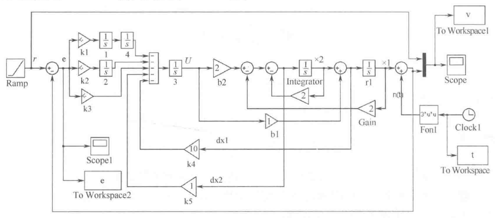

> Image description: A Simulink block diagram illustrating a control system for tracking a ramp input signal. The system begins with a "Ramp" source providing a reference signal $r$, which is compared against a feedback loop to produce an error signal $e$. This error enters a parallel structure of three gain blocks ($k1, k2, k3$) and integrators before being combined in a multiplexer and passed through another integrator to generate the control signal $U$. The plant model consists of multiple stages involving gains ($b1, b2$), summing junctions, and two integrators. The output signal $n(t)$ is fed back via gain blocks $k4$ and $k5$ (labeled as $dx1$ and $dx2$) to the controller. Output signals are routed to a "Scope" for visualization and "To Workspace" blocks for data logging of variables $v, t,$ and $e$. The diagram represents a closed-loop feedback control system designed for trajectory tracking.
图9－45－1 Simulink 仿真图

令 $n(t)=3 t^{2}$ ，运行上述 Simulink 仿真图，可得系统在带扰动的内模控制器作用下对应的跟踪误差曲线图和跟踪曲线图，如图 9－45－2、图 9－45－3 所示。

系统加人扰动后，由误差响应图可以看出，在带扰动的内模控制器作用下输出可以很好地跟踪参考输入。

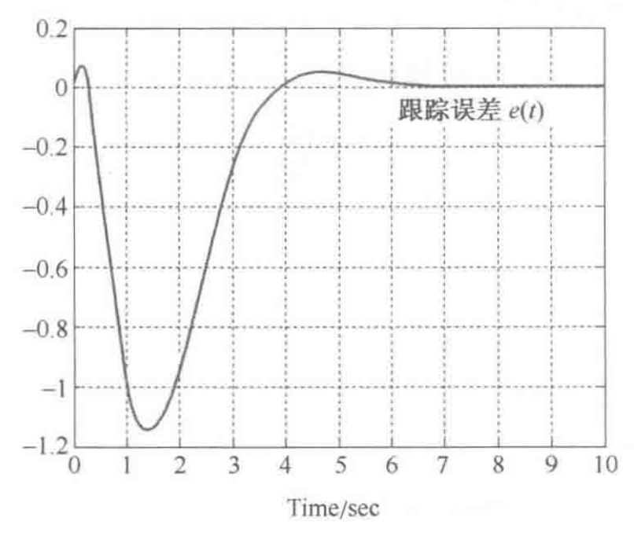

> Image description: The figure is a MATLAB-generated plot showing the tracking error response of a system under acceleration disturbance, as indicated by the caption "图9－45－2 加速度扰动作用下系统跟踪误差响应（MATLAB）". The graph features a horizontal x-axis labeled "Time/sec" ranging from 0 to 10 seconds and a vertical y-axis representing the tracking error $e(t)$, with values ranging from -1.2 to 0.2. The plotted curve starts at zero, briefly rises above zero, then drops sharply to a minimum peak of approximately -1.1 around 1.5 seconds. It subsequently recovers, crossing the zero line near 4 seconds and exhibiting a small overshoot before stabilizing toward zero as time progresses beyond 6 seconds. This waveform illustrates the system's transient response and its ability to converge back to a state of zero tracking error following a disturbance.
图9－45－2 加速度扰动作用下系统跟踪误差响应（MATLAB）

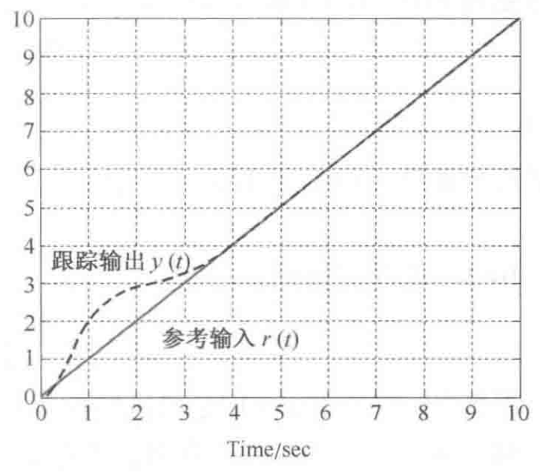

> Image description: This figure is a MATLAB plot illustrating the tracking error response of a system under acceleration disturbance. The graph features a Cartesian coordinate system where the horizontal x-axis represents "Time/sec" ranging from 0 to 10, and the vertical y-axis ranges from 0 to 10. Two curves are plotted: 1. A solid straight line labeled as the reference input $\text{参考输入 } r(t)$, which increases linearly from $(0,0)$ to $(10,10)$. 2. A dashed curve labeled as the tracking output $\text{跟踪输出 } y(t)$. This curve initially rises faster than $r(t)$, peaks slightly above it between 1 and 3 seconds, and then converges to overlap with the reference input line from approximately 4 seconds onward. From an engineering perspective, the figure demonstrates the system's transient response and its ability to eventually eliminate tracking error despite a disturbance, achieving steady-state convergence.
图 9－45－3 加速度扰动作用下系统输出跟踪响应（MATLAB）


