<!-- source_pdf_page: 361 -->
## 第十章 动态系统的最优控制方法

10－1 求通过 $x(0)=1, x(1)=2$ ，使下列性能指标为极值的曲线 $x^{*}(t)$ ：

$$
J=\int_{t_{0}}^{t_{f}}\left(\dot{x}^{2}+1\right) \mathrm{d} t
$$

解 本题 $t_{f}$ 固定，末态固定，可用欧拉方程求解。令

$$
L=\dot{x}^{2}+1
$$

欧拉方程

$$
\frac{\partial L}{\partial x}-\frac{\mathrm{d}}{\mathrm{~d} t} \frac{\partial L}{\partial \dot{x}}=0
$$

有 $\ddot{x}=0$ ，解得

$$
x(t)=c_{1} t+c_{2}
$$

根据边界条件，求得

$$
c_{1}=1, \quad c_{2}=1
$$

故所求曲线为

$$
x^{*}(t)=t+1
$$

10－2 设 $x=x(t), 0 \leqslant t \leqslant 1$ ，求从 $x(0)=0$ 到 $x(1)=1$ 间的最短曲线。
解 本题是求解最短曲线问题，可以将性能指标设定为曲线长度函数的积分，当该指标 ，为最小值时，所得的曲线即为最短曲线。

根据几何知识，在直角坐标系中弧线元的长度表示为

$$
\mathrm{d} s=\sqrt{(\mathrm{d} t)^{2}+(\mathrm{d} x)^{2}}=\sqrt{1+\dot{x}^{2}} \mathrm{~d} t
$$

设性能指标为

$$
J=\int_{t_{0}}^{t_{f}} \mathrm{~d} s=\int_{t_{0}}^{t_{f}} \sqrt{1+\dot{x}^{2}} \mathrm{~d} t
$$

由题意可知，$t_{f}$ 固定，末态固定，$L=\sqrt{1+\dot{x}^{2}}$ ，由欧拉方程

$$
\frac{\partial L}{\partial x}-\frac{\mathrm{d}}{\mathrm{~d} t} \frac{\partial L}{\partial \dot{x}}=0, \quad \dot{x}^{2}=c^{2} \text { (常量) }
$$

解得

$$
x(t)=c t+d
$$

根据边界条件，可得 $c=1, d=0$ ，故所求曲线为

$$
x^{*}(t)=t
$$

10－3 求性能指标

$$
J=\int_{0}^{1}\left(\dot{x}^{2}+1\right) \mathrm{d} t
$$

在边界条件 $x(0)=0, x(1)$ 是自由情况下的极值曲线。
解 本题 $t_{f}$ 固定，末态自由。由题意

$$
L=1+\dot{x}^{2}
$$

欧拉方程


<!-- source_pdf_page: 362 -->
$$
\begin{gathered}
\frac{\partial L}{\partial x}-\frac{\mathrm{d}}{\mathrm{~d} t} \frac{\partial L}{\partial \dot{x}}=-2 \ddot{x}=0 \\
x(t)=c_{1} t+c_{2} \\
x(0)=0 \\
\left.\frac{\partial L}{\partial \dot{x}}\right|_{t_{f}=1}=2 \dot{x}=0 \\
c_{1}=0, \quad c_{2}=0
\end{gathered}
$$

解得

及横截条件

解得
由边界条件

㥏倠入条

故所求极值曲线为
故所求极值曲线为

$$
x^{*}(t)=0
$$

10－4 求性能指标

$$
J=\int_{0}^{\frac{\pi}{2}}\left(\dot{x}_{1}^{2}+\dot{x}_{2}^{2}+2 x_{1} x_{2}\right) \mathrm{d} t
$$

在边界条件 $x_{1}(0)=x_{2}(0)=0, x_{1}\left(\frac{\pi}{2}\right)=x_{2}\left(\frac{\pi}{2}\right)=1$ 下的极值曲线。
解 本题 $t_{f}$ 固定，末态固定，但是因为性能指标是二元的，所以在欧拉方程中，要同时对 $x_{1} 、 x_{2}$ 求导。

$$
L=\dot{x}_{1}^{2}+\dot{x}_{2}^{2}+2 x_{1} x_{2}
$$

欧拉方程

$$
\begin{aligned}
& \frac{\partial L}{\partial x_{1}}-\frac{\mathrm{d}}{\mathrm{~d} t} \frac{\partial L}{\partial \dot{x}_{1}}=2 x_{2}-\frac{\mathrm{d}}{\mathrm{~d} t}\left(2 \dot{x}_{1}\right)=0 \\
& \frac{\partial L}{\partial x_{2}}-\frac{\mathrm{d}}{\mathrm{~d} t} \frac{\partial L}{\partial \dot{x}_{2}}=2 x_{1}-\frac{\mathrm{d}}{\mathrm{~d} t}\left(2 \dot{x}_{2}\right)=0 \\
& x_{1}(t)=c_{1} \mathrm{e}^{t}+c_{2} \mathrm{e}^{-t}+c_{3} \cos t+c_{4} \sin t \\
& x_{2}(t)=c_{1} \mathrm{e}^{t}+c_{2} \mathrm{e}^{-t}-c_{3} \cos t-c_{4} \sin t
\end{aligned}
$$

解得
根据边界条件，求得

$$
c_{1}=\frac{1}{\mathrm{e}^{\frac{\pi}{2}}-\mathrm{e}^{-\frac{\pi}{2}}}, \quad c_{2}=\frac{1}{\mathrm{e}^{-\frac{\pi}{2}}-\mathrm{e}^{\frac{\pi}{2}}}, \quad c_{3}=0, \quad c_{4}=0
$$

故所求曲线为

$$
x_{1}^{*}(t)=x_{2}^{*}(t)=\frac{\mathrm{e}^{t}-\mathrm{e}^{-t}}{\mathrm{e}^{\frac{\pi}{2}}-\mathrm{e}^{-\frac{\pi}{2}}}=0.217\left(\mathrm{e}^{t}-\mathrm{e}^{-t}\right)
$$

10－5 已知性能指标函数为

$$
J=\int_{0}^{1}\left[x^{2}(t)+t x(t)\right] \mathrm{d} t
$$

试求：（1）$\delta J$ 的表达式；
（2）当 $x(t)=t^{2}, \delta x=0.1 t$ 和 $\delta x=0.2 t$ 时的变分 $\delta J$ 的值。
解（1）根据泛函变分的规则

$$
\begin{aligned}
\delta J & =\left.\frac{\partial}{\partial \varepsilon} \int_{t_{0}}^{t_{f}} L(x+\varepsilon \delta x, t) \mathrm{d} t\right|_{\varepsilon=0}=\left.\int_{t_{0}}^{t_{f}} \frac{\partial L}{\partial x} \cdot \frac{\partial(x+\varepsilon \delta x)}{\partial \varepsilon}\right|_{\varepsilon=0} \mathrm{~d} t \\
& =\int_{t_{0}}^{t_{f}} \frac{\partial L}{\partial x} \delta x \mathrm{~d} t=\int_{t_{0}}^{t_{f}}(2 x+t) \delta x \mathrm{~d} t=\int_{0}^{1}(2 x+t) \delta x \mathrm{~d} t
\end{aligned}
$$


<!-- source_pdf_page: 363 -->
（2）$\delta x=0.1 t$ 时，$\delta J=\int_{0}^{1}\left(2 t^{2}+t\right) \cdot 0.1 t \mathrm{~d} t=\frac{1}{12}$

$$
\delta x=0.2 t \text { 时, } \delta J=\int_{0}^{1}\left(2 t^{2}+t\right) \cdot 0.2 t \mathrm{~d} t=\frac{1}{6}
$$

10－6 试求下列性能指标的变分 $\delta J$ 。

$$
J=\int_{t_{0}}^{t_{f}}\left(t^{2}+x^{2}+\dot{x}^{2}\right) \mathrm{d} t
$$

解 根据泛函变分的规则，求得

$$
\begin{aligned}
\delta J & =\left.\frac{\partial}{\partial \varepsilon} \int_{t_{0}}^{t_{f}} L(x+\varepsilon \delta x, \dot{x}+\varepsilon \delta \dot{x}, t) \mathrm{d} t\right|_{\varepsilon=0} \\
& =\left.\int_{t_{0}}^{t_{f}}\left[\frac{\partial L}{\partial x} \cdot \frac{\partial(x+\varepsilon \delta x)}{\partial \varepsilon}+\frac{\partial L}{\partial \dot{x}} \cdot \frac{\partial(\dot{x}+\varepsilon \delta \dot{x})}{\partial \varepsilon}\right]\right|_{\varepsilon=0} \mathrm{~d} t \\
& =\int_{t_{0}}^{t_{f}}\left(\frac{\partial L}{\partial x} \delta x+\frac{\partial L}{\partial \dot{x}} \delta \dot{x}\right) \mathrm{d} t=\int_{t_{0}}^{t_{f}}(2 x \delta x+2 \dot{x} \delta \dot{x}) \mathrm{d} t
\end{aligned}
$$

10－7 已知性能指标为

$$
J=\int_{0}^{R} \sqrt{1+\dot{x}_{1}^{2}+\dot{x}_{2}^{2}} \mathrm{~d} t
$$

求 $J$ 在约束条件 $t^{2}+x_{1}^{2}=R^{2}$ 和边界条件 $x_{1}(0)=-R, x_{2}(0)=0, x_{1}(R)=0, x_{2}(R)=\pi$ 下的极值。

解 本题末端固定，有约束条件，需要定义广义泛函求解。
构造广义泛函

则有

$$
\begin{gathered}
J=\int_{0}^{R}\left[\sqrt{1+\dot{x}_{1}^{2}+\dot{x}_{2}^{2}}+\lambda\left(t^{2}+x_{1}^{2}-R^{2}\right)\right] \mathrm{d} t \\
L=\sqrt{1+\dot{x}_{1}^{2}+\dot{x}_{2}^{2}}+\lambda\left(t^{2}+x_{1}^{2}-R^{2}\right)
\end{gathered}
$$

欧拉方程

$$
\begin{aligned}
& \frac{\partial L}{\partial x_{1}}-\frac{\mathrm{d}}{\mathrm{~d} t} \frac{\partial L}{\partial \dot{x}_{1}}=2 \lambda x_{1}-\frac{\mathrm{d}}{\mathrm{~d} t} \frac{2 \dot{x}_{1}}{2 \sqrt{1+\dot{x}_{1}^{2}+\dot{x}_{2}^{2}}}=0 \\
& \frac{\partial L}{\partial x_{2}}-\frac{\mathrm{d}}{\mathrm{~d} t} \frac{\partial L}{\partial \dot{x}_{2}}=-\frac{\mathrm{d}}{\mathrm{~d} t} \frac{2 \dot{x}_{2}}{2 \sqrt{1+\dot{x}_{1}^{2}+\dot{x}_{2}^{2}}}=0
\end{aligned}
$$

由约束条件 $t^{2}+x_{1}^{2}=R^{2}$ 及上式，得

$$
x_{2}=c_{1} \arcsin \frac{t}{R}+c_{2}
$$

根据边界条件 $x_{2}(0)=0, x_{2}(R)=\pi$ ，求出 $c_{1}=2, c_{2}=0$ ，则

$$
x_{2}^{*}(t)=2 \arcsin \frac{t}{R}
$$

根据边界条件 $x_{1}(0)=-R, x_{1}(R)=0$ ，得

$$
x_{1}^{*}(t)=-\sqrt{R^{2}-t^{2}}
$$

于是

$$
J^{*}=\int_{0}^{R} \sqrt{1+\dot{x}_{1}^{* 2}+\dot{x}_{2}^{* 2}} \mathrm{~d} t=\int_{0}^{R} \sqrt{1+\frac{t^{2}}{R^{2}-t^{2}}+\frac{4}{R^{2}-t^{2}}} \mathrm{~d} t=\frac{\pi}{2} \sqrt{R^{2}+4}
$$


<!-- source_pdf_page: 364 -->
10－8 已知系统的状态方程为

$$
\dot{x}_{1}(t)=x_{2}(t), \quad \dot{x}_{2}(t)=u(t)
$$

边界条件为 $x_{1}(0)=x_{2}(0)=1, x_{1}(3)=x_{2}(3)=0$ ，试求使性能指标

$$
J=\int_{0}^{3} \frac{1}{2} u^{2}(t) \mathrm{d} t
$$

取极小值的最优控制 $u^{*}(t)$ 以及最优轨线 $x^{*}(t)$ 。
解 本题 $t_{f}$ 固定，末端固定，控制向量无约束，可采用变分法求解。
令

$$
H=\frac{1}{2} u^{2}+\lambda_{1} x_{2}+\lambda_{2} u
$$

协态方程

$$
\begin{gathered}
\dot{\lambda}_{1}=-\frac{\partial H}{\partial x_{1}}=0, \quad \lambda_{1}=c_{1} \\
\dot{\lambda}_{2}=-\frac{\partial H}{\partial x_{2}}=-\lambda_{1}, \quad \lambda_{2}=-c_{1} t+c_{2}
\end{gathered}
$$

极值条件

$$
\frac{\partial H}{\partial u}=u+\lambda_{2}=0, \quad u=-\lambda_{2}=c_{1} t-c_{2} \text {, 且 } \frac{\partial^{2} H}{\partial u^{2}}=1>0
$$

状态方程

$$
\begin{array}{ll}
\dot{x}_{2}=u=c_{1} t-c_{2}, & x_{2}=\frac{1}{2} c_{1} t^{2}-c_{2} t+c_{3} \\
\dot{x}_{1}=x_{2}, & x_{1}=\frac{1}{6} c_{1} t^{3}-\frac{1}{2} c_{2} t^{2}+c_{3} t+c_{4}
\end{array}
$$

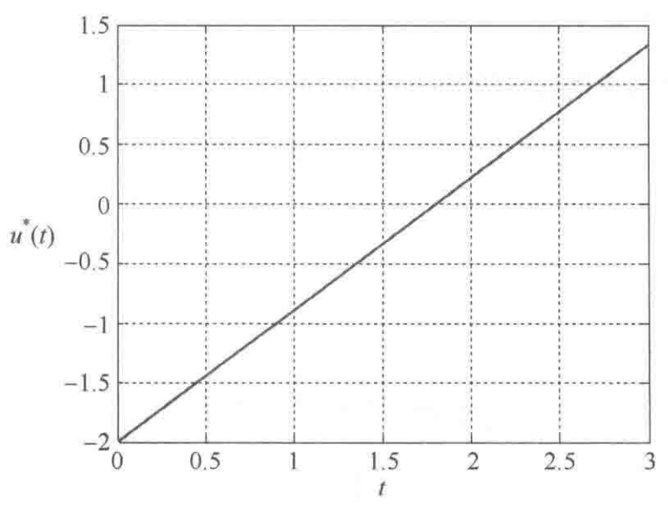

> Image description: This image is a MATLAB-generated plot showing the function $u^*(t)$ over time $t$. The graph features a Cartesian coordinate system with two axes: the horizontal axis represents time $t$, ranging from 0 to 3, and the vertical axis represents the variable $u^*(t)$, ranging from -2 to 1.5. The plot displays a single, solid straight line starting at the point $(0, -2)$ and ending at approximately $(3, 1.3)$. The linear relationship indicates that $u^*(t)$ increases at a constant rate as time progresses. Grid lines are present across the plotting area to facilitate reading specific values. According to the caption "图 10－8－1 题 10－8 的 $u^{*}(t)$（MATLAB）", this figure illustrates the optimal control signal or system output for problem 10-8 in a technical context, likely related to control theory or engineering mathematics.
图 10－8－1 题 10－8 的 $u^{*}(t)$（MATLAB）

图 10－8－2 所示。
MATLAB 程序：exe1008．m

$$
\begin{aligned}
& \mathrm{t}=0: 0.01: 3 ; \\
& \mathrm{u}=10 * \mathrm{t} / 9-2 ; \\
& \mathrm{A}=[0,1 ; 0,0] ; \\
& \mathrm{b}=[0,1]^{\prime} ; \\
& \mathrm{C}=[1,0 ; 0,1] ;
\end{aligned}
$$

根据边界条件，求出

$$
c_{1}=\frac{10}{9}, \quad c_{2}=2, \quad c_{3}=1, \quad c_{4}=1
$$

于是有
最优控制 $\quad u^{*}(t)=\frac{10}{9} t-2$
最优轨线 $x_{1}^{*}(t)=\frac{5}{27} t^{3}-t^{2}+t+1$

$$
x_{2}^{*}(t)=\frac{5}{9} t^{2}-2 t+1
$$

MATLAB 验证：
应用 MATLAB 软件包，可得 $t \in[0,3]$ 时的 $u^{*}(t)$ 曲线及 $x_{1}^{*}(t)$ 与 $x_{2}^{*}(t)$ 响应，如图10－8－1、


<!-- source_pdf_page: 365 -->
```
d=0;
sys =ss(A,b,C,d); %建立系统状态空间模型
figure(1)
plot(t,u); % 绘制最优控制曲线
grid;
```

figure(2)
$\operatorname{lsim}(\operatorname{sys}, \mathrm{u}, \mathrm{t},[1,1])$; \%绘制系统状态响应曲线 (最优轨线)
grid;

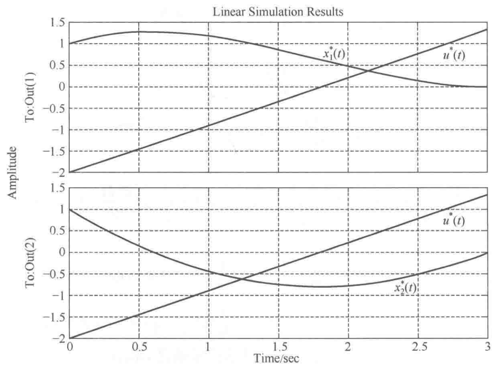

> Image description: This figure, titled "Linear Simulation Results," displays two stacked time-domain plots showing the optimal control and trajectory for a system. The x-axis represents "Time/sec" ranging from 0 to 3 seconds. The y-axis is labeled "Amplitude." The top plot, labeled "To:Out(1)," shows two curves: $x_1^*(t)$, which increases linearly from approximately -2 to 1, and $u^*(t)$, which starts near 1, peaks slightly, and then decreases toward 0. The bottom plot, labeled "To:Out(2)," displays two curves: $x_2^*(t)$, which descends from 1 to a minimum around -0.8 before slightly rising, and $u^*(t)$, which increases linearly from -2 to approximately 1. Engineering-wise, the figure illustrates the relationship between state variables ($x_1^*, x_2^*$) and the control input ($u^*$) over time, demonstrating how the control signal drives the system states along their optimal trajectories as simulated in MATLAB.
图 10－8－2 题 10－8 的最优控制与最优轨线（MATLAB）

10－9 已知系统状态方程及初始条件为

$$
\dot{x}=u, \quad x(0)=1
$$

试确定最优控制使下列性能指标取极小值

$$
J=\int_{0}^{1}\left(x^{2}+u^{2}\right) \mathrm{e}^{2 t} \mathrm{~d} t
$$

解 本题 $t_{f}$ 固定，末端自由，控制无约束，可采用变分法求解。令

$$
H=\left(x^{2}+u^{2}\right) \mathrm{e}^{2 t}+\lambda u
$$

协态方程

$$
\dot{\lambda}=-\frac{\partial H}{\partial x}=-2 x \mathrm{e}^{2 t}
$$

极值条件

故

$$
\begin{gathered}
\frac{\partial H}{\partial u}=2 u \mathrm{e}^{2 t}+\lambda=0, \quad \frac{\partial^{2} H}{\partial u^{2}}=2 \mathrm{e}^{2 t}>0, \quad t \in[0,1] \\
u^{*}(t)=-\frac{1}{2} \mathrm{e}^{-2 t} \lambda(t)
\end{gathered}
$$

状态方程 $\dot{x}=u$ ，则有 $\lambda=-2 \dot{x} e^{2 t}$ ，整理可得

$$
\ddot{x}+2 \dot{x}-x=0
$$


<!-- source_pdf_page: 366 -->
解得

$$
x(t)=c_{1} \mathrm{e}^{-(1+\sqrt{2}) t}+c_{2} \mathrm{e}^{-(1-\sqrt{2}) t}
$$

由边界条件 $x(0)=1$ 和横截条件 $\lambda\left(t_{f}\right)=\frac{\partial \varphi}{\partial x\left(t_{f}\right)}=0$ ，即 $\lambda(1)=0$ ，求出

$$
c_{1}=0.7438, \quad c_{2}=0.2562
$$

于是有：
最优轨线

$$
\begin{aligned}
& x^{*}(t)=0.7438 \mathrm{e}^{-(1+\sqrt{2}) t}+0.2562 \mathrm{e}^{-(1-\sqrt{2}) t} \\
& u^{*}(t)=-1.7957 \mathrm{e}^{-2.4142 t}+0.1061 \mathrm{e}^{0.4142 t}
\end{aligned}
$$

最优控制
MATLAB 验证：应用 MATLAB 软件包，可作出 $t \in[0,1]$ 时的最优控制律 $u^{*}(t)$ 及最优轨线响应 $x^{*}(t)$ ，分别如图 10－9－1、图 10－9－2 所示。

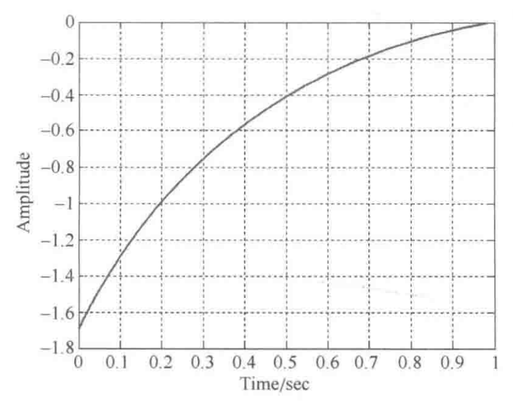

> Image description: This image is a technical plot showing the time response of a system variable. The graph features a vertical y-axis labeled "Amplitude" and a horizontal x-axis labeled "Time/sec". The x-axis ranges from $0$ to $1$ in increments of $0.1$, while the y-axis ranges from $-1.8$ to $0$ in increments of $0.2$. A single, smooth curve is plotted on a grid. The curve starts at an initial amplitude of approximately $-1.7$ at $t = 0$ and increases monotonically with a decreasing slope (concave down), eventually reaching an amplitude of $0$ at $t = 1$. According to the provided caption, this figure represents either the optimal control law $u^*(t)$ or the optimal trajectory response $x^*(t)$ for the time interval $t \in [0, 1]$, generated using a MATLAB software package.
图 10－9－1 题 10－9 的 $u^{*}(t)$（MATLAB）

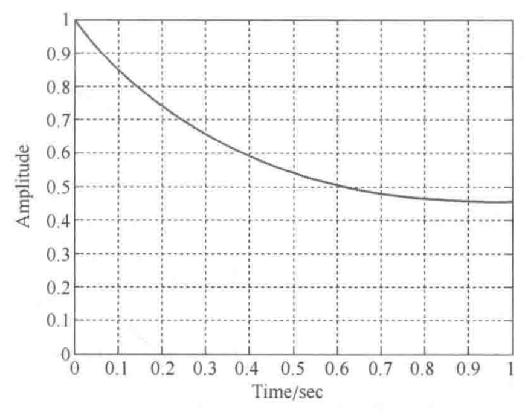

> Image description: This image is a technical plot showing the time-domain response of a signal, labeled as Figure 10-9-1 representing $u^*(t)$ generated via MATLAB. The graph features a Cartesian coordinate system with two axes: the horizontal x-axis represents "Time/sec" ranging from 0 to 1, and the vertical y-axis represents "Amplitude" ranging from 0 to 1. The plot displays a single continuous curve that starts at an amplitude of 1.0 when time is 0 seconds. As time increases, the amplitude decreases monotonically in a smooth, decaying fashion, asymptotically approaching a value slightly below 0.5 as it reaches $t = 1$ second. The background consists of a dashed grid for precise value retrieval. In engineering terms, this figure depicts an exponential-like decay or a transient response of a system variable over a one-second interval.
图 10－9－2 题 10－9 的 $x^{*}(t)$ 响应曲线（MATLAB）

MATLAB 程序 ：exe1009．m

```
$\mathrm{t}=0: 0.01: 1$;
$\mathrm{u}=-1.7957 * \exp (-2.4142 * \mathrm{t})+0.1061 * \exp (0.4142 * \mathrm{t}) ; \quad$ \% 定义系统输入
$\mathrm{a}=0$;
$\mathrm{b}=1$;
$\mathrm{c}=1$;
$\mathrm{d}=0$;
sys $=s s(a, b, c, d) ; ~ \%$ 建立系统状态空间模型
figure(1)
plot(t,u);
\% 绘制最优控制曲线
grid;
figure(2)
$\operatorname{lsim}(\mathrm{sys}, \mathrm{u}, \mathrm{t}, 1)$;
\%绘制系统最优轨线响应曲线
axis([0,1,0,1]);
grid;
```

10－10 求使系统

$$
\dot{x}_{1}=x_{2}, \quad \dot{x}_{2}=u
$$

由初始状态 $x_{1}(0)=x_{2}(0)=0$ 出发，在 $t_{f}=1$ 时转移到目标集 $x_{1}(1)+x_{2}(1)=1$ ，并使性能指标


<!-- source_pdf_page: 367 -->
$$
J=\frac{1}{2} \int_{0}^{1} u^{2}(t) \mathrm{d} t
$$

为最小值的最优控制 $u^{*}(t)$ 及相应的最优轨线 $x^{*}(t)$ 。
解 本题 $t_{f}$ 固定，末端受约束，控制无约束，可采用变分法求解。
令 $\Psi\left[x\left(t_{f}\right)\right]=x_{1}(1)+x_{2}(1)-1, \quad H=\frac{1}{2} u^{2}+\lambda_{1} x_{2}+\lambda_{2} u$
协态方程

$$
\begin{gathered}
\dot{\lambda}_{1}=-\frac{\partial H}{\partial x_{1}}=0, \quad \lambda_{1}=c_{1} \\
\dot{\lambda}_{2}=-\frac{\partial H}{\partial x_{2}}=-\lambda_{1}, \quad \lambda_{2}=-c_{1} t+c_{2}
\end{gathered}
$$

极值条件

则

$$
\begin{gathered}
\frac{\partial H}{\partial u}=u+\lambda_{2}=0, \quad \frac{\partial^{2} H}{\partial u^{2}}=1>0 \\
u^{*}=-\lambda_{2}=c_{1} t-c_{2}
\end{gathered}
$$

状态方程

$$
\begin{aligned}
& \dot{x}_{2}=u, \quad x_{2}=\frac{1}{2} c_{1} t^{2}-c_{2} t+c_{3} \\
& \dot{x}_{1}=x_{2}, \quad x_{1}=\frac{1}{6} c_{1} t^{3}-\frac{1}{2} c_{2} t^{2}+c_{3} t+c_{4}
\end{aligned}
$$

由边界条件 $x_{1}(0)=x_{2}(0)=0$ ，求出 $c_{3}=c_{4}=0$ ；由目标集条件
＇可得

$$
\begin{gathered}
x_{1}(1)+x_{2}(1)=1 \\
4 c_{1}-9 c_{2}=6
\end{gathered}
$$

由横截条件

$$
\lambda_{1}(1)=\frac{\partial \Psi}{\partial x_{1}(1)} \gamma, \quad \lambda_{2}(1)=\frac{\partial \Psi}{\partial x_{2}(1)} \gamma
$$

则 $\lambda_{1}(1)=\lambda_{2}(1)$ ，可得

解出

$$
\begin{gathered}
c_{2}=2 c_{1} \\
c_{1}=-\frac{3}{7}, \quad c_{2}=-\frac{6}{7}
\end{gathered}
$$

于是有：
最优控制

最优轨线

$$
\begin{gathered}
u^{*}(t)=-\frac{3}{7} t+\frac{6}{7}=\frac{3}{7}(2-t) \\
x_{1}^{*}(t)=-\frac{1}{14} t^{3}+\frac{3}{7} t^{2}=\frac{1}{14} t^{2}(6-t) \\
x_{2}^{*}(t)=-\frac{3}{14} t^{2}+\frac{6}{7} t=\frac{3}{14} t(4-t)
\end{gathered}
$$

读者可自行 MATLAB 验证，作出最优轨线响应。

## 10－11 已知一阶系统

$$
\dot{x}(t)=-x(t)+u(t), \quad x(0)=3
$$

（1）试确定最优控制 $u^{*}(t)$ ，使系统在 $t_{f}=2$ 时转移到 $x(2)=0$ ，并使性能泛函


<!-- source_pdf_page: 368 -->
$$
J=\int_{0}^{2}\left(1+u^{2}\right) \mathrm{d} t=\min
$$

（2）如果使系统转移到 $x\left(t_{f}\right)=0$ 的终端时间 $t_{f}$ 自由，问 $u^{*}(t)$ 应如何确定？
解（1）$t_{f}$ 固定，末端固定，可采用变分法求解。令

$$
H=1+u^{2}+\lambda(-x+u)
$$

协态方程

$$
\dot{\lambda}=-\frac{\partial H}{\partial x}=\lambda, \quad \lambda=c_{1} e^{\prime}
$$

极值条件

$$
\frac{\partial H}{\partial u}=2 u+\lambda=0, \quad \frac{\partial^{2} H}{\partial u^{2}}=2>0, \quad u^{*}=-\frac{1}{2} c_{1} \mathrm{e}^{t}
$$

状态方程

$$
\dot{x}=-x+u, \quad x=c_{2} \mathrm{e}^{-t}-\frac{1}{4} c_{1} \mathrm{e}^{t}
$$

由初始条件 $x(0)=3$ 和边界条件 $x(2)=0$ ，求出

$$
c_{1}=\frac{12}{\mathrm{e}^{4}-1}, \quad c_{2}=\frac{3 \mathrm{e}^{4}}{\mathrm{e}^{4}-1}
$$

则最优控制为

$$
u^{*}(t)=-\frac{6 \mathrm{e}^{t}}{\mathrm{e}^{4}-1}=-0.1119 \mathrm{e}^{t}
$$

（2）$t_{f}$ 自由，末端固定，控制无约束，可同问题（1）采用变分法求解，并采用同样的协态方程、极值条件和状态方程。

根据初态 $x(0)=3$ ，末态 $x\left(t_{f}\right)=0$ 及 $H$ 变化律 $H\left(t_{f}\right)=-\frac{\partial \varphi}{\partial t_{f}}=0$ ，求出

$$
c_{1}=0.3246, \quad t_{f}=1.818
$$

则最优控制为

$$
u^{*}(t)=-0.1623 \mathrm{e}^{t}
$$

10－12 设系统状态方程及初始条件为

$$
\dot{x}(t)=u(t), \quad x(0)=1
$$

试确定最优控制 $u^{*}(t)$ ，使性能指标

$$
J=t_{f}+\frac{1}{2} \int_{0}^{t_{f}} u^{2} \mathrm{~d} t
$$

为极小，其中终端时间 $t_{f}$ 未定，$x\left(t_{f}\right)=0$ 。
解 本题 $t_{f}$ 自由，末端固定，控制无约束，可采用变分法求解。
由题意，$\varphi\left(t_{f}\right)=t_{f}$ ，令

$$
H=\frac{1}{2} u^{2}+\lambda u
$$

协态方程

$$
\dot{\lambda}=-\frac{\partial H}{\partial x}=0, \quad \lambda=c_{1}
$$

极值条件


<!-- source_pdf_page: 369 -->
$$
\frac{\partial H}{\partial u}=u+\lambda=0, \quad \frac{\partial^{2} H}{\partial u^{2}}=1>0, \quad u^{*}=-\lambda=-c_{1}
$$

状态方程

$$
\dot{x}=u, \quad x=-c_{1} t+c_{2}
$$

由初态 $x(0)=1$ ，求出 $c_{2}=1$ 。由 $H$ 变化律

$$
H\left(t_{f}\right)=-\frac{\partial \varphi}{\partial t_{f}}=-1
$$

可得

$$
\frac{1}{2} c_{1}^{2}-c_{1}^{2}=-1, \quad c_{1}=\sqrt{2}
$$

于是最优控制为

$$
u^{*}(t)=-\sqrt{2}
$$

10－13 设二次积分模型为

$$
\dot{\theta}(t)=\omega(t), \quad \dot{\omega}(t)=u(t)
$$

性能指标为

$$
J=\frac{1}{2} \int_{0}^{1} u^{2} \mathrm{~d} t
$$

已知 $\theta(0)=\omega(0)=1, \theta(1)=0, \omega(1)$ 自由，试求最优控制 $u^{*}(t)$ 和最优轨线 $\theta^{*}(t), \omega^{*}(t)$ 。
解 本题 $t_{f}$ 固定，部分末态固定，部分末态自由，控制无约束，可采用变分法求解。
令哈密顿函数

$$
H=\frac{1}{2} u^{2}+\lambda_{1} \omega+\lambda_{2} u
$$

协态方程

$$
\begin{gathered}
\dot{\lambda}_{1}=-\frac{\partial H}{\partial \theta}=0, \quad \lambda_{1}=c_{1} \\
\dot{\lambda}_{2}=-\frac{\partial H}{\partial \omega}=-\lambda_{1}, \quad \lambda_{2}=-c_{1} t+c_{2}
\end{gathered}
$$

极值条件

$$
\frac{\partial H}{\partial u}=u+\lambda_{2}=0, \quad \frac{\partial^{2} H}{\partial u^{2}}=1>0, \quad u^{*}=-\lambda_{2}=c_{1} t-c_{2}
$$

状态方程

$$
\begin{array}{ll}
\dot{\omega}=u, & \omega=\frac{1}{2} c_{1} t^{2}-c_{2} t+c_{3} \\
\dot{\theta}=\omega, & \theta=\frac{1}{6} c_{1} t^{3}-\frac{1}{2} c_{2} t^{2}+c_{3} t+c_{4}
\end{array}
$$

由初始条件 $\theta(0)=\omega(0)=1$ ，求出

$$
c_{3}=c_{4}=1
$$

由末态条件 $\theta(1)=0$ 及 $H$ 变化律 $\lambda_{2}(1)=-\frac{\partial \varphi}{\partial t_{f}}=0$ ，求出

$$
c_{1}=c_{2}=6
$$

故得
最优控制

$$
u^{*}(t)=6(t-1)
$$


<!-- source_pdf_page: 370 -->
最优轨线 $\quad \theta^{*}(t)=t^{3}-3 t^{2}+t+1, \quad \omega^{*}(t)=3 t^{2}-6 t+1$
10－14 设系统状态方程及初始条件为

$$
\begin{array}{ll}
\dot{x}_{1}(t)=x_{2}(t), & x_{1}(0)=2 \\
\dot{x}_{2}(t)=u(t), & x_{2}(0)=1
\end{array}
$$

性能指标为

$$
J=\frac{1}{2} \int_{0}^{t_{f}} u^{2} \mathrm{~d} t
$$

要求达到 $x\left(t_{f}\right)=0$ ，试求：
（1）$t_{f}=5$ 时的最优控制 $u^{*}(t)$ ；
（2）$t_{f}$ 自由时的最优控制 $u^{*}(t)$ 。
解（1）本题为 $t_{f}=5$ 固定，末端固定，控制无约束的最优控制问题。令

$$
H=\frac{1}{2} u^{2}+\lambda_{1} x_{2}+\lambda_{2} u
$$

协态方程

$$
\begin{array}{ll}
\dot{\lambda}_{1}=-\frac{\partial H}{\partial x_{1}}=0, & \lambda_{1}=c_{1} \\
\dot{\lambda}_{2}=-\frac{\partial H}{\partial x_{2}}=-\lambda_{1}, & \lambda_{2}=-c_{1} t+c_{2}
\end{array}
$$

极值条件

$$
\frac{\partial H}{\partial u}=u+\lambda_{2}=0, \quad \frac{\partial^{2} H}{\partial u^{2}}=1>0, \quad u^{*}=-\lambda_{2}=c_{1} t-c_{2}
$$

状态方程

$$
\begin{array}{ll}
\dot{x}_{2}=u=c_{1} t-c_{2}, & x_{2}=\frac{1}{2} c_{1} t^{2}-c_{2} t+c_{3} \\
\dot{x}_{1}=x_{2}, & x_{1}=\frac{1}{6} c_{1} t^{3}-\frac{1}{2} c_{2} t^{2}+c_{3} t+c_{4}
\end{array}
$$

根据初态及末态条件，求出

$$
c_{1}=0.432, \quad c_{2}=1.28, \quad c_{3}=1, \quad c_{4}=2
$$

于是最优控制为

$$
u^{*}(t)=0.432 t-1.28
$$

（2）本题为 $t_{f}$ 自由，末端固定，控制无约束的最优解问题，其求解过程（协态方程、极值条件、状态方程）同（1）。

已求得

$$
\begin{aligned}
x_{1} & =\frac{1}{6} c_{1} t^{3}-\frac{1}{2} c_{2} t^{2}+c_{3} t+c_{4} \\
x_{2} & =\frac{1}{2} c_{1} t^{2}-c_{2} t+c_{3} \\
u & =c_{1} t-c_{2}
\end{aligned}
$$

根据最优终端时刻 $H$ 变化律 $H\left(t_{f}^{*}\right)=-\frac{\partial \varphi}{\partial t_{f}}=0$ ，求出 $c_{1}=\frac{1}{2} c_{2}^{2}$ 。可见，$c_{1} 、 c_{2}$ 与 $t_{f}$ 无关，因而此时无最优解 $u^{*}(t)$ 。


<!-- source_pdf_page: 371 -->
10－15 设一阶系统方程 $\dot{x}(t)=u(t), x(0)=1$ ；性能指标

$$
J=\frac{1}{2} \int_{0}^{1}\left(x^{2}+u^{2}\right) \mathrm{d} t
$$

已知 $x(1)=0$ ，某工程师认为从工程观点出发可取最优控制函数 $u^{*}(t)=-1$ ，试分析他的意见是否正确，并说明理由。

解 本题 $t_{f}$ 固定，末端固定。令

$$
H=L+\lambda^{\mathrm{T}} f=\frac{1}{2}\left(x^{2}+u^{2}\right)+\lambda u
$$

协态方程

$$
\dot{\lambda}=-\frac{\partial H}{\partial x}=-x
$$

极值条件

$$
\frac{\partial H}{\partial u}=u+\lambda=0, \quad u=-\lambda \text { 且 } \frac{\partial^{2} H}{\partial u^{2}}=1>0
$$

状态方程

故有

$$
\begin{gathered}
\dot{x}=u, \quad \ddot{x}=\dot{u}=-\dot{\lambda}=x, \quad x=c_{1} \mathrm{e}^{t}+c_{2} \mathrm{e}^{-t} \\
u=c_{1} \mathrm{e}^{t}-c_{2} \mathrm{e}^{-t}
\end{gathered}
$$

根据边界条件 $x(0)=1, x(1)=0$ ，求出

$$
c_{1}=\frac{1}{1-\mathrm{e}^{2}}, \quad c_{2}=-\frac{\mathrm{e}^{2}}{1-\mathrm{e}^{2}}
$$

故得
最优控制

$$
\begin{aligned}
& u^{*}(t)=-0.157\left(\mathrm{e}^{t}+7.39 \mathrm{e}^{-t}\right) \\
& x^{*}(t)=-0.157\left(\mathrm{e}^{t}-7.39 \mathrm{e}^{-t}\right)
\end{aligned}
$$

最优轨线
最优性能指标

$$
J^{*}=0.66
$$

若取 $u^{*}=-1$ ，则 $J^{*}=0.67$ 。故从工程角度考虑，工程师的意见是正确的。
10－16 给定二阶系统

$$
\begin{array}{ll}
\dot{x}_{1}(t)=x_{2}(t)+\frac{1}{4}, & x_{1}(0)=-\frac{1}{4} \\
\dot{x}_{2}(t)=u(t), & x_{2}(0)=-\frac{1}{4}
\end{array}
$$

控制约束为 $|u(t)| \leqslant \frac{1}{2}$ ，要求最优控制 $u^{*}(t)$ ，使系统在 $t=t_{f}$ 时转移到 $x\left(t_{f}\right)=0$ ，并使

$$
J=\int_{0}^{t_{f}} u^{2}(t) \mathrm{d} t=\min
$$

其中 $t_{f}$ 自由。
解 本题为定常系统，末端固定，积分型指标，$t_{f}$ 自由，但是有控制约束的最优控制问题，应采用极小值原理求解。令

$$
H=u^{2}+\lambda_{1} x_{2}+\frac{1}{4} \lambda_{1}+\lambda_{2} u=\left(u+\frac{1}{2} \lambda_{2}\right)^{2}+\lambda_{1} x_{2}+\frac{1}{4} \lambda_{1}-\frac{1}{4} \lambda_{2}^{2}
$$

协态方程

$$
\dot{\lambda}_{1}=-\frac{\partial H}{\partial x_{1}}=0, \quad \lambda_{1}=c_{1}
$$


<!-- source_pdf_page: 372 -->
$$
\dot{\lambda}_{2}=-\frac{\partial H}{\partial x_{2}}=-\lambda_{1}, \quad \lambda_{2}=-c_{1} t+c_{2}
$$

极小值条件

$$
u^{*}=\left\{\begin{array}{cc}
-\frac{1}{2}, & \lambda_{2}>2 \\
-\frac{1}{2} \lambda_{2}, & \left|\lambda_{2}\right| \leqslant 2 \\
\frac{1}{2}, & \lambda_{2}<-2
\end{array}\right.
$$

若取 $u=\frac{1}{2}$ ，有 $\dot{x}_{2}=u=\frac{1}{2}$ ，解出

$$
x_{2}=\frac{1}{2} t, \quad x_{2}(0)=0 \quad \text { (不合题意) }
$$

若取 $u=-\frac{1}{2}$ ，有 $\dot{x}_{2}=-\frac{1}{2}$ ，解出

故取

$$
\begin{gathered}
x_{2}=-\frac{1}{2} t, \quad x_{2}(0)=0 \quad \text { (不合题意) } \\
u^{*}=-\frac{1}{2} \lambda_{2}=-\frac{1}{2}\left(c_{2}-c_{1} t\right)
\end{gathered}
$$

则根据状态方程和初始条件，有

$$
x_{1}=-\frac{1}{4}\left(c_{2} t^{2}-\frac{1}{3} c_{1} t^{3}+1\right), \quad x_{2}=-\frac{1}{2}\left(c_{2} t-\frac{1}{2} c_{1} t^{2}\right)-\frac{1}{4}
$$

$H$ 变化律

$$
H^{*}\left(t_{f}^{*}\right)=u^{* 2}+\lambda_{1} x_{2}^{*}+\frac{1}{4} \lambda_{1}+\lambda_{2} u^{*}=-\frac{1}{4} c_{2}^{2}=0, \quad c_{2}=0
$$

由 $x\left(t_{f}\right)=0$ ，得

$$
-\frac{1}{4}\left(c_{2} t_{f}^{2}-\frac{1}{3} c_{1} t_{f}^{3}+1\right)=0, \quad-\frac{1}{2}\left(c_{2} t_{f}-\frac{1}{2} c_{1} t_{f}^{2}+\frac{1}{2}\right)=0
$$

求出

$$
c_{1}=\frac{1}{9}, \quad t_{f}^{*}=3
$$

于是最优控制为

$$
u^{*}(t)=\frac{1}{18} t, \quad t \in[0,3]
$$

10－17 设一阶系统方程为

$$
\dot{x}(t)=x(t)-u(t), \quad x(0)=5
$$

控制约束 $0.5 \leqslant u(t) \leqslant 1$ ，性能指标为

$$
J=\int_{0}^{1}(x+u) \mathrm{d} t
$$

末端状态自由，试求 $u^{*}(t) 、 x^{*}(t)$ 和 $J^{*}$ 。
解 本题为定常系统，$t_{f}$ 固定，末端自由，积分型指标，控制受约束的最优控制问题，应采用极小值原理求解。令

$$
H=x+u+\lambda(x-u)=x+\lambda x+u(1-\lambda)
$$

协态方程


<!-- source_pdf_page: 373 -->
$$
\dot{\lambda}=-\frac{\partial H}{\partial x}=-\lambda-1, \quad \lambda(t)=c \mathrm{e}^{-t}-1
$$

由横截条件

$$
\lambda(1)=c \mathrm{e}^{-1}-1=0
$$

求得 $c=\mathrm{e}$ ，于是

$$
\lambda(t)=\mathrm{e}^{1-t}-1
$$

显然，当 $\lambda\left(t_{s}\right)=1$ 时 $u^{*}(t)$ 产生切换，其中 $t_{s}$ 为切换时间，求得

$$
t_{s}=1-\ln 2=0.307
$$

极值条件

$$
u^{*}= \begin{cases}1, & 0 \leqslant t<0.307 \\ 0.5, & 0.307 \leqslant t \leqslant 1\end{cases}
$$

将 $u$＊代人状态方程，得

$$
\dot{x}(t)= \begin{cases}x(t)-1, & 0 \leqslant t<0.307 \\ x(t)-0.5, & 0.307 \leqslant t \leqslant 1\end{cases}
$$

解得最优轨线

$$
x^{*}(t)= \begin{cases}c_{1} \mathrm{e}^{t}+1, & 0 \leqslant t<0.307 \\ c_{2} \mathrm{e}^{t}+0.5, & 0.307 \leqslant t \leqslant 1\end{cases}
$$

由 $x(0)=5$ ，求出 $c_{1}=4$ ，则有

$$
x^{*}(t)=4 \mathrm{e}^{t}+1
$$

在切换时刻，有

$$
x^{*}\left(t_{s}\right)=4 \mathrm{e}^{t_{s}}+1=6.44
$$

＇同时又有

$$
x^{*}\left(t_{s}\right)=c_{2} \mathrm{e}^{t_{s}}+0.5=6.44
$$

求出 $c_{2}=4.37$ ，则

$$
\begin{gathered}
x^{*}(t)= \begin{cases}4 \mathrm{e}^{t}+1, & 0 \leqslant t<0.307 \\
4.37 \mathrm{e}^{t}+0.5, & 0.307 \leqslant t \leqslant 1\end{cases} \\
J^{*}=\int_{0}^{0.307}\left(u^{*}+x^{*}\right) \mathrm{d} t+\int_{0.307}^{1}\left(u^{*}+x^{*}\right) \mathrm{d} t=8.683
\end{gathered}
$$

注：由于 $u^{*}$ 和 $x^{*}$ 是分段连续函数，所以在求 $J *$ 时必须分为两部分求解。
MATLAB 验证：系统最优解曲线如图 10－17－1 所示。
MATLAB 程序 ：exe1017．m
$\mathrm{a}=1$ ；
$\mathrm{b}=-1$ ；
$\mathrm{c}=1$ ；
$\mathrm{d}=0$ ；
sys $=s s(a, b, c, d) ; ~ \%$ 建立系统状态空间模型
$\mathrm{t}=0: 0.001: 1$ ；
$\mathrm{u} 1=\exp (1-\mathrm{t})-1 ; \quad$ \％定义 $\lambda(t)$
subplot（3，1，1）；
$\operatorname{plot}(\mathrm{t}, \mathrm{u} 1)$ ；\％绘制 $\lambda(t)$ 曲线


<!-- source_pdf_page: 374 -->
```
grid;
subplot(3,1,2);
u2 = [ones(1,307),0.5*ones(1,694)]; %定义最优输人
plot(t,u2); %绘制最优输人曲线
axis([0,1,0,1.5]);
grid;
subplot(3,1,3);
lsim(sys,u2,t,5); % 绘制状态响应曲线(最优轨线)
grid;
```

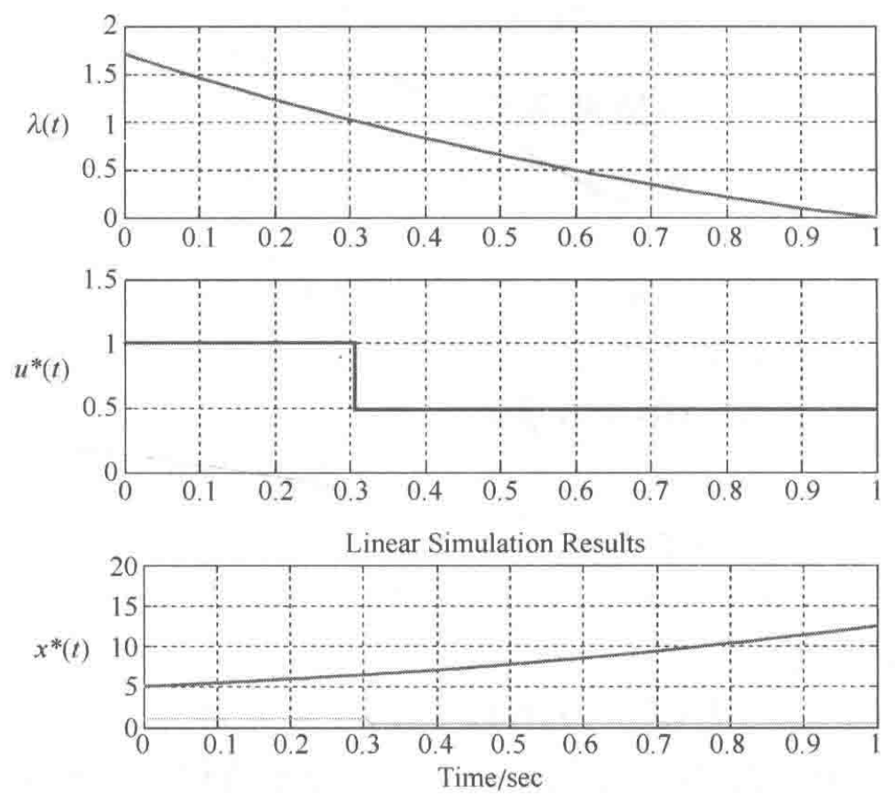

> Image description: This image presents three vertically stacked time-domain plots labeled "Linear Simulation Results," showing the optimal solution curves for a control problem generated in MATLAB. The x-axis for all three graphs is "Time/sec," ranging from 0 to 1. The top plot shows the variable $\lambda(t)$ on the y-axis, which decreases monotonically and smoothly from approximately 1.7 down to 0 over the one-second interval. The middle plot displays the control input $u^*(t)$, which exhibits a step change; it remains constant at 1.0 until $t = 0.3$ seconds, then drops abruptly to 0.5 for the remainder of the duration. The bottom plot shows the state variable $x^*(t)$, which increases steadily and almost linearly from approximately 4 to 12 over the same time period. Together, these graphs illustrate the relationship between a costate variable, an optimal control input, and the resulting system state trajectory.
图 10－17－1 题 10－17 的最优解曲线（MATLAB）

## 10－18 设二阶系统

$$
\begin{array}{ll}
\dot{x}_{1}(t)=-x_{1}(t)+u(t), & x_{1}(0)=1 \\
\dot{x}_{2}(t)=x_{1}(t), & x_{2}(0)=0
\end{array}
$$

控制约束 $|u(t)| \leqslant 1$ ，当系统末端自由时，求最优控制 $u^{*}(t)$ ，使性能指标

$$
J=2 x_{1}(1)+x_{2}(1)
$$

取极小值，并求最优轨线 $x^{*}(t)$ 。
解 本题为定常系统，$t_{f}$ 固定，末端自由，末值型指标，控制受约束的最优控制问题，可采用极小值原理求解。

由题意知，性能指标为末值型的，即

$$
\varphi\left[x\left(t_{f}\right)\right]=2 x_{1}(1)+x_{2}(1)
$$

令哈密顿函数

$$
H=\lambda_{1}\left(-x_{1}+u\right)+\lambda_{2} x_{1}
$$

协态方程

$$
\dot{\lambda}_{2}=-\frac{\partial H}{\partial x_{2}}=0, \quad \lambda_{2}=c_{2}
$$


<!-- source_pdf_page: 375 -->
$$
\dot{\lambda}_{1}=-\frac{\partial H}{\partial x_{1}}=\lambda_{1}-\lambda_{2}, \quad \lambda_{1}=c_{1} \mathrm{e}^{t}+c_{2}
$$

横截条件

$$
\lambda_{1}(1)=\frac{\partial \varphi}{\partial x_{1}(1)}=2, \quad \lambda_{2}(1)=\frac{\partial \varphi}{\partial x_{2}(1)}=1
$$

求出 $c_{1}=\mathrm{e}^{-1}, c_{2}=1$ ，则有

$$
\lambda_{1}(t)=\mathrm{e}^{t-1}+1, \quad \lambda_{2}(t)=1
$$

极值条件

$$
u^{*}(t)=-\operatorname{sgn}\left(\lambda_{1}\right)=\left\{\begin{array}{cc}
-1 & \lambda_{1}>0 \\
1, & \lambda_{1}<0
\end{array}\right.
$$

因为 $\lambda_{1}(t)=\mathrm{e}^{t-1}+1>0, t \in[0,1]$ ，故可确定

$$
u^{*}(t)=-1, \quad 0 \leqslant t<1
$$

状态方程

$$
\begin{array}{ll}
\dot{x}_{1}=-x_{1}+u=-x_{1}-1, & x_{1}(t)=c_{3} \mathrm{e}^{-t}-1 \\
\dot{x}_{2}=x_{1}, & x_{2}(t)=-c_{3} \mathrm{e}^{-t}-t+c_{4}
\end{array}
$$

根据初始条件 $x_{1}(0)=1, x_{2}(0)=0$ ，求出

$$
c_{3}=2, \quad c_{4}=2
$$

故最优轨线为

$$
x_{1}^{*}(t)=2 \mathrm{e}^{-t}-1, \quad x_{2}^{*}(t)=-2 \mathrm{e}^{-t}-t+2
$$

10－19 已知二阶系统

$$
\dot{x}_{1}(t)=x_{2}(t), \quad \dot{x}_{2}(t)=u(t)
$$

控制约束 $|u(t)| \leqslant 1$ ，试确定最小时间控制 $u^{*}(t)$ ，使系统由任意初态最快地转移到末端状态 $x_{1}\left(t_{f}\right)=2, x_{2}\left(t_{f}\right)=1$ ，要求写出开关曲线方程 $\gamma$ 并画出 $\gamma$ 曲线的图形。

解 本题为定常系统，积分型指标，末端固定，$t_{f}$ 自由的时间最优控制问题。
由题意，可以验证状态可控，因而系统正常，故时间最优控制为 Bang－Bang 控制，可用极小值原理求解。令

$$
H=1+\lambda_{1} x_{2}+\lambda_{2} u
$$

协态方程

$$
\begin{array}{ll}
\dot{\lambda}_{1}=-\frac{\partial H}{\partial x_{1}}=0, & \lambda_{1}(t)=c_{1} \\
\dot{\lambda}_{2}=-\frac{\partial H}{\partial x_{2}}=-\lambda_{1}, & \lambda_{2}(t)=-c_{1} t+c_{2}
\end{array}
$$

若令 $u^{*}(t)=1$ ，则状态方程为

$$
\begin{aligned}
& \dot{x}_{2}(t)=1, \quad x_{2}(t)=t+x_{20} \\
& \dot{x}_{1}(t)=x_{2}=t+x_{20}, \quad x_{1}(t)=\frac{1}{2} t^{2}+x_{20} t+x_{10}
\end{aligned}
$$

在解 $\left\{x_{1}(t), x_{2}(t)\right\}$ 中，消去 $t$ ，求解相应的最优轨线方程

$$
x_{1}=\frac{1}{2} x_{2}^{2}+\left(x_{10}-\frac{1}{2} x_{20}\right)
$$

上式表示一簇抛物线。由于 $x_{2}(t)=t+x_{20}$ ，故 $x_{2}(t)$ 随 $t$ 的增加而增大。显然，满足末态要


<!-- source_pdf_page: 376 -->
求的最优轨线可表示为

$$
\gamma_{+}=\left\{\left(x_{1}, x_{2}\right) \left\lvert\, x_{1}=\frac{1}{2} x_{2}^{2}+\frac{3}{2}\right., x_{2} \leqslant 1\right\}
$$

若令 $u^{*}(t)=-1$ ，则状态方程为

$$
\begin{array}{ll}
\dot{x}_{2}(t)=-1, & x_{2}(t)=-t+x_{20} \\
\dot{x}_{1}(t)=-t+x_{20}, & x_{1}(t)=-\frac{1}{2} t^{2}+x_{20} t+x_{10}
\end{array}
$$

相应的最优轨线方程为

$$
x_{1}=-\frac{1}{2} x_{2}^{2}+\left(x_{10}+\frac{1}{2} x_{20}^{2}\right)
$$

同样表示一簇抛物线，满足末态要求的最优轨线可表示为

$$
\gamma=\left\{\left(x_{1}, x_{2}\right) \left\lvert\, x_{1}=-\frac{1}{2} x_{2}^{2}+\frac{5}{2}\right., x_{2} \geqslant 1\right\}
$$

综上所述，开关曲线方程为 $\gamma=\gamma_{+} \cup \gamma_{-}$。最小时间控制

$$
u^{*}(t)= \begin{cases}+1, & \left(x_{1}, x_{2}\right) \in \gamma_{+} \cup R_{+} \\ -1, & \left(x_{1}, x_{2}\right) \in \gamma \cup R\end{cases}
$$

开关曲线 $\gamma$ 如图 10－19－1 所示。

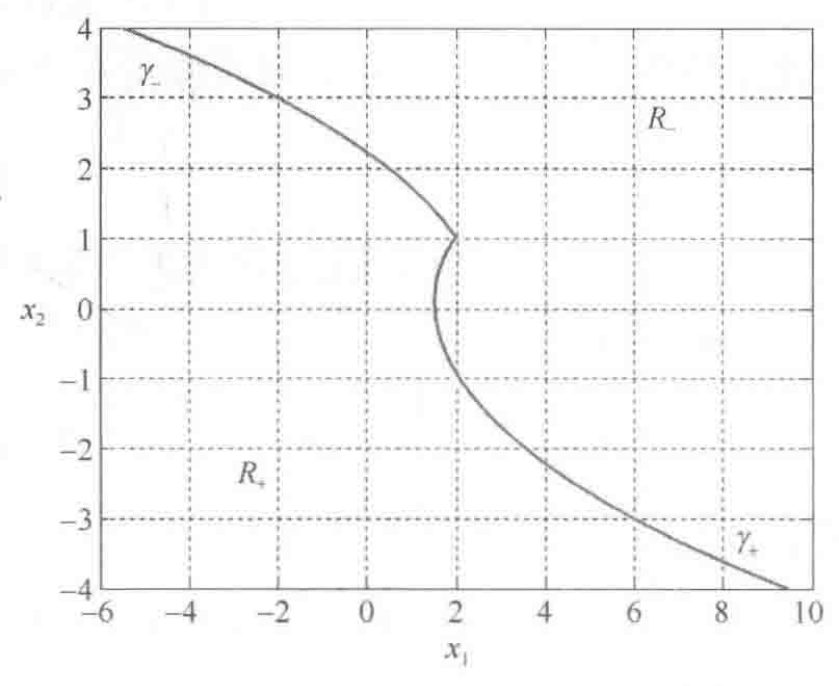

> Image description: A technical plot showing a switching curve $\gamma$ in a two-dimensional coordinate system defined by axes $x_1$ (horizontal) and $x_2$ (vertical). The horizontal axis ranges from -6 to 10, while the vertical axis ranges from -4 to 4. The figure depicts a continuous, S-shaped curve that divides the plane into two distinct regions labeled $R_+$ and $R_-$. The region $R_+$ is located to the left and below the curve, while $R_-$ is situated to the right and above it. The curve itself is partitioned into two segments: $\gamma_-$ in the upper-left quadrant and $\gamma_+$ in the lower-right quadrant, meeting at a cusp or turning point near $(x_1, x_2) \approx (2, 1)$. This visualization typically represents a switching manifold in control engineering or dynamical systems, where different system behaviors are active depending on which region ($R_+$ or $R_-$) the state vector resides.
图 10－19－1 题 10－19 开关曲线图（MATLAB）

10－20 已知一阶系统

$$
\dot{x}(t)=-\frac{1}{2} x(t)+u(t)
$$

性能指标

$$
J=\frac{1}{2}\left[10 x^{2}(1)\right]+\frac{1}{2} \int_{0}^{1}\left(2 x^{2}+u^{2}\right) \mathrm{d} t
$$

求最优控制 $u^{*}(t)$ 。
解 根据性能指标的形式，可知本题是线性二次型问题，且是有限时间状态调节器问题。

由题意知

$$
A=-\frac{1}{2}, \quad B=1, \quad F=10, \quad Q=2, \quad R=1
$$

根据里卡蒂方程

$$
-\dot{\boldsymbol{P}}=\boldsymbol{A}^{\mathrm{T}} \boldsymbol{P}+\boldsymbol{P A}-\boldsymbol{P B} \boldsymbol{R}^{-1} \boldsymbol{B}^{\mathrm{T}} \boldsymbol{P}+\boldsymbol{Q}, \quad \boldsymbol{P}\left(t_{f}\right)=\boldsymbol{F}
$$

代人相应的 $A 、 B 、 Q 、 R 、 F$ ，有

$$
\dot{P}=P^{2}+P-2=(P-1)(P+2), \quad P\left(t_{f}\right)=10
$$

求解可得

$$
\begin{gathered}
\frac{\mathrm{d} P}{(P-1)(P+2)}=\mathrm{d} t, \quad\left(\frac{1}{P-1}-\frac{1}{P+2}\right)=3 \mathrm{~d} t \\
\ln \frac{P-1}{P+2}=3 t+c_{1}, \quad \frac{P-1}{P+2}=c_{2} \mathrm{e}^{3 t}
\end{gathered}
$$


<!-- source_pdf_page: 377 -->
因 $P(1)=10$ ，求出 $c_{2}=0.037$ ，于是

$$
P(t)=\frac{1+0.074 \mathrm{e}^{3 t}}{1-0.037 \mathrm{e}^{3 t}}
$$

故最优控制为

$$
u^{*}(t)=-R^{-1} B^{\mathrm{T}} P x=-\frac{1+0.074 \mathrm{e}^{3 t}}{1-0.037 \mathrm{e}^{3 t}} x(t)
$$

10－21 已知二阶系统

$$
\dot{x}_{1}(t)=x_{2}(t), \quad \dot{x}_{2}(t)=u(t)
$$

试确定最优控制 $u^{*}(t)$ ，使下列性能指标取极小值：

$$
J=\frac{1}{2}\left[x_{1}^{2}(3)+2 x_{2}^{2}(3)\right]+\frac{1}{2} \int_{0}^{3}\left[2 x_{1}^{2}(t)+4 x_{2}^{2}(t)+2 x_{1}(t) x_{2}(t)+\frac{1}{2} u^{2}(t)\right] \mathrm{d} t
$$

解 本题是有限时间定常状态调节器问题。
由题意知

$$
\boldsymbol{A}=\left[\begin{array}{ll}
0 & 1 \\
0 & 0
\end{array}\right], \quad \boldsymbol{b}=\left[\begin{array}{l}
0 \\
1
\end{array}\right], \quad \boldsymbol{F}=\left[\begin{array}{ll}
1 & 0 \\
0 & 2
\end{array}\right], \quad r=\frac{1}{2}, \quad \boldsymbol{Q}=\left[\begin{array}{ll}
2 & 1 \\
1 & 4
\end{array}\right]
$$

里卡蒂方程

$$
-\dot{\boldsymbol{P}}=\boldsymbol{A}^{\mathrm{T}} \boldsymbol{P}+\boldsymbol{P} \boldsymbol{A}-\boldsymbol{P} b r^{-1} \boldsymbol{b}^{\mathrm{T}} \boldsymbol{P}+\boldsymbol{Q}, \quad \boldsymbol{P}\left(t_{f}\right)=\boldsymbol{F}
$$

令 $\boldsymbol{P}=\left[\begin{array}{ll}p_{11} & p_{12} \\ p_{21} & p_{22}\end{array}\right]$ ，可得如下方程：

$$
\begin{array}{ll}
\dot{p}_{11}=2\left(p_{12}^{2}-1\right), & p_{11}(3)=1 \\
\dot{p}_{12}=-p_{11}+2 p_{12} p_{22}-1, & p_{12}(3)=0 \\
\dot{p}_{22}=-2 p_{12}+2 p_{22}^{2}-4, & p_{22}(3)=2 \\
u^{*}(t)=-r^{-1} \boldsymbol{b}^{\mathrm{T}} \boldsymbol{P x}=-2 p_{12} x_{1}-2 p_{22} x_{2}
\end{array}
$$

故
其中 $p_{12} 、 p_{22}$ 为里卡蒂方程的解。
稳态条件下，求得

$$
\overline{\boldsymbol{P}}=\left[\begin{array}{cc}
2 \sqrt{3}-1 & 1 \\
1 & \sqrt{3}
\end{array}\right]
$$

则近似最优解为

$$
\hat{u}(t)=-2 x_{1}(t)-2 \sqrt{3} x_{2}(t)
$$

其解曲线见图 10－21－1，而准确最优解曲线见图 10－21－2，两者基本一致。
10－22 设控制系统如图 10－13 所示，其中被控对象

$$
G_{0}(s)=\frac{60}{(s+2)(s+3)}
$$

试设计最优 PID 控制器 $G_{c}(s)$ 及前置滤波器 $G_{p}(s)$ ，使系统具有最优的 ITAE 性能，且调节时间小于 0.8 s （ $\Delta=2 \%$ ）。

解 本题为最优 ITAE 指标系统设计。设计关键在于 $G_{c}(s)$ 及 $G_{p}(s)$ 的选取，应使闭环传递函数满足教材中表 10－4 的要求。在系统自然频率 $\omega_{n}$ 的选取中，除满足对系统 $t_{s}$ 的要求外，其取值不宜过大，否则造成系统控制量要求过大，以至于无法实现。


<!-- source_pdf_page: 378 -->
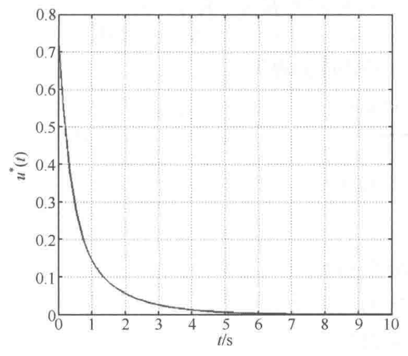

> Image description: A line graph showing the approximate optimal solution for Problem 10-21, as indicated by the Chinese caption "图 10－21－1 题 10－21 的近似最优解". The plot features a vertical y-axis labeled $u^*(t)$ and a horizontal x-axis labeled $t/\text{s}$, representing time in seconds. Both axes are marked with numerical increments: the y-axis ranges from $0$ to $0.8$ in steps of $0.1$, and the x-axis ranges from $0$ to $10$ in steps of $1$. The graph displays a single, smooth curve that begins at approximately $(0, 0.75)$ on the y-axis. The curve exhibits an exponential decay pattern, dropping sharply between $t=0$ and $t=2$, and then asymptotically approaching zero as time increases toward $10$ seconds. In an engineering context, this represents a control signal or state variable that diminishes over time to reach a steady state of zero.
图 10－21－1 题 10－21 的近似最优解

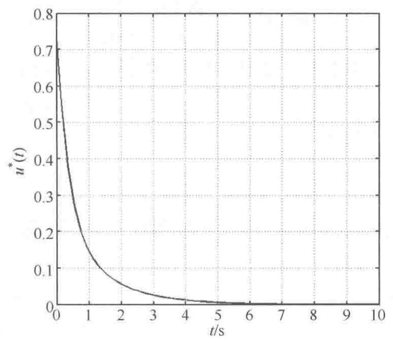

> Image description: A line graph showing the approximate optimal solution for problem 10-21, as indicated by the Chinese caption "图 10－21－1 题 10－21 的近似最优解". The horizontal axis is labeled $t/\text{s}$, representing time in seconds, with a scale ranging from 0 to 10. The vertical axis is labeled $u^*(t)$, representing the optimal control variable or state value, with a scale ranging from 0 to 0.8. The plot displays a single smooth curve that starts at an initial value of approximately 0.75 at $t = 0$. The curve exhibits a rapid exponential-like decay as time increases, crossing the 0.2 mark around $t = 1.5\text{s}$ and asymptotically approaching zero. By approximately $t = 6\text{s}$, the value of $u^*(t)$ becomes nearly indistinguishable from the horizontal axis. The graph uses a grid for precise value retrieval.
图 10－21－2 题 10－21 的准确最优解

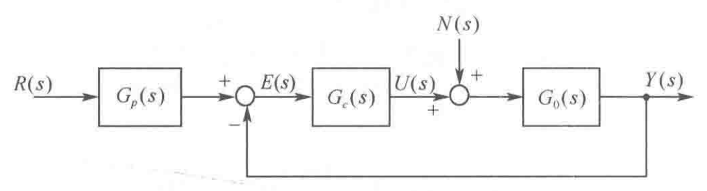

> Image description: This image shows a control system block diagram labeled as "图 10－21－2 题 10－21 的准确最优解." The signal flow begins with an input variable $R(s)$ entering a block labeled $G_p(s)$. The output of this block enters a summing junction where it is compared with a feedback loop from the final output $Y(s)$, resulting in an error signal $E(s)$. The signal $E(s)$ then passes through a controller block $G_c(s)$, producing an output $U(s)$. This signal $U(s)$ enters a second summing junction, where it is added to an external disturbance or noise input $N(s)$. The combined signal then flows into the plant block $G_0(s)$, which produces the final system output $Y(s)$. A feedback path connects $Y(s)$ back to the first summing junction. Arrows indicate a unidirectional flow from left to right, with one return loop, representing a standard closed-loop control architecture.
图 10－13 带有期望输人 $R(s)$ 和扰动输入 $N(s)$ 的反馈控制系统结构图

（1）当 $G_{c}(s)=1$ 及 $G_{p}(s)=1$ 时的系统性能分析。由于系统开环传递函数

$$
G_{0}(s)=\frac{60}{(s+2)(s+3)}=\frac{10}{(0.5 s+1)(0.33 s+1)}
$$

系统为 0 型系统，静态位置误差系数

$$
K_{p}=K=10
$$

在单位阶跃输人作用下，系统的稳态误差

$$
e_{s s}(\infty)=\frac{1}{1+K_{p}}=9.1 \%
$$

闭环传递函数

可得

$$
\begin{aligned}
& \Phi_{1}(s)=\frac{60}{s^{2}+5 s+66}=\frac{60}{s^{2}+2 \zeta \omega_{n} s+\omega_{n}^{2}} \\
& \omega_{n}=\sqrt{66}=8.124, \quad \zeta=\frac{5}{2 \omega_{n}}=0.308
\end{aligned}
$$

故系统动态性能可估算为

$$
\begin{aligned}
& \sigma \%=100 \mathrm{e}^{-\pi \zeta / \sqrt{1-\zeta^{2}}} \%=36.2 \% \\
& t_{s}=\frac{4.4}{\zeta \omega_{n}}=1.76 \mathrm{~s}(\Delta=2 \%)
\end{aligned}
$$

（2）最优 PID 控制器设计。令 $G_{p}(s)=1$ ，由于

$$
G_{c}(s)=\frac{K_{3} s^{2}+K_{1} s+K_{2}}{s}
$$

故闭环传递函数为


<!-- source_pdf_page: 379 -->
$$
\Phi_{2}(s)=\frac{G_{c}(s) G_{0}(s)}{1+G_{c}(s) G_{0}(s)}=\frac{60\left(K_{3} s^{2}+K_{1} s+K_{2}\right)}{s^{3}+\left(5+60 K_{3}\right) s^{2}+\left(6+60 K_{1}\right) s+60 K_{2}}
$$

由教材中表 10－4 知，使 ITAE 性能最优的闭环特征方程为

$$
s^{3}+1.75 \omega_{n} s^{2}+2.15 \omega_{n}^{2} s+\omega_{n}^{3}=0
$$

由于要求

$$
t_{s}=\frac{4.4}{\zeta \omega_{n}} \leqslant 0.8
$$

故可初选 $\omega_{n}=10$ ，则最优闭环特征方程为

$$
\begin{gathered}
s^{3}+17.5 s^{2}+215 s+1000=0 \\
5+60 K_{3}=17.5 \\
6+60 K_{1}=215 \\
60 K_{2}=1000
\end{gathered}
$$

解出 $K_{1}=3.48, K_{2}=16.67, K_{3}=0.21$ 。相应得

$$
\Phi_{2}(s)=\frac{12.6\left(s^{2}+16.57 s+79.38\right)}{s^{3}+17.5 s^{2}+215 s+1000}
$$

PID 控制器为

$$
G_{c}(s)=3.48+\frac{16.67}{s}+0.21 s
$$

（3）前置滤波器设计
令

$$
G_{p}(s)=\frac{79.38}{s^{2}+16.57 s+79.38}
$$

则最优闭环传递函数

$$
\Phi(s)=G_{p}(s) \Phi_{2}(s)=\frac{1000}{s^{3}+17.5 s^{2}+215 s+1000}
$$

应用 MATLAB 软件包，可得系统在不同情况下的性能指标，如下表所示。

| 控制器 <br> 系统性能 | $G_{c}(s)=1$ | PID 与 $G_{p}(s)=1$ | PID 与 $G_{p}(s)$ |
| :--- | :--- | :--- | :--- |
| $\sigma \%$ | 36．2\％ | 30．5\％ | 1．97\％ |
| $t_{s}(\Delta=2 \%)$ | 1.8 s | 0.63 s | 0.75 s |
| $e_{s s}(\infty)$ | 9．1\％ | 0 | 0 |
| $\|n(t) / y(t)\|{ }_{\text {max }}$ | 100\％ | 19．2\％ | 24．5\％ |

MATLAB 程序 ：exe1022．m

$$
\begin{aligned}
& \operatorname{GO}=\operatorname{tf}(60,[1,5,6]) ; \\
& \operatorname{GC}=\operatorname{tf}([0.21,3.48,16.67],[0,1,0]) ; \\
& \operatorname{sys1}=\operatorname{tf}(60,[1,5,66]) ; \quad \text { \%建立 } G_{c}(s)=1 \text { 时的闭环传递函数 } \\
& \operatorname{sysn1}=\operatorname{feedback}(G 0,1) ; \quad \text { \%建立 } G_{c}(s)=1 \text { 时扰动系统传递函数 } \\
& \operatorname{sys2}=\operatorname{tf}([12.6,12.6 * 16.57,12.6 * 79.38],[1,17.5,215,1000]) ; \% \text { 建立 PID 控制的闭环传递函数 } \\
& \operatorname{sysn2}=G 0 /(1+G 0 * G c) ; \quad \text { \%建立 PID 控制的扰动系统传递函数 }
\end{aligned}
$$


<!-- source_pdf_page: 380 -->
```
sys3 = tf(1000,[1,17.5,215,1000]);
建立 PID+Gp(s)控制的闭环传递函数
sysn3 = G0/(1 + Gc * G0);
% 建立 PID+Gp(s)控制的扰动系统传递函数
figure(1)
subplot(1,2,1);
step(sys1);
% 绘制 }\mp@subsup{\textrm{G}}{\textrm{C}}{}(\textrm{s})=1\mathrm{ 时的单位阶跃响应
grid;
subplot(1,2,2);
step(sysn1);
% 绘制 }\mp@subsup{G}{c}{}(s)=1\mathrm{ 时的单位阶跃扰动响应
grid;
figure(2)
subplot(1,2,1);
step(sys2);
axis([0,1,0,1.4]);
grid;
subplot(1,2,2);
step(sysn2);
axis([0,1.2,-0.1,0.3]);
grid;
figure(3)
subplot(1,2,1);
step(sys3);
axis([0,1,0,1.4]);
grid;
subplot(1,2,2);
step(sysn3);
axis([0,1.2,-0.1,0.3]);
grid;
```

单位阶跃响应及单位阶跃扰动响应如图 10－22－1～图 10－22－3 所示。

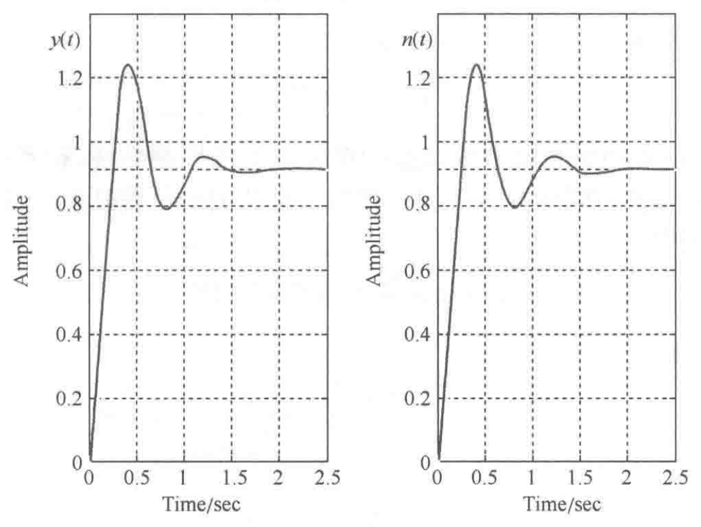

> Image description: The image shows two side-by-side time-domain plots illustrating the step response of a system. Both graphs feature a vertical axis labeled "Amplitude" ranging from 0 to 1.2 and a horizontal axis labeled "Time/sec" ranging from 0 to 2.5. The left plot is labeled $y(t)$ and the right plot is labeled $n(t)$. Both curves exhibit an underdamped response: starting at the origin $(0,0)$, they rise sharply to a peak amplitude of approximately 1.23 at around 0.4 seconds, followed by decaying oscillations that settle toward a steady-state value of approximately 0.9. From an engineering perspective, these plots represent the unit step response and unit step disturbance response of a control system. The visible characteristics—such as overshoot, settling time, and steady-state error—are used to analyze the stability and performance of the system's dynamic behavior.
图 10－22－1 原系统时间响应（MATLAB）


<!-- source_pdf_page: 381 -->
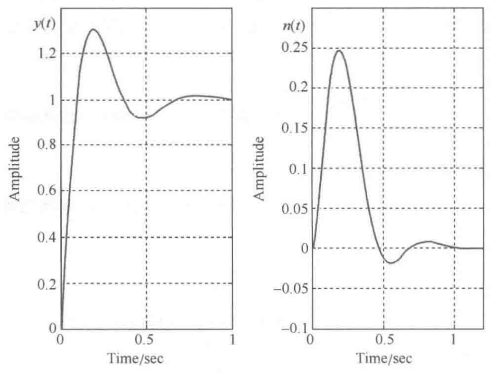

> Image description: The image contains two side-by-side time-domain plots illustrating the response of a PID control system, as indicated by the caption "图 10－22－2 PID 控制系统时间响应（MATLAB）". Both graphs feature a horizontal x-axis labeled "Time/sec" ranging from 0 to 1 and a vertical y-axis labeled "Amplitude." The left plot shows the output variable $y(t)$. The signal rises sharply from 0, overshoots the steady-state value of 1.0 reaching approximately 1.25 at around 0.2 seconds, and then oscillates slightly before stabilizing at 1.0. The right plot shows the error or noise signal $n(t)$. It starts at 0, peaks at approximately 0.24 near 0.2 seconds, drops below zero to about -0.02 around 0.5 seconds, and eventually converges toward 0 as time increases. Together, these plots demonstrate the transient response and stability of a controlled system.
图 10－22－2 PID 控制系统时间响应（MATLAB）

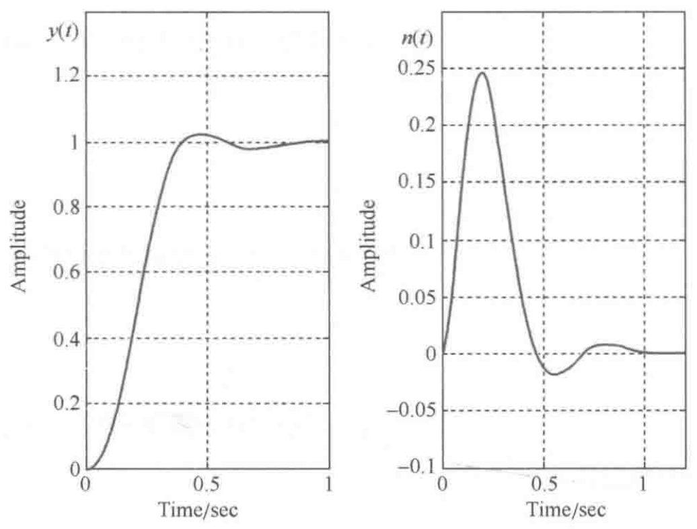

> Image description: The image contains two side-by-side plots showing the time response of a PID control system generated in MATLAB, as indicated by the caption "图 10－22－2 PID 控制系统时间响应（MATLAB）". The left plot displays the output variable $y(t)$ on the vertical axis (Amplitude) against Time in seconds on the horizontal axis. The curve shows a typical underdamped step response, starting at 0 and rising to overshoot slightly above an amplitude of 1 before stabilizing at a steady-state value of 1. The right plot displays the error signal $n(t)$ on the vertical axis (Amplitude) against Time in seconds on the horizontal axis. The curve starts at 0, peaks at approximately 0.24 around 0.25 seconds, and then oscillates slightly before converging to zero as time reaches 1 second. Both plots use dashed grid lines for measurement.
图10－22－3 PID＋$G_{p}(s)$ 控制系统时间响应（MATLAB）

10－23 设被控对象为

$$
G_{0}(s)=\frac{10}{s^{2}}
$$

试设计一个带有 PID 控制器和前置滤波器的单位负反馈控制系统，使系统的阶跃响应具有最优的 ITAE 指标，峰值时间为 0.8 s 左右，并给出系统的单位阶跃响应曲线。

解 取 PID 控制器

$$
G_{c}(s)=\frac{K_{3} s^{2}+K_{1} s+K_{2}}{s}
$$

则系统开环传递函数为

$$
G_{c}(s) G_{0}(s)=\frac{10\left(K_{3} s^{2}+K_{1} s+K_{2}\right)}{s^{3}}
$$

相应的闭环传递函数

$$
\Phi_{1}(s)=\frac{10\left(K_{3} s^{2}+K_{1} s+K_{2}\right)}{s^{3}+10 K_{3} s^{2}+10 K_{1} s+10 K_{2}}
$$


<!-- source_pdf_page: 382 -->
应用 ITAE 方法，希望闭环特征多项式为

$$
D^{*}(s)=s^{3}+1.75 \omega_{n} s^{2}+2.15 \omega_{n}^{2} s+\omega_{n}^{3}
$$

由设计要求 $t_{p}=0.8$ ，根据图 10－12 所示的 ITAE 阶跃响应曲线可知，当 $n=3$ 时，$\omega_{n} t_{p}=$ 4.3 。于是

$$
\omega_{n}=\frac{4.3}{t_{p}}=5.38
$$

因而希望多项式为

$$
D^{*}(s)=s^{3}+9.42 s^{2}+62.23 s+155.72
$$

令实际特征多项式与希望特征多项式的对应项系数相等，解出

$$
K_{1}=6.22, \quad K_{2}=15.57, \quad K_{3}=0.94
$$

选择前置滤波器

$$
G_{p}(s)=\frac{15.57}{0.94 s^{2}+6.22 s+15.57}
$$

则具有 ITAE 最优指标的闭环系统为

$$
\begin{aligned}
\Phi(s) & =G_{p}(s) \Phi_{1}(s) \\
& =\frac{155.7}{s^{3}+9.425 s^{2}+62.23 s+155.72}
\end{aligned}
$$

系统的单位阶跃响应如图10－23－1所示，测得

$$
\sigma \%=2 \%, \quad t_{p}=0.855 \mathrm{~s}, \quad t_{s}=0.668 \mathrm{~s}(\Delta=2 \%)
$$

MATLAB 程序：exe1023．m
sys $=\operatorname{tf}(155.7,[1,9.425,62.23$ ，
155．72］）；\％建立闭环传递函数
step（sys）；
axis（［0，2，0，1．2］）；
grid；
10－24 在太阳黑子活动的高峰期，NASA 会把 $\gamma$ 射线图像设备 （GRID）系于高空飞行的气球上，以从事长时间的观测实验。GRID 设备能拍摄更准确的 X 射线的强度图，也可以拍摄 $\gamma$ 射线强度图。这些信息有利于在下一次太阳活动高峰期，对太阳中的

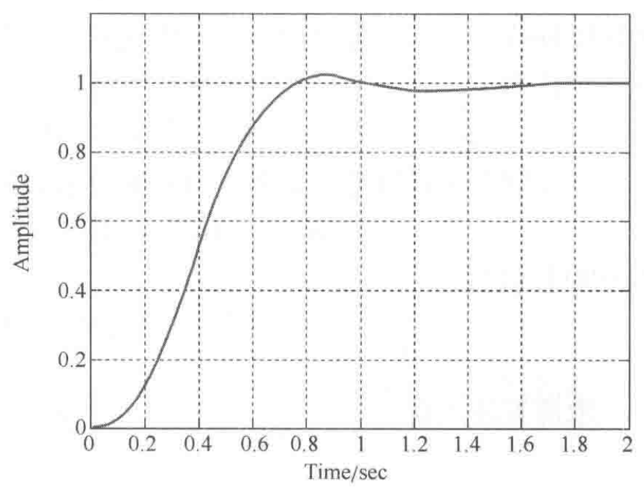

> Image description: The image displays a MATLAB-generated plot showing the unit step response of an ITAE (Integral of Time-weighted Absolute Error) optimal system. The graph features two axes: the horizontal x-axis is labeled "Time/sec" and ranges from 0 to 2 seconds, while the vertical y-axis is labeled "Amplitude" and ranges from 0 to slightly above 1. The plot depicts a single continuous curve starting at the origin (0,0). The amplitude rises smoothly, crossing the 0.8 mark around 0.6 seconds and reaching a peak overshoot of approximately 1.05 at roughly 0.9 seconds. Following this peak, the signal exhibits a slight undershoot before stabilizing asymptotically at a steady-state value of 1.0 as time approaches 2 seconds. The grid lines facilitate precise reading of these temporal and amplitude values, illustrating the system's transient response characteristics such as rise time and settling time.
图 10－23－1 ITAE 最优系统的单位阶跃响应（MATLAB）

解 令前置滤波器 $G_{p}(s)=1$ ，取 PID 控制器

$$
G_{c}(s)=\frac{K_{3} s^{2}+K_{1} s+K_{2}}{s}
$$

则开环传递函数


<!-- source_pdf_page: 383 -->
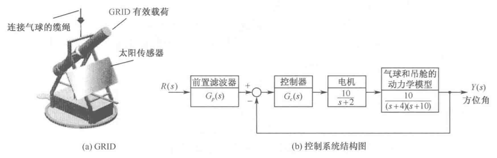

> Image description: Figure 10-22 illustrates the pointing control system of a GRID device. The image is divided into two parts: (a) a physical rendering of the GRID equipment and (b) its corresponding control system block diagram. Part (a) shows the hardware, with labels identifying the "GRID effective payload" (GRID 有效载荷), "solar sensor" (太阳传感器), and "cable connecting to the balloon" (连接气球的缆绳). Part (b) presents a closed-loop feedback control system. The input signal $R(s)$ enters a "pre-filter" block $G_p(s)$. This output is summed with a feedback loop before entering the "controller" block $G_c(s)$. The signal then passes through a "motor" block represented by the transfer function $\frac{10}{s+2}$, and finally through a "dynamic model of the balloon and gondola" block represented by $\frac{10}{(s+4)(s+10)}$. The final output $Y(s)$ is the "azimuth angle" (方位角). Arrows indicate the unidirectional flow of signals from input to output.
图 10－22 GRID 设备的指向控制系统

$$
G_{c}(s) G_{0}(s)=\frac{100\left(K_{3} s^{2}+K_{1} s+K_{2}\right)}{s(s+2)(s+4)(s+10)}
$$

相应的闭环传递函数

$$
\Phi_{1}(s)=\frac{G_{i}(s) G_{0}(s)}{1+G_{c}(s) G_{0}(s)}=\frac{100\left(K_{3} s^{2}+K_{1} s+K_{2}\right)}{s^{4}+16 s^{3}+\left(68+100 K_{3}\right) s^{2}+\left(80+100 K_{1}\right) s+100 K_{2}}
$$

闭环特征多项式

$$
D(s)=s^{4}+16 s^{3}+\left(68+100 K_{3}\right) s^{2}+\left(80+100 K_{1}\right) s+100 K_{2}
$$

应用 ITAE 方法，由表 10－4 知，希望闭环特征多项式为

$$
D^{*}(s)=s^{4}+2.1 \omega_{n} s^{3}+3.4 \omega_{n}^{2} s^{2}+2.7 \omega_{n}^{3} s+\omega_{n}^{4}
$$

对比闭环特征多项式与希望特征多项式知，应有 $2.1 \omega_{n}=16$ ，求出 $\omega_{n}=7.62$ 。于是，希望特征多项式为

$$
D^{*}(s)=s^{4}+16 s^{3}+197.4 s^{2}+1194.6 s+3371
$$

令实际多项式与希望多项式的对应项系数相等，解出

$$
K_{1}=11.15, \quad K_{2}=33.71, \quad K_{3}=1.29
$$

得 PID 控制器

$$
G_{c}(s)=\frac{1.29\left(s^{2}+8.64 s+26.13\right)}{s}
$$

取前置滤波器

$$
G_{p}(s)=\frac{26.13}{s^{2}+8.64 s+26.13}
$$

于是，具有 ITAE 性能的闭环系统传递函数

$$
\Phi(s)=G_{p}(s) \Phi_{1}(s)=\frac{3370.8}{s^{4}+16 s^{3}+197.4 s^{2}+1194.6 s+3371}
$$

系统的单位阶跃响应曲线如图 10－24－1 所示。测得系统的性能为

$$
e_{s s}(\infty)=0, \quad \sigma \%=5 \%, \quad t_{s}=2 \mathrm{~s}
$$

MATLAB程序：exe1024．m

```
sys = tf (3370.8,[1,16,197.4,1194.6,3371]); %建立闭环传递函数
step(sys);
axis([0,1.8,0,1.2]);
grid;
```


<!-- source_pdf_page: 384 -->
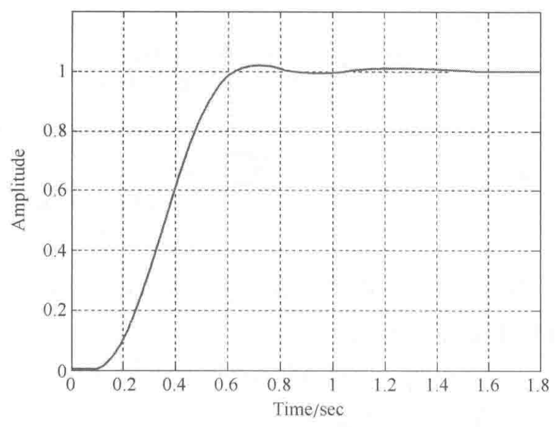

> Image description: The image shows a MATLAB-generated plot illustrating the time response of a "GRID pointing control system," as indicated by the caption (图 10－24－1). The graph features a Cartesian coordinate system with two axes: the vertical y-axis is labeled "Amplitude" and ranges from 0 to over 1, while the horizontal x-axis is labeled "Time/sec" and spans from 0 to 1.8 seconds. The plot displays a single continuous curve representing a step response. The signal starts at zero, remains flat until approximately 0.1 seconds, and then rises steeply in an S-curve shape. It reaches its first peak slightly above the value of 1 around 0.7 seconds, followed by minor damped oscillations before stabilizing asymptotically at an amplitude of 1. This behavior is characteristic of a second-order underdamped control system reaching a steady state. The plot includes a dashed grid for precise value reading.
图 10－24－1 GRID 指向控制系统时间响应（MATLAB）

10－25 将控制原理应用于神经系统的研究已经有很长的历史，许多研究者描述了肌肉调节现象，指出这种现象源于肌腱的反馈活动。用来分析肌肉调节运动的理论基础是单输人单输出系统的控制理论。有人建议把肌肉的强度调节（力和长度的综合表现）现象等效为电机控制的试验结果。

图 10－23 的模型描述了人类站立时的平衡调节机制。对于丧失自主站立能力的下身残疾的伤残人士，需要安装图 10－23 所示的站立和腿关节人工控制系统。设计要求：

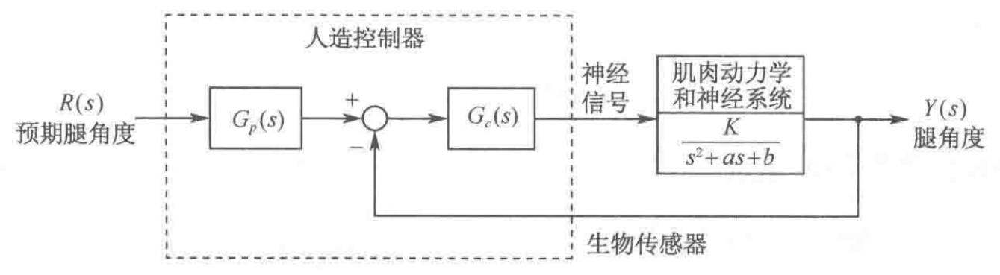

> Image description: This figure presents a block diagram of an artificial control system for standing balance in individuals with lower-limb disabilities. The system is structured as a closed-loop feedback control circuit. The input variable $R(s)$, representing the "expected leg angle" (预期腿角度), enters the "artificial controller" (人工控制器) block, which consists of a forward path containing blocks $G_p(s)$ and $G_c(s)$. The output of $G_p(s)$ is compared at a summation point with a feedback signal. This error signal then passes through $G_c(s)$, producing a "nerve signal" (神经信号). This signal enters the plant block, labeled as the "muscle dynamics and nervous system" (肌肉动力学和神经系统), defined by the transfer function $\frac{K}{s^2 + as + b}$. The final output is $Y(s)$, the "leg angle" (腿角度). A feedback loop, labeled as a "biological sensor" (生物传感器), returns the leg angle to the summation point to maintain balance.
图 10－23 站立和腿关节的人工控制系统结构图

（1）若肌肉－神经系统的参数标称值为 $K=10, a=12, b=100$ ，试用 ITAE 优化法设计 $\operatorname{PI}$ 控制器 $G_{c}(s)$ 和前置滤波器 $G_{p}(s)$ ，使人工控制系统阶跃响应的 $\sigma \%<10 \%, e_{s s}(\infty)<5 \%$ ， $t_{s}<2 \mathrm{~s}(\Delta=2 \%)$ ；
（2）当人疲乏时，肌肉－神经系统的参数变化为 $K=15, a=8, b=144$ ，试沿用在（1）中得到的 PI 控制器和前置滤波器，检验系统的鲁棒性能，绘出系统参数变化前后的单位阶跃响应曲线。

解 本题按如下步骤求解：
（1）ITAE 优化设计。已知被控对象标称传递函数

$$
G_{0}(s)=\frac{K}{s^{2}+a s+b}=\frac{10}{s^{2}+12 s+100}
$$

选用 PI 控制器

$$
G_{c}(s)=\frac{K_{1} s+K_{2}}{s}
$$


<!-- source_pdf_page: 385 -->
因而开环传递函数

$$
G_{c}(s) G_{0}(s)=\frac{10\left(K_{1} s+K_{2}\right)}{s\left(s^{2}+12 s+100\right)}
$$

相应闭环传递函数

$$
\Phi_{1}(s)=\frac{10\left(K_{1} s+K_{2}\right)}{s^{3}+12 s^{2}+\left(100+10 K_{1}\right) s+10 K_{2}}
$$

实际特征多项式为

$$
D(s)=s^{3}+12 s^{2}+\left(100+10 K_{1}\right) s+10 K_{2}
$$

而希望特征多项式为 ITAE 的最优系数

$$
D^{*}(s)=s^{3}+1.75 \omega_{n} s^{2}+2.15 \omega_{n}^{2} s+\omega_{n}^{3}
$$

比较两特征多项式系数，可得

$$
\begin{gathered}
1.75 \omega_{n}=12 \\
2.15 \omega_{n}^{2}=100+10 K_{1} \\
\omega_{n}^{3}=10 K_{2}
\end{gathered}
$$

解出

$$
\omega_{n}=6.86, \quad K_{1}=0.12, \quad K_{2}=32.28
$$

因而

$$
\begin{aligned}
& G_{c}(s)=\frac{0.12(s+269)}{s} \\
& =\frac{1.2(s+269)}{s^{3}+12 s^{2}+101.2 s+322.8}
\end{aligned}
$$

选前置滤波器

$$
G_{p}(s)=\frac{269}{s+269}
$$

得具有 ITAE 性能的闭环系统

$$
\Phi(s)=G_{p}(s) \Phi_{1}(s)=\frac{322.8}{s^{3}+12 s^{2}+101.2 s+322.8}
$$

由图10－25－1知，系统性能为 $e_{s s}(\infty)=0, \sigma \%=2 \%, t_{p}=0.634 \mathrm{~s}, t_{s}=0.523 \mathrm{~s}(\Delta=2 \%)$ ，全部满足设计指标要求。
（2）系统鲁棒性检验。当肌肉－神经系统发生参数摄动，其传递函数变为 $G_{1}(s)= \frac{15}{s^{2}+8 s+144}$ 时，仍采用原有的控制器

$$
G_{c}(s)=\frac{0.12(s+269)}{s}
$$

和原前置滤波器

$$
G_{p}(s)=\frac{269}{s+269}
$$

则系统开环传递函数

$$
G_{c}(s) G_{1}(s)=\frac{1.8(s+269)}{s\left(s^{2}+8 s+144\right)}
$$

闭环传递函数

$$
\Phi_{1}(s)=\frac{1.8(s+269)}{s^{3}+8 s^{2}+145.8 s+484.2}
$$


<!-- source_pdf_page: 386 -->
$$
\Phi(s)=G_{p}(s) \Phi_{1}(s)=\frac{484.2}{s^{3}+8 s^{2}+145.8 s+484.2}
$$

显然，此时系统已不再是 ITAE 优化系统。

$$
\begin{aligned}
& \text { 当 } R(s)=\frac{1}{s} \text { 时,摄动系统输出 } \\
& \qquad \begin{aligned}
Y(s) & =\Phi(s) R(s)=\frac{484.2}{s(s+3.73)(s+2.14 \pm \mathrm{j} 11.19)} \\
& =\frac{1}{s}-\frac{1.016}{s+3.73}+\frac{0.016(s-232.5)}{(s+2.14)^{2}+11.19^{2}}
\end{aligned}
\end{aligned}
$$

系统的单位阶跃响应

$$
y(t)=1-1.016 \mathrm{e}^{-3.73 t}+0.336 \mathrm{e}^{-2.14 t} \sin \left(11.19 t+177.27^{\circ}\right)
$$

标称系统和非标称系统的单位阶跃响应曲线分别如图 10－25－1、图 10－25－2 所示。仿真表明：参数摄动后，系统的性能仍然满足设计指标要求，系统具有较好的鲁棒性，并可测得

$$
\sigma \%=1 \%, \quad t_{p}=0.935 \mathrm{~s}, \quad t_{s}=0.837 \mathrm{~s}(\Delta=2 \%)
$$

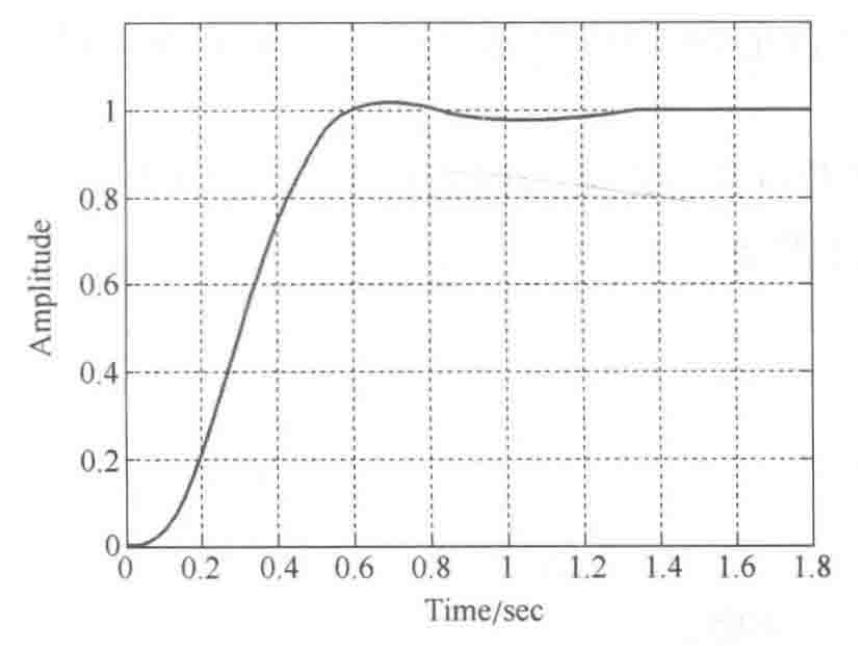

> Image description: The image shows a MATLAB-generated plot representing the unit step response of a nominal joint control system, as indicated by the caption "图 10－25－1 关节控制（标称）系统的单位阶跃响应（MATLAB）". The graph features two axes: the vertical y-axis is labeled "Amplitude" with values ranging from 0 to 1 in increments of 0.2, and the horizontal x-axis is labeled "Time/sec" with values ranging from 0 to 1.8 seconds. A solid black curve represents the system's response over time. The curve starts at (0,0), rises steeply, and reaches a peak amplitude slightly above 1.0 around 0.7 seconds. It then exhibits a slight oscillation before stabilizing and converging asymptotically to a steady-state value of 1.0 after approximately 1.4 seconds. A faint dashed horizontal line is also visible at the amplitude level of 1.0, serving as the reference for the unit step input.
图 10－25－1 关节控制（标称）系统的单位阶跃响应（MATLAB）

```
MATLAB 程序:exe1025.m
```

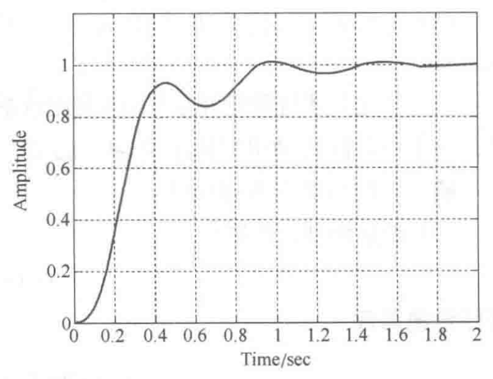

> Image description: The image shows a plot of the unit step response for a joint control perturbation system (non-nominal), generated via MATLAB, as indicated by the caption "图 10－25－2 关节控制摄动（非标称）系统的单位阶跃响应（MATLAB）". The graph features two axes: the vertical y-axis is labeled "Amplitude" and ranges from 0 to slightly above 1, while the horizontal x-axis is labeled "Time/sec" and ranges from 0 to 2 seconds. The plot displays a single continuous curve starting at the origin (0,0). The response exhibits an underdamped behavior characterized by oscillations; it first peaks near 0.4 seconds at an amplitude of approximately 0.9, dips slightly around 0.6 seconds, and reaches a second peak just above 1.0 at approximately 1 second. The signal eventually stabilizes and converges toward a steady-state value of 1 as time approaches 2 seconds.
图 10－25－2 关节控制摄动（非标称）系统的单位阶跃响应（MATLAB）

10－26 空间机器人的机械臂及其控制框图如图 10－24 所示。已知电机与机械臂构成的手臂传递函数为

$$
G_{0}(s)=\frac{10}{s(s+10)}
$$


<!-- source_pdf_page: 387 -->
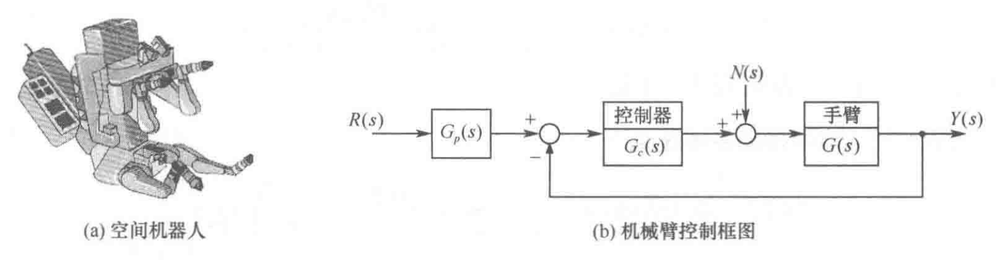

> Image description: This figure consists of two parts illustrating a robotic arm control system for a space robot. Part (a) shows a conceptual drawing of a "space robot" (空间机器人). Part (b) is a block diagram titled "Mechanical Arm Control Block Diagram" (机械臂控制框图). The control loop begins with an input signal $R(s)$ passing through a block $G_p(s)$. The output enters a summing junction where it is compared with a feedback signal from the system output $Y(s)$, creating an error signal. This signal passes through a "Controller" (控制器) block labeled $G_c(s)$. A second summing junction adds an external disturbance or noise signal $N(s)$ before the combined signal enters the "Arm" (手臂) plant block, labeled $G(s)$. The final output is $Y(s)$, which is fed back to the initial summing junction. This represents a standard closed-loop feedback control system designed to manage the robotic arm's positioning despite external disturbances.
图 10－24 空间机器人的机械臂控制系统

设计要求：
（1）当 $G_{c}(s)=K$ 时，确定 $K$ 的合适取值，使系统阶跃响应的超调量 $\sigma \%=4.5 \%$ ；
（2）采用 ITAE 优化方法，并选取 $\omega_{n}=10$ ，设计合适的 PD 控制器 $G_{c}(s)$ ，确定对应的前置滤波器 $G_{p}(s)$ ；
（3）采用 ITAE 优化方法，设计合适的 PI 控制器 $G_{c}(s)$ 和相应的前置滤波器 $G_{p}(s)$ ；
（4）采用 ITAE 优化方法和 $\omega_{n}=10$ ，设计合适的 PID 控制器 $G_{c}(s)$ 和前置滤波器 $G_{p}(s)$ ；
（5）对比上述每种设计效果，列表比较系统对单位阶跃输入响应的 $\sigma \%, t_{p}, t_{s}(\Delta=2 \%)$以及由单位阶跃扰动引起的输出 $y(t)$ 的最大值和稳态值。

解 本题按如下步骤设计：
（1）增益控制。控制器

$$
G_{c}(s)=K
$$

开环传递函数

$$
G_{c}(s) G_{0}(s)=\frac{10 K}{s(s+10)}
$$

闭环传递函数

$$
\Phi(s)=\frac{10 K}{s^{2}+10 s+10 K}=\frac{\omega_{n}^{2}}{s^{2}+2 \zeta \omega_{n} s+\omega_{n}^{2}}
$$

可得

$$
\omega_{n}=\sqrt{10 K}, \quad \zeta=\frac{10}{2 \sqrt{10 K}}
$$

由于

$$
\sigma \%=100 \mathrm{e}^{-\pi \zeta / \sqrt{1-\zeta^{2}}} \%
$$

所以

$$
\zeta=\frac{1}{\sqrt{1+\left(\frac{\pi}{\ln \sigma}\right)^{2}}}
$$

根据对超调量要求 $\sigma \%=4.5 \%$ ，即 $\sigma=0.045$ ，可以算得 $\zeta=0.7$ ，从而得

$$
\omega_{n}=\frac{10}{2 \zeta}=7.14, \quad K=\frac{\omega_{n}^{2}}{10}=5.1
$$

估算出

$$
t_{p}=\frac{\pi}{\omega_{n} \sqrt{1-\zeta^{2}}}=0.62 \mathrm{~s}, \quad t_{s}=\frac{4.4}{\zeta \omega_{n}}=0.88 \mathrm{~s}
$$

系统在扰动作用下的闭环传递函数


<!-- source_pdf_page: 388 -->
$$
\Phi_{n}(s)=\frac{Y(s)}{N(s)}=\frac{G_{0}(s)}{1+K G_{0}(s)}=\frac{10}{s^{2}+10 s+51}
$$

（2）PD 优化控制。控制器

$$
G_{c}(s)=K_{1}+K_{3} s
$$

开环传递函数

$$
G_{c}(s) G_{0}(s)=\frac{10\left(K_{1}+K_{3} s\right)}{s(s+10)}
$$

闭环传递函数

$$
\Phi_{1}(s)=\frac{G_{c}(s) G_{0}(s)}{1+G_{c}(s) G_{0}(s)}=\frac{10\left(K_{1}+K_{3} s\right)}{s^{2}+10\left(1+K_{3}\right) s+10 K_{1}}
$$

系统特征多项式为

$$
D(s)=s^{2}+10\left(1+K_{3}\right) s+10 K_{1}
$$

令其与 ITAE 的优化系数多项式

$$
D^{*}(s)=s^{2}+1.4 \omega_{n} s+\omega_{n}^{2}
$$

相等，其中 $\omega_{n}=10$ 为要求值，解出 $K_{1}=10, K_{3}=0.4$ 。于是

$$
G_{c}(s)=10+0.4 s, \quad \Phi_{1}(s)=\frac{4(s+25)}{s^{2}+14 s+100}
$$

为了使闭环系统成为 ITAE 优化系统，选择前置滤波器

$$
G_{p}(s)=\frac{25}{s+25}
$$

则闭环传递函数为

$$
\Phi(s)=G_{p}(s) \Phi_{1}(s)=\frac{100}{s^{2}+14 s+100}
$$

系统在扰动作用下的闭环传递函数

$$
\Phi_{n}(s)=\frac{G_{0}(s)}{1+G_{c}(s) G_{0}(s)}=\frac{10}{s^{2}+14 s+100}
$$

（3）PI 优化控制。控制器

$$
G_{c}(s)=K_{1}+\frac{K_{2}}{s}
$$

开环传递函数

$$
G_{c}(s) G_{0}(s)=\frac{10\left(K_{1} s+K_{2}\right)}{s^{2}(s+10)}
$$

闭环传递函数

$$
\Phi_{1}(s)=\frac{10\left(K_{1} s+K_{2}\right)}{s^{3}+10 s^{2}+10 K_{1} s+10 K_{2}}
$$

系统特征多项式为

$$
D(s)=s^{3}+10 s^{2}+10 K_{1} s+10 K_{2}
$$

而希望特征多项式为 ITAE 的优化系数多项式

$$
D^{*}(s)=s^{3}+1.75 \omega_{n} s^{2}+2.15 \omega_{n}^{2} s+\omega_{n}^{3}
$$


<!-- source_pdf_page: 389 -->
比较两个特征多项式，可得

$$
\begin{aligned}
1.75 \omega_{n} & =10 \\
2.15 \omega_{n}^{2} & =10 K_{1} \\
\omega_{n}^{3} & =10 K_{2}
\end{aligned}
$$

解出

$$
\omega_{n}=5.71, \quad K_{1}=7.01, \quad K_{2}=18.62
$$

于是

$$
\begin{gathered}
G_{c}(s)=7.01+\frac{18.62}{s} \\
\Phi_{1}(s)=\frac{70.1(s+2.656)}{s^{3}+10 s^{2}+70.1 s+186.2}
\end{gathered}
$$

选择前置滤波器

$$
G_{p}(s)=\frac{2.656}{s+2.656}
$$

得具有 ITAE 优化性能的闭环系统

$$
\Phi(s)=G_{p}(s) \Phi_{1}(s)=\frac{186.2}{s^{3}+10 s^{2}+70.1 s+186.2}
$$

系统在扰动作用下的闭环传递函数

$$
\Phi_{n}(s)=\frac{G_{0}(s)}{1+G_{c}(s) G_{0}(s)}=\frac{10 s}{s^{3}+10 s^{2}+70.1 s+186.2}
$$

（4）PID 优化控制。控制器

$$
G_{c}(s)=\frac{K_{3} s^{2}+K_{1} s+K_{2}}{s}
$$

${ }^{\prime}$ 开环传递函数

$$
G_{c}(s) G_{0}(s)=\frac{10\left(K_{3} s^{2}+K_{1} s+K_{2}\right)}{s^{2}(s+10)}
$$

闭环传递函数

$$
\Phi_{1}(s)=\frac{10\left(K_{3} s^{2}+K_{1} s+K_{2}\right)}{s^{3}+10\left(1+K_{3}\right) s^{2}+10 K_{1} s+10 K_{2}}
$$

系统特征多项式为

$$
D(s)=s^{3}+10\left(1+K_{3}\right) s^{2}+10 K_{1} s+10 K_{2}
$$

而希望特征多项式为 ITAE 的优化系数多项式

$$
D^{*}(s)=s^{3}+1.75 \omega_{n} s^{2}+2.15 \omega_{n}^{2} s+\omega_{n}^{3}
$$

因要求 $\omega_{n}=10$ ，故希望特征多项式为

$$
D^{*}(s)=s^{3}+17.5 s^{2}+215 s+1000
$$

令系统特征多项式与希望特征多项式对应项系数相等，有

$$
\begin{aligned}
10\left(1+K_{3}\right) & =17.5 \\
10 K_{1} & =215 \\
10 K_{2} & =1000
\end{aligned}
$$

解出

$$
K_{1}=21.5, \quad K_{2}=100, \quad K_{3}=0.75
$$


<!-- source_pdf_page: 390 -->
于是

$$
\begin{gathered}
G_{c}(s)=21.5+\frac{100}{s}+0.75 s \\
\Phi_{1}(s)=\frac{7.5\left(s^{2}+28.67 s+133.33\right)}{s^{3}+17.5 s^{2}+215 s+1000}
\end{gathered}
$$

选择前置滤波器

$$
G_{p}(s)=\frac{133.33}{s^{2}+28.67 s+133.33}
$$

得到具有 ITAE 优化性能的闭环系统

$$
\Phi(s)=G_{p}(s) \Phi_{1}(s)=\frac{1000}{s^{3}+17.5 s^{2}+215 s+1000}
$$

系统在扰动作用下的闭环传递函数

$$
\Phi_{n}(s)=\frac{G_{0}(s)}{1+G_{c}(s) G_{0}(s)}=\frac{10 s}{s^{3}+17.5 s^{2}+215 s+1000}
$$

（5）设计效果比较。对于上述各设计方案，系统在单位阶跃输入或单位阶跃扰动作用下的输出，分别为

或

$$
\begin{gathered}
Y(s)=\Phi(s) R(s) \\
Y(s)=\Phi_{n}(s) N(s)
\end{gathered}
$$

其中，$R(s)=\frac{1}{s}, N(s)=\frac{1}{s}$ 。然后对 $Y(s)$ 进行拉氏变换，得到相应的 $y(t)$ 。
1）增益控制。当 $r(t)=1(t)$ 作用时

$$
y(t)=1-\frac{1}{\sqrt{1-\zeta^{2}}} \mathrm{e}^{-\xi_{n} t} \sin \left(\omega_{n} \sqrt{1-\zeta^{2}} t+\arccos \zeta\right)=1-1.4 \mathrm{e}^{-5 t} \sin \left(5.1 t+45.6^{\circ}\right)
$$

当 $n(t)=1(t)$ 作用时

$$
\begin{gathered}
Y(s)=\Phi_{n}(s) N(s)=\frac{10}{s\left(s^{2}+10 s+51\right)}=\frac{0.196}{s}-\frac{0.196(s+10)}{(s+5)^{2}+5.1^{2}} \\
y(t)=0.196-0.274 e^{-5 t} \sin \left(5.1 t+45.6^{\circ}\right)
\end{gathered}
$$

2） PD 控制。闭环特征方程

$$
D(s)=s^{2}+14 s+100=s^{2}+2 \zeta \omega_{n} s+\omega_{n}^{2}=0
$$

可知：$\omega_{n}=10, \zeta=0.7$ 。当 $r(t)=1(t)$ 作用时

$$
y(t)=1-\frac{1}{\sqrt{1-\zeta^{2}}} \mathrm{e}^{-\zeta \omega_{n} t} \sin \left(\omega_{n} \sqrt{1-\zeta^{2}} t+\arccos \zeta\right)=1-1.4 \mathrm{e}^{-7 t} \sin \left(7.14 t+45.6^{\circ}\right)
$$

当 $n(t)=1(t)$ 作用时

$$
\begin{gathered}
Y(s)=\Phi_{n}(s) N(s)=\frac{10}{s\left(s^{2}+14 s+100\right)}=\frac{0.1}{s}-\frac{0.1(s+14)}{(s+7)^{2}+7.14^{2}} \\
y(t)=0.1-0.14 \mathrm{e}^{-7 t} \sin \left(7.14 t+45.7^{\circ}\right)
\end{gathered}
$$

3）PI 控制。当 $r(t)=1(t)$ 作用时

$$
\begin{aligned}
Y(s) & =\frac{186.2}{s\left(s^{3}+10 s^{2}+70.1 s+186.2\right)}=\frac{186.2}{s(s+4.04)\left(s^{2}+5.96 s+46.09\right)} \\
& =\frac{1}{s}-\frac{1.2}{s+4.04}+\frac{0.2(s-18.35)}{(s+2.98)^{2}+6.1^{2}}
\end{aligned}
$$


<!-- source_pdf_page: 391 -->
可得

$$
y(t)=1-1.2 \mathrm{e}^{-4.04 t}+0.727 \mathrm{e}^{-2.98 t} \sin \left(6.1 t+164^{\circ}\right)
$$

当 $n(t)=1(t)$ 作用时

$$
\begin{aligned}
Y(s) & =\frac{10}{s^{3}+10 s^{2}+70.1 s+186.2}=\frac{10}{(s+4.04)\left(s^{2}+5.96 s+46.09\right)} \\
& =\frac{0.26}{s+4.04}+\frac{0.26(s+1.88)}{(s+2.98)^{2}+6.1^{2}}
\end{aligned}
$$

可得

$$
y(t)=0.26 \mathrm{e}^{-4.04 t}-0.264 \mathrm{e}^{-2.98 t} \sin \left(6.1 t+100.2^{\circ}\right)
$$

4） PID 控制。当 $r(t)=1(t)$ 作用时

$$
\begin{aligned}
Y(s) & =\frac{1000}{s\left(s^{3}+17.5 s^{2}+215 s+1000\right)}=\frac{1000}{s(s+7.08)\left(s^{2}+10.42 s+141.24\right)} \\
& =\frac{1}{s}-\frac{1.2}{s+7.08}+\frac{0.2(s-32.15)}{(s+5.21)^{2}+10.68^{2}}
\end{aligned}
$$

可得

$$
y(t)=1-1.2 \mathrm{e}^{-7.08 t}+0.728 \mathrm{e}^{-5.21 t} \sin \left(10.68 t+164^{\circ}\right)
$$

当 $n(t)=1(t)$ 作用时

$$
\begin{aligned}
Y(s) & =\Phi_{n}(s) N(s)=\frac{10}{(s+7.08)\left(s^{2}+10.42 s+141.24\right)} \\
& =\frac{0.85}{s+7.08}-\frac{0.085(s+3.329)}{(s+5.21)^{2}+10.68^{2}}
\end{aligned}
$$

可得

$$
y(t)=0.085 \mathrm{e}^{-7.08 t}-0.086 \mathrm{e}^{-5.21 t} \sin \left(10.68 t+100^{\circ}\right)
$$

应用 MATLAB 软件包，可得各种情况下的时间响应曲线以及相应的性能指标，如下表所示。

| 控制器 | 单位阶跃输人时的系统的性能 |  |  |  | 单位阶跃扰动影响 |  |
| :--- | :--- | :--- | :--- | :--- | :--- | :--- |
| $G_{c}(s)$ | $e_{\mathrm{ss}}(\infty)$ | $\sigma \%$ | $t_{p}$ | $t_{s}(\Delta=2 \%)$ | max $\|y(t)\|$ | $y_{s w}(\infty)$ |
| K | 0 | 4．59\％ | 0.618 s | 0.837 s | 0.205 | 0.196 |
| PD | 0 | 4．6\％ | 0.442 s | 0.598 s | 0.105 | 0.10 |
| PI | 0 | 1．99\％ | 0.819 s | 1.32 s | 0.126 | 0.00 |
| PID | 0 | 1．97\％ | 0.468 s | 0.754 s | 0.041 | 0.00 |

（6）MATLAB仿真。
1）增益控制。控制器 $G_{c}(s)=5.1$ 。
（1）输人为单位阶跃响应情况。单位阶跃响应时对应的 MATLAB 程序（exe1026a． m）为

```
sys1 = tf([5.1],[1]); % Gc(s)
sys2 =tf([10],[11 100]);
syse = series(sys1,sys2);
sysh = tf([1],[1]);
sysf = feedback(syse,sysh) %建立闭环系统传递函数
step(sysf) %绘制阶跃响应曲线
```

由上述程序得到的仿真曲线如图 10－26－1 所示。此时对应的超调量 $\sigma \%=4.59 \%$ ，峰值时


<!-- source_pdf_page: 392 -->
间 $t_{p}=0.618 \mathrm{~s}$ ，调节时间 $t_{s}=0.837 \mathrm{~s}$ 。
（2）单位阶跃扰动作用。系统在扰动作用下的闭环传递函数为 $\Phi_{n}(s)=\frac{G_{0}(s)}{1+G_{c}(s) G_{0}(s)}$ ，单位阶跃扰动作用下对应的 MATLAB 程序（exe1026b．m）为

| sys1 $=\mathrm{tf}([5.1],[1]) ;$ | \％ $\mathrm{Gc}(\mathrm{s})$ |
| :--- | :--- |
| sys2 $=\mathrm{tf}\left([10],\left[\begin{array}{lll}1 & 10 & 0\end{array}\right) ;\right.$ | \％ $\mathrm{G}(\mathrm{s})$ |
| sysf $=$ feedback $($ sys2, sys1 $)$ | \％建立闭环系统传递函数 |
| step $([10],[1$ | 10 |
| 51 | $)$ |$\quad$| \％绘制阶跃响应曲线 |
| :--- |

由上述程序得到的仿真曲线如图10－26－2所示。此时对应 max $|y(t)|=0.205, y_{s s}=$ 0.196 。

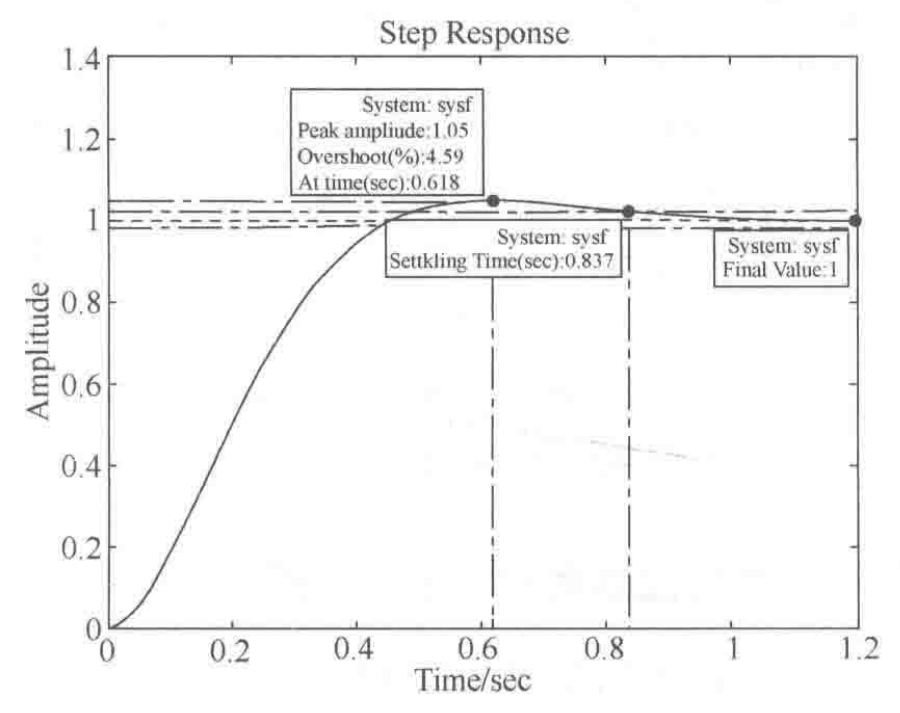

> Image description: A line graph titled "Step Response" displays the time-domain response of a system labeled "sysf." The vertical axis is labeled "Amplitude," ranging from 0 to 1.4, and the horizontal axis is labeled "Time/sec," ranging from 0 to 1.2. The plot shows a single curve starting at (0,0) that rises and slightly oscillates around a steady-state value of 1. Three data callouts provide specific performance metrics: 1. The peak amplitude is 1.05, occurring at 0.618 seconds, resulting in an overshoot of 4.59%. 2. The settling time is indicated as 0.837 seconds, marked by a vertical dashed line. 3. The final value (steady-state value) is 1. Engineering-wise, this figure illustrates the transient and steady-state behavior of a control system following a step input, specifically quantifying its stability through overshoot and settling time measurements.
图 10－26－1 增益控制下系统单位阶跃输入响应曲线（MATLAB）

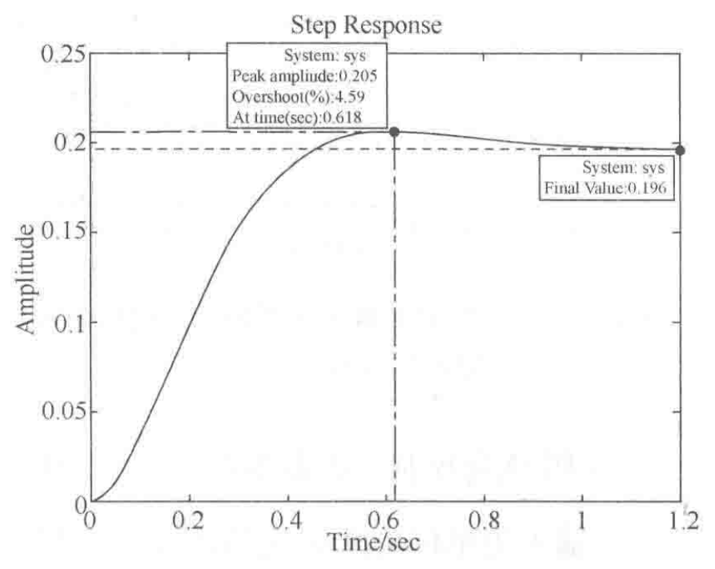

> Image description: This figure shows a MATLAB-generated step response plot for a system labeled "sys." The horizontal x-axis represents Time in seconds (Time/sec), ranging from 0 to 1.2, and the vertical y-axis represents Amplitude, ranging from 0 to 0.25. The graph displays a smooth curve starting at the origin (0,0) that rises and slightly overshoots a dashed horizontal line before stabilizing. Two data boxes provide specific system metrics: one indicates a peak amplitude of 0.205, an overshoot of 4.59%, occurring at 0.618 seconds; the other shows a final value of 0.196. A vertical dashed line connects the peak point to the time axis. From an engineering perspective, this figure illustrates the transient and steady-state behavior of a control system under gain control when subjected to a unit step input, specifically highlighting its stability, damping characteristics, and settling value.
图10－26－2 增益控制下系统单位阶跃扰动响应曲线（MATLAB）

2） PD 优化控制。控制器 $G_{c}(s)=10+0.4 s$ ，前置滤波器 $G_{p}(s)=\frac{25}{s+25^{\circ}}$
（1）输入为单位阶跃响应情况下。单位阶跃响应时对应的MATLAB程序（exe1026c．m）为

```
sys1 = tf([0.4 10],[1]);
sys2 = tf ([10],[11 100]);
syse = series(sys1,sys2);
sysh = tf([1],[1]);
sysf = feedback(syse,sysh)
sysp = tf([25],[1 25]);
sys = series(sysp, sysf) %建立闭环系统传递函数
step(sys) % 绘制阶跃响应曲线
```

由上述程序得到的仿真曲线如图10－26－3所示。此时对应的超调量 $\sigma \%=4.6 \%$ ，峰值时间 $t_{p}=0.442 \mathrm{~s}$ ，调节时间 $t_{s}=0.598 \mathrm{~s}$ 。
（2）单位阶跃扰动作用。系统在扰动作用下的闭环传递函数为 $\Phi_{n}(s)=\frac{G_{0}(s)}{1+G_{c}(s) G_{0}(s)}$ ，单位阶跃扰动作用下对应的 MATLAB 程序（exe1026d．m）为

$$
\text { sys1 }=\operatorname{tf}([0.410],[1]) ; \quad \text { \% Gc(s) }
$$


<!-- source_pdf_page: 393 -->
sys2 $=\mathrm{tf}\left([10],\left[\begin{array}{lll}1 & 10 & 0\end{array}\right]\right)$ ；
\％G（s）
sysf $=$ feedback（sys2，sys1）
\％建立扰动系统闭环传递函数
step（［10］，［114100］）
\％绘制扰动阶跃响应曲线

由上述程序得到的仿真曲线如图 10－26－4 所示。此时对应 $\max |y(t)|=0.105, y_{\mathrm{ss}}=0.10$ 。

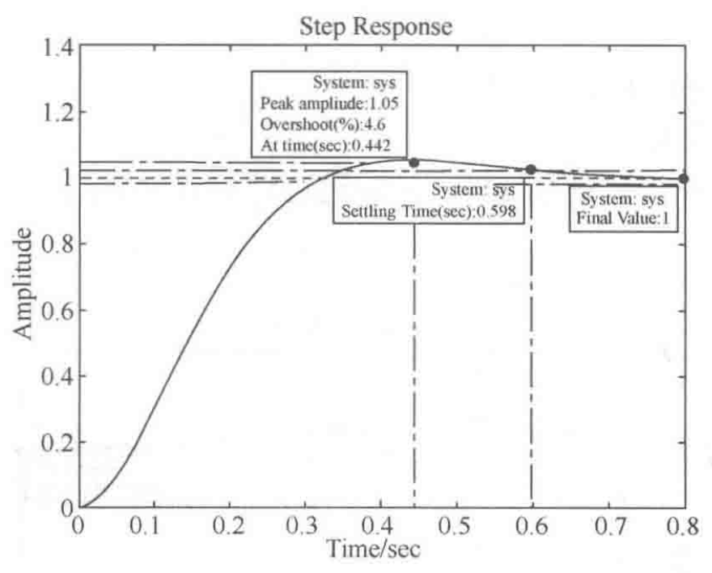

> Image description: A line graph titled "Step Response" illustrates the time-domain behavior of a system labeled "sys." The vertical axis represents "Amplitude," ranging from 0 to 1.4, and the horizontal axis represents "Time/sec," ranging from 0 to 0.8. The plot shows a smooth curve starting at (0,0) that rises and slightly overshoots a final value of 1 before stabilizing. Three text boxes provide specific performance metrics: 1. **Peak amplitude**: 1.05, occurring at 0.442 seconds, with an overshoot of 4.6%. 2. **Settling Time**: 0.598 seconds, indicated by a vertical dashed line. 3. **Final Value**: 1, marked by a point at the end of the curve. Horizontal dashed lines delineate the region around the final value to define settling time. In engineering terms, this figure characterizes the transient and steady-state response of a control system to a step input.
图 10－26－3 PD 优化控制下系统单位阶跃输人响应曲线（MATLAB）

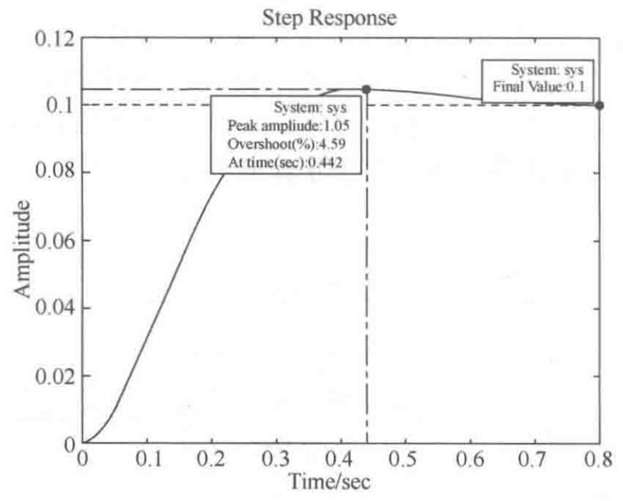

> Image description: This image shows a MATLAB-generated "Step Response" plot for a system under optimized PD control, as indicated by the Chinese caption (图 10－26－3). The graph plots Amplitude on the y-axis (ranging from 0 to 0.12) against Time in seconds on the x-axis (ranging from 0 to 0.8). The response curve starts at the origin and rises smoothly, exhibiting a slight overshoot before stabilizing. Two data callout boxes provide specific performance metrics: one identifies the peak amplitude as $1.05$ with an overshoot of $4.59\%$ occurring at $0.442$ seconds; the other indicates a final steady-state value of $0.1$. A dashed horizontal line marks the target value of $0.1$, and a vertical dashed line connects the peak point to the x-axis. In engineering terms, this figure illustrates the transient and steady-state behavior of a control system responding to a unit step input.
图 10－26－4 PD 优化控制下系统单位阶跃扰动的响应曲线（MATLAB）

3） PI 优化控制。控制器 $G_{c}(s)=7.01+\frac{18.62}{s}$ ，前置滤波器 $G_{p}(s)=\frac{2.656}{s+2.656^{\circ}}$
（1）输人为单位阶跃响应情况下。单位阶跃响应时对应的 MATLAB 程序（exe1026e． m）为

```
sys1 = tf([7.01 18.62],[10]); %Gc(s)
sys2 = tf([10],[11 100]); %G(s)
syse = series(sys1,sys2);
sysh = tf([1],[1]);
sysf = feedback(syse,sysh)
sysp = tf([2.656],[1 2.656]);
sys = series(sysp,sysf) %建立 PI 优化控制的闭环传递函数
step(sys) %绘制 PI 控制单位阶跃响应曲线
```

由上述程序得到的仿真曲线如图 10－26－5 所示。此时对应的超调量 $\sigma \%=1.99 \%$ ，峰值时间 $t_{p}=0.819 \mathrm{~s}$ ，调节时间 $t_{s}=1.32 \mathrm{~s}$ 。
（2）单位阶跃扰动作用。系统在扰动作用下的闭环传递函数为 $\Phi_{n}(s)=\frac{G_{0}(s)}{1+G_{c}(s) G_{0}(s)}$ ，单位阶跃扰动作用下对应的 MATLAB 程序（exe1026f．m）为

```
sys1 = tf([7.01 18.62],[10]); %Gc(s)
sys2 = tf([10],[10 (10]); %G(s)
sysf = feedback (sys2, sys1) %建立扰动系统闭环传递函数
step([100 0 ],[1 10 70.1 186.2]) % 绘制扰动阶跃响应曲线
```

由上述程序得到的仿真曲线如图 10－26－6 所示。此时对应的 $\max |y(t)|=0.126, y_{\mathrm{ss}}=$ 0.00 。


<!-- source_pdf_page: 394 -->
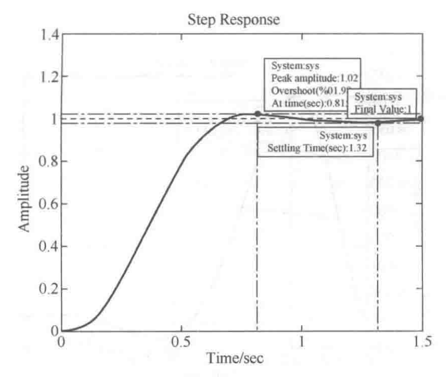

> Image description: This figure shows a "Step Response" plot from MATLAB, illustrating the unit step input response curve of a system under optimized PI control. The x-axis represents "Time/sec" ranging from 0 to 1.5, and the y-axis represents "Amplitude" ranging from 0 to 1.4. The graph displays a smooth, rising curve that overshoots the final value before stabilizing. Three data callout boxes provide specific performance metrics: 1. The first box identifies the peak response with a **Peak amplitude** of 1.02, an **Overshoot** of 1.9%, occurring **At time(sec)** of 0.81. 2. The second box indicates the **Settling Time(sec)** is 1.32, marked by vertical dashed lines. 3. The third box notes the **Final Value** is 1. Horizontal dashed lines delineate the steady-state error band around the final value of 1. Engineeringly, this figure evaluates the system's stability and transient response characteristics.
图10－26－5 PI 优化控制下系统单位阶跃输入响应曲线（MATLAB）

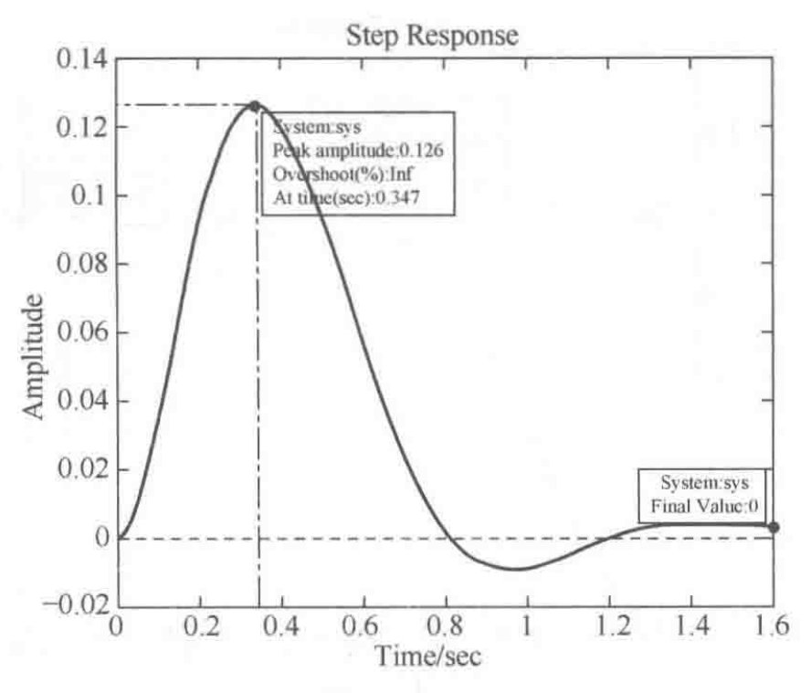

> Image description: This image shows a MATLAB-generated plot titled "Step Response," depicting the system's unit step input response curve under PI optimized control (as indicated by the Chinese caption). The graph features a vertical y-axis labeled "Amplitude" ranging from -0.02 to 0.14 and a horizontal x-axis labeled "Time/sec" ranging from 0 to 1.6. The response curve starts at the origin (0,0), rises sharply to a peak, and then oscillates before settling toward zero. Two data callouts provide specific system metrics: 1. A label at the peak indicates a "Peak amplitude" of 0.126 occurring "At time(sec): 0.347," with an "Overshoot(%)" listed as "Inf." 2. A label at the end of the curve identifies the "Final Value: 0." Dashed lines connect the peak and final value points to their respective axes, highlighting the system's transient behavior and steady-state convergence.
图10－26－6 PI 优化控制下系统单位阶跃扰动的响应曲线（MATLAB）

4）PID 优化控制。控制器 $G_{c}(s)=21.5+\frac{100}{s}+0.75 s$ ，前置滤波器 $G_{p}(s)= \frac{133.33}{s^{2}+28.67 s+133.33^{\circ}}$
（1）输人为单位阶跃响应情况。
单位阶跃响应时对应的 MATLAB 程序：exe1026g．m

```
sys1 = tf([0.75 21.5 100],[1 0]);
sys2 = tf([10],[10 (10]);
syse = series(sys1,sys2);
sysh = tf([1],[1]);
sysf = feedback(syse, sysh)
sysp = tf([133.33],[1 28.67 133.33]);
sys = series(sysp,sysf) %建立PID优化控制系统的闲环传递函数
step(sys) %绘制 PID 优化控制系统的单位阶跃响应曲线
```

由上述程序得到的仿真曲线如图 10－26－7 所示。此时对应的超调量 $\sigma \%=1.97 \%$ ，峰值时间 $t_{p}=0.468 \mathrm{~s}$ ，调节时间 $t_{s}=0.754 \mathrm{~s}$ 。
（2）单位阶跃扰动作用。系统在扰动作用下的闭环传递函数为 $\Phi_{n}(s)=\frac{G_{0}(s)}{1+G_{c}(s) G_{0}(s)}$ 。单位阶跃扰动作用下对应的 MATLAB 程序（exe1026h．m）：

```
sys1 = tf([0.75 21.5 100],[10]);
sys2 = tf([10],[10 (100]);
sysf = feedback (sys2,sys1) %建立扰动系统闭环传递函数
step([10 0 ],[1 17.5 215 1000]) %绘制扰动单位阶跃响应曲线
```

由上述程序得到的仿真曲线如图 10－26－8 所示。此时对应的 $\max |y(t)|=0.041, y_{\mathrm{s}}=$ 0.00 。


<!-- source_pdf_page: 395 -->
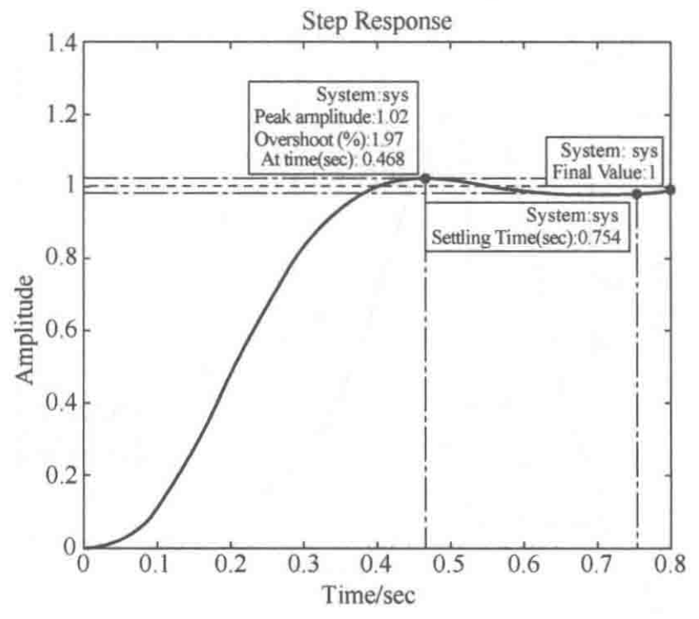

> Image description: This image shows a MATLAB-generated "Step Response" plot for a system under optimized PID control, as indicated by the caption (图 10－26－7). The graph plots Amplitude on the y-axis (ranging from 0 to 1.4) against Time in seconds on the x-axis (ranging from 0 to 0.8). A single smooth curve represents the system's response to a unit step input, starting at (0,0) and asymptotically approaching a final value of 1. Several data callouts provide specific performance metrics: * **Peak amplitude:** 1.02, occurring at 0.468 seconds, with an overshoot of 1.97%. * **Final Value:** 1. * **Settling Time:** 0.754 seconds, marked by a vertical dash-dot line. Horizontal lines indicate the final value and the overshoot boundary. The figure illustrates the system's stability and transient response characteristics, specifically showing minimal overshoot and a fast settling time.
图 10－26－7 PID 优化控制下系统单位阶跃输人响应曲线（MATLAB）

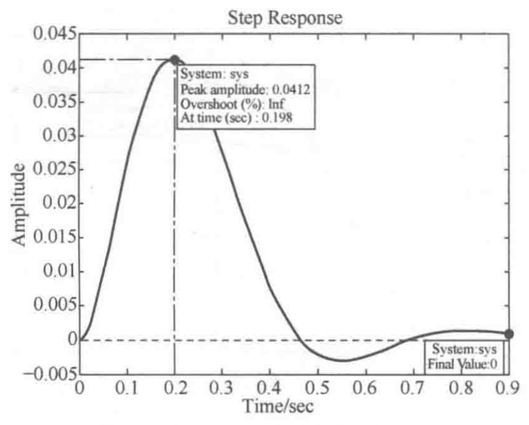

> Image description: The image shows a MATLAB-generated plot titled "Step Response," illustrating the system's response to a unit step input under PID optimized control. The x-axis is labeled "Time/sec" and ranges from 0 to 0.9, while the y-axis is labeled "Amplitude" and ranges from -0.005 to 0.045. The plot displays a single, damped oscillatory curve that starts at (0,0), rises to a peak, and then decays toward zero. Two data callouts provide specific system metrics: one marks the peak of the curve with a "Peak amplitude" of 0.0412 occurring "At time (sec)" of 0.198, noting an infinite overshoot percentage. A second callout at the end of the curve indicates a "Final Value" of 0. The figure demonstrates the transient behavior and stability of the system, showing how it reacts to an input before settling back to its equilibrium state.
图 10－26－8 PID 优化控制下系统单位阶跃扰动的响应曲线（MATLAB）


