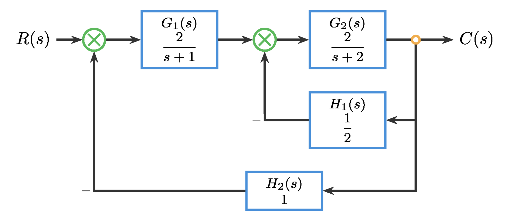
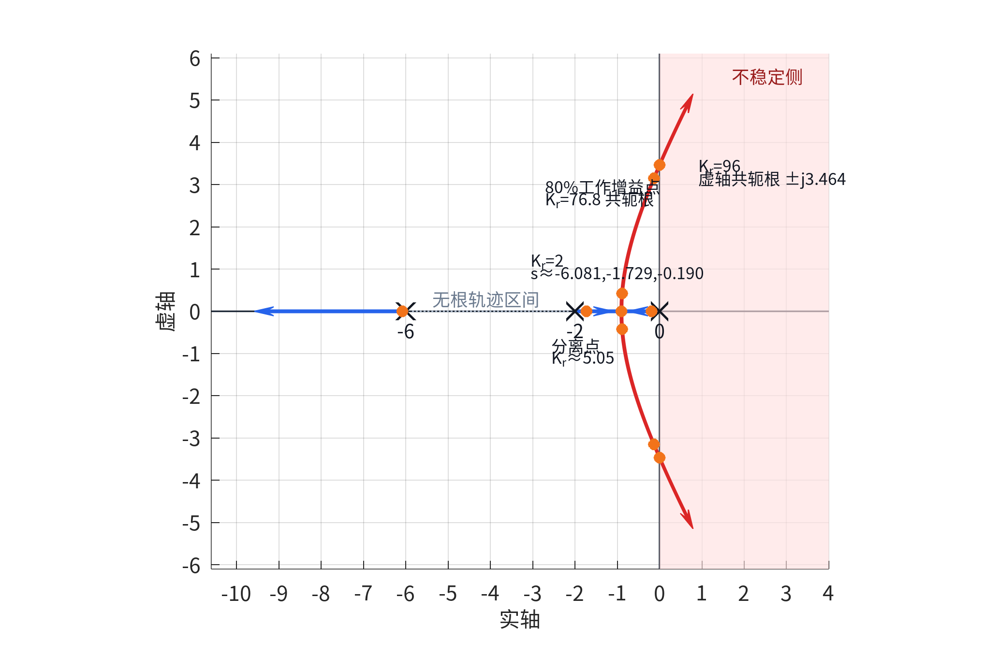

# 江苏科技大学课程考试卷（A）参考答案

课程名称：《自动控制原理》  开课学期：2025--2026学年第2学期

## 一、计算题（每题10分，共10分）

**题目：极点位置与稳定性类型识别**

已知 5 个连续时间单位负反馈闭环系统的闭环极点配置如下（复平面关于实轴对称）：

A. $s=-1,-4$

B. $s=-1\pm j2$

C. $s=\pm j2$

D. $s=+1,-2$

E. $s=+0.5\pm j2$

为便于仅根据极点位置进行定性判断，统一假设各系统均为最小相位、无零极点对消、所有极点模态均可观测。

请回答：

（1）判断 A-E 各配置对应的稳定类型（稳定 / 临界稳定 / 不稳定），并简述判断依据。

（2）分别说明其单位阶跃响应草图应呈现的主要特征，可用简明文字代替作图。

（3）说明哪些配置在一般闭环控制工程中可用，并说明理由。

### 参考答案

连续时间闭环系统中，全部极点位于左半平面开区域则稳定；无右半平面极点且只有简单虚轴极点则临界稳定；只要存在右半平面极点则不稳定。（2分）

A：稳定。两个极点都在左半平面实轴上，阶跃响应单调或近似单调收敛，工程上可用。（2分）

B：稳定。共轭复极点实部为负，阶跃响应衰减振荡后收敛，工程上可用但需关注超调和阻尼。（2分）

C：临界稳定。极点位于虚轴且为简单极点，响应等幅持续振荡、不收敛，一般工程闭环中不可用。（2分）

D：不稳定。存在右半平面实极点 $+1$，响应会发散，不可用。（1分）

E：不稳定。共轭复极点实部为正，响应振荡发散，不可用。（1分）

### 分步评分标准

- 稳定性总判据 2 分；A、B、C 各 2 分；D、E 各 1 分。若只给结论不说明极点依据，对应小项最多给一半分。

## 二、计算题（每题10分，共10分）

**题目：物理对象到传递函数**

设单自由度弹簧-阻尼-质量系统如下一维运动：质量块质量为 $m=1~\mathrm{kg}$，阻尼系数为 $c=2~\mathrm{N\cdot s/m}$，弹簧刚度为 $k=4~\mathrm{N/m}$。输入为作用在质量块上的外力 $f(t)$，输出为质量块位移 $x(t)$。设运动方向取向右为正，求传递函数时取零初始条件。

（1）根据受力平衡列出系统的微分方程。

（2）求系统传递函数 $G(s)=X(s)/F(s)$。

（3）将所得传递函数化为标准二阶形式 $G(s)=\frac{K\omega_n^2}{s^2+2\zeta\omega_n s+\omega_n^2}$，并写出 $K$、$\omega_n$、$\zeta$ 的数值。

### 参考答案

由受力平衡得 $m\ddot{x}(t)+c\dot{x}(t)+kx(t)=f(t)$，代入参数得 $\ddot{x}(t)+2\dot{x}(t)+4x(t)=f(t)$。（3分）

零初始条件下作拉氏变换，得 $(s^2+2s+4)X(s)=F(s)$，故 $G(s)=X(s)/F(s)=\frac{1}{s^2+2s+4}$。（3分）

与 $G(s)=\frac{K\omega_n^2}{s^2+2\zeta\omega_n s+\omega_n^2}$ 比较，$\omega_n^2=4$，$2\zeta\omega_n=2$，$K\omega_n^2=1$。（2分）

因此 $\omega_n=2$，$\zeta=\frac{1}{2}$，$K=\frac{1}{4}$。（2分）

### 分步评分标准

- 微分方程 3 分；传递函数 3 分；标准二阶参数关系 2 分；参数数值 2 分。

## 三、计算题（每题10分，共10分）

**题目：结构图等效传递函数**

已知图 1 所示双环负反馈控制系统结构图。前向通路依次为 $G_1(s)=\frac{K}{s+1}$、$G_2(s)=\frac{2}{s+2}$；内环反馈为 $H_1(s)=\frac{1}{2}$（负反馈），作用于 $G_1(s)$ 与 $G_2(s)$ 之间的求和点；外环反馈为 $H_2(s)=1$（单位负反馈），作用于系统输入端求和点。取参数 $K=2$。

（1）先化简内环，求从 $G_1(s)$ 输出端到系统输出 $C(s)$ 的内环等效传递函数 $G_{\mathrm{in}}(s)$。

（2）再将 $G_1(s)$ 与 $G_{\mathrm{in}}(s)$ 组成的前向通路与外环一起化简，求闭环传递函数 $T(s)=C(s)/R(s)$。

（3）若仅将增益改为 $K'=4$，其余环节保持不变，直接写出新的闭环等效传递函数 $T'(s)$。

要求：只求等效传递关系，不分析稳定性，不讨论控制器设计。

### 参考答案

内环前向通路为 $G_2(s)=\frac{2}{s+2}$。按负反馈公式，$G_{\mathrm{in}}(s)=\frac{G_2(s)}{1+G_2(s)H_1(s)}=\frac{2/(s+2)}{1+1/(s+2)}=\frac{2}{s+3}$。（3分）

外环前向通路为 $G_1(s)G_{\mathrm{in}}(s)=\frac{K}{s+1}\cdot\frac{2}{s+3}=\frac{2K}{(s+1)(s+3)}$。（2分）

单位负反馈下 $T(s)=\frac{2K/[(s+1)(s+3)]}{1+2K/[(s+1)(s+3)]}=\frac{2K}{(s+1)(s+3)+2K}$。（2分）

代入 $K=2$，$T(s)=\frac{4}{s^2+4s+7}$。（2分）

若 $K'=4$，$T'(s)=\frac{8}{s^2+4s+11}$。（1分）

### 分步评分标准

- 内环化简 3 分；外环前向通路 2 分；一般闭环传函 2 分；$K=2$ 结果 2 分；$K'=4$ 结果 1 分。

## 四、计算题（每题15分，共15分）

**题目：劳斯判据与稳定范围**

已知某闭环系统的特征方程为

$$
s^4+3s^3+(K+1)s^2+(8-K)s+2=0
$$

其中 $K$ 为实参数。

（1）用劳斯判据求系统稳定的 $K$ 取值范围。

（2）给出系统处于临界稳定时的 $K$ 值。

（3）用一句话说明：为什么这里求出的稳定区间只能看作后续参数筛选的第一层可行域？

### 参考答案

劳斯阵列为：$s^4$ 行 $[1,\ K+1,\ 2]$；$s^3$ 行 $[3,\ 8-K,\ 0]$；$s^2$ 行 $[(4K-5)/3,\ 2,\ 0]$；$s^1$ 行 $[(-4K^2+37K-58)/(4K-5),\ 0,\ 0]$；$s^0$ 行 $[2]$。（5分）

稳定要求第一列全为正。由 $(4K-5)/3>0$ 得 $K>5/4$；在此基础上要求 $-4K^2+37K-58>0$，即 $4K^2-37K+58<0$。（3分）

因 $4K^2-37K+58=(K-2)(4K-29)$，故稳定区间为 $2<K<29/4$。（3分）

当 $K=2$ 或 $K=29/4$ 时，$s^1$ 行首项为 $0$，系统处于稳定边界，因此临界稳定参数为 $K=2$、$K=29/4$。（2分）

稳定区间只说明闭环极点在左半平面，是参数筛选起点；它不能直接说明动态品质优劣，也不是最终设计参数。（2分）

### 分步评分标准

- 劳斯阵列 5 分；不等式建立 3 分；稳定区间 3 分；临界值 2 分；概念说明 2 分。

## 五、计算题（每题15分，共15分）

**题目：根轨迹读图与增益迁移**

某单位负反馈系统只采用比例控制，实际控制器增益记为 $K_c$，且只考虑 $K_c\ge 0$。根轨迹主图对应开环极点 $0,-2,-6$、无开环零点，采用“作图增益” $K_r$，两者关系为 $K_r=4K_c$。根轨迹读图示意如图 2，请依据图中标注完成读图、换算和趋势解释。

请回答：

（1）写出闭环稳定的 $K_r$ 取值窗口，并换算为实际控制器增益 $K_c$ 的稳定窗口。

（2）若工程上要求“工作增益不超过稳定边界的 80%”，求允许的 $K_c$ 上限。

（3）现把控制器增益从 $K_c=0.50$ 增大到 $K_c=1.50$。说明根轨迹上的极点总体向哪个方向迁移，并结合图中 $K_r=2$ 与 $K_r=6$ 附近的读点解释闭环响应在振荡程度、超调趋势和衰减快慢上的变化。

### 参考答案

由图 2 可读得，$K_r=96$ 时根轨迹穿过虚轴，$K_r>96$ 时进入右半平面，因此严格稳定窗口为 $0<K_r<96$。（3分）

由 $K_r=4K_c$ 得 $0<K_c<96/4=24$。（3分）

80% 稳定边界对应 $K_r\le 0.8\times 96=76.8$，故 $K_c\le 76.8/4=19.2$。（3分）

$K_c=0.50$ 对应 $K_r=2$，$K_c=1.50$ 对应 $K_r=6$。（2分）

增益增大时，靠近原点的实根先沿实轴向左移动，并与来自 $s=-2$ 的分支在分离点附近形成共轭复根。主导极点由 $K_r=2$ 时的实根 $s\approx -0.190$ 变为 $K_r=6$ 时的共轭复根 $-0.886\pm j0.422$，说明主要衰减速度提高，但响应开始出现振荡成分，超调趋势增强。（4分）

### 分步评分标准

- 稳定窗口 6 分；80% 边界换算 3 分；增益换算 2 分；动态趋势解释 4 分。

## 六、计算题（每题10分，共10分）

**题目：型别、误差系数与稳态误差**

已知某单位负反馈系统的开环传递函数为

$$
G_0(s)=\frac{12(s+2)}{s(s+3)(s+4)}.
$$

请回答：

（1）判断该系统的型别。

（2）计算位置误差系数 $K_p$、速度误差系数 $K_v$ 与加速度误差系数 $K_a$。

（3）求单位阶跃输入、单位斜坡输入与单位抛物输入下的稳态误差。

（4）结合结果，用一句话概括该结构“能保证什么、不能保证什么”的稳态跟踪能力。

### 参考答案

开环传递函数中原点处有 1 个积分环节，因此系统为 1 型系统。（2分）

$K_p=\lim_{s\to 0}G_0(s)=+\infty$，$K_v=\lim_{s\to 0}sG_0(s)=\left.\frac{12(s+2)}{(s+3)(s+4)}\right|_{s=0}=\frac{24}{12}=2$，$K_a=\lim_{s\to 0}s^2G_0(s)=0$。（4分）

单位阶跃稳态误差 $e_{ss}=\frac{1}{1+K_p}=0$；单位斜坡稳态误差 $e_{ss}=\frac{1}{K_v}=\frac{1}{2}$；单位抛物输入稳态误差 $e_{ss}=\frac{1}{K_a}=+\infty$。（3分）

该结构能对单位阶跃实现零稳态误差，对单位斜坡只能保证有限稳态误差，对单位抛物输入不能保证有界稳态跟踪误差。（1分）

### 分步评分标准

- 型别判断 2 分；三个误差系数 4 分；三类输入稳态误差 3 分；能力概括 1 分。

## 七、计算题（每题15分，共15分）

**题目：同一对象的时域-频域基础对照**

已知某单位负反馈实验中可抽象出一个标准二阶对象，其传递函数写为

$G(s)=\frac{25}{s^2+4s+25}$。

课堂观察到：当输入为单位阶跃时，该对象的输出不是单调上升，而是先出现一定超调，随后伴随衰减振荡并逐步趋于稳态。

请围绕这一同一对象完成下列问题：

（1）将该传递函数写成标准二阶形式 $\frac{\omega_n^2}{s^2+2\zeta\omega_n s+\omega_n^2}$，写出 $\omega_n$ 与 $\zeta$，并判断该对象的阻尼状态。

（2）根据该对象的传递函数与上述时域表现，手工画出基础 Bode 幅频草图与相频草图。要求在图上或文字中明确标出：低频增益、大致转折区所在频率范围、高频渐近斜率、相位起止趋势，以及在自然频率附近是否存在“峰起更明显”的趋势。

（3）用一句到两句话说明：为什么这个对象在时域上会表现为“有超调并伴随振荡”，而在频域幅频图上又会在某一频率附近表现出较明显的抬升趋势。

说明：本题只要求基础对象级分析与基础 Bode 手工绘图，不要求计算相位裕度、增益裕度，不要求作稳定性判别。

### 参考答案

$G(s)=\frac{25}{s^2+4s+25}=\frac{\omega_n^2}{s^2+2\zeta\omega_n s+\omega_n^2}$，故 $\omega_n^2=25$，$2\zeta\omega_n=4$。（3分）

因此 $\omega_n=5~\mathrm{rad/s}$，$\zeta=\frac{4}{2\times 5}=0.4$。由于 $0<\zeta<1$，该对象为欠阻尼二阶对象，阶跃响应会有超调和衰减振荡。（3分）

幅频草图：低频 $\omega\ll 5$ 时 $|G(j\omega)|\approx 1$，低频增益约为 $0~\mathrm{dB}$；在 $\omega\approx 5~\mathrm{rad/s}$ 附近进入主要转折区；由于阻尼较小，自然频率附近可画出轻微峰起；高频 $\omega\gg 5$ 时按 $-40~\mathrm{dB/dec}$ 下降。（4分）

相频草图：$\omega\to 0$ 时相位趋近 $0^\circ$；$\omega\to \infty$ 时相位趋近 $-180^\circ$；相位主要在 $\omega\approx 5~\mathrm{rad/s}$ 附近过渡，并大致经过 $-90^\circ$。（3分）

时域超调与衰减振荡说明对象欠阻尼；同一欠阻尼对象对接近自然频率的正弦输入更敏感，因此频域幅频曲线在自然频率附近会出现较明显抬升趋势。（2分）

### 分步评分标准

- 标准参数与阻尼判断 6 分；幅频草图要点 4 分；相频草图要点 3 分；时频对应解释 2 分。

## 八、计算题（每题15分，共15分）

**题目：滞后校正整定**

某单位负反馈控制系统的未校正开环传递函数为

$$
L_0(s)=G(s)=\frac{4}{s(0.1s+1)(0.05s+1)}.
$$

已知未校正系统的幅值交叉频率约为 $\omega_{c0}=3.6~\mathrm{rad/s}$，相位裕度约为 $\gamma_0=60^\circ$。系统对单位斜坡输入的稳态误差偏大。设计要求为 $e_{ss,\mathrm{ramp}}\le 0.05$，$\gamma\ge 50^\circ$。同时希望主要改善低频稳态精度，不要求明显提高交叉频率。

请完成：

（1）计算未校正系统的 $K_v$ 与单位斜坡稳态误差。

（2）根据稳态误差、低频增益和相位裕度证据，说明为什么本题应采用滞后校正。

（3）采用滞后校正网络 $C(s)=\beta\frac{1+s/\omega_z}{1+s/\omega_p}$，$\omega_p=\omega_z/\beta$，$\beta>1$ 完成参数整定。可取 $\omega_z=\omega_{c0}/10$。

（4）写出校正器 $C(s)$，估计校正后的 $K_v$、单位斜坡稳态误差、交叉频率和相位裕度。

### 参考答案

未校正系统速度误差系数 $K_v=\lim_{s\to 0}sL_0(s)=4$，单位斜坡稳态误差 $e_{ss,\mathrm{ramp}}=\frac{1}{K_v}=\frac{1}{4}=0.25$，大于 $0.05$。（3分）

要求 $e_{ss,\mathrm{ramp}}\le 0.05$，因此 $K_v^\ast\ge 20$。未校正 $K_v=4$，低频增益至少需提高 $\beta=20/4=5$。（3分）

未校正相位裕度约 $60^\circ$，高于 $50^\circ$；题目要求主要改善低频稳态精度且不明显提高交叉频率，因此应采用滞后校正，提高低频增益，同时让中高频增益接近 1，使交叉频率和相位裕度变化较小。（3分）

取 $\omega_z=\omega_{c0}/10=0.36~\mathrm{rad/s}$，$\omega_p=\omega_z/\beta=0.072~\mathrm{rad/s}$，故 $C(s)=5\frac{1+s/0.36}{1+s/0.072}$。（3分）

校正后 $K_v'=5\times 4=20$，$e'_{ss,\mathrm{ramp}}=\frac{1}{20}=0.05$；在 $3.6~\mathrm{rad/s}$ 附近 $|C(j3.6)|\approx 1$，因此 $\omega_c'\approx 3.6~\mathrm{rad/s}$；$\angle C(j3.6)=\arctan(10)-\arctan(50)\approx -4.6^\circ$，故 $\gamma'\approx 60^\circ-4.6^\circ=55.4^\circ$，仍满足要求。（3分）

### 分步评分标准

- 未校正稳态误差 3 分；低频增益倍数 3 分；滞后校正理由 3 分；校正器参数 3 分；校正后性能估计 3 分。
