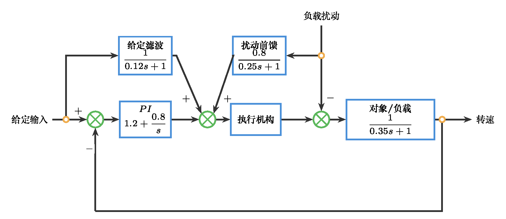
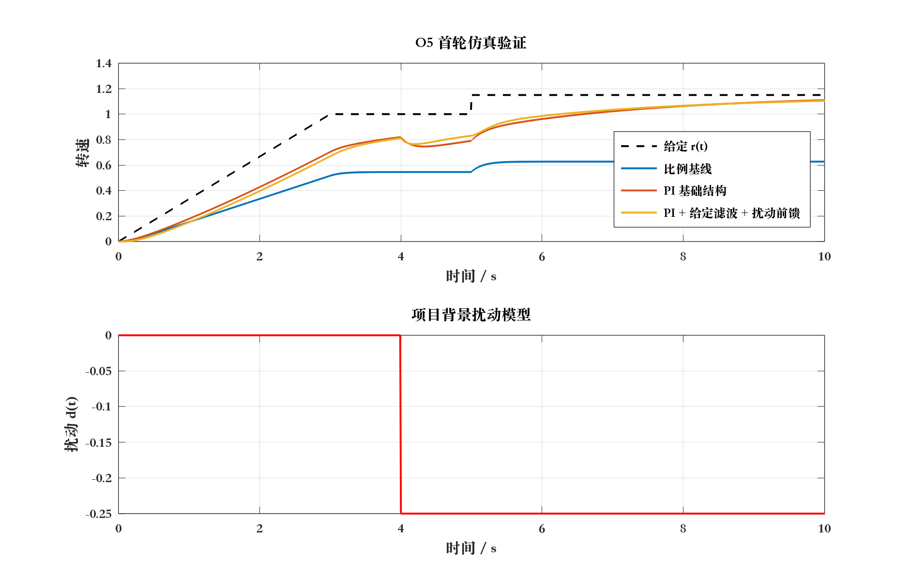

# 自动控制原理 作业5：传统校正初始控制方案

## 任务信息

- 题号：O5
- 分值：40分
- 标题：传统校正初始控制方案
- 主题：结构选型计算、复合结构选择与仿真验证

## 题干

请沿用你在 `O4` 中已经保留的首选候选结构与放弃理由，不得更换对象，也不得推翻 `O3-O4` 的主线证据。围绕同一对象，完成一次基于传统校正技术的首轮控制方案。

请完成以下内容：

1. 回收 `O4` 的候选结构排序：写清你最终保留哪一个结构作为首轮方案，为什么暂时放弃其他结构。
2. 写出本次任务的性能要求、验收边界和可接受的首轮偏差。
3. 完成一次结构选型计算：至少给出一个关键指标的计算过程，例如超前补偿相位、滞后低频增益提升、PI 参数起点或 PID 主参数方向。
4. 写出所选基础结构的表达式、关键参数及参数方向，并用 `MATLAB/Octave` 完成基础结构的首轮仿真验证。
5. 在基础结构上选择一个经典复合结构，例如给定滤波、扰动前馈、速度前馈、限幅与抗饱和、滞后补偿或超前补偿的组合；说明每个附加环节回应的项目背景证据。
6. 为复合结构建立项目背景中的输入信号或扰动模型，不得只使用单位阶跃；例如斜坡给定、周期给定、负载阶跃、周期扰动或测量噪声。
7. 用 `MATLAB/Octave` 完成复合结构仿真验证，提交代码、结果图和一张仿真验证记录表。
8. 根据验证结果写出下一轮调参问题清单：列出最需要优先处理的 `3` 个问题及对应证据。
9. 附 `AI 使用记录摘要`，写明 AI 参与了哪些整理、仿真代码检查或文字润色工作，以及你如何核查关键判断。

## 提交要求

- 主体正文不超过 `900` 字。
- 必须附 `1` 张方案结构图或等价结构表达，图中应区分基础结构与复合附加环节。
- 必须附 `1` 段结构选型计算。
- 必须附 `1` 张基础结构与复合结构的仿真验证记录表。
- 必须附 `1` 张下一轮调参问题清单。
- 必须附 `MATLAB/Octave` 仿真代码、结果图与简短复现实验说明；复合结构验证必须包含项目背景中的输入信号或扰动模型。
- 允许首轮方案不满足全部指标，但必须说明证据指向的下一轮调参方向。

## 参考答案

以下示例沿用 `O4` 中“小型直流电机转速控制”的示例对象。学生可以使用自己的对象，但必须保持 `O3-O4-O5` 的对象、主要矛盾和候选结构连续。

继续沿用简化模型
$$
G(s)=\frac{1}{0.35s+1}.
$$
`O4` 已确认主要矛盾是恒定负载下长期转速偏差偏大，同时速度给定存在缓慢升速段和小幅阶跃调整。因此首轮基础结构保留 `PI`，复合结构采用 `PI + 给定滤波 + 负载扰动前馈`。（6分）



结构选型计算如下。若只采用比例控制 $C_0(s)=1.2$，位置误差系数 $K_p=C_0(0)G(0)=1.2$，单位阶跃稳态误差约为
$$
e_{ss}=\frac{1}{1+K_p}=\frac{1}{2.2}\approx0.455.
\tag{6分}
$$
该误差不能满足首轮希望“稳态误差明显下降”的要求，因此需要引入积分作用。首轮取
$$
C_{PI}(s)=1.2+\frac{0.8}{s}.
$$

基础结构仿真应先比较比例控制与 `PI` 对阶跃或斜坡给定的误差收敛。若 `PI` 使长期偏差明显下降，但超调、调节时间或控制量峰值增加，则说明基础结构有效但仍需复合环节处理输入和扰动背景。（8分）

复合结构中，给定滤波
$$
F_r(s)=\frac{1}{0.12s+1}
$$
用于降低小幅阶跃给定造成的冲击；负载扰动前馈
$$
F_d(s)=\frac{0.8}{0.25s+1}
$$
用于对低频负载扰动作提前补偿。复合结构不是为了替代反馈，而是减轻反馈单独承担给定变化和负载扰动时的压力。（8分）

项目背景输入和扰动可设为：$r(t)$ 为 `0-3s` 的斜坡升速叠加 `t=5s` 的小幅给定阶跃；$d(t)$ 为 `t=4s` 出现的负载阶跃扰动。示例 `MATLAB/Octave` 代码如下。（8分）

```matlab
pkg load control
set(0, 'defaulttextfontname', 'Songti SC');
set(0, 'defaultaxesfontname', 'Songti SC');
s = tf('s');
G = 1/(0.35*s + 1);

C0 = 1.2;
Cpi = 1.2 + 0.8/s;
Fr = 1/(0.12*s + 1);
Fd = 0.8/(0.25*s + 1);

T0 = feedback(C0*G, 1);
Tpi = feedback(Cpi*G, 1);
Sd_pi = feedback(G, Cpi);
Tpi_f = Tpi * Fr;
Sd_comp = feedback(G*(1 - Fd), Cpi);

t = 0:0.01:10;
r = min(t/3, 1) + 0.15*(t >= 5);
d = -0.25*(t >= 4);

y_base = lsim(T0, r, t);
y_pi = lsim(Tpi, r, t) + lsim(Sd_pi, d, t);
y_comp = lsim(Tpi_f, r, t) + lsim(Sd_comp, d, t);

figure;
plot(t, r, 'k--', t, y_base, t, y_pi, t, y_comp);
grid on;
legend('给定 r(t)', '比例基线', 'PI 基础结构', 'PI + 给定滤波 + 扰动前馈');
xlabel('时间 / s');
ylabel('转速');
title('O5 首轮仿真验证');
```



验证记录表应至少包含斜坡跟踪误差、给定阶跃冲击、负载扰动后的速度跌落、恢复时间和控制量风险。若复合结构相对基础 `PI` 减小给定冲击和扰动跌落，但响应变慢或控制量仍偏大，应写入下一轮调参问题清单。（8分）

AI 使用记录摘要需说明 AI 参与了结构整理、代码检查或文字润色，学生独立完成对象继承、结构选型计算、输入/扰动建模、仿真运行和关键判断核查。（4分）

## 评分标准

- **主线继承与性能边界**（6分）：沿用 `O4` 的对象、主要矛盾和候选结构，不另起炉灶。
- **结构选型计算**（6分）：给出至少一个关键指标计算，并据此说明基础结构选择。
- **基础结构验证**（8分）：能用仿真验证基础结构对主要矛盾的改善及副作用。
- **复合结构与输入/扰动建模**（8分）：复合结构选择有项目背景依据，输入或扰动模型不是单纯单位阶跃。
- **复合结构仿真与调参问题清单**（8分）：验证记录表能比较基础结构和复合结构，并提出后续问题。
- **AI 使用记录摘要**（4分）：说明 AI 参与范围和学生核查方式。

## 一致性记录

- 题面自包含：是。
- 分值合计：40分。
- 与 HW5 边界一致：开放题承担结构选型计算、复合结构选型和仿真验证；闭题不承担仿真。
