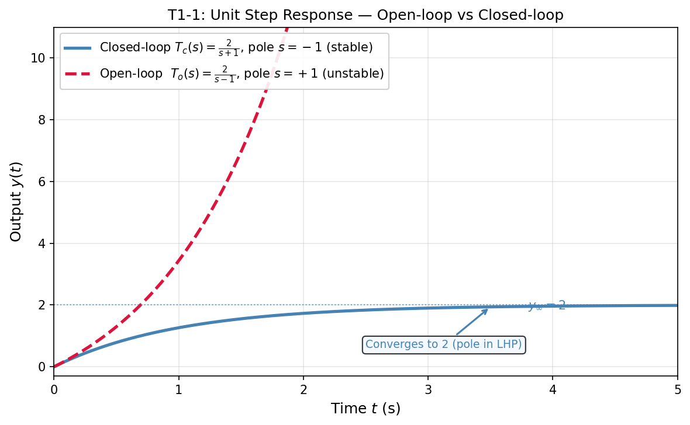
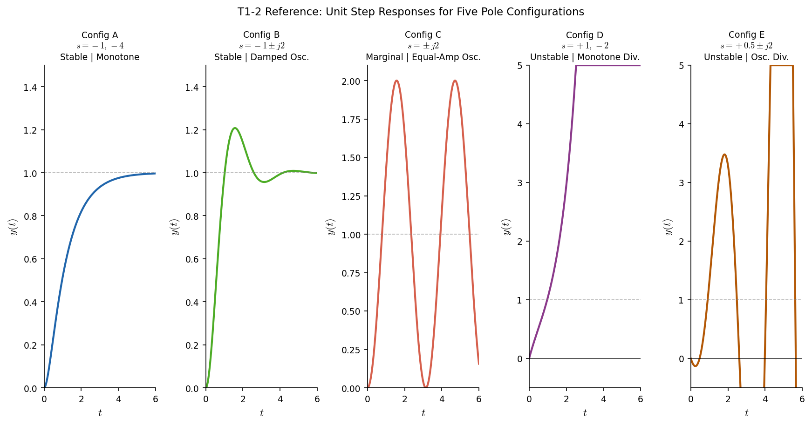
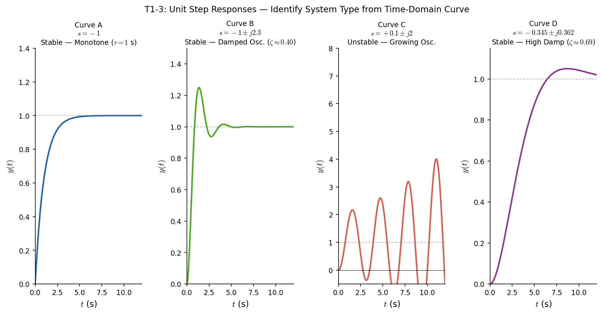

# 自动控制原理 第一章作业（含参考答案）

## T1-1 开环与闭环控制对比分析

### 题干

已知同一被控对象的名义模型取为 $G_p(s)=1/(s-1)$，控制器取为 $C(s)=2$。现考虑以下两种接法：

1. 开环控制：参考输入 $r$ 先经过控制器 $C(s)$，再进入被控对象 $G_p(s)$，输出为 $y$，不引入反馈。
2. 闭环控制：采用单位负反馈，误差信号 $e=r-y$ 先经过控制器 $C(s)$，再进入被控对象 $G_p(s)$，输出为 $y$。

设输入为单位阶跃信号，回答下列问题：

1. 从闭环极点或系统极点的角度，说明上述两种接法在稳定性上的差异，并给出理由。
2. 若被控对象参数发生 $10\%$ 偏移，即实际对象变为 $G_p'(s)=1/(s-a)$，其中 $a$ 可能为 $0.9$ 或 $1.1$，讨论哪一种接法受影响更大，并说明原因。
3. 画出两种系统在单位阶跃输入下的响应对比草图，并分别作定性说明（如是否发散、是否收敛、收敛快慢、输出变化趋势等）。

要求：可结合传递函数与极点位置进行分析，但不要求展开繁琐计算。

### 参考答案

**1. 稳定性差异分析：**

开环时，系统从 $r$ 到 $y$ 的传递函数为 $T_o(s)=C(s)G_p(s)=2/(s-1)$。其极点位于 $s=+1$，落在复平面右半平面，因此开环系统不稳定。也就是说，单位阶跃输入下，输出中会含有 $e^t$ 形式的发散项。

闭环时，单位负反馈下传递函数为 $T_c(s)=C(s)G_p(s)/[1+C(s)G_p(s)]=(2/(s-1))/[1+2/(s-1)]=2/(s+1)$。其极点位于 $s=-1$，落在左半平面，因此闭环系统稳定。由此可见，反馈把原来位于右半平面的极点"拉回"到左半平面，这是稳定性改善的根本原因。

**2. 参数偏移 $10\%$ 时的影响比较：**

当对象参数偏移后，实际对象为 $G_p'(s)=1/(s-a)$，其中 $a=0.9$ 或 $1.1$。

开环时，传递函数变为 $T_o'(s)=2/(s-a)$，极点直接就是 $s=a$。由于 $a$ 仍为正，因此极点依旧在右半平面，系统仍不稳定；而且 $a$ 从 $1$ 变成 $1.1$ 时，极点更靠右，发散更快；变成 $0.9$ 时虽然发散稍慢，但本质上仍不稳定。说明开环对对象参数变化非常敏感，因为没有反馈来修正对象本身的变化。

闭环时，传递函数变为 $T_c'(s)=(2/(s-a))/[1+2/(s-a)]=2/(s+2-a)$，极点为 $s=a-2$。当 $a=0.9$ 时，极点为 $-1.1$；当 $a=1.1$ 时，极点为 $-0.9$。两种情况下极点都仍在左半平面，所以闭环系统仍保持稳定，只是响应速度略有变化：极点更靠左时收敛更快，极点向右移动时收敛稍慢。

因此，受参数偏移影响更大的是开环接法。原因是开环没有利用输出信息修正偏差，对象参数变化会直接反映到系统极点和响应中；闭环有负反馈，能削弱参数变化对系统行为的影响，提高鲁棒性。

**3. 阶跃响应草图与定性说明：**

开环系统：单位阶跃响应应画成从 $0$ 出发后不断上升、且越来越快发散的曲线，不会趋于稳态值。原因是极点在右半平面，响应中含指数增长项，系统不稳定。

闭环系统：单位阶跃响应应画成从 $0$ 出发、单调上升并最终趋于某一有限常值的曲线。由 $T_c(s)=2/(s+1)$ 可知其为一阶稳定系统，响应平稳收敛、无振荡。参数偏移后，若 $a=0.9$，则极点更靠左，曲线比名义情况收敛稍快；若 $a=1.1$，则极点稍向右，曲线比名义情况收敛稍慢，但仍能收敛。

总体上，两条草图应突出：开环发散，闭环收敛；开环对参数偏移更敏感，闭环表现出一定鲁棒性。

**参考图**：

### 评分标准

1. **写出两种接法的传递函数，并用极点位置判断稳定性，4分。**
   - 判分标准：正确给出开环 $T_o(s)=2/(s-1)$、闭环 $T_c(s)=2/(s+1)$ 或等价推导；明确指出开环极点在右半平面因此不稳定，闭环极点在左半平面因此稳定。若只定性说明反馈使系统更稳定但未结合极点，最多得 2 分。

2. **分析 $10\%$ 参数偏移后两种接法的受影响程度，3分。**
   - 判分标准：能写出或说明开环极点变为 $s=a$、闭环极点变为 $s=a-2$，并比较 $a=0.9$、$1.1$ 时的结果；明确结论为开环受影响更大。若只有结论没有原因，给 1 分；若能说明反馈降低参数敏感性、增强鲁棒性，可得满分。

3. **画出开环与闭环的阶跃响应对比草图，2分。**
   - 判分标准：开环草图应体现发散上升且不收敛；闭环草图应体现单调收敛到有限值。两者趋势都画对得 2 分，只画对一个得 1 分。

4. **对两种响应作定性说明，1分。**
   - 判分标准：说明开环因右半平面极点而发散，闭环因左半平面极点而收敛，并指出参数偏移时闭环仅表现为快慢变化、开环则发散程度变化更明显。

---

## T1-2 极点位置与稳定性类型识别

### 题干

已知 5 个连续时间单位负反馈闭环系统的闭环极点配置如下（复平面关于实轴对称，以下用文字给出极点位置）：

A. $s = -1, -4$

B. $s = -1 \pm j2$

C. $s = \pm j2$

D. $s = +1, -2$

E. $s = +0.5 \pm j2$

为便于仅根据极点位置进行定性判断，统一作如下假设：各系统均为最小相位、无零极点对消、所有极点模态均可观测，且只要求画标准化单位阶跃响应的定性草图，不要求精确函数表达式与精确数值。

请回答：

1. 判断 A-E 各配置对应的稳定类型（稳定 / 临界稳定 / 不稳定），并简述判断依据。
2. 分别说明其单位阶跃响应草图应呈现的主要特征，可用简明文字代替作图，例如"单调收敛""衰减振荡后收敛""等幅振荡不收敛""发散"等。
3. 说明哪些配置在一般闭环控制工程中可用，并说明理由。

### 参考答案

**总体判据：** 连续时间闭环系统中，全部极点位于左半平面开区域则稳定；若无右半平面极点，且仅有简单虚轴极点，则临界稳定；只要存在右半平面极点，或出现导致发散的情况，则不稳定。

**分配置结论：**

**A. 稳定类型：稳定**
- 判断依据：两个极点都位于左半平面实轴上。
- 阶跃响应：响应从初值出发单调趋向稳态值，基本不振荡，通常可画成先快后慢地平滑收敛。
- 工程可用性：可用。理由：能收敛且无持续振荡，鲁棒性和实现性通常较好。

**B. 稳定类型：稳定**
- 判断依据：共轭复极点实部为负，位于左半平面。
- 阶跃响应：响应表现为衰减振荡，可能有超调，振荡幅值逐渐减小并最终收敛到稳态值。
- 工程可用性：可用。理由：虽然存在振荡和超调，但能衰减并收敛，工程中常见，只需阻尼和超调满足指标。

**C. 稳定类型：临界稳定**
- 判断依据：极点位于虚轴上，且为简单虚轴共轭极点，没有右半平面极点。
- 阶跃响应：响应呈等幅持续振荡，不会衰减到稳态；草图应表现为围绕某一水平附近持续周期振荡、幅值不减。
- 工程可用性：一般不可用。理由：不能收敛，持续振荡会导致跟踪和调节品质不满足一般闭环控制要求。

**D. 稳定类型：不稳定**
- 判断依据：存在右半平面实极点 +1。
- 阶跃响应：响应会沿非振荡方式发散，整体趋势远离稳态值，幅值随时间增大。
- 工程可用性：不可用。理由：输出发散，系统不能稳定工作。

**E. 稳定类型：不稳定**
- 判断依据：共轭复极点实部为正，位于右半平面。
- 阶跃响应：响应表现为振荡且振幅越来越大，即发散振荡，草图应画成包络线不断扩张的振荡曲线。
- 工程可用性：不可用。理由：振荡幅值不断增大，系统失稳。

**总体工程结论：** 在一般闭环控制工程中，A、B 可用；其中 A 对应非振荡稳定响应，B 对应欠阻尼但可收敛的稳定响应。C 虽为临界稳定但不收敛，D、E 均不稳定，因此 C、D、E 一般不可用。

**参考草图：**

### 评分标准

1. **写出总体判断准则，2分。** 判分标准：明确指出"左半平面稳定、简单虚轴极点临界稳定、右半平面极点不稳定"得 2 分；少一类或表述不完整得 1 分。

2. **A 配置判断，3分。** 判分标准：判为稳定 1 分；说明因极点全在左半平面实轴上 1 分；阶跃响应写出单调收敛/基本不振荡且工程可用 1 分。

3. **B 配置判断，3分。** 判分标准：判为稳定 1 分；说明因共轭复极点实部为负 1 分；阶跃响应写出衰减振荡后收敛并判断工程可用 1 分。

4. **C 配置判断，4分。** 判分标准：判为临界稳定 1 分；说明因简单虚轴极点且无右半平面极点 1 分；阶跃响应写出等幅持续振荡、不收敛 1 分；说明一般工程不可用 1 分。

5. **D 配置判断，3分。** 判分标准：判为不稳定 1 分；说明因存在右半平面实极点 1 分；阶跃响应写出非振荡发散且工程不可用 1 分。

6. **E 配置判断，3分。** 判分标准：判为不稳定 1 分；说明因存在右半平面共轭复极点 1 分；阶跃响应写出振荡发散且工程不可用 1 分。

7. **汇总哪些配置工程可用，2分。** 判分标准：明确给出 A、B 可用，C、D、E 一般不可用得 2 分；若只答对可用项或不可用项一侧得 1 分。

---

## T1-3 从时域曲线反推系统类型

### 题干

某四个连续时间系统在单位阶跃输入 $r(t)=1(t)$ 作用下，测得四条归一化输出曲线 A、B、C、D，如图所示。

四条曲线的主要读图特征如下：

**曲线 A**：输出从 0 开始单调上升，$t=1$ s 时约为 0.63，$t=2$ s 时约为 0.86，$t=4$ s 时约为 0.98；全过程无超调、无振荡。

**曲线 B**：输出先快速上升并越过 1，第一峰值约 $y_{max}=1.25$，随后振荡衰减；到第二个峰值时约为 1.06，最终稳定在 1 附近。

**曲线 C**：输出越过 1 后，后续振荡幅值不减小反而持续增大；第一次峰值约为 2.2（远超 1），随后峰值进一步增大，长期振荡发散，无稳定稳态值。

**曲线 D**：输出缓慢单调爬升，在约 $t=9$ s 处出现一个极小的峰值 $y_{max}=1.05$，随后回落并稳定在 1 附近；从曲线外观看几乎像单调收敛，但确实存在极小超调。

请回答：

1. 分别判断 A、B、C、D 四条曲线所对应系统的主导极点特征。至少说明：主导极点更像是实极点还是共轭复数极点；系统是稳定还是不稳定；若能判断阻尼特性，请给出阻尼比 $\zeta$ 的大致范围或符号特征。
2. 对曲线 B、D，分别估算其超调量 $\sigma\%$ 与阻尼比 $\zeta$。可使用二阶主导近似公式 $\sigma\%=((y_{max}-y_{\infty})/y_{\infty})\times100\%$，以及 $\sigma=\exp(-\zeta\pi/\sqrt{1-\zeta^2})$（其中 $\sigma$ 取小数而非百分数）。
3. 说明你用哪些"可直接从时域曲线读出"的特征来区分这四条曲线。至少写出 4 条，并说明这些特征分别支持了哪些判断。

说明：本题重在从响应形状逆向判断系统特性，不要求反求精确传递函数。

### 参考答案

**各曲线判断：**

**A：** A 为稳定、无振荡、单调逼近稳态，主导极点应为负实极点（或一组负实极点中某个实极点占主导），更接近一阶或过阻尼情形。若勉强套二阶语言，可视为 $\zeta \geq 1$，至少不存在主导欠阻尼复极点。

**B：** B 为稳定衰减振荡并存在明显超调，主导极点应为实部小于 0 的共轭复数极点，属于欠阻尼系统，阻尼比范围为 $0<\zeta<1$，且由 25% 超调可判断阻尼中等偏小，约 $\zeta \approx 0.40$。

**C：** C 为振荡发散，说明主导极点应为实部大于 0 的共轭复数极点，系统不稳定。若沿用阻尼比语言，可说等效阻尼为负，即 $\zeta<0$；不能把它当成稳定欠阻尼系统。

**D：** D 缓慢爬升至接近稳态后出现一个极小的峰值（约 5% 超调），随后稳定，说明系统稳定、存在共轭复数极点（欠阻尼），但阻尼很大、振荡极不明显。主导极点为实部较大负值的共轭复极点，阻尼比接近但小于 1。按小超调近似，$\zeta$ 约为 0.69，接近临界阻尼但仍属欠阻尼范畴。

**$\sigma\%$ 与 $\zeta$ 估算：**

**B：** $\sigma_{percent}=25\%$，$\zeta_{estimate} \approx 0.404$，可取 0.40。计算过程：曲线 B 的稳态值 $y_{\infty}\approx 1$，第一峰值 $y_{max}\approx 1.25$，因此 $\sigma=(1.25-1)/1=0.25$，即 $\sigma\%=25\%$。由 $0.25=\exp(-\zeta\pi/\sqrt{1-\zeta^2})$，解得 $\zeta\approx 0.404$。

**D：** $\sigma_{percent}=5\%$，$\zeta_{estimate} \approx 0.690$，可取 0.69 或 0.70。计算过程：曲线 D 的稳态值 $y_{\infty}\approx 1$，峰值 $y_{max}\approx 1.05$，因此 $\sigma=(1.05-1)/1=0.05$，即 $\sigma\%=5\%$。由 $0.05=\exp(-\zeta\pi/\sqrt{1-\zeta^2})$，解得 $\zeta\approx 0.690$。

**区分四条曲线所用特征：**

1. **是否存在稳定稳态值。** A、B、D 最终都回到并停留在 1 附近，说明稳定；C 长期振幅增大，不存在稳定稳态值，说明不稳定。

2. **是否振荡。** A 基本不振荡，倾向主导实极点；B、C 存在明显交替峰谷，说明主导复极点；D 末端出现极小峰值（需仔细观察），说明不能视为纯一阶/过阻尼，确有欠阻尼复极点但阻尼极大。

3. **振荡包络是衰减还是发散。** B 的峰值逐步减小，对应复极点实部小于 0；C 的峰值逐步增大，对应复极点实部大于 0。

4. **超调量大小。** B 的 25% 超调明显大于 D 的 5%，因此 B 的阻尼更小、D 的阻尼更大。

5. **超调量的精细程度。** D 的超调量约 5%，肉眼几乎看不出（需与 A 的零超调对比才能发现顶端极小的峰值）；B 的 25% 超调则直观可辨；这一"超调量的有无与大小"正是区分 A、B、D 三条稳定曲线的核心手段。

**总结：** 四条曲线可概括为：A 稳定主导实极点（无超调）；B 稳定欠阻尼复极点（25% 超调，明显振荡）；C 不稳定复极点（振荡发散）；D 稳定高阻尼欠阻尼复极点（5% 超调，极不明显，几乎类单调收敛）。

### 评分标准

1. **判断曲线 A 的主导极点特征，2分。** 判分标准：答出"稳定、无超调、主导负实极点或过阻尼/近一阶"给 2 分；只答出稳定且无振荡但未说明极点类型给 1 分。

2. **判断曲线 B 的主导极点特征，2分。** 判分标准：答出"稳定、衰减振荡、主导共轭复极点、$0<\zeta<1$"给 2 分；只答出欠阻尼或只答出复极点给 1 分。

3. **判断曲线 C 的主导极点特征，2分。** 判分标准：答出"振荡发散、不稳定、主导共轭复极点实部大于 0 或 $\zeta<0$"给 2 分；只答出不稳定或只答出发散振荡给 1 分。

4. **判断曲线 D 的主导极点特征，2分。** 判分标准：答出"稳定、存在极小超调、主导极点为高阻尼欠阻尼共轭复极点（$\zeta$ 接近 1 但 $<1$）"给 2 分；只答出稳定且无振荡/超调很小但未说明极点类型给 1 分。

5. **估算曲线 B 的超调量与阻尼比，2分。** 判分标准：算出 $\sigma\%=25\%$ 且 $\zeta$ 约为 0.40 给 2 分；只算对其中一个给 1 分。数值允许小范围误差。

6. **估算曲线 D 的超调量与阻尼比，2分。** 判分标准：算出 $\sigma\%=5\%$ 且 $\zeta$ 约为 0.69 至 0.70 给 2 分；只算对其中一个给 1 分。数值允许小范围误差。

7. **说明区分四条曲线所依据的时域特征，3分。** 判分标准：写出至少 4 条有效特征，并能把特征与对应判断联系起来给 3 分；仅列特征但联系不清给 2 分；少于 4 条或明显重复给 1 分。

---

## T1-4 工程场景反馈控制判断

### 题干

请阅读以下两个工程控制场景，针对每个场景回答三个问题：（1）该场景的主要干扰来源和不确定性有哪些？（2）仅采用开环控制是否足够？请给出工程理由。（3）如果引入反馈控制，传感器应该测量什么物理量？

---

### 场景A：家用洗衣机定时脱水程序

某型号家用全自动洗衣机执行脱水程序时，采用定时控制方式：设定脱水时间为5分钟，电机以固定转速（1200rpm）运转，到达设定时间后自动停止。

### 场景B：无人机悬停高度保持

某四旋翼无人机执行定点悬停任务，要求在离地10米高度保持位置，持续10分钟。无人机通过调节四个电机的转速来控制升力，从而维持高度。

---

请分别对场景A和场景B进行分析，按要求回答上述三个子问题。

### 参考答案

#### 场景A：家用洗衣机定时脱水程序

**1. 主要干扰来源和不确定性：**
- 衣物负载量变化（湿衣物重量从1kg到5kg不等）
- 衣物在滚筒内分布不均匀导致的偏心振动
- 电网电压小幅波动（±10%）
- 电机绕组温度升高导致的电阻变化和参数漂移

**2. 开环控制是否足够：足够**

理由：
- 脱水过程的目标是甩出衣物中的水分，而非精确控制转速或脱水程度，允许一定范围的性能波动；
- 电机本身具有机械惯性，对小幅电压波动和负载变化具有自然鲁棒性；
- 定时控制在工程实践中已被验证有效，成本低廉、可靠性高；
- 虽然负载变化会影响脱水效率，但5分钟的设定时间对最大负载仍有足够裕度，最坏情况下只是多耗费少量电能，不会造成安全问题或功能失效。

**3. 传感器测量量：** 滚筒实际转速（rpm），可通过测速发电机或霍尔传感器实现

---

#### 场景B：无人机悬停高度保持

**1. 主要干扰来源和不确定性：**
- 阵风和风切变（风速0-10m/s随机变化）
- 电池电压随放电过程持续下降（从16.8V降至14.0V）
- 螺旋桨效率受空气密度和温度影响
- 无人机自身重量因任务载荷释放或燃油消耗而变化
- 地面效应在接近地面时改变升力特性

**2. 开环控制是否足够：不足够，必须引入反馈**

理由：
- 风扰动是持续存在且不可预测的外部干扰，开环无法补偿，会导致无人机被吹离目标位置或高度；
- 电池电压下降会导致电机转速和升力持续衰减，开环固定油门设置将导致高度持续下降甚至坠机；
- 高度保持精度要求较高（通常要求±0.5米以内），开环控制无法达到此精度；
- 安全考虑：失控的无人机可能造成人员伤害或财产损失，反馈控制是安全飞行的必要条件。

**3. 传感器测量量：** 实际对地高度，可采用气压计、超声波/激光测距传感器、GPS高度或视觉SLAM融合方案

### 评分标准

本题共**6个评分点**，每点2-3分，**总分15分**。

#### 场景A（7分）

| 评分项 | 分值 | 评分标准 |
|--------|------|----------|
| 干扰来源分析 | 2分 | 至少列出2项合理干扰（负载变化、电压波动、振动等） |
| 开环判断与理由 | 3分 | 判断正确（足够）1分，理由充分2分（需提及性能容忍度、成本、惯性鲁棒性中至少两点） |
| 传感器选择 | 2分 | 指出测量转速或相关物理量 |

#### 场景B（8分）

| 评分项 | 分值 | 评分标准 |
|--------|------|----------|
| 干扰来源分析 | 3分 | 至少列出2项合理干扰（风扰、电池衰减、重量变化等） |
| 开环判断与理由 | 3分 | 判断正确（不足够）1分，理由充分2分（需提及外部干扰不可预测、参数漂移、精度要求或安全因素中至少两点） |
| 传感器选择 | 2分 | 指出测量高度或相关物理量 |

#### 扣分项

- 场景判断结论与理由矛盾：扣3分
- 传感器选择与控制目标不匹配（如场景B测电流而非高度）：扣2分
