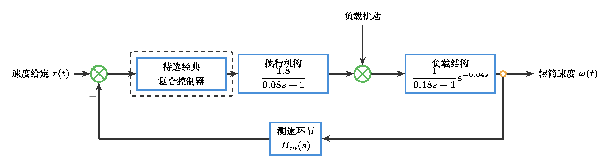

# 自动控制原理 作业5：传统校正技术与初始控制方案

本次作业包含 `3` 道闭题与 `1` 道开放题，总分 `100分`。

## T5-1 由性能要求反推首轮参数起点（20分）

某单位过程模型为 $G(s)=1/[s(s+2)]$，单位反馈下需选择一条首轮超前校正起点参数，使系统同时满足：$M_p\le10\%$、$T_s\le2\,\mathrm{s}$（按 `2%` 判据）、闭环目标相位裕度 $\phi_m\ge50^\circ$。作业要求仅给出“首轮参数起点”。为避免起点选择歧义，本题固定首轮交叉频率取 $\omega_c=5\,\mathrm{rad/s}$。

请按以下步骤计算并给出起点：

1. 先由超调与调节时间要求反推 $\zeta$ 与 $\omega_n$ 下限。
2. 在 $\omega_c=5\,\mathrm{rad/s}$ 下计算该模型的幅值与相位。
3. 根据目标相位裕度确定需补偿的额外相位。
4. 由超前校正第一型参数形式 $C(s)=K_c\frac{1+sT}{1+\alpha sT},\,0<\alpha<1$ 给出首轮参数起点 $(\alpha,T,K_c)$，并说明该结果只是首轮验证起点。

## T5-2 从证据判断到滞后校正整定（20分）

某单位负反馈控制系统的未校正开环传递函数为

$$
L_0(s)=G(s)=\frac{4}{s(0.1s+1)(0.05s+1)}.
$$

已知未校正系统的频域证据为：幅值交叉频率约为 $\omega_{c0}=3.6\,\mathrm{rad/s}$，相位裕度约为 $\gamma_0=60^\circ$。稳态证据为：系统对单位斜坡输入的稳态误差偏大。设计要求为：

$$
e_{ss,\mathrm{ramp}}\le 0.05,\qquad \gamma\ge 50^\circ.
$$

同时希望主要改善低频稳态精度，不要求明显提高交叉频率。

请完成以下任务：

1. 计算未校正系统的速度误差系数 $K_v$ 与单位斜坡输入稳态误差。
2. 根据给出的稳态误差、低频增益和相位裕度证据，说明为什么本题应采用滞后校正。
3. 采用滞后校正网络

$$
C(s)=\beta \frac{1+s/\omega_z}{1+s/\omega_p},\qquad \omega_p=\frac{\omega_z}{\beta},\quad \beta>1
$$

完成参数整定。可取滞后网络零点位于未校正交叉频率的十分之一附近，即 $\omega_z=\omega_{c0}/10$。
4. 写出校正器 $C(s)$，估计校正后的速度误差系数、单位斜坡稳态误差、交叉频率和相位裕度，并说明整定结果如何改善原证据中的问题。

本题不要求仿真验证。

## T5-3 给定对象下的复合控制方案选择（20分）

某薄膜涂布生产线的收卷前牵引辊需要保持稳定线速度。牵引辊由直流伺服电机驱动。为便于表达扰动作用位置，工程上将对象分为执行机构与负载结构两部分：驱动电压指令先经过执行机构形成牵引作用，牵引作用再与负载扰动共同进入负载结构，最终影响辊筒速度。

$$
G_a(s):\quad \frac{1.8}{0.08s+1}.
$$

负载结构可近似为

$$
G_l(s):\quad \frac{1}{0.18s+1}e^{-0.04s}.
$$

其中 $u$ 为驱动电压指令，$\omega$ 为辊筒角速度。负载扰动 $d$ 主要来自膜卷半径变化、材料张力波动和接头通过时的瞬时阻力，可在负载结构前直接与牵引作用共同影响速度。题面对象、扰动作用位置和待选择复合控制结构的关系如图所示。

生产要求中，速度给定 $r(t)$ 常出现小幅阶跃调整和缓慢斜坡升速；扰动 $d(t)$ 以低频缓慢变化为主，偶尔出现短时突变。现场已有单一速度负反馈 `PI` 控制，但仍观察到以下问题：

1. 给定速度变化时，辊筒速度明显滞后，接近目标值前有轻微超调。
2. 负载突变后速度下跌，恢复时间较长。
3. 张力波动时速度曲线出现低频摆动。
4. 若控制作用变化过快，执行器容易出现电压限幅和机械冲击。

请在不改变被控对象的前提下，选择一种你认为合理的经典复合控制方案。可选手段包括但不限于：速度反馈 `PI/PID`、给定前馈、扰动前馈、串级控制、测速滤波、超前或滞后校正、陷波环节、延迟补偿等。你不需要从清单中全部选用，也可以组合其中若干项。

请完成：

1. 写出你选择的复合控制结构，并用文字或框图说明信号连接关系。
2. 说明各组成部分的作用，包括至少一个反馈环节和至少一个额外补偿或辅助环节。
3. 指出该方案预期改善的至少两个指标或现象，并说明原因。
4. 说明该方案可能带来的副作用或实施时需要关注的验证点。
5. 说明为什么你的方案适合本对象的输入信号或扰动特征。

本题答案不唯一。只要方案针对题中对象和现象，属于经典控制范畴，结构自洽，并能说明改善理由，即可按评分标准给分。本题不要求仿真验证。

## O5 传统校正初始控制方案（40分）

请沿用你在 `O4` 中已经保留的首选候选结构与放弃理由，不得更换对象，也不得推翻 `O3-O4` 的主线证据。围绕同一对象，完成一次基于传统校正技术的“初始控制方案”提交。

请完成以下内容：

1. 回收 `O4` 的候选结构排序：写清你最终保留哪一个结构作为首轮方案，为什么暂时放弃其他结构。
2. 写出本次任务的性能要求、验收边界和可接受的首轮偏差。
3. 完成一次结构选型计算：至少给出一个关键指标的计算过程，例如超前补偿相位、滞后低频增益提升、PI 参数起点或 PID 主参数方向。
4. 写出所选基础结构的表达式、关键参数及参数方向，并用 `MATLAB/Octave` 完成基础结构的首轮仿真验证。
5. 在基础结构上选择一个经典复合结构，例如给定滤波、扰动前馈、速度前馈、限幅与抗饱和、滞后补偿或超前补偿的组合；说明每个附加环节回应的项目背景证据。
6. 为复合结构建立项目背景中的输入信号或扰动模型，不得只使用单位阶跃；例如斜坡给定、周期给定、负载阶跃、周期扰动或测量噪声。
7. 用 `MATLAB/Octave` 完成复合结构仿真验证，提交代码、结果图和一张仿真验证记录表。
8. 根据验证结果写出下一轮调参问题清单：列出最需要优先处理的 `3` 个问题及对应证据。
9. 附 `AI 使用记录摘要`，写明 AI 参与了哪些整理、仿真代码检查或文字润色工作，以及你如何核查关键判断。

提交要求：

- 主体正文不超过 `900` 字。
- 必须附 `1` 张方案结构图或等价结构表达，图中应区分基础结构与复合附加环节。
- 必须附 `1` 段结构选型计算。
- 必须附 `1` 张基础结构与复合结构的仿真验证记录表。
- 必须附 `1` 张下一轮调参问题清单。
- 必须附 `MATLAB/Octave` 仿真代码、结果图与简短复现实验说明；复合结构验证必须包含项目背景中的输入信号或扰动模型。
- 允许首轮方案不满足全部指标，但必须说明证据指向的下一轮调参方向。
