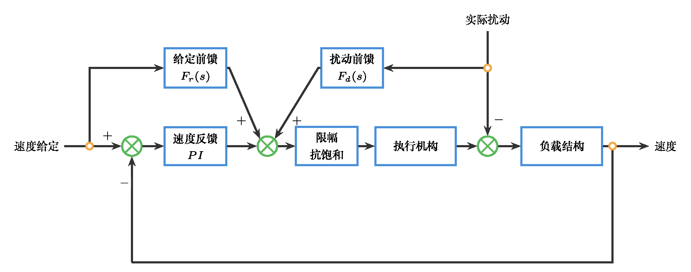
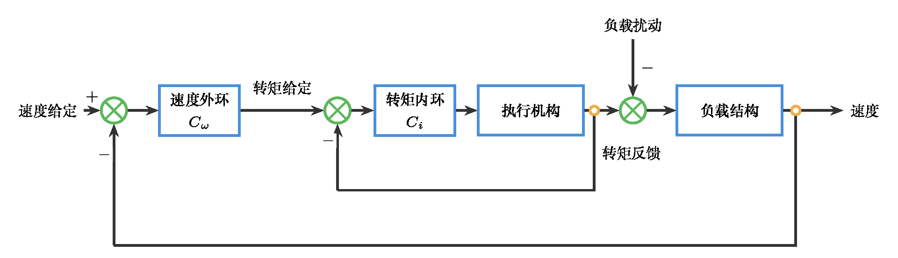
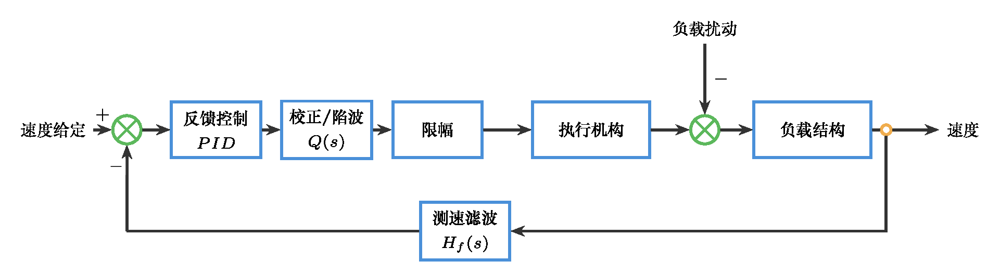

# 自动控制原理 作业5：传统校正技术与初始控制方案（含参考答案）

本文件收录 `T5-1` 到 `T5-3` 的闭题参考答案，以及 `O5` 开放题示例答案。

## T5-1 由性能要求反推首轮参数起点（20分）

### 题干

某单位过程模型为 $G(s)=1/[s(s+2)]$，单位反馈下需选择一条首轮超前校正起点参数，使系统同时满足：$M_p\le10\%$、$T_s\le2\,\mathrm{s}$（按 `2%` 判据）、闭环目标相位裕度 $\phi_m\ge50^\circ$。本题固定首轮交叉频率取 $\omega_c=5\,\mathrm{rad/s}$。

请由超调与调节时间要求反推 $\zeta$ 与 $\omega_n$ 下限，在 $\omega_c=5\,\mathrm{rad/s}$ 下计算对象幅值与相位，根据目标相位裕度确定需补偿的额外相位，并由 $C(s)=K_c\frac{1+sT}{1+\alpha sT}$ 给出首轮参数起点。

### 标准答案

由超调要求得
$$
\zeta_{\min}=\frac{|\ln 0.10|}{\sqrt{\pi^2+(\ln 0.10)^2}}\approx0.591.
\tag{4分}
$$

首轮取 $\zeta_0=0.60$。由 $T_s\approx 4/(\zeta\omega_n)\le2$ 得
$$
\omega_n\ge\frac{4}{0.60\times2}=3.33\,\mathrm{rad/s}.
\tag{4分}
$$

在 $\omega_c=5\,\mathrm{rad/s}$ 处：
$$
|G(j5)|=\frac{1}{5\sqrt{5^2+2^2}}\approx0.03714,\qquad
\angle G(j5)=-90^\circ-\tan^{-1}\frac{5}{2}\approx-158.20^\circ.
\tag{4分}
$$

未校正相位裕度为 $PM_0=21.80^\circ$，所需超前相位为
$$
\Delta\phi=50^\circ-21.80^\circ=28.20^\circ.
\tag{3分}
$$

由 $\phi_{\max}=\sin^{-1}\frac{1-\alpha}{1+\alpha}$ 得
$$
\alpha=\frac{1-\sin 28.20^\circ}{1+\sin 28.20^\circ}\approx0.358.
\tag{2分}
$$

令 $\omega_m=1/(T\sqrt{\alpha})=\omega_c$，得
$$
T=\frac{1}{5\sqrt{0.358}}\approx0.334\,\mathrm{s}.
\tag{2分}
$$

由幅值交叉条件 $|K_c C(j5)G(j5)|=1$ 得
$$
K_c=\frac{1}{0.03714\times(1/\sqrt{0.358})}\approx16.12.
\tag{1分}
$$

因此首轮参数起点可取 $\alpha_0\approx0.358,\ T_0\approx0.334\,\mathrm{s},\ K_{c0}\approx16.1$。该结果只用于首轮验证。

### 分步评分标准

- **性能要求翻译**（8分）：正确把超调和调节时间要求转化为 $\zeta$ 与 $\omega_n$ 下限。
- **频域起点计算**（7分）：正确计算幅值、相位、未校正相位裕度和所需超前相位。
- **超前参数换算**（5分）：正确给出 $\alpha,T,K_c$，并说明其为首轮验证起点。

---

## T5-2 从证据判断到滞后校正整定（20分）

### 题干

某单位负反馈控制系统的未校正开环传递函数为
$$
L_0(s)=G(s)=\frac{4}{s(0.1s+1)(0.05s+1)}.
$$
已知未校正系统的幅值交叉频率约为 $\omega_{c0}=3.6\,\mathrm{rad/s}$，相位裕度约为 $\gamma_0=60^\circ$。系统对单位斜坡输入的稳态误差偏大。设计要求为
$$
e_{ss,\mathrm{ramp}}\le0.05,\qquad \gamma\ge50^\circ.
$$
同时希望主要改善低频稳态精度，不要求明显提高交叉频率。

请计算未校正系统的 $K_v$ 与单位斜坡稳态误差，说明为什么应采用滞后校正，并按
$$
C(s)=\beta\frac{1+s/\omega_z}{1+s/\omega_p},\qquad \omega_p=\frac{\omega_z}{\beta}
$$
完成整定。可取 $\omega_z=\omega_{c0}/10$。最后写出 $C(s)$，估计校正后的 $K_v$、单位斜坡稳态误差、交叉频率和相位裕度。

### 标准答案

未校正系统的速度误差系数为
$$
K_v=\lim_{s\to0}sL_0(s)=4.
$$
因此单位斜坡输入稳态误差为
$$
e_{ss,\mathrm{ramp}}=\frac{1}{K_v}=\frac{1}{4}=0.25.
\tag{4分}
$$
该值大于设计要求 `0.05`，说明主要问题是低频稳态精度不足。

设计要求需要
$$
K_v^\ast\ge\frac{1}{0.05}=20.
$$
未校正系统 $K_v=4$，所以低频增益至少需要提高
$$
\beta=\frac{K_v^\ast}{K_v}=\frac{20}{4}=5.
\tag{4分}
$$

未校正系统已有相位裕度约 $60^\circ$，高于要求的 $50^\circ$；题目又要求主要改善稳态精度，不要求明显提高交叉频率。因此应采用滞后校正：在低频段提高增益，从而增大 $K_v$，并让中高频段增益接近 `1`，使交叉频率和相位裕度变化较小。（4分）

取
$$
\omega_z=\frac{\omega_{c0}}{10}=0.36\,\mathrm{rad/s},\qquad
\omega_p=\frac{\omega_z}{\beta}=0.072\,\mathrm{rad/s}.
$$
滞后校正器可写为
$$
C(s)=5\frac{1+s/0.36}{1+s/0.072}.
\tag{4分}
$$

校正后速度误差系数为 $K_v'=5\times4=20$，单位斜坡输入稳态误差为
$$
e'_{ss,\mathrm{ramp}}=\frac{1}{20}=0.05,
\tag{2分}
$$
满足稳态误差要求。

在 $\omega=3.6\,\mathrm{rad/s}$ 附近，
$$
|C(j3.6)|=5\frac{\sqrt{1+(3.6/0.36)^2}}{\sqrt{1+(3.6/0.072)^2}}\approx1.00,
$$
因此校正后的交叉频率可估计仍在 $\omega_c'\approx3.6\,\mathrm{rad/s}$ 附近。（1分）

滞后网络在 $\omega=3.6\,\mathrm{rad/s}$ 处引入的相位约为
$$
\angle C(j3.6)=\tan^{-1}(10)-\tan^{-1}(50)\approx84.3^\circ-88.9^\circ=-4.6^\circ.
$$
因此校正后相位裕度可估计为
$$
\gamma'\approx60^\circ-4.6^\circ=55.4^\circ,
\tag{1分}
$$
仍满足 $\gamma\ge50^\circ$。

综上，滞后校正将低频增益提高 `5` 倍，使速度误差系数由 `4` 提高到 `20`，单位斜坡稳态误差由 `0.25` 降低到 `0.05`；同时交叉频率基本保持在 $3.6\,\mathrm{rad/s}$ 附近，相位裕度约为 $55.4^\circ$。该整定结果针对“稳态误差偏大”进行了改善，同时没有明显破坏原有相位裕度。（4分）

### 分步评分标准

- **未校正稳态误差计算**（4分）：正确计算 $K_v=4$、单位斜坡稳态误差 $0.25$。
- **低频增益提升倍数**（4分）：根据 $e_{ss}\le0.05$ 推得 $K_v^\ast\ge20$，并计算 $\beta=5$。
- **滞后校正适用性判断**（4分）：能结合稳态误差偏大、低频增益不足、原相位裕度已有余量说明采用滞后校正。
- **滞后网络参数整定**（4分）：正确取 $\omega_z=0.36\,\mathrm{rad/s}$、$\omega_p=0.072\,\mathrm{rad/s}$，并写出校正器。
- **校正后性能估计**（4分）：正确估计 $K_v'$、稳态误差、交叉频率和相位裕度。

---

## T5-3 给定对象下的复合控制方案选择（20分）

### 题干

某薄膜涂布生产线的收卷前牵引辊需要保持稳定线速度。牵引辊由直流伺服电机驱动。为便于表达扰动作用位置，工程上将对象分为执行机构与负载结构两部分：驱动电压指令先经过执行机构形成牵引作用，牵引作用再与负载扰动共同进入负载结构，最终影响辊筒速度。
$$
G_a(s):\quad \frac{1.8}{0.08s+1}.
$$
负载结构可近似为
$$
G_l(s):\quad \frac{1}{0.18s+1}e^{-0.04s}.
$$
负载扰动 $d$ 主要来自膜卷半径变化、材料张力波动和接头通过时的瞬时阻力，可在负载结构前直接与牵引作用共同影响速度。题面对象、扰动作用位置和待选择复合控制结构的关系如图所示。


速度给定 $r(t)$ 常出现小幅阶跃调整和缓慢斜坡升速；扰动 $d(t)$ 以低频缓慢变化为主，偶尔出现短时突变。现场已有单一速度负反馈 `PI` 控制，但仍观察到给定变化滞后、负载突变后速度下跌、低频摆动以及执行器电压限幅风险。

请在不改变被控对象的前提下，选择一种合理的经典复合控制方案。可选手段包括但不限于：速度反馈 `PI/PID`、给定前馈、扰动前馈、串级控制、测速滤波、超前或滞后校正、陷波环节、延迟补偿等。答案不唯一。

请写出复合控制结构和信号连接关系，说明各组成部分作用，指出预期改善的至少两个指标或现象，说明可能副作用或验证关注点，并说明为什么该方案适合本对象的输入信号或扰动特征。本题不要求仿真验证。

### 参考答案

一种可接受方案是“速度反馈 PI + 给定前馈 + 扰动前馈”的复合控制结构。（4分）



控制结构可描述为：速度给定 $r(t)$ 一路进入 `PI` 速度反馈控制器，速度测量值 $\omega(t)$ 与给定值比较形成误差；速度给定信号线向上引出给定前馈，实际负载扰动信号同时接入扰动前馈和负载前综合点。反馈、给定前馈和扰动前馈共同形成驱动电压指令，经执行机构形成牵引作用；实际负载扰动从上方垂直加入负载结构前，与牵引作用综合后共同影响速度。必要时在测速反馈通道加入低通滤波，避免测量噪声直接放大。（4分）

各组成部分的作用如下：`PI` 速度反馈用于保证闭环稳定性，并抑制模型误差和未知扰动造成的速度偏差；给定前馈利用速度给定的变化趋势提前给出控制作用，减少阶跃或斜坡变化时的跟踪滞后；扰动前馈在负载扰动信号可获得时提前补偿负载变化，减小接头通过或张力变化引起的速度下跌；测速滤波或控制量限幅处理用于降低噪声放大和执行器冲击风险。（5分）

该方案预期改善的现象包括：改善给定变化时的跟踪滞后，因为给定前馈不完全依赖误差积累后再产生控制作用；减小负载突变后的速度跌落，因为扰动前馈可在扰动影响完全反映到速度误差之前进行补偿；缩短恢复时间，因为反馈环节和前馈环节共同承担调节任务；降低低频速度摆动幅度，因为负载相关扰动被前馈削弱。（5分）

可能副作用或验证关注点包括：前馈环节依赖对象参数，若执行机构、负载结构或扰动量纲折算与现场偏差较大，补偿可能不足或过度；扰动前馈参数过强可能把负载变化转化为过大的控制量；给定前馈过强可能导致电压限幅、超调或机械冲击；延迟 $e^{-0.04s}$ 使过快的补偿存在相位滞后风险，应检查闭环稳定裕度和现场响应。（4分）

该方案适合本对象的原因是：题中对象为低阶惯性加小延迟，给定信号包含阶跃和斜坡，扰动以低频负载变化和短时突变为主。反馈 `PI` 适合处理稳态偏差，给定前馈适合改善给定变化时的响应，扰动前馈适合处理可获得的负载变化信号。（2分）

其他可接受方案包括：速度环 `PI/PID` + 电流或转矩内环的串级控制；速度反馈 `PI` + 给定前馈 + 测速滤波；速度反馈 `PI` + 扰动前馈 + 滞后或低通校正；速度反馈 `PID` + 延迟补偿或超前校正；速度反馈 `PI` + 陷波环节。只要学生能说明对象依据、信号连接、改善指标和副作用，就可按同一口径给分。





### 分步评分标准

- **复合结构与信号关系**（4分）：明确给出针对牵引辊速度对象的复合控制结构，说明给定、反馈、补偿信号与控制量的连接关系。
- **组成部分作用说明**（5分）：分别说明反馈环节和至少一个额外补偿或辅助环节的作用。
- **改善指标与原因**（5分）：至少指出两个待改善现象，并给出清楚原因。
- **副作用或验证关注点**（4分）：能指出参数偏差、噪声放大、执行器限幅、机械冲击、稳定裕度或延迟影响等关注点。
- **对象与信号特征匹配**（2分）：能说明方案为何适合题中对象、输入信号或扰动特征。

---

## O5 传统校正初始控制方案（40分）

### 题干

请沿用你在 `O4` 中已经保留的首选候选结构与放弃理由，不得更换对象，也不得推翻 `O3-O4` 的主线证据。围绕同一对象，完成一次基于传统校正技术的首轮控制方案。

提交内容包括：`O4` 候选结构排序回收、性能要求与验收边界、结构选型计算、基础结构仿真验证、复合结构选型说明、项目背景中的输入信号或扰动模型、复合结构仿真验证记录表、下一轮调参问题清单和 `AI 使用记录摘要`。复合结构验证不得只使用单位阶跃。

### 参考答案

以下示例沿用 `O4` 中“小型直流电机转速控制”的示例对象。学生可以使用自己的对象，但必须保持 `O3-O4-O5` 的对象、主要矛盾和候选结构连续。

继续沿用简化模型
$$
G(s)=\frac{1}{0.35s+1}.
$$
`O4` 已确认主要矛盾是恒定负载下长期转速偏差偏大，同时速度给定存在缓慢升速段和小幅阶跃调整。因此首轮基础结构保留 `PI`，复合结构采用 `PI + 给定滤波 + 负载扰动前馈`。（6分）


结构选型计算如下。若只采用比例控制 $C_0(s)=1.2$，位置误差系数 $K_p=C_0(0)G(0)=1.2$，单位阶跃稳态误差约为
$$
e_{ss}=\frac{1}{1+K_p}=\frac{1}{2.2}\approx0.455.
\tag{6分}
$$
该误差不能满足首轮希望“稳态误差明显下降”的要求，因此需要引入积分作用。首轮取
$$
C_{PI}(s)=1.2+\frac{0.8}{s}.
$$

基础结构仿真应先比较比例控制与 `PI` 对阶跃或斜坡给定的误差收敛。若 `PI` 使长期偏差明显下降，但超调、调节时间或控制量峰值增加，则说明基础结构有效但仍需复合环节处理输入和扰动背景。（8分）

复合结构中，给定滤波
$$
F_r(s)=\frac{1}{0.12s+1}
$$
用于降低小幅阶跃给定造成的冲击；负载扰动前馈
$$
F_d(s)=\frac{0.8}{0.25s+1}
$$
用于对低频负载扰动作提前补偿。复合结构不是为了替代反馈，而是减轻反馈单独承担给定变化和负载扰动时的压力。（8分）

项目背景输入和扰动可设为：$r(t)$ 为 `0-3s` 的斜坡升速叠加 `t=5s` 的小幅给定阶跃；$d(t)$ 为 `t=4s` 出现的负载阶跃扰动。示例 `MATLAB/Octave` 代码如下。（8分）

```matlab
pkg load control
set(0, 'defaulttextfontname', 'Songti SC');
set(0, 'defaultaxesfontname', 'Songti SC');
s = tf('s');
G = 1/(0.35*s + 1);

C0 = 1.2;
Cpi = 1.2 + 0.8/s;
Fr = 1/(0.12*s + 1);
Fd = 0.8/(0.25*s + 1);

T0 = feedback(C0*G, 1);
Tpi = feedback(Cpi*G, 1);
Sd_pi = feedback(G, Cpi);
Tpi_f = Tpi * Fr;
Sd_comp = feedback(G*(1 - Fd), Cpi);

t = 0:0.01:10;
r = min(t/3, 1) + 0.15*(t >= 5);
d = -0.25*(t >= 4);

y_base = lsim(T0, r, t);
y_pi = lsim(Tpi, r, t) + lsim(Sd_pi, d, t);
y_comp = lsim(Tpi_f, r, t) + lsim(Sd_comp, d, t);

figure;
plot(t, r, 'k--', t, y_base, t, y_pi, t, y_comp);
grid on;
legend('给定 r(t)', '比例基线', 'PI 基础结构', 'PI + 给定滤波 + 扰动前馈');
xlabel('时间 / s');
ylabel('转速');
title('O5 首轮仿真验证');
```


验证记录表应至少包含斜坡跟踪误差、给定阶跃冲击、负载扰动后的速度跌落、恢复时间和控制量风险。若复合结构相对基础 `PI` 减小给定冲击和扰动跌落，但响应变慢或控制量仍偏大，应写入下一轮调参问题清单。（8分）

AI 使用记录摘要需说明 AI 参与了结构整理、代码检查或文字润色，学生独立完成对象继承、结构选型计算、输入/扰动建模、仿真运行和关键判断核查。（4分）

### 评分标准

- **主线继承与性能边界**（6分）：沿用 `O4` 的对象、主要矛盾和候选结构，不另起炉灶。
- **结构选型计算**（6分）：给出至少一个关键指标计算，并据此说明基础结构选择。
- **基础结构验证**（8分）：能用仿真验证基础结构对主要矛盾的改善及副作用。
- **复合结构与输入/扰动建模**（8分）：复合结构选择有项目背景依据，输入或扰动模型不是单纯单位阶跃。
- **复合结构仿真与调参问题清单**（8分）：验证记录表能比较基础结构和复合结构，并提出后续问题。
- **AI 使用记录摘要**（4分）：说明 AI 参与范围和学生核查方式。

**总分：40分**
