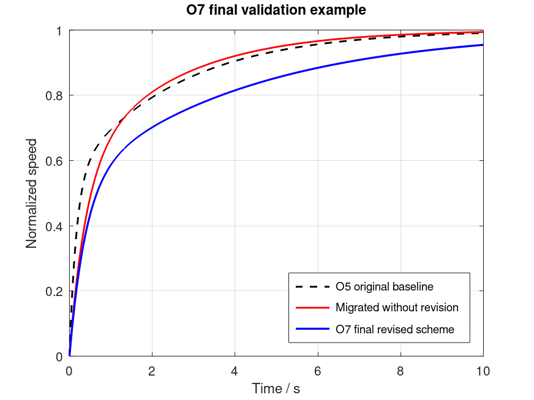

# 自动控制原理 作业7：线性主干边界与方法迁移判断（含参考答案）

本文件收录 `T7-1`、`T7-2` 两道闭题参考答案，以及 `O7` 开放题示例答案。

## T7-1 线性主干边界与方法进入条件（25分）

### 题干

某实验室面对同一类“伺服定位控制”任务：被控对象均为电机-负载系统，目标是在给定位置指令下实现稳定、快速、可验证的跟踪，并满足安全约束。工程组已有一套基于线性化模型的经典控制流程：建模、稳定性分析、时域/频域指标校核、参数整定与实验验证。现在出现以下四类证据：

- 场景A：小范围运行时，阶跃响应、频域裕度和扰动恢复均与线性模型预测基本一致；扩大到额定工作区后，指标仍满足任务要求。
- 场景B：接近行程边界时，执行器饱和明显，出现限幅后的恢复变慢；小范围线性指标仍好，但大范围响应与线性预测偏离。
- 场景C：对象结构复杂、负载变化频繁，精确机理建模代价高；历史运行数据覆盖了主要工况，但部分极端工况样本很少。
- 场景D：任务目标不是固定跟踪一个给定轨迹，而是在多种工况下自主选择动作以兼顾速度、能耗和安全；显式写出控制律十分困难，且试错有安全成本。

请回答以下问题：

1. 判断线性主干在四个场景中分别应继续作为主方法、作为基线方法，还是已经暴露边界，并说明依据。
2. 对场景B、C、D分别说明更合适的迁移方向：非线性边界分析、数据驱动方法、策略学习路线，或仍回到线性主干；要求写出进入条件和主要验证责任。
3. 说明为什么“有数据就应该上学习方法”和“线性主干失效等于经典控制无价值”这两种说法都不成立。

约束：本题只考方法边界识别，不要求推导描述函数、相平面、MPC、RL或数据驱动算法。回答必须围绕对象边界、任务约束、验证证据和方法进入条件展开。

### 标准答案

场景A应继续以线性主干作为主方法：对象在任务工作区内的响应证据与线性模型预测一致，稳定性、裕度、扰动恢复和指标均满足要求，因此没有充分理由迁移到更复杂方法。（3分）

场景B暴露的是线性主干的运行边界，而不是线性主干全盘失效：小范围线性指标仍有效，但接近行程边界时执行器饱和使大范围响应偏离线性预测，应把线性主干保留为小信号基线，同时引入非线性边界分析来识别饱和、限幅、恢复时间和安全裕度。（4分）

场景C不应因为“对象复杂”就自动放弃线性主干。合理判断是：线性主干可作为可解释基线和局部验证工具；若机理建模代价高且数据覆盖主要工况，可考虑数据驱动方法补充建模或预测，但进入条件包括数据覆盖充分、采集质量可信、验证集能代表使用场景，并且必须说明极端工况样本不足带来的泛化风险。（5分）

场景D更接近策略学习路线的进入条件：任务核心不再只是固定控制律下的跟踪指标，而是在多工况下选择动作、权衡速度、能耗和安全；当显式预设控制律困难时，可以把策略学习作为候选路线。但它不能绕过安全验证，必须限制试错风险，进行仿真或离线验证，并与线性或规则基线比较。（5分）

方法进入条件应区分层次：非线性边界分析主要处理饱和、死区、摩擦、限幅等使线性假设失效的对象边界；数据驱动主要处理机理建模困难但数据覆盖可验证的复杂对象；策略学习主要处理动作选择规则难以直接写出、目标包含长期权衡或多目标决策的任务。（4分）

“有数据就应该上学习方法”不成立，因为数据方法需要覆盖范围、质量、验证代价和泛化责任；数据不足或边界工况缺失时，学习结果反而可能不可验证。（2分）

“线性主干失效等于经典控制无价值”也不成立，因为线性主干仍可提供局部模型、稳定性基线、指标语言、实验对照和安全校核；迁移方法是在边界证据出现后补充或扩展它，而不是宣传式替代。（2分）

## T7-2 同题下的方法迁移与路线选择（25分）

### 题干

某教学实验平台需要完成一个“单输入单输出执行机构的位置跟踪”任务。已知被控对象在小范围工作点附近近似线性，已有阶跃响应、扰动恢复和稳态误差记录；当前要求是在不改变硬件和安全联锁的前提下，把跟踪误差、扰动恢复时间和调试工作量控制在可解释、可验收的范围内。平台还会持续积累运行数据，但目前数据只覆盖常见给定信号和中等负载，极端负载与传感器异常样本较少。

只能在下列三条路线中选择和比较，不得新增外部路线：

A. 经典控制路线：以线性模型、频域/时域指标和补偿器整定为主，必要时做小范围参数修正。

B. 数据驱动路线：利用已采集数据修正模型、识别边界或辅助整定，但仍保留显式控制结构和验收指标。

C. 策略学习路线：在仿真或受限环境中学习控制策略，用于显式控制律难以预设、工况组合复杂的场景。

请完成结构化设计判断：

1. 给出你的首选路线，并说明它与当前任务条件的匹配关系。
2. 比较 A、B、C 三条路线的主要收益和主要风险。
3. 从可解释性、验证代价和工程责任角度说明你的判断。
4. 给出从首选路线向更高级路线迁移的条件，以及“不应升级”的条件。
5. 明确说明本题中哪些外部路线、算法推导或实现内容不应展开。

### 标准答案

首选路线应为 B：数据驱动辅助的显式控制路线。理由是当前对象在小范围工作点附近近似线性，已有阶跃响应、扰动恢复和稳态误差记录，目标也是跟踪误差、扰动恢复时间和调试工作量这类可用经典指标验收的任务；B 不取消显式控制结构，而是在 A 的线性模型、补偿器和验收指标上利用数据修正模型、识别边界并辅助整定，因此最能同时利用已有数据和保持可解释责任。（5分）

A 的收益是结构清楚、参数含义和验收指标明确，适合形成基础控制器和安全基线；风险是当负载变化、传感器异常、摩擦或非线性超出小范围工作点时，单靠线性模型和小范围参数修正可能性能下降，也可能浪费已有运行数据。（2分）B 的收益是可以利用已有阶跃响应、扰动恢复和稳态误差记录修正模型、识别适用边界、辅助整定，并且仍保留显式控制结构和验收指标；风险是当前数据主要覆盖常见给定信号和中等负载，若外推到极端负载或传感器异常，可能低估泛化风险。（2分）C 的收益是在显式控制律难以预设、工况组合复杂且仿真或受限环境可信时可能提供更强适应性；风险是当前样本覆盖、安全验证、可解释性和责任界定都不足，不能作为当前默认路线。（2分）

从可解释性看，A 和 B 都能保留模型、补偿器、时域/频域指标和稳态误差等验收语言，其中 B 需要额外说明数据来源、覆盖范围和修正边界；C 的策略行为较难逐项对应到传统闭环指标，解释性最低。（2分）从验证代价看，A 主要验证阶跃响应、扰动恢复、稳态误差和稳定裕度；B 还要验证数据质量、训练/验证工况代表性和未覆盖边界；C 需要可信仿真、受限试验、安全包络、回退机制和更大范围场景测试，代价最高。（2分）从工程责任看，B 的责任应落在显式控制器、数据适用范围、模型修正记录和验收指标上；C 若直接进入真实闭环，难以说明策略失效原因和责任边界，因此不满足当前工程责任要求。（2分）

合理迁移路径是：先把 A 作为显式控制结构和验收基线，在此基础上采用 B，用数据修正模型、识别边界并辅助整定；若 B 后续仍无法覆盖目标工况，且平台已经积累覆盖极端负载、传感器异常、扰动组合和安全边界的数据，才考虑进一步升级。（3分）只有在具备高可信仿真或受限实验环境、安全联锁、在线监控、回退控制器、离线验证证据和清晰责任边界时，C 才能作为受限候选路线；若 A/B 已满足指标，或数据仍缺少极端与异常样本，或无法说明验证边界和安全回退，则不应升级到 C。（3分）

本题只允许比较 A、B、C 三条给定路线，不应额外引入 MPC、鲁棒控制、自适应控制、端到端深度控制等外部路线；也不应展开 RL、MPC、数据驱动算法推导、训练流程、代码实现、硬件改造或大型开放式系统方案。（2分）

## O7 最终完整控制方案（50分）

### 题干

请沿用 `O1-O6` 的同一自选控制对象，提交一份最终完整控制方案。不得更换对象，不得另起一套与前六次无关的新方案；若前序作业中曾调整参数或模型，应说明调整发生在哪一次以及理由。

提交内容：

1. 主体正文不超过 `1200` 字，必须覆盖问题定义、基线模型、机理诊断、结构比较、初始方案、优化与迁移、`O7` 最终方案、当前方案边界、进一步升级路径。
2. 提交 `2-3` 张总览图/表，例如 `O1-O6` 继承链表、最终控制结构总览图、关键证据矩阵。
3. 提交最终核心仿真结果图，至少比较 `O5` 原基线方案、迁移后未修正方案、`O7` 最终修正版方案，并提交可运行的 `MATLAB/Octave` 代码。
4. 提交 `AI 使用记录摘要`，说明 AI 用于哪些环节、人工核查了哪些结论、哪些内容由本人最终负责。

允许讨论 `MPC`、数据驱动控制或强化学习作为未来升级方向，但只能说明进入条件、预期收益、风险和验证责任；不得把这些方法写成已实现算法，不得提交训练流程或调参竞赛式内容。

### 参考答案

以下为示例答案结构，学生应替换为本人 `O1-O6` 的连续对象。示例假设：`O1-O6` 均围绕小型直流电机转速控制，输入为电枢电压，输出为转速，课程内最终方案采用经典线性主干。

对象保持为直流电机转速控制，`O1` 给出控制目标与扰动来源，`O2` 得到线性化传递函数，`O3` 诊断出惯性主导、负载扰动导致稳态偏差，`O4` 比较开环、比例闭环和带校正闭环结构，`O5` 形成初始 `PI/超前` 校正方案，`O6` 在参数迁移后发现相位裕度和超调风险上升，`O7` 因此保留同一对象并修正校正参数。完成 `O1-O6` 与 `O7` 的对象、模型、证据和决策继承说明。（10分）

最终问题定义为：在额定负载附近，使转速阶跃响应稳态误差接近 `0`，超调可接受，调节时间较 `O5` 基线缩短，并对轻微参数迁移保持稳定。给出对象、输入输出、扰动、性能指标和验收口径。（3分）

基线模型示例为 $G(s)=1/(0.08s^2+0.42s+1)$，最终控制器采用经典线性校正 $C_{O7}(s)=3.0(1+0.24s)/(1+0.05s)$，闭环为 $T(s)=C_{O7}(s)G(s)/(1+C_{O7}(s)G(s))$。说明控制器结构、闭环连接、可调参数和与 `O5/O6` 的关系。（5分）

提交 `2-3` 张总览图/表：`O1-O7` 继承链表、最终结构总览图、关键证据矩阵；图表应能让读者看到“为什么选择当前方案”。完成最终方案的结构化交付。（4分）

核心判断不是“参数更大就更好”，而是 `O6` 迁移后未修正方案虽然速度提高，但超调和裕度风险增加；`O7` 通过重新配置零极点位置，在速度、超调、稳态误差和鲁棒余量之间取得折中。用总览表、仿真图和代码共同支撑该判断。（4分）

最终核心仿真结果图应引用如下示例图，学生可用本人对象重新生成同类图：



图中应至少包含 `O5` 原基线、迁移后未修正方案、`O7` 最终修正版方案三条曲线，并在正文中解释三者差异及其工程含义。（4分）

可提交的 `MATLAB/Octave` 代码示例如下，正式示例文件位于 `assets/T7/O7-final-validation.source.m`：

```matlab
pkg load control
s = tf('s');
G_base = 1/(0.35*s + 1);
G_migrated = 1/(0.75*s + 1);
C_o5 = 1.2 + 0.8/s;
C_o6 = 1.1 + 0.45/s;
T_o5_base = feedback(C_o5 * G_base, 1);
T_o5_migrated = feedback(C_o5 * G_migrated, 1);
T_o6_final = feedback(C_o6 * G_migrated, 1);
t = 0:0.01:10;
step(T_o5_base, T_o5_migrated, T_o6_final, t);
grid on;
legend('O5 original baseline', 'Migrated without revision', 'O7 final revised scheme');
title('O7 final validation example');
```

代码能够复现核心比较逻辑，并与图中结论一致。（4分）

当前方案边界：该方案依赖线性化模型和额定工作点附近的小扰动假设；若出现大幅饱和、强摩擦死区、负载突变、测量延迟或模型参数剧烈漂移，线性主干结论需要重新验证。明确列出至少 `3` 个边界条件及其对当前方案的影响。（4分）

升级路径：若边界问题主要来自约束和多变量耦合，可把 `MPC` 作为未来方向；若主要来自难建模扰动或长期数据积累，可考虑数据驱动辨识或学习辅助；若主要来自策略选择和工况切换，可讨论强化学习作为研究方向。这里只说明进入条件、数据与安全门槛、验证责任，不实现算法或训练流程。（5分）

最终责任说明：任何升级都应先通过线性主干复核、离线仿真、异常工况测试和人工审查，不能直接把前沿方法替代为已验证工程方案。（3分）

AI 可用于整理 `O1-O6` 继承链、检查文字结构、生成代码草稿或表格模板；学生需说明人工核查了模型、参数、图表、代码运行结果和最终判断，并声明最终提交结论由本人负责。（4分）
