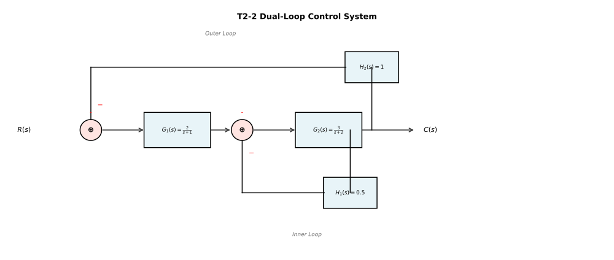

# 自动控制原理 第二章作业

## T2-1 物理系统建立传递函数

如图所示的弹簧-阻尼-质量机械系统，质量块 $m$ 在水平方向受到外力 $f(t)$ 作用产生位移 $y(t)$。

已知系统参数：
- 质量 $m = 4$ kg
- 阻尼系数 $c = 8$ N·s/m
- 弹簧刚度 $k = 80$ N/m

输入为外力 $f(t)$，输出为质量块的位移 $y(t)$。假设初始条件为零。

请完成以下要求：

1. 根据牛顿第二定律列写系统的微分方程；
2. 对微分方程进行拉普拉斯变换，求系统的传递函数 $G(s)=Y(s)/F(s)$；
3. 将传递函数化为标准二阶系统形式 $G(s)=K\omega_n^2/(s^2+2\zeta\omega_n s+\omega_n^2)$，确定 $K$、$\omega_n$ 和 $\zeta$；
4. 计算自然频率 $\omega_n$ 和阻尼比 $\zeta$ 的数值（可保留根号形式）。

---

## T2-2 结构图化简求闭环传递函数

已知某控制系统结构图如下图所示，系统包含内环反馈和外环反馈：

**各模块传递函数：**
- 前向通路：$G_1(s) = \frac{2}{s+1}$，$G_2(s) = \frac{3}{s+2}$
- 内环反馈：$H_1(s) = 0.5$
- 外环反馈：$H_2(s) = 1$

**要求：**

1. 先化简内环，求出内环的等效传递函数 $G_{inner}(s)$；
2. 再化简外环，求出系统的闭环传递函数 $T(s) = C(s)/R(s)$；
3. 若 $G_1(s)$ 的增益变为原来的 2 倍（即 $G_1'(s) = \frac{4}{s+1}$），分析 $T(s)$ 将如何变化（定性说明即可）。

---

## T2-3 由传递函数计算时域指标

已知某单位负反馈系统的闭环传递函数为：

$$T(s) = \frac{Y(s)}{R(s)} = \frac{25}{s^2 + 3s + 25}$$

该系统为典型的欠阻尼二阶系统。

**要求：**

1. 从闭环传递函数中识别出无阻尼自然频率 $\omega_n$ 和阻尼比 $\zeta$，并计算阻尼自然频率 $\omega_d$；
2. 计算该系统的峰值时间 $t_p$、超调量 $\sigma\%$、以及按 5% 误差带的调节时间 $t_s$；
3. 若要将超调量从当前值降至 10% 以下，阻尼比 $\zeta$ 需要达到多少？（可保留根号形式或给出近似值）

**提示：** 可能用到的公式
- $\omega_d = \omega_n\sqrt{1-\zeta^2}$
- $t_p = \frac{\pi}{\omega_d}$
- $\sigma\% = e^{-\zeta\pi/\sqrt{1-\zeta^2}} \times 100\%$
- $t_s \approx \frac{3}{\zeta\omega_n}$（5% 误差带）

---

## T2-4 参数变化与极点迁移分析

某单位负反馈系统的开环传递函数为 $G(s) = \frac{K}{s(s+2)}$，其中 $K > 0$ 为可调增益参数。

**要求：**

1. 求该系统的闭环传递函数，并导出闭环极点关于参数 $K$ 的表达式；
2. 画出 $K$ 从 0 逐渐增大到临界值时，闭环极点在 $s$ 平面上的轨迹草图（需标注关键点的坐标）；
3. 列表计算当 $K = 0.5$、$1$、$2$、以及临界增益 $K_{cr}$ 时的阻尼比 $\zeta$、超调量 $\sigma\%$ 和系统稳定性；
4. 确定使系统超调量满足 $\sigma\% \leq 16.3\%$ 的 $K$ 值范围。

**提示：** 16.3% 超调量对应阻尼比 $\zeta = 0.5$
