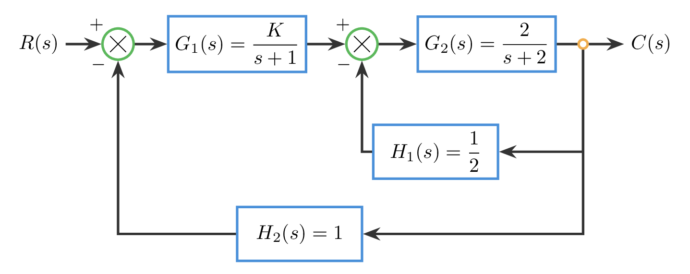
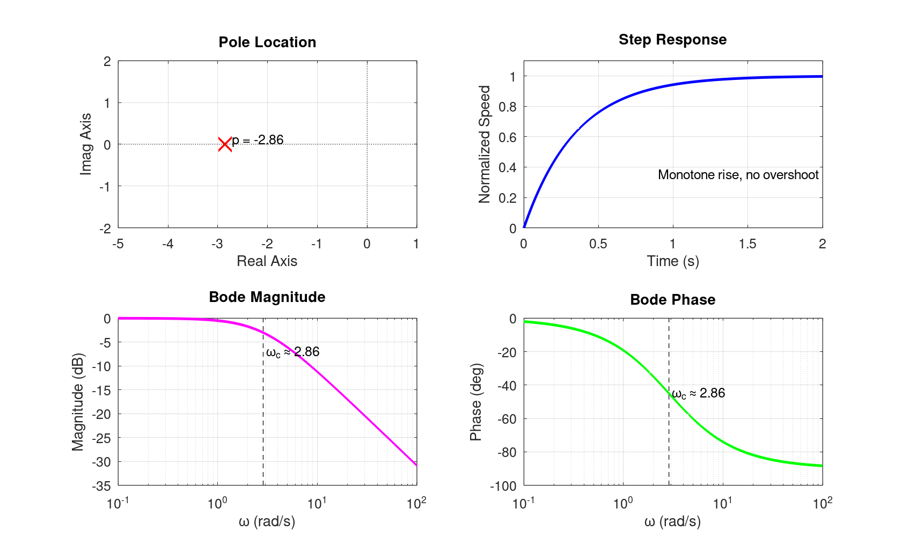

# 自动控制原理 第二章作业（含参考答案）

本文件收录 `T2-1` 到 `T2-3` 的闭题参考答案，以及 `O2` 开放题示例答案。

## T2-1 物理对象到传递函数

### 题干

设单自由度弹簧-阻尼-质量系统如下一维运动：质量块质量为 $m=1\ \mathrm{kg}$，阻尼系数为 $c=2\ \mathrm{N\cdot s/m}$，弹簧刚度为 $k=4\ \mathrm{N/m}$。输入为作用在质量块上的外力 $f(t)$，输出为质量块位移 $x(t)$。设运动方向取向右为正，求传递函数时取零初始条件。

1. 根据受力平衡列出系统的微分方程。
2. 求系统传递函数 $G(s)=\dfrac{X(s)}{F(s)}$。
3. 将所得传递函数化为标准二阶形式

$$
G(s)=\frac{K\omega_n^2}{s^2+2\zeta\omega_n s+\omega_n^2}
$$

并写出 $K,\ \omega_n,\ \zeta$ 的数值。

### 标准答案

由受力平衡可得

$$
m\ddot{x}(t)+c\dot{x}(t)+kx(t)=f(t).\tag{2分}
$$

代入 $m=1,\ c=2,\ k=4$，得到

$$
\ddot{x}(t)+2\dot{x}(t)+4x(t)=f(t).\tag{1分}
$$

在零初始条件下作拉普拉斯变换：

$$
s^2X(s)+2sX(s)+4X(s)=F(s).\tag{1分}
$$

因此传递函数为

$$
G(s)=\frac{X(s)}{F(s)}=\frac{1}{s^2+2s+4}.\tag{2分}
$$

将其与标准二阶形式

$$
G(s)=\frac{K\omega_n^2}{s^2+2\zeta\omega_n s+\omega_n^2}
$$

比较，有

$$
\omega_n^2=4,\qquad 2\zeta\omega_n=2,\qquad K\omega_n^2=1.\tag{2分}
$$

故

$$
\omega_n=2,\qquad \zeta=\frac{1}{2},\qquad K=\frac{1}{4}.\tag{1分}
$$

也可写成

$$
G(s)=\frac{(1/4)\cdot 2^2}{s^2+2\cdot (1/2)\cdot 2\,s+2^2}.\tag{1分}
$$

### 分步评分标准

- 列写微分方程，3 分：
  写出一般形式 $m*x''(t)+c*x'(t)+k*x(t)=f(t)$，或直接写出代入参数后的 $x''(t)+2x'(t)+4x(t)=f(t)$。若结构正确但某一项符号或系数代入错误，给 1-2 分；若只写出左端而未写等于输入外力，最多给 1 分。
- 求传递函数，3 分：
  明确说明零初始条件，并由 $(s^2+2s+4)X(s)=F(s)$ 得到 $G(s)=X(s)/F(s)=1/(s^2+2s+4)$。若把 $X(s)/F(s)$ 写反但主线正确，给 1 分；若传函与微分方程不一致，不给分。
- 标准二阶型改写，2 分：
  正确对比分母得 $\omega_n^2=4$、$2\zeta\omega_n=2$，并正确比较分子得 $K\omega_n^2=1$。若只完成分母比较、遗漏 $K$，给 1 分。
- 读取 $K,\omega_n,\zeta$，2 分：
  写出 $K=1/4,\ \omega_n=2,\ \zeta=1/2$。三者中每个正确值可酌情给 0.5-1 分，总分不超过 2 分。

---

## T2-2 结构图/信号流图求等效传函

### 题干

已知图 1 所示双环负反馈控制系统结构图。前向通路依次为
$G_1(s)=\dfrac{K}{s+1}$、$G_2(s)=\dfrac{2}{s+2}$；
内环反馈为 $H_1(s)=\dfrac{1}{2}$（负反馈），作用于 $G_1(s)$ 与 $G_2(s)$ 之间的求和点；
外环反馈为 $H_2(s)=1$（单位负反馈），作用于系统输入端求和点。

取参数 $K=2$。

请完成下列问题：

1. 先化简内环，求从 $G_1(s)$ 输出端到系统输出 $C(s)$ 的内环等效传递函数 $G_{\mathrm{in}}(s)$。
2. 再将 $G_1(s)$ 与 $G_{\mathrm{in}}(s)$ 组成的前向通路与外环一起化简，求闭环传递函数
   $$
   T(s)=\frac{C(s)}{R(s)}.
   $$
3. 若仅将增益改为 $K'=4$，其余环节保持不变，直接写出新的闭环等效传递函数 $T'(s)$。

要求：只求等效传递关系，不分析稳定性，不讨论控制器设计。

### 标准答案

先看内环前向通路
$$
G_2(s)=\frac{2}{s+2}.\tag{2分}
$$

内环反馈为 $H_1(s)=\dfrac{1}{2}$，按负反馈闭环公式可得
$$
G_{\mathrm{in}}(s)=\frac{G_2(s)}{1+G_2(s)H_1(s)}
=\frac{\dfrac{2}{s+2}}{1+\dfrac{2}{s+2}\cdot\dfrac{1}{2}}
=\frac{\dfrac{2}{s+2}}{1+\dfrac{1}{s+2}}
=\frac{2}{s+3}.\tag{4分}
$$

于是外环前向通路为
$$
G_1(s)G_{\mathrm{in}}(s)=\frac{K}{s+1}\cdot\frac{2}{s+3}
=\frac{2K}{(s+1)(s+3)}.\tag{3分}
$$

外环为单位负反馈，所以闭环传递函数
$$
T(s)=\frac{\dfrac{2K}{(s+1)(s+3)}}{1+\dfrac{2K}{(s+1)(s+3)}}
=\frac{2K}{(s+1)(s+3)+2K}.\tag{4分}
$$

代入 $K=2$，得到
$$
T(s)=\frac{4}{(s+1)(s+3)+4}
=\frac{4}{s^2+4s+7}.\tag{3分}
$$

若改为 $K'=4$，则
$$
T'(s)=\frac{8}{(s+1)(s+3)+8}
=\frac{8}{s^2+4s+11}.\tag{4分}
$$

### 分步评分标准

| 步骤 | 分值 | 判分标准 |
| --- | --- | --- |
| 写出内环前向通路 $G_2(s)$ | 2 分 | 识别内环只包含 $G_2$ 与 $H_1$，写出 $G_2(s)=2/(s+2)$。 |
| 化简内环得到 $G_{\mathrm{in}}(s)$ | 4 分 | 正确使用负反馈公式，得到 $G_{\mathrm{in}}(s)=2/(s+3)$。 |
| 写出外环前向通路 | 3 分 | 把 $G_1$ 与 $G_{\mathrm{in}}$ 串联，得到 $2K/((s+1)(s+3))$。 |
| 写出一般闭环传函 $T(s)$ | 4 分 | 正确用单位负反馈公式得到 $T(s)=2K/((s+1)(s+3)+2K)$。 |
| 代入 $K=2$ 求得具体 $T(s)$ | 3 分 | 化简为 $4/(s^2+4s+7)$。 |
| 代入 $K'=4$ 求得 $T'(s)$ | 4 分 | 直接写出新的闭环等效传函 $8/(s^2+4s+11)$。 |

---

## T2-3 同一对象的时域-频域基础对照

### 题干

已知某单位负反馈实验中可抽象出一个标准二阶对象，其开环传递函数写为
$$
G(s)=\frac{25}{s^2+4s+25}.
$$
课堂观察到：当输入为单位阶跃时，该对象的输出不是单调上升，而是先出现一定超调，随后伴随衰减振荡并逐步趋于稳态。

请围绕这一同一对象完成下列问题：
1. 将该传递函数写成标准二阶形式 $\dfrac{\omega_n^2}{s^2+2\zeta\omega_n s+\omega_n^2}$，写出 $\omega_n$ 与 $\zeta$，并判断该对象的阻尼状态。
2. 根据该对象的传递函数与上述时域表现，手工画出其基础 Bode 幅频草图与相频草图。要求在图上或文字中明确标出：低频增益、大致转折区所在频率范围、高频渐近斜率、相位起止趋势，以及在自然频率附近是否存在“峰起更明显”的趋势。
3. 用一句到两句话说明：为什么这个对象在时域上会表现为“有超调并伴随振荡”，而在频域幅频图上又会在某一频率附近表现出较明显的抬升趋势。

说明：本题只要求基础对象级分析与基础 Bode 手工绘图，不要求计算相位裕度、增益裕度，不要求作稳定性判别。

### 标准答案

1. 化为标准二阶形式：
$$
G(s)=\frac{25}{s^2+4s+25}=\frac{\omega_n^2}{s^2+2\zeta\omega_n s+\omega_n^2},\quad \omega_n^2=25,\quad 2\zeta\omega_n=4.\tag{2分}
$$
故
$$
\omega_n=5\ \text{rad/s},\qquad \zeta=\frac{4}{2\times 5}=0.4.\tag{1分}
$$
由于 $0<\zeta<1$，该对象为标准二阶欠阻尼对象，因此单位阶跃响应会出现超调，并伴随衰减振荡后趋于稳态。（1分）

2. 基础 Bode 幅频草图可按下列要点作出：
低频段 $\omega\ll 5$ 时，$|G(j\omega)|\approx 1$，故低频增益约为 $0\ \text{dB}$。（1分）
在 $\omega\approx 5\ \text{rad/s}$ 附近进入主要转折区；又因该对象阻尼较小，幅频曲线在自然频率附近可画出较明显的抬升或轻微共振峰趋势，而不是始终平直后立刻下落。（2分）
高频段 $\omega\gg 5$ 时，二阶环节占主导，幅频渐近线按 $-40\ \text{dB/dec}$ 下降。（1分）

基础 Bode 相频草图可按下列要点作出：
当 $\omega\to 0$ 时，相位趋近于 $0^\circ$；当 $\omega\to \infty$ 时，相位趋近于 $-180^\circ$。（1分）
相位主要在 $\omega\approx 5\ \text{rad/s}$ 附近完成过渡，作图时可在该频率附近标出相位约经过 $-90^\circ$ 的趋势。（1分）

3. 时域上“有超调并伴随振荡”说明该对象欠阻尼、振荡性较明显；对应到频域，就是它对接近自然频率的正弦输入响应更敏感，所以幅频图会在该频率附近出现更明显的抬升趋势。这两种现象描述的是同一对象在时域与频域下的统一表现。（1分）

### 分步评分标准

- **对象统一性**
满分标准：始终围绕同一传递函数展开，时域描述、参数识别与频域草图互相一致。
部分得分：基本围绕同一对象，但参数读取与图形描述有一处轻微不一致。
不得分：把题目答成多个对象比较，或时域与频域内容明显脱节。
- **基础 Bode 手工绘图**
满分标准：低频增益、转折区、高频斜率、相位起止趋势均正确，且能体现自然频率附近的抬升趋势。
部分得分：草图主趋势正确，但漏掉一项关键标注，或峰起趋势表达不充分。
不得分：把题目答成精确计算题、判稳题，或幅频/相频主趋势明显错误。
- **跨域解释**
满分标准：能用模块2对象语言说明时域超调振荡与频域自然频率附近抬升趋势的对应关系。
部分得分：提到二者相关，但表述空泛或存在轻微方向性错误。
不得分：使用判稳、裕度、模块3机理语言，或将高低频含义解释反。
- **边界遵守**
满分标准：未涉及相位裕度、增益裕度、Nyquist 判据、劳斯判据、根轨迹法则等超纲内容。
部分得分：出现个别超纲词汇，但不影响主体答案。
不得分：核心作答建立在判据、裕度或模块3语言之上。

---

## O2 合并开放题：问题定义卡、基线模型与初步三域表征

### 题干

说明：由于第一次作业未单独布置开放题，本次开放题一次性承担 `O1 问题定义卡` 与 `O2 基线模型与初步三域表征` 两项功能。你需要先固定一个自选对象，再在同一对象上完成最小建模与三域表征；后续开放题必须沿用同一对象持续修订。

请围绕一个你自选的单输入单输出对象或系统，完成以下内容：

1. 写明对象名称与应用场景，说明你希望控制的核心目标是什么。
2. 结构化给出以下五项内容：
   - 被控量
   - 可操纵量
   - 可测量量
   - 主要扰动
   - 为什么需要闭环控制
3. 画出最小结构图，只表达对象、执行、测量、扰动与目标之间的关系。
4. 建立一个可用的简化模型或经验模型，并说明关键假设与适用范围。
5. 在同一对象上给出最小三域表征：
   - 极点或主导动态特征
   - 预期时域行为
   - 预期频域特征
6. 给出 `1` 张极点/响应/Bode 对照图或表，并附最小 `MATLAB/Octave` 仿真代码与简短复现实验说明。
7. 附 `AI 使用记录摘要`，写明你如何使用 AI、如何核查和修改 AI 输出。

提交约束：

- 主体正文不超过 `700` 字。
- 允许附 `1-3` 张图、表或示意图。
- 本题只允许做到对象定义、基线模型、关键假设、最小三域表征与最小仿真，不允许进入控制器选型、参数整定、稳定判据、根轨迹、相位裕度、增益裕度或补偿设计。

### 参考答案

以下示例答案仅用于说明“合并后的 O1+O2”应如何组织。学生可以自选其他对象，但评分看的是结构完整性、边界控制和证据质量，不要求与示例对象完全一致。

#### 示例对象：小型直流电机转速控制

**1. 对象名称与应用场景**

对象选为“小型直流电机转速控制”，应用场景为实验台或输送带驱动。控制目标是在负载变化和电源波动存在时，使电机转速尽量稳定在设定值附近。

**2. 四要素与闭环必要性**

- 被控量：电机转速 $\omega$
- 可操纵量：驱动电压或 PWM 占空比 $u$
- 可测量量：编码器测得的实际转速 $\omega_m$
- 主要扰动：负载转矩变化、摩擦变化、电源电压波动
- 为什么需要闭环：若只开环给定固定电压，负载变大时转速会明显下降；闭环可根据转速误差自动修正输入，提高抗扰动能力和稳速能力。

**3. 最小结构图**

可用最小闭环结构描述为：

`给定转速 r -> 驱动执行单元 -> 电机对象 -> 实际转速 y -> 传感器测量 -> 反馈比较`

其中负载转矩作为扰动作用在电机对象上。

**4. 简化模型、关键假设与适用范围**

在固定工作点附近，把对象简化为一阶惯性环节：

$$
G(s)=\frac{\omega(s)}{u(s)}=\frac{1}{0.35s+1}.
$$

关键假设：

- 只考虑小范围速度变化；
- 忽略电机死区、饱和与高频电流动态；
- 把负载变化视为低频扰动；
- 参数仅在当前实验工况附近有效。

适用范围：适用于低频、小扰动、近工作点分析，不适合大范围启动、换向或强饱和工况。

**5. 最小三域表征**

- 极点/主导动态：极点位于 $s=-1/0.35\approx -2.86$，主导动态为单实极点。
- 预期时域行为：单位阶跃下输出应单调上升、无超调，约在 `1.4 s` 左右进入 `2%` 稳态带。
- 预期频域特征：低频增益约为 `0 dB`，在 $\omega\approx 2.86\ \text{rad/s}$ 附近进入转折区，高频按 `-20 dB/dec` 下降，相位从 `0°` 逐渐过渡到 `-90°`。

**6. 最小仿真与结果图**

示例 `MATLAB/Octave` 代码见 `assets/T2/T2-O2-dc-motor-example.m`；  
对应结果图见：

该图展示了：

- 极点位于负实轴，说明对象本身稳定；
- 阶跃响应单调上升，无超调；
- Bode 图为典型一阶低通特征，低频平直、高频衰减。

**7. AI 使用记录摘要示例**

- 使用模型：ChatGPT / GPT-5.4
- AI 完成的工作：协助整理对象说明、润色四要素表述、检查模型和三域表征是否越界
- 学生独立完成的工作：对象选择、模型参数确定、仿真代码编写与结果核查
- 核查方式：手工复算极点与时间常数，独立运行 `MATLAB/Octave` 代码并核对结果图

### 评分标准

- **对象与问题定义**（8分）：对象名称、应用场景、控制目标明确，且后文始终围绕同一对象展开。
- **四要素与闭环必要性**（8分）：被控量、可操纵量、可测量量、主要扰动识别准确；闭环必要性说明具体，不写空泛套话。
- **基线模型与关键假设**（10分）：模型形式合理，假设与适用范围写清楚，且与对象和场景匹配。
- **三域表征与最小仿真**（10分）：极点或主导动态、时域行为、频域特征三项齐全；仿真图、代码与说明能相互对应。
- **AI 使用记录摘要**（4分）：写明 AI 的使用范围、人工核查方式与修改过程。

**总分：40分**

### 关键提醒

- 本题虽然补做 `O1`，但主体仍必须落在“对象被固定后，基线模型与三域表征是否成立”上。
- 不允许提前写控制器选型、参数整定、稳定判据、根轨迹、相位裕度、增益裕度或补偿设计。
- 若更换对象但未说明，或仿真代码与结果图无法对应，将按开放题统一规则扣分。
