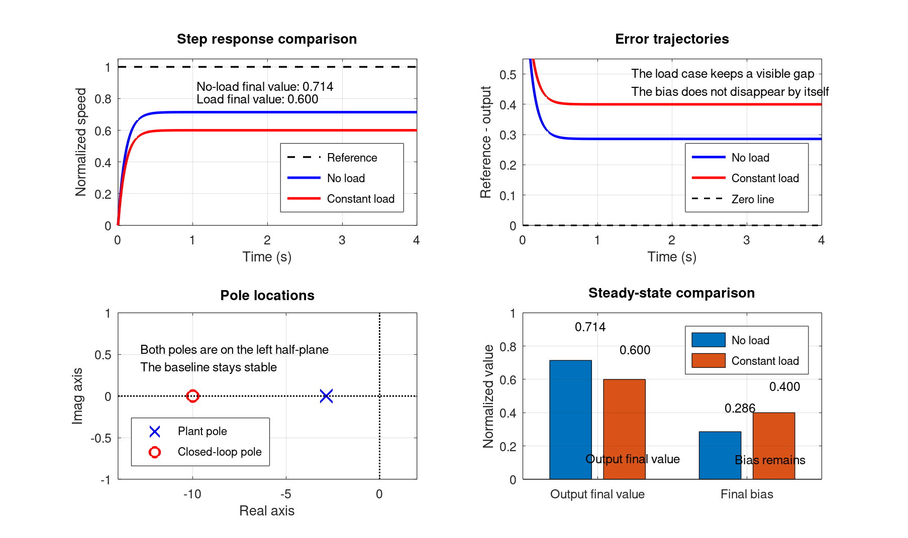

# 自动控制原理 作业3：稳定性与动态特性（含参考答案）

本文件收录 `T3-1` 到 `T3-3` 的闭题参考答案，以及 `O3` 开放题示例答案。

## T3-1 劳斯判据与稳定区间（20分）

### 题干

已知某闭环系统的特征方程为
$$
s^4+3s^3+(K+1)s^2+(8-K)s+2=0
$$
其中 $K$ 为实参数。

1. 用劳斯判据求系统稳定的 $K$ 取值范围。
2. 给出系统处于临界稳定时的 $K$ 值。
3. 用一句话说明：为什么这里求出的稳定区间，只能看作后续参数筛选的第一层可行域？

### 标准答案

由特征方程系数构造劳斯阵列：
$$
\begin{array}{c|ccc}
s^4 & 1 & K+1 & 2\\
s^3 & 3 & 8-K & 0\\
s^2 & \dfrac{3(K+1)-(8-K)}{3}=\dfrac{4K-5}{3} & 2 & 0\\
s^1 & \dfrac{\dfrac{4K-5}{3}(8-K)-3\cdot 2}{\dfrac{4K-5}{3}}=\dfrac{-4K^2+37K-58}{4K-5} & 0 & 0\\
s^0 & 2 & &
\end{array}
\tag{6分}
$$

系统稳定要求劳斯阵列第一列各项全为正，因此至少应满足
$$
\dfrac{4K-5}{3}>0\quad\Rightarrow\quad K>\dfrac{5}{4}
\tag{2分}
$$
又因为此时 $4K-5>0$，故还需
$$
\dfrac{-4K^2+37K-58}{4K-5}>0\quad\Rightarrow\quad -4K^2+37K-58>0.
$$
即
$$
4K^2-37K+58<0.
$$
因式分解得
$$
(K-2)(4K-29)<0\quad\Rightarrow\quad 2<K<\dfrac{29}{4}
\tag{6分}
$$
所以系统稳定的参数范围为
$$
2<K<\dfrac{29}{4}.
\tag{2分}
$$

当
$$
K=2\quad \text{或}\quad K=\dfrac{29}{4}
$$
时，$s^1$ 行首项为 0，系统位于稳定边界。由上一行辅助多项式可知：当 $K=2$ 时，$s^2$ 行对应 $A(s)=s^2+2$，故有虚根 $s=\pm j\sqrt{2}$；当 $K=\dfrac{29}{4}$ 时，$s^2$ 行可写为 $A(s)=8s^2+2$，故有虚根 $s=\pm j/2$。因此临界稳定对应的参数为
$$
K=2\quad \text{或}\quad K=\dfrac{29}{4}.
\tag{2分}
$$

稳定区间只说明闭环极点位于左半平面，是参数筛选的起点；它并不能直接说明动态品质优劣，更不是最终参数确定结果。（2分）

### 分步评分标准

- **劳斯阵列**（6分）：各行元素写对，尤其是 `s^2` 行与 `s^1` 行首项正确。若列阵思路正确但代数有轻微错误，可酌情给 `1-2` 分。
- **稳定区间求解**（8分）：能基于第一列同号条件建立不等式，并正确化简到 $2<K<29/4$。若只得到单侧不等式或遗漏开区间边界，扣 `1-2` 分。
- **临界条件说明**（2分）：明确指出临界稳定发生在 $K=2$ 与 $K=29/4$，且知道边界值不属于稳定区间。
- **概念理解**（2分）：能说明稳定区间只是参数可行域的第一层筛选，不等于动态性能结论或最终设计结论。
- **书写完整性**（2分）：结论表达完整，稳定区间、临界值、简要解释三者齐全。

---

## T3-2 根轨迹读图与增益迁移（20分）

### 题干

某单位负反馈系统只采用比例控制，实际控制器增益记为 $K_c$，且只考虑 $K_c \ge 0$。教师给出的完整根轨迹主图采用“作图增益” $K_r$，两者关系已明确标注为
$$
K_r = 4K_c
$$
为避免你补画主图，现把该根轨迹的关键信息直接整理如下（这些信息等价于完整主图上的可读内容）：

1. 当 $K_r=0$ 时，闭环极点位于 $s=0,-2,-6$。
2. 从 $s=0$ 与 $s=-2$ 出发的两条实轴分支相向移动，并在 $s\approx -0.8$ 处分离，此时 $K_r\approx 1.6$。
3. 分离后形成一对共轭复极点，分别沿上、下两支轨迹移动；当 $K_r=6$ 时，这对极点穿过虚轴，交点约为 $s=\pm j2.4$。
4. 当 $K_r>6$ 时，这对共轭极点进入右半平面。
5. 从主图读得两组代表性点：
   - 当 $K_r=2$ 时，主导极点约为 $s_{1,2}\approx -0.72 \pm j0.78$；
   - 当 $K_r=5$ 时，主导极点约为 $s_{1,2}\approx -0.18 \pm j1.92$。

根据上述读图信息回答：

1. 写出闭环稳定的 $K_r$ 取值窗口，并换算为实际控制器增益 $K_c$ 的稳定窗口。
2. 若工程上要求“工作增益不超过稳定边界的 80%”，求允许的 $K_c$ 上限。
3. 现把控制器增益从 $K_c=0.50$ 增大到 $K_c=1.25$。说明根轨迹上的极点总体向哪个方向迁移，并结合题中给出的读点，解释闭环响应在振荡程度、超调趋势和衰减快慢上的变化。

说明：本题只需按给定信息读图、换算并解释，不需要补画根轨迹。

### 标准答案

设题中作图增益与实际控制器增益满足 $K_r=4K_c$。

1. 由题给信息知：当 $K_r=6$ 时根轨迹穿过虚轴，而当 $K_r>6$ 时共轭极点进入右半平面，因此严格稳定时必须满足
   $$
   0<K_r<6.\tag{4分}
   $$
   再由 $K_r=4K_c$ 换算，得
   $$
   0<K_c<\frac{6}{4}=1.5.\tag{4分}
   $$
   所以实际比例增益的稳定窗口为 $0<K_c<1.5$。

2. “不超过稳定边界的 80%”表示
   $$
   K_r\le 0.8\times 6=4.8.\tag{2分}
   $$
   代回换算关系可得
   $$
   K_c\le \frac{4.8}{4}=1.2.\tag{2分}
   $$
   故允许的 $K_c$ 上限为 $1.2$。

3. 当 $K_c=0.50$ 时，
   $$
   K_r=4\times 0.50=2.\tag{1分}
   $$
   当 $K_c=1.25$ 时，
   $$
   K_r=4\times 1.25=5.\tag{1分}
   $$
   因此增益增大时，闭环主导极点沿复平面上的根轨迹分支继续向外迁移，并总体表现为“更靠近虚轴、同时虚部增大”。（2分）

   由题给读点可知，主导极点由 $-0.72\pm j0.78$ 移到 $-0.18\pm j1.92$：
   - 实部从 $-0.72$ 变到 $-0.18$，离虚轴更近，说明衰减变慢、阻尼减小，稳定裕度变差。（2分）
   - 虚部从 $0.78$ 增到 $1.92$，说明振荡更明显，振荡频率升高，超调趋势增大。（2分）

   综合来看，把 $K_c$ 从 $0.50$ 增大到 $1.25$ 后，系统虽然仍稳定，但响应更振荡、超调更大，且衰减更慢。

本题未使用额外假设，全部判断均直接依据题面给出的根轨迹读图信息。

### 分步评分标准

| 步骤 | 分值 | 判分标准 |
| --- | --- | --- |
| 稳定边界与稳定窗口 | 8分 | 正确判断 $K_r=6$ 为稳定边界，并给出严格稳定区间 $0<K_r<6$；再正确换算出 $0<K_c<1.5$。若边界点误并入稳定区间，扣 `1-2` 分。 |
| `80%` 边界换算 | 4分 | 先得到 $K_r\le 4.8$，再换算出 $K_c\le 1.2$。只写出其中一步正确给 `1` 分。 |
| 增益迁移换算 | 2分 | 能把 $K_c=0.50,1.25$ 正确换算为 $K_r=2,5$，并说明是沿给定根轨迹分支继续迁移。两者只对一个给 `1` 分。 |
| 动态趋势解释 | 6分 | 基于读点指出“更靠近虚轴”对应阻尼减小、衰减变慢，“虚部增大”对应振荡更明显、超调趋势增大。若只说更振荡而未解释快慢或衰减，最多给 `2-3` 分。 |

---

## T3-3 稳定与动态冲突下的判断（20分）

### 题干

【结构化判断题】

某单位负反馈系统仅通过比例增益 $K$ 调整闭环性能。已知根轨迹在 $K=2.8$ 时与虚轴相交，继续增大 $K$ 将失稳；随着 $K$ 从 $1.0$ 增大到 $2.6$，主导极点逐步向虚轴靠近，振荡趋势增强。若无特殊说明，下表中的调节时间与超调量按同一口径统计。

候选闭环数据：

1. $K=1.0$，主导极点为 $-1.6 \pm j0.7$，调节时间 $2.8\ \mathrm{s}$，超调量 `6%`，现象：稳定且振荡较轻，但响应偏慢。
2. $K=2.0$，主导极点为 $-0.9 \pm j1.5$，调节时间 $1.9\ \mathrm{s}$，超调量 `16%`，现象：响应更快，但振荡明显、超调偏大。
3. $K=2.6$，主导极点为 $-0.25 \pm j1.9$，调节时间 $4.6\ \mathrm{s}$，超调量 `32%`，现象：已非常接近临界稳定，振荡重，动态变差。

现有要求互相冲突：

- 考虑模型不确定性，工作点不能贴近临界稳定边界；
- 超调量希望不超过 `10%`；
- 调节时间希望不超过 `2.0 s`。

请只使用“稳定边界、极点迁移、振荡趋势、响应快慢”这些语言，回答下面三个判断：

1. 在上述冲突中，必须先守住哪一条约束？
2. 哪一条动态要求在本情境下只能部分满足？
3. 依据题中根轨迹摘要和候选数据，给出结构化理由。

要求：不允许讨论控制器选型、参数整定、补偿结构、零点、型别或频域方法。

### 标准答案

标准答案（示例表述）：

① 先守住“工作点不能贴近临界稳定边界”这一条约束。（6分）理由是题面已给出 $K=2.8$ 时闭环极点到达虚轴，继续增大 $K$ 将失稳；而 $K=2.6$ 时主导极点仅为 $-0.25 \pm j1.9$，已经非常接近临界稳定，振荡重、超调达 `32%`，说明不能为了追求更快响应把工作点继续推向稳定边界。

② 本情境下只能部分满足的是“调节时间不超过 `2.0 s`”这一条动态要求。（6分）因为从给定数据看，$K=1.0$ 时超调量 `6%` 满足约束，但调节时间为 `2.8 s`，偏慢；$K=2.0$ 时调节时间 `1.9 s` 虽达到目标，但超调量已到 `16%`，振荡明显；$K=2.6$ 时不仅更贴近临界稳定，而且调节时间反而恶化到 `4.6 s`。

③ 结构化理由应表述为：随着 $K$ 增大，主导极点整体向虚轴靠近，系统先表现为振荡增强、超调增大，再继续贴近边界时，稳定性风险显著上升，且动态并不会持续变好。（4分）因此，判断顺序应是先排除贴近临界稳定的状态，再在较稳妥的状态中比较动态指标。（2分）结合给定三组数据，可以看出想同时压低超调并把调节时间压到 `2.0 s` 以内并不稳妥，所以结论应是：宁可接受响应略慢，也不能为了追快而逼近临界稳定。（2分）

### 分步评分标准

- **冲突识别**（6分）：能指出“稳定边界约束”与“两个动态指标”之间存在冲突，并能看出三条要求不能在给定数据下同时稳妥满足。
- **优先级判断**（6分）：明确先守稳定边界，并判断调节时间要求只能部分满足。
- **理由一致性**（8分）：论证只使用允许语言，且与根轨迹摘要、主导极点位置、超调量和调节时间数据一致。

---

## O3 结构机理诊断（40分）

### 题干

请沿用你在 O2 中已经固定的同一对象、简化模型与最小三域表征，不得更换对象。围绕该对象当前的基线方案，完成一次“结构机理诊断”。

请完成以下内容：

1. 先在“稳定问题 / 动态问题 / 稳态问题”中判断当前最主要的问题属于哪一类，并用 O2 中已有模型、响应或仿真结果给出 `1-2` 条直接证据。
2. 明确说明它属于哪条机理线。不能只说“响应不好”，必须说清你为什么把它判为稳定机理线、动态机理线或稳态机理线。
3. 只使用本阶段允许的语言，对主要问题给出结构机理解释。允许使用：稳定边界、极点位置、主导极点、增益变化与极点迁移、根轨迹趋势、时域响应现象。若你选择“稳态问题”，只能用 O2 中可直接观察的终值偏差或低频现象作证据，不得调用型别、积分、静态误差系数等后续语言。
4. 给出 `1` 张必要图表或对照表，并用 `2-3` 句说明该图表支持了哪条诊断。图表可采用“极点-响应对照”“增益-极点迁移对照”“模型参数-现象对照”等形式。
5. 若诊断涉及动态或稳定判断，必须附 `MATLAB/Octave` 仿真代码、结果图与最小复现实验说明。
6. 最后用“主要矛盾清单”收束：写出当前主要矛盾、一个次要矛盾，以及为什么本次不进入控制结构最终定夺。
7. 附 `AI 使用记录摘要`，写明你如何使用 AI、如何核查和修改 AI 输出。

提交约束：

- 主体正文不超过 `700` 字。
- 允许附 `1-3` 张图、表或示意图。
- 本题只做机理诊断，不做控制结构最终定夺，不允许写成完整设计报告。
- 不得调用零点、型别、积分稳态改善、Nyquist 判据、Bode 判稳或完整控制器选型语言。

### 参考答案

以下示例答案仅用于说明 `O3` 应如何把 `O2` 的对象与模型继续往下推进。学生可以自选其他对象，但评分看的是“是否沿用前次对象、证据链是否自洽、机理线是否判准”，不要求与示例对象完全一致。

#### 示例对象：小型直流电机转速控制

**1. 沿用 O2 的对象与模型**

继续沿用 `O2` 中的示例对象“小型直流电机转速控制”，简化模型仍取
$$
G(s)=\frac{1}{0.35s+1}.
$$
为便于展示当前主要矛盾，可把当前基线方案近似理解为“单位反馈下的比例基线”，示例中取 `K_p=2.5`，并把恒定负载扰动等效为附加常值项 `d_0=0.4`。给定归一化转速仍取 `1`，固定工作点附近的响应继续以该一阶模型描述。

**2. 主要问题归类与直接证据**

当前最主要的问题属于**稳态机理线**，而不是稳定机理线或动态机理线。直接证据有两条：

- 无负载时，输出仍是单调收敛、无明显振荡，极点始终位于负实轴，但最终值只到约 `0.714`，并没有回到给定值 `1`。
- 加入恒定负载扰动后，响应依旧稳定、依旧基本单调，但最终值进一步降到约 `0.600`，持续速度偏差更大；也就是说，主要矛盾不在“会不会发散”或“振荡是否太强”，而在“终值差一直消不掉”。

**3. 对应机理线说明**

之所以判为稳态机理线，是因为当前最显眼的现象是**终值偏差持续存在**。如果主要问题属于稳定机理线，应该首先看到的是极点逼近虚轴、稳定边界变窄或失稳风险上升；如果属于动态机理线，应该首先看到的是明显振荡、超调过大或衰减过慢。这里两者都不是主矛盾，因此应把问题归到稳态机理线。

**4. 结构机理解释**

在当前基线模型下，负载变化可以理解为一个慢变化或恒定扰动。无负载时系统已经表现出终值偏差；扰动加入后，系统虽仍保持稳定，极点位置也没有显示出新的失稳趋势，但输出最终值被进一步压低，长期偏差更明显。这说明当前基线方案已经能把对象稳定住，也能保持较平顺的动态过程，却**还没有把长期跟踪偏差这个主要矛盾消掉**。在本阶段，我们只需据此完成机理诊断，不提前进入后续结构定夺。

**5. 图表与最小仿真**

示例 `MATLAB/Octave` 代码见 `assets/T3/T3-O3-dc-motor-diagnosis.m`；  
对应结果图见：

该图应支持以下结论：

- 极点仍在负实轴，说明主要矛盾不是稳定性问题；
- 有扰动与无扰动两条响应都基本单调，说明主要矛盾也不是振荡或超调；
- 无扰动时就存在终值偏差，而有扰动时终值进一步降低，说明当前主要矛盾是稳态偏差持续存在。

**6. 主要矛盾清单**

- 主要矛盾：在当前比例基线下，转速最终值长期低于给定值；恒定负载加入后，这一偏差还会进一步扩大。
- 次要矛盾：负载变化后建立过程略变慢，但整体仍保持单调，可视为次一级问题。
- 为什么本次不进入控制结构最终定夺：`O3` 只要求把主要问题落到正确的机理线上，说明“问题到底出在哪里”；至于下一步采用什么结构去改，属于后续 `O4` 的任务。

**7. AI 使用记录摘要示例**

- 使用模型：ChatGPT / GPT-5.4
- AI 完成的工作：协助整理诊断结构、润色“主要矛盾清单”、检查示例表述是否越界
- 学生独立完成的工作：延续 `O2` 的对象与模型、编写并运行 `MATLAB/Octave` 仿真代码、核查终值偏差与图表结论
- 核查方式：独立运行脚本，对比无扰动与有扰动响应的终值，并手工确认结论没有使用型别、积分或静态误差系数语言

### 评分标准

- **对象延续**（4分）：明确沿用 `O2` 的同一对象、模型和三域表征，不另起炉灶。
- **主要问题归类**（8分）：在稳定 / 动态 / 稳态三类中准确选出当前主要问题，并给出 `1-2` 条直接证据。
- **机理线判定**（8分）：能说清楚为什么它属于对应机理线，而不是泛泛地说“响应不好”。
- **结构机理解释**（10分）：解释只使用当前阶段允许的语言，不越界调用零点、型别、积分稳态改善、Nyquist 或 Bode 判稳语言。
- **图表与仿真支撑**（6分）：图表或对照表直接服务于诊断；若涉及稳定 / 动态判断，需附 `MATLAB/Octave` 仿真代码、结果图与最小复现实验说明。
- **主要矛盾清单与 AI 使用记录**（4分）：写出主要矛盾、次要矛盾及本次不进入结构定夺的理由，并附 AI 使用记录摘要。

**总分：40分**

### 关键提醒

- `O3` 的核心不是开始设计控制器，而是判断“当前主要问题属于哪条机理线”。
- 若沿用 `O2` 的对象，却在 `O3` 中偷偷更换模型、任务或对象，按开放题主线连续性规则扣分。
- 若判断为稳态问题，不得提前调用型别、积分、静态误差系数等后续语言。
- 若附图、附代码、附结果图三者彼此对不上，按开放题统一规则扣分。
