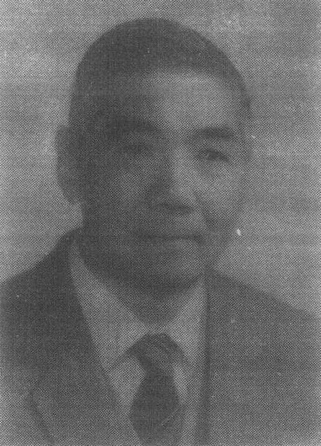
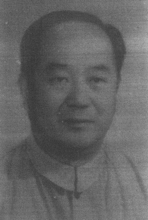
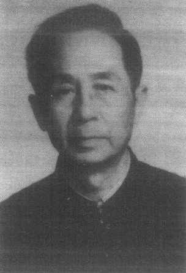
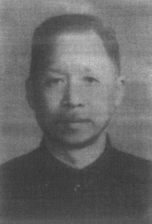
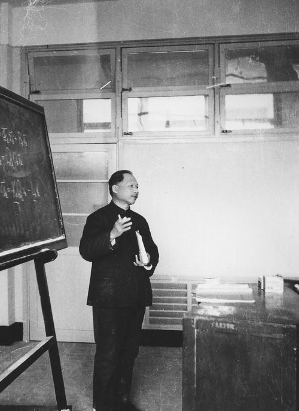

# 华夏自控启明星

- 核心思政主题：专业自信、科技报国与学科奠基者精神
- 来源段落：8-33
- 适用方式：可作为讲义导入、课堂讨论触发器、BOPPPS 导入案例或课后延伸阅读。

## 教学目标
- 通过调动学生调查我国自动化领域的著名科学家，加深对我国的控制理论发展的认识。通过对比我国过去与现在，在自动化领域的巨大变化，引导学生思考自身在科技发展和历史进程中应该扮演的角色，培养科技报国的理想。

## 教学方法
- 原文未单独展开。

## 课前准备
- 请学生查一查和中国过去和现在有哪些著名的自动控制专家，他们最大的贡献是什么？

## 课堂实施
- 在第二次课上实施，第一次课后可以布置课前准备，使学生有一定的背景知识。
- “上一次课我们介绍了自动控制的基本概念和一些典型的信号，也了解了自动控制的发展历史。在现代自然科学的知识体系中，中国人的贡献似乎是缺位的。可是这真的是事实吗？请同学们谈一谈你们的发现。”
- 引导学生就调查的结果进行讨论。（3分钟）
- “大家提供的信息让我们对自身有了更加深入的了解。我国的自动控制理论是建国以后才开始发展的，而此时，经典控制理论的大厦已经基本构建完成。因此，或许大家在我们这门课程中不太容易看到中国科学家的身影。但是，我们还是不能忘记老一辈的控制科学家在我国自动化领域做出的贡献。方崇智建立了我国最早的过程控制专业，钟士模参与了自动化学会创建工作，并任《自动化学报》首任主编，奠定了自动化学术研究的交流平台。关肇直院士是我国现代控制理论的创建者。陈珽则是我国决策理论的早期研究者之一。”（1分钟）
- “相比于顺水行舟，在逆境中成长是更加难能可贵的经历。像我国的大多数领域一样，新中国在一穷二白的条件下，正是这些老一辈的科学家为我国自动化打下坚实的基础，才能有我们今天的嫦娥奔月，蛟龙入海，甚至东风快递。如今的中国已非往日那个落后的农业国，而是拥有完整工业体系的现代化强国，在这样的顺风局，同学们想成为一个什么样的人，在历史进程中扮演什么样的角色？”（1分钟）

## 课后补充
- 无

## 案例内容
- 方崇智是自动控制工程学家，我国生产过程控制教育的开拓者之一。长期致力于自动控制理论、过程控制系统的科研和教学。创建了我国最早的过程控制专业，建立了过程控制的教学、科研体系，取得了许多重要科研成果。培养了大批高级专门人才，为我国自动控制学界和过程控制事业的发展作出了突出贡献。[1]
- 钟士模发起并参与中国自动化学会创建工作，当选为副理事长（钱学森任理事长），是《自动化学报》首任主编。“教师自己讲授课程与处理问题的方法，本身就为学生的学习树立了一个榜样”。[2]
- 关肇直院士是数学家，控制理论学家，我国现代控制理论的创建者，中国系统工程学会创建者之一，长期致力于泛函分析、现代控制理论与应用的研究，创建了中国第一个从事控制理论研究的研究室。70年代以后致力于系统科学的研究，筹建了中国第一个从事系统科学研究的研究所，并任第一任所长和中国系统工程学会第一届理事长，对非线性泛函分析中单调算子理论的发展做出了开创性的工作；在非线性科学和复杂系统研究中的新思想和新观点有重大影响；对中子迁移理论中迁移算子的谱和本征广义函数组的完整性的结果居世界领先水平；在弹性振动控制中所得成果是他对控制理论的重要贡献之一。为中国的国防高技术事业做出了突出的贡献。[3]
- 陈珽，自动控制及系统工程专家。50年代中期创办了华中理工大学自动控制专业。70年代末创办了该校系统工程专业。编著的《决策分析》是国内较早全面介绍这个分支学科的学术专著。他的研究重点为多目标群(多人)决策理论和方法，他的研究特点是以实际问题为背景进行深入的理论研究，致力于提出有实用价值的分析方法。在多目标决策、群决策、多层决策等方面都有创造性的研究成果。[4]

## 相关资源
- 【大师记忆】自动控制工程学家——方崇智先生，https://news.tsinghua.edu.cn/info/1559/82107.htm
- 我国自动控制学科和教育的开拓者之一——钟士模，
- 纪念数学家、系统与控制学家关肇直院士百年诞辰，
- 陈珽教授传，http://xsyj.hust.edu.cn/info/1005/1196.htm

## 配图
### 图 1

- 说明：案例人物配图一
- 原始文件：`assets/raw/image1.jpeg`

### 图 2

- 说明：案例人物配图二
- 原始文件：`assets/raw/image2.jpeg`

### 图 3

- 说明：案例人物配图三
- 原始文件：`assets/raw/image3.jpeg`

### 图 4

- 说明：案例人物配图四
- 原始文件：`assets/raw/image4.jpeg`

### 图 5

- 说明：案例人物配图五
- 原始文件：`assets/raw/image5.jpeg`
