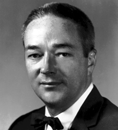
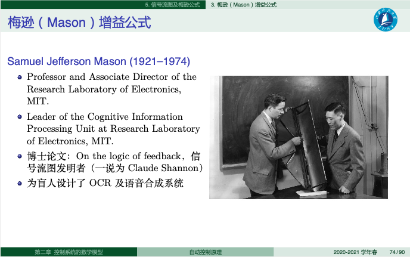

# 梅森的温度尺度

- 核心思政主题：技术向善、社会关怀与工程伦理
- 来源段落：34-57
- 适用方式：可作为讲义导入、课堂讨论触发器、BOPPPS 导入案例或课后延伸阅读。

## 教学目标
- 引导学生思考技术发展的根本目的是服务社会，服务国家，服务人类。技术没有善恶，但是具有“温度”的人的却可以使技术具有温度。

## 教学方法
- 原文未单独展开。

## 课前准备
- 无

## 课堂实施
- 在学习信号流图或Mason增益公式之前，介绍Samuel Jefferson Mason的生平及其成就。通过其为盲人设计的两个系统，引导学生思考技术应该怎样服务人。（2~3分钟）
- 进一步介绍一些能够帮助残障人士的技术成果等，引导学生讨论如何运用自动控制原理设计帮助残障人士的发明创造等。（3~4分钟）

## 课后补充
- 请同学观看在线视频[4]（10:45开始或全部看完），请学生搜索有哪些可以帮助残障人士恢复生活的技术发明，或是提出自己的设计构思，并将结果发布于在线讨论区。

## 案例内容
- Samuel Jefferson Mason教授（1921-1974）是MIT电气工程与计算机科学学院的终身教授。他于1921年出生于美国纽约，并在新泽西州一个人口只有26的小镇中长大。1942年在罗格斯大学（一所新泽西州立大学）电气工程专业获得学士学位，后加入MIT辐射实验室，直到二战结束。1947年和1953年分别获得了电气工程的硕士和博士学位。1949年助理教授，1954年任副教授，1959年任终身教授[1]。
- 其博士论文主要关于信号流图（signal flow graph，SFG，一说是香农提出了信号流图，Mason给出了signal flow graph这个名称），并与1956年提出了梅森增益公式（Mason's gain formula，MGF）[2]，用以求解线性SFG的传递函数。Mason在电路理论方面有许多重要的贡献，其一生也致力于教育事业，出版了多部重要的教材，包括Electronic Circuit Theory，Electric Circuits and Signals，以及Systems, Networks and Computations。同时他还致力于课程改革，将数字信号分析引入本科电路教学中。他的学生将他描述成“我认识，欣赏并尊重梅森教授，他是思想家，朋友，私人顾问和知己。”“他比大多数实践派具有更广的理论范围，但比许多理论派更加注重实践”。他还是包括Tau Beta Pi、Sigma Xi及Eta Kappa Nu等多个荣誉学会的会员和IEEE会士。
- Mason是光学扫描系统方面的权威。在担任MIT电子研究实验室认知信息处理小组负责人时，他开发了一种可以扫描打印材料，并大声朗读的系统。此外还开发了一种光电管驱动的触觉系统，使盲人能够感知光线。他关心弱势群体，是多个关心学生、贫穷及种族隔离问题委员会中的委员，并在相关帮扶计划中与弱势青年紧密合作了数年。
- 现代的许多计算机与手机系统中，内置了可以帮助盲人操作的功能。尽管这些功能普通人大多用不到，科技公司也很少以此为卖点，但在发现这些功能就静静地守在那里，在等候需要的人时，我们还是可以感受到科技的“温度”。

## 相关资源
- MIT EECS - Great Educator Award,
- Mason, Samuel J. (July 1956). "Feedback Theory - Further Properties of Signal Flow Graphs" (PDF). Proceedings of the IRE. 44 (7): 920–926.
- 【苏星河】最低调的软件，最恐怖的功能, 10:45秒开始，https://www.bilibili.com/video/BV1qp4y1H7JS?from=search&seid=2300524163326468073

## 配图
### 图 1

- 说明：梅森相关人物配图
- 原始文件：`assets/raw/image6.gif`

### 图 2

- 说明：面向视障人群的辅助技术示意
- 原始文件：`assets/raw/image7.png`
