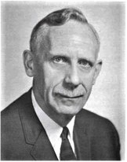
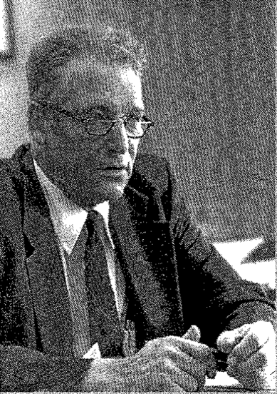
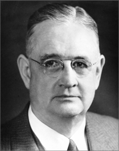
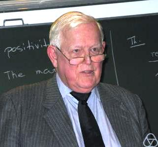
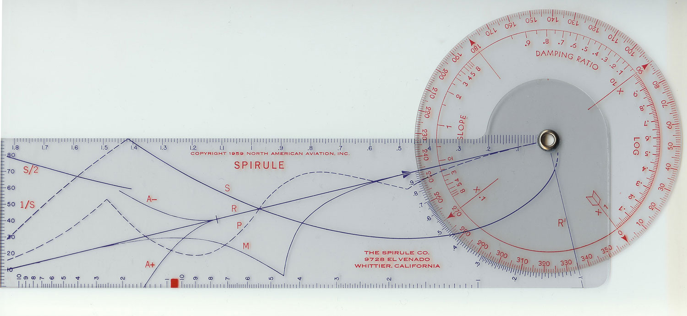

# 根轨全局观拓荒

- 核心思政主题：把握主要矛盾、趋势判断与工程全局观
- 来源段落：84-116
- 适用方式：可作为讲义导入、课堂讨论触发器、BOPPPS 导入案例或课后延伸阅读。

## 教学目标
- 培养学生解决问题时把握主要矛盾的方法论思想；
- 培养学生看待问题的大局意识。从宏观层面认识事物发展的客观规律，并思考量变引起质变的哲学思想在现实中的体现，在此基础上培养系统设计的大局观。

## 教学方法
- 原文未单独展开。

## 课前准备
- 无

## 课堂实施
- 可在根轨迹整个章节内随时引入，建议基本根轨迹画法及意义介绍之后导入，效果更好。
- 前面章节的分析方法，要么基于数学变换，要么基于微积分，要么基于代数分析。事实上，大多数控制理论都是数学原理的工程化应用。把这个论断放大到整个工科领域，也是大体上站得住脚的。但是，根轨迹分析似乎是个另类。从定义上看，根轨迹是系统某参数在[0,]范围内，相应的闭环特征根构成的集合。根轨迹上的每一个点，都是闭环系统在一定参数下的一个特征根。除了这一点之外，根轨迹本身没有任何其他的额外含义。但闭环特征根是控制系统的关键。经典控制论从根本上说是研究闭环特征根特性及操纵方法的理论。把握住这个关键点，也就自然理解了经典控制理论的，甚至现代控制理论的精髓。
- 不论工程也好，技术也好，甚至生活学习，乃至整个人生，把握关键点，掌握主要矛盾的思想方法都会使我们获益匪浅。
- 如果仅仅是给出闭环特征根在复平面上的位置，那么根轨迹的实际意义可能并没有现在这么重要。当我们以增益为0的点为起点，增益无穷大的点为终点时，根轨迹就成为了有方向的曲线，代表了闭环特征根随增益变大的变化趋势。
- 随着参数的变大，原先位于稳定区域的根轨迹，最终会进入不稳定区域，这正是量变引起质变的形象示例。根轨迹分析方法启示我们，发觉事物的变化趋势是更高层次的能力，是一种全局的思考与设计系统的能力，也是合格的工程师应该主动、积极培养的能力。
- 根轨迹法的发明人Walter R. Evans具有工程师背景，看重解决问题的工程方法，这或许也是为什么根轨迹法不需要深厚的数学知识也可以灵活使用，并在发明后很快风靡于工程师群体的原因。

## 课后补充
- 无

## 案例内容
- Walter R. Evans（1920-1999）是四个孩子的父亲，也是一位杰出的控制理论工程师。于1987年获得美国机械工程师协会颁发的Rufus Oldenburger Medal（ROM），于1988年获得美国自动控制委员会颁发的Richard E. Bellman Control Heritage Award（CHA）。这两个奖项的部分获得者如下：
- Evans于1941年在华盛顿大学圣路易斯分校获得电气工程学士学位，于1951年在加州大学洛杉矶分校（UCLA）获得电气工程硕士学位。他曾任华盛顿大学的讲师数年，后供职于包括通用电气、罗克韦尔等公司。他于1948年发明了根轨迹法，并于1950年将该方法发表在期刊上[2]。1949年，McGraw-Hill出版社的著名的“电气电子工程”系列丛书急需一本反映伺服机构快速发展的专著，他们找到了华盛顿大学的电气工程教授R.J.W. Koopman。后者在成为电气工程学部主任后事务繁忙，将Evans推荐给了出版社。
- 1949年11月Evans和McGraw-Hill出版社签约出版今后命名为Control-System Dynamics的教科书，于次年11月完成了手稿的大部分，并承诺在1951年3月1日前完稿。然而，在Evans在1950年发表了关于根轨迹的论文后，这一全新方法因为方便、实用，许多教科书作者均来信询问Evans是否可以将根轨迹作为他们教科书的一部分。Evans很爽快地答应了其他作者的请求，但是也不免担心其他人的专著在自己的教科书之前抢先出版，并为高校工科学生所用。同时期，Evans还发明了名为“旋尺”（Spirule）的根轨迹绘制工具，可以方便快速地绘制较为精确的根轨迹。
- Spirule, by Nathan Zeldes, CC BY-SA 4.0
- 然而，教科书出版过程中的两个争论拖慢了出版进程，其一是是否将旋尺作为随书附带的工具一同销售。由于附带旋尺将提高售价，出版社担心书籍销量受影响，而Evans则认为分开销售才会招致读者抱怨。其二是Evans在教科书中较为大胆地摒弃了拉普拉斯变换相关的内容，这使得有高校学术背景的书稿评阅人认为此举不妥。Evans的工程背景使其更加强调对工程知识的应用及其物理含义，而不是数学公式的死记硬背。Evans最终获得了编辑的支持，于1952年先期出版了这本教科书，并于同年成了专门的公司以销售旋尺。
- 这部教科书出版后可谓毁誉参半，销量一年不如一年。一些激烈的评论指出“……按照这本书当前的形态，真的配不上作者的好名声……控制领域的新人会觉得这本书太难了，……而控制领域的学者又会觉得书中没什么新鲜内容。”由于书稿的不断修订，使其没有赶上1953-1954学年的教科书预定，使得McGraw-Hill出版社最终只卖出了该书的5000份拷贝，这其中的一半都是工业界贡献的，Evans在每份拷贝上获得50美分的版税。而1953年及之后出版的多部控制理论方面的教材，均专门设置独立的章节介绍根轨迹法，并高度称赞其方便实用性。庆幸的是，旋尺公司从1950到1980年间共计售出了超过10万把旋尺，销售足迹遍布美国的50个州和75个国家，这也算是“柳暗花明又一村”吧。
- 1965年，在Roy Glasgow教授退休之际，Evans向其写信说道：
- ……真正的学习发生在自学及有许多积极反馈的的问题求解过程中。老师的作用就是施压于懒惰者，激发无聊者，打压自负者，鼓励胆小者，发现并纠正个别错误，并拓宽所有人的视野。这项作用就像教练使用心理学方法一样，使整个班里的新手从板凳席上起来加入比赛。

## 相关资源
- Evans, G.W. (2004). Feature - Bringing root locus to the classroom - The story of Walter R. Evans and his textbook Control-Systems Dynamics. IEEE Control Systems Magazine, 24(6), 74–81.
- W.R. Evans, “Control system synthesis by root locus method,” Trans. AIEE, vol. 69, pp. 66–69, 1950.

## 配图
### 图 1

- 说明：Walter R. Evans 配图
- 原始文件：`assets/raw/image9.jpeg`

### 图 2

- 说明：相关获奖者配图一
- 原始文件：`assets/raw/image10.png`

### 图 3

- 说明：相关获奖者配图二
- 原始文件：`assets/raw/image11.png`

### 图 4

- 说明：相关获奖者配图三
- 原始文件：`assets/raw/image12.jpeg`

### 图 5

- 说明：相关获奖者配图四
- 原始文件：`assets/raw/image13.jpeg`

### 图 6

- 说明：相关获奖者配图五
- 原始文件：`assets/raw/image14.jpeg`

### 图 7

- 说明：相关获奖者配图六
- 原始文件：`assets/raw/image15.jpeg`

### 图 8

- 说明：旋尺工具配图
- 原始文件：`assets/raw/image16.jpeg`
