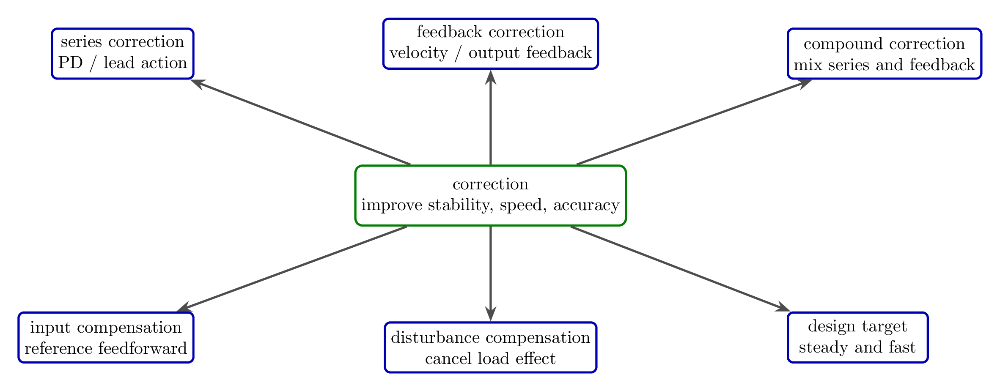
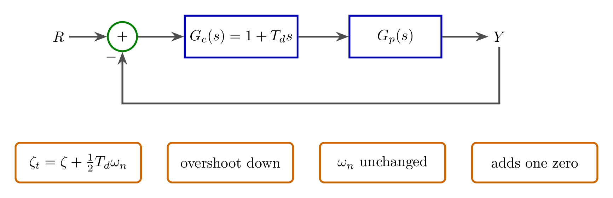
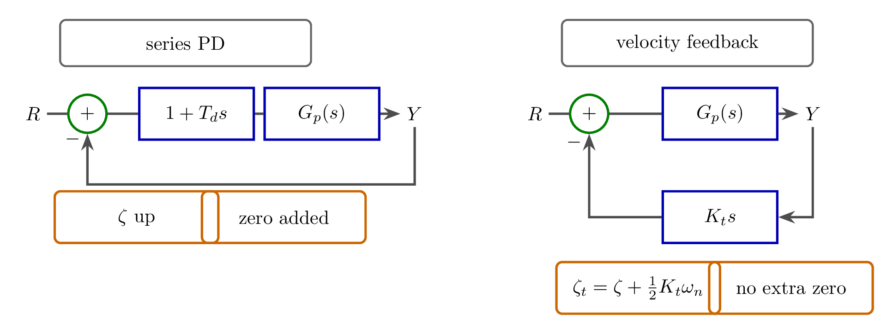
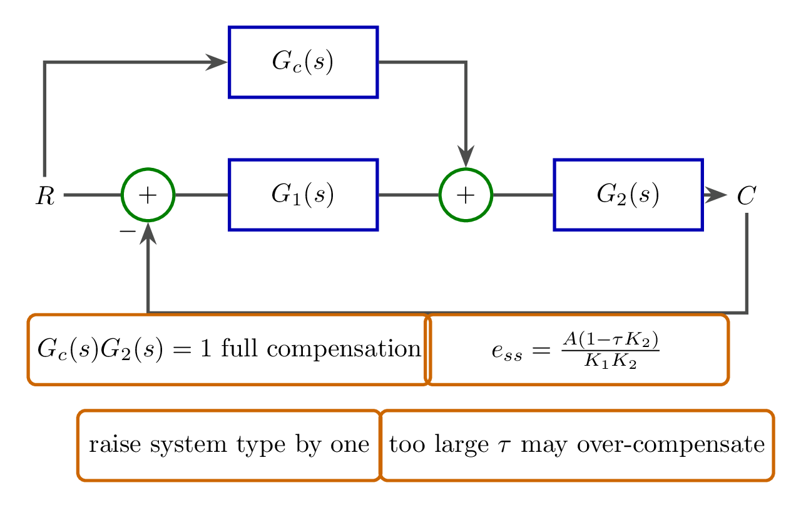
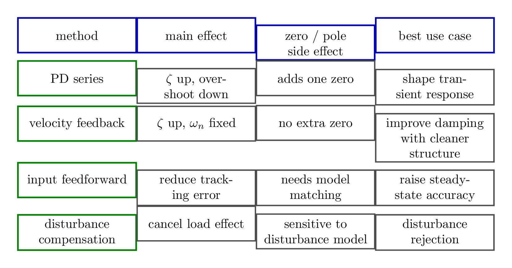

# `10.1校正_实现控制的手段` 完整提取

## 1. 页面边界

- 原始文件：`course-content/slides-ref/10.1校正_实现控制的手段.pptx`
- 总页数：20
- 正文范围：第 4-17 页
- 排除页面：
  - 第 1 页：封面
  - 第 2 页：目录
  - 第 3 页：学习目标
  - 第 18-19 页：课外拓展及预习要求
  - 第 20 页：结束页

## 2. 内容总览

| 原页号 | 主题 |
| --- | --- |
| 4 | 校正的定义与类型 |
| 5-7 | 串联校正与比例微分控制 |
| 8-12 | 输出微分反馈 / 测速反馈 |
| 13-15 | 给定输入补偿、前馈补偿、按扰动补偿 |
| 16 | 总结 |
| 17 | 课后思考 |

## 3. 校正的定义与总体结构（第 4 页）

第 4 页对象层保留了本讲的总定义：

- 校正是在系统中加入“参数和结构可调整的装置”；
- 目标是改变系统结构，进一步提高系统性能；
- 性能目标仍然是自动控制课程最熟悉的三件事：`稳、快、准`。

这一页更重要的是把校正方法按结构分成了几条主线：

- 串联校正
- 反馈校正
- 复合校正
- 按输入补偿
- 按干扰补偿

因此，本讲不是在讲某一个孤立装置，而是在讲“如何把校正手段安放进控制系统”。

对应的重建图如下：

- `tikz/01-correction-overview.tex`
- 预览：`tikz/rendered/01-correction-overview.png`

## 4. 串联校正：比例微分控制（第 5-7 页）

第 5 页标题直接给出本段结论：

> 比例微分控制改善二阶系统性能。

对象层中能稳定恢复的结论包括：

- 引入比例微分控制后，等效阻尼比增大；
- 超调减小；
- 自然振荡角频率不变；
- 系统增加一个零点。

如果把串联比例微分写成

$$
G_c(s) = 1 + T_d s,
$$

那么课程想让学生看到的是：

- 分母一次项系数增大，等效阻尼增强；
- 分子出现 `1 + T_d s`，因此新增零点 `s = -1 / T_d`；
- 所以它改善动态过程，但也改变零极点结构。

课件代码页（第 6-7 页）通过扫描不同 `T_d` 的阶跃响应来验证这个趋势，本次保留其教学含义，不逐行转录脚本。

对应的重建图如下：

- `tikz/02-pd-series-correction.tex`
- 预览：`tikz/rendered/02-pd-series-correction.png`

## 5. 反馈校正：输出微分反馈 / 测速反馈（第 8-12 页）

第 8 页和第 10-12 页围绕同一个结论展开：

> 输出微分反馈改善二阶系统性能。  
> 测速反馈使阻尼比增加；自然振荡角频率不变；不增加零点。

这是本讲最关键的一组对比。它告诉学生：

- 比例微分和测速反馈都能“增大阻尼、减小超调”；
- 但测速反馈不在前向通道引入零点；
- 因而两者动态效果相似，结构副作用不同。

课件中可直接恢复的等效关系是

$$
\zeta_t = \zeta + \frac{1}{2} K_t \omega_n > \zeta,
$$

这说明测速反馈本质上也是通过增大分母一次项系数来提高阻尼。

对应的重建图如下：

- `tikz/03-output-feedback-comparison.tex`
- 预览：`tikz/rendered/03-output-feedback-comparison.png`

## 6. 给定输入补偿与前馈补偿（第 13-14 页）

第 13 页对象层给出了一个非常清楚的“全补偿”条件：

$$
G_c(s) G_2(s) = 1.
$$

在这个条件下，

$$
\Phi(s) = 1,\qquad C(s) = R(s),
$$

即单位负反馈系统的输出能完全再现输入，课件把它称为“按给定作用的完全不变性（全补偿）条件”。

但原课件也立即提醒：

- 这种做法往往需要微分环节；
- 容易放大噪声；
- 实际工程并不追求机械的“全补偿”；
- 更常见的目标是把系统无差度提高一阶或两阶。

第 14 页进一步讨论前馈补偿参数选择。根据课件中的公式位图，可恢复出稳态误差关系：

$$
e_{ss} = \frac{A (1 - \tau K_2)}{K_1 K_2}.
$$

这正对应了对象层列出的 4 种情况：

- `\tau = 1 / K_2`：无差度提高一阶，斜坡稳态误差为 0；
- `\tau < 1 / K_2`：误差减小但仍为正；
- `\tau > 1 / K_2`：误差可能变负，出现过补偿；
- 参数选得更差时，误差绝对值反而恶化。

对应的重建图如下：

- `tikz/04-input-feedforward-compensation.tex`
- 预览：`tikz/rendered/04-input-feedforward-compensation.png`

## 7. 按扰动补偿（第 15 页）

第 15 页对象层虽然没有完整露出全部参数，但可以确认其任务结构：

- 已给出系统结构图；
- 已知若干对象参数；
- 要求计算系统的稳态误差。

这说明“按扰动补偿”的教学目的不是单纯再讲一个新图，而是训练学生把补偿通道直接用于抑制外扰影响。其核心思想是：

- 扰动从哪里进入系统，就尽量在同一作用点附近构造抵消通道；
- 目标优先是降低或消除扰动引起的稳态偏差；
- 效果高度依赖对象模型与补偿参数匹配。

由于该页图块中的具体数值没有在对象层完整保留，本次只沉淀其任务意图和使用边界，不伪造未恢复的中间运算。

## 8. 总结页的知识树（第 16 页）

第 16 页总结把全讲内容压缩成了 4 条判断：

- 比例微分校正：增大阻尼，增加零点；
- 输出反馈校正：增大阻尼，不增加零点；
- 前馈补偿：微分时间常数影响稳态误差；
- 按扰动补偿：可有效提高稳态精度。

这几句话非常适合直接沉淀成后续讲义和课堂板书的比较矩阵：

- `tikz/05-correction-summary-matrix.tex`
- 预览：`tikz/rendered/05-correction-summary-matrix.png`

## 9. 课后思考（第 17 页）

第 17 页留下了两道延伸问题：

1. 比例微分控制引入的零点会如何影响系统动态特性？
2. 如何选择合适的 `K` 和 `T_d` 使系统综合性能指标较好？

这两问把本讲自然地推向下一层：

- 仅知道“能改善”还不够；
- 还要讨论“改善到什么程度”；
- 以及“新增零点带来的收益与代价如何权衡”。

## 10. 本讲可直接复用的教学主线

这份课件最值得保留的不是某一条公式，而是下面这条结构化主线：

1. 校正的本质，是把装置嵌入系统以改善 `稳、快、准`；
2. 串联比例微分和输出微分反馈都能增大阻尼，但是否引入零点不同；
3. 给定输入补偿和前馈补偿主要瞄准稳态精度，而不是纯动态过程；
4. 按扰动补偿体现的是“从扰动入口处做抵消”的工程思想；
5. 选择哪一种校正手段，取决于你最优先解决的是超调、结构副作用，还是稳态误差。
