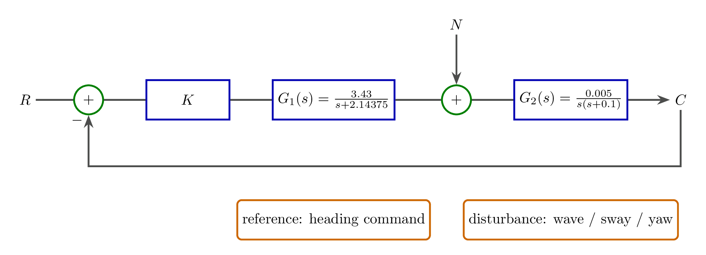
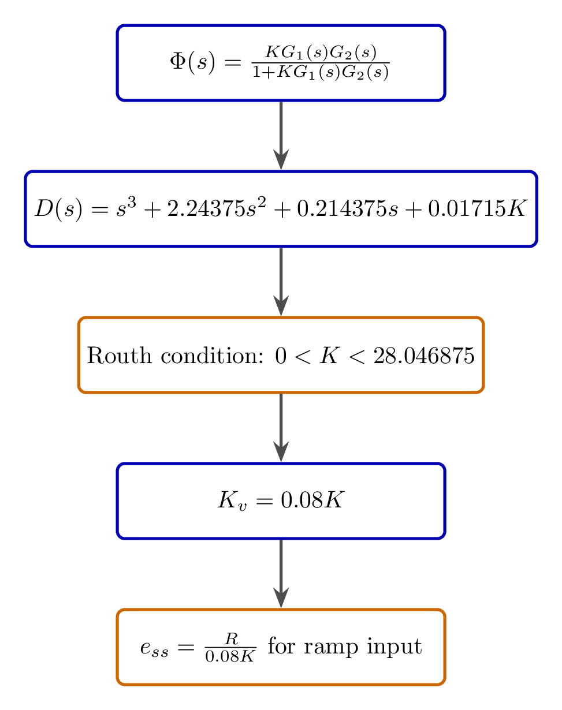
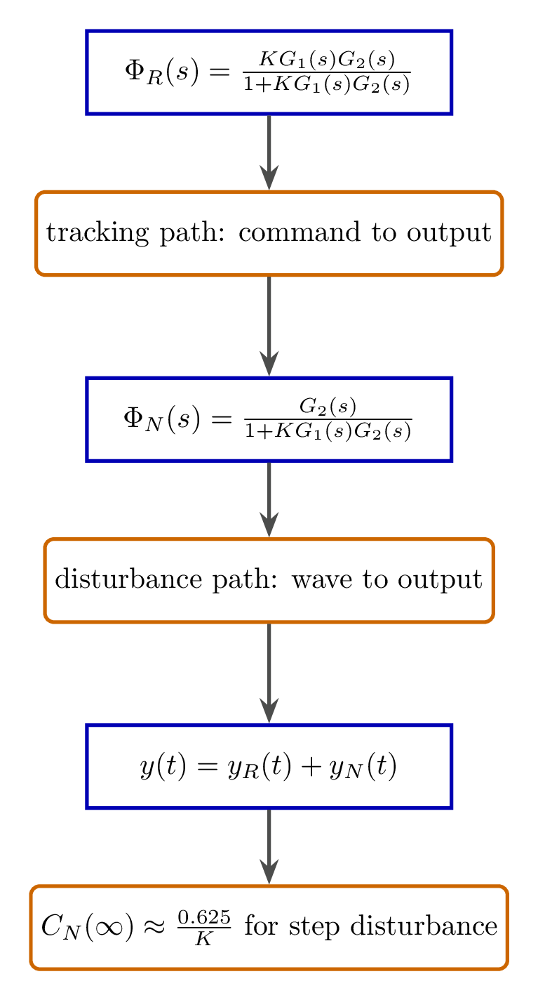
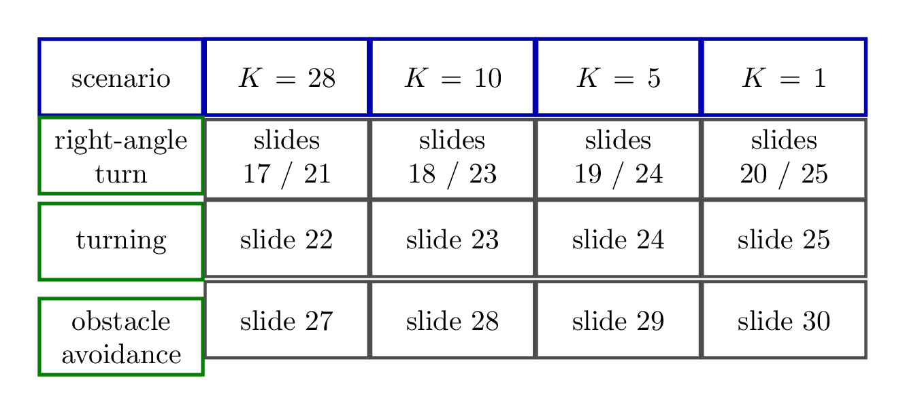
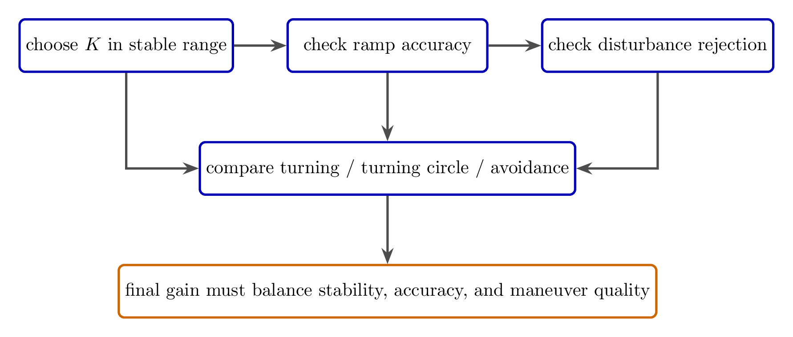

# `10.2时域分析综合` 完整提取

## 1. 页面边界

- 原始文件：`course-content/slides-ref/10.2时域分析综合.pptx`
- 总页数：36
- 正文范围：第 4-33 页
- 排除页面：
  - 第 1 页：封面
  - 第 2 页：目录
  - 第 3 页：学习目标
  - 第 34-35 页：课外拓展及预习要求
  - 第 36 页：结束页

## 2. 内容总览

| 原页号 | 主题 |
| --- | --- |
| 4-6 | 航向系统模型简化与任务拆解 |
| 7-9 | 闭环稳定性与斜坡稳态误差 |
| 10-16 | 阶跃扰动、正弦扰动与综合响应 |
| 17-31 | 直角转向、回转、避障三类机动性能 |
| 32 | 总结 |
| 33 | 课后思考 |

## 3. 案例对象：航向系统简化模型（第 4-6 页）

第 4-6 页的作用是把一个实际航向控制问题压缩成可做时域分析的标准模型。对象层稳定保留了以下结构：

- 放大器：`K`
- 舵伺服系统：`G_1(s) = 3.43 / (s + 2.14375)`
- 舵船对象：`G_2(s) = 0.005 / [s (s + 0.1)]`
- 参考输入：给定航向
- 外部扰动：海浪等环境扰动

课件随后把学习任务明确拆成三问：

1. 选 `K`，让斜坡输入和阶跃扰动下的稳态误差较小；
2. 看单位阶跃扰动和正弦扰动下的开环输出响应；
3. 看单位阶跃输入和等效正弦扰动共同作用时的闭环响应。

也就是说，这份课件不是单纯“算一个传函”，而是用一个实际案例把稳态误差、扰动分析和机动性能串成一条线。

对应的重建图如下：

- `tikz/01-heading-model-overview.tex`
- 预览：`tikz/rendered/01-heading-model-overview.png`

## 4. 无扰动闭环分析：先判稳，再谈精度（第 7-9 页）

第 7-9 页先给出闭环传递关系：

$$
\Phi(s) = \frac{C(s)}{R(s)} = \frac{K G_1(s) G_2(s)}{1 + K G_1(s) G_2(s)},
$$

其中

$$
K G_1(s) G_2(s) = \frac{0.01715 K}{s (s + 0.1)(s + 2.14375)}.
$$

于是闭环特征方程可整理为

$$
s^3 + 2.24375 s^2 + 0.214375 s + 0.01715 K = 0.
$$

课件随后列劳斯表，并给出稳定范围：

$$
0 < K < 28.046875.
$$

在稳定前提下，再看斜坡输入稳态误差。对象层可恢复出：

$$
K_v = \lim_{s \to 0} s K G_1(s) G_2(s) = 0.08 K,
$$

因此斜坡稳态误差满足

$$
e_{ss} = \frac{R}{K_v} = \frac{R}{0.08 K}.
$$

所以本段的主线很清楚：

- 先保证 `K` 不把系统推到不稳定；
- 再在稳定区间内尽量增大 `K`，以减小斜坡跟踪误差。

对应的重建图如下：

- `tikz/02-closed-loop-analysis-roadmap.tex`
- 预览：`tikz/rendered/02-closed-loop-analysis-roadmap.png`

## 5. 扰动分析：把输入通道和扰动通道分开看（第 10-16 页）

### 5.1 阶跃扰动通道（第 10-12 页）

课件给出的扰动到输出闭环传递关系为

$$
\Phi_N(s) = \frac{C(s)}{N(s)} = \frac{G_2(s)}{1 + K G_1(s) G_2(s)}.
$$

对象层同时给出一个关键的稳态结论。原文排版成了 `0.625K`，但结合 `K = 28` 时稳态输出约 `0.0233`，可反推出正确工程结论应为

$$
C_N(\infty) = \frac{0.625}{K}.
$$

这说明：

- 增大 `K` 不仅能减小斜坡跟踪误差；
- 还能减小阶跃扰动引起的稳态偏差。

### 5.2 正弦扰动通道（第 13-15 页）

第 13-15 页把海浪近似为等效正弦扰动。对象层同时出现了：

- “选择扰动因素信号频率为 `1.6 rad/s`”
- “信号周期为 `10 s`”

这两句话彼此不一致，因为 `T = 10 s` 对应 `\omega = 2 \pi / 10`。因此本次提取只保留其稳定表达：

- 课件意图是分析“周期约为 `10 s` 的等效正弦海浪扰动”；
- 再看对象 `G_2(s)` 对这类周期扰动的开环响应。

### 5.3 输入与扰动共同作用（第 16 页）

第 16 页把两个通道显式分开：

$$
\Phi_R(s) = \frac{K G_1(s) G_2(s)}{1 + K G_1(s) G_2(s)},\qquad
\Phi_N(s) = \frac{G_2(s)}{1 + K G_1(s) G_2(s)}.
$$

然后令总响应等于：

$$
y(t) = y_R(t) + y_N(t).
$$

这正是综合时域分析最值得学生掌握的结构化思路：

- 跟踪任务走参考通道；
- 外扰影响走扰动通道；
- 最后把两部分叠加起来看总输出。

对应的重建图如下：

- `tikz/03-disturbance-and-response-map.tex`
- 预览：`tikz/rendered/03-disturbance-and-response-map.png`

## 6. 机动性能对比：别只盯着一个误差指标（第 17-31 页）

第 17-31 页不再停留在单个公式，而是把 `K = 28, 10, 5, 1` 放进三个典型机动场景中比较：

- 直角转向
- 回转
- 避障

每一类场景都给出了：

- 航向响应曲线；
- 航迹图；
- 与对应控制输入或目标输入的对照。

这部分的价值不在于某一个特定数值，而在于把“稳、快、准”的矛盾真实摊开：

- 大 `K` 往往能让跟踪更快、稳态偏差更小；
- 但机动过程也会更激进，可能带来更高的峰值动作或更强的扰动放大；
- 小 `K` 则更平缓，但会拖慢机动和减弱控制效果。

由于原始页主要通过图像对比承载结论，本次不伪造不存在于对象层的具体性能排序，只保留“比较 `K` 对三类典型机动的影响”这一稳定教学意图。

对应的重建图如下：

- `tikz/04-maneuver-scenario-matrix.tex`
- 预览：`tikz/rendered/04-maneuver-scenario-matrix.png`

## 7. 总结与课后思考（第 32-33 页）

第 32 页总结页把全讲重新压回“选校正、做比较、看效果”的框架里。虽然对象层沿用了上一讲的四类校正标题，但对这份综合课件来说，更准确的教学总结应该是：

- 对真实对象先做模型简化；
- 对闭环系统先判稳，再定精度；
- 对扰动要分清输入通道和扰动通道；
- 对控制器参数要放到具体机动任务中比较。

第 33 页则留下两个面向设计的问题：

1. 比例增益 `K` 对系统综合性能到底如何影响？
2. 怎样联合选择 `K` 和 `T_d`，让系统综合性能更好？

这说明本讲的终点并不是“算完就结束”，而是把学生推向真正的参数整定问题。

## 8. 本讲可直接复用的教学主线

这份课件最值得复用的是下面这条完整逻辑：

1. 从实际航向系统出发，做出能分析的简化模型；
2. 用劳斯判据先确定 `K` 的稳定区间；
3. 用静态误差系数说明为什么增大 `K` 能改善跟踪精度；
4. 把扰动响应单独拿出来分析，再与参考响应叠加；
5. 最终回到真实机动任务，用转向、回转、避障三类场景评价参数选择是否合理。

对应的设计逻辑图如下：

- `tikz/05-design-selection-logic.tex`
- 预览：`tikz/rendered/05-design-selection-logic.png`

