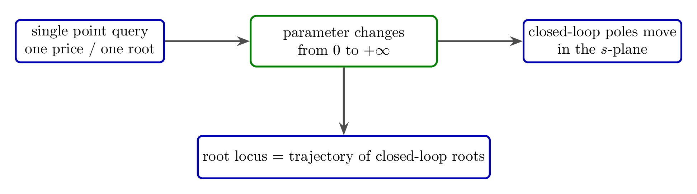
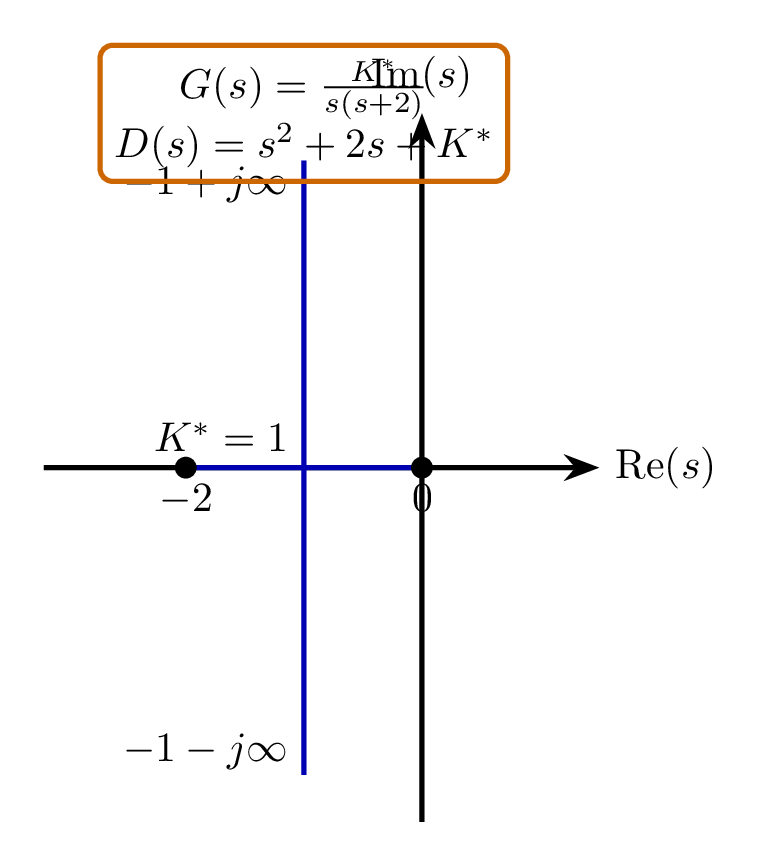
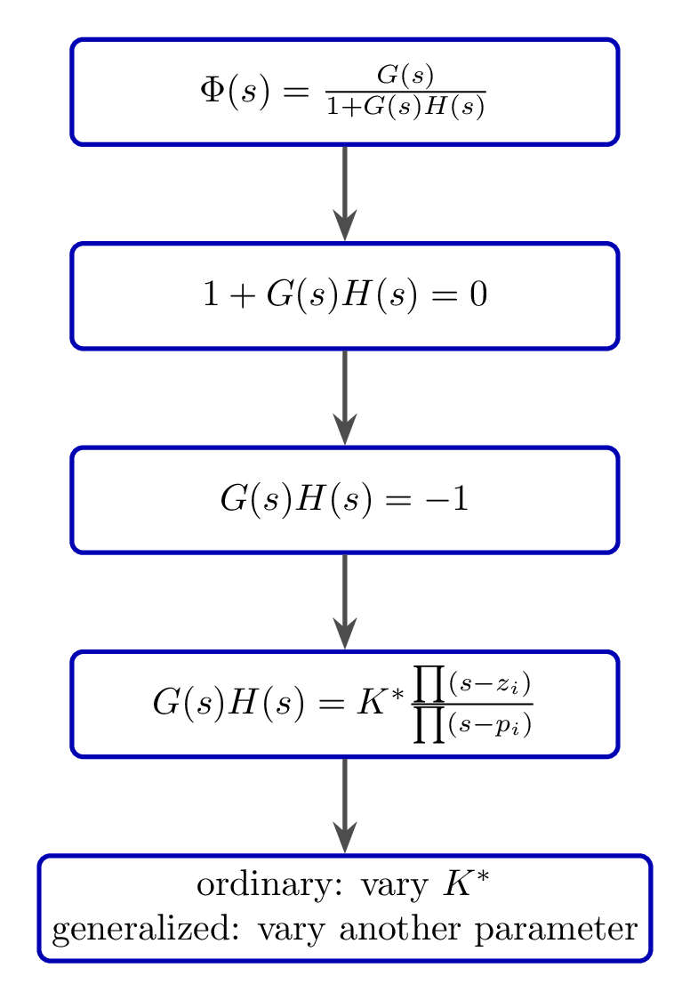
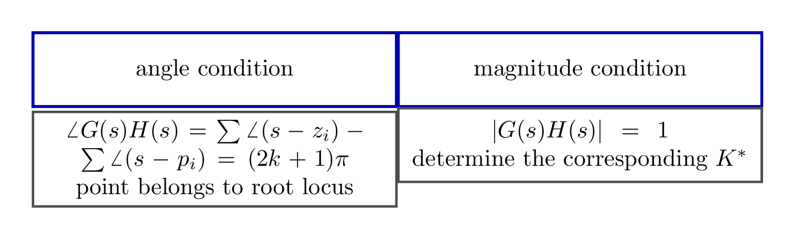
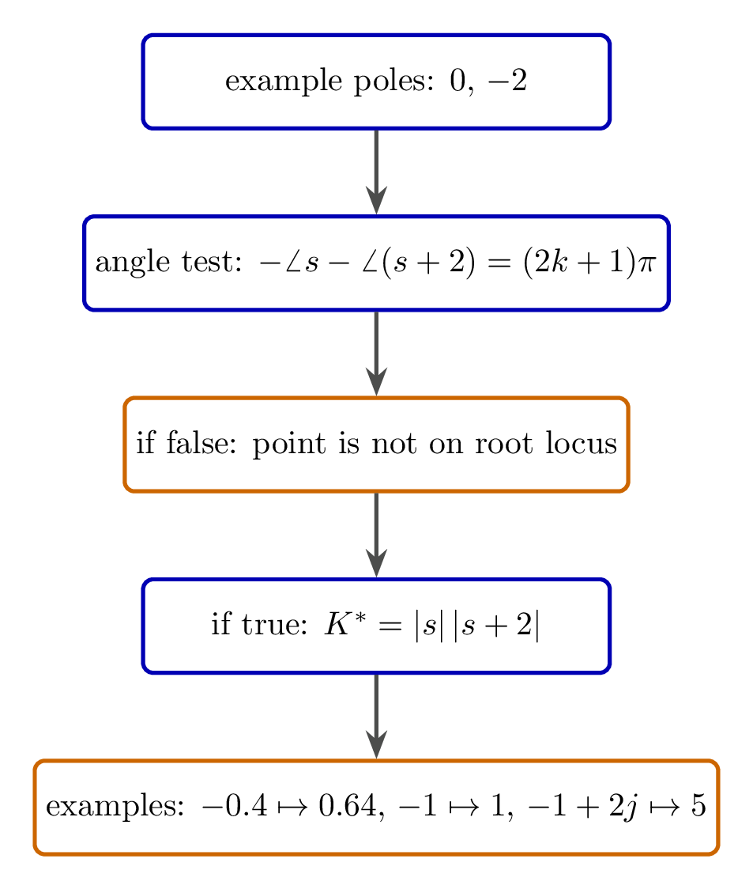

# `11放眼大局_根轨迹法` 完整提取

## 1. 页面边界

- 原始文件：`course-content/slides-ref/11放眼大局_根轨迹法.pptx`
- 总页数：27
- 正文范围：第 4-24 页
- 排除页面：
  - 第 1 页：封面
  - 第 2 页：目录
  - 第 3 页：学习目标
  - 第 25-26 页：课外拓展及预习要求
  - 第 27 页：结束页

## 2. 内容总览

| 原页号 | 主题 |
| --- | --- |
| 4-8 | 导入、定义与根轨迹法特点 |
| 9-10 | 根轨迹实例与极点-响应关系 |
| 11-14 | 逐项求根的困难 |
| 15-18 | 根轨迹方程与幅角 / 模值条件 |
| 20 | 点是否位于根轨迹上的判断 |
| 21-24 | 工程启示、总结与课后思考 |

## 3. 导入：别只问一个点，要看变化规律（第 4-8 页）

第 4-7 页用“牛奶在某一家超市卖多少钱”和“全国售价有什么规律”做类比，最后把问题落到控制系统上：

- 如果只问某一个参数取值时的闭环根，仍然是在“查一个点”；
- 真正有价值的是看“某个参数从 `0` 到 `+\infty` 变化时，闭环特征根如何整体移动”；
- 这正是根轨迹法要研究的对象。

第 8 页给出定义：

> 系统某一参数由 `0` 到 `+\infty` 变化时，系统闭环特征根在 `s` 平面相应变化所描绘出来的轨迹。

并给出 3 个特点：

- 图解方法，直观、形象；
- 适用于研究参数变化时系统性能的变化趋势；
- 近似方法，不十分精确。

这页的意义在于把根轨迹法定位成：

- 不是纯求根技巧；
- 而是“看系统参数变化趋势”的图形化方法。

对应的重建图如下：

- `tikz/01-root-locus-concept.tex`
- 预览：`tikz/rendered/01-root-locus-concept.png`

## 4. 例子：闭环极点如何随增益移动（第 9-10 页）

第 9 页给出一个最基础的例子：

$$
G(s) = \frac{K}{s(0.5 s + 1)} = \frac{K^\ast}{s(s+2)},\qquad K^\ast = 2K.
$$

闭环特征方程为

$$
D(s) = s^2 + 2s + K^\ast = 0.
$$

它的根写成

$$
\lambda_{1,2} = -1 \pm \sqrt{1-K^\ast}.
$$

于是可以直接读出趋势：

- `K^\ast = 0` 时，闭环极点从开环极点 `0` 和 `-2` 出发；
- `0 < K^\ast < 1` 时，两个实根沿实轴向中间移动；
- `K^\ast = 1` 时，在 `-1` 处汇合；
- `K^\ast > 1` 时，变成共轭复根，沿 `\operatorname{Re}(s)=-1` 向上下展开。

第 10 页“极点位置与阶跃响应的关系”承担的是一个重要提醒：

- 根轨迹图不是为了画图而画图；
- 它最终是为了把极点位置和动态性能联系起来。

对应的重建图如下：

- `tikz/02-example-root-locus.tex`
- 预览：`tikz/rendered/02-example-root-locus.png`

## 5. 为什么不能总靠求根公式（第 11-14 页）

第 11-13 页依次摆出二次、三次、四次求根公式，第 14 页点出阿贝尔和伽罗瓦。这里的教学目的非常明确：

- 二次还能手算；
- 三次、四次已经非常复杂；
- 更高阶系统就更不适合逐项显式求根；
- 因此工程上更需要一种“直接看根怎么移动”的方法。

也就是说，根轨迹法的出现不是为了替代数学，而是为了让工程分析在高阶系统上仍然可操作。

## 6. 根轨迹方程：从闭环特征方程到 `GH = -1`（第 15-17 页）

第 15-16 页从标准闭环结构出发：

$$
\Phi(s) = \frac{G(s)}{1 + G(s) H(s)}.
$$

闭环特征方程是

$$
1 + G(s) H(s) = 0.
$$

第 16 页进一步解释：

- 若令 `G = N/D`，`H = N'/D'`；
- 那么闭环特征方程可写成 `D D' + N N' = 0`；
- 同时也等价于

$$
G(s) H(s) = -1.
$$

第 17 页把它写成零极点形式：

$$
G(s)H(s)=K^\ast
\frac{\prod (s-z_i)}{\prod (s-p_i)}.
$$

并且区分了：

- 普通根轨迹：讨论 `K^\ast` 从 `0` 到 `+\infty` 变化时的闭环根轨迹；
- 广义根轨迹：讨论除了 `K^\ast` 之外的其他参数变化时的闭环根轨迹。

对应的重建图如下：

- `tikz/03-root-locus-equation.tex`
- 预览：`tikz/rendered/03-root-locus-equation.png`

## 7. 相角条件与模值条件（第 18-19 页）

第 18 页是本讲的核心。

由于

$$
G(s)H(s) = -1 = 1 \angle \bigl( (2k+1)\pi \bigr),
$$

因此根轨迹上的点必须满足：

$$
\angle G(s)H(s)
= \sum \angle (s-z_i) - \sum \angle (s-p_i)
= (2k+1)\pi,
$$

这就是相角条件。

而对应增益则由模值条件给出：

$$
|G(s)H(s)| = 1.
$$

课件明确强调：

- 相角条件是“点位于根轨迹上”的充要条件；
- 模值条件用于求该点对应的 `K^\ast`；
- 画根轨迹，本质上是在 `s` 平面中找出所有满足相角条件的点。

对应的重建图如下：

- `tikz/04-angle-and-magnitude-conditions.tex`
- 预览：`tikz/rendered/04-angle-and-magnitude-conditions.png`

## 8. 判断某点是否在根轨迹上（第 20 页）

第 20 页把前面的条件落到具体判断上。系统有：

- 开环极点：`0`、`-2`
- 开环零点：无

所以：

$$
K^\ast = |s|\,|s+2|,
\qquad
-\angle s - \angle(s+2) = (2k+1)\pi.
$$

课件依次判断了几个点：

- `s=-0.4`：在根轨迹上，`K^\ast = 0.64`
- `s=-1`：在根轨迹上，`K^\ast = 1`
- `s=-3`：不在根轨迹上
- `s=-3+3j`：不在根轨迹上
- `s=-1+2j`：在根轨迹上，`K^\ast = 5`

这页最关键的不是答案本身，而是训练一个固定流程：

1. 先代入相角条件判断“在不在轨迹上”；
2. 若在，再代入模值条件求 `K^\ast`。

对应的重建图如下：

- `tikz/05-point-membership-checklist.tex`
- 预览：`tikz/rendered/05-point-membership-checklist.png`

## 9. 工程启示、总结与课后思考（第 21-24 页）

第 21 页只有两个词：

- 工程
- 数学

它其实是在点出根轨迹法的价值：数学上是在研究复平面根的规律，工程上则是在用这套规律预判系统性能变化。

第 23 页总结把整讲压缩为 4 个词：

- 根轨迹
- 模值条件
- 相角条件
- 判断轨迹

以及 2 个更高层判断：

- 量变引起质变
- 数学与工程

第 24 页再把问题往后推：

1. 除了开环增益 `K` 之外，其他参数变化时如何分析特征根变化规律？
2. 根轨迹的起点和终点在哪里？

这正是下一讲“根轨迹基本形态”的入口。

## 10. 本讲可直接复用的教学主线

这份课件最值得保留的是下面这条逻辑：

1. 不再只问某个参数取值时的一个闭环根，而是研究参数连续变化的整体规律；
2. 先用二阶实例建立“极点如何移动”的直观印象；
3. 再说明高阶系统不能总靠显式求根；
4. 然后把闭环特征方程写成 `G(s)H(s)=-1`；
5. 最后用相角条件判断位置、用模值条件求参数。

这条主线既是根轨迹法的入门逻辑，也是后续基本形态、细节修正和参数根轨迹的共同起点。
