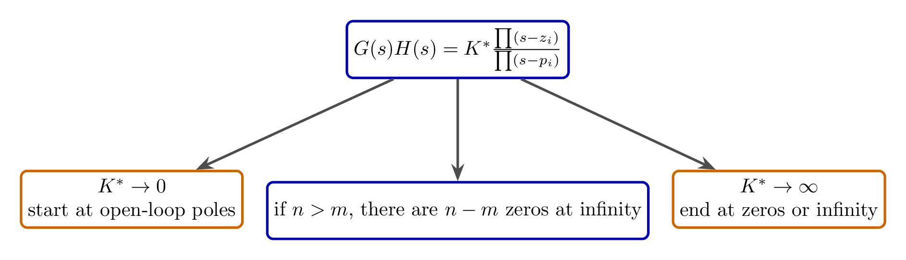
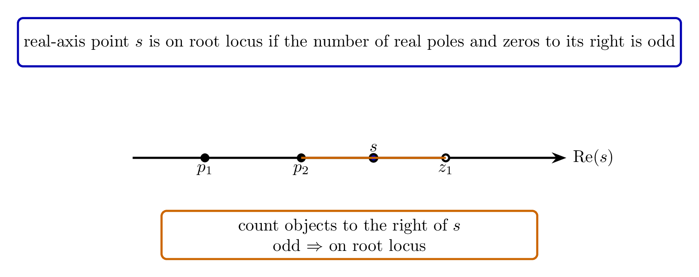
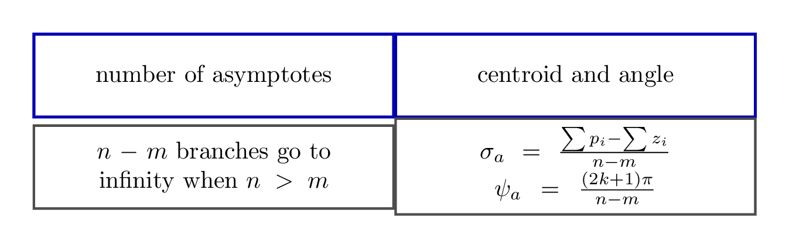
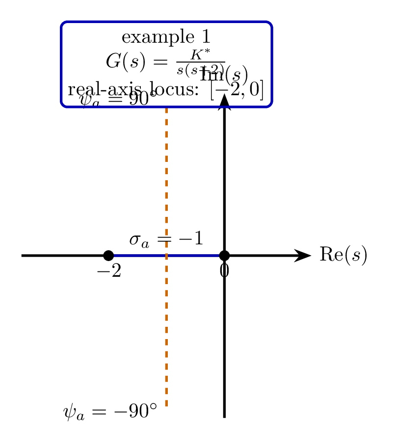
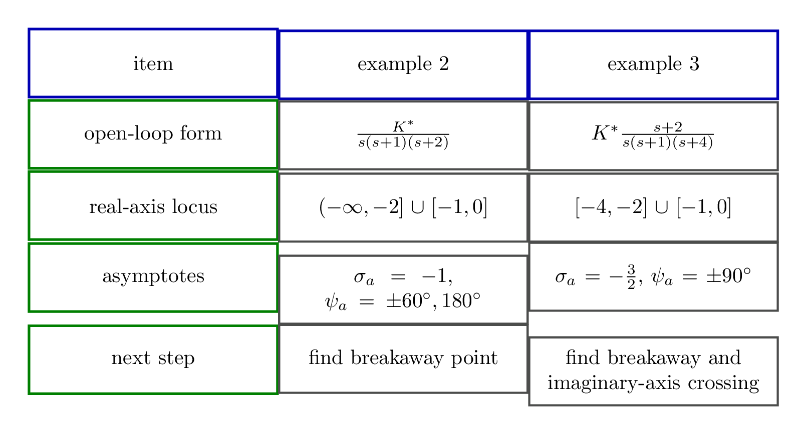

# `12根轨迹_基本形态` 完整提取

## 1. 页面边界

- 原始文件：`course-content/slides-ref/12根轨迹_基本形态.pptx`
- 总页数：23
- 正文范围：第 4-20 页
- 排除页面：
  - 第 1 页：封面
  - 第 2 页：目录
  - 第 3 页：学习目标
  - 第 21-22 页：课外拓展及预习要求
  - 第 23 页：结束页

## 2. 内容总览

| 原页号 | 主题 |
| --- | --- |
| 4-5 | 导入：根轨迹“从哪里来，到哪里去” |
| 6-11 | 四条基本法则 |
| 12-15 | 例 1：`G(s)=K^\ast/[s(s+2)]` |
| 16-18 | 例 2、例 3：更高阶的全局形态 |
| 19 | 总结 |
| 20 | 课后思考 |

## 3. 导入：根轨迹到底在回答什么（第 4-5 页）

第 4-5 页虽然用的是口语化提问：

- 你是谁？
- 从哪里来？到哪里去？

但它对应的正是根轨迹最核心的两个几何问题：

- 根轨迹从哪些点出发？
- 最终又会走向哪里？

这说明本讲不是再重复“什么是根轨迹”，而是开始回答上一讲留下的几何形态问题。

## 4. 基本法则 1：起点与终点（第 6-7 页）

第 6-7 页先从模值条件出发，解释了根轨迹的出发点与终止点。

若开环传递函数写成

$$
G(s)H(s)=K^\ast \frac{(s-z_1)\cdots(s-z_m)}{(s-p_1)\cdots(s-p_n)},
$$

则当 `K^\ast \to 0` 时，闭环根趋向开环极点；当 `K^\ast \to \infty` 时，闭环根趋向开环零点，若 `n>m`，则还有 `n-m` 个无穷远零点。

因此本讲第一个结论就是：

- 开环极点是根轨迹的起点；
- 开环零点是根轨迹的终点；
- 若零点数少于极点数，则有 `n-m` 条分支走向无穷远。

对应的重建图如下：

- `tikz/01-start-end-rule.tex`
- 预览：`tikz/rendered/01-start-end-rule.png`

## 5. 基本法则 2：分支数、对称性与连续性（第 8 页）

第 8 页把三件事并列起来：

- 根轨迹分支数等于开环极点数 `n`；
- 根轨迹关于实轴对称；
- 根轨迹连续。

这三条一起构成“看全局走向”的底层约束：

- 极点有几个，分支就有几条；
- 若有一条轨迹在上半平面，就一定有其关于实轴的镜像；
- 轨迹不会凭空断开。

## 6. 基本法则 3：实轴上的根轨迹（第 8-10 页）

第 8-10 页反复强调的是实轴判别法则。

课件用向量与角度说明：

- 对于实轴上一点 `s`，如果其右侧开环实零点与实极点总数之和为奇数；
- 则该点满足相角条件；
- 因而它属于实轴上的根轨迹。

所以实轴判别法则可以压缩成一句：

> 实轴上一点右侧的实零点和实极点总数为奇数，则该点在根轨迹上。

对应的重建图如下：

- `tikz/02-real-axis-rule.tex`
- 预览：`tikz/rendered/02-real-axis-rule.png`

## 7. 基本法则 4：渐近线（第 11 页）

第 11 页给出的是“走向无穷远处”的规律。

当 `n>m` 时，有 `n-m` 条分支趋于无穷远，其渐近线满足：

$$
\sigma_a = \frac{\sum p_i - \sum z_i}{n-m},
$$

即渐近线与实轴交点坐标；

以及

$$
\psi_a = \frac{(2k+1)\pi}{n-m},
\qquad k=0,1,\dots,n-m-1,
$$

即渐近线与实轴的夹角。

这条法则的意义在于：

- 当无法立即求出精确弯曲轨迹时；
- 先知道远处大致朝哪几个方向走；
- 就已经能把握整个根轨迹的“骨架”。

对应的重建图如下：

- `tikz/03-asymptote-rule.tex`
- 预览：`tikz/rendered/03-asymptote-rule.png`

## 8. 例 1：二阶系统的基本形态（第 12-15 页）

第 12-15 页沿用了上一讲的经典例子：

$$
G(s)=\frac{K^\ast}{s(s+2)}.
$$

根据前面的四条法则，可以快速得到：

- 起点：`0` 和 `-2`
- 零点：无
- 实轴上的根轨迹：`[-2,0]`
- 渐近线条数：`2`
- 渐近线交点：

$$
\sigma_a=\frac{-2+0}{2}=-1
$$

- 渐近线角度：

$$
\psi_a=\pm 90^\circ
$$

于是即使不逐点精算，也能画出它的基本形态：

- 两个分支从 `0` 和 `-2` 出发；
- 在实轴区间 `[-2,0]` 上相向移动；
- 之后离开实轴，沿 `\mathrm{Re}(s)=-1` 向上下延伸。

第 15 页则给出 `rlocus` 代码，说明这些规则可以与计算机绘图互相印证。

对应的重建图如下：

- `tikz/04-example-one.tex`
- 预览：`tikz/rendered/04-example-one.png`

## 9. 例 2 与例 3：更高阶时先抓全局，不急于求细节（第 16-18 页）

### 9.1 例 2

第 16 页给出：

$$
G(s)=\frac{K^\ast}{s(s+1)(s+2)}.
$$

对象层给出的关键信息是：

- 渐近线角度：`±60^\circ`、`180^\circ`
- 渐近线交点：`-1`
- 实轴上的根轨迹：`(-\infty,-2] \cup [-1,0]`

同时课件明确提醒：

- 实际根轨迹会在 `(0,0)` 和 `(-1,0)` 之间某处从实轴分离；
- 之后才逐渐趋向渐近线。

### 9.2 例 3

第 17-18 页再加入一个零点，例如

$$
G(s)H(s)=K^\ast \frac{s+2}{s(s+1)(s+4)}.
$$

此时对象层给出的关键信息是：

- 渐近线角度：`±90^\circ`
- 渐近线交点：`-3/2`
- 实轴上的根轨迹：`[-4,-2] \cup [-1,0]`

第 18 页进一步指出：

- 根轨迹法是一种近似方法；
- 真正精细的形态还要继续找“从实轴进入复平面的点”“与虚轴交点”等关键点；
- 当这些关键点求出后，才能把轨迹大致连完整。

这就是为什么本讲题目叫“基本形态”，而不是“完整细节”。

对应的重建图如下：

- `tikz/05-example-two-three-overview.tex`
- 预览：`tikz/rendered/05-example-two-three-overview.png`

## 10. 总结与课后思考（第 19-20 页）

第 19 页总结把整讲压缩成 4 条：

- 起点终点
- 实轴上的根轨迹
- 渐近线
- 细致形态

并且给出一句非常重要的边界提示：

- 前三条帮助我们把握全局走向；
- “细致形态”还会受到零点影响，需要进一步确定。

第 20 页则顺势提出两个下一步问题：

1. 在例 1 基础上，若添加极点或零点，根轨迹形态会如何变化？
2. 能否补全例 2 的根轨迹，并用计算机验证？

这正好把学生引向下一讲“细节修正”。

## 11. 本讲可直接复用的教学主线

这份课件最值得保留的是下面这条绘图逻辑：

1. 先看起点和终点；
2. 再看实轴上哪些区段属于根轨迹；
3. 然后用渐近线把握无穷远处走向；
4. 最后再提醒学生，复杂系统还需要继续找分离点和虚轴交点。

这条顺序非常适合后续讲义、板书和手绘训练，因为它先解决“画得像不像”，再进入“画得准不准”。
